## 🔍 文件内容详情

### 📄 文件 #1 - `.gitignore`

- **路径**: `bin-encode-decode\.gitignore`
- **大小**: `18 B`
- **修改时间**: `2025-08-28T21:03:44.560170`
#### 内容预览


### 📄 文件 #2 - `Cargo.toml`

- **路径**: `bin-encode-decode\Cargo.toml`
- **大小**: `709 B`
- **修改时间**: `2025-08-28T21:03:44.560170`
#### 内容预览


### 📄 文件 #3 - `LICENSE`

- **路径**: `bin-encode-decode\LICENSE`
- **大小**: `1,066 B`
- **修改时间**: `2025-08-28T21:03:44.560170`
#### 内容预览


### 📄 文件 #4 - `README.md`

- **路径**: `bin-encode-decode\README.md`
- **大小**: `3,126 B`
- **修改时间**: `2025-08-28T21:03:44.560170`
#### 内容预览

```markdown
<center>

# bin-encode-decode

[](https://crates.io/crates/bin-encode-decode)
[](https://img.shields.io/crates/d/bin-encode-decode.svg)
[](https://docs.rs/bin-encode-decode)
[](https://github.com/crates-dev/bin-encode-decode/actions?query=workflow:Rust)
[](./LICENSE)

</center>

[Official Documentation](https://docs.ltpp.vip/bin-encode-decode/)

> A high-performance binary encode and decode library that supports customizable character sets beyond Base64.

## Features

- **Custom Character Sets**: Define your own character set for encoding and decoding, allowing for flexible data representation.
- **High Performance**: Optimized for speed, making it suitable for applications requiring efficient cryptographic operations.
- **Simple API**: Intuitive and easy-to-use interface for both encode and decode processes.
- **Robust Error Handling**: Provides clear and descriptive error messages to facilitate debugging.
- **Extensive Documentation**: Comprehensive guides and examples to help you get started quickly.

## Installation

To install `bin-encode-decode` run cmd:

```sh
cargo add bin-encode-decode
```

## Usage

### encode

#### Use Struct

```rust
use bin_encode_decode::*;

let mut en_decode: Charset<'_> = Charset::new();
let test_str: &str = "test";
let mut charset: String = String::from("abcdefghijklmnopqrstuvwxyzABCDEFGHIJKLMNOPQRSTUVWXYZ0123456789_=");
en_decode.charset(&charset);
let encode: Result<String, EncodeError> = en_decode.encode(test_str);
```

#### Use Function

```rust
use bin_encode_decode::*;

let test_str: &str = "test";
let mut charset: String = String::from("abcdefghijklmnopqrstuvwxyzABCDEFGHIJKLMNOPQRSTUVWXYZ0123456789_=");
let encode: Result<String, EncodeError> = Encode::execute(&charset, test_str);
```

### decode

#### Use Struct

```rust
use bin_encode_decode::*;

let mut en_decode: Charset<'_> = Charset::new();
let test_str: &str = "aab0aabLaabZaab0";
let mut charset: String = String::from("abcdefghijklmnopqrstuvwxyzABCDEFGHIJKLMNOPQRSTUVWXYZ0123456789_=");
en_decode.charset(&charset);
let decode: Result<String, DecodeError> = en_decode.decode(test_str);
```

#### Use Function

```rust
use bin_encode_decode::*;

let charset = "abcdefghijklmnopqrstuvwxyzABCDEFGHIJKLMNOPQRSTUVWXYZ0123456789_=";
let encoded_str = "aab0aabLaabZaab0";
let decoded_str = Decode::execute(charset, encoded_str);
let charset = "abcdefghijklmnopqrstuvwxyzABCDEFGHIJKLMNOPQRSTUVWXYZ0123456789_=";
let original_str = "test";
let encoded_str = Encode::execute(charset, original_str);
```

## License

This project is licensed under the MIT License. See the [LICENSE](LICENSE) file for details.

## Contributing

Contributions are welcome! Please open an issue or submit a pull request.

## Contact

For any inquiries, please reach out to the author at [root@ltpp.vip](mailto:root@ltpp.vip).

```

### 📄 文件 #5 - `config`

- **路径**: `bin-encode-decode\.git\config`
- **大小**: `314 B`
- **修改时间**: `2025-08-28T21:03:44.552510`
#### 内容预览


### 📄 文件 #6 - `description`

- **路径**: `bin-encode-decode\.git\description`
- **大小**: `73 B`
- **修改时间**: `2025-08-28T21:03:41.618990`
#### 内容预览


### 📄 文件 #7 - `FETCH_HEAD`

- **路径**: `bin-encode-decode\.git\FETCH_HEAD`
- **大小**: `109 B`
- **修改时间**: `2025-08-29T00:02:16.384606`
#### 内容预览


### 📄 文件 #8 - `HEAD`

- **路径**: `bin-encode-decode\.git\HEAD`
- **大小**: `23 B`
- **修改时间**: `2025-08-28T21:03:44.546301`
#### 内容预览


### 📄 文件 #9 - `index`

- **路径**: `bin-encode-decode\.git\index`
- **大小**: `2,124 B`
- **修改时间**: `2025-08-29T00:02:14.905716`
#### 内容预览


### 📄 文件 #10 - `ORIG_HEAD`

- **路径**: `bin-encode-decode\.git\ORIG_HEAD`
- **大小**: `41 B`
- **修改时间**: `2025-08-29T00:02:16.431832`
#### 内容预览


### 📄 文件 #11 - `packed-refs`

- **路径**: `bin-encode-decode\.git\packed-refs`
- **大小**: `1,864 B`
- **修改时间**: `2025-08-28T21:03:44.538949`
#### 内容预览


### 📄 文件 #12 - `applypatch-msg.sample`

- **路径**: `bin-encode-decode\.git\hooks\applypatch-msg.sample`
- **大小**: `478 B`
- **修改时间**: `2025-08-28T21:03:41.618990`
#### 内容预览


### 📄 文件 #13 - `commit-msg.sample`

- **路径**: `bin-encode-decode\.git\hooks\commit-msg.sample`
- **大小**: `896 B`
- **修改时间**: `2025-08-28T21:03:41.618990`
#### 内容预览


### 📄 文件 #14 - `fsmonitor-watchman.sample`

- **路径**: `bin-encode-decode\.git\hooks\fsmonitor-watchman.sample`
- **大小**: `4,726 B`
- **修改时间**: `2025-08-28T21:03:41.618990`
#### 内容预览


### 📄 文件 #15 - `post-update.sample`

- **路径**: `bin-encode-decode\.git\hooks\post-update.sample`
- **大小**: `189 B`
- **修改时间**: `2025-08-28T21:03:41.618990`
#### 内容预览


### 📄 文件 #16 - `pre-applypatch.sample`

- **路径**: `bin-encode-decode\.git\hooks\pre-applypatch.sample`
- **大小**: `424 B`
- **修改时间**: `2025-08-28T21:03:41.619994`
#### 内容预览


### 📄 文件 #17 - `pre-commit.sample`

- **路径**: `bin-encode-decode\.git\hooks\pre-commit.sample`
- **大小**: `1,649 B`
- **修改时间**: `2025-08-28T21:03:41.619994`
#### 内容预览


### 📄 文件 #18 - `pre-merge-commit.sample`

- **路径**: `bin-encode-decode\.git\hooks\pre-merge-commit.sample`
- **大小**: `416 B`
- **修改时间**: `2025-08-28T21:03:41.619994`
#### 内容预览


### 📄 文件 #19 - `pre-push.sample`

- **路径**: `bin-encode-decode\.git\hooks\pre-push.sample`
- **大小**: `1,374 B`
- **修改时间**: `2025-08-28T21:03:41.619994`
#### 内容预览


### 📄 文件 #20 - `pre-rebase.sample`

- **路径**: `bin-encode-decode\.git\hooks\pre-rebase.sample`
- **大小**: `4,898 B`
- **修改时间**: `2025-08-28T21:03:41.620994`
#### 内容预览


### 📄 文件 #21 - `pre-receive.sample`

- **路径**: `bin-encode-decode\.git\hooks\pre-receive.sample`
- **大小**: `544 B`
- **修改时间**: `2025-08-28T21:03:41.620994`
#### 内容预览


### 📄 文件 #22 - `prepare-commit-msg.sample`

- **路径**: `bin-encode-decode\.git\hooks\prepare-commit-msg.sample`
- **大小**: `1,492 B`
- **修改时间**: `2025-08-28T21:03:41.620994`
#### 内容预览


### 📄 文件 #23 - `push-to-checkout.sample`

- **路径**: `bin-encode-decode\.git\hooks\push-to-checkout.sample`
- **大小**: `2,783 B`
- **修改时间**: `2025-08-28T21:03:41.620994`
#### 内容预览


### 📄 文件 #24 - `sendemail-validate.sample`

- **路径**: `bin-encode-decode\.git\hooks\sendemail-validate.sample`
- **大小**: `2,308 B`
- **修改时间**: `2025-08-28T21:03:41.620994`
#### 内容预览


### 📄 文件 #25 - `update.sample`

- **路径**: `bin-encode-decode\.git\hooks\update.sample`
- **大小**: `3,650 B`
- **修改时间**: `2025-08-28T21:03:41.620994`
#### 内容预览


### 📄 文件 #26 - `exclude`

- **路径**: `bin-encode-decode\.git\info\exclude`
- **大小**: `240 B`
- **修改时间**: `2025-08-28T21:03:41.621994`
#### 内容预览


### 📄 文件 #27 - `HEAD`

- **路径**: `bin-encode-decode\.git\logs\HEAD`
- **大小**: `189 B`
- **修改时间**: `2025-08-28T21:03:44.547805`
#### 内容预览


### 📄 文件 #28 - `master`

- **路径**: `bin-encode-decode\.git\logs\refs\heads\master`
- **大小**: `189 B`
- **修改时间**: `2025-08-28T21:03:44.548143`
#### 内容预览


### 📄 文件 #29 - `HEAD`

- **路径**: `bin-encode-decode\.git\logs\refs\remotes\origin\HEAD`
- **大小**: `189 B`
- **修改时间**: `2025-08-28T21:03:44.545298`
#### 内容预览


### 📄 文件 #30 - `pack-a6278a135694c0974d38c11a06aa7b9c8696f2b8.idx`

- **路径**: `bin-encode-decode\.git\objects\pack\pack-a6278a135694c0974d38c11a06aa7b9c8696f2b8.idx`
- **大小**: `15,380 B`
- **修改时间**: `2025-08-28T21:03:44.509729`
#### 内容预览


### 📄 文件 #31 - `pack-a6278a135694c0974d38c11a06aa7b9c8696f2b8.pack`

- **路径**: `bin-encode-decode\.git\objects\pack\pack-a6278a135694c0974d38c11a06aa7b9c8696f2b8.pack`
- **大小**: `59,304 B`
- **修改时间**: `2025-08-28T21:03:44.509729`
#### 内容预览


### 📄 文件 #32 - `pack-a6278a135694c0974d38c11a06aa7b9c8696f2b8.rev`

- **路径**: `bin-encode-decode\.git\objects\pack\pack-a6278a135694c0974d38c11a06aa7b9c8696f2b8.rev`
- **大小**: `2,096 B`
- **修改时间**: `2025-08-28T21:03:44.511729`
#### 内容预览


### 📄 文件 #33 - `master`

- **路径**: `bin-encode-decode\.git\refs\heads\master`
- **大小**: `41 B`
- **修改时间**: `2025-08-28T21:03:44.547805`
#### 内容预览


### 📄 文件 #34 - `HEAD`

- **路径**: `bin-encode-decode\.git\refs\remotes\origin\HEAD`
- **大小**: `32 B`
- **修改时间**: `2025-08-28T21:03:44.543557`
#### 内容预览


### 📄 文件 #35 - `rust.yml`

- **路径**: `bin-encode-decode\.github\workflows\rust.yml`
- **大小**: `9,636 B`
- **修改时间**: `2025-08-28T21:03:44.560170`
#### 内容预览

```yaml
name: Rust
on:
  push:
    branches: [master]
env:
  CARGO_TERM_COLOR: always
jobs:
  setup:
    runs-on: ubuntu-latest
    outputs:
      version: ${{ steps.read.outputs.version }}
      tag: ${{ steps.read.outputs.tag }}
      package_name: ${{ steps.read.outputs.package_name }}
    steps:
      - name: Checkout
        uses: actions/checkout@v4
        with:
          fetch-depth: 0
      - name: Install rust-toolchain
        uses: dtolnay/rust-toolchain@stable
        with:
          toolchain: stable
          components: rustfmt, clippy
      - name: Cache dependencies
        uses: actions/cache@v3
        with:
          path: |
            ~/.cargo/registry
            ~/.cargo/git
            target
          key: ${{ runner.os }}-cargo-${{ hashFiles('**/Cargo.lock') }}
      - name: Install toml-cli
        run: cargo install toml-cli
      - name: Cache toml-cli
        uses: actions/cache@v3
        with:
          path: ~/.cargo/bin/toml
          key: toml-cli-${{ runner.os }}
      - name: Read cargo metadata
        id: read
        run: |
          VERSION=$(toml get Cargo.toml package.version --raw)
          PACKAGE_NAME=$(toml get Cargo.toml package.name --raw)
          echo "📦 Detected package: $PACKAGE_NAME v$VERSION"
          if [ -z "$VERSION" ] || [ -z "$PACKAGE_NAME" ]; then
            echo "❌ Failed to read package info from Cargo.toml"
          fi
          echo "version=$VERSION" >> $GITHUB_OUTPUT
          echo "tag=v$VERSION" >> $GITHUB_OUTPUT
          echo "package_name=$PACKAGE_NAME" >> $GITHUB_OUTPUT

  check:
    needs: setup
    runs-on: ubuntu-latest
    steps:
      - name: Checkout
        uses: actions/checkout@v4
      - name: Setup rust
        uses: dtolnay/rust-toolchain@stable
        with:
          toolchain: stable
          components: rustfmt
      - name: Format check
        run: cargo fmt -- --check

  tests:
    needs: setup
    runs-on: ubuntu-latest
    steps:
      - name: Checkout
        uses: actions/checkout@v4
      - name: Prepare environment
        uses: dtolnay/rust-toolchain@stable
        with:
          toolchain: stable
      - name: Run tests
        run: cargo test --all-features -- --nocapture

  clippy:
    needs: setup
    runs-on: ubuntu-latest
    steps:
      - name: Checkout
        uses: actions/checkout@v4
      - name: Load clippy
        uses: dtolnay/rust-toolchain@stable
        with:
          toolchain: stable
          components: clippy
      - name: Run clippy
        run: cargo clippy --all-features -- -A warnings

  build:
    needs: setup
    runs-on: ubuntu-latest
    steps:
      - name: Checkout
        uses: actions/checkout@v4
      - name: Setup build
        uses: dtolnay/rust-toolchain@stable
        with:
          toolchain: stable
      - name: Build release
        run: cargo check --release --all-features

  publish:
    needs: [setup, check, tests, clippy, build]
    if: needs.setup.outputs.tag != ''
    runs-on: ubuntu-latest
    outputs:
      published: ${{ steps.publish.outputs.published }}
    steps:
      - name: Checkout
        uses: actions/checkout@v4
      - name: Restore toml-cli
        uses: actions/cache@v3
        with:
          path: ~/.cargo/bin/toml
          key: toml-cli-${{ runner.os }}
      - name: Publish to crates.io
        id: publish
        env:
          CARGO_REGISTRY_TOKEN: ${{ secrets.CARGO_REGISTRY_TOKEN }}
        run: |
          set -e
          echo "published=false" >> $GITHUB_OUTPUT
          echo "${{ secrets.CARGO_REGISTRY_TOKEN }}" | cargo login
          PACKAGE_NAME=$(toml get Cargo.toml package.name --raw)
          VERSION=${{ needs.setup.outputs.version }}
          if cargo publish --allow-dirty; then
            echo "published=true" >> $GITHUB_OUTPUT
            echo "🎉🎉🎉 PUBLISH SUCCESSFUL 🎉🎉🎉"
            echo "✅ Successfully published $PACKAGE_NAME v$VERSION to crates.io"
            echo "📦 Crates.io: [https://crates.io/crates/$PACKAGE_NAME/$VERSION](https://crates.io/crates/$PACKAGE_NAME/$VERSION)"
            echo "📚 Docs.rs: [https://docs.rs/$PACKAGE_NAME/$VERSION](https://docs.rs/$PACKAGE_NAME/$VERSION)"
          else
            echo "❌ Publish failed"
          fi

  release:
    needs: [setup, check, tests, clippy, build]
    permissions:
      contents: write
      packages: write
    if: needs.setup.outputs.tag != ''
    runs-on: ubuntu-latest
    outputs:
      released: ${{ steps.release.outputs.released }}
    steps:
      - name: Checkout
        uses: actions/checkout@v4
        with:
          fetch-depth: 0
      - name: Get package name
        id: package_info
        run: |
          echo "package_name=${{ needs.setup.outputs.package_name }}" >> $GITHUB_OUTPUT
      - name: Check tag status
        id: check_tag
        run: |
          if git tag -l | grep -q "^${{ needs.setup.outputs.tag }}$"; then
            echo "tag_exists=true" >> $GITHUB_OUTPUT
            echo "🏷️ Tag ${{ needs.setup.outputs.tag }} exists locally"
          else
            echo "tag_exists=false" >> $GITHUB_OUTPUT
            echo "🏷️ Tag ${{ needs.setup.outputs.tag }} does not exist locally"
          fi
          if git ls-remote --tags origin | grep -q "refs/tags/${{ needs.setup.outputs.tag }}$"; then
            echo "remote_tag_exists=true" >> $GITHUB_OUTPUT
            echo "🌐 Tag ${{ needs.setup.outputs.tag }} exists on remote"
          else
            echo "remote_tag_exists=false" >> $GITHUB_OUTPUT
            echo "🌐 Tag ${{ needs.setup.outputs.tag }} does not exist on remote"
          fi
      - name: Check release status
        id: check_release
        run: |
          if gh release view "${{ needs.setup.outputs.tag }}" > /dev/null 2>&1; then
            echo "release_exists=true" >> $GITHUB_OUTPUT
            echo "📦 Release ${{ needs.setup.outputs.tag }} already exists"
          else
            echo "release_exists=false" >> $GITHUB_OUTPUT
            echo "📦 Release ${{ needs.setup.outputs.tag }} does not exist"
          fi
        env:
          GITHUB_TOKEN: ${{ secrets.GITHUB_TOKEN }}
      - name: Create or update release
        id: release
        run: |
          set -e
          echo "released=false" >> $GITHUB_OUTPUT
          PACKAGE_NAME="${{ steps.package_info.outputs.package_name }}"
          VERSION="${{ needs.setup.outputs.version }}"
          TAG="${{ needs.setup.outputs.tag }}"
          echo "📦 Building source archives..."
          git archive --format=zip --prefix="${PACKAGE_NAME}-${VERSION}/" HEAD > "${PACKAGE_NAME}-${VERSION}.zip"
          git archive --format=tar.gz --prefix="${PACKAGE_NAME}-${VERSION}/" HEAD > "${PACKAGE_NAME}-${VERSION}.tar.gz"
          if [ "${{ steps.check_release.outputs.release_exists }}" = "true" ]; then
            echo "🔄 Updating existing release: $TAG"
            gh release view "$TAG" --json assets --jq '.assets[].name' | while read asset; do
              if [ -n "$asset" ]; then
                echo "🗑️ Deleting asset: $asset"
                gh release delete-asset "$TAG" "$asset" --yes || true
              fi
            done
            if gh release edit "$TAG" \
              --title "$TAG (Updated $(date '+%Y-%m-%d %H:%M:%S'))" \
              --notes "Release $TAG - Updated at $(date '+%Y-%m-%d %H:%M:%S UTC')
            ## Changes
            - Version: $VERSION
            - Package: $PACKAGE_NAME
            ## Links
            📦 [Crate on crates.io](https://crates.io/crates/$PACKAGE_NAME/$VERSION)
            📚 [Documentation on docs.rs](https://docs.rs/$PACKAGE_NAME/$VERSION)
            📋 [Commit History](https://github.com/${{ github.repository }}/commits/$TAG)" && \
               gh release upload "$TAG" "${PACKAGE_NAME}-${VERSION}.zip" "${PACKAGE_NAME}-${VERSION}.tar.gz" --clobber; then
              echo "released=true" >> $GITHUB_OUTPUT
              echo "✅ Updated release $TAG"
              echo "🔖 Tag: $TAG"
              echo "🚀 Release: [GitHub Release](${{ github.server_url }}/${{ github.repository }}/releases/tag/$TAG)"
            else
              echo "❌ Failed to update release"
            fi
          else
            if [ "${{ steps.check_tag.outputs.remote_tag_exists }}" = "false" ]; then
              echo "🏷️ Creating and pushing tag: $TAG"
              git tag "$TAG"
              git push origin "$TAG"
            fi
            echo "🆕 Creating new release: $TAG"
            if gh release create "$TAG" \
              --title "$TAG (Created $(date '+%Y-%m-%d %H:%M:%S'))" \
              --notes "Release $TAG - Created at $(date '+%Y-%m-%d %H:%M:%S UTC')
            ## Changes
            - Version: $VERSION
            - Package: $PACKAGE_NAME
            ## Links
            📦 [Crate on crates.io](https://crates.io/crates/$PACKAGE_NAME/$VERSION)
            📚 [Documentation on docs.rs](https://docs.rs/$PACKAGE_NAME/$VERSION)
            📋 [Commit History](https://github.com/${{ github.repository }}/commits/$TAG)" \
              --latest && \
               gh release upload "$TAG" "${PACKAGE_NAME}-${VERSION}.zip" "${PACKAGE_NAME}-${VERSION}.tar.gz"; then
              echo "released=true" >> $GITHUB_OUTPUT
              echo "✅ Created release $TAG"
              echo "🔖 Tag: $TAG"
              echo "🚀 Release: [GitHub Release](${{ github.server_url }}/${{ github.repository }}/releases/tag/$TAG)"
            else
              echo "❌ Failed to create release"
            fi
          fi
        env:
          GITHUB_TOKEN: ${{ secrets.GITHUB_TOKEN }}

```

### 📄 文件 #36 - `lib.rs`

- **路径**: `bin-encode-decode\src\lib.rs`
- **大小**: `398 B`
- **修改时间**: `2025-08-28T21:03:44.564174`
#### 内容预览

```rust
//! bin-encode-decode
//!
//! A high-performance binary encode and decode library
//! that supports customizable character sets beyond Base64.

pub(crate) mod common;
pub(crate) mod decode;
pub(crate) mod encode;

pub use common::{error::*, r#struct::*};
pub use decode::r#struct::*;
pub use encode::r#struct::*;

pub(crate) use common::r#const::*;
pub(crate) use std::{collections::HashSet, fmt};

```

### 📄 文件 #37 - `cfg.rs`

- **路径**: `bin-encode-decode\src\common\cfg.rs`
- **大小**: `752 B`
- **修改时间**: `2025-08-28T21:03:44.561173`
#### 内容预览

```rust
use crate::*;

#[test]
fn test_crypt_decode() {
    let mut en_decode: Charset<'_> = Charset::new();
    let test_str: &str = "test";
    let mut charset: String = String::new();
    for i in 0..26 {
        let ch: char = ('a' as u8 + i) as char;
        charset.push(ch);
    }
    for i in 0..26 {
        let ch: char = ('A' as u8 + i) as char;
        charset.push(ch);
    }
    for i in 0..10 {
        let ch: char = ('0' as u8 + i) as char;
        charset.push(ch);
    }
    charset.push_str("_=");
    en_decode.charset(&charset);
    let encode: Result<String, EncodeError> = en_decode.encode(test_str);
    let decode: Result<String, DecodeError> = en_decode.decode(&encode.clone().unwrap());
    assert_eq!(decode.unwrap(), test_str);
}

```

### 📄 文件 #38 - `const.rs`

- **路径**: `bin-encode-decode\src\common\const.rs`
- **大小**: `192 B`
- **修改时间**: `2025-08-28T21:03:44.561173`
#### 内容预览

```rust
/// Standard length for character sets used in encoding/decoding.
///
/// Represents the required number of unique characters (64) for base64-like encoding.
pub const CHARSET_LEN: usize = 64;

```

### 📄 文件 #39 - `impl.rs`

- **路径**: `bin-encode-decode\src\common\impl.rs`
- **大小**: `2,281 B`
- **修改时间**: `2025-08-28T21:03:44.562174`
#### 内容预览

```rust
use crate::*;

/// Provides default implementation for Charset.
///
/// Creates a new Charset instance with empty string as default charset.
///
/// # Returns
///
/// - `Charset<'a>` - New instance with empty charset.
impl<'a> Default for Charset<'a> {
    fn default() -> Self {
        Charset("")
    }
}

impl<'a> Charset<'a> {
    /// Creates a new Charset instance with default charset.
    ///
    /// # Returns
    ///
    /// - `Charset<'a>` - New instance with empty charset.
    pub fn new() -> Self {
        Charset::default()
    }

    /// Validates if charset meets safety requirements.
    ///
    /// # Arguments
    ///
    /// - `&str` - Checks if the charset contains exactly CHARSET_LEN unique characters.
    ///
    /// # Returns
    ///
    /// - `bool` - Validation result.
    pub(crate) fn judge_charset_safe(charset: &str) -> bool {
        let mut hash_set: HashSet<char> = HashSet::new();
        for tmp_char in charset.chars() {
            hash_set.insert(tmp_char);
        }
        if hash_set.len() != CHARSET_LEN {
            return false;
        }
        true
    }

    /// Sets the character set for encoding/decoding operations.
    ///
    /// # Arguments
    ///
    /// - `&'b str` - The character set to use.
    ///
    /// # Returns
    ///
    /// - `&mut Charset<'a>` - Self reference for method chaining.
    pub fn charset<'b>(&mut self, charset: &'b str) -> &mut Self
    where
        'b: 'a,
    {
        if self.0 != Charset::default().0 {
            return self;
        }
        self.0 = charset;
        self
    }

    /// Encodes input string using current charset.
    ///
    /// # Arguments
    ///
    /// - `&str` - The string to encode.
    ///
    /// # Returns
    ///
    /// - `Result<String, EncodeError>` - Encoding result.
    pub fn encode(&self, encode_str: &str) -> Result<String, EncodeError> {
        Encode::execute(self.0, encode_str)
    }

    /// Decodes input string using current charset.
    ///
    /// # Arguments
    ///
    /// - `&str` - The string to decode.
    ///
    /// # Returns
    ///
    /// - `Result<String, DecodeError>` - Decoding result.
    pub fn decode(&self, decode_str: &str) -> Result<String, DecodeError> {
        Decode::execute(self.0, decode_str)
    }
}

```

### 📄 文件 #40 - `mod.rs`

- **路径**: `bin-encode-decode\src\common\mod.rs`
- **大小**: `117 B`
- **修改时间**: `2025-08-28T21:03:44.562174`
#### 内容预览

```rust
#[cfg(test)]
mod cfg;

pub(crate) mod r#const;
pub(crate) mod error;
pub(crate) mod r#impl;
pub(crate) mod r#struct;

```

### 📄 文件 #41 - `struct.rs`

- **路径**: `bin-encode-decode\src\common\struct.rs`
- **大小**: `379 B`
- **修改时间**: `2025-08-28T21:03:44.562174`
#### 内容预览

```rust
/// Handles string encoding and decoding operations.
///
/// Uses a custom character set for the encoding/decoding process.
///
/// The character set should contain unique characters and ideally have 64 characters
/// for base64-like encoding.
#[derive(Debug, Clone)]
pub struct Charset<'a>(
    /// Reference to the character set used for encoding/decoding.
    pub &'a str,
);

```

### 📄 文件 #42 - `enum.rs`

- **路径**: `bin-encode-decode\src\common\error\enum.rs`
- **大小**: `519 B`
- **修改时间**: `2025-08-28T21:03:44.561173`
#### 内容预览

```rust
/// Represents errors that can occur during encoding.
///
/// These errors are related to character set validation and encoding process.
#[derive(Debug, Clone)]
pub enum EncodeError {
    /// Indicates invalid character set configuration.
    CharsetError,
}

/// Represents errors that can occur during decoding.
///
/// These errors are related to character set validation and decoding process.
#[derive(Debug, Clone)]
pub enum DecodeError {
    /// Indicates invalid character set configuration.
    CharsetError,
}

```

### 📄 文件 #43 - `impl.rs`

- **路径**: `bin-encode-decode\src\common\error\impl.rs`
- **大小**: `1,482 B`
- **修改时间**: `2025-08-28T21:03:44.561173`
#### 内容预览

```rust
use super::*;

/// Provides display formatting for EncodeError.
///
/// Implements human-readable error messages for encoding failures.
impl fmt::Display for EncodeError {
    /// Formats the EncodeError for display purposes.
    ///
    /// # Arguments
    ///
    /// - `&mut fmt::Formatter<'_>` - The formatter to use.
    ///
    /// # Returns
    ///
    /// - `fmt::Result` - Result of the formatting operation.
    fn fmt(&self, f: &mut fmt::Formatter<'_>) -> fmt::Result {
        match self {
            EncodeError::CharsetError => write!(
                f,
                "EncodeError: Charset is invalid. Please ensure the charset contains exactly {} unique characters.",
                CHARSET_LEN
            ),
        }
    }
}

/// Provides display formatting for DecodeError.
///
/// Implements human-readable error messages for decoding failures.
impl fmt::Display for DecodeError {
    /// Formats the DecodeError for display purposes.
    ///
    /// # Arguments
    ///
    /// - `&mut fmt::Formatter<'_>` - The formatter to use.
    ///
    /// # Returns
    ///
    /// - `fmt::Result` - Result of the formatting operation.
    fn fmt(&self, f: &mut fmt::Formatter<'_>) -> fmt::Result {
        match self {
            DecodeError::CharsetError => write!(
                f,
                "DecodeError: Charset is invalid. Please ensure the charset contains exactly {} unique characters.",
                CHARSET_LEN
            ),
        }
    }
}

```

### 📄 文件 #44 - `mod.rs`

- **路径**: `bin-encode-decode\src\common\error\mod.rs`
- **大小**: `92 B`
- **修改时间**: `2025-08-28T21:03:44.562174`
#### 内容预览

```rust
pub(crate) mod r#enum;
pub(crate) mod r#impl;

pub use r#enum::*;

pub(super) use crate::*;

```

### 📄 文件 #45 - `cfg.rs`

- **路径**: `bin-encode-decode\src\decode\cfg.rs`
- **大小**: `562 B`
- **修改时间**: `2025-08-28T21:03:44.562174`
#### 内容预览

```rust
use crate::*;

#[test]
fn test_decode() {
    let mut charset: String = String::new();
    for i in 0..26 {
        let ch: char = ('a' as u8 + i) as char;
        charset.push(ch);
    }
    for i in 0..26 {
        let ch: char = ('A' as u8 + i) as char;
        charset.push(ch);
    }
    for i in 0..10 {
        let ch: char = ('0' as u8 + i) as char;
        charset.push(ch);
    }
    charset.push_str("_=");
    let encode_res: Result<String, DecodeError> = Decode::execute(&charset, "aab0aabLaabZaab0");
    assert_eq!(encode_res.unwrap(), "test");
}

```

### 📄 文件 #46 - `impl.rs`

- **路径**: `bin-encode-decode\src\decode\impl.rs`
- **大小**: `1,567 B`
- **修改时间**: `2025-08-28T21:03:44.562174`
#### 内容预览

```rust
use crate::*;

impl Decode {
    /// Decodes an encoded string using specified character set.
    ///
    /// Processes 4-character groups to reconstruct original bytes by mapping each
    /// character to its position in the charset.
    ///
    /// # Arguments
    ///
    /// - `&str` - The character set used for decoding.
    /// - `&str` - The string to decode.
    ///
    /// # Returns
    ///
    /// - `Result<String, DecodeError>` - Result of decoding operation.
    pub fn execute(charset: &str, decode_str: &str) -> Result<String, DecodeError> {
        if !Charset::judge_charset_safe(charset) {
            return Err(DecodeError::CharsetError);
        }
        let mut buffer: Vec<u8> = Vec::new();
        let mut decoded: Vec<u8> = Vec::new();
        for ch in decode_str.chars() {
            if let Some(idx) = charset.chars().position(|c| c == ch) {
                buffer.push(idx as u8);
            }
            if buffer.len() == 4 {
                let combined: usize = ((buffer[0] as usize) << 18)
                    | ((buffer[1] as usize) << 12)
                    | ((buffer[2] as usize) << 6)
                    | (buffer[3] as usize);
                decoded.push((combined >> 16) as u8);
                decoded.push((combined >> 8) as u8);
                decoded.push(combined as u8);
                buffer.clear();
            }
        }
        let decode_res: String =
            String::from_utf8(decoded.into_iter().filter(|&x| x != 0).collect())
                .unwrap_or_default();
        Ok(decode_res)
    }
}

```

### 📄 文件 #47 - `mod.rs`

- **路径**: `bin-encode-decode\src\decode\mod.rs`
- **大小**: `81 B`
- **修改时间**: `2025-08-28T21:03:44.563174`
#### 内容预览

```rust
#[cfg(test)]
pub(crate) mod cfg;
pub(crate) mod r#impl;
pub(crate) mod r#struct;

```

### 📄 文件 #48 - `struct.rs`

- **路径**: `bin-encode-decode\src\decode\struct.rs`
- **大小**: `166 B`
- **修改时间**: `2025-08-28T21:03:44.563174`
#### 内容预览

```rust
/// Handles the encoding operations for the application.
///
/// This struct provides methods to encode strings using a specified character set.
pub struct Encode {}

```

### 📄 文件 #49 - `cfg.rs`

- **路径**: `bin-encode-decode\src\encode\cfg.rs`
- **大小**: `562 B`
- **修改时间**: `2025-08-28T21:03:44.563174`
#### 内容预览

```rust
use crate::*;

#[test]
fn test_decode() {
    let mut charset: String = String::new();
    for i in 0..26 {
        let ch: char = ('a' as u8 + i) as char;
        charset.push(ch);
    }
    for i in 0..26 {
        let ch: char = ('A' as u8 + i) as char;
        charset.push(ch);
    }
    for i in 0..10 {
        let ch: char = ('0' as u8 + i) as char;
        charset.push(ch);
    }
    charset.push_str("_=");
    let encode_res: Result<String, EncodeError> = Encode::execute(&charset, "test");
    assert_eq!(encode_res.unwrap(), "aab0aabLaabZaab0");
}

```

### 📄 文件 #50 - `impl.rs`

- **路径**: `bin-encode-decode\src\encode\impl.rs`
- **大小**: `1,235 B`
- **修改时间**: `2025-08-28T21:03:44.563174`
#### 内容预览

```rust
use crate::*;

/// Provides encoding functionality.
impl Encode {
    /// Encodes input string using specified character set.
    ///
    /// Processes 3-byte chunks to produce 4-character encoded segments.
    ///
    /// # Arguments
    ///
    /// - `&str` - The character set used for encoding.
    /// - `&str` - String to encode.
    ///
    /// # Returns
    ///
    /// - `Result<String, EncodeError>` - Encoded string or error.
    pub fn execute(charset: &str, encode_str: &str) -> Result<String, EncodeError> {
        if !Charset::judge_charset_safe(charset) {
            return Err(EncodeError::CharsetError);
        }
        let mut result: String = String::new();
        let mut buffer: Vec<u8> = Vec::new();
        for &byte in encode_str.as_bytes() {
            buffer.extend_from_slice(&[0, 0, byte]);
        }
        for chunk in buffer.chunks(3) {
            let combined: usize =
                ((chunk[0] as usize) << 16) | ((chunk[1] as usize) << 8) | (chunk[2] as usize);
            for i in (0..4).rev() {
                let idx: usize = (combined >> (i * 6)) & 0b111111;
                result.push(charset.chars().nth(idx).unwrap_or_default());
            }
        }
        Ok(result)
    }
}

```

### 📄 文件 #51 - `mod.rs`

- **路径**: `bin-encode-decode\src\encode\mod.rs`
- **大小**: `81 B`
- **修改时间**: `2025-08-28T21:03:44.563174`
#### 内容预览

```rust
#[cfg(test)]
pub(crate) mod cfg;
pub(crate) mod r#impl;
pub(crate) mod r#struct;

```

### 📄 文件 #52 - `struct.rs`

- **路径**: `bin-encode-decode\src\encode\struct.rs`
- **大小**: `166 B`
- **修改时间**: `2025-08-28T21:03:44.563174`
#### 内容预览

```rust
/// Handles the decoding operations for the application.
///
/// This struct provides methods to decode strings using a specified character set.
pub struct Decode {}

```

### 📄 文件 #53 - `.gitignore`

- **路径**: `china_identification_card\.gitignore`
- **大小**: `18 B`
- **修改时间**: `2025-08-28T21:04:03.168002`
#### 内容预览


### 📄 文件 #54 - `Cargo.toml`

- **路径**: `china_identification_card\Cargo.toml`
- **大小**: `739 B`
- **修改时间**: `2025-08-28T21:04:03.168002`
#### 内容预览


### 📄 文件 #55 - `LICENSE`

- **路径**: `china_identification_card\LICENSE`
- **大小**: `1,066 B`
- **修改时间**: `2025-08-28T21:04:03.168002`
#### 内容预览


### 📄 文件 #56 - `README.md`

- **路径**: `china_identification_card\README.md`
- **大小**: `1,718 B`
- **修改时间**: `2025-08-28T21:04:03.168002`
#### 内容预览

```markdown
<center>

# china_identification_card

[](https://crates.io/crates/china_identification_card)
[](https://img.shields.io/crates/d/china_identification_card.svg)
[](https://docs.rs/china_identification_card)
[](https://github.com/crates-dev/china_identification_card/actions?query=workflow:Rust)
[](./LICENSE)

</center>

[Official Documentation](https://docs.ltpp.vip/CHINA_IDENTIFICATION_CARD/)

> A Rust library for validating Chinese identification card numbers based on official rules and checksums.

## Features

- Validates the length and format of a Chinese identification card number
- Calculates and verifies the checksum according to official weight factors
- Lightweight and easy to integrate

## Installation

To use this crate, you can run cmd:

```shell
cargo add china_identification_card
```

## Examples

```rust
use china_identification_card::*;

let valid: bool = ChineseIdCard::is_valid_id_number("110101202311012176");
assert_eq!(valid, true);
let un_valid: bool = ChineseIdCard::is_invalid_id_number("110101202311012171");
assert_eq!(un_valid, true);
```

## License

This project is licensed under the MIT License. See the [LICENSE](LICENSE) file for details.

## Contributing

Contributions are welcome! Please open an issue or submit a pull request.

## Contact

For any inquiries, please reach out to the author at [root@ltpp.vip](mailto:root@ltpp.vip).

```

### 📄 文件 #57 - `config`

- **路径**: `china_identification_card\.git\config`
- **大小**: `322 B`
- **修改时间**: `2025-08-28T21:04:03.156964`
#### 内容预览


### 📄 文件 #58 - `description`

- **路径**: `china_identification_card\.git\description`
- **大小**: `73 B`
- **修改时间**: `2025-08-28T21:03:59.900250`
#### 内容预览


### 📄 文件 #59 - `FETCH_HEAD`

- **路径**: `china_identification_card\.git\FETCH_HEAD`
- **大小**: `117 B`
- **修改时间**: `2025-08-29T00:02:21.379673`
#### 内容预览


### 📄 文件 #60 - `HEAD`

- **路径**: `china_identification_card\.git\HEAD`
- **大小**: `23 B`
- **修改时间**: `2025-08-28T21:04:03.146695`
#### 内容预览


### 📄 文件 #61 - `index`

- **路径**: `china_identification_card\.git\index`
- **大小**: `1,144 B`
- **修改时间**: `2025-08-29T00:02:18.973917`
#### 内容预览


### 📄 文件 #62 - `ORIG_HEAD`

- **路径**: `china_identification_card\.git\ORIG_HEAD`
- **大小**: `41 B`
- **修改时间**: `2025-08-29T00:02:21.426094`
#### 内容预览


### 📄 文件 #63 - `packed-refs`

- **路径**: `china_identification_card\.git\packed-refs`
- **大小**: `985 B`
- **修改时间**: `2025-08-28T21:04:03.138051`
#### 内容预览


### 📄 文件 #64 - `applypatch-msg.sample`

- **路径**: `china_identification_card\.git\hooks\applypatch-msg.sample`
- **大小**: `478 B`
- **修改时间**: `2025-08-28T21:03:59.900250`
#### 内容预览


### 📄 文件 #65 - `commit-msg.sample`

- **路径**: `china_identification_card\.git\hooks\commit-msg.sample`
- **大小**: `896 B`
- **修改时间**: `2025-08-28T21:03:59.901251`
#### 内容预览


### 📄 文件 #66 - `fsmonitor-watchman.sample`

- **路径**: `china_identification_card\.git\hooks\fsmonitor-watchman.sample`
- **大小**: `4,726 B`
- **修改时间**: `2025-08-28T21:03:59.901251`
#### 内容预览


### 📄 文件 #67 - `post-update.sample`

- **路径**: `china_identification_card\.git\hooks\post-update.sample`
- **大小**: `189 B`
- **修改时间**: `2025-08-28T21:03:59.901563`
#### 内容预览


### 📄 文件 #68 - `pre-applypatch.sample`

- **路径**: `china_identification_card\.git\hooks\pre-applypatch.sample`
- **大小**: `424 B`
- **修改时间**: `2025-08-28T21:03:59.901563`
#### 内容预览


### 📄 文件 #69 - `pre-commit.sample`

- **路径**: `china_identification_card\.git\hooks\pre-commit.sample`
- **大小**: `1,649 B`
- **修改时间**: `2025-08-28T21:03:59.901563`
#### 内容预览


### 📄 文件 #70 - `pre-merge-commit.sample`

- **路径**: `china_identification_card\.git\hooks\pre-merge-commit.sample`
- **大小**: `416 B`
- **修改时间**: `2025-08-28T21:03:59.901563`
#### 内容预览


### 📄 文件 #71 - `pre-push.sample`

- **路径**: `china_identification_card\.git\hooks\pre-push.sample`
- **大小**: `1,374 B`
- **修改时间**: `2025-08-28T21:03:59.902632`
#### 内容预览


### 📄 文件 #72 - `pre-rebase.sample`

- **路径**: `china_identification_card\.git\hooks\pre-rebase.sample`
- **大小**: `4,898 B`
- **修改时间**: `2025-08-28T21:03:59.902632`
#### 内容预览


### 📄 文件 #73 - `pre-receive.sample`

- **路径**: `china_identification_card\.git\hooks\pre-receive.sample`
- **大小**: `544 B`
- **修改时间**: `2025-08-28T21:03:59.902632`
#### 内容预览


### 📄 文件 #74 - `prepare-commit-msg.sample`

- **路径**: `china_identification_card\.git\hooks\prepare-commit-msg.sample`
- **大小**: `1,492 B`
- **修改时间**: `2025-08-28T21:03:59.902632`
#### 内容预览


### 📄 文件 #75 - `push-to-checkout.sample`

- **路径**: `china_identification_card\.git\hooks\push-to-checkout.sample`
- **大小**: `2,783 B`
- **修改时间**: `2025-08-28T21:03:59.902632`
#### 内容预览


### 📄 文件 #76 - `sendemail-validate.sample`

- **路径**: `china_identification_card\.git\hooks\sendemail-validate.sample`
- **大小**: `2,308 B`
- **修改时间**: `2025-08-28T21:03:59.902632`
#### 内容预览


### 📄 文件 #77 - `update.sample`

- **路径**: `china_identification_card\.git\hooks\update.sample`
- **大小**: `3,650 B`
- **修改时间**: `2025-08-28T21:03:59.903632`
#### 内容预览


### 📄 文件 #78 - `exclude`

- **路径**: `china_identification_card\.git\info\exclude`
- **大小**: `240 B`
- **修改时间**: `2025-08-28T21:03:59.904029`
#### 内容预览


### 📄 文件 #79 - `HEAD`

- **路径**: `china_identification_card\.git\logs\HEAD`
- **大小**: `197 B`
- **修改时间**: `2025-08-28T21:04:03.149203`
#### 内容预览


### 📄 文件 #80 - `master`

- **路径**: `china_identification_card\.git\logs\refs\heads\master`
- **大小**: `197 B`
- **修改时间**: `2025-08-28T21:04:03.149203`
#### 内容预览


### 📄 文件 #81 - `HEAD`

- **路径**: `china_identification_card\.git\logs\refs\remotes\origin\HEAD`
- **大小**: `197 B`
- **修改时间**: `2025-08-28T21:04:03.146695`
#### 内容预览


### 📄 文件 #82 - `pack-c4ac820a3f17a18de6ee166ad5b5409095e5fdd9.idx`

- **路径**: `china_identification_card\.git\objects\pack\pack-c4ac820a3f17a18de6ee166ad5b5409095e5fdd9.idx`
- **大小**: `6,392 B`
- **修改时间**: `2025-08-28T21:04:03.107817`
#### 内容预览


### 📄 文件 #83 - `pack-c4ac820a3f17a18de6ee166ad5b5409095e5fdd9.pack`

- **路径**: `china_identification_card\.git\objects\pack\pack-c4ac820a3f17a18de6ee166ad5b5409095e5fdd9.pack`
- **大小**: `22,990 B`
- **修改时间**: `2025-08-28T21:04:03.107081`
#### 内容预览


### 📄 文件 #84 - `pack-c4ac820a3f17a18de6ee166ad5b5409095e5fdd9.rev`

- **路径**: `china_identification_card\.git\objects\pack\pack-c4ac820a3f17a18de6ee166ad5b5409095e5fdd9.rev`
- **大小**: `812 B`
- **修改时间**: `2025-08-28T21:04:03.108836`
#### 内容预览


### 📄 文件 #85 - `master`

- **路径**: `china_identification_card\.git\refs\heads\master`
- **大小**: `41 B`
- **修改时间**: `2025-08-28T21:04:03.148199`
#### 内容预览


### 📄 文件 #86 - `HEAD`

- **路径**: `china_identification_card\.git\refs\remotes\origin\HEAD`
- **大小**: `32 B`
- **修改时间**: `2025-08-28T21:04:03.145092`
#### 内容预览


### 📄 文件 #87 - `rust.yml`

- **路径**: `china_identification_card\.github\workflows\rust.yml`
- **大小**: `9,636 B`
- **修改时间**: `2025-08-28T21:04:03.168002`
#### 内容预览

```yaml
name: Rust
on:
  push:
    branches: [master]
env:
  CARGO_TERM_COLOR: always
jobs:
  setup:
    runs-on: ubuntu-latest
    outputs:
      version: ${{ steps.read.outputs.version }}
      tag: ${{ steps.read.outputs.tag }}
      package_name: ${{ steps.read.outputs.package_name }}
    steps:
      - name: Checkout
        uses: actions/checkout@v4
        with:
          fetch-depth: 0
      - name: Install rust-toolchain
        uses: dtolnay/rust-toolchain@stable
        with:
          toolchain: stable
          components: rustfmt, clippy
      - name: Cache dependencies
        uses: actions/cache@v3
        with:
          path: |
            ~/.cargo/registry
            ~/.cargo/git
            target
          key: ${{ runner.os }}-cargo-${{ hashFiles('**/Cargo.lock') }}
      - name: Install toml-cli
        run: cargo install toml-cli
      - name: Cache toml-cli
        uses: actions/cache@v3
        with:
          path: ~/.cargo/bin/toml
          key: toml-cli-${{ runner.os }}
      - name: Read cargo metadata
        id: read
        run: |
          VERSION=$(toml get Cargo.toml package.version --raw)
          PACKAGE_NAME=$(toml get Cargo.toml package.name --raw)
          echo "📦 Detected package: $PACKAGE_NAME v$VERSION"
          if [ -z "$VERSION" ] || [ -z "$PACKAGE_NAME" ]; then
            echo "❌ Failed to read package info from Cargo.toml"
          fi
          echo "version=$VERSION" >> $GITHUB_OUTPUT
          echo "tag=v$VERSION" >> $GITHUB_OUTPUT
          echo "package_name=$PACKAGE_NAME" >> $GITHUB_OUTPUT

  check:
    needs: setup
    runs-on: ubuntu-latest
    steps:
      - name: Checkout
        uses: actions/checkout@v4
      - name: Setup rust
        uses: dtolnay/rust-toolchain@stable
        with:
          toolchain: stable
          components: rustfmt
      - name: Format check
        run: cargo fmt -- --check

  tests:
    needs: setup
    runs-on: ubuntu-latest
    steps:
      - name: Checkout
        uses: actions/checkout@v4
      - name: Prepare environment
        uses: dtolnay/rust-toolchain@stable
        with:
          toolchain: stable
      - name: Run tests
        run: cargo test --all-features -- --nocapture

  clippy:
    needs: setup
    runs-on: ubuntu-latest
    steps:
      - name: Checkout
        uses: actions/checkout@v4
      - name: Load clippy
        uses: dtolnay/rust-toolchain@stable
        with:
          toolchain: stable
          components: clippy
      - name: Run clippy
        run: cargo clippy --all-features -- -A warnings

  build:
    needs: setup
    runs-on: ubuntu-latest
    steps:
      - name: Checkout
        uses: actions/checkout@v4
      - name: Setup build
        uses: dtolnay/rust-toolchain@stable
        with:
          toolchain: stable
      - name: Build release
        run: cargo check --release --all-features

  publish:
    needs: [setup, check, tests, clippy, build]
    if: needs.setup.outputs.tag != ''
    runs-on: ubuntu-latest
    outputs:
      published: ${{ steps.publish.outputs.published }}
    steps:
      - name: Checkout
        uses: actions/checkout@v4
      - name: Restore toml-cli
        uses: actions/cache@v3
        with:
          path: ~/.cargo/bin/toml
          key: toml-cli-${{ runner.os }}
      - name: Publish to crates.io
        id: publish
        env:
          CARGO_REGISTRY_TOKEN: ${{ secrets.CARGO_REGISTRY_TOKEN }}
        run: |
          set -e
          echo "published=false" >> $GITHUB_OUTPUT
          echo "${{ secrets.CARGO_REGISTRY_TOKEN }}" | cargo login
          PACKAGE_NAME=$(toml get Cargo.toml package.name --raw)
          VERSION=${{ needs.setup.outputs.version }}
          if cargo publish --allow-dirty; then
            echo "published=true" >> $GITHUB_OUTPUT
            echo "🎉🎉🎉 PUBLISH SUCCESSFUL 🎉🎉🎉"
            echo "✅ Successfully published $PACKAGE_NAME v$VERSION to crates.io"
            echo "📦 Crates.io: [https://crates.io/crates/$PACKAGE_NAME/$VERSION](https://crates.io/crates/$PACKAGE_NAME/$VERSION)"
            echo "📚 Docs.rs: [https://docs.rs/$PACKAGE_NAME/$VERSION](https://docs.rs/$PACKAGE_NAME/$VERSION)"
          else
            echo "❌ Publish failed"
          fi

  release:
    needs: [setup, check, tests, clippy, build]
    permissions:
      contents: write
      packages: write
    if: needs.setup.outputs.tag != ''
    runs-on: ubuntu-latest
    outputs:
      released: ${{ steps.release.outputs.released }}
    steps:
      - name: Checkout
        uses: actions/checkout@v4
        with:
          fetch-depth: 0
      - name: Get package name
        id: package_info
        run: |
          echo "package_name=${{ needs.setup.outputs.package_name }}" >> $GITHUB_OUTPUT
      - name: Check tag status
        id: check_tag
        run: |
          if git tag -l | grep -q "^${{ needs.setup.outputs.tag }}$"; then
            echo "tag_exists=true" >> $GITHUB_OUTPUT
            echo "🏷️ Tag ${{ needs.setup.outputs.tag }} exists locally"
          else
            echo "tag_exists=false" >> $GITHUB_OUTPUT
            echo "🏷️ Tag ${{ needs.setup.outputs.tag }} does not exist locally"
          fi
          if git ls-remote --tags origin | grep -q "refs/tags/${{ needs.setup.outputs.tag }}$"; then
            echo "remote_tag_exists=true" >> $GITHUB_OUTPUT
            echo "🌐 Tag ${{ needs.setup.outputs.tag }} exists on remote"
          else
            echo "remote_tag_exists=false" >> $GITHUB_OUTPUT
            echo "🌐 Tag ${{ needs.setup.outputs.tag }} does not exist on remote"
          fi
      - name: Check release status
        id: check_release
        run: |
          if gh release view "${{ needs.setup.outputs.tag }}" > /dev/null 2>&1; then
            echo "release_exists=true" >> $GITHUB_OUTPUT
            echo "📦 Release ${{ needs.setup.outputs.tag }} already exists"
          else
            echo "release_exists=false" >> $GITHUB_OUTPUT
            echo "📦 Release ${{ needs.setup.outputs.tag }} does not exist"
          fi
        env:
          GITHUB_TOKEN: ${{ secrets.GITHUB_TOKEN }}
      - name: Create or update release
        id: release
        run: |
          set -e
          echo "released=false" >> $GITHUB_OUTPUT
          PACKAGE_NAME="${{ steps.package_info.outputs.package_name }}"
          VERSION="${{ needs.setup.outputs.version }}"
          TAG="${{ needs.setup.outputs.tag }}"
          echo "📦 Building source archives..."
          git archive --format=zip --prefix="${PACKAGE_NAME}-${VERSION}/" HEAD > "${PACKAGE_NAME}-${VERSION}.zip"
          git archive --format=tar.gz --prefix="${PACKAGE_NAME}-${VERSION}/" HEAD > "${PACKAGE_NAME}-${VERSION}.tar.gz"
          if [ "${{ steps.check_release.outputs.release_exists }}" = "true" ]; then
            echo "🔄 Updating existing release: $TAG"
            gh release view "$TAG" --json assets --jq '.assets[].name' | while read asset; do
              if [ -n "$asset" ]; then
                echo "🗑️ Deleting asset: $asset"
                gh release delete-asset "$TAG" "$asset" --yes || true
              fi
            done
            if gh release edit "$TAG" \
              --title "$TAG (Updated $(date '+%Y-%m-%d %H:%M:%S'))" \
              --notes "Release $TAG - Updated at $(date '+%Y-%m-%d %H:%M:%S UTC')
            ## Changes
            - Version: $VERSION
            - Package: $PACKAGE_NAME
            ## Links
            📦 [Crate on crates.io](https://crates.io/crates/$PACKAGE_NAME/$VERSION)
            📚 [Documentation on docs.rs](https://docs.rs/$PACKAGE_NAME/$VERSION)
            📋 [Commit History](https://github.com/${{ github.repository }}/commits/$TAG)" && \
               gh release upload "$TAG" "${PACKAGE_NAME}-${VERSION}.zip" "${PACKAGE_NAME}-${VERSION}.tar.gz" --clobber; then
              echo "released=true" >> $GITHUB_OUTPUT
              echo "✅ Updated release $TAG"
              echo "🔖 Tag: $TAG"
              echo "🚀 Release: [GitHub Release](${{ github.server_url }}/${{ github.repository }}/releases/tag/$TAG)"
            else
              echo "❌ Failed to update release"
            fi
          else
            if [ "${{ steps.check_tag.outputs.remote_tag_exists }}" = "false" ]; then
              echo "🏷️ Creating and pushing tag: $TAG"
              git tag "$TAG"
              git push origin "$TAG"
            fi
            echo "🆕 Creating new release: $TAG"
            if gh release create "$TAG" \
              --title "$TAG (Created $(date '+%Y-%m-%d %H:%M:%S'))" \
              --notes "Release $TAG - Created at $(date '+%Y-%m-%d %H:%M:%S UTC')
            ## Changes
            - Version: $VERSION
            - Package: $PACKAGE_NAME
            ## Links
            📦 [Crate on crates.io](https://crates.io/crates/$PACKAGE_NAME/$VERSION)
            📚 [Documentation on docs.rs](https://docs.rs/$PACKAGE_NAME/$VERSION)
            📋 [Commit History](https://github.com/${{ github.repository }}/commits/$TAG)" \
              --latest && \
               gh release upload "$TAG" "${PACKAGE_NAME}-${VERSION}.zip" "${PACKAGE_NAME}-${VERSION}.tar.gz"; then
              echo "released=true" >> $GITHUB_OUTPUT
              echo "✅ Created release $TAG"
              echo "🔖 Tag: $TAG"
              echo "🚀 Release: [GitHub Release](${{ github.server_url }}/${{ github.repository }}/releases/tag/$TAG)"
            else
              echo "❌ Failed to create release"
            fi
          fi
        env:
          GITHUB_TOKEN: ${{ secrets.GITHUB_TOKEN }}

```

### 📄 文件 #88 - `cfg.rs`

- **路径**: `china_identification_card\src\cfg.rs`
- **大小**: `284 B`
- **修改时间**: `2025-08-28T21:04:03.169007`
#### 内容预览

```rust
#[test]
fn test_is_valid_id_number() {
    use crate::*;

    let valid: bool = ChineseIdCard::is_valid_id_number("110101202311012176");
    assert_eq!(valid, true);
    let un_valid: bool = ChineseIdCard::is_invalid_id_number("110101202311012171");
    assert_eq!(un_valid, true);
}

```

### 📄 文件 #89 - `lib.rs`

- **路径**: `china_identification_card\src\lib.rs`
- **大小**: `215 B`
- **修改时间**: `2025-08-28T21:04:03.170006`
#### 内容预览

```rust
//! china_identification_card
//!
//! A Rust library for validating Chinese identification card numbers based on official rules and checksums.

mod cfg;

pub(crate) mod chinese_id_card;

pub use chinese_id_card::*;

```

### 📄 文件 #90 - `const.rs`

- **路径**: `china_identification_card\src\chinese_id_card\const.rs`
- **大小**: `318 B`
- **修改时间**: `2025-08-28T21:04:03.169007`
#### 内容预览

```rust
/// Weight values used for Chinese ID card number validation.
pub(crate) const WEIGHTS: [i32; 17] = [7, 9, 10, 5, 8, 4, 2, 1, 6, 3, 7, 9, 10, 5, 8, 4, 2];
/// Check code characters used for Chinese ID card validation.
pub(crate) const CHECK_CODES: [char; 11] = ['1', '0', 'X', '9', '8', '7', '6', '5', '4', '3', '2'];

```

### 📄 文件 #91 - `impl.rs`

- **路径**: `china_identification_card\src\chinese_id_card\impl.rs`
- **大小**: `1,423 B`
- **修改时间**: `2025-08-28T21:04:03.169007`
#### 内容预览

```rust
use crate::*;

/// Provides validation methods for Chinese ID card numbers.
impl ChineseIdCard {
    /// Validates whether a given string represents a valid Chinese ID card number.
    ///
    /// # Arguments
    ///
    /// - `T` - Type implementing ToString trait.
    ///
    /// # Returns
    ///
    /// - `bool` - Validation result.
    pub fn is_valid_id_number<T: ToString>(id_number: T) -> bool {
        let id_number_string: String = id_number.to_string();
        if id_number_string.len() != 18 || !id_number_string[..17].chars().all(|c| c.is_digit(10)) {
            return false;
        }
        let last_char: char = id_number_string.chars().last().unwrap();
        if !(last_char.is_digit(10) || last_char == 'X') {
            return false;
        }
        let sum: i32 = id_number_string[..17]
            .chars()
            .zip(WEIGHTS.iter())
            .map(|(c, &w)| c.to_digit(10).unwrap() as i32 * w)
            .sum();
        let check_code: char = CHECK_CODES[(sum % 11) as usize];
        check_code == last_char
    }

    /// Checks whether a given string represents an invalid Chinese ID card number.
    ///
    /// # Arguments
    ///
    /// - `T` - Type implementing ToString trait.
    ///
    /// # Returns
    ///
    /// - `bool` - Validation result.
    pub fn is_invalid_id_number<T: ToString>(id_number: T) -> bool {
        !Self::is_valid_id_number(id_number)
    }
}

```

### 📄 文件 #92 - `mod.rs`

- **路径**: `china_identification_card\src\chinese_id_card\mod.rs`
- **大小**: `121 B`
- **修改时间**: `2025-08-28T21:04:03.169007`
#### 内容预览

```rust
pub(crate) mod r#const;
pub(crate) mod r#impl;
pub(crate) mod r#struct;

pub(crate) use r#const::*;
pub use r#struct::*;

```

### 📄 文件 #93 - `struct.rs`

- **路径**: `china_identification_card\src\chinese_id_card\struct.rs`
- **大小**: `231 B`
- **修改时间**: `2025-08-28T21:04:03.169007`
#### 内容预览

```rust
/// Represents a Chinese ID card number and provides validation functionality.
///
/// This structure encapsulates the logic for validating Chinese ID card numbers
/// according to the official standards.
pub struct ChineseIdCard;

```

### 📄 文件 #94 - `.gitignore`

- **路径**: `chunkify\.gitignore`
- **大小**: `39 B`
- **修改时间**: `2025-08-28T21:06:41.850710`
#### 内容预览


### 📄 文件 #95 - `Cargo.toml`

- **路径**: `chunkify\Cargo.toml`
- **大小**: `895 B`
- **修改时间**: `2025-08-28T21:06:41.850710`
#### 内容预览


### 📄 文件 #96 - `README.md`

- **路径**: `chunkify\README.md`
- **大小**: `1,396 B`
- **修改时间**: `2025-08-28T21:06:41.850710`
#### 内容预览

```markdown
<center>

## chunkify

[](https://crates.io/crates/chunkify)
[](https://img.shields.io/crates/d/chunkify.svg)
[](https://docs.rs/chunkify)
[](https://github.com/crates-dev/chunkify/actions?query=workflow:Rust)
[](./LICENSE)

</center>

[Official Documentation](https://docs.ltpp.vip/chunkify/)

[Api Docs](https://docs.rs/chunkify/latest/chunkify/)

> A simple and efficient chunking library for Rust.

## Installation

To use this crate, you can run cmd:

```shell
cargo add chunkify
```

## Use

```rust
use chunkify::*;

let chunk_strategy: ChunkStrategy<'_> = ChunkStrategy::new(
    0,
    "./uploads",
    "abcdefg",
    "test.txt",
    1,
    |file_id: &str, chunk_index: usize| format!("{file_id}.{chunk_index}"),
)
.unwrap();
chunk_strategy.save_chunk(b"test", 0).await.unwrap();
chunk_strategy.merge_chunks().await.unwrap();
```

## License

This project is licensed under the MIT License. See the [LICENSE](LICENSE) file for details.

## Contributing

Contributions are welcome! Please open an issue or submit a pull request.

## Contact

For any inquiries, please reach out to the author at [root@ltpp.vip](mailto:root@ltpp.vip).

```

### 📄 文件 #97 - `config`

- **路径**: `chunkify\.git\config`
- **大小**: `305 B`
- **修改时间**: `2025-08-28T21:06:41.839314`
#### 内容预览


### 📄 文件 #98 - `description`

- **路径**: `chunkify\.git\description`
- **大小**: `73 B`
- **修改时间**: `2025-08-28T21:06:38.553953`
#### 内容预览


### 📄 文件 #99 - `FETCH_HEAD`

- **路径**: `chunkify\.git\FETCH_HEAD`
- **大小**: `100 B`
- **修改时间**: `2025-08-29T00:03:14.364973`
#### 内容预览


### 📄 文件 #100 - `HEAD`

- **路径**: `chunkify\.git\HEAD`
- **大小**: `23 B`
- **修改时间**: `2025-08-28T21:06:41.831300`
#### 内容预览


### 📄 文件 #101 - `index`

- **路径**: `chunkify\.git\index`
- **大小**: `1,351 B`
- **修改时间**: `2025-08-29T00:03:10.817803`
#### 内容预览


### 📄 文件 #102 - `ORIG_HEAD`

- **路径**: `chunkify\.git\ORIG_HEAD`
- **大小**: `41 B`
- **修改时间**: `2025-08-29T00:03:14.413629`
#### 内容预览


### 📄 文件 #103 - `packed-refs`

- **路径**: `chunkify\.git\packed-refs`
- **大小**: `1,894 B`
- **修改时间**: `2025-08-28T21:06:41.822521`
#### 内容预览


### 📄 文件 #104 - `applypatch-msg.sample`

- **路径**: `chunkify\.git\hooks\applypatch-msg.sample`
- **大小**: `478 B`
- **修改时间**: `2025-08-28T21:06:38.554468`
#### 内容预览


### 📄 文件 #105 - `commit-msg.sample`

- **路径**: `chunkify\.git\hooks\commit-msg.sample`
- **大小**: `896 B`
- **修改时间**: `2025-08-28T21:06:38.554468`
#### 内容预览


### 📄 文件 #106 - `fsmonitor-watchman.sample`

- **路径**: `chunkify\.git\hooks\fsmonitor-watchman.sample`
- **大小**: `4,726 B`
- **修改时间**: `2025-08-28T21:06:38.554981`
#### 内容预览


### 📄 文件 #107 - `post-update.sample`

- **路径**: `chunkify\.git\hooks\post-update.sample`
- **大小**: `189 B`
- **修改时间**: `2025-08-28T21:06:38.554981`
#### 内容预览


### 📄 文件 #108 - `pre-applypatch.sample`

- **路径**: `chunkify\.git\hooks\pre-applypatch.sample`
- **大小**: `424 B`
- **修改时间**: `2025-08-28T21:06:38.555551`
#### 内容预览


### 📄 文件 #109 - `pre-commit.sample`

- **路径**: `chunkify\.git\hooks\pre-commit.sample`
- **大小**: `1,649 B`
- **修改时间**: `2025-08-28T21:06:38.555551`
#### 内容预览


### 📄 文件 #110 - `pre-merge-commit.sample`

- **路径**: `chunkify\.git\hooks\pre-merge-commit.sample`
- **大小**: `416 B`
- **修改时间**: `2025-08-28T21:06:38.555551`
#### 内容预览


### 📄 文件 #111 - `pre-push.sample`

- **路径**: `chunkify\.git\hooks\pre-push.sample`
- **大小**: `1,374 B`
- **修改时间**: `2025-08-28T21:06:38.556064`
#### 内容预览


### 📄 文件 #112 - `pre-rebase.sample`

- **路径**: `chunkify\.git\hooks\pre-rebase.sample`
- **大小**: `4,898 B`
- **修改时间**: `2025-08-28T21:06:38.556064`
#### 内容预览


### 📄 文件 #113 - `pre-receive.sample`

- **路径**: `chunkify\.git\hooks\pre-receive.sample`
- **大小**: `544 B`
- **修改时间**: `2025-08-28T21:06:38.556064`
#### 内容预览


### 📄 文件 #114 - `prepare-commit-msg.sample`

- **路径**: `chunkify\.git\hooks\prepare-commit-msg.sample`
- **大小**: `1,492 B`
- **修改时间**: `2025-08-28T21:06:38.556702`
#### 内容预览


### 📄 文件 #115 - `push-to-checkout.sample`

- **路径**: `chunkify\.git\hooks\push-to-checkout.sample`
- **大小**: `2,783 B`
- **修改时间**: `2025-08-28T21:06:38.556702`
#### 内容预览


### 📄 文件 #116 - `sendemail-validate.sample`

- **路径**: `chunkify\.git\hooks\sendemail-validate.sample`
- **大小**: `2,308 B`
- **修改时间**: `2025-08-28T21:06:38.557213`
#### 内容预览


### 📄 文件 #117 - `update.sample`

- **路径**: `chunkify\.git\hooks\update.sample`
- **大小**: `3,650 B`
- **修改时间**: `2025-08-28T21:06:38.557213`
#### 内容预览


### 📄 文件 #118 - `exclude`

- **路径**: `chunkify\.git\info\exclude`
- **大小**: `240 B`
- **修改时间**: `2025-08-28T21:06:38.557725`
#### 内容预览


### 📄 文件 #119 - `HEAD`

- **路径**: `chunkify\.git\logs\HEAD`
- **大小**: `180 B`
- **修改时间**: `2025-08-28T21:06:41.832809`
#### 内容预览


### 📄 文件 #120 - `master`

- **路径**: `chunkify\.git\logs\refs\heads\master`
- **大小**: `180 B`
- **修改时间**: `2025-08-28T21:06:41.833809`
#### 内容预览


### 📄 文件 #121 - `HEAD`

- **路径**: `chunkify\.git\logs\refs\remotes\origin\HEAD`
- **大小**: `180 B`
- **修改时间**: `2025-08-28T21:06:41.830300`
#### 内容预览


### 📄 文件 #122 - `pack-f22bba2813f87f7c2b760fd307baf775cf0b0d8e.idx`

- **路径**: `chunkify\.git\objects\pack\pack-f22bba2813f87f7c2b760fd307baf775cf0b0d8e.idx`
- **大小**: `9,640 B`
- **修改时间**: `2025-08-28T21:06:41.793355`
#### 内容预览


### 📄 文件 #123 - `pack-f22bba2813f87f7c2b760fd307baf775cf0b0d8e.pack`

- **路径**: `chunkify\.git\objects\pack\pack-f22bba2813f87f7c2b760fd307baf775cf0b0d8e.pack`
- **大小**: `44,637 B`
- **修改时间**: `2025-08-28T21:06:41.793355`
#### 内容预览


### 📄 文件 #124 - `pack-f22bba2813f87f7c2b760fd307baf775cf0b0d8e.rev`

- **路径**: `chunkify\.git\objects\pack\pack-f22bba2813f87f7c2b760fd307baf775cf0b0d8e.rev`
- **大小**: `1,276 B`
- **修改时间**: `2025-08-28T21:06:41.795354`
#### 内容预览


### 📄 文件 #125 - `master`

- **路径**: `chunkify\.git\refs\heads\master`
- **大小**: `41 B`
- **修改时间**: `2025-08-28T21:06:41.832809`
#### 内容预览


### 📄 文件 #126 - `HEAD`

- **路径**: `chunkify\.git\refs\remotes\origin\HEAD`
- **大小**: `32 B`
- **修改时间**: `2025-08-28T21:06:41.829300`
#### 内容预览


### 📄 文件 #127 - `rust.yml`

- **路径**: `chunkify\.github\workflows\rust.yml`
- **大小**: `9,636 B`
- **修改时间**: `2025-08-28T21:06:41.850197`
#### 内容预览

```yaml
name: Rust
on:
  push:
    branches: [master]
env:
  CARGO_TERM_COLOR: always
jobs:
  setup:
    runs-on: ubuntu-latest
    outputs:
      version: ${{ steps.read.outputs.version }}
      tag: ${{ steps.read.outputs.tag }}
      package_name: ${{ steps.read.outputs.package_name }}
    steps:
      - name: Checkout
        uses: actions/checkout@v4
        with:
          fetch-depth: 0
      - name: Install rust-toolchain
        uses: dtolnay/rust-toolchain@stable
        with:
          toolchain: stable
          components: rustfmt, clippy
      - name: Cache dependencies
        uses: actions/cache@v3
        with:
          path: |
            ~/.cargo/registry
            ~/.cargo/git
            target
          key: ${{ runner.os }}-cargo-${{ hashFiles('**/Cargo.lock') }}
      - name: Install toml-cli
        run: cargo install toml-cli
      - name: Cache toml-cli
        uses: actions/cache@v3
        with:
          path: ~/.cargo/bin/toml
          key: toml-cli-${{ runner.os }}
      - name: Read cargo metadata
        id: read
        run: |
          VERSION=$(toml get Cargo.toml package.version --raw)
          PACKAGE_NAME=$(toml get Cargo.toml package.name --raw)
          echo "📦 Detected package: $PACKAGE_NAME v$VERSION"
          if [ -z "$VERSION" ] || [ -z "$PACKAGE_NAME" ]; then
            echo "❌ Failed to read package info from Cargo.toml"
          fi
          echo "version=$VERSION" >> $GITHUB_OUTPUT
          echo "tag=v$VERSION" >> $GITHUB_OUTPUT
          echo "package_name=$PACKAGE_NAME" >> $GITHUB_OUTPUT

  check:
    needs: setup
    runs-on: ubuntu-latest
    steps:
      - name: Checkout
        uses: actions/checkout@v4
      - name: Setup rust
        uses: dtolnay/rust-toolchain@stable
        with:
          toolchain: stable
          components: rustfmt
      - name: Format check
        run: cargo fmt -- --check

  tests:
    needs: setup
    runs-on: ubuntu-latest
    steps:
      - name: Checkout
        uses: actions/checkout@v4
      - name: Prepare environment
        uses: dtolnay/rust-toolchain@stable
        with:
          toolchain: stable
      - name: Run tests
        run: cargo test --all-features -- --nocapture

  clippy:
    needs: setup
    runs-on: ubuntu-latest
    steps:
      - name: Checkout
        uses: actions/checkout@v4
      - name: Load clippy
        uses: dtolnay/rust-toolchain@stable
        with:
          toolchain: stable
          components: clippy
      - name: Run clippy
        run: cargo clippy --all-features -- -A warnings

  build:
    needs: setup
    runs-on: ubuntu-latest
    steps:
      - name: Checkout
        uses: actions/checkout@v4
      - name: Setup build
        uses: dtolnay/rust-toolchain@stable
        with:
          toolchain: stable
      - name: Build release
        run: cargo check --release --all-features

  publish:
    needs: [setup, check, tests, clippy, build]
    if: needs.setup.outputs.tag != ''
    runs-on: ubuntu-latest
    outputs:
      published: ${{ steps.publish.outputs.published }}
    steps:
      - name: Checkout
        uses: actions/checkout@v4
      - name: Restore toml-cli
        uses: actions/cache@v3
        with:
          path: ~/.cargo/bin/toml
          key: toml-cli-${{ runner.os }}
      - name: Publish to crates.io
        id: publish
        env:
          CARGO_REGISTRY_TOKEN: ${{ secrets.CARGO_REGISTRY_TOKEN }}
        run: |
          set -e
          echo "published=false" >> $GITHUB_OUTPUT
          echo "${{ secrets.CARGO_REGISTRY_TOKEN }}" | cargo login
          PACKAGE_NAME=$(toml get Cargo.toml package.name --raw)
          VERSION=${{ needs.setup.outputs.version }}
          if cargo publish --allow-dirty; then
            echo "published=true" >> $GITHUB_OUTPUT
            echo "🎉🎉🎉 PUBLISH SUCCESSFUL 🎉🎉🎉"
            echo "✅ Successfully published $PACKAGE_NAME v$VERSION to crates.io"
            echo "📦 Crates.io: [https://crates.io/crates/$PACKAGE_NAME/$VERSION](https://crates.io/crates/$PACKAGE_NAME/$VERSION)"
            echo "📚 Docs.rs: [https://docs.rs/$PACKAGE_NAME/$VERSION](https://docs.rs/$PACKAGE_NAME/$VERSION)"
          else
            echo "❌ Publish failed"
          fi

  release:
    needs: [setup, check, tests, clippy, build]
    permissions:
      contents: write
      packages: write
    if: needs.setup.outputs.tag != ''
    runs-on: ubuntu-latest
    outputs:
      released: ${{ steps.release.outputs.released }}
    steps:
      - name: Checkout
        uses: actions/checkout@v4
        with:
          fetch-depth: 0
      - name: Get package name
        id: package_info
        run: |
          echo "package_name=${{ needs.setup.outputs.package_name }}" >> $GITHUB_OUTPUT
      - name: Check tag status
        id: check_tag
        run: |
          if git tag -l | grep -q "^${{ needs.setup.outputs.tag }}$"; then
            echo "tag_exists=true" >> $GITHUB_OUTPUT
            echo "🏷️ Tag ${{ needs.setup.outputs.tag }} exists locally"
          else
            echo "tag_exists=false" >> $GITHUB_OUTPUT
            echo "🏷️ Tag ${{ needs.setup.outputs.tag }} does not exist locally"
          fi
          if git ls-remote --tags origin | grep -q "refs/tags/${{ needs.setup.outputs.tag }}$"; then
            echo "remote_tag_exists=true" >> $GITHUB_OUTPUT
            echo "🌐 Tag ${{ needs.setup.outputs.tag }} exists on remote"
          else
            echo "remote_tag_exists=false" >> $GITHUB_OUTPUT
            echo "🌐 Tag ${{ needs.setup.outputs.tag }} does not exist on remote"
          fi
      - name: Check release status
        id: check_release
        run: |
          if gh release view "${{ needs.setup.outputs.tag }}" > /dev/null 2>&1; then
            echo "release_exists=true" >> $GITHUB_OUTPUT
            echo "📦 Release ${{ needs.setup.outputs.tag }} already exists"
          else
            echo "release_exists=false" >> $GITHUB_OUTPUT
            echo "📦 Release ${{ needs.setup.outputs.tag }} does not exist"
          fi
        env:
          GITHUB_TOKEN: ${{ secrets.GITHUB_TOKEN }}
      - name: Create or update release
        id: release
        run: |
          set -e
          echo "released=false" >> $GITHUB_OUTPUT
          PACKAGE_NAME="${{ steps.package_info.outputs.package_name }}"
          VERSION="${{ needs.setup.outputs.version }}"
          TAG="${{ needs.setup.outputs.tag }}"
          echo "📦 Building source archives..."
          git archive --format=zip --prefix="${PACKAGE_NAME}-${VERSION}/" HEAD > "${PACKAGE_NAME}-${VERSION}.zip"
          git archive --format=tar.gz --prefix="${PACKAGE_NAME}-${VERSION}/" HEAD > "${PACKAGE_NAME}-${VERSION}.tar.gz"
          if [ "${{ steps.check_release.outputs.release_exists }}" = "true" ]; then
            echo "🔄 Updating existing release: $TAG"
            gh release view "$TAG" --json assets --jq '.assets[].name' | while read asset; do
              if [ -n "$asset" ]; then
                echo "🗑️ Deleting asset: $asset"
                gh release delete-asset "$TAG" "$asset" --yes || true
              fi
            done
            if gh release edit "$TAG" \
              --title "$TAG (Updated $(date '+%Y-%m-%d %H:%M:%S'))" \
              --notes "Release $TAG - Updated at $(date '+%Y-%m-%d %H:%M:%S UTC')
            ## Changes
            - Version: $VERSION
            - Package: $PACKAGE_NAME
            ## Links
            📦 [Crate on crates.io](https://crates.io/crates/$PACKAGE_NAME/$VERSION)
            📚 [Documentation on docs.rs](https://docs.rs/$PACKAGE_NAME/$VERSION)
            📋 [Commit History](https://github.com/${{ github.repository }}/commits/$TAG)" && \
               gh release upload "$TAG" "${PACKAGE_NAME}-${VERSION}.zip" "${PACKAGE_NAME}-${VERSION}.tar.gz" --clobber; then
              echo "released=true" >> $GITHUB_OUTPUT
              echo "✅ Updated release $TAG"
              echo "🔖 Tag: $TAG"
              echo "🚀 Release: [GitHub Release](${{ github.server_url }}/${{ github.repository }}/releases/tag/$TAG)"
            else
              echo "❌ Failed to update release"
            fi
          else
            if [ "${{ steps.check_tag.outputs.remote_tag_exists }}" = "false" ]; then
              echo "🏷️ Creating and pushing tag: $TAG"
              git tag "$TAG"
              git push origin "$TAG"
            fi
            echo "🆕 Creating new release: $TAG"
            if gh release create "$TAG" \
              --title "$TAG (Created $(date '+%Y-%m-%d %H:%M:%S'))" \
              --notes "Release $TAG - Created at $(date '+%Y-%m-%d %H:%M:%S UTC')
            ## Changes
            - Version: $VERSION
            - Package: $PACKAGE_NAME
            ## Links
            📦 [Crate on crates.io](https://crates.io/crates/$PACKAGE_NAME/$VERSION)
            📚 [Documentation on docs.rs](https://docs.rs/$PACKAGE_NAME/$VERSION)
            📋 [Commit History](https://github.com/${{ github.repository }}/commits/$TAG)" \
              --latest && \
               gh release upload "$TAG" "${PACKAGE_NAME}-${VERSION}.zip" "${PACKAGE_NAME}-${VERSION}.tar.gz"; then
              echo "released=true" >> $GITHUB_OUTPUT
              echo "✅ Created release $TAG"
              echo "🔖 Tag: $TAG"
              echo "🚀 Release: [GitHub Release](${{ github.server_url }}/${{ github.repository }}/releases/tag/$TAG)"
            else
              echo "❌ Failed to create release"
            fi
          fi
        env:
          GITHUB_TOKEN: ${{ secrets.GITHUB_TOKEN }}

```

### 📄 文件 #128 - `cfg.rs`

- **路径**: `chunkify\src\cfg.rs`
- **大小**: `411 B`
- **修改时间**: `2025-08-28T21:06:41.851215`
#### 内容预览

```rust
#[tokio::test]
async fn handle() {
    use crate::*;

    let chunk_strategy: ChunkStrategy<'_> = ChunkStrategy::new(
        0,
        "./uploads",
        "abcdefg",
        "test.txt",
        1,
        |file_id: &str, chunk_index: usize| format!("{file_id}.{chunk_index}"),
    )
    .unwrap();
    chunk_strategy.save_chunk(b"test", 0).await.unwrap();
    chunk_strategy.merge_chunks().await.unwrap();
}

```

### 📄 文件 #129 - `lib.rs`

- **路径**: `chunkify\src\lib.rs`
- **大小**: `602 B`
- **修改时间**: `2025-08-28T21:06:41.853272`
#### 内容预览

```rust
//! chunkify
//!
//! A simple and efficient chunking library for Rust.

pub(crate) mod cfg;
pub(crate) mod chunk;

pub(crate) use chunk::lazy::*;
pub(crate) use dashmap::{DashMap, mapref::one::RefMut};
pub(crate) use file_operation::*;
pub(crate) use once_cell::sync::Lazy;
pub(crate) use std::{
    fmt,
    fs::{self, File, OpenOptions},
    hash::BuildHasherDefault,
    io::{BufWriter, Write},
    path::Path,
    sync::Arc,
};
pub(crate) use tokio::sync::{RwLock, RwLockWriteGuard};
pub(crate) use twox_hash::XxHash3_64;

pub use chunk::{r#const::*, error::*, r#struct::*, r#trait::*, r#type::*};

```

### 📄 文件 #130 - `const.rs`

- **路径**: `chunkify\src\chunk\const.rs`
- **大小**: `499 B`
- **修改时间**: `2025-08-28T21:06:41.851215`
#### 内容预览

```rust
/// HTTP header name for file ID in chunking operations.
pub const CHUNKIFY_FILE_ID_HEADER: &str = "x-file-id";

/// HTTP header name for chunk index in chunking operations.
pub const CHUNKIFY_CHUNK_INDEX_HEADER: &str = "x-chunk-index";

/// HTTP header name for total chunks count in chunking operations.
pub const CHUNKIFY_TOTAL_CHUNKS_HEADER: &str = "x-total-chunks";

/// HTTP header name for original file name in chunking operations.
pub const CHUNKIFY_FILE_NAME_HEADER: &str = "x-file-name";

```

### 📄 文件 #131 - `error.rs`

- **路径**: `chunkify\src\chunk\error.rs`
- **大小**: `3,343 B`
- **修改时间**: `2025-08-28T21:06:41.851728`
#### 内容预览

```rust
use crate::*;

/// Errors that can occur during chunking operations.
///
/// Represents various failure scenarios when processing file chunks.
#[derive(Debug)]
pub enum ChunkStrategyError {
    /// Missing file ID header in request.
    MissingFileId,
    /// Invalid chunk index value.
    InvalidChunkIndex,
    /// Missing chunk index header in request.
    MissingChunkIndex,
    /// Invalid total chunks value.
    InvalidTotalChunks,
    /// Missing total chunks header in request.
    MissingTotalChunks,
    /// Missing file name header in request.
    MissingFileName,
    /// Received empty chunk data.
    EmptyChunkData,
    /// Chunk index exceeds total chunks.
    IndexOutOfBounds(usize, usize),
    /// Failed to merge chunks.
    Merge,
    /// Failed to create directory.
    CreateDirectory(String),
    /// Failed to create chunk file.
    CreateChunkFile(String),
    /// Failed to write chunk data.
    WriteChunk(String),
    /// Failed to create output file.
    CreateOutputFile(String),
    /// Failed to read chunk file.
    ReadChunk(String),
    /// Failed to write to output file.
    WriteOutput(String),
}

/// Provides display formatting for chunk strategy errors.
impl fmt::Display for ChunkStrategyError {
    fn fmt(&self, f: &mut fmt::Formatter<'_>) -> fmt::Result {
        let message = match self {
            ChunkStrategyError::MissingFileId => "Missing X-File-Id header",
            ChunkStrategyError::InvalidChunkIndex => "Invalid X-Chunk-Index header",
            ChunkStrategyError::MissingChunkIndex => "Missing X-Chunk-Index header",
            ChunkStrategyError::InvalidTotalChunks => "Invalid X-Total-Chunks header",
            ChunkStrategyError::MissingTotalChunks => "Missing X-Total-Chunks header",
            ChunkStrategyError::MissingFileName => "Missing X-File-Name header",
            ChunkStrategyError::EmptyChunkData => "Empty chunk data",
            ChunkStrategyError::CreateDirectory(msg) => {
                &format!("Failed to create directory: {}", msg)
            }
            ChunkStrategyError::CreateChunkFile(msg) => {
                &format!("Failed to create chunk file: {}", msg)
            }
            ChunkStrategyError::WriteChunk(msg) => &format!("Failed to write chunk: {}", msg),
            ChunkStrategyError::CreateOutputFile(msg) => {
                &format!("Failed to create output file: {}", msg)
            }
            ChunkStrategyError::ReadChunk(msg) => &format!("Failed to read chunk: {}", msg),
            ChunkStrategyError::WriteOutput(msg) => {
                &format!("Failed to write to output file: {}", msg)
            }
            ChunkStrategyError::Merge => &format!("Failed to complete the file merge operation"),
            ChunkStrategyError::IndexOutOfBounds(chunk_index, total_chunks) => &format!(
                "Index {} out of bounds(total: {})",
                chunk_index, total_chunks
            ),
        };
        write!(f, "{}", message)
    }
}

/// Marks ChunkStrategyError as a standard error type.
impl std::error::Error for ChunkStrategyError {}

/// Converts ChunkStrategyError to a byte vector.
///
/// Used for error responses in HTTP handlers.
impl From<ChunkStrategyError> for Vec<u8> {
    fn from(error: ChunkStrategyError) -> Self {
        error.to_string().into_bytes()
    }
}

```

### 📄 文件 #132 - `impl.rs`

- **路径**: `chunkify\src\chunk\impl.rs`
- **大小**: `6,188 B`
- **修改时间**: `2025-08-28T21:06:41.851728`
#### 内容预览

```rust
use crate::*;

/// Blanket implementation for chunk naming functions.
impl<'a, F> ChunkNaming<'a> for F where F: Fn(&'a str, usize) -> String + Send + Sync {}

/// Implementation of chunk strategy methods.
impl<'a> ChunkStrategy<'a> {
    /// Creates a new chunk strategy instance.
    ///
    /// # Arguments
    ///
    /// - `usize` - Starting chunk index (0-based)
    /// - `&str` - Directory path for chunk storage
    /// - `&str` - Unique file identifier
    /// - `&str` - Original filename
    /// - `usize` - Total chunks count
    /// - `F` - Function implementing ChunkNaming trait
    ///
    /// # Returns
    ///
    /// - `NewChunkStrategyResult` - Result containing strategy or error
    pub fn new<F>(
        start_chunk_index: usize,
        upload_dir: &'a str,
        file_id: &'a str,
        file_name: &'a str,
        total_chunks: usize,
        file_name_func: F,
    ) -> NewChunkStrategyResult<'a>
    where
        F: ChunkNaming<'a> + 'static,
    {
        if start_chunk_index >= total_chunks {
            return Err(ChunkStrategyError::IndexOutOfBounds(
                start_chunk_index,
                total_chunks,
            ));
        }
        Ok(Self {
            upload_dir,
            start_chunk_index,
            file_id,
            file_name,
            total_chunks,
            file_name_func: Box::new(file_name_func),
        })
    }

    /// Gets the JSON path for a chunk file.
    ///
    /// # Arguments
    ///
    /// - `&str` - File identifier
    /// - `usize` - Chunk index (0-based)
    ///
    /// # Returns
    ///
    /// - `String` - Generated path in JSON format
    fn get_chunk_json_path(&self, file_id: &'a str, chunk_index: usize) -> String {
        (self.file_name_func)(file_id, chunk_index)
    }

    /// Gets the full path for a chunk file.
    ///
    /// # Arguments
    ///
    /// - `&str` - File identifier
    /// - `usize` - Chunk index (0-based)
    ///
    /// # Returns
    ///
    /// - `String` - Absolute path to chunk file
    fn get_chunk_path(&self, file_id: &'a str, chunk_index: usize) -> String {
        Path::new(&self.upload_dir)
            .join(self.get_chunk_json_path(file_id, chunk_index))
            .to_string_lossy()
            .into_owned()
    }

    /// Saves a chunk to the specified path.
    ///
    /// # Arguments
    ///
    /// - `&str` - Path to save chunk.
    /// - `&[u8]` - Chunk data.
    ///
    /// # Returns
    ///
    /// - `ChunkStrategyResult` - Result of save operation.
    async fn save_chunk(&self, chunk_path: &str, chunk_data: &[u8]) -> ChunkStrategyResult {
        async_write_to_file(chunk_path, chunk_data)
            .await
            .map_err(|e| {
                ChunkStrategyError::WriteChunk(format!(
                    "Failed to write chunk to {}: {}",
                    chunk_path, e
                ))
            })?;
        Ok(())
    }
}

/// Implementation of handle strategy for chunk operations.
impl<'a> HandleStrategy<'a> for ChunkStrategy<'a> {
    /// Saves a chunk with index validation.
    ///
    /// # Arguments
    ///
    /// - `&'a [u8]` - Chunk data.
    /// - `usize` - Chunk index.
    ///
    /// # Returns
    ///
    /// - `ChunkStrategyResult` - Result of save operation.
    async fn save_chunk(&self, chunk_data: &'a [u8], chunk_index: usize) -> ChunkStrategyResult {
        if !Path::new(&self.upload_dir).exists() {
            fs::create_dir_all(&self.upload_dir)
                .map_err(|e| ChunkStrategyError::CreateDirectory(e.to_string()))?;
        }
        let chunk_path: String = self.get_chunk_path(self.file_id, chunk_index);
        self.save_chunk(&chunk_path, &chunk_data).await?;
        let chunks_status: RefMut<'_, String, RwLock<Vec<bool>>> = UPLOADING_FILES
            .entry(self.file_id.to_owned())
            .or_insert_with(|| RwLock::new(vec![false; self.total_chunks]));
        let mut chunks_status: RwLockWriteGuard<'_, Vec<bool>> = chunks_status.write().await;
        if chunks_status.len() != self.total_chunks {
            *chunks_status = vec![false; self.total_chunks];
        }
        if chunk_index >= chunks_status.len() {
            return Err(ChunkStrategyError::IndexOutOfBounds(
                chunk_index,
                self.total_chunks,
            ));
        }
        chunks_status[chunk_index] = true;
        Ok(())
    }

    /// Merges all chunks into the final file.
    ///
    /// # Returns
    ///
    /// - `ChunkStrategyResult` - Result of merge operation.
    async fn merge_chunks(&self) -> ChunkStrategyResult {
        let chunks_status: RefMut<'_, String, RwLock<Vec<bool>>> = UPLOADING_FILES
            .entry(self.file_id.to_owned())
            .or_insert_with(|| RwLock::new(vec![false; self.total_chunks]));
        let mut chunks_status: RwLockWriteGuard<'_, Vec<bool>> = chunks_status.write().await;
        let all_chunks_uploaded: bool = chunks_status.iter().all(|&status| status);
        if !all_chunks_uploaded {
            return Err(ChunkStrategyError::Merge);
        }
        chunks_status.clear();
        drop(chunks_status);
        let final_path: String = Path::new(&self.upload_dir)
            .join(self.file_name)
            .to_string_lossy()
            .into_owned();
        let output_file: File = OpenOptions::new()
            .create(true)
            .write(true)
            .open(&final_path)
            .map_err(|e| ChunkStrategyError::CreateOutputFile(e.to_string()))?;
        let mut writer: BufWriter<File> = BufWriter::new(output_file);
        for i in self.start_chunk_index..self.total_chunks {
            let chunk_path: String = self.get_chunk_path(self.file_id, i);
            let chunk_data: Vec<u8> = async_read_from_file(&chunk_path).await.map_err(|e| {
                ChunkStrategyError::ReadChunk(format!(
                    "Failed to read chunk from {}: {}",
                    chunk_path, e
                ))
            })?;
            writer
                .write_all(&chunk_data)
                .map_err(|e| ChunkStrategyError::WriteOutput(e.to_string()))?;
            let _ = fs::remove_file(&chunk_path);
        }
        Ok(())
    }
}

```

### 📄 文件 #133 - `lazy.rs`

- **路径**: `chunkify\src\chunk\lazy.rs`
- **大小**: `342 B`
- **修改时间**: `2025-08-28T21:06:41.852242`
#### 内容预览

```rust
use crate::*;

/// Global map tracking upload status of file chunks.
///
/// Uses DashMap for concurrent access and RwLock for tracking chunk status.
pub static UPLOADING_FILES: Lazy<
    Arc<DashMap<String, RwLock<Vec<bool>>, BuildHasherDefault<XxHash3_64>>>,
> = Lazy::new(|| Arc::new(DashMap::with_hasher(BuildHasherDefault::default())));

```

### 📄 文件 #134 - `mod.rs`

- **路径**: `chunkify\src\chunk\mod.rs`
- **大小**: `113 B`
- **修改时间**: `2025-08-28T21:06:41.852242`
#### 内容预览

```rust
pub mod r#const;
pub mod error;
pub mod r#impl;
pub mod lazy;
pub mod r#struct;
pub mod r#trait;
pub mod r#type;

```

### 📄 文件 #135 - `struct.rs`

- **路径**: `chunkify\src\chunk\struct.rs`
- **大小**: `707 B`
- **修改时间**: `2025-08-28T21:06:41.852757`
#### 内容预览

```rust
use crate::*;

/// Configuration for chunking operations.
///
/// Contains all necessary parameters for performing chunked file operations.
pub struct ChunkStrategy<'a> {
    /// The starting index for chunking operations.
    pub(crate) start_chunk_index: usize,
    /// Directory where chunks will be uploaded.
    pub(crate) upload_dir: &'a str,
    /// Function for generating chunk file names.
    pub(crate) file_name_func: Box<dyn ChunkNaming<'a>>,
    /// Unique identifier for the file being chunked.
    pub(crate) file_id: &'a str,
    /// Original name of the file being chunked.
    pub(crate) file_name: &'a str,
    /// Total number of chunks to create.
    pub(crate) total_chunks: usize,
}

```

### 📄 文件 #136 - `trait.rs`

- **路径**: `chunkify\src\chunk\trait.rs`
- **大小**: `1,051 B`
- **修改时间**: `2025-08-28T21:06:41.852757`
#### 内容预览

```rust
use crate::*;

/// Trait for generating chunk file names.
///
/// Implementations should provide a function that generates unique names for chunk files.
pub trait ChunkNaming<'a>: Fn(&'a str, usize) -> String + Send + Sync {}

/// Trait for handling chunk operations.
///
/// Defines the interface for saving and merging file chunks.
pub trait HandleStrategy<'a>: Send + Sync {
    /// Saves a chunk of data.
    ///
    /// # Arguments
    ///
    /// - `&'a [u8]` - The chunk data to save.
    /// - `usize` - The chunk index.
    ///
    /// # Returns
    ///
    /// - `impl Future<Output = ChunkStrategyResult>` - Future of the save operation.
    fn save_chunk(
        &self,
        chunk_data: &'a [u8],
        chunk_index: usize,
    ) -> impl Future<Output = ChunkStrategyResult> + Send;

    /// Merges all chunks into the final file.
    ///
    /// # Returns
    ///
    /// - `impl Future<Output = ChunkStrategyResult>` - Future of the merge operation.
    fn merge_chunks(&self) -> impl Future<Output = ChunkStrategyResult> + Send;
}

```

### 📄 文件 #137 - `type.rs`

- **路径**: `chunkify\src\chunk\type.rs`
- **大小**: `262 B`
- **修改时间**: `2025-08-28T21:06:41.852757`
#### 内容预览

```rust
use crate::*;

/// Result type for creating new chunk strategies.
pub type NewChunkStrategyResult<'a> = Result<ChunkStrategy<'a>, ChunkStrategyError>;

/// Result type for chunk strategy operations.
pub type ChunkStrategyResult = Result<(), ChunkStrategyError>;

```

### 📄 文件 #138 - `.gitignore`

- **路径**: `clonelicious\.gitignore`
- **大小**: `18 B`
- **修改时间**: `2025-08-28T21:05:51.660829`
#### 内容预览


### 📄 文件 #139 - `Cargo.toml`

- **路径**: `clonelicious\Cargo.toml`
- **大小**: `973 B`
- **修改时间**: `2025-08-28T21:05:51.661345`
#### 内容预览


### 📄 文件 #140 - `LICENSE`

- **路径**: `clonelicious\LICENSE`
- **大小**: `1,066 B`
- **修改时间**: `2025-08-28T21:05:51.661345`
#### 内容预览


### 📄 文件 #141 - `README.md`

- **路径**: `clonelicious\README.md`
- **大小**: `4,363 B`
- **修改时间**: `2025-08-28T21:05:51.661986`
#### 内容预览

```markdown
<center>

# clonelicious

[](https://crates.io/crates/clonelicious)
[](https://img.shields.io/crates/d/clonelicious.svg)
[](https://docs.rs/clonelicious)
[](https://github.com/crates-dev/clonelicious/actions?query=workflow:Rust)
[](./LICENSE)

</center>

[Official Documentation](https://docs.ltpp.vip/clonelicious/)

> A Rust macro library that simplifies cloning and closure execution. The `clone!` macro automatically clones variables and immediately executes the closure with the cloned values, streamlining common patterns in Rust programming.

## Installation

To install `clonelicious` run cmd:

```sh
cargo add clonelicious
```

## Usage

```rust
use clonelicious::*;

let s1: String = String::from("Hello");
let s2: String = String::from("World");
let res: String = clone!(s1, s2 => {
    assert_eq!(s1, String::from("Hello"));
    assert_eq!(s2, String::from("World"));
    format!("{} {}", s1, s2)
});
assert_eq!(res, format!("{} {}", s1, s2));

let s1: String = String::from("Hello");
let s2: String = String::from("World");
let res: String = clone!(s1, s2 => async move {
    assert_eq!(s1, String::from("Hello"));
    assert_eq!(s2, String::from("World"));
    format!("{} {}", s1, s2)
})
.await;
assert_eq!(res, format!("{} {}", s1, s2));

let s1: String = String::from("Hello");
let s2: String = String::from("World");
let res = clone!(s1, s2 => |data| {
    assert_eq!(s1, String::from("Hello"));
    assert_eq!(s2, String::from("World"));
    format!("{} {}{}", s1, s2, data)
});
assert_eq!(res("!"), format!("{} {}{}", s1, s2, "!"));

let s1: String = String::from("Hello");
let s2: String = String::from("World");
let res = clone!(s1, s2 =>  |data| async move {
    assert_eq!(s1, String::from("Hello"));
    assert_eq!(s2, String::from("World"));
    format!("{} {}{}", s1, s2, data)
});
assert_eq!(res("!").await, String::from("Hello World!"));

let s1: String = String::from("Hello");
let s2: String = String::from("World");
let res = clone!(s1, s2 => |data: &str| {
    assert_eq!(s1, String::from("Hello"));
    assert_eq!(s2, String::from("World"));
    format!("{} {}{}", s1, s2, data)
});
assert_eq!(res("!"), format!("{} {}{}", s1, s2, "!"));

let s1: String = String::from("Hello");
let s2: String = String::from("World");
let res = clone!(s1, s2 => |data: String| async move {
    assert_eq!(s1, String::from("Hello"));
    assert_eq!(s2, String::from("World"));
    format!("{} {}{}", s1, s2, data)
});
assert_eq!(res("!".to_owned()).await, format!("{} {}{}", s1, s2, "!"));

let s1: String = String::from("Hello");
let s2: String = String::from("World");
let res = clone!(s1, s2 => move |data| {
    assert_eq!(s1, String::from("Hello"));
    assert_eq!(s2, String::from("World"));
    format!("{} {}{}", s1, s2, data)
});
assert_eq!(res("!"), format!("{} {}{}", s1, s2, "!"));

let s1: String = String::from("Hello");
let s2: String = String::from("World");
let res = clone!(s1, s2 => move |data| async move {
    assert_eq!(s1, String::from("Hello"));
    assert_eq!(s2, String::from("World"));
    format!("{} {}{}", s1, s2, data)
});
assert_eq!(res("!").await, format!("{} {}{}", s1, s2, "!"));

let s1: String = String::from("Hello");
let s2: String = String::from("World");
let res = clone!(s1, s2 => move |data: &str| {
    assert_eq!(s1, String::from("Hello"));
    assert_eq!(s2, String::from("World"));
    format!("{} {}{}", s1, s2, data)
});
assert_eq!(res("!"), format!("{} {}{}", s1, s2, "!"));

let s1: String = String::from("Hello");
let s2: String = String::from("World");
let res = clone!(s1, s2 => move |data: String| async move {
    assert_eq!(s1, String::from("Hello"));
    assert_eq!(s2, String::from("World"));
    format!("{} {}{}", s1, s2, data)
});
assert_eq!(res("!".to_owned()).await, format!("{} {}{}", s1, s2, "!"));
```

## License

This project is licensed under the MIT License. See the [LICENSE](LICENSE) file for details.

## Contributing

Contributions are welcome! Please open an issue or submit a pull request.

## Contact

For any inquiries, please reach out to the author at [root@ltpp.vip](mailto:root@ltpp.vip).

```

### 📄 文件 #142 - `config`

- **路径**: `clonelicious\.git\config`
- **大小**: `309 B`
- **修改时间**: `2025-08-28T21:05:51.647093`
#### 内容预览


### 📄 文件 #143 - `description`

- **路径**: `clonelicious\.git\description`
- **大小**: `73 B`
- **修改时间**: `2025-08-28T21:05:48.036311`
#### 内容预览


### 📄 文件 #144 - `FETCH_HEAD`

- **路径**: `clonelicious\.git\FETCH_HEAD`
- **大小**: `104 B`
- **修改时间**: `2025-08-29T00:02:53.881168`
#### 内容预览


### 📄 文件 #145 - `HEAD`

- **路径**: `clonelicious\.git\HEAD`
- **大小**: `23 B`
- **修改时间**: `2025-08-28T21:05:51.636581`
#### 内容预览


### 📄 文件 #146 - `index`

- **路径**: `clonelicious\.git\index`
- **大小**: `799 B`
- **修改时间**: `2025-08-29T00:02:52.070366`
#### 内容预览


### 📄 文件 #147 - `ORIG_HEAD`

- **路径**: `clonelicious\.git\ORIG_HEAD`
- **大小**: `41 B`
- **修改时间**: `2025-08-29T00:02:53.924450`
#### 内容预览


### 📄 文件 #148 - `packed-refs`

- **路径**: `clonelicious\.git\packed-refs`
- **大小**: `1,042 B`
- **修改时间**: `2025-08-28T21:05:51.628419`
#### 内容预览


### 📄 文件 #149 - `applypatch-msg.sample`

- **路径**: `clonelicious\.git\hooks\applypatch-msg.sample`
- **大小**: `478 B`
- **修改时间**: `2025-08-28T21:05:48.036311`
#### 内容预览


### 📄 文件 #150 - `commit-msg.sample`

- **路径**: `clonelicious\.git\hooks\commit-msg.sample`
- **大小**: `896 B`
- **修改时间**: `2025-08-28T21:05:48.036311`
#### 内容预览


### 📄 文件 #151 - `fsmonitor-watchman.sample`

- **路径**: `clonelicious\.git\hooks\fsmonitor-watchman.sample`
- **大小**: `4,726 B`
- **修改时间**: `2025-08-28T21:05:48.036311`
#### 内容预览


### 📄 文件 #152 - `post-update.sample`

- **路径**: `clonelicious\.git\hooks\post-update.sample`
- **大小**: `189 B`
- **修改时间**: `2025-08-28T21:05:48.037310`
#### 内容预览


### 📄 文件 #153 - `pre-applypatch.sample`

- **路径**: `clonelicious\.git\hooks\pre-applypatch.sample`
- **大小**: `424 B`
- **修改时间**: `2025-08-28T21:05:48.037310`
#### 内容预览


### 📄 文件 #154 - `pre-commit.sample`

- **路径**: `clonelicious\.git\hooks\pre-commit.sample`
- **大小**: `1,649 B`
- **修改时间**: `2025-08-28T21:05:48.037310`
#### 内容预览


### 📄 文件 #155 - `pre-merge-commit.sample`

- **路径**: `clonelicious\.git\hooks\pre-merge-commit.sample`
- **大小**: `416 B`
- **修改时间**: `2025-08-28T21:05:48.037310`
#### 内容预览


### 📄 文件 #156 - `pre-push.sample`

- **路径**: `clonelicious\.git\hooks\pre-push.sample`
- **大小**: `1,374 B`
- **修改时间**: `2025-08-28T21:05:48.037310`
#### 内容预览


### 📄 文件 #157 - `pre-rebase.sample`

- **路径**: `clonelicious\.git\hooks\pre-rebase.sample`
- **大小**: `4,898 B`
- **修改时间**: `2025-08-28T21:05:48.037310`
#### 内容预览


### 📄 文件 #158 - `pre-receive.sample`

- **路径**: `clonelicious\.git\hooks\pre-receive.sample`
- **大小**: `544 B`
- **修改时间**: `2025-08-28T21:05:48.038310`
#### 内容预览


### 📄 文件 #159 - `prepare-commit-msg.sample`

- **路径**: `clonelicious\.git\hooks\prepare-commit-msg.sample`
- **大小**: `1,492 B`
- **修改时间**: `2025-08-28T21:05:48.038310`
#### 内容预览


### 📄 文件 #160 - `push-to-checkout.sample`

- **路径**: `clonelicious\.git\hooks\push-to-checkout.sample`
- **大小**: `2,783 B`
- **修改时间**: `2025-08-28T21:05:48.038310`
#### 内容预览


### 📄 文件 #161 - `sendemail-validate.sample`

- **路径**: `clonelicious\.git\hooks\sendemail-validate.sample`
- **大小**: `2,308 B`
- **修改时间**: `2025-08-28T21:05:48.038310`
#### 内容预览


### 📄 文件 #162 - `update.sample`

- **路径**: `clonelicious\.git\hooks\update.sample`
- **大小**: `3,650 B`
- **修改时间**: `2025-08-28T21:05:48.038310`
#### 内容预览


### 📄 文件 #163 - `exclude`

- **路径**: `clonelicious\.git\info\exclude`
- **大小**: `240 B`
- **修改时间**: `2025-08-28T21:05:48.039310`
#### 内容预览


### 📄 文件 #164 - `HEAD`

- **路径**: `clonelicious\.git\logs\HEAD`
- **大小**: `184 B`
- **修改时间**: `2025-08-28T21:05:51.638580`
#### 内容预览


### 📄 文件 #165 - `master`

- **路径**: `clonelicious\.git\logs\refs\heads\master`
- **大小**: `184 B`
- **修改时间**: `2025-08-28T21:05:51.638580`
#### 内容预览


### 📄 文件 #166 - `HEAD`

- **路径**: `clonelicious\.git\logs\refs\remotes\origin\HEAD`
- **大小**: `184 B`
- **修改时间**: `2025-08-28T21:05:51.635581`
#### 内容预览


### 📄 文件 #167 - `pack-40f8afc09d9c60370e57a8e51aa4a50c20db1651.idx`

- **路径**: `clonelicious\.git\objects\pack\pack-40f8afc09d9c60370e57a8e51aa4a50c20db1651.idx`
- **大小**: `5,188 B`
- **修改时间**: `2025-08-28T21:05:51.601255`
#### 内容预览


### 📄 文件 #168 - `pack-40f8afc09d9c60370e57a8e51aa4a50c20db1651.pack`

- **路径**: `clonelicious\.git\objects\pack\pack-40f8afc09d9c60370e57a8e51aa4a50c20db1651.pack`
- **大小**: `19,301 B`
- **修改时间**: `2025-08-28T21:05:51.600713`
#### 内容预览


### 📄 文件 #169 - `pack-40f8afc09d9c60370e57a8e51aa4a50c20db1651.rev`

- **路径**: `clonelicious\.git\objects\pack\pack-40f8afc09d9c60370e57a8e51aa4a50c20db1651.rev`
- **大小**: `640 B`
- **修改时间**: `2025-08-28T21:05:51.601769`
#### 内容预览


### 📄 文件 #170 - `master`

- **路径**: `clonelicious\.git\refs\heads\master`
- **大小**: `41 B`
- **修改时间**: `2025-08-28T21:05:51.638580`
#### 内容预览


### 📄 文件 #171 - `HEAD`

- **路径**: `clonelicious\.git\refs\remotes\origin\HEAD`
- **大小**: `32 B`
- **修改时间**: `2025-08-28T21:05:51.634580`
#### 内容预览


### 📄 文件 #172 - `rust.yml`

- **路径**: `clonelicious\.github\workflows\rust.yml`
- **大小**: `9,636 B`
- **修改时间**: `2025-08-28T21:05:51.660829`
#### 内容预览

```yaml
name: Rust
on:
  push:
    branches: [master]
env:
  CARGO_TERM_COLOR: always
jobs:
  setup:
    runs-on: ubuntu-latest
    outputs:
      version: ${{ steps.read.outputs.version }}
      tag: ${{ steps.read.outputs.tag }}
      package_name: ${{ steps.read.outputs.package_name }}
    steps:
      - name: Checkout
        uses: actions/checkout@v4
        with:
          fetch-depth: 0
      - name: Install rust-toolchain
        uses: dtolnay/rust-toolchain@stable
        with:
          toolchain: stable
          components: rustfmt, clippy
      - name: Cache dependencies
        uses: actions/cache@v3
        with:
          path: |
            ~/.cargo/registry
            ~/.cargo/git
            target
          key: ${{ runner.os }}-cargo-${{ hashFiles('**/Cargo.lock') }}
      - name: Install toml-cli
        run: cargo install toml-cli
      - name: Cache toml-cli
        uses: actions/cache@v3
        with:
          path: ~/.cargo/bin/toml
          key: toml-cli-${{ runner.os }}
      - name: Read cargo metadata
        id: read
        run: |
          VERSION=$(toml get Cargo.toml package.version --raw)
          PACKAGE_NAME=$(toml get Cargo.toml package.name --raw)
          echo "📦 Detected package: $PACKAGE_NAME v$VERSION"
          if [ -z "$VERSION" ] || [ -z "$PACKAGE_NAME" ]; then
            echo "❌ Failed to read package info from Cargo.toml"
          fi
          echo "version=$VERSION" >> $GITHUB_OUTPUT
          echo "tag=v$VERSION" >> $GITHUB_OUTPUT
          echo "package_name=$PACKAGE_NAME" >> $GITHUB_OUTPUT

  check:
    needs: setup
    runs-on: ubuntu-latest
    steps:
      - name: Checkout
        uses: actions/checkout@v4
      - name: Setup rust
        uses: dtolnay/rust-toolchain@stable
        with:
          toolchain: stable
          components: rustfmt
      - name: Format check
        run: cargo fmt -- --check

  tests:
    needs: setup
    runs-on: ubuntu-latest
    steps:
      - name: Checkout
        uses: actions/checkout@v4
      - name: Prepare environment
        uses: dtolnay/rust-toolchain@stable
        with:
          toolchain: stable
      - name: Run tests
        run: cargo test --all-features -- --nocapture

  clippy:
    needs: setup
    runs-on: ubuntu-latest
    steps:
      - name: Checkout
        uses: actions/checkout@v4
      - name: Load clippy
        uses: dtolnay/rust-toolchain@stable
        with:
          toolchain: stable
          components: clippy
      - name: Run clippy
        run: cargo clippy --all-features -- -A warnings

  build:
    needs: setup
    runs-on: ubuntu-latest
    steps:
      - name: Checkout
        uses: actions/checkout@v4
      - name: Setup build
        uses: dtolnay/rust-toolchain@stable
        with:
          toolchain: stable
      - name: Build release
        run: cargo check --release --all-features

  publish:
    needs: [setup, check, tests, clippy, build]
    if: needs.setup.outputs.tag != ''
    runs-on: ubuntu-latest
    outputs:
      published: ${{ steps.publish.outputs.published }}
    steps:
      - name: Checkout
        uses: actions/checkout@v4
      - name: Restore toml-cli
        uses: actions/cache@v3
        with:
          path: ~/.cargo/bin/toml
          key: toml-cli-${{ runner.os }}
      - name: Publish to crates.io
        id: publish
        env:
          CARGO_REGISTRY_TOKEN: ${{ secrets.CARGO_REGISTRY_TOKEN }}
        run: |
          set -e
          echo "published=false" >> $GITHUB_OUTPUT
          echo "${{ secrets.CARGO_REGISTRY_TOKEN }}" | cargo login
          PACKAGE_NAME=$(toml get Cargo.toml package.name --raw)
          VERSION=${{ needs.setup.outputs.version }}
          if cargo publish --allow-dirty; then
            echo "published=true" >> $GITHUB_OUTPUT
            echo "🎉🎉🎉 PUBLISH SUCCESSFUL 🎉🎉🎉"
            echo "✅ Successfully published $PACKAGE_NAME v$VERSION to crates.io"
            echo "📦 Crates.io: [https://crates.io/crates/$PACKAGE_NAME/$VERSION](https://crates.io/crates/$PACKAGE_NAME/$VERSION)"
            echo "📚 Docs.rs: [https://docs.rs/$PACKAGE_NAME/$VERSION](https://docs.rs/$PACKAGE_NAME/$VERSION)"
          else
            echo "❌ Publish failed"
          fi

  release:
    needs: [setup, check, tests, clippy, build]
    permissions:
      contents: write
      packages: write
    if: needs.setup.outputs.tag != ''
    runs-on: ubuntu-latest
    outputs:
      released: ${{ steps.release.outputs.released }}
    steps:
      - name: Checkout
        uses: actions/checkout@v4
        with:
          fetch-depth: 0
      - name: Get package name
        id: package_info
        run: |
          echo "package_name=${{ needs.setup.outputs.package_name }}" >> $GITHUB_OUTPUT
      - name: Check tag status
        id: check_tag
        run: |
          if git tag -l | grep -q "^${{ needs.setup.outputs.tag }}$"; then
            echo "tag_exists=true" >> $GITHUB_OUTPUT
            echo "🏷️ Tag ${{ needs.setup.outputs.tag }} exists locally"
          else
            echo "tag_exists=false" >> $GITHUB_OUTPUT
            echo "🏷️ Tag ${{ needs.setup.outputs.tag }} does not exist locally"
          fi
          if git ls-remote --tags origin | grep -q "refs/tags/${{ needs.setup.outputs.tag }}$"; then
            echo "remote_tag_exists=true" >> $GITHUB_OUTPUT
            echo "🌐 Tag ${{ needs.setup.outputs.tag }} exists on remote"
          else
            echo "remote_tag_exists=false" >> $GITHUB_OUTPUT
            echo "🌐 Tag ${{ needs.setup.outputs.tag }} does not exist on remote"
          fi
      - name: Check release status
        id: check_release
        run: |
          if gh release view "${{ needs.setup.outputs.tag }}" > /dev/null 2>&1; then
            echo "release_exists=true" >> $GITHUB_OUTPUT
            echo "📦 Release ${{ needs.setup.outputs.tag }} already exists"
          else
            echo "release_exists=false" >> $GITHUB_OUTPUT
            echo "📦 Release ${{ needs.setup.outputs.tag }} does not exist"
          fi
        env:
          GITHUB_TOKEN: ${{ secrets.GITHUB_TOKEN }}
      - name: Create or update release
        id: release
        run: |
          set -e
          echo "released=false" >> $GITHUB_OUTPUT
          PACKAGE_NAME="${{ steps.package_info.outputs.package_name }}"
          VERSION="${{ needs.setup.outputs.version }}"
          TAG="${{ needs.setup.outputs.tag }}"
          echo "📦 Building source archives..."
          git archive --format=zip --prefix="${PACKAGE_NAME}-${VERSION}/" HEAD > "${PACKAGE_NAME}-${VERSION}.zip"
          git archive --format=tar.gz --prefix="${PACKAGE_NAME}-${VERSION}/" HEAD > "${PACKAGE_NAME}-${VERSION}.tar.gz"
          if [ "${{ steps.check_release.outputs.release_exists }}" = "true" ]; then
            echo "🔄 Updating existing release: $TAG"
            gh release view "$TAG" --json assets --jq '.assets[].name' | while read asset; do
              if [ -n "$asset" ]; then
                echo "🗑️ Deleting asset: $asset"
                gh release delete-asset "$TAG" "$asset" --yes || true
              fi
            done
            if gh release edit "$TAG" \
              --title "$TAG (Updated $(date '+%Y-%m-%d %H:%M:%S'))" \
              --notes "Release $TAG - Updated at $(date '+%Y-%m-%d %H:%M:%S UTC')
            ## Changes
            - Version: $VERSION
            - Package: $PACKAGE_NAME
            ## Links
            📦 [Crate on crates.io](https://crates.io/crates/$PACKAGE_NAME/$VERSION)
            📚 [Documentation on docs.rs](https://docs.rs/$PACKAGE_NAME/$VERSION)
            📋 [Commit History](https://github.com/${{ github.repository }}/commits/$TAG)" && \
               gh release upload "$TAG" "${PACKAGE_NAME}-${VERSION}.zip" "${PACKAGE_NAME}-${VERSION}.tar.gz" --clobber; then
              echo "released=true" >> $GITHUB_OUTPUT
              echo "✅ Updated release $TAG"
              echo "🔖 Tag: $TAG"
              echo "🚀 Release: [GitHub Release](${{ github.server_url }}/${{ github.repository }}/releases/tag/$TAG)"
            else
              echo "❌ Failed to update release"
            fi
          else
            if [ "${{ steps.check_tag.outputs.remote_tag_exists }}" = "false" ]; then
              echo "🏷️ Creating and pushing tag: $TAG"
              git tag "$TAG"
              git push origin "$TAG"
            fi
            echo "🆕 Creating new release: $TAG"
            if gh release create "$TAG" \
              --title "$TAG (Created $(date '+%Y-%m-%d %H:%M:%S'))" \
              --notes "Release $TAG - Created at $(date '+%Y-%m-%d %H:%M:%S UTC')
            ## Changes
            - Version: $VERSION
            - Package: $PACKAGE_NAME
            ## Links
            📦 [Crate on crates.io](https://crates.io/crates/$PACKAGE_NAME/$VERSION)
            📚 [Documentation on docs.rs](https://docs.rs/$PACKAGE_NAME/$VERSION)
            📋 [Commit History](https://github.com/${{ github.repository }}/commits/$TAG)" \
              --latest && \
               gh release upload "$TAG" "${PACKAGE_NAME}-${VERSION}.zip" "${PACKAGE_NAME}-${VERSION}.tar.gz"; then
              echo "released=true" >> $GITHUB_OUTPUT
              echo "✅ Created release $TAG"
              echo "🔖 Tag: $TAG"
              echo "🚀 Release: [GitHub Release](${{ github.server_url }}/${{ github.repository }}/releases/tag/$TAG)"
            else
              echo "❌ Failed to create release"
            fi
          fi
        env:
          GITHUB_TOKEN: ${{ secrets.GITHUB_TOKEN }}

```

### 📄 文件 #173 - `cfg.rs`

- **路径**: `clonelicious\src\cfg.rs`
- **大小**: `3,502 B`
- **修改时间**: `2025-08-28T21:05:51.661986`
#### 内容预览

```rust
#[cfg(test)]
#[tokio::test]
async fn test_clone() {
    use crate::*;

    let s1: String = String::from("Hello");
    let s2: String = String::from("World");
    let res: String = clone!(s1, s2 => {
        assert_eq!(s1, String::from("Hello"));
        assert_eq!(s2, String::from("World"));
        format!("{} {}", s1, s2)
    });
    assert_eq!(res, format!("{} {}", s1, s2));

    let s1: String = String::from("Hello");
    let s2: String = String::from("World");
    let res: String = clone!(s1, s2 => async move {
        assert_eq!(s1, String::from("Hello"));
        assert_eq!(s2, String::from("World"));
        format!("{} {}", s1, s2)
    })
    .await;
    assert_eq!(res, format!("{} {}", s1, s2));

    let s1: String = String::from("Hello");
    let s2: String = String::from("World");
    let res = clone!(s1, s2 => |data| {
        assert_eq!(s1, String::from("Hello"));
        assert_eq!(s2, String::from("World"));
        format!("{} {}{}", s1, s2, data)
    });
    assert_eq!(res("!"), format!("{} {}{}", s1, s2, "!"));

    let s1: String = String::from("Hello");
    let s2: String = String::from("World");
    let res = clone!(s1, s2 =>  |data| async move {
        assert_eq!(s1, String::from("Hello"));
        assert_eq!(s2, String::from("World"));
        format!("{} {}{}", s1, s2, data)
    });
    assert_eq!(res("!").await, String::from("Hello World!"));

    let s1: String = String::from("Hello");
    let s2: String = String::from("World");
    let res = clone!(s1, s2 => |data: &str| {
        assert_eq!(s1, String::from("Hello"));
        assert_eq!(s2, String::from("World"));
        format!("{} {}{}", s1, s2, data)
    });
    assert_eq!(res("!"), format!("{} {}{}", s1, s2, "!"));

    let s1: String = String::from("Hello");
    let s2: String = String::from("World");
    let res = clone!(s1, s2 => |data: String| async move {
        assert_eq!(s1, String::from("Hello"));
        assert_eq!(s2, String::from("World"));
        format!("{} {}{}", s1, s2, data)
    });
    assert_eq!(res("!".to_owned()).await, format!("{} {}{}", s1, s2, "!"));

    let s1: String = String::from("Hello");
    let s2: String = String::from("World");
    let res = clone!(s1, s2 => move |data| {
        assert_eq!(s1, String::from("Hello"));
        assert_eq!(s2, String::from("World"));
        format!("{} {}{}", s1, s2, data)
    });
    assert_eq!(res("!"), format!("{} {}{}", s1, s2, "!"));

    let s1: String = String::from("Hello");
    let s2: String = String::from("World");
    let res = clone!(s1, s2 => move |data| async move {
        assert_eq!(s1, String::from("Hello"));
        assert_eq!(s2, String::from("World"));
        format!("{} {}{}", s1, s2, data)
    });
    assert_eq!(res("!").await, format!("{} {}{}", s1, s2, "!"));

    let s1: String = String::from("Hello");
    let s2: String = String::from("World");
    let res = clone!(s1, s2 => move |data: &str| {
        assert_eq!(s1, String::from("Hello"));
        assert_eq!(s2, String::from("World"));
        format!("{} {}{}", s1, s2, data)
    });
    assert_eq!(res("!"), format!("{} {}{}", s1, s2, "!"));

    let s1: String = String::from("Hello");
    let s2: String = String::from("World");
    let res = clone!(s1, s2 => move |data: String| async move {
        assert_eq!(s1, String::from("Hello"));
        assert_eq!(s2, String::from("World"));
        format!("{} {}{}", s1, s2, data)
    });
    assert_eq!(res("!".to_owned()).await, format!("{} {}{}", s1, s2, "!"));
}

```

### 📄 文件 #174 - `lib.rs`

- **路径**: `clonelicious\src\lib.rs`
- **大小**: `307 B`
- **修改时间**: `2025-08-28T21:05:51.662585`
#### 内容预览

```rust
//! clonelicious
//!
//! A Rust macro library that simplifies cloning and closure execution.
//! The `clone!` macro automatically clones variables and immediately executes
//! the closure with the cloned values, streamlining common patterns in Rust programming.

pub(crate) mod cfg;
pub(crate) mod r#macro;

```

### 📄 文件 #175 - `macro.rs`

- **路径**: `clonelicious\src\macro.rs`
- **大小**: `1,672 B`
- **修改时间**: `2025-08-28T21:05:51.662585`
#### 内容预览

```rust
/// A helper macro to clone variables into closures or async blocks easily.
///
/// This macro supports several usage patterns:
///
/// - Clone variables into an `async move` block.
/// - Clone variables into a regular block.
/// - Clone variables into an `async move` closure with or without explicit `move`.
/// - Clone variables into a regular closure with or without explicit `move`.
#[macro_export]
macro_rules! clone {
    ( $( $var:ident ),* => async move $body:block ) => {{
        $( let $var = $var.clone(); )*
        async move $body
    }};

    ( $( $var:ident ),* => $body:block ) => {{
        $( let $var = $var.clone(); )*
        $body
    }};

    ( $( $var:ident ),* => move |$( $arg:ident $(: $ty:ty)? ),*| async move $body:block ) => {{
        $( let $var = $var.clone(); )*
        move |$( $arg $(: $ty)? ),*| {
            $( let $var = $var.clone(); )*
            async move $body
        }
    }};

    ( $( $var:ident ),* => |$( $arg:ident $(: $ty:ty)? ),*| async move $body:block ) => {{
        $( let $var = $var.clone(); )*
        move |$( $arg $(: $ty)? ),*| {
            $( let $var = $var.clone(); )*
            async move $body
        }
    }};

    ( $( $var:ident ),* => move |$( $arg:ident $(: $ty:ty)? ),*| $body:block ) => {{
        $( let $var = $var.clone(); )*
        move |$( $arg $(: $ty)? ),*| {
            $( let $var = $var.clone(); )*
            $body
        }
    }};

    ( $( $var:ident ),* => |$( $arg:ident $(: $ty:ty)? ),*| $body:block ) => {{
        $( let $var = $var.clone(); )*
        move |$( $arg $(: $ty)? ),*| {
            $( let $var = $var.clone(); )*
            $body
        }
    }};
}

```

### 📄 文件 #176 - `.gitignore`

- **路径**: `color-output\.gitignore`
- **大小**: `18 B`
- **修改时间**: `2025-08-28T23:52:37.957783`
#### 内容预览


### 📄 文件 #177 - `Cargo.toml`

- **路径**: `color-output\Cargo.toml`
- **大小**: `898 B`
- **修改时间**: `2025-08-28T23:52:37.958299`
#### 内容预览


### 📄 文件 #178 - `LICENSE`

- **路径**: `color-output\LICENSE`
- **大小**: `1,066 B`
- **修改时间**: `2025-08-28T23:52:37.958299`
#### 内容预览


### 📄 文件 #179 - `README.md`

- **路径**: `color-output\README.md`
- **大小**: `5,754 B`
- **修改时间**: `2025-08-28T23:52:37.959059`
#### 内容预览

```markdown
<center>

# color-output

[](https://crates.io/crates/color-output)
[](https://img.shields.io/crates/d/color-output.svg)
[](https://docs.rs/color-output)
[](https://github.com/crates-dev/color-output/actions?query=workflow:Rust)
[](./LICENSE)

</center>

[Official Documentation](https://docs.ltpp.vip/COLOR-OUTPUT/)

## Description

> An atomic output library based on Rust that supports output functionalities through functions, builders, and other methods. It allows customization of text and background colors.

## Features

- Supports formatted output of the current time.
- Allows customization of text color, background color, font weight, and other configurations.
- Supports defining structures for output messages.
- Supports defining builders for output messages.
- Supports single-line output for multiple tasks.
- Supports multi-line output for multiple tasks.
- Ensures atomic output operations.

## Installation

To install `color-output` run cmd:

```shell
cargo add color-output
```

## Code Examples

### Struct Output

#### Using `output` Function

```rust
use color_output::*;
output(Output {
    text: "test_output_struct",
    color: ColorType::Use(Color::Default),
    bg_color: ColorType::Color256(0x000000),
    endl: true,
    ..Default::default()
});
```

#### Using `output` Method

```rust
use color_output::*;
Output {
    text: "test_output_struct_output",
    color: ColorType::Use(Color::Default),
    bg_color: ColorType::Use(Color::Blue),
    endl: true,
    ..Default::default()
}
.output();
```

### Array of Structs

```rust
use color_output::*;
OutputList(vec![
    Output {
        text: "test_output_list_struct_1",
        color: ColorType::Use(Color::Default),
        bg_color: ColorType::Color256(0x000000),
        endl: false,
        ..Default::default()
    },
    Output {
        text: "test_output_struct_output_2",
        color: ColorType::Use(Color::Default),
        bg_color: ColorType::Use(Color::Blue),
        endl: true,
        ..Default::default()
    },
])
.output();
```

### Builder Output

#### Using `output` Function

```rust
use color_output::*;
output(
    OutputBuilder::new_from(Output::default())
        .text("test_output_builder")
        .color(ColorType::Color256(0xffffff))
        .bg_color(ColorType::Color256(0xffffff))
        .blod(true)
        .endl(true)
        .build(),
);
```

#### Using `output` Method

```rust
use color_output::*;
OutputBuilder::new()
    .text("test_output_builder_output")
    .bg_color(ColorType::Color256(0xffffff))
    .color(ColorType::Color256(0xffffff))
    .blod(true)
    .endl(true)
    .build()
    .output();
```

### Array Builder

```rust
use color_output::*;
OutputListBuilder::new_from(vec![Output::default()])
    .add(
        OutputBuilder::new()
            .text("text")
            .bg_color(ColorType::Use(Color::Blue))
            .endl(false)
            .build(),
    )
    .add(Output {
        text: "test_new_from_output_list_builder_1",
        color: ColorType::Use(Color::Default),
        bg_color: ColorType::Color256(0x3f3f3f),
        endl: false,
        ..Default::default()
    })
    .add(Output {
        text: "test_new_from_output_list_builder_2",
        color: ColorType::Use(Color::Default),
        bg_color: ColorType::Use(Color::Cyan),
        endl: true,
        ..Default::default()
    })
    .run();
```

### Output Macros

#### Passing Struct

```rust
use color_output::*;
output_macro!(Output {
    text: "test_proc_macro",
    color: ColorType::default(),
    bg_color: ColorType::Use(Color::Yellow),
    endl: true,
    ..Default::default()
});
```

#### Passing Builder

```rust
use color_output::*;
output_macro!(OutputBuilder::new()
    .text("test_output_builder")
    .color(ColorType::Use(Color::Cyan))
    .blod(true)
    .endl(true)
    .build());
```

#### Multiple Inputs

```rust
use color_output::*;
output_macro!(
    Output {
        text: "test_proc_macro",
        color: ColorType::default(),
        bg_color: ColorType::Use(Color::Yellow),
        endl: true,
        ..Default::default()
    },
    OutputBuilder::new()
        .text("test_output_builder1")
        .color(ColorType::Color256(0xffffff))
        .blod(true)
        .endl(true)
        .build(),
    OutputBuilder::new()
        .text("test_output_builder2")
        .color(ColorType::Color256(0xffffff))
        .blod(true)
        .endl(true)
        .build()
);
```

#### println_success!

> Outputs success information with a new line.

```rust
use color_output::*;
println_success!("1234", "5678");
```

#### println_warning!

> Outputs warning information with a new line.

```rust
use color_output::*;
println_warning!("1234", "5678");
```

#### println_error!

> Outputs error information with a new line.

```rust
use color_output::*;
println_error!("1234", "5678");
```

### Color Usage

- `ColorType::Use`: Use built-in colors.
- `ColorType::Color256`: Hexadecimal colors.
- `ColorType::Rgb`: RGB color (r, g, b).

#### ColorType::Use

```rust
ColorType::Use(Color::White)
```

#### ColorType::Color256

```rust
ColorType::Color256(0xffffff)
```

#### ColorType::Rgb

```rust
ColorType::Rgb(255, 255, 255)
```

## License

This project is licensed under the MIT License. See the [LICENSE](LICENSE) file for details.

## Contributing

Contributions are welcome! Please open an issue or submit a pull request.

## Contact

For any inquiries, please reach out to the author at [root@ltpp.vip](mailto:root@ltpp.vip).

```

### 📄 文件 #180 - `config`

- **路径**: `color-output\.git\config`
- **大小**: `309 B`
- **修改时间**: `2025-08-28T23:52:37.949183`
#### 内容预览


### 📄 文件 #181 - `description`

- **路径**: `color-output\.git\description`
- **大小**: `73 B`
- **修改时间**: `2025-08-28T23:52:35.616324`
#### 内容预览


### 📄 文件 #182 - `FETCH_HEAD`

- **路径**: `color-output\.git\FETCH_HEAD`
- **大小**: `104 B`
- **修改时间**: `2025-08-29T00:02:14.818573`
#### 内容预览


### 📄 文件 #183 - `HEAD`

- **路径**: `color-output\.git\HEAD`
- **大小**: `23 B`
- **修改时间**: `2025-08-28T23:52:37.941946`
#### 内容预览


### 📄 文件 #184 - `index`

- **路径**: `color-output\.git\index`
- **大小**: `4,077 B`
- **修改时间**: `2025-08-29T00:02:10.360886`
#### 内容预览


### 📄 文件 #185 - `ORIG_HEAD`

- **路径**: `color-output\.git\ORIG_HEAD`
- **大小**: `41 B`
- **修改时间**: `2025-08-28T23:58:38.452914`
#### 内容预览


### 📄 文件 #186 - `packed-refs`

- **路径**: `color-output\.git\packed-refs`
- **大小**: `1,622 B`
- **修改时间**: `2025-08-28T23:52:37.933002`
#### 内容预览


### 📄 文件 #187 - `applypatch-msg.sample`

- **路径**: `color-output\.git\hooks\applypatch-msg.sample`
- **大小**: `478 B`
- **修改时间**: `2025-08-28T23:52:35.616324`
#### 内容预览


### 📄 文件 #188 - `commit-msg.sample`

- **路径**: `color-output\.git\hooks\commit-msg.sample`
- **大小**: `896 B`
- **修改时间**: `2025-08-28T23:52:35.616324`
#### 内容预览


### 📄 文件 #189 - `fsmonitor-watchman.sample`

- **路径**: `color-output\.git\hooks\fsmonitor-watchman.sample`
- **大小**: `4,726 B`
- **修改时间**: `2025-08-28T23:52:35.617330`
#### 内容预览


### 📄 文件 #190 - `post-update.sample`

- **路径**: `color-output\.git\hooks\post-update.sample`
- **大小**: `189 B`
- **修改时间**: `2025-08-28T23:52:35.617330`
#### 内容预览


### 📄 文件 #191 - `pre-applypatch.sample`

- **路径**: `color-output\.git\hooks\pre-applypatch.sample`
- **大小**: `424 B`
- **修改时间**: `2025-08-28T23:52:35.617330`
#### 内容预览


### 📄 文件 #192 - `pre-commit.sample`

- **路径**: `color-output\.git\hooks\pre-commit.sample`
- **大小**: `1,649 B`
- **修改时间**: `2025-08-28T23:52:35.617330`
#### 内容预览


### 📄 文件 #193 - `pre-merge-commit.sample`

- **路径**: `color-output\.git\hooks\pre-merge-commit.sample`
- **大小**: `416 B`
- **修改时间**: `2025-08-28T23:52:35.617330`
#### 内容预览


### 📄 文件 #194 - `pre-push.sample`

- **路径**: `color-output\.git\hooks\pre-push.sample`
- **大小**: `1,374 B`
- **修改时间**: `2025-08-28T23:52:35.618330`
#### 内容预览


### 📄 文件 #195 - `pre-rebase.sample`

- **路径**: `color-output\.git\hooks\pre-rebase.sample`
- **大小**: `4,898 B`
- **修改时间**: `2025-08-28T23:52:35.618847`
#### 内容预览


### 📄 文件 #196 - `pre-receive.sample`

- **路径**: `color-output\.git\hooks\pre-receive.sample`
- **大小**: `544 B`
- **修改时间**: `2025-08-28T23:52:35.618847`
#### 内容预览


### 📄 文件 #197 - `prepare-commit-msg.sample`

- **路径**: `color-output\.git\hooks\prepare-commit-msg.sample`
- **大小**: `1,492 B`
- **修改时间**: `2025-08-28T23:52:35.618847`
#### 内容预览


### 📄 文件 #198 - `push-to-checkout.sample`

- **路径**: `color-output\.git\hooks\push-to-checkout.sample`
- **大小**: `2,783 B`
- **修改时间**: `2025-08-28T23:52:35.618847`
#### 内容预览


### 📄 文件 #199 - `sendemail-validate.sample`

- **路径**: `color-output\.git\hooks\sendemail-validate.sample`
- **大小**: `2,308 B`
- **修改时间**: `2025-08-28T23:52:35.618847`
#### 内容预览


### 📄 文件 #200 - `update.sample`

- **路径**: `color-output\.git\hooks\update.sample`
- **大小**: `3,650 B`
- **修改时间**: `2025-08-28T23:52:35.619850`
#### 内容预览


### 📄 文件 #201 - `exclude`

- **路径**: `color-output\.git\info\exclude`
- **大小**: `240 B`
- **修改时间**: `2025-08-28T23:52:35.619850`
#### 内容预览


### 📄 文件 #202 - `HEAD`

- **路径**: `color-output\.git\logs\HEAD`
- **大小**: `184 B`
- **修改时间**: `2025-08-28T23:52:37.942945`
#### 内容预览


### 📄 文件 #203 - `master`

- **路径**: `color-output\.git\logs\refs\heads\master`
- **大小**: `184 B`
- **修改时间**: `2025-08-28T23:52:37.942945`
#### 内容预览


### 📄 文件 #204 - `HEAD`

- **路径**: `color-output\.git\logs\refs\remotes\origin\HEAD`
- **大小**: `184 B`
- **修改时间**: `2025-08-28T23:52:37.940942`
#### 内容预览


### 📄 文件 #205 - `pack-932f0ad6b79a3c409f87939c310f064684e2731c.idx`

- **路径**: `color-output\.git\objects\pack\pack-932f0ad6b79a3c409f87939c310f064684e2731c.idx`
- **大小**: `16,780 B`
- **修改时间**: `2025-08-28T23:52:37.896709`
#### 内容预览


### 📄 文件 #206 - `pack-932f0ad6b79a3c409f87939c310f064684e2731c.pack`

- **路径**: `color-output\.git\objects\pack\pack-932f0ad6b79a3c409f87939c310f064684e2731c.pack`
- **大小**: `86,591 B`
- **修改时间**: `2025-08-28T23:52:37.896709`
#### 内容预览


### 📄 文件 #207 - `pack-932f0ad6b79a3c409f87939c310f064684e2731c.rev`

- **路径**: `color-output\.git\objects\pack\pack-932f0ad6b79a3c409f87939c310f064684e2731c.rev`
- **大小**: `2,296 B`
- **修改时间**: `2025-08-28T23:52:37.897708`
#### 内容预览


### 📄 文件 #208 - `master`

- **路径**: `color-output\.git\refs\heads\master`
- **大小**: `41 B`
- **修改时间**: `2025-08-28T23:52:37.942945`
#### 内容预览


### 📄 文件 #209 - `HEAD`

- **路径**: `color-output\.git\refs\remotes\origin\HEAD`
- **大小**: `32 B`
- **修改时间**: `2025-08-28T23:52:37.939594`
#### 内容预览


### 📄 文件 #210 - `rust.yml`

- **路径**: `color-output\.github\workflows\rust.yml`
- **大小**: `9,636 B`
- **修改时间**: `2025-08-28T23:52:37.957783`
#### 内容预览

```yaml
name: Rust
on:
  push:
    branches: [master]
env:
  CARGO_TERM_COLOR: always
jobs:
  setup:
    runs-on: ubuntu-latest
    outputs:
      version: ${{ steps.read.outputs.version }}
      tag: ${{ steps.read.outputs.tag }}
      package_name: ${{ steps.read.outputs.package_name }}
    steps:
      - name: Checkout
        uses: actions/checkout@v4
        with:
          fetch-depth: 0
      - name: Install rust-toolchain
        uses: dtolnay/rust-toolchain@stable
        with:
          toolchain: stable
          components: rustfmt, clippy
      - name: Cache dependencies
        uses: actions/cache@v3
        with:
          path: |
            ~/.cargo/registry
            ~/.cargo/git
            target
          key: ${{ runner.os }}-cargo-${{ hashFiles('**/Cargo.lock') }}
      - name: Install toml-cli
        run: cargo install toml-cli
      - name: Cache toml-cli
        uses: actions/cache@v3
        with:
          path: ~/.cargo/bin/toml
          key: toml-cli-${{ runner.os }}
      - name: Read cargo metadata
        id: read
        run: |
          VERSION=$(toml get Cargo.toml package.version --raw)
          PACKAGE_NAME=$(toml get Cargo.toml package.name --raw)
          echo "📦 Detected package: $PACKAGE_NAME v$VERSION"
          if [ -z "$VERSION" ] || [ -z "$PACKAGE_NAME" ]; then
            echo "❌ Failed to read package info from Cargo.toml"
          fi
          echo "version=$VERSION" >> $GITHUB_OUTPUT
          echo "tag=v$VERSION" >> $GITHUB_OUTPUT
          echo "package_name=$PACKAGE_NAME" >> $GITHUB_OUTPUT

  check:
    needs: setup
    runs-on: ubuntu-latest
    steps:
      - name: Checkout
        uses: actions/checkout@v4
      - name: Setup rust
        uses: dtolnay/rust-toolchain@stable
        with:
          toolchain: stable
          components: rustfmt
      - name: Format check
        run: cargo fmt -- --check

  tests:
    needs: setup
    runs-on: ubuntu-latest
    steps:
      - name: Checkout
        uses: actions/checkout@v4
      - name: Prepare environment
        uses: dtolnay/rust-toolchain@stable
        with:
          toolchain: stable
      - name: Run tests
        run: cargo test --all-features -- --nocapture

  clippy:
    needs: setup
    runs-on: ubuntu-latest
    steps:
      - name: Checkout
        uses: actions/checkout@v4
      - name: Load clippy
        uses: dtolnay/rust-toolchain@stable
        with:
          toolchain: stable
          components: clippy
      - name: Run clippy
        run: cargo clippy --all-features -- -A warnings

  build:
    needs: setup
    runs-on: ubuntu-latest
    steps:
      - name: Checkout
        uses: actions/checkout@v4
      - name: Setup build
        uses: dtolnay/rust-toolchain@stable
        with:
          toolchain: stable
      - name: Build release
        run: cargo check --release --all-features

  publish:
    needs: [setup, check, tests, clippy, build]
    if: needs.setup.outputs.tag != ''
    runs-on: ubuntu-latest
    outputs:
      published: ${{ steps.publish.outputs.published }}
    steps:
      - name: Checkout
        uses: actions/checkout@v4
      - name: Restore toml-cli
        uses: actions/cache@v3
        with:
          path: ~/.cargo/bin/toml
          key: toml-cli-${{ runner.os }}
      - name: Publish to crates.io
        id: publish
        env:
          CARGO_REGISTRY_TOKEN: ${{ secrets.CARGO_REGISTRY_TOKEN }}
        run: |
          set -e
          echo "published=false" >> $GITHUB_OUTPUT
          echo "${{ secrets.CARGO_REGISTRY_TOKEN }}" | cargo login
          PACKAGE_NAME=$(toml get Cargo.toml package.name --raw)
          VERSION=${{ needs.setup.outputs.version }}
          if cargo publish --allow-dirty; then
            echo "published=true" >> $GITHUB_OUTPUT
            echo "🎉🎉🎉 PUBLISH SUCCESSFUL 🎉🎉🎉"
            echo "✅ Successfully published $PACKAGE_NAME v$VERSION to crates.io"
            echo "📦 Crates.io: [https://crates.io/crates/$PACKAGE_NAME/$VERSION](https://crates.io/crates/$PACKAGE_NAME/$VERSION)"
            echo "📚 Docs.rs: [https://docs.rs/$PACKAGE_NAME/$VERSION](https://docs.rs/$PACKAGE_NAME/$VERSION)"
          else
            echo "❌ Publish failed"
          fi

  release:
    needs: [setup, check, tests, clippy, build]
    permissions:
      contents: write
      packages: write
    if: needs.setup.outputs.tag != ''
    runs-on: ubuntu-latest
    outputs:
      released: ${{ steps.release.outputs.released }}
    steps:
      - name: Checkout
        uses: actions/checkout@v4
        with:
          fetch-depth: 0
      - name: Get package name
        id: package_info
        run: |
          echo "package_name=${{ needs.setup.outputs.package_name }}" >> $GITHUB_OUTPUT
      - name: Check tag status
        id: check_tag
        run: |
          if git tag -l | grep -q "^${{ needs.setup.outputs.tag }}$"; then
            echo "tag_exists=true" >> $GITHUB_OUTPUT
            echo "🏷️ Tag ${{ needs.setup.outputs.tag }} exists locally"
          else
            echo "tag_exists=false" >> $GITHUB_OUTPUT
            echo "🏷️ Tag ${{ needs.setup.outputs.tag }} does not exist locally"
          fi
          if git ls-remote --tags origin | grep -q "refs/tags/${{ needs.setup.outputs.tag }}$"; then
            echo "remote_tag_exists=true" >> $GITHUB_OUTPUT
            echo "🌐 Tag ${{ needs.setup.outputs.tag }} exists on remote"
          else
            echo "remote_tag_exists=false" >> $GITHUB_OUTPUT
            echo "🌐 Tag ${{ needs.setup.outputs.tag }} does not exist on remote"
          fi
      - name: Check release status
        id: check_release
        run: |
          if gh release view "${{ needs.setup.outputs.tag }}" > /dev/null 2>&1; then
            echo "release_exists=true" >> $GITHUB_OUTPUT
            echo "📦 Release ${{ needs.setup.outputs.tag }} already exists"
          else
            echo "release_exists=false" >> $GITHUB_OUTPUT
            echo "📦 Release ${{ needs.setup.outputs.tag }} does not exist"
          fi
        env:
          GITHUB_TOKEN: ${{ secrets.GITHUB_TOKEN }}
      - name: Create or update release
        id: release
        run: |
          set -e
          echo "released=false" >> $GITHUB_OUTPUT
          PACKAGE_NAME="${{ steps.package_info.outputs.package_name }}"
          VERSION="${{ needs.setup.outputs.version }}"
          TAG="${{ needs.setup.outputs.tag }}"
          echo "📦 Building source archives..."
          git archive --format=zip --prefix="${PACKAGE_NAME}-${VERSION}/" HEAD > "${PACKAGE_NAME}-${VERSION}.zip"
          git archive --format=tar.gz --prefix="${PACKAGE_NAME}-${VERSION}/" HEAD > "${PACKAGE_NAME}-${VERSION}.tar.gz"
          if [ "${{ steps.check_release.outputs.release_exists }}" = "true" ]; then
            echo "🔄 Updating existing release: $TAG"
            gh release view "$TAG" --json assets --jq '.assets[].name' | while read asset; do
              if [ -n "$asset" ]; then
                echo "🗑️ Deleting asset: $asset"
                gh release delete-asset "$TAG" "$asset" --yes || true
              fi
            done
            if gh release edit "$TAG" \
              --title "$TAG (Updated $(date '+%Y-%m-%d %H:%M:%S'))" \
              --notes "Release $TAG - Updated at $(date '+%Y-%m-%d %H:%M:%S UTC')
            ## Changes
            - Version: $VERSION
            - Package: $PACKAGE_NAME
            ## Links
            📦 [Crate on crates.io](https://crates.io/crates/$PACKAGE_NAME/$VERSION)
            📚 [Documentation on docs.rs](https://docs.rs/$PACKAGE_NAME/$VERSION)
            📋 [Commit History](https://github.com/${{ github.repository }}/commits/$TAG)" && \
               gh release upload "$TAG" "${PACKAGE_NAME}-${VERSION}.zip" "${PACKAGE_NAME}-${VERSION}.tar.gz" --clobber; then
              echo "released=true" >> $GITHUB_OUTPUT
              echo "✅ Updated release $TAG"
              echo "🔖 Tag: $TAG"
              echo "🚀 Release: [GitHub Release](${{ github.server_url }}/${{ github.repository }}/releases/tag/$TAG)"
            else
              echo "❌ Failed to update release"
            fi
          else
            if [ "${{ steps.check_tag.outputs.remote_tag_exists }}" = "false" ]; then
              echo "🏷️ Creating and pushing tag: $TAG"
              git tag "$TAG"
              git push origin "$TAG"
            fi
            echo "🆕 Creating new release: $TAG"
            if gh release create "$TAG" \
              --title "$TAG (Created $(date '+%Y-%m-%d %H:%M:%S'))" \
              --notes "Release $TAG - Created at $(date '+%Y-%m-%d %H:%M:%S UTC')
            ## Changes
            - Version: $VERSION
            - Package: $PACKAGE_NAME
            ## Links
            📦 [Crate on crates.io](https://crates.io/crates/$PACKAGE_NAME/$VERSION)
            📚 [Documentation on docs.rs](https://docs.rs/$PACKAGE_NAME/$VERSION)
            📋 [Commit History](https://github.com/${{ github.repository }}/commits/$TAG)" \
              --latest && \
               gh release upload "$TAG" "${PACKAGE_NAME}-${VERSION}.zip" "${PACKAGE_NAME}-${VERSION}.tar.gz"; then
              echo "released=true" >> $GITHUB_OUTPUT
              echo "✅ Created release $TAG"
              echo "🔖 Tag: $TAG"
              echo "🚀 Release: [GitHub Release](${{ github.server_url }}/${{ github.repository }}/releases/tag/$TAG)"
            else
              echo "❌ Failed to create release"
            fi
          fi
        env:
          GITHUB_TOKEN: ${{ secrets.GITHUB_TOKEN }}

```

### 📄 文件 #211 - `lib.rs`

- **路径**: `color-output\src\lib.rs`
- **大小**: `856 B`
- **修改时间**: `2025-08-28T23:52:37.961677`
#### 内容预览

```rust
//! color-output
//!
//! An atomic output library based on Rust that supports output
//! functionalities through functions, builders, and other methods.
//! It allows customization of text and background colors.

mod color;
mod r#macro;
mod output;
mod output_builder;
mod output_list;
mod output_list_builder;
mod task;
mod text;

pub use color::r#type::*;
pub use hyperlane_time::*;
pub use output::{r#fn::*, r#struct::Output};
pub use output_builder::r#struct::OutputBuilder;
pub use output_list::r#struct::OutputList;
pub use output_list_builder::r#struct::OutputListBuilder;

pub(crate) use color::{r#const::*, r#fn::*, r#struct::*};
pub(crate) use output_list::r#fn::output_list;
pub(crate) use std::borrow::Cow;
pub(crate) use std::{
    fmt::{self, Display},
    io::Write,
};
pub(crate) use task::r#struct::*;
pub(crate) use text::r#struct::Text;

```

### 📄 文件 #212 - `blod.rs`

- **路径**: `color-output\src\color\blod.rs`
- **大小**: `171 B`
- **修改时间**: `2025-08-28T23:52:37.959578`
#### 内容预览

```rust
/// ANSI escape code for bold text formatting.
pub const BLOD: &str = "\x1b[1m";

/// ANSI escape code to reset bold text formatting.
pub const UNBLOD: &str = "\x1b[22m";

```

### 📄 文件 #213 - `cfg.rs`

- **路径**: `color-output\src\color\cfg.rs`
- **大小**: `1,944 B`
- **修改时间**: `2025-08-28T23:52:37.960096`
#### 内容预览

```rust
#[test]
fn test_color() {
    use crate::*;
    use color::r#const::DEFAULT;
    let color: Color = Color::Default;
    let color_str: &String = &color.to_string();
    assert_eq!(color_str, DEFAULT);
}

#[test]
fn test_color_get_str() {
    use crate::*;
    let color_str: &str = &Color::Default.get_str(DisplayType::Text);
    let res_color_str: &String = &Color::Default.to_string();
    assert_eq!(color_str, res_color_str);
}

#[test]
fn test_bg_color() {
    use crate::*;
    use color::r#const::DEFAULT;
    let bg_color: Color = Color::Default;
    let bg_color_str: &String = &bg_color.to_string();
    assert_eq!(bg_color_str, DEFAULT);
}

#[test]
fn test_bg_color_get_str() {
    use crate::*;
    let bg_color_str: &str = &Color::Default.get_str(DisplayType::Background);
    let ans_bg_color_str: &String = &Color::Default.to_string();
    assert_eq!(bg_color_str, ans_bg_color_str);
}

#[test]
fn test_color256_fg_color() {
    use crate::*;
    use color::r#fn::color256_fg_color;
    let color_str: String = color256_fg_color(0x3f3f3f);
    let ans_color_str: String = format!("\x1b[38;5;{}m", 237);
    assert_eq!(color_str, ans_color_str);
}

#[test]
fn test_color256_bg_color() {
    use crate::*;
    use color::r#fn::color256_bg_color;
    let color_str: String = color256_bg_color(0x000000);
    let ans_color_str: String = format!("\x1b[48;5;{}m", 16);
    assert_eq!(color_str, ans_color_str);
}

#[test]
fn test_rgb_fg_color() {
    use crate::*;
    use color::r#fn::rgb_fg_color;
    let color_str: String = rgb_fg_color(255, 255, 255);
    let ans_color_str: String = format!("\x1b[38;2;{};{};{}m", 255, 255, 255);
    assert_eq!(color_str, ans_color_str);
}

#[test]
fn test_rgb_bg_color() {
    use crate::*;
    use color::r#fn::rgb_bg_color;
    let color_str: String = rgb_bg_color(0, 0, 0);
    let ans_color_str: String = format!("\x1b[48;2;{};{};{}m", 0, 0, 0);
    assert_eq!(color_str, ans_color_str);
}

```

### 📄 文件 #214 - `const.rs`

- **路径**: `color-output\src\color\const.rs`
- **大小**: `1,390 B`
- **修改时间**: `2025-08-28T23:52:37.960096`
#### 内容预览

```rust
/// Default color (no formatting).
pub const DEFAULT: &str = "";

/// Reset all formatting to default.
pub const RESET: &str = "\x1b[0m";

/// ANSI escape code for black text.
pub const BLACK: &str = "\x1b[30m";

/// ANSI escape code for red text.
pub const RED: &str = "\x1b[31m";

/// ANSI escape code for green text.
pub const GREEN: &str = "\x1b[32m";

/// ANSI escape code for yellow text.
pub const YELLOW: &str = "\x1b[33m";

/// ANSI escape code for blue text.
pub const BLUE: &str = "\x1b[34m";

/// ANSI escape code for magenta text.
pub const MAGENTA: &str = "\x1b[35m";

/// ANSI escape code for cyan text.
pub const CYAN: &str = "\x1b[36m";

/// ANSI escape code for white text.
pub const WHITE: &str = "\x1b[37m";

/// ANSI escape code for black background.
pub const BG_BLACK: &str = "\x1b[40m";

/// ANSI escape code for red background.
pub const BG_RED: &str = "\x1b[41m";

/// ANSI escape code for green background.
pub const BG_GREEN: &str = "\x1b[42m";

/// ANSI escape code for yellow background.
pub const BG_YELLOW: &str = "\x1b[43m";

/// ANSI escape code for blue background.
pub const BG_BLUE: &str = "\x1b[44m";

/// ANSI escape code for magenta background.
pub const BG_MAGENTA: &str = "\x1b[45m";

/// ANSI escape code for cyan background.
pub const BG_CYAN: &str = "\x1b[46m";

/// ANSI escape code for white background.
pub const BG_WHITE: &str = "\x1b[47m";

```

### 📄 文件 #215 - `fn.rs`

- **路径**: `color-output\src\color\fn.rs`
- **大小**: `3,010 B`
- **修改时间**: `2025-08-28T23:52:37.960611`
#### 内容预览

```rust
/// Generates an ANSI escape sequence for foreground colors in 256 colors.
///
/// # Arguments
///
/// - `u32` - RGB color code in hexadecimal format (0x000000 to 0xFFFFFF)
///
/// # Returns
///
/// - `String` - ANSI escape sequence for the foreground color
pub fn color256_fg_color(code: u32) -> String {
    if code > 0xFFFFFF {
        return String::new();
    }
    let r: u32 = (code >> 16) & 0xFF;
    let g: u32 = (code >> 8) & 0xFF;
    let b: u32 = code & 0xFF;
    let color_index: u32 = rgb_to_256_color_index(r as u8, g as u8, b as u8);
    format!("\x1b[38;5;{}m", color_index)
}

/// Generates an ANSI escape sequence for background colors in 256 colors.
///
/// # Arguments
///
/// - `u32` - RGB color code in hexadecimal format (0x000000 to 0xFFFFFF)
///
/// # Returns
///
/// - `String` - ANSI escape sequence for the background color
pub fn color256_bg_color(code: u32) -> String {
    if code > 0xFFFFFF {
        return String::new();
    }
    let r: u32 = (code >> 16) & 0xFF;
    let g: u32 = (code >> 8) & 0xFF;
    let b: u32 = code & 0xFF;
    let color_index: u32 = rgb_to_256_color_index(r as u8, g as u8, b as u8);
    format!("\x1b[48;5;{}m", color_index)
}

/// Generates an ANSI escape sequence for true color foreground colors.
///
/// # Arguments
///
/// - `u8` - Red component (0-255)
/// - `u8` - Green component (0-255)
/// - `u8` - Blue component (0-255)
///
/// # Returns
///
/// - `String` - ANSI escape sequence for the true color foreground
pub fn rgb_fg_color(r: u8, g: u8, b: u8) -> String {
    format!("\x1b[38;2;{};{};{}m", r, g, b)
}

/// Generates an ANSI escape sequence for true color background colors.
///
/// # Arguments
///
/// - `u8` - Red component (0-255)
/// - `u8` - Green component (0-255)
/// - `u8` - Blue component (0-255)
///
/// # Returns
///
/// - `String` - ANSI escape sequence for the true color background
pub fn rgb_bg_color(r: u8, g: u8, b: u8) -> String {
    format!("\x1b[48;2;{};{};{}m", r, g, b)
}

/// Converts RGB values to 256-color palette index with high precision.
///
/// # Arguments
///
/// - `u8` - Red component (0-255)
/// - `u8` - Green component (0-255)
/// - `u8` - Blue component (0-255)
///
/// # Returns
///
/// - `u32` - 256-color palette index (16-231 for RGB colors, 0-15 for standard colors, 232-255 for grayscale)
fn rgb_to_256_color_index(r: u8, g: u8, b: u8) -> u32 {
    if r == g && g == b {
        if r < 8 {
            return 16;
        } else if r > 248 {
            return 231;
        } else {
            return 232 + ((r as u32 - 8) * 24 / 248);
        }
    }
    let r_index: u32 = if r < 48 {
        0
    } else if r < 115 {
        1
    } else {
        (r as u32 - 35) / 40
    };
    let g_index: u32 = if g < 48 {
        0
    } else if g < 115 {
        1
    } else {
        (g as u32 - 35) / 40
    };
    let b_index: u32 = if b < 48 {
        0
    } else if b < 115 {
        1
    } else {
        (b as u32 - 35) / 40
    };
    16 + 36 * r_index + 6 * g_index + b_index
}

```

### 📄 文件 #216 - `impl.rs`

- **路径**: `color-output\src\color\impl.rs`
- **大小**: `6,641 B`
- **修改时间**: `2025-08-28T23:52:37.960611`
#### 内容预览

```rust
use crate::*;

impl ColorContrast {
    /// Calculates the relative luminance of a color.
    ///
    /// # Arguments
    ///
    /// - `u8` - Red component (0-255)
    /// - `u8` - Green component (0-255)
    /// - `u8` - Blue component (0-255)
    ///
    /// # Returns
    ///
    /// - `f64` - Relative luminance value (0.0-1.0)
    pub fn calculate_luminance(r: u8, g: u8, b: u8) -> f64 {
        let r_norm: f64 = r as f64 / 255.0;
        let g_norm: f64 = g as f64 / 255.0;
        let b_norm: f64 = b as f64 / 255.0;
        let r_linear: f64 = if r_norm <= 0.03928 {
            r_norm / 12.92
        } else {
            ((r_norm + 0.055) / 1.055).powf(2.4)
        };
        let g_linear: f64 = if g_norm <= 0.03928 {
            g_norm / 12.92
        } else {
            ((g_norm + 0.055) / 1.055).powf(2.4)
        };
        let b_linear: f64 = if b_norm <= 0.03928 {
            b_norm / 12.92
        } else {
            ((b_norm + 0.055) / 1.055).powf(2.4)
        };
        0.2126 * r_linear + 0.7152 * g_linear + 0.0722 * b_linear
    }

    /// Calculates the contrast ratio between two colors.
    ///
    /// # Arguments
    ///
    /// - `(u8, u8, u8)` - First color RGB values
    /// - `(u8, u8, u8)` - Second color RGB values
    ///
    /// # Returns
    ///
    /// - `f64` - Contrast ratio (1.0-21.0)
    pub fn calculate_contrast_ratio(color1: (u8, u8, u8), color2: (u8, u8, u8)) -> f64 {
        let lum1: f64 = Self::calculate_luminance(color1.0, color1.1, color1.2);
        let lum2: f64 = Self::calculate_luminance(color2.0, color2.1, color2.2);
        let lighter: f64 = lum1.max(lum2);
        let darker: f64 = lum1.min(lum2);
        (lighter + 0.05) / (darker + 0.05)
    }

    /// Extracts RGB values from ColorType.
    ///
    /// # Arguments
    ///
    /// - `&ColorType` - Color to extract RGB from
    ///
    /// # Returns
    ///
    /// - `(u8, u8, u8)` - RGB values
    pub fn extract_rgb_from_color_type(color: &ColorType) -> (u8, u8, u8) {
        match color {
            ColorType::Rgb(r, g, b) => (*r, *g, *b),
            ColorType::Color256(hex) => {
                let r: u8 = ((hex >> 16) & 0xFF) as u8;
                let g: u8 = ((hex >> 8) & 0xFF) as u8;
                let b: u8 = (hex & 0xFF) as u8;
                (r, g, b)
            }
            ColorType::Use(color) => {
                use super::r#type::Color;
                match color {
                    Color::Default => (128, 128, 128),
                    Color::Black => (0, 0, 0),
                    Color::Red => (255, 0, 0),
                    Color::Green => (0, 255, 0),
                    Color::Yellow => (255, 255, 0),
                    Color::Blue => (0, 0, 255),
                    Color::Magenta => (255, 0, 255),
                    Color::Cyan => (0, 255, 255),
                    Color::White => (255, 255, 255),
                }
            }
        }
    }

    /// Checks if two colors have sufficient contrast for readability.
    ///
    /// # Arguments
    ///
    /// - `&ColorType` - Text color
    /// - `&ColorType` - Background color
    ///
    /// # Returns
    ///
    /// - `bool` - Whether contrast is sufficient (ratio >= 4.5)
    pub fn has_sufficient_contrast(text_color: &ColorType, bg_color: &ColorType) -> bool {
        let text_rgb: (u8, u8, u8) = Self::extract_rgb_from_color_type(text_color);
        let bg_rgb: (u8, u8, u8) = Self::extract_rgb_from_color_type(bg_color);
        let ratio: f64 = Self::calculate_contrast_ratio(text_rgb, bg_rgb);
        ratio >= 4.5
    }

    /// Automatically adjusts text color to ensure sufficient contrast with background.
    ///
    /// # Arguments
    ///
    /// - `&ColorType` - Original text color
    /// - `&ColorType` - Background color
    ///
    /// # Returns
    ///
    /// - `ColorType` - Adjusted text color with sufficient contrast
    pub fn ensure_sufficient_contrast(text_color: &ColorType, bg_color: &ColorType) -> ColorType {
        if Self::has_sufficient_contrast(text_color, bg_color) {
            return text_color.clone();
        }
        let text_rgb: (u8, u8, u8) = Self::extract_rgb_from_color_type(text_color);
        let bg_rgb: (u8, u8, u8) = Self::extract_rgb_from_color_type(bg_color);
        let bg_luminance: f64 = Self::calculate_luminance(bg_rgb.0, bg_rgb.1, bg_rgb.2);
        if bg_luminance > 0.5 {
            Self::darken_color_for_contrast(text_rgb, bg_rgb)
        } else {
            Self::lighten_color_for_contrast(text_rgb, bg_rgb)
        }
    }

    /// Darkens a color while preserving its hue for better contrast against light backgrounds.
    ///
    /// # Arguments
    ///
    /// - `(u8, u8, u8)` - Original text color RGB
    /// - `(u8, u8, u8)` - Background color RGB
    ///
    /// # Returns
    ///
    /// - `ColorType` - Darkened color with sufficient contrast
    fn darken_color_for_contrast(text_rgb: (u8, u8, u8), bg_rgb: (u8, u8, u8)) -> ColorType {
        let (r, g, b): (u8, u8, u8) = text_rgb;
        let max_component: u8 = r.max(g).max(b);
        if max_component == 0 {
            return ColorType::Rgb(0, 0, 0);
        }
        let scale_factor: f64 = 0.3;
        let new_r: u8 = ((r as f64 * scale_factor) as u8).min(80);
        let new_g: u8 = ((g as f64 * scale_factor) as u8).min(80);
        let new_b: u8 = ((b as f64 * scale_factor) as u8).min(80);
        let result_color: ColorType = ColorType::Rgb(new_r, new_g, new_b);
        if Self::calculate_contrast_ratio((new_r, new_g, new_b), bg_rgb) >= 4.5 {
            result_color
        } else {
            ColorType::Rgb(0, 0, 0)
        }
    }

    /// Lightens a color while preserving its hue for better contrast against dark backgrounds.
    ///
    /// # Arguments
    ///
    /// - `(u8, u8, u8)` - Original text color RGB
    /// - `(u8, u8, u8)` - Background color RGB
    ///
    /// # Returns
    ///
    /// - `ColorType` - Lightened color with sufficient contrast
    fn lighten_color_for_contrast(text_rgb: (u8, u8, u8), bg_rgb: (u8, u8, u8)) -> ColorType {
        let (r, g, b): (u8, u8, u8) = text_rgb;
        let scale_factor: f64 = 2.5;
        let new_r: u8 = ((r as f64 * scale_factor) as u8).min(255).max(200);
        let new_g: u8 = ((g as f64 * scale_factor) as u8).min(255).max(200);
        let new_b: u8 = ((b as f64 * scale_factor) as u8).min(255).max(200);
        let result_color: ColorType = ColorType::Rgb(new_r, new_g, new_b);
        if Self::calculate_contrast_ratio((new_r, new_g, new_b), bg_rgb) >= 4.5 {
            result_color
        } else {
            ColorType::Rgb(255, 255, 255)
        }
    }
}

```

### 📄 文件 #217 - `mod.rs`

- **路径**: `color-output\src\color\mod.rs`
- **大小**: `157 B`
- **修改时间**: `2025-08-28T23:52:37.961160`
#### 内容预览

```rust
pub(crate) mod blod;
pub(crate) mod cfg;
pub(crate) mod r#const;
pub(crate) mod r#fn;
pub(crate) mod r#impl;
pub(crate) mod r#struct;
pub(crate) mod r#type;

```

### 📄 文件 #218 - `struct.rs`

- **路径**: `color-output\src\color\struct.rs`
- **大小**: `243 B`
- **修改时间**: `2025-08-28T23:52:37.961160`
#### 内容预览

```rust
/// Provides utilities for calculating and ensuring color contrast ratios.
///
/// Used to determine if text colors meet WCAG accessibility standards
/// when displayed on specific background colors.
#[derive(Clone)]
pub struct ColorContrast;

```

### 📄 文件 #219 - `type.rs`

- **路径**: `color-output\src\color\type.rs`
- **大小**: `3,551 B`
- **修改时间**: `2025-08-28T23:52:37.961677`
#### 内容预览

```rust
use crate::*;

/// Represents different types of colors that can be used for text formatting.
#[derive(Debug, Clone, PartialEq)]
pub enum ColorType {
    /// RGB color with red, green and blue components.
    Rgb(u8, u8, u8),
    /// 256-color palette color.
    Color256(u32),
    /// Predefined built-in colors.
    Use(Color),
}

/// Specifies whether color applies to text or background.
#[derive(Debug, Clone, PartialEq)]
pub(crate) enum DisplayType {
    /// Color applies to text.
    Text,
    /// Color applies to background.
    Background,
}

/// Predefined color constants for easy text formatting.
#[derive(Debug, Clone, PartialEq)]
pub enum Color {
    /// Default terminal color.
    Default,
    /// Black color.
    Black,
    /// Red color.
    Red,
    /// Green color.
    Green,
    /// Yellow color.
    Yellow,
    /// Blue color.
    Blue,
    /// Magenta color.
    Magenta,
    /// Cyan color.
    Cyan,
    /// White color.
    White,
}

/// Trait for converting colors to their ANSI escape sequences.
pub(crate) trait ColorDisplay {
    /// Gets the ANSI escape sequence for the color.
    ///
    /// # Arguments
    ///
    /// - `&Self` - Reference to self
    /// - `DisplayType` - Whether to apply to text or background
    ///
    /// # Returns
    ///
    /// - `String` - The ANSI escape sequence string
    fn get_str(&self, display_type: DisplayType) -> String;
}

impl Default for Color {
    fn default() -> Self {
        Color::Default
    }
}

impl ColorDisplay for Color {
    fn get_str(&self, display_type: DisplayType) -> String {
        let str: &str = match display_type {
            DisplayType::Text => match self {
                Color::Red => RED,
                Color::Green => GREEN,
                Color::Blue => BLUE,
                Color::Yellow => YELLOW,
                Color::Black => BLACK,
                Color::White => WHITE,
                Color::Default => DEFAULT,
                Color::Magenta => MAGENTA,
                Color::Cyan => CYAN,
            },
            DisplayType::Background => match self {
                Color::Red => BG_RED,
                Color::Green => BG_GREEN,
                Color::Blue => BG_BLUE,
                Color::Yellow => BG_YELLOW,
                Color::Black => BG_BLACK,
                Color::White => BG_WHITE,
                Color::Default => DEFAULT,
                Color::Magenta => BG_MAGENTA,
                Color::Cyan => BG_CYAN,
            },
        };
        str.to_string()
    }
}

impl Display for Color {
    fn fmt(&self, f: &mut fmt::Formatter) -> fmt::Result {
        write!(f, "{}", self.get_str(DisplayType::Text))
    }
}

impl Display for ColorType {
    fn fmt(&self, f: &mut fmt::Formatter) -> fmt::Result {
        write!(f, "{}", self.get_str(DisplayType::Text))
    }
}

impl ColorDisplay for ColorType {
    fn get_str(&self, display_type: DisplayType) -> String {
        match self {
            ColorType::Color256(fg) => match display_type {
                DisplayType::Text => color256_fg_color(*fg),
                DisplayType::Background => color256_bg_color(*fg),
            },
            ColorType::Rgb(r, g, b) => match display_type {
                DisplayType::Text => rgb_fg_color(*r, *g, *b),
                DisplayType::Background => rgb_bg_color(*r, *g, *b),
            },
            ColorType::Use(color) => color.get_str(display_type.clone()),
        }
    }
}

impl Default for ColorType {
    fn default() -> Self {
        ColorType::Use(Color::Default)
    }
}

```

### 📄 文件 #220 - `cfg.rs`

- **路径**: `color-output\src\macro\cfg.rs`
- **大小**: `1,689 B`
- **修改时间**: `2025-08-28T23:52:37.962334`
#### 内容预览

```rust
#[test]
fn test_proc_macro_output_struct() {
    use crate::*;
    output_macro!(Output {
        text: "test_proc_macro",
        color: ColorType::default(),
        bg_color: ColorType::Use(Color::Yellow),
        endl: true,
        ..Default::default()
    });
}

#[test]
fn test_proc_macro_output_builder() {
    use crate::*;
    output_macro!(
        OutputBuilder::new()
            .text("test_output_builder")
            .color(ColorType::Use(Color::Cyan))
            .blod(true)
            .endl(true)
            .build()
    );
}

#[test]
fn test_proc_macro_multiple() {
    use crate::*;
    output_macro!(
        Output {
            text: "test_proc_macro",
            color: ColorType::default(),
            bg_color: ColorType::Use(Color::Yellow),
            endl: true,
            ..Default::default()
        },
        OutputBuilder::new()
            .text("test_output_builder1")
            .color(ColorType::Color256(0xffffff))
            .blod(true)
            .endl(true)
            .build(),
        OutputBuilder::new()
            .text("test_output_builder2")
            .color(ColorType::Color256(0xffffff))
            .blod(true)
            .endl(true)
            .build()
    );
}

#[test]
fn test_print_type() {
    use crate::*;
    let msg: &str = "1\n2\n3\r\n4";
    println_success!(msg);
    println!("==========");
    println_warning!(msg);
    println!("==========");
    println_error!(msg);
    println!("==========");
    let msg: &str = "1234";
    println_success!(msg, msg);
    println!("==========");
    println_warning!(msg, msg);
    println!("==========");
    println_error!(msg, msg);
    println!("==========");
}

```

### 📄 文件 #221 - `macro.rs`

- **路径**: `color-output\src\macro\macro.rs`
- **大小**: `2,532 B`
- **修改时间**: `2025-08-28T23:52:37.962334`
#### 内容预览

```rust
/// Macro for outputting colored text to the terminal.
///
/// # Arguments
///
/// - `Output` or `OutputBuilder` - One or more output instances to execute
#[macro_export]
macro_rules! output_macro {
    ($($output:expr),*) => {
        $(
            $output.output();
        )*
    };
}

/// Internal macro for handling common message printing logic.
///
/// # Arguments
///
/// - `ColorType` - Text color
/// - `ColorType` - Background color
/// - `&str` - One or more message strings to print
///
/// Used by the success/warning/error printing macros to avoid code duplication.
#[macro_export]
macro_rules! __print_message_common {
    ($color:expr, $bg_color:expr, $($data:expr),*) => {{
        use crate::*;
        let binding: String = format!("[{}]", time());
        let mut time_output_builder: OutputBuilder<'_> = OutputBuilder::new();
        let time_output: Output<'_> = time_output_builder
            .text(&binding)
            .blod(true)
            .color($color)
            .bg_color($bg_color)
            .build();
        let mut text_output_builder: OutputBuilder<'_> = OutputBuilder::new();
        let mut text: String = String::new();
        $(
            text.push_str(&$data.to_string());
        )*
        let mut lines_iter = text.lines().peekable();
        while let Some(line) = lines_iter.next() {
            let mut output_list_builder = OutputListBuilder::new();
            output_list_builder.add(time_output.clone());
            let text_output: Output<'_> = text_output_builder
                .text(&line)
                .blod(true)
                .endl(true)
                .build();
            output_list_builder.add(text_output);
            output_list_builder.run();
        }
    }};
}

/// Prints a success message with green background and white text.
#[macro_export]
macro_rules! println_success {
    ($($data:expr),*) => {
        crate::__print_message_common!(ColorType::Use(Color::White), ColorType::Use(Color::Green), $($data),*);
    };
}

/// Prints a warning message with yellow background and white text.
#[macro_export]
macro_rules! println_warning {
    ($($data:expr),*) => {
        crate::__print_message_common!(ColorType::Use(Color::White), ColorType::Use(Color::Yellow), $($data),*);
    };
}

/// Prints an error message with red background and white text.
#[macro_export]
macro_rules! println_error {
    ($($data:expr),*) => {
        crate::__print_message_common!(ColorType::Use(Color::White), ColorType::Use(Color::Red), $($data),*);
    };
}

```

### 📄 文件 #222 - `mod.rs`

- **路径**: `color-output\src\macro\mod.rs`
- **大小**: `44 B`
- **修改时间**: `2025-08-28T23:52:37.962334`
#### 内容预览

```rust
pub(crate) mod cfg;
pub(crate) mod r#macro;

```

### 📄 文件 #223 - `cfg.rs`

- **路径**: `color-output\src\output\cfg.rs`
- **大小**: `561 B`
- **修改时间**: `2025-08-28T23:52:37.963140`
#### 内容预览

```rust
#[test]
fn test_output_struct_function() {
    use crate::*;
    output(Output {
        text: "test_output_struct",
        color: ColorType::Use(Color::Default),
        bg_color: ColorType::Color256(0x000000),
        endl: true,
        ..Default::default()
    });
}

#[test]
fn test_output_struct_output_method() {
    use crate::*;
    Output {
        text: "test_output_struct_output",
        color: ColorType::Use(Color::Default),
        bg_color: ColorType::Use(Color::Blue),
        endl: true,
        ..Default::default()
    }
    .output();
}

```

### 📄 文件 #224 - `fn.rs`

- **路径**: `color-output\src\output\fn.rs`
- **大小**: `695 B`
- **修改时间**: `2025-08-28T23:52:37.963140`
#### 内容预览

```rust
use crate::*;

/// Executes the output operation with the given formatting.
///
/// [Official Documentation](https://docs.ltpp.vip/COLOR-OUTPUT/)
///
/// # Arguments
///
/// - `Output` - The output configuration
pub fn output(output: Output) {
    // Text
    let text: &str = output.text;
    let color: ColorType = output.color.clone();
    let bg_color: ColorType = output.bg_color.clone();
    let blod: bool = output.blod.clone();
    // endl
    let endl: bool = output.endl;
    let mut task_list: Task<'_> = Task::default();
    // Add text
    task_list.add(Text {
        text,
        color,
        bg_color,
        blod,
        endl,
    });
    // run
    task_list.run_all();
}

```

### 📄 文件 #225 - `impl.rs`

- **路径**: `color-output\src\output\impl.rs`
- **大小**: `544 B`
- **修改时间**: `2025-08-28T23:52:37.963140`
#### 内容预览

```rust
use crate::*;

/// Default implementation for Output with empty configuration.
impl<'a> Default for Output<'a> {
    fn default() -> Self {
        Output {
            text: "",
            color: ColorType::default(),
            bg_color: ColorType::default(),
            blod: false,
            endl: false,
        }
    }
}

impl<'a> Output<'a> {
    /// Executes the output operation with current configuration.
    ///
    /// # Returns
    ///
    /// - `()` - No return value
    pub fn output(self) {
        output(self);
    }
}

```

### 📄 文件 #226 - `mod.rs`

- **路径**: `color-output\src\output\mod.rs`
- **大小**: `89 B`
- **修改时间**: `2025-08-28T23:52:37.963140`
#### 内容预览

```rust
pub(crate) mod cfg;
pub(crate) mod r#fn;
pub(crate) mod r#impl;
pub(crate) mod r#struct;

```

### 📄 文件 #227 - `struct.rs`

- **路径**: `color-output\src\output\struct.rs`
- **大小**: `495 B`
- **修改时间**: `2025-08-28T23:52:37.963140`
#### 内容预览

```rust
use crate::*;

/// Represents a colored text output with formatting options.
///
/// [Official Documentation](https://docs.ltpp.vip/COLOR-OUTPUT/)
#[derive(Debug, Clone)]
pub struct Output<'a> {
    /// The text content to output.
    pub text: &'a str,
    /// The text color.
    pub color: ColorType,
    /// The background color.
    pub bg_color: ColorType,
    /// Whether the text should be bold.
    pub blod: bool,
    /// Whether to add a newline after the text.
    pub endl: bool,
}

```

### 📄 文件 #228 - `cfg.rs`

- **路径**: `color-output\src\output_builder\cfg.rs`
- **大小**: `906 B`
- **修改时间**: `2025-08-28T23:52:37.964143`
#### 内容预览

```rust
#[test]
fn test_output_builder_new_from() {
    use crate::*;
    output(
        OutputBuilder::new()
            .text("test_output_builder")
            .color(ColorType::Color256(0xffffff))
            .bg_color(ColorType::Color256(0xffffff))
            .blod(true)
            .endl(true)
            .build(),
    );
    output(
        OutputBuilder::new_from(Output::default())
            .text("test_output_builder")
            .color(ColorType::Color256(0xffffff))
            .bg_color(ColorType::Color256(0xffffff))
            .blod(true)
            .endl(true)
            .build(),
    );
}

#[test]
fn test_output_builder() {
    use crate::*;
    OutputBuilder::new()
        .text("test_output_builder_output")
        .bg_color(ColorType::Color256(0xffffff))
        .color(ColorType::Color256(0xffffff))
        .blod(true)
        .endl(true)
        .build()
        .output();
}

```

### 📄 文件 #229 - `impl.rs`

- **路径**: `color-output\src\output_builder\impl.rs`
- **大小**: `2,600 B`
- **修改时间**: `2025-08-28T23:52:37.964143`
#### 内容预览

```rust
use crate::*;

/// Implementation of OutputBuilder methods.
impl<'a> OutputBuilder<'a> {
    /// Creates a new OutputBuilder instance.
    ///
    /// # Returns
    ///
    /// - `OutputBuilder<'a>` - The new builder instance.
    pub fn new() -> Self {
        Self {
            output: Output::default(),
        }
    }

    /// Creates a new OutputBuilder from existing Output.
    ///
    /// # Arguments
    ///
    /// - `Output` - The output configuration to initialize from
    ///
    /// # Returns
    ///
    /// - `OutputBuilder` - The new builder instance
    pub fn new_from(output: Output<'a>) -> Self {
        Self { output }
    }

    /// Sets the output text.
    ///
    /// # Arguments
    ///
    /// - `&str` - The text content to display
    ///
    /// # Returns
    ///
    /// - `&mut Self` - The builder for method chaining
    pub fn text(&mut self, text: &'a str) -> &mut Self {
        self.output.text = text;
        self
    }

    /// Sets the text color.
    ///
    /// # Arguments
    ///
    /// - `ColorType` - The color to apply to text
    ///
    /// # Returns
    ///
    /// - `&mut Self` - The builder for method chaining
    pub fn color(&mut self, color: ColorType) -> &mut Self {
        self.output.color = color;
        self
    }

    /// Sets the background color.
    ///
    /// # Arguments
    ///
    /// - `ColorType` - The background color type.
    ///
    /// # Returns
    ///
    /// - `&mut Self` - The builder for chaining.
    pub fn bg_color(&mut self, bg_color: ColorType) -> &mut Self {
        self.output.bg_color = bg_color;
        self
    }

    /// Sets bold text style.
    ///
    /// # Arguments
    ///
    /// - `bool` - Whether to use bold style.
    ///
    /// # Returns
    ///
    /// - `&mut Self` - The builder for chaining.
    pub fn blod(&mut self, blod: bool) -> &mut Self {
        self.output.blod = blod;
        self
    }

    /// Sets whether to add newline at end.
    ///
    /// # Arguments
    ///
    /// - `bool` - Whether to add newline.
    ///
    /// # Returns
    ///
    /// - `&mut Self` - The builder for chaining.
    pub fn endl(&mut self, endl: bool) -> &mut Self {
        self.output.endl = endl;
        self
    }

    /// Builds the final Output.
    ///
    /// # Returns
    ///
    /// - `Output<'a>` - The constructed output.
    pub fn build(&self) -> Output {
        self.output.clone()
    }

    /// Outputs the current state.
    ///
    /// # Returns
    ///
    /// - `()` - No return value.
    pub fn output(&self) {
        output(self.output.clone());
    }
}

```

### 📄 文件 #230 - `mod.rs`

- **路径**: `color-output\src\output_builder\mod.rs`
- **大小**: `68 B`
- **修改时间**: `2025-08-28T23:52:37.964143`
#### 内容预览

```rust
pub(crate) mod cfg;
pub(crate) mod r#impl;
pub(crate) mod r#struct;

```

### 📄 文件 #231 - `struct.rs`

- **路径**: `color-output\src\output_builder\struct.rs`
- **大小**: `252 B`
- **修改时间**: `2025-08-28T23:52:37.964143`
#### 内容预览

```rust
use crate::*;

/// Builder pattern for constructing Output configurations.
///
/// [Official Documentation](https://docs.ltpp.vip/COLOR-OUTPUT/)
pub struct OutputBuilder<'a> {
    /// The Output configuration being built.
    pub output: Output<'a>,
}

```

### 📄 文件 #232 - `cfg.rs`

- **路径**: `color-output\src\output_list\cfg.rs`
- **大小**: `575 B`
- **修改时间**: `2025-08-28T23:52:37.964143`
#### 内容预览

```rust
#[test]
fn test_output_list_struct() {
    use crate::*;
    OutputList(vec![
        Output {
            text: "test_output_list_struct_1",
            color: ColorType::Use(Color::Default),
            bg_color: ColorType::Color256(0x000000),
            endl: false,
            ..Default::default()
        },
        Output {
            text: "test_output_struct_output_2",
            color: ColorType::Use(Color::Default),
            bg_color: ColorType::Use(Color::Blue),
            endl: true,
            ..Default::default()
        },
    ])
    .output();
}

```

### 📄 文件 #233 - `fn.rs`

- **路径**: `color-output\src\output_list\fn.rs`
- **大小**: `931 B`
- **修改时间**: `2025-08-28T23:52:37.965137`
#### 内容预览

```rust
use crate::text::r#struct::Text;
use crate::*;
use task::r#struct::Task;

/// Executes a sequence of output operations.
///
/// [Official Documentation](https://docs.ltpp.vip/COLOR-OUTPUT/)
///
/// # Arguments
///
/// - `Vec<Output>` - Collection of output configurations to execute
///
/// # Returns
///
/// - `()` - No return value
pub fn output_list(output_list: &Vec<Output>) {
    let mut task_list: Task<'_> = Task::default();
    for output in output_list {
        // Text
        let text: &str = output.text;
        let color: ColorType = output.color.clone();
        let bg_color: ColorType = output.bg_color.clone();
        let blod: bool = output.blod.clone();
        // endl
        let endl: bool = output.endl;
        // Add text
        task_list.add(Text {
            text,
            color,
            bg_color,
            blod,
            endl,
        });
    }
    // run
    task_list.run_all();
}

```

### 📄 文件 #234 - `impl.rs`

- **路径**: `color-output\src\output_list\impl.rs`
- **大小**: `1,780 B`
- **修改时间**: `2025-08-28T23:52:37.965137`
#### 内容预览

```rust
use super::r#fn::output_list;
use crate::*;
use std::ops::Deref;
use std::slice::Iter;
use std::vec;

impl<'a> Default for OutputList<'a> {
    /// Provides a default implementation for OutputList.
    ///
    /// # Returns
    ///
    /// - `OutputList` - New instance containing a single default Output
    fn default() -> Self {
        OutputList(vec![Output::<'a>::default()])
    }
}

impl<'a> Deref for OutputList<'a> {
    type Target = Vec<Output<'a>>;

    /// Dereferences OutputList to its internal Vec of Outputs.
    ///
    /// # Returns
    ///
    /// - `&Vec<Output>` - Reference to the internal vector of outputs
    fn deref(&self) -> &Self::Target {
        &self.0
    }
}

impl<'a> IntoIterator for &'a OutputList<'a> {
    type Item = &'a Output<'a>;
    type IntoIter = Iter<'a, Output<'a>>;

    /// Returns an iterator over the elements of the internal Vec.
    ///
    /// # Returns
    ///
    /// - `Iter<Output>` - Iterator over references to Output elements
    fn into_iter(self) -> Self::IntoIter {
        self.0.iter()
    }
}

impl<'a> OutputList<'a> {
    /// Provides an iterator over the elements in the internal `Vec<Output<'a>>`.
    ///
    /// # Returns
    /// - `Iter<'_, Output<'a>>`: An iterator over references to `Output` elements.
    pub fn iter(&self) -> std::slice::Iter<'_, Output<'a>> {
        self.0.iter()
    }

    /// Outputs the content of each `Output` in the list.
    ///
    /// This method clones the `OutputList` and iterates through its elements, calling the `output` method on each cloned `Output`.
    ///
    /// # Returns
    /// - `()` : Nothing is returned.
    pub fn output(self) {
        let output_list_clone: OutputList<'a> = self.clone();
        output_list(&output_list_clone.to_vec());
    }
}

```

### 📄 文件 #235 - `mod.rs`

- **路径**: `color-output\src\output_list\mod.rs`
- **大小**: `89 B`
- **修改时间**: `2025-08-28T23:52:37.965137`
#### 内容预览

```rust
pub(crate) mod cfg;
pub(crate) mod r#fn;
pub(crate) mod r#impl;
pub(crate) mod r#struct;

```

### 📄 文件 #236 - `struct.rs`

- **路径**: `color-output\src\output_list\struct.rs`
- **大小**: `309 B`
- **修改时间**: `2025-08-28T23:52:37.965137`
#### 内容预览

```rust
use crate::Output;

/// Represents a list of Output configurations for sequential execution.
///
/// [Official Documentation](https://docs.ltpp.vip/COLOR-OUTPUT/)
#[derive(Debug, Clone)]
pub struct OutputList<'a>(
    /// Collection of Output configurations to execute in sequence
    pub Vec<Output<'a>>,
);

```

### 📄 文件 #237 - `cfg.rs`

- **路径**: `color-output\src\output_list_builder\cfg.rs`
- **大小**: `1,638 B`
- **修改时间**: `2025-08-28T23:52:37.965137`
#### 内容预览

```rust
#[test]
fn test_new_output_list_builder() {
    use crate::*;
    OutputListBuilder::new()
        .add(
            OutputBuilder::new()
                .text("text")
                .bg_color(ColorType::Use(Color::Blue))
                .endl(false)
                .build(),
        )
        .add(Output {
            text: "test_new_output_list_builder_1",
            color: ColorType::Use(Color::Default),
            bg_color: ColorType::Color256(0x3f3f3f),
            endl: false,
            ..Default::default()
        })
        .add(Output {
            text: "test_new_output_list_builder_2",
            color: ColorType::Use(Color::Default),
            bg_color: ColorType::Use(Color::Cyan),
            endl: true,
            ..Default::default()
        })
        .run();
}

#[test]
fn test_new_from_output_list_builder() {
    use crate::*;
    OutputListBuilder::new_from(vec![Output::default()])
        .add(
            OutputBuilder::new()
                .text("text")
                .bg_color(ColorType::Use(Color::Blue))
                .endl(false)
                .build(),
        )
        .add(Output {
            text: "test_new_from_output_list_builder_1",
            color: ColorType::Use(Color::Default),
            bg_color: ColorType::Color256(0x3f3f3f),
            endl: false,
            ..Default::default()
        })
        .add(Output {
            text: "test_new_from_output_list_builder_2",
            color: ColorType::Use(Color::Default),
            bg_color: ColorType::Use(Color::Cyan),
            endl: true,
            ..Default::default()
        })
        .run();
}

```

### 📄 文件 #238 - `impl.rs`

- **路径**: `color-output\src\output_list_builder\impl.rs`
- **大小**: `3,765 B`
- **修改时间**: `2025-08-28T23:52:37.966225`
#### 内容预览

```rust
use crate::*;

impl<'a> OutputListBuilder<'a> {
    /// Creates a new empty OutputListBuilder.
    ///
    /// # Returns
    ///
    /// - `OutputListBuilder` - New instance with empty output list
    pub fn new() -> Self {
        Self {
            output_list: vec![],
        }
    }

    /// Creates a new OutputListBuilder from existing outputs.
    ///
    /// # Arguments
    ///
    /// - `Vec<Output>` - Collection of outputs to initialize with
    ///
    /// # Returns
    ///
    /// - `OutputListBuilder` - New instance containing the specified outputs
    pub fn new_from(output_list: Vec<Output<'a>>) -> Self {
        Self { output_list }
    }

    /// Adds an output to the list.
    ///
    /// # Arguments
    ///
    /// - `Output` - The output configuration to add
    ///
    /// # Returns
    ///
    /// - `&mut Self` - The builder for method chaining
    pub fn add(&mut self, output: Output<'a>) -> &mut Self {
        self.output_list.push(output);
        self
    }

    /// Removes an output item from the list at the specified index.
    ///
    /// # Parameters
    /// - `&mut self`: A mutable reference to the current instance of `OutputListBuilder`.
    /// - `idx`: The index of the output item to be removed.
    ///
    /// # Returns
    /// - `&mut Self`: A mutable reference to the current instance, allowing for method chaining.
    ///
    /// If the index is out of bounds, the list remains unchanged.
    pub fn remove(&mut self, idx: usize) -> &mut Self {
        if idx >= self.output_list.len() {
            return self;
        }
        self.output_list.remove(idx);
        self
    }

    /// Clears all output items from the output list.
    ///
    /// # Parameters
    /// - `&mut self`: A mutable reference to the current instance of `OutputListBuilder`.
    pub fn clear(&mut self) {
        self.output_list.clear();
    }

    /// Runs all output items in the list, executing their output logic.
    ///
    /// # Parameters
    /// - `&mut self`: A mutable reference to the current instance of `OutputListBuilder`.
    ///
    /// # Returns
    /// - `&mut Self`: A mutable reference to the current instance, allowing for method chaining.
    ///
    /// The method clones the current output list, clears the original list, and executes
    /// the output for each cloned item.
    pub fn run(&mut self) -> &mut Self {
        let output_list_clone: Vec<Output<'a>> = self.output_list.clone();
        self.clear();
        output_list(&output_list_clone.to_vec());
        self
    }

    /// Queries the output item at the specified index.
    ///
    /// # Parameters
    /// - `&self`: An immutable reference to the current instance of `OutputListBuilder`.
    /// - `idx`: The index of the output item to query.
    ///
    /// # Returns
    /// - `Output`: The output item at the specified index, or a default output if the index is out of bounds.
    pub fn query_idx(&self, idx: usize) -> Output {
        if idx >= self.output_list.len() {
            return Output::default();
        }
        self.output_list[idx].clone()
    }

    /// Runs the output item at the specified index.
    ///
    /// # Parameters
    /// - `&mut self`: A mutable reference to the current instance of `OutputListBuilder`.
    /// - `idx`: The index of the output item to run.
    ///
    /// # Returns
    /// - `&mut Self`: A mutable reference to the current instance, allowing for method chaining.
    ///
    /// If the index is out of bounds, the list remains unchanged.
    pub fn run_idx(&mut self, idx: usize) -> &mut Self {
        if idx >= self.output_list.len() {
            return self;
        }
        let output: Output<'_> = self.query_idx(idx);
        output.output();
        self
    }
}

```

### 📄 文件 #239 - `mod.rs`

- **路径**: `color-output\src\output_list_builder\mod.rs`
- **大小**: `68 B`
- **修改时间**: `2025-08-28T23:52:37.966225`
#### 内容预览

```rust
pub(crate) mod cfg;
pub(crate) mod r#impl;
pub(crate) mod r#struct;

```

### 📄 文件 #240 - `struct.rs`

- **路径**: `color-output\src\output_list_builder\struct.rs`
- **大小**: `305 B`
- **修改时间**: `2025-08-28T23:52:37.966225`
#### 内容预览

```rust
use crate::*;

/// Builder pattern for constructing OutputList configurations.
///
/// [Official Documentation](https://docs.ltpp.vip/COLOR-OUTPUT/)
#[derive(Debug, Clone)]
pub struct OutputListBuilder<'a> {
    /// Collection of Output configurations being built.
    pub output_list: Vec<Output<'a>>,
}

```

### 📄 文件 #241 - `cfg.rs`

- **路径**: `color-output\src\task\cfg.rs`
- **大小**: `294 B`
- **修改时间**: `2025-08-28T23:52:37.966225`
#### 内容预览

```rust
#[test]

fn test_task() {
    use crate::*;
    use task::r#struct::Task;
    use text::r#struct::Text;
    let mut task: Task<'_> = Task::default();
    task.add(Text::default()).add(Text {
        text: "1",
        ..Text::default()
    });
    task.run_all();
    println!("{:?}", task);
}

```

### 📄 文件 #242 - `impl.rs`

- **路径**: `color-output\src\task\impl.rs`
- **大小**: `1,537 B`
- **修改时间**: `2025-08-28T23:52:37.967225`
#### 内容预览

```rust
use crate::*;

/// Default implementation for Task with empty text list.
impl<'a> Default for Task<'a> {
    fn default() -> Self {
        Self { text_list: vec![] }
    }
}

/// Implementation of task operations.
impl<'a> Task<'a> {
    /// Adds a text configuration to the task list.
    ///
    /// # Arguments
    ///
    /// - `Text` - The text configuration to add
    ///
    /// # Returns
    ///
    /// - `&mut Self` - The task for method chaining
    pub(crate) fn add(&mut self, new_text: Text<'a>) -> &mut Self {
        self.text_list.push(new_text);
        self
    }

    /// Clears all text configurations from the task list.
    ///
    /// # Returns
    ///
    /// - `&mut Self` - The cleared task for method chaining
    pub(crate) fn clear(&mut self) -> &mut Self {
        self.text_list.clear();
        self
    }

    /// Runs all tasks in the list.
    ///
    /// # Arguments
    ///
    /// - `&mut Self` - The mutable task instance.
    ///
    /// # Returns
    ///
    /// - `&mut Self` - The task instance after execution.
    pub(crate) fn run_all(&mut self) -> &mut Self {
        let copy_task_list: Vec<Text<'a>> = self.text_list.clone();
        self.clear();
        let mut output_str: String = String::new();
        for text in copy_task_list {
            let colored_time: &Cow<'_, str> = &Text::new_from(&text).get_display_str_cow();
            output_str.push_str(colored_time);
        }
        print!("{}", output_str);
        std::io::stdout().flush().unwrap();
        self
    }
}

```

### 📄 文件 #243 - `mod.rs`

- **路径**: `color-output\src\task\mod.rs`
- **大小**: `68 B`
- **修改时间**: `2025-08-28T23:52:37.967225`
#### 内容预览

```rust
pub(crate) mod cfg;
pub(crate) mod r#impl;
pub(crate) mod r#struct;

```

### 📄 文件 #244 - `struct.rs`

- **路径**: `color-output\src\task\struct.rs`
- **大小**: `246 B`
- **修改时间**: `2025-08-28T23:52:37.967225`
#### 内容预览

```rust
use crate::*;

/// Represents a collection of text tasks to be executed sequentially.
#[derive(Debug, Clone, PartialEq)]
pub(crate) struct Task<'a> {
    /// Collection of text configurations to process
    pub(crate) text_list: Vec<Text<'a>>,
}

```

### 📄 文件 #245 - `cfg.rs`

- **路径**: `color-output\src\text\cfg.rs`
- **大小**: `502 B`
- **修改时间**: `2025-08-28T23:52:37.967225`
#### 内容预览

```rust
#[test]
fn test_text() {
    use super::r#struct::Text;
    use crate::*;
    let text_default: Text<'_> = Text::default();
    let text_default_str: &String = &text_default.get_display_str_cow().into_owned();
    let text: Text<'_> = Text {
        text: "",
        color: ColorType::default(),
        bg_color: ColorType::default(),
        blod: false,
        endl: false,
    };
    let text_str: &String = &text.get_display_str_cow().into_owned();
    assert_eq!(text_default_str, text_str);
}

```

### 📄 文件 #246 - `impl.rs`

- **路径**: `color-output\src\text\impl.rs`
- **大小**: `2,011 B`
- **修改时间**: `2025-08-28T23:52:37.967225`
#### 内容预览

```rust
use super::r#struct::*;
use crate::color::{blod::*, r#const::*};
use crate::*;
use std::borrow::Cow;

/// Default implementation for Text with empty content and default styling.
impl<'a> Default for Text<'a> {
    fn default() -> Self {
        Text {
            text: "",
            color: ColorType::default(),
            bg_color: ColorType::default(),
            blod: false,
            endl: false,
        }
    }
}

impl<'a> Text<'a> {
    /// Creates a new Text instance from existing configuration.
    ///
    /// # Arguments
    ///
    /// - `Text` - Source text configuration to clone
    ///
    /// # Returns
    ///
    /// - `Text` - New instance with cloned configuration
    pub(crate) fn new_from(text: &Text<'a>) -> Self {
        Self { ..text.clone() }
    }

    /// Gets the display string as a `Cow` (clone on write).
    ///
    /// This method generates a formatted string that represents the text with
    /// the appropriate color and background color. If the text is bold, it applies
    /// bold formatting to the text color.
    ///
    /// # Returns
    /// - `Cow<'a, str>`: An owned copy of the formatted string.
    pub(crate) fn get_display_str_cow(&self) -> Cow<'a, str> {
        let text: &str = self.text;
        let blod: bool = self.blod.clone();

        let adjusted_color: ColorType = if matches!(self.color, ColorType::Use(Color::Default)) {
            ColorContrast::ensure_sufficient_contrast(&self.color, &self.bg_color)
        } else {
            self.color.clone()
        };
        let color: &String = &adjusted_color.to_string();
        let bg_color: &String = &self.bg_color.get_str(DisplayType::Background);
        let mut colored_text: String = if blod {
            format!("{}{}{}{}{}{}", bg_color, color, BLOD, text, UNBLOD, RESET)
        } else {
            format!("{}{}{}{}", bg_color, color, text, RESET)
        };
        if self.endl {
            colored_text.push_str("\n");
        }
        Cow::Owned(colored_text)
    }
}

```

### 📄 文件 #247 - `mod.rs`

- **路径**: `color-output\src\text\mod.rs`
- **大小**: `68 B`
- **修改时间**: `2025-08-28T23:52:37.967225`
#### 内容预览

```rust
pub(crate) mod cfg;
pub(crate) mod r#impl;
pub(crate) mod r#struct;

```

### 📄 文件 #248 - `struct.rs`

- **路径**: `color-output\src\text\struct.rs`
- **大小**: `583 B`
- **修改时间**: `2025-08-28T23:52:37.968225`
#### 内容预览

```rust
use crate::*;

/// Configurable text display with color, background and style options.
///
/// Used for building formatted console output with various display attributes.
#[derive(Debug, Clone, PartialEq)]
pub(crate) struct Text<'a> {
    /// The actual text content.
    pub(crate) text: &'a str,
    /// The color of the text.
    pub(crate) color: ColorType,
    /// The background color of the text.
    pub(crate) bg_color: ColorType,
    /// Whether the text should be bold.
    pub(crate) blod: bool,
    /// Whether to add newline after the text
    pub(crate) endl: bool,
}

```

### 📄 文件 #249 - `.gitignore`

- **路径**: `compare-version\.gitignore`
- **大小**: `18 B`
- **修改时间**: `2025-08-28T23:52:40.193879`
#### 内容预览


### 📄 文件 #250 - `Cargo.toml`

- **路径**: `compare-version\Cargo.toml`
- **大小**: `688 B`
- **修改时间**: `2025-08-28T23:52:40.194881`
#### 内容预览


### 📄 文件 #251 - `LICENSE`

- **路径**: `compare-version\LICENSE`
- **大小**: `1,066 B`
- **修改时间**: `2025-08-28T23:52:40.194881`
#### 内容预览


### 📄 文件 #252 - `README.md`

- **路径**: `compare-version\README.md`
- **大小**: `1,917 B`
- **修改时间**: `2025-08-28T23:52:40.195197`
#### 内容预览

```markdown
<center>

# compare_version

[](https://crates.io/crates/compare_version)
[](https://img.shields.io/crates/d/compare_version.svg)
[](https://docs.rs/compare_version)
[](https://github.com/crates-dev/compare_version/actions?query=workflow:Rust)
[](./LICENSE)

</center>

[Official Documentation](https://docs.ltpp.vip/COMPARE_VERSION/)

> A Rust library for comparing semantic versioning strings and checking version compatibility.

## Features

- **Version Comparison**: Compare two semantic versioning strings to determine their order (greater, less, equal).
- **Version Range Matching**: Check if a specific version matches a specified range using `^` and `~` notation.
- **Pre-release Support**: Handle pre-release versions with proper comparison logic.
- **Error Handling**: Comprehensive error types to handle version parsing and range issues gracefully.

## Installation

To use this crate, you can run cmd:

```shell
cargo add compare_version
```

## Examples

```rust
use compare_version::*;

let result = CompareVersion::compare_version("1.2.3", "1.2.4");
assert_eq!(result, Ok(VersionComparison::Less));
let matches = CompareVersion::matches_version_range("1.2.3", "^1.2.0");
assert_eq!(matches, Ok(true));
let matches = CompareVersion::matches_version_range("1.2.3", "~1.2.4");
assert_eq!(matches, Ok(false));
```

## License

This project is licensed under the MIT License. See the [LICENSE](LICENSE) file for details.

## Contributing

Contributions are welcome! Please open an issue or submit a pull request.

## Contact

For any inquiries, please reach out to the author at [root@ltpp.vip](mailto:root@ltpp.vip).

```

### 📄 文件 #253 - `config`

- **路径**: `compare-version\.git\config`
- **大小**: `312 B`
- **修改时间**: `2025-08-28T23:52:40.185164`
#### 内容预览


### 📄 文件 #254 - `description`

- **路径**: `compare-version\.git\description`
- **大小**: `73 B`
- **修改时间**: `2025-08-28T23:52:38.112544`
#### 内容预览


### 📄 文件 #255 - `FETCH_HEAD`

- **路径**: `compare-version\.git\FETCH_HEAD`
- **大小**: `107 B`
- **修改时间**: `2025-08-29T00:02:24.415025`
#### 内容预览


### 📄 文件 #256 - `HEAD`

- **路径**: `compare-version\.git\HEAD`
- **大小**: `23 B`
- **修改时间**: `2025-08-28T23:52:40.176626`
#### 内容预览


### 📄 文件 #257 - `index`

- **路径**: `compare-version\.git\index`
- **大小**: `1,240 B`
- **修改时间**: `2025-08-29T00:02:21.541656`
#### 内容预览


### 📄 文件 #258 - `ORIG_HEAD`

- **路径**: `compare-version\.git\ORIG_HEAD`
- **大小**: `41 B`
- **修改时间**: `2025-08-29T00:02:24.460647`
#### 内容预览


### 📄 文件 #259 - `packed-refs`

- **路径**: `compare-version\.git\packed-refs`
- **大小**: `984 B`
- **修改时间**: `2025-08-28T23:52:40.169625`
#### 内容预览


### 📄 文件 #260 - `applypatch-msg.sample`

- **路径**: `compare-version\.git\hooks\applypatch-msg.sample`
- **大小**: `478 B`
- **修改时间**: `2025-08-28T23:52:38.113544`
#### 内容预览


### 📄 文件 #261 - `commit-msg.sample`

- **路径**: `compare-version\.git\hooks\commit-msg.sample`
- **大小**: `896 B`
- **修改时间**: `2025-08-28T23:52:38.113544`
#### 内容预览


### 📄 文件 #262 - `fsmonitor-watchman.sample`

- **路径**: `compare-version\.git\hooks\fsmonitor-watchman.sample`
- **大小**: `4,726 B`
- **修改时间**: `2025-08-28T23:52:38.113544`
#### 内容预览


### 📄 文件 #263 - `post-update.sample`

- **路径**: `compare-version\.git\hooks\post-update.sample`
- **大小**: `189 B`
- **修改时间**: `2025-08-28T23:52:38.114544`
#### 内容预览


### 📄 文件 #264 - `pre-applypatch.sample`

- **路径**: `compare-version\.git\hooks\pre-applypatch.sample`
- **大小**: `424 B`
- **修改时间**: `2025-08-28T23:52:38.114544`
#### 内容预览


### 📄 文件 #265 - `pre-commit.sample`

- **路径**: `compare-version\.git\hooks\pre-commit.sample`
- **大小**: `1,649 B`
- **修改时间**: `2025-08-28T23:52:38.114544`
#### 内容预览


### 📄 文件 #266 - `pre-merge-commit.sample`

- **路径**: `compare-version\.git\hooks\pre-merge-commit.sample`
- **大小**: `416 B`
- **修改时间**: `2025-08-28T23:52:38.115545`
#### 内容预览


### 📄 文件 #267 - `pre-push.sample`

- **路径**: `compare-version\.git\hooks\pre-push.sample`
- **大小**: `1,374 B`
- **修改时间**: `2025-08-28T23:52:38.115545`
#### 内容预览


### 📄 文件 #268 - `pre-rebase.sample`

- **路径**: `compare-version\.git\hooks\pre-rebase.sample`
- **大小**: `4,898 B`
- **修改时间**: `2025-08-28T23:52:38.115545`
#### 内容预览


### 📄 文件 #269 - `pre-receive.sample`

- **路径**: `compare-version\.git\hooks\pre-receive.sample`
- **大小**: `544 B`
- **修改时间**: `2025-08-28T23:52:38.115545`
#### 内容预览


### 📄 文件 #270 - `prepare-commit-msg.sample`

- **路径**: `compare-version\.git\hooks\prepare-commit-msg.sample`
- **大小**: `1,492 B`
- **修改时间**: `2025-08-28T23:52:38.115545`
#### 内容预览


### 📄 文件 #271 - `push-to-checkout.sample`

- **路径**: `compare-version\.git\hooks\push-to-checkout.sample`
- **大小**: `2,783 B`
- **修改时间**: `2025-08-28T23:52:38.116544`
#### 内容预览


### 📄 文件 #272 - `sendemail-validate.sample`

- **路径**: `compare-version\.git\hooks\sendemail-validate.sample`
- **大小**: `2,308 B`
- **修改时间**: `2025-08-28T23:52:38.116544`
#### 内容预览


### 📄 文件 #273 - `update.sample`

- **路径**: `compare-version\.git\hooks\update.sample`
- **大小**: `3,650 B`
- **修改时间**: `2025-08-28T23:52:38.116544`
#### 内容预览


### 📄 文件 #274 - `exclude`

- **路径**: `compare-version\.git\info\exclude`
- **大小**: `240 B`
- **修改时间**: `2025-08-28T23:52:38.116544`
#### 内容预览


### 📄 文件 #275 - `HEAD`

- **路径**: `compare-version\.git\logs\HEAD`
- **大小**: `187 B`
- **修改时间**: `2025-08-28T23:52:40.178625`
#### 内容预览


### 📄 文件 #276 - `master`

- **路径**: `compare-version\.git\logs\refs\heads\master`
- **大小**: `187 B`
- **修改时间**: `2025-08-28T23:52:40.179626`
#### 内容预览


### 📄 文件 #277 - `HEAD`

- **路径**: `compare-version\.git\logs\refs\remotes\origin\HEAD`
- **大小**: `187 B`
- **修改时间**: `2025-08-28T23:52:40.176626`
#### 内容预览


### 📄 文件 #278 - `pack-5d03ddf341ab6ad1e2f08abeeb4291eef473dff1.idx`

- **路径**: `compare-version\.git\objects\pack\pack-5d03ddf341ab6ad1e2f08abeeb4291eef473dff1.idx`
- **大小**: `5,916 B`
- **修改时间**: `2025-08-28T23:52:40.141924`
#### 内容预览


### 📄 文件 #279 - `pack-5d03ddf341ab6ad1e2f08abeeb4291eef473dff1.pack`

- **路径**: `compare-version\.git\objects\pack\pack-5d03ddf341ab6ad1e2f08abeeb4291eef473dff1.pack`
- **大小**: `23,576 B`
- **修改时间**: `2025-08-28T23:52:40.140502`
#### 内容预览


### 📄 文件 #280 - `pack-5d03ddf341ab6ad1e2f08abeeb4291eef473dff1.rev`

- **路径**: `compare-version\.git\objects\pack\pack-5d03ddf341ab6ad1e2f08abeeb4291eef473dff1.rev`
- **大小**: `744 B`
- **修改时间**: `2025-08-28T23:52:40.142736`
#### 内容预览


### 📄 文件 #281 - `master`

- **路径**: `compare-version\.git\refs\heads\master`
- **大小**: `41 B`
- **修改时间**: `2025-08-28T23:52:40.178625`
#### 内容预览


### 📄 文件 #282 - `HEAD`

- **路径**: `compare-version\.git\refs\remotes\origin\HEAD`
- **大小**: `32 B`
- **修改时间**: `2025-08-28T23:52:40.174624`
#### 内容预览


### 📄 文件 #283 - `rust.yml`

- **路径**: `compare-version\.github\workflows\rust.yml`
- **大小**: `9,636 B`
- **修改时间**: `2025-08-28T23:52:40.193879`
#### 内容预览

```yaml
name: Rust
on:
  push:
    branches: [master]
env:
  CARGO_TERM_COLOR: always
jobs:
  setup:
    runs-on: ubuntu-latest
    outputs:
      version: ${{ steps.read.outputs.version }}
      tag: ${{ steps.read.outputs.tag }}
      package_name: ${{ steps.read.outputs.package_name }}
    steps:
      - name: Checkout
        uses: actions/checkout@v4
        with:
          fetch-depth: 0
      - name: Install rust-toolchain
        uses: dtolnay/rust-toolchain@stable
        with:
          toolchain: stable
          components: rustfmt, clippy
      - name: Cache dependencies
        uses: actions/cache@v3
        with:
          path: |
            ~/.cargo/registry
            ~/.cargo/git
            target
          key: ${{ runner.os }}-cargo-${{ hashFiles('**/Cargo.lock') }}
      - name: Install toml-cli
        run: cargo install toml-cli
      - name: Cache toml-cli
        uses: actions/cache@v3
        with:
          path: ~/.cargo/bin/toml
          key: toml-cli-${{ runner.os }}
      - name: Read cargo metadata
        id: read
        run: |
          VERSION=$(toml get Cargo.toml package.version --raw)
          PACKAGE_NAME=$(toml get Cargo.toml package.name --raw)
          echo "📦 Detected package: $PACKAGE_NAME v$VERSION"
          if [ -z "$VERSION" ] || [ -z "$PACKAGE_NAME" ]; then
            echo "❌ Failed to read package info from Cargo.toml"
          fi
          echo "version=$VERSION" >> $GITHUB_OUTPUT
          echo "tag=v$VERSION" >> $GITHUB_OUTPUT
          echo "package_name=$PACKAGE_NAME" >> $GITHUB_OUTPUT

  check:
    needs: setup
    runs-on: ubuntu-latest
    steps:
      - name: Checkout
        uses: actions/checkout@v4
      - name: Setup rust
        uses: dtolnay/rust-toolchain@stable
        with:
          toolchain: stable
          components: rustfmt
      - name: Format check
        run: cargo fmt -- --check

  tests:
    needs: setup
    runs-on: ubuntu-latest
    steps:
      - name: Checkout
        uses: actions/checkout@v4
      - name: Prepare environment
        uses: dtolnay/rust-toolchain@stable
        with:
          toolchain: stable
      - name: Run tests
        run: cargo test --all-features -- --nocapture

  clippy:
    needs: setup
    runs-on: ubuntu-latest
    steps:
      - name: Checkout
        uses: actions/checkout@v4
      - name: Load clippy
        uses: dtolnay/rust-toolchain@stable
        with:
          toolchain: stable
          components: clippy
      - name: Run clippy
        run: cargo clippy --all-features -- -A warnings

  build:
    needs: setup
    runs-on: ubuntu-latest
    steps:
      - name: Checkout
        uses: actions/checkout@v4
      - name: Setup build
        uses: dtolnay/rust-toolchain@stable
        with:
          toolchain: stable
      - name: Build release
        run: cargo check --release --all-features

  publish:
    needs: [setup, check, tests, clippy, build]
    if: needs.setup.outputs.tag != ''
    runs-on: ubuntu-latest
    outputs:
      published: ${{ steps.publish.outputs.published }}
    steps:
      - name: Checkout
        uses: actions/checkout@v4
      - name: Restore toml-cli
        uses: actions/cache@v3
        with:
          path: ~/.cargo/bin/toml
          key: toml-cli-${{ runner.os }}
      - name: Publish to crates.io
        id: publish
        env:
          CARGO_REGISTRY_TOKEN: ${{ secrets.CARGO_REGISTRY_TOKEN }}
        run: |
          set -e
          echo "published=false" >> $GITHUB_OUTPUT
          echo "${{ secrets.CARGO_REGISTRY_TOKEN }}" | cargo login
          PACKAGE_NAME=$(toml get Cargo.toml package.name --raw)
          VERSION=${{ needs.setup.outputs.version }}
          if cargo publish --allow-dirty; then
            echo "published=true" >> $GITHUB_OUTPUT
            echo "🎉🎉🎉 PUBLISH SUCCESSFUL 🎉🎉🎉"
            echo "✅ Successfully published $PACKAGE_NAME v$VERSION to crates.io"
            echo "📦 Crates.io: [https://crates.io/crates/$PACKAGE_NAME/$VERSION](https://crates.io/crates/$PACKAGE_NAME/$VERSION)"
            echo "📚 Docs.rs: [https://docs.rs/$PACKAGE_NAME/$VERSION](https://docs.rs/$PACKAGE_NAME/$VERSION)"
          else
            echo "❌ Publish failed"
          fi

  release:
    needs: [setup, check, tests, clippy, build]
    permissions:
      contents: write
      packages: write
    if: needs.setup.outputs.tag != ''
    runs-on: ubuntu-latest
    outputs:
      released: ${{ steps.release.outputs.released }}
    steps:
      - name: Checkout
        uses: actions/checkout@v4
        with:
          fetch-depth: 0
      - name: Get package name
        id: package_info
        run: |
          echo "package_name=${{ needs.setup.outputs.package_name }}" >> $GITHUB_OUTPUT
      - name: Check tag status
        id: check_tag
        run: |
          if git tag -l | grep -q "^${{ needs.setup.outputs.tag }}$"; then
            echo "tag_exists=true" >> $GITHUB_OUTPUT
            echo "🏷️ Tag ${{ needs.setup.outputs.tag }} exists locally"
          else
            echo "tag_exists=false" >> $GITHUB_OUTPUT
            echo "🏷️ Tag ${{ needs.setup.outputs.tag }} does not exist locally"
          fi
          if git ls-remote --tags origin | grep -q "refs/tags/${{ needs.setup.outputs.tag }}$"; then
            echo "remote_tag_exists=true" >> $GITHUB_OUTPUT
            echo "🌐 Tag ${{ needs.setup.outputs.tag }} exists on remote"
          else
            echo "remote_tag_exists=false" >> $GITHUB_OUTPUT
            echo "🌐 Tag ${{ needs.setup.outputs.tag }} does not exist on remote"
          fi
      - name: Check release status
        id: check_release
        run: |
          if gh release view "${{ needs.setup.outputs.tag }}" > /dev/null 2>&1; then
            echo "release_exists=true" >> $GITHUB_OUTPUT
            echo "📦 Release ${{ needs.setup.outputs.tag }} already exists"
          else
            echo "release_exists=false" >> $GITHUB_OUTPUT
            echo "📦 Release ${{ needs.setup.outputs.tag }} does not exist"
          fi
        env:
          GITHUB_TOKEN: ${{ secrets.GITHUB_TOKEN }}
      - name: Create or update release
        id: release
        run: |
          set -e
          echo "released=false" >> $GITHUB_OUTPUT
          PACKAGE_NAME="${{ steps.package_info.outputs.package_name }}"
          VERSION="${{ needs.setup.outputs.version }}"
          TAG="${{ needs.setup.outputs.tag }}"
          echo "📦 Building source archives..."
          git archive --format=zip --prefix="${PACKAGE_NAME}-${VERSION}/" HEAD > "${PACKAGE_NAME}-${VERSION}.zip"
          git archive --format=tar.gz --prefix="${PACKAGE_NAME}-${VERSION}/" HEAD > "${PACKAGE_NAME}-${VERSION}.tar.gz"
          if [ "${{ steps.check_release.outputs.release_exists }}" = "true" ]; then
            echo "🔄 Updating existing release: $TAG"
            gh release view "$TAG" --json assets --jq '.assets[].name' | while read asset; do
              if [ -n "$asset" ]; then
                echo "🗑️ Deleting asset: $asset"
                gh release delete-asset "$TAG" "$asset" --yes || true
              fi
            done
            if gh release edit "$TAG" \
              --title "$TAG (Updated $(date '+%Y-%m-%d %H:%M:%S'))" \
              --notes "Release $TAG - Updated at $(date '+%Y-%m-%d %H:%M:%S UTC')
            ## Changes
            - Version: $VERSION
            - Package: $PACKAGE_NAME
            ## Links
            📦 [Crate on crates.io](https://crates.io/crates/$PACKAGE_NAME/$VERSION)
            📚 [Documentation on docs.rs](https://docs.rs/$PACKAGE_NAME/$VERSION)
            📋 [Commit History](https://github.com/${{ github.repository }}/commits/$TAG)" && \
               gh release upload "$TAG" "${PACKAGE_NAME}-${VERSION}.zip" "${PACKAGE_NAME}-${VERSION}.tar.gz" --clobber; then
              echo "released=true" >> $GITHUB_OUTPUT
              echo "✅ Updated release $TAG"
              echo "🔖 Tag: $TAG"
              echo "🚀 Release: [GitHub Release](${{ github.server_url }}/${{ github.repository }}/releases/tag/$TAG)"
            else
              echo "❌ Failed to update release"
            fi
          else
            if [ "${{ steps.check_tag.outputs.remote_tag_exists }}" = "false" ]; then
              echo "🏷️ Creating and pushing tag: $TAG"
              git tag "$TAG"
              git push origin "$TAG"
            fi
            echo "🆕 Creating new release: $TAG"
            if gh release create "$TAG" \
              --title "$TAG (Created $(date '+%Y-%m-%d %H:%M:%S'))" \
              --notes "Release $TAG - Created at $(date '+%Y-%m-%d %H:%M:%S UTC')
            ## Changes
            - Version: $VERSION
            - Package: $PACKAGE_NAME
            ## Links
            📦 [Crate on crates.io](https://crates.io/crates/$PACKAGE_NAME/$VERSION)
            📚 [Documentation on docs.rs](https://docs.rs/$PACKAGE_NAME/$VERSION)
            📋 [Commit History](https://github.com/${{ github.repository }}/commits/$TAG)" \
              --latest && \
               gh release upload "$TAG" "${PACKAGE_NAME}-${VERSION}.zip" "${PACKAGE_NAME}-${VERSION}.tar.gz"; then
              echo "released=true" >> $GITHUB_OUTPUT
              echo "✅ Created release $TAG"
              echo "🔖 Tag: $TAG"
              echo "🚀 Release: [GitHub Release](${{ github.server_url }}/${{ github.repository }}/releases/tag/$TAG)"
            else
              echo "❌ Failed to create release"
            fi
          fi
        env:
          GITHUB_TOKEN: ${{ secrets.GITHUB_TOKEN }}

```

### 📄 文件 #284 - `cfg.rs`

- **路径**: `compare-version\src\cfg.rs`
- **大小**: `4,188 B`
- **修改时间**: `2025-08-28T23:52:40.195785`
#### 内容预览

```rust
#[test]
fn test_compare_version() {
    use crate::*;
    let version1: &str = "1.2.3-alpha";
    let version2: &str = "1.2.3-alpha";
    let result: Result<VersionComparison, VersionError> =
        CompareVersion::compare_version(version1, version2);
    assert_eq!(result.unwrap(), VersionComparison::Equal);
    let version1: &str = "1.2.3";
    let version2: &str = "1.2.3-alpha";
    let result: Result<VersionComparison, VersionError> =
        CompareVersion::compare_version(version1, version2);
    assert_eq!(result.unwrap(), VersionComparison::Less);
    let version1: &str = "1.2.2";
    let version2: &str = "1.2.3-alpha";
    let result: Result<VersionComparison, VersionError> =
        CompareVersion::compare_version(version1, version2);
    assert_eq!(result.unwrap(), VersionComparison::Less);
    let version1: &str = "1.2.4";
    let version2: &str = "1.2.3-alpha";
    let result: Result<VersionComparison, VersionError> =
        CompareVersion::compare_version(version1, version2);
    assert_eq!(result.unwrap(), VersionComparison::Greater);
    let version1: &str = "1.2.4";
    let version2: &str = "1.2.3";
    let result: Result<VersionComparison, VersionError> =
        CompareVersion::compare_version(version1, version2);
    assert_eq!(result.unwrap(), VersionComparison::Greater);
    let version1: &str = "1.2.4";
    let version2: &str = "1.2.5";
    let result: Result<VersionComparison, VersionError> =
        CompareVersion::compare_version(version1, version2);
    assert_eq!(result.unwrap(), VersionComparison::Less);
    let version1: &str = "1.2.4";
    let version2: &str = "1.2.4";
    let result: Result<VersionComparison, VersionError> =
        CompareVersion::compare_version(version1, version2);
    assert_eq!(result.unwrap(), VersionComparison::Equal);
}

#[test]
fn test_matches_version_range() {
    use crate::*;
    let version: &str = "1.2.3-alpha";
    let range1: &str = "^1.2.0";
    let range2: &str = "~1.2.3";
    let result: bool = match CompareVersion::matches_version_range(version, range1) {
        Ok(matches) => matches,
        Err(_) => false,
    };
    assert_eq!(result, true);
    let result: bool = match CompareVersion::matches_version_range(version, range2) {
        Ok(matches) => matches,
        Err(_) => false,
    };
    assert_eq!(result, true);

    let version: &str = "1.2.5-alpha";
    let range1: &str = "^1.2.0";
    let range2: &str = "~1.2.3";
    let result: bool = match CompareVersion::matches_version_range(version, range1) {
        Ok(matches) => matches,
        Err(_) => false,
    };
    assert_eq!(result, true);
    let result: bool = match CompareVersion::matches_version_range(version, range2) {
        Ok(matches) => matches,
        Err(_) => false,
    };
    assert_eq!(result, true);

    let version: &str = "1.3.0";
    let range1: &str = "^1.2.0";
    let range2: &str = "~1.2.3";
    let result: bool = match CompareVersion::matches_version_range(version, range1) {
        Ok(matches) => matches,
        Err(_) => false,
    };
    assert_eq!(result, true);
    let result: bool = match CompareVersion::matches_version_range(version, range2) {
        Ok(matches) => matches,
        Err(_) => false,
    };
    assert_eq!(result, false);

    let version: &str = "2.0.0";
    let range1: &str = "^1.2.0";
    let range2: &str = "~1.2.3";
    let result: bool = match CompareVersion::matches_version_range(version, range1) {
        Ok(matches) => matches,
        Err(_) => false,
    };
    assert_eq!(result, false);
    let result: bool = match CompareVersion::matches_version_range(version, range2) {
        Ok(matches) => matches,
        Err(_) => false,
    };
    assert_eq!(result, false);

    let version: &str = "1.0.0";
    let range1: &str = "^1.2.0";
    let range2: &str = "~1.2.3";
    let result: bool = match CompareVersion::matches_version_range(version, range1) {
        Ok(matches) => matches,
        Err(_) => false,
    };
    assert_eq!(result, false);
    let result: bool = match CompareVersion::matches_version_range(version, range2) {
        Ok(matches) => matches,
        Err(_) => false,
    };
    assert_eq!(result, false);
}

```

### 📄 文件 #285 - `lib.rs`

- **路径**: `compare-version\src\lib.rs`
- **大小**: `233 B`
- **修改时间**: `2025-08-28T23:52:40.196793`
#### 内容预览

```rust
//! compare_version
//!
//! A Rust library for comparing semantic versioning
//! strings and checking version compatibility.

pub(crate) mod cfg;
pub(crate) mod compare_version;

pub use compare_version::*;

pub(crate) use std::fmt;

```

### 📄 文件 #286 - `enum.rs`

- **路径**: `compare-version\src\compare_version\enum.rs`
- **大小**: `465 B`
- **修改时间**: `2025-08-28T23:52:40.195785`
#### 内容预览

```rust
/// Result of comparing two versions.
///
/// Indicates whether the first version is greater than, less than, or equal to the second version.
#[derive(Debug, PartialEq, Eq, PartialOrd, Ord, Clone)]
pub enum VersionComparison {
    /// Indicates that the first version is greater than the second version.
    Greater,
    /// Indicates that the first version is less than the second version.
    Less,
    /// Indicates that the two versions are equal.
    Equal,
}

```

### 📄 文件 #287 - `error.rs`

- **路径**: `compare-version\src\compare_version\error.rs`
- **大小**: `1,597 B`
- **修改时间**: `2025-08-28T23:52:40.195785`
#### 内容预览

```rust
use crate::*;

/// Errors that can occur during version parsing and comparison.
#[derive(Debug, PartialEq, Eq, PartialOrd, Ord, Clone)]
pub enum VersionError {
    /// An error occurred during parsing, with a specific message.
    ParseError(String),
    /// The format of the version range is invalid.
    InvalidRangeFormat,
    /// An error occurred while parsing the major version component.
    MajorVersionError,
    /// An error occurred while parsing the minor version component.
    MinorVersionError,
    /// An error occurred while parsing the patch version component.
    PatchVersionError,
}

/// Implements the `Display` trait for `VersionError` to provide user-friendly error messages.
impl fmt::Display for VersionError {
    /// Formats the `VersionError` into a human-readable string.
    ///
    /// # Arguments
    ///
    /// - `&mut fmt::Formatter` - Formatter to write the output to.
    ///
    /// # Returns
    ///
    /// - `fmt::Result` - Result of the formatting operation.
    fn fmt(&self, f: &mut fmt::Formatter) -> fmt::Result {
        match self {
            VersionError::ParseError(msg) => write!(f, "Parse error: {}", msg),
            VersionError::InvalidRangeFormat => {
                write!(f, "Unsupported range format, only '^' or '~' are supported")
            }
            VersionError::MajorVersionError => write!(f, "Major version parsing error"),
            VersionError::MinorVersionError => write!(f, "Minor version parsing error"),
            VersionError::PatchVersionError => write!(f, "Patch version parsing error"),
        }
    }
}

```

### 📄 文件 #288 - `impl.rs`

- **路径**: `compare-version\src\compare_version\impl.rs`
- **大小**: `3,928 B`
- **修改时间**: `2025-08-28T23:52:40.195785`
#### 内容预览

```rust
use crate::*;

impl Version {
    /// Parses a version from a string.
    ///
    /// # Arguments
    ///
    /// - `&str` - A string slice that holds the version in the format 'x.y.z'.
    ///
    /// # Returns
    ///
    /// - `Result<Self, VersionError>` - A `Result` indicating the parsed `Version` struct on success, or a `VersionError` on failure.
    pub(crate) fn parse(version: &str) -> Result<Self, VersionError> {
        let mut parts: Vec<&str> = version.split('.').collect();
        let (patch_part, pre_release) = if let Some(patch_with_prerelease) = parts.pop() {
            let mut patch_parts = patch_with_prerelease.splitn(2, '-');
            (
                patch_parts.next().unwrap_or(""),
                patch_parts.next().map(|s| s.to_string()),
            )
        } else {
            return Err(VersionError::ParseError(
                "Version format error, should be in the form 'x.y.z'.".to_string(),
            ));
        };
        let major: u32 = parts
            .get(0)
            .unwrap_or(&"0")
            .parse::<u32>()
            .map_err(|_| VersionError::MajorVersionError)?;
        let minor: u32 = parts
            .get(1)
            .unwrap_or(&"0")
            .parse::<u32>()
            .map_err(|_| VersionError::MinorVersionError)?;
        let patch: u32 = patch_part
            .parse::<u32>()
            .map_err(|_| VersionError::PatchVersionError)?;
        Ok(Self {
            major,
            minor,
            patch,
            pre_release,
        })
    }
}

impl CompareVersion {
    /// Compares two version strings and returns a `VersionComparison` enum.
    ///
    /// # Arguments
    ///
    /// - `&str` - The first version string to compare.
    /// - `&str` - The second version string to compare.
    ///
    /// # Returns
    ///
    /// - `Result<VersionComparison, VersionError>` - A `Result` indicating the comparison result on success, or a `VersionError` on failure.
    pub fn compare_version(
        version1: &str,
        version2: &str,
    ) -> Result<VersionComparison, VersionError> {
        let v1: Version = Version::parse(version1)?;
        let v2: Version = Version::parse(version2)?;
        match v1.cmp(&v2) {
            std::cmp::Ordering::Greater => Ok(VersionComparison::Greater),
            std::cmp::Ordering::Less => Ok(VersionComparison::Less),
            std::cmp::Ordering::Equal => Ok(VersionComparison::Equal),
        }
    }

    /// Checks whether a version matches a specified range, supporting `^` and `~` ranges.
    ///
    /// # Arguments
    ///
    /// - `&str` - The version string to check.
    /// - `&str` - The version range string to match against.
    ///
    /// # Returns
    ///
    /// - `Result<bool, VersionError>` - A `Result` indicating whether the version matches the range on success, or a `VersionError` on failure.
    pub fn matches_version_range(version: &str, range: &str) -> Result<bool, VersionError> {
        let target_version: Version = Version::parse(version)?;
        if let Some(stripped_range) = range.strip_prefix('^') {
            let base_version = Version::parse(stripped_range)?;
            // `^` indicates major version compatibility
            Ok(target_version.major == base_version.major
                && (target_version.minor > base_version.minor
                    || (target_version.minor == base_version.minor
                        && target_version >= base_version)))
        } else if let Some(stripped_range) = range.strip_prefix('~') {
            let base_version: Version = Version::parse(stripped_range)?;
            // `~` indicates minor version compatibility
            Ok(target_version.major == base_version.major
                && target_version.minor == base_version.minor
                && target_version >= base_version)
        } else {
            Err(VersionError::InvalidRangeFormat)
        }
    }
}

```

### 📄 文件 #289 - `mod.rs`

- **路径**: `compare-version\src\compare_version\mod.rs`
- **大小**: `152 B`
- **修改时间**: `2025-08-28T23:52:40.195785`
#### 内容预览

```rust
pub(crate) mod r#enum;
pub(crate) mod error;
pub(crate) mod r#impl;
pub(crate) mod r#struct;

pub use r#enum::*;
pub use error::*;
pub use r#struct::*;

```

### 📄 文件 #290 - `struct.rs`

- **路径**: `compare-version\src\compare_version\struct.rs`
- **大小**: `646 B`
- **修改时间**: `2025-08-28T23:52:40.196793`
#### 内容预览

```rust
/// Represents a semantic version with major, minor, patch, and pre-release components.
///
/// Follows semantic versioning specification (SemVer).
#[derive(Debug, PartialEq, Eq, PartialOrd, Ord, Clone)]
pub(crate) struct Version {
    /// Major version number.
    pub(crate) major: u32,
    /// Minor version number.
    pub(crate) minor: u32,
    /// Patch version number.
    pub(crate) patch: u32,
    /// Optional pre-release identifier.
    pub(crate) pre_release: Option<String>,
}

/// Utility for comparing version strings.
///
/// Provides methods for version comparison and range matching.
#[derive(Clone)]
pub struct CompareVersion;

```

### 📄 文件 #291 - `.gitignore`

- **路径**: `file-operation\.gitignore`
- **大小**: `23 B`
- **修改时间**: `2025-08-28T21:05:26.280580`
#### 内容预览


### 📄 文件 #292 - `Cargo.toml`

- **路径**: `file-operation\Cargo.toml`
- **大小**: `1,016 B`
- **修改时间**: `2025-08-28T21:05:26.280580`
#### 内容预览


### 📄 文件 #293 - `LICENSE`

- **路径**: `file-operation\LICENSE`
- **大小**: `1,066 B`
- **修改时间**: `2025-08-28T21:05:26.280580`
#### 内容预览


### 📄 文件 #294 - `README.md`

- **路径**: `file-operation\README.md`
- **大小**: `5,886 B`
- **修改时间**: `2025-08-28T21:05:26.280580`
#### 内容预览

```markdown
<center>

## file-operation

[](https://crates.io/crates/file-operation)
[](https://img.shields.io/crates/d/file-operation.svg)
[](https://docs.rs/file-operation)
[](https://github.com/crates-dev/file-operation/actions?query=workflow:Rust)
[](./LICENSE)

</center>

[Official Documentation](https://docs.ltpp.vip/file-operation/)

[Api Docs](https://docs.rs/file-operation/latest/file_operation/)

> A Rust library providing comprehensive utilities for file operations with both sync/async support. Includes operations for copy, delete, move, read and write files. Simplifies file handling in Rust projects with safe and efficient methods for file manipulation and metadata querying.

## Installation

To use this crate, you can run cmd:

```shell
cargo add file-operation
```

## Use

### Write to File

**Code**

```rust
let _ = write_to_file(FILE_PATH, "test".as_bytes());
```

**Description**
Writes the given data (`"test".as_bytes()`) to the file specified by `FILE_PATH`.

- `FILE_PATH` - Path to the target file.
- Returns - A `Result` indicating success or failure.

### Read from File

**Code**

```rust
let res: Vec<u8> = read_from_file(FILE_PATH).unwrap_or_default();
```

**Description**
Reads the contents of the file specified by `FILE_PATH`.

- `FILE_PATH` - Path to the target file.
- Returns - A `Vec<u8>` containing the file content or an empty vector on failure.

### Get File Size

**Code**

```rust
let size: Option<u64> = get_file_size(FILE_PATH);
```

**Description**
Retrieves the size of the file specified by `FILE_PATH`.

- `FILE_PATH` - Path to the target file.
- Returns - An `Option<u64>` containing the file size in bytes or `None` if the file does not exist.

### Copy Directory Files

**Code**

```rust
let res: Result<(), std::io::Error> = copy_dir_files(FILE_DIR, NEW_FILE_DIR);
```

**Description**
Copies all files from `FILE_DIR` to `NEW_FILE_DIR`.

- `FILE_DIR` - Source directory path.
- `NEW_FILE_DIR` - Destination directory path.
- Returns - A `Result` indicating success or failure.

### Delete File

**Code**

```rust
let res: Result<(), std::io::Error> = delete_file(FILE_PATH);
```

**Description**
Deletes the file specified by `FILE_PATH`.

- `FILE_PATH` - Path to the target file.
- Returns - A `Result` indicating success or failure.

### Move Directory

**Code**

```rust
let res: Result<(), std::io::Error> = move_dir(FILE_DIR, NEW_TEST_DIR);
```

**Description**
Moves the directory specified by `FILE_DIR` to `NEW_TEST_DIR`.

- `FILE_DIR` - Source directory path.
- `NEW_TEST_DIR` - Destination directory path.
- Returns - A `Result` indicating success or failure.

### Delete Directory

**Code**

```rust
let res: Result<(), std::io::Error> = delete_dir(NEW_TEST_DIR);
```

**Description**
Deletes the directory specified by `NEW_TEST_DIR`.

- `NEW_TEST_DIR` - Path to the target directory.
- Returns - A `Result` indicating success or failure.

### Asynchronous Write to File

**Code**

```rust
let _ = async_write_to_file(FILE_PATH, "test".as_bytes()).await;
```

**Description**
Writes the given data (`"test".as_bytes()`) to the file specified by `FILE_PATH` asynchronously.

- `FILE_PATH` - Path to the target file.
- Returns - A `Result` indicating success or failure.

### Asynchronous Read from File

**Code**

```rust
let res: Vec<u8> = async_read_from_file(FILE_PATH).await.unwrap_or_default();
```

**Description**
Reads the contents of the file specified by `FILE_PATH` asynchronously.

- `FILE_PATH` - Path to the target file.
- Returns - A `Vec<u8>` containing the file content or an empty vector on failure.

### Asynchronous Get File Size

**Code**

```rust
let size: Option<u64> = async_get_file_size(FILE_PATH).await;
```

**Description**
Retrieves the size of the file specified by `FILE_PATH` asynchronously.

- `FILE_PATH` - Path to the target file.
- Returns - An `Option<u64>` containing the file size in bytes or `None` if the file does not exist.

### Asynchronous Copy Directory Files

**Code**

```rust
let res: Result<(), std::io::Error> = async_copy_dir_files(FILE_DIR, NEW_FILE_DIR).await;
```

**Description**
Copies all files from `FILE_DIR` to `NEW_FILE_DIR` asynchronously.

- `FILE_DIR` - Source directory path.
- `NEW_FILE_DIR` - Destination directory path.
- Returns - A `Result` indicating success or failure.

### Asynchronous Delete File

**Code**

```rust
let res: Result<(), std::io::Error> = async_delete_file(FILE_PATH).await;
```

**Description**
Deletes the file specified by `FILE_PATH` asynchronously.

- `FILE_PATH` - Path to the target file.
- Returns - A `Result` indicating success or failure.

### Asynchronous Move Directory

**Code**

```rust
let res: Result<(), std::io::Error> = async_move_dir(FILE_DIR, NEW_TEST_DIR).await;
```

**Description**
Moves the directory specified by `FILE_DIR` to `NEW_TEST_DIR` asynchronously.

- `FILE_DIR` - Source directory path.
- `NEW_TEST_DIR` - Destination directory path.
- Returns - A `Result` indicating success or failure.

### Asynchronous Delete Directory

**Code**

```rust
let res: Result<(), std::io::Error> = async_delete_dir(NEW_TEST_DIR).await;
```

**Description**
Deletes the directory specified by `NEW_TEST_DIR` asynchronously.

- `NEW_TEST_DIR` - Path to the target directory.
- Returns - A `Result` indicating success or failure.

## License

This project is licensed under the MIT License. See the [LICENSE](LICENSE) file for details.

## Contributing

Contributions are welcome! Please open an issue or submit a pull request.

## Contact

For any inquiries, please reach out to the author at [root@ltpp.vip](mailto:root@ltpp.vip).

```

### 📄 文件 #295 - `config`

- **路径**: `file-operation\.git\config`
- **大小**: `311 B`
- **修改时间**: `2025-08-28T21:05:26.271595`
#### 内容预览


### 📄 文件 #296 - `description`

- **路径**: `file-operation\.git\description`
- **大小**: `73 B`
- **修改时间**: `2025-08-28T21:05:22.716172`
#### 内容预览


### 📄 文件 #297 - `FETCH_HEAD`

- **路径**: `file-operation\.git\FETCH_HEAD`
- **大小**: `106 B`
- **修改时间**: `2025-08-29T00:02:45.963188`
#### 内容预览


### 📄 文件 #298 - `HEAD`

- **路径**: `file-operation\.git\HEAD`
- **大小**: `23 B`
- **修改时间**: `2025-08-28T21:05:26.264067`
#### 内容预览


### 📄 文件 #299 - `index`

- **路径**: `file-operation\.git\index`
- **大小**: `3,601 B`
- **修改时间**: `2025-08-29T00:02:44.143639`
#### 内容预览


### 📄 文件 #300 - `ORIG_HEAD`

- **路径**: `file-operation\.git\ORIG_HEAD`
- **大小**: `41 B`
- **修改时间**: `2025-08-29T00:02:46.008691`
#### 内容预览


### 📄 文件 #301 - `packed-refs`

- **路径**: `file-operation\.git\packed-refs`
- **大小**: `1,397 B`
- **修改时间**: `2025-08-28T21:05:26.256958`
#### 内容预览


### 📄 文件 #302 - `applypatch-msg.sample`

- **路径**: `file-operation\.git\hooks\applypatch-msg.sample`
- **大小**: `478 B`
- **修改时间**: `2025-08-28T21:05:22.716172`
#### 内容预览


### 📄 文件 #303 - `commit-msg.sample`

- **路径**: `file-operation\.git\hooks\commit-msg.sample`
- **大小**: `896 B`
- **修改时间**: `2025-08-28T21:05:22.716172`
#### 内容预览


### 📄 文件 #304 - `fsmonitor-watchman.sample`

- **路径**: `file-operation\.git\hooks\fsmonitor-watchman.sample`
- **大小**: `4,726 B`
- **修改时间**: `2025-08-28T21:05:22.716172`
#### 内容预览


### 📄 文件 #305 - `post-update.sample`

- **路径**: `file-operation\.git\hooks\post-update.sample`
- **大小**: `189 B`
- **修改时间**: `2025-08-28T21:05:22.717173`
#### 内容预览


### 📄 文件 #306 - `pre-applypatch.sample`

- **路径**: `file-operation\.git\hooks\pre-applypatch.sample`
- **大小**: `424 B`
- **修改时间**: `2025-08-28T21:05:22.717173`
#### 内容预览


### 📄 文件 #307 - `pre-commit.sample`

- **路径**: `file-operation\.git\hooks\pre-commit.sample`
- **大小**: `1,649 B`
- **修改时间**: `2025-08-28T21:05:22.717173`
#### 内容预览


### 📄 文件 #308 - `pre-merge-commit.sample`

- **路径**: `file-operation\.git\hooks\pre-merge-commit.sample`
- **大小**: `416 B`
- **修改时间**: `2025-08-28T21:05:22.717173`
#### 内容预览


### 📄 文件 #309 - `pre-push.sample`

- **路径**: `file-operation\.git\hooks\pre-push.sample`
- **大小**: `1,374 B`
- **修改时间**: `2025-08-28T21:05:22.717173`
#### 内容预览


### 📄 文件 #310 - `pre-rebase.sample`

- **路径**: `file-operation\.git\hooks\pre-rebase.sample`
- **大小**: `4,898 B`
- **修改时间**: `2025-08-28T21:05:22.718172`
#### 内容预览


### 📄 文件 #311 - `pre-receive.sample`

- **路径**: `file-operation\.git\hooks\pre-receive.sample`
- **大小**: `544 B`
- **修改时间**: `2025-08-28T21:05:22.718172`
#### 内容预览


### 📄 文件 #312 - `prepare-commit-msg.sample`

- **路径**: `file-operation\.git\hooks\prepare-commit-msg.sample`
- **大小**: `1,492 B`
- **修改时间**: `2025-08-28T21:05:22.718172`
#### 内容预览


### 📄 文件 #313 - `push-to-checkout.sample`

- **路径**: `file-operation\.git\hooks\push-to-checkout.sample`
- **大小**: `2,783 B`
- **修改时间**: `2025-08-28T21:05:22.718172`
#### 内容预览


### 📄 文件 #314 - `sendemail-validate.sample`

- **路径**: `file-operation\.git\hooks\sendemail-validate.sample`
- **大小**: `2,308 B`
- **修改时间**: `2025-08-28T21:05:22.718172`
#### 内容预览


### 📄 文件 #315 - `update.sample`

- **路径**: `file-operation\.git\hooks\update.sample`
- **大小**: `3,650 B`
- **修改时间**: `2025-08-28T21:05:22.718172`
#### 内容预览


### 📄 文件 #316 - `exclude`

- **路径**: `file-operation\.git\info\exclude`
- **大小**: `240 B`
- **修改时间**: `2025-08-28T21:05:22.718172`
#### 内容预览


### 📄 文件 #317 - `HEAD`

- **路径**: `file-operation\.git\logs\HEAD`
- **大小**: `186 B`
- **修改时间**: `2025-08-28T21:05:26.266085`
#### 内容预览


### 📄 文件 #318 - `master`

- **路径**: `file-operation\.git\logs\refs\heads\master`
- **大小**: `186 B`
- **修改时间**: `2025-08-28T21:05:26.266085`
#### 内容预览


### 📄 文件 #319 - `HEAD`

- **路径**: `file-operation\.git\logs\refs\remotes\origin\HEAD`
- **大小**: `186 B`
- **修改时间**: `2025-08-28T21:05:26.264067`
#### 内容预览


### 📄 文件 #320 - `pack-d0d6758d6d3b97c61c205729cf55ca0e9cfb6669.idx`

- **路径**: `file-operation\.git\objects\pack\pack-d0d6758d6d3b97c61c205729cf55ca0e9cfb6669.idx`
- **大小**: `10,452 B`
- **修改时间**: `2025-08-28T21:05:26.229619`
#### 内容预览


### 📄 文件 #321 - `pack-d0d6758d6d3b97c61c205729cf55ca0e9cfb6669.pack`

- **路径**: `file-operation\.git\objects\pack\pack-d0d6758d6d3b97c61c205729cf55ca0e9cfb6669.pack`
- **大小**: `47,908 B`
- **修改时间**: `2025-08-28T21:05:26.229075`
#### 内容预览


### 📄 文件 #322 - `pack-d0d6758d6d3b97c61c205729cf55ca0e9cfb6669.rev`

- **路径**: `file-operation\.git\objects\pack\pack-d0d6758d6d3b97c61c205729cf55ca0e9cfb6669.rev`
- **大小**: `1,392 B`
- **修改时间**: `2025-08-28T21:05:26.230659`
#### 内容预览


### 📄 文件 #323 - `master`

- **路径**: `file-operation\.git\refs\heads\master`
- **大小**: `41 B`
- **修改时间**: `2025-08-28T21:05:26.266085`
#### 内容预览


### 📄 文件 #324 - `HEAD`

- **路径**: `file-operation\.git\refs\remotes\origin\HEAD`
- **大小**: `32 B`
- **修改时间**: `2025-08-28T21:05:26.262068`
#### 内容预览


### 📄 文件 #325 - `rust.yml`

- **路径**: `file-operation\.github\workflows\rust.yml`
- **大小**: `9,636 B`
- **修改时间**: `2025-08-28T21:05:26.280580`
#### 内容预览

```yaml
name: Rust
on:
  push:
    branches: [master]
env:
  CARGO_TERM_COLOR: always
jobs:
  setup:
    runs-on: ubuntu-latest
    outputs:
      version: ${{ steps.read.outputs.version }}
      tag: ${{ steps.read.outputs.tag }}
      package_name: ${{ steps.read.outputs.package_name }}
    steps:
      - name: Checkout
        uses: actions/checkout@v4
        with:
          fetch-depth: 0
      - name: Install rust-toolchain
        uses: dtolnay/rust-toolchain@stable
        with:
          toolchain: stable
          components: rustfmt, clippy
      - name: Cache dependencies
        uses: actions/cache@v3
        with:
          path: |
            ~/.cargo/registry
            ~/.cargo/git
            target
          key: ${{ runner.os }}-cargo-${{ hashFiles('**/Cargo.lock') }}
      - name: Install toml-cli
        run: cargo install toml-cli
      - name: Cache toml-cli
        uses: actions/cache@v3
        with:
          path: ~/.cargo/bin/toml
          key: toml-cli-${{ runner.os }}
      - name: Read cargo metadata
        id: read
        run: |
          VERSION=$(toml get Cargo.toml package.version --raw)
          PACKAGE_NAME=$(toml get Cargo.toml package.name --raw)
          echo "📦 Detected package: $PACKAGE_NAME v$VERSION"
          if [ -z "$VERSION" ] || [ -z "$PACKAGE_NAME" ]; then
            echo "❌ Failed to read package info from Cargo.toml"
          fi
          echo "version=$VERSION" >> $GITHUB_OUTPUT
          echo "tag=v$VERSION" >> $GITHUB_OUTPUT
          echo "package_name=$PACKAGE_NAME" >> $GITHUB_OUTPUT

  check:
    needs: setup
    runs-on: ubuntu-latest
    steps:
      - name: Checkout
        uses: actions/checkout@v4
      - name: Setup rust
        uses: dtolnay/rust-toolchain@stable
        with:
          toolchain: stable
          components: rustfmt
      - name: Format check
        run: cargo fmt -- --check

  tests:
    needs: setup
    runs-on: ubuntu-latest
    steps:
      - name: Checkout
        uses: actions/checkout@v4
      - name: Prepare environment
        uses: dtolnay/rust-toolchain@stable
        with:
          toolchain: stable
      - name: Run tests
        run: cargo test --all-features -- --nocapture

  clippy:
    needs: setup
    runs-on: ubuntu-latest
    steps:
      - name: Checkout
        uses: actions/checkout@v4
      - name: Load clippy
        uses: dtolnay/rust-toolchain@stable
        with:
          toolchain: stable
          components: clippy
      - name: Run clippy
        run: cargo clippy --all-features -- -A warnings

  build:
    needs: setup
    runs-on: ubuntu-latest
    steps:
      - name: Checkout
        uses: actions/checkout@v4
      - name: Setup build
        uses: dtolnay/rust-toolchain@stable
        with:
          toolchain: stable
      - name: Build release
        run: cargo check --release --all-features

  publish:
    needs: [setup, check, tests, clippy, build]
    if: needs.setup.outputs.tag != ''
    runs-on: ubuntu-latest
    outputs:
      published: ${{ steps.publish.outputs.published }}
    steps:
      - name: Checkout
        uses: actions/checkout@v4
      - name: Restore toml-cli
        uses: actions/cache@v3
        with:
          path: ~/.cargo/bin/toml
          key: toml-cli-${{ runner.os }}
      - name: Publish to crates.io
        id: publish
        env:
          CARGO_REGISTRY_TOKEN: ${{ secrets.CARGO_REGISTRY_TOKEN }}
        run: |
          set -e
          echo "published=false" >> $GITHUB_OUTPUT
          echo "${{ secrets.CARGO_REGISTRY_TOKEN }}" | cargo login
          PACKAGE_NAME=$(toml get Cargo.toml package.name --raw)
          VERSION=${{ needs.setup.outputs.version }}
          if cargo publish --allow-dirty; then
            echo "published=true" >> $GITHUB_OUTPUT
            echo "🎉🎉🎉 PUBLISH SUCCESSFUL 🎉🎉🎉"
            echo "✅ Successfully published $PACKAGE_NAME v$VERSION to crates.io"
            echo "📦 Crates.io: [https://crates.io/crates/$PACKAGE_NAME/$VERSION](https://crates.io/crates/$PACKAGE_NAME/$VERSION)"
            echo "📚 Docs.rs: [https://docs.rs/$PACKAGE_NAME/$VERSION](https://docs.rs/$PACKAGE_NAME/$VERSION)"
          else
            echo "❌ Publish failed"
          fi

  release:
    needs: [setup, check, tests, clippy, build]
    permissions:
      contents: write
      packages: write
    if: needs.setup.outputs.tag != ''
    runs-on: ubuntu-latest
    outputs:
      released: ${{ steps.release.outputs.released }}
    steps:
      - name: Checkout
        uses: actions/checkout@v4
        with:
          fetch-depth: 0
      - name: Get package name
        id: package_info
        run: |
          echo "package_name=${{ needs.setup.outputs.package_name }}" >> $GITHUB_OUTPUT
      - name: Check tag status
        id: check_tag
        run: |
          if git tag -l | grep -q "^${{ needs.setup.outputs.tag }}$"; then
            echo "tag_exists=true" >> $GITHUB_OUTPUT
            echo "🏷️ Tag ${{ needs.setup.outputs.tag }} exists locally"
          else
            echo "tag_exists=false" >> $GITHUB_OUTPUT
            echo "🏷️ Tag ${{ needs.setup.outputs.tag }} does not exist locally"
          fi
          if git ls-remote --tags origin | grep -q "refs/tags/${{ needs.setup.outputs.tag }}$"; then
            echo "remote_tag_exists=true" >> $GITHUB_OUTPUT
            echo "🌐 Tag ${{ needs.setup.outputs.tag }} exists on remote"
          else
            echo "remote_tag_exists=false" >> $GITHUB_OUTPUT
            echo "🌐 Tag ${{ needs.setup.outputs.tag }} does not exist on remote"
          fi
      - name: Check release status
        id: check_release
        run: |
          if gh release view "${{ needs.setup.outputs.tag }}" > /dev/null 2>&1; then
            echo "release_exists=true" >> $GITHUB_OUTPUT
            echo "📦 Release ${{ needs.setup.outputs.tag }} already exists"
          else
            echo "release_exists=false" >> $GITHUB_OUTPUT
            echo "📦 Release ${{ needs.setup.outputs.tag }} does not exist"
          fi
        env:
          GITHUB_TOKEN: ${{ secrets.GITHUB_TOKEN }}
      - name: Create or update release
        id: release
        run: |
          set -e
          echo "released=false" >> $GITHUB_OUTPUT
          PACKAGE_NAME="${{ steps.package_info.outputs.package_name }}"
          VERSION="${{ needs.setup.outputs.version }}"
          TAG="${{ needs.setup.outputs.tag }}"
          echo "📦 Building source archives..."
          git archive --format=zip --prefix="${PACKAGE_NAME}-${VERSION}/" HEAD > "${PACKAGE_NAME}-${VERSION}.zip"
          git archive --format=tar.gz --prefix="${PACKAGE_NAME}-${VERSION}/" HEAD > "${PACKAGE_NAME}-${VERSION}.tar.gz"
          if [ "${{ steps.check_release.outputs.release_exists }}" = "true" ]; then
            echo "🔄 Updating existing release: $TAG"
            gh release view "$TAG" --json assets --jq '.assets[].name' | while read asset; do
              if [ -n "$asset" ]; then
                echo "🗑️ Deleting asset: $asset"
                gh release delete-asset "$TAG" "$asset" --yes || true
              fi
            done
            if gh release edit "$TAG" \
              --title "$TAG (Updated $(date '+%Y-%m-%d %H:%M:%S'))" \
              --notes "Release $TAG - Updated at $(date '+%Y-%m-%d %H:%M:%S UTC')
            ## Changes
            - Version: $VERSION
            - Package: $PACKAGE_NAME
            ## Links
            📦 [Crate on crates.io](https://crates.io/crates/$PACKAGE_NAME/$VERSION)
            📚 [Documentation on docs.rs](https://docs.rs/$PACKAGE_NAME/$VERSION)
            📋 [Commit History](https://github.com/${{ github.repository }}/commits/$TAG)" && \
               gh release upload "$TAG" "${PACKAGE_NAME}-${VERSION}.zip" "${PACKAGE_NAME}-${VERSION}.tar.gz" --clobber; then
              echo "released=true" >> $GITHUB_OUTPUT
              echo "✅ Updated release $TAG"
              echo "🔖 Tag: $TAG"
              echo "🚀 Release: [GitHub Release](${{ github.server_url }}/${{ github.repository }}/releases/tag/$TAG)"
            else
              echo "❌ Failed to update release"
            fi
          else
            if [ "${{ steps.check_tag.outputs.remote_tag_exists }}" = "false" ]; then
              echo "🏷️ Creating and pushing tag: $TAG"
              git tag "$TAG"
              git push origin "$TAG"
            fi
            echo "🆕 Creating new release: $TAG"
            if gh release create "$TAG" \
              --title "$TAG (Created $(date '+%Y-%m-%d %H:%M:%S'))" \
              --notes "Release $TAG - Created at $(date '+%Y-%m-%d %H:%M:%S UTC')
            ## Changes
            - Version: $VERSION
            - Package: $PACKAGE_NAME
            ## Links
            📦 [Crate on crates.io](https://crates.io/crates/$PACKAGE_NAME/$VERSION)
            📚 [Documentation on docs.rs](https://docs.rs/$PACKAGE_NAME/$VERSION)
            📋 [Commit History](https://github.com/${{ github.repository }}/commits/$TAG)" \
              --latest && \
               gh release upload "$TAG" "${PACKAGE_NAME}-${VERSION}.zip" "${PACKAGE_NAME}-${VERSION}.tar.gz"; then
              echo "released=true" >> $GITHUB_OUTPUT
              echo "✅ Created release $TAG"
              echo "🔖 Tag: $TAG"
              echo "🚀 Release: [GitHub Release](${{ github.server_url }}/${{ github.repository }}/releases/tag/$TAG)"
            else
              echo "❌ Failed to create release"
            fi
          fi
        env:
          GITHUB_TOKEN: ${{ secrets.GITHUB_TOKEN }}

```

### 📄 文件 #326 - `lib.rs`

- **路径**: `file-operation\src\lib.rs`
- **大小**: `559 B`
- **修改时间**: `2025-08-28T21:05:26.285052`
#### 内容预览

```rust
//! file-operation
//!
//! A Rust library providing comprehensive utilities for file operations with both sync/async support.
//! Includes operations for copy, delete, move, read and write files. Simplifies file handling
//! in Rust projects with safe and efficient methods for file manipulation and metadata querying.

pub(crate) mod copy;
pub(crate) mod delete;
pub(crate) mod file;
pub(crate) mod r#move;
pub(crate) mod read;
pub(crate) mod write;

pub use copy::*;
pub use delete::*;
pub use file::*;
pub use r#move::*;
pub use read::*;
pub use write::*;

```

### 📄 文件 #327 - `mod.rs`

- **路径**: `file-operation\src\copy\mod.rs`
- **大小**: `83 B`
- **修改时间**: `2025-08-28T21:05:26.281924`
#### 内容预览

```rust
pub(crate) mod r#async;
pub(crate) mod sync;

pub use r#async::*;
pub use sync::*;

```

### 📄 文件 #328 - `fn.rs`

- **路径**: `file-operation\src\copy\async\fn.rs`
- **大小**: `2,693 B`
- **修改时间**: `2025-08-28T21:05:26.281924`
#### 内容预览

```rust
use crate::{delete_dir, delete_file};
use std::{
    ffi::OsString,
    io::Error,
    path::{Path, PathBuf},
};
use tokio::{
    fs::{ReadDir, copy, create_dir_all, read_dir},
    spawn,
    task::JoinHandle,
};

/// Asynchronously copies a file from the source path to the destination path.
///
/// # Arguments
///
/// - `&str` - The source file path.
/// - `&str` - The destination file path.
///
/// # Returns
///
/// - `Result<(), std::io::Error>` - Ok if the file was copied successfully, Err with error details otherwise.
pub async fn async_copy_file(src: &str, dest: &str) -> Result<(), Error> {
    copy(src, dest).await?;
    Ok(())
}

/// Asynchronously copies all files from the source directory to the destination directory.
///
/// # Arguments
///
/// - `&str` - The source directory path.
/// - `&str` - The destination directory path.
///
/// # Returns
///
/// - `Result<(), std::io::Error>` - Ok if all files were copied successfully, Err with error details otherwise.
pub async fn async_copy_dir_files(src_dir: &str, dest_dir: &str) -> Result<(), Error> {
    let src_path: &Path = Path::new(src_dir);
    let dest_path: &Path = Path::new(dest_dir);
    if dest_path.exists() {
        if let Some(dest_path_str) = dest_path.to_str() {
            if dest_path.is_file() {
                delete_file(dest_path_str)?;
            }
            if dest_path.is_dir() {
                delete_dir(dest_path_str)?;
            }
        }
    }
    create_dir_all(dest_path).await?;
    let mut tasks: Vec<JoinHandle<Result<(), Error>>> = Vec::new();
    let mut read_dir: ReadDir = read_dir(src_path).await?;
    while let Some(entry) = read_dir.next_entry().await? {
        let file_name: OsString = entry.file_name();
        let src_file_path: PathBuf = entry.path();
        let mut dest_file_path: PathBuf = PathBuf::from(dest_path);
        dest_file_path.push(file_name);
        if src_file_path.is_dir() {
            let src_file_path_str: String = src_file_path.to_str().unwrap().to_string();
            let dest_file_path_str: String = dest_file_path.to_str().unwrap().to_string();
            tasks.push(spawn(async move {
                async_copy_file(&src_file_path_str, &dest_file_path_str).await
            }));
        } else if src_file_path.is_file() {
            let src_file_path_str: String = src_file_path.to_str().unwrap().to_string();
            let dest_file_path_str: String = dest_file_path.to_str().unwrap().to_string();
            tasks.push(spawn(async move {
                async_copy_file(&src_file_path_str, &dest_file_path_str).await
            }));
        }
    }
    for task in tasks {
        task.await??;
    }
    Ok(())
}

```

### 📄 文件 #329 - `mod.rs`

- **路径**: `file-operation\src\copy\async\mod.rs`
- **大小**: `39 B`
- **修改时间**: `2025-08-28T21:05:26.281924`
#### 内容预览

```rust
pub(crate) mod r#fn;

pub use r#fn::*;

```

### 📄 文件 #330 - `fn.rs`

- **路径**: `file-operation\src\copy\sync\fn.rs`
- **大小**: `1,953 B`
- **修改时间**: `2025-08-28T21:05:26.282481`
#### 内容预览

```rust
use crate::*;
use std::{
    ffi::OsString,
    fs::{DirEntry, copy, create_dir_all, read_dir},
    io::Error,
    path::{Path, PathBuf},
};

/// Copies a file from the source path to the destination path.
///
/// # Arguments
///
/// - `&str` - The source file path.
/// - `&str` - The destination file path.
///
/// # Returns
///
/// - `Result<(), std::io::Error>` - Ok if the file was copied successfully, Err with error details otherwise.
pub fn copy_file(src: &str, dest: &str) -> Result<(), Error> {
    copy(src, dest)?;
    Ok(())
}

/// Copies all files from the source directory to the destination directory.
///
/// # Arguments
///
/// - `&str` - The source directory path.
/// - `&str` - The destination directory path.
///
/// # Returns
///
/// - `Result<(), std::io::Error>` - Ok if all files were copied successfully, Err with error details otherwise.
pub fn copy_dir_files(src_dir: &str, dest_dir: &str) -> Result<(), Error> {
    let src_path: &Path = Path::new(src_dir);
    let dest_path: &Path = Path::new(dest_dir);
    if dest_path.exists() {
        if let Some(dest_path_str) = dest_path.to_str() {
            if dest_path.is_file() {
                delete_file(dest_path_str)?;
            }
            if dest_path.is_dir() {
                delete_dir(dest_path_str)?;
            }
        }
    }
    create_dir_all(dest_path)?;
    for entry in read_dir(src_path)? {
        let entry: DirEntry = entry?;
        let file_name: OsString = entry.file_name();
        let src_file_path: PathBuf = entry.path();
        let mut dest_file_path: PathBuf = PathBuf::from(dest_path);
        dest_file_path.push(file_name);
        if src_file_path.is_dir() {
            copy_dir_files(
                src_file_path.to_str().unwrap(),
                dest_file_path.to_str().unwrap(),
            )?;
        } else if src_file_path.is_file() {
            copy(&src_file_path, &dest_file_path)?;
        }
    }
    Ok(())
}

```

### 📄 文件 #331 - `mod.rs`

- **路径**: `file-operation\src\copy\sync\mod.rs`
- **大小**: `39 B`
- **修改时间**: `2025-08-28T21:05:26.282481`
#### 内容预览

```rust
pub(crate) mod r#fn;

pub use r#fn::*;

```

### 📄 文件 #332 - `mod.rs`

- **路径**: `file-operation\src\delete\mod.rs`
- **大小**: `83 B`
- **修改时间**: `2025-08-28T21:05:26.283497`
#### 内容预览

```rust
pub(crate) mod r#async;
pub(crate) mod sync;

pub use r#async::*;
pub use sync::*;

```

### 📄 文件 #333 - `fn.rs`

- **路径**: `file-operation\src\delete\async\fn.rs`
- **大小**: `865 B`
- **修改时间**: `2025-08-28T21:05:26.282984`
#### 内容预览

```rust
use std::path::Path;
use tokio::fs::{remove_dir_all, remove_file};
use tokio::io::Error;

/// Asynchronously deletes a file at the given path.
///
/// # Arguments
///
/// - `&str` - The file path to delete.
///
/// # Returns
///
/// - `Result<(), std::io::Error>` - Ok if the file was deleted successfully, Err with error details otherwise.
pub async fn async_delete_file(path: &str) -> Result<(), Error> {
    remove_file(path).await
}

/// Asynchronously deletes a directory and all its contents.
///
/// # Arguments
///
/// - `&str` - The directory path to delete.
///
/// # Returns
///
/// - `Result<(), std::io::Error>` - Ok if the directory was deleted successfully, Err with error details otherwise.
pub async fn async_delete_dir(path: &str) -> Result<(), Error> {
    let dir_path: &Path = Path::new(path);
    remove_dir_all(dir_path).await?;
    Ok(())
}

```

### 📄 文件 #334 - `mod.rs`

- **路径**: `file-operation\src\delete\async\mod.rs`
- **大小**: `39 B`
- **修改时间**: `2025-08-28T21:05:26.282984`
#### 内容预览

```rust
pub(crate) mod r#fn;

pub use r#fn::*;

```

### 📄 文件 #335 - `fn.rs`

- **路径**: `file-operation\src\delete\sync\fn.rs`
- **大小**: `762 B`
- **修改时间**: `2025-08-28T21:05:26.283497`
#### 内容预览

```rust
use std::{io::Error, path::Path};

/// Deletes a file at the given path.
///
/// # Arguments
///
/// - `&str` - The file path to delete.
///
/// # Returns
///
/// - `Result<(), std::io::Error>` - Ok if the file was deleted successfully, Err with error details otherwise.
pub fn delete_file(path: &str) -> Result<(), Error> {
    std::fs::remove_file(path)
}

/// Deletes a directory and all its contents.
///
/// # Arguments
///
/// - `&str` - The directory path to delete.
///
/// # Returns
///
/// - `Result<(), std::io::Error>` - Ok if the directory was deleted successfully, Err with error details otherwise.
pub fn delete_dir(path: &str) -> Result<(), Error> {
    let dir_path: &Path = Path::new(path);
    std::fs::remove_dir_all(dir_path)?;
    Ok(())
}

```

### 📄 文件 #336 - `mod.rs`

- **路径**: `file-operation\src\delete\sync\mod.rs`
- **大小**: `39 B`
- **修改时间**: `2025-08-28T21:05:26.284009`
#### 内容预览

```rust
pub(crate) mod r#fn;

pub use r#fn::*;

```

### 📄 文件 #337 - `cfg.rs`

- **路径**: `file-operation\src\file\cfg.rs`
- **大小**: `2,927 B`
- **修改时间**: `2025-08-28T21:05:26.284009`
#### 内容预览

```rust
#[tokio::test]
async fn test_write() {
    use crate::*;
    const FILE_DIR: &str = "./log";
    const NEW_FILE_DIR: &str = "./new_log";
    const NEW_TEST_DIR: &str = "./test_log";
    const FILE_PATH: &str = "./log/test.txt";
    let _ = write_to_file(FILE_PATH, "test".as_bytes());
    let res: Vec<u8> = read_from_file(FILE_PATH).unwrap_or_default();
    let size: Option<u64> = get_file_size(FILE_PATH);
    println!("read_from_file => {:?}", String::from_utf8_lossy(&res));
    println!("get_file_size => {:?}", size);
    let _ = std::thread::sleep(std::time::Duration::from_secs(2));
    let res: Result<(), std::io::Error> = copy_dir_files(FILE_DIR, NEW_FILE_DIR);
    println!("copy_dir_files => {:?}", res);
    let _ = std::thread::sleep(std::time::Duration::from_secs(2));
    let res: Result<(), std::io::Error> = delete_file(FILE_PATH);
    println!("delete_file => {:?}", res);
    let _ = std::thread::sleep(std::time::Duration::from_secs(2));
    let res: Result<(), std::io::Error> = move_dir(FILE_DIR, NEW_TEST_DIR);
    println!("move_dir => {:?}", res);
    let _ = std::thread::sleep(std::time::Duration::from_secs(2));
    let res: Result<(), std::io::Error> = delete_dir(NEW_TEST_DIR);
    println!("delete_dir => {:?}", res);
    let _ = std::thread::sleep(std::time::Duration::from_secs(2));
    let res: Result<(), std::io::Error> = delete_dir(NEW_FILE_DIR);
    println!("delete_dir => {:?}", res);
    let _ = std::thread::sleep(std::time::Duration::from_secs(2));
    let _ = async_write_to_file(FILE_PATH, "test".as_bytes()).await;
    let res: Vec<u8> = async_read_from_file(FILE_PATH).await.unwrap_or_default();
    let size: Option<u64> = async_get_file_size(FILE_PATH).await;
    println!("read_from_file => {:?}", String::from_utf8_lossy(&res));
    println!("get_file_size => {:?}", size);
    let _ = std::thread::sleep(std::time::Duration::from_secs(2));
    let res: Result<(), std::io::Error> = async_copy_dir_files(FILE_DIR, NEW_FILE_DIR).await;
    println!("copy_dir_files => {:?}", res);
    let _ = std::thread::sleep(std::time::Duration::from_secs(2));
    let res: Result<(), std::io::Error> = async_delete_file(FILE_PATH).await;
    let _ = std::thread::sleep(std::time::Duration::from_secs(2));
    println!("delete_file => {:?}", res);
    let _ = std::thread::sleep(std::time::Duration::from_secs(2));
    let res: Result<(), std::io::Error> = async_move_dir(FILE_DIR, NEW_TEST_DIR).await;
    println!("move_dir => {:?}", res);
    let _ = std::thread::sleep(std::time::Duration::from_secs(2));
    let res: Result<(), std::io::Error> = async_delete_dir(NEW_TEST_DIR).await;
    println!("delete_dir => {:?}", res);
    let _ = std::thread::sleep(std::time::Duration::from_secs(2));
    let res: Result<(), std::io::Error> = async_delete_dir(NEW_FILE_DIR).await;
    println!("delete_dir => {:?}", res);
    let _ = std::thread::sleep(std::time::Duration::from_secs(2));
}

```

### 📄 文件 #338 - `impl.rs`

- **路径**: `file-operation\src\file\impl.rs`
- **大小**: `979 B`
- **修改时间**: `2025-08-28T21:05:26.284523`
#### 内容预览

```rust
use super::r#struct::FileDataString;
use std::fmt;

/// Provides conversion implementation from byte vector to FileDataString.
impl From<Vec<u8>> for FileDataString {
    /// Converts a byte vector to FileDataString.
    ///
    /// # Arguments
    ///
    /// - `Vec<u8>` - The byte vector to convert.
    ///
    /// # Returns
    ///
    /// - `FileDataString` - The converted string wrapper.
    fn from(bytes: Vec<u8>) -> Self {
        FileDataString(String::from_utf8(bytes).unwrap_or_else(|_| String::new()))
    }
}

/// Provides Display trait implementation for FileDataString.
impl fmt::Display for FileDataString {
    /// Formats the FileDataString for display.
    ///
    /// # Arguments
    ///
    /// - `&mut fmt::Formatter<'_>` - The formatter to write to.
    ///
    /// # Returns
    ///
    /// - `fmt::Result` - The result of the formatting operation.
    fn fmt(&self, f: &mut fmt::Formatter<'_>) -> fmt::Result {
        write!(f, "{}", self.0)
    }
}

```

### 📄 文件 #339 - `mod.rs`

- **路径**: `file-operation\src\file\mod.rs`
- **大小**: `90 B`
- **修改时间**: `2025-08-28T21:05:26.284523`
#### 内容预览

```rust
pub(crate) mod cfg;
pub(crate) mod r#impl;
pub(crate) mod r#struct;

pub use r#struct::*;

```

### 📄 文件 #340 - `struct.rs`

- **路径**: `file-operation\src\file\struct.rs`
- **大小**: `242 B`
- **修改时间**: `2025-08-28T21:05:26.284523`
#### 内容预览

```rust
/// A wrapper struct for file data in string format.
///
/// Provides convenient access to file contents as a string.
#[derive(Debug, Clone)]
pub struct FileDataString(
    /// The actual string content of the file.
    pub(crate) String,
);

```

### 📄 文件 #341 - `mod.rs`

- **路径**: `file-operation\src\move\mod.rs`
- **大小**: `83 B`
- **修改时间**: `2025-08-28T21:05:26.285573`
#### 内容预览

```rust
pub(crate) mod r#async;
pub(crate) mod sync;

pub use r#async::*;
pub use sync::*;

```

### 📄 文件 #342 - `fn.rs`

- **路径**: `file-operation\src\move\async\fn.rs`
- **大小**: `2,158 B`
- **修改时间**: `2025-08-28T21:05:26.285573`
#### 内容预览

```rust
use std::ffi::OsString;
use std::future::Future;
use std::path::{Path, PathBuf};
use std::pin::Pin;
use tokio::fs::{ReadDir, create_dir_all, read_dir, remove_dir, remove_dir_all, rename};
use tokio::io::Error;

/// Moves a file from the source path to the destination path asynchronously.
///
/// # Arguments
///
/// - `&str` - The source file path.
/// - `&str` - The destination file path.
///
/// # Returns
///
/// - `Result<(), std::io::Error>` - Ok if the file was moved successfully, Err with error details otherwise.
pub async fn async_move_file(src: &str, dest: &str) -> Result<(), Error> {
    rename(src, dest).await?;
    Ok(())
}

/// Moves a directory and all its contents to another location asynchronously.
///
/// # Arguments
///
/// - `&str` - The source directory path.
/// - `&str` - The destination directory path.
///
/// # Returns
///
/// - `Pin<Box<dyn Future<Output = Result<(), std::io::Error>> + 'a>>` - A pinned boxed future that resolves to the move operation result.
pub fn async_move_dir<'a>(
    src_dir: &'a str,
    dest_dir: &'a str,
) -> Pin<Box<dyn Future<Output = Result<(), Error>> + 'a>> {
    Box::pin(async move {
        let src_path: &Path = Path::new(src_dir);
        let dest_path: &Path = Path::new(dest_dir);
        if dest_path.exists() {
            remove_dir_all(dest_path).await?;
        }
        create_dir_all(dest_path).await?;
        let mut entries: ReadDir = read_dir(src_path).await?;
        while let Some(entry) = entries.next_entry().await? {
            let file_name: OsString = entry.file_name();
            let src_file_path: PathBuf = entry.path();
            let mut dest_file_path: PathBuf = PathBuf::from(dest_path);
            dest_file_path.push(file_name);
            if src_file_path.is_dir() {
                async_move_dir(
                    src_file_path.to_str().unwrap(),
                    dest_file_path.to_str().unwrap(),
                )
                .await?;
            } else if src_file_path.is_file() {
                rename(&src_file_path, &dest_file_path).await?;
            }
        }
        remove_dir(src_path).await?;
        Ok(())
    })
}

```

### 📄 文件 #343 - `mod.rs`

- **路径**: `file-operation\src\move\async\mod.rs`
- **大小**: `39 B`
- **修改时间**: `2025-08-28T21:05:26.285573`
#### 内容预览

```rust
pub(crate) mod r#fn;

pub use r#fn::*;

```

### 📄 文件 #344 - `fn.rs`

- **路径**: `file-operation\src\move\sync\fn.rs`
- **大小**: `1,746 B`
- **修改时间**: `2025-08-28T21:05:26.286086`
#### 内容预览

```rust
use std::ffi::OsString;
use std::path::Path;
use std::path::PathBuf;

/// Moves a file from the source path to the destination path.
///
/// # Arguments
///
/// - `&str` - The source file path.
/// - `&str` - The destination file path.
///
/// # Returns
///
/// - `Result<(), std::io::Error>` - Ok if the file was moved successfully, Err with error details otherwise.
pub fn move_file(src: &str, dest: &str) -> Result<(), std::io::Error> {
    std::fs::rename(src, dest)?;
    Ok(())
}

/// Moves a directory and all its contents to another location.
///
/// # Arguments
///
/// - `&str` - The source directory path.
/// - `&str` - The destination directory path.
///
/// # Returns
///
/// - `Result<(), std::io::Error>` - Ok if the directory was moved successfully, Err with error details otherwise.
pub fn move_dir(src_dir: &str, dest_dir: &str) -> Result<(), std::io::Error> {
    let src_path: &Path = Path::new(src_dir);
    let dest_path: &Path = Path::new(dest_dir);
    if dest_path.exists() {
        std::fs::remove_dir_all(dest_path)?;
    }
    std::fs::create_dir_all(dest_path)?;
    for entry in std::fs::read_dir(src_path)? {
        let entry: std::fs::DirEntry = entry?;
        let file_name: OsString = entry.file_name();
        let src_file_path: PathBuf = entry.path();
        let mut dest_file_path: PathBuf = PathBuf::from(dest_path);
        dest_file_path.push(file_name);
        if src_file_path.is_dir() {
            move_dir(
                src_file_path.to_str().unwrap(),
                dest_file_path.to_str().unwrap(),
            )?;
        } else if src_file_path.is_file() {
            std::fs::rename(&src_file_path, &dest_file_path)?;
        }
    }
    std::fs::remove_dir(src_path)?;
    Ok(())
}

```

### 📄 文件 #345 - `mod.rs`

- **路径**: `file-operation\src\move\sync\mod.rs`
- **大小**: `39 B`
- **修改时间**: `2025-08-28T21:05:26.286086`
#### 内容预览

```rust
pub(crate) mod r#fn;

pub use r#fn::*;

```

### 📄 文件 #346 - `mod.rs`

- **路径**: `file-operation\src\read\mod.rs`
- **大小**: `83 B`
- **修改时间**: `2025-08-28T21:05:26.286600`
#### 内容预览

```rust
pub(crate) mod r#async;
pub(crate) mod sync;

pub use r#async::*;
pub use sync::*;

```

### 📄 文件 #347 - `fn.rs`

- **路径**: `file-operation\src\read\async\fn.rs`
- **大小**: `1,051 B`
- **修改时间**: `2025-08-28T21:05:26.286600`
#### 内容预览

```rust
use std::path::Path;
use tokio::fs::*;
use tokio::io::AsyncReadExt;

/// Reads the content of a file and converts it to the specified type.
///
/// # Arguments
///
/// - `&str` - The path to the file to read.
///
/// # Returns
///
/// - `Result<T, Box<dyn std::error::Error + Send + Sync>>` - The converted file content or an error.
pub async fn async_read_from_file<T>(file_path: &str) -> Result<T, Box<dyn std::error::Error>>
where
    T: From<Vec<u8>>,
{
    let path: &Path = Path::new(file_path);
    let mut file: File = File::open(path).await?;
    let mut content: Vec<u8> = Vec::new();
    file.read_to_end(&mut content).await?;
    Ok(T::from(content))
}

/// Gets the size of a file in bytes.
///
/// # Arguments
///
/// - `&str` - The path to the file.
///
/// # Returns
///
/// - `Option<u64>` - The file size in bytes if successful, None otherwise.
pub async fn async_get_file_size(file_path: &str) -> Option<u64> {
    metadata(file_path)
        .await
        .and_then(|metadata| Ok(Some(metadata.len())))
        .unwrap_or(None)
}

```

### 📄 文件 #348 - `mod.rs`

- **路径**: `file-operation\src\read\async\mod.rs`
- **大小**: `39 B`
- **修改时间**: `2025-08-28T21:05:26.286600`
#### 内容预览

```rust
pub(crate) mod r#fn;

pub use r#fn::*;

```

### 📄 文件 #349 - `fn.rs`

- **路径**: `file-operation\src\read\sync\fn.rs`
- **大小**: `988 B`
- **修改时间**: `2025-08-28T21:05:26.287111`
#### 内容预览

```rust
use std::fs::*;
use std::io::Read;
use std::path::Path;

/// Reads the content of a file and converts it to the specified type.
///
/// # Arguments
///
/// - `&str` - The path to the file to read.
///
/// # Returns
///
/// - `Result<T, Box<dyn std::error::Error + Send + Sync>>` - The converted file content or an error.
pub fn read_from_file<T>(file_path: &str) -> Result<T, Box<dyn std::error::Error>>
where
    T: From<Vec<u8>>,
{
    let path: &Path = Path::new(file_path);
    let mut file: File = File::open(path)?;
    let mut content: Vec<u8> = Vec::new();
    file.read_to_end(&mut content)?;
    Ok(T::from(content))
}

/// Gets the size of a file in bytes.
///
/// # Arguments
///
/// - `&str` - The path to the file.
///
/// # Returns
///
/// - `Option<u64>` - The file size in bytes if successful, None otherwise.
pub fn get_file_size(file_path: &str) -> Option<u64> {
    metadata(file_path)
        .and_then(|metadata| Ok(Some(metadata.len())))
        .unwrap_or(None)
}

```

### 📄 文件 #350 - `mod.rs`

- **路径**: `file-operation\src\read\sync\mod.rs`
- **大小**: `39 B`
- **修改时间**: `2025-08-28T21:05:26.287111`
#### 内容预览

```rust
pub(crate) mod r#fn;

pub use r#fn::*;

```

### 📄 文件 #351 - `mod.rs`

- **路径**: `file-operation\src\write\mod.rs`
- **大小**: `83 B`
- **修改时间**: `2025-08-28T21:05:26.287626`
#### 内容预览

```rust
pub(crate) mod r#async;
pub(crate) mod sync;

pub use r#async::*;
pub use sync::*;

```

### 📄 文件 #352 - `fn.rs`

- **路径**: `file-operation\src\write\async\fn.rs`
- **大小**: `1,412 B`
- **修改时间**: `2025-08-28T21:05:26.287626`
#### 内容预览

```rust
use tokio::fs::{OpenOptions, create_dir_all};
use tokio::io::{AsyncWriteExt, Error};

/// Writes content to a file asynchronously.
///
/// # Arguments
///
/// - `&str` - The path to the file.
/// - `&[u8]` - The content to write.
///
/// # Returns
///
/// - `Result<(), std::io::Error>` - Ok if successful, Err with error details otherwise.
pub async fn async_write_to_file(file_path: &str, content: &[u8]) -> Result<(), Error> {
    if let Some(parent_dir) = std::path::Path::new(file_path).parent() {
        create_dir_all(parent_dir).await?;
    }
    let mut file = OpenOptions::new()
        .write(true)
        .create(true)
        .truncate(true)
        .open(file_path)
        .await?;
    file.write_all(content).await?;
    Ok(())
}

/// Appends content to a file asynchronously.
///
/// # Arguments
///
/// - `&str` - The path to the file.
/// - `&[u8]` - The content to append.
///
/// # Returns
///
/// - `Result<(), std::io::Error>` - Ok if successful, Err with error details otherwise.
pub async fn async_append_to_file(file_path: &str, content: &[u8]) -> Result<(), Error> {
    if let Some(parent_dir) = std::path::Path::new(file_path).parent() {
        create_dir_all(parent_dir).await?;
    }
    let mut file = OpenOptions::new()
        .write(true)
        .create(true)
        .append(true)
        .open(file_path)
        .await?;
    file.write_all(content).await?;
    Ok(())
}

```

### 📄 文件 #353 - `mod.rs`

- **路径**: `file-operation\src\write\async\mod.rs`
- **大小**: `39 B`
- **修改时间**: `2025-08-28T21:05:26.287626`
#### 内容预览

```rust
pub(crate) mod r#fn;

pub use r#fn::*;

```

### 📄 文件 #354 - `fn.rs`

- **路径**: `file-operation\src\write\sync\fn.rs`
- **大小**: `1,284 B`
- **修改时间**: `2025-08-28T21:05:26.288139`
#### 内容预览

```rust
use std::fs::{OpenOptions, create_dir_all};
use std::io::{Error, Write};

/// Writes content to a file.
///
/// # Arguments
///
/// - `&str` - The path to the file.
/// - `&[u8]` - The content to write.
///
/// # Returns
///
/// - `Result<(), std::io::Error>` - Ok if successful, Err with error details otherwise.
pub fn write_to_file(file_path: &str, content: &[u8]) -> Result<(), Error> {
    if let Some(parent_dir) = std::path::Path::new(file_path).parent() {
        create_dir_all(parent_dir)?;
    }
    OpenOptions::new()
        .write(true)
        .create(true)
        .truncate(true)
        .open(file_path)
        .and_then(|mut file| file.write_all(content))
}

/// Appends content to a file.
///
/// # Arguments
///
/// - `&str` - The path to the file.
/// - `&[u8]` - The content to append.
///
/// # Returns
///
/// - `Result<(), std::io::Error>` - Ok if successful, Err with error details otherwise.
pub fn append_to_file(file_path: &str, content: &[u8]) -> Result<(), Error> {
    if let Some(parent_dir) = std::path::Path::new(file_path).parent() {
        create_dir_all(parent_dir)?;
    }
    OpenOptions::new()
        .write(true)
        .create(true)
        .append(true)
        .open(file_path)
        .and_then(|mut file| file.write_all(content))
}

```

### 📄 文件 #355 - `mod.rs`

- **路径**: `file-operation\src\write\sync\mod.rs`
- **大小**: `39 B`
- **修改时间**: `2025-08-28T21:05:26.288139`
#### 内容预览

```rust
pub(crate) mod r#fn;

pub use r#fn::*;

```

### 📄 文件 #356 - `.gitignore`

- **路径**: `future-fn\.gitignore`
- **大小**: `18 B`
- **修改时间**: `2025-08-28T21:06:00.769478`
#### 内容预览


### 📄 文件 #357 - `Cargo.toml`

- **路径**: `future-fn\Cargo.toml`
- **大小**: `922 B`
- **修改时间**: `2025-08-28T21:06:00.770029`
#### 内容预览


### 📄 文件 #358 - `LICENSE`

- **路径**: `future-fn\LICENSE`
- **大小**: `1,066 B`
- **修改时间**: `2025-08-28T21:06:00.770029`
#### 内容预览


### 📄 文件 #359 - `README.md`

- **路径**: `future-fn\README.md`
- **大小**: `2,304 B`
- **修改时间**: `2025-08-28T21:06:00.770029`
#### 内容预览

```markdown
<center>

# future-fn

[](https://crates.io/crates/future-fn)
[](https://img.shields.io/crates/d/future-fn.svg)
[](https://docs.rs/future-fn)
[](https://github.com/crates-dev/future-fn/actions?query=workflow:Rust)
[](./LICENSE)

</center>

[Official Documentation](https://docs.ltpp.vip/future-fn/)

> A Rust library providing macros to simplify the creation of asynchronous closures with external state captured by move. Useful for structuring asynchronous code with ease and clarity.

## Installation

To install `future-fn` run cmd:

```sh
cargo add future-fn
```

## Usage

```rust
use future_fn::*;
use std::time::Duration;
use tokio::time::sleep;

let string: String = String::from("test");
let number: i32 = 1;
let future_fn = future_fn!(string, number, {
    let tmp_string: String = String::from("test");
    assert_eq!(string, tmp_string);
    assert_eq!(number, 1);
});
future_fn().await;

let future_fn = future_fn!(string, number, |data| {
    let tmp_string: String = String::from("test");
    sleep(Duration::from_millis(360)).await;
    assert_eq!(string, tmp_string);
    assert_eq!(data, 1);
    assert_eq!(number, 1);
});
future_fn(1).await;

let future_fn = future_fn!(string, number, |data: i32| {
    let tmp_string: String = String::from("test");
    sleep(Duration::from_millis(360)).await;
    assert_eq!(string, tmp_string);
    assert_eq!(data, 1);
    assert_eq!(number, 1);
    sleep(Duration::from_millis(360)).await;
});
future_fn(1).await;

let future_fn = future_fn!(string, number, |data: i32| {
    let tmp_string: String = String::from("test");
    sleep(Duration::from_millis(360)).await;
    assert_eq!(string, tmp_string);
    assert_eq!(data, 1);
    assert_eq!(number, 1);
});
future_fn(1).await;
```

## License

This project is licensed under the MIT License. See the [LICENSE](LICENSE) file for details.

## Contributing

Contributions are welcome! Please open an issue or submit a pull request.

## Contact

For any inquiries, please reach out to the author at [root@ltpp.vip](mailto:root@ltpp.vip).

```

### 📄 文件 #360 - `config`

- **路径**: `future-fn\.git\config`
- **大小**: `306 B`
- **修改时间**: `2025-08-28T21:06:00.758735`
#### 内容预览


### 📄 文件 #361 - `description`

- **路径**: `future-fn\.git\description`
- **大小**: `73 B`
- **修改时间**: `2025-08-28T21:05:56.728633`
#### 内容预览


### 📄 文件 #362 - `FETCH_HEAD`

- **路径**: `future-fn\.git\FETCH_HEAD`
- **大小**: `101 B`
- **修改时间**: `2025-08-29T00:02:56.035055`
#### 内容预览


### 📄 文件 #363 - `HEAD`

- **路径**: `future-fn\.git\HEAD`
- **大小**: `23 B`
- **修改时间**: `2025-08-28T21:06:00.749654`
#### 内容预览


### 📄 文件 #364 - `index`

- **路径**: `future-fn\.git\index`
- **大小**: `799 B`
- **修改时间**: `2025-08-29T00:02:54.007704`
#### 内容预览


### 📄 文件 #365 - `ORIG_HEAD`

- **路径**: `future-fn\.git\ORIG_HEAD`
- **大小**: `41 B`
- **修改时间**: `2025-08-29T00:02:56.086609`
#### 内容预览


### 📄 文件 #366 - `packed-refs`

- **路径**: `future-fn\.git\packed-refs`
- **大小**: `1,100 B`
- **修改时间**: `2025-08-28T21:06:00.740624`
#### 内容预览


### 📄 文件 #367 - `applypatch-msg.sample`

- **路径**: `future-fn\.git\hooks\applypatch-msg.sample`
- **大小**: `478 B`
- **修改时间**: `2025-08-28T21:05:56.728633`
#### 内容预览


### 📄 文件 #368 - `commit-msg.sample`

- **路径**: `future-fn\.git\hooks\commit-msg.sample`
- **大小**: `896 B`
- **修改时间**: `2025-08-28T21:05:56.728633`
#### 内容预览


### 📄 文件 #369 - `fsmonitor-watchman.sample`

- **路径**: `future-fn\.git\hooks\fsmonitor-watchman.sample`
- **大小**: `4,726 B`
- **修改时间**: `2025-08-28T21:05:56.728633`
#### 内容预览


### 📄 文件 #370 - `post-update.sample`

- **路径**: `future-fn\.git\hooks\post-update.sample`
- **大小**: `189 B`
- **修改时间**: `2025-08-28T21:05:56.729635`
#### 内容预览


### 📄 文件 #371 - `pre-applypatch.sample`

- **路径**: `future-fn\.git\hooks\pre-applypatch.sample`
- **大小**: `424 B`
- **修改时间**: `2025-08-28T21:05:56.729635`
#### 内容预览


### 📄 文件 #372 - `pre-commit.sample`

- **路径**: `future-fn\.git\hooks\pre-commit.sample`
- **大小**: `1,649 B`
- **修改时间**: `2025-08-28T21:05:56.729635`
#### 内容预览


### 📄 文件 #373 - `pre-merge-commit.sample`

- **路径**: `future-fn\.git\hooks\pre-merge-commit.sample`
- **大小**: `416 B`
- **修改时间**: `2025-08-28T21:05:56.729635`
#### 内容预览


### 📄 文件 #374 - `pre-push.sample`

- **路径**: `future-fn\.git\hooks\pre-push.sample`
- **大小**: `1,374 B`
- **修改时间**: `2025-08-28T21:05:56.729635`
#### 内容预览


### 📄 文件 #375 - `pre-rebase.sample`

- **路径**: `future-fn\.git\hooks\pre-rebase.sample`
- **大小**: `4,898 B`
- **修改时间**: `2025-08-28T21:05:56.730635`
#### 内容预览


### 📄 文件 #376 - `pre-receive.sample`

- **路径**: `future-fn\.git\hooks\pre-receive.sample`
- **大小**: `544 B`
- **修改时间**: `2025-08-28T21:05:56.730635`
#### 内容预览


### 📄 文件 #377 - `prepare-commit-msg.sample`

- **路径**: `future-fn\.git\hooks\prepare-commit-msg.sample`
- **大小**: `1,492 B`
- **修改时间**: `2025-08-28T21:05:56.730635`
#### 内容预览


### 📄 文件 #378 - `push-to-checkout.sample`

- **路径**: `future-fn\.git\hooks\push-to-checkout.sample`
- **大小**: `2,783 B`
- **修改时间**: `2025-08-28T21:05:56.731138`
#### 内容预览


### 📄 文件 #379 - `sendemail-validate.sample`

- **路径**: `future-fn\.git\hooks\sendemail-validate.sample`
- **大小**: `2,308 B`
- **修改时间**: `2025-08-28T21:05:56.731138`
#### 内容预览


### 📄 文件 #380 - `update.sample`

- **路径**: `future-fn\.git\hooks\update.sample`
- **大小**: `3,650 B`
- **修改时间**: `2025-08-28T21:05:56.731138`
#### 内容预览


### 📄 文件 #381 - `exclude`

- **路径**: `future-fn\.git\info\exclude`
- **大小**: `240 B`
- **修改时间**: `2025-08-28T21:05:56.731138`
#### 内容预览


### 📄 文件 #382 - `HEAD`

- **路径**: `future-fn\.git\logs\HEAD`
- **大小**: `181 B`
- **修改时间**: `2025-08-28T21:06:00.751691`
#### 内容预览


### 📄 文件 #383 - `master`

- **路径**: `future-fn\.git\logs\refs\heads\master`
- **大小**: `181 B`
- **修改时间**: `2025-08-28T21:06:00.752693`
#### 内容预览


### 📄 文件 #384 - `HEAD`

- **路径**: `future-fn\.git\logs\refs\remotes\origin\HEAD`
- **大小**: `181 B`
- **修改时间**: `2025-08-28T21:06:00.748655`
#### 内容预览


### 📄 文件 #385 - `pack-b43a3c895c77e3673a414b20154cfbc9467536fa.idx`

- **路径**: `future-fn\.git\objects\pack\pack-b43a3c895c77e3673a414b20154cfbc9467536fa.idx`
- **大小**: `5,972 B`
- **修改时间**: `2025-08-28T21:06:00.711771`
#### 内容预览


### 📄 文件 #386 - `pack-b43a3c895c77e3673a414b20154cfbc9467536fa.pack`

- **路径**: `future-fn\.git\objects\pack\pack-b43a3c895c77e3673a414b20154cfbc9467536fa.pack`
- **大小**: `23,499 B`
- **修改时间**: `2025-08-28T21:06:00.711771`
#### 内容预览


### 📄 文件 #387 - `pack-b43a3c895c77e3673a414b20154cfbc9467536fa.rev`

- **路径**: `future-fn\.git\objects\pack\pack-b43a3c895c77e3673a414b20154cfbc9467536fa.rev`
- **大小**: `752 B`
- **修改时间**: `2025-08-28T21:06:00.712823`
#### 内容预览


### 📄 文件 #388 - `master`

- **路径**: `future-fn\.git\refs\heads\master`
- **大小**: `41 B`
- **修改时间**: `2025-08-28T21:06:00.751691`
#### 内容预览


### 📄 文件 #389 - `HEAD`

- **路径**: `future-fn\.git\refs\remotes\origin\HEAD`
- **大小**: `32 B`
- **修改时间**: `2025-08-28T21:06:00.747654`
#### 内容预览


### 📄 文件 #390 - `rust.yml`

- **路径**: `future-fn\.github\workflows\rust.yml`
- **大小**: `9,636 B`
- **修改时间**: `2025-08-28T21:06:00.769478`
#### 内容预览

```yaml
name: Rust
on:
  push:
    branches: [master]
env:
  CARGO_TERM_COLOR: always
jobs:
  setup:
    runs-on: ubuntu-latest
    outputs:
      version: ${{ steps.read.outputs.version }}
      tag: ${{ steps.read.outputs.tag }}
      package_name: ${{ steps.read.outputs.package_name }}
    steps:
      - name: Checkout
        uses: actions/checkout@v4
        with:
          fetch-depth: 0
      - name: Install rust-toolchain
        uses: dtolnay/rust-toolchain@stable
        with:
          toolchain: stable
          components: rustfmt, clippy
      - name: Cache dependencies
        uses: actions/cache@v3
        with:
          path: |
            ~/.cargo/registry
            ~/.cargo/git
            target
          key: ${{ runner.os }}-cargo-${{ hashFiles('**/Cargo.lock') }}
      - name: Install toml-cli
        run: cargo install toml-cli
      - name: Cache toml-cli
        uses: actions/cache@v3
        with:
          path: ~/.cargo/bin/toml
          key: toml-cli-${{ runner.os }}
      - name: Read cargo metadata
        id: read
        run: |
          VERSION=$(toml get Cargo.toml package.version --raw)
          PACKAGE_NAME=$(toml get Cargo.toml package.name --raw)
          echo "📦 Detected package: $PACKAGE_NAME v$VERSION"
          if [ -z "$VERSION" ] || [ -z "$PACKAGE_NAME" ]; then
            echo "❌ Failed to read package info from Cargo.toml"
          fi
          echo "version=$VERSION" >> $GITHUB_OUTPUT
          echo "tag=v$VERSION" >> $GITHUB_OUTPUT
          echo "package_name=$PACKAGE_NAME" >> $GITHUB_OUTPUT

  check:
    needs: setup
    runs-on: ubuntu-latest
    steps:
      - name: Checkout
        uses: actions/checkout@v4
      - name: Setup rust
        uses: dtolnay/rust-toolchain@stable
        with:
          toolchain: stable
          components: rustfmt
      - name: Format check
        run: cargo fmt -- --check

  tests:
    needs: setup
    runs-on: ubuntu-latest
    steps:
      - name: Checkout
        uses: actions/checkout@v4
      - name: Prepare environment
        uses: dtolnay/rust-toolchain@stable
        with:
          toolchain: stable
      - name: Run tests
        run: cargo test --all-features -- --nocapture

  clippy:
    needs: setup
    runs-on: ubuntu-latest
    steps:
      - name: Checkout
        uses: actions/checkout@v4
      - name: Load clippy
        uses: dtolnay/rust-toolchain@stable
        with:
          toolchain: stable
          components: clippy
      - name: Run clippy
        run: cargo clippy --all-features -- -A warnings

  build:
    needs: setup
    runs-on: ubuntu-latest
    steps:
      - name: Checkout
        uses: actions/checkout@v4
      - name: Setup build
        uses: dtolnay/rust-toolchain@stable
        with:
          toolchain: stable
      - name: Build release
        run: cargo check --release --all-features

  publish:
    needs: [setup, check, tests, clippy, build]
    if: needs.setup.outputs.tag != ''
    runs-on: ubuntu-latest
    outputs:
      published: ${{ steps.publish.outputs.published }}
    steps:
      - name: Checkout
        uses: actions/checkout@v4
      - name: Restore toml-cli
        uses: actions/cache@v3
        with:
          path: ~/.cargo/bin/toml
          key: toml-cli-${{ runner.os }}
      - name: Publish to crates.io
        id: publish
        env:
          CARGO_REGISTRY_TOKEN: ${{ secrets.CARGO_REGISTRY_TOKEN }}
        run: |
          set -e
          echo "published=false" >> $GITHUB_OUTPUT
          echo "${{ secrets.CARGO_REGISTRY_TOKEN }}" | cargo login
          PACKAGE_NAME=$(toml get Cargo.toml package.name --raw)
          VERSION=${{ needs.setup.outputs.version }}
          if cargo publish --allow-dirty; then
            echo "published=true" >> $GITHUB_OUTPUT
            echo "🎉🎉🎉 PUBLISH SUCCESSFUL 🎉🎉🎉"
            echo "✅ Successfully published $PACKAGE_NAME v$VERSION to crates.io"
            echo "📦 Crates.io: [https://crates.io/crates/$PACKAGE_NAME/$VERSION](https://crates.io/crates/$PACKAGE_NAME/$VERSION)"
            echo "📚 Docs.rs: [https://docs.rs/$PACKAGE_NAME/$VERSION](https://docs.rs/$PACKAGE_NAME/$VERSION)"
          else
            echo "❌ Publish failed"
          fi

  release:
    needs: [setup, check, tests, clippy, build]
    permissions:
      contents: write
      packages: write
    if: needs.setup.outputs.tag != ''
    runs-on: ubuntu-latest
    outputs:
      released: ${{ steps.release.outputs.released }}
    steps:
      - name: Checkout
        uses: actions/checkout@v4
        with:
          fetch-depth: 0
      - name: Get package name
        id: package_info
        run: |
          echo "package_name=${{ needs.setup.outputs.package_name }}" >> $GITHUB_OUTPUT
      - name: Check tag status
        id: check_tag
        run: |
          if git tag -l | grep -q "^${{ needs.setup.outputs.tag }}$"; then
            echo "tag_exists=true" >> $GITHUB_OUTPUT
            echo "🏷️ Tag ${{ needs.setup.outputs.tag }} exists locally"
          else
            echo "tag_exists=false" >> $GITHUB_OUTPUT
            echo "🏷️ Tag ${{ needs.setup.outputs.tag }} does not exist locally"
          fi
          if git ls-remote --tags origin | grep -q "refs/tags/${{ needs.setup.outputs.tag }}$"; then
            echo "remote_tag_exists=true" >> $GITHUB_OUTPUT
            echo "🌐 Tag ${{ needs.setup.outputs.tag }} exists on remote"
          else
            echo "remote_tag_exists=false" >> $GITHUB_OUTPUT
            echo "🌐 Tag ${{ needs.setup.outputs.tag }} does not exist on remote"
          fi
      - name: Check release status
        id: check_release
        run: |
          if gh release view "${{ needs.setup.outputs.tag }}" > /dev/null 2>&1; then
            echo "release_exists=true" >> $GITHUB_OUTPUT
            echo "📦 Release ${{ needs.setup.outputs.tag }} already exists"
          else
            echo "release_exists=false" >> $GITHUB_OUTPUT
            echo "📦 Release ${{ needs.setup.outputs.tag }} does not exist"
          fi
        env:
          GITHUB_TOKEN: ${{ secrets.GITHUB_TOKEN }}
      - name: Create or update release
        id: release
        run: |
          set -e
          echo "released=false" >> $GITHUB_OUTPUT
          PACKAGE_NAME="${{ steps.package_info.outputs.package_name }}"
          VERSION="${{ needs.setup.outputs.version }}"
          TAG="${{ needs.setup.outputs.tag }}"
          echo "📦 Building source archives..."
          git archive --format=zip --prefix="${PACKAGE_NAME}-${VERSION}/" HEAD > "${PACKAGE_NAME}-${VERSION}.zip"
          git archive --format=tar.gz --prefix="${PACKAGE_NAME}-${VERSION}/" HEAD > "${PACKAGE_NAME}-${VERSION}.tar.gz"
          if [ "${{ steps.check_release.outputs.release_exists }}" = "true" ]; then
            echo "🔄 Updating existing release: $TAG"
            gh release view "$TAG" --json assets --jq '.assets[].name' | while read asset; do
              if [ -n "$asset" ]; then
                echo "🗑️ Deleting asset: $asset"
                gh release delete-asset "$TAG" "$asset" --yes || true
              fi
            done
            if gh release edit "$TAG" \
              --title "$TAG (Updated $(date '+%Y-%m-%d %H:%M:%S'))" \
              --notes "Release $TAG - Updated at $(date '+%Y-%m-%d %H:%M:%S UTC')
            ## Changes
            - Version: $VERSION
            - Package: $PACKAGE_NAME
            ## Links
            📦 [Crate on crates.io](https://crates.io/crates/$PACKAGE_NAME/$VERSION)
            📚 [Documentation on docs.rs](https://docs.rs/$PACKAGE_NAME/$VERSION)
            📋 [Commit History](https://github.com/${{ github.repository }}/commits/$TAG)" && \
               gh release upload "$TAG" "${PACKAGE_NAME}-${VERSION}.zip" "${PACKAGE_NAME}-${VERSION}.tar.gz" --clobber; then
              echo "released=true" >> $GITHUB_OUTPUT
              echo "✅ Updated release $TAG"
              echo "🔖 Tag: $TAG"
              echo "🚀 Release: [GitHub Release](${{ github.server_url }}/${{ github.repository }}/releases/tag/$TAG)"
            else
              echo "❌ Failed to update release"
            fi
          else
            if [ "${{ steps.check_tag.outputs.remote_tag_exists }}" = "false" ]; then
              echo "🏷️ Creating and pushing tag: $TAG"
              git tag "$TAG"
              git push origin "$TAG"
            fi
            echo "🆕 Creating new release: $TAG"
            if gh release create "$TAG" \
              --title "$TAG (Created $(date '+%Y-%m-%d %H:%M:%S'))" \
              --notes "Release $TAG - Created at $(date '+%Y-%m-%d %H:%M:%S UTC')
            ## Changes
            - Version: $VERSION
            - Package: $PACKAGE_NAME
            ## Links
            📦 [Crate on crates.io](https://crates.io/crates/$PACKAGE_NAME/$VERSION)
            📚 [Documentation on docs.rs](https://docs.rs/$PACKAGE_NAME/$VERSION)
            📋 [Commit History](https://github.com/${{ github.repository }}/commits/$TAG)" \
              --latest && \
               gh release upload "$TAG" "${PACKAGE_NAME}-${VERSION}.zip" "${PACKAGE_NAME}-${VERSION}.tar.gz"; then
              echo "released=true" >> $GITHUB_OUTPUT
              echo "✅ Created release $TAG"
              echo "🔖 Tag: $TAG"
              echo "🚀 Release: [GitHub Release](${{ github.server_url }}/${{ github.repository }}/releases/tag/$TAG)"
            else
              echo "❌ Failed to create release"
            fi
          fi
        env:
          GITHUB_TOKEN: ${{ secrets.GITHUB_TOKEN }}

```

### 📄 文件 #391 - `cfg.rs`

- **路径**: `future-fn\src\cfg.rs`
- **大小**: `1,340 B`
- **修改时间**: `2025-08-28T21:06:00.770537`
#### 内容预览

```rust
#[cfg(test)]
#[tokio::test]
async fn test() {
    use crate::*;
    use std::time::Duration;
    use tokio::time::sleep;

    let string: String = String::from("test");
    let number: i32 = 1;
    let future_fn = future_fn!(string, number, {
        let tmp_string: String = String::from("test");
        assert_eq!(string, tmp_string);
        assert_eq!(number, 1);
    });
    future_fn().await;

    let future_fn = future_fn!(string, number, |data| {
        let tmp_string: String = String::from("test");
        sleep(Duration::from_millis(360)).await;
        assert_eq!(string, tmp_string);
        assert_eq!(data, 1);
        assert_eq!(number, 1);
    });
    future_fn(1).await;

    let future_fn = future_fn!(string, number, |data: i32| {
        let tmp_string: String = String::from("test");
        sleep(Duration::from_millis(360)).await;
        assert_eq!(string, tmp_string);
        assert_eq!(data, 1);
        assert_eq!(number, 1);
        sleep(Duration::from_millis(360)).await;
    });
    future_fn(1).await;

    let future_fn = future_fn!(string, number, |data: i32| {
        let tmp_string: String = String::from("test");
        sleep(Duration::from_millis(360)).await;
        assert_eq!(string, tmp_string);
        assert_eq!(data, 1);
        assert_eq!(number, 1);
    });
    future_fn(1).await;
}

```

### 📄 文件 #392 - `lib.rs`

- **路径**: `future-fn\src\lib.rs`
- **大小**: `305 B`
- **修改时间**: `2025-08-28T21:06:00.770537`
#### 内容预览

```rust
//! future-fn
//!
//! A Rust library providing macros to simplify the creation of
//! asynchronous closures with external state captured by move.
//! Useful for structuring asynchronous code with ease and clarity.

pub(crate) mod cfg;
pub(crate) mod r#macro;

#[allow(unused_imports)]
pub use r#macro::*;

```

### 📄 文件 #393 - `macro.rs`

- **路径**: `future-fn\src\macro.rs`
- **大小**: `997 B`
- **修改时间**: `2025-08-28T21:06:00.770537`
#### 内容预览

```rust
/// Generates an asynchronous closure that clones specified external variables and executes the given closure body asynchronously.
///
/// This macro supports two forms:
/// 1. An async closure with no parameters.
/// 2. An async closure with specified parameters.
#[macro_export]
macro_rules! future_fn {
    ($($var:ident),*, { $($closure_body:tt)* }) => {
        || {
            #[allow(unused_parens)]
            let ($($var),*) = ($($var.clone()),*);
            async move {
                $($closure_body)*
            }
        }
    };

    ($($var:ident),*, |$( $closure_param:ident $(: $closure_param_ty:ty)? ),*| { $($closure_body:tt)* }) => {
        {
            #[allow(unused_parens)]
            let ($($var),*) = ($($var.clone()),*);
            move |$( $closure_param $(: $closure_param_ty)? ),*| {
                let ($($var),*) = ($($var.clone()),*);
                async move {
                    $($closure_body)*
                }
            }
        }
    };
}

```

### 📄 文件 #394 - `.gitignore`

- **路径**: `gtl\.gitignore`
- **大小**: `8 B`
- **修改时间**: `2025-08-28T21:06:09.064308`
#### 内容预览


### 📄 文件 #395 - `Cargo.lock`

- **路径**: `gtl\Cargo.lock`
- **大小**: `11,051 B`
- **修改时间**: `2025-08-28T21:06:09.064308`
#### 内容预览


### 📄 文件 #396 - `Cargo.toml`

- **路径**: `gtl\Cargo.toml`
- **大小**: `823 B`
- **修改时间**: `2025-08-28T21:06:09.064308`
#### 内容预览


### 📄 文件 #397 - `LICENSE`

- **路径**: `gtl\LICENSE`
- **大小**: `1,066 B`
- **修改时间**: `2025-08-28T21:06:09.065032`
#### 内容预览


### 📄 文件 #398 - `README.md`

- **路径**: `gtl\README.md`
- **大小**: `2,611 B`
- **修改时间**: `2025-08-28T21:06:09.065610`
#### 内容预览

```markdown
<center>

## gtl

[English](README.md) | [简体中文](README.ZH-CN.md)

[](https://crates.io/crates/gtl)
[](https://img.shields.io/crates/d/gtl.svg)
[](./license)

</center>

> `gtl` is a Git-based tool designed to simplify the management of multiple remote repositories. It extends Git's functionality by providing one-click initialization and pushing to multiple remote repositories, making it especially useful for developers who need to maintain multiple remote repositories simultaneously.

## Features

- **Multi-remote repository management**: Supports configuring multiple remote repositories for a single local repository.
- **One-click remote repository initialization**: Allows you to initialize and configure multiple remote repositories in one command.
- **One-click push to multiple remote repositories**: You can push code to all configured remote repositories with a single command, saving time and effort.
- **Git command extensions**: Adds convenient operations to Git, improving work efficiency.

## Installation

Install `gtl` via `cargo`:

```bash
cargo install gtl
```

## Usage

### Configuration file

> Path: /home/.git_helper/config.json

```json
{
  "D:\\code\\gtl": [
    { "name": "gitee", "url": "git@gitee.com:eastspire/gtl.git" },
    { "name": "origin", "url": "git@github.com:eastspire/gtl.git" }
  ]
}
```

### Initialize multiple remote repositories

Assuming you already have a local Git repository and want to link it to multiple remote repositories, use the following command:

```bash
gtl init
```

### One-click push to all remote repositories

After configuring multiple remote repositories, use the following command to push code to all configured remote repositories:

```bash
gtl push
```

### Git add & commit & push

```bash
gtl acp
```

### Publish to Crates.io & Git add & commit & push

```bash
gtl pacp
```

### Version

```bash
gtl -v
gtl version
gtl --version
```

### Help

```bash
gtl help
```

## Appreciate

**If you find `hyperlane` helpful, feel free to donate.**

  


## License

This project is licensed under the MIT License. For more details, please refer to the [license](license) file.

## Contribution

Contributions are welcome! Please submit issues or create pull requests.

## Contact

If you have any questions, please contact the author: [root@ltpp.vip](mailto:root@ltpp.vip).

```

### 📄 文件 #399 - `README.ZH-CN.md`

- **路径**: `gtl\README.ZH-CN.md`
- **大小**: `2,346 B`
- **修改时间**: `2025-08-28T21:06:09.065032`
#### 内容预览

```markdown
<center>

## gtl

[English](README.md) | [简体中文](README.ZH-CN.md)

[](https://crates.io/crates/gtl)
[](https://img.shields.io/crates/d/gtl.svg)
[](./license)

</center>

> `gtl` 是一个基于 Git 的工具，旨在简化多远程仓库的管理。它扩展了 Git 的功能，提供了一键初始化和推送到多个远程仓库的功能，特别适合需要同时维护多个远程仓库的开发者。

## 特性

- **多远程仓库管理**：支持为一个本地仓库配置多个远程仓库。
- **一键初始化远程仓库**：通过简单的命令，一次性初始化并配置多个远程仓库。
- **一键推送到多个远程仓库**：可以通过一条命令将代码推送到所有已配置的远程仓库，节省时间和精力。
- **Git 命令扩展**：为 Git 提供了更多便捷的操作，提升工作效率。

## 安装

通过 `cargo` 安装 `gtl`：

```bash
cargo install gtl
```

## 使用

### 配置文件

> 路径: /home/.git_helper/config.json

```json
{
  "D:\\code\\gtl": [
    { "name": "gitee", "url": "git@gitee.com:eastspire/gtl.git" },
    { "name": "origin", "url": "git@github.com:eastspire/gtl.git" }
  ]
}
```

### 初始化多个远程仓库

假设你已经有一个本地 Git 仓库，并希望将其与多个远程仓库关联，使用以下命令：

```bash
gtl init
```

### 一键推送到所有远程仓库

配置好多个远程仓库后，使用以下命令将代码推送到所有已配置的远程仓库：

```bash
gtl push
```

### Git 添加 & 提交 & 推送

```bash
gtl acp
```

### 发布到 Crates.io & Git 添加 & 提交 & 推送

```bash
gtl pacp
```

### 版本

```bash
gtl -v
gtl version
gtl --version
```

### 帮助

```bash
gtl help
```

## 赞赏

**如果你觉得 `hyperlane` 对你有所帮助，欢迎捐赠。**

  


## 许可证

此项目基于 MIT 许可证授权。详细信息请查看 [license](license) 文件。

## 贡献

欢迎贡献！请提交 issue 或创建 pull request。

## 联系方式

如有任何疑问，请联系作者：[root@ltpp.vip](mailto:root@ltpp.vip)。

```

### 📄 文件 #400 - `config`

- **路径**: `gtl\.git\config`
- **大小**: `300 B`
- **修改时间**: `2025-08-28T21:06:09.056117`
#### 内容预览


### 📄 文件 #401 - `description`

- **路径**: `gtl\.git\description`
- **大小**: `73 B`
- **修改时间**: `2025-08-28T21:06:05.823728`
#### 内容预览


### 📄 文件 #402 - `FETCH_HEAD`

- **路径**: `gtl\.git\FETCH_HEAD`
- **大小**: `95 B`
- **修改时间**: `2025-08-29T00:02:58.389587`
#### 内容预览


### 📄 文件 #403 - `HEAD`

- **路径**: `gtl\.git\HEAD`
- **大小**: `23 B`
- **修改时间**: `2025-08-28T21:06:09.048147`
#### 内容预览


### 📄 文件 #404 - `index`

- **路径**: `gtl\.git\index`
- **大小**: `1,201 B`
- **修改时间**: `2025-08-29T00:02:56.152139`
#### 内容预览


### 📄 文件 #405 - `ORIG_HEAD`

- **路径**: `gtl\.git\ORIG_HEAD`
- **大小**: `41 B`
- **修改时间**: `2025-08-29T00:02:58.447886`
#### 内容预览


### 📄 文件 #406 - `packed-refs`

- **路径**: `gtl\.git\packed-refs`
- **大小**: `636 B`
- **修改时间**: `2025-08-28T21:06:09.041948`
#### 内容预览


### 📄 文件 #407 - `applypatch-msg.sample`

- **路径**: `gtl\.git\hooks\applypatch-msg.sample`
- **大小**: `478 B`
- **修改时间**: `2025-08-28T21:06:05.823728`
#### 内容预览


### 📄 文件 #408 - `commit-msg.sample`

- **路径**: `gtl\.git\hooks\commit-msg.sample`
- **大小**: `896 B`
- **修改时间**: `2025-08-28T21:06:05.823728`
#### 内容预览


### 📄 文件 #409 - `fsmonitor-watchman.sample`

- **路径**: `gtl\.git\hooks\fsmonitor-watchman.sample`
- **大小**: `4,726 B`
- **修改时间**: `2025-08-28T21:06:05.824731`
#### 内容预览


### 📄 文件 #410 - `post-update.sample`

- **路径**: `gtl\.git\hooks\post-update.sample`
- **大小**: `189 B`
- **修改时间**: `2025-08-28T21:06:05.824731`
#### 内容预览


### 📄 文件 #411 - `pre-applypatch.sample`

- **路径**: `gtl\.git\hooks\pre-applypatch.sample`
- **大小**: `424 B`
- **修改时间**: `2025-08-28T21:06:05.824731`
#### 内容预览


### 📄 文件 #412 - `pre-commit.sample`

- **路径**: `gtl\.git\hooks\pre-commit.sample`
- **大小**: `1,649 B`
- **修改时间**: `2025-08-28T21:06:05.824731`
#### 内容预览


### 📄 文件 #413 - `pre-merge-commit.sample`

- **路径**: `gtl\.git\hooks\pre-merge-commit.sample`
- **大小**: `416 B`
- **修改时间**: `2025-08-28T21:06:05.825732`
#### 内容预览


### 📄 文件 #414 - `pre-push.sample`

- **路径**: `gtl\.git\hooks\pre-push.sample`
- **大小**: `1,374 B`
- **修改时间**: `2025-08-28T21:06:05.825732`
#### 内容预览


### 📄 文件 #415 - `pre-rebase.sample`

- **路径**: `gtl\.git\hooks\pre-rebase.sample`
- **大小**: `4,898 B`
- **修改时间**: `2025-08-28T21:06:05.825732`
#### 内容预览


### 📄 文件 #416 - `pre-receive.sample`

- **路径**: `gtl\.git\hooks\pre-receive.sample`
- **大小**: `544 B`
- **修改时间**: `2025-08-28T21:06:05.825732`
#### 内容预览


### 📄 文件 #417 - `prepare-commit-msg.sample`

- **路径**: `gtl\.git\hooks\prepare-commit-msg.sample`
- **大小**: `1,492 B`
- **修改时间**: `2025-08-28T21:06:05.825732`
#### 内容预览


### 📄 文件 #418 - `push-to-checkout.sample`

- **路径**: `gtl\.git\hooks\push-to-checkout.sample`
- **大小**: `2,783 B`
- **修改时间**: `2025-08-28T21:06:05.825732`
#### 内容预览


### 📄 文件 #419 - `sendemail-validate.sample`

- **路径**: `gtl\.git\hooks\sendemail-validate.sample`
- **大小**: `2,308 B`
- **修改时间**: `2025-08-28T21:06:05.826731`
#### 内容预览


### 📄 文件 #420 - `update.sample`

- **路径**: `gtl\.git\hooks\update.sample`
- **大小**: `3,650 B`
- **修改时间**: `2025-08-28T21:06:05.826731`
#### 内容预览


### 📄 文件 #421 - `exclude`

- **路径**: `gtl\.git\info\exclude`
- **大小**: `240 B`
- **修改时间**: `2025-08-28T21:06:05.827415`
#### 内容预览


### 📄 文件 #422 - `HEAD`

- **路径**: `gtl\.git\logs\HEAD`
- **大小**: `175 B`
- **修改时间**: `2025-08-28T21:06:09.050651`
#### 内容预览


### 📄 文件 #423 - `master`

- **路径**: `gtl\.git\logs\refs\heads\master`
- **大小**: `175 B`
- **修改时间**: `2025-08-28T21:06:09.050651`
#### 内容预览


### 📄 文件 #424 - `HEAD`

- **路径**: `gtl\.git\logs\refs\remotes\origin\HEAD`
- **大小**: `175 B`
- **修改时间**: `2025-08-28T21:06:09.048147`
#### 内容预览


### 📄 文件 #425 - `pack-26852dcc7e9e803eda0b2a28b1528766b947edfd.idx`

- **路径**: `gtl\.git\objects\pack\pack-26852dcc7e9e803eda0b2a28b1528766b947edfd.idx`
- **大小**: `4,600 B`
- **修改时间**: `2025-08-28T21:06:09.015331`
#### 内容预览


### 📄 文件 #426 - `pack-26852dcc7e9e803eda0b2a28b1528766b947edfd.pack`

- **路径**: `gtl\.git\objects\pack\pack-26852dcc7e9e803eda0b2a28b1528766b947edfd.pack`
- **大小**: `21,756 B`
- **修改时间**: `2025-08-28T21:06:09.015331`
#### 内容预览


### 📄 文件 #427 - `pack-26852dcc7e9e803eda0b2a28b1528766b947edfd.rev`

- **路径**: `gtl\.git\objects\pack\pack-26852dcc7e9e803eda0b2a28b1528766b947edfd.rev`
- **大小**: `556 B`
- **修改时间**: `2025-08-28T21:06:09.016403`
#### 内容预览


### 📄 文件 #428 - `master`

- **路径**: `gtl\.git\refs\heads\master`
- **大小**: `41 B`
- **修改时间**: `2025-08-28T21:06:09.049148`
#### 内容预览


### 📄 文件 #429 - `HEAD`

- **路径**: `gtl\.git\refs\remotes\origin\HEAD`
- **大小**: `32 B`
- **修改时间**: `2025-08-28T21:06:09.046147`
#### 内容预览


### 📄 文件 #430 - `main.rs`

- **路径**: `gtl\src\main.rs`
- **大小**: `6,508 B`
- **修改时间**: `2025-08-28T21:06:09.066261`
#### 内容预览

```rust
//! gtl
//!
//! gtl is a Git-based tool designed to simplify the management
//! of multiple remote repositories. It extends Git's functionality
//! by providing one-click initialization and pushing to multiple
//! remote repositories, making it especially useful for developers
//! who need to maintain multiple remote repositories simultaneously.

pub(crate) mod cmd;
pub(crate) mod config;
pub(crate) use crate::{cmd::git, config::r#type::*};
pub(crate) use chrono::Local;
pub(crate) use config::{r#const::*, func::*};
pub(crate) use serde::Deserialize;
pub(crate) use serde::Serialize;
pub(crate) use std::{
    collections::HashMap,
    env,
    ffi::OsString,
    fs,
    io::{self, Write},
    path::{Path, PathBuf},
    process::{Command, ExitStatus, exit},
};

/// Package name constant.
pub(crate) const PACKAGE_NAME: &str = "gtl";
/// Package version constant.
pub(crate) const PACKAGE_VERSION: &str = "0.1.6";

#[derive(Deserialize)]
struct CargoToml {
    package: Package,
}

#[derive(Deserialize)]
struct Package {
    version: String,
}

/// Gets the package name.
///
/// # Returns
///
/// - `&'static str` - The package name.
pub(crate) fn get_package_name() -> &'static str {
    PACKAGE_NAME
}

/// Gets the package version.
///
/// # Returns
///
/// - `&'static str` - The package version.
pub(crate) fn get_package_version() -> &'static str {
    PACKAGE_VERSION
}

/// Main entry point of the application.
///
/// # Arguments
///
/// - `Vec<OsString>` - Command line arguments.
fn main() {
    let args: Vec<_> = env::args_os().skip(1).collect();
    if args.is_empty() {
        eprintln!("Usage: {} help", get_package_name());
        exit(1);
    }
    let config: Config = read_config(CONFIG_PATH);
    let args_first: OsString = args[0].clone();
    if args_first == OsString::from("init") {
        init_repository(&config);
    } else if args_first == OsString::from("push") {
        push_to_all_remotes(&config);
    } else if args_first == OsString::from("acp") {
        add_commit_push_to_all_remotes(&config);
    } else if args_first == OsString::from("pacp") {
        publish_package();
        add_commit_auto_push(&config);
    } else if args_first == OsString::from("help") {
        git::help();
    } else if args_first == OsString::from("-v")
        || args_first == OsString::from("version")
        || args_first == OsString::from("--version")
    {
        git::version();
    } else {
        git::other(&args);
    }
}

/// Publishes the crate to crates.io with retries.
fn publish_package() {
    const MAX_RETRIES: u32 = 6;
    const RETRY_DELAY_SECS: u64 = 2;

    for attempt in 1..=MAX_RETRIES {
        let status = Command::new("cargo")
            .args(["publish", "--allow-dirty"])
            .status();

        match status {
            Ok(exit_status) if exit_status.success() => {
                println!("Successfully published package.");
                return;
            }
            Ok(exit_status) => {
                eprintln!(
                    "Attempt {} failed with status: {}. Retrying in {} seconds...",
                    attempt, exit_status, RETRY_DELAY_SECS
                );
            }
            Err(e) => {
                eprintln!(
                    "Attempt {} failed with error: {}. Retrying in {} seconds...",
                    attempt, e, RETRY_DELAY_SECS
                );
            }
        }

        if attempt < MAX_RETRIES {
            std::thread::sleep(std::time::Duration::from_secs(RETRY_DELAY_SECS));
        }
    }

    panic!("Failed to publish package after {} attempts.", MAX_RETRIES);
}

/// Initializes a git repository with configuration.
///
/// # Arguments
///
/// - `&Config` - The configuration to use.
fn init_repository(config: &Config) {
    git::init();
    git::config_global_add_safe_directory("./");
    git::config_advice_add_ignored_file_false();
    let current_dir: PathBuf = std::env::current_dir().unwrap();
    let current_path: &str = current_dir.to_str().unwrap();
    if let Some(remotes) = config.get(current_path) {
        for remote in remotes {
            git::remote_add(remote);
        }
    }
}

/// Pushes to all configured git remotes.
///
/// # Arguments
///
/// - `&Config` - The configuration containing remotes.
fn push_to_all_remotes(config: &Config) {
    let current_dir: PathBuf = std::env::current_dir().unwrap();
    let current_path: &str = current_dir.to_str().unwrap();
    if let Some(remotes) = config.get(current_path) {
        for remote in remotes {
            git::push(&remote.name);
        }
    }
}

/// Generates a commit message automatically based on Cargo.toml version or timestamp.
///
/// # Returns
///
/// - `String` - The generated commit message.
fn generate_auto_commit_message() -> String {
    match fs::read_to_string("Cargo.toml") {
        Ok(content) => {
            if let Ok(cargo_toml) = toml::from_str::<CargoToml>(&content) {
                format!("feat: v{}", cargo_toml.package.version)
            } else {
                let now = Local::now();
                format!("feat: {}", now.format("%Y-%m-%d %H:%M:%S"))
            }
        }
        Err(_) => {
            let now = Local::now();
            format!("feat: {}", now.format("%Y-%m-%d %H:%M:%S"))
        }
    }
}

/// Adds, commits with an auto-generated message, and pushes to all remotes.
///
/// # Arguments
///
/// - `&Config` - The configuration containing remotes.
fn add_commit_auto_push(config: &Config) {
    git::add_all();
    let commit_msg = generate_auto_commit_message();
    git::commit(&commit_msg);
    push_to_all_remotes(config);
}

/// Adds, commits and pushes to all configured git remotes.
///
/// # Arguments
///
/// - `&Config` - The configuration containing remotes.
fn add_commit_push_to_all_remotes(config: &Config) {
    let current_dir: PathBuf = std::env::current_dir().unwrap();
    let current_path: &str = current_dir.to_str().unwrap();
    io::stdout().flush().unwrap();
    let mut commit_msg_input: String = String::new();
    io::stdin().read_line(&mut commit_msg_input).unwrap();
    let commit_msg_trimmed: &str = commit_msg_input.trim();
    let commit_msg = if commit_msg_trimmed.is_empty() {
        generate_auto_commit_message()
    } else {
        commit_msg_trimmed.to_string()
    };
    git::add_all();
    git::commit(&commit_msg);
    if let Some(remotes) = config.get(current_path) {
        for remote in remotes {
            git::push(&remote.name);
        }
    }
}

```

### 📄 文件 #431 - `git.rs`

- **路径**: `gtl\src\cmd\git.rs`
- **大小**: `2,754 B`
- **修改时间**: `2025-08-28T21:06:09.065610`
#### 内容预览

```rust
use crate::*;

/// Initializes a new git repository.
pub fn init() {
    Command::new("git")
        .arg("init")
        .status()
        .expect("Failed to execute git init");
}

/// Adds a directory to git's safe directory list globally.
///
/// # Arguments
///
/// - `&str` - The path to add as safe directory.
pub fn config_global_add_safe_directory(path: &str) {
    Command::new("git")
        .args([
            "config",
            "--global",
            "--add",
            "safe.directory",
            &format!("'{}'", path),
        ])
        .status()
        .expect("Failed to execute git config --global --add safe.directory './'");
}

/// Disables git's advice about ignored files.
pub fn config_advice_add_ignored_file_false() {
    Command::new("git")
        .args(["config", "advice.addIgnoredFile", "false"])
        .status()
        .expect("Failed to execute git config advice.addIgnoredFile false");
}

/// Adds a new git remote.
///
/// # Arguments
///
/// - `&Remote` - The remote configuration to add.
pub fn remote_add(remote: &Remote) {
    Command::new("git")
        .arg("remote")
        .arg("add")
        .arg(&remote.name)
        .arg(&remote.url)
        .status()
        .expect("Failed to add remote");
}

/// Stages all changes in the git repository.
pub fn add_all() {
    Command::new("git")
        .args(["add", "*"])
        .status()
        .expect("Failed to add *");
}

/// Commits staged changes with a message.
///
/// # Arguments
///
/// - `&str` - The commit message.
pub fn commit(msg: &str) {
    Command::new("git")
        .args(["commit", "-m", msg])
        .status()
        .expect(&format!("Failed to commit -m {}", msg));
}

/// Pushes changes to a git remote.
///
/// # Arguments
///
/// - `&str` - The remote name to push to.
pub fn push(remote: &str) {
    Command::new("git")
        .args(["push", remote])
        .status()
        .expect("Failed to push to remote");
}

/// Displays git help information.
pub fn help() {
    let get_package_name: &str = get_package_name();
    println!(
        "{} extension usage: {} acp\n",
        get_package_name, get_package_name
    );
    Command::new("git")
        .arg("help")
        .status()
        .expect("Failed to run help");
}

/// Displays package version information.
pub fn version() {
    println!("{} version: {}", get_package_name(), get_package_version());
}

/// Executes arbitrary git command with arguments.
///
/// # Arguments
///
/// - `&Vec<OsString>` - The command line arguments.
pub fn other(args: &Vec<OsString>) {
    let status: ExitStatus = Command::new("git")
        .args(args)
        .status()
        .expect("Failed to execute git command");
    exit(status.code().unwrap_or_default());
}

```

### 📄 文件 #432 - `mod.rs`

- **路径**: `gtl\src\cmd\mod.rs`
- **大小**: `20 B`
- **修改时间**: `2025-08-28T21:06:09.065610`
#### 内容预览

```rust
pub(crate) mod git;

```

### 📄 文件 #433 - `const.rs`

- **路径**: `gtl\src\config\const.rs`
- **大小**: `99 B`
- **修改时间**: `2025-08-28T21:06:09.066261`
#### 内容预览

```rust
/// Path to the configuration file.
pub const CONFIG_PATH: &str = "/home/.git_helper/config.json";

```

### 📄 文件 #434 - `func.rs`

- **路径**: `gtl\src\config\func.rs`
- **大小**: `908 B`
- **修改时间**: `2025-08-28T21:06:09.066261`
#### 内容预览

```rust
use crate::*;

/// Reads configuration from a file, creates default if not exists.
///
/// # Arguments
///
/// - `P: AsRef<Path>` - The path to the configuration file.
///
/// # Returns
///
/// - `Config` - The parsed configuration.
pub fn read_config<P: AsRef<Path>>(path: P) -> Config {
    let path_ref: &Path = path.as_ref();
    if !path_ref.exists() {
        if let Some(parent) = path_ref.parent() {
            fs::create_dir_all(parent).expect("Unable to create directories");
        }
        let empty_config: Config = HashMap::new();
        let data: String =
            serde_json::to_string(&empty_config).expect("Unable to serialize empty config");
        fs::write(&path, data).expect("Unable to write empty config file");
    }
    let data: String = fs::read_to_string(path).expect("Unable to read config file");
    serde_json::from_str(&data).expect("Unable to parse config file")
}

```

### 📄 文件 #435 - `mod.rs`

- **路径**: `gtl\src\config\mod.rs`
- **大小**: `70 B`
- **修改时间**: `2025-08-28T21:06:09.066261`
#### 内容预览

```rust
pub(crate) mod r#const;
pub(crate) mod r#func;
pub(crate) mod r#type;

```

### 📄 文件 #436 - `type.rs`

- **路径**: `gtl\src\config\type.rs`
- **大小**: `311 B`
- **修改时间**: `2025-08-28T21:06:09.066261`
#### 内容预览

```rust
use crate::*;

/// Configuration type mapping paths to remote configurations.
pub type Config = HashMap<String, Vec<Remote>>;

/// Remote repository configuration.
#[derive(Serialize, Deserialize, Debug)]
pub struct Remote {
    /// Remote name.
    pub name: String,
    /// Remote URL.
    pub url: String,
}

```

### 📄 文件 #437 - `.gitignore`

- **路径**: `hot-restart\.gitignore`
- **大小**: `18 B`
- **修改时间**: `2025-08-28T21:06:49.368876`
#### 内容预览


### 📄 文件 #438 - `Cargo.toml`

- **路径**: `hot-restart\Cargo.toml`
- **大小**: `928 B`
- **修改时间**: `2025-08-28T21:06:49.368876`
#### 内容预览


### 📄 文件 #439 - `LICENSE`

- **路径**: `hot-restart\LICENSE`
- **大小**: `1,066 B`
- **修改时间**: `2025-08-28T21:06:49.368876`
#### 内容预览


### 📄 文件 #440 - `README.md`

- **路径**: `hot-restart\README.md`
- **大小**: `1,537 B`
- **修改时间**: `2025-08-28T21:06:49.369392`
#### 内容预览

```markdown
<center>

## hot-restart

[](https://crates.io/crates/hot-restart)
[](https://img.shields.io/crates/d/hot-restart.svg)
[](https://docs.rs/hot-restart)
[](https://github.com/crates-dev/hot-restart/actions?query=workflow:Rust)
[](./LICENSE)

</center>

[Official Documentation](https://docs.ltpp.vip/hot-restart/)

[Api Docs](https://docs.rs/hot-restart/latest/hot_restart/)

> A Rust library for hot restarting applications without downtime. Provides seamless process replacement for servers and long-running services, enabling zero-downtime updates and configuration reloads.

## Installation

To use this crate, you can run cmd:

```shell
cargo add hot-restart
```

## Use

```rust
use hot_restart::*;

async fn before_restart_hook() {}

#[tokio::main]
async fn main() {
    let res = hot_restart(
        &["--once", "-x", "check", "-x", "build", "--release"],
        before_restart_hook(),
    )
    .await;
    println!("hot_restart result: {:?}", res);
}
```

## License

This project is licensed under the MIT License. See the [LICENSE](LICENSE) file for details.

## Contributing

Contributions are welcome! Please open an issue or submit a pull request.

## Contact

For any inquiries, please reach out to the author at [root@ltpp.vip](mailto:root@ltpp.vip).

```

### 📄 文件 #441 - `config`

- **路径**: `hot-restart\.git\config`
- **大小**: `308 B`
- **修改时间**: `2025-08-28T21:06:49.360550`
#### 内容预览


### 📄 文件 #442 - `description`

- **路径**: `hot-restart\.git\description`
- **大小**: `73 B`
- **修改时间**: `2025-08-28T21:06:46.913640`
#### 内容预览


### 📄 文件 #443 - `FETCH_HEAD`

- **路径**: `hot-restart\.git\FETCH_HEAD`
- **大小**: `103 B`
- **修改时间**: `2025-08-29T00:03:16.818037`
#### 内容预览


### 📄 文件 #444 - `HEAD`

- **路径**: `hot-restart\.git\HEAD`
- **大小**: `23 B`
- **修改时间**: `2025-08-28T21:06:49.354552`
#### 内容预览


### 📄 文件 #445 - `index`

- **路径**: `hot-restart\.git\index`
- **大小**: `1,210 B`
- **修改时间**: `2025-08-29T00:03:14.459684`
#### 内容预览


### 📄 文件 #446 - `ORIG_HEAD`

- **路径**: `hot-restart\.git\ORIG_HEAD`
- **大小**: `41 B`
- **修改时间**: `2025-08-29T00:03:16.864152`
#### 内容预览


### 📄 文件 #447 - `packed-refs`

- **路径**: `hot-restart\.git\packed-refs`
- **大小**: `926 B`
- **修改时间**: `2025-08-28T21:06:49.347768`
#### 内容预览


### 📄 文件 #448 - `applypatch-msg.sample`

- **路径**: `hot-restart\.git\hooks\applypatch-msg.sample`
- **大小**: `478 B`
- **修改时间**: `2025-08-28T21:06:46.914640`
#### 内容预览


### 📄 文件 #449 - `commit-msg.sample`

- **路径**: `hot-restart\.git\hooks\commit-msg.sample`
- **大小**: `896 B`
- **修改时间**: `2025-08-28T21:06:46.914640`
#### 内容预览


### 📄 文件 #450 - `fsmonitor-watchman.sample`

- **路径**: `hot-restart\.git\hooks\fsmonitor-watchman.sample`
- **大小**: `4,726 B`
- **修改时间**: `2025-08-28T21:06:46.915640`
#### 内容预览


### 📄 文件 #451 - `post-update.sample`

- **路径**: `hot-restart\.git\hooks\post-update.sample`
- **大小**: `189 B`
- **修改时间**: `2025-08-28T21:06:46.915640`
#### 内容预览


### 📄 文件 #452 - `pre-applypatch.sample`

- **路径**: `hot-restart\.git\hooks\pre-applypatch.sample`
- **大小**: `424 B`
- **修改时间**: `2025-08-28T21:06:46.915640`
#### 内容预览


### 📄 文件 #453 - `pre-commit.sample`

- **路径**: `hot-restart\.git\hooks\pre-commit.sample`
- **大小**: `1,649 B`
- **修改时间**: `2025-08-28T21:06:46.915640`
#### 内容预览


### 📄 文件 #454 - `pre-merge-commit.sample`

- **路径**: `hot-restart\.git\hooks\pre-merge-commit.sample`
- **大小**: `416 B`
- **修改时间**: `2025-08-28T21:06:46.916640`
#### 内容预览


### 📄 文件 #455 - `pre-push.sample`

- **路径**: `hot-restart\.git\hooks\pre-push.sample`
- **大小**: `1,374 B`
- **修改时间**: `2025-08-28T21:06:46.916640`
#### 内容预览


### 📄 文件 #456 - `pre-rebase.sample`

- **路径**: `hot-restart\.git\hooks\pre-rebase.sample`
- **大小**: `4,898 B`
- **修改时间**: `2025-08-28T21:06:46.916640`
#### 内容预览


### 📄 文件 #457 - `pre-receive.sample`

- **路径**: `hot-restart\.git\hooks\pre-receive.sample`
- **大小**: `544 B`
- **修改时间**: `2025-08-28T21:06:46.916640`
#### 内容预览


### 📄 文件 #458 - `prepare-commit-msg.sample`

- **路径**: `hot-restart\.git\hooks\prepare-commit-msg.sample`
- **大小**: `1,492 B`
- **修改时间**: `2025-08-28T21:06:46.916640`
#### 内容预览


### 📄 文件 #459 - `push-to-checkout.sample`

- **路径**: `hot-restart\.git\hooks\push-to-checkout.sample`
- **大小**: `2,783 B`
- **修改时间**: `2025-08-28T21:06:46.917640`
#### 内容预览


### 📄 文件 #460 - `sendemail-validate.sample`

- **路径**: `hot-restart\.git\hooks\sendemail-validate.sample`
- **大小**: `2,308 B`
- **修改时间**: `2025-08-28T21:06:46.917640`
#### 内容预览


### 📄 文件 #461 - `update.sample`

- **路径**: `hot-restart\.git\hooks\update.sample`
- **大小**: `3,650 B`
- **修改时间**: `2025-08-28T21:06:46.917640`
#### 内容预览


### 📄 文件 #462 - `exclude`

- **路径**: `hot-restart\.git\info\exclude`
- **大小**: `240 B`
- **修改时间**: `2025-08-28T21:06:46.917640`
#### 内容预览


### 📄 文件 #463 - `HEAD`

- **路径**: `hot-restart\.git\logs\HEAD`
- **大小**: `183 B`
- **修改时间**: `2025-08-28T21:06:49.355551`
#### 内容预览


### 📄 文件 #464 - `master`

- **路径**: `hot-restart\.git\logs\refs\heads\master`
- **大小**: `183 B`
- **修改时间**: `2025-08-28T21:06:49.356551`
#### 内容预览


### 📄 文件 #465 - `HEAD`

- **路径**: `hot-restart\.git\logs\refs\remotes\origin\HEAD`
- **大小**: `183 B`
- **修改时间**: `2025-08-28T21:06:49.353551`
#### 内容预览


### 📄 文件 #466 - `pack-f15605060aa1e59dfe949d228d62ab83220c30e9.idx`

- **路径**: `hot-restart\.git\objects\pack\pack-f15605060aa1e59dfe949d228d62ab83220c30e9.idx`
- **大小**: `5,496 B`
- **修改时间**: `2025-08-28T21:06:49.319669`
#### 内容预览


### 📄 文件 #467 - `pack-f15605060aa1e59dfe949d228d62ab83220c30e9.pack`

- **路径**: `hot-restart\.git\objects\pack\pack-f15605060aa1e59dfe949d228d62ab83220c30e9.pack`
- **大小**: `19,552 B`
- **修改时间**: `2025-08-28T21:06:49.319669`
#### 内容预览


### 📄 文件 #468 - `pack-f15605060aa1e59dfe949d228d62ab83220c30e9.rev`

- **路径**: `hot-restart\.git\objects\pack\pack-f15605060aa1e59dfe949d228d62ab83220c30e9.rev`
- **大小**: `684 B`
- **修改时间**: `2025-08-28T21:06:49.320670`
#### 内容预览


### 📄 文件 #469 - `master`

- **路径**: `hot-restart\.git\refs\heads\master`
- **大小**: `41 B`
- **修改时间**: `2025-08-28T21:06:49.355551`
#### 内容预览


### 📄 文件 #470 - `HEAD`

- **路径**: `hot-restart\.git\refs\remotes\origin\HEAD`
- **大小**: `32 B`
- **修改时间**: `2025-08-28T21:06:49.352547`
#### 内容预览


### 📄 文件 #471 - `rust.yml`

- **路径**: `hot-restart\.github\workflows\rust.yml`
- **大小**: `9,636 B`
- **修改时间**: `2025-08-28T21:06:49.368876`
#### 内容预览

```yaml
name: Rust
on:
  push:
    branches: [master]
env:
  CARGO_TERM_COLOR: always
jobs:
  setup:
    runs-on: ubuntu-latest
    outputs:
      version: ${{ steps.read.outputs.version }}
      tag: ${{ steps.read.outputs.tag }}
      package_name: ${{ steps.read.outputs.package_name }}
    steps:
      - name: Checkout
        uses: actions/checkout@v4
        with:
          fetch-depth: 0
      - name: Install rust-toolchain
        uses: dtolnay/rust-toolchain@stable
        with:
          toolchain: stable
          components: rustfmt, clippy
      - name: Cache dependencies
        uses: actions/cache@v3
        with:
          path: |
            ~/.cargo/registry
            ~/.cargo/git
            target
          key: ${{ runner.os }}-cargo-${{ hashFiles('**/Cargo.lock') }}
      - name: Install toml-cli
        run: cargo install toml-cli
      - name: Cache toml-cli
        uses: actions/cache@v3
        with:
          path: ~/.cargo/bin/toml
          key: toml-cli-${{ runner.os }}
      - name: Read cargo metadata
        id: read
        run: |
          VERSION=$(toml get Cargo.toml package.version --raw)
          PACKAGE_NAME=$(toml get Cargo.toml package.name --raw)
          echo "📦 Detected package: $PACKAGE_NAME v$VERSION"
          if [ -z "$VERSION" ] || [ -z "$PACKAGE_NAME" ]; then
            echo "❌ Failed to read package info from Cargo.toml"
          fi
          echo "version=$VERSION" >> $GITHUB_OUTPUT
          echo "tag=v$VERSION" >> $GITHUB_OUTPUT
          echo "package_name=$PACKAGE_NAME" >> $GITHUB_OUTPUT

  check:
    needs: setup
    runs-on: ubuntu-latest
    steps:
      - name: Checkout
        uses: actions/checkout@v4
      - name: Setup rust
        uses: dtolnay/rust-toolchain@stable
        with:
          toolchain: stable
          components: rustfmt
      - name: Format check
        run: cargo fmt -- --check

  tests:
    needs: setup
    runs-on: ubuntu-latest
    steps:
      - name: Checkout
        uses: actions/checkout@v4
      - name: Prepare environment
        uses: dtolnay/rust-toolchain@stable
        with:
          toolchain: stable
      - name: Run tests
        run: cargo test --all-features -- --nocapture

  clippy:
    needs: setup
    runs-on: ubuntu-latest
    steps:
      - name: Checkout
        uses: actions/checkout@v4
      - name: Load clippy
        uses: dtolnay/rust-toolchain@stable
        with:
          toolchain: stable
          components: clippy
      - name: Run clippy
        run: cargo clippy --all-features -- -A warnings

  build:
    needs: setup
    runs-on: ubuntu-latest
    steps:
      - name: Checkout
        uses: actions/checkout@v4
      - name: Setup build
        uses: dtolnay/rust-toolchain@stable
        with:
          toolchain: stable
      - name: Build release
        run: cargo check --release --all-features

  publish:
    needs: [setup, check, tests, clippy, build]
    if: needs.setup.outputs.tag != ''
    runs-on: ubuntu-latest
    outputs:
      published: ${{ steps.publish.outputs.published }}
    steps:
      - name: Checkout
        uses: actions/checkout@v4
      - name: Restore toml-cli
        uses: actions/cache@v3
        with:
          path: ~/.cargo/bin/toml
          key: toml-cli-${{ runner.os }}
      - name: Publish to crates.io
        id: publish
        env:
          CARGO_REGISTRY_TOKEN: ${{ secrets.CARGO_REGISTRY_TOKEN }}
        run: |
          set -e
          echo "published=false" >> $GITHUB_OUTPUT
          echo "${{ secrets.CARGO_REGISTRY_TOKEN }}" | cargo login
          PACKAGE_NAME=$(toml get Cargo.toml package.name --raw)
          VERSION=${{ needs.setup.outputs.version }}
          if cargo publish --allow-dirty; then
            echo "published=true" >> $GITHUB_OUTPUT
            echo "🎉🎉🎉 PUBLISH SUCCESSFUL 🎉🎉🎉"
            echo "✅ Successfully published $PACKAGE_NAME v$VERSION to crates.io"
            echo "📦 Crates.io: [https://crates.io/crates/$PACKAGE_NAME/$VERSION](https://crates.io/crates/$PACKAGE_NAME/$VERSION)"
            echo "📚 Docs.rs: [https://docs.rs/$PACKAGE_NAME/$VERSION](https://docs.rs/$PACKAGE_NAME/$VERSION)"
          else
            echo "❌ Publish failed"
          fi

  release:
    needs: [setup, check, tests, clippy, build]
    permissions:
      contents: write
      packages: write
    if: needs.setup.outputs.tag != ''
    runs-on: ubuntu-latest
    outputs:
      released: ${{ steps.release.outputs.released }}
    steps:
      - name: Checkout
        uses: actions/checkout@v4
        with:
          fetch-depth: 0
      - name: Get package name
        id: package_info
        run: |
          echo "package_name=${{ needs.setup.outputs.package_name }}" >> $GITHUB_OUTPUT
      - name: Check tag status
        id: check_tag
        run: |
          if git tag -l | grep -q "^${{ needs.setup.outputs.tag }}$"; then
            echo "tag_exists=true" >> $GITHUB_OUTPUT
            echo "🏷️ Tag ${{ needs.setup.outputs.tag }} exists locally"
          else
            echo "tag_exists=false" >> $GITHUB_OUTPUT
            echo "🏷️ Tag ${{ needs.setup.outputs.tag }} does not exist locally"
          fi
          if git ls-remote --tags origin | grep -q "refs/tags/${{ needs.setup.outputs.tag }}$"; then
            echo "remote_tag_exists=true" >> $GITHUB_OUTPUT
            echo "🌐 Tag ${{ needs.setup.outputs.tag }} exists on remote"
          else
            echo "remote_tag_exists=false" >> $GITHUB_OUTPUT
            echo "🌐 Tag ${{ needs.setup.outputs.tag }} does not exist on remote"
          fi
      - name: Check release status
        id: check_release
        run: |
          if gh release view "${{ needs.setup.outputs.tag }}" > /dev/null 2>&1; then
            echo "release_exists=true" >> $GITHUB_OUTPUT
            echo "📦 Release ${{ needs.setup.outputs.tag }} already exists"
          else
            echo "release_exists=false" >> $GITHUB_OUTPUT
            echo "📦 Release ${{ needs.setup.outputs.tag }} does not exist"
          fi
        env:
          GITHUB_TOKEN: ${{ secrets.GITHUB_TOKEN }}
      - name: Create or update release
        id: release
        run: |
          set -e
          echo "released=false" >> $GITHUB_OUTPUT
          PACKAGE_NAME="${{ steps.package_info.outputs.package_name }}"
          VERSION="${{ needs.setup.outputs.version }}"
          TAG="${{ needs.setup.outputs.tag }}"
          echo "📦 Building source archives..."
          git archive --format=zip --prefix="${PACKAGE_NAME}-${VERSION}/" HEAD > "${PACKAGE_NAME}-${VERSION}.zip"
          git archive --format=tar.gz --prefix="${PACKAGE_NAME}-${VERSION}/" HEAD > "${PACKAGE_NAME}-${VERSION}.tar.gz"
          if [ "${{ steps.check_release.outputs.release_exists }}" = "true" ]; then
            echo "🔄 Updating existing release: $TAG"
            gh release view "$TAG" --json assets --jq '.assets[].name' | while read asset; do
              if [ -n "$asset" ]; then
                echo "🗑️ Deleting asset: $asset"
                gh release delete-asset "$TAG" "$asset" --yes || true
              fi
            done
            if gh release edit "$TAG" \
              --title "$TAG (Updated $(date '+%Y-%m-%d %H:%M:%S'))" \
              --notes "Release $TAG - Updated at $(date '+%Y-%m-%d %H:%M:%S UTC')
            ## Changes
            - Version: $VERSION
            - Package: $PACKAGE_NAME
            ## Links
            📦 [Crate on crates.io](https://crates.io/crates/$PACKAGE_NAME/$VERSION)
            📚 [Documentation on docs.rs](https://docs.rs/$PACKAGE_NAME/$VERSION)
            📋 [Commit History](https://github.com/${{ github.repository }}/commits/$TAG)" && \
               gh release upload "$TAG" "${PACKAGE_NAME}-${VERSION}.zip" "${PACKAGE_NAME}-${VERSION}.tar.gz" --clobber; then
              echo "released=true" >> $GITHUB_OUTPUT
              echo "✅ Updated release $TAG"
              echo "🔖 Tag: $TAG"
              echo "🚀 Release: [GitHub Release](${{ github.server_url }}/${{ github.repository }}/releases/tag/$TAG)"
            else
              echo "❌ Failed to update release"
            fi
          else
            if [ "${{ steps.check_tag.outputs.remote_tag_exists }}" = "false" ]; then
              echo "🏷️ Creating and pushing tag: $TAG"
              git tag "$TAG"
              git push origin "$TAG"
            fi
            echo "🆕 Creating new release: $TAG"
            if gh release create "$TAG" \
              --title "$TAG (Created $(date '+%Y-%m-%d %H:%M:%S'))" \
              --notes "Release $TAG - Created at $(date '+%Y-%m-%d %H:%M:%S UTC')
            ## Changes
            - Version: $VERSION
            - Package: $PACKAGE_NAME
            ## Links
            📦 [Crate on crates.io](https://crates.io/crates/$PACKAGE_NAME/$VERSION)
            📚 [Documentation on docs.rs](https://docs.rs/$PACKAGE_NAME/$VERSION)
            📋 [Commit History](https://github.com/${{ github.repository }}/commits/$TAG)" \
              --latest && \
               gh release upload "$TAG" "${PACKAGE_NAME}-${VERSION}.zip" "${PACKAGE_NAME}-${VERSION}.tar.gz"; then
              echo "released=true" >> $GITHUB_OUTPUT
              echo "✅ Created release $TAG"
              echo "🔖 Tag: $TAG"
              echo "🚀 Release: [GitHub Release](${{ github.server_url }}/${{ github.repository }}/releases/tag/$TAG)"
            else
              echo "❌ Failed to create release"
            fi
          fi
        env:
          GITHUB_TOKEN: ${{ secrets.GITHUB_TOKEN }}

```

### 📄 文件 #472 - `lib.rs`

- **路径**: `hot-restart\src\lib.rs`
- **大小**: `504 B`
- **修改时间**: `2025-08-28T21:06:49.370930`
#### 内容预览

```rust
//! hot-restart
//!
//! A Rust library for hot restarting applications without downtime.
//! Provides seamless process replacement for servers and long-running services,
//! enabling zero-downtime updates and configuration reloads.

pub(crate) mod error;
pub(crate) mod hot_restart;

pub use error::r#enum::*;
pub use hot_restart::{r#fn::*, r#type::*};

pub(crate) use std::{
    borrow::Cow,
    fmt,
    future::Future,
    io::Error,
    process::{Child, Command, ExitStatus, Output, Stdio, exit},
};

```

### 📄 文件 #473 - `enum.rs`

- **路径**: `hot-restart\src\error\enum.rs`
- **大小**: `383 B`
- **修改时间**: `2025-08-28T21:06:49.369905`
#### 内容预览

```rust
/// Errors that can occur during hot restart process.
pub enum HotRestartError {
    /// Indicates cargo-watch is not installed.
    CargoWatchNotInstalled,
    /// Failed to spawn command process.
    CommandSpawnFailed(String),
    /// Failed to wait for command process completion.
    CommandWaitFailed(String),
    /// Other unspecified error with message.
    Other(String),
}

```

### 📄 文件 #474 - `impl.rs`

- **路径**: `hot-restart\src\error\impl.rs`
- **大小**: `1,487 B`
- **修改时间**: `2025-08-28T21:06:49.369905`
#### 内容预览

```rust
use crate::*;

/// Implementation of Display trait for HotRestartError.
impl fmt::Display for HotRestartError {
    /// Formats the error message for display.
    ///
    /// # Arguments
    ///
    /// - `&Self` - The HotRestartError instance.
    /// - `&mut fmt::Formatter` - The formatter to write to.
    ///
    /// # Returns
    ///
    /// - `fmt::Result` - Result of formatting operation.
    fn fmt(&self, f: &mut fmt::Formatter) -> fmt::Result {
        match self {
            HotRestartError::CargoWatchNotInstalled => write!(
                f,
                "Cargo-watch is not installed. Please install it using: cargo install cargo-watch"
            ),
            HotRestartError::CommandSpawnFailed(e) => {
                write!(f, "Failed to spawn cargo watch command: {}", e)
            }
            HotRestartError::CommandWaitFailed(e) => {
                write!(f, "Failed to wait for cargo watch command: {}", e)
            }
            HotRestartError::Other(e) => write!(f, "An unexpected error occurred: {}", e),
        }
    }
}

/// Implementation of From trait for converting Error to HotRestartError.
impl From<Error> for HotRestartError {
    /// Converts a generic Error into HotRestartError.
    ///
    /// # Arguments
    ///
    /// - `Error` - The source error to convert.
    ///
    /// # Returns
    ///
    /// - `Self` - The converted error.
    fn from(err: Error) -> Self {
        HotRestartError::Other(err.to_string())
    }
}

```

### 📄 文件 #475 - `mod.rs`

- **路径**: `hot-restart\src\error\mod.rs`
- **大小**: `46 B`
- **修改时间**: `2025-08-28T21:06:49.369905`
#### 内容预览

```rust
pub(crate) mod r#enum;
pub(crate) mod r#impl;

```

### 📄 文件 #476 - `fn.rs`

- **路径**: `hot-restart\src\hot_restart\fn.rs`
- **大小**: `2,678 B`
- **修改时间**: `2025-08-28T21:06:49.370417`
#### 内容预览

```rust
use crate::*;

/// Internal function to handle hot restart process.
///
/// # Arguments
///
/// - `&[&str]` - Arguments to pass to cargo-watch.
/// - `bool` - Whether to wait for process completion.
/// - `F` - The future to run before hot restart.
///
/// # Returns
///
/// - `ResultHotRestartError` - Result of hot restart operation.
async fn run_hot_restart<F>(run_args: &[&str], wait: bool, before_hook: F) -> ResultHotRestartError
where
    F: Future<Output = ()>,
{
    before_hook.await;
    let check_output: Output = Command::new("cargo")
        .args(&["install", "--list"])
        .output()
        .map_err(|e| HotRestartError::Other(e.to_string()))?;
    let check_output_str: Cow<'_, str> = String::from_utf8_lossy(&check_output.stdout);
    if !check_output_str.contains("cargo-watch") {
        eprintln!("Cargo-watch is not installed. Attempting to install...");
        let install_status: ExitStatus = Command::new("cargo")
            .args(&["install", "cargo-watch"])
            .stdout(Stdio::inherit())
            .stderr(Stdio::inherit())
            .spawn()?
            .wait()?;
        if !install_status.success() {
            return Err(HotRestartError::CargoWatchNotInstalled);
        }
        eprintln!("Cargo-watch installed successfully.");
    }
    let mut command: Command = Command::new("cargo-watch");
    command
        .args(run_args)
        .stdout(Stdio::inherit())
        .stderr(Stdio::inherit())
        .stdin(Stdio::inherit());
    let mut child: Child = command
        .spawn()
        .map_err(|e| HotRestartError::CommandSpawnFailed(e.to_string()))?;
    if wait {
        child
            .wait()
            .map_err(|e| HotRestartError::CommandWaitFailed(e.to_string()))?;
    }
    exit(0);
}

/// Starts hot restart process without waiting for completion.
///
/// # Arguments
///
/// - `&[&str]` - Arguments to pass to cargo-watch.
/// - `F` - The future to run before hot restart.
///
/// # Returns
///
/// - `ResultHotRestartError` - Result of hot restart operation.
pub async fn hot_restart<F>(run_args: &[&str], before_hook: F) -> ResultHotRestartError
where
    F: Future<Output = ()>,
{
    run_hot_restart(run_args, false, before_hook).await
}

/// Starts hot restart process and waits for completion.
///
/// # Arguments
///
/// - `&[&str]` - Arguments to pass to cargo-watch.
/// - `F` - The future to run before hot restart.
///
/// # Returns
///
/// - `ResultHotRestartError` - Result of hot restart operation.
pub async fn hot_restart_wait<F>(run_args: &[&str], before_hook: F) -> ResultHotRestartError
where
    F: Future<Output = ()>,
{
    run_hot_restart(run_args, true, before_hook).await
}

```

### 📄 文件 #477 - `mod.rs`

- **路径**: `hot-restart\src\hot_restart\mod.rs`
- **大小**: `44 B`
- **修改时间**: `2025-08-28T21:06:49.370417`
#### 内容预览

```rust
pub(crate) mod r#fn;
pub(crate) mod r#type;

```

### 📄 文件 #478 - `type.rs`

- **路径**: `hot-restart\src\hot_restart\type.rs`
- **大小**: `127 B`
- **修改时间**: `2025-08-28T21:06:49.370930`
#### 内容预览

```rust
use crate::*;

/// Result type alias for hot restart operations.
pub type ResultHotRestartError = Result<(), HotRestartError>;

```

### 📄 文件 #479 - `.gitignore`

- **路径**: `http-compress\.gitignore`
- **大小**: `18 B`
- **修改时间**: `2025-08-28T21:04:49.806020`
#### 内容预览


### 📄 文件 #480 - `Cargo.toml`

- **路径**: `http-compress\Cargo.toml`
- **大小**: `997 B`
- **修改时间**: `2025-08-28T21:04:49.806020`
#### 内容预览


### 📄 文件 #481 - `LICENSE`

- **路径**: `http-compress\LICENSE`
- **大小**: `1,066 B`
- **修改时间**: `2025-08-28T21:04:49.806020`
#### 内容预览


### 📄 文件 #482 - `README.md`

- **路径**: `http-compress\README.md`
- **大小**: `2,106 B`
- **修改时间**: `2025-08-28T21:04:49.806020`
#### 内容预览

```markdown
<center>

## http-compress

[](https://crates.io/crates/http-compress)
[](https://img.shields.io/crates/d/http-compress.svg)
[](https://docs.rs/http-compress)
[](https://github.com/crates-dev/http-compress/actions?query=workflow:Rust)
[](./LICENSE)

</center>

[Official Documentation](https://docs.ltpp.vip/HTTP-COMPRESS/)

[Api Docs](https://docs.rs/http-compress/latest/http_compress/)

> A high-performance async library for HTTP compression/decompression, supporting Brotli, Deflate, and Gzip algorithms. Provides both compression and decompression capabilities with optimized memory usage, ideal for HTTP clients/servers and network programming.

## Features

## Installation

To use this crate, you can run cmd:

```shell
cargo add http-compress
```

## Use

### Compress

```rust
use http_compress::*;
use core::hash::BuildHasherDefault;
use std::{borrow::Cow, collections::HashMap};

let headers: HashMap<_, _, BuildHasherDefault<XxHash3_64>> = HashMap::with_hasher(BuildHasherDefault::default());
let data: Vec<u8> = vec![];
let body: Cow<'_, Vec<u8>> = Compress::from(&headers).decode(&data, 1_024_000);
assert_eq!(*body, data);
```

### Encode

```rust
use http_compress::*;

let _ = Compress::Gzip.encode(&[], 1_024_000);
let _ = Compress::Deflate.encode(&[], 1_024_000);
let _ = Compress::Br.encode(&[], 1_024_000);
```

### Decode

```rust
use http_compress::*;

let _ = Compress::Gzip.decode(&[], 1_024_000);
let _ = Compress::Deflate.decode(&[], 1_024_000);
let _ = Compress::Br.decode(&[], 1_024_000);
```

## License

This project is licensed under the MIT License. See the [LICENSE](LICENSE) file for details.

## Contributing

Contributions are welcome! Please open an issue or submit a pull request.

## Contact

For any inquiries, please reach out to the author at [root@ltpp.vip](mailto:root@ltpp.vip).

```

### 📄 文件 #483 - `config`

- **路径**: `http-compress\.git\config`
- **大小**: `310 B`
- **修改时间**: `2025-08-28T21:04:49.792731`
#### 内容预览


### 📄 文件 #484 - `description`

- **路径**: `http-compress\.git\description`
- **大小**: `73 B`
- **修改时间**: `2025-08-28T21:04:46.656219`
#### 内容预览


### 📄 文件 #485 - `FETCH_HEAD`

- **路径**: `http-compress\.git\FETCH_HEAD`
- **大小**: `223 B`
- **修改时间**: `2025-08-29T00:02:34.945480`
#### 内容预览


### 📄 文件 #486 - `HEAD`

- **路径**: `http-compress\.git\HEAD`
- **大小**: `23 B`
- **修改时间**: `2025-08-28T21:04:49.783164`
#### 内容预览


### 📄 文件 #487 - `index`

- **路径**: `http-compress\.git\index`
- **大小**: `2,688 B`
- **修改时间**: `2025-08-29T00:02:32.754313`
#### 内容预览


### 📄 文件 #488 - `ORIG_HEAD`

- **路径**: `http-compress\.git\ORIG_HEAD`
- **大小**: `41 B`
- **修改时间**: `2025-08-29T00:02:34.989194`
#### 内容预览


### 📄 文件 #489 - `packed-refs`

- **路径**: `http-compress\.git\packed-refs`
- **大小**: `1,999 B`
- **修改时间**: `2025-08-28T21:04:49.772445`
#### 内容预览


### 📄 文件 #490 - `applypatch-msg.sample`

- **路径**: `http-compress\.git\hooks\applypatch-msg.sample`
- **大小**: `478 B`
- **修改时间**: `2025-08-28T21:04:46.656219`
#### 内容预览


### 📄 文件 #491 - `commit-msg.sample`

- **路径**: `http-compress\.git\hooks\commit-msg.sample`
- **大小**: `896 B`
- **修改时间**: `2025-08-28T21:04:46.657218`
#### 内容预览


### 📄 文件 #492 - `fsmonitor-watchman.sample`

- **路径**: `http-compress\.git\hooks\fsmonitor-watchman.sample`
- **大小**: `4,726 B`
- **修改时间**: `2025-08-28T21:04:46.657218`
#### 内容预览


### 📄 文件 #493 - `post-update.sample`

- **路径**: `http-compress\.git\hooks\post-update.sample`
- **大小**: `189 B`
- **修改时间**: `2025-08-28T21:04:46.657218`
#### 内容预览


### 📄 文件 #494 - `pre-applypatch.sample`

- **路径**: `http-compress\.git\hooks\pre-applypatch.sample`
- **大小**: `424 B`
- **修改时间**: `2025-08-28T21:04:46.657218`
#### 内容预览


### 📄 文件 #495 - `pre-commit.sample`

- **路径**: `http-compress\.git\hooks\pre-commit.sample`
- **大小**: `1,649 B`
- **修改时间**: `2025-08-28T21:04:46.657218`
#### 内容预览


### 📄 文件 #496 - `pre-merge-commit.sample`

- **路径**: `http-compress\.git\hooks\pre-merge-commit.sample`
- **大小**: `416 B`
- **修改时间**: `2025-08-28T21:04:46.658252`
#### 内容预览


### 📄 文件 #497 - `pre-push.sample`

- **路径**: `http-compress\.git\hooks\pre-push.sample`
- **大小**: `1,374 B`
- **修改时间**: `2025-08-28T21:04:46.658252`
#### 内容预览


### 📄 文件 #498 - `pre-rebase.sample`

- **路径**: `http-compress\.git\hooks\pre-rebase.sample`
- **大小**: `4,898 B`
- **修改时间**: `2025-08-28T21:04:46.658252`
#### 内容预览


### 📄 文件 #499 - `pre-receive.sample`

- **路径**: `http-compress\.git\hooks\pre-receive.sample`
- **大小**: `544 B`
- **修改时间**: `2025-08-28T21:04:46.658252`
#### 内容预览


### 📄 文件 #500 - `prepare-commit-msg.sample`

- **路径**: `http-compress\.git\hooks\prepare-commit-msg.sample`
- **大小**: `1,492 B`
- **修改时间**: `2025-08-28T21:04:46.658252`
#### 内容预览


### 📄 文件 #501 - `push-to-checkout.sample`

- **路径**: `http-compress\.git\hooks\push-to-checkout.sample`
- **大小**: `2,783 B`
- **修改时间**: `2025-08-28T21:04:46.659274`
#### 内容预览


### 📄 文件 #502 - `sendemail-validate.sample`

- **路径**: `http-compress\.git\hooks\sendemail-validate.sample`
- **大小**: `2,308 B`
- **修改时间**: `2025-08-28T21:04:46.659274`
#### 内容预览


### 📄 文件 #503 - `update.sample`

- **路径**: `http-compress\.git\hooks\update.sample`
- **大小**: `3,650 B`
- **修改时间**: `2025-08-28T21:04:46.659274`
#### 内容预览


### 📄 文件 #504 - `exclude`

- **路径**: `http-compress\.git\info\exclude`
- **大小**: `240 B`
- **修改时间**: `2025-08-28T21:04:46.659274`
#### 内容预览


### 📄 文件 #505 - `HEAD`

- **路径**: `http-compress\.git\logs\HEAD`
- **大小**: `185 B`
- **修改时间**: `2025-08-28T21:04:49.786164`
#### 内容预览


### 📄 文件 #506 - `master`

- **路径**: `http-compress\.git\logs\refs\heads\master`
- **大小**: `185 B`
- **修改时间**: `2025-08-28T21:04:49.786164`
#### 内容预览


### 📄 文件 #507 - `HEAD`

- **路径**: `http-compress\.git\logs\refs\remotes\origin\HEAD`
- **大小**: `185 B`
- **修改时间**: `2025-08-28T21:04:49.782164`
#### 内容预览


### 📄 文件 #508 - `pack-9ebc89859c4c2cd109225989d1232c5ce2eaa838.idx`

- **路径**: `http-compress\.git\objects\pack\pack-9ebc89859c4c2cd109225989d1232c5ce2eaa838.idx`
- **大小**: `14,792 B`
- **修改时间**: `2025-08-28T21:04:49.743052`
#### 内容预览


### 📄 文件 #509 - `pack-9ebc89859c4c2cd109225989d1232c5ce2eaa838.pack`

- **路径**: `http-compress\.git\objects\pack\pack-9ebc89859c4c2cd109225989d1232c5ce2eaa838.pack`
- **大小**: `68,249 B`
- **修改时间**: `2025-08-28T21:04:49.742314`
#### 内容预览


### 📄 文件 #510 - `pack-9ebc89859c4c2cd109225989d1232c5ce2eaa838.rev`

- **路径**: `http-compress\.git\objects\pack\pack-9ebc89859c4c2cd109225989d1232c5ce2eaa838.rev`
- **大小**: `2,012 B`
- **修改时间**: `2025-08-28T21:04:49.744076`
#### 内容预览


### 📄 文件 #511 - `master`

- **路径**: `http-compress\.git\refs\heads\master`
- **大小**: `41 B`
- **修改时间**: `2025-08-28T21:04:49.785164`
#### 内容预览


### 📄 文件 #512 - `HEAD`

- **路径**: `http-compress\.git\refs\remotes\origin\HEAD`
- **大小**: `32 B`
- **修改时间**: `2025-08-28T21:04:49.780161`
#### 内容预览


### 📄 文件 #513 - `rust.yml`

- **路径**: `http-compress\.github\workflows\rust.yml`
- **大小**: `9,636 B`
- **修改时间**: `2025-08-28T21:04:49.805708`
#### 内容预览

```yaml
name: Rust
on:
  push:
    branches: [master]
env:
  CARGO_TERM_COLOR: always
jobs:
  setup:
    runs-on: ubuntu-latest
    outputs:
      version: ${{ steps.read.outputs.version }}
      tag: ${{ steps.read.outputs.tag }}
      package_name: ${{ steps.read.outputs.package_name }}
    steps:
      - name: Checkout
        uses: actions/checkout@v4
        with:
          fetch-depth: 0
      - name: Install rust-toolchain
        uses: dtolnay/rust-toolchain@stable
        with:
          toolchain: stable
          components: rustfmt, clippy
      - name: Cache dependencies
        uses: actions/cache@v3
        with:
          path: |
            ~/.cargo/registry
            ~/.cargo/git
            target
          key: ${{ runner.os }}-cargo-${{ hashFiles('**/Cargo.lock') }}
      - name: Install toml-cli
        run: cargo install toml-cli
      - name: Cache toml-cli
        uses: actions/cache@v3
        with:
          path: ~/.cargo/bin/toml
          key: toml-cli-${{ runner.os }}
      - name: Read cargo metadata
        id: read
        run: |
          VERSION=$(toml get Cargo.toml package.version --raw)
          PACKAGE_NAME=$(toml get Cargo.toml package.name --raw)
          echo "📦 Detected package: $PACKAGE_NAME v$VERSION"
          if [ -z "$VERSION" ] || [ -z "$PACKAGE_NAME" ]; then
            echo "❌ Failed to read package info from Cargo.toml"
          fi
          echo "version=$VERSION" >> $GITHUB_OUTPUT
          echo "tag=v$VERSION" >> $GITHUB_OUTPUT
          echo "package_name=$PACKAGE_NAME" >> $GITHUB_OUTPUT

  check:
    needs: setup
    runs-on: ubuntu-latest
    steps:
      - name: Checkout
        uses: actions/checkout@v4
      - name: Setup rust
        uses: dtolnay/rust-toolchain@stable
        with:
          toolchain: stable
          components: rustfmt
      - name: Format check
        run: cargo fmt -- --check

  tests:
    needs: setup
    runs-on: ubuntu-latest
    steps:
      - name: Checkout
        uses: actions/checkout@v4
      - name: Prepare environment
        uses: dtolnay/rust-toolchain@stable
        with:
          toolchain: stable
      - name: Run tests
        run: cargo test --all-features -- --nocapture

  clippy:
    needs: setup
    runs-on: ubuntu-latest
    steps:
      - name: Checkout
        uses: actions/checkout@v4
      - name: Load clippy
        uses: dtolnay/rust-toolchain@stable
        with:
          toolchain: stable
          components: clippy
      - name: Run clippy
        run: cargo clippy --all-features -- -A warnings

  build:
    needs: setup
    runs-on: ubuntu-latest
    steps:
      - name: Checkout
        uses: actions/checkout@v4
      - name: Setup build
        uses: dtolnay/rust-toolchain@stable
        with:
          toolchain: stable
      - name: Build release
        run: cargo check --release --all-features

  publish:
    needs: [setup, check, tests, clippy, build]
    if: needs.setup.outputs.tag != ''
    runs-on: ubuntu-latest
    outputs:
      published: ${{ steps.publish.outputs.published }}
    steps:
      - name: Checkout
        uses: actions/checkout@v4
      - name: Restore toml-cli
        uses: actions/cache@v3
        with:
          path: ~/.cargo/bin/toml
          key: toml-cli-${{ runner.os }}
      - name: Publish to crates.io
        id: publish
        env:
          CARGO_REGISTRY_TOKEN: ${{ secrets.CARGO_REGISTRY_TOKEN }}
        run: |
          set -e
          echo "published=false" >> $GITHUB_OUTPUT
          echo "${{ secrets.CARGO_REGISTRY_TOKEN }}" | cargo login
          PACKAGE_NAME=$(toml get Cargo.toml package.name --raw)
          VERSION=${{ needs.setup.outputs.version }}
          if cargo publish --allow-dirty; then
            echo "published=true" >> $GITHUB_OUTPUT
            echo "🎉🎉🎉 PUBLISH SUCCESSFUL 🎉🎉🎉"
            echo "✅ Successfully published $PACKAGE_NAME v$VERSION to crates.io"
            echo "📦 Crates.io: [https://crates.io/crates/$PACKAGE_NAME/$VERSION](https://crates.io/crates/$PACKAGE_NAME/$VERSION)"
            echo "📚 Docs.rs: [https://docs.rs/$PACKAGE_NAME/$VERSION](https://docs.rs/$PACKAGE_NAME/$VERSION)"
          else
            echo "❌ Publish failed"
          fi

  release:
    needs: [setup, check, tests, clippy, build]
    permissions:
      contents: write
      packages: write
    if: needs.setup.outputs.tag != ''
    runs-on: ubuntu-latest
    outputs:
      released: ${{ steps.release.outputs.released }}
    steps:
      - name: Checkout
        uses: actions/checkout@v4
        with:
          fetch-depth: 0
      - name: Get package name
        id: package_info
        run: |
          echo "package_name=${{ needs.setup.outputs.package_name }}" >> $GITHUB_OUTPUT
      - name: Check tag status
        id: check_tag
        run: |
          if git tag -l | grep -q "^${{ needs.setup.outputs.tag }}$"; then
            echo "tag_exists=true" >> $GITHUB_OUTPUT
            echo "🏷️ Tag ${{ needs.setup.outputs.tag }} exists locally"
          else
            echo "tag_exists=false" >> $GITHUB_OUTPUT
            echo "🏷️ Tag ${{ needs.setup.outputs.tag }} does not exist locally"
          fi
          if git ls-remote --tags origin | grep -q "refs/tags/${{ needs.setup.outputs.tag }}$"; then
            echo "remote_tag_exists=true" >> $GITHUB_OUTPUT
            echo "🌐 Tag ${{ needs.setup.outputs.tag }} exists on remote"
          else
            echo "remote_tag_exists=false" >> $GITHUB_OUTPUT
            echo "🌐 Tag ${{ needs.setup.outputs.tag }} does not exist on remote"
          fi
      - name: Check release status
        id: check_release
        run: |
          if gh release view "${{ needs.setup.outputs.tag }}" > /dev/null 2>&1; then
            echo "release_exists=true" >> $GITHUB_OUTPUT
            echo "📦 Release ${{ needs.setup.outputs.tag }} already exists"
          else
            echo "release_exists=false" >> $GITHUB_OUTPUT
            echo "📦 Release ${{ needs.setup.outputs.tag }} does not exist"
          fi
        env:
          GITHUB_TOKEN: ${{ secrets.GITHUB_TOKEN }}
      - name: Create or update release
        id: release
        run: |
          set -e
          echo "released=false" >> $GITHUB_OUTPUT
          PACKAGE_NAME="${{ steps.package_info.outputs.package_name }}"
          VERSION="${{ needs.setup.outputs.version }}"
          TAG="${{ needs.setup.outputs.tag }}"
          echo "📦 Building source archives..."
          git archive --format=zip --prefix="${PACKAGE_NAME}-${VERSION}/" HEAD > "${PACKAGE_NAME}-${VERSION}.zip"
          git archive --format=tar.gz --prefix="${PACKAGE_NAME}-${VERSION}/" HEAD > "${PACKAGE_NAME}-${VERSION}.tar.gz"
          if [ "${{ steps.check_release.outputs.release_exists }}" = "true" ]; then
            echo "🔄 Updating existing release: $TAG"
            gh release view "$TAG" --json assets --jq '.assets[].name' | while read asset; do
              if [ -n "$asset" ]; then
                echo "🗑️ Deleting asset: $asset"
                gh release delete-asset "$TAG" "$asset" --yes || true
              fi
            done
            if gh release edit "$TAG" \
              --title "$TAG (Updated $(date '+%Y-%m-%d %H:%M:%S'))" \
              --notes "Release $TAG - Updated at $(date '+%Y-%m-%d %H:%M:%S UTC')
            ## Changes
            - Version: $VERSION
            - Package: $PACKAGE_NAME
            ## Links
            📦 [Crate on crates.io](https://crates.io/crates/$PACKAGE_NAME/$VERSION)
            📚 [Documentation on docs.rs](https://docs.rs/$PACKAGE_NAME/$VERSION)
            📋 [Commit History](https://github.com/${{ github.repository }}/commits/$TAG)" && \
               gh release upload "$TAG" "${PACKAGE_NAME}-${VERSION}.zip" "${PACKAGE_NAME}-${VERSION}.tar.gz" --clobber; then
              echo "released=true" >> $GITHUB_OUTPUT
              echo "✅ Updated release $TAG"
              echo "🔖 Tag: $TAG"
              echo "🚀 Release: [GitHub Release](${{ github.server_url }}/${{ github.repository }}/releases/tag/$TAG)"
            else
              echo "❌ Failed to update release"
            fi
          else
            if [ "${{ steps.check_tag.outputs.remote_tag_exists }}" = "false" ]; then
              echo "🏷️ Creating and pushing tag: $TAG"
              git tag "$TAG"
              git push origin "$TAG"
            fi
            echo "🆕 Creating new release: $TAG"
            if gh release create "$TAG" \
              --title "$TAG (Created $(date '+%Y-%m-%d %H:%M:%S'))" \
              --notes "Release $TAG - Created at $(date '+%Y-%m-%d %H:%M:%S UTC')
            ## Changes
            - Version: $VERSION
            - Package: $PACKAGE_NAME
            ## Links
            📦 [Crate on crates.io](https://crates.io/crates/$PACKAGE_NAME/$VERSION)
            📚 [Documentation on docs.rs](https://docs.rs/$PACKAGE_NAME/$VERSION)
            📋 [Commit History](https://github.com/${{ github.repository }}/commits/$TAG)" \
              --latest && \
               gh release upload "$TAG" "${PACKAGE_NAME}-${VERSION}.zip" "${PACKAGE_NAME}-${VERSION}.tar.gz"; then
              echo "released=true" >> $GITHUB_OUTPUT
              echo "✅ Created release $TAG"
              echo "🔖 Tag: $TAG"
              echo "🚀 Release: [GitHub Release](${{ github.server_url }}/${{ github.repository }}/releases/tag/$TAG)"
            else
              echo "❌ Failed to create release"
            fi
          fi
        env:
          GITHUB_TOKEN: ${{ secrets.GITHUB_TOKEN }}

```

### 📄 文件 #514 - `cfg.rs`

- **路径**: `http-compress\src\cfg.rs`
- **大小**: `648 B`
- **修改时间**: `2025-08-28T21:04:49.807071`
#### 内容预览

```rust
#[test]
fn test() {
    use crate::*;
    use std::borrow::Cow;

    let headers: HashMap<_, _, BuildHasherDefault<XxHash3_64>> =
        HashMap::with_hasher(BuildHasherDefault::default());
    let data: Vec<u8> = vec![];
    let body: Cow<'_, Vec<u8>> = Compress::from(&headers).decode(&data, 1_024_000);
    assert_eq!(*body, data);

    let _ = Compress::Gzip.encode(&[], 1_024_000);
    let _ = Compress::Deflate.encode(&[], 1_024_000);
    let _ = Compress::Br.encode(&[], 1_024_000);

    let _ = Compress::Gzip.decode(&[], 1_024_000);
    let _ = Compress::Deflate.decode(&[], 1_024_000);
    let _ = Compress::Br.decode(&[], 1_024_000);
}

```

### 📄 文件 #515 - `lib.rs`

- **路径**: `http-compress\src\lib.rs`
- **大小**: `866 B`
- **修改时间**: `2025-08-28T21:04:49.810252`
#### 内容预览

```rust
//! http-compress
//!
//! A high-performance async library for HTTP compression/decompression,
//! supporting Brotli, Deflate, and Gzip algorithms. Provides both compression
//! and decompression capabilities with optimized memory usage,
//! ideal for HTTP clients/servers and network programming.

pub(crate) mod brotli;
pub(crate) mod cfg;
pub(crate) mod compress;
pub(crate) mod deflate;
pub(crate) mod gzip;

pub use compress::r#type::*;
pub use twox_hash::XxHash3_64;

pub(crate) use ::brotli::Decompressor;
pub(crate) use compress::r#const::*;
pub(crate) use core::hash::BuildHasherDefault;
pub(crate) use flate2::{
    Compression,
    read::{DeflateDecoder, GzDecoder},
    write::{DeflateEncoder, GzEncoder},
};
pub(crate) use std::{
    borrow::Cow,
    collections::HashMap,
    fmt,
    io::{BufReader, BufWriter, Read, prelude::*},
    str::FromStr,
};

```

### 📄 文件 #516 - `mod.rs`

- **路径**: `http-compress\src\brotli\mod.rs`
- **大小**: `46 B`
- **修改时间**: `2025-08-28T21:04:49.807071`
#### 内容预览

```rust
pub(crate) mod decode;
pub(crate) mod encode;

```

### 📄 文件 #517 - `fn.rs`

- **路径**: `http-compress\src\brotli\decode\fn.rs`
- **大小**: `1,249 B`
- **修改时间**: `2025-08-28T21:04:49.807071`
#### 内容预览

```rust
use crate::*;

/// Decompresses the given data using the specified decompressor.
///
/// This function takes a byte slice of compressed data and decompresses it using
/// a decompressor, returning the result as a `Cow<Vec<u8>>`. If decompression is successful,
/// the decompressed data is returned as an owned `Vec<u8>`. In case of an error, an empty
/// `Vec<u8>` is returned.
///
/// # Parameters
/// - `data` - A reference to a byte slice (`&[u8]`) containing the compressed data to be decoded.
/// - `buffer_size` - The buffer size to use for the decompression process. A larger buffer size can
///   improve performance for larger datasets.
///
/// # Returns
/// - `Cow<Vec<u8>>` - The decompressed data as a `Cow<Vec<u8>>`. If decompression is successful, the
///   decompressed data is returned as an owned `Vec<u8>`. In case of an error, an empty owned
///   `Vec<u8>` is returned.
pub fn decode(data: &[u8], buffer_size: usize) -> Cow<Vec<u8>> {
    let mut decompressor: Decompressor<&[u8]> = Decompressor::new(data, buffer_size);
    let mut decompressed_data: Vec<u8> = Vec::new();
    match decompressor.read_to_end(&mut decompressed_data) {
        Ok(_) => Cow::Owned(decompressed_data),
        _ => Cow::Owned(Vec::new()),
    }
}

```

### 📄 文件 #518 - `mod.rs`

- **路径**: `http-compress\src\brotli\decode\mod.rs`
- **大小**: `39 B`
- **修改时间**: `2025-08-28T21:04:49.807071`
#### 内容预览

```rust
pub(crate) mod r#fn;

pub use r#fn::*;

```

### 📄 文件 #519 - `fn.rs`

- **路径**: `http-compress\src\brotli\encode\fn.rs`
- **大小**: `969 B`
- **修改时间**: `2025-08-28T21:04:49.807071`
#### 内容预览

```rust
use crate::*;

/// Compresses the given data using Gzip compression.
///
/// This function takes a byte slice of data and compresses it using the Gzip compression algorithm.
/// If the compression succeeds, the resulting compressed data is returned as a `Cow<Vec<u8>>`.
/// If any error occurs during the compression process, an empty `Vec<u8>` is returned.
///
/// # Parameters
/// - `data` - A reference to a byte slice (`&[u8]`) containing the data to be compressed.
///
/// # Returns
/// - `Cow<Vec<u8>>` - The compressed data as a `Cow<Vec<u8>>`. The compressed data is returned as an
///   owned `Vec<u8>`. If compression fails, an empty owned `Vec<u8>` is returned.
pub fn encode(data: &[u8]) -> Cow<Vec<u8>> {
    let mut encoder: GzEncoder<Vec<u8>> = GzEncoder::new(Vec::new(), Compression::default());
    if let Err(_) = encoder.write_all(data) {
        return Cow::Owned(Vec::new());
    }
    Cow::Owned(encoder.finish().unwrap_or_else(|_| Vec::new()))
}

```

### 📄 文件 #520 - `mod.rs`

- **路径**: `http-compress\src\brotli\encode\mod.rs`
- **大小**: `39 B`
- **修改时间**: `2025-08-28T21:04:49.807071`
#### 内容预览

```rust
pub(crate) mod r#fn;

pub use r#fn::*;

```

### 📄 文件 #521 - `const.rs`

- **路径**: `http-compress\src\compress\const.rs`
- **大小**: `425 B`
- **修改时间**: `2025-08-28T21:04:49.808093`
#### 内容预览

```rust
/// The header name for content encoding.
pub const CONTENT_ENCODING: &str = "content-encoding";
/// The content encoding type for gzip.
pub const CONTENT_ENCODING_GZIP: &str = "gzip";
/// The content encoding type for deflate.
pub const CONTENT_ENCODING_DEFLATE: &str = "deflate";
/// The content encoding type for brotli.
pub const CONTENT_ENCODING_BROTLI: &str = "br";
/// An empty string.
pub const EMPTY_STR: &str = "";

```

### 📄 文件 #522 - `impl.rs`

- **路径**: `http-compress\src\compress\impl.rs`
- **大小**: `6,472 B`
- **修改时间**: `2025-08-28T21:04:49.808093`
#### 内容预览

```rust
use crate::*;

/// Provides the default value for the `Compress` enum, which is `Unknown`.
impl Default for Compress {
    fn default() -> Self {
        Self::Unknown
    }
}

/// Enables parsing a string into a `Compress` enum variant.
///
/// This implementation allows converting string representations of compression
/// algorithms (like "gzip", "deflate", "br") into their corresponding `Compress`
/// enum variants. If the string does not match any known compression types,
/// it defaults to `Compress::Unknown`.
impl FromStr for Compress {
    type Err = ();

    /// Parses a string into a `Compress` enum variant.
    ///
    /// This method converts string representations of compression algorithms
    /// (case-insensitive) into their corresponding `Compress` enum variants.
    /// Unknown strings are converted to `Compress::Unknown`.
    ///
    /// # Arguments
    ///
    /// - `data` - The string to parse, which should be a compression algorithm name.
    ///
    /// # Returns
    ///
    /// - `Result<Self, Self::Err>` - Returns `Ok` with the matching `Compress` variant,
    ///   or `Ok(Compress::Unknown)` for unknown strings. Never returns `Err`.
    fn from_str(data: &str) -> Result<Self, Self::Err> {
        match data.to_lowercase().as_str() {
            _data if _data == CONTENT_ENCODING_GZIP => Ok(Self::Gzip),
            _data if _data == CONTENT_ENCODING_DEFLATE => Ok(Self::Deflate),
            _data if _data == CONTENT_ENCODING_BROTLI => Ok(Self::Br),
            _ => Ok(Self::Unknown),
        }
    }
}

/// Implements the `Display` trait for the `Compress` enum.
///
/// This allows the `Compress` enum variants to be formatted as strings,
/// typically used for outputting the `Content-Encoding` header value.
impl fmt::Display for Compress {
    fn fmt(&self, f: &mut fmt::Formatter<'_>) -> fmt::Result {
        let display_str = match *self {
            Compress::Gzip => CONTENT_ENCODING_GZIP,
            Compress::Deflate => CONTENT_ENCODING_DEFLATE,
            Compress::Br => CONTENT_ENCODING_BROTLI,
            Compress::Unknown => EMPTY_STR,
        };
        write!(f, "{}", display_str)
    }
}

/// Provides methods for interacting with the `Compress` enum.
impl Compress {
    /// Checks if the current instance is of the `Unknown` type.
    ///
    /// This method compares the current instance with the `Unknown` variant of the enum.
    /// It returns `true` if the instance is of type `Unknown`, otherwise `false`.
    ///
    /// # Returns
    ///
    /// - `true` if the instance is of type `Unknown`.
    /// - `false` otherwise.
    pub fn is_unknown(&self) -> bool {
        *self == Self::Unknown
    }

    /// Extracts the compression type from an HTTP header.
    ///
    /// This function looks for the `Content-Encoding` header in the provided `Header` and attempts
    /// to parse it into a `Compress` enum value.
    ///
    /// # Arguments
    ///
    /// - `header` - The HTTP header from which the compression type is to be extracted.
    ///
    /// # Returns
    ///
    /// - The `Compress` value corresponding to the `Content-Encoding` header, or `Compress::Unknown`
    ///   if the header does not match any known compression types.
    pub fn from(header: &HashMap<String, String, BuildHasherDefault<XxHash3_64>>) -> Self {
        header
            .get(CONTENT_ENCODING)
            .map(|value| value.parse::<Compress>().unwrap_or_default())
            .unwrap_or_default()
    }

    /// Decompresses the given data based on the selected compression algorithm.
    ///
    /// This method takes a byte slice of compressed data and decompresses it using one of the following
    /// compression algorithms, depending on the variant of the enum it is called on:
    /// - `Gzip` - Decompresses using Gzip compression.
    /// - `Deflate` - Decompresses using Deflate compression.
    /// - `Br` - Decompresses using Brotli compression.
    /// - `Unknown` - Returns the input data as-is (no decompression performed).
    ///
    /// # Parameters
    ///
    /// - `data` - A reference to a byte slice (`&[u8]`) containing the compressed data to be decoded.
    /// - `buffer_size` - The buffer size to use for the decompression process. A larger buffer size can
    ///   improve performance for larger datasets.
    ///
    /// # Returns
    ///
    /// - `Cow<Vec<u8>>` - The decompressed data as a `Cow<Vec<u8>>`. If the compression algorithm
    ///   is `Unknown`, the original data is returned unchanged, as a borrowed reference. Otherwise,
    ///   the decompressed data is returned as an owned `Vec<u8>`.
    pub fn decode<'a>(&self, data: &'a [u8], buffer_size: usize) -> Cow<'a, Vec<u8>> {
        match self {
            Self::Gzip => gzip::decode::decode(data, buffer_size),
            Self::Deflate => deflate::decode::decode(data, buffer_size),
            Self::Br => brotli::decode::decode(data, buffer_size),
            Self::Unknown => Cow::Owned(data.to_vec()),
        }
    }

    /// Compresses the given data based on the selected compression algorithm.
    ///
    /// This method takes a byte slice of data and compresses it using one of the following
    /// compression algorithms, depending on the variant of the enum it is called on:
    /// - `Gzip` - Compresses using Gzip compression.
    /// - `Deflate` - Compresses using Deflate compression.
    /// - `Br` - Compresses using Brotli compression.
    /// - `Unknown` - Returns the input data as-is (no compression performed).
    ///
    /// # Parameters
    ///
    /// - `data` - A reference to a byte slice (`&[u8]`) containing the data to be compressed.
    /// - `buffer_size` - The buffer size to use for the compression process. A larger buffer size can
    ///   improve performance for larger datasets.
    ///
    /// # Returns
    ///
    /// - `Cow<Vec<u8>>` - The compressed data as a `Cow<Vec<u8>>`. If the compression algorithm
    ///   is `Unknown`, the original data is returned unchanged, as a borrowed reference. Otherwise,
    ///   the compressed data is returned as an owned `Vec<u8>`.
    pub fn encode<'a>(&self, data: &'a [u8], buffer_size: usize) -> Cow<'a, Vec<u8>> {
        match self {
            Self::Gzip => gzip::encode::encode(data, buffer_size),
            Self::Deflate => deflate::encode::encode(data, buffer_size),
            Self::Br => brotli::encode::encode(data),
            Self::Unknown => Cow::Owned(data.to_vec()),
        }
    }
}

```

### 📄 文件 #523 - `mod.rs`

- **路径**: `http-compress\src\compress\mod.rs`
- **大小**: `70 B`
- **修改时间**: `2025-08-28T21:04:49.808093`
#### 内容预览

```rust
pub(crate) mod r#const;
pub(crate) mod r#impl;
pub(crate) mod r#type;

```

### 📄 文件 #524 - `type.rs`

- **路径**: `http-compress\src\compress\type.rs`
- **大小**: `353 B`
- **修改时间**: `2025-08-28T21:04:49.808093`
#### 内容预览

```rust
/// Represents different compression algorithms supported by the library.
#[derive(Debug, PartialEq, Eq)]
pub enum Compress {
    /// Gzip compression algorithm.
    Gzip,
    /// Deflate compression algorithm.
    Deflate,
    /// Brotli compression algorithm.
    Br,
    /// Represents an unknown or unsupported compression algorithm.
    Unknown,
}

```

### 📄 文件 #525 - `mod.rs`

- **路径**: `http-compress\src\deflate\mod.rs`
- **大小**: `46 B`
- **修改时间**: `2025-08-28T21:04:49.809248`
#### 内容预览

```rust
pub(crate) mod decode;
pub(crate) mod encode;

```

### 📄 文件 #526 - `fn.rs`

- **路径**: `http-compress\src\deflate\decode\fn.rs`
- **大小**: `710 B`
- **修改时间**: `2025-08-28T21:04:49.808093`
#### 内容预览

```rust
use crate::*;

/// Decompresses Deflate compressed data.
///
/// # Arguments
///
/// - `&[u8]` - The compressed data to decode.
/// - `usize` - The buffer size for decompression.
///
/// # Returns
///
/// - `Cow<Vec<u8>>` - The decompressed data.
pub fn decode(data: &[u8], buffer_size: usize) -> Cow<Vec<u8>> {
    let decoder: DeflateDecoder<&[u8]> = DeflateDecoder::new(data);
    let mut buffered_reader: BufReader<DeflateDecoder<&[u8]>> =
        BufReader::with_capacity(buffer_size, decoder);
    let mut decompressed_data: Vec<u8> = Vec::new();
    match buffered_reader.read_to_end(&mut decompressed_data) {
        Ok(_) => Cow::Owned(decompressed_data),
        _ => Cow::Owned(Vec::new()),
    }
}

```

### 📄 文件 #527 - `mod.rs`

- **路径**: `http-compress\src\deflate\decode\mod.rs`
- **大小**: `39 B`
- **修改时间**: `2025-08-28T21:04:49.809248`
#### 内容预览

```rust
pub(crate) mod r#fn;

pub use r#fn::*;

```

### 📄 文件 #528 - `fn.rs`

- **路径**: `http-compress\src\deflate\encode\fn.rs`
- **大小**: `1,558 B`
- **修改时间**: `2025-08-28T21:04:49.809248`
#### 内容预览

```rust
use crate::*;

/// Compresses the given data using the Deflate compression algorithm.
///
/// This function takes a byte slice of data and compresses it using the Deflate compression algorithm.
/// The data is written to a buffered writer to optimize performance. The compressed data is returned
/// as a `Cow<Vec<u8>>`. If compression succeeds, the resulting compressed data is returned as an
/// owned `Vec<u8>`. If any error occurs during the compression process, an empty `Vec<u8>` is returned.
///
/// # Arguments
///
/// - `data` - A reference to a byte slice (`&[u8]`) containing the data to be compressed.
/// - `buffer_size` - The buffer size to use for the buffered writer. A larger buffer size can
///   improve performance for larger datasets.
///
/// # Returns
///
/// - `Cow<Vec<u8>>` - The compressed data as a `Cow<Vec<u8>>`. If compression is successful, the
///   compressed data is returned as an owned `Vec<u8>`. If an error occurs, an empty owned `Vec<u8>`
///   is returned.
pub fn encode(data: &[u8], buffer_size: usize) -> Cow<Vec<u8>> {
    let encoder: DeflateEncoder<Vec<u8>> = DeflateEncoder::new(Vec::new(), Compression::default());
    let mut buffered_writer: BufWriter<DeflateEncoder<Vec<u8>>> =
        BufWriter::with_capacity(buffer_size, encoder);
    if let Err(_) = buffered_writer.write_all(data) {
        return Cow::Owned(Vec::new());
    }
    match buffered_writer.into_inner() {
        Ok(encoder) => Cow::Owned(encoder.finish().unwrap_or_else(|_| Vec::new())),
        Err(_) => Cow::Owned(Vec::new()),
    }
}

```

### 📄 文件 #529 - `mod.rs`

- **路径**: `http-compress\src\deflate\encode\mod.rs`
- **大小**: `39 B`
- **修改时间**: `2025-08-28T21:04:49.809248`
#### 内容预览

```rust
pub(crate) mod r#fn;

pub use r#fn::*;

```

### 📄 文件 #530 - `mod.rs`

- **路径**: `http-compress\src\gzip\mod.rs`
- **大小**: `46 B`
- **修改时间**: `2025-08-28T21:04:49.810252`
#### 内容预览

```rust
pub(crate) mod decode;
pub(crate) mod encode;

```

### 📄 文件 #531 - `fn.rs`

- **路径**: `http-compress\src\gzip\decode\fn.rs`
- **大小**: `1,382 B`
- **修改时间**: `2025-08-28T21:04:49.809248`
#### 内容预览

```rust
use crate::*;

/// Decompresses the given Gzip-compressed data.
///
/// This function takes a byte slice of Gzip-compressed data and decompresses it using the `GzDecoder`
/// from the `flate2` crate. The decompression is done in a buffered manner to optimize performance.
/// If decompression is successful, the result is returned as an owned `Vec<u8>`. If an error occurs
/// during decompression, an empty `Vec<u8>` is returned.
///
/// # Arguments
///
/// - `data` - A reference to a byte slice (`&[u8]`) containing the Gzip-compressed data.
/// - `buffer_size` - The buffer size to use for the buffered reader. A larger buffer size can improve
///   performance for larger datasets.
///
/// # Returns
///
/// - `Cow<Vec<u8>>` - The decompressed data as a `Cow<Vec<u8>>`. If decompression is successful, the
///   decompressed data is returned as an owned `Vec<u8>`. If an error occurs, an empty owned `Vec<u8>`
///   is returned.
pub fn decode(data: &[u8], buffer_size: usize) -> Cow<Vec<u8>> {
    let decoder: GzDecoder<&[u8]> = GzDecoder::new(data);
    let mut buffered_reader: BufReader<GzDecoder<&[u8]>> =
        BufReader::with_capacity(buffer_size, decoder);
    let mut decompressed_data: Vec<u8> = Vec::new();
    match buffered_reader.read_to_end(&mut decompressed_data) {
        Ok(_) => Cow::Owned(decompressed_data),
        _ => Cow::Owned(Vec::new()),
    }
}

```

### 📄 文件 #532 - `mod.rs`

- **路径**: `http-compress\src\gzip\decode\mod.rs`
- **大小**: `39 B`
- **修改时间**: `2025-08-28T21:04:49.810252`
#### 内容预览

```rust
pub(crate) mod r#fn;

pub use r#fn::*;

```

### 📄 文件 #533 - `fn.rs`

- **路径**: `http-compress\src\gzip\encode\fn.rs`
- **大小**: `1,456 B`
- **修改时间**: `2025-08-28T21:04:49.810252`
#### 内容预览

```rust
use crate::*;

/// Compresses the given data using Gzip compression.
///
/// This function takes a byte slice of data and compresses it using the `GzEncoder` from the `flate2` crate.
/// The compression is done in a buffered manner to optimize performance. If compression is successful,
/// the result is returned as an owned `Vec<u8>`. If an error occurs during compression, an empty `Vec<u8>`
/// is returned.
///
/// # Arguments
///
/// - `data` - A reference to a byte slice (`&[u8]`) containing the data to be compressed.
/// - `buffer_size` - The buffer size to use for the buffered writer. A larger buffer size can improve
///   performance for larger datasets.
///
/// # Returns
///
/// - `Cow<Vec<u8>>` - The compressed data as a `Cow<Vec<u8>>`. If compression is successful, the
///   compressed data is returned as an owned `Vec<u8>`. If an error occurs, an empty owned `Vec<u8>`
///   is returned.
pub fn encode(data: &[u8], buffer_size: usize) -> Cow<Vec<u8>> {
    let encoder: GzEncoder<Vec<u8>> = GzEncoder::new(Vec::new(), Compression::default());
    let mut buffered_writer: BufWriter<GzEncoder<Vec<u8>>> =
        BufWriter::with_capacity(buffer_size, encoder);
    if let Err(_) = buffered_writer.write_all(data) {
        return Cow::Owned(Vec::new());
    }
    match buffered_writer.into_inner() {
        Ok(encoder) => Cow::Owned(encoder.finish().unwrap_or_else(|_| Vec::new())),
        Err(_) => Cow::Owned(Vec::new()),
    }
}

```

### 📄 文件 #534 - `mod.rs`

- **路径**: `http-compress\src\gzip\encode\mod.rs`
- **大小**: `39 B`
- **修改时间**: `2025-08-28T21:04:49.810252`
#### 内容预览

```rust
pub(crate) mod r#fn;

pub use r#fn::*;

```

### 📄 文件 #535 - `.gitignore`

- **路径**: `http-constant\.gitignore`
- **大小**: `18 B`
- **修改时间**: `2025-08-28T21:04:32.624497`
#### 内容预览


### 📄 文件 #536 - `Cargo.toml`

- **路径**: `http-constant\Cargo.toml`
- **大小**: `789 B`
- **修改时间**: `2025-08-28T21:04:32.625497`
#### 内容预览


### 📄 文件 #537 - `LICENSE`

- **路径**: `http-constant\LICENSE`
- **大小**: `1,066 B`
- **修改时间**: `2025-08-28T21:04:32.625497`
#### 内容预览


### 📄 文件 #538 - `README.md`

- **路径**: `http-constant\README.md`
- **大小**: `1,231 B`
- **修改时间**: `2025-08-28T21:04:32.625497`
#### 内容预览

```markdown
<center>

## http-constant

[](https://crates.io/crates/http-constant)
[](https://img.shields.io/crates/d/http-constant.svg)
[](https://docs.rs/http-constant)
[](https://github.com/crates-dev/http-constant/actions?query=workflow:Rust)
[](./LICENSE)

</center>

[Official Documentation](https://docs.ltpp.vip/HTTP-CONSTANT/)

[Api Docs](https://docs.rs/http-constant/latest/http_constant/)

> A comprehensive library providing common HTTP constants for header names, versions, MIME types, and protocol identifiers.

## Installation

To use this crate, you can run cmd:

```shell
cargo add http-constant
```

## Use

```rust
use http_constant::*;
```

## License

This project is licensed under the MIT License. See the [LICENSE](LICENSE) file for details.

## Contributing

Contributions are welcome! Please open an issue or submit a pull request.

## Contact

For any inquiries, please reach out to the author at [root@ltpp.vip](mailto:root@ltpp.vip).

```

### 📄 文件 #539 - `config`

- **路径**: `http-constant\.git\config`
- **大小**: `310 B`
- **修改时间**: `2025-08-28T21:04:32.613753`
#### 内容预览


### 📄 文件 #540 - `description`

- **路径**: `http-constant\.git\description`
- **大小**: `73 B`
- **修改时间**: `2025-08-28T21:04:27.641451`
#### 内容预览


### 📄 文件 #541 - `FETCH_HEAD`

- **路径**: `http-constant\.git\FETCH_HEAD`
- **大小**: `224 B`
- **修改时间**: `2025-08-29T00:02:29.817884`
#### 内容预览


### 📄 文件 #542 - `HEAD`

- **路径**: `http-constant\.git\HEAD`
- **大小**: `23 B`
- **修改时间**: `2025-08-28T21:04:32.604874`
#### 内容预览


### 📄 文件 #543 - `index`

- **路径**: `http-constant\.git\index`
- **大小**: `2,764 B`
- **修改时间**: `2025-08-29T00:02:26.453842`
#### 内容预览


### 📄 文件 #544 - `ORIG_HEAD`

- **路径**: `http-constant\.git\ORIG_HEAD`
- **大小**: `41 B`
- **修改时间**: `2025-08-29T00:02:29.901872`
#### 内容预览


### 📄 文件 #545 - `packed-refs`

- **路径**: `http-constant\.git\packed-refs`
- **大小**: `2,778 B`
- **修改时间**: `2025-08-28T21:04:32.596864`
#### 内容预览


### 📄 文件 #546 - `applypatch-msg.sample`

- **路径**: `http-constant\.git\hooks\applypatch-msg.sample`
- **大小**: `478 B`
- **修改时间**: `2025-08-28T21:04:27.641451`
#### 内容预览


### 📄 文件 #547 - `commit-msg.sample`

- **路径**: `http-constant\.git\hooks\commit-msg.sample`
- **大小**: `896 B`
- **修改时间**: `2025-08-28T21:04:27.642614`
#### 内容预览


### 📄 文件 #548 - `fsmonitor-watchman.sample`

- **路径**: `http-constant\.git\hooks\fsmonitor-watchman.sample`
- **大小**: `4,726 B`
- **修改时间**: `2025-08-28T21:04:27.642614`
#### 内容预览


### 📄 文件 #549 - `post-update.sample`

- **路径**: `http-constant\.git\hooks\post-update.sample`
- **大小**: `189 B`
- **修改时间**: `2025-08-28T21:04:27.642614`
#### 内容预览


### 📄 文件 #550 - `pre-applypatch.sample`

- **路径**: `http-constant\.git\hooks\pre-applypatch.sample`
- **大小**: `424 B`
- **修改时间**: `2025-08-28T21:04:27.642614`
#### 内容预览


### 📄 文件 #551 - `pre-commit.sample`

- **路径**: `http-constant\.git\hooks\pre-commit.sample`
- **大小**: `1,649 B`
- **修改时间**: `2025-08-28T21:04:27.642614`
#### 内容预览


### 📄 文件 #552 - `pre-merge-commit.sample`

- **路径**: `http-constant\.git\hooks\pre-merge-commit.sample`
- **大小**: `416 B`
- **修改时间**: `2025-08-28T21:04:27.643614`
#### 内容预览


### 📄 文件 #553 - `pre-push.sample`

- **路径**: `http-constant\.git\hooks\pre-push.sample`
- **大小**: `1,374 B`
- **修改时间**: `2025-08-28T21:04:27.643614`
#### 内容预览


### 📄 文件 #554 - `pre-rebase.sample`

- **路径**: `http-constant\.git\hooks\pre-rebase.sample`
- **大小**: `4,898 B`
- **修改时间**: `2025-08-28T21:04:27.643614`
#### 内容预览


### 📄 文件 #555 - `pre-receive.sample`

- **路径**: `http-constant\.git\hooks\pre-receive.sample`
- **大小**: `544 B`
- **修改时间**: `2025-08-28T21:04:27.644614`
#### 内容预览


### 📄 文件 #556 - `prepare-commit-msg.sample`

- **路径**: `http-constant\.git\hooks\prepare-commit-msg.sample`
- **大小**: `1,492 B`
- **修改时间**: `2025-08-28T21:04:27.644614`
#### 内容预览


### 📄 文件 #557 - `push-to-checkout.sample`

- **路径**: `http-constant\.git\hooks\push-to-checkout.sample`
- **大小**: `2,783 B`
- **修改时间**: `2025-08-28T21:04:27.644923`
#### 内容预览


### 📄 文件 #558 - `sendemail-validate.sample`

- **路径**: `http-constant\.git\hooks\sendemail-validate.sample`
- **大小**: `2,308 B`
- **修改时间**: `2025-08-28T21:04:27.644923`
#### 内容预览


### 📄 文件 #559 - `update.sample`

- **路径**: `http-constant\.git\hooks\update.sample`
- **大小**: `3,650 B`
- **修改时间**: `2025-08-28T21:04:27.644923`
#### 内容预览


### 📄 文件 #560 - `exclude`

- **路径**: `http-constant\.git\info\exclude`
- **大小**: `240 B`
- **修改时间**: `2025-08-28T21:04:27.644923`
#### 内容预览


### 📄 文件 #561 - `HEAD`

- **路径**: `http-constant\.git\logs\HEAD`
- **大小**: `185 B`
- **修改时间**: `2025-08-28T21:04:32.607127`
#### 内容预览


### 📄 文件 #562 - `master`

- **路径**: `http-constant\.git\logs\refs\heads\master`
- **大小**: `185 B`
- **修改时间**: `2025-08-28T21:04:32.607643`
#### 内容预览


### 📄 文件 #563 - `HEAD`

- **路径**: `http-constant\.git\logs\refs\remotes\origin\HEAD`
- **大小**: `185 B`
- **修改时间**: `2025-08-28T21:04:32.604355`
#### 内容预览


### 📄 文件 #564 - `pack-610f62129a6f7efdf63e806d7974d781fdaef214.idx`

- **路径**: `http-constant\.git\objects\pack\pack-610f62129a6f7efdf63e806d7974d781fdaef214.idx`
- **大小**: `18,460 B`
- **修改时间**: `2025-08-28T21:04:32.563658`
#### 内容预览


### 📄 文件 #565 - `pack-610f62129a6f7efdf63e806d7974d781fdaef214.pack`

- **路径**: `http-constant\.git\objects\pack\pack-610f62129a6f7efdf63e806d7974d781fdaef214.pack`
- **大小**: `159,051 B`
- **修改时间**: `2025-08-28T21:04:32.563138`
#### 内容预览


### 📄 文件 #566 - `pack-610f62129a6f7efdf63e806d7974d781fdaef214.rev`

- **路径**: `http-constant\.git\objects\pack\pack-610f62129a6f7efdf63e806d7974d781fdaef214.rev`
- **大小**: `2,536 B`
- **修改时间**: `2025-08-28T21:04:32.564760`
#### 内容预览


### 📄 文件 #567 - `master`

- **路径**: `http-constant\.git\refs\heads\master`
- **大小**: `41 B`
- **修改时间**: `2025-08-28T21:04:32.606606`
#### 内容预览


### 📄 文件 #568 - `HEAD`

- **路径**: `http-constant\.git\refs\remotes\origin\HEAD`
- **大小**: `32 B`
- **修改时间**: `2025-08-28T21:04:32.603313`
#### 内容预览


### 📄 文件 #569 - `rust.yml`

- **路径**: `http-constant\.github\workflows\rust.yml`
- **大小**: `9,636 B`
- **修改时间**: `2025-08-28T21:04:32.624497`
#### 内容预览

```yaml
name: Rust
on:
  push:
    branches: [master]
env:
  CARGO_TERM_COLOR: always
jobs:
  setup:
    runs-on: ubuntu-latest
    outputs:
      version: ${{ steps.read.outputs.version }}
      tag: ${{ steps.read.outputs.tag }}
      package_name: ${{ steps.read.outputs.package_name }}
    steps:
      - name: Checkout
        uses: actions/checkout@v4
        with:
          fetch-depth: 0
      - name: Install rust-toolchain
        uses: dtolnay/rust-toolchain@stable
        with:
          toolchain: stable
          components: rustfmt, clippy
      - name: Cache dependencies
        uses: actions/cache@v3
        with:
          path: |
            ~/.cargo/registry
            ~/.cargo/git
            target
          key: ${{ runner.os }}-cargo-${{ hashFiles('**/Cargo.lock') }}
      - name: Install toml-cli
        run: cargo install toml-cli
      - name: Cache toml-cli
        uses: actions/cache@v3
        with:
          path: ~/.cargo/bin/toml
          key: toml-cli-${{ runner.os }}
      - name: Read cargo metadata
        id: read
        run: |
          VERSION=$(toml get Cargo.toml package.version --raw)
          PACKAGE_NAME=$(toml get Cargo.toml package.name --raw)
          echo "📦 Detected package: $PACKAGE_NAME v$VERSION"
          if [ -z "$VERSION" ] || [ -z "$PACKAGE_NAME" ]; then
            echo "❌ Failed to read package info from Cargo.toml"
          fi
          echo "version=$VERSION" >> $GITHUB_OUTPUT
          echo "tag=v$VERSION" >> $GITHUB_OUTPUT
          echo "package_name=$PACKAGE_NAME" >> $GITHUB_OUTPUT

  check:
    needs: setup
    runs-on: ubuntu-latest
    steps:
      - name: Checkout
        uses: actions/checkout@v4
      - name: Setup rust
        uses: dtolnay/rust-toolchain@stable
        with:
          toolchain: stable
          components: rustfmt
      - name: Format check
        run: cargo fmt -- --check

  tests:
    needs: setup
    runs-on: ubuntu-latest
    steps:
      - name: Checkout
        uses: actions/checkout@v4
      - name: Prepare environment
        uses: dtolnay/rust-toolchain@stable
        with:
          toolchain: stable
      - name: Run tests
        run: cargo test --all-features -- --nocapture

  clippy:
    needs: setup
    runs-on: ubuntu-latest
    steps:
      - name: Checkout
        uses: actions/checkout@v4
      - name: Load clippy
        uses: dtolnay/rust-toolchain@stable
        with:
          toolchain: stable
          components: clippy
      - name: Run clippy
        run: cargo clippy --all-features -- -A warnings

  build:
    needs: setup
    runs-on: ubuntu-latest
    steps:
      - name: Checkout
        uses: actions/checkout@v4
      - name: Setup build
        uses: dtolnay/rust-toolchain@stable
        with:
          toolchain: stable
      - name: Build release
        run: cargo check --release --all-features

  publish:
    needs: [setup, check, tests, clippy, build]
    if: needs.setup.outputs.tag != ''
    runs-on: ubuntu-latest
    outputs:
      published: ${{ steps.publish.outputs.published }}
    steps:
      - name: Checkout
        uses: actions/checkout@v4
      - name: Restore toml-cli
        uses: actions/cache@v3
        with:
          path: ~/.cargo/bin/toml
          key: toml-cli-${{ runner.os }}
      - name: Publish to crates.io
        id: publish
        env:
          CARGO_REGISTRY_TOKEN: ${{ secrets.CARGO_REGISTRY_TOKEN }}
        run: |
          set -e
          echo "published=false" >> $GITHUB_OUTPUT
          echo "${{ secrets.CARGO_REGISTRY_TOKEN }}" | cargo login
          PACKAGE_NAME=$(toml get Cargo.toml package.name --raw)
          VERSION=${{ needs.setup.outputs.version }}
          if cargo publish --allow-dirty; then
            echo "published=true" >> $GITHUB_OUTPUT
            echo "🎉🎉🎉 PUBLISH SUCCESSFUL 🎉🎉🎉"
            echo "✅ Successfully published $PACKAGE_NAME v$VERSION to crates.io"
            echo "📦 Crates.io: [https://crates.io/crates/$PACKAGE_NAME/$VERSION](https://crates.io/crates/$PACKAGE_NAME/$VERSION)"
            echo "📚 Docs.rs: [https://docs.rs/$PACKAGE_NAME/$VERSION](https://docs.rs/$PACKAGE_NAME/$VERSION)"
          else
            echo "❌ Publish failed"
          fi

  release:
    needs: [setup, check, tests, clippy, build]
    permissions:
      contents: write
      packages: write
    if: needs.setup.outputs.tag != ''
    runs-on: ubuntu-latest
    outputs:
      released: ${{ steps.release.outputs.released }}
    steps:
      - name: Checkout
        uses: actions/checkout@v4
        with:
          fetch-depth: 0
      - name: Get package name
        id: package_info
        run: |
          echo "package_name=${{ needs.setup.outputs.package_name }}" >> $GITHUB_OUTPUT
      - name: Check tag status
        id: check_tag
        run: |
          if git tag -l | grep -q "^${{ needs.setup.outputs.tag }}$"; then
            echo "tag_exists=true" >> $GITHUB_OUTPUT
            echo "🏷️ Tag ${{ needs.setup.outputs.tag }} exists locally"
          else
            echo "tag_exists=false" >> $GITHUB_OUTPUT
            echo "🏷️ Tag ${{ needs.setup.outputs.tag }} does not exist locally"
          fi
          if git ls-remote --tags origin | grep -q "refs/tags/${{ needs.setup.outputs.tag }}$"; then
            echo "remote_tag_exists=true" >> $GITHUB_OUTPUT
            echo "🌐 Tag ${{ needs.setup.outputs.tag }} exists on remote"
          else
            echo "remote_tag_exists=false" >> $GITHUB_OUTPUT
            echo "🌐 Tag ${{ needs.setup.outputs.tag }} does not exist on remote"
          fi
      - name: Check release status
        id: check_release
        run: |
          if gh release view "${{ needs.setup.outputs.tag }}" > /dev/null 2>&1; then
            echo "release_exists=true" >> $GITHUB_OUTPUT
            echo "📦 Release ${{ needs.setup.outputs.tag }} already exists"
          else
            echo "release_exists=false" >> $GITHUB_OUTPUT
            echo "📦 Release ${{ needs.setup.outputs.tag }} does not exist"
          fi
        env:
          GITHUB_TOKEN: ${{ secrets.GITHUB_TOKEN }}
      - name: Create or update release
        id: release
        run: |
          set -e
          echo "released=false" >> $GITHUB_OUTPUT
          PACKAGE_NAME="${{ steps.package_info.outputs.package_name }}"
          VERSION="${{ needs.setup.outputs.version }}"
          TAG="${{ needs.setup.outputs.tag }}"
          echo "📦 Building source archives..."
          git archive --format=zip --prefix="${PACKAGE_NAME}-${VERSION}/" HEAD > "${PACKAGE_NAME}-${VERSION}.zip"
          git archive --format=tar.gz --prefix="${PACKAGE_NAME}-${VERSION}/" HEAD > "${PACKAGE_NAME}-${VERSION}.tar.gz"
          if [ "${{ steps.check_release.outputs.release_exists }}" = "true" ]; then
            echo "🔄 Updating existing release: $TAG"
            gh release view "$TAG" --json assets --jq '.assets[].name' | while read asset; do
              if [ -n "$asset" ]; then
                echo "🗑️ Deleting asset: $asset"
                gh release delete-asset "$TAG" "$asset" --yes || true
              fi
            done
            if gh release edit "$TAG" \
              --title "$TAG (Updated $(date '+%Y-%m-%d %H:%M:%S'))" \
              --notes "Release $TAG - Updated at $(date '+%Y-%m-%d %H:%M:%S UTC')
            ## Changes
            - Version: $VERSION
            - Package: $PACKAGE_NAME
            ## Links
            📦 [Crate on crates.io](https://crates.io/crates/$PACKAGE_NAME/$VERSION)
            📚 [Documentation on docs.rs](https://docs.rs/$PACKAGE_NAME/$VERSION)
            📋 [Commit History](https://github.com/${{ github.repository }}/commits/$TAG)" && \
               gh release upload "$TAG" "${PACKAGE_NAME}-${VERSION}.zip" "${PACKAGE_NAME}-${VERSION}.tar.gz" --clobber; then
              echo "released=true" >> $GITHUB_OUTPUT
              echo "✅ Updated release $TAG"
              echo "🔖 Tag: $TAG"
              echo "🚀 Release: [GitHub Release](${{ github.server_url }}/${{ github.repository }}/releases/tag/$TAG)"
            else
              echo "❌ Failed to update release"
            fi
          else
            if [ "${{ steps.check_tag.outputs.remote_tag_exists }}" = "false" ]; then
              echo "🏷️ Creating and pushing tag: $TAG"
              git tag "$TAG"
              git push origin "$TAG"
            fi
            echo "🆕 Creating new release: $TAG"
            if gh release create "$TAG" \
              --title "$TAG (Created $(date '+%Y-%m-%d %H:%M:%S'))" \
              --notes "Release $TAG - Created at $(date '+%Y-%m-%d %H:%M:%S UTC')
            ## Changes
            - Version: $VERSION
            - Package: $PACKAGE_NAME
            ## Links
            📦 [Crate on crates.io](https://crates.io/crates/$PACKAGE_NAME/$VERSION)
            📚 [Documentation on docs.rs](https://docs.rs/$PACKAGE_NAME/$VERSION)
            📋 [Commit History](https://github.com/${{ github.repository }}/commits/$TAG)" \
              --latest && \
               gh release upload "$TAG" "${PACKAGE_NAME}-${VERSION}.zip" "${PACKAGE_NAME}-${VERSION}.tar.gz"; then
              echo "released=true" >> $GITHUB_OUTPUT
              echo "✅ Created release $TAG"
              echo "🔖 Tag: $TAG"
              echo "🚀 Release: [GitHub Release](${{ github.server_url }}/${{ github.repository }}/releases/tag/$TAG)"
            else
              echo "❌ Failed to create release"
            fi
          fi
        env:
          GITHUB_TOKEN: ${{ secrets.GITHUB_TOKEN }}

```

### 📄 文件 #570 - `lib.rs`

- **路径**: `http-constant\src\lib.rs`
- **大小**: `751 B`
- **修改时间**: `2025-08-28T21:04:32.630003`
#### 内容预览

```rust
//! http-constant
//! A comprehensive library providing common HTTP constants for
//! header names, versions, MIME types, and protocol identifiers.

pub(crate) mod common;
pub(crate) mod content_type_value;
pub(crate) mod file_extension;
pub(crate) mod header_key;
pub(crate) mod header_value;
pub(crate) mod http_status;
pub(crate) mod http_version;
pub(crate) mod method;
pub(crate) mod protocol;
pub(crate) mod session;

pub(crate) use std::{
    net::{Ipv4Addr, SocketAddr, SocketAddrV4},
    time::Duration,
};

pub use common::*;
pub use content_type_value::*;
pub use file_extension::*;
pub use header_key::*;
pub use header_value::*;
pub use http_status::*;
pub use http_version::*;
pub use method::*;
pub use protocol::*;
pub use session::*;

```

### 📄 文件 #571 - `const.rs`

- **路径**: `http-constant\src\common\const.rs`
- **大小**: `10,253 B`
- **修改时间**: `2025-08-28T21:04:32.626497`
#### 内容预览

```rust
use crate::*;

/// A single space character.
///
/// This constant is used to represent a space character in string
/// or byte operations.
pub const SPACE: &str = " ";

/// The byte representation of a single space character.
///
/// This constant provides the byte equivalent of the space character
/// for use in low-level operations.
pub const SPACE_U8: u8 = SPACE.as_bytes()[0];

/// A tab character.
///
/// This constant is used to represent a tab character in string
/// or byte operations.
pub const TAB: &str = "\t";

/// The byte representation of a tab character.
///
/// This constant provides the byte equivalent of the tab character
/// for use in low-level operations.
pub const TAB_U8: u8 = TAB.as_bytes()[0];

/// A line break character (newline).
///
/// This constant is used to represent a line break character in
/// string or byte operations.
pub const BR: &str = "\n";

/// A const byte slice representation of the string `BR`.
pub const BR_BYTES: &[u8] = BR.as_bytes();

/// A colon followed by a space (`: `).
///
/// This constant is commonly used in formatted strings, such as
/// headers or key-value pairs, where a colon and a space are needed.
pub const COLON_SPACE: &str = ": ";

/// The byte representation of the first character in the `COLON_SPACE`.
///
/// This constant provides the byte equivalent of the colon character
/// from the `COLON_SPACE` string.
pub const COLON_SPACE_BYTES: &[u8] = COLON_SPACE.as_bytes();

/// A colon followed by a space symbol (`:`).
///
/// This constant is commonly used in formatted strings, such as
/// headers or key-value pairs, where a colon and a space are needed.
pub const COLON_SPACE_SYMBOL: &str = ":";

/// A query symbol (`?`).
///
/// This constant represents the question mark character, which is
/// commonly used to denote the beginning of a query string in a URL.
pub const QUERY_SYMBOL: &str = "?";

/// A hash symbol (`#`).
///
/// This constant represents the hash character, which is used to
/// identify a fragment or anchor in a URL.
pub const HASH_SYMBOL: &str = "#";

/// An empty string.
///
/// This constant represents an empty string, which can be used as a
/// default or placeholder value.
pub const EMPTY_STR: &str = "";

/// The default host address.
///
/// This constant represents the default host address, which is typically
/// used to bind a server to all available network interfaces.
pub const DEFAULT_HOST: &str = "0.0.0.0";

/// The default web port.
///
/// This constant represents the default port for HTTP traffic.
pub const DEFAULT_WEB_PORT: usize = 80;

/// An HTTP line break (`\r\n`).
///
/// This constant represents the standard line break sequence used in
/// the HTTP protocol.
pub const HTTP_BR: &str = "\r\n";

/// The byte representation of an HTTP line break.
///
/// This constant provides the byte equivalent of the HTTP line break
/// for use in low-level network operations.
pub const HTTP_BR_BYTES: &[u8] = HTTP_BR.as_bytes();

/// A double HTTP line break (`\r\n\r\n`).
///
/// This constant represents the sequence used to separate headers
/// from the body in an HTTP message.
pub const HTTP_DOUBLE_BR: &str = "\r\n\r\n";

/// The byte representation of a double HTTP line break.
///
/// This constant provides the byte equivalent of the double HTTP line
/// break for use in parsing and constructing HTTP messages.
pub const HTTP_DOUBLE_BR_BYTES: &[u8] = HTTP_DOUBLE_BR.as_bytes();

/// The default HTTP path.
///
/// This constant represents the root path of a URL, which is used
/// when no specific path is provided.
pub const DEFAULT_HTTP_PATH: &str = "/";

/// The byte representation of the default HTTP path.
///
/// This constant provides the byte equivalent of the default HTTP path
/// for use in low-level operations.
pub const DEFAULT_HTTP_PATH_BYTES: &[u8] = DEFAULT_HTTP_PATH.as_bytes();

/// An ampersand character (`&`).
///
/// This constant represents the ampersand character, which is used
/// to separate query parameters in a URL.
pub const AND: &str = "&";

/// The byte representation of an ampersand character.
///
/// This constant provides the byte equivalent of the ampersand character
/// for use in URL parsing and construction.
pub const AND_BYTES: &[u8] = AND.as_bytes();

/// An equal sign (`=`).
///
/// This constant represents the equal sign, which is used to separate
/// keys and values in query parameters.
pub const EQUAL: &str = "=";

/// The byte representation of an equal sign.
///
/// This constant provides the byte equivalent of the equal sign for
/// use in URL parsing and construction.
pub const EQUAL_BYTES: &[u8] = EQUAL.as_bytes();

/// The string representation of the number zero.
///
/// This constant represents the character '0' as a string.
pub const ZERO_STR: &str = "0";

/// The byte representation of the number zero.
///
/// This constant provides the byte equivalent of the character '0'.
pub const ZERO_STR_BYTES: &[u8] = ZERO_STR.as_bytes();

/// The default buffer size.
///
/// This constant defines the default size for buffers used in I/O
/// operations, such as reading from a network stream.
pub const DEFAULT_BUFFER_SIZE: usize = 4096;

/// The default maximum number of redirect times.
///
/// This constant specifies the default limit for the number of times
/// an HTTP client should follow a redirect.
pub const DEFAULT_MAX_REDIRECT_TIMES: usize = 8;

/// The default timeout value.
///
/// This constant represents the default timeout for operations, which
/// is set to the maximum value of `u64` to indicate no timeout.
pub const DEFAULT_TIMEOUT: u64 = u64::MAX;

/// A point character (`.`).
///
/// This constant represents the period or dot character, which is
/// often used as a separator in file names or domain names.
pub const POINT: &str = ".";

/// The root path.
///
/// This constant represents the root path in a file system or URL.
pub const ROOT_PATH: &str = "/";

/// A semicolon character (`;`).
///
/// This constant represents the semicolon character, which is used
/// as a separator in various contexts.
pub const SEMICOLON: &str = ";";

/// A semicolon followed by a space (`; `).
///
/// This constant represents a semicolon followed by a space, which is
/// commonly used as a separator in formatted text.
pub const SEMICOLON_SPACE: &str = "; ";

/// A globally unique identifier (GUID) for WebSocket connections.
///
/// This constant is used in the WebSocket handshake process to create
/// the `Sec-WebSocket-Accept` header.
pub const GUID: &[u8; 36] = b"258EAFA5-E914-47DA-95CA-C5AB0DC85B11";

/// The initial hash state for SHA-1.
///
/// This constant represents the initial values used in the SHA-1
/// hashing algorithm.
pub const HASH_STATE: [u32; 5] = [
    0x67452301u32,
    0xEFCDAB89,
    0x98BADCFE,
    0x10325476,
    0xC3D2E1F0,
];

/// The Base64 character set table.
///
/// This constant contains the characters used for Base64 encoding.
pub const BASE64_CHARSET_TABLE: &[u8] =
    b"ABCDEFGHIJKLMNOPQRSTUVWXYZabcdefghijklmnopqrstuvwxyz0123456789+/";

/// The maximum frame size for WebSockets.
///
/// This constant defines the maximum size of a WebSocket frame that
/// can be processed.
pub const MAX_FRAME_SIZE: usize = 65535;

/// The maximum number of attempts to decode a UTF-8 character.
///
/// This constant specifies the maximum number of bytes that can be
/// part of a single UTF-8 character.
pub const MAX_UTF8_ATTEMPTS: usize = 4;

/// The default socket address.
///
/// This constant represents a default, unspecified socket address.
pub const DEFAULT_SOCKET_ADDR: SocketAddr =
    SocketAddr::V4(SocketAddrV4::new(Ipv4Addr::new(0, 0, 0, 0), 0));

/// The loopback socket address (127.0.0.1).
///
/// This constant represents the loopback address, which is used for
/// local network communication.
pub const SOCKET_ADDR_127_0_0_1: SocketAddr =
    SocketAddr::V4(SocketAddrV4::new(Ipv4Addr::new(127, 0, 0, 1), 0));

/// The string "hyperlane".
///
/// This constant is used for identification or naming purposes.
pub const HYPERLANE: &str = "hyperlane";

/// The string "Hyperlane" in PascalCase.
///
/// This constant is a PascalCase version of the "hyperlane" string.
pub const HYPERLANE_PASCAL_CASE: &str = "Hyperlane";

/// The string "Hyperlane" in UpperCase.
///
/// This constant is a UpperCase version of the "hyperlane" string.
pub const HYPERLANE_UPPERCASE: &str = "HYPERLANE";

/// The default setting for inner printing.
///
/// This constant determines whether internal printing is enabled by
/// default.
pub const DEFAULT_INNER_PRINT: bool = true;

/// The default setting for inner logging.
///
/// This constant determines whether internal logging is enabled by
/// default.
pub const DEFAULT_INNER_LOG: bool = true;

/// The default setting for TCP_NODELAY.
///
/// This constant specifies the default value for the `TCP_NODELAY`
/// socket option.
pub const DEFAULT_NODELAY: Option<bool> = None;

/// The default setting for socket linger.
///
/// This constant specifies the default value for the `SO_LINGER`
/// socket option.
pub const DEFAULT_LINGER: Option<Duration> = None;

/// The default time-to-live (TTL) setting.
///
/// This constant specifies the default value for the IP_TTL socket
/// option.
pub const DEFAULT_TTI: Option<u32> = None;

/// The string "warning".
///
/// This constant is used to represent a warning message type.
pub const WARNING: &str = "warning";

/// The string "success".
///
/// This constant is used to represent a success message type.
pub const SUCCESS: &str = "success";

/// The string "fail".
///
/// This constant is used to represent a failure message type.
pub const FAIL: &str = "fail";

/// The string "error".
///
/// This constant is used to represent an error message type.
pub const ERROR: &str = "error";

/// The string "info".
///
/// This constant is used to represent an informational message type.
pub const INFO: &str = "info";

/// The string "debug".
///
/// This constant is used to represent a debug message type.
pub const DEBUG: &str = "debug";

/// The string "plain".
///
/// This constant is used to represent plain text content.
pub const PLAIN: &str = "plain";

/// The string "binary".
///
/// This constant is used to represent binary content.
pub const BINARY: &str = "binary";

```

### 📄 文件 #572 - `mod.rs`

- **路径**: `http-constant\src\common\mod.rs`
- **大小**: `45 B`
- **修改时间**: `2025-08-28T21:04:32.626497`
#### 内容预览

```rust
pub(crate) mod r#const;

pub use r#const::*;

```

### 📄 文件 #573 - `const.rs`

- **路径**: `http-constant\src\content_type_value\const.rs`
- **大小**: `89,659 B`
- **修改时间**: `2025-08-28T21:04:32.626497`
#### 内容预览

```rust
/// The `Content-Type` for Lotus 1-2-3.
pub const APPLICATION_VND_LOTUS_1_2_3: &str = "application/vnd.lotus-1-2-3";
/// The `Content-Type` for In3D 3DML.
pub const TEXT_VND_IN3D_3DML: &str = "text/vnd.in3d.3dml";
/// The `Content-Type` for 3ds Image.
pub const IMAGE_X_3DS: &str = "image/x-3ds";
/// The `Content-Type` for 3GPP2 video.
pub const VIDEO_3GPP2: &str = "video/3gpp2";
/// The `Content-Type` for 3GPP video.
pub const VIDEO_3GPP: &str = "video/3gpp";
/// The `Content-Type` for 7z compressed archive.
pub const APPLICATION_X_7Z_COMPRESSED: &str = "application/x-7z-compressed";
/// The `Content-Type` for Authorware binary.
pub const APPLICATION_X_AUTHORWARE_BIN: &str = "application/x-authorware-bin";
/// The `Content-Type` for AAC audio.
pub const AUDIO_X_AAC: &str = "audio/x-aac";
/// The `Content-Type` for Authorware map.
pub const APPLICATION_X_AUTHORWARE_MAP: &str = "application/x-authorware-map";
/// The `Content-Type` for Authorware segment.
pub const APPLICATION_X_AUTHORWARE_SEG: &str = "application/x-authorware-seg";
/// The `Content-Type` for MPEG audio.
pub const AUDIO_X_MPEG: &str = "audio/x-mpeg";
/// The `Content-Type` for AbiWord document.
pub const APPLICATION_X_ABIWORD: &str = "application/x-abiword";
/// The `Content-Type` for PKIX attribute certificate.
pub const APPLICATION_PKIX_ATTR_CERT: &str = "application/pkix-attr-cert";
/// The `Content-Type` for American Dynamics ACC.
pub const APPLICATION_VND_AMERICANDYNAMICS_ACC: &str = "application/vnd.americandynamics.acc";
/// The `Content-Type` for ACE compressed archive.
pub const APPLICATION_X_ACE_COMPRESSED: &str = "application/x-ace-compressed";
/// The `Content-Type` for AcuCobol.
pub const APPLICATION_VND_ACUCOBOL: &str = "application/vnd.acucobol";
/// The `Content-Type` for AcuCorp.
pub const APPLICATION_VND_ACUCORP: &str = "application/vnd.acucorp";
/// The `Content-Type` for ADPCM audio.
pub const AUDIO_ADPCM: &str = "audio/adpcm";
/// The `Content-Type` for Audiograph.
pub const APPLICATION_VND_AUDIOGRAPH: &str = "application/vnd.audiograph";
/// The `Content-Type` for Adobe Type 1 Font.
pub const APPLICATION_X_FONT_TYPE1: &str = "application/x-font-type1";
/// The `Content-Type` for IBM MODCAP.
pub const APPLICATION_VND_IBM_MODCAP: &str = "application/vnd.ibm.modcap";
/// The `Content-Type` for Ahead AIR Application.
pub const APPLICATION_VND_AHEAD_SPACE: &str = "application/vnd.ahead.space";
/// The `Content-Type` for PostScript.
pub const APPLICATION_POSTSCRIPT: &str = "application/postscript";
/// The `Content-Type` for AIFF audio.
pub const AUDIO_X_AIFF: &str = "audio/x-aiff";
/// The `Content-Type` for AIM.
pub const APPLICATION_X_AIM: &str = "application/x-aim";
/// The `Content-Type` for Adobe AIR Application.
pub const APPLICATION_VND_ADOBE_AIR_APPLICATION_INSTALLER_PACKAGE_ZIP: &str =
    "application/vnd.adobe.air-application-installer-package+zip";
/// The `Content-Type` for DVB AIT.
pub const APPLICATION_VND_DVB_AIT: &str = "application/vnd.dvb.ait";
/// The `Content-Type` for Amiga AMI.
pub const APPLICATION_VND_AMIGA_AMI: &str = "application/vnd.amiga.ami";
/// The `Content-Type` for Annodex.
pub const APPLICATION_ANNODEX: &str = "application/annodex";
/// The `Content-Type` for Android Package Archive.
pub const APPLICATION_VND_ANDROID_PACKAGE_ARCHIVE: &str = "application/vnd.android.package-archive";
/// The `Content-Type` for Cache Manifest.
pub const TEXT_CACHE_MANIFEST: &str = "text/cache-manifest";
/// The `Content-Type` for Server-Sent Events.
pub const TEXT_EVENT_STREAM: &str = "text/event-stream";
/// The `Content-Type` for Microsoft Application.
pub const APPLICATION_X_MS_APPLICATION: &str = "application/x-ms-application";
/// The `Content-Type` for Lotus Approach.
pub const APPLICATION_VND_LOTUS_APPROACH: &str = "application/vnd.lotus-approach";
/// The `Content-Type` for FreeArc archive.
pub const APPLICATION_X_FREEARC: &str = "application/x-freearc";
/// The `Content-Type` for JG image.
pub const IMAGE_X_JG: &str = "image/x-jg";
/// The `Content-Type` for PGP signature.
pub const APPLICATION_PGP_SIGNATURE: &str = "application/pgp-signature";
/// The `Content-Type` for ASF video.
pub const VIDEO_X_MS_ASF: &str = "video/x-ms-asf";
/// The `Content-Type` for Assembly source.
pub const TEXT_X_ASM: &str = "text/x-asm";
/// The `Content-Type` for Accpac Simply ASO.
pub const APPLICATION_VND_ACCPAC_SIMPLY_ASO: &str = "application/vnd.accpac.simply.aso";
/// The `Content-Type` for Atom feed.
pub const APPLICATION_ATOM_XML: &str = "application/atom+xml";
/// The `Content-Type` for Atom category document.
pub const APPLICATION_ATOMCAT_XML: &str = "application/atomcat+xml";
/// The `Content-Type` for Atom service document.
pub const APPLICATION_ATOMSVC_XML: &str = "application/atomsvc+xml";
/// The `Content-Type` for Antix Game Component.
pub const APPLICATION_VND_ANTIX_GAME_COMPONENT: &str = "application/vnd.antix.game-component";
/// The `Content-Type` for basic audio.
pub const AUDIO_BASIC: &str = "audio/basic";
/// The `Content-Type` for AVI video.
pub const VIDEO_X_MSVIDEO: &str = "video/x-msvideo";
/// The `Content-Type` for Rad ScreenPlay video.
pub const VIDEO_X_RAD_SCREENPLAY: &str = "video/x-rad-screenplay";
/// The `Content-Type` for Applixware.
pub const APPLICATION_APPLIXWARE: &str = "application/applixware";
/// The `Content-Type` for Annodex audio.
pub const AUDIO_ANNODEX: &str = "audio/annodex";
/// The `Content-Type` for Annodex video.
pub const VIDEO_ANNODEX: &str = "video/annodex";
/// The `Content-Type` for AirZip FileSecure AZF.
pub const APPLICATION_VND_AIRZIP_FILESECURE_AZF: &str = "application/vnd.airzip.filesecure.azf";
/// The `Content-Type` for AirZip FileSecure AZS.
pub const APPLICATION_VND_AIRZIP_FILESECURE_AZS: &str = "application/vnd.airzip.filesecure.azs";
/// The `Content-Type` for Amazon Kindle eBook.
pub const APPLICATION_VND_AMAZON_EBOOK: &str = "application/vnd.amazon.ebook";
/// The `Content-Type` for Microsoft application download.
pub const APPLICATION_X_MSDOWNLOAD: &str = "application/x-msdownload";
/// The `Content-Type` for BCPIO archive.
pub const APPLICATION_X_BCPIO: &str = "application/x-bcpio";
/// The `Content-Type` for BDF font.
pub const APPLICATION_X_FONT_BDF: &str = "application/x-font-bdf";
/// The `Content-Type` for SyncML DM+WBXML.
pub const APPLICATION_VND_SYNCML_DM_WBXML: &str = "application/vnd.syncml.dm+wbxml";
/// The `Content-Type` for RealVNC BED.
pub const APPLICATION_VND_REALVNC_BED: &str = "application/vnd.realvnc.bed";
/// The `Content-Type` for Fujitsu OasysPRS.
pub const APPLICATION_VND_FUJITSU_OASYSPRS: &str = "application/vnd.fujitsu.oasysprs";
/// The `Content-Type` for binary data.
pub const APPLICATION_OCTET_STREAM: &str = "application/octet-stream";
/// The `Content-Type` for Blorb interactive fiction.
pub const APPLICATION_X_BLORB: &str = "application/x-blorb";
/// The `Content-Type` for BMI.
pub const APPLICATION_VND_BMI: &str = "application/vnd.bmi";
/// The `Content-Type` for BMP image.
pub const IMAGE_BMP: &str = "image/bmp";
/// The `Content-Type` for HTML.
pub const TEXT_HTML: &str = "text/html";
/// The `Content-Type` for URL-encoded forms.
pub const FORM_URLENCODED: &str = "application/x-www-form-urlencoded";
/// The `Content-Type` for Adobe FrameMaker.
pub const APPLICATION_VND_FRAMEMAKER: &str = "application/vnd.framemaker";
/// The `Content-Type` for Preview Systems BOX.
pub const APPLICATION_VND_PREVIEWSYSTEMS_BOX: &str = "application/vnd.previewsystems.box";
/// The `Content-Type` for BZip2 archive.
pub const APPLICATION_X_BZIP2: &str = "application/x-bzip2";
/// The `Content-Type` for BTIF image.
pub const IMAGE_PRS_BTIF: &str = "image/prs.btif";
/// The `Content-Type` for BZip archive.
pub const APPLICATION_X_BZIP: &str = "application/x-bzip";
/// The `Content-Type` for C source code.
pub const TEXT_X_C: &str = "text/x-c";
/// The `Content-Type` for ClueTrust CartoMobile Config.
pub const APPLICATION_VND_CLUETRUST_CARTOMOBILE_CONFIG: &str =
    "application/vnd.cluetrust.cartomobile-config";
/// The `Content-Type` for ClueTrust CartoMobile Config Package.
pub const APPLICATION_VND_CLUETRUST_CARTOMOBILE_CONFIG_PKG: &str =
    "application/vnd.cluetrust.cartomobile-config-pkg";
/// The `Content-Type` for Clonk C4Group.
pub const APPLICATION_VND_CLONK_C4GROUP: &str = "application/vnd.clonk.c4group";
/// The `Content-Type` for Microsoft Cabinet file.
pub const APPLICATION_VND_MS_CAB_COMPRESSED: &str = "application/vnd.ms-cab-compressed";
/// The `Content-Type` for CAF audio.
pub const AUDIO_X_CAF: &str = "audio/x-caf";
/// The `Content-Type` for TCPDump capture file.
pub const APPLICATION_VND_TCPDUMP_PCAP: &str = "application/vnd.tcpdump.pcap";
/// The `Content-Type` for cURL CAR file.
pub const APPLICATION_VND_CURL_CAR: &str = "application/vnd.curl.car";
/// The `Content-Type` for Microsoft PKI Security Catalog.
pub const APPLICATION_VND_MS_PKI_SECCAT: &str = "application/vnd.ms-pki.seccat";
/// The `Content-Type` for Comic Book RAR archive.
pub const APPLICATION_X_CBR: &str = "application/x-cbr";
/// The `Content-Type` for Adobe Director.
pub const APPLICATION_X_DIRECTOR: &str = "application/x-director";
/// The `Content-Type` for CCXML.
pub const APPLICATION_CCXML_XML: &str = "application/ccxml+xml";
/// The `Content-Type` for Contact CMSG.
pub const APPLICATION_VND_CONTACT_CMSG: &str = "application/vnd.contact.cmsg";
/// The `Content-Type` for CDF.
pub const APPLICATION_X_CDF: &str = "application/x-cdf";
/// The `Content-Type` for MediaStation CDKey.
pub const APPLICATION_VND_MEDIASTATION_CDKEY: &str = "application/vnd.mediastation.cdkey";
/// The `Content-Type` for CDMI Capability.
pub const APPLICATION_CDMI_CAPABILITY: &str = "application/cdmi-capability";
/// The `Content-Type` for CDMI Container.
pub const APPLICATION_CDMI_CONTAINER: &str = "application/cdmi-container";
/// The `Content-Type` for CDMI Domain.
pub const APPLICATION_CDMI_DOMAIN: &str = "application/cdmi-domain";
/// The `Content-Type` for CDMI Object.
pub const APPLICATION_CDMI_OBJECT: &str = "application/cdmi-object";
/// The `Content-Type` for CDMI Queue.
pub const APPLICATION_CDMI_QUEUE: &str = "application/cdmi-queue";
/// The `Content-Type` for ChemDraw CDX.
pub const CHEMICAL_X_CDX: &str = "chemical/x-cdx";
/// The `Content-Type` for ChemDraw XML.
pub const APPLICATION_VND_CHEMDRAW_XML: &str = "application/vnd.chemdraw+xml";
/// The `Content-Type` for Cinderella.
pub const APPLICATION_VND_CINDERELLA: &str = "application/vnd.cinderella";
/// The `Content-Type` for PKIX Certificate.
pub const APPLICATION_PKIX_CERT: &str = "application/pkix-cert";
/// The `Content-Type` for CFS compressed file.
pub const APPLICATION_X_CFS_COMPRESSED: &str = "application/x-cfs-compressed";
/// The `Content-Type` for CGM image.
pub const IMAGE_CGM: &str = "image/cgm";
/// The `Content-Type` for Chat file.
pub const APPLICATION_X_CHAT: &str = "application/x-chat";
/// The `Content-Type` for Microsoft HTML Help.
pub const APPLICATION_VND_MS_HTMLHELP: &str = "application/vnd.ms-htmlhelp";
/// The `Content-Type` for KDE KChart.
pub const APPLICATION_VND_KDE_KCHART: &str = "application/vnd.kde.kchart";
/// The `Content-Type` for CIF.
pub const CHEMICAL_X_CIF: &str = "chemical/x-cif";
/// The `Content-Type` for Anser-Web Certificate Issue Initiation.
pub const APPLICATION_VND_ANSER_WEB_CERTIFICATE_ISSUE_INITIATION: &str =
    "application/vnd.anser-web-certificate-issue-initiation";
/// The `Content-Type` for Microsoft ArtGalry.
pub const APPLICATION_VND_MS_ARTGALRY: &str = "application/vnd.ms-artgalry";
/// The `Content-Type` for Claymore.
pub const APPLICATION_VND_CLAYMORE: &str = "application/vnd.claymore";
/// The `Content-Type` for Java class.
pub const APPLICATION_JAVA: &str = "application/java";
/// The `Content-Type` for Crick Clicker Keyboard.
pub const APPLICATION_VND_CRICK_CLICKER_KEYBOARD: &str = "application/vnd.crick.clicker.keyboard";
/// The `Content-Type` for Crick Clicker Palette.
pub const APPLICATION_VND_CRICK_CLICKER_PALETTE: &str = "application/vnd.crick.clicker.palette";
/// The `Content-Type` for Crick Clicker Template.
pub const APPLICATION_VND_CRICK_CLICKER_TEMPLATE: &str = "application/vnd.crick.clicker.template";
/// The `Content-Type` for Crick Clicker Wordbank.
pub const APPLICATION_VND_CRICK_CLICKER_WORDBANK: &str = "application/vnd.crick.clicker.wordbank";
/// The `Content-Type` for Crick Clicker.
pub const APPLICATION_VND_CRICK_CLICKER: &str = "application/vnd.crick.clicker";
/// The `Content-Type` for Microsoft Clipboard.
pub const APPLICATION_X_MSCLIP: &str = "application/x-msclip";
/// The `Content-Type` for CosmoCaller.
pub const APPLICATION_VND_COSMOCALLER: &str = "application/vnd.cosmocaller";
/// The `Content-Type` for CMDF.
pub const CHEMICAL_X_CMDF: &str = "chemical/x-cmdf";
/// The `Content-Type` for CML.
pub const CHEMICAL_X_CML: &str = "chemical/x-cml";
/// The `Content-Type` for Yellow-River Custom-Menu.
pub const APPLICATION_VND_YELLOWRIVER_CUSTOM_MENU: &str = "application/vnd.yellowriver-custom-menu";
/// The `Content-Type` for CMX image.
pub const IMAGE_X_CMX: &str = "image/x-cmx";
/// The `Content-Type` for RIM COD.
pub const APPLICATION_VND_RIM_COD: &str = "application/vnd.rim.cod";
/// The `Content-Type` for plain text.
pub const TEXT_PLAIN: &str = "text/plain";
/// The `Content-Type` for CPIO archive.
pub const APPLICATION_X_CPIO: &str = "application/x-cpio";
/// The `Content-Type` for Mac CompactPro.
pub const APPLICATION_MAC_COMPACTPRO: &str = "application/mac-compactpro";
/// The `Content-Type` for Microsoft CardFile.
pub const APPLICATION_X_MSCARDFILE: &str = "application/x-mscardfile";
/// The `Content-Type` for PKIX CRL.
pub const APPLICATION_PKIX_CRL: &str = "application/pkix-crl";
/// The `Content-Type` for X.509 CA Certificate.
pub const APPLICATION_X_X509_CA_CERT: &str = "application/x-x509-ca-cert";
/// The `Content-Type` for Rig Cryptonote.
pub const APPLICATION_VND_RIG_CRYPTONOTE: &str = "application/vnd.rig.cryptonote";
/// The `Content-Type` for C-Shell script.
pub const APPLICATION_X_CSH: &str = "application/x-csh";
/// The `Content-Type` for CSML.
pub const CHEMICAL_X_CSML: &str = "chemical/x-csml";
/// The `Content-Type` for CommonSpace.
pub const APPLICATION_VND_COMMONSPACE: &str = "application/vnd.commonspace";
/// The `Content-Type` for CSS.
pub const TEXT_CSS: &str = "text/css";
/// The `Content-Type` for CSV.
pub const TEXT_CSV: &str = "text/csv";
/// The `Content-Type` for CU-SeeMe.
pub const APPLICATION_CU_SEEME: &str = "application/cu-seeme";
/// The `Content-Type` for cURL text.
pub const TEXT_VND_CURL: &str = "text/vnd.curl";
/// The `Content-Type` for CWW.
pub const APPLICATION_PRS_CWW: &str = "application/prs.cww";
/// The `Content-Type` for COLLADA XML.
pub const MODEL_VND_COLLADA_XML: &str = "model/vnd.collada+xml";
/// The `Content-Type` for Mobius DAF.
pub const APPLICATION_VND_MOBIUS_DAF: &str = "application/vnd.mobius.daf";
/// The `Content-Type` for Dart.
pub const APPLICATION_VND_DART: &str = "application/vnd.dart";
/// The `Content-Type` for FDSN SEED.
pub const APPLICATION_VND_FDSN_SEED: &str = "application/vnd.fdsn.seed";
/// The `Content-Type` for WebDAV Mount.
pub const APPLICATION_DAVMOUNT_XML: &str = "application/davmount+xml";
/// The `Content-Type` for DocBook XML.
pub const APPLICATION_DOCBOOK_XML: &str = "application/docbook+xml";
/// The `Content-Type` for cURL DCURL.
pub const TEXT_VND_CURL_DCURL: &str = "text/vnd.curl.dcurl";
/// The `Content-Type` for OMA DD2 XML.
pub const APPLICATION_VND_OMA_DD2_XML: &str = "application/vnd.oma.dd2+xml";
/// The `Content-Type` for Fujixerox DDD.
pub const APPLICATION_VND_FUJIXEROX_DDD: &str = "application/vnd.fujixerox.ddd";
/// The `Content-Type` for Debian package.
pub const APPLICATION_X_DEBIAN_PACKAGE: &str = "application/x-debian-package";
/// The `Content-Type` for DreamFactory.
pub const APPLICATION_VND_DREAMFACTORY: &str = "application/vnd.dreamfactory";
/// The `Content-Type` for DGC compressed.
pub const APPLICATION_X_DGC_COMPRESSED: &str = "application/x-dgc-compressed";
/// The `Content-Type` for Mobius DIS.
pub const APPLICATION_VND_MOBIUS_DIS: &str = "application/vnd.mobius.dis";
/// The `Content-Type` for DjVu image.
pub const IMAGE_VND_DJVU: &str = "image/vnd.djvu";
/// The `Content-Type` for Apple Disk Image.
pub const APPLICATION_X_APPLE_DISKIMAGE: &str = "application/x-apple-diskimage";
/// The `Content-Type` for DNA.
pub const APPLICATION_VND_DNA: &str = "application/vnd.dna";
/// The `Content-Type` for Microsoft Word.
pub const APPLICATION_MSWORD: &str = "application/msword";
/// The `Content-Type` for Microsoft Word (Macro-Enabled).
pub const APPLICATION_VND_MS_WORD_DOCUMENT_MACROENABLED_12: &str =
    "application/vnd.ms-word.document.macroenabled.12";
/// The `Content-Type` for Office Open XML Word Document.
pub const APPLICATION_VND_OPENXMLFORMATS_OFFICEDOCUMENT_WORDPROCESSINGML_DOCUMENT: &str =
    "application/vnd.openxmlformats-officedocument.wordprocessingml.document";
/// The `Content-Type` for Microsoft Word Template (Macro-Enabled).
pub const APPLICATION_VND_MS_WORD_TEMPLATE_MACROENABLED_12: &str =
    "application/vnd.ms-word.template.macroenabled.12";
/// The `Content-Type` for Office Open XML Word Template.
pub const APPLICATION_VND_OPENXMLFORMATS_OFFICEDOCUMENT_WORDPROCESSINGML_TEMPLATE: &str =
    "application/vnd.openxmlformats-officedocument.wordprocessingml.template";
/// The `Content-Type` for OSGi Deployment Package.
pub const APPLICATION_VND_OSGI_DP: &str = "application/vnd.osgi.dp";
/// The `Content-Type` for DPGraph.
pub const APPLICATION_VND_DPGRAPH: &str = "application/vnd.dpgraph";
/// The `Content-Type` for DRA audio.
pub const AUDIO_VND_DRA: &str = "audio/vnd.dra";
/// The `Content-Type` for PRS Lines Tag.
pub const TEXT_PRS_LINES_TAG: &str = "text/prs.lines.tag";
/// The `Content-Type` for DSSC DER.
pub const APPLICATION_DSSC_DER: &str = "application/dssc+der";
/// The `Content-Type` for DTBook XML.
pub const APPLICATION_X_DTBOOK_XML: &str = "application/x-dtbook+xml";
/// The `Content-Type` for XML DTD.
pub const APPLICATION_XML_DTD: &str = "application/xml-dtd";
/// The `Content-Type` for DTS audio.
pub const AUDIO_VND_DTS: &str = "audio/vnd.dts";
/// The `Content-Type` for DTS HD audio.
pub const AUDIO_VND_DTS_HD: &str = "audio/vnd.dts.hd";
/// The `Content-Type` for DV video.
pub const VIDEO_X_DV: &str = "video/x-dv";
/// The `Content-Type` for DVB file.
pub const VIDEO_VND_DVB_FILE: &str = "video/vnd.dvb.file";
/// The `Content-Type` for DVI file.
pub const APPLICATION_X_DVI: &str = "application/x-dvi";
/// The `Content-Type` for DWF model.
pub const MODEL_VND_DWF: &str = "model/vnd.dwf";
/// The `Content-Type` for DWG image.
pub const IMAGE_VND_DWG: &str = "image/vnd.dwg";
/// The `Content-Type` for DXF image.
pub const IMAGE_VND_DXF: &str = "image/vnd.dxf";
/// The `Content-Type` for Spotfire DXP.
pub const APPLICATION_VND_SPOTFIRE_DXP: &str = "application/vnd.spotfire.dxp";
/// The `Content-Type` for Nuera ECELP 4800 audio.
pub const AUDIO_VND_NUERA_ECELP4800: &str = "audio/vnd.nuera.ecelp4800";
/// The `Content-Type` for Nuera ECELP 7470 audio.
pub const AUDIO_VND_NUERA_ECELP7470: &str = "audio/vnd.nuera.ecelp7470";
/// The `Content-Type` for Nuera ECELP 9600 audio.
pub const AUDIO_VND_NUERA_ECELP9600: &str = "audio/vnd.nuera.ecelp9600";
/// The `Content-Type` for ECMAScript.
pub const APPLICATION_ECMASCRIPT: &str = "application/ecmascript";
/// The `Content-Type` for Novadigm EDM.
pub const APPLICATION_VND_NOVADIGM_EDM: &str = "application/vnd.novadigm.edm";
/// The `Content-Type` for Novadigm EDX.
pub const APPLICATION_VND_NOVADIGM_EDX: &str = "application/vnd.novadigm.edx";
/// The `Content-Type` for Picsel.
pub const APPLICATION_VND_PICSEL: &str = "application/vnd.picsel";
/// The `Content-Type` for PG OSASLI.
pub const APPLICATION_VND_PG_OSASLI: &str = "application/vnd.pg.osasli";
/// The `Content-Type` for Microsoft Metafile.
pub const APPLICATION_X_MSMETAFILE: &str = "application/x-msmetafile";
/// The `Content-Type` for RFC 822 message.
pub const MESSAGE_RFC822: &str = "message/rfc822";
/// The `Content-Type` for EMMA XML.
pub const APPLICATION_EMMA_XML: &str = "application/emma+xml";
/// The `Content-Type` for Digital Winds audio.
pub const AUDIO_VND_DIGITAL_WINDS: &str = "audio/vnd.digital-winds";
/// The `Content-Type` for Microsoft Font Object.
pub const APPLICATION_VND_MS_FONTOBJECT: &str = "application/vnd.ms-fontobject";
/// The `Content-Type` for EPUB.
pub const APPLICATION_EPUB_ZIP: &str = "application/epub+zip";
/// The `Content-Type` for E-Szigno XML.
pub const APPLICATION_VND_ESZIGNO3_XML: &str = "application/vnd.eszigno3+xml";
/// The `Content-Type` for OSGi Subsystem.
pub const APPLICATION_VND_OSGI_SUBSYSTEM: &str = "application/vnd.osgi.subsystem";
/// The `Content-Type` for Epson ESF.
pub const APPLICATION_VND_EPSON_ESF: &str = "application/vnd.epson.esf";
/// The `Content-Type` for Setext.
pub const TEXT_X_SETEXT: &str = "text/x-setext";
/// The `Content-Type` for EVA.
pub const APPLICATION_X_EVA: &str = "application/x-eva";
/// The `Content-Type` for Envoy.
pub const APPLICATION_X_ENVOY: &str = "application/x-envoy";
/// The `Content-Type` for EXI.
pub const APPLICATION_EXI: &str = "application/exi";
/// The `Content-Type` for Novadigm EXT.
pub const APPLICATION_VND_NOVADIGM_EXT: &str = "application/vnd.novadigm.ext";
/// The `Content-Type` for Andrew Inset.
pub const APPLICATION_ANDREW_INSET: &str = "application/andrew-inset";
/// The `Content-Type` for EZPix Album.
pub const APPLICATION_VND_EZPIX_ALBUM: &str = "application/vnd.ezpix-album";
/// The `Content-Type` for EZPix Package.
pub const APPLICATION_VND_EZPIX_PACKAGE: &str = "application/vnd.ezpix-package";
/// The `Content-Type` for Fortran source.
pub const TEXT_X_FORTRAN: &str = "text/x-fortran";
/// The `Content-Type` for F4V video.
pub const VIDEO_X_F4V: &str = "video/x-f4v";
/// The `Content-Type` for FastBidSheet.
pub const IMAGE_VND_FASTBIDSHEET: &str = "image/vnd.fastbidsheet";
/// The `Content-Type` for Adobe FormsCentral FCDT.
pub const APPLICATION_VND_ADOBE_FORMSCENTRAL_FCDT: &str = "application/vnd.adobe.formscentral.fcdt";
/// The `Content-Type` for ISAC FCS.
pub const APPLICATION_VND_ISAC_FCS: &str = "application/vnd.isac.fcs";
/// The `Content-Type` for FDF.
pub const APPLICATION_VND_FDF: &str = "application/vnd.fdf";
/// The `Content-Type` for deNovo FCSELAYOUT-LINK.
pub const APPLICATION_VND_DENOVO_FCSELAYOUT_LINK: &str = "application/vnd.denovo.fcselayout-link";
/// The `Content-Type` for Fujitsu OasysGP.
pub const APPLICATION_VND_FUJITSU_OASYSGP: &str = "application/vnd.fujitsu.oasysgp";
/// The `Content-Type` for FreeHand image.
pub const IMAGE_X_FREEHAND: &str = "image/x-freehand";
/// The `Content-Type` for Xfig image.
pub const APPLICATION_X_XFIG: &str = "application/x-xfig";
/// The `Content-Type` for FLAC audio.
pub const AUDIO_FLAC: &str = "audio/flac";
/// The `Content-Type` for FLI video.
pub const VIDEO_X_FLI: &str = "video/x-fli";
/// The `Content-Type` for Micrografx FLO.
pub const APPLICATION_VND_MICROGRAFX_FLO: &str = "application/vnd.micrografx.flo";
/// The `Content-Type` for FLV video.
pub const VIDEO_X_FLV: &str = "video/x-flv";
/// The `Content-Type` for KDE Kivio.
pub const APPLICATION_VND_KDE_KIVIO: &str = "application/vnd.kde.kivio";
/// The `Content-Type` for FMI Flexstor.
pub const TEXT_VND_FMI_FLEXSTOR: &str = "text/vnd.fmi.flexstor";
/// The `Content-Type` for FLY text.
pub const TEXT_VND_FLY: &str = "text/vnd.fly";
/// The `Content-Type` for Frogans FNC.
pub const APPLICATION_VND_FROGANS_FNC: &str = "application/vnd.frogans.fnc";
/// The `Content-Type` for FPX image.
pub const IMAGE_VND_FPX: &str = "image/vnd.fpx";
/// The `Content-Type` for FSC WebLaunch.
pub const APPLICATION_VND_FSC_WEBLAUNCH: &str = "application/vnd.fsc.weblaunch";
/// The `Content-Type` for FST image.
pub const IMAGE_VND_FST: &str = "image/vnd.fst";
/// The `Content-Type` for FluxTime Clip.
pub const APPLICATION_VND_FLUXTIME_CLIP: &str = "application/vnd.fluxtime.clip";
/// The `Content-Type` for Anser-Web Funds Transfer Initiation.
pub const APPLICATION_VND_ANSER_WEB_FUNDS_TRANSFER_INITIATION: &str =
    "application/vnd.anser-web-funds-transfer-initiation";
/// The `Content-Type` for FVT video.
pub const VIDEO_VND_FVT: &str = "video/vnd.fvt";
/// The `Content-Type` for Adobe FXP.
pub const APPLICATION_VND_ADOBE_FXP: &str = "application/vnd.adobe.fxp";
/// The `Content-Type` for Fuzzysheet.
pub const APPLICATION_VND_FUZZYSHEET: &str = "application/vnd.fuzzysheet";
/// The `Content-Type` for GeoPlan.
pub const APPLICATION_VND_GEOPLAN: &str = "application/vnd.geoplan";
/// The `Content-Type` for G3 fax image.
pub const IMAGE_G3FAX: &str = "image/g3fax";
/// The `Content-Type` for GeoSpace.
pub const APPLICATION_VND_GEOSPACE: &str = "application/vnd.geospace";
/// The `Content-Type` for Groove Account.
pub const APPLICATION_VND_GROOVE_ACCOUNT: &str = "application/vnd.groove-account";
/// The `Content-Type` for TADS game.
pub const APPLICATION_X_TADS: &str = "application/x-tads";
/// The `Content-Type` for RPKI Ghostbusters.
pub const APPLICATION_RPKI_GHOSTBUSTERS: &str = "application/rpki-ghostbusters";
/// The `Content-Type` for GCA compressed archive.
pub const APPLICATION_X_GCA_COMPRESSED: &str = "application/x-gca-compressed";
/// The `Content-Type` for GDL model.
pub const MODEL_VND_GDL: &str = "model/vnd.gdl";
/// The `Content-Type` for DynaGeo.
pub const APPLICATION_VND_DYNAGEO: &str = "application/vnd.dynageo";
/// The `Content-Type` for Geometry Explorer.
pub const APPLICATION_VND_GEOMETRY_EXPLORER: &str = "application/vnd.geometry-explorer";
/// The `Content-Type` for GeoGebra File.
pub const APPLICATION_VND_GEOGEBRA_FILE: &str = "application/vnd.geogebra.file";
/// The `Content-Type` for GeoGebra Tool.
pub const APPLICATION_VND_GEOGEBRA_TOOL: &str = "application/vnd.geogebra.tool";
/// The `Content-Type` for Groove Help.
pub const APPLICATION_VND_GROOVE_HELP: &str = "application/vnd.groove-help";
/// The `Content-Type` for GIF image.
pub const IMAGE_GIF: &str = "image/gif";
/// The `Content-Type` for Groove Identity Message.
pub const APPLICATION_VND_GROOVE_IDENTITY_MESSAGE: &str = "application/vnd.groove-identity-message";
/// The `Content-Type` for GML XML.
pub const APPLICATION_GML_XML: &str = "application/gml+xml";
/// The `Content-Type` for GMX.
pub const APPLICATION_VND_GMX: &str = "application/vnd.gmx";
/// The `Content-Type` for Gnumeric.
pub const APPLICATION_X_GNUMERIC: &str = "application/x-gnumeric";
/// The `Content-Type` for FlographIt.
pub const APPLICATION_VND_FLOGRAPHIT: &str = "application/vnd.flographit";
/// The `Content-Type` for GPX XML.
pub const APPLICATION_GPX_XML: &str = "application/gpx+xml";
/// The `Content-Type` for Grafeq.
pub const APPLICATION_VND_GRAFEQ: &str = "application/vnd.grafeq";
/// The `Content-Type` for SRGS.
pub const APPLICATION_SRGS: &str = "application/srgs";
/// The `Content-Type` for Gramps XML.
pub const APPLICATION_X_GRAMPS_XML: &str = "application/x-gramps-xml";
/// The `Content-Type` for Groove Injector.
pub const APPLICATION_VND_GROOVE_INJECTOR: &str = "application/vnd.groove-injector";
/// The `Content-Type` for SRGS XML.
pub const APPLICATION_SRGS_XML: &str = "application/srgs+xml";
/// The `Content-Type` for Ghostscript font.
pub const APPLICATION_X_FONT_GHOSTSCRIPT: &str = "application/x-font-ghostscript";
/// The `Content-Type` for GTAR archive.
pub const APPLICATION_X_GTAR: &str = "application/x-gtar";
/// The `Content-Type` for Groove Tool Message.
pub const APPLICATION_VND_GROOVE_TOOL_MESSAGE: &str = "application/vnd.groove-tool-message";
/// The `Content-Type` for GTW model.
pub const MODEL_VND_GTW: &str = "model/vnd.gtw";
/// The `Content-Type` for Graphviz.
pub const TEXT_VND_GRAPHVIZ: &str = "text/vnd.graphviz";
/// The `Content-Type` for GXF.
pub const APPLICATION_GXF: &str = "application/gxf";
/// The `Content-Type` for GeoNext.
pub const APPLICATION_VND_GEONEXT: &str = "application/vnd.geonext";
/// The `Content-Type` for Gzip archive.
pub const APPLICATION_X_GZIP: &str = "application/x-gzip";
/// The `Content-Type` for H.261 video.
pub const VIDEO_H261: &str = "video/h261";
/// The `Content-Type` for H.263 video.
pub const VIDEO_H263: &str = "video/h263";
/// The `Content-Type` for H.264 video.
pub const VIDEO_H264: &str = "video/h264";
/// The `Content-Type` for HAL XML.
pub const APPLICATION_VND_HAL_XML: &str = "application/vnd.hal+xml";
/// The `Content-Type` for HBCI.
pub const APPLICATION_VND_HBCI: &str = "application/vnd.hbci";
/// The `Content-Type` for HDF.
pub const APPLICATION_X_HDF: &str = "application/x-hdf";
/// The `Content-Type` for WinHelp.
pub const APPLICATION_WINHLP: &str = "application/winhlp";
/// The `Content-Type` for HP-GL.
pub const APPLICATION_VND_HP_HPGL: &str = "application/vnd.hp-hpgl";
/// The `Content-Type` for HP-HPID.
pub const APPLICATION_VND_HP_HPID: &str = "application/vnd.hp-hpid";
/// The `Content-Type` for HP-HPS.
pub const APPLICATION_VND_HP_HPS: &str = "application/vnd.hp-hps";
/// The `Content-Type` for Mac BinHex40.
pub const APPLICATION_MAC_BINHEX40: &str = "application/mac-binhex40";
/// The `Content-Type` for HTC component.
pub const TEXT_X_COMPONENT: &str = "text/x-component";
/// The `Content-Type` for Kenamea App.
pub const APPLICATION_VND_KENAMEAAPP: &str = "application/vnd.kenameaapp";
/// The `Content-Type` for Yamaha HV Dictionary.
pub const APPLICATION_VND_YAMAHA_HV_DIC: &str = "application/vnd.yamaha.hv-dic";
/// The `Content-Type` for Yamaha HV Voice.
pub const APPLICATION_VND_YAMAHA_HV_VOICE: &str = "application/vnd.yamaha.hv-voice";
/// The `Content-Type` for Yamaha HV Script.
pub const APPLICATION_VND_YAMAHA_HV_SCRIPT: &str = "application/vnd.yamaha.hv-script";
/// The `Content-Type` for Intergeo.
pub const APPLICATION_VND_INTERGEO: &str = "application/vnd.intergeo";
/// The `Content-Type` for ICC Profile.
pub const APPLICATION_VND_ICCPROFILE: &str = "application/vnd.iccprofile";
/// The `Content-Type` for CoolTalk.
pub const X_CONFERENCE_X_COOLTALK: &str = "x-conference/x-cooltalk";
/// The `Content-Type` for icon.
pub const IMAGE_X_ICON: &str = "image/x-icon";
/// The `Content-Type` for iCalendar.
pub const TEXT_CALENDAR: &str = "text/calendar";
/// The `Content-Type` for IEF image.
pub const IMAGE_IEF: &str = "image/ief";
/// The `Content-Type` for Shana Informed Formdata.
pub const APPLICATION_VND_SHANA_INFORMED_FORMDATA: &str = "application/vnd.shana.informed.formdata";
/// The `Content-Type` for IGES model.
pub const MODEL_IGES: &str = "model/iges";
/// The `Content-Type` for IGLoader.
pub const APPLICATION_VND_IGLOADER: &str = "application/vnd.igloader";
/// The `Content-Type` for Insors IGM.
pub const APPLICATION_VND_INSORS_IGM: &str = "application/vnd.insors.igm";
/// The `Content-Type` for Micrografx IGX.
pub const APPLICATION_VND_MICROGRAFX_IGX: &str = "application/vnd.micrografx.igx";
/// The `Content-Type` for Shana Informed Interchange.
pub const APPLICATION_VND_SHANA_INFORMED_INTERCHANGE: &str =
    "application/vnd.shana.informed.interchange";
/// The `Content-Type` for Accpac Simply IMP.
pub const APPLICATION_VND_ACCPAC_SIMPLY_IMP: &str = "application/vnd.accpac.simply.imp";
/// The `Content-Type` for Microsoft IMS.
pub const APPLICATION_VND_MS_IMS: &str = "application/vnd.ms-ims";
/// The `Content-Type` for InkML.
pub const APPLICATION_INKML_XML: &str = "application/inkml+xml";
/// The `Content-Type` for Install Instructions.
pub const APPLICATION_X_INSTALL_INSTRUCTIONS: &str = "application/x-install-instructions";
/// The `Content-Type` for Astraea Software Iota.
pub const APPLICATION_VND_ASTRAEA_SOFTWARE_IOTA: &str = "application/vnd.astraea-software.iota";
/// The `Content-Type` for IPFIX.
pub const APPLICATION_IPFIX: &str = "application/ipfix";
/// The `Content-Type` for Shana Informed Package.
pub const APPLICATION_VND_SHANA_INFORMED_PACKAGE: &str = "application/vnd.shana.informed.package";
/// The `Content-Type` for IBM Rights Management.
pub const APPLICATION_VND_IBM_RIGHTS_MANAGEMENT: &str = "application/vnd.ibm.rights-management";
/// The `Content-Type` for iRepository Package XML.
pub const APPLICATION_VND_IREPOSITORY_PACKAGE_XML: &str = "application/vnd.irepository.package+xml";
/// The `Content-Type` for ISO 9660 Image.
pub const APPLICATION_X_ISO9660_IMAGE: &str = "application/x-iso9660-image";
/// The `Content-Type` for Shana Informed Formtemplate.
pub const APPLICATION_VND_SHANA_INFORMED_FORMTEMPLATE: &str =
    "application/vnd.shana.informed.formtemplate";
/// The `Content-Type` for Immervision IVP.
pub const APPLICATION_VND_IMMERVISION_IVP: &str = "application/vnd.immervision-ivp";
/// The `Content-Type` for Immervision IVU.
pub const APPLICATION_VND_IMMERVISION_IVU: &str = "application/vnd.immervision-ivu";
/// The `Content-Type` for J2ME App Descriptor.
pub const TEXT_VND_SUN_J2ME_APP_DESCRIPTOR: &str = "text/vnd.sun.j2me.app-descriptor";
/// The `Content-Type` for JAM.
pub const APPLICATION_VND_JAM: &str = "application/vnd.jam";
/// The `Content-Type` for Java Archive.
pub const APPLICATION_JAVA_ARCHIVE: &str = "application/java-archive";
/// The `Content-Type` for Java source.
pub const TEXT_X_JAVA_SOURCE: &str = "text/x-java-source";
/// The `Content-Type` for JISP.
pub const APPLICATION_VND_JISP: &str = "application/vnd.jisp";
/// The `Content-Type` for HP JLYT.
pub const APPLICATION_VND_HP_JLYT: &str = "application/vnd.hp-jlyt";
/// The `Content-Type` for Java JNLP.
pub const APPLICATION_X_JAVA_JNLP_FILE: &str = "application/x-java-jnlp-file";
/// The `Content-Type` for Joost Joda Archive.
pub const APPLICATION_VND_JOOST_JODA_ARCHIVE: &str = "application/vnd.joost.joda-archive";
/// The `Content-Type` for JPEG image.
pub const IMAGE_JPEG: &str = "image/jpeg";
/// The `Content-Type` for JPM video.
pub const VIDEO_JPM: &str = "video/jpm";
/// The `Content-Type` for JPEG video.
pub const VIDEO_JPEG: &str = "video/jpeg";
/// The `Content-Type` for JavaScript.
pub const APPLICATION_JAVASCRIPT: &str = "application/javascript";
/// The `Content-Type` for JSON.
pub const APPLICATION_JSON: &str = "application/json";
/// The `Content-Type` for JSONML.
pub const APPLICATION_JSONML_JSON: &str = "application/jsonml+json";
/// The `Content-Type` for MIDI audio.
pub const AUDIO_MIDI: &str = "audio/midi";
/// The `Content-Type` for KDE Karbon.
pub const APPLICATION_VND_KDE_KARBON: &str = "application/vnd.kde.karbon";
/// The `Content-Type` for KDE KFormula.
pub const APPLICATION_VND_KDE_KFORMULA: &str = "application/vnd.kde.kformula";
/// The `Content-Type` for Kidspiration.
pub const APPLICATION_VND_KIDSPIRATION: &str = "application/vnd.kidspiration";
/// The `Content-Type` for Google Earth KML.
pub const APPLICATION_VND_GOOGLE_EARTH_KML_XML: &str = "application/vnd.google-earth.kml+xml";
/// The `Content-Type` for Google Earth KMZ.
pub const APPLICATION_VND_GOOGLE_EARTH_KMZ: &str = "application/vnd.google-earth.kmz";
/// The `Content-Type` for Kinar.
pub const APPLICATION_VND_KINAR: &str = "application/vnd.kinar";
/// The `Content-Type` for KDE Kontour.
pub const APPLICATION_VND_KDE_KONTOUR: &str = "application/vnd.kde.kontour";
/// The `Content-Type` for KDE KPresenter.
pub const APPLICATION_VND_KDE_KPRESENTER: &str = "application/vnd.kde.kpresenter";
/// The `Content-Type` for DS-Keypoint.
pub const APPLICATION_VND_DS_KEYPOINT: &str = "application/vnd.ds-keypoint";
/// The `Content-Type` for KDE KSpread.
pub const APPLICATION_VND_KDE_KSPREAD: &str = "application/vnd.kde.kspread";
/// The `Content-Type` for Kahootz.
pub const APPLICATION_VND_KAHOOTZ: &str = "application/vnd.kahootz";
/// The `Content-Type` for KTX image.
pub const IMAGE_KTX: &str = "image/ktx";
/// The `Content-Type` for KDE KWord.
pub const APPLICATION_VND_KDE_KWORD: &str = "application/vnd.kde.kword";
/// The `Content-Type` for LAS LAS XML.
pub const APPLICATION_VND_LAS_LAS_XML: &str = "application/vnd.las.las+xml";
/// The `Content-Type` for LaTeX.
pub const APPLICATION_X_LATEX: &str = "application/x-latex";
/// The `Content-Type` for LlamaGraphics Life-Balance Desktop.
pub const APPLICATION_VND_LLAMAGRAPHICS_LIFE_BALANCE_DESKTOP: &str =
    "application/vnd.llamagraphics.life-balance.desktop";
/// The `Content-Type` for LlamaGraphics Life-Balance Exchange XML.
pub const APPLICATION_VND_LLAMAGRAPHICS_LIFE_BALANCE_EXCHANGE_XML: &str =
    "application/vnd.llamagraphics.life-balance.exchange+xml";
/// The `Content-Type` for HHE Lesson Player.
pub const APPLICATION_VND_HHE_LESSON_PLAYER: &str = "application/vnd.hhe.lesson-player";
/// The `Content-Type` for LZH compressed archive.
pub const APPLICATION_X_LZH_COMPRESSED: &str = "application/x-lzh-compressed";
/// The `Content-Type` for Route 66 Link66 XML.
pub const APPLICATION_VND_ROUTE66_LINK66_XML: &str = "application/vnd.route66.link66+xml";
/// The `Content-Type` for Microsoft Shortcut.
pub const APPLICATION_X_MS_SHORTCUT: &str = "application/x-ms-shortcut";
/// The `Content-Type` for Lost XML.
pub const APPLICATION_LOST_XML: &str = "application/lost+xml";
/// The `Content-Type` for Microsoft LRM.
pub const APPLICATION_VND_MS_LRM: &str = "application/vnd.ms-lrm";
/// The `Content-Type` for Frogans LTF.
pub const APPLICATION_VND_FROGANS_LTF: &str = "application/vnd.frogans.ltf";
/// The `Content-Type` for Lucent Voice.
pub const AUDIO_VND_LUCENT_VOICE: &str = "audio/vnd.lucent.voice";
/// The `Content-Type` for Lotus WordPro.
pub const APPLICATION_VND_LOTUS_WORDPRO: &str = "application/vnd.lotus-wordpro";
/// The `Content-Type` for Microsoft MediaView.
pub const APPLICATION_X_MSMEDIAVIEW: &str = "application/x-msmediaview";
/// The `Content-Type` for MPEG video.
pub const VIDEO_MPEG: &str = "video/mpeg";
/// The `Content-Type` for MP21.
pub const APPLICATION_MP21: &str = "application/mp21";
/// The `Content-Type` for MPEG audio.
pub const AUDIO_MPEG: &str = "audio/mpeg";
/// The `Content-Type` for M3U playlist.
pub const AUDIO_X_MPEGURL: &str = "audio/x-mpegurl";
/// The `Content-Type` for Apple MPEG URL.
pub const APPLICATION_VND_APPLE_MPEGURL: &str = "application/vnd.apple.mpegurl";
/// The `Content-Type` for MP4 audio.
pub const AUDIO_MP4: &str = "audio/mp4";
/// The `Content-Type` for MPEG URL video.
pub const VIDEO_VND_MPEGURL: &str = "video/vnd.mpegurl";
/// The `Content-Type` for MP4 video.
pub const VIDEO_MP4: &str = "video/mp4";
/// The `Content-Type` for Mathematica.
pub const APPLICATION_MATHEMATICA: &str = "application/mathematica";
/// The `Content-Type` for MacPaint image.
pub const IMAGE_X_MACPAINT: &str = "image/x-macpaint";
/// The `Content-Type` for MADS XML.
pub const APPLICATION_MADS_XML: &str = "application/mads+xml";
/// The `Content-Type` for EcoWin Chart.
pub const APPLICATION_VND_ECOWIN_CHART: &str = "application/vnd.ecowin.chart";
/// The `Content-Type` for Troff.
pub const TEXT_TROFF: &str = "text/troff";
/// The `Content-Type` for MathML XML.
pub const APPLICATION_MATHML_XML: &str = "application/mathml+xml";
/// The `Content-Type` for Mobius MBK.
pub const APPLICATION_VND_MOBIUS_MBK: &str = "application/vnd.mobius.mbk";
/// The `Content-Type` for Mbox.
pub const APPLICATION_MBOX: &str = "application/mbox";
/// The `Content-Type` for MedCalcData.
pub const APPLICATION_VND_MEDCALCDATA: &str = "application/vnd.medcalcdata";
/// The `Content-Type` for MCD.
pub const APPLICATION_VND_MCD: &str = "application/vnd.mcd";
/// The `Content-Type` for cURL MCURL.
pub const TEXT_VND_CURL_MCURL: &str = "text/vnd.curl.mcurl";
/// The `Content-Type` for Microsoft Access.
pub const APPLICATION_X_MSACCESS: &str = "application/x-msaccess";
/// The `Content-Type` for Microsoft MODI.
pub const IMAGE_VND_MS_MODI: &str = "image/vnd.ms-modi";
/// The `Content-Type` for Mesh model.
pub const MODEL_MESH: &str = "model/mesh";
/// The `Content-Type` for Metalink4 XML.
pub const APPLICATION_METALINK4_XML: &str = "application/metalink4+xml";
/// The `Content-Type` for Metalink XML.
pub const APPLICATION_METALINK_XML: &str = "application/metalink+xml";
/// The `Content-Type` for METS XML.
pub const APPLICATION_METS_XML: &str = "application/mets+xml";
/// The `Content-Type` for MFMP.
pub const APPLICATION_VND_MFMP: &str = "application/vnd.mfmp";
/// The `Content-Type` for RPKI Manifest.
pub const APPLICATION_RPKI_MANIFEST: &str = "application/rpki-manifest";
/// The `Content-Type` for OSGeo MapGuide Package.
pub const APPLICATION_VND_OSGEO_MAPGUIDE_PACKAGE: &str = "application/vnd.osgeo.mapguide.package";
/// The `Content-Type` for Proteus Magazine.
pub const APPLICATION_VND_PROTEUS_MAGAZINE: &str = "application/vnd.proteus.magazine";
/// The `Content-Type` for MIE.
pub const APPLICATION_X_MIE: &str = "application/x-mie";
/// The `Content-Type` for MIF.
pub const APPLICATION_X_MIF: &str = "application/x-mif";
/// The `Content-Type` for MJ2 video.
pub const VIDEO_MJ2: &str = "video/mj2";
/// The `Content-Type` for Matroska video.
pub const VIDEO_X_MATROSKA: &str = "video/x-matroska";
/// The `Content-Type` for Matroska audio.
pub const AUDIO_X_MATROSKA: &str = "audio/x-matroska";
/// The `Content-Type` for Dolby MLP.
pub const APPLICATION_VND_DOLBY_MLP: &str = "application/vnd.dolby.mlp";
/// The `Content-Type` for Chipnuts Karaoke MMD.
pub const APPLICATION_VND_CHIPNUTS_KARAOKE_MMD: &str = "application/vnd.chipnuts.karaoke-mmd";
/// The `Content-Type` for SMAF.
pub const APPLICATION_VND_SMAF: &str = "application/vnd.smaf";
/// The `Content-Type` for Fujixerox EDMICS MMR.
pub const IMAGE_VND_FUJIXEROX_EDMICS_MMR: &str = "image/vnd.fujixerox.edmics-mmr";
/// The `Content-Type` for MNG video.
pub const VIDEO_X_MNG: &str = "video/x-mng";
/// The `Content-Type` for Microsoft Money.
pub const APPLICATION_X_MSMONEY: &str = "application/x-msmoney";
/// The `Content-Type` for Mobipocket eBook.
pub const APPLICATION_X_MOBIPOCKET_EBOOK: &str = "application/x-mobipocket-ebook";
/// The `Content-Type` for MODS XML.
pub const APPLICATION_MODS_XML: &str = "application/mods+xml";
/// The `Content-Type` for QuickTime video.
pub const VIDEO_QUICKTIME: &str = "video/quicktime";
/// The `Content-Type` for SGI movie.
pub const VIDEO_X_SGI_MOVIE: &str = "video/x-sgi-movie";
/// The `Content-Type` for MP4.
pub const APPLICATION_MP4: &str = "application/mp4";
/// The `Content-Type` for Mophun Certificate.
pub const APPLICATION_VND_MOPHUN_CERTIFICATE: &str = "application/vnd.mophun.certificate";
/// The `Content-Type` for Apple Installer XML.
pub const APPLICATION_VND_APPLE_INSTALLER_XML: &str = "application/vnd.apple.installer+xml";
/// The `Content-Type` for Blueice Multipass.
pub const APPLICATION_VND_BLUEICE_MULTIPASS: &str = "application/vnd.blueice.multipass";
/// The `Content-Type` for Mophun Application.
pub const APPLICATION_VND_MOPHUN_APPLICATION: &str = "application/vnd.mophun.application";
/// The `Content-Type` for Microsoft Project.
pub const APPLICATION_VND_MS_PROJECT: &str = "application/vnd.ms-project";
/// The `Content-Type` for MPEG-2 video.
pub const VIDEO_MPEG2: &str = "video/mpeg2";
/// The `Content-Type` for IBM MiniPay.
pub const APPLICATION_VND_IBM_MINIPAY: &str = "application/vnd.ibm.minipay";
/// The `Content-Type` for Mobius MQY.
pub const APPLICATION_VND_MOBIUS_MQY: &str = "application/vnd.mobius.mqy";
/// The `Content-Type` for MARC.
pub const APPLICATION_MARC: &str = "application/marc";
/// The `Content-Type` for MARCXML.
pub const APPLICATION_MARCXML_XML: &str = "application/marcxml+xml";
/// The `Content-Type` for Media Server Control XML.
pub const APPLICATION_MEDIASERVERCONTROL_XML: &str = "application/mediaservercontrol+xml";
/// The `Content-Type` for FDSN mseed.
pub const APPLICATION_VND_FDSN_MSEED: &str = "application/vnd.fdsn.mseed";
/// The `Content-Type` for MSEQ.
pub const APPLICATION_VND_MSEQ: &str = "application/vnd.mseq";
/// The `Content-Type` for Epson MSF.
pub const APPLICATION_VND_EPSON_MSF: &str = "application/vnd.epson.msf";
/// The `Content-Type` for Mobius MSL.
pub const APPLICATION_VND_MOBIUS_MSL: &str = "application/vnd.mobius.msl";
/// The `Content-Type` for Muvee Style.
pub const APPLICATION_VND_MUVEE_STYLE: &str = "application/vnd.muvee.style";
/// The `Content-Type` for MTS model.
pub const MODEL_VND_MTS: &str = "model/vnd.mts";
/// The `Content-Type` for Musician.
pub const APPLICATION_VND_MUSICIAN: &str = "application/vnd.musician";
/// The `Content-Type` for Recordare MusicXML.
pub const APPLICATION_VND_RECORDARE_MUSICXML_XML: &str = "application/vnd.recordare.musicxml+xml";
/// The `Content-Type` for MFER.
pub const APPLICATION_VND_MFER: &str = "application/vnd.mfer";
/// The `Content-Type` for MXF.
pub const APPLICATION_MXF: &str = "application/mxf";
/// The `Content-Type` for Recordare MusicXML.
pub const APPLICATION_VND_RECORDARE_MUSICXML: &str = "application/vnd.recordare.musicxml";
/// The `Content-Type` for XV XML.
pub const APPLICATION_XV_XML: &str = "application/xv+xml";
/// The `Content-Type` for Triscape MXS.
pub const APPLICATION_VND_TRISCAPE_MXS: &str = "application/vnd.triscape.mxs";
/// The `Content-Type` for Nokia N-Gage Symbian Install.
pub const APPLICATION_VND_NOKIA_N_GAGE_SYMBIAN_INSTALL: &str =
    "application/vnd.nokia.n-gage.symbian.install";
/// The `Content-Type` for N3.
pub const TEXT_N3: &str = "text/n3";
/// The `Content-Type` for Wolfram Player.
pub const APPLICATION_VND_WOLFRAM_PLAYER: &str = "application/vnd.wolfram.player";
/// The `Content-Type` for NetCDF.
pub const APPLICATION_X_NETCDF: &str = "application/x-netcdf";
/// The `Content-Type` for DTBNCX XML.
pub const APPLICATION_X_DTBNCX_XML: &str = "application/x-dtbncx+xml";
/// The `Content-Type` for NFO.
pub const TEXT_X_NFO: &str = "text/x-nfo";
/// The `Content-Type` for Nokia N-Gage Data.
pub const APPLICATION_VND_NOKIA_N_GAGE_DATA: &str = "application/vnd.nokia.n-gage.data";
/// The `Content-Type` for NITF.
pub const APPLICATION_VND_NITF: &str = "application/vnd.nitf";
/// The `Content-Type` for NeuroLanguage NLU.
pub const APPLICATION_VND_NEUROLANGUAGE_NLU: &str = "application/vnd.neurolanguage.nlu";
/// The `Content-Type` for Enliven.
pub const APPLICATION_VND_ENLIVEN: &str = "application/vnd.enliven";
/// The `Content-Type` for NobleNet Directory.
pub const APPLICATION_VND_NOBLENET_DIRECTORY: &str = "application/vnd.noblenet-directory";
/// The `Content-Type` for NobleNet Sealer.
pub const APPLICATION_VND_NOBLENET_SEALER: &str = "application/vnd.noblenet-sealer";
/// The `Content-Type` for NobleNet Web.
pub const APPLICATION_VND_NOBLENET_WEB: &str = "application/vnd.noblenet-web";
/// The `Content-Type` for Net-FPX image.
pub const IMAGE_VND_NET_FPX: &str = "image/vnd.net-fpx";
/// The `Content-Type` for Conference.
pub const APPLICATION_X_CONFERENCE: &str = "application/x-conference";
/// The `Content-Type` for Lotus Notes.
pub const APPLICATION_VND_LOTUS_NOTES: &str = "application/vnd.lotus-notes";
/// The `Content-Type` for NZB.
pub const APPLICATION_X_NZB: &str = "application/x-nzb";
/// The `Content-Type` for Fujitsu Oasys 2.
pub const APPLICATION_VND_FUJITSU_OASYS2: &str = "application/vnd.fujitsu.oasys2";
/// The `Content-Type` for Fujitsu Oasys 3.
pub const APPLICATION_VND_FUJITSU_OASYS3: &str = "application/vnd.fujitsu.oasys3";
/// The `Content-Type` for Fujitsu Oasys.
pub const APPLICATION_VND_FUJITSU_OASYS: &str = "application/vnd.fujitsu.oasys";
/// The `Content-Type` for Microsoft Binder.
pub const APPLICATION_X_MSBINDER: &str = "application/x-msbinder";
/// The `Content-Type` for TGIF.
pub const APPLICATION_X_TGIF: &str = "application/x-tgif";
/// The `Content-Type` for ODA.
pub const APPLICATION_ODA: &str = "application/oda";
/// The `Content-Type` for OpenDocument Database.
pub const APPLICATION_VND_OASIS_OPENDOCUMENT_DATABASE: &str =
    "application/vnd.oasis.opendocument.database";
/// The `Content-Type` for OpenDocument Chart.
pub const APPLICATION_VND_OASIS_OPENDOCUMENT_CHART: &str =
    "application/vnd.oasis.opendocument.chart";
/// The `Content-Type` for OpenDocument Formula.
pub const APPLICATION_VND_OASIS_OPENDOCUMENT_FORMULA: &str =
    "application/vnd.oasis.opendocument.formula";
/// The `Content-Type` for OpenDocument Formula Template.
pub const APPLICATION_VND_OASIS_OPENDOCUMENT_FORMULA_TEMPLATE: &str =
    "application/vnd.oasis.opendocument.formula-template";
/// The `Content-Type` for OpenDocument Graphics.
pub const APPLICATION_VND_OASIS_OPENDOCUMENT_GRAPHICS: &str =
    "application/vnd.oasis.opendocument.graphics";
/// The `Content-Type` for OpenDocument Image.
pub const APPLICATION_VND_OASIS_OPENDOCUMENT_IMAGE: &str =
    "application/vnd.oasis.opendocument.image";
/// The `Content-Type` for OpenDocument Text Master.
pub const APPLICATION_VND_OASIS_OPENDOCUMENT_TEXT_MASTER: &str =
    "application/vnd.oasis.opendocument.text-master";
/// The `Content-Type` for OpenDocument Presentation.
pub const APPLICATION_VND_OASIS_OPENDOCUMENT_PRESENTATION: &str =
    "application/vnd.oasis.opendocument.presentation";
/// The `Content-Type` for OpenDocument Spreadsheet.
pub const APPLICATION_VND_OASIS_OPENDOCUMENT_SPREADSHEET: &str =
    "application/vnd.oasis.opendocument.spreadsheet";
/// The `Content-Type` for OpenDocument Text.
pub const APPLICATION_VND_OASIS_OPENDOCUMENT_TEXT: &str = "application/vnd.oasis.opendocument.text";
/// The `Content-Type` for Ogg audio.
pub const AUDIO_OGG: &str = "audio/ogg";
/// The `Content-Type` for Ogg video.
pub const VIDEO_OGG: &str = "video/ogg";
/// The `Content-Type` for Ogg.
pub const APPLICATION_OGG: &str = "application/ogg";
/// The `Content-Type` for OMDOC XML.
pub const APPLICATION_OMDOC_XML: &str = "application/omdoc+xml";
/// The `Content-Type` for OneNote.
pub const APPLICATION_ONENOTE: &str = "application/onenote";
/// The `Content-Type` for OEBPS Package XML.
pub const APPLICATION_OEBPS_PACKAGE_XML: &str = "application/oebps-package+xml";
/// The `Content-Type` for OPML.
pub const TEXT_X_OPML: &str = "text/x-opml";
/// The `Content-Type` for Palm.
pub const APPLICATION_VND_PALM: &str = "application/vnd.palm";
/// The `Content-Type` for Lotus Organizer.
pub const APPLICATION_VND_LOTUS_ORGANIZER: &str = "application/vnd.lotus-organizer";
/// The `Content-Type` for Yamaha OpenScoreFormat.
pub const APPLICATION_VND_YAMAHA_OPENSCOREFORMAT: &str = "application/vnd.yamaha.openscoreformat";
/// The `Content-Type` for Yamaha OpenScoreFormat OSFPVG XML.
pub const APPLICATION_VND_YAMAHA_OPENSCOREFORMAT_OSFPVG_XML: &str =
    "application/vnd.yamaha.openscoreformat.osfpvg+xml";
/// The `Content-Type` for OpenDocument Chart Template.
pub const APPLICATION_VND_OASIS_OPENDOCUMENT_CHART_TEMPLATE: &str =
    "application/vnd.oasis.opendocument.chart-template";
/// The `Content-Type` for OpenType Font.
pub const FONT_OTF: &str = "font/otf";
/// The `Content-Type` for OpenDocument Graphics Template.
pub const APPLICATION_VND_OASIS_OPENDOCUMENT_GRAPHICS_TEMPLATE: &str =
    "application/vnd.oasis.opendocument.graphics-template";
/// The `Content-Type` for OpenDocument Text Web.
pub const APPLICATION_VND_OASIS_OPENDOCUMENT_TEXT_WEB: &str =
    "application/vnd.oasis.opendocument.text-web";
/// The `Content-Type` for OpenDocument Image Template.
pub const APPLICATION_VND_OASIS_OPENDOCUMENT_IMAGE_TEMPLATE: &str =
    "application/vnd.oasis.opendocument.image-template";
/// The `Content-Type` for OpenDocument Presentation Template.
pub const APPLICATION_VND_OASIS_OPENDOCUMENT_PRESENTATION_TEMPLATE: &str =
    "application/vnd.oasis.opendocument.presentation-template";
/// The `Content-Type` for OpenDocument Spreadsheet Template.
pub const APPLICATION_VND_OASIS_OPENDOCUMENT_SPREADSHEET_TEMPLATE: &str =
    "application/vnd.oasis.opendocument.spreadsheet-template";
/// The `Content-Type` for OpenDocument Text Template.
pub const APPLICATION_VND_OASIS_OPENDOCUMENT_TEXT_TEMPLATE: &str =
    "application/vnd.oasis.opendocument.text-template";
/// The `Content-Type` for OpenXPS.
pub const APPLICATION_OXPS: &str = "application/oxps";
/// The `Content-Type` for OpenOffice Extension.
pub const APPLICATION_VND_OPENOFFICEORG_EXTENSION: &str = "application/vnd.openofficeorg.extension";
/// The `Content-Type` for Pascal source.
pub const TEXT_X_PASCAL: &str = "text/x-pascal";
/// The `Content-Type` for PKCS #10.
pub const APPLICATION_PKCS10: &str = "application/pkcs10";
/// The `Content-Type` for PKCS #12.
pub const APPLICATION_X_PKCS12: &str = "application/x-pkcs12";
/// The `Content-Type` for PKCS #7 Certificates.
pub const APPLICATION_X_PKCS7_CERTIFICATES: &str = "application/x-pkcs7-certificates";
/// The `Content-Type` for PKCS #7 MIME.
pub const APPLICATION_PKCS7_MIME: &str = "application/pkcs7-mime";
/// The `Content-Type` for PKCS #7 Certificate Request/Response.
pub const APPLICATION_X_PKCS7_CERTREQRESP: &str = "application/x-pkcs7-certreqresp";
/// The `Content-Type` for PKCS #7 Signature.
pub const APPLICATION_PKCS7_SIGNATURE: &str = "application/pkcs7-signature";
/// The `Content-Type` for PKCS #8.
pub const APPLICATION_PKCS8: &str = "application/pkcs8";
/// The `Content-Type` for Pawaafile.
pub const APPLICATION_VND_PAWAAFILE: &str = "application/vnd.pawaafile";
/// The `Content-Type` for PowerBuilder 6.
pub const APPLICATION_VND_POWERBUILDER6: &str = "application/vnd.powerbuilder6";
/// The `Content-Type` for Portable Bitmap image.
pub const IMAGE_X_PORTABLE_BITMAP: &str = "image/x-portable-bitmap";
/// The `Content-Type` for PCF font.
pub const APPLICATION_X_FONT_PCF: &str = "application/x-font-pcf";
/// The `Content-Type` for HP PCL.
pub const APPLICATION_VND_HP_PCL: &str = "application/vnd.hp-pcl";
/// The `Content-Type` for HP PCLXL.
pub const APPLICATION_VND_HP_PCLXL: &str = "application/vnd.hp-pclxl";
/// The `Content-Type` for PICT image.
pub const IMAGE_PICT: &str = "image/pict";
/// The `Content-Type` for cURL PCURL.
pub const APPLICATION_VND_CURL_PCURL: &str = "application/vnd.curl.pcurl";
/// The `Content-Type` for PCX image.
pub const IMAGE_X_PCX: &str = "image/x-pcx";
/// The `Content-Type` for PDF.
pub const APPLICATION_PDF: &str = "application/pdf";
/// The `Content-Type` for Font Tdpfr.
pub const APPLICATION_FONT_TDPFR: &str = "application/font-tdpfr";
/// The `Content-Type` for Portable Graymap image.
pub const IMAGE_X_PORTABLE_GRAYMAP: &str = "image/x-portable-graymap";
/// The `Content-Type` for PGN chess notation.
pub const APPLICATION_X_CHESS_PGN: &str = "application/x-chess-pgn";
/// The `Content-Type` for PGP encrypted.
pub const APPLICATION_PGP_ENCRYPTED: &str = "application/pgp-encrypted";
/// The `Content-Type` for PKIXCMP.
pub const APPLICATION_PKIXCMP: &str = "application/pkixcmp";
/// The `Content-Type` for PKIX PKIPath.
pub const APPLICATION_PKIX_PKIPATH: &str = "application/pkix-pkipath";
/// The `Content-Type` for 3GPP PIC BW Large.
pub const APPLICATION_VND_3GPP_PIC_BW_LARGE: &str = "application/vnd.3gpp.pic-bw-large";
/// The `Content-Type` for Mobius PLC.
pub const APPLICATION_VND_MOBIUS_PLC: &str = "application/vnd.mobius.plc";
/// The `Content-Type` for PocketLearn.
pub const APPLICATION_VND_POCKETLEARN: &str = "application/vnd.pocketlearn";
/// The `Content-Type` for SCPLS playlist.
pub const AUDIO_X_SCPLS: &str = "audio/x-scpls";
/// The `Content-Type` for CTC POSML.
pub const APPLICATION_VND_CTC_POSML: &str = "application/vnd.ctc-posml";
/// The `Content-Type` for PNG image.
pub const IMAGE_PNG: &str = "image/png";
/// The `Content-Type` for Portable Anymap image.
pub const IMAGE_X_PORTABLE_ANYMAP: &str = "image/x-portable-anymap";
/// The `Content-Type` for MacPorts Portpkg.
pub const APPLICATION_VND_MACPORTS_PORTPKG: &str = "application/vnd.macports.portpkg";
/// The `Content-Type` for Microsoft PowerPoint.
pub const APPLICATION_VND_MS_POWERPOINT: &str = "application/vnd.ms-powerpoint";
/// The `Content-Type` for Microsoft PowerPoint Template (Macro-Enabled).
pub const APPLICATION_VND_MS_POWERPOINT_TEMPLATE_MACROENABLED_12: &str =
    "application/vnd.ms-powerpoint.template.macroenabled.12";
/// The `Content-Type` for Office Open XML Presentation Template.
pub const APPLICATION_VND_OPENXMLFORMATS_OFFICEDOCUMENT_PRESENTATIONML_TEMPLATE: &str =
    "application/vnd.openxmlformats-officedocument.presentationml.template";
/// The `Content-Type` for Microsoft PowerPoint Add-in (Macro-Enabled).
pub const APPLICATION_VND_MS_POWERPOINT_ADDIN_MACROENABLED_12: &str =
    "application/vnd.ms-powerpoint.addin.macroenabled.12";
/// The `Content-Type` for CUPS PPD.
pub const APPLICATION_VND_CUPS_PPD: &str = "application/vnd.cups-ppd";
/// The `Content-Type` for Portable Pixmap image.
pub const IMAGE_X_PORTABLE_PIXMAP: &str = "image/x-portable-pixmap";
/// The `Content-Type` for Microsoft PowerPoint Slideshow (Macro-Enabled).
pub const APPLICATION_VND_MS_POWERPOINT_SLIDESHOW_MACROENABLED_12: &str =
    "application/vnd.ms-powerpoint.slideshow.macroenabled.12";
/// The `Content-Type` for Office Open XML Presentation Slideshow.
pub const APPLICATION_VND_OPENXMLFORMATS_OFFICEDOCUMENT_PRESENTATIONML_SLIDESHOW: &str =
    "application/vnd.openxmlformats-officedocument.presentationml.slideshow";
/// The `Content-Type` for Microsoft PowerPoint Presentation (Macro-Enabled).
pub const APPLICATION_VND_MS_POWERPOINT_PRESENTATION_MACROENABLED_12: &str =
    "application/vnd.ms-powerpoint.presentation.macroenabled.12";
/// The `Content-Type` for Office Open XML Presentation.
pub const APPLICATION_VND_OPENXMLFORMATS_OFFICEDOCUMENT_PRESENTATIONML_PRESENTATION: &str =
    "application/vnd.openxmlformats-officedocument.presentationml.presentation";
/// The `Content-Type` for Lotus Freelance.
pub const APPLICATION_VND_LOTUS_FREELANCE: &str = "application/vnd.lotus-freelance";
/// The `Content-Type` for PICS rules.
pub const APPLICATION_PICS_RULES: &str = "application/pics-rules";
/// The `Content-Type` for 3GPP PIC BW Small.
pub const APPLICATION_VND_3GPP_PIC_BW_SMALL: &str = "application/vnd.3gpp.pic-bw-small";
/// The `Content-Type` for Adobe Photoshop.
pub const IMAGE_VND_ADOBE_PHOTOSHOP: &str = "image/vnd.adobe.photoshop";
/// The `Content-Type` for Linux PSF font.
pub const APPLICATION_X_FONT_LINUX_PSF: &str = "application/x-font-linux-psf";
/// The `Content-Type` for PSKC XML.
pub const APPLICATION_PSKC_XML: &str = "application/pskc+xml";
/// The `Content-Type` for PVI PTID1.
pub const APPLICATION_VND_PVI_PTID1: &str = "application/vnd.pvi.ptid1";
/// The `Content-Type` for Microsoft Publisher.
pub const APPLICATION_X_MSPUBLISHER: &str = "application/x-mspublisher";
/// The `Content-Type` for 3GPP PIC BW Var.
pub const APPLICATION_VND_3GPP_PIC_BW_VAR: &str = "application/vnd.3gpp.pic-bw-var";
/// The `Content-Type` for 3M Post-It Notes.
pub const APPLICATION_VND_3M_POST_IT_NOTES: &str = "application/vnd.3m.post-it-notes";
/// The `Content-Type` for Microsoft PlayReady Media PYA.
pub const AUDIO_VND_MS_PLAYREADY_MEDIA_PYA: &str = "audio/vnd.ms-playready.media.pya";
/// The `Content-Type` for Microsoft PlayReady Media PYV.
pub const VIDEO_VND_MS_PLAYREADY_MEDIA_PYV: &str = "video/vnd.ms-playready.media.pyv";
/// The `Content-Type` for Epson QuickAnime.
pub const APPLICATION_VND_EPSON_QUICKANIME: &str = "application/vnd.epson.quickanime";
/// The `Content-Type` for Intuit QBO.
pub const APPLICATION_VND_INTU_QBO: &str = "application/vnd.intu.qbo";
/// The `Content-Type` for Intuit QFX.
pub const APPLICATION_VND_INTU_QFX: &str = "application/vnd.intu.qfx";
/// The `Content-Type` for PubliShare Delta Tree.
pub const APPLICATION_VND_PUBLISHARE_DELTA_TREE: &str = "application/vnd.publishare-delta-tree";
/// The `Content-Type` for QuickTime image.
pub const IMAGE_X_QUICKTIME: &str = "image/x-quicktime";
/// The `Content-Type` for QuarkXPress.
pub const APPLICATION_VND_QUARK_QUARKXPRESS: &str = "application/vnd.quark.quarkxpress";
/// The `Content-Type` for RealAudio.
pub const AUDIO_X_PN_REALAUDIO: &str = "audio/x-pn-realaudio";
/// The `Content-Type` for RAR compressed archive.
pub const APPLICATION_X_RAR_COMPRESSED: &str = "application/x-rar-compressed";
/// The `Content-Type` for CMU Raster image.
pub const IMAGE_X_CMU_RASTER: &str = "image/x-cmu-raster";
/// The `Content-Type` for iPunplugged RCProfile.
pub const APPLICATION_VND_IPUNPLUGGED_RCPROFILE: &str = "application/vnd.ipunplugged.rcprofile";
/// The `Content-Type` for RDF XML.
pub const APPLICATION_RDF_XML: &str = "application/rdf+xml";
/// The `Content-Type` for Data-Vision RDZ.
pub const APPLICATION_VND_DATA_VISION_RDZ: &str = "application/vnd.data-vision.rdz";
/// The `Content-Type` for BusinessObjects.
pub const APPLICATION_VND_BUSINESSOBJECTS: &str = "application/vnd.businessobjects";
/// The `Content-Type` for DTBResource XML.
pub const APPLICATION_X_DTBRESOURCE_XML: &str = "application/x-dtbresource+xml";
/// The `Content-Type` for RGB image.
pub const IMAGE_X_RGB: &str = "image/x-rgb";
/// The `Content-Type` for RegInfo XML.
pub const APPLICATION_REGINFO_XML: &str = "application/reginfo+xml";
/// The `Content-Type` for RIP audio.
pub const AUDIO_VND_RIP: &str = "audio/vnd.rip";
/// The `Content-Type` for Research Info Systems.
pub const APPLICATION_X_RESEARCH_INFO_SYSTEMS: &str = "application/x-research-info-systems";
/// The `Content-Type` for Resource Lists XML.
pub const APPLICATION_RESOURCE_LISTS_XML: &str = "application/resource-lists+xml";
/// The `Content-Type` for Fujixerox EDMICS RLC.
pub const IMAGE_VND_FUJIXEROX_EDMICS_RLC: &str = "image/vnd.fujixerox.edmics-rlc";
/// The `Content-Type` for Resource Lists Diff XML.
pub const APPLICATION_RESOURCE_LISTS_DIFF_XML: &str = "application/resource-lists-diff+xml";
/// The `Content-Type` for RealMedia.
pub const APPLICATION_VND_RN_REALMEDIA: &str = "application/vnd.rn-realmedia";
/// The `Content-Type` for RealAudio Plugin.
pub const AUDIO_X_PN_REALAUDIO_PLUGIN: &str = "audio/x-pn-realaudio-plugin";
/// The `Content-Type` for JCP J2ME Midlet RMS.
pub const APPLICATION_VND_JCP_JAVAME_MIDLET_RMS: &str = "application/vnd.jcp.javame.midlet-rms";
/// The `Content-Type` for RealMedia VBR.
pub const APPLICATION_VND_RN_REALMEDIA_VBR: &str = "application/vnd.rn-realmedia-vbr";
/// The `Content-Type` for RELAX NG Compact Syntax.
pub const APPLICATION_RELAX_NG_COMPACT_SYNTAX: &str = "application/relax-ng-compact-syntax";
/// The `Content-Type` for RPKI ROA.
pub const APPLICATION_RPKI_ROA: &str = "application/rpki-roa";
/// The `Content-Type` for Cloanto RP9.
pub const APPLICATION_VND_CLOANTO_RP9: &str = "application/vnd.cloanto.rp9";
/// The `Content-Type` for Nokia Radio Presets.
pub const APPLICATION_VND_NOKIA_RADIO_PRESETS: &str = "application/vnd.nokia.radio-presets";
/// The `Content-Type` for Nokia Radio Preset.
pub const APPLICATION_VND_NOKIA_RADIO_PRESET: &str = "application/vnd.nokia.radio-preset";
/// The `Content-Type` for SPARQL Query.
pub const APPLICATION_SPARQL_QUERY: &str = "application/sparql-query";
/// The `Content-Type` for RLS Services XML.
pub const APPLICATION_RLS_SERVICES_XML: &str = "application/rls-services+xml";
/// The `Content-Type` for RSD XML.
pub const APPLICATION_RSD_XML: &str = "application/rsd+xml";
/// The `Content-Type` for RSS XML.
pub const APPLICATION_RSS_XML: &str = "application/rss+xml";
/// The `Content-Type` for RTF.
pub const APPLICATION_RTF: &str = "application/rtf";
/// The `Content-Type` for Rich Text.
pub const TEXT_RICHTEXT: &str = "text/richtext";
/// The `Content-Type` for S3M audio.
pub const AUDIO_S3M: &str = "audio/s3m";
/// The `Content-Type` for Yamaha SMAF Audio.
pub const APPLICATION_VND_YAMAHA_SMAF_AUDIO: &str = "application/vnd.yamaha.smaf-audio";
/// The `Content-Type` for SBML XML.
pub const APPLICATION_SBML_XML: &str = "application/sbml+xml";
/// The `Content-Type` for IBM Secure Container.
pub const APPLICATION_VND_IBM_SECURE_CONTAINER: &str = "application/vnd.ibm.secure-container";
/// The `Content-Type` for Microsoft Schedule.
pub const APPLICATION_X_MSSCHEDULE: &str = "application/x-msschedule";
/// The `Content-Type` for Lotus ScreenCam.
pub const APPLICATION_VND_LOTUS_SCREENCAM: &str = "application/vnd.lotus-screencam";
/// The `Content-Type` for SCVP CV Request.
pub const APPLICATION_SCVP_CV_REQUEST: &str = "application/scvp-cv-request";
/// The `Content-Type` for SCVP CV Response.
pub const APPLICATION_SCVP_CV_RESPONSE: &str = "application/scvp-cv-response";
/// The `Content-Type` for cURL SCURL.
pub const TEXT_VND_CURL_SCURL: &str = "text/vnd.curl.scurl";
/// The `Content-Type` for StarDivision Draw.
pub const APPLICATION_VND_STARDIVISION_DRAW: &str = "application/vnd.stardivision.draw";
/// The `Content-Type` for StarDivision Calc.
pub const APPLICATION_VND_STARDIVISION_CALC: &str = "application/vnd.stardivision.calc";
/// The `Content-Type` for StarDivision Impress.
pub const APPLICATION_VND_STARDIVISION_IMPRESS: &str = "application/vnd.stardivision.impress";
/// The `Content-Type` for Solent SDKM XML.
pub const APPLICATION_VND_SOLENT_SDKM_XML: &str = "application/vnd.solent.sdkm+xml";
/// The `Content-Type` for SDP.
pub const APPLICATION_SDP: &str = "application/sdp";
/// The `Content-Type` for StarDivision Writer.
pub const APPLICATION_VND_STARDIVISION_WRITER: &str = "application/vnd.stardivision.writer";
/// The `Content-Type` for SeeMail.
pub const APPLICATION_VND_SEEMAIL: &str = "application/vnd.seemail";
/// The `Content-Type` for SEMA.
pub const APPLICATION_VND_SEMA: &str = "application/vnd.sema";
/// The `Content-Type` for SEMD.
pub const APPLICATION_VND_SEMD: &str = "application/vnd.semd";
/// The `Content-Type` for SEMF.
pub const APPLICATION_VND_SEMF: &str = "application/vnd.semf";
/// The `Content-Type` for Java Serialized Object.
pub const APPLICATION_JAVA_SERIALIZED_OBJECT: &str = "application/java-serialized-object";
/// The `Content-Type` for Set Payment Initiation.
pub const APPLICATION_SET_PAYMENT_INITIATION: &str = "application/set-payment-initiation";
/// The `Content-Type` for Set Registration Initiation.
pub const APPLICATION_SET_REGISTRATION_INITIATION: &str = "application/set-registration-initiation";
/// The `Content-Type` for Hydrostatix SOF-data.
pub const APPLICATION_VND_HYDROSTATIX_SOF_DATA: &str = "application/vnd.hydrostatix.sof-data";
/// The `Content-Type` for Spotfire SFS.
pub const APPLICATION_VND_SPOTFIRE_SFS: &str = "application/vnd.spotfire.sfs";
/// The `Content-Type` for SFV.
pub const TEXT_X_SFV: &str = "text/x-sfv";
/// The `Content-Type` for SGI image.
pub const IMAGE_SGI: &str = "image/sgi";
/// The `Content-Type` for StarDivision Writer Global.
pub const APPLICATION_VND_STARDIVISION_WRITER_GLOBAL: &str =
    "application/vnd.stardivision.writer-global";
/// The `Content-Type` for SGML.
pub const TEXT_SGML: &str = "text/sgml";
/// The `Content-Type` for Shell script.
pub const APPLICATION_X_SH: &str = "application/x-sh";
/// The `Content-Type` for Shar archive.
pub const APPLICATION_X_SHAR: &str = "application/x-shar";
/// The `Content-Type` for SHF XML.
pub const APPLICATION_SHF_XML: &str = "application/shf+xml";
/// The `Content-Type` for MrSID image.
pub const IMAGE_X_MRSID_IMAGE: &str = "image/x-mrsid-image";
/// The `Content-Type` for Silk audio.
pub const AUDIO_SILK: &str = "audio/silk";
/// The `Content-Type` for Symbian Install.
pub const APPLICATION_VND_SYMBIAN_INSTALL: &str = "application/vnd.symbian.install";
/// The `Content-Type` for StuffIt archive.
pub const APPLICATION_X_STUFFIT: &str = "application/x-stuffit";
/// The `Content-Type` for StuffItX archive.
pub const APPLICATION_X_STUFFITX: &str = "application/x-stuffitx";
/// The `Content-Type` for Koan.
pub const APPLICATION_VND_KOAN: &str = "application/vnd.koan";
/// The `Content-Type` for Microsoft PowerPoint Slide (Macro-Enabled).
pub const APPLICATION_VND_MS_POWERPOINT_SLIDE_MACROENABLED_12: &str =
    "application/vnd.ms-powerpoint.slide.macroenabled.12";
/// The `Content-Type` for Office Open XML Presentation Slide.
pub const APPLICATION_VND_OPENXMLFORMATS_OFFICEDOCUMENT_PRESENTATIONML_SLIDE: &str =
    "application/vnd.openxmlformats-officedocument.presentationml.slide";
/// The `Content-Type` for Epson SALT.
pub const APPLICATION_VND_EPSON_SALT: &str = "application/vnd.epson.salt";
/// The `Content-Type` for StepMania Stepchart.
pub const APPLICATION_VND_STEPMANIA_STEPCHART: &str = "application/vnd.stepmania.stepchart";
/// The `Content-Type` for StarDivision Math.
pub const APPLICATION_VND_STARDIVISION_MATH: &str = "application/vnd.stardivision.math";
/// The `Content-Type` for SMIL XML.
pub const APPLICATION_SMIL_XML: &str = "application/smil+xml";
/// The `Content-Type` for SMV video.
pub const VIDEO_X_SMV: &str = "video/x-smv";
/// The `Content-Type` for StepMania Package.
pub const APPLICATION_VND_STEPMANIA_PACKAGE: &str = "application/vnd.stepmania.package";
/// The `Content-Type` for SNF font.
pub const APPLICATION_X_FONT_SNF: &str = "application/x-font-snf";
/// The `Content-Type` for Yamaha SMAF Phrase.
pub const APPLICATION_VND_YAMAHA_SMAF_PHRASE: &str = "application/vnd.yamaha.smaf-phrase";
/// The `Content-Type` for FutureSplash.
pub const APPLICATION_X_FUTURESPLASH: &str = "application/x-futuresplash";
/// The `Content-Type` for In3D Spot.
pub const TEXT_VND_IN3D_SPOT: &str = "text/vnd.in3d.spot";
/// The `Content-Type` for SCVP VP Response.
pub const APPLICATION_SCVP_VP_RESPONSE: &str = "application/scvp-vp-response";
/// The `Content-Type` for SCVP VP Request.
pub const APPLICATION_SCVP_VP_REQUEST: &str = "application/scvp-vp-request";
/// The `Content-Type` for SQL.
pub const APPLICATION_X_SQL: &str = "application/x-sql";
/// The `Content-Type` for WAIS source.
pub const APPLICATION_X_WAIS_SOURCE: &str = "application/x-wais-source";
/// The `Content-Type` for SubRip subtitle.
pub const APPLICATION_X_SUBRIP: &str = "application/x-subrip";
/// The `Content-Type` for SRU XML.
pub const APPLICATION_SRU_XML: &str = "application/sru+xml";
/// The `Content-Type` for SPARQL Results XML.
pub const APPLICATION_SPARQL_RESULTS_XML: &str = "application/sparql-results+xml";
/// The `Content-Type` for SSDL XML.
pub const APPLICATION_SSDL_XML: &str = "application/ssdl+xml";
/// The `Content-Type` for Kodak Descriptor.
pub const APPLICATION_VND_KODAK_DESCRIPTOR: &str = "application/vnd.kodak-descriptor";
/// The `Content-Type` for Epson SSF.
pub const APPLICATION_VND_EPSON_SSF: &str = "application/vnd.epson.ssf";
/// The `Content-Type` for SSML XML.
pub const APPLICATION_SSML_XML: &str = "application/ssml+xml";
/// The `Content-Type` for SailingTracker Track.
pub const APPLICATION_VND_SAILINGTRACKER_TRACK: &str = "application/vnd.sailingtracker.track";
/// The `Content-Type` for Sun XML Calc Template.
pub const APPLICATION_VND_SUN_XML_CALC_TEMPLATE: &str = "application/vnd.sun.xml.calc.template";
/// The `Content-Type` for Sun XML Draw Template.
pub const APPLICATION_VND_SUN_XML_DRAW_TEMPLATE: &str = "application/vnd.sun.xml.draw.template";
/// The `Content-Type` for WT STF.
pub const APPLICATION_VND_WT_STF: &str = "application/vnd.wt.stf";
/// The `Content-Type` for Sun XML Impress Template.
pub const APPLICATION_VND_SUN_XML_IMPRESS_TEMPLATE: &str =
    "application/vnd.sun.xml.impress.template";
/// The `Content-Type` for HyperStudio.
pub const APPLICATION_HYPERSTUDIO: &str = "application/hyperstudio";
/// The `Content-Type` for Microsoft PKI STL.
pub const APPLICATION_VND_MS_PKI_STL: &str = "application/vnd.ms-pki.stl";
/// The `Content-Type` for PG Format.
pub const APPLICATION_VND_PG_FORMAT: &str = "application/vnd.pg.format";
/// The `Content-Type` for Sun XML Writer Template.
pub const APPLICATION_VND_SUN_XML_WRITER_TEMPLATE: &str = "application/vnd.sun.xml.writer.template";
/// The `Content-Type` for DVB Subtitle.
pub const TEXT_VND_DVB_SUBTITLE: &str = "text/vnd.dvb.subtitle";
/// The `Content-Type` for SUS Calendar.
pub const APPLICATION_VND_SUS_CALENDAR: &str = "application/vnd.sus-calendar";
/// The `Content-Type` for SV4CPIO archive.
pub const APPLICATION_X_SV4CPIO: &str = "application/x-sv4cpio";
/// The `Content-Type` for SV4CRC archive.
pub const APPLICATION_X_SV4CRC: &str = "application/x-sv4crc";
/// The `Content-Type` for DVB Service.
pub const APPLICATION_VND_DVB_SERVICE: &str = "application/vnd.dvb.service";
/// The `Content-Type` for SVD.
pub const APPLICATION_VND_SVD: &str = "application/vnd.svd";
/// The `Content-Type` for SVG image.
pub const IMAGE_SVG_XML: &str = "image/svg+xml";
/// The `Content-Type` for Shockwave Flash.
pub const APPLICATION_X_SHOCKWAVE_FLASH: &str = "application/x-shockwave-flash";
/// The `Content-Type` for Arista Networks SWI.
pub const APPLICATION_VND_ARISTANETWORKS_SWI: &str = "application/vnd.aristanetworks.swi";
/// The `Content-Type` for Sun XML Calc.
pub const APPLICATION_VND_SUN_XML_CALC: &str = "application/vnd.sun.xml.calc";
/// The `Content-Type` for Sun XML Draw.
pub const APPLICATION_VND_SUN_XML_DRAW: &str = "application/vnd.sun.xml.draw";
/// The `Content-Type` for Sun XML Writer Global.
pub const APPLICATION_VND_SUN_XML_WRITER_GLOBAL: &str = "application/vnd.sun.xml.writer.global";
/// The `Content-Type` for Sun XML Impress.
pub const APPLICATION_VND_SUN_XML_IMPRESS: &str = "application/vnd.sun.xml.impress";
/// The `Content-Type` for Sun XML Math.
pub const APPLICATION_VND_SUN_XML_MATH: &str = "application/vnd.sun.xml.math";
/// The `Content-Type` for Sun XML Writer.
pub const APPLICATION_VND_SUN_XML_WRITER: &str = "application/vnd.sun.xml.writer";
/// The `Content-Type` for T3VM image.
pub const APPLICATION_X_T3VM_IMAGE: &str = "application/x-t3vm-image";
/// The `Content-Type` for MyNFC.
pub const APPLICATION_VND_MYNFC: &str = "application/vnd.mynfc";
/// The `Content-Type` for Tao Intent Module Archive.
pub const APPLICATION_VND_TAO_INTENT_MODULE_ARCHIVE: &str =
    "application/vnd.tao.intent-module-archive";
/// The `Content-Type` for TAR archive.
pub const APPLICATION_X_TAR: &str = "application/x-tar";
/// The `Content-Type` for 3GPP2 TCAP.
pub const APPLICATION_VND_3GPP2_TCAP: &str = "application/vnd.3gpp2.tcap";
/// The `Content-Type` for Tcl script.
pub const APPLICATION_X_TCL: &str = "application/x-tcl";
/// The `Content-Type` for SMART Teacher.
pub const APPLICATION_VND_SMART_TEACHER: &str = "application/vnd.smart.teacher";
/// The `Content-tType` for TEI XML.
pub const APPLICATION_TEI_XML: &str = "application/tei+xml";
/// The `Content-Type` for TeX.
pub const APPLICATION_X_TEX: &str = "application/x-tex";
/// The `Content-Type` for Texinfo.
pub const APPLICATION_X_TEXINFO: &str = "application/x-texinfo";
/// The `Content-Type` for Thraud XML.
pub const APPLICATION_THRAUD_XML: &str = "application/thraud+xml";
/// The `Content-Type` for TeX TFM.
pub const APPLICATION_X_TEX_TFM: &str = "application/x-tex-tfm";
/// The `Content-Type` for TGA image.
pub const IMAGE_X_TGA: &str = "image/x-tga";
/// The `Content-Type` for Microsoft Office Theme.
pub const APPLICATION_VND_MS_OFFICETHEME: &str = "application/vnd.ms-officetheme";
/// The `Content-Type` for TIFF image.
pub const IMAGE_TIFF: &str = "image/tiff";
/// The `Content-Type` for T-Mobile LiveTV.
pub const APPLICATION_VND_TMOBILE_LIVETV: &str = "application/vnd.tmobile-livetv";
/// The `Content-Type` for BitTorrent.
pub const APPLICATION_X_BITTORRENT: &str = "application/x-bittorrent";
/// The `Content-Type` for Groove Tool Template.
pub const APPLICATION_VND_GROOVE_TOOL_TEMPLATE: &str = "application/vnd.groove-tool-template";
/// The `Content-Type` for TRID TPT.
pub const APPLICATION_VND_TRID_TPT: &str = "application/vnd.trid.tpt";
/// The `Content-Type` for TrueApp.
pub const APPLICATION_VND_TRUEAPP: &str = "application/vnd.trueapp";
/// The `Content-Type` for Microsoft Terminal.
pub const APPLICATION_X_MSTERMINAL: &str = "application/x-msterminal";
/// The `Content-Type` for Timestamped Data.
pub const APPLICATION_TIMESTAMPED_DATA: &str = "application/timestamped-data";
/// The `Content-Type` for Tab-Separated Values.
pub const TEXT_TAB_SEPARATED_VALUES: &str = "text/tab-separated-values";
/// The `Content-Type` for Font Collection.
pub const FONT_COLLECTION: &str = "font/collection";
/// The `Content-Type` for TrueType Font.
pub const FONT_TTF: &str = "font/ttf";
/// The `Content-Type` for Turtle.
pub const TEXT_TURTLE: &str = "text/turtle";
/// The `Content-Type` for SimTech MindMapper.
pub const APPLICATION_VND_SIMTECH_MINDMAPPER: &str = "application/vnd.simtech-mindmapper";
/// The `Content-Type` for Genomatix Tuxedo.
pub const APPLICATION_VND_GENOMATIX_TUXEDO: &str = "application/vnd.genomatix.tuxedo";
/// The `Content-Type` for Mobius TXF.
pub const APPLICATION_VND_MOBIUS_TXF: &str = "application/vnd.mobius.txf";
/// The `Content-Type` for UFDL.
pub const APPLICATION_VND_UFDL: &str = "application/vnd.ufdl";
/// The `Content-Type` for Glulx game.
pub const APPLICATION_X_GLULX: &str = "application/x-glulx";
/// The `Content-Type` for UMAJIN.
pub const APPLICATION_VND_UMAJIN: &str = "application/vnd.umajin";
/// The `Content-Type` for Unity.
pub const APPLICATION_VND_UNITY: &str = "application/vnd.unity";
/// The `Content-Type` for UOML XML.
pub const APPLICATION_VND_UOML_XML: &str = "application/vnd.uoml+xml";
/// The `Content-Type` for URI List.
pub const TEXT_URI_LIST: &str = "text/uri-list";
/// The `Content-Type` for USTAR archive.
pub const APPLICATION_X_USTAR: &str = "application/x-ustar";
/// The `Content-Type` for UIQ Theme.
pub const APPLICATION_VND_UIQ_THEME: &str = "application/vnd.uiq.theme";
/// The `Content-Type` for UUEncode.
pub const TEXT_X_UUENCODE: &str = "text/x-uuencode";
/// The `Content-Type` for DECE audio.
pub const AUDIO_VND_DECE_AUDIO: &str = "audio/vnd.dece.audio";
/// The `Content-Type` for DECE data.
pub const APPLICATION_VND_DECE_DATA: &str = "application/vnd.dece.data";
/// The `Content-Type` for DECE graphic.
pub const IMAGE_VND_DECE_GRAPHIC: &str = "image/vnd.dece.graphic";
/// The `Content-Type` for DECE HD video.
pub const VIDEO_VND_DECE_HD: &str = "video/vnd.dece.hd";
/// The `Content-Type` for DECE mobile video.
pub const VIDEO_VND_DECE_MOBILE: &str = "video/vnd.dece.mobile";
/// The `Content-Type` for DECE PD video.
pub const VIDEO_VND_DECE_PD: &str = "video/vnd.dece.pd";
/// The `Content-Type` for DECE SD video.
pub const VIDEO_VND_DECE_SD: &str = "video/vnd.dece.sd";
/// The `Content-Type` for DECE TTML XML.
pub const APPLICATION_VND_DECE_TTML_XML: &str = "application/vnd.dece.ttml+xml";
/// The `Content-Type` for UVVU MP4 video.
pub const VIDEO_VND_UVVU_MP4: &str = "video/vnd.uvvu.mp4";
/// The `Content-Type` for DECE video.
pub const VIDEO_VND_DECE_VIDEO: &str = "video/vnd.dece.video";
/// The `Content-Type` for DECE unspecified.
pub const APPLICATION_VND_DECE_UNSPECIFIED: &str = "application/vnd.dece.unspecified";
/// The `Content-Type` for DECE ZIP.
pub const APPLICATION_VND_DECE_ZIP: &str = "application/vnd.dece.zip";
/// The `Content-Type` for vCard.
pub const TEXT_VCARD: &str = "text/vcard";
/// The `Content-Type` for CDLink.
pub const APPLICATION_X_CDLINK: &str = "application/x-cdlink";
/// The `Content-Type` for vCard.
pub const TEXT_X_VCARD: &str = "text/x-vcard";
/// The `Content-Type` for Groove vCard.
pub const APPLICATION_VND_GROOVE_VCARD: &str = "application/vnd.groove-vcard";
/// The `Content-Type` for vCalendar.
pub const TEXT_X_VCALENDAR: &str = "text/x-vcalendar";
/// The `Content-Type` for VCX.
pub const APPLICATION_VND_VCX: &str = "application/vnd.vcx";
/// The `Content-Type` for Visionary.
pub const APPLICATION_VND_VISIONARY: &str = "application/vnd.visionary";
/// The `Content-Type` for Vivo video.
pub const VIDEO_VND_VIVO: &str = "video/vnd.vivo";
/// The `Content-Type` for VOB video.
pub const VIDEO_X_MS_VOB: &str = "video/x-ms-vob";
/// The `Content-Type` for VRML model.
pub const MODEL_VRML: &str = "model/vrml";
/// The `Content-Type` for Microsoft Visio.
pub const APPLICATION_VND_VISIO: &str = "application/vnd.visio";
/// The `Content-Iype` for VSF.
pub const APPLICATION_VND_VSF: &str = "application/vnd.vsf";
/// The `Content-Type` for VTU model.
pub const MODEL_VND_VTU: &str = "model/vnd.vtu";
/// The `Content-Type` for VoiceXML.
pub const APPLICATION_VOICEXML_XML: &str = "application/voicexml+xml";
/// The `Content-Type` for Doom WAD.
pub const APPLICATION_X_DOOM: &str = "application/x-doom";
/// The `Content-Type` for WAV audio.
pub const AUDIO_X_WAV: &str = "audio/x-wav";
/// The `Content-Type` for WAX audio.
pub const AUDIO_X_MS_WAX: &str = "audio/x-ms-wax";
/// The `Content-Type` for WAP WBMP image.
pub const IMAGE_VND_WAP_WBMP: &str = "image/vnd.wap.wbmp";
/// The `Content-Type` for Critical Tools WBS XML.
pub const APPLICATION_VND_CRITICALTOOLS_WBS_XML: &str = "application/vnd.criticaltools.wbs+xml";
/// The `Content-Type` for WAP WBXML.
pub const APPLICATION_VND_WAP_WBXML: &str = "application/vnd.wap.wbxml";
/// The `Content-Type` for Microsoft Works.
pub const APPLICATION_VND_MS_WORKS: &str = "application/vnd.ms-works";
/// The `Content-Type` for Microsoft Photo.
pub const IMAGE_VND_MS_PHOTO: &str = "image/vnd.ms-photo";
/// The `Content-Type` for WebM audio.
pub const AUDIO_WEBM: &str = "audio/webm";
/// The `Content-Type` for WebM video.
pub const VIDEO_WEBM: &str = "video/webm";
/// The `Content-Type` for WebP image.
pub const IMAGE_WEBP: &str = "image/webp";
/// The `Content-Type` for PMI Widget.
pub const APPLICATION_VND_PMI_WIDGET: &str = "application/vnd.pmi.widget";
/// The `Content-Type` for Widget.
pub const APPLICATION_WIDGET: &str = "application/widget";
/// The `Content-Type` for WM video.
pub const VIDEO_X_MS_WM: &str = "video/x-ms-wm";
/// The `Content-Type` for WMA audio.
pub const AUDIO_X_MS_WMA: &str = "audio/x-ms-wma";
/// The `Content-Type` for WMD.
pub const APPLICATION_X_MS_WMD: &str = "application/x-ms-wmd";
/// The `Content-Type` for WAP WML.
pub const TEXT_VND_WAP_WML: &str = "text/vnd.wap.wml";
/// The `Content-Type` for WAP WMLC.
pub const APPLICATION_VND_WAP_WMLC: &str = "application/vnd.wap.wmlc";
/// The `Content-Type` for WAP WMLScript.
pub const TEXT_VND_WAP_WMLSCRIPT: &str = "text/vnd.wap.wmlscript";
/// The `Content-Type` for WAP WMLScriptC.
pub const APPLICATION_VND_WAP_WMLSCRIPTC: &str = "application/vnd.wap.wmlscriptc";
/// The `Content-Type` for WMV video.
pub const VIDEO_X_MS_WMV: &str = "video/x-ms-wmv";
/// The `Content-Type` for WMX video.
pub const VIDEO_X_MS_WMX: &str = "video/x-ms-wmx";
/// The `Content-Type` for WOFF font.
pub const FONT_WOFF: &str = "font/woff";
/// The `Content-Type` for WOFF2 font.
pub const FONT_WOFF2: &str = "font/woff2";
/// The `Content-Type` for WordPerfect.
pub const APPLICATION_VND_WORDPERFECT: &str = "application/vnd.wordperfect";
/// The `Content-Type` for Microsoft WPL.
pub const APPLICATION_VND_MS_WPL: &str = "application/vnd.ms-wpl";
/// The `Content-Type` for WQD.
pub const APPLICATION_VND_WQD: &str = "application/vnd.wqd";
/// The `Content-Type` for Microsoft Write.
pub const APPLICATION_X_MSWRITE: &str = "application/x-mswrite";
/// The `Content-Type` for WSDL XML.
pub const APPLICATION_WSDL_XML: &str = "application/wsdl+xml";
/// The `Content-Type` for WSPolicy XML.
pub const APPLICATION_WSPOLICY_XML: &str = "application/wspolicy+xml";
/// The `Content-Type` for WebTurbo.
pub const APPLICATION_VND_WEBTURBO: &str = "application/vnd.webturbo";
/// The `Content-Type` for WVX video.
pub const VIDEO_X_MS_WVX: &str = "video/x-ms-wvx";
/// The `Content-Type` for X3D XML.
pub const MODEL_X3D_XML: &str = "model/x3d+xml";
/// The `Content-Type` for X3D Binary.
pub const MODEL_X3D_BINARY: &str = "model/x3d+binary";
/// The `Content-Type` for X3D VRML.
pub const MODEL_X3D_VRML: &str = "model/x3d+vrml";
/// The `Content-Type` for XAML XML.
pub const APPLICATION_XAML_XML: &str = "application/xaml+xml";
/// The `Content-Type` for Silverlight App.
pub const APPLICATION_X_SILVERLIGHT_APP: &str = "application/x-silverlight-app";
/// The `Content-Type` for Xara.
pub const APPLICATION_VND_XARA: &str = "application/vnd.xara";
/// The `Content-Type` for Microsoft XBAP.
pub const APPLICATION_X_MS_XBAP: &str = "application/x-ms-xbap";
/// The `Content-Type` for Fujixerox DocuWorks Binder.
pub const APPLICATION_VND_FUJIXEROX_DOCUWORKS_BINDER: &str =
    "application/vnd.fujixerox.docuworks.binder";
/// The `Content-Type` for XBM image.
pub const IMAGE_X_XBITMAP: &str = "image/x-xbitmap";
/// The `Content-Type` for XCAP Diff XML.
pub const APPLICATION_XCAP_DIFF_XML: &str = "application/xcap-diff+xml";
/// The `Content-Type` for SyncML DM XML.
pub const APPLICATION_VND_SYNCML_DM_XML: &str = "application/vnd.syncml.dm+xml";
/// The `Content-Type` for Adobe XDP XML.
pub const APPLICATION_VND_ADOBE_XDP_XML: &str = "application/vnd.adobe.xdp+xml";
/// The `Content-Type` for DSSC XML.
pub const APPLICATION_DSSC_XML: &str = "application/dssc+xml";
/// The `Content-Type` for Fujixerox DocuWorks.
pub const APPLICATION_VND_FUJIXEROX_DOCUWORKS: &str = "application/vnd.fujixerox.docuworks";
/// The `Content-Type` for XENC XML.
pub const APPLICATION_XENC_XML: &str = "application/xenc+xml";
/// The `Content-Type` for Patch Ops Error XML.
pub const APPLICATION_PATCH_OPS_ERROR_XML: &str = "application/patch-ops-error+xml";
/// The `Content-Type` for Adobe XFDF.
pub const APPLICATION_VND_ADOBE_XFDF: &str = "application/vnd.adobe.xfdf";
/// The `Content-Type` for XFDL.
pub const APPLICATION_VND_XFDL: &str = "application/vnd.xfdl";
/// The `Content-Type` for XHTML XML.
pub const APPLICATION_XHTML_XML: &str = "application/xhtml+xml";
/// The `Content-Type` for XIFF image.
pub const IMAGE_VND_XIFF: &str = "image/vnd.xiff";
/// The `Content-Type` for Microsoft Excel.
pub const APPLICATION_VND_MS_EXCEL: &str = "application/vnd.ms-excel";
/// The `Content-Type` for Microsoft Excel Add-in (Macro-Enabled).
pub const APPLICATION_VND_MS_EXCEL_ADDIN_MACROENABLED_12: &str =
    "application/vnd.ms-excel.addin.macroenabled.12";
/// The `Content-Type` for XLIFF XML.
pub const APPLICATION_X_XLIFF_XML: &str = "application/x-xliff+xml";
/// The `Content-Type` for Microsoft Excel Sheet (Binary, Macro-Enabled).
pub const APPLICATION_VND_MS_EXCEL_SHEET_BINARY_MACROENABLED_12: &str =
    "application/vnd.ms-excel.sheet.binary.macroenabled.12";
/// The `Content-Type` for Microsoft Excel Sheet (Macro-Enabled).
pub const APPLICATION_VND_MS_EXCEL_SHEET_MACROENABLED_12: &str =
    "application/vnd.ms-excel.sheet.macroenabled.12";
/// The `Content-Type` for Office Open XML Spreadsheet.
pub const APPLICATION_VND_OPENXMLFORMATS_OFFICEDOCUMENT_SPREADSHEETML_SHEET: &str =
    "application/vnd.openxmlformats-officedocument.spreadsheetml.sheet";
/// The `Content-Type` for Microsoft Excel Template (Macro-Enabled).
pub const APPLICATION_VND_MS_EXCEL_TEMPLATE_MACROENABLED_12: &str =
    "application/vnd.ms-excel.template.macroenabled.12";
/// The `Content-Type` for Office Open XML Spreadsheet Template.
pub const APPLICATION_VND_OPENXMLFORMATS_OFFICEDOCUMENT_SPREADSHEETML_TEMPLATE: &str =
    "application/vnd.openxmlformats-officedocument.spreadsheetml.template";
/// The `Content-Type` for XM audio.
pub const AUDIO_XM: &str = "audio/xm";
/// The `Content-Type` for XML.
pub const APPLICATION_XML: &str = "application/xml";
/// The `Content-Type` for OLPC Sugar.
pub const APPLICATION_VND_OLPC_SUGAR: &str = "application/vnd.olpc-sugar";
/// The `Content-Type` for XOP XML.
pub const APPLICATION_XOP_XML: &str = "application/xop+xml";
/// The `Content-Type` for XPInstall.
pub const APPLICATION_X_XPINSTALL: &str = "application/x-xpinstall";
/// The `Content-Type` for XProc XML.
pub const APPLICATION_XPROC_XML: &str = "application/xproc+xml";
/// The `Content-Type` for XPM image.
pub const IMAGE_X_XPIXMAP: &str = "image/x-xpixmap";
/// The `Content-Type` for IS-XPR.
pub const APPLICATION_VND_IS_XPR: &str = "application/vnd.is-xpr";
/// The `Content-Type` for Microsoft XPS Document.
pub const APPLICATION_VND_MS_XPSDOCUMENT: &str = "application/vnd.ms-xpsdocument";
/// The `Content-Type` for Intercon FormNet.
pub const APPLICATION_VND_INTERCON_FORMNET: &str = "application/vnd.intercon.formnet";
/// The `Content-Type` for XSLT XML.
pub const APPLICATION_XSLT_XML: &str = "application/xslt+xml";
/// The `Content-Type` for SyncML XML.
pub const APPLICATION_VND_SYNCML_XML: &str = "application/vnd.syncml+xml";
/// The `Content-Type` for XSPF XML.
pub const APPLICATION_XSPF_XML: &str = "application/xspf+xml";
/// The `Content-Type` for Mozilla XUL XML.
pub const APPLICATION_VND_MOZILLA_XUL_XML: &str = "application/vnd.mozilla.xul+xml";
/// The `Content-Type` for XWD image.
pub const IMAGE_X_XWINDOWDUMP: &str = "image/x-xwindowdump";
/// The `Content-Type` for XYZ chemical.
pub const CHEMICAL_X_XYZ: &str = "chemical/x-xyz";
/// The `Content-Type` for XZ archive.
pub const APPLICATION_X_XZ: &str = "application/x-xz";
/// The `Content-Type` for YANG.
pub const APPLICATION_YANG: &str = "application/yang";
/// The `Content-Type` for YIN XML.
pub const APPLICATION_YIN_XML: &str = "application/yin+xml";
/// The `Content-Type` for compress archive.
pub const APPLICATION_X_COMPRESS: &str = "application/x-compress";
/// The `Content-Type` for Z-machine.
pub const APPLICATION_X_ZMACHINE: &str = "application/x-zmachine";
/// The `Content-Type` for Zzazz Deck XML.
pub const APPLICATION_VND_ZZAZZ_DECK_XML: &str = "application/vnd.zzazz.deck+xml";
/// The `Content-Type` for ZIP archive.
pub const APPLICATION_ZIP: &str = "application/zip";
/// The `Content-Type` for ZUL.
pub const APPLICATION_VND_ZUL: &str = "application/vnd.zul";
/// The `Content-Type` for Handheld Entertainment XML.
pub const APPLICATION_VND_HANDHELD_ENTERTAINMENT_XML: &str =
    "application/vnd.handheld-entertainment+xml";
/// The `Content-Type` for multipart/x-mixed-replace.
pub const MULTIPART_X_MIXED_REPLACE: &str = "multipart/x-mixed-replace";
/// The `Content-Type` for newline-delimited JSON.
pub const APPLICATION_X_NDJSON: &str = "application/x-ndjson";

```

### 📄 文件 #574 - `mod.rs`

- **路径**: `http-constant\src\content_type_value\mod.rs`
- **大小**: `45 B`
- **修改时间**: `2025-08-28T21:04:32.627497`
#### 内容预览

```rust
pub(crate) mod r#const;

pub use r#const::*;

```

### 📄 文件 #575 - `const.rs`

- **路径**: `http-constant\src\file_extension\const.rs`
- **大小**: `91,355 B`
- **修改时间**: `2025-08-28T21:04:32.627497`
#### 内容预览

```rust
/// The file extension for Lotus 1-2-3.
pub const FILE_EXTENSION_123: &str = "123";
/// The file extension for 3DML.
pub const FILE_EXTENSION_3DML: &str = "3dml";
/// The file extension for 3D Studio.
pub const FILE_EXTENSION_3DS: &str = "3ds";
/// The file extension for 3GPP2.
pub const FILE_EXTENSION_3G2: &str = "3g2";
/// The file extension for 3GPP.
pub const FILE_EXTENSION_3GP: &str = "3gp";
/// The file extension for 7-Zip.
pub const FILE_EXTENSION_7Z: &str = "7z";
/// The file extension for Authorware.
pub const FILE_EXTENSION_AAB: &str = "aab";
/// The file extension for AAC audio.
pub const FILE_EXTENSION_AAC: &str = "aac";
/// The file extension for Authorware.
pub const FILE_EXTENSION_AAM: &str = "aam";
/// The file extension for Authorware.
pub const FILE_EXTENSION_AAS: &str = "aas";
/// The file extension for an absolute file.
pub const FILE_EXTENSION_ABS: &str = "abs";
/// The file extension for AbiWord.
pub const FILE_EXTENSION_ABW: &str = "abw";
/// The file extension for an AC file.
pub const FILE_EXTENSION_AC: &str = "ac";
/// The file extension for American Dynamics ACC.
pub const FILE_EXTENSION_ACC: &str = "acc";
/// The file extension for ACE archive.
pub const FILE_EXTENSION_ACE: &str = "ace";
/// The file extension for AcuCobol.
pub const FILE_EXTENSION_ACU: &str = "acu";
/// The file extension for AcuCobol.
pub const FILE_EXTENSION_ACUTC: &str = "acutc";
/// The file extension for ADPCM audio.
pub const FILE_EXTENSION_ADP: &str = "adp";
/// The file extension for Audiograph.
pub const FILE_EXTENSION_AEP: &str = "aep";
/// The file extension for Adobe Font Metrics.
pub const FILE_EXTENSION_AFM: &str = "afm";
/// The file extension for AFP.
pub const FILE_EXTENSION_AFP: &str = "afp";
/// The file extension for Ahead AIR Application.
pub const FILE_EXTENSION_AHEAD: &str = "ahead";
/// The file extension for Adobe Illustrator.
pub const FILE_EXTENSION_AI: &str = "ai";
/// The file extension for AIFF audio.
pub const FILE_EXTENSION_AIF: &str = "aif";
/// The file extension for AIFF audio.
pub const FILE_EXTENSION_AIFC: &str = "aifc";
/// The file extension for AIFF audio.
pub const FILE_EXTENSION_AIFF: &str = "aiff";
/// The file extension for AIM.
pub const FILE_EXTENSION_AIM: &str = "aim";
/// The file extension for Adobe AIR Application.
pub const FILE_EXTENSION_AIR: &str = "air";
/// The file extension for DVB AIT.
pub const FILE_EXTENSION_AIT: &str = "ait";
/// The file extension for Amiga AMI.
pub const FILE_EXTENSION_AMI: &str = "ami";
/// The file extension for Annodex.
pub const FILE_EXTENSION_ANX: &str = "anx";
/// The file extension for Android Package Archive.
pub const FILE_EXTENSION_APK: &str = "apk";
/// The file extension for Cache Manifest.
pub const FILE_EXTENSION_APPCACHE: &str = "appcache";
/// The file extension for Microsoft Application.
pub const FILE_EXTENSION_APPLICATION: &str = "application";
/// The file extension for Lotus Approach.
pub const FILE_EXTENSION_APR: &str = "apr";
/// The file extension for FreeArc archive.
pub const FILE_EXTENSION_ARC: &str = "arc";
/// The file extension for ART image.
pub const FILE_EXTENSION_ART: &str = "art";
/// The file extension for PGP signature.
pub const FILE_EXTENSION_ASC: &str = "asc";
/// The file extension for ASF video.
pub const FILE_EXTENSION_ASF: &str = "asf";
/// The file extension for Assembly source.
pub const FILE_EXTENSION_ASM: &str = "asm";
/// The file extension for Accpac Simply ASO.
pub const FILE_EXTENSION_ASO: &str = "aso";
/// The file extension for ASX video.
pub const FILE_EXTENSION_ASX: &str = "asx";
/// The file extension for AcuCorp.
pub const FILE_EXTENSION_ATC: &str = "atc";
/// The file extension for Atom feed.
pub const FILE_EXTENSION_ATOM: &str = "atom";
/// The file extension for Atom category document.
pub const FILE_EXTENSION_ATOMCAT: &str = "atomcat";
/// The file extension for Atom service document.
pub const FILE_EXTENSION_ATOMSVC: &str = "atomsvc";
/// The file extension for Antix Game Component.
pub const FILE_EXTENSION_ATX: &str = "atx";
/// The file extension for basic audio.
pub const FILE_EXTENSION_AU: &str = "au";
/// The file extension for AVI video.
pub const FILE_EXTENSION_AVI: &str = "avi";
/// The file extension for Rad ScreenPlay video.
pub const FILE_EXTENSION_AVX: &str = "avx";
/// The file extension for Applixware.
pub const FILE_EXTENSION_AW: &str = "aw";
/// The file extension for Annodex audio.
pub const FILE_EXTENSION_AXA: &str = "axa";
/// The file extension for Annodex video.
pub const FILE_EXTENSION_AXV: &str = "axv";
/// The file extension for AirZip FileSecure AZF.
pub const FILE_EXTENSION_AZF: &str = "azf";
/// The file extension for AirZip FileSecure AZS.
pub const FILE_EXTENSION_AZS: &str = "azs";
/// The file extension for Amazon Kindle eBook.
pub const FILE_EXTENSION_AZW: &str = "azw";
/// The file extension for Batch file.
pub const FILE_EXTENSION_BAT: &str = "bat";
/// The file extension for BCPIO archive.
pub const FILE_EXTENSION_BCPIO: &str = "bcpio";
/// The file extension for BDF font.
pub const FILE_EXTENSION_BDF: &str = "bdf";
/// The file extension for SyncML DM+WBXML.
pub const FILE_EXTENSION_BDM: &str = "bdm";
/// The file extension for RealVNC BED.
pub const FILE_EXTENSION_BED: &str = "bed";
/// The file extension for Fujitsu OasysPRS.
pub const FILE_EXTENSION_BH2: &str = "bh2";
/// The file extension for binary data.
pub const FILE_EXTENSION_BIN: &str = "bin";
/// The file extension for Blorb interactive fiction.
pub const FILE_EXTENSION_BLB: &str = "blb";
/// The file extension for Blorb interactive fiction.
pub const FILE_EXTENSION_BLORB: &str = "blorb";
/// The file extension for BMI.
pub const FILE_EXTENSION_BMI: &str = "bmi";
/// The file extension for BMP image.
pub const FILE_EXTENSION_BMP: &str = "bmp";
/// The file extension for a body file.
pub const FILE_EXTENSION_BODY: &str = "body";
/// The file extension for a book file.
pub const FILE_EXTENSION_BOOK: &str = "book";
/// The file extension for Preview Systems BOX.
pub const FILE_EXTENSION_BOX: &str = "box";
/// The file extension for BZip2 archive.
pub const FILE_EXTENSION_BOZ: &str = "boz";
/// The file extension for a package file.
pub const FILE_EXTENSION_BPK: &str = "bpk";
/// The file extension for BTIF image.
pub const FILE_EXTENSION_BTIF: &str = "btif";
/// The file extension for BZip archive.
pub const FILE_EXTENSION_BZ: &str = "bz";
/// The file extension for BZip2 archive.
pub const FILE_EXTENSION_BZ2: &str = "bz2";
/// The file extension for C source code.
pub const FILE_EXTENSION_C: &str = "c";
/// The file extension for ClueTrust CartoMobile Config.
pub const FILE_EXTENSION_C11AMC: &str = "c11amc";
/// The file extension for ClueTrust CartoMobile Config Package.
pub const FILE_EXTENSION_C11AMZ: &str = "c11amz";
/// The file extension for Clonk C4Group.
pub const FILE_EXTENSION_C4D: &str = "c4d";
/// The file extension for Clonk C4Group.
pub const FILE_EXTENSION_C4F: &str = "c4f";
/// The file extension for Clonk C4Group.
pub const FILE_EXTENSION_C4G: &str = "c4g";
/// The file extension for Clonk C4Group.
pub const FILE_EXTENSION_C4P: &str = "c4p";
/// The file extension for Clonk C4Group.
pub const FILE_EXTENSION_C4U: &str = "c4u";
/// The file extension for Microsoft Cabinet file.
pub const FILE_EXTENSION_CAB: &str = "cab";
/// The file extension for CAF audio.
pub const FILE_EXTENSION_CAF: &str = "caf";
/// The file extension for TCPDump capture file.
pub const FILE_EXTENSION_CAP: &str = "cap";
/// The file extension for cURL CAR file.
pub const FILE_EXTENSION_CAR: &str = "car";
/// The file extension for Microsoft PKI Security Catalog.
pub const FILE_EXTENSION_CAT: &str = "cat";
/// The file extension for Comic Book archive.
pub const FILE_EXTENSION_CB7: &str = "cb7";
/// The file extension for Comic Book archive.
pub const FILE_EXTENSION_CBA: &str = "cba";
/// The file extension for Comic Book RAR archive.
pub const FILE_EXTENSION_CBR: &str = "cbr";
/// The file extension for Comic Book archive.
pub const FILE_EXTENSION_CBT: &str = "cbt";
/// The file extension for Comic Book ZIP archive.
pub const FILE_EXTENSION_CBZ: &str = "cbz";
/// The file extension for C++ source code.
pub const FILE_EXTENSION_CC: &str = "cc";
/// The file extension for Adobe Director.
pub const FILE_EXTENSION_CCT: &str = "cct";
/// The file extension for CCXML.
pub const FILE_EXTENSION_CCXML: &str = "ccxml";
/// The file extension for Contact CMSG.
pub const FILE_EXTENSION_CDBCMSG: &str = "cdbcmsg";
/// The file extension for CDF.
pub const FILE_EXTENSION_CDF: &str = "cdf";
/// The file extension for MediaStation CDKey.
pub const FILE_EXTENSION_CDKEY: &str = "cdkey";
/// The file extension for CDMI Capability.
pub const FILE_EXTENSION_CDMIA: &str = "cdmia";
/// The file extension for CDMI Container.
pub const FILE_EXTENSION_CDMIC: &str = "cdmic";
/// The file extension for CDMI Domain.
pub const FILE_EXTENSION_CDMID: &str = "cdmid";
/// The file extension for CDMI Object.
pub const FILE_EXTENSION_CDMIO: &str = "cdmio";
/// The file extension for CDMI Queue.
pub const FILE_EXTENSION_CDMIQ: &str = "cdmiq";
/// The file extension for ChemDraw CDX.
pub const FILE_EXTENSION_CDX: &str = "cdx";
/// The file extension for ChemDraw XML.
pub const FILE_EXTENSION_CDXML: &str = "cdxml";
/// The file extension for Cinderella.
pub const FILE_EXTENSION_CDY: &str = "cdy";
/// The file extension for PKIX Certificate.
pub const FILE_EXTENSION_CER: &str = "cer";
/// The file extension for CFS compressed file.
pub const FILE_EXTENSION_CFS: &str = "cfs";
/// The file extension for CGM image.
pub const FILE_EXTENSION_CGM: &str = "cgm";
/// The file extension for Chat file.
pub const FILE_EXTENSION_CHAT: &str = "chat";
/// The file extension for Microsoft HTML Help.
pub const FILE_EXTENSION_CHM: &str = "chm";
/// The file extension for KDE KChart.
pub const FILE_EXTENSION_CHRT: &str = "chrt";
/// The file extension for CIF.
pub const FILE_EXTENSION_CIF: &str = "cif";
/// The file extension for Anser-Web Certificate Issue Initiation.
pub const FILE_EXTENSION_CII: &str = "cii";
/// The file extension for Microsoft ArtGalry.
pub const FILE_EXTENSION_CIL: &str = "cil";
/// The file extension for Claymore.
pub const FILE_EXTENSION_CLA: &str = "cla";
/// The file extension for Java class.
pub const FILE_EXTENSION_CLASS: &str = "class";
/// The file extension for Crick Clicker Keyboard.
pub const FILE_EXTENSION_CLKK: &str = "clkk";
/// The file extension for Crick Clicker Palette.
pub const FILE_EXTENSION_CLKP: &str = "clkp";
/// The file extension for Crick Clicker Template.
pub const FILE_EXTENSION_CLKT: &str = "clkt";
/// The file extension for Crick Clicker Wordbank.
pub const FILE_EXTENSION_CLKW: &str = "clkw";
/// The file extension for Crick Clicker.
pub const FILE_EXTENSION_CLKX: &str = "clkx";
/// The file extension for Microsoft Clipboard.
pub const FILE_EXTENSION_CLP: &str = "clp";
/// The file extension for CosmoCaller.
pub const FILE_EXTENSION_CMC: &str = "cmc";
/// The file extension for CMDF.
pub const FILE_EXTENSION_CMDF: &str = "cmdf";
/// The file extension for CML.
pub const FILE_EXTENSION_CML: &str = "cml";
/// The file extension for a CMP file.
pub const FILE_EXTENSION_CMP: &str = "cmp";
/// The file extension for CMX image.
pub const FILE_EXTENSION_CMX: &str = "cmx";
/// The file extension for RIM COD.
pub const FILE_EXTENSION_COD: &str = "cod";
/// The file extension for a command file.
pub const FILE_EXTENSION_COM: &str = "com";
/// The file extension for a configuration file.
pub const FILE_EXTENSION_CONF: &str = "conf";
/// The file extension for CPIO archive.
pub const FILE_EXTENSION_CPIO: &str = "cpio";
/// The file extension for C++ source code.
pub const FILE_EXTENSION_CPP: &str = "cpp";
/// The file extension for Mac CompactPro.
pub const FILE_EXTENSION_CPT: &str = "cpt";
/// The file extension for Microsoft CardFile.
pub const FILE_EXTENSION_CRD: &str = "crd";
/// The file extension for PKIX CRL.
pub const FILE_EXTENSION_CRL: &str = "crl";
/// The file extension for X.509 CA Certificate.
pub const FILE_EXTENSION_CRT: &str = "crt";
/// The file extension for Rig Cryptonote.
pub const FILE_EXTENSION_CRYPTONOTE: &str = "cryptonote";
/// The file extension for C-Shell script.
pub const FILE_EXTENSION_CSH: &str = "csh";
/// The file extension for CSML.
pub const FILE_EXTENSION_CSML: &str = "csml";
/// The file extension for CommonSpace.
pub const FILE_EXTENSION_CSP: &str = "csp";
/// The file extension for CSS.
pub const FILE_EXTENSION_CSS: &str = "css";
/// The file extension for Adobe Director.
pub const FILE_EXTENSION_CST: &str = "cst";
/// The file extension for CSV.
pub const FILE_EXTENSION_CSV: &str = "csv";
/// The file extension for CU-SeeMe.
pub const FILE_EXTENSION_CU: &str = "cu";
/// The file extension for cURL text.
pub const FILE_EXTENSION_CURL: &str = "curl";
/// The file extension for CWW.
pub const FILE_EXTENSION_CWW: &str = "cww";
/// The file extension for Adobe Director.
pub const FILE_EXTENSION_CXT: &str = "cxt";
/// The file extension for C++ source code.
pub const FILE_EXTENSION_CXX: &str = "cxx";
/// The file extension for COLLADA XML.
pub const FILE_EXTENSION_DAE: &str = "dae";
/// The file extension for Mobius DAF.
pub const FILE_EXTENSION_DAF: &str = "daf";
/// The file extension for Dart.
pub const FILE_EXTENSION_DART: &str = "dart";
/// The file extension for FDSN SEED.
pub const FILE_EXTENSION_DATALESS: &str = "dataless";
/// The file extension for WebDAV Mount.
pub const FILE_EXTENSION_DAVMOUNT: &str = "davmount";
/// The file extension for DocBook XML.
pub const FILE_EXTENSION_DBK: &str = "dbk";
/// The file extension for Adobe Director.
pub const FILE_EXTENSION_DCR: &str = "dcr";
/// The file extension for cURL DCURL.
pub const FILE_EXTENSION_DCURL: &str = "dcurl";
/// The file extension for OMA DD2 XML.
pub const FILE_EXTENSION_DD2: &str = "dd2";
/// The file extension for Fujixerox DDD.
pub const FILE_EXTENSION_DDD: &str = "ddd";
/// The file extension for Debian package.
pub const FILE_EXTENSION_DEB: &str = "deb";
/// The file extension for a definition file.
pub const FILE_EXTENSION_DEF: &str = "def";
/// The file extension for a deployment file.
pub const FILE_EXTENSION_DEPLOY: &str = "deploy";
/// The file extension for DER certificate.
pub const FILE_EXTENSION_DER: &str = "der";
/// The file extension for DreamFactory.
pub const FILE_EXTENSION_DFAC: &str = "dfac";
/// The file extension for DGC compressed.
pub const FILE_EXTENSION_DGC: &str = "dgc";
/// The file extension for DIB image.
pub const FILE_EXTENSION_DIB: &str = "dib";
/// The file extension for Yamaha HV Dictionary.
pub const FILE_EXTENSION_DIC: &str = "dic";
/// The file extension for Adobe Director.
pub const FILE_EXTENSION_DIR: &str = "dir";
/// The file extension for Mobius DIS.
pub const FILE_EXTENSION_DIS: &str = "dis";
/// The file extension for a distribution file.
pub const FILE_EXTENSION_DIST: &str = "dist";
/// The file extension for a distribution file.
pub const FILE_EXTENSION_DISTZ: &str = "distz";
/// The file extension for DjVu image.
pub const FILE_EXTENSION_DJV: &str = "djv";
/// The file extension for DjVu image.
pub const FILE_EXTENSION_DJVU: &str = "djvu";
/// The file extension for Dynamic Link Library.
pub const FILE_EXTENSION_DLL: &str = "dll";
/// The file extension for Apple Disk Image.
pub const FILE_EXTENSION_DMG: &str = "dmg";
/// The file extension for TCPDump capture file.
pub const FILE_EXTENSION_DMP: &str = "dmp";
/// The file extension for a DMS file.
pub const FILE_EXTENSION_DMS: &str = "dms";
/// The file extension for DNA.
pub const FILE_EXTENSION_DNA: &str = "dna";
/// The file extension for Microsoft Word.
pub const FILE_EXTENSION_DOC: &str = "doc";
/// The file extension for Microsoft Word (Macro-Enabled).
pub const FILE_EXTENSION_DOCM: &str = "docm";
/// The file extension for Office Open XML Word Document.
pub const FILE_EXTENSION_DOCX: &str = "docx";
/// The file extension for Microsoft Word Template.
pub const FILE_EXTENSION_DOT: &str = "dot";
/// The file extension for Microsoft Word Template (Macro-Enabled).
pub const FILE_EXTENSION_DOTM: &str = "dotm";
/// The file extension for Office Open XML Word Template.
pub const FILE_EXTENSION_DOTX: &str = "dotx";
/// The file extension for OSGi Deployment Package.
pub const FILE_EXTENSION_DP: &str = "dp";
/// The file extension for DPGraph.
pub const FILE_EXTENSION_DPG: &str = "dpg";
/// The file extension for DRA audio.
pub const FILE_EXTENSION_DRA: &str = "dra";
/// The file extension for PRS Lines Tag.
pub const FILE_EXTENSION_DSC: &str = "dsc";
/// The file extension for DSSC DER.
pub const FILE_EXTENSION_DSSC: &str = "dssc";
/// The file extension for DTBook XML.
pub const FILE_EXTENSION_DTB: &str = "dtb";
/// The file extension for XML DTD.
pub const FILE_EXTENSION_DTD: &str = "dtd";
/// The file extension for DTS audio.
pub const FILE_EXTENSION_DTS: &str = "dts";
/// The file extension for DTS HD audio.
pub const FILE_EXTENSION_DTSHD: &str = "dtshd";
/// The file extension for a dump file.
pub const FILE_EXTENSION_DUMP: &str = "dump";
/// The file extension for DV video.
pub const FILE_EXTENSION_DV: &str = "dv";
/// The file extension for DVB file.
pub const FILE_EXTENSION_DVB: &str = "dvb";
/// The file extension for DVI file.
pub const FILE_EXTENSION_DVI: &str = "dvi";
/// The file extension for DWF model.
pub const FILE_EXTENSION_DWF: &str = "dwf";
/// The file extension for DWG image.
pub const FILE_EXTENSION_DWG: &str = "dwg";
/// The file extension for DXF image.
pub const FILE_EXTENSION_DXF: &str = "dxf";
/// The file extension for Spotfire DXP.
pub const FILE_EXTENSION_DXP: &str = "dxp";
/// The file extension for Adobe Director.
pub const FILE_EXTENSION_DXR: &str = "dxr";
/// The file extension for Nuera ECELP 4800 audio.
pub const FILE_EXTENSION_ECELP4800: &str = "ecelp4800";
/// The file extension for Nuera ECELP 7470 audio.
pub const FILE_EXTENSION_ECELP7470: &str = "ecelp7470";
/// The file extension for Nuera ECELP 9600 audio.
pub const FILE_EXTENSION_ECELP9600: &str = "ecelp9600";
/// The file extension for ECMAScript.
pub const FILE_EXTENSION_ECMA: &str = "ecma";
/// The file extension for Novadigm EDM.
pub const FILE_EXTENSION_EDM: &str = "edm";
/// The file extension for Novadigm EDX.
pub const FILE_EXTENSION_EDX: &str = "edx";
/// The file extension for Picsel.
pub const FILE_EXTENSION_EFIF: &str = "efif";
/// The file extension for PG OSASLI.
pub const FILE_EXTENSION_EI6: &str = "ei6";
/// The file extension for an ELC file.
pub const FILE_EXTENSION_ELC: &str = "elc";
/// The file extension for Microsoft Metafile.
pub const FILE_EXTENSION_EMF: &str = "emf";
/// The file extension for RFC 822 message.
pub const FILE_EXTENSION_EML: &str = "eml";
/// The file extension for EMMA XML.
pub const FILE_EXTENSION_EMMA: &str = "emma";
/// The file extension for Microsoft Metafile.
pub const FILE_EXTENSION_EMZ: &str = "emz";
/// The file extension for Digital Winds audio.
pub const FILE_EXTENSION_EOL: &str = "eol";
/// The file extension for Microsoft Font Object.
pub const FILE_EXTENSION_EOT: &str = "eot";
/// The file extension for PostScript.
pub const FILE_EXTENSION_EPS: &str = "eps";
/// The file extension for EPUB.
pub const FILE_EXTENSION_EPUB: &str = "epub";
/// The file extension for E-Szigno XML.
pub const FILE_EXTENSION_ES3: &str = "es3";
/// The file extension for OSGi Subsystem.
pub const FILE_EXTENSION_ESA: &str = "esa";
/// The file extension for Epson ESF.
pub const FILE_EXTENSION_ESF: &str = "esf";
/// The file extension for E-Szigno XML.
pub const FILE_EXTENSION_ET3: &str = "et3";
/// The file extension for Setext.
pub const FILE_EXTENSION_ETX: &str = "etx";
/// The file extension for EVA.
pub const FILE_EXTENSION_EVA: &str = "eva";
/// The file extension for Envoy.
pub const FILE_EXTENSION_EVY: &str = "evy";
/// The file extension for an executable file.
pub const FILE_EXTENSION_EXE: &str = "exe";
/// The file extension for EXI.
pub const FILE_EXTENSION_EXI: &str = "exi";
/// The file extension for Novadigm EXT.
pub const FILE_EXTENSION_EXT: &str = "ext";
/// The file extension for Andrew Inset.
pub const FILE_EXTENSION_EZ: &str = "ez";
/// The file extension for EZPix Album.
pub const FILE_EXTENSION_EZ2: &str = "ez2";
/// The file extension for EZPix Package.
pub const FILE_EXTENSION_EZ3: &str = "ez3";
/// The file extension for Fortran source.
pub const FILE_EXTENSION_F: &str = "f";
/// The file extension for F4V video.
pub const FILE_EXTENSION_F4V: &str = "f4v";
/// The file extension for Fortran source.
pub const FILE_EXTENSION_F77: &str = "f77";
/// The file extension for Fortran source.
pub const FILE_EXTENSION_F90: &str = "f90";
/// The file extension for FastBidSheet.
pub const FILE_EXTENSION_FBS: &str = "fbs";
/// The file extension for Adobe FormsCentral FCDT.
pub const FILE_EXTENSION_FCDT: &str = "fcdt";
/// The file extension for ISAC FCS.
pub const FILE_EXTENSION_FCS: &str = "fcs";
/// The file extension for FDF.
pub const FILE_EXTENSION_FDF: &str = "fdf";
/// The file extension for deNovo FCSELAYOUT-LINK.
pub const FILE_EXTENSION_FE_LAUNCH: &str = "fe_launch";
/// The file extension for Fujitsu OasysGP.
pub const FILE_EXTENSION_FG5: &str = "fg5";
/// The file extension for Adobe Director.
pub const FILE_EXTENSION_FGD: &str = "fgd";
/// The file extension for FreeHand image.
pub const FILE_EXTENSION_FH: &str = "fh";
/// The file extension for FreeHand image.
pub const FILE_EXTENSION_FH4: &str = "fh4";
/// The file extension for FreeHand image.
pub const FILE_EXTENSION_FH5: &str = "fh5";
/// The file extension for FreeHand image.
pub const FILE_EXTENSION_FH7: &str = "fh7";
/// The file extension for FreeHand image.
pub const FILE_EXTENSION_FHC: &str = "fhc";
/// The file extension for Xfig image.
pub const FILE_EXTENSION_FIG: &str = "fig";
/// The file extension for FLAC audio.
pub const FILE_EXTENSION_FLAC: &str = "flac";
/// The file extension for FLI video.
pub const FILE_EXTENSION_FLI: &str = "fli";
/// The file extension for Micrografx FLO.
pub const FILE_EXTENSION_FLO: &str = "flo";
/// The file extension for FLV video.
pub const FILE_EXTENSION_FLV: &str = "flv";
/// The file extension for KDE Kivio.
pub const FILE_EXTENSION_FLW: &str = "flw";
/// The file extension for FMI Flexstor.
pub const FILE_EXTENSION_FLX: &str = "flx";
/// The file extension for FLY text.
pub const FILE_EXTENSION_FLY: &str = "fly";
/// The file extension for Adobe FrameMaker.
pub const FILE_EXTENSION_FM: &str = "fm";
/// The file extension for Frogans FNC.
pub const FILE_EXTENSION_FNC: &str = "fnc";
/// The file extension for Fortran source.
pub const FILE_EXTENSION_FOR: &str = "for";
/// The file extension for FPX image.
pub const FILE_EXTENSION_FPX: &str = "fpx";
/// The file extension for Adobe FrameMaker.
pub const FILE_EXTENSION_FRAME: &str = "frame";
/// The file extension for FSC WebLaunch.
pub const FILE_EXTENSION_FSC: &str = "fsc";
/// The file extension for FST image.
pub const FILE_EXTENSION_FST: &str = "fst";
/// The file extension for FluxTime Clip.
pub const FILE_EXTENSION_FTC: &str = "ftc";
/// The file extension for Anser-Web Funds Transfer Initiation.
pub const FILE_EXTENSION_FTI: &str = "fti";
/// The file extension for FVT video.
pub const FILE_EXTENSION_FVT: &str = "fvt";
/// The file extension for Adobe FXP.
pub const FILE_EXTENSION_FXP: &str = "fxp";
/// The file extension for Adobe FXP.
pub const FILE_EXTENSION_FXPL: &str = "fxpl";
/// The file extension for Fuzzysheet.
pub const FILE_EXTENSION_FZS: &str = "fzs";
/// The file extension for GeoPlan.
pub const FILE_EXTENSION_G2W: &str = "g2w";
/// The file extension for G3 fax image.
pub const FILE_EXTENSION_G3: &str = "g3";
/// The file extension for GeoSpace.
pub const FILE_EXTENSION_G3W: &str = "g3w";
/// The file extension for Groove Account.
pub const FILE_EXTENSION_GAC: &str = "gac";
/// The file extension for TADS game.
pub const FILE_EXTENSION_GAM: &str = "gam";
/// The file extension for RPKI Ghostbusters.
pub const FILE_EXTENSION_GBR: &str = "gbr";
/// The file extension for GCA compressed archive.
pub const FILE_EXTENSION_GCA: &str = "gca";
/// The file extension for GDL model.
pub const FILE_EXTENSION_GDL: &str = "gdl";
/// The file extension for DynaGeo.
pub const FILE_EXTENSION_GEO: &str = "geo";
/// The file extension for Geometry Explorer.
pub const FILE_EXTENSION_GEX: &str = "gex";
/// The file extension for GeoGebra File.
pub const FILE_EXTENSION_GGB: &str = "ggb";
/// The file extension for GeoGebra Tool.
pub const FILE_EXTENSION_GGT: &str = "ggt";
/// The file extension for Groove Help.
pub const FILE_EXTENSION_GHF: &str = "ghf";
/// The file extension for GIF image.
pub const FILE_EXTENSION_GIF: &str = "gif";
/// The file extension for Groove Identity Message.
pub const FILE_EXTENSION_GIM: &str = "gim";
/// The file extension for GML XML.
pub const FILE_EXTENSION_GML: &str = "gml";
/// The file extension for GMX.
pub const FILE_EXTENSION_GMX: &str = "gmx";
/// The file extension for Gnumeric.
pub const FILE_EXTENSION_GNUMERIC: &str = "gnumeric";
/// The file extension for FlographIt.
pub const FILE_EXTENSION_GPH: &str = "gph";
/// The file extension for GPX XML.
pub const FILE_EXTENSION_GPX: &str = "gpx";
/// The file extension for Grafeq.
pub const FILE_EXTENSION_GQF: &str = "gqf";
/// The file extension for Grafeq.
pub const FILE_EXTENSION_GQS: &str = "gqs";
/// The file extension for SRGS.
pub const FILE_EXTENSION_GRAM: &str = "gram";
/// The file extension for Gramps XML.
pub const FILE_EXTENSION_GRAMPS: &str = "gramps";
/// The file extension for Groove Injector.
pub const FILE_EXTENSION_GRE: &str = "gre";
/// The file extension for SRGS XML.
pub const FILE_EXTENSION_GRV: &str = "grv";
/// The file extension for SRGS XML.
pub const FILE_EXTENSION_GRXML: &str = "grxml";
/// The file extension for Ghostscript font.
pub const FILE_EXTENSION_GSF: &str = "gsf";
/// The file extension for GTAR archive.
pub const FILE_EXTENSION_GTAR: &str = "gtar";
/// The file extension for Groove Tool Message.
pub const FILE_EXTENSION_GTM: &str = "gtm";
/// The file extension for GTW model.
pub const FILE_EXTENSION_GTW: &str = "gtw";
/// The file extension for Graphviz.
pub const FILE_EXTENSION_GV: &str = "gv";
/// The file extension for GXF.
pub const FILE_EXTENSION_GXF: &str = "gxf";
/// The file extension for GeoNext.
pub const FILE_EXTENSION_GXT: &str = "gxt";
/// The file extension for Gzip archive.
pub const FILE_EXTENSION_GZ: &str = "gz";
/// The file extension for C header.
pub const FILE_EXTENSION_H: &str = "h";
/// The file extension for H.261 video.
pub const FILE_EXTENSION_H261: &str = "h261";
/// The file extension for H.263 video.
pub const FILE_EXTENSION_H263: &str = "h263";
/// The file extension for H.264 video.
pub const FILE_EXTENSION_H264: &str = "h264";
/// The file extension for HAL XML.
pub const FILE_EXTENSION_HAL: &str = "hal";
/// The file extension for HBCI.
pub const FILE_EXTENSION_HBCI: &str = "hbci";
/// The file extension for HDF.
pub const FILE_EXTENSION_HDF: &str = "hdf";
/// The file extension for C++ header.
pub const FILE_EXTENSION_HH: &str = "hh";
/// The file extension for WinHelp.
pub const FILE_EXTENSION_HLP: &str = "hlp";
/// The file extension for HP-GL.
pub const FILE_EXTENSION_HPGL: &str = "hpgl";
/// The file extension for HP-HPID.
pub const FILE_EXTENSION_HPID: &str = "hpid";
/// The file extension for HP-HPS.
pub const FILE_EXTENSION_HPS: &str = "hps";
/// The file extension for Mac BinHex40.
pub const FILE_EXTENSION_HQX: &str = "hqx";
/// The file extension for HTC component.
pub const FILE_EXTENSION_HTC: &str = "htc";
/// The file extension for Kenamea App.
pub const FILE_EXTENSION_HTKE: &str = "htke";
/// The file extension for HTML.
pub const FILE_EXTENSION_HTM: &str = "htm";
/// The file extension for HTML.
pub const FILE_EXTENSION_HTML: &str = "html";
/// The file extension for Yamaha HV Dictionary.
pub const FILE_EXTENSION_HVD: &str = "hvd";
/// The file extension for Yamaha HV Voice.
pub const FILE_EXTENSION_HVP: &str = "hvp";
/// The file extension for Yamaha HV Script.
pub const FILE_EXTENSION_HVS: &str = "hvs";
/// The file extension for Intergeo.
pub const FILE_EXTENSION_I2G: &str = "i2g";
/// The file extension for ICC Profile.
pub const FILE_EXTENSION_ICC: &str = "icc";
/// The file extension for CoolTalk.
pub const FILE_EXTENSION_ICE: &str = "ice";
/// The file extension for ICC Profile.
pub const FILE_EXTENSION_ICM: &str = "icm";
/// The file extension for icon.
pub const FILE_EXTENSION_ICO: &str = "ico";
/// The file extension for iCalendar.
pub const FILE_EXTENSION_ICS: &str = "ics";
/// The file extension for IEF image.
pub const FILE_EXTENSION_IEF: &str = "ief";
/// The file extension for iCalendar.
pub const FILE_EXTENSION_IFB: &str = "ifb";
/// The file extension for Shana Informed Formdata.
pub const FILE_EXTENSION_IFM: &str = "ifm";
/// The file extension for IGES model.
pub const FILE_EXTENSION_IGES: &str = "iges";
/// The file extension for IGLoader.
pub const FILE_EXTENSION_IGL: &str = "igl";
/// The file extension for Insors IGM.
pub const FILE_EXTENSION_IGM: &str = "igm";
/// The file extension for IGES model.
pub const FILE_EXTENSION_IGS: &str = "igs";
/// The file extension for Micrografx IGX.
pub const FILE_EXTENSION_IGX: &str = "igx";
/// The file extension for Shana Informed Interchange.
pub const FILE_EXTENSION_IIF: &str = "iif";
/// The file extension for Accpac Simply IMP.
pub const FILE_EXTENSION_IMP: &str = "imp";
/// The file extension for Microsoft IMS.
pub const FILE_EXTENSION_IMS: &str = "ims";
/// The file extension for an input file.
pub const FILE_EXTENSION_IN: &str = "in";
/// The file extension for InkML.
pub const FILE_EXTENSION_INK: &str = "ink";
/// The file extension for InkML.
pub const FILE_EXTENSION_INKML: &str = "inkml";
/// The file extension for Install Instructions.
pub const FILE_EXTENSION_INSTALL: &str = "install";
/// The file extension for Astraea Software Iota.
pub const FILE_EXTENSION_IOTA: &str = "iota";
/// The file extension for IPFIX.
pub const FILE_EXTENSION_IPFIX: &str = "ipfix";
/// The file extension for Shana Informed Package.
pub const FILE_EXTENSION_IPK: &str = "ipk";
/// The file extension for IBM Rights Management.
pub const FILE_EXTENSION_IRM: &str = "irm";
/// The file extension for iRepository Package XML.
pub const FILE_EXTENSION_IRP: &str = "irp";
/// The file extension for ISO 9660 Image.
pub const FILE_EXTENSION_ISO: &str = "iso";
/// The file extension for Shana Informed Formtemplate.
pub const FILE_EXTENSION_ITP: &str = "itp";
/// The file extension for Immervision IVP.
pub const FILE_EXTENSION_IVP: &str = "ivp";
/// The file extension for Immervision IVU.
pub const FILE_EXTENSION_IVU: &str = "ivu";
/// The file extension for J2ME App Descriptor.
pub const FILE_EXTENSION_JAD: &str = "jad";
/// The file extension for JAM.
pub const FILE_EXTENSION_JAM: &str = "jam";
/// The file extension for Java Archive.
pub const FILE_EXTENSION_JAR: &str = "jar";
/// The file extension for Java source.
pub const FILE_EXTENSION_JAVA: &str = "java";
/// The file extension for JISP.
pub const FILE_EXTENSION_JISP: &str = "jisp";
/// The file extension for HP JLYT.
pub const FILE_EXTENSION_JLT: &str = "jlt";
/// The file extension for Java JNLP.
pub const FILE_EXTENSION_JNLP: &str = "jnlp";
/// The file extension for Joost Joda Archive.
pub const FILE_EXTENSION_JODA: &str = "joda";
/// The file extension for JPEG image.
pub const FILE_EXTENSION_JPE: &str = "jpe";
/// The file extension for JPEG image.
pub const FILE_EXTENSION_JPEG: &str = "jpeg";
/// The file extension for JPEG image.
pub const FILE_EXTENSION_JPG: &str = "jpg";
/// The file extension for JPM video.
pub const FILE_EXTENSION_JPGM: &str = "jpgm";
/// The file extension for JPEG video.
pub const FILE_EXTENSION_JPGV: &str = "jpgv";
/// The file extension for JPM video.
pub const FILE_EXTENSION_JPM: &str = "jpm";
/// The file extension for JavaScript.
pub const FILE_EXTENSION_JS: &str = "js";
/// The file extension for JSF.
pub const FILE_EXTENSION_JSF: &str = "jsf";
/// The file extension for JSON.
pub const FILE_EXTENSION_JSON: &str = "json";
/// The file extension for JSONML.
pub const FILE_EXTENSION_JSONML: &str = "jsonml";
/// The file extension for JSPF.
pub const FILE_EXTENSION_JSPF: &str = "jspf";
/// The file extension for MIDI audio.
pub const FILE_EXTENSION_KAR: &str = "kar";
/// The file extension for KDE Karbon.
pub const FILE_EXTENSION_KARBON: &str = "karbon";
/// The file extension for KDE KFormula.
pub const FILE_EXTENSION_KFO: &str = "kfo";
/// The file extension for Kidspiration.
pub const FILE_EXTENSION_KIA: &str = "kia";
/// The file extension for Google Earth KML.
pub const FILE_EXTENSION_KML: &str = "kml";
/// The file extension for Google Earth KMZ.
pub const FILE_EXTENSION_KMZ: &str = "kmz";
/// The file extension for Kinar.
pub const FILE_EXTENSION_KNE: &str = "kne";
/// The file extension for Kinar.
pub const FILE_EXTENSION_KNP: &str = "knp";
/// The file extension for KDE Kontour.
pub const FILE_EXTENSION_KON: &str = "kon";
/// The file extension for KDE KPresenter.
pub const FILE_EXTENSION_KPR: &str = "kpr";
/// The file extension for KDE KPresenter.
pub const FILE_EXTENSION_KPT: &str = "kpt";
/// The file extension for DS-Keypoint.
pub const FILE_EXTENSION_KPXX: &str = "kpxx";
/// The file extension for KDE KSpread.
pub const FILE_EXTENSION_KSP: &str = "ksp";
/// The file extension for Kahootz.
pub const FILE_EXTENSION_KTR: &str = "ktr";
/// The file extension for KTX image.
pub const FILE_EXTENSION_KTX: &str = "ktx";
/// The file extension for Kahootz.
pub const FILE_EXTENSION_KTZ: &str = "ktz";
/// The file extension for KDE KWord.
pub const FILE_EXTENSION_KWD: &str = "kwd";
/// The file extension for KDE KWord.
pub const FILE_EXTENSION_KWT: &str = "kwt";
/// The file extension for LAS LAS XML.
pub const FILE_EXTENSION_LASXML: &str = "lasxml";
/// The file extension for LaTeX.
pub const FILE_EXTENSION_LATEX: &str = "latex";
/// The file extension for LlamaGraphics Life-Balance Desktop.
pub const FILE_EXTENSION_LBD: &str = "lbd";
/// The file extension for LlamaGraphics Life-Balance Exchange XML.
pub const FILE_EXTENSION_LBE: &str = "lbe";
/// The file extension for HHE Lesson Player.
pub const FILE_EXTENSION_LES: &str = "les";
/// The file extension for LZH compressed archive.
pub const FILE_EXTENSION_LHA: &str = "lha";
/// The file extension for Route 66 Link66 XML.
pub const FILE_EXTENSION_LINK66: &str = "link66";
/// The file extension for a list file.
pub const FILE_EXTENSION_LIST: &str = "list";
/// The file extension for a list file.
pub const FILE_EXTENSION_LIST3820: &str = "list3820";
/// The file extension for a list file.
pub const FILE_EXTENSION_LISTAFP: &str = "listafp";
/// The file extension for Microsoft Shortcut.
pub const FILE_EXTENSION_LNK: &str = "lnk";
/// The file extension for a log file.
pub const FILE_EXTENSION_LOG: &str = "log";
/// The file extension for Lost XML.
pub const FILE_EXTENSION_LOSTXML: &str = "lostxml";
/// The file extension for a LRF file.
pub const FILE_EXTENSION_LRF: &str = "lrf";
/// The file extension for Microsoft LRM.
pub const FILE_EXTENSION_LRM: &str = "lrm";
/// The file extension for Frogans LTF.
pub const FILE_EXTENSION_LTF: &str = "ltf";
/// The file extension for Lucent Voice.
pub const FILE_EXTENSION_LVP: &str = "lvp";
/// The file extension for Lotus WordPro.
pub const FILE_EXTENSION_LWP: &str = "lwp";
/// The file extension for LZH compressed archive.
pub const FILE_EXTENSION_LZH: &str = "lzh";
/// The file extension for a M13 file.
pub const FILE_EXTENSION_M13: &str = "m13";
/// The file extension for a M14 file.
pub const FILE_EXTENSION_M14: &str = "m14";
/// The file extension for MPEG video.
pub const FILE_EXTENSION_M1V: &str = "m1v";
/// The file extension for MP21.
pub const FILE_EXTENSION_M21: &str = "m21";
/// The file extension for MPEG audio.
pub const FILE_EXTENSION_M2A: &str = "m2a";
/// The file extension for MPEG video.
pub const FILE_EXTENSION_M2V: &str = "m2v";
/// The file extension for MPEG audio.
pub const FILE_EXTENSION_M3A: &str = "m3a";
/// The file extension for M3U playlist.
pub const FILE_EXTENSION_M3U: &str = "m3u";
/// The file extension for M3U8 playlist.
pub const FILE_EXTENSION_M3U8: &str = "m3u8";
/// The file extension for MP4 audio.
pub const FILE_EXTENSION_M4A: &str = "m4a";
/// The file extension for MP4 audio.
pub const FILE_EXTENSION_M4B: &str = "m4b";
/// The file extension for MP4 audio.
pub const FILE_EXTENSION_M4R: &str = "m4r";
/// The file extension for M4U playlist.
pub const FILE_EXTENSION_M4U: &str = "m4u";
/// The file extension for MP4 video.
pub const FILE_EXTENSION_M4V: &str = "m4v";
/// The file extension for Mathematica.
pub const FILE_EXTENSION_MA: &str = "ma";
/// The file extension for MacPaint image.
pub const FILE_EXTENSION_MAC: &str = "mac";
/// The file extension for MADS XML.
pub const FILE_EXTENSION_MADS: &str = "mads";
/// The file extension for EcoWin Chart.
pub const FILE_EXTENSION_MAG: &str = "mag";
/// The file extension for Adobe FrameMaker.
pub const FILE_EXTENSION_MAKER: &str = "maker";
/// The file extension for Troff.
pub const FILE_EXTENSION_MAN: &str = "man";
/// The file extension for a MAR file.
pub const FILE_EXTENSION_MAR: &str = "mar";
/// The file extension for MathML XML.
pub const FILE_EXTENSION_MATHML: &str = "mathml";
/// The file extension for Mathematica.
pub const FILE_EXTENSION_MB: &str = "mb";
/// The file extension for Mobius MBK.
pub const FILE_EXTENSION_MBK: &str = "mbk";
/// The file extension for Mbox.
pub const FILE_EXTENSION_MBOX: &str = "mbox";
/// The file extension for MedCalcData.
pub const FILE_EXTENSION_MC1: &str = "mc1";
/// The file extension for MCD.
pub const FILE_EXTENSION_MCD: &str = "mcd";
/// The file extension for cURL MCURL.
pub const FILE_EXTENSION_MCURL: &str = "mcurl";
/// The file extension for Microsoft Access.
pub const FILE_EXTENSION_MDB: &str = "mdb";
/// The file extension for Microsoft MODI.
pub const FILE_EXTENSION_MDI: &str = "mdi";
/// The file extension for Troff.
pub const FILE_EXTENSION_ME: &str = "me";
/// The file extension for Mesh model.
pub const FILE_EXTENSION_MESH: &str = "mesh";
/// The file extension for Metalink4 XML.
pub const FILE_EXTENSION_META4: &str = "meta4";
/// The file extension for Metalink XML.
pub const FILE_EXTENSION_METALINK: &str = "metalink";
/// The file extension for METS XML.
pub const FILE_EXTENSION_METS: &str = "mets";
/// The file extension for MFMP.
pub const FILE_EXTENSION_MFM: &str = "mfm";
/// The file extension for RPKI Manifest.
pub const FILE_EXTENSION_MFT: &str = "mft";
/// The file extension for OSGeo MapGuide Package.
pub const FILE_EXTENSION_MGP: &str = "mgp";
/// The file extension for Proteus Magazine.
pub const FILE_EXTENSION_MGZ: &str = "mgz";
/// The file extension for MIDI audio.
pub const FILE_EXTENSION_MID: &str = "mid";
/// The file extension for MIDI audio.
pub const FILE_EXTENSION_MIDI: &str = "midi";
/// The file extension for MIE.
pub const FILE_EXTENSION_MIE: &str = "mie";
/// The file extension for MIF.
pub const FILE_EXTENSION_MIF: &str = "mif";
/// The file extension for a MIME file.
pub const FILE_EXTENSION_MIME: &str = "mime";
/// The file extension for MJ2 video.
pub const FILE_EXTENSION_MJ2: &str = "mj2";
/// The file extension for MJ2 video.
pub const FILE_EXTENSION_MJP2: &str = "mjp2";
/// The file extension for Matroska video.
pub const FILE_EXTENSION_MK3D: &str = "mk3d";
/// The file extension for Matroska audio.
pub const FILE_EXTENSION_MKA: &str = "mka";
/// The file extension for Matroska video.
pub const FILE_EXTENSION_MKS: &str = "mks";
/// The file extension for Matroska video.
pub const FILE_EXTENSION_MKV: &str = "mkv";
/// The file extension for Dolby MLP.
pub const FILE_EXTENSION_MLP: &str = "mlp";
/// The file extension for Chipnuts Karaoke MMD.
pub const FILE_EXTENSION_MMD: &str = "mmd";
/// The file extension for SMAF.
pub const FILE_EXTENSION_MMF: &str = "mmf";
/// The file extension for Fujixerox EDMICS MMR.
pub const FILE_EXTENSION_MMR: &str = "mmr";
/// The file extension for MNG video.
pub const FILE_EXTENSION_MNG: &str = "mng";
/// The file extension for Microsoft Money.
pub const FILE_EXTENSION_MNY: &str = "mny";
/// The file extension for Mobipocket eBook.
pub const FILE_EXTENSION_MOBI: &str = "mobi";
/// The file extension for MODS XML.
pub const FILE_EXTENSION_MODS: &str = "mods";
/// The file extension for QuickTime video.
pub const FILE_EXTENSION_MOV: &str = "mov";
/// The file extension for SGI movie.
pub const FILE_EXTENSION_MOVIE: &str = "movie";
/// The file extension for MPEG audio.
pub const FILE_EXTENSION_MP1: &str = "mp1";
/// The file extension for MPEG audio.
pub const FILE_EXTENSION_MP2: &str = "mp2";
/// The file extension for MP21.
pub const FILE_EXTENSION_MP21: &str = "mp21";
/// The file extension for MPEG audio.
pub const FILE_EXTENSION_MP2A: &str = "mp2a";
/// The file extension for MPEG audio.
pub const FILE_EXTENSION_MP3: &str = "mp3";
/// The file extension for MP4.
pub const FILE_EXTENSION_MP4: &str = "mp4";
/// The file extension for MP4 audio.
pub const FILE_EXTENSION_MP4A: &str = "mp4a";
/// The file extension for MP4.
pub const FILE_EXTENSION_MP4S: &str = "mp4s";
/// The file extension for MP4 video.
pub const FILE_EXTENSION_MP4V: &str = "mp4v";
/// The file extension for MPEG audio.
pub const FILE_EXTENSION_MPA: &str = "mpa";
/// The file extension for Mophun Certificate.
pub const FILE_EXTENSION_MPC: &str = "mpc";
/// The file extension for MPEG video.
pub const FILE_EXTENSION_MPE: &str = "mpe";
/// The file extension for MPEG video.
pub const FILE_EXTENSION_MPEG: &str = "mpeg";
/// The file extension for MPEG audio.
pub const FILE_EXTENSION_MPEGA: &str = "mpega";
/// The file extension for MPEG video.
pub const FILE_EXTENSION_MPG: &str = "mpg";
/// The file extension for MPEG-4 video.
pub const FILE_EXTENSION_MPG4: &str = "mpg4";
/// The file extension for MPEG audio.
pub const FILE_EXTENSION_MPGA: &str = "mpga";
/// The file extension for Apple Installer XML.
pub const FILE_EXTENSION_MPKG: &str = "mpkg";
/// The file extension for Blueice Multipass.
pub const FILE_EXTENSION_MPM: &str = "mpm";
/// The file extension for Mophun Application.
pub const FILE_EXTENSION_MPN: &str = "mpn";
/// The file extension for Microsoft Project.
pub const FILE_EXTENSION_MPP: &str = "mpp";
/// The file extension for Microsoft Project.
pub const FILE_EXTENSION_MPT: &str = "mpt";
/// The file extension for MPEG-2 video.
pub const FILE_EXTENSION_MPV2: &str = "mpv2";
/// The file extension for IBM MiniPay.
pub const FILE_EXTENSION_MPY: &str = "mpy";
/// The file extension for Mobius MQY.
pub const FILE_EXTENSION_MQY: &str = "mqy";
/// The file extension for MARC.
pub const FILE_EXTENSION_MRC: &str = "mrc";
/// The file extension for MARCXML.
pub const FILE_EXTENSION_MRCX: &str = "mrcx";
/// The file extension for Troff.
pub const FILE_EXTENSION_MS: &str = "ms";
/// The file extension for Media Server Control XML.
pub const FILE_EXTENSION_MSCML: &str = "mscml";
/// The file extension for FDSN mseed.
pub const FILE_EXTENSION_MSEED: &str = "mseed";
/// The file extension for MSEQ.
pub const FILE_EXTENSION_MSEQ: &str = "mseq";
/// The file extension for Epson MSF.
pub const FILE_EXTENSION_MSF: &str = "msf";
/// The file extension for Mesh model.
pub const FILE_EXTENSION_MSH: &str = "msh";
/// The file extension for Microsoft Installer.
pub const FILE_EXTENSION_MSI: &str = "msi";
/// The file extension for Mobius MSL.
pub const FILE_EXTENSION_MSL: &str = "msl";
/// The file extension for Muvee Style.
pub const FILE_EXTENSION_MSTY: &str = "msty";
/// The file extension for MTS model.
pub const FILE_EXTENSION_MTS: &str = "mts";
/// The file extension for Musician.
pub const FILE_EXTENSION_MUS: &str = "mus";
/// The file extension for Recordare MusicXML.
pub const FILE_EXTENSION_MUSICXML: &str = "musicxml";
/// The file extension for a MVB file.
pub const FILE_EXTENSION_MVB: &str = "mvb";
/// The file extension for MFER.
pub const FILE_EXTENSION_MWF: &str = "mwf";
/// The file extension for MXF.
pub const FILE_EXTENSION_MXF: &str = "mxf";
/// The file extension for Recordare MusicXML.
pub const FILE_EXTENSION_MXL: &str = "mxl";
/// The file extension for XV XML.
pub const FILE_EXTENSION_MXML: &str = "mxml";
/// The file extension for Triscape MXS.
pub const FILE_EXTENSION_MXS: &str = "mxs";
/// The file extension for a MXU file.
pub const FILE_EXTENSION_MXU: &str = "mxu";
/// The file extension for Nokia N-Gage Symbian Install.
pub const FILE_EXTENSION_N_GAGE: &str = "n-gage";
/// The file extension for N3.
pub const FILE_EXTENSION_N3: &str = "n3";
/// The file extension for Mathematica.
pub const FILE_EXTENSION_NB: &str = "nb";
/// The file extension for Wolfram Player.
pub const FILE_EXTENSION_NBP: &str = "nbp";
/// The file extension for NetCDF.
pub const FILE_EXTENSION_NC: &str = "nc";
/// The file extension for DTBNCX XML.
pub const FILE_EXTENSION_NCX: &str = "ncx";
/// The file extension for NFO.
pub const FILE_EXTENSION_NFO: &str = "nfo";
/// The file extension for Nokia N-Gage Data.
pub const FILE_EXTENSION_NGDAT: &str = "ngdat";
/// The file extension for NITF.
pub const FILE_EXTENSION_NITF: &str = "nitf";
/// The file extension for NeuroLanguage NLU.
pub const FILE_EXTENSION_NLU: &str = "nlu";
/// The file extension for Enliven.
pub const FILE_EXTENSION_NML: &str = "nml";
/// The file extension for NobleNet Directory.
pub const FILE_EXTENSION_NND: &str = "nnd";
/// The file extension for NobleNet Sealer.
pub const FILE_EXTENSION_NNS: &str = "nns";
/// The file extension for NobleNet Web.
pub const FILE_EXTENSION_NNW: &str = "nnw";
/// The file extension for Net-FPX image.
pub const FILE_EXTENSION_NPX: &str = "npx";
/// The file extension for Conference.
pub const FILE_EXTENSION_NSC: &str = "nsc";
/// The file extension for Lotus Notes.
pub const FILE_EXTENSION_NSF: &str = "nsf";
/// The file extension for NITF.
pub const FILE_EXTENSION_NTF: &str = "ntf";
/// The file extension for NZB.
pub const FILE_EXTENSION_NZB: &str = "nzb";
/// The file extension for Fujitsu Oasys 2.
pub const FILE_EXTENSION_OA2: &str = "oa2";
/// The file extension for Fujitsu Oasys 3.
pub const FILE_EXTENSION_OA3: &str = "oa3";
/// The file extension for Fujitsu Oasys.
pub const FILE_EXTENSION_OAS: &str = "oas";
/// The file extension for Microsoft Binder.
pub const FILE_EXTENSION_OBD: &str = "obd";
/// The file extension for an object file.
pub const FILE_EXTENSION_OBJ: &str = "obj";
/// The file extension for ODA.
pub const FILE_EXTENSION_ODA: &str = "oda";
/// The file extension for OpenDocument Database.
pub const FILE_EXTENSION_ODB: &str = "odb";
/// The file extension for OpenDocument Chart.
pub const FILE_EXTENSION_ODC: &str = "odc";
/// The file extension for OpenDocument Formula.
pub const FILE_EXTENSION_ODF: &str = "odf";
/// The file extension for OpenDocument Formula Template.
pub const FILE_EXTENSION_ODFT: &str = "odft";
/// The file extension for OpenDocument Graphics.
pub const FILE_EXTENSION_ODG: &str = "odg";
/// The file extension for OpenDocument Image.
pub const FILE_EXTENSION_ODI: &str = "odi";
/// The file extension for OpenDocument Text Master.
pub const FILE_EXTENSION_ODM: &str = "odm";
/// The file extension for OpenDocument Presentation.
pub const FILE_EXTENSION_ODP: &str = "odp";
/// The file extension for OpenDocument Spreadsheet.
pub const FILE_EXTENSION_ODS: &str = "ods";
/// The file extension for OpenDocument Text.
pub const FILE_EXTENSION_ODT: &str = "odt";
/// The file extension for Ogg audio.
pub const FILE_EXTENSION_OGA: &str = "oga";
/// The file extension for Ogg.
pub const FILE_EXTENSION_OGG: &str = "ogg";
/// The file extension for Ogg video.
pub const FILE_EXTENSION_OGV: &str = "ogv";
/// The file extension for Ogg.
pub const FILE_EXTENSION_OGX: &str = "ogx";
/// The file extension for OMDOC XML.
pub const FILE_EXTENSION_OMDOC: &str = "omdoc";
/// The file extension for OneNote.
pub const FILE_EXTENSION_ONEPKG: &str = "onepkg";
/// The file extension for OneNote.
pub const FILE_EXTENSION_ONETMP: &str = "onetmp";
/// The file extension for OneNote.
pub const FILE_EXTENSION_ONETOC: &str = "onetoc";
/// The file extension for OneNote.
pub const FILE_EXTENSION_ONETOC2: &str = "onetoc2";
/// The file extension for OEBPS Package XML.
pub const FILE_EXTENSION_OPF: &str = "opf";
/// The file extension for OPML.
pub const FILE_EXTENSION_OPML: &str = "opml";
/// The file extension for Palm.
pub const FILE_EXTENSION_OPRC: &str = "oprc";
/// The file extension for Lotus Organizer.
pub const FILE_EXTENSION_ORG: &str = "org";
/// The file extension for Yamaha OpenScoreFormat.
pub const FILE_EXTENSION_OSF: &str = "osf";
/// The file extension for Yamaha OpenScoreFormat OSFPVG XML.
pub const FILE_EXTENSION_OSFPVG: &str = "osfpvg";
/// The file extension for OpenDocument Chart Template.
pub const FILE_EXTENSION_OTC: &str = "otc";
/// The file extension for OpenType Font.
pub const FILE_EXTENSION_OTF: &str = "otf";
/// The file extension for OpenDocument Graphics Template.
pub const FILE_EXTENSION_OTG: &str = "otg";
/// The file extension for OpenDocument Text Web.
pub const FILE_EXTENSION_OTH: &str = "oth";
/// The file extension for OpenDocument Image Template.
pub const FILE_EXTENSION_OTI: &str = "oti";
/// The file extension for OpenDocument Presentation Template.
pub const FILE_EXTENSION_OTP: &str = "otp";
/// The file extension for OpenDocument Spreadsheet Template.
pub const FILE_EXTENSION_OTS: &str = "ots";
/// The file extension for OpenDocument Text Template.
pub const FILE_EXTENSION_OTT: &str = "ott";
/// The file extension for OpenXPS.
pub const FILE_EXTENSION_OXPS: &str = "oxps";
/// The file extension for OpenOffice Extension.
pub const FILE_EXTENSION_OXT: &str = "oxt";
/// The file extension for Pascal source.
pub const FILE_EXTENSION_P: &str = "p";
/// The file extension for PKCS #10.
pub const FILE_EXTENSION_P10: &str = "p10";
/// The file extension for PKCS #12.
pub const FILE_EXTENSION_P12: &str = "p12";
/// The file extension for PKCS #7 Certificates.
pub const FILE_EXTENSION_P7B: &str = "p7b";
/// The file extension for PKCS #7 MIME.
pub const FILE_EXTENSION_P7C: &str = "p7c";
/// The file extension for PKCS #7 MIME.
pub const FILE_EXTENSION_P7M: &str = "p7m";
/// The file extension for PKCS #7 Certificate Request/Response.
pub const FILE_EXTENSION_P7R: &str = "p7r";
/// The file extension for PKCS #7 Signature.
pub const FILE_EXTENSION_P7S: &str = "p7s";
/// The file extension for PKCS #8.
pub const FILE_EXTENSION_P8: &str = "p8";
/// The file extension for Pascal source.
pub const FILE_EXTENSION_PAS: &str = "pas";
/// The file extension for Pawaafile.
pub const FILE_EXTENSION_PAW: &str = "paw";
/// The file extension for PowerBuilder 6.
pub const FILE_EXTENSION_PBD: &str = "pbd";
/// The file extension for Portable Bitmap image.
pub const FILE_EXTENSION_PBM: &str = "pbm";
/// The file extension for TCPDump capture file.
pub const FILE_EXTENSION_PCAP: &str = "pcap";
/// The file extension for PCF font.
pub const FILE_EXTENSION_PCF: &str = "pcf";
/// The file extension for HP PCL.
pub const FILE_EXTENSION_PCL: &str = "pcl";
/// The file extension for HP PCLXL.
pub const FILE_EXTENSION_PCLXL: &str = "pclxl";
/// The file extension for PICT image.
pub const FILE_EXTENSION_PCT: &str = "pct";
/// The file extension for cURL PCURL.
pub const FILE_EXTENSION_PCURL: &str = "pcurl";
/// The file extension for PCX image.
pub const FILE_EXTENSION_PCX: &str = "pcx";
/// The file extension for Palm.
pub const FILE_EXTENSION_PDB: &str = "pdb";
/// The file extension for PDF.
pub const FILE_EXTENSION_PDF: &str = "pdf";
/// The file extension for Adobe Font Metrics.
pub const FILE_EXTENSION_PFA: &str = "pfa";
/// The file extension for Adobe Font Metrics.
pub const FILE_EXTENSION_PFB: &str = "pfb";
/// The file extension for Adobe Font Metrics.
pub const FILE_EXTENSION_PFM: &str = "pfm";
/// The file extension for Font Tdpfr.
pub const FILE_EXTENSION_PFR: &str = "pfr";
/// The file extension for PKCS #12.
pub const FILE_EXTENSION_PFX: &str = "pfx";
/// The file extension for Portable Graymap image.
pub const FILE_EXTENSION_PGM: &str = "pgm";
/// The file extension for PGN chess notation.
pub const FILE_EXTENSION_PGN: &str = "pgn";
/// The file extension for PGP encrypted.
pub const FILE_EXTENSION_PGP: &str = "pgp";
/// The file extension for PICT image.
pub const FILE_EXTENSION_PIC: &str = "pic";
/// The file extension for PICT image.
pub const FILE_EXTENSION_PICT: &str = "pict";
/// The file extension for a package file.
pub const FILE_EXTENSION_PKG: &str = "pkg";
/// The file extension for PKIXCMP.
pub const FILE_EXTENSION_PKI: &str = "pki";
/// The file extension for PKIX PKIPath.
pub const FILE_EXTENSION_PKIPATH: &str = "pkipath";
/// The file extension for 3GPP PIC BW Large.
pub const FILE_EXTENSION_PLB: &str = "plb";
/// The file extension for Mobius PLC.
pub const FILE_EXTENSION_PLC: &str = "plc";
/// The file extension for PocketLearn.
pub const FILE_EXTENSION_PLF: &str = "plf";
/// The file extension for SCPLS playlist.
pub const FILE_EXTENSION_PLS: &str = "pls";
/// The file extension for CTC POSML.
pub const FILE_EXTENSION_PML: &str = "pml";
/// The file extension for PNG image.
pub const FILE_EXTENSION_PNG: &str = "png";
/// The file extension for Portable Anymap image.
pub const FILE_EXTENSION_PNM: &str = "pnm";
/// The file extension for MacPaint image.
pub const FILE_EXTENSION_PNT: &str = "pnt";
/// The file extension for MacPorts Portpkg.
pub const FILE_EXTENSION_PORTPKG: &str = "portpkg";
/// The file extension for Microsoft PowerPoint.
pub const FILE_EXTENSION_POT: &str = "pot";
/// The file extension for Microsoft PowerPoint Template (Macro-Enabled).
pub const FILE_EXTENSION_POTM: &str = "potm";
/// The file extension for Office Open XML Presentation Template.
pub const FILE_EXTENSION_POTX: &str = "potx";
/// The file extension for Microsoft PowerPoint Add-in (Macro-Enabled).
pub const FILE_EXTENSION_PPAM: &str = "ppam";
/// The file extension for CUPS PPD.
pub const FILE_EXTENSION_PPD: &str = "ppd";
/// The file extension for Portable Pixmap image.
pub const FILE_EXTENSION_PPM: &str = "ppm";
/// The file extension for Microsoft PowerPoint.
pub const FILE_EXTENSION_PPS: &str = "pps";
/// The file extension for Microsoft PowerPoint Slideshow (Macro-Enabled).
pub const FILE_EXTENSION_PPSM: &str = "ppsm";
/// The file extension for Office Open XML Presentation Slideshow.
pub const FILE_EXTENSION_PPSX: &str = "ppsx";
/// The file extension for Microsoft PowerPoint.
pub const FILE_EXTENSION_PPT: &str = "ppt";
/// The file extension for Microsoft PowerPoint Presentation (Macro-Enabled).
pub const FILE_EXTENSION_PPTM: &str = "pptm";
/// The file extension for Office Open XML Presentation.
pub const FILE_EXTENSION_PPTX: &str = "pptx";
/// The file extension for Palm.
pub const FILE_EXTENSION_PQA: &str = "pqa";
/// The file extension for Palm.
pub const FILE_EXTENSION_PRC: &str = "prc";
/// The file extension for Lotus Freelance.
pub const FILE_EXTENSION_PRE: &str = "pre";
/// The file extension for a profile file.
pub const FILE_EXTENSION_PRF: &str = "prf";
/// The file extension for PostScript.
pub const FILE_EXTENSION_PS: &str = "ps";
/// The file extension for 3GPP PIC BW Small.
pub const FILE_EXTENSION_PSB: &str = "psb";
/// The file extension for Adobe Photoshop.
pub const FILE_EXTENSION_PSD: &str = "psd";
/// The file extension for Linux PSF font.
pub const FILE_EXTENSION_PSF: &str = "psf";
/// The file extension for PSKC XML.
pub const FILE_EXTENSION_PSKCXML: &str = "pskcxml";
/// The file extension for PVI PTID1.
pub const FILE_EXTENSION_PTID: &str = "ptid";
/// The file extension for Microsoft Publisher.
pub const FILE_EXTENSION_PUB: &str = "pub";
/// The file extension for 3GPP PIC BW Var.
pub const FILE_EXTENSION_PVB: &str = "pvb";
/// The file extension for 3M Post-It Notes.
pub const FILE_EXTENSION_PWN: &str = "pwn";
/// The file extension for Microsoft PlayReady Media PYA.
pub const FILE_EXTENSION_PYA: &str = "pya";
/// The file extension for Microsoft PlayReady Media PYV.
pub const FILE_EXTENSION_PYV: &str = "pyv";
/// The file extension for Epson QuickAnime.
pub const FILE_EXTENSION_QAM: &str = "qam";
/// The file extension for Intuit QBO.
pub const FILE_EXTENSION_QBO: &str = "qbo";
/// The file extension for Intuit QFX.
pub const FILE_EXTENSION_QFX: &str = "qfx";
/// The file extension for PubliShare Delta Tree.
pub const FILE_EXTENSION_QPS: &str = "qps";
/// The file extension for QuickTime video.
pub const FILE_EXTENSION_QT: &str = "qt";
/// The file extension for QuickTime image.
pub const FILE_EXTENSION_QTI: &str = "qti";
/// The file extension for QuickTime image.
pub const FILE_EXTENSION_QTIF: &str = "qtif";
/// The file extension for QuarkXPress.
pub const FILE_EXTENSION_QWD: &str = "qwd";
/// The file extension for QuarkXPress.
pub const FILE_EXTENSION_QWT: &str = "qwt";
/// The file extension for QuarkXPress.
pub const FILE_EXTENSION_QXB: &str = "qxb";
/// The file extension for QuarkXPress.
pub const FILE_EXTENSION_QXD: &str = "qxd";
/// The file extension for QuarkXPress.
pub const FILE_EXTENSION_QXL: &str = "qxl";
/// The file extension for QuarkXPress.
pub const FILE_EXTENSION_QXT: &str = "qxt";
/// The file extension for RealAudio.
pub const FILE_EXTENSION_RA: &str = "ra";
/// The file extension for RealAudio.
pub const FILE_EXTENSION_RAM: &str = "ram";
/// The file extension for RAR compressed archive.
pub const FILE_EXTENSION_RAR: &str = "rar";
/// The file extension for CMU Raster image.
pub const FILE_EXTENSION_RAS: &str = "ras";
/// The file extension for iPunplugged RCProfile.
pub const FILE_EXTENSION_RCPROFILE: &str = "rcprofile";
/// The file extension for RDF XML.
pub const FILE_EXTENSION_RDF: &str = "rdf";
/// The file extension for Data-Vision RDZ.
pub const FILE_EXTENSION_RDZ: &str = "rdz";
/// The file extension for BusinessObjects.
pub const FILE_EXTENSION_REP: &str = "rep";
/// The file extension for DTBResource XML.
pub const FILE_EXTENSION_RES: &str = "res";
/// The file extension for RGB image.
pub const FILE_EXTENSION_RGB: &str = "rgb";
/// The file extension for RegInfo XML.
pub const FILE_EXTENSION_RIF: &str = "rif";
/// The file extension for RIP audio.
pub const FILE_EXTENSION_RIP: &str = "rip";
/// The file extension for Research Info Systems.
pub const FILE_EXTENSION_RIS: &str = "ris";
/// The file extension for Resource Lists XML.
pub const FILE_EXTENSION_RL: &str = "rl";
/// The file extension for Fujixerox EDMICS RLC.
pub const FILE_EXTENSION_RLC: &str = "rlc";
/// The file extension for Resource Lists Diff XML.
pub const FILE_EXTENSION_RLD: &str = "rld";
/// The file extension for RealMedia.
pub const FILE_EXTENSION_RM: &str = "rm";
/// The file extension for MIDI audio.
pub const FILE_EXTENSION_RMI: &str = "rmi";
/// The file extension for RealAudio Plugin.
pub const FILE_EXTENSION_RMP: &str = "rmp";
/// The file extension for JCP J2ME Midlet RMS.
pub const FILE_EXTENSION_RMS: &str = "rms";
/// The file extension for RealMedia VBR.
pub const FILE_EXTENSION_RMVB: &str = "rmvb";
/// The file extension for RELAX NG Compact Syntax.
pub const FILE_EXTENSION_RNC: &str = "rnc";
/// The file extension for RPKI ROA.
pub const FILE_EXTENSION_ROA: &str = "roa";
/// The file extension for Troff.
pub const FILE_EXTENSION_ROFF: &str = "roff";
/// The file extension for Cloanto RP9.
pub const FILE_EXTENSION_RP9: &str = "rp9";
/// The file extension for Nokia Radio Presets.
pub const FILE_EXTENSION_RPSS: &str = "rpss";
/// The file extension for Nokia Radio Preset.
pub const FILE_EXTENSION_RPST: &str = "rpst";
/// The file extension for SPARQL Query.
pub const FILE_EXTENSION_RQ: &str = "rq";
/// The file extension for RSD XML.
pub const FILE_EXTENSION_RSD: &str = "rsd";
/// The file extension for RSS XML.
pub const FILE_EXTENSION_RSS: &str = "rss";
/// The file extension for RTF.
pub const FILE_EXTENSION_RTF: &str = "rtf";
/// The file extension for Rich Text.
pub const FILE_EXTENSION_RTX: &str = "rtx";
/// The file extension for Assembly source.
pub const FILE_EXTENSION_S: &str = "s";
/// The file extension for S3M audio.
pub const FILE_EXTENSION_S3M: &str = "s3m";
/// The file extension for Yamaha SMAF Audio.
pub const FILE_EXTENSION_SAF: &str = "saf";
/// The file extension for SBML XML.
pub const FILE_EXTENSION_SBML: &str = "sbml";
/// The file extension for Microsoft Schedule.
pub const FILE_EXTENSION_SCD: &str = "scd";
/// The file extension for Lotus ScreenCam.
pub const FILE_EXTENSION_SCM: &str = "scm";
/// The file extension for SCVP CV Request.
pub const FILE_EXTENSION_SCQ: &str = "scq";
/// The file extension for SCVP CV Response.
pub const FILE_EXTENSION_SCS: &str = "scs";
/// The file extension for cURL SCURL.
pub const FILE_EXTENSION_SCURL: &str = "scurl";
/// The file extension for StarDivision Draw.
pub const FILE_EXTENSION_SDA: &str = "sda";
/// The file extension for StarDivision Calc.
pub const FILE_EXTENSION_SDC: &str = "sdc";
/// The file extension for StarDivision Impress.
pub const FILE_EXTENSION_SDD: &str = "sdd";
/// The file extension for Solent SDKM XML.
pub const FILE_EXTENSION_SDKD: &str = "sdkd";
/// The file extension for Solent SDKM XML.
pub const FILE_EXTENSION_SDKM: &str = "sdkm";
/// The file extension for SDP.
pub const FILE_EXTENSION_SDP: &str = "sdp";
/// The file extension for StarDivision Writer.
pub const FILE_EXTENSION_SDW: &str = "sdw";
/// The file extension for SeeMail.
pub const FILE_EXTENSION_SEE: &str = "see";
/// The file extension for FDSN mseed.
pub const FILE_EXTENSION_SEED: &str = "seed";
/// The file extension for SEMA.
pub const FILE_EXTENSION_SEMA: &str = "sema";
/// The file extension for SEMD.
pub const FILE_EXTENSION_SEMD: &str = "semd";
/// The file extension for SEMF.
pub const FILE_EXTENSION_SEMF: &str = "semf";
/// The file extension for Java Serialized Object.
pub const FILE_EXTENSION_SER: &str = "ser";
/// The file extension for Set Payment Initiation.
pub const FILE_EXTENSION_SETPAY: &str = "setpay";
/// The file extension for Set Registration Initiation.
pub const FILE_EXTENSION_SETREG: &str = "setreg";
/// The file extension for Hydrostatix SOF-data.
pub const FILE_EXTENSION_SFD_HDSTX: &str = "sfd-hdstx";
/// The file extension for Spotfire SFS.
pub const FILE_EXTENSION_SFS: &str = "sfs";
/// The file extension for SFV.
pub const FILE_EXTENSION_SFV: &str = "sfv";
/// The file extension for SGI image.
pub const FILE_EXTENSION_SGI: &str = "sgi";
/// The file extension for StarDivision Writer Global.
pub const FILE_EXTENSION_SGL: &str = "sgl";
/// The file extension for SGML.
pub const FILE_EXTENSION_SGM: &str = "sgm";
/// The file extension for SGML.
pub const FILE_EXTENSION_SGML: &str = "sgml";
/// The file extension for Shell script.
pub const FILE_EXTENSION_SH: &str = "sh";
/// The file extension for Shar archive.
pub const FILE_EXTENSION_SHAR: &str = "shar";
/// The file extension for SHF XML.
pub const FILE_EXTENSION_SHF: &str = "shf";
/// The file extension for MrSID image.
pub const FILE_EXTENSION_SID: &str = "sid";
/// The file extension for a signature file.
pub const FILE_EXTENSION_SIG: &str = "sig";
/// The file extension for Silk audio.
pub const FILE_EXTENSION_SIL: &str = "sil";
/// The file extension for a SILO file.
pub const FILE_EXTENSION_SILO: &str = "silo";
/// The file extension for Symbian Install.
pub const FILE_EXTENSION_SIS: &str = "sis";
/// The file extension for Symbian Install.
pub const FILE_EXTENSION_SISX: &str = "sisx";
/// The file extension for StuffIt archive.
pub const FILE_EXTENSION_SIT: &str = "sit";
/// The file extension for StuffItX archive.
pub const FILE_EXTENSION_SITX: &str = "sitx";
/// The file extension for Koan.
pub const FILE_EXTENSION_SKD: &str = "skd";
/// The file extension for Koan.
pub const FILE_EXTENSION_SKM: &str = "skm";
/// The file extension for Koan.
pub const FILE_EXTENSION_SKP: &str = "skp";
/// The file extension for Koan.
pub const FILE_EXTENSION_SKT: &str = "skt";
/// The file extension for Microsoft PowerPoint Slide (Macro-Enabled).
pub const FILE_EXTENSION_SLDM: &str = "sldm";
/// The file extension for Office Open XML Presentation Slide.
pub const FILE_EXTENSION_SLDX: &str = "sldx";
/// The file extension for Epson SALT.
pub const FILE_EXTENSION_SLT: &str = "slt";
/// The file extension for StepMania Stepchart.
pub const FILE_EXTENSION_SM: &str = "sm";
/// The file extension for StarDivision Math.
pub const FILE_EXTENSION_SMF: &str = "smf";
/// The file extension for SMIL XML.
pub const FILE_EXTENSION_SMI: &str = "smi";
/// The file extension for SMIL XML.
pub const FILE_EXTENSION_SMIL: &str = "smil";
/// The file extension for SMV video.
pub const FILE_EXTENSION_SMV: &str = "smv";
/// The file extension for StepMania Package.
pub const FILE_EXTENSION_SMZIP: &str = "smzip";
/// The file extension for basic audio.
pub const FILE_EXTENSION_SND: &str = "snd";
/// The file extension for SNF font.
pub const FILE_EXTENSION_SNF: &str = "snf";
/// The file extension for a shared object file.
pub const FILE_EXTENSION_SO: &str = "so";
/// The file extension for Yamaha SMAF Phrase.
pub const FILE_EXTENSION_SPC: &str = "spc";
/// The file extension for FutureSplash.
pub const FILE_EXTENSION_SPF: &str = "spf";
/// The file extension for FutureSplash.
pub const FILE_EXTENSION_SPL: &str = "spl";
/// The file extension for In3D Spot.
pub const FILE_EXTENSION_SPOT: &str = "spot";
/// The file extension for SCVP VP Response.
pub const FILE_EXTENSION_SPP: &str = "spp";
/// The file extension for SCVP VP Request.
pub const FILE_EXTENSION_SPQ: &str = "spq";
/// The file extension for Ogg audio.
pub const FILE_EXTENSION_SPX: &str = "spx";
/// The file extension for SQL.
pub const FILE_EXTENSION_SQL: &str = "sql";
/// The file extension for WAIS source.
pub const FILE_EXTENSION_SRC: &str = "src";
/// The file extension for SubRip subtitle.
pub const FILE_EXTENSION_SRT: &str = "srt";
/// The file extension for SRU XML.
pub const FILE_EXTENSION_SRU: &str = "sru";
/// The file extension for SPARQL Results XML.
pub const FILE_EXTENSION_SRX: &str = "srx";
/// The file extension for SSDL XML.
pub const FILE_EXTENSION_SSDL: &str = "ssdl";
/// The file extension for Kodak Descriptor.
pub const FILE_EXTENSION_SSE: &str = "sse";
/// The file extension for Epson SSF.
pub const FILE_EXTENSION_SSF: &str = "ssf";
/// The file extension for SSML XML.
pub const FILE_EXTENSION_SSML: &str = "ssml";
/// The file extension for SailingTracker Track.
pub const FILE_EXTENSION_ST: &str = "st";
/// The file extension for Sun XML Calc Template.
pub const FILE_EXTENSION_STC: &str = "stc";
/// The file extension for Sun XML Draw Template.
pub const FILE_EXTENSION_STD: &str = "std";
/// The file extension for WT STF.
pub const FILE_EXTENSION_STF: &str = "stf";
/// The file extension for Sun XML Impress Template.
pub const FILE_EXTENSION_STI: &str = "sti";
/// The file extension for HyperStudio.
pub const FILE_EXTENSION_STK: &str = "stk";
/// The file extension for Microsoft PKI STL.
pub const FILE_EXTENSION_STL: &str = "stl";
/// The file extension for PG Format.
pub const FILE_EXTENSION_STR: &str = "str";
/// The file extension for Sun XML Writer Template.
pub const FILE_EXTENSION_STW: &str = "stw";
/// The file extension for DVB Subtitle.
pub const FILE_EXTENSION_SUB: &str = "sub";
/// The file extension for SUS Calendar.
pub const FILE_EXTENSION_SUS: &str = "sus";
/// The file extension for SUS Calendar.
pub const FILE_EXTENSION_SUSP: &str = "susp";
/// The file extension for SV4CPIO archive.
pub const FILE_EXTENSION_SV4CPIO: &str = "sv4cpio";
/// The file extension for SV4CRC archive.
pub const FILE_EXTENSION_SV4CRC: &str = "sv4crc";
/// The file extension for DVB Service.
pub const FILE_EXTENSION_SVC: &str = "svc";
/// The file extension for SVD.
pub const FILE_EXTENSION_SVD: &str = "svd";
/// The file extension for SVG image.
pub const FILE_EXTENSION_SVG: &str = "svg";
/// The file extension for SVG image.
pub const FILE_EXTENSION_SVGZ: &str = "svgz";
/// The file extension for Shockwave Flash.
pub const FILE_EXTENSION_SWA: &str = "swa";
/// The file extension for Shockwave Flash.
pub const FILE_EXTENSION_SWF: &str = "swf";
/// The file extension for Arista Networks SWI.
pub const FILE_EXTENSION_SWI: &str = "swi";
/// The file extension for Sun XML Calc.
pub const FILE_EXTENSION_SXC: &str = "sxc";
/// The file extension for Sun XML Draw.
pub const FILE_EXTENSION_SXD: &str = "sxd";
/// The file extension for Sun XML Writer Global.
pub const FILE_EXTENSION_SXG: &str = "sxg";
/// The file extension for Sun XML Impress.
pub const FILE_EXTENSION_SXI: &str = "sxi";
/// The file extension for Sun XML Math.
pub const FILE_EXTENSION_SXM: &str = "sxm";
/// The file extension for Sun XML Writer.
pub const FILE_EXTENSION_SXW: &str = "sxw";
/// The file extension for Troff.
pub const FILE_EXTENSION_T: &str = "t";
/// The file extension for T3VM image.
pub const FILE_EXTENSION_T3: &str = "t3";
/// The file extension for MyNFC.
pub const FILE_EXTENSION_TAGLET: &str = "taglet";
/// The file extension for Tao Intent Module Archive.
pub const FILE_EXTENSION_TAO: &str = "tao";
/// The file extension for TAR archive.
pub const FILE_EXTENSION_TAR: &str = "tar";
/// The file extension for 3GPP2 TCAP.
pub const FILE_EXTENSION_TCAP: &str = "tcap";
/// The file extension for Tcl script.
pub const FILE_EXTENSION_TCL: &str = "tcl";
/// The file extension for SMART Teacher.
pub const FILE_EXTENSION_TEACHER: &str = "teacher";
/// The file extension for TEI XML.
pub const FILE_EXTENSION_TEI: &str = "tei";
/// The file extension for TEI XML.
pub const FILE_EXTENSION_TEICORPUS: &str = "teicorpus";
/// The file extension for TeX.
pub const FILE_EXTENSION_TEX: &str = "tex";
/// The file extension for Texinfo.
pub const FILE_EXTENSION_TEXI: &str = "texi";
/// The file extension for Texinfo.
pub const FILE_EXTENSION_TEXINFO: &str = "texinfo";
/// The file extension for a text file.
pub const FILE_EXTENSION_TEXT: &str = "text";
/// The file extension for Thraud XML.
pub const FILE_EXTENSION_TFI: &str = "tfi";
/// The file extension for TeX TFM.
pub const FILE_EXTENSION_TFM: &str = "tfm";
/// The file extension for TGA image.
pub const FILE_EXTENSION_TGA: &str = "tga";
/// The file extension for Microsoft Office Theme.
pub const FILE_EXTENSION_THMX: &str = "thmx";
/// The file extension for TIFF image.
pub const FILE_EXTENSION_TIF: &str = "tif";
/// The file extension for TIFF image.
pub const FILE_EXTENSION_TIFF: &str = "tiff";
/// The file extension for T-Mobile LiveTV.
pub const FILE_EXTENSION_TMO: &str = "tmo";
/// The file extension for BitTorrent.
pub const FILE_EXTENSION_TORRENT: &str = "torrent";
/// The file extension for Groove Tool Template.
pub const FILE_EXTENSION_TPL: &str = "tpl";
/// The file extension for TRID TPT.
pub const FILE_EXTENSION_TPT: &str = "tpt";
/// The file extension for Troff.
pub const FILE_EXTENSION_TR: &str = "tr";
/// The file extension for TrueApp.
pub const FILE_EXTENSION_TRA: &str = "tra";
/// The file extension for Microsoft Terminal.
pub const FILE_EXTENSION_TRM: &str = "trm";
/// The file extension for Timestamped Data.
pub const FILE_EXTENSION_TSD: &str = "tsd";
/// The file extension for Tab-Separated Values.
pub const FILE_EXTENSION_TSV: &str = "tsv";
/// The file extension for Font Collection.
pub const FILE_EXTENSION_TTC: &str = "ttc";
/// The file extension for TrueType Font.
pub const FILE_EXTENSION_TTF: &str = "ttf";
/// The file extension for Turtle.
pub const FILE_EXTENSION_TTL: &str = "ttl";
/// The file extension for SimTech MindMapper.
pub const FILE_EXTENSION_TWD: &str = "twd";
/// The file extension for SimTech MindMapper.
pub const FILE_EXTENSION_TWDS: &str = "twds";
/// The file extension for Genomatix Tuxedo.
pub const FILE_EXTENSION_TXD: &str = "txd";
/// The file extension for Mobius TXF.
pub const FILE_EXTENSION_TXF: &str = "txf";
/// The file extension for a text file.
pub const FILE_EXTENSION_TXT: &str = "txt";
/// The file extension for UFDL.
pub const FILE_EXTENSION_U32: &str = "u32";
/// The file extension for a udeb file.
pub const FILE_EXTENSION_UDEB: &str = "udeb";
/// The file extension for UFDL.
pub const FILE_EXTENSION_UFD: &str = "ufd";
/// The file extension for UFDL.
pub const FILE_EXTENSION_UFDL: &str = "ufdl";
/// The file extension for Glulx game.
pub const FILE_EXTENSION_ULW: &str = "ulw";
/// The file extension for Glulx game.
pub const FILE_EXTENSION_ULX: &str = "ulx";
/// The file extension for UMAJIN.
pub const FILE_EXTENSION_UMJ: &str = "umj";
/// The file extension for Unity.
pub const FILE_EXTENSION_UNITYWEB: &str = "unityweb";
/// The file extension for UOML XML.
pub const FILE_EXTENSION_UOML: &str = "uoml";
/// The file extension for URI List.
pub const FILE_EXTENSION_URI: &str = "uri";
/// The file extension for URI List.
pub const FILE_EXTENSION_URIS: &str = "uris";
/// The file extension for URI List.
pub const FILE_EXTENSION_URLS: &str = "urls";
/// The file extension for USTAR archive.
pub const FILE_EXTENSION_USTAR: &str = "ustar";
/// The file extension for UIQ Theme.
pub const FILE_EXTENSION_UTZ: &str = "utz";
/// The file extension for UUEncode.
pub const FILE_EXTENSION_UU: &str = "uu";
/// The file extension for DECE audio.
pub const FILE_EXTENSION_UVA: &str = "uva";
/// The file extension for DECE data.
pub const FILE_EXTENSION_UVD: &str = "uvd";
/// The file extension for DECE data.
pub const FILE_EXTENSION_UVF: &str = "uvf";
/// The file extension for DECE graphic.
pub const FILE_EXTENSION_UVG: &str = "uvg";
/// The file extension for DECE HD video.
pub const FILE_EXTENSION_UVH: &str = "uvh";
/// The file extension for DECE graphic.
pub const FILE_EXTENSION_UVI: &str = "uvi";
/// The file extension for DECE mobile video.
pub const FILE_EXTENSION_UVM: &str = "uvm";
/// The file extension for DECE PD video.
pub const FILE_EXTENSION_UVP: &str = "uvp";
/// The file extension for DECE SD video.
pub const FILE_EXTENSION_UVS: &str = "uvs";
/// The file extension for DECE TTML XML.
pub const FILE_EXTENSION_UVT: &str = "uvt";
/// The file extension for UVVU MP4 video.
pub const FILE_EXTENSION_UVU: &str = "uvu";
/// The file extension for DECE video.
pub const FILE_EXTENSION_UVV: &str = "uvv";
/// The file extension for DECE audio.
pub const FILE_EXTENSION_UVVA: &str = "uvva";
/// The file extension for DECE data.
pub const FILE_EXTENSION_UVVD: &str = "uvvd";
/// The file extension for DECE data.
pub const FILE_EXTENSION_UVVF: &str = "uvvf";
/// The file extension for DECE graphic.
pub const FILE_EXTENSION_UVVG: &str = "uvvg";
/// The file extension for DECE HD video.
pub const FILE_EXTENSION_UVVH: &str = "uvvh";
/// The file extension for DECE graphic.
pub const FILE_EXTENSION_UVVI: &str = "uvvi";
/// The file extension for DECE mobile video.
pub const FILE_EXTENSION_UVVM: &str = "uvvm";
/// The file extension for DECE PD video.
pub const FILE_EXTENSION_UVVP: &str = "uvvp";
/// The file extension for DECE SD video.
pub const FILE_EXTENSION_UVVS: &str = "uvvs";
/// The file extension for DECE TTML XML.
pub const FILE_EXTENSION_UVVT: &str = "uvvt";
/// The file extension for UVVU MP4 video.
pub const FILE_EXTENSION_UVVU: &str = "uvvu";
/// The file extension for DECE video.
pub const FILE_EXTENSION_UVVV: &str = "uvvv";
/// The file extension for DECE unspecified.
pub const FILE_EXTENSION_UVVX: &str = "uvvx";
/// The file extension for DECE ZIP.
pub const FILE_EXTENSION_UVVZ: &str = "uvvz";
/// The file extension for DECE unspecified.
pub const FILE_EXTENSION_UVX: &str = "uvx";
/// The file extension for DECE ZIP.
pub const FILE_EXTENSION_UVZ: &str = "uvz";
/// The file extension for vCard.
pub const FILE_EXTENSION_VCARD: &str = "vcard";
/// The file extension for CDLink.
pub const FILE_EXTENSION_VCD: &str = "vcd";
/// The file extension for vCard.
pub const FILE_EXTENSION_VCF: &str = "vcf";
/// The file extension for Groove vCard.
pub const FILE_EXTENSION_VCG: &str = "vcg";
/// The file extension for vCalendar.
pub const FILE_EXTENSION_VCS: &str = "vcs";
/// The file extension for VCX.
pub const FILE_EXTENSION_VCX: &str = "vcx";
/// The file extension for Visionary.
pub const FILE_EXTENSION_VIS: &str = "vis";
/// The file extension for Vivo video.
pub const FILE_EXTENSION_VIV: &str = "viv";
/// The file extension for VOB video.
pub const FILE_EXTENSION_VOB: &str = "vob";
/// The file extension for VRML model.
pub const FILE_EXTENSION_VOR: &str = "vor";
/// The file extension for VSF.
pub const FILE_EXTENSION_VOX: &str = "vox";
/// The file extension for VRML model.
pub const FILE_EXTENSION_VRML: &str = "vrml";
/// The file extension for Microsoft Visio.
pub const FILE_EXTENSION_VSD: &str = "vsd";
/// The file extension for VSF.
pub const FILE_EXTENSION_VSF: &str = "vsf";
/// The file extension for Microsoft Visio.
pub const FILE_EXTENSION_VSS: &str = "vss";
/// The file extension for Microsoft Visio.
pub const FILE_EXTENSION_VST: &str = "vst";
/// The file extension for Microsoft Visio.
pub const FILE_EXTENSION_VSW: &str = "vsw";
/// The file extension for VTU model.
pub const FILE_EXTENSION_VTU: &str = "vtu";
/// The file extension for VoiceXML.
pub const FILE_EXTENSION_VXML: &str = "vxml";
/// The file extension for Adobe Director.
pub const FILE_EXTENSION_W3D: &str = "w3d";
/// The file extension for Doom WAD.
pub const FILE_EXTENSION_WAD: &str = "wad";
/// The file extension for WAV audio.
pub const FILE_EXTENSION_WAV: &str = "wav";
/// The file extension for WAX audio.
pub const FILE_EXTENSION_WAX: &str = "wax";
/// The file extension for WAP WBMP image.
pub const FILE_EXTENSION_WBMP: &str = "wbmp";
/// The file extension for Critical Tools WBS XML.
pub const FILE_EXTENSION_WBS: &str = "wbs";
/// The file extension for WAP WBXML.
pub const FILE_EXTENSION_WBXML: &str = "wbxml";
/// The file extension for Microsoft Works.
pub const FILE_EXTENSION_WCM: &str = "wcm";
/// The file extension for Microsoft Works.
pub const FILE_EXTENSION_WDB: &str = "wdb";
/// The file extension for Microsoft Photo.
pub const FILE_EXTENSION_WDP: &str = "wdp";
/// The file extension for WebM audio.
pub const FILE_EXTENSION_WEBA: &str = "weba";
/// The file extension for WebM video.
pub const FILE_EXTENSION_WEBM: &str = "webm";
/// The file extension for WebP image.
pub const FILE_EXTENSION_WEBP: &str = "webp";
/// The file extension for PMI Widget.
pub const FILE_EXTENSION_WG: &str = "wg";
/// The file extension for Widget.
pub const FILE_EXTENSION_WGT: &str = "wgt";
/// The file extension for Microsoft Works.
pub const FILE_EXTENSION_WKS: &str = "wks";
/// The file extension for WM video.
pub const FILE_EXTENSION_WM: &str = "wm";
/// The file extension for WMA audio.
pub const FILE_EXTENSION_WMA: &str = "wma";
/// The file extension for WMD.
pub const FILE_EXTENSION_WMD: &str = "wmd";
/// The file extension for Microsoft Metafile.
pub const FILE_EXTENSION_WMF: &str = "wmf";
/// The file extension for WAP WML.
pub const FILE_EXTENSION_WML: &str = "wml";
/// The file extension for WAP WMLC.
pub const FILE_EXTENSION_WMLC: &str = "wmlc";
/// The file extension for WAP WMLScript.
pub const FILE_EXTENSION_WMLS: &str = "wmls";
/// The file extension for WAP WMLScriptC.
pub const FILE_EXTENSION_WMLSC: &str = "wmlsc";
/// The file extension for WMV video.
pub const FILE_EXTENSION_WMV: &str = "wmv";
/// The file extension for WMX video.
pub const FILE_EXTENSION_WMX: &str = "wmx";
/// The file extension for Microsoft Metafile.
pub const FILE_EXTENSION_WMZ: &str = "wmz";
/// The file extension for WOFF font.
pub const FILE_EXTENSION_WOFF: &str = "woff";
/// The file extension for WOFF2 font.
pub const FILE_EXTENSION_WOFF2: &str = "woff2";
/// The file extension for WordPerfect.
pub const FILE_EXTENSION_WPD: &str = "wpd";
/// The file extension for Microsoft WPL.
pub const FILE_EXTENSION_WPL: &str = "wpl";
/// The file extension for Microsoft Works.
pub const FILE_EXTENSION_WPS: &str = "wps";
/// The file extension for WQD.
pub const FILE_EXTENSION_WQD: &str = "wqd";
/// The file extension for Microsoft Write.
pub const FILE_EXTENSION_WRI: &str = "wri";
/// The file extension for VRML model.
pub const FILE_EXTENSION_WRL: &str = "wrl";
/// The file extension for WSDL XML.
pub const FILE_EXTENSION_WSDL: &str = "wsdl";
/// The file extension for WSPolicy XML.
pub const FILE_EXTENSION_WSPOLICY: &str = "wspolicy";
/// The file extension for WebTurbo.
pub const FILE_EXTENSION_WTB: &str = "wtb";
/// The file extension for WVX video.
pub const FILE_EXTENSION_WVX: &str = "wvx";
/// The file extension for X3D XML.
pub const FILE_EXTENSION_X32: &str = "x32";
/// The file extension for X3D XML.
pub const FILE_EXTENSION_X3D: &str = "x3d";
/// The file extension for X3D Binary.
pub const FILE_EXTENSION_X3DB: &str = "x3db";
/// The file extension for X3D Binary.
pub const FILE_EXTENSION_X3DBZ: &str = "x3dbz";
/// The file extension for X3D VRML.
pub const FILE_EXTENSION_X3DV: &str = "x3dv";
/// The file extension for X3D VRML.
pub const FILE_EXTENSION_X3DVZ: &str = "x3dvz";
/// The file extension for X3D XML.
pub const FILE_EXTENSION_X3DZ: &str = "x3dz";
/// The file extension for XAML XML.
pub const FILE_EXTENSION_XAML: &str = "xaml";
/// The file extension for Silverlight App.
pub const FILE_EXTENSION_XAP: &str = "xap";
/// The file extension for Xara.
pub const FILE_EXTENSION_XAR: &str = "xar";
/// The file extension for Microsoft XBAP.
pub const FILE_EXTENSION_XBAP: &str = "xbap";
/// The file extension for Fujixerox DocuWorks Binder.
pub const FILE_EXTENSION_XBD: &str = "xbd";
/// The file extension for XBM image.
pub const FILE_EXTENSION_XBM: &str = "xbm";
/// The file extension for XCAP Diff XML.
pub const FILE_EXTENSION_XDF: &str = "xdf";
/// The file extension for SyncML DM XML.
pub const FILE_EXTENSION_XDM: &str = "xdm";
/// The file extension for Adobe XDP XML.
pub const FILE_EXTENSION_XDP: &str = "xdp";
/// The file extension for DSSC XML.
pub const FILE_EXTENSION_XDSSC: &str = "xdssc";
/// The file extension for Fujixerox DocuWorks.
pub const FILE_EXTENSION_XDW: &str = "xdw";
/// The file extension for XENC XML.
pub const FILE_EXTENSION_XENC: &str = "xenc";
/// The file extension for Patch Ops Error XML.
pub const FILE_EXTENSION_XER: &str = "xer";
/// The file extension for Adobe XFDF.
pub const FILE_EXTENSION_XFDF: &str = "xfdf";
/// The file extension for XFDL.
pub const FILE_EXTENSION_XFDL: &str = "xfdl";
/// The file extension for XHTML XML.
pub const FILE_EXTENSION_XHT: &str = "xht";
/// The file extension for XHTML XML.
pub const FILE_EXTENSION_XHTML: &str = "xhtml";
/// The file extension for XV XML.
pub const FILE_EXTENSION_XHVML: &str = "xhvml";
/// The file extension for XIFF image.
pub const FILE_EXTENSION_XIF: &str = "xif";
/// The file extension for Microsoft Excel.
pub const FILE_EXTENSION_XLA: &str = "xla";
/// The file extension for Microsoft Excel Add-in (Macro-Enabled).
pub const FILE_EXTENSION_XLAM: &str = "xlam";
/// The file extension for Microsoft Excel.
pub const FILE_EXTENSION_XLC: &str = "xlc";
/// The file extension for XLIFF XML.
pub const FILE_EXTENSION_XLF: &str = "xlf";
/// The file extension for Microsoft Excel.
pub const FILE_EXTENSION_XLM: &str = "xlm";
/// The file extension for Microsoft Excel.
pub const FILE_EXTENSION_XLS: &str = "xls";
/// The file extension for Microsoft Excel Sheet (Binary, Macro-Enabled).
pub const FILE_EXTENSION_XLSB: &str = "xlsb";
/// The file extension for Microsoft Excel Sheet (Macro-Enabled).
pub const FILE_EXTENSION_XLSM: &str = "xlsm";
/// The file extension for Office Open XML Spreadsheet.
pub const FILE_EXTENSION_XLSX: &str = "xlsx";
/// The file extension for Microsoft Excel Template.
pub const FILE_EXTENSION_XLT: &str = "xlt";
/// The file extension for Microsoft Excel Template (Macro-Enabled).
pub const FILE_EXTENSION_XLTM: &str = "xltm";
/// The file extension for Office Open XML Spreadsheet Template.
pub const FILE_EXTENSION_XLTX: &str = "xltx";
/// The file extension for Microsoft Excel.
pub const FILE_EXTENSION_XLW: &str = "xlw";
/// The file extension for XM audio.
pub const FILE_EXTENSION_XM: &str = "xm";
/// The file extension for XML.
pub const FILE_EXTENSION_XML: &str = "xml";
/// The file extension for OLPC Sugar.
pub const FILE_EXTENSION_XO: &str = "xo";
/// The file extension for XOP XML.
pub const FILE_EXTENSION_XOP: &str = "xop";
/// The file extension for XPInstall.
pub const FILE_EXTENSION_XPI: &str = "xpi";
/// The file extension for XProc XML.
pub const FILE_EXTENSION_XPL: &str = "xpl";
/// The file extension for XPM image.
pub const FILE_EXTENSION_XPM: &str = "xpm";
/// The file extension for IS-XPR.
pub const FILE_EXTENSION_XPR: &str = "xpr";
/// The file extension for Microsoft XPS Document.
pub const FILE_EXTENSION_XPS: &str = "xps";
/// The file extension for Intercon FormNet.
pub const FILE_EXTENSION_XPW: &str = "xpw";
/// The file extension for Intercon FormNet.
pub const FILE_EXTENSION_XPX: &str = "xpx";
/// The file extension for XSLT XML.
pub const FILE_EXTENSION_XSL: &str = "xsl";
/// The file extension for XSLT XML.
pub const FILE_EXTENSION_XSLT: &str = "xslt";
/// The file extension for SyncML XML.
pub const FILE_EXTENSION_XSM: &str = "xsm";
/// The file extension for XSPF XML.
pub const FILE_EXTENSION_XSPF: &str = "xspf";
/// The file extension for Mozilla XUL XML.
pub const FILE_EXTENSION_XUL: &str = "xul";
/// The file extension for XV XML.
pub const FILE_EXTENSION_XVM: &str = "xvm";
/// The file extension for XV XML.
pub const FILE_EXTENSION_XVML: &str = "xvml";
/// The file extension for XWD image.
pub const FILE_EXTENSION_XWD: &str = "xwd";
/// The file extension for XYZ chemical.
pub const FILE_EXTENSION_XYZ: &str = "xyz";
/// The file extension for XZ archive.
pub const FILE_EXTENSION_XZ: &str = "xz";
/// The file extension for YANG.
pub const FILE_EXTENSION_YANG: &str = "yang";
/// The file extension for YIN XML.
pub const FILE_EXTENSION_YIN: &str = "yin";
/// The file extension for compress archive.
pub const FILE_EXTENSION_Z: &str = "z";
/// The file extension for compress archive.
pub const FILE_EXTENSION_Z_UPPERCASEE: &str = "Z";
/// The file extension for Z-machine.
pub const FILE_EXTENSION_Z1: &str = "z1";
/// The file extension for Z-machine.
pub const FILE_EXTENSION_Z2: &str = "z2";
/// The file extension for Z-machine.
pub const FILE_EXTENSION_Z3: &str = "z3";
/// The file extension for Z-machine.
pub const FILE_EXTENSION_Z4: &str = "z4";
/// The file extension for Z-machine.
pub const FILE_EXTENSION_Z5: &str = "z5";
/// The file extension for Z-machine.
pub const FILE_EXTENSION_Z6: &str = "z6";
/// The file extension for Z-machine.
pub const FILE_EXTENSION_Z7: &str = "z7";
/// The file extension for Z-machine.
pub const FILE_EXTENSION_Z8: &str = "z8";
/// The file extension for Zzazz Deck XML.
pub const FILE_EXTENSION_ZAZ: &str = "zaz";
/// The file extension for ZIP archive.
pub const FILE_EXTENSION_ZIP: &str = "zip";
/// The file extension for ZUL.
pub const FILE_EXTENSION_ZIR: &str = "zir";
/// The file extension for ZUL.
pub const FILE_EXTENSION_ZIRZ: &str = "zirz";
/// The file extension for Handheld Entertainment XML.
pub const FILE_EXTENSION_ZMM: &str = "zmm";
/// The file extension for markdown.
pub const FILE_EXTENSION_MARKDOWN: &str = "md";
/// The file extension for toml.
pub const FILE_EXTENSION_TOML: &str = "toml";
/// The file extension for yaml.
pub const FILE_EXTENSION_YAML: &str = "yaml";
/// The file extension for yaml.
pub const FILE_EXTENSION_YML: &str = "yml";
/// The file extension for ini.
pub const FILE_EXTENSION_INI: &str = "ini";
/// The file extension for cfg.
pub const FILE_EXTENSION_CFG: &str = "cfg";
/// The file extension for Python.
pub const FILE_EXTENSION_PY: &str = "py";
/// The file extension for Go.
pub const FILE_EXTENSION_GO: &str = "go";
/// The file extension for TypeScript.
pub const FILE_EXTENSION_TS: &str = "ts";
/// The file extension for C#.
pub const FILE_EXTENSION_CS: &str = "cs";
/// The file extension for PHP.
pub const FILE_EXTENSION_PHP: &str = "php";
/// The file extension for Ruby.
pub const FILE_EXTENSION_RB: &str = "rb";
/// The file extension for Swift.
pub const FILE_EXTENSION_SWIFT: &str = "swift";
/// The file extension for Kotlin.
pub const FILE_EXTENSION_KT: &str = "kt";
/// The file extension for Kotlin Script.
pub const FILE_EXTENSION_KTS: &str = "kts";
/// The file extension for Scala.
pub const FILE_EXTENSION_SCALA: &str = "scala";
/// The file extension for IBM Secure Container or Scala Script.
pub const FILE_EXTENSION_SC: &str = "sc";
/// The file extension for Perl.
pub const FILE_EXTENSION_PL: &str = "pl";
/// The file extension for Perl Module.
pub const FILE_EXTENSION_PM: &str = "pm";
/// The file extension for Lua.
pub const FILE_EXTENSION_LUA: &str = "lua";
/// The file extension for PowerShell.
pub const FILE_EXTENSION_PS1: &str = "ps1";
/// The file extension for C++ Header.
pub const FILE_EXTENSION_HPP: &str = "hpp";
/// The file extension for Objective-C.
pub const FILE_EXTENSION_M: &str = "m";
/// The file extension for Objective-C++.
pub const FILE_EXTENSION_MM: &str = "mm";
/// The file extension for Groovy.
pub const FILE_EXTENSION_GROOVY: &str = "groovy";
/// The file extension for R.
pub const FILE_EXTENSION_R: &str = "r";
/// The file extension for SCSS.
pub const FILE_EXTENSION_SCSS: &str = "scss";
/// The file extension for SASS.
pub const FILE_EXTENSION_SASS: &str = "sass";
/// The file extension for LESS.
pub const FILE_EXTENSION_LESS: &str = "less";
/// The file extension for Vue.
pub const FILE_EXTENSION_VUE: &str = "vue";
/// The file extension for JSX.
pub const FILE_EXTENSION_JSX: &str = "jsx";
/// The file extension for TSX.
pub const FILE_EXTENSION_TSX: &str = "tsx";
/// The file extension for Dockerfile.
pub const FILE_EXTENSION_DOCKERFILE: &str = "dockerfile";
/// The file extension for Makefile.
pub const FILE_EXTENSION_MAKEFILE: &str = "makefile";
/// The file extension for Gitignore.
pub const FILE_EXTENSION_GITIGNORE: &str = "gitignore";
/// The file extension for RLS Services XML or Rust.
pub const FILE_EXTENSION_RS: &str = "rs";
/// The file extension for Haskell.
pub const FILE_EXTENSION_HS: &str = "hs";
/// The file extension for Erlang.
pub const FILE_EXTENSION_ERL: &str = "erl";
/// The file extension for Elixir.
pub const FILE_EXTENSION_EX: &str = "ex";
/// The file extension for Elixir Script.
pub const FILE_EXTENSION_EXS: &str = "exs";
/// The file extension for Clojure.
pub const FILE_EXTENSION_CLJ: &str = "clj";
/// The file extension for ClojureScript.
pub const FILE_EXTENSION_CLJS: &str = "cljs";
/// The file extension for Clojure Common.
pub const FILE_EXTENSION_CLJC: &str = "cljc";
/// The file extension for F#.
pub const FILE_EXTENSION_FS: &str = "fs";
/// The file extension for F# Script.
pub const FILE_EXTENSION_FSX: &str = "fsx";
/// The file extension for OCaml.
pub const FILE_EXTENSION_ML: &str = "ml";
/// The file extension for OCaml Interface.
pub const FILE_EXTENSION_MLI: &str = "mli";
/// The file extension for Bash.
pub const FILE_EXTENSION_BASH: &str = "bash";
/// The file extension for Zsh.
pub const FILE_EXTENSION_ZSH: &str = "zsh";
/// The file extension for env.
pub const FILE_EXTENSION_ENV: &str = "env";
/// The file extension for cj.
pub const FILE_EXTENSION_CJ: &str = "cj";

```

### 📄 文件 #576 - `mod.rs`

- **路径**: `http-constant\src\file_extension\mod.rs`
- **大小**: `45 B`
- **修改时间**: `2025-08-28T21:04:32.627497`
#### 内容预览

```rust
pub(crate) mod r#const;

pub use r#const::*;

```

### 📄 文件 #577 - `const.rs`

- **路径**: `http-constant\src\header_key\const.rs`
- **大小**: `17,975 B`
- **修改时间**: `2025-08-28T21:04:32.627497`
#### 内容预览

```rust
/// The HTTP header field name `server`.
pub const SERVER: &str = "server";

/// The HTTP header field name `accept`.
pub const ACCEPT: &str = "accept";

/// The HTTP header field name `accept-encoding`, used to specify acceptable content encodings.
pub const ACCEPT_ENCODING: &str = "accept-encoding";

/// The HTTP header field name `accept-language`, used to specify preferred languages for the response.
pub const ACCEPT_LANGUAGE: &str = "accept-language";

/// The HTTP header field name `authorization`, used to specify authentication credentials.
pub const AUTHORIZATION: &str = "authorization";

/// The HTTP header field name `cache-control`, used to specify caching directives.
pub const CACHE_CONTROL: &str = "cache-control";

/// The HTTP header field name `connection`, used to specify control options for the current connection.
pub const CONNECTION: &str = "connection";

/// The HTTP header field name `cookie`, used to send cookies from the server to the client.
pub const COOKIE: &str = "cookie";

/// The HTTP header field name `date`, used to specify the date and time at which the message was sent.
pub const DATE: &str = "date";

/// The HTTP header field name `etag`, used to specify a unique identifier for a resource version.
pub const ETAG: &str = "etag";

/// The HTTP header field name `host`, used to specify the host and port number of the server.
pub const HOST: &str = "host";

/// The HTTP header field name `last-modified`, used to specify the last modification date of the resource.
pub const LAST_MODIFIED: &str = "last-modified";

/// The HTTP header field name `location`, used to specify the url to redirect a client.
pub const LOCATION: &str = "location";

/// The HTTP header field name `referer`, used to specify the url of the referring resource.
pub const REFERER: &str = "referer";

/// The HTTP header field name `set-cookie`, used to send cookies from the server to the client.
pub const SET_COOKIE: &str = "set-cookie";

/// The HTTP header field name `transfer-encoding`, used to specify the form of encoding used to safely transfer the entity to the user.
pub const TRANSFER_ENCODING: &str = "transfer-encoding";

/// The HTTP header field name `upgrade`, used to indicate the protocol the client wants to upgrade to.
pub const UPGRADE: &str = "upgrade";

/// The HTTP header field name `sec-websocket-accept`.
pub const SEC_WEBSOCKET_ACCEPT: &str = "sec-websocket-accept";

/// The HTTP header field name `sec-websocket-key`.
pub const SEC_WEBSOCKET_KEY: &str = "sec-websocket-key";

/// The HTTP header field name `sec-websocket-protocol`.
pub const SEC_WEBSOCKET_VERSION: &str = "sec-websocket-version";

/// The HTTP header field name `sec-websocket-protocol`.
pub const SEC_WEBSOCKET_PROTOCOL: &str = "sec-websocket-protocol";

/// The HTTP header field name `sec-websocket-extensions`.
pub const SEC_WEBSOCKET_EXTENSIONS: &str = "sec-websocket-extensions";

/// The HTTP header field name `vary`, used to specify that the response may vary based on certain request headers.
pub const VARY: &str = "vary";

/// The HTTP header field name `x-frame-options`, used to specify whether a browser should be allowed to render a page in a `<frame>`.
pub const X_FRAME_OPTIONS: &str = "x-frame-options";

/// The HTTP header field name `x-content-type-options`, used to indicate that the browser should not sniff the mime type of a response.
pub const X_CONTENT_TYPE_OPTIONS: &str = "x-content-type-options";

/// The HTTP header field name `x-powered-by`, used to indicate the technology used by the server.
pub const X_POWERED_BY: &str = "x-powered-by";

/// The HTTP header field name `x-requested-with`, used to identify the type of request, typically for ajax requests.
pub const X_REQUESTED_WITH: &str = "x-requested-with";

/// The HTTP header field name `content-length`.
pub const CONTENT_LENGTH: &str = "content-length";

/// The HTTP header field name `content-encoding`, used to specify the encoding transformations applied to the response body.
pub const CONTENT_ENCODING: &str = "content-encoding";

/// The HTTP header field name content-type, used to specify the media type of the resource or the data being sent in an http request or response.
pub const CONTENT_TYPE: &str = "content-type";

/// The HTTP header field `user-agent`.
pub const USER_AGENT: &str = "user-agent";

/// The HTTP header field `access-control-allow-origin`, used to specify which origins are allowed to access the resource.
pub const ACCESS_CONTROL_ALLOW_ORIGIN: &str = "access-control-allow-origin";

/// The HTTP header field `access-control-allow-methods`, used to specify The HTTP methods that are allowed when accessing the resource.
pub const ACCESS_CONTROL_ALLOW_METHODS: &str = "access-control-allow-methods";

/// The HTTP header field `access-control-allow-headers`, used to specify which http headers can be used during the request.
pub const ACCESS_CONTROL_ALLOW_HEADERS: &str = "access-control-allow-headers";

/// The HTTP header field `expires`, used to specify the date/time after which the response is considered stale.
pub const EXPIRES: &str = "expires";

/// The HTTP header field `if-match`, used to make a request conditional based on etag values.
pub const IF_MATCH: &str = "if-match";

/// The HTTP header field `if-none-match`, used to make a request conditional based on etag values.
pub const IF_NONE_MATCH: &str = "if-none-match";

/// The HTTP header field `if-modified-since`, used to make a request conditional based on timestamps.
pub const IF_MODIFIED_SINCE: &str = "if-modified-since";

/// The HTTP header field `if-unmodified-since`, used to make a request conditional based on timestamps.
pub const IF_UNMODIFIED_SINCE: &str = "if-unmodified-since";

/// The HTTP header field `accept-charset`, used to specify which character sets are acceptable.
pub const ACCEPT_CHARSET: &str = "accept-charset";

/// The HTTP header field `access-control-max-age`, used to indicate how long the results of a preflight request can be cached.
pub const ACCESS_CONTROL_MAX_AGE: &str = "access-control-max-age";

/// The HTTP header field `access-control-expose-headers`, used to indicate which headers can be exposed as part of the response.
pub const ACCESS_CONTROL_EXPOSE_HEADERS: &str = "access-control-expose-headers";

/// The HTTP header field `access-control-request-headers`, used in preflight requests to indicate which headers will be used.
pub const ACCESS_CONTROL_REQUEST_HEADERS: &str = "access-control-request-headers";

/// The HTTP header field `access-control-request-method`, used in preflight requests to indicate which HTTP method will be used.
pub const ACCESS_CONTROL_REQUEST_METHOD: &str = "access-control-request-method";

/// The HTTP header field `allow`, used to specify supported HTTP methods.
pub const ALLOW: &str = "allow";

/// The HTTP header field `content-disposition`, used to indicate how the content should be displayed.
pub const CONTENT_DISPOSITION: &str = "content-disposition";

/// The HTTP header field `content-language`, used to specify the language of the content.
pub const CONTENT_LANGUAGE: &str = "content-language";

/// The HTTP header field `content-range`, used to indicate where in the full resource this partial message belongs.
pub const CONTENT_RANGE: &str = "content-range";

/// The HTTP header field `origin`, used to indicate where the cross-origin request originates from.
pub const ORIGIN: &str = "origin";

/// The HTTP header field `pragma`, used to include implementation-specific directives.
pub const PRAGMA: &str = "pragma";

/// The HTTP header field `proxy-authenticate`, used in responses from a proxy to indicate authentication is required.
pub const PROXY_AUTHENTICATE: &str = "proxy-authenticate";

/// The HTTP header field `proxy-authorization`, used to authenticate with a proxy server.
pub const PROXY_AUTHORIZATION: &str = "proxy-authorization";

/// The HTTP header field `retry-after`, used to indicate how long to wait before making a new request.
pub const RETRY_AFTER: &str = "retry-after";

/// The HTTP header field `strict-transport-security`, used to specify that the browser should only connect using HTTPS.
pub const STRICT_TRANSPORT_SECURITY: &str = "strict-transport-security";

/// The HTTP header field `www-authenticate`, used to indicate the authentication scheme.
pub const WWW_AUTHENTICATE: &str = "www-authenticate";

/// The HTTP/2 pseudo-header field `:authority`, used to specify the authority portion of the target URI.
pub const COLON_AUTHORITY: &str = ":authority";

/// The HTTP/2 pseudo-header field `:method`, used to specify the HTTP method.
pub const COLON_METHOD: &str = ":method";

/// The HTTP/2 pseudo-header field `:path`, used to specify the path and query parts of the target URI.
pub const COLON_PATH: &str = ":path";

/// The HTTP/2 pseudo-header field `:scheme`, used to specify the scheme portion of the target URI.
pub const COLON_SCHEME: &str = ":scheme";

/// The HTTP header field `priority`, used to indicate the priority of the request.
pub const PRIORITY: &str = "priority";

/// The HTTP header field `sec-ch-ua`, used to indicate the user agent's brand and version.
pub const SEC_CH_UA: &str = "sec-ch-ua";

/// The HTTP header field `sec-ch-ua-mobile`, used to indicate whether the user agent is running on a mobile device.
pub const SEC_CH_UA_MOBILE: &str = "sec-ch-ua-mobile";

/// The HTTP header field `sec-ch-ua-platform`, used to indicate the platform the user agent is running on.
pub const SEC_CH_UA_PLATFORM: &str = "sec-ch-ua-platform";

/// The HTTP header field `sec-fetch-dest`, used to indicate the destination of the request.
pub const SEC_FETCH_DEST: &str = "sec-fetch-dest";

/// The HTTP header field `sec-fetch-mode`, used to indicate the mode of the request.
pub const SEC_FETCH_MODE: &str = "sec-fetch-mode";

/// The HTTP header field `sec-fetch-site`, used to indicate the relationship between the request initiator's origin and the origin of the requested resource.
pub const SEC_FETCH_SITE: &str = "sec-fetch-site";

/// The HTTP header field `age`, used to indicate the age of the response in seconds.
pub const AGE: &str = "age";

/// The HTTP header field `alt-svc`, used to advertise alternative services through which the same resource can be reached.
pub const ALT_SVC: &str = "alt-svc";

/// The HTTP header field `expect`, used to indicate expectations that need to be fulfilled by the server.
pub const EXPECT: &str = "expect";

/// The HTTP header field `forwarded`, used to disclose original information of a client connecting to a web server through an HTTP proxy.
pub const FORWARDED: &str = "forwarded";

/// The HTTP header field `from`, used to specify an Internet email address for a human user.
pub const FROM: &str = "from";

/// The HTTP header field `link`, used to specify relationships between resources.
pub const LINK: &str = "link";

/// The HTTP header field `max-forwards`, used to limit the number of times a message can be forwarded through proxies or gateways.
pub const MAX_FORWARDS: &str = "max-forwards";

/// The HTTP header field `range`, used to specify the range of a resource to be retrieved.
pub const RANGE: &str = "range";

/// The HTTP header field `te`, used to specify which transfer encodings the user agent is willing to accept.
pub const TE: &str = "te";

/// The HTTP header field `via`, used to indicate the intermediate protocols and recipients between the user agent and the server.
pub const VIA: &str = "via";

/// The HTTP header field `dnt`, used to specify the user's tracking preference.
pub const DNT: &str = "dnt";

/// The HTTP header field `sec-fetch-user`, used to indicate whether the request was triggered by a user activation.
pub const SEC_FETCH_USER: &str = "sec-fetch-user";

/// The HTTP header field `accept-ranges`, used to specify the range units that can be accepted.
pub const ACCEPT_RANGES: &str = "accept-ranges";

/// The HTTP header field `content-md5`, used to specify the MD5 checksum of the entity-body.
pub const CONTENT_MD5: &str = "content-md5";

/// The HTTP header field `content-location`, used to specify the location of the resource.
pub const CONTENT_LOCATION: &str = "content-location";

/// The HTTP header field `content-security-policy`, used to specify the security policy of the resource.
pub const CONTENT_SECURITY_POLICY: &str = "content-security-policy";

/// The HTTP header field `content-security-policy-report-only`, used to specify the security policy of the resource.
pub const CONTENT_SECURITY_POLICY_REPORT_ONLY: &str = "content-security-policy-report-only";

/// The HTTP header field `content-security-policy-report`, used to specify the security policy of the resource.
pub const CONTENT_SECURITY_POLICY_REPORT: &str = "content-security-policy-report";

/// The HTTP header field `content-security-policy-report-to`, used to specify the security policy of the resource.
pub const CONTENT_SECURITY_POLICY_REPORT_TO: &str = "content-security-policy-report-to";

/// The HTTP header field `content-security-policy-report-uri`, used to specify the security policy of the resource.
pub const CONTENT_SECURITY_POLICY_REPORT_URI: &str = "content-security-policy-report-uri";

/// The HTTP header field `x-forwarded-for`, used to identify the originating IP address of a client connecting through a proxy.
pub const X_FORWARDED_FOR: &str = "x-forwarded-for";

/// The HTTP header field `x-forwarded-host`, used to identify the original host requested by the client.
pub const X_FORWARDED_HOST: &str = "x-forwarded-host";

/// The HTTP header field `x-forwarded-proto`, used to identify the protocol used by the client to connect to the proxy.
pub const X_FORWARDED_PROTO: &str = "x-forwarded-proto";

/// The HTTP header field `x-forwarded-port`, used to identify the port used by the client to connect to the proxy.
pub const X_FORWARDED_PORT: &str = "x-forwarded-port";

/// The HTTP header field `x-real-ip`, used to identify the real IP address of the client.
pub const X_REAL_IP: &str = "x-real-ip";

/// The HTTP header field `accept-patch`, used to specify which patch document formats are accepted.
pub const ACCEPT_PATCH: &str = "accept-patch";

/// The HTTP header field `if-range`, used to make a range request conditional.
pub const IF_RANGE: &str = "if-range";

/// The HTTP header field `warning`, used to carry additional information about the status of a response.
pub const WARNING_HEADER: &str = "warning";

/// The HTTP header field `upgrade-insecure-requests`, used to signal the server that the client prefers encrypted responses.
pub const UPGRADE_INSECURE_REQUESTS: &str = "upgrade-insecure-requests";

/// The HTTP header field `x-xss-protection`, used to enable XSS filtering in browsers.
pub const X_XSS_PROTECTION: &str = "x-xss-protection";

/// The HTTP header field `referrer-policy`, used to control how much referrer information is included with requests.
pub const REFERRER_POLICY: &str = "referrer-policy";

/// The HTTP header field `feature-policy`, used to control which browser features can be used.
pub const FEATURE_POLICY: &str = "feature-policy";

/// The HTTP header field `permissions-policy`, used to control which browser features can be used.
pub const PERMISSIONS_POLICY: &str = "permissions-policy";

/// The HTTP header field `cross-origin-embedder-policy`, used to prevent a document from loading cross-origin resources.
pub const CROSS_ORIGIN_EMBEDDER_POLICY: &str = "cross-origin-embedder-policy";

/// The HTTP header field `cross-origin-opener-policy`, used to ensure a top-level document does not share a browsing context group.
pub const CROSS_ORIGIN_OPENER_POLICY: &str = "cross-origin-opener-policy";

/// The HTTP header field `cross-origin-resource-policy`, used to convey a desire that the browser blocks no-cors cross-origin requests.
pub const CROSS_ORIGIN_RESOURCE_POLICY: &str = "cross-origin-resource-policy";

/// The HTTP header field `timing-allow-origin`, used to specify origins that are allowed to see timing information.
pub const TIMING_ALLOW_ORIGIN: &str = "timing-allow-origin";

/// The HTTP header field `server-timing`, used to communicate performance metrics about the request-response cycle.
pub const SERVER_TIMING: &str = "server-timing";

/// The HTTP header field `clear-site-data`, used to clear browsing data associated with the requesting website.
pub const CLEAR_SITE_DATA: &str = "clear-site-data";

/// The HTTP header field `early-data`, used to indicate that the request was sent in TLS early data.
pub const EARLY_DATA: &str = "early-data";

/// The HTTP header field `accept-post`, used to specify which media types are accepted for POST requests.
pub const ACCEPT_POST: &str = "accept-post";

/// The HTTP header field `access-control-allow-credentials`, used to indicate whether credentials can be exposed.
pub const ACCESS_CONTROL_ALLOW_CREDENTIALS: &str = "access-control-allow-credentials";

/// The HTTP header field `nel`, used to define a network error logging policy.
pub const NEL: &str = "nel";

/// The HTTP header field `report-to`, used to specify endpoints for reporting.
pub const REPORT_TO: &str = "report-to";

/// The HTTP header field `x-dns-prefetch-control`, used to control DNS prefetching.
pub const X_DNS_PREFETCH_CONTROL: &str = "x-dns-prefetch-control";

/// The HTTP header field `x-download-options`, used to prevent file downloads from being executed.
pub const X_DOWNLOAD_OPTIONS: &str = "x-download-options";

/// The HTTP header field `x-permitted-cross-domain-policies`, used to control cross-domain policy files.
pub const X_PERMITTED_CROSS_DOMAIN_POLICIES: &str = "x-permitted-cross-domain-policies";

/// The HTTP header field `x-robots-tag`, used to control how search engines index content.
pub const X_ROBOTS_TAG: &str = "x-robots-tag";

/// The HTTP header field `x-ua-compatible`, used to specify which version of Internet Explorer the page should be rendered as.
pub const X_UA_COMPATIBLE: &str = "x-ua-compatible";

```

### 📄 文件 #578 - `mod.rs`

- **路径**: `http-constant\src\header_key\mod.rs`
- **大小**: `45 B`
- **修改时间**: `2025-08-28T21:04:32.627497`
#### 内容预览

```rust
pub(crate) mod r#const;

pub use r#const::*;

```

### 📄 文件 #579 - `const.rs`

- **路径**: `http-constant\src\header_value\const.rs`
- **大小**: `21,241 B`
- **修改时间**: `2025-08-28T21:04:32.628999`
#### 内容预览

```rust
/// Basic authentication scheme.
pub const BASIC: &str = "Basic";

/// Indicates no-cache.
pub const NO_CACHE: &str = "no-cache";

/// Indicates keep-alive connection.
pub const KEEP_ALIVE: &str = "keep-alive";

/// Indicates chunked transfer encoding.
pub const CHUNKED: &str = "chunked";

/// Deny page from being framed.
pub const DENY: &str = "DENY";

/// Prevent MIME sniffing.
pub const NOSNIFF: &str = "nosniff";

/// Indicates an XMLHttpRequest (AJAX).
pub const XMLHTTPREQUEST: &str = "XMLHttpRequest";

/// Gzip compression.
pub const GZIP: &str = "gzip";

/// Deflate compression.
pub const DEFLATE: &str = "deflate";

/// Brotli compression.
pub const BROTLI: &str = "br";

/// No encoding (identity).
pub const IDENTITY: &str = "identity";

/// Accept any content type.
pub const ACCEPT_ANY: &str = "*/*";

/// Wildcard any.
pub const WILDCARD_ANY: &str = "*";

/// Prefer English language.
pub const ENGLISH: &str = "en";

/// Bearer token authentication.
pub const BEARER: &str = "Bearer";

/// Private caching.
pub const PRIVATE: &str = "private";

/// Public caching.
pub const PUBLIC: &str = "public";

/// Close the connection.
pub const CLOSE: &str = "close";

/// Allow framing only by same origin.
pub const SAMEORIGIN: &str = "SAMEORIGIN";

/// Charset
pub const CHARSET: &str = "charset";

/// Charset Equal
pub const CHARSET_EQUAL: &str = "charset=";

/// UTF-8
pub const UTF8: &str = "utf-8";

/// ASCII
pub const ASCII: &str = "us-ascii";

/// ISO-8859-1 (Latin-1)
pub const ISO_8859_1: &str = "iso-8859-1";

/// ISO-8859-2 (Latin-2, Central European)
pub const ISO_8859_2: &str = "iso-8859-2";

/// ISO-8859-3 (Latin-3, South European)
pub const ISO_8859_3: &str = "iso-8859-3";

/// ISO-8859-4 (Latin-4, North European)
pub const ISO_8859_4: &str = "iso-8859-4";

/// ISO-8859-5 (Cyrillic)
pub const ISO_8859_5: &str = "iso-8859-5";

/// ISO-8859-6 (Arabic)
pub const ISO_8859_6: &str = "iso-8859-6";

/// ISO-8859-7 (Greek)
pub const ISO_8859_7: &str = "iso-8859-7";

/// ISO-8859-8 (Hebrew)
pub const ISO_8859_8: &str = "iso-8859-8";

/// ISO-8859-9 (Latin-5, Turkish)
pub const ISO_8859_9: &str = "iso-8859-9";

/// ISO-8859-10 (Latin-6, Nordic)
pub const ISO_8859_10: &str = "iso-8859-10";

/// ISO-8859-11 (Thai)
pub const ISO_8859_11: &str = "iso-8859-11";

/// ISO-8859-13 (Latin-7, Baltic Rim)
pub const ISO_8859_13: &str = "iso-8859-13";

/// ISO-8859-14 (Latin-8, Celtic)
pub const ISO_8859_14: &str = "iso-8859-14";

/// ISO-8859-15 (Latin-9, Western European with € symbol)
pub const ISO_8859_15: &str = "iso-8859-15";

/// ISO-8859-16 (Latin-10, South-Eastern European)
pub const ISO_8859_16: &str = "iso-8859-16";

/// Windows-1250 (Central European)
pub const WINDOWS_1250: &str = "windows-1250";

/// Windows-1251 (Cyrillic)
pub const WINDOWS_1251: &str = "windows-1251";

/// Windows-1252 (Western European)
pub const WINDOWS_1252: &str = "windows-1252";

/// Windows-1253 (Greek)
pub const WINDOWS_1253: &str = "windows-1253";

/// Windows-1254 (Turkish)
pub const WINDOWS_1254: &str = "windows-1254";

/// Windows-1255 (Hebrew)
pub const WINDOWS_1255: &str = "windows-1255";

/// Windows-1256 (Arabic)
pub const WINDOWS_1256: &str = "windows-1256";

/// Windows-1257 (Baltic)
pub const WINDOWS_1257: &str = "windows-1257";

/// Windows-1258 (Vietnamese)
pub const WINDOWS_1258: &str = "windows-1258";

/// KOI8-R (Russian)
pub const KOI8_R: &str = "koi8-r";

/// KOI8-U (Ukrainian)
pub const KOI8_U: &str = "koi8-u";

/// Shift JIS (Japanese)
pub const SHIFT_JIS: &str = "shift_jis";

/// EUC-JP (Japanese)
pub const EUC_JP: &str = "euc-jp";

/// EUC-KR (Korean)
pub const EUC_KR: &str = "euc-kr";

/// GB2312 (Simplified Chinese)
pub const GB2312: &str = "gb2312";

/// Big5 (Traditional Chinese)
pub const BIG5: &str = "big5";

/// UTF-16 (16-bit Unicode)
pub const UTF16: &str = "utf-16";

/// UTF-16LE (UTF-16 Little Endian)
pub const UTF16LE: &str = "utf-16le";

/// UTF-16BE (UTF-16 Big Endian)
pub const UTF16BE: &str = "utf-16be";

/// UTF-32 (32-bit Unicode)
pub const UTF32: &str = "utf-32";

/// UTF-32LE (UTF-32 Little Endian)
pub const UTF32LE: &str = "utf-32le";

/// UTF-32BE (UTF-32 Big Endian)
pub const UTF32BE: &str = "utf-32be";

/// Charset utf8
pub const CHARSET_UTF_8: &str = "charset=utf-8";

/// Charset iso-8859-1
pub const CHARSET_ISO_8859_1: &str = "charset=iso-8859-1";

/// Charset windows-1252
pub const CHARSET_WINDOWS_1252: &str = "charset=windows-1252";

/// Charset shift_jis
pub const CHARSET_SHIFT_JIS: &str = "charset=shift_jis";

/// Charset gb2312
pub const CHARSET_GB2312: &str = "charset=gb2312";

/// Charset big5
pub const CHARSET_BIG5: &str = "charset=big5";

/// Charset utf-16
pub const CHARSET_UTF_16: &str = "charset=utf-16";

/// Charset utf-32
pub const CHARSET_UTF_32: &str = "charset=utf-32";

/// Charset macintosh
pub const CHARSET_MACINTOSH: &str = "charset=macintosh";

/// Charset euc-kr
pub const CHARSET_EUC_KR: &str = "charset=euc-kr";

/// Charset us-ascii
pub const CHARSET_ASCII: &str = "charset=us-ascii";

/// Charset iso-8859-2
pub const CHARSET_ISO_8859_2: &str = "charset=iso-8859-2";

/// Charset iso-8859-3
pub const CHARSET_ISO_8859_3: &str = "charset=iso-8859-3";

/// Charset iso-8859-4
pub const CHARSET_ISO_8859_4: &str = "charset=iso-8859-4";

/// Charset iso-8859-5
pub const CHARSET_ISO_8859_5: &str = "charset=iso-8859-5";

/// Charset iso-8859-6
pub const CHARSET_ISO_8859_6: &str = "charset=iso-8859-6";

/// Charset iso-8859-7
pub const CHARSET_ISO_8859_7: &str = "charset=iso-8859-7";

/// Charset iso-8859-8
pub const CHARSET_ISO_8859_8: &str = "charset=iso-8859-8";

/// Charset iso-8859-9
pub const CHARSET_ISO_8859_9: &str = "charset=iso-8859-9";

/// Charset iso-8859-10
pub const CHARSET_ISO_8859_10: &str = "charset=iso-8859-10";

/// Charset iso-8859-11
pub const CHARSET_ISO_8859_11: &str = "charset=iso-8859-11";

/// Charset iso-8859-13
pub const CHARSET_ISO_8859_13: &str = "charset=iso-8859-13";

/// Charset iso-8859-14
pub const CHARSET_ISO_8859_14: &str = "charset=iso-8859-14";

/// Charset iso-8859-15
pub const CHARSET_ISO_8859_15: &str = "charset=iso-8859-15";

/// Charset iso-8859-16
pub const CHARSET_ISO_8859_16: &str = "charset=iso-8859-16";

/// Charset windows-1250
pub const CHARSET_WINDOWS_1250: &str = "charset=windows-1250";

/// Charset windows-1251
pub const CHARSET_WINDOWS_1251: &str = "charset=windows-1251";

/// Charset windows-1253
pub const CHARSET_WINDOWS_1253: &str = "charset=windows-1253";

/// Charset windows-1254
pub const CHARSET_WINDOWS_1254: &str = "charset=windows-1254";

/// Charset windows-1255
pub const CHARSET_WINDOWS_1255: &str = "charset=windows-1255";

/// Charset windows-1256
pub const CHARSET_WINDOWS_1256: &str = "charset=windows-1256";

/// Charset windows-1257
pub const CHARSET_WINDOWS_1257: &str = "charset=windows-1257";

/// Charset windows-1258
pub const CHARSET_WINDOWS_1258: &str = "charset=windows-1258";

/// Charset koi8-r
pub const CHARSET_KOI8_R: &str = "charset=koi8-r";

/// Charset koi8-u
pub const CHARSET_KOI8_U: &str = "charset=koi8-u";

/// Charset euc-jp
pub const CHARSET_EUC_JP: &str = "charset=euc-jp";

/// Charset utf-16le
pub const CHARSET_UTF_16LE: &str = "charset=utf-16le";

/// Charset utf-16be
pub const CHARSET_UTF_16BE: &str = "charset=utf-16be";

/// Charset utf-32le
pub const CHARSET_UTF_32LE: &str = "charset=utf-32le";

/// Charset utf-32be
pub const CHARSET_UTF_32BE: &str = "charset=utf-32be";

/// H2C
pub const H2C_LOWERCASE: &str = "h2c";

/// H2C
pub const H2C_UPPERCASE: &str = "H2C";

// TLS
pub const TLS_LOWERCASE: &str = "tls";

/// TLS
pub const TLS_UPPERCASE: &str = "TLS";

/// TLS/1.0
pub const TLS_1_0: &str = "TLS/1.0";

/// TLS/1.1
pub const TLS_1_1: &str = "TLS/1.1";

/// TLS/1.2
pub const TLS_1_2: &str = "TLS/1.2";

/// TLS/1.3
pub const TLS_1_3: &str = "TLS/1.3";

/// Bytes
pub const BYTES: &str = "bytes";

/// Cache control directive: max-age
pub const MAX_AGE: &str = "max-age";

/// Cache control directive: must-revalidate
pub const MUST_REVALIDATE: &str = "must-revalidate";

/// Cache control directive: no-store
pub const NO_STORE: &str = "no-store";

/// Cache control directive: no-transform
pub const NO_TRANSFORM: &str = "no-transform";

/// Cache control directive: proxy-revalidate
pub const PROXY_REVALIDATE: &str = "proxy-revalidate";

/// Cache control directive: s-maxage
pub const S_MAXAGE: &str = "s-maxage";

/// Cache control directive: immutable
pub const IMMUTABLE: &str = "immutable";

/// Cache control directive: stale-while-revalidate
pub const STALE_WHILE_REVALIDATE: &str = "stale-while-revalidate";

/// Cache control directive: stale-if-error
pub const STALE_IF_ERROR: &str = "stale-if-error";

/// Content disposition: inline
pub const INLINE: &str = "inline";

/// Content disposition: attachment
pub const ATTACHMENT: &str = "attachment";

/// Content disposition: form-data
pub const FORM_DATA: &str = "form-data";

/// X-Frame-Options: ALLOWALL
pub const ALLOWALL: &str = "ALLOWALL";

/// X-Content-Type-Options: nosniff (already exists as NOSNIFF)

/// Referrer Policy: no-referrer
pub const NO_REFERRER: &str = "no-referrer";

/// Referrer Policy: no-referrer-when-downgrade
pub const NO_REFERRER_WHEN_DOWNGRADE: &str = "no-referrer-when-downgrade";

/// Referrer Policy: origin
pub const ORIGIN_ONLY: &str = "origin";

/// Referrer Policy: origin-when-cross-origin
pub const ORIGIN_WHEN_CROSS_ORIGIN: &str = "origin-when-cross-origin";

/// Referrer Policy: same-origin
pub const SAME_ORIGIN: &str = "same-origin";

/// Referrer Policy: strict-origin
pub const STRICT_ORIGIN: &str = "strict-origin";

/// Referrer Policy: strict-origin-when-cross-origin
pub const STRICT_ORIGIN_WHEN_CROSS_ORIGIN: &str = "strict-origin-when-cross-origin";

/// Referrer Policy: unsafe-url
pub const UNSAFE_URL: &str = "unsafe-url";

/// Cross-Origin-Embedder-Policy: require-corp
pub const REQUIRE_CORP: &str = "require-corp";

/// Cross-Origin-Embedder-Policy: credentialless
pub const CREDENTIALLESS: &str = "credentialless";

/// Cross-Origin-Opener-Policy: same-origin
pub const SAME_ORIGIN_COOP: &str = "same-origin";

/// Cross-Origin-Opener-Policy: same-origin-allow-popups
pub const SAME_ORIGIN_ALLOW_POPUPS: &str = "same-origin-allow-popups";

/// Cross-Origin-Opener-Policy: unsafe-none
pub const UNSAFE_NONE: &str = "unsafe-none";

/// Cross-Origin-Resource-Policy: same-site
pub const SAME_SITE: &str = "same-site";

/// Cross-Origin-Resource-Policy: cross-origin
pub const CROSS_ORIGIN: &str = "cross-origin";

/// X-XSS-Protection: 1; mode=block
pub const XSS_PROTECTION_BLOCK: &str = "1; mode=block";

/// X-XSS-Protection: 0
pub const XSS_PROTECTION_DISABLED: &str = "0";

/// X-DNS-Prefetch-Control: on
pub const DNS_PREFETCH_ON: &str = "on";

/// X-DNS-Prefetch-Control: off
pub const DNS_PREFETCH_OFF: &str = "off";

/// X-Download-Options: noopen
pub const NOOPEN: &str = "noopen";

/// X-Permitted-Cross-Domain-Policies: none
pub const NONE: &str = "none";

/// X-Permitted-Cross-Domain-Policies: master-only
pub const MASTER_ONLY: &str = "master-only";

/// X-Permitted-Cross-Domain-Policies: by-content-type
pub const BY_CONTENT_TYPE: &str = "by-content-type";

/// X-Permitted-Cross-Domain-Policies: all
pub const ALL: &str = "all";

/// X-Robots-Tag: noindex
pub const NOINDEX: &str = "noindex";

/// X-Robots-Tag: nofollow
pub const NOFOLLOW: &str = "nofollow";

/// X-Robots-Tag: noarchive
pub const NOARCHIVE: &str = "noarchive";

/// X-Robots-Tag: nosnippet
pub const NOSNIPPET: &str = "nosnippet";

/// X-Robots-Tag: noimageindex
pub const NOIMAGEINDEX: &str = "noimageindex";

/// X-UA-Compatible: IE=edge
pub const IE_EDGE: &str = "IE=edge";

/// Expect: 100-continue
pub const CONTINUE_EXPECT: &str = "100-continue";

/// Transfer-Encoding: compress
pub const COMPRESS: &str = "compress";

/// Accept-Ranges: none
pub const NONE_RANGES: &str = "none";

/// Vary: accept-encoding
pub const VARY_ACCEPT_ENCODING: &str = "accept-encoding";

/// Vary: user-agent
pub const VARY_USER_AGENT: &str = "user-agent";

/// Vary: origin
pub const VARY_ORIGIN: &str = "origin";

/// domain
pub const COOKIE_DOMAIN: &str = "Domain";

/// domain lowercase
pub const COOKIE_DOMAIN_LOWERCASE: &str = "domain";

/// path
pub const COOKIE_PATH: &str = "Path";

/// path lowercase
pub const COOKIE_PATH_LOWERCASE: &str = "path";

/// secure
pub const COOKIE_SECURE: &str = "Secure";

/// secure lowercase
pub const COOKIE_SECURE_LOWERCASE: &str = "secure";

/// HttpOnly
pub const COOKIE_HTTP_ONLY: &str = "HttpOnly";

/// httponly lowercase
pub const COOKIE_HTTP_ONLY_LOWERCASE: &str = "httponly";

/// SameSite
pub const COOKIE_SAME_SITE: &str = "SameSite";

/// samesite lowercase
pub const COOKIE_SAME_SITE_LOWERCASE: &str = "samesite";

/// max-age
pub const COOKIE_MAX_AGE: &str = "Max-Age";

/// max-age lowercase
pub const COOKIE_MAX_AGE_LOWERCASE: &str = "max-age";

/// expires
pub const COOKIE_EXPIRES: &str = "Expires";

/// expires lowercase
pub const COOKIE_EXPIRES_LOWERCASE: &str = "expires";

/// priority
pub const COOKIE_PRIORITY: &str = "Priority";

/// priority lowercase
pub const COOKIE_PRIORITY_LOWERCASE: &str = "priority";

/// preload
pub const COOKIE_PRELOAD: &str = "Preload";

/// preload lowercase
pub const COOKIE_PRELOAD_LOWERCASE: &str = "preload";

/// SameSite value: Strict
pub const COOKIE_SAME_SITE_STRICT: &str = "Strict";

/// SameSite value: Lax
pub const COOKIE_SAME_SITE_LAX: &str = "Lax";

/// SameSite value: None
pub const COOKIE_SAME_SITE_NONE: &str = "None";

/// SameSite value: strict lowercase
pub const COOKIE_SAME_SITE_STRICT_LOWERCASE: &str = "strict";

/// SameSite value: lax lowercase
pub const COOKIE_SAME_SITE_LAX_LOWERCASE: &str = "lax";

/// SameSite value: none lowercase
pub const COOKIE_SAME_SITE_NONE_LOWERCASE: &str = "none";

/// Priority value: Low
pub const COOKIE_PRIORITY_LOW: &str = "Low";

/// Priority value: Medium
pub const COOKIE_PRIORITY_MEDIUM: &str = "Medium";

/// Priority value: High
pub const COOKIE_PRIORITY_HIGH: &str = "High";

/// Priority value: low lowercase
pub const COOKIE_PRIORITY_LOW_LOWERCASE: &str = "low";

/// Priority value: medium lowercase
pub const COOKIE_PRIORITY_MEDIUM_LOWERCASE: &str = "medium";

/// Priority value: high lowercase
pub const COOKIE_PRIORITY_HIGH_LOWERCASE: &str = "high";

/// Cookie attribute with value: SameSite=Strict
pub const COOKIE_SAME_SITE_STRICT_ATTR: &str = "SameSite=Strict";

/// Cookie attribute with value: SameSite=Lax
pub const COOKIE_SAME_SITE_LAX_ATTR: &str = "SameSite=Lax";

/// Cookie attribute with value: SameSite=None
pub const COOKIE_SAME_SITE_NONE_ATTR: &str = "SameSite=None";

/// Cookie attribute with value: samesite=strict lowercase
pub const COOKIE_SAME_SITE_STRICT_ATTR_LOWERCASE: &str = "samesite=strict";

/// Cookie attribute with value: samesite=lax lowercase
pub const COOKIE_SAME_SITE_LAX_ATTR_LOWERCASE: &str = "samesite=lax";

/// Cookie attribute with value: samesite=none lowercase
pub const COOKIE_SAME_SITE_NONE_ATTR_LOWERCASE: &str = "samesite=none";

/// Cookie attribute with value: Priority=Low
pub const COOKIE_PRIORITY_LOW_ATTR: &str = "Priority=Low";

/// Cookie attribute with value: Priority=Medium
pub const COOKIE_PRIORITY_MEDIUM_ATTR: &str = "Priority=Medium";

/// Cookie attribute with value: Priority=High
pub const COOKIE_PRIORITY_HIGH_ATTR: &str = "Priority=High";

/// Cookie attribute with value: priority=low lowercase
pub const COOKIE_PRIORITY_LOW_ATTR_LOWERCASE: &str = "priority=low";

/// Cookie attribute with value: priority=medium lowercase
pub const COOKIE_PRIORITY_MEDIUM_ATTR_LOWERCASE: &str = "priority=medium";

/// Cookie attribute with value: priority=high lowercase
pub const COOKIE_PRIORITY_HIGH_ATTR_LOWERCASE: &str = "priority=high";

/// Cookie separator
pub const COOKIE_SEPARATOR: &str = "; ";

/// Cookie name-value separator
pub const COOKIE_NAME_VALUE_SEPARATOR: &str = "=";

/// Cookie attribute prefix: Domain=
pub const COOKIE_DOMAIN_PREFIX: &str = "Domain=";

/// Cookie attribute prefix: domain= lowercase
pub const COOKIE_DOMAIN_PREFIX_LOWERCASE: &str = "domain=";

/// Cookie attribute prefix: Path=
pub const COOKIE_PATH_PREFIX: &str = "Path=";

/// Cookie attribute prefix: path= lowercase
pub const COOKIE_PATH_PREFIX_LOWERCASE: &str = "path=";

/// Cookie attribute prefix: Max-Age=
pub const COOKIE_MAX_AGE_PREFIX: &str = "Max-Age=";

/// Cookie attribute prefix: max-age= lowercase
pub const COOKIE_MAX_AGE_PREFIX_LOWERCASE: &str = "max-age=";

/// Cookie attribute prefix: Expires=
pub const COOKIE_EXPIRES_PREFIX: &str = "Expires=";

/// Cookie attribute prefix: expires= lowercase
pub const COOKIE_EXPIRES_PREFIX_LOWERCASE: &str = "expires=";

/// Cookie attribute prefix: SameSite=
pub const COOKIE_SAME_SITE_PREFIX: &str = "SameSite=";

/// Cookie attribute prefix: samesite= lowercase
pub const COOKIE_SAME_SITE_PREFIX_LOWERCASE: &str = "samesite=";

/// Cookie attribute prefix: Priority=
pub const COOKIE_PRIORITY_PREFIX: &str = "Priority=";

/// Cookie attribute prefix: priority= lowercase
pub const COOKIE_PRIORITY_PREFIX_LOWERCASE: &str = "priority=";

/// Cookie common max-age values: 0 (delete immediately)
pub const COOKIE_MAX_AGE_DELETE: &str = "0";

/// Cookie common max-age values: session (no max-age)
pub const COOKIE_MAX_AGE_SESSION: &str = "";

/// Cookie common max-age values: 1 hour
pub const COOKIE_MAX_AGE_1_HOUR: &str = "3600";

/// Cookie common max-age values: 1 day
pub const COOKIE_MAX_AGE_1_DAY: &str = "86400";

/// Cookie common max-age values: 1 week
pub const COOKIE_MAX_AGE_1_WEEK: &str = "604800";

/// Cookie common max-age values: 1 month (30 days)
pub const COOKIE_MAX_AGE_1_MONTH: &str = "2592000";

/// Cookie common max-age values: 1 year
pub const COOKIE_MAX_AGE_1_YEAR: &str = "31536000";

/// Cookie common path values: root path
pub const COOKIE_PATH_ROOT: &str = "/";

/// Cookie common domain values: localhost
pub const COOKIE_DOMAIN_LOCALHOST: &str = "localhost";

/// Cookie __Secure- prefix
pub const COOKIE_SECURE_PREFIX: &str = "__Secure-";

/// Cookie __Host- prefix
pub const COOKIE_HOST_PREFIX: &str = "__Host-";

/// Cookie complete attribute strings with common values
/// Complete secure cookie attributes
pub const COOKIE_SECURE_HTTP_ONLY: &str = "Secure; HttpOnly";

/// Complete secure cookie attributes lowercase
pub const COOKIE_SECURE_HTTP_ONLY_LOWERCASE: &str = "secure; httponly";

/// Complete secure cookie with SameSite=Strict
pub const COOKIE_SECURE_HTTP_ONLY_SAME_SITE_STRICT: &str = "Secure; HttpOnly; SameSite=Strict";

/// Complete secure cookie with SameSite=Strict lowercase
pub const COOKIE_SECURE_HTTP_ONLY_SAME_SITE_STRICT_LOWERCASE: &str =
    "secure; httponly; samesite=strict";

/// Complete secure cookie with SameSite=Lax
pub const COOKIE_SECURE_HTTP_ONLY_SAME_SITE_LAX: &str = "Secure; HttpOnly; SameSite=Lax";

/// Complete secure cookie with SameSite=Lax lowercase
pub const COOKIE_SECURE_HTTP_ONLY_SAME_SITE_LAX_LOWERCASE: &str = "secure; httponly; samesite=lax";

/// Complete secure cookie with SameSite=None
pub const COOKIE_SECURE_HTTP_ONLY_SAME_SITE_NONE: &str = "Secure; HttpOnly; SameSite=None";

/// Complete secure cookie with SameSite=None lowercase
pub const COOKIE_SECURE_HTTP_ONLY_SAME_SITE_NONE_LOWERCASE: &str =
    "secure; httponly; samesite=none";

/// Cookie with root path
pub const COOKIE_PATH_ROOT_ATTR: &str = "Path=/";

/// Cookie with root path lowercase
pub const COOKIE_PATH_ROOT_ATTR_LOWERCASE: &str = "path=/";

/// Cookie deletion attributes (Max-Age=0; Expires=Thu, 01 Jan 1970 00:00:00 GMT)
pub const COOKIE_DELETE_ATTRS: &str = "Max-Age=0; Expires=Thu, 01 Jan 1970 00:00:00 GMT";

/// Cookie deletion attributes lowercase
pub const COOKIE_DELETE_ATTRS_LOWERCASE: &str = "max-age=0; expires=Thu, 01 Jan 1970 00:00:00 GMT";

/// Common expires date for deletion
pub const COOKIE_EXPIRES_EPOCH: &str = "Thu, 01 Jan 1970 00:00:00 GMT";

/// Cookie attribute: Expires
pub const COOKIE_EXPIRES_ATTRIBUTE: &str = "; Expires=";

/// Cookie attribute: expires lowercase
pub const COOKIE_EXPIRES_ATTRIBUTE_LOWERCASE: &str = "; expires=";

/// Cookie attribute: Max-Age
pub const COOKIE_MAX_AGE_ATTRIBUTE: &str = "; Max-Age=";

/// Cookie attribute: max-age lowercase
pub const COOKIE_MAX_AGE_ATTRIBUTE_LOWERCASE: &str = "; max-age=";

/// Cookie attribute: Domain
pub const COOKIE_DOMAIN_ATTRIBUTE: &str = "; Domain=";

/// Cookie attribute: domain lowercase
pub const COOKIE_DOMAIN_ATTRIBUTE_LOWERCASE: &str = "; domain=";

/// Cookie attribute: Path
pub const COOKIE_PATH_ATTRIBUTE: &str = "; Path=";

/// Cookie attribute: path lowercase
pub const COOKIE_PATH_ATTRIBUTE_LOWERCASE: &str = "; path=";

/// Cookie attribute: Secure
pub const COOKIE_SECURE_ATTRIBUTE: &str = "; Secure";

/// Cookie attribute: secure lowercase
pub const COOKIE_SECURE_ATTRIBUTE_LOWERCASE: &str = "; secure";

/// Cookie attribute: HttpOnly
pub const COOKIE_HTTP_ONLY_ATTRIBUTE: &str = "; HttpOnly";

/// Cookie attribute: httponly lowercase
pub const COOKIE_HTTP_ONLY_ATTRIBUTE_LOWERCASE: &str = "; httponly";

/// Cookie attribute: SameSite
pub const COOKIE_SAME_SITE_ATTRIBUTE: &str = "; SameSite=";

/// Cookie attribute: samesite lowercase
pub const COOKIE_SAME_SITE_ATTRIBUTE_LOWERCASE: &str = "; samesite=";

```

### 📄 文件 #580 - `mod.rs`

- **路径**: `http-constant\src\header_value\mod.rs`
- **大小**: `45 B`
- **修改时间**: `2025-08-28T21:04:32.628999`
#### 内容预览

```rust
pub(crate) mod r#const;

pub use r#const::*;

```

### 📄 文件 #581 - `const.rs`

- **路径**: `http-constant\src\http_status\const.rs`
- **大小**: `6,068 B`
- **修改时间**: `2025-08-28T21:04:32.628999`
#### 内容预览

```rust
/// HTTP status code 100: Continue.
pub const CONTINUE: &str = "Continue";
/// HTTP status code 101: Switching Protocols.
pub const SWITCHING_PROTOCOLS: &str = "Switching Protocols";
/// HTTP status code 102: Processing.
pub const PROCESSING: &str = "Processing";
/// HTTP status code 103: Early Hints.
pub const EARLY_HINTS: &str = "Early Hints";
/// HTTP status code 200: OK.
pub const OK: &str = "OK";
/// HTTP status code 201: Created.
pub const CREATED: &str = "Created";
/// HTTP status code 202: Accepted.
pub const ACCEPTED: &str = "Accepted";
/// HTTP status code 203: Non-Authoritative Information.
pub const NON_AUTHORITATIVE_INFORMATION: &str = "Non-Authoritative Information";
/// HTTP status code 204: No Content.
pub const NO_CONTENT: &str = "No Content";
/// HTTP status code 205: Reset Content.
pub const RESET_CONTENT: &str = "Reset Content";
/// HTTP status code 206: Partial Content.
pub const PARTIAL_CONTENT: &str = "Partial Content";
/// HTTP status code 207: Multi-Status.
pub const MULTI_STATUS: &str = "Multi-Status";
/// HTTP status code 208: Already Reported.
pub const ALREADY_REPORTED: &str = "Already Reported";
/// HTTP status code 226: IM Used.
pub const IM_USED: &str = "IM Used";
/// HTTP status code 300: Multiple Choices.
pub const MULTIPLE_CHOICES: &str = "Multiple Choices";
/// HTTP status code 301: Moved Permanently.
pub const MOVED_PERMANENTLY: &str = "Moved Permanently";
/// HTTP status code 302: Found.
pub const FOUND: &str = "Found";
/// HTTP status code 303: See Other.
pub const SEE_OTHER: &str = "See Other";
/// HTTP status code 304: Not Modified.
pub const NOT_MODIFIED: &str = "Not Modified";
/// HTTP status code 305: Use Proxy.
pub const USE_PROXY: &str = "Use Proxy";
/// HTTP status code 307: Temporary Redirect.
pub const TEMPORARY_REDIRECT: &str = "Temporary Redirect";
/// HTTP status code 308: Permanent Redirect.
pub const PERMANENT_REDIRECT: &str = "Permanent Redirect";
/// HTTP status code 400: Bad Request.
pub const BAD_REQUEST: &str = "Bad Request";
/// HTTP status code 401: Unauthorized.
pub const UNAUTHORIZED: &str = "Unauthorized";
/// HTTP status code 402: Payment Required.
pub const PAYMENT_REQUIRED: &str = "Payment Required";
/// HTTP status code 403: Forbidden.
pub const FORBIDDEN: &str = "Forbidden";
/// HTTP status code 404: Not Found.
pub const NOT_FOUND: &str = "Not Found";
/// HTTP status code 405: Method Not Allowed.
pub const METHOD_NOT_ALLOWED: &str = "Method Not Allowed";
/// HTTP status code 406: Not Acceptable.
pub const NOT_ACCEPTABLE: &str = "Not Acceptable";
/// HTTP status code 407: Proxy Authentication Required.
pub const PROXY_AUTHENTICATION_REQUIRED: &str = "Proxy Authentication Required";
/// HTTP status code 408: Request Timeout.
pub const REQUEST_TIMEOUT: &str = "Request Timeout";
/// HTTP status code 409: Conflict.
pub const CONFLICT: &str = "Conflict";
/// HTTP status code 410: Gone.
pub const GONE: &str = "Gone";
/// HTTP status code 411: Length Required.
pub const LENGTH_REQUIRED: &str = "Length Required";
/// HTTP status code 412: Precondition Failed.
pub const PRECONDITION_FAILED: &str = "Precondition Failed";
/// HTTP status code 413: Payload Too Large.
pub const PAYLOAD_TOO_LARGE: &str = "Payload Too Large";
/// HTTP status code 414: URI Too Long.
pub const URI_TOO_LONG: &str = "URI Too Long";
/// HTTP status code 415: Unsupported Media Type.
pub const UNSUPPORTED_MEDIA_TYPE: &str = "Unsupported Media Type";
/// HTTP status code 416: Range Not Satisfiable.
pub const RANGE_NOT_SATISFIABLE: &str = "Range Not Satisfiable";
/// HTTP status code 417: Expectation Failed.
pub const EXPECTATION_FAILED: &str = "Expectation Failed";
/// HTTP status code 418: I'm a teapot.
pub const IM_A_TEAPOT: &str = "I'm a teapot";
/// HTTP status code 421: Misdirected Request.
pub const MISDIRECTED_REQUEST: &str = "Misdirected Request";
/// HTTP status code 422: Unprocessable Entity.
pub const UNPROCESSABLE_ENTITY: &str = "Unprocessable Entity";
/// HTTP status code 423: Locked.
pub const LOCKED: &str = "Locked";
/// HTTP status code 424: Failed Dependency.
pub const FAILED_DEPENDENCY: &str = "Failed Dependency";
/// HTTP status code 425: Too Early.
pub const TOO_EARLY: &str = "Too Early";
/// HTTP status code 426: Upgrade Required.
pub const UPGRADE_REQUIRED: &str = "Upgrade Required";
/// HTTP status code 428: Precondition Required.
pub const PRECONDITION_REQUIRED: &str = "Precondition Required";
/// HTTP status code 429: Too Many Requests.
pub const TOO_MANY_REQUESTS: &str = "Too Many Requests";
/// HTTP status code 431: Request Header Fields Too Large.
pub const REQUEST_HEADER_FIELDS_TOO_LARGE: &str = "Request Header Fields Too Large";
/// HTTP status code 451: Unavailable For Legal Reasons.
pub const UNAVAILABLE_FOR_LEGAL_REASONS: &str = "Unavailable For Legal Reasons";
/// HTTP status code 500: Internal Server Error.
pub const INTERNAL_SERVER_ERROR: &str = "Internal Server Error";
/// HTTP status code 501: Not Implemented.
pub const NOT_IMPLEMENTED: &str = "Not Implemented";
/// HTTP status code 502: Bad Gateway.
pub const BAD_GATEWAY: &str = "Bad Gateway";
/// HTTP status code 503: Service Unavailable.
pub const SERVICE_UNAVAILABLE: &str = "Service Unavailable";
/// HTTP status code 504: Gateway Timeout.
pub const GATEWAY_TIMEOUT: &str = "Gateway Timeout";
/// HTTP status code 505: HTTP Version Not Supported.
pub const HTTP_VERSION_NOT_SUPPORTED: &str = "HTTP Version Not Supported";
/// HTTP status code 506: Variant Also Negotiates.
pub const VARIANT_ALSO_NEGOTIATES: &str = "Variant Also Negotiates";
/// HTTP status code 507: Insufficient Storage.
pub const INSUFFICIENT_STORAGE: &str = "Insufficient Storage";
/// HTTP status code 508: Loop Detected.
pub const LOOP_DETECTED: &str = "Loop Detected";
/// HTTP status code 510: Not Extended.
pub const NOT_EXTENDED: &str = "Not Extended";
/// HTTP status code 511: Network Authentication Required.
pub const NETWORK_AUTHENTICATION_REQUIRED: &str = "Network Authentication Required";
/// HTTP status code for unknown status.
pub const UNKNOWN: &str = "Unknown";

```

### 📄 文件 #582 - `mod.rs`

- **路径**: `http-constant\src\http_status\mod.rs`
- **大小**: `45 B`
- **修改时间**: `2025-08-28T21:04:32.630003`
#### 内容预览

```rust
pub(crate) mod r#const;

pub use r#const::*;

```

### 📄 文件 #583 - `const.rs`

- **路径**: `http-constant\src\http_version\const.rs`
- **大小**: `333 B`
- **修改时间**: `2025-08-28T21:04:32.630003`
#### 内容预览

```rust
/// HTTP version 0.9.
pub const HTTP_VERSION_0_9: &str = "HTTP/0.9";
/// HTTP version 1.0.
pub const HTTP_VERSION_1_0: &str = "HTTP/1.0";
/// HTTP version 1.1.
pub const HTTP_VERSION_1_1: &str = "HTTP/1.1";
/// HTTP version 2.
pub const HTTP_VERSION_2: &str = "HTTP/2";
/// HTTP version 3.
pub const HTTP_VERSION_3: &str = "HTTP/3";

```

### 📄 文件 #584 - `mod.rs`

- **路径**: `http-constant\src\http_version\mod.rs`
- **大小**: `45 B`
- **修改时间**: `2025-08-28T21:04:32.630003`
#### 内容预览

```rust
pub(crate) mod r#const;

pub use r#const::*;

```

### 📄 文件 #585 - `const.rs`

- **路径**: `http-constant\src\method\const.rs`
- **大小**: `23,197 B`
- **修改时间**: `2025-08-28T21:04:32.630003`
#### 内容预览

```rust
/// HTTP GET method.
pub const GET: &str = "GET";
/// HTTP POST method.
pub const POST: &str = "POST";
/// HTTP PUT method.
pub const PUT: &str = "PUT";
/// HTTP DELETE method.
pub const DELETE: &str = "DELETE";
/// HTTP PATCH method.
pub const PATCH: &str = "PATCH";
/// HTTP HEAD method.
pub const HEAD: &str = "HEAD";
/// HTTP OPTIONS method.
pub const OPTIONS: &str = "OPTIONS";
/// HTTP CONNECT method.
pub const CONNECT: &str = "CONNECT";
/// HTTP TRACE method.
pub const TRACE: &str = "TRACE";
/// HTTP GET and POST methods.
pub const GET_POST: &str = "GET, POST";
/// HTTP GET and PUT methods.
pub const GET_PUT: &str = "GET, PUT";
/// HTTP GET and DELETE methods.
pub const GET_DELETE: &str = "GET, DELETE";
/// HTTP GET and PATCH methods.
pub const GET_PATCH: &str = "GET, PATCH";
/// HTTP GET and HEAD methods.
pub const GET_HEAD: &str = "GET, HEAD";
/// HTTP GET and OPTIONS methods.
pub const GET_OPTIONS: &str = "GET, OPTIONS";
/// HTTP GET and CONNECT methods.
pub const GET_CONNECT: &str = "GET, CONNECT";
/// HTTP GET and TRACE methods.
pub const GET_TRACE: &str = "GET, TRACE";
/// HTTP POST and PUT methods.
pub const POST_PUT: &str = "POST, PUT";
/// HTTP POST and DELETE methods.
pub const POST_DELETE: &str = "POST, DELETE";
/// HTTP POST and PATCH methods.
pub const POST_PATCH: &str = "POST, PATCH";
/// HTTP POST and HEAD methods.
pub const POST_HEAD: &str = "POST, HEAD";
/// HTTP POST and OPTIONS methods.
pub const POST_OPTIONS: &str = "POST, OPTIONS";
/// HTTP POST and CONNECT methods.
pub const POST_CONNECT: &str = "POST, CONNECT";
/// HTTP POST and TRACE methods.
pub const POST_TRACE: &str = "POST, TRACE";
/// HTTP PUT and DELETE methods.
pub const PUT_DELETE: &str = "PUT, DELETE";
/// HTTP PUT and PATCH methods.
pub const PUT_PATCH: &str = "PUT, PATCH";
/// HTTP PUT and HEAD methods.
pub const PUT_HEAD: &str = "PUT, HEAD";
/// HTTP PUT and OPTIONS methods.
pub const PUT_OPTIONS: &str = "PUT, OPTIONS";
/// HTTP PUT and CONNECT methods.
pub const PUT_CONNECT: &str = "PUT, CONNECT";
/// HTTP PUT and TRACE methods.
pub const PUT_TRACE: &str = "PUT, TRACE";
/// HTTP DELETE and PATCH methods.
pub const DELETE_PATCH: &str = "DELETE, PATCH";
/// HTTP DELETE and HEAD methods.
pub const DELETE_HEAD: &str = "DELETE, HEAD";
/// HTTP DELETE and OPTIONS methods.
pub const DELETE_OPTIONS: &str = "DELETE, OPTIONS";
/// HTTP DELETE and CONNECT methods.
pub const DELETE_CONNECT: &str = "DELETE, CONNECT";
/// HTTP DELETE and TRACE methods.
pub const DELETE_TRACE: &str = "DELETE, TRACE";
/// HTTP PATCH and HEAD methods.
pub const PATCH_HEAD: &str = "PATCH, HEAD";
/// HTTP PATCH and OPTIONS methods.
pub const PATCH_OPTIONS: &str = "PATCH, OPTIONS";
/// HTTP PATCH and CONNECT methods.
pub const PATCH_CONNECT: &str = "PATCH, CONNECT";
/// HTTP PATCH and TRACE methods.
pub const PATCH_TRACE: &str = "PATCH, TRACE";
/// HTTP HEAD and OPTIONS methods.
pub const HEAD_OPTIONS: &str = "HEAD, OPTIONS";
/// HTTP HEAD and CONNECT methods.
pub const HEAD_CONNECT: &str = "HEAD, CONNECT";
/// HTTP HEAD and TRACE methods.
pub const HEAD_TRACE: &str = "HEAD, TRACE";
/// HTTP OPTIONS and CONNECT methods.
pub const OPTIONS_CONNECT: &str = "OPTIONS, CONNECT";
/// HTTP OPTIONS and TRACE methods.
pub const OPTIONS_TRACE: &str = "OPTIONS, TRACE";
/// HTTP CONNECT and TRACE methods.
pub const CONNECT_TRACE: &str = "CONNECT, TRACE";
/// HTTP GET, POST, and PUT methods.
pub const GET_POST_PUT: &str = "GET, POST, PUT";
/// HTTP GET, POST, and DELETE methods.
pub const GET_POST_DELETE: &str = "GET, POST, DELETE";
/// HTTP GET, POST, and PATCH methods.
pub const GET_POST_PATCH: &str = "GET, POST, PATCH";
/// HTTP GET, POST, and HEAD methods.
pub const GET_POST_HEAD: &str = "GET, POST, HEAD";
/// HTTP GET, POST, and OPTIONS methods.
pub const GET_POST_OPTIONS: &str = "GET, POST, OPTIONS";
/// HTTP GET, POST, and CONNECT methods.
pub const GET_POST_CONNECT: &str = "GET, POST, CONNECT";
/// HTTP GET, POST, and TRACE methods.
pub const GET_POST_TRACE: &str = "GET, POST, TRACE";
/// HTTP GET, PUT, and DELETE methods.
pub const GET_PUT_DELETE: &str = "GET, PUT, DELETE";
/// HTTP GET, PUT, and PATCH methods.
pub const GET_PUT_PATCH: &str = "GET, PUT, PATCH";
/// HTTP GET, PUT, and HEAD methods.
pub const GET_PUT_HEAD: &str = "GET, PUT, HEAD";
/// HTTP GET, PUT, and OPTIONS methods.
pub const GET_PUT_OPTIONS: &str = "GET, PUT, OPTIONS";
/// HTTP GET, PUT, and CONNECT methods.
pub const GET_PUT_CONNECT: &str = "GET, PUT, CONNECT";
/// HTTP GET, PUT, and TRACE methods.
pub const GET_PUT_TRACE: &str = "GET, PUT, TRACE";
/// HTTP GET, DELETE, and PATCH methods.
pub const GET_DELETE_PATCH: &str = "GET, DELETE, PATCH";
/// HTTP GET, DELETE, and HEAD methods.
pub const GET_DELETE_HEAD: &str = "GET, DELETE, HEAD";
/// HTTP GET, DELETE, and OPTIONS methods.
pub const GET_DELETE_OPTIONS: &str = "GET, DELETE, OPTIONS";
/// HTTP GET, DELETE, and CONNECT methods.
pub const GET_DELETE_CONNECT: &str = "GET, DELETE, CONNECT";
/// HTTP GET, DELETE, and TRACE methods.
pub const GET_DELETE_TRACE: &str = "GET, DELETE, TRACE";
/// HTTP PATCH, and HEAD methods.
pub const GET_PATCH_HEAD: &str = "GET, PATCH, HEAD";
/// HTTP GET, PATCH, and OPTIONS methods.
pub const GET_PATCH_OPTIONS: &str = "GET, PATCH, OPTIONS";
/// HTTP GET, PATCH, and CONNECT methods.
pub const GET_PATCH_CONNECT: &str = "GET, PATCH, CONNECT";
/// HTTP GET, PATCH, and TRACE methods.
pub const GET_PATCH_TRACE: &str = "GET, PATCH, TRACE";
/// HTTP GET, HEAD, and OPTIONS methods.
pub const GET_HEAD_OPTIONS: &str = "GET, HEAD, OPTIONS";
/// HTTP GET, HEAD, and CONNECT methods.
pub const GET_HEAD_CONNECT: &str = "GET, HEAD, CONNECT";
/// HTTP HEAD and TRACE methods.
pub const GET_HEAD_TRACE: &str = "GET, HEAD, TRACE";
/// HTTP GET, OPTIONS, and CONNECT methods.
pub const GET_OPTIONS_CONNECT: &str = "GET, OPTIONS, CONNECT";
/// HTTP GET, OPTIONS, and TRACE methods.
pub const GET_OPTIONS_TRACE: &str = "GET, OPTIONS, TRACE";
/// HTTP GET, CONNECT, and TRACE methods.
pub const GET_CONNECT_TRACE: &str = "GET, CONNECT, TRACE";
/// HTTP POST, PUT, and DELETE methods.
pub const POST_PUT_DELETE: &str = "POST, PUT, DELETE";
/// HTTP POST, PUT, and PATCH methods.
pub const POST_PUT_PATCH: &str = "POST, PUT, PATCH";
/// HTTP POST, PUT, and HEAD methods.
pub const POST_PUT_HEAD: &str = "POST, PUT, HEAD";
/// HTTP POST, PUT, and OPTIONS methods.
pub const POST_PUT_OPTIONS: &str = "POST, PUT, OPTIONS";
/// HTTP POST, PUT, and CONNECT methods.
pub const POST_PUT_CONNECT: &str = "POST, PUT, CONNECT";
/// HTTP POST, PUT, and TRACE methods.
pub const POST_PUT_TRACE: &str = "POST, PUT, TRACE";
/// HTTP POST, DELETE, and PATCH methods.
pub const POST_DELETE_PATCH: &str = "POST, DELETE, PATCH";
/// HTTP POST, DELETE, and HEAD methods.
pub const POST_DELETE_HEAD: &str = "POST, DELETE, HEAD";
/// HTTP POST, DELETE, and OPTIONS methods.
pub const POST_DELETE_OPTIONS: &str = "POST, DELETE, OPTIONS";
/// HTTP POST, DELETE, and CONNECT methods.
pub const POST_DELETE_CONNECT: &str = "POST, DELETE, CONNECT";
/// HTTP POST, DELETE, and TRACE methods.
pub const POST_DELETE_TRACE: &str = "POST, DELETE, TRACE";
/// HTTP POST, PATCH, and HEAD methods.
pub const POST_PATCH_HEAD: &str = "POST, PATCH, HEAD";
/// HTTP POST, PATCH, and OPTIONS methods.
pub const POST_PATCH_OPTIONS: &str = "POST, PATCH, OPTIONS";
/// HTTP POST, PATCH, and CONNECT methods.
pub const POST_PATCH_CONNECT: &str = "POST, PATCH, CONNECT";
/// HTTP POST, PATCH, and TRACE methods.
pub const POST_PATCH_TRACE: &str = "POST, PATCH, TRACE";
/// HTTP POST, HEAD, and OPTIONS methods.
pub const POST_HEAD_OPTIONS: &str = "POST, HEAD, OPTIONS";
/// HTTP POST, HEAD, and CONNECT methods.
pub const POST_HEAD_CONNECT: &str = "POST, HEAD, CONNECT";
/// HTTP POST, HEAD, and TRACE methods.
pub const POST_HEAD_TRACE: &str = "POST, HEAD, TRACE";
/// HTTP POST, OPTIONS, and CONNECT methods.
pub const POST_OPTIONS_CONNECT: &str = "POST, OPTIONS, CONNECT";
/// HTTP POST, OPTIONS, and TRACE methods.
pub const POST_OPTIONS_TRACE: &str = "POST, OPTIONS, TRACE";
/// HTTP POST, CONNECT, and TRACE methods.
pub const POST_CONNECT_TRACE: &str = "POST, CONNECT, TRACE";
/// HTTP PUT, DELETE, and PATCH methods.
pub const PUT_DELETE_PATCH: &str = "PUT, DELETE, PATCH";
/// HTTP PUT, DELETE, and HEAD methods.
pub const PUT_DELETE_HEAD: &str = "PUT, DELETE, HEAD";
/// HTTP PUT, DELETE, and OPTIONS methods.
pub const PUT_DELETE_OPTIONS: &str = "PUT, DELETE, OPTIONS";
/// HTTP PUT, DELETE, and CONNECT methods.
pub const PUT_DELETE_CONNECT: &str = "PUT, DELETE, CONNECT";
/// HTTP PUT, DELETE, and TRACE methods.
pub const PUT_DELETE_TRACE: &str = "PUT, DELETE, TRACE";
/// HTTP PUT, PATCH, and HEAD methods.
pub const PUT_PATCH_HEAD: &str = "PUT, PATCH, HEAD";
/// HTTP PUT, PATCH, and OPTIONS methods.
pub const PUT_PATCH_OPTIONS: &str = "PUT, PATCH, OPTIONS";
/// HTTP PUT, PATCH, and CONNECT methods.
pub const PUT_PATCH_CONNECT: &str = "PUT, PATCH, CONNECT";
/// HTTP PUT, PATCH, and TRACE methods.
pub const PUT_PATCH_TRACE: &str = "PUT, PATCH, TRACE";
/// HTTP PUT, HEAD, and OPTIONS methods.
pub const PUT_HEAD_OPTIONS: &str = "PUT, HEAD, OPTIONS";
/// HTTP PUT, HEAD, and CONNECT methods.
pub const PUT_HEAD_CONNECT: &str = "PUT, HEAD, CONNECT";
/// HTTP PUT, HEAD, and TRACE methods.
pub const PUT_HEAD_TRACE: &str = "PUT, HEAD, TRACE";
/// HTTP PUT, OPTIONS, and CONNECT methods.
pub const PUT_OPTIONS_CONNECT: &str = "PUT, OPTIONS, CONNECT";
/// HTTP PUT, OPTIONS, and TRACE methods.
pub const PUT_OPTIONS_TRACE: &str = "PUT, OPTIONS, TRACE";
/// HTTP PUT, CONNECT, and TRACE methods.
pub const PUT_CONNECT_TRACE: &str = "PUT, CONNECT, TRACE";
/// HTTP DELETE, PATCH, and HEAD methods.
pub const DELETE_PATCH_HEAD: &str = "DELETE, PATCH, HEAD";
/// HTTP DELETE, PATCH, and OPTIONS methods.
pub const DELETE_PATCH_OPTIONS: &str = "DELETE, PATCH, OPTIONS";
/// HTTP DELETE, PATCH, and CONNECT methods.
pub const DELETE_PATCH_CONNECT: &str = "DELETE, PATCH, CONNECT";
/// HTTP DELETE, PATCH, and TRACE methods.
pub const DELETE_PATCH_TRACE: &str = "DELETE, PATCH, TRACE";
/// HTTP DELETE, HEAD, and OPTIONS methods.
pub const DELETE_HEAD_OPTIONS: &str = "DELETE, HEAD, OPTIONS";
/// HTTP DELETE, HEAD, and CONNECT methods.
pub const DELETE_HEAD_CONNECT: &str = "DELETE, HEAD, CONNECT";
/// HTTP DELETE, HEAD, and TRACE methods.
pub const DELETE_HEAD_TRACE: &str = "DELETE, HEAD, TRACE";
/// HTTP DELETE, OPTIONS, and CONNECT methods.
pub const DELETE_OPTIONS_CONNECT: &str = "DELETE, OPTIONS, CONNECT";
/// HTTP DELETE, OPTIONS, and TRACE methods.
pub const DELETE_OPTIONS_TRACE: &str = "DELETE, OPTIONS, TRACE";
/// HTTP DELETE, CONNECT, and TRACE methods.
pub const DELETE_CONNECT_TRACE: &str = "DELETE, CONNECT, TRACE";
/// HTTP PATCH, HEAD, and OPTIONS methods.
pub const PATCH_HEAD_OPTIONS: &str = "PATCH, HEAD, OPTIONS";
/// HTTP PATCH, HEAD, and CONNECT methods.
pub const PATCH_HEAD_CONNECT: &str = "PATCH, HEAD, CONNECT";
/// HTTP PATCH, HEAD, and TRACE methods.
pub const PATCH_HEAD_TRACE: &str = "PATCH, HEAD, TRACE";
/// HTTP PATCH, OPTIONS, and CONNECT methods.
pub const PATCH_OPTIONS_CONNECT: &str = "PATCH, OPTIONS, CONNECT";
/// HTTP PATCH, OPTIONS, and TRACE methods.
pub const PATCH_OPTIONS_TRACE: &str = "PATCH, OPTIONS, TRACE";
/// HTTP PATCH, CONNECT, and TRACE methods.
pub const PATCH_CONNECT_TRACE: &str = "PATCH, CONNECT, TRACE";
/// HTTP HEAD, OPTIONS, and CONNECT methods.
pub const HEAD_OPTIONS_CONNECT: &str = "HEAD, OPTIONS, CONNECT";
/// HTTP HEAD, OPTIONS, and TRACE methods.
pub const HEAD_OPTIONS_TRACE: &str = "HEAD, OPTIONS, TRACE";
/// HTTP HEAD, CONNECT, and TRACE methods.
pub const HEAD_CONNECT_TRACE: &str = "HEAD, CONNECT, TRACE";
/// HTTP OPTIONS, CONNECT, and TRACE methods.
pub const OPTIONS_CONNECT_TRACE: &str = "OPTIONS, CONNECT, TRACE";
/// HTTP GET, POST, PUT, and DELETE methods.
pub const GET_POST_PUT_DELETE: &str = "GET, POST, PUT, DELETE";
/// HTTP GET, POST, PUT, and PATCH methods.
pub const GET_POST_PUT_PATCH: &str = "GET, POST, PUT, PATCH";
/// HTTP GET, POST, PUT, and HEAD methods.
pub const GET_POST_PUT_HEAD: &str = "GET, POST, PUT, HEAD";
/// HTTP GET, POST, PUT, and OPTIONS methods.
pub const GET_POST_PUT_OPTIONS: &str = "GET, POST, PUT, OPTIONS";
/// HTTP GET, POST, PUT, and CONNECT methods.
pub const GET_POST_PUT_CONNECT: &str = "GET, POST, PUT, CONNECT";
/// HTTP GET, POST, PUT, and TRACE methods.
pub const GET_POST_PUT_TRACE: &str = "GET, POST, PUT, TRACE";
/// HTTP GET, POST, DELETE, and PATCH methods.
pub const GET_POST_DELETE_PATCH: &str = "GET, POST, DELETE, PATCH";
/// HTTP GET, POST, DELETE, and HEAD methods.
pub const GET_POST_DELETE_HEAD: &str = "GET, POST, DELETE, HEAD";
/// HTTP GET, POST, DELETE, and OPTIONS methods.
pub const GET_POST_DELETE_OPTIONS: &str = "GET, POST, DELETE, OPTIONS";
/// HTTP GET, POST, DELETE, and CONNECT methods.
pub const GET_POST_DELETE_CONNECT: &str = "GET, POST, DELETE, CONNECT";
/// HTTP GET, POST, DELETE, and TRACE methods.
pub const GET_POST_DELETE_TRACE: &str = "GET, POST, DELETE, TRACE";
/// HTTP GET, POST, PATCH, and HEAD methods.
pub const GET_POST_PATCH_HEAD: &str = "GET, POST, PATCH, HEAD";
/// HTTP GET, POST, PATCH, and OPTIONS methods.
pub const GET_POST_PATCH_OPTIONS: &str = "GET, POST, PATCH, OPTIONS";
/// HTTP GET, POST, PATCH, and CONNECT methods.
pub const GET_POST_PATCH_CONNECT: &str = "GET, POST, PATCH, CONNECT";
/// HTTP GET, POST, PATCH, and TRACE methods.
pub const GET_POST_PATCH_TRACE: &str = "GET, POST, PATCH, TRACE";
/// HTTP GET, POST, HEAD, and OPTIONS methods.
pub const GET_POST_HEAD_OPTIONS: &str = "GET, POST, HEAD, OPTIONS";
/// HTTP GET, POST, HEAD, and CONNECT methods.
pub const GET_POST_HEAD_CONNECT: &str = "GET, POST, HEAD, CONNECT";
/// HTTP GET, POST, HEAD, and TRACE methods.
pub const GET_POST_HEAD_TRACE: &str = "GET, POST, HEAD, TRACE";
/// HTTP GET, POST, OPTIONS, and CONNECT methods.
pub const GET_POST_OPTIONS_CONNECT: &str = "GET, POST, OPTIONS, CONNECT";
/// HTTP GET, POST, OPTIONS, and TRACE methods.
pub const GET_POST_OPTIONS_TRACE: &str = "GET, POST, OPTIONS, TRACE";
/// HTTP GET, POST, CONNECT, and TRACE methods.
pub const GET_POST_CONNECT_TRACE: &str = "GET, POST, CONNECT, TRACE";
/// HTTP GET, PUT, DELETE, and PATCH methods.
pub const GET_PUT_DELETE_PATCH: &str = "GET, PUT, DELETE, PATCH";
/// HTTP GET, PUT, DELETE, and HEAD methods.
pub const GET_PUT_DELETE_HEAD: &str = "GET, PUT, DELETE, HEAD";
/// HTTP GET, PUT, DELETE, and OPTIONS methods.
pub const GET_PUT_DELETE_OPTIONS: &str = "GET, PUT, DELETE, OPTIONS";
/// HTTP GET, PUT, DELETE, and CONNECT methods.
pub const GET_PUT_DELETE_CONNECT: &str = "GET, PUT, DELETE, CONNECT";
/// HTTP GET, PUT, DELETE, and TRACE methods.
pub const GET_PUT_DELETE_TRACE: &str = "GET, PUT, DELETE, TRACE";
/// HTTP GET, PUT, PATCH, and HEAD methods.
pub const GET_PUT_PATCH_HEAD: &str = "GET, PUT, PATCH, HEAD";
/// HTTP GET, PUT, PATCH, and OPTIONS methods.
pub const GET_PUT_PATCH_OPTIONS: &str = "GET, PUT, PATCH, OPTIONS";
/// HTTP GET, PUT, PATCH, and CONNECT methods.
pub const GET_PUT_PATCH_CONNECT: &str = "GET, PUT, PATCH, CONNECT";
/// HTTP GET, PUT, PATCH, and TRACE methods.
pub const GET_PUT_PATCH_TRACE: &str = "GET, PUT, PATCH, TRACE";
/// HTTP GET, PUT, HEAD, and OPTIONS methods.
pub const GET_PUT_HEAD_OPTIONS: &str = "GET, PUT, HEAD, OPTIONS";
/// HTTP GET, PUT, HEAD, and CONNECT methods.
pub const GET_PUT_HEAD_CONNECT: &str = "GET, PUT, HEAD, CONNECT";
/// HTTP GET, PUT, HEAD, and TRACE methods.
pub const GET_PUT_HEAD_TRACE: &str = "GET, PUT, HEAD, TRACE";
/// HTTP GET, PUT, OPTIONS, and CONNECT methods.
pub const GET_PUT_OPTIONS_CONNECT: &str = "GET, PUT, OPTIONS, CONNECT";
/// HTTP GET, PUT, OPTIONS, and TRACE methods.
pub const GET_PUT_OPTIONS_TRACE: &str = "GET, PUT, OPTIONS, TRACE";
/// HTTP GET, PUT, CONNECT, and TRACE methods.
pub const GET_PUT_CONNECT_TRACE: &str = "GET, PUT, CONNECT, TRACE";
/// HTTP GET, DELETE, PATCH, and HEAD methods.
pub const GET_DELETE_PATCH_HEAD: &str = "GET, DELETE, PATCH, HEAD";
/// HTTP GET, DELETE, PATCH, and OPTIONS methods.
pub const GET_DELETE_PATCH_OPTIONS: &str = "GET, DELETE, PATCH, OPTIONS";
/// HTTP GET, DELETE, PATCH, and CONNECT methods.
pub const GET_DELETE_PATCH_CONNECT: &str = "GET, DELETE, PATCH, CONNECT";
/// HTTP GET, DELETE, PATCH, and TRACE methods.
pub const GET_DELETE_PATCH_TRACE: &str = "GET, DELETE, PATCH, TRACE";
/// HTTP GET, DELETE, HEAD, and OPTIONS methods.
pub const GET_DELETE_HEAD_OPTIONS: &str = "GET, DELETE, HEAD, OPTIONS";
/// HTTP GET, DELETE, HEAD, and CONNECT methods.
pub const GET_DELETE_HEAD_CONNECT: &str = "GET, DELETE, HEAD, CONNECT";
/// HTTP GET, DELETE, HEAD, and TRACE methods.
pub const GET_DELETE_HEAD_TRACE: &str = "GET, DELETE, HEAD, TRACE";
/// HTTP GET, DELETE, OPTIONS, and CONNECT methods.
pub const GET_DELETE_OPTIONS_CONNECT: &str = "GET, DELETE, OPTIONS, CONNECT";
/// HTTP GET, DELETE, OPTIONS, and TRACE methods.
pub const GET_DELETE_OPTIONS_TRACE: &str = "GET, DELETE, OPTIONS, TRACE";
/// HTTP GET, DELETE, CONNECT, and TRACE methods.
pub const GET_DELETE_CONNECT_TRACE: &str = "GET, DELETE, CONNECT, TRACE";
/// HTTP GET, PATCH, HEAD, and OPTIONS methods.
pub const GET_PATCH_HEAD_OPTIONS: &str = "GET, PATCH, HEAD, OPTIONS";
/// HTTP GET, PATCH, HEAD, and CONNECT methods.
pub const GET_PATCH_HEAD_CONNECT: &str = "GET, PATCH, HEAD, CONNECT";
/// HTTP GET, PATCH, HEAD, and TRACE methods.
pub const GET_PATCH_HEAD_TRACE: &str = "GET, PATCH, HEAD, TRACE";
/// HTTP GET, PATCH, OPTIONS, and CONNECT methods.
pub const GET_PATCH_OPTIONS_CONNECT: &str = "GET, PATCH, OPTIONS, CONNECT";
/// HTTP GET, PATCH, OPTIONS, and TRACE methods.
pub const GET_PATCH_OPTIONS_TRACE: &str = "GET, PATCH, OPTIONS, TRACE";
/// HTTP GET, PATCH, CONNECT, and TRACE methods.
pub const GET_PATCH_CONNECT_TRACE: &str = "GET, PATCH, CONNECT, TRACE";
/// HTTP GET, HEAD, OPTIONS, and CONNECT methods.
pub const GET_HEAD_OPTIONS_CONNECT: &str = "GET, HEAD, OPTIONS, CONNECT";
/// HTTP GET, HEAD, OPTIONS, and TRACE methods.
pub const GET_HEAD_OPTIONS_TRACE: &str = "GET, HEAD, OPTIONS, TRACE";
/// HTTP GET, HEAD, CONNECT, and TRACE methods.
pub const GET_HEAD_CONNECT_TRACE: &str = "GET, HEAD, CONNECT, TRACE";
/// HTTP GET, OPTIONS, CONNECT, and TRACE methods.
pub const GET_OPTIONS_CONNECT_TRACE: &str = "GET, OPTIONS, CONNECT, TRACE";
/// HTTP POST, PUT, DELETE, PATCH, HEAD, and OPTIONS methods.
pub const POST_PUT_DELETE_PATCH_HEAD_OPTIONS: &str = "POST, PUT, DELETE, PATCH, HEAD, OPTIONS";
/// HTTP POST, PUT, DELETE, PATCH, HEAD, and CONNECT methods.
pub const POST_PUT_DELETE_PATCH_HEAD_CONNECT: &str = "POST, PUT, DELETE, PATCH, HEAD, CONNECT";
/// HTTP POST, PUT, DELETE, PATCH, HEAD, and TRACE methods.
pub const POST_PUT_DELETE_PATCH_HEAD_TRACE: &str = "POST, PUT, DELETE, PATCH, HEAD, TRACE";
/// HTTP POST, PUT, DELETE, PATCH, OPTIONS, and CONNECT methods.
pub const POST_PUT_DELETE_PATCH_OPTIONS_CONNECT: &str =
    "POST, PUT, DELETE, PATCH, OPTIONS, CONNECT";
/// HTTP POST, PUT, DELETE, PATCH, OPTIONS, and TRACE methods.
pub const POST_PUT_DELETE_PATCH_OPTIONS_TRACE: &str = "POST, PUT, DELETE, PATCH, OPTIONS, TRACE";
/// HTTP POST, PUT, DELETE, PATCH, CONNECT, and TRACE methods.
pub const POST_PUT_DELETE_PATCH_CONNECT_TRACE: &str = "POST, PUT, DELETE, PATCH, CONNECT, TRACE";
/// HTTP POST, PUT, DELETE, HEAD, OPTIONS, and CONNECT methods.
pub const POST_PUT_DELETE_HEAD_OPTIONS_CONNECT: &str = "POST, PUT, DELETE, HEAD, OPTIONS, CONNECT";
/// HTTP POST, PUT, DELETE, HEAD, OPTIONS, and TRACE methods.
pub const POST_PUT_DELETE_HEAD_OPTIONS_TRACE: &str = "POST, PUT, DELETE, HEAD, OPTIONS, TRACE";
/// HTTP POST, PUT, DELETE, HEAD, CONNECT, and TRACE methods.
pub const POST_PUT_DELETE_HEAD_CONNECT_TRACE: &str = "POST, PUT, DELETE, HEAD, CONNECT, TRACE";
/// HTTP POST, PUT, DELETE, OPTIONS, CONNECT, and TRACE methods.
pub const POST_PUT_DELETE_OPTIONS_CONNECT_TRACE: &str =
    "POST, PUT, DELETE, OPTIONS, CONNECT, TRACE";
/// HTTP POST, PUT, PATCH, HEAD, OPTIONS, and CONNECT methods.
pub const POST_PUT_PATCH_HEAD_OPTIONS_CONNECT: &str = "POST, PUT, PATCH, HEAD, OPTIONS, CONNECT";
/// HTTP POST, PUT, PATCH, HEAD, OPTIONS, and TRACE methods.
pub const POST_PUT_PATCH_HEAD_OPTIONS_TRACE: &str = "POST, PUT, PATCH, HEAD, OPTIONS, TRACE";
/// HTTP POST, PUT, PATCH, HEAD, CONNECT, and TRACE methods.
pub const POST_PUT_PATCH_HEAD_CONNECT_TRACE: &str = "POST, PUT, PATCH, HEAD, CONNECT, TRACE";
/// HTTP POST, PUT, PATCH, OPTIONS, CONNECT, and TRACE methods.
pub const POST_PUT_PATCH_OPTIONS_CONNECT_TRACE: &str = "POST, PUT, PATCH, OPTIONS, CONNECT, TRACE";
/// HTTP POST, PUT, HEAD, OPTIONS, CONNECT, and TRACE methods.
pub const POST_PUT_HEAD_OPTIONS_CONNECT_TRACE: &str = "POST, PUT, HEAD, OPTIONS, CONNECT, TRACE";
/// HTTP POST, DELETE, PATCH, HEAD, OPTIONS, and CONNECT methods.
pub const POST_DELETE_PATCH_HEAD_OPTIONS_CONNECT: &str =
    "POST, DELETE, PATCH, HEAD, OPTIONS, CONNECT";
/// HTTP POST, DELETE, PATCH, HEAD, OPTIONS, and TRACE methods.
pub const POST_DELETE_PATCH_HEAD_OPTIONS_TRACE: &str = "POST, DELETE, PATCH, HEAD, OPTIONS, TRACE";
/// HTTP POST, DELETE, PATCH, HEAD, CONNECT, and TRACE methods.
pub const POST_DELETE_PATCH_HEAD_CONNECT_TRACE: &str = "POST, DELETE, PATCH, HEAD, CONNECT, TRACE";
/// HTTP POST, DELETE, PATCH, OPTIONS, CONNECT, and TRACE methods.
pub const POST_DELETE_PATCH_OPTIONS_CONNECT_TRACE: &str =
    "POST, DELETE, PATCH, OPTIONS, CONNECT, TRACE";
/// HTTP POST, DELETE, HEAD, OPTIONS, CONNECT, and TRACE methods.
pub const POST_DELETE_HEAD_OPTIONS_CONNECT_TRACE: &str =
    "POST, DELETE, HEAD, OPTIONS, CONNECT, TRACE";
/// HTTP POST, PATCH, HEAD, OPTIONS, CONNECT, and TRACE methods.
pub const POST_PATCH_HEAD_OPTIONS_CONNECT_TRACE: &str =
    "POST, PATCH, HEAD, OPTIONS, CONNECT, TRACE";
/// HTTP PUT, DELETE, PATCH, HEAD, OPTIONS, and CONNECT methods.
pub const PUT_DELETE_PATCH_HEAD_OPTIONS_CONNECT: &str =
    "PUT, DELETE, PATCH, HEAD, OPTIONS, CONNECT";
/// HTTP PUT, DELETE, PATCH, HEAD, OPTIONS, and TRACE methods.
pub const PUT_DELETE_PATCH_HEAD_OPTIONS_TRACE: &str = "PUT, DELETE, PATCH, HEAD, OPTIONS, TRACE";
/// HTTP PUT, DELETE, PATCH, HEAD, CONNECT, and TRACE methods.
pub const PUT_DELETE_PATCH_HEAD_CONNECT_TRACE: &str = "PUT, DELETE, PATCH, HEAD, CONNECT, TRACE";
/// HTTP PUT, DELETE, PATCH, OPTIONS, CONNECT, and TRACE methods.
pub const PUT_DELETE_PATCH_OPTIONS_CONNECT_TRACE: &str =
    "PUT, DELETE, PATCH, OPTIONS, CONNECT, TRACE";
/// HTTP PUT, DELETE, HEAD, OPTIONS, CONNECT, and TRACE methods.
pub const PUT_DELETE_HEAD_OPTIONS_CONNECT_TRACE: &str =
    "PUT, DELETE, HEAD, OPTIONS, CONNECT, TRACE";
/// HTTP PUT, PATCH, HEAD, OPTIONS, CONNECT, and TRACE methods.
pub const PUT_PATCH_HEAD_OPTIONS_CONNECT_TRACE: &str = "PUT, PATCH, HEAD, OPTIONS, CONNECT, TRACE";
/// HTTP DELETE, PATCH, HEAD, OPTIONS, CONNECT, and TRACE methods.
pub const DELETE_PATCH_HEAD_OPTIONS_CONNECT_TRACE: &str =
    "DELETE, PATCH, HEAD, OPTIONS, CONNECT, TRACE";
/// HTTP GET, POST, PUT, DELETE, PATCH, HEAD, OPTIONS, CONNECT, and TRACE methods.
pub const GET_POST_PUT_DELETE_PATCH_HEAD_OPTIONS_CONNECT_TRACE: &str =
    "GET, POST, PUT, DELETE, PATCH, HEAD, OPTIONS, CONNECT, TRACE";
/// All HTTP methods combined.
pub const ALL_METHODS: &str = GET_POST_PUT_DELETE_PATCH_HEAD_OPTIONS_CONNECT_TRACE;

```

### 📄 文件 #586 - `mod.rs`

- **路径**: `http-constant\src\method\mod.rs`
- **大小**: `45 B`
- **修改时间**: `2025-08-28T21:04:32.631002`
#### 内容预览

```rust
pub(crate) mod r#const;

pub use r#const::*;

```

### 📄 文件 #587 - `const.rs`

- **路径**: `http-constant\src\protocol\const.rs`
- **大小**: `1,910 B`
- **修改时间**: `2025-08-28T21:04:32.631002`
#### 内容预览

```rust
/// Represents the uppercase "HTTP" protocol string.
pub const HTTP_UPPERCASE: &str = "HTTP";

/// Represents the uppercase "HTTPS" protocol string.
pub const HTTPS_UPPERCASE: &str = "HTTPS";

/// Represents the lowercase "http" protocol string.
pub const HTTP_LOWERCASE: &str = "http";

/// Represents the lowercase "https" protocol string.
pub const HTTPS_LOWERCASE: &str = "https";

/// Represents the "websocket" protocol string.
pub const WEBSOCKET: &str = "websocket";

/// Represents the "ws" protocol string, commonly used for WebSockets.
pub const WS: &str = "ws";

/// Represents the "wss" protocol string, commonly used for secure WebSockets.
pub const WSS: &str = "wss";

/// Represents the "ftp" protocol string.
pub const FTP: &str = "ftp";

/// Represents the "ftps" protocol string, commonly used for secure FTP.
pub const FTPS: &str = "ftps";

/// Represents the "sftp" protocol string, commonly used for SSH File Transfer Protocol.
pub const SFTP: &str = "sftp";

/// Represents the "file" protocol string, used for local file access.
pub const FILE: &str = "file";

/// Represents the "mailto" protocol string, used for email addresses.
pub const MAILTO: &str = "mailto";

/// Represents the "data" protocol string, used for embedding small files inline.
pub const DATA: &str = "data";

/// Represents the "tel" protocol string, used for telephone numbers.
pub const TEL: &str = "tel";

/// Represents the "sms" protocol string, used for SMS messages.
pub const SMS: &str = "sms";

/// Represents the "gopher" protocol string.
pub const GOPHER: &str = "gopher";

/// Represents the "ldap" protocol string, used for Lightweight Directory Access Protocol.
pub const LDAP: &str = "ldap";

/// Represents the "ldaps" protocol string, used for secure LDAP.
pub const LDAPS: &str = "ldaps";

/// Represents an unknown or unspecified HTTP version string.
pub const UNKNOWN_HTTP_VERSION: &str = "";

```

### 📄 文件 #588 - `mod.rs`

- **路径**: `http-constant\src\protocol\mod.rs`
- **大小**: `45 B`
- **修改时间**: `2025-08-28T21:04:32.631002`
#### 内容预览

```rust
pub(crate) mod r#const;

pub use r#const::*;

```

### 📄 文件 #589 - `const.rs`

- **路径**: `http-constant\src\session\const.rs`
- **大小**: `3,992 B`
- **修改时间**: `2025-08-28T21:04:32.631002`
#### 内容预览

```rust
/// The default name for the session cookie.
pub const SESSION_COOKIE_NAME: &str = "session_id";

/// The default length of the session ID.
pub const SESSION_ID_LENGTH: usize = 32;

/// The default session timeout duration in seconds (30 minutes).
pub const SESSION_TIMEOUT_SECONDS: u64 = 1800;

/// The default session timeout duration in milliseconds (30 minutes).
pub const SESSION_TIMEOUT_MILLISECONDS: u64 = 1800000;

/// A string constant representing "session".
pub const SESSION: &str = "session";

/// The session data key used to store the user's ID.
pub const SESSION_USER_ID_KEY: &str = "user_id";

/// The session data key used to store the username.
pub const SESSION_USERNAME_KEY: &str = "username";

/// The session data key used to store the user's role.
pub const SESSION_USER_ROLE_KEY: &str = "user_role";

/// The session data key used to store the login timestamp.
pub const SESSION_LOGIN_TIME_KEY: &str = "login_time";

/// The session data key used to store the last access timestamp.
pub const SESSION_LAST_ACCESS_TIME_KEY: &str = "last_access_time";

/// The session data key used to store the client's IP address.
pub const SESSION_IP_ADDRESS_KEY: &str = "ip_address";

/// The session data key used to store the client's user agent string.
pub const SESSION_USER_AGENT_KEY: &str = "user_agent";

/// The session data key used to store the CSRF token.
pub const SESSION_CSRF_TOKEN_KEY: &str = "csrf_token";

/// The session data key used to store the user's language preference.
pub const SESSION_LANGUAGE_KEY: &str = "language";

/// The session data key used to store the user's timezone.
pub const SESSION_TIMEZONE_KEY: &str = "timezone";

/// The string representing an active session state.
pub const SESSION_STATE_ACTIVE: &str = "active";

/// The string representing an expired session state.
pub const SESSION_STATE_EXPIRED: &str = "expired";

/// The string representing an invalid session state.
pub const SESSION_STATE_INVALID: &str = "invalid";

/// The string representing a destroyed session state.
pub const SESSION_STATE_DESTROYED: &str = "destroyed";

/// The default interval in seconds for cleaning up expired sessions (5 minutes).
pub const SESSION_CLEANUP_INTERVAL_SECONDS: u64 = 300;

/// The maximum number of concurrent sessions allowed per user.
pub const MAX_SESSIONS_PER_USER: usize = 5;

/// The character set used for generating session IDs.
pub const SESSION_ID_CHARSET: &str =
    "ABCDEFGHIJKLMNOPQRSTUVWXYZabcdefghijklmnopqrstuvwxyz0123456789";

/// The byte representation of the session ID character set.
pub const SESSION_ID_CHARSET_BYTES: &[u8] = SESSION_ID_CHARSET.as_bytes();

/// The threshold in seconds after which a session should be regenerated (15 minutes).
pub const SESSION_REGENERATION_THRESHOLD_SECONDS: u64 = 900;

/// The prefix used for session flash message keys.
pub const SESSION_FLASH_MESSAGE_PREFIX: &str = "flash:";

/// The type for a successful flash message.
pub const SESSION_FLASH_SUCCESS: &str = "success";
/// The type for an error flash message.
pub const SESSION_FLASH_ERROR: &str = "error";
/// The type for a warning flash message.
pub const SESSION_FLASH_WARNING: &str = "warning";
/// The type for an informational flash message.
pub const SESSION_FLASH_INFO: &str = "info";

/// The name of the "remember me" cookie.
pub const SESSION_REMEMBER_ME_COOKIE_NAME: &str = "remember_me";

/// The length of the "remember me" token.
pub const SESSION_REMEMBER_ME_TOKEN_LENGTH: usize = 64;

/// The timeout duration in seconds for the "remember me" token (30 days).
pub const SESSION_REMEMBER_ME_TIMEOUT_SECONDS: u64 = 2592000;

/// The separator used between components of a session fingerprint.
pub const SESSION_FINGERPRINT_SEPARATOR: &str = "|";

/// The timeout in milliseconds for acquiring a session lock.
pub const SESSION_LOCK_TIMEOUT_MILLISECONDS: u64 = 5000;

/// The maximum number of concurrent accesses allowed for a single session.
pub const SESSION_CONCURRENT_ACCESS_LIMIT: usize = 10;

```

### 📄 文件 #590 - `mod.rs`

- **路径**: `http-constant\src\session\mod.rs`
- **大小**: `45 B`
- **修改时间**: `2025-08-28T21:04:32.631002`
#### 内容预览

```rust
pub(crate) mod r#const;

pub use r#const::*;

```

### 📄 文件 #591 - `.gitignore`

- **路径**: `http-request\.gitignore`
- **大小**: `18 B`
- **修改时间**: `2025-08-28T21:04:22.547539`
#### 内容预览


### 📄 文件 #592 - `Cargo.toml`

- **路径**: `http-request\Cargo.toml`
- **大小**: `1,521 B`
- **修改时间**: `2025-08-28T21:04:22.547539`
#### 内容预览


### 📄 文件 #593 - `LICENSE`

- **路径**: `http-request\LICENSE`
- **大小**: `1,066 B`
- **修改时间**: `2025-08-28T21:04:22.548539`
#### 内容预览


### 📄 文件 #594 - `README.md`

- **路径**: `http-request\README.md`
- **大小**: `20,706 B`
- **修改时间**: `2025-08-28T21:04:22.548539`
#### 内容预览

```markdown
<center>

## http-request

[](https://crates.io/crates/http-request)
[](https://img.shields.io/crates/d/http-request.svg)
[](https://docs.rs/http-request)
[](https://github.com/crates-dev/http-request/actions?query=workflow:Rust)
[](./LICENSE)

</center>

[Official Documentation](https://docs.ltpp.vip/HTTP-REQUEST/)

[Api Docs](https://docs.rs/http-request/latest/http_request/)

> A lightweight, efficient library for building, sending, and handling HTTP/HTTPS requests in Rust applications. http-request provides a simple and intuitive API, allowing developers to easily interact with web services, whether they use the "HTTP" or "HTTPS" protocol. The library supports various HTTP methods, custom headers, request bodies, timeout, automatic handling of redirects (including detecting redirect loops), and enhanced response body decoding (both automatic and manual), enabling fast and secure communication. Whether working with secure "HTTPS" connections or standard "HTTP" requests, the library is optimized for performance, minimal resource usage, and easy integration into Rust projects.

## Features

- **Support for HTTP/HTTPS**: Supports both HTTP and HTTPS protocols.
- **WebSocket Support**: Full WebSocket support with both synchronous and asynchronous APIs for real-time communication.
- **Lightweight Design**: The `http_request` crate provides a simple and efficient API for building, sending, and handling HTTP requests while minimizing resource consumption.
- **Supports Common HTTP Method**: Supports common HTTP methods such as GET and POST.
- **Flexible Request Building**: Offers rich configuration options through `RequestBuilder` to set request headers, bodies, and URLs.
- **Simple Error Handling**: Utilizes the `Result` type to handle errors in requests and responses, making error handling straightforward.
- **Custom Headers and Request Bodies**: Easily add custom headers and request bodies.
- **Response Handling**: Provides a simple wrapper around HTTP responses, making it easy to access and process response data.
- **Optimized Memory Management**: Implements efficient memory management to minimize unnecessary memory allocations and improve performance.
- **Redirect Handling**: Supports redirect handling, allows setting the maximum number of redirects, and includes redirect loop detection.
- **timeout**: Supports timeout.
- **Automatic and Manual Response Body Decoding**: Supports both automatic and manual decoding of response bodies, allowing for seamless interaction with different content types (e.g., JSON, XML, etc.).
- **Proxy Support**: Comprehensive proxy support including HTTP, HTTPS, and SOCKS5 proxies with authentication for both HTTP requests and WebSocket connections.

## Installation

To use this crate, you can run cmd:

```shell
cargo add http-request
```

## Synchronous

### Send get request

```rust
use http_request::*;

let mut header: HashMapXxHash3_64<&str, &str> = hash_map_xx_hash3_64();
header.insert("header-key", "header-value");
let mut request_builder = RequestBuilder::new()
    .get("https://ltpp.vip/")
    .headers(header)
    .timeout(6000)
    .redirect()
    .max_redirect_times(8)
    .http1_1_only()
    .buffer(4096)
    .decode()
    .build_sync();
request_builder
    .send()
    .and_then(|response| {
        println!("{:?}", response.text());
        Ok(())
    })
    .unwrap_or_else(|e| println!("Error => {}", e));
```

### Send post request

#### Send Body Json

```rust
use http_request::*;

let mut header: HashMapXxHash3_64<&str, &str> = hash_map_xx_hash3_64();
header.insert("header-key", "header-value");
let body: JsonValue = json_value!({
    "test": 1
});
let mut request_builder = RequestBuilder::new()
    .post("http://code.ltpp.vip")
    .json(body)
    .headers(header)
    .timeout(6000)
    .redirect()
    .max_redirect_times(8)
    .http1_1_only()
    .buffer(4096)
    .build_sync();
request_builder
    .send()
    .and_then(|response| {
        println!("{:?}", response.decode(4096).text());
        Ok(())
    })
    .unwrap_or_else(|e| println!("Error => {}", e));
```

#### Send Body Text

```rust
use http_request::*;

let mut header: HashMapXxHash3_64<&str, &str> = hash_map_xx_hash3_64();
header.insert("header-key", "header-value");
let mut request_builder = RequestBuilder::new()
    .post("http://ide.ltpp.vip/?language=rust")
    .text("hello")
    .headers(header)
    .timeout(6000)
    .redirect()
    .max_redirect_times(8)
    .http1_1_only()
    .buffer(4096)
    .decode()
    .build_sync();
request_builder
    .send()
    .and_then(|response| {
        println!("{:?}", response.text());
        Ok(())
    })
    .unwrap_or_else(|e| println!("Error => {}", e));
```

#### Send Body Binary

```rust
use http_request::*;

let mut header: HashMapXxHash3_64<&str, &str> = hash_map_xx_hash3_64();
header.insert("header-key", "header-value");
let mut request_builder = RequestBuilder::new()
    .post("http://ide.ltpp.vip/?language=rust")
    .body("hello".as_bytes())
    .headers(header)
    .timeout(6000)
    .redirect()
    .max_redirect_times(8)
    .http1_1_only()
    .buffer(4096)
    .build_sync();
request_builder
    .send()
    .and_then(|response| {
        println!("{:?}", response.decode(4096).text());
        Ok(())
    })
    .unwrap_or_else(|e| println!("Error => {}", e));
```

### Send request with HTTP proxy

```rust
use http_request::*;

let mut header: HashMapXxHash3_64<&str, &str> = hash_map_xx_hash3_64();
header.insert("header-key", "header-value");
let mut request_builder = RequestBuilder::new()
    .get("https://ltpp.vip/")
    .headers(header)
    .timeout(6000)
    .redirect()
    .max_redirect_times(8)
    .http1_1_only()
    .buffer(4096)
    .decode()
    .http_proxy("127.0.0.1", 7890)
    .build_sync();
request_builder
    .send()
    .and_then(|response| {
        println!("{:?}", response.text());
        Ok(())
    })
    .unwrap_or_else(|e| println!("Error => {}", e));
```

### Send request with HTTP proxy authentication

```rust
use http_request::*;

let mut header: HashMapXxHash3_64<&str, &str> = hash_map_xx_hash3_64();
header.insert("header-key", "header-value");
let mut request_builder = RequestBuilder::new()
    .get("https://ltpp.vip/")
    .headers(header)
    .timeout(6000)
    .redirect()
    .max_redirect_times(8)
    .http1_1_only()
    .buffer(4096)
    .decode()
    .http_proxy_auth("127.0.0.1", 7890, "username", "password")
    .build_sync();
request_builder
    .send()
    .and_then(|response| {
        println!("{:?}", response.text());
        Ok(())
    })
    .unwrap_or_else(|e| println!("Error => {}", e));
```

### Send request with SOCKS5 proxy

```rust
use http_request::*;

let mut header: HashMapXxHash3_64<&str, &str> = hash_map_xx_hash3_64();
header.insert("header-key", "header-value");
let mut request_builder = RequestBuilder::new()
    .get("http://ide.ltpp.vip/?language=rust")
    .headers(header)
    .timeout(6000)
    .redirect()
    .max_redirect_times(8)
    .http1_1_only()
    .buffer(4096)
    .decode()
    .socks5_proxy("127.0.0.1", 1080)
    .build_sync();
request_builder
    .send()
    .and_then(|response| {
        println!("{:?}", response.text());
        Ok(())
    })
    .unwrap_or_else(|e| println!("Error => {}", e));
```

### Send request with SOCKS5 proxy authentication

```rust
use http_request::*;

let mut header: HashMapXxHash3_64<&str, &str> = hash_map_xx_hash3_64();
header.insert("header-key", "header-value");
let mut request_builder = RequestBuilder::new()
    .get("http://ide.ltpp.vip/?language=rust")
    .headers(header)
    .timeout(6000)
    .redirect()
    .max_redirect_times(8)
    .http1_1_only()
    .buffer(4096)
    .decode()
    .socks5_proxy_auth("127.0.0.1", 1080, "username", "password")
    .build_sync();
request_builder
    .send()
    .and_then(|response| {
        println!("{:?}", response.text());
        Ok(())
    })
    .unwrap_or_else(|e| println!("Error => {}", e));
```

### WebSocket connection

```rust
use http_request::*;

let mut header: HashMapXxHash3_64<&str, &str> = hash_map_xx_hash3_64();
header.insert("Authorization", "Bearer test-token");

let mut websocket_builder: WebSocket = WebSocketBuilder::new()
    .connect("ws://127.0.0.1:60006/api/ws?uuid=1")
    .headers(header)
    .timeout(10000)
    .buffer(4096)
    .protocols(&["chat", "superchat"])
    .build_sync();

websocket_builder
    .send_text("Hello WebSocket!")
    .and_then(|_| {
        println!("Sync WebSocket text message sent successfully");
        websocket_builder.send_binary(b"binary data")
    })
    .and_then(|_| {
        println!("Sync WebSocket binary message sent successfully");
        match websocket_builder.receive() {
            Ok(message) => match message {
                WebSocketMessage::Text(text) => println!("Received text: {}", text),
                WebSocketMessage::Binary(data) => println!("Received binary: {:?}", data),
                WebSocketMessage::Close => println!("Connection closed"),
                _ => println!("Received other message type"),
            },
            Err(e) => println!("Error receiving message: {}", e),
        }
        Ok(())
    })
    .and_then(|_| websocket_builder.close())
    .unwrap_or_else(|e| println!("Error => {}", e));
```

### WebSocket with HTTP proxy

```rust
use http_request::*;

let mut websocket_builder: WebSocket = WebSocketBuilder::new()
    .connect("ws://127.0.0.1:60006/api/ws?uuid=1")
    .timeout(10000)
    .buffer(4096)
    .http_proxy("127.0.0.1", 7890)
    .build_sync();

match websocket_builder.send_text("Hello WebSocket with HTTP proxy!") {
    Ok(_) => println!("WebSocket HTTP proxy message sent successfully"),
    Err(e) => println!("WebSocket HTTP proxy error: {}", e),
}
```

### WebSocket with HTTP proxy authentication

```rust
use http_request::*;

let mut websocket_builder: WebSocket = WebSocketBuilder::new()
    .connect("ws://127.0.0.1:60006/api/ws?uuid=1")
    .timeout(10000)
    .buffer(4096)
    .http_proxy_auth("127.0.0.1", 7890, "username", "password")
    .build_sync();

match websocket_builder.send_text("Hello WebSocket with HTTP proxy auth!") {
    Ok(_) => println!("WebSocket HTTP proxy auth message sent successfully"),
    Err(e) => println!("WebSocket HTTP proxy auth error: {}", e),
}
```

### WebSocket with SOCKS5 proxy

```rust
use http_request::*;

let mut websocket_builder: WebSocket = WebSocketBuilder::new()
    .connect("ws://127.0.0.1:60006/api/ws?uuid=1")
    .timeout(10000)
    .buffer(4096)
    .socks5_proxy("127.0.0.1", 1080)
    .build_sync();

match websocket_builder.send_text("Hello WebSocket with SOCKS5 proxy!") {
    Ok(_) => println!("WebSocket SOCKS5 proxy message sent successfully"),
    Err(e) => println!("WebSocket SOCKS5 proxy error: {}", e),
}
```

### WebSocket with SOCKS5 proxy authentication

```rust
use http_request::*;

let mut websocket_builder: WebSocket = WebSocketBuilder::new()
    .connect("ws://127.0.0.1:60006/api/ws?uuid=1")
    .timeout(10000)
    .buffer(4096)
    .socks5_proxy_auth("127.0.0.1", 1080, "username", "password")
    .build_sync();

match websocket_builder.send_text("Hello WebSocket with SOCKS5 proxy auth!") {
    Ok(_) => println!("WebSocket SOCKS5 proxy auth message sent successfully"),
    Err(e) => println!("WebSocket SOCKS5 proxy auth error: {}", e),
}
```

## Asynchronous

### Send get request

```rust
use http_request::*;

let mut header: HashMapXxHash3_64<&str, &str> = hash_map_xx_hash3_64();
header.insert("header-key", "header-value");
let mut request_builder = RequestBuilder::new()
    .get("https://ltpp.vip/")
    .headers(header)
    .timeout(6000)
    .redirect()
    .max_redirect_times(8)
    .http1_1_only()
    .buffer(4096)
    .decode()
    .build_async();
match request_builder.send().await {
    Ok(response) => {
        println!("{:?}", response.text());
    }
    Err(e) => println!("Error => {}", e),
}
```

### Send post request

#### Send Body Json

```rust
use http_request::*;

let mut header: HashMapXxHash3_64<&str, &str> = hash_map_xx_hash3_64();
header.insert("header-key", "header-value");
let body: JsonValue = json_value!({
    "test": 1
});
let mut request_builder = RequestBuilder::new()
    .post("http://code.ltpp.vip")
    .json(body)
    .headers(header)
    .timeout(6000)
    .redirect()
    .max_redirect_times(8)
    .http1_1_only()
    .buffer(4096)
    .build_async();
match request_builder.send().await {
    Ok(response) => {
        println!("{:?}", response.decode(4096).text());
    }
    Err(e) => println!("Error => {}", e),
}
```

#### Send Body Text

```rust
use http_request::*;

let mut header: HashMapXxHash3_64<&str, &str> = hash_map_xx_hash3_64();
header.insert("header-key", "header-value");
let mut request_builder = RequestBuilder::new()
    .post("http://ide.ltpp.vip/?language=rust")
    .text("hello")
    .headers(header)
    .timeout(6000)
    .redirect()
    .max_redirect_times(8)
    .http1_1_only()
    .buffer(4096)
    .decode()
    .build_async();
match request_builder.send().await {
    Ok(response) => {
        println!("{:?}", response.text());
    }
    Err(e) => println!("Error => {}", e),
}
```

#### Send Body Binary

```rust
use http_request::*;

let mut header: HashMapXxHash3_64<&str, &str> = hash_map_xx_hash3_64();
header.insert("header-key", "header-value");
let mut request_builder = RequestBuilder::new()
    .post("http://ide.ltpp.vip/?language=rust")
    .body("hello".as_bytes())
    .headers(header)
    .timeout(6000)
    .redirect()
    .max_redirect_times(8)
    .http1_1_only()
    .buffer(4096)
    .build_async();
match request_builder.send().await {
    Ok(response) => {
        println!("{:?}", response.decode(4096).text());
    }
    Err(e) => println!("Error => {}", e),
}
```

### Send request with HTTP proxy

```rust
use http_request::*;

let mut header: HashMapXxHash3_64<&str, &str> = hash_map_xx_hash3_64();
header.insert("header-key", "header-value");
let mut request_builder = RequestBuilder::new()
    .get("https://ltpp.vip/")
    .headers(header)
    .timeout(6000)
    .redirect()
    .max_redirect_times(8)
    .http1_1_only()
    .buffer(4096)
    .decode()
    .http_proxy("127.0.0.1", 7890)
    .build_async();
match request_builder.send().await {
    Ok(response) => {
        println!("{:?}", response.text());
    }
    Err(e) => println!("Error => {}", e),
}
```

### Send request with HTTP proxy authentication

```rust
use http_request::*;

let mut header: HashMapXxHash3_64<&str, &str> = hash_map_xx_hash3_64();
header.insert("header-key", "header-value");
let mut request_builder = RequestBuilder::new()
    .get("https://ltpp.vip/")
    .headers(header)
    .timeout(6000)
    .redirect()
    .max_redirect_times(8)
    .http1_1_only()
    .buffer(4096)
    .decode()
    .http_proxy_auth("127.0.0.1", 7890, "username", "password")
    .build_async();
match request_builder.send().await {
    Ok(response) => {
        println!("{:?}", response.text());
    }
    Err(e) => println!("Error => {}", e),
}
```

### Send request with SOCKS5 proxy

```rust
use http_request::*;

let mut header: HashMapXxHash3_64<&str, &str> = hash_map_xx_hash3_64();
header.insert("header-key", "header-value");
let mut request_builder = RequestBuilder::new()
    .get("http://ide.ltpp.vip/?language=rust")
    .headers(header)
    .timeout(6000)
    .redirect()
    .max_redirect_times(8)
    .http1_1_only()
    .buffer(4096)
    .decode()
    .socks5_proxy("127.0.0.1", 1080)
    .build_async();
match request_builder.send().await {
    Ok(response) => {
        println!("{:?}", response.text());
    }
    Err(e) => println!("Error => {}", e),
}
```

### Send request with SOCKS5 proxy authentication

```rust
use http_request::*;

let mut header: HashMapXxHash3_64<&str, &str> = hash_map_xx_hash3_64();
header.insert("header-key", "header-value");
let mut request_builder = RequestBuilder::new()
    .get("http://ide.ltpp.vip/?language=rust")
    .headers(header)
    .timeout(6000)
    .redirect()
    .max_redirect_times(8)
    .http1_1_only()
    .buffer(4096)
    .decode()
    .socks5_proxy_auth("127.0.0.1", 1080, "username", "password")
    .build_async();
match request_builder.send().await {
    Ok(response) => {
        println!("{:?}", response.text());
    }
    Err(e) => println!("Error => {}", e),
}
```

### WebSocket connection

```rust
use http_request::*;

let mut header: HashMapXxHash3_64<&str, &str> = hash_map_xx_hash3_64();
header.insert("Authorization", "Bearer test-token");

let mut websocket_builder: WebSocket = WebSocketBuilder::new()
    .connect("ws://127.0.0.1:60006/api/ws?uuid=1")
    .headers(header)
    .timeout(10000)
    .buffer(4096)
    .protocols(&["chat", "superchat"])
    .build_async();

match websocket_builder.send_text_async("Hello WebSocket!").await {
    Ok(_) => {
        println!("Async WebSocket text message sent successfully");
        match websocket_builder.send_binary_async(b"binary data").await {
            Ok(_) => {
                println!("Async WebSocket binary message sent successfully");
                match websocket_builder.receive_async().await {
                    Ok(message) => match message {
                        WebSocketMessage::Text(text) => println!("Received text: {}", text),
                        WebSocketMessage::Binary(data) => println!("Received binary: {:?}", data),
                        WebSocketMessage::Close => println!("Connection closed"),
                        _ => println!("Received other message type"),
                    },
                    Err(e) => println!("Error receiving message: {}", e),
                }
            }
            Err(e) => println!("Error sending binary: {}", e),
        }
    }
    Err(e) => println!("Error sending text: {}", e),
}

websocket_builder
    .close_async_method()
    .await
    .unwrap_or_else(|e| println!("Error closing: {}", e));
```

### WebSocket with HTTP proxy

```rust
use http_request::*;

let mut websocket_builder: WebSocket = WebSocketBuilder::new()
    .connect("ws://127.0.0.1:60006/api/ws?uuid=1")
    .timeout(10000)
    .buffer(4096)
    .http_proxy("127.0.0.1", 7890)
    .build_async();

match websocket_builder.send_text_async("Hello WebSocket with HTTP proxy!").await {
    Ok(_) => println!("Async WebSocket HTTP proxy message sent successfully"),
    Err(e) => println!("Async WebSocket HTTP proxy error: {}", e),
}
```

### WebSocket with HTTP proxy authentication

```rust
use http_request::*;

let mut websocket_builder: WebSocket = WebSocketBuilder::new()
    .connect("ws://127.0.0.1:60006/api/ws?uuid=1")
    .timeout(10000)
    .buffer(4096)
    .http_proxy_auth("127.0.0.1", 7890, "username", "password")
    .build_async();

match websocket_builder.send_text_async("Hello WebSocket with HTTP proxy auth!").await {
    Ok(_) => println!("Async WebSocket HTTP proxy auth message sent successfully"),
    Err(e) => println!("Async WebSocket HTTP proxy auth error: {}", e),
}
```

### WebSocket with SOCKS5 proxy

```rust
use http_request::*;

let mut websocket_builder: WebSocket = WebSocketBuilder::new()
    .connect("ws://127.0.0.1:60006/api/ws?uuid=1")
    .timeout(10000)
    .buffer(4096)
    .socks5_proxy("127.0.0.1", 1080)
    .build_async();

match websocket_builder.send_text_async("Hello WebSocket with SOCKS5 proxy!").await {
    Ok(_) => println!("Async WebSocket SOCKS5 proxy message sent successfully"),
    Err(e) => println!("Async WebSocket SOCKS5 proxy error: {}", e),
}
```

### WebSocket with SOCKS5 proxy authentication

```rust
use http_request::*;

let mut websocket_builder: WebSocket = WebSocketBuilder::new()
    .connect("ws://127.0.0.1:60006/api/ws?uuid=1")
    .timeout(10000)
    .buffer(4096)
    .socks5_proxy_auth("127.0.0.1", 1080, "username", "password")
    .build_async();

match websocket_builder.send_text_async("Hello WebSocket with SOCKS5 proxy auth!").await {
    Ok(_) => println!("Async WebSocket SOCKS5 proxy auth message sent successfully"),
    Err(e) => println!("Async WebSocket SOCKS5 proxy auth error: {}", e),
}
```

## Help

Ensure that CMake is installed on the system

## License

This project is licensed under the MIT License. See the [LICENSE](LICENSE) file for details.

## Contributing

Contributions are welcome! Please open an issue or submit a pull request.

## Contact

For any inquiries, please reach out to the author at [root@ltpp.vip](mailto:root@ltpp.vip).

```

### 📄 文件 #595 - `config`

- **路径**: `http-request\.git\config`
- **大小**: `309 B`
- **修改时间**: `2025-08-28T21:04:22.537117`
#### 内容预览


### 📄 文件 #596 - `description`

- **路径**: `http-request\.git\description`
- **大小**: `73 B`
- **修改时间**: `2025-08-28T21:04:18.335181`
#### 内容预览


### 📄 文件 #597 - `FETCH_HEAD`

- **路径**: `http-request\.git\FETCH_HEAD`
- **大小**: `457 B`
- **修改时间**: `2025-08-29T00:02:26.343190`
#### 内容预览


### 📄 文件 #598 - `HEAD`

- **路径**: `http-request\.git\HEAD`
- **大小**: `23 B`
- **修改时间**: `2025-08-28T21:04:22.529114`
#### 内容预览


### 📄 文件 #599 - `index`

- **路径**: `http-request\.git\index`
- **大小**: `7,727 B`
- **修改时间**: `2025-08-29T00:02:24.543179`
#### 内容预览


### 📄 文件 #600 - `ORIG_HEAD`

- **路径**: `http-request\.git\ORIG_HEAD`
- **大小**: `41 B`
- **修改时间**: `2025-08-29T00:02:26.390957`
#### 内容预览


### 📄 文件 #601 - `packed-refs`

- **路径**: `http-request\.git\packed-refs`
- **大小**: `7,650 B`
- **修改时间**: `2025-08-28T21:04:22.520719`
#### 内容预览


### 📄 文件 #602 - `applypatch-msg.sample`

- **路径**: `http-request\.git\hooks\applypatch-msg.sample`
- **大小**: `478 B`
- **修改时间**: `2025-08-28T21:04:18.335916`
#### 内容预览


### 📄 文件 #603 - `commit-msg.sample`

- **路径**: `http-request\.git\hooks\commit-msg.sample`
- **大小**: `896 B`
- **修改时间**: `2025-08-28T21:04:18.335916`
#### 内容预览


### 📄 文件 #604 - `fsmonitor-watchman.sample`

- **路径**: `http-request\.git\hooks\fsmonitor-watchman.sample`
- **大小**: `4,726 B`
- **修改时间**: `2025-08-28T21:04:18.335916`
#### 内容预览


### 📄 文件 #605 - `post-update.sample`

- **路径**: `http-request\.git\hooks\post-update.sample`
- **大小**: `189 B`
- **修改时间**: `2025-08-28T21:04:18.335916`
#### 内容预览


### 📄 文件 #606 - `pre-applypatch.sample`

- **路径**: `http-request\.git\hooks\pre-applypatch.sample`
- **大小**: `424 B`
- **修改时间**: `2025-08-28T21:04:18.335916`
#### 内容预览


### 📄 文件 #607 - `pre-commit.sample`

- **路径**: `http-request\.git\hooks\pre-commit.sample`
- **大小**: `1,649 B`
- **修改时间**: `2025-08-28T21:04:18.336919`
#### 内容预览


### 📄 文件 #608 - `pre-merge-commit.sample`

- **路径**: `http-request\.git\hooks\pre-merge-commit.sample`
- **大小**: `416 B`
- **修改时间**: `2025-08-28T21:04:18.336919`
#### 内容预览


### 📄 文件 #609 - `pre-push.sample`

- **路径**: `http-request\.git\hooks\pre-push.sample`
- **大小**: `1,374 B`
- **修改时间**: `2025-08-28T21:04:18.336919`
#### 内容预览


### 📄 文件 #610 - `pre-rebase.sample`

- **路径**: `http-request\.git\hooks\pre-rebase.sample`
- **大小**: `4,898 B`
- **修改时间**: `2025-08-28T21:04:18.336919`
#### 内容预览


### 📄 文件 #611 - `pre-receive.sample`

- **路径**: `http-request\.git\hooks\pre-receive.sample`
- **大小**: `544 B`
- **修改时间**: `2025-08-28T21:04:18.336919`
#### 内容预览


### 📄 文件 #612 - `prepare-commit-msg.sample`

- **路径**: `http-request\.git\hooks\prepare-commit-msg.sample`
- **大小**: `1,492 B`
- **修改时间**: `2025-08-28T21:04:18.336919`
#### 内容预览


### 📄 文件 #613 - `push-to-checkout.sample`

- **路径**: `http-request\.git\hooks\push-to-checkout.sample`
- **大小**: `2,783 B`
- **修改时间**: `2025-08-28T21:04:18.336919`
#### 内容预览


### 📄 文件 #614 - `sendemail-validate.sample`

- **路径**: `http-request\.git\hooks\sendemail-validate.sample`
- **大小**: `2,308 B`
- **修改时间**: `2025-08-28T21:04:18.336919`
#### 内容预览


### 📄 文件 #615 - `update.sample`

- **路径**: `http-request\.git\hooks\update.sample`
- **大小**: `3,650 B`
- **修改时间**: `2025-08-28T21:04:18.338421`
#### 内容预览


### 📄 文件 #616 - `exclude`

- **路径**: `http-request\.git\info\exclude`
- **大小**: `240 B`
- **修改时间**: `2025-08-28T21:04:18.338421`
#### 内容预览


### 📄 文件 #617 - `HEAD`

- **路径**: `http-request\.git\logs\HEAD`
- **大小**: `184 B`
- **修改时间**: `2025-08-28T21:04:22.530117`
#### 内容预览


### 📄 文件 #618 - `master`

- **路径**: `http-request\.git\logs\refs\heads\master`
- **大小**: `184 B`
- **修改时间**: `2025-08-28T21:04:22.531117`
#### 内容预览


### 📄 文件 #619 - `HEAD`

- **路径**: `http-request\.git\logs\refs\remotes\origin\HEAD`
- **大小**: `184 B`
- **修改时间**: `2025-08-28T21:04:22.527718`
#### 内容预览


### 📄 文件 #620 - `pack-69b1cb4657c1ee058400a66e971e0a12adcaa18e.idx`

- **路径**: `http-request\.git\objects\pack\pack-69b1cb4657c1ee058400a66e971e0a12adcaa18e.idx`
- **大小**: `64,128 B`
- **修改时间**: `2025-08-28T21:04:22.482976`
#### 内容预览


### 📄 文件 #621 - `pack-69b1cb4657c1ee058400a66e971e0a12adcaa18e.pack`

- **路径**: `http-request\.git\objects\pack\pack-69b1cb4657c1ee058400a66e971e0a12adcaa18e.pack`
- **大小**: `386,048 B`
- **修改时间**: `2025-08-28T21:04:22.481428`
#### 内容预览


### 📄 文件 #622 - `pack-69b1cb4657c1ee058400a66e971e0a12adcaa18e.rev`

- **路径**: `http-request\.git\objects\pack\pack-69b1cb4657c1ee058400a66e971e0a12adcaa18e.rev`
- **大小**: `9,060 B`
- **修改时间**: `2025-08-28T21:04:22.483385`
#### 内容预览


### 📄 文件 #623 - `master`

- **路径**: `http-request\.git\refs\heads\master`
- **大小**: `41 B`
- **修改时间**: `2025-08-28T21:04:22.530117`
#### 内容预览


### 📄 文件 #624 - `HEAD`

- **路径**: `http-request\.git\refs\remotes\origin\HEAD`
- **大小**: `32 B`
- **修改时间**: `2025-08-28T21:04:22.526718`
#### 内容预览


### 📄 文件 #625 - `rust.yml`

- **路径**: `http-request\.github\workflows\rust.yml`
- **大小**: `9,636 B`
- **修改时间**: `2025-08-28T21:04:22.547539`
#### 内容预览

```yaml
name: Rust
on:
  push:
    branches: [master]
env:
  CARGO_TERM_COLOR: always
jobs:
  setup:
    runs-on: ubuntu-latest
    outputs:
      version: ${{ steps.read.outputs.version }}
      tag: ${{ steps.read.outputs.tag }}
      package_name: ${{ steps.read.outputs.package_name }}
    steps:
      - name: Checkout
        uses: actions/checkout@v4
        with:
          fetch-depth: 0
      - name: Install rust-toolchain
        uses: dtolnay/rust-toolchain@stable
        with:
          toolchain: stable
          components: rustfmt, clippy
      - name: Cache dependencies
        uses: actions/cache@v3
        with:
          path: |
            ~/.cargo/registry
            ~/.cargo/git
            target
          key: ${{ runner.os }}-cargo-${{ hashFiles('**/Cargo.lock') }}
      - name: Install toml-cli
        run: cargo install toml-cli
      - name: Cache toml-cli
        uses: actions/cache@v3
        with:
          path: ~/.cargo/bin/toml
          key: toml-cli-${{ runner.os }}
      - name: Read cargo metadata
        id: read
        run: |
          VERSION=$(toml get Cargo.toml package.version --raw)
          PACKAGE_NAME=$(toml get Cargo.toml package.name --raw)
          echo "📦 Detected package: $PACKAGE_NAME v$VERSION"
          if [ -z "$VERSION" ] || [ -z "$PACKAGE_NAME" ]; then
            echo "❌ Failed to read package info from Cargo.toml"
          fi
          echo "version=$VERSION" >> $GITHUB_OUTPUT
          echo "tag=v$VERSION" >> $GITHUB_OUTPUT
          echo "package_name=$PACKAGE_NAME" >> $GITHUB_OUTPUT

  check:
    needs: setup
    runs-on: ubuntu-latest
    steps:
      - name: Checkout
        uses: actions/checkout@v4
      - name: Setup rust
        uses: dtolnay/rust-toolchain@stable
        with:
          toolchain: stable
          components: rustfmt
      - name: Format check
        run: cargo fmt -- --check

  tests:
    needs: setup
    runs-on: ubuntu-latest
    steps:
      - name: Checkout
        uses: actions/checkout@v4
      - name: Prepare environment
        uses: dtolnay/rust-toolchain@stable
        with:
          toolchain: stable
      - name: Run tests
        run: cargo test --all-features -- --nocapture

  clippy:
    needs: setup
    runs-on: ubuntu-latest
    steps:
      - name: Checkout
        uses: actions/checkout@v4
      - name: Load clippy
        uses: dtolnay/rust-toolchain@stable
        with:
          toolchain: stable
          components: clippy
      - name: Run clippy
        run: cargo clippy --all-features -- -A warnings

  build:
    needs: setup
    runs-on: ubuntu-latest
    steps:
      - name: Checkout
        uses: actions/checkout@v4
      - name: Setup build
        uses: dtolnay/rust-toolchain@stable
        with:
          toolchain: stable
      - name: Build release
        run: cargo check --release --all-features

  publish:
    needs: [setup, check, tests, clippy, build]
    if: needs.setup.outputs.tag != ''
    runs-on: ubuntu-latest
    outputs:
      published: ${{ steps.publish.outputs.published }}
    steps:
      - name: Checkout
        uses: actions/checkout@v4
      - name: Restore toml-cli
        uses: actions/cache@v3
        with:
          path: ~/.cargo/bin/toml
          key: toml-cli-${{ runner.os }}
      - name: Publish to crates.io
        id: publish
        env:
          CARGO_REGISTRY_TOKEN: ${{ secrets.CARGO_REGISTRY_TOKEN }}
        run: |
          set -e
          echo "published=false" >> $GITHUB_OUTPUT
          echo "${{ secrets.CARGO_REGISTRY_TOKEN }}" | cargo login
          PACKAGE_NAME=$(toml get Cargo.toml package.name --raw)
          VERSION=${{ needs.setup.outputs.version }}
          if cargo publish --allow-dirty; then
            echo "published=true" >> $GITHUB_OUTPUT
            echo "🎉🎉🎉 PUBLISH SUCCESSFUL 🎉🎉🎉"
            echo "✅ Successfully published $PACKAGE_NAME v$VERSION to crates.io"
            echo "📦 Crates.io: [https://crates.io/crates/$PACKAGE_NAME/$VERSION](https://crates.io/crates/$PACKAGE_NAME/$VERSION)"
            echo "📚 Docs.rs: [https://docs.rs/$PACKAGE_NAME/$VERSION](https://docs.rs/$PACKAGE_NAME/$VERSION)"
          else
            echo "❌ Publish failed"
          fi

  release:
    needs: [setup, check, tests, clippy, build]
    permissions:
      contents: write
      packages: write
    if: needs.setup.outputs.tag != ''
    runs-on: ubuntu-latest
    outputs:
      released: ${{ steps.release.outputs.released }}
    steps:
      - name: Checkout
        uses: actions/checkout@v4
        with:
          fetch-depth: 0
      - name: Get package name
        id: package_info
        run: |
          echo "package_name=${{ needs.setup.outputs.package_name }}" >> $GITHUB_OUTPUT
      - name: Check tag status
        id: check_tag
        run: |
          if git tag -l | grep -q "^${{ needs.setup.outputs.tag }}$"; then
            echo "tag_exists=true" >> $GITHUB_OUTPUT
            echo "🏷️ Tag ${{ needs.setup.outputs.tag }} exists locally"
          else
            echo "tag_exists=false" >> $GITHUB_OUTPUT
            echo "🏷️ Tag ${{ needs.setup.outputs.tag }} does not exist locally"
          fi
          if git ls-remote --tags origin | grep -q "refs/tags/${{ needs.setup.outputs.tag }}$"; then
            echo "remote_tag_exists=true" >> $GITHUB_OUTPUT
            echo "🌐 Tag ${{ needs.setup.outputs.tag }} exists on remote"
          else
            echo "remote_tag_exists=false" >> $GITHUB_OUTPUT
            echo "🌐 Tag ${{ needs.setup.outputs.tag }} does not exist on remote"
          fi
      - name: Check release status
        id: check_release
        run: |
          if gh release view "${{ needs.setup.outputs.tag }}" > /dev/null 2>&1; then
            echo "release_exists=true" >> $GITHUB_OUTPUT
            echo "📦 Release ${{ needs.setup.outputs.tag }} already exists"
          else
            echo "release_exists=false" >> $GITHUB_OUTPUT
            echo "📦 Release ${{ needs.setup.outputs.tag }} does not exist"
          fi
        env:
          GITHUB_TOKEN: ${{ secrets.GITHUB_TOKEN }}
      - name: Create or update release
        id: release
        run: |
          set -e
          echo "released=false" >> $GITHUB_OUTPUT
          PACKAGE_NAME="${{ steps.package_info.outputs.package_name }}"
          VERSION="${{ needs.setup.outputs.version }}"
          TAG="${{ needs.setup.outputs.tag }}"
          echo "📦 Building source archives..."
          git archive --format=zip --prefix="${PACKAGE_NAME}-${VERSION}/" HEAD > "${PACKAGE_NAME}-${VERSION}.zip"
          git archive --format=tar.gz --prefix="${PACKAGE_NAME}-${VERSION}/" HEAD > "${PACKAGE_NAME}-${VERSION}.tar.gz"
          if [ "${{ steps.check_release.outputs.release_exists }}" = "true" ]; then
            echo "🔄 Updating existing release: $TAG"
            gh release view "$TAG" --json assets --jq '.assets[].name' | while read asset; do
              if [ -n "$asset" ]; then
                echo "🗑️ Deleting asset: $asset"
                gh release delete-asset "$TAG" "$asset" --yes || true
              fi
            done
            if gh release edit "$TAG" \
              --title "$TAG (Updated $(date '+%Y-%m-%d %H:%M:%S'))" \
              --notes "Release $TAG - Updated at $(date '+%Y-%m-%d %H:%M:%S UTC')
            ## Changes
            - Version: $VERSION
            - Package: $PACKAGE_NAME
            ## Links
            📦 [Crate on crates.io](https://crates.io/crates/$PACKAGE_NAME/$VERSION)
            📚 [Documentation on docs.rs](https://docs.rs/$PACKAGE_NAME/$VERSION)
            📋 [Commit History](https://github.com/${{ github.repository }}/commits/$TAG)" && \
               gh release upload "$TAG" "${PACKAGE_NAME}-${VERSION}.zip" "${PACKAGE_NAME}-${VERSION}.tar.gz" --clobber; then
              echo "released=true" >> $GITHUB_OUTPUT
              echo "✅ Updated release $TAG"
              echo "🔖 Tag: $TAG"
              echo "🚀 Release: [GitHub Release](${{ github.server_url }}/${{ github.repository }}/releases/tag/$TAG)"
            else
              echo "❌ Failed to update release"
            fi
          else
            if [ "${{ steps.check_tag.outputs.remote_tag_exists }}" = "false" ]; then
              echo "🏷️ Creating and pushing tag: $TAG"
              git tag "$TAG"
              git push origin "$TAG"
            fi
            echo "🆕 Creating new release: $TAG"
            if gh release create "$TAG" \
              --title "$TAG (Created $(date '+%Y-%m-%d %H:%M:%S'))" \
              --notes "Release $TAG - Created at $(date '+%Y-%m-%d %H:%M:%S UTC')
            ## Changes
            - Version: $VERSION
            - Package: $PACKAGE_NAME
            ## Links
            📦 [Crate on crates.io](https://crates.io/crates/$PACKAGE_NAME/$VERSION)
            📚 [Documentation on docs.rs](https://docs.rs/$PACKAGE_NAME/$VERSION)
            📋 [Commit History](https://github.com/${{ github.repository }}/commits/$TAG)" \
              --latest && \
               gh release upload "$TAG" "${PACKAGE_NAME}-${VERSION}.zip" "${PACKAGE_NAME}-${VERSION}.tar.gz"; then
              echo "released=true" >> $GITHUB_OUTPUT
              echo "✅ Created release $TAG"
              echo "🔖 Tag: $TAG"
              echo "🚀 Release: [GitHub Release](${{ github.server_url }}/${{ github.repository }}/releases/tag/$TAG)"
            else
              echo "❌ Failed to create release"
            fi
          fi
        env:
          GITHUB_TOKEN: ${{ secrets.GITHUB_TOKEN }}

```

### 📄 文件 #626 - `cfg.rs`

- **路径**: `http-request\src\cfg.rs`
- **大小**: `33,798 B`
- **修改时间**: `2025-08-28T21:04:22.549554`
#### 内容预览

```rust
#[cfg(test)]
use crate::*;

#[cfg(test)]
#[tokio::test]
async fn test_async_http_get_request() {
    let mut header: HashMapXxHash3_64<&str, &str> = hash_map_xx_hash3_64();
    header.insert("header-key", "header-value");

    let mut request_builder: BoxAsyncRequestTrait = RequestBuilder::new()
        .get("https://ide.ltpp.vip/?language=rust")
        .headers(header)
        .timeout(10000)
        .redirect()
        .buffer(4096)
        .max_redirect_times(8)
        .http1_1_only()
        .build_async();

    match request_builder.send().await {
        Ok(response) => {
            println!("Async GET ResponseTrait => {:?}", response.text());
        }
        Err(e) => println!("Async GET Error => {}", e),
    }
}

#[test]
fn test_http_post_request() {
    let mut header: HashMapXxHash3_64<&str, &str> = hash_map_xx_hash3_64();
    header.insert("Accept", "*/*");
    header.insert("Content-Type", "application/json");
    header.insert("Connection", "keep-alive");
    header.insert("Accept-Encoding", "gzip, deflate");
    let body: JsonValue = json_value!({
        "code": "fn main() {\r\n    println!(\"hello world\");\r\n}",
        "language": "rust",
        "testin": ""
    });
    let mut request_builder: BoxRequestTrait = RequestBuilder::new()
        .post("https://ide.ltpp.vip/?language=rust")
        .json(body)
        .headers(header)
        .timeout(6000)
        .redirect()
        .buffer(4096)
        .max_redirect_times(8)
        .http1_1_only()
        .build_sync();
    request_builder
        .send()
        .and_then(|response| {
            println!("ResponseTrait => {:?}", response.text());
            Ok(())
        })
        .unwrap_or_else(|e| println!("Error => {}", e));
}

#[test]
fn test_http_get_request() {
    let mut header: HashMapXxHash3_64<&str, &str> = hash_map_xx_hash3_64();
    header.insert("header-key", "header-value");
    let mut body: HashMapXxHash3_64<&str, &str> = hash_map_xx_hash3_64();
    body.insert("body-key", "body-value");
    let mut request_builder: BoxRequestTrait = RequestBuilder::new()
        .get("http://ide.ltpp.vip/?language=rust")
        .headers(header)
        .timeout(6000)
        .redirect()
        .buffer(4096)
        .max_redirect_times(8)
        .http1_1_only()
        .build_sync();
    request_builder
        .send()
        .and_then(|response| {
            println!("ResponseTrait => {:?}", response.text());
            Ok(())
        })
        .unwrap_or_else(|e| println!("Error => {}", e));
}

#[test]
fn test_https_post_request() {
    let mut header: HashMapXxHash3_64<&str, &str> = hash_map_xx_hash3_64();
    header.insert("Accept", "*/*");
    header.insert("Content-Type", "application/json");
    header.insert("Connection", "keep-alive");
    header.insert("Accept-Encoding", "gzip, deflate");
    let body: JsonValue = json_value!({
        "code": "fn main() {\r\n    println!(\"hello world\");\r\n}",
        "language": "rust",
        "testin": ""
    });
    let mut request_builder: BoxRequestTrait = RequestBuilder::new()
        .post("https://code.ltpp.vip/")
        .json(body)
        .headers(header)
        .timeout(4000)
        .redirect()
        .buffer(4096)
        .max_redirect_times(8)
        .http1_1_only()
        .build_sync();
    request_builder
        .send()
        .and_then(|response| {
            println!("ResponseTrait => {:?}", response.text());
            Ok(())
        })
        .unwrap_or_else(|e| println!("Error => {}", e));
}

#[test]
fn test_https_get_request() {
    let mut header: HashMapXxHash3_64<&str, &str> = hash_map_xx_hash3_64();
    header.insert("header-key", "header-value");
    let mut body: HashMapXxHash3_64<&str, &str> = hash_map_xx_hash3_64();
    body.insert("body-key", "body-value");
    let mut request_builder: BoxRequestTrait = RequestBuilder::new()
        .get("https://code.ltpp.vip/")
        .headers(header)
        .timeout(4000)
        .redirect()
        .buffer(4096)
        .max_redirect_times(8)
        .http1_1_only()
        .build_sync();
    request_builder
        .send()
        .and_then(|response| {
            println!("ResponseTrait => {:?}", response.text());
            Ok(())
        })
        .unwrap_or_else(|e| println!("Error => {}", e));
}

#[test]
fn test_http_post_text_request() {
    let mut header: HashMapXxHash3_64<&str, &str> = hash_map_xx_hash3_64();
    header.insert("Accept", "*/*");
    header.insert("Content-Type", "application/json");
    let mut request_builder: BoxRequestTrait = RequestBuilder::new()
        .post("http://code.ltpp.vip")
        .text("hello")
        .headers(header)
        .timeout(6000)
        .redirect()
        .buffer(4096)
        .max_redirect_times(8)
        .http1_1_only()
        .build_sync();
    request_builder
        .send()
        .and_then(|response| {
            println!("ResponseTrait => {:?}", response.text());
            Ok(())
        })
        .unwrap_or_else(|e| println!("Error => {}", e));
}

#[test]
fn test_http_post_binary_request() {
    let mut header: HashMapXxHash3_64<&str, &str> = hash_map_xx_hash3_64();
    header.insert("Accept", "*/*");
    header.insert("Content-Type", "application/json");
    let mut request_builder: BoxRequestTrait = RequestBuilder::new()
        .post("http://code.ltpp.vip")
        .body("hello".as_bytes())
        .headers(header)
        .timeout(6000)
        .redirect()
        .buffer(4096)
        .max_redirect_times(8)
        .http1_1_only()
        .build_sync();
    request_builder
        .send()
        .and_then(|response| {
            println!("ResponseTrait => {:?}", response.text());
            Ok(())
        })
        .unwrap_or_else(|e| println!("Error => {}", e));
}

#[test]
fn test_auto_gzip_get() {
    let mut request_builder: BoxRequestTrait = RequestBuilder::new()
        .get("https://ide.ltpp.vip/?language=rust")
        .timeout(4000)
        .redirect()
        .max_redirect_times(8)
        .decode()
        .buffer(4096)
        .http1_1_only()
        .build_sync();
    request_builder
        .send()
        .and_then(|response| {
            println!("ResponseTrait => {:?}", response.text());
            Ok(())
        })
        .unwrap_or_else(|e| println!("Error => {}", e));
}

#[test]
fn test_gzip_get() {
    let mut request_builder: BoxRequestTrait = RequestBuilder::new()
        .get("https://ide.ltpp.vip/?language=rust")
        .timeout(4000)
        .redirect()
        .max_redirect_times(8)
        .buffer(4096)
        .http1_1_only()
        .build_sync();
    request_builder
        .send()
        .and_then(|response| {
            println!("ResponseTrait => {:?}", response.decode(4096).text());
            Ok(())
        })
        .unwrap_or_else(|e| println!("Error => {}", e));
}

#[test]
fn test_unredirect_get() {
    let mut request_builder: BoxRequestTrait = RequestBuilder::new()
        .post("https://ide.ltpp.vip/?language=rust")
        .timeout(4000)
        .max_redirect_times(8)
        .buffer(4096)
        .unredirect()
        .http1_1_only()
        .build_sync();
    request_builder
        .send()
        .and_then(|response| {
            println!("ResponseTrait => {:?}", response);
            Ok(())
        })
        .unwrap_or_else(|e| println!("Error => {}", e));
}

#[test]
fn test_thread_https_get_request() {
    let header_key: &str = "header-key";
    let header_value: &str = "header-value";
    let body_key: &str = "body-key";
    let body_value: &str = "body-value";
    let mut body: HashMapXxHash3_64<&str, &str> = hash_map_xx_hash3_64();
    body.insert(body_key, body_value);
    let num_threads: i32 = 10;
    let mut handles: Vec<JoinHandle<()>> = Vec::new();
    let mut header: HashMapXxHash3_64<&str, &str> = hash_map_xx_hash3_64();
    header.insert(header_key, header_value);
    let request_builder: Arc<Mutex<BoxRequestTrait>> = Arc::new(Mutex::new(
        RequestBuilder::new()
            .get("https://code.ltpp.vip/")
            .headers(header.clone())
            .timeout(4000)
            .redirect()
            .buffer(4096)
            .max_redirect_times(8)
            .http1_1_only()
            .build_sync(),
    ));
    for _ in 0..num_threads {
        let request_builder: Arc<
            Mutex<
                Box<
                    dyn RequestTrait<
                        RequestResult = Result<
                            Box<
                                dyn ResponseTrait<
                                        OutputText = HttpResponseText,
                                        OutputBinary = HttpResponseBinary,
                                    >,
                            >,
                            RequestError,
                        >,
                    >,
                >,
            >,
        > = Arc::clone(&request_builder);
        let handle: JoinHandle<()> = spawn(move || {
            let mut request_builder: MutexGuard<
                '_,
                Box<
                    dyn RequestTrait<
                        RequestResult = Result<
                            Box<
                                dyn ResponseTrait<
                                        OutputText = HttpResponseText,
                                        OutputBinary = HttpResponseBinary,
                                    >,
                            >,
                            RequestError,
                        >,
                    >,
                >,
            > = request_builder.lock().unwrap();
            let start_time: Instant = Instant::now();
            match request_builder.send() {
                Ok(response) => {
                    let duration: Duration = start_time.elapsed();
                    let response_text: HttpResponseText = response.text();
                    println!("Thread finished in: {:?}", duration);
                    println!("ResponseTrait => {:?}", response_text);
                }
                Err(e) => {
                    let duration: Duration = start_time.elapsed();
                    println!("Thread finished in: {:?}", duration);
                    println!("Error => {}", e);
                }
            }
        });
        handles.push(handle);
    }
    for handle in handles {
        handle.join().unwrap();
    }
}

#[test]
fn test_thread_http_get_request() {
    let num_threads: i32 = 10;
    let mut handles: Vec<JoinHandle<()>> = Vec::new();
    let request_builder: Arc<Mutex<BoxRequestTrait>> = Arc::new(Mutex::new(
        RequestBuilder::new()
            .get("http://127.0.0.1:7890/")
            .timeout(10)
            .redirect()
            .buffer(100)
            .max_redirect_times(0)
            .http2_only()
            .build_sync(),
    ));
    for _ in 0..num_threads {
        let request_builder: Arc<
            Mutex<
                Box<
                    dyn RequestTrait<
                        RequestResult = Result<
                            Box<
                                dyn ResponseTrait<
                                        OutputText = HttpResponseText,
                                        OutputBinary = HttpResponseBinary,
                                    >,
                            >,
                            RequestError,
                        >,
                    >,
                >,
            >,
        > = Arc::clone(&request_builder);
        let handle: JoinHandle<()> = spawn(move || {
            let mut request_builder: MutexGuard<
                '_,
                Box<
                    dyn RequestTrait<
                        RequestResult = Result<
                            Box<
                                dyn ResponseTrait<
                                        OutputText = HttpResponseText,
                                        OutputBinary = HttpResponseBinary,
                                    >,
                            >,
                            RequestError,
                        >,
                    >,
                >,
            > = request_builder.lock().unwrap();
            let start_time: Instant = Instant::now();
            match request_builder.send() {
                Ok(response) => {
                    let duration: Duration = start_time.elapsed();
                    println!("Thread finished in: {:?}", duration);
                    let response_text: HttpResponseText = response.text();
                    println!("ResponseTrait => {:?}", response_text);
                }
                Err(e) => {
                    let duration: Duration = start_time.elapsed();
                    println!("Thread finished in: {:?}", duration);
                    println!("Error => {}", e);
                }
            }
        });
        handles.push(handle);
    }
    for handle in handles {
        handle.join().unwrap();
    }
}

#[test]
fn test_readme_sync_get_request() {
    let mut header: HashMapXxHash3_64<&str, &str> = hash_map_xx_hash3_64();
    header.insert("header-key", "header-value");
    let mut request_builder: BoxRequestTrait = RequestBuilder::new()
        .get("https://ltpp.vip/")
        .headers(header)
        .timeout(6000)
        .redirect()
        .max_redirect_times(8)
        .http1_1_only()
        .buffer(4096)
        .decode()
        .build_sync();
    request_builder
        .send()
        .and_then(|response| {
            println!("{:?}", response.text());
            Ok(())
        })
        .unwrap_or_else(|e| println!("Error => {}", e));
}

#[test]
fn test_readme_sync_post_json_request() {
    let mut header: HashMapXxHash3_64<&str, &str> = hash_map_xx_hash3_64();
    header.insert("header-key", "header-value");
    let body: JsonValue = json_value!({
        "test": 1
    });
    let mut request_builder: BoxRequestTrait = RequestBuilder::new()
        .post("http://code.ltpp.vip")
        .json(body)
        .headers(header)
        .timeout(6000)
        .redirect()
        .max_redirect_times(8)
        .http1_1_only()
        .buffer(4096)
        .build_sync();
    request_builder
        .send()
        .and_then(|response| {
            println!("{:?}", response.decode(4096).text());
            Ok(())
        })
        .unwrap_or_else(|e| println!("Error => {}", e));
}

#[test]
fn test_readme_sync_post_text_request() {
    let mut header: HashMapXxHash3_64<&str, &str> = hash_map_xx_hash3_64();
    header.insert("header-key", "header-value");
    let mut request_builder: BoxRequestTrait = RequestBuilder::new()
        .post("http://ide.ltpp.vip/?language=rust")
        .text("hello")
        .headers(header)
        .timeout(6000)
        .redirect()
        .max_redirect_times(8)
        .http1_1_only()
        .buffer(4096)
        .decode()
        .build_sync();
    request_builder
        .send()
        .and_then(|response| {
            println!("{:?}", response.text());
            Ok(())
        })
        .unwrap_or_else(|e| println!("Error => {}", e));
}

#[test]
fn test_readme_sync_post_binary_request() {
    let mut header: HashMapXxHash3_64<&str, &str> = hash_map_xx_hash3_64();
    header.insert("header-key", "header-value");
    let mut request_builder: BoxRequestTrait = RequestBuilder::new()
        .post("http://ide.ltpp.vip/?language=rust")
        .body("hello".as_bytes())
        .headers(header)
        .timeout(6000)
        .redirect()
        .max_redirect_times(8)
        .http1_1_only()
        .buffer(4096)
        .build_sync();
    request_builder
        .send()
        .and_then(|response| {
            println!("{:?}", response.decode(4096).text());
            Ok(())
        })
        .unwrap_or_else(|e| println!("Error => {}", e));
}

#[cfg(test)]
#[tokio::test]
async fn test_async_websocket_connection() {
    let mut header: HashMapXxHash3_64<&str, &str> = hash_map_xx_hash3_64();
    header.insert("Authorization", "Bearer test-token");

    let mut websocket_builder: WebSocket = WebSocketBuilder::new()
        .connect("ws://127.0.0.1:60006/api/ws?uuid=1")
        .headers(header)
        .timeout(10000)
        .buffer(4096)
        .protocols(&["chat", "superchat"])
        .build_async();

    match websocket_builder.send_text_async("Hello WebSocket!").await {
        Ok(_) => {
            println!("Async WebSocket text message sent successfully");
            match websocket_builder.send_binary_async(b"binary data").await {
                Ok(_) => {
                    println!("Async WebSocket binary message sent successfully");
                    match websocket_builder.receive_async().await {
                        Ok(message) => match message {
                            WebSocketMessage::Text(text) => println!("Received text: {}", text),
                            WebSocketMessage::Binary(data) => {
                                println!("Received binary: {:?}", data)
                            }
                            WebSocketMessage::Close => println!("Connection closed"),
                            _ => println!("Received other message type"),
                        },
                        Err(e) => println!("Error receiving message: {}", e),
                    }
                }
                Err(e) => println!("Error sending binary: {}", e),
            }
        }
        Err(e) => println!("Error sending text: {}", e),
    }

    websocket_builder
        .close_async_method()
        .await
        .unwrap_or_else(|e| println!("Error closing: {}", e));
}

#[test]
fn test_sync_websocket_connection() {
    let mut header: HashMapXxHash3_64<&str, &str> = hash_map_xx_hash3_64();
    header.insert("Authorization", "Bearer test-token");

    let mut websocket_builder: WebSocket = WebSocketBuilder::new()
        .connect("ws://127.0.0.1:60006/api/ws?uuid=1")
        .headers(header)
        .timeout(10000)
        .buffer(4096)
        .protocols(&["chat", "superchat"])
        .build_sync();

    websocket_builder
        .send_text("Hello WebSocket!")
        .and_then(|_| {
            println!("Sync WebSocket text message sent successfully");
            websocket_builder.send_binary(b"binary data")
        })
        .and_then(|_| {
            println!("Sync WebSocket binary message sent successfully");
            match websocket_builder.receive() {
                Ok(message) => match message {
                    WebSocketMessage::Text(text) => println!("Received text: {}", text),
                    WebSocketMessage::Binary(data) => println!("Received binary: {:?}", data),
                    WebSocketMessage::Close => println!("Connection closed"),
                    _ => println!("Received other message type"),
                },
                Err(e) => println!("Error receiving message: {}", e),
            }
            Ok(())
        })
        .and_then(|_| websocket_builder.close())
        .unwrap_or_else(|e| println!("Error => {}", e));
}

#[test]
fn test_websocket_with_http_proxy() {
    let mut websocket_builder: WebSocket = WebSocketBuilder::new()
        .connect("ws://127.0.0.1:60006/api/ws?uuid=1")
        .timeout(10000)
        .buffer(4096)
        .http_proxy("127.0.0.1", 7890)
        .build_sync();

    match websocket_builder.send_text("Hello WebSocket with HTTP proxy!") {
        Ok(_) => println!("WebSocket HTTP proxy test unexpectedly succeeded"),
        Err(e) => {
            println!("WebSocket HTTP proxy test correctly failed: {}", e);
        }
    }
}

#[test]
fn test_websocket_with_https_proxy() {
    let mut websocket_builder: WebSocket = WebSocketBuilder::new()
        .connect("ws://127.0.0.1:60006/api/ws?uuid=1")
        .timeout(10000)
        .buffer(4096)
        .https_proxy("127.0.0.1", 7890)
        .build_sync();

    match websocket_builder.send_text("Hello WebSocket with HTTPS proxy!") {
        Ok(_) => println!("WebSocket HTTPS proxy test unexpectedly succeeded"),
        Err(e) => {
            println!("WebSocket HTTPS proxy test correctly failed: {}", e);
        }
    }
}

#[test]
fn test_websocket_with_socks5_proxy() {
    let mut websocket_builder: WebSocket = WebSocketBuilder::new()
        .connect("ws://127.0.0.1:60006/api/ws?uuid=1")
        .timeout(10000)
        .buffer(4096)
        .socks5_proxy("127.0.0.1", 1080)
        .build_sync();

    match websocket_builder.send_text("Hello WebSocket with SOCKS5 proxy!") {
        Ok(_) => println!("WebSocket SOCKS5 proxy test unexpectedly succeeded"),
        Err(e) => {
            println!("WebSocket SOCKS5 proxy test correctly failed: {}", e);
        }
    }
}

#[test]
fn test_websocket_with_http_proxy_auth() {
    let mut websocket_builder: WebSocket = WebSocketBuilder::new()
        .connect("ws://127.0.0.1:60006/api/ws?uuid=1")
        .timeout(10000)
        .buffer(4096)
        .http_proxy_auth("127.0.0.1", 7890, "username", "password")
        .build_sync();

    match websocket_builder.send_text("Hello WebSocket with HTTP proxy auth!") {
        Ok(_) => println!("WebSocket HTTP proxy auth test unexpectedly succeeded"),
        Err(e) => {
            println!("WebSocket HTTP proxy auth test correctly failed: {}", e);
        }
    }
}

#[cfg(test)]
#[tokio::test]
async fn test_websocket_with_socks5_proxy_auth_async() {
    let mut websocket_builder: WebSocket = WebSocketBuilder::new()
        .connect("ws://127.0.0.1:60006/api/ws?uuid=1")
        .timeout(10000)
        .buffer(4096)
        .socks5_proxy_auth("127.0.0.1", 1080, "username", "password")
        .build_async();

    match websocket_builder
        .send_text_async("Hello WebSocket with SOCKS5 proxy auth!")
        .await
    {
        Ok(_) => println!("WebSocket SOCKS5 proxy auth async test unexpectedly succeeded"),
        Err(e) => {
            println!(
                "WebSocket SOCKS5 proxy auth async test correctly failed: {}",
                e
            );
        }
    }
}

#[cfg(test)]
#[tokio::test]
async fn test_websocket_with_https_proxy_auth_async() {
    let mut websocket_builder: WebSocket = WebSocketBuilder::new()
        .connect("ws://127.0.0.1:60006/api/ws?uuid=1")
        .timeout(10000)
        .buffer(4096)
        .https_proxy_auth("127.0.0.1", 7890, "username", "password")
        .build_async();

    match websocket_builder
        .send_text_async("Hello WebSocket with HTTPS proxy auth!")
        .await
    {
        Ok(_) => println!("WebSocket HTTPS proxy auth async test unexpectedly succeeded"),
        Err(e) => {
            println!(
                "WebSocket HTTPS proxy auth async test correctly failed: {}",
                e
            );
        }
    }
}

#[cfg(test)]
#[tokio::test]
async fn test_readme_async_get_request() {
    let mut header: HashMapXxHash3_64<&str, &str> = hash_map_xx_hash3_64();
    header.insert("header-key", "header-value");
    let mut request_builder: BoxAsyncRequestTrait = RequestBuilder::new()
        .get("https://ltpp.vip/")
        .headers(header)
        .timeout(6000)
        .redirect()
        .max_redirect_times(8)
        .http1_1_only()
        .buffer(4096)
        .decode()
        .build_async();
    match request_builder.send().await {
        Ok(response) => {
            println!("{:?}", response.text());
        }
        Err(e) => println!("Error => {}", e),
    }
}

#[test]
fn test_case_insensitive_header_matching() {
    let mut header1: HashMapXxHash3_64<&str, &str> = hash_map_xx_hash3_64();
    header1.insert("Content-Type", "application/json");
    header1.insert("User-Agent", "test-agent");

    let mut header2: HashMapXxHash3_64<&str, &str> = hash_map_xx_hash3_64();
    header2.insert("content-type", "text/html");
    header2.insert("HOST", "example.com");

    let _request_builder: BoxRequestTrait = RequestBuilder::new()
        .get("http://ide.ltpp.vip/?language=rust")
        .headers(header1)
        .headers(header2)
        .timeout(6000)
        .build_sync();

    println!("Case insensitive header test completed");
}

#[test]
fn test_case_insensitive_required_headers() {
    let mut header: HashMapXxHash3_64<&str, &str> = hash_map_xx_hash3_64();
    header.insert("host", "custom-host.com");
    header.insert("CONTENT-LENGTH", "100");
    header.insert("Accept", "application/xml");
    header.insert("user-agent", "custom-agent");

    let _request_builder: BoxRequestTrait = RequestBuilder::new()
        .get("http://ide.ltpp.vip/?language=rust")
        .headers(header)
        .timeout(6000)
        .build_sync();

    println!("Case insensitive required headers test completed");
}

#[test]
fn test_http_proxy_get_request() {
    let mut header: HashMapXxHash3_64<&str, &str> = hash_map_xx_hash3_64();
    header.insert("header-key", "header-value");
    let mut request_builder: BoxRequestTrait = RequestBuilder::new()
        .get("http://ide.ltpp.vip/?language=rust")
        .headers(header)
        .timeout(10000)
        .redirect()
        .buffer(4096)
        .max_redirect_times(8)
        .http1_1_only()
        .http_proxy("127.0.0.1", 7890)
        .build_sync();

    match request_builder.send() {
        Ok(response) => {
            println!("HTTP Proxy GET Response => {:?}", response.text());
        }
        Err(e) => println!("HTTP Proxy GET Error (expected) => {}", e),
    }
}

#[test]
fn test_http_proxy_auth_get_request() {
    let mut header: HashMapXxHash3_64<&str, &str> = hash_map_xx_hash3_64();
    header.insert("header-key", "header-value");
    let mut request_builder: BoxRequestTrait = RequestBuilder::new()
        .get("http://ide.ltpp.vip/?language=rust")
        .headers(header)
        .timeout(10000)
        .redirect()
        .buffer(4096)
        .max_redirect_times(8)
        .http1_1_only()
        .http_proxy_auth("127.0.0.1", 7890, "username", "password")
        .build_sync();

    match request_builder.send() {
        Ok(response) => {
            println!("HTTP Proxy Auth GET Response => {:?}", response.text());
        }
        Err(e) => println!("HTTP Proxy Auth GET Error (expected) => {}", e),
    }
}

#[test]
fn test_socks5_proxy_get_request() {
    let mut header: HashMapXxHash3_64<&str, &str> = hash_map_xx_hash3_64();
    header.insert("header-key", "header-value");
    let mut request_builder: BoxRequestTrait = RequestBuilder::new()
        .get("http://ide.ltpp.vip/?language=rust")
        .headers(header)
        .timeout(10000)
        .redirect()
        .buffer(4096)
        .max_redirect_times(8)
        .http1_1_only()
        .socks5_proxy("127.0.0.1", 1080)
        .build_sync();

    match request_builder.send() {
        Ok(response) => {
            println!("SOCKS5 Proxy GET Response => {:?}", response.text());
        }
        Err(e) => println!("SOCKS5 Proxy GET Error (expected) => {}", e),
    }
}

#[cfg(test)]
#[tokio::test]
async fn test_async_http_proxy_get_request() {
    let mut header: HashMapXxHash3_64<&str, &str> = hash_map_xx_hash3_64();
    header.insert("header-key", "header-value");

    let mut request_builder: BoxAsyncRequestTrait = RequestBuilder::new()
        .get("http://ide.ltpp.vip/?language=rust")
        .headers(header)
        .timeout(10000)
        .redirect()
        .buffer(4096)
        .max_redirect_times(8)
        .http1_1_only()
        .http_proxy("127.0.0.1", 7890)
        .build_async();

    match request_builder.send().await {
        Ok(response) => {
            println!("Async HTTP Proxy GET Response => {:?}", response.text());
        }
        Err(e) => println!("Async HTTP Proxy GET Error (expected) => {}", e),
    }
}

#[cfg(test)]
#[tokio::test]
async fn test_async_socks5_proxy_auth_get_request() {
    let mut header: HashMapXxHash3_64<&str, &str> = hash_map_xx_hash3_64();
    header.insert("header-key", "header-value");

    let mut request_builder: BoxAsyncRequestTrait = RequestBuilder::new()
        .get("http://ide.ltpp.vip/?language=rust")
        .headers(header)
        .timeout(10000)
        .redirect()
        .buffer(4096)
        .max_redirect_times(8)
        .http1_1_only()
        .socks5_proxy_auth("127.0.0.1", 1080, "username", "password")
        .build_async();

    match request_builder.send().await {
        Ok(response) => {
            println!(
                "Async SOCKS5 Proxy Auth GET Response => {:?}",
                response.text()
            );
        }
        Err(e) => println!("Async SOCKS5 Proxy Auth GET Error (expected) => {}", e),
    }
}

#[cfg(test)]
#[tokio::test]
async fn test_readme_async_post_json_request() {
    let mut header: HashMapXxHash3_64<&str, &str> = hash_map_xx_hash3_64();
    header.insert("header-key", "header-value");
    let body: JsonValue = json_value!({
        "test": 1
    });
    let mut request_builder: BoxAsyncRequestTrait = RequestBuilder::new()
        .post("http://code.ltpp.vip")
        .json(body)
        .headers(header)
        .timeout(6000)
        .redirect()
        .max_redirect_times(8)
        .http1_1_only()
        .buffer(4096)
        .build_async();
    match request_builder.send().await {
        Ok(response) => {
            println!("{:?}", response.decode(4096).text());
        }
        Err(e) => println!("Error => {}", e),
    }
}

#[cfg(test)]
#[tokio::test]
async fn test_readme_async_post_text_request() {
    let mut header: HashMapXxHash3_64<&str, &str> = hash_map_xx_hash3_64();
    header.insert("header-key", "header-value");
    let mut request_builder: BoxAsyncRequestTrait = RequestBuilder::new()
        .post("http://ide.ltpp.vip/?language=rust")
        .text("hello")
        .headers(header)
        .timeout(6000)
        .redirect()
        .max_redirect_times(8)
        .http1_1_only()
        .buffer(4096)
        .decode()
        .build_async();
    match request_builder.send().await {
        Ok(response) => {
            println!("{:?}", response.text());
        }
        Err(e) => println!("Error => {}", e),
    }
}

#[cfg(test)]
#[tokio::test]
async fn test_readme_async_post_binary_request() {
    let mut header: HashMapXxHash3_64<&str, &str> = hash_map_xx_hash3_64();
    header.insert("header-key", "header-value");
    let mut request_builder: BoxAsyncRequestTrait = RequestBuilder::new()
        .post("http://ide.ltpp.vip/?language=rust")
        .body("hello".as_bytes())
        .headers(header)
        .timeout(6000)
        .redirect()
        .max_redirect_times(8)
        .http1_1_only()
        .buffer(4096)
        .build_async();
    match request_builder.send().await {
        Ok(response) => {
            println!("{:?}", response.decode(4096).text());
        }
        Err(e) => println!("Error => {}", e),
    }
}

#[cfg(test)]
#[tokio::test]
async fn test_https_over_http_proxy_async() {
    let mut header: HashMapXxHash3_64<&str, &str> = hash_map_xx_hash3_64();
    header.insert("User-Agent", "test-agent");

    let mut request_builder: BoxAsyncRequestTrait = RequestBuilder::new()
        .get("https://ide.ltpp.vip/?language=rust")
        .headers(header)
        .timeout(10000)
        .http_proxy("127.0.0.1", 7890)
        .build_async();

    match request_builder.send().await {
        Ok(response) => {
            println!(
                "HTTPS over HTTP proxy test passed: {}",
                response.binary().get_status_code()
            );
        }
        Err(e) => {
            println!("HTTPS over HTTP proxy test failed (expected): {}", e);
        }
    }
}

#[cfg(test)]
#[tokio::test]
async fn test_https_over_socks5_proxy_async() {
    let mut header: HashMapXxHash3_64<&str, &str> = hash_map_xx_hash3_64();
    header.insert("User-Agent", "test-agent");

    let mut request_builder: BoxAsyncRequestTrait = RequestBuilder::new()
        .get("https://ide.ltpp.vip/?language=rust")
        .headers(header)
        .timeout(10000)
        .socks5_proxy("127.0.0.1", 1080)
        .build_async();

    match request_builder.send().await {
        Ok(response) => {
            println!(
                "HTTPS over SOCKS5 proxy test passed: {}",
                response.binary().get_status_code()
            );
        }
        Err(e) => {
            println!("HTTPS over SOCKS5 proxy test failed (expected): {}", e);
        }
    }
}

#[test]
fn test_https_over_http_proxy_sync() {
    let mut header: HashMapXxHash3_64<&str, &str> = hash_map_xx_hash3_64();
    header.insert("User-Agent", "test-agent");

    let mut request_builder: BoxRequestTrait = RequestBuilder::new()
        .get("https://ide.ltpp.vip/?language=rust")
        .headers(header)
        .timeout(10000)
        .http_proxy("127.0.0.1", 7890)
        .build_sync();

    match request_builder.send() {
        Ok(response) => {
            println!(
                "Sync HTTPS over HTTP proxy test passed: {}",
                response.binary().get_status_code()
            );
        }
        Err(e) => {
            println!("Sync HTTPS over HTTP proxy test failed (expected): {}", e);
        }
    }
}

#[test]
fn test_https_over_socks5_proxy_sync() {
    let mut header: HashMapXxHash3_64<&str, &str> = hash_map_xx_hash3_64();
    header.insert("User-Agent", "test-agent");

    let mut request_builder: BoxRequestTrait = RequestBuilder::new()
        .get("https://ide.ltpp.vip/?language=rust")
        .headers(header)
        .timeout(10000)
        .socks5_proxy("127.0.0.1", 1080)
        .build_sync();

    match request_builder.send() {
        Ok(response) => {
            println!(
                "Sync HTTPS over SOCKS5 proxy test passed: {}",
                response.binary().get_status_code()
            );
        }
        Err(e) => {
            println!("Sync HTTPS over SOCKS5 proxy test failed (expected): {}", e);
        }
    }
}

```

### 📄 文件 #627 - `lib.rs`

- **路径**: `http-request\src\lib.rs`
- **大小**: `3,402 B`
- **修改时间**: `2025-08-28T21:04:22.550554`
#### 内容预览

```rust
//! http-request
//!
//! http-request is a lightweight, efficient library for building, sending,
//! and handling HTTP/HTTPS requests in Rust applications.
//! It provides a simple and intuitive API, allowing developers to easily
//! interact with web services, whether they use the "HTTP" or "HTTPS" protocol.
//! The library supports various HTTP methods, custom headers, request bodies,
//! timeout, automatic handling of redirects (including detecting redirect loops),
//! and enhanced response body decoding (both automatic and manual), enabling fast
//! and secure communication. Whether working with secure "HTTPS" connections
//! or standard "HTTP" requests, the library is optimized for performance,
//! minimal resource usage, and easy integration into Rust projects.

pub(crate) mod body;
pub(crate) mod cfg;
pub(crate) mod common;
pub(crate) mod r#const;
pub(crate) mod request;
pub(crate) mod response;
pub(crate) mod utils;
pub(crate) mod websocket;

pub use request::*;
pub use response::*;
pub use websocket::*;

pub use http_type::{
    HashMapXxHash3_64, JsonDeserializer, JsonError, JsonMap, JsonNumber, JsonResult,
    JsonSerializer, JsonStreamDeserializer, JsonValue, hash_map_xx_hash3_64, json_from_reader,
    json_from_slice, json_from_str, json_from_value, json_to_string, json_to_string_pretty,
    json_to_value, json_to_vec, json_to_vec_pretty, json_to_writer, json_to_writer_pretty,
    json_value,
};

pub(crate) use body::*;
pub(crate) use common::*;
pub(crate) use r#const::*;
pub(crate) use utils::*;

pub(crate) use futures::{Future, Sink, SinkExt, Stream, StreamExt};
pub(crate) use http_type::{
    ACCEPT, ACCEPT_ANY, BR_BYTES, CONNECTION, CONTENT_LENGTH, CONTENT_TYPE, Compress, ContentType,
    DEFAULT_BUFFER_SIZE, DEFAULT_HTTP_PATH, DEFAULT_MAX_REDIRECT_TIMES, DEFAULT_TIMEOUT, EMPTY_STR,
    HOST, HTTP_BR_BYTES, HttpStatus, HttpUrlComponents, HttpVersion, LOCATION, Method, Protocol,
    QUERY_SYMBOL, RequestBody, RequestBodyString, RequestError, RequestHeaders, ResponseHeaders,
    ResponseStatusCode, SEC_WEBSOCKET_KEY, SEC_WEBSOCKET_VERSION, SPACE_U8, TAB_U8, UPGRADE,
    USER_AGENT,
    tokio::{
        io::{AsyncRead, AsyncReadExt, AsyncWrite, AsyncWriteExt, ReadBuf},
        net::TcpStream as AsyncTcpStream,
        runtime::Runtime,
        sync::{Mutex as AsyncMutex, MutexGuard as AsyncMutexGuard},
        time::timeout,
    },
};
pub(crate) use rustls::{
    ClientConfig, ClientConnection, RootCertStore, StreamOwned, pki_types::ServerName,
};
pub(crate) use serde::{Serialize, Serializer};
pub(crate) use std::{
    borrow::Cow,
    collections::{HashSet, VecDeque},
    fmt::{self, Debug, Display, Formatter},
    io::{Read, Write},
    net::{Ipv4Addr, Ipv6Addr, TcpStream},
    pin::Pin,
    str::from_utf8,
    sync::{
        Arc, RwLock,
        atomic::{AtomicBool, Ordering},
    },
    task::{Context, Poll},
    time::{Duration, SystemTime, UNIX_EPOCH},
    vec::IntoIter,
};
pub(crate) use tokio_rustls::{TlsConnector, client::TlsStream};
pub(crate) use tokio_tungstenite::{
    MaybeTlsStream, WebSocketStream, client_async_with_config, connect_async_with_config,
    tungstenite::Message, tungstenite::handshake::client::Request,
};
pub(crate) use webpki_roots::TLS_SERVER_ROOTS;

#[cfg(test)]
use std::{
    sync::{Mutex, MutexGuard},
    thread::{JoinHandle, spawn},
    time::Instant,
};

#[cfg(test)]
use http_type::tokio;

```

### 📄 文件 #628 - `enum.rs`

- **路径**: `http-request\src\body\enum.rs`
- **大小**: `326 B`
- **修改时间**: `2025-08-28T21:04:22.549554`
#### 内容预览

```rust
use crate::*;

/// Represents the body content of an HTTP request/response.
///
/// Can be text, JSON or binary data.
#[derive(Debug, Clone, PartialEq, Eq)]
pub(crate) enum Body {
    /// Text content body.
    Text(BodyText),
    /// JSON content body.
    Json(BodyJson),
    /// Binary data body.
    Binary(BodyBinary),
}

```

### 📄 文件 #629 - `impl.rs`

- **路径**: `http-request\src\body\impl.rs`
- **大小**: `1,396 B`
- **修改时间**: `2025-08-28T21:04:22.549554`
#### 内容预览

```rust
use crate::*;

/// Default implementation for Body.
///
/// # Returns
///
/// - `Body` - Returns a Body with empty text content.
impl Default for Body {
    fn default() -> Self {
        Self::Text(EMPTY_STR.to_owned())
    }
}

/// Formats the Body for display.
///
/// # Arguments
///
/// - `&mut Formatter<'_>` - The formatter to write to.
///
/// # Returns
///
/// - `fmt::Result` - Result of the formatting operation.
impl Display for Body {
    fn fmt(&self, f: &mut Formatter<'_>) -> fmt::Result {
        match self {
            Self::Text(text) => write!(f, "{}", text.to_string()),
            Self::Json(json) => write!(
                f,
                "{}",
                serde_json::to_string(json).unwrap_or_else(|_| String::from("{}"))
            ),
            Self::Binary(binary) => write!(f, "{:?}", binary),
        }
    }
}

/// Serializes the Body content.
///
/// # Arguments
///
/// - `S` - The type of the serializer.
///
/// # Returns
///
/// - `Result<S::Ok, S::Error>` - Result of the serialization.
impl Serialize for Body {
    fn serialize<S>(&self, serializer: S) -> Result<S::Ok, S::Error>
    where
        S: Serializer,
    {
        match self {
            Self::Text(text) => text.serialize(serializer),
            Self::Json(json) => json.serialize(serializer),
            Self::Binary(binary) => binary.serialize(serializer),
        }
    }
}

```

### 📄 文件 #630 - `mod.rs`

- **路径**: `http-request\src\body\mod.rs`
- **大小**: `122 B`
- **修改时间**: `2025-08-28T21:04:22.549554`
#### 内容预览

```rust
pub(crate) mod r#enum;
pub(crate) mod r#impl;
pub(crate) mod r#type;

pub(crate) use r#enum::*;
pub(crate) use r#type::*;

```

### 📄 文件 #631 - `type.rs`

- **路径**: `http-request\src\body\type.rs`
- **大小**: `320 B`
- **修改时间**: `2025-08-28T21:04:22.549554`
#### 内容预览

```rust
use crate::*;

/// JSON body content represented as a hash map with string keys.
pub(crate) type BodyJson = HashMapXxHash3_64<String, JsonValue>;
/// Text body content represented as a string.
pub(crate) type BodyText = String;
/// Binary body content represented as a byte vector.
pub(crate) type BodyBinary = Vec<u8>;

```

### 📄 文件 #632 - `mod.rs`

- **路径**: `http-request\src\common\mod.rs`
- **大小**: `50 B`
- **修改时间**: `2025-08-28T21:04:22.550554`
#### 内容预览

```rust
pub(crate) mod r#type;

pub(crate) use r#type::*;

```

### 📄 文件 #633 - `type.rs`

- **路径**: `http-request\src\common\type.rs`
- **大小**: `121 B`
- **修改时间**: `2025-08-28T21:04:22.550554`
#### 内容预览

```rust
use crate::*;

/// Thread-safe reference-counted read-write lock wrapper.
pub(crate) type ArcRwLock<T> = Arc<RwLock<T>>;

```

### 📄 文件 #634 - `const.rs`

- **路径**: `http-request\src\const\const.rs`
- **大小**: `101 B`
- **修改时间**: `2025-08-28T21:04:22.550554`
#### 内容预览

```rust
/// The application name used for user agent and logging.
pub const APP_NAME: &str = "http-request";

```

### 📄 文件 #635 - `mod.rs`

- **路径**: `http-request\src\const\mod.rs`
- **大小**: `52 B`
- **修改时间**: `2025-08-28T21:04:22.550554`
#### 内容预览

```rust
pub(crate) mod r#const;

pub(crate) use r#const::*;

```

### 📄 文件 #636 - `mod.rs`

- **路径**: `http-request\src\request\mod.rs`
- **大小**: `295 B`
- **修改时间**: `2025-08-28T21:04:22.551553`
#### 内容预览

```rust
pub(crate) mod config;
pub(crate) mod proxy;
pub(crate) mod request;
pub(crate) mod request_builder;
pub(crate) mod shared;
pub(crate) mod tmp;

pub use request::*;

pub(crate) use config::*;
pub(crate) use proxy::*;
pub(crate) use shared::*;
pub(crate) use tmp::*;

pub use request_builder::*;

```

### 📄 文件 #637 - `impl.rs`

- **路径**: `http-request\src\request\config\impl.rs`
- **大小**: `767 B`
- **修改时间**: `2025-08-28T21:04:22.551553`
#### 内容预览

```rust
use crate::*;

/// Provides default configuration values for HTTP requests.
///
/// # Returns
///
/// - `Config` - A configuration instance with default values:
///   - timeout: DEFAULT_TIMEOUT
///   - redirect: false
///   - max_redirect_times: DEFAULT_MAX_REDIRECT_TIMES
///   - buffer: DEFAULT_BUFFER_SIZE
///   - decode: true
impl Default for Config {
    fn default() -> Self {
        Self {
            timeout: DEFAULT_TIMEOUT,
            url_obj: HttpUrlComponents::default(),
            redirect: false,
            max_redirect_times: DEFAULT_MAX_REDIRECT_TIMES,
            redirect_times: 0,
            http_version: HttpVersion::default(),
            buffer: DEFAULT_BUFFER_SIZE,
            decode: true,
            proxy: None,
        }
    }
}

```

### 📄 文件 #638 - `mod.rs`

- **路径**: `http-request\src\request\config\mod.rs`
- **大小**: `77 B`
- **修改时间**: `2025-08-28T21:04:22.551553`
#### 内容预览

```rust
pub(crate) mod r#impl;
pub(crate) mod r#struct;

pub(crate) use r#struct::*;

```

### 📄 文件 #639 - `struct.rs`

- **路径**: `http-request\src\request\config\struct.rs`
- **大小**: `1,710 B`
- **修改时间**: `2025-08-28T21:04:22.551553`
#### 内容预览

```rust
use crate::*;

/// Configuration for HTTP requests.
///
/// Contains settings like timeout, redirect handling, and proxy configuration.
#[derive(Debug, Clone, PartialEq, Eq)]
pub(crate) struct Config {
    /// Request timeout in milliseconds.
    pub(crate) timeout: u64,
    /// Parsed URL components for the request.
    pub(crate) url_obj: HttpUrlComponents,
    /// Whether to follow redirects automatically.
    pub(crate) redirect: bool,
    /// Maximum number of redirects to follow.
    pub(crate) max_redirect_times: usize,
    /// Current number of redirects followed.
    pub(crate) redirect_times: usize,
    /// HTTP version to use (1.1 or 2).
    pub(crate) http_version: HttpVersion,
    /// Buffer size for reading responses.
    pub(crate) buffer: usize,
    /// Whether to decode response bodies automatically.
    pub(crate) decode: bool,
    /// Optional proxy configuration.
    pub(crate) proxy: Option<ProxyConfig>,
}

/// Proxy server configuration.
///
/// Contains proxy type, host/port, and optional authentication.
#[derive(Debug, Clone, PartialEq, Eq)]
pub(crate) struct ProxyConfig {
    /// Type of proxy (HTTP/HTTPS/SOCKS5).
    pub(crate) proxy_type: ProxyType,
    /// Proxy server hostname or IP address.
    pub(crate) host: String,
    /// Proxy server port number.
    pub(crate) port: u16,
    /// Optional username for proxy authentication.
    pub(crate) username: Option<String>,
    /// Optional password for proxy authentication.
    pub(crate) password: Option<String>,
}

/// Supported proxy types.
#[derive(Debug, Clone, PartialEq, Eq)]
pub(crate) enum ProxyType {
    /// HTTP proxy.
    Http,
    /// HTTPS proxy.
    Https,
    /// SOCKS5 proxy.
    Socks5,
}

```

### 📄 文件 #640 - `impl.rs`

- **路径**: `http-request\src\request\proxy\impl.rs`
- **大小**: `3,318 B`
- **修改时间**: `2025-08-28T21:04:22.552554`
#### 内容预览

```rust
use crate::*;

/// Implementation of ProxyTunnelStream methods.
impl ProxyTunnelStream {
    /// Creates a new ProxyTunnelStream from an async read/write stream.
    ///
    /// # Arguments
    ///
    /// - `BoxAsyncReadWrite` - The async stream to wrap.
    ///
    /// # Returns
    ///
    /// - `ProxyTunnelStream` - The new proxy tunnel stream.
    pub(crate) fn new(stream: BoxAsyncReadWrite, pre_read_data: Vec<u8>) -> Self {
        Self {
            inner: stream,
            pre_read_data,
        }
    }
}

/// AsyncRead implementation for ProxyTunnelStream.
///
/// Delegates all operations to the underlying stream.
impl AsyncRead for ProxyTunnelStream {
    fn poll_read(
        mut self: Pin<&mut Self>,
        cx: &mut Context<'_>,
        buf: &mut ReadBuf<'_>,
    ) -> Poll<std::io::Result<()>> {
        if !self.pre_read_data.is_empty() {
            let len: usize = std::cmp::min(self.pre_read_data.len(), buf.remaining());
            buf.put_slice(&self.pre_read_data[..len]);
            self.pre_read_data.drain(..len);
            return Poll::Ready(Ok(()));
        }
        Pin::new(&mut self.inner).poll_read(cx, buf)
    }
}

/// AsyncWrite implementation for ProxyTunnelStream.
///
/// Delegates all operations to the underlying stream.
impl AsyncWrite for ProxyTunnelStream {
    fn poll_write(
        mut self: Pin<&mut Self>,
        cx: &mut Context<'_>,
        buf: &[u8],
    ) -> Poll<Result<usize, std::io::Error>> {
        Pin::new(&mut self.inner).poll_write(cx, buf)
    }

    fn poll_flush(
        mut self: Pin<&mut Self>,
        cx: &mut Context<'_>,
    ) -> Poll<Result<(), std::io::Error>> {
        Pin::new(&mut self.inner).poll_flush(cx)
    }

    fn poll_shutdown(
        mut self: Pin<&mut Self>,
        cx: &mut Context<'_>,
    ) -> Poll<Result<(), std::io::Error>> {
        Pin::new(&mut self.inner).poll_shutdown(cx)
    }
}

impl Unpin for ProxyTunnelStream {}

/// Implementation of SyncProxyTunnelStream methods.
impl SyncProxyTunnelStream {
    /// Creates a new SyncProxyTunnelStream from a sync read/write stream.
    ///
    /// # Arguments
    ///
    /// - `BoxReadWrite` - The sync stream to wrap.
    ///
    /// # Returns
    ///
    /// - `SyncProxyTunnelStream` - The new sync proxy tunnel stream.
    pub(crate) fn new(stream: BoxReadWrite, pre_read_data: Vec<u8>) -> Self {
        Self {
            inner: stream,
            pre_read_data,
        }
    }
}

/// Read implementation for SyncProxyTunnelStream.
///
/// Delegates all operations to the underlying stream.
impl Read for SyncProxyTunnelStream {
    fn read(&mut self, buf: &mut [u8]) -> std::io::Result<usize> {
        if !self.pre_read_data.is_empty() {
            let len: usize = std::cmp::min(self.pre_read_data.len(), buf.len());
            buf[..len].copy_from_slice(&self.pre_read_data[..len]);
            self.pre_read_data.drain(..len);
            return Ok(len);
        }
        self.inner.read(buf)
    }
}

/// Write implementation for SyncProxyTunnelStream.
///
/// Delegates all operations to the underlying stream.
impl Write for SyncProxyTunnelStream {
    fn write(&mut self, buf: &[u8]) -> std::io::Result<usize> {
        self.inner.write(buf)
    }

    fn flush(&mut self) -> std::io::Result<()> {
        self.inner.flush()
    }
}

```

### 📄 文件 #641 - `mod.rs`

- **路径**: `http-request\src\request\proxy\mod.rs`
- **大小**: `77 B`
- **修改时间**: `2025-08-28T21:04:22.552554`
#### 内容预览

```rust
pub(crate) mod r#impl;
pub(crate) mod r#struct;

pub(crate) use r#struct::*;

```

### 📄 文件 #642 - `struct.rs`

- **路径**: `http-request\src\request\proxy\struct.rs`
- **大小**: `663 B`
- **修改时间**: `2025-08-28T21:04:22.552554`
#### 内容预览

```rust
use crate::*;

/// Asynchronous proxy tunnel stream wrapper.
///
/// Provides unified interface for different proxy implementations.
pub struct ProxyTunnelStream {
    /// The underlying asynchronous read/write stream.
    pub(super) inner: BoxAsyncReadWrite,
    /// Pre-read data from the stream.
    pub(super) pre_read_data: Vec<u8>,
}

/// Synchronous proxy tunnel stream wrapper.
///
/// Provides unified interface for different proxy implementations.
pub struct SyncProxyTunnelStream {
    /// The underlying synchronous read/write stream.
    pub(super) inner: BoxReadWrite,
    /// Pre-read data from the stream.
    pub(super) pre_read_data: Vec<u8>,
}

```

### 📄 文件 #643 - `const.rs`

- **路径**: `http-request\src\request\request\const.rs`
- **大小**: `212 B`
- **修改时间**: `2025-08-28T21:04:22.552554`
#### 内容预览

```rust
/// Byte pattern for matching 'content-length' header in HTTP requests.
///
/// Used for case-sensitive matching of the content-length header.
pub(crate) const CONTENT_LENGTH_PATTERN: &[u8] = b"content-length:";

```

### 📄 文件 #644 - `impl.rs`

- **路径**: `http-request\src\request\request\impl.rs`
- **大小**: `66,215 B`
- **修改时间**: `2025-08-28T21:04:22.553553`
#### 内容预览

```rust
use crate::*;

/// Blanket implementation for AsyncReadWrite trait.
///
/// # Generic Parameters
///
/// - `T` - Type implementing AsyncRead + AsyncWrite + Unpin + Send
impl<T: AsyncRead + AsyncWrite + Unpin + Send> AsyncReadWrite for T {}

/// Blanket implementation for ReadWrite trait.
///
/// # Generic Parameters
///
/// - `T` - Type implementing Read + Write
impl<T: Read + Write> ReadWrite for T {}

/// Async request trait implementation for HttpRequest.
///
/// # Associated Types
///
/// - `RequestResult` - The result type of async requests.
///
/// # Returns
///
/// - `Pin<Box<dyn Future<Output = RequestResult> + Send + '_>>` - Future representing the async request.
impl AsyncRequestTrait for HttpRequest {
    type RequestResult = RequestResult;

    /// Sends an asynchronous HTTP request.
    ///
    /// # Returns
    ///
    /// - `Pin<Box<dyn Future<Output = RequestResult> + Send + '_>>` - Future representing the async request.
    fn send(&mut self) -> Pin<Box<dyn Future<Output = Self::RequestResult> + Send + '_>> {
        Box::pin(self.send_async())
    }
}

/// Sync request trait implementation for HttpRequest.
///
/// # Associated Types
///
/// - `RequestResult` - The result type of sync requests.
///
/// # Returns
///
/// - `RequestResult` - Result of the sync request.
impl RequestTrait for HttpRequest {
    type RequestResult = RequestResult;

    /// Sends a synchronous HTTP request.
    ///
    /// # Returns
    ///
    /// - `RequestResult` - Result of the sync request.
    fn send(&mut self) -> Self::RequestResult {
        self.send_sync()
    }
}

/// Default implementation for HttpRequest.
///
/// # Returns
///
/// - `HttpRequest` - Default initialized HttpRequest with:
///   - Empty methods
///   - Empty URL
///   - Empty headers
///   - Default body
///   - Default config
///   - Default tmp storage
///   - Default response
impl Default for HttpRequest {
    fn default() -> Self {
        Self {
            methods: Arc::new(Method::new()),
            url: Arc::new(String::new()),
            header: Arc::new(hash_map_xx_hash3_64()),
            body: Arc::new(Body::default()),
            config: Arc::new(RwLock::new(Config::default())),
            tmp: Arc::new(RwLock::new(Tmp::default())),
            response: Arc::new(RwLock::new(HttpResponseBinary::default())),
        }
    }
}

/// Implements methods for the `HttpRequest` struct.
///
/// These methods provide functionality for managing HTTP requests, including:
/// - Retrieving or setting HTTP attributes.
/// - Constructing and sending HTTP GET or POST requests.
/// - Parsing responses and handling redirects.
impl HttpRequest {
    /// Gets the protocol from config.
    ///
    /// # Arguments
    ///
    /// - `&Config` - Request configuration.
    ///
    /// # Returns
    ///
    /// - `Protocol` - The HTTP protocol.
    pub(crate) fn get_protocol(config: &Config) -> Protocol {
        config.url_obj.protocol.clone()
    }

    /// Gets the HTTP methods.
    ///
    /// # Returns
    ///
    /// - `Method` - The HTTP methods.
    pub(crate) fn get_methods(&self) -> Method {
        self.methods.as_ref().clone()
    }

    /// Gets the request URL.
    ///
    /// # Returns
    ///
    /// - `String` - The request URL.
    fn get_url(&self) -> String {
        self.url.as_ref().clone()
    }

    /// Gets the request headers.
    ///
    /// # Returns
    ///
    /// - `RequestHeaders` - The request headers.
    fn get_header(&self) -> RequestHeaders {
        self.header.as_ref().clone()
    }

    /// Gets the request body.
    ///
    /// # Returns
    ///
    /// - `Body` - The request body.
    fn get_body(&self) -> Body {
        self.body.as_ref().clone()
    }

    /// Sets the URL for the HTTP request.
    ///
    /// # Arguments
    ///
    /// - `String` - The new URL to set.
    pub(crate) fn url(&mut self, url: String) {
        self.url = Arc::new(url);
    }

    /// Parses the current URL into a `HttpUrlComponents` object.
    ///
    /// Returns `Ok(HttpUrlComponents)` if the parsing succeeds, or `Err(RequestError::InvalidUrl)` otherwise.
    /// Parses the current URL into a `HttpUrlComponents` object.
    ///
    /// # Returns
    ///
    /// - `Ok(HttpUrlComponents)` if parsing succeeds
    /// - `Err(RequestError::InvalidUrl)` if parsing fails
    pub(crate) fn parse_url(&self) -> Result<HttpUrlComponents, RequestError> {
        match HttpUrlComponents::parse(&self.get_url()) {
            Ok(parse_res) => Ok(parse_res),
            Err(err) => Err(RequestError::InvalidUrl(err.to_string())),
        }
    }

    /// Converts the HTTP headers into a formatted HTTP header string and returns it as a byte vector.
    ///
    /// This method processes the HTTP headers by combining both user-defined and required headers.
    /// Required headers such as `Host`, `Content-Length`, `Accept`, and `User-Agent` are added if
    /// they are missing, with appropriate default values. The headers are then formatted into
    /// the standard HTTP header format and converted into a vector of bytes.
    ///
    /// # Returns
    ///
    /// A `Vec<u8>` containing the formatted HTTP headers as a byte sequence.
    ///
    /// # Notes
    ///
    /// - The `Host` header is derived from the URL's host in the configuration.
    /// - The `Content-Length` header is calculated based on the request method:
    ///   - For `GET` requests, it is set to `0`.
    ///   - For other methods, it is determined by the length of the body.
    /// - If any required header is missing, it is automatically added with its default value.
    /// - Headers are concatenated into a string with each header ending in a line break specified by `HTTP_BR`.
    ///
    /// # Behavior
    ///
    /// This function ensures that all necessary headers are present and correctly formatted
    /// before constructing the HTTP request.
    fn header_contains_key_case_insensitive(header: &RequestHeaders, target_key: &str) -> bool {
        header
            .keys()
            .any(|key| key.eq_ignore_ascii_case(target_key))
    }

    /// Converts HTTP headers into formatted HTTP header bytes.
    ///
    /// # Returns
    ///
    /// - `Vec<u8>` - The formatted HTTP headers as bytes.
    pub(crate) fn get_header_bytes(&self) -> Vec<u8> {
        let mut header: RequestHeaders = self.get_header();
        let body_length: usize = if self.get_methods().is_get() {
            0usize
        } else {
            self.get_body_bytes().len()
        };
        if let Ok(config) = self.config.read() {
            let host_value: String = config.url_obj.host.clone().unwrap_or_default();
            let content_length_value: String = body_length.to_string();
            if !Self::header_contains_key_case_insensitive(&header, HOST) {
                let mut host_deque: VecDeque<String> = VecDeque::new();
                host_deque.push_front(host_value);
                header.insert(HOST.to_owned(), host_deque);
            }
            if !Self::header_contains_key_case_insensitive(&header, CONTENT_LENGTH) {
                let mut content_length_deque: VecDeque<String> = VecDeque::new();
                content_length_deque.push_front(content_length_value);
                header.insert(CONTENT_LENGTH.to_owned(), content_length_deque);
            }
            if !Self::header_contains_key_case_insensitive(&header, ACCEPT) {
                let mut accept_deque: VecDeque<String> = VecDeque::new();
                accept_deque.push_front(ACCEPT_ANY.to_owned());
                header.insert(ACCEPT.to_owned(), accept_deque);
            }
            if !Self::header_contains_key_case_insensitive(&header, USER_AGENT) {
                let mut user_agent_deque: VecDeque<String> = VecDeque::new();
                user_agent_deque.push_front(APP_NAME.to_owned());
                header.insert(USER_AGENT.to_owned(), user_agent_deque);
            }
        }
        let estimated_size: usize = header
            .iter()
            .map(|(k, v)| k.len() + v.front().map_or(0, |s| s.len()) + 4)
            .sum();
        let mut header_bytes: Vec<u8> = Vec::with_capacity(estimated_size);
        for (key, value) in &header {
            header_bytes.extend_from_slice(key.as_bytes());
            header_bytes.extend_from_slice(b": ");
            if let Some(header_value) = value.front() {
                header_bytes.extend_from_slice(header_value.as_bytes());
            }
            header_bytes.extend_from_slice(HTTP_BR_BYTES);
        }
        header_bytes
    }

    /// Converts the HTTP body into a URL-encoded byte vector (`Vec<u8>`).
    ///
    /// This method processes the body of the HTTP request based on the `Content-Type` header.
    /// If the `Content-Type` is valid and supports conversion, the body is transformed into a
    /// URL-encoded string and returned as a vector of bytes.
    ///
    /// # Returns
    ///
    /// A `Vec<u8>` containing the URL-encoded representation of the HTTP body.
    /// If the `Content-Type` is not recognized or if the body cannot be converted,
    /// an empty byte vector is returned.
    ///
    /// # Notes
    ///
    /// The `Content-Type` header is matched case-insensitively. If no matching `Content-Type`
    /// is found or the parsing fails, the method defaults to returning an empty byte vector.
    /// The body processing relies on the implementation of the `ContentType` parsing logic.
    /// Converts the HTTP body into URL-encoded bytes.
    ///
    /// # Returns
    ///
    /// - `Vec<u8>` - The URL-encoded body bytes.
    pub(crate) fn get_body_bytes(&self) -> Vec<u8> {
        let header: RequestHeaders = self.get_header();
        let body: Body = self.get_body();
        if let Some(content_type_value) = header.get(CONTENT_TYPE) {
            if let Some(first_value) = content_type_value.front() {
                let res: String = first_value
                    .to_lowercase()
                    .parse::<ContentType>()
                    .unwrap_or_default()
                    .get_body_string(&body);
                return res.into_bytes();
            }
        }
        for (key, value) in &header {
            if key.eq_ignore_ascii_case(CONTENT_TYPE) {
                if let Some(first_value) = value.front() {
                    let res: String = first_value
                        .to_lowercase()
                        .parse::<ContentType>()
                        .unwrap_or_default()
                        .get_body_string(&body);
                    return res.into_bytes();
                }
            }
        }
        String::new().into_bytes()
    }

    /// Retrieves the full path of the HTTP request, including the query string if present.
    ///
    /// This function constructs and returns the complete path of the HTTP request, which
    /// is composed of the path and, if available, the query string. The method checks if
    /// the `url_obj` contains a query string, and if it does, appends it to the path using
    /// the appropriate query separator (`?`). If no query string is present, only the
    /// path is returned.
    ///
    /// The function defaults to a predefined path (`DEFAULT_HTTP_PATH`) if the path is
    /// not set in the `url_obj` configuration. If the query string is empty, the function
    /// simply returns the path.
    ///
    /// # Returns
    ///
    /// - `String` - The full path, including the query string if available, or just the
    ///   path if no query string is present.
    /// Gets the full request path including query string.
    ///
    /// # Returns
    ///
    /// - `String` - The full path with query string if present.
    pub(crate) fn get_path(&self) -> String {
        let path: String = self.config.read().map_or(String::new(), |config| {
            let query: String = config.url_obj.query.clone().unwrap_or_default();
            if query.is_empty() {
                config
                    .url_obj
                    .path
                    .clone()
                    .unwrap_or(DEFAULT_HTTP_PATH.to_string())
            } else {
                format!(
                    "{}{}{}",
                    config.url_obj.path.clone().unwrap_or_default(),
                    QUERY_SYMBOL,
                    query
                )
            }
        });
        path
    }

    /// Sends a GET request over the provided stream and returns the HTTP response.
    ///
    /// This method constructs and sends an HTTP GET request to the server. It formats the URL path
    /// and query parameters based on the current configuration and sends the request to the server
    /// via the provided `stream`. After sending the request, it waits for the response and reads
    /// the result.
    ///
    /// # Parameters
    /// - `stream`: A mutable reference to a `Box<dyn ReadWrite>`, representing the stream used
    ///   for sending and receiving data.
    ///
    /// # Returns
    /// Returns a `Result<HttpResponseBinary, RequestError>`, where:
    /// - `Ok(HttpResponseBinary)` contains the HTTP response received from the server.
    /// - `Err(RequestError)` indicates that an error occurred while sending the request or reading the response.
    fn send_get_request(
        &mut self,
        stream: &mut Box<dyn ReadWrite>,
    ) -> Result<BoxResponseTrait, RequestError> {
        let path: String = self.get_path();
        let header_bytes: Vec<u8> = self.get_header_bytes();
        let http_version_str: String =
            self.config.read().map_or("HTTP/1.1".to_string(), |config| {
                config.http_version.to_string()
            });

        let request: Vec<u8> =
            SharedRequestBuilder::build_get_request(path, header_bytes, http_version_str);

        stream
            .write_all(&request)
            .and_then(|_| stream.flush())
            .map_err(|err| RequestError::Request(err.to_string()))?;
        self.read_response(stream)
    }

    /// Sends a POST request over the provided stream and returns the HTTP response.
    ///
    /// This method constructs and sends an HTTP POST request to the server. It formats the URL path
    /// and sends the body content along with the headers to the server via the provided `stream`. After
    /// sending the request, it waits for the response and reads the result.
    ///
    /// # Parameters
    /// - `stream`: A mutable reference to a `Box<dyn ReadWrite>`, representing the stream used
    ///   for sending and receiving data.
    ///
    /// # Returns
    /// Returns a `Result<HttpResponseBinary, RequestError>`, where:
    /// - `Ok(HttpResponseBinary)` contains the HTTP response received from the server.
    /// - `Err(RequestError)` indicates that an error occurred while sending the request or reading the response.
    fn send_post_request(
        &mut self,
        stream: &mut Box<dyn ReadWrite>,
    ) -> Result<BoxResponseTrait, RequestError> {
        let path: String = self.get_path();
        let header_bytes: Vec<u8> = self.get_header_bytes();
        let body_bytes: Vec<u8> = self.get_body_bytes();
        let http_version_str: String =
            self.config.read().map_or("HTTP/1.1".to_string(), |config| {
                config.http_version.to_string()
            });

        let request: Vec<u8> = SharedRequestBuilder::build_post_request(
            path,
            header_bytes,
            body_bytes,
            http_version_str,
        );

        stream
            .write_all(&request)
            .and_then(|_| stream.flush())
            .map_err(|err| RequestError::Request(err.to_string()))?;
        self.read_response(stream)
    }

    /// Reads the HTTP response from the provided stream.
    ///
    /// This method reads the response from the server after sending an HTTP request. It processes the
    /// headers, checks for redirects, and retrieves the response body based on the content length.
    /// If a redirect is detected, it follows the redirection URL. The method ensures that the entire
    /// response is read before returning.
    ///
    /// # Parameters
    /// - `stream`: A mutable reference to a `Box<dyn ReadWrite>`, representing the stream used
    ///   for receiving the response.
    ///
    /// # Returns
    /// Returns a `Result<HttpResponseBinary, RequestError>`, where:
    /// - `Ok(HttpResponseBinary)` contains the complete HTTP response after processing headers and body.
    /// - `Err(RequestError)` indicates that an error occurred while reading the response.
    fn read_response(
        &mut self,
        stream: &mut Box<dyn ReadWrite>,
    ) -> Result<BoxResponseTrait, RequestError> {
        let buffer_size: usize = self
            .config
            .read()
            .map_or(DEFAULT_BUFFER_SIZE, |config| config.buffer);
        let mut buffer: Vec<u8> = vec![0; buffer_size];
        let initial_capacity: usize = buffer_size.max(8192);
        let mut response_bytes: Vec<u8> = Vec::with_capacity(initial_capacity);
        let mut headers_done: bool = false;
        let mut content_length: usize = 0;
        let mut redirect_url: Option<Vec<u8>> = None;
        let mut headers_end_pos: usize = 0;
        let http_version: String = self
            .config
            .read()
            .map_or(HttpVersion::default().to_string(), |config| {
                config.http_version.to_string()
            });
        let http_version_bytes: Vec<u8> = http_version.to_lowercase().into_bytes();
        let location_sign_key: Vec<u8> = format!("{}:", LOCATION.to_lowercase()).into_bytes();
        'read_loop: while let Ok(n) = stream.read(&mut buffer) {
            if n == 0 {
                break;
            }
            let new_capacity: usize = SharedResponseHandler::calculate_buffer_capacity(
                &response_bytes,
                n,
                response_bytes.capacity(),
            );
            if new_capacity > 0 {
                response_bytes.reserve(new_capacity - response_bytes.capacity());
            }
            let old_len: usize = response_bytes.len();
            response_bytes.extend_from_slice(&buffer[..n]);
            if !headers_done {
                let search_start: usize = old_len.saturating_sub(3);
                if let Some(pos) =
                    SharedResponseHandler::find_double_crlf(&response_bytes, search_start)
                {
                    headers_done = true;
                    headers_end_pos = pos + 4;

                    SharedResponseHandler::parse_response_headers(
                        &response_bytes[..headers_end_pos],
                        &http_version_bytes,
                        &location_sign_key,
                        &mut content_length,
                        &mut redirect_url,
                    )?;
                }
            }
            if headers_done {
                let total_expected_length: usize = headers_end_pos + content_length;
                if response_bytes.len() >= total_expected_length {
                    response_bytes.truncate(total_expected_length);
                    break 'read_loop;
                }
            }
        }
        self.response = Arc::new(RwLock::new(<HttpResponseBinary as ResponseTrait>::from(
            &response_bytes,
        )));
        if let Ok(config) = self.config.read() {
            if !config.redirect || redirect_url.is_none() {
                if config.decode {
                    if let Ok(mut response) = self.response.write() {
                        *response = response.decode(config.buffer);
                    }
                }
                return Ok(Box::new(
                    self.response
                        .read()
                        .map_or(HttpResponseBinary::default(), |response| response.clone()),
                ));
            }
        }
        let url: String = String::from_utf8(redirect_url.unwrap())
            .map_err(|err| RequestError::InvalidUrl(err.to_string()))?;
        self.handle_redirect(url)
    }

    /// Handles HTTP redirects by following the redirection URL.
    ///
    /// # Parameters
    ///
    /// - `url`: The redirection URL to follow.
    ///
    /// Returns `Ok(HttpResponseBinary)` if the redirection is successful, or `Err(RequestError)` otherwise.
    fn handle_redirect(&mut self, url: String) -> Result<BoxResponseTrait, RequestError> {
        if let Ok(mut config) = self.config.write() {
            if !config.redirect {
                return Err(RequestError::NeedOpenRedirect);
            }
            if let Ok(mut tmp) = self.tmp.clone().write() {
                if tmp.visit_url.contains(&url) {
                    return Err(RequestError::RedirectUrlDeadLoop);
                }
                tmp.visit_url.insert(url.clone());
                if config.redirect_times >= config.max_redirect_times {
                    return Err(RequestError::MaxRedirectTimes);
                }
                config.redirect_times += 1;
            }
        }
        self.url(url.clone());
        self.send_sync()
    }

    /// Determines the appropriate port for the HTTP request.
    ///
    /// # Parameters
    ///
    /// - `port`: The default port (if any).
    /// - `config`: Config
    ///
    /// Returns the resolved port.
    pub(crate) fn get_port(&self, port: u16, config: &Config) -> u16 {
        if port != 0 {
            return port;
        }
        let protocol: Protocol = Self::get_protocol(config);
        protocol.get_port()
    }

    /// Establishes a connection stream to the specified host and port.
    ///
    /// This method attempts to create a connection stream based on the protocol type
    /// (HTTP or HTTPS) defined by the current configuration. It supports both plain
    /// TCP connections and TLS-secured connections. If the protocol is HTTPS, it will
    /// use the `TlsConnector` to establish a secure TLS connection. For both cases,
    /// it ensures a read timeout is set on the stream.
    ///
    /// # Parameters
    ///
    /// - `host`: The hostname or IP address to connect to.
    /// - `port`: The port number to connect to.
    ///
    /// # Returns
    ///
    /// - `Ok(Box<dyn ReadWrite>)`: A boxed stream that implements the `ReadWrite` trait,
    ///   representing the established connection.
    /// - `Err(RequestError)`: An error indicating what went wrong during the connection process.
    fn get_connection_stream(
        &self,
        host: String,
        port: u16,
    ) -> Result<Box<dyn ReadWrite>, RequestError> {
        let config: Config = self
            .config
            .read()
            .map_or(Config::default(), |config| config.clone());
        if let Some(proxy_config) = &config.proxy {
            return self.get_proxy_connection_stream(host, port, proxy_config);
        }
        let host_port: (String, u16) = (host.clone(), port);
        let timeout: Duration = Duration::from_millis(config.timeout);
        let tcp_stream: TcpStream = TcpStream::connect(host_port.clone())
            .map_err(|err| RequestError::TcpStreamConnect(err.to_string()))?;
        tcp_stream
            .set_read_timeout(Some(timeout))
            .map_err(|err| RequestError::SetReadTimeout(err.to_string()))?;
        tcp_stream
            .set_write_timeout(Some(timeout))
            .map_err(|err| RequestError::SetWriteTimeout(err.to_string()))?;
        let stream: Result<Box<dyn ReadWrite>, RequestError> =
            if Self::get_protocol(&config).is_https() {
                match self.tmp.clone().read() {
                    Ok(tmp) => {
                        let roots: RootCertStore = tmp.root_cert.clone();
                        let tls_config: ClientConfig = ClientConfig::builder()
                            .with_root_certificates(roots)
                            .with_no_client_auth();
                        let client_config: Arc<ClientConfig> = Arc::new(tls_config);
                        let dns_name: ServerName<'_> = ServerName::try_from(host.clone())
                            .map_err(|err| RequestError::TlsConnectorBuild(err.to_string()))?;
                        let session: ClientConnection =
                            ClientConnection::new(Arc::clone(&client_config), dns_name)
                                .map_err(|err| RequestError::TlsConnectorBuild(err.to_string()))?;
                        let tls_stream: StreamOwned<ClientConnection, TcpStream> =
                            StreamOwned::new(session, tcp_stream);
                        return Ok(Box::new(tls_stream));
                    }
                    Err(err) => Err(RequestError::Unknown(format!(
                        "error reading temporary configuration: {}",
                        err
                    ))),
                }
            } else {
                Ok(Box::new(tcp_stream))
            };
        stream
    }

    /// Establishes a proxy connection stream to the specified host and port.
    fn get_proxy_connection_stream(
        &self,
        target_host: String,
        target_port: u16,
        proxy_config: &ProxyConfig,
    ) -> Result<Box<dyn ReadWrite>, RequestError> {
        let timeout: Duration = Duration::from_millis(
            self.config
                .read()
                .map_or(DEFAULT_TIMEOUT, |config| config.timeout),
        );
        match proxy_config.proxy_type {
            ProxyType::Http | ProxyType::Https => {
                self.get_http_proxy_connection(target_host, target_port, proxy_config, timeout)
            }
            ProxyType::Socks5 => {
                self.get_socks5_proxy_connection(target_host, target_port, proxy_config, timeout)
            }
        }
    }

    /// Establishes an HTTP/HTTPS proxy connection.
    fn get_http_proxy_connection(
        &self,
        target_host: String,
        target_port: u16,
        proxy_config: &ProxyConfig,
        timeout: Duration,
    ) -> Result<Box<dyn ReadWrite>, RequestError> {
        let proxy_host_port: (String, u16) = (proxy_config.host.clone(), proxy_config.port);
        let tcp_stream: TcpStream = TcpStream::connect(proxy_host_port)
            .map_err(|err| RequestError::TcpStreamConnect(err.to_string()))?;
        tcp_stream
            .set_read_timeout(Some(timeout))
            .map_err(|err| RequestError::SetReadTimeout(err.to_string()))?;
        tcp_stream
            .set_write_timeout(Some(timeout))
            .map_err(|err| RequestError::SetWriteTimeout(err.to_string()))?;
        let mut proxy_stream: Box<dyn ReadWrite> = if proxy_config.proxy_type == ProxyType::Https {
            match self.tmp.clone().read() {
                Ok(tmp) => {
                    let roots: RootCertStore = tmp.root_cert.clone();
                    let tls_config: ClientConfig = ClientConfig::builder()
                        .with_root_certificates(roots)
                        .with_no_client_auth();
                    let client_config: Arc<ClientConfig> = Arc::new(tls_config);
                    let dns_name: ServerName<'_> = ServerName::try_from(proxy_config.host.clone())
                        .map_err(|err| RequestError::TlsConnectorBuild(err.to_string()))?;
                    let session: ClientConnection =
                        ClientConnection::new(Arc::clone(&client_config), dns_name)
                            .map_err(|err| RequestError::TlsConnectorBuild(err.to_string()))?;
                    let tls_stream: StreamOwned<ClientConnection, TcpStream> =
                        StreamOwned::new(session, tcp_stream);
                    Box::new(tls_stream)
                }
                Err(err) => {
                    return Err(RequestError::Unknown(format!(
                        "error reading temporary configuration: {}",
                        err
                    )));
                }
            }
        } else {
            Box::new(tcp_stream)
        };
        let connect_request: String = if let (Some(username), Some(password)) =
            (&proxy_config.username, &proxy_config.password)
        {
            let auth: String = format!("{}:{}", username, password);
            let auth_encoded: String = base64_encode(auth.as_bytes());
            format!(
                "CONNECT {}:{} HTTP/1.1\r\nHost: {}:{}\r\nProxy-Authorization: Basic {}\r\n\r\n",
                target_host, target_port, target_host, target_port, auth_encoded
            )
        } else {
            format!(
                "CONNECT {}:{} HTTP/1.1\r\nHost: {}:{}\r\n\r\n",
                target_host, target_port, target_host, target_port
            )
        };
        proxy_stream
            .write_all(connect_request.as_bytes())
            .map_err(|err| RequestError::Request(err.to_string()))?;
        proxy_stream
            .flush()
            .map_err(|err| RequestError::Request(err.to_string()))?;
        let mut response_buffer = [0u8; 1024];
        let bytes_read: usize = proxy_stream
            .read(&mut response_buffer)
            .map_err(|err| RequestError::Request(err.to_string()))?;
        let response_str: &str = std::str::from_utf8(&response_buffer[..bytes_read]).unwrap_or("");
        let headers_end_pos: Option<usize> = response_str.find("\r\n\r\n");
        let pre_read_data: Vec<u8> = if let Some(pos) = headers_end_pos {
            let header_part: &str = &response_str[..pos];
            if !header_part.starts_with("HTTP/1.1 200") && !header_part.starts_with("HTTP/1.0 200")
            {
                return Err(RequestError::Request(format!(
                    "Proxy connection failed: {}",
                    header_part.lines().next().unwrap_or("Unknown error")
                )));
            }
            response_buffer[pos + 4..bytes_read].to_vec()
        } else {
            if !response_str.starts_with("HTTP/1.1 200")
                && !response_str.starts_with("HTTP/1.0 200")
            {
                return Err(RequestError::Request(format!(
                    "Proxy connection failed: {}",
                    response_str.lines().next().unwrap_or("Unknown error")
                )));
            }
            vec![]
        };
        let config: Config = self
            .config
            .read()
            .map_or(Config::default(), |config| config.clone());
        if Self::get_protocol(&config).is_https() {
            match self.tmp.clone().read() {
                Ok(tmp) => {
                    let roots: RootCertStore = tmp.root_cert.clone();
                    let tls_config: ClientConfig = ClientConfig::builder()
                        .with_root_certificates(roots)
                        .with_no_client_auth();
                    let client_config: Arc<ClientConfig> = Arc::new(tls_config);
                    let dns_name: ServerName<'_> = ServerName::try_from(target_host.clone())
                        .map_err(|err| RequestError::TlsConnectorBuild(err.to_string()))?;
                    let session: ClientConnection =
                        ClientConnection::new(Arc::clone(&client_config), dns_name)
                            .map_err(|err| RequestError::TlsConnectorBuild(err.to_string()))?;

                    let tunnel_stream = SyncProxyTunnelStream::new(proxy_stream, pre_read_data);
                    let tls_stream: StreamOwned<ClientConnection, SyncProxyTunnelStream> =
                        StreamOwned::new(session, tunnel_stream);
                    return Ok(Box::new(tls_stream));
                }
                Err(err) => {
                    return Err(RequestError::Unknown(format!(
                        "error reading temporary configuration: {}",
                        err
                    )));
                }
            }
        }
        let tunnel_stream: SyncProxyTunnelStream =
            SyncProxyTunnelStream::new(proxy_stream, pre_read_data);
        Ok(Box::new(tunnel_stream))
    }

    /// Establishes a SOCKS5 proxy connection.
    fn get_socks5_proxy_connection(
        &self,
        target_host: String,
        target_port: u16,
        proxy_config: &ProxyConfig,
        timeout: Duration,
    ) -> Result<Box<dyn ReadWrite>, RequestError> {
        let proxy_host_port: (String, u16) = (proxy_config.host.clone(), proxy_config.port);
        let mut tcp_stream: TcpStream = TcpStream::connect(proxy_host_port)
            .map_err(|err| RequestError::TcpStreamConnect(err.to_string()))?;
        tcp_stream
            .set_read_timeout(Some(timeout))
            .map_err(|err| RequestError::SetReadTimeout(err.to_string()))?;
        tcp_stream
            .set_write_timeout(Some(timeout))
            .map_err(|err| RequestError::SetWriteTimeout(err.to_string()))?;
        let auth_methods: Vec<u8> =
            if proxy_config.username.is_some() && proxy_config.password.is_some() {
                vec![0x05, 0x02, 0x00, 0x02]
            } else {
                vec![0x05, 0x01, 0x00]
            };
        tcp_stream
            .write_all(&auth_methods)
            .map_err(|err| RequestError::Request(err.to_string()))?;
        let mut response = [0u8; 2];
        tcp_stream
            .read_exact(&mut response)
            .map_err(|err| RequestError::Request(err.to_string()))?;
        if response[0] != 0x05 {
            return Err(RequestError::Request("Invalid SOCKS5 response".to_string()));
        }
        match response[1] {
            0x00 => {}
            0x02 => {
                if let (Some(username), Some(password)) =
                    (&proxy_config.username, &proxy_config.password)
                {
                    let mut auth_request: Vec<u8> = vec![0x01];
                    auth_request.push(username.len() as u8);
                    auth_request.extend_from_slice(username.as_bytes());
                    auth_request.push(password.len() as u8);
                    auth_request.extend_from_slice(password.as_bytes());
                    tcp_stream
                        .write_all(&auth_request)
                        .map_err(|err| RequestError::Request(err.to_string()))?;
                    let mut auth_response: [u8; 2] = [0u8; 2];
                    tcp_stream
                        .read_exact(&mut auth_response)
                        .map_err(|err| RequestError::Request(err.to_string()))?;
                    if auth_response[1] != 0x00 {
                        return Err(RequestError::Request(
                            "SOCKS5 authentication failed".to_string(),
                        ));
                    }
                } else {
                    return Err(RequestError::Request(
                        "SOCKS5 proxy requires authentication".to_string(),
                    ));
                }
            }
            0xFF => {
                return Err(RequestError::Request(
                    "No acceptable SOCKS5 authentication methods".to_string(),
                ));
            }
            _ => {
                return Err(RequestError::Request(
                    "Unsupported SOCKS5 authentication method".to_string(),
                ));
            }
        }
        let mut connect_request: Vec<u8> = vec![0x05, 0x01, 0x00];
        if target_host.parse::<Ipv4Addr>().is_ok() {
            connect_request.push(0x01);
            let ip: Ipv4Addr = target_host.parse().unwrap();
            connect_request.extend_from_slice(&ip.octets());
        } else if target_host.parse::<Ipv6Addr>().is_ok() {
            connect_request.push(0x04);
            let ip: Ipv6Addr = target_host.parse().unwrap();
            connect_request.extend_from_slice(&ip.octets());
        } else {
            connect_request.push(0x03);
            connect_request.push(target_host.len() as u8);
            connect_request.extend_from_slice(target_host.as_bytes());
        }
        connect_request.extend_from_slice(&target_port.to_be_bytes());
        tcp_stream
            .write_all(&connect_request)
            .map_err(|err| RequestError::Request(err.to_string()))?;
        let mut connect_response: [u8; 4] = [0u8; 4];
        tcp_stream
            .read_exact(&mut connect_response)
            .map_err(|err| RequestError::Request(err.to_string()))?;
        if connect_response[0] != 0x05 || connect_response[1] != 0x00 {
            return Err(RequestError::Request(format!(
                "SOCKS5 connection failed with code: {}",
                connect_response[1]
            )));
        }
        match connect_response[3] {
            0x01 => {
                let mut skip = [0u8; 6];
                tcp_stream
                    .read_exact(&mut skip)
                    .map_err(|err| RequestError::Request(err.to_string()))?;
            }
            0x03 => {
                let mut len = [0u8; 1];
                tcp_stream
                    .read_exact(&mut len)
                    .map_err(|err| RequestError::Request(err.to_string()))?;
                let mut skip = vec![0u8; len[0] as usize + 2];
                tcp_stream
                    .read_exact(&mut skip)
                    .map_err(|err| RequestError::Request(err.to_string()))?;
            }
            0x04 => {
                let mut skip = [0u8; 18];
                tcp_stream
                    .read_exact(&mut skip)
                    .map_err(|err| RequestError::Request(err.to_string()))?;
            }
            _ => {
                return Err(RequestError::Request(
                    "Invalid SOCKS5 address type".to_string(),
                ));
            }
        }
        let proxy_stream: Box<dyn ReadWrite> = Box::new(tcp_stream);
        let config: Config = self
            .config
            .read()
            .map_or(Config::default(), |config| config.clone());
        if Self::get_protocol(&config).is_https() {
            match self.tmp.clone().read() {
                Ok(tmp) => {
                    let roots: RootCertStore = tmp.root_cert.clone();
                    let tls_config: ClientConfig = ClientConfig::builder()
                        .with_root_certificates(roots)
                        .with_no_client_auth();
                    let client_config: Arc<ClientConfig> = Arc::new(tls_config);
                    let dns_name: ServerName<'_> = ServerName::try_from(target_host.clone())
                        .map_err(|err| RequestError::TlsConnectorBuild(err.to_string()))?;
                    let session: ClientConnection =
                        ClientConnection::new(Arc::clone(&client_config), dns_name)
                            .map_err(|err| RequestError::TlsConnectorBuild(err.to_string()))?;

                    let tunnel_stream = SyncProxyTunnelStream::new(proxy_stream, vec![]);
                    let tls_stream: StreamOwned<ClientConnection, SyncProxyTunnelStream> =
                        StreamOwned::new(session, tunnel_stream);
                    return Ok(Box::new(tls_stream));
                }
                Err(err) => {
                    return Err(RequestError::Unknown(format!(
                        "error reading temporary configuration: {}",
                        err
                    )));
                }
            }
        }
        Ok(proxy_stream)
    }
}

impl HttpRequest {
    /// Sends the HTTP request synchronously.
    pub(crate) fn send_sync(&mut self) -> RequestResult {
        let methods: Method = self.get_methods();
        let mut host: String = String::new();
        let mut port: u16 = u16::default();
        if let Ok(mut config) = self.config.write() {
            config.url_obj = self
                .parse_url()
                .map_err(|err| RequestError::InvalidUrl(err.to_string()))?;
            host = config.url_obj.host.clone().unwrap_or_default();
            port = self.get_port(config.url_obj.port.clone().unwrap_or_default(), &config);
        }
        let mut stream: BoxReadWrite = self.get_connection_stream(host, port)?;
        let res: Result<BoxResponseTrait, RequestError> = match methods {
            m if m.is_get() => self.send_get_request(&mut stream),
            m if m.is_post() => self.send_post_request(&mut stream),
            err => Err(RequestError::Request(format!(
                "do not support {} method",
                err
            ))),
        };
        res
    }
}

/// Async implementation for HttpRequest
impl HttpRequest {
    /// Sends an async GET request.
    ///
    /// # Arguments
    ///
    /// - `&mut BoxAsyncReadWrite` - The async stream to write to.
    ///
    /// # Returns
    ///
    /// - `Result<BoxResponseTrait, RequestError>` - Result containing the response or error.
    async fn send_get_request_async(
        &mut self,
        stream: &mut BoxAsyncReadWrite,
    ) -> Result<BoxResponseTrait, RequestError> {
        let path: String = self.get_path();
        let header_bytes: Vec<u8> = self.get_header_bytes();
        let http_version_str: String =
            self.config.read().map_or("HTTP/1.1".to_string(), |config| {
                config.http_version.to_string()
            });
        let request: Vec<u8> =
            SharedRequestBuilder::build_get_request(path, header_bytes, http_version_str);
        stream
            .write_all(&request)
            .await
            .map_err(|err| RequestError::Request(err.to_string()))?;
        stream
            .flush()
            .await
            .map_err(|err| RequestError::Request(err.to_string()))?;
        self.read_response_async(stream).await
    }

    /// Sends an async POST request.
    ///
    /// # Arguments
    ///
    /// - `&mut BoxAsyncReadWrite` - The async stream to write to.
    ///
    /// # Returns
    ///
    /// - `Result<BoxResponseTrait, RequestError>` - Result containing the response or error.
    async fn send_post_request_async(
        &mut self,
        stream: &mut BoxAsyncReadWrite,
    ) -> Result<BoxResponseTrait, RequestError> {
        let path: String = self.get_path();
        let header_bytes: Vec<u8> = self.get_header_bytes();
        let body_bytes: Vec<u8> = self.get_body_bytes();
        let http_version_str: String =
            self.config.read().map_or("HTTP/1.1".to_string(), |config| {
                config.http_version.to_string()
            });
        let request: Vec<u8> = SharedRequestBuilder::build_post_request(
            path,
            header_bytes,
            body_bytes,
            http_version_str,
        );
        stream
            .write_all(&request)
            .await
            .map_err(|err| RequestError::Request(err.to_string()))?;
        stream
            .flush()
            .await
            .map_err(|err| RequestError::Request(err.to_string()))?;
        self.read_response_async(stream).await
    }

    /// Reads an async HTTP response.
    ///
    /// # Arguments
    ///
    /// - `&mut BoxAsyncReadWrite` - The async stream to read from.
    ///
    /// # Returns
    ///
    /// - `Result<BoxResponseTrait, RequestError>` - Result containing the response or error.
    async fn read_response_async(
        &mut self,
        stream: &mut BoxAsyncReadWrite,
    ) -> Result<BoxResponseTrait, RequestError> {
        let buffer_size: usize = self
            .config
            .read()
            .map_or(DEFAULT_BUFFER_SIZE, |config| config.buffer);
        let mut buffer: Vec<u8> = vec![0; buffer_size];
        let initial_capacity: usize = buffer_size.max(8192);
        let mut response_bytes: Vec<u8> = Vec::with_capacity(initial_capacity);
        let mut headers_done: bool = false;
        let mut content_length: usize = 0;
        let mut redirect_url: Option<Vec<u8>> = None;
        let mut headers_end_pos: usize = 0;
        let http_version: String = self
            .config
            .read()
            .map_or(HttpVersion::default().to_string(), |config| {
                config.http_version.to_string()
            });
        let http_version_bytes: Vec<u8> = http_version.to_lowercase().into_bytes();
        let location_sign_key: Vec<u8> = format!("{}:", LOCATION.to_lowercase()).into_bytes();
        'read_loop: loop {
            let n: usize = stream
                .read(&mut buffer)
                .await
                .map_err(|err| RequestError::Request(err.to_string()))?;
            if n == 0 {
                break;
            }
            let new_capacity: usize = SharedResponseHandler::calculate_buffer_capacity(
                &response_bytes,
                n,
                response_bytes.capacity(),
            );
            if new_capacity > 0 {
                response_bytes.reserve(new_capacity - response_bytes.capacity());
            }
            let old_len: usize = response_bytes.len();
            response_bytes.extend_from_slice(&buffer[..n]);
            if !headers_done {
                let search_start: usize = old_len.saturating_sub(3);
                if let Some(pos) =
                    SharedResponseHandler::find_double_crlf(&response_bytes, search_start)
                {
                    headers_done = true;
                    headers_end_pos = pos + 4;
                    SharedResponseHandler::parse_response_headers(
                        &response_bytes[..headers_end_pos],
                        &http_version_bytes,
                        &location_sign_key,
                        &mut content_length,
                        &mut redirect_url,
                    )?;
                }
            }
            if headers_done {
                let total_expected_length: usize = headers_end_pos + content_length;
                if response_bytes.len() >= total_expected_length {
                    response_bytes.truncate(total_expected_length);
                    break 'read_loop;
                }
            }
        }
        self.response = Arc::new(RwLock::new(<HttpResponseBinary as ResponseTrait>::from(
            &response_bytes,
        )));
        let (should_redirect, should_decode, buffer_size) = {
            if let Ok(config) = self.config.read() {
                (config.redirect, config.decode, config.buffer)
            } else {
                (false, false, DEFAULT_BUFFER_SIZE)
            }
        };
        if !should_redirect || redirect_url.is_none() {
            if should_decode {
                if let Ok(mut response) = self.response.write() {
                    *response = response.decode(buffer_size);
                }
            }
            return Ok(Box::new(
                self.response
                    .read()
                    .map_or(HttpResponseBinary::default(), |response| response.clone()),
            ));
        }
        let url: String = String::from_utf8(redirect_url.unwrap())
            .map_err(|err| RequestError::InvalidUrl(err.to_string()))?;
        self.handle_redirect_async(url).await
    }

    /// Handles async HTTP redirects.
    ///
    /// # Arguments
    ///
    /// - `String` - The redirect URL.
    ///
    /// # Returns
    ///
    /// - `Pin<Box<dyn Future<Output = Result<BoxResponseTrait, RequestError>> + Send + '_>>` - Future representing the redirect handling.
    fn handle_redirect_async(
        &mut self,
        url: String,
    ) -> Pin<Box<dyn Future<Output = Result<BoxResponseTrait, RequestError>> + Send + '_>> {
        Box::pin(async move {
            {
                if let Ok(mut config) = self.config.write() {
                    if !config.redirect {
                        return Err(RequestError::NeedOpenRedirect);
                    }
                    if let Ok(mut tmp) = self.tmp.clone().write() {
                        if tmp.visit_url.contains(&url) {
                            return Err(RequestError::RedirectUrlDeadLoop);
                        }
                        tmp.visit_url.insert(url.clone());
                        if config.redirect_times >= config.max_redirect_times {
                            return Err(RequestError::MaxRedirectTimes);
                        }
                        config.redirect_times += 1;
                    }
                }
            }
            self.url(url.clone());
            self.send_async().await
        })
    }

    /// Establishes an async connection stream.
    ///
    /// # Arguments
    ///
    /// - `String` - The host to connect to.
    /// - `u16` - The port to connect to.
    ///
    /// # Returns
    ///
    /// - `Result<BoxAsyncReadWrite, RequestError>` - Result containing the stream or error.
    async fn get_connection_stream_async(
        &self,
        host: String,
        port: u16,
    ) -> Result<BoxAsyncReadWrite, RequestError> {
        let config: Config = self
            .config
            .read()
            .map_or(Config::default(), |config| config.clone());
        if let Some(proxy_config) = &config.proxy {
            return self
                .get_proxy_connection_stream_async(host, port, proxy_config)
                .await;
        }
        let host_port: (String, u16) = (host.clone(), port);
        let tcp_stream: AsyncTcpStream = AsyncTcpStream::connect(host_port.clone())
            .await
            .map_err(|err| RequestError::TcpStreamConnect(err.to_string()))?;
        if Self::get_protocol(&config).is_https() {
            let roots: RootCertStore = {
                match self.tmp.clone().read() {
                    Ok(tmp) => tmp.root_cert.clone(),
                    Err(err) => {
                        return Err(RequestError::Unknown(format!(
                            "error reading temporary configuration: {}",
                            err
                        )));
                    }
                }
            };
            let tls_config: ClientConfig = ClientConfig::builder()
                .with_root_certificates(roots)
                .with_no_client_auth();
            let connector: TlsConnector = TlsConnector::from(Arc::new(tls_config));
            let dns_name: ServerName<'_> = ServerName::try_from(host.clone())
                .map_err(|err| RequestError::TlsConnectorBuild(err.to_string()))?;
            let tls_stream: TlsStream<AsyncTcpStream> = connector
                .connect(dns_name, tcp_stream)
                .await
                .map_err(|err| RequestError::TlsConnectorBuild(err.to_string()))?;
            Ok(Box::new(tls_stream))
        } else {
            Ok(Box::new(tcp_stream))
        }
    }

    /// Establishes an async proxy connection stream.
    ///
    /// # Arguments
    ///
    /// - `String` - The target host.
    /// - `u16` - The target port.
    /// - `&ProxyConfig` - The proxy configuration.
    ///
    /// # Returns
    ///
    /// - `Result<BoxAsyncReadWrite, RequestError>` - Result containing the stream or error.
    async fn get_proxy_connection_stream_async(
        &self,
        target_host: String,
        target_port: u16,
        proxy_config: &ProxyConfig,
    ) -> Result<BoxAsyncReadWrite, RequestError> {
        match proxy_config.proxy_type {
            ProxyType::Http | ProxyType::Https => {
                self.get_http_proxy_connection_async(target_host, target_port, proxy_config)
                    .await
            }
            ProxyType::Socks5 => {
                self.get_socks5_proxy_connection_async(target_host, target_port, proxy_config)
                    .await
            }
        }
    }

    /// Establishes an async HTTP/HTTPS proxy connection.
    ///
    /// # Arguments
    ///
    /// - `String` - The target host.
    /// - `u16` - The target port.
    /// - `&ProxyConfig` - The proxy configuration.
    ///
    /// # Returns
    ///
    /// - `Result<BoxAsyncReadWrite, RequestError>` - Result containing the stream or error.
    async fn get_http_proxy_connection_async(
        &self,
        target_host: String,
        target_port: u16,
        proxy_config: &ProxyConfig,
    ) -> Result<BoxAsyncReadWrite, RequestError> {
        let proxy_host_port: (String, u16) = (proxy_config.host.clone(), proxy_config.port);
        let tcp_stream: AsyncTcpStream = AsyncTcpStream::connect(proxy_host_port)
            .await
            .map_err(|err| RequestError::TcpStreamConnect(err.to_string()))?;
        let mut proxy_stream: BoxAsyncReadWrite = if proxy_config.proxy_type == ProxyType::Https {
            let roots: RootCertStore = {
                match self.tmp.clone().read() {
                    Ok(tmp) => tmp.root_cert.clone(),
                    Err(err) => {
                        return Err(RequestError::Unknown(format!(
                            "error reading temporary configuration: {}",
                            err
                        )));
                    }
                }
            };
            let tls_config: ClientConfig = ClientConfig::builder()
                .with_root_certificates(roots)
                .with_no_client_auth();
            let connector: TlsConnector = TlsConnector::from(Arc::new(tls_config));
            let dns_name: ServerName<'_> = ServerName::try_from(proxy_config.host.clone())
                .map_err(|err| RequestError::TlsConnectorBuild(err.to_string()))?;
            let tls_stream: TlsStream<AsyncTcpStream> = connector
                .connect(dns_name, tcp_stream)
                .await
                .map_err(|err| RequestError::TlsConnectorBuild(err.to_string()))?;
            Box::new(tls_stream)
        } else {
            Box::new(tcp_stream)
        };
        let connect_request: String = if let (Some(username), Some(password)) =
            (&proxy_config.username, &proxy_config.password)
        {
            let auth: String = format!("{}:{}", username, password);
            let auth_encoded: String = base64_encode(auth.as_bytes());
            format!(
                "CONNECT {}:{} HTTP/1.1\r\nHost: {}:{}\r\nProxy-Authorization: Basic {}\r\n\r\n",
                target_host, target_port, target_host, target_port, auth_encoded
            )
        } else {
            format!(
                "CONNECT {}:{} HTTP/1.1\r\nHost: {}:{}\r\n\r\n",
                target_host, target_port, target_host, target_port
            )
        };
        proxy_stream
            .write_all(connect_request.as_bytes())
            .await
            .map_err(|err| RequestError::Request(err.to_string()))?;
        proxy_stream
            .flush()
            .await
            .map_err(|err| RequestError::Request(err.to_string()))?;
        let mut response_buffer: [u8; 1024] = [0u8; 1024];
        let bytes_read: usize = proxy_stream
            .read(&mut response_buffer)
            .await
            .map_err(|err| RequestError::Request(err.to_string()))?;
        let response_str: &str = std::str::from_utf8(&response_buffer[..bytes_read]).unwrap_or("");
        let headers_end_pos: Option<usize> = response_str.find("\r\n\r\n");
        let pre_read_data: Vec<u8> = if let Some(pos) = headers_end_pos {
            let header_part: &str = &response_str[..pos];
            if !header_part.starts_with("HTTP/1.1 200") && !header_part.starts_with("HTTP/1.0 200")
            {
                return Err(RequestError::Request(format!(
                    "Proxy connection failed: {}",
                    header_part.lines().next().unwrap_or("Unknown error")
                )));
            }
            response_buffer[pos + 4..bytes_read].to_vec()
        } else {
            if !response_str.starts_with("HTTP/1.1 200")
                && !response_str.starts_with("HTTP/1.0 200")
            {
                return Err(RequestError::Request(format!(
                    "Proxy connection failed: {}",
                    response_str.lines().next().unwrap_or("Unknown error")
                )));
            }
            vec![]
        };
        let config: Config = self
            .config
            .read()
            .map_or(Config::default(), |config| config.clone());
        if Self::get_protocol(&config).is_https() {
            let roots: RootCertStore = {
                match self.tmp.clone().read() {
                    Ok(tmp) => tmp.root_cert.clone(),
                    Err(err) => {
                        return Err(RequestError::Unknown(format!(
                            "error reading temporary configuration: {}",
                            err
                        )));
                    }
                }
            };
            let tls_config: ClientConfig = ClientConfig::builder()
                .with_root_certificates(roots)
                .with_no_client_auth();
            let connector: TlsConnector = TlsConnector::from(Arc::new(tls_config));
            let dns_name: ServerName<'_> = ServerName::try_from(target_host.clone())
                .map_err(|err| RequestError::TlsConnectorBuild(err.to_string()))?;
            let tunnel_stream: ProxyTunnelStream =
                ProxyTunnelStream::new(proxy_stream, pre_read_data);
            let tls_stream: TlsStream<ProxyTunnelStream> = connector
                .connect(dns_name, tunnel_stream)
                .await
                .map_err(|err| RequestError::TlsConnectorBuild(err.to_string()))?;
            return Ok(Box::new(tls_stream));
        }
        let tunnel_stream: ProxyTunnelStream = ProxyTunnelStream::new(proxy_stream, pre_read_data);
        Ok(Box::new(tunnel_stream))
    }

    /// Establishes an async SOCKS5 proxy connection.
    ///
    /// # Arguments
    ///
    /// - `String` - The target host.
    /// - `u16` - The target port.
    /// - `&ProxyConfig` - The proxy configuration.
    ///
    /// # Returns
    ///
    /// - `Result<BoxAsyncReadWrite, RequestError>` - Result containing the stream or error.
    async fn get_socks5_proxy_connection_async(
        &self,
        target_host: String,
        target_port: u16,
        proxy_config: &ProxyConfig,
    ) -> Result<BoxAsyncReadWrite, RequestError> {
        let proxy_host_port: (String, u16) = (proxy_config.host.clone(), proxy_config.port);
        let mut tcp_stream: AsyncTcpStream = AsyncTcpStream::connect(proxy_host_port)
            .await
            .map_err(|err| RequestError::TcpStreamConnect(err.to_string()))?;
        let auth_methods: Vec<u8> =
            if proxy_config.username.is_some() && proxy_config.password.is_some() {
                vec![0x05, 0x02, 0x00, 0x02]
            } else {
                vec![0x05, 0x01, 0x00]
            };
        tcp_stream
            .write_all(&auth_methods)
            .await
            .map_err(|err| RequestError::Request(err.to_string()))?;
        let mut response: [u8; 2] = [0u8; 2];
        tcp_stream
            .read_exact(&mut response)
            .await
            .map_err(|err| RequestError::Request(err.to_string()))?;
        if response[0] != 0x05 {
            return Err(RequestError::Request("Invalid SOCKS5 response".to_string()));
        }
        match response[1] {
            0x00 => {}
            0x02 => {
                if let (Some(username), Some(password)) =
                    (&proxy_config.username, &proxy_config.password)
                {
                    let mut auth_request = vec![0x01];
                    auth_request.push(username.len() as u8);
                    auth_request.extend_from_slice(username.as_bytes());
                    auth_request.push(password.len() as u8);
                    auth_request.extend_from_slice(password.as_bytes());

                    tcp_stream
                        .write_all(&auth_request)
                        .await
                        .map_err(|err| RequestError::Request(err.to_string()))?;

                    let mut auth_response = [0u8; 2];
                    tcp_stream
                        .read_exact(&mut auth_response)
                        .await
                        .map_err(|err| RequestError::Request(err.to_string()))?;

                    if auth_response[1] != 0x00 {
                        return Err(RequestError::Request(
                            "SOCKS5 authentication failed".to_string(),
                        ));
                    }
                } else {
                    return Err(RequestError::Request(
                        "SOCKS5 proxy requires authentication".to_string(),
                    ));
                }
            }
            0xFF => {
                return Err(RequestError::Request(
                    "No acceptable SOCKS5 authentication methods".to_string(),
                ));
            }
            _ => {
                return Err(RequestError::Request(
                    "Unsupported SOCKS5 authentication method".to_string(),
                ));
            }
        }
        let mut connect_request: Vec<u8> = vec![0x05, 0x01, 0x00];
        if target_host.parse::<Ipv4Addr>().is_ok() {
            connect_request.push(0x01);
            let ip: Ipv4Addr = target_host.parse().unwrap();
            connect_request.extend_from_slice(&ip.octets());
        } else if target_host.parse::<Ipv6Addr>().is_ok() {
            connect_request.push(0x04);
            let ip: Ipv6Addr = target_host.parse().unwrap();
            connect_request.extend_from_slice(&ip.octets());
        } else {
            connect_request.push(0x03);
            connect_request.push(target_host.len() as u8);
            connect_request.extend_from_slice(target_host.as_bytes());
        }
        connect_request.extend_from_slice(&target_port.to_be_bytes());
        tcp_stream
            .write_all(&connect_request)
            .await
            .map_err(|err| RequestError::Request(err.to_string()))?;

        let mut connect_response: [u8; 4] = [0u8; 4];
        tcp_stream
            .read_exact(&mut connect_response)
            .await
            .map_err(|err| RequestError::Request(err.to_string()))?;

        if connect_response[0] != 0x05 || connect_response[1] != 0x00 {
            return Err(RequestError::Request(format!(
                "SOCKS5 connection failed with code: {}",
                connect_response[1]
            )));
        }
        match connect_response[3] {
            0x01 => {
                let mut skip: [u8; 6] = [0u8; 6];
                tcp_stream
                    .read_exact(&mut skip)
                    .await
                    .map_err(|err| RequestError::Request(err.to_string()))?;
            }
            0x03 => {
                let mut len: [u8; 1] = [0u8; 1];
                tcp_stream
                    .read_exact(&mut len)
                    .await
                    .map_err(|err| RequestError::Request(err.to_string()))?;
                let mut skip: Vec<u8> = vec![0u8; len[0] as usize + 2];
                tcp_stream
                    .read_exact(&mut skip)
                    .await
                    .map_err(|err| RequestError::Request(err.to_string()))?;
            }
            0x04 => {
                let mut skip: [u8; 18] = [0u8; 18];
                tcp_stream
                    .read_exact(&mut skip)
                    .await
                    .map_err(|err| RequestError::Request(err.to_string()))?;
            }
            _ => {
                return Err(RequestError::Request(
                    "Invalid SOCKS5 address type".to_string(),
                ));
            }
        }
        let proxy_stream: BoxAsyncReadWrite = Box::new(tcp_stream);
        let config: Config = self
            .config
            .read()
            .map_or(Config::default(), |config| config.clone());
        if Self::get_protocol(&config).is_https() {
            let roots: RootCertStore = {
                match self.tmp.clone().read() {
                    Ok(tmp) => tmp.root_cert.clone(),
                    Err(err) => {
                        return Err(RequestError::Unknown(format!(
                            "error reading temporary configuration: {}",
                            err
                        )));
                    }
                }
            };
            let tls_config: ClientConfig = ClientConfig::builder()
                .with_root_certificates(roots)
                .with_no_client_auth();
            let connector: TlsConnector = TlsConnector::from(Arc::new(tls_config));
            let dns_name: ServerName<'_> = ServerName::try_from(target_host.clone())
                .map_err(|err| RequestError::TlsConnectorBuild(err.to_string()))?;
            let tunnel_stream: ProxyTunnelStream = ProxyTunnelStream::new(proxy_stream, Vec::new());
            let tls_stream: TlsStream<ProxyTunnelStream> = connector
                .connect(dns_name, tunnel_stream)
                .await
                .map_err(|err| RequestError::TlsConnectorBuild(err.to_string()))?;
            return Ok(Box::new(tls_stream));
        }
        Ok(proxy_stream)
    }

    /// Sends the HTTP request asynchronously.
    ///
    /// # Returns
    ///
    /// - `RequestResult` - Result of the async request.
    pub(crate) async fn send_async(&mut self) -> RequestResult {
        let methods: Method = self.get_methods();
        let (host, port) = {
            if let Ok(mut config) = self.config.write() {
                config.url_obj = self
                    .parse_url()
                    .map_err(|err| RequestError::InvalidUrl(err.to_string()))?;
                let host: String = config.url_obj.host.clone().unwrap_or_default();
                let port = self.get_port(config.url_obj.port.clone().unwrap_or_default(), &config);
                (host, port)
            } else {
                (String::new(), 0u16)
            }
        };
        let mut stream: BoxAsyncReadWrite = self.get_connection_stream_async(host, port).await?;
        let res: Result<BoxResponseTrait, RequestError> = match methods {
            m if m.is_get() => self.send_get_request_async(&mut stream).await,
            m if m.is_post() => self.send_post_request_async(&mut stream).await,
            err => Err(RequestError::Request(format!(
                "do not support {} method",
                err
            ))),
        };
        res
    }
}

```

### 📄 文件 #645 - `mod.rs`

- **路径**: `http-request\src\request\request\mod.rs`
- **大小**: `215 B`
- **修改时间**: `2025-08-28T21:04:22.553553`
#### 内容预览

```rust
pub(crate) mod r#const;
pub(crate) mod r#impl;
pub(crate) mod r#struct;
pub(crate) mod r#trait;
pub(crate) mod r#type;

pub use r#trait::*;
pub use r#type::*;

pub(crate) use r#const::*;
pub(crate) use r#struct::*;

```

### 📄 文件 #646 - `struct.rs`

- **路径**: `http-request\src\request\request\struct.rs`
- **大小**: `760 B`
- **修改时间**: `2025-08-28T21:04:22.553553`
#### 内容预览

```rust
use crate::*;

/// Represents an HTTP request, encapsulating various components such as the method, URL, protocol,
/// headers, body, and additional metadata.
#[derive(Debug, Clone)]
pub(crate) struct HttpRequest {
    /// HTTP request methods.
    pub(crate) methods: Arc<Method>,
    /// Target URL for the request.
    pub(crate) url: Arc<String>,
    /// HTTP request headers.
    pub(crate) header: Arc<RequestHeaders>,
    /// HTTP request body content.
    pub(crate) body: Arc<Body>,
    /// Request configuration settings.
    pub(crate) config: ArcRwLock<Config>,
    /// Temporary storage for request processing.
    pub(crate) tmp: ArcRwLock<Tmp>,
    /// Response storage for the request.
    pub(crate) response: ArcRwLock<HttpResponseBinary>,
}

```

### 📄 文件 #647 - `trait.rs`

- **路径**: `http-request\src\request\request\trait.rs`
- **大小**: `1,379 B`
- **修改时间**: `2025-08-28T21:04:22.553553`
#### 内容预览

```rust
use crate::*;

/// Combines AsyncRead and AsyncWrite traits with Unpin and Send bounds.
///
/// Provides a unified trait for asynchronous read/write operations.
pub(crate) trait AsyncReadWrite: AsyncRead + AsyncWrite + Unpin + Send {}

/// Combines Read and Write traits.
///
/// Provides a unified trait for synchronous read/write operations.
pub(crate) trait ReadWrite: Read + Write {}

/// Asynchronous HTTP request trait.
///
/// Defines the interface for sending asynchronous HTTP requests.
pub trait AsyncRequestTrait: Send + Debug {
    /// The result type of the asynchronous request.
    type RequestResult: Sized;

    /// Sends the HTTP request asynchronously.
    ///
    /// # Returns
    ///
    /// - `Pin<Box<dyn Future<Output = Self::RequestResult> + Send + '_>>` -
    ///   A pinned boxed future representing the asynchronous operation.
    fn send(&mut self) -> Pin<Box<dyn Future<Output = Self::RequestResult> + Send + '_>>;
}

/// Synchronous HTTP request trait.
///
/// Defines the interface for sending synchronous HTTP requests.
pub trait RequestTrait: Send + Debug {
    /// The result type of the synchronous request.
    type RequestResult: Sized;

    /// Sends the HTTP request synchronously.
    ///
    /// # Returns
    ///
    /// - `Self::RequestResult` - The result of the synchronous request.
    fn send(&mut self) -> Self::RequestResult;
}

```

### 📄 文件 #648 - `type.rs`

- **路径**: `http-request\src\request\request\type.rs`
- **大小**: `670 B`
- **修改时间**: `2025-08-28T21:04:22.553553`
#### 内容预览

```rust
use crate::*;

/// Result type for HTTP requests, containing either a response or error.
pub type RequestResult = Result<BoxResponseTrait, RequestError>;

/// Boxed trait object for asynchronous HTTP requests.
pub type BoxAsyncRequestTrait = Box<dyn AsyncRequestTrait<RequestResult = RequestResult>>;

/// Boxed trait object for synchronous HTTP requests.
pub type BoxRequestTrait = Box<dyn RequestTrait<RequestResult = RequestResult>>;

/// Boxed trait object for asynchronous read/write streams.
pub(crate) type BoxAsyncReadWrite = Box<dyn AsyncReadWrite>;

/// Boxed trait object for synchronous read/write streams.
pub(crate) type BoxReadWrite = Box<dyn ReadWrite>;

```

### 📄 文件 #649 - `impl.rs`

- **路径**: `http-request\src\request\request_builder\impl.rs`
- **大小**: `16,709 B`
- **修改时间**: `2025-08-28T21:04:22.554555`
#### 内容预览

```rust
use crate::*;

impl Default for RequestBuilder {
    fn default() -> Self {
        Self {
            http_request: HttpRequest::default(),
            builder: HttpRequest::default(),
        }
    }
}

impl RequestBuilder {
    /// Creates a new RequestBuilder instance.
    ///
    /// # Returns
    ///
    /// - `RequestBuilder` - A new builder instance with default values.
    pub fn new() -> Self {
        Self::default()
    }

    /// Sets the HTTP method to POST and the request URL.
    ///
    /// # Arguments
    ///
    /// - `str` - The request URL.
    ///
    /// # Returns
    ///
    /// - `&mut RequestBuilder` - The builder for method chaining.
    pub fn post(&mut self, url: &str) -> &mut Self {
        self.http_request.methods = Arc::new(Method::POST);
        self.url(url);
        self
    }

    /// Sets the HTTP method to GET and the request URL.
    ///
    /// # Arguments
    ///
    /// - `str` - The request URL.
    ///
    /// # Returns
    ///
    /// - `&mut RequestBuilder` - The builder for method chaining.
    pub fn get(&mut self, url: &str) -> &mut Self {
        self.http_request.methods = Arc::new(Method::GET);
        self.url(url);
        self
    }

    /// Sets the request URL.
    ///
    /// # Arguments
    ///
    /// - `&str` - The request URL.
    ///
    /// # Returns
    ///
    /// - `&mut RequestBuilder` - The builder for method chaining.
    fn url(&mut self, url: &str) -> &mut Self {
        self.http_request.url = Arc::new(url.to_owned());
        self
    }

    /// Forces HTTP/1.1 protocol version.
    ///
    /// # Returns
    ///
    /// - `&mut RequestBuilder` - The builder for method chaining.
    pub fn http1_1_only(&mut self) -> &mut Self {
        if let Ok(mut config) = self.http_request.config.write() {
            config.http_version = HttpVersion::HTTP1_1;
        }
        self
    }

    /// Forces HTTP/2 protocol version.
    ///
    /// # Returns
    ///
    /// - `&mut RequestBuilder` - The builder for method chaining.
    pub fn http2_only(&mut self) -> &mut Self {
        if let Ok(mut config) = self.http_request.config.write() {
            config.http_version = HttpVersion::HTTP2;
        }
        self
    }

    /// Sets request headers.
    ///
    /// # Arguments
    ///
    /// - `HashMapXxHash3_64<K, V>` - The headers to set.
    ///
    /// # Returns
    ///
    /// - `&mut RequestBuilder` - The builder for method chaining.
    pub fn headers<K, V>(&mut self, header: HashMapXxHash3_64<K, V>) -> &mut Self
    where
        K: ToString,
        V: ToString,
    {
        if let Some(tmp_header) = Arc::get_mut(&mut self.http_request.header) {
            for (key, value) in header {
                let key_str: String = key.to_string();
                let value_str: String = value.to_string();
                let mut found_existing: bool = false;
                let mut existing_key: Option<String> = None;
                for existing_key_ref in tmp_header.keys() {
                    if existing_key_ref.eq_ignore_ascii_case(&key_str) {
                        existing_key = Some(existing_key_ref.clone());
                        found_existing = true;
                        break;
                    }
                }
                if found_existing {
                    if let Some(existing_key) = existing_key {
                        tmp_header.remove(&existing_key);
                    }
                }
                let mut value_deque: VecDeque<String> = VecDeque::new();
                value_deque.push_front(value_str);
                tmp_header.insert(key_str, value_deque);
            }
        }
        self
    }

    /// Sets JSON request body.
    ///
    /// # Arguments
    ///
    /// - `JsonValue` - The JSON body data.
    ///
    /// # Returns
    ///
    /// - `&mut RequestBuilder` - The builder for method chaining.
    pub fn json(&mut self, body: JsonValue) -> &mut Self {
        if let JsonValue::Object(map) = body {
            let mut res_body: HashMapXxHash3_64<String, JsonValue> = hash_map_xx_hash3_64();
            for (k, v) in map.iter() {
                res_body.insert(k.to_string(), v.clone());
            }
            self.http_request.body = Arc::new(Body::Json(res_body));
        }
        self
    }

    /// Sets plain text request body.
    ///
    /// # Arguments
    ///
    /// - `T` - The text body data (must implement ToString).
    ///
    /// # Returns
    ///
    /// - `&mut RequestBuilder` - The builder for method chaining.
    pub fn text<T: ToString>(&mut self, body: T) -> &mut Self {
        self.http_request.body = Arc::new(Body::Text(body.to_string()));
        self
    }

    /// Sets binary request body.
    ///
    /// # Arguments
    ///
    /// - `T` - The binary body data (must implement Into<Vec<u8>>).
    ///
    /// # Returns
    ///
    /// - `&mut RequestBuilder` - The builder for method chaining.
    pub fn body<T: Into<Vec<u8>>>(&mut self, body: T) -> &mut Self {
        self.http_request.body = Arc::new(Body::Binary(body.into()));
        self
    }

    /// Sets the timeout value for the current connection.
    ///
    /// This method sets the timeout duration for the connection, which is used to determine
    /// how long the system should wait for a response before considering the connection attempt
    /// as failed. The timeout value is stored in an `Arc` to allow it to be shared safely across
    /// multiple threads if needed.
    ///
    /// # Arguments
    ///
    /// - `u64` - The timeout duration in seconds. This value will be used to configure the
    ///   connection timeout.
    ///
    /// # Returns
    ///
    /// - `&mut RequestBuilder` - The builder for method chaining.
    pub fn timeout(&mut self, timeout: u64) -> &mut Self {
        if let Ok(mut config) = self.http_request.config.write() {
            config.timeout = timeout;
        }
        self
    }

    /// Enables HTTP redirection for the request.
    ///
    /// This method sets the `redirect` property of the `http_request` to `true`.
    ///
    /// # Returns
    ///
    /// - `&mut RequestBuilder` - The builder for method chaining.
    pub fn redirect(&mut self) -> &mut Self {
        if let Ok(mut config) = self.http_request.config.write() {
            config.redirect = true;
        }
        self
    }

    /// Unenables HTTP redirection for the request.
    ///
    /// This method sets the `redirect` property of the `http_request` to `false`.
    ///
    /// # Returns
    ///
    /// - `&mut RequestBuilder` - The builder for method chaining.
    pub fn unredirect(&mut self) -> &mut Self {
        if let Ok(mut config) = self.http_request.config.write() {
            config.redirect = false;
        };
        self
    }

    /// Sets the maximum number of allowed redirections for the HTTP request.
    ///
    /// This method updates the `max_redirect_times` field in the configuration and returns a mutable
    /// reference to `self` to enable method chaining.
    ///
    /// # Arguments
    ///
    /// - `usize` - The maximum number of redirections allowed. A value of `0` disables redirection.
    ///
    /// # Returns
    ///
    /// - `&mut RequestBuilder` - A mutable reference to the current instance for method chaining.
    ///
    /// # Notes
    ///
    /// Ensure that the value provided to `num` is within a valid range. Excessively high values
    /// may lead to performance issues or unintended behavior.
    pub fn max_redirect_times(&mut self, num: usize) -> &mut Self {
        if let Ok(mut config) = self.http_request.config.write() {
            config.max_redirect_times = num;
        }
        self
    }

    /// Sets the buffer size for the HTTP request configuration.
    ///
    /// This method allows you to set the size of the buffer used for reading
    /// the HTTP response. It modifies the `buffer` field of the HTTP request's
    /// configuration, which will be used when processing the response data.
    ///
    /// # Arguments
    ///
    /// - `usize` - The size of the buffer to be used, in bytes.
    ///
    /// # Returns
    ///
    /// - `&mut RequestBuilder` - Returns a mutable reference to `self`, allowing for method chaining.
    pub fn buffer(&mut self, buffer: usize) -> &mut Self {
        if let Ok(mut config) = self.http_request.config.write() {
            config.buffer = buffer;
        }
        self
    }

    /// Enables automatic response decoding.
    ///
    /// When enabled, the response body will be automatically decompressed if it is encoded
    /// using a supported compression format.
    ///
    /// # Returns
    ///
    /// - `&mut RequestBuilder` - A mutable reference to the current instance, allowing for method chaining.
    pub fn decode(&mut self) -> &mut Self {
        if let Ok(mut config) = self.http_request.config.write() {
            config.decode = true;
        }
        self
    }

    /// Disables automatic response decoding.
    ///
    /// When disabled, the response body will not be automatically decompressed,
    /// and the raw encoded data will be returned as-is.
    ///
    /// # Returns
    ///
    /// - `&mut RequestBuilder` - A mutable reference to the current instance, allowing for method chaining.
    pub fn undecode(&mut self) -> &mut Self {
        if let Ok(mut config) = self.http_request.config.write() {
            config.decode = false;
        }
        self
    }

    /// Sets an HTTP proxy for the request.
    ///
    /// This method configures the request to use an HTTP proxy server.
    ///
    /// # Arguments
    ///
    /// - `str` - The hostname or IP address of the proxy server.
    /// - `u16` - The port number of the proxy server.
    ///
    /// # Returns
    ///
    /// - `&mut RequestBuilder` - A mutable reference to the current instance, allowing for method chaining.
    pub fn http_proxy(&mut self, host: &str, port: u16) -> &mut Self {
        if let Ok(mut config) = self.http_request.config.write() {
            config.proxy = Some(ProxyConfig {
                proxy_type: ProxyType::Http,
                host: host.to_string(),
                port,
                username: None,
                password: None,
            });
        }
        self
    }

    /// Sets an HTTPS proxy for the request.
    ///
    /// This method configures the request to use an HTTPS proxy server.
    ///
    /// # Arguments
    ///
    /// - `str` - The hostname or IP address of the proxy server.
    /// - `u16` - The port number of the proxy server.
    ///
    /// # Returns
    ///
    /// - `&mut RequestBuilder` - A mutable reference to the current instance, allowing for method chaining.
    pub fn https_proxy(&mut self, host: &str, port: u16) -> &mut Self {
        if let Ok(mut config) = self.http_request.config.write() {
            config.proxy = Some(ProxyConfig {
                proxy_type: ProxyType::Https,
                host: host.to_string(),
                port,
                username: None,
                password: None,
            });
        }
        self
    }

    /// Sets a SOCKS5 proxy for the request.
    ///
    /// This method configures the request to use a SOCKS5 proxy server.
    ///
    /// # Arguments
    ///
    /// - `str` - The hostname or IP address of the proxy server.
    /// - `u16` - The port number of the proxy server.
    ///
    /// # Returns
    ///
    /// - `&mut RequestBuilder` - A mutable reference to the current instance, allowing for method chaining.
    pub fn socks5_proxy(&mut self, host: &str, port: u16) -> &mut Self {
        if let Ok(mut config) = self.http_request.config.write() {
            config.proxy = Some(ProxyConfig {
                proxy_type: ProxyType::Socks5,
                host: host.to_string(),
                port,
                username: None,
                password: None,
            });
        }
        self
    }

    /// Sets an HTTP proxy with authentication for the request.
    ///
    /// This method configures the request to use an HTTP proxy server with username and password authentication.
    ///
    /// # Arguments
    ///
    /// - `str` - The hostname or IP address of the proxy server.
    /// - `u16` - The port number of the proxy server.
    /// - `str` - The username for proxy authentication.
    /// - `str` - The password for proxy authentication.
    ///
    /// # Returns
    ///
    /// - `&mut RequestBuilder` - A mutable reference to the current instance, allowing for method chaining.
    pub fn http_proxy_auth(
        &mut self,
        host: &str,
        port: u16,
        username: &str,
        password: &str,
    ) -> &mut Self {
        if let Ok(mut config) = self.http_request.config.write() {
            config.proxy = Some(ProxyConfig {
                proxy_type: ProxyType::Http,
                host: host.to_string(),
                port,
                username: Some(username.to_string()),
                password: Some(password.to_string()),
            });
        }
        self
    }

    /// Sets an HTTPS proxy with authentication for the request.
    ///
    /// This method configures the request to use an HTTPS proxy server with username and password authentication.
    ///
    /// # Arguments
    ///
    /// - `str` - The hostname or IP address of the proxy server.
    /// - `u16` - The port number of the proxy server.
    /// - `str` - The username for proxy authentication.
    /// - `str` - The password for proxy authentication.
    ///
    /// # Returns
    ///
    /// - `&mut RequestBuilder` - A mutable reference to the current instance, allowing for method chaining.
    pub fn https_proxy_auth(
        &mut self,
        host: &str,
        port: u16,
        username: &str,
        password: &str,
    ) -> &mut Self {
        if let Ok(mut config) = self.http_request.config.write() {
            config.proxy = Some(ProxyConfig {
                proxy_type: ProxyType::Https,
                host: host.to_string(),
                port,
                username: Some(username.to_string()),
                password: Some(password.to_string()),
            });
        }
        self
    }

    /// Sets a SOCKS5 proxy with authentication for the request.
    ///
    /// This method configures the request to use a SOCKS5 proxy server with username and password authentication.
    ///
    /// # Arguments
    ///
    /// - `str` - The hostname or IP address of the proxy server.
    /// - `u16` - The port number of the proxy server.
    /// - `str` - The username for proxy authentication.
    /// - `str` - The password for proxy authentication.
    ///
    /// # Returns
    ///
    /// - `&mut RequestBuilder` - A mutable reference to the current instance, allowing for method chaining.
    pub fn socks5_proxy_auth(
        &mut self,
        host: &str,
        port: u16,
        username: &str,
        password: &str,
    ) -> &mut Self {
        if let Ok(mut config) = self.http_request.config.write() {
            config.proxy = Some(ProxyConfig {
                proxy_type: ProxyType::Socks5,
                host: host.to_string(),
                port,
                username: Some(username.to_string()),
                password: Some(password.to_string()),
            });
        }
        self
    }

    /// Finalizes the builder and returns a fully constructed async `HttpRequest` instance.
    ///
    /// This method takes the current configuration stored in `http_request`, creates a new
    /// `HttpRequest` instance with the configuration, and resets the builder's temporary
    /// state for further use.
    ///
    /// # Returns
    ///
    /// - `BoxAsyncRequestTrait` - Returns a fully constructed `BoxAsyncRequestTrait` instance based on the current builder state.
    pub fn build_async(&mut self) -> BoxAsyncRequestTrait {
        self.builder = self.http_request.clone();
        self.http_request = HttpRequest::default();
        Box::new(self.builder.clone())
    }

    /// Finalizes the builder and returns a fully constructed synchronous `HttpRequest` instance.
    ///
    /// This method takes the current configuration stored in `http_request`, creates a new
    /// `HttpRequest` instance with the configuration, and resets the builder's temporary
    /// state for further use.
    ///
    /// # Returns
    ///
    /// - `BoxRequestTrait` - Returns a fully constructed `BoxRequestTrait` instance based on the current builder state.
    pub fn build_sync(&mut self) -> BoxRequestTrait {
        self.builder = self.http_request.clone();
        self.http_request = HttpRequest::default();
        Box::new(self.builder.clone())
    }
}

```

### 📄 文件 #650 - `mod.rs`

- **路径**: `http-request\src\request\request_builder\mod.rs`
- **大小**: `70 B`
- **修改时间**: `2025-08-28T21:04:22.554555`
#### 内容预览

```rust
pub(crate) mod r#impl;
pub(crate) mod r#struct;

pub use r#struct::*;

```

### 📄 文件 #651 - `struct.rs`

- **路径**: `http-request\src\request\request_builder\struct.rs`
- **大小**: `1,042 B`
- **修改时间**: `2025-08-28T21:04:22.554555`
#### 内容预览

```rust
use crate::*;

/// Builder pattern for constructing `HttpRequest` instances.
///
/// The `RequestBuilder` struct facilitates the creation of `HttpRequest` objects
/// through a series of method calls. It allows for flexible and clear configuration of
/// an HTTP request's components such as method, URL, headers, and body.
///
/// # Fields
/// - `http_request`: A temporary `HttpRequest` instance used to accumulate changes during
///   the construction process. It holds the current state of the builder.
/// - `builder`: A finalized `HttpRequest` instance that holds the result after the
///   builder process has been completed. It is returned when the builder is finalized.
///
/// This builder simplifies the creation of `HttpRequest` objects, ensuring thread-safety
/// and immutability of shared references, while providing a fluent API for constructing
/// HTTP requests with various configurations.
#[derive(Debug, Clone)]
pub struct RequestBuilder {
    pub(crate) http_request: HttpRequest,
    pub(crate) builder: HttpRequest,
}

```

### 📄 文件 #652 - `impl.rs`

- **路径**: `http-request\src\request\shared\impl.rs`
- **大小**: `11,607 B`
- **修改时间**: `2025-08-28T21:04:22.554555`
#### 内容预览

```rust
use crate::*;

impl SharedRequestBuilder {
    /// Constructs an HTTP request byte vector.
    ///
    /// # Arguments
    ///
    /// - `&str` - The HTTP method.
    /// - `String` - The request path.
    /// - `Vec<u8>` - The raw bytes of the request headers.
    /// - `Option<Vec<u8>>` - The optional raw bytes of the request body.
    /// - `String` - The HTTP version string.
    ///
    /// # Returns
    ///
    /// - `Vec<u8>` - The complete HTTP request as a byte vector.
    pub(crate) fn build_http_request(
        method: &str,
        path: String,
        header_bytes: Vec<u8>,
        body_bytes: Option<Vec<u8>>,
        http_version_str: String,
    ) -> Vec<u8> {
        let request_line_size: usize = method.len() + 1 + path.len() + 1 + http_version_str.len();
        let body_size: usize = body_bytes.as_ref().map_or(0, |b| b.len());
        let total_size: usize = request_line_size + 2 + header_bytes.len() + 2 + body_size;
        let mut request: Vec<u8> = Vec::with_capacity(total_size);
        request.extend_from_slice(method.as_bytes());
        request.push(b' ');
        request.extend_from_slice(path.as_bytes());
        request.push(b' ');
        request.extend_from_slice(http_version_str.as_bytes());
        request.extend_from_slice(HTTP_BR_BYTES);
        request.extend_from_slice(&header_bytes);
        request.extend_from_slice(HTTP_BR_BYTES);
        if let Some(body) = body_bytes {
            request.extend_from_slice(&body);
        }
        request
    }

    /// Constructs an HTTP GET request byte vector.
    ///
    /// # Arguments
    ///
    /// - `String` - The request path.
    /// - `Vec<u8>` - The raw bytes of the request headers.
    /// - `String` - The HTTP version string.
    ///
    /// # Returns
    ///
    /// - `Vec<u8>` - The complete HTTP GET request as a byte vector.
    pub(crate) fn build_get_request(
        path: String,
        header_bytes: Vec<u8>,
        http_version_str: String,
    ) -> Vec<u8> {
        Self::build_http_request("GET", path, header_bytes, None, http_version_str)
    }

    /// Constructs an HTTP POST request byte vector.
    ///
    /// # Arguments
    ///
    /// - `String` - The request path.
    /// - `Vec<u8>` - The raw bytes of the request headers.
    /// - `Vec<u8>` - The raw bytes of the request body.
    /// - `String` - The HTTP version string.
    ///
    /// # Returns
    ///
    /// - `Vec<u8>` - The complete HTTP POST request as a byte vector.
    pub(crate) fn build_post_request(
        path: String,
        header_bytes: Vec<u8>,
        body_bytes: Vec<u8>,
        http_version_str: String,
    ) -> Vec<u8> {
        Self::build_http_request(
            "POST",
            path,
            header_bytes,
            Some(body_bytes),
            http_version_str,
        )
    }
}

impl SharedResponseHandler {
    /// Parses response headers to extract status code, content length, and redirect URL.
    ///
    /// # Arguments
    ///
    /// - `&[u8]` - The raw bytes of the response headers.
    /// - `&[u8]` - The raw bytes of the HTTP version.
    /// - `&[u8]` - The byte pattern to identify the "Location" header.
    /// - `&mut usize` - A mutable reference to store the content length.
    /// - `&mut Option<Vec<u8>>` - A mutable reference to store the redirect URL if present.
    ///
    /// # Returns
    ///
    /// - `Result<(), RequestError>` - Ok if parsing is successful, Err otherwise.
    pub(crate) fn parse_response_headers(
        headers_bytes: &[u8],
        http_version_bytes: &[u8],
        location_sign_key: &[u8],
        content_length: &mut usize,
        redirect_url: &mut Option<Vec<u8>>,
    ) -> Result<(), RequestError> {
        if let Some(status_pos) =
            Self::find_pattern_case_insensitive(headers_bytes, http_version_bytes)
        {
            let status_code_start: usize = status_pos + http_version_bytes.len() + 1;
            let status_code_end: usize = status_code_start + 3;
            if status_code_end <= headers_bytes.len() {
                let status_code: usize =
                    Self::parse_status_code(&headers_bytes[status_code_start..status_code_end]);

                if (300..=399).contains(&status_code) {
                    if let Some(location_pos) =
                        Self::find_pattern_case_insensitive(headers_bytes, location_sign_key)
                    {
                        let start: usize = location_pos + location_sign_key.len();
                        if let Some(end_pos) = Self::find_crlf(headers_bytes, start) {
                            let mut url_vec = Vec::with_capacity(end_pos - start);
                            url_vec.extend_from_slice(&headers_bytes[start..end_pos]);
                            *redirect_url = Some(url_vec);
                        }
                    }
                }
            }
        }
        *content_length = Self::get_content_length(headers_bytes);
        Ok(())
    }

    /// Finds a pattern within a byte slice, ignoring case.
    ///
    /// # Arguments
    ///
    /// - `&[u8]` - The haystack (the byte slice to search within).
    /// - `&[u8]` - The needle (the byte slice to search for).
    ///
    /// # Returns
    ///
    /// - `Option<usize>` - The starting index of the first occurrence of the needle in the haystack,
    ///   or None if not found.
    pub(crate) fn find_pattern_case_insensitive(haystack: &[u8], needle: &[u8]) -> Option<usize> {
        if needle.is_empty() || haystack.len() < needle.len() {
            return None;
        }
        let needle_len: usize = needle.len();
        let search_len: usize = haystack.len() - needle_len + 1;
        let first_needle_lower: u8 = needle[0].to_ascii_lowercase();
        'outer: for i in 0..search_len {
            if haystack[i].to_ascii_lowercase() != first_needle_lower {
                continue;
            }
            for j in 1..needle_len {
                if haystack[i + j].to_ascii_lowercase() != needle[j].to_ascii_lowercase() {
                    continue 'outer;
                }
            }
            return Some(i);
        }
        None
    }

    /// Finds the position of the Carriage Return Line Feed (CRLF) sequence in a byte slice.
    ///
    /// Searches for `\r\n` starting from the specified index.
    ///
    /// # Arguments
    ///
    /// - `&[u8]` - The data to search within.
    /// - `usize` - The starting index for the search.
    ///
    /// # Returns
    ///
    /// - `Option<usize>` - The index where the CRLF sequence starts, or None if not found.
    pub(crate) fn find_crlf(data: &[u8], start: usize) -> Option<usize> {
        let search_data: &[u8] = &data[start..];
        for i in 0..search_data.len().saturating_sub(1) {
            if search_data[i] == b'\r' && search_data[i + 1] == b'\n' {
                return Some(start + i);
            }
        }
        None
    }

    /// Finds the position of the double Carriage Return Line Feed (CRLF) sequence in a byte slice.
    ///
    /// Searches for `\r\n\r\n` starting from the specified index.
    ///
    /// # Arguments
    ///
    /// - `&[u8]` - The data to search within.
    /// - `usize` - The starting index for the search.
    ///
    /// # Returns
    ///
    /// - `Option<usize>` - The index where the double CRLF sequence starts, or None if not found.
    pub(crate) fn find_double_crlf(data: &[u8], start: usize) -> Option<usize> {
        let search_data: &[u8] = &data[start..];
        for i in 0..search_data.len().saturating_sub(3) {
            if search_data[i] == b'\r'
                && search_data[i + 1] == b'\n'
                && search_data[i + 2] == b'\r'
                && search_data[i + 3] == b'\n'
            {
                return Some(start + i);
            }
        }
        None
    }

    /// Extracts the Content-Length value from response bytes.
    ///
    /// Searches for the "Content-Length" header and parses its value.
    ///
    /// # Arguments
    ///
    /// - `&[u8]` - The raw bytes of the HTTP response.
    ///
    /// # Returns
    ///
    /// - `usize` - The content length value, or 0 if not found or parsing fails.
    pub(crate) fn get_content_length(response_bytes: &[u8]) -> usize {
        if let Some(pos) =
            Self::find_pattern_case_insensitive(response_bytes, CONTENT_LENGTH_PATTERN)
        {
            let value_start: usize = pos + CONTENT_LENGTH_PATTERN.len();
            let value_start: usize = if response_bytes.get(value_start) == Some(&b' ') {
                value_start + 1
            } else {
                value_start
            };
            if let Some(end_pos) = Self::find_crlf(response_bytes, value_start) {
                let value_bytes: &[u8] = &response_bytes[value_start..end_pos];
                return Self::parse_decimal_bytes(value_bytes);
            }
        }
        0
    }

    /// Parses a byte slice representing a decimal number into a `usize`.
    ///
    /// Skips leading whitespace and stops at the first non-digit character.
    ///
    /// # Arguments
    ///
    /// - `&[u8]` - The byte slice containing the decimal number.
    ///
    /// # Returns
    ///
    /// - `usize` - The parsed decimal value.
    pub(crate) fn parse_decimal_bytes(bytes: &[u8]) -> usize {
        let mut result: usize = 0;
        let mut started: bool = false;
        for &byte in bytes {
            match byte {
                b'0'..=b'9' => {
                    started = true;
                    result = result * 10 + (byte - b'0') as usize;
                }
                b' ' | b'\t' if !started => continue,
                _ => break,
            }
        }
        result
    }

    /// Parses a byte slice representing an HTTP status code into a `usize`.
    ///
    /// Expects a 3-digit status code.
    ///
    /// # Arguments
    ///
    /// - `&[u8]` - The byte slice containing the status code.
    ///
    /// # Returns
    ///
    /// - `usize` - The parsed status code, or 0 if parsing fails or the input is invalid.
    pub(crate) fn parse_status_code(status_bytes: &[u8]) -> usize {
        if status_bytes.len() != 3 {
            return 0;
        }
        let mut result: usize = 0;
        for &byte in status_bytes {
            if byte >= b'0' && byte <= b'9' {
                result = result * 10 + (byte - b'0') as usize;
            } else {
                return 0;
            }
        }
        result
    }

    /// Calculates a new buffer capacity based on current capacity and needed size.
    ///
    /// This function determines an appropriate buffer size, typically doubling the current
    /// capacity or increasing it by 50% of the needed capacity, ensuring efficient memory allocation.
    ///
    /// # Arguments
    ///
    /// - `&[u8]` - The current response bytes.
    /// - `usize` - The number of additional bytes needed.
    /// - `usize` - The current buffer capacity.
    ///
    /// # Returns
    ///
    /// - `usize` - The recommended new buffer capacity. Returns 0 if no increase is needed.
    pub(crate) fn calculate_buffer_capacity(
        response_bytes: &[u8],
        n: usize,
        current_capacity: usize,
    ) -> usize {
        if response_bytes.len() + n <= current_capacity {
            return 0;
        }

        let needed_cap: usize = response_bytes.len() + n;
        if current_capacity == 0 {
            needed_cap.max(1024)
        } else if needed_cap <= current_capacity * 2 {
            current_capacity * 2
        } else {
            (needed_cap * 3) / 2
        }
    }
}

```

### 📄 文件 #653 - `mod.rs`

- **路径**: `http-request\src\request\shared\mod.rs`
- **大小**: `77 B`
- **修改时间**: `2025-08-28T21:04:22.555560`
#### 内容预览

```rust
pub(crate) mod r#impl;
pub(crate) mod r#struct;

pub(crate) use r#struct::*;

```

### 📄 文件 #654 - `struct.rs`

- **路径**: `http-request\src\request\shared\struct.rs`
- **大小**: `187 B`
- **修改时间**: `2025-08-28T21:04:22.555560`
#### 内容预览

```rust
/// A shared builder for constructing HTTP requests.
pub(crate) struct SharedRequestBuilder;

/// A shared handler for processing HTTP responses.
pub(crate) struct SharedResponseHandler;

```

### 📄 文件 #655 - `impl.rs`

- **路径**: `http-request\src\request\tmp\impl.rs`
- **大小**: `241 B`
- **修改时间**: `2025-08-28T21:04:22.555560`
#### 内容预览

```rust
use crate::*;

impl Default for Tmp {
    fn default() -> Self {
        Self {
            visit_url: HashSet::new(),
            root_cert: RootCertStore {
                roots: TLS_SERVER_ROOTS.to_vec(),
            },
        }
    }
}

```

### 📄 文件 #656 - `mod.rs`

- **路径**: `http-request\src\request\tmp\mod.rs`
- **大小**: `77 B`
- **修改时间**: `2025-08-28T21:04:22.555560`
#### 内容预览

```rust
pub(crate) mod r#impl;
pub(crate) mod r#struct;

pub(crate) use r#struct::*;

```

### 📄 文件 #657 - `struct.rs`

- **路径**: `http-request\src\request\tmp\struct.rs`
- **大小**: `128 B`
- **修改时间**: `2025-08-28T21:04:22.555560`
#### 内容预览

```rust
use crate::*;

#[derive(Debug, Clone)]
pub struct Tmp {
    pub visit_url: HashSet<String>,
    pub root_cert: RootCertStore,
}

```

### 📄 文件 #658 - `mod.rs`

- **路径**: `http-request\src\response\mod.rs`
- **大小**: `203 B`
- **修改时间**: `2025-08-28T21:04:22.555560`
#### 内容预览

```rust
pub(crate) mod response_binary;
pub(crate) mod response_text;
pub(crate) mod r#trait;
pub(crate) mod r#type;

pub use response_binary::*;
pub use response_text::*;
pub use r#trait::*;
pub use r#type::*;

```

### 📄 文件 #659 - `trait.rs`

- **路径**: `http-request\src\response\trait.rs`
- **大小**: `2,481 B`
- **修改时间**: `2025-08-28T21:04:22.557555`
#### 内容预览

```rust
use crate::*;

/// A trait representing common behaviors for HTTP response types.
///
/// This trait provides methods for transforming an HTTP response into
/// different formats (text and binary) and parsing raw HTTP response data.
/// Implementing types should define how to convert the response into text
/// and binary formats, as well as how to parse raw response data into a
/// structured representation.
///
/// # Associated Types
/// - `OutputText`: The type returned by the `text` method, typically a text-based HTTP response.
/// - `OutputBinary`: The type returned by the `binary` method, typically a binary-based HTTP response.
pub trait ResponseTrait: Send + Debug {
    type OutputText: Clone + Sized;
    type OutputBinary: Clone + Sized;

    /// Transforms the HTTP response into a text representation.
    ///
    /// This method converts the body of the HTTP response into a string format.
    ///
    /// # Returns
    /// - `Self::OutputText`: The text representation of the HTTP response, typically a string.
    fn text(&self) -> Self::OutputText;

    /// Transforms the HTTP response into a binary representation.
    ///
    /// This method converts the body of the HTTP response into a byte-based format.
    ///
    /// # Returns
    /// - `Self::OutputBinary`: The binary representation of the HTTP response, typically a byte vector.
    fn binary(&self) -> Self::OutputBinary;

    /// Parses a raw HTTP response into the associated type `Output`.
    ///
    /// This method is responsible for parsing a byte slice representing a raw HTTP response
    /// and transforming it into a structured HTTP response object.
    ///
    /// # Parameters
    /// - `response`: A byte slice representing the raw HTTP response.
    ///
    /// # Returns
    /// - `Self`: An instance of the implementing type, populated with parsed data.
    fn from(response: &[u8]) -> Self
    where
        Self: Sized;

    /// Decodes the data using a specified buffer size.
    ///
    /// This method takes a buffer size as input and performs the decoding process.
    /// It returns the decoded output in the form of `Self::OutputBinary`.
    ///
    /// # Parameters
    /// - `buffer_size`: The buffer size to be used during decoding.
    ///
    /// # Returns
    /// Returns the decoded data as `Self::OutputBinary`. The exact type of `OutputBinary` depends on the implementation of the `Self` type.
    fn decode(&self, buffer_size: usize) -> Self::OutputBinary;
}

```

### 📄 文件 #660 - `type.rs`

- **路径**: `http-request\src\response\type.rs`
- **大小**: `562 B`
- **修改时间**: `2025-08-28T21:04:22.557555`
#### 内容预览

```rust
use crate::*;

/// A type alias for a boxed dynamic trait object implementing the `ResponseTrait` trait.
///
/// This alias defines a `ResponseTrait` as a `Box` containing any type that implements the
/// `ResponseTrait` trait, with associated types `OutputText` set to `HttpResponseText`
/// and `OutputBinary` set to `HttpResponseBinary`. It allows for flexible handling of
/// HTTP responses that can be either in text or binary format.
pub type BoxResponseTrait =
    Box<dyn ResponseTrait<OutputText = HttpResponseText, OutputBinary = HttpResponseBinary>>;

```

### 📄 文件 #661 - `impl.rs`

- **路径**: `http-request\src\response\response_binary\impl.rs`
- **大小**: `10,700 B`
- **修改时间**: `2025-08-28T21:04:22.556555`
#### 内容预览

```rust
use crate::*;

/// Implements the `ResponseTrait` trait for `HttpResponseBinary`.
///
/// This implementation specifies the associated types for binary and text representations
/// of HTTP responses, enabling seamless conversion and handling of HTTP response data.
///
/// # Associated Types
/// - `OutputText`: Specifies the text representation of an HTTP response (`HttpResponseText`).
/// - `OutputBinary`: Specifies the binary representation of an HTTP response (`HttpResponseBinary`).
impl ResponseTrait for HttpResponseBinary {
    type OutputText = HttpResponseText;
    type OutputBinary = HttpResponseBinary;
    /// Creates a new HttpResponseBinary from raw response bytes.
    ///
    /// # Arguments
    ///
    /// - `&[u8]` - The raw HTTP response bytes.
    ///
    /// # Returns
    ///
    /// - `Self` - The parsed HttpResponseBinary.
    fn from(response: &[u8]) -> Self
    where
        Self: Sized,
    {
        let split_lines: Vec<&[u8]> = split_multi_byte(response, HTTP_BR_BYTES);
        let mut lines: IntoIter<&[u8]> = split_lines.into_iter();
        let status_line: &[u8] = lines.next().unwrap_or(&[]);
        let status_parts: Vec<&[u8]> = split_whitespace(&status_line);
        let http_version: HttpVersion = status_parts
            .get(0)
            .and_then(|part: &&[u8]| from_utf8(part).ok())
            .and_then(|version_str: &str| version_str.parse::<HttpVersion>().ok())
            .unwrap_or_default();
        let status_code: ResponseStatusCode = status_parts
            .get(1)
            .and_then(|part: &&[u8]| from_utf8(part).ok())
            .and_then(|code_str: &str| code_str.parse().ok())
            .unwrap_or(HttpStatus::Unknown.code());
        let status_text: String = status_parts.get(2..).map_or_else(
            || HttpStatus::Unknown.to_string(),
            |parts: &[&[u8]]| {
                if parts.is_empty() {
                    HttpStatus::Unknown.to_string()
                } else if parts.len() == 1 {
                    String::from_utf8_lossy(parts[0]).into_owned()
                } else {
                    let total_len: usize =
                        parts.iter().map(|p: &&[u8]| p.len()).sum::<usize>() + parts.len() - 1;
                    let mut result: String = String::with_capacity(total_len);
                    for (i, part) in parts.iter().enumerate() {
                        if i > 0 {
                            result.push(' ');
                        }
                        result.push_str(&String::from_utf8_lossy(part));
                    }
                    result
                }
            },
        );
        let mut headers: HashMapXxHash3_64<String, VecDeque<String>> = hash_map_xx_hash3_64();
        for line in lines.by_ref() {
            if line.is_empty() {
                break;
            }
            let mut colon_pos: Option<usize> = None;
            for (i, &byte) in line.iter().enumerate() {
                if byte == b':' {
                    colon_pos = Some(i);
                    break;
                }
            }
            if let Some(pos) = colon_pos {
                if pos > 0 && pos + 1 < line.len() {
                    let key_bytes: &[u8] = &line[..pos];
                    let value_start: usize = if line.get(pos + 1) == Some(&b' ') {
                        pos + 2
                    } else {
                        pos + 1
                    };
                    let value_bytes: &[u8] = &line[value_start..];
                    if let (Ok(key_str), Ok(value_str)) =
                        (from_utf8(key_bytes), from_utf8(value_bytes))
                    {
                        let mut value_deque: VecDeque<String> = VecDeque::new();
                        value_deque.push_front(value_str.trim().to_string());
                        headers.insert(key_str.trim().to_string(), value_deque);
                    }
                }
            }
        }
        let body: Vec<u8> = match lines.len() {
            0 => Vec::new(),
            1 => {
                let line: &[u8] = lines.next().unwrap_or(&[]);
                let mut body = Vec::with_capacity(line.len());
                body.extend_from_slice(line);
                body
            }
            _ => {
                let lines_slice: &[&[u8]] = lines.as_slice();
                let total_size: usize = lines_slice
                    .iter()
                    .map(|line: &&[u8]| line.len())
                    .sum::<usize>()
                    + lines_slice.len().saturating_sub(1) * BR_BYTES.len();
                let mut body: Vec<u8> = Vec::with_capacity(total_size);
                let mut first: bool = true;
                for line in lines {
                    if !first {
                        body.extend_from_slice(BR_BYTES);
                    }
                    body.extend_from_slice(line);
                    first = false;
                }
                body
            }
        };
        HttpResponseBinary {
            http_version: Arc::new(RwLock::new(http_version)),
            status_code,
            status_text: Arc::new(RwLock::new(status_text)),
            headers: Arc::new(RwLock::new(headers)),
            body: Arc::new(RwLock::new(body)),
        }
    }

    /// Converts the response to binary format.
    ///
    /// # Returns
    ///
    /// - `Self::OutputBinary` - The binary representation of the response.
    fn binary(&self) -> Self::OutputBinary {
        self.clone()
    }

    /// Converts the response to text format.
    ///
    /// # Returns
    ///
    /// - `HttpResponseText` - The text representation of the response.
    fn text(&self) -> HttpResponseText {
        let body: String = self.body.read().map_or(String::new(), |body_ref| {
            String::from_utf8_lossy(&body_ref).into_owned()
        });
        HttpResponseText {
            http_version: Arc::clone(&self.http_version),
            status_code: self.status_code,
            status_text: Arc::clone(&self.status_text),
            headers: Arc::clone(&self.headers),
            body: Arc::new(RwLock::new(body)),
        }
    }

    /// Decodes the response body using the specified buffer size.
    ///
    /// # Arguments
    ///
    /// - `usize` - The buffer size for decoding.
    ///
    /// # Returns
    ///
    /// - `HttpResponseBinary` - The decoded binary response.
    fn decode(&self, buffer_size: usize) -> HttpResponseBinary {
        let decoded_body: Vec<u8> = {
            let headers_guard = self.headers.read();
            let body_guard = self.body.read();
            match (headers_guard, body_guard) {
                (Ok(headers_ref), Ok(body_ref)) => {
                    let mut string_headers: HashMapXxHash3_64<String, String> =
                        hash_map_xx_hash3_64();
                    for (key, value_deque) in headers_ref.iter() {
                        if let Some(first_value) = value_deque.front() {
                            string_headers.insert(key.clone(), first_value.clone());
                        }
                    }
                    Compress::from(&string_headers)
                        .decode(&*body_ref, buffer_size)
                        .into_owned()
                }
                _ => Vec::new(),
            }
        };
        HttpResponseBinary {
            http_version: Arc::clone(&self.http_version),
            status_code: self.status_code,
            status_text: Arc::clone(&self.status_text),
            headers: Arc::clone(&self.headers),
            body: Arc::new(RwLock::new(decoded_body)),
        }
    }
}

impl HttpResponseBinary {
    /// Retrieves the HTTP version associated with this response.
    ///
    /// # Returns
    /// - `HttpVersion`: The HTTP version used for the response.
    /// Gets the HTTP version of the response.
    ///
    /// # Returns
    ///
    /// - `HttpVersion` - The HTTP version.
    pub fn get_http_version(&self) -> HttpVersion {
        if let Ok(http_version) = self.http_version.read() {
            return http_version
                .to_string()
                .parse::<HttpVersion>()
                .unwrap_or_default();
        }
        return HttpVersion::default();
    }

    /// Retrieves the HTTP status code associated with this response.
    ///
    /// # Returns
    /// - `ResponseStatusCode`: The HTTP status code as a usize.
    /// Gets the HTTP status code of the response.
    ///
    /// # Returns
    ///
    /// - `ResponseStatusCode` - The status code.
    pub fn get_status_code(&self) -> ResponseStatusCode {
        self.status_code
    }

    /// Retrieves the status text associated with the HTTP status code.
    ///
    /// # Returns
    /// - `String`: The human-readable status text.
    /// Gets the HTTP status text of the response.
    ///
    /// # Returns
    ///
    /// - `String` - The status text.
    pub fn get_status_text(&self) -> String {
        if let Ok(status_text) = self.status_text.read() {
            return status_text.to_string();
        }
        return HttpStatus::default().to_string();
    }

    /// Retrieves the headers of the HTTP response.
    ///
    /// # Returns
    /// - `ResponseHeaders`: A map of header names and their corresponding values as key-value pairs.
    /// Gets the HTTP response headers.
    ///
    /// # Returns
    ///
    /// - `ResponseHeaders` - The response headers.
    pub fn get_headers(&self) -> ResponseHeaders {
        if let Ok(headers) = self.headers.read() {
            return headers.clone();
        }
        return hash_map_xx_hash3_64();
    }

    /// Retrieves the body content of the HTTP response.
    ///
    /// # Returns
    /// - `RequestBody`: The body of the response in binary form (could be raw bytes, a stream, etc.).
    /// Gets the HTTP response body.
    ///
    /// # Returns
    ///
    /// - `RequestBody` - The response body.
    pub fn get_body(&self) -> RequestBody {
        if let Ok(body) = self.body.read() {
            return body.clone();
        }
        return RequestBody::new();
    }
}

/// Default implementation for HttpResponseBinary.
///
/// # Returns
///
/// - `HttpResponseBinary` - Default initialized HttpResponseBinary.
impl Default for HttpResponseBinary {
    fn default() -> Self {
        Self {
            http_version: Arc::new(RwLock::new(HttpVersion::Unknown(String::new()))),
            status_code: HttpStatus::Unknown.code(),
            status_text: Arc::new(RwLock::new(HttpStatus::Unknown.to_string())),
            headers: Arc::new(RwLock::new(hash_map_xx_hash3_64())),
            body: Arc::new(RwLock::new(Vec::new())),
        }
    }
}

```

### 📄 文件 #662 - `mod.rs`

- **路径**: `http-request\src\response\response_binary\mod.rs`
- **大小**: `70 B`
- **修改时间**: `2025-08-28T21:04:22.556555`
#### 内容预览

```rust
pub(crate) mod r#impl;
pub(crate) mod r#struct;

pub use r#struct::*;

```

### 📄 文件 #663 - `struct.rs`

- **路径**: `http-request\src\response\response_binary\struct.rs`
- **大小**: `1,243 B`
- **修改时间**: `2025-08-28T21:04:22.556555`
#### 内容预览

```rust
use crate::*;

/// A struct representing an HTTP response.
///
/// This struct contains all the components of an HTTP response: the HTTP version, status code,
/// status text, headers, and body. It is used to model and manipulate HTTP responses within the
/// application.
///
/// # Fields
/// - `http_version`: A string representing the HTTP version.
/// - `status_code`: The HTTP status code.
/// - `status_text`: A string containing the status text associated with the status code.
/// - `headers`: A `HashMap<String, String>` containing the headers of the response, where each key is the header name
///   and the value is the corresponding header value.
/// - `body`: A `Vec<u8>` representing the body of the HTTP response, which contains the content being returned.
#[derive(Debug, Clone)]
pub struct HttpResponseBinary {
    /// HTTP protocol version.
    pub(crate) http_version: ArcRwLock<HttpVersion>,
    /// HTTP response status code.
    pub(crate) status_code: ResponseStatusCode,
    /// HTTP response status text.
    pub(crate) status_text: ArcRwLock<String>,
    /// HTTP response headers.
    pub(crate) headers: ArcRwLock<ResponseHeaders>,
    /// HTTP response body content.
    pub(crate) body: ArcRwLock<RequestBody>,
}

```

### 📄 文件 #664 - `impl.rs`

- **路径**: `http-request\src\response\response_text\impl.rs`
- **大小**: `6,825 B`
- **修改时间**: `2025-08-28T21:04:22.556555`
#### 内容预览

```rust
use crate::*;

/// Implements the `ResponseTrait` trait for `HttpResponseText`.
///
/// This implementation allows `HttpResponseText` to convert between text and binary
/// representations of HTTP responses. It provides methods for parsing raw responses, as well
/// as accessing text and binary formats.
///
/// # Associated Types
/// - `OutputText`: Specifies the text representation of an HTTP response (`HttpResponseText`).
/// - `OutputBinary`: Specifies the binary representation of an HTTP response (`HttpResponseBinary`).
impl ResponseTrait for HttpResponseText {
    type OutputText = HttpResponseText;
    type OutputBinary = HttpResponseBinary;

    /// Creates a new HttpResponseText from raw response bytes.
    ///
    /// # Arguments
    ///
    /// - `&[u8]` - The raw HTTP response bytes.
    ///
    /// # Returns
    ///
    /// - `Self::OutputText` - The parsed HttpResponseText.
    fn from(response: &[u8]) -> Self::OutputText
    where
        Self: Sized,
    {
        <HttpResponseBinary as ResponseTrait>::from(response).text()
    }

    /// Converts the response to text format.
    ///
    /// # Returns
    ///
    /// - `Self::OutputText` - The text representation of the response.
    fn text(&self) -> Self::OutputText {
        self.clone()
    }

    /// Converts the response to binary format.
    ///
    /// # Returns
    ///
    /// - `HttpResponseBinary` - The binary representation of the response.
    fn binary(&self) -> HttpResponseBinary {
        let body: Vec<u8> = self
            .body
            .read()
            .map_or(Vec::new(), |body| body.clone().into_bytes());
        HttpResponseBinary {
            http_version: self.http_version.clone(),
            status_code: self.status_code,
            status_text: self.status_text.clone(),
            headers: self.headers.clone(),
            body: Arc::new(RwLock::new(body)),
        }
    }

    /// Decodes the response body using the specified buffer size.
    ///
    /// # Arguments
    ///
    /// - `usize` - The buffer size for decoding.
    ///
    /// # Returns
    ///
    /// - `HttpResponseBinary` - The decoded binary response.
    fn decode(&self, buffer_size: usize) -> HttpResponseBinary {
        let http_response: HttpResponseText = self.clone();
        let tmp_body: Vec<u8> = self
            .body
            .read()
            .map_or(Vec::new(), |body| body.as_bytes().to_vec())
            .to_vec();
        let headers: HashMapXxHash3_64<String, String> =
            self.headers
                .read()
                .map_or(hash_map_xx_hash3_64(), |headers_ref| {
                    let mut string_headers: HashMapXxHash3_64<String, String> =
                        hash_map_xx_hash3_64();
                    for (key, value_deque) in headers_ref.iter() {
                        if let Some(first_value) = value_deque.front() {
                            string_headers.insert(key.clone(), first_value.clone());
                        }
                    }
                    string_headers
                });
        let body: Vec<u8> = Compress::from(&headers)
            .decode(&tmp_body, buffer_size)
            .into_owned();
        HttpResponseBinary {
            http_version: http_response.http_version,
            status_code: http_response.status_code,
            status_text: http_response.status_text,
            headers: http_response.headers,
            body: Arc::new(RwLock::new(body)),
        }
    }
}

impl HttpResponseText {
    /// Retrieves the HTTP version associated with this response.
    ///
    /// # Returns
    /// - `HttpVersion`: The HTTP version used for the response.
    /// Gets the HTTP version of the response.
    ///
    /// # Returns
    ///
    /// - `HttpVersion` - The HTTP version.
    pub fn get_http_version(&self) -> HttpVersion {
        if let Ok(http_version) = self.http_version.read() {
            return http_version
                .to_string()
                .parse::<HttpVersion>()
                .unwrap_or_default();
        }
        return HttpVersion::default();
    }

    /// Retrieves the HTTP status code associated with this response.
    ///
    /// # Returns
    /// - `ResponseStatusCode`: The HTTP status code as a usize.
    /// Gets the HTTP status code of the response.
    ///
    /// # Returns
    ///
    /// - `ResponseStatusCode` - The status code.
    pub fn get_status_code(&self) -> ResponseStatusCode {
        self.status_code
    }

    /// Retrieves the status text associated with the HTTP status code.
    ///
    /// # Returns
    /// - `String`: The human-readable status text.
    /// Gets the HTTP status text of the response.
    ///
    /// # Returns
    ///
    /// - `String` - The status text.
    pub fn get_status_text(&self) -> String {
        if let Ok(status_text) = self.status_text.read() {
            return status_text.to_string();
        }
        return HttpStatus::default().to_string();
    }

    /// Retrieves the headers of the HTTP response.
    ///
    /// # Returns
    /// - `ResponseHeaders`: A map of header names and their corresponding values as key-value pairs.
    /// Gets the HTTP response headers.
    ///
    /// # Returns
    ///
    /// - `ResponseHeaders` - The response headers.
    pub fn get_headers(&self) -> ResponseHeaders {
        if let Ok(headers) = self.headers.read() {
            return headers.clone();
        }
        return hash_map_xx_hash3_64();
    }

    /// Retrieves the body content of the HTTP response as a `String`.
    ///
    /// This method attempts to read the body of the response. If the body can be successfully read,
    /// it is converted into a `String` and returned. If reading the body fails, an empty string is returned.
    ///
    /// # Returns
    /// - `RequestBodyString`: The body of the response as a string. If the body could not be read,
    ///   an empty string is returned.
    /// Gets the HTTP response body.
    ///
    /// # Returns
    ///
    /// - `RequestBodyString` - The response body.
    pub fn get_body(&self) -> RequestBodyString {
        if let Ok(body) = self.body.read() {
            return body.to_string();
        }
        return RequestBodyString::new();
    }
}

/// Default implementation for HttpResponseText.
///
/// # Returns
///
/// - `HttpResponseText` - Default initialized HttpResponseText.
impl Default for HttpResponseText {
    fn default() -> Self {
        Self {
            http_version: Arc::new(RwLock::new(HttpVersion::Unknown(String::new()))),
            status_code: HttpStatus::Unknown.code(),
            status_text: Arc::new(RwLock::new(HttpStatus::Unknown.to_string())),
            headers: Arc::new(RwLock::new(hash_map_xx_hash3_64())),
            body: Arc::new(RwLock::new(String::new())),
        }
    }
}

```

### 📄 文件 #665 - `mod.rs`

- **路径**: `http-request\src\response\response_text\mod.rs`
- **大小**: `70 B`
- **修改时间**: `2025-08-28T21:04:22.556555`
#### 内容预览

```rust
pub(crate) mod r#impl;
pub(crate) mod r#struct;

pub use r#struct::*;

```

### 📄 文件 #666 - `struct.rs`

- **路径**: `http-request\src\response\response_text\struct.rs`
- **大小**: `1,247 B`
- **修改时间**: `2025-08-28T21:04:22.557555`
#### 内容预览

```rust
use crate::*;

/// A struct representing an HTTP response.
///
/// This struct contains all the components of an HTTP response: the HTTP version, status code,
/// status text, headers, and body. It is used to model and manipulate HTTP responses within the
/// application.
///
/// # Fields
/// - `http_version`: A string representing the HTTP version.
/// - `status_code`: The HTTP status code.
/// - `status_text`: A string containing the status text associated with the status code.
/// - `headers`: A `HashMap<String, String>` containing the headers of the response, where each key is the header name
///   and the value is the corresponding header value.
/// - `body`: A `Vec<u8>` representing the body of the HTTP response, which contains the content being returned.
#[derive(Debug, Clone)]
pub struct HttpResponseText {
    /// HTTP protocol version.
    pub(crate) http_version: ArcRwLock<HttpVersion>,
    /// HTTP response status code.
    pub(crate) status_code: ResponseStatusCode,
    /// HTTP response status text.
    pub(crate) status_text: ArcRwLock<String>,
    /// HTTP response headers.
    pub(crate) headers: ArcRwLock<ResponseHeaders>,
    /// HTTP response body content.
    pub(crate) body: ArcRwLock<RequestBodyString>,
}

```

### 📄 文件 #667 - `mod.rs`

- **路径**: `http-request\src\utils\mod.rs`
- **大小**: `93 B`
- **修改时间**: `2025-08-28T21:04:22.558555`
#### 内容预览

```rust
pub(crate) mod encode;
pub(crate) mod vec;

pub(crate) use encode::*;
pub(crate) use vec::*;

```

### 📄 文件 #668 - `const.rs`

- **路径**: `http-request\src\utils\encode\const.rs`
- **大小**: `238 B`
- **修改时间**: `2025-08-28T21:04:22.557555`
#### 内容预览

```rust
/// Base64 encoding character set.
///
/// Contains the 64 characters used in standard base64 encoding:
/// A-Z, a-z, 0-9, '+', and '/'.
pub(crate) const CHARS: &[u8] = b"ABCDEFGHIJKLMNOPQRSTUVWXYZabcdefghijklmnopqrstuvwxyz0123456789+/";

```

### 📄 文件 #669 - `fn.rs`

- **路径**: `http-request\src\utils\encode\fn.rs`
- **大小**: `961 B`
- **修改时间**: `2025-08-28T21:04:22.558555`
#### 内容预览

```rust
use crate::*;

/// Encodes binary data into a base64 string.
///
/// # Arguments
///
/// - `&[u8]` - The binary data to encode.
///
/// # Returns
///
/// - `String` - The base64 encoded string.
pub(crate) fn base64_encode(input: &[u8]) -> String {
    let mut result: String = String::new();
    for chunk in input.chunks(3) {
        let mut buf: [u8; 3] = [0u8; 3];
        for (i, &byte) in chunk.iter().enumerate() {
            buf[i] = byte;
        }
        let b: u32 = ((buf[0] as u32) << 16) | ((buf[1] as u32) << 8) | (buf[2] as u32);
        result.push(CHARS[((b >> 18) & 63) as usize] as char);
        result.push(CHARS[((b >> 12) & 63) as usize] as char);
        result.push(if chunk.len() > 1 {
            CHARS[((b >> 6) & 63) as usize] as char
        } else {
            '='
        });
        result.push(if chunk.len() > 2 {
            CHARS[(b & 63) as usize] as char
        } else {
            '='
        });
    }
    result
}

```

### 📄 文件 #670 - `mod.rs`

- **路径**: `http-request\src\utils\encode\mod.rs`
- **大小**: `97 B`
- **修改时间**: `2025-08-28T21:04:22.558555`
#### 内容预览

```rust
pub(crate) mod r#const;
pub(crate) mod r#fn;

pub(crate) use r#const::*;
pub(crate) use r#fn::*;

```

### 📄 文件 #671 - `fn.rs`

- **路径**: `http-request\src\utils\vec\fn.rs`
- **大小**: `1,366 B`
- **修改时间**: `2025-08-28T21:04:22.558555`
#### 内容预览

```rust
use crate::*;

/// Splits byte slice into parts by whitespace (space or tab).
///
/// # Arguments
///
/// - `&[u8]` - The input byte slice to split.
///
/// # Returns
///
/// - `Vec<&[u8]>` - Vector of byte slices split by whitespace.
pub(crate) fn split_whitespace(input: &[u8]) -> Vec<&[u8]> {
    let mut parts: Vec<&[u8]> = Vec::new();
    let mut start: usize = 0;
    for (i, &byte) in input.iter().enumerate() {
        if byte == SPACE_U8 || byte == TAB_U8 {
            if i > start {
                parts.push(&input[start..i]);
            }
            start = i + 1;
        }
    }
    if start < input.len() {
        parts.push(&input[start..]);
    }
    parts
}

/// Splits byte slice into parts by multi-byte delimiter.
///
/// # Arguments
///
/// - `&[u8]` - The input byte slice to split.
/// - `&[u8]` - The delimiter byte sequence.
///
/// # Returns
///
/// - `Vec<&[u8]>` - Vector of byte slices split by delimiter.
pub(crate) fn split_multi_byte<'a>(data: &'a [u8], delimiter: &'a [u8]) -> Vec<&'a [u8]> {
    let mut result: Vec<&[u8]> = Vec::new();
    let mut start: usize = 0;
    for i in 0..=data.len() {
        if data[i..].starts_with(delimiter) {
            result.push(&data[start..i]);
            start = i + delimiter.len();
        }
    }
    if start < data.len() {
        result.push(&data[start..]);
    }
    result
}

```

### 📄 文件 #672 - `mod.rs`

- **路径**: `http-request\src\utils\vec\mod.rs`
- **大小**: `46 B`
- **修改时间**: `2025-08-28T21:04:22.558555`
#### 内容预览

```rust
pub(crate) mod r#fn;

pub(crate) use r#fn::*;

```

### 📄 文件 #673 - `mod.rs`

- **路径**: `http-request\src\websocket\mod.rs`
- **大小**: `303 B`
- **修改时间**: `2025-08-28T21:04:22.560681`
#### 内容预览

```rust
pub(crate) mod config;
pub(crate) mod message;
pub(crate) mod proxy;
pub(crate) mod shared;
pub(crate) mod websocket;
pub(crate) mod websocket_builder;

pub use shared::*;
pub use websocket::*;
pub use websocket_builder::*;

pub(crate) use config::*;
pub(crate) use message::*;
pub(crate) use proxy::*;

```

### 📄 文件 #674 - `impl.rs`

- **路径**: `http-request\src\websocket\config\impl.rs`
- **大小**: `300 B`
- **修改时间**: `2025-08-28T21:04:22.559681`
#### 内容预览

```rust
use crate::*;

impl Default for WebSocketConfig {
    fn default() -> Self {
        Self {
            timeout: DEFAULT_TIMEOUT,
            url_obj: HttpUrlComponents::default(),
            buffer: DEFAULT_BUFFER_SIZE,
            protocols: Vec::new(),
            proxy: None,
        }
    }
}

```

### 📄 文件 #675 - `mod.rs`

- **路径**: `http-request\src\websocket\config\mod.rs`
- **大小**: `77 B`
- **修改时间**: `2025-08-28T21:04:22.559681`
#### 内容预览

```rust
pub(crate) mod r#impl;
pub(crate) mod r#struct;

pub(crate) use r#struct::*;

```

### 📄 文件 #676 - `struct.rs`

- **路径**: `http-request\src\websocket\config\struct.rs`
- **大小**: `276 B`
- **修改时间**: `2025-08-28T21:04:22.559681`
#### 内容预览

```rust
use crate::*;

#[derive(Debug, Clone, PartialEq, Eq)]
pub(crate) struct WebSocketConfig {
    pub(crate) timeout: u64,
    pub(crate) url_obj: HttpUrlComponents,
    pub(crate) buffer: usize,
    pub(crate) protocols: Vec<String>,
    pub(crate) proxy: Option<ProxyConfig>,
}

```

### 📄 文件 #677 - `enum.rs`

- **路径**: `http-request\src\websocket\message\enum.rs`
- **大小**: `168 B`
- **修改时间**: `2025-08-28T21:04:22.559681`
#### 内容预览

```rust
use crate::*;

#[derive(Debug, Clone, PartialEq)]
pub enum WebSocketMessage {
    Text(String),
    Binary(Vec<u8>),
    Ping(Vec<u8>),
    Pong(Vec<u8>),
    Close,
}

```

### 📄 文件 #678 - `impl.rs`

- **路径**: `http-request\src\websocket\message\impl.rs`
- **大小**: `1,488 B`
- **修改时间**: `2025-08-28T21:04:22.559681`
#### 内容预览

```rust
use crate::*;

impl WebSocketMessage {
    pub fn text<T: ToString>(text: T) -> Self {
        Self::Text(text.to_string())
    }

    pub fn binary<T: Into<Vec<u8>>>(data: T) -> Self {
        Self::Binary(data.into())
    }

    pub fn ping<T: Into<Vec<u8>>>(data: T) -> Self {
        Self::Ping(data.into())
    }

    pub fn pong<T: Into<Vec<u8>>>(data: T) -> Self {
        Self::Pong(data.into())
    }

    pub fn close() -> Self {
        Self::Close
    }

    pub fn is_text(&self) -> bool {
        matches!(self, Self::Text(_))
    }

    pub fn is_binary(&self) -> bool {
        matches!(self, Self::Binary(_))
    }

    pub fn is_ping(&self) -> bool {
        matches!(self, Self::Ping(_))
    }

    pub fn is_pong(&self) -> bool {
        matches!(self, Self::Pong(_))
    }

    pub fn is_close(&self) -> bool {
        matches!(self, Self::Close)
    }

    pub fn as_text(&self) -> Option<&str> {
        match self {
            Self::Text(text) => Some(text),
            _ => None,
        }
    }

    pub fn as_binary(&self) -> Option<&[u8]> {
        match self {
            Self::Binary(data) => Some(data),
            _ => None,
        }
    }

    pub fn into_text(self) -> Option<String> {
        match self {
            Self::Text(text) => Some(text),
            _ => None,
        }
    }

    pub fn into_binary(self) -> Option<Vec<u8>> {
        match self {
            Self::Binary(data) => Some(data),
            _ => None,
        }
    }
}

```

### 📄 文件 #679 - `mod.rs`

- **路径**: `http-request\src\websocket\message\mod.rs`
- **大小**: `73 B`
- **修改时间**: `2025-08-28T21:04:22.560681`
#### 内容预览

```rust
pub(crate) mod r#enum;
pub(crate) mod r#impl;

pub(crate) use r#enum::*;

```

### 📄 文件 #680 - `impl.rs`

- **路径**: `http-request\src\websocket\proxy\impl.rs`
- **大小**: `1,872 B`
- **修改时间**: `2025-08-28T21:04:22.560681`
#### 内容预览

```rust
use crate::*;

impl WebSocketProxyTunnelStream {
    pub(crate) fn new(stream: BoxAsyncReadWrite) -> Self {
        Self { inner: stream }
    }
}

impl AsyncRead for WebSocketProxyTunnelStream {
    fn poll_read(
        mut self: Pin<&mut Self>,
        cx: &mut Context<'_>,
        buf: &mut ReadBuf<'_>,
    ) -> Poll<std::io::Result<()>> {
        Pin::new(&mut self.inner).poll_read(cx, buf)
    }
}

impl AsyncWrite for WebSocketProxyTunnelStream {
    fn poll_write(
        mut self: Pin<&mut Self>,
        cx: &mut Context<'_>,
        buf: &[u8],
    ) -> Poll<Result<usize, std::io::Error>> {
        Pin::new(&mut self.inner).poll_write(cx, buf)
    }

    fn poll_flush(
        mut self: Pin<&mut Self>,
        cx: &mut Context<'_>,
    ) -> Poll<Result<(), std::io::Error>> {
        Pin::new(&mut self.inner).poll_flush(cx)
    }

    fn poll_shutdown(
        mut self: Pin<&mut Self>,
        cx: &mut Context<'_>,
    ) -> Poll<Result<(), std::io::Error>> {
        Pin::new(&mut self.inner).poll_shutdown(cx)
    }
}

impl Unpin for WebSocketProxyTunnelStream {}

impl Debug for WebSocketProxyTunnelStream {
    fn fmt(&self, f: &mut Formatter<'_>) -> std::fmt::Result {
        f.debug_struct("WebSocketProxyTunnelStream")
            .field("inner", &"<BoxAsyncReadWrite>")
            .finish()
    }
}

impl SyncWebSocketProxyTunnelStream {
    #[allow(dead_code)]
    pub(crate) fn new(stream: BoxReadWrite) -> Self {
        Self { inner: stream }
    }
}

impl Read for SyncWebSocketProxyTunnelStream {
    fn read(&mut self, buf: &mut [u8]) -> std::io::Result<usize> {
        self.inner.read(buf)
    }
}

impl Write for SyncWebSocketProxyTunnelStream {
    fn write(&mut self, buf: &[u8]) -> std::io::Result<usize> {
        self.inner.write(buf)
    }

    fn flush(&mut self) -> std::io::Result<()> {
        self.inner.flush()
    }
}

```

### 📄 文件 #681 - `mod.rs`

- **路径**: `http-request\src\websocket\proxy\mod.rs`
- **大小**: `77 B`
- **修改时间**: `2025-08-28T21:04:22.560681`
#### 内容预览

```rust
pub(crate) mod r#impl;
pub(crate) mod r#struct;

pub(crate) use r#struct::*;

```

### 📄 文件 #682 - `struct.rs`

- **路径**: `http-request\src\websocket\proxy\struct.rs`
- **大小**: `181 B`
- **修改时间**: `2025-08-28T21:04:22.560681`
#### 内容预览

```rust
use crate::*;

pub struct WebSocketProxyTunnelStream {
    pub(super) inner: BoxAsyncReadWrite,
}

pub struct SyncWebSocketProxyTunnelStream {
    pub(super) inner: BoxReadWrite,
}

```

### 📄 文件 #683 - `impl.rs`

- **路径**: `http-request\src\websocket\shared\impl.rs`
- **大小**: `3,394 B`
- **修改时间**: `2025-08-28T21:04:22.561681`
#### 内容预览

```rust
use crate::*;

impl std::fmt::Display for WebSocketError {
    fn fmt(&self, f: &mut Formatter<'_>) -> std::fmt::Result {
        match self.kind {
            WebSocketErrorKind::Connection => write!(f, "Connection error: {}", self.message),
            WebSocketErrorKind::Protocol => write!(f, "Protocol error: {}", self.message),
            WebSocketErrorKind::Timeout => write!(f, "Timeout error: {}", self.message),
            WebSocketErrorKind::InvalidUrl => write!(f, "Invalid URL: {}", self.message),
            WebSocketErrorKind::Io => write!(f, "IO error: {}", self.message),
            WebSocketErrorKind::Tls => write!(f, "TLS error: {}", self.message),
        }
    }
}

impl std::error::Error for WebSocketError {}

impl WebSocketError {
    pub(crate) fn connection<T: ToString>(message: T) -> Self {
        Self {
            kind: WebSocketErrorKind::Connection,
            message: message.to_string(),
        }
    }

    pub(crate) fn protocol<T: ToString>(message: T) -> Self {
        Self {
            kind: WebSocketErrorKind::Protocol,
            message: message.to_string(),
        }
    }

    pub(crate) fn timeout<T: ToString>(message: T) -> Self {
        Self {
            kind: WebSocketErrorKind::Timeout,
            message: message.to_string(),
        }
    }

    pub(crate) fn invalid_url<T: ToString>(message: T) -> Self {
        Self {
            kind: WebSocketErrorKind::InvalidUrl,
            message: message.to_string(),
        }
    }

    pub(crate) fn io<T: ToString>(message: T) -> Self {
        Self {
            kind: WebSocketErrorKind::Io,
            message: message.to_string(),
        }
    }

    pub(crate) fn tls<T: ToString>(message: T) -> Self {
        Self {
            kind: WebSocketErrorKind::Tls,
            message: message.to_string(),
        }
    }
}

impl SharedWebSocketBuilder {
    pub(crate) fn parse_url(url: &str) -> Result<HttpUrlComponents, WebSocketError> {
        if url.is_empty() {
            return Err(WebSocketError::invalid_url("URL is empty"));
        }
        let mut url_obj: HttpUrlComponents = HttpUrlComponents::default();
        if url.starts_with("ws://") {
            url_obj.protocol = Protocol::HTTP;
            url_obj.port = Some(80);
        } else if url.starts_with("wss://") {
            url_obj.protocol = Protocol::HTTPS;
            url_obj.port = Some(443);
        } else {
            return Err(WebSocketError::invalid_url("Invalid WebSocket URL scheme"));
        }
        let without_protocol: &str = if url.starts_with("ws://") {
            &url[5..]
        } else {
            &url[6..]
        };
        let parts: Vec<&str> = without_protocol.splitn(2, '/').collect();
        let host_port: &str = parts[0];
        let path: &str = if parts.len() > 1 { parts[1] } else { "" };
        if host_port.contains(':') {
            let host_port_parts: Vec<&str> = host_port.splitn(2, ':').collect();
            url_obj.host = Some(host_port_parts[0].to_string());
            if let Ok(port) = host_port_parts[1].parse::<u16>() {
                url_obj.port = Some(port);
            }
        } else {
            url_obj.host = Some(host_port.to_string());
        }
        url_obj.path = Some(if path.is_empty() {
            "/".to_string()
        } else {
            format!("/{}", path)
        });
        Ok(url_obj)
    }
}

```

### 📄 文件 #684 - `mod.rs`

- **路径**: `http-request\src\websocket\shared\mod.rs`
- **大小**: `112 B`
- **修改时间**: `2025-08-28T21:04:22.561681`
#### 内容预览

```rust
pub(crate) mod r#impl;
pub(crate) mod r#struct;
pub(crate) mod r#type;

pub use r#struct::*;
pub use r#type::*;

```

### 📄 文件 #685 - `struct.rs`

- **路径**: `http-request\src\websocket\shared\struct.rs`
- **大小**: `353 B`
- **修改时间**: `2025-08-28T21:04:22.561681`
#### 内容预览

```rust
use crate::*;

#[derive(Debug, Clone)]
pub(crate) struct SharedWebSocketBuilder;

#[derive(Debug, Clone)]
pub struct WebSocketError {
    pub(crate) kind: WebSocketErrorKind,
    pub(crate) message: String,
}

#[derive(Debug, Clone, PartialEq)]
pub enum WebSocketErrorKind {
    Connection,
    Protocol,
    Timeout,
    InvalidUrl,
    Io,
    Tls,
}

```

### 📄 文件 #686 - `type.rs`

- **路径**: `http-request\src\websocket\shared\type.rs`
- **大小**: `146 B`
- **修改时间**: `2025-08-28T21:04:22.561681`
#### 内容预览

```rust
use crate::*;

pub type WebSocketResult = Result<(), WebSocketError>;
pub type WebSocketMessageResult = Result<WebSocketMessage, WebSocketError>;

```

### 📄 文件 #687 - `impl.rs`

- **路径**: `http-request\src\websocket\websocket\impl.rs`
- **大小**: `26,147 B`
- **修改时间**: `2025-08-28T21:04:22.562681`
#### 内容预览

```rust
use crate::*;

impl WebSocket {
    fn get_url(&self) -> String {
        self.url.as_ref().clone()
    }

    fn generate_websocket_key() -> String {
        let mut key_bytes: [u8; 16] = [0u8; 16];
        let now: u64 = SystemTime::now()
            .duration_since(UNIX_EPOCH)
            .unwrap_or_default()
            .as_nanos() as u64;
        let ptr: usize = &key_bytes as *const _ as usize;
        for (i, byte) in key_bytes.iter_mut().enumerate() {
            *byte = ((now.wrapping_add(ptr as u64).wrapping_add(i as u64)) % 256) as u8;
        }
        base64_encode(&key_bytes)
    }

    fn get_headers(&self) -> Vec<(String, String)> {
        let mut headers: Vec<(String, String)> = Vec::new();
        for (key, value) in self.header.iter() {
            if let Some(first_value) = value.front() {
                headers.push((key.clone(), first_value.clone()));
            }
        }
        headers
    }

    async fn connect_async_internal(&self) -> Result<(), WebSocketError> {
        if self.connected.load(Ordering::Relaxed) {
            return Ok(());
        }
        let url: String = self.get_url();
        if url.is_empty() {
            return Err(WebSocketError::invalid_url("URL is empty"));
        }
        let url_obj: HttpUrlComponents = SharedWebSocketBuilder::parse_url(&url)?;
        if let Ok(mut config) = self.config.write() {
            config.url_obj = url_obj;
        }
        let timeout_duration: Duration = Duration::from_millis(
            self.config
                .read()
                .map(|c| c.timeout)
                .unwrap_or(DEFAULT_TIMEOUT),
        );
        let headers: Vec<(String, String)> = self.get_headers();
        let mut request_builder = Request::builder().uri(&url);
        for (key, value) in &headers {
            request_builder = request_builder.header(key, value);
        }
        let request: Request = request_builder
            .body(())
            .map_err(|e| WebSocketError::invalid_url(format!("Failed to build request: {}", e)))?;
        let proxy_config: Option<ProxyConfig> = self
            .config
            .read()
            .ok()
            .and_then(|config| config.proxy.clone());
        let ws_stream: WebSocketConnectionType = if let Some(proxy_config) = proxy_config {
            let url_obj: HttpUrlComponents = self
                .config
                .read()
                .map(|c| c.url_obj.clone())
                .unwrap_or_default();
            let target_host: String = url_obj.host.clone().unwrap_or_default();
            let target_port: u16 = url_obj.port.unwrap_or_default();
            let proxy_stream: BoxAsyncReadWrite = self
                .get_proxy_connection_stream_async(target_host.clone(), target_port, &proxy_config)
                .await?;
            let proxy_tunnel_stream: WebSocketProxyTunnelStream =
                WebSocketProxyTunnelStream::new(proxy_stream);
            let mut proxy_request_builder = Request::builder().uri(&url);
            proxy_request_builder = proxy_request_builder
                .header(HOST, format!("{}:{}", target_host, target_port))
                .header(UPGRADE, "websocket")
                .header(CONNECTION, "Upgrade")
                .header(SEC_WEBSOCKET_VERSION, "13")
                .header(SEC_WEBSOCKET_KEY, Self::generate_websocket_key());
            for (key, value) in &headers {
                proxy_request_builder = proxy_request_builder.header(key, value);
            }
            let protocols: Vec<String> = self
                .config
                .read()
                .map(|c| c.protocols.clone())
                .unwrap_or_default();
            if !protocols.is_empty() {
                proxy_request_builder =
                    proxy_request_builder.header("Sec-WebSocket-Protocol", protocols.join(", "));
            }
            let proxy_request: Request = proxy_request_builder.body(()).map_err(|e| {
                WebSocketError::invalid_url(format!("Failed to build proxy request: {}", e))
            })?;
            let connect_future = client_async_with_config(proxy_request, proxy_tunnel_stream, None);
            let (ws_stream, _) = timeout(timeout_duration, connect_future)
                .await
                .map_err(|_| WebSocketError::timeout("Connection timeout"))?
                .map_err(|e| {
                    let error_msg: String = e.to_string();
                    if error_msg.contains("tls")
                        || error_msg.contains("TLS")
                        || error_msg.contains("ssl")
                        || error_msg.contains("SSL")
                        || error_msg.contains("certificate")
                        || error_msg.contains("handshake")
                    {
                        WebSocketError::tls(error_msg)
                    } else {
                        WebSocketError::connection(error_msg)
                    }
                })?;
            WebSocketConnectionType::Proxy(ws_stream)
        } else {
            let connect_future = connect_async_with_config(request, None, false);
            let (ws_stream, _) = timeout(timeout_duration, connect_future)
                .await
                .map_err(|_| WebSocketError::timeout("Connection timeout"))?
                .map_err(|e| {
                    let error_msg: String = e.to_string();
                    if error_msg.contains("tls")
                        || error_msg.contains("TLS")
                        || error_msg.contains("ssl")
                        || error_msg.contains("SSL")
                        || error_msg.contains("certificate")
                        || error_msg.contains("handshake")
                    {
                        WebSocketError::tls(error_msg)
                    } else {
                        WebSocketError::connection(error_msg)
                    }
                })?;
            WebSocketConnectionType::Direct(ws_stream)
        };
        let mut connection: AsyncMutexGuard<'_, Option<WebSocketConnectionType>> =
            self.connection.lock().await;
        *connection = Some(ws_stream);
        self.connected.store(true, Ordering::Relaxed);
        Ok(())
    }

    async fn send_message_async(&self, message: Message) -> Result<(), WebSocketError> {
        if !self.connected.load(Ordering::Relaxed) {
            self.connect_async_internal().await?;
        }
        let mut connection: AsyncMutexGuard<'_, Option<WebSocketConnectionType>> =
            self.connection.lock().await;
        if let Some(ref mut ws_stream) = *connection {
            ws_stream
                .send(message)
                .await
                .map_err(|e| WebSocketError::protocol(e.to_string()))?;
        } else {
            return Err(WebSocketError::connection("Not connected"));
        }
        Ok(())
    }

    fn send_message_sync(&self, message: Message) -> Result<(), WebSocketError> {
        let rt: Runtime = Runtime::new().map_err(|e| WebSocketError::io(e.to_string()))?;
        rt.block_on(self.send_message_async(message))
    }

    async fn receive_message_async(&self) -> Result<WebSocketMessage, WebSocketError> {
        if !self.connected.load(Ordering::Relaxed) {
            return Err(WebSocketError::connection("Not connected"));
        }
        let timeout_duration: Duration = Duration::from_millis(
            self.config
                .read()
                .map(|c| c.timeout)
                .unwrap_or(DEFAULT_TIMEOUT),
        );
        let mut connection: AsyncMutexGuard<'_, Option<WebSocketConnectionType>> =
            self.connection.lock().await;
        if let Some(ref mut ws_stream) = *connection {
            let receive_future = ws_stream.next();
            if let Some(msg_result) = timeout(timeout_duration, receive_future)
                .await
                .map_err(|_| WebSocketError::timeout("Receive timeout"))?
            {
                let message: Message =
                    msg_result.map_err(|e| WebSocketError::protocol(e.to_string()))?;
                return Ok(self.convert_message(message));
            }
        }
        Err(WebSocketError::connection("Connection closed"))
    }

    fn receive_message_sync(&self) -> Result<WebSocketMessage, WebSocketError> {
        let rt: Runtime = Runtime::new().map_err(|e| WebSocketError::io(e.to_string()))?;
        rt.block_on(self.receive_message_async())
    }

    fn convert_message(&self, message: Message) -> WebSocketMessage {
        match message {
            Message::Text(text) => WebSocketMessage::Text(text.to_string()),
            Message::Binary(data) => WebSocketMessage::Binary(data.to_vec()),
            Message::Ping(data) => WebSocketMessage::Ping(data.to_vec()),
            Message::Pong(data) => WebSocketMessage::Pong(data.to_vec()),
            Message::Close(_) => WebSocketMessage::Close,
            Message::Frame(_) => WebSocketMessage::Close,
        }
    }

    async fn close_async_internal(&self) -> Result<(), WebSocketError> {
        let mut connection: AsyncMutexGuard<'_, Option<WebSocketConnectionType>> =
            self.connection.lock().await;
        if let Some(ref mut ws_stream) = *connection {
            ws_stream
                .send(Message::Close(None))
                .await
                .map_err(|e| WebSocketError::protocol(e.to_string()))?;
            use futures::SinkExt;
            ws_stream
                .close()
                .await
                .map_err(|e| WebSocketError::protocol(e.to_string()))?;
        }
        *connection = None;
        self.connected.store(false, Ordering::Relaxed);
        Ok(())
    }

    fn close_sync(&self) -> Result<(), WebSocketError> {
        let rt: Runtime = Runtime::new().map_err(|e| WebSocketError::io(e.to_string()))?;
        rt.block_on(self.close_async_internal())
    }

    async fn get_proxy_connection_stream_async(
        &self,
        target_host: String,
        target_port: u16,
        proxy_config: &ProxyConfig,
    ) -> Result<BoxAsyncReadWrite, WebSocketError> {
        match proxy_config.proxy_type {
            ProxyType::Http | ProxyType::Https => {
                self.get_http_proxy_connection_async(target_host, target_port, proxy_config)
                    .await
            }
            ProxyType::Socks5 => {
                self.get_socks5_proxy_connection_async(target_host, target_port, proxy_config)
                    .await
            }
        }
    }

    async fn get_http_proxy_connection_async(
        &self,
        target_host: String,
        target_port: u16,
        proxy_config: &ProxyConfig,
    ) -> Result<BoxAsyncReadWrite, WebSocketError> {
        let proxy_host_port: (String, u16) = (proxy_config.host.clone(), proxy_config.port);
        let tcp_stream: AsyncTcpStream = AsyncTcpStream::connect(proxy_host_port)
            .await
            .map_err(|err| WebSocketError::connection(err.to_string()))?;
        let mut proxy_stream: BoxAsyncReadWrite = if proxy_config.proxy_type == ProxyType::Https {
            let roots: RootCertStore = RootCertStore {
                roots: TLS_SERVER_ROOTS.iter().cloned().collect(),
            };
            let tls_config: ClientConfig = ClientConfig::builder()
                .with_root_certificates(roots)
                .with_no_client_auth();
            let connector: TlsConnector = TlsConnector::from(Arc::new(tls_config));
            let dns_name: ServerName<'_> = ServerName::try_from(proxy_config.host.clone())
                .map_err(|err| WebSocketError::tls(err.to_string()))?;
            let tls_stream: TlsStream<AsyncTcpStream> = connector
                .connect(dns_name, tcp_stream)
                .await
                .map_err(|err| WebSocketError::tls(err.to_string()))?;
            Box::new(tls_stream)
        } else {
            Box::new(tcp_stream)
        };
        let connect_request: String = if let (Some(username), Some(password)) =
            (&proxy_config.username, &proxy_config.password)
        {
            let auth: String = format!("{}:{}", username, password);
            let auth_encoded: String = base64_encode(auth.as_bytes());
            format!(
                "CONNECT {}:{} HTTP/1.1\r\nHost: {}:{}\r\nProxy-Authorization: Basic {}\r\n\r\n",
                target_host, target_port, target_host, target_port, auth_encoded
            )
        } else {
            format!(
                "CONNECT {}:{} HTTP/1.1\r\nHost: {}:{}\r\n\r\n",
                target_host, target_port, target_host, target_port
            )
        };
        proxy_stream
            .write_all(connect_request.as_bytes())
            .await
            .map_err(|err| WebSocketError::protocol(err.to_string()))?;
        proxy_stream
            .flush()
            .await
            .map_err(|err| WebSocketError::protocol(err.to_string()))?;
        let mut response_buffer: [u8; 1024] = [0u8; 1024];
        let bytes_read: usize = proxy_stream
            .read(&mut response_buffer)
            .await
            .map_err(|err| WebSocketError::protocol(err.to_string()))?;
        let response: Cow<'_, str> = String::from_utf8_lossy(&response_buffer[..bytes_read]);
        if !response.starts_with("HTTP/1.1 200") && !response.starts_with("HTTP/1.0 200") {
            return Err(WebSocketError::connection(format!(
                "Proxy connection failed: {}",
                response.lines().next().unwrap_or("Unknown error")
            )));
        }
        Ok(proxy_stream)
    }

    async fn get_socks5_proxy_connection_async(
        &self,
        target_host: String,
        target_port: u16,
        proxy_config: &ProxyConfig,
    ) -> Result<BoxAsyncReadWrite, WebSocketError> {
        let proxy_host_port: (String, u16) = (proxy_config.host.clone(), proxy_config.port);
        let mut tcp_stream: AsyncTcpStream = AsyncTcpStream::connect(proxy_host_port)
            .await
            .map_err(|err| WebSocketError::connection(err.to_string()))?;
        let auth_methods: Vec<u8> =
            if proxy_config.username.is_some() && proxy_config.password.is_some() {
                vec![0x05, 0x02, 0x00, 0x02]
            } else {
                vec![0x05, 0x01, 0x00]
            };
        tcp_stream
            .write_all(&auth_methods)
            .await
            .map_err(|err| WebSocketError::protocol(err.to_string()))?;
        let mut response: [u8; 2] = [0u8; 2];
        tcp_stream
            .read_exact(&mut response)
            .await
            .map_err(|err| WebSocketError::protocol(err.to_string()))?;
        if response[0] != 0x05 {
            return Err(WebSocketError::protocol("Invalid SOCKS5 response"));
        }
        match response[1] {
            0x00 => {}
            0x02 => {
                if let (Some(username), Some(password)) =
                    (&proxy_config.username, &proxy_config.password)
                {
                    let mut auth_request = vec![0x01];
                    auth_request.push(username.len() as u8);
                    auth_request.extend_from_slice(username.as_bytes());
                    auth_request.push(password.len() as u8);
                    auth_request.extend_from_slice(password.as_bytes());

                    tcp_stream
                        .write_all(&auth_request)
                        .await
                        .map_err(|err| WebSocketError::protocol(err.to_string()))?;

                    let mut auth_response = [0u8; 2];
                    tcp_stream
                        .read_exact(&mut auth_response)
                        .await
                        .map_err(|err| WebSocketError::protocol(err.to_string()))?;

                    if auth_response[1] != 0x00 {
                        return Err(WebSocketError::protocol("SOCKS5 authentication failed"));
                    }
                } else {
                    return Err(WebSocketError::protocol(
                        "SOCKS5 proxy requires authentication",
                    ));
                }
            }
            0xFF => {
                return Err(WebSocketError::protocol(
                    "No acceptable SOCKS5 authentication methods",
                ));
            }
            _ => {
                return Err(WebSocketError::protocol(
                    "Unsupported SOCKS5 authentication method",
                ));
            }
        }
        let mut connect_request: Vec<u8> = vec![0x05, 0x01, 0x00];
        if target_host.parse::<Ipv4Addr>().is_ok() {
            connect_request.push(0x01);
            let ip: Ipv4Addr = target_host.parse().unwrap();
            connect_request.extend_from_slice(&ip.octets());
        } else if target_host.parse::<Ipv6Addr>().is_ok() {
            connect_request.push(0x04);
            let ip: Ipv6Addr = target_host.parse().unwrap();
            connect_request.extend_from_slice(&ip.octets());
        } else {
            connect_request.push(0x03);
            connect_request.push(target_host.len() as u8);
            connect_request.extend_from_slice(target_host.as_bytes());
        }
        connect_request.extend_from_slice(&target_port.to_be_bytes());
        tcp_stream
            .write_all(&connect_request)
            .await
            .map_err(|err| WebSocketError::protocol(err.to_string()))?;

        let mut connect_response: [u8; 4] = [0u8; 4];
        tcp_stream
            .read_exact(&mut connect_response)
            .await
            .map_err(|err| WebSocketError::protocol(err.to_string()))?;

        if connect_response[0] != 0x05 || connect_response[1] != 0x00 {
            return Err(WebSocketError::protocol(format!(
                "SOCKS5 connection failed with code: {}",
                connect_response[1]
            )));
        }
        match connect_response[3] {
            0x01 => {
                let mut skip: [u8; 6] = [0u8; 6];
                tcp_stream
                    .read_exact(&mut skip)
                    .await
                    .map_err(|err| WebSocketError::protocol(err.to_string()))?;
            }
            0x03 => {
                let mut len: [u8; 1] = [0u8; 1];
                tcp_stream
                    .read_exact(&mut len)
                    .await
                    .map_err(|err| WebSocketError::protocol(err.to_string()))?;
                let mut skip: Vec<u8> = vec![0u8; len[0] as usize + 2];
                tcp_stream
                    .read_exact(&mut skip)
                    .await
                    .map_err(|err| WebSocketError::protocol(err.to_string()))?;
            }
            0x04 => {
                let mut skip: [u8; 18] = [0u8; 18];
                tcp_stream
                    .read_exact(&mut skip)
                    .await
                    .map_err(|err| WebSocketError::protocol(err.to_string()))?;
            }
            _ => {
                return Err(WebSocketError::protocol("Invalid SOCKS5 address type"));
            }
        }
        let proxy_stream: BoxAsyncReadWrite = Box::new(tcp_stream);
        Ok(proxy_stream)
    }

    /// Sends a text message synchronously.
    ///
    /// # Arguments
    ///
    /// - `&str` - The text message to send.
    ///
    /// # Returns
    ///
    /// - `WebSocketResult` - Result indicating success or failure.
    pub fn send_text(&mut self, text: &str) -> WebSocketResult {
        let message: Message = Message::Text(text.into());
        self.send_message_sync(message)
    }

    /// Sends a binary message synchronously.
    ///
    /// # Arguments
    ///
    /// - `&[u8]` - The binary data to send.
    ///
    /// # Returns
    ///
    /// - `WebSocketResult` - Result indicating success or failure.
    pub fn send_binary(&mut self, data: &[u8]) -> WebSocketResult {
        let message: Message = Message::Binary(data.to_vec().into());
        self.send_message_sync(message)
    }

    /// Sends a ping message synchronously.
    ///
    /// # Arguments
    ///
    /// - `&[u8]` - The ping data to send.
    ///
    /// # Returns
    ///
    /// - `WebSocketResult` - Result indicating success or failure.
    pub fn send_ping(&mut self, data: &[u8]) -> WebSocketResult {
        let message: Message = Message::Ping(data.to_vec().into());
        self.send_message_sync(message)
    }

    /// Sends a pong message synchronously.
    ///
    /// # Arguments
    ///
    /// - `&[u8]` - The pong data to send.
    ///
    /// # Returns
    ///
    /// - `WebSocketResult` - Result indicating success or failure.
    pub fn send_pong(&mut self, data: &[u8]) -> WebSocketResult {
        let message: Message = Message::Pong(data.to_vec().into());
        self.send_message_sync(message)
    }

    /// Receives a message synchronously.
    ///
    /// # Returns
    ///
    /// - `WebSocketMessageResult` - Result containing the received message or error.
    pub fn receive(&mut self) -> WebSocketMessageResult {
        self.receive_message_sync()
    }

    /// Closes the WebSocket connection synchronously.
    ///
    /// # Returns
    ///
    /// - `WebSocketResult` - Result indicating success or failure.
    pub fn close(&mut self) -> WebSocketResult {
        self.close_sync()
    }

    /// Checks if the WebSocket is currently connected.
    ///
    /// # Returns
    ///
    /// - `bool` - True if connected, false otherwise.
    pub fn is_connected(&self) -> bool {
        self.connected.load(Ordering::Relaxed)
    }

    /// Sends a text message asynchronously.
    ///
    /// # Arguments
    ///
    /// - `&str` - The text message to send.
    ///
    /// # Returns
    ///
    /// - `WebSocketResult` - Result indicating success or failure.
    pub async fn send_text_async(&mut self, text: &str) -> WebSocketResult {
        let message: Message = Message::Text(text.into());
        self.send_message_async(message).await
    }

    /// Sends a binary message asynchronously.
    ///
    /// # Arguments
    ///
    /// - `&[u8]` - The binary data to send.
    ///
    /// # Returns
    ///
    /// - `WebSocketResult` - Result indicating success or failure.
    pub async fn send_binary_async(&mut self, data: &[u8]) -> WebSocketResult {
        let message: Message = Message::Binary(data.to_vec().into());
        self.send_message_async(message).await
    }

    /// Sends a ping message asynchronously.
    ///
    /// # Arguments
    ///
    /// - `&[u8]` - The ping data to send.
    ///
    /// # Returns
    ///
    /// - `WebSocketResult` - Result indicating success or failure.
    pub async fn send_ping_async(&mut self, data: &[u8]) -> WebSocketResult {
        let message: Message = Message::Ping(data.to_vec().into());
        self.send_message_async(message).await
    }

    /// Sends a pong message asynchronously.
    ///
    /// # Arguments
    ///
    /// - `&[u8]` - The pong data to send.
    ///
    /// # Returns
    ///
    /// - `WebSocketResult` - Result indicating success or failure.
    pub async fn send_pong_async(&mut self, data: &[u8]) -> WebSocketResult {
        let message: Message = Message::Pong(data.to_vec().into());
        self.send_message_async(message).await
    }

    /// Receives a message asynchronously.
    ///
    /// # Returns
    ///
    /// - `WebSocketMessageResult` - Result containing the received message or error.
    pub async fn receive_async(&mut self) -> WebSocketMessageResult {
        self.receive_message_async().await
    }

    /// Closes the WebSocket connection asynchronously.
    ///
    /// # Returns
    ///
    /// - `WebSocketResult` - Result indicating success or failure.
    pub async fn close_async_method(&mut self) -> WebSocketResult {
        self.close_async_internal().await
    }
}

/// Synchronous WebSocket trait implementation.
///
/// Provides synchronous methods for WebSocket operations including:
/// - Sending messages (text, binary, ping, pong)
/// - Receiving messages
/// - Closing connections
/// - Checking connection status
impl WebSocketTrait for WebSocket {
    fn send_text(&mut self, text: &str) -> WebSocketResult {
        self.send_text(text)
    }

    fn send_binary(&mut self, data: &[u8]) -> WebSocketResult {
        self.send_binary(data)
    }

    fn send_ping(&mut self, data: &[u8]) -> WebSocketResult {
        self.send_ping(data)
    }

    fn send_pong(&mut self, data: &[u8]) -> WebSocketResult {
        self.send_pong(data)
    }

    fn receive(&mut self) -> WebSocketMessageResult {
        self.receive()
    }

    fn close(&mut self) -> WebSocketResult {
        self.close()
    }

    fn is_connected(&self) -> bool {
        self.is_connected()
    }
}

/// Asynchronous WebSocket trait implementation.
///
/// Provides asynchronous methods for WebSocket operations including:
/// - Sending messages (text, binary, ping, pong)
/// - Receiving messages
/// - Closing connections
/// - Checking connection status
impl AsyncWebSocketTrait for WebSocket {
    fn send_text<'a>(
        &'a mut self,
        text: &'a str,
    ) -> Pin<Box<dyn Future<Output = WebSocketResult> + Send + 'a>> {
        Box::pin(self.send_text_async(text))
    }

    fn send_binary<'a>(
        &'a mut self,
        data: &'a [u8],
    ) -> Pin<Box<dyn Future<Output = WebSocketResult> + Send + 'a>> {
        Box::pin(self.send_binary_async(data))
    }

    fn send_ping<'a>(
        &'a mut self,
        data: &'a [u8],
    ) -> Pin<Box<dyn Future<Output = WebSocketResult> + Send + 'a>> {
        Box::pin(self.send_ping_async(data))
    }

    fn send_pong<'a>(
        &'a mut self,
        data: &'a [u8],
    ) -> Pin<Box<dyn Future<Output = WebSocketResult> + Send + 'a>> {
        Box::pin(self.send_pong_async(data))
    }

    fn receive(&mut self) -> Pin<Box<dyn Future<Output = WebSocketMessageResult> + Send + '_>> {
        Box::pin(self.receive_async())
    }

    fn close(&mut self) -> Pin<Box<dyn Future<Output = WebSocketResult> + Send + '_>> {
        Box::pin(self.close_async_method())
    }

    fn is_connected(&self) -> bool {
        self.is_connected()
    }
}

```

### 📄 文件 #688 - `mod.rs`

- **路径**: `http-request\src\websocket\websocket\mod.rs`
- **大小**: `164 B`
- **修改时间**: `2025-08-28T21:04:22.562681`
#### 内容预览

```rust
pub(crate) mod r#impl;
pub(crate) mod r#struct;
pub(crate) mod r#trait;
pub(crate) mod r#type;

pub use r#trait::*;
pub use r#type::*;

pub(crate) use r#struct::*;

```

### 📄 文件 #689 - `struct.rs`

- **路径**: `http-request\src\websocket\websocket\struct.rs`
- **大小**: `4,389 B`
- **修改时间**: `2025-08-28T21:04:22.562681`
#### 内容预览

```rust
use crate::*;

/// Represents different types of WebSocket connections.
///
/// This enum encapsulates both direct and proxy-based WebSocket connections,
/// providing a unified interface for WebSocket operations.
#[derive(Debug)]
pub enum WebSocketConnectionType {
    Direct(WebSocketStream<MaybeTlsStream<AsyncTcpStream>>),
    Proxy(WebSocketStream<WebSocketProxyTunnelStream>),
}

/// Represents a WebSocket client connection.
///
/// This struct manages the WebSocket lifecycle including:
/// - Connection state
/// - Message sending/receiving
/// - Configuration
#[derive(Debug)]
pub struct WebSocket {
    /// The WebSocket server URL.
    pub(crate) url: Arc<String>,
    /// HTTP headers for the WebSocket handshake.
    pub(crate) header: Arc<RequestHeaders>,
    /// Configuration settings for the WebSocket connection.
    pub(crate) config: ArcRwLock<WebSocketConfig>,
    /// Atomic flag indicating connection status.
    pub(crate) connected: Arc<AtomicBool>,
    /// The underlying WebSocket connection.
    pub(crate) connection: WebSocketConnection,
}

/// Clone implementation for WebSocket.
///
/// Creates a new WebSocket instance with cloned configuration but resets:
/// - Connection status to false
/// - Connection to None
impl Clone for WebSocket {
    fn clone(&self) -> Self {
        Self {
            url: self.url.clone(),
            header: self.header.clone(),
            config: self.config.clone(),
            connected: Arc::new(AtomicBool::new(false)),
            connection: Arc::new(AsyncMutex::new(None)),
        }
    }
}

/// Default implementation for WebSocket.
///
/// Creates a WebSocket with:
/// - Empty URL
/// - Empty headers
/// - Default configuration
/// - Disconnected state
/// - No active connection
impl Default for WebSocket {
    fn default() -> Self {
        Self {
            url: Arc::new(String::new()),
            header: Arc::new(hash_map_xx_hash3_64()),
            config: Arc::new(RwLock::new(WebSocketConfig::default())),
            connected: Arc::new(AtomicBool::new(false)),
            connection: Arc::new(AsyncMutex::new(None)),
        }
    }
}

/// Stream implementation for WebSocketConnectionType.
///
/// Allows polling for incoming WebSocket messages.
/// Handles both direct and proxy connections uniformly.
impl Stream for WebSocketConnectionType {
    type Item =
        Result<tokio_tungstenite::tungstenite::Message, tokio_tungstenite::tungstenite::Error>;

    fn poll_next(mut self: Pin<&mut Self>, cx: &mut Context<'_>) -> Poll<Option<Self::Item>> {
        match &mut *self {
            WebSocketConnectionType::Direct(stream) => Pin::new(stream).poll_next(cx),
            WebSocketConnectionType::Proxy(stream) => Pin::new(stream).poll_next(cx),
        }
    }
}

/// Sink implementation for WebSocketConnectionType.
///
/// Allows sending WebSocket messages.
/// Handles both direct and proxy connections uniformly.
impl Sink<tokio_tungstenite::tungstenite::Message> for WebSocketConnectionType {
    type Error = tokio_tungstenite::tungstenite::Error;

    fn poll_ready(mut self: Pin<&mut Self>, cx: &mut Context<'_>) -> Poll<Result<(), Self::Error>> {
        match &mut *self {
            WebSocketConnectionType::Direct(stream) => Pin::new(stream).poll_ready(cx),
            WebSocketConnectionType::Proxy(stream) => Pin::new(stream).poll_ready(cx),
        }
    }

    fn start_send(
        mut self: Pin<&mut Self>,
        item: tokio_tungstenite::tungstenite::Message,
    ) -> Result<(), Self::Error> {
        match &mut *self {
            WebSocketConnectionType::Direct(stream) => Pin::new(stream).start_send(item),
            WebSocketConnectionType::Proxy(stream) => Pin::new(stream).start_send(item),
        }
    }

    fn poll_flush(mut self: Pin<&mut Self>, cx: &mut Context<'_>) -> Poll<Result<(), Self::Error>> {
        match &mut *self {
            WebSocketConnectionType::Direct(stream) => Pin::new(stream).poll_flush(cx),
            WebSocketConnectionType::Proxy(stream) => Pin::new(stream).poll_flush(cx),
        }
    }

    fn poll_close(mut self: Pin<&mut Self>, cx: &mut Context<'_>) -> Poll<Result<(), Self::Error>> {
        match &mut *self {
            WebSocketConnectionType::Direct(stream) => Pin::new(stream).poll_close(cx),
            WebSocketConnectionType::Proxy(stream) => Pin::new(stream).poll_close(cx),
        }
    }
}

```

### 📄 文件 #690 - `trait.rs`

- **路径**: `http-request\src\websocket\websocket\trait.rs`
- **大小**: `4,540 B`
- **修改时间**: `2025-08-28T21:04:22.562681`
#### 内容预览

```rust
use crate::*;

/// Synchronous WebSocket operations trait.
///
/// Defines the interface for synchronous WebSocket operations including:
/// - Sending messages (text, binary, ping, pong)
/// - Receiving messages
/// - Closing connections
/// - Checking connection status
pub trait WebSocketTrait: Send + Sync {
    /// Sends a text message synchronously.
    ///
    /// # Arguments
    ///
    /// - `&str` - The text message to send.
    ///
    /// # Returns
    ///
    /// - `WebSocketResult` - Result indicating success or failure.
    fn send_text(&mut self, text: &str) -> WebSocketResult;
    /// Sends a binary message synchronously.
    ///
    /// # Arguments
    ///
    /// - `&[u8]` - The binary data to send.
    ///
    /// # Returns
    ///
    /// - `WebSocketResult` - Result indicating success or failure.
    fn send_binary(&mut self, data: &[u8]) -> WebSocketResult;
    /// Sends a ping message synchronously.
    ///
    /// # Arguments
    ///
    /// - `&[u8]` - The ping data to send.
    ///
    /// # Returns
    ///
    /// - `WebSocketResult` - Result indicating success or failure.
    fn send_ping(&mut self, data: &[u8]) -> WebSocketResult;
    /// Sends a pong message synchronously.
    ///
    /// # Arguments
    ///
    /// - `&[u8]` - The pong data to send.
    ///
    /// # Returns
    ///
    /// - `WebSocketResult` - Result indicating success or failure.
    fn send_pong(&mut self, data: &[u8]) -> WebSocketResult;
    /// Receives a message synchronously.
    ///
    /// # Returns
    ///
    /// - `WebSocketMessageResult` - Result containing the received message or error.
    fn receive(&mut self) -> WebSocketMessageResult;
    /// Closes the WebSocket connection synchronously.
    ///
    /// # Returns
    ///
    /// - `WebSocketResult` - Result indicating success or failure.
    fn close(&mut self) -> WebSocketResult;
    /// Checks if the WebSocket is currently connected.
    ///
    /// # Returns
    ///
    /// - `bool` - True if connected, false otherwise.
    fn is_connected(&self) -> bool;
}

/// Asynchronous WebSocket operations trait.
///
/// Defines the interface for asynchronous WebSocket operations including:
/// - Sending messages (text, binary, ping, pong)
/// - Receiving messages
/// - Closing connections
/// - Checking connection status
pub trait AsyncWebSocketTrait: Send + Sync {
    /// Sends a text message asynchronously.
    ///
    /// # Arguments
    ///
    /// - `&str` - The text message to send.
    ///
    /// # Returns
    ///
    /// - `WebSocketResult` - Result indicating success or failure.
    fn send_text<'a>(
        &'a mut self,
        text: &'a str,
    ) -> Pin<Box<dyn Future<Output = WebSocketResult> + Send + 'a>>;
    /// Sends a binary message asynchronously.
    ///
    /// # Arguments
    ///
    /// - `&[u8]` - The binary data to send.
    ///
    /// # Returns
    ///
    /// - `WebSocketResult` - Result indicating success or failure.
    fn send_binary<'a>(
        &'a mut self,
        data: &'a [u8],
    ) -> Pin<Box<dyn Future<Output = WebSocketResult> + Send + 'a>>;
    /// Sends a ping message asynchronously.
    ///
    /// # Arguments
    ///
    /// - `&[u8]` - The ping data to send.
    ///
    /// # Returns
    ///
    /// - `WebSocketResult` - Result indicating success or failure.
    fn send_ping<'a>(
        &'a mut self,
        data: &'a [u8],
    ) -> Pin<Box<dyn Future<Output = WebSocketResult> + Send + 'a>>;
    /// Sends a pong message asynchronously.
    ///
    /// # Arguments
    ///
    /// - `&[u8]` - The pong data to send.
    ///
    /// # Returns
    ///
    /// - `WebSocketResult` - Result indicating success or failure.
    fn send_pong<'a>(
        &'a mut self,
        data: &'a [u8],
    ) -> Pin<Box<dyn Future<Output = WebSocketResult> + Send + 'a>>;
    /// Receives a message asynchronously.
    ///
    /// # Returns
    ///
    /// - `WebSocketMessageResult` - Result containing the received message or error.
    fn receive<'a>(
        &'a mut self,
    ) -> Pin<Box<dyn Future<Output = WebSocketMessageResult> + Send + 'a>>;
    /// Closes the WebSocket connection asynchronously.
    ///
    /// # Returns
    ///
    /// - `WebSocketResult` - Result indicating success or failure.
    fn close<'a>(&'a mut self) -> Pin<Box<dyn Future<Output = WebSocketResult> + Send + 'a>>;
    /// Checks if the WebSocket is currently connected.
    ///
    /// # Returns
    ///
    /// - `bool` - True if connected, false otherwise.
    fn is_connected(&self) -> bool;
}

```

### 📄 文件 #691 - `type.rs`

- **路径**: `http-request\src\websocket\websocket\type.rs`
- **大小**: `441 B`
- **修改时间**: `2025-08-28T21:04:22.562681`
#### 内容预览

```rust
use crate::*;

/// Boxed synchronous WebSocket trait object.
pub type BoxWebSocketTrait = Box<dyn WebSocketTrait>;
/// Boxed asynchronous WebSocket trait object.
pub type BoxAsyncWebSocketTrait = Box<dyn AsyncWebSocketTrait>;

/// Internal WebSocket connection type.
///
/// Wraps the WebSocket connection in an Arc<AsyncMutex> for thread-safe sharing.
pub(crate) type WebSocketConnection = Arc<AsyncMutex<Option<WebSocketConnectionType>>>;

```

### 📄 文件 #692 - `impl.rs`

- **路径**: `http-request\src\websocket\websocket_builder\impl.rs`
- **大小**: `5,224 B`
- **修改时间**: `2025-08-28T21:04:22.563681`
#### 内容预览

```rust
use crate::*;

impl WebSocketBuilder {
    pub fn new() -> Self {
        Self::default()
    }

    pub fn connect(&mut self, url: &str) -> &mut Self {
        self.websocket.url = Arc::new(url.to_owned());
        self
    }

    pub fn headers<K, V>(&mut self, header: HashMapXxHash3_64<K, V>) -> &mut Self
    where
        K: ToString,
        V: ToString,
    {
        if let Some(tmp_header) = Arc::get_mut(&mut self.websocket.header) {
            for (key, value) in header {
                let key_str: String = key.to_string();
                let value_str: String = value.to_string();
                let mut found_existing: bool = false;
                let mut existing_key: Option<String> = None;
                for existing_key_ref in tmp_header.keys() {
                    if existing_key_ref.eq_ignore_ascii_case(&key_str) {
                        existing_key = Some(existing_key_ref.clone());
                        found_existing = true;
                        break;
                    }
                }
                if found_existing {
                    if let Some(existing_key) = existing_key {
                        tmp_header.remove(&existing_key);
                    }
                }
                let mut value_deque: VecDeque<String> = VecDeque::new();
                value_deque.push_front(value_str);
                tmp_header.insert(key_str, value_deque);
            }
        }
        self
    }

    pub fn timeout(&mut self, timeout: u64) -> &mut Self {
        if let Ok(mut config) = self.websocket.config.write() {
            config.timeout = timeout;
        }
        self
    }

    pub fn buffer(&mut self, buffer: usize) -> &mut Self {
        if let Ok(mut config) = self.websocket.config.write() {
            config.buffer = buffer;
        }
        self
    }

    pub fn protocols(&mut self, protocols: &[&str]) -> &mut Self {
        if let Ok(mut config) = self.websocket.config.write() {
            config.protocols = protocols.iter().map(|s| s.to_string()).collect();
        }
        self
    }

    pub fn http_proxy(&mut self, host: &str, port: u16) -> &mut Self {
        if let Ok(mut config) = self.websocket.config.write() {
            config.proxy = Some(ProxyConfig {
                proxy_type: ProxyType::Http,
                host: host.to_string(),
                port,
                username: None,
                password: None,
            });
        }
        self
    }

    pub fn https_proxy(&mut self, host: &str, port: u16) -> &mut Self {
        if let Ok(mut config) = self.websocket.config.write() {
            config.proxy = Some(ProxyConfig {
                proxy_type: ProxyType::Https,
                host: host.to_string(),
                port,
                username: None,
                password: None,
            });
        }
        self
    }

    pub fn socks5_proxy(&mut self, host: &str, port: u16) -> &mut Self {
        if let Ok(mut config) = self.websocket.config.write() {
            config.proxy = Some(ProxyConfig {
                proxy_type: ProxyType::Socks5,
                host: host.to_string(),
                port,
                username: None,
                password: None,
            });
        }
        self
    }

    pub fn http_proxy_auth(
        &mut self,
        host: &str,
        port: u16,
        username: &str,
        password: &str,
    ) -> &mut Self {
        if let Ok(mut config) = self.websocket.config.write() {
            config.proxy = Some(ProxyConfig {
                proxy_type: ProxyType::Http,
                host: host.to_string(),
                port,
                username: Some(username.to_string()),
                password: Some(password.to_string()),
            });
        }
        self
    }

    pub fn https_proxy_auth(
        &mut self,
        host: &str,
        port: u16,
        username: &str,
        password: &str,
    ) -> &mut Self {
        if let Ok(mut config) = self.websocket.config.write() {
            config.proxy = Some(ProxyConfig {
                proxy_type: ProxyType::Https,
                host: host.to_string(),
                port,
                username: Some(username.to_string()),
                password: Some(password.to_string()),
            });
        }
        self
    }

    pub fn socks5_proxy_auth(
        &mut self,
        host: &str,
        port: u16,
        username: &str,
        password: &str,
    ) -> &mut Self {
        if let Ok(mut config) = self.websocket.config.write() {
            config.proxy = Some(ProxyConfig {
                proxy_type: ProxyType::Socks5,
                host: host.to_string(),
                port,
                username: Some(username.to_string()),
                password: Some(password.to_string()),
            });
        }
        self
    }

    pub fn build_sync(&mut self) -> WebSocket {
        self.builder = self.websocket.clone();
        self.websocket = WebSocket::default();
        self.builder.clone()
    }

    pub fn build_async(&mut self) -> WebSocket {
        self.builder = self.websocket.clone();
        self.websocket = WebSocket::default();
        self.builder.clone()
    }
}

```

### 📄 文件 #693 - `mod.rs`

- **路径**: `http-request\src\websocket\websocket_builder\mod.rs`
- **大小**: `70 B`
- **修改时间**: `2025-08-28T21:04:22.563681`
#### 内容预览

```rust
pub(crate) mod r#impl;
pub(crate) mod r#struct;

pub use r#struct::*;

```

### 📄 文件 #694 - `struct.rs`

- **路径**: `http-request\src\websocket\websocket_builder\struct.rs`
- **大小**: `328 B`
- **修改时间**: `2025-08-28T21:04:22.563681`
#### 内容预览

```rust
use crate::*;

#[derive(Debug, Clone)]
pub struct WebSocketBuilder {
    pub(crate) websocket: WebSocket,
    pub(crate) builder: WebSocket,
}

impl Default for WebSocketBuilder {
    fn default() -> Self {
        Self {
            websocket: WebSocket::default(),
            builder: WebSocket::default(),
        }
    }
}

```

### 📄 文件 #695 - `.gitignore`

- **路径**: `http-type\.gitignore`
- **大小**: `18 B`
- **修改时间**: `2025-08-28T21:04:41.578229`
#### 内容预览


### 📄 文件 #696 - `Cargo.toml`

- **路径**: `http-type\Cargo.toml`
- **大小**: `1,266 B`
- **修改时间**: `2025-08-28T21:04:41.578229`
#### 内容预览


### 📄 文件 #697 - `LICENSE`

- **路径**: `http-type\LICENSE`
- **大小**: `1,066 B`
- **修改时间**: `2025-08-28T21:04:41.578229`
#### 内容预览


### 📄 文件 #698 - `README.md`

- **路径**: `http-type\README.md`
- **大小**: `1,393 B`
- **修改时间**: `2025-08-28T21:04:41.578781`
#### 内容预览

```markdown
<center>

## http-type

[](https://crates.io/crates/http-type)
[](https://img.shields.io/crates/d/http-type.svg)
[](https://docs.rs/http-type)
[](https://github.com/crates-dev/http-type/actions?query=workflow:Rust)
[](./LICENSE)

</center>

[Official Documentation](https://docs.ltpp.vip/HTTP-TYPE/)

[Api Docs](https://docs.rs/http-type/latest/http_type/)

> A comprehensive Rust library providing essential types for HTTP operations. Includes core HTTP abstractions (request/response, methods, status codes, versions), content types, cookies, WebSocket support, and thread-safe concurrent types (ArcMutex, ArcRwLock). Also provides convenient Option-wrapped primitive types for flexible HTTP handling.

## Installation

To use this crate, you can run cmd:

```shell
cargo add http-type
```

## Use

```rust
use http_type::*;
```

## License

This project is licensed under the MIT License. See the [LICENSE](LICENSE) file for details.

## Contributing

Contributions are welcome! Please open an issue or submit a pull request.

## Contact

For any inquiries, please reach out to the author at [root@ltpp.vip](mailto:root@ltpp.vip).

```

### 📄 文件 #699 - `config`

- **路径**: `http-type\.git\config`
- **大小**: `306 B`
- **修改时间**: `2025-08-28T21:04:41.568354`
#### 内容预览


### 📄 文件 #700 - `description`

- **路径**: `http-type\.git\description`
- **大小**: `73 B`
- **修改时间**: `2025-08-28T21:04:37.698360`
#### 内容预览


### 📄 文件 #701 - `FETCH_HEAD`

- **路径**: `http-type\.git\FETCH_HEAD`
- **大小**: `331 B`
- **修改时间**: `2025-08-29T00:02:32.646323`
#### 内容预览


### 📄 文件 #702 - `HEAD`

- **路径**: `http-type\.git\HEAD`
- **大小**: `23 B`
- **修改时间**: `2025-08-28T21:04:41.559624`
#### 内容预览


### 📄 文件 #703 - `index`

- **路径**: `http-type\.git\index`
- **大小**: `12,109 B`
- **修改时间**: `2025-08-29T00:02:29.993176`
#### 内容预览


### 📄 文件 #704 - `ORIG_HEAD`

- **路径**: `http-type\.git\ORIG_HEAD`
- **大小**: `41 B`
- **修改时间**: `2025-08-29T00:02:32.694581`
#### 内容预览


### 📄 文件 #705 - `packed-refs`

- **路径**: `http-type\.git\packed-refs`
- **大小**: `8,134 B`
- **修改时间**: `2025-08-28T21:04:41.553121`
#### 内容预览


### 📄 文件 #706 - `applypatch-msg.sample`

- **路径**: `http-type\.git\hooks\applypatch-msg.sample`
- **大小**: `478 B`
- **修改时间**: `2025-08-28T21:04:37.698866`
#### 内容预览


### 📄 文件 #707 - `commit-msg.sample`

- **路径**: `http-type\.git\hooks\commit-msg.sample`
- **大小**: `896 B`
- **修改时间**: `2025-08-28T21:04:37.699382`
#### 内容预览


### 📄 文件 #708 - `fsmonitor-watchman.sample`

- **路径**: `http-type\.git\hooks\fsmonitor-watchman.sample`
- **大小**: `4,726 B`
- **修改时间**: `2025-08-28T21:04:37.699382`
#### 内容预览


### 📄 文件 #709 - `post-update.sample`

- **路径**: `http-type\.git\hooks\post-update.sample`
- **大小**: `189 B`
- **修改时间**: `2025-08-28T21:04:37.699382`
#### 内容预览


### 📄 文件 #710 - `pre-applypatch.sample`

- **路径**: `http-type\.git\hooks\pre-applypatch.sample`
- **大小**: `424 B`
- **修改时间**: `2025-08-28T21:04:37.699893`
#### 内容预览


### 📄 文件 #711 - `pre-commit.sample`

- **路径**: `http-type\.git\hooks\pre-commit.sample`
- **大小**: `1,649 B`
- **修改时间**: `2025-08-28T21:04:37.699893`
#### 内容预览


### 📄 文件 #712 - `pre-merge-commit.sample`

- **路径**: `http-type\.git\hooks\pre-merge-commit.sample`
- **大小**: `416 B`
- **修改时间**: `2025-08-28T21:04:37.700406`
#### 内容预览


### 📄 文件 #713 - `pre-push.sample`

- **路径**: `http-type\.git\hooks\pre-push.sample`
- **大小**: `1,374 B`
- **修改时间**: `2025-08-28T21:04:37.700406`
#### 内容预览


### 📄 文件 #714 - `pre-rebase.sample`

- **路径**: `http-type\.git\hooks\pre-rebase.sample`
- **大小**: `4,898 B`
- **修改时间**: `2025-08-28T21:04:37.700406`
#### 内容预览


### 📄 文件 #715 - `pre-receive.sample`

- **路径**: `http-type\.git\hooks\pre-receive.sample`
- **大小**: `544 B`
- **修改时间**: `2025-08-28T21:04:37.701101`
#### 内容预览


### 📄 文件 #716 - `prepare-commit-msg.sample`

- **路径**: `http-type\.git\hooks\prepare-commit-msg.sample`
- **大小**: `1,492 B`
- **修改时间**: `2025-08-28T21:04:37.701101`
#### 内容预览


### 📄 文件 #717 - `push-to-checkout.sample`

- **路径**: `http-type\.git\hooks\push-to-checkout.sample`
- **大小**: `2,783 B`
- **修改时间**: `2025-08-28T21:04:37.701101`
#### 内容预览


### 📄 文件 #718 - `sendemail-validate.sample`

- **路径**: `http-type\.git\hooks\sendemail-validate.sample`
- **大小**: `2,308 B`
- **修改时间**: `2025-08-28T21:04:37.701622`
#### 内容预览


### 📄 文件 #719 - `update.sample`

- **路径**: `http-type\.git\hooks\update.sample`
- **大小**: `3,650 B`
- **修改时间**: `2025-08-28T21:04:37.701622`
#### 内容预览


### 📄 文件 #720 - `exclude`

- **路径**: `http-type\.git\info\exclude`
- **大小**: `240 B`
- **修改时间**: `2025-08-28T21:04:37.702131`
#### 内容预览


### 📄 文件 #721 - `HEAD`

- **路径**: `http-type\.git\logs\HEAD`
- **大小**: `181 B`
- **修改时间**: `2025-08-28T21:04:41.561625`
#### 内容预览


### 📄 文件 #722 - `master`

- **路径**: `http-type\.git\logs\refs\heads\master`
- **大小**: `181 B`
- **修改时间**: `2025-08-28T21:04:41.561625`
#### 内容预览


### 📄 文件 #723 - `HEAD`

- **路径**: `http-type\.git\logs\refs\remotes\origin\HEAD`
- **大小**: `181 B`
- **修改时间**: `2025-08-28T21:04:41.559624`
#### 内容预览


### 📄 文件 #724 - `pack-1b9029cf3946158a104aa3f475717ea8feface0c.idx`

- **路径**: `http-type\.git\objects\pack\pack-1b9029cf3946158a104aa3f475717ea8feface0c.idx`
- **大小**: `70,848 B`
- **修改时间**: `2025-08-28T21:04:41.517644`
#### 内容预览


### 📄 文件 #725 - `pack-1b9029cf3946158a104aa3f475717ea8feface0c.pack`

- **路径**: `http-type\.git\objects\pack\pack-1b9029cf3946158a104aa3f475717ea8feface0c.pack`
- **大小**: `421,324 B`
- **修改时间**: `2025-08-28T21:04:41.516626`
#### 内容预览


### 📄 文件 #726 - `pack-1b9029cf3946158a104aa3f475717ea8feface0c.rev`

- **路径**: `http-type\.git\objects\pack\pack-1b9029cf3946158a104aa3f475717ea8feface0c.rev`
- **大小**: `10,020 B`
- **修改时间**: `2025-08-28T21:04:41.518665`
#### 内容预览


### 📄 文件 #727 - `master`

- **路径**: `http-type\.git\refs\heads\master`
- **大小**: `41 B`
- **修改时间**: `2025-08-28T21:04:41.561625`
#### 内容预览


### 📄 文件 #728 - `HEAD`

- **路径**: `http-type\.git\refs\remotes\origin\HEAD`
- **大小**: `32 B`
- **修改时间**: `2025-08-28T21:04:41.558120`
#### 内容预览


### 📄 文件 #729 - `rust.yml`

- **路径**: `http-type\.github\workflows\rust.yml`
- **大小**: `9,636 B`
- **修改时间**: `2025-08-28T21:04:41.575121`
#### 内容预览

```yaml
name: Rust
on:
  push:
    branches: [master]
env:
  CARGO_TERM_COLOR: always
jobs:
  setup:
    runs-on: ubuntu-latest
    outputs:
      version: ${{ steps.read.outputs.version }}
      tag: ${{ steps.read.outputs.tag }}
      package_name: ${{ steps.read.outputs.package_name }}
    steps:
      - name: Checkout
        uses: actions/checkout@v4
        with:
          fetch-depth: 0
      - name: Install rust-toolchain
        uses: dtolnay/rust-toolchain@stable
        with:
          toolchain: stable
          components: rustfmt, clippy
      - name: Cache dependencies
        uses: actions/cache@v3
        with:
          path: |
            ~/.cargo/registry
            ~/.cargo/git
            target
          key: ${{ runner.os }}-cargo-${{ hashFiles('**/Cargo.lock') }}
      - name: Install toml-cli
        run: cargo install toml-cli
      - name: Cache toml-cli
        uses: actions/cache@v3
        with:
          path: ~/.cargo/bin/toml
          key: toml-cli-${{ runner.os }}
      - name: Read cargo metadata
        id: read
        run: |
          VERSION=$(toml get Cargo.toml package.version --raw)
          PACKAGE_NAME=$(toml get Cargo.toml package.name --raw)
          echo "📦 Detected package: $PACKAGE_NAME v$VERSION"
          if [ -z "$VERSION" ] || [ -z "$PACKAGE_NAME" ]; then
            echo "❌ Failed to read package info from Cargo.toml"
          fi
          echo "version=$VERSION" >> $GITHUB_OUTPUT
          echo "tag=v$VERSION" >> $GITHUB_OUTPUT
          echo "package_name=$PACKAGE_NAME" >> $GITHUB_OUTPUT

  check:
    needs: setup
    runs-on: ubuntu-latest
    steps:
      - name: Checkout
        uses: actions/checkout@v4
      - name: Setup rust
        uses: dtolnay/rust-toolchain@stable
        with:
          toolchain: stable
          components: rustfmt
      - name: Format check
        run: cargo fmt -- --check

  tests:
    needs: setup
    runs-on: ubuntu-latest
    steps:
      - name: Checkout
        uses: actions/checkout@v4
      - name: Prepare environment
        uses: dtolnay/rust-toolchain@stable
        with:
          toolchain: stable
      - name: Run tests
        run: cargo test --all-features -- --nocapture

  clippy:
    needs: setup
    runs-on: ubuntu-latest
    steps:
      - name: Checkout
        uses: actions/checkout@v4
      - name: Load clippy
        uses: dtolnay/rust-toolchain@stable
        with:
          toolchain: stable
          components: clippy
      - name: Run clippy
        run: cargo clippy --all-features -- -A warnings

  build:
    needs: setup
    runs-on: ubuntu-latest
    steps:
      - name: Checkout
        uses: actions/checkout@v4
      - name: Setup build
        uses: dtolnay/rust-toolchain@stable
        with:
          toolchain: stable
      - name: Build release
        run: cargo check --release --all-features

  publish:
    needs: [setup, check, tests, clippy, build]
    if: needs.setup.outputs.tag != ''
    runs-on: ubuntu-latest
    outputs:
      published: ${{ steps.publish.outputs.published }}
    steps:
      - name: Checkout
        uses: actions/checkout@v4
      - name: Restore toml-cli
        uses: actions/cache@v3
        with:
          path: ~/.cargo/bin/toml
          key: toml-cli-${{ runner.os }}
      - name: Publish to crates.io
        id: publish
        env:
          CARGO_REGISTRY_TOKEN: ${{ secrets.CARGO_REGISTRY_TOKEN }}
        run: |
          set -e
          echo "published=false" >> $GITHUB_OUTPUT
          echo "${{ secrets.CARGO_REGISTRY_TOKEN }}" | cargo login
          PACKAGE_NAME=$(toml get Cargo.toml package.name --raw)
          VERSION=${{ needs.setup.outputs.version }}
          if cargo publish --allow-dirty; then
            echo "published=true" >> $GITHUB_OUTPUT
            echo "🎉🎉🎉 PUBLISH SUCCESSFUL 🎉🎉🎉"
            echo "✅ Successfully published $PACKAGE_NAME v$VERSION to crates.io"
            echo "📦 Crates.io: [https://crates.io/crates/$PACKAGE_NAME/$VERSION](https://crates.io/crates/$PACKAGE_NAME/$VERSION)"
            echo "📚 Docs.rs: [https://docs.rs/$PACKAGE_NAME/$VERSION](https://docs.rs/$PACKAGE_NAME/$VERSION)"
          else
            echo "❌ Publish failed"
          fi

  release:
    needs: [setup, check, tests, clippy, build]
    permissions:
      contents: write
      packages: write
    if: needs.setup.outputs.tag != ''
    runs-on: ubuntu-latest
    outputs:
      released: ${{ steps.release.outputs.released }}
    steps:
      - name: Checkout
        uses: actions/checkout@v4
        with:
          fetch-depth: 0
      - name: Get package name
        id: package_info
        run: |
          echo "package_name=${{ needs.setup.outputs.package_name }}" >> $GITHUB_OUTPUT
      - name: Check tag status
        id: check_tag
        run: |
          if git tag -l | grep -q "^${{ needs.setup.outputs.tag }}$"; then
            echo "tag_exists=true" >> $GITHUB_OUTPUT
            echo "🏷️ Tag ${{ needs.setup.outputs.tag }} exists locally"
          else
            echo "tag_exists=false" >> $GITHUB_OUTPUT
            echo "🏷️ Tag ${{ needs.setup.outputs.tag }} does not exist locally"
          fi
          if git ls-remote --tags origin | grep -q "refs/tags/${{ needs.setup.outputs.tag }}$"; then
            echo "remote_tag_exists=true" >> $GITHUB_OUTPUT
            echo "🌐 Tag ${{ needs.setup.outputs.tag }} exists on remote"
          else
            echo "remote_tag_exists=false" >> $GITHUB_OUTPUT
            echo "🌐 Tag ${{ needs.setup.outputs.tag }} does not exist on remote"
          fi
      - name: Check release status
        id: check_release
        run: |
          if gh release view "${{ needs.setup.outputs.tag }}" > /dev/null 2>&1; then
            echo "release_exists=true" >> $GITHUB_OUTPUT
            echo "📦 Release ${{ needs.setup.outputs.tag }} already exists"
          else
            echo "release_exists=false" >> $GITHUB_OUTPUT
            echo "📦 Release ${{ needs.setup.outputs.tag }} does not exist"
          fi
        env:
          GITHUB_TOKEN: ${{ secrets.GITHUB_TOKEN }}
      - name: Create or update release
        id: release
        run: |
          set -e
          echo "released=false" >> $GITHUB_OUTPUT
          PACKAGE_NAME="${{ steps.package_info.outputs.package_name }}"
          VERSION="${{ needs.setup.outputs.version }}"
          TAG="${{ needs.setup.outputs.tag }}"
          echo "📦 Building source archives..."
          git archive --format=zip --prefix="${PACKAGE_NAME}-${VERSION}/" HEAD > "${PACKAGE_NAME}-${VERSION}.zip"
          git archive --format=tar.gz --prefix="${PACKAGE_NAME}-${VERSION}/" HEAD > "${PACKAGE_NAME}-${VERSION}.tar.gz"
          if [ "${{ steps.check_release.outputs.release_exists }}" = "true" ]; then
            echo "🔄 Updating existing release: $TAG"
            gh release view "$TAG" --json assets --jq '.assets[].name' | while read asset; do
              if [ -n "$asset" ]; then
                echo "🗑️ Deleting asset: $asset"
                gh release delete-asset "$TAG" "$asset" --yes || true
              fi
            done
            if gh release edit "$TAG" \
              --title "$TAG (Updated $(date '+%Y-%m-%d %H:%M:%S'))" \
              --notes "Release $TAG - Updated at $(date '+%Y-%m-%d %H:%M:%S UTC')
            ## Changes
            - Version: $VERSION
            - Package: $PACKAGE_NAME
            ## Links
            📦 [Crate on crates.io](https://crates.io/crates/$PACKAGE_NAME/$VERSION)
            📚 [Documentation on docs.rs](https://docs.rs/$PACKAGE_NAME/$VERSION)
            📋 [Commit History](https://github.com/${{ github.repository }}/commits/$TAG)" && \
               gh release upload "$TAG" "${PACKAGE_NAME}-${VERSION}.zip" "${PACKAGE_NAME}-${VERSION}.tar.gz" --clobber; then
              echo "released=true" >> $GITHUB_OUTPUT
              echo "✅ Updated release $TAG"
              echo "🔖 Tag: $TAG"
              echo "🚀 Release: [GitHub Release](${{ github.server_url }}/${{ github.repository }}/releases/tag/$TAG)"
            else
              echo "❌ Failed to update release"
            fi
          else
            if [ "${{ steps.check_tag.outputs.remote_tag_exists }}" = "false" ]; then
              echo "🏷️ Creating and pushing tag: $TAG"
              git tag "$TAG"
              git push origin "$TAG"
            fi
            echo "🆕 Creating new release: $TAG"
            if gh release create "$TAG" \
              --title "$TAG (Created $(date '+%Y-%m-%d %H:%M:%S'))" \
              --notes "Release $TAG - Created at $(date '+%Y-%m-%d %H:%M:%S UTC')
            ## Changes
            - Version: $VERSION
            - Package: $PACKAGE_NAME
            ## Links
            📦 [Crate on crates.io](https://crates.io/crates/$PACKAGE_NAME/$VERSION)
            📚 [Documentation on docs.rs](https://docs.rs/$PACKAGE_NAME/$VERSION)
            📋 [Commit History](https://github.com/${{ github.repository }}/commits/$TAG)" \
              --latest && \
               gh release upload "$TAG" "${PACKAGE_NAME}-${VERSION}.zip" "${PACKAGE_NAME}-${VERSION}.tar.gz"; then
              echo "released=true" >> $GITHUB_OUTPUT
              echo "✅ Created release $TAG"
              echo "🔖 Tag: $TAG"
              echo "🚀 Release: [GitHub Release](${{ github.server_url }}/${{ github.repository }}/releases/tag/$TAG)"
            else
              echo "❌ Failed to create release"
            fi
          fi
        env:
          GITHUB_TOKEN: ${{ secrets.GITHUB_TOKEN }}

```

### 📄 文件 #730 - `lib.rs`

- **路径**: `http-type\src\lib.rs`
- **大小**: `2,889 B`
- **修改时间**: `2025-08-28T21:04:41.588307`
#### 内容预览

```rust
//! http-type
//!
//! A comprehensive Rust library providing essential types for HTTP operations.
//! Includes core HTTP abstractions (request/response, methods, status codes, versions),
//! content types, cookies, WebSocket support, and thread-safe
//! concurrent types (ArcMutex, ArcRwLock). Also provides convenient
//! Option-wrapped primitive types for flexible HTTP handling.

pub(crate) mod any;
pub(crate) mod arc_mutex;
pub(crate) mod arc_rwlock;
pub(crate) mod box_rwlock;
pub(crate) mod content_type;
pub(crate) mod cookie;
pub(crate) mod file_extension;
pub(crate) mod hash_map_xx_hash3_64;
pub(crate) mod hash_set_xx_hash3_64;
pub(crate) mod http_status;
pub(crate) mod http_url;
pub(crate) mod http_version;
pub(crate) mod json;
pub(crate) mod methods;
pub(crate) mod option_bool;
pub(crate) mod option_compress;
pub(crate) mod option_duration;
pub(crate) mod option_i128;
pub(crate) mod option_i32;
pub(crate) mod option_i64;
pub(crate) mod option_str;
pub(crate) mod option_string;
pub(crate) mod option_u128;
pub(crate) mod option_u16;
pub(crate) mod option_u32;
pub(crate) mod option_u64;
pub(crate) mod option_usize;
pub(crate) mod option_vec_u8;
pub(crate) mod protocol;
pub(crate) mod rc_rwlock;
pub(crate) mod request;
pub(crate) mod response;
pub(crate) mod stream;
pub(crate) mod upgrade_type;
pub(crate) mod websocket_frame;

pub use any::*;
pub use arc_mutex::*;
pub use arc_rwlock::*;
pub use box_rwlock::*;
pub use content_type::*;
pub use cookie::*;
pub use file_extension::*;
pub use hash_map_xx_hash3_64::*;
pub use hash_set_xx_hash3_64::*;
pub use http_status::*;
pub use http_url::*;
pub use http_version::*;
pub use json::*;
pub use methods::*;
pub use option_bool::*;
pub use option_compress::*;
pub use option_duration::*;
pub use option_i32::*;
pub use option_i64::*;
pub use option_i128::*;
pub use option_str::*;
pub use option_string::*;
pub use option_u16::*;
pub use option_u32::*;
pub use option_u64::*;
pub use option_u128::*;
pub use option_usize::*;
pub use option_vec_u8::*;
pub use protocol::*;
pub use rc_rwlock::*;
pub use request::*;
pub use response::*;
pub use stream::*;
pub use upgrade_type::*;
pub use websocket_frame::*;

pub use http_compress::*;
pub use http_constant::*;
pub use tokio;

pub(crate) use core::hash::BuildHasherDefault;
pub(crate) use lombok_macros::*;
pub(crate) use serde::{Serialize, de::DeserializeOwned};
pub(crate) use std::{
    any::Any,
    borrow::Cow,
    collections::{HashMap, HashSet, VecDeque},
    error::Error as StdError,
    fmt::{self, Debug, Display},
    hash::Hash,
    io::ErrorKind,
    net::{IpAddr, SocketAddr},
    rc::Rc,
    result::Result,
    str::FromStr,
    sync::Arc,
    time::Duration,
};
pub(crate) use tokio::{
    io::{AsyncBufReadExt, AsyncReadExt, AsyncWriteExt, BufReader},
    net::TcpStream,
    sync::{Mutex, MutexGuard, RwLock, RwLockReadGuard, RwLockWriteGuard},
};

```

### 📄 文件 #731 - `impl.rs`

- **路径**: `http-type\src\any\impl.rs`
- **大小**: `1,350 B`
- **修改时间**: `2025-08-28T21:04:41.578781`
#### 内容预览

```rust
use crate::*;

/// Implements `AnySend` for types that are `Any` and `Send`.
///
/// This trait signifies that a type can be safely sent across thread boundaries.
impl<T: Any + Send> AnySend for T {}

/// Implements `AnySendClone` for types that are `Any`, `Send`, and `Clone`.
///
/// This trait signifies that a type can be safely sent across thread boundaries and cloned.
impl<T: Any + Send + Clone> AnySendClone for T {}

/// Implements `AnySync` for types that are `Any` and `Sync`.
///
/// This trait signifies that a type can be safely accessed from multiple threads concurrently.
impl<T: Any + Sync> AnySync for T {}

/// Implements `AnySyncClone` for types that are `Any`, `Sync`, and `Clone`.
///
/// This trait signifies that a type can be safely accessed concurrently and cloned.
impl<T: Any + Sync + Clone> AnySyncClone for T {}

/// Implements `AnySendSync` for types that are `Any`, `Send`, and `Sync`.
///
/// This trait signifies that a type can be safely sent across thread boundaries and accessed concurrently.
impl<T: Any + Send + Sync> AnySendSync for T {}

/// Implements `AnySendSyncClone` for types that are `Any`, `Send`, `Sync`, and `Clone`.
///
/// This trait signifies that a type can be safely sent across thread boundaries, accessed concurrently, and cloned.
impl<T: Any + Send + Sync + Clone> AnySendSyncClone for T {}

```

### 📄 文件 #732 - `mod.rs`

- **路径**: `http-type\src\any\mod.rs`
- **大小**: `110 B`
- **修改时间**: `2025-08-28T21:04:41.578781`
#### 内容预览

```rust
pub(crate) mod r#impl;
pub(crate) mod r#trait;
pub(crate) mod r#type;

pub use r#trait::*;
pub use r#type::*;

```

### 📄 文件 #733 - `trait.rs`

- **路径**: `http-type\src\any\trait.rs`
- **大小**: `1,938 B`
- **修改时间**: `2025-08-28T21:04:41.578781`
#### 内容预览

```rust
use crate::*;

/// Represents a type that can be dynamically downcast and is safe to send across threads.
///
/// This trait combines the capabilities of `Any` and `Send`, ensuring that types implementing
/// it can be safely sent across thread boundaries.
pub trait AnySend: Any + Send {}

/// Represents a type that can be dynamically downcast, is safe to send across threads, and can be cloned.
///
/// This trait combines the capabilities of `Any`, `Send`, and `Clone`, ensuring that types implementing
/// it can be safely sent across thread boundaries and can be cloned.
pub trait AnySendClone: Any + Send + Clone {}

/// Represents a type that can be dynamically downcast and is safe to share across threads.
///
/// This trait combines the capabilities of `Any` and `Sync`, ensuring that types implementing
/// it can be safely shared across thread boundaries.
pub trait AnySync: Any + Sync {}

/// Represents a type that can be dynamically downcast, is safe to share across threads, and can be cloned.
///
/// This trait combines the capabilities of `Any`, `Sync`, and `Clone`, ensuring that types implementing
/// it can be safely shared across thread boundaries and can be cloned.
pub trait AnySyncClone: Any + Sync + Clone {}

/// Represents a type that can be dynamically downcast and is safe to both send and share across threads.
///
/// This trait combines the capabilities of `Any`, `Send`, and `Sync`, ensuring that types implementing
/// it can be safely sent and shared across thread boundaries.
pub trait AnySendSync: Any + Send + Sync {}

/// Represents a type that can be dynamically downcast, is safe to both send and share across threads, and can be cloned.
///
/// This trait combines the capabilities of `Any`, `Send`, `Sync`, and `Clone`, ensuring that types implementing
/// it can be safely sent and shared across thread boundaries and can be cloned.
pub trait AnySendSyncClone: Any + Send + Sync + Clone {}

```

### 📄 文件 #734 - `type.rs`

- **路径**: `http-type\src\any\type.rs`
- **大小**: `3,557 B`
- **修改时间**: `2025-08-28T21:04:41.579785`
#### 内容预览

```rust
use crate::*;

/// A type alias for a boxed `Any` trait object.
///
/// This represents a dynamically dispatched trait object that owns its data.
pub type BoxAny = Box<dyn Any>;
/// An optional `BoxAny`.
pub type OptionBoxAny = Option<BoxAny>;
/// A type alias for an `Rc` wrapped `Any` trait object.
///
/// This represents a reference-counted trait object that can be shared across threads.
pub type RcAny = Rc<dyn Any>;
/// An optional `RcAny`.
pub type OptionRcAny = Option<RcAny>;
/// A type alias for an `Arc` wrapped `Any` trait object.
///
/// This represents an atomically reference-counted trait object that can be shared across threads.
pub type ArcAny = Arc<dyn Any>;
/// An optional `ArcAny`.
pub type OptionArcAny = Option<ArcAny>;
/// A type alias for a boxed `Any + Send` trait object.
///
/// This represents a dynamically dispatched trait object that owns its data and is safe to send across threads.
pub type BoxAnySend = Box<dyn Any + Send>;
/// An optional `BoxAnySend`.
pub type OptionBoxAnySend = Option<BoxAnySend>;
/// A type alias for an `Rc` wrapped `Any + Send` trait object.
///
/// This represents a reference-counted trait object that can be shared across threads and is safe to send.
pub type RcAnySend = Rc<dyn Any + Send>;
/// An optional `RcAnySend`.
pub type OptionRcAnySend = Option<RcAnySend>;
/// A type alias for an `Arc` wrapped `Any + Send` trait object.
///
/// This represents an atomically reference-counted trait object that can be shared across threads and is safe to send.
pub type ArcAnySend = Arc<dyn Any + Send>;
/// An optional `ArcAnySend`.
pub type OptionArcAnySend = Option<ArcAnySend>;
/// A type alias for a boxed `Any + Sync` trait object.
///
/// This represents a dynamically dispatched trait object that owns its data and is safe to share across threads.
pub type BoxAnySync = Box<dyn Any + Sync>;
/// An optional `BoxAnySync`.
pub type OptionBoxAnySync = Option<BoxAnySync>;
/// A type alias for an `Rc` wrapped `Any + Sync` trait object.
///
/// This represents a reference-counted trait object that can be shared across threads and is safe to share.
pub type RcAnySync = Rc<dyn Any + Sync>;
/// An optional `RcAnySync`.
pub type OptionRcAnySync = Option<RcAnySync>;
/// A type alias for an `Arc` wrapped `Any + Sync` trait object.
///
/// This represents an atomically reference-counted trait object that can be shared across threads and is safe to share.
pub type ArcAnySync = Arc<dyn Any + Sync>;
/// An optional `ArcAnySync`.
pub type OptionArcAnySync = Option<ArcAnySync>;
/// A type alias for a boxed `Any + Send + Sync` trait object.
///
/// This represents a dynamically dispatched trait object that owns its data and is safe to send and share across threads.
pub type BoxAnySendSync = Box<dyn Any + Send + Sync>;
/// An optional `BoxAnySendSync`.
pub type OptionBoxAnySendSync = Option<BoxAnySendSync>;
/// A type alias for an `Rc` wrapped `Any + Send + Sync` trait object.
///
/// This represents a reference-counted trait object that can be shared across threads and is safe to send and share.
pub type RcAnySendSync = Rc<dyn Any + Send + Sync>;
/// An optional `RcAnySendSync`.
pub type OptionRcAnySendSync = Option<RcAnySendSync>;
/// A type alias for an `Arc` wrapped `Any + Send + Sync` trait object.
///
/// This represents an atomically reference-counted trait object that can be shared across threads and is safe to send and share.
pub type ArcAnySendSync = Arc<dyn Any + Send + Sync>;
/// An optional `ArcAnySendSync`.
pub type OptionArcAnySendSync = Option<ArcAnySendSync>;

```

### 📄 文件 #735 - `fn.rs`

- **路径**: `http-type\src\arc_mutex\fn.rs`
- **大小**: `296 B`
- **修改时间**: `2025-08-28T21:04:41.579785`
#### 内容预览

```rust
use crate::*;

/// Creates a new `ArcMutex` from the given data.
///
/// # Arguments
///
/// - `T` - The data to be wrapped in an `Arc<Mutex>`.
///
/// # Returns
///
/// An `ArcMutex<T>` containing the provided data.
pub fn arc_mutex<T>(data: T) -> ArcMutex<T> {
    Arc::new(Mutex::new(data))
}

```

### 📄 文件 #736 - `mod.rs`

- **路径**: `http-type\src\arc_mutex\mod.rs`
- **大小**: `81 B`
- **修改时间**: `2025-08-28T21:04:41.579785`
#### 内容预览

```rust
pub(crate) mod r#fn;
pub(crate) mod r#type;

pub use r#fn::*;
pub use r#type::*;

```

### 📄 文件 #737 - `type.rs`

- **路径**: `http-type\src\arc_mutex\type.rs`
- **大小**: `254 B`
- **修改时间**: `2025-08-28T21:04:41.579785`
#### 内容预览

```rust
use crate::*;

/// A type alias for a thread-safe, atomically reference-counted mutex.
///
/// This type is an alias for `Arc<Mutex<T>>`, providing a convenient way to
/// manage shared mutable state across threads.
pub type ArcMutex<T> = Arc<Mutex<T>>;

```

### 📄 文件 #738 - `fn.rs`

- **路径**: `http-type\src\arc_rwlock\fn.rs`
- **大小**: `320 B`
- **修改时间**: `2025-08-28T21:04:41.579785`
#### 内容预览

```rust
use crate::*;

/// Creates a new thread-safe reference-counted read-write lock.
///
/// # Arguments
///
/// - `T` - The data type to be wrapped.
///
/// # Returns
///
/// - `ArcRwLock<T>` - A new atomic reference-counted read-write lock.
pub fn arc_rwlock<T>(data: T) -> ArcRwLock<T> {
    Arc::new(RwLock::new(data))
}

```

### 📄 文件 #739 - `mod.rs`

- **路径**: `http-type\src\arc_rwlock\mod.rs`
- **大小**: `81 B`
- **修改时间**: `2025-08-28T21:04:41.579785`
#### 内容预览

```rust
pub(crate) mod r#fn;
pub(crate) mod r#type;

pub use r#fn::*;
pub use r#type::*;

```

### 📄 文件 #740 - `type.rs`

- **路径**: `http-type\src\arc_rwlock\type.rs`
- **大小**: `304 B`
- **修改时间**: `2025-08-28T21:04:41.580786`
#### 内容预览

```rust
use crate::*;

/// A type alias for a thread-safe, atomically reference-counted read-write lock.
///
/// This type is an alias for `Arc<RwLock<T>>`, providing a convenient way to
/// manage shared mutable state with read-write locking capabilities across threads.
pub type ArcRwLock<T> = Arc<RwLock<T>>;

```

### 📄 文件 #741 - `fn.rs`

- **路径**: `http-type\src\box_rwlock\fn.rs`
- **大小**: `277 B`
- **修改时间**: `2025-08-28T21:04:41.580786`
#### 内容预览

```rust
use crate::*;

/// Creates a new boxed read-write lock.
///
/// # Arguments
///
/// - `T` - The data type to be wrapped.
///
/// # Returns
///
/// - `BoxRwLock<T>` - A new boxed read-write lock.
pub fn box_rwlock<T>(data: T) -> BoxRwLock<T> {
    Box::new(RwLock::new(data))
}

```

### 📄 文件 #742 - `mod.rs`

- **路径**: `http-type\src\box_rwlock\mod.rs`
- **大小**: `81 B`
- **修改时间**: `2025-08-28T21:04:41.580786`
#### 内容预览

```rust
pub(crate) mod r#fn;
pub(crate) mod r#type;

pub use r#fn::*;
pub use r#type::*;

```

### 📄 文件 #743 - `type.rs`

- **路径**: `http-type\src\box_rwlock\type.rs`
- **大小**: `233 B`
- **修改时间**: `2025-08-28T21:04:41.580786`
#### 内容预览

```rust
use crate::*;

/// A type alias for a heap-allocated read-write lock.
///
/// This type is an alias for `Box<RwLock<T>>`, providing a way to manage
/// a read-write lock allocated on the heap.
pub type BoxRwLock<T> = Box<RwLock<T>>;

```

### 📄 文件 #744 - `cfg.rs`

- **路径**: `http-type\src\content_type\cfg.rs`
- **大小**: `8,139 B`
- **修改时间**: `2025-08-28T21:04:41.580786`
#### 内容预览

```rust
#[test]
fn test_content_type_from_str() {
    use super::*;
    use http_constant::*;
    assert_eq!(
        APPLICATION_JSON.parse::<ContentType>().unwrap(),
        ContentType::ApplicationJson
    );
    assert_eq!(
        APPLICATION_XML.parse::<ContentType>().unwrap(),
        ContentType::ApplicationXml
    );
    assert_eq!(
        TEXT_PLAIN.parse::<ContentType>().unwrap(),
        ContentType::TextPlain
    );
    assert_eq!(
        TEXT_HTML.parse::<ContentType>().unwrap(),
        ContentType::TextHtml
    );
    assert_eq!(
        FORM_URLENCODED.parse::<ContentType>().unwrap(),
        ContentType::FormUrlEncoded
    );
    assert_eq!(
        "unknown/type".parse::<ContentType>().unwrap(),
        ContentType::Unknown
    );
    assert_eq!("".parse::<ContentType>().unwrap(), ContentType::Unknown);
}

#[test]
fn test_content_type_from_str_case_insensitive() {
    use super::*;
    assert_eq!(
        "APPLICATION/JSON".parse::<ContentType>().unwrap(),
        ContentType::ApplicationJson
    );
    assert_eq!(
        "Application/Json".parse::<ContentType>().unwrap(),
        ContentType::ApplicationJson
    );
    assert_eq!(
        "TEXT/PLAIN".parse::<ContentType>().unwrap(),
        ContentType::TextPlain
    );
    assert_eq!(
        "Text/Plain".parse::<ContentType>().unwrap(),
        ContentType::TextPlain
    );
    assert_eq!(
        "text/HTML".parse::<ContentType>().unwrap(),
        ContentType::TextHtml
    );
}

#[test]
fn test_content_type_default() {
    use super::*;
    assert_eq!(ContentType::default(), ContentType::Unknown);
}

#[test]
fn test_content_type_clone() {
    use super::*;
    let content_type: ContentType = ContentType::ApplicationJson;
    let cloned_content_type: ContentType = content_type.clone();
    assert_eq!(content_type, cloned_content_type);
}

#[test]
fn test_content_type_debug() {
    use super::*;
    let content_type: ContentType = ContentType::ApplicationJson;
    let debug_str: String = format!("{:?}", content_type);
    assert_eq!(debug_str, "ApplicationJson");
}

#[test]
fn test_content_type_equality() {
    use super::*;
    assert_eq!(ContentType::ApplicationJson, ContentType::ApplicationJson);
    assert_ne!(ContentType::ApplicationJson, ContentType::ApplicationXml);
    assert_eq!(ContentType::Unknown, ContentType::Unknown);
    assert_ne!(ContentType::TextPlain, ContentType::TextHtml);
}

#[test]
fn test_content_type_get_body_string_with_simple_string() {
    use super::*;
    let data: String = "Hello, World!".to_string();
    let json_result: String = ContentType::ApplicationJson.get_body_string(&data);
    assert_eq!(json_result, "\"Hello, World!\"");
    let plain_result: String = ContentType::TextPlain.get_body_string(&data);
    assert_eq!(plain_result, "Hello, World!");
    let html_result: String = ContentType::TextHtml.get_body_string(&data);
    assert!(html_result.contains("Hello, World!"));
    assert!(html_result.starts_with("<table><tr><td>"));
}

#[test]
fn test_content_type_get_body_string_with_number() {
    use super::*;
    let data: i32 = 42;
    let json_result: String = ContentType::ApplicationJson.get_body_string(&data);
    assert_eq!(json_result, "42");
    let plain_result: String = ContentType::TextPlain.get_body_string(&data);
    assert_eq!(plain_result, "42");
    let html_result: String = ContentType::TextHtml.get_body_string(&data);
    assert!(html_result.contains("42"));
}

#[test]
fn test_content_type_format_content_type_with_charset() {
    use super::*;
    let result: String = ContentType::format_content_type_with_charset("text/html", "utf-8");
    assert_eq!(result, "text/html; charset=utf-8");
    let result2: String =
        ContentType::format_content_type_with_charset("application/json", "iso-8859-1");
    assert_eq!(result2, "application/json; charset=iso-8859-1");
}

#[test]
fn test_content_type_format_content_type_with_charset_declaration() {
    use super::*;
    let result: String =
        ContentType::format_content_type_with_charset_declaration("text/html", "charset=utf-8");
    assert_eq!(result, "text/html; charset=utf-8");
    let result2: String = ContentType::format_content_type_with_charset_declaration(
        "application/json",
        "charset=iso-8859-1",
    );
    assert_eq!(result2, "application/json; charset=iso-8859-1");
}

#[test]
fn test_content_type_all_variants() {
    use super::*;
    let content_types: Vec<ContentType> = vec![
        ContentType::ApplicationJson,
        ContentType::ApplicationXml,
        ContentType::TextPlain,
        ContentType::TextHtml,
        ContentType::FormUrlEncoded,
        ContentType::Unknown,
    ];
    for content_type in content_types {
        let debug_str: String = format!("{:?}", content_type);
        assert!(!debug_str.is_empty());
    }
}

#[test]
fn test_content_type_pattern_matching() {
    use super::*;
    let content_type: ContentType = ContentType::ApplicationJson;
    match content_type {
        ContentType::ApplicationJson => assert!(true),
        ContentType::ApplicationXml => panic!("Should not match ApplicationXml"),
        ContentType::TextPlain => panic!("Should not match TextPlain"),
        ContentType::TextHtml => panic!("Should not match TextHtml"),
        ContentType::FormUrlEncoded => panic!("Should not match FormUrlEncoded"),
        ContentType::Unknown => panic!("Should not match Unknown"),
    }
}

#[test]
fn test_content_type_charset_formatting_edge_cases() {
    use super::*;
    let result_empty: String = ContentType::format_content_type_with_charset("", "");
    assert_eq!(result_empty, "; charset=");
    let result_spaces: String =
        ContentType::format_content_type_with_charset("text/html", "utf-8 ");
    assert_eq!(result_spaces, "text/html; charset=utf-8 ");
    let result_special: String = ContentType::format_content_type_with_charset(
        "application/json",
        "utf-8;boundary=something",
    );
    assert_eq!(
        result_special,
        "application/json; charset=utf-8;boundary=something"
    );
}

#[test]
fn test_content_type_memory_size() {
    use super::*;
    use std::mem;
    let size: usize = mem::size_of::<ContentType>();
    assert!(size > 0);
    let json_size: usize = mem::size_of_val(&ContentType::ApplicationJson);
    let unknown_size: usize = mem::size_of_val(&ContentType::Unknown);
    assert_eq!(json_size, unknown_size);
}

#[test]
fn test_content_type_get_body_string_unknown() {
    use super::*;
    let data: String = "test_data".to_string();
    let content_type: ContentType = ContentType::Unknown;
    let result: String = content_type.get_body_string(&data);
    assert!(!result.is_empty());
}

#[test]
fn test_content_type_get_body_string_xml() {
    use super::*;
    let data: String = "test_data".to_string();
    let content_type: ContentType = ContentType::ApplicationXml;
    let result: String = content_type.get_body_string(&data);
    assert!(!result.is_empty());
}

#[test]
fn test_content_type_get_body_string_form_url_encoded() {
    use super::*;
    let data: String = "test_data".to_string();
    let content_type: ContentType = ContentType::FormUrlEncoded;
    let result: String = content_type.get_body_string(&data);
    assert_eq!(result, "");
}

#[test]
fn test_content_type_from_str_with_parameters() {
    use super::*;
    assert_eq!(
        "application/json; charset=utf-8"
            .parse::<ContentType>()
            .unwrap(),
        ContentType::Unknown
    );
    assert_eq!(
        "text/html; charset=utf-8".parse::<ContentType>().unwrap(),
        ContentType::Unknown
    );
}

#[test]
fn test_content_type_case_variations() {
    use super::*;
    assert_eq!(
        "application/JSON".parse::<ContentType>().unwrap(),
        ContentType::ApplicationJson
    );
    assert_eq!(
        "APPLICATION/json".parse::<ContentType>().unwrap(),
        ContentType::ApplicationJson
    );
    assert_eq!(
        "text/PLAIN".parse::<ContentType>().unwrap(),
        ContentType::TextPlain
    );
    assert_eq!(
        "TEXT/plain".parse::<ContentType>().unwrap(),
        ContentType::TextPlain
    );
}

```

### 📄 文件 #745 - `enum.rs`

- **路径**: `http-type\src\content_type\enum.rs`
- **大小**: `738 B`
- **修改时间**: `2025-08-28T21:04:41.580786`
#### 内容预览

```rust
/// Supported HTTP content types.
///
/// Defines common content types for HTTP communication.
#[derive(Debug, Clone, PartialEq, Eq)]
pub enum ContentType {
    /// `application/json` content type.
    ///
    /// For JSON data format.
    ApplicationJson,
    /// `application/xml` content type.
    ///
    /// For XML data format.
    ApplicationXml,
    /// `text/plain` content type.
    ///
    /// For plain text data.
    TextPlain,
    /// `text/html` content type.
    ///
    /// For HTML documents.
    TextHtml,
    /// `application/x-www-form-urlencoded` content type.
    ///
    /// For form data submission.
    FormUrlEncoded,
    /// Unknown content type.
    ///
    /// For unrecognized content types.
    Unknown,
}

```

### 📄 文件 #746 - `impl.rs`

- **路径**: `http-type\src\content_type\impl.rs`
- **大小**: `5,377 B`
- **修改时间**: `2025-08-28T21:04:41.581785`
#### 内容预览

```rust
use crate::*;

/// Implementation for `ContentType` enum.
impl ContentType {
    /// Serializes data into JSON format.
    ///
    /// # Arguments
    ///
    /// - `&T` - Data to serialize
    ///
    /// # Returns
    ///
    /// - `String` - Serialized JSON string
    fn get_application_json<T>(data: &T) -> String
    where
        T: Serialize + Display,
    {
        json_to_string(data).unwrap_or_else(|_| "{}".to_string())
    }

    /// Serializes data into XML format.
    ///
    /// # Arguments
    ///
    /// - `&T` - Data to serialize
    ///
    /// # Returns
    ///
    /// - `String` - Serialized XML string
    fn get_application_xml<T>(data: &T) -> String
    where
        T: Serialize + Display,
    {
        serde_xml_rs::to_string(data).unwrap_or_else(|_| "<root></root>".to_string())
    }

    /// Formats data into plain text.
    ///
    /// # Arguments
    ///
    /// - `&T` - Data to format
    ///
    /// # Returns
    ///
    /// - `String` - Formatted plain text
    fn get_text_plain<T>(data: &T) -> String
    where
        T: Serialize + Debug + Clone + Default + Display,
    {
        data.to_string()
    }

    /// Formats data into HTML.
    ///
    /// # Arguments
    ///
    /// - `&T` - Data to format
    ///
    /// # Returns
    ///
    /// - `String` - Formatted HTML
    fn get_text_html<T>(data: &T) -> String
    where
        T: Serialize + Debug + Clone + Default,
    {
        let mut html: String = String::with_capacity(64);
        html.push_str("<table><tr><td>");
        html.push_str(&format!("{:?}", data));
        html.push_str("</td></tr></table>");
        html
    }

    /// Serializes data into URL-encoded format.
    ///
    /// # Arguments
    ///
    /// - `&T` - Data to serialize
    ///
    /// # Returns
    ///
    /// - `String` - URL-encoded string
    fn get_form_url_encoded<T>(data: &T) -> String
    where
        T: Serialize + Display,
    {
        serde_urlencoded::to_string(data).unwrap_or_else(|_| String::new())
    }

    /// Formats data as hexadecimal string.
    ///
    /// # Arguments
    ///
    /// - `&T` - Data to format
    ///
    /// # Returns
    ///
    /// - `String` - Hexadecimal encoded string
    fn get_binary<T>(data: &T) -> String
    where
        T: Serialize + Debug + Clone + Default + Display,
    {
        hex::encode(data.to_string())
    }

    /// Gets formatted body string for content type.
    ///
    /// # Arguments
    ///
    /// - `&T` - Data to format
    ///
    /// # Returns
    ///
    /// - `String` - Formatted body string
    pub fn get_body_string<T>(&self, data: &T) -> String
    where
        T: Serialize + Debug + Clone + Default + Display,
    {
        match self {
            Self::ApplicationJson => Self::get_application_json(data),
            Self::ApplicationXml => Self::get_application_xml(data),
            Self::TextPlain => Self::get_text_plain(data),
            Self::TextHtml => Self::get_text_html(data),
            Self::FormUrlEncoded => Self::get_form_url_encoded(data),
            Self::Unknown => Self::get_binary(data),
        }
    }

    /// Formats content type with charset.
    ///
    /// # Arguments
    ///
    /// - `&str` - Content type
    /// - `&str` - Charset
    ///
    /// # Returns
    ///
    /// - `String` - Formatted string
    pub fn format_content_type_with_charset(content_type: &str, charset: &str) -> String {
        let mut result: String = String::with_capacity(
            content_type.len() + SEMICOLON_SPACE.len() + CHARSET_EQUAL.len() + charset.len(),
        );
        result.push_str(content_type);
        result.push_str(SEMICOLON_SPACE);
        result.push_str(CHARSET_EQUAL);
        result.push_str(charset);
        result
    }

    /// Formats content type with charset declaration.
    ///
    /// # Arguments
    ///
    /// - `&str` - Content type
    /// - `&str` - Charset declaration
    ///
    /// # Returns
    ///
    /// - `String` - Formatted string
    pub fn format_content_type_with_charset_declaration(
        content_type: &str,
        charset_with_key: &str,
    ) -> String {
        let mut result: String = String::with_capacity(
            content_type.len() + SEMICOLON_SPACE.len() + charset_with_key.len(),
        );
        result.push_str(content_type);
        result.push_str(SEMICOLON_SPACE);
        result.push_str(charset_with_key);
        result
    }
}

/// Implements `FromStr` for `ContentType`.
impl FromStr for ContentType {
    type Err = ();

    /// Parses string into ContentType.
    ///
    /// # Arguments
    ///
    /// - `&str` - String to parse
    ///
    /// # Returns
    ///
    /// - `Result<Self, Self::Err>` - Parse result
    fn from_str(data: &str) -> Result<Self, Self::Err> {
        match data.to_ascii_lowercase().as_str() {
            APPLICATION_JSON => Ok(Self::ApplicationJson),
            APPLICATION_XML => Ok(Self::ApplicationXml),
            TEXT_PLAIN => Ok(Self::TextPlain),
            TEXT_HTML => Ok(Self::TextHtml),
            FORM_URLENCODED => Ok(Self::FormUrlEncoded),
            _ => Ok(Self::Unknown),
        }
    }
}

/// Implements `Default` for `ContentType`.
impl Default for ContentType {
    /// Gets default ContentType.
    ///
    /// # Returns
    ///
    /// - `Self` - Default variant
    fn default() -> Self {
        Self::Unknown
    }
}

```

### 📄 文件 #747 - `mod.rs`

- **路径**: `http-type\src\content_type\mod.rs`
- **大小**: `86 B`
- **修改时间**: `2025-08-28T21:04:41.581785`
#### 内容预览

```rust
pub(crate) mod cfg;
pub(crate) mod r#enum;
pub(crate) mod r#impl;

pub use r#enum::*;

```

### 📄 文件 #748 - `cfg.rs`

- **路径**: `http-type\src\cookie\cfg.rs`
- **大小**: `21,928 B`
- **修改时间**: `2025-08-28T21:04:41.581785`
#### 内容预览

```rust
#[test]
fn test_cookie_builder_new() {
    use super::*;
    let cookie: CookieBuilder = CookieBuilder::new("session_id", "abc123");
    assert_eq!(cookie.name, "session_id");
    assert_eq!(cookie.value, "abc123");
    assert_eq!(cookie.expires, None);
    assert_eq!(cookie.max_age, None);
    assert_eq!(cookie.domain, None);
    assert_eq!(cookie.path, None);
    assert_eq!(cookie.secure, false);
    assert_eq!(cookie.http_only, false);
    assert_eq!(cookie.same_site, None);
}

#[test]
fn test_cookie_builder_default() {
    use super::*;
    let cookie: CookieBuilder = CookieBuilder::default();
    assert_eq!(cookie.name, "");
    assert_eq!(cookie.value, "");
    assert_eq!(cookie.expires, None);
    assert_eq!(cookie.max_age, None);
    assert_eq!(cookie.domain, None);
    assert_eq!(cookie.path, None);
    assert_eq!(cookie.secure, false);
    assert_eq!(cookie.http_only, false);
    assert_eq!(cookie.same_site, None);
}

#[test]
fn test_cookie_builder_parse_basic() {
    use super::*;
    let cookie: CookieBuilder = CookieBuilder::parse("session_id=abc123");
    assert_eq!(cookie.name, "session_id");
    assert_eq!(cookie.value, "abc123");
    assert_eq!(cookie.expires, None);
    assert_eq!(cookie.max_age, None);
    assert_eq!(cookie.domain, None);
    assert_eq!(cookie.path, None);
    assert_eq!(cookie.secure, false);
    assert_eq!(cookie.http_only, false);
    assert_eq!(cookie.same_site, None);
}

#[test]
fn test_cookie_builder_parse_with_expires() {
    use super::*;
    let cookie: CookieBuilder =
        CookieBuilder::parse("session_id=abc123; expires=Wed, 21 Oct 2015 07:28:00 GMT");
    assert_eq!(cookie.name, "session_id");
    assert_eq!(cookie.value, "abc123");
    assert_eq!(
        cookie.expires,
        Some("Wed, 21 Oct 2015 07:28:00 GMT".to_string())
    );
    assert_eq!(cookie.max_age, None);
    assert_eq!(cookie.domain, None);
    assert_eq!(cookie.path, None);
    assert_eq!(cookie.secure, false);
    assert_eq!(cookie.http_only, false);
    assert_eq!(cookie.same_site, None);
}

#[test]
fn test_cookie_builder_parse_with_max_age() {
    use super::*;
    let cookie: CookieBuilder = CookieBuilder::parse("session_id=abc123; max-age=3600");
    assert_eq!(cookie.name, "session_id");
    assert_eq!(cookie.value, "abc123");
    assert_eq!(cookie.expires, None);
    assert_eq!(cookie.max_age, Some(3600));
    assert_eq!(cookie.domain, None);
    assert_eq!(cookie.path, None);
    assert_eq!(cookie.secure, false);
    assert_eq!(cookie.http_only, false);
    assert_eq!(cookie.same_site, None);
}

#[test]
fn test_cookie_builder_parse_with_domain() {
    use super::*;
    let cookie: CookieBuilder = CookieBuilder::parse("session_id=abc123; domain=example.com");
    assert_eq!(cookie.name, "session_id");
    assert_eq!(cookie.value, "abc123");
    assert_eq!(cookie.expires, None);
    assert_eq!(cookie.max_age, None);
    assert_eq!(cookie.domain, Some("example.com".to_string()));
    assert_eq!(cookie.path, None);
    assert_eq!(cookie.secure, false);
    assert_eq!(cookie.http_only, false);
    assert_eq!(cookie.same_site, None);
}

#[test]
fn test_cookie_builder_parse_with_path() {
    use super::*;
    let cookie: CookieBuilder = CookieBuilder::parse("session_id=abc123; path=/admin");
    assert_eq!(cookie.name, "session_id");
    assert_eq!(cookie.value, "abc123");
    assert_eq!(cookie.expires, None);
    assert_eq!(cookie.max_age, None);
    assert_eq!(cookie.domain, None);
    assert_eq!(cookie.path, Some("/admin".to_string()));
    assert_eq!(cookie.secure, false);
    assert_eq!(cookie.http_only, false);
    assert_eq!(cookie.same_site, None);
}

#[test]
fn test_cookie_builder_parse_with_secure() {
    use super::*;
    let cookie: CookieBuilder = CookieBuilder::parse("session_id=abc123; secure");
    assert_eq!(cookie.name, "session_id");
    assert_eq!(cookie.value, "abc123");
    assert_eq!(cookie.expires, None);
    assert_eq!(cookie.max_age, None);
    assert_eq!(cookie.domain, None);
    assert_eq!(cookie.path, None);
    assert_eq!(cookie.secure, true);
    assert_eq!(cookie.http_only, false);
    assert_eq!(cookie.same_site, None);
}

#[test]
fn test_cookie_builder_parse_with_httponly() {
    use super::*;
    let cookie: CookieBuilder = CookieBuilder::parse("session_id=abc123; httponly");
    assert_eq!(cookie.name, "session_id");
    assert_eq!(cookie.value, "abc123");
    assert_eq!(cookie.expires, None);
    assert_eq!(cookie.max_age, None);
    assert_eq!(cookie.domain, None);
    assert_eq!(cookie.path, None);
    assert_eq!(cookie.secure, false);
    assert_eq!(cookie.http_only, true);
    assert_eq!(cookie.same_site, None);
}

#[test]
fn test_cookie_builder_parse_with_samesite() {
    use super::*;
    let cookie: CookieBuilder = CookieBuilder::parse("session_id=abc123; samesite=Strict");
    assert_eq!(cookie.name, "session_id");
    assert_eq!(cookie.value, "abc123");
    assert_eq!(cookie.expires, None);
    assert_eq!(cookie.max_age, None);
    assert_eq!(cookie.domain, None);
    assert_eq!(cookie.path, None);
    assert_eq!(cookie.secure, false);
    assert_eq!(cookie.http_only, false);
    assert_eq!(cookie.same_site, Some("Strict".to_string()));
}

#[test]
fn test_cookie_builder_parse_complex() {
    use super::*;
    let cookie: CookieBuilder = CookieBuilder::parse(
        "session_id=abc123; expires=Wed, 21 Oct 2015 07:28:00 GMT; max-age=3600; domain=example.com; path=/admin; secure; httponly; samesite=Strict",
    );
    assert_eq!(cookie.name, "session_id");
    assert_eq!(cookie.value, "abc123");
    assert_eq!(
        cookie.expires,
        Some("Wed, 21 Oct 2015 07:28:00 GMT".to_string())
    );
    assert_eq!(cookie.max_age, Some(3600));
    assert_eq!(cookie.domain, Some("example.com".to_string()));
    assert_eq!(cookie.path, Some("/admin".to_string()));
    assert_eq!(cookie.secure, true);
    assert_eq!(cookie.http_only, true);
    assert_eq!(cookie.same_site, Some("Strict".to_string()));
}

#[test]
fn test_cookie_builder_parse_empty_string() {
    use super::*;
    let cookie: CookieBuilder = CookieBuilder::parse("");
    assert_eq!(cookie.name, "");
    assert_eq!(cookie.value, "");
    assert_eq!(cookie.expires, None);
    assert_eq!(cookie.max_age, None);
    assert_eq!(cookie.domain, None);
    assert_eq!(cookie.path, None);
    assert_eq!(cookie.secure, false);
    assert_eq!(cookie.http_only, false);
    assert_eq!(cookie.same_site, None);
}

#[test]
fn test_cookie_builder_parse_name_only() {
    use super::*;
    let cookie: CookieBuilder = CookieBuilder::parse("session_id");
    assert_eq!(cookie.name, "session_id");
    assert_eq!(cookie.value, "");
    assert_eq!(cookie.expires, None);
    assert_eq!(cookie.max_age, None);
    assert_eq!(cookie.domain, None);
    assert_eq!(cookie.path, None);
    assert_eq!(cookie.secure, false);
    assert_eq!(cookie.http_only, false);
    assert_eq!(cookie.same_site, None);
}

#[test]
fn test_cookie_builder_parse_with_spaces() {
    use super::*;
    let cookie: CookieBuilder =
        CookieBuilder::parse("  session_id  =  abc123  ;  domain  =  example.com  ;  secure  ");
    assert_eq!(cookie.name, "session_id");
    assert_eq!(cookie.value, "abc123");
    assert_eq!(cookie.expires, None);
    assert_eq!(cookie.max_age, None);
    assert_eq!(cookie.domain, Some("example.com".to_string()));
    assert_eq!(cookie.path, None);
    assert_eq!(cookie.secure, true);
    assert_eq!(cookie.http_only, false);
    assert_eq!(cookie.same_site, None);
}

#[test]
fn test_cookie_builder_parse_invalid_max_age() {
    use super::*;
    let cookie: CookieBuilder = CookieBuilder::parse("session_id=abc123; max-age=invalid");
    assert_eq!(cookie.name, "session_id");
    assert_eq!(cookie.value, "abc123");
    assert_eq!(cookie.expires, None);
    assert_eq!(cookie.max_age, None);
    assert_eq!(cookie.domain, None);
    assert_eq!(cookie.path, None);
    assert_eq!(cookie.secure, false);
    assert_eq!(cookie.http_only, false);
    assert_eq!(cookie.same_site, None);
}

#[test]
fn test_cookie_builder_parse_case_insensitive() {
    use super::*;
    let cookie: CookieBuilder = CookieBuilder::parse(
        "session_id=abc123; DOMAIN=example.com; SECURE; HTTPONLY; SAMESITE=Strict",
    );
    assert_eq!(cookie.name, "session_id");
    assert_eq!(cookie.value, "abc123");
    assert_eq!(cookie.expires, None);
    assert_eq!(cookie.max_age, None);
    assert_eq!(cookie.domain, Some("example.com".to_string()));
    assert_eq!(cookie.path, None);
    assert_eq!(cookie.secure, true);
    assert_eq!(cookie.http_only, true);
    assert_eq!(cookie.same_site, Some("Strict".to_string()));
}

#[test]
fn test_cookie_builder_expires() {
    use super::*;
    let mut cookie: CookieBuilder = CookieBuilder::new("test", "value");
    cookie.expires("Wed, 21 Oct 2015 07:28:00 GMT");
    assert_eq!(
        cookie.expires,
        Some("Wed, 21 Oct 2015 07:28:00 GMT".to_string())
    );
}

#[test]
fn test_cookie_builder_max_age() {
    use super::*;
    let mut cookie: CookieBuilder = CookieBuilder::new("test", "value");
    cookie.max_age(3600);
    assert_eq!(cookie.max_age, Some(3600));
}

#[test]
fn test_cookie_builder_domain() {
    use super::*;
    let mut cookie: CookieBuilder = CookieBuilder::new("test", "value");
    cookie.domain("example.com");
    assert_eq!(cookie.domain, Some("example.com".to_string()));
}

#[test]
fn test_cookie_builder_path() {
    use super::*;
    let mut cookie: CookieBuilder = CookieBuilder::new("test", "value");
    cookie.path("/admin");
    assert_eq!(cookie.path, Some("/admin".to_string()));
}

#[test]
fn test_cookie_builder_secure() {
    use super::*;
    let mut cookie: CookieBuilder = CookieBuilder::new("test", "value");
    cookie.secure();
    assert_eq!(cookie.secure, true);
}

#[test]
fn test_cookie_builder_http_only() {
    use super::*;
    let mut cookie: CookieBuilder = CookieBuilder::new("test", "value");
    cookie.http_only();
    assert_eq!(cookie.http_only, true);
}

#[test]
fn test_cookie_builder_same_site() {
    use super::*;
    let mut cookie: CookieBuilder = CookieBuilder::new("test", "value");
    cookie.same_site("Strict");
    assert_eq!(cookie.same_site, Some("Strict".to_string()));
}

#[test]
fn test_cookie_builder_chaining() {
    use super::*;
    let mut cookie: CookieBuilder = CookieBuilder::new("session_id", "abc123");
    cookie
        .expires("Wed, 21 Oct 2015 07:28:00 GMT")
        .max_age(3600)
        .domain("example.com")
        .path("/admin")
        .secure()
        .http_only()
        .same_site("Strict");
    assert_eq!(cookie.name, "session_id");
    assert_eq!(cookie.value, "abc123");
    assert_eq!(
        cookie.expires,
        Some("Wed, 21 Oct 2015 07:28:00 GMT".to_string())
    );
    assert_eq!(cookie.max_age, Some(3600));
    assert_eq!(cookie.domain, Some("example.com".to_string()));
    assert_eq!(cookie.path, Some("/admin".to_string()));
    assert_eq!(cookie.secure, true);
    assert_eq!(cookie.http_only, true);
    assert_eq!(cookie.same_site, Some("Strict".to_string()));
}

#[test]
fn test_cookie_builder_build_basic() {
    use super::*;
    let cookie: CookieBuilder = CookieBuilder::new("session_id", "abc123");
    let result: String = cookie.build();
    assert_eq!(result, "session_id=abc123");
}

#[test]
fn test_cookie_builder_build_empty_name() {
    use super::*;
    let cookie: CookieBuilder = CookieBuilder::new("", "abc123");
    let result: String = cookie.build();
    assert_eq!(result, "");
}

#[test]
fn test_cookie_builder_build_with_expires() {
    use super::*;
    let mut cookie: CookieBuilder = CookieBuilder::new("session_id", "abc123");
    cookie.expires("Wed, 21 Oct 2015 07:28:00 GMT");
    let result: String = cookie.build();
    assert_eq!(
        result,
        "session_id=abc123; expires=Wed, 21 Oct 2015 07:28:00 GMT"
    );
}

#[test]
fn test_cookie_builder_build_with_max_age() {
    use super::*;
    let mut cookie: CookieBuilder = CookieBuilder::new("session_id", "abc123");
    cookie.max_age(3600);
    let result: String = cookie.build();
    assert_eq!(result, "session_id=abc123; max-age=3600");
}

#[test]
fn test_cookie_builder_build_with_domain() {
    use super::*;
    let mut cookie: CookieBuilder = CookieBuilder::new("session_id", "abc123");
    cookie.domain("example.com");
    let result: String = cookie.build();
    assert_eq!(result, "session_id=abc123; domain=example.com");
}

#[test]
fn test_cookie_builder_build_with_path() {
    use super::*;
    let mut cookie: CookieBuilder = CookieBuilder::new("session_id", "abc123");
    cookie.path("/admin");
    let result: String = cookie.build();
    assert_eq!(result, "session_id=abc123; path=/admin");
}

#[test]
fn test_cookie_builder_build_with_secure() {
    use super::*;
    let mut cookie: CookieBuilder = CookieBuilder::new("session_id", "abc123");
    cookie.secure();
    let result: String = cookie.build();
    assert_eq!(result, "session_id=abc123; secure");
}

#[test]
fn test_cookie_builder_build_with_http_only() {
    use super::*;
    let mut cookie: CookieBuilder = CookieBuilder::new("session_id", "abc123");
    cookie.http_only();
    let result: String = cookie.build();
    assert_eq!(result, "session_id=abc123; httponly");
}

#[test]
fn test_cookie_builder_build_with_same_site() {
    use super::*;
    let mut cookie: CookieBuilder = CookieBuilder::new("session_id", "abc123");
    cookie.same_site("Strict");
    let result: String = cookie.build();
    assert_eq!(result, "session_id=abc123; samesite=Strict");
}

#[test]
fn test_cookie_builder_build_complex() {
    use super::*;
    let mut cookie: CookieBuilder = CookieBuilder::new("session_id", "abc123");
    cookie
        .expires("Wed, 21 Oct 2015 07:28:00 GMT")
        .max_age(3600)
        .domain("example.com")
        .path("/admin")
        .secure()
        .http_only()
        .same_site("Strict");
    let result: String = cookie.build();
    assert_eq!(
        result,
        "session_id=abc123; expires=Wed, 21 Oct 2015 07:28:00 GMT; max-age=3600; domain=example.com; path=/admin; secure; httponly; samesite=Strict"
    );
}

#[test]
fn test_cookie_builder_parse_with_semicolon_only() {
    use super::*;
    let cookie: CookieBuilder = CookieBuilder::parse(";");
    assert_eq!(cookie.name, "");
    assert_eq!(cookie.value, "");
    assert_eq!(cookie.expires, None);
    assert_eq!(cookie.max_age, None);
    assert_eq!(cookie.domain, None);
    assert_eq!(cookie.path, None);
    assert_eq!(cookie.secure, false);
    assert_eq!(cookie.http_only, false);
    assert_eq!(cookie.same_site, None);
}

#[test]
fn test_cookie_builder_parse_with_multiple_semicolons() {
    use super::*;
    let cookie: CookieBuilder = CookieBuilder::parse("session_id=abc123;;;domain=example.com;;");
    assert_eq!(cookie.name, "session_id");
    assert_eq!(cookie.value, "abc123");
    assert_eq!(cookie.expires, None);
    assert_eq!(cookie.max_age, None);
    assert_eq!(cookie.domain, Some("example.com".to_string()));
    assert_eq!(cookie.path, None);
    assert_eq!(cookie.secure, false);
    assert_eq!(cookie.http_only, false);
    assert_eq!(cookie.same_site, None);
}

#[test]
fn test_cookie_builder_parse_with_unknown_attributes() {
    use super::*;
    let cookie: CookieBuilder =
        CookieBuilder::parse("session_id=abc123; unknown=value; anotherflag; domain=example.com");
    assert_eq!(cookie.name, "session_id");
    assert_eq!(cookie.value, "abc123");
    assert_eq!(cookie.expires, None);
    assert_eq!(cookie.max_age, None);
    assert_eq!(cookie.domain, Some("example.com".to_string()));
    assert_eq!(cookie.path, None);
    assert_eq!(cookie.secure, false);
    assert_eq!(cookie.http_only, false);
    assert_eq!(cookie.same_site, None);
}

#[test]
fn test_cookie_builder_parse_negative_max_age() {
    use super::*;
    let cookie: CookieBuilder = CookieBuilder::parse("session_id=abc123; max-age=-1");
    assert_eq!(cookie.name, "session_id");
    assert_eq!(cookie.value, "abc123");
    assert_eq!(cookie.expires, None);
    assert_eq!(cookie.max_age, Some(-1));
    assert_eq!(cookie.domain, None);
    assert_eq!(cookie.path, None);
    assert_eq!(cookie.secure, false);
    assert_eq!(cookie.http_only, false);
    assert_eq!(cookie.same_site, None);
}

#[test]
fn test_cookie_builder_parse_zero_max_age() {
    use super::*;
    let cookie: CookieBuilder = CookieBuilder::parse("session_id=abc123; max-age=0");
    assert_eq!(cookie.name, "session_id");
    assert_eq!(cookie.value, "abc123");
    assert_eq!(cookie.expires, None);
    assert_eq!(cookie.max_age, Some(0));
    assert_eq!(cookie.domain, None);
    assert_eq!(cookie.path, None);
    assert_eq!(cookie.secure, false);
    assert_eq!(cookie.http_only, false);
    assert_eq!(cookie.same_site, None);
}

#[test]
fn test_cookie_builder_parse_large_max_age() {
    use super::*;
    let cookie: CookieBuilder =
        CookieBuilder::parse("session_id=abc123; max-age=9223372036854775807");
    assert_eq!(cookie.name, "session_id");
    assert_eq!(cookie.value, "abc123");
    assert_eq!(cookie.expires, None);
    assert_eq!(cookie.max_age, Some(9223372036854775807));
    assert_eq!(cookie.domain, None);
    assert_eq!(cookie.path, None);
    assert_eq!(cookie.secure, false);
    assert_eq!(cookie.http_only, false);
    assert_eq!(cookie.same_site, None);
}

#[test]
fn test_cookie_builder_parse_empty_value() {
    use super::*;
    let cookie: CookieBuilder = CookieBuilder::parse("session_id=");
    assert_eq!(cookie.name, "session_id");
    assert_eq!(cookie.value, "");
    assert_eq!(cookie.expires, None);
    assert_eq!(cookie.max_age, None);
    assert_eq!(cookie.domain, None);
    assert_eq!(cookie.path, None);
    assert_eq!(cookie.secure, false);
    assert_eq!(cookie.http_only, false);
    assert_eq!(cookie.same_site, None);
}

#[test]
fn test_cookie_builder_parse_empty_attribute_value() {
    use super::*;
    let cookie: CookieBuilder = CookieBuilder::parse("session_id=abc123; domain=; path=");
    assert_eq!(cookie.name, "session_id");
    assert_eq!(cookie.value, "abc123");
    assert_eq!(cookie.expires, None);
    assert_eq!(cookie.max_age, None);
    assert_eq!(cookie.domain, Some("".to_string()));
    assert_eq!(cookie.path, Some("".to_string()));
    assert_eq!(cookie.secure, false);
    assert_eq!(cookie.http_only, false);
    assert_eq!(cookie.same_site, None);
}

#[test]
fn test_cookie_builder_parse_special_characters() {
    use super::*;
    let cookie: CookieBuilder = CookieBuilder::parse(
        "session_id=abc123!@#$%^&*(); domain=sub.example.com; path=/admin/users",
    );
    assert_eq!(cookie.name, "session_id");
    assert_eq!(cookie.value, "abc123!@#$%^&*()");
    assert_eq!(cookie.expires, None);
    assert_eq!(cookie.max_age, None);
    assert_eq!(cookie.domain, Some("sub.example.com".to_string()));
    assert_eq!(cookie.path, Some("/admin/users".to_string()));
    assert_eq!(cookie.secure, false);
    assert_eq!(cookie.http_only, false);
    assert_eq!(cookie.same_site, None);
}

#[test]
fn test_cookie_parse_empty() {
    use super::*;
    let cookies: Cookies = Cookie::parse("");
    assert!(cookies.is_empty());
}

#[test]
fn test_cookie_parse_single() {
    use super::*;
    let cookies: Cookies = Cookie::parse("session_id=abc123");
    assert_eq!(cookies.len(), 1);
    assert_eq!(cookies.get("session_id"), Some(&"abc123".to_string()));
}

#[test]
fn test_cookie_parse_multiple() {
    use super::*;
    let cookies: Cookies = Cookie::parse("session_id=abc123; user_id=456; theme=dark");
    assert_eq!(cookies.len(), 3);
    assert_eq!(cookies.get("session_id"), Some(&"abc123".to_string()));
    assert_eq!(cookies.get("user_id"), Some(&"456".to_string()));
    assert_eq!(cookies.get("theme"), Some(&"dark".to_string()));
}

#[test]
fn test_cookie_parse_with_spaces() {
    use super::*;
    let cookies: Cookies = Cookie::parse("  session_id  =  abc123  ;  user_id  =  456  ");
    assert_eq!(cookies.len(), 2);
    assert_eq!(cookies.get("session_id"), Some(&"abc123".to_string()));
    assert_eq!(cookies.get("user_id"), Some(&"456".to_string()));
}

#[test]
fn test_cookie_parse_empty_value() {
    use super::*;
    let cookies: Cookies = Cookie::parse("session_id=; user_id=456");
    assert_eq!(cookies.len(), 2);
    assert_eq!(cookies.get("session_id"), Some(&"".to_string()));
    assert_eq!(cookies.get("user_id"), Some(&"456".to_string()));
}

#[test]
fn test_cookie_parse_no_value() {
    use super::*;
    let cookies: Cookies = Cookie::parse("session_id; user_id=456");
    assert_eq!(cookies.len(), 2);
    assert_eq!(cookies.get("session_id"), Some(&"".to_string()));
    assert_eq!(cookies.get("user_id"), Some(&"456".to_string()));
}

#[test]
fn test_cookie_parse_multiple_semicolons() {
    use super::*;
    let cookies: Cookies = Cookie::parse("session_id=abc123;;;user_id=456;;");
    assert_eq!(cookies.len(), 2);
    assert_eq!(cookies.get("session_id"), Some(&"abc123".to_string()));
    assert_eq!(cookies.get("user_id"), Some(&"456".to_string()));
}

#[test]
fn test_cookie_parse_special_characters() {
    use super::*;
    let cookies: Cookies = Cookie::parse("session_id=abc123!@#$%^&*(); user_id=456");
    assert_eq!(cookies.len(), 2);
    assert_eq!(
        cookies.get("session_id"),
        Some(&"abc123!@#$%^&*()".to_string())
    );
    assert_eq!(cookies.get("user_id"), Some(&"456".to_string()));
}

#[test]
fn test_cookie_builder_build_with_empty_value() {
    use super::*;
    let cookie: CookieBuilder = CookieBuilder::new("session_id", "");
    let result: String = cookie.build();
    assert_eq!(result, "session_id=");
}

#[test]
fn test_cookie_builder_build_with_special_characters() {
    use super::*;
    let cookie: CookieBuilder = CookieBuilder::new("session_id", "abc123!@#$%^&*()");
    let result: String = cookie.build();
    assert_eq!(result, "session_id=abc123!@#$%^&*()");
}

```

### 📄 文件 #749 - `impl.rs`

- **路径**: `http-type\src\cookie\impl.rs`
- **大小**: `9,144 B`
- **修改时间**: `2025-08-28T21:04:41.581785`
#### 内容预览

```rust
use crate::*;

/// Implementation for `CookieBuilder`.
impl CookieBuilder {
    /// Creates a new cookie builder instance.
    ///
    /// # Arguments
    ///
    /// - `N` - The cookie name type.
    /// - `V` - The cookie value type.
    ///
    /// # Returns
    ///
    /// - `CookieBuilder` - A new builder instance.
    pub fn new<N, V>(name: N, value: V) -> Self
    where
        N: Into<CookieKey>,
        V: Into<CookieValue>,
    {
        Self {
            name: name.into(),
            value: value.into(),
            expires: None,
            max_age: None,
            domain: None,
            path: None,
            secure: false,
            http_only: false,
            same_site: None,
        }
    }

    /// Parses a `Set-Cookie` header string into a `CookieBuilder`.
    ///
    /// This method takes a `Set-Cookie` header string and extracts the various
    /// attributes of a cookie, populating a `CookieBuilder` instance.
    ///
    /// # Arguments
    ///
    /// - `&str` - The `Set-Cookie` header string to parse.
    ///
    /// # Returns
    ///
    /// A `CookieBuilder` instance populated with the parsed cookie attributes.
    pub fn parse(cookie_string: &str) -> Self {
        let mut cookie_builder: Self = Self::default();
        let parts: Vec<&str> = cookie_string.split(SEMICOLON).collect();
        if parts.is_empty() {
            return cookie_builder;
        }
        if let Some(name_value_pair) = parts.first() {
            let name_value_pair: &str = name_value_pair.trim();
            if let Some((name, value)) = name_value_pair.split_once(EQUAL) {
                cookie_builder.name = name.trim().to_string();
                cookie_builder.value = value.trim().to_string();
            } else if !name_value_pair.is_empty() {
                cookie_builder.name = name_value_pair.to_string();
                cookie_builder.value = String::new();
            }
        }
        for part in parts.iter().skip(1) {
            let part: &str = part.trim();
            if part.is_empty() {
                continue;
            }
            if let Some((key, value)) = part.split_once(EQUAL) {
                let key_lowercase: String = key.trim().to_lowercase();
                let value: String = value.trim().to_string();
                match key_lowercase.as_str() {
                    COOKIE_EXPIRES_LOWERCASE => {
                        cookie_builder.expires = Some(value);
                    }
                    COOKIE_MAX_AGE_LOWERCASE => {
                        if let Ok(max_age_value) = value.parse::<i64>() {
                            cookie_builder.max_age = Some(max_age_value);
                        }
                    }
                    COOKIE_DOMAIN_LOWERCASE => {
                        cookie_builder.domain = Some(value);
                    }
                    COOKIE_PATH_LOWERCASE => {
                        cookie_builder.path = Some(value);
                    }
                    COOKIE_SAME_SITE_LOWERCASE => {
                        cookie_builder.same_site = Some(value);
                    }
                    _ => {}
                }
            } else {
                let attribute_lowercase: String = part.to_lowercase();
                match attribute_lowercase.as_str() {
                    COOKIE_SECURE_LOWERCASE => {
                        cookie_builder.secure = true;
                    }
                    COOKIE_HTTP_ONLY_LOWERCASE => {
                        cookie_builder.http_only = true;
                    }
                    _ => {}
                }
            }
        }
        cookie_builder
    }

    /// Sets the expiration date for the cookie.
    ///
    /// # Arguments
    ///
    /// - `T` - The expiration date string.
    ///
    /// # Returns
    ///
    /// The `CookieBuilder` instance for method chaining.
    pub fn expires<T>(&mut self, expires: T) -> &mut Self
    where
        T: Into<String>,
    {
        self.expires = Some(expires.into());
        self
    }

    /// Sets the maximum age for the cookie in seconds.
    ///
    /// # Arguments
    ///
    /// - `i64` - The maximum age in seconds.
    ///
    /// # Returns
    ///
    /// The `CookieBuilder` instance for method chaining.
    pub fn max_age(&mut self, max_age: i64) -> &mut Self {
        self.max_age = Some(max_age);
        self
    }

    /// Sets the domain for the cookie.
    ///
    /// # Arguments
    ///
    /// - `T` - The domain for the cookie.
    ///
    /// # Returns
    ///
    /// The `CookieBuilder` instance for method chaining.
    pub fn domain<T>(&mut self, domain: T) -> &mut Self
    where
        T: Into<String>,
    {
        self.domain = Some(domain.into());
        self
    }

    /// Sets the path for the cookie.
    ///
    /// # Arguments
    ///
    /// - `T` - The path for the cookie.
    ///
    /// # Returns
    ///
    /// The `CookieBuilder` instance for method chaining.
    pub fn path<T>(&mut self, path: T) -> &mut Self
    where
        T: Into<String>,
    {
        self.path = Some(path.into());
        self
    }

    /// Sets the `Secure` flag for the cookie.
    ///
    /// This flag indicates that the cookie should only be transmitted over secure (HTTPS) connections.
    ///
    /// # Returns
    ///
    /// The `CookieBuilder` instance for method chaining.
    pub fn secure(&mut self) -> &mut Self {
        self.secure = true;
        self
    }

    /// Sets the `HttpOnly` flag for the cookie.
    ///
    /// This flag prevents client-side JavaScript from accessing the cookie.
    ///
    /// # Returns
    ///
    /// The `CookieBuilder` instance for method chaining.
    pub fn http_only(&mut self) -> &mut Self {
        self.http_only = true;
        self
    }

    /// Sets the `SameSite` policy for the cookie.
    ///
    /// # Arguments
    ///
    /// - `T` - The `SameSite` policy.
    ///
    /// # Returns
    ///
    /// The `CookieBuilder` instance for method chaining.
    pub fn same_site<T>(&mut self, same_site: T) -> &mut Self
    where
        T: Into<String>,
    {
        self.same_site = Some(same_site.into());
        self
    }

    /// Builds the cookie string according to the `Set-Cookie` header format.
    ///
    /// # Returns
    ///
    /// - `String` - A formatted cookie string ready to be sent in a `Set-Cookie` header.
    pub fn build(&self) -> String {
        if self.name.is_empty() {
            return String::new();
        }
        let mut cookie_string: String = format!("{}={}", self.name, self.value);
        if let Some(ref expires_value) = self.expires {
            cookie_string.push_str(COOKIE_EXPIRES_ATTRIBUTE_LOWERCASE);
            cookie_string.push_str(expires_value);
        }
        if let Some(max_age_value) = self.max_age {
            cookie_string.push_str(COOKIE_MAX_AGE_ATTRIBUTE_LOWERCASE);
            cookie_string.push_str(&max_age_value.to_string());
        }
        if let Some(ref domain_value) = self.domain {
            cookie_string.push_str(COOKIE_DOMAIN_ATTRIBUTE_LOWERCASE);
            cookie_string.push_str(domain_value);
        }
        if let Some(ref path_value) = self.path {
            cookie_string.push_str(COOKIE_PATH_ATTRIBUTE_LOWERCASE);
            cookie_string.push_str(path_value);
        }
        if self.secure {
            cookie_string.push_str(COOKIE_SECURE_ATTRIBUTE_LOWERCASE);
        }
        if self.http_only {
            cookie_string.push_str(COOKIE_HTTP_ONLY_ATTRIBUTE_LOWERCASE);
        }
        if let Some(ref same_site_value) = self.same_site {
            cookie_string.push_str(COOKIE_SAME_SITE_ATTRIBUTE_LOWERCASE);
            cookie_string.push_str(same_site_value);
        }
        cookie_string
    }
}

/// Implementation for `Cookie`.
impl Cookie {
    /// Parses a `Cookie` header string into a collection of key-value pairs.
    ///
    /// This method takes a `Cookie` header string (typically from a `Cookie` request header)
    /// and parses it into a map of cookie names to their values.
    ///
    /// # Arguments
    ///
    /// - `&str` - The `Cookie` header string to parse.
    ///
    /// # Returns
    ///
    /// A `Cookies` collection (a hash map) containing all parsed cookie key-value pairs.
    pub fn parse(cookie_string: &str) -> Cookies {
        let mut cookies: Cookies = hash_map_xx_hash3_64();
        if cookie_string.trim().is_empty() {
            return cookies;
        }
        let parts: Vec<&str> = cookie_string.split(SEMICOLON).collect();
        for part in parts {
            let part: &str = part.trim();
            if part.is_empty() {
                continue;
            }
            if let Some((name, value)) = part.split_once(EQUAL) {
                let name: String = name.trim().to_string();
                let value: String = value.trim().to_string();
                if !name.is_empty() {
                    cookies.insert(name, value);
                }
            } else if !part.is_empty() {
                cookies.insert(part.to_string(), String::new());
            }
        }
        cookies
    }
}

```

### 📄 文件 #750 - `mod.rs`

- **路径**: `http-type\src\cookie\mod.rs`
- **大小**: `132 B`
- **修改时间**: `2025-08-28T21:04:41.582784`
#### 内容预览

```rust
pub(crate) mod cfg;
pub(crate) mod r#impl;
pub(crate) mod r#struct;
pub(crate) mod r#type;

pub use r#struct::*;
pub use r#type::*;

```

### 📄 文件 #751 - `struct.rs`

- **路径**: `http-type\src\cookie\struct.rs`
- **大小**: `1,205 B`
- **修改时间**: `2025-08-28T21:04:41.582784`
#### 内容预览

```rust
use crate::*;

/// Builder for constructing HTTP cookies.
///
/// Provides methods to set various cookie attributes like expiration,
/// domain, path, and security flags before building the final cookie string.
#[derive(Debug, Clone, Default, PartialEq, Eq)]
pub struct CookieBuilder {
    /// Cookie name identifier.
    pub(super) name: CookieKey,
    /// Cookie value content.
    pub(super) value: CookieValue,
    /// Optional expiration date/time string.
    pub(super) expires: OptionCookieExpires,
    /// Optional maximum age in seconds.
    pub(super) max_age: OptionCookieMaxAge,
    /// Optional domain scope for the cookie.
    pub(super) domain: OptionCookieDomain,
    /// Optional path scope for the cookie.
    pub(super) path: OptionCookiePath,
    /// Flag indicating secure (HTTPS-only) transmission.
    pub(super) secure: bool,
    /// Flag preventing JavaScript access.
    pub(super) http_only: bool,
    /// Optional SameSite policy setting.
    pub(super) same_site: OptionCookieSameSite,
}

/// Parser for HTTP Cookie headers.
///
/// Provides functionality to parse Cookie header strings into key-value pairs.
#[derive(Debug, Clone, Default, PartialEq, Eq)]
pub struct Cookie;

```

### 📄 文件 #752 - `type.rs`

- **路径**: `http-type\src\cookie\type.rs`
- **大小**: `1,732 B`
- **修改时间**: `2025-08-28T21:04:41.582784`
#### 内容预览

```rust
use crate::*;

/// Represents the raw cookie string from an HTTP request header.
///
/// Contains the complete cookie header value as received from the client.
pub type CookieString = String;
/// Represents the key/name of an HTTP cookie.
///
/// Used to identify individual cookies in requests and responses.
pub type CookieKey = String;
/// Represents the value/content of an HTTP cookie.
///
/// Stores the actual data associated with a cookie name/key.
pub type CookieValue = String;
/// Represents an optional cookie value.
///
/// Used when a cookie value may or may not be present.
pub type OptionCookiesValue = Option<CookieValue>;
/// Represents an optional cookie expiration date.
///
/// Stores the RFC 1123 formatted date string when present.
pub type OptionCookieExpires = Option<String>;
/// Represents an optional cookie maximum age in seconds.
///
/// Specifies the lifetime of the cookie in seconds when present.
pub type OptionCookieMaxAge = Option<i64>;
/// Represents an optional cookie domain scope.
///
/// Specifies which hosts can receive the cookie when present.
pub type OptionCookieDomain = Option<String>;
/// Represents an optional cookie path scope.
///
/// Specifies URL path that must exist in the requested URL when present.
pub type OptionCookiePath = Option<String>;
/// Represents an optional cookie SameSite policy.
///
/// Specifies if/how cookies should be restricted to first-party sites when present.
/// Possible values: "Strict", "Lax", or "None".
pub type OptionCookieSameSite = Option<String>;
/// Represents a collection of HTTP cookies.
///
/// Stores multiple cookies as key-value pairs using a high-performance hash map.
pub type Cookies = HashMapXxHash3_64<CookieKey, CookieValue>;

```

### 📄 文件 #753 - `cfg.rs`

- **路径**: `http-type\src\file_extension\cfg.rs`
- **大小**: `595 B`
- **修改时间**: `2025-08-28T21:04:41.582784`
#### 内容预览

```rust
#[test]
fn test_enum_to_string() {
    use super::r#enum::*;
    use http_constant::*;
    assert_eq!(
        FileExtension::FileExtension123.to_string(),
        FILE_EXTENSION_123
    )
}

#[test]
fn test_get_content_type() {
    use super::r#enum::*;
    use http_constant::*;
    assert_eq!(
        FileExtension::FileExtension123.get_content_type(),
        APPLICATION_VND_LOTUS_1_2_3
    )
}

#[test]
fn test_parse() {
    use super::r#enum::*;
    use http_constant::*;
    assert_eq!(
        FileExtension::parse(FILE_EXTENSION_123),
        FileExtension::FileExtension123,
    )
}

```

### 📄 文件 #754 - `enum.rs`

- **路径**: `http-type\src\file_extension\enum.rs`
- **大小**: `60,986 B`
- **修改时间**: `2025-08-28T21:04:41.582784`
#### 内容预览

```rust
/// Enumeration of supported file extensions.
///
/// Contains all known file extensions with their corresponding MIME types.
/// Used for content type detection and file handling.
#[derive(Debug, Clone, PartialEq, Eq)]
pub enum FileExtension {
    /// The `123` file extension.
    FileExtension123,
    /// The `3dml` file extension.
    FileExtension3dml,
    /// The `3ds` file extension.
    FileExtension3ds,
    /// The `3g2` file extension.
    FileExtension3g2,
    /// The `3gp` file extension.
    FileExtension3gp,
    /// The `7z` file extension.
    FileExtension7z,
    /// The `aab` file extension.
    FileExtensionAab,
    /// The `aac` file extension.
    FileExtensionAac,
    /// The `aam` file extension.
    FileExtensionAam,
    /// The `aas` file extension.
    FileExtensionAas,
    /// The `abs` file extension.
    FileExtensionAbs,
    /// The `abw` file extension.
    FileExtensionAbw,
    /// The `ac` file extension.
    FileExtensionAc,
    /// The `acc` file extension.
    FileExtensionAcc,
    /// The `ace` file extension.
    FileExtensionAce,
    /// The `acu` file extension.
    FileExtensionAcu,
    /// The `acutc` file extension.
    FileExtensionAcutc,
    /// The `adp` file extension.
    FileExtensionAdp,
    /// The `aep` file extension.
    FileExtensionAep,
    /// The `afm` file extension.
    FileExtensionAfm,
    /// The `afp` file extension.
    FileExtensionAfp,
    /// The `ahead` file extension.
    FileExtensionAhead,
    /// The `ai` file extension.
    FileExtensionAi,
    /// The `aif` file extension.
    FileExtensionAif,
    /// The `aifc` file extension.
    FileExtensionAifc,
    /// The `aiff` file extension.
    FileExtensionAiff,
    /// The `aim` file extension.
    FileExtensionAim,
    /// The `air` file extension.
    FileExtensionAir,
    /// The `ait` file extension.
    FileExtensionAit,
    /// The `ami` file extension.
    FileExtensionAmi,
    /// The `anx` file extension.
    FileExtensionAnx,
    /// The `apk` file extension.
    FileExtensionApk,
    /// The `appcache` file extension.
    FileExtensionAppcache,
    /// The `application` file extension.
    FileExtensionApplication,
    /// The `apr` file extension.
    FileExtensionApr,
    /// The `arc` file extension.
    FileExtensionArc,
    /// The `art` file extension.
    FileExtensionArt,
    /// The `asc` file extension.
    FileExtensionAsc,
    /// The `asf` file extension.
    FileExtensionAsf,
    /// The `asm` file extension.
    FileExtensionAsm,
    /// The `aso` file extension.
    FileExtensionAso,
    /// The `asx` file extension.
    FileExtensionAsx,
    /// The `atc` file extension.
    FileExtensionAtc,
    /// The `atom` file extension.
    FileExtensionAtom,
    /// The `atomcat` file extension.
    FileExtensionAtomcat,
    /// The `atomsvc` file extension.
    FileExtensionAtomsvc,
    /// The `atx` file extension.
    FileExtensionAtx,
    /// The `au` file extension.
    FileExtensionAu,
    /// The `avi` file extension.
    FileExtensionAvi,
    /// The `avx` file extension.
    FileExtensionAvx,
    /// The `aw` file extension.
    FileExtensionAw,
    /// The `axa` file extension.
    FileExtensionAxa,
    /// The `axv` file extension.
    FileExtensionAxv,
    /// The `azf` file extension.
    FileExtensionAzf,
    /// The `azs` file extension.
    FileExtensionAzs,
    /// The `azw` file extension.
    FileExtensionAzw,
    /// The `bat` file extension.
    FileExtensionBat,
    /// The `bcpio` file extension.
    FileExtensionBcpio,
    /// The `bdf` file extension.
    FileExtensionBdf,
    /// The `bdm` file extension.
    FileExtensionBdm,
    /// The `bed` file extension.
    FileExtensionBed,
    /// The `bh2` file extension.
    FileExtensionBh2,
    /// The `bin` file extension.
    FileExtensionBin,
    /// The `blb` file extension.
    FileExtensionBlb,
    /// The `blorb` file extension.
    FileExtensionBlorb,
    /// The `bmi` file extension.
    FileExtensionBmi,
    /// The `bmp` file extension.
    FileExtensionBmp,
    /// The `body` file extension.
    FileExtensionBody,
    /// The `book` file extension.
    FileExtensionBook,
    /// The `box` file extension.
    FileExtensionBox,
    /// The `boz` file extension.
    FileExtensionBoz,
    /// The `bpk` file extension.
    FileExtensionBpk,
    /// The `btif` file extension.
    FileExtensionBtif,
    /// The `bz` file extension.
    FileExtensionBz,
    /// The `bz2` file extension.
    FileExtensionBz2,
    /// The `c` file extension.
    FileExtensionC,
    /// The `c11amc` file extension.
    FileExtensionC11amc,
    /// The `c11amz` file extension.
    FileExtensionC11amz,
    /// The `c4d` file extension.
    FileExtensionC4d,
    /// The `c4f` file extension.
    FileExtensionC4f,
    /// The `c4g` file extension.
    FileExtensionC4g,
    /// The `c4p` file extension.
    FileExtensionC4p,
    /// The `c4u` file extension.
    FileExtensionC4u,
    /// The `cab` file extension.
    FileExtensionCab,
    /// The `caf` file extension.
    FileExtensionCaf,
    /// The `cap` file extension.
    FileExtensionCap,
    /// The `car` file extension.
    FileExtensionCar,
    /// The `cat` file extension.
    FileExtensionCat,
    /// The `cb7` file extension.
    FileExtensionCb7,
    /// The `cba` file extension.
    FileExtensionCba,
    /// The `cbr` file extension.
    FileExtensionCbr,
    /// The `cbt` file extension.
    FileExtensionCbt,
    /// The `cbz` file extension.
    FileExtensionCbz,
    /// The `cc` file extension.
    FileExtensionCc,
    /// The `cct` file extension.
    FileExtensionCct,
    /// The `ccxml` file extension.
    FileExtensionCcxml,
    /// The `cdbcmsg` file extension.
    FileExtensionCdbcmsg,
    /// The `cdf` file extension.
    FileExtensionCdf,
    /// The `cdkey` file extension.
    FileExtensionCdkey,
    /// The `cdmia` file extension.
    FileExtensionCdmia,
    /// The `cdmic` file extension.
    FileExtensionCdmic,
    /// The `cdmid` file extension.
    FileExtensionCdmid,
    /// The `cdmio` file extension.
    FileExtensionCdmio,
    /// The `cdmiq` file extension.
    FileExtensionCdmiq,
    /// The `cdx` file extension.
    FileExtensionCdx,
    /// The `cdxml` file extension.
    FileExtensionCdxml,
    /// The `cdy` file extension.
    FileExtensionCdy,
    /// The `cer` file extension.
    FileExtensionCer,
    /// The `cfs` file extension.
    FileExtensionCfs,
    /// The `cgm` file extension.
    FileExtensionCgm,
    /// The `chat` file extension.
    FileExtensionChat,
    /// The `chm` file extension.
    FileExtensionChm,
    /// The `chrt` file extension.
    FileExtensionChrt,
    /// The `cif` file extension.
    FileExtensionCif,
    /// The `cii` file extension.
    FileExtensionCii,
    /// The `cil` file extension.
    FileExtensionCil,
    /// The `cla` file extension.
    FileExtensionCla,
    /// The `class` file extension.
    FileExtensionClass,
    /// The `clkk` file extension.
    FileExtensionClkk,
    /// The `clkp` file extension.
    FileExtensionClkp,
    /// The `clkt` file extension.
    FileExtensionClkt,
    /// The `clkw` file extension.
    FileExtensionClkw,
    /// The `clkx` file extension.
    FileExtensionClkx,
    /// The `clp` file extension.
    FileExtensionClp,
    /// The `cmc` file extension.
    FileExtensionCmc,
    /// The `cmdf` file extension.
    FileExtensionCmdf,
    /// The `cml` file extension.
    FileExtensionCml,
    /// The `cmp` file extension.
    FileExtensionCmp,
    /// The `cmx` file extension.
    FileExtensionCmx,
    /// The `cod` file extension.
    FileExtensionCod,
    /// The `com` file extension.
    FileExtensionCom,
    /// The `conf` file extension.
    FileExtensionConf,
    /// The `cpio` file extension.
    FileExtensionCpio,
    /// The `cpp` file extension.
    FileExtensionCpp,
    /// The `cpt` file extension.
    FileExtensionCpt,
    /// The `crd` file extension.
    FileExtensionCrd,
    /// The `crl` file extension.
    FileExtensionCrl,
    /// The `crt` file extension.
    FileExtensionCrt,
    /// The `cryptonote` file extension.
    FileExtensionCryptonote,
    /// The `csh` file extension.
    FileExtensionCsh,
    /// The `csml` file extension.
    FileExtensionCsml,
    /// The `csp` file extension.
    FileExtensionCsp,
    /// The `css` file extension.
    FileExtensionCss,
    /// The `cst` file extension.
    FileExtensionCst,
    /// The `csv` file extension.
    FileExtensionCsv,
    /// The `cu` file extension.
    FileExtensionCu,
    /// The `curl` file extension.
    FileExtensionCurl,
    /// The `cww` file extension.
    FileExtensionCww,
    /// The `cxt` file extension.
    FileExtensionCxt,
    /// The `cxx` file extension.
    FileExtensionCxx,
    /// The `dae` file extension.
    FileExtensionDae,
    /// The `daf` file extension.
    FileExtensionDaf,
    /// The `dart` file extension.
    FileExtensionDart,
    /// The `dataless` file extension.
    FileExtensionDataless,
    /// The `davmount` file extension.
    FileExtensionDavmount,
    /// The `dbk` file extension.
    FileExtensionDbk,
    /// The `dcr` file extension.
    FileExtensionDcr,
    /// The `dcurl` file extension.
    FileExtensionDcurl,
    /// The `dd2` file extension.
    FileExtensionDd2,
    /// The `ddd` file extension.
    FileExtensionDdd,
    /// The `deb` file extension.
    FileExtensionDeb,
    /// The `def` file extension.
    FileExtensionDef,
    /// The `deploy` file extension.
    FileExtensionDeploy,
    /// The `der` file extension.
    FileExtensionDer,
    /// The `dfac` file extension.
    FileExtensionDfac,
    /// The `dgc` file extension.
    FileExtensionDgc,
    /// The `dib` file extension.
    FileExtensionDib,
    /// The `dic` file extension.
    FileExtensionDic,
    /// The `dir` file extension.
    FileExtensionDir,
    /// The `dis` file extension.
    FileExtensionDis,
    /// The `dist` file extension.
    FileExtensionDist,
    /// The `distz` file extension.
    FileExtensionDistz,
    /// The `djv` file extension.
    FileExtensionDjv,
    /// The `djvu` file extension.
    FileExtensionDjvu,
    /// The `dll` file extension.
    FileExtensionDll,
    /// The `dmg` file extension.
    FileExtensionDmg,
    /// The `dmp` file extension.
    FileExtensionDmp,
    /// The `dms` file extension.
    FileExtensionDms,
    /// The `dna` file extension.
    FileExtensionDna,
    /// The `doc` file extension.
    FileExtensionDoc,
    /// The `docm` file extension.
    FileExtensionDocm,
    /// The `docx` file extension.
    FileExtensionDocx,
    /// The `dot` file extension.
    FileExtensionDot,
    /// The `dotm` file extension.
    FileExtensionDotm,
    /// The `dotx` file extension.
    FileExtensionDotx,
    /// The `dp` file extension.
    FileExtensionDp,
    /// The `dpg` file extension.
    FileExtensionDpg,
    /// The `dra` file extension.
    FileExtensionDra,
    /// The `dsc` file extension.
    FileExtensionDsc,
    /// The `dssc` file extension.
    FileExtensionDssc,
    /// The `dtb` file extension.
    FileExtensionDtb,
    /// The `dtd` file extension.
    FileExtensionDtd,
    /// The `dts` file extension.
    FileExtensionDts,
    /// The `dtshd` file extension.
    FileExtensionDtshd,
    /// The `dump` file extension.
    FileExtensionDump,
    /// The `dv` file extension.
    FileExtensionDv,
    /// The `dvb` file extension.
    FileExtensionDvb,
    /// The `dvi` file extension.
    FileExtensionDvi,
    /// The `dwf` file extension.
    FileExtensionDwf,
    /// The `dwg` file extension.
    FileExtensionDwg,
    /// The `dxf` file extension.
    FileExtensionDxf,
    /// The `dxp` file extension.
    FileExtensionDxp,
    /// The `dxr` file extension.
    FileExtensionDxr,
    /// The `ecelp4800` file extension.
    FileExtensionEcelp4800,
    /// The `ecelp7470` file extension.
    FileExtensionEcelp7470,
    /// The `ecelp9600` file extension.
    FileExtensionEcelp9600,
    /// The `ecma` file extension.
    FileExtensionEcma,
    /// The `edm` file extension.
    FileExtensionEdm,
    /// The `edx` file extension.
    FileExtensionEdx,
    /// The `efif` file extension.
    FileExtensionEfif,
    /// The `ei6` file extension.
    FileExtensionEi6,
    /// The `elc` file extension.
    FileExtensionElc,
    /// The `emf` file extension.
    FileExtensionEmf,
    /// The `eml` file extension.
    FileExtensionEml,
    /// The `emma` file extension.
    FileExtensionEmma,
    /// The `emz` file extension.
    FileExtensionEmz,
    /// The `eol` file extension.
    FileExtensionEol,
    /// The `eot` file extension.
    FileExtensionEot,
    /// The `eps` file extension.
    FileExtensionEps,
    /// The `epub` file extension.
    FileExtensionEpub,
    /// The `es3` file extension.
    FileExtensionEs3,
    /// The `esa` file extension.
    FileExtensionEsa,
    /// The `esf` file extension.
    FileExtensionEsf,
    /// The `et3` file extension.
    FileExtensionEt3,
    /// The `etx` file extension.
    FileExtensionEtx,
    /// The `eva` file extension.
    FileExtensionEva,
    /// The `evy` file extension.
    FileExtensionEvy,
    /// The `exe` file extension.
    FileExtensionExe,
    /// The `exi` file extension.
    FileExtensionExi,
    /// The `ext` file extension.
    FileExtensionExt,
    /// The `ez` file extension.
    FileExtensionEz,
    /// The `ez2` file extension.
    FileExtensionEz2,
    /// The `ez3` file extension.
    FileExtensionEz3,
    /// The `f` file extension.
    FileExtensionF,
    /// The `f4v` file extension.
    FileExtensionF4v,
    /// The `f77` file extension.
    FileExtensionF77,
    /// The `f90` file extension.
    FileExtensionF90,
    /// The `fbs` file extension.
    FileExtensionFbs,
    /// The `fcdt` file extension.
    FileExtensionFcdt,
    /// The `fcs` file extension.
    FileExtensionFcs,
    /// The `fdf` file extension.
    FileExtensionFdf,
    /// The `fe_launch` file extension.
    FileExtensionFeLaunch,
    /// The `fg5` file extension.
    FileExtensionFg5,
    /// The `fgd` file extension.
    FileExtensionFgd,
    /// The `fh` file extension.
    FileExtensionFh,
    /// The `fh4` file extension.
    FileExtensionFh4,
    /// The `fh5` file extension.
    FileExtensionFh5,
    /// The `fh7` file extension.
    FileExtensionFh7,
    /// The `fhc` file extension.
    FileExtensionFhc,
    /// The `fig` file extension.
    FileExtensionFig,
    /// The `flac` file extension.
    FileExtensionFlac,
    /// The `fli` file extension.
    FileExtensionFli,
    /// The `flo` file extension.
    FileExtensionFlo,
    /// The `flv` file extension.
    FileExtensionFlv,
    /// The `flw` file extension.
    FileExtensionFlw,
    /// The `flx` file extension.
    FileExtensionFlx,
    /// The `fly` file extension.
    FileExtensionFly,
    /// The `fm` file extension.
    FileExtensionFm,
    /// The `fnc` file extension.
    FileExtensionFnc,
    /// The `for` file extension.
    FileExtensionFor,
    /// The `fpx` file extension.
    FileExtensionFpx,
    /// The `frame` file extension.
    FileExtensionFrame,
    /// The `fsc` file extension.
    FileExtensionFsc,
    /// The `fst` file extension.
    FileExtensionFst,
    /// The `ftc` file extension.
    FileExtensionFtc,
    /// The `fti` file extension.
    FileExtensionFti,
    /// The `fvt` file extension.
    FileExtensionFvt,
    /// The `fxp` file extension.
    FileExtensionFxp,
    /// The `fxpl` file extension.
    FileExtensionFxpl,
    /// The `fzs` file extension.
    FileExtensionFzs,
    /// The `g2w` file extension.
    FileExtensionG2w,
    /// The `g3` file extension.
    FileExtensionG3,
    /// The `g3w` file extension.
    FileExtensionG3w,
    /// The `gac` file extension.
    FileExtensionGac,
    /// The `gam` file extension.
    FileExtensionGam,
    /// The `gbr` file extension.
    FileExtensionGbr,
    /// The `gca` file extension.
    FileExtensionGca,
    /// The `gdl` file extension.
    FileExtensionGdl,
    /// The `geo` file extension.
    FileExtensionGeo,
    /// The `gex` file extension.
    FileExtensionGex,
    /// The `ggb` file extension.
    FileExtensionGgb,
    /// The `ggt` file extension.
    FileExtensionGgt,
    /// The `ghf` file extension.
    FileExtensionGhf,
    /// The `gif` file extension.
    FileExtensionGif,
    /// The `gim` file extension.
    FileExtensionGim,
    /// The `gml` file extension.
    FileExtensionGml,
    /// The `gmx` file extension.
    FileExtensionGmx,
    /// The `gnumeric` file extension.
    FileExtensionGnumeric,
    /// The `gph` file extension.
    FileExtensionGph,
    /// The `gpx` file extension.
    FileExtensionGpx,
    /// The `gqf` file extension.
    FileExtensionGqf,
    /// The `gqs` file extension.
    FileExtensionGqs,
    /// The `gram` file extension.
    FileExtensionGram,
    /// The `gramps` file extension.
    FileExtensionGramps,
    /// The `gre` file extension.
    FileExtensionGre,
    /// The `grv` file extension.
    FileExtensionGrv,
    /// The `grxml` file extension.
    FileExtensionGrxml,
    /// The `gsf` file extension.
    FileExtensionGsf,
    /// The `gtar` file extension.
    FileExtensionGtar,
    /// The `gtm` file extension.
    FileExtensionGtm,
    /// The `gtw` file extension.
    FileExtensionGtw,
    /// The `gv` file extension.
    FileExtensionGv,
    /// The `gxf` file extension.
    FileExtensionGxf,
    /// The `gxt` file extension.
    FileExtensionGxt,
    /// The `gz` file extension.
    FileExtensionGz,
    /// The `h` file extension.
    FileExtensionH,
    /// The `h261` file extension.
    FileExtensionH261,
    /// The `h263` file extension.
    FileExtensionH263,
    /// The `h264` file extension.
    FileExtensionH264,
    /// The `hal` file extension.
    FileExtensionHal,
    /// The `hbci` file extension.
    FileExtensionHbci,
    /// The `hdf` file extension.
    FileExtensionHdf,
    /// The `hh` file extension.
    FileExtensionHh,
    /// The `hlp` file extension.
    FileExtensionHlp,
    /// The `hpgl` file extension.
    FileExtensionHpgl,
    /// The `hpid` file extension.
    FileExtensionHpid,
    /// The `hps` file extension.
    FileExtensionHps,
    /// The `hqx` file extension.
    FileExtensionHqx,
    /// The `htc` file extension.
    FileExtensionHtc,
    /// The `htke` file extension.
    FileExtensionHtke,
    /// The `htm` file extension.
    FileExtensionHtm,
    /// The `html` file extension.
    FileExtensionHtml,
    /// The `hvd` file extension.
    FileExtensionHvd,
    /// The `hvp` file extension.
    FileExtensionHvp,
    /// The `hvs` file extension.
    FileExtensionHvs,
    /// The `i2g` file extension.
    FileExtensionI2g,
    /// The `icc` file extension.
    FileExtensionIcc,
    /// The `ice` file extension.
    FileExtensionIce,
    /// The `icm` file extension.
    FileExtensionIcm,
    /// The `ico` file extension.
    FileExtensionIco,
    /// The `ics` file extension.
    FileExtensionIcs,
    /// The `ief` file extension.
    FileExtensionIef,
    /// The `ifb` file extension.
    FileExtensionIfb,
    /// The `ifm` file extension.
    FileExtensionIfm,
    /// The `iges` file extension.
    FileExtensionIges,
    /// The `igl` file extension.
    FileExtensionIgl,
    /// The `igm` file extension.
    FileExtensionIgm,
    /// The `igs` file extension.
    FileExtensionIgs,
    /// The `igx` file extension.
    FileExtensionIgx,
    /// The `iif` file extension.
    FileExtensionIif,
    /// The `imp` file extension.
    FileExtensionImp,
    /// The `ims` file extension.
    FileExtensionIms,
    /// The `in` file extension.
    FileExtensionIn,
    /// The `ink` file extension.
    FileExtensionInk,
    /// The `inkml` file extension.
    FileExtensionInkml,
    /// The `install` file extension.
    FileExtensionInstall,
    /// The `iota` file extension.
    FileExtensionIota,
    /// The `ipfix` file extension.
    FileExtensionIpfix,
    /// The `ipk` file extension.
    FileExtensionIpk,
    /// The `irm` file extension.
    FileExtensionIrm,
    /// The `irp` file extension.
    FileExtensionIrp,
    /// The `iso` file extension.
    FileExtensionIso,
    /// The `itp` file extension.
    FileExtensionItp,
    /// The `ivp` file extension.
    FileExtensionIvp,
    /// The `ivu` file extension.
    FileExtensionIvu,
    /// The `jad` file extension.
    FileExtensionJad,
    /// The `jam` file extension.
    FileExtensionJam,
    /// The `jar` file extension.
    FileExtensionJar,
    /// The `java` file extension.
    FileExtensionJava,
    /// The `jisp` file extension.
    FileExtensionJisp,
    /// The `jlt` file extension.
    FileExtensionJlt,
    /// The `jnlp` file extension.
    FileExtensionJnlp,
    /// The `joda` file extension.
    FileExtensionJoda,
    /// The `jpe` file extension.
    FileExtensionJpe,
    /// The `jpeg` file extension.
    FileExtensionJpeg,
    /// The `jpg` file extension.
    FileExtensionJpg,
    /// The `jpgm` file extension.
    FileExtensionJpgm,
    /// The `jpgv` file extension.
    FileExtensionJpgv,
    /// The `jpm` file extension.
    FileExtensionJpm,
    /// The `js` file extension.
    FileExtensionJs,
    /// The `jsf` file extension.
    FileExtensionJsf,
    /// The `json` file extension.
    FileExtensionJson,
    /// The `jsonml` file extension.
    FileExtensionJsonml,
    /// The `jspf` file extension.
    FileExtensionJspf,
    /// The `kar` file extension.
    FileExtensionKar,
    /// The `karbon` file extension.
    FileExtensionKarbon,
    /// The `kfo` file extension.
    FileExtensionKfo,
    /// The `kia` file extension.
    FileExtensionKia,
    /// The `kml` file extension.
    FileExtensionKml,
    /// The `kmz` file extension.
    FileExtensionKmz,
    /// The `kne` file extension.
    FileExtensionKne,
    /// The `knp` file extension.
    FileExtensionKnp,
    /// The `kon` file extension.
    FileExtensionKon,
    /// The `kpr` file extension.
    FileExtensionKpr,
    /// The `kpt` file extension.
    FileExtensionKpt,
    /// The `kpxx` file extension.
    FileExtensionKpxx,
    /// The `ksp` file extension.
    FileExtensionKsp,
    /// The `ktr` file extension.
    FileExtensionKtr,
    /// The `ktx` file extension.
    FileExtensionKtx,
    /// The `ktz` file extension.
    FileExtensionKtz,
    /// The `kwd` file extension.
    FileExtensionKwd,
    /// The `kwt` file extension.
    FileExtensionKwt,
    /// The `lasxml` file extension.
    FileExtensionLasxml,
    /// The `latex` file extension.
    FileExtensionLatex,
    /// The `lbd` file extension.
    FileExtensionLbd,
    /// The `lbe` file extension.
    FileExtensionLbe,
    /// The `les` file extension.
    FileExtensionLes,
    /// The `lha` file extension.
    FileExtensionLha,
    /// The `link66` file extension.
    FileExtensionLink66,
    /// The `list` file extension.
    FileExtensionList,
    /// The `list3820` file extension.
    FileExtensionList3820,
    /// The `listafp` file extension.
    FileExtensionListafp,
    /// The `lnk` file extension.
    FileExtensionLnk,
    /// The `log` file extension.
    FileExtensionLog,
    /// The `lostxml` file extension.
    FileExtensionLostxml,
    /// The `lrf` file extension.
    FileExtensionLrf,
    /// The `lrm` file extension.
    FileExtensionLrm,
    /// The `ltf` file extension.
    FileExtensionLtf,
    /// The `lvp` file extension.
    FileExtensionLvp,
    /// The `lwp` file extension.
    FileExtensionLwp,
    /// The `lzh` file extension.
    FileExtensionLzh,
    /// The `m13` file extension.
    FileExtensionM13,
    /// The `m14` file extension.
    FileExtensionM14,
    /// The `m1v` file extension.
    FileExtensionM1v,
    /// The `m21` file extension.
    FileExtensionM21,
    /// The `m2a` file extension.
    FileExtensionM2a,
    /// The `m2v` file extension.
    FileExtensionM2v,
    /// The `m3a` file extension.
    FileExtensionM3a,
    /// The `m3u` file extension.
    FileExtensionM3u,
    /// The `m3u8` file extension.
    FileExtensionM3u8,
    /// The `m4a` file extension.
    FileExtensionM4a,
    /// The `m4b` file extension.
    FileExtensionM4b,
    /// The `m4r` file extension.
    FileExtensionM4r,
    /// The `m4u` file extension.
    FileExtensionM4u,
    /// The `m4v` file extension.
    FileExtensionM4v,
    /// The file extension for markdown.
    FileExtensionMarkdown,
    /// The file extension for toml.
    FileExtensionToml,
    /// The file extension for yaml.
    FileExtensionYaml,
    /// The file extension for yaml.
    FileExtensionYml,
    /// The file extension for ini.
    FileExtensionIni,
    /// The file extension for cfg.
    FileExtensionCfg,
    /// The file extension for Python.
    FileExtensionPython,
    /// The file extension for Go.
    FileExtensionGo,
    /// The file extension for TypeScript.
    FileExtensionTypeScript,
    /// The file extension for C#.
    FileExtensionCSharp,
    /// The file extension for PHP.
    FileExtensionPhp,
    /// The file extension for Ruby.
    FileExtensionRuby,
    /// The file extension for Swift.
    FileExtensionSwift,
    /// The file extension for Kotlin.
    FileExtensionKotlin,
    /// The file extension for Kotlin Script.
    FileExtensionKotlinScript,
    /// The file extension for Scala.
    FileExtensionScala,
    /// The file extension for IBM Secure Container or Scala Script.
    FileExtensionIbmScOrScalaScript,
    /// The file extension for Perl.
    FileExtensionPerl,
    /// The file extension for Perl Module.
    FileExtensionPerlModule,
    /// The file extension for Lua.
    FileExtensionLua,
    /// The file extension for PowerShell.
    FileExtensionPowerShell,
    /// The file extension for C++ Header.
    FileExtensionCppHeader,
    /// The file extension for Objective-C.
    FileExtensionObjectiveC,
    /// The file extension for Objective-C++.
    FileExtensionObjectiveCpp,
    /// The file extension for Groovy.
    FileExtensionGroovy,
    /// The file extension for R.
    FileExtensionR,
    /// The file extension for SCSS.
    FileExtensionScss,
    /// The file extension for SASS.
    FileExtensionSass,
    /// The file extension for LESS.
    FileExtensionLess,
    /// The file extension for Vue.
    FileExtensionVue,
    /// The file extension for JSX.
    FileExtensionJsx,
    /// The file extension for TSX.
    FileExtensionTsx,
    /// The file extension for Dockerfile.
    FileExtensionDockerfile,
    /// The file extension for Makefile.
    FileExtensionMakefile,
    /// The file extension for RLS Services XML or Rust.
    FileExtensionRs,
    /// The file extension for Haskell.
    FileExtensionHaskell,
    /// The file extension for Erlang.
    FileExtensionErlang,
    /// The file extension for Elixir.
    FileExtensionElixir,
    /// The file extension for Elixir Script.
    FileExtensionElixirScript,
    /// The file extension for Clojure.
    FileExtensionClojure,
    /// The file extension for ClojureScript.
    FileExtensionClojureScript,
    /// The file extension for Clojure Common.
    FileExtensionClojureCommon,
    /// The file extension for F#.
    FileExtensionFSharp,
    /// The file extension for F# Script.
    FileExtensionFSharpScript,
    /// The file extension for OCaml.
    FileExtensionOCaml,
    /// The file extension for OCaml Interface.
    FileExtensionOCamlInterface,
    /// The file extension for Bash.
    FileExtensionBash,
    /// The file extension for Zsh.
    FileExtensionZsh,
    /// The file extension for env.
    FileExtensionEnv,
    /// The file extension for cj.
    FileExtensionCj,
    /// The file extension for Gitignore.
    FileExtensionGitignore,
    /// The `ma` file extension.
    FileExtensionMa,
    /// The `mac` file extension.
    FileExtensionMac,
    /// The `mads` file extension.
    FileExtensionMads,
    /// The `mag` file extension.
    FileExtensionMag,
    /// The `maker` file extension.
    FileExtensionMaker,
    /// The `man` file extension.
    FileExtensionMan,
    /// The `mar` file extension.
    FileExtensionMar,
    /// The `mathml` file extension.
    FileExtensionMathml,
    /// The `mb` file extension.
    FileExtensionMb,
    /// The `mbk` file extension.
    FileExtensionMbk,
    /// The `mbox` file extension.
    FileExtensionMbox,
    /// The `mc1` file extension.
    FileExtensionMc1,
    /// The `mcd` file extension.
    FileExtensionMcd,
    /// The `mcurl` file extension.
    FileExtensionMcurl,
    /// The `mdb` file extension.
    FileExtensionMdb,
    /// The `mdi` file extension.
    FileExtensionMdi,
    /// The `me` file extension.
    FileExtensionMe,
    /// The `mesh` file extension.
    FileExtensionMesh,
    /// The `meta4` file extension.
    FileExtensionMeta4,
    /// The `metalink` file extension.
    FileExtensionMetalink,
    /// The `mets` file extension.
    FileExtensionMets,
    /// The `mfm` file extension.
    FileExtensionMfm,
    /// The `mft` file extension.
    FileExtensionMft,
    /// The `mgp` file extension.
    FileExtensionMgp,
    /// The `mgz` file extension.
    FileExtensionMgz,
    /// The `mid` file extension.
    FileExtensionMid,
    /// The `midi` file extension.
    FileExtensionMidi,
    /// The `mie` file extension.
    FileExtensionMie,
    /// The `mif` file extension.
    FileExtensionMif,
    /// The `mime` file extension.
    FileExtensionMime,
    /// The `mj2` file extension.
    FileExtensionMj2,
    /// The `mjp2` file extension.
    FileExtensionMjp2,
    /// The `mk3d` file extension.
    FileExtensionMk3d,
    /// The `mka` file extension.
    FileExtensionMka,
    /// The `mks` file extension.
    FileExtensionMks,
    /// The `mkv` file extension.
    FileExtensionMkv,
    /// The `mlp` file extension.
    FileExtensionMlp,
    /// The `mmd` file extension.
    FileExtensionMmd,
    /// The `mmf` file extension.
    FileExtensionMmf,
    /// The `mmr` file extension.
    FileExtensionMmr,
    /// The `mng` file extension.
    FileExtensionMng,
    /// The `mny` file extension.
    FileExtensionMny,
    /// The `mobi` file extension.
    FileExtensionMobi,
    /// The `mods` file extension.
    FileExtensionMods,
    /// The `mov` file extension.
    FileExtensionMov,
    /// The `movie` file extension.
    FileExtensionMovie,
    /// The `mp1` file extension.
    FileExtensionMp1,
    /// The `mp2` file extension.
    FileExtensionMp2,
    /// The `mp21` file extension.
    FileExtensionMp21,
    /// The `mp2a` file extension.
    FileExtensionMp2a,
    /// The `mp3` file extension.
    FileExtensionMp3,
    /// The `mp4` file extension.
    FileExtensionMp4,
    /// The `mp4a` file extension.
    FileExtensionMp4a,
    /// The `mp4s` file extension.
    FileExtensionMp4s,
    /// The `mp4v` file extension.
    FileExtensionMp4v,
    /// The `mpa` file extension.
    FileExtensionMpa,
    /// The `mpc` file extension.
    FileExtensionMpc,
    /// The `mpe` file extension.
    FileExtensionMpe,
    /// The `mpeg` file extension.
    FileExtensionMpeg,
    /// The `mpega` file extension.
    FileExtensionMpega,
    /// The `mpg` file extension.
    FileExtensionMpg,
    /// The `mpg4` file extension.
    FileExtensionMpg4,
    /// The `mpga` file extension.
    FileExtensionMpga,
    /// The `mpkg` file extension.
    FileExtensionMpkg,
    /// The `mpm` file extension.
    FileExtensionMpm,
    /// The `mpn` file extension.
    FileExtensionMpn,
    /// The `mpp` file extension.
    FileExtensionMpp,
    /// The `mpt` file extension.
    FileExtensionMpt,
    /// The `mpv2` file extension.
    FileExtensionMpv2,
    /// The `mpy` file extension.
    FileExtensionMpy,
    /// The `mqy` file extension.
    FileExtensionMqy,
    /// The `mrc` file extension.
    FileExtensionMrc,
    /// The `mrcx` file extension.
    FileExtensionMrcx,
    /// The `ms` file extension.
    FileExtensionMs,
    /// The `mscml` file extension.
    FileExtensionMscml,
    /// The `mseed` file extension.
    FileExtensionMseed,
    /// The `mseq` file extension.
    FileExtensionMseq,
    /// The `msf` file extension.
    FileExtensionMsf,
    /// The `msh` file extension.
    FileExtensionMsh,
    /// The `msi` file extension.
    FileExtensionMsi,
    /// The `msl` file extension.
    FileExtensionMsl,
    /// The `msty` file extension.
    FileExtensionMsty,
    /// The `mts` file extension.
    FileExtensionMts,
    /// The `mus` file extension.
    FileExtensionMus,
    /// The `musicxml` file extension.
    FileExtensionMusicxml,
    /// The `mvb` file extension.
    FileExtensionMvb,
    /// The `mwf` file extension.
    FileExtensionMwf,
    /// The `mxf` file extension.
    FileExtensionMxf,
    /// The `mxl` file extension.
    FileExtensionMxl,
    /// The `mxml` file extension.
    FileExtensionMxml,
    /// The `mxs` file extension.
    FileExtensionMxs,
    /// The `mxu` file extension.
    FileExtensionMxu,
    /// The `n-gage` file extension.
    FileExtensionNGage,
    /// The `n3` file extension.
    FileExtensionN3,
    /// The `nb` file extension.
    FileExtensionNb,
    /// The `nbp` file extension.
    FileExtensionNbp,
    /// The `nc` file extension.
    FileExtensionNc,
    /// The `ncx` file extension.
    FileExtensionNcx,
    /// The `nfo` file extension.
    FileExtensionNfo,
    /// The `ngdat` file extension.
    FileExtensionNgdat,
    /// The `nitf` file extension.
    FileExtensionNitf,
    /// The `nlu` file extension.
    FileExtensionNlu,
    /// The `nml` file extension.
    FileExtensionNml,
    /// The `nnd` file extension.
    FileExtensionNnd,
    /// The `nns` file extension.
    FileExtensionNns,
    /// The `nnw` file extension.
    FileExtensionNnw,
    /// The `npx` file extension.
    FileExtensionNpx,
    /// The `nsc` file extension.
    FileExtensionNsc,
    /// The `nsf` file extension.
    FileExtensionNsf,
    /// The `ntf` file extension.
    FileExtensionNtf,
    /// The `nzb` file extension.
    FileExtensionNzb,
    /// The `oa2` file extension.
    FileExtensionOa2,
    /// The `oa3` file extension.
    FileExtensionOa3,
    /// The `oas` file extension.
    FileExtensionOas,
    /// The `obd` file extension.
    FileExtensionObd,
    /// The `obj` file extension.
    FileExtensionObj,
    /// The `oda` file extension.
    FileExtensionOda,
    /// The `odb` file extension.
    FileExtensionOdb,
    /// The `odc` file extension.
    FileExtensionOdc,
    /// The `odf` file extension.
    FileExtensionOdf,
    /// The `odft` file extension.
    FileExtensionOdft,
    /// The `odg` file extension.
    FileExtensionOdg,
    /// The `odi` file extension.
    FileExtensionOdi,
    /// The `odm` file extension.
    FileExtensionOdm,
    /// The `odp` file extension.
    FileExtensionOdp,
    /// The `ods` file extension.
    FileExtensionOds,
    /// The `odt` file extension.
    FileExtensionOdt,
    /// The `oga` file extension.
    FileExtensionOga,
    /// The `ogg` file extension.
    FileExtensionOgg,
    /// The `ogv` file extension.
    FileExtensionOgv,
    /// The `ogx` file extension.
    FileExtensionOgx,
    /// The `omdoc` file extension.
    FileExtensionOmdoc,
    /// The `onepkg` file extension.
    FileExtensionOnepkg,
    /// The `onetmp` file extension.
    FileExtensionOnetmp,
    /// The `onetoc` file extension.
    FileExtensionOnetoc,
    /// The `onetoc2` file extension.
    FileExtensionOnetoc2,
    /// The `opf` file extension.
    FileExtensionOpf,
    /// The `opml` file extension.
    FileExtensionOpml,
    /// The `oprc` file extension.
    FileExtensionOprc,
    /// The `org` file extension.
    FileExtensionOrg,
    /// The `osf` file extension.
    FileExtensionOsf,
    /// The `osfpvg` file extension.
    FileExtensionOsfpvg,
    /// The `otc` file extension.
    FileExtensionOtc,
    /// The `otf` file extension.
    FileExtensionOtf,
    /// The `otg` file extension.
    FileExtensionOtg,
    /// The `oth` file extension.
    FileExtensionOth,
    /// The `oti` file extension.
    FileExtensionOti,
    /// The `otp` file extension.
    FileExtensionOtp,
    /// The `ots` file extension.
    FileExtensionOts,
    /// The `ott` file extension.
    FileExtensionOtt,
    /// The `oxps` file extension.
    FileExtensionOxps,
    /// The `oxt` file extension.
    FileExtensionOxt,
    /// The `p` file extension.
    FileExtensionP,
    /// The `p10` file extension.
    FileExtensionP10,
    /// The `p12` file extension.
    FileExtensionP12,
    /// The `p7b` file extension.
    FileExtensionP7b,
    /// The `p7c` file extension.
    FileExtensionP7c,
    /// The `p7m` file extension.
    FileExtensionP7m,
    /// The `p7r` file extension.
    FileExtensionP7r,
    /// The `p7s` file extension.
    FileExtensionP7s,
    /// The `p8` file extension.
    FileExtensionP8,
    /// The `pas` file extension.
    FileExtensionPas,
    /// The `paw` file extension.
    FileExtensionPaw,
    /// The `pbd` file extension.
    FileExtensionPbd,
    /// The `pbm` file extension.
    FileExtensionPbm,
    /// The `pcap` file extension.
    FileExtensionPcap,
    /// The `pcf` file extension.
    FileExtensionPcf,
    /// The `pcl` file extension.
    FileExtensionPcl,
    /// The `pclxl` file extension.
    FileExtensionPclxl,
    /// The `pct` file extension.
    FileExtensionPct,
    /// The `pcurl` file extension.
    FileExtensionPcurl,
    /// The `pcx` file extension.
    FileExtensionPcx,
    /// The `pdb` file extension.
    FileExtensionPdb,
    /// The `pdf` file extension.
    FileExtensionPdf,
    /// The `pfa` file extension.
    FileExtensionPfa,
    /// The `pfb` file extension.
    FileExtensionPfb,
    /// The `pfm` file extension.
    FileExtensionPfm,
    /// The `pfr` file extension.
    FileExtensionPfr,
    /// The `pfx` file extension.
    FileExtensionPfx,
    /// The `pgm` file extension.
    FileExtensionPgm,
    /// The `pgn` file extension.
    FileExtensionPgn,
    /// The `pgp` file extension.
    FileExtensionPgp,
    /// The `pic` file extension.
    FileExtensionPic,
    /// The `pict` file extension.
    FileExtensionPict,
    /// The `pkg` file extension.
    FileExtensionPkg,
    /// The `pki` file extension.
    FileExtensionPki,
    /// The `pkipath` file extension.
    FileExtensionPkipath,
    /// The `plb` file extension.
    FileExtensionPlb,
    /// The `plc` file extension.
    FileExtensionPlc,
    /// The `plf` file extension.
    FileExtensionPlf,
    /// The `pls` file extension.
    FileExtensionPls,
    /// The `pml` file extension.
    FileExtensionPml,
    /// The `png` file extension.
    FileExtensionPng,
    /// The `pnm` file extension.
    FileExtensionPnm,
    /// The `pnt` file extension.
    FileExtensionPnt,
    /// The `portpkg` file extension.
    FileExtensionPortpkg,
    /// The `pot` file extension.
    FileExtensionPot,
    /// The `potm` file extension.
    FileExtensionPotm,
    /// The `potx` file extension.
    FileExtensionPotx,
    /// The `ppam` file extension.
    FileExtensionPpam,
    /// The `ppd` file extension.
    FileExtensionPpd,
    /// The `ppm` file extension.
    FileExtensionPpm,
    /// The `pps` file extension.
    FileExtensionPps,
    /// The `ppsm` file extension.
    FileExtensionPpsm,
    /// The `ppsx` file extension.
    FileExtensionPpsx,
    /// The `ppt` file extension.
    FileExtensionPpt,
    /// The `pptm` file extension.
    FileExtensionPptm,
    /// The `pptx` file extension.
    FileExtensionPptx,
    /// The `pqa` file extension.
    FileExtensionPqa,
    /// The `prc` file extension.
    FileExtensionPrc,
    /// The `pre` file extension.
    FileExtensionPre,
    /// The `prf` file extension.
    FileExtensionPrf,
    /// The `ps` file extension.
    FileExtensionPs,
    /// The `psb` file extension.
    FileExtensionPsb,
    /// The `psd` file extension.
    FileExtensionPsd,
    /// The `psf` file extension.
    FileExtensionPsf,
    /// The `pskcxml` file extension.
    FileExtensionPskcxml,
    /// The `ptid` file extension.
    FileExtensionPtid,
    /// The `pub` file extension.
    FileExtensionPub,
    /// The `pvb` file extension.
    FileExtensionPvb,
    /// The `pwn` file extension.
    FileExtensionPwn,
    /// The `pya` file extension.
    FileExtensionPya,
    /// The `pyv` file extension.
    FileExtensionPyv,
    /// The `qam` file extension.
    FileExtensionQam,
    /// The `qbo` file extension.
    FileExtensionQbo,
    /// The `qfx` file extension.
    FileExtensionQfx,
    /// The `qps` file extension.
    FileExtensionQps,
    /// The `qt` file extension.
    FileExtensionQt,
    /// The `qti` file extension.
    FileExtensionQti,
    /// The `qtif` file extension.
    FileExtensionQtif,
    /// The `qwd` file extension.
    FileExtensionQwd,
    /// The `qwt` file extension.
    FileExtensionQwt,
    /// The `qxb` file extension.
    FileExtensionQxb,
    /// The `qxd` file extension.
    FileExtensionQxd,
    /// The `qxl` file extension.
    FileExtensionQxl,
    /// The `qxt` file extension.
    FileExtensionQxt,
    /// The `ra` file extension.
    FileExtensionRa,
    /// The `ram` file extension.
    FileExtensionRam,
    /// The `rar` file extension.
    FileExtensionRar,
    /// The `ras` file extension.
    FileExtensionRas,
    /// The `rcprofile` file extension.
    FileExtensionRcprofile,
    /// The `rdf` file extension.
    FileExtensionRdf,
    /// The `rdz` file extension.
    FileExtensionRdz,
    /// The `rep` file extension.
    FileExtensionRep,
    /// The `res` file extension.
    FileExtensionRes,
    /// The `rgb` file extension.
    FileExtensionRgb,
    /// The `rif` file extension.
    FileExtensionRif,
    /// The `rip` file extension.
    FileExtensionRip,
    /// The `ris` file extension.
    FileExtensionRis,
    /// The `rl` file extension.
    FileExtensionRl,
    /// The `rlc` file extension.
    FileExtensionRlc,
    /// The `rld` file extension.
    FileExtensionRld,
    /// The `rm` file extension.
    FileExtensionRm,
    /// The `rmi` file extension.
    FileExtensionRmi,
    /// The `rmp` file extension.
    FileExtensionRmp,
    /// The `rms` file extension.
    FileExtensionRms,
    /// The `rmvb` file extension.
    FileExtensionRmvb,
    /// The `rnc` file extension.
    FileExtensionRnc,
    /// The `roa` file extension.
    FileExtensionRoa,
    /// The `roff` file extension.
    FileExtensionRoff,
    /// The `rp9` file extension.
    FileExtensionRp9,
    /// The `rpss` file extension.
    FileExtensionRpss,
    /// The `rpst` file extension.
    FileExtensionRpst,
    /// The `rq` file extension.
    FileExtensionRq,
    /// The `rsd` file extension.
    FileExtensionRsd,
    /// The `rss` file extension.
    FileExtensionRss,
    /// The `rtf` file extension.
    FileExtensionRtf,
    /// The `rtx` file extension.
    FileExtensionRtx,
    /// The `s` file extension.
    FileExtensionS,
    /// The `s3m` file extension.
    FileExtensionS3m,
    /// The `saf` file extension.
    FileExtensionSaf,
    /// The `sbml` file extension.
    FileExtensionSbml,
    /// The `sc` file extension.
    FileExtensionSc,
    /// The `scd` file extension.
    FileExtensionScd,
    /// The `scm` file extension.
    FileExtensionScm,
    /// The `scq` file extension.
    FileExtensionScq,
    /// The `scs` file extension.
    FileExtensionScs,
    /// The `scurl` file extension.
    FileExtensionScurl,
    /// The `sda` file extension.
    FileExtensionSda,
    /// The `sdc` file extension.
    FileExtensionSdc,
    /// The `sdd` file extension.
    FileExtensionSdd,
    /// The `sdkd` file extension.
    FileExtensionSdkd,
    /// The `sdkm` file extension.
    FileExtensionSdkm,
    /// The `sdp` file extension.
    FileExtensionSdp,
    /// The `sdw` file extension.
    FileExtensionSdw,
    /// The `see` file extension.
    FileExtensionSee,
    /// The `seed` file extension.
    FileExtensionSeed,
    /// The `sema` file extension.
    FileExtensionSema,
    /// The `semd` file extension.
    FileExtensionSemd,
    /// The `semf` file extension.
    FileExtensionSemf,
    /// The `ser` file extension.
    FileExtensionSer,
    /// The `setpay` file extension.
    FileExtensionSetpay,
    /// The `setreg` file extension.
    FileExtensionSetreg,
    /// The `sfd-hdstx` file extension.
    FileExtensionSfdHdstx,
    /// The `sfs` file extension.
    FileExtensionSfs,
    /// The `sfv` file extension.
    FileExtensionSfv,
    /// The `sgi` file extension.
    FileExtensionSgi,
    /// The `sgl` file extension.
    FileExtensionSgl,
    /// The `sgm` file extension.
    FileExtensionSgm,
    /// The `sgml` file extension.
    FileExtensionSgml,
    /// The `sh` file extension.
    FileExtensionSh,
    /// The `shar` file extension.
    FileExtensionShar,
    /// The `shf` file extension.
    FileExtensionShf,
    /// The `sid` file extension.
    FileExtensionSid,
    /// The `sig` file extension.
    FileExtensionSig,
    /// The `sil` file extension.
    FileExtensionSil,
    /// The `silo` file extension.
    FileExtensionSilo,
    /// The `sis` file extension.
    FileExtensionSis,
    /// The `sisx` file extension.
    FileExtensionSisx,
    /// The `sit` file extension.
    FileExtensionSit,
    /// The `sitx` file extension.
    FileExtensionSitx,
    /// The `skd` file extension.
    FileExtensionSkd,
    /// The `skm` file extension.
    FileExtensionSkm,
    /// The `skp` file extension.
    FileExtensionSkp,
    /// The `skt` file extension.
    FileExtensionSkt,
    /// The `sldm` file extension.
    FileExtensionSldm,
    /// The `sldx` file extension.
    FileExtensionSldx,
    /// The `slt` file extension.
    FileExtensionSlt,
    /// The `sm` file extension.
    FileExtensionSm,
    /// The `smf` file extension.
    FileExtensionSmf,
    /// The `smi` file extension.
    FileExtensionSmi,
    /// The `smil` file extension.
    FileExtensionSmil,
    /// The `smv` file extension.
    FileExtensionSmv,
    /// The `smzip` file extension.
    FileExtensionSmzip,
    /// The `snd` file extension.
    FileExtensionSnd,
    /// The `snf` file extension.
    FileExtensionSnf,
    /// The `so` file extension.
    FileExtensionSo,
    /// The `spc` file extension.
    FileExtensionSpc,
    /// The `spf` file extension.
    FileExtensionSpf,
    /// The `spl` file extension.
    FileExtensionSpl,
    /// The `spot` file extension.
    FileExtensionSpot,
    /// The `spp` file extension.
    FileExtensionSpp,
    /// The `spq` file extension.
    FileExtensionSpq,
    /// The `spx` file extension.
    FileExtensionSpx,
    /// The `sql` file extension.
    FileExtensionSql,
    /// The `src` file extension.
    FileExtensionSrc,
    /// The `srt` file extension.
    FileExtensionSrt,
    /// The `sru` file extension.
    FileExtensionSru,
    /// The `srx` file extension.
    FileExtensionSrx,
    /// The `ssdl` file extension.
    FileExtensionSsdl,
    /// The `sse` file extension.
    FileExtensionSse,
    /// The `ssf` file extension.
    FileExtensionSsf,
    /// The `ssml` file extension.
    FileExtensionSsml,
    /// The `st` file extension.
    FileExtensionSt,
    /// The `stc` file extension.
    FileExtensionStc,
    /// The `std` file extension.
    FileExtensionStd,
    /// The `stf` file extension.
    FileExtensionStf,
    /// The `sti` file extension.
    FileExtensionSti,
    /// The `stk` file extension.
    FileExtensionStk,
    /// The `stl` file extension.
    FileExtensionStl,
    /// The `str` file extension.
    FileExtensionStr,
    /// The `stw` file extension.
    FileExtensionStw,
    /// The `sub` file extension.
    FileExtensionSub,
    /// The `sus` file extension.
    FileExtensionSus,
    /// The `susp` file extension.
    FileExtensionSusp,
    /// The `sv4cpio` file extension.
    FileExtensionSv4cpio,
    /// The `sv4crc` file extension.
    FileExtensionSv4crc,
    /// The `svc` file extension.
    FileExtensionSvc,
    /// The `svd` file extension.
    FileExtensionSvd,
    /// The `svg` file extension.
    FileExtensionSvg,
    /// The `svgz` file extension.
    FileExtensionSvgz,
    /// The `swa` file extension.
    FileExtensionSwa,
    /// The `swf` file extension.
    FileExtensionSwf,
    /// The `swi` file extension.
    FileExtensionSwi,
    /// The `sxc` file extension.
    FileExtensionSxc,
    /// The `sxd` file extension.
    FileExtensionSxd,
    /// The `sxg` file extension.
    FileExtensionSxg,
    /// The `sxi` file extension.
    FileExtensionSxi,
    /// The `sxm` file extension.
    FileExtensionSxm,
    /// The `sxw` file extension.
    FileExtensionSxw,
    /// The `t` file extension.
    FileExtensionT,
    /// The `t3` file extension.
    FileExtensionT3,
    /// The `taglet` file extension.
    FileExtensionTaglet,
    /// The `tao` file extension.
    FileExtensionTao,
    /// The `tar` file extension.
    FileExtensionTar,
    /// The `tcap` file extension.
    FileExtensionTcap,
    /// The `tcl` file extension.
    FileExtensionTcl,
    /// The `teacher` file extension.
    FileExtensionTeacher,
    /// The `tei` file extension.
    FileExtensionTei,
    /// The `teicorpus` file extension.
    FileExtensionTeicorpus,
    /// The `tex` file extension.
    FileExtensionTex,
    /// The `texi` file extension.
    FileExtensionTexi,
    /// The `texinfo` file extension.
    FileExtensionTexinfo,
    /// The `text` file extension.
    FileExtensionText,
    /// The `tfi` file extension.
    FileExtensionTfi,
    /// The `tfm` file extension.
    FileExtensionTfm,
    /// The `tga` file extension.
    FileExtensionTga,
    /// The `thmx` file extension.
    FileExtensionThmx,
    /// The `tif` file extension.
    FileExtensionTif,
    /// The `tiff` file extension.
    FileExtensionTiff,
    /// The `tmo` file extension.
    FileExtensionTmo,
    /// The `torrent` file extension.
    FileExtensionTorrent,
    /// The `tpl` file extension.
    FileExtensionTpl,
    /// The `tpt` file extension.
    FileExtensionTpt,
    /// The `tr` file extension.
    FileExtensionTr,
    /// The `tra` file extension.
    FileExtensionTra,
    /// The `trm` file extension.
    FileExtensionTrm,
    /// The `tsd` file extension.
    FileExtensionTsd,
    /// The `tsv` file extension.
    FileExtensionTsv,
    /// The `ttc` file extension.
    FileExtensionTtc,
    /// The `ttf` file extension.
    FileExtensionTtf,
    /// The `ttl` file extension.
    FileExtensionTtl,
    /// The `twd` file extension.
    FileExtensionTwd,
    /// The `twds` file extension.
    FileExtensionTwds,
    /// The `txd` file extension.
    FileExtensionTxd,
    /// The `txf` file extension.
    FileExtensionTxf,
    /// The `txt` file extension.
    FileExtensionTxt,
    /// The `u32` file extension.
    FileExtensionU32,
    /// The `udeb` file extension.
    FileExtensionUdeb,
    /// The `ufd` file extension.
    FileExtensionUfd,
    /// The `ufdl` file extension.
    FileExtensionUfdl,
    /// The `ulw` file extension.
    FileExtensionUlw,
    /// The `ulx` file extension.
    FileExtensionUlx,
    /// The `umj` file extension.
    FileExtensionUmj,
    /// The `unityweb` file extension.
    FileExtensionUnityweb,
    /// The `uoml` file extension.
    FileExtensionUoml,
    /// The `uri` file extension.
    FileExtensionUri,
    /// The `uris` file extension.
    FileExtensionUris,
    /// The `urls` file extension.
    FileExtensionUrls,
    /// The `ustar` file extension.
    FileExtensionUstar,
    /// The `utz` file extension.
    FileExtensionUtz,
    /// The `uu` file extension.
    FileExtensionUu,
    /// The `uva` file extension.
    FileExtensionUva,
    /// The `uvd` file extension.
    FileExtensionUvd,
    /// The `uvf` file extension.
    FileExtensionUvf,
    /// The `uvg` file extension.
    FileExtensionUvg,
    /// The `uvh` file extension.
    FileExtensionUvh,
    /// The `uvi` file extension.
    FileExtensionUvi,
    /// The `uvm` file extension.
    FileExtensionUvm,
    /// The `uvp` file extension.
    FileExtensionUvp,
    /// The `uvs` file extension.
    FileExtensionUvs,
    /// The `uvt` file extension.
    FileExtensionUvt,
    /// The `uvu` file extension.
    FileExtensionUvu,
    /// The `uvv` file extension.
    FileExtensionUvv,
    /// The `uvva` file extension.
    FileExtensionUvva,
    /// The `uvvd` file extension.
    FileExtensionUvvd,
    /// The `uvvf` file extension.
    FileExtensionUvvf,
    /// The `uvvg` file extension.
    FileExtensionUvvg,
    /// The `uvvh` file extension.
    FileExtensionUvvh,
    /// The `uvvi` file extension.
    FileExtensionUvvi,
    /// The `uvvm` file extension.
    FileExtensionUvvm,
    /// The `uvvp` file extension.
    FileExtensionUvvp,
    /// The `uvvs` file extension.
    FileExtensionUvvs,
    /// The `uvvt` file extension.
    FileExtensionUvvt,
    /// The `uvvu` file extension.
    FileExtensionUvvu,
    /// The `uvvv` file extension.
    FileExtensionUvvv,
    /// The `uvvx` file extension.
    FileExtensionUvvx,
    /// The `uvvz` file extension.
    FileExtensionUvvz,
    /// The `uvx` file extension.
    FileExtensionUvx,
    /// The `uvz` file extension.
    FileExtensionUvz,
    /// The `vcard` file extension.
    FileExtensionVcard,
    /// The `vcd` file extension.
    FileExtensionVcd,
    /// The `vcf` file extension.
    FileExtensionVcf,
    /// The `vcg` file extension.
    FileExtensionVcg,
    /// The `vcs` file extension.
    FileExtensionVcs,
    /// The `vcx` file extension.
    FileExtensionVcx,
    /// The `vis` file extension.
    FileExtensionVis,
    /// The `viv` file extension.
    FileExtensionViv,
    /// The `vob` file extension.
    FileExtensionVob,
    /// The `vor` file extension.
    FileExtensionVor,
    /// The `vox` file extension.
    FileExtensionVox,
    /// The `vrml` file extension.
    FileExtensionVrml,
    /// The `vsd` file extension.
    FileExtensionVsd,
    /// The `vsf` file extension.
    FileExtensionVsf,
    /// The `vss` file extension.
    FileExtensionVss,
    /// The `vst` file extension.
    FileExtensionVst,
    /// The `vsw` file extension.
    FileExtensionVsw,
    /// The `vtu` file extension.
    FileExtensionVtu,
    /// The `vxml` file extension.
    FileExtensionVxml,
    /// The `w3d` file extension.
    FileExtensionW3d,
    /// The `wad` file extension.
    FileExtensionWad,
    /// The `wav` file extension.
    FileExtensionWav,
    /// The `wax` file extension.
    FileExtensionWax,
    /// The `wbmp` file extension.
    FileExtensionWbmp,
    /// The `wbs` file extension.
    FileExtensionWbs,
    /// The `wbxml` file extension.
    FileExtensionWbxml,
    /// The `wcm` file extension.
    FileExtensionWcm,
    /// The `wdb` file extension.
    FileExtensionWdb,
    /// The `wdp` file extension.
    FileExtensionWdp,
    /// The `weba` file extension.
    FileExtensionWeba,
    /// The `webm` file extension.
    FileExtensionWebm,
    /// The `webp` file extension.
    FileExtensionWebp,
    /// The `wg` file extension.
    FileExtensionWg,
    /// The `wgt` file extension.
    FileExtensionWgt,
    /// The `wks` file extension.
    FileExtensionWks,
    /// The `wm` file extension.
    FileExtensionWm,
    /// The `wma` file extension.
    FileExtensionWma,
    /// The `wmd` file extension.
    FileExtensionWmd,
    /// The `wmf` file extension.
    FileExtensionWmf,
    /// The `wml` file extension.
    FileExtensionWml,
    /// The `wmlc` file extension.
    FileExtensionWmlc,
    /// The `wmls` file extension.
    FileExtensionWmls,
    /// The `wmlsc` file extension.
    FileExtensionWmlsc,
    /// The `wmv` file extension.
    FileExtensionWmv,
    /// The `wmx` file extension.
    FileExtensionWmx,
    /// The `wmz` file extension.
    FileExtensionWmz,
    /// The `woff` file extension.
    FileExtensionWoff,
    /// The `woff2` file extension.
    FileExtensionWoff2,
    /// The `wpd` file extension.
    FileExtensionWpd,
    /// The `wpl` file extension.
    FileExtensionWpl,
    /// The `wps` file extension.
    FileExtensionWps,
    /// The `wqd` file extension.
    FileExtensionWqd,
    /// The `wri` file extension.
    FileExtensionWri,
    /// The `wrl` file extension.
    FileExtensionWrl,
    /// The `wsdl` file extension.
    FileExtensionWsdl,
    /// The `wspolicy` file extension.
    FileExtensionWspolicy,
    /// The `wtb` file extension.
    FileExtensionWtb,
    /// The `wvx` file extension.
    FileExtensionWvx,
    /// The `x32` file extension.
    FileExtensionX32,
    /// The `x3d` file extension.
    FileExtensionX3d,
    /// The `x3db` file extension.
    FileExtensionX3db,
    /// The `x3dbz` file extension.
    FileExtensionX3dbz,
    /// The `x3dv` file extension.
    FileExtensionX3dv,
    /// The `x3dvz` file extension.
    FileExtensionX3dvz,
    /// The `x3dz` file extension.
    FileExtensionX3dz,
    /// The `xaml` file extension.
    FileExtensionXaml,
    /// The `xap` file extension.
    FileExtensionXap,
    /// The `xar` file extension.
    FileExtensionXar,
    /// The `xbap` file extension.
    FileExtensionXbap,
    /// The `xbd` file extension.
    FileExtensionXbd,
    /// The `xbm` file extension.
    FileExtensionXbm,
    /// The `xdf` file extension.
    FileExtensionXdf,
    /// The `xdm` file extension.
    FileExtensionXdm,
    /// The `xdp` file extension.
    FileExtensionXdp,
    /// The `xdssc` file extension.
    FileExtensionXdssc,
    /// The `xdw` file extension.
    FileExtensionXdw,
    /// The `xenc` file extension.
    FileExtensionXenc,
    /// The `xer` file extension.
    FileExtensionXer,
    /// The `xfdf` file extension.
    FileExtensionXfdf,
    /// The `xfdl` file extension.
    FileExtensionXfdl,
    /// The `xht` file extension.
    FileExtensionXht,
    /// The `xhtml` file extension.
    FileExtensionXhtml,
    /// The `xhvml` file extension.
    FileExtensionXhvml,
    /// The `xif` file extension.
    FileExtensionXif,
    /// The `xla` file extension.
    FileExtensionXla,
    /// The `xlam` file extension.
    FileExtensionXlam,
    /// The `xlc` file extension.
    FileExtensionXlc,
    /// The `xlf` file extension.
    FileExtensionXlf,
    /// The `xlm` file extension.
    FileExtensionXlm,
    /// The `xls` file extension.
    FileExtensionXls,
    /// The `xlsb` file extension.
    FileExtensionXlsb,
    /// The `xlsm` file extension.
    FileExtensionXlsm,
    /// The `xlsx` file extension.
    FileExtensionXlsx,
    /// The `xlt` file extension.
    FileExtensionXlt,
    /// The `xltm` file extension.
    FileExtensionXltm,
    /// The `xltx` file extension.
    FileExtensionXltx,
    /// The `xlw` file extension.
    FileExtensionXlw,
    /// The `xm` file extension.
    FileExtensionXm,
    /// The `xml` file extension.
    FileExtensionXml,
    /// The `xo` file extension.
    FileExtensionXo,
    /// The `xop` file extension.
    FileExtensionXop,
    /// The `xpi` file extension.
    FileExtensionXpi,
    /// The `xpl` file extension.
    FileExtensionXpl,
    /// The `xpm` file extension.
    FileExtensionXpm,
    /// The `xpr` file extension.
    FileExtensionXpr,
    /// The `xps` file extension.
    FileExtensionXps,
    /// The `xpw` file extension.
    FileExtensionXpw,
    /// The `xpx` file extension.
    FileExtensionXpx,
    /// The `xsl` file extension.
    FileExtensionXsl,
    /// The `xslt` file extension.
    FileExtensionXslt,
    /// The `xsm` file extension.
    FileExtensionXsm,
    /// The `xspf` file extension.
    FileExtensionXspf,
    /// The `xul` file extension.
    FileExtensionXul,
    /// The `xvm` file extension.
    FileExtensionXvm,
    /// The `xvml` file extension.
    FileExtensionXvml,
    /// The `xwd` file extension.
    FileExtensionXwd,
    /// The `xyz` file extension.
    FileExtensionXyz,
    /// The `xz` file extension.
    FileExtensionXz,
    /// The `yang` file extension.
    FileExtensionYang,
    /// The `yin` file extension.
    FileExtensionYin,
    /// The `z` file extension.
    FileExtensionZ,
    /// The `z1` file extension.
    FileExtensionZ1,
    /// The `z2` file extension.
    FileExtensionZ2,
    /// The `z3` file extension.
    FileExtensionZ3,
    /// The `z4` file extension.
    FileExtensionZ4,
    /// The `z5` file extension.
    FileExtensionZ5,
    /// The `z6` file extension.
    FileExtensionZ6,
    /// The `z7` file extension.
    FileExtensionZ7,
    /// The `z8` file extension.
    FileExtensionZ8,
    /// The `zaz` file extension.
    FileExtensionZaz,
    /// The `zip` file extension.
    FileExtensionZip,
    /// The `zir` file extension.
    FileExtensionZir,
    /// The `zirz` file extension.
    FileExtensionZirz,
    /// The `zmm` file extension.
    FileExtensionZmm,
    /// An empty or unknown file extension.
    FileExtensionEmpty,
}

```

### 📄 文件 #755 - `impl.rs`

- **路径**: `http-type\src\file_extension\impl.rs`
- **大小**: `198,618 B`
- **修改时间**: `2025-08-28T21:04:41.583784`
#### 内容预览

```rust
use crate::*;

/// Provides a default value for `FileExtension`.
///
/// The default `FileExtension` is `FileExtensionEmpty`.
impl Default for FileExtension {
    fn default() -> Self {
        Self::FileExtensionEmpty
    }
}

impl FileExtension {
    /// Parses a string into a `FileExtension`.
    ///
    /// # Arguments
    ///
    /// - `file_extension` - The string to parse.
    ///
    /// # Returns
    ///
    /// The parsed `FileExtension`.
    pub fn parse(file_extension: &str) -> Self {
        file_extension.parse::<Self>().unwrap_or_default()
    }

    /// Gets the extension name from a full path.
    ///
    /// # Arguments
    ///
    /// - `full_path` - The full path to the file.
    ///
    /// # Returns
    ///
    /// The extension name.
    pub fn get_extension_name(full_path: &str) -> String {
        full_path
            .rfind(POINT)
            .map(|pos| full_path[pos + 1..].to_string())
            .unwrap_or_default()
    }

    /// Gets the content type for the file extension.
    ///
    /// # Returns
    ///
    /// The content type as a string slice.
    pub fn get_content_type(&self) -> &'static str {
        match self {
            Self::FileExtension123 => APPLICATION_VND_LOTUS_1_2_3,
            Self::FileExtension3dml => TEXT_VND_IN3D_3DML,
            Self::FileExtension3ds => IMAGE_X_3DS,
            Self::FileExtension3g2 => VIDEO_3GPP2,
            Self::FileExtension3gp => VIDEO_3GPP,
            Self::FileExtension7z => APPLICATION_X_7Z_COMPRESSED,
            Self::FileExtensionAab => APPLICATION_X_AUTHORWARE_BIN,
            Self::FileExtensionAac => AUDIO_X_AAC,
            Self::FileExtensionAam => APPLICATION_X_AUTHORWARE_MAP,
            Self::FileExtensionAas => APPLICATION_X_AUTHORWARE_SEG,
            Self::FileExtensionAbs => AUDIO_X_MPEG,
            Self::FileExtensionAbw => APPLICATION_X_ABIWORD,
            Self::FileExtensionAc => APPLICATION_PKIX_ATTR_CERT,
            Self::FileExtensionAcc => APPLICATION_VND_AMERICANDYNAMICS_ACC,
            Self::FileExtensionAce => APPLICATION_X_ACE_COMPRESSED,
            Self::FileExtensionAcu => APPLICATION_VND_ACUCOBOL,
            Self::FileExtensionAcutc => APPLICATION_VND_ACUCORP,
            Self::FileExtensionAdp => AUDIO_ADPCM,
            Self::FileExtensionAep => APPLICATION_VND_AUDIOGRAPH,
            Self::FileExtensionAfm => APPLICATION_X_FONT_TYPE1,
            Self::FileExtensionAfp => APPLICATION_VND_IBM_MODCAP,
            Self::FileExtensionAhead => APPLICATION_VND_AHEAD_SPACE,
            Self::FileExtensionAi => APPLICATION_POSTSCRIPT,
            Self::FileExtensionAif => AUDIO_X_AIFF,
            Self::FileExtensionAifc => AUDIO_X_AIFF,
            Self::FileExtensionAiff => AUDIO_X_AIFF,
            Self::FileExtensionAim => APPLICATION_X_AIM,
            Self::FileExtensionAir => APPLICATION_VND_ADOBE_AIR_APPLICATION_INSTALLER_PACKAGE_ZIP,
            Self::FileExtensionAit => APPLICATION_VND_DVB_AIT,
            Self::FileExtensionAmi => APPLICATION_VND_AMIGA_AMI,
            Self::FileExtensionAnx => APPLICATION_ANNODEX,
            Self::FileExtensionApk => APPLICATION_VND_ANDROID_PACKAGE_ARCHIVE,
            Self::FileExtensionAppcache => TEXT_CACHE_MANIFEST,
            Self::FileExtensionApplication => APPLICATION_X_MS_APPLICATION,
            Self::FileExtensionApr => APPLICATION_VND_LOTUS_APPROACH,
            Self::FileExtensionArc => APPLICATION_X_FREEARC,
            Self::FileExtensionArt => IMAGE_X_JG,
            Self::FileExtensionAsc => APPLICATION_PGP_SIGNATURE,
            Self::FileExtensionAsf => VIDEO_X_MS_ASF,
            Self::FileExtensionAsm => TEXT_X_ASM,
            Self::FileExtensionAso => APPLICATION_VND_ACCPAC_SIMPLY_ASO,
            Self::FileExtensionAsx => VIDEO_X_MS_ASF,
            Self::FileExtensionAtc => APPLICATION_VND_ACUCORP,
            Self::FileExtensionAtom => APPLICATION_ATOM_XML,
            Self::FileExtensionAtomcat => APPLICATION_ATOMCAT_XML,
            Self::FileExtensionAtomsvc => APPLICATION_ATOMSVC_XML,
            Self::FileExtensionAtx => APPLICATION_VND_ANTIX_GAME_COMPONENT,
            Self::FileExtensionAu => AUDIO_BASIC,
            Self::FileExtensionAvi => VIDEO_X_MSVIDEO,
            Self::FileExtensionAvx => VIDEO_X_RAD_SCREENPLAY,
            Self::FileExtensionAw => APPLICATION_APPLIXWARE,
            Self::FileExtensionAxa => AUDIO_ANNODEX,
            Self::FileExtensionAxv => VIDEO_ANNODEX,
            Self::FileExtensionAzf => APPLICATION_VND_AIRZIP_FILESECURE_AZF,
            Self::FileExtensionAzs => APPLICATION_VND_AIRZIP_FILESECURE_AZS,
            Self::FileExtensionAzw => APPLICATION_VND_AMAZON_EBOOK,
            Self::FileExtensionBat => APPLICATION_X_MSDOWNLOAD,
            Self::FileExtensionBcpio => APPLICATION_X_BCPIO,
            Self::FileExtensionBdf => APPLICATION_X_FONT_BDF,
            Self::FileExtensionBdm => APPLICATION_VND_SYNCML_DM_WBXML,
            Self::FileExtensionBed => APPLICATION_VND_REALVNC_BED,
            Self::FileExtensionBh2 => APPLICATION_VND_FUJITSU_OASYSPRS,
            Self::FileExtensionBin => APPLICATION_OCTET_STREAM,
            Self::FileExtensionBlb => APPLICATION_X_BLORB,
            Self::FileExtensionBlorb => APPLICATION_X_BLORB,
            Self::FileExtensionBmi => APPLICATION_VND_BMI,
            Self::FileExtensionBmp => IMAGE_BMP,
            Self::FileExtensionBody => TEXT_HTML,
            Self::FileExtensionBook => APPLICATION_VND_FRAMEMAKER,
            Self::FileExtensionBox => APPLICATION_VND_PREVIEWSYSTEMS_BOX,
            Self::FileExtensionBoz => APPLICATION_X_BZIP2,
            Self::FileExtensionBpk => APPLICATION_OCTET_STREAM,
            Self::FileExtensionBtif => IMAGE_PRS_BTIF,
            Self::FileExtensionBz => APPLICATION_X_BZIP,
            Self::FileExtensionBz2 => APPLICATION_X_BZIP2,
            Self::FileExtensionC => TEXT_X_C,
            Self::FileExtensionC11amc => APPLICATION_VND_CLUETRUST_CARTOMOBILE_CONFIG,
            Self::FileExtensionC11amz => APPLICATION_VND_CLUETRUST_CARTOMOBILE_CONFIG_PKG,
            Self::FileExtensionC4d => APPLICATION_VND_CLONK_C4GROUP,
            Self::FileExtensionC4f => APPLICATION_VND_CLONK_C4GROUP,
            Self::FileExtensionC4g => APPLICATION_VND_CLONK_C4GROUP,
            Self::FileExtensionC4p => APPLICATION_VND_CLONK_C4GROUP,
            Self::FileExtensionC4u => APPLICATION_VND_CLONK_C4GROUP,
            Self::FileExtensionCab => APPLICATION_VND_MS_CAB_COMPRESSED,
            Self::FileExtensionCaf => AUDIO_X_CAF,
            Self::FileExtensionCap => APPLICATION_VND_TCPDUMP_PCAP,
            Self::FileExtensionCar => APPLICATION_VND_CURL_CAR,
            Self::FileExtensionCat => APPLICATION_VND_MS_PKI_SECCAT,
            Self::FileExtensionCb7 => APPLICATION_X_CBR,
            Self::FileExtensionCba => APPLICATION_X_CBR,
            Self::FileExtensionCbr => APPLICATION_X_CBR,
            Self::FileExtensionCbt => APPLICATION_X_CBR,
            Self::FileExtensionCbz => APPLICATION_X_CBR,
            Self::FileExtensionCc => TEXT_X_C,
            Self::FileExtensionCct => APPLICATION_X_DIRECTOR,
            Self::FileExtensionCcxml => APPLICATION_CCXML_XML,
            Self::FileExtensionCdbcmsg => APPLICATION_VND_CONTACT_CMSG,
            Self::FileExtensionCdf => APPLICATION_X_CDF,
            Self::FileExtensionCdkey => APPLICATION_VND_MEDIASTATION_CDKEY,
            Self::FileExtensionCdmia => APPLICATION_CDMI_CAPABILITY,
            Self::FileExtensionCdmic => APPLICATION_CDMI_CONTAINER,
            Self::FileExtensionCdmid => APPLICATION_CDMI_DOMAIN,
            Self::FileExtensionCdmio => APPLICATION_CDMI_OBJECT,
            Self::FileExtensionCdmiq => APPLICATION_CDMI_QUEUE,
            Self::FileExtensionCdx => CHEMICAL_X_CDX,
            Self::FileExtensionCdxml => APPLICATION_VND_CHEMDRAW_XML,
            Self::FileExtensionCdy => APPLICATION_VND_CINDERELLA,
            Self::FileExtensionCer => APPLICATION_PKIX_CERT,
            Self::FileExtensionCfs => APPLICATION_X_CFS_COMPRESSED,
            Self::FileExtensionCgm => IMAGE_CGM,
            Self::FileExtensionChat => APPLICATION_X_CHAT,
            Self::FileExtensionChm => APPLICATION_VND_MS_HTMLHELP,
            Self::FileExtensionChrt => APPLICATION_VND_KDE_KCHART,
            Self::FileExtensionCif => CHEMICAL_X_CIF,
            Self::FileExtensionCii => APPLICATION_VND_ANSER_WEB_CERTIFICATE_ISSUE_INITIATION,
            Self::FileExtensionCil => APPLICATION_VND_MS_ARTGALRY,
            Self::FileExtensionCla => APPLICATION_VND_CLAYMORE,
            Self::FileExtensionClass => APPLICATION_JAVA,
            Self::FileExtensionClkk => APPLICATION_VND_CRICK_CLICKER_KEYBOARD,
            Self::FileExtensionClkp => APPLICATION_VND_CRICK_CLICKER_PALETTE,
            Self::FileExtensionClkt => APPLICATION_VND_CRICK_CLICKER_TEMPLATE,
            Self::FileExtensionClkw => APPLICATION_VND_CRICK_CLICKER_WORDBANK,
            Self::FileExtensionClkx => APPLICATION_VND_CRICK_CLICKER,
            Self::FileExtensionClp => APPLICATION_X_MSCLIP,
            Self::FileExtensionCmc => APPLICATION_VND_COSMOCALLER,
            Self::FileExtensionCmdf => CHEMICAL_X_CMDF,
            Self::FileExtensionCml => CHEMICAL_X_CML,
            Self::FileExtensionCmp => APPLICATION_VND_YELLOWRIVER_CUSTOM_MENU,
            Self::FileExtensionCmx => IMAGE_X_CMX,
            Self::FileExtensionCod => APPLICATION_VND_RIM_COD,
            Self::FileExtensionCom => APPLICATION_X_MSDOWNLOAD,
            Self::FileExtensionConf => TEXT_PLAIN,
            Self::FileExtensionCpio => APPLICATION_X_CPIO,
            Self::FileExtensionCpp => TEXT_X_C,
            Self::FileExtensionCpt => APPLICATION_MAC_COMPACTPRO,
            Self::FileExtensionCrd => APPLICATION_X_MSCARDFILE,
            Self::FileExtensionCrl => APPLICATION_PKIX_CRL,
            Self::FileExtensionCrt => APPLICATION_X_X509_CA_CERT,
            Self::FileExtensionCryptonote => APPLICATION_VND_RIG_CRYPTONOTE,
            Self::FileExtensionCsh => APPLICATION_X_CSH,
            Self::FileExtensionCsml => CHEMICAL_X_CSML,
            Self::FileExtensionCsp => APPLICATION_VND_COMMONSPACE,
            Self::FileExtensionCss => TEXT_CSS,
            Self::FileExtensionCst => APPLICATION_X_DIRECTOR,
            Self::FileExtensionCsv => TEXT_CSV,
            Self::FileExtensionCu => APPLICATION_CU_SEEME,
            Self::FileExtensionCurl => TEXT_VND_CURL,
            Self::FileExtensionCww => APPLICATION_PRS_CWW,
            Self::FileExtensionCxt => APPLICATION_X_DIRECTOR,
            Self::FileExtensionCxx => TEXT_X_C,
            Self::FileExtensionDae => MODEL_VND_COLLADA_XML,
            Self::FileExtensionDaf => APPLICATION_VND_MOBIUS_DAF,
            Self::FileExtensionDart => APPLICATION_VND_DART,
            Self::FileExtensionDataless => APPLICATION_VND_FDSN_SEED,
            Self::FileExtensionDavmount => APPLICATION_DAVMOUNT_XML,
            Self::FileExtensionDbk => APPLICATION_DOCBOOK_XML,
            Self::FileExtensionDcr => APPLICATION_X_DIRECTOR,
            Self::FileExtensionDcurl => TEXT_VND_CURL_DCURL,
            Self::FileExtensionDd2 => APPLICATION_VND_OMA_DD2_XML,
            Self::FileExtensionDdd => APPLICATION_VND_FUJIXEROX_DDD,
            Self::FileExtensionDeb => APPLICATION_X_DEBIAN_PACKAGE,
            Self::FileExtensionDef => TEXT_PLAIN,
            Self::FileExtensionDeploy => APPLICATION_OCTET_STREAM,
            Self::FileExtensionDer => APPLICATION_X_X509_CA_CERT,
            Self::FileExtensionDfac => APPLICATION_VND_DREAMFACTORY,
            Self::FileExtensionDgc => APPLICATION_X_DGC_COMPRESSED,
            Self::FileExtensionDib => IMAGE_BMP,
            Self::FileExtensionDic => TEXT_X_C,
            Self::FileExtensionDir => APPLICATION_X_DIRECTOR,
            Self::FileExtensionDis => APPLICATION_VND_MOBIUS_DIS,
            Self::FileExtensionDist => APPLICATION_OCTET_STREAM,
            Self::FileExtensionDistz => APPLICATION_OCTET_STREAM,
            Self::FileExtensionDjv => IMAGE_VND_DJVU,
            Self::FileExtensionDjvu => IMAGE_VND_DJVU,
            Self::FileExtensionDll => APPLICATION_X_MSDOWNLOAD,
            Self::FileExtensionDmg => APPLICATION_X_APPLE_DISKIMAGE,
            Self::FileExtensionDmp => APPLICATION_VND_TCPDUMP_PCAP,
            Self::FileExtensionDms => APPLICATION_OCTET_STREAM,
            Self::FileExtensionDna => APPLICATION_VND_DNA,
            Self::FileExtensionDoc => APPLICATION_MSWORD,
            Self::FileExtensionDocm => APPLICATION_VND_MS_WORD_DOCUMENT_MACROENABLED_12,
            Self::FileExtensionDocx => {
                APPLICATION_VND_OPENXMLFORMATS_OFFICEDOCUMENT_WORDPROCESSINGML_DOCUMENT
            }
            Self::FileExtensionDot => APPLICATION_MSWORD,
            Self::FileExtensionDotm => APPLICATION_VND_MS_WORD_TEMPLATE_MACROENABLED_12,
            Self::FileExtensionDotx => {
                APPLICATION_VND_OPENXMLFORMATS_OFFICEDOCUMENT_WORDPROCESSINGML_TEMPLATE
            }
            Self::FileExtensionDp => APPLICATION_VND_OSGI_DP,
            Self::FileExtensionDpg => APPLICATION_VND_DPGRAPH,
            Self::FileExtensionDra => AUDIO_VND_DRA,
            Self::FileExtensionDsc => TEXT_PRS_LINES_TAG,
            Self::FileExtensionDssc => APPLICATION_DSSC_DER,
            Self::FileExtensionDtb => APPLICATION_X_DTBOOK_XML,
            Self::FileExtensionDtd => APPLICATION_XML_DTD,
            Self::FileExtensionDts => AUDIO_VND_DTS,
            Self::FileExtensionDtshd => AUDIO_VND_DTS_HD,
            Self::FileExtensionDump => APPLICATION_OCTET_STREAM,
            Self::FileExtensionDv => VIDEO_X_DV,
            Self::FileExtensionDvb => VIDEO_VND_DVB_FILE,
            Self::FileExtensionDvi => APPLICATION_X_DVI,
            Self::FileExtensionDwf => MODEL_VND_DWF,
            Self::FileExtensionDwg => IMAGE_VND_DWG,
            Self::FileExtensionDxf => IMAGE_VND_DXF,
            Self::FileExtensionDxp => APPLICATION_VND_SPOTFIRE_DXP,
            Self::FileExtensionDxr => APPLICATION_X_DIRECTOR,
            Self::FileExtensionEcelp4800 => AUDIO_VND_NUERA_ECELP4800,
            Self::FileExtensionEcelp7470 => AUDIO_VND_NUERA_ECELP7470,
            Self::FileExtensionEcelp9600 => AUDIO_VND_NUERA_ECELP9600,
            Self::FileExtensionEcma => APPLICATION_ECMASCRIPT,
            Self::FileExtensionEdm => APPLICATION_VND_NOVADIGM_EDM,
            Self::FileExtensionEdx => APPLICATION_VND_NOVADIGM_EDX,
            Self::FileExtensionEfif => APPLICATION_VND_PICSEL,
            Self::FileExtensionEi6 => APPLICATION_VND_PG_OSASLI,
            Self::FileExtensionElc => APPLICATION_OCTET_STREAM,
            Self::FileExtensionEmf => APPLICATION_X_MSMETAFILE,
            Self::FileExtensionEml => MESSAGE_RFC822,
            Self::FileExtensionEmma => APPLICATION_EMMA_XML,
            Self::FileExtensionEmz => APPLICATION_X_MSMETAFILE,
            Self::FileExtensionEol => AUDIO_VND_DIGITAL_WINDS,
            Self::FileExtensionEot => APPLICATION_VND_MS_FONTOBJECT,
            Self::FileExtensionEps => APPLICATION_POSTSCRIPT,
            Self::FileExtensionEpub => APPLICATION_EPUB_ZIP,
            Self::FileExtensionEs3 => APPLICATION_VND_ESZIGNO3_XML,
            Self::FileExtensionEsa => APPLICATION_VND_OSGI_SUBSYSTEM,
            Self::FileExtensionEsf => APPLICATION_VND_EPSON_ESF,
            Self::FileExtensionEt3 => APPLICATION_VND_ESZIGNO3_XML,
            Self::FileExtensionEtx => TEXT_X_SETEXT,
            Self::FileExtensionEva => APPLICATION_X_EVA,
            Self::FileExtensionEvy => APPLICATION_X_ENVOY,
            Self::FileExtensionExe => APPLICATION_OCTET_STREAM,
            Self::FileExtensionExi => APPLICATION_EXI,
            Self::FileExtensionExt => APPLICATION_VND_NOVADIGM_EXT,
            Self::FileExtensionEz => APPLICATION_ANDREW_INSET,
            Self::FileExtensionEz2 => APPLICATION_VND_EZPIX_ALBUM,
            Self::FileExtensionEz3 => APPLICATION_VND_EZPIX_PACKAGE,
            Self::FileExtensionF => TEXT_X_FORTRAN,
            Self::FileExtensionF4v => VIDEO_X_F4V,
            Self::FileExtensionF77 => TEXT_X_FORTRAN,
            Self::FileExtensionF90 => TEXT_X_FORTRAN,
            Self::FileExtensionFbs => IMAGE_VND_FASTBIDSHEET,
            Self::FileExtensionFcdt => APPLICATION_VND_ADOBE_FORMSCENTRAL_FCDT,
            Self::FileExtensionFcs => APPLICATION_VND_ISAC_FCS,
            Self::FileExtensionFdf => APPLICATION_VND_FDF,
            Self::FileExtensionFeLaunch => APPLICATION_VND_DENOVO_FCSELAYOUT_LINK,
            Self::FileExtensionFg5 => APPLICATION_VND_FUJITSU_OASYSGP,
            Self::FileExtensionFgd => APPLICATION_X_DIRECTOR,
            Self::FileExtensionFh => IMAGE_X_FREEHAND,
            Self::FileExtensionFh4 => IMAGE_X_FREEHAND,
            Self::FileExtensionFh5 => IMAGE_X_FREEHAND,
            Self::FileExtensionFh7 => IMAGE_X_FREEHAND,
            Self::FileExtensionFhc => IMAGE_X_FREEHAND,
            Self::FileExtensionFig => APPLICATION_X_XFIG,
            Self::FileExtensionFlac => AUDIO_FLAC,
            Self::FileExtensionFli => VIDEO_X_FLI,
            Self::FileExtensionFlo => APPLICATION_VND_MICROGRAFX_FLO,
            Self::FileExtensionFlv => VIDEO_X_FLV,
            Self::FileExtensionFlw => APPLICATION_VND_KDE_KIVIO,
            Self::FileExtensionFlx => TEXT_VND_FMI_FLEXSTOR,
            Self::FileExtensionFly => TEXT_VND_FLY,
            Self::FileExtensionFm => APPLICATION_VND_FRAMEMAKER,
            Self::FileExtensionFnc => APPLICATION_VND_FROGANS_FNC,
            Self::FileExtensionFor => TEXT_X_FORTRAN,
            Self::FileExtensionFpx => IMAGE_VND_FPX,
            Self::FileExtensionFrame => APPLICATION_VND_FRAMEMAKER,
            Self::FileExtensionFsc => APPLICATION_VND_FSC_WEBLAUNCH,
            Self::FileExtensionFst => IMAGE_VND_FST,
            Self::FileExtensionFtc => APPLICATION_VND_FLUXTIME_CLIP,
            Self::FileExtensionFti => APPLICATION_VND_ANSER_WEB_FUNDS_TRANSFER_INITIATION,
            Self::FileExtensionFvt => VIDEO_VND_FVT,
            Self::FileExtensionFxp => APPLICATION_VND_ADOBE_FXP,
            Self::FileExtensionFxpl => APPLICATION_VND_ADOBE_FXP,
            Self::FileExtensionFzs => APPLICATION_VND_FUZZYSHEET,
            Self::FileExtensionG2w => APPLICATION_VND_GEOPLAN,
            Self::FileExtensionG3 => IMAGE_G3FAX,
            Self::FileExtensionG3w => APPLICATION_VND_GEOSPACE,
            Self::FileExtensionGac => APPLICATION_VND_GROOVE_ACCOUNT,
            Self::FileExtensionGam => APPLICATION_X_TADS,
            Self::FileExtensionGbr => APPLICATION_RPKI_GHOSTBUSTERS,
            Self::FileExtensionGca => APPLICATION_X_GCA_COMPRESSED,
            Self::FileExtensionGdl => MODEL_VND_GDL,
            Self::FileExtensionGeo => APPLICATION_VND_DYNAGEO,
            Self::FileExtensionGex => APPLICATION_VND_GEOMETRY_EXPLORER,
            Self::FileExtensionGgb => APPLICATION_VND_GEOGEBRA_FILE,
            Self::FileExtensionGgt => APPLICATION_VND_GEOGEBRA_TOOL,
            Self::FileExtensionGhf => APPLICATION_VND_GROOVE_HELP,
            Self::FileExtensionGif => IMAGE_GIF,
            Self::FileExtensionGim => APPLICATION_VND_GROOVE_IDENTITY_MESSAGE,
            Self::FileExtensionGml => APPLICATION_GML_XML,
            Self::FileExtensionGmx => APPLICATION_VND_GMX,
            Self::FileExtensionGnumeric => APPLICATION_X_GNUMERIC,
            Self::FileExtensionGph => APPLICATION_VND_FLOGRAPHIT,
            Self::FileExtensionGpx => APPLICATION_GPX_XML,
            Self::FileExtensionGqf => APPLICATION_VND_GRAFEQ,
            Self::FileExtensionGqs => APPLICATION_VND_GRAFEQ,
            Self::FileExtensionGram => APPLICATION_SRGS,
            Self::FileExtensionGramps => APPLICATION_X_GRAMPS_XML,
            Self::FileExtensionGre => APPLICATION_VND_GEOMETRY_EXPLORER,
            Self::FileExtensionGrv => APPLICATION_VND_GROOVE_INJECTOR,
            Self::FileExtensionGrxml => APPLICATION_SRGS_XML,
            Self::FileExtensionGsf => APPLICATION_X_FONT_GHOSTSCRIPT,
            Self::FileExtensionGtar => APPLICATION_X_GTAR,
            Self::FileExtensionGtm => APPLICATION_VND_GROOVE_TOOL_MESSAGE,
            Self::FileExtensionGtw => MODEL_VND_GTW,
            Self::FileExtensionGv => TEXT_VND_GRAPHVIZ,
            Self::FileExtensionGxf => APPLICATION_GXF,
            Self::FileExtensionGxt => APPLICATION_VND_GEONEXT,
            Self::FileExtensionGz => APPLICATION_X_GZIP,
            Self::FileExtensionH => TEXT_X_C,
            Self::FileExtensionH261 => VIDEO_H261,
            Self::FileExtensionH263 => VIDEO_H263,
            Self::FileExtensionH264 => VIDEO_H264,
            Self::FileExtensionHal => APPLICATION_VND_HAL_XML,
            Self::FileExtensionHbci => APPLICATION_VND_HBCI,
            Self::FileExtensionHdf => APPLICATION_X_HDF,
            Self::FileExtensionHh => TEXT_X_C,
            Self::FileExtensionHlp => APPLICATION_WINHLP,
            Self::FileExtensionHpgl => APPLICATION_VND_HP_HPGL,
            Self::FileExtensionHpid => APPLICATION_VND_HP_HPID,
            Self::FileExtensionHps => APPLICATION_VND_HP_HPS,
            Self::FileExtensionHqx => APPLICATION_MAC_BINHEX40,
            Self::FileExtensionHtc => TEXT_X_COMPONENT,
            Self::FileExtensionHtke => APPLICATION_VND_KENAMEAAPP,
            Self::FileExtensionHtm => TEXT_HTML,
            Self::FileExtensionHtml => TEXT_HTML,
            Self::FileExtensionHvd => APPLICATION_VND_YAMAHA_HV_DIC,
            Self::FileExtensionHvp => APPLICATION_VND_YAMAHA_HV_VOICE,
            Self::FileExtensionHvs => APPLICATION_VND_YAMAHA_HV_SCRIPT,
            Self::FileExtensionI2g => APPLICATION_VND_INTERGEO,
            Self::FileExtensionIcc => APPLICATION_VND_ICCPROFILE,
            Self::FileExtensionIce => X_CONFERENCE_X_COOLTALK,
            Self::FileExtensionIcm => APPLICATION_VND_ICCPROFILE,
            Self::FileExtensionIco => IMAGE_X_ICON,
            Self::FileExtensionIcs => TEXT_CALENDAR,
            Self::FileExtensionIef => IMAGE_IEF,
            Self::FileExtensionIfb => TEXT_CALENDAR,
            Self::FileExtensionIfm => APPLICATION_VND_SHANA_INFORMED_FORMDATA,
            Self::FileExtensionIges => MODEL_IGES,
            Self::FileExtensionIgl => APPLICATION_VND_IGLOADER,
            Self::FileExtensionIgm => APPLICATION_VND_INSORS_IGM,
            Self::FileExtensionIgs => MODEL_IGES,
            Self::FileExtensionIgx => APPLICATION_VND_MICROGRAFX_IGX,
            Self::FileExtensionIif => APPLICATION_VND_SHANA_INFORMED_INTERCHANGE,
            Self::FileExtensionImp => APPLICATION_VND_ACCPAC_SIMPLY_IMP,
            Self::FileExtensionIms => APPLICATION_VND_MS_IMS,
            Self::FileExtensionIn => TEXT_PLAIN,
            Self::FileExtensionInk => APPLICATION_INKML_XML,
            Self::FileExtensionInkml => APPLICATION_INKML_XML,
            Self::FileExtensionInstall => APPLICATION_X_INSTALL_INSTRUCTIONS,
            Self::FileExtensionIota => APPLICATION_VND_ASTRAEA_SOFTWARE_IOTA,
            Self::FileExtensionIpfix => APPLICATION_IPFIX,
            Self::FileExtensionIpk => APPLICATION_VND_SHANA_INFORMED_PACKAGE,
            Self::FileExtensionIrm => APPLICATION_VND_IBM_RIGHTS_MANAGEMENT,
            Self::FileExtensionIrp => APPLICATION_VND_IREPOSITORY_PACKAGE_XML,
            Self::FileExtensionIso => APPLICATION_X_ISO9660_IMAGE,
            Self::FileExtensionItp => APPLICATION_VND_SHANA_INFORMED_FORMTEMPLATE,
            Self::FileExtensionIvp => APPLICATION_VND_IMMERVISION_IVP,
            Self::FileExtensionIvu => APPLICATION_VND_IMMERVISION_IVU,
            Self::FileExtensionJad => TEXT_VND_SUN_J2ME_APP_DESCRIPTOR,
            Self::FileExtensionJam => APPLICATION_VND_JAM,
            Self::FileExtensionJar => APPLICATION_JAVA_ARCHIVE,
            Self::FileExtensionJava => TEXT_X_JAVA_SOURCE,
            Self::FileExtensionJisp => APPLICATION_VND_JISP,
            Self::FileExtensionJlt => APPLICATION_VND_HP_JLYT,
            Self::FileExtensionJnlp => APPLICATION_X_JAVA_JNLP_FILE,
            Self::FileExtensionJoda => APPLICATION_VND_JOOST_JODA_ARCHIVE,
            Self::FileExtensionJpe => IMAGE_JPEG,
            Self::FileExtensionJpeg => IMAGE_JPEG,
            Self::FileExtensionJpg => IMAGE_JPEG,
            Self::FileExtensionJpgm => VIDEO_JPM,
            Self::FileExtensionJpgv => VIDEO_JPEG,
            Self::FileExtensionJpm => VIDEO_JPM,
            Self::FileExtensionJs => APPLICATION_JAVASCRIPT,
            Self::FileExtensionJsf => TEXT_PLAIN,
            Self::FileExtensionJson => APPLICATION_JSON,
            Self::FileExtensionJsonml => APPLICATION_JSONML_JSON,
            Self::FileExtensionJspf => TEXT_PLAIN,
            Self::FileExtensionKar => AUDIO_MIDI,
            Self::FileExtensionKarbon => APPLICATION_VND_KDE_KARBON,
            Self::FileExtensionKfo => APPLICATION_VND_KDE_KFORMULA,
            Self::FileExtensionKia => APPLICATION_VND_KIDSPIRATION,
            Self::FileExtensionKml => APPLICATION_VND_GOOGLE_EARTH_KML_XML,
            Self::FileExtensionKmz => APPLICATION_VND_GOOGLE_EARTH_KMZ,
            Self::FileExtensionKne => APPLICATION_VND_KINAR,
            Self::FileExtensionKnp => APPLICATION_VND_KINAR,
            Self::FileExtensionKon => APPLICATION_VND_KDE_KONTOUR,
            Self::FileExtensionKpr => APPLICATION_VND_KDE_KPRESENTER,
            Self::FileExtensionKpt => APPLICATION_VND_KDE_KPRESENTER,
            Self::FileExtensionKpxx => APPLICATION_VND_DS_KEYPOINT,
            Self::FileExtensionKsp => APPLICATION_VND_KDE_KSPREAD,
            Self::FileExtensionKtr => APPLICATION_VND_KAHOOTZ,
            Self::FileExtensionKtx => IMAGE_KTX,
            Self::FileExtensionKtz => APPLICATION_VND_KAHOOTZ,
            Self::FileExtensionKwd => APPLICATION_VND_KDE_KWORD,
            Self::FileExtensionKwt => APPLICATION_VND_KDE_KWORD,
            Self::FileExtensionLasxml => APPLICATION_VND_LAS_LAS_XML,
            Self::FileExtensionLatex => APPLICATION_X_LATEX,
            Self::FileExtensionLbd => APPLICATION_VND_LLAMAGRAPHICS_LIFE_BALANCE_DESKTOP,
            Self::FileExtensionLbe => APPLICATION_VND_LLAMAGRAPHICS_LIFE_BALANCE_EXCHANGE_XML,
            Self::FileExtensionLes => APPLICATION_VND_HHE_LESSON_PLAYER,
            Self::FileExtensionLha => APPLICATION_X_LZH_COMPRESSED,
            Self::FileExtensionLink66 => APPLICATION_VND_ROUTE66_LINK66_XML,
            Self::FileExtensionList => TEXT_PLAIN,
            Self::FileExtensionList3820 => APPLICATION_VND_IBM_MODCAP,
            Self::FileExtensionListafp => APPLICATION_VND_IBM_MODCAP,
            Self::FileExtensionLnk => APPLICATION_X_MS_SHORTCUT,
            Self::FileExtensionLog => TEXT_PLAIN,
            Self::FileExtensionLostxml => APPLICATION_LOST_XML,
            Self::FileExtensionLrf => APPLICATION_OCTET_STREAM,
            Self::FileExtensionLrm => APPLICATION_VND_MS_LRM,
            Self::FileExtensionLtf => APPLICATION_VND_FROGANS_LTF,
            Self::FileExtensionLvp => AUDIO_VND_LUCENT_VOICE,
            Self::FileExtensionLwp => APPLICATION_VND_LOTUS_WORDPRO,
            Self::FileExtensionLzh => APPLICATION_X_LZH_COMPRESSED,
            Self::FileExtensionM13 => APPLICATION_X_MSMEDIAVIEW,
            Self::FileExtensionM14 => APPLICATION_X_MSMEDIAVIEW,
            Self::FileExtensionM1v => VIDEO_MPEG,
            Self::FileExtensionM21 => APPLICATION_MP21,
            Self::FileExtensionM2a => AUDIO_MPEG,
            Self::FileExtensionM2v => VIDEO_MPEG,
            Self::FileExtensionM3a => AUDIO_MPEG,
            Self::FileExtensionM3u => AUDIO_X_MPEGURL,
            Self::FileExtensionM3u8 => APPLICATION_VND_APPLE_MPEGURL,
            Self::FileExtensionM4a => AUDIO_MP4,
            Self::FileExtensionM4b => AUDIO_MP4,
            Self::FileExtensionM4r => AUDIO_MP4,
            Self::FileExtensionM4u => VIDEO_VND_MPEGURL,
            Self::FileExtensionM4v => VIDEO_MP4,
            Self::FileExtensionMarkdown => TEXT_PLAIN,
            Self::FileExtensionToml => TEXT_PLAIN,
            Self::FileExtensionYaml => TEXT_PLAIN,
            Self::FileExtensionYml => TEXT_PLAIN,
            Self::FileExtensionIni => TEXT_PLAIN,
            Self::FileExtensionCfg => TEXT_PLAIN,
            Self::FileExtensionPython => TEXT_PLAIN,
            Self::FileExtensionGo => TEXT_PLAIN,
            Self::FileExtensionTypeScript => TEXT_PLAIN,
            Self::FileExtensionCSharp => TEXT_PLAIN,
            Self::FileExtensionPhp => TEXT_PLAIN,
            Self::FileExtensionRuby => TEXT_PLAIN,
            Self::FileExtensionSwift => TEXT_PLAIN,
            Self::FileExtensionKotlin => TEXT_PLAIN,
            Self::FileExtensionKotlinScript => TEXT_PLAIN,
            Self::FileExtensionScala => TEXT_PLAIN,
            Self::FileExtensionIbmScOrScalaScript => TEXT_PLAIN,
            Self::FileExtensionPerl => TEXT_PLAIN,
            Self::FileExtensionPerlModule => TEXT_PLAIN,
            Self::FileExtensionLua => TEXT_PLAIN,
            Self::FileExtensionPowerShell => TEXT_PLAIN,
            Self::FileExtensionCppHeader => TEXT_PLAIN,
            Self::FileExtensionObjectiveC => TEXT_PLAIN,
            Self::FileExtensionObjectiveCpp => TEXT_PLAIN,
            Self::FileExtensionGroovy => TEXT_PLAIN,
            Self::FileExtensionR => TEXT_PLAIN,
            Self::FileExtensionScss => TEXT_PLAIN,
            Self::FileExtensionSass => TEXT_PLAIN,
            Self::FileExtensionLess => TEXT_PLAIN,
            Self::FileExtensionVue => TEXT_PLAIN,
            Self::FileExtensionJsx => TEXT_PLAIN,
            Self::FileExtensionTsx => TEXT_PLAIN,
            Self::FileExtensionDockerfile => TEXT_PLAIN,
            Self::FileExtensionMakefile => TEXT_PLAIN,
            Self::FileExtensionRs => TEXT_PLAIN,
            Self::FileExtensionHaskell => TEXT_PLAIN,
            Self::FileExtensionErlang => TEXT_PLAIN,
            Self::FileExtensionElixir => TEXT_PLAIN,
            Self::FileExtensionElixirScript => TEXT_PLAIN,
            Self::FileExtensionClojure => TEXT_PLAIN,
            Self::FileExtensionClojureScript => TEXT_PLAIN,
            Self::FileExtensionClojureCommon => TEXT_PLAIN,
            Self::FileExtensionFSharp => TEXT_PLAIN,
            Self::FileExtensionFSharpScript => TEXT_PLAIN,
            Self::FileExtensionOCaml => TEXT_PLAIN,
            Self::FileExtensionOCamlInterface => TEXT_PLAIN,
            Self::FileExtensionBash => TEXT_PLAIN,
            Self::FileExtensionZsh => TEXT_PLAIN,
            Self::FileExtensionEnv => TEXT_PLAIN,
            Self::FileExtensionCj => TEXT_PLAIN,
            Self::FileExtensionGitignore => TEXT_PLAIN,
            Self::FileExtensionMa => APPLICATION_MATHEMATICA,
            Self::FileExtensionMac => IMAGE_X_MACPAINT,
            Self::FileExtensionMads => APPLICATION_MADS_XML,
            Self::FileExtensionMag => APPLICATION_VND_ECOWIN_CHART,
            Self::FileExtensionMaker => APPLICATION_VND_FRAMEMAKER,
            Self::FileExtensionMan => TEXT_TROFF,
            Self::FileExtensionMar => APPLICATION_OCTET_STREAM,
            Self::FileExtensionMathml => APPLICATION_MATHML_XML,
            Self::FileExtensionMb => APPLICATION_MATHEMATICA,
            Self::FileExtensionMbk => APPLICATION_VND_MOBIUS_MBK,
            Self::FileExtensionMbox => APPLICATION_MBOX,
            Self::FileExtensionMc1 => APPLICATION_VND_MEDCALCDATA,
            Self::FileExtensionMcd => APPLICATION_VND_MCD,
            Self::FileExtensionMcurl => TEXT_VND_CURL_MCURL,
            Self::FileExtensionMdb => APPLICATION_X_MSACCESS,
            Self::FileExtensionMdi => IMAGE_VND_MS_MODI,
            Self::FileExtensionMe => TEXT_TROFF,
            Self::FileExtensionMesh => MODEL_MESH,
            Self::FileExtensionMeta4 => APPLICATION_METALINK4_XML,
            Self::FileExtensionMetalink => APPLICATION_METALINK_XML,
            Self::FileExtensionMets => APPLICATION_METS_XML,
            Self::FileExtensionMfm => APPLICATION_VND_MFMP,
            Self::FileExtensionMft => APPLICATION_RPKI_MANIFEST,
            Self::FileExtensionMgp => APPLICATION_VND_OSGEO_MAPGUIDE_PACKAGE,
            Self::FileExtensionMgz => APPLICATION_VND_PROTEUS_MAGAZINE,
            Self::FileExtensionMid => AUDIO_MIDI,
            Self::FileExtensionMidi => AUDIO_MIDI,
            Self::FileExtensionMie => APPLICATION_X_MIE,
            Self::FileExtensionMif => APPLICATION_X_MIF,
            Self::FileExtensionMime => MESSAGE_RFC822,
            Self::FileExtensionMj2 => VIDEO_MJ2,
            Self::FileExtensionMjp2 => VIDEO_MJ2,
            Self::FileExtensionMk3d => VIDEO_X_MATROSKA,
            Self::FileExtensionMka => AUDIO_X_MATROSKA,
            Self::FileExtensionMks => VIDEO_X_MATROSKA,
            Self::FileExtensionMkv => VIDEO_X_MATROSKA,
            Self::FileExtensionMlp => APPLICATION_VND_DOLBY_MLP,
            Self::FileExtensionMmd => APPLICATION_VND_CHIPNUTS_KARAOKE_MMD,
            Self::FileExtensionMmf => APPLICATION_VND_SMAF,
            Self::FileExtensionMmr => IMAGE_VND_FUJIXEROX_EDMICS_MMR,
            Self::FileExtensionMng => VIDEO_X_MNG,
            Self::FileExtensionMny => APPLICATION_X_MSMONEY,
            Self::FileExtensionMobi => APPLICATION_X_MOBIPOCKET_EBOOK,
            Self::FileExtensionMods => APPLICATION_MODS_XML,
            Self::FileExtensionMov => VIDEO_QUICKTIME,
            Self::FileExtensionMovie => VIDEO_X_SGI_MOVIE,
            Self::FileExtensionMp1 => AUDIO_MPEG,
            Self::FileExtensionMp2 => AUDIO_MPEG,
            Self::FileExtensionMp21 => APPLICATION_MP21,
            Self::FileExtensionMp2a => AUDIO_MPEG,
            Self::FileExtensionMp3 => AUDIO_MPEG,
            Self::FileExtensionMp4 => VIDEO_MP4,
            Self::FileExtensionMp4a => AUDIO_MP4,
            Self::FileExtensionMp4s => APPLICATION_MP4,
            Self::FileExtensionMp4v => VIDEO_MP4,
            Self::FileExtensionMpa => AUDIO_MPEG,
            Self::FileExtensionMpc => APPLICATION_VND_MOPHUN_CERTIFICATE,
            Self::FileExtensionMpe => VIDEO_MPEG,
            Self::FileExtensionMpeg => VIDEO_MPEG,
            Self::FileExtensionMpega => AUDIO_X_MPEG,
            Self::FileExtensionMpg => VIDEO_MPEG,
            Self::FileExtensionMpg4 => VIDEO_MP4,
            Self::FileExtensionMpga => AUDIO_MPEG,
            Self::FileExtensionMpkg => APPLICATION_VND_APPLE_INSTALLER_XML,
            Self::FileExtensionMpm => APPLICATION_VND_BLUEICE_MULTIPASS,
            Self::FileExtensionMpn => APPLICATION_VND_MOPHUN_APPLICATION,
            Self::FileExtensionMpp => APPLICATION_VND_MS_PROJECT,
            Self::FileExtensionMpt => APPLICATION_VND_MS_PROJECT,
            Self::FileExtensionMpv2 => VIDEO_MPEG2,
            Self::FileExtensionMpy => APPLICATION_VND_IBM_MINIPAY,
            Self::FileExtensionMqy => APPLICATION_VND_MOBIUS_MQY,
            Self::FileExtensionMrc => APPLICATION_MARC,
            Self::FileExtensionMrcx => APPLICATION_MARCXML_XML,
            Self::FileExtensionMs => TEXT_TROFF,
            Self::FileExtensionMscml => APPLICATION_MEDIASERVERCONTROL_XML,
            Self::FileExtensionMseed => APPLICATION_VND_FDSN_MSEED,
            Self::FileExtensionMseq => APPLICATION_VND_MSEQ,
            Self::FileExtensionMsf => APPLICATION_VND_EPSON_MSF,
            Self::FileExtensionMsh => MODEL_MESH,
            Self::FileExtensionMsi => APPLICATION_X_MSDOWNLOAD,
            Self::FileExtensionMsl => APPLICATION_VND_MOBIUS_MSL,
            Self::FileExtensionMsty => APPLICATION_VND_MUVEE_STYLE,
            Self::FileExtensionMts => MODEL_VND_MTS,
            Self::FileExtensionMus => APPLICATION_VND_MUSICIAN,
            Self::FileExtensionMusicxml => APPLICATION_VND_RECORDARE_MUSICXML_XML,
            Self::FileExtensionMvb => APPLICATION_X_MSMEDIAVIEW,
            Self::FileExtensionMwf => APPLICATION_VND_MFER,
            Self::FileExtensionMxf => APPLICATION_MXF,
            Self::FileExtensionMxl => APPLICATION_VND_RECORDARE_MUSICXML,
            Self::FileExtensionMxml => APPLICATION_XV_XML,
            Self::FileExtensionMxs => APPLICATION_VND_TRISCAPE_MXS,
            Self::FileExtensionMxu => VIDEO_VND_MPEGURL,
            Self::FileExtensionNGage => APPLICATION_VND_NOKIA_N_GAGE_SYMBIAN_INSTALL,
            Self::FileExtensionN3 => TEXT_N3,
            Self::FileExtensionNb => APPLICATION_MATHEMATICA,
            Self::FileExtensionNbp => APPLICATION_VND_WOLFRAM_PLAYER,
            Self::FileExtensionNc => APPLICATION_X_NETCDF,
            Self::FileExtensionNcx => APPLICATION_X_DTBNCX_XML,
            Self::FileExtensionNfo => TEXT_X_NFO,
            Self::FileExtensionNgdat => APPLICATION_VND_NOKIA_N_GAGE_DATA,
            Self::FileExtensionNitf => APPLICATION_VND_NITF,
            Self::FileExtensionNlu => APPLICATION_VND_NEUROLANGUAGE_NLU,
            Self::FileExtensionNml => APPLICATION_VND_ENLIVEN,
            Self::FileExtensionNnd => APPLICATION_VND_NOBLENET_DIRECTORY,
            Self::FileExtensionNns => APPLICATION_VND_NOBLENET_SEALER,
            Self::FileExtensionNnw => APPLICATION_VND_NOBLENET_WEB,
            Self::FileExtensionNpx => IMAGE_VND_NET_FPX,
            Self::FileExtensionNsc => APPLICATION_X_CONFERENCE,
            Self::FileExtensionNsf => APPLICATION_VND_LOTUS_NOTES,
            Self::FileExtensionNtf => APPLICATION_VND_NITF,
            Self::FileExtensionNzb => APPLICATION_X_NZB,
            Self::FileExtensionOa2 => APPLICATION_VND_FUJITSU_OASYS2,
            Self::FileExtensionOa3 => APPLICATION_VND_FUJITSU_OASYS3,
            Self::FileExtensionOas => APPLICATION_VND_FUJITSU_OASYS,
            Self::FileExtensionObd => APPLICATION_X_MSBINDER,
            Self::FileExtensionObj => APPLICATION_X_TGIF,
            Self::FileExtensionOda => APPLICATION_ODA,
            Self::FileExtensionOdb => APPLICATION_VND_OASIS_OPENDOCUMENT_DATABASE,
            Self::FileExtensionOdc => APPLICATION_VND_OASIS_OPENDOCUMENT_CHART,
            Self::FileExtensionOdf => APPLICATION_VND_OASIS_OPENDOCUMENT_FORMULA,
            Self::FileExtensionOdft => APPLICATION_VND_OASIS_OPENDOCUMENT_FORMULA_TEMPLATE,
            Self::FileExtensionOdg => APPLICATION_VND_OASIS_OPENDOCUMENT_GRAPHICS,
            Self::FileExtensionOdi => APPLICATION_VND_OASIS_OPENDOCUMENT_IMAGE,
            Self::FileExtensionOdm => APPLICATION_VND_OASIS_OPENDOCUMENT_TEXT_MASTER,
            Self::FileExtensionOdp => APPLICATION_VND_OASIS_OPENDOCUMENT_PRESENTATION,
            Self::FileExtensionOds => APPLICATION_VND_OASIS_OPENDOCUMENT_SPREADSHEET,
            Self::FileExtensionOdt => APPLICATION_VND_OASIS_OPENDOCUMENT_TEXT,
            Self::FileExtensionOga => AUDIO_OGG,
            Self::FileExtensionOgg => AUDIO_OGG,
            Self::FileExtensionOgv => VIDEO_OGG,
            Self::FileExtensionOgx => APPLICATION_OGG,
            Self::FileExtensionOmdoc => APPLICATION_OMDOC_XML,
            Self::FileExtensionOnepkg => APPLICATION_ONENOTE,
            Self::FileExtensionOnetmp => APPLICATION_ONENOTE,
            Self::FileExtensionOnetoc => APPLICATION_ONENOTE,
            Self::FileExtensionOnetoc2 => APPLICATION_ONENOTE,
            Self::FileExtensionOpf => APPLICATION_OEBPS_PACKAGE_XML,
            Self::FileExtensionOpml => TEXT_X_OPML,
            Self::FileExtensionOprc => APPLICATION_VND_PALM,
            Self::FileExtensionOrg => APPLICATION_VND_LOTUS_ORGANIZER,
            Self::FileExtensionOsf => APPLICATION_VND_YAMAHA_OPENSCOREFORMAT,
            Self::FileExtensionOsfpvg => APPLICATION_VND_YAMAHA_OPENSCOREFORMAT_OSFPVG_XML,
            Self::FileExtensionOtc => APPLICATION_VND_OASIS_OPENDOCUMENT_CHART_TEMPLATE,
            Self::FileExtensionOtf => FONT_OTF,
            Self::FileExtensionOtg => APPLICATION_VND_OASIS_OPENDOCUMENT_GRAPHICS_TEMPLATE,
            Self::FileExtensionOth => APPLICATION_VND_OASIS_OPENDOCUMENT_TEXT_WEB,
            Self::FileExtensionOti => APPLICATION_VND_OASIS_OPENDOCUMENT_IMAGE_TEMPLATE,
            Self::FileExtensionOtp => APPLICATION_VND_OASIS_OPENDOCUMENT_PRESENTATION_TEMPLATE,
            Self::FileExtensionOts => APPLICATION_VND_OASIS_OPENDOCUMENT_SPREADSHEET_TEMPLATE,
            Self::FileExtensionOtt => APPLICATION_VND_OASIS_OPENDOCUMENT_TEXT_TEMPLATE,
            Self::FileExtensionOxps => APPLICATION_OXPS,
            Self::FileExtensionOxt => APPLICATION_VND_OPENOFFICEORG_EXTENSION,
            Self::FileExtensionP => TEXT_X_PASCAL,
            Self::FileExtensionP10 => APPLICATION_PKCS10,
            Self::FileExtensionP12 => APPLICATION_X_PKCS12,
            Self::FileExtensionP7b => APPLICATION_X_PKCS7_CERTIFICATES,
            Self::FileExtensionP7c => APPLICATION_PKCS7_MIME,
            Self::FileExtensionP7m => APPLICATION_PKCS7_MIME,
            Self::FileExtensionP7r => APPLICATION_X_PKCS7_CERTREQRESP,
            Self::FileExtensionP7s => APPLICATION_PKCS7_SIGNATURE,
            Self::FileExtensionP8 => APPLICATION_PKCS8,
            Self::FileExtensionPas => TEXT_X_PASCAL,
            Self::FileExtensionPaw => APPLICATION_VND_PAWAAFILE,
            Self::FileExtensionPbd => APPLICATION_VND_POWERBUILDER6,
            Self::FileExtensionPbm => IMAGE_X_PORTABLE_BITMAP,
            Self::FileExtensionPcap => APPLICATION_VND_TCPDUMP_PCAP,
            Self::FileExtensionPcf => APPLICATION_X_FONT_PCF,
            Self::FileExtensionPcl => APPLICATION_VND_HP_PCL,
            Self::FileExtensionPclxl => APPLICATION_VND_HP_PCLXL,
            Self::FileExtensionPct => IMAGE_PICT,
            Self::FileExtensionPcurl => APPLICATION_VND_CURL_PCURL,
            Self::FileExtensionPcx => IMAGE_X_PCX,
            Self::FileExtensionPdb => APPLICATION_VND_PALM,
            Self::FileExtensionPdf => APPLICATION_PDF,
            Self::FileExtensionPfa => APPLICATION_X_FONT_TYPE1,
            Self::FileExtensionPfb => APPLICATION_X_FONT_TYPE1,
            Self::FileExtensionPfm => APPLICATION_X_FONT_TYPE1,
            Self::FileExtensionPfr => APPLICATION_FONT_TDPFR,
            Self::FileExtensionPfx => APPLICATION_X_PKCS12,
            Self::FileExtensionPgm => IMAGE_X_PORTABLE_GRAYMAP,
            Self::FileExtensionPgn => APPLICATION_X_CHESS_PGN,
            Self::FileExtensionPgp => APPLICATION_PGP_ENCRYPTED,
            Self::FileExtensionPic => IMAGE_PICT,
            Self::FileExtensionPict => IMAGE_PICT,
            Self::FileExtensionPkg => APPLICATION_OCTET_STREAM,
            Self::FileExtensionPki => APPLICATION_PKIXCMP,
            Self::FileExtensionPkipath => APPLICATION_PKIX_PKIPATH,
            Self::FileExtensionPlb => APPLICATION_VND_3GPP_PIC_BW_LARGE,
            Self::FileExtensionPlc => APPLICATION_VND_MOBIUS_PLC,
            Self::FileExtensionPlf => APPLICATION_VND_POCKETLEARN,
            Self::FileExtensionPls => AUDIO_X_SCPLS,
            Self::FileExtensionPml => APPLICATION_VND_CTC_POSML,
            Self::FileExtensionPng => IMAGE_PNG,
            Self::FileExtensionPnm => IMAGE_X_PORTABLE_ANYMAP,
            Self::FileExtensionPnt => IMAGE_X_MACPAINT,
            Self::FileExtensionPortpkg => APPLICATION_VND_MACPORTS_PORTPKG,
            Self::FileExtensionPot => APPLICATION_VND_MS_POWERPOINT,
            Self::FileExtensionPotm => APPLICATION_VND_MS_POWERPOINT_TEMPLATE_MACROENABLED_12,
            Self::FileExtensionPotx => {
                APPLICATION_VND_OPENXMLFORMATS_OFFICEDOCUMENT_PRESENTATIONML_TEMPLATE
            }
            Self::FileExtensionPpam => APPLICATION_VND_MS_POWERPOINT_ADDIN_MACROENABLED_12,
            Self::FileExtensionPpd => APPLICATION_VND_CUPS_PPD,
            Self::FileExtensionPpm => IMAGE_X_PORTABLE_PIXMAP,
            Self::FileExtensionPps => APPLICATION_VND_MS_POWERPOINT,
            Self::FileExtensionPpsm => APPLICATION_VND_MS_POWERPOINT_SLIDESHOW_MACROENABLED_12,
            Self::FileExtensionPpsx => {
                APPLICATION_VND_OPENXMLFORMATS_OFFICEDOCUMENT_PRESENTATIONML_SLIDESHOW
            }
            Self::FileExtensionPpt => APPLICATION_VND_MS_POWERPOINT,
            Self::FileExtensionPptm => APPLICATION_VND_MS_POWERPOINT_PRESENTATION_MACROENABLED_12,
            Self::FileExtensionPptx => {
                APPLICATION_VND_OPENXMLFORMATS_OFFICEDOCUMENT_PRESENTATIONML_PRESENTATION
            }
            Self::FileExtensionPqa => APPLICATION_VND_PALM,
            Self::FileExtensionPrc => APPLICATION_X_MOBIPOCKET_EBOOK,
            Self::FileExtensionPre => APPLICATION_VND_LOTUS_FREELANCE,
            Self::FileExtensionPrf => APPLICATION_PICS_RULES,
            Self::FileExtensionPs => APPLICATION_POSTSCRIPT,
            Self::FileExtensionPsb => APPLICATION_VND_3GPP_PIC_BW_SMALL,
            Self::FileExtensionPsd => IMAGE_VND_ADOBE_PHOTOSHOP,
            Self::FileExtensionPsf => APPLICATION_X_FONT_LINUX_PSF,
            Self::FileExtensionPskcxml => APPLICATION_PSKC_XML,
            Self::FileExtensionPtid => APPLICATION_VND_PVI_PTID1,
            Self::FileExtensionPub => APPLICATION_X_MSPUBLISHER,
            Self::FileExtensionPvb => APPLICATION_VND_3GPP_PIC_BW_VAR,
            Self::FileExtensionPwn => APPLICATION_VND_3M_POST_IT_NOTES,
            Self::FileExtensionPya => AUDIO_VND_MS_PLAYREADY_MEDIA_PYA,
            Self::FileExtensionPyv => VIDEO_VND_MS_PLAYREADY_MEDIA_PYV,
            Self::FileExtensionQam => APPLICATION_VND_EPSON_QUICKANIME,
            Self::FileExtensionQbo => APPLICATION_VND_INTU_QBO,
            Self::FileExtensionQfx => APPLICATION_VND_INTU_QFX,
            Self::FileExtensionQps => APPLICATION_VND_PUBLISHARE_DELTA_TREE,
            Self::FileExtensionQt => VIDEO_QUICKTIME,
            Self::FileExtensionQti => IMAGE_X_QUICKTIME,
            Self::FileExtensionQtif => IMAGE_X_QUICKTIME,
            Self::FileExtensionQwd => APPLICATION_VND_QUARK_QUARKXPRESS,
            Self::FileExtensionQwt => APPLICATION_VND_QUARK_QUARKXPRESS,
            Self::FileExtensionQxb => APPLICATION_VND_QUARK_QUARKXPRESS,
            Self::FileExtensionQxd => APPLICATION_VND_QUARK_QUARKXPRESS,
            Self::FileExtensionQxl => APPLICATION_VND_QUARK_QUARKXPRESS,
            Self::FileExtensionQxt => APPLICATION_VND_QUARK_QUARKXPRESS,
            Self::FileExtensionRa => AUDIO_X_PN_REALAUDIO,
            Self::FileExtensionRam => AUDIO_X_PN_REALAUDIO,
            Self::FileExtensionRar => APPLICATION_X_RAR_COMPRESSED,
            Self::FileExtensionRas => IMAGE_X_CMU_RASTER,
            Self::FileExtensionRcprofile => APPLICATION_VND_IPUNPLUGGED_RCPROFILE,
            Self::FileExtensionRdf => APPLICATION_RDF_XML,
            Self::FileExtensionRdz => APPLICATION_VND_DATA_VISION_RDZ,
            Self::FileExtensionRep => APPLICATION_VND_BUSINESSOBJECTS,
            Self::FileExtensionRes => APPLICATION_X_DTBRESOURCE_XML,
            Self::FileExtensionRgb => IMAGE_X_RGB,
            Self::FileExtensionRif => APPLICATION_REGINFO_XML,
            Self::FileExtensionRip => AUDIO_VND_RIP,
            Self::FileExtensionRis => APPLICATION_X_RESEARCH_INFO_SYSTEMS,
            Self::FileExtensionRl => APPLICATION_RESOURCE_LISTS_XML,
            Self::FileExtensionRlc => IMAGE_VND_FUJIXEROX_EDMICS_RLC,
            Self::FileExtensionRld => APPLICATION_RESOURCE_LISTS_DIFF_XML,
            Self::FileExtensionRm => APPLICATION_VND_RN_REALMEDIA,
            Self::FileExtensionRmi => AUDIO_MIDI,
            Self::FileExtensionRmp => AUDIO_X_PN_REALAUDIO_PLUGIN,
            Self::FileExtensionRms => APPLICATION_VND_JCP_JAVAME_MIDLET_RMS,
            Self::FileExtensionRmvb => APPLICATION_VND_RN_REALMEDIA_VBR,
            Self::FileExtensionRnc => APPLICATION_RELAX_NG_COMPACT_SYNTAX,
            Self::FileExtensionRoa => APPLICATION_RPKI_ROA,
            Self::FileExtensionRoff => TEXT_TROFF,
            Self::FileExtensionRp9 => APPLICATION_VND_CLOANTO_RP9,
            Self::FileExtensionRpss => APPLICATION_VND_NOKIA_RADIO_PRESETS,
            Self::FileExtensionRpst => APPLICATION_VND_NOKIA_RADIO_PRESET,
            Self::FileExtensionRq => APPLICATION_SPARQL_QUERY,
            Self::FileExtensionRsd => APPLICATION_RSD_XML,
            Self::FileExtensionRss => APPLICATION_RSS_XML,
            Self::FileExtensionRtf => APPLICATION_RTF,
            Self::FileExtensionRtx => TEXT_RICHTEXT,
            Self::FileExtensionS => TEXT_X_ASM,
            Self::FileExtensionS3m => AUDIO_S3M,
            Self::FileExtensionSaf => APPLICATION_VND_YAMAHA_SMAF_AUDIO,
            Self::FileExtensionSbml => APPLICATION_SBML_XML,
            Self::FileExtensionSc => APPLICATION_VND_IBM_SECURE_CONTAINER,
            Self::FileExtensionScd => APPLICATION_X_MSSCHEDULE,
            Self::FileExtensionScm => APPLICATION_VND_LOTUS_SCREENCAM,
            Self::FileExtensionScq => APPLICATION_SCVP_CV_REQUEST,
            Self::FileExtensionScs => APPLICATION_SCVP_CV_RESPONSE,
            Self::FileExtensionScurl => TEXT_VND_CURL_SCURL,
            Self::FileExtensionSda => APPLICATION_VND_STARDIVISION_DRAW,
            Self::FileExtensionSdc => APPLICATION_VND_STARDIVISION_CALC,
            Self::FileExtensionSdd => APPLICATION_VND_STARDIVISION_IMPRESS,
            Self::FileExtensionSdkd => APPLICATION_VND_SOLENT_SDKM_XML,
            Self::FileExtensionSdkm => APPLICATION_VND_SOLENT_SDKM_XML,
            Self::FileExtensionSdp => APPLICATION_SDP,
            Self::FileExtensionSdw => APPLICATION_VND_STARDIVISION_WRITER,
            Self::FileExtensionSee => APPLICATION_VND_SEEMAIL,
            Self::FileExtensionSeed => APPLICATION_VND_FDSN_SEED,
            Self::FileExtensionSema => APPLICATION_VND_SEMA,
            Self::FileExtensionSemd => APPLICATION_VND_SEMD,
            Self::FileExtensionSemf => APPLICATION_VND_SEMF,
            Self::FileExtensionSer => APPLICATION_JAVA_SERIALIZED_OBJECT,
            Self::FileExtensionSetpay => APPLICATION_SET_PAYMENT_INITIATION,
            Self::FileExtensionSetreg => APPLICATION_SET_REGISTRATION_INITIATION,
            Self::FileExtensionSfdHdstx => APPLICATION_VND_HYDROSTATIX_SOF_DATA,
            Self::FileExtensionSfs => APPLICATION_VND_SPOTFIRE_SFS,
            Self::FileExtensionSfv => TEXT_X_SFV,
            Self::FileExtensionSgi => IMAGE_SGI,
            Self::FileExtensionSgl => APPLICATION_VND_STARDIVISION_WRITER_GLOBAL,
            Self::FileExtensionSgm => TEXT_SGML,
            Self::FileExtensionSgml => TEXT_SGML,
            Self::FileExtensionSh => APPLICATION_X_SH,
            Self::FileExtensionShar => APPLICATION_X_SHAR,
            Self::FileExtensionShf => APPLICATION_SHF_XML,
            Self::FileExtensionSid => IMAGE_X_MRSID_IMAGE,
            Self::FileExtensionSig => APPLICATION_PGP_SIGNATURE,
            Self::FileExtensionSil => AUDIO_SILK,
            Self::FileExtensionSilo => MODEL_MESH,
            Self::FileExtensionSis => APPLICATION_VND_SYMBIAN_INSTALL,
            Self::FileExtensionSisx => APPLICATION_VND_SYMBIAN_INSTALL,
            Self::FileExtensionSit => APPLICATION_X_STUFFIT,
            Self::FileExtensionSitx => APPLICATION_X_STUFFITX,
            Self::FileExtensionSkd => APPLICATION_VND_KOAN,
            Self::FileExtensionSkm => APPLICATION_VND_KOAN,
            Self::FileExtensionSkp => APPLICATION_VND_KOAN,
            Self::FileExtensionSkt => APPLICATION_VND_KOAN,
            Self::FileExtensionSldm => APPLICATION_VND_MS_POWERPOINT_SLIDE_MACROENABLED_12,
            Self::FileExtensionSldx => {
                APPLICATION_VND_OPENXMLFORMATS_OFFICEDOCUMENT_PRESENTATIONML_SLIDE
            }
            Self::FileExtensionSlt => APPLICATION_VND_EPSON_SALT,
            Self::FileExtensionSm => APPLICATION_VND_STEPMANIA_STEPCHART,
            Self::FileExtensionSmf => APPLICATION_VND_STARDIVISION_MATH,
            Self::FileExtensionSmi => APPLICATION_SMIL_XML,
            Self::FileExtensionSmil => APPLICATION_SMIL_XML,
            Self::FileExtensionSmv => VIDEO_X_SMV,
            Self::FileExtensionSmzip => APPLICATION_VND_STEPMANIA_PACKAGE,
            Self::FileExtensionSnd => AUDIO_BASIC,
            Self::FileExtensionSnf => APPLICATION_X_FONT_SNF,
            Self::FileExtensionSo => APPLICATION_OCTET_STREAM,
            Self::FileExtensionSpc => APPLICATION_X_PKCS7_CERTIFICATES,
            Self::FileExtensionSpf => APPLICATION_VND_YAMAHA_SMAF_PHRASE,
            Self::FileExtensionSpl => APPLICATION_X_FUTURESPLASH,
            Self::FileExtensionSpot => TEXT_VND_IN3D_SPOT,
            Self::FileExtensionSpp => APPLICATION_SCVP_VP_RESPONSE,
            Self::FileExtensionSpq => APPLICATION_SCVP_VP_REQUEST,
            Self::FileExtensionSpx => AUDIO_OGG,
            Self::FileExtensionSql => APPLICATION_X_SQL,
            Self::FileExtensionSrc => APPLICATION_X_WAIS_SOURCE,
            Self::FileExtensionSrt => APPLICATION_X_SUBRIP,
            Self::FileExtensionSru => APPLICATION_SRU_XML,
            Self::FileExtensionSrx => APPLICATION_SPARQL_RESULTS_XML,
            Self::FileExtensionSsdl => APPLICATION_SSDL_XML,
            Self::FileExtensionSse => APPLICATION_VND_KODAK_DESCRIPTOR,
            Self::FileExtensionSsf => APPLICATION_VND_EPSON_SSF,
            Self::FileExtensionSsml => APPLICATION_SSML_XML,
            Self::FileExtensionSt => APPLICATION_VND_SAILINGTRACKER_TRACK,
            Self::FileExtensionStc => APPLICATION_VND_SUN_XML_CALC_TEMPLATE,
            Self::FileExtensionStd => APPLICATION_VND_SUN_XML_DRAW_TEMPLATE,
            Self::FileExtensionStf => APPLICATION_VND_WT_STF,
            Self::FileExtensionSti => APPLICATION_VND_SUN_XML_IMPRESS_TEMPLATE,
            Self::FileExtensionStk => APPLICATION_HYPERSTUDIO,
            Self::FileExtensionStl => APPLICATION_VND_MS_PKI_STL,
            Self::FileExtensionStr => APPLICATION_VND_PG_FORMAT,
            Self::FileExtensionStw => APPLICATION_VND_SUN_XML_WRITER_TEMPLATE,
            Self::FileExtensionSub => TEXT_VND_DVB_SUBTITLE,
            Self::FileExtensionSus => APPLICATION_VND_SUS_CALENDAR,
            Self::FileExtensionSusp => APPLICATION_VND_SUS_CALENDAR,
            Self::FileExtensionSv4cpio => APPLICATION_X_SV4CPIO,
            Self::FileExtensionSv4crc => APPLICATION_X_SV4CRC,
            Self::FileExtensionSvc => APPLICATION_VND_DVB_SERVICE,
            Self::FileExtensionSvd => APPLICATION_VND_SVD,
            Self::FileExtensionSvg => IMAGE_SVG_XML,
            Self::FileExtensionSvgz => IMAGE_SVG_XML,
            Self::FileExtensionSwa => APPLICATION_X_DIRECTOR,
            Self::FileExtensionSwf => APPLICATION_X_SHOCKWAVE_FLASH,
            Self::FileExtensionSwi => APPLICATION_VND_ARISTANETWORKS_SWI,
            Self::FileExtensionSxc => APPLICATION_VND_SUN_XML_CALC,
            Self::FileExtensionSxd => APPLICATION_VND_SUN_XML_DRAW,
            Self::FileExtensionSxg => APPLICATION_VND_SUN_XML_WRITER_GLOBAL,
            Self::FileExtensionSxi => APPLICATION_VND_SUN_XML_IMPRESS,
            Self::FileExtensionSxm => APPLICATION_VND_SUN_XML_MATH,
            Self::FileExtensionSxw => APPLICATION_VND_SUN_XML_WRITER,
            Self::FileExtensionT => TEXT_TROFF,
            Self::FileExtensionT3 => APPLICATION_X_T3VM_IMAGE,
            Self::FileExtensionTaglet => APPLICATION_VND_MYNFC,
            Self::FileExtensionTao => APPLICATION_VND_TAO_INTENT_MODULE_ARCHIVE,
            Self::FileExtensionTar => APPLICATION_X_TAR,
            Self::FileExtensionTcap => APPLICATION_VND_3GPP2_TCAP,
            Self::FileExtensionTcl => APPLICATION_X_TCL,
            Self::FileExtensionTeacher => APPLICATION_VND_SMART_TEACHER,
            Self::FileExtensionTei => APPLICATION_TEI_XML,
            Self::FileExtensionTeicorpus => APPLICATION_TEI_XML,
            Self::FileExtensionTex => APPLICATION_X_TEX,
            Self::FileExtensionTexi => APPLICATION_X_TEXINFO,
            Self::FileExtensionTexinfo => APPLICATION_X_TEXINFO,
            Self::FileExtensionText => TEXT_PLAIN,
            Self::FileExtensionTfi => APPLICATION_THRAUD_XML,
            Self::FileExtensionTfm => APPLICATION_X_TEX_TFM,
            Self::FileExtensionTga => IMAGE_X_TGA,
            Self::FileExtensionThmx => APPLICATION_VND_MS_OFFICETHEME,
            Self::FileExtensionTif => IMAGE_TIFF,
            Self::FileExtensionTiff => IMAGE_TIFF,
            Self::FileExtensionTmo => APPLICATION_VND_TMOBILE_LIVETV,
            Self::FileExtensionTorrent => APPLICATION_X_BITTORRENT,
            Self::FileExtensionTpl => APPLICATION_VND_GROOVE_TOOL_TEMPLATE,
            Self::FileExtensionTpt => APPLICATION_VND_TRID_TPT,
            Self::FileExtensionTr => TEXT_TROFF,
            Self::FileExtensionTra => APPLICATION_VND_TRUEAPP,
            Self::FileExtensionTrm => APPLICATION_X_MSTERMINAL,
            Self::FileExtensionTsd => APPLICATION_TIMESTAMPED_DATA,
            Self::FileExtensionTsv => TEXT_TAB_SEPARATED_VALUES,
            Self::FileExtensionTtc => FONT_COLLECTION,
            Self::FileExtensionTtf => FONT_TTF,
            Self::FileExtensionTtl => TEXT_TURTLE,
            Self::FileExtensionTwd => APPLICATION_VND_SIMTECH_MINDMAPPER,
            Self::FileExtensionTwds => APPLICATION_VND_SIMTECH_MINDMAPPER,
            Self::FileExtensionTxd => APPLICATION_VND_GENOMATIX_TUXEDO,
            Self::FileExtensionTxf => APPLICATION_VND_MOBIUS_TXF,
            Self::FileExtensionTxt => TEXT_PLAIN,
            Self::FileExtensionU32 => APPLICATION_X_AUTHORWARE_BIN,
            Self::FileExtensionUdeb => APPLICATION_X_DEBIAN_PACKAGE,
            Self::FileExtensionUfd => APPLICATION_VND_UFDL,
            Self::FileExtensionUfdl => APPLICATION_VND_UFDL,
            Self::FileExtensionUlw => AUDIO_BASIC,
            Self::FileExtensionUlx => APPLICATION_X_GLULX,
            Self::FileExtensionUmj => APPLICATION_VND_UMAJIN,
            Self::FileExtensionUnityweb => APPLICATION_VND_UNITY,
            Self::FileExtensionUoml => APPLICATION_VND_UOML_XML,
            Self::FileExtensionUri => TEXT_URI_LIST,
            Self::FileExtensionUris => TEXT_URI_LIST,
            Self::FileExtensionUrls => TEXT_URI_LIST,
            Self::FileExtensionUstar => APPLICATION_X_USTAR,
            Self::FileExtensionUtz => APPLICATION_VND_UIQ_THEME,
            Self::FileExtensionUu => TEXT_X_UUENCODE,
            Self::FileExtensionUva => AUDIO_VND_DECE_AUDIO,
            Self::FileExtensionUvd => APPLICATION_VND_DECE_DATA,
            Self::FileExtensionUvf => APPLICATION_VND_DECE_DATA,
            Self::FileExtensionUvg => IMAGE_VND_DECE_GRAPHIC,
            Self::FileExtensionUvh => VIDEO_VND_DECE_HD,
            Self::FileExtensionUvi => IMAGE_VND_DECE_GRAPHIC,
            Self::FileExtensionUvm => VIDEO_VND_DECE_MOBILE,
            Self::FileExtensionUvp => VIDEO_VND_DECE_PD,
            Self::FileExtensionUvs => VIDEO_VND_DECE_SD,
            Self::FileExtensionUvt => APPLICATION_VND_DECE_TTML_XML,
            Self::FileExtensionUvu => VIDEO_VND_UVVU_MP4,
            Self::FileExtensionUvv => VIDEO_VND_DECE_VIDEO,
            Self::FileExtensionUvva => AUDIO_VND_DECE_AUDIO,
            Self::FileExtensionUvvd => APPLICATION_VND_DECE_DATA,
            Self::FileExtensionUvvf => APPLICATION_VND_DECE_DATA,
            Self::FileExtensionUvvg => IMAGE_VND_DECE_GRAPHIC,
            Self::FileExtensionUvvh => VIDEO_VND_DECE_HD,
            Self::FileExtensionUvvi => IMAGE_VND_DECE_GRAPHIC,
            Self::FileExtensionUvvm => VIDEO_VND_DECE_MOBILE,
            Self::FileExtensionUvvp => VIDEO_VND_DECE_PD,
            Self::FileExtensionUvvs => VIDEO_VND_DECE_SD,
            Self::FileExtensionUvvt => APPLICATION_VND_DECE_TTML_XML,
            Self::FileExtensionUvvu => VIDEO_VND_UVVU_MP4,
            Self::FileExtensionUvvv => VIDEO_VND_DECE_VIDEO,
            Self::FileExtensionUvvx => APPLICATION_VND_DECE_UNSPECIFIED,
            Self::FileExtensionUvvz => APPLICATION_VND_DECE_ZIP,
            Self::FileExtensionUvx => APPLICATION_VND_DECE_UNSPECIFIED,
            Self::FileExtensionUvz => APPLICATION_VND_DECE_ZIP,
            Self::FileExtensionVcard => TEXT_VCARD,
            Self::FileExtensionVcd => APPLICATION_X_CDLINK,
            Self::FileExtensionVcf => TEXT_X_VCARD,
            Self::FileExtensionVcg => APPLICATION_VND_GROOVE_VCARD,
            Self::FileExtensionVcs => TEXT_X_VCALENDAR,
            Self::FileExtensionVcx => APPLICATION_VND_VCX,
            Self::FileExtensionVis => APPLICATION_VND_VISIONARY,
            Self::FileExtensionViv => VIDEO_VND_VIVO,
            Self::FileExtensionVob => VIDEO_X_MS_VOB,
            Self::FileExtensionVor => APPLICATION_VND_STARDIVISION_WRITER,
            Self::FileExtensionVox => APPLICATION_X_AUTHORWARE_BIN,
            Self::FileExtensionVrml => MODEL_VRML,
            Self::FileExtensionVsd => APPLICATION_VND_VISIO,
            Self::FileExtensionVsf => APPLICATION_VND_VSF,
            Self::FileExtensionVss => APPLICATION_VND_VISIO,
            Self::FileExtensionVst => APPLICATION_VND_VISIO,
            Self::FileExtensionVsw => APPLICATION_VND_VISIO,
            Self::FileExtensionVtu => MODEL_VND_VTU,
            Self::FileExtensionVxml => APPLICATION_VOICEXML_XML,
            Self::FileExtensionW3d => APPLICATION_X_DIRECTOR,
            Self::FileExtensionWad => APPLICATION_X_DOOM,
            Self::FileExtensionWav => AUDIO_X_WAV,
            Self::FileExtensionWax => AUDIO_X_MS_WAX,
            Self::FileExtensionWbmp => IMAGE_VND_WAP_WBMP,
            Self::FileExtensionWbs => APPLICATION_VND_CRITICALTOOLS_WBS_XML,
            Self::FileExtensionWbxml => APPLICATION_VND_WAP_WBXML,
            Self::FileExtensionWcm => APPLICATION_VND_MS_WORKS,
            Self::FileExtensionWdb => APPLICATION_VND_MS_WORKS,
            Self::FileExtensionWdp => IMAGE_VND_MS_PHOTO,
            Self::FileExtensionWeba => AUDIO_WEBM,
            Self::FileExtensionWebm => VIDEO_WEBM,
            Self::FileExtensionWebp => IMAGE_WEBP,
            Self::FileExtensionWg => APPLICATION_VND_PMI_WIDGET,
            Self::FileExtensionWgt => APPLICATION_WIDGET,
            Self::FileExtensionWks => APPLICATION_VND_MS_WORKS,
            Self::FileExtensionWm => VIDEO_X_MS_WM,
            Self::FileExtensionWma => AUDIO_X_MS_WMA,
            Self::FileExtensionWmd => APPLICATION_X_MS_WMD,
            Self::FileExtensionWmf => APPLICATION_X_MSMETAFILE,
            Self::FileExtensionWml => TEXT_VND_WAP_WML,
            Self::FileExtensionWmlc => APPLICATION_VND_WAP_WMLC,
            Self::FileExtensionWmls => TEXT_VND_WAP_WMLSCRIPT,
            Self::FileExtensionWmlsc => APPLICATION_VND_WAP_WMLSCRIPTC,
            Self::FileExtensionWmv => VIDEO_X_MS_WMV,
            Self::FileExtensionWmx => VIDEO_X_MS_WMX,
            Self::FileExtensionWmz => APPLICATION_X_MSMETAFILE,
            Self::FileExtensionWoff => FONT_WOFF,
            Self::FileExtensionWoff2 => FONT_WOFF2,
            Self::FileExtensionWpd => APPLICATION_VND_WORDPERFECT,
            Self::FileExtensionWpl => APPLICATION_VND_MS_WPL,
            Self::FileExtensionWps => APPLICATION_VND_MS_WORKS,
            Self::FileExtensionWqd => APPLICATION_VND_WQD,
            Self::FileExtensionWri => APPLICATION_X_MSWRITE,
            Self::FileExtensionWrl => MODEL_VRML,
            Self::FileExtensionWsdl => APPLICATION_WSDL_XML,
            Self::FileExtensionWspolicy => APPLICATION_WSPOLICY_XML,
            Self::FileExtensionWtb => APPLICATION_VND_WEBTURBO,
            Self::FileExtensionWvx => VIDEO_X_MS_WVX,
            Self::FileExtensionX32 => APPLICATION_X_AUTHORWARE_BIN,
            Self::FileExtensionX3d => MODEL_X3D_XML,
            Self::FileExtensionX3db => MODEL_X3D_BINARY,
            Self::FileExtensionX3dbz => MODEL_X3D_BINARY,
            Self::FileExtensionX3dv => MODEL_X3D_VRML,
            Self::FileExtensionX3dvz => MODEL_X3D_VRML,
            Self::FileExtensionX3dz => MODEL_X3D_XML,
            Self::FileExtensionXaml => APPLICATION_XAML_XML,
            Self::FileExtensionXap => APPLICATION_X_SILVERLIGHT_APP,
            Self::FileExtensionXar => APPLICATION_VND_XARA,
            Self::FileExtensionXbap => APPLICATION_X_MS_XBAP,
            Self::FileExtensionXbd => APPLICATION_VND_FUJIXEROX_DOCUWORKS_BINDER,
            Self::FileExtensionXbm => IMAGE_X_XBITMAP,
            Self::FileExtensionXdf => APPLICATION_XCAP_DIFF_XML,
            Self::FileExtensionXdm => APPLICATION_VND_SYNCML_DM_XML,
            Self::FileExtensionXdp => APPLICATION_VND_ADOBE_XDP_XML,
            Self::FileExtensionXdssc => APPLICATION_DSSC_XML,
            Self::FileExtensionXdw => APPLICATION_VND_FUJIXEROX_DOCUWORKS,
            Self::FileExtensionXenc => APPLICATION_XENC_XML,
            Self::FileExtensionXer => APPLICATION_PATCH_OPS_ERROR_XML,
            Self::FileExtensionXfdf => APPLICATION_VND_ADOBE_XFDF,
            Self::FileExtensionXfdl => APPLICATION_VND_XFDL,
            Self::FileExtensionXht => APPLICATION_XHTML_XML,
            Self::FileExtensionXhtml => APPLICATION_XHTML_XML,
            Self::FileExtensionXhvml => APPLICATION_XV_XML,
            Self::FileExtensionXif => IMAGE_VND_XIFF,
            Self::FileExtensionXla => APPLICATION_VND_MS_EXCEL,
            Self::FileExtensionXlam => APPLICATION_VND_MS_EXCEL_ADDIN_MACROENABLED_12,
            Self::FileExtensionXlc => APPLICATION_VND_MS_EXCEL,
            Self::FileExtensionXlf => APPLICATION_X_XLIFF_XML,
            Self::FileExtensionXlm => APPLICATION_VND_MS_EXCEL,
            Self::FileExtensionXls => APPLICATION_VND_MS_EXCEL,
            Self::FileExtensionXlsb => APPLICATION_VND_MS_EXCEL_SHEET_BINARY_MACROENABLED_12,
            Self::FileExtensionXlsm => APPLICATION_VND_MS_EXCEL_SHEET_MACROENABLED_12,
            Self::FileExtensionXlsx => {
                APPLICATION_VND_OPENXMLFORMATS_OFFICEDOCUMENT_SPREADSHEETML_SHEET
            }
            Self::FileExtensionXlt => APPLICATION_VND_MS_EXCEL,
            Self::FileExtensionXltm => APPLICATION_VND_MS_EXCEL_TEMPLATE_MACROENABLED_12,
            Self::FileExtensionXltx => {
                APPLICATION_VND_OPENXMLFORMATS_OFFICEDOCUMENT_SPREADSHEETML_TEMPLATE
            }
            Self::FileExtensionXlw => APPLICATION_VND_MS_EXCEL,
            Self::FileExtensionXm => AUDIO_XM,
            Self::FileExtensionXml => APPLICATION_XML,
            Self::FileExtensionXo => APPLICATION_VND_OLPC_SUGAR,
            Self::FileExtensionXop => APPLICATION_XOP_XML,
            Self::FileExtensionXpi => APPLICATION_X_XPINSTALL,
            Self::FileExtensionXpl => APPLICATION_XPROC_XML,
            Self::FileExtensionXpm => IMAGE_X_XPIXMAP,
            Self::FileExtensionXpr => APPLICATION_VND_IS_XPR,
            Self::FileExtensionXps => APPLICATION_VND_MS_XPSDOCUMENT,
            Self::FileExtensionXpw => APPLICATION_VND_INTERCON_FORMNET,
            Self::FileExtensionXpx => APPLICATION_VND_INTERCON_FORMNET,
            Self::FileExtensionXsl => APPLICATION_XML,
            Self::FileExtensionXslt => APPLICATION_XSLT_XML,
            Self::FileExtensionXsm => APPLICATION_VND_SYNCML_XML,
            Self::FileExtensionXspf => APPLICATION_XSPF_XML,
            Self::FileExtensionXul => APPLICATION_VND_MOZILLA_XUL_XML,
            Self::FileExtensionXvm => APPLICATION_XV_XML,
            Self::FileExtensionXvml => APPLICATION_XV_XML,
            Self::FileExtensionXwd => IMAGE_X_XWINDOWDUMP,
            Self::FileExtensionXyz => CHEMICAL_X_XYZ,
            Self::FileExtensionXz => APPLICATION_X_XZ,
            Self::FileExtensionYang => APPLICATION_YANG,
            Self::FileExtensionYin => APPLICATION_YIN_XML,
            Self::FileExtensionZ => APPLICATION_X_COMPRESS,
            Self::FileExtensionZ1 => APPLICATION_X_ZMACHINE,
            Self::FileExtensionZ2 => APPLICATION_X_ZMACHINE,
            Self::FileExtensionZ3 => APPLICATION_X_ZMACHINE,
            Self::FileExtensionZ4 => APPLICATION_X_ZMACHINE,
            Self::FileExtensionZ5 => APPLICATION_X_ZMACHINE,
            Self::FileExtensionZ6 => APPLICATION_X_ZMACHINE,
            Self::FileExtensionZ7 => APPLICATION_X_ZMACHINE,
            Self::FileExtensionZ8 => APPLICATION_X_ZMACHINE,
            Self::FileExtensionZaz => APPLICATION_VND_ZZAZZ_DECK_XML,
            Self::FileExtensionZip => APPLICATION_ZIP,
            Self::FileExtensionZir => APPLICATION_VND_ZUL,
            Self::FileExtensionZirz => APPLICATION_VND_ZUL,
            Self::FileExtensionZmm => APPLICATION_VND_HANDHELD_ENTERTAINMENT_XML,
            Self::FileExtensionEmpty => EMPTY_STR,
        }
    }
}

impl FromStr for FileExtension {
    type Err = ();

    /// Parses a string slice into a `FileExtension`.
    ///
    /// # Arguments
    ///
    /// - `data` - The string slice to parse.
    ///
    /// # Returns
    ///
    /// A `Result` indicating either the parsed `FileExtension` or an empty error.
    fn from_str(data: &str) -> Result<Self, Self::Err> {
        match data.to_ascii_lowercase().as_str() {
            FILE_EXTENSION_123 => Ok(Self::FileExtension123),
            FILE_EXTENSION_3DML => Ok(Self::FileExtension3dml),
            FILE_EXTENSION_3DS => Ok(Self::FileExtension3ds),
            FILE_EXTENSION_3G2 => Ok(Self::FileExtension3g2),
            FILE_EXTENSION_3GP => Ok(Self::FileExtension3gp),
            FILE_EXTENSION_7Z => Ok(Self::FileExtension7z),
            FILE_EXTENSION_AAB => Ok(Self::FileExtensionAab),
            FILE_EXTENSION_AAC => Ok(Self::FileExtensionAac),
            FILE_EXTENSION_AAM => Ok(Self::FileExtensionAam),
            FILE_EXTENSION_AAS => Ok(Self::FileExtensionAas),
            FILE_EXTENSION_ABS => Ok(Self::FileExtensionAbs),
            FILE_EXTENSION_ABW => Ok(Self::FileExtensionAbw),
            FILE_EXTENSION_AC => Ok(Self::FileExtensionAc),
            FILE_EXTENSION_ACC => Ok(Self::FileExtensionAcc),
            FILE_EXTENSION_ACE => Ok(Self::FileExtensionAce),
            FILE_EXTENSION_ACU => Ok(Self::FileExtensionAcu),
            FILE_EXTENSION_ACUTC => Ok(Self::FileExtensionAcutc),
            FILE_EXTENSION_ADP => Ok(Self::FileExtensionAdp),
            FILE_EXTENSION_AEP => Ok(Self::FileExtensionAep),
            FILE_EXTENSION_AFM => Ok(Self::FileExtensionAfm),
            FILE_EXTENSION_AFP => Ok(Self::FileExtensionAfp),
            FILE_EXTENSION_AHEAD => Ok(Self::FileExtensionAhead),
            FILE_EXTENSION_AI => Ok(Self::FileExtensionAi),
            FILE_EXTENSION_AIF => Ok(Self::FileExtensionAif),
            FILE_EXTENSION_AIFC => Ok(Self::FileExtensionAifc),
            FILE_EXTENSION_AIFF => Ok(Self::FileExtensionAiff),
            FILE_EXTENSION_AIM => Ok(Self::FileExtensionAim),
            FILE_EXTENSION_AIR => Ok(Self::FileExtensionAir),
            FILE_EXTENSION_AIT => Ok(Self::FileExtensionAit),
            FILE_EXTENSION_AMI => Ok(Self::FileExtensionAmi),
            FILE_EXTENSION_ANX => Ok(Self::FileExtensionAnx),
            FILE_EXTENSION_APK => Ok(Self::FileExtensionApk),
            FILE_EXTENSION_APPCACHE => Ok(Self::FileExtensionAppcache),
            FILE_EXTENSION_APPLICATION => Ok(Self::FileExtensionApplication),
            FILE_EXTENSION_APR => Ok(Self::FileExtensionApr),
            FILE_EXTENSION_ARC => Ok(Self::FileExtensionArc),
            FILE_EXTENSION_ART => Ok(Self::FileExtensionArt),
            FILE_EXTENSION_ASC => Ok(Self::FileExtensionAsc),
            FILE_EXTENSION_ASF => Ok(Self::FileExtensionAsf),
            FILE_EXTENSION_ASM => Ok(Self::FileExtensionAsm),
            FILE_EXTENSION_ASO => Ok(Self::FileExtensionAso),
            FILE_EXTENSION_ASX => Ok(Self::FileExtensionAsx),
            FILE_EXTENSION_ATC => Ok(Self::FileExtensionAtc),
            FILE_EXTENSION_ATOM => Ok(Self::FileExtensionAtom),
            FILE_EXTENSION_ATOMCAT => Ok(Self::FileExtensionAtomcat),
            FILE_EXTENSION_ATOMSVC => Ok(Self::FileExtensionAtomsvc),
            FILE_EXTENSION_ATX => Ok(Self::FileExtensionAtx),
            FILE_EXTENSION_AU => Ok(Self::FileExtensionAu),
            FILE_EXTENSION_AVI => Ok(Self::FileExtensionAvi),
            FILE_EXTENSION_AVX => Ok(Self::FileExtensionAvx),
            FILE_EXTENSION_AW => Ok(Self::FileExtensionAw),
            FILE_EXTENSION_AXA => Ok(Self::FileExtensionAxa),
            FILE_EXTENSION_AXV => Ok(Self::FileExtensionAxv),
            FILE_EXTENSION_AZF => Ok(Self::FileExtensionAzf),
            FILE_EXTENSION_AZS => Ok(Self::FileExtensionAzs),
            FILE_EXTENSION_AZW => Ok(Self::FileExtensionAzw),
            FILE_EXTENSION_BAT => Ok(Self::FileExtensionBat),
            FILE_EXTENSION_BCPIO => Ok(Self::FileExtensionBcpio),
            FILE_EXTENSION_BDF => Ok(Self::FileExtensionBdf),
            FILE_EXTENSION_BDM => Ok(Self::FileExtensionBdm),
            FILE_EXTENSION_BED => Ok(Self::FileExtensionBed),
            FILE_EXTENSION_BH2 => Ok(Self::FileExtensionBh2),
            FILE_EXTENSION_BIN => Ok(Self::FileExtensionBin),
            FILE_EXTENSION_BLB => Ok(Self::FileExtensionBlb),
            FILE_EXTENSION_BLORB => Ok(Self::FileExtensionBlorb),
            FILE_EXTENSION_BMI => Ok(Self::FileExtensionBmi),
            FILE_EXTENSION_BMP => Ok(Self::FileExtensionBmp),
            FILE_EXTENSION_BODY => Ok(Self::FileExtensionBody),
            FILE_EXTENSION_BOOK => Ok(Self::FileExtensionBook),
            FILE_EXTENSION_BOX => Ok(Self::FileExtensionBox),
            FILE_EXTENSION_BOZ => Ok(Self::FileExtensionBoz),
            FILE_EXTENSION_BPK => Ok(Self::FileExtensionBpk),
            FILE_EXTENSION_BTIF => Ok(Self::FileExtensionBtif),
            FILE_EXTENSION_BZ => Ok(Self::FileExtensionBz),
            FILE_EXTENSION_BZ2 => Ok(Self::FileExtensionBz2),
            FILE_EXTENSION_C => Ok(Self::FileExtensionC),
            FILE_EXTENSION_C11AMC => Ok(Self::FileExtensionC11amc),
            FILE_EXTENSION_C11AMZ => Ok(Self::FileExtensionC11amz),
            FILE_EXTENSION_C4D => Ok(Self::FileExtensionC4d),
            FILE_EXTENSION_C4F => Ok(Self::FileExtensionC4f),
            FILE_EXTENSION_C4G => Ok(Self::FileExtensionC4g),
            FILE_EXTENSION_C4P => Ok(Self::FileExtensionC4p),
            FILE_EXTENSION_C4U => Ok(Self::FileExtensionC4u),
            FILE_EXTENSION_CAB => Ok(Self::FileExtensionCab),
            FILE_EXTENSION_CAF => Ok(Self::FileExtensionCaf),
            FILE_EXTENSION_CAP => Ok(Self::FileExtensionCap),
            FILE_EXTENSION_CAR => Ok(Self::FileExtensionCar),
            FILE_EXTENSION_CAT => Ok(Self::FileExtensionCat),
            FILE_EXTENSION_CB7 => Ok(Self::FileExtensionCb7),
            FILE_EXTENSION_CBA => Ok(Self::FileExtensionCba),
            FILE_EXTENSION_CBR => Ok(Self::FileExtensionCbr),
            FILE_EXTENSION_CBT => Ok(Self::FileExtensionCbt),
            FILE_EXTENSION_CBZ => Ok(Self::FileExtensionCbz),
            FILE_EXTENSION_CC => Ok(Self::FileExtensionCc),
            FILE_EXTENSION_CCT => Ok(Self::FileExtensionCct),
            FILE_EXTENSION_CCXML => Ok(Self::FileExtensionCcxml),
            FILE_EXTENSION_CDBCMSG => Ok(Self::FileExtensionCdbcmsg),
            FILE_EXTENSION_CDF => Ok(Self::FileExtensionCdf),
            FILE_EXTENSION_CDKEY => Ok(Self::FileExtensionCdkey),
            FILE_EXTENSION_CDMIA => Ok(Self::FileExtensionCdmia),
            FILE_EXTENSION_CDMIC => Ok(Self::FileExtensionCdmic),
            FILE_EXTENSION_CDMID => Ok(Self::FileExtensionCdmid),
            FILE_EXTENSION_CDMIO => Ok(Self::FileExtensionCdmio),
            FILE_EXTENSION_CDMIQ => Ok(Self::FileExtensionCdmiq),
            FILE_EXTENSION_CDX => Ok(Self::FileExtensionCdx),
            FILE_EXTENSION_CDXML => Ok(Self::FileExtensionCdxml),
            FILE_EXTENSION_CDY => Ok(Self::FileExtensionCdy),
            FILE_EXTENSION_CER => Ok(Self::FileExtensionCer),
            FILE_EXTENSION_CFS => Ok(Self::FileExtensionCfs),
            FILE_EXTENSION_CGM => Ok(Self::FileExtensionCgm),
            FILE_EXTENSION_CHAT => Ok(Self::FileExtensionChat),
            FILE_EXTENSION_CHM => Ok(Self::FileExtensionChm),
            FILE_EXTENSION_CHRT => Ok(Self::FileExtensionChrt),
            FILE_EXTENSION_CIF => Ok(Self::FileExtensionCif),
            FILE_EXTENSION_CII => Ok(Self::FileExtensionCii),
            FILE_EXTENSION_CIL => Ok(Self::FileExtensionCil),
            FILE_EXTENSION_CLA => Ok(Self::FileExtensionCla),
            FILE_EXTENSION_CLASS => Ok(Self::FileExtensionClass),
            FILE_EXTENSION_CLKK => Ok(Self::FileExtensionClkk),
            FILE_EXTENSION_CLKP => Ok(Self::FileExtensionClkp),
            FILE_EXTENSION_CLKT => Ok(Self::FileExtensionClkt),
            FILE_EXTENSION_CLKW => Ok(Self::FileExtensionClkw),
            FILE_EXTENSION_CLKX => Ok(Self::FileExtensionClkx),
            FILE_EXTENSION_CLP => Ok(Self::FileExtensionClp),
            FILE_EXTENSION_CMC => Ok(Self::FileExtensionCmc),
            FILE_EXTENSION_CMDF => Ok(Self::FileExtensionCmdf),
            FILE_EXTENSION_CML => Ok(Self::FileExtensionCml),
            FILE_EXTENSION_CMP => Ok(Self::FileExtensionCmp),
            FILE_EXTENSION_CMX => Ok(Self::FileExtensionCmx),
            FILE_EXTENSION_COD => Ok(Self::FileExtensionCod),
            FILE_EXTENSION_COM => Ok(Self::FileExtensionCom),
            FILE_EXTENSION_CONF => Ok(Self::FileExtensionConf),
            FILE_EXTENSION_CPIO => Ok(Self::FileExtensionCpio),
            FILE_EXTENSION_CPP => Ok(Self::FileExtensionCpp),
            FILE_EXTENSION_CPT => Ok(Self::FileExtensionCpt),
            FILE_EXTENSION_CRD => Ok(Self::FileExtensionCrd),
            FILE_EXTENSION_CRL => Ok(Self::FileExtensionCrl),
            FILE_EXTENSION_CRT => Ok(Self::FileExtensionCrt),
            FILE_EXTENSION_CRYPTONOTE => Ok(Self::FileExtensionCryptonote),
            FILE_EXTENSION_CSH => Ok(Self::FileExtensionCsh),
            FILE_EXTENSION_CSML => Ok(Self::FileExtensionCsml),
            FILE_EXTENSION_CSP => Ok(Self::FileExtensionCsp),
            FILE_EXTENSION_CSS => Ok(Self::FileExtensionCss),
            FILE_EXTENSION_CST => Ok(Self::FileExtensionCst),
            FILE_EXTENSION_CSV => Ok(Self::FileExtensionCsv),
            FILE_EXTENSION_CU => Ok(Self::FileExtensionCu),
            FILE_EXTENSION_CURL => Ok(Self::FileExtensionCurl),
            FILE_EXTENSION_CWW => Ok(Self::FileExtensionCww),
            FILE_EXTENSION_CXT => Ok(Self::FileExtensionCxt),
            FILE_EXTENSION_CXX => Ok(Self::FileExtensionCxx),
            FILE_EXTENSION_DAE => Ok(Self::FileExtensionDae),
            FILE_EXTENSION_DAF => Ok(Self::FileExtensionDaf),
            FILE_EXTENSION_DART => Ok(Self::FileExtensionDart),
            FILE_EXTENSION_DATALESS => Ok(Self::FileExtensionDataless),
            FILE_EXTENSION_DAVMOUNT => Ok(Self::FileExtensionDavmount),
            FILE_EXTENSION_DBK => Ok(Self::FileExtensionDbk),
            FILE_EXTENSION_DCR => Ok(Self::FileExtensionDcr),
            FILE_EXTENSION_DCURL => Ok(Self::FileExtensionDcurl),
            FILE_EXTENSION_DD2 => Ok(Self::FileExtensionDd2),
            FILE_EXTENSION_DDD => Ok(Self::FileExtensionDdd),
            FILE_EXTENSION_DEB => Ok(Self::FileExtensionDeb),
            FILE_EXTENSION_DEF => Ok(Self::FileExtensionDef),
            FILE_EXTENSION_DEPLOY => Ok(Self::FileExtensionDeploy),
            FILE_EXTENSION_DER => Ok(Self::FileExtensionDer),
            FILE_EXTENSION_DFAC => Ok(Self::FileExtensionDfac),
            FILE_EXTENSION_DGC => Ok(Self::FileExtensionDgc),
            FILE_EXTENSION_DIB => Ok(Self::FileExtensionDib),
            FILE_EXTENSION_DIC => Ok(Self::FileExtensionDic),
            FILE_EXTENSION_DIR => Ok(Self::FileExtensionDir),
            FILE_EXTENSION_DIS => Ok(Self::FileExtensionDis),
            FILE_EXTENSION_DIST => Ok(Self::FileExtensionDist),
            FILE_EXTENSION_DISTZ => Ok(Self::FileExtensionDistz),
            FILE_EXTENSION_DJV => Ok(Self::FileExtensionDjv),
            FILE_EXTENSION_DJVU => Ok(Self::FileExtensionDjvu),
            FILE_EXTENSION_DLL => Ok(Self::FileExtensionDll),
            FILE_EXTENSION_DMG => Ok(Self::FileExtensionDmg),
            FILE_EXTENSION_DMP => Ok(Self::FileExtensionDmp),
            FILE_EXTENSION_DMS => Ok(Self::FileExtensionDms),
            FILE_EXTENSION_DNA => Ok(Self::FileExtensionDna),
            FILE_EXTENSION_DOC => Ok(Self::FileExtensionDoc),
            FILE_EXTENSION_DOCM => Ok(Self::FileExtensionDocm),
            FILE_EXTENSION_DOCX => Ok(Self::FileExtensionDocx),
            FILE_EXTENSION_DOT => Ok(Self::FileExtensionDot),
            FILE_EXTENSION_DOTM => Ok(Self::FileExtensionDotm),
            FILE_EXTENSION_DOTX => Ok(Self::FileExtensionDotx),
            FILE_EXTENSION_DP => Ok(Self::FileExtensionDp),
            FILE_EXTENSION_DPG => Ok(Self::FileExtensionDpg),
            FILE_EXTENSION_DRA => Ok(Self::FileExtensionDra),
            FILE_EXTENSION_DSC => Ok(Self::FileExtensionDsc),
            FILE_EXTENSION_DSSC => Ok(Self::FileExtensionDssc),
            FILE_EXTENSION_DTB => Ok(Self::FileExtensionDtb),
            FILE_EXTENSION_DTD => Ok(Self::FileExtensionDtd),
            FILE_EXTENSION_DTS => Ok(Self::FileExtensionDts),
            FILE_EXTENSION_DTSHD => Ok(Self::FileExtensionDtshd),
            FILE_EXTENSION_DUMP => Ok(Self::FileExtensionDump),
            FILE_EXTENSION_DV => Ok(Self::FileExtensionDv),
            FILE_EXTENSION_DVB => Ok(Self::FileExtensionDvb),
            FILE_EXTENSION_DVI => Ok(Self::FileExtensionDvi),
            FILE_EXTENSION_DWF => Ok(Self::FileExtensionDwf),
            FILE_EXTENSION_DWG => Ok(Self::FileExtensionDwg),
            FILE_EXTENSION_DXF => Ok(Self::FileExtensionDxf),
            FILE_EXTENSION_DXP => Ok(Self::FileExtensionDxp),
            FILE_EXTENSION_DXR => Ok(Self::FileExtensionDxr),
            FILE_EXTENSION_ECELP4800 => Ok(Self::FileExtensionEcelp4800),
            FILE_EXTENSION_ECELP7470 => Ok(Self::FileExtensionEcelp7470),
            FILE_EXTENSION_ECELP9600 => Ok(Self::FileExtensionEcelp9600),
            FILE_EXTENSION_ECMA => Ok(Self::FileExtensionEcma),
            FILE_EXTENSION_EDM => Ok(Self::FileExtensionEdm),
            FILE_EXTENSION_EDX => Ok(Self::FileExtensionEdx),
            FILE_EXTENSION_EFIF => Ok(Self::FileExtensionEfif),
            FILE_EXTENSION_EI6 => Ok(Self::FileExtensionEi6),
            FILE_EXTENSION_ELC => Ok(Self::FileExtensionElc),
            FILE_EXTENSION_EMF => Ok(Self::FileExtensionEmf),
            FILE_EXTENSION_EML => Ok(Self::FileExtensionEml),
            FILE_EXTENSION_EMMA => Ok(Self::FileExtensionEmma),
            FILE_EXTENSION_EMZ => Ok(Self::FileExtensionEmz),
            FILE_EXTENSION_EOL => Ok(Self::FileExtensionEol),
            FILE_EXTENSION_EOT => Ok(Self::FileExtensionEot),
            FILE_EXTENSION_EPS => Ok(Self::FileExtensionEps),
            FILE_EXTENSION_EPUB => Ok(Self::FileExtensionEpub),
            FILE_EXTENSION_ES3 => Ok(Self::FileExtensionEs3),
            FILE_EXTENSION_ESA => Ok(Self::FileExtensionEsa),
            FILE_EXTENSION_ESF => Ok(Self::FileExtensionEsf),
            FILE_EXTENSION_ET3 => Ok(Self::FileExtensionEt3),
            FILE_EXTENSION_ETX => Ok(Self::FileExtensionEtx),
            FILE_EXTENSION_EVA => Ok(Self::FileExtensionEva),
            FILE_EXTENSION_EVY => Ok(Self::FileExtensionEvy),
            FILE_EXTENSION_EXE => Ok(Self::FileExtensionExe),
            FILE_EXTENSION_EXI => Ok(Self::FileExtensionExi),
            FILE_EXTENSION_EXT => Ok(Self::FileExtensionExt),
            FILE_EXTENSION_EZ => Ok(Self::FileExtensionEz),
            FILE_EXTENSION_EZ2 => Ok(Self::FileExtensionEz2),
            FILE_EXTENSION_EZ3 => Ok(Self::FileExtensionEz3),
            FILE_EXTENSION_F => Ok(Self::FileExtensionF),
            FILE_EXTENSION_F4V => Ok(Self::FileExtensionF4v),
            FILE_EXTENSION_F77 => Ok(Self::FileExtensionF77),
            FILE_EXTENSION_F90 => Ok(Self::FileExtensionF90),
            FILE_EXTENSION_FBS => Ok(Self::FileExtensionFbs),
            FILE_EXTENSION_FCDT => Ok(Self::FileExtensionFcdt),
            FILE_EXTENSION_FCS => Ok(Self::FileExtensionFcs),
            FILE_EXTENSION_FDF => Ok(Self::FileExtensionFdf),
            FILE_EXTENSION_FE_LAUNCH => Ok(Self::FileExtensionFeLaunch),
            FILE_EXTENSION_FG5 => Ok(Self::FileExtensionFg5),
            FILE_EXTENSION_FGD => Ok(Self::FileExtensionFgd),
            FILE_EXTENSION_FH => Ok(Self::FileExtensionFh),
            FILE_EXTENSION_FH4 => Ok(Self::FileExtensionFh4),
            FILE_EXTENSION_FH5 => Ok(Self::FileExtensionFh5),
            FILE_EXTENSION_FH7 => Ok(Self::FileExtensionFh7),
            FILE_EXTENSION_FHC => Ok(Self::FileExtensionFhc),
            FILE_EXTENSION_FIG => Ok(Self::FileExtensionFig),
            FILE_EXTENSION_FLAC => Ok(Self::FileExtensionFlac),
            FILE_EXTENSION_FLI => Ok(Self::FileExtensionFli),
            FILE_EXTENSION_FLO => Ok(Self::FileExtensionFlo),
            FILE_EXTENSION_FLV => Ok(Self::FileExtensionFlv),
            FILE_EXTENSION_FLW => Ok(Self::FileExtensionFlw),
            FILE_EXTENSION_FLX => Ok(Self::FileExtensionFlx),
            FILE_EXTENSION_FLY => Ok(Self::FileExtensionFly),
            FILE_EXTENSION_FM => Ok(Self::FileExtensionFm),
            FILE_EXTENSION_FNC => Ok(Self::FileExtensionFnc),
            FILE_EXTENSION_FOR => Ok(Self::FileExtensionFor),
            FILE_EXTENSION_FPX => Ok(Self::FileExtensionFpx),
            FILE_EXTENSION_FRAME => Ok(Self::FileExtensionFrame),
            FILE_EXTENSION_FSC => Ok(Self::FileExtensionFsc),
            FILE_EXTENSION_FST => Ok(Self::FileExtensionFst),
            FILE_EXTENSION_FTC => Ok(Self::FileExtensionFtc),
            FILE_EXTENSION_FTI => Ok(Self::FileExtensionFti),
            FILE_EXTENSION_FVT => Ok(Self::FileExtensionFvt),
            FILE_EXTENSION_FXP => Ok(Self::FileExtensionFxp),
            FILE_EXTENSION_FXPL => Ok(Self::FileExtensionFxpl),
            FILE_EXTENSION_FZS => Ok(Self::FileExtensionFzs),
            FILE_EXTENSION_G2W => Ok(Self::FileExtensionG2w),
            FILE_EXTENSION_G3 => Ok(Self::FileExtensionG3),
            FILE_EXTENSION_G3W => Ok(Self::FileExtensionG3w),
            FILE_EXTENSION_GAC => Ok(Self::FileExtensionGac),
            FILE_EXTENSION_GAM => Ok(Self::FileExtensionGam),
            FILE_EXTENSION_GBR => Ok(Self::FileExtensionGbr),
            FILE_EXTENSION_GCA => Ok(Self::FileExtensionGca),
            FILE_EXTENSION_GDL => Ok(Self::FileExtensionGdl),
            FILE_EXTENSION_GEO => Ok(Self::FileExtensionGeo),
            FILE_EXTENSION_GEX => Ok(Self::FileExtensionGex),
            FILE_EXTENSION_GGB => Ok(Self::FileExtensionGgb),
            FILE_EXTENSION_GGT => Ok(Self::FileExtensionGgt),
            FILE_EXTENSION_GHF => Ok(Self::FileExtensionGhf),
            FILE_EXTENSION_GIF => Ok(Self::FileExtensionGif),
            FILE_EXTENSION_GIM => Ok(Self::FileExtensionGim),
            FILE_EXTENSION_GML => Ok(Self::FileExtensionGml),
            FILE_EXTENSION_GMX => Ok(Self::FileExtensionGmx),
            FILE_EXTENSION_GNUMERIC => Ok(Self::FileExtensionGnumeric),
            FILE_EXTENSION_GPH => Ok(Self::FileExtensionGph),
            FILE_EXTENSION_GPX => Ok(Self::FileExtensionGpx),
            FILE_EXTENSION_GQF => Ok(Self::FileExtensionGqf),
            FILE_EXTENSION_GQS => Ok(Self::FileExtensionGqs),
            FILE_EXTENSION_GRAM => Ok(Self::FileExtensionGram),
            FILE_EXTENSION_GRAMPS => Ok(Self::FileExtensionGramps),
            FILE_EXTENSION_GRE => Ok(Self::FileExtensionGre),
            FILE_EXTENSION_GRV => Ok(Self::FileExtensionGrv),
            FILE_EXTENSION_GRXML => Ok(Self::FileExtensionGrxml),
            FILE_EXTENSION_GSF => Ok(Self::FileExtensionGsf),
            FILE_EXTENSION_GTAR => Ok(Self::FileExtensionGtar),
            FILE_EXTENSION_GTM => Ok(Self::FileExtensionGtm),
            FILE_EXTENSION_GTW => Ok(Self::FileExtensionGtw),
            FILE_EXTENSION_GV => Ok(Self::FileExtensionGv),
            FILE_EXTENSION_GXF => Ok(Self::FileExtensionGxf),
            FILE_EXTENSION_GXT => Ok(Self::FileExtensionGxt),
            FILE_EXTENSION_GZ => Ok(Self::FileExtensionGz),
            FILE_EXTENSION_H => Ok(Self::FileExtensionH),
            FILE_EXTENSION_H261 => Ok(Self::FileExtensionH261),
            FILE_EXTENSION_H263 => Ok(Self::FileExtensionH263),
            FILE_EXTENSION_H264 => Ok(Self::FileExtensionH264),
            FILE_EXTENSION_HAL => Ok(Self::FileExtensionHal),
            FILE_EXTENSION_HBCI => Ok(Self::FileExtensionHbci),
            FILE_EXTENSION_HDF => Ok(Self::FileExtensionHdf),
            FILE_EXTENSION_HH => Ok(Self::FileExtensionHh),
            FILE_EXTENSION_HLP => Ok(Self::FileExtensionHlp),
            FILE_EXTENSION_HPGL => Ok(Self::FileExtensionHpgl),
            FILE_EXTENSION_HPID => Ok(Self::FileExtensionHpid),
            FILE_EXTENSION_HPS => Ok(Self::FileExtensionHps),
            FILE_EXTENSION_HQX => Ok(Self::FileExtensionHqx),
            FILE_EXTENSION_HTC => Ok(Self::FileExtensionHtc),
            FILE_EXTENSION_HTKE => Ok(Self::FileExtensionHtke),
            FILE_EXTENSION_HTM => Ok(Self::FileExtensionHtm),
            FILE_EXTENSION_HTML => Ok(Self::FileExtensionHtml),
            FILE_EXTENSION_HVD => Ok(Self::FileExtensionHvd),
            FILE_EXTENSION_HVP => Ok(Self::FileExtensionHvp),
            FILE_EXTENSION_HVS => Ok(Self::FileExtensionHvs),
            FILE_EXTENSION_I2G => Ok(Self::FileExtensionI2g),
            FILE_EXTENSION_ICC => Ok(Self::FileExtensionIcc),
            FILE_EXTENSION_ICE => Ok(Self::FileExtensionIce),
            FILE_EXTENSION_ICM => Ok(Self::FileExtensionIcm),
            FILE_EXTENSION_ICO => Ok(Self::FileExtensionIco),
            FILE_EXTENSION_ICS => Ok(Self::FileExtensionIcs),
            FILE_EXTENSION_IEF => Ok(Self::FileExtensionIef),
            FILE_EXTENSION_IFB => Ok(Self::FileExtensionIfb),
            FILE_EXTENSION_IFM => Ok(Self::FileExtensionIfm),
            FILE_EXTENSION_IGES => Ok(Self::FileExtensionIges),
            FILE_EXTENSION_IGL => Ok(Self::FileExtensionIgl),
            FILE_EXTENSION_IGM => Ok(Self::FileExtensionIgm),
            FILE_EXTENSION_IGS => Ok(Self::FileExtensionIgs),
            FILE_EXTENSION_IGX => Ok(Self::FileExtensionIgx),
            FILE_EXTENSION_IIF => Ok(Self::FileExtensionIif),
            FILE_EXTENSION_IMP => Ok(Self::FileExtensionImp),
            FILE_EXTENSION_IMS => Ok(Self::FileExtensionIms),
            FILE_EXTENSION_IN => Ok(Self::FileExtensionIn),
            FILE_EXTENSION_INK => Ok(Self::FileExtensionInk),
            FILE_EXTENSION_INKML => Ok(Self::FileExtensionInkml),
            FILE_EXTENSION_INSTALL => Ok(Self::FileExtensionInstall),
            FILE_EXTENSION_IOTA => Ok(Self::FileExtensionIota),
            FILE_EXTENSION_IPFIX => Ok(Self::FileExtensionIpfix),
            FILE_EXTENSION_IPK => Ok(Self::FileExtensionIpk),
            FILE_EXTENSION_IRM => Ok(Self::FileExtensionIrm),
            FILE_EXTENSION_IRP => Ok(Self::FileExtensionIrp),
            FILE_EXTENSION_ISO => Ok(Self::FileExtensionIso),
            FILE_EXTENSION_ITP => Ok(Self::FileExtensionItp),
            FILE_EXTENSION_IVP => Ok(Self::FileExtensionIvp),
            FILE_EXTENSION_IVU => Ok(Self::FileExtensionIvu),
            FILE_EXTENSION_JAD => Ok(Self::FileExtensionJad),
            FILE_EXTENSION_JAM => Ok(Self::FileExtensionJam),
            FILE_EXTENSION_JAR => Ok(Self::FileExtensionJar),
            FILE_EXTENSION_JAVA => Ok(Self::FileExtensionJava),
            FILE_EXTENSION_JISP => Ok(Self::FileExtensionJisp),
            FILE_EXTENSION_JLT => Ok(Self::FileExtensionJlt),
            FILE_EXTENSION_JNLP => Ok(Self::FileExtensionJnlp),
            FILE_EXTENSION_JODA => Ok(Self::FileExtensionJoda),
            FILE_EXTENSION_JPE => Ok(Self::FileExtensionJpe),
            FILE_EXTENSION_JPEG => Ok(Self::FileExtensionJpeg),
            FILE_EXTENSION_JPG => Ok(Self::FileExtensionJpg),
            FILE_EXTENSION_JPGM => Ok(Self::FileExtensionJpgm),
            FILE_EXTENSION_JPGV => Ok(Self::FileExtensionJpgv),
            FILE_EXTENSION_JPM => Ok(Self::FileExtensionJpm),
            FILE_EXTENSION_JS => Ok(Self::FileExtensionJs),
            FILE_EXTENSION_JSF => Ok(Self::FileExtensionJsf),
            FILE_EXTENSION_JSON => Ok(Self::FileExtensionJson),
            FILE_EXTENSION_JSONML => Ok(Self::FileExtensionJsonml),
            FILE_EXTENSION_JSPF => Ok(Self::FileExtensionJspf),
            FILE_EXTENSION_KAR => Ok(Self::FileExtensionKar),
            FILE_EXTENSION_KARBON => Ok(Self::FileExtensionKarbon),
            FILE_EXTENSION_KFO => Ok(Self::FileExtensionKfo),
            FILE_EXTENSION_KIA => Ok(Self::FileExtensionKia),
            FILE_EXTENSION_KML => Ok(Self::FileExtensionKml),
            FILE_EXTENSION_KMZ => Ok(Self::FileExtensionKmz),
            FILE_EXTENSION_KNE => Ok(Self::FileExtensionKne),
            FILE_EXTENSION_KNP => Ok(Self::FileExtensionKnp),
            FILE_EXTENSION_KON => Ok(Self::FileExtensionKon),
            FILE_EXTENSION_KPR => Ok(Self::FileExtensionKpr),
            FILE_EXTENSION_KPT => Ok(Self::FileExtensionKpt),
            FILE_EXTENSION_KPXX => Ok(Self::FileExtensionKpxx),
            FILE_EXTENSION_KSP => Ok(Self::FileExtensionKsp),
            FILE_EXTENSION_KTR => Ok(Self::FileExtensionKtr),
            FILE_EXTENSION_KTX => Ok(Self::FileExtensionKtx),
            FILE_EXTENSION_KTZ => Ok(Self::FileExtensionKtz),
            FILE_EXTENSION_KWD => Ok(Self::FileExtensionKwd),
            FILE_EXTENSION_KWT => Ok(Self::FileExtensionKwt),
            FILE_EXTENSION_LASXML => Ok(Self::FileExtensionLasxml),
            FILE_EXTENSION_LATEX => Ok(Self::FileExtensionLatex),
            FILE_EXTENSION_LBD => Ok(Self::FileExtensionLbd),
            FILE_EXTENSION_LBE => Ok(Self::FileExtensionLbe),
            FILE_EXTENSION_LES => Ok(Self::FileExtensionLes),
            FILE_EXTENSION_LHA => Ok(Self::FileExtensionLha),
            FILE_EXTENSION_LINK66 => Ok(Self::FileExtensionLink66),
            FILE_EXTENSION_LIST => Ok(Self::FileExtensionList),
            FILE_EXTENSION_LIST3820 => Ok(Self::FileExtensionList3820),
            FILE_EXTENSION_LISTAFP => Ok(Self::FileExtensionListafp),
            FILE_EXTENSION_LNK => Ok(Self::FileExtensionLnk),
            FILE_EXTENSION_LOG => Ok(Self::FileExtensionLog),
            FILE_EXTENSION_LOSTXML => Ok(Self::FileExtensionLostxml),
            FILE_EXTENSION_LRF => Ok(Self::FileExtensionLrf),
            FILE_EXTENSION_LRM => Ok(Self::FileExtensionLrm),
            FILE_EXTENSION_LTF => Ok(Self::FileExtensionLtf),
            FILE_EXTENSION_LVP => Ok(Self::FileExtensionLvp),
            FILE_EXTENSION_LWP => Ok(Self::FileExtensionLwp),
            FILE_EXTENSION_LZH => Ok(Self::FileExtensionLzh),
            FILE_EXTENSION_M13 => Ok(Self::FileExtensionM13),
            FILE_EXTENSION_M14 => Ok(Self::FileExtensionM14),
            FILE_EXTENSION_M1V => Ok(Self::FileExtensionM1v),
            FILE_EXTENSION_M21 => Ok(Self::FileExtensionM21),
            FILE_EXTENSION_M2A => Ok(Self::FileExtensionM2a),
            FILE_EXTENSION_M2V => Ok(Self::FileExtensionM2v),
            FILE_EXTENSION_M3A => Ok(Self::FileExtensionM3a),
            FILE_EXTENSION_M3U => Ok(Self::FileExtensionM3u),
            FILE_EXTENSION_M3U8 => Ok(Self::FileExtensionM3u8),
            FILE_EXTENSION_M4A => Ok(Self::FileExtensionM4a),
            FILE_EXTENSION_M4B => Ok(Self::FileExtensionM4b),
            FILE_EXTENSION_M4R => Ok(Self::FileExtensionM4r),
            FILE_EXTENSION_M4U => Ok(Self::FileExtensionM4u),
            FILE_EXTENSION_M4V => Ok(Self::FileExtensionM4v),
            FILE_EXTENSION_MARKDOWN => Ok(Self::FileExtensionMarkdown),
            FILE_EXTENSION_TOML => Ok(Self::FileExtensionToml),
            FILE_EXTENSION_YAML => Ok(Self::FileExtensionYaml),
            FILE_EXTENSION_YML => Ok(Self::FileExtensionYml),
            FILE_EXTENSION_INI => Ok(Self::FileExtensionIni),
            FILE_EXTENSION_CFG => Ok(Self::FileExtensionCfg),
            FILE_EXTENSION_PY => Ok(Self::FileExtensionPython),
            FILE_EXTENSION_GO => Ok(Self::FileExtensionGo),
            FILE_EXTENSION_TS => Ok(Self::FileExtensionTypeScript),
            FILE_EXTENSION_CS => Ok(Self::FileExtensionCSharp),
            FILE_EXTENSION_PHP => Ok(Self::FileExtensionPhp),
            FILE_EXTENSION_RB => Ok(Self::FileExtensionRuby),
            FILE_EXTENSION_SWIFT => Ok(Self::FileExtensionSwift),
            FILE_EXTENSION_KT => Ok(Self::FileExtensionKotlin),
            FILE_EXTENSION_KTS => Ok(Self::FileExtensionKotlinScript),
            FILE_EXTENSION_SCALA => Ok(Self::FileExtensionScala),
            FILE_EXTENSION_SC => Ok(Self::FileExtensionIbmScOrScalaScript),
            FILE_EXTENSION_PL => Ok(Self::FileExtensionPerl),
            FILE_EXTENSION_PM => Ok(Self::FileExtensionPerlModule),
            FILE_EXTENSION_LUA => Ok(Self::FileExtensionLua),
            FILE_EXTENSION_PS1 => Ok(Self::FileExtensionPowerShell),
            FILE_EXTENSION_HPP => Ok(Self::FileExtensionCppHeader),
            FILE_EXTENSION_M => Ok(Self::FileExtensionObjectiveC),
            FILE_EXTENSION_MM => Ok(Self::FileExtensionObjectiveCpp),
            FILE_EXTENSION_GROOVY => Ok(Self::FileExtensionGroovy),
            FILE_EXTENSION_R => Ok(Self::FileExtensionR),
            FILE_EXTENSION_SCSS => Ok(Self::FileExtensionScss),
            FILE_EXTENSION_SASS => Ok(Self::FileExtensionSass),
            FILE_EXTENSION_LESS => Ok(Self::FileExtensionLess),
            FILE_EXTENSION_VUE => Ok(Self::FileExtensionVue),
            FILE_EXTENSION_JSX => Ok(Self::FileExtensionJsx),
            FILE_EXTENSION_TSX => Ok(Self::FileExtensionTsx),
            FILE_EXTENSION_DOCKERFILE => Ok(Self::FileExtensionDockerfile),
            FILE_EXTENSION_MAKEFILE => Ok(Self::FileExtensionMakefile),
            FILE_EXTENSION_RS => Ok(Self::FileExtensionRs),
            FILE_EXTENSION_HS => Ok(Self::FileExtensionHaskell),
            FILE_EXTENSION_ERL => Ok(Self::FileExtensionErlang),
            FILE_EXTENSION_EX => Ok(Self::FileExtensionElixir),
            FILE_EXTENSION_EXS => Ok(Self::FileExtensionElixirScript),
            FILE_EXTENSION_CLJ => Ok(Self::FileExtensionClojure),
            FILE_EXTENSION_CLJS => Ok(Self::FileExtensionClojureScript),
            FILE_EXTENSION_CLJC => Ok(Self::FileExtensionClojureCommon),
            FILE_EXTENSION_FS => Ok(Self::FileExtensionFSharp),
            FILE_EXTENSION_FSX => Ok(Self::FileExtensionFSharpScript),
            FILE_EXTENSION_ML => Ok(Self::FileExtensionOCaml),
            FILE_EXTENSION_MLI => Ok(Self::FileExtensionOCamlInterface),
            FILE_EXTENSION_BASH => Ok(Self::FileExtensionBash),
            FILE_EXTENSION_ZSH => Ok(Self::FileExtensionZsh),
            FILE_EXTENSION_ENV => Ok(Self::FileExtensionEnv),
            FILE_EXTENSION_CJ => Ok(Self::FileExtensionCj),
            FILE_EXTENSION_GITIGNORE => Ok(Self::FileExtensionGitignore),
            FILE_EXTENSION_MA => Ok(Self::FileExtensionMa),
            FILE_EXTENSION_MAC => Ok(Self::FileExtensionMac),
            FILE_EXTENSION_MADS => Ok(Self::FileExtensionMads),
            FILE_EXTENSION_MAG => Ok(Self::FileExtensionMag),
            FILE_EXTENSION_MAKER => Ok(Self::FileExtensionMaker),
            FILE_EXTENSION_MAN => Ok(Self::FileExtensionMan),
            FILE_EXTENSION_MAR => Ok(Self::FileExtensionMar),
            FILE_EXTENSION_MATHML => Ok(Self::FileExtensionMathml),
            FILE_EXTENSION_MB => Ok(Self::FileExtensionMb),
            FILE_EXTENSION_MBK => Ok(Self::FileExtensionMbk),
            FILE_EXTENSION_MBOX => Ok(Self::FileExtensionMbox),
            FILE_EXTENSION_MC1 => Ok(Self::FileExtensionMc1),
            FILE_EXTENSION_MCD => Ok(Self::FileExtensionMcd),
            FILE_EXTENSION_MCURL => Ok(Self::FileExtensionMcurl),
            FILE_EXTENSION_MDB => Ok(Self::FileExtensionMdb),
            FILE_EXTENSION_MDI => Ok(Self::FileExtensionMdi),
            FILE_EXTENSION_ME => Ok(Self::FileExtensionMe),
            FILE_EXTENSION_MESH => Ok(Self::FileExtensionMesh),
            FILE_EXTENSION_META4 => Ok(Self::FileExtensionMeta4),
            FILE_EXTENSION_METALINK => Ok(Self::FileExtensionMetalink),
            FILE_EXTENSION_METS => Ok(Self::FileExtensionMets),
            FILE_EXTENSION_MFM => Ok(Self::FileExtensionMfm),
            FILE_EXTENSION_MFT => Ok(Self::FileExtensionMft),
            FILE_EXTENSION_MGP => Ok(Self::FileExtensionMgp),
            FILE_EXTENSION_MGZ => Ok(Self::FileExtensionMgz),
            FILE_EXTENSION_MID => Ok(Self::FileExtensionMid),
            FILE_EXTENSION_MIDI => Ok(Self::FileExtensionMidi),
            FILE_EXTENSION_MIE => Ok(Self::FileExtensionMie),
            FILE_EXTENSION_MIF => Ok(Self::FileExtensionMif),
            FILE_EXTENSION_MIME => Ok(Self::FileExtensionMime),
            FILE_EXTENSION_MJ2 => Ok(Self::FileExtensionMj2),
            FILE_EXTENSION_MJP2 => Ok(Self::FileExtensionMjp2),
            FILE_EXTENSION_MK3D => Ok(Self::FileExtensionMk3d),
            FILE_EXTENSION_MKA => Ok(Self::FileExtensionMka),
            FILE_EXTENSION_MKS => Ok(Self::FileExtensionMks),
            FILE_EXTENSION_MKV => Ok(Self::FileExtensionMkv),
            FILE_EXTENSION_MLP => Ok(Self::FileExtensionMlp),
            FILE_EXTENSION_MMD => Ok(Self::FileExtensionMmd),
            FILE_EXTENSION_MMF => Ok(Self::FileExtensionMmf),
            FILE_EXTENSION_MMR => Ok(Self::FileExtensionMmr),
            FILE_EXTENSION_MNG => Ok(Self::FileExtensionMng),
            FILE_EXTENSION_MNY => Ok(Self::FileExtensionMny),
            FILE_EXTENSION_MOBI => Ok(Self::FileExtensionMobi),
            FILE_EXTENSION_MODS => Ok(Self::FileExtensionMods),
            FILE_EXTENSION_MOV => Ok(Self::FileExtensionMov),
            FILE_EXTENSION_MOVIE => Ok(Self::FileExtensionMovie),
            FILE_EXTENSION_MP1 => Ok(Self::FileExtensionMp1),
            FILE_EXTENSION_MP2 => Ok(Self::FileExtensionMp2),
            FILE_EXTENSION_MP21 => Ok(Self::FileExtensionMp21),
            FILE_EXTENSION_MP2A => Ok(Self::FileExtensionMp2a),
            FILE_EXTENSION_MP3 => Ok(Self::FileExtensionMp3),
            FILE_EXTENSION_MP4 => Ok(Self::FileExtensionMp4),
            FILE_EXTENSION_MP4A => Ok(Self::FileExtensionMp4a),
            FILE_EXTENSION_MP4S => Ok(Self::FileExtensionMp4s),
            FILE_EXTENSION_MP4V => Ok(Self::FileExtensionMp4v),
            FILE_EXTENSION_MPA => Ok(Self::FileExtensionMpa),
            FILE_EXTENSION_MPC => Ok(Self::FileExtensionMpc),
            FILE_EXTENSION_MPE => Ok(Self::FileExtensionMpe),
            FILE_EXTENSION_MPEG => Ok(Self::FileExtensionMpeg),
            FILE_EXTENSION_MPEGA => Ok(Self::FileExtensionMpega),
            FILE_EXTENSION_MPG => Ok(Self::FileExtensionMpg),
            FILE_EXTENSION_MPG4 => Ok(Self::FileExtensionMpg4),
            FILE_EXTENSION_MPGA => Ok(Self::FileExtensionMpga),
            FILE_EXTENSION_MPKG => Ok(Self::FileExtensionMpkg),
            FILE_EXTENSION_MPM => Ok(Self::FileExtensionMpm),
            FILE_EXTENSION_MPN => Ok(Self::FileExtensionMpn),
            FILE_EXTENSION_MPP => Ok(Self::FileExtensionMpp),
            FILE_EXTENSION_MPT => Ok(Self::FileExtensionMpt),
            FILE_EXTENSION_MPV2 => Ok(Self::FileExtensionMpv2),
            FILE_EXTENSION_MPY => Ok(Self::FileExtensionMpy),
            FILE_EXTENSION_MQY => Ok(Self::FileExtensionMqy),
            FILE_EXTENSION_MRC => Ok(Self::FileExtensionMrc),
            FILE_EXTENSION_MRCX => Ok(Self::FileExtensionMrcx),
            FILE_EXTENSION_MS => Ok(Self::FileExtensionMs),
            FILE_EXTENSION_MSCML => Ok(Self::FileExtensionMscml),
            FILE_EXTENSION_MSEED => Ok(Self::FileExtensionMseed),
            FILE_EXTENSION_MSEQ => Ok(Self::FileExtensionMseq),
            FILE_EXTENSION_MSF => Ok(Self::FileExtensionMsf),
            FILE_EXTENSION_MSH => Ok(Self::FileExtensionMsh),
            FILE_EXTENSION_MSI => Ok(Self::FileExtensionMsi),
            FILE_EXTENSION_MSL => Ok(Self::FileExtensionMsl),
            FILE_EXTENSION_MSTY => Ok(Self::FileExtensionMsty),
            FILE_EXTENSION_MTS => Ok(Self::FileExtensionMts),
            FILE_EXTENSION_MUS => Ok(Self::FileExtensionMus),
            FILE_EXTENSION_MUSICXML => Ok(Self::FileExtensionMusicxml),
            FILE_EXTENSION_MVB => Ok(Self::FileExtensionMvb),
            FILE_EXTENSION_MWF => Ok(Self::FileExtensionMwf),
            FILE_EXTENSION_MXF => Ok(Self::FileExtensionMxf),
            FILE_EXTENSION_MXL => Ok(Self::FileExtensionMxl),
            FILE_EXTENSION_MXML => Ok(Self::FileExtensionMxml),
            FILE_EXTENSION_MXS => Ok(Self::FileExtensionMxs),
            FILE_EXTENSION_MXU => Ok(Self::FileExtensionMxu),
            FILE_EXTENSION_N_GAGE => Ok(Self::FileExtensionNGage),
            FILE_EXTENSION_N3 => Ok(Self::FileExtensionN3),
            FILE_EXTENSION_NB => Ok(Self::FileExtensionNb),
            FILE_EXTENSION_NBP => Ok(Self::FileExtensionNbp),
            FILE_EXTENSION_NC => Ok(Self::FileExtensionNc),
            FILE_EXTENSION_NCX => Ok(Self::FileExtensionNcx),
            FILE_EXTENSION_NFO => Ok(Self::FileExtensionNfo),
            FILE_EXTENSION_NGDAT => Ok(Self::FileExtensionNgdat),
            FILE_EXTENSION_NITF => Ok(Self::FileExtensionNitf),
            FILE_EXTENSION_NLU => Ok(Self::FileExtensionNlu),
            FILE_EXTENSION_NML => Ok(Self::FileExtensionNml),
            FILE_EXTENSION_NND => Ok(Self::FileExtensionNnd),
            FILE_EXTENSION_NNS => Ok(Self::FileExtensionNns),
            FILE_EXTENSION_NNW => Ok(Self::FileExtensionNnw),
            FILE_EXTENSION_NPX => Ok(Self::FileExtensionNpx),
            FILE_EXTENSION_NSC => Ok(Self::FileExtensionNsc),
            FILE_EXTENSION_NSF => Ok(Self::FileExtensionNsf),
            FILE_EXTENSION_NTF => Ok(Self::FileExtensionNtf),
            FILE_EXTENSION_NZB => Ok(Self::FileExtensionNzb),
            FILE_EXTENSION_OA2 => Ok(Self::FileExtensionOa2),
            FILE_EXTENSION_OA3 => Ok(Self::FileExtensionOa3),
            FILE_EXTENSION_OAS => Ok(Self::FileExtensionOas),
            FILE_EXTENSION_OBD => Ok(Self::FileExtensionObd),
            FILE_EXTENSION_OBJ => Ok(Self::FileExtensionObj),
            FILE_EXTENSION_ODA => Ok(Self::FileExtensionOda),
            FILE_EXTENSION_ODB => Ok(Self::FileExtensionOdb),
            FILE_EXTENSION_ODC => Ok(Self::FileExtensionOdc),
            FILE_EXTENSION_ODF => Ok(Self::FileExtensionOdf),
            FILE_EXTENSION_ODFT => Ok(Self::FileExtensionOdft),
            FILE_EXTENSION_ODG => Ok(Self::FileExtensionOdg),
            FILE_EXTENSION_ODI => Ok(Self::FileExtensionOdi),
            FILE_EXTENSION_ODM => Ok(Self::FileExtensionOdm),
            FILE_EXTENSION_ODP => Ok(Self::FileExtensionOdp),
            FILE_EXTENSION_ODS => Ok(Self::FileExtensionOds),
            FILE_EXTENSION_ODT => Ok(Self::FileExtensionOdt),
            FILE_EXTENSION_OGA => Ok(Self::FileExtensionOga),
            FILE_EXTENSION_OGG => Ok(Self::FileExtensionOgg),
            FILE_EXTENSION_OGV => Ok(Self::FileExtensionOgv),
            FILE_EXTENSION_OGX => Ok(Self::FileExtensionOgx),
            FILE_EXTENSION_OMDOC => Ok(Self::FileExtensionOmdoc),
            FILE_EXTENSION_ONEPKG => Ok(Self::FileExtensionOnepkg),
            FILE_EXTENSION_ONETMP => Ok(Self::FileExtensionOnetmp),
            FILE_EXTENSION_ONETOC => Ok(Self::FileExtensionOnetoc),
            FILE_EXTENSION_ONETOC2 => Ok(Self::FileExtensionOnetoc2),
            FILE_EXTENSION_OPF => Ok(Self::FileExtensionOpf),
            FILE_EXTENSION_OPML => Ok(Self::FileExtensionOpml),
            FILE_EXTENSION_OPRC => Ok(Self::FileExtensionOprc),
            FILE_EXTENSION_ORG => Ok(Self::FileExtensionOrg),
            FILE_EXTENSION_OSF => Ok(Self::FileExtensionOsf),
            FILE_EXTENSION_OSFPVG => Ok(Self::FileExtensionOsfpvg),
            FILE_EXTENSION_OTC => Ok(Self::FileExtensionOtc),
            FILE_EXTENSION_OTF => Ok(Self::FileExtensionOtf),
            FILE_EXTENSION_OTG => Ok(Self::FileExtensionOtg),
            FILE_EXTENSION_OTH => Ok(Self::FileExtensionOth),
            FILE_EXTENSION_OTI => Ok(Self::FileExtensionOti),
            FILE_EXTENSION_OTP => Ok(Self::FileExtensionOtp),
            FILE_EXTENSION_OTS => Ok(Self::FileExtensionOts),
            FILE_EXTENSION_OTT => Ok(Self::FileExtensionOtt),
            FILE_EXTENSION_OXPS => Ok(Self::FileExtensionOxps),
            FILE_EXTENSION_OXT => Ok(Self::FileExtensionOxt),
            FILE_EXTENSION_P => Ok(Self::FileExtensionP),
            FILE_EXTENSION_P10 => Ok(Self::FileExtensionP10),
            FILE_EXTENSION_P12 => Ok(Self::FileExtensionP12),
            FILE_EXTENSION_P7B => Ok(Self::FileExtensionP7b),
            FILE_EXTENSION_P7C => Ok(Self::FileExtensionP7c),
            FILE_EXTENSION_P7M => Ok(Self::FileExtensionP7m),
            FILE_EXTENSION_P7R => Ok(Self::FileExtensionP7r),
            FILE_EXTENSION_P7S => Ok(Self::FileExtensionP7s),
            FILE_EXTENSION_P8 => Ok(Self::FileExtensionP8),
            FILE_EXTENSION_PAS => Ok(Self::FileExtensionPas),
            FILE_EXTENSION_PAW => Ok(Self::FileExtensionPaw),
            FILE_EXTENSION_PBD => Ok(Self::FileExtensionPbd),
            FILE_EXTENSION_PBM => Ok(Self::FileExtensionPbm),
            FILE_EXTENSION_PCAP => Ok(Self::FileExtensionPcap),
            FILE_EXTENSION_PCF => Ok(Self::FileExtensionPcf),
            FILE_EXTENSION_PCL => Ok(Self::FileExtensionPcl),
            FILE_EXTENSION_PCLXL => Ok(Self::FileExtensionPclxl),
            FILE_EXTENSION_PCT => Ok(Self::FileExtensionPct),
            FILE_EXTENSION_PCURL => Ok(Self::FileExtensionPcurl),
            FILE_EXTENSION_PCX => Ok(Self::FileExtensionPcx),
            FILE_EXTENSION_PDB => Ok(Self::FileExtensionPdb),
            FILE_EXTENSION_PDF => Ok(Self::FileExtensionPdf),
            FILE_EXTENSION_PFA => Ok(Self::FileExtensionPfa),
            FILE_EXTENSION_PFB => Ok(Self::FileExtensionPfb),
            FILE_EXTENSION_PFM => Ok(Self::FileExtensionPfm),
            FILE_EXTENSION_PFR => Ok(Self::FileExtensionPfr),
            FILE_EXTENSION_PFX => Ok(Self::FileExtensionPfx),
            FILE_EXTENSION_PGM => Ok(Self::FileExtensionPgm),
            FILE_EXTENSION_PGN => Ok(Self::FileExtensionPgn),
            FILE_EXTENSION_PGP => Ok(Self::FileExtensionPgp),
            FILE_EXTENSION_PIC => Ok(Self::FileExtensionPic),
            FILE_EXTENSION_PICT => Ok(Self::FileExtensionPict),
            FILE_EXTENSION_PKG => Ok(Self::FileExtensionPkg),
            FILE_EXTENSION_PKI => Ok(Self::FileExtensionPki),
            FILE_EXTENSION_PKIPATH => Ok(Self::FileExtensionPkipath),
            FILE_EXTENSION_PLB => Ok(Self::FileExtensionPlb),
            FILE_EXTENSION_PLC => Ok(Self::FileExtensionPlc),
            FILE_EXTENSION_PLF => Ok(Self::FileExtensionPlf),
            FILE_EXTENSION_PLS => Ok(Self::FileExtensionPls),
            FILE_EXTENSION_PML => Ok(Self::FileExtensionPml),
            FILE_EXTENSION_PNG => Ok(Self::FileExtensionPng),
            FILE_EXTENSION_PNM => Ok(Self::FileExtensionPnm),
            FILE_EXTENSION_PNT => Ok(Self::FileExtensionPnt),
            FILE_EXTENSION_PORTPKG => Ok(Self::FileExtensionPortpkg),
            FILE_EXTENSION_POT => Ok(Self::FileExtensionPot),
            FILE_EXTENSION_POTM => Ok(Self::FileExtensionPotm),
            FILE_EXTENSION_POTX => Ok(Self::FileExtensionPotx),
            FILE_EXTENSION_PPAM => Ok(Self::FileExtensionPpam),
            FILE_EXTENSION_PPD => Ok(Self::FileExtensionPpd),
            FILE_EXTENSION_PPM => Ok(Self::FileExtensionPpm),
            FILE_EXTENSION_PPS => Ok(Self::FileExtensionPps),
            FILE_EXTENSION_PPSM => Ok(Self::FileExtensionPpsm),
            FILE_EXTENSION_PPSX => Ok(Self::FileExtensionPpsx),
            FILE_EXTENSION_PPT => Ok(Self::FileExtensionPpt),
            FILE_EXTENSION_PPTM => Ok(Self::FileExtensionPptm),
            FILE_EXTENSION_PPTX => Ok(Self::FileExtensionPptx),
            FILE_EXTENSION_PQA => Ok(Self::FileExtensionPqa),
            FILE_EXTENSION_PRC => Ok(Self::FileExtensionPrc),
            FILE_EXTENSION_PRE => Ok(Self::FileExtensionPre),
            FILE_EXTENSION_PRF => Ok(Self::FileExtensionPrf),
            FILE_EXTENSION_PS => Ok(Self::FileExtensionPs),
            FILE_EXTENSION_PSB => Ok(Self::FileExtensionPsb),
            FILE_EXTENSION_PSD => Ok(Self::FileExtensionPsd),
            FILE_EXTENSION_PSF => Ok(Self::FileExtensionPsf),
            FILE_EXTENSION_PSKCXML => Ok(Self::FileExtensionPskcxml),
            FILE_EXTENSION_PTID => Ok(Self::FileExtensionPtid),
            FILE_EXTENSION_PUB => Ok(Self::FileExtensionPub),
            FILE_EXTENSION_PVB => Ok(Self::FileExtensionPvb),
            FILE_EXTENSION_PWN => Ok(Self::FileExtensionPwn),
            FILE_EXTENSION_PYA => Ok(Self::FileExtensionPya),
            FILE_EXTENSION_PYV => Ok(Self::FileExtensionPyv),
            FILE_EXTENSION_QAM => Ok(Self::FileExtensionQam),
            FILE_EXTENSION_QBO => Ok(Self::FileExtensionQbo),
            FILE_EXTENSION_QFX => Ok(Self::FileExtensionQfx),
            FILE_EXTENSION_QPS => Ok(Self::FileExtensionQps),
            FILE_EXTENSION_QT => Ok(Self::FileExtensionQt),
            FILE_EXTENSION_QTI => Ok(Self::FileExtensionQti),
            FILE_EXTENSION_QTIF => Ok(Self::FileExtensionQtif),
            FILE_EXTENSION_QWD => Ok(Self::FileExtensionQwd),
            FILE_EXTENSION_QWT => Ok(Self::FileExtensionQwt),
            FILE_EXTENSION_QXB => Ok(Self::FileExtensionQxb),
            FILE_EXTENSION_QXD => Ok(Self::FileExtensionQxd),
            FILE_EXTENSION_QXL => Ok(Self::FileExtensionQxl),
            FILE_EXTENSION_QXT => Ok(Self::FileExtensionQxt),
            FILE_EXTENSION_RA => Ok(Self::FileExtensionRa),
            FILE_EXTENSION_RAM => Ok(Self::FileExtensionRam),
            FILE_EXTENSION_RAR => Ok(Self::FileExtensionRar),
            FILE_EXTENSION_RAS => Ok(Self::FileExtensionRas),
            FILE_EXTENSION_RCPROFILE => Ok(Self::FileExtensionRcprofile),
            FILE_EXTENSION_RDF => Ok(Self::FileExtensionRdf),
            FILE_EXTENSION_RDZ => Ok(Self::FileExtensionRdz),
            FILE_EXTENSION_REP => Ok(Self::FileExtensionRep),
            FILE_EXTENSION_RES => Ok(Self::FileExtensionRes),
            FILE_EXTENSION_RGB => Ok(Self::FileExtensionRgb),
            FILE_EXTENSION_RIF => Ok(Self::FileExtensionRif),
            FILE_EXTENSION_RIP => Ok(Self::FileExtensionRip),
            FILE_EXTENSION_RIS => Ok(Self::FileExtensionRis),
            FILE_EXTENSION_RL => Ok(Self::FileExtensionRl),
            FILE_EXTENSION_RLC => Ok(Self::FileExtensionRlc),
            FILE_EXTENSION_RLD => Ok(Self::FileExtensionRld),
            FILE_EXTENSION_RM => Ok(Self::FileExtensionRm),
            FILE_EXTENSION_RMI => Ok(Self::FileExtensionRmi),
            FILE_EXTENSION_RMP => Ok(Self::FileExtensionRmp),
            FILE_EXTENSION_RMS => Ok(Self::FileExtensionRms),
            FILE_EXTENSION_RMVB => Ok(Self::FileExtensionRmvb),
            FILE_EXTENSION_RNC => Ok(Self::FileExtensionRnc),
            FILE_EXTENSION_ROA => Ok(Self::FileExtensionRoa),
            FILE_EXTENSION_ROFF => Ok(Self::FileExtensionRoff),
            FILE_EXTENSION_RP9 => Ok(Self::FileExtensionRp9),
            FILE_EXTENSION_RPSS => Ok(Self::FileExtensionRpss),
            FILE_EXTENSION_RPST => Ok(Self::FileExtensionRpst),
            FILE_EXTENSION_RQ => Ok(Self::FileExtensionRq),
            FILE_EXTENSION_RSD => Ok(Self::FileExtensionRsd),
            FILE_EXTENSION_RSS => Ok(Self::FileExtensionRss),
            FILE_EXTENSION_RTF => Ok(Self::FileExtensionRtf),
            FILE_EXTENSION_RTX => Ok(Self::FileExtensionRtx),
            FILE_EXTENSION_S => Ok(Self::FileExtensionS),
            FILE_EXTENSION_S3M => Ok(Self::FileExtensionS3m),
            FILE_EXTENSION_SAF => Ok(Self::FileExtensionSaf),
            FILE_EXTENSION_SBML => Ok(Self::FileExtensionSbml),
            FILE_EXTENSION_SCD => Ok(Self::FileExtensionScd),
            FILE_EXTENSION_SCM => Ok(Self::FileExtensionScm),
            FILE_EXTENSION_SCQ => Ok(Self::FileExtensionScq),
            FILE_EXTENSION_SCS => Ok(Self::FileExtensionScs),
            FILE_EXTENSION_SCURL => Ok(Self::FileExtensionScurl),
            FILE_EXTENSION_SDA => Ok(Self::FileExtensionSda),
            FILE_EXTENSION_SDC => Ok(Self::FileExtensionSdc),
            FILE_EXTENSION_SDD => Ok(Self::FileExtensionSdd),
            FILE_EXTENSION_SDKD => Ok(Self::FileExtensionSdkd),
            FILE_EXTENSION_SDKM => Ok(Self::FileExtensionSdkm),
            FILE_EXTENSION_SDP => Ok(Self::FileExtensionSdp),
            FILE_EXTENSION_SDW => Ok(Self::FileExtensionSdw),
            FILE_EXTENSION_SEE => Ok(Self::FileExtensionSee),
            FILE_EXTENSION_SEED => Ok(Self::FileExtensionSeed),
            FILE_EXTENSION_SEMA => Ok(Self::FileExtensionSema),
            FILE_EXTENSION_SEMD => Ok(Self::FileExtensionSemd),
            FILE_EXTENSION_SEMF => Ok(Self::FileExtensionSemf),
            FILE_EXTENSION_SER => Ok(Self::FileExtensionSer),
            FILE_EXTENSION_SETPAY => Ok(Self::FileExtensionSetpay),
            FILE_EXTENSION_SETREG => Ok(Self::FileExtensionSetreg),
            FILE_EXTENSION_SFD_HDSTX => Ok(Self::FileExtensionSfdHdstx),
            FILE_EXTENSION_SFS => Ok(Self::FileExtensionSfs),
            FILE_EXTENSION_SFV => Ok(Self::FileExtensionSfv),
            FILE_EXTENSION_SGI => Ok(Self::FileExtensionSgi),
            FILE_EXTENSION_SGL => Ok(Self::FileExtensionSgl),
            FILE_EXTENSION_SGM => Ok(Self::FileExtensionSgm),
            FILE_EXTENSION_SGML => Ok(Self::FileExtensionSgml),
            FILE_EXTENSION_SH => Ok(Self::FileExtensionSh),
            FILE_EXTENSION_SHAR => Ok(Self::FileExtensionShar),
            FILE_EXTENSION_SHF => Ok(Self::FileExtensionShf),
            FILE_EXTENSION_SID => Ok(Self::FileExtensionSid),
            FILE_EXTENSION_SIG => Ok(Self::FileExtensionSig),
            FILE_EXTENSION_SIL => Ok(Self::FileExtensionSil),
            FILE_EXTENSION_SILO => Ok(Self::FileExtensionSilo),
            FILE_EXTENSION_SIS => Ok(Self::FileExtensionSis),
            FILE_EXTENSION_SISX => Ok(Self::FileExtensionSisx),
            FILE_EXTENSION_SIT => Ok(Self::FileExtensionSit),
            FILE_EXTENSION_SITX => Ok(Self::FileExtensionSitx),
            FILE_EXTENSION_SKD => Ok(Self::FileExtensionSkd),
            FILE_EXTENSION_SKM => Ok(Self::FileExtensionSkm),
            FILE_EXTENSION_SKP => Ok(Self::FileExtensionSkp),
            FILE_EXTENSION_SKT => Ok(Self::FileExtensionSkt),
            FILE_EXTENSION_SLDM => Ok(Self::FileExtensionSldm),
            FILE_EXTENSION_SLDX => Ok(Self::FileExtensionSldx),
            FILE_EXTENSION_SLT => Ok(Self::FileExtensionSlt),
            FILE_EXTENSION_SM => Ok(Self::FileExtensionSm),
            FILE_EXTENSION_SMF => Ok(Self::FileExtensionSmf),
            FILE_EXTENSION_SMI => Ok(Self::FileExtensionSmi),
            FILE_EXTENSION_SMIL => Ok(Self::FileExtensionSmil),
            FILE_EXTENSION_SMV => Ok(Self::FileExtensionSmv),
            FILE_EXTENSION_SMZIP => Ok(Self::FileExtensionSmzip),
            FILE_EXTENSION_SND => Ok(Self::FileExtensionSnd),
            FILE_EXTENSION_SNF => Ok(Self::FileExtensionSnf),
            FILE_EXTENSION_SO => Ok(Self::FileExtensionSo),
            FILE_EXTENSION_SPC => Ok(Self::FileExtensionSpc),
            FILE_EXTENSION_SPF => Ok(Self::FileExtensionSpf),
            FILE_EXTENSION_SPL => Ok(Self::FileExtensionSpl),
            FILE_EXTENSION_SPOT => Ok(Self::FileExtensionSpot),
            FILE_EXTENSION_SPP => Ok(Self::FileExtensionSpp),
            FILE_EXTENSION_SPQ => Ok(Self::FileExtensionSpq),
            FILE_EXTENSION_SPX => Ok(Self::FileExtensionSpx),
            FILE_EXTENSION_SQL => Ok(Self::FileExtensionSql),
            FILE_EXTENSION_SRC => Ok(Self::FileExtensionSrc),
            FILE_EXTENSION_SRT => Ok(Self::FileExtensionSrt),
            FILE_EXTENSION_SRU => Ok(Self::FileExtensionSru),
            FILE_EXTENSION_SRX => Ok(Self::FileExtensionSrx),
            FILE_EXTENSION_SSDL => Ok(Self::FileExtensionSsdl),
            FILE_EXTENSION_SSE => Ok(Self::FileExtensionSse),
            FILE_EXTENSION_SSF => Ok(Self::FileExtensionSsf),
            FILE_EXTENSION_SSML => Ok(Self::FileExtensionSsml),
            FILE_EXTENSION_ST => Ok(Self::FileExtensionSt),
            FILE_EXTENSION_STC => Ok(Self::FileExtensionStc),
            FILE_EXTENSION_STD => Ok(Self::FileExtensionStd),
            FILE_EXTENSION_STF => Ok(Self::FileExtensionStf),
            FILE_EXTENSION_STI => Ok(Self::FileExtensionSti),
            FILE_EXTENSION_STK => Ok(Self::FileExtensionStk),
            FILE_EXTENSION_STL => Ok(Self::FileExtensionStl),
            FILE_EXTENSION_STR => Ok(Self::FileExtensionStr),
            FILE_EXTENSION_STW => Ok(Self::FileExtensionStw),
            FILE_EXTENSION_SUB => Ok(Self::FileExtensionSub),
            FILE_EXTENSION_SUS => Ok(Self::FileExtensionSus),
            FILE_EXTENSION_SUSP => Ok(Self::FileExtensionSusp),
            FILE_EXTENSION_SV4CPIO => Ok(Self::FileExtensionSv4cpio),
            FILE_EXTENSION_SV4CRC => Ok(Self::FileExtensionSv4crc),
            FILE_EXTENSION_SVC => Ok(Self::FileExtensionSvc),
            FILE_EXTENSION_SVD => Ok(Self::FileExtensionSvd),
            FILE_EXTENSION_SVG => Ok(Self::FileExtensionSvg),
            FILE_EXTENSION_SVGZ => Ok(Self::FileExtensionSvgz),
            FILE_EXTENSION_SWA => Ok(Self::FileExtensionSwa),
            FILE_EXTENSION_SWF => Ok(Self::FileExtensionSwf),
            FILE_EXTENSION_SWI => Ok(Self::FileExtensionSwi),
            FILE_EXTENSION_SXC => Ok(Self::FileExtensionSxc),
            FILE_EXTENSION_SXD => Ok(Self::FileExtensionSxd),
            FILE_EXTENSION_SXG => Ok(Self::FileExtensionSxg),
            FILE_EXTENSION_SXI => Ok(Self::FileExtensionSxi),
            FILE_EXTENSION_SXM => Ok(Self::FileExtensionSxm),
            FILE_EXTENSION_SXW => Ok(Self::FileExtensionSxw),
            FILE_EXTENSION_T => Ok(Self::FileExtensionT),
            FILE_EXTENSION_T3 => Ok(Self::FileExtensionT3),
            FILE_EXTENSION_TAGLET => Ok(Self::FileExtensionTaglet),
            FILE_EXTENSION_TAO => Ok(Self::FileExtensionTao),
            FILE_EXTENSION_TAR => Ok(Self::FileExtensionTar),
            FILE_EXTENSION_TCAP => Ok(Self::FileExtensionTcap),
            FILE_EXTENSION_TCL => Ok(Self::FileExtensionTcl),
            FILE_EXTENSION_TEACHER => Ok(Self::FileExtensionTeacher),
            FILE_EXTENSION_TEI => Ok(Self::FileExtensionTei),
            FILE_EXTENSION_TEICORPUS => Ok(Self::FileExtensionTeicorpus),
            FILE_EXTENSION_TEX => Ok(Self::FileExtensionTex),
            FILE_EXTENSION_TEXI => Ok(Self::FileExtensionTexi),
            FILE_EXTENSION_TEXINFO => Ok(Self::FileExtensionTexinfo),
            FILE_EXTENSION_TEXT => Ok(Self::FileExtensionText),
            FILE_EXTENSION_TFI => Ok(Self::FileExtensionTfi),
            FILE_EXTENSION_TFM => Ok(Self::FileExtensionTfm),
            FILE_EXTENSION_TGA => Ok(Self::FileExtensionTga),
            FILE_EXTENSION_THMX => Ok(Self::FileExtensionThmx),
            FILE_EXTENSION_TIF => Ok(Self::FileExtensionTif),
            FILE_EXTENSION_TIFF => Ok(Self::FileExtensionTiff),
            FILE_EXTENSION_TMO => Ok(Self::FileExtensionTmo),
            FILE_EXTENSION_TORRENT => Ok(Self::FileExtensionTorrent),
            FILE_EXTENSION_TPL => Ok(Self::FileExtensionTpl),
            FILE_EXTENSION_TPT => Ok(Self::FileExtensionTpt),
            FILE_EXTENSION_TR => Ok(Self::FileExtensionTr),
            FILE_EXTENSION_TRA => Ok(Self::FileExtensionTra),
            FILE_EXTENSION_TRM => Ok(Self::FileExtensionTrm),
            FILE_EXTENSION_TSD => Ok(Self::FileExtensionTsd),
            FILE_EXTENSION_TSV => Ok(Self::FileExtensionTsv),
            FILE_EXTENSION_TTC => Ok(Self::FileExtensionTtc),
            FILE_EXTENSION_TTF => Ok(Self::FileExtensionTtf),
            FILE_EXTENSION_TTL => Ok(Self::FileExtensionTtl),
            FILE_EXTENSION_TWD => Ok(Self::FileExtensionTwd),
            FILE_EXTENSION_TWDS => Ok(Self::FileExtensionTwds),
            FILE_EXTENSION_TXD => Ok(Self::FileExtensionTxd),
            FILE_EXTENSION_TXF => Ok(Self::FileExtensionTxf),
            FILE_EXTENSION_TXT => Ok(Self::FileExtensionTxt),
            FILE_EXTENSION_U32 => Ok(Self::FileExtensionU32),
            FILE_EXTENSION_UDEB => Ok(Self::FileExtensionUdeb),
            FILE_EXTENSION_UFD => Ok(Self::FileExtensionUfd),
            FILE_EXTENSION_UFDL => Ok(Self::FileExtensionUfdl),
            FILE_EXTENSION_ULW => Ok(Self::FileExtensionUlw),
            FILE_EXTENSION_ULX => Ok(Self::FileExtensionUlx),
            FILE_EXTENSION_UMJ => Ok(Self::FileExtensionUmj),
            FILE_EXTENSION_UNITYWEB => Ok(Self::FileExtensionUnityweb),
            FILE_EXTENSION_UOML => Ok(Self::FileExtensionUoml),
            FILE_EXTENSION_URI => Ok(Self::FileExtensionUri),
            FILE_EXTENSION_URIS => Ok(Self::FileExtensionUris),
            FILE_EXTENSION_URLS => Ok(Self::FileExtensionUrls),
            FILE_EXTENSION_USTAR => Ok(Self::FileExtensionUstar),
            FILE_EXTENSION_UTZ => Ok(Self::FileExtensionUtz),
            FILE_EXTENSION_UU => Ok(Self::FileExtensionUu),
            FILE_EXTENSION_UVA => Ok(Self::FileExtensionUva),
            FILE_EXTENSION_UVD => Ok(Self::FileExtensionUvd),
            FILE_EXTENSION_UVF => Ok(Self::FileExtensionUvf),
            FILE_EXTENSION_UVG => Ok(Self::FileExtensionUvg),
            FILE_EXTENSION_UVH => Ok(Self::FileExtensionUvh),
            FILE_EXTENSION_UVI => Ok(Self::FileExtensionUvi),
            FILE_EXTENSION_UVM => Ok(Self::FileExtensionUvm),
            FILE_EXTENSION_UVP => Ok(Self::FileExtensionUvp),
            FILE_EXTENSION_UVS => Ok(Self::FileExtensionUvs),
            FILE_EXTENSION_UVT => Ok(Self::FileExtensionUvt),
            FILE_EXTENSION_UVU => Ok(Self::FileExtensionUvu),
            FILE_EXTENSION_UVV => Ok(Self::FileExtensionUvv),
            FILE_EXTENSION_UVVA => Ok(Self::FileExtensionUvva),
            FILE_EXTENSION_UVVD => Ok(Self::FileExtensionUvvd),
            FILE_EXTENSION_UVVF => Ok(Self::FileExtensionUvvf),
            FILE_EXTENSION_UVVG => Ok(Self::FileExtensionUvvg),
            FILE_EXTENSION_UVVH => Ok(Self::FileExtensionUvvh),
            FILE_EXTENSION_UVVI => Ok(Self::FileExtensionUvvi),
            FILE_EXTENSION_UVVM => Ok(Self::FileExtensionUvvm),
            FILE_EXTENSION_UVVP => Ok(Self::FileExtensionUvvp),
            FILE_EXTENSION_UVVS => Ok(Self::FileExtensionUvvs),
            FILE_EXTENSION_UVVT => Ok(Self::FileExtensionUvvt),
            FILE_EXTENSION_UVVU => Ok(Self::FileExtensionUvvu),
            FILE_EXTENSION_UVVV => Ok(Self::FileExtensionUvvv),
            FILE_EXTENSION_UVVX => Ok(Self::FileExtensionUvvx),
            FILE_EXTENSION_UVVZ => Ok(Self::FileExtensionUvvz),
            FILE_EXTENSION_UVX => Ok(Self::FileExtensionUvx),
            FILE_EXTENSION_UVZ => Ok(Self::FileExtensionUvz),
            FILE_EXTENSION_VCARD => Ok(Self::FileExtensionVcard),
            FILE_EXTENSION_VCD => Ok(Self::FileExtensionVcd),
            FILE_EXTENSION_VCF => Ok(Self::FileExtensionVcf),
            FILE_EXTENSION_VCG => Ok(Self::FileExtensionVcg),
            FILE_EXTENSION_VCS => Ok(Self::FileExtensionVcs),
            FILE_EXTENSION_VCX => Ok(Self::FileExtensionVcx),
            FILE_EXTENSION_VIS => Ok(Self::FileExtensionVis),
            FILE_EXTENSION_VIV => Ok(Self::FileExtensionViv),
            FILE_EXTENSION_VOB => Ok(Self::FileExtensionVob),
            FILE_EXTENSION_VOR => Ok(Self::FileExtensionVor),
            FILE_EXTENSION_VOX => Ok(Self::FileExtensionVox),
            FILE_EXTENSION_VRML => Ok(Self::FileExtensionVrml),
            FILE_EXTENSION_VSD => Ok(Self::FileExtensionVsd),
            FILE_EXTENSION_VSF => Ok(Self::FileExtensionVsf),
            FILE_EXTENSION_VSS => Ok(Self::FileExtensionVss),
            FILE_EXTENSION_VST => Ok(Self::FileExtensionVst),
            FILE_EXTENSION_VSW => Ok(Self::FileExtensionVsw),
            FILE_EXTENSION_VTU => Ok(Self::FileExtensionVtu),
            FILE_EXTENSION_VXML => Ok(Self::FileExtensionVxml),
            FILE_EXTENSION_W3D => Ok(Self::FileExtensionW3d),
            FILE_EXTENSION_WAD => Ok(Self::FileExtensionWad),
            FILE_EXTENSION_WAV => Ok(Self::FileExtensionWav),
            FILE_EXTENSION_WAX => Ok(Self::FileExtensionWax),
            FILE_EXTENSION_WBMP => Ok(Self::FileExtensionWbmp),
            FILE_EXTENSION_WBS => Ok(Self::FileExtensionWbs),
            FILE_EXTENSION_WBXML => Ok(Self::FileExtensionWbxml),
            FILE_EXTENSION_WCM => Ok(Self::FileExtensionWcm),
            FILE_EXTENSION_WDB => Ok(Self::FileExtensionWdb),
            FILE_EXTENSION_WDP => Ok(Self::FileExtensionWdp),
            FILE_EXTENSION_WEBA => Ok(Self::FileExtensionWeba),
            FILE_EXTENSION_WEBM => Ok(Self::FileExtensionWebm),
            FILE_EXTENSION_WEBP => Ok(Self::FileExtensionWebp),
            FILE_EXTENSION_WG => Ok(Self::FileExtensionWg),
            FILE_EXTENSION_WGT => Ok(Self::FileExtensionWgt),
            FILE_EXTENSION_WKS => Ok(Self::FileExtensionWks),
            FILE_EXTENSION_WM => Ok(Self::FileExtensionWm),
            FILE_EXTENSION_WMA => Ok(Self::FileExtensionWma),
            FILE_EXTENSION_WMD => Ok(Self::FileExtensionWmd),
            FILE_EXTENSION_WMF => Ok(Self::FileExtensionWmf),
            FILE_EXTENSION_WML => Ok(Self::FileExtensionWml),
            FILE_EXTENSION_WMLC => Ok(Self::FileExtensionWmlc),
            FILE_EXTENSION_WMLS => Ok(Self::FileExtensionWmls),
            FILE_EXTENSION_WMLSC => Ok(Self::FileExtensionWmlsc),
            FILE_EXTENSION_WMV => Ok(Self::FileExtensionWmv),
            FILE_EXTENSION_WMX => Ok(Self::FileExtensionWmx),
            FILE_EXTENSION_WMZ => Ok(Self::FileExtensionWmz),
            FILE_EXTENSION_WOFF => Ok(Self::FileExtensionWoff),
            FILE_EXTENSION_WOFF2 => Ok(Self::FileExtensionWoff2),
            FILE_EXTENSION_WPD => Ok(Self::FileExtensionWpd),
            FILE_EXTENSION_WPL => Ok(Self::FileExtensionWpl),
            FILE_EXTENSION_WPS => Ok(Self::FileExtensionWps),
            FILE_EXTENSION_WQD => Ok(Self::FileExtensionWqd),
            FILE_EXTENSION_WRI => Ok(Self::FileExtensionWri),
            FILE_EXTENSION_WRL => Ok(Self::FileExtensionWrl),
            FILE_EXTENSION_WSDL => Ok(Self::FileExtensionWsdl),
            FILE_EXTENSION_WSPOLICY => Ok(Self::FileExtensionWspolicy),
            FILE_EXTENSION_WTB => Ok(Self::FileExtensionWtb),
            FILE_EXTENSION_WVX => Ok(Self::FileExtensionWvx),
            FILE_EXTENSION_X32 => Ok(Self::FileExtensionX32),
            FILE_EXTENSION_X3D => Ok(Self::FileExtensionX3d),
            FILE_EXTENSION_X3DB => Ok(Self::FileExtensionX3db),
            FILE_EXTENSION_X3DBZ => Ok(Self::FileExtensionX3dbz),
            FILE_EXTENSION_X3DV => Ok(Self::FileExtensionX3dv),
            FILE_EXTENSION_X3DVZ => Ok(Self::FileExtensionX3dvz),
            FILE_EXTENSION_X3DZ => Ok(Self::FileExtensionX3dz),
            FILE_EXTENSION_XAML => Ok(Self::FileExtensionXaml),
            FILE_EXTENSION_XAP => Ok(Self::FileExtensionXap),
            FILE_EXTENSION_XAR => Ok(Self::FileExtensionXar),
            FILE_EXTENSION_XBAP => Ok(Self::FileExtensionXbap),
            FILE_EXTENSION_XBD => Ok(Self::FileExtensionXbd),
            FILE_EXTENSION_XBM => Ok(Self::FileExtensionXbm),
            FILE_EXTENSION_XDF => Ok(Self::FileExtensionXdf),
            FILE_EXTENSION_XDM => Ok(Self::FileExtensionXdm),
            FILE_EXTENSION_XDP => Ok(Self::FileExtensionXdp),
            FILE_EXTENSION_XDSSC => Ok(Self::FileExtensionXdssc),
            FILE_EXTENSION_XDW => Ok(Self::FileExtensionXdw),
            FILE_EXTENSION_XENC => Ok(Self::FileExtensionXenc),
            FILE_EXTENSION_XER => Ok(Self::FileExtensionXer),
            FILE_EXTENSION_XFDF => Ok(Self::FileExtensionXfdf),
            FILE_EXTENSION_XFDL => Ok(Self::FileExtensionXfdl),
            FILE_EXTENSION_XHT => Ok(Self::FileExtensionXht),
            FILE_EXTENSION_XHTML => Ok(Self::FileExtensionXhtml),
            FILE_EXTENSION_XHVML => Ok(Self::FileExtensionXhvml),
            FILE_EXTENSION_XIF => Ok(Self::FileExtensionXif),
            FILE_EXTENSION_XLA => Ok(Self::FileExtensionXla),
            FILE_EXTENSION_XLAM => Ok(Self::FileExtensionXlam),
            FILE_EXTENSION_XLC => Ok(Self::FileExtensionXlc),
            FILE_EXTENSION_XLF => Ok(Self::FileExtensionXlf),
            FILE_EXTENSION_XLM => Ok(Self::FileExtensionXlm),
            FILE_EXTENSION_XLS => Ok(Self::FileExtensionXls),
            FILE_EXTENSION_XLSB => Ok(Self::FileExtensionXlsb),
            FILE_EXTENSION_XLSM => Ok(Self::FileExtensionXlsm),
            FILE_EXTENSION_XLSX => Ok(Self::FileExtensionXlsx),
            FILE_EXTENSION_XLT => Ok(Self::FileExtensionXlt),
            FILE_EXTENSION_XLTM => Ok(Self::FileExtensionXltm),
            FILE_EXTENSION_XLTX => Ok(Self::FileExtensionXltx),
            FILE_EXTENSION_XLW => Ok(Self::FileExtensionXlw),
            FILE_EXTENSION_XM => Ok(Self::FileExtensionXm),
            FILE_EXTENSION_XML => Ok(Self::FileExtensionXml),
            FILE_EXTENSION_XO => Ok(Self::FileExtensionXo),
            FILE_EXTENSION_XOP => Ok(Self::FileExtensionXop),
            FILE_EXTENSION_XPI => Ok(Self::FileExtensionXpi),
            FILE_EXTENSION_XPL => Ok(Self::FileExtensionXpl),
            FILE_EXTENSION_XPM => Ok(Self::FileExtensionXpm),
            FILE_EXTENSION_XPR => Ok(Self::FileExtensionXpr),
            FILE_EXTENSION_XPS => Ok(Self::FileExtensionXps),
            FILE_EXTENSION_XPW => Ok(Self::FileExtensionXpw),
            FILE_EXTENSION_XPX => Ok(Self::FileExtensionXpx),
            FILE_EXTENSION_XSL => Ok(Self::FileExtensionXsl),
            FILE_EXTENSION_XSLT => Ok(Self::FileExtensionXslt),
            FILE_EXTENSION_XSM => Ok(Self::FileExtensionXsm),
            FILE_EXTENSION_XSPF => Ok(Self::FileExtensionXspf),
            FILE_EXTENSION_XUL => Ok(Self::FileExtensionXul),
            FILE_EXTENSION_XVM => Ok(Self::FileExtensionXvm),
            FILE_EXTENSION_XVML => Ok(Self::FileExtensionXvml),
            FILE_EXTENSION_XWD => Ok(Self::FileExtensionXwd),
            FILE_EXTENSION_XYZ => Ok(Self::FileExtensionXyz),
            FILE_EXTENSION_XZ => Ok(Self::FileExtensionXz),
            FILE_EXTENSION_YANG => Ok(Self::FileExtensionYang),
            FILE_EXTENSION_YIN => Ok(Self::FileExtensionYin),
            FILE_EXTENSION_Z => Ok(Self::FileExtensionZ),
            FILE_EXTENSION_Z1 => Ok(Self::FileExtensionZ1),
            FILE_EXTENSION_Z2 => Ok(Self::FileExtensionZ2),
            FILE_EXTENSION_Z3 => Ok(Self::FileExtensionZ3),
            FILE_EXTENSION_Z4 => Ok(Self::FileExtensionZ4),
            FILE_EXTENSION_Z5 => Ok(Self::FileExtensionZ5),
            FILE_EXTENSION_Z6 => Ok(Self::FileExtensionZ6),
            FILE_EXTENSION_Z7 => Ok(Self::FileExtensionZ7),
            FILE_EXTENSION_Z8 => Ok(Self::FileExtensionZ8),
            FILE_EXTENSION_ZAZ => Ok(Self::FileExtensionZaz),
            FILE_EXTENSION_ZIP => Ok(Self::FileExtensionZip),
            FILE_EXTENSION_ZIR => Ok(Self::FileExtensionZir),
            FILE_EXTENSION_ZIRZ => Ok(Self::FileExtensionZirz),
            FILE_EXTENSION_ZMM => Ok(Self::FileExtensionZmm),
            _ => Ok(Self::default()),
        }
    }
}

impl Display for FileExtension {
    /// Formats the `FileExtension` into a string.
    ///
    /// # Arguments
    ///
    /// - `f` - The formatter to write into.
    ///
    /// # Returns
    ///
    /// A `Result` indicating success or failure of the formatting operation.
    fn fmt(&self, f: &mut fmt::Formatter<'_>) -> fmt::Result {
        let version_str: &str = match self {
            Self::FileExtension123 => FILE_EXTENSION_123,
            Self::FileExtension3dml => FILE_EXTENSION_3DML,
            Self::FileExtension3ds => FILE_EXTENSION_3DS,
            Self::FileExtension3g2 => FILE_EXTENSION_3G2,
            Self::FileExtension3gp => FILE_EXTENSION_3GP,
            Self::FileExtension7z => FILE_EXTENSION_7Z,
            Self::FileExtensionAab => FILE_EXTENSION_AAB,
            Self::FileExtensionAac => FILE_EXTENSION_AAC,
            Self::FileExtensionAam => FILE_EXTENSION_AAM,
            Self::FileExtensionAas => FILE_EXTENSION_AAS,
            Self::FileExtensionAbs => FILE_EXTENSION_ABS,
            Self::FileExtensionAbw => FILE_EXTENSION_ABW,
            Self::FileExtensionAc => FILE_EXTENSION_AC,
            Self::FileExtensionAcc => FILE_EXTENSION_ACC,
            Self::FileExtensionAce => FILE_EXTENSION_ACE,
            Self::FileExtensionAcu => FILE_EXTENSION_ACU,
            Self::FileExtensionAcutc => FILE_EXTENSION_ACUTC,
            Self::FileExtensionAdp => FILE_EXTENSION_ADP,
            Self::FileExtensionAep => FILE_EXTENSION_AEP,
            Self::FileExtensionAfm => FILE_EXTENSION_AFM,
            Self::FileExtensionAfp => FILE_EXTENSION_AFP,
            Self::FileExtensionAhead => FILE_EXTENSION_AHEAD,
            Self::FileExtensionAi => FILE_EXTENSION_AI,
            Self::FileExtensionAif => FILE_EXTENSION_AIF,
            Self::FileExtensionAifc => FILE_EXTENSION_AIFC,
            Self::FileExtensionAiff => FILE_EXTENSION_AIFF,
            Self::FileExtensionAim => FILE_EXTENSION_AIM,
            Self::FileExtensionAir => FILE_EXTENSION_AIR,
            Self::FileExtensionAit => FILE_EXTENSION_AIT,
            Self::FileExtensionAmi => FILE_EXTENSION_AMI,
            Self::FileExtensionAnx => FILE_EXTENSION_ANX,
            Self::FileExtensionApk => FILE_EXTENSION_APK,
            Self::FileExtensionAppcache => FILE_EXTENSION_APPCACHE,
            Self::FileExtensionApplication => FILE_EXTENSION_APPLICATION,
            Self::FileExtensionApr => FILE_EXTENSION_APR,
            Self::FileExtensionArc => FILE_EXTENSION_ARC,
            Self::FileExtensionArt => FILE_EXTENSION_ART,
            Self::FileExtensionAsc => FILE_EXTENSION_ASC,
            Self::FileExtensionAsf => FILE_EXTENSION_ASF,
            Self::FileExtensionAsm => FILE_EXTENSION_ASM,
            Self::FileExtensionAso => FILE_EXTENSION_ASO,
            Self::FileExtensionAsx => FILE_EXTENSION_ASX,
            Self::FileExtensionAtc => FILE_EXTENSION_ATC,
            Self::FileExtensionAtom => FILE_EXTENSION_ATOM,
            Self::FileExtensionAtomcat => FILE_EXTENSION_ATOMCAT,
            Self::FileExtensionAtomsvc => FILE_EXTENSION_ATOMSVC,
            Self::FileExtensionAtx => FILE_EXTENSION_ATX,
            Self::FileExtensionAu => FILE_EXTENSION_AU,
            Self::FileExtensionAvi => FILE_EXTENSION_AVI,
            Self::FileExtensionAvx => FILE_EXTENSION_AVX,
            Self::FileExtensionAw => FILE_EXTENSION_AW,
            Self::FileExtensionAxa => FILE_EXTENSION_AXA,
            Self::FileExtensionAxv => FILE_EXTENSION_AXV,
            Self::FileExtensionAzf => FILE_EXTENSION_AZF,
            Self::FileExtensionAzs => FILE_EXTENSION_AZS,
            Self::FileExtensionAzw => FILE_EXTENSION_AZW,
            Self::FileExtensionBat => FILE_EXTENSION_BAT,
            Self::FileExtensionBcpio => FILE_EXTENSION_BCPIO,
            Self::FileExtensionBdf => FILE_EXTENSION_BDF,
            Self::FileExtensionBdm => FILE_EXTENSION_BDM,
            Self::FileExtensionBed => FILE_EXTENSION_BED,
            Self::FileExtensionBh2 => FILE_EXTENSION_BH2,
            Self::FileExtensionBin => FILE_EXTENSION_BIN,
            Self::FileExtensionBlb => FILE_EXTENSION_BLB,
            Self::FileExtensionBlorb => FILE_EXTENSION_BLORB,
            Self::FileExtensionBmi => FILE_EXTENSION_BMI,
            Self::FileExtensionBmp => FILE_EXTENSION_BMP,
            Self::FileExtensionBody => FILE_EXTENSION_BODY,
            Self::FileExtensionBook => FILE_EXTENSION_BOOK,
            Self::FileExtensionBox => FILE_EXTENSION_BOX,
            Self::FileExtensionBoz => FILE_EXTENSION_BOZ,
            Self::FileExtensionBpk => FILE_EXTENSION_BPK,
            Self::FileExtensionBtif => FILE_EXTENSION_BTIF,
            Self::FileExtensionBz => FILE_EXTENSION_BZ,
            Self::FileExtensionBz2 => FILE_EXTENSION_BZ2,
            Self::FileExtensionC => FILE_EXTENSION_C,
            Self::FileExtensionC11amc => FILE_EXTENSION_C11AMC,
            Self::FileExtensionC11amz => FILE_EXTENSION_C11AMZ,
            Self::FileExtensionC4d => FILE_EXTENSION_C4D,
            Self::FileExtensionC4f => FILE_EXTENSION_C4F,
            Self::FileExtensionC4g => FILE_EXTENSION_C4G,
            Self::FileExtensionC4p => FILE_EXTENSION_C4P,
            Self::FileExtensionC4u => FILE_EXTENSION_C4U,
            Self::FileExtensionCab => FILE_EXTENSION_CAB,
            Self::FileExtensionCaf => FILE_EXTENSION_CAF,
            Self::FileExtensionCap => FILE_EXTENSION_CAP,
            Self::FileExtensionCar => FILE_EXTENSION_CAR,
            Self::FileExtensionCat => FILE_EXTENSION_CAT,
            Self::FileExtensionCb7 => FILE_EXTENSION_CB7,
            Self::FileExtensionCba => FILE_EXTENSION_CBA,
            Self::FileExtensionCbr => FILE_EXTENSION_CBR,
            Self::FileExtensionCbt => FILE_EXTENSION_CBT,
            Self::FileExtensionCbz => FILE_EXTENSION_CBZ,
            Self::FileExtensionCc => FILE_EXTENSION_CC,
            Self::FileExtensionCct => FILE_EXTENSION_CCT,
            Self::FileExtensionCcxml => FILE_EXTENSION_CCXML,
            Self::FileExtensionCdbcmsg => FILE_EXTENSION_CDBCMSG,
            Self::FileExtensionCdf => FILE_EXTENSION_CDF,
            Self::FileExtensionCdkey => FILE_EXTENSION_CDKEY,
            Self::FileExtensionCdmia => FILE_EXTENSION_CDMIA,
            Self::FileExtensionCdmic => FILE_EXTENSION_CDMIC,
            Self::FileExtensionCdmid => FILE_EXTENSION_CDMID,
            Self::FileExtensionCdmio => FILE_EXTENSION_CDMIO,
            Self::FileExtensionCdmiq => FILE_EXTENSION_CDMIQ,
            Self::FileExtensionCdx => FILE_EXTENSION_CDX,
            Self::FileExtensionCdxml => FILE_EXTENSION_CDXML,
            Self::FileExtensionCdy => FILE_EXTENSION_CDY,
            Self::FileExtensionCer => FILE_EXTENSION_CER,
            Self::FileExtensionCfs => FILE_EXTENSION_CFS,
            Self::FileExtensionCgm => FILE_EXTENSION_CGM,
            Self::FileExtensionChat => FILE_EXTENSION_CHAT,
            Self::FileExtensionChm => FILE_EXTENSION_CHM,
            Self::FileExtensionChrt => FILE_EXTENSION_CHRT,
            Self::FileExtensionCif => FILE_EXTENSION_CIF,
            Self::FileExtensionCii => FILE_EXTENSION_CII,
            Self::FileExtensionCil => FILE_EXTENSION_CIL,
            Self::FileExtensionCla => FILE_EXTENSION_CLA,
            Self::FileExtensionClass => FILE_EXTENSION_CLASS,
            Self::FileExtensionClkk => FILE_EXTENSION_CLKK,
            Self::FileExtensionClkp => FILE_EXTENSION_CLKP,
            Self::FileExtensionClkt => FILE_EXTENSION_CLKT,
            Self::FileExtensionClkw => FILE_EXTENSION_CLKW,
            Self::FileExtensionClkx => FILE_EXTENSION_CLKX,
            Self::FileExtensionClp => FILE_EXTENSION_CLP,
            Self::FileExtensionCmc => FILE_EXTENSION_CMC,
            Self::FileExtensionCmdf => FILE_EXTENSION_CMDF,
            Self::FileExtensionCml => FILE_EXTENSION_CML,
            Self::FileExtensionCmp => FILE_EXTENSION_CMP,
            Self::FileExtensionCmx => FILE_EXTENSION_CMX,
            Self::FileExtensionCod => FILE_EXTENSION_COD,
            Self::FileExtensionCom => FILE_EXTENSION_COM,
            Self::FileExtensionConf => FILE_EXTENSION_CONF,
            Self::FileExtensionCpio => FILE_EXTENSION_CPIO,
            Self::FileExtensionCpp => FILE_EXTENSION_CPP,
            Self::FileExtensionCpt => FILE_EXTENSION_CPT,
            Self::FileExtensionCrd => FILE_EXTENSION_CRD,
            Self::FileExtensionCrl => FILE_EXTENSION_CRL,
            Self::FileExtensionCrt => FILE_EXTENSION_CRT,
            Self::FileExtensionCryptonote => FILE_EXTENSION_CRYPTONOTE,
            Self::FileExtensionCsh => FILE_EXTENSION_CSH,
            Self::FileExtensionCsml => FILE_EXTENSION_CSML,
            Self::FileExtensionCsp => FILE_EXTENSION_CSP,
            Self::FileExtensionCss => FILE_EXTENSION_CSS,
            Self::FileExtensionCst => FILE_EXTENSION_CST,
            Self::FileExtensionCsv => FILE_EXTENSION_CSV,
            Self::FileExtensionCu => FILE_EXTENSION_CU,
            Self::FileExtensionCurl => FILE_EXTENSION_CURL,
            Self::FileExtensionCww => FILE_EXTENSION_CWW,
            Self::FileExtensionCxt => FILE_EXTENSION_CXT,
            Self::FileExtensionCxx => FILE_EXTENSION_CXX,
            Self::FileExtensionDae => FILE_EXTENSION_DAE,
            Self::FileExtensionDaf => FILE_EXTENSION_DAF,
            Self::FileExtensionDart => FILE_EXTENSION_DART,
            Self::FileExtensionDataless => FILE_EXTENSION_DATALESS,
            Self::FileExtensionDavmount => FILE_EXTENSION_DAVMOUNT,
            Self::FileExtensionDbk => FILE_EXTENSION_DBK,
            Self::FileExtensionDcr => FILE_EXTENSION_DCR,
            Self::FileExtensionDcurl => FILE_EXTENSION_DCURL,
            Self::FileExtensionDd2 => FILE_EXTENSION_DD2,
            Self::FileExtensionDdd => FILE_EXTENSION_DDD,
            Self::FileExtensionDeb => FILE_EXTENSION_DEB,
            Self::FileExtensionDef => FILE_EXTENSION_DEF,
            Self::FileExtensionDeploy => FILE_EXTENSION_DEPLOY,
            Self::FileExtensionDer => FILE_EXTENSION_DER,
            Self::FileExtensionDfac => FILE_EXTENSION_DFAC,
            Self::FileExtensionDgc => FILE_EXTENSION_DGC,
            Self::FileExtensionDib => FILE_EXTENSION_DIB,
            Self::FileExtensionDic => FILE_EXTENSION_DIC,
            Self::FileExtensionDir => FILE_EXTENSION_DIR,
            Self::FileExtensionDis => FILE_EXTENSION_DIS,
            Self::FileExtensionDist => FILE_EXTENSION_DIST,
            Self::FileExtensionDistz => FILE_EXTENSION_DISTZ,
            Self::FileExtensionDjv => FILE_EXTENSION_DJV,
            Self::FileExtensionDjvu => FILE_EXTENSION_DJVU,
            Self::FileExtensionDll => FILE_EXTENSION_DLL,
            Self::FileExtensionDmg => FILE_EXTENSION_DMG,
            Self::FileExtensionDmp => FILE_EXTENSION_DMP,
            Self::FileExtensionDms => FILE_EXTENSION_DMS,
            Self::FileExtensionDna => FILE_EXTENSION_DNA,
            Self::FileExtensionDoc => FILE_EXTENSION_DOC,
            Self::FileExtensionDocm => FILE_EXTENSION_DOCM,
            Self::FileExtensionDocx => FILE_EXTENSION_DOCX,
            Self::FileExtensionDot => FILE_EXTENSION_DOT,
            Self::FileExtensionDotm => FILE_EXTENSION_DOTM,
            Self::FileExtensionDotx => FILE_EXTENSION_DOTX,
            Self::FileExtensionDp => FILE_EXTENSION_DP,
            Self::FileExtensionDpg => FILE_EXTENSION_DPG,
            Self::FileExtensionDra => FILE_EXTENSION_DRA,
            Self::FileExtensionDsc => FILE_EXTENSION_DSC,
            Self::FileExtensionDssc => FILE_EXTENSION_DSSC,
            Self::FileExtensionDtb => FILE_EXTENSION_DTB,
            Self::FileExtensionDtd => FILE_EXTENSION_DTD,
            Self::FileExtensionDts => FILE_EXTENSION_DTS,
            Self::FileExtensionDtshd => FILE_EXTENSION_DTSHD,
            Self::FileExtensionDump => FILE_EXTENSION_DUMP,
            Self::FileExtensionDv => FILE_EXTENSION_DV,
            Self::FileExtensionDvb => FILE_EXTENSION_DVB,
            Self::FileExtensionDvi => FILE_EXTENSION_DVI,
            Self::FileExtensionDwf => FILE_EXTENSION_DWF,
            Self::FileExtensionDwg => FILE_EXTENSION_DWG,
            Self::FileExtensionDxf => FILE_EXTENSION_DXF,
            Self::FileExtensionDxp => FILE_EXTENSION_DXP,
            Self::FileExtensionDxr => FILE_EXTENSION_DXR,
            Self::FileExtensionEcelp4800 => FILE_EXTENSION_ECELP4800,
            Self::FileExtensionEcelp7470 => FILE_EXTENSION_ECELP7470,
            Self::FileExtensionEcelp9600 => FILE_EXTENSION_ECELP9600,
            Self::FileExtensionEcma => FILE_EXTENSION_ECMA,
            Self::FileExtensionEdm => FILE_EXTENSION_EDM,
            Self::FileExtensionEdx => FILE_EXTENSION_EDX,
            Self::FileExtensionEfif => FILE_EXTENSION_EFIF,
            Self::FileExtensionEi6 => FILE_EXTENSION_EI6,
            Self::FileExtensionElc => FILE_EXTENSION_ELC,
            Self::FileExtensionEmf => FILE_EXTENSION_EMF,
            Self::FileExtensionEml => FILE_EXTENSION_EML,
            Self::FileExtensionEmma => FILE_EXTENSION_EMMA,
            Self::FileExtensionEmz => FILE_EXTENSION_EMZ,
            Self::FileExtensionEol => FILE_EXTENSION_EOL,
            Self::FileExtensionEot => FILE_EXTENSION_EOT,
            Self::FileExtensionEps => FILE_EXTENSION_EPS,
            Self::FileExtensionEpub => FILE_EXTENSION_EPUB,
            Self::FileExtensionEs3 => FILE_EXTENSION_ES3,
            Self::FileExtensionEsa => FILE_EXTENSION_ESA,
            Self::FileExtensionEsf => FILE_EXTENSION_ESF,
            Self::FileExtensionEt3 => FILE_EXTENSION_ET3,
            Self::FileExtensionEtx => FILE_EXTENSION_ETX,
            Self::FileExtensionEva => FILE_EXTENSION_EVA,
            Self::FileExtensionEvy => FILE_EXTENSION_EVY,
            Self::FileExtensionExe => FILE_EXTENSION_EXE,
            Self::FileExtensionExi => FILE_EXTENSION_EXI,
            Self::FileExtensionExt => FILE_EXTENSION_EXT,
            Self::FileExtensionEz => FILE_EXTENSION_EZ,
            Self::FileExtensionEz2 => FILE_EXTENSION_EZ2,
            Self::FileExtensionEz3 => FILE_EXTENSION_EZ3,
            Self::FileExtensionF => FILE_EXTENSION_F,
            Self::FileExtensionF4v => FILE_EXTENSION_F4V,
            Self::FileExtensionF77 => FILE_EXTENSION_F77,
            Self::FileExtensionF90 => FILE_EXTENSION_F90,
            Self::FileExtensionFbs => FILE_EXTENSION_FBS,
            Self::FileExtensionFcdt => FILE_EXTENSION_FCDT,
            Self::FileExtensionFcs => FILE_EXTENSION_FCS,
            Self::FileExtensionFdf => FILE_EXTENSION_FDF,
            Self::FileExtensionFeLaunch => FILE_EXTENSION_FE_LAUNCH,
            Self::FileExtensionFg5 => FILE_EXTENSION_FG5,
            Self::FileExtensionFgd => FILE_EXTENSION_FGD,
            Self::FileExtensionFh => FILE_EXTENSION_FH,
            Self::FileExtensionFh4 => FILE_EXTENSION_FH4,
            Self::FileExtensionFh5 => FILE_EXTENSION_FH5,
            Self::FileExtensionFh7 => FILE_EXTENSION_FH7,
            Self::FileExtensionFhc => FILE_EXTENSION_FHC,
            Self::FileExtensionFig => FILE_EXTENSION_FIG,
            Self::FileExtensionFlac => FILE_EXTENSION_FLAC,
            Self::FileExtensionFli => FILE_EXTENSION_FLI,
            Self::FileExtensionFlo => FILE_EXTENSION_FLO,
            Self::FileExtensionFlv => FILE_EXTENSION_FLV,
            Self::FileExtensionFlw => FILE_EXTENSION_FLW,
            Self::FileExtensionFlx => FILE_EXTENSION_FLX,
            Self::FileExtensionFly => FILE_EXTENSION_FLY,
            Self::FileExtensionFm => FILE_EXTENSION_FM,
            Self::FileExtensionFnc => FILE_EXTENSION_FNC,
            Self::FileExtensionFor => FILE_EXTENSION_FOR,
            Self::FileExtensionFpx => FILE_EXTENSION_FPX,
            Self::FileExtensionFrame => FILE_EXTENSION_FRAME,
            Self::FileExtensionFsc => FILE_EXTENSION_FSC,
            Self::FileExtensionFst => FILE_EXTENSION_FST,
            Self::FileExtensionFtc => FILE_EXTENSION_FTC,
            Self::FileExtensionFti => FILE_EXTENSION_FTI,
            Self::FileExtensionFvt => FILE_EXTENSION_FVT,
            Self::FileExtensionFxp => FILE_EXTENSION_FXP,
            Self::FileExtensionFxpl => FILE_EXTENSION_FXPL,
            Self::FileExtensionFzs => FILE_EXTENSION_FZS,
            Self::FileExtensionG2w => FILE_EXTENSION_G2W,
            Self::FileExtensionG3 => FILE_EXTENSION_G3,
            Self::FileExtensionG3w => FILE_EXTENSION_G3W,
            Self::FileExtensionGac => FILE_EXTENSION_GAC,
            Self::FileExtensionGam => FILE_EXTENSION_GAM,
            Self::FileExtensionGbr => FILE_EXTENSION_GBR,
            Self::FileExtensionGca => FILE_EXTENSION_GCA,
            Self::FileExtensionGdl => FILE_EXTENSION_GDL,
            Self::FileExtensionGeo => FILE_EXTENSION_GEO,
            Self::FileExtensionGex => FILE_EXTENSION_GEX,
            Self::FileExtensionGgb => FILE_EXTENSION_GGB,
            Self::FileExtensionGgt => FILE_EXTENSION_GGT,
            Self::FileExtensionGhf => FILE_EXTENSION_GHF,
            Self::FileExtensionGif => FILE_EXTENSION_GIF,
            Self::FileExtensionGim => FILE_EXTENSION_GIM,
            Self::FileExtensionGml => FILE_EXTENSION_GML,
            Self::FileExtensionGmx => FILE_EXTENSION_GMX,
            Self::FileExtensionGnumeric => FILE_EXTENSION_GNUMERIC,
            Self::FileExtensionGph => FILE_EXTENSION_GPH,
            Self::FileExtensionGpx => FILE_EXTENSION_GPX,
            Self::FileExtensionGqf => FILE_EXTENSION_GQF,
            Self::FileExtensionGqs => FILE_EXTENSION_GQS,
            Self::FileExtensionGram => FILE_EXTENSION_GRAM,
            Self::FileExtensionGramps => FILE_EXTENSION_GRAMPS,
            Self::FileExtensionGre => FILE_EXTENSION_GRE,
            Self::FileExtensionGrv => FILE_EXTENSION_GRV,
            Self::FileExtensionGrxml => FILE_EXTENSION_GRXML,
            Self::FileExtensionGsf => FILE_EXTENSION_GSF,
            Self::FileExtensionGtar => FILE_EXTENSION_GTAR,
            Self::FileExtensionGtm => FILE_EXTENSION_GTM,
            Self::FileExtensionGtw => FILE_EXTENSION_GTW,
            Self::FileExtensionGv => FILE_EXTENSION_GV,
            Self::FileExtensionGxf => FILE_EXTENSION_GXF,
            Self::FileExtensionGxt => FILE_EXTENSION_GXT,
            Self::FileExtensionGz => FILE_EXTENSION_GZ,
            Self::FileExtensionH => FILE_EXTENSION_H,
            Self::FileExtensionH261 => FILE_EXTENSION_H261,
            Self::FileExtensionH263 => FILE_EXTENSION_H263,
            Self::FileExtensionH264 => FILE_EXTENSION_H264,
            Self::FileExtensionHal => FILE_EXTENSION_HAL,
            Self::FileExtensionHbci => FILE_EXTENSION_HBCI,
            Self::FileExtensionHdf => FILE_EXTENSION_HDF,
            Self::FileExtensionHh => FILE_EXTENSION_HH,
            Self::FileExtensionHlp => FILE_EXTENSION_HLP,
            Self::FileExtensionHpgl => FILE_EXTENSION_HPGL,
            Self::FileExtensionHpid => FILE_EXTENSION_HPID,
            Self::FileExtensionHps => FILE_EXTENSION_HPS,
            Self::FileExtensionHqx => FILE_EXTENSION_HQX,
            Self::FileExtensionHtc => FILE_EXTENSION_HTC,
            Self::FileExtensionHtke => FILE_EXTENSION_HTKE,
            Self::FileExtensionHtm => FILE_EXTENSION_HTM,
            Self::FileExtensionHtml => FILE_EXTENSION_HTML,
            Self::FileExtensionHvd => FILE_EXTENSION_HVD,
            Self::FileExtensionHvp => FILE_EXTENSION_HVP,
            Self::FileExtensionHvs => FILE_EXTENSION_HVS,
            Self::FileExtensionI2g => FILE_EXTENSION_I2G,
            Self::FileExtensionIcc => FILE_EXTENSION_ICC,
            Self::FileExtensionIce => FILE_EXTENSION_ICE,
            Self::FileExtensionIcm => FILE_EXTENSION_ICM,
            Self::FileExtensionIco => FILE_EXTENSION_ICO,
            Self::FileExtensionIcs => FILE_EXTENSION_ICS,
            Self::FileExtensionIef => FILE_EXTENSION_IEF,
            Self::FileExtensionIfb => FILE_EXTENSION_IFB,
            Self::FileExtensionIfm => FILE_EXTENSION_IFM,
            Self::FileExtensionIges => FILE_EXTENSION_IGES,
            Self::FileExtensionIgl => FILE_EXTENSION_IGL,
            Self::FileExtensionIgm => FILE_EXTENSION_IGM,
            Self::FileExtensionIgs => FILE_EXTENSION_IGS,
            Self::FileExtensionIgx => FILE_EXTENSION_IGX,
            Self::FileExtensionIif => FILE_EXTENSION_IIF,
            Self::FileExtensionImp => FILE_EXTENSION_IMP,
            Self::FileExtensionIms => FILE_EXTENSION_IMS,
            Self::FileExtensionIn => FILE_EXTENSION_IN,
            Self::FileExtensionInk => FILE_EXTENSION_INK,
            Self::FileExtensionInkml => FILE_EXTENSION_INKML,
            Self::FileExtensionInstall => FILE_EXTENSION_INSTALL,
            Self::FileExtensionIota => FILE_EXTENSION_IOTA,
            Self::FileExtensionIpfix => FILE_EXTENSION_IPFIX,
            Self::FileExtensionIpk => FILE_EXTENSION_IPK,
            Self::FileExtensionIrm => FILE_EXTENSION_IRM,
            Self::FileExtensionIrp => FILE_EXTENSION_IRP,
            Self::FileExtensionIso => FILE_EXTENSION_ISO,
            Self::FileExtensionItp => FILE_EXTENSION_ITP,
            Self::FileExtensionIvp => FILE_EXTENSION_IVP,
            Self::FileExtensionIvu => FILE_EXTENSION_IVU,
            Self::FileExtensionJad => FILE_EXTENSION_JAD,
            Self::FileExtensionJam => FILE_EXTENSION_JAM,
            Self::FileExtensionJar => FILE_EXTENSION_JAR,
            Self::FileExtensionJava => FILE_EXTENSION_JAVA,
            Self::FileExtensionJisp => FILE_EXTENSION_JISP,
            Self::FileExtensionJlt => FILE_EXTENSION_JLT,
            Self::FileExtensionJnlp => FILE_EXTENSION_JNLP,
            Self::FileExtensionJoda => FILE_EXTENSION_JODA,
            Self::FileExtensionJpe => FILE_EXTENSION_JPE,
            Self::FileExtensionJpeg => FILE_EXTENSION_JPEG,
            Self::FileExtensionJpg => FILE_EXTENSION_JPG,
            Self::FileExtensionJpgm => FILE_EXTENSION_JPGM,
            Self::FileExtensionJpgv => FILE_EXTENSION_JPGV,
            Self::FileExtensionJpm => FILE_EXTENSION_JPM,
            Self::FileExtensionJs => FILE_EXTENSION_JS,
            Self::FileExtensionJsf => FILE_EXTENSION_JSF,
            Self::FileExtensionJson => FILE_EXTENSION_JSON,
            Self::FileExtensionJsonml => FILE_EXTENSION_JSONML,
            Self::FileExtensionJspf => FILE_EXTENSION_JSPF,
            Self::FileExtensionKar => FILE_EXTENSION_KAR,
            Self::FileExtensionKarbon => FILE_EXTENSION_KARBON,
            Self::FileExtensionKfo => FILE_EXTENSION_KFO,
            Self::FileExtensionKia => FILE_EXTENSION_KIA,
            Self::FileExtensionKml => FILE_EXTENSION_KML,
            Self::FileExtensionKmz => FILE_EXTENSION_KMZ,
            Self::FileExtensionKne => FILE_EXTENSION_KNE,
            Self::FileExtensionKnp => FILE_EXTENSION_KNP,
            Self::FileExtensionKon => FILE_EXTENSION_KON,
            Self::FileExtensionKpr => FILE_EXTENSION_KPR,
            Self::FileExtensionKpt => FILE_EXTENSION_KPT,
            Self::FileExtensionKpxx => FILE_EXTENSION_KPXX,
            Self::FileExtensionKsp => FILE_EXTENSION_KSP,
            Self::FileExtensionKtr => FILE_EXTENSION_KTR,
            Self::FileExtensionKtx => FILE_EXTENSION_KTX,
            Self::FileExtensionKtz => FILE_EXTENSION_KTZ,
            Self::FileExtensionKwd => FILE_EXTENSION_KWD,
            Self::FileExtensionKwt => FILE_EXTENSION_KWT,
            Self::FileExtensionLasxml => FILE_EXTENSION_LASXML,
            Self::FileExtensionLatex => FILE_EXTENSION_LATEX,
            Self::FileExtensionLbd => FILE_EXTENSION_LBD,
            Self::FileExtensionLbe => FILE_EXTENSION_LBE,
            Self::FileExtensionLes => FILE_EXTENSION_LES,
            Self::FileExtensionLha => FILE_EXTENSION_LHA,
            Self::FileExtensionLink66 => FILE_EXTENSION_LINK66,
            Self::FileExtensionList => FILE_EXTENSION_LIST,
            Self::FileExtensionList3820 => FILE_EXTENSION_LIST3820,
            Self::FileExtensionListafp => FILE_EXTENSION_LISTAFP,
            Self::FileExtensionLnk => FILE_EXTENSION_LNK,
            Self::FileExtensionLog => FILE_EXTENSION_LOG,
            Self::FileExtensionLostxml => FILE_EXTENSION_LOSTXML,
            Self::FileExtensionLrf => FILE_EXTENSION_LRF,
            Self::FileExtensionLrm => FILE_EXTENSION_LRM,
            Self::FileExtensionLtf => FILE_EXTENSION_LTF,
            Self::FileExtensionLvp => FILE_EXTENSION_LVP,
            Self::FileExtensionLwp => FILE_EXTENSION_LWP,
            Self::FileExtensionLzh => FILE_EXTENSION_LZH,
            Self::FileExtensionM13 => FILE_EXTENSION_M13,
            Self::FileExtensionM14 => FILE_EXTENSION_M14,
            Self::FileExtensionM1v => FILE_EXTENSION_M1V,
            Self::FileExtensionM21 => FILE_EXTENSION_M21,
            Self::FileExtensionM2a => FILE_EXTENSION_M2A,
            Self::FileExtensionM2v => FILE_EXTENSION_M2V,
            Self::FileExtensionM3a => FILE_EXTENSION_M3A,
            Self::FileExtensionM3u => FILE_EXTENSION_M3U,
            Self::FileExtensionM3u8 => FILE_EXTENSION_M3U8,
            Self::FileExtensionM4a => FILE_EXTENSION_M4A,
            Self::FileExtensionM4b => FILE_EXTENSION_M4B,
            Self::FileExtensionM4r => FILE_EXTENSION_M4R,
            Self::FileExtensionM4u => FILE_EXTENSION_M4U,
            Self::FileExtensionM4v => FILE_EXTENSION_M4V,
            Self::FileExtensionMarkdown => FILE_EXTENSION_MARKDOWN,
            Self::FileExtensionToml => FILE_EXTENSION_TOML,
            Self::FileExtensionYaml => FILE_EXTENSION_YAML,
            Self::FileExtensionYml => FILE_EXTENSION_YML,
            Self::FileExtensionIni => FILE_EXTENSION_INI,
            Self::FileExtensionCfg => FILE_EXTENSION_CFG,
            Self::FileExtensionPython => FILE_EXTENSION_PY,
            Self::FileExtensionGo => FILE_EXTENSION_GO,
            Self::FileExtensionTypeScript => FILE_EXTENSION_TS,
            Self::FileExtensionCSharp => FILE_EXTENSION_CS,
            Self::FileExtensionPhp => FILE_EXTENSION_PHP,
            Self::FileExtensionRuby => FILE_EXTENSION_RB,
            Self::FileExtensionSwift => FILE_EXTENSION_SWIFT,
            Self::FileExtensionKotlin => FILE_EXTENSION_KT,
            Self::FileExtensionKotlinScript => FILE_EXTENSION_KTS,
            Self::FileExtensionScala => FILE_EXTENSION_SCALA,
            Self::FileExtensionIbmScOrScalaScript => FILE_EXTENSION_SC,
            Self::FileExtensionPerl => FILE_EXTENSION_PL,
            Self::FileExtensionPerlModule => FILE_EXTENSION_PM,
            Self::FileExtensionLua => FILE_EXTENSION_LUA,
            Self::FileExtensionPowerShell => FILE_EXTENSION_PS1,
            Self::FileExtensionCppHeader => FILE_EXTENSION_HPP,
            Self::FileExtensionObjectiveC => FILE_EXTENSION_M,
            Self::FileExtensionObjectiveCpp => FILE_EXTENSION_MM,
            Self::FileExtensionGroovy => FILE_EXTENSION_GROOVY,
            Self::FileExtensionR => FILE_EXTENSION_R,
            Self::FileExtensionScss => FILE_EXTENSION_SCSS,
            Self::FileExtensionSass => FILE_EXTENSION_SASS,
            Self::FileExtensionLess => FILE_EXTENSION_LESS,
            Self::FileExtensionVue => FILE_EXTENSION_VUE,
            Self::FileExtensionJsx => FILE_EXTENSION_JSX,
            Self::FileExtensionTsx => FILE_EXTENSION_TSX,
            Self::FileExtensionDockerfile => FILE_EXTENSION_DOCKERFILE,
            Self::FileExtensionMakefile => FILE_EXTENSION_MAKEFILE,
            Self::FileExtensionRs => FILE_EXTENSION_RS,
            Self::FileExtensionHaskell => FILE_EXTENSION_HS,
            Self::FileExtensionErlang => FILE_EXTENSION_ERL,
            Self::FileExtensionElixir => FILE_EXTENSION_EX,
            Self::FileExtensionElixirScript => FILE_EXTENSION_EXS,
            Self::FileExtensionClojure => FILE_EXTENSION_CLJ,
            Self::FileExtensionClojureScript => FILE_EXTENSION_CLJS,
            Self::FileExtensionClojureCommon => FILE_EXTENSION_CLJC,
            Self::FileExtensionFSharp => FILE_EXTENSION_FS,
            Self::FileExtensionFSharpScript => FILE_EXTENSION_FSX,
            Self::FileExtensionOCaml => FILE_EXTENSION_ML,
            Self::FileExtensionOCamlInterface => FILE_EXTENSION_MLI,
            Self::FileExtensionBash => FILE_EXTENSION_BASH,
            Self::FileExtensionZsh => FILE_EXTENSION_ZSH,
            Self::FileExtensionEnv => FILE_EXTENSION_ENV,
            Self::FileExtensionCj => FILE_EXTENSION_CJ,
            Self::FileExtensionGitignore => FILE_EXTENSION_GITIGNORE,
            Self::FileExtensionMa => FILE_EXTENSION_MA,
            Self::FileExtensionMac => FILE_EXTENSION_MAC,
            Self::FileExtensionMads => FILE_EXTENSION_MADS,
            Self::FileExtensionMag => FILE_EXTENSION_MAG,
            Self::FileExtensionMaker => FILE_EXTENSION_MAKER,
            Self::FileExtensionMan => FILE_EXTENSION_MAN,
            Self::FileExtensionMar => FILE_EXTENSION_MAR,
            Self::FileExtensionMathml => FILE_EXTENSION_MATHML,
            Self::FileExtensionMb => FILE_EXTENSION_MB,
            Self::FileExtensionMbk => FILE_EXTENSION_MBK,
            Self::FileExtensionMbox => FILE_EXTENSION_MBOX,
            Self::FileExtensionMc1 => FILE_EXTENSION_MC1,
            Self::FileExtensionMcd => FILE_EXTENSION_MCD,
            Self::FileExtensionMcurl => FILE_EXTENSION_MCURL,
            Self::FileExtensionMdb => FILE_EXTENSION_MDB,
            Self::FileExtensionMdi => FILE_EXTENSION_MDI,
            Self::FileExtensionMe => FILE_EXTENSION_ME,
            Self::FileExtensionMesh => FILE_EXTENSION_MESH,
            Self::FileExtensionMeta4 => FILE_EXTENSION_META4,
            Self::FileExtensionMetalink => FILE_EXTENSION_METALINK,
            Self::FileExtensionMets => FILE_EXTENSION_METS,
            Self::FileExtensionMfm => FILE_EXTENSION_MFM,
            Self::FileExtensionMft => FILE_EXTENSION_MFT,
            Self::FileExtensionMgp => FILE_EXTENSION_MGP,
            Self::FileExtensionMgz => FILE_EXTENSION_MGZ,
            Self::FileExtensionMid => FILE_EXTENSION_MID,
            Self::FileExtensionMidi => FILE_EXTENSION_MIDI,
            Self::FileExtensionMie => FILE_EXTENSION_MIE,
            Self::FileExtensionMif => FILE_EXTENSION_MIF,
            Self::FileExtensionMime => FILE_EXTENSION_MIME,
            Self::FileExtensionMj2 => FILE_EXTENSION_MJ2,
            Self::FileExtensionMjp2 => FILE_EXTENSION_MJP2,
            Self::FileExtensionMk3d => FILE_EXTENSION_MK3D,
            Self::FileExtensionMka => FILE_EXTENSION_MKA,
            Self::FileExtensionMks => FILE_EXTENSION_MKS,
            Self::FileExtensionMkv => FILE_EXTENSION_MKV,
            Self::FileExtensionMlp => FILE_EXTENSION_MLP,
            Self::FileExtensionMmd => FILE_EXTENSION_MMD,
            Self::FileExtensionMmf => FILE_EXTENSION_MMF,
            Self::FileExtensionMmr => FILE_EXTENSION_MMR,
            Self::FileExtensionMng => FILE_EXTENSION_MNG,
            Self::FileExtensionMny => FILE_EXTENSION_MNY,
            Self::FileExtensionMobi => FILE_EXTENSION_MOBI,
            Self::FileExtensionMods => FILE_EXTENSION_MODS,
            Self::FileExtensionMov => FILE_EXTENSION_MOV,
            Self::FileExtensionMovie => FILE_EXTENSION_MOVIE,
            Self::FileExtensionMp1 => FILE_EXTENSION_MP1,
            Self::FileExtensionMp2 => FILE_EXTENSION_MP2,
            Self::FileExtensionMp21 => FILE_EXTENSION_MP21,
            Self::FileExtensionMp2a => FILE_EXTENSION_MP2A,
            Self::FileExtensionMp3 => FILE_EXTENSION_MP3,
            Self::FileExtensionMp4 => FILE_EXTENSION_MP4,
            Self::FileExtensionMp4a => FILE_EXTENSION_MP4A,
            Self::FileExtensionMp4s => FILE_EXTENSION_MP4S,
            Self::FileExtensionMp4v => FILE_EXTENSION_MP4V,
            Self::FileExtensionMpa => FILE_EXTENSION_MPA,
            Self::FileExtensionMpc => FILE_EXTENSION_MPC,
            Self::FileExtensionMpe => FILE_EXTENSION_MPE,
            Self::FileExtensionMpeg => FILE_EXTENSION_MPEG,
            Self::FileExtensionMpega => FILE_EXTENSION_MPEGA,
            Self::FileExtensionMpg => FILE_EXTENSION_MPG,
            Self::FileExtensionMpg4 => FILE_EXTENSION_MPG4,
            Self::FileExtensionMpga => FILE_EXTENSION_MPGA,
            Self::FileExtensionMpkg => FILE_EXTENSION_MPKG,
            Self::FileExtensionMpm => FILE_EXTENSION_MPM,
            Self::FileExtensionMpn => FILE_EXTENSION_MPN,
            Self::FileExtensionMpp => FILE_EXTENSION_MPP,
            Self::FileExtensionMpt => FILE_EXTENSION_MPT,
            Self::FileExtensionMpv2 => FILE_EXTENSION_MPV2,
            Self::FileExtensionMpy => FILE_EXTENSION_MPY,
            Self::FileExtensionMqy => FILE_EXTENSION_MQY,
            Self::FileExtensionMrc => FILE_EXTENSION_MRC,
            Self::FileExtensionMrcx => FILE_EXTENSION_MRCX,
            Self::FileExtensionMs => FILE_EXTENSION_MS,
            Self::FileExtensionMscml => FILE_EXTENSION_MSCML,
            Self::FileExtensionMseed => FILE_EXTENSION_MSEED,
            Self::FileExtensionMseq => FILE_EXTENSION_MSEQ,
            Self::FileExtensionMsf => FILE_EXTENSION_MSF,
            Self::FileExtensionMsh => FILE_EXTENSION_MSH,
            Self::FileExtensionMsi => FILE_EXTENSION_MSI,
            Self::FileExtensionMsl => FILE_EXTENSION_MSL,
            Self::FileExtensionMsty => FILE_EXTENSION_MSTY,
            Self::FileExtensionMts => FILE_EXTENSION_MTS,
            Self::FileExtensionMus => FILE_EXTENSION_MUS,
            Self::FileExtensionMusicxml => FILE_EXTENSION_MUSICXML,
            Self::FileExtensionMvb => FILE_EXTENSION_MVB,
            Self::FileExtensionMwf => FILE_EXTENSION_MWF,
            Self::FileExtensionMxf => FILE_EXTENSION_MXF,
            Self::FileExtensionMxl => FILE_EXTENSION_MXL,
            Self::FileExtensionMxml => FILE_EXTENSION_MXML,
            Self::FileExtensionMxs => FILE_EXTENSION_MXS,
            Self::FileExtensionMxu => FILE_EXTENSION_MXU,
            Self::FileExtensionNGage => FILE_EXTENSION_N_GAGE,
            Self::FileExtensionN3 => FILE_EXTENSION_N3,
            Self::FileExtensionNb => FILE_EXTENSION_NB,
            Self::FileExtensionNbp => FILE_EXTENSION_NBP,
            Self::FileExtensionNc => FILE_EXTENSION_NC,
            Self::FileExtensionNcx => FILE_EXTENSION_NCX,
            Self::FileExtensionNfo => FILE_EXTENSION_NFO,
            Self::FileExtensionNgdat => FILE_EXTENSION_NGDAT,
            Self::FileExtensionNitf => FILE_EXTENSION_NITF,
            Self::FileExtensionNlu => FILE_EXTENSION_NLU,
            Self::FileExtensionNml => FILE_EXTENSION_NML,
            Self::FileExtensionNnd => FILE_EXTENSION_NND,
            Self::FileExtensionNns => FILE_EXTENSION_NNS,
            Self::FileExtensionNnw => FILE_EXTENSION_NNW,
            Self::FileExtensionNpx => FILE_EXTENSION_NPX,
            Self::FileExtensionNsc => FILE_EXTENSION_NSC,
            Self::FileExtensionNsf => FILE_EXTENSION_NSF,
            Self::FileExtensionNtf => FILE_EXTENSION_NTF,
            Self::FileExtensionNzb => FILE_EXTENSION_NZB,
            Self::FileExtensionOa2 => FILE_EXTENSION_OA2,
            Self::FileExtensionOa3 => FILE_EXTENSION_OA3,
            Self::FileExtensionOas => FILE_EXTENSION_OAS,
            Self::FileExtensionObd => FILE_EXTENSION_OBD,
            Self::FileExtensionObj => FILE_EXTENSION_OBJ,
            Self::FileExtensionOda => FILE_EXTENSION_ODA,
            Self::FileExtensionOdb => FILE_EXTENSION_ODB,
            Self::FileExtensionOdc => FILE_EXTENSION_ODC,
            Self::FileExtensionOdf => FILE_EXTENSION_ODF,
            Self::FileExtensionOdft => FILE_EXTENSION_ODFT,
            Self::FileExtensionOdg => FILE_EXTENSION_ODG,
            Self::FileExtensionOdi => FILE_EXTENSION_ODI,
            Self::FileExtensionOdm => FILE_EXTENSION_ODM,
            Self::FileExtensionOdp => FILE_EXTENSION_ODP,
            Self::FileExtensionOds => FILE_EXTENSION_ODS,
            Self::FileExtensionOdt => FILE_EXTENSION_ODT,
            Self::FileExtensionOga => FILE_EXTENSION_OGA,
            Self::FileExtensionOgg => FILE_EXTENSION_OGG,
            Self::FileExtensionOgv => FILE_EXTENSION_OGV,
            Self::FileExtensionOgx => FILE_EXTENSION_OGX,
            Self::FileExtensionOmdoc => FILE_EXTENSION_OMDOC,
            Self::FileExtensionOnepkg => FILE_EXTENSION_ONEPKG,
            Self::FileExtensionOnetmp => FILE_EXTENSION_ONETMP,
            Self::FileExtensionOnetoc => FILE_EXTENSION_ONETOC,
            Self::FileExtensionOnetoc2 => FILE_EXTENSION_ONETOC2,
            Self::FileExtensionOpf => FILE_EXTENSION_OPF,
            Self::FileExtensionOpml => FILE_EXTENSION_OPML,
            Self::FileExtensionOprc => FILE_EXTENSION_OPRC,
            Self::FileExtensionOrg => FILE_EXTENSION_ORG,
            Self::FileExtensionOsf => FILE_EXTENSION_OSF,
            Self::FileExtensionOsfpvg => FILE_EXTENSION_OSFPVG,
            Self::FileExtensionOtc => FILE_EXTENSION_OTC,
            Self::FileExtensionOtf => FILE_EXTENSION_OTF,
            Self::FileExtensionOtg => FILE_EXTENSION_OTG,
            Self::FileExtensionOth => FILE_EXTENSION_OTH,
            Self::FileExtensionOti => FILE_EXTENSION_OTI,
            Self::FileExtensionOtp => FILE_EXTENSION_OTP,
            Self::FileExtensionOts => FILE_EXTENSION_OTS,
            Self::FileExtensionOtt => FILE_EXTENSION_OTT,
            Self::FileExtensionOxps => FILE_EXTENSION_OXPS,
            Self::FileExtensionOxt => FILE_EXTENSION_OXT,
            Self::FileExtensionP => FILE_EXTENSION_P,
            Self::FileExtensionP10 => FILE_EXTENSION_P10,
            Self::FileExtensionP12 => FILE_EXTENSION_P12,
            Self::FileExtensionP7b => FILE_EXTENSION_P7B,
            Self::FileExtensionP7c => FILE_EXTENSION_P7C,
            Self::FileExtensionP7m => FILE_EXTENSION_P7M,
            Self::FileExtensionP7r => FILE_EXTENSION_P7R,
            Self::FileExtensionP7s => FILE_EXTENSION_P7S,
            Self::FileExtensionP8 => FILE_EXTENSION_P8,
            Self::FileExtensionPas => FILE_EXTENSION_PAS,
            Self::FileExtensionPaw => FILE_EXTENSION_PAW,
            Self::FileExtensionPbd => FILE_EXTENSION_PBD,
            Self::FileExtensionPbm => FILE_EXTENSION_PBM,
            Self::FileExtensionPcap => FILE_EXTENSION_PCAP,
            Self::FileExtensionPcf => FILE_EXTENSION_PCF,
            Self::FileExtensionPcl => FILE_EXTENSION_PCL,
            Self::FileExtensionPclxl => FILE_EXTENSION_PCLXL,
            Self::FileExtensionPct => FILE_EXTENSION_PCT,
            Self::FileExtensionPcurl => FILE_EXTENSION_PCURL,
            Self::FileExtensionPcx => FILE_EXTENSION_PCX,
            Self::FileExtensionPdb => FILE_EXTENSION_PDB,
            Self::FileExtensionPdf => FILE_EXTENSION_PDF,
            Self::FileExtensionPfa => FILE_EXTENSION_PFA,
            Self::FileExtensionPfb => FILE_EXTENSION_PFB,
            Self::FileExtensionPfm => FILE_EXTENSION_PFM,
            Self::FileExtensionPfr => FILE_EXTENSION_PFR,
            Self::FileExtensionPfx => FILE_EXTENSION_PFX,
            Self::FileExtensionPgm => FILE_EXTENSION_PGM,
            Self::FileExtensionPgn => FILE_EXTENSION_PGN,
            Self::FileExtensionPgp => FILE_EXTENSION_PGP,
            Self::FileExtensionPic => FILE_EXTENSION_PIC,
            Self::FileExtensionPict => FILE_EXTENSION_PICT,
            Self::FileExtensionPkg => FILE_EXTENSION_PKG,
            Self::FileExtensionPki => FILE_EXTENSION_PKI,
            Self::FileExtensionPkipath => FILE_EXTENSION_PKIPATH,
            Self::FileExtensionPlb => FILE_EXTENSION_PLB,
            Self::FileExtensionPlc => FILE_EXTENSION_PLC,
            Self::FileExtensionPlf => FILE_EXTENSION_PLF,
            Self::FileExtensionPls => FILE_EXTENSION_PLS,
            Self::FileExtensionPml => FILE_EXTENSION_PML,
            Self::FileExtensionPng => FILE_EXTENSION_PNG,
            Self::FileExtensionPnm => FILE_EXTENSION_PNM,
            Self::FileExtensionPnt => FILE_EXTENSION_PNT,
            Self::FileExtensionPortpkg => FILE_EXTENSION_PORTPKG,
            Self::FileExtensionPot => FILE_EXTENSION_POT,
            Self::FileExtensionPotm => FILE_EXTENSION_POTM,
            Self::FileExtensionPotx => FILE_EXTENSION_POTX,
            Self::FileExtensionPpam => FILE_EXTENSION_PPAM,
            Self::FileExtensionPpd => FILE_EXTENSION_PPD,
            Self::FileExtensionPpm => FILE_EXTENSION_PPM,
            Self::FileExtensionPps => FILE_EXTENSION_PPS,
            Self::FileExtensionPpsm => FILE_EXTENSION_PPSM,
            Self::FileExtensionPpsx => FILE_EXTENSION_PPSX,
            Self::FileExtensionPpt => FILE_EXTENSION_PPT,
            Self::FileExtensionPptm => FILE_EXTENSION_PPTM,
            Self::FileExtensionPptx => FILE_EXTENSION_PPTX,
            Self::FileExtensionPqa => FILE_EXTENSION_PQA,
            Self::FileExtensionPrc => FILE_EXTENSION_PRC,
            Self::FileExtensionPre => FILE_EXTENSION_PRE,
            Self::FileExtensionPrf => FILE_EXTENSION_PRF,
            Self::FileExtensionPs => FILE_EXTENSION_PS,
            Self::FileExtensionPsb => FILE_EXTENSION_PSB,
            Self::FileExtensionPsd => FILE_EXTENSION_PSD,
            Self::FileExtensionPsf => FILE_EXTENSION_PSF,
            Self::FileExtensionPskcxml => FILE_EXTENSION_PSKCXML,
            Self::FileExtensionPtid => FILE_EXTENSION_PTID,
            Self::FileExtensionPub => FILE_EXTENSION_PUB,
            Self::FileExtensionPvb => FILE_EXTENSION_PVB,
            Self::FileExtensionPwn => FILE_EXTENSION_PWN,
            Self::FileExtensionPya => FILE_EXTENSION_PYA,
            Self::FileExtensionPyv => FILE_EXTENSION_PYV,
            Self::FileExtensionQam => FILE_EXTENSION_QAM,
            Self::FileExtensionQbo => FILE_EXTENSION_QBO,
            Self::FileExtensionQfx => FILE_EXTENSION_QFX,
            Self::FileExtensionQps => FILE_EXTENSION_QPS,
            Self::FileExtensionQt => FILE_EXTENSION_QT,
            Self::FileExtensionQti => FILE_EXTENSION_QTI,
            Self::FileExtensionQtif => FILE_EXTENSION_QTIF,
            Self::FileExtensionQwd => FILE_EXTENSION_QWD,
            Self::FileExtensionQwt => FILE_EXTENSION_QWT,
            Self::FileExtensionQxb => FILE_EXTENSION_QXB,
            Self::FileExtensionQxd => FILE_EXTENSION_QXD,
            Self::FileExtensionQxl => FILE_EXTENSION_QXL,
            Self::FileExtensionQxt => FILE_EXTENSION_QXT,
            Self::FileExtensionRa => FILE_EXTENSION_RA,
            Self::FileExtensionRam => FILE_EXTENSION_RAM,
            Self::FileExtensionRar => FILE_EXTENSION_RAR,
            Self::FileExtensionRas => FILE_EXTENSION_RAS,
            Self::FileExtensionRcprofile => FILE_EXTENSION_RCPROFILE,
            Self::FileExtensionRdf => FILE_EXTENSION_RDF,
            Self::FileExtensionRdz => FILE_EXTENSION_RDZ,
            Self::FileExtensionRep => FILE_EXTENSION_REP,
            Self::FileExtensionRes => FILE_EXTENSION_RES,
            Self::FileExtensionRgb => FILE_EXTENSION_RGB,
            Self::FileExtensionRif => FILE_EXTENSION_RIF,
            Self::FileExtensionRip => FILE_EXTENSION_RIP,
            Self::FileExtensionRis => FILE_EXTENSION_RIS,
            Self::FileExtensionRl => FILE_EXTENSION_RL,
            Self::FileExtensionRlc => FILE_EXTENSION_RLC,
            Self::FileExtensionRld => FILE_EXTENSION_RLD,
            Self::FileExtensionRm => FILE_EXTENSION_RM,
            Self::FileExtensionRmi => FILE_EXTENSION_RMI,
            Self::FileExtensionRmp => FILE_EXTENSION_RMP,
            Self::FileExtensionRms => FILE_EXTENSION_RMS,
            Self::FileExtensionRmvb => FILE_EXTENSION_RMVB,
            Self::FileExtensionRnc => FILE_EXTENSION_RNC,
            Self::FileExtensionRoa => FILE_EXTENSION_ROA,
            Self::FileExtensionRoff => FILE_EXTENSION_ROFF,
            Self::FileExtensionRp9 => FILE_EXTENSION_RP9,
            Self::FileExtensionRpss => FILE_EXTENSION_RPSS,
            Self::FileExtensionRpst => FILE_EXTENSION_RPST,
            Self::FileExtensionRq => FILE_EXTENSION_RQ,
            Self::FileExtensionRsd => FILE_EXTENSION_RSD,
            Self::FileExtensionRss => FILE_EXTENSION_RSS,
            Self::FileExtensionRtf => FILE_EXTENSION_RTF,
            Self::FileExtensionRtx => FILE_EXTENSION_RTX,
            Self::FileExtensionS => FILE_EXTENSION_S,
            Self::FileExtensionS3m => FILE_EXTENSION_S3M,
            Self::FileExtensionSaf => FILE_EXTENSION_SAF,
            Self::FileExtensionSbml => FILE_EXTENSION_SBML,
            Self::FileExtensionSc => FILE_EXTENSION_SC,
            Self::FileExtensionScd => FILE_EXTENSION_SCD,
            Self::FileExtensionScm => FILE_EXTENSION_SCM,
            Self::FileExtensionScq => FILE_EXTENSION_SCQ,
            Self::FileExtensionScs => FILE_EXTENSION_SCS,
            Self::FileExtensionScurl => FILE_EXTENSION_SCURL,
            Self::FileExtensionSda => FILE_EXTENSION_SDA,
            Self::FileExtensionSdc => FILE_EXTENSION_SDC,
            Self::FileExtensionSdd => FILE_EXTENSION_SDD,
            Self::FileExtensionSdkd => FILE_EXTENSION_SDKD,
            Self::FileExtensionSdkm => FILE_EXTENSION_SDKM,
            Self::FileExtensionSdp => FILE_EXTENSION_SDP,
            Self::FileExtensionSdw => FILE_EXTENSION_SDW,
            Self::FileExtensionSee => FILE_EXTENSION_SEE,
            Self::FileExtensionSeed => FILE_EXTENSION_SEED,
            Self::FileExtensionSema => FILE_EXTENSION_SEMA,
            Self::FileExtensionSemd => FILE_EXTENSION_SEMD,
            Self::FileExtensionSemf => FILE_EXTENSION_SEMF,
            Self::FileExtensionSer => FILE_EXTENSION_SER,
            Self::FileExtensionSetpay => FILE_EXTENSION_SETPAY,
            Self::FileExtensionSetreg => FILE_EXTENSION_SETREG,
            Self::FileExtensionSfdHdstx => FILE_EXTENSION_SFD_HDSTX,
            Self::FileExtensionSfs => FILE_EXTENSION_SFS,
            Self::FileExtensionSfv => FILE_EXTENSION_SFV,
            Self::FileExtensionSgi => FILE_EXTENSION_SGI,
            Self::FileExtensionSgl => FILE_EXTENSION_SGL,
            Self::FileExtensionSgm => FILE_EXTENSION_SGM,
            Self::FileExtensionSgml => FILE_EXTENSION_SGML,
            Self::FileExtensionSh => FILE_EXTENSION_SH,
            Self::FileExtensionShar => FILE_EXTENSION_SHAR,
            Self::FileExtensionShf => FILE_EXTENSION_SHF,
            Self::FileExtensionSid => FILE_EXTENSION_SID,
            Self::FileExtensionSig => FILE_EXTENSION_SIG,
            Self::FileExtensionSil => FILE_EXTENSION_SIL,
            Self::FileExtensionSilo => FILE_EXTENSION_SILO,
            Self::FileExtensionSis => FILE_EXTENSION_SIS,
            Self::FileExtensionSisx => FILE_EXTENSION_SISX,
            Self::FileExtensionSit => FILE_EXTENSION_SIT,
            Self::FileExtensionSitx => FILE_EXTENSION_SITX,
            Self::FileExtensionSkd => FILE_EXTENSION_SKD,
            Self::FileExtensionSkm => FILE_EXTENSION_SKM,
            Self::FileExtensionSkp => FILE_EXTENSION_SKP,
            Self::FileExtensionSkt => FILE_EXTENSION_SKT,
            Self::FileExtensionSldm => FILE_EXTENSION_SLDM,
            Self::FileExtensionSldx => FILE_EXTENSION_SLDX,
            Self::FileExtensionSlt => FILE_EXTENSION_SLT,
            Self::FileExtensionSm => FILE_EXTENSION_SM,
            Self::FileExtensionSmf => FILE_EXTENSION_SMF,
            Self::FileExtensionSmi => FILE_EXTENSION_SMI,
            Self::FileExtensionSmil => FILE_EXTENSION_SMIL,
            Self::FileExtensionSmv => FILE_EXTENSION_SMV,
            Self::FileExtensionSmzip => FILE_EXTENSION_SMZIP,
            Self::FileExtensionSnd => FILE_EXTENSION_SND,
            Self::FileExtensionSnf => FILE_EXTENSION_SNF,
            Self::FileExtensionSo => FILE_EXTENSION_SO,
            Self::FileExtensionSpc => FILE_EXTENSION_SPC,
            Self::FileExtensionSpf => FILE_EXTENSION_SPF,
            Self::FileExtensionSpl => FILE_EXTENSION_SPL,
            Self::FileExtensionSpot => FILE_EXTENSION_SPOT,
            Self::FileExtensionSpp => FILE_EXTENSION_SPP,
            Self::FileExtensionSpq => FILE_EXTENSION_SPQ,
            Self::FileExtensionSpx => FILE_EXTENSION_SPX,
            Self::FileExtensionSql => FILE_EXTENSION_SQL,
            Self::FileExtensionSrc => FILE_EXTENSION_SRC,
            Self::FileExtensionSrt => FILE_EXTENSION_SRT,
            Self::FileExtensionSru => FILE_EXTENSION_SRU,
            Self::FileExtensionSrx => FILE_EXTENSION_SRX,
            Self::FileExtensionSsdl => FILE_EXTENSION_SSDL,
            Self::FileExtensionSse => FILE_EXTENSION_SSE,
            Self::FileExtensionSsf => FILE_EXTENSION_SSF,
            Self::FileExtensionSsml => FILE_EXTENSION_SSML,
            Self::FileExtensionSt => FILE_EXTENSION_ST,
            Self::FileExtensionStc => FILE_EXTENSION_STC,
            Self::FileExtensionStd => FILE_EXTENSION_STD,
            Self::FileExtensionStf => FILE_EXTENSION_STF,
            Self::FileExtensionSti => FILE_EXTENSION_STI,
            Self::FileExtensionStk => FILE_EXTENSION_STK,
            Self::FileExtensionStl => FILE_EXTENSION_STL,
            Self::FileExtensionStr => FILE_EXTENSION_STR,
            Self::FileExtensionStw => FILE_EXTENSION_STW,
            Self::FileExtensionSub => FILE_EXTENSION_SUB,
            Self::FileExtensionSus => FILE_EXTENSION_SUS,
            Self::FileExtensionSusp => FILE_EXTENSION_SUSP,
            Self::FileExtensionSv4cpio => FILE_EXTENSION_SV4CPIO,
            Self::FileExtensionSv4crc => FILE_EXTENSION_SV4CRC,
            Self::FileExtensionSvc => FILE_EXTENSION_SVC,
            Self::FileExtensionSvd => FILE_EXTENSION_SVD,
            Self::FileExtensionSvg => FILE_EXTENSION_SVG,
            Self::FileExtensionSvgz => FILE_EXTENSION_SVGZ,
            Self::FileExtensionSwa => FILE_EXTENSION_SWA,
            Self::FileExtensionSwf => FILE_EXTENSION_SWF,
            Self::FileExtensionSwi => FILE_EXTENSION_SWI,
            Self::FileExtensionSxc => FILE_EXTENSION_SXC,
            Self::FileExtensionSxd => FILE_EXTENSION_SXD,
            Self::FileExtensionSxg => FILE_EXTENSION_SXG,
            Self::FileExtensionSxi => FILE_EXTENSION_SXI,
            Self::FileExtensionSxm => FILE_EXTENSION_SXM,
            Self::FileExtensionSxw => FILE_EXTENSION_SXW,
            Self::FileExtensionT => FILE_EXTENSION_T,
            Self::FileExtensionT3 => FILE_EXTENSION_T3,
            Self::FileExtensionTaglet => FILE_EXTENSION_TAGLET,
            Self::FileExtensionTao => FILE_EXTENSION_TAO,
            Self::FileExtensionTar => FILE_EXTENSION_TAR,
            Self::FileExtensionTcap => FILE_EXTENSION_TCAP,
            Self::FileExtensionTcl => FILE_EXTENSION_TCL,
            Self::FileExtensionTeacher => FILE_EXTENSION_TEACHER,
            Self::FileExtensionTei => FILE_EXTENSION_TEI,
            Self::FileExtensionTeicorpus => FILE_EXTENSION_TEICORPUS,
            Self::FileExtensionTex => FILE_EXTENSION_TEX,
            Self::FileExtensionTexi => FILE_EXTENSION_TEXI,
            Self::FileExtensionTexinfo => FILE_EXTENSION_TEXINFO,
            Self::FileExtensionText => FILE_EXTENSION_TEXT,
            Self::FileExtensionTfi => FILE_EXTENSION_TFI,
            Self::FileExtensionTfm => FILE_EXTENSION_TFM,
            Self::FileExtensionTga => FILE_EXTENSION_TGA,
            Self::FileExtensionThmx => FILE_EXTENSION_THMX,
            Self::FileExtensionTif => FILE_EXTENSION_TIF,
            Self::FileExtensionTiff => FILE_EXTENSION_TIFF,
            Self::FileExtensionTmo => FILE_EXTENSION_TMO,
            Self::FileExtensionTorrent => FILE_EXTENSION_TORRENT,
            Self::FileExtensionTpl => FILE_EXTENSION_TPL,
            Self::FileExtensionTpt => FILE_EXTENSION_TPT,
            Self::FileExtensionTr => FILE_EXTENSION_TR,
            Self::FileExtensionTra => FILE_EXTENSION_TRA,
            Self::FileExtensionTrm => FILE_EXTENSION_TRM,
            Self::FileExtensionTsd => FILE_EXTENSION_TSD,
            Self::FileExtensionTsv => FILE_EXTENSION_TSV,
            Self::FileExtensionTtc => FILE_EXTENSION_TTC,
            Self::FileExtensionTtf => FILE_EXTENSION_TTF,
            Self::FileExtensionTtl => FILE_EXTENSION_TTL,
            Self::FileExtensionTwd => FILE_EXTENSION_TWD,
            Self::FileExtensionTwds => FILE_EXTENSION_TWDS,
            Self::FileExtensionTxd => FILE_EXTENSION_TXD,
            Self::FileExtensionTxf => FILE_EXTENSION_TXF,
            Self::FileExtensionTxt => FILE_EXTENSION_TXT,
            Self::FileExtensionU32 => FILE_EXTENSION_U32,
            Self::FileExtensionUdeb => FILE_EXTENSION_UDEB,
            Self::FileExtensionUfd => FILE_EXTENSION_UFD,
            Self::FileExtensionUfdl => FILE_EXTENSION_UFDL,
            Self::FileExtensionUlw => FILE_EXTENSION_ULW,
            Self::FileExtensionUlx => FILE_EXTENSION_ULX,
            Self::FileExtensionUmj => FILE_EXTENSION_UMJ,
            Self::FileExtensionUnityweb => FILE_EXTENSION_UNITYWEB,
            Self::FileExtensionUoml => FILE_EXTENSION_UOML,
            Self::FileExtensionUri => FILE_EXTENSION_URI,
            Self::FileExtensionUris => FILE_EXTENSION_URIS,
            Self::FileExtensionUrls => FILE_EXTENSION_URLS,
            Self::FileExtensionUstar => FILE_EXTENSION_USTAR,
            Self::FileExtensionUtz => FILE_EXTENSION_UTZ,
            Self::FileExtensionUu => FILE_EXTENSION_UU,
            Self::FileExtensionUva => FILE_EXTENSION_UVA,
            Self::FileExtensionUvd => FILE_EXTENSION_UVD,
            Self::FileExtensionUvf => FILE_EXTENSION_UVF,
            Self::FileExtensionUvg => FILE_EXTENSION_UVG,
            Self::FileExtensionUvh => FILE_EXTENSION_UVH,
            Self::FileExtensionUvi => FILE_EXTENSION_UVI,
            Self::FileExtensionUvm => FILE_EXTENSION_UVM,
            Self::FileExtensionUvp => FILE_EXTENSION_UVP,
            Self::FileExtensionUvs => FILE_EXTENSION_UVS,
            Self::FileExtensionUvt => FILE_EXTENSION_UVT,
            Self::FileExtensionUvu => FILE_EXTENSION_UVU,
            Self::FileExtensionUvv => FILE_EXTENSION_UVV,
            Self::FileExtensionUvva => FILE_EXTENSION_UVVA,
            Self::FileExtensionUvvd => FILE_EXTENSION_UVVD,
            Self::FileExtensionUvvf => FILE_EXTENSION_UVVF,
            Self::FileExtensionUvvg => FILE_EXTENSION_UVVG,
            Self::FileExtensionUvvh => FILE_EXTENSION_UVVH,
            Self::FileExtensionUvvi => FILE_EXTENSION_UVVI,
            Self::FileExtensionUvvm => FILE_EXTENSION_UVVM,
            Self::FileExtensionUvvp => FILE_EXTENSION_UVVP,
            Self::FileExtensionUvvs => FILE_EXTENSION_UVVS,
            Self::FileExtensionUvvt => FILE_EXTENSION_UVVT,
            Self::FileExtensionUvvu => FILE_EXTENSION_UVVU,
            Self::FileExtensionUvvv => FILE_EXTENSION_UVVV,
            Self::FileExtensionUvvx => FILE_EXTENSION_UVVX,
            Self::FileExtensionUvvz => FILE_EXTENSION_UVVZ,
            Self::FileExtensionUvx => FILE_EXTENSION_UVX,
            Self::FileExtensionUvz => FILE_EXTENSION_UVZ,
            Self::FileExtensionVcard => FILE_EXTENSION_VCARD,
            Self::FileExtensionVcd => FILE_EXTENSION_VCD,
            Self::FileExtensionVcf => FILE_EXTENSION_VCF,
            Self::FileExtensionVcg => FILE_EXTENSION_VCG,
            Self::FileExtensionVcs => FILE_EXTENSION_VCS,
            Self::FileExtensionVcx => FILE_EXTENSION_VCX,
            Self::FileExtensionVis => FILE_EXTENSION_VIS,
            Self::FileExtensionViv => FILE_EXTENSION_VIV,
            Self::FileExtensionVob => FILE_EXTENSION_VOB,
            Self::FileExtensionVor => FILE_EXTENSION_VOR,
            Self::FileExtensionVox => FILE_EXTENSION_VOX,
            Self::FileExtensionVrml => FILE_EXTENSION_VRML,
            Self::FileExtensionVsd => FILE_EXTENSION_VSD,
            Self::FileExtensionVsf => FILE_EXTENSION_VSF,
            Self::FileExtensionVss => FILE_EXTENSION_VSS,
            Self::FileExtensionVst => FILE_EXTENSION_VST,
            Self::FileExtensionVsw => FILE_EXTENSION_VSW,
            Self::FileExtensionVtu => FILE_EXTENSION_VTU,
            Self::FileExtensionVxml => FILE_EXTENSION_VXML,
            Self::FileExtensionW3d => FILE_EXTENSION_W3D,
            Self::FileExtensionWad => FILE_EXTENSION_WAD,
            Self::FileExtensionWav => FILE_EXTENSION_WAV,
            Self::FileExtensionWax => FILE_EXTENSION_WAX,
            Self::FileExtensionWbmp => FILE_EXTENSION_WBMP,
            Self::FileExtensionWbs => FILE_EXTENSION_WBS,
            Self::FileExtensionWbxml => FILE_EXTENSION_WBXML,
            Self::FileExtensionWcm => FILE_EXTENSION_WCM,
            Self::FileExtensionWdb => FILE_EXTENSION_WDB,
            Self::FileExtensionWdp => FILE_EXTENSION_WDP,
            Self::FileExtensionWeba => FILE_EXTENSION_WEBA,
            Self::FileExtensionWebm => FILE_EXTENSION_WEBM,
            Self::FileExtensionWebp => FILE_EXTENSION_WEBP,
            Self::FileExtensionWg => FILE_EXTENSION_WG,
            Self::FileExtensionWgt => FILE_EXTENSION_WGT,
            Self::FileExtensionWks => FILE_EXTENSION_WKS,
            Self::FileExtensionWm => FILE_EXTENSION_WM,
            Self::FileExtensionWma => FILE_EXTENSION_WMA,
            Self::FileExtensionWmd => FILE_EXTENSION_WMD,
            Self::FileExtensionWmf => FILE_EXTENSION_WMF,
            Self::FileExtensionWml => FILE_EXTENSION_WML,
            Self::FileExtensionWmlc => FILE_EXTENSION_WMLC,
            Self::FileExtensionWmls => FILE_EXTENSION_WMLS,
            Self::FileExtensionWmlsc => FILE_EXTENSION_WMLSC,
            Self::FileExtensionWmv => FILE_EXTENSION_WMV,
            Self::FileExtensionWmx => FILE_EXTENSION_WMX,
            Self::FileExtensionWmz => FILE_EXTENSION_WMZ,
            Self::FileExtensionWoff => FILE_EXTENSION_WOFF,
            Self::FileExtensionWoff2 => FILE_EXTENSION_WOFF2,
            Self::FileExtensionWpd => FILE_EXTENSION_WPD,
            Self::FileExtensionWpl => FILE_EXTENSION_WPL,
            Self::FileExtensionWps => FILE_EXTENSION_WPS,
            Self::FileExtensionWqd => FILE_EXTENSION_WQD,
            Self::FileExtensionWri => FILE_EXTENSION_WRI,
            Self::FileExtensionWrl => FILE_EXTENSION_WRL,
            Self::FileExtensionWsdl => FILE_EXTENSION_WSDL,
            Self::FileExtensionWspolicy => FILE_EXTENSION_WSPOLICY,
            Self::FileExtensionWtb => FILE_EXTENSION_WTB,
            Self::FileExtensionWvx => FILE_EXTENSION_WVX,
            Self::FileExtensionX32 => FILE_EXTENSION_X32,
            Self::FileExtensionX3d => FILE_EXTENSION_X3D,
            Self::FileExtensionX3db => FILE_EXTENSION_X3DB,
            Self::FileExtensionX3dbz => FILE_EXTENSION_X3DBZ,
            Self::FileExtensionX3dv => FILE_EXTENSION_X3DV,
            Self::FileExtensionX3dvz => FILE_EXTENSION_X3DVZ,
            Self::FileExtensionX3dz => FILE_EXTENSION_X3DZ,
            Self::FileExtensionXaml => FILE_EXTENSION_XAML,
            Self::FileExtensionXap => FILE_EXTENSION_XAP,
            Self::FileExtensionXar => FILE_EXTENSION_XAR,
            Self::FileExtensionXbap => FILE_EXTENSION_XBAP,
            Self::FileExtensionXbd => FILE_EXTENSION_XBD,
            Self::FileExtensionXbm => FILE_EXTENSION_XBM,
            Self::FileExtensionXdf => FILE_EXTENSION_XDF,
            Self::FileExtensionXdm => FILE_EXTENSION_XDM,
            Self::FileExtensionXdp => FILE_EXTENSION_XDP,
            Self::FileExtensionXdssc => FILE_EXTENSION_XDSSC,
            Self::FileExtensionXdw => FILE_EXTENSION_XDW,
            Self::FileExtensionXenc => FILE_EXTENSION_XENC,
            Self::FileExtensionXer => FILE_EXTENSION_XER,
            Self::FileExtensionXfdf => FILE_EXTENSION_XFDF,
            Self::FileExtensionXfdl => FILE_EXTENSION_XFDL,
            Self::FileExtensionXht => FILE_EXTENSION_XHT,
            Self::FileExtensionXhtml => FILE_EXTENSION_XHTML,
            Self::FileExtensionXhvml => FILE_EXTENSION_XHVML,
            Self::FileExtensionXif => FILE_EXTENSION_XIF,
            Self::FileExtensionXla => FILE_EXTENSION_XLA,
            Self::FileExtensionXlam => FILE_EXTENSION_XLAM,
            Self::FileExtensionXlc => FILE_EXTENSION_XLC,
            Self::FileExtensionXlf => FILE_EXTENSION_XLF,
            Self::FileExtensionXlm => FILE_EXTENSION_XLM,
            Self::FileExtensionXls => FILE_EXTENSION_XLS,
            Self::FileExtensionXlsb => FILE_EXTENSION_XLSB,
            Self::FileExtensionXlsm => FILE_EXTENSION_XLSM,
            Self::FileExtensionXlsx => FILE_EXTENSION_XLSX,
            Self::FileExtensionXlt => FILE_EXTENSION_XLT,
            Self::FileExtensionXltm => FILE_EXTENSION_XLTM,
            Self::FileExtensionXltx => FILE_EXTENSION_XLTX,
            Self::FileExtensionXlw => FILE_EXTENSION_XLW,
            Self::FileExtensionXm => FILE_EXTENSION_XM,
            Self::FileExtensionXml => FILE_EXTENSION_XML,
            Self::FileExtensionXo => FILE_EXTENSION_XO,
            Self::FileExtensionXop => FILE_EXTENSION_XOP,
            Self::FileExtensionXpi => FILE_EXTENSION_XPI,
            Self::FileExtensionXpl => FILE_EXTENSION_XPL,
            Self::FileExtensionXpm => FILE_EXTENSION_XPM,
            Self::FileExtensionXpr => FILE_EXTENSION_XPR,
            Self::FileExtensionXps => FILE_EXTENSION_XPS,
            Self::FileExtensionXpw => FILE_EXTENSION_XPW,
            Self::FileExtensionXpx => FILE_EXTENSION_XPX,
            Self::FileExtensionXsl => FILE_EXTENSION_XSL,
            Self::FileExtensionXslt => FILE_EXTENSION_XSLT,
            Self::FileExtensionXsm => FILE_EXTENSION_XSM,
            Self::FileExtensionXspf => FILE_EXTENSION_XSPF,
            Self::FileExtensionXul => FILE_EXTENSION_XUL,
            Self::FileExtensionXvm => FILE_EXTENSION_XVM,
            Self::FileExtensionXvml => FILE_EXTENSION_XVML,
            Self::FileExtensionXwd => FILE_EXTENSION_XWD,
            Self::FileExtensionXyz => FILE_EXTENSION_XYZ,
            Self::FileExtensionXz => FILE_EXTENSION_XZ,
            Self::FileExtensionYang => FILE_EXTENSION_YANG,
            Self::FileExtensionYin => FILE_EXTENSION_YIN,
            Self::FileExtensionZ => FILE_EXTENSION_Z,
            Self::FileExtensionZ1 => FILE_EXTENSION_Z1,
            Self::FileExtensionZ2 => FILE_EXTENSION_Z2,
            Self::FileExtensionZ3 => FILE_EXTENSION_Z3,
            Self::FileExtensionZ4 => FILE_EXTENSION_Z4,
            Self::FileExtensionZ5 => FILE_EXTENSION_Z5,
            Self::FileExtensionZ6 => FILE_EXTENSION_Z6,
            Self::FileExtensionZ7 => FILE_EXTENSION_Z7,
            Self::FileExtensionZ8 => FILE_EXTENSION_Z8,
            Self::FileExtensionZaz => FILE_EXTENSION_ZAZ,
            Self::FileExtensionZip => FILE_EXTENSION_ZIP,
            Self::FileExtensionZir => FILE_EXTENSION_ZIR,
            Self::FileExtensionZirz => FILE_EXTENSION_ZIRZ,
            Self::FileExtensionZmm => FILE_EXTENSION_ZMM,
            Self::FileExtensionEmpty => EMPTY_STR,
        };
        write!(f, "{}", version_str)
    }
}

```

### 📄 文件 #756 - `mod.rs`

- **路径**: `http-type\src\file_extension\mod.rs`
- **大小**: `86 B`
- **修改时间**: `2025-08-28T21:04:41.583784`
#### 内容预览

```rust
pub(crate) mod cfg;
pub(crate) mod r#enum;
pub(crate) mod r#impl;

pub use r#enum::*;

```

### 📄 文件 #757 - `fn.rs`

- **路径**: `http-type\src\hash_map_xx_hash3_64\fn.rs`
- **大小**: `410 B`
- **修改时间**: `2025-08-28T21:04:41.583784`
#### 内容预览

```rust
use crate::*;

/// Creates a new `HashMapXxHash3_64` with the default hasher.
///
/// This function initializes a hash map that uses `xxHash3_64` as its hashing algorithm,
/// providing efficient hashing for keys.
///
/// # Returns
///
/// A new `HashMapXxHash3_64` instance.
pub fn hash_map_xx_hash3_64<K: Eq + Hash, V>() -> HashMapXxHash3_64<K, V> {
    HashMap::with_hasher(BuildHasherDefault::default())
}

```

### 📄 文件 #758 - `mod.rs`

- **路径**: `http-type\src\hash_map_xx_hash3_64\mod.rs`
- **大小**: `81 B`
- **修改时间**: `2025-08-28T21:04:41.584784`
#### 内容预览

```rust
pub(crate) mod r#fn;
pub(crate) mod r#type;

pub use r#fn::*;
pub use r#type::*;

```

### 📄 文件 #759 - `type.rs`

- **路径**: `http-type\src\hash_map_xx_hash3_64\type.rs`
- **大小**: `97 B`
- **修改时间**: `2025-08-28T21:04:41.584784`
#### 内容预览

```rust
use crate::*;

pub type HashMapXxHash3_64<K, V> = HashMap<K, V, BuildHasherDefault<XxHash3_64>>;

```

### 📄 文件 #760 - `fn.rs`

- **路径**: `http-type\src\hash_set_xx_hash3_64\fn.rs`
- **大小**: `346 B`
- **修改时间**: `2025-08-28T21:04:41.584784`
#### 内容预览

```rust
use crate::*;

/// Creates a new `HashSetXxHash3_64` with the default hasher.
///
/// # Arguments
///
/// - `K` - The type of the elements in the hash set.
///
/// # Returns
///
/// A new `HashSetXxHash3_64` instance.
pub fn hash_set_xx_hash3_64<K: Eq + Hash>() -> HashSetXxHash3_64<K> {
    HashSet::with_hasher(BuildHasherDefault::default())
}

```

### 📄 文件 #761 - `mod.rs`

- **路径**: `http-type\src\hash_set_xx_hash3_64\mod.rs`
- **大小**: `81 B`
- **修改时间**: `2025-08-28T21:04:41.584784`
#### 内容预览

```rust
pub(crate) mod r#fn;
pub(crate) mod r#type;

pub use r#fn::*;
pub use r#type::*;

```

### 📄 文件 #762 - `type.rs`

- **路径**: `http-type\src\hash_set_xx_hash3_64\type.rs`
- **大小**: `156 B`
- **修改时间**: `2025-08-28T21:04:41.584784`
#### 内容预览

```rust
use crate::*;

/// A type alias for `HashSet` using `XxHash3_64` as the hasher.
pub type HashSetXxHash3_64<K> = HashSet<K, BuildHasherDefault<XxHash3_64>>;

```

### 📄 文件 #763 - `cfg.rs`

- **路径**: `http-type\src\http_status\cfg.rs`
- **大小**: `11,578 B`
- **修改时间**: `2025-08-28T21:04:41.584784`
#### 内容预览

```rust
#[test]
fn test_http_status_code() {
    use super::*;
    assert_eq!(HttpStatus::Continue.code(), 100);
    assert_eq!(HttpStatus::SwitchingProtocols.code(), 101);
    assert_eq!(HttpStatus::Processing.code(), 102);
    assert_eq!(HttpStatus::EarlyHints.code(), 103);
    assert_eq!(HttpStatus::Ok.code(), 200);
    assert_eq!(HttpStatus::Created.code(), 201);
    assert_eq!(HttpStatus::Accepted.code(), 202);
    assert_eq!(HttpStatus::NonAuthoritativeInformation.code(), 203);
    assert_eq!(HttpStatus::NoContent.code(), 204);
    assert_eq!(HttpStatus::ResetContent.code(), 205);
    assert_eq!(HttpStatus::PartialContent.code(), 206);
    assert_eq!(HttpStatus::MultiStatus.code(), 207);
    assert_eq!(HttpStatus::AlreadyReported.code(), 208);
    assert_eq!(HttpStatus::IMUsed.code(), 226);
    assert_eq!(HttpStatus::MultipleChoices.code(), 300);
    assert_eq!(HttpStatus::MovedPermanently.code(), 301);
    assert_eq!(HttpStatus::Found.code(), 302);
    assert_eq!(HttpStatus::SeeOther.code(), 303);
    assert_eq!(HttpStatus::NotModified.code(), 304);
    assert_eq!(HttpStatus::UseProxy.code(), 305);
    assert_eq!(HttpStatus::TemporaryRedirect.code(), 307);
    assert_eq!(HttpStatus::PermanentRedirect.code(), 308);
    assert_eq!(HttpStatus::BadRequest.code(), 400);
    assert_eq!(HttpStatus::Unauthorized.code(), 401);
    assert_eq!(HttpStatus::PaymentRequired.code(), 402);
    assert_eq!(HttpStatus::Forbidden.code(), 403);
    assert_eq!(HttpStatus::NotFound.code(), 404);
    assert_eq!(HttpStatus::MethodNotAllowed.code(), 405);
    assert_eq!(HttpStatus::NotAcceptable.code(), 406);
    assert_eq!(HttpStatus::ProxyAuthenticationRequired.code(), 407);
    assert_eq!(HttpStatus::RequestTimeout.code(), 408);
    assert_eq!(HttpStatus::Conflict.code(), 409);
    assert_eq!(HttpStatus::Gone.code(), 410);
    assert_eq!(HttpStatus::LengthRequired.code(), 411);
    assert_eq!(HttpStatus::PreconditionFailed.code(), 412);
    assert_eq!(HttpStatus::PayloadTooLarge.code(), 413);
    assert_eq!(HttpStatus::URITooLong.code(), 414);
    assert_eq!(HttpStatus::UnsupportedMediaType.code(), 415);
    assert_eq!(HttpStatus::RangeNotSatisfiable.code(), 416);
    assert_eq!(HttpStatus::ExpectationFailed.code(), 417);
    assert_eq!(HttpStatus::ImATeapot.code(), 418);
    assert_eq!(HttpStatus::MisdirectedRequest.code(), 421);
    assert_eq!(HttpStatus::UnprocessableEntity.code(), 422);
    assert_eq!(HttpStatus::Locked.code(), 423);
    assert_eq!(HttpStatus::FailedDependency.code(), 424);
    assert_eq!(HttpStatus::TooEarly.code(), 425);
    assert_eq!(HttpStatus::UpgradeRequired.code(), 426);
    assert_eq!(HttpStatus::PreconditionRequired.code(), 428);
    assert_eq!(HttpStatus::TooManyRequests.code(), 429);
    assert_eq!(HttpStatus::RequestHeaderFieldsTooLarge.code(), 431);
    assert_eq!(HttpStatus::UnavailableForLegalReasons.code(), 451);
    assert_eq!(HttpStatus::InternalServerError.code(), 500);
    assert_eq!(HttpStatus::NotImplemented.code(), 501);
    assert_eq!(HttpStatus::BadGateway.code(), 502);
    assert_eq!(HttpStatus::ServiceUnavailable.code(), 503);
    assert_eq!(HttpStatus::GatewayTimeout.code(), 504);
    assert_eq!(HttpStatus::HTTPVersionNotSupported.code(), 505);
    assert_eq!(HttpStatus::VariantAlsoNegotiates.code(), 506);
    assert_eq!(HttpStatus::InsufficientStorage.code(), 507);
    assert_eq!(HttpStatus::LoopDetected.code(), 508);
    assert_eq!(HttpStatus::NotExtended.code(), 510);
    assert_eq!(HttpStatus::NetworkAuthenticationRequired.code(), 511);
    assert_eq!(HttpStatus::Unknown.code(), 0);
}

#[test]
fn test_http_status_phrase() {
    use super::*;
    assert_eq!(HttpStatus::phrase(100), "Continue");
    assert_eq!(HttpStatus::phrase(101), "Switching Protocols");
    assert_eq!(HttpStatus::phrase(102), "Processing");
    assert_eq!(HttpStatus::phrase(103), "Early Hints");
    assert_eq!(HttpStatus::phrase(200), "OK");
    assert_eq!(HttpStatus::phrase(201), "Created");
    assert_eq!(HttpStatus::phrase(202), "Accepted");
    assert_eq!(HttpStatus::phrase(203), "Non-Authoritative Information");
    assert_eq!(HttpStatus::phrase(204), "No Content");
    assert_eq!(HttpStatus::phrase(205), "Reset Content");
    assert_eq!(HttpStatus::phrase(206), "Partial Content");
    assert_eq!(HttpStatus::phrase(207), "Multi-Status");
    assert_eq!(HttpStatus::phrase(208), "Already Reported");
    assert_eq!(HttpStatus::phrase(226), "IM Used");
    assert_eq!(HttpStatus::phrase(300), "Multiple Choices");
    assert_eq!(HttpStatus::phrase(301), "Moved Permanently");
    assert_eq!(HttpStatus::phrase(302), "Found");
    assert_eq!(HttpStatus::phrase(303), "See Other");
    assert_eq!(HttpStatus::phrase(304), "Not Modified");
    assert_eq!(HttpStatus::phrase(305), "Use Proxy");
    assert_eq!(HttpStatus::phrase(307), "Temporary Redirect");
    assert_eq!(HttpStatus::phrase(308), "Permanent Redirect");
    assert_eq!(HttpStatus::phrase(400), "Bad Request");
    assert_eq!(HttpStatus::phrase(401), "Unauthorized");
    assert_eq!(HttpStatus::phrase(402), "Payment Required");
    assert_eq!(HttpStatus::phrase(403), "Forbidden");
    assert_eq!(HttpStatus::phrase(404), "Not Found");
    assert_eq!(HttpStatus::phrase(405), "Method Not Allowed");
    assert_eq!(HttpStatus::phrase(406), "Not Acceptable");
    assert_eq!(HttpStatus::phrase(407), "Proxy Authentication Required");
    assert_eq!(HttpStatus::phrase(408), "Request Timeout");
    assert_eq!(HttpStatus::phrase(409), "Conflict");
    assert_eq!(HttpStatus::phrase(410), "Gone");
    assert_eq!(HttpStatus::phrase(411), "Length Required");
    assert_eq!(HttpStatus::phrase(412), "Precondition Failed");
    assert_eq!(HttpStatus::phrase(413), "Payload Too Large");
    assert_eq!(HttpStatus::phrase(414), "URI Too Long");
    assert_eq!(HttpStatus::phrase(415), "Unsupported Media Type");
    assert_eq!(HttpStatus::phrase(416), "Range Not Satisfiable");
    assert_eq!(HttpStatus::phrase(417), "Expectation Failed");
    assert_eq!(HttpStatus::phrase(418), "I'm a teapot");
    assert_eq!(HttpStatus::phrase(421), "Misdirected Request");
    assert_eq!(HttpStatus::phrase(422), "Unprocessable Entity");
    assert_eq!(HttpStatus::phrase(423), "Locked");
    assert_eq!(HttpStatus::phrase(424), "Failed Dependency");
    assert_eq!(HttpStatus::phrase(425), "Too Early");
    assert_eq!(HttpStatus::phrase(426), "Upgrade Required");
    assert_eq!(HttpStatus::phrase(428), "Precondition Required");
    assert_eq!(HttpStatus::phrase(429), "Too Many Requests");
    assert_eq!(HttpStatus::phrase(431), "Request Header Fields Too Large");
    assert_eq!(HttpStatus::phrase(451), "Unavailable For Legal Reasons");
    assert_eq!(HttpStatus::phrase(500), "Internal Server Error");
    assert_eq!(HttpStatus::phrase(501), "Not Implemented");
    assert_eq!(HttpStatus::phrase(502), "Bad Gateway");
    assert_eq!(HttpStatus::phrase(503), "Service Unavailable");
    assert_eq!(HttpStatus::phrase(504), "Gateway Timeout");
    assert_eq!(HttpStatus::phrase(505), "HTTP Version Not Supported");
    assert_eq!(HttpStatus::phrase(506), "Variant Also Negotiates");
    assert_eq!(HttpStatus::phrase(507), "Insufficient Storage");
    assert_eq!(HttpStatus::phrase(508), "Loop Detected");
    assert_eq!(HttpStatus::phrase(510), "Not Extended");
    assert_eq!(HttpStatus::phrase(511), "Network Authentication Required");
    assert_eq!(HttpStatus::phrase(999), "Unknown");
}

#[test]
fn test_http_status_display() {
    use super::*;
    assert_eq!(HttpStatus::Ok.to_string(), "OK");
    assert_eq!(HttpStatus::NotFound.to_string(), "Not Found");
    assert_eq!(
        HttpStatus::InternalServerError.to_string(),
        "Internal Server Error"
    );
    assert_eq!(HttpStatus::Continue.to_string(), "Continue");
    assert_eq!(HttpStatus::BadRequest.to_string(), "Bad Request");
    assert_eq!(HttpStatus::Unknown.to_string(), "Unknown");
}

#[test]
fn test_http_status_same() {
    use super::*;
    assert!(HttpStatus::Ok.same("OK"));
    assert!(HttpStatus::Ok.same("ok"));
    assert!(HttpStatus::Ok.same("Ok"));
    assert!(HttpStatus::NotFound.same("Not Found"));
    assert!(HttpStatus::NotFound.same("not found"));
    assert!(HttpStatus::NotFound.same("NOT FOUND"));
    assert!(!HttpStatus::Ok.same("Bad Request"));
    assert!(!HttpStatus::NotFound.same("OK"));
}

#[test]
fn test_http_status_from_str() {
    use super::*;
    assert_eq!("100".parse::<HttpStatus>().unwrap(), HttpStatus::Continue);
    assert_eq!("200".parse::<HttpStatus>().unwrap(), HttpStatus::Ok);
    assert_eq!("404".parse::<HttpStatus>().unwrap(), HttpStatus::NotFound);
    assert_eq!(
        "500".parse::<HttpStatus>().unwrap(),
        HttpStatus::InternalServerError
    );
    assert_eq!("400".parse::<HttpStatus>().unwrap(), HttpStatus::BadRequest);
    assert_eq!("666".parse::<HttpStatus>().unwrap(), HttpStatus::Unknown);
    assert_eq!("".parse::<HttpStatus>().unwrap(), HttpStatus::Unknown);
}

#[test]
fn test_http_status_default() {
    use super::*;
    assert_eq!(HttpStatus::default(), HttpStatus::Unknown);
}

#[test]
fn test_http_status_clone() {
    use super::*;
    let status: HttpStatus = HttpStatus::Ok;
    let cloned_status: HttpStatus = status.clone();
    assert_eq!(status, cloned_status);
}

#[test]
fn test_http_status_debug() {
    use super::*;
    let status: HttpStatus = HttpStatus::Ok;
    let debug_str: String = format!("{:?}", status);
    assert_eq!(debug_str, "Ok");
}

#[test]
fn test_http_status_equality() {
    use super::*;
    assert_eq!(HttpStatus::Ok, HttpStatus::Ok);
    assert_ne!(HttpStatus::Ok, HttpStatus::NotFound);
    assert_eq!(
        HttpStatus::InternalServerError,
        HttpStatus::InternalServerError
    );
    assert_ne!(HttpStatus::BadRequest, HttpStatus::Unauthorized);
}

#[test]
fn test_http_status_informational() {
    use super::*;
    assert_eq!(HttpStatus::Continue.code(), 100);
    assert_eq!(HttpStatus::SwitchingProtocols.code(), 101);
    assert_eq!(HttpStatus::Processing.code(), 102);
    assert_eq!(HttpStatus::EarlyHints.code(), 103);
}

#[test]
fn test_http_status_success() {
    use super::*;
    assert_eq!(HttpStatus::Ok.code(), 200);
    assert_eq!(HttpStatus::Created.code(), 201);
    assert_eq!(HttpStatus::Accepted.code(), 202);
    assert_eq!(HttpStatus::NoContent.code(), 204);
}

#[test]
fn test_http_status_redirection() {
    use super::*;
    assert_eq!(HttpStatus::MultipleChoices.code(), 300);
    assert_eq!(HttpStatus::MovedPermanently.code(), 301);
    assert_eq!(HttpStatus::Found.code(), 302);
    assert_eq!(HttpStatus::NotModified.code(), 304);
}

#[test]
fn test_http_status_client_error() {
    use super::*;
    assert_eq!(HttpStatus::BadRequest.code(), 400);
    assert_eq!(HttpStatus::Unauthorized.code(), 401);
    assert_eq!(HttpStatus::Forbidden.code(), 403);
    assert_eq!(HttpStatus::NotFound.code(), 404);
    assert_eq!(HttpStatus::MethodNotAllowed.code(), 405);
}

#[test]
fn test_http_status_server_error() {
    use super::*;
    assert_eq!(HttpStatus::InternalServerError.code(), 500);
    assert_eq!(HttpStatus::NotImplemented.code(), 501);
    assert_eq!(HttpStatus::BadGateway.code(), 502);
    assert_eq!(HttpStatus::ServiceUnavailable.code(), 503);
    assert_eq!(HttpStatus::GatewayTimeout.code(), 504);
}

#[test]
fn test_http_status_special_codes() {
    use super::*;
    assert_eq!(HttpStatus::ImATeapot.code(), 418);
    assert_eq!(HttpStatus::ImATeapot.to_string(), "I'm a teapot");
    assert_eq!(HttpStatus::Unknown.code(), 0);
    assert_eq!(HttpStatus::Unknown.to_string(), "Unknown");
}

```

### 📄 文件 #764 - `enum.rs`

- **路径**: `http-type\src\http_status\enum.rs`
- **大小**: `3,601 B`
- **修改时间**: `2025-08-28T21:04:41.584784`
#### 内容预览

```rust
/// Standard HTTP status codes.
///
/// Includes informational, success, redirection, client and server error codes.
#[derive(Debug, Clone, PartialEq, Eq)]
pub enum HttpStatus {
    /// HTTP 100 Continue
    Continue,
    /// HTTP 101 Switching Protocols
    SwitchingProtocols,
    /// HTTP 102 Processing (WebDAV)
    Processing,
    /// HTTP 103 Early Hints
    EarlyHints,
    /// HTTP 200 OK
    Ok,
    /// HTTP 201 Created
    Created,
    /// HTTP 202 Accepted
    Accepted,
    /// HTTP 203 Non-Authoritative Information
    NonAuthoritativeInformation,
    /// HTTP 204 No Content
    NoContent,
    /// HTTP 205 Reset Content
    ResetContent,
    /// HTTP 206 Partial Content
    PartialContent,
    /// HTTP 207 Multi-Status (WebDAV)
    MultiStatus,
    /// HTTP 208 Already Reported (WebDAV)
    AlreadyReported,
    /// HTTP 226 IM Used
    IMUsed,
    /// HTTP 300 Multiple Choices
    MultipleChoices,
    /// HTTP 301 Moved Permanently
    MovedPermanently,
    /// HTTP 302 Found
    Found,
    /// HTTP 303 See Other
    SeeOther,
    /// HTTP 304 Not Modified
    NotModified,
    /// HTTP 305 Use Proxy
    UseProxy,
    /// HTTP 307 Temporary Redirect
    TemporaryRedirect,
    /// HTTP 308 Permanent Redirect
    PermanentRedirect,
    /// HTTP 400 Bad Request
    BadRequest,
    /// HTTP 401 Unauthorized
    Unauthorized,
    /// HTTP 402 Payment Required
    PaymentRequired,
    /// HTTP 403 Forbidden
    Forbidden,
    /// HTTP 404 Not Found
    NotFound,
    /// HTTP 405 Method Not Allowed
    MethodNotAllowed,
    /// HTTP 406 Not Acceptable
    NotAcceptable,
    /// HTTP 407 Proxy Authentication Required
    ProxyAuthenticationRequired,
    /// HTTP 408 Request Timeout
    RequestTimeout,
    /// HTTP 409 Conflict
    Conflict,
    /// HTTP 410 Gone
    Gone,
    /// HTTP 411 Length Required
    LengthRequired,
    /// HTTP 412 Precondition Failed
    PreconditionFailed,
    /// HTTP 413 Payload Too Large
    PayloadTooLarge,
    /// HTTP 414 URI Too Long
    URITooLong,
    /// HTTP 415 Unsupported Media Type
    UnsupportedMediaType,
    /// HTTP 416 Range Not Satisfiable
    RangeNotSatisfiable,
    /// HTTP 417 Expectation Failed
    ExpectationFailed,
    /// HTTP 418 I'm a teapot
    ImATeapot,
    /// HTTP 421 Misdirected Request
    MisdirectedRequest,
    /// HTTP 422 Unprocessable Entity (WebDAV)
    UnprocessableEntity,
    /// HTTP 423 Locked (WebDAV)
    Locked,
    /// HTTP 424 Failed Dependency (WebDAV)
    FailedDependency,
    /// HTTP 425 Too Early
    TooEarly,
    /// HTTP 426 Upgrade Required
    UpgradeRequired,
    /// HTTP 428 Precondition Required
    PreconditionRequired,
    /// HTTP 429 Too Many Requests
    TooManyRequests,
    /// HTTP 431 Request Header Fields Too Large
    RequestHeaderFieldsTooLarge,
    /// HTTP 451 Unavailable For Legal Reasons
    UnavailableForLegalReasons,
    /// HTTP 500 Internal Server Error
    InternalServerError,
    /// HTTP 501 Not Implemented
    NotImplemented,
    /// HTTP 502 Bad Gateway
    BadGateway,
    /// HTTP 503 Service Unavailable
    ServiceUnavailable,
    /// HTTP 504 Gateway Timeout
    GatewayTimeout,
    /// HTTP 505 HTTP Version Not Supported
    HTTPVersionNotSupported,
    /// HTTP 506 Variant Also Negotiates
    VariantAlsoNegotiates,
    /// HTTP 507 Insufficient Storage (WebDAV)
    InsufficientStorage,
    /// HTTP 508 Loop Detected (WebDAV)
    LoopDetected,
    /// HTTP 510 Not Extended
    NotExtended,
    /// HTTP 511 Network Authentication Required
    NetworkAuthenticationRequired,
    /// HTTP Unknown status code
    Unknown,
}

```

### 📄 文件 #765 - `impl.rs`

- **路径**: `http-type\src\http_status\impl.rs`
- **大小**: `15,484 B`
- **修改时间**: `2025-08-28T21:04:41.584784`
#### 内容预览

```rust
use crate::*;

/// The `HttpStatus` enum represents the HTTP status codes.
///
/// It maps common HTTP status codes to their respective meanings. It provides methods to retrieve
/// the corresponding numeric code as well as the associated status text. Additionally, it implements
/// conversion from a string representation of the status code.
impl HttpStatus {
    /// Gets the numeric HTTP status code.
    ///
    /// Returns the corresponding HTTP status code number for the enum variant.
    ///
    /// # Arguments
    ///
    /// - `&self` - The HttpStatus instance.
    ///
    /// # Returns
    ///
    /// - `u16` - The numeric status code.
    pub fn code(&self) -> ResponseStatusCode {
        match self {
            Self::Continue => 100,
            Self::SwitchingProtocols => 101,
            Self::Processing => 102,
            Self::EarlyHints => 103,
            Self::Ok => 200,
            Self::Created => 201,
            Self::Accepted => 202,
            Self::NonAuthoritativeInformation => 203,
            Self::NoContent => 204,
            Self::ResetContent => 205,
            Self::PartialContent => 206,
            Self::MultiStatus => 207,
            Self::AlreadyReported => 208,
            Self::IMUsed => 226,
            Self::MultipleChoices => 300,
            Self::MovedPermanently => 301,
            Self::Found => 302,
            Self::SeeOther => 303,
            Self::NotModified => 304,
            Self::UseProxy => 305,
            Self::TemporaryRedirect => 307,
            Self::PermanentRedirect => 308,
            Self::BadRequest => 400,
            Self::Unauthorized => 401,
            Self::PaymentRequired => 402,
            Self::Forbidden => 403,
            Self::NotFound => 404,
            Self::MethodNotAllowed => 405,
            Self::NotAcceptable => 406,
            Self::ProxyAuthenticationRequired => 407,
            Self::RequestTimeout => 408,
            Self::Conflict => 409,
            Self::Gone => 410,
            Self::LengthRequired => 411,
            Self::PreconditionFailed => 412,
            Self::PayloadTooLarge => 413,
            Self::URITooLong => 414,
            Self::UnsupportedMediaType => 415,
            Self::RangeNotSatisfiable => 416,
            Self::ExpectationFailed => 417,
            Self::ImATeapot => 418,
            Self::MisdirectedRequest => 421,
            Self::UnprocessableEntity => 422,
            Self::Locked => 423,
            Self::FailedDependency => 424,
            Self::TooEarly => 425,
            Self::UpgradeRequired => 426,
            Self::PreconditionRequired => 428,
            Self::TooManyRequests => 429,
            Self::RequestHeaderFieldsTooLarge => 431,
            Self::UnavailableForLegalReasons => 451,
            Self::InternalServerError => 500,
            Self::NotImplemented => 501,
            Self::BadGateway => 502,
            Self::ServiceUnavailable => 503,
            Self::GatewayTimeout => 504,
            Self::HTTPVersionNotSupported => 505,
            Self::VariantAlsoNegotiates => 506,
            Self::InsufficientStorage => 507,
            Self::LoopDetected => 508,
            Self::NotExtended => 510,
            Self::NetworkAuthenticationRequired => 511,
            Self::Unknown => 0,
        }
    }

    /// Gets the textual description for a status code.
    ///
    /// Returns the standard HTTP status text for the given numeric code.
    ///
    /// # Arguments
    ///
    /// - `u16` - The numeric HTTP status code.
    ///
    /// # Returns
    ///
    /// - `String` - The standard status text description.
    pub fn phrase(code: ResponseStatusCode) -> String {
        match code {
            100 => Self::Continue.to_string(),
            101 => Self::SwitchingProtocols.to_string(),
            102 => Self::Processing.to_string(),
            103 => Self::EarlyHints.to_string(),
            200 => Self::Ok.to_string(),
            201 => Self::Created.to_string(),
            202 => Self::Accepted.to_string(),
            203 => Self::NonAuthoritativeInformation.to_string(),
            204 => Self::NoContent.to_string(),
            205 => Self::ResetContent.to_string(),
            206 => Self::PartialContent.to_string(),
            207 => Self::MultiStatus.to_string(),
            208 => Self::AlreadyReported.to_string(),
            226 => Self::IMUsed.to_string(),
            300 => Self::MultipleChoices.to_string(),
            301 => Self::MovedPermanently.to_string(),
            302 => Self::Found.to_string(),
            303 => Self::SeeOther.to_string(),
            304 => Self::NotModified.to_string(),
            305 => Self::UseProxy.to_string(),
            307 => Self::TemporaryRedirect.to_string(),
            308 => Self::PermanentRedirect.to_string(),
            400 => Self::BadRequest.to_string(),
            401 => Self::Unauthorized.to_string(),
            402 => Self::PaymentRequired.to_string(),
            403 => Self::Forbidden.to_string(),
            404 => Self::NotFound.to_string(),
            405 => Self::MethodNotAllowed.to_string(),
            406 => Self::NotAcceptable.to_string(),
            407 => Self::ProxyAuthenticationRequired.to_string(),
            408 => Self::RequestTimeout.to_string(),
            409 => Self::Conflict.to_string(),
            410 => Self::Gone.to_string(),
            411 => Self::LengthRequired.to_string(),
            412 => Self::PreconditionFailed.to_string(),
            413 => Self::PayloadTooLarge.to_string(),
            414 => Self::URITooLong.to_string(),
            415 => Self::UnsupportedMediaType.to_string(),
            416 => Self::RangeNotSatisfiable.to_string(),
            417 => Self::ExpectationFailed.to_string(),
            418 => Self::ImATeapot.to_string(),
            421 => Self::MisdirectedRequest.to_string(),
            422 => Self::UnprocessableEntity.to_string(),
            423 => Self::Locked.to_string(),
            424 => Self::FailedDependency.to_string(),
            425 => Self::TooEarly.to_string(),
            426 => Self::UpgradeRequired.to_string(),
            428 => Self::PreconditionRequired.to_string(),
            429 => Self::TooManyRequests.to_string(),
            431 => Self::RequestHeaderFieldsTooLarge.to_string(),
            451 => Self::UnavailableForLegalReasons.to_string(),
            500 => Self::InternalServerError.to_string(),
            501 => Self::NotImplemented.to_string(),
            502 => Self::BadGateway.to_string(),
            503 => Self::ServiceUnavailable.to_string(),
            504 => Self::GatewayTimeout.to_string(),
            505 => Self::HTTPVersionNotSupported.to_string(),
            506 => Self::VariantAlsoNegotiates.to_string(),
            507 => Self::InsufficientStorage.to_string(),
            508 => Self::LoopDetected.to_string(),
            510 => Self::NotExtended.to_string(),
            511 => Self::NetworkAuthenticationRequired.to_string(),
            _ => Self::Unknown.to_string(),
        }
    }

    /// Checks if status matches a string representation.
    ///
    /// Compares case-insensitively against both numeric code and text description.
    ///
    /// # Arguments
    ///
    /// - `&self` - The HttpStatus instance.
    /// - `&str` - The string to compare against.
    ///
    /// # Returns
    ///
    /// - `bool` - True if the string matches either code or description.
    pub fn same(&self, code_str: &str) -> bool {
        self.to_string().eq_ignore_ascii_case(code_str)
    }
}

/// Implements the `Display` trait for `HttpStatus`, allowing it to be formatted as a string.
impl Display for HttpStatus {
    /// Formats the status code as text.
    ///
    /// # Arguments
    ///
    /// - `&mut fmt::Formatter` - The formatter to write to.
    ///
    /// # Returns
    ///
    /// - `fmt::Result` - The formatting result.
    fn fmt(&self, f: &mut fmt::Formatter<'_>) -> fmt::Result {
        let res: &str = match self {
            Self::Continue => CONTINUE,
            Self::SwitchingProtocols => SWITCHING_PROTOCOLS,
            Self::Processing => PROCESSING,
            Self::EarlyHints => EARLY_HINTS,
            Self::Ok => OK,
            Self::Created => CREATED,
            Self::Accepted => ACCEPTED,
            Self::NonAuthoritativeInformation => NON_AUTHORITATIVE_INFORMATION,
            Self::NoContent => NO_CONTENT,
            Self::ResetContent => RESET_CONTENT,
            Self::PartialContent => PARTIAL_CONTENT,
            Self::MultiStatus => MULTI_STATUS,
            Self::AlreadyReported => ALREADY_REPORTED,
            Self::IMUsed => IM_USED,
            Self::MultipleChoices => MULTIPLE_CHOICES,
            Self::MovedPermanently => MOVED_PERMANENTLY,
            Self::Found => FOUND,
            Self::SeeOther => SEE_OTHER,
            Self::NotModified => NOT_MODIFIED,
            Self::UseProxy => USE_PROXY,
            Self::TemporaryRedirect => TEMPORARY_REDIRECT,
            Self::PermanentRedirect => PERMANENT_REDIRECT,
            Self::BadRequest => BAD_REQUEST,
            Self::Unauthorized => UNAUTHORIZED,
            Self::PaymentRequired => PAYMENT_REQUIRED,
            Self::Forbidden => FORBIDDEN,
            Self::NotFound => NOT_FOUND,
            Self::MethodNotAllowed => METHOD_NOT_ALLOWED,
            Self::NotAcceptable => NOT_ACCEPTABLE,
            Self::ProxyAuthenticationRequired => PROXY_AUTHENTICATION_REQUIRED,
            Self::RequestTimeout => REQUEST_TIMEOUT,
            Self::Conflict => CONFLICT,
            Self::Gone => GONE,
            Self::LengthRequired => LENGTH_REQUIRED,
            Self::PreconditionFailed => PRECONDITION_FAILED,
            Self::PayloadTooLarge => PAYLOAD_TOO_LARGE,
            Self::URITooLong => URI_TOO_LONG,
            Self::UnsupportedMediaType => UNSUPPORTED_MEDIA_TYPE,
            Self::RangeNotSatisfiable => RANGE_NOT_SATISFIABLE,
            Self::ExpectationFailed => EXPECTATION_FAILED,
            Self::ImATeapot => IM_A_TEAPOT,
            Self::MisdirectedRequest => MISDIRECTED_REQUEST,
            Self::UnprocessableEntity => UNPROCESSABLE_ENTITY,
            Self::Locked => LOCKED,
            Self::FailedDependency => FAILED_DEPENDENCY,
            Self::TooEarly => TOO_EARLY,
            Self::UpgradeRequired => UPGRADE_REQUIRED,
            Self::PreconditionRequired => PRECONDITION_REQUIRED,
            Self::TooManyRequests => TOO_MANY_REQUESTS,
            Self::RequestHeaderFieldsTooLarge => REQUEST_HEADER_FIELDS_TOO_LARGE,
            Self::UnavailableForLegalReasons => UNAVAILABLE_FOR_LEGAL_REASONS,
            Self::InternalServerError => INTERNAL_SERVER_ERROR,
            Self::NotImplemented => NOT_IMPLEMENTED,
            Self::BadGateway => BAD_GATEWAY,
            Self::ServiceUnavailable => SERVICE_UNAVAILABLE,
            Self::GatewayTimeout => GATEWAY_TIMEOUT,
            Self::HTTPVersionNotSupported => HTTP_VERSION_NOT_SUPPORTED,
            Self::VariantAlsoNegotiates => VARIANT_ALSO_NEGOTIATES,
            Self::InsufficientStorage => INSUFFICIENT_STORAGE,
            Self::LoopDetected => LOOP_DETECTED,
            Self::NotExtended => NOT_EXTENDED,
            Self::NetworkAuthenticationRequired => NETWORK_AUTHENTICATION_REQUIRED,
            Self::Unknown => UNKNOWN,
        };
        write!(f, "{}", res)
    }
}

/// Implements the `FromStr` trait for `HttpStatus`, allowing conversion from a string slice.
impl FromStr for HttpStatus {
    /// The error type returned when conversion fails.
    type Err = ();

    /// Parses a string into an HttpStatus.
    ///
    /// Attempts to convert the string to a numeric code and match known status codes.
    ///
    /// # Arguments
    ///
    /// - `&str` - The string to parse.
    ///
    /// # Returns
    ///
    /// - `Result<HttpStatus, ()>` - The parsed status or error.
    fn from_str(code_str: &str) -> Result<Self, Self::Err> {
        if let Ok(code) = code_str.parse::<ResponseStatusCode>() {
            match code {
                100 => Ok(Self::Continue),
                101 => Ok(Self::SwitchingProtocols),
                102 => Ok(Self::Processing),
                103 => Ok(Self::EarlyHints),
                200 => Ok(Self::Ok),
                201 => Ok(Self::Created),
                202 => Ok(Self::Accepted),
                203 => Ok(Self::NonAuthoritativeInformation),
                204 => Ok(Self::NoContent),
                205 => Ok(Self::ResetContent),
                206 => Ok(Self::PartialContent),
                207 => Ok(Self::MultiStatus),
                208 => Ok(Self::AlreadyReported),
                226 => Ok(Self::IMUsed),
                300 => Ok(Self::MultipleChoices),
                301 => Ok(Self::MovedPermanently),
                302 => Ok(Self::Found),
                303 => Ok(Self::SeeOther),
                304 => Ok(Self::NotModified),
                305 => Ok(Self::UseProxy),
                307 => Ok(Self::TemporaryRedirect),
                308 => Ok(Self::PermanentRedirect),
                400 => Ok(Self::BadRequest),
                401 => Ok(Self::Unauthorized),
                402 => Ok(Self::PaymentRequired),
                403 => Ok(Self::Forbidden),
                404 => Ok(Self::NotFound),
                405 => Ok(Self::MethodNotAllowed),
                406 => Ok(Self::NotAcceptable),
                407 => Ok(Self::ProxyAuthenticationRequired),
                408 => Ok(Self::RequestTimeout),
                409 => Ok(Self::Conflict),
                410 => Ok(Self::Gone),
                411 => Ok(Self::LengthRequired),
                412 => Ok(Self::PreconditionFailed),
                413 => Ok(Self::PayloadTooLarge),
                414 => Ok(Self::URITooLong),
                415 => Ok(Self::UnsupportedMediaType),
                416 => Ok(Self::RangeNotSatisfiable),
                417 => Ok(Self::ExpectationFailed),
                418 => Ok(Self::ImATeapot),
                421 => Ok(Self::MisdirectedRequest),
                422 => Ok(Self::UnprocessableEntity),
                423 => Ok(Self::Locked),
                424 => Ok(Self::FailedDependency),
                425 => Ok(Self::TooEarly),
                426 => Ok(Self::UpgradeRequired),
                428 => Ok(Self::PreconditionRequired),
                429 => Ok(Self::TooManyRequests),
                431 => Ok(Self::RequestHeaderFieldsTooLarge),
                451 => Ok(Self::UnavailableForLegalReasons),
                500 => Ok(Self::InternalServerError),
                501 => Ok(Self::NotImplemented),
                502 => Ok(Self::BadGateway),
                503 => Ok(Self::ServiceUnavailable),
                504 => Ok(Self::GatewayTimeout),
                505 => Ok(Self::HTTPVersionNotSupported),
                506 => Ok(Self::VariantAlsoNegotiates),
                507 => Ok(Self::InsufficientStorage),
                508 => Ok(Self::LoopDetected),
                510 => Ok(Self::NotExtended),
                511 => Ok(Self::NetworkAuthenticationRequired),
                _ => Ok(Self::Unknown),
            }
        } else {
            Ok(Self::Unknown)
        }
    }
}

/// Implements the `Default` trait for `HttpStatus`.
impl Default for HttpStatus {
    /// Gets the default HTTP status code.
    ///
    /// # Returns
    ///
    /// - `HttpStatus` - The default status.
    fn default() -> Self {
        Self::Unknown
    }
}

```

### 📄 文件 #766 - `mod.rs`

- **路径**: `http-type\src\http_status\mod.rs`
- **大小**: `86 B`
- **修改时间**: `2025-08-28T21:04:41.585984`
#### 内容预览

```rust
pub(crate) mod cfg;
pub(crate) mod r#enum;
pub(crate) mod r#impl;

pub use r#enum::*;

```

### 📄 文件 #767 - `impl.rs`

- **路径**: `http-type\src\http_url\impl.rs`
- **大小**: `1,655 B`
- **修改时间**: `2025-08-28T21:04:41.586486`
#### 内容预览

```rust
use crate::*;
use url::Url as UrlParser;

/// Implements the `Default` trait for `HttpUrlComponents`.
impl Default for HttpUrlComponents {
    /// Returns a default `HttpUrlComponents` instance with all fields set to their default or empty values.
    ///
    /// # Returns
    ///
    /// A default `HttpUrlComponents` instance.
    fn default() -> Self {
        HttpUrlComponents {
            protocol: Protocol::Unknown(String::new()),
            host: None,
            port: None,
            path: None,
            query: None,
            fragment: None,
        }
    }
}

impl HttpUrlComponents {
    /// Parses a URL string into its components.
    ///
    /// Extracts protocol, host, port, path, query and fragment from the URL string.
    ///
    /// # Arguments
    ///
    /// - `&str` - The URL string to parse.
    ///
    /// # Returns
    ///
    /// - `Result<HttpUrlComponents, HttpUrlError>` - Either the parsed components or an error.
    pub fn parse(url_str: &str) -> Result<Self, HttpUrlError> {
        let parsed_url: UrlParser =
            UrlParser::parse(url_str).map_err(|_| HttpUrlError::InvalidUrl)?;
        let res: Self = Self {
            protocol: parsed_url
                .scheme()
                .to_string()
                .parse::<Protocol>()
                .unwrap_or_default(),
            host: parsed_url.host_str().map(|h| h.to_string()),
            port: parsed_url.port(),
            path: Some(parsed_url.path().to_string()),
            query: parsed_url.query().map(|q| q.to_string()),
            fragment: parsed_url.fragment().map(|f| f.to_string()),
        };
        Ok(res)
    }
}

```

### 📄 文件 #768 - `mod.rs`

- **路径**: `http-type\src\http_url\mod.rs`
- **大小**: `112 B`
- **修改时间**: `2025-08-28T21:04:41.586486`
#### 内容预览

```rust
pub(crate) mod error;
pub(crate) mod r#impl;
pub(crate) mod r#struct;

pub use r#error::*;
pub use r#struct::*;

```

### 📄 文件 #769 - `struct.rs`

- **路径**: `http-type\src\http_url\struct.rs`
- **大小**: `711 B`
- **修改时间**: `2025-08-28T21:04:41.586486`
#### 内容预览

```rust
use crate::*;

/// Represents the components of a parsed HTTP URL.
///
/// This struct holds various parts of a URL, including the protocol, host, port,
/// path, query, and fragment, allowing for structured access to URL information.
#[derive(Debug, Clone, PartialEq, Eq)]
pub struct HttpUrlComponents {
    /// The URL scheme, such as "http" or "https".
    pub protocol: Protocol,
    /// The host part of the URL.
    pub host: OptionString,
    /// The port number in the URL, if specified.
    pub port: OptionU16,
    /// The path in the URL.
    pub path: OptionString,
    /// The query string in the URL.
    pub query: OptionString,
    /// The fragment identifier.
    pub fragment: OptionString,
}

```

### 📄 文件 #770 - `enum.rs`

- **路径**: `http-type\src\http_url\error\enum.rs`
- **大小**: `346 B`
- **修改时间**: `2025-08-28T21:04:41.585984`
#### 内容预览

```rust
use crate::*;

/// Represents different types of errors that can occur when handling HTTP URLs.
///
/// This enum defines various error types specifically related to parsing or
/// otherwise processing HTTP URLs.
#[derive(Debug, Clone, PartialEq, Eq)]
pub enum HttpUrlError {
    /// Indicates that the provided URL is invalid.
    InvalidUrl,
}

```

### 📄 文件 #771 - `impl.rs`

- **路径**: `http-type\src\http_url\error\impl.rs`
- **大小**: `698 B`
- **修改时间**: `2025-08-28T21:04:41.586486`
#### 内容预览

```rust
use super::*;
use crate::*;

/// Implements the `StdError` trait for `HttpUrlError`.
impl StdError for HttpUrlError {}

/// Implements the `Display` trait for `HttpUrlError`, allowing it to be formatted as a string.
impl Display for HttpUrlError {
    /// Formats the `HttpUrlError` variant into a human-readable string.
    ///
    /// # Arguments
    ///
    /// - `f` - The formatter to write the string into.
    ///
    /// # Returns
    ///
    /// A `fmt::Result` indicating success or failure of the formatting operation.
    fn fmt(&self, f: &mut fmt::Formatter<'_>) -> fmt::Result {
        match self {
            HttpUrlError::InvalidUrl => write!(f, "Invalid URL"),
        }
    }
}

```

### 📄 文件 #772 - `mod.rs`

- **路径**: `http-type\src\http_url\error\mod.rs`
- **大小**: `66 B`
- **修改时间**: `2025-08-28T21:04:41.586486`
#### 内容预览

```rust
pub(crate) mod r#enum;
pub(crate) mod r#impl;

pub use r#enum::*;

```

### 📄 文件 #773 - `cfg.rs`

- **路径**: `http-type\src\http_version\cfg.rs`
- **大小**: `6,527 B`
- **修改时间**: `2025-08-28T21:04:41.586994`
#### 内容预览

```rust
#[test]
fn test_http_version_display() {
    use super::*;
    use http_constant::*;
    assert_eq!(HttpVersion::HTTP0_9.to_string(), HTTP_VERSION_0_9);
    assert_eq!(HttpVersion::HTTP1_0.to_string(), HTTP_VERSION_1_0);
    assert_eq!(HttpVersion::HTTP1_1.to_string(), HTTP_VERSION_1_1);
    assert_eq!(HttpVersion::HTTP2.to_string(), HTTP_VERSION_2);
    assert_eq!(HttpVersion::HTTP3.to_string(), HTTP_VERSION_3);
    assert_eq!(
        HttpVersion::Unknown("HTTP/4.0".to_string()).to_string(),
        "HTTP/4.0"
    );
}

#[test]
fn test_http_version_default() {
    use super::*;
    assert_eq!(HttpVersion::default(), HttpVersion::Unknown(String::new()));
}

#[test]
fn test_http_version_clone() {
    use super::*;
    let version: HttpVersion = HttpVersion::HTTP1_1;
    let cloned_version: HttpVersion = version.clone();
    assert_eq!(version, cloned_version);
}

#[test]
fn test_http_version_debug() {
    use super::*;
    let version: HttpVersion = HttpVersion::HTTP1_1;
    let debug_str: String = format!("{:?}", version);
    assert_eq!(debug_str, "HTTP1_1");
}

#[test]
fn test_http_version_equality() {
    use super::*;
    assert_eq!(HttpVersion::HTTP1_1, HttpVersion::HTTP1_1);
    assert_ne!(HttpVersion::HTTP1_1, HttpVersion::HTTP2);
    assert_eq!(HttpVersion::HTTP0_9, HttpVersion::HTTP0_9);
    assert_ne!(HttpVersion::HTTP1_0, HttpVersion::HTTP1_1);
    assert_eq!(
        HttpVersion::Unknown("test".to_string()),
        HttpVersion::Unknown("test".to_string())
    );
    assert_ne!(
        HttpVersion::Unknown("test1".to_string()),
        HttpVersion::Unknown("test2".to_string())
    );
}

#[test]
fn test_http_version_all_variants() {
    use super::*;
    let versions: Vec<HttpVersion> = vec![
        HttpVersion::HTTP0_9,
        HttpVersion::HTTP1_0,
        HttpVersion::HTTP1_1,
        HttpVersion::HTTP2,
        HttpVersion::HTTP3,
        HttpVersion::Unknown("HTTP/4.0".to_string()),
    ];
    for version in versions {
        let display_str: String = version.to_string();
        assert!(!display_str.is_empty());
        let debug_str: String = format!("{:?}", version);
        assert!(!debug_str.is_empty());
    }
}

#[test]
fn test_http_version_unknown_with_empty_string() {
    use super::*;
    let version: HttpVersion = HttpVersion::Unknown("".to_string());
    assert_eq!(version.to_string(), "");
    assert_eq!(format!("{:?}", version), "Unknown(\"\")");
}

#[test]
fn test_http_version_unknown_with_special_characters() {
    use super::*;
    let version: HttpVersion = HttpVersion::Unknown("HTTP/1.1-custom".to_string());
    assert_eq!(version.to_string(), "HTTP/1.1-custom");
    assert_eq!(format!("{:?}", version), "Unknown(\"HTTP/1.1-custom\")");
}

#[test]
fn test_http_version_pattern_matching() {
    use super::*;
    let version: HttpVersion = HttpVersion::HTTP1_1;
    match version {
        HttpVersion::HTTP0_9 => panic!("Should not match HTTP0_9"),
        HttpVersion::HTTP1_0 => panic!("Should not match HTTP1_0"),
        HttpVersion::HTTP1_1 => assert!(true),
        HttpVersion::HTTP2 => panic!("Should not match HTTP2"),
        HttpVersion::HTTP3 => panic!("Should not match HTTP3"),
        HttpVersion::Unknown(_) => panic!("Should not match Unknown"),
    }
}

#[test]
fn test_http_version_unknown_pattern_matching() {
    use super::*;
    let version: HttpVersion = HttpVersion::Unknown("custom".to_string());
    match version {
        HttpVersion::HTTP0_9 => panic!("Should not match HTTP0_9"),
        HttpVersion::HTTP1_0 => panic!("Should not match HTTP1_0"),
        HttpVersion::HTTP1_1 => panic!("Should not match HTTP1_1"),
        HttpVersion::HTTP2 => panic!("Should not match HTTP2"),
        HttpVersion::HTTP3 => panic!("Should not match HTTP3"),
        HttpVersion::Unknown(ref custom_version) => {
            assert_eq!(custom_version, "custom");
        }
    }
}

#[test]
fn test_http_version_is_http1() {
    use super::*;
    assert!(matches!(HttpVersion::HTTP1_0, HttpVersion::HTTP1_0));
    assert!(matches!(HttpVersion::HTTP1_1, HttpVersion::HTTP1_1));
    assert!(!matches!(
        HttpVersion::HTTP0_9,
        HttpVersion::HTTP1_0 | HttpVersion::HTTP1_1
    ));
    assert!(!matches!(
        HttpVersion::HTTP2,
        HttpVersion::HTTP1_0 | HttpVersion::HTTP1_1
    ));
    assert!(!matches!(
        HttpVersion::HTTP3,
        HttpVersion::HTTP1_0 | HttpVersion::HTTP1_1
    ));
}

#[test]
fn test_http_version_is_modern() {
    use super::*;
    assert!(matches!(
        HttpVersion::HTTP2,
        HttpVersion::HTTP2 | HttpVersion::HTTP3
    ));
    assert!(matches!(
        HttpVersion::HTTP3,
        HttpVersion::HTTP2 | HttpVersion::HTTP3
    ));
    assert!(!matches!(
        HttpVersion::HTTP0_9,
        HttpVersion::HTTP2 | HttpVersion::HTTP3
    ));
    assert!(!matches!(
        HttpVersion::HTTP1_0,
        HttpVersion::HTTP2 | HttpVersion::HTTP3
    ));
    assert!(!matches!(
        HttpVersion::HTTP1_1,
        HttpVersion::HTTP2 | HttpVersion::HTTP3
    ));
}

#[test]
fn test_http_version_ordering() {
    use super::*;
    let mut versions: Vec<HttpVersion> = vec![
        HttpVersion::HTTP3,
        HttpVersion::HTTP1_0,
        HttpVersion::HTTP2,
        HttpVersion::HTTP0_9,
        HttpVersion::HTTP1_1,
    ];
    versions.sort_by(|a, b| {
        let order_a: u8 = match a {
            HttpVersion::HTTP0_9 => 0,
            HttpVersion::HTTP1_0 => 1,
            HttpVersion::HTTP1_1 => 2,
            HttpVersion::HTTP2 => 3,
            HttpVersion::HTTP3 => 4,
            HttpVersion::Unknown(_) => 255,
        };
        let order_b: u8 = match b {
            HttpVersion::HTTP0_9 => 0,
            HttpVersion::HTTP1_0 => 1,
            HttpVersion::HTTP1_1 => 2,
            HttpVersion::HTTP2 => 3,
            HttpVersion::HTTP3 => 4,
            HttpVersion::Unknown(_) => 255,
        };
        order_a.cmp(&order_b)
    });
    assert_eq!(versions[0], HttpVersion::HTTP0_9);
    assert_eq!(versions[1], HttpVersion::HTTP1_0);
    assert_eq!(versions[2], HttpVersion::HTTP1_1);
    assert_eq!(versions[3], HttpVersion::HTTP2);
    assert_eq!(versions[4], HttpVersion::HTTP3);
}

#[test]
fn test_http_version_memory_size() {
    use super::*;
    use std::mem;
    let size: usize = mem::size_of::<HttpVersion>();
    assert!(size > 0);
    let http11_size: usize = mem::size_of_val(&HttpVersion::HTTP1_1);
    let unknown_size: usize = mem::size_of_val(&HttpVersion::Unknown("test".to_string()));
    assert_eq!(http11_size, unknown_size);
}

```

### 📄 文件 #774 - `enum.rs`

- **路径**: `http-type\src\http_version\enum.rs`
- **大小**: `565 B`
- **修改时间**: `2025-08-28T21:04:41.586994`
#### 内容预览

```rust
/// Represents the HTTP version used in the request or response.
///
/// This enum defines the various HTTP protocol versions supported,
/// including HTTP/0.9, HTTP/1.0, HTTP/1.1, HTTP/2, and HTTP/3.
/// It also includes an `Unknown` variant for unrecognized versions.
#[derive(Debug, Clone, PartialEq, Eq)]
pub enum HttpVersion {
    /// HTTP version 0.9
    HTTP0_9,
    /// HTTP version 1.0
    HTTP1_0,
    /// HTTP version 1.1
    HTTP1_1,
    /// HTTP version 2.0
    HTTP2,
    /// HTTP version 3.0
    HTTP3,
    /// Unknown version
    Unknown(String),
}

```

### 📄 文件 #775 - `impl.rs`

- **路径**: `http-type\src\http_version\impl.rs`
- **大小**: `4,356 B`
- **修改时间**: `2025-08-28T21:04:41.586994`
#### 内容预览

```rust
use crate::*;

/// Implements the `Default` trait for `HttpVersion`.
impl Default for HttpVersion {
    /// Returns the default `HttpVersion` variant, which is `Unknown` with an empty string.
    ///
    /// # Returns
    ///
    /// The default `HttpVersion` variant.
    fn default() -> Self {
        Self::Unknown(String::new())
    }
}

/// Implements the `Display` trait for `HttpVersion`, allowing it to be formatted as a string.
impl fmt::Display for HttpVersion {
    /// Formats the `HttpVersion` variant into its string representation.
    ///
    /// # Arguments
    ///
    /// - `f` - The formatter to write the string into.
    ///
    /// # Returns
    ///
    /// A `fmt::Result` indicating success or failure of the formatting operation.
    fn fmt(&self, f: &mut fmt::Formatter<'_>) -> fmt::Result {
        let version_str: &str = match self {
            Self::HTTP0_9 => HTTP_VERSION_0_9,
            Self::HTTP1_0 => HTTP_VERSION_1_0,
            Self::HTTP1_1 => HTTP_VERSION_1_1,
            Self::HTTP2 => HTTP_VERSION_2,
            Self::HTTP3 => HTTP_VERSION_3,
            Self::Unknown(version) => version,
        };
        write!(f, "{}", version_str)
    }
}

/// Implements the `FromStr` trait for `HttpVersion`, allowing conversion from a string slice.
impl FromStr for HttpVersion {
    /// The error type returned when conversion fails.
    type Err = String;

    /// Converts a string slice into an `HttpVersion` variant.
    ///
    /// This method attempts to parse the input string into a known `HttpVersion` variant.
    /// If the string does not match any known version, it returns an `Unknown` variant
    /// containing the original string.
    ///
    /// # Arguments
    ///
    /// - `version_str` - The string slice to convert.
    ///
    /// # Returns
    ///
    /// A `Result` containing the `HttpVersion` variant if successful, or `Self::Err` on failure.
    #[allow(warnings)]
    fn from_str(version_str: &str) -> Result<Self, Self::Err> {
        match version_str {
            HTTP_VERSION_0_9 => Ok(Self::HTTP0_9),
            HTTP_VERSION_1_0 => Ok(Self::HTTP1_0),
            HTTP_VERSION_1_1 => Ok(Self::HTTP1_1),
            HTTP_VERSION_2 => Ok(Self::HTTP2),
            HTTP_VERSION_3 => Ok(Self::HTTP3),
            _ => Ok(Self::Unknown(version_str.to_string())),
        }
    }
}

impl HttpVersion {
    /// Checks if the current version is HTTP/0.9.
    ///
    /// # Returns
    ///
    /// `true` if the version is HTTP/0.9, `false` otherwise.
    pub fn is_http0_9(&self) -> bool {
        matches!(self, Self::HTTP0_9)
    }

    /// Checks if the current version is HTTP/1.0.
    ///
    /// # Returns
    ///
    /// `true` if the version is HTTP/1.0, `false` otherwise.
    pub fn is_http1_0(&self) -> bool {
        matches!(self, Self::HTTP1_0)
    }

    /// Checks if the current version is HTTP/1.1.
    ///
    /// # Returns
    ///
    /// `true` if the version is HTTP/1.1, `false` otherwise.
    pub fn is_http1_1(&self) -> bool {
        matches!(self, Self::HTTP1_1)
    }

    /// Checks if the current version is HTTP/2.
    ///
    /// # Returns
    ///
    /// `true` if the version is HTTP/2, `false` otherwise.
    pub fn is_http2(&self) -> bool {
        matches!(self, Self::HTTP2)
    }

    /// Checks if the current version is HTTP/3.
    ///
    /// # Returns
    ///
    /// `true` if the version is HTTP/3, `false` otherwise.
    pub fn is_http3(&self) -> bool {
        matches!(self, Self::HTTP3)
    }

    /// Checks if the current version is unknown.
    ///
    /// # Returns
    ///
    /// `true` if the version is unknown, `false` otherwise.
    pub fn is_unknown(&self) -> bool {
        matches!(self, Self::Unknown(_))
    }

    /// Checks if the current version is HTTP/1.1 or higher.
    ///
    /// # Returns
    ///
    /// `true` if the version is HTTP/1.1, HTTP/2, or HTTP/3, `false` otherwise.
    pub fn is_http1_1_or_higher(&self) -> bool {
        match self {
            Self::HTTP1_1 | Self::HTTP2 | Self::HTTP3 => true,
            _ => false,
        }
    }

    /// Checks if the current version is a recognized HTTP version (not unknown).
    ///
    /// # Returns
    ///
    /// `true` if the version is a known HTTP version, `false` otherwise.
    pub fn is_http(&self) -> bool {
        !self.is_unknown()
    }
}

```

### 📄 文件 #776 - `mod.rs`

- **路径**: `http-type\src\http_version\mod.rs`
- **大小**: `86 B`
- **修改时间**: `2025-08-28T21:04:41.586994`
#### 内容预览

```rust
pub(crate) mod cfg;
pub(crate) mod r#enum;
pub(crate) mod r#impl;

pub use r#enum::*;

```

### 📄 文件 #777 - `mod.rs`

- **路径**: `http-type\src\json\mod.rs`
- **大小**: `93 B`
- **修改时间**: `2025-08-28T21:04:41.586994`
#### 内容预览

```rust
pub(crate) mod serde_json;
pub(crate) mod r#type;

pub use serde_json::*;
pub use r#type::*;

```

### 📄 文件 #778 - `serde_json.rs`

- **路径**: `http-type\src\json\serde_json.rs`
- **大小**: `640 B`
- **修改时间**: `2025-08-28T21:04:41.587998`
#### 内容预览

```rust
pub use serde_json::{
    Deserializer as JsonDeserializer, Error as JsonError, Map as JsonMap, Number as JsonNumber,
    Result as JsonResult, Serializer as JsonSerializer,
    StreamDeserializer as JsonStreamDeserializer, Value as JsonValue,
    from_reader as json_from_reader, from_slice as json_from_slice, from_str as json_from_str,
    from_value as json_from_value, json as json_value, to_string as json_to_string,
    to_string_pretty as json_to_string_pretty, to_value as json_to_value, to_vec as json_to_vec,
    to_vec_pretty as json_to_vec_pretty, to_writer as json_to_writer,
    to_writer_pretty as json_to_writer_pretty,
};

```

### 📄 文件 #779 - `type.rs`

- **路径**: `http-type\src\json\type.rs`
- **大小**: `133 B`
- **修改时间**: `2025-08-28T21:04:41.587998`
#### 内容预览

```rust
use crate::*;

/// A type alias for `Result` with `JsonError` as the error type.
pub type ResultJsonError<T> = Result<T, JsonError>;

```

### 📄 文件 #780 - `cfg.rs`

- **路径**: `http-type\src\methods\cfg.rs`
- **大小**: `9,352 B`
- **修改时间**: `2025-08-28T21:04:41.588307`
#### 内容预览

```rust
#[test]
fn test_method_display() {
    use super::*;
    use http_constant::*;
    assert_eq!(Method::GET.to_string(), GET);
    assert_eq!(Method::POST.to_string(), POST);
    assert_eq!(Method::PUT.to_string(), PUT);
    assert_eq!(Method::DELETE.to_string(), DELETE);
    assert_eq!(Method::PATCH.to_string(), PATCH);
    assert_eq!(Method::HEAD.to_string(), HEAD);
    assert_eq!(Method::OPTIONS.to_string(), OPTIONS);
    assert_eq!(Method::CONNECT.to_string(), CONNECT);
    assert_eq!(Method::TRACE.to_string(), TRACE);
    assert_eq!(Method::UNKNOWN("CUSTOM".to_string()).to_string(), "CUSTOM");
}

#[test]
fn test_method_from_str() {
    use super::*;
    use http_constant::*;
    assert_eq!(GET.parse::<Method>().unwrap(), Method::GET);
    assert_eq!(POST.parse::<Method>().unwrap(), Method::POST);
    assert_eq!(PUT.parse::<Method>().unwrap(), Method::PUT);
    assert_eq!(DELETE.parse::<Method>().unwrap(), Method::DELETE);
    assert_eq!(PATCH.parse::<Method>().unwrap(), Method::PATCH);
    assert_eq!(HEAD.parse::<Method>().unwrap(), Method::HEAD);
    assert_eq!(OPTIONS.parse::<Method>().unwrap(), Method::OPTIONS);
    assert_eq!(CONNECT.parse::<Method>().unwrap(), Method::CONNECT);
    assert_eq!(TRACE.parse::<Method>().unwrap(), Method::TRACE);
    assert_eq!(
        "CUSTOM".parse::<Method>().unwrap(),
        Method::UNKNOWN("CUSTOM".to_string())
    );
    assert_eq!(
        "".parse::<Method>().unwrap(),
        Method::UNKNOWN("".to_string())
    );
}

#[test]
fn test_method_default() {
    use super::*;
    assert_eq!(Method::default(), Method::UNKNOWN(String::new()));
}

#[test]
fn test_method_new() {
    use super::*;
    assert_eq!(Method::new(), Method::default());
}

#[test]
fn test_method_is_get() {
    use super::*;
    assert!(Method::GET.is_get());
    assert!(!Method::POST.is_get());
    assert!(!Method::PUT.is_get());
    assert!(!Method::DELETE.is_get());
    assert!(!Method::PATCH.is_get());
    assert!(!Method::HEAD.is_get());
    assert!(!Method::OPTIONS.is_get());
    assert!(!Method::CONNECT.is_get());
    assert!(!Method::TRACE.is_get());
    assert!(!Method::UNKNOWN("GET".to_string()).is_get());
}

#[test]
fn test_method_is_post() {
    use super::*;
    assert!(!Method::GET.is_post());
    assert!(Method::POST.is_post());
    assert!(!Method::PUT.is_post());
    assert!(!Method::DELETE.is_post());
    assert!(!Method::PATCH.is_post());
    assert!(!Method::HEAD.is_post());
    assert!(!Method::OPTIONS.is_post());
    assert!(!Method::CONNECT.is_post());
    assert!(!Method::TRACE.is_post());
    assert!(!Method::UNKNOWN("POST".to_string()).is_post());
}

#[test]
fn test_method_is_put() {
    use super::*;
    assert!(!Method::GET.is_put());
    assert!(!Method::POST.is_put());
    assert!(Method::PUT.is_put());
    assert!(!Method::DELETE.is_put());
    assert!(!Method::PATCH.is_put());
    assert!(!Method::HEAD.is_put());
    assert!(!Method::OPTIONS.is_put());
    assert!(!Method::CONNECT.is_put());
    assert!(!Method::TRACE.is_put());
    assert!(!Method::UNKNOWN("PUT".to_string()).is_put());
}

#[test]
fn test_method_is_delete() {
    use super::*;
    assert!(!Method::GET.is_delete());
    assert!(!Method::POST.is_delete());
    assert!(!Method::PUT.is_delete());
    assert!(Method::DELETE.is_delete());
    assert!(!Method::PATCH.is_delete());
    assert!(!Method::HEAD.is_delete());
    assert!(!Method::OPTIONS.is_delete());
    assert!(!Method::CONNECT.is_delete());
    assert!(!Method::TRACE.is_delete());
    assert!(!Method::UNKNOWN("DELETE".to_string()).is_delete());
}

#[test]
fn test_method_is_patch() {
    use super::*;
    assert!(!Method::GET.is_patch());
    assert!(!Method::POST.is_patch());
    assert!(!Method::PUT.is_patch());
    assert!(!Method::DELETE.is_patch());
    assert!(Method::PATCH.is_patch());
    assert!(!Method::HEAD.is_patch());
    assert!(!Method::OPTIONS.is_patch());
    assert!(!Method::CONNECT.is_patch());
    assert!(!Method::TRACE.is_patch());
    assert!(!Method::UNKNOWN("PATCH".to_string()).is_patch());
}

#[test]
fn test_method_is_head() {
    use super::*;
    assert!(!Method::GET.is_head());
    assert!(!Method::POST.is_head());
    assert!(!Method::PUT.is_head());
    assert!(!Method::DELETE.is_head());
    assert!(!Method::PATCH.is_head());
    assert!(Method::HEAD.is_head());
    assert!(!Method::OPTIONS.is_head());
    assert!(!Method::CONNECT.is_head());
    assert!(!Method::TRACE.is_head());
    assert!(!Method::UNKNOWN("HEAD".to_string()).is_head());
}

#[test]
fn test_method_is_options() {
    use super::*;
    assert!(!Method::GET.is_options());
    assert!(!Method::POST.is_options());
    assert!(!Method::PUT.is_options());
    assert!(!Method::DELETE.is_options());
    assert!(!Method::PATCH.is_options());
    assert!(!Method::HEAD.is_options());
    assert!(Method::OPTIONS.is_options());
    assert!(!Method::CONNECT.is_options());
    assert!(!Method::TRACE.is_options());
    assert!(!Method::UNKNOWN("OPTIONS".to_string()).is_options());
}

#[test]
fn test_method_is_connect() {
    use super::*;
    assert!(!Method::GET.is_connect());
    assert!(!Method::POST.is_connect());
    assert!(!Method::PUT.is_connect());
    assert!(!Method::DELETE.is_connect());
    assert!(!Method::PATCH.is_connect());
    assert!(!Method::HEAD.is_connect());
    assert!(!Method::OPTIONS.is_connect());
    assert!(Method::CONNECT.is_connect());
    assert!(!Method::TRACE.is_connect());
    assert!(!Method::UNKNOWN("CONNECT".to_string()).is_connect());
}

#[test]
fn test_method_is_trace() {
    use super::*;
    assert!(!Method::GET.is_trace());
    assert!(!Method::POST.is_trace());
    assert!(!Method::PUT.is_trace());
    assert!(!Method::DELETE.is_trace());
    assert!(!Method::PATCH.is_trace());
    assert!(!Method::HEAD.is_trace());
    assert!(!Method::OPTIONS.is_trace());
    assert!(!Method::CONNECT.is_trace());
    assert!(Method::TRACE.is_trace());
    assert!(!Method::UNKNOWN("TRACE".to_string()).is_trace());
}

#[test]
fn test_method_is_unknown() {
    use super::*;
    assert!(!Method::GET.is_unknown());
    assert!(!Method::POST.is_unknown());
    assert!(!Method::PUT.is_unknown());
    assert!(!Method::DELETE.is_unknown());
    assert!(!Method::PATCH.is_unknown());
    assert!(!Method::HEAD.is_unknown());
    assert!(!Method::OPTIONS.is_unknown());
    assert!(!Method::CONNECT.is_unknown());
    assert!(!Method::TRACE.is_unknown());
    assert!(Method::UNKNOWN("CUSTOM".to_string()).is_unknown());
    assert!(Method::UNKNOWN("".to_string()).is_unknown());
}

#[test]
fn test_method_clone() {
    use super::*;
    let method: Method = Method::GET;
    let cloned_method: Method = method.clone();
    assert_eq!(method, cloned_method);
    let unknown_method: Method = Method::UNKNOWN("CUSTOM".to_string());
    let cloned_unknown: Method = unknown_method.clone();
    assert_eq!(unknown_method, cloned_unknown);
}

#[test]
fn test_method_debug() {
    use super::*;
    let method: Method = Method::GET;
    let debug_str: String = format!("{:?}", method);
    assert_eq!(debug_str, "GET");
    let unknown_method: Method = Method::UNKNOWN("CUSTOM".to_string());
    let unknown_debug_str: String = format!("{:?}", unknown_method);
    assert_eq!(unknown_debug_str, "UNKNOWN(\"CUSTOM\")");
}

#[test]
fn test_method_equality() {
    use super::*;
    assert_eq!(Method::GET, Method::GET);
    assert_ne!(Method::GET, Method::POST);
    assert_eq!(
        Method::UNKNOWN("CUSTOM".to_string()),
        Method::UNKNOWN("CUSTOM".to_string())
    );
    assert_ne!(
        Method::UNKNOWN("CUSTOM1".to_string()),
        Method::UNKNOWN("CUSTOM2".to_string())
    );
    assert_ne!(Method::GET, Method::UNKNOWN("GET".to_string()));
}

#[test]
fn test_method_case_sensitivity() {
    use super::*;
    assert_eq!(
        "get".parse::<Method>().unwrap(),
        Method::UNKNOWN("get".to_string())
    );
    assert_eq!(
        "Get".parse::<Method>().unwrap(),
        Method::UNKNOWN("Get".to_string())
    );
    assert_eq!("POST".parse::<Method>().unwrap(), Method::POST);
    assert_eq!(
        "post".parse::<Method>().unwrap(),
        Method::UNKNOWN("post".to_string())
    );
}

#[test]
fn test_method_all_variants() {
    use super::*;
    let methods: Vec<Method> = vec![
        Method::GET,
        Method::POST,
        Method::PUT,
        Method::DELETE,
        Method::PATCH,
        Method::HEAD,
        Method::OPTIONS,
        Method::CONNECT,
        Method::TRACE,
        Method::UNKNOWN("CUSTOM".to_string()),
    ];
    for method in methods {
        let display_str: String = method.to_string();
        assert!(!display_str.is_empty());
        let debug_str: String = format!("{:?}", method);
        assert!(!debug_str.is_empty());
    }
}

#[test]
fn test_method_unknown_with_empty_string() {
    use super::*;
    let method: Method = Method::UNKNOWN("".to_string());
    assert_eq!(method.to_string(), "");
    assert!(method.is_unknown());
    assert_eq!(format!("{:?}", method), "UNKNOWN(\"\")");
}

#[test]
fn test_method_unknown_with_special_characters() {
    use super::*;
    let method: Method = Method::UNKNOWN("CUSTOM-METHOD".to_string());
    assert_eq!(method.to_string(), "CUSTOM-METHOD");
    assert!(method.is_unknown());
    assert_eq!(format!("{:?}", method), "UNKNOWN(\"CUSTOM-METHOD\")");
}

```

### 📄 文件 #781 - `enum.rs`

- **路径**: `http-type\src\methods\enum.rs`
- **大小**: `875 B`
- **修改时间**: `2025-08-28T21:04:41.588809`
#### 内容预览

```rust
/// Defines the `Method` enum, representing HTTP request methods.
///
/// This enum provides a comprehensive list of standard HTTP methods,
/// such as GET, POST, PUT, DELETE, PATCH, HEAD, OPTIONS, CONNECT, and TRACE.
/// It also includes an `UNKNOWN` variant for unrecognized methods.
#[derive(Debug, Clone, PartialEq, Eq)]
pub enum Method {
    /// Represents the HTTP `GET` method.
    GET,
    /// Represents the HTTP `POST` method.
    POST,
    /// Represents the HTTP `PUT` method.
    PUT,
    /// Represents the HTTP `DELETE` method.
    DELETE,
    /// Represents the HTTP `PATCH` method.
    PATCH,
    /// Represents the HTTP `HEAD` method.
    HEAD,
    /// Represents the HTTP `OPTIONS` method.
    OPTIONS,
    /// Represents the HTTP `CONNECT` method.
    CONNECT,
    /// Represents the HTTP `TRACE` method.
    TRACE,
    /// Unknown
    UNKNOWN(String),
}

```

### 📄 文件 #782 - `impl.rs`

- **路径**: `http-type\src\methods\impl.rs`
- **大小**: `4,942 B`
- **修改时间**: `2025-08-28T21:04:41.588809`
#### 内容预览

```rust
use crate::*;

/// Implements the `Default` trait for `Method`.
impl Default for Method {
    /// Returns the default `Method` variant, which is `UNKNOWN` with an empty string.
    ///
    /// # Returns
    ///
    /// The default `Method` variant.
    fn default() -> Self {
        Self::UNKNOWN(String::new())
    }
}

/// Implements the `Display` trait for `Method`, allowing it to be formatted as a string.
impl Display for Method {
    /// Formats the `Method` variant into its string representation.
    ///
    /// # Arguments
    ///
    /// - `f` - The formatter to write the string into.
    ///
    /// # Returns
    ///
    /// A `fmt::Result` indicating success or failure of the formatting operation.
    fn fmt(&self, f: &mut fmt::Formatter<'_>) -> fmt::Result {
        let res: &str = match self {
            Self::GET => GET,
            Self::POST => POST,
            Self::CONNECT => CONNECT,
            Self::DELETE => DELETE,
            Self::HEAD => HEAD,
            Self::PATCH => PATCH,
            Self::TRACE => TRACE,
            Self::PUT => PUT,
            Self::OPTIONS => OPTIONS,
            Self::UNKNOWN(methods) => methods,
        };
        write!(f, "{}", res)
    }
}

/// Implements the `FromStr` trait for `Method`, allowing conversion from a string slice.
impl FromStr for Method {
    /// The error type returned when conversion fails.
    type Err = ();

    /// Converts a string slice into a `Method` variant.
    ///
    /// This method attempts to parse the input string into a known `Method` variant.
    /// If the string does not match any known method, it returns an `UNKNOWN` variant
    /// containing the original string.
    ///
    /// # Arguments
    ///
    /// - `methods_str` - The string slice to convert.
    ///
    /// # Returns
    ///
    /// A `Result` containing the `Method` variant if successful, or `Self::Err` on failure.
    fn from_str(methods_str: &str) -> Result<Self, Self::Err> {
        match methods_str {
            GET => Ok(Self::GET),
            POST => Ok(Self::POST),
            PUT => Ok(Self::PUT),
            DELETE => Ok(Self::DELETE),
            PATCH => Ok(Self::PATCH),
            HEAD => Ok(Self::HEAD),
            OPTIONS => Ok(Self::OPTIONS),
            CONNECT => Ok(Self::CONNECT),
            TRACE => Ok(Self::TRACE),
            _ => Ok(Self::UNKNOWN(methods_str.to_string())),
        }
    }
}

impl Method {
    /// Creates a new instance of `Method` with the default value of `Self::GET`.
    ///
    /// This is a shorthand for using the `default` method.
    ///
    /// # Returns
    ///
    /// A new `Method` instance.
    pub fn new() -> Self {
        Self::default()
    }

    /// Checks if the current method is `GET`.
    ///
    /// # Returns
    ///
    /// `true` if the method is `GET`, `false` otherwise.
    pub fn is_get(&self) -> bool {
        matches!(self, Self::GET)
    }

    /// Checks if the current method is `POST`.
    ///
    /// # Returns
    ///
    /// `true` if the method is `POST`, `false` otherwise.
    pub fn is_post(&self) -> bool {
        matches!(self, Self::POST)
    }

    /// Checks if the current method is `PUT`.
    ///
    /// # Returns
    ///
    /// `true` if the method is `PUT`, `false` otherwise.
    pub fn is_put(&self) -> bool {
        matches!(self, Self::PUT)
    }

    /// Checks if the current method is `DELETE`.
    ///
    /// # Returns
    ///
    /// `true` if the method is `DELETE`, `false` otherwise.
    pub fn is_delete(&self) -> bool {
        matches!(self, Self::DELETE)
    }

    /// Checks if the current method is `PATCH`.
    ///
    /// # Returns
    ///
    /// `true` if the method is `PATCH`, `false` otherwise.
    pub fn is_patch(&self) -> bool {
        matches!(self, Self::PATCH)
    }

    /// Checks if the current method is `HEAD`.
    ///
    /// # Returns
    ///
    /// `true` if the method is `HEAD`, `false` otherwise.
    pub fn is_head(&self) -> bool {
        matches!(self, Self::HEAD)
    }

    /// Checks if the current method is `OPTIONS`.
    ///
    /// # Returns
    ///
    /// `true` if the method is `OPTIONS`, `false` otherwise.
    pub fn is_options(&self) -> bool {
        matches!(self, Self::OPTIONS)
    }

    /// Checks if the current method is `CONNECT`.
    ///
    /// # Returns
    ///
    /// `true` if the method is `CONNECT`, `false` otherwise.
    pub fn is_connect(&self) -> bool {
        matches!(self, Self::CONNECT)
    }

    /// Checks if the current method is `TRACE`.
    ///
    /// # Returns
    ///
    /// `true` if the method is `TRACE`, `false` otherwise.
    pub fn is_trace(&self) -> bool {
        matches!(self, Self::TRACE)
    }

    /// Checks if the current method is `UNKNOWN`.
    ///
    /// # Returns
    ///
    /// `true` if the method is `UNKNOWN`, `false` otherwise.
    pub fn is_unknown(&self) -> bool {
        matches!(self, Self::UNKNOWN(_))
    }
}

```

### 📄 文件 #783 - `mod.rs`

- **路径**: `http-type\src\methods\mod.rs`
- **大小**: `86 B`
- **修改时间**: `2025-08-28T21:04:41.588809`
#### 内容预览

```rust
pub(crate) mod cfg;
pub(crate) mod r#enum;
pub(crate) mod r#impl;

pub use r#enum::*;

```

### 📄 文件 #784 - `mod.rs`

- **路径**: `http-type\src\option_bool\mod.rs`
- **大小**: `43 B`
- **修改时间**: `2025-08-28T21:04:41.588809`
#### 内容预览

```rust
pub(crate) mod r#type;

pub use r#type::*;

```

### 📄 文件 #785 - `type.rs`

- **路径**: `http-type\src\option_bool\type.rs`
- **大小**: `73 B`
- **修改时间**: `2025-08-28T21:04:41.588809`
#### 内容预览

```rust
/// A type alias for `Option<bool>`.
pub type OptionBool = Option<bool>;

```

### 📄 文件 #786 - `mod.rs`

- **路径**: `http-type\src\option_compress\mod.rs`
- **大小**: `43 B`
- **修改时间**: `2025-08-28T21:04:41.589812`
#### 内容预览

```rust
pub(crate) mod r#type;

pub use r#type::*;

```

### 📄 文件 #787 - `type.rs`

- **路径**: `http-type\src\option_compress\type.rs`
- **大小**: `100 B`
- **修改时间**: `2025-08-28T21:04:41.589812`
#### 内容预览

```rust
use crate::*;

/// A type alias for `Option<Compress>`.
pub type OptionCompress = Option<Compress>;

```

### 📄 文件 #788 - `mod.rs`

- **路径**: `http-type\src\option_duration\mod.rs`
- **大小**: `43 B`
- **修改时间**: `2025-08-28T21:04:41.589812`
#### 内容预览

```rust
pub(crate) mod r#type;

pub use r#type::*;

```

### 📄 文件 #789 - `type.rs`

- **路径**: `http-type\src\option_duration\type.rs`
- **大小**: `100 B`
- **修改时间**: `2025-08-28T21:04:41.589812`
#### 内容预览

```rust
use crate::*;

/// A type alias for `Option<Duration>`.
pub type OptionDuration = Option<Duration>;

```

### 📄 文件 #790 - `mod.rs`

- **路径**: `http-type\src\option_i128\mod.rs`
- **大小**: `43 B`
- **修改时间**: `2025-08-28T21:04:41.590812`
#### 内容预览

```rust
pub(crate) mod r#type;

pub use r#type::*;

```

### 📄 文件 #791 - `type.rs`

- **路径**: `http-type\src\option_i128\type.rs`
- **大小**: `73 B`
- **修改时间**: `2025-08-28T21:04:41.590812`
#### 内容预览

```rust
/// A type alias for `Option<i128>`.
pub type OptionI128 = Option<i128>;

```

### 📄 文件 #792 - `mod.rs`

- **路径**: `http-type\src\option_i32\mod.rs`
- **大小**: `43 B`
- **修改时间**: `2025-08-28T21:04:41.590812`
#### 内容预览

```rust
pub(crate) mod r#type;

pub use r#type::*;

```

### 📄 文件 #793 - `type.rs`

- **路径**: `http-type\src\option_i32\type.rs`
- **大小**: `70 B`
- **修改时间**: `2025-08-28T21:04:41.590812`
#### 内容预览

```rust
/// A type alias for `Option<i32>`.
pub type OptionI32 = Option<i32>;

```

### 📄 文件 #794 - `mod.rs`

- **路径**: `http-type\src\option_i64\mod.rs`
- **大小**: `43 B`
- **修改时间**: `2025-08-28T21:04:41.591559`
#### 内容预览

```rust
pub(crate) mod r#type;

pub use r#type::*;

```

### 📄 文件 #795 - `type.rs`

- **路径**: `http-type\src\option_i64\type.rs`
- **大小**: `70 B`
- **修改时间**: `2025-08-28T21:04:41.591559`
#### 内容预览

```rust
/// A type alias for `Option<i64>`.
pub type OptionI64 = Option<i64>;

```

### 📄 文件 #796 - `mod.rs`

- **路径**: `http-type\src\option_str\mod.rs`
- **大小**: `43 B`
- **修改时间**: `2025-08-28T21:04:41.591559`
#### 内容预览

```rust
pub(crate) mod r#type;

pub use r#type::*;

```

### 📄 文件 #797 - `type.rs`

- **路径**: `http-type\src\option_str\type.rs`
- **大小**: `82 B`
- **修改时间**: `2025-08-28T21:04:41.591559`
#### 内容预览

```rust
/// A type alias for `Option<&'a str>`.
pub type OptionStr<'a> = Option<&'a str>;

```

### 📄 文件 #798 - `mod.rs`

- **路径**: `http-type\src\option_string\mod.rs`
- **大小**: `43 B`
- **修改时间**: `2025-08-28T21:04:41.591559`
#### 内容预览

```rust
pub(crate) mod r#type;

pub use r#type::*;

```

### 📄 文件 #799 - `type.rs`

- **路径**: `http-type\src\option_string\type.rs`
- **大小**: `79 B`
- **修改时间**: `2025-08-28T21:04:41.592657`
#### 内容预览

```rust
/// A type alias for `Option<String>`.
pub type OptionString = Option<String>;

```

### 📄 文件 #800 - `mod.rs`

- **路径**: `http-type\src\option_u128\mod.rs`
- **大小**: `43 B`
- **修改时间**: `2025-08-28T21:04:41.592657`
#### 内容预览

```rust
pub(crate) mod r#type;

pub use r#type::*;

```

### 📄 文件 #801 - `type.rs`

- **路径**: `http-type\src\option_u128\type.rs`
- **大小**: `73 B`
- **修改时间**: `2025-08-28T21:04:41.592657`
#### 内容预览

```rust
/// A type alias for `Option<u128>`.
pub type OptionU128 = Option<u128>;

```

### 📄 文件 #802 - `mod.rs`

- **路径**: `http-type\src\option_u16\mod.rs`
- **大小**: `43 B`
- **修改时间**: `2025-08-28T21:04:41.592657`
#### 内容预览

```rust
pub(crate) mod r#type;

pub use r#type::*;

```

### 📄 文件 #803 - `type.rs`

- **路径**: `http-type\src\option_u16\type.rs`
- **大小**: `70 B`
- **修改时间**: `2025-08-28T21:04:41.592657`
#### 内容预览

```rust
/// A type alias for `Option<u16>`.
pub type OptionU16 = Option<u16>;

```

### 📄 文件 #804 - `mod.rs`

- **路径**: `http-type\src\option_u32\mod.rs`
- **大小**: `43 B`
- **修改时间**: `2025-08-28T21:04:41.592657`
#### 内容预览

```rust
pub(crate) mod r#type;

pub use r#type::*;

```

### 📄 文件 #805 - `type.rs`

- **路径**: `http-type\src\option_u32\type.rs`
- **大小**: `70 B`
- **修改时间**: `2025-08-28T21:04:41.593656`
#### 内容预览

```rust
/// A type alias for `Option<u32>`.
pub type OptionU32 = Option<u32>;

```

### 📄 文件 #806 - `mod.rs`

- **路径**: `http-type\src\option_u64\mod.rs`
- **大小**: `43 B`
- **修改时间**: `2025-08-28T21:04:41.593656`
#### 内容预览

```rust
pub(crate) mod r#type;

pub use r#type::*;

```

### 📄 文件 #807 - `type.rs`

- **路径**: `http-type\src\option_u64\type.rs`
- **大小**: `70 B`
- **修改时间**: `2025-08-28T21:04:41.593656`
#### 内容预览

```rust
/// A type alias for `Option<u64>`.
pub type OptionU64 = Option<u64>;

```

### 📄 文件 #808 - `mod.rs`

- **路径**: `http-type\src\option_usize\mod.rs`
- **大小**: `43 B`
- **修改时间**: `2025-08-28T21:04:41.593656`
#### 内容预览

```rust
pub(crate) mod r#type;

pub use r#type::*;

```

### 📄 文件 #809 - `type.rs`

- **路径**: `http-type\src\option_usize\type.rs`
- **大小**: `76 B`
- **修改时间**: `2025-08-28T21:04:41.593656`
#### 内容预览

```rust
/// A type alias for `Option<usize>`.
pub type OptionUsize = Option<usize>;

```

### 📄 文件 #810 - `mod.rs`

- **路径**: `http-type\src\option_vec_u8\mod.rs`
- **大小**: `43 B`
- **修改时间**: `2025-08-28T21:04:41.593656`
#### 内容预览

```rust
pub(crate) mod r#type;

pub use r#type::*;

```

### 📄 文件 #811 - `type.rs`

- **路径**: `http-type\src\option_vec_u8\type.rs`
- **大小**: `80 B`
- **修改时间**: `2025-08-28T21:04:41.594656`
#### 内容预览

```rust
/// A type alias for `Option<Vec<u8>>`.
pub type OptionVecU8 = Option<Vec<u8>>;

```

### 📄 文件 #812 - `cfg.rs`

- **路径**: `http-type\src\protocol\cfg.rs`
- **大小**: `8,535 B`
- **修改时间**: `2025-08-28T21:04:41.594656`
#### 内容预览

```rust
#[test]
fn test_protocol_display() {
    use super::*;
    use http_constant::*;
    assert_eq!(Protocol::HTTP.to_string(), HTTP_LOWERCASE);
    assert_eq!(Protocol::HTTPS.to_string(), HTTPS_LOWERCASE);
    assert_eq!(Protocol::Unknown("ftp".to_string()).to_string(), "ftp");
}

#[test]
fn test_protocol_from_str() {
    use super::*;
    use http_constant::*;
    assert_eq!(HTTP_LOWERCASE.parse::<Protocol>().unwrap(), Protocol::HTTP);
    assert_eq!(
        HTTPS_LOWERCASE.parse::<Protocol>().unwrap(),
        Protocol::HTTPS
    );
    assert_eq!(
        "ftp".parse::<Protocol>().unwrap(),
        Protocol::Unknown("ftp".to_string())
    );
    assert_eq!(
        "".parse::<Protocol>().unwrap(),
        Protocol::Unknown("".to_string())
    );
    assert_eq!("HTTP".parse::<Protocol>().unwrap(), Protocol::HTTP);
    assert_eq!("HTTPS".parse::<Protocol>().unwrap(), Protocol::HTTPS);
}

#[test]
fn test_protocol_default() {
    use super::*;
    assert_eq!(Protocol::default(), Protocol::Unknown(String::new()));
}

#[test]
fn test_protocol_new() {
    use super::*;
    assert_eq!(Protocol::new(), Protocol::default());
    assert_eq!(Protocol::new(), Protocol::default());
}

#[test]
fn test_protocol_is_http() {
    use super::*;
    assert!(Protocol::HTTP.is_http());
    assert!(!Protocol::HTTPS.is_http());
    assert!(!Protocol::Unknown("http".to_string()).is_http());
    assert!(!Protocol::Unknown("HTTP".to_string()).is_http());
    assert!(!Protocol::Unknown("ftp".to_string()).is_http());
}

#[test]
fn test_protocol_is_https() {
    use super::*;
    assert!(!Protocol::HTTP.is_https());
    assert!(Protocol::HTTPS.is_https());
    assert!(!Protocol::Unknown("https".to_string()).is_https());
    assert!(!Protocol::Unknown("HTTPS".to_string()).is_https());
    assert!(!Protocol::Unknown("ftp".to_string()).is_https());
}

#[test]
fn test_protocol_get_port() {
    use super::*;
    assert_eq!(Protocol::HTTP.get_port(), 80);
    assert_eq!(Protocol::HTTPS.get_port(), 443);
    assert_eq!(Protocol::Unknown("ftp".to_string()).get_port(), 80);
    assert_eq!(Protocol::Unknown("custom".to_string()).get_port(), 80);
}

#[test]
fn test_protocol_clone() {
    use super::*;
    let protocol: Protocol = Protocol::HTTP;
    let cloned_protocol: Protocol = protocol.clone();
    assert_eq!(protocol, cloned_protocol);
    let unknown_protocol: Protocol = Protocol::Unknown("custom".to_string());
    let cloned_unknown: Protocol = unknown_protocol.clone();
    assert_eq!(unknown_protocol, cloned_unknown);
}

#[test]
fn test_protocol_debug() {
    use super::*;
    let protocol: Protocol = Protocol::HTTP;
    let debug_str: String = format!("{:?}", protocol);
    assert_eq!(debug_str, "HTTP");
    let unknown_protocol: Protocol = Protocol::Unknown("custom".to_string());
    let unknown_debug_str: String = format!("{:?}", unknown_protocol);
    assert_eq!(unknown_debug_str, "Unknown(\"custom\")");
}

#[test]
fn test_protocol_equality() {
    use super::*;
    assert_eq!(Protocol::HTTP, Protocol::HTTP);
    assert_ne!(Protocol::HTTP, Protocol::HTTPS);
    assert_eq!(
        Protocol::Unknown("custom".to_string()),
        Protocol::Unknown("custom".to_string())
    );
    assert_ne!(
        Protocol::Unknown("custom1".to_string()),
        Protocol::Unknown("custom2".to_string())
    );
    assert_ne!(Protocol::HTTP, Protocol::Unknown("http".to_string()));
}

#[test]
fn test_protocol_case_sensitivity() {
    use super::*;
    use http_constant::*;
    assert_eq!(HTTP_LOWERCASE.parse::<Protocol>().unwrap(), Protocol::HTTP);
    assert_eq!("HTTP".parse::<Protocol>().unwrap(), Protocol::HTTP);
    assert_eq!(
        HTTPS_LOWERCASE.parse::<Protocol>().unwrap(),
        Protocol::HTTPS
    );
    assert_eq!("HTTPS".parse::<Protocol>().unwrap(), Protocol::HTTPS);
}

#[test]
fn test_protocol_all_variants() {
    use super::*;
    let protocols: Vec<Protocol> = vec![
        Protocol::HTTP,
        Protocol::HTTPS,
        Protocol::Unknown("ftp".to_string()),
        Protocol::Unknown("custom".to_string()),
    ];
    for protocol in protocols {
        let display_str: String = protocol.to_string();
        assert!(
            !display_str.is_empty() || matches!(protocol, Protocol::Unknown(ref s) if s.is_empty())
        );
        let debug_str: String = format!("{:?}", protocol);
        assert!(!debug_str.is_empty());
        let port: u16 = protocol.get_port();
        assert!(port == 80 || port == 443);
    }
}

#[test]
fn test_protocol_unknown_with_empty_string() {
    use super::*;
    let protocol: Protocol = Protocol::Unknown("".to_string());
    assert_eq!(protocol.to_string(), "");
    assert!(!protocol.is_http());
    assert!(!protocol.is_https());
    assert_eq!(protocol.get_port(), 80);
    assert_eq!(format!("{:?}", protocol), "Unknown(\"\")");
}

#[test]
fn test_protocol_unknown_with_special_characters() {
    use super::*;
    let protocol: Protocol = Protocol::Unknown("custom-protocol".to_string());
    assert_eq!(protocol.to_string(), "custom-protocol");
    assert!(!protocol.is_http());
    assert!(!protocol.is_https());
    assert_eq!(protocol.get_port(), 80);
    assert_eq!(format!("{:?}", protocol), "Unknown(\"custom-protocol\")");
}

#[test]
fn test_protocol_pattern_matching() {
    use super::*;
    let protocol: Protocol = Protocol::HTTP;
    match protocol {
        Protocol::HTTP => assert!(true),
        Protocol::HTTPS => panic!("Should not match HTTPS"),
        Protocol::Unknown(_) => panic!("Should not match Unknown"),
    }
}

#[test]
fn test_protocol_unknown_pattern_matching() {
    use super::*;
    let protocol: Protocol = Protocol::Unknown("custom".to_string());
    match protocol {
        Protocol::HTTP => panic!("Should not match HTTP"),
        Protocol::HTTPS => panic!("Should not match HTTPS"),
        Protocol::Unknown(ref custom_protocol) => {
            assert_eq!(custom_protocol, "custom");
        }
    }
}

#[test]
fn test_protocol_secure_check() {
    use super::*;
    assert!(!Protocol::HTTP.is_https());
    assert!(Protocol::HTTPS.is_https());
    assert!(!Protocol::Unknown("http".to_string()).is_https());
    assert!(!Protocol::Unknown("https".to_string()).is_https());
}

#[test]
fn test_protocol_port_mapping() {
    use super::*;
    let http_port: u16 = Protocol::HTTP.get_port();
    let https_port: u16 = Protocol::HTTPS.get_port();
    let unknown_port: u16 = Protocol::Unknown("custom".to_string()).get_port();
    assert_eq!(http_port, 80);
    assert_eq!(https_port, 443);
    assert_eq!(unknown_port, 80);
    assert_ne!(http_port, https_port);
}

#[test]
fn test_protocol_ordering() {
    use super::*;
    let mut protocols: Vec<Protocol> = vec![
        Protocol::Unknown("z".to_string()),
        Protocol::HTTPS,
        Protocol::HTTP,
        Protocol::Unknown("a".to_string()),
    ];
    protocols.sort_by(|a, b| {
        let order_a: u8 = match a {
            Protocol::HTTP => 0,
            Protocol::HTTPS => 1,
            Protocol::Unknown(_) => 2,
        };
        let order_b: u8 = match b {
            Protocol::HTTP => 0,
            Protocol::HTTPS => 1,
            Protocol::Unknown(_) => 2,
        };
        order_a
            .cmp(&order_b)
            .then_with(|| a.to_string().cmp(&b.to_string()))
    });
    assert_eq!(protocols[0], Protocol::HTTP);
    assert_eq!(protocols[1], Protocol::HTTPS);
    assert!(matches!(protocols[2], Protocol::Unknown(_)));
    assert!(matches!(protocols[3], Protocol::Unknown(_)));
}

#[test]
fn test_protocol_memory_size() {
    use super::*;
    use std::mem;
    let size: usize = mem::size_of::<Protocol>();
    assert!(size > 0);
    let http_size: usize = mem::size_of_val(&Protocol::HTTP);
    let unknown_size: usize = mem::size_of_val(&Protocol::Unknown("test".to_string()));
    assert_eq!(http_size, unknown_size);
}

#[test]
fn test_protocol_from_str_error_type() {
    use super::*;
    let result: Result<Protocol, &'static str> = "invalid".parse();
    assert!(result.is_ok());
    assert_eq!(result.unwrap(), Protocol::Unknown("invalid".to_string()));
}

#[test]
fn test_protocol_common_protocols() {
    use super::*;
    let common_protocols: Vec<&str> = vec!["ftp", "ssh", "telnet", "smtp", "pop3", "imap"];
    for proto_str in common_protocols {
        let protocol: Protocol = proto_str.parse().unwrap();
        assert_eq!(protocol, Protocol::Unknown(proto_str.to_string()));
        assert_eq!(protocol.to_string(), proto_str);
        assert_eq!(protocol.get_port(), 80);
    }
}

```

### 📄 文件 #813 - `enum.rs`

- **路径**: `http-type\src\protocol\enum.rs`
- **大小**: `693 B`
- **修改时间**: `2025-08-28T21:04:41.594967`
#### 内容预览

```rust
/// Represents HTTP-related protocols.
///
/// This enum defines the different protocols that can be used in HTTP communication.
#[derive(Debug, Clone, PartialEq, Eq)]
pub enum Protocol {
    /// Represents the HTTP protocol.
    ///
    /// This is the standard protocol for unencrypted communication over the web.
    HTTP,
    /// Represents the HTTPS protocol.
    ///
    /// This is the secure version of HTTP, using encryption for communication.
    HTTPS,
    /// Represents an unknown or custom protocol.
    ///
    /// This variant is used for protocols that are not explicitly defined as HTTP or HTTPS,
    /// or when the protocol string is not recognized.
    Unknown(String),
}

```

### 📄 文件 #814 - `impl.rs`

- **路径**: `http-type\src\protocol\impl.rs`
- **大小**: `2,373 B`
- **修改时间**: `2025-08-28T21:04:41.594967`
#### 内容预览

```rust
use crate::*;

/// Provides a default value for `Protocol`.
///
/// The default `Protocol` is `Protocol::Unknown` with an empty string.
impl Default for Protocol {
    fn default() -> Self {
        Self::Unknown(String::new())
    }
}

/// Provides utility methods for the `Protocol` type.
impl Protocol {
    /// Creates a new instance of `Protocol` with the default value of `Self::HTTP`.
    ///
    /// # Returns
    ///
    /// A new `Protocol` instance, defaulting to `Protocol::HTTP`.
    pub fn new() -> Self {
        Self::default()
    }

    /// Checks if the current protocol is `HTTP`.
    ///
    /// # Arguments
    ///
    /// - `self` - A reference to the `Protocol` instance.
    ///
    /// # Returns
    ///
    /// `true` if the protocol is `HTTP`, otherwise returns `false`.
    pub fn is_http(&self) -> bool {
        self.to_owned() == Self::HTTP.to_owned()
    }

    /// Checks if the current protocol is `HTTPS`.
    ///
    /// # Arguments
    ///
    /// - `self` - A reference to the `Protocol` instance.
    ///
    /// # Returns
    ///
    /// `true` if the protocol is `HTTPS`, otherwise returns `false`.
    pub fn is_https(&self) -> bool {
        self.to_owned() == Self::HTTPS.to_owned()
    }

    /// Returns the default port associated with the protocol.
    ///
    /// # Arguments
    ///
    /// - `self` - A reference to the `Protocol` instance.
    ///
    /// # Returns
    ///
    /// The default port number for the protocol. Returns `80` for `HTTP` and unknown protocols,
    /// and `443` for `HTTPS`.
    pub fn get_port(&self) -> u16 {
        match self {
            Self::HTTP => 80,
            Self::HTTPS => 443,
            Self::Unknown(_) => 80,
        }
    }
}

impl Display for Protocol {
    fn fmt(&self, f: &mut fmt::Formatter<'_>) -> fmt::Result {
        let res: &str = match self {
            Self::HTTP => HTTP_LOWERCASE,
            Self::HTTPS => HTTPS_LOWERCASE,
            Self::Unknown(protocol) => protocol,
        };
        write!(f, "{}", res)
    }
}

impl FromStr for Protocol {
    type Err = &'static str;

    fn from_str(data: &str) -> Result<Self, Self::Err> {
        match data.to_ascii_lowercase().as_str() {
            HTTP_LOWERCASE => Ok(Self::HTTP),
            HTTPS_LOWERCASE => Ok(Self::HTTPS),
            _ => Ok(Self::Unknown(data.to_string())),
        }
    }
}

```

### 📄 文件 #815 - `mod.rs`

- **路径**: `http-type\src\protocol\mod.rs`
- **大小**: `86 B`
- **修改时间**: `2025-08-28T21:04:41.594967`
#### 内容预览

```rust
pub(crate) mod cfg;
pub(crate) mod r#enum;
pub(crate) mod r#impl;

pub use r#enum::*;

```

### 📄 文件 #816 - `fn.rs`

- **路径**: `http-type\src\rc_rwlock\fn.rs`
- **大小**: `371 B`
- **修改时间**: `2025-08-28T21:04:41.594967`
#### 内容预览

```rust
use crate::*;

/// Creates a new `RcRwLock` instance.
///
/// This function wraps a given data of type T in an `Rc` and `RwLock` to provide shared mutable access.
///
/// # Arguments
///
/// - `data` - The data of type T to be wrapped.
///
/// # Returns
///
/// A new `RcRwLock<T>` instance.
pub fn rc_rwlock<T>(data: T) -> RcRwLock<T> {
    Rc::new(RwLock::new(data))
}

```

### 📄 文件 #817 - `mod.rs`

- **路径**: `http-type\src\rc_rwlock\mod.rs`
- **大小**: `81 B`
- **修改时间**: `2025-08-28T21:04:41.594967`
#### 内容预览

```rust
pub(crate) mod r#fn;
pub(crate) mod r#type;

pub use r#fn::*;
pub use r#type::*;

```

### 📄 文件 #818 - `type.rs`

- **路径**: `http-type\src\rc_rwlock\type.rs`
- **大小**: `259 B`
- **修改时间**: `2025-08-28T21:04:41.594967`
#### 内容预览

```rust
use crate::*;

/// A type alias for a reference-counted, read-write locked value.
///
/// This alias simplifies the use of `Rc<RwLock<T>>`, providing a convenient way to manage shared mutable data across multiple owners.
pub type RcRwLock<T> = Rc<RwLock<T>>;

```

### 📄 文件 #819 - `impl.rs`

- **路径**: `http-type\src\request\impl.rs`
- **大小**: `23,063 B`
- **修改时间**: `2025-08-28T21:04:41.595984`
#### 内容预览

```rust
use crate::*;

/// Provides a default value for `Request`.
///
/// Returns a new `Request` instance with all fields initialized to their default values.
impl Default for Request {
    fn default() -> Self {
        Self {
            method: Method::default(),
            host: String::new(),
            version: HttpVersion::default(),
            path: String::new(),
            querys: hash_map_xx_hash3_64(),
            headers: hash_map_xx_hash3_64(),
            body: Vec::new(),
        }
    }
}

impl Request {
    /// Creates a new instance of `Request`.
    ///
    /// # Returns
    ///
    /// - `Request` - A new request instance with default values.
    pub fn new() -> Self {
        Self::default()
    }

    /// Parses an HTTP request from a buffered TCP stream reader.
    ///
    /// Reads request line, headers and body from the stream and constructs a Request object.
    ///
    /// # Arguments
    ///
    /// - `&mut BufReader<&mut TcpStream>` - The buffered TCP stream reader.
    /// - `usize` - The buffer size for reading.
    ///
    /// # Returns
    ///
    /// - `Result<Request, RequestError>` - The parsed request or an error.
    pub async fn http_from_reader(
        reader: &mut BufReader<&mut TcpStream>,
        buffer_size: usize,
    ) -> RequestReaderHandleResult {
        let mut request_line: String = String::with_capacity(buffer_size);
        let _ = AsyncBufReadExt::read_line(reader, &mut request_line).await;
        let parts: Vec<&str> = request_line.split_whitespace().collect();
        let parts_len: usize = parts.len();
        if parts_len < 3 {
            return Err(RequestError::InvalidHttpRequestPartsLength(parts_len));
        }
        let method: RequestMethod = parts[0].parse::<RequestMethod>().unwrap_or_default();
        let full_path: RequestPath = parts[1].to_string();
        let version: RequestVersion = parts[2].parse::<RequestVersion>().unwrap_or_default();
        let hash_index: OptionUsize = full_path.find(HASH_SYMBOL);
        let query_index: OptionUsize = full_path.find(QUERY_SYMBOL);
        let query_string: String = query_index.map_or(String::new(), |i| {
            let temp: &str = &full_path[i + 1..];
            if hash_index.is_none() || hash_index.unwrap() <= i {
                return temp.to_string();
            }
            temp.split(HASH_SYMBOL)
                .next()
                .unwrap_or_default()
                .to_string()
        });
        let querys: RequestQuerys = Self::parse_querys(&query_string);
        let path: RequestPath = if let Some(i) = query_index.or(hash_index) {
            full_path[..i].to_string()
        } else {
            full_path
        };
        let mut headers: RequestHeaders = hash_map_xx_hash3_64();
        let mut host: RequestHost = String::new();
        let mut content_length: usize = 0;
        loop {
            let mut header_line: String = String::with_capacity(buffer_size);
            let _ = AsyncBufReadExt::read_line(reader, &mut header_line).await;
            let header_line: &str = header_line.trim();
            if header_line.is_empty() {
                break;
            }
            if let Some((key_part, value_part)) = header_line.split_once(COLON_SPACE_SYMBOL) {
                let key: String = key_part.trim().to_ascii_lowercase();
                if key.is_empty() {
                    continue;
                }
                let value: String = value_part.trim().to_string();
                if key == HOST {
                    host = value.clone();
                } else if key == CONTENT_LENGTH {
                    content_length = value.parse().unwrap_or(0);
                }
                headers
                    .entry(key)
                    .or_insert_with(VecDeque::new)
                    .push_back(value);
            }
        }
        let mut body: RequestBody = vec![0; content_length];
        if content_length > 0 {
            let _ = AsyncReadExt::read_exact(reader, &mut body).await;
        }
        Ok(Request {
            method,
            host,
            version,
            path,
            querys,
            headers,
            body,
        })
    }

    /// Parses an HTTP request from a TCP stream.
    ///
    /// Wraps the stream in a buffered reader and delegates to `http_from_reader`.
    ///
    /// # Arguments
    ///
    /// - `&ArcRwLock<TcpStream>` - The TCP stream to read from.
    /// - `usize` - The buffer size for reading.
    ///
    /// # Returns
    ///
    /// - `Result<Request, RequestError>` - The parsed request or an error.
    pub async fn http_from_stream(
        stream: &ArcRwLockStream,
        buffer_size: usize,
    ) -> RequestReaderHandleResult {
        let mut buf_stream: RwLockWriteGuard<'_, TcpStream> = stream.write().await;
        let mut reader: BufReader<&mut TcpStream> = BufReader::new(&mut buf_stream);
        Self::http_from_reader(&mut reader, buffer_size).await
    }

    /// Parses a WebSocket request from a TCP stream.
    ///
    /// Wraps the stream in a buffered reader and delegates to `ws_from_reader`.
    ///
    /// # Arguments
    ///
    /// - `&ArcRwLock<TcpStream>` - The TCP stream to read from.
    /// - `usize` - The buffer size for reading.
    /// - `&mut Request` - The request template to populate.
    ///
    /// # Returns
    ///
    /// - `Result<Request, RequestError>` - The parsed WebSocket request or an error.
    pub async fn ws_from_stream(
        stream: &ArcRwLockStream,
        buffer_size: usize,
        request: &mut Self,
    ) -> RequestReaderHandleResult {
        let mut buf_stream: RwLockWriteGuard<'_, TcpStream> = stream.write().await;
        let mut reader: BufReader<&mut TcpStream> = BufReader::new(&mut buf_stream);
        Self::ws_from_reader(&mut reader, buffer_size, request).await
    }

    /// Parses a WebSocket request from a buffered TCP stream.
    ///
    /// Handles WebSocket frames including text, binary, ping, pong and close frames.
    /// Assembles the request body from frame payload data.
    ///
    /// # Arguments
    ///
    /// - `&mut BufReader<&mut TcpStream>` - The buffered TCP stream reader.
    /// - `usize` - The buffer size for reading frames.
    /// - `&mut Request` - The request template to populate.
    ///
    /// # Returns
    ///
    /// - `Result<Request, RequestError>` - The parsed WebSocket request or an error.
    pub async fn ws_from_reader(
        reader: &mut BufReader<&mut TcpStream>,
        buffer_size: usize,
        request: &mut Self,
    ) -> RequestReaderHandleResult {
        let mut dynamic_buffer: Vec<u8> = Vec::with_capacity(buffer_size);
        let mut temp_buffer: Vec<u8> = vec![0; buffer_size];
        let mut full_frame: Vec<u8> = Vec::new();
        let mut error_handle = || {
            request.body.clear();
        };
        loop {
            let len: usize = match reader.read(&mut temp_buffer).await {
                Ok(len) => len,
                Err(err) => {
                    error_handle();
                    if err.kind() == ErrorKind::ConnectionReset
                        || err.kind() == ErrorKind::ConnectionAborted
                    {
                        return Err(RequestError::ClientDisconnected);
                    }
                    return Err(RequestError::InvalidWebSocketRequest(err.to_string()));
                }
            };
            if len == 0 {
                error_handle();
                return Err(RequestError::IncompleteWebSocketFrame);
            }
            dynamic_buffer.extend_from_slice(&temp_buffer[..len]);
            while let Some((frame, consumed)) = WebSocketFrame::decode_ws_frame(&dynamic_buffer) {
                dynamic_buffer.drain(0..consumed);
                match frame.get_opcode() {
                    WebSocketOpcode::Close => {
                        error_handle();
                        return Err(RequestError::ClientClosedConnection);
                    }
                    WebSocketOpcode::Ping | WebSocketOpcode::Pong => {
                        continue;
                    }
                    WebSocketOpcode::Text | WebSocketOpcode::Binary => {
                        full_frame.extend_from_slice(frame.get_payload_data());
                        if *frame.get_fin() {
                            let mut request: Request = request.clone();
                            request.body = full_frame;
                            return Ok(request);
                        }
                    }
                    _ => {
                        error_handle();
                        return Err(RequestError::InvalidWebSocketFrame(
                            "Unsupported opcode".into(),
                        ));
                    }
                }
            }
        }
    }

    /// Parses a query string into key-value pairs.
    ///
    /// Expects format "key1=value1&key2=value2". Empty values are allowed.
    ///
    /// # Arguments
    ///
    /// - `&str` - The query string to parse.
    ///
    /// # Returns
    ///
    /// - `HashMap<String, String>` - The parsed query parameters.
    fn parse_querys(query: &str) -> RequestQuerys {
        let mut query_map: RequestQuerys = hash_map_xx_hash3_64();
        for pair in query.split(AND) {
            if let Some((key, value)) = pair.split_once(EQUAL) {
                if !key.is_empty() {
                    query_map.insert(key.to_string(), value.to_string());
                }
            } else if !pair.is_empty() {
                query_map.insert(pair.to_string(), String::new());
            }
        }
        query_map
    }

    /// Gets a query parameter value by key.
    ///
    /// The key type must implement Into<String> conversion.
    ///
    /// # Arguments
    ///
    /// - `K` - The query parameter key (implements Into<String>).
    ///
    /// # Returns
    ///
    /// - `Option<String>` - The parameter value if exists.
    pub fn try_get_query<K>(&self, key: K) -> OptionRequestQuerysValue
    where
        K: Into<RequestQuerysKey>,
    {
        self.querys.get(&key.into()).cloned()
    }

    /// Retrieves the value of a request header by its key.
    ///
    /// # Arguments
    ///
    /// - `K` - The header's key (must implement Into<RequestHeadersKey>).
    ///
    /// # Returns
    ///
    /// - `OptionRequestHeadersValue` - The optional header values.
    pub fn try_get_header<K>(&self, key: K) -> OptionRequestHeadersValue
    where
        K: Into<RequestHeadersKey>,
    {
        self.headers.get(&key.into()).cloned()
    }

    /// Retrieves the first value of a request header by its key.
    ///
    /// # Arguments
    ///
    /// - `K` - The header's key (must implement Into<RequestHeadersKey>).
    ///
    /// # Returns
    ///
    /// - `OptionRequestHeadersValueItem` - The first header value if exists.
    pub fn try_get_header_front<K>(&self, key: K) -> OptionRequestHeadersValueItem
    where
        K: Into<RequestHeadersKey>,
    {
        self.headers
            .get(&key.into())
            .and_then(|values| values.front().cloned())
    }

    /// Retrieves the last value of a request header by its key.
    ///
    /// # Arguments
    ///
    /// - `K` - The header's key (must implement Into<RequestHeadersKey>).
    ///
    /// # Returns
    ///
    /// - `OptionRequestHeadersValueItem` - The last header value if exists.
    pub fn try_get_header_back<K>(&self, key: K) -> OptionRequestHeadersValueItem
    where
        K: Into<RequestHeadersKey>,
    {
        self.headers
            .get(&key.into())
            .and_then(|values| values.back().cloned())
    }

    /// Retrieves the number of values for a specific header.
    ///
    /// # Arguments
    ///
    /// - `K` - The header's key (must implement Into<RequestHeadersKey>).
    ///
    /// # Returns
    ///
    /// - `usize` - The count of values for the header.
    pub fn get_header_length<K>(&self, key: K) -> usize
    where
        K: Into<RequestHeadersKey>,
    {
        self.headers
            .get(&key.into())
            .map(|values| values.len())
            .unwrap_or(0)
    }

    /// Retrieves the total number of header values across all headers.
    ///
    /// # Returns
    ///
    /// - `usize` - The total count of all header values.
    pub fn get_headers_values_length(&self) -> usize {
        self.headers.values().map(|values| values.len()).sum()
    }

    /// Retrieves the number of unique headers.
    ///
    /// # Returns
    ///
    /// - `usize` - The count of unique header keys.
    pub fn get_headers_length(&self) -> usize {
        self.headers.len()
    }

    /// Checks if a specific header exists.
    ///
    /// # Arguments
    ///
    /// - `K` - The header key to check (must implement Into<RequestHeadersKey>).
    ///
    /// # Returns
    ///
    /// - `bool` - Whether the header exists.
    pub fn has_header<K>(&self, key: K) -> bool
    where
        K: Into<RequestHeadersKey>,
    {
        self.headers.contains_key(&key.into())
    }

    /// Checks if a header contains a specific value.
    ///
    /// # Arguments
    ///
    /// - `K` - The header key to check (must implement Into<RequestHeadersKey>).
    /// - `V` - The value to search for (must implement Into<RequestHeadersValueItem>).
    ///
    /// # Returns
    ///
    /// - `bool` - Whether the header contains the value.
    pub fn has_header_value<K, V>(&self, key: K, value: V) -> bool
    where
        K: Into<RequestHeadersKey>,
        V: Into<RequestHeadersValueItem>,
    {
        let key: RequestHeadersKey = key.into();
        let value: RequestHeadersValueItem = value.into();
        if let Some(values) = self.headers.get(&key) {
            values.contains(&value)
        } else {
            false
        }
    }

    /// Retrieves the body content of the request as a UTF-8 encoded string.
    ///
    /// This method uses `String::from_utf8_lossy` to convert the byte slice returned by `self.get_body()` into a string.
    /// If the byte slice contains invalid UTF-8 sequences, they will be replaced with the Unicode replacement character ().
    ///
    /// # Returns
    ///
    /// - `String` - The body content as a string.
    pub fn get_body_string(&self) -> String {
        String::from_utf8_lossy(self.get_body()).into_owned()
    }

    /// Deserializes the body content of the request into a specified type `T`.
    ///
    /// This method first retrieves the body content as a byte slice using `self.get_body()`.
    /// It then attempts to deserialize the byte slice into the specified type `T` using `json_from_slice`.
    ///
    /// # Type Parameters
    ///
    /// - `T` - The target type to deserialize into (must implement DeserializeOwned).
    ///
    /// # Returns
    ///
    /// - `ResultJsonError<T>` - The deserialization result.
    pub fn get_body_json<T>(&self) -> ResultJsonError<T>
    where
        T: DeserializeOwned,
    {
        json_from_slice(self.get_body())
    }

    /// Converts the request to a formatted string representation.
    ///
    /// This method provides a human-readable summary of the request, including its method,
    /// host, version, path, query parameters, headers, and body information.
    ///
    /// # Returns
    ///
    /// - `String` - The formatted request details.
    pub fn get_string(&self) -> String {
        let body: &Vec<u8> = self.get_body();
        let body_type: &'static str = if std::str::from_utf8(body).is_ok() {
            PLAIN
        } else {
            BINARY
        };
        format!(
            "[Request] => [method]: {}; [host]: {}; [version]: {}; [path]: {}; [querys]: {:?}; [headers]: {:?}; [body]: {} bytes {};",
            self.get_method(),
            self.get_host(),
            self.get_version(),
            self.get_path(),
            self.get_querys(),
            self.get_headers(),
            body.len(),
            body_type
        )
    }

    /// Retrieves the upgrade type from the request headers.
    ///
    /// This method looks for the `UPGRADE` header and attempts to parse its value
    /// into an `UpgradeType`. If the header is missing or the value is invalid,
    /// it returns the default `UpgradeType`.
    ///
    /// # Returns
    ///
    /// - `UpgradeType` - The parsed upgrade type.
    pub fn get_upgrade_type(&self) -> UpgradeType {
        let upgrade_type: UpgradeType = self
            .try_get_header_back(UPGRADE)
            .and_then(|data| data.parse::<UpgradeType>().ok())
            .unwrap_or_default();
        upgrade_type
    }

    /// Checks whether the WebSocket upgrade is enabled for this request.
    ///
    /// This method determines if the `UPGRADE` header indicates a WebSocket connection.
    ///
    /// # Returns
    ///
    /// - `bool` - Whether WebSocket upgrade is enabled.
    pub fn is_ws(&self) -> bool {
        self.get_upgrade_type().is_ws()
    }

    /// Checks if the current upgrade type is HTTP/2 cleartext (h2c).
    ///
    /// # Returns
    ///
    /// - `bool` - Whether the upgrade type is h2c.
    pub fn is_h2c(&self) -> bool {
        self.get_upgrade_type().is_h2c()
    }

    /// Checks if the current upgrade type is TLS (any version).
    ///
    /// # Returns
    ///
    /// - `bool` - Whether the upgrade type is TLS.
    pub fn is_tls(&self) -> bool {
        self.get_upgrade_type().is_tls()
    }

    /// Checks whether the upgrade type is unknown.
    ///
    /// # Returns
    ///
    /// - `bool` - Whether the upgrade type is unknown.
    pub fn is_unknown_upgrade(&self) -> bool {
        self.get_upgrade_type().is_unknown()
    }

    /// Checks if the HTTP version is HTTP/1.1 or higher.
    ///
    /// # Returns
    ///
    /// - `bool` - Whether the version is HTTP/1.1 or higher.
    pub fn is_http1_1_or_higher(&self) -> bool {
        self.get_version().is_http1_1_or_higher()
    }

    /// Checks whether the HTTP version is HTTP/0.9.
    ///
    /// # Returns
    ///
    /// - `bool` - Whether the version is HTTP/0.9.
    pub fn is_http0_9(&self) -> bool {
        self.get_version().is_http0_9()
    }

    /// Checks whether the HTTP version is HTTP/1.0.
    ///
    /// # Returns
    ///
    /// - `bool` - Whether the version is HTTP/1.0.
    pub fn is_http1_0(&self) -> bool {
        self.get_version().is_http1_0()
    }

    /// Checks whether the HTTP version is HTTP/1.1.
    ///
    /// # Returns
    ///
    /// - `bool` - Whether the version is HTTP/1.1.
    pub fn is_http1_1(&self) -> bool {
        self.get_version().is_http1_1()
    }

    /// Checks whether the HTTP version is HTTP/2.
    ///
    /// # Returns
    ///
    /// - `bool` - Whether the version is HTTP/2.
    pub fn is_http2(&self) -> bool {
        self.get_version().is_http2()
    }

    /// Checks whether the HTTP version is HTTP/3.
    ///
    /// # Returns
    ///
    /// - `bool` - Whether the version is HTTP/3.
    pub fn is_http3(&self) -> bool {
        self.get_version().is_http3()
    }

    /// Checks whether the HTTP version is unknown.
    ///
    /// # Returns
    ///
    /// - `bool` - Whether the version is unknown.
    pub fn is_unknown_version(&self) -> bool {
        self.get_version().is_unknown()
    }

    /// Checks whether the version belongs to the HTTP family.
    ///
    /// # Returns
    ///
    /// - `bool` - Whether the version is HTTP.
    pub fn is_http(&self) -> bool {
        self.get_version().is_http()
    }

    /// Checks whether the request method is GET.
    ///
    /// # Returns
    ///
    /// - `bool` - Whether the method is GET.
    pub fn is_get(&self) -> bool {
        self.get_method().is_get()
    }

    /// Checks whether the request method is POST.
    ///
    /// # Returns
    ///
    /// - `bool` - Whether the method is POST.
    pub fn is_post(&self) -> bool {
        self.get_method().is_post()
    }

    /// Checks whether the request method is PUT.
    ///
    /// # Returns
    ///
    /// - `bool` - Whether the method is PUT.
    pub fn is_put(&self) -> bool {
        self.get_method().is_put()
    }

    /// Checks whether the request method is DELETE.
    ///
    /// # Returns
    ///
    /// - `bool` - Whether the method is DELETE.
    pub fn is_delete(&self) -> bool {
        self.get_method().is_delete()
    }

    /// Checks whether the request method is PATCH.
    ///
    /// # Returns
    ///
    /// - `bool` - Whether the method is PATCH.
    pub fn is_patch(&self) -> bool {
        self.get_method().is_patch()
    }

    /// Checks whether the request method is HEAD.
    ///
    /// # Returns
    ///
    /// - `bool` - Whether the method is HEAD.
    pub fn is_head(&self) -> bool {
        self.get_method().is_head()
    }

    /// Checks whether the request method is OPTIONS.
    ///
    /// # Returns
    ///
    /// - `bool` - Whether the method is OPTIONS.
    pub fn is_options(&self) -> bool {
        self.get_method().is_options()
    }

    /// Checks whether the request method is CONNECT.
    ///
    /// # Returns
    ///
    /// - `bool` - Whether the method is CONNECT.
    pub fn is_connect(&self) -> bool {
        self.get_method().is_connect()
    }

    /// Checks whether the request method is TRACE.
    ///
    /// # Returns
    ///
    /// - `bool` - Whether the method is TRACE.
    pub fn is_trace(&self) -> bool {
        self.get_method().is_trace()
    }

    /// Checks whether the request method is UNKNOWN.
    ///
    /// # Returns
    ///
    /// - `bool` - Whether the method is UNKNOWN.
    pub fn is_unknown_method(&self) -> bool {
        self.get_method().is_unknown()
    }

    /// Determines if a keep-alive connection should be enabled for this request.
    ///
    /// This function checks the `Connection` header and the HTTP version to determine
    /// if keep-alive should be enabled. The logic is as follows:
    ///
    /// 1. If the `Connection` header exists:
    ///    - Returns `true` if the header value is "keep-alive" (case-insensitive).
    ///    - Returns `false` if the header value is "close" (case-insensitive).
    /// 2. If no `Connection` header is present:
    ///    - Returns `true` if the HTTP version is 1.1 or higher.
    ///    - Returns `false` otherwise.
    ///
    /// # Returns
    ///
    /// - `bool` - Whether keep-alive should be enabled.
    pub fn is_enable_keep_alive(&self) -> bool {
        if let Some(connection_value) = self.try_get_header_back(CONNECTION) {
            if connection_value.eq_ignore_ascii_case(KEEP_ALIVE) {
                return true;
            } else if connection_value.eq_ignore_ascii_case(CLOSE) {
                return self.is_ws();
            }
        }
        self.is_http1_1_or_higher() || self.is_ws()
    }

    /// Determines if keep-alive should be disabled for this request.
    ///
    /// # Returns
    ///
    /// - `bool` - Whether keep-alive should be disabled.
    pub fn is_disable_keep_alive(&self) -> bool {
        !self.is_enable_keep_alive()
    }
}

```

### 📄 文件 #820 - `mod.rs`

- **路径**: `http-type\src\request\mod.rs`
- **大小**: `152 B`
- **修改时间**: `2025-08-28T21:04:41.595984`
#### 内容预览

```rust
pub(crate) mod error;
pub(crate) mod r#impl;
pub(crate) mod r#struct;
pub(crate) mod r#type;

pub use error::*;
pub use r#struct::*;
pub use r#type::*;

```

### 📄 文件 #821 - `struct.rs`

- **路径**: `http-type\src\request\struct.rs`
- **大小**: `639 B`
- **修改时间**: `2025-08-28T21:04:41.595984`
#### 内容预览

```rust
use crate::*;

/// HTTP request representation.
///
/// Contains all components of an HTTP request.
#[derive(Debug, Clone, PartialEq, Eq, Getter, DisplayDebug)]
pub struct Request {
    /// HTTP request method.
    pub(super) method: RequestMethod,
    /// Request host.
    pub(super) host: RequestHost,
    /// HTTP protocol version.
    pub(super) version: RequestVersion,
    /// Request path.
    pub(super) path: RequestPath,
    /// URL query parameters.
    pub(super) querys: RequestQuerys,
    /// HTTP headers collection.
    pub(super) headers: RequestHeaders,
    /// Request body content.
    pub(super) body: RequestBody,
}

```

### 📄 文件 #822 - `type.rs`

- **路径**: `http-type\src\request\type.rs`
- **大小**: `2,816 B`
- **修改时间**: `2025-08-28T21:04:41.595984`
#### 内容预览

```rust
use crate::*;

/// An alias for `Method`, representing the HTTP request method.
pub type RequestMethod = Method;
/// An alias for `String`, representing the host part of an HTTP request.
pub type RequestHost = String;
/// An alias for `HttpVersion`, representing the HTTP version.
pub type RequestVersion = HttpVersion;
/// An alias for `String`, representing the path portion of the request URL.
pub type RequestPath = String;
/// An alias for `String`, representing the key type for request query parameters.
pub type RequestQuerysKey = String;
/// An alias for `String`, representing the value type for request query parameters.
pub type RequestQuerysValue = String;
/// An alias for `Option<RequestQuerysValue>`, representing an optional query parameter value.
pub type OptionRequestQuerysValue = Option<RequestQuerysValue>;
/// An alias for `HashMapXxHash3_64<RequestQuerysKey, RequestQuerysValue>`, representing all query parameters parsed from the request URL.
pub type RequestQuerys = HashMapXxHash3_64<RequestQuerysKey, RequestQuerysValue>;
/// An alias for `Vec<u8>`, representing the raw binary body of the request.
pub type RequestBody = Vec<u8>;
/// An alias for `String`, representing the request body as a UTF-8 encoded string.
pub type RequestBodyString = String;
/// An alias for `String`, representing the key type for request headers.
pub type RequestHeadersKey = String;
/// An alias for `String`, representing a single value for an HTTP request header.
pub type RequestHeadersValueItem = String;
/// An alias for `Option<RequestHeadersValueItem>`, representing an optional header value item.
pub type OptionRequestHeadersValueItem = Option<RequestHeadersValueItem>;
/// An alias for `VecDeque<RequestHeadersValueItem>`, representing a collection of values for a single HTTP request header.
pub type RequestHeadersValue = VecDeque<RequestHeadersValueItem>;
/// An alias for `Option<RequestHeadersValue>`, representing an optional collection of header values.
pub type OptionRequestHeadersValue = Option<RequestHeadersValue>;
/// An alias for `HashMapXxHash3_64<RequestHeadersKey, RequestHeadersValue>`, representing all headers sent with the HTTP request.
pub type RequestHeaders = HashMapXxHash3_64<RequestHeadersKey, RequestHeadersValue>;
/// An alias for `Result<Request, RequestError>`, representing the result type returned from a request reader handler.
pub type RequestReaderHandleResult = Result<Request, RequestError>;
/// An alias for `RwLockReadGuard<'a, Request>`, representing a read guard for a `Request` wrapped in a `RwLock`.
pub type RwLockReadGuardRequest<'a> = RwLockReadGuard<'a, Request>;
/// An alias for `RwLockWriteGuard<'a, Request>`, representing a write guard for a `Request` wrapped in a `RwLock`.
pub type RwLockWriteGuardRequest<'a> = RwLockWriteGuard<'a, Request>;

```

### 📄 文件 #823 - `enum.rs`

- **路径**: `http-type\src\request\error\enum.rs`
- **大小**: `688 B`
- **修改时间**: `2025-08-28T21:04:41.595984`
#### 内容预览

```rust
use crate::*;

#[derive(Debug, Clone, PartialEq, Eq)]
pub enum RequestError {
    HttpRead,
    GetTcpStream,
    GetTlsStream,
    ReadConnection,
    RequestAborted,
    TlsStreamConnect,
    NeedOpenRedirect,
    MaxRedirectTimes,
    MethodsNotSupport,
    RedirectInvalidUrl,
    ClientDisconnected,
    RedirectUrlDeadLoop,
    ClientClosedConnection,
    IncompleteWebSocketFrame,
    Request(String),
    Unknown(String),
    InvalidUrl(String),
    SetReadTimeout(String),
    SetWriteTimeout(String),
    TcpStreamConnect(String),
    TlsConnectorBuild(String),
    InvalidWebSocketFrame(String),
    InvalidWebSocketRequest(String),
    InvalidHttpRequestPartsLength(usize),
}

```

### 📄 文件 #824 - `impl.rs`

- **路径**: `http-type\src\request\error\impl.rs`
- **大小**: `2,610 B`
- **修改时间**: `2025-08-28T21:04:41.595984`
#### 内容预览

```rust
use crate::*;

impl StdError for RequestError {}

impl Display for RequestError {
    fn fmt(&self, f: &mut fmt::Formatter<'_>) -> fmt::Result {
        match self {
            Self::HttpRead => write!(f, "Http read error"),
            Self::GetTcpStream => write!(f, "Failed to get tcp stream"),
            Self::GetTlsStream => write!(f, "Failed to get tls stream"),
            Self::ReadConnection => write!(f, "Connection read error"),
            Self::RequestAborted => write!(f, "Request aborted"),
            Self::TlsStreamConnect => write!(f, "Tls stream connection error"),
            Self::NeedOpenRedirect => write!(f, "Open redirect required"),
            Self::MaxRedirectTimes => write!(f, "Exceeded maximum redirect attempts"),
            Self::MethodsNotSupport => write!(f, "Http method not supported"),
            Self::RedirectInvalidUrl => write!(f, "Invalid redirect url"),
            Self::ClientDisconnected => write!(f, "Client disconnected"),
            Self::RedirectUrlDeadLoop => write!(f, "Redirect url dead loop detected"),
            Self::ClientClosedConnection => {
                write!(f, "Client closed connection")
            }
            Self::IncompleteWebSocketFrame => write!(
                f,
                "WebSocket connection closed before a complete frame was received"
            ),
            Self::Request(err) => write!(f, "Request error{}{}", COLON_SPACE, err),
            Self::Unknown(err) => write!(f, "Unknown error{}{}", COLON_SPACE, err),
            Self::InvalidUrl(err) => write!(f, "Invalid url{}{}", COLON_SPACE, err),
            Self::SetReadTimeout(err) => {
                write!(f, "Failed to set read timeout{}{}", COLON_SPACE, err)
            }
            Self::SetWriteTimeout(err) => {
                write!(f, "Failed to set write timeout{}{}", COLON_SPACE, err)
            }
            Self::TcpStreamConnect(err) => {
                write!(f, "Tcp stream connection error{}{}", COLON_SPACE, err)
            }
            Self::TlsConnectorBuild(err) => {
                write!(f, "Tls connector build error{}{}", COLON_SPACE, err)
            }
            Self::InvalidWebSocketFrame(err) => {
                write!(f, "Invalid websocket frame{}{}", COLON_SPACE, err)
            }

            Self::InvalidWebSocketRequest(err) => {
                write!(f, "Invalid websocket request{}{}", COLON_SPACE, err)
            }
            Self::InvalidHttpRequestPartsLength(len) => {
                write!(f, "Invalid http request parts length{}{}", COLON_SPACE, len)
            }
        }
    }
}

```

### 📄 文件 #825 - `mod.rs`

- **路径**: `http-type\src\request\error\mod.rs`
- **大小**: `66 B`
- **修改时间**: `2025-08-28T21:04:41.595984`
#### 内容预览

```rust
pub(crate) mod r#enum;
pub(crate) mod r#impl;

pub use r#enum::*;

```

### 📄 文件 #826 - `impl.rs`

- **路径**: `http-type\src\response\impl.rs`
- **大小**: `16,651 B`
- **修改时间**: `2025-08-28T21:04:41.597566`
#### 内容预览

```rust
use crate::*;

/// Provides a default value for `Response`.
///
/// Returns a new `Response` instance with all fields initialized to their default values.
impl Default for Response {
    fn default() -> Self {
        Self {
            version: HttpVersion::default(),
            status_code: ResponseStatusCode::default(),
            reason_phrase: ResponseReasonPhrase::default(),
            headers: hash_map_xx_hash3_64(),
            body: Vec::new(),
        }
    }
}

impl Response {
    /// Creates a new instance of `Response`.
    ///
    /// # Returns
    ///
    /// - `Response` - A new response instance with default values.
    pub fn new() -> Self {
        Self::default()
    }

    /// Retrieves the value of a response header by its key.
    ///
    /// # Arguments
    ///
    /// - `K` - The header's key (must implement Into<ResponseHeadersKey>).
    ///
    /// # Returns
    ///
    /// - `OptionResponseHeadersValue` - The optional header values.
    pub fn try_get_header<K>(&self, key: K) -> OptionResponseHeadersValue
    where
        K: Into<ResponseHeadersKey>,
    {
        self.headers
            .get(&key.into())
            .and_then(|data| Some(data.clone()))
    }

    /// Retrieves the first value of a response header by its key.
    ///
    /// # Arguments
    ///
    /// - `K` - The header's key (must implement Into<ResponseHeadersKey>).
    ///
    /// # Returns
    ///
    /// - `OptionResponseHeadersValueItem` - The first header value if exists.
    pub fn try_get_header_front<K>(&self, key: K) -> OptionResponseHeadersValueItem
    where
        K: Into<ResponseHeadersKey>,
    {
        self.headers
            .get(&key.into())
            .and_then(|values| values.front().cloned())
    }

    /// Retrieves the last value of a response header by its key.
    ///
    /// # Arguments
    ///
    /// - `K` - The header's key (must implement Into<ResponseHeadersKey>).
    ///
    /// # Returns
    ///
    /// - `OptionResponseHeadersValueItem` - The last header value if exists.
    pub fn try_get_header_back<K>(&self, key: K) -> OptionResponseHeadersValueItem
    where
        K: Into<ResponseHeadersKey>,
    {
        self.headers
            .get(&key.into())
            .and_then(|values| values.back().cloned())
    }

    /// Checks if a header exists in the response.
    ///
    /// # Arguments
    ///
    /// - `K` - The header key to check (must implement Into<ResponseHeadersKey>).
    ///
    /// # Returns
    ///
    /// - `bool` - Whether the header exists.
    pub fn has_header<K>(&self, key: K) -> bool
    where
        K: Into<ResponseHeadersKey>,
    {
        let key: ResponseHeadersKey = key.into().to_lowercase();
        self.headers.contains_key(&key)
    }

    /// Checks if a header contains a specific value.
    ///
    /// # Arguments
    ///
    /// - `K` - The header key to check (must implement Into<ResponseHeadersKey>).
    /// - `V` - The value to search for (must implement Into<ResponseHeadersValueItem>).
    ///
    /// # Returns
    ///
    /// - `bool` - Whether the header contains the value.
    pub fn has_header_value<K, V>(&self, key: K, value: V) -> bool
    where
        K: Into<ResponseHeadersKey>,
        V: Into<ResponseHeadersValueItem>,
    {
        let key: ResponseHeadersKey = key.into();
        let value: ResponseHeadersValueItem = value.into();
        if let Some(values) = self.headers.get(&key) {
            values.contains(&value)
        } else {
            false
        }
    }

    /// Gets the number of headers in the response.
    ///
    /// # Returns
    ///
    /// - `usize` - The count of unique header keys.
    pub fn get_headers_length(&self) -> usize {
        self.headers.len()
    }

    /// Gets the number of values for a specific header key.
    ///
    /// # Arguments
    ///
    /// - `K` - The header key to count (must implement Into<ResponseHeadersKey>).
    ///
    /// # Returns
    ///
    /// - `usize` - The count of values for the header.
    pub fn get_header_length<K>(&self, key: K) -> usize
    where
        K: Into<ResponseHeadersKey>,
    {
        let key: ResponseHeadersKey = key.into().to_lowercase();
        self.headers.get(&key).map_or(0, |values| values.len())
    }

    /// Gets the total number of header values in the response.
    ///
    /// This counts all values across all headers, so a header with multiple values
    /// will contribute more than one to the total count.
    ///
    /// # Returns
    ///
    /// - `usize` - The total count of all header values.
    pub fn get_headers_values_length(&self) -> usize {
        self.headers.values().map(|values| values.len()).sum()
    }

    /// Retrieves the body content of the response as a UTF-8 encoded string.
    ///
    /// This method uses `String::from_utf8_lossy` to convert the byte slice returned by `self.get_body()` into a string.
    /// If the byte slice contains invalid UTF-8 sequences, they will be replaced with the Unicode replacement character ().
    ///
    /// # Returns
    ///
    /// - `String` - The body content as a string.
    pub fn get_body_string(&self) -> String {
        String::from_utf8_lossy(self.get_body()).into_owned()
    }

    /// Deserializes the body content of the response into a specified type `T`.
    ///
    /// This method first retrieves the body content as a byte slice using `self.get_body()`.
    /// It then attempts to deserialize the byte slice into the specified type `T` using `json_from_slice`.
    ///
    /// # Type Parameters
    ///
    /// - `T` - The target type to deserialize into (must implement DeserializeOwned).
    ///
    /// # Returns
    ///
    /// - `ResultJsonError<T>` - The deserialization result.
    pub fn get_body_json<T>(&self) -> ResultJsonError<T>
    where
        T: DeserializeOwned,
    {
        json_from_slice(self.get_body())
    }

    /// Determines whether the header should be skipped during setting.
    ///
    /// - Returns `true` if the header is empty or not allowed.
    /// - Returns `false` if the header can be set.
    fn should_skip_header(&self, key: &ResponseHeadersKey) -> bool {
        key.trim().is_empty() || *key == CONTENT_LENGTH
    }

    /// Sets a header in the response, replacing any existing values.
    ///
    /// This function replaces all existing values for a header with a single new value.
    ///
    /// # Arguments
    ///
    /// - `K` - The header key (must implement Into<ResponseHeadersKey>).
    /// - `V` - The header value (must implement Into<String>).
    ///
    /// # Returns
    ///
    /// - `&mut Self` - A mutable reference to self for chaining.
    pub fn set_header<K, V>(&mut self, key: K, value: V) -> &mut Self
    where
        K: Into<ResponseHeadersKey>,
        V: Into<String>,
    {
        let key: ResponseHeadersKey = key.into().to_lowercase();
        if self.should_skip_header(&key) {
            return self;
        }
        let value: String = value.into();
        let mut deque: VecDeque<String> = VecDeque::new();
        deque.push_back(value);
        self.headers.insert(key, deque);
        self
    }

    /// Adds a header to the response.
    ///
    /// This function appends a value to the response headers.
    /// If the header already exists, the new value will be added to the existing values.
    ///
    /// # Arguments
    ///
    /// - `K` - The header key (must implement Into<ResponseHeadersKey>).
    /// - `V` - The header value (must implement Into<String>).
    ///
    /// # Returns
    ///
    /// - `&mut Self` - A mutable reference to self for chaining.
    pub fn add_header<K, V>(&mut self, key: K, value: V) -> &mut Self
    where
        K: Into<ResponseHeadersKey>,
        V: Into<String>,
    {
        let key: ResponseHeadersKey = key.into().to_lowercase();
        if self.should_skip_header(&key) {
            return self;
        }
        let value: String = value.into();
        self.headers
            .entry(key)
            .or_insert_with(VecDeque::new)
            .push_back(value);
        self
    }

    /// Removes a header from the response.
    ///
    /// This function removes all values for the specified header key.
    ///
    /// # Arguments
    ///
    /// - `K` - The header key to remove (must implement Into<ResponseHeadersKey>).
    ///
    /// # Returns
    ///
    /// - `&mut Self` - A mutable reference to self for chaining.
    pub fn remove_header<K>(&mut self, key: K) -> &mut Self
    where
        K: Into<ResponseHeadersKey>,
    {
        let key: ResponseHeadersKey = key.into().to_lowercase();
        let _ = self.headers.remove(&key).is_some();
        self
    }

    /// Removes a specific value from a header in the response.
    ///
    /// This function removes only the specified value from the header.
    /// If the header has multiple values, only the matching value is removed.
    /// If this was the last value for the header, the entire header is removed.
    ///
    /// # Arguments
    ///
    /// - `K` - The header key (must implement Into<ResponseHeadersKey>).
    /// - `V` - The value to remove (must implement Into<String>).
    ///
    /// # Returns
    ///
    /// - `&mut Self` - A mutable reference to self for chaining.
    pub fn remove_header_value<K, V>(&mut self, key: K, value: V) -> &mut Self
    where
        K: Into<ResponseHeadersKey>,
        V: Into<String>,
    {
        let key: ResponseHeadersKey = key.into().to_lowercase();
        let value: String = value.into();
        if let Some(values) = self.headers.get_mut(&key) {
            values.retain(|v| v != &value);
            if values.is_empty() {
                self.headers.remove(&key);
            }
        }
        self
    }

    /// Clears all headers from the response.
    ///
    /// This function removes all headers, leaving the headers map empty.
    ///
    /// # Returns
    ///
    /// - `&mut Self` - A mutable reference to self for chaining.
    pub fn clear_headers(&mut self) -> &mut Self {
        self.headers.clear();
        self
    }

    /// Sets the body of the response.
    ///
    /// This method allows you to set the body of the response by converting the provided
    /// value into a `ResponseBody` type. The `body` is updated with the converted value.
    ///
    /// # Arguments
    ///
    /// - `T` - The body content (must implement Into<ResponseBody>).
    ///
    /// # Returns
    ///
    /// - `&mut Self` - A mutable reference to self for chaining.
    pub fn set_body<T>(&mut self, body: T) -> &mut Self
    where
        T: Into<ResponseBody>,
    {
        self.body = body.into();
        self
    }

    /// Sets the reason phrase of the response.
    ///
    /// This method allows you to set the reason phrase of the response by converting the
    /// provided value into a `ResponseReasonPhrase` type. The `reason_phrase` is updated
    /// with the converted value.
    ///
    /// # Arguments
    ///
    /// - `T` - The reason phrase (must implement Into<ResponseReasonPhrase>).
    ///
    /// # Returns
    ///
    /// - `&mut Self` - A mutable reference to self for chaining.
    pub fn set_reason_phrase<T>(&mut self, reason_phrase: T) -> &mut Self
    where
        T: Into<ResponseReasonPhrase>,
    {
        self.reason_phrase = reason_phrase.into();
        self
    }

    /// Pushes a header with a key and value into the response string.
    ///
    /// # Arguments
    ///
    /// - `response_string`: A mutable reference to the string where the header will be added.
    /// - `key`: The header key as a string slice (`&str`).
    /// - `value`: The header value as a string slice (`&str`).
    fn push_header(response_string: &mut String, key: &str, value: &str) {
        response_string.push_str(key);
        response_string.push_str(COLON_SPACE);
        response_string.push_str(value);
        response_string.push_str(HTTP_BR);
    }

    /// Pushes the first line of an HTTP response (version, status code, and reason phrase) into the response string.
    /// This corresponds to the status line of the HTTP response.
    ///
    /// # Arguments
    ///
    /// - `response_string`: A mutable reference to the string where the first line will be added.
    fn push_http_first_line(&self, response_string: &mut String) {
        response_string.push_str(&self.get_version().to_string());
        response_string.push_str(SPACE);
        response_string.push_str(&self.get_status_code().to_string());
        response_string.push_str(SPACE);
        response_string.push_str(self.get_reason_phrase());
        response_string.push_str(HTTP_BR);
    }

    /// Builds the full HTTP response as a byte vector.
    ///
    /// This method constructs the complete HTTP response, including the status line,
    /// headers, and body. It handles content encoding, content type, connection
    /// management, and content length.
    ///
    /// # Returns
    ///
    /// - `ResponseData` - The complete HTTP response bytes.
    pub fn build(&mut self) -> ResponseData {
        if self.reason_phrase.is_empty() {
            self.set_reason_phrase(HttpStatus::phrase(*self.get_status_code()));
        }
        let mut response_string: String = String::new();
        self.push_http_first_line(&mut response_string);
        let mut compress_type_opt: OptionCompress = None;
        let mut connection_opt: OptionString = None;
        let mut content_type_opt: OptionString = None;
        let headers: ResponseHeaders = self
            .get_mut_headers()
            .drain()
            .map(|(key, value)| (key.to_lowercase(), value))
            .collect();
        let mut unset_content_length: bool = false;
        for (key, values) in headers.iter() {
            for value in values.iter() {
                if key == CONTENT_ENCODING {
                    compress_type_opt = Some(value.parse::<Compress>().unwrap_or_default());
                } else if key == CONNECTION {
                    connection_opt = Some(value.to_owned());
                } else if key == CONTENT_TYPE {
                    content_type_opt = Some(value.to_owned());
                    if value.eq_ignore_ascii_case(TEXT_EVENT_STREAM) {
                        unset_content_length = true;
                    }
                }
                Self::push_header(&mut response_string, key, value);
            }
        }
        if connection_opt.is_none() {
            Self::push_header(&mut response_string, CONNECTION, KEEP_ALIVE);
        }
        if content_type_opt.is_none() {
            let mut content_type: String = String::with_capacity(
                TEXT_HTML.len() + SEMICOLON_SPACE.len() + CHARSET_UTF_8.len(),
            );
            content_type.push_str(TEXT_HTML);
            content_type.push_str(SEMICOLON_SPACE);
            content_type.push_str(CHARSET_UTF_8);
            Self::push_header(&mut response_string, CONTENT_TYPE, &content_type);
        }
        let mut body: Cow<Vec<u8>> = Cow::Borrowed(self.get_body());
        if !unset_content_length {
            if let Some(compress_type) = compress_type_opt {
                if !compress_type.is_unknown() {
                    let tmp_body: Cow<'_, Vec<u8>> =
                        compress_type.encode(&body, DEFAULT_BUFFER_SIZE);
                    body = Cow::Owned(tmp_body.into_owned());
                }
            }
            let len_string: String = body.len().to_string();
            Self::push_header(&mut response_string, CONTENT_LENGTH, &len_string);
        }
        response_string.push_str(HTTP_BR);
        let mut response_bytes: Vec<u8> = response_string.into_bytes();
        response_bytes.extend_from_slice(&body);
        response_bytes
    }

    /// Converts the response to a formatted string representation.
    ///
    /// This method provides a human-readable summary of the response, including its version,
    /// status code, reason phrase, headers, and body information.
    ///
    /// # Returns
    ///
    /// A `String` containing formatted response details.
    pub fn get_string(&self) -> String {
        let body: &Vec<u8> = self.get_body();
        let body_type: &'static str = if std::str::from_utf8(body).is_ok() {
            PLAIN
        } else {
            BINARY
        };
        format!(
            "[Response] => [version]: {}; [status code]: {}; [reason]: {}; [headers]: {:?}; [body]: {} bytes {};",
            self.get_version(),
            self.get_status_code(),
            self.get_reason_phrase(),
            self.get_headers(),
            body.len(),
            body_type
        )
    }
}

```

### 📄 文件 #827 - `mod.rs`

- **路径**: `http-type\src\response\mod.rs`
- **大小**: `152 B`
- **修改时间**: `2025-08-28T21:04:41.597566`
#### 内容预览

```rust
pub(crate) mod error;
pub(crate) mod r#impl;
pub(crate) mod r#struct;
pub(crate) mod r#type;

pub use error::*;
pub use r#struct::*;
pub use r#type::*;

```

### 📄 文件 #828 - `struct.rs`

- **路径**: `http-type\src\response\struct.rs`
- **大小**: `639 B`
- **修改时间**: `2025-08-28T21:04:41.598233`
#### 内容预览

```rust
use crate::*;

/// Represents a parsed HTTP response.
#[derive(Debug, Clone, PartialEq, Eq, Data, DisplayDebug)]
pub struct Response {
    /// The HTTP version used in the response.
    pub(super) version: ResponseVersion,
    /// The HTTP status code.
    pub(super) status_code: ResponseStatusCode,
    /// The reason phrase associated with the status code.
    #[set(skip)]
    pub(super) reason_phrase: ResponseReasonPhrase,
    /// The response headers as key-value pairs.
    #[set(skip)]
    pub(super) headers: ResponseHeaders,
    /// The binary body content of the response.
    #[set(skip)]
    pub(super) body: ResponseBody,
}

```

### 📄 文件 #829 - `type.rs`

- **路径**: `http-type\src\response\type.rs`
- **大小**: `2,523 B`
- **修改时间**: `2025-08-28T21:04:41.598233`
#### 内容预览

```rust
use crate::*;

/// An alias for `Vec<u8>`, representing the binary body of the HTTP response.
pub type ResponseBody = Vec<u8>;
/// An alias for `String`, representing the body of the HTTP response as a UTF-8 string.
pub type ResponseBodyString = String;
/// An alias for `String`, representing the key type used in HTTP response headers.
pub type ResponseHeadersKey = String;
/// An alias for `String`, representing a single value string for an HTTP response header.
pub type ResponseHeadersValueItem = String;
/// An alias for `Option<ResponseHeadersValueItem>`, representing an optional value string for an HTTP response header.
pub type OptionResponseHeadersValueItem = Option<ResponseHeadersValueItem>;
/// An alias for `VecDeque<ResponseHeadersValueItem>`, representing a collection of values for a single HTTP response header.
pub type ResponseHeadersValue = VecDeque<ResponseHeadersValueItem>;
/// An alias for `HashMapXxHash3_64<ResponseHeadersKey, ResponseHeadersValue>`, representing a map of HTTP response headers.
pub type ResponseHeaders = HashMapXxHash3_64<ResponseHeadersKey, ResponseHeadersValue>;
/// An alias for `HttpVersion`, representing the HTTP version of the response.
pub type ResponseVersion = HttpVersion;
/// An alias for `usize`, representing the numeric status code of the HTTP response.
pub type ResponseStatusCode = usize;
/// An alias for `String`, representing the reason phrase associated with the HTTP status code.
pub type ResponseReasonPhrase = String;
/// An alias for `Result<(), ResponseError>`, representing the result type returned after writing an HTTP response.
pub type ResponseResult = Result<(), ResponseError>;
/// An alias for `Vec<u8>`, representing the full serialized binary content of the HTTP response.
pub type ResponseData = Vec<u8>;
/// An alias for `String`, representing the full serialized content of the HTTP response as a UTF-8 string.
pub type ResponseDataString = String;
/// An alias for `RwLockReadGuard<'a, Response>`, representing a read guard to a shared `Response` value protected by `RwLock`.
pub type RwLockReadGuardResponse<'a> = RwLockReadGuard<'a, Response>;
/// An alias for `RwLockWriteGuard<'a, Response>`, representing a write guard to a shared `Response` value protected by `RwLock`.
pub type RwLockWriteGuardResponse<'a> = RwLockWriteGuard<'a, Response>;
/// An alias for `Option<ResponseHeadersValue>`, representing an optional collection of values for a response header.
pub type OptionResponseHeadersValue = Option<ResponseHeadersValue>;

```

### 📄 文件 #830 - `enum.rs`

- **路径**: `http-type\src\response\error\enum.rs`
- **大小**: `760 B`
- **修改时间**: `2025-08-28T21:04:41.596983`
#### 内容预览

```rust
use crate::*;

/// Represents various errors that can occur during HTTP response processing.
#[derive(Debug, Clone, PartialEq, Eq)]
pub enum ResponseError {
    /// Represents an error where the stream was not found.
    NotFoundStream,
    /// Represents an error where the connection was closed.
    ConnectionClosed,
    /// Represents a terminated operation or connection.
    Terminated,
    /// Represents an unknown error with a message.
    Unknown(String),
    /// Represents a generic response error with a message.
    Response(String),
    /// Represents an error during WebSocket handshake with a message.
    WebSocketHandShake(String),
    /// Represents an error for an unsupported HTTP method with a message.
    MethodNotSupported(String),
}

```

### 📄 文件 #831 - `impl.rs`

- **路径**: `http-type\src\response\error\impl.rs`
- **大小**: `1,543 B`
- **修改时间**: `2025-08-28T21:04:41.596983`
#### 内容预览

```rust
use crate::*;

/// Implements the `StdError` trait for `ResponseError`.
/// This allows `ResponseError` to be treated as a standard Rust error type.
impl StdError for ResponseError {}

/// Implements the `Display` trait for `ResponseError`.
/// This allows `ResponseError` variants to be formatted into human-readable strings.
impl Display for ResponseError {
    /// Formats the `ResponseError` variant into a human-readable string.
    ///
    /// # Arguments
    ///
    /// - `f`: A mutable reference to a `fmt::Formatter` used for writing the formatted string.
    ///
    /// # Returns
    ///
    /// A `fmt::Result` indicating whether the formatting was successful.
    fn fmt(&self, f: &mut fmt::Formatter<'_>) -> fmt::Result {
        match self {
            Self::NotFoundStream => {
                write!(f, "Not found stream")
            }
            Self::ConnectionClosed => {
                write!(f, "Connection has been closed")
            }
            Self::Terminated => {
                write!(f, "Current processing has been terminated")
            }
            Self::Unknown(err) => write!(f, "Unknown error{}{}", COLON_SPACE, err),
            Self::Response(data) => write!(f, "Response error{}{}", COLON_SPACE, data),
            Self::WebSocketHandShake(err) => {
                write!(f, "Websocket handshake error{}{}", COLON_SPACE, err)
            }
            Self::MethodNotSupported(err) => {
                write!(f, "Method not supported{}{}", COLON_SPACE, err)
            }
        }
    }
}

```

### 📄 文件 #832 - `mod.rs`

- **路径**: `http-type\src\response\error\mod.rs`
- **大小**: `66 B`
- **修改时间**: `2025-08-28T21:04:41.597566`
#### 内容预览

```rust
pub(crate) mod r#enum;
pub(crate) mod r#impl;

pub use r#enum::*;

```

### 📄 文件 #833 - `impl.rs`

- **路径**: `http-type\src\stream\impl.rs`
- **大小**: `4,063 B`
- **修改时间**: `2025-08-28T21:04:41.598233`
#### 内容预览

```rust
use crate::*;

impl ArcRwLockStream {
    /// Creates a new ArcRwLockStream from an Arc<RwLock<TcpStream>>.
    ///
    /// # Arguments
    ///
    /// - `Arc<RwLock<TcpStream>>` - The stream to wrap.
    ///
    /// # Returns
    ///
    /// - `ArcRwLockStream` - The new stream wrapper.
    pub fn from(arc_rw_lock_stream: ArcRwLock<TcpStream>) -> Self {
        Self(arc_rw_lock_stream)
    }

    /// Creates a new ArcRwLockStream from a TcpStream.
    ///
    /// Wraps the stream in an Arc<RwLock<_>>.
    ///
    /// # Arguments
    ///
    /// - `TcpStream` - The raw stream to wrap.
    ///
    /// # Returns
    ///
    /// - `ArcRwLockStream` - The new thread-safe stream wrapper.
    pub fn from_stream(stream: TcpStream) -> Self {
        Self(arc_rwlock(stream))
    }

    /// Gets a read lock on the inner TcpStream.
    ///
    /// Allows shared read access to the stream.
    ///
    /// # Returns
    ///
    /// - `RwLockReadGuardTcpStream` - The read guard for the stream.
    pub async fn read(&self) -> RwLockReadGuardTcpStream {
        self.get_0().read().await
    }

    /// Gets a write lock on the inner TcpStream.
    ///
    /// Allows exclusive write access to the stream.
    ///
    /// # Returns
    ///
    /// - `RwLockWriteGuardTcpStream` - The write guard for the stream.
    pub(crate) async fn write(&self) -> RwLockWriteGuardTcpStream {
        self.get_0().write().await
    }

    /// Sends HTTP response data over the stream.
    ///
    /// # Arguments
    ///
    /// - `&ResponseData` - The response data to send.
    ///
    /// # Returns
    ///
    /// - `ResponseResult` - Result indicating success or failure.
    pub async fn send(&self, data: &ResponseData) -> ResponseResult {
        self.write()
            .await
            .write_all(&data)
            .await
            .map_err(|err| ResponseError::Response(err.to_string()))?;
        Ok(())
    }

    /// Sends response body with WebSocket framing condition.
    ///
    /// Handles both HTTP and WebSocket response formats.
    ///
    /// # Arguments
    ///
    /// - `&ResponseBody` - The response body data.
    /// - `bool` - Whether to use WebSocket framing.
    ///
    /// # Returns
    ///
    /// - `ResponseResult` - Result indicating success or failure.
    pub async fn send_body_conditional(
        &self,
        body: &ResponseBody,
        is_websocket: bool,
    ) -> ResponseResult {
        let body_list: Vec<ResponseBody> = if is_websocket {
            WebSocketFrame::create_response_frame_list(body)
        } else {
            vec![body.clone()]
        };
        let mut stream: RwLockWriteGuardTcpStream = self.write().await;
        for tmp_body in body_list {
            stream
                .write_all(&tmp_body)
                .await
                .map_err(|err| ResponseError::Response(err.to_string()))?;
        }
        Ok(())
    }

    /// Sends HTTP response body (non-WebSocket).
    ///
    /// Convenience wrapper for send_body_conditional with WebSocket disabled.
    ///
    /// # Arguments
    ///
    /// - `&ResponseBody` - The response body data.
    ///
    /// # Returns
    ///
    /// - `ResponseResult` - Result indicating success or failure.
    pub async fn send_body(&self, body: &ResponseBody) -> ResponseResult {
        self.send_body_conditional(body, false).await
    }

    /// Sends WebSocket response body.
    ///
    /// Convenience wrapper for send_body_conditional with WebSocket enabled.
    ///
    /// # Arguments
    ///
    /// - `&ResponseBody` - The WebSocket frame data.
    ///
    /// # Returns
    ///
    /// - `ResponseResult` - Result indicating success or failure.
    pub async fn send_ws_body(&self, body: &ResponseBody) -> ResponseResult {
        self.send_body_conditional(body, true).await
    }

    /// Flushes all buffered data to the stream.
    ///
    /// # Returns
    ///
    /// - `&Self` - Reference to self for method chaining.
    pub async fn flush(&self) -> &Self {
        let _ = self.write().await.flush();
        self
    }
}

```

### 📄 文件 #834 - `mod.rs`

- **路径**: `http-type\src\stream\mod.rs`
- **大小**: `112 B`
- **修改时间**: `2025-08-28T21:04:41.598821`
#### 内容预览

```rust
pub(crate) mod r#impl;
pub(crate) mod r#struct;
pub(crate) mod r#type;

pub use r#struct::*;
pub use r#type::*;

```

### 📄 文件 #835 - `struct.rs`

- **路径**: `http-type\src\stream\struct.rs`
- **大小**: `311 B`
- **修改时间**: `2025-08-28T21:04:41.598821`
#### 内容预览

```rust
use crate::*;

/// Thread-safe TCP stream wrapper.
///
/// Provides shared access to a TcpStream using Arc and RwLock.
///
/// # Fields
///
/// - `Arc<RwLock<TcpStream>>` - The protected TCP stream.
#[derive(Clone, Debug, Getter)]
pub struct ArcRwLockStream(#[get(pub(super))] pub(super) ArcRwLock<TcpStream>);

```

### 📄 文件 #836 - `type.rs`

- **路径**: `http-type\src\stream\type.rs`
- **大小**: `1,553 B`
- **修改时间**: `2025-08-28T21:04:41.598821`
#### 内容预览

```rust
use crate::*;

/// A thread-safe reference-counted `TcpStream`.
pub type ArcStream = Arc<TcpStream>;
/// An optional thread-safe reference-counted `TcpStream`.
pub type OptionArcTcpStream = Option<ArcStream>;
/// An optional thread-safe read-write locked `TcpStream` wrapper.
pub type OptionArcRwLockStream = Option<ArcRwLockStream>;
/// A read guard for a `RwLock<TcpStream>`.
pub type RwLockReadGuardTcpStream<'a> = RwLockReadGuard<'a, TcpStream>;
/// A write guard for a `RwLock<TcpStream>`.
pub type RwLockWriteGuardTcpStream<'a> = RwLockWriteGuard<'a, TcpStream>;
/// A thread-safe reference to a `RwLock` write guard for `TcpStream`.
pub type ArcRwLockWriteGuardTcpStream<'a> = Arc<RwLockWriteGuard<'a, TcpStream>>;
/// An optional thread-safe reference to a `RwLock` write guard for `TcpStream`.
pub type OptionArcRwLockWriteGuardTcpStream<'a> = Option<ArcRwLockWriteGuardTcpStream<'a>>;
/// A thread-safe reference to a `Mutex` guard for `TcpStream`.
pub type ArcMutexGuardTcpStream<'a> = Arc<MutexGuard<'a, TcpStream>>;
/// An optional thread-safe reference to a `Mutex` guard for `TcpStream`.
pub type OptionArcMutexGuardTcpStream<'a> = Option<ArcMutexGuardTcpStream<'a>>;
/// A socket host represented by an IP address.
pub type SocketHost = IpAddr;
/// A socket port number.
pub type SocketPort = u16;
/// An optional socket host.
pub type OptionSocketHost = Option<SocketHost>;
/// An optional socket port.
pub type OptionSocketPort = Option<SocketPort>;
/// An optional full socket address.
pub type OptionSocketAddr = Option<SocketAddr>;

```

### 📄 文件 #837 - `enum.rs`

- **路径**: `http-type\src\upgrade_type\enum.rs`
- **大小**: `485 B`
- **修改时间**: `2025-08-28T21:04:41.598821`
#### 内容预览

```rust
/// Represents different upgrade types.
#[derive(Debug, Clone, PartialEq, Eq)]
pub enum UpgradeType {
    /// Represents an upgrade to the WebSocket protocol.
    WebSocket,
    /// Represents an upgrade to HTTP/2 cleartext (h2c).
    H2c,
    /// Represents a TLS upgrade, which is rare and experimental. It includes the specific TLS protocol string.
    Tls(String),
    /// Represents other custom or unknown upgrade protocols, including the protocol string.
    Unknown(String),
}

```

### 📄 文件 #838 - `impl.rs`

- **路径**: `http-type\src\upgrade_type\impl.rs`
- **大小**: `3,513 B`
- **修改时间**: `2025-08-28T21:04:41.598821`
#### 内容预览

```rust
use crate::*;

/// Implements the `Default` trait for `UpgradeType`.
///
/// Provides a default value for `UpgradeType`, which is `Self::Unknown(String::new())`.
impl Default for UpgradeType {
    /// Returns the default `UpgradeType`, which is `Self::Unknown(String::new())`.
    ///
    /// # Returns
    ///
    /// The default `UpgradeType` instance.
    fn default() -> Self {
        Self::Unknown(String::new())
    }
}

/// Implements the `Display` trait for `UpgradeType`.
/// This allows `UpgradeType` variants to be formatted into human-readable strings.
impl fmt::Display for UpgradeType {
    /// Formats the `UpgradeType` variant into a human-readable string.
    ///
    /// # Arguments
    ///
    /// - `f`: A mutable reference to a `fmt::Formatter` used for writing the formatted string.
    ///
    /// # Returns
    ///
    /// A `fmt::Result` indicating whether the formatting was successful.
    fn fmt(&self, f: &mut fmt::Formatter<'_>) -> fmt::Result {
        match self {
            Self::WebSocket => write!(f, "{}", WEBSOCKET),
            Self::H2c => write!(f, "{}", H2C_LOWERCASE),
            Self::Tls(version) => write!(f, "{}", version),
            Self::Unknown(tmp_str) => write!(f, "{}", tmp_str),
        }
    }
}

/// Implements the `FromStr` trait for `UpgradeType`.
/// This allows parsing string representations into `UpgradeType` variants.
impl FromStr for UpgradeType {
    /// The error type for `FromStr` implementation, which is a unit type `()` indicating no specific error information.
    type Err = ();

    /// Parses a string slice into an `UpgradeType`.
    ///
    /// The parsing is case-insensitive. It recognizes "websocket", "h2c", and strings starting with "tls" as specific types.
    /// Any other string is parsed as `Self::Unknown`.
    ///
    /// # Arguments
    ///
    /// - `from_str`: The string slice to parse.
    ///
    /// # Returns
    ///
    /// - `Ok(UpgradeType)`: The parsed `UpgradeType` variant.
    /// - `Err(())`: If parsing fails (though this implementation always returns `Ok`).
    fn from_str(from_str: &str) -> Result<Self, Self::Err> {
        match from_str.to_ascii_lowercase().as_str() {
            WEBSOCKET => Ok(Self::WebSocket),
            H2C_LOWERCASE => Ok(Self::H2c),
            val if val.starts_with(TLS_LOWERCASE) => Ok(Self::Tls(val.to_string())),
            other => Ok(Self::Unknown(other.to_string())),
        }
    }
}

impl UpgradeType {
    /// Checks if the current upgrade type is `WebSocket`.
    ///
    /// # Returns
    ///
    /// `true` if `self` is `Self::WebSocket`, otherwise `false`.
    pub fn is_ws(&self) -> bool {
        matches!(self, &Self::WebSocket)
    }

    /// Checks if the current upgrade type is HTTP/2 cleartext (`h2c`).
    ///
    /// # Returns
    ///
    /// `true` if `self` is `Self::H2c`, otherwise `false`.
    pub fn is_h2c(&self) -> bool {
        matches!(self, &Self::H2c)
    }

    /// Checks if the current upgrade type is a TLS variant (any version).
    ///
    /// # Returns
    ///
    /// `true` if `self` matches `Self::Tls(_)`, otherwise `false`.
    pub fn is_tls(&self) -> bool {
        matches!(self, Self::Tls(_))
    }

    /// Checks if the current upgrade type is unknown (neither `WebSocket`, `H2c`, nor `Tls`).
    ///
    /// # Returns
    ///
    /// `true` if `self` is none of the known upgrade types, otherwise `false`.
    pub fn is_unknown(&self) -> bool {
        !self.is_ws() && !self.is_h2c() && !self.is_tls()
    }
}

```

### 📄 文件 #839 - `mod.rs`

- **路径**: `http-type\src\upgrade_type\mod.rs`
- **大小**: `66 B`
- **修改时间**: `2025-08-28T21:04:41.598821`
#### 内容预览

```rust
pub(crate) mod r#enum;
pub(crate) mod r#impl;

pub use r#enum::*;

```

### 📄 文件 #840 - `enum.rs`

- **路径**: `http-type\src\websocket_frame\enum.rs`
- **大小**: `603 B`
- **修改时间**: `2025-08-28T21:04:41.599824`
#### 内容预览

```rust
use crate::*;

/// WebSocket frame opcode types
#[derive(Debug, Clone, Copy, PartialEq, Eq)]
#[repr(u8)]
pub enum WebSocketOpcode {
    /// Represents a continuation frame (0x0).
    Continuation = 0x0,
    /// Represents a text frame (0x1).
    Text = 0x1,
    /// Represents a binary frame (0x2).
    Binary = 0x2,
    /// Represents a connection close frame (0x8).
    Close = 0x8,
    /// Represents a ping frame (0x9).
    Ping = 0x9,
    /// Represents a pong frame (0xA).
    Pong = 0xA,
    /// Represents a reserved opcode for future use, including the specific byte value.
    Reserved(u8),
}

```

### 📄 文件 #841 - `impl.rs`

- **路径**: `http-type\src\websocket_frame\impl.rs`
- **大小**: `15,910 B`
- **修改时间**: `2025-08-28T21:04:41.599824`
#### 内容预览

```rust
use crate::*;

/// Implements the `Default` trait for `WebSocketFrame`.
///
/// Provides a default `WebSocketFrame` with `fin: false`, `opcode: WebSocketOpcode::Text`,
/// `mask: false`, and an empty `payload_data`.
impl Default for WebSocketFrame {
    /// Returns the default `WebSocketFrame`.
    ///
    /// # Returns
    ///
    /// A default `WebSocketFrame` instance.
    fn default() -> Self {
        Self {
            fin: false,
            opcode: WebSocketOpcode::Text,
            mask: false,
            payload_data: Vec::new(),
        }
    }
}

impl WebSocketOpcode {
    /// Creates a `WebSocketOpcode` from a raw u8 value.
    ///
    /// # Arguments
    ///
    /// - `opcode`: The raw opcode value.
    ///
    /// # Returns
    ///
    /// A `WebSocketOpcode` enum variant corresponding to the raw value.
    pub fn from_u8(opcode: u8) -> Self {
        match opcode {
            0x0 => Self::Continuation,
            0x1 => Self::Text,
            0x2 => Self::Binary,
            0x8 => Self::Close,
            0x9 => Self::Ping,
            0xA => Self::Pong,
            _ => Self::Reserved(opcode),
        }
    }

    /// Converts the `WebSocketOpcode` to its raw u8 value.
    ///
    /// # Returns
    ///
    /// The raw u8 value of the opcode.
    pub fn to_u8(&self) -> u8 {
        match self {
            Self::Continuation => 0x0,
            Self::Text => 0x1,
            Self::Binary => 0x2,
            Self::Close => 0x8,
            Self::Ping => 0x9,
            Self::Pong => 0xA,
            Self::Reserved(code) => *code,
        }
    }

    /// Checks if the opcode is a control frame.
    ///
    /// # Returns
    ///
    /// `true` if the opcode represents a control frame (Close, Ping, Pong), otherwise `false`.
    pub fn is_control(&self) -> bool {
        matches!(self, Self::Close | Self::Ping | Self::Pong)
    }

    /// Checks if the opcode is a data frame.
    ///
    /// # Returns
    ///
    /// `true` if the opcode represents a data frame (Text, Binary, Continuation), otherwise `false`.
    pub fn is_data(&self) -> bool {
        matches!(self, Self::Text | Self::Binary | Self::Continuation)
    }

    /// Checks if the opcode is a continuation frame.
    ///
    /// # Returns
    ///
    /// `true` if the opcode is `Continuation`, otherwise `false`.
    pub fn is_continuation(&self) -> bool {
        matches!(self, Self::Continuation)
    }

    /// Checks if the opcode is a text frame.
    ///
    /// # Returns
    ///
    /// `true` if the opcode is `Text`, otherwise `false`.
    pub fn is_text(&self) -> bool {
        matches!(self, Self::Text)
    }

    /// Checks if the opcode is a binary frame.
    ///
    /// # Returns
    ///
    /// `true` if the opcode is `Binary`, otherwise `false`.
    pub fn is_binary(&self) -> bool {
        matches!(self, Self::Binary)
    }

    /// Checks if the opcode is a close frame.
    ///
    /// # Returns
    ///
    /// `true` if the opcode is `Close`, otherwise `false`.
    pub fn is_close(&self) -> bool {
        matches!(self, Self::Close)
    }

    /// Checks if the opcode is a ping frame.
    ///
    /// # Returns
    ///
    /// `true` if the opcode is `Ping`, otherwise `false`.
    pub fn is_ping(&self) -> bool {
        matches!(self, Self::Ping)
    }

    /// Checks if the opcode is a pong frame.
    ///
    /// # Returns
    ///
    /// `true` if the opcode is `Pong`, otherwise `false`.
    pub fn is_pong(&self) -> bool {
        matches!(self, Self::Pong)
    }

    /// Checks if the opcode is a reserved frame.
    ///
    /// # Returns
    ///
    /// `true` if the opcode is `Reserved(_)`, otherwise `false`.
    pub fn is_reserved(&self) -> bool {
        matches!(self, Self::Reserved(_))
    }
}

impl WebSocketFrame {
    /// Decodes a WebSocket frame from the provided data slice.
    ///
    /// This function parses the raw bytes from a WebSocket stream according to the WebSocket protocol
    /// specification to reconstruct a `WebSocketFrame`. It handles FIN bit, opcode, mask bit,
    /// payload length (including extended lengths), mask key, and the payload data itself.
    ///
    /// # Arguments
    ///
    /// - `&[u8]` - The raw data slice from the WebSocket stream.
    ///
    /// # Returns
    ///
    /// - `Some((WebSocketFrame, usize))`: If the frame is successfully decoded, returns the decoded frame
    ///   and the number of bytes consumed from the input slice.
    /// - `None`: If the frame is incomplete or malformed.
    pub fn decode_ws_frame(data: &[u8]) -> WebsocketFrameWithLengthOption {
        if data.len() < 2 {
            return None;
        }
        let mut index: usize = 0;
        let fin: bool = (data[index] & 0b1000_0000) != 0;
        let opcode: WebSocketOpcode = WebSocketOpcode::from_u8(data[index] & 0b0000_1111);
        index += 1;
        let mask: bool = (data[index] & 0b1000_0000) != 0;
        let mut payload_len: usize = (data[index] & 0b0111_1111) as usize;
        index += 1;
        if payload_len == 126 {
            if data.len() < index + 2 {
                return None;
            }
            payload_len = u16::from_be_bytes(data[index..index + 2].try_into().ok()?) as usize;
            index += 2;
        } else if payload_len == 127 {
            if data.len() < index + 8 {
                return None;
            }
            payload_len = u64::from_be_bytes(data[index..index + 8].try_into().ok()?) as usize;
            index += 8;
        }
        let mask_key: Option<[u8; 4]> = if mask {
            if data.len() < index + 4 {
                return None;
            }
            let key: [u8; 4] = data[index..index + 4].try_into().ok()?;
            index += 4;
            Some(key)
        } else {
            None
        };
        if data.len() < index + payload_len {
            return None;
        }
        let mut payload: Vec<u8> = data[index..index + payload_len].to_vec();
        if let Some(mask_key) = mask_key {
            for (i, byte) in payload.iter_mut().enumerate() {
                *byte ^= mask_key[i % 4];
            }
        }
        index += payload_len;
        let frame: WebSocketFrame = WebSocketFrame {
            fin,
            opcode,
            mask,
            payload_data: payload,
        };
        Some((frame, index))
    }

    /// Creates a list of response frames from the provided body.
    ///
    /// This method segments the response body into WebSocket frames, respecting the maximum frame size
    /// and handling UTF-8 character boundaries for text frames. It determines the appropriate opcode
    /// (Text or Binary) based on the body's content.
    ///
    /// # Arguments
    ///
    /// - `&ResponseBody` - A reference to a response body (payload) as a byte slice.
    ///
    /// # Returns
    ///
    /// - A vector of `ResponseBody` (byte vectors), where each element represents a framed WebSocket message.
    pub fn create_response_frame_list(body: &ResponseBody) -> Vec<ResponseBody> {
        let total_len: usize = body.len();
        let mut offset: usize = 0;
        let mut frames_list: Vec<ResponseBody> =
            Vec::with_capacity((total_len / MAX_FRAME_SIZE) + 1);
        let mut is_first_frame: bool = true;
        let is_valid_utf8: bool = std::str::from_utf8(body).is_ok();
        let base_opcode: WebSocketOpcode = if is_valid_utf8 {
            WebSocketOpcode::Text
        } else {
            WebSocketOpcode::Binary
        };
        while offset < total_len {
            let remaining: usize = total_len - offset;
            let mut frame_size: usize = remaining.min(MAX_FRAME_SIZE);
            if is_valid_utf8 && frame_size < remaining {
                while frame_size > 0 && (body[offset + frame_size] & 0xC0) == 0x80 {
                    frame_size -= 1;
                }
                if frame_size == 0 {
                    frame_size = remaining.min(MAX_FRAME_SIZE);
                }
            }
            let mut frame: ResponseBody = Vec::with_capacity(frame_size + 10);
            let opcode: WebSocketOpcode = if is_first_frame {
                base_opcode
            } else {
                WebSocketOpcode::Continuation
            };
            let fin: u8 = if remaining > frame_size { 0x00 } else { 0x80 };
            let opcode_byte: u8 = opcode.to_u8() & 0x0F;
            frame.push(fin | opcode_byte);
            if frame_size < 126 {
                frame.push(frame_size as u8);
            } else if frame_size <= MAX_FRAME_SIZE {
                frame.push(126);
                frame.extend_from_slice(&(frame_size as u16).to_be_bytes());
            } else {
                frame.push(127);
                frame.extend_from_slice(&(frame_size as u16).to_be_bytes());
            }
            let end: usize = offset + frame_size;
            frame.extend_from_slice(&body[offset..end]);
            frames_list.push(frame);
            offset = end;
            is_first_frame = false;
        }
        frames_list
    }

    /// Calculates the SHA-1 hash of the input data.
    ///
    /// This function implements the SHA-1 cryptographic hash algorithm according to RFC 3174.
    /// It processes the input data in 512-bit (64-byte) blocks and produces a 160-bit (20-byte) hash.
    ///
    /// # Arguments
    ///
    /// - `&[u8]` - A byte slice containing the input data to be hashed.
    ///
    /// # Returns
    ///
    /// - A 20-byte array representing the SHA-1 hash of the input data.
    pub fn sha1(data: &[u8]) -> [u8; 20] {
        let mut hash_state: [u32; 5] = HASH_STATE;
        let mut padded_data: Vec<u8> = Vec::from(data);
        let original_length_bits: u64 = (padded_data.len() * 8) as u64;
        padded_data.push(0x80);
        while (padded_data.len() + 8) % 64 != 0 {
            padded_data.push(0);
        }
        padded_data.extend_from_slice(&original_length_bits.to_be_bytes());
        for block in padded_data.chunks_exact(64) {
            let mut message_schedule: [u32; 80] = [0u32; 80];
            for (i, block_chunk) in block.chunks_exact(4).enumerate().take(16) {
                message_schedule[i] = u32::from_be_bytes([
                    block_chunk[0],
                    block_chunk[1],
                    block_chunk[2],
                    block_chunk[3],
                ]);
            }
            for i in 16..80 {
                message_schedule[i] = (message_schedule[i - 3]
                    ^ message_schedule[i - 8]
                    ^ message_schedule[i - 14]
                    ^ message_schedule[i - 16])
                    .rotate_left(1);
            }
            let [mut a, mut b, mut c, mut d, mut e] = hash_state;
            for (i, &word) in message_schedule.iter().enumerate() {
                let (f, k) = match i {
                    0..=19 => ((b & c) | (!b & d), 0x5A827999),
                    20..=39 => (b ^ c ^ d, 0x6ED9EBA1),
                    40..=59 => ((b & c) | (b & d) | (c & d), 0x8F1BBCDC),
                    _ => (b ^ c ^ d, 0xCA62C1D6),
                };
                let temp: u32 = a
                    .rotate_left(5)
                    .wrapping_add(f)
                    .wrapping_add(e)
                    .wrapping_add(k)
                    .wrapping_add(word);
                e = d;
                d = c;
                c = b.rotate_left(30);
                b = a;
                a = temp;
            }
            hash_state[0] = hash_state[0].wrapping_add(a);
            hash_state[1] = hash_state[1].wrapping_add(b);
            hash_state[2] = hash_state[2].wrapping_add(c);
            hash_state[3] = hash_state[3].wrapping_add(d);
            hash_state[4] = hash_state[4].wrapping_add(e);
        }
        let mut result: [u8; 20] = [0u8; 20];
        for (i, &val) in hash_state.iter().enumerate() {
            result[i * 4..(i + 1) * 4].copy_from_slice(&val.to_be_bytes());
        }
        result
    }

    /// Generates a WebSocket accept key from the client-provided key.
    ///
    /// This function is used during the WebSocket handshake to validate the client's request.
    /// It concatenates the client's key with a specific GUID, calculates the SHA-1 hash of the result,
    /// and then encodes the hash in base64.
    ///
    /// # Arguments
    ///
    /// - `&str` - A string slice containing the client-provided key (typically from the `Sec-WebSocket-Key` header).
    ///
    /// # Returns
    ///
    /// - A string representing the generated WebSocket accept key (typically for the `Sec-WebSocket-Accept` header).
    pub fn generate_accept_key(key: &str) -> String {
        let mut data: [u8; 60] = [0u8; 60];
        data[..24].copy_from_slice(&key.as_bytes()[..24.min(key.len())]);
        data[24..].copy_from_slice(GUID);
        let hash: [u8; 20] = Self::sha1(&data);
        Self::base64_encode(&hash)
    }

    /// Encodes the input data as a base64 string.
    ///
    /// This function implements the Base64 encoding scheme, converting binary data into an ASCII string format.
    /// It processes the input data in chunks of 3 bytes and encodes them into 4 base64 characters.
    /// Padding with '=' characters is applied if necessary.
    ///
    /// # Arguments
    ///
    /// - `&[u8]` - A byte slice containing the data to encode in base64.
    ///
    /// # Returns
    ///
    /// - A string with the base64 encoded representation of the input data.
    pub fn base64_encode(data: &[u8]) -> String {
        let mut encoded_data: Vec<u8> = Vec::with_capacity((data.len() + 2) / 3 * 4);
        for chunk in data.chunks(3) {
            let mut buffer: [u8; 3] = [0u8; 3];
            buffer[..chunk.len()].copy_from_slice(chunk);
            let indices: [u8; 4] = [
                buffer[0] >> 2,
                ((buffer[0] & 0b11) << 4) | (buffer[1] >> 4),
                ((buffer[1] & 0b1111) << 2) | (buffer[2] >> 6),
                buffer[2] & 0b111111,
            ];
            for &idx in &indices[..chunk.len() + 1] {
                encoded_data.push(BASE64_CHARSET_TABLE[idx as usize]);
            }
            while encoded_data.len() % 4 != 0 {
                encoded_data.push(EQUAL_BYTES[0]);
            }
        }
        String::from_utf8(encoded_data).unwrap()
    }

    /// Checks if the opcode is a continuation frame.
    ///
    /// # Returns
    ///
    /// `true` if the opcode is `Continuation`, otherwise `false`.
    pub fn is_continuation_opcode(&self) -> bool {
        self.opcode.is_continuation()
    }

    /// Checks if the opcode is a text frame.
    ///
    /// # Returns
    ///
    /// `true` if the opcode is `Text`, otherwise `false`.
    pub fn is_text_opcode(&self) -> bool {
        self.opcode.is_text()
    }

    /// Checks if the opcode is a binary frame.
    ///
    /// # Returns
    ///
    /// `true` if the opcode is `Binary`, otherwise `false`.
    pub fn is_binary_opcode(&self) -> bool {
        self.opcode.is_binary()
    }

    /// Checks if the opcode is a close frame.
    ///
    /// # Returns
    ///
    /// `true` if the opcode is `Close`, otherwise `false`.
    pub fn is_close_opcode(&self) -> bool {
        self.opcode.is_close()
    }

    /// Checks if the opcode is a ping frame.
    ///
    /// # Returns
    ///
    /// `true` if the opcode is `Ping`, otherwise `false`.
    pub fn is_ping_opcode(&self) -> bool {
        self.opcode.is_ping()
    }

    /// Checks if the opcode is a pong frame.
    ///
    /// # Returns
    ///
    /// `true` if the opcode is `Pong`, otherwise `false`.
    pub fn is_pong_opcode(&self) -> bool {
        self.opcode.is_pong()
    }

    /// Checks if the opcode is a reserved frame.
    ///
    /// # Returns
    ///
    /// `true` if the opcode is `Reserved(_)`, otherwise `false`.
    pub fn is_reserved_opcode(&self) -> bool {
        self.opcode.is_reserved()
    }
}

```

### 📄 文件 #842 - `mod.rs`

- **路径**: `http-type\src\websocket_frame\mod.rs`
- **大小**: `154 B`
- **修改时间**: `2025-08-28T21:04:41.599824`
#### 内容预览

```rust
pub(crate) mod r#enum;
pub(crate) mod r#impl;
pub(crate) mod r#struct;
pub(crate) mod r#type;

pub use r#enum::*;
pub use r#struct::*;
pub use r#type::*;

```

### 📄 文件 #843 - `struct.rs`

- **路径**: `http-type\src\websocket_frame\struct.rs`
- **大小**: `492 B`
- **修改时间**: `2025-08-28T21:04:41.599824`
#### 内容预览

```rust
use crate::*;

/// Represents a decoded WebSocket frame.
#[derive(Debug, Clone, Getter, DisplayDebug, PartialEq, Eq)]
pub struct WebSocketFrame {
    /// FIN flag indicating if this is the final frame.
    pub(super) fin: bool,
    /// Opcode indicating the frame type (text, binary, etc.).
    pub(super) opcode: WebSocketOpcode,
    /// Mask flag indicating if the payload is masked.
    pub(super) mask: bool,
    /// The payload data of the frame.
    pub(super) payload_data: Vec<u8>,
}

```

### 📄 文件 #844 - `type.rs`

- **路径**: `http-type\src\websocket_frame\type.rs`
- **大小**: `222 B`
- **修改时间**: `2025-08-28T21:04:41.599824`
#### 内容预览

```rust
use crate::*;

/// An alias for `Option<(WebSocketFrame, usize)>`, representing a decoded WebSocket frame along with the number of bytes consumed.
pub type WebsocketFrameWithLengthOption = Option<(WebSocketFrame, usize)>;

```

### 📄 文件 #845 - `.gitignore`

- **路径**: `hyperlane\.gitignore`
- **大小**: `30 B`
- **修改时间**: `2025-08-28T21:02:16.070170`
#### 内容预览


### 📄 文件 #846 - `Cargo.toml`

- **路径**: `hyperlane\Cargo.toml`
- **大小**: `1,334 B`
- **修改时间**: `2025-08-28T21:02:16.072170`
#### 内容预览


### 📄 文件 #847 - `LICENSE`

- **路径**: `hyperlane\LICENSE`
- **大小**: `1,066 B`
- **修改时间**: `2025-08-28T21:02:16.073170`
#### 内容预览


### 📄 文件 #848 - `README.md`

- **路径**: `hyperlane\README.md`
- **大小**: `5,898 B`
- **修改时间**: `2025-08-28T21:02:16.073170`
#### 内容预览

```markdown
<center>

## hyperlane


[](https://crates.io/crates/hyperlane)
[](https://img.shields.io/crates/d/hyperlane.svg)
[](https://docs.rs/hyperlane)
[](https://github.com/hyperlane-dev/hyperlane/actions?query=workflow:Rust)
[](./LICENSE)

</center>

[Official Documentation](https://docs.ltpp.vip/hyperlane/)

[Api Docs](https://docs.rs/hyperlane/latest/hyperlane/)

> A lightweight, high-performance, and cross-platform Rust HTTP server library built on Tokio. It simplifies modern web service development by providing built-in support for middleware, WebSocket, Server-Sent Events (SSE), and raw TCP communication. With a unified and ergonomic API across Windows, Linux, and MacOS, it enables developers to build robust, scalable, and event-driven network applications with minimal overhead and maximum flexibility.

## Installation

To use this crate, you can run cmd:

```shell
cargo add hyperlane
```

## Quick start

- [hyperlane-quick-start git](https://github.com/hyperlane-dev/hyperlane-quick-start)
- [hyperlane-quick-start docs](https://docs.ltpp.vip/hyperlane/quick-start/)

```sh
git clone https://github.com/hyperlane-dev/hyperlane-quick-start.git
```

## Use

```rust
use hyperlane::*;

async fn connected_hook(ctx: Context) {
    if !ctx.get_request().await.is_ws() {
        return;
    }
    let socket_addr: String = ctx.get_socket_addr_string().await;
    let _ = ctx.set_response_body(socket_addr).await.send_body().await;
}

async fn request_middleware(ctx: Context) {
    let socket_addr: String = ctx.get_socket_addr_string().await;
    ctx.set_response_version(HttpVersion::HTTP1_1)
        .await
        .set_response_status_code(200)
        .await
        .set_response_header(SERVER, HYPERLANE)
        .await
        .set_response_header(CONNECTION, KEEP_ALIVE)
        .await
        .set_response_header(CONTENT_TYPE, TEXT_PLAIN)
        .await
        .set_response_header("SocketAddr", socket_addr)
        .await;
}

async fn response_middleware(ctx: Context) {
    if ctx.get_request().await.is_ws() {
        return;
    }
    let _ = ctx.send().await;
}

async fn root_route(ctx: Context) {
    let path: RequestPath = ctx.get_request_path().await;
    let response_body: String = format!("Hello hyperlane => {}", path);
    let cookie1: String = CookieBuilder::new("key1", "value1").http_only().build();
    let cookie2: String = CookieBuilder::new("key2", "value2").http_only().build();
    ctx.set_response_status_code(200)
        .await
        .set_response_header(SET_COOKIE, cookie1)
        .await
        .set_response_header(SET_COOKIE, cookie2)
        .await
        .set_response_body(response_body)
        .await;
}

async fn ws_route(ctx: Context) {
    let key: RequestHeadersValueItem = ctx
        .try_get_request_header_back(SEC_WEBSOCKET_KEY)
        .await
        .unwrap_or_default();
    let request_body: Vec<u8> = ctx.get_request_body().await;
    let _ = ctx.set_response_body(key).await.send_body().await;
    let _ = ctx.set_response_body(request_body).await.send_body().await;
}

async fn sse_route(ctx: Context) {
    let _ = ctx
        .set_response_header(CONTENT_TYPE, TEXT_EVENT_STREAM)
        .await
        .send()
        .await;
    for i in 0..10 {
        let _ = ctx
            .set_response_body(format!("data:{}{}", i, HTTP_DOUBLE_BR))
            .await
            .send_body()
            .await;
    }
    let _ = ctx.closed().await;
}

async fn dynamic_route(ctx: Context) {
    let param: RouteParams = ctx.get_route_params().await;
    panic!("Test panic {:?}", param);
}

async fn panic_hook(ctx: Context) {
    let error: Panic = ctx.try_get_panic().await.unwrap_or_default();
    let response_body: String = error.to_string();
    eprintln!("{}", response_body);
    let _ = std::io::Write::flush(&mut std::io::stderr());
    let content_type: String = ContentType::format_content_type_with_charset(TEXT_PLAIN, UTF8);
    let _ = ctx
        .set_response_version(HttpVersion::HTTP1_1)
        .await
        .set_response_status_code(500)
        .await
        .clear_response_headers()
        .await
        .set_response_header(SERVER, HYPERLANE)
        .await
        .set_response_header(CONTENT_TYPE, content_type)
        .await
        .set_response_body(response_body)
        .await
        .send()
        .await;
}

#[tokio::main]
async fn main() {
    let config: ServerConfig = ServerConfig::new().await;
    config.host("0.0.0.0").await;
    config.port(60000).await;
    config.enable_nodelay().await;
    config.http_buffer(4096).await;
    config.ws_buffer(4096).await;
    let server: Server = Server::from(config).await;
    server.panic_hook(panic_hook).await;
    server.connected_hook(connected_hook).await;
    server.prologue_upgrade_hook(request_middleware).await;
    server.request_middleware(request_middleware).await;
    server.response_middleware(response_middleware).await;
    server.route("/", root_route).await;
    server.route("/ws", ws_route).await;
    server.route("/sse", sse_route).await;
    server.route("/dynamic/{routing}", dynamic_route).await;
    server.route("/regex/{file:^.*$}", dynamic_route).await;
    let server_hook: ServerHook = server.run().await.unwrap_or_default();
    server_hook.wait().await;
}
```

## License

This project is licensed under the MIT License. See the [LICENSE](LICENSE) file for details.

## Contributing

Contributions are welcome! Please open an issue or submit a pull request.

## Contact

For any inquiries, please reach out to the author at [root@ltpp.vip](mailto:root@ltpp.vip).

```

### 📄 文件 #849 - `config`

- **路径**: `hyperlane\.git\config`
- **大小**: `309 B`
- **修改时间**: `2025-08-28T21:02:16.060155`
#### 内容预览


### 📄 文件 #850 - `description`

- **路径**: `hyperlane\.git\description`
- **大小**: `73 B`
- **修改时间**: `2025-08-28T21:02:05.441586`
#### 内容预览


### 📄 文件 #851 - `FETCH_HEAD`

- **路径**: `hyperlane\.git\FETCH_HEAD`
- **大小**: `1,788 B`
- **修改时间**: `2025-08-29T00:01:51.236287`
#### 内容预览


### 📄 文件 #852 - `HEAD`

- **路径**: `hyperlane\.git\HEAD`
- **大小**: `23 B`
- **修改时间**: `2025-08-28T21:02:16.050154`
#### 内容预览


### 📄 文件 #853 - `index`

- **路径**: `hyperlane\.git\index`
- **大小**: `5,106 B`
- **修改时间**: `2025-08-29T00:01:07.565976`
#### 内容预览


### 📄 文件 #854 - `ORIG_HEAD`

- **路径**: `hyperlane\.git\ORIG_HEAD`
- **大小**: `41 B`
- **修改时间**: `2025-08-28T23:58:55.098392`
#### 内容预览


### 📄 文件 #855 - `packed-refs`

- **路径**: `hyperlane\.git\packed-refs`
- **大小**: `14,759 B`
- **修改时间**: `2025-08-28T21:02:16.041655`
#### 内容预览


### 📄 文件 #856 - `applypatch-msg.sample`

- **路径**: `hyperlane\.git\hooks\applypatch-msg.sample`
- **大小**: `478 B`
- **修改时间**: `2025-08-28T21:02:05.445586`
#### 内容预览


### 📄 文件 #857 - `commit-msg.sample`

- **路径**: `hyperlane\.git\hooks\commit-msg.sample`
- **大小**: `896 B`
- **修改时间**: `2025-08-28T21:02:05.449090`
#### 内容预览


### 📄 文件 #858 - `fsmonitor-watchman.sample`

- **路径**: `hyperlane\.git\hooks\fsmonitor-watchman.sample`
- **大小**: `4,726 B`
- **修改时间**: `2025-08-28T21:02:05.453267`
#### 内容预览


### 📄 文件 #859 - `post-update.sample`

- **路径**: `hyperlane\.git\hooks\post-update.sample`
- **大小**: `189 B`
- **修改时间**: `2025-08-28T21:02:05.457761`
#### 内容预览


### 📄 文件 #860 - `pre-applypatch.sample`

- **路径**: `hyperlane\.git\hooks\pre-applypatch.sample`
- **大小**: `424 B`
- **修改时间**: `2025-08-28T21:02:05.460760`
#### 内容预览


### 📄 文件 #861 - `pre-commit.sample`

- **路径**: `hyperlane\.git\hooks\pre-commit.sample`
- **大小**: `1,649 B`
- **修改时间**: `2025-08-28T21:02:05.463767`
#### 内容预览


### 📄 文件 #862 - `pre-merge-commit.sample`

- **路径**: `hyperlane\.git\hooks\pre-merge-commit.sample`
- **大小**: `416 B`
- **修改时间**: `2025-08-28T21:02:05.467432`
#### 内容预览


### 📄 文件 #863 - `pre-push.sample`

- **路径**: `hyperlane\.git\hooks\pre-push.sample`
- **大小**: `1,374 B`
- **修改时间**: `2025-08-28T21:02:05.471187`
#### 内容预览


### 📄 文件 #864 - `pre-rebase.sample`

- **路径**: `hyperlane\.git\hooks\pre-rebase.sample`
- **大小**: `4,898 B`
- **修改时间**: `2025-08-28T21:02:05.477517`
#### 内容预览


### 📄 文件 #865 - `pre-receive.sample`

- **路径**: `hyperlane\.git\hooks\pre-receive.sample`
- **大小**: `544 B`
- **修改时间**: `2025-08-28T21:02:05.480519`
#### 内容预览


### 📄 文件 #866 - `prepare-commit-msg.sample`

- **路径**: `hyperlane\.git\hooks\prepare-commit-msg.sample`
- **大小**: `1,492 B`
- **修改时间**: `2025-08-28T21:02:05.484517`
#### 内容预览


### 📄 文件 #867 - `push-to-checkout.sample`

- **路径**: `hyperlane\.git\hooks\push-to-checkout.sample`
- **大小**: `2,783 B`
- **修改时间**: `2025-08-28T21:02:05.488164`
#### 内容预览


### 📄 文件 #868 - `sendemail-validate.sample`

- **路径**: `hyperlane\.git\hooks\sendemail-validate.sample`
- **大小**: `2,308 B`
- **修改时间**: `2025-08-28T21:02:05.493593`
#### 内容预览


### 📄 文件 #869 - `update.sample`

- **路径**: `hyperlane\.git\hooks\update.sample`
- **大小**: `3,650 B`
- **修改时间**: `2025-08-28T21:02:05.498390`
#### 内容预览


### 📄 文件 #870 - `exclude`

- **路径**: `hyperlane\.git\info\exclude`
- **大小**: `240 B`
- **修改时间**: `2025-08-28T21:02:05.501474`
#### 内容预览


### 📄 文件 #871 - `HEAD`

- **路径**: `hyperlane\.git\logs\HEAD`
- **大小**: `184 B`
- **修改时间**: `2025-08-28T21:02:16.054155`
#### 内容预览


### 📄 文件 #872 - `master`

- **路径**: `hyperlane\.git\logs\refs\heads\master`
- **大小**: `184 B`
- **修改时间**: `2025-08-28T21:02:16.055155`
#### 内容预览


### 📄 文件 #873 - `HEAD`

- **路径**: `hyperlane\.git\logs\refs\remotes\origin\HEAD`
- **大小**: `184 B`
- **修改时间**: `2025-08-28T21:02:16.049155`
#### 内容预览


### 📄 文件 #874 - `pack-86f35276c2466c380e02ba5d2b9f81f6b6f580a2.idx`

- **路径**: `hyperlane\.git\objects\pack\pack-86f35276c2466c380e02ba5d2b9f81f6b6f580a2.idx`
- **大小**: `133,848 B`
- **修改时间**: `2025-08-28T21:02:15.998462`
#### 内容预览


### 📄 文件 #875 - `pack-86f35276c2466c380e02ba5d2b9f81f6b6f580a2.pack`

- **路径**: `hyperlane\.git\objects\pack\pack-86f35276c2466c380e02ba5d2b9f81f6b6f580a2.pack`
- **大小**: `1,436,273 B`
- **修改时间**: `2025-08-28T21:02:15.997463`
#### 内容预览


### 📄 文件 #876 - `pack-86f35276c2466c380e02ba5d2b9f81f6b6f580a2.rev`

- **路径**: `hyperlane\.git\objects\pack\pack-86f35276c2466c380e02ba5d2b9f81f6b6f580a2.rev`
- **大小**: `19,020 B`
- **修改时间**: `2025-08-28T21:02:15.999418`
#### 内容预览


### 📄 文件 #877 - `master`

- **路径**: `hyperlane\.git\refs\heads\master`
- **大小**: `41 B`
- **修改时间**: `2025-08-28T21:02:16.054155`
#### 内容预览


### 📄 文件 #878 - `HEAD`

- **路径**: `hyperlane\.git\refs\remotes\origin\HEAD`
- **大小**: `32 B`
- **修改时间**: `2025-08-28T21:02:16.048154`
#### 内容预览


### 📄 文件 #879 - `rust.yml`

- **路径**: `hyperlane\.github\workflows\rust.yml`
- **大小**: `9,636 B`
- **修改时间**: `2025-08-28T21:02:16.070170`
#### 内容预览

```yaml
name: Rust
on:
  push:
    branches: [master]
env:
  CARGO_TERM_COLOR: always
jobs:
  setup:
    runs-on: ubuntu-latest
    outputs:
      version: ${{ steps.read.outputs.version }}
      tag: ${{ steps.read.outputs.tag }}
      package_name: ${{ steps.read.outputs.package_name }}
    steps:
      - name: Checkout
        uses: actions/checkout@v4
        with:
          fetch-depth: 0
      - name: Install rust-toolchain
        uses: dtolnay/rust-toolchain@stable
        with:
          toolchain: stable
          components: rustfmt, clippy
      - name: Cache dependencies
        uses: actions/cache@v3
        with:
          path: |
            ~/.cargo/registry
            ~/.cargo/git
            target
          key: ${{ runner.os }}-cargo-${{ hashFiles('**/Cargo.lock') }}
      - name: Install toml-cli
        run: cargo install toml-cli
      - name: Cache toml-cli
        uses: actions/cache@v3
        with:
          path: ~/.cargo/bin/toml
          key: toml-cli-${{ runner.os }}
      - name: Read cargo metadata
        id: read
        run: |
          VERSION=$(toml get Cargo.toml package.version --raw)
          PACKAGE_NAME=$(toml get Cargo.toml package.name --raw)
          echo "📦 Detected package: $PACKAGE_NAME v$VERSION"
          if [ -z "$VERSION" ] || [ -z "$PACKAGE_NAME" ]; then
            echo "❌ Failed to read package info from Cargo.toml"
          fi
          echo "version=$VERSION" >> $GITHUB_OUTPUT
          echo "tag=v$VERSION" >> $GITHUB_OUTPUT
          echo "package_name=$PACKAGE_NAME" >> $GITHUB_OUTPUT

  check:
    needs: setup
    runs-on: ubuntu-latest
    steps:
      - name: Checkout
        uses: actions/checkout@v4
      - name: Setup rust
        uses: dtolnay/rust-toolchain@stable
        with:
          toolchain: stable
          components: rustfmt
      - name: Format check
        run: cargo fmt -- --check

  tests:
    needs: setup
    runs-on: ubuntu-latest
    steps:
      - name: Checkout
        uses: actions/checkout@v4
      - name: Prepare environment
        uses: dtolnay/rust-toolchain@stable
        with:
          toolchain: stable
      - name: Run tests
        run: cargo test --all-features -- --nocapture

  clippy:
    needs: setup
    runs-on: ubuntu-latest
    steps:
      - name: Checkout
        uses: actions/checkout@v4
      - name: Load clippy
        uses: dtolnay/rust-toolchain@stable
        with:
          toolchain: stable
          components: clippy
      - name: Run clippy
        run: cargo clippy --all-features -- -A warnings

  build:
    needs: setup
    runs-on: ubuntu-latest
    steps:
      - name: Checkout
        uses: actions/checkout@v4
      - name: Setup build
        uses: dtolnay/rust-toolchain@stable
        with:
          toolchain: stable
      - name: Build release
        run: cargo check --release --all-features

  publish:
    needs: [setup, check, tests, clippy, build]
    if: needs.setup.outputs.tag != ''
    runs-on: ubuntu-latest
    outputs:
      published: ${{ steps.publish.outputs.published }}
    steps:
      - name: Checkout
        uses: actions/checkout@v4
      - name: Restore toml-cli
        uses: actions/cache@v3
        with:
          path: ~/.cargo/bin/toml
          key: toml-cli-${{ runner.os }}
      - name: Publish to crates.io
        id: publish
        env:
          CARGO_REGISTRY_TOKEN: ${{ secrets.CARGO_REGISTRY_TOKEN }}
        run: |
          set -e
          echo "published=false" >> $GITHUB_OUTPUT
          echo "${{ secrets.CARGO_REGISTRY_TOKEN }}" | cargo login
          PACKAGE_NAME=$(toml get Cargo.toml package.name --raw)
          VERSION=${{ needs.setup.outputs.version }}
          if cargo publish --allow-dirty; then
            echo "published=true" >> $GITHUB_OUTPUT
            echo "🎉🎉🎉 PUBLISH SUCCESSFUL 🎉🎉🎉"
            echo "✅ Successfully published $PACKAGE_NAME v$VERSION to crates.io"
            echo "📦 Crates.io: [https://crates.io/crates/$PACKAGE_NAME/$VERSION](https://crates.io/crates/$PACKAGE_NAME/$VERSION)"
            echo "📚 Docs.rs: [https://docs.rs/$PACKAGE_NAME/$VERSION](https://docs.rs/$PACKAGE_NAME/$VERSION)"
          else
            echo "❌ Publish failed"
          fi

  release:
    needs: [setup, check, tests, clippy, build]
    permissions:
      contents: write
      packages: write
    if: needs.setup.outputs.tag != ''
    runs-on: ubuntu-latest
    outputs:
      released: ${{ steps.release.outputs.released }}
    steps:
      - name: Checkout
        uses: actions/checkout@v4
        with:
          fetch-depth: 0
      - name: Get package name
        id: package_info
        run: |
          echo "package_name=${{ needs.setup.outputs.package_name }}" >> $GITHUB_OUTPUT
      - name: Check tag status
        id: check_tag
        run: |
          if git tag -l | grep -q "^${{ needs.setup.outputs.tag }}$"; then
            echo "tag_exists=true" >> $GITHUB_OUTPUT
            echo "🏷️ Tag ${{ needs.setup.outputs.tag }} exists locally"
          else
            echo "tag_exists=false" >> $GITHUB_OUTPUT
            echo "🏷️ Tag ${{ needs.setup.outputs.tag }} does not exist locally"
          fi
          if git ls-remote --tags origin | grep -q "refs/tags/${{ needs.setup.outputs.tag }}$"; then
            echo "remote_tag_exists=true" >> $GITHUB_OUTPUT
            echo "🌐 Tag ${{ needs.setup.outputs.tag }} exists on remote"
          else
            echo "remote_tag_exists=false" >> $GITHUB_OUTPUT
            echo "🌐 Tag ${{ needs.setup.outputs.tag }} does not exist on remote"
          fi
      - name: Check release status
        id: check_release
        run: |
          if gh release view "${{ needs.setup.outputs.tag }}" > /dev/null 2>&1; then
            echo "release_exists=true" >> $GITHUB_OUTPUT
            echo "📦 Release ${{ needs.setup.outputs.tag }} already exists"
          else
            echo "release_exists=false" >> $GITHUB_OUTPUT
            echo "📦 Release ${{ needs.setup.outputs.tag }} does not exist"
          fi
        env:
          GITHUB_TOKEN: ${{ secrets.GITHUB_TOKEN }}
      - name: Create or update release
        id: release
        run: |
          set -e
          echo "released=false" >> $GITHUB_OUTPUT
          PACKAGE_NAME="${{ steps.package_info.outputs.package_name }}"
          VERSION="${{ needs.setup.outputs.version }}"
          TAG="${{ needs.setup.outputs.tag }}"
          echo "📦 Building source archives..."
          git archive --format=zip --prefix="${PACKAGE_NAME}-${VERSION}/" HEAD > "${PACKAGE_NAME}-${VERSION}.zip"
          git archive --format=tar.gz --prefix="${PACKAGE_NAME}-${VERSION}/" HEAD > "${PACKAGE_NAME}-${VERSION}.tar.gz"
          if [ "${{ steps.check_release.outputs.release_exists }}" = "true" ]; then
            echo "🔄 Updating existing release: $TAG"
            gh release view "$TAG" --json assets --jq '.assets[].name' | while read asset; do
              if [ -n "$asset" ]; then
                echo "🗑️ Deleting asset: $asset"
                gh release delete-asset "$TAG" "$asset" --yes || true
              fi
            done
            if gh release edit "$TAG" \
              --title "$TAG (Updated $(date '+%Y-%m-%d %H:%M:%S'))" \
              --notes "Release $TAG - Updated at $(date '+%Y-%m-%d %H:%M:%S UTC')
            ## Changes
            - Version: $VERSION
            - Package: $PACKAGE_NAME
            ## Links
            📦 [Crate on crates.io](https://crates.io/crates/$PACKAGE_NAME/$VERSION)
            📚 [Documentation on docs.rs](https://docs.rs/$PACKAGE_NAME/$VERSION)
            📋 [Commit History](https://github.com/${{ github.repository }}/commits/$TAG)" && \
               gh release upload "$TAG" "${PACKAGE_NAME}-${VERSION}.zip" "${PACKAGE_NAME}-${VERSION}.tar.gz" --clobber; then
              echo "released=true" >> $GITHUB_OUTPUT
              echo "✅ Updated release $TAG"
              echo "🔖 Tag: $TAG"
              echo "🚀 Release: [GitHub Release](${{ github.server_url }}/${{ github.repository }}/releases/tag/$TAG)"
            else
              echo "❌ Failed to update release"
            fi
          else
            if [ "${{ steps.check_tag.outputs.remote_tag_exists }}" = "false" ]; then
              echo "🏷️ Creating and pushing tag: $TAG"
              git tag "$TAG"
              git push origin "$TAG"
            fi
            echo "🆕 Creating new release: $TAG"
            if gh release create "$TAG" \
              --title "$TAG (Created $(date '+%Y-%m-%d %H:%M:%S'))" \
              --notes "Release $TAG - Created at $(date '+%Y-%m-%d %H:%M:%S UTC')
            ## Changes
            - Version: $VERSION
            - Package: $PACKAGE_NAME
            ## Links
            📦 [Crate on crates.io](https://crates.io/crates/$PACKAGE_NAME/$VERSION)
            📚 [Documentation on docs.rs](https://docs.rs/$PACKAGE_NAME/$VERSION)
            📋 [Commit History](https://github.com/${{ github.repository }}/commits/$TAG)" \
              --latest && \
               gh release upload "$TAG" "${PACKAGE_NAME}-${VERSION}.zip" "${PACKAGE_NAME}-${VERSION}.tar.gz"; then
              echo "released=true" >> $GITHUB_OUTPUT
              echo "✅ Created release $TAG"
              echo "🔖 Tag: $TAG"
              echo "🚀 Release: [GitHub Release](${{ github.server_url }}/${{ github.repository }}/releases/tag/$TAG)"
            else
              echo "❌ Failed to create release"
            fi
          fi
        env:
          GITHUB_TOKEN: ${{ secrets.GITHUB_TOKEN }}

```

### 📄 文件 #880 - `lib.rs`

- **路径**: `hyperlane\src\lib.rs`
- **大小**: `1,415 B`
- **修改时间**: `2025-08-28T21:02:16.084462`
#### 内容预览

```rust
//! hyperlane
//!
//! A lightweight, high-performance, and cross-platform
//! Rust HTTP server library built on Tokio. It simplifies
//! modern web service development by providing built-in
//! support for middleware, WebSocket, Server-Sent Events (SSE),
//! and raw TCP communication. With a unified and ergonomic API
//! across Windows, Linux, and MacOS, it enables developers to
//! build robust, scalable, and event-driven network
//! applications with minimal overhead and maximum flexibility.

mod attribute;
mod config;
mod context;
mod error;
mod hook;
mod lifecycle;
mod panic;
mod route;
mod server;
mod tests;

pub use attribute::*;
pub use config::*;
pub use context::*;
pub use error::*;
pub use hook::*;
pub use panic::*;
pub use route::*;
pub use server::*;

pub use http_type::*;

pub(crate) use lifecycle::*;

pub(crate) use std::{
    any::Any,
    cmp::Ordering,
    collections::{HashMap, HashSet},
    future::Future,
    net::SocketAddr,
    panic::Location,
    pin::Pin,
    sync::Arc,
    time::Duration,
};

pub(crate) use inventory::collect;
pub(crate) use lombok_macros::*;
pub(crate) use regex::Regex;
pub(crate) use serde::{Deserialize, Serialize, de::DeserializeOwned};
pub(crate) use tokio::{
    net::{TcpListener, TcpStream},
    spawn,
    sync::{
        RwLockReadGuard, RwLockWriteGuard,
        watch::{Receiver, Sender, channel},
    },
    task::{JoinError, JoinHandle},
};

```

### 📄 文件 #881 - `enum.rs`

- **路径**: `hyperlane\src\attribute\enum.rs`
- **大小**: `758 B`
- **修改时间**: `2025-08-28T21:02:16.074170`
#### 内容预览

```rust
use crate::*;

/// Represents the key for an attribute.
///
/// Attributes can be either external, defined by a user-provided string,
/// or internal, representing framework-specific functionality.
#[derive(CustomDebug, Clone, PartialEq, Eq, Hash, DisplayDebug)]
pub(crate) enum AttributeKey {
    /// An external attribute identified by a string.
    External(String),
    /// An internal attribute with a predefined key.
    Internal(InternalAttributeKey),
}

/// Defines keys for internal attributes used by the framework.
///
/// These keys correspond to specific, built-in functionalities.
#[derive(CustomDebug, Clone, PartialEq, Eq, Hash, DisplayDebug)]
pub(crate) enum InternalAttributeKey {
    /// The attribute key for panic handling.
    Panic,
}

```

### 📄 文件 #882 - `impl.rs`

- **路径**: `hyperlane\src\attribute\impl.rs`
- **大小**: `1,285 B`
- **修改时间**: `2025-08-28T21:02:16.075655`
#### 内容预览

```rust
use crate::*;

/// Implementation of `From` trait for `AttributeKey`.
impl From<&str> for AttributeKey {
    /// Converts a string slice into an `AttributeKey`.
    ///
    /// # Arguments
    ///
    /// - `&str` - The string slice to convert.
    ///
    /// # Returns
    ///
    /// - `AttributeKey` - The converted attribute key.
    fn from(key: &str) -> Self {
        AttributeKey::External(key.to_string())
    }
}

/// Implementation of `From` trait for `AttributeKey`.
impl From<String> for AttributeKey {
    /// Converts a `String` into an `AttributeKey`.
    ///
    /// # Arguments
    ///
    /// - `String` - The string to convert.
    ///
    /// # Returns
    ///
    /// - `AttributeKey` - The converted attribute key.
    fn from(key: String) -> Self {
        AttributeKey::External(key)
    }
}

/// Implementation of `From` trait for `AttributeKey`.
impl From<InternalAttributeKey> for AttributeKey {
    /// Converts an `InternalAttributeKey` into an `AttributeKey`.
    ///
    /// # Arguments
    ///
    /// - `InternalAttributeKey` - The internal attribute key to convert.
    ///
    /// # Returns
    ///
    /// - `AttributeKey` - The converted attribute key.
    fn from(key: InternalAttributeKey) -> Self {
        AttributeKey::Internal(key)
    }
}

```

### 📄 文件 #883 - `mod.rs`

- **路径**: `hyperlane\src\attribute\mod.rs`
- **大小**: `116 B`
- **修改时间**: `2025-08-28T21:02:16.075655`
#### 内容预览

```rust
pub(crate) mod r#enum;
pub(crate) mod r#impl;
pub(crate) mod r#type;

pub use r#type::*;

pub(crate) use r#enum::*;

```

### 📄 文件 #884 - `type.rs`

- **路径**: `hyperlane\src\attribute\type.rs`
- **大小**: `258 B`
- **修改时间**: `2025-08-28T21:02:16.075655`
#### 内容预览

```rust
use crate::*;

/// A type alias for a HashMap storing string keys and thread-safe, shareable values.
///
/// This type is used for storing attributes that can be safely shared across threads.
pub type HashMapArcAnySendSync = HashMap<String, ArcAnySendSync>;

```

### 📄 文件 #885 - `impl.rs`

- **路径**: `hyperlane\src\config\impl.rs`
- **大小**: `6,593 B`
- **修改时间**: `2025-08-28T21:02:16.076666`
#### 内容预览

```rust
use crate::*;

/// Implements the `Default` trait for `ServerConfigInner`.
///
/// This provides a default configuration for the server with predefined values.
impl Default for ServerConfigInner {
    /// Creates a default `ServerConfigInner`.
    ///
    /// # Returns
    ///
    /// A `ServerConfigInner` instance with default settings.
    fn default() -> Self {
        Self {
            host: DEFAULT_HOST.to_owned(),
            port: DEFAULT_WEB_PORT,
            ws_buffer: DEFAULT_BUFFER_SIZE,
            http_buffer: DEFAULT_BUFFER_SIZE,
            nodelay: DEFAULT_NODELAY,
            linger: DEFAULT_LINGER,
            ttl: DEFAULT_TTI,
        }
    }
}

/// Implements the `Default` trait for `ServerConfig`.
///
/// This wraps the default `ServerConfigInner` in an `Arc<RwLock>`.
impl Default for ServerConfig {
    /// Creates a default `ServerConfig`.
    ///
    /// # Returns
    ///
    /// A `ServerConfig` instance with default settings.
    fn default() -> Self {
        Self(arc_rwlock(ServerConfigInner::default()))
    }
}

/// Implements the `PartialEq` trait for `ServerConfig`.
///
/// This allows for comparing two `ServerConfig` instances for equality.
impl PartialEq for ServerConfig {
    /// Checks if two `ServerConfig` instances are equal.
    ///
    /// It first checks for pointer equality for performance. If the pointers are not equal,
    /// it compares the inner `ServerConfigInner` values.
    ///
    /// # Arguments
    ///
    /// - `&Self`: The other `ServerConfig` to compare against.
    ///
    /// # Returns
    ///
    /// A `bool` indicating whether the configurations are equal.
    fn eq(&self, other: &Self) -> bool {
        if Arc::ptr_eq(self.get_0(), other.get_0()) {
            return true;
        }
        if let (Ok(s), Ok(o)) = (self.get_0().try_read(), other.get_0().try_read()) {
            *s == *o
        } else {
            false
        }
    }
}

/// Implements the `Eq` trait for `ServerConfig`.
///
/// This indicates that `ServerConfig` has a total equality relation.
impl Eq for ServerConfig {}

/// Implementation block for `ServerConfig`.
impl ServerConfig {
    /// Creates a new `ServerConfig` with default values.
    ///
    /// # Returns
    ///
    /// A new `ServerConfig` instance.
    pub async fn new() -> Self {
        Self::default()
    }

    /// Acquires a read lock on the server configuration.
    ///
    /// # Returns
    ///
    /// A `RwLockReadGuardServerConfigInner` for the inner configuration.
    async fn read(&self) -> RwLockReadGuardServerConfigInner {
        self.get_0().read().await
    }

    /// Acquires a write lock on the server configuration.
    ///
    /// # Returns
    ///
    /// A `RwLockWriteGuardServerConfigInner` for the inner configuration.
    async fn write(&self) -> RwLockWriteGuardServerConfigInner {
        self.get_0().write().await
    }

    /// Retrieves a clone of the inner server configuration.
    ///
    /// This function provides a snapshot of the current configuration by acquiring a read lock
    /// and cloning the inner `ServerConfigInner`.
    ///
    /// # Returns
    ///
    /// A `ServerConfigInner` instance containing the current server configuration.
    pub(crate) async fn get_inner(&self) -> ServerConfigInner {
        self.read().await.clone()
    }

    /// Sets the host address for the server.
    ///
    /// # Arguments
    ///
    /// - `H`: The host address to set.
    ///
    /// # Returns
    ///
    /// A reference to `Self` for method chaining.
    pub async fn host<H: ToString>(&self, host: H) -> &Self {
        self.write().await.set_host(host.to_string());
        self
    }

    /// Sets the port for the server.
    ///
    /// # Arguments
    ///
    /// - `usize`: The port number to set.
    ///
    /// # Returns
    ///
    /// A reference to `Self` for method chaining.
    pub async fn port(&self, port: usize) -> &Self {
        self.write().await.set_port(port);
        self
    }

    /// Sets the WebSocket buffer size.
    ///
    /// # Arguments
    ///
    /// - `usize`: The WebSocket buffer size to set.
    ///
    /// # Returns
    ///
    /// A reference to `Self` for method chaining.
    pub async fn ws_buffer(&self, ws_buffer: usize) -> &Self {
        self.write().await.set_ws_buffer(ws_buffer);
        self
    }

    /// Sets the HTTP buffer size.
    ///
    /// # Arguments
    ///
    /// - `usize`: The HTTP buffer size to set.
    ///
    /// # Returns
    ///
    /// A reference to `Self` for method chaining.
    pub async fn http_buffer(&self, http_buffer: usize) -> &Self {
        self.write().await.set_http_buffer(http_buffer);
        self
    }

    /// Sets the `TCP_NODELAY` option.
    ///
    /// # Arguments
    ///
    /// - `bool`: The `bool` value for `TCP_NODELAY`.
    ///
    /// # Returns
    ///
    /// A reference to `Self` for method chaining.
    pub async fn nodelay(&self, nodelay: bool) -> &Self {
        self.write().await.set_nodelay(Some(nodelay));
        self
    }

    /// Enables the `TCP_NODELAY` option.
    ///
    /// # Returns
    ///
    /// A reference to `Self` for method chaining.
    pub async fn enable_nodelay(&self) -> &Self {
        self.nodelay(true).await
    }

    /// Disables the `TCP_NODELAY` option.
    ///
    /// # Returns
    ///
    /// A reference to `Self` for method chaining.
    pub async fn disable_nodelay(&self) -> &Self {
        self.nodelay(false).await
    }

    /// Sets the `SO_LINGER` option.
    ///
    /// # Arguments
    ///
    /// - `Duration`: The `Duration` value for `SO_LINGER`.
    ///
    /// # Returns
    ///
    /// A reference to `Self` for method chaining.
    pub async fn linger(&self, linger: Duration) -> &Self {
        self.write().await.set_linger(Some(linger));
        self
    }

    /// Sets the `IP_TTL` option.
    ///
    /// # Arguments
    ///
    /// - `u32`: The `u32` value for `IP_TTL`.
    ///
    /// # Returns
    ///
    /// A reference to `Self` for method chaining.
    pub async fn ttl(&self, ttl: u32) -> &Self {
        self.write().await.set_ttl(Some(ttl));
        self
    }

    /// Creates a `ServerConfig` from a JSON string.
    ///
    /// # Arguments
    ///
    /// - `&str`: The JSON string to parse.
    ///
    /// # Returns
    ///
    /// A `ServerConfigResult` which is a `Result` containing either the `ServerConfig` or a `serde_json::Error`.
    pub fn from_str(config_str: &str) -> ServerConfigResult {
        serde_json::from_str(config_str).map(|config: ServerConfigInner| Self(arc_rwlock(config)))
    }
}

```

### 📄 文件 #886 - `mod.rs`

- **路径**: `hyperlane\src\config\mod.rs`
- **大小**: `112 B`
- **修改时间**: `2025-08-28T21:02:16.076666`
#### 内容预览

```rust
pub(crate) mod r#impl;
pub(crate) mod r#struct;
pub(crate) mod r#type;

pub use r#struct::*;
pub use r#type::*;

```

### 📄 文件 #887 - `struct.rs`

- **路径**: `hyperlane\src\config\struct.rs`
- **大小**: `1,876 B`
- **修改时间**: `2025-08-28T21:02:16.076666`
#### 内容预览

```rust
use crate::*;

/// Represents the inner, mutable server configuration.
///
/// This structure holds all the settings for the HTTP and WebSocket server,
/// including network parameters and buffer sizes. It is not intended to be used directly
/// by end-users, but rather through the `ServerConfig` wrapper.
#[derive(Clone, Data, CustomDebug, DisplayDebug, PartialEq, Eq, Deserialize, Serialize)]
pub(crate) struct ServerConfigInner {
    /// The host address the server will bind to.
    #[get(pub(crate))]
    #[get_mut(pub(super))]
    #[set(pub(super))]
    pub(super) host: String,
    /// The port number the server will listen on.
    #[get(pub(crate))]
    #[get_mut(pub(super))]
    #[set(pub(super))]
    pub(super) port: usize,
    /// The buffer size for WebSocket connections.
    #[get(pub(crate))]
    #[get_mut(pub(super))]
    #[set(pub(super))]
    pub(super) ws_buffer: usize,
    /// The buffer size for HTTP connections.
    #[get(pub(crate))]
    #[get_mut(pub(super))]
    #[set(pub(super))]
    pub(super) http_buffer: usize,
    /// The `TCP_NODELAY` option for sockets.
    #[get(pub(crate))]
    #[get_mut(pub(super))]
    #[set(pub(super))]
    pub(super) nodelay: OptionBool,
    /// The `SO_LINGER` option for sockets.
    #[get(pub(crate))]
    #[get_mut(pub(super))]
    #[set(pub(super))]
    pub(super) linger: OptionDuration,
    /// The `IP_TTL` option for sockets.
    #[get(pub(crate))]
    #[get_mut(pub(super))]
    #[set(pub(super))]
    pub(super) ttl: OptionU32,
}

/// Represents the thread-safe, shareable server configuration.
///
/// This structure wraps `ServerConfigInner` in an `Arc<RwLock<ServerConfigInner>>`
/// to allow for safe concurrent access and modification of the server settings.
#[derive(Clone, Getter, CustomDebug, DisplayDebug)]
pub struct ServerConfig(#[get(pub(super))] pub(super) ArcRwLockServerConfigInner);

```

### 📄 文件 #888 - `type.rs`

- **路径**: `hyperlane\src\config\type.rs`
- **大小**: `736 B`
- **修改时间**: `2025-08-28T21:02:16.076666`
#### 内容预览

```rust
use crate::*;

/// A type alias for a `Result<ServerConfig, serde_json::Error>`.
///
/// This is used for operations that can fail during `ServerConfig` deserialization.
pub type ServerConfigResult = Result<ServerConfig, serde_json::Error>;
/// A type alias for `RwLockReadGuard<'a, ServerConfigInner>`.
///
/// This provides read-only access to the `ServerConfigInner` wrapped in a `RwLock`.
pub(crate) type RwLockReadGuardServerConfigInner<'a> = RwLockReadGuard<'a, ServerConfigInner>;
/// A type alias for `RwLockWriteGuard<'a, ServerConfigInner>`.
///
/// This provides mutable access to the `ServerConfigInner` wrapped in a `RwLock`.
pub(crate) type RwLockWriteGuardServerConfigInner<'a> = RwLockWriteGuard<'a, ServerConfigInner>;

```

### 📄 文件 #889 - `impl.rs`

- **路径**: `hyperlane\src\context\impl.rs`
- **大小**: `45,424 B`
- **修改时间**: `2025-08-28T21:02:16.079031`
#### 内容预览

```rust
use crate::*;

/// Implementation of methods for `Context` structure.
impl Context {
    /// Creates a new `Context` from an internal context instance.
    ///
    /// # Arguments
    ///
    /// - `ContextInner` - The wrapped context data.
    ///
    /// # Returns
    ///
    /// - `Context` - The newly created context instance.
    pub(crate) fn from_internal_context(ctx: ContextInner) -> Self {
        Self(arc_rwlock(ctx))
    }

    /// Creates a new `Context` for a given stream and request.
    ///
    /// # Arguments
    ///
    /// - `&ArcRwLockStream` - The network stream.
    /// - `&Request` - The HTTP request.
    ///
    /// # Returns
    ///
    /// - `Context` - The newly created context.
    pub(crate) fn create_context(stream: &ArcRwLockStream, request: &Request) -> Context {
        Context::from_internal_context({
            let mut internal_ctx: ContextInner = ContextInner::default();
            internal_ctx
                .set_stream(Some(stream.clone()))
                .set_request(request.clone());
            internal_ctx
        })
    }

    /// Acquires a read lock on the inner context data.
    ///
    /// # Returns
    ///
    /// - `RwLockReadContextInner` - The read guard for the inner context.
    async fn read(&self) -> RwLockReadContextInner {
        self.get_0().read().await
    }

    /// Acquires a write lock on the inner context data.
    ///
    /// # Returns
    ///
    /// - `RwLockWriteContextInner` - The write guard for the inner context.
    async fn write(&self) -> RwLockWriteContextInner {
        self.get_0().write().await
    }

    /// Checks if the context has been marked as aborted.
    ///
    /// # Returns
    ///
    /// - `bool` - True if the context is aborted, otherwise false.
    pub async fn get_aborted(&self) -> bool {
        *self.read().await.get_aborted()
    }

    /// Sets the aborted flag for the context.
    ///
    /// # Arguments
    ///
    /// - `bool` - The aborted state to set.
    ///
    /// # Returns
    ///
    /// - `&Self` - Reference to self for method chaining.
    pub async fn set_aborted(&self, aborted: bool) -> &Self {
        self.write().await.set_aborted(aborted);
        self
    }

    /// Marks the context as aborted.
    ///
    /// # Returns
    ///
    /// - `&Self` - Reference to the modified context.
    pub async fn aborted(&self) -> &Self {
        self.set_aborted(true).await;
        self
    }

    /// Cancels the aborted state of the context.
    ///
    /// # Returns
    ///
    /// - `&Self` - Reference to the modified context.
    pub async fn cancel_aborted(&self) -> &Self {
        self.set_aborted(false).await;
        self
    }

    /// Checks if the connection is marked as closed.
    ///
    /// # Returns
    ///
    /// - `bool` - True if the connection is closed, otherwise false.
    pub async fn get_closed(&self) -> bool {
        *self.read().await.get_closed()
    }

    /// Sets the closed flag for the connection.
    ///
    /// # Arguments
    ///
    /// - `bool` - The new value for the closed flag.
    ///
    /// # Returns
    ///
    /// - `&Self` - Reference to the modified context.
    pub async fn set_closed(&self, closed: bool) -> &Self {
        self.write().await.set_closed(closed);
        self
    }

    /// Marks the connection as closed.
    ///
    /// # Returns
    ///
    /// - `&Self` - Reference to the modified context.
    pub async fn closed(&self) -> &Self {
        self.set_closed(true).await;
        self
    }

    /// Cancels the closed state of the connection.
    ///
    /// # Returns
    ///
    /// - `&Self` - Reference to the modified context.
    pub async fn cancel_closed(&self) -> &Self {
        self.set_closed(false).await;
        self
    }

    /// Retrieves the underlying network stream, if available.
    ///
    /// # Returns
    ///
    /// - `OptionArcRwLockStream` - The thread-safe, shareable network stream if it exists.
    pub async fn try_get_stream(&self) -> OptionArcRwLockStream {
        self.read().await.get_stream().clone()
    }

    /// Retrieves the remote socket address of the connection.
    ///
    /// # Returns
    ///
    /// - `OptionSocketAddr` - The socket address of the remote peer if available.
    pub async fn try_get_socket_addr(&self) -> OptionSocketAddr {
        let stream_result: OptionArcRwLockStream = self.try_get_stream().await;
        if stream_result.is_none() {
            return None;
        }
        stream_result.unwrap().read().await.peer_addr().ok()
    }

    /// Retrieves the remote socket address or a default value if unavailable.
    ///
    /// # Returns
    ///
    /// - `SocketAddr` - The socket address of the remote peer, or default if unavailable.
    pub async fn get_socket_addr(&self) -> SocketAddr {
        let stream_result: OptionArcRwLockStream = self.try_get_stream().await;
        if stream_result.is_none() {
            return DEFAULT_SOCKET_ADDR;
        }
        stream_result
            .unwrap()
            .read()
            .await
            .peer_addr()
            .unwrap_or(DEFAULT_SOCKET_ADDR)
    }

    /// Retrieves the remote socket address as a string.
    ///
    /// # Returns
    ///
    /// - `OptionString` - The string representation of the socket address if available.
    pub async fn try_get_socket_addr_string(&self) -> OptionString {
        self.try_get_socket_addr()
            .await
            .map(|data| data.to_string())
    }

    /// Retrieves the remote socket address as a string, or a default value if unavailable.
    ///
    /// # Returns
    ///
    /// - `String` - The string representation of the socket address, or default if unavailable.
    pub async fn get_socket_addr_string(&self) -> String {
        self.get_socket_addr().await.to_string()
    }

    /// Retrieves the IP address part of the remote socket address.
    ///
    /// # Returns
    ///
    /// - `OptionSocketHost` - The IP address of the remote peer if available.
    pub async fn try_get_socket_host(&self) -> OptionSocketHost {
        self.try_get_socket_addr()
            .await
            .map(|socket_addr: SocketAddr| socket_addr.ip())
    }

    /// Retrieves the port number part of the remote socket address.
    ///
    /// # Returns
    ///
    /// - `OptionSocketPort` - The port number of the remote peer if available.
    pub async fn try_get_socket_port(&self) -> OptionSocketPort {
        self.try_get_socket_addr()
            .await
            .map(|socket_addr: SocketAddr| socket_addr.port())
    }

    /// Retrieves the current HTTP request.
    ///
    /// # Returns
    ///
    /// - `Request` - A clone of the current request.
    pub async fn get_request(&self) -> Request {
        self.read().await.get_request().clone()
    }

    /// Sets the current HTTP request for the context.
    ///
    /// # Arguments
    ///
    /// - `&Request` - The request to set in the context.
    ///
    /// # Returns
    ///
    /// - `&Self` - Reference to the modified context.
    pub(crate) async fn set_request(&self, request_data: &Request) -> &Self {
        self.write().await.set_request(request_data.clone());
        self
    }

    /// Executes an asynchronous closure with the current request.
    ///
    /// This method provides temporary access to the request data without needing to clone it.
    ///
    /// # Arguments
    ///
    /// - `F` - A closure that takes the `Request` and returns a future.
    ///
    /// # Returns
    ///
    /// - `R` - The result of the provided closure's future.
    pub async fn with_request<F, Fut, R>(&self, func: F) -> R
    where
        F: Fn(Request) -> Fut,
        Fut: FutureSendStatic<R>,
    {
        func(self.read().await.get_request().clone()).await
    }

    /// Retrieves the string representation of the current request.
    ///
    /// # Returns
    ///
    /// - `String` - The full request as a string.
    pub async fn get_request_string(&self) -> String {
        self.read().await.get_request().get_string()
    }

    /// Retrieves the HTTP version of the request.
    ///
    /// # Returns
    ///
    /// - `RequestVersion` - The HTTP version of the request.
    pub async fn get_request_version(&self) -> RequestVersion {
        self.read().await.get_request().get_version().clone()
    }

    /// Retrieves the HTTP method of the request.
    ///
    /// # Returns
    ///
    /// - `RequestMethod` - The HTTP method of the request.
    pub async fn get_request_method(&self) -> RequestMethod {
        self.read().await.get_request().get_method().clone()
    }

    /// Retrieves the host from the request headers.
    ///
    /// # Returns
    ///
    /// - `RequestHost` - The host part of the request's URI.
    pub async fn get_request_host(&self) -> RequestHost {
        self.read().await.get_request().get_host().clone()
    }

    /// Retrieves the path of the request.
    ///
    /// # Returns
    ///
    /// - `RequestPath` - The path part of the request's URI.
    pub async fn get_request_path(&self) -> RequestPath {
        self.read().await.get_request().get_path().clone()
    }

    /// Retrieves the query parameters of the request.
    ///
    /// # Returns
    ///
    /// - `RequestQuerys` - A map containing the query parameters.
    pub async fn get_request_querys(&self) -> RequestQuerys {
        self.read().await.get_request().get_querys().clone()
    }

    /// Retrieves a specific query parameter by its key.
    ///
    /// # Arguments
    ///
    /// - `K` - The query parameter key.
    ///
    /// # Returns
    ///
    /// - `OptionRequestQuerysValue` - The query parameter value if exists.
    pub async fn try_get_request_query<K>(&self, key: K) -> OptionRequestQuerysValue
    where
        K: Into<RequestHeadersKey>,
    {
        self.read().await.get_request().try_get_query(key)
    }

    /// Retrieves the body of the request.
    ///
    /// # Returns
    ///
    /// - `RequestBody` - A clone of the request's body.
    pub async fn get_request_body(&self) -> RequestBody {
        self.read().await.get_request().get_body().clone()
    }

    /// Retrieves the request body as a string.
    ///
    /// # Returns
    ///
    /// - `String` - The request body converted to a string.
    pub async fn get_request_body_string(&self) -> String {
        self.read().await.get_request().get_body_string()
    }

    /// Deserializes the request body from JSON into a specified type.
    ///
    /// # Returns
    ///
    /// - `ResultJsonError<J>` - The deserialized type `J` or a JSON error.
    pub async fn get_request_body_json<J>(&self) -> ResultJsonError<J>
    where
        J: DeserializeOwned,
    {
        self.read().await.get_request().get_body_json()
    }

    /// Retrieves a specific request header by its key.
    ///
    /// Gets a request header by key.
    ///
    /// # Arguments
    ///
    /// - `K` - The header key.
    ///
    /// # Returns
    ///
    /// - `OptionRequestHeadersValue` - The header values if exists.
    pub async fn try_get_request_header<K>(&self, key: K) -> OptionRequestHeadersValue
    where
        K: Into<RequestHeadersKey>,
    {
        self.read().await.get_request().try_get_header(key)
    }

    /// Retrieves all request headers.
    ///
    /// # Returns
    ///
    /// - `RequestHeaders` - A clone of the request's header map.
    pub async fn get_request_headers(&self) -> RequestHeaders {
        self.read().await.get_request().get_headers().clone()
    }

    /// Retrieves the first value of a specific request header.
    ///
    /// # Arguments
    ///
    /// - `K` - The key of the header.
    ///
    /// # Returns
    ///
    /// - `OptionRequestHeadersValueItem` - The first value of the header if it exists.
    pub async fn try_get_request_header_front<K>(&self, key: K) -> OptionRequestHeadersValueItem
    where
        K: Into<RequestHeadersKey>,
    {
        self.read().await.get_request().try_get_header_front(key)
    }

    /// Retrieves the last value of a specific request header.
    ///
    /// # Arguments
    ///
    /// - `K` - The key of the header.
    ///
    /// # Returns
    ///
    /// - `OptionRequestHeadersValueItem` - The last value of the header if it exists.
    pub async fn try_get_request_header_back<K>(&self, key: K) -> OptionRequestHeadersValueItem
    where
        K: Into<RequestHeadersKey>,
    {
        self.read().await.get_request().try_get_header_back(key)
    }

    /// Retrieves the number of values for a specific request header.
    ///
    /// # Arguments
    ///
    /// - `K` - The key of the header.
    ///
    /// # Returns
    ///
    /// - `usize` - The number of values for the specified header.
    pub async fn get_request_header_len<K>(&self, key: K) -> usize
    where
        K: Into<RequestHeadersKey>,
    {
        self.read().await.get_request().get_header_length(key)
    }

    /// Retrieves the total number of values across all request headers.
    ///
    /// # Returns
    ///
    /// - `usize` - The total count of all values in all headers.
    pub async fn get_request_headers_values_length(&self) -> usize {
        self.read().await.get_request().get_headers_values_length()
    }

    /// Retrieves the total number of request headers.
    ///
    /// # Returns
    ///
    /// - `usize` - The total number of headers in the request.
    pub async fn get_request_headers_length(&self) -> usize {
        self.read().await.get_request().get_headers_length()
    }

    /// Checks if a specific request header exists.
    ///
    /// # Arguments
    ///
    /// - `K` - The key of the header to check.
    ///
    /// # Returns
    ///
    /// - `bool` - True if the header exists, otherwise false.
    pub async fn get_request_has_header<K>(&self, key: K) -> bool
    where
        K: Into<RequestHeadersKey>,
    {
        self.read().await.get_request().has_header(key)
    }

    /// Checks if a request header has a specific value.
    ///
    /// # Arguments
    ///
    /// - `K` - The header key.
    /// - `V` - The value to check.
    ///
    /// # Returns
    ///
    /// - `bool` - True if header contains the value.
    pub async fn get_request_has_header_value<K, V>(&self, key: K, value: V) -> bool
    where
        K: Into<RequestHeadersKey>,
        V: Into<RequestHeadersValueItem>,
    {
        self.read().await.get_request().has_header_value(key, value)
    }

    /// Parses and retrieves all cookies from the request headers.
    ///
    /// # Returns
    ///
    /// - `Cookies` - A map of cookies parsed from the request's Cookie header.
    pub async fn get_request_cookies(&self) -> Cookies {
        self.try_get_request_header_back(COOKIE)
            .await
            .map(|data| Cookie::parse(&data))
            .unwrap_or_default()
    }

    /// Retrieves a specific cookie by its name from the request.
    ///
    /// # Arguments
    ///
    /// - `K` - The cookie name.
    ///
    /// # Returns
    ///
    /// - `OptionCookiesValue` - The cookie value if exists.
    pub async fn try_get_request_cookie<K>(&self, key: K) -> OptionCookiesValue
    where
        K: Into<CookieKey>,
    {
        self.get_request_cookies().await.get(&key.into()).cloned()
    }

    /// Retrieves the upgrade type of the request.
    ///
    /// # Returns
    ///
    /// - `UpgradeType` - Indicates if the request is for a WebSocket connection.
    pub async fn get_request_upgrade_type(&self) -> UpgradeType {
        self.read().await.get_request().get_upgrade_type()
    }

    /// Checks if the request is a WebSocket upgrade request.
    ///
    /// # Returns
    ///
    /// - `bool` - True if this is a WebSocket upgrade request.
    pub async fn get_request_is_ws(&self) -> bool {
        self.read().await.get_request().is_ws()
    }

    /// Checks if the request is an HTTP/2 cleartext (h2c) upgrade.
    ///
    /// # Returns
    ///
    /// - `bool` - True if this is an h2c upgrade request.
    pub async fn get_request_is_h2c(&self) -> bool {
        self.read().await.get_request().is_h2c()
    }

    /// Checks if the request is a TLS upgrade.
    ///
    /// # Returns
    ///
    /// - `bool` - True if this is a TLS upgrade request.
    pub async fn get_request_is_tls(&self) -> bool {
        self.read().await.get_request().is_tls()
    }

    /// Checks if the request has an unknown upgrade type.
    ///
    /// # Returns
    ///
    /// - `bool` - True if the upgrade type is unknown.
    pub async fn get_request_is_unknown_upgrade(&self) -> bool {
        self.read().await.get_request().is_unknown_upgrade()
    }

    /// Checks if the request HTTP version is HTTP/1.1 or higher.
    ///
    /// # Returns
    ///
    /// - `bool` - True if the version is HTTP/1.1 or higher.
    pub async fn get_request_is_http1_1_or_higher(&self) -> bool {
        self.read().await.get_request().is_http1_1_or_higher()
    }

    /// Checks if the request HTTP version is HTTP/0.9.
    ///
    /// # Returns
    ///
    /// - `bool` - True if the version is HTTP/0.9.
    pub async fn get_request_is_http0_9(&self) -> bool {
        self.read().await.get_request().is_http0_9()
    }

    /// Checks if the request HTTP version is HTTP/1.0.
    ///
    /// # Returns
    ///
    /// - `bool` - True if the version is HTTP/1.0.
    pub async fn get_request_is_http1_0(&self) -> bool {
        self.read().await.get_request().is_http1_0()
    }

    /// Checks if the request HTTP version is HTTP/1.1.
    ///
    /// # Returns
    ///
    /// - `bool` - True if the version is HTTP/1.1.
    pub async fn get_request_is_http1_1(&self) -> bool {
        self.read().await.get_request().is_http1_1()
    }

    /// Checks if the request HTTP version is HTTP/2.
    ///
    /// # Returns
    ///
    /// - `bool` - True if the version is HTTP/2.
    pub async fn get_request_is_http2(&self) -> bool {
        self.read().await.get_request().is_http2()
    }

    /// Checks if the request HTTP version is HTTP/3.
    ///
    /// # Returns
    ///
    /// - `bool` - True if the version is HTTP/3.
    pub async fn get_request_is_http3(&self) -> bool {
        self.read().await.get_request().is_http3()
    }

    /// Checks if the request has an unknown HTTP version.
    ///
    /// # Returns
    ///
    /// - `bool` - True if the version is unknown.
    pub async fn get_request_is_unknown_version(&self) -> bool {
        self.read().await.get_request().is_unknown_version()
    }

    /// Checks if the request uses HTTP protocol.
    ///
    /// # Returns
    ///
    /// - `bool` - True if the version belongs to HTTP family.
    pub async fn get_request_is_http(&self) -> bool {
        self.read().await.get_request().is_http()
    }

    /// Checks if the request method is GET.
    ///
    /// # Returns
    ///
    /// - `bool` - True if the method is GET.
    pub async fn get_request_is_get(&self) -> bool {
        self.read().await.get_request().is_get()
    }

    /// Checks if the request method is POST.
    ///
    /// # Returns
    ///
    /// - `bool` - True if the method is POST.
    pub async fn get_request_is_post(&self) -> bool {
        self.read().await.get_request().is_post()
    }

    /// Checks if the request method is PUT.
    ///
    /// # Returns
    ///
    /// - `bool` - True if the method is PUT.
    pub async fn get_request_is_put(&self) -> bool {
        self.read().await.get_request().is_put()
    }

    /// Checks if the request method is DELETE.
    ///
    /// # Returns
    ///
    /// - `bool` - True if the method is DELETE.
    pub async fn get_request_is_delete(&self) -> bool {
        self.read().await.get_request().is_delete()
    }

    /// Checks if the request method is PATCH.
    ///
    /// # Returns
    ///
    /// - `bool` - True if the method is PATCH.
    pub async fn get_request_is_patch(&self) -> bool {
        self.read().await.get_request().is_patch()
    }

    /// Checks if the request method is HEAD.
    ///
    /// # Returns
    ///
    /// - `bool` - True if the method is HEAD.
    pub async fn get_request_is_head(&self) -> bool {
        self.read().await.get_request().is_head()
    }

    /// Checks if the request method is OPTIONS.
    ///
    /// # Returns
    ///
    /// - `bool` - True if the method is OPTIONS.
    pub async fn get_request_is_options(&self) -> bool {
        self.read().await.get_request().is_options()
    }

    /// Checks if the request method is CONNECT.
    ///
    /// # Returns
    ///
    /// - `bool` - True if the method is CONNECT.
    pub async fn get_request_is_connect(&self) -> bool {
        self.read().await.get_request().is_connect()
    }

    /// Checks if the request method is TRACE.
    ///
    /// # Returns
    ///
    /// - `bool` - True if the method is TRACE.
    pub async fn get_request_is_trace(&self) -> bool {
        self.read().await.get_request().is_trace()
    }

    /// Checks if the request method is unknown.
    ///
    /// # Returns
    ///
    /// - `bool` - True if the method is unknown.
    pub async fn get_request_is_unknown_method(&self) -> bool {
        self.read().await.get_request().is_unknown_method()
    }

    /// Checks if the connection should be kept alive based on request headers.
    ///
    /// # Returns
    ///
    /// - `bool` - True if the Connection header suggests keeping the connection alive, otherwise false.
    pub async fn get_request_is_enable_keep_alive(&self) -> bool {
        self.read().await.get_request().is_enable_keep_alive()
    }

    /// Checks if keep-alive should be disabled for the request.
    ///
    /// # Returns
    ///
    /// - `bool` - True if keep-alive should be disabled.
    pub async fn get_request_is_disable_keep_alive(&self) -> bool {
        self.read().await.get_request().is_disable_keep_alive()
    }

    /// Retrieves the current HTTP response.
    ///
    /// # Returns
    ///
    /// - `Response` - A clone of the current response.
    pub async fn get_response(&self) -> Response {
        self.read().await.get_response().clone()
    }

    /// Sets the HTTP response for the context.
    ///
    /// # Arguments
    ///
    /// - `Response` - The response to set in the context.
    ///
    /// # Returns
    ///
    /// - `&Self` - Reference to the modified context.
    pub async fn set_response(&self, response: Response) -> &Self {
        self.write().await.set_response(response);
        self
    }

    /// Executes an asynchronous closure with the current response.
    ///
    /// # Arguments
    ///
    /// - `F` - A closure that takes the `Response` and returns a future.
    ///
    /// # Returns
    ///
    /// - `R` - The result of the provided closure's future.
    pub async fn with_response<F, Fut, R>(&self, func: F) -> R
    where
        F: Fn(Response) -> Fut,
        Fut: FutureSendStatic<R>,
    {
        func(self.read().await.get_response().clone()).await
    }

    /// Retrieves the string representation of the current response.
    ///
    /// # Returns
    ///
    /// - `String` - The full response as a string.
    pub async fn get_response_string(&self) -> String {
        self.read().await.get_response().get_string()
    }

    /// Retrieves the HTTP version of the response.
    ///
    /// # Returns
    ///
    /// - `ResponseVersion` - The HTTP version of the response.
    pub async fn get_response_version(&self) -> ResponseVersion {
        self.read().await.get_response().get_version().clone()
    }

    /// Sets the HTTP version for the response.
    ///
    /// # Arguments
    ///
    /// - `ResponseVersion` - The HTTP version to set for the response.
    ///
    /// # Returns
    ///
    /// - `&Self` - Reference to the modified context.
    pub async fn set_response_version(&self, version: ResponseVersion) -> &Self {
        self.write().await.get_mut_response().set_version(version);
        self
    }

    /// Retrieves all response headers.
    ///
    /// # Returns
    ///
    /// - `ResponseHeaders` - A clone of the response's header map.
    pub async fn get_response_headers(&self) -> ResponseHeaders {
        self.read().await.get_response().get_headers().clone()
    }

    /// Retrieves a specific response header by its key.
    ///
    /// # Arguments
    ///
    /// - `K` - The key of the header to retrieve.
    ///
    /// # Returns
    ///
    /// - `OptionResponseHeadersValue` - The header values if the header exists.
    pub async fn try_get_response_header<K>(&self, key: K) -> OptionResponseHeadersValue
    where
        K: Into<ResponseHeadersKey>,
    {
        self.read().await.get_response().try_get_header(key)
    }

    /// Sets a response header with a new value, removing any existing values.
    ///
    /// # Arguments
    ///
    /// - `K` - The key of the header to set.
    /// - `V` - The new value for the header.
    ///
    /// # Returns
    ///
    /// - `&Self` - Reference to the modified context.
    pub async fn set_response_header<K, V>(&self, key: K, value: V) -> &Self
    where
        K: Into<ResponseHeadersKey>,
        V: Into<String>,
    {
        self.write().await.get_mut_response().set_header(key, value);
        self
    }

    /// Retrieves the first value of a specific response header.
    ///
    /// # Arguments
    ///
    /// - `K` - The key of the header.
    ///
    /// # Returns
    ///
    /// - `OptionResponseHeadersValueItem` - The first value of the header if it exists.
    pub async fn try_get_response_header_front<K>(&self, key: K) -> OptionResponseHeadersValueItem
    where
        K: Into<ResponseHeadersKey>,
    {
        self.read().await.get_response().try_get_header_front(key)
    }

    /// Retrieves the last value of a specific response header.
    ///
    /// # Arguments
    ///
    /// - `K` - The key of the header.
    ///
    /// # Returns
    ///
    /// - `OptionResponseHeadersValueItem` - The last value of the header if it exists.
    pub async fn try_get_response_header_back<K>(&self, key: K) -> OptionResponseHeadersValueItem
    where
        K: Into<ResponseHeadersKey>,
    {
        self.read().await.get_response().try_get_header_back(key)
    }

    /// Checks if a specific response header exists.
    ///
    /// # Arguments
    ///
    /// - `K` - The key of the header to check.
    ///
    /// # Returns
    ///
    /// - `bool` - True if the header exists, otherwise false.
    pub async fn get_response_has_header<K>(&self, key: K) -> bool
    where
        K: Into<ResponseHeadersKey>,
    {
        self.read().await.get_response().has_header(key)
    }

    /// Checks if a response header has a specific value.
    ///
    /// # Arguments
    ///
    /// - `K` - The key of the header.
    /// - `V` - The value to check for.
    ///
    /// # Returns
    ///
    /// - `bool` - True if the header contains the specified value, otherwise false.
    pub async fn get_response_header_value<K, V>(&self, key: K, value: V) -> bool
    where
        K: Into<ResponseHeadersKey>,
        V: Into<ResponseHeadersValueItem>,
    {
        self.read()
            .await
            .get_response()
            .has_header_value(key, value)
    }

    /// Retrieves the total number of response headers.
    ///
    /// # Returns
    ///
    /// - `usize` - The total number of headers in the response.
    pub async fn get_response_headers_length(&self) -> usize {
        self.read().await.get_response().get_headers_length()
    }

    /// Retrieves the number of values for a specific response header.
    ///
    /// # Arguments
    ///
    /// - `K` - The key of the header.
    ///
    /// # Returns
    ///
    /// - `usize` - The number of values for the specified header.
    pub async fn get_response_header_length<K>(&self, key: K) -> usize
    where
        K: Into<ResponseHeadersKey>,
    {
        self.read().await.get_response().get_header_length(key)
    }

    /// Retrieves the total number of values across all response headers.
    ///
    /// # Returns
    ///
    /// - `usize` - The total count of all values in all headers.
    pub async fn get_response_headers_values_length(&self) -> usize {
        self.read().await.get_response().get_headers_values_length()
    }

    /// Adds a response header, adding it if it doesn't exist or appending to it if it does.
    ///
    /// # Arguments
    ///
    /// - `K` - The header key.
    /// - `V` - The header value.
    ///
    /// # Returns
    ///
    /// - `&Self` - Reference to self for method chaining.
    pub async fn add_response_header<K, V>(&self, key: K, value: V) -> &Self
    where
        K: Into<String>,
        V: Into<String>,
    {
        self.write().await.get_mut_response().add_header(key, value);
        self
    }

    /// Removes a response header and all its values.
    ///
    /// # Arguments
    ///
    /// - `K` - The key of the header to remove.
    ///
    /// # Returns
    ///
    /// - `&Self` - Reference to the modified context.
    pub async fn remove_response_header<K>(&self, key: K) -> &Self
    where
        K: Into<ResponseHeadersKey>,
    {
        self.write().await.get_mut_response().remove_header(key);
        self
    }

    /// Removes a specific value from a response header.
    ///
    /// # Arguments
    ///
    /// - `K` - The header key.
    /// - `V` - The value to remove.
    ///
    /// # Returns
    ///
    /// - `&Self` - Reference to self for method chaining.
    pub async fn remove_response_header_value<K, V>(&self, key: K, value: V) -> &Self
    where
        K: Into<ResponseHeadersKey>,
        V: Into<String>,
    {
        self.write()
            .await
            .get_mut_response()
            .remove_header_value(key, value);
        self
    }

    /// Clears all headers from the response.
    ///
    /// # Returns
    ///
    /// - `&Self` - Reference to the modified context.
    pub async fn clear_response_headers(&self) -> &Self {
        self.write().await.get_mut_response().clear_headers();
        self
    }

    /// Parses and retrieves all cookies from the response headers.
    ///
    /// # Returns
    ///
    /// - `Cookies` - A map of cookies parsed from the response's Cookie header.
    pub async fn get_response_cookies(&self) -> Cookies {
        self.try_get_response_header_back(COOKIE)
            .await
            .map(|data| Cookie::parse(&data))
            .unwrap_or_default()
    }

    /// Retrieves a specific cookie by its name from the response.
    ///
    /// # Arguments
    ///
    /// - `K` - The name of the cookie to retrieve.
    ///
    /// # Returns
    ///
    /// - `OptionCookiesValue` - The cookie's value if it exists.
    pub async fn try_get_response_cookie<K>(&self, key: K) -> OptionCookiesValue
    where
        K: Into<CookieKey>,
    {
        self.get_response_cookies().await.get(&key.into()).cloned()
    }

    /// Retrieves the body of the response.
    ///
    /// # Returns
    ///
    /// - `ResponseBody` - A clone of the response's body.
    pub async fn get_response_body(&self) -> ResponseBody {
        self.read().await.get_response().get_body().clone()
    }

    /// Sets the body of the response.
    ///
    /// # Arguments
    ///
    /// - `B` - The body to set for the response.
    ///
    /// # Returns
    ///
    /// - `&Self` - Reference to the modified context.
    pub async fn set_response_body<B>(&self, body: B) -> &Self
    where
        B: Into<ResponseBody>,
    {
        self.write().await.get_mut_response().set_body(body);
        self
    }

    /// Retrieves the response body as a string.
    ///
    /// # Returns
    ///
    /// - `String` - The response body converted to a string.
    pub async fn get_response_body_string(&self) -> String {
        self.read().await.get_response().get_body_string()
    }

    /// Deserializes the response body from JSON into a specified type.
    ///
    /// # Returns
    ///
    /// - `ResultJsonError<J>` - The deserialized type `J` or a JSON error.
    pub async fn get_response_body_json<J>(&self) -> ResultJsonError<J>
    where
        J: DeserializeOwned,
    {
        self.read().await.get_response().get_body_json()
    }

    /// Retrieves the reason phrase of the response's status code.
    ///
    /// # Returns
    ///
    /// - `ResponseReasonPhrase` - The reason phrase associated with the response's status code.
    pub async fn get_response_reason_phrase(&self) -> ResponseReasonPhrase {
        self.read().await.get_response().get_reason_phrase().clone()
    }

    /// Sets the reason phrase for the response's status code.
    ///
    /// # Arguments
    ///
    /// - `P` - The reason phrase to set.
    ///
    /// # Returns
    ///
    /// - `&Self` - Reference to the modified context.
    pub async fn set_response_reason_phrase<P>(&self, reason_phrase: P) -> &Self
    where
        P: Into<ResponseReasonPhrase>,
    {
        self.write()
            .await
            .get_mut_response()
            .set_reason_phrase(reason_phrase);
        self
    }

    /// Retrieves the status code of the response.
    ///
    /// # Returns
    ///
    /// The status code of the response.
    pub async fn get_response_status_code(&self) -> ResponseStatusCode {
        self.read().await.get_response().get_status_code().clone()
    }

    /// Sets the status code for the response.
    ///
    /// # Arguments
    ///
    /// - `ResponseStatusCode` - The status code to set for the response.
    ///
    /// # Returns
    ///
    /// - `&Self` - A reference to the modified context.
    pub async fn set_response_status_code(&self, status_code: ResponseStatusCode) -> &Self {
        self.write()
            .await
            .get_mut_response()
            .set_status_code(status_code);
        self
    }

    /// Retrieves the parameters extracted from the route path.
    ///
    /// # Returns
    ///
    /// - `RouteParams` - A map containing the route parameters.
    pub async fn get_route_params(&self) -> RouteParams {
        self.read().await.get_route_params().clone()
    }

    /// Sets the route parameters for the context.
    ///
    /// # Arguments
    ///
    /// - `RouteParams` - The route parameters to set.
    ///
    /// # Returns
    ///
    /// - `&Self` - A reference to the modified `Context`.
    pub(crate) async fn set_route_params(&self, params: RouteParams) -> &Self {
        self.write().await.set_route_params(params);
        self
    }

    /// Retrieves a specific route parameter by its name.
    ///
    /// # Arguments
    ///
    /// - `&str` - The name of the route parameter to retrieve.
    ///
    /// # Returns
    ///
    /// - `OptionString` - The value of the route parameter if it exists.
    pub async fn try_get_route_param(&self, name: &str) -> OptionString {
        self.read().await.get_route_params().get(name).cloned()
    }

    /// Retrieves all attributes stored in the context.
    ///
    /// # Returns
    ///
    /// - `HashMapArcAnySendSync` - A map containing all attributes.
    pub async fn get_attributes(&self) -> HashMapArcAnySendSync {
        self.read().await.get_attributes().clone()
    }

    /// Retrieves a specific attribute by its key, casting it to the specified type.
    ///
    /// # Arguments
    ///
    /// - `&str` - The key of the attribute to retrieve.
    ///
    /// # Returns
    ///
    /// - `Option<V>` - The attribute's value if it exists and can be cast to the specified type.
    pub async fn try_get_attribute<V>(&self, key: &str) -> Option<V>
    where
        V: AnySendSyncClone,
    {
        self.read()
            .await
            .get_attributes()
            .get(&AttributeKey::External(key.to_owned()).to_string())
            .and_then(|arc| arc.downcast_ref::<V>())
            .cloned()
    }

    /// Sets an attribute in the context.
    ///
    /// # Arguments
    ///
    /// - `&str` - The key of the attribute to set.
    /// - `V` - The value of the attribute.
    ///
    /// # Returns
    ///
    /// - `&Self` - A reference to the modified context.
    pub async fn set_attribute<V>(&self, key: &str, value: V) -> &Self
    where
        V: AnySendSyncClone,
    {
        self.write().await.get_mut_attributes().insert(
            AttributeKey::External(key.to_owned()).to_string(),
            Arc::new(value),
        );
        self
    }

    /// Removes an attribute from the context.
    ///
    /// # Arguments
    ///
    /// - `&str` - The key of the attribute to remove.
    ///
    /// # Returns
    ///
    /// - `&Self` - A reference to the modified context.
    pub async fn remove_attribute(&self, key: &str) -> &Self {
        self.write()
            .await
            .get_mut_attributes()
            .remove(&AttributeKey::External(key.to_owned()).to_string());
        self
    }

    /// Clears all attributes from the context.
    ///
    /// # Returns
    ///
    /// - `&Self` - A reference to the modified context.
    pub async fn clear_attribute(&self) -> &Self {
        self.write().await.get_mut_attributes().clear();
        self
    }

    /// Retrieves an internal framework attribute.
    ///
    /// # Arguments
    ///
    /// - `InternalAttributeKey` - The internal attribute key to retrieve.
    ///
    /// # Returns
    ///
    /// - `Option<V>` - The attribute's value if it exists and can be cast to the specified type.
    async fn try_get_internal_attribute<V>(&self, key: InternalAttributeKey) -> Option<V>
    where
        V: AnySendSyncClone,
    {
        self.read()
            .await
            .get_attributes()
            .get(&AttributeKey::Internal(key).to_string())
            .and_then(|arc| arc.downcast_ref::<V>())
            .cloned()
    }

    /// Sets an internal framework attribute.
    ///
    /// # Arguments
    ///
    /// - `InternalAttributeKey` - The internal attribute key to set.
    /// - `V` - The value of the attribute.
    ///
    /// # Returns
    ///
    /// - `&Self` - A reference to the modified context.
    async fn set_internal_attribute<V>(&self, key: InternalAttributeKey, value: V) -> &Self
    where
        V: AnySendSyncClone,
    {
        self.write()
            .await
            .get_mut_attributes()
            .insert(AttributeKey::Internal(key).to_string(), Arc::new(value));
        self
    }

    /// Retrieves panic information if a panic has occurred during handling.
    ///
    /// # Returns
    ///
    /// - `OptionPanic` - The panic information if a panic was caught.
    pub async fn try_get_panic(&self) -> OptionPanic {
        self.try_get_internal_attribute(InternalAttributeKey::Panic)
            .await
    }

    /// Sets the panic information for the context.
    ///
    /// # Arguments
    ///
    /// - `Panic` - The panic information to store.
    ///
    /// # Returns
    ///
    /// - `&Self` - A reference to the modified context.
    pub(crate) async fn set_panic(&self, panic: Panic) -> &Self {
        self.set_internal_attribute(InternalAttributeKey::Panic, panic)
            .await
    }

    /// Checks if the connection has been terminated (aborted and closed).
    ///
    /// # Returns
    ///
    /// - `bool` - True if the connection is both aborted and closed, otherwise false.
    pub async fn is_terminated(&self) -> bool {
        self.get_aborted().await || self.get_closed().await
    }

    /// Handles the WebSocket upgrade handshake and sends the appropriate response.
    ///
    /// This method constructs and sends the WebSocket handshake response if the
    /// request is a valid upgrade request.
    ///
    /// # Returns
    ///
    /// - `ResponseResult` - The outcome of the handshake operation.
    pub async fn upgrade_to_ws(&self) -> ResponseResult {
        if let Some(key) = &self.try_get_request_header_back(SEC_WEBSOCKET_KEY).await {
            let accept_key: String = WebSocketFrame::generate_accept_key(key);
            let result: ResponseResult = self
                .set_response_version(HttpVersion::HTTP1_1)
                .await
                .set_response_status_code(101)
                .await
                .set_response_header(UPGRADE, WEBSOCKET)
                .await
                .set_response_header(CONNECTION, UPGRADE)
                .await
                .set_response_header(SEC_WEBSOCKET_ACCEPT, accept_key)
                .await
                .send()
                .await;
            return result;
        }
        Err(ResponseError::WebSocketHandShake(format!(
            "missing {} header",
            SEC_WEBSOCKET_KEY
        )))
    }

    /// Reads an HTTP request from the underlying stream.
    ///
    /// # Arguments
    ///
    /// - `usize` - The read buffer size.
    ///
    /// # Returns
    ///
    /// - `RequestReaderHandleResult` - The parsed request or error.
    pub async fn http_from_stream(&self, buffer: usize) -> RequestReaderHandleResult {
        if self.get_aborted().await {
            return Err(RequestError::RequestAborted);
        }
        if let Some(stream) = self.try_get_stream().await.as_ref() {
            let request_res: RequestReaderHandleResult =
                Request::http_from_stream(stream, buffer).await;
            if let Ok(request) = request_res.as_ref() {
                self.set_request(request).await;
            }
            return request_res;
        };
        Err(RequestError::GetTcpStream)
    }

    /// Reads a WebSocket frame from the underlying stream.
    ///
    /// # Arguments
    ///
    /// - `usize` - The read buffer size.
    ///
    /// # Returns
    ///
    /// - `RequestReaderHandleResult` - The parsed frame or error.
    pub async fn ws_from_stream(&self, buffer: usize) -> RequestReaderHandleResult {
        if self.get_aborted().await {
            return Err(RequestError::RequestAborted);
        }
        if let Some(stream) = self.try_get_stream().await.as_ref() {
            let mut last_request: Request = self.get_request().await;
            let request_res: RequestReaderHandleResult =
                Request::ws_from_stream(stream, buffer, &mut last_request).await;
            match request_res.as_ref() {
                Ok(request) => {
                    self.set_request(&request).await;
                }
                Err(_) => {
                    self.set_request(&last_request).await;
                }
            }
            return request_res;
        };
        Err(RequestError::GetTcpStream)
    }

    /// Updates the lifecycle status based on the current context state.
    ///
    /// # Arguments
    ///
    /// - `&mut Lifecycle` - The lifecycle to update.
    pub(crate) async fn update_lifecycle_status(&self, lifecycle: &mut Lifecycle) {
        let keep_alive: bool = !self.get_closed().await && lifecycle.is_keep_alive();
        let aborted: bool = self.get_aborted().await;
        lifecycle.update_status(aborted, keep_alive);
    }

    /// Sends the response headers and body to the client.
    ///
    /// # Returns
    ///
    /// - `ResponseResult` - The outcome of the send operation.
    pub async fn send(&self) -> ResponseResult {
        if self.is_terminated().await {
            return Err(ResponseError::Terminated);
        }
        if let Some(stream) = self.try_get_stream().await {
            let response_res: ResponseData = self.write().await.get_mut_response().build();
            return stream.send(&response_res).await;
        }
        Err(ResponseError::NotFoundStream)
    }

    /// Sends the response and then closes the connection.
    ///
    /// After sending, the connection will be marked as closed.
    ///
    /// # Returns
    ///
    /// - `ResponseResult` - The outcome of the send operation.
    pub async fn send_once(&self) -> ResponseResult {
        let res: ResponseResult = self.send().await;
        self.closed().await;
        res
    }

    /// Sends only the response body to the client.
    ///
    /// This is useful for streaming data or for responses where headers have already been sent.
    ///
    /// # Returns
    ///
    /// - `ResponseResult` - The outcome of the send operation.
    pub async fn send_body(&self) -> ResponseResult {
        if self.is_terminated().await {
            return Err(ResponseError::Terminated);
        }
        if let Some(stream) = self.try_get_stream().await {
            let is_ws: bool = self.get_request_upgrade_type().await.is_ws();
            let response_body: ResponseBody = self.get_response_body().await;
            return stream.send_body_conditional(&response_body, is_ws).await;
        }
        Err(ResponseError::NotFoundStream)
    }

    /// Sends only the response body and then closes the connection.
    ///
    /// After sending the body, the connection will be marked as closed.
    ///
    /// # Returns
    ///
    /// - `ResponseResult` - The outcome of the send operation.
    pub async fn send_once_body(&self) -> ResponseResult {
        let res: ResponseResult = self.send_body().await;
        self.closed().await;
        res
    }

    /// Flushes the underlying network stream, ensuring all buffered data is sent.
    ///
    /// # Returns
    ///
    /// - `ResponseResult` - The outcome of the flush operation.
    pub async fn flush(&self) -> ResponseResult {
        if let Some(stream) = self.try_get_stream().await {
            stream.flush().await;
            return Ok(());
        }
        Err(ResponseError::NotFoundStream)
    }
}

```

### 📄 文件 #890 - `mod.rs`

- **路径**: `hyperlane\src\context\mod.rs`
- **大小**: `120 B`
- **修改时间**: `2025-08-28T21:02:16.079031`
#### 内容预览

```rust
pub(crate) mod r#impl;
pub(crate) mod r#struct;
pub(crate) mod r#type;

pub use r#struct::*;

pub(crate) use r#type::*;

```

### 📄 文件 #891 - `struct.rs`

- **路径**: `hyperlane\src\context\struct.rs`
- **大小**: `1,814 B`
- **修改时间**: `2025-08-28T21:02:16.079031`
#### 内容预览

```rust
use crate::*;

/// Represents the internal state of the application context.
///
/// This structure holds all the data associated with a single request-response cycle,
/// including the stream, request, response, and any custom attributes.
#[derive(Clone, Data, Default, CustomDebug, DisplayDebug)]
pub(crate) struct ContextInner {
    /// A flag indicating whether the request handling has been aborted.
    #[get(pub(super))]
    #[get_mut(pub(super))]
    #[set(pub(super))]
    aborted: bool,
    /// A flag indicating whether the connection has been closed.
    #[get(pub(super))]
    #[get_mut(pub(super))]
    #[set(pub(super))]
    closed: bool,
    /// The underlying network stream for the connection.
    #[get(pub(super))]
    #[get_mut(pub(super))]
    #[set(pub(super))]
    stream: OptionArcRwLockStream,
    /// The incoming HTTP request.
    #[get(pub(super))]
    #[get_mut(pub(super))]
    #[set(pub(super))]
    request: Request,
    /// The outgoing HTTP response.
    #[get(pub(super))]
    #[get_mut(pub(super))]
    #[set(pub(super))]
    response: Response,
    /// Parameters extracted from the route path.
    #[get(pub(super))]
    #[get_mut(pub(super))]
    #[set(pub(super))]
    route_params: RouteParams,
    /// A collection of custom attributes for sharing data within the request lifecycle.
    #[get(pub(super))]
    #[get_mut(pub(super))]
    #[set(pub(super))]
    attributes: HashMapArcAnySendSync,
}

/// The main application context, providing thread-safe access to request and response data.
///
/// This is a wrapper around `ContextInner` that uses an `Arc<RwLock<>>` to allow
/// for shared, mutable access across asynchronous tasks.
#[derive(Clone, Default, Getter, CustomDebug, DisplayDebug)]
pub struct Context(#[get(pub(super))] pub(super) ArcRwLock<ContextInner>);

```

### 📄 文件 #892 - `type.rs`

- **路径**: `hyperlane\src\context\type.rs`
- **大小**: `451 B`
- **修改时间**: `2025-08-28T21:02:16.080041`
#### 内容预览

```rust
use crate::*;

/// A type alias for a write guard on the inner context data.
///
/// This provides exclusive, mutable access to the `ContextInner` data.
pub(crate) type RwLockWriteContextInner<'a> = RwLockWriteGuard<'a, ContextInner>;
/// A type alias for a read guard on the inner context data.
///
/// This provides shared, immutable access to the `ContextInner` data.
pub(crate) type RwLockReadContextInner<'a> = RwLockReadGuard<'a, ContextInner>;

```

### 📄 文件 #893 - `enum.rs`

- **路径**: `hyperlane\src\error\enum.rs`
- **大小**: `938 B`
- **修改时间**: `2025-08-28T21:02:16.080041`
#### 内容预览

```rust
use crate::*;

/// Represents errors that can occur at the server level.
#[derive(CustomDebug, DisplayDebug, PartialEq, Eq, Clone)]
pub enum ServerError {
    /// An error occurred while trying to bind to a TCP socket.
    TcpBind(String),
    /// An unknown or unexpected error occurred.
    Unknown(String),
    /// An error occurred while reading an HTTP request.
    HttpRead(String),
    /// The received HTTP request was invalid or malformed.
    InvalidHttpRequest(Request),
    /// Other error.
    Other(String),
}

/// Represents errors related to route definitions and matching.
#[derive(CustomDebug, DisplayDebug, PartialEq, Eq, Clone)]
pub(crate) enum RouteError {
    /// The route pattern cannot be empty.
    EmptyPattern,
    /// A route with the same pattern has already been defined.
    DuplicatePattern(String),
    /// The provided route pattern is not a valid regular expression.
    InvalidRegexPattern(String),
}

```

### 📄 文件 #894 - `mod.rs`

- **路径**: `hyperlane\src\error\mod.rs`
- **大小**: `43 B`
- **修改时间**: `2025-08-28T21:02:16.080041`
#### 内容预览

```rust
pub(crate) mod r#enum;

pub use r#enum::*;

```

### 📄 文件 #895 - `enum.rs`

- **路径**: `hyperlane\src\hook\enum.rs`
- **大小**: `1,880 B`
- **修改时间**: `2025-08-28T21:02:16.081428`
#### 内容预览

```rust
use crate::*;

/// Represents different kinds of hooks in the server lifecycle.
///
/// Each variant corresponds to a specific hook that can be registered
/// and triggered at different stages of request handling or server events.
/// Hooks with an `Option<isize>` allow specifying a priority order; `None` indicates
/// the default order (0 or unspecified).
#[derive(Clone, Debug, PartialEq, Eq, Copy, Hash, DisplayDebug)]
pub enum HookType {
    /// Triggered when a panic occurs in the server.
    ///
    /// - `Option<isize>`: Optional priority of the panic hook. `None` means default.
    PanicHook(Option<isize>),
    /// Disables the default HTTP handler for a specific route.
    ///
    /// - `&'static str`: The route path for which the HTTP handler is disabled.
    DisableHttpHook(&'static str),
    /// Disables the default WebSocket handler for a specific route.
    ///
    /// - `&'static str`: The route path for which the WebSocket handler is disabled.
    DisableWsHook(&'static str),
    /// Triggered when a client successfully establishes a connection.
    ///
    /// - `Option<isize>`: Optional priority of the connected hook.
    ConnectedHook(Option<isize>),
    /// Triggered before a protocol upgrade.
    ///
    /// - `Option<isize>`: Optional priority of the pre-upgrade hook.
    PreUpgradeHook(Option<isize>),
    /// Executed before a request reaches its designated route handler.
    ///
    /// - `Option<isize>`: Optional priority of the request middleware.
    RequestMiddleware(Option<isize>),
    /// Represents a route handler for a specific path.
    ///
    /// - `&'static str`: The route path handled by this hook.
    Route(&'static str),
    /// Executed after a route handler but before the response is sent.
    ///
    /// - `Option<isize>`: Optional priority of the response middleware.
    ResponseMiddleware(Option<isize>),
}

```

### 📄 文件 #896 - `fn.rs`

- **路径**: `hyperlane\src\hook\fn.rs`
- **大小**: `1,007 B`
- **修改时间**: `2025-08-28T21:02:16.081428`
#### 内容预览

```rust
use crate::*;

/// Verify that each `Hook` in the list with the same type and non-zero priority is unique.
///
/// This function iterates over all provided `Hook` items and ensures that no two
/// `Hook` items of the same type define the same non-zero `order`. If a duplicate
/// is found, the function will panic at runtime.
///
/// # Arguments
///
/// - `Vec<HookMacro>`: A vector of `HookMacro` instances to be checked.
///
/// # Panics
///
/// - Panics if two or more `Hook` items of the same type define the same non-zero `order`.
pub fn assert_hook_unique_order(list: Vec<HookMacro>) {
    let mut seen: HashSet<(HookType, isize)> = HashSet::new();
    list.iter()
        .filter_map(|hook| {
            hook.hook_type
                .try_get()
                .map(|order| (hook.hook_type, order))
        })
        .for_each(|(key, order)| {
            if !seen.insert((key, order)) {
                panic!("Duplicate hook detected: {} with order {}", key, order);
            }
        });
}

```

### 📄 文件 #897 - `impl.rs`

- **路径**: `hyperlane\src\hook\impl.rs`
- **大小**: `4,355 B`
- **修改时间**: `2025-08-28T21:02:16.082462`
#### 内容预览

```rust
use crate::*;

/// A blanket implementation for any function that takes a `Context` and returns a value.
///
/// This implementation makes it easy to use any compatible function as a `FnContextSendSync`,
/// promoting a flexible and functional programming style.
impl<F, R> FnContextSendSync<R> for F where F: Fn(Context) -> R + Send + Sync {}

/// A blanket implementation for functions that return a pinned, boxed, sendable future.
///
/// This trait is a common pattern for asynchronous handlers in Rust, enabling type
/// erasure and dynamic dispatch for futures. It is essential for storing different
/// async functions in a collection.
impl<F, T> FnContextPinBoxSendSync<T> for F where F: FnContextSendSync<PinBoxFutureSend<T>> {}

/// A blanket implementation for static, sendable, synchronous functions that return a future.
///
/// This trait is used for handlers that are known at compile time, ensuring they
/// are safe to be sent across threads and have a static lifetime. This is crucial
/// for handlers that are part of the application's long-lived state.
impl<F, Fut, T> FnContextSendSyncStatic<Fut, T> for F
where
    F: FnContextSendSync<Fut> + 'static,
    Fut: Future<Output = T> + Send,
{
}

/// A blanket implementation for any future that is sendable and has a static lifetime.
///
/// This is a convenient trait for working with futures in an asynchronous context,
/// ensuring that they can be safely managed by the async runtime across different
/// threads.
impl<T, R> FutureSendStatic<R> for T where T: Future<Output = R> + Send + 'static {}

/// Blanket implementation of `FutureSend` for any type that satisfies the bounds.
impl<T, O> FutureSend<O> for T where T: Future<Output = O> + Send {}

/// Blanket implementation of `FnPinBoxFutureSend` for any type that satisfies the bounds.
impl<T, O> FnPinBoxFutureSend<O> for T where T: Fn() -> PinBoxFutureSend<O> + Send + Sync {}

/// Provides a default implementation for `ServerHook`.
impl Default for ServerHook {
    /// Creates a new `ServerHook` instance with default no-op hooks.
    ///
    /// The default `wait_hook` and `shutdown_hook` do nothing, allowing the server
    /// to run without specific shutdown or wait logic unless configured otherwise.
    ///
    /// # Returns
    ///
    /// - `Self` - A new `ServerHook` instance with default hooks.
    fn default() -> Self {
        Self {
            wait_hook: Arc::new(|| Box::pin(async {})),
            shutdown_hook: Arc::new(|| Box::pin(async {})),
        }
    }
}

/// Manages server lifecycle hooks, including waiting and shutdown procedures.
///
/// This struct holds closures that are executed during specific server lifecycle events.
impl ServerHook {
    /// Waits for the server's shutdown signal or completion.
    ///
    /// This method asynchronously waits until the server's `wait_hook` is triggered,
    /// typically indicating that the server has finished its operations or is ready to shut down.
    pub async fn wait(&self) {
        self.get_wait_hook()().await;
    }

    /// Initiates the server shutdown process.
    ///
    /// This method asynchronously calls the `shutdown_hook`, which is responsible for
    /// performing any necessary cleanup or graceful shutdown procedures.
    pub async fn shutdown(&self) {
        self.get_shutdown_hook()().await;
    }
}

/// Implementation block for `HookType`.
///
/// This block defines utility methods associated with the `HookType` enum.
/// These methods provide additional functionality for working with hooks,
/// such as extracting the execution order (priority) used in duplicate checks.
impl HookType {
    /// Returns the optional execution priority (`order`) of a hook.
    ///
    /// Hooks that carry an `order` indicate their execution priority.  
    /// Hooks without an `order` are considered unordered and are ignored in duplicate checks.
    ///
    /// # Returns
    ///
    /// - `Option<isize>` - `Some(order)` if the hook defines a priority, otherwise `None`.
    pub fn try_get(&self) -> Option<isize> {
        match *self {
            HookType::RequestMiddleware(order)
            | HookType::ResponseMiddleware(order)
            | HookType::PanicHook(order)
            | HookType::ConnectedHook(order)
            | HookType::PreUpgradeHook(order) => order,
            _ => None,
        }
    }
}

```

### 📄 文件 #898 - `mod.rs`

- **路径**: `hyperlane\src\hook\mod.rs`
- **大小**: `236 B`
- **修改时间**: `2025-08-28T21:02:16.082462`
#### 内容预览

```rust
pub(crate) mod r#enum;
pub(crate) mod r#fn;
pub(crate) mod r#impl;
pub(crate) mod r#struct;
pub(crate) mod r#trait;
pub(crate) mod r#type;

pub use r#enum::*;
pub use r#fn::*;
pub use r#struct::*;
pub use r#trait::*;
pub use r#type::*;

```

### 📄 文件 #899 - `struct.rs`

- **路径**: `hyperlane\src\hook\struct.rs`
- **大小**: `1,621 B`
- **修改时间**: `2025-08-28T21:02:16.082462`
#### 内容预览

```rust
use crate::*;

/// Represents the hooks for managing the server's lifecycle, specifically for waiting and shutting down.
///
/// This struct is returned by the `run` method and provides two key hooks:
/// - `wait_hook`: A future that resolves when the server has stopped accepting new connections.
/// - `shutdown_hook`: A function that can be called to gracefully shut down the server.
#[derive(Clone, CustomDebug, DisplayDebug, Getter, Setter)]
pub struct ServerHook {
    /// A hook that returns a future, which completes when the server's main task finishes.
    /// This is typically used to wait for the server to stop accepting connections before
    /// the application exits.
    #[debug(skip)]
    #[get(pub)]
    #[set(pub(crate))]
    pub(super) wait_hook: ArcFnPinBoxFutureSend<()>,
    /// A hook that, when called, initiates a graceful shutdown of the server.
    /// This will stop the server from accepting new connections and allow existing ones
    /// to complete.
    #[debug(skip)]
    #[get(pub)]
    #[set(pub(crate))]
    pub(super) shutdown_hook: ArcFnPinBoxFutureSend<()>,
}

/// Represents a route definition created by a macro.
///
/// This struct encapsulates the necessary information to register a new hook.
#[derive(Getter, Setter, Clone, Debug, PartialEq, Eq)]
pub struct HookMacro {
    /// Represents the asynchronous handler function that is executed when
    /// the associated hook is triggered.
    pub handler: fn(Context) -> PinBoxFutureSend<()>,
    /// Represents the type of the hook that determines when the handler
    /// should be executed.
    pub hook_type: HookType,
}

```

### 📄 文件 #900 - `trait.rs`

- **路径**: `hyperlane\src\hook\trait.rs`
- **大小**: `1,719 B`
- **修改时间**: `2025-08-28T21:02:16.082462`
#### 内容预览

```rust
use crate::*;

/// A generic trait for functions that take a `Context` and return a value.
///
/// This trait encapsulates the common behavior of being a sendable, synchronous
/// function that accepts a `Context`. It is used as a base for other, more
/// specific function traits.
pub trait FnContextSendSync<R>: Fn(Context) -> R + Send + Sync {}
/// A trait for functions that return a pinned, boxed, sendable future.
///
/// This trait is essential for creating type-erased async function pointers,
/// which is a common pattern for storing and dynamically dispatching different
/// asynchronous handlers in a collection.
pub trait FnContextPinBoxSendSync<T>: FnContextSendSync<PinBoxFutureSend<T>> {}
/// A trait for static, sendable, synchronous functions that return a future.
///
/// This trait ensures that a handler function is safe to be sent across threads
/// and has a static lifetime, making it suitable for use in long-lived components
/// of the application, such as the main router.
pub trait FnContextSendSyncStatic<Fut, T>: FnContextSendSync<Fut> + 'static
where
    Fut: Future<Output = T> + Send,
{
}
/// A trait for futures that are sendable and have a static lifetime.
///
/// This marker trait simplifies generic bounds for asynchronous operations, ensuring
/// that futures can be safely managed by the async runtime without lifetime issues.
pub trait FutureSendStatic<T>: Future<Output = T> + Send + 'static {}
/// A trait for `Send`-able futures with a generic output.
pub trait FutureSend<T>: Future<Output = T> + Send {}
/// A trait for thread-safe, reference-counted closures that produce a `PinBoxFutureSend`.
pub trait FnPinBoxFutureSend<T>: Fn() -> PinBoxFutureSend<T> + Send + Sync {}

```

### 📄 文件 #901 - `type.rs`

- **路径**: `hyperlane\src\hook\type.rs`
- **大小**: `1,639 B`
- **修改时间**: `2025-08-28T21:02:16.083462`
#### 内容预览

```rust
use crate::*;

/// A type alias for a thread-safe, shareable, pinned, boxed, sendable, synchronous function.
///
/// This type is used for storing handlers in a shared context, allowing multiple
/// parts of the application to safely access and execute the same handler.
pub type ArcFnContextPinBoxSendSync<T> = Arc<dyn FnContextPinBoxSendSync<T>>;
/// An optional, thread-safe, shareable handler function.
///
/// This is used when a handler may or may not be present, such as for optional
/// middleware or hooks.
pub type OptionArcFnContextPinBoxSendSync<T> = Option<ArcFnContextPinBoxSendSync<T>>;
/// A vector of thread-safe, shareable handler functions.
///
/// This type is used to represent a chain of middleware or hooks that can be
/// executed sequentially.
pub type VecArcFnContextPinBoxSendSync<T> = Vec<ArcFnContextPinBoxSendSync<T>>;
/// A type alias for a pinned, boxed, sendable, static future.
///
/// This is a common return type for asynchronous handlers, providing a type-erased
/// future that can be easily managed by the async runtime.
pub type PinBoxFutureSendStatic = Pin<Box<(dyn Future<Output = ()> + Send + 'static)>>;
/// A type alias for a pinned, boxed, `Send`-able future with a generic output.
///
/// This is often used to represent an asynchronous task that can be sent across threads.
pub type PinBoxFutureSend<T> = Pin<Box<dyn Future<Output = T> + Send>>;
/// A type alias for a thread-safe, reference-counted closure that produces a `FnPinBoxFutureSend`.
///
/// This is useful for creating and sharing asynchronous task factories.
pub type ArcFnPinBoxFutureSend<T> = Arc<dyn FnPinBoxFutureSend<T>>;

```

### 📄 文件 #902 - `enum.rs`

- **路径**: `hyperlane\src\lifecycle\enum.rs`
- **大小**: `789 B`
- **修改时间**: `2025-08-28T21:02:16.084462`
#### 内容预览

```rust
/// Represents the control flow state of a request's lifecycle.
///
/// This enum is used internally to manage whether the request processing pipeline
/// should proceed to the next stage or be terminated prematurely. It also tracks
/// whether the underlying connection should be kept alive for subsequent requests.
#[derive(Debug, Clone, PartialEq, Eq)]
pub(crate) enum Lifecycle {
    /// Indicates that the request processing should be aborted.
    /// The boolean value specifies whether the connection should be kept alive (`true`) or closed (`false`).
    Abort(bool),
    /// Indicates that the request processing should continue to the next stage.
    /// The boolean value specifies whether the connection should be kept alive (`true`) or closed (`false`).
    Continue(bool),
}

```

### 📄 文件 #903 - `impl.rs`

- **路径**: `hyperlane\src\lifecycle\impl.rs`
- **大小**: `2,059 B`
- **修改时间**: `2025-08-28T21:02:16.085462`
#### 内容预览

```rust
use super::*;

/// Implementation of methods for the `Lifecycle` enum.
impl Lifecycle {
    /// Creates a new Lifecycle instance with default continue and keep-alive state.
    ///
    /// # Returns
    ///
    /// - `Lifecycle` - A new Lifecycle::Continue(true) instance.
    pub(crate) fn new() -> Self {
        Self::Continue(true)
    }

    /// Creates a new Lifecycle instance with Continue state.
    ///
    /// # Arguments
    ///
    /// - `bool` - Whether the connection should be kept alive.
    ///
    /// # Returns
    ///
    /// - `Lifecycle` - A new Lifecycle::Continue instance.
    pub(crate) fn new_continue(keep_alive: bool) -> Self {
        Self::Continue(keep_alive)
    }

    /// Updates the lifecycle status based on abort and keep-alive flags.
    ///
    /// # Arguments
    ///
    /// - `&mut self` - A mutable reference to the `Lifecycle` instance.
    /// - `bool` - Whether the request processing has been aborted.
    /// - `bool` - Whether the connection should be kept alive.
    pub(crate) fn update_status(&mut self, aborted: bool, keep_alive: bool) {
        *self = if aborted {
            Lifecycle::Abort(keep_alive)
        } else {
            Lifecycle::Continue(keep_alive)
        };
    }

    /// Checks if the lifecycle state is Abort.
    ///
    /// # Returns
    ///
    /// - `bool` - true if in Abort state, false otherwise.
    pub(crate) fn is_abort(&self) -> bool {
        matches!(self, Lifecycle::Abort(_))
    }

    /// Checks if the connection should be kept alive.
    ///
    /// # Returns
    ///
    /// - `bool` - true if keep-alive flag is set, false otherwise.
    pub(crate) fn is_keep_alive(&self) -> bool {
        matches!(self, Lifecycle::Continue(true) | Lifecycle::Abort(true))
    }

    /// Returns the keep-alive status of the connection.
    ///
    /// # Returns
    ///
    /// - `bool` - The keep-alive flag value.
    pub(crate) fn keep_alive(&self) -> bool {
        match self {
            Lifecycle::Continue(res) | Lifecycle::Abort(res) => *res,
        }
    }
}

```

### 📄 文件 #904 - `mod.rs`

- **路径**: `hyperlane\src\lifecycle\mod.rs`
- **大小**: `73 B`
- **修改时间**: `2025-08-28T21:02:16.085462`
#### 内容预览

```rust
pub(crate) mod r#enum;
pub(crate) mod r#impl;

pub(crate) use r#enum::*;

```

### 📄 文件 #905 - `impl.rs`

- **路径**: `hyperlane\src\panic\impl.rs`
- **大小**: `2,379 B`
- **修改时间**: `2025-08-28T21:02:16.086462`
#### 内容预览

```rust
use crate::*;

/// Implementation of methods for the `Panic` struct.
impl Panic {
    /// Creates a new `Panic` instance from its constituent parts.
    ///
    /// # Arguments
    ///
    /// - `OptionString` - The panic message.
    /// - `OptionString` - The source code location of the panic.
    /// - `OptionString` - The panic payload.
    ///
    /// # Returns
    ///
    /// - `Panic` - A new panic instance.
    pub(crate) fn new(
        message: OptionString,
        location: OptionString,
        payload: OptionString,
    ) -> Self {
        Self {
            message,
            location,
            payload,
        }
    }

    /// Attempts to extract a string from a dynamic `&dyn Any` panic payload.
    ///
    /// This function handles payloads that are either `&str` or `String`.
    ///
    /// # Arguments
    ///
    /// - `&dyn Any` - The payload from a `PanicInfo` object.
    ///
    /// # Returns
    ///
    /// - `OptionString` - The extracted message, or None if the payload is not a string type.
    fn try_extract_panic_message(panic_payload: &dyn Any) -> OptionString {
        if let Some(s) = panic_payload.downcast_ref::<&str>() {
            Some(s.to_string())
        } else if let Some(s) = panic_payload.downcast_ref::<String>() {
            Some(s.clone())
        } else {
            None
        }
    }

    /// Creates a `Panic` instance from a `tokio::task::JoinError`.
    ///
    /// This is used to handle panics that occur within spawned asynchronous tasks,
    /// extracting the panic message from the `JoinError`.
    ///
    /// # Arguments
    ///
    /// - `JoinError` - The error from a panicked task.
    ///
    /// # Returns
    ///
    /// - `Panic` - A new panic instance with message from error.
    pub(crate) fn from_join_error(join_error: JoinError) -> Self {
        let default_message: String = join_error.to_string();
        let mut message: OptionString = if let Ok(panic_join_error) = join_error.try_into_panic() {
            Self::try_extract_panic_message(&panic_join_error)
        } else {
            None
        };
        if (message.is_none() || message.clone().unwrap_or_default().is_empty())
            && !default_message.is_empty()
        {
            message = Some(default_message);
        }
        let panic: Panic = Panic::new(message, None, None);
        panic
    }
}

```

### 📄 文件 #906 - `mod.rs`

- **路径**: `hyperlane\src\panic\mod.rs`
- **大小**: `112 B`
- **修改时间**: `2025-08-28T21:02:16.086462`
#### 内容预览

```rust
pub(crate) mod r#impl;
pub(crate) mod r#struct;
pub(crate) mod r#type;

pub use r#struct::*;
pub use r#type::*;

```

### 📄 文件 #907 - `struct.rs`

- **路径**: `hyperlane\src\panic\struct.rs`
- **大小**: `897 B`
- **修改时间**: `2025-08-28T21:02:16.087462`
#### 内容预览

```rust
use crate::*;

/// Represents detailed information about a panic that has occurred within the server.
///
/// This struct captures essential details about a panic, such as the message,
/// source code location, and payload. It is used by the server's panic handling
/// mechanism and passed to the configured panic hook for custom processing.
#[derive(CustomDebug, Default, PartialEq, Eq, Clone, Getter, DisplayDebug)]
pub struct Panic {
    /// The message associated with the panic.
    /// This is `None` if the panic payload is not a string.
    #[get(pub)]
    pub(super) message: OptionString,
    /// The source code location where the panic occurred.
    #[get(pub)]
    pub(super) location: OptionString,
    /// The payload of the panic, often a string literal.
    /// The handler attempts to downcast it to a `&str` or `String`.
    #[get(pub)]
    pub(super) payload: OptionString,
}

```

### 📄 文件 #908 - `type.rs`

- **路径**: `hyperlane\src\panic\type.rs`
- **大小**: `623 B`
- **修改时间**: `2025-08-28T21:02:16.087462`
#### 内容预览

```rust
use crate::*;

/// A type alias for an `Option` that may contain a `Panic` struct.
///
/// This is used in contexts where a panic might not have occurred, allowing for
/// graceful handling of both panic and non-panic scenarios.
pub type OptionPanic = Option<Panic>;
/// A type alias for an optional reference to a `Location`.
///
/// The lifetimes `'a` and `'b` are tied to the `PanicHookInfo` from which the
/// location information is sourced. This ensures that the reference does not
/// outlive the panic information itself, preventing dangling pointers.
pub type OptionLocationRef<'a, 'b> = Option<&'a Location<'b>>;

```

### 📄 文件 #909 - `const.rs`

- **路径**: `hyperlane\src\route\const.rs`
- **大小**: `259 B`
- **修改时间**: `2025-08-28T21:02:16.087462`
#### 内容预览

```rust
/// The character used to denote the beginning of a dynamic route segment.
pub(crate) const DYNAMIC_ROUTE_LEFT_BRACKET: &str = "{";
/// The character used to denote the end of a dynamic route segment.
pub(crate) const DYNAMIC_ROUTE_RIGHT_BRACKET: &str = "}";

```

### 📄 文件 #910 - `enum.rs`

- **路径**: `hyperlane\src\route\enum.rs`
- **大小**: `998 B`
- **修改时间**: `2025-08-28T21:02:16.088462`
#### 内容预览

```rust
use crate::*;

/// Represents the different types of segments that can make up a route path.
///
/// A route path is parsed into a sequence of these segments. For example, the path
/// `/users/:id/posts` would be broken down into `Static("users")`, `Dynamic("id")`,
/// and `Static("posts")`.
#[derive(CustomDebug, Clone)]
pub(crate) enum RouteSegment {
    /// A static, literal segment of a path.
    /// This must be an exact match. For example, in `/users/active`, "users" and "active"
    /// are both static segments.
    Static(String),
    /// A dynamic segment that captures a value from the path.
    /// It is denoted by a colon prefix. The captured value
    /// is stored as a parameter in the request context.
    Dynamic(String),
    /// A segment that is matched against a regular expression.
    /// This allows for more complex and flexible routing logic. The first element is the parameter
    /// name, and the second is the compiled `Regex` object.
    Regex(String, Regex),
}

```

### 📄 文件 #911 - `fn.rs`

- **路径**: `hyperlane\src\route\fn.rs`
- **大小**: `918 B`
- **修改时间**: `2025-08-28T21:02:16.088462`
#### 内容预览

```rust
use crate::*;

/// Extracts a comparable key from a `RoutePattern`.
///
/// This function iterates over all segments in the pattern and converts
/// each `RouteSegment` into a string slice. For `Regex` segments, only
/// the parameter name is included, ignoring the actual compiled regex.
///
/// # Arguments
///
/// - `&RoutePattern` - A reference to the `RoutePattern` to extract keys from.
///
/// # Returns
///
/// - `Vec<&str>` - A vector of string slices representing each segment of the route.
///   This vector can be used for comparison or hashing purposes.
pub(crate) fn segment_key(pattern: &RoutePattern) -> Vec<&str> {
    pattern
        .get_0()
        .iter()
        .map(|seg| match seg {
            RouteSegment::Static(key) => key.as_str(),
            RouteSegment::Dynamic(key) => key.as_str(),
            RouteSegment::Regex(key, _) => key.as_str(),
        })
        .collect::<Vec<_>>()
}

```

### 📄 文件 #912 - `impl.rs`

- **路径**: `hyperlane\src\route\impl.rs`
- **大小**: `18,250 B`
- **修改时间**: `2025-08-28T21:02:16.088462`
#### 内容预览

```rust
use crate::*;

// Collects route macro definitions for the inventory system.
collect!(HookMacro);

/// Provides a default implementation for RouteMatcher.
impl Default for RouteMatcher {
    /// Creates a new, empty RouteMatcher.
    ///
    /// # Returns
    ///
    /// - `RouteMatcher` - A new RouteMatcher with empty storage for static, dynamic, and regex routes.
    fn default() -> Self {
        Self {
            static_routes: hash_map_xx_hash3_64(),
            dynamic_routes: Vec::new(),
            regex_routes: Vec::new(),
        }
    }
}

/// Implements the `PartialEq` trait for `RoutePattern`.
///
/// This allows for comparing two `RoutePattern` instances for equality.
impl PartialEq for RoutePattern {
    /// Checks if two `RoutePattern` instances are equal.
    ///
    /// # Arguments
    ///
    /// - `&Self`: The other `RoutePattern` instance to compare against.
    ///
    /// # Returns
    ///
    /// - `bool`: `true` if the instances are equal, `false` otherwise.
    fn eq(&self, other: &Self) -> bool {
        self.get_0() == other.get_0()
    }
}

/// Implements the `Eq` trait for `RoutePattern`.
///
/// This indicates that `RoutePattern` has a total equality relation.
impl Eq for RoutePattern {}

/// Implements the `PartialOrd` trait for `RoutePattern`.
///
/// This allows for partial ordering of `RoutePattern` instances.
impl PartialOrd for RoutePattern {
    /// Partially compares two `RoutePattern` instances.
    ///
    /// # Arguments
    ///
    /// - `&Self`: The other `RoutePattern` instance to compare against.
    ///
    /// # Returns
    ///
    /// - `Option<Ordering>`: The ordering of the two instances.
    fn partial_cmp(&self, other: &Self) -> Option<Ordering> {
        Some(self.cmp(other))
    }
}

/// Implements the `Ord` trait for `RoutePattern`.
///
/// This allows for total ordering of `RoutePattern` instances.
impl Ord for RoutePattern {
    /// Compares two `RoutePattern` instances.
    ///
    /// # Arguments
    ///
    /// - `&Self`: The other `RoutePattern` instance to compare against.
    ///
    /// # Returns
    ///
    /// - `Ordering`: The ordering of the two instances.
    fn cmp(&self, other: &Self) -> Ordering {
        self.get_0().cmp(&other.get_0())
    }
}

/// Implements the `PartialEq` trait for `RouteMatcher`.
///
/// This allows for comparing two `RouteMatcher` instances for equality.
impl PartialEq for RouteMatcher {
    /// Checks if two `RouteMatcher` instances are equal.
    ///
    /// # Arguments
    ///
    /// - `&Self`: The other `RouteMatcher` instance to compare against.
    ///
    /// # Returns
    ///
    /// - `bool`: `true` if the instances are equal, `false` otherwise.
    fn eq(&self, other: &Self) -> bool {
        let self_static_keys: HashSet<&String> = self.static_routes.keys().collect();
        let other_static_keys: HashSet<&String> = other.static_routes.keys().collect();
        if self_static_keys != other_static_keys {
            return false;
        }
        let self_dynamic_patterns: HashSet<Vec<&str>> = self
            .dynamic_routes
            .iter()
            .map(|(p, _)| segment_key(p))
            .collect();
        let other_dynamic_patterns: HashSet<Vec<&str>> = other
            .dynamic_routes
            .iter()
            .map(|(p, _)| segment_key(p))
            .collect();
        if self_dynamic_patterns != other_dynamic_patterns {
            return false;
        }
        let self_regex_patterns: HashSet<Vec<&str>> = self
            .regex_routes
            .iter()
            .map(|(p, _)| segment_key(p))
            .collect();
        let other_regex_patterns: HashSet<Vec<&str>> = other
            .regex_routes
            .iter()
            .map(|(p, _)| segment_key(p))
            .collect();
        if self_regex_patterns != other_regex_patterns {
            return false;
        }
        true
    }
}

/// Implements the `Eq` trait for `RouteMatcher`.
///
/// This indicates that `RouteMatcher` has a total equality relation.
impl Eq for RouteMatcher {}

/// Implements the `Eq` trait for `RouteSegment`.
///
/// This indicates that `RouteSegment` has a total equality relation.
impl Eq for RouteSegment {}

/// Implements the `PartialOrd` trait for `RouteSegment`.
///
/// This allows for partial ordering of `RouteSegment` instances.
impl PartialOrd for RouteSegment {
    /// Partially compares two `RouteSegment` instances.
    ///
    /// # Arguments
    ///
    /// - `&Self`: The other `RouteSegment` instance to compare against.
    ///
    /// # Returns
    ///
    /// - `Option<Ordering>`: The ordering of the two instances.
    fn partial_cmp(&self, other: &Self) -> Option<Ordering> {
        Some(self.cmp(other))
    }
}

/// Implements the `Ord` trait for `RouteSegment`.
///
/// This allows for total ordering of `RouteSegment` instances.
impl Ord for RouteSegment {
    /// Compares two `RouteSegment` instances.
    ///
    /// # Arguments
    ///
    /// - `&Self`: The other `RouteSegment` instance to compare against.
    ///
    /// # Returns
    ///
    /// - `Ordering`: The ordering of the two instances.
    fn cmp(&self, other: &Self) -> Ordering {
        match (self, other) {
            (Self::Static(s1), Self::Static(s2)) => s1.cmp(s2),
            (Self::Dynamic(d1), Self::Dynamic(d2)) => d1.cmp(d2),
            (Self::Regex(n1, r1), Self::Regex(n2, r2)) => {
                n1.cmp(n2).then_with(|| r1.as_str().cmp(r2.as_str()))
            }
            (Self::Static(_), _) => Ordering::Less,
            (_, Self::Static(_)) => Ordering::Greater,
            (Self::Dynamic(_), _) => Ordering::Less,
            (_, Self::Dynamic(_)) => Ordering::Greater,
        }
    }
}

/// Implements the `PartialEq` trait for `RouteSegment`.
///
/// This allows for comparing two `RouteSegment` instances for equality.
impl PartialEq for RouteSegment {
    /// Checks if two `RouteSegment` instances are equal.
    ///
    /// # Arguments
    ///
    /// - `&Self`: The other `RouteSegment` instance to compare against.
    ///
    /// # Returns
    ///
    /// - `bool`: `true` if the instances are equal, `false` otherwise.
    fn eq(&self, other: &Self) -> bool {
        match (self, other) {
            (Self::Static(l0), Self::Static(r0)) => l0 == r0,
            (Self::Dynamic(l0), Self::Dynamic(r0)) => l0 == r0,
            (Self::Regex(l0, l1), Self::Regex(r0, r1)) => l0 == r0 && l1.as_str() == r1.as_str(),
            _ => false,
        }
    }
}

/// Manages route patterns, including parsing and matching.
///
/// This struct is responsible for defining and validating route structures,
/// supporting static, dynamic, and regex-based path matching.
impl RoutePattern {
    /// Creates a new RoutePattern by parsing a route string.
    ///
    /// # Arguments
    ///
    /// - `&str` - The raw route string to parse.
    ///
    /// # Returns
    ///
    /// - `Result<RoutePattern, RouteError>` - The parsed RoutePattern on success, or RouteError on failure.
    pub(crate) fn new(route: &str) -> ResultRoutePatternRouteError {
        Ok(Self(Self::parse_route(route)?))
    }

    /// Parses a raw route string into RouteSegments.
    ///
    /// This is the core logic for interpreting the route syntax.
    ///
    /// # Arguments
    ///
    /// - `&str` - The raw route string.
    ///
    /// # Returns
    ///
    /// - `Result<Vec<RouteSegment>, RouteError>` - Vector of RouteSegments on success, or RouteError on failure.
    fn parse_route(route: &str) -> ResultVecRouteSegmentRouteError {
        if route.is_empty() {
            return Err(RouteError::EmptyPattern);
        }
        let route: &str = route.trim_start_matches(DEFAULT_HTTP_PATH);
        if route.is_empty() {
            return Ok(Vec::new());
        }
        let estimated_segments: usize = route.matches(DEFAULT_HTTP_PATH).count() + 1;
        let mut segments: VecRouteSegment = Vec::with_capacity(estimated_segments);
        for segment in route.split(DEFAULT_HTTP_PATH) {
            if segment.starts_with(DYNAMIC_ROUTE_LEFT_BRACKET)
                && segment.ends_with(DYNAMIC_ROUTE_RIGHT_BRACKET)
            {
                let content: &str = &segment[1..segment.len() - 1];
                if let Some((name, pattern)) = content.split_once(':') {
                    match Regex::new(pattern) {
                        Ok(regex) => {
                            segments.push(RouteSegment::Regex(name.to_owned(), regex));
                        }
                        Err(err) => {
                            return Err(RouteError::InvalidRegexPattern(format!(
                                "Invalid regex pattern '{}{}{}",
                                pattern, COLON_SPACE, err
                            )));
                        }
                    }
                } else {
                    segments.push(RouteSegment::Dynamic(content.to_owned()));
                }
            } else {
                segments.push(RouteSegment::Static(segment.to_owned()));
            }
        }
        Ok(segments)
    }

    /// Matches this route pattern against a request path.
    ///
    /// If the pattern matches, extracts any dynamic or regex parameters.
    ///
    /// # Arguments
    ///
    /// - `&str` - The request path to match against.
    ///
    /// # Returns
    ///
    /// - `Option<RouteParams>` - Some with parameters if matched, None otherwise.
    pub(crate) fn try_match_path(&self, path: &str) -> OptionRouteParams {
        let path: &str = path.trim_start_matches(DEFAULT_HTTP_PATH);
        let route_segments_len: usize = self.get_0().len();
        let is_tail_regex: bool = matches!(self.get_0().last(), Some(RouteSegment::Regex(_, _)));
        if path.is_empty() {
            if route_segments_len == 0 {
                return Some(hash_map_xx_hash3_64());
            }
            return None;
        }
        let mut path_segments: VecStrRef = Vec::with_capacity(route_segments_len);
        let mut segment_start: usize = 0;
        let path_bytes: &[u8] = path.as_bytes();
        let path_separator_byte: u8 = b'/';
        for i in 0..path_bytes.len() {
            if path_bytes[i] == path_separator_byte {
                if segment_start < i {
                    path_segments.push(&path[segment_start..i]);
                }
                segment_start = i + 1;
            }
        }
        if segment_start < path.len() {
            path_segments.push(&path[segment_start..]);
        }
        let path_segments_len: usize = path_segments.len();
        if (!is_tail_regex && path_segments_len != route_segments_len)
            || (is_tail_regex && path_segments_len < route_segments_len - 1)
        {
            return None;
        }
        let mut params: RouteParams = hash_map_xx_hash3_64();
        for (idx, segment) in self.get_0().iter().enumerate() {
            match segment {
                RouteSegment::Static(expected_path) => {
                    if path_segments.get(idx).copied() != Some(expected_path.as_str()) {
                        return None;
                    }
                }
                RouteSegment::Dynamic(param_name) => {
                    let Some(value) = path_segments.get(idx) else {
                        return None;
                    };
                    params.insert(param_name.clone(), value.to_string());
                }
                RouteSegment::Regex(param_name, regex) => {
                    let segment_value: String = if idx == route_segments_len - 1 {
                        path_segments[idx..].join(DEFAULT_HTTP_PATH)
                    } else {
                        match path_segments.get(idx) {
                            Some(val) => val.to_string(),
                            None => return None,
                        }
                    };
                    if let Some(mat) = regex.find(&segment_value) {
                        if mat.start() != 0 || mat.end() != segment_value.len() {
                            return None;
                        }
                    } else {
                        return None;
                    }
                    params.insert(param_name.clone(), segment_value);
                    if idx == route_segments_len - 1 {
                        break;
                    }
                }
            }
        }
        Some(params)
    }

    /// Checks if the route pattern is static.
    ///
    /// # Returns
    ///
    /// - `bool` - true if the pattern is static, false otherwise.
    pub(crate) fn is_static(&self) -> bool {
        self.get_0()
            .iter()
            .all(|seg| matches!(seg, RouteSegment::Static(_)))
    }

    /// Checks if the route pattern is dynamic.
    ///
    /// # Returns
    ///
    /// - `bool` - true if the pattern is dynamic, false otherwise.
    pub(crate) fn is_dynamic(&self) -> bool {
        self.get_0()
            .iter()
            .any(|seg| matches!(seg, RouteSegment::Dynamic(_)))
            && self
                .get_0()
                .iter()
                .all(|seg| !matches!(seg, RouteSegment::Regex(_, _)))
    }
}

/// Manages a collection of routes, enabling efficient lookup and dispatch.
///
/// This struct stores routes categorized by type (static, dynamic, regex)
/// to quickly find the appropriate handler for incoming requests.
impl RouteMatcher {
    /// Creates a new, empty RouteMatcher.
    ///
    /// # Returns
    ///
    /// - `RouteMatcher` - A new RouteMatcher instance with empty route stores.
    pub(crate) fn new() -> Self {
        Self {
            static_routes: hash_map_xx_hash3_64(),
            dynamic_routes: Vec::new(),
            regex_routes: Vec::new(),
        }
    }

    /// Adds a new route and its handler to the matcher.
    ///
    /// The route is categorized as static, dynamic, or regex based on its pattern.
    ///
    /// # Arguments
    ///
    /// - `&str` - The route pattern string.
    /// - `ArcFnContextPinBoxSendSync` - The handler function for this route.
    ///
    /// # Returns
    ///
    /// - `Result<(), RouteError>` - Ok on success, or RouteError if pattern is duplicate.
    pub(crate) fn add(
        &mut self,
        pattern: &str,
        handler: ArcFnContextPinBoxSendSync<()>,
    ) -> ResultAddRoute {
        let route_pattern: RoutePattern = RoutePattern::new(pattern)?;
        if route_pattern.is_static() {
            if self.get_static_routes().contains_key(pattern) {
                return Err(RouteError::DuplicatePattern(pattern.to_owned()));
            }
            self.get_mut_static_routes()
                .insert(pattern.to_string(), handler);
            return Ok(());
        }
        let target_vec: &mut VecRoutePatternArcFnPinBoxSendSync = if route_pattern.is_dynamic() {
            self.get_mut_dynamic_routes()
        } else {
            self.get_mut_regex_routes()
        };
        let has_same_pattern: bool = target_vec
            .iter()
            .any(|(tmp_pattern, _)| tmp_pattern == &route_pattern);
        if has_same_pattern {
            return Err(RouteError::DuplicatePattern(pattern.to_owned()));
        }
        target_vec.push((route_pattern, handler));
        Ok(())
    }

    /// Removes a route from the matcher based on its pattern.
    ///
    /// # Arguments
    ///
    /// - `&str` - The pattern of the route to remove.
    ///
    /// # Returns
    ///
    /// - `bool` - true if route was removed, false otherwise.
    pub(crate) fn remove(&mut self, pattern: &str) -> bool {
        if let Ok(route_pattern) = RoutePattern::new(pattern) {
            if route_pattern.is_static() {
                return self.get_mut_static_routes().remove(pattern).is_some();
            }
            let target_vec: &mut VecRoutePatternArcFnPinBoxSendSync = if route_pattern.is_dynamic()
            {
                self.get_mut_dynamic_routes()
            } else {
                self.get_mut_regex_routes()
            };
            if let Some(pos) = target_vec
                .iter()
                .position(|(tmp_pattern, _)| tmp_pattern == &route_pattern)
            {
                target_vec.remove(pos);
                return true;
            }
        }
        false
    }

    /// Checks if a path matches any registered routes.
    ///
    /// # Arguments
    ///
    /// - `&str` - The request path to check.
    ///
    /// # Returns
    ///
    /// - `bool` - true if matching route found, false otherwise.
    pub(crate) fn match_route(&self, path: &str) -> bool {
        if self.get_static_routes().contains_key(path) {
            return true;
        }
        for (pattern, _) in self.get_dynamic_routes().iter() {
            if pattern.try_match_path(path).is_some() {
                return true;
            }
        }
        for (pattern, _) in self.get_regex_routes().iter() {
            if pattern.try_match_path(path).is_some() {
                return true;
            }
        }
        false
    }

    /// Finds the handler for a path by matching against registered routes.
    ///
    /// # Arguments
    ///
    /// - `&Context` - The request context.
    /// - `&str` - The request path to resolve.
    ///
    /// # Returns
    ///
    /// - `Option<ArcFnContextPinBoxSendSync>` - Some handler if match found, None otherwise.
    pub(crate) async fn try_resolve_route(
        &self,
        ctx: &Context,
        path: &str,
    ) -> OptionArcFnContextPinBoxSendSync<()> {
        if let Some(handler) = self.get_static_routes().get(path) {
            ctx.set_route_params(RouteParams::default()).await;
            return Some(handler.clone());
        }
        for (pattern, handler) in self.get_dynamic_routes().iter() {
            if let Some(params) = pattern.try_match_path(path) {
                ctx.set_route_params(params).await;
                return Some(handler.clone());
            }
        }
        for (pattern, handler) in self.get_regex_routes().iter() {
            if let Some(params) = pattern.try_match_path(path) {
                ctx.set_route_params(params).await;
                return Some(handler.clone());
            }
        }
        None
    }
}

```

### 📄 文件 #913 - `mod.rs`

- **路径**: `hyperlane\src\route\mod.rs`
- **大小**: `265 B`
- **修改时间**: `2025-08-28T21:02:16.088462`
#### 内容预览

```rust
pub(crate) mod r#const;
pub(crate) mod r#enum;
pub(crate) mod r#fn;
pub(crate) mod r#impl;
pub(crate) mod r#struct;
pub(crate) mod r#type;

pub use r#type::*;

pub(crate) use r#const::*;
pub(crate) use r#enum::*;
pub(crate) use r#fn::*;
pub(crate) use r#struct::*;

```

### 📄 文件 #914 - `struct.rs`

- **路径**: `hyperlane\src\route\struct.rs`
- **大小**: `1,954 B`
- **修改时间**: `2025-08-28T21:02:16.089964`
#### 内容预览

```rust
use crate::*;

/// Represents a parsed and structured route pattern.
///
/// This struct wraps a vector of `RouteSegment`s, which are the individual components
/// of a URL path. It is used internally by the `RouteMatcher` to perform efficient
/// route matching against incoming requests.
#[derive(Debug, Clone, Getter, DisplayDebug)]
pub(crate) struct RoutePattern(
    /// The collection of segments that make up the route pattern.
    #[get(pub(super))]
    pub(super) VecRouteSegment,
);

/// The core routing engine responsible for matching request paths to their corresponding handlers.
///
/// The matcher categorizes routes into three types for optimized performance:
/// 1.  `static_routes`: For exact path matches, offering the fastest lookups.
/// 2.  `dynamic_routes`: For paths with variable segments.
/// 3.  `regex_routes`: For complex matching based on regular expressions.
///
/// When a request comes in, the matcher checks these categories in order to find the appropriate handler.
#[derive(Clone, CustomDebug, Getter, GetterMut, DisplayDebug)]
pub(crate) struct RouteMatcher {
    /// A hash map for storing and quickly retrieving handlers for static routes.
    /// These are routes without any variable path segments.
    #[debug(skip)]
    #[get(pub(super))]
    #[get_mut(pub(super))]
    pub(super) static_routes: HashMapStringArcFnPinBoxSendSyncXxHash3_64,
    /// A vector of routes that contain dynamic segments.
    /// These are evaluated sequentially if no static route matches.
    #[debug(skip)]
    #[get(pub(super))]
    #[get_mut(pub(super))]
    pub(super) dynamic_routes: VecRoutePatternArcFnPinBoxSendSync,
    /// A vector of routes that use regular expressions for matching.
    /// These provide the most flexibility but are evaluated last due to their performance overhead.
    #[debug(skip)]
    #[get(pub(super))]
    #[get_mut(pub(super))]
    pub(super) regex_routes: VecRoutePatternArcFnPinBoxSendSync,
}

```

### 📄 文件 #915 - `type.rs`

- **路径**: `hyperlane\src\route\type.rs`
- **大小**: `1,829 B`
- **修改时间**: `2025-08-28T21:02:16.090514`
#### 内容预览

```rust
use crate::*;

/// A type alias for a hash map that stores captured route parameters.
///
/// The key is the parameter name and the value is the captured string.
pub type RouteParams = HashMapXxHash3_64<String, String>;
/// A type alias for a vector of `RouteSegment`s.
///
/// This is used to represent a parsed route.
pub(crate) type VecRouteSegment = Vec<RouteSegment>;
/// A type alias for a vector of string slices.
///
/// This is often used for path components.
pub(crate) type VecStrRef<'a> = Vec<&'a str>;
/// A type alias for a vector containing tuples of a `RoutePattern` and its associated handler function.
///
/// This is used for storing dynamic and regex routes.
pub(crate) type VecRoutePatternArcFnPinBoxSendSync<T = ()> =
    Vec<(RoutePattern, ArcFnContextPinBoxSendSync<T>)>;
/// A type alias for a hash map that stores static routes and their handlers.
///
/// The key is the exact path string.
pub(crate) type HashMapStringArcFnPinBoxSendSyncXxHash3_64 =
    HashMapXxHash3_64<String, ArcFnContextPinBoxSendSync<()>>;
/// A type alias for a `Result` returned when adding a new route.
///
/// This indicates success or a `RouteError`.
pub(crate) type ResultAddRoute = Result<(), RouteError>;
/// A type alias for a `Result` from parsing a route string.
///
/// This yields a vector of `RouteSegment`s or a `RouteError`.
pub(crate) type ResultVecRouteSegmentRouteError = Result<VecRouteSegment, RouteError>;
/// A type alias for a `Result` from creating a `RoutePattern`.
///
/// This can fail with a `RouteError`.
pub(crate) type ResultRoutePatternRouteError = Result<RoutePattern, RouteError>;
/// A type alias for an optional `RouteParams` map.
///
/// It is `Some` if a dynamic or regex route matches and captures parameters, and `None` otherwise.
pub(crate) type OptionRouteParams = Option<RouteParams>;

```

### 📄 文件 #916 - `impl.rs`

- **路径**: `hyperlane\src\server\impl.rs`
- **大小**: `32,705 B`
- **修改时间**: `2025-08-28T21:02:16.091516`
#### 内容预览

```rust
use crate::*;

/// Provides a default implementation for ServerInner.
impl Default for ServerInner {
    /// Creates a new ServerInner instance with default values.
    ///
    /// # Returns
    ///
    /// - `Self` - A new instance with default configuration.
    fn default() -> Self {
        Self {
            config: ServerConfigInner::default(),
            route: RouteMatcher::new(),
            request_middleware: vec![],
            response_middleware: vec![],
            prologue_upgrade_hook: vec![],
            connected_hook: vec![],
            disable_http_hook: RouteMatcher::new(),
            disable_ws_hook: RouteMatcher::new(),
            panic_hook: vec![],
        }
    }
}

/// Implements the `PartialEq` trait for `ServerInner`.
///
/// This allows for comparing two `ServerInner` instances for equality.
impl PartialEq for ServerInner {
    /// Checks if two `ServerInner` instances are equal.
    ///
    /// # Arguments
    ///
    /// - `&Self`: The other `ServerInner` instance to compare against.
    ///
    /// # Returns
    ///
    /// - `bool`: `true` if the instances are equal, `false` otherwise.
    fn eq(&self, other: &Self) -> bool {
        self.config == other.config
            && self.route == other.route
            && self.disable_http_hook == other.disable_http_hook
            && self.disable_ws_hook == other.disable_ws_hook
            && self.request_middleware.len() == other.request_middleware.len()
            && self.response_middleware.len() == other.response_middleware.len()
            && self.panic_hook.len() == other.panic_hook.len()
            && self.connected_hook.len() == other.connected_hook.len()
            && self.prologue_upgrade_hook.len() == other.prologue_upgrade_hook.len()
            && self
                .request_middleware
                .iter()
                .zip(other.request_middleware.iter())
                .all(|(a, b)| Arc::ptr_eq(a, b))
            && self
                .response_middleware
                .iter()
                .zip(other.response_middleware.iter())
                .all(|(a, b)| Arc::ptr_eq(a, b))
            && self
                .prologue_upgrade_hook
                .iter()
                .zip(other.prologue_upgrade_hook.iter())
                .all(|(a, b)| Arc::ptr_eq(a, b))
            && self
                .connected_hook
                .iter()
                .zip(other.connected_hook.iter())
                .all(|(a, b)| Arc::ptr_eq(a, b))
            && self
                .panic_hook
                .iter()
                .zip(other.panic_hook.iter())
                .all(|(a, b)| Arc::ptr_eq(a, b))
    }
}

/// Implements the `Eq` trait for `ServerInner`.
///
/// This indicates that `ServerInner` has a total equality relation.
impl Eq for ServerInner {}

/// Implements the `PartialEq` trait for `Server`.
///
/// This allows for comparing two `Server` instances for equality.
impl PartialEq for Server {
    /// Checks if two `Server` instances are equal.
    ///
    /// # Arguments
    ///
    /// - `&Self`: The other `Server` instance to compare against.
    ///
    /// # Returns
    ///
    /// - `bool`: `true` if the instances are equal, `false` otherwise.
    fn eq(&self, other: &Self) -> bool {
        if Arc::ptr_eq(&self.get_0(), &other.get_0()) {
            return true;
        }
        if let (Ok(s), Ok(o)) = (self.get_0().try_read(), other.get_0().try_read()) {
            *s == *o
        } else {
            false
        }
    }
}

/// Implements the `Eq` trait for `Server`.
///
/// This indicates that `Server` has a total equality relation.
impl Eq for Server {}

/// Manages the state for handling a single connection, including the stream and context.
///
/// This struct provides a convenient way to pass around the necessary components
/// for processing a request or WebSocket frame.
impl<'a> HandlerState<'a> {
    /// Creates a new HandlerState instance.
    ///
    /// # Arguments
    ///
    /// - `&'a ArcRwLockStream` - The network stream.
    /// - `&'a Context` - The request context.
    ///
    /// # Returns
    ///
    /// - `Self` - The newly created handler state.
    pub(super) fn new(stream: &'a ArcRwLockStream, ctx: &'a Context) -> Self {
        Self { stream, ctx }
    }
}

/// Represents the server, providing methods to configure and run it.
///
/// This struct wraps the `ServerInner` configuration and routing logic,
/// offering a high-level API for setting up the HTTP and WebSocket server.
impl Server {
    /// Creates a new Server instance with default settings.
    ///
    /// # Returns
    ///
    /// - `Self` - A new Server instance.
    pub async fn new() -> Self {
        let server: ServerInner = ServerInner::default();
        Self(arc_rwlock(server))
    }

    /// Creates a new Server instance from a configuration.
    ///
    /// # Arguments
    ///
    /// - `ServerConfig` - The server configuration.
    ///
    /// # Returns
    ///
    /// - `Self` - A new Server instance.
    pub async fn from(config: ServerConfig) -> Self {
        let server: Self = Self::new().await;
        server.config(config).await;
        server
    }

    /// Acquires a read lock on the inner server data.
    ///
    /// # Returns
    ///
    /// - `RwLockReadGuardServerInner` - The read guard for ServerInner.
    async fn read(&self) -> RwLockReadGuardServerInner {
        self.get_0().read().await
    }

    /// Acquires a write lock on the inner server data.
    ///
    /// # Returns
    ///
    /// - `RwLockWriteGuardServerInner` - The write guard for ServerInner.
    async fn write(&self) -> RwLockWriteGuardServerInner {
        self.get_0().write().await
    }

    /// Handle a given hook macro asynchronously.
    ///
    /// This function dispatches the provided `HookMacro` to the appropriate
    /// internal handler based on its `HookType`. Supported hook types include
    /// panic hooks, disable HTTP/WS hooks, connected hooks, pre-upgrade hooks,
    /// request/response middleware, and routes.
    ///
    /// # Arguments
    ///
    /// - `HookMacro`: The `HookMacro` instance containing the `HookType` and its handler.
    pub async fn handle_hook(&self, hook: HookMacro) {
        match hook.hook_type {
            HookType::PanicHook(_) => {
                self.panic_hook(hook.handler).await;
            }
            HookType::DisableHttpHook(path) => {
                self.disable_http_hook(path).await;
            }
            HookType::DisableWsHook(path) => {
                self.disable_ws_hook(path).await;
            }
            HookType::ConnectedHook(_) => {
                self.connected_hook(hook.handler).await;
            }
            HookType::PreUpgradeHook(_) => {
                self.prologue_upgrade_hook(hook.handler).await;
            }
            HookType::RequestMiddleware(_) => {
                self.request_middleware(hook.handler).await;
            }
            HookType::Route(path) => {
                self.route(path, hook.handler).await;
            }
            HookType::ResponseMiddleware(_) => {
                self.response_middleware(hook.handler).await;
            }
        };
    }

    /// Sets the server configuration from a string.
    ///
    /// # Arguments
    ///
    /// - `C: ToString` - The configuration.
    ///
    /// # Returns
    ///
    /// - `&Self` - Reference to self for method chaining.
    pub async fn config_str<C: ToString>(&self, config_str: C) -> &Self {
        let config: ServerConfig = ServerConfig::from_str(&config_str.to_string()).unwrap();
        self.write().await.set_config(config.get_inner().await);
        self
    }

    /// Sets the server configuration.
    ///
    /// # Arguments
    ///
    /// - `ServerConfig` - The server configuration.
    ///
    /// # Returns
    ///
    /// - `&Self` - Reference to self for method chaining.
    pub async fn config(&self, config: ServerConfig) -> &Self {
        self.write().await.set_config(config.get_inner().await);
        self
    }

    /// Sets a custom panic hook for request processing.
    ///
    /// # Arguments
    ///
    /// - `F: FnContextSendSyncStatic<Fut, ()>` - The panic handler function.
    /// - `Fut: FutureSendStatic<()>` - The future returned by the panic handler.
    ///
    /// # Returns
    ///
    /// - `&Self` - Reference to self for method chaining.
    pub async fn panic_hook<F, Fut>(&self, func: F) -> &Self
    where
        F: FnContextSendSyncStatic<Fut, ()>,
        Fut: FutureSendStatic<()>,
    {
        self.write()
            .await
            .get_mut_panic_hook()
            .push(Arc::new(move |ctx: Context| Box::pin(func(ctx))));
        self
    }

    /// Adds a route handler for a specific path.
    ///
    /// # Arguments
    ///
    /// - `R: ToString` - The route path pattern.
    /// - `F: FnContextSendSyncStatic<Fut, ()>` - The handler function for the route.
    /// - `Fut: FutureSendStatic<()>` - The future returned by the handler.
    ///
    /// # Returns
    ///
    /// - `&Self` - Reference to self for method chaining.
    pub async fn route<R, F, Fut>(&self, route: R, func: F) -> &Self
    where
        R: ToString,
        F: FnContextSendSyncStatic<Fut, ()>,
        Fut: FutureSendStatic<()>,
    {
        let route_str: String = route.to_string();
        self.write()
            .await
            .get_mut_route()
            .add(
                &route_str,
                Arc::new(move |ctx: Context| Box::pin(func(ctx))),
            )
            .unwrap_or_else(|err| panic!("{}", err));
        self
    }

    /// Adds request middleware to the processing pipeline.
    ///
    /// # Arguments
    ///
    /// - `F: FnContextSendSyncStatic<Fut, ()>` - The middleware function.
    /// - `Fut: FutureSendStatic<()>` - The future returned by the middleware.
    ///
    /// # Returns
    ///
    /// - `&Self` - Reference to self for method chaining.
    pub async fn request_middleware<F, Fut>(&self, func: F) -> &Self
    where
        F: FnContextSendSyncStatic<Fut, ()>,
        Fut: FutureSendStatic<()>,
    {
        self.write()
            .await
            .get_mut_request_middleware()
            .push(Arc::new(move |ctx: Context| Box::pin(func(ctx))));
        self
    }

    /// Adds response middleware to the processing pipeline.
    ///
    /// # Arguments
    ///
    /// - `F: FnContextSendSyncStatic<Fut, ()>` - The middleware function.
    /// - `Fut: FutureSendStatic<()>` - The future returned by the middleware.
    ///
    /// # Returns
    ///
    /// - `&Self` - Reference to self for method chaining.
    pub async fn response_middleware<F, Fut>(&self, func: F) -> &Self
    where
        F: FnContextSendSyncStatic<Fut, ()>,
        Fut: FutureSendStatic<()>,
    {
        self.write()
            .await
            .get_mut_response_middleware()
            .push(Arc::new(move |ctx: Context| Box::pin(func(ctx))));
        self
    }

    /// Adds a hook executed before WebSocket connection upgrade.
    ///
    /// # Arguments
    ///
    /// - `F: FnContextSendSyncStatic<Fut, ()>` - The hook function.
    /// - `Fut: FutureSendStatic<()>` - The future returned by the hook.
    ///
    /// # Returns
    ///
    /// - `&Self` - Reference to self for method chaining.
    pub async fn prologue_upgrade_hook<F, Fut>(&self, func: F) -> &Self
    where
        F: FnContextSendSyncStatic<Fut, ()>,
        Fut: FutureSendStatic<()>,
    {
        self.write()
            .await
            .get_mut_prologue_upgrade_hook()
            .push(Arc::new(move |ctx: Context| Box::pin(func(ctx))));
        self
    }

    /// Adds a hook executed after new client connection is established.
    ///
    /// # Arguments
    ///
    /// - `F: FnContextSendSyncStatic<Fut, ()>` - The hook function.
    /// - `Fut: FutureSendStatic<()>` - The future returned by the hook.
    ///
    /// # Returns
    ///
    /// - `&Self` - Reference to self for method chaining.
    pub async fn connected_hook<F, Fut>(&self, func: F) -> &Self
    where
        F: FnContextSendSyncStatic<Fut, ()>,
        Fut: FutureSendStatic<()>,
    {
        self.write()
            .await
            .get_mut_connected_hook()
            .push(Arc::new(move |ctx: Context| Box::pin(func(ctx))));
        self
    }

    /// Re-enables default HTTP handling for a route.
    ///
    /// # Arguments
    ///
    /// - `R: ToString` - The route path.
    ///
    /// # Returns
    ///
    /// - `&Self` - Reference to self for method chaining.
    pub async fn enable_http_hook<R: ToString>(&self, route: R) -> &Self {
        let route_string: String = route.to_string();
        self.write()
            .await
            .get_mut_disable_http_hook()
            .remove(&route_string);
        self
    }

    /// Disables default HTTP handling for a route.
    ///
    /// # Arguments
    ///
    /// - `R: ToString` - The route path.
    ///
    /// # Returns
    ///
    /// - `&Self` - Reference to self for method chaining.
    pub async fn disable_http_hook<R: ToString>(&self, route: R) -> &Self {
        let route_string: String = route.to_string();
        let _ = self
            .write()
            .await
            .get_mut_disable_http_hook()
            .add(&route_string, Arc::new(|_: Context| Box::pin(async {})));
        self
    }

    /// Re-enables default WebSocket handling for a route.
    ///
    /// # Arguments
    ///
    /// - `R: ToString` - The route path.
    ///
    /// # Returns
    ///
    /// - `&Self` - Reference to self for method chaining.
    pub async fn enable_ws_hook<R: ToString>(&self, route: R) -> &Self {
        let route_string: String = route.to_string();
        self.write()
            .await
            .get_mut_disable_ws_hook()
            .remove(&route_string);
        self
    }

    /// Disables default WebSocket handling for a route.
    ///
    /// # Arguments
    ///
    /// - `R: ToString` - The route path.
    ///
    /// # Returns
    ///
    /// - `&Self` - Reference to self for method chaining.
    pub async fn disable_ws_hook<R: ToString>(&self, route: R) -> &Self {
        let route_string: String = route.to_string();
        let _ = self
            .write()
            .await
            .get_mut_disable_ws_hook()
            .add(&route_string, Arc::new(|_: Context| Box::pin(async {})));
        self
    }

    /// Checks if default HTTP handling is disabled for a route.
    ///
    /// # Arguments
    ///
    /// - `&str` - The route path.
    ///
    /// # Returns
    ///
    /// - `bool` - True if HTTP handling is disabled.
    async fn contains_disable_http_hook(&self, route: &str) -> bool {
        self.read().await.get_disable_http_hook().match_route(route)
    }

    /// Checks if default WebSocket handling is disabled for a route.
    ///
    /// # Arguments
    ///
    /// - `&str` - The route path.
    ///
    /// # Returns
    ///
    /// - `bool` - True if WebSocket handling is disabled.
    async fn contains_disable_ws_hook(&self, route: &str) -> bool {
        self.read().await.get_disable_ws_hook().match_route(route)
    }

    /// Formats the host and port into a bindable address string.
    ///
    /// # Arguments
    ///
    /// - `H: ToString` - The host address.
    /// - `usize` - The port number.
    ///
    /// # Returns
    ///
    /// - `String` - The formatted address string.
    pub fn format_host_port<H: ToString>(host: H, port: usize) -> String {
        format!("{}{}{}", host.to_string(), COLON_SPACE_SYMBOL, port)
    }

    /// Handles a panic that has been captured and associated with a specific request `Context`.
    ///
    /// This function is invoked when a panic occurs within a task that has access to the request
    /// context, such as a route handler or middleware. It ensures that the panic information is
    /// recorded in the `Context` and then passed to the server's configured panic hook for
    /// processing.
    ///
    /// By associating the panic with the context, the handler can access request-specific details
    /// to provide more meaningful error logging and responses.
    ///
    /// # Arguments
    ///
    /// - `&Context` - The context of the request during which the panic occurred.
    /// - `&Panic` - The captured panic information.
    async fn handle_panic_with_context(&self, ctx: &Context, panic: &Panic) {
        let panic_clone: Panic = panic.clone();
        ctx.cancel_aborted().await.set_panic(panic_clone).await;
        for func in self.read().await.get_panic_hook().iter() {
            func(ctx.clone()).await;
            if ctx.get_aborted().await {
                return;
            }
        }
    }

    /// Handles a panic that occurred within a spawned Tokio task.
    ///
    /// It extracts the panic information from the `JoinError` and processes it.
    ///
    /// # Arguments
    ///
    /// - `&Context` - The context associated with the task.
    /// - `JoinError` - The `JoinError` returned from the panicked task.
    async fn handle_task_panic(&self, ctx: &Context, join_error: JoinError) {
        let panic: Panic = Panic::from_join_error(join_error);
        self.handle_panic_with_context(&ctx, &panic).await;
    }

    /// Executes a given hook function within a spawned task and manages the request lifecycle.
    ///
    /// This function also handles panics that may occur within the hook's execution.
    ///
    /// # Arguments
    ///
    /// - `ctx: &Context` - The request context.
    /// - `lifecycle: &mut Lifecycle` - A mutable reference to the current `Lifecycle` state.
    /// - `F: Fn(Context) -> PinBoxFutureSendStatic` - The hook function to execute.
    async fn run_hook_with_lifecycle<F>(
        &self,
        ctx: &Context,
        lifecycle: &mut Lifecycle,
        hook_func: F,
    ) where
        F: Fn(Context) -> PinBoxFutureSendStatic,
    {
        let result: ResultJoinError<()> = spawn(hook_func(ctx.clone())).await;
        ctx.update_lifecycle_status(lifecycle).await;
        if let Err(join_error) = result {
            if join_error.is_panic() {
                self.handle_task_panic(&ctx, join_error).await;
            }
        }
    }

    /// Creates and binds a `TcpListener` based on the server's configuration.
    ///
    /// # Returns
    ///
    /// Returns a `ServerResult` containing the bound `TcpListener` on success,
    /// or a `ServerError` on failure.
    async fn create_tcp_listener(&self) -> ServerResult<TcpListener> {
        let config: ServerConfigInner = self.read().await.get_config().clone();
        let host: String = config.get_host().clone();
        let port: usize = *config.get_port();
        let addr: String = Self::format_host_port(host, port);
        TcpListener::bind(&addr)
            .await
            .map_err(|err| ServerError::TcpBind(err.to_string()))
    }

    /// Enters a loop to accept incoming TCP connections and spawn handlers for them.
    ///
    /// # Arguments
    ///
    /// - `&TcpListener` - A reference to the `TcpListener` to accept connections from.
    ///
    /// # Returns
    ///
    /// - `ServerResult<()>` - A `ServerResult` which is typically `Ok(())` unless an unrecoverable
    /// error occurs.
    async fn accept_connections(&self, tcp_listener: &TcpListener) -> ServerResult<()> {
        while let Ok((stream, _socket_addr)) = tcp_listener.accept().await {
            self.configure_stream(&stream).await;
            let stream: ArcRwLockStream = ArcRwLockStream::from_stream(stream);
            self.spawn_connection_handler(stream).await;
        }
        Ok(())
    }

    /// Configures socket options for a newly accepted `TcpStream`.
    ///
    /// This applies settings like `SO_LINGER`, `TCP_NODELAY`, and `IP_TTL` from the server's configuration.
    ///
    /// # Arguments
    ///
    /// - `&TcpStream` - A reference to the `TcpStream` to configure.
    async fn configure_stream(&self, stream: &TcpStream) {
        let config: ServerConfigInner = self.read().await.get_config().clone();
        let nodelay_opt: OptionBool = *config.get_nodelay();
        let linger_opt: OptionDuration = *config.get_linger();
        let ttl_opt: OptionU32 = *config.get_ttl();
        let _ = stream.set_linger(linger_opt);
        if let Some(nodelay) = nodelay_opt {
            let _ = stream.set_nodelay(nodelay);
        }
        if let Some(ttl) = ttl_opt {
            let _ = stream.set_ttl(ttl);
        }
    }

    /// Spawns a new asynchronous task to handle a single client connection.
    ///
    /// # Arguments
    ///
    /// - `ArcRwLockStream` - The thread-safe stream representing the client connection.
    async fn spawn_connection_handler(&self, stream: ArcRwLockStream) {
        let server: Server = self.clone();
        let http_buffer: usize = *self.read().await.get_config().get_http_buffer();
        spawn(async move {
            server.handle_connection(stream, http_buffer).await;
        });
    }

    /// Handles a single client connection, determining whether it's an HTTP or WebSocket request.
    ///
    /// It reads the initial request from the stream and dispatches it to the appropriate handler.
    ///
    /// # Arguments
    ///
    /// - `ArcRwLockStream` - The stream for the client connection.
    /// - `usize` - The buffer size to use for reading the initial HTTP request.
    async fn handle_connection(&self, stream: ArcRwLockStream, http_buffer: usize) {
        if let Ok(mut request) = Request::http_from_stream(&stream, http_buffer).await {
            let ctx: Context = Context::create_context(&stream, &request);
            let handler: HandlerState = HandlerState::new(&stream, &ctx);
            if request.is_ws() {
                self.ws_hook(&handler, &mut request).await;
            } else {
                self.http_hook(&handler, &request).await;
            }
        }
    }

    /// Executes all registered pre-upgrade hooks for a WebSocket connection.
    ///
    /// # Arguments
    ///
    /// - `&Context` - The request context.
    /// - `&mut Lifecycle` - A mutable reference to the request lifecycle state.
    ///
    /// # Returns
    ///
    /// - `bool` - `true` if the lifecycle was aborted, `false` otherwise.
    async fn run_prologue_upgrade_hook(&self, ctx: &Context, lifecycle: &mut Lifecycle) -> bool {
        for func in self.read().await.get_prologue_upgrade_hook().iter() {
            self.run_hook_with_lifecycle(ctx, lifecycle, move |ctx: Context| func(ctx))
                .await;
            if lifecycle.is_abort() {
                return true;
            }
        }
        false
    }

    /// Executes all registered `connected` hooks.
    ///
    /// # Arguments
    ///
    /// - `&Context` - The request context.
    /// - `&mut Lifecycle` - A mutable reference to the request lifecycle state.
    ///
    /// # Returns
    ///
    /// - `bool` - `true` if the lifecycle was aborted, `false` otherwise.
    async fn run_connected_hook(&self, ctx: &Context, lifecycle: &mut Lifecycle) -> bool {
        for func in self.read().await.get_connected_hook().iter() {
            self.run_hook_with_lifecycle(ctx, lifecycle, move |ctx: Context| func(ctx))
                .await;
            if lifecycle.is_abort() {
                return true;
            }
        }
        false
    }

    /// Executes all registered request middleware in sequence.
    ///
    /// # Arguments
    ///
    /// - `&Context` - The request context.
    /// - `&mut Lifecycle` - A mutable reference to the request lifecycle state.
    ///
    /// # Returns
    ///
    /// - `bool` - `true` if the lifecycle was aborted, `false` otherwise.
    async fn run_request_middleware(&self, ctx: &Context, lifecycle: &mut Lifecycle) -> bool {
        for func in self.read().await.get_request_middleware().iter() {
            self.run_hook_with_lifecycle(ctx, lifecycle, move |ctx: Context| func(ctx))
                .await;
            if lifecycle.is_abort() {
                return true;
            }
        }
        false
    }

    /// Executes the matched route handler.
    ///
    /// # Arguments
    ///
    /// - `&Context` - The request context.
    /// - `&OptionArcFnContextPinBoxSendSync` - An `Option` containing the handler function if a route was matched.
    /// - `&mut Lifecycle` - A mutable reference to the request lifecycle state.
    ///
    /// # Returns
    ///
    /// - `bool` - `true` if the lifecycle was aborted, `false` otherwise.
    async fn run_route_hook(
        &self,
        ctx: &Context,
        handler: &OptionArcFnContextPinBoxSendSync<()>,
        lifecycle: &mut Lifecycle,
    ) -> bool {
        if let Some(func) = handler {
            self.run_hook_with_lifecycle(ctx, lifecycle, move |ctx: Context| func(ctx))
                .await;
        }
        lifecycle.is_abort()
    }

    /// Executes all registered response middleware in sequence.
    ///
    /// # Arguments
    ///
    /// - `&Context` - The request context.
    /// - `&mut Lifecycle` - A mutable reference to the request lifecycle state.
    ///
    /// # Returns
    ///
    /// - `bool` - `true` if the lifecycle was aborted, `false` otherwise.
    async fn run_response_middleware(&self, ctx: &Context, lifecycle: &mut Lifecycle) -> bool {
        for func in self.read().await.get_response_middleware().iter() {
            self.run_hook_with_lifecycle(ctx, lifecycle, move |ctx: Context| func(ctx))
                .await;
            if lifecycle.is_abort() {
                return true;
            }
        }
        false
    }

    /// The core request handling pipeline.
    ///
    /// This function orchestrates the execution of request middleware, the route handler,
    /// and response middleware.
    ///
    /// # Arguments
    ///
    /// - `&HandlerState<'a>` - The `HandlerState` for the current connection.
    /// - `&Request` - The incoming request to be processed.
    ///
    /// # Returns
    ///
    /// - `bool` - A boolean indicating whether the connection should be kept alive.
    async fn request_hook<'a>(&self, state: &HandlerState<'a>, request: &Request) -> bool {
        let route: &str = request.get_path();
        let ctx: &Context = state.ctx;
        ctx.set_request(request).await;
        let mut lifecycle: Lifecycle = Lifecycle::new_continue(request.is_enable_keep_alive());
        let route_hook: OptionArcFnContextPinBoxSendSync<()> = self
            .read()
            .await
            .get_route()
            .try_resolve_route(ctx, route)
            .await;
        if self.run_request_middleware(ctx, &mut lifecycle).await {
            return lifecycle.keep_alive();
        }
        if self.run_route_hook(ctx, &route_hook, &mut lifecycle).await {
            return lifecycle.keep_alive();
        }
        self.run_response_middleware(ctx, &mut lifecycle).await;
        lifecycle.keep_alive()
    }

    /// Handles subsequent HTTP requests on a persistent (keep-alive) connection.
    ///
    /// # Arguments
    ///
    /// - `&HandlerState<'a>` - The `HandlerState` for the current connection.
    /// - `&Request` - The initial request that established the keep-alive connection.
    async fn handle_http_requests<'a>(&self, state: &HandlerState<'a>, request: &Request) {
        let route: &str = request.get_path();
        let contains_disable_http_hook: bool = self.contains_disable_http_hook(route).await;
        let buffer: usize = *self.read().await.get_config().get_http_buffer();
        if contains_disable_http_hook {
            while self.request_hook(state, request).await {}
            return;
        }
        while let Ok(new_request) = &Request::http_from_stream(state.stream, buffer).await {
            if !self.request_hook(state, new_request).await {
                return;
            }
        }
    }

    /// The main entry point for handling an HTTP connection.
    ///
    /// It runs connected hooks and then enters the request handling loop.
    ///
    /// # Arguments
    ///
    /// - `&HandlerState<'a>` - The `HandlerState` for the current connection.
    /// - `&Request` - The initial HTTP request from the client.
    async fn http_hook<'a>(&self, state: &HandlerState<'a>, request: &Request) {
        let ctx: &Context = state.ctx;
        let mut lifecycle: Lifecycle = Lifecycle::new();
        if self.run_connected_hook(ctx, &mut lifecycle).await {
            return;
        }
        if !self.request_hook(state, request).await {
            return;
        }
        self.handle_http_requests(state, request).await;
    }

    /// Handles the stream of incoming WebSocket frames after a connection is established.
    ///
    /// # Arguments
    ///
    /// - `&HandlerState<'a>` - The `HandlerState` for the current connection.
    /// - `&mut Request` - The mutable request object, which will be updated with each new frame.
    /// - `&str` - The route path that the WebSocket connection was established on.
    async fn handle_ws_requests<'a>(
        &self,
        state: &HandlerState<'a>,
        request: &mut Request,
        route: &str,
    ) {
        let disable_ws_hook_contains: bool = self.contains_disable_ws_hook(route).await;
        let buffer: usize = *self.read().await.get_config().get_ws_buffer();
        if disable_ws_hook_contains {
            while self.request_hook(state, request).await {}
            return;
        }
        while let Ok(new_request) = &Request::ws_from_stream(state.stream, buffer, request).await {
            let _ = self.request_hook(state, new_request).await;
        }
    }

    /// The main entry point for handling a WebSocket connection.
    ///
    /// This function manages the upgrade process, runs pre-upgrade and connected hooks,
    /// and then enters the WebSocket frame handling loop.
    ///
    /// # Arguments
    ///
    /// - `&HandlerState<'a>` - The `HandlerState` for the current connection.
    /// - `&mut Request` - The mutable HTTP request that initiated the WebSocket upgrade.
    async fn ws_hook<'a>(&self, state: &HandlerState<'a>, request: &mut Request) {
        let route: String = request.get_path().clone();
        let ctx: &Context = state.ctx;
        let mut lifecycle: Lifecycle = Lifecycle::new();
        self.read()
            .await
            .get_route()
            .try_resolve_route(ctx, &route)
            .await;
        if self.run_prologue_upgrade_hook(ctx, &mut lifecycle).await {
            return;
        }
        if ctx.upgrade_to_ws().await.is_err() {
            return;
        }
        if self.run_connected_hook(ctx, &mut lifecycle).await {
            return;
        }
        self.handle_ws_requests(state, request, &route).await;
    }

    /// Starts the server, binds to the configured address, and begins listening for connections.
    ///
    /// This is the main entry point to launch the server. It will initialize the panic hook,
    /// create a TCP listener, and then enter the connection acceptance loop in a background task.
    ///
    /// # Returns
    ///
    /// Returns a `ServerResult` containing a shutdown function on success.
    /// Calling this function will shut down the server by aborting its main task.
    /// Returns an error if the server fails to start.
    pub async fn run(&self) -> ServerResult<ServerHook> {
        let tcp_listener: TcpListener = self.create_tcp_listener().await?;
        let server: Server = self.clone();
        let (wait_sender, wait_receiver) = channel(());
        let (shutdown_sender, mut shutdown_receiver) = channel(());
        let accept_connections: JoinHandle<()> = spawn(async move {
            let _ = server.accept_connections(&tcp_listener).await;
            let _ = wait_sender.send(());
        });
        let wait_hook: ArcFnPinBoxFutureSend<()> = Arc::new(move || {
            let mut wait_receiver_clone: Receiver<()> = wait_receiver.clone();
            Box::pin(async move {
                let _ = wait_receiver_clone.changed().await;
            })
        });
        let shutdown_hook: ArcFnPinBoxFutureSend<()> = Arc::new(move || {
            let shutdown_sender_clone: Sender<()> = shutdown_sender.clone();
            Box::pin(async move {
                let _ = shutdown_sender_clone.send(());
            })
        });
        spawn(async move {
            let _ = shutdown_receiver.changed().await;
            accept_connections.abort();
        });
        let mut server_hook: ServerHook = ServerHook::default();
        server_hook.set_shutdown_hook(shutdown_hook);
        server_hook.set_wait_hook(wait_hook);
        Ok(server_hook)
    }
}

```

### 📄 文件 #917 - `mod.rs`

- **路径**: `hyperlane\src\server\mod.rs`
- **大小**: `112 B`
- **修改时间**: `2025-08-28T21:02:16.091516`
#### 内容预览

```rust
pub(crate) mod r#impl;
pub(crate) mod r#struct;
pub(crate) mod r#type;

pub use r#struct::*;
pub use r#type::*;

```

### 📄 文件 #918 - `struct.rs`

- **路径**: `hyperlane\src\server\struct.rs`
- **大小**: `4,131 B`
- **修改时间**: `2025-08-28T21:02:16.092516`
#### 内容预览

```rust
use crate::*;

/// Represents the state associated with a single connection handler.
///
/// This struct encapsulates the necessary context for processing a connection,
/// including a reference to the network stream and the request context. It is created
/// for each connection and passed to the relevant handlers.
#[derive(Clone, CustomDebug, DisplayDebug)]
pub(crate) struct HandlerState<'a> {
    /// A reference to the underlying network stream for the connection.
    /// This provides access to the raw TCP stream for reading and writing data.
    pub(super) stream: &'a ArcRwLockStream,
    /// A reference to the context of the current request.
    /// This contains request-specific information, such as headers, method, and URI.
    pub(super) ctx: &'a Context,
}

/// Represents the internal, mutable state of the web server.
///
/// This struct consolidates all the core components required for the server to operate,
/// including configuration, routing, middleware, and various hooks for extending functionality.
/// It is not intended to be used directly by end-users, but rather wrapped within the `Server` struct
/// for thread-safe access.
#[derive(Data, Clone, CustomDebug, DisplayDebug)]
pub(crate) struct ServerInner {
    /// Stores the server's configuration settings, such as address, port, and timeouts.
    #[get(pub(super))]
    #[get_mut(pub(super))]
    #[set(pub(super))]
    pub(super) config: ServerConfigInner,
    /// The routing component responsible for matching incoming requests to their registered handlers.
    #[get(pub(super))]
    #[get_mut(pub(super))]
    #[set(pub(super))]
    pub(super) route: RouteMatcher,
    /// A collection of middleware functions that are executed for every incoming request
    /// before it is passed to the corresponding route handler.
    #[debug(skip)]
    #[get(pub(super))]
    #[get_mut(pub(super))]
    #[set(pub(super))]
    pub(super) request_middleware: VecArcFnContextPinBoxSendSync<()>,
    /// A collection of middleware functions that are executed for every outgoing response
    /// before it is sent back to the client.
    #[debug(skip)]
    #[get(pub(super))]
    #[get_mut(pub(super))]
    #[set(pub(super))]
    pub(super) response_middleware: VecArcFnContextPinBoxSendSync<()>,
    /// A collection of hooks that are executed before a connection is upgraded to WebSocket.
    /// This allows for custom logic, such as authentication, to be performed.
    #[debug(skip)]
    #[get(pub(super))]
    #[get_mut(pub(super))]
    #[set(pub(super))]
    pub(super) prologue_upgrade_hook: VecArcFnContextPinBoxSendSync<()>,
    /// A collection of hooks that are executed immediately after a new client connection is established.
    #[debug(skip)]
    #[get(pub(super))]
    #[get_mut(pub(super))]
    #[set(pub(super))]
    pub(super) connected_hook: VecArcFnContextPinBoxSendSync<()>,
    /// A route matcher used to specify routes for which the default HTTP hook should be disabled.
    #[get(pub(super))]
    #[get_mut(pub(super))]
    #[set(pub(super))]
    pub(super) disable_http_hook: RouteMatcher,
    /// A route matcher used to specify routes for which the default WebSocket hook should be disabled.
    #[get(pub(super))]
    #[get_mut(pub(super))]
    #[set(pub(super))]
    pub(super) disable_ws_hook: RouteMatcher,
    /// A custom error handler that is invoked when a panic occurs during request processing.
    /// This allows for graceful error recovery and customized error responses.
    #[debug(skip)]
    #[get(pub(super))]
    #[get_mut(pub(super))]
    #[set(pub(super))]
    pub(super) panic_hook: VecArcFnContextPinBoxSendSync<()>,
}

/// The primary server structure that provides a thread-safe interface to the server's state.
///
/// This struct acts as a public-facing wrapper around an `Arc<RwLock<ServerInner>>`.
/// It allows multiple parts of the application to safely share and modify the server's
/// configuration and state across different threads and asynchronous tasks.
#[derive(Clone, Getter, CustomDebug, DisplayDebug, Default)]
pub struct Server(#[get(pub(super))] pub(super) ArcRwLockServerInner);

```

### 📄 文件 #919 - `type.rs`

- **路径**: `hyperlane\src\server\type.rs`
- **大小**: `1,331 B`
- **修改时间**: `2025-08-28T21:02:16.093516`
#### 内容预览

```rust
use crate::*;

/// A type alias for a `Result` that returns a `ServerError` on failure.
///
/// This is commonly used throughout the server's public-facing API.
pub type ServerResult<T> = Result<T, ServerError>;
/// A type alias for a `Result` that returns a `JoinError` on failure.
///
/// This is used when waiting for asynchronous tasks to complete.
pub type ResultJoinError<T> = Result<T, JoinError>;
/// A type alias for a thread-safe, reference-counted read-write lock over `ServerInner`.
///
/// This is the core mechanism for sharing server state across threads.
pub(crate) type ArcRwLockServerInner = ArcRwLock<ServerInner>;
/// A type alias for a thread-safe, reference-counted read-write lock over `ServerConfigInner`.
///
/// This is the core mechanism for sharing server config state across threads.
pub(crate) type ArcRwLockServerConfigInner = ArcRwLock<ServerConfigInner>;
/// A type alias for a read guard on the `ServerInner`'s `RwLock`.
///
/// This provides read-only access to the server's internal state.
pub(crate) type RwLockReadGuardServerInner<'a> = RwLockReadGuard<'a, ServerInner>;
/// A type alias for a write guard on the `ServerInner`'s `RwLock`.
///
/// This provides mutable access to the server's internal state.
pub(crate) type RwLockWriteGuardServerInner<'a> = RwLockWriteGuard<'a, ServerInner>;

```

### 📄 文件 #920 - `attribute.rs`

- **路径**: `hyperlane\src\tests\attribute.rs`
- **大小**: `1,430 B`
- **修改时间**: `2025-08-28T21:02:16.095518`
#### 内容预览

```rust
use crate::*;

#[tokio::test]
async fn get_panic_from_context() {
    let ctx: Context = Context::default();
    let set_panic: Panic = Panic::new(
        Some("test".to_string()),
        Some("test".to_string()),
        Some("test".to_string()),
    );
    ctx.set_panic(set_panic.clone()).await;
    let get_panic: Panic = ctx.try_get_panic().await.unwrap();
    assert_eq!(set_panic, get_panic);
}

#[tokio::test]
async fn get_panic_from_join_error() {
    let message: &'static str = "Test panic message";
    let join_handle: JoinHandle<()> = spawn(async {
        panic!("{}", message.to_string());
    });
    let join_error: JoinError = join_handle.await.unwrap_err();
    let panic_struct: Panic = Panic::from_join_error(join_error);
    assert!(!panic_struct.get_message().is_none());
    assert!(
        panic_struct
            .get_message()
            .clone()
            .unwrap_or_default()
            .contains(message)
    );
}

#[tokio::test]
async fn run_set_func() {
    let ctx: Context = Context::default();
    const KEY: &str = "string";
    const PARAM: &str = "test";
    let func: &(dyn Fn(&str) -> String + Send + Sync) = &|msg: &str| {
        return msg.to_string();
    };
    ctx.set_attribute(KEY, func).await;
    let get_key = ctx
        .try_get_attribute::<&(dyn Fn(&str) -> String + Send + Sync)>(KEY)
        .await
        .unwrap();
    assert_eq!(get_key(PARAM), func(PARAM));
}

```

### 📄 文件 #921 - `config.rs`

- **路径**: `hyperlane\src\tests\config.rs`
- **大小**: `803 B`
- **修改时间**: `2025-08-28T21:02:16.095518`
#### 内容预览

```rust
use crate::*;

#[tokio::test]
async fn config_from_str() {
    let config_str: &'static str = r#"
        {
            "host": "0.0.0.0",
            "port": 80,
            "ws_buffer": 4096,
            "http_buffer": 4096,
            "nodelay": true,
            "linger": { "secs": 64, "nanos": 0 },
            "ttl": 64
        }
    "#;
    let config: ServerConfig = ServerConfig::from_str(config_str).unwrap();
    let new_config: ServerConfig = ServerConfig::new().await;
    new_config.host("0.0.0.0").await;
    new_config.port(80).await;
    new_config.ws_buffer(4096).await;
    new_config.http_buffer(4096).await;
    new_config.enable_nodelay().await;
    new_config.linger(std::time::Duration::from_secs(64)).await;
    new_config.ttl(64).await;
    assert_eq!(config, new_config);
}

```

### 📄 文件 #922 - `context.rs`

- **路径**: `hyperlane\src\tests\context.rs`
- **大小**: `2,256 B`
- **修改时间**: `2025-08-28T21:02:16.096518`
#### 内容预览

```rust
use crate::*;

#[tokio::test]
async fn test_context_aborted_and_closed() {
    let ctx: Context = Context::default();
    assert!(!ctx.get_aborted().await);
    ctx.aborted().await;
    assert!(ctx.get_aborted().await);
    ctx.cancel_aborted().await;
    assert!(!ctx.get_aborted().await);
    assert!(!ctx.get_closed().await);
    ctx.closed().await;
    assert!(ctx.get_closed().await);
    ctx.cancel_closed().await;
    assert!(!ctx.get_closed().await);
    assert!(!ctx.is_terminated().await);
    ctx.aborted().await;
    assert!(ctx.is_terminated().await);
    ctx.cancel_aborted().await;
    ctx.closed().await;
    assert!(ctx.is_terminated().await);
}

#[tokio::test]
async fn test_context_attributes() {
    let ctx: Context = Context::default();
    ctx.set_attribute("key1", "value1".to_string()).await;
    let value: Option<String> = ctx.try_get_attribute("key1").await;
    assert_eq!(value, Some("value1".to_string()));
    ctx.remove_attribute("key1").await;
    let value: Option<String> = ctx.try_get_attribute("key1").await;
    assert_eq!(value, None);
    ctx.set_attribute("key2", 123).await;
    ctx.clear_attribute().await;
    let value: Option<i32> = ctx.try_get_attribute("key2").await;
    assert_eq!(value, None);
}

#[tokio::test]
async fn test_context_route_params() {
    let ctx: Context = Context::default();
    let mut params: RouteParams = RouteParams::default();
    params.insert("id".to_string(), "123".to_string());
    ctx.set_route_params(params).await;
    let id: OptionString = ctx.try_get_route_param("id").await;
    assert_eq!(id, Some("123".to_string()));
    let name: OptionString = ctx.try_get_route_param("name").await;
    assert_eq!(name, None);
}

#[tokio::test]
async fn test_context_request_and_response() {
    let ctx: Context = Context::default();
    let request: Request = Request::default();
    ctx.set_request(&request).await;
    let fetched_request: Request = ctx.get_request().await;
    assert_eq!(request.get_string(), fetched_request.get_string());
    let response: Response = Response::default();
    ctx.set_response(response.clone()).await;
    let fetched_response: Response = ctx.get_response().await;
    assert_eq!(response.get_string(), fetched_response.get_string());
}

```

### 📄 文件 #923 - `error.rs`

- **路径**: `hyperlane\src\tests\error.rs`
- **大小**: `1,813 B`
- **修改时间**: `2025-08-28T21:02:16.096518`
#### 内容预览

```rust
use crate::*;

#[tokio::test]
async fn test_server_error() {
    let tcp_bind_error: ServerError = ServerError::TcpBind("address in use".to_string());
    let new_tcp_bind_error: ServerError = ServerError::TcpBind("address in use".to_string());
    assert_eq!(tcp_bind_error, new_tcp_bind_error);
    let unknown_error: ServerError = ServerError::Unknown("something went wrong".to_string());
    let new_unknown_error: ServerError = ServerError::Unknown("something went wrong".to_string());
    assert_eq!(unknown_error, new_unknown_error);
    let request: Request = Request::default();
    let invalid_http_request_error: ServerError = ServerError::InvalidHttpRequest(request.clone());
    let new_invalid_http_request_error: ServerError = ServerError::InvalidHttpRequest(request);
    assert_eq!(invalid_http_request_error, new_invalid_http_request_error);
    let other_error: ServerError = ServerError::Other("other error".to_string());
    let new_other_error: ServerError = ServerError::Other("other error".to_string());
    assert_eq!(other_error, new_other_error);
}

#[tokio::test]
async fn test_route_error() {
    let empty_pattern_error: RouteError = RouteError::EmptyPattern;
    assert_eq!(empty_pattern_error, RouteError::EmptyPattern);
    let duplicate_pattern_error: RouteError = RouteError::DuplicatePattern("/home".to_string());
    let new_duplicate_pattern_error: RouteError = RouteError::DuplicatePattern("/home".to_string());
    assert_eq!(duplicate_pattern_error, new_duplicate_pattern_error);
    let invalid_regex_pattern_error: RouteError = RouteError::InvalidRegexPattern("[".to_string());
    let new_invalid_regex_pattern_error: RouteError =
        RouteError::InvalidRegexPattern("[".to_string());
    assert_eq!(invalid_regex_pattern_error, new_invalid_regex_pattern_error);
}

```

### 📄 文件 #924 - `lifecycle.rs`

- **路径**: `hyperlane\src\tests\lifecycle.rs`
- **大小**: `2,847 B`
- **修改时间**: `2025-08-28T21:02:16.097518`
#### 内容预览

```rust
use crate::*;

#[tokio::test]
async fn test_lifecycle_new() {
    let lifecycle: Lifecycle = Lifecycle::new();
    assert_eq!(lifecycle, Lifecycle::Continue(true));
    assert!(lifecycle.is_keep_alive());
    assert!(!lifecycle.is_abort());
}

#[tokio::test]
async fn test_lifecycle_new_continue() {
    let lifecycle_keep_alive: Lifecycle = Lifecycle::new_continue(true);
    assert_eq!(lifecycle_keep_alive, Lifecycle::Continue(true));
    assert!(lifecycle_keep_alive.is_keep_alive());
    let lifecycle_close: Lifecycle = Lifecycle::new_continue(false);
    assert_eq!(lifecycle_close, Lifecycle::Continue(false));
    assert!(!lifecycle_close.is_keep_alive());
}

#[tokio::test]
async fn test_lifecycle_update_status() {
    let mut lifecycle: Lifecycle = Lifecycle::new();
    lifecycle.update_status(true, true);
    assert_eq!(lifecycle, Lifecycle::Abort(true));
    assert!(lifecycle.is_abort());
    assert!(lifecycle.is_keep_alive());
    lifecycle.update_status(true, false);
    assert_eq!(lifecycle, Lifecycle::Abort(false));
    assert!(lifecycle.is_abort());
    assert!(!lifecycle.is_keep_alive());
    lifecycle.update_status(false, true);
    assert_eq!(lifecycle, Lifecycle::Continue(true));
    assert!(!lifecycle.is_abort());
    assert!(lifecycle.is_keep_alive());
    lifecycle.update_status(false, false);
    assert_eq!(lifecycle, Lifecycle::Continue(false));
    assert!(!lifecycle.is_abort());
    assert!(!lifecycle.is_keep_alive());
}

#[tokio::test]
async fn test_lifecycle_is_abort() {
    let abort_true: Lifecycle = Lifecycle::Abort(true);
    assert!(abort_true.is_abort());
    let abort_false: Lifecycle = Lifecycle::Abort(false);
    assert!(abort_false.is_abort());
    let continue_true: Lifecycle = Lifecycle::Continue(true);
    assert!(!continue_true.is_abort());
    let continue_false: Lifecycle = Lifecycle::Continue(false);
    assert!(!continue_false.is_abort());
}

#[tokio::test]
async fn test_lifecycle_is_keep_alive() {
    let abort_true: Lifecycle = Lifecycle::Abort(true);
    assert!(abort_true.is_keep_alive());
    let abort_false: Lifecycle = Lifecycle::Abort(false);
    assert!(!abort_false.is_keep_alive());
    let continue_true: Lifecycle = Lifecycle::Continue(true);
    assert!(continue_true.is_keep_alive());
    let continue_false: Lifecycle = Lifecycle::Continue(false);
    assert!(!continue_false.is_keep_alive());
}

#[tokio::test]
async fn test_lifecycle_keep_alive() {
    let abort_true: Lifecycle = Lifecycle::Abort(true);
    assert!(abort_true.keep_alive());
    let abort_false: Lifecycle = Lifecycle::Abort(false);
    assert!(!abort_false.keep_alive());
    let continue_true: Lifecycle = Lifecycle::Continue(true);
    assert!(continue_true.keep_alive());
    let continue_false: Lifecycle = Lifecycle::Continue(false);
    assert!(!continue_false.keep_alive());
}

```

### 📄 文件 #925 - `mod.rs`

- **路径**: `hyperlane\src\tests\mod.rs`
- **大小**: `110 B`
- **修改时间**: `2025-08-28T21:02:16.098518`
#### 内容预览

```rust
mod attribute;
mod config;
mod context;
mod error;
mod lifecycle;
mod panic;
mod route;
mod send;
mod server;

```

### 📄 文件 #926 - `panic.rs`

- **路径**: `hyperlane\src\tests\panic.rs`
- **大小**: `895 B`
- **修改时间**: `2025-08-28T21:02:16.098518`
#### 内容预览

```rust
use crate::*;

#[test]
fn test_panic_new() {
    let panic: Panic = Panic::new(
        Some("message".to_string()),
        Some("location".to_string()),
        Some("payload".to_string()),
    );
    assert_eq!(panic.get_message(), &Some("message".to_string()));
    assert_eq!(panic.get_location(), &Some("location".to_string()));
    assert_eq!(panic.get_payload(), &Some("payload".to_string()));
}

#[tokio::test]
async fn test_from_join_error() {
    let handle: JoinHandle<()> = tokio::spawn(async {
        panic!("test panic");
    });
    let result: Result<(), JoinError> = handle.await;
    assert!(result.is_err());
    if let Err(join_error) = result {
        let is_test_panic: bool = Panic::from_join_error(join_error)
            .get_message()
            .clone()
            .unwrap_or_default()
            .contains("test panic");
        assert!(is_test_panic);
    }
}

```

### 📄 文件 #927 - `route.rs`

- **路径**: `hyperlane\src\tests\route.rs`
- **大小**: `1,744 B`
- **修改时间**: `2025-08-28T21:02:16.099258`
#### 内容预览

```rust
use crate::*;

#[cfg(test)]
async fn assert_panic_message_contains<F, Fut>(future_factory: F, expected_msg: &str)
where
    F: Fn() -> Fut + Send + 'static,
    Fut: Future<Output = ()> + Send + 'static,
{
    let result: ResultJoinError<_> = spawn(future_factory()).await;
    assert!(
        result.is_err(),
        "Expected panic, but task completed successfully"
    );
    let join_err: JoinError = result.unwrap_err();
    if !join_err.is_panic() {
        panic!("Task failed but was not a panic");
    }
    let panic_payload: Box<dyn Any + Send> = join_err.into_panic();
    let panic_msg: &str = if let Some(s) = panic_payload.downcast_ref::<&str>() {
        *s
    } else if let Some(s) = panic_payload.downcast_ref::<String>() {
        s.as_str()
    } else {
        "Unknown panic type"
    };
    assert!(
        panic_msg.contains(expected_msg),
        "Expected panic message to contain: '{}', but got: '{}'",
        expected_msg,
        panic_msg
    );
}

#[tokio::test]
async fn test_empty_route() {
    assert_panic_message_contains(
        || async {
            let _server: &Server = Server::new()
                .await
                .route(EMPTY_STR, |_| async move {})
                .await;
        },
        &RouteError::EmptyPattern.to_string(),
    )
    .await;
}

#[tokio::test]
async fn test_duplicate_route() {
    assert_panic_message_contains(
        || async {
            let _server: &Server = Server::new()
                .await
                .route(ROOT_PATH, |_| async move {})
                .await
                .route(ROOT_PATH, |_| async move {})
                .await;
        },
        &RouteError::DuplicatePattern(ROOT_PATH.to_string()).to_string(),
    )
    .await;
}

```

### 📄 文件 #928 - `send.rs`

- **路径**: `hyperlane\src\tests\send.rs`
- **大小**: `1,533 B`
- **修改时间**: `2025-08-28T21:02:16.099258`
#### 内容预览

```rust
use crate::*;

#[tokio::test]
async fn server_send_sync() {
    fn assert_send<T: Send>() {}
    fn assert_sync<T: Sync>() {}
    fn assert_send_sync<T: Send + Sync>() {}
    assert_send::<Server>();
    assert_sync::<Server>();
    assert_send_sync::<Server>();
}

#[tokio::test]
async fn server_clone_across_threads() {
    let server: Server = Server::new()
        .await
        .route("/test", |_| async move {})
        .await
        .clone();
    let server_clone: Server = server.clone();
    let handle: JoinHandle<&'static str> = spawn(async move {
        let _server_in_thread: Server = server_clone;
        "success"
    });
    let result: &'static str = handle.await.unwrap();
    assert_eq!(result, "success");
}

#[tokio::test]
async fn server_share_across_threads() {
    let server: Arc<Server> = Arc::new(
        Server::new()
            .await
            .route("/test", |_| async move {})
            .await
            .clone(),
    );
    let server1: Arc<Server> = server.clone();
    let server2: Arc<Server> = server.clone();
    let handle1: JoinHandle<&'static str> = spawn(async move {
        let _server_in_thread1: Arc<Server> = server1;
        "thread1"
    });
    let handle2: JoinHandle<&'static str> = spawn(async move {
        let _server_in_thread2: Arc<Server> = server2;
        "thread2"
    });
    let result1: &'static str = handle1.await.unwrap();
    let result2: &'static str = handle2.await.unwrap();
    assert_eq!(result1, "thread1");
    assert_eq!(result2, "thread2");
}

```

### 📄 文件 #929 - `server.rs`

- **路径**: `hyperlane\src\tests\server.rs`
- **大小**: `5,262 B`
- **修改时间**: `2025-08-28T21:02:16.099258`
#### 内容预览

```rust
use crate::*;

#[tokio::test]
async fn server_partial_eq() {
    let server1: Server = Server::new().await;
    let server2: Server = Server::new().await;
    assert_eq!(server1, server2);
    let server1_clone: Server = server1.clone();
    assert_eq!(server1, server1_clone);
}

#[tokio::test]
async fn server_inner_partial_eq() {
    let inner1: ServerInner = ServerInner::default();
    let inner2: ServerInner = ServerInner::default();
    assert_eq!(inner1, inner2);
}

#[tokio::test]
async fn server() {
    async fn connected_hook(ctx: Context) {
        if !ctx.get_request().await.is_ws() {
            return;
        }
        let socket_addr: String = ctx.get_socket_addr_string().await;
        let _ = ctx.set_response_body(socket_addr).await.send_body().await;
    }

    async fn request_middleware(ctx: Context) {
        let socket_addr: String = ctx.get_socket_addr_string().await;
        ctx.set_response_version(HttpVersion::HTTP1_1)
            .await
            .set_response_status_code(200)
            .await
            .set_response_header(SERVER, HYPERLANE)
            .await
            .set_response_header(CONNECTION, KEEP_ALIVE)
            .await
            .set_response_header(CONTENT_TYPE, TEXT_PLAIN)
            .await
            .set_response_header("SocketAddr", socket_addr)
            .await;
    }

    async fn response_middleware(ctx: Context) {
        if ctx.get_request().await.is_ws() {
            return;
        }
        let _ = ctx.send().await;
    }

    async fn root_route(ctx: Context) {
        let path: RequestPath = ctx.get_request_path().await;
        let response_body: String = format!("Hello hyperlane => {}", path);
        let cookie1: String = CookieBuilder::new("key1", "value1").http_only().build();
        let cookie2: String = CookieBuilder::new("key2", "value2").http_only().build();
        ctx.set_response_status_code(200)
            .await
            .set_response_header(SET_COOKIE, cookie1)
            .await
            .set_response_header(SET_COOKIE, cookie2)
            .await
            .set_response_body(response_body)
            .await;
    }

    async fn ws_route(ctx: Context) {
        let key: RequestHeadersValueItem = ctx
            .try_get_request_header_back(SEC_WEBSOCKET_KEY)
            .await
            .unwrap_or_default();
        let request_body: Vec<u8> = ctx.get_request_body().await;
        let _ = ctx.set_response_body(key).await.send_body().await;
        let _ = ctx.set_response_body(request_body).await.send_body().await;
    }

    async fn sse_route(ctx: Context) {
        let _ = ctx
            .set_response_header(CONTENT_TYPE, TEXT_EVENT_STREAM)
            .await
            .send()
            .await;
        for i in 0..10 {
            let _ = ctx
                .set_response_body(format!("data:{}{}", i, HTTP_DOUBLE_BR))
                .await
                .send_body()
                .await;
        }
        let _ = ctx.closed().await;
    }

    async fn dynamic_route(ctx: Context) {
        let param: RouteParams = ctx.get_route_params().await;
        panic!("Test panic {:?}", param);
    }

    async fn panic_hook(ctx: Context) {
        let error: Panic = ctx.try_get_panic().await.unwrap_or_default();
        let response_body: String = error.to_string();
        eprintln!("{}", response_body);
        let _ = std::io::Write::flush(&mut std::io::stderr());
        let content_type: String = ContentType::format_content_type_with_charset(TEXT_PLAIN, UTF8);
        let _ = ctx
            .set_response_version(HttpVersion::HTTP1_1)
            .await
            .set_response_status_code(500)
            .await
            .clear_response_headers()
            .await
            .set_response_header(SERVER, HYPERLANE)
            .await
            .set_response_header(CONTENT_TYPE, content_type)
            .await
            .set_response_body(response_body)
            .await
            .send()
            .await;
    }

    async fn main() {
        let config: ServerConfig = ServerConfig::new().await;
        config.host("0.0.0.0").await;
        config.port(60000).await;
        config.enable_nodelay().await;
        config.http_buffer(4096).await;
        config.ws_buffer(4096).await;
        let server: Server = Server::from(config).await;
        server.panic_hook(panic_hook).await;
        server.connected_hook(connected_hook).await;
        server.prologue_upgrade_hook(request_middleware).await;
        server.request_middleware(request_middleware).await;
        server.response_middleware(response_middleware).await;
        server.route("/", root_route).await;
        server.route("/ws", ws_route).await;
        server.route("/sse", sse_route).await;
        server.route("/dynamic/{routing}", dynamic_route).await;
        server.route("/regex/{file:^.*$}", dynamic_route).await;
        let server_hook: ServerHook = server.run().await.unwrap_or_default();
        let server_hook_clone: ServerHook = server_hook.clone();
        tokio::spawn(async move {
            tokio::time::sleep(std::time::Duration::from_secs(60)).await;
            server_hook.shutdown().await;
        });
        server_hook_clone.wait().await;
    }

    main().await;
}

```

### 📄 文件 #930 - `.gitignore`

- **路径**: `hyperlane-ai-training\.gitignore`
- **大小**: `39 B`
- **修改时间**: `2025-08-28T23:52:33.062679`
#### 内容预览


### 📄 文件 #931 - `clone_repos.sh`

- **路径**: `hyperlane-ai-training\clone_repos.sh`
- **大小**: `1,562 B`
- **修改时间**: `2025-08-28T23:52:33.066112`
#### 内容预览

```bash
#!/bin/bash

# 定义用户名作为中间目录
user_dir="source/"

# 创建用户名目录
mkdir -p "$user_dir"

# 克隆 hyperlane-dev 组织下的所有仓库
echo "克隆 hyperlane-dev 组织下的仓库..."
curl -s https://api.github.com/orgs/hyperlane-dev/repos?per_page=100 |
  grep -o '"clone_url": "[^"]*"' |
  sed 's/"clone_url": "//g' |
  sed 's/"//g' |
  while read repo
  do
    repo_name=$(basename "$repo" .git)
    if git clone "$repo" "$user_dir/$repo_name"; then
      echo "成功克隆 $repo_name"
    else
      echo "克隆 $repo_name 失败"
    fi
    sleep 5
  done

# 克隆 crates-dev 组织下的所有仓库
echo "克隆 crates-dev 组织下的仓库..."
curl -s https://api.github.com/orgs/crates-dev/repos?per_page=100 |
  grep -o '"clone_url": "[^"]*"' |
  sed 's/"clone_url": "//g' |
  sed 's/"//g' |
  while read repo
  do
    repo_name=$(basename "$repo" .git)
    if git clone "$repo" "$user_dir/$repo_name"; then
      echo "成功克隆 $repo_name"
    else
      echo "克隆 $repo_name 失败"
    fi
    sleep 5
  done

# 克隆 eastspire 组织下的所有仓库
echo "克隆 eastspire 组织下的仓库..."
curl -s https://api.github.com/orgs/eastspire/repos?per_page=100 |
  grep -o '"clone_url": "[^"]*"' |
  sed 's/"clone_url": "//g' |
  sed 's/"//g' |
  while read repo
  do
    repo_name=$(basename "$repo" .git)
    if git clone "$repo" "$user_dir/$repo_name"; then
      echo "成功克隆 $repo_name"
    else
      echo "克隆 $repo_name 失败"
    fi
    sleep 5
  done

echo "所有仓库克隆完成！"
```

### 📄 文件 #932 - `generate_dataset.py`

- **路径**: `hyperlane-ai-training\generate_dataset.py`
- **大小**: `10,883 B`
- **修改时间**: `2025-08-28T23:52:33.066112`
#### 内容预览

```python
import os
import mimetypes
from datetime import datetime
from pathlib import Path
import threading
from concurrent.futures import ThreadPoolExecutor, as_completed
import time


class ThreadSafeFileProcessor:
    def __init__(self, source_dir="source", output_file="dataset.md", max_workers=None):
        self.source_dir = source_dir
        self.output_file = output_file
        self.max_workers = max_workers or min(32, (os.cpu_count() or 1) + 4)

        # 线程安全的数据结构
        self.dataset = []
        self.dataset_lock = threading.Lock()
        self.progress_lock = threading.Lock()

        # 进度跟踪
        self.processed_count = 0
        self.total_files = 0
        self.start_time = None

        # 支持的文件扩展名
        self.text_extensions = {
            ".txt",
            ".md",
            ".py",
            ".js",
            ".html",
            ".css",
            ".json",
            ".xml",
            ".csv",
            ".sql",
            ".yml",
            ".yaml",
            ".ini",
            ".cfg",
            ".conf",
            ".java",
            ".cpp",
            ".c",
            ".h",
            ".php",
            ".rb",
            ".go",
            ".rs",
            ".sh",
            ".bat",
            ".ps1",
            ".dockerfile",
            ".gitignore",
            ".env",
            ".log",
            ".readme",
            ".license",
            ".makefile",
            ".cmake",
        }

        # 扩展名到 Markdown 代码语言的映射
        self.extension_to_lang = {
            ".py": "python",
            ".js": "javascript",
            ".html": "html",
            ".css": "css",
            ".json": "json",
            ".xml": "xml",
            ".csv": "csv",
            ".sql": "sql",
            ".yml": "yaml",
            ".yaml": "yaml",
            ".ini": "ini",
            ".cfg": "cfg",
            ".conf": "bash",
            ".java": "java",
            ".cpp": "cpp",
            ".c": "c",
            ".h": "c",
            ".php": "php",
            ".rb": "ruby",
            ".go": "go",
            ".rs": "rust",
            ".sh": "bash",
            ".bat": "batch",
            ".ps1": "powershell",
            ".dockerfile": "dockerfile",
            ".gitignore": "gitignore",
            ".env": "env",
            ".log": "log",
            ".makefile": "makefile",
            ".cmake": "cmake",
            ".md": "markdown",
            ".txt": "text",
        }

        # 性能统计
        self.stats = {
            "files_per_second": 0,
            "total_processing_time": 0,
            "thread_stats": {},
        }

    def read_text_file(self, file_path):
        """读取文本文件内容 - 优化版本"""
        encodings = ["utf-8", "gbk", "gb2312", "latin1"]
        for encoding in encodings:
            try:
                with open(file_path, "r", encoding=encoding, buffering=8192) as f:
                    return f.read()
            except UnicodeDecodeError:
                continue
            except Exception as e:
                return f"读取错误: {str(e)}"
        return "无法解码文件内容"

    def get_file_info(self, file_path):
        """获取文件基本信息"""
        try:
            stat = os.stat(file_path)
            return {
                "size": stat.st_size,
                "created_time": datetime.fromtimestamp(stat.st_ctime).isoformat(),
                "modified_time": datetime.fromtimestamp(stat.st_mtime).isoformat(),
                "mime_type": mimetypes.guess_type(file_path)[0] or "unknown",
            }
        except Exception as e:
            return {"size": 0, "error": str(e)}

    def process_single_file(self, file_path, file_id):
        """处理单个文件 - 线程安全版本"""
        thread_id = threading.current_thread().ident

        if thread_id not in self.stats["thread_stats"]:
            self.stats["thread_stats"][thread_id] = {"processed": 0, "errors": 0}

        try:
            file_path = Path(file_path)
            relative_path = file_path.relative_to(self.source_dir)
            extension = file_path.suffix.lower()

            file_info = self.get_file_info(file_path)

            file_data = {
                "id": file_id,
                "filename": file_path.name,
                "path": str(relative_path),
                "full_path": str(file_path),
                "extension": extension,
                "file_info": file_info,
                "processed_time": datetime.now().isoformat(),
                "thread_id": thread_id,
            }

            if extension in self.text_extensions:
                file_data["type"] = "text"
                content = self.read_text_file(file_path)
                file_data["content"] = content
                file_data["encoding"] = "utf-8"

            self.stats["thread_stats"][thread_id]["processed"] += 1
            return file_data

        except Exception as e:
            self.stats["thread_stats"][thread_id]["errors"] += 1
            return {
                "id": file_id,
                "filename": (
                    file_path.name if hasattr(file_path, "name") else str(file_path)
                ),
                "path": str(file_path),
                "error": str(e),
                "processed_time": datetime.now().isoformat(),
                "thread_id": thread_id,
            }

    def update_progress(self):
        """更新进度 - 线程安全"""
        with self.progress_lock:
            self.processed_count += 1
            if (
                self.processed_count % 10 == 0
                or self.processed_count == self.total_files
            ):
                elapsed = time.time() - self.start_time
                fps = self.processed_count / elapsed if elapsed > 0 else 0
                progress = (self.processed_count / self.total_files) * 100

                print(
                    f"\r进度: {self.processed_count}/{self.total_files} "
                    f"({progress:.1f}%) - {fps:.1f} files/s - "
                    f"用时: {elapsed:.1f}s",
                    end="",
                    flush=True,
                )

    def collect_all_files(self):
        """收集所有文件路径"""
        all_files = []
        if not os.path.exists(self.source_dir):
            print(f"错误: 源目录 '{self.source_dir}' 不存在")
            return all_files

        print(f"正在扫描目录: {self.source_dir}")
        for root, dirs, files in os.walk(self.source_dir):
            for file in files:
                file_path = os.path.join(root, file)
                all_files.append(file_path)

        self.total_files = len(all_files)
        print(f"发现 {self.total_files} 个文件")
        return all_files

    def process_directory_multithread(self):
        """多线程处理目录"""
        all_files = self.collect_all_files()
        if not all_files:
            return False

        print(f"开始多线程处理 (工作线程数: {self.max_workers})")
        print("-" * 60)

        self.start_time = time.time()

        with ThreadPoolExecutor(max_workers=self.max_workers) as executor:
            future_to_file = {
                executor.submit(self.process_single_file, file_path, idx + 1): file_path
                for idx, file_path in enumerate(all_files)
            }

            for future in as_completed(future_to_file):
                file_path = future_to_file[future]
                try:
                    result = future.result()
                    with self.dataset_lock:
                        self.dataset.append(result)
                    self.update_progress()
                except Exception as e:
                    print(f"\n处理文件失败 {file_path}: {e}")

        print("\n" + "=" * 60)
        total_time = time.time() - self.start_time
        self.stats["total_processing_time"] = total_time
        self.stats["files_per_second"] = (
            self.total_files / total_time if total_time > 0 else 0
        )

        print(f"处理完成!")
        print(f"总用时: {total_time:.2f} 秒")
        print(f"处理速度: {self.stats['files_per_second']:.2f} 文件/秒")
        print(f"活跃线程数: {len(self.stats['thread_stats'])}")

        return True

    def generate_markdown_report(self):
        """生成完整的 Markdown 报告"""
        # 创建输出目录（如果不存在）
        Path(self.output_file).parent.mkdir(parents=True, exist_ok=True)

        with open(self.output_file, "w", encoding="utf-8") as md:
            md.write("## 🔍 文件内容详情\n\n")
            for item in sorted(self.dataset, key=lambda x: x.get("id", 0)):
                if "error" in item:
                    continue

                extension = item["extension"]
                lang = self.extension_to_lang.get(extension, "")

                md.write(f"### 📄 文件 #{item['id']} - `{item['filename']}`\n\n")
                md.write(f"- **路径**: `{item['path']}`\n")
                md.write(f"- **大小**: `{item['file_info']['size']:,} B`\n")
                md.write(f"- **修改时间**: `{item['file_info']['modified_time']}`\n")

                content = item.get("content", "")

                md.write("#### 内容预览\n\n")

                if lang:
                    # 使用对应语言的代码块包裹
                    md.write(f"```{lang}\n")
                    md.write(content)
                    md.write("\n```\n\n")
                else:
                    # 普通文本或未知类型，直接写入
                    md.write(content)
                    md.write("\n\n")

        print(f"\n✅ Markdown 报告已生成: {self.output_file}")

    def run(self):
        """运行完整流程"""
        if self.process_directory_multithread():
            self.generate_markdown_report()
            return True
        return False


def main():
    """主函数"""
    source_directory = "./source"  # 源目录
    output_md = "./dataset/dataset.md"  # 输出为 .md
    max_workers = None  # 自动设置线程数

    processor = ThreadSafeFileProcessor(
        source_dir=source_directory,
        output_file=output_md,
        max_workers=max_workers,
    )

    print("=== 📝 多线程AI数据集生成器 (Markdown 输出版) ===")
    print(f"源目录: {source_directory}")
    print(f"输出文件: {output_md}")
    print(f"最大工作线程数: {processor.max_workers}")
    print(f"CPU核心数: {os.cpu_count()}")
    print("=" * 60)

    success = processor.run()

    if success:
        print("\n🎉 数据集报告已成功生成为 Markdown 文件！")
    else:
        print("\n❌ 处理失败，请检查源目录是否存在。")


if __name__ == "__main__":
    main()

```

### 📄 文件 #933 - `Qwen3_(14B)-Reasoning-Conversational.ipynb`

- **路径**: `hyperlane-ai-training\Qwen3_(14B)-Reasoning-Conversational.ipynb`
- **大小**: `269,404 B`
- **修改时间**: `2025-08-28T23:52:33.063683`
#### 内容预览


### 📄 文件 #934 - `Qwen3_(4B)-GRPO.ipynb`

- **路径**: `hyperlane-ai-training\Qwen3_(4B)-GRPO.ipynb`
- **大小**: `383,159 B`
- **修改时间**: `2025-08-28T23:52:33.065092`
#### 内容预览


### 📄 文件 #935 - `README.md`

- **路径**: `hyperlane-ai-training\README.md`
- **大小**: `0 B`
- **修改时间**: `2025-08-28T23:52:33.065092`
#### 内容预览

```markdown

```

### 📄 文件 #936 - `config`

- **路径**: `hyperlane-ai-training\.git\config`
- **大小**: `321 B`
- **修改时间**: `2025-08-28T23:52:33.054898`
#### 内容预览


### 📄 文件 #937 - `description`

- **路径**: `hyperlane-ai-training\.git\description`
- **大小**: `73 B`
- **修改时间**: `2025-08-28T23:52:28.340481`
#### 内容预览


### 📄 文件 #938 - `HEAD`

- **路径**: `hyperlane-ai-training\.git\HEAD`
- **大小**: `23 B`
- **修改时间**: `2025-08-28T23:52:33.046739`
#### 内容预览


### 📄 文件 #939 - `index`

- **路径**: `hyperlane-ai-training\.git\index`
- **大小**: `697 B`
- **修改时间**: `2025-08-31T16:03:18.567035`
#### 内容预览


### 📄 文件 #940 - `packed-refs`

- **路径**: `hyperlane-ai-training\.git\packed-refs`
- **大小**: `114 B`
- **修改时间**: `2025-08-28T23:52:33.038544`
#### 内容预览


### 📄 文件 #941 - `applypatch-msg.sample`

- **路径**: `hyperlane-ai-training\.git\hooks\applypatch-msg.sample`
- **大小**: `478 B`
- **修改时间**: `2025-08-28T23:52:28.345355`
#### 内容预览


### 📄 文件 #942 - `commit-msg.sample`

- **路径**: `hyperlane-ai-training\.git\hooks\commit-msg.sample`
- **大小**: `896 B`
- **修改时间**: `2025-08-28T23:52:28.349372`
#### 内容预览


### 📄 文件 #943 - `fsmonitor-watchman.sample`

- **路径**: `hyperlane-ai-training\.git\hooks\fsmonitor-watchman.sample`
- **大小**: `4,726 B`
- **修改时间**: `2025-08-28T23:52:28.355373`
#### 内容预览


### 📄 文件 #944 - `post-update.sample`

- **路径**: `hyperlane-ai-training\.git\hooks\post-update.sample`
- **大小**: `189 B`
- **修改时间**: `2025-08-28T23:52:28.358374`
#### 内容预览


### 📄 文件 #945 - `pre-applypatch.sample`

- **路径**: `hyperlane-ai-training\.git\hooks\pre-applypatch.sample`
- **大小**: `424 B`
- **修改时间**: `2025-08-28T23:52:28.358374`
#### 内容预览


### 📄 文件 #946 - `pre-commit.sample`

- **路径**: `hyperlane-ai-training\.git\hooks\pre-commit.sample`
- **大小**: `1,649 B`
- **修改时间**: `2025-08-28T23:52:28.364152`
#### 内容预览


### 📄 文件 #947 - `pre-merge-commit.sample`

- **路径**: `hyperlane-ai-training\.git\hooks\pre-merge-commit.sample`
- **大小**: `416 B`
- **修改时间**: `2025-08-28T23:52:28.367154`
#### 内容预览


### 📄 文件 #948 - `pre-push.sample`

- **路径**: `hyperlane-ai-training\.git\hooks\pre-push.sample`
- **大小**: `1,374 B`
- **修改时间**: `2025-08-28T23:52:28.370430`
#### 内容预览


### 📄 文件 #949 - `pre-rebase.sample`

- **路径**: `hyperlane-ai-training\.git\hooks\pre-rebase.sample`
- **大小**: `4,898 B`
- **修改时间**: `2025-08-28T23:52:28.376322`
#### 内容预览


### 📄 文件 #950 - `pre-receive.sample`

- **路径**: `hyperlane-ai-training\.git\hooks\pre-receive.sample`
- **大小**: `544 B`
- **修改时间**: `2025-08-28T23:52:28.380325`
#### 内容预览


### 📄 文件 #951 - `prepare-commit-msg.sample`

- **路径**: `hyperlane-ai-training\.git\hooks\prepare-commit-msg.sample`
- **大小**: `1,492 B`
- **修改时间**: `2025-08-28T23:52:28.383318`
#### 内容预览


### 📄 文件 #952 - `push-to-checkout.sample`

- **路径**: `hyperlane-ai-training\.git\hooks\push-to-checkout.sample`
- **大小**: `2,783 B`
- **修改时间**: `2025-08-28T23:52:28.387669`
#### 内容预览


### 📄 文件 #953 - `sendemail-validate.sample`

- **路径**: `hyperlane-ai-training\.git\hooks\sendemail-validate.sample`
- **大小**: `2,308 B`
- **修改时间**: `2025-08-28T23:52:28.389087`
#### 内容预览


### 📄 文件 #954 - `update.sample`

- **路径**: `hyperlane-ai-training\.git\hooks\update.sample`
- **大小**: `3,650 B`
- **修改时间**: `2025-08-28T23:52:28.391711`
#### 内容预览


### 📄 文件 #955 - `exclude`

- **路径**: `hyperlane-ai-training\.git\info\exclude`
- **大小**: `240 B`
- **修改时间**: `2025-08-28T23:52:28.391711`
#### 内容预览


### 📄 文件 #956 - `HEAD`

- **路径**: `hyperlane-ai-training\.git\logs\HEAD`
- **大小**: `196 B`
- **修改时间**: `2025-08-28T23:52:33.048436`
#### 内容预览


### 📄 文件 #957 - `master`

- **路径**: `hyperlane-ai-training\.git\logs\refs\heads\master`
- **大小**: `196 B`
- **修改时间**: `2025-08-28T23:52:33.048436`
#### 内容预览


### 📄 文件 #958 - `HEAD`

- **路径**: `hyperlane-ai-training\.git\logs\refs\remotes\origin\HEAD`
- **大小**: `196 B`
- **修改时间**: `2025-08-28T23:52:33.045738`
#### 内容预览


### 📄 文件 #959 - `pack-e500347de4f4cb8a83bf5886178c87a7ed346e73.idx`

- **路径**: `hyperlane-ai-training\.git\objects\pack\pack-e500347de4f4cb8a83bf5886178c87a7ed346e73.idx`
- **大小**: `12,216 B`
- **修改时间**: `2025-08-28T23:52:33.009440`
#### 内容预览


### 📄 文件 #960 - `pack-e500347de4f4cb8a83bf5886178c87a7ed346e73.pack`

- **路径**: `hyperlane-ai-training\.git\objects\pack\pack-e500347de4f4cb8a83bf5886178c87a7ed346e73.pack`
- **大小**: `7,952,847 B`
- **修改时间**: `2025-08-28T23:52:33.009440`
#### 内容预览


### 📄 文件 #961 - `pack-e500347de4f4cb8a83bf5886178c87a7ed346e73.rev`

- **路径**: `hyperlane-ai-training\.git\objects\pack\pack-e500347de4f4cb8a83bf5886178c87a7ed346e73.rev`
- **大小**: `1,644 B`
- **修改时间**: `2025-08-28T23:52:33.011061`
#### 内容预览


### 📄 文件 #962 - `master`

- **路径**: `hyperlane-ai-training\.git\refs\heads\master`
- **大小**: `41 B`
- **修改时间**: `2025-08-28T23:52:33.047738`
#### 内容预览


### 📄 文件 #963 - `HEAD`

- **路径**: `hyperlane-ai-training\.git\refs\remotes\origin\HEAD`
- **大小**: `32 B`
- **修改时间**: `2025-08-28T23:52:33.043737`
#### 内容预览


### 📄 文件 #964 - `README.md`

- **路径**: `hyperlane-ai-training\dataset\README.md`
- **大小**: `0 B`
- **修改时间**: `2025-08-28T23:52:33.066112`
#### 内容预览

```markdown

```

### 📄 文件 #965 - `.gitignore`

- **路径**: `hyperlane-broadcast\.gitignore`
- **大小**: `18 B`
- **修改时间**: `2025-08-28T21:02:58.048064`
#### 内容预览


### 📄 文件 #966 - `Cargo.toml`

- **路径**: `hyperlane-broadcast\Cargo.toml`
- **大小**: `1,128 B`
- **修改时间**: `2025-08-28T21:02:58.048064`
#### 内容预览


### 📄 文件 #967 - `LICENSE`

- **路径**: `hyperlane-broadcast\LICENSE`
- **大小**: `1,066 B`
- **修改时间**: `2025-08-28T21:02:58.049064`
#### 内容预览


### 📄 文件 #968 - `README.md`

- **路径**: `hyperlane-broadcast\README.md`
- **大小**: `2,406 B`
- **修改时间**: `2025-08-28T21:02:58.049064`
#### 内容预览

```markdown
<center>

## hyperlane-broadcast

[](https://crates.io/crates/hyperlane-broadcast)
[](https://img.shields.io/crates/d/hyperlane-broadcast.svg)
[](https://docs.rs/hyperlane-broadcast)
[](https://github.com/hyperlane-dev/hyperlane-broadcast/actions?query=workflow:Rust)
[](./LICENSE)

</center>

[Official Documentation](https://docs.ltpp.vip/hyperlane-broadcast/)

[Api Docs](https://docs.rs/hyperlane-broadcast/latest/hyperlane_broadcast/)

> hyperlane-broadcast is a lightweight and ergonomic wrapper over Tokio’s broadcast channel designed for easy-to-use publish-subscribe messaging in async Rust applications. It simplifies the native Tokio broadcast API by providing a straightforward interface for broadcasting messages to multiple subscribers with minimal boilerplate.

## Installation

To use this crate, you can run cmd:

```shell
cargo add hyperlane-broadcast
```

## Use

```rust
use hyperlane_broadcast::*;

let broadcast: Broadcast<usize> = Broadcast::new(10);
let mut rec1: BroadcastReceiver<usize> = broadcast.subscribe();
let mut rec2: BroadcastReceiver<usize> = broadcast.subscribe();
broadcast.send(20).unwrap();
assert_eq!(rec1.recv().await, Ok(20));
assert_eq!(rec2.recv().await, Ok(20));

let broadcast_map: BroadcastMap<usize> = BroadcastMap::new();
broadcast_map.insert("a", 10);
let mut rec1: BroadcastMapReceiver<usize> = broadcast_map.subscribe("a").unwrap();
let mut rec2: BroadcastMapReceiver<usize> = broadcast_map.subscribe("a").unwrap();
let mut rec3: BroadcastMapReceiver<usize> =
    broadcast_map.subscribe_or_insert("b", DEFAULT_BROADCAST_SENDER_CAPACITY);
broadcast_map.send("a", 20).unwrap();
broadcast_map.send("b", 10).unwrap();
assert_eq!(rec1.recv().await, Ok(20));
assert_eq!(rec2.recv().await, Ok(20));
assert_eq!(rec3.recv().await, Ok(10));
```

## License

This project is licensed under the MIT License. See the [LICENSE](LICENSE) file for details.

## Contributing

Contributions are welcome! Please open an issue or submit a pull request.

## Contact

For any inquiries, please reach out to the author at [root@ltpp.vip](mailto:root@ltpp.vip).

```

### 📄 文件 #969 - `config`

- **路径**: `hyperlane-broadcast\.git\config`
- **大小**: `319 B`
- **修改时间**: `2025-08-28T21:02:58.038557`
#### 内容预览


### 📄 文件 #970 - `description`

- **路径**: `hyperlane-broadcast\.git\description`
- **大小**: `73 B`
- **修改时间**: `2025-08-28T21:02:54.584765`
#### 内容预览


### 📄 文件 #971 - `FETCH_HEAD`

- **路径**: `hyperlane-broadcast\.git\FETCH_HEAD`
- **大小**: `114 B`
- **修改时间**: `2025-08-29T00:02:02.025229`
#### 内容预览


### 📄 文件 #972 - `HEAD`

- **路径**: `hyperlane-broadcast\.git\HEAD`
- **大小**: `23 B`
- **修改时间**: `2025-08-28T21:02:58.030035`
#### 内容预览


### 📄 文件 #973 - `index`

- **路径**: `hyperlane-broadcast\.git\index`
- **大小**: `1,777 B`
- **修改时间**: `2025-08-29T00:01:59.115133`
#### 内容预览


### 📄 文件 #974 - `ORIG_HEAD`

- **路径**: `hyperlane-broadcast\.git\ORIG_HEAD`
- **大小**: `41 B`
- **修改时间**: `2025-08-29T00:02:02.069840`
#### 内容预览


### 📄 文件 #975 - `packed-refs`

- **路径**: `hyperlane-broadcast\.git\packed-refs`
- **大小**: `810 B`
- **修改时间**: `2025-08-28T21:02:58.021967`
#### 内容预览


### 📄 文件 #976 - `applypatch-msg.sample`

- **路径**: `hyperlane-broadcast\.git\hooks\applypatch-msg.sample`
- **大小**: `478 B`
- **修改时间**: `2025-08-28T21:02:54.584765`
#### 内容预览


### 📄 文件 #977 - `commit-msg.sample`

- **路径**: `hyperlane-broadcast\.git\hooks\commit-msg.sample`
- **大小**: `896 B`
- **修改时间**: `2025-08-28T21:02:54.584765`
#### 内容预览


### 📄 文件 #978 - `fsmonitor-watchman.sample`

- **路径**: `hyperlane-broadcast\.git\hooks\fsmonitor-watchman.sample`
- **大小**: `4,726 B`
- **修改时间**: `2025-08-28T21:02:54.585769`
#### 内容预览


### 📄 文件 #979 - `post-update.sample`

- **路径**: `hyperlane-broadcast\.git\hooks\post-update.sample`
- **大小**: `189 B`
- **修改时间**: `2025-08-28T21:02:54.585769`
#### 内容预览


### 📄 文件 #980 - `pre-applypatch.sample`

- **路径**: `hyperlane-broadcast\.git\hooks\pre-applypatch.sample`
- **大小**: `424 B`
- **修改时间**: `2025-08-28T21:02:54.585769`
#### 内容预览


### 📄 文件 #981 - `pre-commit.sample`

- **路径**: `hyperlane-broadcast\.git\hooks\pre-commit.sample`
- **大小**: `1,649 B`
- **修改时间**: `2025-08-28T21:02:54.585769`
#### 内容预览


### 📄 文件 #982 - `pre-merge-commit.sample`

- **路径**: `hyperlane-broadcast\.git\hooks\pre-merge-commit.sample`
- **大小**: `416 B`
- **修改时间**: `2025-08-28T21:02:54.586769`
#### 内容预览


### 📄 文件 #983 - `pre-push.sample`

- **路径**: `hyperlane-broadcast\.git\hooks\pre-push.sample`
- **大小**: `1,374 B`
- **修改时间**: `2025-08-28T21:02:54.586769`
#### 内容预览


### 📄 文件 #984 - `pre-rebase.sample`

- **路径**: `hyperlane-broadcast\.git\hooks\pre-rebase.sample`
- **大小**: `4,898 B`
- **修改时间**: `2025-08-28T21:02:54.586769`
#### 内容预览


### 📄 文件 #985 - `pre-receive.sample`

- **路径**: `hyperlane-broadcast\.git\hooks\pre-receive.sample`
- **大小**: `544 B`
- **修改时间**: `2025-08-28T21:02:54.586769`
#### 内容预览


### 📄 文件 #986 - `prepare-commit-msg.sample`

- **路径**: `hyperlane-broadcast\.git\hooks\prepare-commit-msg.sample`
- **大小**: `1,492 B`
- **修改时间**: `2025-08-28T21:02:54.586769`
#### 内容预览


### 📄 文件 #987 - `push-to-checkout.sample`

- **路径**: `hyperlane-broadcast\.git\hooks\push-to-checkout.sample`
- **大小**: `2,783 B`
- **修改时间**: `2025-08-28T21:02:54.587769`
#### 内容预览


### 📄 文件 #988 - `sendemail-validate.sample`

- **路径**: `hyperlane-broadcast\.git\hooks\sendemail-validate.sample`
- **大小**: `2,308 B`
- **修改时间**: `2025-08-28T21:02:54.587769`
#### 内容预览


### 📄 文件 #989 - `update.sample`

- **路径**: `hyperlane-broadcast\.git\hooks\update.sample`
- **大小**: `3,650 B`
- **修改时间**: `2025-08-28T21:02:54.587769`
#### 内容预览


### 📄 文件 #990 - `exclude`

- **路径**: `hyperlane-broadcast\.git\info\exclude`
- **大小**: `240 B`
- **修改时间**: `2025-08-28T21:02:54.587769`
#### 内容预览


### 📄 文件 #991 - `HEAD`

- **路径**: `hyperlane-broadcast\.git\logs\HEAD`
- **大小**: `194 B`
- **修改时间**: `2025-08-28T21:02:58.031638`
#### 内容预览


### 📄 文件 #992 - `master`

- **路径**: `hyperlane-broadcast\.git\logs\refs\heads\master`
- **大小**: `194 B`
- **修改时间**: `2025-08-28T21:02:58.032806`
#### 内容预览


### 📄 文件 #993 - `HEAD`

- **路径**: `hyperlane-broadcast\.git\logs\refs\remotes\origin\HEAD`
- **大小**: `194 B`
- **修改时间**: `2025-08-28T21:02:58.029035`
#### 内容预览


### 📄 文件 #994 - `pack-ae46eed14af5ddbf6486d7dbb1a783c860d34e9e.idx`

- **路径**: `hyperlane-broadcast\.git\objects\pack\pack-ae46eed14af5ddbf6486d7dbb1a783c860d34e9e.idx`
- **大小**: `5,888 B`
- **修改时间**: `2025-08-28T21:02:57.995390`
#### 内容预览


### 📄 文件 #995 - `pack-ae46eed14af5ddbf6486d7dbb1a783c860d34e9e.pack`

- **路径**: `hyperlane-broadcast\.git\objects\pack\pack-ae46eed14af5ddbf6486d7dbb1a783c860d34e9e.pack`
- **大小**: `25,413 B`
- **修改时间**: `2025-08-28T21:02:57.994390`
#### 内容预览


### 📄 文件 #996 - `pack-ae46eed14af5ddbf6486d7dbb1a783c860d34e9e.rev`

- **路径**: `hyperlane-broadcast\.git\objects\pack\pack-ae46eed14af5ddbf6486d7dbb1a783c860d34e9e.rev`
- **大小**: `740 B`
- **修改时间**: `2025-08-28T21:02:57.996390`
#### 内容预览


### 📄 文件 #997 - `master`

- **路径**: `hyperlane-broadcast\.git\refs\heads\master`
- **大小**: `41 B`
- **修改时间**: `2025-08-28T21:02:58.031638`
#### 内容预览


### 📄 文件 #998 - `HEAD`

- **路径**: `hyperlane-broadcast\.git\refs\remotes\origin\HEAD`
- **大小**: `32 B`
- **修改时间**: `2025-08-28T21:02:58.027034`
#### 内容预览


### 📄 文件 #999 - `rust.yml`

- **路径**: `hyperlane-broadcast\.github\workflows\rust.yml`
- **大小**: `9,636 B`
- **修改时间**: `2025-08-28T21:02:58.048064`
#### 内容预览

```yaml
name: Rust
on:
  push:
    branches: [master]
env:
  CARGO_TERM_COLOR: always
jobs:
  setup:
    runs-on: ubuntu-latest
    outputs:
      version: ${{ steps.read.outputs.version }}
      tag: ${{ steps.read.outputs.tag }}
      package_name: ${{ steps.read.outputs.package_name }}
    steps:
      - name: Checkout
        uses: actions/checkout@v4
        with:
          fetch-depth: 0
      - name: Install rust-toolchain
        uses: dtolnay/rust-toolchain@stable
        with:
          toolchain: stable
          components: rustfmt, clippy
      - name: Cache dependencies
        uses: actions/cache@v3
        with:
          path: |
            ~/.cargo/registry
            ~/.cargo/git
            target
          key: ${{ runner.os }}-cargo-${{ hashFiles('**/Cargo.lock') }}
      - name: Install toml-cli
        run: cargo install toml-cli
      - name: Cache toml-cli
        uses: actions/cache@v3
        with:
          path: ~/.cargo/bin/toml
          key: toml-cli-${{ runner.os }}
      - name: Read cargo metadata
        id: read
        run: |
          VERSION=$(toml get Cargo.toml package.version --raw)
          PACKAGE_NAME=$(toml get Cargo.toml package.name --raw)
          echo "📦 Detected package: $PACKAGE_NAME v$VERSION"
          if [ -z "$VERSION" ] || [ -z "$PACKAGE_NAME" ]; then
            echo "❌ Failed to read package info from Cargo.toml"
          fi
          echo "version=$VERSION" >> $GITHUB_OUTPUT
          echo "tag=v$VERSION" >> $GITHUB_OUTPUT
          echo "package_name=$PACKAGE_NAME" >> $GITHUB_OUTPUT

  check:
    needs: setup
    runs-on: ubuntu-latest
    steps:
      - name: Checkout
        uses: actions/checkout@v4
      - name: Setup rust
        uses: dtolnay/rust-toolchain@stable
        with:
          toolchain: stable
          components: rustfmt
      - name: Format check
        run: cargo fmt -- --check

  tests:
    needs: setup
    runs-on: ubuntu-latest
    steps:
      - name: Checkout
        uses: actions/checkout@v4
      - name: Prepare environment
        uses: dtolnay/rust-toolchain@stable
        with:
          toolchain: stable
      - name: Run tests
        run: cargo test --all-features -- --nocapture

  clippy:
    needs: setup
    runs-on: ubuntu-latest
    steps:
      - name: Checkout
        uses: actions/checkout@v4
      - name: Load clippy
        uses: dtolnay/rust-toolchain@stable
        with:
          toolchain: stable
          components: clippy
      - name: Run clippy
        run: cargo clippy --all-features -- -A warnings

  build:
    needs: setup
    runs-on: ubuntu-latest
    steps:
      - name: Checkout
        uses: actions/checkout@v4
      - name: Setup build
        uses: dtolnay/rust-toolchain@stable
        with:
          toolchain: stable
      - name: Build release
        run: cargo check --release --all-features

  publish:
    needs: [setup, check, tests, clippy, build]
    if: needs.setup.outputs.tag != ''
    runs-on: ubuntu-latest
    outputs:
      published: ${{ steps.publish.outputs.published }}
    steps:
      - name: Checkout
        uses: actions/checkout@v4
      - name: Restore toml-cli
        uses: actions/cache@v3
        with:
          path: ~/.cargo/bin/toml
          key: toml-cli-${{ runner.os }}
      - name: Publish to crates.io
        id: publish
        env:
          CARGO_REGISTRY_TOKEN: ${{ secrets.CARGO_REGISTRY_TOKEN }}
        run: |
          set -e
          echo "published=false" >> $GITHUB_OUTPUT
          echo "${{ secrets.CARGO_REGISTRY_TOKEN }}" | cargo login
          PACKAGE_NAME=$(toml get Cargo.toml package.name --raw)
          VERSION=${{ needs.setup.outputs.version }}
          if cargo publish --allow-dirty; then
            echo "published=true" >> $GITHUB_OUTPUT
            echo "🎉🎉🎉 PUBLISH SUCCESSFUL 🎉🎉🎉"
            echo "✅ Successfully published $PACKAGE_NAME v$VERSION to crates.io"
            echo "📦 Crates.io: [https://crates.io/crates/$PACKAGE_NAME/$VERSION](https://crates.io/crates/$PACKAGE_NAME/$VERSION)"
            echo "📚 Docs.rs: [https://docs.rs/$PACKAGE_NAME/$VERSION](https://docs.rs/$PACKAGE_NAME/$VERSION)"
          else
            echo "❌ Publish failed"
          fi

  release:
    needs: [setup, check, tests, clippy, build]
    permissions:
      contents: write
      packages: write
    if: needs.setup.outputs.tag != ''
    runs-on: ubuntu-latest
    outputs:
      released: ${{ steps.release.outputs.released }}
    steps:
      - name: Checkout
        uses: actions/checkout@v4
        with:
          fetch-depth: 0
      - name: Get package name
        id: package_info
        run: |
          echo "package_name=${{ needs.setup.outputs.package_name }}" >> $GITHUB_OUTPUT
      - name: Check tag status
        id: check_tag
        run: |
          if git tag -l | grep -q "^${{ needs.setup.outputs.tag }}$"; then
            echo "tag_exists=true" >> $GITHUB_OUTPUT
            echo "🏷️ Tag ${{ needs.setup.outputs.tag }} exists locally"
          else
            echo "tag_exists=false" >> $GITHUB_OUTPUT
            echo "🏷️ Tag ${{ needs.setup.outputs.tag }} does not exist locally"
          fi
          if git ls-remote --tags origin | grep -q "refs/tags/${{ needs.setup.outputs.tag }}$"; then
            echo "remote_tag_exists=true" >> $GITHUB_OUTPUT
            echo "🌐 Tag ${{ needs.setup.outputs.tag }} exists on remote"
          else
            echo "remote_tag_exists=false" >> $GITHUB_OUTPUT
            echo "🌐 Tag ${{ needs.setup.outputs.tag }} does not exist on remote"
          fi
      - name: Check release status
        id: check_release
        run: |
          if gh release view "${{ needs.setup.outputs.tag }}" > /dev/null 2>&1; then
            echo "release_exists=true" >> $GITHUB_OUTPUT
            echo "📦 Release ${{ needs.setup.outputs.tag }} already exists"
          else
            echo "release_exists=false" >> $GITHUB_OUTPUT
            echo "📦 Release ${{ needs.setup.outputs.tag }} does not exist"
          fi
        env:
          GITHUB_TOKEN: ${{ secrets.GITHUB_TOKEN }}
      - name: Create or update release
        id: release
        run: |
          set -e
          echo "released=false" >> $GITHUB_OUTPUT
          PACKAGE_NAME="${{ steps.package_info.outputs.package_name }}"
          VERSION="${{ needs.setup.outputs.version }}"
          TAG="${{ needs.setup.outputs.tag }}"
          echo "📦 Building source archives..."
          git archive --format=zip --prefix="${PACKAGE_NAME}-${VERSION}/" HEAD > "${PACKAGE_NAME}-${VERSION}.zip"
          git archive --format=tar.gz --prefix="${PACKAGE_NAME}-${VERSION}/" HEAD > "${PACKAGE_NAME}-${VERSION}.tar.gz"
          if [ "${{ steps.check_release.outputs.release_exists }}" = "true" ]; then
            echo "🔄 Updating existing release: $TAG"
            gh release view "$TAG" --json assets --jq '.assets[].name' | while read asset; do
              if [ -n "$asset" ]; then
                echo "🗑️ Deleting asset: $asset"
                gh release delete-asset "$TAG" "$asset" --yes || true
              fi
            done
            if gh release edit "$TAG" \
              --title "$TAG (Updated $(date '+%Y-%m-%d %H:%M:%S'))" \
              --notes "Release $TAG - Updated at $(date '+%Y-%m-%d %H:%M:%S UTC')
            ## Changes
            - Version: $VERSION
            - Package: $PACKAGE_NAME
            ## Links
            📦 [Crate on crates.io](https://crates.io/crates/$PACKAGE_NAME/$VERSION)
            📚 [Documentation on docs.rs](https://docs.rs/$PACKAGE_NAME/$VERSION)
            📋 [Commit History](https://github.com/${{ github.repository }}/commits/$TAG)" && \
               gh release upload "$TAG" "${PACKAGE_NAME}-${VERSION}.zip" "${PACKAGE_NAME}-${VERSION}.tar.gz" --clobber; then
              echo "released=true" >> $GITHUB_OUTPUT
              echo "✅ Updated release $TAG"
              echo "🔖 Tag: $TAG"
              echo "🚀 Release: [GitHub Release](${{ github.server_url }}/${{ github.repository }}/releases/tag/$TAG)"
            else
              echo "❌ Failed to update release"
            fi
          else
            if [ "${{ steps.check_tag.outputs.remote_tag_exists }}" = "false" ]; then
              echo "🏷️ Creating and pushing tag: $TAG"
              git tag "$TAG"
              git push origin "$TAG"
            fi
            echo "🆕 Creating new release: $TAG"
            if gh release create "$TAG" \
              --title "$TAG (Created $(date '+%Y-%m-%d %H:%M:%S'))" \
              --notes "Release $TAG - Created at $(date '+%Y-%m-%d %H:%M:%S UTC')
            ## Changes
            - Version: $VERSION
            - Package: $PACKAGE_NAME
            ## Links
            📦 [Crate on crates.io](https://crates.io/crates/$PACKAGE_NAME/$VERSION)
            📚 [Documentation on docs.rs](https://docs.rs/$PACKAGE_NAME/$VERSION)
            📋 [Commit History](https://github.com/${{ github.repository }}/commits/$TAG)" \
              --latest && \
               gh release upload "$TAG" "${PACKAGE_NAME}-${VERSION}.zip" "${PACKAGE_NAME}-${VERSION}.tar.gz"; then
              echo "released=true" >> $GITHUB_OUTPUT
              echo "✅ Created release $TAG"
              echo "🔖 Tag: $TAG"
              echo "🚀 Release: [GitHub Release](${{ github.server_url }}/${{ github.repository }}/releases/tag/$TAG)"
            else
              echo "❌ Failed to create release"
            fi
          fi
        env:
          GITHUB_TOKEN: ${{ secrets.GITHUB_TOKEN }}

```

### 📄 文件 #1000 - `cfg.rs`

- **路径**: `hyperlane-broadcast\src\cfg.rs`
- **大小**: `1,073 B`
- **修改时间**: `2025-08-28T21:02:58.052065`
#### 内容预览

```rust
#[tokio::test]
pub async fn test_broadcast() {
    use crate::*;

    let broadcast: Broadcast<usize> = Broadcast::new(10);
    let mut rec1: BroadcastReceiver<usize> = broadcast.subscribe();
    let mut rec2: BroadcastReceiver<usize> = broadcast.subscribe();
    broadcast.send(20).unwrap();
    assert_eq!(rec1.recv().await, Ok(20));
    assert_eq!(rec2.recv().await, Ok(20));
}

#[tokio::test]
pub async fn test_broadcast_map() {
    use crate::*;

    let broadcast_map: BroadcastMap<usize> = BroadcastMap::new();
    broadcast_map.insert("a", 10);
    let mut rec1: BroadcastMapReceiver<usize> = broadcast_map.subscribe("a").unwrap();
    let mut rec2: BroadcastMapReceiver<usize> = broadcast_map.subscribe("a").unwrap();
    let mut rec3: BroadcastMapReceiver<usize> =
        broadcast_map.subscribe_or_insert("b", DEFAULT_BROADCAST_SENDER_CAPACITY);
    broadcast_map.send("a", 20).unwrap();
    broadcast_map.send("b", 10).unwrap();
    assert_eq!(rec1.recv().await, Ok(20));
    assert_eq!(rec2.recv().await, Ok(20));
    assert_eq!(rec3.recv().await, Ok(10));
}

```

### 📄 文件 #1001 - `lib.rs`

- **路径**: `hyperlane-broadcast\src\lib.rs`
- **大小**: `808 B`
- **修改时间**: `2025-08-28T21:02:58.052065`
#### 内容预览

```rust
//! hyperlane-broadcast
//!
//! hyperlane-broadcast is a lightweight
//! and ergonomic wrapper over Tokio’s broadcast channel designed
//! for easy-to-use publish-subscribe messaging in async Rust applications.
//! It simplifies the native Tokio broadcast API by providing a straightforward
//! interface for broadcasting messages to multiple subscribers with minimal boilerplate.

pub(crate) mod broadcast;
pub(crate) mod broadcast_map;
pub(crate) mod cfg;

pub use broadcast::{r#const::*, r#struct::*, r#trait::*, r#type::*};
pub use broadcast_map::{r#struct::*, r#trait::*, r#type::*};

pub(crate) use std::{fmt::Debug, hash::BuildHasherDefault};

pub(crate) use dashmap::*;
pub(crate) use tokio::sync::broadcast::{
    error::SendError,
    {Receiver, Sender},
};
pub(crate) use twox_hash::XxHash3_64;

```

### 📄 文件 #1002 - `const.rs`

- **路径**: `hyperlane-broadcast\src\broadcast\const.rs`
- **大小**: `244 B`
- **修改时间**: `2025-08-28T21:02:58.049064`
#### 内容预览

```rust
/// Defines the default capacity for a broadcast sender.
///
/// This constant specifies the initial buffer size for messages awaiting delivery
/// to receivers in a broadcast channel.
pub const DEFAULT_BROADCAST_SENDER_CAPACITY: usize = 1024;

```

### 📄 文件 #1003 - `impl.rs`

- **路径**: `hyperlane-broadcast\src\broadcast\impl.rs`
- **大小**: `2,413 B`
- **修改时间**: `2025-08-28T21:02:58.049064`
#### 内容预览

```rust
use crate::*;

/// Implements the `BroadcastTrait` for any type that also implements `Clone` and `Debug`.
/// This blanket implementation allows any clonable and debuggable type to be used in the broadcast system.
impl<T: Clone + Debug> BroadcastTrait for T {}

/// Provides a default implementation for `Broadcast` instances.
///
/// The default broadcast channel is initialized with a predefined sender capacity.
impl<T: BroadcastTrait> Default for Broadcast<T> {
    /// Creates a new `Broadcast` instance with default settings.
    ///
    /// # Returns
    ///
    /// - `Broadcast<T>` - A broadcast instance with default sender capacity.
    fn default() -> Self {
        let sender: BroadcastSender<T> = BroadcastSender::new(DEFAULT_BROADCAST_SENDER_CAPACITY);
        Broadcast {
            capacity: 0,
            sender,
        }
    }
}

/// Implements core functionalities for the `Broadcast` struct.
impl<T: BroadcastTrait> Broadcast<T> {
    /// Creates a new `Broadcast` instance with a specified capacity.
    ///
    /// # Arguments
    ///
    /// - `Capacity` - The maximum number of messages that can be buffered.
    ///
    /// # Returns
    ///
    /// - `Broadcast<T>` - A new broadcast instance.
    pub fn new(capacity: Capacity) -> Self {
        let sender: BroadcastSender<T> = BroadcastSender::new(capacity);
        let mut broadcast: Broadcast<T> = Broadcast::default();
        broadcast.sender = sender;
        broadcast.capacity = capacity;
        broadcast
    }

    /// Retrieves the current number of active receivers subscribed to this broadcast channel.
    ///
    /// # Returns
    ///
    /// - `ReceiverCount` - The total count of active receivers.
    pub fn receiver_count(&self) -> ReceiverCount {
        self.sender.receiver_count()
    }

    /// Subscribes a new receiver to the broadcast channel.
    ///
    /// # Returns
    ///
    /// - `BroadcastReceiver<T>` - A new receiver instance.
    pub fn subscribe(&self) -> BroadcastReceiver<T> {
        self.sender.subscribe()
    }

    /// Sends a message to all active receivers subscribed to this broadcast channel.
    ///
    /// # Arguments
    ///
    /// - `T` - The message to be broadcasted.
    ///
    /// # Returns
    ///
    /// - `BroadcastSendResult<T>` - Result indicating send status.
    pub fn send(&self, data: T) -> BroadcastSendResult<T> {
        self.sender.send(data)
    }
}

```

### 📄 文件 #1004 - `mod.rs`

- **路径**: `hyperlane-broadcast\src\broadcast\mod.rs`
- **大小**: `84 B`
- **修改时间**: `2025-08-28T21:02:58.050064`
#### 内容预览

```rust
pub mod r#const;
pub mod r#impl;
pub mod r#struct;
pub mod r#trait;
pub mod r#type;

```

### 📄 文件 #1005 - `struct.rs`

- **路径**: `hyperlane-broadcast\src\broadcast\struct.rs`
- **大小**: `612 B`
- **修改时间**: `2025-08-28T21:02:58.050064`
#### 内容预览

```rust
use crate::*;

/// Represents a broadcast mechanism for sending messages to multiple receivers.
///
/// This struct encapsulates the core components required for broadcasting,
/// including the capacity of the broadcast channel and the sender responsible
/// for dispatching messages.
#[derive(Debug, Clone)]
pub struct Broadcast<T: BroadcastTrait> {
    /// The maximum number of messages that can be buffered in the broadcast channel.
    pub(super) capacity: Capacity,
    /// The sender component responsible for distributing messages to all connected receivers.
    pub(super) sender: BroadcastSender<T>,
}

```

### 📄 文件 #1006 - `trait.rs`

- **路径**: `hyperlane-broadcast\src\broadcast\trait.rs`
- **大小**: `299 B`
- **修改时间**: `2025-08-28T21:02:58.050064`
#### 内容预览

```rust
use crate::*;

/// Defines the essential traits required for types that can be broadcast.
///
/// Any type implementing `BroadcastTrait` must also implement `Clone` and `Debug`,
/// enabling efficient duplication and debugging within the broadcast system.
pub trait BroadcastTrait: Clone + Debug {}

```

### 📄 文件 #1007 - `type.rs`

- **路径**: `hyperlane-broadcast\src\broadcast\type.rs`
- **大小**: `872 B`
- **修改时间**: `2025-08-28T21:02:58.050064`
#### 内容预览

```rust
use crate::*;

/// Represents the number of active receivers subscribed to a broadcast channel.
pub type ReceiverCount = usize;
/// Represents an error that occurs when attempting to send a message via broadcast.
pub type BroadcastSendError<T> = SendError<T>;
/// Represents the result of a broadcast send operation, indicating either success with the number of receivers or an error.
pub type BroadcastSendResult<T> = Result<ReceiverCount, BroadcastSendError<T>>;
/// Represents a receiver endpoint for a broadcast channel, allowing consumption of broadcasted messages.
pub type BroadcastReceiver<T> = Receiver<T>;
/// Represents a sender endpoint for a broadcast channel, used to dispatch messages to all subscribed receivers.
pub type BroadcastSender<T> = Sender<T>;
/// Represents the maximum capacity or buffer size of a broadcast channel.
pub type Capacity = usize;

```

### 📄 文件 #1008 - `impl.rs`

- **路径**: `hyperlane-broadcast\src\broadcast_map\impl.rs`
- **大小**: `4,695 B`
- **修改时间**: `2025-08-28T21:02:58.050064`
#### 内容预览

```rust
use crate::*;

/// Implements the `BroadcastMapTrait` for any type that also implements `Clone` and `Debug`.
/// This blanket implementation allows any clonable and debuggable type to be used as a value in the broadcast map system.
impl<T: Clone + Debug> BroadcastMapTrait for T {}

/// Provides a default implementation for `BroadcastMap` instances.
///
/// The default broadcast map is initialized as an empty `DashMap`.
impl<T: BroadcastMapTrait> Default for BroadcastMap<T> {
    /// Creates a new, empty `BroadcastMap` instance.
    ///
    /// # Returns
    ///
    /// - `BroadcastMap<T>` - An empty broadcast map.
    fn default() -> Self {
        Self(DashMap::with_hasher(BuildHasherDefault::default()))
    }
}

/// Implements core functionalities for the `BroadcastMap` struct.
impl<T: BroadcastMapTrait> BroadcastMap<T> {
    /// Creates a new, empty `BroadcastMap` instance.
    ///
    /// This is a convenience constructor that simply calls `default()`.
    ///
    /// # Returns
    ///
    /// - `BroadcastMap<T>` - An empty broadcast map.
    pub fn new() -> Self {
        Self::default()
    }

    /// Retrieves an immutable reference to the underlying `DashMapStringBroadcast`.
    ///
    /// This private helper method provides direct access to the internal map.
    ///
    /// # Returns
    ///
    /// - `&DashMapStringBroadcast<T>` - Reference to the internal map.
    fn get(&self) -> &DashMapStringBroadcast<T> {
        &self.0
    }

    /// Inserts a new broadcast channel into the map with a specified key and capacity.
    ///
    /// If a broadcast channel with the given key already exists, it will be replaced.
    ///
    /// # Arguments
    ///
    /// - `K` - Key convertible to `String`.
    /// - `Capacity` - Maximum number of buffered messages.
    ///
    /// # Returns
    ///
    /// - `Option<Broadcast<T>>` - Previous broadcast channel if replaced.
    pub fn insert<K>(&self, key: K, capacity: Capacity) -> OptionBroadcast<T>
    where
        K: ToString,
    {
        let key_string: String = key.to_string();
        let broadcast: Broadcast<T> = Broadcast::new(capacity);
        self.get().insert(key_string, broadcast)
    }

    /// Retrieves the number of active receivers for the broadcast channel associated with the given key.
    ///
    /// # Arguments
    ///
    /// - `K` - Key convertible to `String`.
    ///
    /// # Returns
    ///
    /// - `Option<ReceiverCount>` - Number of receivers if channel exists.
    pub fn receiver_count<K>(&self, key: K) -> OptionReceiverCount
    where
        K: ToString,
    {
        self.get()
            .get(&key.to_string())
            .map(|receiver| receiver.receiver_count())
    }

    /// Subscribes a new receiver to the broadcast channel associated with the given key.
    ///
    /// # Arguments
    ///
    /// - `K` - Key convertible to `String`.
    ///
    /// # Returns
    ///
    /// - `Option<BroadcastReceiver<T>>` - New receiver if channel exists.
    pub fn subscribe<K>(&self, key: K) -> OptionBroadcastMapReceiver<T>
    where
        K: ToString,
    {
        self.get()
            .get(&key.to_string())
            .map(|receiver| receiver.subscribe())
    }

    /// Subscribes a new receiver to the broadcast channel associated with the given key.
    /// If the channel does not exist, it will be created with the specified capacity before subscribing.
    ///
    /// # Arguments
    ///
    /// - `K` - Key convertible to `String`.
    /// - `Capacity` - Capacity for new channel if needed.
    ///
    /// # Returns
    ///
    /// - `BroadcastReceiver<T>` - New receiver for the channel.
    pub fn subscribe_or_insert<K>(&self, key: K, capacity: Capacity) -> BroadcastMapReceiver<T>
    where
        K: ToString,
    {
        let key_string: String = key.to_string();
        match self.get().get(&key_string) {
            Some(sender) => sender.subscribe(),
            None => {
                self.insert(key, capacity);
                self.subscribe_or_insert(key_string, capacity)
            }
        }
    }

    /// Sends a message to the broadcast channel associated with the given key.
    ///
    /// # Arguments
    ///
    /// - `K` - Key convertible to `String`.
    /// - `T` - Message to broadcast.
    ///
    /// # Returns
    ///
    /// - `Result<Option<ReceiverCount>, SendError<T>>` - Send result with receiver count or error.
    pub fn send<K: ToString>(&self, key: K, data: T) -> BroadcastMapSendResult<T>
    where
        K: ToString,
    {
        match self.get().get(&key.to_string()) {
            Some(sender) => sender.send(data).map(|result| Some(result)),
            None => Ok(None),
        }
    }
}

```

### 📄 文件 #1009 - `mod.rs`

- **路径**: `hyperlane-broadcast\src\broadcast_map\mod.rs`
- **大小**: `67 B`
- **修改时间**: `2025-08-28T21:02:58.051064`
#### 内容预览

```rust
pub mod r#impl;
pub mod r#struct;
pub mod r#trait;
pub mod r#type;

```

### 📄 文件 #1010 - `struct.rs`

- **路径**: `hyperlane-broadcast\src\broadcast_map\struct.rs`
- **大小**: `399 B`
- **修改时间**: `2025-08-28T21:02:58.051064`
#### 内容预览

```rust
use crate::*;

/// Represents a concurrent, thread-safe map of broadcast channels, keyed by string.
///
/// This struct provides a way to manage multiple broadcast channels, each identified by a unique string,
/// allowing for dynamic creation, retrieval, and management of broadcast streams.
#[derive(Debug, Clone)]
pub struct BroadcastMap<T: BroadcastTrait>(pub(super) DashMapStringBroadcast<T>);

```

### 📄 文件 #1011 - `trait.rs`

- **路径**: `hyperlane-broadcast\src\broadcast_map\trait.rs`
- **大小**: `334 B`
- **修改时间**: `2025-08-28T21:02:58.051064`
#### 内容预览

```rust
use crate::*;

/// Defines the essential traits required for types that can be used as values in a `BroadcastMap`.
///
/// Any type implementing `BroadcastMapTrait` must also implement `Clone` and `Debug`,
/// enabling efficient duplication and debugging within the broadcast map system.
pub trait BroadcastMapTrait: Clone + Debug {}

```

### 📄 文件 #1012 - `type.rs`

- **路径**: `hyperlane-broadcast\src\broadcast_map\type.rs`
- **大小**: `1,414 B`
- **修改时间**: `2025-08-28T21:02:58.051064`
#### 内容预览

```rust
use crate::*;

/// Represents an error that occurs when attempting to send a message via a broadcast channel within a map.
pub type BroadcastMapSendError<T> = SendError<T>;
/// Represents the result of a broadcast map send operation, indicating either success with an optional receiver count or an error.
pub type BroadcastMapSendResult<T> = Result<Option<ReceiverCount>, BroadcastMapSendError<T>>;
/// Represents a receiver endpoint for a broadcast channel within a map, allowing consumption of broadcasted messages.
pub type BroadcastMapReceiver<T> = Receiver<T>;
/// Represents an optional broadcast channel.
pub type OptionBroadcast<T> = Option<Broadcast<T>>;
/// Represents an optional receiver endpoint for a broadcast channel within a map.
pub type OptionBroadcastMapReceiver<T> = Option<BroadcastMapReceiver<T>>;
/// Represents a sender endpoint for a broadcast channel within a map, used to dispatch messages.
pub type BroadcastMapSender<T> = Sender<T>;
/// Represents an optional sender endpoint for a broadcast channel within a map.
pub type OptionBroadcastMapSender<T> = Option<BroadcastMapSender<T>>;
/// Represents an optional count of active receivers.
pub type OptionReceiverCount = Option<ReceiverCount>;
/// A concurrent, thread-safe map where keys are strings and values are broadcast channels.
pub type DashMapStringBroadcast<T> = DashMap<String, Broadcast<T>, BuildHasherDefault<XxHash3_64>>;

```

### 📄 文件 #1013 - `.gitignore`

- **路径**: `hyperlane-log\.gitignore`
- **大小**: `30 B`
- **修改时间**: `2025-08-28T21:02:25.774740`
#### 内容预览


### 📄 文件 #1014 - `Cargo.toml`

- **路径**: `hyperlane-log\Cargo.toml`
- **大小**: `1,517 B`
- **修改时间**: `2025-08-28T21:02:25.775334`
#### 内容预览


### 📄 文件 #1015 - `LICENSE`

- **路径**: `hyperlane-log\LICENSE`
- **大小**: `1,066 B`
- **修改时间**: `2025-08-28T21:02:25.775334`
#### 内容预览


### 📄 文件 #1016 - `README.md`

- **路径**: `hyperlane-log\README.md`
- **大小**: `4,066 B`
- **修改时间**: `2025-08-28T21:02:25.775334`
#### 内容预览

```markdown
<center>

## hyperlane-log

[](https://crates.io/crates/hyperlane-log)
[](https://img.shields.io/crates/d/hyperlane-log.svg)
[](https://docs.rs/hyperlane-log)
[](https://github.com/hyperlane-dev/hyperlane-log/actions?query=workflow:Rust)
[](./LICENSE)

</center>

[Official Documentation](https://docs.ltpp.vip/hyperlane-log/)

[Api Docs](https://docs.rs/hyperlane-log/latest/hyperlane_log/)

> A Rust logging library that supports both asynchronous and synchronous logging. It provides multiple log levels, such as error, info, and debug. Users can define custom log handling methods and configure log file paths. The library supports log rotation, automatically creating a new log file when the current file reaches the specified size limit. It allows flexible logging configurations, making it suitable for both high-performance asynchronous applications and traditional synchronous logging scenarios. The asynchronous mode utilizes Tokio's async channels for efficient log buffering, while the synchronous mode writes logs directly to the file system.

## Installation

To use this crate, you can run cmd:

```shell
cargo add hyperlane-log
```

## Log Storage Location Description

> Three directories will be created under the user-specified directory: one for error logs, one for info logs, and one for debug logs. Each of these directories will contain a subdirectory named by the date, and the log files within these subdirectories will be named in the format `timestamp.index.log`.

## Use sync

```rust
use hyperlane_log::*;

let log: Log = Log::new("./logs", 1_024_000);
log.error("error data!", |error| {
    let write_data: String = format!("User error func => {:?}\n", error);
    write_data
});
log.error(String::from("error data!"), |error| {
    let write_data: String = format!("User error func => {:?}\n", error);
    write_data
});
log.info("info data!", |info| {
    let write_data: String = format!("User info func => {:?}\n", info);
    write_data
});
log.info(String::from("info data!"), |info| {
    let write_data: String = format!("User info func => {:?}\n", info);
    write_data
});
log.debug("debug data!", |debug| {
    let write_data: String = format!("User debug func => {:#?}\n", debug);
    write_data
});
log.debug(String::from("debug data!"), |debug| {
    let write_data: String = format!("User debug func => {:#?}\n", debug);
    write_data
});
```

## Use async

```rust
use hyperlane_log::*;

let log: Log = Log::new("./logs", 1_024_000);
log.async_error("async error data!", |error| {
    let write_data: String = format!("User error func => {:?}\n", error);
    write_data
}).await;
log.async_error(String::from("async error data!"), |error| {
    let write_data: String = format!("User error func => {:?}\n", error);
    write_data
}).await;
log.async_info("async info data!", |info| {
    let write_data: String = format!("User info func => {:?}\n", info);
    write_data
}).await;
log.async_info(String::from("async info data!"), |info| {
    let write_data: String = format!("User info func => {:?}\n", info);
    write_data
}).await;
log.async_debug("async debug data!", |debug| {
    let write_data: String = format!("User debug func => {:#?}\n", debug);
    write_data
}).await;
log.async_debug(String::from("async debug data!"), |debug| {
    let write_data: String = format!("User debug func => {:#?}\n", debug);
    write_data
}).await;
```

## Disable log

```rust
let log: Log = Log::new("./logs", DISABLE_LOG_FILE_SIZE);
```

## License

This project is licensed under the MIT License. See the [LICENSE](LICENSE) file for details.

## Contributing

Contributions are welcome! Please open an issue or submit a pull request.

## Contact

For any inquiries, please reach out to the author at [root@ltpp.vip](mailto:root@ltpp.vip).

```

### 📄 文件 #1017 - `config`

- **路径**: `hyperlane-log\.git\config`
- **大小**: `313 B`
- **修改时间**: `2025-08-28T21:02:25.765466`
#### 内容预览


### 📄 文件 #1018 - `description`

- **路径**: `hyperlane-log\.git\description`
- **大小**: `73 B`
- **修改时间**: `2025-08-28T21:02:21.183428`
#### 内容预览


### 📄 文件 #1019 - `FETCH_HEAD`

- **路径**: `hyperlane-log\.git\FETCH_HEAD`
- **大小**: `108 B`
- **修改时间**: `2025-08-29T00:01:52.787421`
#### 内容预览


### 📄 文件 #1020 - `HEAD`

- **路径**: `hyperlane-log\.git\HEAD`
- **大小**: `23 B`
- **修改时间**: `2025-08-28T21:02:25.758155`
#### 内容预览


### 📄 文件 #1021 - `index`

- **路径**: `hyperlane-log\.git\index`
- **大小**: `1,308 B`
- **修改时间**: `2025-08-29T00:01:09.539359`
#### 内容预览


### 📄 文件 #1022 - `ORIG_HEAD`

- **路径**: `hyperlane-log\.git\ORIG_HEAD`
- **大小**: `41 B`
- **修改时间**: `2025-08-29T00:01:11.579498`
#### 内容预览


### 📄 文件 #1023 - `packed-refs`

- **路径**: `hyperlane-log\.git\packed-refs`
- **大小**: `2,586 B`
- **修改时间**: `2025-08-28T21:02:25.750137`
#### 内容预览


### 📄 文件 #1024 - `applypatch-msg.sample`

- **路径**: `hyperlane-log\.git\hooks\applypatch-msg.sample`
- **大小**: `478 B`
- **修改时间**: `2025-08-28T21:02:21.183428`
#### 内容预览


### 📄 文件 #1025 - `commit-msg.sample`

- **路径**: `hyperlane-log\.git\hooks\commit-msg.sample`
- **大小**: `896 B`
- **修改时间**: `2025-08-28T21:02:21.183428`
#### 内容预览


### 📄 文件 #1026 - `fsmonitor-watchman.sample`

- **路径**: `hyperlane-log\.git\hooks\fsmonitor-watchman.sample`
- **大小**: `4,726 B`
- **修改时间**: `2025-08-28T21:02:21.183428`
#### 内容预览


### 📄 文件 #1027 - `post-update.sample`

- **路径**: `hyperlane-log\.git\hooks\post-update.sample`
- **大小**: `189 B`
- **修改时间**: `2025-08-28T21:02:21.184431`
#### 内容预览


### 📄 文件 #1028 - `pre-applypatch.sample`

- **路径**: `hyperlane-log\.git\hooks\pre-applypatch.sample`
- **大小**: `424 B`
- **修改时间**: `2025-08-28T21:02:21.184431`
#### 内容预览


### 📄 文件 #1029 - `pre-commit.sample`

- **路径**: `hyperlane-log\.git\hooks\pre-commit.sample`
- **大小**: `1,649 B`
- **修改时间**: `2025-08-28T21:02:21.184431`
#### 内容预览


### 📄 文件 #1030 - `pre-merge-commit.sample`

- **路径**: `hyperlane-log\.git\hooks\pre-merge-commit.sample`
- **大小**: `416 B`
- **修改时间**: `2025-08-28T21:02:21.184431`
#### 内容预览


### 📄 文件 #1031 - `pre-push.sample`

- **路径**: `hyperlane-log\.git\hooks\pre-push.sample`
- **大小**: `1,374 B`
- **修改时间**: `2025-08-28T21:02:21.185320`
#### 内容预览


### 📄 文件 #1032 - `pre-rebase.sample`

- **路径**: `hyperlane-log\.git\hooks\pre-rebase.sample`
- **大小**: `4,898 B`
- **修改时间**: `2025-08-28T21:02:21.185320`
#### 内容预览


### 📄 文件 #1033 - `pre-receive.sample`

- **路径**: `hyperlane-log\.git\hooks\pre-receive.sample`
- **大小**: `544 B`
- **修改时间**: `2025-08-28T21:02:21.185824`
#### 内容预览


### 📄 文件 #1034 - `prepare-commit-msg.sample`

- **路径**: `hyperlane-log\.git\hooks\prepare-commit-msg.sample`
- **大小**: `1,492 B`
- **修改时间**: `2025-08-28T21:02:21.185824`
#### 内容预览


### 📄 文件 #1035 - `push-to-checkout.sample`

- **路径**: `hyperlane-log\.git\hooks\push-to-checkout.sample`
- **大小**: `2,783 B`
- **修改时间**: `2025-08-28T21:02:21.185824`
#### 内容预览


### 📄 文件 #1036 - `sendemail-validate.sample`

- **路径**: `hyperlane-log\.git\hooks\sendemail-validate.sample`
- **大小**: `2,308 B`
- **修改时间**: `2025-08-28T21:02:21.185824`
#### 内容预览


### 📄 文件 #1037 - `update.sample`

- **路径**: `hyperlane-log\.git\hooks\update.sample`
- **大小**: `3,650 B`
- **修改时间**: `2025-08-28T21:02:21.185824`
#### 内容预览


### 📄 文件 #1038 - `exclude`

- **路径**: `hyperlane-log\.git\info\exclude`
- **大小**: `240 B`
- **修改时间**: `2025-08-28T21:02:21.186827`
#### 内容预览


### 📄 文件 #1039 - `HEAD`

- **路径**: `hyperlane-log\.git\logs\HEAD`
- **大小**: `188 B`
- **修改时间**: `2025-08-28T21:02:25.758155`
#### 内容预览


### 📄 文件 #1040 - `master`

- **路径**: `hyperlane-log\.git\logs\refs\heads\master`
- **大小**: `188 B`
- **修改时间**: `2025-08-28T21:02:25.758155`
#### 内容预览


### 📄 文件 #1041 - `HEAD`

- **路径**: `hyperlane-log\.git\logs\refs\remotes\origin\HEAD`
- **大小**: `188 B`
- **修改时间**: `2025-08-28T21:02:25.756851`
#### 内容预览


### 📄 文件 #1042 - `pack-d05f52aad190764d7cf3a2eb8bf1bc5e1929a462.idx`

- **路径**: `hyperlane-log\.git\objects\pack\pack-d05f52aad190764d7cf3a2eb8bf1bc5e1929a462.idx`
- **大小**: `22,828 B`
- **修改时间**: `2025-08-28T21:02:25.712731`
#### 内容预览


### 📄 文件 #1043 - `pack-d05f52aad190764d7cf3a2eb8bf1bc5e1929a462.pack`

- **路径**: `hyperlane-log\.git\objects\pack\pack-d05f52aad190764d7cf3a2eb8bf1bc5e1929a462.pack`
- **大小**: `103,208 B`
- **修改时间**: `2025-08-28T21:02:25.711732`
#### 内容预览


### 📄 文件 #1044 - `pack-d05f52aad190764d7cf3a2eb8bf1bc5e1929a462.rev`

- **路径**: `hyperlane-log\.git\objects\pack\pack-d05f52aad190764d7cf3a2eb8bf1bc5e1929a462.rev`
- **大小**: `3,160 B`
- **修改时间**: `2025-08-28T21:02:25.713533`
#### 内容预览


### 📄 文件 #1045 - `master`

- **路径**: `hyperlane-log\.git\refs\heads\master`
- **大小**: `41 B`
- **修改时间**: `2025-08-28T21:02:25.758155`
#### 内容预览


### 📄 文件 #1046 - `HEAD`

- **路径**: `hyperlane-log\.git\refs\remotes\origin\HEAD`
- **大小**: `32 B`
- **修改时间**: `2025-08-28T21:02:25.755851`
#### 内容预览


### 📄 文件 #1047 - `rust.yml`

- **路径**: `hyperlane-log\.github\workflows\rust.yml`
- **大小**: `9,636 B`
- **修改时间**: `2025-08-28T21:02:25.774740`
#### 内容预览

```yaml
name: Rust
on:
  push:
    branches: [master]
env:
  CARGO_TERM_COLOR: always
jobs:
  setup:
    runs-on: ubuntu-latest
    outputs:
      version: ${{ steps.read.outputs.version }}
      tag: ${{ steps.read.outputs.tag }}
      package_name: ${{ steps.read.outputs.package_name }}
    steps:
      - name: Checkout
        uses: actions/checkout@v4
        with:
          fetch-depth: 0
      - name: Install rust-toolchain
        uses: dtolnay/rust-toolchain@stable
        with:
          toolchain: stable
          components: rustfmt, clippy
      - name: Cache dependencies
        uses: actions/cache@v3
        with:
          path: |
            ~/.cargo/registry
            ~/.cargo/git
            target
          key: ${{ runner.os }}-cargo-${{ hashFiles('**/Cargo.lock') }}
      - name: Install toml-cli
        run: cargo install toml-cli
      - name: Cache toml-cli
        uses: actions/cache@v3
        with:
          path: ~/.cargo/bin/toml
          key: toml-cli-${{ runner.os }}
      - name: Read cargo metadata
        id: read
        run: |
          VERSION=$(toml get Cargo.toml package.version --raw)
          PACKAGE_NAME=$(toml get Cargo.toml package.name --raw)
          echo "📦 Detected package: $PACKAGE_NAME v$VERSION"
          if [ -z "$VERSION" ] || [ -z "$PACKAGE_NAME" ]; then
            echo "❌ Failed to read package info from Cargo.toml"
          fi
          echo "version=$VERSION" >> $GITHUB_OUTPUT
          echo "tag=v$VERSION" >> $GITHUB_OUTPUT
          echo "package_name=$PACKAGE_NAME" >> $GITHUB_OUTPUT

  check:
    needs: setup
    runs-on: ubuntu-latest
    steps:
      - name: Checkout
        uses: actions/checkout@v4
      - name: Setup rust
        uses: dtolnay/rust-toolchain@stable
        with:
          toolchain: stable
          components: rustfmt
      - name: Format check
        run: cargo fmt -- --check

  tests:
    needs: setup
    runs-on: ubuntu-latest
    steps:
      - name: Checkout
        uses: actions/checkout@v4
      - name: Prepare environment
        uses: dtolnay/rust-toolchain@stable
        with:
          toolchain: stable
      - name: Run tests
        run: cargo test --all-features -- --nocapture

  clippy:
    needs: setup
    runs-on: ubuntu-latest
    steps:
      - name: Checkout
        uses: actions/checkout@v4
      - name: Load clippy
        uses: dtolnay/rust-toolchain@stable
        with:
          toolchain: stable
          components: clippy
      - name: Run clippy
        run: cargo clippy --all-features -- -A warnings

  build:
    needs: setup
    runs-on: ubuntu-latest
    steps:
      - name: Checkout
        uses: actions/checkout@v4
      - name: Setup build
        uses: dtolnay/rust-toolchain@stable
        with:
          toolchain: stable
      - name: Build release
        run: cargo check --release --all-features

  publish:
    needs: [setup, check, tests, clippy, build]
    if: needs.setup.outputs.tag != ''
    runs-on: ubuntu-latest
    outputs:
      published: ${{ steps.publish.outputs.published }}
    steps:
      - name: Checkout
        uses: actions/checkout@v4
      - name: Restore toml-cli
        uses: actions/cache@v3
        with:
          path: ~/.cargo/bin/toml
          key: toml-cli-${{ runner.os }}
      - name: Publish to crates.io
        id: publish
        env:
          CARGO_REGISTRY_TOKEN: ${{ secrets.CARGO_REGISTRY_TOKEN }}
        run: |
          set -e
          echo "published=false" >> $GITHUB_OUTPUT
          echo "${{ secrets.CARGO_REGISTRY_TOKEN }}" | cargo login
          PACKAGE_NAME=$(toml get Cargo.toml package.name --raw)
          VERSION=${{ needs.setup.outputs.version }}
          if cargo publish --allow-dirty; then
            echo "published=true" >> $GITHUB_OUTPUT
            echo "🎉🎉🎉 PUBLISH SUCCESSFUL 🎉🎉🎉"
            echo "✅ Successfully published $PACKAGE_NAME v$VERSION to crates.io"
            echo "📦 Crates.io: [https://crates.io/crates/$PACKAGE_NAME/$VERSION](https://crates.io/crates/$PACKAGE_NAME/$VERSION)"
            echo "📚 Docs.rs: [https://docs.rs/$PACKAGE_NAME/$VERSION](https://docs.rs/$PACKAGE_NAME/$VERSION)"
          else
            echo "❌ Publish failed"
          fi

  release:
    needs: [setup, check, tests, clippy, build]
    permissions:
      contents: write
      packages: write
    if: needs.setup.outputs.tag != ''
    runs-on: ubuntu-latest
    outputs:
      released: ${{ steps.release.outputs.released }}
    steps:
      - name: Checkout
        uses: actions/checkout@v4
        with:
          fetch-depth: 0
      - name: Get package name
        id: package_info
        run: |
          echo "package_name=${{ needs.setup.outputs.package_name }}" >> $GITHUB_OUTPUT
      - name: Check tag status
        id: check_tag
        run: |
          if git tag -l | grep -q "^${{ needs.setup.outputs.tag }}$"; then
            echo "tag_exists=true" >> $GITHUB_OUTPUT
            echo "🏷️ Tag ${{ needs.setup.outputs.tag }} exists locally"
          else
            echo "tag_exists=false" >> $GITHUB_OUTPUT
            echo "🏷️ Tag ${{ needs.setup.outputs.tag }} does not exist locally"
          fi
          if git ls-remote --tags origin | grep -q "refs/tags/${{ needs.setup.outputs.tag }}$"; then
            echo "remote_tag_exists=true" >> $GITHUB_OUTPUT
            echo "🌐 Tag ${{ needs.setup.outputs.tag }} exists on remote"
          else
            echo "remote_tag_exists=false" >> $GITHUB_OUTPUT
            echo "🌐 Tag ${{ needs.setup.outputs.tag }} does not exist on remote"
          fi
      - name: Check release status
        id: check_release
        run: |
          if gh release view "${{ needs.setup.outputs.tag }}" > /dev/null 2>&1; then
            echo "release_exists=true" >> $GITHUB_OUTPUT
            echo "📦 Release ${{ needs.setup.outputs.tag }} already exists"
          else
            echo "release_exists=false" >> $GITHUB_OUTPUT
            echo "📦 Release ${{ needs.setup.outputs.tag }} does not exist"
          fi
        env:
          GITHUB_TOKEN: ${{ secrets.GITHUB_TOKEN }}
      - name: Create or update release
        id: release
        run: |
          set -e
          echo "released=false" >> $GITHUB_OUTPUT
          PACKAGE_NAME="${{ steps.package_info.outputs.package_name }}"
          VERSION="${{ needs.setup.outputs.version }}"
          TAG="${{ needs.setup.outputs.tag }}"
          echo "📦 Building source archives..."
          git archive --format=zip --prefix="${PACKAGE_NAME}-${VERSION}/" HEAD > "${PACKAGE_NAME}-${VERSION}.zip"
          git archive --format=tar.gz --prefix="${PACKAGE_NAME}-${VERSION}/" HEAD > "${PACKAGE_NAME}-${VERSION}.tar.gz"
          if [ "${{ steps.check_release.outputs.release_exists }}" = "true" ]; then
            echo "🔄 Updating existing release: $TAG"
            gh release view "$TAG" --json assets --jq '.assets[].name' | while read asset; do
              if [ -n "$asset" ]; then
                echo "🗑️ Deleting asset: $asset"
                gh release delete-asset "$TAG" "$asset" --yes || true
              fi
            done
            if gh release edit "$TAG" \
              --title "$TAG (Updated $(date '+%Y-%m-%d %H:%M:%S'))" \
              --notes "Release $TAG - Updated at $(date '+%Y-%m-%d %H:%M:%S UTC')
            ## Changes
            - Version: $VERSION
            - Package: $PACKAGE_NAME
            ## Links
            📦 [Crate on crates.io](https://crates.io/crates/$PACKAGE_NAME/$VERSION)
            📚 [Documentation on docs.rs](https://docs.rs/$PACKAGE_NAME/$VERSION)
            📋 [Commit History](https://github.com/${{ github.repository }}/commits/$TAG)" && \
               gh release upload "$TAG" "${PACKAGE_NAME}-${VERSION}.zip" "${PACKAGE_NAME}-${VERSION}.tar.gz" --clobber; then
              echo "released=true" >> $GITHUB_OUTPUT
              echo "✅ Updated release $TAG"
              echo "🔖 Tag: $TAG"
              echo "🚀 Release: [GitHub Release](${{ github.server_url }}/${{ github.repository }}/releases/tag/$TAG)"
            else
              echo "❌ Failed to update release"
            fi
          else
            if [ "${{ steps.check_tag.outputs.remote_tag_exists }}" = "false" ]; then
              echo "🏷️ Creating and pushing tag: $TAG"
              git tag "$TAG"
              git push origin "$TAG"
            fi
            echo "🆕 Creating new release: $TAG"
            if gh release create "$TAG" \
              --title "$TAG (Created $(date '+%Y-%m-%d %H:%M:%S'))" \
              --notes "Release $TAG - Created at $(date '+%Y-%m-%d %H:%M:%S UTC')
            ## Changes
            - Version: $VERSION
            - Package: $PACKAGE_NAME
            ## Links
            📦 [Crate on crates.io](https://crates.io/crates/$PACKAGE_NAME/$VERSION)
            📚 [Documentation on docs.rs](https://docs.rs/$PACKAGE_NAME/$VERSION)
            📋 [Commit History](https://github.com/${{ github.repository }}/commits/$TAG)" \
              --latest && \
               gh release upload "$TAG" "${PACKAGE_NAME}-${VERSION}.zip" "${PACKAGE_NAME}-${VERSION}.tar.gz"; then
              echo "released=true" >> $GITHUB_OUTPUT
              echo "✅ Created release $TAG"
              echo "🔖 Tag: $TAG"
              echo "🚀 Release: [GitHub Release](${{ github.server_url }}/${{ github.repository }}/releases/tag/$TAG)"
            else
              echo "❌ Failed to create release"
            fi
          fi
        env:
          GITHUB_TOKEN: ${{ secrets.GITHUB_TOKEN }}

```

### 📄 文件 #1048 - `cfg.rs`

- **路径**: `hyperlane-log\src\cfg.rs`
- **大小**: `2,808 B`
- **修改时间**: `2025-08-28T21:02:25.775334`
#### 内容预览

```rust
#[cfg(test)]
#[tokio::test]
async fn test() {
    use crate::*;
    let log: Log = Log::new("./logs", 1_024_000);
    let error_str: String = String::from("custom error message");
    log.error(error_str, |error| {
        let write_data: String = format!("User error func => {:?}\n", error);
        write_data
    });
    let info_str: String = String::from("custom info message");
    log.info(info_str, |info| {
        let write_data: String = format!("User info func => {:?}\n", info);
        write_data
    });
    let debug_str: String = String::from("custom debug message");
    log.debug(debug_str, |debug| {
        let write_data: String = format!("User debug func => {:#?}\n", debug);
        write_data
    });
    let async_error_str: String = String::from("custom async error message");
    log.async_error(async_error_str, |error| {
        let write_data: String = format!("User error func => {:?}\n", error);
        write_data
    })
    .await;
    let async_info_str: String = String::from("custom async info message");
    log.async_info(async_info_str, |info| {
        let write_data: String = format!("User info func => {:?}\n", info);
        write_data
    })
    .await;
    let async_debug_str: String = String::from("custom async debug message");
    log.async_debug(async_debug_str, |debug| {
        let write_data: String = format!("User debug func => {:#?}\n", debug);
        write_data
    })
    .await;
}

#[cfg(test)]
#[tokio::test]
async fn test_more_log_first() {
    use crate::*;
    let log: Log = Log::new("./logs", DISABLE_LOG_FILE_SIZE);
    log.error("error data => ", |error| {
        let write_data: String = format!("User error func => {:?}\n", error);
        write_data
    });
    log.info("info data => ", |info| {
        let write_data: String = format!("User info func => {:?}\n", info);
        write_data
    });
    log.debug("debug data => ", |debug| {
        let write_data: String = format!("User debug func => {:#?}\n", debug);
        write_data
    });
    log.async_error("async error data => ", |error| {
        let write_data: String = format!("User error func => {:?}\n", error);
        write_data
    })
    .await;
    log.async_info("async info data => ", |info| {
        let write_data: String = format!("User info func => {:?}\n", info);
        write_data
    })
    .await;
    log.async_debug("async debug data => ", |debug| {
        let write_data: String = format!("User debug func => {:#?}\n", debug);
        write_data
    })
    .await;
}

#[cfg(test)]
#[tokio::test]
async fn test_more_log_second() {
    use crate::*;
    for _ in 0..10 {
        let log: Log = Log::new("./logs", 512_000);
        log.error("error data!\n", common_log);
        log.async_error("async error data!\n", common_log).await;
    }
}

```

### 📄 文件 #1049 - `lib.rs`

- **路径**: `hyperlane-log\src\lib.rs`
- **大小**: `918 B`
- **修改时间**: `2025-08-28T21:02:25.775334`
#### 内容预览

```rust
//! hyperlane-log
//!
//! A Rust logging library that supports both asynchronous and synchronous logging.
//! It provides multiple log levels, such as error, info, and debug.
//! Users can define custom log handling methods and configure log file paths.
//! The library supports log rotation, automatically creating a new log file
//! when the current file reaches the specified size limit.
//! It allows flexible logging configurations, making it suitable for
//! both high-performance asynchronous applications and
//! traditional synchronous logging scenarios. The asynchronous mode utilizes
//! Tokio's async channels for efficient log buffering,
//! while the synchronous mode writes logs directly to the file system.

pub(crate) mod cfg;
pub(crate) mod log;

pub use log::*;

pub(crate) use file_operation::*;
pub(crate) use hyperlane_time::*;
pub(crate) use std::{
    fs::read_dir,
    sync::{Arc, RwLock},
};

```

### 📄 文件 #1050 - `const.rs`

- **路径**: `hyperlane-log\src\log\const.rs`
- **大小**: `871 B`
- **修改时间**: `2025-08-28T21:02:25.776337`
#### 内容预览

```rust
/// Default directory path for storing log files.
pub const DEFAULT_LOG_DIR: &str = "./logs";
/// Subdirectory name for error logs.
pub const ERROR_DIR: &str = "error";
/// Subdirectory name for info logs.
pub const INFO_DIR: &str = "info";
/// Subdirectory name for debug logs.
pub const DEBUG_DIR: &str = "debug";
/// File extension for log files.
pub const LOG_EXTENSION: &str = "log";
/// Default starting index number for log files.
pub const DEFAULT_LOG_FILE_START_IDX: usize = 1;
/// Default maximum size limit for log files in bytes.
pub const DEFAULT_LOG_FILE_SIZE: usize = 1_024_000_000;
/// Special value indicating no size limit for log files.
pub const DISABLE_LOG_FILE_SIZE: usize = 0;
/// Root path symbol.
pub(crate) const ROOT_PATH: &str = "/";
/// Dot symbol.
pub(crate) const POINT: &str = ".";
/// Line break symbol.
pub(crate) const BR: &str = "\n";

```

### 📄 文件 #1051 - `fn.rs`

- **路径**: `hyperlane-log\src\log\fn.rs`
- **大小**: `3,520 B`
- **修改时间**: `2025-08-28T21:02:25.776337`
#### 内容预览

```rust
use crate::*;

/// Extracts the second element (index number) from log filenames in a directory.
///
/// # Arguments
///
/// - `&str` - The directory path to scan for log files.
///
/// # Returns
///
/// - `usize` - The extracted index number or default start index.
pub(crate) fn get_second_element_from_filename(dir_path: &str) -> usize {
    let mut res_idx: usize = DEFAULT_LOG_FILE_START_IDX;
    if let Ok(entries) = read_dir(dir_path) {
        for entry in entries.filter_map(Result::ok) {
            let file_name: String = entry.file_name().to_string_lossy().to_string();
            let parts: Vec<&str> = file_name.split(POINT).collect();
            if parts.len() > 1 {
                if let Ok(second_element) = parts[1].parse::<usize>() {
                    res_idx = second_element.max(res_idx);
                }
            }
        }
    }
    res_idx.max(DEFAULT_LOG_FILE_START_IDX)
}

/// Generates a log filename with given index using current date.
///
/// # Arguments
///
/// - `usize` - The index number for the log file.
///
/// # Returns
///
/// - `String` - The formatted log filename with path.
pub(crate) fn get_file_name(idx: usize) -> String {
    format!(
        "{}{}{}{}{}{}",
        ROOT_PATH,
        date(),
        POINT,
        idx,
        POINT,
        LOG_EXTENSION
    )
}

/// Generates directory name for current date's logs.
///
/// # Returns
///
/// - `String` - The directory name based on current date.
pub(crate) fn get_file_dir_name() -> String {
    format!("{}{}", ROOT_PATH, date())
}

/// Constructs appropriate log file path considering size limits.
///
/// # Arguments
///
/// - `&str` - The system directory path.
/// - `&str` - The base path for logs.
/// - `&usize` - The maximum allowed file size in bytes.
///
/// # Returns
///
/// - `String` - The full path to appropriate log file.
pub(crate) fn get_log_path(system_dir: &str, base_path: &str, limit_file_size: &usize) -> String {
    let mut combined_path: String = base_path.trim_end_matches(ROOT_PATH).to_string();
    if !system_dir.starts_with(ROOT_PATH) {
        combined_path.push_str(ROOT_PATH);
    }
    combined_path.push_str(
        system_dir
            .trim_start_matches(ROOT_PATH)
            .trim_end_matches(ROOT_PATH),
    );
    combined_path.push_str(&get_file_dir_name());
    let idx: usize = get_second_element_from_filename(&combined_path);
    let mut combined_path_clone: String = combined_path.clone();
    combined_path.push_str(&get_file_name(idx));
    let file_size: usize = get_file_size(&combined_path).unwrap_or_default() as usize;
    if &file_size <= limit_file_size {
        return combined_path;
    }
    combined_path_clone.push_str(&get_file_name(idx + 1));
    combined_path_clone
}

/// Formats log data with timestamp for each line.
///
/// # Arguments
///
/// - `T: ToString` - The data to be logged.
///
/// # Returns
///
/// - `String` - The formatted log string with timestamps.
pub fn common_log<T: ToString>(data: T) -> String {
    let mut log_string: String = String::new();
    for line in data.to_string().lines() {
        let line_string: String = format!("{}: {}{}", time(), line, BR);
        log_string.push_str(&line_string);
    }
    log_string
}

/// Handles log data formatting by delegating to common_log.
///
/// # Arguments
///
/// - `T: ToString` - The data to be logged.
///
/// # Returns
///
/// - `String` - The formatted log string.
pub fn log_handler<T: ToString>(log_data: T) -> String {
    common_log(log_data)
}

```

### 📄 文件 #1052 - `impl.rs`

- **路径**: `hyperlane-log\src\log\impl.rs`
- **大小**: `6,521 B`
- **修改时间**: `2025-08-28T21:02:25.776337`
#### 内容预览

```rust
use crate::*;

/// Blanket implementation for any function matching LogFuncTrait signature.
///
/// This allows any compatible closure or function to be used as a log formatter.
impl<F, T> LogFuncTrait<T> for F
where
    F: Fn(T) -> String + Send + Sync,
    T: ToString,
{
}

/// Default implementation for Log configuration.
impl Default for Log {
    /// Creates default Log configuration.
    ///
    /// # Returns
    ///
    /// - `Self` - Default Log instance with default path and file size limit.
    fn default() -> Self {
        Self {
            path: DEFAULT_LOG_DIR.to_owned(),
            limit_file_size: DEFAULT_LOG_FILE_SIZE,
        }
    }
}

impl Log {
    /// Creates new Log configuration with specified parameters.
    ///
    /// # Arguments
    ///
    /// - `P: ToString` - The path for storing log files.
    /// - `usize` - The maximum file size limit in bytes.
    ///
    /// # Returns
    ///
    /// - `Self` - A new Log instance with specified configuration.
    pub fn new<P: ToString>(path: P, limit_file_size: usize) -> Self {
        Self {
            path: path.to_string(),
            limit_file_size,
        }
    }

    /// Sets the log file storage path.
    ///
    /// # Arguments
    ///
    /// - `P: ToString` - The new path for storing log files.
    ///
    /// # Returns
    ///
    /// - `&mut Self` - Mutable reference to self for method chaining.
    pub fn path<P: ToString>(&mut self, path: P) -> &mut Self {
        self.path = path.to_string();
        self
    }

    /// Sets the maximum size limit for log files.
    ///
    /// # Arguments
    ///
    /// - `usize` - The new maximum file size limit in bytes.
    ///
    /// # Returns
    ///
    /// - `&mut Self` - Mutable reference to self for method chaining.
    pub fn limit_file_size(&mut self, limit_file_size: usize) -> &mut Self {
        self.limit_file_size = limit_file_size;
        self
    }

    /// Checks if logging is enabled.
    ///
    /// # Returns
    ///
    /// - `bool` - True if logging is enabled.
    pub fn is_enable(&self) -> bool {
        self.limit_file_size != DISABLE_LOG_FILE_SIZE
    }

    /// Checks if logging is disabled.
    ///
    /// # Returns
    ///
    /// - `bool` - True if logging is disabled.
    pub fn is_disable(&self) -> bool {
        !self.is_enable()
    }

    /// Writes log data synchronously to specified directory.
    ///
    /// # Arguments
    ///
    /// - `T: ToString` - The data to be logged.
    /// - `L: LogFuncTrait<T>` - The log formatting function.
    /// - `&str` - The subdirectory for log file.
    ///
    /// # Returns
    ///
    /// - `&Self` - Reference to self for method chaining.
    fn write_sync<T, L>(&self, data: T, func: L, dir: &str) -> &Self
    where
        T: ToString,
        L: LogFuncTrait<T>,
    {
        if self.is_disable() {
            return self;
        }
        let out: String = func(data);
        let path: String = get_log_path(dir, &self.path, &self.limit_file_size);
        let _ = append_to_file(&path, &out.as_bytes());
        self
    }

    /// Writes log data asynchronously to specified directory.
    ///
    /// # Arguments
    ///
    /// - `T: ToString` - The data to be logged.
    /// - `L: LogFuncTrait<T>` - The log formatting function.
    /// - `&str` - The subdirectory for log file.
    ///
    /// # Returns
    ///
    /// - `&Self` - Reference to self for method chaining.
    async fn write_async<T, L>(&self, data: T, func: L, dir: &str) -> &Self
    where
        T: ToString,
        L: LogFuncTrait<T>,
    {
        if self.is_disable() {
            return self;
        }
        let out: String = func(data);
        let path: String = get_log_path(dir, &self.path, &self.limit_file_size);
        let _ = async_append_to_file(&path, &out.as_bytes()).await;
        self
    }

    /// Logs error message synchronously.
    ///
    /// # Arguments
    ///
    /// - `T: ToString` - Error data to be logged.
    /// - `L: LogFuncTrait<T>` - Log formatting function.
    ///
    /// # Returns
    ///
    /// - `&Self` - Reference to self.
    pub fn error<T, L>(&self, data: T, func: L) -> &Self
    where
        T: ToString,
        L: LogFuncTrait<T>,
    {
        self.write_sync(data, func, ERROR_DIR)
    }

    /// Logs error message asynchronously.
    ///
    /// # Arguments
    ///
    /// - `T: ToString` - Error data to be logged.
    /// - `L: LogFuncTrait<T>` - Log formatting function.
    ///
    /// # Returns
    ///
    /// - `&Self` - Reference to self.
    pub async fn async_error<T, L>(&self, data: T, func: L) -> &Self
    where
        T: ToString,
        L: LogFuncTrait<T>,
    {
        self.write_async(data, func, ERROR_DIR).await
    }

    /// Logs info message synchronously.
    ///
    /// # Arguments
    ///
    /// - `T: ToString` - Info data to be logged.
    /// - `L: LogFuncTrait<T>` - Log formatting function.
    ///
    /// # Returns
    ///
    /// - `&Self` - Reference to self.
    pub fn info<T, L>(&self, data: T, func: L) -> &Self
    where
        T: ToString,
        L: LogFuncTrait<T>,
    {
        self.write_sync(data, func, INFO_DIR)
    }

    /// Logs info message asynchronously.
    ///
    /// # Arguments
    ///
    /// - `T: ToString` - Info data to be logged.
    /// - `L: LogFuncTrait<T>` - Log formatting function.
    ///
    /// # Returns
    ///
    /// - `&Self` - Reference to self.
    pub async fn async_info<T, L>(&self, data: T, func: L) -> &Self
    where
        T: ToString,
        L: LogFuncTrait<T>,
    {
        self.write_async(data, func, INFO_DIR).await
    }

    /// Logs debug message synchronously.
    ///
    /// # Arguments
    ///
    /// - `T: ToString` - Debug data to be logged.
    /// - `L: LogFuncTrait<T>` - Log formatting function.
    ///
    /// # Returns
    ///
    /// - `&Self` - Reference to self.
    pub fn debug<T, L>(&self, data: T, func: L) -> &Self
    where
        T: ToString,
        L: LogFuncTrait<T>,
    {
        self.write_sync(data, func, DEBUG_DIR)
    }

    /// Logs debug message asynchronously.
    ///
    /// # Arguments
    ///
    /// - `T: ToString` - Debug data to be logged.
    /// - `L: LogFuncTrait<T>` - Log formatting function.
    ///
    /// # Returns
    ///
    /// - `&Self` - Reference to self.
    pub async fn async_debug<T, L>(&self, data: T, func: L) -> &Self
    where
        T: ToString,
        L: LogFuncTrait<T>,
    {
        self.write_async(data, func, DEBUG_DIR).await
    }
}

```

### 📄 文件 #1053 - `mod.rs`

- **路径**: `hyperlane-log\src\log\mod.rs`
- **大小**: `238 B`
- **修改时间**: `2025-08-28T21:02:25.776337`
#### 内容预览

```rust
pub(crate) mod r#const;
pub(crate) mod r#fn;
pub(crate) mod r#impl;
pub(crate) mod r#struct;
pub(crate) mod r#trait;
pub(crate) mod r#type;

pub use r#const::*;
pub use r#fn::*;
pub use r#struct::*;
pub use r#trait::*;
pub use r#type::*;

```

### 📄 文件 #1054 - `struct.rs`

- **路径**: `hyperlane-log\src\log\struct.rs`
- **大小**: `457 B`
- **修改时间**: `2025-08-28T21:02:25.776337`
#### 内容预览

```rust
/// Main configuration structure for log file output.
///
/// Controls where logs are stored and their maximum size limits.
/// Use Log::new() to create an instance with custom settings.
#[derive(Clone)]
pub struct Log {
    /// The directory path where log files will be stored.
    pub(super) path: String,
    /// The maximum allowed size (in bytes) for individual log files.
    /// Set to 0 to disable logging.
    pub(super) limit_file_size: usize,
}

```

### 📄 文件 #1055 - `trait.rs`

- **路径**: `hyperlane-log\src\log\trait.rs`
- **大小**: `362 B`
- **修改时间**: `2025-08-28T21:02:25.776337`
#### 内容预览

```rust
/// Trait for log formatting functions.
///
/// Defines the interface for functions that format log data.
/// Implemented automatically for any compatible Fn(T) -> String.
///
/// # Generic Parameters
///
/// - `T: ToString` - The type of data to be formatted, must be convertible to String.
pub trait LogFuncTrait<T: ToString>: Fn(T) -> String + Send + Sync {}

```

### 📄 文件 #1056 - `type.rs`

- **路径**: `hyperlane-log\src\log\type.rs`
- **大小**: `636 B`
- **修改时间**: `2025-08-28T21:02:25.777338`
#### 内容预览

```rust
use crate::*;

/// A collection of named log formatting functions.
pub type ListLog<T> = Vec<(String, ArcLogFunc<T>)>;
/// Thread-safe shared reference to a collection of log functions.
pub type LogListArcLock<T> = Arc<RwLock<ListLog<T>>>;
/// Thread-safe shared reference to a Log configuration instance.
pub type LogArcLock = Arc<RwLock<Log>>;
/// Trait object representing a log formatting function.
pub type LogFunc<T> = dyn LogFuncTrait<T>;
/// Thread-safe shared reference to a log formatting function.
pub type ArcLogFunc<T> = Arc<LogFunc<T>>;
/// Thread-safe shared reference to a Log configuration.
pub type ArcLog = Arc<Log>;

```

### 📄 文件 #1057 - `.gitignore`

- **路径**: `hyperlane-macros\.gitignore`
- **大小**: `32 B`
- **修改时间**: `2025-08-28T21:03:22.811770`
#### 内容预览


### 📄 文件 #1058 - `Cargo.toml`

- **路径**: `hyperlane-macros\Cargo.toml`
- **大小**: `1,230 B`
- **修改时间**: `2025-08-28T21:03:22.812882`
#### 内容预览


### 📄 文件 #1059 - `LICENSE`

- **路径**: `hyperlane-macros\LICENSE`
- **大小**: `1,066 B`
- **修改时间**: `2025-08-28T21:03:22.812882`
#### 内容预览


### 📄 文件 #1060 - `README.md`

- **路径**: `hyperlane-macros\README.md`
- **大小**: `18,619 B`
- **修改时间**: `2025-08-28T21:03:22.812882`
#### 内容预览

```markdown
<center>

## hyperlane-macros

[](https://crates.io/crates/hyperlane-macros)
[](https://img.shields.io/crates/d/hyperlane-macros.svg)
[](https://docs.rs/hyperlane-macros)
[](https://github.com/hyperlane-dev/hyperlane-macros/actions?query=workflow:Rust)
[](./LICENSE)

</center>

[Official Documentation](https://docs.ltpp.vip/hyperlane-macros/)

[Api Docs](https://docs.rs/hyperlane-macros/latest/hyperlane_macros/)

> A comprehensive collection of procedural macros for building HTTP servers with enhanced functionality. This crate provides attribute macros that simplify HTTP request handling, protocol validation, response management, and request data extraction.

## Installation

To use this crate, you can run cmd:

```shell
cargo add hyperlane-macros
```

## Available Macros

### Hyperlane Macro

- `#[hyperlane(server: Server)]` - Creates a new `Server` instance with the specified variable name and type, and automatically registers other hooks and routes defined within the crate.
- `#[hyperlane(config: ServerConfig)]` - Creates a new `ServerConfig` instance with the specified variable name and type.

### HTTP Method Macros

- `#[methods(method1, method2, ...)]` - Accepts multiple HTTP methods
- `#[get]` - GET method handler
- `#[post]` - POST method handler
- `#[put]` - PUT method handler
- `#[delete]` - DELETE method handler
- `#[patch]` - PATCH method handler
- `#[head]` - HEAD method handler
- `#[options]` - OPTIONS method handler
- `#[connect]` - CONNECT method handler
- `#[trace]` - TRACE method handler

### Protocol Check Macros

- `#[ws]` - WebSocket check, ensures function only executes for WebSocket upgrade requests
- `#[http]` - HTTP check, ensures function only executes for standard HTTP requests
- `#[h2c]` - HTTP/2 Cleartext check, ensures function only executes for HTTP/2 cleartext requests
- `#[http0_9]` - HTTP/0.9 check, ensures function only executes for HTTP/0.9 protocol requests
- `#[http1_0]` - HTTP/1.0 check, ensures function only executes for HTTP/1.0 protocol requests
- `#[http1_1]` - HTTP/1.1 check, ensures function only executes for HTTP/1.1 protocol requests
- `#[http1_1_or_higher]` - HTTP/1.1 or higher version check, ensures function only executes for HTTP/1.1 or newer protocol versions
- `#[http2]` - HTTP/2 check, ensures function only executes for HTTP/2 protocol requests
- `#[http3]` - HTTP/3 check, ensures function only executes for HTTP/3 protocol requests
- `#[tls]` - TLS check, ensures function only executes for TLS-secured connections

### Response Setting Macros

- `#[response_status_code(code)]` - Set response status code (supports literals and global constants)
- `#[response_reason_phrase("phrase")]` - Set response reason phrase (supports literals and global constants)
- `#[response_header("key", "value")]` - Add response header (supports literals and global constants)
- `#[response_header("key" => "value")]` - Set response header (supports literals and global constants)
- `#[response_body("data")]` - Set response body (supports literals and global constants)
- `#[response_version(version)]` - Set response HTTP version (supports literals and global constants)

### Send Operation Macros

- `#[send]` - Send complete response (headers and body) after function execution
- `#[send_body]` - Send only response body after function execution
- `#[send_once]` - Send complete response exactly once after function execution
- `#[send_once_body]` - Send response body exactly once after function execution

### Flush Macros

- `#[flush]` - Flush response stream after function execution to ensure immediate data transmission

### Aborted Macros

- `#[aborted]` - Handle aborted requests, providing cleanup logic for prematurely terminated connections

### Closed Operation Macros

- `#[closed]` - Handle closed streams, providing cleanup logic for completed connections

### Conditional Macros

- `#[filter(condition)]` - Continues execution only if the `condition` (a code block returning a boolean) is `true`.
- `#[reject(condition)]` - Continues execution only if the `condition` (a code block returning a boolean) is `false`.

### Request Body Macros

- `#[request_body(variable_name)]` - Extract raw request body into specified variable with RequestBody type
- `#[request_body_json(variable_name: type)]` - Parse request body as JSON into specified variable and type

### Attribute Macros

- `#[attribute(key => variable_name: type)]` - Extract a specific attribute by key into a typed variable

### Attributes Macros

- `#[attributes(variable_name)]` - Get all attributes as a HashMap for comprehensive attribute access

### Route Param Macros

- `#[route_param(key => variable_name)]` - Extract a specific route parameter by key into a variable

### Route Params Macros

- `#[route_params(variable_name)]` - Get all route parameters as a collection

### Request Query Macros

- `#[request_query(key => variable_name)]` - Extract a specific query parameter by key from the URL query string

### Request Querys Macros

- `#[request_querys(variable_name)]` - Get all query parameters as a collection

### Request Header Macros

- `#[request_header(key => variable_name)]` - Extract a specific HTTP header by name from the request

### Request Headers Macros

- `#[request_headers(variable_name)]` - Get all HTTP headers as a collection

### Request Cookie Macros

- `#[request_cookie(key => variable_name)]` - Extract a specific cookie value by key from the request cookie header

### Request Cookies Macros

- `#[request_cookies(variable_name)]` - Get all cookies as a raw string from the cookie header

### Request Version Macros

- `#[request_version(variable_name)]` - Extract the HTTP request version into a variable

### Request Path Macros

- `#[request_path(variable_name)]` - Extract the HTTP request path into a variable

### Host Macros

- `#[host("hostname")]` - Restrict function execution to requests with a specific host header value
- `#[reject_host("hostname")]` - Reject requests that match a specific host header value

### Referer Macros

- `#[referer("url")]` - Restrict function execution to requests with a specific referer header value
- `#[reject_referer("url")]` - Reject requests that match a specific referer header value

### Hook Macros

- `#[prologue_hook(function_name)]` - Execute specified function before the main handler function
- `#[epilogue_hook(function_name)]` - Execute specified function after the main handler function
- `#[connected_hook]` - Execute function when a new client connection is established
- `#[panic_hook]` - Execute function when a panic occurs within the server
- `#[prologue_upgrade_hook]` - Execute function before any protocol upgrade occurs
- `#[prologue_hooks(macro1, macro2, ...)]` - Injects a list of macros before the decorated function.
- `#[epilogue_hooks(macro1, macro2, ...)]` - Injects a list of macros after the decorated function.

### Disable Hook Macros

- `#[disable_http_hook]` - Disable HTTP handling for a specific route
- `#[disable_ws_hook]` - Disable WebSocket handling for a specific route

### Middleware Macros

- `#[request_middleware]` - Register a function as a request middleware
- `#[response_middleware]` - Register a function as a response middleware

### Response Header Macros

- `#[response_header("key", "value")]` - Add a specific HTTP response header with the given key and value (add to existing headers)
- `#[response_header("key" => "value")]` - Set a specific HTTP response header with the given key and value (overwrite existing)

### Response Body Macros

- `#[response_body(value)]` - Set the HTTP response body with the given value

### Route Macros

- `#[route("path")]` - Register a route handler for the given path using the default server (Prerequisite: requires the #[hyperlane(server: Server)] macro)

### Helper Tips

- **Request related macros** (data extraction) use **`get`** operations - they retrieve/query data from the request
- **Response related macros** (data setting) use **`set`** operations - they assign/configure response data
- **Hook macros** For hook-related macros that support an `order` parameter, if `order` is not specified, the hook will have higher priority than hooks with a specified `order` (applies only to macros like `#[request_middleware]`, `#[response_middleware]`, `#[panic_hook]`, `#[connected_hook]`, `#[prologue_upgrade_hook]`)

### Best Practice Warning

- Request related macros are mostly query functions, while response related macros are mostly assignment functions.
- When using `prologue_hook` or `epilogue_hook` macros, it is not recommended to combine them with other macros (such as `#[get]`, `#[post]`, `#[http]`, etc.) on the same function. These macros should be placed in the hook functions themselves. If you are not clear about how macros are expanded, combining them may lead to problematic code behavior.

## Example Usage

```rust
use hyperlane::*;
use hyperlane_macros::*;
use serde::{Deserialize, Serialize};

const STEP: &str = "step";
const TEST_ATTRIBUTE_KEY: &str = "test_attribute_key";
const CUSTOM_STATUS_CODE: i32 = 200;
const CUSTOM_REASON: &str = "Accepted";
const CUSTOM_HEADER_NAME: &str = "X-Custom-Header";
const CUSTOM_HEADER_VALUE: &str = "custom-value";
const RESPONSE_DATA: &str = "{\"status\": \"success\"}";

#[derive(Debug, Serialize, Deserialize, Clone)]
struct TestData {
    name: String,
    age: u32,
}

#[panic_hook]
#[panic_hook(1)]
#[panic_hook("2")]
#[epilogue_hooks(response_body("panic_hook"), send)]
async fn panic_hook(ctx: Context) {
    if true {
        return;
    }
}

#[route("/disable_http_hook")]
#[response_body("disable_http_hook")]
#[disable_http_hook("/disable_http_hook")]
async fn disable_http_hook(ctx: Context) {}

#[route("/disable_ws_hook")]
#[response_body("disable_ws_hook")]
#[disable_ws_hook("/disable_ws_hook")]
async fn disable_ws_hook(ctx: Context) {}

#[connected_hook]
#[connected_hook(1)]
#[connected_hook("2")]
#[response_header(STEP => "connected_hook")]
async fn connected_hook(ctx: Context) {}

#[prologue_upgrade_hook]
#[prologue_upgrade_hook(1)]
#[prologue_upgrade_hook("2")]
#[response_header(STEP => "prologue_upgrade_hook")]
async fn prologue_upgrade_hook(ctx: Context) {}

#[request_middleware]
#[response_header(SERVER => HYPERLANE)]
#[response_version(HttpVersion::HTTP1_1)]
#[response_header(STEP => "request_middleware_1")]
async fn request_middleware_1(ctx: Context) {}

#[request_middleware(2)]
#[response_header(STEP => "request_middleware_2")]
async fn request_middleware_2(ctx: Context) {}

#[request_middleware("3")]
#[response_header(STEP => "request_middleware_3")]
async fn request_middleware_3(ctx: Context) {}

#[response_middleware]
#[response_header(STEP => "response_middleware_1")]
async fn response_middleware_1(ctx: Context) {}

#[response_middleware(2)]
#[prologue_hooks(
    reject(ctx.get_request().await.is_ws()),
    response_header(STEP => "response_middleware_2")
)]
#[epilogue_hooks(send, flush)]
async fn response_middleware_2(ctx: Context) {
    if true {
        return;
    }
}

#[response_middleware("3")]
#[prologue_hooks(
    ws,
    response_header(STEP => "response_middleware_3")
)]
#[epilogue_hooks(send_body, flush)]
async fn response_middleware_3(ctx: Context) {}

#[get]
#[http]
async fn prologue_hook(ctx: Context) {}

#[response_status_code(200)]
async fn epilogue_hook(ctx: Context) {}

#[route("/response")]
#[response_body(RESPONSE_DATA)]
#[response_reason_phrase(CUSTOM_REASON)]
#[response_status_code(CUSTOM_STATUS_CODE)]
#[response_header(CUSTOM_HEADER_NAME => CUSTOM_HEADER_VALUE)]
async fn response(ctx: Context) {}

#[route("/connect")]
#[prologue_hooks(connect, response_body("connect"))]
async fn connect(ctx: Context) {}

#[route("/delete")]
#[prologue_hooks(delete, response_body("delete"))]
async fn delete(ctx: Context) {}

#[route("/head")]
#[prologue_hooks(head, response_body("head"))]
async fn head(ctx: Context) {}

#[route("/options")]
#[prologue_hooks(options, response_body("options"))]
async fn options(ctx: Context) {}

#[route("/patch")]
#[prologue_hooks(patch, response_body("patch"))]
async fn patch(ctx: Context) {}

#[route("/put")]
#[prologue_hooks(put, response_body("put"))]
async fn put(ctx: Context) {}

#[route("/trace")]
#[prologue_hooks(trace, response_body("trace"))]
async fn trace(ctx: Context) {}

#[route("/h2c")]
#[prologue_hooks(h2c, response_body("h2c"))]
async fn h2c(ctx: Context) {}

#[route("/http")]
#[prologue_hooks(http, response_body("http"))]
async fn http_only(ctx: Context) {}

#[route("/http0_9")]
#[prologue_hooks(http0_9, response_body("http0_9"))]
async fn http0_9(ctx: Context) {}

#[route("/http1_0")]
#[prologue_hooks(http1_0, response_body("http1_0"))]
async fn http1_0(ctx: Context) {}

#[route("/http1_1")]
#[prologue_hooks(http1_1, response_body("http1_1"))]
async fn http1_1(ctx: Context) {}

#[route("/http2")]
#[prologue_hooks(http2, response_body("http2"))]
async fn http2(ctx: Context) {}

#[route("/http3")]
#[prologue_hooks(http3, response_body("http3"))]
async fn http3(ctx: Context) {}

#[route("/tls")]
#[prologue_hooks(tls, response_body("tls"))]
async fn tls(ctx: Context) {}

#[route("/http1_1_or_higher")]
#[prologue_hooks(http1_1_or_higher, response_body("http1_1_or_higher"))]
async fn http1_1_or_higher(ctx: Context) {}

#[route("/unknown_method")]
#[prologue_hooks(
    filter(ctx.get_request().await.is_unknown_method()),
    response_body("unknown_method")
)]
async fn unknown_method(ctx: Context) {}

#[route("/get")]
#[send_once_body]
#[prologue_hooks(ws, get, response_body("get"))]
async fn get(ctx: Context) {}

#[send_once]
#[route("/post")]
#[prologue_hooks(post, response_body("post"))]
async fn post(ctx: Context) {}

#[route("/ws")]
#[prologue_hooks(ws, response_body("ws"))]
async fn websocket(ctx: Context) {}

#[route("/hook")]
#[prologue_hook(prologue_hook)]
#[epilogue_hook(epilogue_hook)]
#[response_body("Testing hook macro")]
async fn hook(ctx: Context) {}

#[closed]
#[route("/get_post")]
#[prologue_hooks(
    http,
    methods(get, post),
    response_body("get_post"),
    response_status_code(200),
    response_reason_phrase("OK")
)]
async fn get_post(ctx: Context) {}

#[route("/attributes")]
#[response_body(format!("request attributes: {request_attributes:?}"))]
#[attributes(request_attributes)]
async fn attributes(ctx: Context) {}

#[route("/route_params/:test")]
#[response_body(format!("request route params: {request_route_params:?}"))]
#[route_params(request_route_params)]
async fn route_params(ctx: Context) {}

#[route("/request_querys")]
#[response_body(format!("request querys: {request_querys:?}"))]
#[request_querys(request_querys)]
async fn request_querys(ctx: Context) {}

#[route("/request_headers")]
#[response_body(format!("request headers: {request_headers:?}"))]
#[request_headers(request_headers)]
async fn request_headers(ctx: Context) {}

#[route("/route_param/:test")]
#[response_body(format!("route param: {request_route_param:?}"))]
#[route_param("test" => request_route_param)]
async fn route_param(ctx: Context) {}

#[route("/request_query")]
#[response_body(format!("request query: {request_query_option:?}"))]
#[request_query("test" => request_query_option)]
async fn request_query(ctx: Context) {}

#[route("/request_header")]
#[response_body(format!("request header: {request_header_option:?}"))]
#[request_header(HOST => request_header_option)]
async fn request_header(ctx: Context) {}

#[response_body(format!("raw body: {raw_body:?}"))]
#[request_body(raw_body)]
#[route("/request_body")]
async fn request_body(ctx: Context) {}

#[route("/host")]
#[host("localhost")]
#[response_body("host string literal: localhost")]
async fn host(ctx: Context) {}

#[route("/reject_host")]
#[prologue_hooks(
    reject_host("filter.localhost"),
    response_body("host filter string literal")
)]
async fn reject_host(ctx: Context) {}

#[route("/attribute")]
#[response_body(format!("request attribute: {request_attribute_option:?}"))]
#[attribute(TEST_ATTRIBUTE_KEY => request_attribute_option: TestData)]
async fn attribute(ctx: Context) {}

#[route("/request_body_json")]
#[response_body(format!("request data: {request_data_result:?}"))]
#[request_body_json(request_data_result: TestData)]
async fn request_body_json(ctx: Context) {}

#[route("/referer")]
#[prologue_hooks(
    referer("http://localhost"),
    response_body("referer string literal: http://localhost")
)]
async fn referer(ctx: Context) {}

#[route("/reject_referer")]
#[prologue_hooks(
    reject_referer("http://localhost"),
    response_body("referer filter string literal")
)]
async fn reject_referer(ctx: Context) {}

#[route("/cookies")]
#[response_body(format!("All cookies: {cookie_value:?}"))]
#[request_cookies(cookie_value)]
async fn cookies(ctx: Context) {}

#[route("/cookie")]
#[response_body(format!("Session cookie: {session_cookie_opt:?}"))]
#[request_cookie("test" => session_cookie_opt)]
async fn cookie(ctx: Context) {}

#[route("/request_version")]
#[response_body(format!("HTTP Version: {http_version}"))]
#[request_version(http_version)]
async fn request_version_test(ctx: Context) {}

#[route("/request_path")]
#[response_body(format!("Request Path: {request_path}"))]
#[request_path(request_path)]
async fn request_path_test(ctx: Context) {}

#[route("/response_header")]
#[response_body("Testing header set and replace operations")]
#[response_header("X-Add-Header", "add-value")]
#[response_header("X-Set-Header" => "set-value")]
async fn response_header_test(ctx: Context) {}

#[route("/literals")]
#[response_status_code(201)]
#[response_header(CONTENT_TYPE => APPLICATION_JSON)]
#[response_body("{\"message\": \"Resource created\"}")]
#[response_reason_phrase(HttpStatus::Created.to_string())]
async fn literals(ctx: Context) {}

#[hyperlane(server: Server)]
#[hyperlane(config: ServerConfig)]
#[tokio::main]
async fn main() {
    config.disable_nodelay().await;
    server.config(config).await;
    let server_hook: ServerHook = server.run().await.unwrap_or_default();
    server_hook.wait().await;
}
```

## License

This project is licensed under the MIT License. See the [LICENSE](LICENSE) file for details.

## Contributing

Contributions are welcome! Please open an issue or submit a pull request.

## Contact

For any inquiries, please reach out to the author at [root@ltpp.vip](mailto:root@ltpp.vip).

```

### 📄 文件 #1061 - `config`

- **路径**: `hyperlane-macros\.git\config`
- **大小**: `316 B`
- **修改时间**: `2025-08-28T21:03:22.803645`
#### 内容预览


### 📄 文件 #1062 - `description`

- **路径**: `hyperlane-macros\.git\description`
- **大小**: `73 B`
- **修改时间**: `2025-08-28T21:03:19.230283`
#### 内容预览


### 📄 文件 #1063 - `FETCH_HEAD`

- **路径**: `hyperlane-macros\.git\FETCH_HEAD`
- **大小**: `362 B`
- **修改时间**: `2025-08-29T00:02:08.444353`
#### 内容预览


### 📄 文件 #1064 - `HEAD`

- **路径**: `hyperlane-macros\.git\HEAD`
- **大小**: `23 B`
- **修改时间**: `2025-08-28T21:03:22.796097`
#### 内容预览


### 📄 文件 #1065 - `index`

- **路径**: `hyperlane-macros\.git\index`
- **大小**: `6,130 B`
- **修改时间**: `2025-08-29T00:02:06.196592`
#### 内容预览


### 📄 文件 #1066 - `ORIG_HEAD`

- **路径**: `hyperlane-macros\.git\ORIG_HEAD`
- **大小**: `41 B`
- **修改时间**: `2025-08-29T00:02:08.488397`
#### 内容预览


### 📄 文件 #1067 - `packed-refs`

- **路径**: `hyperlane-macros\.git\packed-refs`
- **大小**: `4,369 B`
- **修改时间**: `2025-08-28T21:03:22.788015`
#### 内容预览


### 📄 文件 #1068 - `applypatch-msg.sample`

- **路径**: `hyperlane-macros\.git\hooks\applypatch-msg.sample`
- **大小**: `478 B`
- **修改时间**: `2025-08-28T21:03:19.231287`
#### 内容预览


### 📄 文件 #1069 - `commit-msg.sample`

- **路径**: `hyperlane-macros\.git\hooks\commit-msg.sample`
- **大小**: `896 B`
- **修改时间**: `2025-08-28T21:03:19.231287`
#### 内容预览


### 📄 文件 #1070 - `fsmonitor-watchman.sample`

- **路径**: `hyperlane-macros\.git\hooks\fsmonitor-watchman.sample`
- **大小**: `4,726 B`
- **修改时间**: `2025-08-28T21:03:19.231287`
#### 内容预览


### 📄 文件 #1071 - `post-update.sample`

- **路径**: `hyperlane-macros\.git\hooks\post-update.sample`
- **大小**: `189 B`
- **修改时间**: `2025-08-28T21:03:19.231287`
#### 内容预览


### 📄 文件 #1072 - `pre-applypatch.sample`

- **路径**: `hyperlane-macros\.git\hooks\pre-applypatch.sample`
- **大小**: `424 B`
- **修改时间**: `2025-08-28T21:03:19.231287`
#### 内容预览


### 📄 文件 #1073 - `pre-commit.sample`

- **路径**: `hyperlane-macros\.git\hooks\pre-commit.sample`
- **大小**: `1,649 B`
- **修改时间**: `2025-08-28T21:03:19.232287`
#### 内容预览


### 📄 文件 #1074 - `pre-merge-commit.sample`

- **路径**: `hyperlane-macros\.git\hooks\pre-merge-commit.sample`
- **大小**: `416 B`
- **修改时间**: `2025-08-28T21:03:19.232287`
#### 内容预览


### 📄 文件 #1075 - `pre-push.sample`

- **路径**: `hyperlane-macros\.git\hooks\pre-push.sample`
- **大小**: `1,374 B`
- **修改时间**: `2025-08-28T21:03:19.232287`
#### 内容预览


### 📄 文件 #1076 - `pre-rebase.sample`

- **路径**: `hyperlane-macros\.git\hooks\pre-rebase.sample`
- **大小**: `4,898 B`
- **修改时间**: `2025-08-28T21:03:19.232287`
#### 内容预览


### 📄 文件 #1077 - `pre-receive.sample`

- **路径**: `hyperlane-macros\.git\hooks\pre-receive.sample`
- **大小**: `544 B`
- **修改时间**: `2025-08-28T21:03:19.232287`
#### 内容预览


### 📄 文件 #1078 - `prepare-commit-msg.sample`

- **路径**: `hyperlane-macros\.git\hooks\prepare-commit-msg.sample`
- **大小**: `1,492 B`
- **修改时间**: `2025-08-28T21:03:19.233287`
#### 内容预览


### 📄 文件 #1079 - `push-to-checkout.sample`

- **路径**: `hyperlane-macros\.git\hooks\push-to-checkout.sample`
- **大小**: `2,783 B`
- **修改时间**: `2025-08-28T21:03:19.233287`
#### 内容预览


### 📄 文件 #1080 - `sendemail-validate.sample`

- **路径**: `hyperlane-macros\.git\hooks\sendemail-validate.sample`
- **大小**: `2,308 B`
- **修改时间**: `2025-08-28T21:03:19.233287`
#### 内容预览


### 📄 文件 #1081 - `update.sample`

- **路径**: `hyperlane-macros\.git\hooks\update.sample`
- **大小**: `3,650 B`
- **修改时间**: `2025-08-28T21:03:19.233287`
#### 内容预览


### 📄 文件 #1082 - `exclude`

- **路径**: `hyperlane-macros\.git\info\exclude`
- **大小**: `240 B`
- **修改时间**: `2025-08-28T21:03:19.234286`
#### 内容预览


### 📄 文件 #1083 - `HEAD`

- **路径**: `hyperlane-macros\.git\logs\HEAD`
- **大小**: `191 B`
- **修改时间**: `2025-08-28T21:03:22.797600`
#### 内容预览


### 📄 文件 #1084 - `master`

- **路径**: `hyperlane-macros\.git\logs\refs\heads\master`
- **大小**: `191 B`
- **修改时间**: `2025-08-28T21:03:22.798187`
#### 内容预览


### 📄 文件 #1085 - `HEAD`

- **路径**: `hyperlane-macros\.git\logs\refs\remotes\origin\HEAD`
- **大小**: `191 B`
- **修改时间**: `2025-08-28T21:03:22.794823`
#### 内容预览


### 📄 文件 #1086 - `pack-e0d6397d646ec974c7a37a0e5844af2bc88e861d.idx`

- **路径**: `hyperlane-macros\.git\objects\pack\pack-e0d6397d646ec974c7a37a0e5844af2bc88e861d.idx`
- **大小**: `36,996 B`
- **修改时间**: `2025-08-28T21:03:22.753019`
#### 内容预览


### 📄 文件 #1087 - `pack-e0d6397d646ec974c7a37a0e5844af2bc88e861d.pack`

- **路径**: `hyperlane-macros\.git\objects\pack\pack-e0d6397d646ec974c7a37a0e5844af2bc88e861d.pack`
- **大小**: `201,360 B`
- **修改时间**: `2025-08-28T21:03:22.752495`
#### 内容预览


### 📄 文件 #1088 - `pack-e0d6397d646ec974c7a37a0e5844af2bc88e861d.rev`

- **路径**: `hyperlane-macros\.git\objects\pack\pack-e0d6397d646ec974c7a37a0e5844af2bc88e861d.rev`
- **大小**: `5,184 B`
- **修改时间**: `2025-08-28T21:03:22.754556`
#### 内容预览


### 📄 文件 #1089 - `master`

- **路径**: `hyperlane-macros\.git\refs\heads\master`
- **大小**: `41 B`
- **修改时间**: `2025-08-28T21:03:22.797600`
#### 内容预览


### 📄 文件 #1090 - `HEAD`

- **路径**: `hyperlane-macros\.git\refs\remotes\origin\HEAD`
- **大小**: `32 B`
- **修改时间**: `2025-08-28T21:03:22.794019`
#### 内容预览


### 📄 文件 #1091 - `rust.yml`

- **路径**: `hyperlane-macros\.github\workflows\rust.yml`
- **大小**: `9,636 B`
- **修改时间**: `2025-08-28T21:03:22.811770`
#### 内容预览

```yaml
name: Rust
on:
  push:
    branches: [master]
env:
  CARGO_TERM_COLOR: always
jobs:
  setup:
    runs-on: ubuntu-latest
    outputs:
      version: ${{ steps.read.outputs.version }}
      tag: ${{ steps.read.outputs.tag }}
      package_name: ${{ steps.read.outputs.package_name }}
    steps:
      - name: Checkout
        uses: actions/checkout@v4
        with:
          fetch-depth: 0
      - name: Install rust-toolchain
        uses: dtolnay/rust-toolchain@stable
        with:
          toolchain: stable
          components: rustfmt, clippy
      - name: Cache dependencies
        uses: actions/cache@v3
        with:
          path: |
            ~/.cargo/registry
            ~/.cargo/git
            target
          key: ${{ runner.os }}-cargo-${{ hashFiles('**/Cargo.lock') }}
      - name: Install toml-cli
        run: cargo install toml-cli
      - name: Cache toml-cli
        uses: actions/cache@v3
        with:
          path: ~/.cargo/bin/toml
          key: toml-cli-${{ runner.os }}
      - name: Read cargo metadata
        id: read
        run: |
          VERSION=$(toml get Cargo.toml package.version --raw)
          PACKAGE_NAME=$(toml get Cargo.toml package.name --raw)
          echo "📦 Detected package: $PACKAGE_NAME v$VERSION"
          if [ -z "$VERSION" ] || [ -z "$PACKAGE_NAME" ]; then
            echo "❌ Failed to read package info from Cargo.toml"
          fi
          echo "version=$VERSION" >> $GITHUB_OUTPUT
          echo "tag=v$VERSION" >> $GITHUB_OUTPUT
          echo "package_name=$PACKAGE_NAME" >> $GITHUB_OUTPUT

  check:
    needs: setup
    runs-on: ubuntu-latest
    steps:
      - name: Checkout
        uses: actions/checkout@v4
      - name: Setup rust
        uses: dtolnay/rust-toolchain@stable
        with:
          toolchain: stable
          components: rustfmt
      - name: Format check
        run: cargo fmt -- --check

  tests:
    needs: setup
    runs-on: ubuntu-latest
    steps:
      - name: Checkout
        uses: actions/checkout@v4
      - name: Prepare environment
        uses: dtolnay/rust-toolchain@stable
        with:
          toolchain: stable
      - name: Run tests
        run: cargo test --all-features -- --nocapture

  clippy:
    needs: setup
    runs-on: ubuntu-latest
    steps:
      - name: Checkout
        uses: actions/checkout@v4
      - name: Load clippy
        uses: dtolnay/rust-toolchain@stable
        with:
          toolchain: stable
          components: clippy
      - name: Run clippy
        run: cargo clippy --all-features -- -A warnings

  build:
    needs: setup
    runs-on: ubuntu-latest
    steps:
      - name: Checkout
        uses: actions/checkout@v4
      - name: Setup build
        uses: dtolnay/rust-toolchain@stable
        with:
          toolchain: stable
      - name: Build release
        run: cargo check --release --all-features

  publish:
    needs: [setup, check, tests, clippy, build]
    if: needs.setup.outputs.tag != ''
    runs-on: ubuntu-latest
    outputs:
      published: ${{ steps.publish.outputs.published }}
    steps:
      - name: Checkout
        uses: actions/checkout@v4
      - name: Restore toml-cli
        uses: actions/cache@v3
        with:
          path: ~/.cargo/bin/toml
          key: toml-cli-${{ runner.os }}
      - name: Publish to crates.io
        id: publish
        env:
          CARGO_REGISTRY_TOKEN: ${{ secrets.CARGO_REGISTRY_TOKEN }}
        run: |
          set -e
          echo "published=false" >> $GITHUB_OUTPUT
          echo "${{ secrets.CARGO_REGISTRY_TOKEN }}" | cargo login
          PACKAGE_NAME=$(toml get Cargo.toml package.name --raw)
          VERSION=${{ needs.setup.outputs.version }}
          if cargo publish --allow-dirty; then
            echo "published=true" >> $GITHUB_OUTPUT
            echo "🎉🎉🎉 PUBLISH SUCCESSFUL 🎉🎉🎉"
            echo "✅ Successfully published $PACKAGE_NAME v$VERSION to crates.io"
            echo "📦 Crates.io: [https://crates.io/crates/$PACKAGE_NAME/$VERSION](https://crates.io/crates/$PACKAGE_NAME/$VERSION)"
            echo "📚 Docs.rs: [https://docs.rs/$PACKAGE_NAME/$VERSION](https://docs.rs/$PACKAGE_NAME/$VERSION)"
          else
            echo "❌ Publish failed"
          fi

  release:
    needs: [setup, check, tests, clippy, build]
    permissions:
      contents: write
      packages: write
    if: needs.setup.outputs.tag != ''
    runs-on: ubuntu-latest
    outputs:
      released: ${{ steps.release.outputs.released }}
    steps:
      - name: Checkout
        uses: actions/checkout@v4
        with:
          fetch-depth: 0
      - name: Get package name
        id: package_info
        run: |
          echo "package_name=${{ needs.setup.outputs.package_name }}" >> $GITHUB_OUTPUT
      - name: Check tag status
        id: check_tag
        run: |
          if git tag -l | grep -q "^${{ needs.setup.outputs.tag }}$"; then
            echo "tag_exists=true" >> $GITHUB_OUTPUT
            echo "🏷️ Tag ${{ needs.setup.outputs.tag }} exists locally"
          else
            echo "tag_exists=false" >> $GITHUB_OUTPUT
            echo "🏷️ Tag ${{ needs.setup.outputs.tag }} does not exist locally"
          fi
          if git ls-remote --tags origin | grep -q "refs/tags/${{ needs.setup.outputs.tag }}$"; then
            echo "remote_tag_exists=true" >> $GITHUB_OUTPUT
            echo "🌐 Tag ${{ needs.setup.outputs.tag }} exists on remote"
          else
            echo "remote_tag_exists=false" >> $GITHUB_OUTPUT
            echo "🌐 Tag ${{ needs.setup.outputs.tag }} does not exist on remote"
          fi
      - name: Check release status
        id: check_release
        run: |
          if gh release view "${{ needs.setup.outputs.tag }}" > /dev/null 2>&1; then
            echo "release_exists=true" >> $GITHUB_OUTPUT
            echo "📦 Release ${{ needs.setup.outputs.tag }} already exists"
          else
            echo "release_exists=false" >> $GITHUB_OUTPUT
            echo "📦 Release ${{ needs.setup.outputs.tag }} does not exist"
          fi
        env:
          GITHUB_TOKEN: ${{ secrets.GITHUB_TOKEN }}
      - name: Create or update release
        id: release
        run: |
          set -e
          echo "released=false" >> $GITHUB_OUTPUT
          PACKAGE_NAME="${{ steps.package_info.outputs.package_name }}"
          VERSION="${{ needs.setup.outputs.version }}"
          TAG="${{ needs.setup.outputs.tag }}"
          echo "📦 Building source archives..."
          git archive --format=zip --prefix="${PACKAGE_NAME}-${VERSION}/" HEAD > "${PACKAGE_NAME}-${VERSION}.zip"
          git archive --format=tar.gz --prefix="${PACKAGE_NAME}-${VERSION}/" HEAD > "${PACKAGE_NAME}-${VERSION}.tar.gz"
          if [ "${{ steps.check_release.outputs.release_exists }}" = "true" ]; then
            echo "🔄 Updating existing release: $TAG"
            gh release view "$TAG" --json assets --jq '.assets[].name' | while read asset; do
              if [ -n "$asset" ]; then
                echo "🗑️ Deleting asset: $asset"
                gh release delete-asset "$TAG" "$asset" --yes || true
              fi
            done
            if gh release edit "$TAG" \
              --title "$TAG (Updated $(date '+%Y-%m-%d %H:%M:%S'))" \
              --notes "Release $TAG - Updated at $(date '+%Y-%m-%d %H:%M:%S UTC')
            ## Changes
            - Version: $VERSION
            - Package: $PACKAGE_NAME
            ## Links
            📦 [Crate on crates.io](https://crates.io/crates/$PACKAGE_NAME/$VERSION)
            📚 [Documentation on docs.rs](https://docs.rs/$PACKAGE_NAME/$VERSION)
            📋 [Commit History](https://github.com/${{ github.repository }}/commits/$TAG)" && \
               gh release upload "$TAG" "${PACKAGE_NAME}-${VERSION}.zip" "${PACKAGE_NAME}-${VERSION}.tar.gz" --clobber; then
              echo "released=true" >> $GITHUB_OUTPUT
              echo "✅ Updated release $TAG"
              echo "🔖 Tag: $TAG"
              echo "🚀 Release: [GitHub Release](${{ github.server_url }}/${{ github.repository }}/releases/tag/$TAG)"
            else
              echo "❌ Failed to update release"
            fi
          else
            if [ "${{ steps.check_tag.outputs.remote_tag_exists }}" = "false" ]; then
              echo "🏷️ Creating and pushing tag: $TAG"
              git tag "$TAG"
              git push origin "$TAG"
            fi
            echo "🆕 Creating new release: $TAG"
            if gh release create "$TAG" \
              --title "$TAG (Created $(date '+%Y-%m-%d %H:%M:%S'))" \
              --notes "Release $TAG - Created at $(date '+%Y-%m-%d %H:%M:%S UTC')
            ## Changes
            - Version: $VERSION
            - Package: $PACKAGE_NAME
            ## Links
            📦 [Crate on crates.io](https://crates.io/crates/$PACKAGE_NAME/$VERSION)
            📚 [Documentation on docs.rs](https://docs.rs/$PACKAGE_NAME/$VERSION)
            📋 [Commit History](https://github.com/${{ github.repository }}/commits/$TAG)" \
              --latest && \
               gh release upload "$TAG" "${PACKAGE_NAME}-${VERSION}.zip" "${PACKAGE_NAME}-${VERSION}.tar.gz"; then
              echo "released=true" >> $GITHUB_OUTPUT
              echo "✅ Created release $TAG"
              echo "🔖 Tag: $TAG"
              echo "🚀 Release: [GitHub Release](${{ github.server_url }}/${{ github.repository }}/releases/tag/$TAG)"
            else
              echo "❌ Failed to create release"
            fi
          fi
        env:
          GITHUB_TOKEN: ${{ secrets.GITHUB_TOKEN }}

```

### 📄 文件 #1092 - `Cargo.toml`

- **路径**: `hyperlane-macros\debug\Cargo.toml`
- **大小**: `240 B`
- **修改时间**: `2025-08-28T21:03:22.813882`
#### 内容预览


### 📄 文件 #1093 - `main.rs`

- **路径**: `hyperlane-macros\debug\src\main.rs`
- **大小**: `9,339 B`
- **修改时间**: `2025-08-28T21:03:22.813882`
#### 内容预览

```rust
use hyperlane::*;
use hyperlane_macros::*;
use serde::{Deserialize, Serialize};

const STEP: &str = "step";
const TEST_ATTRIBUTE_KEY: &str = "test_attribute_key";
const CUSTOM_STATUS_CODE: i32 = 200;
const CUSTOM_REASON: &str = "Accepted";
const CUSTOM_HEADER_NAME: &str = "X-Custom-Header";
const CUSTOM_HEADER_VALUE: &str = "custom-value";
const RESPONSE_DATA: &str = "{\"status\": \"success\"}";

#[derive(Debug, Serialize, Deserialize, Clone)]
struct TestData {
    name: String,
    age: u32,
}

#[panic_hook]
#[panic_hook(1)]
#[panic_hook("2")]
#[epilogue_hooks(response_body("panic_hook"), send)]
async fn panic_hook(ctx: Context) {
    if true {
        return;
    }
}

#[route("/disable_http_hook")]
#[response_body("disable_http_hook")]
#[disable_http_hook("/disable_http_hook")]
async fn disable_http_hook(ctx: Context) {}

#[route("/disable_ws_hook")]
#[response_body("disable_ws_hook")]
#[disable_ws_hook("/disable_ws_hook")]
async fn disable_ws_hook(ctx: Context) {}

#[connected_hook]
#[connected_hook(1)]
#[connected_hook("2")]
#[response_header(STEP => "connected_hook")]
async fn connected_hook(ctx: Context) {}

#[prologue_upgrade_hook]
#[prologue_upgrade_hook(1)]
#[prologue_upgrade_hook("2")]
#[response_header(STEP => "prologue_upgrade_hook")]
async fn prologue_upgrade_hook(ctx: Context) {}

#[request_middleware]
#[response_header(SERVER => HYPERLANE)]
#[response_version(HttpVersion::HTTP1_1)]
#[response_header(STEP => "request_middleware_1")]
async fn request_middleware_1(ctx: Context) {}

#[request_middleware(2)]
#[response_header(STEP => "request_middleware_2")]
async fn request_middleware_2(ctx: Context) {}

#[request_middleware("3")]
#[response_header(STEP => "request_middleware_3")]
async fn request_middleware_3(ctx: Context) {}

#[response_middleware]
#[response_header(STEP => "response_middleware_1")]
async fn response_middleware_1(ctx: Context) {}

#[response_middleware(2)]
#[prologue_hooks(
    reject(ctx.get_request().await.is_ws()),
    response_header(STEP => "response_middleware_2")
)]
#[epilogue_hooks(send, flush)]
async fn response_middleware_2(ctx: Context) {
    if true {
        return;
    }
}

#[response_middleware("3")]
#[prologue_hooks(
    ws,
    response_header(STEP => "response_middleware_3")
)]
#[epilogue_hooks(send_body, flush)]
async fn response_middleware_3(ctx: Context) {}

#[get]
#[http]
async fn prologue_hook(ctx: Context) {}

#[response_status_code(200)]
async fn epilogue_hook(ctx: Context) {}

#[route("/response")]
#[response_body(RESPONSE_DATA)]
#[response_reason_phrase(CUSTOM_REASON)]
#[response_status_code(CUSTOM_STATUS_CODE)]
#[response_header(CUSTOM_HEADER_NAME => CUSTOM_HEADER_VALUE)]
async fn response(ctx: Context) {}

#[route("/connect")]
#[prologue_hooks(connect, response_body("connect"))]
async fn connect(ctx: Context) {}

#[route("/delete")]
#[prologue_hooks(delete, response_body("delete"))]
async fn delete(ctx: Context) {}

#[route("/head")]
#[prologue_hooks(head, response_body("head"))]
async fn head(ctx: Context) {}

#[route("/options")]
#[prologue_hooks(options, response_body("options"))]
async fn options(ctx: Context) {}

#[route("/patch")]
#[prologue_hooks(patch, response_body("patch"))]
async fn patch(ctx: Context) {}

#[route("/put")]
#[prologue_hooks(put, response_body("put"))]
async fn put(ctx: Context) {}

#[route("/trace")]
#[prologue_hooks(trace, response_body("trace"))]
async fn trace(ctx: Context) {}

#[route("/h2c")]
#[prologue_hooks(h2c, response_body("h2c"))]
async fn h2c(ctx: Context) {}

#[route("/http")]
#[prologue_hooks(http, response_body("http"))]
async fn http_only(ctx: Context) {}

#[route("/http0_9")]
#[prologue_hooks(http0_9, response_body("http0_9"))]
async fn http0_9(ctx: Context) {}

#[route("/http1_0")]
#[prologue_hooks(http1_0, response_body("http1_0"))]
async fn http1_0(ctx: Context) {}

#[route("/http1_1")]
#[prologue_hooks(http1_1, response_body("http1_1"))]
async fn http1_1(ctx: Context) {}

#[route("/http2")]
#[prologue_hooks(http2, response_body("http2"))]
async fn http2(ctx: Context) {}

#[route("/http3")]
#[prologue_hooks(http3, response_body("http3"))]
async fn http3(ctx: Context) {}

#[route("/tls")]
#[prologue_hooks(tls, response_body("tls"))]
async fn tls(ctx: Context) {}

#[route("/http1_1_or_higher")]
#[prologue_hooks(http1_1_or_higher, response_body("http1_1_or_higher"))]
async fn http1_1_or_higher(ctx: Context) {}

#[route("/unknown_method")]
#[prologue_hooks(
    filter(ctx.get_request().await.is_unknown_method()),
    response_body("unknown_method")
)]
async fn unknown_method(ctx: Context) {}

#[route("/get")]
#[send_once_body]
#[prologue_hooks(ws, get, response_body("get"))]
async fn get(ctx: Context) {}

#[send_once]
#[route("/post")]
#[prologue_hooks(post, response_body("post"))]
async fn post(ctx: Context) {}

#[route("/ws")]
#[prologue_hooks(ws, response_body("ws"))]
async fn websocket(ctx: Context) {}

#[route("/hook")]
#[prologue_hook(prologue_hook)]
#[epilogue_hook(epilogue_hook)]
#[response_body("Testing hook macro")]
async fn hook(ctx: Context) {}

#[closed]
#[route("/get_post")]
#[prologue_hooks(
    http,
    methods(get, post),
    response_body("get_post"),
    response_status_code(200),
    response_reason_phrase("OK")
)]
async fn get_post(ctx: Context) {}

#[route("/attributes")]
#[response_body(format!("request attributes: {request_attributes:?}"))]
#[attributes(request_attributes)]
async fn attributes(ctx: Context) {}

#[route("/route_params/:test")]
#[response_body(format!("request route params: {request_route_params:?}"))]
#[route_params(request_route_params)]
async fn route_params(ctx: Context) {}

#[route("/request_querys")]
#[response_body(format!("request querys: {request_querys:?}"))]
#[request_querys(request_querys)]
async fn request_querys(ctx: Context) {}

#[route("/request_headers")]
#[response_body(format!("request headers: {request_headers:?}"))]
#[request_headers(request_headers)]
async fn request_headers(ctx: Context) {}

#[route("/route_param/:test")]
#[response_body(format!("route param: {request_route_param:?}"))]
#[route_param("test" => request_route_param)]
async fn route_param(ctx: Context) {}

#[route("/request_query")]
#[response_body(format!("request query: {request_query_option:?}"))]
#[request_query("test" => request_query_option)]
async fn request_query(ctx: Context) {}

#[route("/request_header")]
#[response_body(format!("request header: {request_header_option:?}"))]
#[request_header(HOST => request_header_option)]
async fn request_header(ctx: Context) {}

#[response_body(format!("raw body: {raw_body:?}"))]
#[request_body(raw_body)]
#[route("/request_body")]
async fn request_body(ctx: Context) {}

#[route("/host")]
#[host("localhost")]
#[response_body("host string literal: localhost")]
async fn host(ctx: Context) {}

#[route("/reject_host")]
#[prologue_hooks(
    reject_host("filter.localhost"),
    response_body("host filter string literal")
)]
async fn reject_host(ctx: Context) {}

#[route("/attribute")]
#[response_body(format!("request attribute: {request_attribute_option:?}"))]
#[attribute(TEST_ATTRIBUTE_KEY => request_attribute_option: TestData)]
async fn attribute(ctx: Context) {}

#[route("/request_body_json")]
#[response_body(format!("request data: {request_data_result:?}"))]
#[request_body_json(request_data_result: TestData)]
async fn request_body_json(ctx: Context) {}

#[route("/referer")]
#[prologue_hooks(
    referer("http://localhost"),
    response_body("referer string literal: http://localhost")
)]
async fn referer(ctx: Context) {}

#[route("/reject_referer")]
#[prologue_hooks(
    reject_referer("http://localhost"),
    response_body("referer filter string literal")
)]
async fn reject_referer(ctx: Context) {}

#[route("/cookies")]
#[response_body(format!("All cookies: {cookie_value:?}"))]
#[request_cookies(cookie_value)]
async fn cookies(ctx: Context) {}

#[route("/cookie")]
#[response_body(format!("Session cookie: {session_cookie_opt:?}"))]
#[request_cookie("test" => session_cookie_opt)]
async fn cookie(ctx: Context) {}

#[route("/request_version")]
#[response_body(format!("HTTP Version: {http_version}"))]
#[request_version(http_version)]
async fn request_version_test(ctx: Context) {}

#[route("/request_path")]
#[response_body(format!("Request Path: {request_path}"))]
#[request_path(request_path)]
async fn request_path_test(ctx: Context) {}

#[route("/response_header")]
#[response_body("Testing header set and replace operations")]
#[response_header("X-Add-Header", "add-value")]
#[response_header("X-Set-Header" => "set-value")]
async fn response_header_test(ctx: Context) {}

#[route("/literals")]
#[response_status_code(201)]
#[response_header(CONTENT_TYPE => APPLICATION_JSON)]
#[response_body("{\"message\": \"Resource created\"}")]
#[response_reason_phrase(HttpStatus::Created.to_string())]
async fn literals(ctx: Context) {}

#[hyperlane(server: Server)]
#[hyperlane(config: ServerConfig)]
#[tokio::main]
async fn main() {
    config.disable_nodelay().await;
    server.config(config).await;
    let server_hook: ServerHook = server.run().await.unwrap_or_default();
    let server_hook_clone: ServerHook = server_hook.clone();
    tokio::spawn(async move {
        tokio::time::sleep(std::time::Duration::from_secs(60)).await;
        server_hook.shutdown().await;
    });
    server_hook_clone.wait().await;
}

```

### 📄 文件 #1094 - `lib.rs`

- **路径**: `hyperlane-macros\src\lib.rs`
- **大小**: `54,789 B`
- **修改时间**: `2025-08-28T21:03:22.821223`
#### 内容预览

```rust
//! hyperlane-macros
//!
//! A comprehensive collection of procedural macros for building
//! HTTP servers with enhanced functionality. This crate provides
//! attribute macros that simplify HTTP request handling, protocol
//! validation, response management, and request data extraction.

mod aborted;
mod closed;
mod common;
mod filter;
mod flush;
mod hook;
mod host;
mod http;
mod hyperlane;
mod inject;
mod protocol;
mod referer;
mod reject;
mod request;
mod request_middleware;
mod response;
mod response_middleware;
mod route;
mod send;

pub(crate) use aborted::*;
pub(crate) use closed::*;
pub(crate) use common::*;
pub(crate) use filter::*;
pub(crate) use flush::*;
pub(crate) use hook::*;
pub(crate) use host::*;
pub(crate) use http::*;
pub(crate) use hyperlane::*;
pub(crate) use inject::*;
pub(crate) use protocol::*;
pub(crate) use referer::*;
pub(crate) use reject::*;
pub(crate) use request::*;
pub(crate) use request_middleware::*;
pub(crate) use response::*;
pub(crate) use response_middleware::*;
pub(crate) use route::*;
pub(crate) use send::*;

pub(crate) use proc_macro::TokenStream;
pub(crate) use proc_macro2::TokenStream as TokenStream2;
pub(crate) use quote::quote;
pub(crate) use syn::{
    Ident, Token,
    parse::{Parse, ParseStream, Parser, Result},
    punctuated::Punctuated,
    token::Comma,
    *,
};

inventory::collect!(InjectableMacro);

/// Restricts function execution to HTTP GET requests only.
///
/// This attribute macro ensures the decorated function only executes when the incoming request
/// uses the GET HTTP method. Requests with other methods will be filtered out.
///
/// # Usage
///
/// ```rust
/// use hyperlane::*;
/// use hyperlane_macros::*;
///
/// #[get]
/// async fn handle_get(ctx: Context) {
///     // Function body
/// }
/// ```
///
/// The macro takes no parameters and should be applied directly to async functions
/// that accept a `Context` parameter.
#[proc_macro_attribute]
pub fn get(_attr: TokenStream, item: TokenStream) -> TokenStream {
    get_handler(item, Position::Prologue)
}

/// Restricts function execution to HTTP POST requests only.
///
/// This attribute macro ensures the decorated function only executes when the incoming request
/// uses the POST HTTP method. Requests with other methods will be filtered out.
///
/// # Usage
///
/// ```rust
/// use hyperlane::*;
/// use hyperlane_macros::*;
///
/// #[post]
/// async fn handle_post(ctx: Context) {
///     // Function body
/// }
/// ```
///
/// The macro takes no parameters and should be applied directly to async functions
/// that accept a `Context` parameter.
#[proc_macro_attribute]
pub fn post(_attr: TokenStream, item: TokenStream) -> TokenStream {
    epilogue_handler(item, Position::Prologue)
}

/// Restricts function execution to HTTP PUT requests only.
///
/// This attribute macro ensures the decorated function only executes when the incoming request
/// uses the PUT HTTP method. Requests with other methods will be filtered out.
///
/// # Usage
///
/// ```rust
/// use hyperlane::*;
/// use hyperlane_macros::*;
///
/// #[put]
/// async fn handle_put(ctx: Context) {
///     // Function body
/// }
/// ```
///
/// The macro takes no parameters and should be applied directly to async functions
/// that accept a `Context` parameter.
#[proc_macro_attribute]
pub fn put(_attr: TokenStream, item: TokenStream) -> TokenStream {
    put_handler(item, Position::Prologue)
}

/// Restricts function execution to HTTP DELETE requests only.
///
/// This attribute macro ensures the decorated function only executes when the incoming request
/// uses the DELETE HTTP method. Requests with other methods will be filtered out.
///
/// # Usage
///
/// ```rust
/// use hyperlane::*;
/// use hyperlane_macros::*;
///
/// #[delete]
/// async fn handle_delete(ctx: Context) {
///     // Function body
/// }
/// ```
///
/// The macro takes no parameters and should be applied directly to async functions
/// that accept a `Context` parameter.
#[proc_macro_attribute]
pub fn delete(_attr: TokenStream, item: TokenStream) -> TokenStream {
    delete_handler(item, Position::Prologue)
}

/// Restricts function execution to HTTP PATCH requests only.
///
/// This attribute macro ensures the decorated function only executes when the incoming request
/// uses the PATCH HTTP method. Requests with other methods will be filtered out.
///
/// # Usage
///
/// ```rust
/// use hyperlane::*;
/// use hyperlane_macros::*;
///
/// #[patch]
/// async fn handle_patch(ctx: Context) {
///     // Function body
/// }
/// ```
///
/// The macro takes no parameters and should be applied directly to async functions
/// that accept a `Context` parameter.
#[proc_macro_attribute]
pub fn patch(_attr: TokenStream, item: TokenStream) -> TokenStream {
    patch_handler(item, Position::Prologue)
}

/// Restricts function execution to HTTP HEAD requests only.
///
/// This attribute macro ensures the decorated function only executes when the incoming request
/// uses the HEAD HTTP method. Requests with other methods will be filtered out.
///
/// # Usage
///
/// ```rust
/// use hyperlane::*;
/// use hyperlane_macros::*;
///
/// #[head]
/// async fn handle_head(ctx: Context) {
///     // Function body
/// }
/// ```
///
/// The macro takes no parameters and should be applied directly to async functions
/// that accept a `Context` parameter.
#[proc_macro_attribute]
pub fn head(_attr: TokenStream, item: TokenStream) -> TokenStream {
    head_handler(item, Position::Prologue)
}

/// Restricts function execution to HTTP OPTIONS requests only.
///
/// This attribute macro ensures the decorated function only executes when the incoming request
/// uses the OPTIONS HTTP method. Requests with other methods will be filtered out.
///
/// # Usage
///
/// ```rust
/// use hyperlane::*;
/// use hyperlane_macros::*;
///
/// #[options]
/// async fn handle_options(ctx: Context) {
///     // Function body
/// }
/// ```
///
/// The macro takes no parameters and should be applied directly to async functions
/// that accept a `Context` parameter.
#[proc_macro_attribute]
pub fn options(_attr: TokenStream, item: TokenStream) -> TokenStream {
    options_handler(item, Position::Prologue)
}

/// Restricts function execution to HTTP CONNECT requests only.
///
/// This attribute macro ensures the decorated function only executes when the incoming request
/// uses the CONNECT HTTP method. Requests with other methods will be filtered out.
///
/// # Usage
///
/// ```rust
/// use hyperlane::*;
/// use hyperlane_macros::*;
///
/// #[connect]
/// async fn handle_connect(ctx: Context) {
///     // Function body
/// }
/// ```
///
/// The macro takes no parameters and should be applied directly to async functions
/// that accept a `Context` parameter.
#[proc_macro_attribute]
pub fn connect(_attr: TokenStream, item: TokenStream) -> TokenStream {
    connect_handler(item, Position::Prologue)
}

/// Restricts function execution to HTTP TRACE requests only.
///
/// This attribute macro ensures the decorated function only executes when the incoming request
/// uses the TRACE HTTP method. Requests with other methods will be filtered out.
///
/// # Usage
///
/// ```rust
/// use hyperlane::*;
/// use hyperlane_macros::*;
///
/// #[trace]
/// async fn handle_trace(ctx: Context) {
///     // Function body
/// }
/// ```
///
/// The macro takes no parameters and should be applied directly to async functions
/// that accept a `Context` parameter.
#[proc_macro_attribute]
pub fn trace(_attr: TokenStream, item: TokenStream) -> TokenStream {
    trace_handler(item, Position::Prologue)
}

/// Allows function to handle multiple HTTP methods.
///
/// This attribute macro configures the decorated function to execute for any of the specified
/// HTTP methods. Methods should be provided as a comma-separated list.
///
/// # Usage
///
/// ```rust
/// use hyperlane::*;
/// use hyperlane_macros::*;
///
/// #[methods(get, post)]
/// async fn handle_get_post(ctx: Context) {
///     // Function body
/// }
///
/// #[methods(put, patch, delete)]
/// async fn handle_modifications(ctx: Context) {
///     // Function body
/// }
/// ```
///
/// The macro accepts a comma-separated list of HTTP method names (lowercase) and should be
/// applied to async functions that accept a `Context` parameter.
#[proc_macro_attribute]
pub fn methods(attr: TokenStream, item: TokenStream) -> TokenStream {
    methods_macro(attr, item, Position::Prologue)
}

/// Restricts function execution to WebSocket upgrade requests only.
///
/// This attribute macro ensures the decorated function only executes when the incoming request
/// is a valid WebSocket upgrade request with proper request headers and protocol negotiation.
///
/// # Usage
///
/// ```rust
/// use hyperlane::*;
/// use hyperlane_macros::*;
///
/// #[ws]
/// async fn handle_websocket(ctx: Context) {
///     // WebSocket handling logic
/// }
/// ```
///
/// The macro takes no parameters and should be applied directly to async functions
/// that accept a `Context` parameter.
#[proc_macro_attribute]
pub fn ws(_attr: TokenStream, item: TokenStream) -> TokenStream {
    ws_macro(item, Position::Prologue)
}

/// Restricts function execution to standard HTTP requests only.
///
/// This attribute macro ensures the decorated function only executes for standard HTTP requests,
/// excluding WebSocket upgrades and other protocol upgrade requests.
///
/// # Usage
///
/// ```rust
/// use hyperlane::*;
/// use hyperlane_macros::*;
///
/// #[http]
/// async fn handle_http(ctx: Context) {
///     // HTTP request handling logic
/// }
/// ```
///
/// The macro takes no parameters and should be applied directly to async functions
/// that accept a `Context` parameter.
#[proc_macro_attribute]
pub fn http(_attr: TokenStream, item: TokenStream) -> TokenStream {
    http_macro(item, Position::Prologue)
}

/// Sets the HTTP status code for the response.
///
/// This attribute macro configures the HTTP status code that will be sent with the response.
/// The status code can be provided as a numeric literal or a global constant.
///
/// # Usage
///
/// ```rust
/// use hyperlane::*;
/// use hyperlane_macros::*;
///
/// const CUSTOM_STATUS: i32 = 418;
///
/// #[response_status_code(200)]
/// async fn success_handler(ctx: Context) {
///     // Response will have status code 200
/// }
///
/// #[response_status_code(404)]
/// async fn not_found_handler(ctx: Context) {
///     // Response will have status code 404
/// }
///
/// #[response_status_code(CUSTOM_STATUS)]
/// async fn custom_handler(ctx: Context) {
///     // Response will have status code from global constant
/// }
/// ```
///
/// The macro accepts a numeric HTTP status code or a global constant
/// and should be applied to async functions that accept a `Context` parameter.
#[proc_macro_attribute]
pub fn response_status_code(attr: TokenStream, item: TokenStream) -> TokenStream {
    response_status_code_macro(attr, item, Position::Prologue)
}

/// Sets the HTTP reason phrase for the response.
///
/// This attribute macro configures the HTTP reason phrase that accompanies the status code.
/// The reason phrase can be provided as a string literal or a global constant.
///
/// # Usage
///
/// ```rust
/// use hyperlane::*;
/// use hyperlane_macros::*;
///
/// const CUSTOM_REASON: &str = "I'm a teapot";
///
/// #[response_reason_phrase("OK")]
/// async fn success_handler(ctx: Context) {
///     // Response will have reason phrase "OK"
/// }
///
/// #[response_reason_phrase("Not Found")]
/// async fn not_found_handler(ctx: Context) {
///     // Response will have reason phrase "Not Found"
/// }
///
/// #[response_reason_phrase(CUSTOM_REASON)]
/// async fn custom_handler(ctx: Context) {
///     // Response will have reason phrase from global constant
/// }
/// ```
///
/// The macro accepts a string literal or global constant for the reason phrase and should be
/// applied to async functions that accept a `Context` parameter.
#[proc_macro_attribute]
pub fn response_reason_phrase(attr: TokenStream, item: TokenStream) -> TokenStream {
    response_reason_phrase_macro(attr, item, Position::Prologue)
}

/// Sets or replaces a specific HTTP response header.
///
/// This attribute macro configures a specific HTTP response header that will be sent with the response.
/// Both the header name and value can be provided as string literals or global constants.
/// Use `"key", "value"` to set a header (add to existing headers) or `"key" => "value"` to replace a header (overwrite existing).
///
/// # Usage
///
/// ```rust
/// use hyperlane::*;
/// use hyperlane_macros::*;
///
/// const HEADER_NAME: &str = "X-Custom-Header";
/// const HEADER_VALUE: &str = "custom-value";
///
/// #[response_header("Content-Type", "application/json")]
/// async fn json_handler(ctx: Context) {
///     // Response will have Content-Type header set to application/json
/// }
///
/// #[response_header("X-Static-Header" => "static-value")]
/// async fn set_header_handler(ctx: Context) {
///     // Response will have static header replaced (overwrite existing)
/// }
///
/// #[response_header(HEADER_NAME, HEADER_VALUE)]
/// async fn dynamic_header_handler(ctx: Context) {
///     // Response will have header from global constants
/// }
///
/// #[response_header("Cache-Control" => "no-cache")]
/// async fn set_cache_handler(ctx: Context) {
///     // Response will have Cache-Control header replaced
/// }
///
/// #[response_header("X-Add-Header", "add-value")]
/// #[response_header("X-Set-Header" => "set-value")]
/// async fn header_operations_handler(ctx: Context) {
///     // Response will have X-Add-Header set and X-Set-Header replaced
/// }
/// ```
///
/// The macro accepts header name and header value, both can be string literals or global constants.
/// Use `"key", "value"` for setting headers and `"key" => "value"` for replacing headers.
/// Should be applied to async functions that accept a `Context` parameter.
#[proc_macro_attribute]
pub fn response_header(attr: TokenStream, item: TokenStream) -> TokenStream {
    response_header_macro(attr, item, Position::Prologue)
}

/// Sets the HTTP response body.
///
/// This attribute macro configures the HTTP response body that will be sent with the response.
/// The body content can be provided as a string literal or a global constant.
///
/// # Usage
///
/// ```rust
/// use hyperlane::*;
/// use hyperlane_macros::*;
///
/// const RESPONSE_DATA: &str = "Dynamic content from constant";
///
/// #[response_body("Hello, World!")]
/// async fn hello_handler(ctx: Context) {
///     // Response will have body "Hello, World!"
/// }
///
/// #[response_body("{\"message\": \"success\"}")]
/// async fn json_response_handler(ctx: Context) {
///     // Response will have JSON body
/// }
///
/// #[response_body(RESPONSE_DATA)]
/// async fn dynamic_body_handler(ctx: Context) {
///     // Response will have body from global constant
/// }
/// ```
///
/// The macro accepts a string literal or global constant for the response body and should be
/// applied to async functions that accept a `Context` parameter.
#[proc_macro_attribute]
pub fn response_body(attr: TokenStream, item: TokenStream) -> TokenStream {
    response_body_macro(attr, item, Position::Prologue)
}

/// Sets the HTTP response version.
///
/// This attribute macro configures the HTTP response version that will be sent with the response.
/// The version can be provided as a variable or code block.
///
/// # Usage
///
/// ```rust
/// use hyperlane::*;
/// use hyperlane_macros::*;
///
/// #[response_version(HttpVersion::HTTP1_1)]
/// async fn version_from_constant(ctx: Context) {
///     // Response will have version from global constant
/// }
/// ```
///
/// The macro accepts a variable or code block for the response version and should be
/// applied to async functions that accept a `Context` parameter.
#[proc_macro_attribute]
pub fn response_version(attr: TokenStream, item: TokenStream) -> TokenStream {
    response_version_macro(attr, item, Position::Prologue)
}

/// Automatically sends the complete response after function execution.
///
/// This attribute macro ensures that the response (request headers and body) is automatically sent
/// to the client after the function completes execution.
///
/// # Usage
///
/// ```rust
/// use hyperlane::*;
/// use hyperlane_macros::*;
///
/// #[send]
/// async fn auto_send_handler(ctx: Context) {
///     let _ = ctx.set_response_body("Hello World").await;
///     // Response is automatically sent after function returns
/// }
/// ```
///
/// The macro takes no parameters and should be applied directly to async functions
/// that accept a `Context` parameter.
#[proc_macro_attribute]
pub fn send(_attr: TokenStream, item: TokenStream) -> TokenStream {
    send_macro(item, Position::Epilogue)
}

/// Automatically sends only the response body after function execution.
///
/// This attribute macro ensures that only the response body is automatically sent
/// to the client after the function completes, handling request headers separately.
///
/// # Usage
///
/// ```rust
/// use hyperlane::*;
/// use hyperlane_macros::*;
///
/// #[send_body]
/// async fn auto_send_body_handler(ctx: Context) {
///     let _ = ctx.set_response_body("Response body content").await;
///     // Only response body is automatically sent after function returns
/// }
/// ```
///
/// The macro takes no parameters and should be applied directly to async functions
/// that accept a `Context` parameter.
#[proc_macro_attribute]
pub fn send_body(_attr: TokenStream, item: TokenStream) -> TokenStream {
    send_body_macro(item, Position::Epilogue)
}

/// Sends the complete response exactly once after function execution.
///
/// This attribute macro ensures that the response is sent exactly once to the client,
/// preventing multiple response transmissions for single-use scenarios.
///
/// # Usage
///
/// ```rust
/// use hyperlane::*;
/// use hyperlane_macros::*;
///
/// #[send_once]
/// async fn send_once_handler(ctx: Context) {
///     let _ = ctx.set_response_body("One-time response").await;
///     // Response is sent exactly once after function returns
/// }
/// ```
///
/// The macro takes no parameters and should be applied directly to async functions
/// that accept a `Context` parameter.
#[proc_macro_attribute]
pub fn send_once(_attr: TokenStream, item: TokenStream) -> TokenStream {
    send_once_macro(item, Position::Epilogue)
}

/// Sends only the response body exactly once after function execution.
///
/// This attribute macro ensures that the response body is sent exactly once to the client,
/// preventing multiple body transmissions for single-use scenarios.
///
/// # Usage
///
/// ```rust
/// use hyperlane::*;
/// use hyperlane_macros::*;
///
/// #[send_once_body]
/// async fn send_once_body_handler(ctx: Context) {
///     let _ = ctx.set_response_body("One-time body content").await;
///     // Response body is sent exactly once after function returns
/// }
/// ```
///
/// The macro takes no parameters and should be applied directly to async functions
/// that accept a `Context` parameter.
#[proc_macro_attribute]
pub fn send_once_body(_attr: TokenStream, item: TokenStream) -> TokenStream {
    send_once_body_macro(item, Position::Epilogue)
}

/// Flushes the response stream after function execution.
///
/// This attribute macro ensures that the response stream is flushed to guarantee immediate
/// data transmission, forcing any buffered response data to be sent to the client.
///
/// # Usage
///
/// ```rust
/// use hyperlane::*;
/// use hyperlane_macros::*;
///
/// #[flush]
/// async fn flush_handler(ctx: Context) {
///     let _ = ctx.set_response_body("Immediate response").await;
///     // Response stream is flushed after function returns
/// }
/// ```
///
/// The macro takes no parameters and should be applied directly to async functions
/// that accept a `Context` parameter.
#[proc_macro_attribute]
pub fn flush(_attr: TokenStream, item: TokenStream) -> TokenStream {
    flush_macro(item, Position::Prologue)
}

/// Handles aborted request scenarios.
///
/// This attribute macro configures the function to handle cases where the client has
/// aborted the request, providing appropriate handling for interrupted or cancelled requests.
///
/// # Usage
///
/// ```rust
/// use hyperlane::*;
/// use hyperlane_macros::*;
///
/// #[aborted]
/// async fn handle_aborted(ctx: Context) {
///     // Handle aborted request logic
/// }
/// ```
///
/// The macro takes no parameters and should be applied directly to async functions
/// that accept a `Context` parameter.
#[proc_macro_attribute]
pub fn aborted(_attr: TokenStream, item: TokenStream) -> TokenStream {
    aborted_macro(item, Position::Prologue)
}

/// Handles closed connection scenarios.
///
/// This attribute macro configures the function to handle cases where the connection
/// has been closed, providing appropriate handling for terminated or disconnected connections.
///
/// # Usage
///
/// ```rust
/// use hyperlane::*;
/// use hyperlane_macros::*;
///
/// #[closed]
/// async fn handle_closed(ctx: Context) {
///     // Handle closed connection logic
/// }
/// ```
///
/// The macro takes no parameters and should be applied directly to async functions
/// that accept a `Context` parameter.
#[proc_macro_attribute]
pub fn closed(_attr: TokenStream, item: TokenStream) -> TokenStream {
    closed_macro(item, Position::Prologue)
}

/// Restricts function execution to HTTP/2 Cleartext (h2c) requests only.
///
/// This attribute macro ensures the decorated function only executes for HTTP/2 cleartext
/// requests that use the h2c upgrade mechanism.
///
/// # Usage
///
/// ```rust
/// use hyperlane::*;
/// use hyperlane_macros::*;
///
/// #[h2c]
/// async fn handle_h2c(ctx: Context) {
///     // Handle HTTP/2 cleartext requests
/// }
/// ```
///
/// The macro takes no parameters and should be applied directly to async functions
/// that accept a `Context` parameter.
#[proc_macro_attribute]
pub fn h2c(_attr: TokenStream, item: TokenStream) -> TokenStream {
    h2c_macro(item, Position::Prologue)
}

/// Restricts function execution to HTTP/0.9 requests only.
///
/// This attribute macro ensures the decorated function only executes for HTTP/0.9
/// protocol requests, the earliest version of the HTTP protocol.
///
/// # Usage
///
/// ```rust
/// use hyperlane::*;
/// use hyperlane_macros::*;
///
/// #[http0_9]
/// async fn handle_http09(ctx: Context) {
///     // Handle HTTP/0.9 requests
/// }
/// ```
///
/// The macro takes no parameters and should be applied directly to async functions
/// that accept a `Context` parameter.
#[proc_macro_attribute]
pub fn http0_9(_attr: TokenStream, item: TokenStream) -> TokenStream {
    http0_9_macro(item, Position::Prologue)
}

/// Restricts function execution to HTTP/1.0 requests only.
///
/// This attribute macro ensures the decorated function only executes for HTTP/1.0
/// protocol requests.
///
/// # Usage
///
/// ```rust
/// use hyperlane::*;
/// use hyperlane_macros::*;
///
/// #[http1_0]
/// async fn handle_http10(ctx: Context) {
///     // Handle HTTP/1.0 requests
/// }
/// ```
///
/// The macro takes no parameters and should be applied directly to async functions
/// that accept a `Context` parameter.
#[proc_macro_attribute]
pub fn http1_0(_attr: TokenStream, item: TokenStream) -> TokenStream {
    http1_0_macro(item, Position::Prologue)
}

/// Restricts function execution to HTTP/1.1 requests only.
///
/// This attribute macro ensures the decorated function only executes for HTTP/1.1
/// protocol requests.
///
/// # Usage
///
/// ```rust
/// use hyperlane::*;
/// use hyperlane_macros::*;
///
/// #[http1_1]
/// async fn handle_http11(ctx: Context) {
///     // Handle HTTP/1.1 requests
/// }
/// ```
///
/// The macro takes no parameters and should be applied directly to async functions
/// that accept a `Context` parameter.
#[proc_macro_attribute]
pub fn http1_1(_attr: TokenStream, item: TokenStream) -> TokenStream {
    http1_1_macro(item, Position::Prologue)
}

/// Restricts function execution to HTTP/1.1 or higher protocol versions.
///
/// This attribute macro ensures the decorated function only executes for HTTP/1.1
/// or newer protocol versions, including HTTP/2, HTTP/3, and future versions.
///
/// # Usage
///
/// ```rust
/// use hyperlane::*;
/// use hyperlane_macros::*;
///
/// #[http1_1_or_higher]
/// async fn handle_modern_http(ctx: Context) {
///     // Handle HTTP/1.1, HTTP/2, HTTP/3, etc.
/// }
/// ```
///
/// The macro takes no parameters and should be applied directly to async functions
/// that accept a `Context` parameter.
#[proc_macro_attribute]
pub fn http1_1_or_higher(_attr: TokenStream, item: TokenStream) -> TokenStream {
    http1_1_or_higher_macro(item, Position::Prologue)
}

/// Restricts function execution to HTTP/2 requests only.
///
/// This attribute macro ensures the decorated function only executes for HTTP/2
/// protocol requests.
///
/// # Usage
///
/// ```rust
/// use hyperlane::*;
/// use hyperlane_macros::*;
///
/// #[http2]
/// async fn handle_http2(ctx: Context) {
///     // Handle HTTP/2 requests
/// }
/// ```
///
/// The macro takes no parameters and should be applied directly to async functions
/// that accept a `Context` parameter.
#[proc_macro_attribute]
pub fn http2(_attr: TokenStream, item: TokenStream) -> TokenStream {
    http2_macro(item, Position::Prologue)
}

/// Restricts function execution to HTTP/3 requests only.
///
/// This attribute macro ensures the decorated function only executes for HTTP/3
/// protocol requests, the latest version of the HTTP protocol.
///
/// # Usage
///
/// ```rust
/// use hyperlane::*;
/// use hyperlane_macros::*;
///
/// #[http3]
/// async fn handle_http3(ctx: Context) {
///     // Handle HTTP/3 requests
/// }
/// ```
///
/// The macro takes no parameters and should be applied directly to async functions
/// that accept a `Context` parameter.
#[proc_macro_attribute]
pub fn http3(_attr: TokenStream, item: TokenStream) -> TokenStream {
    http3_macro(item, Position::Prologue)
}

/// Restricts function execution to TLS-encrypted requests only.
///
/// This attribute macro ensures the decorated function only executes for requests
/// that use TLS/SSL encryption on the connection.
///
/// # Usage
///
/// ```rust
/// use hyperlane::*;
/// use hyperlane_macros::*;
///
/// #[tls]
/// async fn handle_secure(ctx: Context) {
///     // Handle TLS-encrypted requests only
/// }
/// ```
///
/// The macro takes no parameters and should be applied directly to async functions
/// that accept a `Context` parameter.
#[proc_macro_attribute]
pub fn tls(_attr: TokenStream, item: TokenStream) -> TokenStream {
    tls_macro(item, Position::Prologue)
}

/// Filters requests based on a boolean condition.
///
/// The function continues execution only if the provided code block returns `true`.
///
/// # Usage
///
/// ```rust
/// use hyperlane::*;
/// use hyperlane_macros::*;
///
/// #[filter(ctx.get_request().await.is_ws())]
/// async fn handle_ws(ctx: Context) {
///     // This code will only run for WebSocket requests.
/// }
/// ```
#[proc_macro_attribute]
pub fn filter(attr: TokenStream, item: TokenStream) -> TokenStream {
    filter_macro(attr, item, Position::Prologue)
}

/// Rejects requests based on a boolean condition.
///
/// The function continues execution only if the provided code block returns `false`.
///
/// # Usage
///
/// ```rust
/// use hyperlane::*;
/// use hyperlane_macros::*;
///
/// #[reject(ctx.get_request().await.is_http())]
/// async fn handle_non_http(ctx: Context) {
///     // This code will not run for HTTP requests.
/// }
/// ```
#[proc_macro_attribute]
pub fn reject(attr: TokenStream, item: TokenStream) -> TokenStream {
    reject_macro(attr, item, Position::Prologue)
}

/// Restricts function execution to requests with a specific host.
///
/// This attribute macro ensures the decorated function only executes when the incoming request
/// has a host header that matches the specified value. Requests with different or missing host headers will be filtered out.
///
/// # Usage
///
/// ```rust
/// use hyperlane::*;
/// use hyperlane_macros::*;
///
/// #[host("localhost")]
/// async fn handle_example_com(ctx: Context) {
///     // Function body for localhost requests
/// }
///
/// #[host("api.localhost")]
/// async fn handle_api_subdomain(ctx: Context) {
///     // Function body for api.localhost requests
/// }
/// ```
///
/// The macro accepts a string literal specifying the expected host value and should be
/// applied to async functions that accept a `Context` parameter.
#[proc_macro_attribute]
pub fn host(attr: TokenStream, item: TokenStream) -> TokenStream {
    host_macro(attr, item, Position::Prologue)
}

/// Reject requests that have no host header.
///
/// This attribute macro ensures the decorated function only executes when the incoming request
/// has a host header present. Requests without a host header will be filtered out.
///
/// # Usage
///
/// ```rust
/// use hyperlane::*;
/// use hyperlane_macros::*;
///
/// #[reject_host("localhost")]
/// async fn handle_with_host(ctx: Context) {
///     // Function body for requests with host header
/// }
/// ```
///
/// The macro takes no parameters and should be applied directly to async functions
/// that accept a `Context` parameter.
#[proc_macro_attribute]
pub fn reject_host(attr: TokenStream, item: TokenStream) -> TokenStream {
    reject_host_macro(attr, item, Position::Prologue)
}

/// Restricts function execution to requests with a specific referer.
///
/// This attribute macro ensures the decorated function only executes when the incoming request
/// has a referer header that matches the specified value. Requests with different or missing referer headers will be filtered out.
///
/// # Usage
///
/// ```rust
/// use hyperlane::*;
/// use hyperlane_macros::*;
///
/// #[referer("http://localhost")]
/// async fn handle_example_referer(ctx: Context) {
///     // Function body for requests from localhost
/// }
///
/// #[referer("https://api.localhost")]
/// async fn handle_api_referer(ctx: Context) {
///     // Function body for requests from api.localhost
/// }
/// ```
///
/// The macro accepts a string literal specifying the expected referer value and should be
/// applied to async functions that accept a `Context` parameter.
#[proc_macro_attribute]
pub fn referer(attr: TokenStream, item: TokenStream) -> TokenStream {
    referer_macro(attr, item, Position::Prologue)
}

/// Reject requests that have a specific referer header.
///
/// This attribute macro ensures the decorated function only executes when the incoming request
/// does not have a referer header that matches the specified value. Requests with the matching referer header will be filtered out.
///
/// # Usage
///
/// ```rust
/// use hyperlane::*;
/// use hyperlane_macros::*;
///
/// #[reject_referer("http://localhost")]
/// async fn handle_without_spam_referer(ctx: Context) {
///     // Function body for requests not from localhost
/// }
/// ```
///
/// The macro accepts a string literal specifying the referer value to filter out and should be
/// applied to async functions that accept a `Context` parameter.
#[proc_macro_attribute]
pub fn reject_referer(attr: TokenStream, item: TokenStream) -> TokenStream {
    reject_referer_macro(attr, item, Position::Prologue)
}

/// Executes a specified function before the main handler function.
///
/// This attribute macro configures a pre-execution hook that runs before the main function logic.
/// The specified hook function will be called first, followed by the main function execution.
///
/// # Usage
///
/// ```rust
/// use hyperlane::*;
/// use hyperlane_macros::*;
///
/// #[get]
/// async fn prologue_handler(ctx: Context) {
///     // Pre-execution logic
/// }
///
/// #[prologue_hook(prologue_handler)]
/// async fn main_handler(ctx: Context) {
///     // Main function logic (runs after prologue_handler)
/// }
/// ```
///
/// The macro accepts a function name as parameter. Both the hook function and main function
/// must accept a `Context` parameter. Avoid combining this macro with other macros on the
/// same function to prevent macro expansion conflicts.
#[proc_macro_attribute]
pub fn prologue_hook(attr: TokenStream, item: TokenStream) -> TokenStream {
    prologue_hook_macro(attr, item, Position::Prologue)
}

/// Executes a specified function after the main handler function.
///
/// This attribute macro configures a post-execution hook that runs after the main function logic.
/// The main function will execute first, followed by the specified hook function.
///
/// # Usage
///
/// ```rust
/// use hyperlane::*;
/// use hyperlane_macros::*;
///
/// #[send]
/// async fn epilogue_handler(ctx: Context) {
///     // Post-execution logic
/// }
///
/// #[epilogue_hook(epilogue_handler)]
/// async fn main_handler(ctx: Context) {
///     // Main function logic (runs before epilogue_handler)
/// }
/// ```
///
/// The macro accepts a function name as parameter. Both the hook function and main function
/// must accept a `Context` parameter. Avoid combining this macro with other macros on the
/// same function to prevent macro expansion conflicts.
#[proc_macro_attribute]
pub fn epilogue_hook(attr: TokenStream, item: TokenStream) -> TokenStream {
    epilogue_hook_macro(attr, item, Position::Epilogue)
}

/// Extracts the raw request body into a specified variable.
///
/// This attribute macro extracts the raw request body content into a variable
/// with the fixed type `RequestBody`. The body content is not parsed or deserialized.
///
/// # Usage
///
/// ```rust
/// use hyperlane::*;
/// use hyperlane_macros::*;
///
/// #[request_body(raw_body)]
/// async fn handle_raw_body(ctx: Context) {
///     // Use the raw request body
///     let body_content = raw_body;
/// }
/// ```
///
/// The macro accepts only a variable name. The variable will be available
/// in the function scope as a `RequestBody` type.
#[proc_macro_attribute]
pub fn request_body(attr: TokenStream, item: TokenStream) -> TokenStream {
    request_body_macro(attr, item, Position::Prologue)
}

/// Parses the request body as JSON into a specified variable and type.
///
/// This attribute macro extracts and deserializes the request body content as JSON into a variable
/// with the specified type. The body content is parsed as JSON using serde.
///
/// # Usage
///
/// ```rust
/// use hyperlane::*;
/// use hyperlane_macros::*;
/// use serde::Deserialize;
///
/// #[derive(Deserialize, Clone)]
/// struct UserData {
///     name: String,
///     age: u32,
/// }
///
/// #[request_body_json(user_data: UserData)]
/// async fn handle_user(ctx: Context) {
///     if let Ok(data) = user_data {
///         // Use the parsed user data
///     }
/// }
/// ```
///
/// The macro accepts a variable name and type in the format `variable_name: Type`.
/// The variable will be available in the function scope as a `Result<Type, JsonError>`.
#[proc_macro_attribute]
pub fn request_body_json(attr: TokenStream, item: TokenStream) -> TokenStream {
    request_body_json_macro(attr, item, Position::Prologue)
}

/// Extracts a specific attribute value into a variable.
///
/// This attribute macro retrieves a specific attribute by key and makes it available
/// as a typed variable from the request context.
///
/// # Usage
///
/// ```rust
/// use hyperlane::*;
/// use hyperlane_macros::*;
/// use serde::Deserialize;
///
/// const USER_KEY: &str = "user_data";
///
/// #[derive(Deserialize, Clone)]
/// struct User {
///     id: u64,
///     name: String,
/// }
///
/// #[attribute(USER_KEY => user: User)]
/// async fn handle_with_attribute(ctx: Context) {
///     if let Some(user_data) = user {
///         // Use the extracted attribute
///     }
/// }
/// ```
///
/// The macro accepts a key-to-variable mapping in the format `key => variable_name: Type`.
/// The variable will be available as an `Option<Type>` in the function scope.
#[proc_macro_attribute]
pub fn attribute(attr: TokenStream, item: TokenStream) -> TokenStream {
    attribute_macro(attr, item, Position::Prologue)
}

/// Extracts all attributes into a HashMap variable.
///
/// This attribute macro retrieves all available attributes from the request context
/// and makes them available as a HashMap for comprehensive attribute access.
///
/// # Usage
///
/// ```rust
/// use hyperlane::*;
/// use hyperlane_macros::*;
///
/// #[attributes(all_attrs)]
/// async fn handle_with_all_attributes(ctx: Context) {
///     for (key, value) in all_attrs {
///         // Process each attribute
///     }
/// }
/// ```
///
/// The macro accepts a variable name that will contain a HashMap of all attributes.
/// The variable will be available as a HashMap in the function scope.
#[proc_macro_attribute]
pub fn attributes(attr: TokenStream, item: TokenStream) -> TokenStream {
    attributes_macro(attr, item, Position::Prologue)
}

/// Extracts a specific route parameter into a variable.
///
/// This attribute macro retrieves a specific route parameter by key and makes it
/// available as a variable. Route parameters are extracted from the URL path segments.
///
/// # Usage
///
/// ```rust
/// use hyperlane::*;
/// use hyperlane_macros::*;
///
/// // For route like "/users/{id}"
/// #[route_param("id" => user_id)]
/// async fn get_user(ctx: Context) {
///     if let Some(id) = user_id {
///         // Use the route parameter
///     }
/// }
/// ```
///
/// The macro accepts a key-to-variable mapping in the format `"key" => variable_name`.
/// The variable will be available as an `Option<String>` in the function scope.
#[proc_macro_attribute]
pub fn route_param(attr: TokenStream, item: TokenStream) -> TokenStream {
    route_param_macro(attr, item, Position::Prologue)
}

/// Extracts all route parameters into a collection variable.
///
/// This attribute macro retrieves all available route parameters from the URL path
/// and makes them available as a collection for comprehensive route parameter access.
///
/// # Usage
///
/// ```rust
/// use hyperlane::*;
/// use hyperlane_macros::*;
///
/// // For route like "/users/{id}/posts/{epilogue_id}"
/// #[route_params(params)]
/// async fn handle_nested_route(ctx: Context) {
///     for (key, value) in params {
///         // Process each route parameter
///     }
/// }
/// ```
///
/// The macro accepts a variable name that will contain all route parameters.
/// The variable will be available as a collection in the function scope.
#[proc_macro_attribute]
pub fn route_params(attr: TokenStream, item: TokenStream) -> TokenStream {
    route_params_macro(attr, item, Position::Prologue)
}

/// Extracts a specific request query parameter into a variable.
///
/// This attribute macro retrieves a specific request query parameter by key and makes it
/// available as a variable. Query parameters are extracted from the URL request query string.
///
/// # Usage
///
/// ```rust
/// use hyperlane::*;
/// use hyperlane_macros::*;
///
/// // For URL like "/search?q=rust&limit=10"
/// #[request_query("q" => search_term)]
/// async fn search(ctx: Context) {
///     if let Some(term) = search_term {
///         // Use the request query parameter
///     }
/// }
/// ```
///
/// The macro accepts a key-to-variable mapping in the format `"key" => variable_name`.
/// The variable will be available as an `Option<String>` in the function scope.
#[proc_macro_attribute]
pub fn request_query(attr: TokenStream, item: TokenStream) -> TokenStream {
    request_query_macro(attr, item, Position::Prologue)
}

/// Extracts all request query parameters into a collection variable.
///
/// This attribute macro retrieves all available request query parameters from the URL request query string
/// and makes them available as a collection for comprehensive request query parameter access.
///
/// # Usage
///
/// ```rust
/// use hyperlane::*;
/// use hyperlane_macros::*;
///
/// // For URL like "/search?q=rust&limit=10&sort=date"
/// #[request_querys(all_params)]
/// async fn search_with_params(ctx: Context) {
///     for (key, value) in all_params {
///         // Process each request query parameter
///     }
/// }
/// ```
///
/// The macro accepts a variable name that will contain all request query parameters.
/// The variable will be available as a collection in the function scope.
#[proc_macro_attribute]
pub fn request_querys(attr: TokenStream, item: TokenStream) -> TokenStream {
    request_querys_macro(attr, item, Position::Prologue)
}

/// Extracts a specific HTTP request header into a variable.
///
/// This attribute macro retrieves a specific HTTP request header by name and makes it
/// available as a variable. Header values are extracted from the request request headers collection.
///
/// # Usage
///
/// ```rust
/// use hyperlane::*;
/// use hyperlane_macros::*;
///
/// #[request_header(HOST => host_request_header)]
/// async fn handle_with_host(ctx: Context) {
///     if let Some(host) = host_request_header {
///         // Use the host request_header value
///     }
/// }
///
/// #[request_header("Content-Type" => content_type)]
/// async fn handle_with_content_type(ctx: Context) {
///     if let Some(ct) = content_type {
///         // Use the content type request_header
///     }
/// }
/// ```
///
/// The macro accepts a request header name-to-variable mapping in the format `HEADER_NAME => variable_name`
/// or `"Header-Name" => variable_name`. The variable will be available as an `Option<String>`.
#[proc_macro_attribute]
pub fn request_header(attr: TokenStream, item: TokenStream) -> TokenStream {
    request_header_macro(attr, item, Position::Prologue)
}

/// Extracts all HTTP request headers into a collection variable.
///
/// This attribute macro retrieves all available HTTP request headers from the request
/// and makes them available as a collection for comprehensive request header access.
///
/// # Usage
///
/// ```rust
/// use hyperlane::*;
/// use hyperlane_macros::*;
///
/// #[request_headers(all_request_headers)]
/// async fn handle_with_all_request_headers(ctx: Context) {
///     for (name, value) in all_request_headers {
///         // Process each request_header
///     }
/// }
/// ```
///
/// The macro accepts a variable name that will contain all HTTP request headers.
/// The variable will be available as a collection in the function scope.
#[proc_macro_attribute]
pub fn request_headers(attr: TokenStream, item: TokenStream) -> TokenStream {
    request_headers_macro(attr, item, Position::Prologue)
}

/// Extracts a specific cookie value or all cookies into a variable.
///
/// This attribute macro supports two syntaxes:
/// 1. `cookie(key => variable_name)` - Extract a specific cookie value by key
/// 2. `cookie(variable_name)` - Extract all cookies as a raw string
///
/// # Usage
///
/// ```rust
/// use hyperlane::*;
/// use hyperlane_macros::*;
///
/// #[request_cookie("session_id" => session_cookie_opt)]
/// async fn handle_with_session(ctx: Context) {
///     if let Some(session) = session_cookie_opt {
///         // Use the session cookie value
///     }
/// }
/// ```
///
/// For specific cookie extraction, the variable will be available as `Option<String>`.
/// For all cookies extraction, the variable will be available as `String`.
#[proc_macro_attribute]
pub fn request_cookie(attr: TokenStream, item: TokenStream) -> TokenStream {
    request_cookie_macro(attr, item, Position::Prologue)
}

/// Extracts all cookies as a raw string into a variable.
///
/// This attribute macro retrieves the entire Cookie header from the request and makes it
/// available as a String variable. If no Cookie header is present, an empty string is used.
///
/// # Usage
///
/// ```rust
/// use hyperlane::*;
/// use hyperlane_macros::*;
///
/// #[request_cookies(cookie_value)]
/// async fn handle_with_cookies(ctx: Context) {
///     // Use the cookie value
///     if !cookie_value.is_empty() {
///         // Process cookie data
///     }
/// }
/// ```
///
/// The macro accepts a variable name that will contain the Cookie header value.
/// The variable will be available as a String in the function scope.
#[proc_macro_attribute]
pub fn request_cookies(attr: TokenStream, item: TokenStream) -> TokenStream {
    request_cookies_macro(attr, item, Position::Prologue)
}

/// Extracts the HTTP request version into a variable.
///
/// This attribute macro retrieves the HTTP version from the request and makes it
/// available as a variable. The version represents the HTTP protocol version used.
///
/// # Usage
///
/// ```rust
/// use hyperlane::*;
/// use hyperlane_macros::*;
///
/// #[request_version(http_version)]
/// async fn handle_with_version(ctx: Context) {
///     // Use the HTTP version
/// }
/// ```
///
/// The macro accepts a variable name that will contain the HTTP request version.
/// The variable will be available as a RequestVersion type in the function scope.
#[proc_macro_attribute]
pub fn request_version(attr: TokenStream, item: TokenStream) -> TokenStream {
    request_version_macro(attr, item, Position::Prologue)
}

/// Extracts the HTTP request path into a variable.
///
/// This attribute macro retrieves the request path from the HTTP request and makes it
/// available as a variable. The path represents the URL path portion of the request.
///
/// # Usage
///
/// ```rust
/// use hyperlane::*;
/// use hyperlane_macros::*;
///
/// #[request_path(request_path)]
/// async fn handle_with_path(ctx: Context) {
///     // Use the request path
///     if request_path.starts_with("/api/") {
///         // Handle API requests
///     }
/// }
/// ```
///
/// The macro accepts a variable name that will contain the HTTP request path.
/// The variable will be available as a RequestPath type in the function scope.
#[proc_macro_attribute]
pub fn request_path(attr: TokenStream, item: TokenStream) -> TokenStream {
    request_path_macro(attr, item, Position::Prologue)
}

/// Creates a new instance of a specified type with a given variable name.
///
/// This attribute macro generates an instance initialization at the beginning of the function.
///
/// # Usage
///
/// ```rust
/// use hyperlane::*;
/// use hyperlane_macros::*;
///
/// #[hyperlane(server: Server)]
/// #[tokio::main]
/// async fn main() {
///     // `server` is now available as: `let server: Server = Server::new().await;`
///     // The function body can now use `server`.
/// }
/// ```
///
/// The macro accepts a `variable_name: Type` pair.
/// The variable will be available as an instance of the specified type in the function scope.
#[proc_macro_attribute]
pub fn hyperlane(attr: TokenStream, item: TokenStream) -> TokenStream {
    hyperlane_macro(attr, item)
}

/// Registers a function as a route handler.
///
/// This attribute macro registers the decorated function as a route handler for a given path.
/// This macro requires the `#[hyperlane(server: Server)]` macro to be used to define the server instance.
///
/// # Usage
///
/// ```rust
/// use hyperlane::*;
/// use hyperlane_macros::*;
///
/// #[route("/")]
/// async fn route(ctx: Context) {
///     // function body
/// }
/// ```
///
/// # Parameters
///
/// - `path`: String literal defining the route path
///
/// # Dependencies
///
/// This macro depends on the `#[hyperlane(server: Server)]` macro to define the server instance.
#[proc_macro_attribute]
pub fn route(attr: TokenStream, item: TokenStream) -> TokenStream {
    route_macro(attr, item)
}

/// Registers a function as a request middleware.
///
/// This attribute macro registers the decorated function to be executed as a middleware
/// for incoming requests. This macro requires the `#[hyperlane(server: Server)]` macro to be used to define the server instance.
///
/// # Note
///
/// If an order parameter is not specified, the hook will have a higher priority than hooks with a specified order.
///
/// # Usage
///
/// ```rust
/// use hyperlane::*;
/// use hyperlane_macros::*;
///
/// #[request_middleware]
/// #[request_middleware(1)]
/// #[request_middleware("2")]
/// async fn log_request(ctx: Context) {
///     // Middleware logic
/// }
/// ```
///
/// # Dependencies
///
/// This macro depends on the `#[hyperlane(server: Server)]` macro to define the server instance.
#[proc_macro_attribute]
pub fn request_middleware(attr: TokenStream, item: TokenStream) -> TokenStream {
    request_middleware_macro(attr, item)
}

/// Registers a function as a response middleware.
///
/// This attribute macro registers the decorated function to be executed as a middleware
/// for outgoing responses. This macro requires the `#[hyperlane(server: Server)]` macro to be used to define the server instance.
///
/// # Note
///
/// If an order parameter is not specified, the hook will have a higher priority than hooks with a specified order.
///
/// # Usage
///
/// ```rust
/// use hyperlane::*;
/// use hyperlane_macros::*;
///
/// #[response_middleware]
/// #[response_middleware(1)]
/// #[response_middleware("2")]
/// async fn add_custom_header(ctx: Context) {
///     // Middleware logic
/// }
/// ```
///
/// # Dependencies
///
/// This macro depends on the `#[hyperlane(server: Server)]` macro to define the server instance.
#[proc_macro_attribute]
pub fn response_middleware(attr: TokenStream, item: TokenStream) -> TokenStream {
    response_middleware_macro(attr, item)
}

/// Registers a function as a pre-upgrade hook.
///
/// This attribute macro registers the decorated function to be executed before a connection
/// is upgraded (e.g., to WebSocket). This macro requires the `#[hyperlane(server: Server)]` macro to be used to define the server instance.
///
/// # Note
///
/// If an order parameter is not specified, the hook will have a higher priority than hooks with a specified order.
///
/// # Usage
///
/// ```rust
/// use hyperlane::*;
/// use hyperlane_macros::*;
///
/// #[prologue_upgrade_hook]
/// #[prologue_upgrade_hook(1)]
/// #[prologue_upgrade_hook("2")]
/// async fn handle_prologue_upgrade(ctx: Context) {
///     // Pre-upgrade logic
/// }
/// ```
///
/// # Dependencies
///
/// This macro depends on the `#[hyperlane(server: Server)]` macro to define the server instance.
#[proc_macro_attribute]
pub fn prologue_upgrade_hook(attr: TokenStream, item: TokenStream) -> TokenStream {
    prologue_upgrade_hook_macro(attr, item)
}

/// Registers a function as a connected hook.
///
/// This attribute macro registers the decorated function to be executed when a new client
/// connection is established. This macro requires the `#[hyperlane(server: Server)]` macro to be used to define the server instance.
///
/// # Note
///
/// If an order parameter is not specified, the hook will have a higher priority than hooks with a specified order.
///
/// # Usage
///
/// ```rust
/// use hyperlane::*;
/// use hyperlane_macros::*;
///
/// #[connected_hook]
/// #[connected_hook(1)]
/// #[connected_hook("2")]
/// async fn handle_new_connection(ctx: Context) {
///     // Connection handling logic
/// }
/// ```
///
/// # Dependencies
///
/// This macro depends on the `#[hyperlane(server: Server)]` macro to define the server instance.
#[proc_macro_attribute]
pub fn connected_hook(attr: TokenStream, item: TokenStream) -> TokenStream {
    connected_hook_macro(attr, item)
}

/// Registers a function as a panic hook.
///
/// This attribute macro registers the decorated function to handle panics that occur
/// during request processing. This macro requires the `#[hyperlane(server: Server)]` macro to be used to define the server instance.
///
/// # Note
///
/// If an order parameter is not specified, the hook will have a higher priority than hooks with a specified order.
///
/// # Usage
///
/// ```rust
/// use hyperlane::*;
/// use hyperlane_macros::*;
///
/// #[panic_hook]
/// #[panic_hook(1)]
/// #[panic_hook("2")]
/// async fn handle_panic(ctx: Context) {
///     // Panic handling logic
/// }
/// ```
///
/// # Dependencies
///
/// This macro depends on the `#[hyperlane(server: Server)]` macro to define the server instance.
#[proc_macro_attribute]
pub fn panic_hook(attr: TokenStream, item: TokenStream) -> TokenStream {
    panic_hook_macro(attr, item)
}

/// Disables the default HTTP hook.
///
/// This attribute macro disables the default HTTP handling logic, allowing for a fully
/// custom implementation. This macro requires the `#[hyperlane(server: Server)]` macro to be used to define the server instance.
///
/// # Usage
///
/// ```rust
/// use hyperlane::*;
/// use hyperlane_macros::*;
///
/// #[disable_http_hook("/")]
/// async fn custom_http_logic(ctx: Context) {
///     // Custom logic to replace default HTTP hook
/// }
/// ```
///
/// # Dependencies
///
/// This macro depends on the `#[hyperlane(server: Server)]` macro to define the server instance.
#[proc_macro_attribute]
pub fn disable_http_hook(attr: TokenStream, item: TokenStream) -> TokenStream {
    disable_http_hook_macro(attr, item)
}

/// Disables the default WebSocket hook.
///
/// This attribute macro disables the default WebSocket handling logic, allowing for a fully
/// custom implementation. This macro requires the `#[hyperlane(server: Server)]` macro to be used to define the server instance.
///
/// # Usage
///
/// ```rust
/// use hyperlane::*;
/// use hyperlane_macros::*;
///
/// #[disable_ws_hook("/")]
/// async fn custom_ws_logic(ctx: Context) {
///     // Custom logic to replace default WebSocket hook
/// }
/// ```
///
/// # Dependencies
///
/// This macro depends on the `#[hyperlane(server: Server)]` macro to define the server instance.
#[proc_macro_attribute]
pub fn disable_ws_hook(attr: TokenStream, item: TokenStream) -> TokenStream {
    disable_ws_hook_macro(attr, item)
}

/// Injects a list of macros before the decorated function.
///
/// The macros are applied in head-insertion order, meaning the first macro in the list
/// is the outermost macro.
///
/// # Usage
///
/// ```rust
/// use hyperlane::*;
/// use hyperlane_macros::*;
///
/// #[prologue_hooks(post, send)]
/// async fn handler(ctx: Context) {
///     // ...
/// }
/// ```
#[proc_macro_attribute]
pub fn prologue_hooks(attr: TokenStream, item: TokenStream) -> TokenStream {
    prologue_hooks_macro(attr, item)
}

/// Injects a list of macros after the decorated function.
///
/// The macros are applied in tail-insertion order, meaning the last macro in the list
/// is the outermost macro.
///
/// # Usage
///
/// ```rust
/// use hyperlane::*;
/// use hyperlane_macros::*;
///
/// #[epilogue_hooks(post, send)]
/// async fn handler(ctx: Context) {
///     // ...
/// }
/// ```
#[proc_macro_attribute]
pub fn epilogue_hooks(attr: TokenStream, item: TokenStream) -> TokenStream {
    epilogue_hooks_macro(attr, item)
}

```

### 📄 文件 #1095 - `fn.rs`

- **路径**: `hyperlane-macros\src\aborted\fn.rs`
- **大小**: `908 B`
- **修改时间**: `2025-08-28T21:03:22.813882`
#### 内容预览

```rust
use crate::*;

/// Expands the macro to generate an asynchronous aborted call.
///
/// This macro takes a `TokenStream` as input, which typically represents
/// the context of a function or block, and inserts a call to `.aborted().await`
/// on that context. This is useful for ensuring that a component gracefully
/// handles being aborted.
///
/// # Arguments
///
/// - `TokenStream` - The input `TokenStream` to process.
/// - `Position` - The position to inject the code.
///
/// # Returns
///
/// Returns the expanded `TokenStream` with the aborted call inserted.
pub(crate) fn aborted_macro(item: TokenStream, position: Position) -> TokenStream {
    inject(position, item, |context| {
        quote! {
            let _ = #context.aborted().await;
        }
    })
}

inventory::submit! {
    InjectableMacro {
        name: "aborted",
        handler: Handler::NoAttrPosition(aborted_macro),
    }
}

```

### 📄 文件 #1096 - `mod.rs`

- **路径**: `hyperlane-macros\src\aborted\mod.rs`
- **大小**: `35 B`
- **修改时间**: `2025-08-28T21:03:22.813882`
#### 内容预览

```rust
mod r#fn;

pub(crate) use r#fn::*;

```

### 📄 文件 #1097 - `fn.rs`

- **路径**: `hyperlane-macros\src\closed\fn.rs`
- **大小**: `900 B`
- **修改时间**: `2025-08-28T21:03:22.814882`
#### 内容预览

```rust
use crate::*;

/// Expands the macro to generate an asynchronous closed call.
///
/// This macro takes a `TokenStream` as input, which typically represents
/// the context of a function or block, and inserts a call to `.closed().await`
/// on that context. This is useful for ensuring that a component gracefully
/// handles being closed.
///
/// # Arguments
///
/// - `TokenStream` - The input `TokenStream` to process.
/// - `Position` - The position to inject the code.
///
/// # Returns
///
/// Returns the expanded `TokenStream` with the closed call inserted.
pub(crate) fn closed_macro(item: TokenStream, position: Position) -> TokenStream {
    inject(position, item, |context| {
        quote! {
            let _ = #context.closed().await;
        }
    })
}

inventory::submit! {
    InjectableMacro {
        name: "closed",
        handler: Handler::NoAttrPosition(closed_macro),
    }
}

```

### 📄 文件 #1098 - `mod.rs`

- **路径**: `hyperlane-macros\src\closed\mod.rs`
- **大小**: `35 B`
- **修改时间**: `2025-08-28T21:03:22.814882`
#### 内容预览

```rust
mod r#fn;

pub(crate) use r#fn::*;

```

### 📄 文件 #1099 - `enum.rs`

- **路径**: `hyperlane-macros\src\common\enum.rs`
- **大小**: `1,838 B`
- **修改时间**: `2025-08-28T21:03:22.814882`
#### 内容预览

```rust
use crate::*;

/// Defines the type of macro handler.
///
/// This enum distinguishes between simple macros that do not accept attributes
/// and more complex macros that can process attribute inputs. It is used to route
/// macro invocations to the appropriate expansion logic based on their expected syntax.
pub(crate) enum Handler {
    /// A macro handler for simple macros that do not take any attributes.
    ///
    /// This variant is used for attribute-like macros that are invoked as `#[my_macro]`
    /// without any additional arguments. The associated `MacroHandlerPosition` is responsible
    /// for handling the macro at a specific location in the syntax tree.
    NoAttrPosition(MacroHandlerPosition),
    /// A macro handler for macros that accept attribute arguments.
    ///
    /// This variant is used for macros that support syntax like `#[my_macro(...)]`,
    /// where the content inside the parentheses is parsed and processed as input.
    /// The `MacroHandlerWithAttr` contains the logic to interpret and expand such macros.
    WithAttr(MacroHandlerWithAttr),
    /// A macro handler for macros that accept attribute arguments and depend on position.
    ///
    /// This variant is used for macros with syntax like `#[my_macro(...)]`, similar to `WithAttr`.
    /// The difference is that `WithAttrPosition` also incorporates the syntactic position
    /// of the macro invocation into the expansion logic.
    /// The `MacroHandlerWithAttrPosition` handles both the attribute input and the positional context.
    WithAttrPosition(MacroHandlerWithAttrPosition),
}

/// Defines the position where code should be injected in a function.
pub(crate) enum Position {
    /// Injects code at the beginning of the function body.
    Prologue,
    /// Injects code at the end of the function body.
    Epilogue,
}

```

### 📄 文件 #1100 - `fn.rs`

- **路径**: `hyperlane-macros\src\common\fn.rs`
- **大小**: `5,379 B`
- **修改时间**: `2025-08-28T21:03:22.814882`
#### 内容预览

```rust
use crate::*;

/// Expands macro with code inserted before function body.
///
/// # Arguments
///
/// - `TokenStream` - The input token stream to process.
/// - `impl FnOnce(&Ident) -> TokenStream2` - Function to generate code inserted before.
///
/// # Returns
///
/// - `TokenStream` - The expanded token stream with inserted code.
fn inject_at_start(
    input: TokenStream,
    before_fn: impl FnOnce(&Ident) -> TokenStream2,
) -> TokenStream {
    let input_fn: ItemFn = parse_macro_input!(input as ItemFn);
    let vis: &Visibility = &input_fn.vis;
    let sig: &Signature = &input_fn.sig;
    let block: &Block = &input_fn.block;
    let attrs: &Vec<Attribute> = &input_fn.attrs;
    match parse_context_from_fn(sig) {
        Ok(context) => {
            let before_code: TokenStream2 = before_fn(context);
            let stmts: &Vec<Stmt> = &block.stmts;
            let gen_code: TokenStream2 = quote! {
                #(#attrs)*
                #vis #sig {
                    #before_code
                    #(#stmts)*
                }
            };
            gen_code.into()
        }
        Err(err) => err.to_compile_error().into(),
    }
}

/// Expands macro with code inserted after function body.
///
/// # Arguments
///
/// - `TokenStream` - The input `TokenStream` to process.
/// - `impl FnOnce(&Ident) -> TokenStream2` - A closure that takes a context identifier and returns a `TokenStream` to be inserted at the end of the function.
fn inject_at_end(input: TokenStream, after_fn: impl FnOnce(&Ident) -> TokenStream2) -> TokenStream {
    let input_fn: ItemFn = parse_macro_input!(input as ItemFn);
    let vis: &Visibility = &input_fn.vis;
    let sig: &Signature = &input_fn.sig;
    let block: &Block = &input_fn.block;
    let attrs: &Vec<Attribute> = &input_fn.attrs;
    match parse_context_from_fn(sig) {
        Ok(context) => {
            let after_code: TokenStream2 = after_fn(context);
            let stmts: &Vec<Stmt> = &block.stmts;
            let gen_code: TokenStream2 = quote! {
                #(#attrs)*
                #vis #sig {
                    #(#stmts)*
                    #after_code
                }
            };
            gen_code.into()
        }
        Err(err) => err.to_compile_error().into(),
    }
}

/// Injects code into a function at a specified position.
///
/// # Arguments
///
/// - `Position` - The position at which to inject the code (`Prologue` or `Epilogue`).
/// - `TokenStream` - The input `TokenStream` of the function to modify.
/// - `impl FnOnce(&Ident) -> TokenStream2` - A closure that generates the code to be injected, based on the function's context identifier.
///
/// # Returns
///
/// - `TokenStream` - Returns the modified `TokenStream` with the injected code.
pub(crate) fn inject(
    position: Position,
    input: TokenStream,
    hook: impl FnOnce(&Ident) -> TokenStream2,
) -> TokenStream {
    match position {
        Position::Prologue => inject_at_start(input, hook),
        Position::Epilogue => inject_at_end(input, hook),
    }
}

/// Parses context identifier from function signature.
///
/// # Arguments
///
/// - `&Signature` - The function signature to parse.
///
/// # Returns
///
/// - `syn::Result<&Ident>` - Returns a `syn::Result` containing the context identifier if successful, or an error otherwise.
pub(crate) fn parse_context_from_fn(sig: &Signature) -> syn::Result<&Ident> {
    match sig.inputs.first() {
        Some(FnArg::Typed(pat_type)) => match &*pat_type.pat {
            Pat::Ident(pat_ident) => Ok(&pat_ident.ident),
            Pat::Wild(wild) => Err(syn::Error::new_spanned(
                wild,
                "The argument cannot be anonymous `_`, please use a named identifier",
            )),
            _ => Err(syn::Error::new_spanned(
                &pat_type.pat,
                "expected identifier as first argument",
            )),
        },
        _ => Err(syn::Error::new_spanned(
            &sig.inputs,
            "expected at least one argument",
        )),
    }
}

/// Convert an optional expression into an `Option<isize>` token stream.
///
/// This function supports integer and string literals only:
/// - Integer literals are parsed and converted into `Some(isize)`.
/// - String literals are parsed into `isize` and wrapped in `Some(...)`.
/// - Any other expression types will result in `None`.
/// - If `opt_expr` is `None`, the result is also `None`.
///
/// # Arguments
///
/// - `&Option<Expr>` - An optional reference to the expression to convert.
///
/// # Returns
///
/// - `TokenStream` - A `TokenStream2` representing `Some(isize)` for supported literals, or `None` otherwise.
pub(crate) fn expr_to_isize(opt_expr: &Option<Expr>) -> TokenStream2 {
    match opt_expr {
        Some(expr) => match expr {
            Expr::Lit(ExprLit {
                lit: Lit::Int(lit_int),
                ..
            }) => {
                let value: isize = lit_int.base10_parse::<isize>().unwrap();
                quote! { Some(#value) }
            }
            Expr::Lit(ExprLit {
                lit: Lit::Str(lit_str),
                ..
            }) => {
                let value: isize = lit_str.value().parse().expect("Cannot parse to isize");
                quote! { Some(#value) }
            }
            _ => quote! { None },
        },
        None => quote! { None },
    }
}

```

### 📄 文件 #1101 - `impl.rs`

- **路径**: `hyperlane-macros\src\common\impl.rs`
- **大小**: `1,336 B`
- **修改时间**: `2025-08-28T21:03:22.816004`
#### 内容预览

```rust
use crate::*;

/// Parses the attributes for the `PathAttr` macro.
///
/// This implementation of the `Parse` trait allows `syn` to parse
/// a `path` expression from the macro's attribute tokens.
impl Parse for PathAttr {
    /// Parses the input stream into a `PathAttr` struct.
    ///
    /// # Arguments
    ///
    /// - `ParseStream` - The token stream to parse.
    ///
    /// # Returns
    ///
    /// A `Result` containing the parsed `PathAttr` or an error.
    fn parse(input: ParseStream) -> Result<Self> {
        let path: Expr = input.parse()?;
        Ok(PathAttr { path })
    }
}

/// Parses the attributes for the `OrderAttr` macro.
///
/// This implementation of the `Parse` trait allows `syn` to parse
/// an optional `order` from the macro's attribute tokens.
/// If no order is provided, it defaults to `0`.
impl Parse for OrderAttr {
    /// Parses the input stream into an `OrderAttr` struct.
    ///
    /// # Arguments
    ///
    /// - `input` - The token stream to parse.
    ///
    /// # Returns
    ///
    /// A `Result` containing the parsed `OrderAttr` or an error.
    fn parse(input: ParseStream) -> Result<Self> {
        if input.is_empty() {
            return Ok(OrderAttr { order: None });
        }
        let expr: Expr = input.parse()?;
        Ok(OrderAttr { order: Some(expr) })
    }
}

```

### 📄 文件 #1102 - `mod.rs`

- **路径**: `hyperlane-macros\src\common\mod.rs`
- **大小**: `165 B`
- **修改时间**: `2025-08-28T21:03:22.816004`
#### 内容预览

```rust
mod r#enum;
mod r#fn;
mod r#impl;
mod r#struct;
mod r#type;

pub(crate) use r#enum::*;
pub(crate) use r#fn::*;
pub(crate) use r#struct::*;
pub(crate) use r#type::*;

```

### 📄 文件 #1103 - `struct.rs`

- **路径**: `hyperlane-macros\src\common\struct.rs`
- **大小**: `997 B`
- **修改时间**: `2025-08-28T21:03:22.816004`
#### 内容预览

```rust
use crate::*;

/// Represents a parsed attribute containing a `path`.
///
/// This struct is used by macro parsing implementations to hold the extracted path expression.
pub(crate) struct PathAttr {
    /// The path expression provided in the macro attribute.
    pub(crate) path: Expr,
}

/// Represents a parsed macro attribute containing an optional order.
///
/// This struct is used during macro parsing to hold the extracted order expression.
/// Hooks or attributes that do not specify an order will have `None`.
#[derive(Clone)]
pub(crate) struct OrderAttr {
    /// The optional order expression provided in the macro attribute.
    pub(crate) order: Option<Expr>,
}

/// Represents a macro that can be injected.
///
/// This struct is used to define a macro that can be collected and used by the `inventory` crate.
pub(crate) struct InjectableMacro {
    /// The name of the macro.
    pub(crate) name: &'static str,
    /// The handler for the macro.
    pub(crate) handler: Handler,
}

```

### 📄 文件 #1104 - `type.rs`

- **路径**: `hyperlane-macros\src\common\type.rs`
- **大小**: `860 B`
- **修改时间**: `2025-08-28T21:03:22.816004`
#### 内容预览

```rust
use crate::*;

/// A type alias for a simple macro handler function.
///
/// This handler takes a single `TokenStream` as input and returns a `TokenStream`.
pub(crate) type MacroHandlerPosition = fn(TokenStream, Position) -> TokenStream;
/// A type alias for a macro handler function that accepts attributes.
///
/// This handler takes two `TokenStream`s as input (one for attributes, one for the item)
/// and returns a `TokenStream`.
pub(crate) type MacroHandlerWithAttr = fn(TokenStream, TokenStream) -> TokenStream;

/// A type alias for a macro handler function that accepts attributes and a position.
///
/// This handler takes two `TokenStream`s as input (one for attributes, one for the item),
/// a `Position` enum, and returns a `TokenStream`.
pub(crate) type MacroHandlerWithAttrPosition =
    fn(TokenStream, TokenStream, Position) -> TokenStream;

```

### 📄 文件 #1105 - `fn.rs`

- **路径**: `hyperlane-macros\src\filter\fn.rs`
- **大小**: `1,060 B`
- **修改时间**: `2025-08-28T21:03:22.816004`
#### 内容预览

```rust
use crate::*;

/// Filters requests based on a boolean condition.
///
/// The function continues execution only if the provided code block returns `true`.
///
/// # Arguments
///
/// - `TokenStream` - A code block that returns a boolean value.
/// - `TokenStream` - The function to which the attribute is applied.
/// - `Position` - The position to inject the code.
///
/// # Returns
///
/// - `TokenStream` - The modified function wrapped with a conditional guard;
///   the original function body is executed only if the condition is `true`,
///   otherwise the function returns early without doing anything.
pub(crate) fn filter_macro(
    attr: TokenStream,
    item: TokenStream,
    position: Position,
) -> TokenStream {
    let condition: Expr = parse_macro_input!(attr as Expr);
    inject(position, item, |_| {
        quote! {
            if !(#condition) {
                return;
            }
        }
    })
}

inventory::submit! {
    InjectableMacro {
        name: "filter",
        handler: Handler::WithAttrPosition(filter_macro),
    }
}

```

### 📄 文件 #1106 - `mod.rs`

- **路径**: `hyperlane-macros\src\filter\mod.rs`
- **大小**: `35 B`
- **修改时间**: `2025-08-28T21:03:22.816004`
#### 内容预览

```rust
mod r#fn;

pub(crate) use r#fn::*;

```

### 📄 文件 #1107 - `fn.rs`

- **路径**: `hyperlane-macros\src\flush\fn.rs`
- **大小**: `614 B`
- **修改时间**: `2025-08-28T21:03:22.816004`
#### 内容预览

```rust
use crate::*;

/// Expands macro to generate async flush call.
///
/// # Arguments
///
/// - `TokenStream` - The input token stream to process.
/// - `Position` - The position to inject the code.
///
/// # Returns
///
/// - `TokenStream` - The expanded token stream with flush call.
pub(crate) fn flush_macro(item: TokenStream, position: Position) -> TokenStream {
    inject(position, item, |context| {
        quote! {
            let _ = #context.flush().await;
        }
    })
}

inventory::submit! {
    InjectableMacro {
        name: "flush",
        handler: Handler::NoAttrPosition(flush_macro),
    }
}

```

### 📄 文件 #1108 - `mod.rs`

- **路径**: `hyperlane-macros\src\flush\mod.rs`
- **大小**: `35 B`
- **修改时间**: `2025-08-28T21:03:22.816004`
#### 内容预览

```rust
mod r#fn;

pub(crate) use r#fn::*;

```

### 📄 文件 #1109 - `fn.rs`

- **路径**: `hyperlane-macros\src\hook\fn.rs`
- **大小**: `8,551 B`
- **修改时间**: `2025-08-28T21:03:22.817508`
#### 内容预览

```rust
use crate::*;

/// Registers a connected hook.
///
/// This macro takes a function as input and registers it as a connected hook.
/// The registered function will be called when a connection is established.
///
/// # Arguments
///
/// - `TokenStream` - The attribute `TokenStream`, which can optionally specify an `order`.
/// - `TokenStream` - The input `TokenStream` representing the function to be registered as a hook.
///
/// # Note
///
/// If an order parameter is not specified, the hook will have a higher priority than hooks with a specified order.
///
/// # Returns
///
/// Returns the expanded `TokenStream` with the hook registration.
pub(crate) fn connected_hook_macro(attr: TokenStream, item: TokenStream) -> TokenStream {
    let attr_args: OrderAttr = parse_macro_input!(attr as OrderAttr);
    let order: TokenStream2 = expr_to_isize(&attr_args.order);
    let input_fn: ItemFn = parse_macro_input!(item as ItemFn);
    let fn_name: &Ident = &input_fn.sig.ident;
    let gen_code: TokenStream2 = quote! {
        #input_fn
        inventory::submit! {
            hyperlane::HookMacro {
                hook_type: hyperlane::HookType::ConnectedHook(#order),
                handler: |ctx: hyperlane::Context| Box::pin(#fn_name(ctx)),
            }
        }
    };
    gen_code.into()
}

inventory::submit! {
    InjectableMacro {
        name: "connected_hook",
        handler: Handler::WithAttr(connected_hook_macro),
    }
}

/// Registers a pre-upgrade hook.
///
/// This macro takes a function as input and registers it as a pre-upgrade hook.
/// The registered function will be called before any protocol upgrade (e.g., WebSocket upgrade).
///
/// # Arguments
///
/// - `TokenStream` - The attribute `TokenStream`, which can optionally specify an `order`.
/// - `TokenStream` - The input `TokenStream` representing the function to be registered as a hook.
///
/// # Note
///
/// If an order parameter is not specified, the hook will have a higher priority than hooks with a specified order.
///
/// # Returns
///
/// Returns the expanded `TokenStream` with the hook registration.
pub(crate) fn prologue_upgrade_hook_macro(attr: TokenStream, item: TokenStream) -> TokenStream {
    let attr_args: OrderAttr = parse_macro_input!(attr as OrderAttr);
    let order: TokenStream2 = expr_to_isize(&attr_args.order);
    let input_fn: ItemFn = parse_macro_input!(item as ItemFn);
    let fn_name: &Ident = &input_fn.sig.ident;
    let gen_code: TokenStream2 = quote! {
        #input_fn
        inventory::submit! {
            hyperlane::HookMacro {
                hook_type: hyperlane::HookType::PreUpgradeHook(#order),
                handler: |ctx: hyperlane::Context| Box::pin(#fn_name(ctx)),
            }
        }
    };
    gen_code.into()
}

inventory::submit! {
    InjectableMacro {
        name: "prologue_upgrade_hook",
        handler: Handler::WithAttr(prologue_upgrade_hook_macro),
    }
}

/// Registers a panic hook.
///
/// This macro takes a function as input and registers it as a panic hook.
/// The registered function will be called when a panic occurs within the application.
///
/// # Arguments
///
/// - `TokenStream` - The attribute `TokenStream`, which can optionally specify an `order`.
/// - `TokenStream` - The input `TokenStream` representing the function to be registered as a hook.
///
/// # Note
///
/// If an order parameter is not specified, the hook will have a higher priority than hooks with a specified order.
///
/// # Returns
///
/// Returns the expanded `TokenStream` with the hook registration.
pub(crate) fn panic_hook_macro(attr: TokenStream, item: TokenStream) -> TokenStream {
    let attr_args: OrderAttr = parse_macro_input!(attr as OrderAttr);
    let order: TokenStream2 = expr_to_isize(&attr_args.order);
    let input_fn: ItemFn = parse_macro_input!(item as ItemFn);
    let fn_name: &Ident = &input_fn.sig.ident;
    let gen_code: TokenStream2 = quote! {
        #input_fn
        inventory::submit! {
            hyperlane::HookMacro {
                hook_type: hyperlane::HookType::PanicHook(#order),
                handler: |ctx: hyperlane::Context| Box::pin(#fn_name(ctx)),
            }
        }
    };
    gen_code.into()
}

inventory::submit! {
    InjectableMacro {
        name: "panic_hook",
        handler: Handler::WithAttr(panic_hook_macro),
    }
}

/// Disables the default HTTP hook for a specific path.
///
/// This macro takes a function as input and registers it to disable the default
/// HTTP hook for requests matching the specified path.
///
/// # Arguments
///
/// - `TokenStream` - The attribute `TokenStream`, containing the path to disable the hook for and an optional order.
/// - `TokenStream` - The input `TokenStream` representing the function to be registered.
///
/// # Returns
///
/// Returns the expanded `TokenStream` with the hook disabling registration.
pub(crate) fn disable_http_hook_macro(attr: TokenStream, item: TokenStream) -> TokenStream {
    let attr_args: PathAttr = parse_macro_input!(attr as PathAttr);
    let path: &Expr = &attr_args.path;
    let input_fn: ItemFn = parse_macro_input!(item as ItemFn);
    let fn_name: &Ident = &input_fn.sig.ident;
    let gen_code: TokenStream2 = quote! {
        #input_fn
        inventory::submit! {
            hyperlane::HookMacro {
                hook_type: hyperlane::HookType::DisableHttpHook(#path),
                handler: |ctx: hyperlane::Context| Box::pin(#fn_name(ctx)),
            }
        }
    };
    gen_code.into()
}

inventory::submit! {
    InjectableMacro {
        name: "disable_http_hook",
        handler: Handler::WithAttr(disable_http_hook_macro),
    }
}

/// Disables the default WebSocket hook for a specific path.
///
/// This macro takes a function as input and registers it to disable the default
/// WebSocket hook for requests matching the specified path.
///
/// # Arguments
///
/// - `TokenStream` - The attribute `TokenStream`, containing the path to disable the hook for and an optional order.
/// - `TokenStream` - The input `TokenStream` representing the function to be registered.
///
/// # Returns
///
/// Returns the expanded `TokenStream` with the hook disabling registration.
pub(crate) fn disable_ws_hook_macro(attr: TokenStream, item: TokenStream) -> TokenStream {
    let attr_args: PathAttr = parse_macro_input!(attr as PathAttr);
    let path: &Expr = &attr_args.path;
    let input_fn: ItemFn = parse_macro_input!(item as ItemFn);
    let fn_name: &Ident = &input_fn.sig.ident;
    let gen_code: TokenStream2 = quote! {
        #input_fn
        inventory::submit! {
            ::hyperlane::HookMacro {
                hook_type: ::hyperlane::HookType::DisableWsHook(#path),
                handler: |ctx: ::hyperlane::Context| Box::pin(#fn_name(ctx)),
            }
        }
    };
    gen_code.into()
}

inventory::submit! {
    InjectableMacro {
        name: "disable_ws_hook",
        handler: Handler::WithAttr(disable_ws_hook_macro),
    }
}

/// Expands macro to add pre-hook function call.
///
/// # Arguments
///
/// - `TokenStream` - The attribute token stream.
/// - `TokenStream` - The input token stream to process.
/// - `Position` - The position to inject the code.
///
/// # Returns
///
/// Returns the expanded `TokenStream` with pre-hook call.
pub(crate) fn prologue_hook_macro(
    attr: TokenStream,
    item: TokenStream,
    position: Position,
) -> TokenStream {
    let function_name: Ident = parse_macro_input!(attr as Ident);
    inject(position, item, |context| {
        quote! {
            let _ = #function_name(#context.clone()).await;
        }
    })
}

inventory::submit! {
    InjectableMacro {
        name: "prologue_hook",
        handler: Handler::WithAttrPosition(prologue_hook_macro),
    }
}

/// Expands macro to add post-hook function call.
///
/// # Arguments
///
/// - `TokenStream` - The attribute token stream.
/// - `TokenStream` - The input token stream to process.
/// - `Position` - The position to inject the code.
///
/// # Returns
///
/// Returns the expanded `TokenStream` with post-hook call.
pub(crate) fn epilogue_hook_macro(
    attr: TokenStream,
    item: TokenStream,
    position: Position,
) -> TokenStream {
    let function_name: Ident = parse_macro_input!(attr as Ident);
    inject(position, item, |context| {
        quote! {
            let _ = #function_name(#context.clone()).await;
        }
    })
}

inventory::submit! {
    InjectableMacro {
        name: "epilogue_hook",
        handler: Handler::WithAttrPosition(epilogue_hook_macro),
    }
}

```

### 📄 文件 #1110 - `mod.rs`

- **路径**: `hyperlane-macros\src\hook\mod.rs`
- **大小**: `35 B`
- **修改时间**: `2025-08-28T21:03:22.817508`
#### 内容预览

```rust
mod r#fn;

pub(crate) use r#fn::*;

```

### 📄 文件 #1111 - `fn.rs`

- **路径**: `hyperlane-macros\src\host\fn.rs`
- **大小**: `1,923 B`
- **修改时间**: `2025-08-28T21:03:22.817508`
#### 内容预览

```rust
use crate::*;

/// Filters requests matching the specified host.
///
/// # Arguments
///
/// - `TokenStream` - The attribute token stream.
/// - `TokenStream` - The input token stream to process.
/// - `Position` - The position to inject the code.
///
/// # Returns
///
/// - `TokenStream` - The expanded token stream with host filter.
pub(crate) fn host_macro(attr: TokenStream, item: TokenStream, position: Position) -> TokenStream {
    let host_data: HostData = parse_macro_input!(attr as HostData);
    let host_value: Expr = host_data.host_value;
    inject(position, item, |context| {
        quote! {
            let request_host: ::hyperlane::RequestHost = #context.get_request_host().await;
            if request_host != #host_value.to_string() {
                return;
            }
        }
    })
}

inventory::submit! {
    InjectableMacro {
        name: "host",
        handler: Handler::WithAttrPosition(host_macro),
    }
}

/// Reject requests not matching the specified host.
///
/// # Arguments
///
/// - `TokenStream` - The attribute token stream.
/// - `TokenStream` - The input token stream to process.
/// - `Position` - The position to inject the code.
///
/// # Returns
///
/// - `TokenStream` - The expanded token stream with inverse host filter.
pub(crate) fn reject_host_macro(
    attr: TokenStream,
    item: TokenStream,
    position: Position,
) -> TokenStream {
    let host_data: HostData = parse_macro_input!(attr as HostData);
    let host_value: Expr = host_data.host_value;
    inject(position, item, |context| {
        quote! {
            let request_host: ::hyperlane::RequestHost = #context.get_request_host().await;
            if request_host == #host_value.to_string() {
                return;
            }
        }
    })
}

inventory::submit! {
    InjectableMacro {
        name: "reject_host",
        handler: Handler::WithAttrPosition(reject_host_macro),
    }
}

```

### 📄 文件 #1112 - `impl.rs`

- **路径**: `hyperlane-macros\src\host\impl.rs`
- **大小**: `442 B`
- **修改时间**: `2025-08-28T21:03:22.818219`
#### 内容预览

```rust
use crate::*;

/// Implementation of Parse trait for HostData.
///
/// Parses host value expression from input stream.
///
/// # Arguments
///
/// - `ParseStream` - The input parse stream.
///
/// # Returns
///
/// - `syn::Result<HostData>` - Parsed HostData or error.
impl Parse for HostData {
    fn parse(input: ParseStream) -> syn::Result<Self> {
        let host_value: Expr = input.parse()?;
        Ok(HostData { host_value })
    }
}

```

### 📄 文件 #1113 - `mod.rs`

- **路径**: `hyperlane-macros\src\host\mod.rs`
- **大小**: `122 B`
- **修改时间**: `2025-08-28T21:03:22.818219`
#### 内容预览

```rust
pub(crate) mod r#fn;
pub(crate) mod r#impl;
pub(crate) mod r#struct;

pub(crate) use r#fn::*;
pub(crate) use r#struct::*;

```

### 📄 文件 #1114 - `struct.rs`

- **路径**: `hyperlane-macros\src\host\struct.rs`
- **大小**: `240 B`
- **修改时间**: `2025-08-28T21:03:22.818219`
#### 内容预览

```rust
use crate::*;

/// Host data container storing host value expression.
///
/// Used for host matching in request processing.
pub(crate) struct HostData {
    /// The host value expression to match against.
    pub(crate) host_value: Expr,
}

```

### 📄 文件 #1115 - `fn.rs`

- **路径**: `hyperlane-macros\src\http\fn.rs`
- **大小**: `4,380 B`
- **修改时间**: `2025-08-28T21:03:22.819223`
#### 内容预览

```rust
use crate::*;

/// Implements an HTTP method macro.
///
/// This macro generates a handler function for a specific HTTP method (e.g., GET, POST).
/// It expands to a check that aborts the request if the HTTP method does not match.
///
/// # Arguments
///
/// - `$name` - The name of the generated handler function.
/// - `$method` - The HTTP method as a string literal (e.g., "get", "post").
///
/// # Returns
///
/// Returns a macro that generates a handler function for the specified HTTP method.
macro_rules! impl_http_method_macro {
    ($name:ident, $method:expr) => {
        pub(crate) fn $name(item: TokenStream, position: Position) -> TokenStream {
            inject(
                position,
                item,
                create_method_check($method, proc_macro2::Span::call_site()),
            )
        }
        inventory::submit! {
            InjectableMacro {
                name: $method,
                handler: Handler::NoAttrPosition($name),
            }
        }
    };
}

// Generates a handler that checks if the HTTP method is GET.
impl_http_method_macro!(get_handler, "get");

// Generates a handler that checks if the HTTP method is POST.
impl_http_method_macro!(epilogue_handler, "post");

// Generates a handler that checks if the HTTP method is PUT.
impl_http_method_macro!(put_handler, "put");

// Generates a handler that checks if the HTTP method is DELETE.
impl_http_method_macro!(delete_handler, "delete");

// Generates a handler that checks if the HTTP method is PATCH.
impl_http_method_macro!(patch_handler, "patch");

// Generates a handler that checks if the HTTP method is HEAD.
impl_http_method_macro!(head_handler, "head");

// Generates a handler that checks if the HTTP method is OPTIONS.
impl_http_method_macro!(options_handler, "options");

// Generates a handler that checks if the HTTP method is CONNECT.
impl_http_method_macro!(connect_handler, "connect");

// Generates a handler that checks if the HTTP method is TRACE.
impl_http_method_macro!(trace_handler, "trace");

/// Creates a method check function for HTTP request validation.
///
/// # Arguments
///
/// - `method_name` - The HTTP method name as a string.
/// - `span` - The span for error reporting.
///
/// # Returns
///
/// Returns a closure that generates the method check code.
pub(crate) fn create_method_check(
    method_name: &str,
    span: proc_macro2::Span,
) -> impl FnOnce(&Ident) -> TokenStream2 {
    let check_method: Ident = Ident::new(&format!("is_{}", method_name), span);
    move |context| {
        quote! {
            if !#context.get_request().await.#check_method() {
                return;
            }
        }
    }
}

/// Handles HTTP requests for multiple method types.
///
/// This macro allows a handler to respond to multiple HTTP methods.
/// It generates code that checks if the request method matches any of the specified methods.
///
/// # Arguments
///
/// - `TokenStream` - The attribute `TokenStream` containing the list of allowed HTTP methods.
/// - `TokenStream` - The input `TokenStream` representing the handler function.
/// - `Position` - The position at which to inject the method check code.
///
/// # Returns
///
/// Returns the expanded `TokenStream` with the methods check code injected.
pub(crate) fn methods_macro(
    attr: TokenStream,
    item: TokenStream,
    position: Position,
) -> TokenStream {
    let item_clone_1: TokenStream = item.clone();
    let methods: RequestMethods = parse_macro_input!(attr as RequestMethods);
    let input_fn: ItemFn = parse_macro_input!(item as ItemFn);
    let sig: &Signature = &input_fn.sig;
    match parse_context_from_fn(sig) {
        Ok(context) => {
            let method_checks = methods.methods.iter().map(|method| {
                let check_fn: Ident = Ident::new(&format!("is_{}", method), method.span());
                quote! {
                    #context.get_request().await.#check_fn()
                }
            });
            inject(position, item_clone_1, |_| {
                quote! {
                    if !(#(#method_checks)||*) {
                        return;
                    }
                }
            })
        }
        Err(err) => err.to_compile_error().into(),
    }
}

inventory::submit! {
    InjectableMacro {
        name: "methods",
        handler: Handler::WithAttrPosition(methods_macro),
    }
}

```

### 📄 文件 #1116 - `mod.rs`

- **路径**: `hyperlane-macros\src\http\mod.rs`
- **大小**: `35 B`
- **修改时间**: `2025-08-28T21:03:22.819223`
#### 内容预览

```rust
mod r#fn;

pub(crate) use r#fn::*;

```

### 📄 文件 #1117 - `fn.rs`

- **路径**: `hyperlane-macros\src\hyperlane\fn.rs`
- **大小**: `2,078 B`
- **修改时间**: `2025-08-28T21:03:22.820224`
#### 内容预览

```rust
use crate::*;

/// Main macro for creating and configuring a Hyperlane server instance.
///
/// This macro expects an attribute in the format `#[hyperlane(variable_name: TypeName)]`.
///
/// # Arguments
///
/// - `TokenStream` - The attribute token stream, containing the variable and type name.
/// - `TokenStream` - The input token stream to process, typically an `async fn`.
///
/// # Returns
///
/// - `TokenStream` - The expanded token stream with server initialization.
pub(crate) fn hyperlane_macro(attr: TokenStream, item: TokenStream) -> TokenStream {
    let hyperlane_attr: HyperlaneAttr = parse_macro_input!(attr as HyperlaneAttr);
    let input_fn: ItemFn = parse_macro_input!(item as ItemFn);
    let vis: &Visibility = &input_fn.vis;
    let sig: &Signature = &input_fn.sig;
    let block: &Block = &input_fn.block;
    let ident: &Ident = &sig.ident;
    let attrs: &Vec<Attribute> = &input_fn.attrs;
    let stmts: &Vec<Stmt> = &block.stmts;
    let inputs: &Punctuated<FnArg, token::Comma> = &sig.inputs;
    let output: &ReturnType = &sig.output;
    let mut init_statements: Vec<TokenStream2> = Vec::new();
    let var_name: &Ident = &hyperlane_attr.var_name;
    let type_name: &Ident = &hyperlane_attr.type_name;
    init_statements.push(quote! {
        let #var_name: #type_name = #type_name::new().await;
    });
    if type_name == "Server" {
        init_statements.push(quote! {
            let mut hooks: Vec<::hyperlane::HookMacro> = inventory::iter().cloned().collect();
            assert_hook_unique_order(hooks.clone());
            hooks.sort_by_key(|hook| hook.hook_type.try_get());
            for hook in hooks {
                #var_name.handle_hook(hook.clone()).await;
            }
        });
    }
    let gen_code: TokenStream2 = quote! {
        #(#attrs)*
        #vis async fn #ident(#inputs) #output {
            #(#init_statements)*
            #(#stmts)*
        }
    };
    gen_code.into()
}

inventory::submit! {
    InjectableMacro {
        name: "hyperlane",
        handler: Handler::WithAttr(hyperlane_macro),
    }
}

```

### 📄 文件 #1118 - `impl.rs`

- **路径**: `hyperlane-macros\src\hyperlane\impl.rs`
- **大小**: `623 B`
- **修改时间**: `2025-08-28T21:03:22.820224`
#### 内容预览

```rust
use crate::*;

/// Implementation of the `Parse` trait for `HyperlaneAttr`.
///
/// This implementation allows parsing a `HyperlaneAttr` from a token stream,
/// expecting the format `variable_name: TypeName`.
///
/// # Arguments
///
/// - `ParseStream` - The `ParseStream` to parse from.
///
/// # Returns
///
/// A `syn::Result` containing the parsed `HyperlaneAttr` or an error.
impl Parse for HyperlaneAttr {
    fn parse(input: ParseStream) -> Result<Self> {
        Ok(HyperlaneAttr {
            var_name: input.parse()?,
            _colon: input.parse()?,
            type_name: input.parse()?,
        })
    }
}

```

### 📄 文件 #1119 - `mod.rs`

- **路径**: `hyperlane-macros\src\hyperlane\mod.rs`
- **大小**: `122 B`
- **修改时间**: `2025-08-28T21:03:22.820224`
#### 内容预览

```rust
pub(crate) mod r#fn;
pub(crate) mod r#impl;
pub(crate) mod r#struct;

pub(crate) use r#fn::*;
pub(crate) use r#struct::*;

```

### 📄 文件 #1120 - `struct.rs`

- **路径**: `hyperlane-macros\src\hyperlane\struct.rs`
- **大小**: `466 B`
- **修改时间**: `2025-08-28T21:03:22.820224`
#### 内容预览

```rust
use crate::*;

/// Represents the attribute for the Hyperlane macro.
///
/// It consists of a variable name and a type name, separated by `:`.
pub(crate) struct HyperlaneAttr {
    /// The variable name to assign the initialized component to.
    pub(crate) var_name: Ident,
    /// The colon token `:` separating the variable and type names.
    pub(crate) _colon: Token![:],
    /// The type name of the component to initialize.
    pub(crate) type_name: Ident,
}

```

### 📄 文件 #1121 - `fn.rs`

- **路径**: `hyperlane-macros\src\inject\fn.rs`
- **大小**: `3,826 B`
- **修改时间**: `2025-08-28T21:03:22.820224`
#### 内容预览

```rust
use crate::*;

/// Applies a macro to a token stream.
///
/// This function takes a macro's metadata and a token stream, finds the corresponding
/// registered macro, and applies it.
///
/// # Arguments
///
/// - `&Meta` - The metadata of the macro to apply.
/// - `TokenStream` - The token stream to apply the macro to.
/// - `Position` - The position to inject the code.
///
/// # Returns
///
/// The resulting token stream after applying the macro.
///
/// # Panics
///
/// This function will panic if the macro is not found, if the macro format is unsupported,
/// or if a simple macro is given attributes.
fn apply_macro(macro_meta: &Meta, item_stream: TokenStream, position: Position) -> TokenStream {
    let (macro_name, macro_attr) = match macro_meta {
        Meta::Path(path) => (
            path.get_ident()
                .expect("Macro path should have an identifier")
                .to_string(),
            TokenStream::new(),
        ),
        Meta::List(meta_list) => (
            meta_list
                .path
                .get_ident()
                .expect("Macro path should have an identifier")
                .to_string(),
            meta_list.tokens.clone().into(),
        ),
        _ => panic!("Unsupported macro format in inject macro"),
    };
    for injectable_macro in inventory::iter::<InjectableMacro>() {
        if injectable_macro.name == macro_name {
            return match injectable_macro.handler {
                Handler::NoAttrPosition(handler) => {
                    if !macro_attr.is_empty() {
                        panic!("Macro {} does not take attributes", macro_name);
                    }
                    handler(item_stream, position)
                }
                Handler::WithAttr(handler) => handler(macro_attr, item_stream),
                Handler::WithAttrPosition(handler) => handler(macro_attr, item_stream, position),
            };
        }
    }
    panic!("Unsupported macro: {}", macro_name);
}

/// Injects a list of macros before the decorated function.
///
/// The macros are applied in head-insertion order, meaning the first macro in the list
/// is the outermost macro.
///
/// # Arguments
///
/// - `TokenStream` - The token stream representing the attributes of the macro.
/// - `TokenStream` - The token stream representing the item to which the macro is applied.
///
/// # Returns
///
/// The resulting token stream after applying all the prologue hooks.
pub(crate) fn prologue_hooks_macro(attr: TokenStream, item: TokenStream) -> TokenStream {
    let metas: Punctuated<Meta, Comma> = Punctuated::<Meta, Token![,]>::parse_terminated
        .parse(attr.into())
        .expect("Failed to parse macro attributes");
    let mut current_stream: TokenStream = item;
    for meta in metas.iter().rev() {
        current_stream = apply_macro(meta, current_stream, Position::Prologue);
    }
    current_stream
}

/// Injects a list of macros after the decorated function.
///
/// The macros are applied in tail-insertion order, meaning the last macro in the list
/// is the outermost macro.
///
/// # Arguments
///
/// - `TokenStream` - The token stream representing the attributes of the macro.
/// - `TokenStream` - The token stream representing the item to which the macro is applied.
///
/// # Returns
///
/// The resulting token stream after applying all the epilogue hooks.
pub(crate) fn epilogue_hooks_macro(attr: TokenStream, item: TokenStream) -> TokenStream {
    let metas: Punctuated<Meta, Comma> = Punctuated::<Meta, Token![,]>::parse_terminated
        .parse(attr.into())
        .expect("Failed to parse macro attributes");
    let mut current_stream: TokenStream = item;
    for meta in metas.iter() {
        current_stream = apply_macro(meta, current_stream, Position::Epilogue);
    }
    current_stream
}

```

### 📄 文件 #1122 - `mod.rs`

- **路径**: `hyperlane-macros\src\inject\mod.rs`
- **大小**: `46 B`
- **修改时间**: `2025-08-28T21:03:22.821223`
#### 内容预览

```rust
pub(crate) mod r#fn;

pub(crate) use r#fn::*;

```

### 📄 文件 #1123 - `fn.rs`

- **路径**: `hyperlane-macros\src\protocol\fn.rs`
- **大小**: `3,699 B`
- **修改时间**: `2025-08-28T21:03:22.821223`
#### 内容预览

```rust
use crate::*;

/// Checks if request is WebSocket protocol.
///
/// # Arguments
///
/// - `TokenStream` - The input token stream to process.
/// - `Position` - The position to inject the code.
///
/// # Returns
///
/// - `TokenStream` - The expanded token stream with protocol check.
pub(crate) fn ws_macro(item: TokenStream, position: Position) -> TokenStream {
    inject(position, item, |context| {
        quote! {
            if !#context.get_request().await.is_ws() {
                return;
            }
        }
    })
}

inventory::submit! {
    InjectableMacro {
        name: "ws",
        handler: Handler::NoAttrPosition(ws_macro),
    }
}

/// Checks if request is HTTP protocol.
///
/// # Arguments
///
/// - `TokenStream` - The input token stream to process.
/// - `Position` - The position to inject the code.
///
/// # Returns
///
/// - `TokenStream` - The expanded token stream with protocol check.
pub(crate) fn http_macro(item: TokenStream, position: Position) -> TokenStream {
    inject(position, item, |context| {
        quote! {
            if !#context.get_request().await.is_http() {
                return;
            }
        }
    })
}

inventory::submit! {
    InjectableMacro {
        name: "http",
        handler: Handler::NoAttrPosition(http_macro),
    }
}

/// Implements a protocol check macro.
///
/// This macro generates a function that checks if the request matches a specific protocol.
/// If the protocol does not match, the request is aborted.
///
/// # Arguments
///
/// - `$name`: The name of the generated macro function.
/// - `$check`: The name of the method to call on the request to perform the protocol check (e.g., `is_h2c`).
macro_rules! impl_protocol_check_macro {
    ($name:ident, $check:ident, $str_name:expr) => {
        /// Checks if the request matches a specific protocol.
        ///
        /// # Arguments
        ///
        /// - `TokenStream` - The input token stream to process.
        /// - `Position` - The position to inject the code.
        ///
        /// # Returns
        ///
        /// The expanded token stream with protocol check.
        pub(crate) fn $name(item: TokenStream, position: Position) -> TokenStream {
            inject(position, item, |context| {
                let check_fn = Ident::new(stringify!($check), proc_macro2::Span::call_site());
                quote! {
                    let request: ::hyperlane::Request = #context.get_request().await;
                    if !request.#check_fn() {
                        return;
                    }
                }
            })
        }
        inventory::submit! {
            InjectableMacro {
                name: $str_name,
                handler: Handler::NoAttrPosition($name),
            }
        }
    };
}

// Checks if the request is H2C protocol.
impl_protocol_check_macro!(h2c_macro, is_h2c, "h2c");

// Checks if the request is HTTP/0.9 protocol.
impl_protocol_check_macro!(http0_9_macro, is_http0_9, "http0_9");

// Checks if the request is HTTP/1.0 protocol.
impl_protocol_check_macro!(http1_0_macro, is_http1_0, "http1_0");

// Checks if the request is HTTP/1.1 protocol.
impl_protocol_check_macro!(http1_1_macro, is_http1_1, "http1_1");

// Checks if the request is HTTP/1.1 or higher protocol.
impl_protocol_check_macro!(
    http1_1_or_higher_macro,
    is_http1_1_or_higher,
    "http1_1_or_higher"
);

// Checks if the request is HTTP/2 protocol.
impl_protocol_check_macro!(http2_macro, is_http2, "http2");

// Checks if the request is HTTP/3 protocol.
impl_protocol_check_macro!(http3_macro, is_http3, "http3");

// Checks if the request is TLS protocol.
impl_protocol_check_macro!(tls_macro, is_tls, "tls");

```

### 📄 文件 #1124 - `mod.rs`

- **路径**: `hyperlane-macros\src\protocol\mod.rs`
- **大小**: `35 B`
- **修改时间**: `2025-08-28T21:03:22.822223`
#### 内容预览

```rust
mod r#fn;

pub(crate) use r#fn::*;

```

### 📄 文件 #1125 - `fn.rs`

- **路径**: `hyperlane-macros\src\referer\fn.rs`
- **大小**: `2,267 B`
- **修改时间**: `2025-08-28T21:03:22.822223`
#### 内容预览

```rust
use crate::*;

/// Filters requests matching the specified Referer header.
///
/// # Arguments
///
/// - `TokenStream` - The attribute token stream.
/// - `TokenStream` - The input token stream to process.
/// - `Position` - The position to inject the code.
///
/// # Returns
///
/// - `TokenStream` - The expanded token stream with Referer filter.
pub(crate) fn referer_macro(
    attr: TokenStream,
    item: TokenStream,
    position: Position,
) -> TokenStream {
    let referer_data: RefererData = parse_macro_input!(attr as RefererData);
    let referer_value: Expr = referer_data.referer_value;
    inject(position, item, |context| {
        quote! {
            let referer: ::hyperlane::OptionRequestHeadersValueItem = #context.try_get_request_header_back(REFERER).await;
            if let Some(referer_header) = referer {
                if referer_header != #referer_value {
                    return;
                }
            } else {
                return;
            }
        }
    })
}

inventory::submit! {
    InjectableMacro {
        name: "referer",
        handler: Handler::WithAttrPosition(referer_macro),
    }
}

/// Reject requests not matching the specified Referer header.
///
/// # Arguments
///
/// - `TokenStream` - The attribute token stream.
/// - `TokenStream` - The input token stream to process.
/// - `Position` - The position to inject the code.
///
/// # Returns
///
/// - `TokenStream` - The expanded token stream with inverse Referer filter.
pub(crate) fn reject_referer_macro(
    attr: TokenStream,
    item: TokenStream,
    position: Position,
) -> TokenStream {
    let referer_data: RefererData = parse_macro_input!(attr as RefererData);
    let referer_value: Expr = referer_data.referer_value;
    inject(position, item, |context| {
        quote! {
            let referer: ::hyperlane::OptionRequestHeadersValueItem = #context.try_get_request_header_back(REFERER).await;
            if let Some(referer_header) = referer {
                if referer_header == #referer_value {
                    return;
                }
            }
        }
    })
}

inventory::submit! {
    InjectableMacro {
        name: "reject_referer",
        handler: Handler::WithAttrPosition(reject_referer_macro),
    }
}

```

### 📄 文件 #1126 - `impl.rs`

- **路径**: `hyperlane-macros\src\referer\impl.rs`
- **大小**: `466 B`
- **修改时间**: `2025-08-28T21:03:22.822223`
#### 内容预览

```rust
use crate::*;

/// Implementation of Parse trait for RefererData.
///
/// Parses referer value expression from input stream.
///
/// # Arguments
///
/// - `ParseStream` - The input parse stream.
///
/// # Returns
///
/// - `syn::Result<RefererData>` - Parsed RefererData or error.
impl Parse for RefererData {
    fn parse(input: ParseStream) -> syn::Result<Self> {
        let referer_value: Expr = input.parse()?;
        Ok(RefererData { referer_value })
    }
}

```

### 📄 文件 #1127 - `mod.rs`

- **路径**: `hyperlane-macros\src\referer\mod.rs`
- **大小**: `89 B`
- **修改时间**: `2025-08-28T21:03:22.822223`
#### 内容预览

```rust
mod r#fn;
mod r#impl;
mod r#struct;

pub(crate) use r#fn::*;
pub(crate) use r#struct::*;

```

### 📄 文件 #1128 - `struct.rs`

- **路径**: `hyperlane-macros\src\referer\struct.rs`
- **大小**: `265 B`
- **修改时间**: `2025-08-28T21:03:22.822223`
#### 内容预览

```rust
use crate::*;

/// Referer data container storing referer value expression.
///
/// Used for Referer header matching in request processing.
pub(crate) struct RefererData {
    /// The referer value expression to match against.
    pub(crate) referer_value: Expr,
}

```

### 📄 文件 #1129 - `fn.rs`

- **路径**: `hyperlane-macros\src\reject\fn.rs`
- **大小**: `1,041 B`
- **修改时间**: `2025-08-28T21:03:22.823222`
#### 内容预览

```rust
use crate::*;

/// Rejects requests based on a boolean condition.
///
/// The function continues execution only if the provided code block returns `false`.
///
/// # Arguments
///
/// - `TokenStream` - A code block that returns a boolean value.
/// - `TokenStream` - The function to which the attribute is applied.
/// - `Position` - The position to inject the code.
///
/// # Returns
///
/// - `TokenStream` - The modified function wrapped with a conditional check;
///   if the condition evaluates to `true`, the function returns early,
///   otherwise the original function body is executed.
pub(crate) fn reject_macro(
    attr: TokenStream,
    item: TokenStream,
    position: Position,
) -> TokenStream {
    let condition: Expr = parse_macro_input!(attr as Expr);
    inject(position, item, |_| {
        quote! {
            if #condition {
                return;
            }
        }
    })
}

inventory::submit! {
    InjectableMacro {
        name: "reject",
        handler: Handler::WithAttrPosition(reject_macro),
    }
}

```

### 📄 文件 #1130 - `mod.rs`

- **路径**: `hyperlane-macros\src\reject\mod.rs`
- **大小**: `35 B`
- **修改时间**: `2025-08-28T21:03:22.823222`
#### 内容预览

```rust
mod r#fn;

pub(crate) use r#fn::*;

```

### 📄 文件 #1131 - `fn.rs`

- **路径**: `hyperlane-macros\src\request\fn.rs`
- **大小**: `13,266 B`
- **修改时间**: `2025-08-28T21:03:22.823222`
#### 内容预览

```rust
use crate::*;

/// Gets raw request body and assigns to specified variable.
///
/// # Arguments
///
/// - `TokenStream` - The attribute token stream.
/// - `TokenStream` - The input token stream to process.
/// - `Position` - The position to inject the code.
///
/// # Returns
///
/// - `TokenStream` - The expanded token stream with body extraction.
pub(crate) fn request_body_macro(
    attr: TokenStream,
    item: TokenStream,
    position: Position,
) -> TokenStream {
    let body_param: RequestBodyData = parse_macro_input!(attr as RequestBodyData);
    let variable: Ident = body_param.variable;
    inject(position, item, |context| {
        quote! {
            let #variable: ::hyperlane::RequestBody = #context.get_request_body().await;
        }
    })
}

inventory::submit! {
    InjectableMacro {
        name: "request_body",
        handler: Handler::WithAttrPosition(request_body_macro),
    }
}

/// Parses request body as JSON and assigns to specified variable.
///
/// # Arguments
///
/// - `TokenStream` - The attribute token stream.
/// - `TokenStream` - The input token stream to process.
/// - `Position` - The position to inject the code.
///
/// # Returns
///
/// - `TokenStream` - The expanded token stream with JSON parsing.
pub(crate) fn request_body_json_macro(
    attr: TokenStream,
    item: TokenStream,
    position: Position,
) -> TokenStream {
    let body_param: RequestBodyJsonData = parse_macro_input!(attr as RequestBodyJsonData);
    let variable: Ident = body_param.variable;
    let type_name: Type = body_param.type_name;
    inject(position, item, |context| {
        quote! {
            let #variable: ::hyperlane::ResultJsonError<#type_name> = #context.get_request_body_json::<#type_name>().await;
        }
    })
}

inventory::submit! {
    InjectableMacro {
        name: "request_body_json",
        handler: Handler::WithAttrPosition(request_body_json_macro),
    }
}

/// Gets request attribute by key and assigns to specified variable.
///
/// # Arguments
///
/// - `TokenStream` - The attribute token stream.
/// - `TokenStream` - The input token stream to process.
/// - `Position` - The position to inject the code.
///
/// # Returns
///
/// - `TokenStream` - The expanded token stream with attribute extraction.
pub(crate) fn attribute_macro(
    attr: TokenStream,
    item: TokenStream,
    position: Position,
) -> TokenStream {
    let attribute: AttributeData = parse_macro_input!(attr as AttributeData);
    let variable: Ident = attribute.variable;
    let type_name: Type = attribute.type_name;
    let key_name: Expr = attribute.key_name;
    inject(position, item, |context| {
        quote! {
            let #variable: Option<#type_name> = #context.try_get_attribute::<#type_name>(#key_name).await;
        }
    })
}

inventory::submit! {
    InjectableMacro {
        name: "attribute",
        handler: Handler::WithAttrPosition(attribute_macro),
    }
}

/// Gets all request attributes and assigns to specified variable.
///
/// # Arguments
///
/// - `TokenStream` - The attribute token stream.
/// - `TokenStream` - The input token stream to process.
/// - `Position` - The position to inject the code.
///
/// # Returns
///
/// - `TokenStream` - The expanded token stream with attributes extraction.
pub(crate) fn attributes_macro(
    attr: TokenStream,
    item: TokenStream,
    position: Position,
) -> TokenStream {
    let attributes: AttributesData = parse_macro_input!(attr as AttributesData);
    let variable: Ident = attributes.variable;
    inject(position, item, |context| {
        quote! {
            let #variable: ::hyperlane::HashMapArcAnySendSync = #context.get_attributes().await;
        }
    })
}

inventory::submit! {
    InjectableMacro {
        name: "attributes",
        handler: Handler::WithAttrPosition(attributes_macro),
    }
}

/// Gets route parameter by key and assigns to specified variable.
///
/// # Arguments
///
/// - `TokenStream` - The attribute token stream.
/// - `TokenStream` - The input token stream to process.
/// - `Position` - The position to inject the code.
///
/// # Returns
///
/// - `TokenStream` - The expanded token stream with route param extraction.
pub(crate) fn route_param_macro(
    attr: TokenStream,
    item: TokenStream,
    position: Position,
) -> TokenStream {
    let route_param: RouteParamData = parse_macro_input!(attr as RouteParamData);
    let variable: Ident = route_param.variable;
    let key_name: Expr = route_param.key_name;
    inject(position, item, |context| {
        quote! {
            let #variable: ::hyperlane::OptionString = #context.try_get_route_param(#key_name).await;
        }
    })
}

inventory::submit! {
    InjectableMacro {
        name: "route_param",
        handler: Handler::WithAttrPosition(route_param_macro),
    }
}

/// Gets all route parameters and assigns to specified variable.
///
/// # Arguments
///
/// - `TokenStream` - The attribute token stream.
/// - `TokenStream` - The input token stream to process.
/// - `Position` - The position to inject the code.
///
/// # Returns
///
/// - `TokenStream` - The expanded token stream with route params extraction.
pub(crate) fn route_params_macro(
    attr: TokenStream,
    item: TokenStream,
    position: Position,
) -> TokenStream {
    let route_params: RouteParamsData = parse_macro_input!(attr as RouteParamsData);
    let variable: Ident = route_params.variable;
    inject(position, item, |context| {
        quote! {
            let #variable: ::hyperlane::RouteParams = #context.get_route_params().await;
        }
    })
}

inventory::submit! {
    InjectableMacro {
        name: "route_params",
        handler: Handler::WithAttrPosition(route_params_macro),
    }
}

/// Gets request query parameter by key and assigns to specified variable.
///
/// # Arguments
///
/// - `TokenStream` - The attribute token stream.
/// - `TokenStream` - The input token stream to process.
/// - `Position` - The position to inject the code.
///
/// # Returns
///
/// - `TokenStream` - The expanded token stream with query param extraction.
pub(crate) fn request_query_macro(
    attr: TokenStream,
    item: TokenStream,
    position: Position,
) -> TokenStream {
    let request_query: QueryData = parse_macro_input!(attr as QueryData);
    let variable: Ident = request_query.variable;
    let key_name: Expr = request_query.key_name;
    inject(position, item, |context| {
        quote! {
            let #variable: ::hyperlane::OptionRequestQuerysValue = #context.try_get_request_query(#key_name).await;
        }
    })
}

inventory::submit! {
    InjectableMacro {
        name: "request_query",
        handler: Handler::WithAttrPosition(request_query_macro),
    }
}

/// Gets all request query parameters and assigns to specified variable.
///
/// # Arguments
///
/// - `TokenStream` - The attribute token stream.
/// - `TokenStream` - The input token stream to process.
/// - `Position` - The position to inject the code.
///
/// # Returns
///
/// - `TokenStream` - The expanded token stream with query params extraction.
pub(crate) fn request_querys_macro(
    attr: TokenStream,
    item: TokenStream,
    position: Position,
) -> TokenStream {
    let request_query: QuerysData = parse_macro_input!(attr as QuerysData);
    let variable: Ident = request_query.variable;
    inject(position, item, |context| {
        quote! {
            let #variable: ::hyperlane::RequestQuerys = #context.get_request_querys().await;
        }
    })
}

inventory::submit! {
    InjectableMacro {
        name: "request_querys",
        handler: Handler::WithAttrPosition(request_querys_macro),
    }
}

/// Gets request header by key and assigns to specified variable.
///
/// # Arguments
///
/// - `TokenStream` - The attribute token stream.
/// - `TokenStream` - The input token stream to process.
/// - `Position` - The position to inject the code.
///
/// # Returns
///
/// - `TokenStream` - The expanded token stream with header extraction.
pub(crate) fn request_header_macro(
    attr: TokenStream,
    item: TokenStream,
    position: Position,
) -> TokenStream {
    let request_header: HeaderData = parse_macro_input!(attr as HeaderData);
    let variable: Ident = request_header.variable;
    let key_name: Expr = request_header.key_name;
    inject(position, item, |context| {
        quote! {
            let #variable: ::hyperlane::OptionRequestHeadersValueItem = #context.try_get_request_header_back(#key_name).await;
        }
    })
}

inventory::submit! {
    InjectableMacro {
        name: "request_header",
        handler: Handler::WithAttrPosition(request_header_macro),
    }
}

/// Gets all request headers and assigns to specified variable.
///
/// # Arguments
///
/// - `TokenStream` - The attribute token stream.
/// - `TokenStream` - The input token stream to process.
/// - `Position` - The position to inject the code.
///
/// # Returns
///
/// - `TokenStream` - The expanded token stream with headers extraction.
pub(crate) fn request_headers_macro(
    attr: TokenStream,
    item: TokenStream,
    position: Position,
) -> TokenStream {
    let request_headers: HeadersData = parse_macro_input!(attr as HeadersData);
    let variable: Ident = request_headers.variable;
    inject(position, item, |context| {
        quote! {
            let #variable: ::hyperlane::RequestHeaders = #context.get_request_headers().await;
        }
    })
}

inventory::submit! {
    InjectableMacro {
        name: "request_headers",
        handler: Handler::WithAttrPosition(request_headers_macro),
    }
}

/// Gets request cookie by key and assigns to specified variable.
///
/// # Arguments
///
/// - `TokenStream` - The attribute token stream.
/// - `TokenStream` - The input token stream to process.
/// - `Position` - The position to inject the code.
///
/// # Returns
///
/// - `TokenStream` - The expanded token stream with cookie extraction.
pub(crate) fn request_cookie_macro(
    attr: TokenStream,
    item: TokenStream,
    position: Position,
) -> TokenStream {
    let cookie_data: CookieData = parse_macro_input!(attr as CookieData);
    let variable: Ident = cookie_data.variable;
    let key: Expr = cookie_data.key_name;
    inject(position, item, |context| {
        quote! {
            let #variable: ::hyperlane::OptionCookiesValue = #context.try_get_request_cookie(#key).await;
        }
    })
}

inventory::submit! {
    InjectableMacro {
        name: "request_cookie",
        handler: Handler::WithAttrPosition(request_cookie_macro),
    }
}

/// Gets all request cookies and assigns to specified variable.
///
/// # Arguments
///
/// - `TokenStream` - The attribute token stream.
/// - `TokenStream` - The input token stream to process.
/// - `Position` - The position to inject the code.
///
/// # Returns
///
/// - `TokenStream` - The expanded token stream with cookies extraction.
pub(crate) fn request_cookies_macro(
    attr: TokenStream,
    item: TokenStream,
    position: Position,
) -> TokenStream {
    let cookies_data: CookiesData = parse_macro_input!(attr as CookiesData);
    let variable: Ident = cookies_data.variable;
    inject(position, item, |context| {
        quote! {
            let #variable: ::hyperlane::Cookies = #context.get_request_cookies().await;
        }
    })
}

inventory::submit! {
    InjectableMacro {
        name: "request_cookies",
        handler: Handler::WithAttrPosition(request_cookies_macro),
    }
}

/// Gets request version and assigns to specified variable.
///
/// # Arguments
///
/// - `TokenStream` - The attribute token stream.
/// - `TokenStream` - The input token stream to process.
/// - `Position` - The position to inject the code.
///
/// # Returns
///
/// - `TokenStream` - The expanded token stream with version extraction.
pub(crate) fn request_version_macro(
    attr: TokenStream,
    item: TokenStream,
    position: Position,
) -> TokenStream {
    let version_data: RequestVersionData = parse_macro_input!(attr as RequestVersionData);
    let variable: Ident = version_data.variable;
    inject(position, item, |context| {
        quote! {
            let #variable: ::hyperlane::RequestVersion = #context.get_request_version().await;
        }
    })
}

inventory::submit! {
    InjectableMacro {
        name: "request_version",
        handler: Handler::WithAttrPosition(request_version_macro),
    }
}

/// Gets request path and assigns to specified variable.
///
/// # Arguments
///
/// - `TokenStream` - The attribute token stream.
/// - `TokenStream` - The input token stream to process.
/// - `Position` - The position to inject the code.
///
/// # Returns
///
/// - `TokenStream` - The expanded token stream with path extraction.
pub(crate) fn request_path_macro(
    attr: TokenStream,
    item: TokenStream,
    position: Position,
) -> TokenStream {
    let path_data: RequestPathData = parse_macro_input!(attr as RequestPathData);
    let variable: Ident = path_data.variable;
    inject(position, item, |context| {
        quote! {
            let #variable: ::hyperlane::RequestPath = #context.get_request_path().await;
        }
    })
}

inventory::submit! {
    InjectableMacro {
        name: "request_path",
        handler: Handler::WithAttrPosition(request_path_macro),
    }
}

```

### 📄 文件 #1132 - `impl.rs`

- **路径**: `hyperlane-macros\src\request\impl.rs`
- **大小**: `7,571 B`
- **修改时间**: `2025-08-28T21:03:22.823222`
#### 内容预览

```rust
use crate::*;

/// Implementation of Parse trait for RequestMethods.
///
/// Parses HTTP methods from input stream.
///
/// # Arguments
///
/// - `ParseStream` - The input parse stream.
///
/// # Returns
///
/// - `syn::Result<RequestMethods>` - Parsed RequestMethods or error.
impl Parse for RequestMethods {
    fn parse(input: ParseStream) -> syn::Result<Self> {
        Ok(RequestMethods {
            methods: Punctuated::parse_separated_nonempty(input)?,
        })
    }
}

/// Implementation of Parse trait for RequestBodyData.
///
/// Parses request body variable from input stream.
///
/// # Arguments
///
/// - `ParseStream` - The input parse stream.
///
/// # Returns
///
/// - `syn::Result<RequestBodyData>` - Parsed RequestBodyData or error.
impl Parse for RequestBodyData {
    fn parse(input: ParseStream) -> syn::Result<Self> {
        let variable: Ident = input.parse()?;
        Ok(RequestBodyData { variable })
    }
}

/// Implementation of Parse trait for RequestBodyJsonData.
///
/// Parses request body JSON variable and type from input stream.
///
/// # Arguments
///
/// - `ParseStream` - The input parse stream.
///
/// # Returns
///
/// - `syn::Result<RequestBodyJsonData>` - Parsed RequestBodyJsonData or error.
impl Parse for RequestBodyJsonData {
    fn parse(input: ParseStream) -> syn::Result<Self> {
        let variable: Ident = input.parse()?;
        input.parse::<Token![:]>()?;
        let type_name: Type = input.parse()?;
        Ok(RequestBodyJsonData {
            variable,
            type_name,
        })
    }
}

/// Implementation of Parse trait for AttributeData.
///
/// Parses attribute key, variable and type from input stream.
///
/// # Arguments
///
/// - `ParseStream` - The input parse stream.
///
/// # Returns
///
/// - `syn::Result<AttributeData>` - Parsed AttributeData or error.
impl Parse for AttributeData {
    fn parse(input: ParseStream) -> syn::Result<Self> {
        let key_name: Expr = input.parse()?;
        input.parse::<Token![=>]>()?;
        let variable: Ident = input.parse()?;
        input.parse::<Token![:]>()?;
        let type_name: Type = input.parse()?;
        Ok(AttributeData {
            variable,
            key_name,
            type_name,
        })
    }
}

/// Implementation of Parse trait for AttributesData.
///
/// Parses attributes variable from input stream.
///
/// # Arguments
///
/// - `ParseStream` - The input parse stream.
///
/// # Returns
///
/// - `syn::Result<AttributesData>` - Parsed AttributesData or error.
impl Parse for AttributesData {
    fn parse(input: ParseStream) -> syn::Result<Self> {
        let variable: Ident = input.parse()?;
        Ok(AttributesData { variable })
    }
}

/// Implementation of Parse trait for RouteParamData.
///
/// Parses route parameter key and variable from input stream.
///
/// # Arguments
///
/// - `ParseStream` - The input parse stream.
///
/// # Returns
///
/// - `syn::Result<RouteParamData>` - Parsed RouteParamData or error.
impl Parse for RouteParamData {
    fn parse(input: ParseStream) -> syn::Result<Self> {
        let key_name: Expr = input.parse()?;
        input.parse::<Token![=>]>()?;
        let variable: Ident = input.parse()?;
        Ok(RouteParamData { key_name, variable })
    }
}

/// Implementation of Parse trait for RouteParamsData.
///
/// Parses route parameters variable from input stream.
///
/// # Arguments
///
/// - `ParseStream` - The input parse stream.
///
/// # Returns
///
/// - `syn::Result<RouteParamsData>` - Parsed RouteParamsData or error.
impl Parse for RouteParamsData {
    fn parse(input: ParseStream) -> syn::Result<Self> {
        let variable: Ident = input.parse()?;
        Ok(RouteParamsData { variable })
    }
}

/// Implementation of Parse trait for QueryData.
///
/// Parses query parameter key and variable from input stream.
///
/// # Arguments
///
/// - `ParseStream` - The input parse stream.
///
/// # Returns
///
/// - `syn::Result<QueryData>` - Parsed QueryData or error.
impl Parse for QueryData {
    fn parse(input: ParseStream) -> syn::Result<Self> {
        let key_name: Expr = input.parse()?;
        input.parse::<Token![=>]>()?;
        let variable: Ident = input.parse()?;
        Ok(QueryData { key_name, variable })
    }
}

/// Implementation of Parse trait for QuerysData.
///
/// Parses query parameters variable from input stream.
///
/// # Arguments
///
/// - `ParseStream` - The input parse stream.
///
/// # Returns
///
/// - `syn::Result<QuerysData>` - Parsed QuerysData or error.
impl Parse for QuerysData {
    fn parse(input: ParseStream) -> syn::Result<Self> {
        let variable: Ident = input.parse()?;
        Ok(QuerysData { variable })
    }
}

/// Implementation of Parse trait for HeaderData.
///
/// Parses header key and variable from input stream.
///
/// # Arguments
///
/// - `ParseStream` - The input parse stream.
///
/// # Returns
///
/// - `syn::Result<HeaderData>` - Parsed HeaderData or error.
impl Parse for HeaderData {
    fn parse(input: ParseStream) -> syn::Result<Self> {
        let key_name: Expr = input.parse()?;
        input.parse::<Token![=>]>()?;
        let variable: Ident = input.parse()?;
        Ok(HeaderData { key_name, variable })
    }
}

/// Implementation of Parse trait for HeadersData.
///
/// Parses headers variable from input stream.
///
/// # Arguments
///
/// - `ParseStream` - The input parse stream.
///
/// # Returns
///
/// - `syn::Result<HeadersData>` - Parsed HeadersData or error.
impl Parse for HeadersData {
    fn parse(input: ParseStream) -> syn::Result<Self> {
        let variable: Ident = input.parse()?;
        Ok(HeadersData { variable })
    }
}

/// Implementation of Parse trait for CookieData.
///
/// Parses cookie key and variable from input stream.
///
/// # Arguments
///
/// - `ParseStream` - The input parse stream.
///
/// # Returns
///
/// - `syn::Result<CookieData>` - Parsed CookieData or error.
impl Parse for CookieData {
    fn parse(input: ParseStream) -> syn::Result<Self> {
        let key_name: Expr = input.parse()?;
        input.parse::<Token![=>]>()?;
        let variable: Ident = input.parse()?;
        Ok(CookieData { variable, key_name })
    }
}

/// Implementation of Parse trait for CookiesData.
///
/// Parses cookies variable from input stream.
///
/// # Arguments
///
/// - `ParseStream` - The input parse stream.
///
/// # Returns
///
/// - `syn::Result<CookiesData>` - Parsed CookiesData or error.
impl Parse for CookiesData {
    fn parse(input: ParseStream) -> syn::Result<Self> {
        let variable: Ident = input.parse()?;
        Ok(CookiesData { variable })
    }
}

/// Implementation of Parse trait for RequestVersionData.
///
/// Parses request version variable from input stream.
///
/// # Arguments
///
/// - `ParseStream` - The input parse stream.
///
/// # Returns
///
/// - `syn::Result<RequestVersionData>` - Parsed RequestVersionData or error.
impl Parse for RequestVersionData {
    fn parse(input: ParseStream) -> syn::Result<Self> {
        let variable: Ident = input.parse()?;
        Ok(RequestVersionData { variable })
    }
}

/// Implementation of Parse trait for RequestPathData.
///
/// Parses request path variable from input stream.
///
/// # Arguments
///
/// - `ParseStream` - The input parse stream.
///
/// # Returns
///
/// - `syn::Result<RequestPathData>` - Parsed RequestPathData or error.
impl Parse for RequestPathData {
    fn parse(input: ParseStream) -> syn::Result<Self> {
        let variable: Ident = input.parse()?;
        Ok(RequestPathData { variable })
    }
}

```

### 📄 文件 #1133 - `mod.rs`

- **路径**: `hyperlane-macros\src\request\mod.rs`
- **大小**: `89 B`
- **修改时间**: `2025-08-28T21:03:22.823222`
#### 内容预览

```rust
mod r#fn;
mod r#impl;
mod r#struct;

pub(crate) use r#fn::*;
pub(crate) use r#struct::*;

```

### 📄 文件 #1134 - `struct.rs`

- **路径**: `hyperlane-macros\src\request\struct.rs`
- **大小**: `4,044 B`
- **修改时间**: `2025-08-28T21:03:22.823222`
#### 内容预览

```rust
use crate::*;

/// Container for HTTP methods data.
///
/// Used to store parsed HTTP methods from macro input.
pub(crate) struct RequestMethods {
    /// The parsed HTTP methods as punctuated identifiers.
    pub(crate) methods: Punctuated<Ident, Token![,]>,
}

/// Container for raw request body data.
///
/// Used to store parsed request body variable from macro input.
pub(crate) struct RequestBodyData {
    /// The variable name to store the request body.
    pub(crate) variable: Ident,
}

/// Container for JSON request body data.
///
/// Used to store parsed JSON request body variable and type from macro input.
pub(crate) struct RequestBodyJsonData {
    /// The variable name to store the parsed JSON.
    pub(crate) variable: Ident,
    /// The type to parse the JSON into.
    pub(crate) type_name: Type,
}

/// Container for request attribute data.
///
/// Used to store parsed attribute key, variable and type from macro input.
pub(crate) struct AttributeData {
    /// The variable name to store the attribute value.
    pub(crate) variable: Ident,
    /// The type to parse the attribute into.
    pub(crate) type_name: Type,
    /// The attribute key name.
    pub(crate) key_name: Expr,
}

/// Container for request attributes data.
///
/// Used to store parsed attributes variable from macro input.
pub(crate) struct AttributesData {
    /// The variable name to store all attributes.
    pub(crate) variable: Ident,
}

/// Container for route parameter data.
///
/// Used to store parsed route parameter key and variable from macro input.
pub(crate) struct RouteParamData {
    /// The variable name to store the route parameter value.
    pub(crate) variable: Ident,
    /// The route parameter key name.
    pub(crate) key_name: Expr,
}

/// Container for route parameters data.
///
/// Used to store parsed route parameters variable from macro input.
pub(crate) struct RouteParamsData {
    /// The variable name to store all route parameters.
    pub(crate) variable: Ident,
}

/// Container for query parameter data.
///
/// Used to store parsed query parameter key and variable from macro input.
pub(crate) struct QueryData {
    /// The variable name to store the query parameter value.
    pub(crate) variable: Ident,
    /// The query parameter key name.
    pub(crate) key_name: Expr,
}

/// Container for query parameters data.
///
/// Used to store parsed query parameters variable from macro input.
pub(crate) struct QuerysData {
    /// The variable name to store all query parameters.
    pub(crate) variable: Ident,
}

/// Container for request header data.
///
/// Used to store parsed header key and variable from macro input.
pub(crate) struct HeaderData {
    /// The variable name to store the header value.
    pub(crate) variable: Ident,
    /// The header key name.
    pub(crate) key_name: Expr,
}

/// Container for request headers data.
///
/// Used to store parsed headers variable from macro input.
pub(crate) struct HeadersData {
    /// The variable name to store all headers.
    pub(crate) variable: Ident,
}

/// Container for request cookie data.
///
/// Used to store parsed cookie key and variable from macro input.
pub(crate) struct CookieData {
    /// The variable name to store the cookie value.
    pub(crate) variable: Ident,
    /// The cookie key name.
    pub(crate) key_name: Expr,
}

/// Container for request cookies data.
///
/// Used to store parsed cookies variable from macro input.
pub(crate) struct CookiesData {
    /// The variable name to store all cookies.
    pub(crate) variable: Ident,
}

/// Container for request version data.
///
/// Used to store parsed request version variable from macro input.
pub(crate) struct RequestVersionData {
    /// The variable name to store the request version.
    pub(crate) variable: Ident,
}

/// Container for request path data.
///
/// Used to store parsed request path variable from macro input.
pub(crate) struct RequestPathData {
    /// The variable name to store the request path.
    pub(crate) variable: Ident,
}

```

### 📄 文件 #1135 - `fn.rs`

- **路径**: `hyperlane-macros\src\request_middleware\fn.rs`
- **大小**: `1,495 B`
- **修改时间**: `2025-08-28T21:03:22.824222`
#### 内容预览

```rust
use crate::*;

/// Registers a request middleware.
///
/// This macro takes a function as input and registers it as a request middleware.
/// The registered function will be called before the main request handler.
///
/// # Arguments
///
/// - `TokenStream` - The attribute `TokenStream`, which can optionally specify an `order`.
/// - `TokenStream` - The input token stream representing the function to be registered as a middleware.
///
/// # Note
///
/// If an order parameter is not specified, the hook will have a higher priority than hooks with a specified order.
///
/// # Returns
///
/// - `TokenStream` - The expanded token stream with the middleware registration.
pub(crate) fn request_middleware_macro(attr: TokenStream, item: TokenStream) -> TokenStream {
    let attr_args: OrderAttr = parse_macro_input!(attr as OrderAttr);
    let order: TokenStream2 = expr_to_isize(&attr_args.order);
    let input_fn: ItemFn = parse_macro_input!(item as ItemFn);
    let fn_name: &Ident = &input_fn.sig.ident;
    let gen_code: TokenStream2 = quote! {
        #input_fn
        inventory::submit! {
            ::hyperlane::HookMacro {
                hook_type: ::hyperlane::HookType::RequestMiddleware(#order),
                handler: |ctx: ::hyperlane::Context| Box::pin(#fn_name(ctx)),
            }
        }
    };
    gen_code.into()
}

inventory::submit! {
    InjectableMacro {
        name: "request_middleware",
        handler: Handler::WithAttr(request_middleware_macro),
    }
}

```

### 📄 文件 #1136 - `mod.rs`

- **路径**: `hyperlane-macros\src\request_middleware\mod.rs`
- **大小**: `46 B`
- **修改时间**: `2025-08-28T21:03:22.824222`
#### 内容预览

```rust
pub(crate) mod r#fn;

pub(crate) use r#fn::*;

```

### 📄 文件 #1137 - `enum.rs`

- **路径**: `hyperlane-macros\src\response\enum.rs`
- **大小**: `260 B`
- **修改时间**: `2025-08-28T21:03:22.824222`
#### 内容预览

```rust
/// Defines operations that can be performed on response headers.
pub(crate) enum HeaderOperation {
    /// Sets an existing header value, keeping the original if not present.
    Set,
    /// Add a new header value, overwriting any existing value.
    Add,
}

```

### 📄 文件 #1138 - `fn.rs`

- **路径**: `hyperlane-macros\src\response\fn.rs`
- **大小**: `4,729 B`
- **修改时间**: `2025-08-28T21:03:22.824222`
#### 内容预览

```rust
use crate::*;

/// Sets response status code from macro input.
///
/// # Arguments
///
/// - `TokenStream` - The attribute token stream.
/// - `TokenStream` - The input token stream to process.
/// - `Position` - The position to inject the code.
///
/// # Returns
///
/// - `TokenStream` - The expanded token stream with status code setting.
pub(crate) fn response_status_code_macro(
    attr: TokenStream,
    item: TokenStream,
    position: Position,
) -> TokenStream {
    let value: Expr = match parse(attr) {
        Ok(v) => v,
        Err(err) => return err.to_compile_error().into(),
    };
    inject(position, item, |context| {
        quote! {
            #context.set_response_status_code(::hyperlane::ResponseStatusCode::from(#value as usize)).await;
        }
    })
}

inventory::submit! {
    InjectableMacro {
        name: "response_status_code",
        handler: Handler::WithAttrPosition(response_status_code_macro),
    }
}

/// Sets response reason phrase from macro input.
///
/// # Arguments
///
/// - `TokenStream` - The attribute token stream.
/// - `TokenStream` - The input token stream to process.
/// - `Position` - The position to inject the code.
///
/// # Returns
///
/// - `TokenStream` - The expanded token stream with reason phrase setting.
pub(crate) fn response_reason_phrase_macro(
    attr: TokenStream,
    item: TokenStream,
    position: Position,
) -> TokenStream {
    let value: Expr = match parse(attr) {
        Ok(v) => v,
        Err(err) => return err.to_compile_error().into(),
    };
    inject(position, item, |context| {
        quote! {
            #context.set_response_reason_phrase(#value).await;
        }
    })
}

inventory::submit! {
    InjectableMacro {
        name: "response_reason_phrase",
        handler: Handler::WithAttrPosition(response_reason_phrase_macro),
    }
}

/// Sets or replaces response header from macro input.
///
/// # Arguments
///
/// - `TokenStream` - The attribute token stream.
/// - `TokenStream` - The input token stream to process.
/// - `Position` - The position to inject the code.
///
/// # Returns
///
/// - `TokenStream` - The expanded token stream with header operation.
pub(crate) fn response_header_macro(
    attr: TokenStream,
    item: TokenStream,
    position: Position,
) -> TokenStream {
    let header_data: ResponseHeaderData = parse_macro_input!(attr as ResponseHeaderData);
    let key: Expr = header_data.key;
    let value: Expr = header_data.value;
    let operation: HeaderOperation = header_data.operation;
    inject(position, item, |context| match operation {
        HeaderOperation::Add => {
            quote! {
                #context.add_response_header(#key, #value).await;
            }
        }
        HeaderOperation::Set => {
            quote! {
                #context.set_response_header(#key, #value).await;
            }
        }
    })
}

inventory::submit! {
    InjectableMacro {
        name: "response_header",
        handler: Handler::WithAttrPosition(response_header_macro),
    }
}

/// Sets response body from macro input.
///
/// # Arguments
///
/// - `TokenStream` - The attribute token stream.
/// - `TokenStream` - The input token stream to process.
/// - `Position` - The position to inject the code.
///
/// # Returns
///
/// - `TokenStream` - The expanded token stream with body setting.
pub(crate) fn response_body_macro(
    attr: TokenStream,
    item: TokenStream,
    position: Position,
) -> TokenStream {
    let body_data: ResponseBodyData = parse_macro_input!(attr as ResponseBodyData);
    let body: Expr = body_data.body;
    inject(position, item, |context| {
        quote! {
            #context.set_response_body(#body).await;
        }
    })
}

inventory::submit! {
    InjectableMacro {
        name: "response_body",
        handler: Handler::WithAttrPosition(response_body_macro),
    }
}

/// Sets response version from macro input.
///
/// # Arguments
///
/// - `TokenStream` - The attribute token stream.
/// - `TokenStream` - The input token stream to process.
/// - `Position` - The position to inject the code.
///
/// # Returns
///
/// - `TokenStream` - The expanded token stream with version setting.
pub(crate) fn response_version_macro(
    attr: TokenStream,
    item: TokenStream,
    position: Position,
) -> TokenStream {
    let value: Expr = match parse(attr) {
        Ok(v) => v,
        Err(err) => return err.to_compile_error().into(),
    };
    inject(position, item, |context| {
        quote! {
            #context.set_response_version(#value).await;
        }
    })
}

inventory::submit! {
    InjectableMacro {
        name: "response_version",
        handler: Handler::WithAttrPosition(response_version_macro),
    }
}

```

### 📄 文件 #1139 - `impl.rs`

- **路径**: `hyperlane-macros\src\response\impl.rs`
- **大小**: `1,173 B`
- **修改时间**: `2025-08-28T21:03:22.824222`
#### 内容预览

```rust
use crate::*;

/// Implementation of Parse trait for ResponseHeaderData.
///
/// Parses header key, operation and value from input stream.
impl Parse for ResponseHeaderData {
    fn parse(input: ParseStream) -> syn::Result<Self> {
        let key: Expr = input.parse()?;
        let operation: HeaderOperation = if input.peek(Token![=>]) {
            input.parse::<Token![=>]>()?;
            HeaderOperation::Set
        } else if input.peek(Token![,]) {
            input.parse::<Token![,]>()?;
            HeaderOperation::Add
        } else {
            return Err(syn::Error::new(
                input.span(),
                "Expected either ',' for add operation or '=>' for set operation",
            ));
        };
        let value: Expr = input.parse()?;
        Ok(ResponseHeaderData {
            key,
            value,
            operation,
        })
    }
}

/// Implementation of Parse trait for ResponseBodyData.
///
/// Parses response body expression from input stream.
impl Parse for ResponseBodyData {
    fn parse(input: ParseStream) -> syn::Result<Self> {
        let body: Expr = input.parse()?;
        Ok(ResponseBodyData { body })
    }
}

```

### 📄 文件 #1140 - `mod.rs`

- **路径**: `hyperlane-macros\src\response\mod.rs`
- **大小**: `127 B`
- **修改时间**: `2025-08-28T21:03:22.825216`
#### 内容预览

```rust
mod r#enum;
mod r#fn;
mod r#impl;
mod r#struct;

pub(crate) use r#enum::*;
pub(crate) use r#fn::*;
pub(crate) use r#struct::*;

```

### 📄 文件 #1141 - `struct.rs`

- **路径**: `hyperlane-macros\src\response\struct.rs`
- **大小**: `596 B`
- **修改时间**: `2025-08-28T21:03:22.825216`
#### 内容预览

```rust
use crate::*;

/// Represents data for a response header.
///
/// This struct holds the key, value, and operation for a response header.
pub(crate) struct ResponseHeaderData {
    /// The header key.
    pub(crate) key: Expr,
    /// The header value.
    pub(crate) value: Expr,
    /// The operation to perform on the header (add or set).
    pub(crate) operation: HeaderOperation,
}

/// Represents data for a response body.
///
/// This struct holds the expression for the response body.
pub(crate) struct ResponseBodyData {
    /// The response body expression.
    pub(crate) body: Expr,
}

```

### 📄 文件 #1142 - `fn.rs`

- **路径**: `hyperlane-macros\src\response_middleware\fn.rs`
- **大小**: `1,532 B`
- **修改时间**: `2025-08-28T21:03:22.825216`
#### 内容预览

```rust
use crate::*;

/// Registers a response middleware.
///
/// This macro takes a function as input and registers it as a response middleware.
/// The registered function will be called after the main request handler but before the response is sent.
///
/// # Arguments
///
/// - `TokenStream` - The attribute `TokenStream`, which can optionally specify an `order`.
/// - `TokenStream` - The input token stream representing the function to be registered as a middleware.
///
/// # Note
///
/// If an order parameter is not specified, the hook will have a higher priority than hooks with a specified order.
///
/// # Returns
///
/// - `TokenStream` - The expanded token stream with the middleware registration.
pub(crate) fn response_middleware_macro(attr: TokenStream, item: TokenStream) -> TokenStream {
    let attr_args: OrderAttr = parse_macro_input!(attr as OrderAttr);
    let order: TokenStream2 = expr_to_isize(&attr_args.order);
    let input_fn: ItemFn = parse_macro_input!(item as ItemFn);
    let fn_name: &Ident = &input_fn.sig.ident;
    let gen_code: TokenStream2 = quote! {
        #input_fn
        inventory::submit! {
            ::hyperlane::HookMacro {
                hook_type: ::hyperlane::HookType::ResponseMiddleware(#order),
                handler: |ctx: ::hyperlane::Context| Box::pin(#fn_name(ctx)),
            }
        }
    };
    gen_code.into()
}

inventory::submit! {
    InjectableMacro {
        name: "response_middleware",
        handler: Handler::WithAttr(response_middleware_macro),
    }
}

```

### 📄 文件 #1143 - `mod.rs`

- **路径**: `hyperlane-macros\src\response_middleware\mod.rs`
- **大小**: `46 B`
- **修改时间**: `2025-08-28T21:03:22.825216`
#### 内容预览

```rust
pub(crate) mod r#fn;

pub(crate) use r#fn::*;

```

### 📄 文件 #1144 - `fn.rs`

- **路径**: `hyperlane-macros\src\route\fn.rs`
- **大小**: `1,524 B`
- **修改时间**: `2025-08-28T21:03:22.825216`
#### 内容预览

```rust
use crate::*;

/// Internal implementation for the `route` attribute macro.
///
/// This function processes the route attribute and generates code to register
/// the decorated function as a route handler in the inventory system.
///
/// # Arguments
///
/// - `TokenStream` - The attribute token stream containing route parameters (path and optional server)
/// - `TokenStream` - The function token stream being decorated
///
/// # Returns
///
/// A `TokenStream` containing the original function and inventory registration code
///
/// # Generated Code
///
/// The macro generates:
/// - The original function unchanged
/// - An `inventory::submit!` block that registers a `HookMacro` instance
/// - A handler closure that wraps the function in `Box::pin` for async execution
pub(crate) fn route_macro(attr: TokenStream, item: TokenStream) -> TokenStream {
    let route_attr: RouteAttr = parse_macro_input!(attr as RouteAttr);
    let path: &Expr = &route_attr.path;
    let input_fn: ItemFn = parse_macro_input!(item as ItemFn);
    let fn_name: &Ident = &input_fn.sig.ident;
    let gen_code: TokenStream2 = quote! {
        #input_fn
        inventory::submit! {
            ::hyperlane::HookMacro {
                hook_type: ::hyperlane::HookType::Route(#path),
                handler: |ctx: ::hyperlane::Context| Box::pin(#fn_name(ctx)),
            }
        }
    };
    gen_code.into()
}

inventory::submit! {
    InjectableMacro {
        name: "route",
        handler: Handler::WithAttr(route_macro),
    }
}

```

### 📄 文件 #1145 - `impl.rs`

- **路径**: `hyperlane-macros\src\route\impl.rs`
- **大小**: `384 B`
- **修改时间**: `2025-08-28T21:03:22.825216`
#### 内容预览

```rust
use crate::*;

/// Implements the `Parse` trait for `RouteAttr`.
///
/// This implementation defines how to parse a `TokenStream` into a `RouteAttr` struct,
/// extracting the path expression from the input.
impl Parse for RouteAttr {
    fn parse(input: ParseStream) -> Result<Self> {
        let first_expr: Expr = input.parse()?;
        Ok(RouteAttr { path: first_expr })
    }
}

```

### 📄 文件 #1146 - `mod.rs`

- **路径**: `hyperlane-macros\src\route\mod.rs`
- **大小**: `122 B`
- **修改时间**: `2025-08-28T21:03:22.826306`
#### 内容预览

```rust
pub(crate) mod r#fn;
pub(crate) mod r#impl;
pub(crate) mod r#struct;

pub(crate) use r#fn::*;
pub(crate) use r#struct::*;

```

### 📄 文件 #1147 - `struct.rs`

- **路径**: `hyperlane-macros\src\route\struct.rs`
- **大小**: `293 B`
- **修改时间**: `2025-08-28T21:03:22.826306`
#### 内容预览

```rust
use crate::*;

/// Represents the attributes for the `route` macro.
///
/// This struct parses the input attributes for the `route` macro,
/// specifically extracting the path for the route.
pub(crate) struct RouteAttr {
    /// The path expression for the route.
    pub(crate) path: Expr,
}

```

### 📄 文件 #1148 - `fn.rs`

- **路径**: `hyperlane-macros\src\send\fn.rs`
- **大小**: `2,538 B`
- **修改时间**: `2025-08-28T21:03:22.826306`
#### 内容预览

```rust
use crate::*;

/// Sends the response with both headers and body.
///
/// # Arguments
///
/// - `TokenStream` - The input token stream to process.
/// - `Position` - The position to inject the code.
///
/// # Returns
///
/// - `TokenStream` - The expanded token stream with send operation.
pub(crate) fn send_macro(item: TokenStream, position: Position) -> TokenStream {
    inject(position, item, |context| {
        quote! {
            let _ = #context.send().await;
        }
    })
}

inventory::submit! {
    InjectableMacro {
        name: "send",
        handler: Handler::NoAttrPosition(send_macro),
    }
}

/// Sends only the response body.
///
/// # Arguments
///
/// - `TokenStream` - The input token stream to process.
/// - `Position` - The position to inject the code.
///
/// # Returns
///
/// - `TokenStream` - The expanded token stream with body send operation.
pub(crate) fn send_body_macro(item: TokenStream, position: Position) -> TokenStream {
    inject(position, item, |context| {
        quote! {
            let _ = #context.send_body().await;
        }
    })
}

inventory::submit! {
    InjectableMacro {
        name: "send_body",
        handler: Handler::NoAttrPosition(send_body_macro),
    }
}

/// Sends the response once with both headers and body (no keep-alive).
///
/// # Arguments
///
/// - `TokenStream` - The input token stream to process.
/// - `Position` - The position to inject the code.
///
/// # Returns
///
/// - `TokenStream` - The expanded token stream with single send operation.
pub(crate) fn send_once_macro(item: TokenStream, position: Position) -> TokenStream {
    inject(position, item, |context| {
        quote! {
            let _ = #context.send_once().await;
        }
    })
}

inventory::submit! {
    InjectableMacro {
        name: "send_once",
        handler: Handler::NoAttrPosition(send_once_macro),
    }
}

/// Sends only the response body once (no keep-alive).
///
/// # Arguments
///
/// - `TokenStream` - The input token stream to process.
/// - `Position` - The position to inject the code.
///
/// # Returns
///
/// - `TokenStream` - The expanded token stream with single body send operation.
pub(crate) fn send_once_body_macro(item: TokenStream, position: Position) -> TokenStream {
    inject(position, item, |context| {
        quote! {
            let _ = #context.send_once_body().await;
        }
    })
}

inventory::submit! {
    InjectableMacro {
        name: "send_once_body",
        handler: Handler::NoAttrPosition(send_once_body_macro),
    }
}

```

### 📄 文件 #1149 - `mod.rs`

- **路径**: `hyperlane-macros\src\send\mod.rs`
- **大小**: `35 B`
- **修改时间**: `2025-08-28T21:03:22.826306`
#### 内容预览

```rust
mod r#fn;

pub(crate) use r#fn::*;

```

### 📄 文件 #1150 - `.gitignore`

- **路径**: `hyperlane-plugin-websocket\.gitignore`
- **大小**: `30 B`
- **修改时间**: `2025-08-28T21:03:14.166807`
#### 内容预览


### 📄 文件 #1151 - `Cargo.toml`

- **路径**: `hyperlane-plugin-websocket\Cargo.toml`
- **大小**: `865 B`
- **修改时间**: `2025-08-28T21:03:14.166807`
#### 内容预览


### 📄 文件 #1152 - `LICENSE`

- **路径**: `hyperlane-plugin-websocket\LICENSE`
- **大小**: `1,066 B`
- **修改时间**: `2025-08-28T21:03:14.166807`
#### 内容预览


### 📄 文件 #1153 - `README.md`

- **路径**: `hyperlane-plugin-websocket\README.md`
- **大小**: `7,332 B`
- **修改时间**: `2025-08-28T21:03:14.167316`
#### 内容预览

```markdown
<center>

## hyperlane-plugin-websocket

[](https://crates.io/crates/hyperlane-plugin-websocket)
[](https://img.shields.io/crates/d/hyperlane-plugin-websocket.svg)
[](https://docs.rs/hyperlane-plugin-websocket)
[](https://github.com/hyperlane-dev/hyperlane-plugin-websocket/actions?query=workflow:Rust)
[](./LICENSE)

</center>

[Official Documentation](https://docs.ltpp.vip/hyperlane-plugin-websocket/)

[Api Docs](https://docs.rs/hyperlane-plugin-websocket/latest/http_type/)

> A WebSocket plugin for the Hyperlane framework, providing robust WebSocket communication capabilities and integrating with hyperlane-broadcast for efficient message dissemination.

## Installation

To use this crate, you can run cmd:

```shell
cargo add hyperlane-plugin-websocket
```

## Use

```rust
use hyperlane::*;
use hyperlane_plugin_websocket::*;

static BROADCAST_MAP: OnceLock<WebSocket> = OnceLock::new();

fn get_broadcast_map() -> &'static WebSocket {
    BROADCAST_MAP.get_or_init(|| WebSocket::new())
}

async fn connected_hook(ctx: Context) {
    let group_name: String = ctx.try_get_route_param("group_name").await.unwrap();
    let broadcast_type: BroadcastType<String> = BroadcastType::PointToGroup(group_name);
    let receiver_count: ReceiverCount =
        get_broadcast_map().receiver_count_after_increment(broadcast_type.clone());
    let data: String = format!("receiver_count => {:?}", receiver_count).into();
    tokio::spawn(async move {
        tokio::task::yield_now().await;
        get_broadcast_map()
            .send(broadcast_type, data.clone())
            .unwrap_or_else(|err| {
                println!("[connected_hook]send error => {:?}", err.to_string());
                None
            });
    });
    println!("[connected_hook]receiver_count => {:?}", receiver_count);
    let _ = std::io::Write::flush(&mut std::io::stderr());
}

async fn group_chat_hook(ws_ctx: Context) {
    let group_name: String = ws_ctx.try_get_route_param("group_name").await.unwrap();
    let key: BroadcastType<String> = BroadcastType::PointToGroup(group_name);
    let mut receiver_count: ReceiverCount = get_broadcast_map().receiver_count(key.clone());
    let mut body: RequestBody = ws_ctx.get_request_body().await;
    if body.is_empty() {
        receiver_count = get_broadcast_map().receiver_count_after_decrement(key);
        body = format!("receiver_count => {:?}", receiver_count).into();
    }
    ws_ctx.set_response_body(body).await;
    println!("[group_chat]receiver_count => {:?}", receiver_count);
    let _ = std::io::Write::flush(&mut std::io::stderr());
}

async fn group_closed(ctx: Context) {
    let group_name: String = ctx.try_get_route_param("group_name").await.unwrap();
    let key: BroadcastType<String> = BroadcastType::PointToGroup(group_name);
    let receiver_count: ReceiverCount =
        get_broadcast_map().receiver_count_after_decrement(key.clone());
    let body: String = format!("receiver_count => {:?}", receiver_count);
    ctx.set_response_body(body).await;
    println!("[group_closed]receiver_count => {:?}", receiver_count);
    let _ = std::io::Write::flush(&mut std::io::stderr());
}

async fn private_chat_hook(ctx: Context) {
    let my_name: String = ctx.try_get_route_param("my_name").await.unwrap();
    let your_name: String = ctx.try_get_route_param("your_name").await.unwrap();
    let key: BroadcastType<String> = BroadcastType::PointToPoint(my_name, your_name);
    let mut receiver_count: ReceiverCount = get_broadcast_map().receiver_count(key.clone());
    let mut body: RequestBody = ctx.get_request_body().await;
    if body.is_empty() {
        receiver_count = get_broadcast_map().receiver_count_after_decrement(key);
        body = format!("receiver_count => {:?}", receiver_count).into();
    }
    ctx.set_response_body(body).await;
    println!("[private_chat]receiver_count => {:?}", receiver_count);
    let _ = std::io::Write::flush(&mut std::io::stderr());
}

async fn private_closed(ctx: Context) {
    let my_name: String = ctx.try_get_route_param("my_name").await.unwrap();
    let your_name: String = ctx.try_get_route_param("your_name").await.unwrap();
    let key: BroadcastType<String> = BroadcastType::PointToPoint(my_name, your_name);
    let receiver_count: ReceiverCount = get_broadcast_map().receiver_count_after_decrement(key);
    let body: String = format!("receiver_count => {:?}", receiver_count);
    ctx.set_response_body(body).await;
    println!("[private_closed]receiver_count => {:?}", receiver_count);
    let _ = std::io::Write::flush(&mut std::io::stderr());
}

async fn sended(ctx: Context) {
    let msg: String = ctx.get_response_body_string().await;
    println!("[sended_hook]msg => {}", msg);
    let _ = std::io::Write::flush(&mut std::io::stderr());
}

async fn private_chat(ctx: Context) {
    let my_name: String = ctx.try_get_route_param("my_name").await.unwrap();
    let your_name: String = ctx.try_get_route_param("your_name").await.unwrap();
    let key: BroadcastType<String> = BroadcastType::PointToPoint(my_name, your_name);
    let config: WebSocketConfig<String> = WebSocketConfig::new()
        .set_context(ctx.clone())
        .set_broadcast_type(key)
        .set_buffer_size(4096)
        .set_capacity(1024)
        .set_request_hook(private_chat_hook)
        .set_sended_hook(sended)
        .set_closed_hook(private_closed);
    get_broadcast_map().run(config).await;
}

async fn group_chat(ctx: Context) {
    let group_name: String = ctx.try_get_route_param("group_name").await.unwrap();
    let key: BroadcastType<String> = BroadcastType::PointToGroup(group_name);
    let config: WebSocketConfig<String> = WebSocketConfig::new()
        .set_context(ctx.clone())
        .set_broadcast_type(key)
        .set_buffer_size(4096)
        .set_capacity(1024)
        .set_request_hook(group_chat_hook)
        .set_sended_hook(sended)
        .set_closed_hook(group_closed);
    get_broadcast_map().run(config).await;
}

#[tokio::main]
async fn main() {
    let server: Server = Server::new().await;
    let config: ServerConfig = ServerConfig::new().await;
    config.host("0.0.0.0").await;
    config.port(60000).await;
    config.enable_nodelay().await;
    config.http_buffer(4096).await;
    config.ws_buffer(4096).await;
    server.config(config).await;
    server.disable_ws_hook("/{group_name}").await;
    server.route("/{group_name}", group_chat).await;
    server.disable_ws_hook("/{my_name}/{your_name}").await;
    server.route("/{my_name}/{your_name}", private_chat).await;
    server.connected_hook(connected_hook).await;
    let server_hook: ServerHook = server.run().await.unwrap_or_default();
    server_hook.wait().await;
}
```

## License

This project is licensed under the MIT License. See the [LICENSE](LICENSE) file for details.

## Contributing

Contributions are welcome! Please open an issue or submit a pull request.

## Contact

For any inquiries, please reach out to the author at [root@ltpp.vip](mailto:root@ltpp.vip).

```

### 📄 文件 #1154 - `config`

- **路径**: `hyperlane-plugin-websocket\.git\config`
- **大小**: `326 B`
- **修改时间**: `2025-08-28T21:03:14.158339`
#### 内容预览


### 📄 文件 #1155 - `description`

- **路径**: `hyperlane-plugin-websocket\.git\description`
- **大小**: `73 B`
- **修改时间**: `2025-08-28T21:03:10.850825`
#### 内容预览


### 📄 文件 #1156 - `FETCH_HEAD`

- **路径**: `hyperlane-plugin-websocket\.git\FETCH_HEAD`
- **大小**: `121 B`
- **修改时间**: `2025-08-29T00:02:06.106560`
#### 内容预览


### 📄 文件 #1157 - `HEAD`

- **路径**: `hyperlane-plugin-websocket\.git\HEAD`
- **大小**: `23 B`
- **修改时间**: `2025-08-28T21:03:14.151834`
#### 内容预览


### 📄 文件 #1158 - `index`

- **路径**: `hyperlane-plugin-websocket\.git\index`
- **大小**: `1,282 B`
- **修改时间**: `2025-08-29T00:02:04.687583`
#### 内容预览


### 📄 文件 #1159 - `ORIG_HEAD`

- **路径**: `hyperlane-plugin-websocket\.git\ORIG_HEAD`
- **大小**: `41 B`
- **修改时间**: `2025-08-29T00:02:06.149506`
#### 内容预览


### 📄 文件 #1160 - `packed-refs`

- **路径**: `hyperlane-plugin-websocket\.git\packed-refs`
- **大小**: `5,207 B`
- **修改时间**: `2025-08-28T21:03:14.144326`
#### 内容预览


### 📄 文件 #1161 - `applypatch-msg.sample`

- **路径**: `hyperlane-plugin-websocket\.git\hooks\applypatch-msg.sample`
- **大小**: `478 B`
- **修改时间**: `2025-08-28T21:03:10.850825`
#### 内容预览


### 📄 文件 #1162 - `commit-msg.sample`

- **路径**: `hyperlane-plugin-websocket\.git\hooks\commit-msg.sample`
- **大小**: `896 B`
- **修改时间**: `2025-08-28T21:03:10.850825`
#### 内容预览


### 📄 文件 #1163 - `fsmonitor-watchman.sample`

- **路径**: `hyperlane-plugin-websocket\.git\hooks\fsmonitor-watchman.sample`
- **大小**: `4,726 B`
- **修改时间**: `2025-08-28T21:03:10.850825`
#### 内容预览


### 📄 文件 #1164 - `post-update.sample`

- **路径**: `hyperlane-plugin-websocket\.git\hooks\post-update.sample`
- **大小**: `189 B`
- **修改时间**: `2025-08-28T21:03:10.851825`
#### 内容预览


### 📄 文件 #1165 - `pre-applypatch.sample`

- **路径**: `hyperlane-plugin-websocket\.git\hooks\pre-applypatch.sample`
- **大小**: `424 B`
- **修改时间**: `2025-08-28T21:03:10.851825`
#### 内容预览


### 📄 文件 #1166 - `pre-commit.sample`

- **路径**: `hyperlane-plugin-websocket\.git\hooks\pre-commit.sample`
- **大小**: `1,649 B`
- **修改时间**: `2025-08-28T21:03:10.851825`
#### 内容预览


### 📄 文件 #1167 - `pre-merge-commit.sample`

- **路径**: `hyperlane-plugin-websocket\.git\hooks\pre-merge-commit.sample`
- **大小**: `416 B`
- **修改时间**: `2025-08-28T21:03:10.851825`
#### 内容预览


### 📄 文件 #1168 - `pre-push.sample`

- **路径**: `hyperlane-plugin-websocket\.git\hooks\pre-push.sample`
- **大小**: `1,374 B`
- **修改时间**: `2025-08-28T21:03:10.851825`
#### 内容预览


### 📄 文件 #1169 - `pre-rebase.sample`

- **路径**: `hyperlane-plugin-websocket\.git\hooks\pre-rebase.sample`
- **大小**: `4,898 B`
- **修改时间**: `2025-08-28T21:03:10.851825`
#### 内容预览


### 📄 文件 #1170 - `pre-receive.sample`

- **路径**: `hyperlane-plugin-websocket\.git\hooks\pre-receive.sample`
- **大小**: `544 B`
- **修改时间**: `2025-08-28T21:03:10.851825`
#### 内容预览


### 📄 文件 #1171 - `prepare-commit-msg.sample`

- **路径**: `hyperlane-plugin-websocket\.git\hooks\prepare-commit-msg.sample`
- **大小**: `1,492 B`
- **修改时间**: `2025-08-28T21:03:10.851825`
#### 内容预览


### 📄 文件 #1172 - `push-to-checkout.sample`

- **路径**: `hyperlane-plugin-websocket\.git\hooks\push-to-checkout.sample`
- **大小**: `2,783 B`
- **修改时间**: `2025-08-28T21:03:10.853329`
#### 内容预览


### 📄 文件 #1173 - `sendemail-validate.sample`

- **路径**: `hyperlane-plugin-websocket\.git\hooks\sendemail-validate.sample`
- **大小**: `2,308 B`
- **修改时间**: `2025-08-28T21:03:10.853329`
#### 内容预览


### 📄 文件 #1174 - `update.sample`

- **路径**: `hyperlane-plugin-websocket\.git\hooks\update.sample`
- **大小**: `3,650 B`
- **修改时间**: `2025-08-28T21:03:10.853329`
#### 内容预览


### 📄 文件 #1175 - `exclude`

- **路径**: `hyperlane-plugin-websocket\.git\info\exclude`
- **大小**: `240 B`
- **修改时间**: `2025-08-28T21:03:10.853908`
#### 内容预览


### 📄 文件 #1176 - `HEAD`

- **路径**: `hyperlane-plugin-websocket\.git\logs\HEAD`
- **大小**: `201 B`
- **修改时间**: `2025-08-28T21:03:14.152834`
#### 内容预览


### 📄 文件 #1177 - `master`

- **路径**: `hyperlane-plugin-websocket\.git\logs\refs\heads\master`
- **大小**: `201 B`
- **修改时间**: `2025-08-28T21:03:14.153834`
#### 内容预览


### 📄 文件 #1178 - `HEAD`

- **路径**: `hyperlane-plugin-websocket\.git\logs\refs\remotes\origin\HEAD`
- **大小**: `201 B`
- **修改时间**: `2025-08-28T21:03:14.150834`
#### 内容预览


### 📄 文件 #1179 - `pack-9a0bf370e8612653d38b71d4c2e46d9d04152568.idx`

- **路径**: `hyperlane-plugin-websocket\.git\objects\pack\pack-9a0bf370e8612653d38b71d4c2e46d9d04152568.idx`
- **大小**: `18,600 B`
- **修改时间**: `2025-08-28T21:03:14.111413`
#### 内容预览


### 📄 文件 #1180 - `pack-9a0bf370e8612653d38b71d4c2e46d9d04152568.pack`

- **路径**: `hyperlane-plugin-websocket\.git\objects\pack\pack-9a0bf370e8612653d38b71d4c2e46d9d04152568.pack`
- **大小**: `80,464 B`
- **修改时间**: `2025-08-28T21:03:14.110413`
#### 内容预览


### 📄 文件 #1181 - `pack-9a0bf370e8612653d38b71d4c2e46d9d04152568.rev`

- **路径**: `hyperlane-plugin-websocket\.git\objects\pack\pack-9a0bf370e8612653d38b71d4c2e46d9d04152568.rev`
- **大小**: `2,556 B`
- **修改时间**: `2025-08-28T21:03:14.112413`
#### 内容预览


### 📄 文件 #1182 - `master`

- **路径**: `hyperlane-plugin-websocket\.git\refs\heads\master`
- **大小**: `41 B`
- **修改时间**: `2025-08-28T21:03:14.152834`
#### 内容预览


### 📄 文件 #1183 - `HEAD`

- **路径**: `hyperlane-plugin-websocket\.git\refs\remotes\origin\HEAD`
- **大小**: `32 B`
- **修改时间**: `2025-08-28T21:03:14.149834`
#### 内容预览


### 📄 文件 #1184 - `rust.yml`

- **路径**: `hyperlane-plugin-websocket\.github\workflows\rust.yml`
- **大小**: `9,636 B`
- **修改时间**: `2025-08-28T21:03:14.166303`
#### 内容预览

```yaml
name: Rust
on:
  push:
    branches: [master]
env:
  CARGO_TERM_COLOR: always
jobs:
  setup:
    runs-on: ubuntu-latest
    outputs:
      version: ${{ steps.read.outputs.version }}
      tag: ${{ steps.read.outputs.tag }}
      package_name: ${{ steps.read.outputs.package_name }}
    steps:
      - name: Checkout
        uses: actions/checkout@v4
        with:
          fetch-depth: 0
      - name: Install rust-toolchain
        uses: dtolnay/rust-toolchain@stable
        with:
          toolchain: stable
          components: rustfmt, clippy
      - name: Cache dependencies
        uses: actions/cache@v3
        with:
          path: |
            ~/.cargo/registry
            ~/.cargo/git
            target
          key: ${{ runner.os }}-cargo-${{ hashFiles('**/Cargo.lock') }}
      - name: Install toml-cli
        run: cargo install toml-cli
      - name: Cache toml-cli
        uses: actions/cache@v3
        with:
          path: ~/.cargo/bin/toml
          key: toml-cli-${{ runner.os }}
      - name: Read cargo metadata
        id: read
        run: |
          VERSION=$(toml get Cargo.toml package.version --raw)
          PACKAGE_NAME=$(toml get Cargo.toml package.name --raw)
          echo "📦 Detected package: $PACKAGE_NAME v$VERSION"
          if [ -z "$VERSION" ] || [ -z "$PACKAGE_NAME" ]; then
            echo "❌ Failed to read package info from Cargo.toml"
          fi
          echo "version=$VERSION" >> $GITHUB_OUTPUT
          echo "tag=v$VERSION" >> $GITHUB_OUTPUT
          echo "package_name=$PACKAGE_NAME" >> $GITHUB_OUTPUT

  check:
    needs: setup
    runs-on: ubuntu-latest
    steps:
      - name: Checkout
        uses: actions/checkout@v4
      - name: Setup rust
        uses: dtolnay/rust-toolchain@stable
        with:
          toolchain: stable
          components: rustfmt
      - name: Format check
        run: cargo fmt -- --check

  tests:
    needs: setup
    runs-on: ubuntu-latest
    steps:
      - name: Checkout
        uses: actions/checkout@v4
      - name: Prepare environment
        uses: dtolnay/rust-toolchain@stable
        with:
          toolchain: stable
      - name: Run tests
        run: cargo test --all-features -- --nocapture

  clippy:
    needs: setup
    runs-on: ubuntu-latest
    steps:
      - name: Checkout
        uses: actions/checkout@v4
      - name: Load clippy
        uses: dtolnay/rust-toolchain@stable
        with:
          toolchain: stable
          components: clippy
      - name: Run clippy
        run: cargo clippy --all-features -- -A warnings

  build:
    needs: setup
    runs-on: ubuntu-latest
    steps:
      - name: Checkout
        uses: actions/checkout@v4
      - name: Setup build
        uses: dtolnay/rust-toolchain@stable
        with:
          toolchain: stable
      - name: Build release
        run: cargo check --release --all-features

  publish:
    needs: [setup, check, tests, clippy, build]
    if: needs.setup.outputs.tag != ''
    runs-on: ubuntu-latest
    outputs:
      published: ${{ steps.publish.outputs.published }}
    steps:
      - name: Checkout
        uses: actions/checkout@v4
      - name: Restore toml-cli
        uses: actions/cache@v3
        with:
          path: ~/.cargo/bin/toml
          key: toml-cli-${{ runner.os }}
      - name: Publish to crates.io
        id: publish
        env:
          CARGO_REGISTRY_TOKEN: ${{ secrets.CARGO_REGISTRY_TOKEN }}
        run: |
          set -e
          echo "published=false" >> $GITHUB_OUTPUT
          echo "${{ secrets.CARGO_REGISTRY_TOKEN }}" | cargo login
          PACKAGE_NAME=$(toml get Cargo.toml package.name --raw)
          VERSION=${{ needs.setup.outputs.version }}
          if cargo publish --allow-dirty; then
            echo "published=true" >> $GITHUB_OUTPUT
            echo "🎉🎉🎉 PUBLISH SUCCESSFUL 🎉🎉🎉"
            echo "✅ Successfully published $PACKAGE_NAME v$VERSION to crates.io"
            echo "📦 Crates.io: [https://crates.io/crates/$PACKAGE_NAME/$VERSION](https://crates.io/crates/$PACKAGE_NAME/$VERSION)"
            echo "📚 Docs.rs: [https://docs.rs/$PACKAGE_NAME/$VERSION](https://docs.rs/$PACKAGE_NAME/$VERSION)"
          else
            echo "❌ Publish failed"
          fi

  release:
    needs: [setup, check, tests, clippy, build]
    permissions:
      contents: write
      packages: write
    if: needs.setup.outputs.tag != ''
    runs-on: ubuntu-latest
    outputs:
      released: ${{ steps.release.outputs.released }}
    steps:
      - name: Checkout
        uses: actions/checkout@v4
        with:
          fetch-depth: 0
      - name: Get package name
        id: package_info
        run: |
          echo "package_name=${{ needs.setup.outputs.package_name }}" >> $GITHUB_OUTPUT
      - name: Check tag status
        id: check_tag
        run: |
          if git tag -l | grep -q "^${{ needs.setup.outputs.tag }}$"; then
            echo "tag_exists=true" >> $GITHUB_OUTPUT
            echo "🏷️ Tag ${{ needs.setup.outputs.tag }} exists locally"
          else
            echo "tag_exists=false" >> $GITHUB_OUTPUT
            echo "🏷️ Tag ${{ needs.setup.outputs.tag }} does not exist locally"
          fi
          if git ls-remote --tags origin | grep -q "refs/tags/${{ needs.setup.outputs.tag }}$"; then
            echo "remote_tag_exists=true" >> $GITHUB_OUTPUT
            echo "🌐 Tag ${{ needs.setup.outputs.tag }} exists on remote"
          else
            echo "remote_tag_exists=false" >> $GITHUB_OUTPUT
            echo "🌐 Tag ${{ needs.setup.outputs.tag }} does not exist on remote"
          fi
      - name: Check release status
        id: check_release
        run: |
          if gh release view "${{ needs.setup.outputs.tag }}" > /dev/null 2>&1; then
            echo "release_exists=true" >> $GITHUB_OUTPUT
            echo "📦 Release ${{ needs.setup.outputs.tag }} already exists"
          else
            echo "release_exists=false" >> $GITHUB_OUTPUT
            echo "📦 Release ${{ needs.setup.outputs.tag }} does not exist"
          fi
        env:
          GITHUB_TOKEN: ${{ secrets.GITHUB_TOKEN }}
      - name: Create or update release
        id: release
        run: |
          set -e
          echo "released=false" >> $GITHUB_OUTPUT
          PACKAGE_NAME="${{ steps.package_info.outputs.package_name }}"
          VERSION="${{ needs.setup.outputs.version }}"
          TAG="${{ needs.setup.outputs.tag }}"
          echo "📦 Building source archives..."
          git archive --format=zip --prefix="${PACKAGE_NAME}-${VERSION}/" HEAD > "${PACKAGE_NAME}-${VERSION}.zip"
          git archive --format=tar.gz --prefix="${PACKAGE_NAME}-${VERSION}/" HEAD > "${PACKAGE_NAME}-${VERSION}.tar.gz"
          if [ "${{ steps.check_release.outputs.release_exists }}" = "true" ]; then
            echo "🔄 Updating existing release: $TAG"
            gh release view "$TAG" --json assets --jq '.assets[].name' | while read asset; do
              if [ -n "$asset" ]; then
                echo "🗑️ Deleting asset: $asset"
                gh release delete-asset "$TAG" "$asset" --yes || true
              fi
            done
            if gh release edit "$TAG" \
              --title "$TAG (Updated $(date '+%Y-%m-%d %H:%M:%S'))" \
              --notes "Release $TAG - Updated at $(date '+%Y-%m-%d %H:%M:%S UTC')
            ## Changes
            - Version: $VERSION
            - Package: $PACKAGE_NAME
            ## Links
            📦 [Crate on crates.io](https://crates.io/crates/$PACKAGE_NAME/$VERSION)
            📚 [Documentation on docs.rs](https://docs.rs/$PACKAGE_NAME/$VERSION)
            📋 [Commit History](https://github.com/${{ github.repository }}/commits/$TAG)" && \
               gh release upload "$TAG" "${PACKAGE_NAME}-${VERSION}.zip" "${PACKAGE_NAME}-${VERSION}.tar.gz" --clobber; then
              echo "released=true" >> $GITHUB_OUTPUT
              echo "✅ Updated release $TAG"
              echo "🔖 Tag: $TAG"
              echo "🚀 Release: [GitHub Release](${{ github.server_url }}/${{ github.repository }}/releases/tag/$TAG)"
            else
              echo "❌ Failed to update release"
            fi
          else
            if [ "${{ steps.check_tag.outputs.remote_tag_exists }}" = "false" ]; then
              echo "🏷️ Creating and pushing tag: $TAG"
              git tag "$TAG"
              git push origin "$TAG"
            fi
            echo "🆕 Creating new release: $TAG"
            if gh release create "$TAG" \
              --title "$TAG (Created $(date '+%Y-%m-%d %H:%M:%S'))" \
              --notes "Release $TAG - Created at $(date '+%Y-%m-%d %H:%M:%S UTC')
            ## Changes
            - Version: $VERSION
            - Package: $PACKAGE_NAME
            ## Links
            📦 [Crate on crates.io](https://crates.io/crates/$PACKAGE_NAME/$VERSION)
            📚 [Documentation on docs.rs](https://docs.rs/$PACKAGE_NAME/$VERSION)
            📋 [Commit History](https://github.com/${{ github.repository }}/commits/$TAG)" \
              --latest && \
               gh release upload "$TAG" "${PACKAGE_NAME}-${VERSION}.zip" "${PACKAGE_NAME}-${VERSION}.tar.gz"; then
              echo "released=true" >> $GITHUB_OUTPUT
              echo "✅ Created release $TAG"
              echo "🔖 Tag: $TAG"
              echo "🚀 Release: [GitHub Release](${{ github.server_url }}/${{ github.repository }}/releases/tag/$TAG)"
            else
              echo "❌ Failed to create release"
            fi
          fi
        env:
          GITHUB_TOKEN: ${{ secrets.GITHUB_TOKEN }}

```

### 📄 文件 #1185 - `cfg.rs`

- **路径**: `hyperlane-plugin-websocket\src\cfg.rs`
- **大小**: `6,665 B`
- **修改时间**: `2025-08-28T21:03:14.167316`
#### 内容预览

```rust
use crate::*;

#[tokio::test]
async fn test() {
    static BROADCAST_MAP: OnceLock<WebSocket> = OnceLock::new();

    fn get_broadcast_map() -> &'static WebSocket {
        BROADCAST_MAP.get_or_init(|| WebSocket::new())
    }

    async fn connected_hook(ctx: Context) {
        let group_name: String = ctx.try_get_route_param("group_name").await.unwrap();
        let broadcast_type: BroadcastType<String> = BroadcastType::PointToGroup(group_name);
        let receiver_count: ReceiverCount =
            get_broadcast_map().receiver_count_after_increment(broadcast_type.clone());
        let data: String = format!("receiver_count => {:?}", receiver_count).into();
        tokio::spawn(async move {
            tokio::task::yield_now().await;
            get_broadcast_map()
                .send(broadcast_type, data.clone())
                .unwrap_or_else(|err| {
                    println!("[connected_hook]send error => {:?}", err.to_string());
                    None
                });
        });
        println!("[connected_hook]receiver_count => {:?}", receiver_count);
        let _ = std::io::Write::flush(&mut std::io::stderr());
    }

    async fn group_chat_hook(ws_ctx: Context) {
        let group_name: String = ws_ctx.try_get_route_param("group_name").await.unwrap();
        let key: BroadcastType<String> = BroadcastType::PointToGroup(group_name);
        let mut receiver_count: ReceiverCount = get_broadcast_map().receiver_count(key.clone());
        let mut body: RequestBody = ws_ctx.get_request_body().await;
        if body.is_empty() {
            receiver_count = get_broadcast_map().receiver_count_after_decrement(key);
            body = format!("receiver_count => {:?}", receiver_count).into();
        }
        ws_ctx.set_response_body(body).await;
        println!("[group_chat]receiver_count => {:?}", receiver_count);
        let _ = std::io::Write::flush(&mut std::io::stderr());
    }

    async fn group_closed(ctx: Context) {
        let group_name: String = ctx.try_get_route_param("group_name").await.unwrap();
        let key: BroadcastType<String> = BroadcastType::PointToGroup(group_name);
        let receiver_count: ReceiverCount =
            get_broadcast_map().receiver_count_after_decrement(key.clone());
        let body: String = format!("receiver_count => {:?}", receiver_count);
        ctx.set_response_body(body).await;
        println!("[group_closed]receiver_count => {:?}", receiver_count);
        let _ = std::io::Write::flush(&mut std::io::stderr());
    }

    async fn private_chat_hook(ctx: Context) {
        let my_name: String = ctx.try_get_route_param("my_name").await.unwrap();
        let your_name: String = ctx.try_get_route_param("your_name").await.unwrap();
        let key: BroadcastType<String> = BroadcastType::PointToPoint(my_name, your_name);
        let mut receiver_count: ReceiverCount = get_broadcast_map().receiver_count(key.clone());
        let mut body: RequestBody = ctx.get_request_body().await;
        if body.is_empty() {
            receiver_count = get_broadcast_map().receiver_count_after_decrement(key);
            body = format!("receiver_count => {:?}", receiver_count).into();
        }
        ctx.set_response_body(body).await;
        println!("[private_chat]receiver_count => {:?}", receiver_count);
        let _ = std::io::Write::flush(&mut std::io::stderr());
    }

    async fn private_closed(ctx: Context) {
        let my_name: String = ctx.try_get_route_param("my_name").await.unwrap();
        let your_name: String = ctx.try_get_route_param("your_name").await.unwrap();
        let key: BroadcastType<String> = BroadcastType::PointToPoint(my_name, your_name);
        let receiver_count: ReceiverCount = get_broadcast_map().receiver_count_after_decrement(key);
        let body: String = format!("receiver_count => {:?}", receiver_count);
        ctx.set_response_body(body).await;
        println!("[private_closed]receiver_count => {:?}", receiver_count);
        let _ = std::io::Write::flush(&mut std::io::stderr());
    }

    async fn sended(ctx: Context) {
        let msg: String = ctx.get_response_body_string().await;
        println!("[sended_hook]msg => {}", msg);
        let _ = std::io::Write::flush(&mut std::io::stderr());
    }

    async fn private_chat(ctx: Context) {
        let my_name: String = ctx.try_get_route_param("my_name").await.unwrap();
        let your_name: String = ctx.try_get_route_param("your_name").await.unwrap();
        let key: BroadcastType<String> = BroadcastType::PointToPoint(my_name, your_name);
        let config: WebSocketConfig<String> = WebSocketConfig::new()
            .set_context(ctx.clone())
            .set_broadcast_type(key)
            .set_buffer_size(4096)
            .set_capacity(1024)
            .set_request_hook(private_chat_hook)
            .set_sended_hook(sended)
            .set_closed_hook(private_closed);
        get_broadcast_map().run(config).await;
    }

    async fn group_chat(ctx: Context) {
        let group_name: String = ctx.try_get_route_param("group_name").await.unwrap();
        let key: BroadcastType<String> = BroadcastType::PointToGroup(group_name);
        let config: WebSocketConfig<String> = WebSocketConfig::new()
            .set_context(ctx.clone())
            .set_broadcast_type(key)
            .set_buffer_size(4096)
            .set_capacity(1024)
            .set_request_hook(group_chat_hook)
            .set_sended_hook(sended)
            .set_closed_hook(group_closed);
        get_broadcast_map().run(config).await;
    }

    async fn main() {
        let server: Server = Server::new().await;
        let config: ServerConfig = ServerConfig::new().await;
        config.host("0.0.0.0").await;
        config.port(60000).await;
        config.enable_nodelay().await;
        config.http_buffer(4096).await;
        config.ws_buffer(4096).await;
        server.config(config).await;
        server.disable_ws_hook("/{group_name}").await;
        server.route("/{group_name}", group_chat).await;
        server.disable_ws_hook("/{my_name}/{your_name}").await;
        server.route("/{my_name}/{your_name}", private_chat).await;
        server.connected_hook(connected_hook).await;
        let server_hook: ServerHook = server.run().await.unwrap_or_default();
        let server_hook_clone: ServerHook = server_hook.clone();
        tokio::spawn(async move {
            tokio::time::sleep(std::time::Duration::from_secs(60)).await;
            server_hook.shutdown().await;
        });
        server_hook_clone.wait().await;
    }

    let _ = tokio::time::timeout(std::time::Duration::from_secs(60), main()).await;
}

```

### 📄 文件 #1186 - `lib.rs`

- **路径**: `hyperlane-plugin-websocket\src\lib.rs`
- **大小**: `848 B`
- **修改时间**: `2025-08-28T21:03:14.167316`
#### 内容预览

```rust
//! A WebSocket plugin for the Hyperlane framework.
//!
//! A WebSocket plugin for the Hyperlane framework,
//! providing robust WebSocket communication capabilities and integrating
//! with hyperlane-broadcast for efficient message dissemination.

pub(crate) mod cfg;
pub(crate) mod websocket;

pub use websocket::{r#enum::*, r#struct::*};

pub(crate) use websocket::{r#const::*, r#trait::*};

pub(crate) use std::{
    convert::Infallible,
    net::{IpAddr, Ipv4Addr, Ipv6Addr, SocketAddr},
    num::{
        NonZeroI8, NonZeroI16, NonZeroI32, NonZeroI64, NonZeroI128, NonZeroIsize, NonZeroU8,
        NonZeroU16, NonZeroU32, NonZeroU64, NonZeroU128, NonZeroUsize,
    },
    sync::Arc,
};

pub(crate) use hyperlane::{tokio::sync::broadcast::Receiver, *};
pub(crate) use hyperlane_broadcast::*;

#[cfg(test)]
pub(crate) use std::sync::OnceLock;

```

### 📄 文件 #1187 - `const.rs`

- **路径**: `hyperlane-plugin-websocket\src\websocket\const.rs`
- **大小**: `418 B`
- **修改时间**: `2025-08-28T21:03:14.167316`
#### 内容预览

```rust
/// Represents the prefix for point-to-point broadcast keys.
///
/// This constant is used to construct unique keys for point-to-point WebSocket broadcasts.
pub(crate) const POINT_TO_POINT_KEY: &str = "ptp-";
/// Represents the prefix for point-to-group broadcast keys.
///
/// This constant is used to construct unique keys for point-to-group WebSocket broadcasts.
pub(crate) const POINT_TO_GROUP_KEY: &str = "ptg-";

```

### 📄 文件 #1188 - `enum.rs`

- **路径**: `hyperlane-plugin-websocket\src\websocket\enum.rs`
- **大小**: `971 B`
- **修改时间**: `2025-08-28T21:03:14.168321`
#### 内容预览

```rust
use crate::*;

/// Represents the type of broadcast for WebSocket messages.
///
/// This enum allows specifying whether a message is intended for a direct
/// point-to-point communication between two entities or for a group of entities.
///
/// # Type Parameters
///
/// - `T`: The type used to identify points or groups, which must implement `BroadcastTypeTrait`.
#[derive(Clone, Copy, Debug, PartialEq, Eq, Hash)]
pub enum BroadcastType<T: BroadcastTypeTrait> {
    /// Indicates a point-to-point broadcast between two specific entities.
    ///
    /// The tuple contains the identifiers of the two entities involved in the communication.
    PointToPoint(T, T),
    /// Indicates a broadcast to a specific group of entities.
    ///
    /// The tuple contains the identifier of the group.
    PointToGroup(T),
    /// Represents an unknown or unhandled broadcast type.
    ///
    /// This variant is used as a default or fallback for unhandled cases.
    Unknown,
}

```

### 📄 文件 #1189 - `impl.rs`

- **路径**: `hyperlane-plugin-websocket\src\websocket\impl.rs`
- **大小**: `25,847 B`
- **修改时间**: `2025-08-28T21:03:14.168321`
#### 内容预览

```rust
use crate::*;

/// Allows `String` to be used as a broadcast identifier.
impl BroadcastTypeTrait for String {}
/// Allows string slices to be used as broadcast identifiers.
impl BroadcastTypeTrait for &str {}
/// Allows `char` to be used as a broadcast identifier.
impl BroadcastTypeTrait for char {}
/// Allows `bool` to be used as a broadcast identifier.
impl BroadcastTypeTrait for bool {}
/// Allows `i8` to be used as a broadcast identifier.
impl BroadcastTypeTrait for i8 {}
/// Allows `i16` to be used as a broadcast identifier.
impl BroadcastTypeTrait for i16 {}
/// Allows `i32` to be used as a broadcast identifier.
impl BroadcastTypeTrait for i32 {}
/// Allows `i64` to be used as a broadcast identifier.
impl BroadcastTypeTrait for i64 {}
/// Allows `i128` to be used as a broadcast identifier.
impl BroadcastTypeTrait for i128 {}
/// Allows `isize` to be used as a broadcast identifier.
impl BroadcastTypeTrait for isize {}
/// Allows `u8` to be used as a broadcast identifier.
impl BroadcastTypeTrait for u8 {}
/// Allows `u16` to be used as a broadcast identifier.
impl BroadcastTypeTrait for u16 {}
/// Allows `u32` to be used as a broadcast identifier.
impl BroadcastTypeTrait for u32 {}
/// Allows `u64` to be used as a broadcast identifier.
impl BroadcastTypeTrait for u64 {}
/// Allows `u128` to be used as a broadcast identifier.
impl BroadcastTypeTrait for u128 {}
/// Allows `usize` to be used as a broadcast identifier.
impl BroadcastTypeTrait for usize {}
/// Allows `f32` to be used as a broadcast identifier.
impl BroadcastTypeTrait for f32 {}
/// Allows `f64` to be used as a broadcast identifier.
impl BroadcastTypeTrait for f64 {}
/// Allows `IpAddr` to be used as a broadcast identifier.
impl BroadcastTypeTrait for IpAddr {}
/// Allows `Ipv4Addr` to be used as a broadcast identifier.
impl BroadcastTypeTrait for Ipv4Addr {}
/// Allows `Ipv6Addr` to be used as a broadcast identifier.
impl BroadcastTypeTrait for Ipv6Addr {}
/// Allows `SocketAddr` to be used as a broadcast identifier.
impl BroadcastTypeTrait for SocketAddr {}
/// Allows `NonZeroU8` to be used as a broadcast identifier.
impl BroadcastTypeTrait for NonZeroU8 {}
/// Allows `NonZeroU16` to be used as a broadcast identifier.
impl BroadcastTypeTrait for NonZeroU16 {}
/// Allows `NonZeroU32` to be used as a broadcast identifier.
impl BroadcastTypeTrait for NonZeroU32 {}
/// Allows `NonZeroU64` to be used as a broadcast identifier.
impl BroadcastTypeTrait for NonZeroU64 {}
/// Allows `NonZeroU128` to be used as a broadcast identifier.
impl BroadcastTypeTrait for NonZeroU128 {}
/// Allows `NonZeroUsize` to be used as a broadcast identifier.
impl BroadcastTypeTrait for NonZeroUsize {}
/// Allows `NonZeroI8` to be used as a broadcast identifier.
impl BroadcastTypeTrait for NonZeroI8 {}
/// Allows `NonZeroI16` to be used as a broadcast identifier.
impl BroadcastTypeTrait for NonZeroI16 {}
/// Allows `NonZeroI32` to be used as a broadcast identifier.
impl BroadcastTypeTrait for NonZeroI32 {}
/// Allows `NonZeroI64` to be used as a broadcast identifier.
impl BroadcastTypeTrait for NonZeroI64 {}
/// Allows `NonZeroI128` to be used as a broadcast identifier.
impl BroadcastTypeTrait for NonZeroI128 {}
/// Allows `NonZeroIsize` to be used as a broadcast identifier.
impl BroadcastTypeTrait for NonZeroIsize {}
/// Allows `Infallible` to be used as a broadcast identifier.
impl BroadcastTypeTrait for Infallible {}

/// Allows references to `String` to be used as broadcast identifiers.
impl BroadcastTypeTrait for &String {}
/// Allows double references to string slices to be used as broadcast identifiers.
impl BroadcastTypeTrait for &&str {}
/// Allows references to `char` to be used as broadcast identifiers.
impl BroadcastTypeTrait for &char {}
/// Allows references to `bool` to be used as broadcast identifiers.
impl BroadcastTypeTrait for &bool {}
/// Allows references to `i8` to be used as broadcast identifiers.
impl BroadcastTypeTrait for &i8 {}
/// Allows references to `i16` to be used as broadcast identifiers.
impl BroadcastTypeTrait for &i16 {}
/// Allows references to `i32` to be used as broadcast identifiers.
impl BroadcastTypeTrait for &i32 {}
/// Allows references to `i64` to be used as broadcast identifiers.
impl BroadcastTypeTrait for &i64 {}
/// Allows references to `i128` to be used as broadcast identifiers.
impl BroadcastTypeTrait for &i128 {}
/// Allows references to `isize` to be used as broadcast identifiers.
impl BroadcastTypeTrait for &isize {}
/// Allows references to `u8` to be used as broadcast identifiers.
impl BroadcastTypeTrait for &u8 {}
/// Allows references to `u16` to be used as broadcast identifiers.
impl BroadcastTypeTrait for &u16 {}
/// Allows references to `u32` to be used as broadcast identifiers.
impl BroadcastTypeTrait for &u32 {}
/// Allows references to `u64` to be used as
/// Implements `BroadcastTypeTrait` for `&u128`.
///
/// This allows references to `u128` to be used as a broadcast identifier.
impl BroadcastTypeTrait for &u128 {}
/// Implements `BroadcastTypeTrait` for `&usize`.
///
/// This allows references to `usize` to be used as a broadcast identifier.
impl BroadcastTypeTrait for &usize {}
/// Implements `BroadcastTypeTrait` for `&f32`.
///
/// This allows references to `f32` to be used as a broadcast identifier.
impl BroadcastTypeTrait for &f32 {}
/// Implements `BroadcastTypeTrait` for `&f64`.
///
/// This allows references to `f64` to be used as a broadcast identifier.
impl BroadcastTypeTrait for &f64 {}
/// Implements `BroadcastTypeTrait` for `&IpAddr`.
///
/// This allows references to `IpAddr` to be used as a broadcast identifier.
impl BroadcastTypeTrait for &IpAddr {}
/// Implements `BroadcastTypeTrait` for `&Ipv4Addr`.
///
/// This allows references to `Ipv4Addr` to be used as a broadcast identifier.
impl BroadcastTypeTrait for &Ipv4Addr {}
/// Implements `BroadcastTypeTrait` for `&Ipv6Addr`.
///
/// This allows references to `Ipv6Addr` to be used as a broadcast identifier.
impl BroadcastTypeTrait for &Ipv6Addr {}
/// Implements `BroadcastTypeTrait` for `&SocketAddr`.
///
/// This allows references to `SocketAddr` to be used as a broadcast identifier.
impl BroadcastTypeTrait for &SocketAddr {}
/// Implements `BroadcastTypeTrait` for `&NonZeroU8`.
///
/// This allows references to `NonZeroU8` to be used as a broadcast identifier.
impl BroadcastTypeTrait for &NonZeroU8 {}
/// Implements `BroadcastTypeTrait` for `&NonZeroU16`.
///
/// This allows references to `NonZeroU16` to be used as a broadcast identifier.
impl BroadcastTypeTrait for &NonZeroU16 {}
/// Implements `BroadcastTypeTrait` for `&NonZeroU32`.
///
/// This allows references to `NonZeroU32` to be used as a broadcast identifier.
impl BroadcastTypeTrait for &NonZeroU32 {}
/// Implements `BroadcastTypeTrait` for `&NonZeroU64`.
///
/// This allows references to `NonZeroU64` to be used as a broadcast identifier.
impl BroadcastTypeTrait for &NonZeroU64 {}
/// Implements `BroadcastTypeTrait` for `&NonZeroU128`.
///
/// This allows references to `NonZeroU128` to be used as a broadcast identifier.
impl BroadcastTypeTrait for &NonZeroU128 {}
/// Implements `BroadcastTypeTrait` for `&NonZeroUsize`.
///
/// This allows references to `NonZeroUsize` to be used as a broadcast identifier.
impl BroadcastTypeTrait for &NonZeroUsize {}
/// Implements `BroadcastTypeTrait` for `&NonZeroI8`.
///
/// This allows references to `NonZeroI8` to be used as a broadcast identifier.
impl BroadcastTypeTrait for &NonZeroI8 {}
/// Implements `BroadcastTypeTrait` for `&NonZeroI16`.
///
/// This allows references to `NonZeroI16` to be used as a broadcast identifier.
impl BroadcastTypeTrait for &NonZeroI16 {}
/// Implements `BroadcastTypeTrait` for `&NonZeroI32`.
///
/// This allows references to `NonZeroI32` to be used as a broadcast identifier.
impl BroadcastTypeTrait for &NonZeroI32 {}
/// Implements `BroadcastTypeTrait` for `&NonZeroI64`.
///
/// This allows references to `NonZeroI64` to be used as a broadcast identifier.
impl BroadcastTypeTrait for &NonZeroI64 {}
/// Implements `BroadcastTypeTrait` for `&NonZeroI128`.
///
/// This allows references to `NonZeroI128` to be used as a broadcast identifier.
impl BroadcastTypeTrait for &NonZeroI128 {}
/// Implements `BroadcastTypeTrait` for `&NonZeroIsize`.
///
/// This allows references to `NonZeroIsize` to be used as a broadcast identifier.
impl BroadcastTypeTrait for &NonZeroIsize {}
/// Implements `BroadcastTypeTrait` for `&Infallible`.
///
/// This allows references to `Infallible` to be used as a broadcast identifier.
impl BroadcastTypeTrait for &Infallible {}

/// Implements the `Default` trait for `BroadcastType`.
///
/// The default value is `BroadcastType::Unknown`.
///
/// # Type Parameters
///
/// - `B`: The type parameter for `BroadcastType`, which must implement `BroadcastTypeTrait`.
impl<B: BroadcastTypeTrait> Default for BroadcastType<B> {
    fn default() -> Self {
        BroadcastType::Unknown
    }
}

impl<B: BroadcastTypeTrait> BroadcastType<B> {
    /// Generates a unique key string for a given broadcast type.
    ///
    /// For point-to-point types, the keys are sorted to ensure consistent key generation
    /// regardless of the order of the input keys.
    ///
    /// # Arguments
    ///
    /// - `BroadcastType<B>` - The broadcast type for which to generate the key.
    ///
    /// # Returns
    ///
    /// - `String` - The unique key string for the broadcast type.
    pub fn get_key(broadcast_type: BroadcastType<B>) -> String {
        match broadcast_type {
            BroadcastType::PointToPoint(key1, key2) => {
                let (first_key, second_key) = if key1 <= key2 {
                    (key1, key2)
                } else {
                    (key2, key1)
                };
                format!(
                    "{}-{}-{}",
                    POINT_TO_POINT_KEY,
                    first_key.to_string(),
                    second_key.to_string()
                )
            }
            BroadcastType::PointToGroup(key) => {
                format!("{}-{}", POINT_TO_GROUP_KEY, key.to_string())
            }
            BroadcastType::Unknown => String::new(),
        }
    }
}

/// Implements the `Default` trait for `WebSocketConfig`.
///
/// Provides a default configuration for WebSocket connections, including
/// default hook functions that do nothing.
///
/// # Type Parameters
///
/// - `B`: The type parameter for `WebSocketConfig`, which must implement `BroadcastTypeTrait`.
impl<B: BroadcastTypeTrait> Default for WebSocketConfig<B> {
    fn default() -> Self {
        let default_hook: ArcFnContextPinBoxSendSync<()> = Arc::new(move |_| Box::pin(async {}));
        Self {
            context: Context::default(),
            buffer_size: DEFAULT_BUFFER_SIZE,
            capacity: DEFAULT_BROADCAST_SENDER_CAPACITY,
            broadcast_type: BroadcastType::default(),
            request_hook: default_hook.clone(),
            sended_hook: default_hook.clone(),
            closed_hook: default_hook,
        }
    }
}

impl<B: BroadcastTypeTrait> WebSocketConfig<B> {
    /// Creates a new WebSocket configuration with default values.
    ///
    /// # Returns
    ///
    /// - `WebSocketConfig<B>` - A new WebSocket configuration instance.
    pub fn new() -> Self {
        Self::default()
    }

    /// Sets the buffer size for the WebSocket connection.
    ///
    /// # Arguments
    ///
    /// - `usize` - The desired buffer size in bytes.
    ///
    /// # Returns
    ///
    /// - `WebSocketConfig<B>` - The modified WebSocket configuration instance.
    pub fn set_buffer_size(mut self, buffer_size: usize) -> Self {
        self.buffer_size = buffer_size;
        self
    }

    /// Sets the capacity for the broadcast sender.
    ///
    /// # Arguments
    ///
    /// - `Capacity` - The desired capacity.
    ///
    /// # Returns
    ///
    /// - `WebSocketConfig<B>` - The modified WebSocket configuration instance.
    pub fn set_capacity(mut self, capacity: Capacity) -> Self {
        self.capacity = capacity;
        self
    }

    /// Sets the context for the WebSocket connection.
    ///
    /// # Arguments
    ///
    /// - `Context` - The context object to associate with the WebSocket.
    ///
    /// # Returns
    ///
    /// - `WebSocketConfig<B>` - The modified WebSocket configuration instance.
    pub fn set_context(mut self, context: Context) -> Self {
        self.context = context;
        self
    }

    /// Sets the broadcast type for the WebSocket connection.
    ///
    /// # Arguments
    ///
    /// - `BroadcastType<B>` - The broadcast type to use for this WebSocket.
    ///
    /// # Returns
    ///
    /// - `WebSocketConfig<B>` - The modified WebSocket configuration instance.
    pub fn set_broadcast_type(mut self, broadcast_type: BroadcastType<B>) -> Self {
        self.broadcast_type = broadcast_type;
        self
    }

    /// Sets the request hook function.
    ///
    /// This hook is executed when a new request is received.
    ///
    /// # Type Parameters
    ///
    /// - `F`: The type of the function, which must be `Fn(Context) -> Fut + Send + Sync + 'static`.
    /// - `Fut`: The future returned by the function, which must be `Future<Output = ()> + Send + 'static`.
    ///
    /// # Arguments
    ///
    /// - `hook` - The function to be used as the request hook.
    ///
    /// # Returns
    ///
    /// The modified WebSocket configuration instance.
    pub fn set_request_hook<F, Fut>(mut self, hook: F) -> Self
    where
        F: Fn(Context) -> Fut + Send + Sync + 'static,
        Fut: Future<Output = ()> + Send + 'static,
    {
        self.request_hook = Arc::new(move |ctx| Box::pin(hook(ctx)));
        self
    }

    /// Sets the sended hook function.
    ///
    /// This hook is executed after a message has been sent.
    ///
    /// # Type Parameters
    ///
    /// - `F`: The type of the function, which must be `Fn(Context) -> Fut + Send + Sync + 'static`.
    /// - `Fut`: The future returned by the function, which must be `Future<Output = ()> + Send + 'static`.
    ///
    /// # Arguments
    ///
    /// - `hook` - The function to be used as the sended hook.
    ///
    /// # Returns
    ///
    /// The modified WebSocket configuration instance.
    pub fn set_sended_hook<F, Fut>(mut self, hook: F) -> Self
    where
        F: Fn(Context) -> Fut + Send + Sync + 'static,
        Fut: Future<Output = ()> + Send + 'static,
    {
        self.sended_hook = Arc::new(move |ctx| Box::pin(hook(ctx)));
        self
    }

    /// Sets the closed hook function.
    ///
    /// This hook is executed when the WebSocket connection is closed.
    ///
    /// # Type Parameters
    ///
    /// - `F`: The type of the function, which must be `Fn(Context) -> Fut + Send + Sync + 'static`.
    /// - `Fut`: The future returned by the function, which must be `Future<Output = ()> + Send + 'static`.
    ///
    /// # Arguments
    ///
    /// - `hook` - The function to be used as the closed hook.
    ///
    /// # Returns
    ///
    /// The modified WebSocket configuration instance.
    pub fn set_closed_hook<F, Fut>(mut self, hook: F) -> Self
    where
        F: Fn(Context) -> Fut + Send + Sync + 'static,
        Fut: Future<Output = ()> + Send + 'static,
    {
        self.closed_hook = Arc::new(move |ctx| Box::pin(hook(ctx)));
        self
    }

    /// Retrieves a reference to the context associated with this configuration.
    ///
    /// # Returns
    ///
    /// - `&Context` - A reference to the context object.
    pub fn get_context(&self) -> &Context {
        &self.context
    }

    /// Retrieves the buffer size configured for the WebSocket connection.
    ///
    /// # Returns
    ///
    /// - `usize` - The buffer size in bytes.
    pub fn get_buffer_size(&self) -> usize {
        self.buffer_size
    }

    /// Retrieves the capacity configured for the broadcast sender.
    ///
    /// # Returns
    ///
    /// - `Capacity` - The capacity.
    pub fn get_capacity(&self) -> Capacity {
        self.capacity
    }

    /// Retrieves a reference to the broadcast type configured for this WebSocket.
    ///
    /// # Returns
    ///
    /// - `&BroadcastType<B>` - A reference to the broadcast type object.
    pub fn get_broadcast_type(&self) -> &BroadcastType<B> {
        &self.broadcast_type
    }

    /// Retrieves a reference to the request hook function.
    ///
    /// # Returns
    ///
    /// - `&ArcFnContextPinBoxSendSync<()>` - A reference to the request hook.
    pub fn get_request_hook(&self) -> &ArcFnContextPinBoxSendSync<()> {
        &self.request_hook
    }

    /// Retrieves a reference to the sended hook function.
    ///
    /// # Returns
    ///
    /// - `&ArcFnContextPinBoxSendSync<()>` - A reference to the sended hook.
    pub fn get_sended_hook(&self) -> &ArcFnContextPinBoxSendSync<()> {
        &self.sended_hook
    }

    /// Retrieves a reference to the closed hook function.
    ///
    /// # Returns
    ///
    /// - `&ArcFnContextPinBoxSendSync<()>` - A reference to the closed hook.
    pub fn get_closed_hook(&self) -> &ArcFnContextPinBoxSendSync<()> {
        &self.closed_hook
    }
}

impl WebSocket {
    /// Creates a new WebSocket instance.
    ///
    /// Initializes with a default broadcast map.
    ///
    /// # Returns
    ///
    /// - `WebSocket` - A new WebSocket instance.
    pub fn new() -> Self {
        Self {
            broadcast_map: BroadcastMap::default(),
        }
    }

    /// Subscribes to a broadcast type or inserts a new one if it doesn't exist.
    ///
    /// # Type Parameters
    ///
    /// - `B`: The type implementing `BroadcastTypeTrait`.
    ///
    /// # Arguments
    ///
    /// - `BroadcastType<B>` - The broadcast type to subscribe to.
    /// - `Capacity` - The capacity for the broadcast sender if a new one is inserted.
    ///
    /// # Returns
    ///
    /// - `BroadcastMapReceiver<Vec<u8>>` - A broadcast map receiver for the specified broadcast type.
    fn subscribe_unwrap_or_insert<B: BroadcastTypeTrait>(
        &self,
        broadcast_type: BroadcastType<B>,
        capacity: Capacity,
    ) -> BroadcastMapReceiver<Vec<u8>> {
        let key: String = BroadcastType::get_key(broadcast_type);
        self.broadcast_map.subscribe_or_insert(&key, capacity)
    }

    /// Subscribes to a point-to-point broadcast.
    ///
    /// # Type Parameters
    ///
    /// - `B`: The type implementing `BroadcastTypeTrait`.
    ///
    /// # Arguments
    ///
    /// - `&B` - The first identifier for the point-to-point communication.
    /// - `&B` - The second identifier for the point-to-point communication.
    /// - `Capacity` - The capacity for the broadcast sender.
    ///
    /// # Returns
    ///
    /// - `BroadcastMapReceiver<Vec<u8>>` - A broadcast map receiver for the point-to-point broadcast.
    fn point_to_point<B: BroadcastTypeTrait>(
        &self,
        key1: &B,
        key2: &B,
        capacity: Capacity,
    ) -> BroadcastMapReceiver<Vec<u8>> {
        self.subscribe_unwrap_or_insert(
            BroadcastType::PointToPoint(key1.clone(), key2.clone()),
            capacity,
        )
    }

    /// Subscribes to a point-to-group broadcast.
    ///
    /// # Type Parameters
    ///
    /// - `B`: The type implementing `BroadcastTypeTrait`.
    ///
    /// # Arguments
    ///
    /// - `&B` - The identifier for the group.
    /// - `Capacity` - The capacity for the broadcast sender.
    ///
    /// # Returns
    ///
    /// - `BroadcastMapReceiver<Vec<u8>>` - A broadcast map receiver for the point-to-group broadcast.
    fn point_to_group<B: BroadcastTypeTrait>(
        &self,
        key: &B,
        capacity: Capacity,
    ) -> BroadcastMapReceiver<Vec<u8>> {
        self.subscribe_unwrap_or_insert(BroadcastType::PointToGroup(key.clone()), capacity)
    }

    /// Retrieves the current receiver count for a given broadcast type.
    ///
    /// # Type Parameters
    ///
    /// - `B`: The type implementing `BroadcastTypeTrait`.
    ///
    /// # Arguments
    ///
    /// - `BroadcastType<B>` - The broadcast type for which to get the receiver count.
    ///
    /// # Returns
    ///
    /// - `ReceiverCount` - The number of active receivers for the broadcast type, or 0 if not found.
    pub fn receiver_count<'a, B: BroadcastTypeTrait>(
        &self,
        broadcast_type: BroadcastType<B>,
    ) -> ReceiverCount {
        let key: String = BroadcastType::get_key(broadcast_type);
        self.broadcast_map.receiver_count(&key).unwrap_or(0)
    }

    /// Calculates the receiver count after incrementing it.
    ///
    /// Ensures the count does not exceed the maximum allowed value minus one.
    ///
    /// # Type Parameters
    ///
    /// - `B`: The type implementing `BroadcastTypeTrait`.
    ///
    /// # Arguments
    ///
    /// - `BroadcastType<B>` - The broadcast type for which to increment the receiver count.
    ///
    /// # Returns
    ///
    /// - `ReceiverCount` - The incremented receiver count.
    pub fn receiver_count_after_increment<B: BroadcastTypeTrait>(
        &self,
        broadcast_type: BroadcastType<B>,
    ) -> ReceiverCount {
        let count: ReceiverCount = self.receiver_count(broadcast_type);
        count.max(0).min(ReceiverCount::MAX - 1) + 1
    }

    /// Calculates the receiver count after decrementing it.
    ///
    /// Ensures the count does not go below 0.
    ///
    /// # Type Parameters
    ///
    /// - `B`: The type implementing `BroadcastTypeTrait`.
    ///
    /// # Arguments
    ///
    /// - `BroadcastType<B>` - The broadcast type for which to decrement the receiver count.
    ///
    /// # Returns
    ///
    /// - `ReceiverCount` - The decremented receiver count.
    pub fn receiver_count_after_decrement<B: BroadcastTypeTrait>(
        &self,
        broadcast_type: BroadcastType<B>,
    ) -> ReceiverCount {
        let count: ReceiverCount = self.receiver_count(broadcast_type);
        count.max(1).min(ReceiverCount::MAX) - 1
    }

    /// Sends data to all active receivers for a given broadcast type.
    ///
    /// # Type Parameters
    ///
    /// - `T`: The type of data to send, which must be convertible to `Vec<u8>`.
    /// - `B`: The type implementing `BroadcastTypeTrait`.
    ///
    /// # Arguments
    ///
    /// - `BroadcastType<B>` - The broadcast type to which to send the data.
    /// - `T` - The data to send.
    ///
    /// # Returns
    ///
    /// - `BroadcastMapSendResult<Vec<u8>>` - A result indicating the success or failure of the send operation.
    pub fn send<T, B>(
        &self,
        broadcast_type: BroadcastType<B>,
        data: T,
    ) -> BroadcastMapSendResult<Vec<u8>>
    where
        T: Into<Vec<u8>>,
        B: BroadcastTypeTrait,
    {
        let key: String = BroadcastType::get_key(broadcast_type);
        self.broadcast_map.send(&key, data.into())
    }

    /// Runs the WebSocket connection, handling incoming requests and outgoing messages.
    ///
    /// This asynchronous function continuously monitors for new WebSocket requests
    /// and incoming broadcast messages, processing them according to the configured hooks.
    ///
    /// # Type Parameters
    ///
    /// - `B`: The type implementing `BroadcastTypeTrait`.
    ///
    /// # Arguments
    ///
    /// - `WebSocketConfig<B>` - The WebSocket configuration containing the configuration for this WebSocket instance.
    ///
    /// # Panics
    ///
    /// Panics if the context in the WebSocket configuration is not set (i.e., it's the default context).
    /// Panics if the broadcast type in the WebSocket configuration is `BroadcastType::Unknown`.
    pub async fn run<B: BroadcastTypeTrait>(&self, config: WebSocketConfig<B>) {
        let ctx: Context = config.get_context().clone();
        if ctx.to_string() == Context::default().to_string() {
            panic!("Context must be set");
        }
        let buffer_size: usize = config.get_buffer_size();
        let capacity: Capacity = config.get_capacity();
        let broadcast_type: BroadcastType<B> = config.get_broadcast_type().clone();
        let mut receiver: Receiver<Vec<u8>> = match &broadcast_type {
            BroadcastType::PointToPoint(key1, key2) => self.point_to_point(key1, key2, capacity),
            BroadcastType::PointToGroup(key) => self.point_to_group(key, capacity),
            BroadcastType::Unknown => panic!("BroadcastType must be PointToPoint or PointToGroup"),
        };
        let key: String = BroadcastType::get_key(broadcast_type);
        let result_handle = || async {
            ctx.aborted().await;
            ctx.closed().await;
        };
        loop {
            tokio::select! {
                request_res = ctx.ws_from_stream(buffer_size) => {
                    let mut need_break = false;
                    if request_res.is_ok() {
                        config.get_request_hook()(ctx.clone()).await;
                    } else {
                        need_break = true;
                        config.get_closed_hook()(ctx.clone()).await;
                    }
                    let body: ResponseBody = ctx.get_response_body().await;
                    let is_err: bool = self.broadcast_map.send(&key, body).is_err();
                    config.get_sended_hook()(ctx.clone()).await;
                    if need_break || is_err {
                        break;
                    }
                },
                msg_res = receiver.recv() => {
                    if let Ok(msg) = msg_res {
                        if ctx.set_response_body(msg).await.send_body().await.is_ok() {
                            continue;
                        }
                    }
                    break;
                }
            }
        }
        result_handle().await;
    }
}

```

### 📄 文件 #1190 - `mod.rs`

- **路径**: `hyperlane-plugin-websocket\src\websocket\mod.rs`
- **大小**: `119 B`
- **修改时间**: `2025-08-28T21:03:14.168321`
#### 内容预览

```rust
pub(crate) mod r#const;
pub(crate) mod r#enum;
pub(crate) mod r#impl;
pub(crate) mod r#struct;
pub(crate) mod r#trait;

```

### 📄 文件 #1191 - `struct.rs`

- **路径**: `hyperlane-plugin-websocket\src\websocket\struct.rs`
- **大小**: `2,098 B`
- **修改时间**: `2025-08-28T21:03:14.168321`
#### 内容预览

```rust
use crate::*;

/// Represents a WebSocket instance.
///
/// This struct manages broadcast capabilities and holds the internal broadcast map
/// responsible for handling message distribution to various WebSocket connections.
#[derive(Debug, Clone)]
pub struct WebSocket {
    /// The internal broadcast map.
    ///
    /// This map is used for managing WebSocket message distribution.
    pub(super) broadcast_map: BroadcastMap<Vec<u8>>,
}

/// Configuration for a WebSocket connection.
///
/// This struct encapsulates all necessary parameters for setting up and managing
/// a WebSocket connection, including context, buffer sizes, capacity, broadcast type,
/// and various hook functions for different lifecycle events.
///
/// # Type Parameters
///
/// - `B`: The type used for broadcast keys, which must implement `BroadcastTypeTrait`.
#[derive(Clone)]
pub struct WebSocketConfig<B: BroadcastTypeTrait> {
    /// The Hyperlane context.
    ///
    /// This context is associated with this WebSocket connection.
    pub(super) context: Context,
    /// The buffer size.
    ///
    /// This is the size of the buffer used for reading from the WebSocket stream.
    pub(super) buffer_size: usize,
    /// The capacity.
    ///
    /// This is the capacity of the broadcast sender channel.
    pub(super) capacity: Capacity,
    /// The broadcast type.
    ///
    /// This defines the type of broadcast this WebSocket connection will participate in
    /// (point-to-point or point-to-group).
    pub(super) broadcast_type: BroadcastType<B>,
    /// The request hook function.
    ///
    /// This hook is executed when a new request is received on the WebSocket.
    pub(super) request_hook: ArcFnContextPinBoxSendSync<()>,
    /// The sended hook function.
    ///
    /// This hook is executed after a message has been successfully sent over the WebSocket.
    pub(super) sended_hook: ArcFnContextPinBoxSendSync<()>,
    /// The closed hook function.
    ///
    /// This hook is executed when the WebSocket connection is closed.
    pub(super) closed_hook: ArcFnContextPinBoxSendSync<()>,
}

```

### 📄 文件 #1192 - `trait.rs`

- **路径**: `hyperlane-plugin-websocket\src\websocket\trait.rs`
- **大小**: `245 B`
- **修改时间**: `2025-08-28T21:03:14.168321`
#### 内容预览

```rust
/// A trait for types that can be used as broadcast identifiers.
///
/// Types implementing this trait must be convertible to a string,
/// be partially orderable, and be cloneable.
pub trait BroadcastTypeTrait: ToString + PartialOrd + Clone {}

```

### 📄 文件 #1193 - `.gitignore`

- **路径**: `hyperlane-quick-start\.gitignore`
- **大小**: `50 B`
- **修改时间**: `2025-08-28T21:02:49.488064`
#### 内容预览


### 📄 文件 #1194 - `Cargo.lock`

- **路径**: `hyperlane-quick-start\Cargo.lock`
- **大小**: `59,732 B`
- **修改时间**: `2025-08-28T21:02:49.489068`
#### 内容预览


### 📄 文件 #1195 - `Cargo.toml`

- **路径**: `hyperlane-quick-start\Cargo.toml`
- **大小**: `1,496 B`
- **修改时间**: `2025-08-28T21:02:49.489068`
#### 内容预览


### 📄 文件 #1196 - `LICENSE`

- **路径**: `hyperlane-quick-start\LICENSE`
- **大小**: `1,066 B`
- **修改时间**: `2025-08-28T21:02:49.489068`
#### 内容预览


### 📄 文件 #1197 - `README.md`

- **路径**: `hyperlane-quick-start\README.md`
- **大小**: `2,129 B`
- **修改时间**: `2025-08-28T21:02:49.490041`
#### 内容预览

```markdown
<center>

## hyperlane-quick-start

[English](README.md) | [简体中文](README.ZH-CN.md)


[](https://crates.io/crates/hyperlane)
[](https://img.shields.io/crates/d/hyperlane.svg)
[](https://docs.rs/hyperlane)
[](https://github.com/hyperlane-dev/hyperlane/actions?query=workflow:Rust)
[](./license)

</center>

> A lightweight, high-performance, and cross-platform Rust HTTP server library built on Tokio. It simplifies modern web service development by providing built-in support for middleware, WebSocket, Server-Sent Events (SSE), and raw TCP communication. With a unified and ergonomic API across Windows, Linux, and MacOS, it enables developers to build robust, scalable, and event-driven network applications with minimal overhead and maximum flexibility.

## Api Docs

- [Api Docs](https://docs.rs/hyperlane/latest/hyperlane/)

## Official Documentation

- [Official Documentation](https://docs.ltpp.vip/hyperlane/)

## Run

### start

```sh
cargo run
```

### started in background

```sh
cargo run -- -d
```

### stop

```sh
cargo run stop
```

### restart

```sh
cargo run restart
```

### restarted in background

```sh
cargo run restart -d
```

## Performance

- [Performance](https://docs.ltpp.vip/hyperlane/speed)

## Appreciate

> If you feel that `hyperlane` is helpful to you, feel free to donate

### WeChat Pay


### Alipay


## License

This project is licensed under the MIT License. For more details, please see the [license](license) file.

## Contributing

Contributions are welcome! Please submit an issue or create a pull request.

## Contact

If you have any questions, please contact the author: [root@ltpp.vip](mailto:root@ltpp.vip).

```

### 📄 文件 #1198 - `README.ZH-CN.md`

- **路径**: `hyperlane-quick-start\README.ZH-CN.md`
- **大小**: `2,056 B`
- **修改时间**: `2025-08-28T21:02:49.490041`
#### 内容预览

```markdown
<center>

## hyperlane-quick-start

[English](README.md) | [简体中文](README.ZH-CN.md)


[](https://crates.io/crates/hyperlane)
[](https://img.shields.io/crates/d/hyperlane.svg)
[](https://docs.rs/hyperlane)
[](https://github.com/hyperlane-dev/hyperlane/actions?query=workflow:Rust)
[](./license)

</center>

> 这是一个轻量级、高性能且跨平台的 Rust HTTP 服务器库，基于 Tokio 构建。它通过提供中间件、WebSocket、服务器推送事件(SSE)和原始 TCP 通信的内置支持，简化了现代 Web 服务的开发。凭借在 Windows、Linux 和 macOS 上统一且符合人体工程学的 API，它使开发者能够以最小的开销和最大的灵活性构建强大、可扩展且事件驱动的网络应用程序。

## API 文档

- [API 文档](https://docs.rs/hyperlane/latest/hyperlane/)

## 官方文档

- [官方文档](https://docs.ltpp.vip/hyperlane/)

## 运行

### 运行

```sh
cargo run
```

### 在后台运行

```sh
cargo run -- -d
```

### 停止

```sh
cargo run stop
```

### 重启

```sh
cargo run restart
```

### 重启在后台运行

```sh
cargo run restart -d
```

## 性能测试

- [性能测试](https://docs.ltpp.vip/hyperlane/speed)

## 赞赏

> 如果你觉得 `hyperlane` 对你有所帮助，欢迎捐赠

### 微信支付


### 支付宝支付


## 许可证

此项目基于 MIT 许可证授权。详细信息请查看 [license](license) 文件。

## 贡献

欢迎贡献！请提交 issue 或创建 pull request。

## 联系方式

如有任何疑问，请联系作者：[root@ltpp.vip](mailto:root@ltpp.vip)。

```

### 📄 文件 #1199 - `config`

- **路径**: `hyperlane-quick-start\.git\config`
- **大小**: `321 B`
- **修改时间**: `2025-08-28T21:02:49.481211`
#### 内容预览


### 📄 文件 #1200 - `description`

- **路径**: `hyperlane-quick-start\.git\description`
- **大小**: `73 B`
- **修改时间**: `2025-08-28T21:02:38.978091`
#### 内容预览


### 📄 文件 #1201 - `FETCH_HEAD`

- **路径**: `hyperlane-quick-start\.git\FETCH_HEAD`
- **大小**: `2,243 B`
- **修改时间**: `2025-08-29T00:01:59.025108`
#### 内容预览


### 📄 文件 #1202 - `HEAD`

- **路径**: `hyperlane-quick-start\.git\HEAD`
- **大小**: `23 B`
- **修改时间**: `2025-08-28T21:02:49.474114`
#### 内容预览


### 📄 文件 #1203 - `index`

- **路径**: `hyperlane-quick-start\.git\index`
- **大小**: `9,057 B`
- **修改时间**: `2025-08-29T00:01:13.257607`
#### 内容预览


### 📄 文件 #1204 - `ORIG_HEAD`

- **路径**: `hyperlane-quick-start\.git\ORIG_HEAD`
- **大小**: `41 B`
- **修改时间**: `2025-08-29T00:01:59.070774`
#### 内容预览


### 📄 文件 #1205 - `packed-refs`

- **路径**: `hyperlane-quick-start\.git\packed-refs`
- **大小**: `13,139 B`
- **修改时间**: `2025-08-28T21:02:49.465852`
#### 内容预览


### 📄 文件 #1206 - `applypatch-msg.sample`

- **路径**: `hyperlane-quick-start\.git\hooks\applypatch-msg.sample`
- **大小**: `478 B`
- **修改时间**: `2025-08-28T21:02:38.978091`
#### 内容预览


### 📄 文件 #1207 - `commit-msg.sample`

- **路径**: `hyperlane-quick-start\.git\hooks\commit-msg.sample`
- **大小**: `896 B`
- **修改时间**: `2025-08-28T21:02:38.978091`
#### 内容预览


### 📄 文件 #1208 - `fsmonitor-watchman.sample`

- **路径**: `hyperlane-quick-start\.git\hooks\fsmonitor-watchman.sample`
- **大小**: `4,726 B`
- **修改时间**: `2025-08-28T21:02:38.978091`
#### 内容预览


### 📄 文件 #1209 - `post-update.sample`

- **路径**: `hyperlane-quick-start\.git\hooks\post-update.sample`
- **大小**: `189 B`
- **修改时间**: `2025-08-28T21:02:38.979191`
#### 内容预览


### 📄 文件 #1210 - `pre-applypatch.sample`

- **路径**: `hyperlane-quick-start\.git\hooks\pre-applypatch.sample`
- **大小**: `424 B`
- **修改时间**: `2025-08-28T21:02:38.979191`
#### 内容预览


### 📄 文件 #1211 - `pre-commit.sample`

- **路径**: `hyperlane-quick-start\.git\hooks\pre-commit.sample`
- **大小**: `1,649 B`
- **修改时间**: `2025-08-28T21:02:38.979191`
#### 内容预览


### 📄 文件 #1212 - `pre-merge-commit.sample`

- **路径**: `hyperlane-quick-start\.git\hooks\pre-merge-commit.sample`
- **大小**: `416 B`
- **修改时间**: `2025-08-28T21:02:38.979191`
#### 内容预览


### 📄 文件 #1213 - `pre-push.sample`

- **路径**: `hyperlane-quick-start\.git\hooks\pre-push.sample`
- **大小**: `1,374 B`
- **修改时间**: `2025-08-28T21:02:38.979191`
#### 内容预览


### 📄 文件 #1214 - `pre-rebase.sample`

- **路径**: `hyperlane-quick-start\.git\hooks\pre-rebase.sample`
- **大小**: `4,898 B`
- **修改时间**: `2025-08-28T21:02:38.979191`
#### 内容预览


### 📄 文件 #1215 - `pre-receive.sample`

- **路径**: `hyperlane-quick-start\.git\hooks\pre-receive.sample`
- **大小**: `544 B`
- **修改时间**: `2025-08-28T21:02:38.980191`
#### 内容预览


### 📄 文件 #1216 - `prepare-commit-msg.sample`

- **路径**: `hyperlane-quick-start\.git\hooks\prepare-commit-msg.sample`
- **大小**: `1,492 B`
- **修改时间**: `2025-08-28T21:02:38.980191`
#### 内容预览


### 📄 文件 #1217 - `push-to-checkout.sample`

- **路径**: `hyperlane-quick-start\.git\hooks\push-to-checkout.sample`
- **大小**: `2,783 B`
- **修改时间**: `2025-08-28T21:02:38.980191`
#### 内容预览


### 📄 文件 #1218 - `sendemail-validate.sample`

- **路径**: `hyperlane-quick-start\.git\hooks\sendemail-validate.sample`
- **大小**: `2,308 B`
- **修改时间**: `2025-08-28T21:02:38.980191`
#### 内容预览


### 📄 文件 #1219 - `update.sample`

- **路径**: `hyperlane-quick-start\.git\hooks\update.sample`
- **大小**: `3,650 B`
- **修改时间**: `2025-08-28T21:02:38.981191`
#### 内容预览


### 📄 文件 #1220 - `exclude`

- **路径**: `hyperlane-quick-start\.git\info\exclude`
- **大小**: `240 B`
- **修改时间**: `2025-08-28T21:02:38.981501`
#### 内容预览


### 📄 文件 #1221 - `HEAD`

- **路径**: `hyperlane-quick-start\.git\logs\HEAD`
- **大小**: `196 B`
- **修改时间**: `2025-08-28T21:02:49.475895`
#### 内容预览


### 📄 文件 #1222 - `master`

- **路径**: `hyperlane-quick-start\.git\logs\refs\heads\master`
- **大小**: `196 B`
- **修改时间**: `2025-08-28T21:02:49.475895`
#### 内容预览


### 📄 文件 #1223 - `HEAD`

- **路径**: `hyperlane-quick-start\.git\logs\refs\remotes\origin\HEAD`
- **大小**: `196 B`
- **修改时间**: `2025-08-28T21:02:49.473111`
#### 内容预览


### 📄 文件 #1224 - `pack-973aae03967a4b7b219ee07ac38c601717dfde4b.idx`

- **路径**: `hyperlane-quick-start\.git\objects\pack\pack-973aae03967a4b7b219ee07ac38c601717dfde4b.idx`
- **大小**: `205,780 B`
- **修改时间**: `2025-08-28T21:02:49.422817`
#### 内容预览


### 📄 文件 #1225 - `pack-973aae03967a4b7b219ee07ac38c601717dfde4b.pack`

- **路径**: `hyperlane-quick-start\.git\objects\pack\pack-973aae03967a4b7b219ee07ac38c601717dfde4b.pack`
- **大小**: `9,219,706 B`
- **修改时间**: `2025-08-28T21:02:49.420770`
#### 内容预览


### 📄 文件 #1226 - `pack-973aae03967a4b7b219ee07ac38c601717dfde4b.rev`

- **路径**: `hyperlane-quick-start\.git\objects\pack\pack-973aae03967a4b7b219ee07ac38c601717dfde4b.rev`
- **大小**: `29,296 B`
- **修改时间**: `2025-08-28T21:02:49.423820`
#### 内容预览


### 📄 文件 #1227 - `master`

- **路径**: `hyperlane-quick-start\.git\refs\heads\master`
- **大小**: `41 B`
- **修改时间**: `2025-08-28T21:02:49.474751`
#### 内容预览


### 📄 文件 #1228 - `HEAD`

- **路径**: `hyperlane-quick-start\.git\refs\remotes\origin\HEAD`
- **大小**: `32 B`
- **修改时间**: `2025-08-28T21:02:49.471228`
#### 内容预览


### 📄 文件 #1229 - `Cargo.toml`

- **路径**: `hyperlane-quick-start\app\Cargo.toml`
- **大小**: `260 B`
- **修改时间**: `2025-08-28T21:02:49.490041`
#### 内容预览


### 📄 文件 #1230 - `lib.rs`

- **路径**: `hyperlane-quick-start\app\lib.rs`
- **大小**: `242 B`
- **修改时间**: `2025-08-28T21:02:49.493043`
#### 内容预览

```rust
pub mod aspect;
pub mod controller;
pub mod exception;
pub mod filter;
pub mod mapper;
pub mod middleware;
pub mod model;
pub mod service;
pub mod utils;
pub mod view;

use hyperlane::*;
use hyperlane_utils::*;

use hyperlane_plugin::log::*;

```

### 📄 文件 #1231 - `mod.rs`

- **路径**: `hyperlane-quick-start\app\aspect\mod.rs`
- **大小**: `1 B`
- **修改时间**: `2025-08-28T21:02:49.490041`
#### 内容预览

```rust


```

### 📄 文件 #1232 - `mod.rs`

- **路径**: `hyperlane-quick-start\app\controller\mod.rs`
- **大小**: `77 B`
- **修改时间**: `2025-08-28T21:02:49.491044`
#### 内容预览

```rust
pub mod favicon_ico;
pub mod hello;
pub mod root;
pub mod ws;

use super::*;

```

### 📄 文件 #1233 - `fn.rs`

- **路径**: `hyperlane-quick-start\app\controller\favicon_ico\fn.rs`
- **大小**: `178 B`
- **修改时间**: `2025-08-28T21:02:49.491044`
#### 内容预览

```rust
use super::*;

#[route("/favicon.ico")]
#[prologue_hooks(
  get,
  response_status_code(301),
  response_header(LOCATION => LOGO_IMG_URL)
)]
pub async fn handle(ctx: Context) {}

```

### 📄 文件 #1234 - `mod.rs`

- **路径**: `hyperlane-quick-start\app\controller\favicon_ico\mod.rs`
- **大小**: `88 B`
- **修改时间**: `2025-08-28T21:02:49.491044`
#### 内容预览

```rust
mod r#fn;

pub use r#fn::*;

use super::*;
use hyperlane_config::business::logo_img::*;

```

### 📄 文件 #1235 - `fn.rs`

- **路径**: `hyperlane-quick-start\app\controller\hello\fn.rs`
- **大小**: `241 B`
- **修改时间**: `2025-08-28T21:02:49.491044`
#### 内容预览

```rust
use super::*;

#[route("/hello/{name}")]
#[prologue_hooks(
  post,
  response_status_code(200),
  route_param(NAME_KEY => name_opt),
  response_body(format!("Hello {}", name_opt.unwrap_or_default())),
)]
pub async fn handle(ctx: Context) {}

```

### 📄 文件 #1236 - `mod.rs`

- **路径**: `hyperlane-quick-start\app\controller\hello\mod.rs`
- **大小**: `85 B`
- **修改时间**: `2025-08-28T21:02:49.491044`
#### 内容预览

```rust
mod r#fn;

pub use r#fn::*;

use super::*;
use hyperlane_config::business::hello::*;

```

### 📄 文件 #1237 - `fn.rs`

- **路径**: `hyperlane-quick-start\app\controller\root\fn.rs`
- **大小**: `245 B`
- **修改时间**: `2025-08-28T21:02:49.492044`
#### 内容预览

```rust
use super::*;

#[route("/")]
#[prologue_hooks(methods(get, post), response_status_code(200))]
pub async fn handle(ctx: Context) {
    let html: String = INDEX_HTML.replace("{{ time }}", &time());
    let _ = ctx.set_response_body(html).await;
}

```

### 📄 文件 #1238 - `mod.rs`

- **路径**: `hyperlane-quick-start\app\controller\root\mod.rs`
- **大小**: `89 B`
- **修改时间**: `2025-08-28T21:02:49.492044`
#### 内容预览

```rust
mod r#fn;

pub use r#fn::*;

use super::*;
use hyperlane_config::business::templates::*;

```

### 📄 文件 #1239 - `fn.rs`

- **路径**: `hyperlane-quick-start\app\controller\ws\fn.rs`
- **大小**: `238 B`
- **修改时间**: `2025-08-28T21:02:49.492044`
#### 内容预览

```rust
use super::*;

#[route("/websocket")]
#[prologue_hooks(ws, get)]
pub async fn handle(ctx: Context) {
    let request_body: Vec<u8> = ctx.get_request_body().await;
    let _ = ctx.set_response_body(request_body).await.send_body().await;
}

```

### 📄 文件 #1240 - `mod.rs`

- **路径**: `hyperlane-quick-start\app\controller\ws\mod.rs`
- **大小**: `43 B`
- **修改时间**: `2025-08-28T21:02:49.492044`
#### 内容预览

```rust
mod r#fn;

pub use r#fn::*;

use super::*;

```

### 📄 文件 #1241 - `mod.rs`

- **路径**: `hyperlane-quick-start\app\exception\mod.rs`
- **大小**: `34 B`
- **修改时间**: `2025-08-28T21:02:49.493043`
#### 内容预览

```rust
pub mod framework;

use super::*;

```

### 📄 文件 #1242 - `fn.rs`

- **路径**: `hyperlane-quick-start\app\exception\framework\fn.rs`
- **大小**: `738 B`
- **修改时间**: `2025-08-28T21:02:49.493043`
#### 内容预览

```rust
use super::*;

#[send]
#[panic_hook]
#[prologue_hooks(
    response_status_code(500),
    response_header(SERVER => HYPERLANE),
    response_version(HttpVersion::HTTP1_1)
)]
pub async fn panic_hook(ctx: Context) {
    let error: Panic = ctx.try_get_panic().await.unwrap_or_default();
    let response_body: String = error.to_string();
    println_error!(response_body);
    log_error(response_body.clone()).await;
    let content_type: String = ContentType::format_content_type_with_charset(TEXT_PLAIN, UTF8);
    let _ = ctx
        .clear_response_headers()
        .await
        .set_response_header(CONTENT_TYPE, content_type)
        .await
        .set_response_body(response_body)
        .await
        .send()
        .await;
}

```

### 📄 文件 #1243 - `mod.rs`

- **路径**: `hyperlane-quick-start\app\exception\framework\mod.rs`
- **大小**: `43 B`
- **修改时间**: `2025-08-28T21:02:49.493043`
#### 内容预览

```rust
mod r#fn;

pub use r#fn::*;

use super::*;

```

### 📄 文件 #1244 - `mod.rs`

- **路径**: `hyperlane-quick-start\app\filter\mod.rs`
- **大小**: `1 B`
- **修改时间**: `2025-08-28T21:02:49.493043`
#### 内容预览

```rust


```

### 📄 文件 #1245 - `mod.rs`

- **路径**: `hyperlane-quick-start\app\mapper\mod.rs`
- **大小**: `1 B`
- **修改时间**: `2025-08-28T21:02:49.493043`
#### 内容预览

```rust


```

### 📄 文件 #1246 - `mod.rs`

- **路径**: `hyperlane-quick-start\app\middleware\mod.rs`
- **大小**: `50 B`
- **修改时间**: `2025-08-28T21:02:49.494044`
#### 内容预览

```rust
pub mod request;
pub mod response;

use super::*;

```

### 📄 文件 #1247 - `mod.rs`

- **路径**: `hyperlane-quick-start\app\middleware\request\mod.rs`
- **大小**: `48 B`
- **修改时间**: `2025-08-28T21:02:49.494832`
#### 内容预览

```rust
pub mod cross;
pub mod response;

use super::*;

```

### 📄 文件 #1248 - `fn.rs`

- **路径**: `hyperlane-quick-start\app\middleware\request\cross\fn.rs`
- **大小**: `269 B`
- **修改时间**: `2025-08-28T21:02:49.494044`
#### 内容预览

```rust
use super::*;

#[request_middleware(1)]
#[response_header(ACCESS_CONTROL_ALLOW_ORIGIN => WILDCARD_ANY)]
#[response_header(ACCESS_CONTROL_ALLOW_METHODS => ALL_METHODS)]
#[response_header(ACCESS_CONTROL_ALLOW_HEADERS => WILDCARD_ANY)]
pub async fn cross(ctx: Context) {}

```

### 📄 文件 #1249 - `mod.rs`

- **路径**: `hyperlane-quick-start\app\middleware\request\cross\mod.rs`
- **大小**: `43 B`
- **修改时间**: `2025-08-28T21:02:49.494044`
#### 内容预览

```rust
mod r#fn;

pub use r#fn::*;

use super::*;

```

### 📄 文件 #1250 - `fn.rs`

- **路径**: `hyperlane-quick-start\app\middleware\request\response\fn.rs`
- **大小**: `821 B`
- **修改时间**: `2025-08-28T21:02:49.496061`
#### 内容预览

```rust
use super::*;

#[request_middleware(2)]
#[response_header(DATE => gmt())]
#[response_header(SERVER => HYPERLANE)]
#[response_header(CONNECTION => KEEP_ALIVE)]
#[response_header(CONTENT_TYPE => TEXT_HTML)]
#[response_version(HttpVersion::HTTP1_1)]
pub async fn response_header(ctx: Context) {
    let socket_addr_string: String = ctx.get_socket_addr_string().await;
    let content_type: String = ContentType::format_content_type_with_charset(TEXT_HTML, UTF8);
    ctx.set_response_header(CONTENT_TYPE, content_type)
        .await
        .set_response_header("SocketAddr", socket_addr_string)
        .await;
}

#[request_middleware(3)]
#[response_status_code(404)]
pub async fn response_status_code(ctx: Context) {}

#[request_middleware(4)]
#[response_body(NOT_FOUND_HTML)]
pub async fn response_body(ctx: Context) {}

```

### 📄 文件 #1251 - `mod.rs`

- **路径**: `hyperlane-quick-start\app\middleware\request\response\mod.rs`
- **大小**: `89 B`
- **修改时间**: `2025-08-28T21:02:49.496061`
#### 内容预览

```rust
mod r#fn;

pub use r#fn::*;

use super::*;
use hyperlane_config::business::not_found::*;

```

### 📄 文件 #1252 - `mod.rs`

- **路径**: `hyperlane-quick-start\app\middleware\response\mod.rs`
- **大小**: `42 B`
- **修改时间**: `2025-08-28T21:02:49.497061`
#### 内容预览

```rust
pub mod log;
pub mod send;

use super::*;

```

### 📄 文件 #1253 - `fn.rs`

- **路径**: `hyperlane-quick-start\app\middleware\response\log\fn.rs`
- **大小**: `264 B`
- **修改时间**: `2025-08-28T21:02:49.497061`
#### 内容预览

```rust
use super::*;

#[response_middleware(2)]
pub async fn log(ctx: Context) {
    let request: String = ctx.get_request().await.get_string();
    let response: String = ctx.get_response().await.get_string();
    log_info(request).await;
    log_info(response).await
}

```

### 📄 文件 #1254 - `mod.rs`

- **路径**: `hyperlane-quick-start\app\middleware\response\log\mod.rs`
- **大小**: `43 B`
- **修改时间**: `2025-08-28T21:02:49.497061`
#### 内容预览

```rust
mod r#fn;

pub use r#fn::*;

use super::*;

```

### 📄 文件 #1255 - `fn.rs`

- **路径**: `hyperlane-quick-start\app\middleware\response\send\fn.rs`
- **大小**: `178 B`
- **修改时间**: `2025-08-28T21:02:49.498061`
#### 内容预览

```rust
use super::*;

#[send]
#[http]
#[flush]
#[response_middleware(1)]
pub async fn send(ctx: Context) {
    if ctx.get_request_upgrade_type().await.is_ws() {
        return;
    }
}

```

### 📄 文件 #1256 - `mod.rs`

- **路径**: `hyperlane-quick-start\app\middleware\response\send\mod.rs`
- **大小**: `43 B`
- **修改时间**: `2025-08-28T21:02:49.498061`
#### 内容预览

```rust
mod r#fn;

pub use r#fn::*;

use super::*;

```

### 📄 文件 #1257 - `mod.rs`

- **路径**: `hyperlane-quick-start\app\model\mod.rs`
- **大小**: `176 B`
- **修改时间**: `2025-08-28T21:02:49.501573`
#### 内容预览

```rust
pub mod application;
pub mod bean;
pub mod business;
pub mod data;
pub mod data_access;
pub mod data_transfer;
pub mod domain;
pub mod param;
pub mod persistent;
pub mod view;

```

### 📄 文件 #1258 - `mod.rs`

- **路径**: `hyperlane-quick-start\app\model\application\mod.rs`
- **大小**: `1 B`
- **修改时间**: `2025-08-28T21:02:49.499208`
#### 内容预览

```rust


```

### 📄 文件 #1259 - `mod.rs`

- **路径**: `hyperlane-quick-start\app\model\bean\mod.rs`
- **大小**: `1 B`
- **修改时间**: `2025-08-28T21:02:49.499208`
#### 内容预览

```rust


```

### 📄 文件 #1260 - `mod.rs`

- **路径**: `hyperlane-quick-start\app\model\business\mod.rs`
- **大小**: `1 B`
- **修改时间**: `2025-08-28T21:02:49.499208`
#### 内容预览

```rust


```

### 📄 文件 #1261 - `mod.rs`

- **路径**: `hyperlane-quick-start\app\model\data\mod.rs`
- **大小**: `1 B`
- **修改时间**: `2025-08-28T21:02:49.500208`
#### 内容预览

```rust


```

### 📄 文件 #1262 - `mod.rs`

- **路径**: `hyperlane-quick-start\app\model\data_access\mod.rs`
- **大小**: `1 B`
- **修改时间**: `2025-08-28T21:02:49.500208`
#### 内容预览

```rust


```

### 📄 文件 #1263 - `mod.rs`

- **路径**: `hyperlane-quick-start\app\model\data_transfer\mod.rs`
- **大小**: `1 B`
- **修改时间**: `2025-08-28T21:02:49.501208`
#### 内容预览

```rust


```

### 📄 文件 #1264 - `mod.rs`

- **路径**: `hyperlane-quick-start\app\model\domain\mod.rs`
- **大小**: `1 B`
- **修改时间**: `2025-08-28T21:02:49.501573`
#### 内容预览

```rust


```

### 📄 文件 #1265 - `mod.rs`

- **路径**: `hyperlane-quick-start\app\model\param\mod.rs`
- **大小**: `1 B`
- **修改时间**: `2025-08-28T21:02:49.502663`
#### 内容预览

```rust


```

### 📄 文件 #1266 - `mod.rs`

- **路径**: `hyperlane-quick-start\app\model\persistent\mod.rs`
- **大小**: `1 B`
- **修改时间**: `2025-08-28T21:02:49.502663`
#### 内容预览

```rust


```

### 📄 文件 #1267 - `mod.rs`

- **路径**: `hyperlane-quick-start\app\model\view\mod.rs`
- **大小**: `1 B`
- **修改时间**: `2025-08-28T21:02:49.503663`
#### 内容预览

```rust


```

### 📄 文件 #1268 - `mod.rs`

- **路径**: `hyperlane-quick-start\app\service\mod.rs`
- **大小**: `1 B`
- **修改时间**: `2025-08-28T21:02:49.503663`
#### 内容预览

```rust


```

### 📄 文件 #1269 - `mod.rs`

- **路径**: `hyperlane-quick-start\app\utils\mod.rs`
- **大小**: `1 B`
- **修改时间**: `2025-08-28T21:02:49.503663`
#### 内容预览

```rust


```

### 📄 文件 #1270 - `mod.rs`

- **路径**: `hyperlane-quick-start\app\view\mod.rs`
- **大小**: `1 B`
- **修改时间**: `2025-08-28T21:02:49.504663`
#### 内容预览

```rust


```

### 📄 文件 #1271 - `Cargo.toml`

- **路径**: `hyperlane-quick-start\config\Cargo.toml`
- **大小**: `182 B`
- **修改时间**: `2025-08-28T21:02:49.504663`
#### 内容预览


### 📄 文件 #1272 - `lib.rs`

- **路径**: `hyperlane-quick-start\config\lib.rs`
- **大小**: `80 B`
- **修改时间**: `2025-08-28T21:02:49.510253`
#### 内容预览

```rust
pub mod business;
pub mod framework;
pub mod server_manager;

use hyperlane::*;

```

### 📄 文件 #1273 - `mod.rs`

- **路径**: `hyperlane-quick-start\config\business\mod.rs`
- **大小**: `71 B`
- **修改时间**: `2025-08-28T21:02:49.506944`
#### 内容预览

```rust
pub mod hello;
pub mod logo_img;
pub mod not_found;
pub mod templates;

```

### 📄 文件 #1274 - `const.rs`

- **路径**: `hyperlane-quick-start\config\business\hello\const.rs`
- **大小**: `35 B`
- **修改时间**: `2025-08-28T21:02:49.505944`
#### 内容预览

```rust
pub const NAME_KEY: &str = "name";

```

### 📄 文件 #1275 - `mod.rs`

- **路径**: `hyperlane-quick-start\config\business\hello\mod.rs`
- **大小**: `34 B`
- **修改时间**: `2025-08-28T21:02:49.505944`
#### 内容预览

```rust
mod r#const;

pub use r#const::*;

```

### 📄 文件 #1276 - `const.rs`

- **路径**: `hyperlane-quick-start\config\business\logo_img\const.rs`
- **大小**: `74 B`
- **修改时间**: `2025-08-28T21:02:49.506944`
#### 内容预览

```rust
pub const LOGO_IMG_URL: &str = "https://docs.ltpp.vip/img/hyperlane.png";

```

### 📄 文件 #1277 - `mod.rs`

- **路径**: `hyperlane-quick-start\config\business\logo_img\mod.rs`
- **大小**: `34 B`
- **修改时间**: `2025-08-28T21:02:49.506944`
#### 内容预览

```rust
mod r#const;

pub use r#const::*;

```

### 📄 文件 #1278 - `const.rs`

- **路径**: `hyperlane-quick-start\config\business\not_found\const.rs`
- **大小**: `98 B`
- **修改时间**: `2025-08-28T21:02:49.508252`
#### 内容预览

```rust
pub const NOT_FOUND_HTML: &'static str = include_str!("../../../resources/static/html/404.html");

```

### 📄 文件 #1279 - `mod.rs`

- **路径**: `hyperlane-quick-start\config\business\not_found\mod.rs`
- **大小**: `34 B`
- **修改时间**: `2025-08-28T21:02:49.508252`
#### 内容预览

```rust
mod r#const;

pub use r#const::*;

```

### 📄 文件 #1280 - `const.rs`

- **路径**: `hyperlane-quick-start\config\business\templates\const.rs`
- **大小**: `99 B`
- **修改时间**: `2025-08-28T21:02:49.509253`
#### 内容预览

```rust
pub const INDEX_HTML: &'static str = include_str!("../../../resources/templates/html/index.html");

```

### 📄 文件 #1281 - `mod.rs`

- **路径**: `hyperlane-quick-start\config\business\templates\mod.rs`
- **大小**: `34 B`
- **修改时间**: `2025-08-28T21:02:49.509253`
#### 内容预览

```rust
mod r#const;

pub use r#const::*;

```

### 📄 文件 #1282 - `const.rs`

- **路径**: `hyperlane-quick-start\config\framework\const.rs`
- **大小**: `483 B`
- **修改时间**: `2025-08-28T21:02:49.509253`
#### 内容预览

```rust
use super::*;

pub const SERVER_PORT: usize = 60000;
pub const SERVER_HOST: &str = "0.0.0.0";
pub const SERVER_WS_BUFFER: usize = 4096;
pub const SERVER_HTTP_BUFFER: usize = 4096;
pub const SERVER_LOG_SIZE: usize = 100_024_000;
pub const SERVER_LOG_DIR: &str = "./tmp/logs";
pub const SERVER_INNER_PRINT: bool = true;
pub const SERVER_INNER_LOG: bool = true;
pub const SERVER_NODELAY: bool = true;
pub const SERVER_LINGER: Duration = Duration::ZERO;
pub const SERVER_TTI: u32 = 128;

```

### 📄 文件 #1283 - `fn.rs`

- **路径**: `hyperlane-quick-start\config\framework\fn.rs`
- **大小**: `307 B`
- **修改时间**: `2025-08-28T21:02:49.510253`
#### 内容预览

```rust
use super::*;

pub fn set_shutdown(shutdown: ArcFnPinBoxFutureSend<()>) {
    if SHUTDOWN.get().is_some() {
        return;
    }
    let _ = SHUTDOWN.set(shutdown);
}

pub fn shutdown() -> ArcFnPinBoxFutureSend<()> {
    SHUTDOWN
        .get_or_init(|| Arc::new(|| Box::pin(async {})))
        .clone()
}

```

### 📄 文件 #1284 - `mod.rs`

- **路径**: `hyperlane-quick-start\config\framework\mod.rs`
- **大小**: `169 B`
- **修改时间**: `2025-08-28T21:02:49.510253`
#### 内容预览

```rust
mod r#const;
mod r#fn;
mod r#static;

pub use r#const::*;
pub use r#fn::*;

use super::*;
use r#static::*;

use std::{
    sync::{Arc, OnceLock},
    time::Duration,
};

```

### 📄 文件 #1285 - `static.rs`

- **路径**: `hyperlane-quick-start\config\framework\static.rs`
- **大小**: `98 B`
- **修改时间**: `2025-08-28T21:02:49.510253`
#### 内容预览

```rust
use super::*;

pub(super) static SHUTDOWN: OnceLock<ArcFnPinBoxFutureSend<()>> = OnceLock::new();

```

### 📄 文件 #1286 - `const.rs`

- **路径**: `hyperlane-quick-start\config\server_manager\const.rs`
- **大小**: `63 B`
- **修改时间**: `2025-08-28T21:02:49.511586`
#### 内容预览

```rust
pub const PID_FILE_PATH: &str = "./tmp/process/hyperlane.pid";

```

### 📄 文件 #1287 - `mod.rs`

- **路径**: `hyperlane-quick-start\config\server_manager\mod.rs`
- **大小**: `34 B`
- **修改时间**: `2025-08-28T21:02:49.511586`
#### 内容预览

```rust
mod r#const;

pub use r#const::*;

```

### 📄 文件 #1288 - `Cargo.toml`

- **路径**: `hyperlane-quick-start\init\Cargo.toml`
- **大小**: `298 B`
- **修改时间**: `2025-08-28T21:02:49.511586`
#### 内容预览


### 📄 文件 #1289 - `lib.rs`

- **路径**: `hyperlane-quick-start\init\lib.rs`
- **大小**: `80 B`
- **修改时间**: `2025-08-28T21:02:49.514597`
#### 内容预览

```rust
pub mod business;
pub mod framework;

use hyperlane::*;
use hyperlane_utils::*;

```

### 📄 文件 #1290 - `mod.rs`

- **路径**: `hyperlane-quick-start\init\business\mod.rs`
- **大小**: `10 B`
- **修改时间**: `2025-08-28T21:02:49.512597`
#### 内容预览

```rust
mod root;

```

### 📄 文件 #1291 - `mod.rs`

- **路径**: `hyperlane-quick-start\init\business\root\mod.rs`
- **大小**: `1 B`
- **修改时间**: `2025-08-28T21:02:49.512597`
#### 内容预览

```rust


```

### 📄 文件 #1292 - `fn.rs`

- **路径**: `hyperlane-quick-start\init\framework\fn.rs`
- **大小**: `1,466 B`
- **修改时间**: `2025-08-28T21:02:49.513597`
#### 内容预览

```rust
use super::*;

#[hyperlane(config: ServerConfig)]
async fn configure_config(server: &Server) {
    config.host(SERVER_HOST).await;
    config.port(SERVER_PORT).await;
    config.ttl(SERVER_TTI).await;
    config.linger(SERVER_LINGER).await;
    config.nodelay(SERVER_NODELAY).await;
    config.http_buffer(SERVER_HTTP_BUFFER).await;
    config.ws_buffer(SERVER_WS_BUFFER).await;
    server.config(config).await;
}

fn runtime() -> Runtime {
    Builder::new_multi_thread()
        .worker_threads(num_cpus::get_physical() << 1)
        .thread_stack_size(1_048_576)
        .max_blocking_threads(2_048)
        .max_io_events_per_tick(1_024)
        .enable_all()
        .build()
        .unwrap()
}

#[hyperlane(server: Server)]
async fn create_server() {
    configure_config(&server).await;
    println_success!("Server initialization successful");
    let server_result: ServerResult<ServerHook> = server.run().await;
    match server_result {
        Ok(server_hook) => {
            let host_port: String = format!("{SERVER_HOST}:{SERVER_PORT}");
            println_success!("Server listen in: ", host_port);
            let shutdown: ArcFnPinBoxFutureSend<()> = server_hook.get_shutdown_hook().clone();
            set_shutdown(shutdown);
            server_hook.wait().await;
        }
        Err(server_error) => println_error!("Server run error: ", server_error),
    }
}

pub fn run() {
    runtime().block_on(server_manager::create(create_server));
}

```

### 📄 文件 #1293 - `mod.rs`

- **路径**: `hyperlane-quick-start\init\framework\mod.rs`
- **大小**: `158 B`
- **修改时间**: `2025-08-28T21:02:49.513597`
#### 内容预览

```rust
mod r#fn;

pub use r#fn::*;

use super::*;
use hyperlane_config::framework::*;
use hyperlane_plugin::server_manager;

use tokio::runtime::{Builder, Runtime};

```

### 📄 文件 #1294 - `Cargo.toml`

- **路径**: `hyperlane-quick-start\plugin\Cargo.toml`
- **大小**: `223 B`
- **修改时间**: `2025-08-28T21:02:49.514938`
#### 内容预览


### 📄 文件 #1295 - `lib.rs`

- **路径**: `hyperlane-quick-start\plugin\lib.rs`
- **大小**: `62 B`
- **修改时间**: `2025-08-28T21:02:49.514938`
#### 内容预览

```rust
pub mod log;
pub mod server_manager;

use hyperlane_utils::*;

```

### 📄 文件 #1296 - `fn.rs`

- **路径**: `hyperlane-quick-start\plugin\log\fn.rs`
- **大小**: `300 B`
- **修改时间**: `2025-08-28T21:02:49.515949`
#### 内容预览

```rust
use super::*;

pub async fn log_info<T: ToString>(data: T) {
    LOG.async_info(data, log_handler).await;
}

pub async fn log_debug<T: ToString>(data: T) {
    LOG.async_debug(data, log_handler).await;
}

pub async fn log_error<T: ToString>(data: T) {
    LOG.async_error(data, log_handler).await;
}

```

### 📄 文件 #1297 - `mod.rs`

- **路径**: `hyperlane-quick-start\plugin\log\mod.rs`
- **大小**: `158 B`
- **修改时间**: `2025-08-28T21:02:49.515949`
#### 内容预览

```rust
mod r#fn;
mod r#static;

pub use r#fn::*;
pub use r#static::*;

use super::*;
use hyperlane_config::framework::*;
use hyperlane_utils::once_cell::sync::Lazy;

```

### 📄 文件 #1298 - `static.rs`

- **路径**: `hyperlane-quick-start\plugin\log\static.rs`
- **大小**: `181 B`
- **修改时间**: `2025-08-28T21:02:49.515949`
#### 内容预览

```rust
use super::*;

pub static LOG: Lazy<Log> = Lazy::new(|| {
    let mut log: Log = Log::default();
    log.path(SERVER_LOG_DIR);
    log.limit_file_size(SERVER_LOG_SIZE);
    log
});

```

### 📄 文件 #1299 - `fn.rs`

- **路径**: `hyperlane-quick-start\plugin\server_manager\fn.rs`
- **大小**: `1,975 B`
- **修改时间**: `2025-08-28T21:02:49.516949`
#### 内容预览

```rust
use super::*;

pub async fn create<F, Fut>(server_hook: F)
where
    F: Fn() -> Fut + Send + Sync + 'static,
    Fut: Future<Output = ()> + Send + 'static,
{
    let args: Vec<String> = args().collect();
    let mut manager: ServerManager = ServerManager::new();
    manager
        .set_pid_file(PID_FILE_PATH)
        .set_server_hook(server_hook);
    let is_daemon: bool = args.len() >= 3 && args[2].to_lowercase() == "-d";
    let start_server = || async {
        if is_daemon {
            match manager.start_daemon().await {
                Ok(_) => println_success!("Server started in background successfully"),
                Err(e) => println_error!(format!("Error starting server in background: {e}")),
            };
        } else {
            println_success!("Server started successfully");
            manager.start().await;
        }
    };
    let stop_server = || async {
        match manager.stop().await {
            Ok(_) => println_success!("Server stopped successfully"),
            Err(e) => println_error!(format!("Error stopping server: {e}")),
        };
    };
    let hot_restart_server = || async {
        match manager
            .watch_detached(&["--clear", "--skip-local-deps", "-q", "-x", "run"])
            .await
        {
            Ok(_) => println_success!("Server started successfully"),
            Err(e) => println_error!(format!("Error starting server in background: {e}")),
        }
    };
    let restart_server = || async {
        stop_server().await;
        start_server().await;
    };
    if args.len() < 2 {
        start_server().await;
        return;
    }
    let command: String = args[1].to_lowercase();
    match command.as_str() {
        "start" => start_server().await,
        "stop" => stop_server().await,
        "restart" => restart_server().await,
        "hot" => hot_restart_server().await,
        _ => {
            println_error!(format!("Invalid command: {command}"));
        }
    }
}

```

### 📄 文件 #1300 - `mod.rs`

- **路径**: `hyperlane-quick-start\plugin\server_manager\mod.rs`
- **大小**: `123 B`
- **修改时间**: `2025-08-28T21:02:49.516949`
#### 内容预览

```rust
mod r#fn;

pub use r#fn::*;

use super::*;
use hyperlane_config::server_manager::*;

use std::{env::args, future::Future};

```

### 📄 文件 #1301 - `404.html`

- **路径**: `hyperlane-quick-start\resources\static\html\404.html`
- **大小**: `788 B`
- **修改时间**: `2025-08-28T21:02:49.518384`
#### 内容预览

```html
<!DOCTYPE html>
<html lang="en">
  <head>
    <meta charset="UTF-8" />
    <meta name="viewport" content="width=device-width, initial-scale=1.0" />
    <title>404 Not Found</title>
    <style>
      .center-text {
        text-align: center;
      }
      a {
        color: #1e90ff;
        text-decoration: none;
        transition: color 0.3s, border-bottom-color 0.3s;
      }
      a:hover,
      a:focus {
        color: pink;
        border-bottom-color: pink;
        outline: none;
        cursor: pointer;
      }
    </style>
  </head>
  <body>
    <h1 class="center-text">404 Not Found</h1>
    <hr />
    <p class="center-text">
      Server:
      <a href="https://github.com/hyperlane-dev/hyperlane" target="_blank"
        >Hyperlane</a
      >
    </p>
  </body>
</html>

```

### 📄 文件 #1302 - `index.html`

- **路径**: `hyperlane-quick-start\resources\templates\html\index.html`
- **大小**: `798 B`
- **修改时间**: `2025-08-28T21:02:49.518384`
#### 内容预览

```html
<!DOCTYPE html>
<html lang="en">
  <head>
    <meta charset="UTF-8" />
    <meta name="viewport" content="width=device-width, initial-scale=1.0" />
    <title>Hyperlane</title>
    <style>
      .center-text {
        text-align: center;
      }
      a {
        color: #1e90ff;
        text-decoration: none;
        transition: color 0.3s, border-bottom-color 0.3s;
      }
      a:hover,
      a:focus {
        color: pink;
        border-bottom-color: pink;
        outline: none;
        cursor: pointer;
      }
    </style>
  </head>
  <body>
    <h1 class="center-text">Hello hyperlane: {{ time }}</h1>
    <hr />
    <p class="center-text">
      Server:
      <a href="https://github.com/hyperlane-dev/hyperlane" target="_blank"
        >Hyperlane</a
      >
    </p>
  </body>
</html>

```

### 📄 文件 #1303 - `main.rs`

- **路径**: `hyperlane-quick-start\src\main.rs`
- **大小**: `73 B`
- **修改时间**: `2025-08-28T21:02:49.518384`
#### 内容预览

```rust
use hyperlane_init;

fn main() {
    hyperlane_init::framework::run();
}

```

### 📄 文件 #1304 - `.gitignore`

- **路径**: `hyperlane-time\.gitignore`
- **大小**: `18 B`
- **修改时间**: `2025-08-28T21:02:33.923496`
#### 内容预览


### 📄 文件 #1305 - `Cargo.toml`

- **路径**: `hyperlane-time\Cargo.toml`
- **大小**: `746 B`
- **修改时间**: `2025-08-28T21:02:33.923496`
#### 内容预览


### 📄 文件 #1306 - `LICENSE`

- **路径**: `hyperlane-time\LICENSE`
- **大小**: `1,066 B`
- **修改时间**: `2025-08-28T21:02:33.923496`
#### 内容预览


### 📄 文件 #1307 - `README.md`

- **路径**: `hyperlane-time\README.md`
- **大小**: `2,085 B`
- **修改时间**: `2025-08-28T21:02:33.924497`
#### 内容预览

```markdown
<center>

## hyperlane-time

[](https://crates.io/crates/hyperlane-time)
[](https://img.shields.io/crates/d/hyperlane-time.svg)
[](https://docs.rs/hyperlane-time)
[](https://github.com/hyperlane-dev/hyperlane-time/actions?query=workflow:Rust)
[](./LICENSE)

</center>

[Official Documentation](https://docs.ltpp.vip/hyperlane-time/)

[Api Docs](https://docs.rs/hyperlane-time/latest/hyperlane_time/)

> A library for fetching the current time based on the system's locale settings.

## Installation

To use this crate, you can run cmd:

```shell
cargo add hyperlane-time
```

## Use

```rust
use hyperlane_time::*;

println!("Current Time: {}", time());
println!("Current Date: {}", date());
println!("GMT Date: {}", gmt());
println!("Timestamp (s): {}", timestamp());
println!("Timestamp (ms): {}", timestamp_millis());
println!("Timestamp (μs): {}", timestamp_micros());
println!("Current Year: {}", year());
println!("Current Month: {}", month());
println!("Current Day: {}", day());
println!("Current Hour: {}", hour());
println!("Current Minute: {}", minute());
println!("Current Second: {}", second());
println!("Current Millis: {}", millis());
println!("Current Micros: {}", micros());
println!("Is Leap Year (1949): {}", is_leap_year(1949));
println!("Calculate Current Time: {:?}", calculate_time());
println!("Compute Date (10000 days): {:?}", compute_date(10000));
println!("Current Time with Millis: {}", time_millis());
println!("Current Time with Micros: {}", time_micros());
```

## License

This project is licensed under the MIT License. See the [LICENSE](LICENSE) file for details.

## Contributing

Contributions are welcome! Please open an issue or submit a pull request.

## Contact

For any inquiries, please reach out to the author at [root@ltpp.vip](mailto:root@ltpp.vip).

```

### 📄 文件 #1308 - `config`

- **路径**: `hyperlane-time\.git\config`
- **大小**: `314 B`
- **修改时间**: `2025-08-28T21:02:33.914048`
#### 内容预览


### 📄 文件 #1309 - `description`

- **路径**: `hyperlane-time\.git\description`
- **大小**: `73 B`
- **修改时间**: `2025-08-28T21:02:30.860649`
#### 内容预览


### 📄 文件 #1310 - `FETCH_HEAD`

- **路径**: `hyperlane-time\.git\FETCH_HEAD`
- **大小**: `109 B`
- **修改时间**: `2025-08-29T00:01:55.618450`
#### 内容预览


### 📄 文件 #1311 - `HEAD`

- **路径**: `hyperlane-time\.git\HEAD`
- **大小**: `23 B`
- **修改时间**: `2025-08-28T21:02:33.906072`
#### 内容预览


### 📄 文件 #1312 - `index`

- **路径**: `hyperlane-time\.git\index`
- **大小**: `989 B`
- **修改时间**: `2025-08-29T00:01:11.626170`
#### 内容预览


### 📄 文件 #1313 - `ORIG_HEAD`

- **路径**: `hyperlane-time\.git\ORIG_HEAD`
- **大小**: `41 B`
- **修改时间**: `2025-08-29T00:01:13.204943`
#### 内容预览


### 📄 文件 #1314 - `packed-refs`

- **路径**: `hyperlane-time\.git\packed-refs`
- **大小**: `1,274 B`
- **修改时间**: `2025-08-28T21:02:33.898138`
#### 内容预览


### 📄 文件 #1315 - `applypatch-msg.sample`

- **路径**: `hyperlane-time\.git\hooks\applypatch-msg.sample`
- **大小**: `478 B`
- **修改时间**: `2025-08-28T21:02:30.861649`
#### 内容预览


### 📄 文件 #1316 - `commit-msg.sample`

- **路径**: `hyperlane-time\.git\hooks\commit-msg.sample`
- **大小**: `896 B`
- **修改时间**: `2025-08-28T21:02:30.861649`
#### 内容预览


### 📄 文件 #1317 - `fsmonitor-watchman.sample`

- **路径**: `hyperlane-time\.git\hooks\fsmonitor-watchman.sample`
- **大小**: `4,726 B`
- **修改时间**: `2025-08-28T21:02:30.861649`
#### 内容预览


### 📄 文件 #1318 - `post-update.sample`

- **路径**: `hyperlane-time\.git\hooks\post-update.sample`
- **大小**: `189 B`
- **修改时间**: `2025-08-28T21:02:30.862649`
#### 内容预览


### 📄 文件 #1319 - `pre-applypatch.sample`

- **路径**: `hyperlane-time\.git\hooks\pre-applypatch.sample`
- **大小**: `424 B`
- **修改时间**: `2025-08-28T21:02:30.862649`
#### 内容预览


### 📄 文件 #1320 - `pre-commit.sample`

- **路径**: `hyperlane-time\.git\hooks\pre-commit.sample`
- **大小**: `1,649 B`
- **修改时间**: `2025-08-28T21:02:30.862649`
#### 内容预览


### 📄 文件 #1321 - `pre-merge-commit.sample`

- **路径**: `hyperlane-time\.git\hooks\pre-merge-commit.sample`
- **大小**: `416 B`
- **修改时间**: `2025-08-28T21:02:30.862649`
#### 内容预览


### 📄 文件 #1322 - `pre-push.sample`

- **路径**: `hyperlane-time\.git\hooks\pre-push.sample`
- **大小**: `1,374 B`
- **修改时间**: `2025-08-28T21:02:30.863649`
#### 内容预览


### 📄 文件 #1323 - `pre-rebase.sample`

- **路径**: `hyperlane-time\.git\hooks\pre-rebase.sample`
- **大小**: `4,898 B`
- **修改时间**: `2025-08-28T21:02:30.863649`
#### 内容预览


### 📄 文件 #1324 - `pre-receive.sample`

- **路径**: `hyperlane-time\.git\hooks\pre-receive.sample`
- **大小**: `544 B`
- **修改时间**: `2025-08-28T21:02:30.863649`
#### 内容预览


### 📄 文件 #1325 - `prepare-commit-msg.sample`

- **路径**: `hyperlane-time\.git\hooks\prepare-commit-msg.sample`
- **大小**: `1,492 B`
- **修改时间**: `2025-08-28T21:02:30.863649`
#### 内容预览


### 📄 文件 #1326 - `push-to-checkout.sample`

- **路径**: `hyperlane-time\.git\hooks\push-to-checkout.sample`
- **大小**: `2,783 B`
- **修改时间**: `2025-08-28T21:02:30.864650`
#### 内容预览


### 📄 文件 #1327 - `sendemail-validate.sample`

- **路径**: `hyperlane-time\.git\hooks\sendemail-validate.sample`
- **大小**: `2,308 B`
- **修改时间**: `2025-08-28T21:02:30.864650`
#### 内容预览


### 📄 文件 #1328 - `update.sample`

- **路径**: `hyperlane-time\.git\hooks\update.sample`
- **大小**: `3,650 B`
- **修改时间**: `2025-08-28T21:02:30.864650`
#### 内容预览


### 📄 文件 #1329 - `exclude`

- **路径**: `hyperlane-time\.git\info\exclude`
- **大小**: `240 B`
- **修改时间**: `2025-08-28T21:02:30.864650`
#### 内容预览


### 📄 文件 #1330 - `HEAD`

- **路径**: `hyperlane-time\.git\logs\HEAD`
- **大小**: `189 B`
- **修改时间**: `2025-08-28T21:02:33.908075`
#### 内容预览


### 📄 文件 #1331 - `master`

- **路径**: `hyperlane-time\.git\logs\refs\heads\master`
- **大小**: `189 B`
- **修改时间**: `2025-08-28T21:02:33.908075`
#### 内容预览


### 📄 文件 #1332 - `HEAD`

- **路径**: `hyperlane-time\.git\logs\refs\remotes\origin\HEAD`
- **大小**: `189 B`
- **修改时间**: `2025-08-28T21:02:33.905568`
#### 内容预览


### 📄 文件 #1333 - `pack-5e9e1708d0229a47189175d607299e12155f16f2.idx`

- **路径**: `hyperlane-time\.git\objects\pack\pack-5e9e1708d0229a47189175d607299e12155f16f2.idx`
- **大小**: `6,700 B`
- **修改时间**: `2025-08-28T21:02:33.859170`
#### 内容预览


### 📄 文件 #1334 - `pack-5e9e1708d0229a47189175d607299e12155f16f2.pack`

- **路径**: `hyperlane-time\.git\objects\pack\pack-5e9e1708d0229a47189175d607299e12155f16f2.pack`
- **大小**: `27,870 B`
- **修改时间**: `2025-08-28T21:02:33.859170`
#### 内容预览


### 📄 文件 #1335 - `pack-5e9e1708d0229a47189175d607299e12155f16f2.rev`

- **路径**: `hyperlane-time\.git\objects\pack\pack-5e9e1708d0229a47189175d607299e12155f16f2.rev`
- **大小**: `856 B`
- **修改时间**: `2025-08-28T21:02:33.860437`
#### 内容预览


### 📄 文件 #1336 - `master`

- **路径**: `hyperlane-time\.git\refs\heads\master`
- **大小**: `41 B`
- **修改时间**: `2025-08-28T21:02:33.908075`
#### 内容预览


### 📄 文件 #1337 - `HEAD`

- **路径**: `hyperlane-time\.git\refs\remotes\origin\HEAD`
- **大小**: `32 B`
- **修改时间**: `2025-08-28T21:02:33.904567`
#### 内容预览


### 📄 文件 #1338 - `rust.yml`

- **路径**: `hyperlane-time\.github\workflows\rust.yml`
- **大小**: `9,636 B`
- **修改时间**: `2025-08-28T21:02:33.923496`
#### 内容预览

```yaml
name: Rust
on:
  push:
    branches: [master]
env:
  CARGO_TERM_COLOR: always
jobs:
  setup:
    runs-on: ubuntu-latest
    outputs:
      version: ${{ steps.read.outputs.version }}
      tag: ${{ steps.read.outputs.tag }}
      package_name: ${{ steps.read.outputs.package_name }}
    steps:
      - name: Checkout
        uses: actions/checkout@v4
        with:
          fetch-depth: 0
      - name: Install rust-toolchain
        uses: dtolnay/rust-toolchain@stable
        with:
          toolchain: stable
          components: rustfmt, clippy
      - name: Cache dependencies
        uses: actions/cache@v3
        with:
          path: |
            ~/.cargo/registry
            ~/.cargo/git
            target
          key: ${{ runner.os }}-cargo-${{ hashFiles('**/Cargo.lock') }}
      - name: Install toml-cli
        run: cargo install toml-cli
      - name: Cache toml-cli
        uses: actions/cache@v3
        with:
          path: ~/.cargo/bin/toml
          key: toml-cli-${{ runner.os }}
      - name: Read cargo metadata
        id: read
        run: |
          VERSION=$(toml get Cargo.toml package.version --raw)
          PACKAGE_NAME=$(toml get Cargo.toml package.name --raw)
          echo "📦 Detected package: $PACKAGE_NAME v$VERSION"
          if [ -z "$VERSION" ] || [ -z "$PACKAGE_NAME" ]; then
            echo "❌ Failed to read package info from Cargo.toml"
          fi
          echo "version=$VERSION" >> $GITHUB_OUTPUT
          echo "tag=v$VERSION" >> $GITHUB_OUTPUT
          echo "package_name=$PACKAGE_NAME" >> $GITHUB_OUTPUT

  check:
    needs: setup
    runs-on: ubuntu-latest
    steps:
      - name: Checkout
        uses: actions/checkout@v4
      - name: Setup rust
        uses: dtolnay/rust-toolchain@stable
        with:
          toolchain: stable
          components: rustfmt
      - name: Format check
        run: cargo fmt -- --check

  tests:
    needs: setup
    runs-on: ubuntu-latest
    steps:
      - name: Checkout
        uses: actions/checkout@v4
      - name: Prepare environment
        uses: dtolnay/rust-toolchain@stable
        with:
          toolchain: stable
      - name: Run tests
        run: cargo test --all-features -- --nocapture

  clippy:
    needs: setup
    runs-on: ubuntu-latest
    steps:
      - name: Checkout
        uses: actions/checkout@v4
      - name: Load clippy
        uses: dtolnay/rust-toolchain@stable
        with:
          toolchain: stable
          components: clippy
      - name: Run clippy
        run: cargo clippy --all-features -- -A warnings

  build:
    needs: setup
    runs-on: ubuntu-latest
    steps:
      - name: Checkout
        uses: actions/checkout@v4
      - name: Setup build
        uses: dtolnay/rust-toolchain@stable
        with:
          toolchain: stable
      - name: Build release
        run: cargo check --release --all-features

  publish:
    needs: [setup, check, tests, clippy, build]
    if: needs.setup.outputs.tag != ''
    runs-on: ubuntu-latest
    outputs:
      published: ${{ steps.publish.outputs.published }}
    steps:
      - name: Checkout
        uses: actions/checkout@v4
      - name: Restore toml-cli
        uses: actions/cache@v3
        with:
          path: ~/.cargo/bin/toml
          key: toml-cli-${{ runner.os }}
      - name: Publish to crates.io
        id: publish
        env:
          CARGO_REGISTRY_TOKEN: ${{ secrets.CARGO_REGISTRY_TOKEN }}
        run: |
          set -e
          echo "published=false" >> $GITHUB_OUTPUT
          echo "${{ secrets.CARGO_REGISTRY_TOKEN }}" | cargo login
          PACKAGE_NAME=$(toml get Cargo.toml package.name --raw)
          VERSION=${{ needs.setup.outputs.version }}
          if cargo publish --allow-dirty; then
            echo "published=true" >> $GITHUB_OUTPUT
            echo "🎉🎉🎉 PUBLISH SUCCESSFUL 🎉🎉🎉"
            echo "✅ Successfully published $PACKAGE_NAME v$VERSION to crates.io"
            echo "📦 Crates.io: [https://crates.io/crates/$PACKAGE_NAME/$VERSION](https://crates.io/crates/$PACKAGE_NAME/$VERSION)"
            echo "📚 Docs.rs: [https://docs.rs/$PACKAGE_NAME/$VERSION](https://docs.rs/$PACKAGE_NAME/$VERSION)"
          else
            echo "❌ Publish failed"
          fi

  release:
    needs: [setup, check, tests, clippy, build]
    permissions:
      contents: write
      packages: write
    if: needs.setup.outputs.tag != ''
    runs-on: ubuntu-latest
    outputs:
      released: ${{ steps.release.outputs.released }}
    steps:
      - name: Checkout
        uses: actions/checkout@v4
        with:
          fetch-depth: 0
      - name: Get package name
        id: package_info
        run: |
          echo "package_name=${{ needs.setup.outputs.package_name }}" >> $GITHUB_OUTPUT
      - name: Check tag status
        id: check_tag
        run: |
          if git tag -l | grep -q "^${{ needs.setup.outputs.tag }}$"; then
            echo "tag_exists=true" >> $GITHUB_OUTPUT
            echo "🏷️ Tag ${{ needs.setup.outputs.tag }} exists locally"
          else
            echo "tag_exists=false" >> $GITHUB_OUTPUT
            echo "🏷️ Tag ${{ needs.setup.outputs.tag }} does not exist locally"
          fi
          if git ls-remote --tags origin | grep -q "refs/tags/${{ needs.setup.outputs.tag }}$"; then
            echo "remote_tag_exists=true" >> $GITHUB_OUTPUT
            echo "🌐 Tag ${{ needs.setup.outputs.tag }} exists on remote"
          else
            echo "remote_tag_exists=false" >> $GITHUB_OUTPUT
            echo "🌐 Tag ${{ needs.setup.outputs.tag }} does not exist on remote"
          fi
      - name: Check release status
        id: check_release
        run: |
          if gh release view "${{ needs.setup.outputs.tag }}" > /dev/null 2>&1; then
            echo "release_exists=true" >> $GITHUB_OUTPUT
            echo "📦 Release ${{ needs.setup.outputs.tag }} already exists"
          else
            echo "release_exists=false" >> $GITHUB_OUTPUT
            echo "📦 Release ${{ needs.setup.outputs.tag }} does not exist"
          fi
        env:
          GITHUB_TOKEN: ${{ secrets.GITHUB_TOKEN }}
      - name: Create or update release
        id: release
        run: |
          set -e
          echo "released=false" >> $GITHUB_OUTPUT
          PACKAGE_NAME="${{ steps.package_info.outputs.package_name }}"
          VERSION="${{ needs.setup.outputs.version }}"
          TAG="${{ needs.setup.outputs.tag }}"
          echo "📦 Building source archives..."
          git archive --format=zip --prefix="${PACKAGE_NAME}-${VERSION}/" HEAD > "${PACKAGE_NAME}-${VERSION}.zip"
          git archive --format=tar.gz --prefix="${PACKAGE_NAME}-${VERSION}/" HEAD > "${PACKAGE_NAME}-${VERSION}.tar.gz"
          if [ "${{ steps.check_release.outputs.release_exists }}" = "true" ]; then
            echo "🔄 Updating existing release: $TAG"
            gh release view "$TAG" --json assets --jq '.assets[].name' | while read asset; do
              if [ -n "$asset" ]; then
                echo "🗑️ Deleting asset: $asset"
                gh release delete-asset "$TAG" "$asset" --yes || true
              fi
            done
            if gh release edit "$TAG" \
              --title "$TAG (Updated $(date '+%Y-%m-%d %H:%M:%S'))" \
              --notes "Release $TAG - Updated at $(date '+%Y-%m-%d %H:%M:%S UTC')
            ## Changes
            - Version: $VERSION
            - Package: $PACKAGE_NAME
            ## Links
            📦 [Crate on crates.io](https://crates.io/crates/$PACKAGE_NAME/$VERSION)
            📚 [Documentation on docs.rs](https://docs.rs/$PACKAGE_NAME/$VERSION)
            📋 [Commit History](https://github.com/${{ github.repository }}/commits/$TAG)" && \
               gh release upload "$TAG" "${PACKAGE_NAME}-${VERSION}.zip" "${PACKAGE_NAME}-${VERSION}.tar.gz" --clobber; then
              echo "released=true" >> $GITHUB_OUTPUT
              echo "✅ Updated release $TAG"
              echo "🔖 Tag: $TAG"
              echo "🚀 Release: [GitHub Release](${{ github.server_url }}/${{ github.repository }}/releases/tag/$TAG)"
            else
              echo "❌ Failed to update release"
            fi
          else
            if [ "${{ steps.check_tag.outputs.remote_tag_exists }}" = "false" ]; then
              echo "🏷️ Creating and pushing tag: $TAG"
              git tag "$TAG"
              git push origin "$TAG"
            fi
            echo "🆕 Creating new release: $TAG"
            if gh release create "$TAG" \
              --title "$TAG (Created $(date '+%Y-%m-%d %H:%M:%S'))" \
              --notes "Release $TAG - Created at $(date '+%Y-%m-%d %H:%M:%S UTC')
            ## Changes
            - Version: $VERSION
            - Package: $PACKAGE_NAME
            ## Links
            📦 [Crate on crates.io](https://crates.io/crates/$PACKAGE_NAME/$VERSION)
            📚 [Documentation on docs.rs](https://docs.rs/$PACKAGE_NAME/$VERSION)
            📋 [Commit History](https://github.com/${{ github.repository }}/commits/$TAG)" \
              --latest && \
               gh release upload "$TAG" "${PACKAGE_NAME}-${VERSION}.zip" "${PACKAGE_NAME}-${VERSION}.tar.gz"; then
              echo "released=true" >> $GITHUB_OUTPUT
              echo "✅ Created release $TAG"
              echo "🔖 Tag: $TAG"
              echo "🚀 Release: [GitHub Release](${{ github.server_url }}/${{ github.repository }}/releases/tag/$TAG)"
            else
              echo "❌ Failed to create release"
            fi
          fi
        env:
          GITHUB_TOKEN: ${{ secrets.GITHUB_TOKEN }}

```

### 📄 文件 #1339 - `lib.rs`

- **路径**: `hyperlane-time\src\lib.rs`
- **大小**: `316 B`
- **修改时间**: `2025-08-28T21:02:33.924805`
#### 内容预览

```rust
//! hyperlane-time
//!
//! A library for fetching the current time based on the system's locale settings.

pub(crate) mod time;

pub use time::r#fn::*;

pub(crate) use time::r#enum::from_env_var;

pub(crate) use std::{
    env, fmt,
    fmt::Write,
    str::FromStr,
    time::{Duration, SystemTime, UNIX_EPOCH},
};

```

### 📄 文件 #1340 - `cfg.rs`

- **路径**: `hyperlane-time\src\time\cfg.rs`
- **大小**: `1,211 B`
- **修改时间**: `2025-08-28T21:02:33.924805`
#### 内容预览

```rust
#[test]
fn test_lang() {
    use crate::time::r#enum::from_env_var;
    println!("test_lang: {}", from_env_var());
}

#[test]
fn test_now_time() {
    use crate::*;
    println!("test_now_time: {}", time());
}

#[test]
fn test_methods() {
    use crate::*;

    println!("Current Time: {}", time());
    println!("Current Date: {}", date());
    println!("GMT Date: {}", gmt());
    println!("Timestamp (s): {}", timestamp());
    println!("Timestamp (ms): {}", timestamp_millis());
    println!("Timestamp (μs): {}", timestamp_micros());
    println!("Current Year: {}", year());
    println!("Current Month: {}", month());
    println!("Current Day: {}", day());
    println!("Current Hour: {}", hour());
    println!("Current Minute: {}", minute());
    println!("Current Second: {}", second());
    println!("Current Millis: {}", millis());
    println!("Current Micros: {}", micros());
    println!("Is Leap Year (1949): {}", is_leap_year(1949));
    println!("Calculate Current Time: {:?}", calculate_time());
    println!("Compute Date (10000 days): {:?}", compute_date(10000));
    println!("Current Time with Millis: {}", time_millis());
    println!("Current Time with Micros: {}", time_micros());
}

```

### 📄 文件 #1341 - `enum.rs`

- **路径**: `hyperlane-time\src\time\enum.rs`
- **大小**: `5,784 B`
- **修改时间**: `2025-08-28T21:02:33.924805`
#### 内容预览

```rust
use crate::*;

/// Represents supported languages.
///
/// Each variant corresponds to a specific language and locale combination.
#[derive(Debug, Clone, PartialEq)]
pub enum Lang {
    /// English (United States).
    EnUsUtf8,
    /// Chinese (China).
    ZhCnUtf8,
    /// French (France).
    FrFrUtf8,
    /// German (Germany).
    DeDeUtf8,
    /// Spanish (Spain).
    EsEsUtf8,
    /// Italian (Italy).
    ItItUtf8,
    /// Japanese (Japan).
    JaJpUtf8,
    /// Korean (South Korea).
    KoKrUtf8,
    /// Portuguese (Portugal).
    PtPtUtf8,
    /// Russian (Russia).
    RuRuUtf8,
    /// Arabic (Saudi Arabia).
    ArSaUtf8,
    /// Hindi (India).
    HiInUtf8,
    /// Thai (Thailand).
    ThThUtf8,
    /// Vietnamese (Vietnam).
    ViVnUtf8,
    /// Dutch (Netherlands).
    NlNlUtf8,
    /// Swedish (Sweden).
    SvSeUtf8,
    /// Finnish (Finland).
    FiFiUtf8,
}
/// Implementation of Display trait for Lang.
///
/// Provides a human-readable string representation for each language variant.
impl fmt::Display for Lang {
    /// Formats the language for display.
    ///
    /// # Arguments
    ///
    /// - `&mut fmt::Formatter` - The formatter to write to.
    ///
    /// # Returns
    ///
    /// - `fmt::Result` - The result of the formatting operation.
    fn fmt(&self, f: &mut fmt::Formatter) -> fmt::Result {
        let lang_str: &str = match self {
            Lang::EnUsUtf8 => "English (US)",
            Lang::ZhCnUtf8 => "中文 (中国)",
            Lang::FrFrUtf8 => "Français (France)",
            Lang::DeDeUtf8 => "Deutsch (Deutschland)",
            Lang::EsEsUtf8 => "Español (España)",
            Lang::ItItUtf8 => "Italiano (Italia)",
            Lang::JaJpUtf8 => "日本語 (日本)",
            Lang::KoKrUtf8 => "한국어 (한국)",
            Lang::PtPtUtf8 => "Português (Portugal)",
            Lang::RuRuUtf8 => "Русский (Россия)",
            Lang::ArSaUtf8 => "العربية (السعودية)",
            Lang::HiInUtf8 => "हिन्दी (भारत)",
            Lang::ThThUtf8 => "ภาษาไทย (ประเทศไทย)",
            Lang::ViVnUtf8 => "Tiếng Việt (Việt Nam)",
            Lang::NlNlUtf8 => "Nederlands (Nederland)",
            Lang::SvSeUtf8 => "Svenska (Sverige)",
            Lang::FiFiUtf8 => "Suomi (Suomi)",
        };
        write!(f, "{}", lang_str)
    }
}
impl Lang {
    /// Returns the UTC offset in seconds for the corresponding language.
    ///
    /// Each language is associated with a specific UTC offset,
    /// indicating the difference from Coordinated Universal Time (UTC).
    ///
    /// # Returns
    ///
    /// - `u64` - The UTC offset in seconds.
    pub fn value(&self) -> u64 {
        match self {
            Lang::EnUsUtf8 => 0,     // UTC
            Lang::ZhCnUtf8 => 28800, // UTC+8
            Lang::FrFrUtf8 => 3600,  // UTC+1
            Lang::DeDeUtf8 => 3600,  // UTC+1
            Lang::EsEsUtf8 => 3600,  // UTC+1
            Lang::ItItUtf8 => 3600,  // UTC+1
            Lang::JaJpUtf8 => 32400, // UTC+9
            Lang::KoKrUtf8 => 32400, // UTC+9
            Lang::PtPtUtf8 => 3600,  // UTC+1
            Lang::RuRuUtf8 => 10800, // UTC+3
            Lang::ArSaUtf8 => 10800, // UTC+3
            Lang::HiInUtf8 => 19800, // UTC+5:30
            Lang::ThThUtf8 => 25200, // UTC+7
            Lang::ViVnUtf8 => 25200, // UTC+7
            Lang::NlNlUtf8 => 3600,  // UTC+1
            Lang::SvSeUtf8 => 3600,  // UTC+1
            Lang::FiFiUtf8 => 3600,  // UTC+1
        }
    }
}

/// Implementation of Default trait for Lang.
///
/// Provides a default value for the Lang enum.
impl Default for Lang {
    /// Returns the default language.
    ///
    /// # Returns
    ///
    /// - `Lang` - The default language (Chinese/China).
    fn default() -> Self {
        Lang::ZhCnUtf8
    }
}
/// Implementation of FromStr trait for Lang.
///
/// Allows parsing a string into a Lang variant.
impl FromStr for Lang {
    /// The error type for parsing operations.
    type Err = ();

    /// Parses a string into a Lang variant.
    ///
    /// # Arguments
    ///
    /// - `&str` - The string to parse.
    ///
    /// # Returns
    ///
    /// - `Result<Self, Self::Err>` - The parsed Lang variant or an error.
    fn from_str(s: &str) -> Result<Self, Self::Err> {
        match s {
            "en_US.UTF-8" => Ok(Lang::EnUsUtf8),
            "zh_CN.UTF-8" => Ok(Lang::ZhCnUtf8),
            "fr_FR.UTF-8" => Ok(Lang::FrFrUtf8),
            "de_DE.UTF-8" => Ok(Lang::DeDeUtf8),
            "es_ES.UTF-8" => Ok(Lang::EsEsUtf8),
            "it_IT.UTF-8" => Ok(Lang::ItItUtf8),
            "ja_JP.UTF-8" => Ok(Lang::JaJpUtf8),
            "ko_KR.UTF-8" => Ok(Lang::KoKrUtf8),
            "pt_PT.UTF-8" => Ok(Lang::PtPtUtf8),
            "ru_RU.UTF-8" => Ok(Lang::RuRuUtf8),
            "ar_SA.UTF-8" => Ok(Lang::ArSaUtf8),
            "hi_IN.UTF-8" => Ok(Lang::HiInUtf8),
            "th_TH.UTF-8" => Ok(Lang::ThThUtf8),
            "vi_VN.UTF-8" => Ok(Lang::ViVnUtf8),
            "nl_NL.UTF-8" => Ok(Lang::NlNlUtf8),
            "sv_SE.UTF-8" => Ok(Lang::SvSeUtf8),
            "fi_FI.UTF-8" => Ok(Lang::FiFiUtf8),
            _ => Err(()),
        }
    }
}

/// Gets the time zone offset from the system environment variable.
///
/// This function retrieves the `LANG` environment variable and attempts to
/// parse it into a `Lang` value. If the variable is not set or cannot be
/// parsed, it defaults to `Lang::EnUsUtf8`.
///
/// # Returns
///
/// - `Lang` - The corresponding `Lang` value based on the `LANG` environment variable.
pub fn from_env_var() -> Lang {
    let lang: Lang = env::var("LANG")
        .unwrap_or_default()
        .parse::<Lang>()
        .unwrap_or_default();
    lang
}

```

### 📄 文件 #1342 - `fn.rs`

- **路径**: `hyperlane-time\src\time\fn.rs`
- **大小**: `8,755 B`
- **修改时间**: `2025-08-28T21:02:33.925807`
#### 内容预览

```rust
use crate::*;

/// Leap Year
pub const LEAP_YEAR: [u64; 12] = [31, 29, 31, 30, 31, 30, 31, 31, 30, 31, 30, 31];
/// Common Year
pub const COMMON_YEAR: [u64; 12] = [31, 28, 31, 30, 31, 30, 31, 31, 30, 31, 30, 31];
/// Days
pub const DAYS: [&str; 7] = ["Sun", "Mon", "Tue", "Wed", "Thu", "Fri", "Sat"];
/// Months
pub const MONTHS: [&str; 12] = [
    "Jan", "Feb", "Mar", "Apr", "May", "Jun", "Jul", "Aug", "Sep", "Oct", "Nov", "Dec",
];

/// Determines if a year is a leap year.
///
/// # Arguments
///
/// - `u64` - The year to check.
///
/// # Returns
///
/// - `bool` - Whether the year is a leap year.
pub fn is_leap_year(year: u64) -> bool {
    (year % 4 == 0 && year % 100 != 0) || (year % 400 == 0)
}

/// Gets the current time, including the date and time.
///
/// # Returns
///
/// - `String` - The formatted time as "YYYY-MM-DD HH:MM:SS"
pub fn time() -> String {
    let (year, month, day, hour, minute, second, _, _) = calculate_time();
    let mut date_time: String = String::new();
    write!(
        &mut date_time,
        "{:04}-{:02}-{:02} {:02}:{:02}:{:02}",
        year, month, day, hour, minute, second
    )
    .unwrap_or_default();
    date_time
}

/// Gets the current day, without the time.
///
/// # Returns
///
/// - `String` - The formatted date as "YYYY-MM-DD"
pub fn date() -> String {
    let (year, month, day, _, _, _, _, _) = calculate_time();
    let mut date_time: String = String::new();
    write!(&mut date_time, "{:04}-{:02}-{:02}", year, month, day).unwrap_or_default();
    date_time
}

/// Computes the year, month, and day from days since Unix epoch (1970-01-01).
///
/// # Arguments
///
/// - `u64` - Number of days since Unix epoch.
///
/// # Returns
///
/// - `(u64, u64, u64)` - Tuple containing year, month and day.
pub fn compute_date(mut days_since_epoch: u64) -> (u64, u64, u64) {
    let mut year: u64 = 1970;
    loop {
        let days_in_year: u64 = if is_leap_year(year) { 366 } else { 365 };
        if days_since_epoch < days_in_year {
            break;
        }
        days_since_epoch -= days_in_year as u64;
        year += 1;
    }
    let mut month: u64 = 0;
    for (i, &days) in COMMON_YEAR.iter().enumerate() {
        let days_in_month = if i == 1 && is_leap_year(year) {
            days + 1
        } else {
            days
        };
        if days_since_epoch < days_in_month as u64 {
            month = i as u64 + 1;
            return (year, month, (days_since_epoch + 1) as u64);
        }
        days_since_epoch -= days_in_month as u64;
    }

    (year, month, 1)
}

/// Gets the current date and time in GMT format.
///
/// # Returns
///
/// - `String` - The current date and time in GMT format.
pub fn gmt() -> String {
    let now: SystemTime = SystemTime::now();
    let duration_since_epoch: Duration = now.duration_since(UNIX_EPOCH).unwrap();
    let timestamp: u64 = duration_since_epoch.as_secs();
    let seconds_in_day: u64 = 86_400;
    let days_since_epoch: u64 = timestamp / seconds_in_day;
    let seconds_of_day: u64 = timestamp % seconds_in_day;
    let hours: u64 = (seconds_of_day / 3600) as u64;
    let minutes: u64 = ((seconds_of_day % 3600) / 60) as u64;
    let seconds: u64 = (seconds_of_day % 60) as u64;
    let (year, month, day) = compute_date(days_since_epoch);
    let weekday: usize = ((days_since_epoch + 4) % 7) as usize;
    format!(
        "{}, {:02} {} {} {:02}:{:02}:{:02} GMT",
        DAYS[weekday],
        day,
        MONTHS[month as usize - 1],
        year,
        hours,
        minutes,
        seconds
    )
}

/// Gets the current year.
///
/// # Returns
///
/// - `u64` - The current year
pub fn year() -> u64 {
    calculate_time().0
}

/// Gets the current month.
///
/// # Returns
///
/// - `u64` - The current month (1-12)
pub fn month() -> u64 {
    calculate_time().1
}

/// Gets the current day.
///
/// # Returns
///
/// - `u64` - The current day of the month
pub fn day() -> u64 {
    calculate_time().2
}

/// Gets the current hour.
///
/// # Returns
///
/// - `u64` - The current hour (0-23)
pub fn hour() -> u64 {
    calculate_time().3
}

/// Gets the current minute.
///
/// # Returns
///
/// - `u64` - The current minute (0-59)
pub fn minute() -> u64 {
    calculate_time().4
}

/// Gets the current second.
///
/// # Returns
///
/// - `u64` - The current second (0-59)
pub fn second() -> u64 {
    calculate_time().5
}

/// Gets the current timestamp in milliseconds.
///
/// # Returns
///
/// - `u64` - The current timestamp in milliseconds since Unix epoch
pub fn millis() -> u64 {
    calculate_time().6
}

/// Gets the current timestamp in microseconds.
///
/// # Returns
///
/// - `u64` - The current timestamp in microseconds since Unix epoch
pub fn micros() -> u64 {
    calculate_time().7
}

/// Calculates the current year, month, day, hour, minute, second, millisecond and microsecond.
///
/// # Returns
///
/// - `(u64, u64, u64, u64, u64, u64, u64, u64)` - Tuple containing:
///   - Year
///   - Month
///   - Day
///   - Hour (0-23)
///   - Minute (0-59)
///   - Second (0-59)
///   - Milliseconds in current second
///   - Microseconds in current second
pub fn calculate_time() -> (u64, u64, u64, u64, u64, u64, u64, u64) {
    let start: SystemTime = SystemTime::now();
    let duration: Duration = start.duration_since(UNIX_EPOCH).unwrap();
    let total_seconds: u64 = duration.as_secs();
    let nanoseconds: u64 = duration.subsec_nanos() as u64;
    let milliseconds: u64 = nanoseconds / 1_000_000;
    let microseconds: u64 = nanoseconds / 1_000;
    let mut total_days: u64 = total_seconds / 86400;
    let mut year: u64 = 1970;
    while total_days >= if is_leap_year(year) { 366 } else { 365 } {
        total_days -= if is_leap_year(year) { 366 } else { 365 };
        year += 1;
    }
    let mut month: u64 = 1;
    let month_days: [u64; 12] = if is_leap_year(year) {
        LEAP_YEAR
    } else {
        COMMON_YEAR
    };
    while total_days >= month_days[month as usize - 1] {
        total_days -= month_days[month as usize - 1];
        month += 1;
    }
    let day: u64 = total_days + 1;
    let remaining_seconds: u64 = total_seconds % 86400;
    let timezone_offset: u64 = from_env_var().value();
    let hour: u64 = ((remaining_seconds + timezone_offset) / 3600) % 24;
    let minute: u64 = (remaining_seconds % 3600) / 60;
    let second: u64 = remaining_seconds % 60;
    (
        year,
        month,
        day,
        hour,
        minute,
        second,
        milliseconds,
        microseconds,
    )
}

/// Gets the current time with milliseconds, including the date and time.
///
/// # Returns
///
/// - `String` - The formatted time as "YYYY-MM-DD HH:MM:SS.sss"
pub fn time_millis() -> String {
    let (year, month, day, hour, minute, second, millisecond, _) = calculate_time();
    let mut date_time: String = String::new();
    write!(
        &mut date_time,
        "{:04}-{:02}-{:02} {:02}:{:02}:{:02}.{:03}",
        year, month, day, hour, minute, second, millisecond
    )
    .unwrap_or_default();
    date_time
}

/// Gets the current time with microseconds, including the date and time.
///
/// # Returns
///
/// - `String` - The formatted time as "YYYY-MM-DD HH:MM:SS.ssssss"
pub fn time_micros() -> String {
    let (year, month, day, hour, minute, second, _, microseconds) = calculate_time();
    let mut date_time: String = String::new();
    write!(
        &mut date_time,
        "{:04}-{:02}-{:02} {:02}:{:02}:{:02}.{:06}",
        year, month, day, hour, minute, second, microseconds
    )
    .unwrap_or_default();
    date_time
}

/// Gets the current timestamp in seconds since Unix epoch.
///
/// # Returns
///
/// - `u64` - The current timestamp in seconds
pub fn timestamp() -> u64 {
    let timezone_offset: u64 = from_env_var().value();
    SystemTime::now()
        .duration_since(UNIX_EPOCH)
        .unwrap()
        .as_secs()
        .saturating_add(timezone_offset)
}

/// Gets the current timestamp in milliseconds since Unix epoch.
///
/// # Returns
///
/// - `u64` - The current timestamp in milliseconds
pub fn timestamp_millis() -> u64 {
    let timezone_offset: u64 = from_env_var().value();
    let duration: Duration = SystemTime::now().duration_since(UNIX_EPOCH).unwrap();
    (duration.as_secs().saturating_add(timezone_offset)) * 1000 + duration.subsec_millis() as u64
}

/// Gets the current timestamp in microseconds since Unix epoch.
///
/// # Returns
///
/// - `u64` - The current timestamp in microseconds
pub fn timestamp_micros() -> u64 {
    let timezone_offset: u64 = from_env_var().value();
    let duration: Duration = SystemTime::now().duration_since(UNIX_EPOCH).unwrap();
    (duration.as_secs().saturating_add(timezone_offset)) * 1_000_000
        + duration.subsec_micros() as u64
}

```

### 📄 文件 #1343 - `mod.rs`

- **路径**: `hyperlane-time\src\time\mod.rs`
- **大小**: `64 B`
- **修改时间**: `2025-08-28T21:02:33.925807`
#### 内容预览

```rust
pub(crate) mod cfg;
pub(crate) mod r#enum;
pub(crate) mod r#fn;

```

### 📄 文件 #1344 - `.gitignore`

- **路径**: `hyperlane-utils\.gitignore`
- **大小**: `18 B`
- **修改时间**: `2025-08-28T21:03:05.763239`
#### 内容预览


### 📄 文件 #1345 - `Cargo.toml`

- **路径**: `hyperlane-utils\Cargo.toml`
- **大小**: `1,704 B`
- **修改时间**: `2025-08-28T21:03:05.763239`
#### 内容预览


### 📄 文件 #1346 - `LICENSE`

- **路径**: `hyperlane-utils\LICENSE`
- **大小**: `1,066 B`
- **修改时间**: `2025-08-28T21:03:05.763239`
#### 内容预览


### 📄 文件 #1347 - `README.md`

- **路径**: `hyperlane-utils\README.md`
- **大小**: `1,186 B`
- **修改时间**: `2025-08-28T21:03:05.764242`
#### 内容预览

```markdown
<center>

## hyperlane-utils

[](https://crates.io/crates/hyperlane-utils)
[](https://img.shields.io/crates/d/hyperlane-utils.svg)
[](https://docs.rs/hyperlane-utils)
[](https://github.com/hyperlane-dev/hyperlane-utils/actions?query=workflow:Rust)
[](./LICENSE)

</center>

[Official Documentation](https://docs.ltpp.vip/hyperlane-utils/)

[Api Docs](https://docs.rs/hyperlane-utils/latest/hyperlane_utils/)

> A library providing utils for hyperlane.

## Installation

To use this crate, you can run cmd:

```shell
cargo add hyperlane-utils
```

## Use

```rust
use hyperlane_utils::*;
```

## License

This project is licensed under the MIT License. See the [LICENSE](LICENSE) file for details.

## Contributing

Contributions are welcome! Please open an issue or submit a pull request.

## Contact

For any inquiries, please reach out to the author at [root@ltpp.vip](mailto:root@ltpp.vip).

```

### 📄 文件 #1348 - `config`

- **路径**: `hyperlane-utils\.git\config`
- **大小**: `315 B`
- **修改时间**: `2025-08-28T21:03:05.753810`
#### 内容预览


### 📄 文件 #1349 - `description`

- **路径**: `hyperlane-utils\.git\description`
- **大小**: `73 B`
- **修改时间**: `2025-08-28T21:03:03.143015`
#### 内容预览


### 📄 文件 #1350 - `FETCH_HEAD`

- **路径**: `hyperlane-utils\.git\FETCH_HEAD`
- **大小**: `110 B`
- **修改时间**: `2025-08-29T00:02:04.596493`
#### 内容预览


### 📄 文件 #1351 - `HEAD`

- **路径**: `hyperlane-utils\.git\HEAD`
- **大小**: `23 B`
- **修改时间**: `2025-08-28T21:03:05.745811`
#### 内容预览


### 📄 文件 #1352 - `index`

- **路径**: `hyperlane-utils\.git\index`
- **大小**: `639 B`
- **修改时间**: `2025-08-29T00:02:02.113745`
#### 内容预览


### 📄 文件 #1353 - `ORIG_HEAD`

- **路径**: `hyperlane-utils\.git\ORIG_HEAD`
- **大小**: `41 B`
- **修改时间**: `2025-08-29T00:02:04.641990`
#### 内容预览


### 📄 文件 #1354 - `packed-refs`

- **路径**: `hyperlane-utils\.git\packed-refs`
- **大小**: `5,307 B`
- **修改时间**: `2025-08-28T21:03:05.738798`
#### 内容预览


### 📄 文件 #1355 - `applypatch-msg.sample`

- **路径**: `hyperlane-utils\.git\hooks\applypatch-msg.sample`
- **大小**: `478 B`
- **修改时间**: `2025-08-28T21:03:03.144015`
#### 内容预览


### 📄 文件 #1356 - `commit-msg.sample`

- **路径**: `hyperlane-utils\.git\hooks\commit-msg.sample`
- **大小**: `896 B`
- **修改时间**: `2025-08-28T21:03:03.144015`
#### 内容预览


### 📄 文件 #1357 - `fsmonitor-watchman.sample`

- **路径**: `hyperlane-utils\.git\hooks\fsmonitor-watchman.sample`
- **大小**: `4,726 B`
- **修改时间**: `2025-08-28T21:03:03.144015`
#### 内容预览


### 📄 文件 #1358 - `post-update.sample`

- **路径**: `hyperlane-utils\.git\hooks\post-update.sample`
- **大小**: `189 B`
- **修改时间**: `2025-08-28T21:03:03.144950`
#### 内容预览


### 📄 文件 #1359 - `pre-applypatch.sample`

- **路径**: `hyperlane-utils\.git\hooks\pre-applypatch.sample`
- **大小**: `424 B`
- **修改时间**: `2025-08-28T21:03:03.144950`
#### 内容预览


### 📄 文件 #1360 - `pre-commit.sample`

- **路径**: `hyperlane-utils\.git\hooks\pre-commit.sample`
- **大小**: `1,649 B`
- **修改时间**: `2025-08-28T21:03:03.144950`
#### 内容预览


### 📄 文件 #1361 - `pre-merge-commit.sample`

- **路径**: `hyperlane-utils\.git\hooks\pre-merge-commit.sample`
- **大小**: `416 B`
- **修改时间**: `2025-08-28T21:03:03.145720`
#### 内容预览


### 📄 文件 #1362 - `pre-push.sample`

- **路径**: `hyperlane-utils\.git\hooks\pre-push.sample`
- **大小**: `1,374 B`
- **修改时间**: `2025-08-28T21:03:03.146235`
#### 内容预览


### 📄 文件 #1363 - `pre-rebase.sample`

- **路径**: `hyperlane-utils\.git\hooks\pre-rebase.sample`
- **大小**: `4,898 B`
- **修改时间**: `2025-08-28T21:03:03.146235`
#### 内容预览


### 📄 文件 #1364 - `pre-receive.sample`

- **路径**: `hyperlane-utils\.git\hooks\pre-receive.sample`
- **大小**: `544 B`
- **修改时间**: `2025-08-28T21:03:03.146235`
#### 内容预览


### 📄 文件 #1365 - `prepare-commit-msg.sample`

- **路径**: `hyperlane-utils\.git\hooks\prepare-commit-msg.sample`
- **大小**: `1,492 B`
- **修改时间**: `2025-08-28T21:03:03.146235`
#### 内容预览


### 📄 文件 #1366 - `push-to-checkout.sample`

- **路径**: `hyperlane-utils\.git\hooks\push-to-checkout.sample`
- **大小**: `2,783 B`
- **修改时间**: `2025-08-28T21:03:03.146933`
#### 内容预览


### 📄 文件 #1367 - `sendemail-validate.sample`

- **路径**: `hyperlane-utils\.git\hooks\sendemail-validate.sample`
- **大小**: `2,308 B`
- **修改时间**: `2025-08-28T21:03:03.146933`
#### 内容预览


### 📄 文件 #1368 - `update.sample`

- **路径**: `hyperlane-utils\.git\hooks\update.sample`
- **大小**: `3,650 B`
- **修改时间**: `2025-08-28T21:03:03.147444`
#### 内容预览


### 📄 文件 #1369 - `exclude`

- **路径**: `hyperlane-utils\.git\info\exclude`
- **大小**: `240 B`
- **修改时间**: `2025-08-28T21:03:03.147444`
#### 内容预览


### 📄 文件 #1370 - `HEAD`

- **路径**: `hyperlane-utils\.git\logs\HEAD`
- **大小**: `190 B`
- **修改时间**: `2025-08-28T21:03:05.747811`
#### 内容预览


### 📄 文件 #1371 - `master`

- **路径**: `hyperlane-utils\.git\logs\refs\heads\master`
- **大小**: `190 B`
- **修改时间**: `2025-08-28T21:03:05.748810`
#### 内容预览


### 📄 文件 #1372 - `HEAD`

- **路径**: `hyperlane-utils\.git\logs\refs\remotes\origin\HEAD`
- **大小**: `190 B`
- **修改时间**: `2025-08-28T21:03:05.745811`
#### 内容预览


### 📄 文件 #1373 - `pack-5215431dc0dac96dd5b72fe5621775c6d4edbd8f.idx`

- **路径**: `hyperlane-utils\.git\objects\pack\pack-5215431dc0dac96dd5b72fe5621775c6d4edbd8f.idx`
- **大小**: `11,908 B`
- **修改时间**: `2025-08-28T21:03:05.701850`
#### 内容预览


### 📄 文件 #1374 - `pack-5215431dc0dac96dd5b72fe5621775c6d4edbd8f.pack`

- **路径**: `hyperlane-utils\.git\objects\pack\pack-5215431dc0dac96dd5b72fe5621775c6d4edbd8f.pack`
- **大小**: `39,517 B`
- **修改时间**: `2025-08-28T21:03:05.700851`
#### 内容预览


### 📄 文件 #1375 - `pack-5215431dc0dac96dd5b72fe5621775c6d4edbd8f.rev`

- **路径**: `hyperlane-utils\.git\objects\pack\pack-5215431dc0dac96dd5b72fe5621775c6d4edbd8f.rev`
- **大小**: `1,600 B`
- **修改时间**: `2025-08-28T21:03:05.702850`
#### 内容预览


### 📄 文件 #1376 - `master`

- **路径**: `hyperlane-utils\.git\refs\heads\master`
- **大小**: `41 B`
- **修改时间**: `2025-08-28T21:03:05.747811`
#### 内容预览


### 📄 文件 #1377 - `HEAD`

- **路径**: `hyperlane-utils\.git\refs\remotes\origin\HEAD`
- **大小**: `32 B`
- **修改时间**: `2025-08-28T21:03:05.744668`
#### 内容预览


### 📄 文件 #1378 - `rust.yml`

- **路径**: `hyperlane-utils\.github\workflows\rust.yml`
- **大小**: `9,636 B`
- **修改时间**: `2025-08-28T21:03:05.763239`
#### 内容预览

```yaml
name: Rust
on:
  push:
    branches: [master]
env:
  CARGO_TERM_COLOR: always
jobs:
  setup:
    runs-on: ubuntu-latest
    outputs:
      version: ${{ steps.read.outputs.version }}
      tag: ${{ steps.read.outputs.tag }}
      package_name: ${{ steps.read.outputs.package_name }}
    steps:
      - name: Checkout
        uses: actions/checkout@v4
        with:
          fetch-depth: 0
      - name: Install rust-toolchain
        uses: dtolnay/rust-toolchain@stable
        with:
          toolchain: stable
          components: rustfmt, clippy
      - name: Cache dependencies
        uses: actions/cache@v3
        with:
          path: |
            ~/.cargo/registry
            ~/.cargo/git
            target
          key: ${{ runner.os }}-cargo-${{ hashFiles('**/Cargo.lock') }}
      - name: Install toml-cli
        run: cargo install toml-cli
      - name: Cache toml-cli
        uses: actions/cache@v3
        with:
          path: ~/.cargo/bin/toml
          key: toml-cli-${{ runner.os }}
      - name: Read cargo metadata
        id: read
        run: |
          VERSION=$(toml get Cargo.toml package.version --raw)
          PACKAGE_NAME=$(toml get Cargo.toml package.name --raw)
          echo "📦 Detected package: $PACKAGE_NAME v$VERSION"
          if [ -z "$VERSION" ] || [ -z "$PACKAGE_NAME" ]; then
            echo "❌ Failed to read package info from Cargo.toml"
          fi
          echo "version=$VERSION" >> $GITHUB_OUTPUT
          echo "tag=v$VERSION" >> $GITHUB_OUTPUT
          echo "package_name=$PACKAGE_NAME" >> $GITHUB_OUTPUT

  check:
    needs: setup
    runs-on: ubuntu-latest
    steps:
      - name: Checkout
        uses: actions/checkout@v4
      - name: Setup rust
        uses: dtolnay/rust-toolchain@stable
        with:
          toolchain: stable
          components: rustfmt
      - name: Format check
        run: cargo fmt -- --check

  tests:
    needs: setup
    runs-on: ubuntu-latest
    steps:
      - name: Checkout
        uses: actions/checkout@v4
      - name: Prepare environment
        uses: dtolnay/rust-toolchain@stable
        with:
          toolchain: stable
      - name: Run tests
        run: cargo test --all-features -- --nocapture

  clippy:
    needs: setup
    runs-on: ubuntu-latest
    steps:
      - name: Checkout
        uses: actions/checkout@v4
      - name: Load clippy
        uses: dtolnay/rust-toolchain@stable
        with:
          toolchain: stable
          components: clippy
      - name: Run clippy
        run: cargo clippy --all-features -- -A warnings

  build:
    needs: setup
    runs-on: ubuntu-latest
    steps:
      - name: Checkout
        uses: actions/checkout@v4
      - name: Setup build
        uses: dtolnay/rust-toolchain@stable
        with:
          toolchain: stable
      - name: Build release
        run: cargo check --release --all-features

  publish:
    needs: [setup, check, tests, clippy, build]
    if: needs.setup.outputs.tag != ''
    runs-on: ubuntu-latest
    outputs:
      published: ${{ steps.publish.outputs.published }}
    steps:
      - name: Checkout
        uses: actions/checkout@v4
      - name: Restore toml-cli
        uses: actions/cache@v3
        with:
          path: ~/.cargo/bin/toml
          key: toml-cli-${{ runner.os }}
      - name: Publish to crates.io
        id: publish
        env:
          CARGO_REGISTRY_TOKEN: ${{ secrets.CARGO_REGISTRY_TOKEN }}
        run: |
          set -e
          echo "published=false" >> $GITHUB_OUTPUT
          echo "${{ secrets.CARGO_REGISTRY_TOKEN }}" | cargo login
          PACKAGE_NAME=$(toml get Cargo.toml package.name --raw)
          VERSION=${{ needs.setup.outputs.version }}
          if cargo publish --allow-dirty; then
            echo "published=true" >> $GITHUB_OUTPUT
            echo "🎉🎉🎉 PUBLISH SUCCESSFUL 🎉🎉🎉"
            echo "✅ Successfully published $PACKAGE_NAME v$VERSION to crates.io"
            echo "📦 Crates.io: [https://crates.io/crates/$PACKAGE_NAME/$VERSION](https://crates.io/crates/$PACKAGE_NAME/$VERSION)"
            echo "📚 Docs.rs: [https://docs.rs/$PACKAGE_NAME/$VERSION](https://docs.rs/$PACKAGE_NAME/$VERSION)"
          else
            echo "❌ Publish failed"
          fi

  release:
    needs: [setup, check, tests, clippy, build]
    permissions:
      contents: write
      packages: write
    if: needs.setup.outputs.tag != ''
    runs-on: ubuntu-latest
    outputs:
      released: ${{ steps.release.outputs.released }}
    steps:
      - name: Checkout
        uses: actions/checkout@v4
        with:
          fetch-depth: 0
      - name: Get package name
        id: package_info
        run: |
          echo "package_name=${{ needs.setup.outputs.package_name }}" >> $GITHUB_OUTPUT
      - name: Check tag status
        id: check_tag
        run: |
          if git tag -l | grep -q "^${{ needs.setup.outputs.tag }}$"; then
            echo "tag_exists=true" >> $GITHUB_OUTPUT
            echo "🏷️ Tag ${{ needs.setup.outputs.tag }} exists locally"
          else
            echo "tag_exists=false" >> $GITHUB_OUTPUT
            echo "🏷️ Tag ${{ needs.setup.outputs.tag }} does not exist locally"
          fi
          if git ls-remote --tags origin | grep -q "refs/tags/${{ needs.setup.outputs.tag }}$"; then
            echo "remote_tag_exists=true" >> $GITHUB_OUTPUT
            echo "🌐 Tag ${{ needs.setup.outputs.tag }} exists on remote"
          else
            echo "remote_tag_exists=false" >> $GITHUB_OUTPUT
            echo "🌐 Tag ${{ needs.setup.outputs.tag }} does not exist on remote"
          fi
      - name: Check release status
        id: check_release
        run: |
          if gh release view "${{ needs.setup.outputs.tag }}" > /dev/null 2>&1; then
            echo "release_exists=true" >> $GITHUB_OUTPUT
            echo "📦 Release ${{ needs.setup.outputs.tag }} already exists"
          else
            echo "release_exists=false" >> $GITHUB_OUTPUT
            echo "📦 Release ${{ needs.setup.outputs.tag }} does not exist"
          fi
        env:
          GITHUB_TOKEN: ${{ secrets.GITHUB_TOKEN }}
      - name: Create or update release
        id: release
        run: |
          set -e
          echo "released=false" >> $GITHUB_OUTPUT
          PACKAGE_NAME="${{ steps.package_info.outputs.package_name }}"
          VERSION="${{ needs.setup.outputs.version }}"
          TAG="${{ needs.setup.outputs.tag }}"
          echo "📦 Building source archives..."
          git archive --format=zip --prefix="${PACKAGE_NAME}-${VERSION}/" HEAD > "${PACKAGE_NAME}-${VERSION}.zip"
          git archive --format=tar.gz --prefix="${PACKAGE_NAME}-${VERSION}/" HEAD > "${PACKAGE_NAME}-${VERSION}.tar.gz"
          if [ "${{ steps.check_release.outputs.release_exists }}" = "true" ]; then
            echo "🔄 Updating existing release: $TAG"
            gh release view "$TAG" --json assets --jq '.assets[].name' | while read asset; do
              if [ -n "$asset" ]; then
                echo "🗑️ Deleting asset: $asset"
                gh release delete-asset "$TAG" "$asset" --yes || true
              fi
            done
            if gh release edit "$TAG" \
              --title "$TAG (Updated $(date '+%Y-%m-%d %H:%M:%S'))" \
              --notes "Release $TAG - Updated at $(date '+%Y-%m-%d %H:%M:%S UTC')
            ## Changes
            - Version: $VERSION
            - Package: $PACKAGE_NAME
            ## Links
            📦 [Crate on crates.io](https://crates.io/crates/$PACKAGE_NAME/$VERSION)
            📚 [Documentation on docs.rs](https://docs.rs/$PACKAGE_NAME/$VERSION)
            📋 [Commit History](https://github.com/${{ github.repository }}/commits/$TAG)" && \
               gh release upload "$TAG" "${PACKAGE_NAME}-${VERSION}.zip" "${PACKAGE_NAME}-${VERSION}.tar.gz" --clobber; then
              echo "released=true" >> $GITHUB_OUTPUT
              echo "✅ Updated release $TAG"
              echo "🔖 Tag: $TAG"
              echo "🚀 Release: [GitHub Release](${{ github.server_url }}/${{ github.repository }}/releases/tag/$TAG)"
            else
              echo "❌ Failed to update release"
            fi
          else
            if [ "${{ steps.check_tag.outputs.remote_tag_exists }}" = "false" ]; then
              echo "🏷️ Creating and pushing tag: $TAG"
              git tag "$TAG"
              git push origin "$TAG"
            fi
            echo "🆕 Creating new release: $TAG"
            if gh release create "$TAG" \
              --title "$TAG (Created $(date '+%Y-%m-%d %H:%M:%S'))" \
              --notes "Release $TAG - Created at $(date '+%Y-%m-%d %H:%M:%S UTC')
            ## Changes
            - Version: $VERSION
            - Package: $PACKAGE_NAME
            ## Links
            📦 [Crate on crates.io](https://crates.io/crates/$PACKAGE_NAME/$VERSION)
            📚 [Documentation on docs.rs](https://docs.rs/$PACKAGE_NAME/$VERSION)
            📋 [Commit History](https://github.com/${{ github.repository }}/commits/$TAG)" \
              --latest && \
               gh release upload "$TAG" "${PACKAGE_NAME}-${VERSION}.zip" "${PACKAGE_NAME}-${VERSION}.tar.gz"; then
              echo "released=true" >> $GITHUB_OUTPUT
              echo "✅ Created release $TAG"
              echo "🔖 Tag: $TAG"
              echo "🚀 Release: [GitHub Release](${{ github.server_url }}/${{ github.repository }}/releases/tag/$TAG)"
            else
              echo "❌ Failed to create release"
            fi
          fi
        env:
          GITHUB_TOKEN: ${{ secrets.GITHUB_TOKEN }}

```

### 📄 文件 #1379 - `lib.rs`

- **路径**: `hyperlane-utils\src\lib.rs`
- **大小**: `861 B`
- **修改时间**: `2025-08-28T21:03:05.764242`
#### 内容预览

```rust
//! hyperlane-utils
//!
//! A library providing utils for hyperlane.

pub use bin_encode_decode::*;
pub use chunkify::*;
pub use clonelicious::*;
pub use color_output::*;
pub use compare_version::*;
pub use file_operation::*;
pub use future_fn::*;
pub use hot_restart::*;
pub use hyperlane_broadcast::*;
pub use hyperlane_log::*;
pub use hyperlane_macros::*;
pub use hyperlane_plugin_websocket::*;
pub use lombok_macros::*;
pub use recoverable_spawn::*;
pub use recoverable_thread_pool::*;
pub use server_manager::*;
pub use std_macro_extensions::*;

pub use ahash;
pub use futures;
pub use inventory;
pub use log;
pub use num_cpus;
pub use once_cell;
pub use serde;
pub use serde_json;
pub use serde_urlencoded;
pub use serde_xml_rs;
pub use simd_json;
pub use twox_hash;
pub use urlencoding;
pub use utoipa;
pub use utoipa_rapidoc;
pub use utoipa_swagger_ui;

```

### 📄 文件 #1380 - `.gitignore`

- **路径**: `lombok-macros\.gitignore`
- **大小**: `21 B`
- **修改时间**: `2025-08-28T21:04:57.268646`
#### 内容预览


### 📄 文件 #1381 - `Cargo.toml`

- **路径**: `lombok-macros\Cargo.toml`
- **大小**: `1,054 B`
- **修改时间**: `2025-08-28T21:04:57.268646`
#### 内容预览


### 📄 文件 #1382 - `LICENSE`

- **路径**: `lombok-macros\LICENSE`
- **大小**: `1,066 B`
- **修改时间**: `2025-08-28T21:04:57.268646`
#### 内容预览


### 📄 文件 #1383 - `README.md`

- **路径**: `lombok-macros\README.md`
- **大小**: `12,883 B`
- **修改时间**: `2025-08-28T21:04:57.269157`
#### 内容预览

```markdown
<center>

## lombok-macros

[](https://crates.io/crates/lombok-macros)
[](https://img.shields.io/crates/d/lombok-macros.svg)
[](https://docs.rs/lombok-macros)
[](https://github.com/crates-dev/lombok-macros/actions?query=workflow:Rust)
[](./LICENSE)

</center>

[Official Documentation](https://docs.ltpp.vip/lombok-macros/)

[Api Docs](https://docs.rs/lombok-macros/latest/lombok_macros/)

> A Rust procedural macro collection providing Lombok-like functionality. Automatically generates getters/setters with field-level visibility control, custom Debug implementations with field skipping, and Display trait implementations. Supports structs, enums, generics and lifetimes.

## Installation

To use this crate, you can run cmd:

```shell
cargo add lombok-macros
```

## Use

### Code

```rust
#![allow(warnings)]

use lombok_macros::*;
use std::fmt::Debug;

#[derive(Data, Debug, Clone, DisplayDebugFormat)]
struct LombokTest<'a, T: Clone + Debug> {
    #[get(pub(crate))]
    #[set(pub(crate))]
    list: Vec<String>,
    #[get(pub(crate))]
    opt_value: Option<&'a T>,
    #[get_mut(pub(crate))]
    #[set(private)]
    name: String,
}

#[derive(CustomDebug)]
struct User {
    name: String,
    #[debug(skip)]
    password: String,
    email: String,
}

#[derive(Data, Debug, Clone)]
struct TupleStruct(
    #[get(pub)] String,
    #[set(pub)] i32,
    #[get(pub)]
    #[set(pub)]
    bool,
);

#[derive(CustomDebug)]
enum Response {
    Success {
        data: String,
    },
    Error {
        message: String,
        #[debug(skip)]
        internal_code: u32,
    },
}

fn main() {
    let mut data: LombokTest<usize> = LombokTest {
        list: Vec::new(),
        opt_value: None,
        name: "test".to_string(),
    };
    let list: Vec<String> = vec!["hello".to_string(), "world".to_string()];
    data.set_list(list.clone());
    assert_eq!(*data.get_list(), list);
    let opt_value: &Option<&usize> = data.get_opt_value();
    assert_eq!(*opt_value, None);
    let name_mut: &mut String = data.get_mut_name();
    *name_mut = "updated".to_string();
    assert!(!data.to_string().is_empty());
    let mut tuple_data: TupleStruct = TupleStruct("hello".to_string(), 42, true);
    let field0: &String = tuple_data.get_0();
    assert_eq!(field0, "hello");
    tuple_data.set_1(100);
    let field2: &bool = tuple_data.get_2();
    assert_eq!(*field2, true);
    tuple_data.set_2(false);
    let user: User = User {
        name: "Alice".to_string(),
        password: "secret123".to_string(),
        email: "alice@example.com".to_string(),
    };
    let user_debug: String = format!("{:?}", user);
    assert!(user_debug.contains("Alice"));
    assert!(user_debug.contains("alice@example.com"));
    assert!(!user_debug.contains("secret123"));
    let success: Response = Response::Success {
        data: "Operation completed".to_string(),
    };
    let success_debug: String = format!("{:?}", success);
    assert!(success_debug.contains("Operation completed"));
    let error: Response = Response::Error {
        message: "Something went wrong".to_string(),
        internal_code: 500,
    };
    let error_debug: String = format!("{:?}", error);
    assert!(error_debug.contains("Something went wrong"));
    assert!(!error_debug.contains("500"));
}
```

### Macro expansion result

```rust
#![feature(prelude_import)]
#![allow(warnings)]
#[prelude_import]
use std::prelude::rust_2024::*;
#[macro_use]
extern crate std;
use lombok_macros::*;
use std::fmt::Debug;
struct LombokTest<'a, T: Clone + Debug> {
    #[get(pub(crate))]
    #[set(pub(crate))]
    list: Vec<String>,
    #[get(pub(crate))]
    opt_value: Option<&'a T>,
    #[get_mut(pub(crate))]
    #[set(private)]
    name: String,
}
impl<'a, T: Clone + Debug> LombokTest<'a, T> {
    pub(crate) fn get_list(&self) -> &Vec<String> {
        &self.list
    }
    pub(crate) fn set_list(&mut self, val: Vec<String>) -> &mut Self {
        self.list = val;
        self
    }
    pub fn get_mut_list(&mut self) -> &mut Vec<String> {
        &mut self.list
    }
    pub(crate) fn get_opt_value(&self) -> &Option<&'a T> {
        &self.opt_value
    }
    pub fn get_mut_opt_value(&mut self) -> &mut Option<&'a T> {
        &mut self.opt_value
    }
    pub fn set_opt_value(&mut self, val: Option<&'a T>) -> &mut Self {
        self.opt_value = val;
        self
    }
    pub(crate) fn get_mut_name(&mut self) -> &mut String {
        &mut self.name
    }
    fn set_name(&mut self, val: String) -> &mut Self {
        self.name = val;
        self
    }
    pub fn get_name(&self) -> &String {
        &self.name
    }
}
#[automatically_derived]
impl<'a, T: ::core::fmt::Debug + Clone + Debug> ::core::fmt::Debug
for LombokTest<'a, T> {
    #[inline]
    fn fmt(&self, f: &mut ::core::fmt::Formatter) -> ::core::fmt::Result {
        ::core::fmt::Formatter::debug_struct_field3_finish(
            f,
            "LombokTest",
            "list",
            &self.list,
            "opt_value",
            &self.opt_value,
            "name",
            &&self.name,
        )
    }
}
#[automatically_derived]
impl<'a, T: ::core::clone::Clone + Clone + Debug> ::core::clone::Clone
for LombokTest<'a, T> {
    #[inline]
    fn clone(&self) -> LombokTest<'a, T> {
        LombokTest {
            list: ::core::clone::Clone::clone(&self.list),
            opt_value: ::core::clone::Clone::clone(&self.opt_value),
            name: ::core::clone::Clone::clone(&self.name),
        }
    }
}
impl<'a, T: Clone + Debug> std::fmt::Display for LombokTest<'a, T> {
    fn fmt(&self, f: &mut std::fmt::Formatter<'_>) -> std::fmt::Result {
        f.write_fmt(format_args!("{0:#?}", self))
    }
}
struct User {
    name: String,
    #[debug(skip)]
    password: String,
    email: String,
}
impl std::fmt::Debug for User {
    fn fmt(&self, f: &mut std::fmt::Formatter<'_>) -> std::fmt::Result {
        f.debug_struct("User")
            .field("name", &self.name)
            .field("email", &self.email)
            .finish()
    }
}
struct TupleStruct(#[get(pub)] String, #[set(pub)] i32, #[get(pub)] #[set(pub)] bool);
impl TupleStruct {
    pub fn get_0(&self) -> &String {
        &self.0
    }
    pub fn get_mut_0(&mut self) -> &mut String {
        &mut self.0
    }
    pub fn set_0(&mut self, val: String) -> &mut Self {
        self.0 = val;
        self
    }
    pub fn set_1(&mut self, val: i32) -> &mut Self {
        self.1 = val;
        self
    }
    pub fn get_1(&self) -> &i32 {
        &self.1
    }
    pub fn get_mut_1(&mut self) -> &mut i32 {
        &mut self.1
    }
    pub fn get_2(&self) -> &bool {
        &self.2
    }
    pub fn set_2(&mut self, val: bool) -> &mut Self {
        self.2 = val;
        self
    }
    pub fn get_mut_2(&mut self) -> &mut bool {
        &mut self.2
    }
}
#[automatically_derived]
impl ::core::fmt::Debug for TupleStruct {
    #[inline]
    fn fmt(&self, f: &mut ::core::fmt::Formatter) -> ::core::fmt::Result {
        ::core::fmt::Formatter::debug_tuple_field3_finish(
            f,
            "TupleStruct",
            &self.0,
            &self.1,
            &&self.2,
        )
    }
}
#[automatically_derived]
impl ::core::clone::Clone for TupleStruct {
    #[inline]
    fn clone(&self) -> TupleStruct {
        TupleStruct(
            ::core::clone::Clone::clone(&self.0),
            ::core::clone::Clone::clone(&self.1),
            ::core::clone::Clone::clone(&self.2),
        )
    }
}
enum Response {
    Success { data: String },
    Error { message: String, #[debug(skip)] internal_code: u32 },
}
impl std::fmt::Debug for Response {
    fn fmt(&self, f: &mut std::fmt::Formatter<'_>) -> std::fmt::Result {
        match self {
            Response::Success { data } => {
                f.debug_struct("Success").field("data", data).finish()
            }
            Response::Error { message, internal_code } => {
                f.debug_struct("Error").field("message", message).finish()
            }
        }
    }
}
fn main() {
    let mut data: LombokTest<usize> = LombokTest {
        list: Vec::new(),
        opt_value: None,
        name: "test".to_string(),
    };
    let list: Vec<String> = <[_]>::into_vec(
        #[rustc_box]
        ::alloc::boxed::Box::new(["hello".to_string(), "world".to_string()]),
    );
    data.set_list(list.clone());
    match (&*data.get_list(), &list) {
        (left_val, right_val) => {
            if !(*left_val == *right_val) {
                let kind = ::core::panicking::AssertKind::Eq;
                ::core::panicking::assert_failed(
                    kind,
                    &*left_val,
                    &*right_val,
                    ::core::option::Option::None,
                );
            }
        }
    };
    let opt_value: &Option<&usize> = data.get_opt_value();
    match (&*opt_value, &None) {
        (left_val, right_val) => {
            if !(*left_val == *right_val) {
                let kind = ::core::panicking::AssertKind::Eq;
                ::core::panicking::assert_failed(
                    kind,
                    &*left_val,
                    &*right_val,
                    ::core::option::Option::None,
                );
            }
        }
    };
    let name_mut: &mut String = data.get_mut_name();
    *name_mut = "updated".to_string();
    if !!data.to_string().is_empty() {
        ::core::panicking::panic("assertion failed: !data.to_string().is_empty()")
    }
    let mut tuple_data: TupleStruct = TupleStruct("hello".to_string(), 42, true);
    let field0: &String = tuple_data.get_0();
    match (&field0, &"hello") {
        (left_val, right_val) => {
            if !(*left_val == *right_val) {
                let kind = ::core::panicking::AssertKind::Eq;
                ::core::panicking::assert_failed(
                    kind,
                    &*left_val,
                    &*right_val,
                    ::core::option::Option::None,
                );
            }
        }
    };
    tuple_data.set_1(100);
    let field2: &bool = tuple_data.get_2();
    match (&*field2, &true) {
        (left_val, right_val) => {
            if !(*left_val == *right_val) {
                let kind = ::core::panicking::AssertKind::Eq;
                ::core::panicking::assert_failed(
                    kind,
                    &*left_val,
                    &*right_val,
                    ::core::option::Option::None,
                );
            }
        }
    };
    tuple_data.set_2(false);
    let user: User = User {
        name: "Alice".to_string(),
        password: "secret123".to_string(),
        email: "alice@example.com".to_string(),
    };
    let user_debug: String = ::alloc::__export::must_use({
        let res = ::alloc::fmt::format(format_args!("{0:?}", user));
        res
    });
    if !user_debug.contains("Alice") {
        ::core::panicking::panic("assertion failed: user_debug.contains(\"Alice\")")
    }
    if !user_debug.contains("alice@example.com") {
        ::core::panicking::panic(
            "assertion failed: user_debug.contains(\"alice@example.com\")",
        )
    }
    if !!user_debug.contains("secret123") {
        ::core::panicking::panic("assertion failed: !user_debug.contains(\"secret123\")")
    }
    let success: Response = Response::Success {
        data: "Operation completed".to_string(),
    };
    let success_debug: String = ::alloc::__export::must_use({
        let res = ::alloc::fmt::format(format_args!("{0:?}", success));
        res
    });
    if !success_debug.contains("Operation completed") {
        ::core::panicking::panic(
            "assertion failed: success_debug.contains(\"Operation completed\")",
        )
    }
    let error: Response = Response::Error {
        message: "Something went wrong".to_string(),
        internal_code: 500,
    };
    let error_debug: String = ::alloc::__export::must_use({
        let res = ::alloc::fmt::format(format_args!("{0:?}", error));
        res
    });
    if !error_debug.contains("Something went wrong") {
        ::core::panicking::panic(
            "assertion failed: error_debug.contains(\"Something went wrong\")",
        )
    }
    if !!error_debug.contains("500") {
        ::core::panicking::panic("assertion failed: !error_debug.contains(\"500\")")
    }
}
```

## License

This project is licensed under the MIT License. See the [LICENSE](LICENSE) file for details.

## Contributing

Contributions are welcome! Please open an issue or submit a pull request.

## Contact

For any inquiries, please reach out to the author at [root@ltpp.vip](mailto:root@ltpp.vip).

```

### 📄 文件 #1384 - `config`

- **路径**: `lombok-macros\.git\config`
- **大小**: `310 B`
- **修改时间**: `2025-08-28T21:04:57.259036`
#### 内容预览


### 📄 文件 #1385 - `description`

- **路径**: `lombok-macros\.git\description`
- **大小**: `73 B`
- **修改时间**: `2025-08-28T21:04:54.888030`
#### 内容预览


### 📄 文件 #1386 - `FETCH_HEAD`

- **路径**: `lombok-macros\.git\FETCH_HEAD`
- **大小**: `0 B`
- **修改时间**: `2025-08-29T00:02:35.110681`
#### 内容预览


### 📄 文件 #1387 - `HEAD`

- **路径**: `lombok-macros\.git\HEAD`
- **大小**: `23 B`
- **修改时间**: `2025-08-28T21:04:57.251390`
#### 内容预览


### 📄 文件 #1388 - `index`

- **路径**: `lombok-macros\.git\index`
- **大小**: `2,270 B`
- **修改时间**: `2025-08-29T00:02:35.066475`
#### 内容预览


### 📄 文件 #1389 - `packed-refs`

- **路径**: `lombok-macros\.git\packed-refs`
- **大小**: `1,406 B`
- **修改时间**: `2025-08-28T21:04:57.243607`
#### 内容预览


### 📄 文件 #1390 - `applypatch-msg.sample`

- **路径**: `lombok-macros\.git\hooks\applypatch-msg.sample`
- **大小**: `478 B`
- **修改时间**: `2025-08-28T21:04:54.888796`
#### 内容预览


### 📄 文件 #1391 - `commit-msg.sample`

- **路径**: `lombok-macros\.git\hooks\commit-msg.sample`
- **大小**: `896 B`
- **修改时间**: `2025-08-28T21:04:54.888796`
#### 内容预览


### 📄 文件 #1392 - `fsmonitor-watchman.sample`

- **路径**: `lombok-macros\.git\hooks\fsmonitor-watchman.sample`
- **大小**: `4,726 B`
- **修改时间**: `2025-08-28T21:04:54.888796`
#### 内容预览


### 📄 文件 #1393 - `post-update.sample`

- **路径**: `lombok-macros\.git\hooks\post-update.sample`
- **大小**: `189 B`
- **修改时间**: `2025-08-28T21:04:54.889304`
#### 内容预览


### 📄 文件 #1394 - `pre-applypatch.sample`

- **路径**: `lombok-macros\.git\hooks\pre-applypatch.sample`
- **大小**: `424 B`
- **修改时间**: `2025-08-28T21:04:54.889304`
#### 内容预览


### 📄 文件 #1395 - `pre-commit.sample`

- **路径**: `lombok-macros\.git\hooks\pre-commit.sample`
- **大小**: `1,649 B`
- **修改时间**: `2025-08-28T21:04:54.891358`
#### 内容预览


### 📄 文件 #1396 - `pre-merge-commit.sample`

- **路径**: `lombok-macros\.git\hooks\pre-merge-commit.sample`
- **大小**: `416 B`
- **修改时间**: `2025-08-28T21:04:54.891872`
#### 内容预览


### 📄 文件 #1397 - `pre-push.sample`

- **路径**: `lombok-macros\.git\hooks\pre-push.sample`
- **大小**: `1,374 B`
- **修改时间**: `2025-08-28T21:04:54.891872`
#### 内容预览


### 📄 文件 #1398 - `pre-rebase.sample`

- **路径**: `lombok-macros\.git\hooks\pre-rebase.sample`
- **大小**: `4,898 B`
- **修改时间**: `2025-08-28T21:04:54.891872`
#### 内容预览


### 📄 文件 #1399 - `pre-receive.sample`

- **路径**: `lombok-macros\.git\hooks\pre-receive.sample`
- **大小**: `544 B`
- **修改时间**: `2025-08-28T21:04:54.892383`
#### 内容预览


### 📄 文件 #1400 - `prepare-commit-msg.sample`

- **路径**: `lombok-macros\.git\hooks\prepare-commit-msg.sample`
- **大小**: `1,492 B`
- **修改时间**: `2025-08-28T21:04:54.892383`
#### 内容预览


### 📄 文件 #1401 - `push-to-checkout.sample`

- **路径**: `lombok-macros\.git\hooks\push-to-checkout.sample`
- **大小**: `2,783 B`
- **修改时间**: `2025-08-28T21:04:54.892383`
#### 内容预览


### 📄 文件 #1402 - `sendemail-validate.sample`

- **路径**: `lombok-macros\.git\hooks\sendemail-validate.sample`
- **大小**: `2,308 B`
- **修改时间**: `2025-08-28T21:04:54.892897`
#### 内容预览


### 📄 文件 #1403 - `update.sample`

- **路径**: `lombok-macros\.git\hooks\update.sample`
- **大小**: `3,650 B`
- **修改时间**: `2025-08-28T21:04:54.893402`
#### 内容预览


### 📄 文件 #1404 - `exclude`

- **路径**: `lombok-macros\.git\info\exclude`
- **大小**: `240 B`
- **修改时间**: `2025-08-28T21:04:54.893402`
#### 内容预览


### 📄 文件 #1405 - `HEAD`

- **路径**: `lombok-macros\.git\logs\HEAD`
- **大小**: `185 B`
- **修改时间**: `2025-08-28T21:04:57.252990`
#### 内容预览


### 📄 文件 #1406 - `master`

- **路径**: `lombok-macros\.git\logs\refs\heads\master`
- **大小**: `185 B`
- **修改时间**: `2025-08-28T21:04:57.253505`
#### 内容预览


### 📄 文件 #1407 - `HEAD`

- **路径**: `lombok-macros\.git\logs\refs\remotes\origin\HEAD`
- **大小**: `185 B`
- **修改时间**: `2025-08-28T21:04:57.250359`
#### 内容预览


### 📄 文件 #1408 - `pack-d3720b31b45581245c2992ed2292ee34b0503955.idx`

- **路径**: `lombok-macros\.git\objects\pack\pack-d3720b31b45581245c2992ed2292ee34b0503955.idx`
- **大小**: `12,384 B`
- **修改时间**: `2025-08-28T21:04:57.210856`
#### 内容预览


### 📄 文件 #1409 - `pack-d3720b31b45581245c2992ed2292ee34b0503955.pack`

- **路径**: `lombok-macros\.git\objects\pack\pack-d3720b31b45581245c2992ed2292ee34b0503955.pack`
- **大小**: `64,782 B`
- **修改时间**: `2025-08-28T21:04:57.210856`
#### 内容预览


### 📄 文件 #1410 - `pack-d3720b31b45581245c2992ed2292ee34b0503955.rev`

- **路径**: `lombok-macros\.git\objects\pack\pack-d3720b31b45581245c2992ed2292ee34b0503955.rev`
- **大小**: `1,668 B`
- **修改时间**: `2025-08-28T21:04:57.211889`
#### 内容预览


### 📄 文件 #1411 - `master`

- **路径**: `lombok-macros\.git\refs\heads\master`
- **大小**: `41 B`
- **修改时间**: `2025-08-28T21:04:57.252990`
#### 内容预览


### 📄 文件 #1412 - `HEAD`

- **路径**: `lombok-macros\.git\refs\remotes\origin\HEAD`
- **大小**: `32 B`
- **修改时间**: `2025-08-28T21:04:57.248754`
#### 内容预览


### 📄 文件 #1413 - `rust.yml`

- **路径**: `lombok-macros\.github\workflows\rust.yml`
- **大小**: `9,636 B`
- **修改时间**: `2025-08-28T21:04:57.268131`
#### 内容预览

```yaml
name: Rust
on:
  push:
    branches: [master]
env:
  CARGO_TERM_COLOR: always
jobs:
  setup:
    runs-on: ubuntu-latest
    outputs:
      version: ${{ steps.read.outputs.version }}
      tag: ${{ steps.read.outputs.tag }}
      package_name: ${{ steps.read.outputs.package_name }}
    steps:
      - name: Checkout
        uses: actions/checkout@v4
        with:
          fetch-depth: 0
      - name: Install rust-toolchain
        uses: dtolnay/rust-toolchain@stable
        with:
          toolchain: stable
          components: rustfmt, clippy
      - name: Cache dependencies
        uses: actions/cache@v3
        with:
          path: |
            ~/.cargo/registry
            ~/.cargo/git
            target
          key: ${{ runner.os }}-cargo-${{ hashFiles('**/Cargo.lock') }}
      - name: Install toml-cli
        run: cargo install toml-cli
      - name: Cache toml-cli
        uses: actions/cache@v3
        with:
          path: ~/.cargo/bin/toml
          key: toml-cli-${{ runner.os }}
      - name: Read cargo metadata
        id: read
        run: |
          VERSION=$(toml get Cargo.toml package.version --raw)
          PACKAGE_NAME=$(toml get Cargo.toml package.name --raw)
          echo "📦 Detected package: $PACKAGE_NAME v$VERSION"
          if [ -z "$VERSION" ] || [ -z "$PACKAGE_NAME" ]; then
            echo "❌ Failed to read package info from Cargo.toml"
          fi
          echo "version=$VERSION" >> $GITHUB_OUTPUT
          echo "tag=v$VERSION" >> $GITHUB_OUTPUT
          echo "package_name=$PACKAGE_NAME" >> $GITHUB_OUTPUT

  check:
    needs: setup
    runs-on: ubuntu-latest
    steps:
      - name: Checkout
        uses: actions/checkout@v4
      - name: Setup rust
        uses: dtolnay/rust-toolchain@stable
        with:
          toolchain: stable
          components: rustfmt
      - name: Format check
        run: cargo fmt -- --check

  tests:
    needs: setup
    runs-on: ubuntu-latest
    steps:
      - name: Checkout
        uses: actions/checkout@v4
      - name: Prepare environment
        uses: dtolnay/rust-toolchain@stable
        with:
          toolchain: stable
      - name: Run tests
        run: cargo test --all-features -- --nocapture

  clippy:
    needs: setup
    runs-on: ubuntu-latest
    steps:
      - name: Checkout
        uses: actions/checkout@v4
      - name: Load clippy
        uses: dtolnay/rust-toolchain@stable
        with:
          toolchain: stable
          components: clippy
      - name: Run clippy
        run: cargo clippy --all-features -- -A warnings

  build:
    needs: setup
    runs-on: ubuntu-latest
    steps:
      - name: Checkout
        uses: actions/checkout@v4
      - name: Setup build
        uses: dtolnay/rust-toolchain@stable
        with:
          toolchain: stable
      - name: Build release
        run: cargo check --release --all-features

  publish:
    needs: [setup, check, tests, clippy, build]
    if: needs.setup.outputs.tag != ''
    runs-on: ubuntu-latest
    outputs:
      published: ${{ steps.publish.outputs.published }}
    steps:
      - name: Checkout
        uses: actions/checkout@v4
      - name: Restore toml-cli
        uses: actions/cache@v3
        with:
          path: ~/.cargo/bin/toml
          key: toml-cli-${{ runner.os }}
      - name: Publish to crates.io
        id: publish
        env:
          CARGO_REGISTRY_TOKEN: ${{ secrets.CARGO_REGISTRY_TOKEN }}
        run: |
          set -e
          echo "published=false" >> $GITHUB_OUTPUT
          echo "${{ secrets.CARGO_REGISTRY_TOKEN }}" | cargo login
          PACKAGE_NAME=$(toml get Cargo.toml package.name --raw)
          VERSION=${{ needs.setup.outputs.version }}
          if cargo publish --allow-dirty; then
            echo "published=true" >> $GITHUB_OUTPUT
            echo "🎉🎉🎉 PUBLISH SUCCESSFUL 🎉🎉🎉"
            echo "✅ Successfully published $PACKAGE_NAME v$VERSION to crates.io"
            echo "📦 Crates.io: [https://crates.io/crates/$PACKAGE_NAME/$VERSION](https://crates.io/crates/$PACKAGE_NAME/$VERSION)"
            echo "📚 Docs.rs: [https://docs.rs/$PACKAGE_NAME/$VERSION](https://docs.rs/$PACKAGE_NAME/$VERSION)"
          else
            echo "❌ Publish failed"
          fi

  release:
    needs: [setup, check, tests, clippy, build]
    permissions:
      contents: write
      packages: write
    if: needs.setup.outputs.tag != ''
    runs-on: ubuntu-latest
    outputs:
      released: ${{ steps.release.outputs.released }}
    steps:
      - name: Checkout
        uses: actions/checkout@v4
        with:
          fetch-depth: 0
      - name: Get package name
        id: package_info
        run: |
          echo "package_name=${{ needs.setup.outputs.package_name }}" >> $GITHUB_OUTPUT
      - name: Check tag status
        id: check_tag
        run: |
          if git tag -l | grep -q "^${{ needs.setup.outputs.tag }}$"; then
            echo "tag_exists=true" >> $GITHUB_OUTPUT
            echo "🏷️ Tag ${{ needs.setup.outputs.tag }} exists locally"
          else
            echo "tag_exists=false" >> $GITHUB_OUTPUT
            echo "🏷️ Tag ${{ needs.setup.outputs.tag }} does not exist locally"
          fi
          if git ls-remote --tags origin | grep -q "refs/tags/${{ needs.setup.outputs.tag }}$"; then
            echo "remote_tag_exists=true" >> $GITHUB_OUTPUT
            echo "🌐 Tag ${{ needs.setup.outputs.tag }} exists on remote"
          else
            echo "remote_tag_exists=false" >> $GITHUB_OUTPUT
            echo "🌐 Tag ${{ needs.setup.outputs.tag }} does not exist on remote"
          fi
      - name: Check release status
        id: check_release
        run: |
          if gh release view "${{ needs.setup.outputs.tag }}" > /dev/null 2>&1; then
            echo "release_exists=true" >> $GITHUB_OUTPUT
            echo "📦 Release ${{ needs.setup.outputs.tag }} already exists"
          else
            echo "release_exists=false" >> $GITHUB_OUTPUT
            echo "📦 Release ${{ needs.setup.outputs.tag }} does not exist"
          fi
        env:
          GITHUB_TOKEN: ${{ secrets.GITHUB_TOKEN }}
      - name: Create or update release
        id: release
        run: |
          set -e
          echo "released=false" >> $GITHUB_OUTPUT
          PACKAGE_NAME="${{ steps.package_info.outputs.package_name }}"
          VERSION="${{ needs.setup.outputs.version }}"
          TAG="${{ needs.setup.outputs.tag }}"
          echo "📦 Building source archives..."
          git archive --format=zip --prefix="${PACKAGE_NAME}-${VERSION}/" HEAD > "${PACKAGE_NAME}-${VERSION}.zip"
          git archive --format=tar.gz --prefix="${PACKAGE_NAME}-${VERSION}/" HEAD > "${PACKAGE_NAME}-${VERSION}.tar.gz"
          if [ "${{ steps.check_release.outputs.release_exists }}" = "true" ]; then
            echo "🔄 Updating existing release: $TAG"
            gh release view "$TAG" --json assets --jq '.assets[].name' | while read asset; do
              if [ -n "$asset" ]; then
                echo "🗑️ Deleting asset: $asset"
                gh release delete-asset "$TAG" "$asset" --yes || true
              fi
            done
            if gh release edit "$TAG" \
              --title "$TAG (Updated $(date '+%Y-%m-%d %H:%M:%S'))" \
              --notes "Release $TAG - Updated at $(date '+%Y-%m-%d %H:%M:%S UTC')
            ## Changes
            - Version: $VERSION
            - Package: $PACKAGE_NAME
            ## Links
            📦 [Crate on crates.io](https://crates.io/crates/$PACKAGE_NAME/$VERSION)
            📚 [Documentation on docs.rs](https://docs.rs/$PACKAGE_NAME/$VERSION)
            📋 [Commit History](https://github.com/${{ github.repository }}/commits/$TAG)" && \
               gh release upload "$TAG" "${PACKAGE_NAME}-${VERSION}.zip" "${PACKAGE_NAME}-${VERSION}.tar.gz" --clobber; then
              echo "released=true" >> $GITHUB_OUTPUT
              echo "✅ Updated release $TAG"
              echo "🔖 Tag: $TAG"
              echo "🚀 Release: [GitHub Release](${{ github.server_url }}/${{ github.repository }}/releases/tag/$TAG)"
            else
              echo "❌ Failed to update release"
            fi
          else
            if [ "${{ steps.check_tag.outputs.remote_tag_exists }}" = "false" ]; then
              echo "🏷️ Creating and pushing tag: $TAG"
              git tag "$TAG"
              git push origin "$TAG"
            fi
            echo "🆕 Creating new release: $TAG"
            if gh release create "$TAG" \
              --title "$TAG (Created $(date '+%Y-%m-%d %H:%M:%S'))" \
              --notes "Release $TAG - Created at $(date '+%Y-%m-%d %H:%M:%S UTC')
            ## Changes
            - Version: $VERSION
            - Package: $PACKAGE_NAME
            ## Links
            📦 [Crate on crates.io](https://crates.io/crates/$PACKAGE_NAME/$VERSION)
            📚 [Documentation on docs.rs](https://docs.rs/$PACKAGE_NAME/$VERSION)
            📋 [Commit History](https://github.com/${{ github.repository }}/commits/$TAG)" \
              --latest && \
               gh release upload "$TAG" "${PACKAGE_NAME}-${VERSION}.zip" "${PACKAGE_NAME}-${VERSION}.tar.gz"; then
              echo "released=true" >> $GITHUB_OUTPUT
              echo "✅ Created release $TAG"
              echo "🔖 Tag: $TAG"
              echo "🚀 Release: [GitHub Release](${{ github.server_url }}/${{ github.repository }}/releases/tag/$TAG)"
            else
              echo "❌ Failed to create release"
            fi
          fi
        env:
          GITHUB_TOKEN: ${{ secrets.GITHUB_TOKEN }}

```

### 📄 文件 #1414 - `Cargo.toml`

- **路径**: `lombok-macros\debug\Cargo.toml`
- **大小**: `109 B`
- **修改时间**: `2025-08-28T21:04:57.269157`
#### 内容预览


### 📄 文件 #1415 - `main.rs`

- **路径**: `lombok-macros\debug\src\main.rs`
- **大小**: `2,481 B`
- **修改时间**: `2025-08-28T21:04:57.269687`
#### 内容预览

```rust
#![allow(warnings)]

use lombok_macros::*;
use std::fmt::Debug;

#[derive(Data, Debug, Clone, DisplayDebugFormat)]
struct LombokTest<'a, T: Clone + Debug> {
    #[get(pub(crate))]
    #[set(pub(crate))]
    list: Vec<String>,
    #[get(pub(crate))]
    opt_value: Option<&'a T>,
    #[get_mut(pub(crate))]
    #[set(private)]
    name: String,
}

#[derive(CustomDebug)]
struct User {
    name: String,
    #[debug(skip)]
    password: String,
    email: String,
}

#[derive(Data, Debug, Clone)]
struct TupleStruct(
    #[get(pub)] String,
    #[set(pub)] i32,
    #[get(pub)]
    #[set(pub)]
    bool,
);

#[derive(CustomDebug)]
enum Response {
    Success {
        data: String,
    },
    Error {
        message: String,
        #[debug(skip)]
        internal_code: u32,
    },
}

fn main() {
    let mut data: LombokTest<usize> = LombokTest {
        list: Vec::new(),
        opt_value: None,
        name: "test".to_string(),
    };
    let list: Vec<String> = vec!["hello".to_string(), "world".to_string()];
    data.set_list(list.clone());
    assert_eq!(*data.get_list(), list);
    let opt_value: &Option<&usize> = data.get_opt_value();
    assert_eq!(*opt_value, None);
    let name_mut: &mut String = data.get_mut_name();
    *name_mut = "updated".to_string();
    assert!(!data.to_string().is_empty());
    let mut tuple_data: TupleStruct = TupleStruct("hello".to_string(), 42, true);
    let field0: &String = tuple_data.get_0();
    assert_eq!(field0, "hello");
    tuple_data.set_1(100);
    let field2: &bool = tuple_data.get_2();
    assert_eq!(*field2, true);
    tuple_data.set_2(false);
    let user: User = User {
        name: "Alice".to_string(),
        password: "secret123".to_string(),
        email: "alice@example.com".to_string(),
    };
    let user_debug: String = format!("{:?}", user);
    assert!(user_debug.contains("Alice"));
    assert!(user_debug.contains("alice@example.com"));
    assert!(!user_debug.contains("secret123"));
    let success: Response = Response::Success {
        data: "Operation completed".to_string(),
    };
    let success_debug: String = format!("{:?}", success);
    assert!(success_debug.contains("Operation completed"));
    let error: Response = Response::Error {
        message: "Something went wrong".to_string(),
        internal_code: 500,
    };
    let error_debug: String = format!("{:?}", error);
    assert!(error_debug.contains("Something went wrong"));
    assert!(!error_debug.contains("500"));
}

```

### 📄 文件 #1416 - `lib.rs`

- **路径**: `lombok-macros\src\lib.rs`
- **大小**: `8,922 B`
- **修改时间**: `2025-08-28T21:04:57.272264`
#### 内容预览

```rust
//! lombok-macros
//!
//! A Rust procedural macro collection providing Lombok-like functionality.
//! Automatically generates getters/setters with field-level visibility control,
//! custom Debug implementations with field skipping, and Display trait implementations.
//! Supports structs, enums, generics and lifetimes.

pub(crate) mod cfg;
pub(crate) mod func;
pub(crate) mod generate;
pub(crate) mod parse;
pub(crate) mod visibility;

pub(crate) use cfg::*;
pub(crate) use func::*;
pub(crate) use generate::*;
pub(crate) use parse::*;
pub(crate) use visibility::*;

pub(crate) use proc_macro::TokenStream;
pub(crate) use proc_macro2::{TokenStream as TokenStream2, TokenTree as TokenTree2};
pub(crate) use quote::{ToTokens, format_ident, quote};
pub(crate) use std::{collections::HashMap, str::FromStr};
pub(crate) use syn::{
    Data, DeriveInput, Field,
    GenericParam::{self},
    Ident, Lifetime,
    Type::{self},
    TypeParam, WhereClause, parse_macro_input,
};

/// This is an example of how to use the `Lombok` procedural macro with `get` attributes.
///
/// The `Lombok` procedural macro is used to automatically generate getter methods for struct fields.
/// The `get` attribute controls the visibility of the generated getter method.
///
/// Example:
///
/// ```rust
/// use lombok_macros::*;
///
/// #[derive(Getter, Clone)]
/// struct LombokTest2<'a, 'b, T: Clone> {
///     #[get(pub(crate))]
///     list: Vec<String>,
///     #[get(pub(crate))]
///     opt_str_lifetime_a: Option<&'a T>,
///     opt_str_lifetime_b: Option<&'b str>,
/// }
/// let list: Vec<String> = vec!["hello".to_string(), "world".to_string()];
/// let data2: LombokTest2<usize> = LombokTest2 {
///     list: list.clone(),
///     opt_str_lifetime_a: None,
///     opt_str_lifetime_b: None,
/// };
/// let get_list: Vec<String> = data2.get_list().clone();
/// assert_eq!(get_list, list);
/// ```
#[proc_macro_derive(Getter, attributes(get))]
pub fn getter(input: TokenStream) -> TokenStream {
    inner_lombok_data(input, true, false, false)
}

/// This is an example of how to use the `Lombok` procedural macro with `get_mut` attributes.
///
/// The `Lombok` procedural macro is used to automatically generate mutable getters for struct fields.
/// The `get_mut` attribute controls the visibility of the mutable getter function.
///
/// Example:
///
/// ```rust
/// use lombok_macros::*;
///
/// #[derive(GetterMut, Clone)]
/// struct LombokTest2<'a, 'b, T: Clone> {
///     #[get_mut(pub(crate))]
///     list: Vec<String>,
///     #[get_mut(pub(crate))]
///     opt_str_lifetime_a: Option<&'a T>,
///     opt_str_lifetime_b: Option<&'b str>,
/// }
/// let list: Vec<String> = vec!["hello".to_string(), "world".to_string()];
/// let mut data2: LombokTest2<usize> = LombokTest2 {
///     list: list.clone(),
///     opt_str_lifetime_a: None,
///     opt_str_lifetime_b: None,
/// };
/// let get_list: Vec<String> = data2.get_mut_list().clone();
/// assert_eq!(get_list, list);
/// ```
#[proc_macro_derive(GetterMut, attributes(get_mut))]
pub fn getter_mut(input: TokenStream) -> TokenStream {
    inner_lombok_data(input, false, true, false)
}

/// This is an example of how to use the `Lombok` procedural macro with `set` attributes.
///
/// The `Lombok` procedural macro is used to automatically generate setters for struct fields.
/// The `set` attribute controls the visibility of the setter function.
///
/// Example:
///
/// ```rust
/// use lombok_macros::*;
///
/// #[derive(Setter, Debug, Clone)]
/// struct LombokTest<'a, 'b, T: Clone> {
///     #[set(pub(crate))]
///     list: Vec<String>,
///     opt_str_lifetime_a: Option<&'a T>,
///     #[set(private)]
///     opt_str_lifetime_b: Option<&'b str>,
/// }
/// let mut data: LombokTest<usize> = LombokTest {
///     list: Vec::new(),
///     opt_str_lifetime_a: None,
///     opt_str_lifetime_b: None,
/// };
/// let list: Vec<String> = vec!["hello".to_string(), "world".to_string()];
/// data.set_list(list.clone());
/// match data.list {
///     left_val => {
///         assert_eq!(*left_val, list);
///     }
/// }
/// ```
#[proc_macro_derive(Setter, attributes(set))]
pub fn setter(input: TokenStream) -> TokenStream {
    inner_lombok_data(input, false, false, true)
}

/// This is an example of how to use the `Lombok` procedural macro with `get`, `get_mut`, and `set` attributes.
///
/// The `Lombok` procedural macro is used to automatically generate getters, mutable getters, and setters for struct fields.
/// The `get` and `get_mut` attributes control the visibility of the getter functions, while the `set` attribute controls
/// the visibility of the setter function.
///
/// Example:
///
/// ```rust
/// use lombok_macros::*;
///
/// #[derive(Data, Debug, Clone)]
/// struct LombokTest<'a, 'b, T: Clone> {
///     #[get(pub(crate))]
///     #[set(pub(crate))]
///     list: Vec<String>,
///     #[get(pub(crate))]
///     opt_str_lifetime_a: Option<&'a T>,
///     #[set(private)]
///     opt_str_lifetime_b: Option<&'b str>,
/// }
/// let mut data: LombokTest<usize> = LombokTest {
///     list: Vec::new(),
///     opt_str_lifetime_a: None,
///     opt_str_lifetime_b: None,
/// };
/// let list: Vec<String> = vec!["hello".to_string(), "world".to_string()];
/// data.set_list(list.clone());
/// match data.get_list() {
///     left_val => {
///         assert_eq!(*left_val, list);
///     }
/// }
/// ```
#[proc_macro_derive(Data, attributes(set, get, get_mut))]
pub fn data(input: TokenStream) -> TokenStream {
    inner_lombok_data(input, true, true, true)
}

/// A procedural macro that implements the `std::fmt::Display` trait for a type,
/// using the standard debug format (`{:?}`) for formatting.
///
/// This macro derives the `Display` implementation for a type, allowing it to be formatted
/// using `{:?}` in formatting macros. It uses the `inner_display_debug` function to generate
/// the implementation with the standard debug format.
///
/// # Parameters
/// - `input`: The input token stream representing the Rust item (struct, enum, etc.)
///   for which the `Display` implementation will be generated.
///
/// # Returns
/// - `TokenStream`: The generated `std::fmt::Display` implementation for the type
///   using the standard debug format.
#[proc_macro_derive(DisplayDebug)]
pub fn display_debug(input: TokenStream) -> TokenStream {
    inner_display_debug(input)
}

/// A procedural macro that implements the `std::fmt::Display` trait for a type,
/// using the detailed debug format (`{:#?}`) for formatting.
///
/// This macro derives the `Display` implementation for a type, allowing it to be formatted
/// using `{:#?}` in formatting macros. It uses the `inner_display_debug_format` function
/// to generate the implementation with the detailed debug format.
///
/// # Parameters
/// - `input`: The input token stream representing the Rust item (struct, enum, etc.)
///   for which the `Display` implementation will be generated.
///
/// # Returns
/// - `TokenStream`: The generated `std::fmt::Display` implementation for the type
///   using the detailed debug format.
#[proc_macro_derive(DisplayDebugFormat)]
pub fn display_debug_format(input: TokenStream) -> TokenStream {
    inner_display_debug_format(input)
}

/// A procedural macro that implements the `std::fmt::Debug` trait for a type,
/// with support for the `#[debug(skip)]` attribute to skip specific fields.
///
/// This macro derives a custom Debug implementation that behaves like the standard
/// library's Debug derive, but allows individual fields to be excluded from the
/// debug output by annotating them with `#[debug(skip)]`.
///
/// # Supported Attributes
/// - `#[debug(skip)]`: Excludes the field from the debug output
///
/// # Examples
///
/// ## Struct Example
/// ```rust
/// use lombok_macros::*;
///
/// #[derive(CustomDebug)]
/// struct User {
///     name: String,
///     #[debug(skip)]
///     password: String,
///     email: String,
/// }
///
/// let user = User {
///     name: "Alice".to_string(),
///     password: "secret123".to_string(),
///     email: "alice@example.com".to_string(),
/// };
/// println!("{:?}", user);
/// // Output: User { name: "Alice", email: "alice@example.com" }
/// ```
///
/// ## Enum Example
/// ```rust
/// use lombok_macros::*;
///
/// #[derive(CustomDebug)]
/// enum Response {
///     Success { data: String },
///     Error {
///         message: String,
///         #[debug(skip)]
///         internal_code: u32,
///     },
/// }
/// ```
///
/// # Parameters
/// - `input`: The input token stream representing the Rust item (struct, enum, etc.)
///   for which the Debug implementation will be generated.
///
/// # Returns
/// - `TokenStream`: The generated `std::fmt::Debug` implementation for the type
///   that respects the `#[debug(skip)]` attribute.
#[proc_macro_derive(CustomDebug, attributes(debug))]
pub fn custom_debug(input: TokenStream) -> TokenStream {
    inner_custom_debug(input)
}

```

### 📄 文件 #1417 - `impl.rs`

- **路径**: `lombok-macros\src\cfg\impl.rs`
- **大小**: `476 B`
- **修改时间**: `2025-08-28T21:04:57.270196`
#### 内容预览

```rust
use crate::*;

/// Provides default configuration values for the Cfg struct.
impl Default for Cfg {
    /// Returns a default `Cfg` instance with unknown function type, skip set to false, and public visibility.
    ///
    /// # Returns
    ///
    /// - `Cfg` - A new `Cfg` instance with default values.
    fn default() -> Self {
        Self {
            func_type: FuncType::Unknown,
            skip: false,
            visibility: Visibility::Public,
        }
    }
}

```

### 📄 文件 #1418 - `mod.rs`

- **路径**: `lombok-macros\src\cfg\mod.rs`
- **大小**: `77 B`
- **修改时间**: `2025-08-28T21:04:57.270196`
#### 内容预览

```rust
pub(crate) mod r#impl;
pub(crate) mod r#struct;

pub(crate) use r#struct::*;

```

### 📄 文件 #1419 - `struct.rs`

- **路径**: `lombok-macros\src\cfg\struct.rs`
- **大小**: `931 B`
- **修改时间**: `2025-08-28T21:04:57.270713`
#### 内容预览

```rust
use crate::{func::*, visibility::*};

/// Represents the configuration for function types, visibility, and skipping behavior.
///
/// This struct holds the configuration for function types (`FuncType`),
/// whether to skip processing (`skip`), and the visibility of the function (`Visibility`).
///
/// # Fields
/// - `func_type`: A `FuncType` that specifies the function type.
/// - `skip`: A boolean flag indicating whether the function should be skipped during processing.
/// - `visibility`: A `Visibility` that defines the visibility of the function.
#[derive(Debug, Clone, PartialEq, Eq)]
pub struct Cfg {
    /// A `FuncType` that specifies the function type.
    pub(crate) func_type: FuncType,
    /// A boolean flag indicating whether the function should be skipped during processing.
    pub(crate) skip: bool,
    /// A `Visibility` that defines the visibility of the function.
    pub(crate) visibility: Visibility,
}

```

### 📄 文件 #1420 - `enum.rs`

- **路径**: `lombok-macros\src\func\enum.rs`
- **大小**: `689 B`
- **修改时间**: `2025-08-28T21:04:57.270713`
#### 内容预览

```rust
/// Represents the type of a function in the context of getter and setter methods.
///
/// # Variants
/// - `Get`: Represents a getter function.
/// - `GetMut`: Represents a mutable getter function.
/// - `Set`: Represents a setter function.
/// - `Debug`: Represents a debug function.
/// - `Unknown`: Represents an unknown or unspecified function type.
#[derive(Debug, Clone, PartialEq, Eq)]
pub enum FuncType {
    /// Represents a getter function.
    Get,
    /// Represents a mutable getter function.
    GetMut,
    /// Represents a setter function.
    Set,
    /// Represents a debug function.
    Debug,
    /// Represents an unknown or unspecified function type.
    Unknown,
}

```

### 📄 文件 #1421 - `impl.rs`

- **路径**: `lombok-macros\src\func\impl.rs`
- **大小**: `3,011 B`
- **修改时间**: `2025-08-28T21:04:57.270713`
#### 内容预览

```rust
use crate::*;

/// Provides default implementation for FuncType.
impl Default for FuncType {
    /// Returns the default value for FuncType, which is Unknown.
    fn default() -> Self {
        Self::Unknown
    }
}

/// Implements the `FromStr` trait for `FuncType` to parse string representations into `FuncType` variants.
impl FromStr for FuncType {
    type Err = String;

    /// Parses a string slice into a `FuncType`.
    ///
    /// # Arguments
    ///
    /// - `s`: The string slice to parse.
    ///
    /// # Returns
    ///
    /// - `Result<FuncType, String>`: Ok containing the `FuncType` if parsing is successful,
    ///   or an Err containing a String error message if parsing fails.
    fn from_str(s: &str) -> Result<FuncType, std::string::String> {
        match s {
            GET => Ok(FuncType::Get),
            GET_MUT => Ok(FuncType::GetMut),
            SET => Ok(FuncType::Set),
            DEBUG => Ok(FuncType::Debug),
            _ => Ok(FuncType::Unknown),
        }
    }
}

impl FuncType {
    /// Checks if the `FuncType` is `Get`.
    ///
    /// # Parameters
    /// - `self` - The reference to the `FuncType` instance.
    ///
    /// # Returns
    /// - `true` if the `FuncType` is `Get`; otherwise, `false`.
    pub fn is_get(&self) -> bool {
        *self == FuncType::Get
    }

    /// Checks if the `FuncType` is `GetMut`.
    ///
    /// # Parameters
    /// - `self` - The reference to the `FuncType` instance.
    ///
    /// # Returns
    /// - `true` if the `FuncType` is `GetMut`; otherwise, `false`.
    pub fn is_get_mut(&self) -> bool {
        *self == FuncType::GetMut
    }

    /// Checks if the `FuncType` is `Set`.
    ///
    /// # Parameters
    /// - `self` - The reference to the `FuncType` instance.
    ///
    /// # Returns
    /// - `true` if the `FuncType` is `Set`; otherwise, `false`.
    pub fn is_set(&self) -> bool {
        *self == FuncType::Set
    }

    /// Checks if the `FuncType` is `Debug`.
    ///
    /// # Parameters
    /// - `self` - The reference to the `FuncType` instance.
    ///
    /// # Returns
    /// - `true` if the `FuncType` is `Debug`; otherwise, `false`.
    pub fn is_debug(&self) -> bool {
        *self == FuncType::Debug
    }

    /// Checks if the `FuncType` is `Unknown`.
    ///
    /// # Parameters
    /// - `self` - The reference to the `FuncType` instance.
    ///
    /// # Returns
    /// - `true` if the `FuncType` is `Unknown`; otherwise, `false`.
    pub fn is_unknown(&self) -> bool {
        *self == Self::Unknown
    }

    /// Checks if the `FuncType` is `Unknown`.
    ///
    /// # Parameters
    /// - `func_type_str`: The string slice representing the function type to check.
    ///
    /// # Returns
    /// - `true` if the `FuncType` parsed from the string is not `Unknown`; otherwise, `false`.
    pub fn is_known(func_type_str: &str) -> bool {
        let func_type: FuncType = func_type_str.parse::<FuncType>().unwrap_or_default();
        func_type != Self::Unknown
    }
}

```

### 📄 文件 #1422 - `mod.rs`

- **路径**: `lombok-macros\src\func\mod.rs`
- **大小**: `73 B`
- **修改时间**: `2025-08-28T21:04:57.271232`
#### 内容预览

```rust
pub(crate) mod r#enum;
pub(crate) mod r#impl;

pub(crate) use r#enum::*;

```

### 📄 文件 #1423 - `const.rs`

- **路径**: `lombok-macros\src\generate\const.rs`
- **大小**: `551 B`
- **修改时间**: `2025-08-28T21:04:57.271232`
#### 内容预览

```rust
/// Error message indicating that a field must have a name.
pub const FIELD_SHOULD_HAVE_A_NAME: &str = "Field should have a name";
/// Prefix for getter methods.
pub const GET_METHOD_PREFIX: &str = "get_";
/// Prefix for mutable getter methods.
pub const GET_MUT_METHOD_PREFIX: &str = "get_mut_";
/// Prefix for setter methods.
pub const SET_METHOD_PREFIX: &str = "set_";
/// Error message indicating that #[derive(Lombok)] is only supported for structs.
pub const UNSUPPORTED_LOMBOK_DERIVE: &str = "#[derive(Lombok)] is only supported for structs.";

```

### 📄 文件 #1424 - `fn.rs`

- **路径**: `lombok-macros\src\generate\fn.rs`
- **大小**: `25,668 B`
- **修改时间**: `2025-08-28T21:04:57.271748`
#### 内容预览

```rust
use crate::*;

/// Cleans an attribute string by removing the "r#" prefix if present.
///
/// # Arguments
///
/// - `&str` - The attribute string to clean.
///
/// # Returns
///
/// - `String` - The cleaned attribute name.
fn get_clean_attr_name(attr_str: &str) -> String {
    let clean_attr: String = if let Some(stripped) = attr_str.strip_prefix("r#") {
        stripped.to_owned()
    } else {
        attr_str.to_owned()
    };
    clean_attr
}

/// Generates getter and setter functions for a given struct field.
///
/// # Arguments
///
/// - `&Field` - The field structure for which to generate getter/setter.
/// - `Option<usize>` - Optional index for tuple struct fields.
/// - `bool` - Whether to generate a getter function.
/// - `bool` - Whether to generate a mutable getter function.
/// - `bool` - Whether to generate a setter function.
///
/// # Returns
///
/// - `TokenStream2` - The generated getter and setter functions.
pub fn generate_getter_setter(
    field: &Field,
    field_index: Option<usize>,
    need_getter: bool,
    need_getter_mut: bool,
    need_setter: bool,
) -> TokenStream2 {
    if let Some(index) = field_index {
        generate_tuple_getter_setter(field, index, need_getter, need_getter_mut, need_setter)
    } else {
        generate_named_getter_setter(field, need_getter, need_getter_mut, need_setter)
    }
}

/// Generates getter and setter functions for named struct fields.
///
/// # Arguments
///
/// - `&Field` - The field structure to generate for.
/// - `bool` - Whether to generate a getter function.
/// - `bool` - Whether to generate a mutable getter function.
/// - `bool` - Whether to generate a setter function.
///
/// # Returns
///
/// - `TokenStream2` - The generated getter and setter functions.
fn generate_named_getter_setter(
    field: &Field,
    need_getter: bool,
    need_getter_mut: bool,
    need_setter: bool,
) -> TokenStream2 {
    let attr_name: String = field
        .ident
        .as_ref()
        .expect(FIELD_SHOULD_HAVE_A_NAME)
        .to_string();
    let attr_name_ident: &Ident = field.ident.as_ref().unwrap();
    let attr_ty: &Type = &field.ty;
    let clean_attr_name: String = get_clean_attr_name(&attr_name);
    let get_name: Ident = format_ident!("{}{}", GET_METHOD_PREFIX, clean_attr_name);
    let get_mut_name: Ident = format_ident!("{}{}", GET_MUT_METHOD_PREFIX, clean_attr_name);
    let set_name: Ident = format_ident!("{}{}", SET_METHOD_PREFIX, clean_attr_name);
    let mut generated: TokenStream2 = quote! {};
    let mut cfg_map: HashMap<String, Vec<Cfg>> = HashMap::new();
    for attr in &field.attrs {
        let cfg: Cfg = analyze_attributes(attr.to_token_stream());
        let name: String = field.ident.to_token_stream().to_string();
        cfg_map.entry(name).or_insert_with(Vec::new).push(cfg);
    }
    let get_quote = |vis: TokenStream2| {
        if need_getter {
            quote! {
                #vis fn #get_name(&self) -> &#attr_ty {
                    &self.#attr_name_ident
                }
            }
        } else {
            quote! {}
        }
    };
    let get_mut_quote = |vis: TokenStream2| {
        if need_getter_mut {
            quote! {
                #vis fn #get_mut_name(&mut self) -> &mut #attr_ty {
                    &mut self.#attr_name_ident
                }
            }
        } else {
            quote! {}
        }
    };
    let set_quote = |vis: TokenStream2| {
        if need_setter {
            quote! {
                #vis fn #set_name(&mut self, val: #attr_ty) -> &mut Self {
                    self.#attr_name_ident = val;
                    self
                }
            }
        } else {
            quote! {}
        }
    };
    let mut has_add_get: bool = false;
    let mut has_add_get_mut: bool = false;
    let mut has_add_set: bool = false;
    for (_key, cfg_list) in &cfg_map {
        for cfg in cfg_list {
            if has_add_get && has_add_set && has_add_get_mut {
                break;
            }
            if cfg.skip && cfg.func_type.is_unknown() {
                continue;
            }
            let vis: TokenStream2 = cfg.visibility.to_token_stream();
            if cfg.func_type.is_get() {
                if !cfg.skip && !has_add_get {
                    generated.extend(get_quote(vis.clone()));
                }
                has_add_get = true;
            }
            if cfg.func_type.is_get_mut() {
                if !cfg.skip && !has_add_get_mut {
                    generated.extend(get_mut_quote(vis.clone()));
                }
                has_add_get_mut = true;
            }
            if cfg.func_type.is_set() {
                if !cfg.skip && !has_add_set {
                    generated.extend(set_quote(vis.clone()));
                }
                has_add_set = true;
            }
        }
    }
    if !has_add_get || !has_add_set || !has_add_get_mut {
        let cfg: Cfg = Cfg::default();
        let vis: TokenStream2 = cfg.visibility.to_token_stream();
        if !has_add_get {
            generated.extend(get_quote(vis.clone()));
        }
        if !has_add_get_mut {
            generated.extend(get_mut_quote(vis.clone()));
        }
        if !has_add_set {
            generated.extend(set_quote(vis.clone()));
        }
    }
    generated
}

/// Generates getter and setter functions for tuple struct fields.
///
/// # Arguments
///
/// - `&Field` - The field structure to generate for.
/// - `usize` - The index of the field in the tuple struct.
/// - `bool` - Whether to generate a getter function.
/// - `bool` - Whether to generate a mutable getter function.
/// - `bool` - Whether to generate a setter function.
///
/// # Returns
///
/// - `TokenStream2` - The generated getter and setter functions.
fn generate_tuple_getter_setter(
    field: &Field,
    index: usize,
    need_getter: bool,
    need_getter_mut: bool,
    need_setter: bool,
) -> TokenStream2 {
    let attr_ty: &Type = &field.ty;
    let get_name: Ident = format_ident!("{}{}", GET_METHOD_PREFIX, index);
    let get_mut_name: Ident = format_ident!("{}{}", GET_MUT_METHOD_PREFIX, index);
    let set_name: Ident = format_ident!("{}{}", SET_METHOD_PREFIX, index);
    let field_index: syn::Index = syn::Index::from(index);
    let mut generated: TokenStream2 = quote! {};
    let mut cfg_map: HashMap<String, Vec<Cfg>> = HashMap::new();
    for attr in &field.attrs {
        let cfg: Cfg = analyze_attributes(attr.to_token_stream());
        let name: String = index.to_string();
        cfg_map.entry(name).or_insert_with(Vec::new).push(cfg);
    }
    let get_quote = |vis: TokenStream2| {
        if need_getter {
            quote! {
                #vis fn #get_name(&self) -> &#attr_ty {
                    &self.#field_index
                }
            }
        } else {
            quote! {}
        }
    };
    let get_mut_quote = |vis: TokenStream2| {
        if need_getter_mut {
            quote! {
                #vis fn #get_mut_name(&mut self) -> &mut #attr_ty {
                    &mut self.#field_index
                }
            }
        } else {
            quote! {}
        }
    };
    let set_quote = |vis: TokenStream2| {
        if need_setter {
            quote! {
                #vis fn #set_name(&mut self, val: #attr_ty) -> &mut Self {
                    self.#field_index = val;
                    self
                }
            }
        } else {
            quote! {}
        }
    };
    let mut has_add_get: bool = false;
    let mut has_add_get_mut: bool = false;
    let mut has_add_set: bool = false;
    for (_key, cfg_list) in &cfg_map {
        for cfg in cfg_list {
            if has_add_get && has_add_set && has_add_get_mut {
                break;
            }
            if cfg.skip && cfg.func_type.is_unknown() {
                continue;
            }
            let vis: TokenStream2 = cfg.visibility.to_token_stream();
            if cfg.func_type.is_get() {
                if !cfg.skip && !has_add_get {
                    generated.extend(get_quote(vis.clone()));
                }
                has_add_get = true;
            }
            if cfg.func_type.is_get_mut() {
                if !cfg.skip && !has_add_get_mut {
                    generated.extend(get_mut_quote(vis.clone()));
                }
                has_add_get_mut = true;
            }
            if cfg.func_type.is_set() {
                if !cfg.skip && !has_add_set {
                    generated.extend(set_quote(vis.clone()));
                }
                has_add_set = true;
            }
        }
    }
    if !has_add_get || !has_add_set || !has_add_get_mut {
        let cfg: Cfg = Cfg::default();
        let vis: TokenStream2 = cfg.visibility.to_token_stream();
        if !has_add_get {
            generated.extend(get_quote(vis.clone()));
        }
        if !has_add_get_mut {
            generated.extend(get_mut_quote(vis.clone()));
        }
        if !has_add_set {
            generated.extend(set_quote(vis.clone()));
        }
    }
    generated
}

/// Processes the input token stream to generate `Lombok`-style boilerplate code.
///
/// # Arguments
///
/// - `TokenStream` - The input tokens to be processed.
/// - `bool` - Whether to generate getter functions.
/// - `bool` - Whether to generate mutable getter functions.
/// - `bool` - Whether to generate setter functions.
///
/// # Returns
///
/// - `TokenStream` - The transformed tokens with `Lombok`-style data code.
pub fn inner_lombok_data(
    input: TokenStream,
    need_getter: bool,
    need_getter_mut: bool,
    need_setter: bool,
) -> TokenStream {
    let input: DeriveInput = parse_macro_input!(input as DeriveInput);
    let name: &Ident = &input.ident;
    let type_bounds: Vec<TypeParam> = input
        .generics
        .params
        .iter()
        .filter_map(|param| {
            if let GenericParam::Type(type_param) = param {
                Some(type_param.clone())
            } else {
                None
            }
        })
        .collect();
    let types: Vec<Ident> = input
        .generics
        .params
        .iter()
        .filter_map(|param| {
            if let GenericParam::Type(type_param) = param {
                Some(type_param.ident.clone())
            } else {
                None
            }
        })
        .collect();
    let lifetimes: Vec<Lifetime> = input
        .generics
        .params
        .iter()
        .filter_map(|param| {
            if let GenericParam::Lifetime(lifetime_param) = param {
                Some(lifetime_param.lifetime.clone())
            } else {
                None
            }
        })
        .collect();
    let where_clause: &Option<WhereClause> = &input.generics.where_clause;
    let methods: Vec<TokenStream2> = match input.data {
        Data::Struct(ref s) => match &s.fields {
            syn::Fields::Named(_) => s
                .fields
                .iter()
                .map(|field| {
                    generate_getter_setter(field, None, need_getter, need_getter_mut, need_setter)
                })
                .collect::<Vec<_>>(),
            syn::Fields::Unnamed(_) => s
                .fields
                .iter()
                .enumerate()
                .map(|(index, field)| {
                    generate_getter_setter(
                        field,
                        Some(index),
                        need_getter,
                        need_getter_mut,
                        need_setter,
                    )
                })
                .collect::<Vec<_>>(),
            syn::Fields::Unit => Vec::new(),
        },
        _ => panic!("{}", UNSUPPORTED_LOMBOK_DERIVE),
    };
    let expanded: TokenStream2 = if lifetimes.is_empty() {
        if type_bounds.is_empty() {
            quote! {
                impl #name #where_clause {
                    #(#methods)*
                }
            }
        } else {
            let type_bounds_generics: TokenStream2 = quote! { #(#type_bounds),* };
            let type_generics: TokenStream2 = quote! { #(#types),* };
            quote! {
                impl<#type_bounds_generics> #name<#type_generics> #where_clause {
                    #(#methods)*
                }
            }
        }
    } else {
        let lifetimes_generics: TokenStream2 = quote! { #(#lifetimes),* };
        if type_bounds.is_empty() {
            quote! {
                impl<#lifetimes_generics> #name<#lifetimes_generics> #where_clause {
                    #(#methods)*
                }
            }
        } else {
            let type_bounds_generics: TokenStream2 = quote! { #(#type_bounds),* };
            let type_generics: TokenStream2 = quote! { #(#types),* };
            quote! {
                impl<#lifetimes_generics, #type_bounds_generics> #name<#lifetimes_generics, #type_generics> #where_clause {
                    #(#methods)*
                }
            }
        }
    };
    expanded.into()
}

/// Implements the `std::fmt::Display` trait for a given struct or enum.
///
/// # Arguments
///
/// - `TokenStream` - The input token stream to parse.
/// - `bool` - Whether to use detailed debug format.
///
/// # Returns
///
/// - `TokenStream` - The generated `Display` implementation.
pub(super) fn inner_display(input: TokenStream, is_format: bool) -> TokenStream {
    let input: DeriveInput = parse_macro_input!(input as DeriveInput);
    let name: &Ident = &input.ident;
    let generics: &syn::Generics = &input.generics;
    let (impl_generics, ty_generics, where_clause) = generics.split_for_impl();
    let expanded: TokenStream2 = if is_format {
        quote! {
            impl #impl_generics std::fmt::Display for #name #ty_generics #where_clause {
                fn fmt(&self, f: &mut std::fmt::Formatter<'_>) -> std::fmt::Result {
                    f.write_fmt(format_args!("{0:#?}", self))
                }
            }
        }
    } else {
        quote! {
            impl #impl_generics std::fmt::Display for #name #ty_generics #where_clause {
                fn fmt(&self, f: &mut std::fmt::Formatter<'_>) -> std::fmt::Result {
                    f.write_fmt(format_args!("{:?}", self))
                }
            }
        }
    };
    TokenStream::from(expanded)
}

/// Generates `Display` implementation with standard debug format.
///
/// # Arguments
///
/// - `TokenStream` - The input token stream to parse.
///
/// # Returns
///
/// - `TokenStream` - The generated `Display` implementation.
pub fn inner_display_debug(input: TokenStream) -> TokenStream {
    inner_display(input, false)
}

/// Generates `Display` implementation with detailed debug format.
///
/// # Arguments
///
/// - `TokenStream` - The input token stream to parse.
///
/// # Returns
///
/// - `TokenStream` - The generated `Display` implementation.
pub fn inner_display_debug_format(input: TokenStream) -> TokenStream {
    inner_display(input, true)
}

/// Generates a custom Debug implementation respecting `#[debug(skip)]`.
///
/// # Arguments
///
/// - `TokenStream` - The input token stream to parse.
///
/// # Returns
///
/// - `TokenStream` - The generated `Debug` implementation.
pub fn inner_custom_debug(input: TokenStream) -> TokenStream {
    let input: DeriveInput = parse_macro_input!(input as DeriveInput);
    let name: &Ident = &input.ident;
    let generics: &syn::Generics = &input.generics;
    let (impl_generics, ty_generics, where_clause) = generics.split_for_impl();
    match &input.data {
        Data::Struct(data_struct) => {
            let fields: &syn::Fields = &data_struct.fields;
            match fields {
                syn::Fields::Named(_) => {
                    let debug_fields: Vec<TokenStream2> = fields
                        .iter()
                        .filter_map(|field: &Field| {
                            let field_name: &Ident = field.ident.as_ref()?;
                            let mut should_skip: bool = false;
                            for attr in &field.attrs {
                                let cfg: Cfg = analyze_attributes(attr.to_token_stream());
                                if cfg.func_type.is_debug() && cfg.skip {
                                    should_skip = true;
                                    break;
                                }
                            }
                            if should_skip {
                                None
                            } else {
                                let field_name_str: String = field_name.to_string();
                                Some(quote! {
                                    .field(#field_name_str, &self.#field_name)
                                })
                            }
                        })
                        .collect();
                    let struct_name_str: String = name.to_string();
                    let expanded: TokenStream2 = quote! {
                        impl #impl_generics std::fmt::Debug for #name #ty_generics #where_clause {
                            fn fmt(&self, f: &mut std::fmt::Formatter<'_>) -> std::fmt::Result {
                                f.debug_struct(#struct_name_str)
                                    #(#debug_fields)*
                                    .finish()
                            }
                        }
                    };
                    TokenStream::from(expanded)
                }
                syn::Fields::Unnamed(_) => {
                    let debug_fields: Vec<TokenStream2> = fields
                        .iter()
                        .enumerate()
                        .filter_map(|(i, field): (usize, &Field)| {
                            let mut should_skip: bool = false;
                            for attr in &field.attrs {
                                let cfg: Cfg = analyze_attributes(attr.to_token_stream());
                                if cfg.func_type.is_debug() && cfg.skip {
                                    should_skip = true;
                                    break;
                                }
                            }
                            if should_skip {
                                None
                            } else {
                                let field_index: syn::Index = syn::Index::from(i);
                                Some(quote! {
                                    .field(&self.#field_index)
                                })
                            }
                        })
                        .collect();
                    let struct_name_str: String = name.to_string();
                    let expanded: TokenStream2 = quote! {
                        impl #impl_generics std::fmt::Debug for #name #ty_generics #where_clause {
                            fn fmt(&self, f: &mut std::fmt::Formatter<'_>) -> std::fmt::Result {
                                f.debug_tuple(#struct_name_str)
                                    #(#debug_fields)*
                                    .finish()
                            }
                        }
                    };
                    TokenStream::from(expanded)
                }
                syn::Fields::Unit => {
                    let struct_name_str: String = name.to_string();
                    let expanded: TokenStream2 = quote! {
                        impl #impl_generics std::fmt::Debug for #name #ty_generics #where_clause {
                            fn fmt(&self, f: &mut std::fmt::Formatter<'_>) -> std::fmt::Result {
                                f.debug_struct(#struct_name_str).finish()
                            }
                        }
                    };
                    TokenStream::from(expanded)
                }
            }
        }
        Data::Enum(data_enum) => {
            let variants: Vec<TokenStream2> = data_enum
                .variants
                .iter()
                .map(|variant: &syn::Variant| {
                    let variant_name: &Ident = &variant.ident;
                    let variant_name_str: String = variant_name.to_string();
                    match &variant.fields {
                        syn::Fields::Named(fields_named) => {
                            let field_patterns: Vec<TokenStream2> = fields_named
                                .named
                                .iter()
                                .map(|field: &Field| {
                                    let field_name: &Ident = field.ident.as_ref().unwrap();
                                    quote! { #field_name }
                                })
                                .collect();
                            let debug_fields: Vec<TokenStream2> = fields_named
                                .named
                                .iter()
                                .filter_map(|field: &Field| {
                                    let field_name: &Ident = field.ident.as_ref()?;
                                    let mut should_skip: bool = false;
                                    for attr in &field.attrs {
                                        let cfg: Cfg = analyze_attributes(attr.to_token_stream());
                                        if cfg.func_type.is_debug() && cfg.skip {
                                            should_skip = true;
                                            break;
                                        }
                                    }
                                    if should_skip {
                                        None
                                    } else {
                                        let field_name_str: String = field_name.to_string();
                                        Some(quote! {
                                            .field(#field_name_str, #field_name)
                                        })
                                    }
                                })
                                .collect();
                            quote! {
                                #name::#variant_name { #(#field_patterns),* } => {
                                    f.debug_struct(#variant_name_str)
                                        #(#debug_fields)*
                                        .finish()
                                }
                            }
                        }
                        syn::Fields::Unnamed(fields_unnamed) => {
                            let field_patterns: Vec<TokenStream2> = fields_unnamed
                                .unnamed
                                .iter()
                                .enumerate()
                                .map(|(i, _): (usize, &Field)| {
                                    let field_name: Ident = format_ident!("field_{}", i);
                                    quote! { #field_name }
                                })
                                .collect();
                            let debug_fields: Vec<TokenStream2> = fields_unnamed
                                .unnamed
                                .iter()
                                .enumerate()
                                .filter_map(|(i, field): (usize, &Field)| {
                                    let mut should_skip: bool = false;
                                    for attr in &field.attrs {
                                        let cfg: Cfg = analyze_attributes(attr.to_token_stream());
                                        if cfg.func_type.is_debug() && cfg.skip {
                                            should_skip = true;
                                            break;
                                        }
                                    }
                                    if should_skip {
                                        None
                                    } else {
                                        let field_name: Ident = format_ident!("field_{}", i);
                                        Some(quote! {
                                            .field(#field_name)
                                        })
                                    }
                                })
                                .collect();
                            quote! {
                                #name::#variant_name(#(#field_patterns),*) => {
                                    f.debug_tuple(#variant_name_str)
                                        #(#debug_fields)*
                                        .finish()
                                }
                            }
                        }
                        syn::Fields::Unit => {
                            quote! {
                                #name::#variant_name => {
                                    f.debug_struct(#variant_name_str).finish()
                                }
                            }
                        }
                    }
                })
                .collect();
            let expanded: TokenStream2 = quote! {
                impl #impl_generics std::fmt::Debug for #name #ty_generics #where_clause {
                    fn fmt(&self, f: &mut std::fmt::Formatter<'_>) -> std::fmt::Result {
                        match self {
                            #(#variants)*
                        }
                    }
                }
            };
            TokenStream::from(expanded)
        }
        Data::Union(_) => {
            panic!("Debug derive is not supported for unions")
        }
    }
}

```

### 📄 文件 #1425 - `mod.rs`

- **路径**: `lombok-macros\src\generate\mod.rs`
- **大小**: `97 B`
- **修改时间**: `2025-08-28T21:04:57.271748`
#### 内容预览

```rust
pub(crate) mod r#const;
pub(crate) mod r#fn;

pub(crate) use r#const::*;
pub(crate) use r#fn::*;

```

### 📄 文件 #1426 - `const.rs`

- **路径**: `lombok-macros\src\parse\const.rs`
- **大小**: `672 B`
- **修改时间**: `2025-08-28T21:04:57.272264`
#### 内容预览

```rust
/// Constant for the "get" function type.
pub const GET: &str = "get";
/// Constant for the "get_mut" function type.
pub const GET_MUT: &str = "get_mut";
/// Constant for the "set" function type.
pub const SET: &str = "set";
/// Constant for the "debug" attribute.
pub const DEBUG: &str = "debug";
/// Constant for the "skip" attribute.
pub const SKIP: &str = "skip";
/// Constant for public visibility.
pub const PUBLIC: &str = "pub";
/// Constant for private visibility.
pub const PRIVATE: &str = "private";
/// Constant for crate-level visibility.
pub const PUBLIC_CRATE: &str = "crate";
/// Constant for super-level visibility.
pub const PUBLIC_SUPER: &str = "super";

```

### 📄 文件 #1427 - `fn.rs`

- **路径**: `lombok-macros\src\parse\fn.rs`
- **大小**: `2,061 B`
- **修改时间**: `2025-08-28T21:04:57.272778`
#### 内容预览

```rust
use crate::*;

/// Parses the provided token stream and modifies the given configuration.
///
/// # Parameters
/// - `tokens`: A `TokenStream2` containing the tokens to be parsed.
/// - `cfg`: A mutable reference to the `Cfg` structure that will be modified based on the parsed tokens.
///
/// # Returns
/// - The function does not return a value. It modifies the provided `cfg` in place.
pub fn parse_tokens(tokens: TokenStream2, cfg: &mut Cfg) {
    for token in tokens {
        match token {
            TokenTree2::Ident(ident) => {
                let ident_str: String = ident.to_string();
                if FuncType::is_known(&ident_str) {
                    if cfg.func_type.is_unknown() {
                        cfg.func_type = ident_str.parse::<FuncType>().unwrap_or_default();
                    }
                } else if ident_str == SKIP {
                    cfg.skip = true;
                } else if ident_str == PUBLIC {
                    cfg.visibility = Visibility::Public;
                } else if ident_str == PRIVATE {
                    cfg.visibility = Visibility::Private;
                } else if ident_str == PUBLIC_CRATE && cfg.visibility.is_public() {
                    cfg.visibility = Visibility::PublicCrate;
                } else if ident_str == PUBLIC_SUPER && cfg.visibility.is_public() {
                    cfg.visibility = Visibility::PublicSuper;
                }
            }
            TokenTree2::Group(group) => {
                parse_tokens(group.stream(), cfg);
            }
            _ => {}
        }
    }
}

/// Analyzes the given token stream and returns a configuration based on the attributes found.
///
/// # Parameters
/// - `tokens`: A `TokenStream2` containing the tokens representing the attributes to be analyzed.
///
/// # Returns
/// - A `Cfg` structure representing the parsed configuration based on the attributes in the token stream.
pub fn analyze_attributes(tokens: TokenStream2) -> Cfg {
    let mut cfg: Cfg = Cfg::default();
    parse_tokens(tokens, &mut cfg);
    cfg
}

```

### 📄 文件 #1428 - `mod.rs`

- **路径**: `lombok-macros\src\parse\mod.rs`
- **大小**: `97 B`
- **修改时间**: `2025-08-28T21:04:57.272778`
#### 内容预览

```rust
pub(crate) mod r#const;
pub(crate) mod r#fn;

pub(crate) use r#const::*;
pub(crate) use r#fn::*;

```

### 📄 文件 #1429 - `enum.rs`

- **路径**: `lombok-macros\src\visibility\enum.rs`
- **大小**: `476 B`
- **修改时间**: `2025-08-28T21:04:57.272778`
#### 内容预览

```rust
/// Represents the visibility of an item in a Rust module.
///
/// # Variants
/// - `Public`: The item is visible to all modules.
/// - `PublicCrate`: The item is visible only within the current crate.
/// - `PublicSuper`: The item is visible to the parent module and its descendants.
/// - `Private`: The item is visible only within the current module.
#[derive(Debug, Clone, PartialEq, Eq)]
pub enum Visibility {
    Public,
    PublicCrate,
    PublicSuper,
    Private,
}

```

### 📄 文件 #1430 - `impl.rs`

- **路径**: `lombok-macros\src\visibility\impl.rs`
- **大小**: `978 B`
- **修改时间**: `2025-08-28T21:04:57.273293`
#### 内容预览

```rust
use crate::*;

impl Visibility {
    /// Converts the `Visibility` enum variant into a token stream representation.
    ///
    /// # Parameters
    /// - `self`: The reference to the `Visibility` instance being converted.
    ///
    /// # Returns
    /// - A `TokenStream2` representing the corresponding visibility modifier in Rust syntax.
    pub fn to_token_stream(&self) -> TokenStream2 {
        match self {
            Visibility::Public => quote! { pub },
            Visibility::PublicCrate => quote! { pub(crate) },
            Visibility::PublicSuper => quote! { pub(super) },
            Visibility::Private => quote! {},
        }
    }

    /// Determines if the `Visibility` is public.
    ///
    /// # Parameters
    /// - `self`: The reference to the `Visibility` instance being checked.
    ///
    /// # Returns
    /// - `true` if the visibility is `Public`; otherwise, `false`.
    pub fn is_public(&self) -> bool {
        *self == Self::Public
    }
}

```

### 📄 文件 #1431 - `mod.rs`

- **路径**: `lombok-macros\src\visibility\mod.rs`
- **大小**: `73 B`
- **修改时间**: `2025-08-28T21:04:57.273293`
#### 内容预览

```rust
pub(crate) mod r#enum;
pub(crate) mod r#impl;

pub(crate) use r#enum::*;

```

### 📄 文件 #1432 - `.gitignore`

- **路径**: `ltpp-docs\.gitignore`
- **大小**: `139 B`
- **修改时间**: `2025-08-28T23:52:52.905331`
#### 内容预览


### 📄 文件 #1433 - `ltpp-git.yml`

- **路径**: `ltpp-docs\ltpp-git.yml`
- **大小**: `355 B`
- **修改时间**: `2025-08-28T23:52:52.905331`
#### 内容预览

```yaml
image: ccr.ccs.tencentyun.com/linux_environment/debian:1.0.0

variables:
  LTPP: "LTPP"

pages:
  stage: deploy
  environment: production
  publish: docs
  script:
    - echo "The site will be deployed to $CI_PAGES_URL"     
    - pnpm i
    - pnpm run build
  artifacts:
    paths:
      - docs
  rules:
    - if: $CI_COMMIT_BRANCH == $CI_DEFAULT_BRANCH

```

### 📄 文件 #1434 - `package.json`

- **路径**: `ltpp-docs\package.json`
- **大小**: `1,060 B`
- **修改时间**: `2025-08-28T23:52:52.905331`
#### 内容预览

```json
{
  "name": "ltpp-docs",
  "version": "1.0.0",
  "description": "ltpp-docs",
  "license": "MIT",
  "type": "module",
  "scripts": {
    "build": "node plugin/creat-sidebar.js && vuepress-vite build src",
    "clean-dev": "node plugin/creat-sidebar.js && vuepress-vite dev src --clean-cache",
    "dev": "node plugin/creat-sidebar.js && vuepress-vite dev src",
    "serve": "node plugin/creat-sidebar.js && vuepress-vite dev src",
    "server": "node plugin/creat-sidebar.js && vuepress-vite dev src",
    "update-package": "pnpm dlx vp-update"
  },
  "devDependencies": {
    "@vuepress/bundler-vite": "2.0.0-rc.19",
    "mermaid": "^11.6.0",
    "sass-embedded": "^1.85.0",
    "vue": "^3.5.13",
    "vuepress": "2.0.0-rc.19",
    "vuepress-theme-hope": "2.0.0-rc.71"
  },
  "dependencies": {
    "@vue/repl": "^4.5.0",
    "@vuepress/plugin-register-components": "2.0.0-rc.66",
    "@vuepress/plugin-search": "2.0.0-rc.74",
    "artplayer": "^5.2.2",
    "dashjs": "5.0.0",
    "hls.js": "1.5.20",
    "mpegts.js": "^1.8.0",
    "vidstack": "^1.12.12"
  }
}

```

### 📄 文件 #1435 - `pnpm-lock.yaml`

- **路径**: `ltpp-docs\pnpm-lock.yaml`
- **大小**: `200,050 B`
- **修改时间**: `2025-08-28T23:52:52.908582`
#### 内容预览

```yaml
lockfileVersion: '9.0'

settings:
  autoInstallPeers: true
  excludeLinksFromLockfile: false

importers:

  .:
    dependencies:
      '@vue/repl':
        specifier: ^4.5.0
        version: 4.5.0
      '@vuepress/plugin-register-components':
        specifier: 2.0.0-rc.66
        version: 2.0.0-rc.66(vuepress@2.0.0-rc.19(@vuepress/bundler-vite@2.0.0-rc.19(@types/node@22.13.4)(sass-embedded@1.85.0))(vue@3.5.13))
      '@vuepress/plugin-search':
        specifier: 2.0.0-rc.74
        version: 2.0.0-rc.74(vuepress@2.0.0-rc.19(@vuepress/bundler-vite@2.0.0-rc.19(@types/node@22.13.4)(sass-embedded@1.85.0))(vue@3.5.13))
      artplayer:
        specifier: ^5.2.2
        version: 5.2.2
      dashjs:
        specifier: 5.0.0
        version: 5.0.0
      hls.js:
        specifier: 1.5.20
        version: 1.5.20
      mpegts.js:
        specifier: ^1.8.0
        version: 1.8.0
      vidstack:
        specifier: ^1.12.12
        version: 1.12.12
    devDependencies:
      '@vuepress/bundler-vite':
        specifier: 2.0.0-rc.19
        version: 2.0.0-rc.19(@types/node@22.13.4)(sass-embedded@1.85.0)
      mermaid:
        specifier: ^11.6.0
        version: 11.6.0
      sass-embedded:
        specifier: ^1.85.0
        version: 1.85.0
      vue:
        specifier: ^3.5.13
        version: 3.5.13
      vuepress:
        specifier: 2.0.0-rc.19
        version: 2.0.0-rc.19(@vuepress/bundler-vite@2.0.0-rc.19(@types/node@22.13.4)(sass-embedded@1.85.0))(vue@3.5.13)
      vuepress-theme-hope:
        specifier: 2.0.0-rc.71
        version: 2.0.0-rc.71(@vue/repl@4.5.0)(@vuepress/plugin-search@2.0.0-rc.74(vuepress@2.0.0-rc.19(@vuepress/bundler-vite@2.0.0-rc.19(@types/node@22.13.4)(sass-embedded@1.85.0))(vue@3.5.13)))(artplayer@5.2.2)(dashjs@5.0.0)(hls.js@1.5.20)(katex@0.16.21)(markdown-it@14.1.0)(mermaid@11.6.0)(mpegts.js@1.8.0)(sass-embedded@1.85.0)(vidstack@1.12.12)(vuepress@2.0.0-rc.19(@vuepress/bundler-vite@2.0.0-rc.19(@types/node@22.13.4)(sass-embedded@1.85.0))(vue@3.5.13))

packages:

  '@antfu/install-pkg@1.0.0':
    resolution: {integrity: sha512-xvX6P/lo1B3ej0OsaErAjqgFYzYVcJpamjLAFLYh9vRJngBrMoUG7aVnrGTeqM7yxbyTD5p3F2+0/QUEh8Vzhw==}

  '@antfu/utils@8.1.1':
    resolution: {integrity: sha512-Mex9nXf9vR6AhcXmMrlz/HVgYYZpVGJ6YlPgwl7UnaFpnshXs6EK/oa5Gpf3CzENMjkvEx2tQtntGnb7UtSTOQ==}

  '@babel/helper-string-parser@7.25.9':
    resolution: {integrity: sha512-4A/SCr/2KLd5jrtOMFzaKjVtAei3+2r/NChoBNoZ3EyP/+GlhoaEGoWOZUmFmoITP7zOJyHIMm+DYRd8o3PvHA==}
    engines: {node: '>=6.9.0'}

  '@babel/helper-validator-identifier@7.25.9':
    resolution: {integrity: sha512-Ed61U6XJc3CVRfkERJWDz4dJwKe7iLmmJsbOGu9wSloNSFttHV0I8g6UAgb7qnK5ly5bGLPd4oXZlxCdANBOWQ==}
    engines: {node: '>=6.9.0'}

  '@babel/parser@7.26.9':
    resolution: {integrity: sha512-81NWa1njQblgZbQHxWHpxxCzNsa3ZwvFqpUg7P+NNUU6f3UU2jBEg4OlF/J6rl8+PQGh1q6/zWScd001YwcA5A==}
    engines: {node: '>=6.0.0'}
    hasBin: true

  '@babel/types@7.26.9':
    resolution: {integrity: sha512-Y3IR1cRnOxOCDvMmNiym7XpXQ93iGDDPHx+Zj+NM+rg0fBaShfQLkg+hKPaZCEvg5N/LeCo4+Rj/i3FuJsIQaw==}
    engines: {node: '>=6.9.0'}

  '@braintree/sanitize-url@7.1.1':
    resolution: {integrity: sha512-i1L7noDNxtFyL5DmZafWy1wRVhGehQmzZaz1HiN5e7iylJMSZR7ekOV7NsIqa5qBldlLrsKv4HbgFUVlQrz8Mw==}

  '@bufbuild/protobuf@2.2.3':
    resolution: {integrity: sha512-tFQoXHJdkEOSwj5tRIZSPNUuXK3RaR7T1nUrPgbYX1pUbvqqaaZAsfo+NXBPsz5rZMSKVFrgK1WL8Q/MSLvprg==}

  '@chevrotain/cst-dts-gen@11.0.3':
    resolution: {integrity: sha512-BvIKpRLeS/8UbfxXxgC33xOumsacaeCKAjAeLyOn7Pcp95HiRbrpl14S+9vaZLolnbssPIUuiUd8IvgkRyt6NQ==}

  '@chevrotain/gast@11.0.3':
    resolution: {integrity: sha512-+qNfcoNk70PyS/uxmj3li5NiECO+2YKZZQMbmjTqRI3Qchu8Hig/Q9vgkHpI3alNjr7M+a2St5pw5w5F6NL5/Q==}

  '@chevrotain/regexp-to-ast@11.0.3':
    resolution: {integrity: sha512-1fMHaBZxLFvWI067AVbGJav1eRY7N8DDvYCTwGBiE/ytKBgP8azTdgyrKyWZ9Mfh09eHWb5PgTSO8wi7U824RA==}

  '@chevrotain/types@11.0.3':
    resolution: {integrity: sha512-gsiM3G8b58kZC2HaWR50gu6Y1440cHiJ+i3JUvcp/35JchYejb2+5MVeJK0iKThYpAa/P2PYFV4hoi44HD+aHQ==}

  '@chevrotain/utils@11.0.3':
    resolution: {integrity: sha512-YslZMgtJUyuMbZ+aKvfF3x1f5liK4mWNxghFRv7jqRR9C3R3fAOGTTKvxXDa2Y1s9zSbcpuO0cAxDYsc9SrXoQ==}

  '@esbuild/aix-ppc64@0.21.5':
    resolution: {integrity: sha512-1SDgH6ZSPTlggy1yI6+Dbkiz8xzpHJEVAlF/AM1tHPLsf5STom9rwtjE4hKAF20FfXXNTFqEYXyJNWh1GiZedQ==}
    engines: {node: '>=12'}
    cpu: [ppc64]
    os: [aix]

  '@esbuild/aix-ppc64@0.24.2':
    resolution: {integrity: sha512-thpVCb/rhxE/BnMLQ7GReQLLN8q9qbHmI55F4489/ByVg2aQaQ6kbcLb6FHkocZzQhxc4gx0sCk0tJkKBFzDhA==}
    engines: {node: '>=18'}
    cpu: [ppc64]
    os: [aix]

  '@esbuild/android-arm64@0.21.5':
    resolution: {integrity: sha512-c0uX9VAUBQ7dTDCjq+wdyGLowMdtR/GoC2U5IYk/7D1H1JYC0qseD7+11iMP2mRLN9RcCMRcjC4YMclCzGwS/A==}
    engines: {node: '>=12'}
    cpu: [arm64]
    os: [android]

  '@esbuild/android-arm64@0.24.2':
    resolution: {integrity: sha512-cNLgeqCqV8WxfcTIOeL4OAtSmL8JjcN6m09XIgro1Wi7cF4t/THaWEa7eL5CMoMBdjoHOTh/vwTO/o2TRXIyzg==}
    engines: {node: '>=18'}
    cpu: [arm64]
    os: [android]

  '@esbuild/android-arm@0.21.5':
    resolution: {integrity: sha512-vCPvzSjpPHEi1siZdlvAlsPxXl7WbOVUBBAowWug4rJHb68Ox8KualB+1ocNvT5fjv6wpkX6o/iEpbDrf68zcg==}
    engines: {node: '>=12'}
    cpu: [arm]
    os: [android]

  '@esbuild/android-arm@0.24.2':
    resolution: {integrity: sha512-tmwl4hJkCfNHwFB3nBa8z1Uy3ypZpxqxfTQOcHX+xRByyYgunVbZ9MzUUfb0RxaHIMnbHagwAxuTL+tnNM+1/Q==}
    engines: {node: '>=18'}
    cpu: [arm]
    os: [android]

  '@esbuild/android-x64@0.21.5':
    resolution: {integrity: sha512-D7aPRUUNHRBwHxzxRvp856rjUHRFW1SdQATKXH2hqA0kAZb1hKmi02OpYRacl0TxIGz/ZmXWlbZgjwWYaCakTA==}
    engines: {node: '>=12'}
    cpu: [x64]
    os: [android]

  '@esbuild/android-x64@0.24.2':
    resolution: {integrity: sha512-B6Q0YQDqMx9D7rvIcsXfmJfvUYLoP722bgfBlO5cGvNVb5V/+Y7nhBE3mHV9OpxBf4eAS2S68KZztiPaWq4XYw==}
    engines: {node: '>=18'}
    cpu: [x64]
    os: [android]

  '@esbuild/darwin-arm64@0.21.5':
    resolution: {integrity: sha512-DwqXqZyuk5AiWWf3UfLiRDJ5EDd49zg6O9wclZ7kUMv2WRFr4HKjXp/5t8JZ11QbQfUS6/cRCKGwYhtNAY88kQ==}
    engines: {node: '>=12'}
    cpu: [arm64]
    os: [darwin]

  '@esbuild/darwin-arm64@0.24.2':
    resolution: {integrity: sha512-kj3AnYWc+CekmZnS5IPu9D+HWtUI49hbnyqk0FLEJDbzCIQt7hg7ucF1SQAilhtYpIujfaHr6O0UHlzzSPdOeA==}
    engines: {node: '>=18'}
    cpu: [arm64]
    os: [darwin]

  '@esbuild/darwin-x64@0.21.5':
    resolution: {integrity: sha512-se/JjF8NlmKVG4kNIuyWMV/22ZaerB+qaSi5MdrXtd6R08kvs2qCN4C09miupktDitvh8jRFflwGFBQcxZRjbw==}
    engines: {node: '>=12'}
    cpu: [x64]
    os: [darwin]

  '@esbuild/darwin-x64@0.24.2':
    resolution: {integrity: sha512-WeSrmwwHaPkNR5H3yYfowhZcbriGqooyu3zI/3GGpF8AyUdsrrP0X6KumITGA9WOyiJavnGZUwPGvxvwfWPHIA==}
    engines: {node: '>=18'}
    cpu: [x64]
    os: [darwin]

  '@esbuild/freebsd-arm64@0.21.5':
    resolution: {integrity: sha512-5JcRxxRDUJLX8JXp/wcBCy3pENnCgBR9bN6JsY4OmhfUtIHe3ZW0mawA7+RDAcMLrMIZaf03NlQiX9DGyB8h4g==}
    engines: {node: '>=12'}
    cpu: [arm64]
    os: [freebsd]

  '@esbuild/freebsd-arm64@0.24.2':
    resolution: {integrity: sha512-UN8HXjtJ0k/Mj6a9+5u6+2eZ2ERD7Edt1Q9IZiB5UZAIdPnVKDoG7mdTVGhHJIeEml60JteamR3qhsr1r8gXvg==}
    engines: {node: '>=18'}
    cpu: [arm64]
    os: [freebsd]

  '@esbuild/freebsd-x64@0.21.5':
    resolution: {integrity: sha512-J95kNBj1zkbMXtHVH29bBriQygMXqoVQOQYA+ISs0/2l3T9/kj42ow2mpqerRBxDJnmkUDCaQT/dfNXWX/ZZCQ==}
    engines: {node: '>=12'}
    cpu: [x64]
    os: [freebsd]

  '@esbuild/freebsd-x64@0.24.2':
    resolution: {integrity: sha512-TvW7wE/89PYW+IevEJXZ5sF6gJRDY/14hyIGFXdIucxCsbRmLUcjseQu1SyTko+2idmCw94TgyaEZi9HUSOe3Q==}
    engines: {node: '>=18'}
    cpu: [x64]
    os: [freebsd]

  '@esbuild/linux-arm64@0.21.5':
    resolution: {integrity: sha512-ibKvmyYzKsBeX8d8I7MH/TMfWDXBF3db4qM6sy+7re0YXya+K1cem3on9XgdT2EQGMu4hQyZhan7TeQ8XkGp4Q==}
    engines: {node: '>=12'}
    cpu: [arm64]
    os: [linux]

  '@esbuild/linux-arm64@0.24.2':
    resolution: {integrity: sha512-7HnAD6074BW43YvvUmE/35Id9/NB7BeX5EoNkK9obndmZBUk8xmJJeU7DwmUeN7tkysslb2eSl6CTrYz6oEMQg==}
    engines: {node: '>=18'}
    cpu: [arm64]
    os: [linux]

  '@esbuild/linux-arm@0.21.5':
    resolution: {integrity: sha512-bPb5AHZtbeNGjCKVZ9UGqGwo8EUu4cLq68E95A53KlxAPRmUyYv2D6F0uUI65XisGOL1hBP5mTronbgo+0bFcA==}
    engines: {node: '>=12'}
    cpu: [arm]
    os: [linux]

  '@esbuild/linux-arm@0.24.2':
    resolution: {integrity: sha512-n0WRM/gWIdU29J57hJyUdIsk0WarGd6To0s+Y+LwvlC55wt+GT/OgkwoXCXvIue1i1sSNWblHEig00GBWiJgfA==}
    engines: {node: '>=18'}
    cpu: [arm]
    os: [linux]

  '@esbuild/linux-ia32@0.21.5':
    resolution: {integrity: sha512-YvjXDqLRqPDl2dvRODYmmhz4rPeVKYvppfGYKSNGdyZkA01046pLWyRKKI3ax8fbJoK5QbxblURkwK/MWY18Tg==}
    engines: {node: '>=12'}
    cpu: [ia32]
    os: [linux]

  '@esbuild/linux-ia32@0.24.2':
    resolution: {integrity: sha512-sfv0tGPQhcZOgTKO3oBE9xpHuUqguHvSo4jl+wjnKwFpapx+vUDcawbwPNuBIAYdRAvIDBfZVvXprIj3HA+Ugw==}
    engines: {node: '>=18'}
    cpu: [ia32]
    os: [linux]

  '@esbuild/linux-loong64@0.21.5':
    resolution: {integrity: sha512-uHf1BmMG8qEvzdrzAqg2SIG/02+4/DHB6a9Kbya0XDvwDEKCoC8ZRWI5JJvNdUjtciBGFQ5PuBlpEOXQj+JQSg==}
    engines: {node: '>=12'}
    cpu: [loong64]
    os: [linux]

  '@esbuild/linux-loong64@0.24.2':
    resolution: {integrity: sha512-CN9AZr8kEndGooS35ntToZLTQLHEjtVB5n7dl8ZcTZMonJ7CCfStrYhrzF97eAecqVbVJ7APOEe18RPI4KLhwQ==}
    engines: {node: '>=18'}
    cpu: [loong64]
    os: [linux]

  '@esbuild/linux-mips64el@0.21.5':
    resolution: {integrity: sha512-IajOmO+KJK23bj52dFSNCMsz1QP1DqM6cwLUv3W1QwyxkyIWecfafnI555fvSGqEKwjMXVLokcV5ygHW5b3Jbg==}
    engines: {node: '>=12'}
    cpu: [mips64el]
    os: [linux]

  '@esbuild/linux-mips64el@0.24.2':
    resolution: {integrity: sha512-iMkk7qr/wl3exJATwkISxI7kTcmHKE+BlymIAbHO8xanq/TjHaaVThFF6ipWzPHryoFsesNQJPE/3wFJw4+huw==}
    engines: {node: '>=18'}
    cpu: [mips64el]
    os: [linux]

  '@esbuild/linux-ppc64@0.21.5':
    resolution: {integrity: sha512-1hHV/Z4OEfMwpLO8rp7CvlhBDnjsC3CttJXIhBi+5Aj5r+MBvy4egg7wCbe//hSsT+RvDAG7s81tAvpL2XAE4w==}
    engines: {node: '>=12'}
    cpu: [ppc64]
    os: [linux]

  '@esbuild/linux-ppc64@0.24.2':
    resolution: {integrity: sha512-shsVrgCZ57Vr2L8mm39kO5PPIb+843FStGt7sGGoqiiWYconSxwTiuswC1VJZLCjNiMLAMh34jg4VSEQb+iEbw==}
    engines: {node: '>=18'}
    cpu: [ppc64]
    os: [linux]

  '@esbuild/linux-riscv64@0.21.5':
    resolution: {integrity: sha512-2HdXDMd9GMgTGrPWnJzP2ALSokE/0O5HhTUvWIbD3YdjME8JwvSCnNGBnTThKGEB91OZhzrJ4qIIxk/SBmyDDA==}
    engines: {node: '>=12'}
    cpu: [riscv64]
    os: [linux]

  '@esbuild/linux-riscv64@0.24.2':
    resolution: {integrity: sha512-4eSFWnU9Hhd68fW16GD0TINewo1L6dRrB+oLNNbYyMUAeOD2yCK5KXGK1GH4qD/kT+bTEXjsyTCiJGHPZ3eM9Q==}
    engines: {node: '>=18'}
    cpu: [riscv64]
    os: [linux]

  '@esbuild/linux-s390x@0.21.5':
    resolution: {integrity: sha512-zus5sxzqBJD3eXxwvjN1yQkRepANgxE9lgOW2qLnmr8ikMTphkjgXu1HR01K4FJg8h1kEEDAqDcZQtbrRnB41A==}
    engines: {node: '>=12'}
    cpu: [s390x]
    os: [linux]

  '@esbuild/linux-s390x@0.24.2':
    resolution: {integrity: sha512-S0Bh0A53b0YHL2XEXC20bHLuGMOhFDO6GN4b3YjRLK//Ep3ql3erpNcPlEFed93hsQAjAQDNsvcK+hV90FubSw==}
    engines: {node: '>=18'}
    cpu: [s390x]
    os: [linux]

  '@esbuild/linux-x64@0.21.5':
    resolution: {integrity: sha512-1rYdTpyv03iycF1+BhzrzQJCdOuAOtaqHTWJZCWvijKD2N5Xu0TtVC8/+1faWqcP9iBCWOmjmhoH94dH82BxPQ==}
    engines: {node: '>=12'}
    cpu: [x64]
    os: [linux]

  '@esbuild/linux-x64@0.24.2':
    resolution: {integrity: sha512-8Qi4nQcCTbLnK9WoMjdC9NiTG6/E38RNICU6sUNqK0QFxCYgoARqVqxdFmWkdonVsvGqWhmm7MO0jyTqLqwj0Q==}
    engines: {node: '>=18'}
    cpu: [x64]
    os: [linux]

  '@esbuild/netbsd-arm64@0.24.2':
    resolution: {integrity: sha512-wuLK/VztRRpMt9zyHSazyCVdCXlpHkKm34WUyinD2lzK07FAHTq0KQvZZlXikNWkDGoT6x3TD51jKQ7gMVpopw==}
    engines: {node: '>=18'}
    cpu: [arm64]
    os: [netbsd]

  '@esbuild/netbsd-x64@0.21.5':
    resolution: {integrity: sha512-Woi2MXzXjMULccIwMnLciyZH4nCIMpWQAs049KEeMvOcNADVxo0UBIQPfSmxB3CWKedngg7sWZdLvLczpe0tLg==}
    engines: {node: '>=12'}
    cpu: [x64]
    os: [netbsd]

  '@esbuild/netbsd-x64@0.24.2':
    resolution: {integrity: sha512-VefFaQUc4FMmJuAxmIHgUmfNiLXY438XrL4GDNV1Y1H/RW3qow68xTwjZKfj/+Plp9NANmzbH5R40Meudu8mmw==}
    engines: {node: '>=18'}
    cpu: [x64]
    os: [netbsd]

  '@esbuild/openbsd-arm64@0.24.2':
    resolution: {integrity: sha512-YQbi46SBct6iKnszhSvdluqDmxCJA+Pu280Av9WICNwQmMxV7nLRHZfjQzwbPs3jeWnuAhE9Jy0NrnJ12Oz+0A==}
    engines: {node: '>=18'}
    cpu: [arm64]
    os: [openbsd]

  '@esbuild/openbsd-x64@0.21.5':
    resolution: {integrity: sha512-HLNNw99xsvx12lFBUwoT8EVCsSvRNDVxNpjZ7bPn947b8gJPzeHWyNVhFsaerc0n3TsbOINvRP2byTZ5LKezow==}
    engines: {node: '>=12'}
    cpu: [x64]
    os: [openbsd]

  '@esbuild/openbsd-x64@0.24.2':
    resolution: {integrity: sha512-+iDS6zpNM6EnJyWv0bMGLWSWeXGN/HTaF/LXHXHwejGsVi+ooqDfMCCTerNFxEkM3wYVcExkeGXNqshc9iMaOA==}
    engines: {node: '>=18'}
    cpu: [x64]
    os: [openbsd]

  '@esbuild/sunos-x64@0.21.5':
    resolution: {integrity: sha512-6+gjmFpfy0BHU5Tpptkuh8+uw3mnrvgs+dSPQXQOv3ekbordwnzTVEb4qnIvQcYXq6gzkyTnoZ9dZG+D4garKg==}
    engines: {node: '>=12'}
    cpu: [x64]
    os: [sunos]

  '@esbuild/sunos-x64@0.24.2':
    resolution: {integrity: sha512-hTdsW27jcktEvpwNHJU4ZwWFGkz2zRJUz8pvddmXPtXDzVKTTINmlmga3ZzwcuMpUvLw7JkLy9QLKyGpD2Yxig==}
    engines: {node: '>=18'}
    cpu: [x64]
    os: [sunos]

  '@esbuild/win32-arm64@0.21.5':
    resolution: {integrity: sha512-Z0gOTd75VvXqyq7nsl93zwahcTROgqvuAcYDUr+vOv8uHhNSKROyU961kgtCD1e95IqPKSQKH7tBTslnS3tA8A==}
    engines: {node: '>=12'}
    cpu: [arm64]
    os: [win32]

  '@esbuild/win32-arm64@0.24.2':
    resolution: {integrity: sha512-LihEQ2BBKVFLOC9ZItT9iFprsE9tqjDjnbulhHoFxYQtQfai7qfluVODIYxt1PgdoyQkz23+01rzwNwYfutxUQ==}
    engines: {node: '>=18'}
    cpu: [arm64]
    os: [win32]

  '@esbuild/win32-ia32@0.21.5':
    resolution: {integrity: sha512-SWXFF1CL2RVNMaVs+BBClwtfZSvDgtL//G/smwAc5oVK/UPu2Gu9tIaRgFmYFFKrmg3SyAjSrElf0TiJ1v8fYA==}
    engines: {node: '>=12'}
    cpu: [ia32]
    os: [win32]

  '@esbuild/win32-ia32@0.24.2':
    resolution: {integrity: sha512-q+iGUwfs8tncmFC9pcnD5IvRHAzmbwQ3GPS5/ceCyHdjXubwQWI12MKWSNSMYLJMq23/IUCvJMS76PDqXe1fxA==}
    engines: {node: '>=18'}
    cpu: [ia32]
    os: [win32]

  '@esbuild/win32-x64@0.21.5':
    resolution: {integrity: sha512-tQd/1efJuzPC6rCFwEvLtci/xNFcTZknmXs98FYDfGE4wP9ClFV98nyKrzJKVPMhdDnjzLhdUyMX4PsQAPjwIw==}
    engines: {node: '>=12'}
    cpu: [x64]
    os: [win32]

  '@esbuild/win32-x64@0.24.2':
    resolution: {integrity: sha512-7VTgWzgMGvup6aSqDPLiW5zHaxYJGTO4OokMjIlrCtf+VpEL+cXKtCvg723iguPYI5oaUNdS+/V7OU2gvXVWEg==}
    engines: {node: '>=18'}
    cpu: [x64]
    os: [win32]

  '@floating-ui/core@1.6.9':
    resolution: {integrity: sha512-uMXCuQ3BItDUbAMhIXw7UPXRfAlOAvZzdK9BWpE60MCn+Svt3aLn9jsPTi/WNGlRUu2uI0v5S7JiIUsbsvh3fw==}

  '@floating-ui/dom@1.6.13':
    resolution: {integrity: sha512-umqzocjDgNRGTuO7Q8CU32dkHkECqI8ZdMZ5Swb6QAM0t5rnlrN3lGo1hdpscRd3WS8T6DKYK4ephgIH9iRh3w==}

  '@floating-ui/utils@0.2.9':
    resolution: {integrity: sha512-MDWhGtE+eHw5JW7lq4qhc5yRLS11ERl1c7Z6Xd0a58DozHES6EnNNwUWbMiG4J9Cgj053Bhk8zvlhFYKVhULwg==}

  '@iconify/types@2.0.0':
    resolution: {integrity: sha512-+wluvCrRhXrhyOmRDJ3q8mux9JkKy5SJ/v8ol2tu4FVjyYvtEzkc/3pK15ET6RKg4b4w4BmTk1+gsCUhf21Ykg==}

  '@iconify/utils@2.3.0':
    resolution: {integrity: sha512-GmQ78prtwYW6EtzXRU1rY+KwOKfz32PD7iJh6Iyqw68GiKuoZ2A6pRtzWONz5VQJbp50mEjXh/7NkumtrAgRKA==}

  '@jridgewell/sourcemap-codec@1.5.0':
    resolution: {integrity: sha512-gv3ZRaISU3fjPAgNsriBRqGWQL6quFx04YMPW/zD8XMLsU32mhCCbfbO6KZFLjvYpCZ8zyDEgqsgf+PwPaM7GQ==}

  '@lit-labs/ssr-dom-shim@1.3.0':
    resolution: {integrity: sha512-nQIWonJ6eFAvUUrSlwyHDm/aE8PBDu5kRpL0vHMg6K8fK3Diq1xdPjTnsJSwxABhaZ+5eBi1btQB5ShUTKo4nQ==}

  '@lit/reactive-element@2.0.4':
    resolution: {integrity: sha512-GFn91inaUa2oHLak8awSIigYz0cU0Payr1rcFsrkf5OJ5eSPxElyZfKh0f2p9FsTiZWXQdWGJeXZICEfXXYSXQ==}

  '@mdit-vue/plugin-component@2.1.3':
    resolution: {integrity: sha512-9AG17beCgpEw/4ldo/M6Y/1Rh4E1bqMmr/rCkWKmCAxy9tJz3lzY7HQJanyHMJufwsb3WL5Lp7Om/aPcQTZ9SA==}

  '@mdit-vue/plugin-frontmatter@2.1.3':
    resolution: {integrity: sha512-KxsSCUVBEmn6sJcchSTiI5v9bWaoRxe68RBYRDGcSEY1GTnfQ5gQPMIsM48P4q1luLEIWurVGGrRu7u93//LDQ==}

  '@mdit-vue/plugin-headers@2.1.3':
    resolution: {integrity: sha512-AcL7a7LHQR3ISINhfjGJNE/bHyM0dcl6MYm1Sr//zF7ZgokPGwD/HhD7TzwmrKA9YNYCcO9P3QmF/RN9XyA6CA==}

  '@mdit-vue/plugin-sfc@2.1.3':
    resolution: {integrity: sha512-Ezl0dNvQNS639Yl4siXm+cnWtQvlqHrg+u+lnau/OHpj9Xh3LVap/BSQVugKIV37eR13jXXYf3VaAOP1fXPN+w==}

  '@mdit-vue/plugin-title@2.1.3':
    resolution: {integrity: sha512-XWVOQoZqczoN97xCDrnQicmXKoqwOjIymIm9HQnRXhHnYKOgJPW1CxSGhkcOGzvDU1v0mD/adojVyyj/s6ggWw==}

  '@mdit-vue/plugin-toc@2.1.3':
    resolution: {integrity: sha512-41Q+iXpLHZt0zJdApVwoVt7WF6za/xUjtjEPf90Z3KLzQO01TXsv48Xp9BsrFHPcPcm8tiZ0+O1/ICJO80V/MQ==}

  '@mdit-vue/shared@2.1.3':
    resolution: {integrity: sha512-27YI8b0VVZsAlNwaWoaOCWbr4eL8B04HxiYk/y2ktblO/nMcOEOLt4p0RjuobvdyUyjHvGOS09RKhq7qHm1CHQ==}

  '@mdit-vue/types@2.1.0':
    resolution: {integrity: sha512-TMBB/BQWVvwtpBdWD75rkZx4ZphQ6MN0O4QB2Bc0oI5PC2uE57QerhNxdRZ7cvBHE2iY2C+BUNUziCfJbjIRRA==}

  '@mdit/helper@0.16.0':
    resolution: {integrity: sha512-vUmLSZp+7UXJIYxOya9BkD0OgjgQ+6gpX+htEnc4SKaDPx4S1E7h5TE6Wy4E9Gm/JhkMHoD6TdeoQwrN/I9cLQ==}
    engines: {node: '>= 18'}
    peerDependencies:
      markdown-it: ^14.1.0
    peerDependenciesMeta:
      markdown-it:
        optional: true

  '@mdit/plugin-alert@0.16.0':
    resolution: {integrity: sha512-T+0BUVhKjp+Azp6sNdDbiZwydDIcZP6/NAg9uivPvcsDnI9u4lMRCdXI090xNJOdhHO3l/lOsoO//s+++MJNtA==}
    peerDependencies:
      markdown-it: ^14.1.0
    peerDependenciesMeta:
      markdown-it:
        optional: true

  '@mdit/plugin-align@0.16.0':
    resolution: {integrity: sha512-BJhOjX4Zobs+ZKEpDtxGrUCnppkFCTGIBLjXkCPmxeLf4Tsh7dqv5vVhbRueSOz/EIzc2RJzR0dlMLofsaCFeA==}
    engines: {node: '>= 18'}
    peerDependencies:
      markdown-it: ^14.1.0
    peerDependenciesMeta:
      markdown-it:
        optional: true

  '@mdit/plugin-attrs@0.16.7':
    resolution: {integrity: sha512-N0zqyuDUO+VeM+vpmVCjujxAbuvE9DhYJoMV9GzLhzmJAP431JMsBBs/sRrJG9tvZrVFZbUMuq4uZz2CHAdkxQ==}
    engines: {node: '>= 18'}
    peerDependencies:
      markdown-it: ^14.1.0
    peerDependenciesMeta:
      markdown-it:
        optional: true

  '@mdit/plugin-container@0.16.0':
    resolution: {integrity: sha512-NCsyEiOmoJvXSEVJSY6vaEcvbE11sciRSx5qXBvQQZxUYGYsB+ObYSFVZDFPezsEN35X3b07rurLx8P2Mi9DgQ==}
    engines: {node: '>= 18'}
    peerDependencies:
      markdown-it: ^14.1.0
    peerDependenciesMeta:
      markdown-it:
        optional: true

  '@mdit/plugin-demo@0.16.0':
    resolution: {integrity: sha512-EoSpHz8ViLk5HLBCSzQZGOa36JXGHM4q5zOJ0ppgZymxnzRr6vUo+GX022uLivxyNMW1+l30IiF+jbse+JtBGw==}
    peerDependencies:
      markdown-it: ^14.1.0
    peerDependenciesMeta:
      markdown-it:
        optional: true

  '@mdit/plugin-figure@0.16.0':
    resolution: {integrity: sha512-0lYZX3cCUNaygtQXXZH2fHXzmF7sMZ5Jbk5MXDxEDIk1Nkxj8ADo/SctvXN5exwyGpJyw8nTbm7CGgMqifDpmQ==}
    engines: {node: '>= 18'}
    peerDependencies:
      markdown-it: ^14.1.0
    peerDependenciesMeta:
      markdown-it:
        optional: true

  '@mdit/plugin-footnote@0.16.0':
    resolution: {integrity: sha512-vaJWhOsya7bYfplLlMHYBxGTbME0e46/eTVKBROemWtAf873DTkV4IhkAq7MzGqeYrw0L9gxQPgGDFphGfySMA==}
    engines: {node: '>= 18'}
    peerDependencies:
      markdown-it: ^14.1.0

  '@mdit/plugin-icon@0.16.5':
    resolution: {integrity: sha512-9T34gnNrjCMdqNLnC1oi+kZT1iCnwlHAtH3D7sjVkcP8Cw4GoDoAGy50oyryivDlczrKubOFtF05lYAfXZauuA==}
    peerDependencies:
      markdown-it: ^14.1.0
    peerDependenciesMeta:
      markdown-it:
        optional: true

  '@mdit/plugin-img-lazyload@0.16.0':
    resolution: {integrity: sha512-Ilf3e5SKG7hd+RAoYQalpjoz8LMCxCe3BBHFYerv8u4wLnKe/L0Gqc8kXSpR37flzv3Ncw/NMqmD4ZZ0QQnK9A==}
    engines: {node: '>= 18'}
    peerDependencies:
      markdown-it: ^14.1.0
    peerDependenciesMeta:
      markdown-it:
        optional: true

  '@mdit/plugin-img-mark@0.16.0':
    resolution: {integrity: sha512-BUYqQRWUxNKB0BbMb8SZtlTeDZNXxuJ9AuiuB54RIWlbx3iRlQkbQI3B/AxTT5/EbRMDhxOq0R8PumBuA1gNFA==}
    engines: {node: '>= 18'}
    peerDependencies:
      markdown-it: ^14.1.0
    peerDependenciesMeta:
      markdown-it:
        optional: true

  '@mdit/plugin-img-size@0.16.0':
    resolution: {integrity: sha512-4FBvIHYWT22bjU+kO1I00xLtnCi7aXdZ7QD3CJnK4Xl6gN8/WB9IkfqYnBPv8yDiaZrabduQo8Dh8Dm8hPOm2A==}
    engines: {node: '>= 18'}
    peerDependencies:
      markdown-it: ^14.1.0
    peerDependenciesMeta:
      markdown-it:
        optional: true

  '@mdit/plugin-include@0.16.0':
    resolution: {integrity: sha512-9ESwsc+/jYkS0hIzpWqMQ9bHgHG//35datnfp0KUOql/DSuLVhufPtNkKNe/SVNO/+AOBTTlRYzej9Jl7JjD7g==}
    peerDependencies:
      markdown-it: ^14.1.0
    peerDependenciesMeta:
      markdown-it:
        optional: true

  '@mdit/plugin-katex-slim@0.16.7':
    resolution: {integrity: sha512-pHaaz0WVhBepyKLRNtk1GyZU+kf3oQ7qWoESOoLBEOkOakZJuVVT4oNfrFgbfW2obW983q3z9l4kHjMRx/bn5g==}
    engines: {node: '>= 18'}
    peerDependencies:
      katex: ^0.16.9
      markdown-it: ^14.1.0
    peerDependenciesMeta:
      katex:
        optional: true
      markdown-it:
        optional: true

  '@mdit/plugin-mark@0.16.0':
    resolution: {integrity: sha512-VY8HhLaNw6iO6E1pSZr3bG6MzyxcAdQmQ+S0r/l87S0EKHCBrUJusaUjxa9aTVHiBcgGUjg9aumribGrWfuitA==}
    engines: {node: '>= 18'}
    peerDependencies:
      markdown-it: ^14.1.0
    peerDependenciesMeta:
      markdown-it:
        optional: true

  '@mdit/plugin-mathjax-slim@0.16.0':
    resolution: {integrity: sha512-bbo6HtNOFdNMGZH/pxc3X1vZOvOW1FF9RMiAW2pkmyk7sPnMziB8uwxm0Ra1RajEC/NDxJ3wcF7xynkLmS6PfA==}
    engines: {node: '>= 18'}
    peerDependencies:
      markdown-it: ^14.1.0
      mathjax-full: ^3.2.2
    peerDependenciesMeta:
      markdown-it:
        optional: true
      mathjax-full:
        optional: true

  '@mdit/plugin-plantuml@0.16.0':
    resolution: {integrity: sha512-ZjGOWYxPcGFq/TAJ2wOU6vCYH82685ERFQAC+xUsd/f6G41oGmk5i2aNqfNYYPmoQvcPvimGUPky9L6k2IXKXw==}
    peerDependencies:
      markdown-it: ^14.1.0
    peerDependenciesMeta:
      markdown-it:
        optional: true

  '@mdit/plugin-spoiler@0.16.0':
    resolution: {integrity: sha512-lm2lLx5H6649igzmbEe7KGsYfS6EOHn3Ps1ZdOHIFo0AY9eEh//gbjPOuJNJU58vtMnzLYzQHQKp/JqViYTIQQ==}
    engines: {node: '>= 18'}
    peerDependencies:
      markdown-it: ^14.1.0
    peerDependenciesMeta:
      markdown-it:
        optional: true

  '@mdit/plugin-stylize@0.16.0':
    resolution: {integrity: sha512-uxM9aFdgS5YCXOSNSdYyC+uXyCnmqv1VUPRNAv0g/iOts0pUp63ZEUEO2sNlbXj1rGGEWylXyXqh3OU9rRngzg==}
    engines: {node: '>= 18'}
    peerDependencies:
      markdown-it: ^14.1.0
    peerDependenciesMeta:
      markdown-it:
        optional: true

  '@mdit/plugin-sub@0.16.0':
    resolution: {integrity: sha512-XpGcZW11SAWuiWtx9aYugM67OLtQJSfN87Q/aZbEfm6ahgdbO5lAe/vBFTBmL9aDc2EVatytGeZL3kA7pfHlOA==}
    engines: {node: '>= 18'}
    peerDependencies:
      markdown-it: ^14.1.0
    peerDependenciesMeta:
      markdown-it:
        optional: true

  '@mdit/plugin-sup@0.16.0':
    resolution: {integrity: sha512-45Sws9TC9h9ZRB/IcXAae+uYXb+FkVr/rkr9eMYKMFKksjMBddN+WY3Gpl9O7LhaGPipqTkm68QZnRSS1jvFkw==}
    engines: {node: '>= 18'}
    peerDependencies:
      markdown-it: ^14.1.0
    peerDependenciesMeta:
      markdown-it:
        optional: true

  '@mdit/plugin-tab@0.16.0':
    resolution: {integrity: sha512-c+/oT319DIWaMHyx5chueW8cy4pjC7E09QOg3qp86abTCdG2ljGLOlMAQbst5i/iH684QG/i8EJpB4oUeQdhkw==}
    peerDependencies:
      markdown-it: ^14.1.0
    peerDependenciesMeta:
      markdown-it:
        optional: true

  '@mdit/plugin-tasklist@0.16.0':
    resolution: {integrity: sha512-pxVxartDd8LYxhdYxyrh4c7JEAq+4cEMLI1HNCHTMK9cfO+SoVd/YpibfrDUg+LHvffc8Pf2Yc8pWXNoW34B1g==}
    engines: {node: '>= 18'}
    peerDependencies:
      markdown-it: ^14.1.0
    peerDependenciesMeta:
      markdown-it:
        optional: true

  '@mdit/plugin-tex@0.16.0':
    resolution: {integrity: sha512-VWb5rJYP0eBRRjYhcaRE3r8UQkUaBXzu0l42ck7DOp+MSPsgXfS+bmk8/tyHG6/X/Mig9H92Lh1jzTqp3f5yKg==}
    engines: {node: '>= 18'}
    peerDependencies:
      markdown-it: ^14.1.0
    peerDependenciesMeta:
      markdown-it:
        optional: true

  '@mdit/plugin-uml@0.16.0':
    resolution: {integrity: sha512-BIsq6PpmRgoThtVR2j4BGiRGis6jrcxxqQW3RICacrG52Ps2RWEGwu7B/IvXs+KJZJLJsrKFQ2Pqaxttbjx3kw==}
    engines: {node: '>= 18'}
    peerDependencies:
      markdown-it: ^14.1.0
    peerDependenciesMeta:
      markdown-it:
        optional: true

  '@mermaid-js/parser@0.4.0':
    resolution: {integrity: sha512-wla8XOWvQAwuqy+gxiZqY+c7FokraOTHRWMsbB4AgRx9Sy7zKslNyejy7E+a77qHfey5GXw/ik3IXv/NHMJgaA==}

  '@nodelib/fs.scandir@2.1.5':
    resolution: {integrity: sha512-vq24Bq3ym5HEQm2NKCr3yXDwjc7vTsEThRDnkp2DK9p1uqLR+DHurm/NOTo0KG7HYHU7eppKZj3MyqYuMBf62g==}
    engines: {node: '>= 8'}

  '@nodelib/fs.stat@2.0.5':
    resolution: {integrity: sha512-RkhPPp2zrqDAQA/2jNhnztcPAlv64XdhIp7a7454A5ovI7Bukxgt7MX7udwAu3zg1DcpPU0rz3VV1SeaqvY4+A==}
    engines: {node: '>= 8'}

  '@nodelib/fs.walk@1.2.8':
    resolution: {integrity: sha512-oGB+UxlgWcgQkgwo8GcEGwemoTFt3FIO9ababBmaGwXIoBKZ+GTy0pP185beGg7Llih/NSHSV2XAs1lnznocSg==}
    engines: {node: '>= 8'}

  '@pkgr/core@0.1.1':
    resolution: {integrity: sha512-cq8o4cWH0ibXh9VGi5P20Tu9XF/0fFXl9EUinr9QfTM7a7p0oTA4iJRCQWppXR1Pg8dSM0UCItCkPwsk9qWWYA==}
    engines: {node: ^12.20.0 || ^14.18.0 || >=16.0.0}

  '@rollup/rollup-android-arm-eabi@4.34.7':
    resolution: {integrity: sha512-l6CtzHYo8D2TQ3J7qJNpp3Q1Iye56ssIAtqbM2H8axxCEEwvN7o8Ze9PuIapbxFL3OHrJU2JBX6FIIVnP/rYyw==}
    cpu: [arm]
    os: [android]

  '@rollup/rollup-android-arm64@4.34.7':
    resolution: {integrity: sha512-KvyJpFUueUnSp53zhAa293QBYqwm94TgYTIfXyOTtidhm5V0LbLCJQRGkQClYiX3FXDQGSvPxOTD/6rPStMMDg==}
    cpu: [arm64]
    os: [android]

  '@rollup/rollup-darwin-arm64@4.34.7':
    resolution: {integrity: sha512-jq87CjmgL9YIKvs8ybtIC98s/M3HdbqXhllcy9EdLV0yMg1DpxES2gr65nNy7ObNo/vZ/MrOTxt0bE5LinL6mA==}
    cpu: [arm64]
    os: [darwin]

  '@rollup/rollup-darwin-x64@4.34.7':
    resolution: {integrity: sha512-rSI/m8OxBjsdnMMg0WEetu/w+LhLAcCDEiL66lmMX4R3oaml3eXz3Dxfvrxs1FbzPbJMaItQiksyMfv1hoIxnA==}
    cpu: [x64]
    os: [darwin]

  '@rollup/rollup-freebsd-arm64@4.34.7':
    resolution: {integrity: sha512-oIoJRy3ZrdsXpFuWDtzsOOa/E/RbRWXVokpVrNnkS7npz8GEG++E1gYbzhYxhxHbO2om1T26BZjVmdIoyN2WtA==}
    cpu: [arm64]
    os: [freebsd]

  '@rollup/rollup-freebsd-x64@4.34.7':
    resolution: {integrity: sha512-X++QSLm4NZfZ3VXGVwyHdRf58IBbCu9ammgJxuWZYLX0du6kZvdNqPwrjvDfwmi6wFdvfZ/s6K7ia0E5kI7m8Q==}
    cpu: [x64]
    os: [freebsd]

  '@rollup/rollup-linux-arm-gnueabihf@4.34.7':
    resolution: {integrity: sha512-Z0TzhrsNqukTz3ISzrvyshQpFnFRfLunYiXxlCRvcrb3nvC5rVKI+ZXPFG/Aa4jhQa1gHgH3A0exHaRRN4VmdQ==}
    cpu: [arm]
    os: [linux]
    libc: [glibc]

  '@rollup/rollup-linux-arm-musleabihf@4.34.7':
    resolution: {integrity: sha512-nkznpyXekFAbvFBKBy4nNppSgneB1wwG1yx/hujN3wRnhnkrYVugMTCBXED4+Ni6thoWfQuHNYbFjgGH0MBXtw==}
    cpu: [arm]
    os: [linux]
    libc: [musl]

  '@rollup/rollup-linux-arm64-gnu@4.34.7':
    resolution: {integrity: sha512-KCjlUkcKs6PjOcxolqrXglBDcfCuUCTVlX5BgzgoJHw+1rWH1MCkETLkLe5iLLS9dP5gKC7mp3y6x8c1oGBUtA==}
    cpu: [arm64]
    os: [linux]
    libc: [glibc]

  '@rollup/rollup-linux-arm64-musl@4.34.7':
    resolution: {integrity: sha512-uFLJFz6+utmpbR313TTx+NpPuAXbPz4BhTQzgaP0tozlLnGnQ6rCo6tLwaSa6b7l6gRErjLicXQ1iPiXzYotjw==}
    cpu: [arm64]
    os: [linux]
    libc: [musl]

  '@rollup/rollup-linux-loongarch64-gnu@4.34.7':
    resolution: {integrity: sha512-ws8pc68UcJJqCpneDFepnwlsMUFoWvPbWXT/XUrJ7rWUL9vLoIN3GAasgG+nCvq8xrE3pIrd+qLX/jotcLy0Qw==}
    cpu: [loong64]
    os: [linux]
    libc: [glibc]

  '@rollup/rollup-linux-powerpc64le-gnu@4.34.7':
    resolution: {integrity: sha512-vrDk9JDa/BFkxcS2PbWpr0C/LiiSLxFbNOBgfbW6P8TBe9PPHx9Wqbvx2xgNi1TOAyQHQJ7RZFqBiEohm79r0w==}
    cpu: [ppc64]
    os: [linux]
    libc: [glibc]

  '@rollup/rollup-linux-riscv64-gnu@4.34.7':
    resolution: {integrity: sha512-rB+ejFyjtmSo+g/a4eovDD1lHWHVqizN8P0Hm0RElkINpS0XOdpaXloqM4FBkF9ZWEzg6bezymbpLmeMldfLTw==}
    cpu: [riscv64]
    os: [linux]
    libc: [glibc]

  '@rollup/rollup-linux-s390x-gnu@4.34.7':
    resolution: {integrity: sha512-nNXNjo4As6dNqRn7OrsnHzwTgtypfRA3u3AKr0B3sOOo+HkedIbn8ZtFnB+4XyKJojIfqDKmbIzO1QydQ8c+Pw==}
    cpu: [s390x]
    os: [linux]
    libc: [glibc]

  '@rollup/rollup-linux-x64-gnu@4.34.7':
    resolution: {integrity: sha512-9kPVf9ahnpOMSGlCxXGv980wXD0zRR3wyk8+33/MXQIpQEOpaNe7dEHm5LMfyRZRNt9lMEQuH0jUKj15MkM7QA==}
    cpu: [x64]
    os: [linux]
    libc: [glibc]

  '@rollup/rollup-linux-x64-musl@4.34.7':
    resolution: {integrity: sha512-7wJPXRWTTPtTFDFezA8sle/1sdgxDjuMoRXEKtx97ViRxGGkVQYovem+Q8Pr/2HxiHp74SSRG+o6R0Yq0shPwQ==}
    cpu: [x64]
    os: [linux]
    libc: [musl]

  '@rollup/rollup-win32-arm64-msvc@4.34.7':
    resolution: {integrity: sha512-MN7aaBC7mAjsiMEZcsJvwNsQVNZShgES/9SzWp1HC9Yjqb5OpexYnRjF7RmE4itbeesHMYYQiAtUAQaSKs2Rfw==}
    cpu: [arm64]
    os: [win32]

  '@rollup/rollup-win32-ia32-msvc@4.34.7':
    resolution: {integrity: sha512-aeawEKYswsFu1LhDM9RIgToobquzdtSc4jSVqHV8uApz4FVvhFl/mKh92wc8WpFc6aYCothV/03UjY6y7yLgbg==}
    cpu: [ia32]
    os: [win32]

  '@rollup/rollup-win32-x64-msvc@4.34.7':
    resolution: {integrity: sha512-4ZedScpxxIrVO7otcZ8kCX1mZArtH2Wfj3uFCxRJ9NO80gg1XV0U/b2f/MKaGwj2X3QopHfoWiDQ917FRpwY3w==}
    cpu: [x64]
    os: [win32]

  '@sec-ant/readable-stream@0.4.1':
    resolution: {integrity: sha512-831qok9r2t8AlxLko40y2ebgSDhenenCatLVeW/uBtnHPyhHOvG0C7TvfgecV+wHzIm5KUICgzmVpWS+IMEAeg==}

  '@shikijs/core@2.3.2':
    resolution: {integrity: sha512-s7vyL3LzUKm3Qwf36zRWlavX9BQMZTIq9B1almM63M5xBuSldnsTHCmsXzoF/Kyw4k7Xgas7yAyJz9VR/vcP1A==}

  '@shikijs/engine-javascript@2.3.2':
    resolution: {integrity: sha512-w3IEMu5HfL/OaJTsMbIfZ1HRPnWVYRANeDtmsdIIEgUOcLjzFJFQwlnkckGjKHekEzNqlMLbgB/twnfZ/EEAGg==}

  '@shikijs/engine-oniguruma@2.3.2':
    resolution: {integrity: sha512-vikMY1TroyZXUHIXbMnvY/mjtOxMn+tavcfAeQPgWS9FHcgFSUoEtywF5B5sOLb9NXb8P2vb7odkh3nj15/00A==}

  '@shikijs/langs@2.3.2':
    resolution: {integrity: sha512-UqI6bSxFzhexIJficZLKeB1L2Sc3xoNiAV0yHpfbg5meck93du+EKQtsGbBv66Ki53XZPhnR/kYkOr85elIuFw==}

  '@shikijs/themes@2.3.2':
    resolution: {integrity: sha512-QAh7D/hhfYKHibkG2tti8vxNt3ekAH5EqkXJeJbTh7FGvTCWEI7BHqNCtMdjFvZ0vav5nvUgdvA7/HI7pfsB4w==}

  '@shikijs/transformers@2.3.2':
    resolution: {integrity: sha512-2HDnJumw8A/9GecRpTgvfqSbPjEbJ4DPWq5J++OVP1gNMLvbV0MqFsP4canqRNM1LqB7VmWY45Stipb0ZIJ+0A==}

  '@shikijs/types@2.3.2':
    resolution: {integrity: sha512-CBaMY+a3pepyC4SETi7+bSzO0f6hxEQJUUuS4uD7zppzjmrN4ZRtBqxaT+wOan26CR9eeJ5iBhc4qvWEwn7Eeg==}

  '@shikijs/vscode-textmate@10.0.1':
    resolution: {integrity: sha512-fTIQwLF+Qhuws31iw7Ncl1R3HUDtGwIipiJ9iU+UsDUwMhegFcQKQHd51nZjb7CArq0MvON8rbgCGQYWHUKAdg==}

  '@sindresorhus/merge-streams@2.3.0':
    resolution: {integrity: sha512-LtoMMhxAlorcGhmFYI+LhPgbPZCkgP6ra1YL604EeF6U98pLlQ3iWIGMdWSC+vWmPBWBNgmDBAhnAobLROJmwg==}
    engines: {node: '>=18'}

  '@sindresorhus/merge-streams@4.0.0':
    resolution: {integrity: sha512-tlqY9xq5ukxTUZBmoOp+m61cqwQD5pHJtFY3Mn8CA8ps6yghLH/Hw8UPdqg4OLmFW3IFlcXnQNmo/dh8HzXYIQ==}
    engines: {node: '>=18'}

  '@stackblitz/sdk@1.11.0':
    resolution: {integrity: sha512-DFQGANNkEZRzFk1/rDP6TcFdM82ycHE+zfl9C/M/jXlH68jiqHWHFMQURLELoD8koxvu/eW5uhg94NSAZlYrUQ==}

  '@svta/common-media-library@0.7.4':
    resolution: {integrity: sha512-9E01gxhdwdA601GUa+SQ8Q3erQhQaA8X1xJdrrPiQxrNT6gakKfCPMM8zUhu91FpruuHzYeTV8qJz+PedS81hQ==}

  '@types/d3-array@3.2.1':
    resolution: {integrity: sha512-Y2Jn2idRrLzUfAKV2LyRImR+y4oa2AntrgID95SHJxuMUrkNXmanDSed71sRNZysveJVt1hLLemQZIady0FpEg==}

  '@types/d3-axis@3.0.6':
    resolution: {integrity: sha512-pYeijfZuBd87T0hGn0FO1vQ/cgLk6E1ALJjfkC0oJ8cbwkZl3TpgS8bVBLZN+2jjGgg38epgxb2zmoGtSfvgMw==}

  '@types/d3-brush@3.0.6':
    resolution: {integrity: sha512-nH60IZNNxEcrh6L1ZSMNA28rj27ut/2ZmI3r96Zd+1jrZD++zD3LsMIjWlvg4AYrHn/Pqz4CF3veCxGjtbqt7A==}

  '@types/d3-chord@3.0.6':
    resolution: {integrity: sha512-LFYWWd8nwfwEmTZG9PfQxd17HbNPksHBiJHaKuY1XeqscXacsS2tyoo6OdRsjf+NQYeB6XrNL3a25E3gH69lcg==}

  '@types/d3-color@3.1.3':
    resolution: {integrity: sha512-iO90scth9WAbmgv7ogoq57O9YpKmFBbmoEoCHDB2xMBY0+/KVrqAaCDyCE16dUspeOvIxFFRI+0sEtqDqy2b4A==}

  '@types/d3-contour@3.0.6':
    resolution: {integrity: sha512-BjzLgXGnCWjUSYGfH1cpdo41/hgdWETu4YxpezoztawmqsvCeep+8QGfiY6YbDvfgHz/DkjeIkkZVJavB4a3rg==}

  '@types/d3-delaunay@6.0.4':
    resolution: {integrity: sha512-ZMaSKu4THYCU6sV64Lhg6qjf1orxBthaC161plr5KuPHo3CNm8DTHiLw/5Eq2b6TsNP0W0iJrUOFscY6Q450Hw==}

  '@types/d3-dispatch@3.0.6':
    resolution: {integrity: sha512-4fvZhzMeeuBJYZXRXrRIQnvUYfyXwYmLsdiN7XXmVNQKKw1cM8a5WdID0g1hVFZDqT9ZqZEY5pD44p24VS7iZQ==}

  '@types/d3-drag@3.0.7':
    resolution: {integrity: sha512-HE3jVKlzU9AaMazNufooRJ5ZpWmLIoc90A37WU2JMmeq28w1FQqCZswHZ3xR+SuxYftzHq6WU6KJHvqxKzTxxQ==}

  '@types/d3-dsv@3.0.7':
    resolution: {integrity: sha512-n6QBF9/+XASqcKK6waudgL0pf/S5XHPPI8APyMLLUHd8NqouBGLsU8MgtO7NINGtPBtk9Kko/W4ea0oAspwh9g==}

  '@types/d3-ease@3.0.2':
    resolution: {integrity: sha512-NcV1JjO5oDzoK26oMzbILE6HW7uVXOHLQvHshBUW4UMdZGfiY6v5BeQwh9a9tCzv+CeefZQHJt5SRgK154RtiA==}

  '@types/d3-fetch@3.0.7':
    resolution: {integrity: sha512-fTAfNmxSb9SOWNB9IoG5c8Hg6R+AzUHDRlsXsDZsNp6sxAEOP0tkP3gKkNSO/qmHPoBFTxNrjDprVHDQDvo5aA==}

  '@types/d3-force@3.0.10':
    resolution: {integrity: sha512-ZYeSaCF3p73RdOKcjj+swRlZfnYpK1EbaDiYICEEp5Q6sUiqFaFQ9qgoshp5CzIyyb/yD09kD9o2zEltCexlgw==}

  '@types/d3-format@3.0.4':
    resolution: {integrity: sha512-fALi2aI6shfg7vM5KiR1wNJnZ7r6UuggVqtDA+xiEdPZQwy/trcQaHnwShLuLdta2rTymCNpxYTiMZX/e09F4g==}

  '@types/d3-geo@3.1.0':
    resolution: {integrity: sha512-856sckF0oP/diXtS4jNsiQw/UuK5fQG8l/a9VVLeSouf1/PPbBE1i1W852zVwKwYCBkFJJB7nCFTbk6UMEXBOQ==}

  '@types/d3-hierarchy@3.1.7':
    resolution: {integrity: sha512-tJFtNoYBtRtkNysX1Xq4sxtjK8YgoWUNpIiUee0/jHGRwqvzYxkq0hGVbbOGSz+JgFxxRu4K8nb3YpG3CMARtg==}

  '@types/d3-interpolate@3.0.4':
    resolution: {integrity: sha512-mgLPETlrpVV1YRJIglr4Ez47g7Yxjl1lj7YKsiMCb27VJH9W8NVM6Bb9d8kkpG/uAQS5AmbA48q2IAolKKo1MA==}

  '@types/d3-path@3.1.1':
    resolution: {integrity: sha512-VMZBYyQvbGmWyWVea0EHs/BwLgxc+MKi1zLDCONksozI4YJMcTt8ZEuIR4Sb1MMTE8MMW49v0IwI5+b7RmfWlg==}

  '@types/d3-polygon@3.0.2':
    resolution: {integrity: sha512-ZuWOtMaHCkN9xoeEMr1ubW2nGWsp4nIql+OPQRstu4ypeZ+zk3YKqQT0CXVe/PYqrKpZAi+J9mTs05TKwjXSRA==}

  '@types/d3-quadtree@3.0.6':
    resolution: {integrity: sha512-oUzyO1/Zm6rsxKRHA1vH0NEDG58HrT5icx/azi9MF1TWdtttWl0UIUsjEQBBh+SIkrpd21ZjEv7ptxWys1ncsg==}

  '@types/d3-random@3.0.3':
    resolution: {integrity: sha512-Imagg1vJ3y76Y2ea0871wpabqp613+8/r0mCLEBfdtqC7xMSfj9idOnmBYyMoULfHePJyxMAw3nWhJxzc+LFwQ==}

  '@types/d3-scale-chromatic@3.1.0':
    resolution: {integrity: sha512-iWMJgwkK7yTRmWqRB5plb1kadXyQ5Sj8V/zYlFGMUBbIPKQScw+Dku9cAAMgJG+z5GYDoMjWGLVOvjghDEFnKQ==}

  '@types/d3-scale@4.0.9':
    resolution: {integrity: sha512-dLmtwB8zkAeO/juAMfnV+sItKjlsw2lKdZVVy6LRr0cBmegxSABiLEpGVmSJJ8O08i4+sGR6qQtb6WtuwJdvVw==}

  '@types/d3-selection@3.0.11':
    resolution: {integrity: sha512-bhAXu23DJWsrI45xafYpkQ4NtcKMwWnAC/vKrd2l+nxMFuvOT3XMYTIj2opv8vq8AO5Yh7Qac/nSeP/3zjTK0w==}

  '@types/d3-shape@3.1.7':
    resolution: {integrity: sha512-VLvUQ33C+3J+8p+Daf+nYSOsjB4GXp19/S/aGo60m9h1v6XaxjiT82lKVWJCfzhtuZ3yD7i/TPeC/fuKLLOSmg==}

  '@types/d3-time-format@4.0.3':
    resolution: {integrity: sha512-5xg9rC+wWL8kdDj153qZcsJ0FWiFt0J5RB6LYUNZjwSnesfblqrI/bJ1wBdJ8OQfncgbJG5+2F+qfqnqyzYxyg==}

  '@types/d3-time@3.0.4':
    resolution: {integrity: sha512-yuzZug1nkAAaBlBBikKZTgzCeA+k1uy4ZFwWANOfKw5z5LRhV0gNA7gNkKm7HoK+HRN0wX3EkxGk0fpbWhmB7g==}

  '@types/d3-timer@3.0.2':
    resolution: {integrity: sha512-Ps3T8E8dZDam6fUyNiMkekK3XUsaUEik+idO9/YjPtfj2qruF8tFBXS7XhtE4iIXBLxhmLjP3SXpLhVf21I9Lw==}

  '@types/d3-transition@3.0.9':
    resolution: {integrity: sha512-uZS5shfxzO3rGlu0cC3bjmMFKsXv+SmZZcgp0KD22ts4uGXp5EVYGzu/0YdwZeKmddhcAccYtREJKkPfXkZuCg==}

  '@types/d3-zoom@3.0.8':
    resolution: {integrity: sha512-iqMC4/YlFCSlO8+2Ii1GGGliCAY4XdeG748w5vQUbevlbDu0zSjH/+jojorQVBK/se0j6DUFNPBGSqD3YWYnDw==}

  '@types/d3@7.4.3':
    resolution: {integrity: sha512-lZXZ9ckh5R8uiFVt8ogUNf+pIrK4EsWrx2Np75WvF/eTpJ0FMHNhjXk8CKEx/+gpHbNQyJWehbFaTvqmHWB3ww==}

  '@types/debug@4.1.12':
    resolution: {integrity: sha512-vIChWdVG3LG1SMxEvI/AK+FWJthlrqlTu7fbrlywTkkaONwk/UAGaULXRlf8vkzFBLVm0zkMdCquhL5aOjhXPQ==}

  '@types/estree@1.0.6':
    resolution: {integrity: sha512-AYnb1nQyY49te+VRAVgmzfcgjYS91mY5P0TKUDCLEM+gNnA+3T6rWITXRLYCpahpqSQbN5cE+gHpnPyXjHWxcw==}

  '@types/fs-extra@11.0.4':
    resolution: {integrity: sha512-yTbItCNreRooED33qjunPthRcSjERP1r4MqCZc7wv0u2sUkzTFp45tgUfS5+r7FrZPdmCCNflLhVSP/o+SemsQ==}

  '@types/geojson@7946.0.16':
    resolution: {integrity: sha512-6C8nqWur3j98U6+lXDfTUWIfgvZU+EumvpHKcYjujKH7woYyLj2sUmff0tRhrqM7BohUw7Pz3ZB1jj2gW9Fvmg==}

  '@types/hash-sum@1.0.2':
    resolution: {integrity: sha512-UP28RddqY8xcU0SCEp9YKutQICXpaAq9N8U2klqF5hegGha7KzTOL8EdhIIV3bOSGBzjEpN9bU/d+nNZBdJYVw==}

  '@types/hast@3.0.4':
    resolution: {integrity: sha512-WPs+bbQw5aCj+x6laNGWLH3wviHtoCv/P3+otBhbOhJgG8qtpdAMlTCxLtsTWA7LH1Oh/bFCHsBn0TPS5m30EQ==}

  '@types/jsonfile@6.1.4':
    resolution: {integrity: sha512-D5qGUYwjvnNNextdU59/+fI+spnwtTFmyQP0h+PfIOSkNfpU6AOICUOkm4i0OnSk+NyjdPJrxCDro0sJsWlRpQ==}

  '@types/linkify-it@5.0.0':
    resolution: {integrity: sha512-sVDA58zAw4eWAffKOaQH5/5j3XeayukzDk+ewSsnv3p4yJEZHCCzMDiZM8e0OUrRvmpGZ85jf4yDHkHsgBNr9Q==}

  '@types/markdown-it-emoji@3.0.1':
    resolution: {integrity: sha512-cz1j8R35XivBqq9mwnsrP2fsz2yicLhB8+PDtuVkKOExwEdsVBNI+ROL3sbhtR5occRZ66vT0QnwFZCqdjf3pA==}

  '@types/markdown-it@14.1.2':
    resolution: {integrity: sha512-promo4eFwuiW+TfGxhi+0x3czqTYJkG8qB17ZUJiVF10Xm7NLVRSLUsfRTU/6h1e24VvRnXCx+hG7li58lkzog==}

  '@types/mdast@4.0.4':
    resolution: {integrity: sha512-kGaNbPh1k7AFzgpud/gMdvIm5xuECykRR+JnWKQno9TAXVa6WIVCGTPvYGekIDL4uwCZQSYbUxNBSb1aUo79oA==}

  '@types/mdurl@2.0.0':
    resolution: {integrity: sha512-RGdgjQUZba5p6QEFAVx2OGb8rQDL/cPRG7GiedRzMcJ1tYnUANBncjbSB1NRGwbvjcPeikRABz2nshyPk1bhWg==}

  '@types/ms@2.1.0':
    resolution: {integrity: sha512-GsCCIZDE/p3i96vtEqx+7dBUGXrc7zeSK3wwPHIaRThS+9OhWIXRqzs4d6k1SVU8g91DrNRWxWUGhp5KXQb2VA==}

  '@types/node@17.0.45':
    resolution: {integrity: sha512-w+tIMs3rq2afQdsPJlODhoUEKzFP1ayaoyl1CcnwtIlsVe7K7bA1NGm4s3PraqTLlXnbIN84zuBlxBWo1u9BLw==}

  '@types/node@22.13.4':
    resolution: {integrity: sha512-ywP2X0DYtX3y08eFVx5fNIw7/uIv8hYUKgXoK8oayJlLnKcRfEYCxWMVE1XagUdVtCJlZT1AU4LXEABW+L1Peg==}

  '@types/sax@1.2.7':
    resolution: {integrity: sha512-rO73L89PJxeYM3s3pPPjiPgVVcymqU490g0YO5n5By0k2Erzj6tay/4lr1CHAAU4JyOWd1rpQ8bCf6cZfHU96A==}

  '@types/trusted-types@2.0.7':
    resolution: {integrity: sha512-ScaPdn1dQczgbl0QFTeTOmVHFULt394XJgOQNoyVhZ6r2vLnMLJfBPd53SB52T/3G36VI1/g2MZaX0cwDuXsfw==}

  '@types/unist@3.0.3':
    resolution: {integrity: sha512-ko/gIFJRv177XgZsZcBwnqJN5x/Gien8qNOn0D5bQU/zAzVf9Zt3BlcUiLqhV9y4ARk0GbT3tnUiPNgnTXzc/Q==}

  '@types/web-bluetooth@0.0.20':
    resolution: {integrity: sha512-g9gZnnXVq7gM7v3tJCWV/qw7w+KeOlSHAhgF9RytFyifW6AF61hdT2ucrYhPq9hLs5JIryeupHV3qGk95dH9ow==}

  '@ungap/structured-clone@1.3.0':
    resolution: {integrity: sha512-WmoN8qaIAo7WTYWbAZuG8PYEhn5fkz7dZrqTBZ7dtt//lL2Gwms1IcnQ5yHqjDfX8Ft5j4YzDM23f87zBfDe9g==}

  '@vitejs/plugin-vue@5.2.1':
    resolution: {integrity: sha512-cxh314tzaWwOLqVes2gnnCtvBDcM1UMdn+iFR+UjAn411dPT3tOmqrJjbMd7koZpMAmBM/GqeV4n9ge7JSiJJQ==}
    engines: {node: ^18.0.0 || >=20.0.0}
    peerDependencies:
      vite: ^5.0.0 || ^6.0.0
      vue: ^3.2.25

  '@vue/compiler-core@3.5.13':
    resolution: {integrity: sha512-oOdAkwqUfW1WqpwSYJce06wvt6HljgY3fGeM9NcVA1HaYOij3mZG9Rkysn0OHuyUAGMbEbARIpsG+LPVlBJ5/Q==}

  '@vue/compiler-dom@3.5.13':
    resolution: {integrity: sha512-ZOJ46sMOKUjO3e94wPdCzQ6P1Lx/vhp2RSvfaab88Ajexs0AHeV0uasYhi99WPaogmBlRHNRuly8xV75cNTMDA==}

  '@vue/compiler-sfc@3.5.13':
    resolution: {integrity: sha512-6VdaljMpD82w6c2749Zhf5T9u5uLBWKnVue6XWxprDobftnletJ8+oel7sexFfM3qIxNmVE7LSFGTpv6obNyaQ==}

  '@vue/compiler-ssr@3.5.13':
    resolution: {integrity: sha512-wMH6vrYHxQl/IybKJagqbquvxpWCuVYpoUJfCqFZwa/JY1GdATAQ+TgVtgrwwMZ0D07QhA99rs/EAAWfvG6KpA==}

  '@vue/devtools-api@6.6.4':
    resolution: {integrity: sha512-sGhTPMuXqZ1rVOk32RylztWkfXTRhuS7vgAKv0zjqk8gbsHkJ7xfFf+jbySxt7tWObEJwyKaHMikV/WGDiQm8g==}

  '@vue/devtools-api@7.7.2':
    resolution: {integrity: sha512-1syn558KhyN+chO5SjlZIwJ8bV/bQ1nOVTG66t2RbG66ZGekyiYNmRO7X9BJCXQqPsFHlnksqvPhce2qpzxFnA==}

  '@vue/devtools-kit@7.7.2':
    resolution: {integrity: sha512-CY0I1JH3Z8PECbn6k3TqM1Bk9ASWxeMtTCvZr7vb+CHi+X/QwQm5F1/fPagraamKMAHVfuuCbdcnNg1A4CYVWQ==}

  '@vue/devtools-shared@7.7.2':
    resolution: {integrity: sha512-uBFxnp8gwW2vD6FrJB8JZLUzVb6PNRG0B0jBnHsOH8uKyva2qINY8PTF5Te4QlTbMDqU5K6qtJDr6cNsKWhbOA==}

  '@vue/reactivity@3.5.13':
    resolution: {integrity: sha512-NaCwtw8o48B9I6L1zl2p41OHo/2Z4wqYGGIK1Khu5T7yxrn+ATOixn/Udn2m+6kZKB/J7cuT9DbWWhRxqixACg==}

  '@vue/repl@4.5.0':
    resolution: {integrity: sha512-nWQfTzBePs5zN4qIK+vwEMEDHCuWWx2AY0utun37cSD2Qi4C84dlTtO/OL0xDzBB8Ob7250KYzIzDP3N3l3qLg==}

  '@vue/runtime-core@3.5.13':
    resolution: {integrity: sha512-Fj4YRQ3Az0WTZw1sFe+QDb0aXCerigEpw418pw1HBUKFtnQHWzwojaukAs2X/c9DQz4MQ4bsXTGlcpGxU/RCIw==}

  '@vue/runtime-dom@3.5.13':
    resolution: {integrity: sha512-dLaj94s93NYLqjLiyFzVs9X6dWhTdAlEAciC3Moq7gzAc13VJUdCnjjRurNM6uTLFATRHexHCTu/Xp3eW6yoog==}

  '@vue/server-renderer@3.5.13':
    resolution: {integrity: sha512-wAi4IRJV/2SAW3htkTlB+dHeRmpTiVIK1OGLWV1yeStVSebSQQOwGwIq0D3ZIoBj2C2qpgz5+vX9iEBkTdk5YA==}
    peerDependencies:
      vue: 3.5.13

  '@vue/shared@3.5.13':
    resolution: {integrity: sha512-/hnE/qP5ZoGpol0a5mDi45bOd7t3tjYJBjsgCsivow7D48cJeV5l05RD82lPqi7gRiphZM37rnhW1l6ZoCNNnQ==}

  '@vuepress/bundler-vite@2.0.0-rc.19':
    resolution: {integrity: sha512-Vn0wEVRcdAld+8NJeELSwrj5JEPObRn0xpRWtAau/UwVWHmMLo16RRkTvXdjSiwpDWeP/9ztC5buyTXVoeb7Dw==}

  '@vuepress/bundlerutils@2.0.0-rc.19':
    resolution: {integrity: sha512-ln5htptK14OMJV3yeGRxAwYhSkVxrTwEHEaifeWrFvjuNxj2kLmkCl7MDdzr232jSOWwkCcmbOyafbxMsaRDkQ==}

  '@vuepress/cli@2.0.0-rc.19':
    resolution: {integrity: sha512-QFicPNIj3RZAJbHoLbeYlPJsPchnQLGuw0n8xv0eeUi9ejEXO1huWA8sLoPbTGdiDW+PHr1MHnaVMkyUfwaKcQ==}
    hasBin: true

  '@vuepress/client@2.0.0-rc.19':
    resolution: {integrity: sha512-vUAU6n4qmtXqthxkb4LHq0D+VWSDenwBDf0jUs7RaBLuOVrbPtmH/hs4k1vLIlGdwC3Zs/G6tlB4UmuZiiwR8Q==}

  '@vuepress/core@2.0.0-rc.19':
    resolution: {integrity: sha512-rvmBPMIWS2dey/2QjxZoO0OcrUU46NE3mSLk3oU7JOP0cG7xvRxf6U1OXiwYLC3fPO4g6XbHiKe6gihkmL6VDA==}

  '@vuepress/helper@2.0.0-rc.74':
    resolution: {integrity: sha512-k0FjkM9TKggcWkyZwXj4cLUIF3FBJ5iZGnC+Ln4OJVGD7k3SvT7TL7IaCZoFBIXTlepZwytsIN7K5Lbmpx0GfQ==}
    peerDependencies:
      vuepress: 2.0.0-rc.19

  '@vuepress/highlighter-helper@2.0.0-rc.71':
    resolution: {integrity: sha512-Hi9ira4VmX1MuRcagbSIZ/hHtwB4Fduz/NfiFGmOYX68zWIsQ1e90Ntku8GeI2MEDWlFxGU8PY/7VcXwINjoXQ==}
    peerDependencies:
      '@vueuse/core': ^12.2.0
      vuepress: 2.0.0-rc.19
    peerDependenciesMeta:
      '@vueuse/core':
        optional: true

  '@vuepress/markdown@2.0.0-rc.19':
    resolution: {integrity: sha512-6jgUXhpEK55PEEGtPhz7Hq/JqTbLU8n9w2D7emXiK2FYcbeKpjoRIbVRzmzB/dXeK3NzHChANu2IIqpOT6Ba1w==}

  '@vuepress/plugin-active-header-links@2.0.0-rc.74':
    resolution: {integrity: sha512-ErXPpq52hKS0AubppT8HOqST5BBr2ibMK8LF2ctmoS7fZr8VlRysVn6jpLRGdDG+hBIHqbHsitBwMp5y1k99ag==}
    peerDependencies:
      vuepress: 2.0.0-rc.19

  '@vuepress/plugin-back-to-top@2.0.0-rc.74':
    resolution: {integrity: sha512-/r7pUarK67s3ZedfoUQ7JxcOcrSTxcSMiu6ozQW5vfe7s3d2WzIeaW/dsXPlmAdCEU0MZcb5RXRCNHBdZ9Zo2Q==}
    peerDependencies:
      vuepress: 2.0.0-rc.19

  '@vuepress/plugin-blog@2.0.0-rc.74':
    resolution: {integrity: sha512-CxVrkwLT3BHkwWaEyaaqeZ5YZ9kdqLaNjTidw9zMK0LAFCm62MrCUrhJnUeSEy233Gi3YYSiCV8hPRnUDMMa7A==}
    peerDependencies:
      vuepress: 2.0.0-rc.19

  '@vuepress/plugin-catalog@2.0.0-rc.74':
    resolution: {integrity: sha512-Oqz5BXVVdGfGlfTg+wxwUn5RFCPIVkLykBejMJy6E5oLeQC7Ofp9tg9KJze6nPoknXJWY78MEwRq0UQIC9oX9g==}
    peerDependencies:
      vuepress: 2.0.0-rc.19

  '@vuepress/plugin-comment@2.0.0-rc.74':
    resolution: {integrity: sha512-pBDe4Ua5UOme3C4FWW1ZCXiTMGjOL5YppOtwexmrPxFMZ3G5OpN2Eli5AHQjsl2lQADtDwciKuVFspTpNWbdFw==}
    peerDependencies:
      '@waline/client': ^3.5.0
      artalk: ^2.9.0
      twikoo: ^1.6.39
      vuepress: 2.0.0-rc.19
    peerDependenciesMeta:
      '@waline/client':
        optional: true
      artalk:
        optional: true
      twikoo:
        optional: true

  '@vuepress/plugin-copy-code@2.0.0-rc.74':
    resolution: {integrity: sha512-flyUj8Xwj0G2jKMTtTrdJGpMS4By90kJGgEbxDTobV4t/98hpBBvEiL1AQ8oGIcQFHH6U+eNRPytde6/7NxKlw==}
    peerDependencies:
      vuepress: 2.0.0-rc.19

  '@vuepress/plugin-copyright@2.0.0-rc.74':
    resolution: {integrity: sha512-T0KM753aiJsfXPgWSRIdKHit4CB9pNDCXcz1xRBMKRtI2WdajWPHpF7clrmgIwmZzvgNhxz5DtW80vDbyp0G0A==}
    peerDependencies:
      vuepress: 2.0.0-rc.19

  '@vuepress/plugin-git@2.0.0-rc.68':
    resolution: {integrity: sha512-k/tXBSIyQM26UrmDK/mN1/q6gw8PmF2uLyIaso+B39qCOFQKUBq4uJF2a0oYTq9tpjM5AHwwBpytPE5cdV/BPQ==}
    peerDependencies:
      vuepress: 2.0.0-rc.19

  '@vuepress/plugin-icon@2.0.0-rc.74':
    resolution: {integrity: sha512-JwodDsB5jQuoqFEW7cAWNyJG1GyiEaHiaLphIPjZZaO+QIt5wgRakhydd8VK/PqICzav/WO8LknN/i6OqhpUYw==}
    peerDependencies:
      vuepress: 2.0.0-rc.19

  '@vuepress/plugin-links-check@2.0.0-rc.74':
    resolution: {integrity: sha512-/g+mosEv2iqbTVD7QpPIP0f0OGC8cQEO6VZgwxj25Swcnq0ndsuq0NOO+SIRasdYZe2xTZ94eNXcZEcKlCA9uw==}
    peerDependencies:
      vuepress: 2.0.0-rc.19

  '@vuepress/plugin-markdown-ext@2.0.0-rc.74':
    resolution: {integrity: sha512-+SrSu95GKoGSCvIG1EAMctF7YKbbPAc3phbz0DuywuJjhEo7dC8T74tYGwj+AG8BFTVPFr3rMJTssdpHiUogNw==}
    peerDependencies:
      vuepress: 2.0.0-rc.19

  '@vuepress/plugin-markdown-hint@2.0.0-rc.74':
    resolution: {integrity: sha512-1vC11eie+85XoIxQNWFgevpkYCcnc3DMi+x7WAc89+7yk0gP7zJVolWaPH1lLNfmoMxmpfms5ssEnUpr3vHMEQ==}
    peerDependencies:
      vuepress: 2.0.0-rc.19

  '@vuepress/plugin-markdown-image@2.0.0-rc.74':
    resolution: {integrity: sha512-x0j3FNBoexTRurgy0ycPnW8na4FR5pJC1n/vAInqu5w6U2O7PANr7tgKUz2r+XXfRpNh3j5JyLKWmJLvHdu8UA==}
    peerDependencies:
      vuepress: 2.0.0-rc.19

  '@vuepress/plugin-markdown-include@2.0.0-rc.74':
    resolution: {integrity: sha512-yLoWBhlOoWLQrMD30hFKquNt7IZvQiW45O5unztEy2F9bI1MicyBxUnbSMe8d+HNkuAaKxIeDqyt5pVFbqLb0w==}
    peerDependencies:
      vuepress: 2.0.0-rc.19

  '@vuepress/plugin-markdown-math@2.0.0-rc.74':
    resolution: {integrity: sha512-C0rG1A1I3fxrQ1VQtNepnoPuUnnjtNd9lFaW8WeEIKuLQVt2jWKjPXK6yMeu/0OwtyYYPZ5PJmofn0mFLbOZTw==}
    peerDependencies:
      katex: ^0.16.10
      mathjax-full: ^3.2.2
      vuepress: 2.0.0-rc.19
    peerDependenciesMeta:
      katex:
        optional: true
      mathjax-full:
        optional: true

  '@vuepress/plugin-markdown-stylize@2.0.0-rc.75':
    resolution: {integrity: sha512-ratBXmz4TeOANsjyC4/F0K3kUe0YpFF8+OoPmX6GqqnVnk0UAM50BALYy+ca1R2imC0HRXSWp2jEmsKRCTt6OQ==}
    peerDependencies:
      vuepress: 2.0.0-rc.19

  '@vuepress/plugin-markdown-tab@2.0.0-rc.74':
    resolution: {integrity: sha512-LhsOEVDfOLpyjBKwx9ZsMbWD8NVQkHgjT+AbZMd2f+fnOaTw7cvWtJxTsg6yQZt2c0Wc3268WtaqxeuqaHTZ6w==}
    peerDependencies:
      vuepress: 2.0.0-rc.19

  '@vuepress/plugin-notice@2.0.0-rc.74':
    resolution: {integrity: sha512-6cVP7x5zDup+65tjkRnZhBy3tHXhN7pNcBcACKrLE/G3p1rb6SZiSoNk1H2Iva0RAFARzP1fztgTgasLWurofg==}
    peerDependencies:
      vuepress: 2.0.0-rc.19

  '@vuepress/plugin-nprogress@2.0.0-rc.74':
    resolution: {integrity: sha512-tgbMm2+MwJaUzqTBioeXYs8gaPXS9gYbvTg6HpFU0B4dJJ3CBq62CZEuord6T3Q6m/PnZz1H98bb3BmosKg1OA==}
    peerDependencies:
      vuepress: 2.0.0-rc.19

  '@vuepress/plugin-photo-swipe@2.0.0-rc.74':
    resolution: {integrity: sha512-yeFIXmlzefQOrKBFWKN4KYi8YM8rKRMD2M/L1hqtPp1rBudhfOva4c6ZKqgYnTyf7A1KlZRer1QCUQ3GWdRxew==}
    peerDependencies:
      vuepress: 2.0.0-rc.19

  '@vuepress/plugin-reading-time@2.0.0-rc.74':
    resolution: {integrity: sha512-VK7hwq077eiZ4igVLzX01Dioxy40DXqCSgNHtoycfrsQjqBuxyokVEQHe2+q0jvGLBXcrt381x/ZCDsUwVZhDw==}
    peerDependencies:
      vuepress: 2.0.0-rc.19

  '@vuepress/plugin-redirect@2.0.0-rc.74':
    resolution: {integrity: sha512-zSfwcKD25MBGC2BZ/VD6XxJtpgDeUoAbZvkn3kuhakYllUHz94cFmxgbu+RukwL78Nam/UFj6ukyh4YCH3mMgg==}
    hasBin: true
    peerDependencies:
      vuepress: 2.0.0-rc.19

  '@vuepress/plugin-register-components@2.0.0-rc.66':
    resolution: {integrity: sha512-nE0uCzu2KnaXHLXrAxhHh9jgvAcMXIRT6a0VTfnfxrh0vumZZBxZllhD/WLkCIceQ7KjrZu6euKL6Izt3gtWuA==}
    peerDependencies:
      vuepress: 2.0.0-rc.19

  '@vuepress/plugin-rtl@2.0.0-rc.74':
    resolution: {integrity: sha512-T77zrw5htxe3uwjgqPKN1iU2zQlPnXl/YrQPVqIWEJJ4uNt93ZLyU892SiGWXNFMmqn8wes9PziCzBEAXqlKkQ==}
    peerDependencies:
      vuepress: 2.0.0-rc.19

  '@vuepress/plugin-sass-palette@2.0.0-rc.74':
    resolution: {integrity: sha512-bNXw/mMQrgRhhWGKx/W+agFORLbR33Z6FyNbGk6u7ZCSkuKlMcu8A5H+GLl4Jr0uvTTF6UESAxsJZVtRGZcTSQ==}
    peerDependencies:
      sass: ^1.80.3
      sass-embedded: ^1.80.3
      sass-loader: ^16.0.2
      vuepress: 2.0.0-rc.19
    peerDependenciesMeta:
      sass:
        optional: true
      sass-embedded:
        optional: true
      sass-loader:
        optional: true

  '@vuepress/plugin-search@2.0.0-rc.74':
    resolution: {integrity: sha512-zDSl/vLRjtQIT8a8jZJ/fFQyJYZMSqcFJFUqpOWojNgDiTNZwa83PJxl0Tq8YdfSgmi4odwTl06xzpAuY6Pi3g==}
    peerDependencies:
      vuepress: 2.0.0-rc.19

  '@vuepress/plugin-seo@2.0.0-rc.74':
    resolution: {integrity: sha512-Z5Q35Y3TALhfhOs8DocBtQcyRCp0/Btjec7DfnDih5p5rhRI7dHI7DIdf9aJHTuz1VxpzCfru6sApqSdbPlc5g==}
    peerDependencies:
      vuepress: 2.0.0-rc.19

  '@vuepress/plugin-shiki@2.0.0-rc.74':
    resolution: {integrity: sha512-75wMcxa18JhFdTpGPzCeKJl0bc6gZ/ODKRbJo7wRRNLo3UOFBAcqTER3az2hi5b1xVUKrLWkbULSGivfeyvPSw==}
    peerDependencies:
      vuepress: 2.0.0-rc.19

  '@vuepress/plugin-sitemap@2.0.0-rc.74':
    resolution: {integrity: sha512-Kbr9u3fryw34s9ZdxY4fKsCQcN74aFal34CJ4xPxx5E6liE9Rp+gOWevOl89qYXfXgPfyHHJlW5KYfonaZe9Sw==}
    peerDependencies:
      vuepress: 2.0.0-rc.19

  '@vuepress/plugin-theme-data@2.0.0-rc.74':
    resolution: {integrity: sha512-6uQPv4kRakqcEPWmL3ZYKqjXqzOVycAdlr7oQlxs23E8CO59/QyIcrkloHPsdI+VhAA3v46NdiVD2TIrESRm6A==}
    peerDependencies:
      vuepress: 2.0.0-rc.19

  '@vuepress/shared@2.0.0-rc.19':
    resolution: {integrity: sha512-xaDeZxX0Qetc2Y6/lrzO6M/40i3LmMm7Fk85bOftBBOaNehZ24RdsmIHBJDDv+bTUv+DBF++1/mOtbt6DBRzEA==}

  '@vuepress/utils@2.0.0-rc.19':
    resolution: {integrity: sha512-cgzk8/aJquZKgFMNTuqdjbU5NrCzrPmdTyhYBcmliL/6N/He1OTWn3PD9QWUGJNODb1sPRJpklZnCpU07waLmg==}

  '@vueuse/core@12.6.1':
    resolution: {integrity: sha512-FpgM1tXGAHsAC5n4Tflyg0vSoJUmdevfKaAhKFdxiK9BTIdHOHOiWmo+xivwdzjYFIvI8cEeJWYuqs646jOM2w==}

  '@vueuse/metadata@12.6.1':
    resolution: {integrity: sha512-2094HNXGdsU3aqRbad0vmlRgGncMC4u2f6nFdW1mUn7b7ym4hORrDZfyeq8G5BfGvX4y0zZynWfCdtB2WwpyVw==}

  '@vueuse/shared@12.6.1':
    resolution: {integrity: sha512-ukTb2na19KT1/YVjj4CYBDOgiV/xmsSJRL6TcKeiz2db+P5bT3I0OJxy38eRR3WSN8CmSnt7MdVJ16vX6VZFxg==}

  acorn@8.14.0:
    resolution: {integrity: sha512-cl669nCJTZBsL97OF4kUQm5g5hC2uihk0NxY3WENAC0TYdILVkAyHymAntgxGkl7K+t0cXIrH5siy5S4XkFycA==}
    engines: {node: '>=0.4.0'}
    hasBin: true

  ansi-regex@5.0.1:
    resolution: {integrity: sha512-quJQXlTSUGL2LH9SUXo8VwsY4soanhgo6LNSm84E1LBcE8s3O0wpdiRzyR9z/ZZJMlMWv37qOOb9pdJlMUEKFQ==}
    engines: {node: '>=8'}

  ansi-regex@6.1.0:
    resolution: {integrity: sha512-7HSX4QQb4CspciLpVFwyRe79O3xsIZDDLER21kERQ71oaPodF8jL725AgJMFAYbooIqolJoRLuM81SpeUkpkvA==}
    engines: {node: '>=12'}

  ansi-styles@4.3.0:
    resolution: {integrity: sha512-zbB9rCJAT1rbjiVDb2hqKFHNYLxgtk8NURxZ3IZwD3F6NtxbXZQCnnSi1Lkx+IDohdPlFp222wVALIheZJQSEg==}
    engines: {node: '>=8'}

  anymatch@3.1.3:
    resolution: {integrity: sha512-KMReFUr0B4t+D+OBkjR3KYqvocp2XaSzO55UcB6mgQMd3KbcE+mWTyvVV7D/zsdEbNnV6acZUutkiHQXvTr1Rw==}
    engines: {node: '>= 8'}

  arg@5.0.2:
    resolution: {integrity: sha512-PYjyFOLKQ9y57JvQ6QLo8dAgNqswh8M1RMJYdQduT6xbWSgK36P/Z/v+p888pM69jMMfS8Xd8F6I1kQ/I9HUGg==}

  argparse@1.0.10:
    resolution: {integrity: sha512-o5Roy6tNG4SL/FOkCAN6RzjiakZS25RLYFrcMttJqbdd8BWrnA+fGz57iN5Pb06pvBGvl5gQ0B48dJlslXvoTg==}

  argparse@2.0.1:
    resolution: {integrity: sha512-8+9WqebbFzpX9OR+Wa6O29asIogeRMzcGtAINdpMHHyAg10f05aSFVBbcEqGf/PXw1EjAZ+q2/bEBg3DvurK3Q==}

  artplayer@5.2.2:
    resolution: {integrity: sha512-JsPRA9e+7KyWTh5KBeKLTcCigzGhpZulRFXvOeiFMbxnpPz9kZ/1STp1LZONqQXHkxX9wHTO6JhGOvzrduH2Lw==}

  autoprefixer@10.4.20:
    resolution: {integrity: sha512-XY25y5xSv/wEoqzDyXXME4AFfkZI0P23z6Fs3YgymDnKJkCGOnkL0iTxCa85UTqaSgfcqyf3UA6+c7wUvx/16g==}
    engines: {node: ^10 || ^12 || >=14}
    hasBin: true
    peerDependencies:
      postcss: ^8.1.0

  balloon-css@1.2.0:
    resolution: {integrity: sha512-urXwkHgwp6GsXVF+it01485Z2Cj4pnW02ICnM0TemOlkKmCNnDLmyy+ZZiRXBpwldUXO+aRNr7Hdia4CBvXJ5A==}

  bcp-47-match@2.0.3:
    resolution: {integrity: sha512-JtTezzbAibu8G0R9op9zb3vcWZd9JF6M0xOYGPn0fNCd7wOpRB1mU2mH9T8gaBGbAAyIIVgB2G7xG0GP98zMAQ==}

  bcp-47-normalize@2.3.0:
    resolution: {integrity: sha512-8I/wfzqQvttUFz7HVJgIZ7+dj3vUaIyIxYXaTRP1YWoSDfzt6TUmxaKZeuXR62qBmYr+nvuWINFRl6pZ5DlN4Q==}

  bcp-47@2.1.0:
    resolution: {integrity: sha512-9IIS3UPrvIa1Ej+lVDdDwO7zLehjqsaByECw0bu2RRGP73jALm6FYbzI5gWbgHLvNdkvfXB5YrSbocZdOS0c0w==}

  bcrypt-ts@5.0.3:
    resolution: {integrity: sha512-2FcgD12xPbwCoe5i9/HK0jJ1xA1m+QfC1e6htG9Bl/hNOnLyaFmQSlqLKcfe3QdnoMPKpKEGFCbESBTg+SJNOw==}
    engines: {node: '>=18'}

  binary-extensions@2.3.0:
    resolution: {integrity: sha512-Ceh+7ox5qe7LJuLHoY0feh3pHuUDHAcRUeyL2VYghZwfpkNIy/+8Ocg0a3UuSoYzavmylwuLWQOf3hl0jjMMIw==}
    engines: {node: '>=8'}

  birpc@0.2.19:
    resolution: {integrity: sha512-5WeXXAvTmitV1RqJFppT5QtUiz2p1mRSYU000Jkft5ZUCLJIk4uQriYNO50HknxKwM6jd8utNc66K1qGIwwWBQ==}

  boolbase@1.0.0:
    resolution: {integrity: sha512-JZOSA7Mo9sNGB8+UjSgzdLtokWAky1zbztM3WRLCbZ70/3cTANmQmOdR7y2g+J0e2WXywy1yS468tY+IruqEww==}

  braces@3.0.3:
    resolution: {integrity: sha512-yQbXgO/OSZVD2IsiLlro+7Hf6Q18EJrKSEsdoMzKePKXct3gvD8oLcOQdIzGupr5Fj+EDe8gO/lxc1BzfMpxvA==}
    engines: {node: '>=8'}

  browserslist@4.24.4:
    resolution: {integrity: sha512-KDi1Ny1gSePi1vm0q4oxSF8b4DR44GF4BbmS2YdhPLOEqd8pDviZOGH/GsmRwoWJ2+5Lr085X7naowMwKHDG1A==}
    engines: {node: ^6 || ^7 || ^8 || ^9 || ^10 || ^11 || ^12 || >=13.7}
    hasBin: true

  buffer-builder@0.2.0:
    resolution: {integrity: sha512-7VPMEPuYznPSoR21NE1zvd2Xna6c/CloiZCfcMXR1Jny6PjX0N4Nsa38zcBFo/FMK+BlA+FLKbJCQ0i2yxp+Xg==}

  cac@6.7.14:
    resolution: {integrity: sha512-b6Ilus+c3RrdDk+JhLKUAQfzzgLEPy6wcXqS7f/xe1EETvsDP6GORG7SFuOs6cID5YkqchW/LXZbX5bc8j7ZcQ==}
    engines: {node: '>=8'}

  camelcase@5.3.1:
    resolution: {integrity: sha512-L28STB170nwWS63UjtlEOE3dldQApaJXZkOI1uMFfzf3rRuPegHaHesyee+YxQ+W6SvRDQV6UrdOdRiR153wJg==}
    engines: {node: '>=6'}

  caniuse-lite@1.0.30001699:
    resolution: {integrity: sha512-b+uH5BakXZ9Do9iK+CkDmctUSEqZl+SP056vc5usa0PL+ev5OHw003rZXcnjNDv3L8P5j6rwT6C0BPKSikW08w==}

  ccount@2.0.1:
    resolution: {integrity: sha512-eyrF0jiFpY+3drT6383f1qhkbGsLSifNAjA61IUjZjmLCWjItY6LB9ft9YhoDgwfmclB2zhu51Lc7+95b8NRAg==}

  chalk@5.4.1:
    resolution: {integrity: sha512-zgVZuo2WcZgfUEmsn6eO3kINexW8RAE4maiQ8QNs8CtpPCSyMiYsULR3HQYkm3w8FIA3SberyMJMSldGsW+U3w==}
    engines: {node: ^12.17.0 || ^14.13 || >=16.0.0}

  character-entities-html4@2.1.0:
    resolution: {integrity: sha512-1v7fgQRj6hnSwFpq1Eu0ynr/CDEw0rXo2B61qXrLNdHZmPKgb7fqS1a2JwF0rISo9q77jDI8VMEHoApn8qDoZA==}

  character-entities-legacy@3.0.0:
    resolution: {integrity: sha512-RpPp0asT/6ufRm//AJVwpViZbGM/MkjQFxJccQRHmISF/22NBtsHqAWmL+/pmkPWoIUJdWyeVleTl1wydHATVQ==}

  cheerio-select@2.1.0:
    resolution: {integrity: sha512-9v9kG0LvzrlcungtnJtpGNxY+fzECQKhK4EGJX2vByejiMX84MFNQw4UxPJl3bFbTMw+Dfs37XaIkCwTZfLh4g==}

  cheerio@1.0.0:
    resolution: {integrity: sha512-quS9HgjQpdaXOvsZz82Oz7uxtXiy6UIsIQcpBj7HRw2M63Skasm9qlDocAM7jNuaxdhpPU7c4kJN+gA5MCu4ww==}
    engines: {node: '>=18.17'}

  chevrotain-allstar@0.3.1:
    resolution: {integrity: sha512-b7g+y9A0v4mxCW1qUhf3BSVPg+/NvGErk/dOkrDaHA0nQIQGAtrOjlX//9OQtRlSCy+x9rfB5N8yC71lH1nvMw==}
    peerDependencies:
      chevrotain: ^11.0.0

  chevrotain@11.0.3:
    resolution: {integrity: sha512-ci2iJH6LeIkvP9eJW6gpueU8cnZhv85ELY8w8WiFtNjMHA5ad6pQLaJo9mEly/9qUyCpvqX8/POVUTf18/HFdw==}

  chokidar@3.6.0:
    resolution: {integrity: sha512-7VT13fmjotKpGipCW9JEQAusEPE+Ei8nl6/g4FBAmIm0GOOLMua9NDDo/DWp0ZAxCr3cPq5ZpBqmPAQgDda2Pw==}
    engines: {node: '>= 8.10.0'}

  chokidar@4.0.3:
    resolution: {integrity: sha512-Qgzu8kfBvo+cA4962jnP1KkS6Dop5NS6g7R5LFYJr4b8Ub94PPQXUksCw9PvXoeXPRRddRNC5C1JQUR2SMGtnA==}
    engines: {node: '>= 14.16.0'}

  cli-cursor@5.0.0:
    resolution: {integrity: sha512-aCj4O5wKyszjMmDT4tZj93kxyydN/K5zPWSCe6/0AV/AA1pqe5ZBIw0a2ZfPQV7lL5/yb5HsUreJ6UFAF1tEQw==}
    engines: {node: '>=18'}

  cli-spinners@2.9.2:
    resolution: {integrity: sha512-ywqV+5MmyL4E7ybXgKys4DugZbX0FC6LnwrhjuykIjnK9k8OQacQ7axGKnjDXWNhns0xot3bZI5h55H8yo9cJg==}
    engines: {node: '>=6'}

  cliui@6.0.0:
    resolution: {integrity: sha512-t6wbgtoCXvAzst7QgXxJYqPt0usEfbgQdftEPbLL/cvv6HPE5VgvqCuAIDR0NgU52ds6rFwqrgakNLrHEjCbrQ==}

  codem-isoboxer@0.3.10:
    resolution: {integrity: sha512-eNk3TRV+xQMJ1PEj0FQGY8KD4m0GPxT487XJ+Iftm7mVa9WpPFDMWqPt+46buiP5j5Wzqe5oMIhqBcAeKfygSA==}

  color-convert@2.0.1:
    resolution: {integrity: sha512-RRECPsj7iu/xb5oKYcsFHSppFNnsj/52OVTRKb4zP5onXwVF3zVmmToNcOfGC+CRDpfK/U584fMg38ZHCaElKQ==}
    engines: {node: '>=7.0.0'}

  color-name@1.1.4:
    resolution: {integrity: sha512-dOy+3AuW3a2wNbZHIuMZpTcgjGuLU/uBL/ubcZF9OXbDo8ff4O8yVp5Bf0efS8uEoYo5q4Fx7dY9OgQGXgAsQA==}

  colorjs.io@0.5.2:
    resolution: {integrity: sha512-twmVoizEW7ylZSN32OgKdXRmo1qg+wT5/6C3xu5b9QsWzSFAhHLn2xd8ro0diCsKfCj1RdaTP/nrcW+vAoQPIw==}

  comma-separated-tokens@2.0.3:
    resolution: {integrity: sha512-Fu4hJdvzeylCfQPp9SGWidpzrMs7tTrlu6Vb8XGaRGck8QSNZJJp538Wrb60Lax4fPwR64ViY468OIUTbRlGZg==}

  commander@13.1.0:
    resolution: {integrity: sha512-/rFeCpNJQbhSZjGVwO9RFV3xPqbnERS8MmIQzCtD/zl6gpJuV/bMLuN92oG3F7d8oDEHHRrujSXNUr8fpjntKw==}
    engines: {node: '>=18'}

  commander@7.2.0:
    resolution: {integrity: sha512-QrWXB+ZQSVPmIWIhtEO9H+gwHaMGYiF5ChvoJ+K9ZGHG/sVsa6yiesAD1GC/x46sET00Xlwo1u49RVVVzvcSkw==}
    engines: {node: '>= 10'}

  commander@8.3.0:
    resolution: {integrity: sha512-OkTL9umf+He2DZkUq8f8J9of7yL6RJKI24dVITBmNfZBmri9zYZQrKkuXiKhyfPSu8tUhnVBB1iKXevvnlR4Ww==}
    engines: {node: '>= 12'}

  confbox@0.1.8:
    resolution: {integrity: sha512-RMtmw0iFkeR4YV+fUOSucriAQNb9g8zFR52MWCtl+cCZOFRNL6zeB395vPzFhEjjn4fMxXudmELnl/KF/WrK6w==}

  confbox@0.2.1:
    resolution: {integrity: sha512-hkT3yDPFbs95mNCy1+7qNKC6Pro+/ibzYxtM2iqEigpf0sVw+bg4Zh9/snjsBcf990vfIsg5+1U7VyiyBb3etg==}

  connect-history-api-fallback@2.0.0:
    resolution: {integrity: sha512-U73+6lQFmfiNPrYbXqr6kZ1i1wiRqXnp2nhMsINseWXO8lDau0LGEffJ8kQi4EjLZympVgRdvqjAgiZ1tgzDDA==}
    engines: {node: '>=0.8'}

  copy-anything@3.0.5:
    resolution: {integrity: sha512-yCEafptTtb4bk7GLEQoM8KVJpxAfdBJYaXyzQEgQQQgYrZiDp8SJmGKlYza6CYjEDNstAdNdKA3UuoULlEbS6w==}
    engines: {node: '>=12.13'}

  cose-base@1.0.3:
    resolution: {integrity: sha512-s9whTXInMSgAp/NVXVNuVxVKzGH2qck3aQlVHxDCdAEPgtMKwc4Wq6/QKhgdEdgbLSi9rBTAcPoRa6JpiG4ksg==}

  cose-base@2.2.0:
    resolution: {integrity: sha512-AzlgcsCbUMymkADOJtQm3wO9S3ltPfYOFD5033keQn9NJzIbtnZj+UdBJe7DYml/8TdbtHJW3j58SOnKhWY/5g==}

  create-codepen@2.0.0:
    resolution: {integrity: sha512-ehJ0Zw5RSV2G4+/azUb7vEZWRSA/K9cW7HDock1Y9ViDexkgSJUZJRcObdw/YAWeXKjreEQV9l/igNSsJ1yw5A==}
    engines: {node: '>=18'}

  cross-spawn@7.0.6:
    resolution: {integrity: sha512-uV2QOWP2nWzsy2aMp8aRibhi9dlzF5Hgh5SHaB9OiTGEyDTiJJyx0uy51QXdyWbtAHNua4XJzUKca3OzKUd3vA==}
    engines: {node: '>= 8'}

  css-select@5.1.0:
    resolution: {integrity: sha512-nwoRF1rvRRnnCqqY7updORDsuqKzqYJ28+oSMaJMMgOauh3fvwHqMS7EZpIPqK8GL+g9mKxF1vP/ZjSeNjEVHg==}

  css-what@6.1.0:
    resolution: {integrity: sha512-HTUrgRJ7r4dsZKU6GjmpfRK1O76h97Z8MfS1G0FozR+oF2kG6Vfe8JE6zwrkbxigziPHinCJ+gCPjA9EaBDtRw==}
    engines: {node: '>= 6'}

  csstype@3.1.3:
    resolution: {integrity: sha512-M1uQkMl8rQK/szD0LNhtqxIPLpimGm8sOBwU7lLnCpSbTyY3yeU1Vc7l4KT5zT4s/yOxHH5O7tIuuLOCnLADRw==}

  cytoscape-cose-bilkent@4.1.0:
    resolution: {integrity: sha512-wgQlVIUJF13Quxiv5e1gstZ08rnZj2XaLHGoFMYXz7SkNfCDOOteKBE6SYRfA9WxxI/iBc3ajfDoc6hb/MRAHQ==}
    peerDependencies:
      cytoscape: ^3.2.0

  cytoscape-fcose@2.2.0:
    resolution: {integrity: sha512-ki1/VuRIHFCzxWNrsshHYPs6L7TvLu3DL+TyIGEsRcvVERmxokbf5Gdk7mFxZnTdiGtnA4cfSmjZJMviqSuZrQ==}
    peerDependencies:
      cytoscape: ^3.2.0

  cytoscape@3.31.1:
    resolution: {integrity: sha512-Hx5Mtb1+hnmAKaZZ/7zL1Y5HTFYOjdDswZy/jD+1WINRU8KVi1B7+vlHdsTwY+VCFucTreoyu1RDzQJ9u0d2Hw==}
    engines: {node: '>=0.10'}

  d3-array@2.12.1:
    resolution: {integrity: sha512-B0ErZK/66mHtEsR1TkPEEkwdy+WDesimkM5gpZr5Dsg54BiTA5RXtYW5qTLIAcekaS9xfZrzBLF/OAkB3Qn1YQ==}

  d3-array@3.2.4:
    resolution: {integrity: sha512-tdQAmyA18i4J7wprpYq8ClcxZy3SC31QMeByyCFyRt7BVHdREQZ5lpzoe5mFEYZUWe+oq8HBvk9JjpibyEV4Jg==}
    engines: {node: '>=12'}

  d3-axis@3.0.0:
    resolution: {integrity: sha512-IH5tgjV4jE/GhHkRV0HiVYPDtvfjHQlQfJHs0usq7M30XcSBvOotpmH1IgkcXsO/5gEQZD43B//fc7SRT5S+xw==}
    engines: {node: '>=12'}

  d3-brush@3.0.0:
    resolution: {integrity: sha512-ALnjWlVYkXsVIGlOsuWH1+3udkYFI48Ljihfnh8FZPF2QS9o+PzGLBslO0PjzVoHLZ2KCVgAM8NVkXPJB2aNnQ==}
    engines: {node: '>=12'}

  d3-chord@3.0.1:
    resolution: {integrity: sha512-VE5S6TNa+j8msksl7HwjxMHDM2yNK3XCkusIlpX5kwauBfXuyLAtNg9jCp/iHH61tgI4sb6R/EIMWCqEIdjT/g==}
    engines: {node: '>=12'}

  d3-color@3.1.0:
    resolution: {integrity: sha512-zg/chbXyeBtMQ1LbD/WSoW2DpC3I0mpmPdW+ynRTj/x2DAWYrIY7qeZIHidozwV24m4iavr15lNwIwLxRmOxhA==}
    engines: {node: '>=12'}

  d3-contour@4.0.2:
    resolution: {integrity: sha512-4EzFTRIikzs47RGmdxbeUvLWtGedDUNkTcmzoeyg4sP/dvCexO47AaQL7VKy/gul85TOxw+IBgA8US2xwbToNA==}
    engines: {node: '>=12'}

  d3-delaunay@6.0.4:
    resolution: {integrity: sha512-mdjtIZ1XLAM8bm/hx3WwjfHt6Sggek7qH043O8KEjDXN40xi3vx/6pYSVTwLjEgiXQTbvaouWKynLBiUZ6SK6A==}
    engines: {node: '>=12'}

  d3-dispatch@3.0.1:
    resolution: {integrity: sha512-rzUyPU/S7rwUflMyLc1ETDeBj0NRuHKKAcvukozwhshr6g6c5d8zh4c2gQjY2bZ0dXeGLWc1PF174P2tVvKhfg==}
    engines: {node: '>=12'}

  d3-drag@3.0.0:
    resolution: {integrity: sha512-pWbUJLdETVA8lQNJecMxoXfH6x+mO2UQo8rSmZ+QqxcbyA3hfeprFgIT//HW2nlHChWeIIMwS2Fq+gEARkhTkg==}
    engines: {node: '>=12'}

  d3-dsv@3.0.1:
    resolution: {integrity: sha512-UG6OvdI5afDIFP9w4G0mNq50dSOsXHJaRE8arAS5o9ApWnIElp8GZw1Dun8vP8OyHOZ/QJUKUJwxiiCCnUwm+Q==}
    engines: {node: '>=12'}
    hasBin: true

  d3-ease@3.0.1:
    resolution: {integrity: sha512-wR/XK3D3XcLIZwpbvQwQ5fK+8Ykds1ip7A2Txe0yxncXSdq1L9skcG7blcedkOX+ZcgxGAmLX1FrRGbADwzi0w==}
    engines: {node: '>=12'}

  d3-fetch@3.0.1:
    resolution: {integrity: sha512-kpkQIM20n3oLVBKGg6oHrUchHM3xODkTzjMoj7aWQFq5QEM+R6E4WkzT5+tojDY7yjez8KgCBRoj4aEr99Fdqw==}
    engines: {node: '>=12'}

  d3-force@3.0.0:
    resolution: {integrity: sha512-zxV/SsA+U4yte8051P4ECydjD/S+qeYtnaIyAs9tgHCqfguma/aAQDjo85A9Z6EKhBirHRJHXIgJUlffT4wdLg==}
    engines: {node: '>=12'}

  d3-format@3.1.0:
    resolution: {integrity: sha512-YyUI6AEuY/Wpt8KWLgZHsIU86atmikuoOmCfommt0LYHiQSPjvX2AcFc38PX0CBpr2RCyZhjex+NS/LPOv6YqA==}
    engines: {node: '>=12'}

  d3-geo@3.1.1:
    resolution: {integrity: sha512-637ln3gXKXOwhalDzinUgY83KzNWZRKbYubaG+fGVuc/dxO64RRljtCTnf5ecMyE1RIdtqpkVcq0IbtU2S8j2Q==}
    engines: {node: '>=12'}

  d3-hierarchy@3.1.2:
    resolution: {integrity: sha512-FX/9frcub54beBdugHjDCdikxThEqjnR93Qt7PvQTOHxyiNCAlvMrHhclk3cD5VeAaq9fxmfRp+CnWw9rEMBuA==}
    engines: {node: '>=12'}

  d3-interpolate@3.0.1:
    resolution: {integrity: sha512-3bYs1rOD33uo8aqJfKP3JWPAibgw8Zm2+L9vBKEHJ2Rg+viTR7o5Mmv5mZcieN+FRYaAOWX5SJATX6k1PWz72g==}
    engines: {node: '>=12'}

  d3-path@1.0.9:
    resolution: {integrity: sha512-VLaYcn81dtHVTjEHd8B+pbe9yHWpXKZUC87PzoFmsFrJqgFwDe/qxfp5MlfsfM1V5E/iVt0MmEbWQ7FVIXh/bg==}

  d3-path@3.1.0:
    resolution: {integrity: sha512-p3KP5HCf/bvjBSSKuXid6Zqijx7wIfNW+J/maPs+iwR35at5JCbLUT0LzF1cnjbCHWhqzQTIN2Jpe8pRebIEFQ==}
    engines: {node: '>=12'}

  d3-polygon@3.0.1:
    resolution: {integrity: sha512-3vbA7vXYwfe1SYhED++fPUQlWSYTTGmFmQiany/gdbiWgU/iEyQzyymwL9SkJjFFuCS4902BSzewVGsHHmHtXg==}
    engines: {node: '>=12'}

  d3-quadtree@3.0.1:
    resolution: {integrity: sha512-04xDrxQTDTCFwP5H6hRhsRcb9xxv2RzkcsygFzmkSIOJy3PeRJP7sNk3VRIbKXcog561P9oU0/rVH6vDROAgUw==}
    engines: {node: '>=12'}

  d3-random@3.0.1:
    resolution: {integrity: sha512-FXMe9GfxTxqd5D6jFsQ+DJ8BJS4E/fT5mqqdjovykEB2oFbTMDVdg1MGFxfQW+FBOGoB++k8swBrgwSHT1cUXQ==}
    engines: {node: '>=12'}

  d3-sankey@0.12.3:
    resolution: {integrity: sha512-nQhsBRmM19Ax5xEIPLMY9ZmJ/cDvd1BG3UVvt5h3WRxKg5zGRbvnteTyWAbzeSvlh3tW7ZEmq4VwR5mB3tutmQ==}

  d3-scale-chromatic@3.1.0:
    resolution: {integrity: sha512-A3s5PWiZ9YCXFye1o246KoscMWqf8BsD9eRiJ3He7C9OBaxKhAd5TFCdEx/7VbKtxxTsu//1mMJFrEt572cEyQ==}
    engines: {node: '>=12'}

  d3-scale@4.0.2:
    resolution: {integrity: sha512-GZW464g1SH7ag3Y7hXjf8RoUuAFIqklOAq3MRl4OaWabTFJY9PN/E1YklhXLh+OQ3fM9yS2nOkCoS+WLZ6kvxQ==}
    engines: {node: '>=12'}

  d3-selection@3.0.0:
    resolution: {integrity: sha512-fmTRWbNMmsmWq6xJV8D19U/gw/bwrHfNXxrIN+HfZgnzqTHp9jOmKMhsTUjXOJnZOdZY9Q28y4yebKzqDKlxlQ==}
    engines: {node: '>=12'}

  d3-shape@1.3.7:
    resolution: {integrity: sha512-EUkvKjqPFUAZyOlhY5gzCxCeI0Aep04LwIRpsZ/mLFelJiUfnK56jo5JMDSE7yyP2kLSb6LtF+S5chMk7uqPqw==}

  d3-shape@3.2.0:
    resolution: {integrity: sha512-SaLBuwGm3MOViRq2ABk3eLoxwZELpH6zhl3FbAoJ7Vm1gofKx6El1Ib5z23NUEhF9AsGl7y+dzLe5Cw2AArGTA==}
    engines: {node: '>=12'}

  d3-time-format@4.1.0:
    resolution: {integrity: sha512-dJxPBlzC7NugB2PDLwo9Q8JiTR3M3e4/XANkreKSUxF8vvXKqm1Yfq4Q5dl8budlunRVlUUaDUgFt7eA8D6NLg==}
    engines: {node: '>=12'}

  d3-time@3.1.0:
    resolution: {integrity: sha512-VqKjzBLejbSMT4IgbmVgDjpkYrNWUYJnbCGo874u7MMKIWsILRX+OpX/gTk8MqjpT1A/c6HY2dCA77ZN0lkQ2Q==}
    engines: {node: '>=12'}

  d3-timer@3.0.1:
    resolution: {integrity: sha512-ndfJ/JxxMd3nw31uyKoY2naivF+r29V+Lc0svZxe1JvvIRmi8hUsrMvdOwgS1o6uBHmiz91geQ0ylPP0aj1VUA==}
    engines: {node: '>=12'}

  d3-transition@3.0.1:
    resolution: {integrity: sha512-ApKvfjsSR6tg06xrL434C0WydLr7JewBB3V+/39RMHsaXTOG0zmt/OAXeng5M5LBm0ojmxJrpomQVZ1aPvBL4w==}
    engines: {node: '>=12'}
    peerDependencies:
      d3-selection: 2 - 3

  d3-zoom@3.0.0:
    resolution: {integrity: sha512-b8AmV3kfQaqWAuacbPuNbL6vahnOJflOhexLzMMNLga62+/nh0JzvJ0aO/5a5MVgUFGS7Hu1P9P03o3fJkDCyw==}
    engines: {node: '>=12'}

  d3@7.9.0:
    resolution: {integrity: sha512-e1U46jVP+w7Iut8Jt8ri1YsPOvFpg46k+K8TpCb0P+zjCkjkPnV7WzfDJzMHy1LnA+wj5pLT1wjO901gLXeEhA==}
    engines: {node: '>=12'}

  dagre-d3-es@7.0.11:
    resolution: {integrity: sha512-tvlJLyQf834SylNKax8Wkzco/1ias1OPw8DcUMDE7oUIoSEW25riQVuiu/0OWEFqT0cxHT3Pa9/D82Jr47IONw==}

  dashjs@5.0.0:
    resolution: {integrity: sha512-2WHZbTwpVhzAaaUErERI0U46SSKEWBlt94kT1yzxn83musvK/PSKA/dWS+MmagtVYdZdhRI6aaQp9KeTofsEUA==}

  dayjs@1.11.13:
    resolution: {integrity: sha512-oaMBel6gjolK862uaPQOVTA7q3TZhuSvuMQAAglQDOWYO9A91IrAOUJEyKVlqJlHE0vq5p5UXxzdPfMH/x6xNg==}

  debug@4.4.0:
    resolution: {integrity: sha512-6WTZ/IxCY/T6BALoZHaE4ctp9xm+Z5kY/pzYaCHRFeyVhojxlrm+46y68HA6hr0TcwEssoxNiDEUJQjfPZ/RYA==}
    engines: {node: '>=6.0'}
    peerDependencies:
      supports-color: '*'
    peerDependenciesMeta:
      supports-color:
        optional: true

  decamelize@1.2.0:
    resolution: {integrity: sha512-z2S+W9X73hAUUki+N+9Za2lBlun89zigOyGrsax+KUQ6wKW4ZoWpEYBkGhQjwAjjDCkWxhY0VKEhk8wzY7F5cA==}
    engines: {node: '>=0.10.0'}

  delaunator@5.0.1:
    resolution: {integrity: sha512-8nvh+XBe96aCESrGOqMp/84b13H9cdKbG5P2ejQCh4d4sK9RL4371qou9drQjMhvnPmhWl5hnmqbEE0fXr9Xnw==}

  dequal@2.0.3:
    resolution: {integrity: sha512-0je+qPKHEMohvfRTCEo3CrPG6cAzAYgmzKyxRiYSSDkS6eGJdyVJm7WaYA5ECaAD9wLB2T4EEeymA5aFVcYXCA==}
    engines: {node: '>=6'}

  devlop@1.1.0:
    resolution: {integrity: sha512-RWmIqhcFf1lRYBvNmr7qTNuyCt/7/ns2jbpp1+PalgE/rDQcBT0fioSMUpJ93irlUhC5hrg4cYqe6U+0ImW0rA==}

  dijkstrajs@1.0.3:
    resolution: {integrity: sha512-qiSlmBq9+BCdCA/L46dw8Uy93mloxsPSbwnm5yrKn2vMPiy8KyAskTF6zuV/j5BMsmOGZDPs7KjU+mjb670kfA==}

  dom-serializer@2.0.0:
    resolution: {integrity: sha512-wIkAryiqt/nV5EQKqQpo3SToSOV9J0DnbJqwK7Wv/Trc92zIAYZ4FlMu+JPFW1DfGFt81ZTCGgDEabffXeLyJg==}

  domelementtype@2.3.0:
    resolution: {integrity: sha512-OLETBj6w0OsagBwdXnPdN0cnMfF9opN69co+7ZrbfPGrdpPVNBUj02spi6B1N7wChLQiPn4CSH/zJvXw56gmHw==}

  domhandler@5.0.3:
    resolution: {integrity: sha512-cgwlv/1iFQiFnU96XXgROh8xTeetsnJiDsTc7TYCLFd9+/WNkIqPTxiM/8pSd8VIrhXGTf1Ny1q1hquVqDJB5w==}
    engines: {node: '>= 4'}

  dompurify@3.2.4:
    resolution: {integrity: sha512-ysFSFEDVduQpyhzAob/kkuJjf5zWkZD8/A9ywSp1byueyuCfHamrCBa14/Oc2iiB0e51B+NpxSl5gmzn+Ms/mg==}

  domutils@3.2.2:
    resolution: {integrity: sha512-6kZKyUajlDuqlHKVX1w7gyslj9MPIXzIFiz/rGu35uC1wMi+kMhQwGhl4lt9unC9Vb9INnY9Z3/ZA3+FhASLaw==}

  electron-to-chromium@1.5.100:
    resolution: {integrity: sha512-u1z9VuzDXV86X2r3vAns0/5ojfXBue9o0+JDUDBKYqGLjxLkSqsSUoPU/6kW0gx76V44frHaf6Zo+QF74TQCMg==}

  emoji-regex-xs@1.0.0:
    resolution: {integrity: sha512-LRlerrMYoIDrT6jgpeZ2YYl/L8EulRTt5hQcYjy5AInh7HWXKimpqx68aknBFpGL2+/IcogTcaydJEgaTmOpDg==}

  emoji-regex@10.4.0:
    resolution: {integrity: sha512-EC+0oUMY1Rqm4O6LLrgjtYDvcVYTy7chDnM4Q7030tP4Kwj3u/pR6gP9ygnp2CJMK5Gq+9Q2oqmrFJAz01DXjw==}

  emoji-regex@8.0.0:
    resolution: {integrity: sha512-MSjYzcWNOA0ewAHpz0MxpYFvwg6yjy1NG3xteoqz644VCo/RPgnr1/GGt+ic3iJTzQ8Eu3TdM14SawnVUmGE6A==}

  encoding-sniffer@0.2.0:
    resolution: {integrity: sha512-ju7Wq1kg04I3HtiYIOrUrdfdDvkyO9s5XM8QAj/bN61Yo/Vb4vgJxy5vi4Yxk01gWHbrofpPtpxM8bKger9jhg==}

  entities@4.5.0:
    resolution: {integrity: sha512-V0hjH4dGPh9Ao5p0MoRY6BVqtwCjhz6vI5LT8AJ55H+4g9/4vbHx1I54fS0XuclLhDHArPQCiMjDxjaL8fPxhw==}
    engines: {node: '>=0.12'}

  envinfo@7.14.0:
    resolution: {integrity: sha512-CO40UI41xDQzhLB1hWyqUKgFhs250pNcGbyGKe1l/e4FSaI/+YE4IMG76GDt0In67WLPACIITC+sOi08x4wIvg==}
    engines: {node: '>=4'}
    hasBin: true

  es6-promise@4.2.8:
    resolution: {integrity: sha512-HJDGx5daxeIvxdBxvG2cb9g4tEvwIk3i8+nhX0yGrYmZUzbkdg8QbDevheDB8gd0//uPj4c1EQua8Q+MViT0/w==}

  esbuild@0.21.5:
    resolution: {integrity: sha512-mg3OPMV4hXywwpoDxu3Qda5xCKQi+vCTZq8S9J/EpkhB2HzKXq4SNFZE3+NK93JYxc8VMSep+lOUSC/RVKaBqw==}
    engines: {node: '>=12'}
    hasBin: true

  esbuild@0.24.2:
    resolution: {integrity: sha512-+9egpBW8I3CD5XPe0n6BfT5fxLzxrlDzqydF3aviG+9ni1lDC/OvMHcxqEFV0+LANZG5R1bFMWfUrjVsdwxJvA==}
    engines: {node: '>=18'}
    hasBin: true

  escalade@3.2.0:
    resolution: {integrity: sha512-WUj2qlxaQtO4g6Pq5c29GTcWGDyd8itL8zTlipgECz3JesAiiOKotd8JU6otB3PACgG6xkJUyVhboMS+bje/jA==}
    engines: {node: '>=6'}

  esprima@4.0.1:
    resolution: {integrity: sha512-eGuFFw7Upda+g4p+QHvnW0RyTX/SVeJBDM/gCtMARO0cLuT2HcEKnTPvhjV6aGeqrCB/sbNop0Kszm0jsaWU4A==}
    engines: {node: '>=4'}
    hasBin: true

  estree-walker@2.0.2:
    resolution: {integrity: sha512-Rfkk/Mp/DL7JVje3u18FxFujQlTNR2q6QfMSMB7AvCBx91NGj/ba3kCfza0f6dVDbw7YlRf/nDrn7pQrCCyQ/w==}

  execa@9.5.2:
    resolution: {integrity: sha512-EHlpxMCpHWSAh1dgS6bVeoLAXGnJNdR93aabr4QCGbzOM73o5XmRfM/e5FUqsw3aagP8S8XEWUWFAxnRBnAF0Q==}
    engines: {node: ^18.19.0 || >=20.5.0}

  exsolve@1.0.4:
    resolution: {integrity: sha512-xsZH6PXaER4XoV+NiT7JHp1bJodJVT+cxeSH1G0f0tlT0lJqYuHUP3bUx2HtfTDvOagMINYp8rsqusxud3RXhw==}

  extend-shallow@2.0.1:
    resolution: {integrity: sha512-zCnTtlxNoAiDc3gqY2aYAWFx7XWWiasuF2K8Me5WbN8otHKTUKBwjPtNpRs/rbUZm7KxWAaNj7P1a/p52GbVug==}
    engines: {node: '>=0.10.0'}

  fast-deep-equal@3.1.3:
    resolution: {integrity: sha512-f3qQ9oQy9j2AhBe/H9VC91wLmKBCCU/gDOnKNAYG5hswO7BLKj09Hc5HYNz9cGI++xlpDCIgDaitVs03ATR84Q==}

  fast-glob@3.3.3:
    resolution: {integrity: sha512-7MptL8U0cqcFdzIzwOTHoilX9x5BrNqye7Z/LuC7kCMRio1EMSyqRK3BEAUD7sXRq4iT4AzTVuZdhgQ2TCvYLg==}
    engines: {node: '>=8.6.0'}

  fastq@1.19.0:
    resolution: {integrity: sha512-7SFSRCNjBQIZH/xZR3iy5iQYR8aGBE0h3VG6/cwlbrpdciNYBMotQav8c1XI3HjHH+NikUpP53nPdlZSdWmFzA==}

  fflate@0.8.2:
    resolution: {integrity: sha512-cPJU47OaAoCbg0pBvzsgpTPhmhqI5eJjh/JIu8tPj5q+T7iLvW/JAYUqmE7KOB4R1ZyEhzBaIQpQpardBF5z8A==}

  figures@6.1.0:
    resolution: {integrity: sha512-d+l3qxjSesT4V7v2fh+QnmFnUWv9lSpjarhShNTgBOfA0ttejbQUAlHLitbjkoRiDulW0OPoQPYIGhIC8ohejg==}
    engines: {node: '>=18'}

  fill-range@7.1.1:
    resolution: {integrity: sha512-YsGpe3WHLK8ZYi4tWDg2Jy3ebRz2rXowDxnld4bkQB00cc/1Zw9AWnC0i9ztDJitivtQvaI9KaLyKrc+hBW0yg==}
    engines: {node: '>=8'}

  find-up@4.1.0:
    resolution: {integrity: sha512-PpOwAdQ/YlXQ2vj8a3h8IipDuYRi3wceVQQGYWxNINccq40Anw7BlsEXCMbt1Zt+OLA6Fq9suIpIWD0OsnISlw==}
    engines: {node: '>=8'}

  fraction.js@4.3.7:
    resolution: {integrity: sha512-ZsDfxO51wGAXREY55a7la9LScWpwv9RxIrYABrlvOFBlH/ShPnrtsXeuUIfXKKOVicNxQ+o8JTbJvjS4M89yew==}

  fs-extra@11.3.0:
    resolution: {integrity: sha512-Z4XaCL6dUDHfP/jT25jJKMmtxvuwbkrD1vNSMFlo9lNLY2c5FHYSQgHPRZUjAB26TpDEoW9HCOgplrdbaPV/ew==}
    engines: {node: '>=14.14'}

  fsevents@2.3.3:
    resolution: {integrity: sha512-5xoDfX+fL7faATnagmWPpbFtwh/R77WmMMqqHGS65C3vvB0YHrgF+B1YmZ3441tMj5n63k0212XNoJwzlhffQw==}
    engines: {node: ^8.16.0 || ^10.6.0 || >=11.0.0}
    os: [darwin]

  get-caller-file@2.0.5:
    resolution: {integrity: sha512-DyFP3BM/3YHTQOCUL/w0OZHR0lpKeGrxotcHWcqNEdnltqFwXVfhEBQ94eIo34AfQpo0rGki4cyIiftY06h2Fg==}
    engines: {node: 6.* || 8.* || >= 10.*}

  get-east-asian-width@1.3.0:
    resolution: {integrity: sha512-vpeMIQKxczTD/0s2CdEWHcb0eeJe6TFjxb+J5xgX7hScxqrGuyjmv4c1D4A/gelKfyox0gJJwIHF+fLjeaM8kQ==}
    engines: {node: '>=18'}

  get-stream@9.0.1:
    resolution: {integrity: sha512-kVCxPF3vQM/N0B1PmoqVUqgHP+EeVjmZSQn+1oCRPxd2P21P2F19lIgbR3HBosbB1PUhOAoctJnfEn2GbN2eZA==}
    engines: {node: '>=18'}

  giscus@1.6.0:
    resolution: {integrity: sha512-Zrsi8r4t1LVW950keaWcsURuZUQwUaMKjvJgTCY125vkW6OiEBkatE7ScJDbpqKHdZwb///7FVC21SE3iFK3PQ==}

  glob-parent@5.1.2:
    resolution: {integrity: sha512-AOIgSQCepiJYwP3ARnGx+5VnTu2HBYdzbGP45eLw1vr3zB3vZLeyed1sC9hnbcOc9/SrMyM5RPQrkGz4aS9Zow==}
    engines: {node: '>= 6'}

  globals@15.15.0:
    resolution: {integrity: sha512-7ACyT3wmyp3I61S4fG682L0VA2RGD9otkqGJIwNUMF1SWUombIIk+af1unuDYgMm082aHYwD+mzJvv9Iu8dsgg==}
    engines: {node: '>=18'}

  globby@14.1.0:
    resolution: {integrity: sha512-0Ia46fDOaT7k4og1PDW4YbodWWr3scS2vAr2lTbsplOt2WkKp0vQbkI9wKis/T5LV/dqPjO3bpS/z6GTJB82LA==}
    engines: {node: '>=18'}

  graceful-fs@4.2.11:
    resolution: {integrity: sha512-RbJ5/jmFcNNCcDV5o9eTnBLJ/HszWV0P73bc+Ff4nS/rJj+YaS6IGyiOL0VoBYX+l1Wrl3k63h/KrH+nhJ0XvQ==}

  gray-matter@4.0.3:
    resolution: {integrity: sha512-5v6yZd4JK3eMI3FqqCouswVqwugaA9r4dNZB1wwcmrD02QkV5H0y7XBQW8QwQqEaZY1pM9aqORSORhJRdNK44Q==}
    engines: {node: '>=6.0'}

  hachure-fill@0.5.2:
    resolution: {integrity: sha512-3GKBOn+m2LX9iq+JC1064cSFprJY4jL1jCXTcpnfER5HYE2l/4EfWSGzkPa/ZDBmYI0ZOEj5VHV/eKnPGkHuOg==}

  has-flag@4.0.0:
    resolution: {integrity: sha512-EykJT/Q1KjTWctppgIAgfSO0tKVuZUjhgMr17kqTumMl6Afv3EISleU7qZUzoXDFTAHTDC4NOoG/ZxU3EvlMPQ==}
    engines: {node: '>=8'}

  hash-sum@2.0.0:
    resolution: {integrity: sha512-WdZTbAByD+pHfl/g9QSsBIIwy8IT+EsPiKDs0KNX+zSHhdDLFKdZu0BQHljvO+0QI/BasbMSUa8wYNCZTvhslg==}

  hast-util-to-html@9.0.4:
    resolution: {integrity: sha512-wxQzXtdbhiwGAUKrnQJXlOPmHnEehzphwkK7aluUPQ+lEc1xefC8pblMgpp2w5ldBTEfveRIrADcrhGIWrlTDA==}

  hast-util-whitespace@3.0.0:
    resolution: {integrity: sha512-88JUN06ipLwsnv+dVn+OIYOvAuvBMy/Qoi6O7mQHxdPXpjy+Cd6xRkWwux7DKO+4sYILtLBRIKgsdpS2gQc7qw==}

  hls.js@1.5.20:
    resolution: {integrity: sha512-uu0VXUK52JhihhnN/MVVo1lvqNNuhoxkonqgO3IpjvQiGpJBdIXMGkofjQb/j9zvV7a1SW8U9g1FslWx/1HOiQ==}

  hookable@5.5.3:
    resolution: {integrity: sha512-Yc+BQe8SvoXH1643Qez1zqLRmbA5rCL+sSmk6TVos0LWVfNIB7PGncdlId77WzLGSIB5KaWgTaNTs2lNVEI6VQ==}

  html-entities@2.5.2:
    resolution: {integrity: sha512-K//PSRMQk4FZ78Kyau+mZurHn3FH0Vwr+H36eE0rPbeYkRRi9YxceYPhuN60UwWorxyKHhqoAJl2OFKa4BVtaA==}

  html-void-elements@3.0.0:
    resolution: {integrity: sha512-bEqo66MRXsUGxWHV5IP0PUiAWwoEjba4VCzg0LjFJBpchPaTfyfCKTG6bc5F8ucKec3q5y6qOdGyYTSBEvhCrg==}

  htmlparser2@9.1.0:
    resolution: {integrity: sha512-5zfg6mHUoaer/97TxnGpxmbR7zJtPwIYFMZ/H5ucTlPZhKvtum05yiPK3Mgai3a0DyVxv7qYqoweaEd2nrYQzQ==}

  human-signals@8.0.0:
    resolution: {integrity: sha512-/1/GPCpDUCCYwlERiYjxoczfP0zfvZMU/OWgQPMya9AbAE24vseigFdhAMObpc8Q4lc/kjutPfUddDYyAmejnA==}
    engines: {node: '>=18.18.0'}

  iconv-lite@0.6.3:
    resolution: {integrity: sha512-4fCk79wshMdzMp2rH06qWrJE4iolqLhCUH+OiuIgU++RB0+94NlDL81atO7GX55uUKueo0txHNtvEyI6D7WdMw==}
    engines: {node: '>=0.10.0'}

  ignore@7.0.3:
    resolution: {integrity: sha512-bAH5jbK/F3T3Jls4I0SO1hmPR0dKU0a7+SY6n1yzRtG54FLO8d6w/nxLFX2Nb7dBu6cCWXPaAME6cYqFUMmuCA==}
    engines: {node: '>= 4'}

  immediate@3.0.6:
    resolution: {integrity: sha512-XXOFtyqDjNDAQxVfYxuF7g9Il/IbWmmlQg2MYKOH8ExIT1qg6xc4zyS3HaEEATgs1btfzxq15ciUiY7gjSXRGQ==}

  immutable@5.0.3:
    resolution: {integrity: sha512-P8IdPQHq3lA1xVeBRi5VPqUm5HDgKnx0Ru51wZz5mjxHr5n3RWhjIpOFU7ybkUxfB+5IToy+OLaHYDBIWsv+uw==}

  imsc@1.1.5:
    resolution: {integrity: sha512-V8je+CGkcvGhgl2C1GlhqFFiUOIEdwXbXLiu1Fcubvvbo+g9inauqT3l0pNYXGoLPBj3jxtZz9t+wCopMkwadQ==}

  internmap@1.0.1:
    resolution: {integrity: sha512-lDB5YccMydFBtasVtxnZ3MRBHuaoE8GKsppq+EchKL2U4nK/DmEpPHNH8MZe5HkMtpSiTSOZwfN0tzYjO/lJEw==}

  internmap@2.0.3:
    resolution: {integrity: sha512-5Hh7Y1wQbvY5ooGgPbDaL5iYLAPzMTUrjMulskHLH6wnv/A+1q5rgEaiuqEjB+oxGXIVZs1FF+R/KPN3ZSQYYg==}
    engines: {node: '>=12'}

  is-alphabetical@2.0.1:
    resolution: {integrity: sha512-FWyyY60MeTNyeSRpkM2Iry0G9hpr7/9kD40mD/cGQEuilcZYS4okz8SN2Q6rLCJ8gbCt6fN+rC+6tMGS99LaxQ==}

  is-alphanumerical@2.0.1:
    resolution: {integrity: sha512-hmbYhX/9MUMF5uh7tOXyK/n0ZvWpad5caBA17GsC6vyuCqaWliRG5K1qS9inmUhEMaOBIW7/whAnSwveW/LtZw==}

  is-binary-path@2.1.0:
    resolution: {integrity: sha512-ZMERYes6pDydyuGidse7OsHxtbI7WVeUEozgR/g7rd0xUimYNlvZRE/K2MgZTjWy725IfelLeVcEM97mmtRGXw==}
    engines: {node: '>=8'}

  is-decimal@2.0.1:
    resolution: {integrity: sha512-AAB9hiomQs5DXWcRB1rqsxGUstbRroFOPPVAomNk/3XHR5JyEZChOyTWe2oayKnsSsr/kcGqF+z6yuH6HHpN0A==}

  is-extendable@0.1.1:
    resolution: {integrity: sha512-5BMULNob1vgFX6EjQw5izWDxrecWK9AM72rugNr0TFldMOi0fj6Jk+zeKIt0xGj4cEfQIJth4w3OKWOJ4f+AFw==}
    engines: {node: '>=0.10.0'}

  is-extglob@2.1.1:
    resolution: {integrity: sha512-SbKbANkN603Vi4jEZv49LeVJMn4yGwsbzZworEoyEiutsN3nJYdbO36zfhGJ6QEDpOZIFkDtnq5JRxmvl3jsoQ==}
    engines: {node: '>=0.10.0'}

  is-fullwidth-code-point@3.0.0:
    resolution: {integrity: sha512-zymm5+u+sCsSWyD9qNaejV3DFvhCKclKdizYaJUuHA83RLjb7nSuGnddCHGv0hk+KY7BMAlsWeK4Ueg6EV6XQg==}
    engines: {node: '>=8'}

  is-glob@4.0.3:
    resolution: {integrity: sha512-xelSayHH36ZgE7ZWhli7pW34hNbNl8Ojv5KVmkJD4hBdD3th8Tfk9vYasLM+mXWOZhFkgZfxhLSnrwRr4elSSg==}
    engines: {node: '>=0.10.0'}

  is-interactive@2.0.0:
    resolution: {integrity: sha512-qP1vozQRI+BMOPcjFzrjXuQvdak2pHNUMZoeG2eRbiSqyvbEf/wQtEOTOX1guk6E3t36RkaqiSt8A/6YElNxLQ==}
    engines: {node: '>=12'}

  is-number@7.0.0:
    resolution: {integrity: sha512-41Cifkg6e8TylSpdtTpeLVMqvSBEVzTttHvERD741+pnZ8ANv0004MRL43QKPDlK9cGvNp6NZWZUBlbGXYxxng==}
    engines: {node: '>=0.12.0'}

  is-plain-obj@4.1.0:
    resolution: {integrity: sha512-+Pgi+vMuUNkJyExiMBt5IlFoMyKnr5zhJ4Uspz58WOhBF5QoIZkFyNHIbBAtHwzVAgk5RtndVNsDRN61/mmDqg==}
    engines: {node: '>=12'}

  is-stream@4.0.1:
    resolution: {integrity: sha512-Dnz92NInDqYckGEUJv689RbRiTSEHCQ7wOVeALbkOz999YpqT46yMRIGtSNl2iCL1waAZSx40+h59NV/EwzV/A==}
    engines: {node: '>=18'}

  is-unicode-supported@1.3.0:
    resolution: {integrity: sha512-43r2mRvz+8JRIKnWJ+3j8JtjRKZ6GmjzfaE/qiBJnikNnYv/6bagRJ1kUhNk8R5EX/GkobD+r+sfxCPJsiKBLQ==}
    engines: {node: '>=12'}

  is-unicode-supported@2.1.0:
    resolution: {integrity: sha512-mE00Gnza5EEB3Ds0HfMyllZzbBrmLOX3vfWoj9A9PEnTfratQ/BcaJOuMhnkhjXvb2+FkY3VuHqtAGpTPmglFQ==}
    engines: {node: '>=18'}

  is-what@4.1.16:
    resolution: {integrity: sha512-ZhMwEosbFJkA0YhFnNDgTM4ZxDRsS6HqTo7qsZM08fehyRYIYa0yHu5R6mgo1n/8MgaPBXiPimPD77baVFYg+A==}
    engines: {node: '>=12.13'}

  isexe@2.0.0:
    resolution: {integrity: sha512-RHxMLp9lnKHGHRng9QFhRCMbYAcVpn69smSGcq3f36xjgVVWThj4qqLbTLlq7Ssj8B+fIQ1EuCEGI2lKsyQeIw==}

  js-yaml@3.14.1:
    resolution: {integrity: sha512-okMH7OXXJ7YrN9Ok3/SXrnu4iX9yOk+25nqX4imS2npuvTYDmo/QEZoqwZkYaIDk3jVvBOTOIEgEhaLOynBS9g==}
    hasBin: true

  js-yaml@4.1.0:
    resolution: {integrity: sha512-wpxZs9NoxZaJESJGIZTyDEaYpl0FKSA+FB9aJiyemKhMwkxQg63h4T1KJgUGHpTqPDNRcmmYLugrRjJlBtWvRA==}
    hasBin: true

  jsonfile@6.1.0:
    resolution: {integrity: sha512-5dgndWOriYSm5cnYaJNhalLNDKOqFwyDB/rr1E9ZsGciGvKPs8R2xYGCacuf3z6K1YKDz182fd+fY3cn3pMqXQ==}

  katex@0.16.21:
    resolution: {integrity: sha512-XvqR7FgOHtWupfMiigNzmh+MgUVmDGU2kXZm899ZkPfcuoPuFxyHmXsgATDpFZDAXCI8tvinaVcDo8PIIJSo4A==}
    hasBin: true

  khroma@2.1.0:
    resolution: {integrity: sha512-Ls993zuzfayK269Svk9hzpeGUKob/sIgZzyHYdjQoAdQetRKpOLj+k/QQQ/6Qi0Yz65mlROrfd+Ev+1+7dz9Kw==}

  kind-of@6.0.3:
    resolution: {integrity: sha512-dcS1ul+9tmeD95T+x28/ehLgd9mENa3LsvDTtzm3vyBEO7RPptvAD+t44WVXaUjTBRcrpFeFlC8WCruUR456hw==}
    engines: {node: '>=0.10.0'}

  kolorist@1.8.0:
    resolution: {integrity: sha512-Y+60/zizpJ3HRH8DCss+q95yr6145JXZo46OTpFvDZWLfRCE4qChOyk1b26nMaNpfHHgxagk9dXT5OP0Tfe+dQ==}

  langium@3.3.1:
    resolution: {integrity: sha512-QJv/h939gDpvT+9SiLVlY7tZC3xB2qK57v0J04Sh9wpMb6MP1q8gB21L3WIo8T5P1MSMg3Ep14L7KkDCFG3y4w==}
    engines: {node: '>=16.0.0'}

  layout-base@1.0.2:
    resolution: {integrity: sha512-8h2oVEZNktL4BH2JCOI90iD1yXwL6iNW7KcCKT2QZgQJR2vbqDsldCTPRU9NifTCqHZci57XvQQ15YTu+sTYPg==}

  layout-base@2.0.1:
    resolution: {integrity: sha512-dp3s92+uNI1hWIpPGH3jK2kxE2lMjdXdr+DH8ynZHpd6PUlH6x6cbuXnoMmiNumznqaNO31xu9e79F0uuZ0JFg==}

  lie@3.1.1:
    resolution: {integrity: sha512-RiNhHysUjhrDQntfYSfY4MU24coXXdEOgw9WGcKHNeEwffDYbF//u87M1EWaMGzuFoSbqW0C9C6lEEhDOAswfw==}

  lilconfig@3.1.3:
    resolution: {integrity: sha512-/vlFKAoH5Cgt3Ie+JLhRbwOsCQePABiU3tJ1egGvyQ+33R/vcwM2Zl2QR/LzjsBeItPt3oSVXapn+m4nQDvpzw==}
    engines: {node: '>=14'}

  linkify-it@5.0.0:
    resolution: {integrity: sha512-5aHCbzQRADcdP+ATqnDuhhJ/MRIqDkZX5pyjFHRRysS8vZ5AbqGEoFIb6pYHPZ+L/OC2Lc+xT8uHVVR5CAK/wQ==}

  lit-element@4.1.1:
    resolution: {integrity: sha512-HO9Tkkh34QkTeUmEdNYhMT8hzLid7YlMlATSi1q4q17HE5d9mrrEHJ/o8O2D0cMi182zK1F3v7x0PWFjrhXFew==}

  lit-html@2.8.0:
    resolution: {integrity: sha512-o9t+MQM3P4y7M7yNzqAyjp7z+mQGa4NS4CxiyLqFPyFWyc4O+nodLrkrxSaCTrla6M5YOLaT3RpbbqjszB5g3Q==}

  lit-html@3.2.1:
    resolution: {integrity: sha512-qI/3lziaPMSKsrwlxH/xMgikhQ0EGOX2ICU73Bi/YHFvz2j/yMCIrw4+puF2IpQ4+upd3EWbvnHM9+PnJn48YA==}

  lit@3.2.1:
    resolution: {integrity: sha512-1BBa1E/z0O9ye5fZprPtdqnc0BFzxIxTTOO/tQFmyC/hj1O3jL4TfmLBw0WEwjAokdLwpclkvGgDJwTIh0/22w==}

  local-pkg@1.1.1:
    resolution: {integrity: sha512-WunYko2W1NcdfAFpuLUoucsgULmgDBRkdxHxWQ7mK0cQqwPiy8E1enjuRBrhLtZkB5iScJ1XIPdhVEFK8aOLSg==}
    engines: {node: '>=14'}

  localforage@1.10.0:
    resolution: {integrity: sha512-14/H1aX7hzBBmmh7sGPd+AOMkkIrHM3Z1PAyGgZigA1H1p5O5ANnMyWzvpAETtG68/dC4pC0ncy3+PPGzXZHPg==}

  locate-path@5.0.0:
    resolution: {integrity: sha512-t7hw9pI+WvuwNJXwk5zVHpyhIqzg2qTlklJOf0mVxGSbe3Fp2VieZcduNYjaLDoy6p9uGpQEGWG87WpMKlNq8g==}
    engines: {node: '>=8'}

  lodash-es@4.17.21:
    resolution: {integrity: sha512-mKnC+QJ9pWVzv+C4/U3rRsHapFfHvQFoFB92e52xeyGMcX6/OlIl78je1u8vePzYZSkkogMPJ2yjxxsb89cxyw==}

  log-symbols@6.0.0:
    resolution: {integrity: sha512-i24m8rpwhmPIS4zscNzK6MSEhk0DUWa/8iYQWxhffV8jkI4Phvs3F+quL5xvS0gdQR0FyTCMMH33Y78dDTzzIw==}
    engines: {node: '>=18'}

  magic-string@0.30.17:
    resolution: {integrity: sha512-sNPKHvyjVf7gyjwS4xGTaW/mCnF8wnjtifKBEhxfZ7E/S8tQ0rssrwGNn6q8JH/ohItJfSQp9mBtQYuTlH5QnA==}

  markdown-it-anchor@9.2.0:
    resolution: {integrity: sha512-sa2ErMQ6kKOA4l31gLGYliFQrMKkqSO0ZJgGhDHKijPf0pNFM9vghjAh3gn26pS4JDRs7Iwa9S36gxm3vgZTzg==}
    peerDependencies:
      '@types/markdown-it': '*'
      markdown-it: '*'

  markdown-it-emoji@3.0.0:
    resolution: {integrity: sha512-+rUD93bXHubA4arpEZO3q80so0qgoFJEKRkRbjKX8RTdca89v2kfyF+xR3i2sQTwql9tpPZPOQN5B+PunspXRg==}

  markdown-it@14.1.0:
    resolution: {integrity: sha512-a54IwgWPaeBCAAsv13YgmALOF1elABB08FxO9i+r4VFk5Vl4pKokRPeX8u5TCgSsPi6ec1otfLjdOpVcgbpshg==}
    hasBin: true

  marked@15.0.7:
    resolution: {integrity: sha512-dgLIeKGLx5FwziAnsk4ONoGwHwGPJzselimvlVskE9XLN4Orv9u2VA3GWw/lYUqjfA0rUT/6fqKwfZJapP9BEg==}
    engines: {node: '>= 18'}
    hasBin: true

  mdast-util-to-hast@13.2.0:
    resolution: {integrity: sha512-QGYKEuUsYT9ykKBCMOEDLsU5JRObWQusAolFMeko/tYPufNkRffBAQjIE+99jbA87xv6FgmjLtwjh9wBWajwAA==}

  mdurl@2.0.0:
    resolution: {integrity: sha512-Lf+9+2r+Tdp5wXDXC4PcIBjTDtq4UKjCPMQhKIuzpJNW0b96kVqSwW0bT7FhRSfmAiFYgP+SCRvdrDozfh0U5w==}

  media-captions@1.0.4:
    resolution: {integrity: sha512-cyDNmuZvvO4H27rcBq2Eudxo9IZRDCOX/I7VEyqbxsEiD2Ei7UYUhG/Sc5fvMZjmathgz3fEK7iAKqvpY+Ux1w==}
    engines: {node: '>=16'}

  merge2@1.4.1:
    resolution: {integrity: sha512-8q7VEgMJW4J8tcfVPy8g09NcQwZdbwFEqhe/WZkoIzjn/3TGDwtOCYtXGxA3O8tPzpczCCDgv+P2P5y00ZJOOg==}
    engines: {node: '>= 8'}

  mermaid@11.6.0:
    resolution: {integrity: sha512-PE8hGUy1LDlWIHWBP05SFdqUHGmRcCcK4IzpOKPE35eOw+G9zZgcnMpyunJVUEOgb//KBORPjysKndw8bFLuRg==}

  micromark-util-character@2.1.1:
    resolution: {integrity: sha512-wv8tdUTJ3thSFFFJKtpYKOYiGP2+v96Hvk4Tu8KpCAsTMs6yi+nVmGh1syvSCsaxz45J6Jbw+9DD6g97+NV67Q==}

  micromark-util-encode@2.0.1:
    resolution: {integrity: sha512-c3cVx2y4KqUnwopcO9b/SCdo2O67LwJJ/UyqGfbigahfegL9myoEFoDYZgkT7f36T0bLrM9hZTAaAyH+PCAXjw==}

  micromark-util-sanitize-uri@2.0.1:
    resolution: {integrity: sha512-9N9IomZ/YuGGZZmQec1MbgxtlgougxTodVwDzzEouPKo3qFWvymFHWcnDi2vzV1ff6kas9ucW+o3yzJK9YB1AQ==}

  micromark-util-symbol@2.0.1:
    resolution: {integrity: sha512-vs5t8Apaud9N28kgCrRUdEed4UJ+wWNvicHLPxCa9ENlYuAY31M0ETy5y1vA33YoNPDFTghEbnh6efaE8h4x0Q==}

  micromark-util-types@2.0.1:
    resolution: {integrity: sha512-534m2WhVTddrcKVepwmVEVnUAmtrx9bfIjNoQHRqfnvdaHQiFytEhJoTgpWJvDEXCO5gLTQh3wYC1PgOJA4NSQ==}

  micromatch@4.0.8:
    resolution: {integrity: sha512-PXwfBhYu0hBCPw8Dn0E+WDYb7af3dSLVWKi3HGv84IdF4TyFoC0ysxFd0Goxw7nSv4T/PzEJQxsYsEiFCKo2BA==}
    engines: {node: '>=8.6'}

  mimic-function@5.0.1:
    resolution: {integrity: sha512-VP79XUPxV2CigYP3jWwAUFSku2aKqBH7uTAapFWCBqutsbmDo96KY5o8uh6U+/YSIn5OxJnXp73beVkpqMIGhA==}
    engines: {node: '>=18'}

  mitt@3.0.1:
    resolution: {integrity: sha512-vKivATfr97l2/QBCYAkXYDbrIWPM2IIKEl7YPhjCvKlG3kE2gm+uBo6nEXK3M5/Ffh/FLpKExzOQ3JJoJGFKBw==}

  mlly@1.7.4:
    resolution: {integrity: sha512-qmdSIPC4bDJXgZTCR7XosJiNKySV7O215tsPtDN9iEO/7q/76b/ijtgRu/+epFXSJhijtTCCGp3DWS549P3xKw==}

  mpegts.js@1.8.0:
    resolution: {integrity: sha512-ZtujqtmTjWgcDDkoOnLvrOKUTO/MKgLHM432zGDI8oPaJ0S+ebPxg1nEpDpLw6I7KmV/GZgUIrfbWi3qqEircg==}

  ms@2.1.3:
    resolution: {integrity: sha512-6FlzubTLZG3J2a/NVCAleEhjzq5oxgHyaCU9yYXvcLsvoVaHJq/s5xXI6/XXP6tz7R9xAOtHnSO/tXtF3WRTlA==}

  nanoid@3.3.8:
    resolution: {integrity: sha512-WNLf5Sd8oZxOm+TzppcYk8gVOgP+l58xNy58D0nbUnOxOWRWvlcCV4kUF7ltmI6PsrLl/BgKEyS4mqsGChFN0w==}
    engines: {node: ^10 || ^12 || ^13.7 || ^14 || >=15.0.1}
    hasBin: true

  nanoid@5.1.0:
    resolution: {integrity: sha512-zDAl/llz8Ue/EblwSYwdxGBYfj46IM1dhjVi8dyp9LQffoIGxJEAHj2oeZ4uNcgycSRcQ83CnfcZqEJzVDLcDw==}
    engines: {node: ^18 || >=20}
    hasBin: true

  node-releases@2.0.19:
    resolution: {integrity: sha512-xxOWJsBKtzAq7DY0J+DTzuz58K8e7sJbdgwkbMWQe8UYB6ekmsQ45q0M/tJDsGaZmbC+l7n57UV8Hl5tHxO9uw==}

  normalize-path@3.0.0:
    resolution: {integrity: sha512-6eZs5Ls3WtCisHWp9S2GUy8dqkpGi4BVSz3GaqiE6ezub0512ESztXUwUB6C6IKbQkY2Pnb/mD4WYojCRwcwLA==}
    engines: {node: '>=0.10.0'}

  normalize-range@0.1.2:
    resolution: {integrity: sha512-bdok/XvKII3nUpklnV6P2hxtMNrCboOjAcyBuQnWEhO665FwrSNRxU+AqpsyvO6LgGYPspN+lu5CLtw4jPRKNA==}
    engines: {node: '>=0.10.0'}

  npm-run-path@6.0.0:
    resolution: {integrity: sha512-9qny7Z9DsQU8Ou39ERsPU4OZQlSTP47ShQzuKZ6PRXpYLtIFgl/DEBYEXKlvcEa+9tHVcK8CF81Y2V72qaZhWA==}
    engines: {node: '>=18'}

  nth-check@2.1.1:
    resolution: {integrity: sha512-lqjrjmaOoAnWfMmBPL+XNnynZh2+swxiX3WUE0s4yEHI6m+AwrK2UZOimIRl3X/4QctVqS8AiZjFqyOGrMXb/w==}

  onetime@7.0.0:
    resolution: {integrity: sha512-VXJjc87FScF88uafS3JllDgvAm+c/Slfz06lorj2uAY34rlUu0Nt+v8wreiImcrgAjjIHp1rXpTDlLOGw29WwQ==}
    engines: {node: '>=18'}

  oniguruma-to-es@3.1.0:
    resolution: {integrity: sha512-BJ3Jy22YlgejHSO7Fvmz1kKazlaPmRSUH+4adTDUS/dKQ4wLxI+gALZ8updbaux7/m7fIlpgOZ5fp/Inq5jUAw==}

  option-validator@2.0.6:
    resolution: {integrity: sha512-tmZDan2LRIRQyhUGvkff68/O0R8UmF+Btmiiz0SmSw2ng3CfPZB9wJlIjHpe/MKUZqyIZkVIXCrwr1tIN+0Dzg==}

  ora@8.2.0:
    resolution: {integrity: sha512-weP+BZ8MVNnlCm8c0Qdc1WSWq4Qn7I+9CJGm7Qali6g44e/PUzbjNqJX5NJ9ljlNMosfJvg1fKEGILklK9cwnw==}
    engines: {node: '>=18'}

  p-limit@2.3.0:
    resolution: {integrity: sha512-//88mFWSJx8lxCzwdAABTJL2MyWB12+eIY7MDL2SqLmAkeKU9qxRvWuSyTjm3FUmpBEMuFfckAIqEaVGUDxb6w==}
    engines: {node: '>=6'}

  p-locate@4.1.0:
    resolution: {integrity: sha512-R79ZZ/0wAxKGu3oYMlz8jy/kbhsNrS7SKZ7PxEHBgJ5+F2mtFW2fK2cOtBh1cHYkQsbzFV7I+EoRKe6Yt0oK7A==}
    engines: {node: '>=8'}

  p-try@2.2.0:
    resolution: {integrity: sha512-R4nPAVTAU0B9D35/Gk3uJf/7XYbQcyohSKdvAxIRSNghFl4e71hVoGnBNQz9cWaXxO2I10KTC+3jMdvvoKw6dQ==}
    engines: {node: '>=6'}

  package-manager-detector@0.2.11:
    resolution: {integrity: sha512-BEnLolu+yuz22S56CU1SUKq3XC3PkwD5wv4ikR4MfGvnRVcmzXR9DwSlW2fEamyTPyXHomBJRzgapeuBvRNzJQ==}

  parse-ms@4.0.0:
    resolution: {integrity: sha512-TXfryirbmq34y8QBwgqCVLi+8oA3oWx2eAnSn62ITyEhEYaWRlVZ2DvMM9eZbMs/RfxPu/PK/aBLyGj4IrqMHw==}
    engines: {node: '>=18'}

  parse5-htmlparser2-tree-adapter@7.1.0:
    resolution: {integrity: sha512-ruw5xyKs6lrpo9x9rCZqZZnIUntICjQAd0Wsmp396Ul9lN/h+ifgVV1x1gZHi8euej6wTfpqX8j+BFQxF0NS/g==}

  parse5-parser-stream@7.1.2:
    resolution: {integrity: sha512-JyeQc9iwFLn5TbvvqACIF/VXG6abODeB3Fwmv/TGdLk2LfbWkaySGY72at4+Ty7EkPZj854u4CrICqNk2qIbow==}

  parse5@7.2.1:
    resolution: {integrity: sha512-BuBYQYlv1ckiPdQi/ohiivi9Sagc9JG+Ozs0r7b/0iK3sKmrb0b9FdWdBbOdx6hBCM/F9Ir82ofnBhtZOjCRPQ==}

  path-browserify@1.0.1:
    resolution: {integrity: sha512-b7uo2UCUOYZcnF/3ID0lulOJi/bafxa1xPe7ZPsammBSpjSWQkjNxlt635YGS2MiR9GjvuXCtz2emr3jbsz98g==}

  path-data-parser@0.1.0:
    resolution: {integrity: sha512-NOnmBpt5Y2RWbuv0LMzsayp3lVylAHLPUTut412ZA3l+C4uw4ZVkQbjShYCQ8TCpUMdPapr4YjUqLYD6v68j+w==}

  path-exists@4.0.0:
    resolution: {integrity: sha512-ak9Qy5Q7jYb2Wwcey5Fpvg2KoAc/ZIhLSLOSBmRmygPsGwkVVt0fZa0qrtMz+m6tJTAHfZQ8FnmB4MG4LWy7/w==}
    engines: {node: '>=8'}

  path-key@3.1.1:
    resolution: {integrity: sha512-ojmeN0qd+y0jszEtoY48r0Peq5dwMEkIlCOu6Q5f41lfkswXuKtYrhgoTpLnyIcHm24Uhqx+5Tqm2InSwLhE6Q==}
    engines: {node: '>=8'}

  path-key@4.0.0:
    resolution: {integrity: sha512-haREypq7xkM7ErfgIyA0z+Bj4AGKlMSdlQE2jvJo6huWD1EdkKYV+G/T4nq0YEF2vgTT8kqMFKo1uHn950r4SQ==}
    engines: {node: '>=12'}

  path-type@6.0.0:
    resolution: {integrity: sha512-Vj7sf++t5pBD637NSfkxpHSMfWaeig5+DKWLhcqIYx6mWQz5hdJTGDVMQiJcw1ZYkhs7AazKDGpRVji1LJCZUQ==}
    engines: {node: '>=18'}

  pathe@2.0.3:
    resolution: {integrity: sha512-WUjGcAqP1gQacoQe+OBJsFA7Ld4DyXuUIjZ5cc75cLHvJ7dtNsTugphxIADwspS+AraAUePCKrSVtPLFj/F88w==}

  perfect-debounce@1.0.0:
    resolution: {integrity: sha512-xCy9V055GLEqoFaHoC1SoLIaLmWctgCUaBaWxDZ7/Zx4CTyX7cJQLJOok/orfjZAh9kEYpjJa4d0KcJmCbctZA==}

  photoswipe@5.4.4:
    resolution: {integrity: sha512-WNFHoKrkZNnvFFhbHL93WDkW3ifwVOXSW3w1UuZZelSmgXpIGiZSNlZJq37rR8YejqME2rHs9EhH9ZvlvFH2NA==}
    engines: {node: '>= 0.12.0'}

  picocolors@1.1.1:
    resolution: {integrity: sha512-xceH2snhtb5M9liqDsmEw56le376mTZkEX/jEb/RxNFyegNul7eNslCXP9FDj/Lcu0X8KEyMceP2ntpaHrDEVA==}

  picomatch@2.3.1:
    resolution: {integrity: sha512-JU3teHTNjmE2VCGFzuY8EXzCDVwEqB2a8fsIvwaStHhAWJEeVd1o1QD80CU6+ZdEXXSLbSsuLwJjkCBWqRQUVA==}
    engines: {node: '>=8.6'}

  pkg-types@1.3.1:
    resolution: {integrity: sha512-/Jm5M4RvtBFVkKWRu2BLUTNP8/M2a+UwuAX+ae4770q1qVGtfjG+WTCupoZixokjmHiry8uI+dlY8KXYV5HVVQ==}

  pkg-types@2.1.0:
    resolution: {integrity: sha512-wmJwA+8ihJixSoHKxZJRBQG1oY8Yr9pGLzRmSsNms0iNWyHHAlZCa7mmKiFR10YPZuz/2k169JiS/inOjBCZ2A==}

  pngjs@5.0.0:
    resolution: {integrity: sha512-40QW5YalBNfQo5yRYmiw7Yz6TKKVr3h6970B2YE+3fQpsWcrbj1PzJgxeJ19DRQjhMbKPIuMY8rFaXc8moolVw==}
    engines: {node: '>=10.13.0'}

  points-on-curve@0.2.0:
    resolution: {integrity: sha512-0mYKnYYe9ZcqMCWhUjItv/oHjvgEsfKvnUTg8sAtnHr3GVy7rGkXCb6d5cSyqrWqL4k81b9CPg3urd+T7aop3A==}

  points-on-path@0.2.1:
    resolution: {integrity: sha512-25ClnWWuw7JbWZcgqY/gJ4FQWadKxGWk+3kR/7kD0tCaDtPPMj7oHu2ToLaVhfpnHrZzYby2w6tUA0eOIuUg8g==}

  postcss-load-config@6.0.1:
    resolution: {integrity: sha512-oPtTM4oerL+UXmx+93ytZVN82RrlY/wPUV8IeDxFrzIjXOLF1pN+EmKPLbubvKHT2HC20xXsCAH2Z+CKV6Oz/g==}
    engines: {node: '>= 18'}
    peerDependencies:
      jiti: '>=1.21.0'
      postcss: '>=8.0.9'
      tsx: ^4.8.1
      yaml: ^2.4.2
    peerDependenciesMeta:
      jiti:
        optional: true
      postcss:
        optional: true
      tsx:
        optional: true
      yaml:
        optional: true

  postcss-value-parser@4.2.0:
    resolution: {integrity: sha512-1NNCs6uurfkVbeXG4S8JFT9t19m45ICnif8zWLd5oPSZ50QnwMfK+H3jv408d4jw/7Bttv5axS5IiHoLaVNHeQ==}

  postcss@8.5.2:
    resolution: {integrity: sha512-MjOadfU3Ys9KYoX0AdkBlFEF1Vx37uCCeN4ZHnmwm9FfpbsGWMZeBLMmmpY+6Ocqod7mkdZ0DT31OlbsFrLlkA==}
    engines: {node: ^10 || ^12 || >=14}

  pretty-ms@9.2.0:
    resolution: {integrity: sha512-4yf0QO/sllf/1zbZWYnvWw3NxCQwLXKzIj0G849LSufP15BXKM0rbD2Z3wVnkMfjdn/CB0Dpp444gYAACdsplg==}
    engines: {node: '>=18'}

  property-information@6.5.0:
    resolution: {integrity: sha512-PgTgs/BlvHxOu8QuEN7wi5A0OmXaBcHpmCSTehcs6Uuu9IkDIEo13Hy7n898RHfrQ49vKCoGeWZSaAK01nwVig==}

  punycode.js@2.3.1:
    resolution: {integrity: sha512-uxFIHU0YlHYhDQtV4R9J6a52SLx28BCjT+4ieh7IGbgwVJWO+km431c4yRlREUAsAmt/uMjQUyQHNEPf0M39CA==}
    engines: {node: '>=6'}

  qrcode@1.5.4:
    resolution: {integrity: sha512-1ca71Zgiu6ORjHqFBDpnSMTR2ReToX4l1Au1VFLyVeBTFavzQnv5JxMFr3ukHVKpSrSA2MCk0lNJSykjUfz7Zg==}
    engines: {node: '>=10.13.0'}
    hasBin: true

  quansync@0.2.10:
    resolution: {integrity: sha512-t41VRkMYbkHyCYmOvx/6URnN80H7k4X0lLdBMGsz+maAwrJQYB1djpV6vHrQIBE0WBSGqhtEHrK9U3DWWH8v7A==}

  queue-microtask@1.2.3:
    resolution: {integrity: sha512-NuaNSa6flKT5JaSYQzJok04JzTL1CA6aGhv5rfLW3PgqA+M2ChpZQnAC8h8i4ZFkBS8X5RqkDBHA7r4hej3K9A==}

  readdirp@3.6.0:
    resolution: {integrity: sha512-hOS089on8RduqdbhvQ5Z37A0ESjsqz6qnRcffsMU3495FuTdqSm+7bhJ29JvIOsBDEEnan5DPu9t3To9VRlMzA==}
    engines: {node: '>=8.10.0'}

  readdirp@4.1.2:
    resolution: {integrity: sha512-GDhwkLfywWL2s6vEjyhri+eXmfH6j1L7JE27WhqLeYzoh/A3DBaYGEj2H/HFZCn/kMfim73FXxEJTw06WtxQwg==}
    engines: {node: '>= 14.18.0'}

  regex-recursion@6.0.2:
    resolution: {integrity: sha512-0YCaSCq2VRIebiaUviZNs0cBz1kg5kVS2UKUfNIx8YVs1cN3AV7NTctO5FOKBA+UT2BPJIWZauYHPqJODG50cg==}

  regex-utilities@2.3.0:
    resolution: {integrity: sha512-8VhliFJAWRaUiVvREIiW2NXXTmHs4vMNnSzuJVhscgmGav3g9VDxLrQndI3dZZVVdp0ZO/5v0xmX516/7M9cng==}

  regex@6.0.1:
    resolution: {integrity: sha512-uorlqlzAKjKQZ5P+kTJr3eeJGSVroLKoHmquUj4zHWuR+hEyNqlXsSKlYYF5F4NI6nl7tWCs0apKJ0lmfsXAPA==}

  require-directory@2.1.1:
    resolution: {integrity: sha512-fGxEI7+wsG9xrvdjsrlmL22OMTTiHRwAMroiEeMgq8gzoLC/PQr7RsRDSTLUg/bZAZtF+TVIkHc6/4RIKrui+Q==}
    engines: {node: '>=0.10.0'}

  require-main-filename@2.0.0:
    resolution: {integrity: sha512-NKN5kMDylKuldxYLSUfrbo5Tuzh4hd+2E8NPPX02mZtn1VuREQToYe/ZdlJy+J3uCpfaiGF05e7B8W0iXbQHmg==}

  restore-cursor@5.1.0:
    resolution: {integrity: sha512-oMA2dcrw6u0YfxJQXm342bFKX/E4sG9rbTzO9ptUcR/e8A33cHuvStiYOwH7fszkZlZ1z/ta9AAoPk2F4qIOHA==}
    engines: {node: '>=18'}

  reusify@1.0.4:
    resolution: {integrity: sha512-U9nH88a3fc/ekCF1l0/UP1IosiuIjyTh7hBvXVMHYgVcfGvt897Xguj2UOLDeI5BG2m7/uwyaLVT6fbtCwTyzw==}
    engines: {iojs: '>=1.0.0', node: '>=0.10.0'}

  rfdc@1.4.1:
    resolution: {integrity: sha512-q1b3N5QkRUWUl7iyylaaj3kOpIT0N2i9MqIEQXP73GVsN9cw3fdx8X63cEmWhJGi2PPCF23Ijp7ktmd39rawIA==}

  robust-predicates@3.0.2:
    resolution: {integrity: sha512-IXgzBWvWQwE6PrDI05OvmXUIruQTcoMDzRsOd5CDvHCVLcLHMTSYvOK5Cm46kWqlV3yAbuSpBZdJ5oP5OUoStg==}

  rollup@4.34.7:
    resolution: {integrity: sha512-8qhyN0oZ4x0H6wmBgfKxJtxM7qS98YJ0k0kNh5ECVtuchIJ7z9IVVvzpmtQyT10PXKMtBxYr1wQ5Apg8RS8kXQ==}
    engines: {node: '>=18.0.0', npm: '>=8.0.0'}
    hasBin: true

  roughjs@4.6.6:
    resolution: {integrity: sha512-ZUz/69+SYpFN/g/lUlo2FXcIjRkSu3nDarreVdGGndHEBJ6cXPdKguS8JGxwj5HA5xIbVKSmLgr5b3AWxtRfvQ==}

  run-parallel@1.2.0:
    resolution: {integrity: sha512-5l4VyZR86LZ/lDxZTR6jqL8AFE2S0IFLMP26AbjsLVADxHdhB/c0GUsH+y39UfCi3dzz8OlQuPmnaJOMoDHQBA==}

  rw@1.3.3:
    resolution: {integrity: sha512-PdhdWy89SiZogBLaw42zdeqtRJ//zFd2PgQavcICDUgJT5oW10QCRKbJ6bg4r0/UY2M6BWd5tkxuGFRvCkgfHQ==}

  rxjs@7.8.1:
    resolution: {integrity: sha512-AA3TVj+0A2iuIoQkWEK/tqFjBq2j+6PO6Y0zJcvzLAFhEFIO3HL0vls9hWLncZbAAbK0mar7oZ4V079I/qPMxg==}

  safer-buffer@2.1.2:
    resolution: {integrity: sha512-YZo3K82SD7Riyi0E1EQPojLz7kpepnSQI9IyPbHHg1XXXevb5dJI7tpyN2ADxGcQbHG7vcyRHk0cbwqcQriUtg==}

  sass-embedded-android-arm64@1.85.0:
    resolution: {integrity: sha512-4itDzRwezwrW8+YzMLIwHtMeH+qrBNdBsRn9lTVI15K+cNLC8z5JWJi6UCZ8TNNZr9LDBfsh5jUdjSub0yF7jg==}
    engines: {node: '>=14.0.0'}
    cpu: [arm64]
    os: [android]

  sass-embedded-android-arm@1.85.0:
    resolution: {integrity: sha512-pPBT7Ad6G8Mlao8ypVNXW2ya7I/Bhcny+RYZ/EmrunEXfhzCNp4PWV2VAweitPO9RnPIJwvUTkLc8Fu6K3nVmw==}
    engines: {node: '>=14.0.0'}
    cpu: [arm]
    os: [android]

  sass-embedded-android-ia32@1.85.0:
    resolution: {integrity: sha512-bwqKq95hzbGbMTeXCMQhH7yEdc2xJVwIXj7rGdD3McvyFWbED6362XRFFPI5YyjfD2wRJd9yWLh/hn+6VyjcYA==}
    engines: {node: '>=14.0.0'}
    cpu: [ia32]
    os: [android]

  sass-embedded-android-riscv64@1.85.0:
    resolution: {integrity: sha512-Fgkgay+5EePJXZFHR5Vlkutnsmox2V6nX4U3mfGbSN1xjLRm8F5ST72V2s5Z0mnIFpGvEu/v7hfptgViqMvaxg==}
    engines: {node: '>=14.0.0'}
    cpu: [riscv64]
    os: [android]

  sass-embedded-android-x64@1.85.0:
    resolution: {integrity: sha512-/bG3JgTn3eoIDHCiJNVkLeJgUesat4ghxqYmKMZUJx++4e6iKCDj8XwQTJAgm+QDrsPKXHBacHEANJ9LEAuTqg==}
    engines: {node: '>=14.0.0'}
    cpu: [x64]
    os: [android]

  sass-embedded-darwin-arm64@1.85.0:
    resolution: {integrity: sha512-plp8TyMz97YFBCB3ndftEvoW29vyfsSBJILM5U84cGzr06SvLh/Npjj8psfUeRw+upEk1zkFtw5u61sRCdgwIw==}
    engines: {node: '>=14.0.0'}
    cpu: [arm64]
    os: [darwin]

  sass-embedded-darwin-x64@1.85.0:
    resolution: {integrity: sha512-LP8Zv8DG57Gn6PmSwWzC0gEZUsGdg36Ps3m0i1fVTOelql7N3HZIrlPYRjJvidL8ZlB3ISxNANebTREUHn/wkQ==}
    engines: {node: '>=14.0.0'}
    cpu: [x64]
    os: [darwin]

  sass-embedded-linux-arm64@1.85.0:
    resolution: {integrity: sha512-JRIRKVOY5Y8M1zlUOv9AQGju4P6lj8i5vLJZsVYVN/uY8Cd2dDJZPC8EOhjntp+IpF8AOGIHqCeCkHBceIyIjA==}
    engines: {node: '>=14.0.0'}
    cpu: [arm64]
    os: [linux]

  sass-embedded-linux-arm@1.85.0:
    resolution: {integrity: sha512-18xOAEfazJt1MMVS2TRHV94n81VyMnywOoJ7/S7I79qno/zx26OoqqP4XvH107xu8+mZ9Gg54LrUH6ZcgHk08g==}
    engines: {node: '>=14.0.0'}
    cpu: [arm]
    os: [linux]

  sass-embedded-linux-ia32@1.85.0:
    resolution: {integrity: sha512-4JH+h+gLt9So22nNPQtsKojEsLzjld9ol3zWcOtMGclv+HojZGbCuhJUrLUcK72F8adXYsULmWhJPKROLIwYMA==}
    engines: {node: '>=14.0.0'}
    cpu: [ia32]
    os: [linux]

  sass-embedded-linux-musl-arm64@1.85.0:
    resolution: {integrity: sha512-aoQjUjK28bvdw9XKTjQeayn8oWQ2QqvoTD11myklGd3IHH7Jj0nwXUstI4NxDueCKt3wghuZoIQkjOheReQxlg==}
    engines: {node: '>=14.0.0'}
    cpu: [arm64]
    os: [linux]

  sass-embedded-linux-musl-arm@1.85.0:
    resolution: {integrity: sha512-Z1j4ageDVFihqNUBnm89fxY46pY0zD/Clp1D3ZdI7S+D280+AEpbm5vMoH8LLhBQfQLf2w7H++SZGpQwrisudQ==}
    engines: {node: '>=14.0.0'}
    cpu: [arm]
    os: [linux]

  sass-embedded-linux-musl-ia32@1.85.0:
    resolution: {integrity: sha512-/cJCSXOfXmQFH8deE+3U9x+BSz8i0d1Tt9gKV/Gat1Xm43Oumw8pmZgno+cDuGjYQInr9ryW5121pTMlj/PBXQ==}
    engines: {node: '>=14.0.0'}
    cpu: [ia32]
    os: [linux]

  sass-embedded-linux-musl-riscv64@1.85.0:
    resolution: {integrity: sha512-l+FJxMXkmg42RZq5RFKXg4InX0IA7yEiPHe4kVSdrczP7z3NLxk+W9wVkPnoRKYIMe1qZPPQ25y0TgI4HNWouA==}
    engines: {node: '>=14.0.0'}
    cpu: [riscv64]
    os: [linux]

  sass-embedded-linux-musl-x64@1.85.0:
    resolution: {integrity: sha512-M9ffjcYfFcRvkFA6V3DpOS955AyvmpvPAhL/xNK45d/ma1n1ehTWpd24tVeKiNK5CZkNjjMEfyw2fHa6MpqmEA==}
    engines: {node: '>=14.0.0'}
    cpu: [x64]
    os: [linux]

  sass-embedded-linux-riscv64@1.85.0:
    resolution: {integrity: sha512-yqPXQWfM+qiIPkfn++48GOlbmSvUZIyL9nwFstBk0k4x40UhbhilfknqeTUpxoHfQzylTGVhrm5JE7MjM+LNZA==}
    engines: {node: '>=14.0.0'}
    cpu: [riscv64]
    os: [linux]

  sass-embedded-linux-x64@1.85.0:
    resolution: {integrity: sha512-NTDeQFZcuVR7COoaRy8pZD6/+QznwBR8kVFsj7NpmvX9aJ7TX/q+OQZHX7Bfb3tsfKXhf1YZozegPuYxRnMKAQ==}
    engines: {node: '>=14.0.0'}
    cpu: [x64]
    os: [linux]

  sass-embedded-win32-arm64@1.85.0:
    resolution: {integrity: sha512-gO0VAuxC4AdV+uZYJESRWVVHQWCGzNs0C3OKCAdH4r1vGRugooMi7J/5wbwUdXDA1MV9ICfhlKsph2n3GiPdqA==}
    engines: {node: '>=14.0.0'}
    cpu: [arm64]
    os: [win32]

  sass-embedded-win32-ia32@1.85.0:
    resolution: {integrity: sha512-PCyn6xeFIBUgBceNypuf73/5DWF2VWPlPqPuBprPsTvpZOMUJeBtP+Lf4mnu3dNy1z76mYVnpaCnQmzZ0zHZaA==}
    engines: {node: '>=14.0.0'}
    cpu: [ia32]
    os: [win32]

  sass-embedded-win32-x64@1.85.0:
    resolution: {integrity: sha512-AknE2jLp6OBwrR5hQ8pDsG94KhJCeSheFJ2xgbnk8RUjZX909JiNbgh2sNt9LG+RXf4xZa55dDL537gZoCx/iw==}
    engines: {node: '>=14.0.0'}
    cpu: [x64]
    os: [win32]

  sass-embedded@1.85.0:
    resolution: {integrity: sha512-x3Vv54g0jv1aPSW8OTA/0GzQCs/HMQOjIkLtZJ3Xsn/I4vnyjKbVTQmFTax9bQjldqLEEkdbvy6ES/cOOnYNwA==}
    engines: {node: '>=16.0.0'}
    hasBin: true

  sax@1.2.1:
    resolution: {integrity: sha512-8I2a3LovHTOpm7NV5yOyO8IHqgVsfK4+UuySrXU8YXkSRX7k6hCV9b3HrkKCr3nMpgj+0bmocaJJWpvp1oc7ZA==}

  sax@1.4.1:
    resolution: {integrity: sha512-+aWOz7yVScEGoKNd4PA10LZ8sk0A/z5+nXQG5giUO5rprX9jgYsTdov9qCchZiPIZezbZH+jRut8nPodFAX4Jg==}

  section-matter@1.0.0:
    resolution: {integrity: sha512-vfD3pmTzGpufjScBh50YHKzEu2lxBWhVEHsNGoEXmCmn2hKGfeNLYMzCJpe8cD7gqX7TJluOVpBkAequ6dgMmA==}
    engines: {node: '>=4'}

  set-blocking@2.0.0:
    resolution: {integrity: sha512-KiKBS8AnWGEyLzofFfmvKwpdPzqiy16LvQfK3yv/fVH7Bj13/wl3JSR1J+rfgRE9q7xUJK4qvgS8raSOeLUehw==}

  shebang-command@2.0.0:
    resolution: {integrity: sha512-kHxr2zZpYtdmrN1qDjrrX/Z1rR1kG8Dx+gkpK1G4eXmvXswmcE1hTWBWYUzlraYw1/yZp6YuDY77YtvbN0dmDA==}
    engines: {node: '>=8'}

  shebang-regex@3.0.0:
    resolution: {integrity: sha512-7++dFhtcx3353uBaq8DDR4NuxBetBzC7ZQOhmTQInHEd6bSrXdiEyzCvG07Z44UYdLShWUyXt5M/yhz8ekcb1A==}
    engines: {node: '>=8'}

  shiki@2.3.2:
    resolution: {integrity: sha512-UZhz/gsUz7DHFbQBOJP7eXqvKyYvMGramxQiSDc83M/7OkWm6OdVHAReEc3vMLh6L6TRhgL9dvhXz9XDkCDaaw==}

  signal-exit@4.1.0:
    resolution: {integrity: sha512-bzyZ1e88w9O1iNJbKnOlvYTrWPDl46O1bG0D3XInv+9tkPrxrN8jUUTiFlDkkmKWgn1M6CfIA13SuGqOa9Korw==}
    engines: {node: '>=14'}

  sitemap@8.0.0:
    resolution: {integrity: sha512-+AbdxhM9kJsHtruUF39bwS/B0Fytw6Fr1o4ZAIAEqA6cke2xcoO2GleBw9Zw7nRzILVEgz7zBM5GiTJjie1G9A==}
    engines: {node: '>=14.0.0', npm: '>=6.0.0'}
    hasBin: true

  slash@5.1.0:
    resolution: {integrity: sha512-ZA6oR3T/pEyuqwMgAKT0/hAv8oAXckzbkmR0UkUosQ+Mc4RxGoJkRmwHgHufaenlyAgE1Mxgpdcrf75y6XcnDg==}
    engines: {node: '>=14.16'}

  source-map-js@1.2.1:
    resolution: {integrity: sha512-UXWMKhLOwVKb728IUtQPXxfYU+usdybtUrK/8uGE8CQMvrhOpwvzDBwj0QhSL7MQc7vIsISBG8VQ8+IDQxpfQA==}
    engines: {node: '>=0.10.0'}

  space-separated-tokens@2.0.2:
    resolution: {integrity: sha512-PEGlAwrG8yXGXRjW32fGbg66JAlOAwbObuqVoJpv/mRgoWDQfgH1wDPvtzWyUSNAXBGSk8h755YDbbcEy3SH2Q==}

  speakingurl@14.0.1:
    resolution: {integrity: sha512-1POYv7uv2gXoyGFpBCmpDVSNV74IfsWlDW216UPjbWufNf+bSU6GdbDsxdcxtfwb4xlI3yxzOTKClUosxARYrQ==}
    engines: {node: '>=0.10.0'}

  sprintf-js@1.0.3:
    resolution: {integrity: sha512-D9cPgkvLlV3t3IzL0D0YLvGA9Ahk4PcvVwUbN0dSGr1aP0Nrt4AEnTUbuGvquEC0mA64Gqt1fzirlRs5ibXx8g==}

  stdin-discarder@0.2.2:
    resolution: {integrity: sha512-UhDfHmA92YAlNnCfhmq0VeNL5bDbiZGg7sZ2IvPsXubGkiNa9EC+tUTsjBRsYUAz87btI6/1wf4XoVvQ3uRnmQ==}
    engines: {node: '>=18'}

  string-width@4.2.3:
    resolution: {integrity: sha512-wKyQRQpjJ0sIp62ErSZdGsjMJWsap5oRNihHhu6G7JVO/9jIB6UyevL+tXuOqrng8j/cxKTWyWUwvSTriiZz/g==}
    engines: {node: '>=8'}

  string-width@7.2.0:
    resolution: {integrity: sha512-tsaTIkKW9b4N+AEj+SVA+WhJzV7/zMhcSu78mLKWSk7cXMOSHsBKFWUs0fWwq8QyK3MgJBQRX6Gbi4kYbdvGkQ==}
    engines: {node: '>=18'}

  stringify-entities@4.0.4:
    resolution: {integrity: sha512-IwfBptatlO+QCJUo19AqvrPNqlVMpW9YEL2LIVY+Rpv2qsjCGxaDLNRgeGsQWJhfItebuJhsGSLjaBbNSQ+ieg==}

  strip-ansi@6.0.1:
    resolution: {integrity: sha512-Y38VPSHcqkFrCpFnQ9vuSXmquuv5oXOKpGeT6aGrr3o3Gc9AlVa6JBfUSOCnbxGGZF+/0ooI7KrPuUSztUdU5A==}
    engines: {node: '>=8'}

  strip-ansi@7.1.0:
    resolution: {integrity: sha512-iq6eVVI64nQQTRYq2KtEg2d2uU7LElhTJwsH4YzIHZshxlgZms/wIc4VoDQTlG/IvVIrBKG06CrZnp0qv7hkcQ==}
    engines: {node: '>=12'}

  strip-bom-string@1.0.0:
    resolution: {integrity: sha512-uCC2VHvQRYu+lMh4My/sFNmF2klFymLX1wHJeXnbEJERpV/ZsVuonzerjfrGpIGF7LBVa1O7i9kjiWvJiFck8g==}
    engines: {node: '>=0.10.0'}

  strip-final-newline@4.0.0:
    resolution: {integrity: sha512-aulFJcD6YK8V1G7iRB5tigAP4TsHBZZrOV8pjV++zdUwmeV8uzbY7yn6h9MswN62adStNZFuCIx4haBnRuMDaw==}
    engines: {node: '>=18'}

  stylis@4.3.6:
    resolution: {integrity: sha512-yQ3rwFWRfwNUY7H5vpU0wfdkNSnvnJinhF9830Swlaxl03zsOjCfmX0ugac+3LtK0lYSgwL/KXc8oYL3mG4YFQ==}

  superjson@2.2.2:
    resolution: {integrity: sha512-5JRxVqC8I8NuOUjzBbvVJAKNM8qoVuH0O77h4WInc/qC2q5IreqKxYwgkga3PfA22OayK2ikceb/B26dztPl+Q==}
    engines: {node: '>=16'}

  supports-color@8.1.1:
    resolution: {integrity: sha512-MpUEN2OodtUzxvKQl72cUF7RQ5EiHsGvSsVG0ia9c5RbWGL2CI4C7EpPS8UTBIplnlzZiNuV56w+FuNxy3ty2Q==}
    engines: {node: '>=10'}

  sync-child-process@1.0.2:
    resolution: {integrity: sha512-8lD+t2KrrScJ/7KXCSyfhT3/hRq78rC0wBFqNJXv3mZyn6hW2ypM05JmlSvtqRbeq6jqA94oHbxAr2vYsJ8vDA==}
    engines: {node: '>=16.0.0'}

  sync-message-port@1.1.3:
    resolution: {integrity: sha512-GTt8rSKje5FilG+wEdfCkOcLL7LWqpMlr2c3LRuKt/YXxcJ52aGSbGBAdI4L3aaqfrBt6y711El53ItyH1NWzg==}
    engines: {node: '>=16.0.0'}

  synckit@0.9.2:
    resolution: {integrity: sha512-vrozgXDQwYO72vHjUb/HnFbQx1exDjoKzqx23aXEg2a9VIg2TSFZ8FmeZpTjUCFMYw7mpX4BE2SFu8wI7asYsw==}
    engines: {node: ^14.18.0 || >=16.0.0}

  tinyexec@0.3.2:
    resolution: {integrity: sha512-KQQR9yN7R5+OSwaK0XQoj22pwHoTlgYqmUscPYoknOoWCWfj/5/ABTMRi69FrKU5ffPVh5QcFikpWJI/P1ocHA==}

  to-regex-range@5.0.1:
    resolution: {integrity: sha512-65P7iz6X5yEr1cwcgvQxbbIw7Uk3gOy5dIdtZ4rDveLqhrdJP+Li/Hx6tyK0NEb+2GCyneCMJiGqrADCSNk8sQ==}
    engines: {node: '>=8.0'}

  trim-lines@3.0.1:
    resolution: {integrity: sha512-kRj8B+YHZCc9kQYdWfJB2/oUl9rA99qbowYYBtr4ui4mZyAQ2JpvVBd/6U2YloATfqBhBTSMhTpgBHtU0Mf3Rg==}

  ts-dedent@2.2.0:
    resolution: {integrity: sha512-q5W7tVM71e2xjHZTlgfTDoPF/SmqKG5hddq9SzR49CH2hayqRKJtQ4mtRlSxKaJlR/+9rEM+mnBHf7I2/BQcpQ==}
    engines: {node: '>=6.10'}

  tslib@2.8.1:
    resolution: {integrity: sha512-oJFu94HQb+KVduSUQL7wnpmqnfmLsOA/nAh6b6EH0wCEoK0/mPeXU6c3wKDV83MkOuHPRHtSXKKU99IBazS/2w==}

  ua-parser-js@1.0.40:
    resolution: {integrity: sha512-z6PJ8Lml+v3ichVojCiB8toQJBuwR42ySM4ezjXIqXK3M0HczmKQ3LF4rhU55PfD99KEEXQG6yb7iOMyvYuHew==}
    hasBin: true

  uc.micro@2.1.0:
    resolution: {integrity: sha512-ARDJmphmdvUk6Glw7y9DQ2bFkKBHwQHLi2lsaH6PPmz/Ka9sFOBsBluozhDltWmnv9u/cF6Rt87znRTPV+yp/A==}

  ufo@1.5.4:
    resolution: {integrity: sha512-UsUk3byDzKd04EyoZ7U4DOlxQaD14JUKQl6/P7wiX4FNvUfm3XL246n9W5AmqwW5RSFJ27NAuM0iLscAOYUiGQ==}

  undici-types@6.20.0:
    resolution: {integrity: sha512-Ny6QZ2Nju20vw1SRHe3d9jVu6gJ+4e3+MMpqu7pqE5HT6WsTSlce++GQmK5UXS8mzV8DSYHrQH+Xrf2jVcuKNg==}

  undici@6.21.1:
    resolution: {integrity: sha512-q/1rj5D0/zayJB2FraXdaWxbhWiNKDvu8naDT2dl1yTlvJp4BLtOcp2a5BvgGNQpYYJzau7tf1WgKv3b+7mqpQ==}
    engines: {node: '>=18.17'}

  unicorn-magic@0.3.0:
    resolution: {integrity: sha512-+QBBXBCvifc56fsbuxZQ6Sic3wqqc3WWaqxs58gvJrcOuN83HGTCwz3oS5phzU9LthRNE9VrJCFCLUgHeeFnfA==}
    engines: {node: '>=18'}

  unist-util-is@6.0.0:
    resolution: {integrity: sha512-2qCTHimwdxLfz+YzdGfkqNlH0tLi9xjTnHddPmJwtIG9MGsdbutfTc4P+haPD7l7Cjxf/WZj+we5qfVPvvxfYw==}

  unist-util-position@5.0.0:
    resolution: {integrity: sha512-fucsC7HjXvkB5R3kTCO7kUjRdrS0BJt3M/FPxmHMBOm8JQi2BsHAHFsy27E0EolP8rp0NzXsJ+jNPyDWvOJZPA==}

  unist-util-stringify-position@4.0.0:
    resolution: {integrity: sha512-0ASV06AAoKCDkS2+xw5RXJywruurpbC4JZSm7nr7MOt1ojAzvyyaO+UxZf18j8FCF6kmzCZKcAgN/yu2gm2XgQ==}

  unist-util-visit-parents@6.0.1:
    resolution: {integrity: sha512-L/PqWzfTP9lzzEa6CKs0k2nARxTdZduw3zyh8d2NVBnsyvHjSX4TWse388YrrQKbvI8w20fGjGlhgT96WwKykw==}

  unist-util-visit@5.0.0:
    resolution: {integrity: sha512-MR04uvD+07cwl/yhVuVWAtw+3GOR/knlL55Nd/wAdblk27GCVt3lqpTivy/tkJcZoNPzTwS1Y+KMojlLDhoTzg==}

  universalify@2.0.1:
    resolution: {integrity: sha512-gptHNQghINnc/vTGIk0SOFGFNXw7JVrlRUtConJRlvaw6DuX0wO5Jeko9sWrMBhh+PsYAZ7oXAiOnf/UKogyiw==}
    engines: {node: '>= 10.0.0'}

  unplugin@1.16.1:
    resolution: {integrity: sha512-4/u/j4FrCKdi17jaxuJA0jClGxB1AvU2hw/IuayPc4ay1XGaJs/rbb4v5WKwAjNifjmXK9PIFyuPiaK8azyR9w==}
    engines: {node: '>=14.0.0'}

  upath@2.0.1:
    resolution: {integrity: sha512-1uEe95xksV1O0CYKXo8vQvN1JEbtJp7lb7C5U9HMsIp6IVwntkH/oNUzyVNQSd4S1sYk2FpSSW44FqMc8qee5w==}
    engines: {node: '>=4'}

  update-browserslist-db@1.1.2:
    resolution: {integrity: sha512-PPypAm5qvlD7XMZC3BujecnaOxwhrtoFR+Dqkk5Aa/6DssiH0ibKoketaj9w8LP7Bont1rYeoV5plxD7RTEPRg==}
    hasBin: true
    peerDependencies:
      browserslist: '>= 4.21.0'

  uuid@11.1.0:
    resolution: {integrity: sha512-0/A9rDy9P7cJ+8w1c9WD9V//9Wj15Ce2MPz8Ri6032usz+NfePxx5AcN3bN+r6ZL6jEo066/yNYB3tn4pQEx+A==}
    hasBin: true

  varint@6.0.0:
    resolution: {integrity: sha512-cXEIW6cfr15lFv563k4GuVuW/fiwjknytD37jIOLSdSWuOI6WnO/oKwmP2FQTU2l01LP8/M5TSAJpzUaGe3uWg==}

  vfile-message@4.0.2:
    resolution: {integrity: sha512-jRDZ1IMLttGj41KcZvlrYAaI3CfqpLpfpf+Mfig13viT6NKvRzWZ+lXz0Y5D60w6uJIBAOGq9mSHf0gktF0duw==}

  vfile@6.0.3:
    resolution: {integrity: sha512-KzIbH/9tXat2u30jf+smMwFCsno4wHVdNmzFyL+T/L3UGqqk6JKfVqOFOZEpZSHADH1k40ab6NUIXZq422ov3Q==}

  vidstack@1.12.12:
    resolution: {integrity: sha512-7413cfsyk6F0TtjiAA1QK1uyxgiTb6i0YFJSsQlXSJQaQQ/ZeQ/Fa4KDfC6EFCLPHoHPyW0Ejs5a6HFF64JXLQ==}
    engines: {node: '>=18'}

  vite@6.0.11:
    resolution: {integrity: sha512-4VL9mQPKoHy4+FE0NnRE/kbY51TOfaknxAjt3fJbGJxhIpBZiqVzlZDEesWWsuREXHwNdAoOFZ9MkPEVXczHwg==}
    engines: {node: ^18.0.0 || ^20.0.0 || >=22.0.0}
    hasBin: true
    peerDependencies:
      '@types/node': ^18.0.0 || ^20.0.0 || >=22.0.0
      jiti: '>=1.21.0'
      less: '*'
      lightningcss: ^1.21.0
      sass: '*'
      sass-embedded: '*'
      stylus: '*'
      sugarss: '*'
      terser: ^5.16.0
      tsx: ^4.8.1
      yaml: ^2.4.2
    peerDependenciesMeta:
      '@types/node':
        optional: true
      jiti:
        optional: true
      less:
        optional: true
      lightningcss:
        optional: true
      sass:
        optional: true
      sass-embedded:
        optional: true
      stylus:
        optional: true
      sugarss:
        optional: true
      terser:
        optional: true
      tsx:
        optional: true
      yaml:
        optional: true

  vscode-jsonrpc@8.2.0:
    resolution: {integrity: sha512-C+r0eKJUIfiDIfwJhria30+TYWPtuHJXHtI7J0YlOmKAo7ogxP20T0zxB7HZQIFhIyvoBPwWskjxrvAtfjyZfA==}
    engines: {node: '>=14.0.0'}

  vscode-languageserver-protocol@3.17.5:
    resolution: {integrity: sha512-mb1bvRJN8SVznADSGWM9u/b07H7Ecg0I3OgXDuLdn307rl/J3A9YD6/eYOssqhecL27hK1IPZAsaqh00i/Jljg==}

  vscode-languageserver-textdocument@1.0.12:
    resolution: {integrity: sha512-cxWNPesCnQCcMPeenjKKsOCKQZ/L6Tv19DTRIGuLWe32lyzWhihGVJ/rcckZXJxfdKCFvRLS3fpBIsV/ZGX4zA==}

  vscode-languageserver-types@3.17.5:
    resolution: {integrity: sha512-Ld1VelNuX9pdF39h2Hgaeb5hEZM2Z3jUrrMgWQAu82jMtZp7p3vJT3BzToKtZI7NgQssZje5o0zryOrhQvzQAg==}

  vscode-languageserver@9.0.1:
    resolution: {integrity: sha512-woByF3PDpkHFUreUa7Hos7+pUWdeWMXRd26+ZX2A8cFx6v/JPTtd4/uN0/jB6XQHYaOlHbio03NTHCqrgG5n7g==}
    hasBin: true

  vscode-uri@3.0.8:
    resolution: {integrity: sha512-AyFQ0EVmsOZOlAnxoFOGOq1SQDWAB7C6aqMGS23svWAllfOaxbuFvcT8D1i8z3Gyn8fraVeZNNmN6e9bxxXkKw==}

  vue-router@4.5.0:
    resolution: {integrity: sha512-HDuk+PuH5monfNuY+ct49mNmkCRK4xJAV9Ts4z9UFc4rzdDnxQLyCMGGc8pKhZhHTVzfanpNwB/lwqevcBwI4w==}
    peerDependencies:
      vue: ^3.2.0

  vue@3.5.13:
    resolution: {integrity: sha512-wmeiSMxkZCSc+PM2w2VRsOYAZC8GdipNFRTsLSfodVqI9mbejKeXEGr8SckuLnrQPGe3oJN5c3K0vpoU9q/wCQ==}
    peerDependencies:
      typescript: '*'
    peerDependenciesMeta:
      typescript:
        optional: true

  vuepress-plugin-components@2.0.0-rc.71:
    resolution: {integrity: sha512-0EN/RgVUpinQaoLwqozYEzxhI8xHT+oDv0B6bw4DI6pFSlUzDP2adE1rw9UYeZDbVMZ9CD1SxuCLvc0dGEIGbw==}
    engines: {node: '>=18.19.0', npm: '>=8', pnpm: '>=7', yarn: '>=2'}
    peerDependencies:
      artplayer: ^5.0.0
      dashjs: 4.7.4
      hls.js: ^1.4.12
      mpegts.js: ^1.7.3
      sass: ^1.81.0
      sass-embedded: ^1.81.0
      sass-loader: ^16.0.2
      vidstack: ^1.12.9
      vuepress: 2.0.0-rc.19
    peerDependenciesMeta:
      artplayer:
        optional: true
      dashjs:
        optional: true
      hls.js:
        optional: true
      mpegts.js:
        optional: true
      sass:
        optional: true
      sass-embedded:
        optional: true
      sass-loader:
        optional: true
      vidstack:
        optional: true

  vuepress-plugin-md-enhance@2.0.0-rc.71:
    resolution: {integrity: sha512-0w5PAXUE4z9hFcM7ig/BlBn874JzX+7B59TPUWrehyeVfdldPPGA5m1v0+30+9jGotANk5cwfhqtI0KT7Lrn3Q==}
    engines: {node: '>=18.19.0', npm: '>=8', pnpm: '>=7', yarn: '>=2'}
    peerDependencies:
      '@vue/repl': ^4.1.1
      chart.js: ^4.0.0
      echarts: ^5.0.0
      flowchart.ts: ^3.0.0
      kotlin-playground: ^1.23.0
      markmap-lib: ^0.18.5
      markmap-toolbar: ^0.18.5
      markmap-view: ^0.18.5
      mermaid: ^11.2.0
      sandpack-vue3: ^3.0.0
      sass: ^1.81.0
      sass-embedded: ^1.81.0
      sass-loader: ^16.0.2
      vuepress: 2.0.0-rc.19
    peerDependenciesMeta:
      '@vue/repl':
        optional: true
      chart.js:
        optional: true
      echarts:
        optional: true
      flowchart.ts:
        optional: true
      kotlin-playground:
        optional: true
      markmap-lib:
        optional: true
      markmap-toolbar:
        optional: true
      markmap-view:
        optional: true
      mermaid:
        optional: true
      sandpack-vue3:
        optional: true
      sass:
        optional: true
      sass-embedded:
        optional: true
      sass-loader:
        optional: true

  vuepress-shared@2.0.0-rc.71:
    resolution: {integrity: sha512-hdRZx4Qtr5uSVs8Tx61il8pXgeBpa5BnruEIFvcy/kjOUblqPjX/NwxThWPSHO4AjRAz4zQ8Gq9JcXh2c/m7Ow==}
    engines: {node: '>=18.19.0', npm: '>=8', pnpm: '>=7', yarn: '>=2'}
    peerDependencies:
      vuepress: 2.0.0-rc.19

  vuepress-theme-hope@2.0.0-rc.71:
    resolution: {integrity: sha512-tZbdXIYiYZHYLIhNdxWTHnbjCKhJWTFFkCqC73jBqBr9gqYyuzfQ/fSPWh/xaqwe/v33AUzJ2QHKao86m78mjg==}
    engines: {node: '>=18.19.0', npm: '>=8', pnpm: '>=7', yarn: '>=2'}
    peerDependencies:
      '@vuepress/plugin-docsearch': 2.0.0-rc.74
      '@vuepress/plugin-feed': 2.0.0-rc.74
      '@vuepress/plugin-prismjs': 2.0.0-rc.74
      '@vuepress/plugin-pwa': 2.0.0-rc.74
      '@vuepress/plugin-revealjs': 2.0.0-rc.74
      '@vuepress/plugin-search': 2.0.0-rc.74
      '@vuepress/plugin-slimsearch': 2.0.0-rc.74
      '@vuepress/plugin-watermark': 2.0.0-rc.74
      nodejs-jieba: ^0.2.1
      sass: ^1.81.0
      sass-embedded: ^1.81.0
      sass-loader: ^16.0.2
      vuepress: 2.0.0-rc.19
    peerDependenciesMeta:
      '@vuepress/plugin-docsearch':
        optional: true
      '@vuepress/plugin-feed':
        optional: true
      '@vuepress/plugin-prismjs':
        optional: true
      '@vuepress/plugin-pwa':
        optional: true
      '@vuepress/plugin-revealjs':
        optional: true
      '@vuepress/plugin-search':
        optional: true
      '@vuepress/plugin-slimsearch':
        optional: true
      '@vuepress/plugin-watermark':
        optional: true
      nodejs-jieba:
        optional: true
      sass:
        optional: true
      sass-embedded:
        optional: true
      sass-loader:
        optional: true

  vuepress@2.0.0-rc.19:
    resolution: {integrity: sha512-JDeuPTu14Kprdqx2geAryjFJvUzVaMnOLewlAgwVuZTygDWb8cgXhu9/p6rqzzdHETtIrvjbASBhH7JPyqmxmA==}
    engines: {node: ^18.19.0 || >=20.4.0}
    hasBin: true
    peerDependencies:
      '@vuepress/bundler-vite': 2.0.0-rc.19
      '@vuepress/bundler-webpack': 2.0.0-rc.19
      vue: ^3.5.0
    peerDependenciesMeta:
      '@vuepress/bundler-vite':
        optional: true
      '@vuepress/bundler-webpack':
        optional: true

  webpack-virtual-modules@0.6.2:
    resolution: {integrity: sha512-66/V2i5hQanC51vBQKPH4aI8NMAcBW59FVBs+rC7eGHupMyfn34q7rZIE+ETlJ+XTevqfUhVVBgSUNSW2flEUQ==}

  webworkify-webpack@https://codeload.github.com/xqq/webworkify-webpack/tar.gz/24d1e719b4a6cac37a518b2bb10fe124527ef4ef:
    resolution: {tarball: https://codeload.github.com/xqq/webworkify-webpack/tar.gz/24d1e719b4a6cac37a518b2bb10fe124527ef4ef}
    version: 2.1.5

  whatwg-encoding@3.1.1:
    resolution: {integrity: sha512-6qN4hJdMwfYBtE3YBTTHhoeuUrDBPZmbQaxWAqSALV/MeEnR5z1xd8UKud2RAkFoPkmB+hli1TZSnyi84xz1vQ==}
    engines: {node: '>=18'}

  whatwg-mimetype@4.0.0:
    resolution: {integrity: sha512-QaKxh0eNIi2mE9p2vEdzfagOKHCcj1pJ56EEHGQOVxp8r9/iszLUUV7v89x9O1p/T+NlTM5W7jW6+cz4Fq1YVg==}
    engines: {node: '>=18'}

  which-module@2.0.1:
    resolution: {integrity: sha512-iBdZ57RDvnOR9AGBhML2vFZf7h8vmBjhoaZqODJBFWHVtKkDmKuHai3cx5PgVMrX5YDNp27AofYbAwctSS+vhQ==}

  which@2.0.2:
    resolution: {integrity: sha512-BLI3Tl1TW3Pvl70l3yq3Y64i+awpwXqsGBYWkkqMtnbXgrMD+yj7rhW0kuEDxzJaYXGjEW5ogapKNMEKNMjibA==}
    engines: {node: '>= 8'}
    hasBin: true

  wrap-ansi@6.2.0:
    resolution: {integrity: sha512-r6lPcBGxZXlIcymEu7InxDMhdW0KDxpLgoFLcguasxCaJ/SOIZwINatK9KY/tf+ZrlywOKU0UDj3ATXUBfxJXA==}
    engines: {node: '>=8'}

  y18n@4.0.3:
    resolution: {integrity: sha512-JKhqTOwSrqNA1NY5lSztJ1GrBiUodLMmIZuLiDaMRJ+itFd+ABVE8XBjOvIWL+rSqNDC74LCSFmlb/U4UZ4hJQ==}

  yargs-parser@18.1.3:
    resolution: {integrity: sha512-o50j0JeToy/4K6OZcaQmW6lyXXKhq7csREXcDwk2omFPJEwUNOVtJKvmDr9EI1fAJZUyZcRF7kxGBWmRXudrCQ==}
    engines: {node: '>=6'}

  yargs@15.4.1:
    resolution: {integrity: sha512-aePbxDmcYW++PaqBsJ+HYUFwCdv4LVvdnhBy78E57PIor8/OVvhMrADFFEDh8DHDFRv/O9i3lPhsENjO7QX0+A==}
    engines: {node: '>=8'}

  yoctocolors@2.1.1:
    resolution: {integrity: sha512-GQHQqAopRhwU8Kt1DDM8NjibDXHC8eoh1erhGAJPEyveY9qqVeXvVikNKrDz69sHowPMorbPUrH/mx8c50eiBQ==}
    engines: {node: '>=18'}

  zwitch@2.0.4:
    resolution: {integrity: sha512-bXE4cR/kVZhKZX/RjPEflHaKVhUVl85noU3v6b8apfQEc1x4A+zBxjZ4lN8LqGd6WZ3dl98pY4o717VFmoPp+A==}

snapshots:

  '@antfu/install-pkg@1.0.0':
    dependencies:
      package-manager-detector: 0.2.11
      tinyexec: 0.3.2

  '@antfu/utils@8.1.1': {}

  '@babel/helper-string-parser@7.25.9': {}

  '@babel/helper-validator-identifier@7.25.9': {}

  '@babel/parser@7.26.9':
    dependencies:
      '@babel/types': 7.26.9

  '@babel/types@7.26.9':
    dependencies:
      '@babel/helper-string-parser': 7.25.9
      '@babel/helper-validator-identifier': 7.25.9

  '@braintree/sanitize-url@7.1.1': {}

  '@bufbuild/protobuf@2.2.3': {}

  '@chevrotain/cst-dts-gen@11.0.3':
    dependencies:
      '@chevrotain/gast': 11.0.3
      '@chevrotain/types': 11.0.3
      lodash-es: 4.17.21

  '@chevrotain/gast@11.0.3':
    dependencies:
      '@chevrotain/types': 11.0.3
      lodash-es: 4.17.21

  '@chevrotain/regexp-to-ast@11.0.3': {}

  '@chevrotain/types@11.0.3': {}

  '@chevrotain/utils@11.0.3': {}

  '@esbuild/aix-ppc64@0.21.5':
    optional: true

  '@esbuild/aix-ppc64@0.24.2':
    optional: true

  '@esbuild/android-arm64@0.21.5':
    optional: true

  '@esbuild/android-arm64@0.24.2':
    optional: true

  '@esbuild/android-arm@0.21.5':
    optional: true

  '@esbuild/android-arm@0.24.2':
    optional: true

  '@esbuild/android-x64@0.21.5':
    optional: true

  '@esbuild/android-x64@0.24.2':
    optional: true

  '@esbuild/darwin-arm64@0.21.5':
    optional: true

  '@esbuild/darwin-arm64@0.24.2':
    optional: true

  '@esbuild/darwin-x64@0.21.5':
    optional: true

  '@esbuild/darwin-x64@0.24.2':
    optional: true

  '@esbuild/freebsd-arm64@0.21.5':
    optional: true

  '@esbuild/freebsd-arm64@0.24.2':
    optional: true

  '@esbuild/freebsd-x64@0.21.5':
    optional: true

  '@esbuild/freebsd-x64@0.24.2':
    optional: true

  '@esbuild/linux-arm64@0.21.5':
    optional: true

  '@esbuild/linux-arm64@0.24.2':
    optional: true

  '@esbuild/linux-arm@0.21.5':
    optional: true

  '@esbuild/linux-arm@0.24.2':
    optional: true

  '@esbuild/linux-ia32@0.21.5':
    optional: true

  '@esbuild/linux-ia32@0.24.2':
    optional: true

  '@esbuild/linux-loong64@0.21.5':
    optional: true

  '@esbuild/linux-loong64@0.24.2':
    optional: true

  '@esbuild/linux-mips64el@0.21.5':
    optional: true

  '@esbuild/linux-mips64el@0.24.2':
    optional: true

  '@esbuild/linux-ppc64@0.21.5':
    optional: true

  '@esbuild/linux-ppc64@0.24.2':
    optional: true

  '@esbuild/linux-riscv64@0.21.5':
    optional: true

  '@esbuild/linux-riscv64@0.24.2':
    optional: true

  '@esbuild/linux-s390x@0.21.5':
    optional: true

  '@esbuild/linux-s390x@0.24.2':
    optional: true

  '@esbuild/linux-x64@0.21.5':
    optional: true

  '@esbuild/linux-x64@0.24.2':
    optional: true

  '@esbuild/netbsd-arm64@0.24.2':
    optional: true

  '@esbuild/netbsd-x64@0.21.5':
    optional: true

  '@esbuild/netbsd-x64@0.24.2':
    optional: true

  '@esbuild/openbsd-arm64@0.24.2':
    optional: true

  '@esbuild/openbsd-x64@0.21.5':
    optional: true

  '@esbuild/openbsd-x64@0.24.2':
    optional: true

  '@esbuild/sunos-x64@0.21.5':
    optional: true

  '@esbuild/sunos-x64@0.24.2':
    optional: true

  '@esbuild/win32-arm64@0.21.5':
    optional: true

  '@esbuild/win32-arm64@0.24.2':
    optional: true

  '@esbuild/win32-ia32@0.21.5':
    optional: true

  '@esbuild/win32-ia32@0.24.2':
    optional: true

  '@esbuild/win32-x64@0.21.5':
    optional: true

  '@esbuild/win32-x64@0.24.2':
    optional: true

  '@floating-ui/core@1.6.9':
    dependencies:
      '@floating-ui/utils': 0.2.9

  '@floating-ui/dom@1.6.13':
    dependencies:
      '@floating-ui/core': 1.6.9
      '@floating-ui/utils': 0.2.9

  '@floating-ui/utils@0.2.9': {}

  '@iconify/types@2.0.0': {}

  '@iconify/utils@2.3.0':
    dependencies:
      '@antfu/install-pkg': 1.0.0
      '@antfu/utils': 8.1.1
      '@iconify/types': 2.0.0
      debug: 4.4.0
      globals: 15.15.0
      kolorist: 1.8.0
      local-pkg: 1.1.1
      mlly: 1.7.4
    transitivePeerDependencies:
      - supports-color

  '@jridgewell/sourcemap-codec@1.5.0': {}

  '@lit-labs/ssr-dom-shim@1.3.0': {}

  '@lit/reactive-element@2.0.4':
    dependencies:
      '@lit-labs/ssr-dom-shim': 1.3.0

  '@mdit-vue/plugin-component@2.1.3':
    dependencies:
      '@types/markdown-it': 14.1.2
      markdown-it: 14.1.0

  '@mdit-vue/plugin-frontmatter@2.1.3':
    dependencies:
      '@mdit-vue/types': 2.1.0
      '@types/markdown-it': 14.1.2
      gray-matter: 4.0.3
      markdown-it: 14.1.0

  '@mdit-vue/plugin-headers@2.1.3':
    dependencies:
      '@mdit-vue/shared': 2.1.3
      '@mdit-vue/types': 2.1.0
      '@types/markdown-it': 14.1.2
      markdown-it: 14.1.0

  '@mdit-vue/plugin-sfc@2.1.3':
    dependencies:
      '@mdit-vue/types': 2.1.0
      '@types/markdown-it': 14.1.2
      markdown-it: 14.1.0

  '@mdit-vue/plugin-title@2.1.3':
    dependencies:
      '@mdit-vue/shared': 2.1.3
      '@mdit-vue/types': 2.1.0
      '@types/markdown-it': 14.1.2
      markdown-it: 14.1.0

  '@mdit-vue/plugin-toc@2.1.3':
    dependencies:
      '@mdit-vue/shared': 2.1.3
      '@mdit-vue/types': 2.1.0
      '@types/markdown-it': 14.1.2
      markdown-it: 14.1.0

  '@mdit-vue/shared@2.1.3':
    dependencies:
      '@mdit-vue/types': 2.1.0
      '@types/markdown-it': 14.1.2
      markdown-it: 14.1.0

  '@mdit-vue/types@2.1.0': {}

  '@mdit/helper@0.16.0(markdown-it@14.1.0)':
    dependencies:
      '@types/markdown-it': 14.1.2
    optionalDependencies:
      markdown-it: 14.1.0

  '@mdit/plugin-alert@0.16.0(markdown-it@14.1.0)':
    dependencies:
      '@types/markdown-it': 14.1.2
    optionalDependencies:
      markdown-it: 14.1.0

  '@mdit/plugin-align@0.16.0(markdown-it@14.1.0)':
    dependencies:
      '@mdit/plugin-container': 0.16.0(markdown-it@14.1.0)
      '@types/markdown-it': 14.1.2
    optionalDependencies:
      markdown-it: 14.1.0

  '@mdit/plugin-attrs@0.16.7(markdown-it@14.1.0)':
    dependencies:
      '@mdit/helper': 0.16.0(markdown-it@14.1.0)
      '@types/markdown-it': 14.1.2
    optionalDependencies:
      markdown-it: 14.1.0

  '@mdit/plugin-container@0.16.0(markdown-it@14.1.0)':
    dependencies:
      '@types/markdown-it': 14.1.2
    optionalDependencies:
      markdown-it: 14.1.0

  '@mdit/plugin-demo@0.16.0(markdown-it@14.1.0)':
    dependencies:
      '@types/markdown-it': 14.1.2
    optionalDependencies:
      markdown-it: 14.1.0

  '@mdit/plugin-figure@0.16.0(markdown-it@14.1.0)':
    dependencies:
      '@types/markdown-it': 14.1.2
    optionalDependencies:
      markdown-it: 14.1.0

  '@mdit/plugin-footnote@0.16.0(markdown-it@14.1.0)':
    dependencies:
      '@types/markdown-it': 14.1.2
      markdown-it: 14.1.0

  '@mdit/plugin-icon@0.16.5(markdown-it@14.1.0)':
    dependencies:
      '@mdit/helper': 0.16.0(markdown-it@14.1.0)
      '@types/markdown-it': 14.1.2
    optionalDependencies:
      markdown-it: 14.1.0

  '@mdit/plugin-img-lazyload@0.16.0(markdown-it@14.1.0)':
    dependencies:
      '@types/markdown-it': 14.1.2
    optionalDependencies:
      markdown-it: 14.1.0

  '@mdit/plugin-img-mark@0.16.0(markdown-it@14.1.0)':
    dependencies:
      '@types/markdown-it': 14.1.2
    optionalDependencies:
      markdown-it: 14.1.0

  '@mdit/plugin-img-size@0.16.0(markdown-it@14.1.0)':
    dependencies:
      '@types/markdown-it': 14.1.2
    optionalDependencies:
      markdown-it: 14.1.0

  '@mdit/plugin-include@0.16.0(markdown-it@14.1.0)':
    dependencies:
      '@mdit/helper': 0.16.0(markdown-it@14.1.0)
      '@types/markdown-it': 14.1.2
      upath: 2.0.1
    optionalDependencies:
      markdown-it: 14.1.0

  '@mdit/plugin-katex-slim@0.16.7(katex@0.16.21)(markdown-it@14.1.0)':
    dependencies:
      '@mdit/helper': 0.16.0(markdown-it@14.1.0)
      '@mdit/plugin-tex': 0.16.0(markdown-it@14.1.0)
      '@types/markdown-it': 14.1.2
    optionalDependencies:
      katex: 0.16.21
      markdown-it: 14.1.0

  '@mdit/plugin-mark@0.16.0(markdown-it@14.1.0)':
    dependencies:
      '@types/markdown-it': 14.1.2
    optionalDependencies:
      markdown-it: 14.1.0

  '@mdit/plugin-mathjax-slim@0.16.0(markdown-it@14.1.0)':
    dependencies:
      '@mdit/plugin-tex': 0.16.0(markdown-it@14.1.0)
      '@types/markdown-it': 14.1.2
      upath: 2.0.1
    optionalDependencies:
      markdown-it: 14.1.0

  '@mdit/plugin-plantuml@0.16.0(markdown-it@14.1.0)':
    dependencies:
      '@mdit/plugin-uml': 0.16.0(markdown-it@14.1.0)
      '@types/markdown-it': 14.1.2
    optionalDependencies:
      markdown-it: 14.1.0

  '@mdit/plugin-spoiler@0.16.0(markdown-it@14.1.0)':
    dependencies:
      '@types/markdown-it': 14.1.2
    optionalDependencies:
      markdown-it: 14.1.0

  '@mdit/plugin-stylize@0.16.0(markdown-it@14.1.0)':
    dependencies:
      '@types/markdown-it': 14.1.2
    optionalDependencies:
      markdown-it: 14.1.0

  '@mdit/plugin-sub@0.16.0(markdown-it@14.1.0)':
    dependencies:
      '@mdit/helper': 0.16.0(markdown-it@14.1.0)
      '@types/markdown-it': 14.1.2
    optionalDependencies:
      markdown-it: 14.1.0

  '@mdit/plugin-sup@0.16.0(markdown-it@14.1.0)':
    dependencies:
      '@mdit/helper': 0.16.0(markdown-it@14.1.0)
      '@types/markdown-it': 14.1.2
    optionalDependencies:
      markdown-it: 14.1.0

  '@mdit/plugin-tab@0.16.0(markdown-it@14.1.0)':
    dependencies:
      '@mdit/helper': 0.16.0(markdown-it@14.1.0)
      '@types/markdown-it': 14.1.2
    optionalDependencies:
      markdown-it: 14.1.0

  '@mdit/plugin-tasklist@0.16.0(markdown-it@14.1.0)':
    dependencies:
      '@types/markdown-it': 14.1.2
    optionalDependencies:
      markdown-it: 14.1.0

  '@mdit/plugin-tex@0.16.0(markdown-it@14.1.0)':
    dependencies:
      '@types/markdown-it': 14.1.2
    optionalDependencies:
      markdown-it: 14.1.0

  '@mdit/plugin-uml@0.16.0(markdown-it@14.1.0)':
    dependencies:
      '@mdit/helper': 0.16.0(markdown-it@14.1.0)
      '@types/markdown-it': 14.1.2
    optionalDependencies:
      markdown-it: 14.1.0

  '@mermaid-js/parser@0.4.0':
    dependencies:
      langium: 3.3.1

  '@nodelib/fs.scandir@2.1.5':
    dependencies:
      '@nodelib/fs.stat': 2.0.5
      run-parallel: 1.2.0

  '@nodelib/fs.stat@2.0.5': {}

  '@nodelib/fs.walk@1.2.8':
    dependencies:
      '@nodelib/fs.scandir': 2.1.5
      fastq: 1.19.0

  '@pkgr/core@0.1.1': {}

  '@rollup/rollup-android-arm-eabi@4.34.7':
    optional: true

  '@rollup/rollup-android-arm64@4.34.7':
    optional: true

  '@rollup/rollup-darwin-arm64@4.34.7':
    optional: true

  '@rollup/rollup-darwin-x64@4.34.7':
    optional: true

  '@rollup/rollup-freebsd-arm64@4.34.7':
    optional: true

  '@rollup/rollup-freebsd-x64@4.34.7':
    optional: true

  '@rollup/rollup-linux-arm-gnueabihf@4.34.7':
    optional: true

  '@rollup/rollup-linux-arm-musleabihf@4.34.7':
    optional: true

  '@rollup/rollup-linux-arm64-gnu@4.34.7':
    optional: true

  '@rollup/rollup-linux-arm64-musl@4.34.7':
    optional: true

  '@rollup/rollup-linux-loongarch64-gnu@4.34.7':
    optional: true

  '@rollup/rollup-linux-powerpc64le-gnu@4.34.7':
    optional: true

  '@rollup/rollup-linux-riscv64-gnu@4.34.7':
    optional: true

  '@rollup/rollup-linux-s390x-gnu@4.34.7':
    optional: true

  '@rollup/rollup-linux-x64-gnu@4.34.7':
    optional: true

  '@rollup/rollup-linux-x64-musl@4.34.7':
    optional: true

  '@rollup/rollup-win32-arm64-msvc@4.34.7':
    optional: true

  '@rollup/rollup-win32-ia32-msvc@4.34.7':
    optional: true

  '@rollup/rollup-win32-x64-msvc@4.34.7':
    optional: true

  '@sec-ant/readable-stream@0.4.1': {}

  '@shikijs/core@2.3.2':
    dependencies:
      '@shikijs/engine-javascript': 2.3.2
      '@shikijs/engine-oniguruma': 2.3.2
      '@shikijs/types': 2.3.2
      '@shikijs/vscode-textmate': 10.0.1
      '@types/hast': 3.0.4
      hast-util-to-html: 9.0.4

  '@shikijs/engine-javascript@2.3.2':
    dependencies:
      '@shikijs/types': 2.3.2
      '@shikijs/vscode-textmate': 10.0.1
      oniguruma-to-es: 3.1.0

  '@shikijs/engine-oniguruma@2.3.2':
    dependencies:
      '@shikijs/types': 2.3.2
      '@shikijs/vscode-textmate': 10.0.1

  '@shikijs/langs@2.3.2':
    dependencies:
      '@shikijs/types': 2.3.2

  '@shikijs/themes@2.3.2':
    dependencies:
      '@shikijs/types': 2.3.2

  '@shikijs/transformers@2.3.2':
    dependencies:
      '@shikijs/core': 2.3.2
      '@shikijs/types': 2.3.2

  '@shikijs/types@2.3.2':
    dependencies:
      '@shikijs/vscode-textmate': 10.0.1
      '@types/hast': 3.0.4

  '@shikijs/vscode-textmate@10.0.1': {}

  '@sindresorhus/merge-streams@2.3.0': {}

  '@sindresorhus/merge-streams@4.0.0': {}

  '@stackblitz/sdk@1.11.0': {}

  '@svta/common-media-library@0.7.4': {}

  '@types/d3-array@3.2.1': {}

  '@types/d3-axis@3.0.6':
    dependencies:
      '@types/d3-selection': 3.0.11

  '@types/d3-brush@3.0.6':
    dependencies:
      '@types/d3-selection': 3.0.11

  '@types/d3-chord@3.0.6': {}

  '@types/d3-color@3.1.3': {}

  '@types/d3-contour@3.0.6':
    dependencies:
      '@types/d3-array': 3.2.1
      '@types/geojson': 7946.0.16

  '@types/d3-delaunay@6.0.4': {}

  '@types/d3-dispatch@3.0.6': {}

  '@types/d3-drag@3.0.7':
    dependencies:
      '@types/d3-selection': 3.0.11

  '@types/d3-dsv@3.0.7': {}

  '@types/d3-ease@3.0.2': {}

  '@types/d3-fetch@3.0.7':
    dependencies:
      '@types/d3-dsv': 3.0.7

  '@types/d3-force@3.0.10': {}

  '@types/d3-format@3.0.4': {}

  '@types/d3-geo@3.1.0':
    dependencies:
      '@types/geojson': 7946.0.16

  '@types/d3-hierarchy@3.1.7': {}

  '@types/d3-interpolate@3.0.4':
    dependencies:
      '@types/d3-color': 3.1.3

  '@types/d3-path@3.1.1': {}

  '@types/d3-polygon@3.0.2': {}

  '@types/d3-quadtree@3.0.6': {}

  '@types/d3-random@3.0.3': {}

  '@types/d3-scale-chromatic@3.1.0': {}

  '@types/d3-scale@4.0.9':
    dependencies:
      '@types/d3-time': 3.0.4

  '@types/d3-selection@3.0.11': {}

  '@types/d3-shape@3.1.7':
    dependencies:
      '@types/d3-path': 3.1.1

  '@types/d3-time-format@4.0.3': {}

  '@types/d3-time@3.0.4': {}

  '@types/d3-timer@3.0.2': {}

  '@types/d3-transition@3.0.9':
    dependencies:
      '@types/d3-selection': 3.0.11

  '@types/d3-zoom@3.0.8':
    dependencies:
      '@types/d3-interpolate': 3.0.4
      '@types/d3-selection': 3.0.11

  '@types/d3@7.4.3':
    dependencies:
      '@types/d3-array': 3.2.1
      '@types/d3-axis': 3.0.6
      '@types/d3-brush': 3.0.6
      '@types/d3-chord': 3.0.6
      '@types/d3-color': 3.1.3
      '@types/d3-contour': 3.0.6
      '@types/d3-delaunay': 6.0.4
      '@types/d3-dispatch': 3.0.6
      '@types/d3-drag': 3.0.7
      '@types/d3-dsv': 3.0.7
      '@types/d3-ease': 3.0.2
      '@types/d3-fetch': 3.0.7
      '@types/d3-force': 3.0.10
      '@types/d3-format': 3.0.4
      '@types/d3-geo': 3.1.0
      '@types/d3-hierarchy': 3.1.7
      '@types/d3-interpolate': 3.0.4
      '@types/d3-path': 3.1.1
      '@types/d3-polygon': 3.0.2
      '@types/d3-quadtree': 3.0.6
      '@types/d3-random': 3.0.3
      '@types/d3-scale': 4.0.9
      '@types/d3-scale-chromatic': 3.1.0
      '@types/d3-selection': 3.0.11
      '@types/d3-shape': 3.1.7
      '@types/d3-time': 3.0.4
      '@types/d3-time-format': 4.0.3
      '@types/d3-timer': 3.0.2
      '@types/d3-transition': 3.0.9
      '@types/d3-zoom': 3.0.8

  '@types/debug@4.1.12':
    dependencies:
      '@types/ms': 2.1.0

  '@types/estree@1.0.6': {}

  '@types/fs-extra@11.0.4':
    dependencies:
      '@types/jsonfile': 6.1.4
      '@types/node': 22.13.4

  '@types/geojson@7946.0.16': {}

  '@types/hash-sum@1.0.2': {}

  '@types/hast@3.0.4':
    dependencies:
      '@types/unist': 3.0.3

  '@types/jsonfile@6.1.4':
    dependencies:
      '@types/node': 22.13.4

  '@types/linkify-it@5.0.0': {}

  '@types/markdown-it-emoji@3.0.1':
    dependencies:
      '@types/markdown-it': 14.1.2

  '@types/markdown-it@14.1.2':
    dependencies:
      '@types/linkify-it': 5.0.0
      '@types/mdurl': 2.0.0

  '@types/mdast@4.0.4':
    dependencies:
      '@types/unist': 3.0.3

  '@types/mdurl@2.0.0': {}

  '@types/ms@2.1.0': {}

  '@types/node@17.0.45': {}

  '@types/node@22.13.4':
    dependencies:
      undici-types: 6.20.0

  '@types/sax@1.2.7':
    dependencies:
      '@types/node': 17.0.45

  '@types/trusted-types@2.0.7': {}

  '@types/unist@3.0.3': {}

  '@types/web-bluetooth@0.0.20': {}

  '@ungap/structured-clone@1.3.0': {}

  '@vitejs/plugin-vue@5.2.1(vite@6.0.11(@types/node@22.13.4)(sass-embedded@1.85.0))(vue@3.5.13)':
    dependencies:
      vite: 6.0.11(@types/node@22.13.4)(sass-embedded@1.85.0)
      vue: 3.5.13

  '@vue/compiler-core@3.5.13':
    dependencies:
      '@babel/parser': 7.26.9
      '@vue/shared': 3.5.13
      entities: 4.5.0
      estree-walker: 2.0.2
      source-map-js: 1.2.1

  '@vue/compiler-dom@3.5.13':
    dependencies:
      '@vue/compiler-core': 3.5.13
      '@vue/shared': 3.5.13

  '@vue/compiler-sfc@3.5.13':
    dependencies:
      '@babel/parser': 7.26.9
      '@vue/compiler-core': 3.5.13
      '@vue/compiler-dom': 3.5.13
      '@vue/compiler-ssr': 3.5.13
      '@vue/shared': 3.5.13
      estree-walker: 2.0.2
      magic-string: 0.30.17
      postcss: 8.5.2
      source-map-js: 1.2.1

  '@vue/compiler-ssr@3.5.13':
    dependencies:
      '@vue/compiler-dom': 3.5.13
      '@vue/shared': 3.5.13

  '@vue/devtools-api@6.6.4': {}

  '@vue/devtools-api@7.7.2':
    dependencies:
      '@vue/devtools-kit': 7.7.2

  '@vue/devtools-kit@7.7.2':
    dependencies:
      '@vue/devtools-shared': 7.7.2
      birpc: 0.2.19
      hookable: 5.5.3
      mitt: 3.0.1
      perfect-debounce: 1.0.0
      speakingurl: 14.0.1
      superjson: 2.2.2

  '@vue/devtools-shared@7.7.2':
    dependencies:
      rfdc: 1.4.1

  '@vue/reactivity@3.5.13':
    dependencies:
      '@vue/shared': 3.5.13

  '@vue/repl@4.5.0': {}

  '@vue/runtime-core@3.5.13':
    dependencies:
      '@vue/reactivity': 3.5.13
      '@vue/shared': 3.5.13

  '@vue/runtime-dom@3.5.13':
    dependencies:
      '@vue/reactivity': 3.5.13
      '@vue/runtime-core': 3.5.13
      '@vue/shared': 3.5.13
      csstype: 3.1.3

  '@vue/server-renderer@3.5.13(vue@3.5.13)':
    dependencies:
      '@vue/compiler-ssr': 3.5.13
      '@vue/shared': 3.5.13
      vue: 3.5.13

  '@vue/shared@3.5.13': {}

  '@vuepress/bundler-vite@2.0.0-rc.19(@types/node@22.13.4)(sass-embedded@1.85.0)':
    dependencies:
      '@vitejs/plugin-vue': 5.2.1(vite@6.0.11(@types/node@22.13.4)(sass-embedded@1.85.0))(vue@3.5.13)
      '@vuepress/bundlerutils': 2.0.0-rc.19
      '@vuepress/client': 2.0.0-rc.19
      '@vuepress/core': 2.0.0-rc.19
      '@vuepress/shared': 2.0.0-rc.19
      '@vuepress/utils': 2.0.0-rc.19
      autoprefixer: 10.4.20(postcss@8.5.2)
      connect-history-api-fallback: 2.0.0
      postcss: 8.5.2
      postcss-load-config: 6.0.1(postcss@8.5.2)
      rollup: 4.34.7
      vite: 6.0.11(@types/node@22.13.4)(sass-embedded@1.85.0)
      vue: 3.5.13
      vue-router: 4.5.0(vue@3.5.13)
    transitivePeerDependencies:
      - '@types/node'
      - jiti
      - less
      - lightningcss
      - sass
      - sass-embedded
      - stylus
      - sugarss
      - supports-color
      - terser
      - tsx
      - typescript
      - yaml

  '@vuepress/bundlerutils@2.0.0-rc.19':
    dependencies:
      '@vuepress/client': 2.0.0-rc.19
      '@vuepress/core': 2.0.0-rc.19
      '@vuepress/shared': 2.0.0-rc.19
      '@vuepress/utils': 2.0.0-rc.19
      vue: 3.5.13
      vue-router: 4.5.0(vue@3.5.13)
    transitivePeerDependencies:
      - supports-color
      - typescript

  '@vuepress/cli@2.0.0-rc.19':
    dependencies:
      '@vuepress/core': 2.0.0-rc.19
      '@vuepress/shared': 2.0.0-rc.19
      '@vuepress/utils': 2.0.0-rc.19
      cac: 6.7.14
      chokidar: 3.6.0
      envinfo: 7.14.0
      esbuild: 0.21.5
    transitivePeerDependencies:
      - supports-color
      - typescript

  '@vuepress/client@2.0.0-rc.19':
    dependencies:
      '@vue/devtools-api': 7.7.2
      '@vuepress/shared': 2.0.0-rc.19
      vue: 3.5.13
      vue-router: 4.5.0(vue@3.5.13)
    transitivePeerDependencies:
      - typescript

  '@vuepress/core@2.0.0-rc.19':
    dependencies:
      '@vuepress/client': 2.0.0-rc.19
      '@vuepress/markdown': 2.0.0-rc.19
      '@vuepress/shared': 2.0.0-rc.19
      '@vuepress/utils': 2.0.0-rc.19
      vue: 3.5.13
    transitivePeerDependencies:
      - supports-color
      - typescript

  '@vuepress/helper@2.0.0-rc.74(vuepress@2.0.0-rc.19(@vuepress/bundler-vite@2.0.0-rc.19(@types/node@22.13.4)(sass-embedded@1.85.0))(vue@3.5.13))':
    dependencies:
      '@vue/shared': 3.5.13
      '@vueuse/core': 12.6.1
      cheerio: 1.0.0
      fflate: 0.8.2
      gray-matter: 4.0.3
      vue: 3.5.13
      vuepress: 2.0.0-rc.19(@vuepress/bundler-vite@2.0.0-rc.19(@types/node@22.13.4)(sass-embedded@1.85.0))(vue@3.5.13)
    transitivePeerDependencies:
      - typescript

  '@vuepress/highlighter-helper@2.0.0-rc.71(@vueuse/core@12.6.1)(vuepress@2.0.0-rc.19(@vuepress/bundler-vite@2.0.0-rc.19(@types/node@22.13.4)(sass-embedded@1.85.0))(vue@3.5.13))':
    dependencies:
      vuepress: 2.0.0-rc.19(@vuepress/bundler-vite@2.0.0-rc.19(@types/node@22.13.4)(sass-embedded@1.85.0))(vue@3.5.13)
    optionalDependencies:
      '@vueuse/core': 12.6.1

  '@vuepress/markdown@2.0.0-rc.19':
    dependencies:
      '@mdit-vue/plugin-component': 2.1.3
      '@mdit-vue/plugin-frontmatter': 2.1.3
      '@mdit-vue/plugin-headers': 2.1.3
      '@mdit-vue/plugin-sfc': 2.1.3
      '@mdit-vue/plugin-title': 2.1.3
      '@mdit-vue/plugin-toc': 2.1.3
      '@mdit-vue/shared': 2.1.3
      '@mdit-vue/types': 2.1.0
      '@types/markdown-it': 14.1.2
      '@types/markdown-it-emoji': 3.0.1
      '@vuepress/shared': 2.0.0-rc.19
      '@vuepress/utils': 2.0.0-rc.19
      markdown-it: 14.1.0
      markdown-it-anchor: 9.2.0(@types/markdown-it@14.1.2)(markdown-it@14.1.0)
      markdown-it-emoji: 3.0.0
      mdurl: 2.0.0
    transitivePeerDependencies:
      - supports-color

  '@vuepress/plugin-active-header-links@2.0.0-rc.74(vuepress@2.0.0-rc.19(@vuepress/bundler-vite@2.0.0-rc.19(@types/node@22.13.4)(sass-embedded@1.85.0))(vue@3.5.13))':
    dependencies:
      '@vueuse/core': 12.6.1
      vue: 3.5.13
      vuepress: 2.0.0-rc.19(@vuepress/bundler-vite@2.0.0-rc.19(@types/node@22.13.4)(sass-embedded@1.85.0))(vue@3.5.13)
    transitivePeerDependencies:
      - typescript

  '@vuepress/plugin-back-to-top@2.0.0-rc.74(vuepress@2.0.0-rc.19(@vuepress/bundler-vite@2.0.0-rc.19(@types/node@22.13.4)(sass-embedded@1.85.0))(vue@3.5.13))':
    dependencies:
      '@vuepress/helper': 2.0.0-rc.74(vuepress@2.0.0-rc.19(@vuepress/bundler-vite@2.0.0-rc.19(@types/node@22.13.4)(sass-embedded@1.85.0))(vue@3.5.13))
      '@vueuse/core': 12.6.1
      vue: 3.5.13
      vuepress: 2.0.0-rc.19(@vuepress/bundler-vite@2.0.0-rc.19(@types/node@22.13.4)(sass-embedded@1.85.0))(vue@3.5.13)
    transitivePeerDependencies:
      - typescript

  '@vuepress/plugin-blog@2.0.0-rc.74(vuepress@2.0.0-rc.19(@vuepress/bundler-vite@2.0.0-rc.19(@types/node@22.13.4)(sass-embedded@1.85.0))(vue@3.5.13))':
    dependencies:
      '@vuepress/helper': 2.0.0-rc.74(vuepress@2.0.0-rc.19(@vuepress/bundler-vite@2.0.0-rc.19(@types/node@22.13.4)(sass-embedded@1.85.0))(vue@3.5.13))
      chokidar: 3.6.0
      vue: 3.5.13
      vuepress: 2.0.0-rc.19(@vuepress/bundler-vite@2.0.0-rc.19(@types/node@22.13.4)(sass-embedded@1.85.0))(vue@3.5.13)
    transitivePeerDependencies:
      - typescript

  '@vuepress/plugin-catalog@2.0.0-rc.74(vuepress@2.0.0-rc.19(@vuepress/bundler-vite@2.0.0-rc.19(@types/node@22.13.4)(sass-embedded@1.85.0))(vue@3.5.13))':
    dependencies:
      '@vuepress/helper': 2.0.0-rc.74(vuepress@2.0.0-rc.19(@vuepress/bundler-vite@2.0.0-rc.19(@types/node@22.13.4)(sass-embedded@1.85.0))(vue@3.5.13))
      vue: 3.5.13
      vuepress: 2.0.0-rc.19(@vuepress/bundler-vite@2.0.0-rc.19(@types/node@22.13.4)(sass-embedded@1.85.0))(vue@3.5.13)
    transitivePeerDependencies:
      - typescript

  '@vuepress/plugin-comment@2.0.0-rc.74(vuepress@2.0.0-rc.19(@vuepress/bundler-vite@2.0.0-rc.19(@types/node@22.13.4)(sass-embedded@1.85.0))(vue@3.5.13))':
    dependencies:
      '@vuepress/helper': 2.0.0-rc.74(vuepress@2.0.0-rc.19(@vuepress/bundler-vite@2.0.0-rc.19(@types/node@22.13.4)(sass-embedded@1.85.0))(vue@3.5.13))
      '@vueuse/core': 12.6.1
      giscus: 1.6.0
      vue: 3.5.13
      vuepress: 2.0.0-rc.19(@vuepress/bundler-vite@2.0.0-rc.19(@types/node@22.13.4)(sass-embedded@1.85.0))(vue@3.5.13)
    transitivePeerDependencies:
      - typescript

  '@vuepress/plugin-copy-code@2.0.0-rc.74(vuepress@2.0.0-rc.19(@vuepress/bundler-vite@2.0.0-rc.19(@types/node@22.13.4)(sass-embedded@1.85.0))(vue@3.5.13))':
    dependencies:
      '@vuepress/helper': 2.0.0-rc.74(vuepress@2.0.0-rc.19(@vuepress/bundler-vite@2.0.0-rc.19(@types/node@22.13.4)(sass-embedded@1.85.0))(vue@3.5.13))
      '@vueuse/core': 12.6.1
      vue: 3.5.13
      vuepress: 2.0.0-rc.19(@vuepress/bundler-vite@2.0.0-rc.19(@types/node@22.13.4)(sass-embedded@1.85.0))(vue@3.5.13)
    transitivePeerDependencies:
      - typescript

  '@vuepress/plugin-copyright@2.0.0-rc.74(vuepress@2.0.0-rc.19(@vuepress/bundler-vite@2.0.0-rc.19(@types/node@22.13.4)(sass-embedded@1.85.0))(vue@3.5.13))':
    dependencies:
      '@vuepress/helper': 2.0.0-rc.74(vuepress@2.0.0-rc.19(@vuepress/bundler-vite@2.0.0-rc.19(@types/node@22.13.4)(sass-embedded@1.85.0))(vue@3.5.13))
      '@vueuse/core': 12.6.1
      vue: 3.5.13
      vuepress: 2.0.0-rc.19(@vuepress/bundler-vite@2.0.0-rc.19(@types/node@22.13.4)(sass-embedded@1.85.0))(vue@3.5.13)
    transitivePeerDependencies:
      - typescript

  '@vuepress/plugin-git@2.0.0-rc.68(vuepress@2.0.0-rc.19(@vuepress/bundler-vite@2.0.0-rc.19(@types/node@22.13.4)(sass-embedded@1.85.0))(vue@3.5.13))':
    dependencies:
      execa: 9.5.2
      vuepress: 2.0.0-rc.19(@vuepress/bundler-vite@2.0.0-rc.19(@types/node@22.13.4)(sass-embedded@1.85.0))(vue@3.5.13)

  '@vuepress/plugin-icon@2.0.0-rc.74(markdown-it@14.1.0)(vuepress@2.0.0-rc.19(@vuepress/bundler-vite@2.0.0-rc.19(@types/node@22.13.4)(sass-embedded@1.85.0))(vue@3.5.13))':
    dependencies:
      '@mdit/plugin-icon': 0.16.5(markdown-it@14.1.0)
      '@vuepress/helper': 2.0.0-rc.74(vuepress@2.0.0-rc.19(@vuepress/bundler-vite@2.0.0-rc.19(@types/node@22.13.4)(sass-embedded@1.85.0))(vue@3.5.13))
      '@vueuse/core': 12.6.1
      vue: 3.5.13
      vuepress: 2.0.0-rc.19(@vuepress/bundler-vite@2.0.0-rc.19(@types/node@22.13.4)(sass-embedded@1.85.0))(vue@3.5.13)
    transitivePeerDependencies:
      - markdown-it
      - typescript

  '@vuepress/plugin-links-check@2.0.0-rc.74(vuepress@2.0.0-rc.19(@vuepress/bundler-vite@2.0.0-rc.19(@types/node@22.13.4)(sass-embedded@1.85.0))(vue@3.5.13))':
    dependencies:
      '@vuepress/helper': 2.0.0-rc.74(vuepress@2.0.0-rc.19(@vuepress/bundler-vite@2.0.0-rc.19(@types/node@22.13.4)(sass-embedded@1.85.0))(vue@3.5.13))
      vuepress: 2.0.0-rc.19(@vuepress/bundler-vite@2.0.0-rc.19(@types/node@22.13.4)(sass-embedded@1.85.0))(vue@3.5.13)
    transitivePeerDependencies:
      - typescript

  '@vuepress/plugin-markdown-ext@2.0.0-rc.74(markdown-it@14.1.0)(vuepress@2.0.0-rc.19(@vuepress/bundler-vite@2.0.0-rc.19(@types/node@22.13.4)(sass-embedded@1.85.0))(vue@3.5.13))':
    dependencies:
      '@mdit/plugin-container': 0.16.0(markdown-it@14.1.0)
      '@mdit/plugin-footnote': 0.16.0(markdown-it@14.1.0)
      '@mdit/plugin-tasklist': 0.16.0(markdown-it@14.1.0)
      '@types/markdown-it': 14.1.2
      '@vuepress/helper': 2.0.0-rc.74(vuepress@2.0.0-rc.19(@vuepress/bundler-vite@2.0.0-rc.19(@types/node@22.13.4)(sass-embedded@1.85.0))(vue@3.5.13))
      js-yaml: 4.1.0
      vuepress: 2.0.0-rc.19(@vuepress/bundler-vite@2.0.0-rc.19(@types/node@22.13.4)(sass-embedded@1.85.0))(vue@3.5.13)
    transitivePeerDependencies:
      - markdown-it
      - typescript

  '@vuepress/plugin-markdown-hint@2.0.0-rc.74(markdown-it@14.1.0)(vuepress@2.0.0-rc.19(@vuepress/bundler-vite@2.0.0-rc.19(@types/node@22.13.4)(sass-embedded@1.85.0))(vue@3.5.13))':
    dependencies:
      '@mdit/plugin-alert': 0.16.0(markdown-it@14.1.0)
      '@mdit/plugin-container': 0.16.0(markdown-it@14.1.0)
      '@types/markdown-it': 14.1.2
      '@vuepress/helper': 2.0.0-rc.74(vuepress@2.0.0-rc.19(@vuepress/bundler-vite@2.0.0-rc.19(@types/node@22.13.4)(sass-embedded@1.85.0))(vue@3.5.13))
      '@vueuse/core': 12.6.1
      vuepress: 2.0.0-rc.19(@vuepress/bundler-vite@2.0.0-rc.19(@types/node@22.13.4)(sass-embedded@1.85.0))(vue@3.5.13)
    transitivePeerDependencies:
      - markdown-it
      - typescript

  '@vuepress/plugin-markdown-image@2.0.0-rc.74(markdown-it@14.1.0)(vuepress@2.0.0-rc.19(@vuepress/bundler-vite@2.0.0-rc.19(@types/node@22.13.4)(sass-embedded@1.85.0))(vue@3.5.13))':
    dependencies:
      '@mdit/plugin-figure': 0.16.0(markdown-it@14.1.0)
      '@mdit/plugin-img-lazyload': 0.16.0(markdown-it@14.1.0)
      '@mdit/plugin-img-mark': 0.16.0(markdown-it@14.1.0)
      '@mdit/plugin-img-size': 0.16.0(markdown-it@14.1.0)
      '@types/markdown-it': 14.1.2
      '@vuepress/helper': 2.0.0-rc.74(vuepress@2.0.0-rc.19(@vuepress/bundler-vite@2.0.0-rc.19(@types/node@22.13.4)(sass-embedded@1.85.0))(vue@3.5.13))
      vuepress: 2.0.0-rc.19(@vuepress/bundler-vite@2.0.0-rc.19(@types/node@22.13.4)(sass-embedded@1.85.0))(vue@3.5.13)
    transitivePeerDependencies:
      - markdown-it
      - typescript

  '@vuepress/plugin-markdown-include@2.0.0-rc.74(markdown-it@14.1.0)(vuepress@2.0.0-rc.19(@vuepress/bundler-vite@2.0.0-rc.19(@types/node@22.13.4)(sass-embedded@1.85.0))(vue@3.5.13))':
    dependencies:
      '@mdit/plugin-include': 0.16.0(markdown-it@14.1.0)
      '@types/markdown-it': 14.1.2
      '@vuepress/helper': 2.0.0-rc.74(vuepress@2.0.0-rc.19(@vuepress/bundler-vite@2.0.0-rc.19(@types/node@22.13.4)(sass-embedded@1.85.0))(vue@3.5.13))
      vuepress: 2.0.0-rc.19(@vuepress/bundler-vite@2.0.0-rc.19(@types/node@22.13.4)(sass-embedded@1.85.0))(vue@3.5.13)
    transitivePeerDependencies:
      - markdown-it
      - typescript

  '@vuepress/plugin-markdown-math@2.0.0-rc.74(katex@0.16.21)(markdown-it@14.1.0)(vuepress@2.0.0-rc.19(@vuepress/bundler-vite@2.0.0-rc.19(@types/node@22.13.4)(sass-embedded@1.85.0))(vue@3.5.13))':
    dependencies:
      '@mdit/plugin-katex-slim': 0.16.7(katex@0.16.21)(markdown-it@14.1.0)
      '@mdit/plugin-mathjax-slim': 0.16.0(markdown-it@14.1.0)
      '@types/markdown-it': 14.1.2
      '@vuepress/helper': 2.0.0-rc.74(vuepress@2.0.0-rc.19(@vuepress/bundler-vite@2.0.0-rc.19(@types/node@22.13.4)(sass-embedded@1.85.0))(vue@3.5.13))
      vue: 3.5.13
      vuepress: 2.0.0-rc.19(@vuepress/bundler-vite@2.0.0-rc.19(@types/node@22.13.4)(sass-embedded@1.85.0))(vue@3.5.13)
    optionalDependencies:
      katex: 0.16.21
    transitivePeerDependencies:
      - markdown-it
      - typescript

  '@vuepress/plugin-markdown-stylize@2.0.0-rc.75(markdown-it@14.1.0)(vuepress@2.0.0-rc.19(@vuepress/bundler-vite@2.0.0-rc.19(@types/node@22.13.4)(sass-embedded@1.85.0))(vue@3.5.13))':
    dependencies:
      '@mdit/plugin-align': 0.16.0(markdown-it@14.1.0)
      '@mdit/plugin-attrs': 0.16.7(markdown-it@14.1.0)
      '@mdit/plugin-mark': 0.16.0(markdown-it@14.1.0)
      '@mdit/plugin-spoiler': 0.16.0(markdown-it@14.1.0)
      '@mdit/plugin-stylize': 0.16.0(markdown-it@14.1.0)
      '@mdit/plugin-sub': 0.16.0(markdown-it@14.1.0)
      '@mdit/plugin-sup': 0.16.0(markdown-it@14.1.0)
      '@types/markdown-it': 14.1.2
      '@vuepress/helper': 2.0.0-rc.74(vuepress@2.0.0-rc.19(@vuepress/bundler-vite@2.0.0-rc.19(@types/node@22.13.4)(sass-embedded@1.85.0))(vue@3.5.13))
      vuepress: 2.0.0-rc.19(@vuepress/bundler-vite@2.0.0-rc.19(@types/node@22.13.4)(sass-embedded@1.85.0))(vue@3.5.13)
    transitivePeerDependencies:
      - markdown-it
      - typescript

  '@vuepress/plugin-markdown-tab@2.0.0-rc.74(markdown-it@14.1.0)(vuepress@2.0.0-rc.19(@vuepress/bundler-vite@2.0.0-rc.19(@types/node@22.13.4)(sass-embedded@1.85.0))(vue@3.5.13))':
    dependencies:
      '@mdit/plugin-tab': 0.16.0(markdown-it@14.1.0)
      '@types/markdown-it': 14.1.2
      '@vuepress/helper': 2.0.0-rc.74(vuepress@2.0.0-rc.19(@vuepress/bundler-vite@2.0.0-rc.19(@types/node@22.13.4)(sass-embedded@1.85.0))(vue@3.5.13))
      '@vueuse/core': 12.6.1
      vue: 3.5.13
      vuepress: 2.0.0-rc.19(@vuepress/bundler-vite@2.0.0-rc.19(@types/node@22.13.4)(sass-embedded@1.85.0))(vue@3.5.13)
    transitivePeerDependencies:
      - markdown-it
      - typescript

  '@vuepress/plugin-notice@2.0.0-rc.74(vuepress@2.0.0-rc.19(@vuepress/bundler-vite@2.0.0-rc.19(@types/node@22.13.4)(sass-embedded@1.85.0))(vue@3.5.13))':
    dependencies:
      '@vuepress/helper': 2.0.0-rc.74(vuepress@2.0.0-rc.19(@vuepress/bundler-vite@2.0.0-rc.19(@types/node@22.13.4)(sass-embedded@1.85.0))(vue@3.5.13))
      '@vueuse/core': 12.6.1
      vue: 3.5.13
      vuepress: 2.0.0-rc.19(@vuepress/bundler-vite@2.0.0-rc.19(@types/node@22.13.4)(sass-embedded@1.85.0))(vue@3.5.13)
    transitivePeerDependencies:
      - typescript

  '@vuepress/plugin-nprogress@2.0.0-rc.74(vuepress@2.0.0-rc.19(@vuepress/bundler-vite@2.0.0-rc.19(@types/node@22.13.4)(sass-embedded@1.85.0))(vue@3.5.13))':
    dependencies:
      '@vuepress/helper': 2.0.0-rc.74(vuepress@2.0.0-rc.19(@vuepress/bundler-vite@2.0.0-rc.19(@types/node@22.13.4)(sass-embedded@1.85.0))(vue@3.5.13))
      vue: 3.5.13
      vuepress: 2.0.0-rc.19(@vuepress/bundler-vite@2.0.0-rc.19(@types/node@22.13.4)(sass-embedded@1.85.0))(vue@3.5.13)
    transitivePeerDependencies:
      - typescript

  '@vuepress/plugin-photo-swipe@2.0.0-rc.74(vuepress@2.0.0-rc.19(@vuepress/bundler-vite@2.0.0-rc.19(@types/node@22.13.4)(sass-embedded@1.85.0))(vue@3.5.13))':
    dependencies:
      '@vuepress/helper': 2.0.0-rc.74(vuepress@2.0.0-rc.19(@vuepress/bundler-vite@2.0.0-rc.19(@types/node@22.13.4)(sass-embedded@1.85.0))(vue@3.5.13))
      '@vueuse/core': 12.6.1
      photoswipe: 5.4.4
      vue: 3.5.13
      vuepress: 2.0.0-rc.19(@vuepress/bundler-vite@2.0.0-rc.19(@types/node@22.13.4)(sass-embedded@1.85.0))(vue@3.5.13)
    transitivePeerDependencies:
      - typescript

  '@vuepress/plugin-reading-time@2.0.0-rc.74(vuepress@2.0.0-rc.19(@vuepress/bundler-vite@2.0.0-rc.19(@types/node@22.13.4)(sass-embedded@1.85.0))(vue@3.5.13))':
    dependencies:
      '@vuepress/helper': 2.0.0-rc.74(vuepress@2.0.0-rc.19(@vuepress/bundler-vite@2.0.0-rc.19(@types/node@22.13.4)(sass-embedded@1.85.0))(vue@3.5.13))
      vue: 3.5.13
      vuepress: 2.0.0-rc.19(@vuepress/bundler-vite@2.0.0-rc.19(@types/node@22.13.4)(sass-embedded@1.85.0))(vue@3.5.13)
    transitivePeerDependencies:
      - typescript

  '@vuepress/plugin-redirect@2.0.0-rc.74(vuepress@2.0.0-rc.19(@vuepress/bundler-vite@2.0.0-rc.19(@types/node@22.13.4)(sass-embedded@1.85.0))(vue@3.5.13))':
    dependencies:
      '@vuepress/helper': 2.0.0-rc.74(vuepress@2.0.0-rc.19(@vuepress/bundler-vite@2.0.0-rc.19(@types/node@22.13.4)(sass-embedded@1.85.0))(vue@3.5.13))
      '@vueuse/core': 12.6.1
      commander: 13.1.0
      vue: 3.5.13
      vuepress: 2.0.0-rc.19(@vuepress/bundler-vite@2.0.0-rc.19(@types/node@22.13.4)(sass-embedded@1.85.0))(vue@3.5.13)
    transitivePeerDependencies:
      - typescript

  '@vuepress/plugin-register-components@2.0.0-rc.66(vuepress@2.0.0-rc.19(@vuepress/bundler-vite@2.0.0-rc.19(@types/node@22.13.4)(sass-embedded@1.85.0))(vue@3.5.13))':
    dependencies:
      chokidar: 3.6.0
      vuepress: 2.0.0-rc.19(@vuepress/bundler-vite@2.0.0-rc.19(@types/node@22.13.4)(sass-embedded@1.85.0))(vue@3.5.13)

  '@vuepress/plugin-rtl@2.0.0-rc.74(vuepress@2.0.0-rc.19(@vuepress/bundler-vite@2.0.0-rc.19(@types/node@22.13.4)(sass-embedded@1.85.0))(vue@3.5.13))':
    dependencies:
      '@vuepress/helper': 2.0.0-rc.74(vuepress@2.0.0-rc.19(@vuepress/bundler-vite@2.0.0-rc.19(@types/node@22.13.4)(sass-embedded@1.85.0))(vue@3.5.13))
      '@vueuse/core': 12.6.1
      vue: 3.5.13
      vuepress: 2.0.0-rc.19(@vuepress/bundler-vite@2.0.0-rc.19(@types/node@22.13.4)(sass-embedded@1.85.0))(vue@3.5.13)
    transitivePeerDependencies:
      - typescript

  '@vuepress/plugin-sass-palette@2.0.0-rc.74(sass-embedded@1.85.0)(vuepress@2.0.0-rc.19(@vuepress/bundler-vite@2.0.0-rc.19(@types/node@22.13.4)(sass-embedded@1.85.0))(vue@3.5.13))':
    dependencies:
      '@vuepress/helper': 2.0.0-rc.74(vuepress@2.0.0-rc.19(@vuepress/bundler-vite@2.0.0-rc.19(@types/node@22.13.4)(sass-embedded@1.85.0))(vue@3.5.13))
      chokidar: 4.0.3
      vuepress: 2.0.0-rc.19(@vuepress/bundler-vite@2.0.0-rc.19(@types/node@22.13.4)(sass-embedded@1.85.0))(vue@3.5.13)
    optionalDependencies:
      sass-embedded: 1.85.0
    transitivePeerDependencies:
      - typescript

  '@vuepress/plugin-search@2.0.0-rc.74(vuepress@2.0.0-rc.19(@vuepress/bundler-vite@2.0.0-rc.19(@types/node@22.13.4)(sass-embedded@1.85.0))(vue@3.5.13))':
    dependencies:
      '@vuepress/helper': 2.0.0-rc.74(vuepress@2.0.0-rc.19(@vuepress/bundler-vite@2.0.0-rc.19(@types/node@22.13.4)(sass-embedded@1.85.0))(vue@3.5.13))
      chokidar: 3.6.0
      vue: 3.5.13
      vuepress: 2.0.0-rc.19(@vuepress/bundler-vite@2.0.0-rc.19(@types/node@22.13.4)(sass-embedded@1.85.0))(vue@3.5.13)
    transitivePeerDependencies:
      - typescript

  '@vuepress/plugin-seo@2.0.0-rc.74(vuepress@2.0.0-rc.19(@vuepress/bundler-vite@2.0.0-rc.19(@types/node@22.13.4)(sass-embedded@1.85.0))(vue@3.5.13))':
    dependencies:
      '@vuepress/helper': 2.0.0-rc.74(vuepress@2.0.0-rc.19(@vuepress/bundler-vite@2.0.0-rc.19(@types/node@22.13.4)(sass-embedded@1.85.0))(vue@3.5.13))
      vuepress: 2.0.0-rc.19(@vuepress/bundler-vite@2.0.0-rc.19(@types/node@22.13.4)(sass-embedded@1.85.0))(vue@3.5.13)
    transitivePeerDependencies:
      - typescript

  '@vuepress/plugin-shiki@2.0.0-rc.74(@vueuse/core@12.6.1)(vuepress@2.0.0-rc.19(@vuepress/bundler-vite@2.0.0-rc.19(@types/node@22.13.4)(sass-embedded@1.85.0))(vue@3.5.13))':
    dependencies:
      '@shikijs/transformers': 2.3.2
      '@vuepress/helper': 2.0.0-rc.74(vuepress@2.0.0-rc.19(@vuepress/bundler-vite@2.0.0-rc.19(@types/node@22.13.4)(sass-embedded@1.85.0))(vue@3.5.13))
      '@vuepress/highlighter-helper': 2.0.0-rc.71(@vueuse/core@12.6.1)(vuepress@2.0.0-rc.19(@vuepress/bundler-vite@2.0.0-rc.19(@types/node@22.13.4)(sass-embedded@1.85.0))(vue@3.5.13))
      nanoid: 5.1.0
      shiki: 2.3.2
      synckit: 0.9.2
      vuepress: 2.0.0-rc.19(@vuepress/bundler-vite@2.0.0-rc.19(@types/node@22.13.4)(sass-embedded@1.85.0))(vue@3.5.13)
    transitivePeerDependencies:
      - '@vueuse/core'
      - typescript

  '@vuepress/plugin-sitemap@2.0.0-rc.74(vuepress@2.0.0-rc.19(@vuepress/bundler-vite@2.0.0-rc.19(@types/node@22.13.4)(sass-embedded@1.85.0))(vue@3.5.13))':
    dependencies:
      '@vuepress/helper': 2.0.0-rc.74(vuepress@2.0.0-rc.19(@vuepress/bundler-vite@2.0.0-rc.19(@types/node@22.13.4)(sass-embedded@1.85.0))(vue@3.5.13))
      sitemap: 8.0.0
      vuepress: 2.0.0-rc.19(@vuepress/bundler-vite@2.0.0-rc.19(@types/node@22.13.4)(sass-embedded@1.85.0))(vue@3.5.13)
    transitivePeerDependencies:
      - typescript

  '@vuepress/plugin-theme-data@2.0.0-rc.74(vuepress@2.0.0-rc.19(@vuepress/bundler-vite@2.0.0-rc.19(@types/node@22.13.4)(sass-embedded@1.85.0))(vue@3.5.13))':
    dependencies:
      '@vue/devtools-api': 7.7.2
      vue: 3.5.13
      vuepress: 2.0.0-rc.19(@vuepress/bundler-vite@2.0.0-rc.19(@types/node@22.13.4)(sass-embedded@1.85.0))(vue@3.5.13)
    transitivePeerDependencies:
      - typescript

  '@vuepress/shared@2.0.0-rc.19':
    dependencies:
      '@mdit-vue/types': 2.1.0

  '@vuepress/utils@2.0.0-rc.19':
    dependencies:
      '@types/debug': 4.1.12
      '@types/fs-extra': 11.0.4
      '@types/hash-sum': 1.0.2
      '@vuepress/shared': 2.0.0-rc.19
      debug: 4.4.0
      fs-extra: 11.3.0
      globby: 14.1.0
      hash-sum: 2.0.0
      ora: 8.2.0
      picocolors: 1.1.1
      upath: 2.0.1
    transitivePeerDependencies:
      - supports-color

  '@vueuse/core@12.6.1':
    dependencies:
      '@types/web-bluetooth': 0.0.20
      '@vueuse/metadata': 12.6.1
      '@vueuse/shared': 12.6.1
      vue: 3.5.13
    transitivePeerDependencies:
      - typescript

  '@vueuse/metadata@12.6.1': {}

  '@vueuse/shared@12.6.1':
    dependencies:
      vue: 3.5.13
    transitivePeerDependencies:
      - typescript

  acorn@8.14.0: {}

  ansi-regex@5.0.1: {}

  ansi-regex@6.1.0: {}

  ansi-styles@4.3.0:
    dependencies:
      color-convert: 2.0.1

  anymatch@3.1.3:
    dependencies:
      normalize-path: 3.0.0
      picomatch: 2.3.1

  arg@5.0.2: {}

  argparse@1.0.10:
    dependencies:
      sprintf-js: 1.0.3

  argparse@2.0.1: {}

  artplayer@5.2.2:
    dependencies:
      option-validator: 2.0.6

  autoprefixer@10.4.20(postcss@8.5.2):
    dependencies:
      browserslist: 4.24.4
      caniuse-lite: 1.0.30001699
      fraction.js: 4.3.7
      normalize-range: 0.1.2
      picocolors: 1.1.1
      postcss: 8.5.2
      postcss-value-parser: 4.2.0

  balloon-css@1.2.0: {}

  bcp-47-match@2.0.3: {}

  bcp-47-normalize@2.3.0:
    dependencies:
      bcp-47: 2.1.0
      bcp-47-match: 2.0.3

  bcp-47@2.1.0:
    dependencies:
      is-alphabetical: 2.0.1
      is-alphanumerical: 2.0.1
      is-decimal: 2.0.1

  bcrypt-ts@5.0.3: {}

  binary-extensions@2.3.0: {}

  birpc@0.2.19: {}

  boolbase@1.0.0: {}

  braces@3.0.3:
    dependencies:
      fill-range: 7.1.1

  browserslist@4.24.4:
    dependencies:
      caniuse-lite: 1.0.30001699
      electron-to-chromium: 1.5.100
      node-releases: 2.0.19
      update-browserslist-db: 1.1.2(browserslist@4.24.4)

  buffer-builder@0.2.0: {}

  cac@6.7.14: {}

  camelcase@5.3.1: {}

  caniuse-lite@1.0.30001699: {}

  ccount@2.0.1: {}

  chalk@5.4.1: {}

  character-entities-html4@2.1.0: {}

  character-entities-legacy@3.0.0: {}

  cheerio-select@2.1.0:
    dependencies:
      boolbase: 1.0.0
      css-select: 5.1.0
      css-what: 6.1.0
      domelementtype: 2.3.0
      domhandler: 5.0.3
      domutils: 3.2.2

  cheerio@1.0.0:
    dependencies:
      cheerio-select: 2.1.0
      dom-serializer: 2.0.0
      domhandler: 5.0.3
      domutils: 3.2.2
      encoding-sniffer: 0.2.0
      htmlparser2: 9.1.0
      parse5: 7.2.1
      parse5-htmlparser2-tree-adapter: 7.1.0
      parse5-parser-stream: 7.1.2
      undici: 6.21.1
      whatwg-mimetype: 4.0.0

  chevrotain-allstar@0.3.1(chevrotain@11.0.3):
    dependencies:
      chevrotain: 11.0.3
      lodash-es: 4.17.21

  chevrotain@11.0.3:
    dependencies:
      '@chevrotain/cst-dts-gen': 11.0.3
      '@chevrotain/gast': 11.0.3
      '@chevrotain/regexp-to-ast': 11.0.3
      '@chevrotain/types': 11.0.3
      '@chevrotain/utils': 11.0.3
      lodash-es: 4.17.21

  chokidar@3.6.0:
    dependencies:
      anymatch: 3.1.3
      braces: 3.0.3
      glob-parent: 5.1.2
      is-binary-path: 2.1.0
      is-glob: 4.0.3
      normalize-path: 3.0.0
      readdirp: 3.6.0
    optionalDependencies:
      fsevents: 2.3.3

  chokidar@4.0.3:
    dependencies:
      readdirp: 4.1.2

  cli-cursor@5.0.0:
    dependencies:
      restore-cursor: 5.1.0

  cli-spinners@2.9.2: {}

  cliui@6.0.0:
    dependencies:
      string-width: 4.2.3
      strip-ansi: 6.0.1
      wrap-ansi: 6.2.0

  codem-isoboxer@0.3.10: {}

  color-convert@2.0.1:
    dependencies:
      color-name: 1.1.4

  color-name@1.1.4: {}

  colorjs.io@0.5.2: {}

  comma-separated-tokens@2.0.3: {}

  commander@13.1.0: {}

  commander@7.2.0: {}

  commander@8.3.0: {}

  confbox@0.1.8: {}

  confbox@0.2.1: {}

  connect-history-api-fallback@2.0.0: {}

  copy-anything@3.0.5:
    dependencies:
      is-what: 4.1.16

  cose-base@1.0.3:
    dependencies:
      layout-base: 1.0.2

  cose-base@2.2.0:
    dependencies:
      layout-base: 2.0.1

  create-codepen@2.0.0: {}

  cross-spawn@7.0.6:
    dependencies:
      path-key: 3.1.1
      shebang-command: 2.0.0
      which: 2.0.2

  css-select@5.1.0:
    dependencies:
      boolbase: 1.0.0
      css-what: 6.1.0
      domhandler: 5.0.3
      domutils: 3.2.2
      nth-check: 2.1.1

  css-what@6.1.0: {}

  csstype@3.1.3: {}

  cytoscape-cose-bilkent@4.1.0(cytoscape@3.31.1):
    dependencies:
      cose-base: 1.0.3
      cytoscape: 3.31.1

  cytoscape-fcose@2.2.0(cytoscape@3.31.1):
    dependencies:
      cose-base: 2.2.0
      cytoscape: 3.31.1

  cytoscape@3.31.1: {}

  d3-array@2.12.1:
    dependencies:
      internmap: 1.0.1

  d3-array@3.2.4:
    dependencies:
      internmap: 2.0.3

  d3-axis@3.0.0: {}

  d3-brush@3.0.0:
    dependencies:
      d3-dispatch: 3.0.1
      d3-drag: 3.0.0
      d3-interpolate: 3.0.1
      d3-selection: 3.0.0
      d3-transition: 3.0.1(d3-selection@3.0.0)

  d3-chord@3.0.1:
    dependencies:
      d3-path: 3.1.0

  d3-color@3.1.0: {}

  d3-contour@4.0.2:
    dependencies:
      d3-array: 3.2.4

  d3-delaunay@6.0.4:
    dependencies:
      delaunator: 5.0.1

  d3-dispatch@3.0.1: {}

  d3-drag@3.0.0:
    dependencies:
      d3-dispatch: 3.0.1
      d3-selection: 3.0.0

  d3-dsv@3.0.1:
    dependencies:
      commander: 7.2.0
      iconv-lite: 0.6.3
      rw: 1.3.3

  d3-ease@3.0.1: {}

  d3-fetch@3.0.1:
    dependencies:
      d3-dsv: 3.0.1

  d3-force@3.0.0:
    dependencies:
      d3-dispatch: 3.0.1
      d3-quadtree: 3.0.1
      d3-timer: 3.0.1

  d3-format@3.1.0: {}

  d3-geo@3.1.1:
    dependencies:
      d3-array: 3.2.4

  d3-hierarchy@3.1.2: {}

  d3-interpolate@3.0.1:
    dependencies:
      d3-color: 3.1.0

  d3-path@1.0.9: {}

  d3-path@3.1.0: {}

  d3-polygon@3.0.1: {}

  d3-quadtree@3.0.1: {}

  d3-random@3.0.1: {}

  d3-sankey@0.12.3:
    dependencies:
      d3-array: 2.12.1
      d3-shape: 1.3.7

  d3-scale-chromatic@3.1.0:
    dependencies:
      d3-color: 3.1.0
      d3-interpolate: 3.0.1

  d3-scale@4.0.2:
    dependencies:
      d3-array: 3.2.4
      d3-format: 3.1.0
      d3-interpolate: 3.0.1
      d3-time: 3.1.0
      d3-time-format: 4.1.0

  d3-selection@3.0.0: {}

  d3-shape@1.3.7:
    dependencies:
      d3-path: 1.0.9

  d3-shape@3.2.0:
    dependencies:
      d3-path: 3.1.0

  d3-time-format@4.1.0:
    dependencies:
      d3-time: 3.1.0

  d3-time@3.1.0:
    dependencies:
      d3-array: 3.2.4

  d3-timer@3.0.1: {}

  d3-transition@3.0.1(d3-selection@3.0.0):
    dependencies:
      d3-color: 3.1.0
      d3-dispatch: 3.0.1
      d3-ease: 3.0.1
      d3-interpolate: 3.0.1
      d3-selection: 3.0.0
      d3-timer: 3.0.1

  d3-zoom@3.0.0:
    dependencies:
      d3-dispatch: 3.0.1
      d3-drag: 3.0.0
      d3-interpolate: 3.0.1
      d3-selection: 3.0.0
      d3-transition: 3.0.1(d3-selection@3.0.0)

  d3@7.9.0:
    dependencies:
      d3-array: 3.2.4
      d3-axis: 3.0.0
      d3-brush: 3.0.0
      d3-chord: 3.0.1
      d3-color: 3.1.0
      d3-contour: 4.0.2
      d3-delaunay: 6.0.4
      d3-dispatch: 3.0.1
      d3-drag: 3.0.0
      d3-dsv: 3.0.1
      d3-ease: 3.0.1
      d3-fetch: 3.0.1
      d3-force: 3.0.0
      d3-format: 3.1.0
      d3-geo: 3.1.1
      d3-hierarchy: 3.1.2
      d3-interpolate: 3.0.1
      d3-path: 3.1.0
      d3-polygon: 3.0.1
      d3-quadtree: 3.0.1
      d3-random: 3.0.1
      d3-scale: 4.0.2
      d3-scale-chromatic: 3.1.0
      d3-selection: 3.0.0
      d3-shape: 3.2.0
      d3-time: 3.1.0
      d3-time-format: 4.1.0
      d3-timer: 3.0.1
      d3-transition: 3.0.1(d3-selection@3.0.0)
      d3-zoom: 3.0.0

  dagre-d3-es@7.0.11:
    dependencies:
      d3: 7.9.0
      lodash-es: 4.17.21

  dashjs@5.0.0:
    dependencies:
      '@svta/common-media-library': 0.7.4
      bcp-47-match: 2.0.3
      bcp-47-normalize: 2.3.0
      codem-isoboxer: 0.3.10
      fast-deep-equal: 3.1.3
      html-entities: 2.5.2
      imsc: 1.1.5
      localforage: 1.10.0
      path-browserify: 1.0.1
      ua-parser-js: 1.0.40

  dayjs@1.11.13: {}

  debug@4.4.0:
    dependencies:
      ms: 2.1.3

  decamelize@1.2.0: {}

  delaunator@5.0.1:
    dependencies:
      robust-predicates: 3.0.2

  dequal@2.0.3: {}

  devlop@1.1.0:
    dependencies:
      dequal: 2.0.3

  dijkstrajs@1.0.3: {}

  dom-serializer@2.0.0:
    dependencies:
      domelementtype: 2.3.0
      domhandler: 5.0.3
      entities: 4.5.0

  domelementtype@2.3.0: {}

  domhandler@5.0.3:
    dependencies:
      domelementtype: 2.3.0

  dompurify@3.2.4:
    optionalDependencies:
      '@types/trusted-types': 2.0.7

  domutils@3.2.2:
    dependencies:
      dom-serializer: 2.0.0
      domelementtype: 2.3.0
      domhandler: 5.0.3

  electron-to-chromium@1.5.100: {}

  emoji-regex-xs@1.0.0: {}

  emoji-regex@10.4.0: {}

  emoji-regex@8.0.0: {}

  encoding-sniffer@0.2.0:
    dependencies:
      iconv-lite: 0.6.3
      whatwg-encoding: 3.1.1

  entities@4.5.0: {}

  envinfo@7.14.0: {}

  es6-promise@4.2.8: {}

  esbuild@0.21.5:
    optionalDependencies:
      '@esbuild/aix-ppc64': 0.21.5
      '@esbuild/android-arm': 0.21.5
      '@esbuild/android-arm64': 0.21.5
      '@esbuild/android-x64': 0.21.5
      '@esbuild/darwin-arm64': 0.21.5
      '@esbuild/darwin-x64': 0.21.5
      '@esbuild/freebsd-arm64': 0.21.5
      '@esbuild/freebsd-x64': 0.21.5
      '@esbuild/linux-arm': 0.21.5
      '@esbuild/linux-arm64': 0.21.5
      '@esbuild/linux-ia32': 0.21.5
      '@esbuild/linux-loong64': 0.21.5
      '@esbuild/linux-mips64el': 0.21.5
      '@esbuild/linux-ppc64': 0.21.5
      '@esbuild/linux-riscv64': 0.21.5
      '@esbuild/linux-s390x': 0.21.5
      '@esbuild/linux-x64': 0.21.5
      '@esbuild/netbsd-x64': 0.21.5
      '@esbuild/openbsd-x64': 0.21.5
      '@esbuild/sunos-x64': 0.21.5
      '@esbuild/win32-arm64': 0.21.5
      '@esbuild/win32-ia32': 0.21.5
      '@esbuild/win32-x64': 0.21.5

  esbuild@0.24.2:
    optionalDependencies:
      '@esbuild/aix-ppc64': 0.24.2
      '@esbuild/android-arm': 0.24.2
      '@esbuild/android-arm64': 0.24.2
      '@esbuild/android-x64': 0.24.2
      '@esbuild/darwin-arm64': 0.24.2
      '@esbuild/darwin-x64': 0.24.2
      '@esbuild/freebsd-arm64': 0.24.2
      '@esbuild/freebsd-x64': 0.24.2
      '@esbuild/linux-arm': 0.24.2
      '@esbuild/linux-arm64': 0.24.2
      '@esbuild/linux-ia32': 0.24.2
      '@esbuild/linux-loong64': 0.24.2
      '@esbuild/linux-mips64el': 0.24.2
      '@esbuild/linux-ppc64': 0.24.2
      '@esbuild/linux-riscv64': 0.24.2
      '@esbuild/linux-s390x': 0.24.2
      '@esbuild/linux-x64': 0.24.2
      '@esbuild/netbsd-arm64': 0.24.2
      '@esbuild/netbsd-x64': 0.24.2
      '@esbuild/openbsd-arm64': 0.24.2
      '@esbuild/openbsd-x64': 0.24.2
      '@esbuild/sunos-x64': 0.24.2
      '@esbuild/win32-arm64': 0.24.2
      '@esbuild/win32-ia32': 0.24.2
      '@esbuild/win32-x64': 0.24.2

  escalade@3.2.0: {}

  esprima@4.0.1: {}

  estree-walker@2.0.2: {}

  execa@9.5.2:
    dependencies:
      '@sindresorhus/merge-streams': 4.0.0
      cross-spawn: 7.0.6
      figures: 6.1.0
      get-stream: 9.0.1
      human-signals: 8.0.0
      is-plain-obj: 4.1.0
      is-stream: 4.0.1
      npm-run-path: 6.0.0
      pretty-ms: 9.2.0
      signal-exit: 4.1.0
      strip-final-newline: 4.0.0
      yoctocolors: 2.1.1

  exsolve@1.0.4: {}

  extend-shallow@2.0.1:
    dependencies:
      is-extendable: 0.1.1

  fast-deep-equal@3.1.3: {}

  fast-glob@3.3.3:
    dependencies:
      '@nodelib/fs.stat': 2.0.5
      '@nodelib/fs.walk': 1.2.8
      glob-parent: 5.1.2
      merge2: 1.4.1
      micromatch: 4.0.8

  fastq@1.19.0:
    dependencies:
      reusify: 1.0.4

  fflate@0.8.2: {}

  figures@6.1.0:
    dependencies:
      is-unicode-supported: 2.1.0

  fill-range@7.1.1:
    dependencies:
      to-regex-range: 5.0.1

  find-up@4.1.0:
    dependencies:
      locate-path: 5.0.0
      path-exists: 4.0.0

  fraction.js@4.3.7: {}

  fs-extra@11.3.0:
    dependencies:
      graceful-fs: 4.2.11
      jsonfile: 6.1.0
      universalify: 2.0.1

  fsevents@2.3.3:
    optional: true

  get-caller-file@2.0.5: {}

  get-east-asian-width@1.3.0: {}

  get-stream@9.0.1:
    dependencies:
      '@sec-ant/readable-stream': 0.4.1
      is-stream: 4.0.1

  giscus@1.6.0:
    dependencies:
      lit: 3.2.1

  glob-parent@5.1.2:
    dependencies:
      is-glob: 4.0.3

  globals@15.15.0: {}

  globby@14.1.0:
    dependencies:
      '@sindresorhus/merge-streams': 2.3.0
      fast-glob: 3.3.3
      ignore: 7.0.3
      path-type: 6.0.0
      slash: 5.1.0
      unicorn-magic: 0.3.0

  graceful-fs@4.2.11: {}

  gray-matter@4.0.3:
    dependencies:
      js-yaml: 3.14.1
      kind-of: 6.0.3
      section-matter: 1.0.0
      strip-bom-string: 1.0.0

  hachure-fill@0.5.2: {}

  has-flag@4.0.0: {}

  hash-sum@2.0.0: {}

  hast-util-to-html@9.0.4:
    dependencies:
      '@types/hast': 3.0.4
      '@types/unist': 3.0.3
      ccount: 2.0.1
      comma-separated-tokens: 2.0.3
      hast-util-whitespace: 3.0.0
      html-void-elements: 3.0.0
      mdast-util-to-hast: 13.2.0
      property-information: 6.5.0
      space-separated-tokens: 2.0.2
      stringify-entities: 4.0.4
      zwitch: 2.0.4

  hast-util-whitespace@3.0.0:
    dependencies:
      '@types/hast': 3.0.4

  hls.js@1.5.20: {}

  hookable@5.5.3: {}

  html-entities@2.5.2: {}

  html-void-elements@3.0.0: {}

  htmlparser2@9.1.0:
    dependencies:
      domelementtype: 2.3.0
      domhandler: 5.0.3
      domutils: 3.2.2
      entities: 4.5.0

  human-signals@8.0.0: {}

  iconv-lite@0.6.3:
    dependencies:
      safer-buffer: 2.1.2

  ignore@7.0.3: {}

  immediate@3.0.6: {}

  immutable@5.0.3: {}

  imsc@1.1.5:
    dependencies:
      sax: 1.2.1

  internmap@1.0.1: {}

  internmap@2.0.3: {}

  is-alphabetical@2.0.1: {}

  is-alphanumerical@2.0.1:
    dependencies:
      is-alphabetical: 2.0.1
      is-decimal: 2.0.1

  is-binary-path@2.1.0:
    dependencies:
      binary-extensions: 2.3.0

  is-decimal@2.0.1: {}

  is-extendable@0.1.1: {}

  is-extglob@2.1.1: {}

  is-fullwidth-code-point@3.0.0: {}

  is-glob@4.0.3:
    dependencies:
      is-extglob: 2.1.1

  is-interactive@2.0.0: {}

  is-number@7.0.0: {}

  is-plain-obj@4.1.0: {}

  is-stream@4.0.1: {}

  is-unicode-supported@1.3.0: {}

  is-unicode-supported@2.1.0: {}

  is-what@4.1.16: {}

  isexe@2.0.0: {}

  js-yaml@3.14.1:
    dependencies:
      argparse: 1.0.10
      esprima: 4.0.1

  js-yaml@4.1.0:
    dependencies:
      argparse: 2.0.1

  jsonfile@6.1.0:
    dependencies:
      universalify: 2.0.1
    optionalDependencies:
      graceful-fs: 4.2.11

  katex@0.16.21:
    dependencies:
      commander: 8.3.0

  khroma@2.1.0: {}

  kind-of@6.0.3: {}

  kolorist@1.8.0: {}

  langium@3.3.1:
    dependencies:
      chevrotain: 11.0.3
      chevrotain-allstar: 0.3.1(chevrotain@11.0.3)
      vscode-languageserver: 9.0.1
      vscode-languageserver-textdocument: 1.0.12
      vscode-uri: 3.0.8

  layout-base@1.0.2: {}

  layout-base@2.0.1: {}

  lie@3.1.1:
    dependencies:
      immediate: 3.0.6

  lilconfig@3.1.3: {}

  linkify-it@5.0.0:
    dependencies:
      uc.micro: 2.1.0

  lit-element@4.1.1:
    dependencies:
      '@lit-labs/ssr-dom-shim': 1.3.0
      '@lit/reactive-element': 2.0.4
      lit-html: 3.2.1

  lit-html@2.8.0:
    dependencies:
      '@types/trusted-types': 2.0.7

  lit-html@3.2.1:
    dependencies:
      '@types/trusted-types': 2.0.7

  lit@3.2.1:
    dependencies:
      '@lit/reactive-element': 2.0.4
      lit-element: 4.1.1
      lit-html: 3.2.1

  local-pkg@1.1.1:
    dependencies:
      mlly: 1.7.4
      pkg-types: 2.1.0
      quansync: 0.2.10

  localforage@1.10.0:
    dependencies:
      lie: 3.1.1

  locate-path@5.0.0:
    dependencies:
      p-locate: 4.1.0

  lodash-es@4.17.21: {}

  log-symbols@6.0.0:
    dependencies:
      chalk: 5.4.1
      is-unicode-supported: 1.3.0

  magic-string@0.30.17:
    dependencies:
      '@jridgewell/sourcemap-codec': 1.5.0

  markdown-it-anchor@9.2.0(@types/markdown-it@14.1.2)(markdown-it@14.1.0):
    dependencies:
      '@types/markdown-it': 14.1.2
      markdown-it: 14.1.0

  markdown-it-emoji@3.0.0: {}

  markdown-it@14.1.0:
    dependencies:
      argparse: 2.0.1
      entities: 4.5.0
      linkify-it: 5.0.0
      mdurl: 2.0.0
      punycode.js: 2.3.1
      uc.micro: 2.1.0

  marked@15.0.7: {}

  mdast-util-to-hast@13.2.0:
    dependencies:
      '@types/hast': 3.0.4
      '@types/mdast': 4.0.4
      '@ungap/structured-clone': 1.3.0
      devlop: 1.1.0
      micromark-util-sanitize-uri: 2.0.1
      trim-lines: 3.0.1
      unist-util-position: 5.0.0
      unist-util-visit: 5.0.0
      vfile: 6.0.3

  mdurl@2.0.0: {}

  media-captions@1.0.4: {}

  merge2@1.4.1: {}

  mermaid@11.6.0:
    dependencies:
      '@braintree/sanitize-url': 7.1.1
      '@iconify/utils': 2.3.0
      '@mermaid-js/parser': 0.4.0
      '@types/d3': 7.4.3
      cytoscape: 3.31.1
      cytoscape-cose-bilkent: 4.1.0(cytoscape@3.31.1)
      cytoscape-fcose: 2.2.0(cytoscape@3.31.1)
      d3: 7.9.0
      d3-sankey: 0.12.3
      dagre-d3-es: 7.0.11
      dayjs: 1.11.13
      dompurify: 3.2.4
      katex: 0.16.21
      khroma: 2.1.0
      lodash-es: 4.17.21
      marked: 15.0.7
      roughjs: 4.6.6
      stylis: 4.3.6
      ts-dedent: 2.2.0
      uuid: 11.1.0
    transitivePeerDependencies:
      - supports-color

  micromark-util-character@2.1.1:
    dependencies:
      micromark-util-symbol: 2.0.1
      micromark-util-types: 2.0.1

  micromark-util-encode@2.0.1: {}

  micromark-util-sanitize-uri@2.0.1:
    dependencies:
      micromark-util-character: 2.1.1
      micromark-util-encode: 2.0.1
      micromark-util-symbol: 2.0.1

  micromark-util-symbol@2.0.1: {}

  micromark-util-types@2.0.1: {}

  micromatch@4.0.8:
    dependencies:
      braces: 3.0.3
      picomatch: 2.3.1

  mimic-function@5.0.1: {}

  mitt@3.0.1: {}

  mlly@1.7.4:
    dependencies:
      acorn: 8.14.0
      pathe: 2.0.3
      pkg-types: 1.3.1
      ufo: 1.5.4

  mpegts.js@1.8.0:
    dependencies:
      es6-promise: 4.2.8
      webworkify-webpack: https://codeload.github.com/xqq/webworkify-webpack/tar.gz/24d1e719b4a6cac37a518b2bb10fe124527ef4ef

  ms@2.1.3: {}

  nanoid@3.3.8: {}

  nanoid@5.1.0: {}

  node-releases@2.0.19: {}

  normalize-path@3.0.0: {}

  normalize-range@0.1.2: {}

  npm-run-path@6.0.0:
    dependencies:
      path-key: 4.0.0
      unicorn-magic: 0.3.0

  nth-check@2.1.1:
    dependencies:
      boolbase: 1.0.0

  onetime@7.0.0:
    dependencies:
      mimic-function: 5.0.1

  oniguruma-to-es@3.1.0:
    dependencies:
      emoji-regex-xs: 1.0.0
      regex: 6.0.1
      regex-recursion: 6.0.2

  option-validator@2.0.6:
    dependencies:
      kind-of: 6.0.3

  ora@8.2.0:
    dependencies:
      chalk: 5.4.1
      cli-cursor: 5.0.0
      cli-spinners: 2.9.2
      is-interactive: 2.0.0
      is-unicode-supported: 2.1.0
      log-symbols: 6.0.0
      stdin-discarder: 0.2.2
      string-width: 7.2.0
      strip-ansi: 7.1.0

  p-limit@2.3.0:
    dependencies:
      p-try: 2.2.0

  p-locate@4.1.0:
    dependencies:
      p-limit: 2.3.0

  p-try@2.2.0: {}

  package-manager-detector@0.2.11:
    dependencies:
      quansync: 0.2.10

  parse-ms@4.0.0: {}

  parse5-htmlparser2-tree-adapter@7.1.0:
    dependencies:
      domhandler: 5.0.3
      parse5: 7.2.1

  parse5-parser-stream@7.1.2:
    dependencies:
      parse5: 7.2.1

  parse5@7.2.1:
    dependencies:
      entities: 4.5.0

  path-browserify@1.0.1: {}

  path-data-parser@0.1.0: {}

  path-exists@4.0.0: {}

  path-key@3.1.1: {}

  path-key@4.0.0: {}

  path-type@6.0.0: {}

  pathe@2.0.3: {}

  perfect-debounce@1.0.0: {}

  photoswipe@5.4.4: {}

  picocolors@1.1.1: {}

  picomatch@2.3.1: {}

  pkg-types@1.3.1:
    dependencies:
      confbox: 0.1.8
      mlly: 1.7.4
      pathe: 2.0.3

  pkg-types@2.1.0:
    dependencies:
      confbox: 0.2.1
      exsolve: 1.0.4
      pathe: 2.0.3

  pngjs@5.0.0: {}

  points-on-curve@0.2.0: {}

  points-on-path@0.2.1:
    dependencies:
      path-data-parser: 0.1.0
      points-on-curve: 0.2.0

  postcss-load-config@6.0.1(postcss@8.5.2):
    dependencies:
      lilconfig: 3.1.3
    optionalDependencies:
      postcss: 8.5.2

  postcss-value-parser@4.2.0: {}

  postcss@8.5.2:
    dependencies:
      nanoid: 3.3.8
      picocolors: 1.1.1
      source-map-js: 1.2.1

  pretty-ms@9.2.0:
    dependencies:
      parse-ms: 4.0.0

  property-information@6.5.0: {}

  punycode.js@2.3.1: {}

  qrcode@1.5.4:
    dependencies:
      dijkstrajs: 1.0.3
      pngjs: 5.0.0
      yargs: 15.4.1

  quansync@0.2.10: {}

  queue-microtask@1.2.3: {}

  readdirp@3.6.0:
    dependencies:
      picomatch: 2.3.1

  readdirp@4.1.2: {}

  regex-recursion@6.0.2:
    dependencies:
      regex-utilities: 2.3.0

  regex-utilities@2.3.0: {}

  regex@6.0.1:
    dependencies:
      regex-utilities: 2.3.0

  require-directory@2.1.1: {}

  require-main-filename@2.0.0: {}

  restore-cursor@5.1.0:
    dependencies:
      onetime: 7.0.0
      signal-exit: 4.1.0

  reusify@1.0.4: {}

  rfdc@1.4.1: {}

  robust-predicates@3.0.2: {}

  rollup@4.34.7:
    dependencies:
      '@types/estree': 1.0.6
    optionalDependencies:
      '@rollup/rollup-android-arm-eabi': 4.34.7
      '@rollup/rollup-android-arm64': 4.34.7
      '@rollup/rollup-darwin-arm64': 4.34.7
      '@rollup/rollup-darwin-x64': 4.34.7
      '@rollup/rollup-freebsd-arm64': 4.34.7
      '@rollup/rollup-freebsd-x64': 4.34.7
      '@rollup/rollup-linux-arm-gnueabihf': 4.34.7
      '@rollup/rollup-linux-arm-musleabihf': 4.34.7
      '@rollup/rollup-linux-arm64-gnu': 4.34.7
      '@rollup/rollup-linux-arm64-musl': 4.34.7
      '@rollup/rollup-linux-loongarch64-gnu': 4.34.7
      '@rollup/rollup-linux-powerpc64le-gnu': 4.34.7
      '@rollup/rollup-linux-riscv64-gnu': 4.34.7
      '@rollup/rollup-linux-s390x-gnu': 4.34.7
      '@rollup/rollup-linux-x64-gnu': 4.34.7
      '@rollup/rollup-linux-x64-musl': 4.34.7
      '@rollup/rollup-win32-arm64-msvc': 4.34.7
      '@rollup/rollup-win32-ia32-msvc': 4.34.7
      '@rollup/rollup-win32-x64-msvc': 4.34.7
      fsevents: 2.3.3

  roughjs@4.6.6:
    dependencies:
      hachure-fill: 0.5.2
      path-data-parser: 0.1.0
      points-on-curve: 0.2.0
      points-on-path: 0.2.1

  run-parallel@1.2.0:
    dependencies:
      queue-microtask: 1.2.3

  rw@1.3.3: {}

  rxjs@7.8.1:
    dependencies:
      tslib: 2.8.1

  safer-buffer@2.1.2: {}

  sass-embedded-android-arm64@1.85.0:
    optional: true

  sass-embedded-android-arm@1.85.0:
    optional: true

  sass-embedded-android-ia32@1.85.0:
    optional: true

  sass-embedded-android-riscv64@1.85.0:
    optional: true

  sass-embedded-android-x64@1.85.0:
    optional: true

  sass-embedded-darwin-arm64@1.85.0:
    optional: true

  sass-embedded-darwin-x64@1.85.0:
    optional: true

  sass-embedded-linux-arm64@1.85.0:
    optional: true

  sass-embedded-linux-arm@1.85.0:
    optional: true

  sass-embedded-linux-ia32@1.85.0:
    optional: true

  sass-embedded-linux-musl-arm64@1.85.0:
    optional: true

  sass-embedded-linux-musl-arm@1.85.0:
    optional: true

  sass-embedded-linux-musl-ia32@1.85.0:
    optional: true

  sass-embedded-linux-musl-riscv64@1.85.0:
    optional: true

  sass-embedded-linux-musl-x64@1.85.0:
    optional: true

  sass-embedded-linux-riscv64@1.85.0:
    optional: true

  sass-embedded-linux-x64@1.85.0:
    optional: true

  sass-embedded-win32-arm64@1.85.0:
    optional: true

  sass-embedded-win32-ia32@1.85.0:
    optional: true

  sass-embedded-win32-x64@1.85.0:
    optional: true

  sass-embedded@1.85.0:
    dependencies:
      '@bufbuild/protobuf': 2.2.3
      buffer-builder: 0.2.0
      colorjs.io: 0.5.2
      immutable: 5.0.3
      rxjs: 7.8.1
      supports-color: 8.1.1
      sync-child-process: 1.0.2
      varint: 6.0.0
    optionalDependencies:
      sass-embedded-android-arm: 1.85.0
      sass-embedded-android-arm64: 1.85.0
      sass-embedded-android-ia32: 1.85.0
      sass-embedded-android-riscv64: 1.85.0
      sass-embedded-android-x64: 1.85.0
      sass-embedded-darwin-arm64: 1.85.0
      sass-embedded-darwin-x64: 1.85.0
      sass-embedded-linux-arm: 1.85.0
      sass-embedded-linux-arm64: 1.85.0
      sass-embedded-linux-ia32: 1.85.0
      sass-embedded-linux-musl-arm: 1.85.0
      sass-embedded-linux-musl-arm64: 1.85.0
      sass-embedded-linux-musl-ia32: 1.85.0
      sass-embedded-linux-musl-riscv64: 1.85.0
      sass-embedded-linux-musl-x64: 1.85.0
      sass-embedded-linux-riscv64: 1.85.0
      sass-embedded-linux-x64: 1.85.0
      sass-embedded-win32-arm64: 1.85.0
      sass-embedded-win32-ia32: 1.85.0
      sass-embedded-win32-x64: 1.85.0

  sax@1.2.1: {}

  sax@1.4.1: {}

  section-matter@1.0.0:
    dependencies:
      extend-shallow: 2.0.1
      kind-of: 6.0.3

  set-blocking@2.0.0: {}

  shebang-command@2.0.0:
    dependencies:
      shebang-regex: 3.0.0

  shebang-regex@3.0.0: {}

  shiki@2.3.2:
    dependencies:
      '@shikijs/core': 2.3.2
      '@shikijs/engine-javascript': 2.3.2
      '@shikijs/engine-oniguruma': 2.3.2
      '@shikijs/langs': 2.3.2
      '@shikijs/themes': 2.3.2
      '@shikijs/types': 2.3.2
      '@shikijs/vscode-textmate': 10.0.1
      '@types/hast': 3.0.4

  signal-exit@4.1.0: {}

  sitemap@8.0.0:
    dependencies:
      '@types/node': 17.0.45
      '@types/sax': 1.2.7
      arg: 5.0.2
      sax: 1.4.1

  slash@5.1.0: {}

  source-map-js@1.2.1: {}

  space-separated-tokens@2.0.2: {}

  speakingurl@14.0.1: {}

  sprintf-js@1.0.3: {}

  stdin-discarder@0.2.2: {}

  string-width@4.2.3:
    dependencies:
      emoji-regex: 8.0.0
      is-fullwidth-code-point: 3.0.0
      strip-ansi: 6.0.1

  string-width@7.2.0:
    dependencies:
      emoji-regex: 10.4.0
      get-east-asian-width: 1.3.0
      strip-ansi: 7.1.0

  stringify-entities@4.0.4:
    dependencies:
      character-entities-html4: 2.1.0
      character-entities-legacy: 3.0.0

  strip-ansi@6.0.1:
    dependencies:
      ansi-regex: 5.0.1

  strip-ansi@7.1.0:
    dependencies:
      ansi-regex: 6.1.0

  strip-bom-string@1.0.0: {}

  strip-final-newline@4.0.0: {}

  stylis@4.3.6: {}

  superjson@2.2.2:
    dependencies:
      copy-anything: 3.0.5

  supports-color@8.1.1:
    dependencies:
      has-flag: 4.0.0

  sync-child-process@1.0.2:
    dependencies:
      sync-message-port: 1.1.3

  sync-message-port@1.1.3: {}

  synckit@0.9.2:
    dependencies:
      '@pkgr/core': 0.1.1
      tslib: 2.8.1

  tinyexec@0.3.2: {}

  to-regex-range@5.0.1:
    dependencies:
      is-number: 7.0.0

  trim-lines@3.0.1: {}

  ts-dedent@2.2.0: {}

  tslib@2.8.1: {}

  ua-parser-js@1.0.40: {}

  uc.micro@2.1.0: {}

  ufo@1.5.4: {}

  undici-types@6.20.0: {}

  undici@6.21.1: {}

  unicorn-magic@0.3.0: {}

  unist-util-is@6.0.0:
    dependencies:
      '@types/unist': 3.0.3

  unist-util-position@5.0.0:
    dependencies:
      '@types/unist': 3.0.3

  unist-util-stringify-position@4.0.0:
    dependencies:
      '@types/unist': 3.0.3

  unist-util-visit-parents@6.0.1:
    dependencies:
      '@types/unist': 3.0.3
      unist-util-is: 6.0.0

  unist-util-visit@5.0.0:
    dependencies:
      '@types/unist': 3.0.3
      unist-util-is: 6.0.0
      unist-util-visit-parents: 6.0.1

  universalify@2.0.1: {}

  unplugin@1.16.1:
    dependencies:
      acorn: 8.14.0
      webpack-virtual-modules: 0.6.2

  upath@2.0.1: {}

  update-browserslist-db@1.1.2(browserslist@4.24.4):
    dependencies:
      browserslist: 4.24.4
      escalade: 3.2.0
      picocolors: 1.1.1

  uuid@11.1.0: {}

  varint@6.0.0: {}

  vfile-message@4.0.2:
    dependencies:
      '@types/unist': 3.0.3
      unist-util-stringify-position: 4.0.0

  vfile@6.0.3:
    dependencies:
      '@types/unist': 3.0.3
      vfile-message: 4.0.2

  vidstack@1.12.12:
    dependencies:
      '@floating-ui/dom': 1.6.13
      lit-html: 2.8.0
      media-captions: 1.0.4
      unplugin: 1.16.1

  vite@6.0.11(@types/node@22.13.4)(sass-embedded@1.85.0):
    dependencies:
      esbuild: 0.24.2
      postcss: 8.5.2
      rollup: 4.34.7
    optionalDependencies:
      '@types/node': 22.13.4
      fsevents: 2.3.3
      sass-embedded: 1.85.0

  vscode-jsonrpc@8.2.0: {}

  vscode-languageserver-protocol@3.17.5:
    dependencies:
      vscode-jsonrpc: 8.2.0
      vscode-languageserver-types: 3.17.5

  vscode-languageserver-textdocument@1.0.12: {}

  vscode-languageserver-types@3.17.5: {}

  vscode-languageserver@9.0.1:
    dependencies:
      vscode-languageserver-protocol: 3.17.5

  vscode-uri@3.0.8: {}

  vue-router@4.5.0(vue@3.5.13):
    dependencies:
      '@vue/devtools-api': 6.6.4
      vue: 3.5.13

  vue@3.5.13:
    dependencies:
      '@vue/compiler-dom': 3.5.13
      '@vue/compiler-sfc': 3.5.13
      '@vue/runtime-dom': 3.5.13
      '@vue/server-renderer': 3.5.13(vue@3.5.13)
      '@vue/shared': 3.5.13

  vuepress-plugin-components@2.0.0-rc.71(artplayer@5.2.2)(dashjs@5.0.0)(hls.js@1.5.20)(mpegts.js@1.8.0)(sass-embedded@1.85.0)(vidstack@1.12.12)(vuepress@2.0.0-rc.19(@vuepress/bundler-vite@2.0.0-rc.19(@types/node@22.13.4)(sass-embedded@1.85.0))(vue@3.5.13)):
    dependencies:
      '@stackblitz/sdk': 1.11.0
      '@vuepress/helper': 2.0.0-rc.74(vuepress@2.0.0-rc.19(@vuepress/bundler-vite@2.0.0-rc.19(@types/node@22.13.4)(sass-embedded@1.85.0))(vue@3.5.13))
      '@vuepress/plugin-sass-palette': 2.0.0-rc.74(sass-embedded@1.85.0)(vuepress@2.0.0-rc.19(@vuepress/bundler-vite@2.0.0-rc.19(@types/node@22.13.4)(sass-embedded@1.85.0))(vue@3.5.13))
      '@vueuse/core': 12.6.1
      balloon-css: 1.2.0
      create-codepen: 2.0.0
      qrcode: 1.5.4
      vue: 3.5.13
      vuepress: 2.0.0-rc.19(@vuepress/bundler-vite@2.0.0-rc.19(@types/node@22.13.4)(sass-embedded@1.85.0))(vue@3.5.13)
      vuepress-shared: 2.0.0-rc.71(vuepress@2.0.0-rc.19(@vuepress/bundler-vite@2.0.0-rc.19(@types/node@22.13.4)(sass-embedded@1.85.0))(vue@3.5.13))
    optionalDependencies:
      artplayer: 5.2.2
      dashjs: 5.0.0
      hls.js: 1.5.20
      mpegts.js: 1.8.0
      sass-embedded: 1.85.0
      vidstack: 1.12.12
    transitivePeerDependencies:
      - typescript

  vuepress-plugin-md-enhance@2.0.0-rc.71(@vue/repl@4.5.0)(markdown-it@14.1.0)(mermaid@11.6.0)(sass-embedded@1.85.0)(vuepress@2.0.0-rc.19(@vuepress/bundler-vite@2.0.0-rc.19(@types/node@22.13.4)(sass-embedded@1.85.0))(vue@3.5.13)):
    dependencies:
      '@mdit/plugin-container': 0.16.0(markdown-it@14.1.0)
      '@mdit/plugin-demo': 0.16.0(markdown-it@14.1.0)
      '@mdit/plugin-plantuml': 0.16.0(markdown-it@14.1.0)
      '@mdit/plugin-uml': 0.16.0(markdown-it@14.1.0)
      '@types/markdown-it': 14.1.2
      '@vuepress/helper': 2.0.0-rc.74(vuepress@2.0.0-rc.19(@vuepress/bundler-vite@2.0.0-rc.19(@types/node@22.13.4)(sass-embedded@1.85.0))(vue@3.5.13))
      '@vuepress/plugin-sass-palette': 2.0.0-rc.74(sass-embedded@1.85.0)(vuepress@2.0.0-rc.19(@vuepress/bundler-vite@2.0.0-rc.19(@types/node@22.13.4)(sass-embedded@1.85.0))(vue@3.5.13))
      '@vueuse/core': 12.6.1
      balloon-css: 1.2.0
      js-yaml: 4.1.0
      vue: 3.5.13
      vuepress: 2.0.0-rc.19(@vuepress/bundler-vite@2.0.0-rc.19(@types/node@22.13.4)(sass-embedded@1.85.0))(vue@3.5.13)
      vuepress-shared: 2.0.0-rc.71(vuepress@2.0.0-rc.19(@vuepress/bundler-vite@2.0.0-rc.19(@types/node@22.13.4)(sass-embedded@1.85.0))(vue@3.5.13))
    optionalDependencies:
      '@vue/repl': 4.5.0
      mermaid: 11.6.0
      sass-embedded: 1.85.0
    transitivePeerDependencies:
      - markdown-it
      - typescript

  vuepress-shared@2.0.0-rc.71(vuepress@2.0.0-rc.19(@vuepress/bundler-vite@2.0.0-rc.19(@types/node@22.13.4)(sass-embedded@1.85.0))(vue@3.5.13)):
    dependencies:
      '@vuepress/helper': 2.0.0-rc.74(vuepress@2.0.0-rc.19(@vuepress/bundler-vite@2.0.0-rc.19(@types/node@22.13.4)(sass-embedded@1.85.0))(vue@3.5.13))
      '@vueuse/core': 12.6.1
      dayjs: 1.11.13
      vue: 3.5.13
      vuepress: 2.0.0-rc.19(@vuepress/bundler-vite@2.0.0-rc.19(@types/node@22.13.4)(sass-embedded@1.85.0))(vue@3.5.13)
    transitivePeerDependencies:
      - typescript

  vuepress-theme-hope@2.0.0-rc.71(@vue/repl@4.5.0)(@vuepress/plugin-search@2.0.0-rc.74(vuepress@2.0.0-rc.19(@vuepress/bundler-vite@2.0.0-rc.19(@types/node@22.13.4)(sass-embedded@1.85.0))(vue@3.5.13)))(artplayer@5.2.2)(dashjs@5.0.0)(hls.js@1.5.20)(katex@0.16.21)(markdown-it@14.1.0)(mermaid@11.6.0)(mpegts.js@1.8.0)(sass-embedded@1.85.0)(vidstack@1.12.12)(vuepress@2.0.0-rc.19(@vuepress/bundler-vite@2.0.0-rc.19(@types/node@22.13.4)(sass-embedded@1.85.0))(vue@3.5.13)):
    dependencies:
      '@vuepress/helper': 2.0.0-rc.74(vuepress@2.0.0-rc.19(@vuepress/bundler-vite@2.0.0-rc.19(@types/node@22.13.4)(sass-embedded@1.85.0))(vue@3.5.13))
      '@vuepress/plugin-active-header-links': 2.0.0-rc.74(vuepress@2.0.0-rc.19(@vuepress/bundler-vite@2.0.0-rc.19(@types/node@22.13.4)(sass-embedded@1.85.0))(vue@3.5.13))
      '@vuepress/plugin-back-to-top': 2.0.0-rc.74(vuepress@2.0.0-rc.19(@vuepress/bundler-vite@2.0.0-rc.19(@types/node@22.13.4)(sass-embedded@1.85.0))(vue@3.5.13))
      '@vuepress/plugin-blog': 2.0.0-rc.74(vuepress@2.0.0-rc.19(@vuepress/bundler-vite@2.0.0-rc.19(@types/node@22.13.4)(sass-embedded@1.85.0))(vue@3.5.13))
      '@vuepress/plugin-catalog': 2.0.0-rc.74(vuepress@2.0.0-rc.19(@vuepress/bundler-vite@2.0.0-rc.19(@types/node@22.13.4)(sass-embedded@1.85.0))(vue@3.5.13))
      '@vuepress/plugin-comment': 2.0.0-rc.74(vuepress@2.0.0-rc.19(@vuepress/bundler-vite@2.0.0-rc.19(@types/node@22.13.4)(sass-embedded@1.85.0))(vue@3.5.13))
      '@vuepress/plugin-copy-code': 2.0.0-rc.74(vuepress@2.0.0-rc.19(@vuepress/bundler-vite@2.0.0-rc.19(@types/node@22.13.4)(sass-embedded@1.85.0))(vue@3.5.13))
      '@vuepress/plugin-copyright': 2.0.0-rc.74(vuepress@2.0.0-rc.19(@vuepress/bundler-vite@2.0.0-rc.19(@types/node@22.13.4)(sass-embedded@1.85.0))(vue@3.5.13))
      '@vuepress/plugin-git': 2.0.0-rc.68(vuepress@2.0.0-rc.19(@vuepress/bundler-vite@2.0.0-rc.19(@types/node@22.13.4)(sass-embedded@1.85.0))(vue@3.5.13))
      '@vuepress/plugin-icon': 2.0.0-rc.74(markdown-it@14.1.0)(vuepress@2.0.0-rc.19(@vuepress/bundler-vite@2.0.0-rc.19(@types/node@22.13.4)(sass-embedded@1.85.0))(vue@3.5.13))
      '@vuepress/plugin-links-check': 2.0.0-rc.74(vuepress@2.0.0-rc.19(@vuepress/bundler-vite@2.0.0-rc.19(@types/node@22.13.4)(sass-embedded@1.85.0))(vue@3.5.13))
      '@vuepress/plugin-markdown-ext': 2.0.0-rc.74(markdown-it@14.1.0)(vuepress@2.0.0-rc.19(@vuepress/bundler-vite@2.0.0-rc.19(@types/node@22.13.4)(sass-embedded@1.85.0))(vue@3.5.13))
      '@vuepress/plugin-markdown-hint': 2.0.0-rc.74(markdown-it@14.1.0)(vuepress@2.0.0-rc.19(@vuepress/bundler-vite@2.0.0-rc.19(@types/node@22.13.4)(sass-embedded@1.85.0))(vue@3.5.13))
      '@vuepress/plugin-markdown-image': 2.0.0-rc.74(markdown-it@14.1.0)(vuepress@2.0.0-rc.19(@vuepress/bundler-vite@2.0.0-rc.19(@types/node@22.13.4)(sass-embedded@1.85.0))(vue@3.5.13))
      '@vuepress/plugin-markdown-include': 2.0.0-rc.74(markdown-it@14.1.0)(vuepress@2.0.0-rc.19(@vuepress/bundler-vite@2.0.0-rc.19(@types/node@22.13.4)(sass-embedded@1.85.0))(vue@3.5.13))
      '@vuepress/plugin-markdown-math': 2.0.0-rc.74(katex@0.16.21)(markdown-it@14.1.0)(vuepress@2.0.0-rc.19(@vuepress/bundler-vite@2.0.0-rc.19(@types/node@22.13.4)(sass-embedded@1.85.0))(vue@3.5.13))
      '@vuepress/plugin-markdown-stylize': 2.0.0-rc.75(markdown-it@14.1.0)(vuepress@2.0.0-rc.19(@vuepress/bundler-vite@2.0.0-rc.19(@types/node@22.13.4)(sass-embedded@1.85.0))(vue@3.5.13))
      '@vuepress/plugin-markdown-tab': 2.0.0-rc.74(markdown-it@14.1.0)(vuepress@2.0.0-rc.19(@vuepress/bundler-vite@2.0.0-rc.19(@types/node@22.13.4)(sass-embedded@1.85.0))(vue@3.5.13))
      '@vuepress/plugin-notice': 2.0.0-rc.74(vuepress@2.0.0-rc.19(@vuepress/bundler-vite@2.0.0-rc.19(@types/node@22.13.4)(sass-embedded@1.85.0))(vue@3.5.13))
      '@vuepress/plugin-nprogress': 2.0.0-rc.74(vuepress@2.0.0-rc.19(@vuepress/bundler-vite@2.0.0-rc.19(@types/node@22.13.4)(sass-embedded@1.85.0))(vue@3.5.13))
      '@vuepress/plugin-photo-swipe': 2.0.0-rc.74(vuepress@2.0.0-rc.19(@vuepress/bundler-vite@2.0.0-rc.19(@types/node@22.13.4)(sass-embedded@1.85.0))(vue@3.5.13))
      '@vuepress/plugin-reading-time': 2.0.0-rc.74(vuepress@2.0.0-rc.19(@vuepress/bundler-vite@2.0.0-rc.19(@types/node@22.13.4)(sass-embedded@1.85.0))(vue@3.5.13))
      '@vuepress/plugin-redirect': 2.0.0-rc.74(vuepress@2.0.0-rc.19(@vuepress/bundler-vite@2.0.0-rc.19(@types/node@22.13.4)(sass-embedded@1.85.0))(vue@3.5.13))
      '@vuepress/plugin-rtl': 2.0.0-rc.74(vuepress@2.0.0-rc.19(@vuepress/bundler-vite@2.0.0-rc.19(@types/node@22.13.4)(sass-embedded@1.85.0))(vue@3.5.13))
      '@vuepress/plugin-sass-palette': 2.0.0-rc.74(sass-embedded@1.85.0)(vuepress@2.0.0-rc.19(@vuepress/bundler-vite@2.0.0-rc.19(@types/node@22.13.4)(sass-embedded@1.85.0))(vue@3.5.13))
      '@vuepress/plugin-seo': 2.0.0-rc.74(vuepress@2.0.0-rc.19(@vuepress/bundler-vite@2.0.0-rc.19(@types/node@22.13.4)(sass-embedded@1.85.0))(vue@3.5.13))
      '@vuepress/plugin-shiki': 2.0.0-rc.74(@vueuse/core@12.6.1)(vuepress@2.0.0-rc.19(@vuepress/bundler-vite@2.0.0-rc.19(@types/node@22.13.4)(sass-embedded@1.85.0))(vue@3.5.13))
      '@vuepress/plugin-sitemap': 2.0.0-rc.74(vuepress@2.0.0-rc.19(@vuepress/bundler-vite@2.0.0-rc.19(@types/node@22.13.4)(sass-embedded@1.85.0))(vue@3.5.13))
      '@vuepress/plugin-theme-data': 2.0.0-rc.74(vuepress@2.0.0-rc.19(@vuepress/bundler-vite@2.0.0-rc.19(@types/node@22.13.4)(sass-embedded@1.85.0))(vue@3.5.13))
      '@vueuse/core': 12.6.1
      balloon-css: 1.2.0
      bcrypt-ts: 5.0.3
      chokidar: 3.6.0
      vue: 3.5.13
      vuepress: 2.0.0-rc.19(@vuepress/bundler-vite@2.0.0-rc.19(@types/node@22.13.4)(sass-embedded@1.85.0))(vue@3.5.13)
      vuepress-plugin-components: 2.0.0-rc.71(artplayer@5.2.2)(dashjs@5.0.0)(hls.js@1.5.20)(mpegts.js@1.8.0)(sass-embedded@1.85.0)(vidstack@1.12.12)(vuepress@2.0.0-rc.19(@vuepress/bundler-vite@2.0.0-rc.19(@types/node@22.13.4)(sass-embedded@1.85.0))(vue@3.5.13))
      vuepress-plugin-md-enhance: 2.0.0-rc.71(@vue/repl@4.5.0)(markdown-it@14.1.0)(mermaid@11.6.0)(sass-embedded@1.85.0)(vuepress@2.0.0-rc.19(@vuepress/bundler-vite@2.0.0-rc.19(@types/node@22.13.4)(sass-embedded@1.85.0))(vue@3.5.13))
      vuepress-shared: 2.0.0-rc.71(vuepress@2.0.0-rc.19(@vuepress/bundler-vite@2.0.0-rc.19(@types/node@22.13.4)(sass-embedded@1.85.0))(vue@3.5.13))
    optionalDependencies:
      '@vuepress/plugin-search': 2.0.0-rc.74(vuepress@2.0.0-rc.19(@vuepress/bundler-vite@2.0.0-rc.19(@types/node@22.13.4)(sass-embedded@1.85.0))(vue@3.5.13))
      sass-embedded: 1.85.0
    transitivePeerDependencies:
      - '@vue/repl'
      - '@waline/client'
      - artalk
      - artplayer
      - chart.js
      - dashjs
      - echarts
      - flowchart.ts
      - hls.js
      - katex
      - kotlin-playground
      - markdown-it
      - markmap-lib
      - markmap-toolbar
      - markmap-view
      - mathjax-full
      - mermaid
      - mpegts.js
      - sandpack-vue3
      - twikoo
      - typescript
      - vidstack

  vuepress@2.0.0-rc.19(@vuepress/bundler-vite@2.0.0-rc.19(@types/node@22.13.4)(sass-embedded@1.85.0))(vue@3.5.13):
    dependencies:
      '@vuepress/cli': 2.0.0-rc.19
      '@vuepress/client': 2.0.0-rc.19
      '@vuepress/core': 2.0.0-rc.19
      '@vuepress/markdown': 2.0.0-rc.19
      '@vuepress/shared': 2.0.0-rc.19
      '@vuepress/utils': 2.0.0-rc.19
      vue: 3.5.13
    optionalDependencies:
      '@vuepress/bundler-vite': 2.0.0-rc.19(@types/node@22.13.4)(sass-embedded@1.85.0)
    transitivePeerDependencies:
      - supports-color
      - typescript

  webpack-virtual-modules@0.6.2: {}

  webworkify-webpack@https://codeload.github.com/xqq/webworkify-webpack/tar.gz/24d1e719b4a6cac37a518b2bb10fe124527ef4ef: {}

  whatwg-encoding@3.1.1:
    dependencies:
      iconv-lite: 0.6.3

  whatwg-mimetype@4.0.0: {}

  which-module@2.0.1: {}

  which@2.0.2:
    dependencies:
      isexe: 2.0.0

  wrap-ansi@6.2.0:
    dependencies:
      ansi-styles: 4.3.0
      string-width: 4.2.3
      strip-ansi: 6.0.1

  y18n@4.0.3: {}

  yargs-parser@18.1.3:
    dependencies:
      camelcase: 5.3.1
      decamelize: 1.2.0

  yargs@15.4.1:
    dependencies:
      cliui: 6.0.0
      decamelize: 1.2.0
      find-up: 4.1.0
      get-caller-file: 2.0.5
      require-directory: 2.1.1
      require-main-filename: 2.0.0
      set-blocking: 2.0.0
      string-width: 4.2.3
      which-module: 2.0.1
      y18n: 4.0.3
      yargs-parser: 18.1.3

  yoctocolors@2.1.1: {}

  zwitch@2.0.4: {}

```

### 📄 文件 #1436 - `README.md`

- **路径**: `ltpp-docs\README.md`
- **大小**: `66 B`
- **修改时间**: `2025-08-28T23:52:52.905331`
#### 内容预览

```markdown
# LTPP 宇宙文档

> [LTPP 宇宙文档](https://docs.ltpp.vip)

```

### 📄 文件 #1437 - `tsconfig.json`

- **路径**: `ltpp-docs\tsconfig.json`
- **大小**: `233 B`
- **修改时间**: `2025-08-28T23:52:53.071246`
#### 内容预览

```json
{
  "compilerOptions": {
    "module": "NodeNext",
    "moduleResolution": "NodeNext",
    "target": "ES2022"
  },
  "include": [
    "src/.vuepress/**/*.ts",
    "src/.vuepress/**/*.vue"
  ],
  "exclude": [
    "node_modules"
  ]
}

```

### 📄 文件 #1438 - `vercel.json`

- **路径**: `ltpp-docs\vercel.json`
- **大小**: `37 B`
- **修改时间**: `2025-08-28T23:52:53.071761`
#### 内容预览

```json
{
  "outputDirectory": "docs-html"
}

```

### 📄 文件 #1439 - `config`

- **路径**: `ltpp-docs\.git\config`
- **大小**: `301 B`
- **修改时间**: `2025-08-28T23:52:52.899721`
#### 内容预览


### 📄 文件 #1440 - `description`

- **路径**: `ltpp-docs\.git\description`
- **大小**: `73 B`
- **修改时间**: `2025-08-28T23:52:42.334611`
#### 内容预览


### 📄 文件 #1441 - `FETCH_HEAD`

- **路径**: `ltpp-docs\.git\FETCH_HEAD`
- **大小**: `216 B`
- **修改时间**: `2025-08-29T00:03:21.970380`
#### 内容预览


### 📄 文件 #1442 - `HEAD`

- **路径**: `ltpp-docs\.git\HEAD`
- **大小**: `23 B`
- **修改时间**: `2025-08-28T23:52:52.892653`
#### 内容预览


### 📄 文件 #1443 - `index`

- **路径**: `ltpp-docs\.git\index`
- **大小**: `42,633 B`
- **修改时间**: `2025-08-29T00:03:18.936174`
#### 内容预览


### 📄 文件 #1444 - `ORIG_HEAD`

- **路径**: `ltpp-docs\.git\ORIG_HEAD`
- **大小**: `41 B`
- **修改时间**: `2025-08-29T00:03:22.015655`
#### 内容预览


### 📄 文件 #1445 - `packed-refs`

- **路径**: `ltpp-docs\.git\packed-refs`
- **大小**: `185 B`
- **修改时间**: `2025-08-28T23:52:52.885442`
#### 内容预览


### 📄 文件 #1446 - `applypatch-msg.sample`

- **路径**: `ltpp-docs\.git\hooks\applypatch-msg.sample`
- **大小**: `478 B`
- **修改时间**: `2025-08-28T23:52:42.335169`
#### 内容预览


### 📄 文件 #1447 - `commit-msg.sample`

- **路径**: `ltpp-docs\.git\hooks\commit-msg.sample`
- **大小**: `896 B`
- **修改时间**: `2025-08-28T23:52:42.335169`
#### 内容预览


### 📄 文件 #1448 - `fsmonitor-watchman.sample`

- **路径**: `ltpp-docs\.git\hooks\fsmonitor-watchman.sample`
- **大小**: `4,726 B`
- **修改时间**: `2025-08-28T23:52:42.335169`
#### 内容预览


### 📄 文件 #1449 - `post-update.sample`

- **路径**: `ltpp-docs\.git\hooks\post-update.sample`
- **大小**: `189 B`
- **修改时间**: `2025-08-28T23:52:42.335169`
#### 内容预览


### 📄 文件 #1450 - `pre-applypatch.sample`

- **路径**: `ltpp-docs\.git\hooks\pre-applypatch.sample`
- **大小**: `424 B`
- **修改时间**: `2025-08-28T23:52:42.335169`
#### 内容预览


### 📄 文件 #1451 - `pre-commit.sample`

- **路径**: `ltpp-docs\.git\hooks\pre-commit.sample`
- **大小**: `1,649 B`
- **修改时间**: `2025-08-28T23:52:42.335169`
#### 内容预览


### 📄 文件 #1452 - `pre-merge-commit.sample`

- **路径**: `ltpp-docs\.git\hooks\pre-merge-commit.sample`
- **大小**: `416 B`
- **修改时间**: `2025-08-28T23:52:42.335169`
#### 内容预览


### 📄 文件 #1453 - `pre-push.sample`

- **路径**: `ltpp-docs\.git\hooks\pre-push.sample`
- **大小**: `1,374 B`
- **修改时间**: `2025-08-28T23:52:42.335169`
#### 内容预览


### 📄 文件 #1454 - `pre-rebase.sample`

- **路径**: `ltpp-docs\.git\hooks\pre-rebase.sample`
- **大小**: `4,898 B`
- **修改时间**: `2025-08-28T23:52:42.335169`
#### 内容预览


### 📄 文件 #1455 - `pre-receive.sample`

- **路径**: `ltpp-docs\.git\hooks\pre-receive.sample`
- **大小**: `544 B`
- **修改时间**: `2025-08-28T23:52:42.335169`
#### 内容预览


### 📄 文件 #1456 - `prepare-commit-msg.sample`

- **路径**: `ltpp-docs\.git\hooks\prepare-commit-msg.sample`
- **大小**: `1,492 B`
- **修改时间**: `2025-08-28T23:52:42.335169`
#### 内容预览


### 📄 文件 #1457 - `push-to-checkout.sample`

- **路径**: `ltpp-docs\.git\hooks\push-to-checkout.sample`
- **大小**: `2,783 B`
- **修改时间**: `2025-08-28T23:52:42.335169`
#### 内容预览


### 📄 文件 #1458 - `sendemail-validate.sample`

- **路径**: `ltpp-docs\.git\hooks\sendemail-validate.sample`
- **大小**: `2,308 B`
- **修改时间**: `2025-08-28T23:52:42.335169`
#### 内容预览


### 📄 文件 #1459 - `update.sample`

- **路径**: `ltpp-docs\.git\hooks\update.sample`
- **大小**: `3,650 B`
- **修改时间**: `2025-08-28T23:52:42.338481`
#### 内容预览


### 📄 文件 #1460 - `exclude`

- **路径**: `ltpp-docs\.git\info\exclude`
- **大小**: `240 B`
- **修改时间**: `2025-08-28T23:52:42.338481`
#### 内容预览


### 📄 文件 #1461 - `HEAD`

- **路径**: `ltpp-docs\.git\logs\HEAD`
- **大小**: `176 B`
- **修改时间**: `2025-08-28T23:52:52.893673`
#### 内容预览


### 📄 文件 #1462 - `master`

- **路径**: `ltpp-docs\.git\logs\refs\heads\master`
- **大小**: `176 B`
- **修改时间**: `2025-08-28T23:52:52.894677`
#### 内容预览


### 📄 文件 #1463 - `HEAD`

- **路径**: `ltpp-docs\.git\logs\refs\remotes\origin\HEAD`
- **大小**: `176 B`
- **修改时间**: `2025-08-28T23:52:52.891625`
#### 内容预览


### 📄 文件 #1464 - `pack-d61ac3dfade74ca8ce2c3b5851f37e2ad514fc2a.idx`

- **路径**: `ltpp-docs\.git\objects\pack\pack-d61ac3dfade74ca8ce2c3b5851f37e2ad514fc2a.idx`
- **大小**: `202,868 B`
- **修改时间**: `2025-08-28T23:52:52.851451`
#### 内容预览


### 📄 文件 #1465 - `pack-d61ac3dfade74ca8ce2c3b5851f37e2ad514fc2a.pack`

- **路径**: `ltpp-docs\.git\objects\pack\pack-d61ac3dfade74ca8ce2c3b5851f37e2ad514fc2a.pack`
- **大小**: `35,176,778 B`
- **修改时间**: `2025-08-28T23:52:52.850451`
#### 内容预览


### 📄 文件 #1466 - `pack-d61ac3dfade74ca8ce2c3b5851f37e2ad514fc2a.rev`

- **路径**: `ltpp-docs\.git\objects\pack\pack-d61ac3dfade74ca8ce2c3b5851f37e2ad514fc2a.rev`
- **大小**: `28,880 B`
- **修改时间**: `2025-08-28T23:52:52.853954`
#### 内容预览


### 📄 文件 #1467 - `master`

- **路径**: `ltpp-docs\.git\refs\heads\master`
- **大小**: `41 B`
- **修改时间**: `2025-08-28T23:52:52.893673`
#### 内容预览


### 📄 文件 #1468 - `HEAD`

- **路径**: `ltpp-docs\.git\refs\remotes\origin\HEAD`
- **大小**: `32 B`
- **修改时间**: `2025-08-28T23:52:52.890088`
#### 内容预览


### 📄 文件 #1469 - `appreciate.vue`

- **路径**: `ltpp-docs\component\appreciate.vue`
- **大小**: `5,022 B`
- **修改时间**: `2025-08-28T23:52:52.905331`
#### 内容预览


### 📄 文件 #1470 - `bottom.vue`

- **路径**: `ltpp-docs\component\bottom.vue`
- **大小**: `198 B`
- **修改时间**: `2025-08-28T23:52:52.905331`
#### 内容预览


### 📄 文件 #1471 - `crates-downloads.vue`

- **路径**: `ltpp-docs\component\crates-downloads.vue`
- **大小**: `3,617 B`
- **修改时间**: `2025-08-28T23:52:52.905331`
#### 内容预览


### 📄 文件 #1472 - `github-metrics.vue`

- **路径**: `ltpp-docs\component\github-metrics.vue`
- **大小**: `6,358 B`
- **修改时间**: `2025-08-28T23:52:52.905331`
#### 内容预览


### 📄 文件 #1473 - `no-click-mixin.js`

- **路径**: `ltpp-docs\component\mixins\no-click-mixin.js`
- **大小**: `2,876 B`
- **修改时间**: `2025-08-28T23:52:52.905331`
#### 内容预览

```javascript
/**
 * No-Click Mixin
 * 为组件提供禁用点击功能的混入
 * 使用方法：在组件中添加 mixins: [NoClickMixin]
 */
const NoClickMixin = {
  mounted() {
    // 自动为所有带有 no-click 类的元素添加事件监听器
    this.$nextTick(() => {
      this.setupNoClickElements();
    });
  },

  updated() {
    // 组件更新后重新设置
    this.$nextTick(() => {
      this.setupNoClickElements();
    });
  },

  methods: {
    /**
     * 阻止点击事件
     * @param {Event} event - 事件对象
     * @returns {boolean} - 返回 false
     */
    preventClick(event) {
      event.preventDefault();
      event.stopPropagation();
      return false;
    },

    /**
     * 阻止右键菜单
     * @param {Event} event - 事件对象
     * @returns {boolean} - 返回 false
     */
    preventContextMenu(event) {
      event.preventDefault();
      return false;
    },

    /**
     * 阻止拖拽
     * @param {Event} event - 事件对象
     * @returns {boolean} - 返回 false
     */
    preventDrag(event) {
      event.preventDefault();
      return false;
    },

    /**
     * 设置 no-click 元素的事件监听器
     */
    setupNoClickElements() {
      if (!this.$el) return;

      const noClickElements = this.$el.querySelectorAll('.no-click');
      noClickElements.forEach((element) => {
        // 检查是否已经添加过事件监听器
        if (!element._noClickSetup) {
          element.addEventListener('click', this.preventClick, {
            passive: false,
          });
          element.addEventListener('contextmenu', this.preventContextMenu, {
            passive: false,
          });
          element.addEventListener('dragstart', this.preventDrag, {
            passive: false,
          });
          element.addEventListener('selectstart', this.preventClick, {
            passive: false,
          });

          // 标记已设置
          element._noClickSetup = true;
        }
      });
    },

    /**
     * 清理事件监听器
     */
    cleanupNoClickElements() {
      if (this.$el) {
        const noClickElements = this.$el.querySelectorAll('.no-click');
        noClickElements.forEach((element) => {
          if (element._noClickSetup) {
            element.removeEventListener('click', this.preventClick);
            element.removeEventListener('contextmenu', this.preventContextMenu);
            element.removeEventListener('dragstart', this.preventDrag);
            element.removeEventListener('selectstart', this.preventClick);

            delete element._noClickSetup;
          }
        });
      }
    },
  },

  beforeDestroy() {
    // Vue 2 生命周期钩子
    this.cleanupNoClickElements();
  },

  beforeUnmount() {
    // Vue 3 生命周期钩子
    this.cleanupNoClickElements();
  },
};

export { NoClickMixin };
export default NoClickMixin;

```

### 📄 文件 #1474 - `creat-sidebar.js`

- **路径**: `ltpp-docs\plugin\creat-sidebar.js`
- **大小**: `1,811 B`
- **修改时间**: `2025-08-28T23:52:52.908582`
#### 内容预览

```javascript
import fs from 'fs';
import path from 'path';

const current_dir = process.cwd();

const find_dir_name = 'src';
const ignore_dir = ['.vuepress'];
const js_head_str = 'import { sidebar } from "vuepress-theme-hope";\n';
const js_export_head_str = 'export default sidebar({';
const js_export_end_str = '});';
const sidebar_mode = 'structure';
const sidebar_file_path = path.join(current_dir, 'src/.vuepress/sidebar.js');
const directories = [];

(() => {
  const src_dir = path.join(current_dir, find_dir_name);
  console.log(`Start read dir list: ${src_dir}`);

  fs.readdir(src_dir, (err, files) => {
    if (err) {
      console.error(`Read dir error: ${err.message}`);
      return;
    }

    const promises = [];

    files.forEach((file) => {
      const full_path = path.join(src_dir, file);
      const promise = new Promise((resolve, reject) => {
        fs.stat(full_path, (err, stats) => {
          if (err) {
            console.error(`Get file error: ${err.message}`);
            reject(err);
            return;
          }
          if (stats.isDirectory() && !ignore_dir.includes(file)) {
            directories.push(file);
          }
          resolve();
        });
      });
      promises.push(promise);
    });

    Promise.all(promises)
      .then(() => {
        let js_str = '';
        directories.sort((a, b) => a.localeCompare(b));
        directories.forEach((tem) => {
          js_str += `  "/${tem}": '${sidebar_mode}',\n`;
        });
        const res_js_str = `${js_head_str}\n${js_export_head_str}\n${js_str}${js_export_end_str}`;
        console.log('Creat sidebar file content\n', res_js_str);
        fs.writeFileSync(sidebar_file_path, res_js_str);
      })
      .catch((err) => {
        console.error(`Error processing files: ${err.message}`);
      });
  });
})();

```

### 📄 文件 #1475 - `install.sh`

- **路径**: `ltpp-docs\sh\install.sh`
- **大小**: `103 B`
- **修改时间**: `2025-08-28T23:52:52.908582`
#### 内容预览

```bash
#!/bin/bash
pnpm --registry https://registry.npmmirror.com install any-touch;
pnpm i vuepress-vite -g;

```

### 📄 文件 #1476 - `appreciate.md`

- **路径**: `ltpp-docs\src\appreciate.md`
- **大小**: `292 B`
- **修改时间**: `2025-08-28T23:52:52.918186`
#### 内容预览

```markdown
---
head:
  - - meta
    - name: keywords
      content: 赞赏作者,赞赏,appreciate,作者
title: 赞赏作者
index: true
icon: blog
category:
  - 赞赏
  - appreciate
  - 作者
sidebar: false
---

<Share colorful />

<Appreciate />

<CratesDownloads />

<GitHubMetrics />

<Bottom />

```

### 📄 文件 #1477 - `catalog.md`

- **路径**: `ltpp-docs\src\catalog.md`
- **大小**: `294 B`
- **修改时间**: `2025-08-28T23:52:52.918592`
#### 内容预览

```markdown
---
head:
  - - meta
    - name: keywords
      content: 文档目录,目录,Eastspire
title: 文档目录
index: true
icon: book
category:
  - 目录
  - 文档目录
  - Eastspire
sidebar: false
---

<Share colorful />

> [!tip]
>
> `Eastspire` 文档目录

<Catalog :level=2 />

<Bottom />

```

### 📄 文件 #1478 - `README.md`

- **路径**: `ltpp-docs\src\README.md`
- **大小**: `3,848 B`
- **修改时间**: `2025-08-28T23:52:52.918186`
#### 内容预览

```markdown
---
home: true
icon: home
head:
  - - meta
    - name: keywords
      content: 文档首页
title: 文档首页
heroText: Eastspire文档
tagline: 只要我们为人民的利益坚持好的，为人民的利益改正错的，我们这个队伍就一定会兴旺起来。
heroFullScreen: true
bgImage: /img/light-background.png
bgImageDark: /img/dark-background.png
heroAlt: ''
actions:
  - text: 立即开始
    link: /catalog
    icon: signs-post
    type: primary

  - text: 作者主页
    icon: star
    link: https://github.com/eastspire

  - text: 赞赏作者
    icon: sun
    link: /appreciate

  - text: 联系作者
    icon: user
    link: mailto:root@ltpp.vip

features:
  - title: ltpp
    details: ltpp在线开发平台
    icon: blog
    link: /ltpp/

  - title: ltpp-share
    details: ltpp公益资源分享
    icon: blog
    link: /ltpp-share/

  - title: color-output
    details: 输出库
    icon: blog
    link: /color-output/

  - title: hyperlane
    details: web后端框架
    icon: blog
    link: /hyperlane/

  - title: http-request
    details: http请求库
    icon: blog
    link: /http-request/

  - title: tcplane
    details: tcp后端框架
    icon: blog
    link: /tcplane/

  - title: tcp-request
    details: tcp请求库
    icon: blog
    link: /tcp-request/

  - title: udp
    details: udp后端框架
    icon: blog
    link: /udp/

  - title: udp-request
    details: udp请求库
    icon: blog
    link: /udp-request/

  - title: lombok-macros
    details: lombok属性宏
    icon: blog
    link: /lombok-macros/

  - title: std-macro-extensions
    details: 标准库宏扩展
    icon: blog
    link: /std-macro-extensions/

  - title: china-identification...
    details: 中国身份证号校验库
    icon: blog
    link: /china-identification-card/

  - title: compare-version
    details: 版本比较库
    icon: blog
    link: /compare-version/

  - title: bin-encode-decode
    details: 二进制编解码库
    icon: blog
    link: /bin-encode-decode/

  - title: http-compress
    details: http压缩解压库
    icon: blog
    link: /http-compress/

  - title: http-constant
    details: http常量库
    icon: blog
    link: /http-constant/

  - title: http-type
    details: http类型库
    icon: blog
    link: /http-type/

  - title: file-operation
    details: 文件操作库
    icon: blog
    link: /file-operation/

  - title: recoverable-spawn
    details: 可恢复线程
    icon: blog
    link: /recoverable-spawn/

  - title: recoverable-thread-pool
    details: 可恢复线程池
    icon: blog
    link: /recoverable-thread-pool/

  - title: clonelicious
    details: 克隆宏
    icon: blog
    link: /clonelicious/

  - title: future-fn
    details: 异步闭包移动宏
    icon: blog
    link: /future-fn/

  - title: server-manager
    details: 服务进程管理
    icon: blog
    link: /server-manager/

  - title: ltpp-rust-web-server
    details: ltpp-web服务器
    icon: blog
    link: /ltpp-rust-web-server/

  - title: cloud-file-storage
    details: 云端存储
    icon: blog
    link: /cloud-file-storage/

  - title: hyperlane-log
    details: hyperlane日志库
    icon: blog
    link: /hyperlane-log/

  - title: hyperlane-time
    details: hyperlane时间库
    icon: blog
    link: /hyperlane-time/

  - title: hyperlane-macros
    details: hyperlane宏
    icon: blog
    link: /hyperlane-macros/

  - title: hyperlane-broadcast
    details: Hyperlane广播库
    icon: blog
    link: /hyperlane-broadcast/

  - title: hyperlane-utils
    details: Hyperlane工具库
    icon: blog
    link: /hyperlane-utils/

  - title: hyperlane-plugin
    details: websocket插件
    icon: blog
    link: /hyperlane-plugin-websocket/

  - title: hot-restart
    details: 热重启
    icon: blog
    link: /hot-restart/
---

<Bottom />

```

### 📄 文件 #1479 - `client.ts`

- **路径**: `ltpp-docs\src\.vuepress\client.ts`
- **大小**: `570 B`
- **修改时间**: `2025-08-28T23:52:52.909586`
#### 内容预览


### 📄 文件 #1480 - `config.ts`

- **路径**: `ltpp-docs\src\.vuepress\config.ts`
- **大小**: `1,574 B`
- **修改时间**: `2025-08-28T23:52:52.909586`
#### 内容预览


### 📄 文件 #1481 - `head.js`

- **路径**: `ltpp-docs\src\.vuepress\head.js`
- **大小**: `8,137 B`
- **修改时间**: `2025-08-28T23:52:52.909586`
#### 内容预览

```javascript
function errorHandle() {
  try {
    var is_dev =
      window.location.href.indexOf('http://localhost') !== -1 ||
      window.location.href.indexOf('http://127.0.0.1') !== -1;
    window.addEventListener('error', function (event) {
      event.preventDefault();
      is_dev && console.error(event);
    });
    window.addEventListener('unhandledrejection', function (event) {
      event.preventDefault();
      is_dev && console.error(event);
    });
  } catch (e) {}
}

function printData() {
  try {
    console.log(
      '%c 如有疑问请联系邮箱 %c root@ltpp.vip %c ',
      'background:#35495e ; padding: 1px; border-radius: 3px 0 0 3px;  color: #fff',
      'background:#41b883 ; padding: 1px; border-radius: 0 3px 3px 0;  color: #fff',
      'background:transparent'
    );
    console.log(
      '%c                   _oo0oo_                   \n                  o8888888o				     \n                  88" . "88				     \n                  (| -_- |)				     \n                   O\\ = /O				     \n' +
        "               ____/`---'\\____			     \n             .   ' \\\\| |// `.			     \n" +
        '              / \\\\||| : |||// \\				 \n           / _||||| -卍- |||||- \\		     \n              | | \\\\\\ - /// | |				 \n' +
        "            | \\_| ''\\---/'' | |				 \n" +
        '             \\ .-\\__ `-` ___/-. /			 \n' +
        "          ___`. .' /--.--\\ `. . __		     \n" +
        '       ."" "< `.___\\_<|>_/___. ` >" "".      \n      | | : `- \\`.;`\\ _ /`;.`/ - ` : | |     \n        \\ \\ `-. \\_ __\\ /__ _/ .-` / /        \n' +
        "======`-.____`-.___\\_____/___.-`____.-'======\n                   `=---='                   \n" +
        '.............................................\n      佛祖镇楼                  BUG辟易       \n',
      'background:#35495e ;  color: yellow'
    );
  } catch (e) {}
}

function setCookie() {
  try {
    document.cookie = 'SameSite=Lax; Secure; Max-Age=3153600000';
  } catch (e) {}
}

function redirectToLowerCaseUrl() {
  try {
    var parsedUrl = new URL(window.location.href);
    var lowerCaseUrl = (
      `${parsedUrl.protocol.toLowerCase()}//` +
      `${parsedUrl.hostname.toLowerCase()}` +
      (parsedUrl.port ? `:${parsedUrl.port}` : '') +
      `${parsedUrl.pathname.toLowerCase()}` +
      `${parsedUrl.search.toLowerCase()}` +
      `${parsedUrl.hash.toLowerCase()}`
    ).replace(/_/g, '-');
    if (window.location.href !== lowerCaseUrl) {
      window.location.href = lowerCaseUrl;
    }
  } catch (e) {}
}

function listenScroll() {
  try {
    var hasAdd = false;
    var progressBar = document.createElement('div');
    progressBar.style.cssText = `
                position: fixed;
                top: 0;
                left: 0;
                width: 100vw;
                height: var(--ltpp-top-scroll-height);
                background-color: var(--ltpp-top-scroll-color);
                z-index: 1000000000 !important;
            `;
    function updateScroll() {
      try {
        if (document.body && document.body.appendChild && !hasAdd) {
          document.body.appendChild(progressBar);
          hasAdd = true;
        }
        var scrollTop =
          window.pageYOffset || document.documentElement.scrollTop;
        var scrollHeight = document.documentElement.scrollHeight;
        var clientHeight = document.documentElement.clientHeight;
        var progress = (scrollTop / (scrollHeight - clientHeight)) * 100;
        progressBar.style.width = `${progress}%`;
      } catch (e) {}
    }
    setInterval(updateScroll, 360);
    window.addEventListener('scroll', updateScroll);
  } catch (e) {}
}

function listenWheel() {
  try {
    window.addEventListener(
      'wheel',
      function (e) {
        e = e || window.event;
        if ((e.wheelDelta && event.ctrlKey) || e.detail) {
          event.preventDefault();
        }
      },
      {
        capture: false,
        passive: false,
      }
    );
  } catch (e) {}
}

function listenKeydown() {
  try {
    window.addEventListener('keydown', function (e) {
      if (e.ctrlKey && e.shiftKey) {
        e.preventDefault();
        return;
      }
      if (e.ctrlKey === true) {
        if (
          e.keyCode == 65 ||
          e.keyCode == 67 ||
          e.keyCode == 86 ||
          e.keyCode == 87 ||
          e.keyCode == 89 ||
          e.keyCode == 90 ||
          e.keyCode == 88
        ) {
          return;
        }
        e.preventDefault();
      }
      if (e.keyCode == 116 || e.keyCode == 123) {
        e.preventDefault();
      }
    });
  } catch (e) {}
}

function listenContextmenu() {
  try {
    window.addEventListener('contextmenu', function (e) {
      e.preventDefault();
    });
  } catch (e) {}
}

function listen() {
  try {
    listenWheel();
    listenKeydown();
    listenContextmenu();
    listenScroll();
  } catch (e) {}
}

function disableWarnLog() {
  console.warn = function () {};
}

function disableClickDom() {
  var processedElements = new WeakSet();

  function processNoClickElements() {
    var noClickElements = document.querySelectorAll(
      '.no-click:not([data-no-click-processed])'
    );
    noClickElements.forEach(function (element) {
      if (!processedElements.has(element)) {
        element.addEventListener(
          'click',
          function (event) {
            event.preventDefault();
            event.stopPropagation();
          },
          { passive: false }
        );
        element.addEventListener(
          'contextmenu',
          function (event) {
            event.preventDefault();
          },
          { passive: false }
        );
        element.addEventListener(
          'dragstart',
          function (event) {
            event.preventDefault();
          },
          { passive: false }
        );

        // 标记已处理
        element.setAttribute('data-no-click-processed', 'true');
        processedElements.add(element);
      }
    });
  }

  // 使用 MutationObserver 监听 DOM 变化
  if (typeof MutationObserver !== 'undefined') {
    var observer = new MutationObserver(function (mutations) {
      var shouldProcess = false;
      mutations.forEach(function (mutation) {
        if (mutation.type === 'childList') {
          mutation.addedNodes.forEach(function (node) {
            if (node.nodeType === 1) {
              // Element node
              if (node.classList && node.classList.contains('no-click')) {
                shouldProcess = true;
              } else if (
                node.querySelector &&
                node.querySelector('.no-click')
              ) {
                shouldProcess = true;
              }
            }
          });
        } else if (
          mutation.type === 'attributes' &&
          mutation.attributeName === 'class' &&
          mutation.target.classList.contains('no-click')
        ) {
          shouldProcess = true;
        }
      });

      if (shouldProcess) {
        processNoClickElements();
      }
    });

    observer.observe(document.body, {
      childList: true,
      subtree: true,
      attributes: true,
      attributeFilter: ['class'],
    });
  }

  // 初始处理已存在的元素
  if (document.readyState === 'loading') {
    document.addEventListener('DOMContentLoaded', processNoClickElements);
  } else {
    processNoClickElements();
  }

  // 备用方案：使用更长间隔的定时器作为兜底，仅在必要时运行
  var backupTimer = setInterval(function () {
    var unprocessedElements = document.querySelectorAll(
      '.no-click:not([data-no-click-processed])'
    );
    if (unprocessedElements.length > 0) {
      processNoClickElements();
    }
  }, 10000); // 增加到10秒间隔

  // 页面卸载时清理定时器
  window.addEventListener('beforeunload', function () {
    if (backupTimer) {
      clearInterval(backupTimer);
    }
    if (observer) {
      observer.disconnect();
    }
  });
}

(function () {
  try {
    disableWarnLog();
    errorHandle();
    printData();
    setCookie();
    listen();
    redirectToLowerCaseUrl();
    disableClickDom();
  } catch (e) {}
})();

```

### 📄 文件 #1482 - `navbar.ts`

- **路径**: `ltpp-docs\src\.vuepress\navbar.ts`
- **大小**: `2,484 B`
- **修改时间**: `2025-08-28T23:52:52.910587`
#### 内容预览


### 📄 文件 #1483 - `sidebar.js`

- **路径**: `ltpp-docs\src\.vuepress\sidebar.js`
- **大小**: `1,749 B`
- **修改时间**: `2025-08-28T23:52:52.916182`
#### 内容预览

```javascript
import { sidebar } from "vuepress-theme-hope";

export default sidebar({
  "/bin-encode-decode": 'structure',
  "/china-identification-card": 'structure',
  "/chunkify": 'structure',
  "/clonelicious": 'structure',
  "/cloud-file-storage": 'structure',
  "/color-output": 'structure',
  "/compare-version": 'structure',
  "/development-standards": 'structure',
  "/file-operation": 'structure',
  "/future-fn": 'structure',
  "/gtl": 'structure',
  "/hot-restart": 'structure',
  "/http-compress": 'structure',
  "/http-constant": 'structure',
  "/http-request": 'structure',
  "/http-type": 'structure',
  "/hyperlane": 'structure',
  "/hyperlane-broadcast": 'structure',
  "/hyperlane-log": 'structure',
  "/hyperlane-macros": 'structure',
  "/hyperlane-plugin-websocket": 'structure',
  "/hyperlane-time": 'structure',
  "/hyperlane-utils": 'structure',
  "/lombok-macros": 'structure',
  "/ltpp": 'structure',
  "/ltpp-code-run": 'structure',
  "/ltpp-event-publish-subscribe-in-javascript": 'structure',
  "/ltpp-gitlab": 'structure',
  "/ltpp-html-pdf": 'structure',
  "/ltpp-leetcode-and-acwing-rank": 'structure',
  "/ltpp-oj-judge-testdata-creat": 'structure',
  "/ltpp-post-blog-user-crawler": 'structure',
  "/ltpp-qrcode": 'structure',
  "/ltpp-rust-get-proxy-request": 'structure',
  "/ltpp-rust-web-server": 'structure',
  "/ltpp-share": 'structure',
  "/ltpp-sqs-douyin-collection-download": 'structure',
  "/ltpp-ssh": 'structure',
  "/ltpp-web-ide": 'structure',
  "/recoverable-spawn": 'structure',
  "/recoverable-thread-pool": 'structure',
  "/server-manager": 'structure',
  "/std-macro-extensions": 'structure',
  "/tcp-request": 'structure',
  "/tcplane": 'structure',
  "/udp": 'structure',
  "/udp-request": 'structure',
});
```

### 📄 文件 #1484 - `sidebar.ts`

- **路径**: `ltpp-docs\src\.vuepress\sidebar.ts`
- **大小**: `1,330 B`
- **修改时间**: `2025-08-28T23:52:52.917186`
#### 内容预览


### 📄 文件 #1485 - `theme.ts`

- **路径**: `ltpp-docs\src\.vuepress\theme.ts`
- **大小**: `2,241 B`
- **修改时间**: `2025-08-28T23:52:52.917186`
#### 内容预览


### 📄 文件 #1486 - `alipay-pay.jpg`

- **路径**: `ltpp-docs\src\.vuepress\public\img\alipay-pay.jpg`
- **大小**: `143,062 B`
- **修改时间**: `2025-08-28T23:52:52.911589`
#### 内容预览


### 📄 文件 #1487 - `dark-background.png`

- **路径**: `ltpp-docs\src\.vuepress\public\img\dark-background.png`
- **大小**: `296,240 B`
- **修改时间**: `2025-08-28T23:52:52.911589`
#### 内容预览


### 📄 文件 #1488 - `hyperlane.png`

- **路径**: `ltpp-docs\src\.vuepress\public\img\hyperlane.png`
- **大小**: `338,755 B`
- **修改时间**: `2025-08-28T23:52:52.912589`
#### 内容预览


### 📄 文件 #1489 - `light-background.png`

- **路径**: `ltpp-docs\src\.vuepress\public\img\light-background.png`
- **大小**: `448,082 B`
- **修改时间**: `2025-08-28T23:52:52.913589`
#### 内容预览


### 📄 文件 #1490 - `logo.png`

- **路径**: `ltpp-docs\src\.vuepress\public\img\logo.png`
- **大小**: `390,470 B`
- **修改时间**: `2025-08-28T23:52:52.915679`
#### 内容预览


### 📄 文件 #1491 - `wechat-pay.png`

- **路径**: `ltpp-docs\src\.vuepress\public\img\wechat-pay.png`
- **大小**: `214,305 B`
- **修改时间**: `2025-08-28T23:52:52.916182`
#### 内容预览


### 📄 文件 #1492 - `config.scss`

- **路径**: `ltpp-docs\src\.vuepress\styles\config.scss`
- **大小**: `101 B`
- **修改时间**: `2025-08-28T23:52:52.917186`
#### 内容预览


### 📄 文件 #1493 - `index.scss`

- **路径**: `ltpp-docs\src\.vuepress\styles\index.scss`
- **大小**: `4,728 B`
- **修改时间**: `2025-08-28T23:52:52.917186`
#### 内容预览


### 📄 文件 #1494 - `palette.scss`

- **路径**: `ltpp-docs\src\.vuepress\styles\palette.scss`
- **大小**: `606 B`
- **修改时间**: `2025-08-28T23:52:52.917186`
#### 内容预览


### 📄 文件 #1495 - `license.md`

- **路径**: `ltpp-docs\src\bin-encode-decode\license.md`
- **大小**: `1,225 B`
- **修改时间**: `2025-08-28T23:52:52.918592`
#### 内容预览

```markdown
---
head:
  - - meta
    - name: keywords
      content: License,LICENSE
title: License
icon: gears
category:
  - LICENSE
---

<Share colorful />

MIT License

Copyright (c) 2024 尤雨东

Permission is hereby granted, free of charge, to any person obtaining a copy
of this software and associated documentation files (the "Software"), to deal
in the Software without restriction, including without limitation the rights
to use, copy, modify, merge, publish, distribute, sublicense, and/or sell
copies of the Software, and to permit persons to whom the Software is
furnished to do so, subject to the following conditions:

The above copyright notice and this permission notice shall be included in all
copies or substantial portions of the Software.

THE SOFTWARE IS PROVIDED "AS IS", WITHOUT WARRANTY OF ANY KIND, EXPRESS OR
IMPLIED, INCLUDING BUT NOT LIMITED TO THE WARRANTIES OF MERCHANTABILITY,
FITNESS FOR A PARTICULAR PURPOSE AND NONINFRINGEMENT. IN NO EVENT SHALL THE
AUTHORS OR COPYRIGHT HOLDERS BE LIABLE FOR ANY CLAIM, DAMAGES OR OTHER
LIABILITY, WHETHER IN AN ACTION OF CONTRACT, TORT OR OTHERWISE, ARISING FROM,
OUT OF OR IN CONNECTION WITH THE SOFTWARE OR THE USE OR OTHER DEALINGS IN THE
SOFTWARE.

<Bottom />

```

### 📄 文件 #1496 - `README.md`

- **路径**: `ltpp-docs\src\bin-encode-decode\README.md`
- **大小**: `3,301 B`
- **修改时间**: `2025-08-28T23:52:52.918592`
#### 内容预览

```markdown
---
head:
  - - meta
    - name: keywords
      content: 二进制加解密库,bin,encrypt,decrypt,rust
title: 二进制加解密库
index: true
icon: fas fa-exchange-alt
category:
  - bin
  - encrypt
  - decrypt
  - rust
dir:
  order: 21
---

<Share colorful />

[GITHUB 地址](https://github.com/crates-dev/bin-encode-decode)

<center>

[](https://crates.io/crates/bin-encode-decode)
[](https://img.shields.io/crates/d/bin-encode-decode.svg)
[](https://docs.rs/bin-encode-decode)
[](https://github.com/crates-dev/bin-encode-decode/actions?query=workflow:Rust)
[](./license)

</center>

> 一个高性能的二进制编码和解码库，支持超越 Base64 的可自定义字符集。

#### 特性

- **自定义字符集**：可定义自己的字符集用于编码和解码，从而实现灵活的数据表示。
- **高性能**：经过速度优化，适用于需要高效加密操作的应用程序。
- **简单的 API**：编码和解码过程都有直观且易于使用的接口。
- **强大的错误处理**：提供清晰且具描述性的错误消息，便于调试。
- **丰富的文档**：有全面的指南和示例，帮助你快速上手。

#### 安装

要安装 `bin-encode-decode`，请运行以下命令：

```sh
cargo add bin-encode-decode
```

#### 使用方法

##### 编码

###### 使用结构体

```rust
use bin_encode_decode::*;

let mut en_decode: Charset<'_> = Charset::new();
let test_str: &str = "test";
let mut charset: String = String::from("abcdefghijklmnopqrstuvwxyzABCDEFGHIJKLMNOPQRSTUVWXYZ0123456789_=");
en_decode.charset(&charset);
let encode: Result<String, EncodeError> = en_decode.encode(test_str);
```

###### 使用函数

```rust
use bin_encode_decode::*;

let test_str: &str = "test";
let mut charset: String = String::from("abcdefghijklmnopqrstuvwxyzABCDEFGHIJKLMNOPQRSTUVWXYZ0123456789_=");
let encode: Result<String, EncodeError> = Encode::execute(&charset, test_str);
```

##### 解码

###### 使用结构体

```rust
use bin_encode_decode::*;

let mut en_decode: Charset<'_> = Charset::new();
let test_str: &str = "aab0aabLaabZaab0";
let mut charset: String = String::from("abcdefghijklmnopqrstuvwxyzABCDEFGHIJKLMNOPQRSTUVWXYZ0123456789_=");
en_decode.charset(&charset);
let decode: Result<String, DecodeError> = en_decode.decode(test_str);
```

###### 使用函数

```rust
use bin_encode_decode::*;

let charset = "abcdefghijklmnopqrstuvwxyzABCDEFGHIJKLMNOPQRSTUVWXYZ0123456789_=";
let encoded_str = "aab0aabLaabZaab0";
let decoded_str = Decode::execute(charset, encoded_str);
let charset = "abcdefghijklmnopqrstuvwxyzABCDEFGHIJKLMNOPQRSTUVWXYZ0123456789_=";
let original_str = "test";
let encoded_str = Encode::execute(charset, original_str);
```

## 许可协议

此项目基于 MIT 许可证开源。有关详细信息，请参阅 [license](license) 文件。

## 贡献

欢迎贡献代码！请提交 issue 或 pull request。

## 联系方式

如有任何疑问，请联系作者 [root@ltpp.vip](mailto:root@ltpp.vip)。

<Bottom />

```

### 📄 文件 #1497 - `license.md`

- **路径**: `ltpp-docs\src\china-identification-card\license.md`
- **大小**: `1,225 B`
- **修改时间**: `2025-08-28T23:52:52.918592`
#### 内容预览

```markdown
---
head:
  - - meta
    - name: keywords
      content: License,LICENSE
title: License
icon: gears
category:
  - LICENSE
---

<Share colorful />

MIT License

Copyright (c) 2024 尤雨东

Permission is hereby granted, free of charge, to any person obtaining a copy
of this software and associated documentation files (the "Software"), to deal
in the Software without restriction, including without limitation the rights
to use, copy, modify, merge, publish, distribute, sublicense, and/or sell
copies of the Software, and to permit persons to whom the Software is
furnished to do so, subject to the following conditions:

The above copyright notice and this permission notice shall be included in all
copies or substantial portions of the Software.

THE SOFTWARE IS PROVIDED "AS IS", WITHOUT WARRANTY OF ANY KIND, EXPRESS OR
IMPLIED, INCLUDING BUT NOT LIMITED TO THE WARRANTIES OF MERCHANTABILITY,
FITNESS FOR A PARTICULAR PURPOSE AND NONINFRINGEMENT. IN NO EVENT SHALL THE
AUTHORS OR COPYRIGHT HOLDERS BE LIABLE FOR ANY CLAIM, DAMAGES OR OTHER
LIABILITY, WHETHER IN AN ACTION OF CONTRACT, TORT OR OTHERWISE, ARISING FROM,
OUT OF OR IN CONNECTION WITH THE SOFTWARE OR THE USE OR OTHER DEALINGS IN THE
SOFTWARE.

<Bottom />

```

### 📄 文件 #1498 - `README.md`

- **路径**: `ltpp-docs\src\china-identification-card\README.md`
- **大小**: `1,882 B`
- **修改时间**: `2025-08-28T23:52:52.918592`
#### 内容预览

```markdown
---
head:
  - - meta
    - name: keywords
      content: 中国身份证号校验库,china_identification_card,id,card,rust
title: 中国身份证号校验库
index: true
icon: fas fa-id-card
category:
  - china_identification_card
  - id
  - card
  - rust
dir:
  order: 18
---

<Share colorful />

[GITHUB 地址](https://github.com/crates-dev/china_identification_card)

<center>

[](https://crates.io/crates/china_identification_card)
[](https://img.shields.io/crates/d/china_identification_card.svg)
[](https://docs.rs/china_identification_card)
[](https://github.com/crates-dev/china_identification_card/actions?query=workflow:Rust)
[](./license)

</center>

> 一个根据官方规则和校验和验证中国身份证号码的 Rust 库。

## 功能

- 校验中国身份证号码的长度和格式
- 根据官方的权重因子计算并校验校验位
- 轻量且易于集成

## 安装

使用此库，可以运行以下命令：

```shell
cargo add china_identification_card
```

## 示例

```rust
use china_identification_card::*;

let valid: bool = ChineseIdCard::is_valid_id_number("110101202311012176");
assert_eq!(valid, true);
let un_valid: bool = ChineseIdCard::is_invalid_id_number("110101202311012171");
assert_eq!(un_valid, true);
```

## 许可证

此项目基于 MIT 许可证发布。更多详情见 [license](license) 文件。

## 贡献

欢迎贡献！请提交 issue 或拉取请求（pull request）。

## 联系方式

如有任何疑问，请联系作者：[root@ltpp.vip](mailto:root@ltpp.vip)。

<Bottom />

```

### 📄 文件 #1499 - `license.md`

- **路径**: `ltpp-docs\src\chunkify\license.md`
- **大小**: `1,225 B`
- **修改时间**: `2025-08-28T23:52:52.919732`
#### 内容预览

```markdown
---
head:
  - - meta
    - name: keywords
      content: License,LICENSE
title: License
icon: gears
category:
  - LICENSE
---

<Share colorful />

MIT License

Copyright (c) 2024 尤雨东

Permission is hereby granted, free of charge, to any person obtaining a copy
of this software and associated documentation files (the "Software"), to deal
in the Software without restriction, including without limitation the rights
to use, copy, modify, merge, publish, distribute, sublicense, and/or sell
copies of the Software, and to permit persons to whom the Software is
furnished to do so, subject to the following conditions:

The above copyright notice and this permission notice shall be included in all
copies or substantial portions of the Software.

THE SOFTWARE IS PROVIDED "AS IS", WITHOUT WARRANTY OF ANY KIND, EXPRESS OR
IMPLIED, INCLUDING BUT NOT LIMITED TO THE WARRANTIES OF MERCHANTABILITY,
FITNESS FOR A PARTICULAR PURPOSE AND NONINFRINGEMENT. IN NO EVENT SHALL THE
AUTHORS OR COPYRIGHT HOLDERS BE LIABLE FOR ANY CLAIM, DAMAGES OR OTHER
LIABILITY, WHETHER IN AN ACTION OF CONTRACT, TORT OR OTHERWISE, ARISING FROM,
OUT OF OR IN CONNECTION WITH THE SOFTWARE OR THE USE OR OTHER DEALINGS IN THE
SOFTWARE.

<Bottom />

```

### 📄 文件 #1500 - `README.md`

- **路径**: `ltpp-docs\src\chunkify\README.md`
- **大小**: `1,556 B`
- **修改时间**: `2025-08-28T23:52:52.919732`
#### 内容预览

```markdown
---
head:
  - - meta
    - name: keywords
      content: chunkify
title: chunkify
index: true
icon: fas fa-th-large
category:
  - chunkify
dir:
  order: 42
---

<Share colorful />

[GITHUB 地址](https://github.com/crates-dev/chunkify)

<center>

[](https://crates.io/crates/chunkify)
[](https://img.shields.io/crates/d/chunkify.svg)
[](https://docs.rs/chunkify)
[](https://github.com/crates-dev/chunkify/actions?query=workflow:Rust)
[](./LICENSE)

</center>

[API 文档](https://docs.rs/chunkify/latest/chunkify/)

> 一个简单高效的 Rust 分块处理库。

## 安装

使用该 crate，你可以运行以下命令：

```shell
cargo add chunkify
```

## 使用示例

```rust
use chunkify::*;

let chunk_strategy: ChunkStrategy<'_> = ChunkStrategy::new(
    0,
    "./uploads",
    "abcdefg",
    "test.txt",
    1,
    |file_id: &str, chunk_index: usize| format!("{file_id}.{chunk_index}"),
)
.unwrap();
chunk_strategy.save_chunk(b"test", 0).await.unwrap();
chunk_strategy.merge_chunks().await.unwrap();
```

## 许可证

本项目采用 MIT 许可证，详情请参阅 [LICENSE](LICENSE) 文件。

## 贡献指南

欢迎贡献代码！你可以提交 issue 或 pull request。

## 联系方式

如有任何问题，请联系作者：[root@ltpp.vip](mailto:root@ltpp.vip)。

<Bottom />

```

### 📄 文件 #1501 - `license.md`

- **路径**: `ltpp-docs\src\clonelicious\license.md`
- **大小**: `1,225 B`
- **修改时间**: `2025-08-28T23:52:52.920731`
#### 内容预览

```markdown
---
head:
  - - meta
    - name: keywords
      content: License,LICENSE
title: License
icon: gears
category:
  - LICENSE
---

<Share colorful />

MIT License

Copyright (c) 2024 尤雨东

Permission is hereby granted, free of charge, to any person obtaining a copy
of this software and associated documentation files (the "Software"), to deal
in the Software without restriction, including without limitation the rights
to use, copy, modify, merge, publish, distribute, sublicense, and/or sell
copies of the Software, and to permit persons to whom the Software is
furnished to do so, subject to the following conditions:

The above copyright notice and this permission notice shall be included in all
copies or substantial portions of the Software.

THE SOFTWARE IS PROVIDED "AS IS", WITHOUT WARRANTY OF ANY KIND, EXPRESS OR
IMPLIED, INCLUDING BUT NOT LIMITED TO THE WARRANTIES OF MERCHANTABILITY,
FITNESS FOR A PARTICULAR PURPOSE AND NONINFRINGEMENT. IN NO EVENT SHALL THE
AUTHORS OR COPYRIGHT HOLDERS BE LIABLE FOR ANY CLAIM, DAMAGES OR OTHER
LIABILITY, WHETHER IN AN ACTION OF CONTRACT, TORT OR OTHERWISE, ARISING FROM,
OUT OF OR IN CONNECTION WITH THE SOFTWARE OR THE USE OR OTHER DEALINGS IN THE
SOFTWARE.

<Bottom />

```

### 📄 文件 #1502 - `README.md`

- **路径**: `ltpp-docs\src\clonelicious\README.md`
- **大小**: `4,575 B`
- **修改时间**: `2025-08-28T23:52:52.919732`
#### 内容预览

```markdown
---
head:
  - - meta
    - name: keywords
      content: clonelicious,spawn,rust
title: clonelicious
index: true
icon: far fa-clone
category:
  - clonelicious
  - spawn
  - rust
dir:
  order: 35
---

<Share colorful />

[GITHUB 地址](https://github.com/crates-dev/clonelicious)

<center>

[](https://crates.io/crates/clonelicious)
[](https://img.shields.io/crates/d/clonelicious.svg)
[](https://docs.rs/clonelicious)
[](https://github.com/crates-dev/clonelicious/actions?query=workflow:Rust)
[](./LICENSE)

</center>

[API 文档](https://docs.rs/clonelicious/latest/clonelicious/)

> 一个 Rust 宏库，它简化了克隆和闭包的执行。`clone!` 宏会自动克隆变量，并立即使用克隆的值执行闭包，从而简化了 Rust 编程中的常见模式。

## 安装

要安装 `clonelicious`，运行以下命令：

```sh
cargo add clonelicious
```

## 使用方法

```rust
use clonelicious::*;

let s1: String = String::from("Hello");
let s2: String = String::from("World");
let res: String = clone!(s1, s2 => {
    assert_eq!(s1, String::from("Hello"));
    assert_eq!(s2, String::from("World"));
    format!("{} {}", s1, s2)
});
assert_eq!(res, format!("{} {}", s1, s2));

let s1: String = String::from("Hello");
let s2: String = String::from("World");
let res: String = clone!(s1, s2 => async move {
    assert_eq!(s1, String::from("Hello"));
    assert_eq!(s2, String::from("World"));
    format!("{} {}", s1, s2)
})
.await;
assert_eq!(res, format!("{} {}", s1, s2));

let s1: String = String::from("Hello");
let s2: String = String::from("World");
let res = clone!(s1, s2 => |data| {
    assert_eq!(s1, String::from("Hello"));
    assert_eq!(s2, String::from("World"));
    format!("{} {}{}", s1, s2, data)
});
assert_eq!(res("!"), format!("{} {}{}", s1, s2, "!"));

let s1: String = String::from("Hello");
let s2: String = String::from("World");
let res = clone!(s1, s2 =>  |data| async move {
    assert_eq!(s1, String::from("Hello"));
    assert_eq!(s2, String::from("World"));
    format!("{} {}{}", s1, s2, data)
});
assert_eq!(res("!").await, String::from("Hello World!"));

let s1: String = String::from("Hello");
let s2: String = String::from("World");
let res = clone!(s1, s2 => |data: &str| {
    assert_eq!(s1, String::from("Hello"));
    assert_eq!(s2, String::from("World"));
    format!("{} {}{}", s1, s2, data)
});
assert_eq!(res("!"), format!("{} {}{}", s1, s2, "!"));

let s1: String = String::from("Hello");
let s2: String = String::from("World");
let res = clone!(s1, s2 => |data: String| async move {
    assert_eq!(s1, String::from("Hello"));
    assert_eq!(s2, String::from("World"));
    format!("{} {}{}", s1, s2, data)
});
assert_eq!(res("!".to_owned()).await, format!("{} {}{}", s1, s2, "!"));

let s1: String = String::from("Hello");
let s2: String = String::from("World");
let res = clone!(s1, s2 => move |data| {
    assert_eq!(s1, String::from("Hello"));
    assert_eq!(s2, String::from("World"));
    format!("{} {}{}", s1, s2, data)
});
assert_eq!(res("!"), format!("{} {}{}", s1, s2, "!"));

let s1: String = String::from("Hello");
let s2: String = String::from("World");
let res = clone!(s1, s2 => move |data| async move {
    assert_eq!(s1, String::from("Hello"));
    assert_eq!(s2, String::from("World"));
    format!("{} {}{}", s1, s2, data)
});
assert_eq!(res("!").await, format!("{} {}{}", s1, s2, "!"));

let s1: String = String::from("Hello");
let s2: String = String::from("World");
let res = clone!(s1, s2 => move |data: &str| {
    assert_eq!(s1, String::from("Hello"));
    assert_eq!(s2, String::from("World"));
    format!("{} {}{}", s1, s2, data)
});
assert_eq!(res("!"), format!("{} {}{}", s1, s2, "!"));

let s1: String = String::from("Hello");
let s2: String = String::from("World");
let res = clone!(s1, s2 => move |data: String| async move {
    assert_eq!(s1, String::from("Hello"));
    assert_eq!(s2, String::from("World"));
    format!("{} {}{}", s1, s2, data)
});
assert_eq!(res("!".to_owned()).await, format!("{} {}{}", s1, s2, "!"));
```

## 许可证

本项目使用 MIT 许可证。详情请参见 [LICENSE](LICENSE) 文件。

## 贡献

欢迎贡献！请提交问题或拉取请求。

## 联系

如有任何疑问，请通过电子邮件联系作者：[root@ltpp.vip](mailto:root@ltpp.vip)。

<Bottom />

```

### 📄 文件 #1503 - `license.md`

- **路径**: `ltpp-docs\src\cloud-file-storage\license.md`
- **大小**: `1,225 B`
- **修改时间**: `2025-08-28T23:52:52.920731`
#### 内容预览

```markdown
---
head:
  - - meta
    - name: keywords
      content: License,LICENSE
title: License
icon: gears
category:
  - LICENSE
---

<Share colorful />

MIT License

Copyright (c) 2024 尤雨东

Permission is hereby granted, free of charge, to any person obtaining a copy
of this software and associated documentation files (the "Software"), to deal
in the Software without restriction, including without limitation the rights
to use, copy, modify, merge, publish, distribute, sublicense, and/or sell
copies of the Software, and to permit persons to whom the Software is
furnished to do so, subject to the following conditions:

The above copyright notice and this permission notice shall be included in all
copies or substantial portions of the Software.

THE SOFTWARE IS PROVIDED "AS IS", WITHOUT WARRANTY OF ANY KIND, EXPRESS OR
IMPLIED, INCLUDING BUT NOT LIMITED TO THE WARRANTIES OF MERCHANTABILITY,
FITNESS FOR A PARTICULAR PURPOSE AND NONINFRINGEMENT. IN NO EVENT SHALL THE
AUTHORS OR COPYRIGHT HOLDERS BE LIABLE FOR ANY CLAIM, DAMAGES OR OTHER
LIABILITY, WHETHER IN AN ACTION OF CONTRACT, TORT OR OTHERWISE, ARISING FROM,
OUT OF OR IN CONNECTION WITH THE SOFTWARE OR THE USE OR OTHER DEALINGS IN THE
SOFTWARE.

<Bottom />

```

### 📄 文件 #1504 - `README.md`

- **路径**: `ltpp-docs\src\cloud-file-storage\README.md`
- **大小**: `2,200 B`
- **修改时间**: `2025-08-28T23:52:52.920731`
#### 内容预览

```markdown
---
head:
  - - meta
    - name: keywords
      content: cloud-file-storage,cloud,file,storage
title: cloud-file-storage
index: true
icon: fas fa-cloud-upload-alt
category:
  - cloud
  - file
  - storage
  - cloud-file-storage
dir:
  order: 37
---

<Share colorful />

[GITHUB 地址](https://github.com/crates-dev/cloud-file-storage)

<center>

[](https://crates.io/crates/cloud-file-storage)
[](https://img.shields.io/crates/d/cloud-file-storage.svg)
[](./license)

</center>

> 基于 Rust hyperlane 框架的云文件存储服务器，支持多种文件类型的上传。

## 本地部署

### 克隆

```sh
git clone git@github.com:eastspire/cloud-file-storage.git
```

### 运行

```sh
cargo run
```

## 接口

### 添加资源接口

#### 请求信息

| 请求方法 | 请求路径  | 查询参数         | 请求体           | 描述                                             |
| -------- | --------- | ---------------- | ---------------- | ------------------------------------------------ |
| POST     | /add_file | key: `file_name` | 文件的二进制内容 | 上传文件，`file_name` 为文件完整名称（包含后缀） |

#### 返回信息

| 字段 | 类型   | 描述                             |
| ---- | ------ | -------------------------------- |
| code | int    | 请求处理结果，成功为 1，失败为 0 |
| msg  | string | 说明信息                         |
| data | string | 返回的 URL 地址                  |

### 接口返回示例

#### 成功

```json
{
  "code": 1,
  "msg": "ok",
  "data": "https://playground.ltpp.vip/"
}
```

#### 失败

```json
{
  "code": 0,
  "msg": "missing file_name",
  "data": ""
}
```

### 资源加载接口

> 使用添加接口返回的地址即可

## 许可证

本项目遵循 MIT 许可证。有关详细信息，请参阅 [LICENSE](LICENSE) 文件。

## 贡献

欢迎贡献！请提交问题或拉取请求。

## 联系方式

如有任何疑问，请通过 [root@ltpp.vip](mailto:root@ltpp.vip) 与作者联系。

<Bottom />

```

### 📄 文件 #1505 - `license.md`

- **路径**: `ltpp-docs\src\color-output\license.md`
- **大小**: `1,225 B`
- **修改时间**: `2025-08-28T23:52:52.921732`
#### 内容预览

```markdown
---
head:
  - - meta
    - name: keywords
      content: License,LICENSE
title: License
icon: gears
category:
  - LICENSE
---

<Share colorful />

MIT License

Copyright (c) 2024 尤雨东

Permission is hereby granted, free of charge, to any person obtaining a copy
of this software and associated documentation files (the "Software"), to deal
in the Software without restriction, including without limitation the rights
to use, copy, modify, merge, publish, distribute, sublicense, and/or sell
copies of the Software, and to permit persons to whom the Software is
furnished to do so, subject to the following conditions:

The above copyright notice and this permission notice shall be included in all
copies or substantial portions of the Software.

THE SOFTWARE IS PROVIDED "AS IS", WITHOUT WARRANTY OF ANY KIND, EXPRESS OR
IMPLIED, INCLUDING BUT NOT LIMITED TO THE WARRANTIES OF MERCHANTABILITY,
FITNESS FOR A PARTICULAR PURPOSE AND NONINFRINGEMENT. IN NO EVENT SHALL THE
AUTHORS OR COPYRIGHT HOLDERS BE LIABLE FOR ANY CLAIM, DAMAGES OR OTHER
LIABILITY, WHETHER IN AN ACTION OF CONTRACT, TORT OR OTHERWISE, ARISING FROM,
OUT OF OR IN CONNECTION WITH THE SOFTWARE OR THE USE OR OTHER DEALINGS IN THE
SOFTWARE.

<Bottom />

```

### 📄 文件 #1506 - `README.md`

- **路径**: `ltpp-docs\src\color-output\README.md`
- **大小**: `5,401 B`
- **修改时间**: `2025-08-28T23:52:52.920731`
#### 内容预览

```markdown
---
head:
  - - meta
    - name: keywords
      content: 输出库,color-output,RUST,OUTPUT
title: 输出库
index: true
icon: fas fa-palette
category:
  - color-output
  - RUST
  - OUTPUT
dir:
  order: 16
---

<Share colorful />

[GITHUB 地址](https://github.com/crates-dev/color-output)

<center>

[](https://crates.io/crates/color-output)
[](https://img.shields.io/crates/d/color-output.svg)
[](https://docs.rs/color-output)
[](https://github.com/crates-dev/color-output/actions?query=workflow:Rust)
[](./license)

</center>

## 说明

> 一个基于 Rust 的原子输出库，支持通过函数、构建器和其他方法实现输出功能。它允许自定义文本和背景颜色。

## 功能

- 支持输出格式化后时间
- 支持自定义文字颜色，背景颜色，文字粗细等配置
- 支持结构体定义，输出信息
- 支持构造器定义，输出信息
- 支持单行多任务输出
- 支持多行多任务输出
- 输出原子化

## 安装

```shell
cargo add color-output
```

## 代码示例

### 结构体输出

#### 使用 `output` 函数

```rust
use color_output::*;
output(Output {
    text: "test_output_struct",
    color: ColorType::Use(Color::Default),
    bg_color: ColorType::Color256(0x000000),
    endl: true,
    ..Default::default()
});
```

#### 使用 `output` 方法

```rust
use color_output::*;
Output {
    text: "test_output_struct_output",
    color: ColorType::Use(Color::Default),
    bg_color: ColorType::Use(Color::Blue),
    endl: true,
    ..Default::default()
}
.output();
```

### 数组结构体

```rust
use color_output::*;
OutputList(vec![
    Output {
        text: "test_output_list_struct_1",
        color: ColorType::Use(Color::Default),
        bg_color: ColorType::Color256(0x000000),
        endl: false,
        ..Default::default()
    },
    Output {
        text: "test_output_struct_output_2",
        color: ColorType::Use(Color::Default),
        bg_color: ColorType::Use(Color::Blue),
        endl: true,
        ..Default::default()
    },
])
.output();
```

### 构造器输出

#### 使用 `output` 函数

```rust
use color_output::*;
output(
    OutputBuilder::new_from(Output::default())
        .text("test_output_builder")
        .color(ColorType::Color256(0xffffff))
        .bg_color(ColorType::Color256(0xffffff))
        .blod(true)
        .endl(true)
        .build(),
);
```

#### 使用 `output` 方法

```rust
use color_output::*;
OutputBuilder::new()
    .text("test_output_builder_output")
    .bg_color(ColorType::Color256(0xffffff))
    .color(ColorType::Color256(0xffffff))
    .blod(true)
    .endl(true)
    .build()
    .output();
```

### 数组构造器

```rust
use color_output::*;
OutputListBuilder::new_from(vec![Output::default()])
    .add(
        OutputBuilder::new()
            .text("text")
            .bg_color(ColorType::Use(Color::Blue))
            .endl(false)
            .build(),
    )
    .add(Output {
        text: "test_new_from_output_list_builder_1",
        color: ColorType::Use(Color::Default),
        bg_color: ColorType::Color256(0x3f3f3f),
        endl: false,
        ..Default::default()
    })
    .add(Output {
        text: "test_new_from_output_list_builder_2",
        color: ColorType::Use(Color::Default),
        bg_color: ColorType::Use(Color::Cyan),
        endl: true,
        ..Default::default()
    })
    .run();
```

### 输出宏

#### 结构体传入

```rust
use color_output::*;
output_macro!(Output {
    text: "test_proc_macro",
    color: ColorType::default(),
    bg_color: ColorType::Use(Color::Yellow),
    endl: true,
    ..Default::default()
});
```

#### 构造器传入

```rust
use color_output::*;
output_macro!(OutputBuilder::new()
    .text("test_output_builder")
    .color(ColorType::Use(Color::Cyan))
    .blod(true)
    .endl(true)
    .build());
```

#### 多个传入

```rust
use color_output::*;
output_macro!(
    Output {
        text: "test_proc_macro",
        color: ColorType::default(),
        bg_color: ColorType::Use(Color::Yellow),
        endl: true,
        ..Default::default()
    },
    OutputBuilder::new()
        .text("test_output_builder1")
        .color(ColorType::Color256(0xffffff))
        .blod(true)
        .endl(true)
        .build(),
    OutputBuilder::new()
        .text("test_output_builder2")
        .color(ColorType::Color256(0xffffff))
        .blod(true)
        .endl(true)
        .build()
);
```

#### println_success!

> 换行输出成功信息

```rust
use color_output::*;
println_success!("1234", "5678");
```

#### println_warning!

> 换行输出警告信息

```rust
use color_output::*;
println_warning!("1234", "5678");
```

#### println_error!

> 换行输出错误信息

```rust
use color_output::*;
println_error!("1234", "5678");
```

### 颜色使用

- `ColorType::Use`: 使用内置颜色
- `ColorType::Color256`: 十六进制
- `ColorType::Rgb`: rgb 颜色(r, g, b)

#### ColorType::Use

```rust
ColorType::Use(Color::White)
```

#### ColorType::Color256

```rust
ColorType::Color256(0xffffff)
```

#### ColorType::Rgb

```rust
ColorType::Rgb(255,255,255)
```

<Bottom />

```

### 📄 文件 #1507 - `license.md`

- **路径**: `ltpp-docs\src\compare-version\license.md`
- **大小**: `1,225 B`
- **修改时间**: `2025-08-28T23:52:52.922135`
#### 内容预览

```markdown
---
head:
  - - meta
    - name: keywords
      content: License,LICENSE
title: License
icon: gears
category:
  - LICENSE
---

<Share colorful />

MIT License

Copyright (c) 2024 尤雨东

Permission is hereby granted, free of charge, to any person obtaining a copy
of this software and associated documentation files (the "Software"), to deal
in the Software without restriction, including without limitation the rights
to use, copy, modify, merge, publish, distribute, sublicense, and/or sell
copies of the Software, and to permit persons to whom the Software is
furnished to do so, subject to the following conditions:

The above copyright notice and this permission notice shall be included in all
copies or substantial portions of the Software.

THE SOFTWARE IS PROVIDED "AS IS", WITHOUT WARRANTY OF ANY KIND, EXPRESS OR
IMPLIED, INCLUDING BUT NOT LIMITED TO THE WARRANTIES OF MERCHANTABILITY,
FITNESS FOR A PARTICULAR PURPOSE AND NONINFRINGEMENT. IN NO EVENT SHALL THE
AUTHORS OR COPYRIGHT HOLDERS BE LIABLE FOR ANY CLAIM, DAMAGES OR OTHER
LIABILITY, WHETHER IN AN ACTION OF CONTRACT, TORT OR OTHERWISE, ARISING FROM,
OUT OF OR IN CONNECTION WITH THE SOFTWARE OR THE USE OR OTHER DEALINGS IN THE
SOFTWARE.

<Bottom />

```

### 📄 文件 #1508 - `README.md`

- **路径**: `ltpp-docs\src\compare-version\README.md`
- **大小**: `2,112 B`
- **修改时间**: `2025-08-28T23:52:52.922135`
#### 内容预览

```markdown
---
head:
  - - meta
    - name: keywords
      content: 版本比较库,compare_version,compare,version,rust
title: 版本比较库
index: true
icon: fas fa-code-branch
category:
  - compare_version
  - compare
  - version
  - rust
dir:
  order: 19
---

<Share colorful />

[GITHUB 地址](https://github.com/crates-dev/compare-version)

<center>

[](https://crates.io/crates/compare_version)
[](https://img.shields.io/crates/d/compare_version.svg)
[](https://docs.rs/compare_version)
[](https://github.com/crates-dev/compare_version/actions?query=workflow:Rust)
[](./license)

</center>

## 说明

> 这是一个用于比较语义版本字符串和检查版本兼容性的 Rust 库。

## 特性

- **版本比较**：比较两个语义版本字符串，以确定它们的顺序（大于、小于、等于）。
- **版本范围匹配**：检查特定版本是否匹配指定范围，支持 `^` 和 `~` 语法。
- **预发布支持**：正确处理预发布版本的比较逻辑。
- **错误处理**：提供全面的错误类型，以优雅地处理版本解析和范围问题。

## 安装

要使用此库，可以运行以下命令：

```shell
cargo add COMPARE_VERSION
```

## 示例

```rust
use compare_version::*;

let result = CompareVersion::compare_version("1.2.3", "1.2.4");
assert_eq!(result, Ok(VersionComparison::Less));
let matches = CompareVersion::matches_version_range("1.2.3", "^1.2.0");
assert_eq!(matches, Ok(true));
let matches = CompareVersion::matches_version_range("1.2.3", "~1.2.4");
assert_eq!(matches, Ok(false));
```

## 许可

本项目根据 MIT 许可证发布。详细信息请参见 [license](license) 文件。

## 贡献

欢迎贡献！请提出问题或提交拉取请求。

## 联系

如有任何疑问，请联系作者 [root@ltpp.vip](mailto:root@ltpp.vip)。

<Bottom />

```

### 📄 文件 #1509 - `README.md`

- **路径**: `ltpp-docs\src\development-standards\README.md`
- **大小**: `207 B`
- **修改时间**: `2025-08-28T23:52:52.922135`
#### 内容预览

```markdown
---
head:
  - - meta
    - name: keywords
      content: 开发规范,development-standards
title: 开发规范
index: false
icon: fas fa-book-reader
category:
  - development-standards
dir:
  order: 43
---

```

### 📄 文件 #1510 - `rust.md`

- **路径**: `ltpp-docs\src\development-standards\rust.md`
- **大小**: `1,990 B`
- **修改时间**: `2025-08-28T23:52:52.922135`
#### 内容预览

```markdown
---
head:
  - - meta
    - name: keywords
      content: Rust开发规范,development-standards,rust
title: Rust开发规范
index: true
icon: book
category:
  - development-standards
  - rust
dir:
  order: 1
---

<Share colorful />

## 命名

- 变量名使用蛇形命名法
- 常量名使用全大写字母，单词之间用下划线分隔
- 函数名使用蛇形命名法
- 结构体名使用大驼峰命名法
- 枚举名使用大驼峰命名法
- 模块名使用蛇形命名法
- 宏名使用蛇形命名法

## Package

- `lib` 项目包在根 `crate` 导入依赖，子模块引入根 `crate`
- `bin` 项目包在各自 `mod` 导入依赖

## Cargo.lock

- `lib` 项目不需要上传 `lock` 文件
- `bin` 项目需要上传 `lock` 文件

## Monorepo

- 需要尽可能拆分子 `crate`

## 目录

- 目录名根据功能划分，例如 `utils` 等
- 目录下文件名根据关键字划分，例如 `fn.rs, const.rs, struct.rs, enum.rs` 等

## 导入

- 优先导入顺序：pub use、pub(crate)、pub(super)
- 其次导入顺序：本地库、标准库、外部库、单元测试独享的库

**例如**

```rust
pub(crate) mod cfg;
pub(crate) mod config;
pub(crate) mod context;
pub(crate) mod error;
pub(crate) mod handler;
pub(crate) mod middleware;
pub(crate) mod route;
pub(crate) mod server;

pub use context::*;
pub use error::*;
pub use handler::*;
pub use server::*;

pub use http_type::*;

pub(crate) use config::*;
pub(crate) use middleware::*;
pub(crate) use route::*;

pub(crate) use core::hash::BuildHasherDefault;
pub(crate) use std::{
    collections::HashMap,
    error::Error as StdError,
    fmt::{self, Display},
    future::Future,
    net::SocketAddr,
    panic::{PanicHookInfo, set_hook},
    pin::Pin,
    sync::Arc,
    time::Duration,
};

pub(crate) use lombok_macros::*;
pub(crate) use serde::de::DeserializeOwned;
pub(crate) use tokio::{
    net::TcpListener,
    sync::{RwLockReadGuard, RwLockWriteGuard},
    task::yield_now,
};
```

<Bottom />

```

### 📄 文件 #1511 - `semver.md`

- **路径**: `ltpp-docs\src\development-standards\semver.md`
- **大小**: `22,270 B`
- **修改时间**: `2025-08-28T23:52:52.923182`
#### 内容预览

```markdown
---
head:
  - - meta
    - name: keywords
      content: 语义化版本 2.0.0,development-standards,semver
title: 语义化版本 2.0.0
index: true
icon: book
category:
  - development-standards
  - semver
dir:
  order: 2
---

<Share colorful />

[原文地址](https://semver.org/lang/zh-CN/)

<div id="spec">
  <h1 id="语义化版本-200">
    <a class="anchor-link" href="#语义化版本-200"></a>语义化版本 2.0.0</h1>
  <h2 id="摘要">
    <a class="anchor-link" href="#摘要"></a>摘要</h2>
  <p>版本格式：主版本号.次版本号.修订号，版本号递增规则如下：</p>
  <ol>
    <li>主版本号：当你做了不兼容的 API 修改，</li>
    <li>次版本号：当你做了向下兼容的功能性新增，</li>
    <li>修订号：当你做了向下兼容的问题修正。</li></ol>
  <p>先行版本号及版本编译信息可以加到“主版本号.次版本号.修订号”的后面，作为延伸。</p>
  <h2 id="简介">
    <a class="anchor-link" href="#简介"></a>简介</h2>
  <p>在软件管理的领域里存在着被称作“依赖地狱”的死亡之谷，系统规模越大，加入的包越多，你就越有可能在未来的某一天发现自己已深陷绝望之中。</p>
  <p>在依赖高的系统中发布新版本包可能很快会成为噩梦。如果依赖关系过高，可能面临版本控制被锁死的风险（必须对每一个依赖包改版才能完成某次升级）。而如果依赖关系过于松散，又将无法避免版本的混乱（假设兼容于未来的多个版本已超出了合理数量）。当你项目的进展因为版本依赖被锁死或版本混乱变得不够简便和可靠，就意味着你正处于依赖地狱之中。</p>
  <p>作为这个问题的解决方案之一，我提议用一组简单的规则及条件来约束版本号的配置和增长。这些规则是根据（但不局限于）已经被各种封闭、开放源码软件所广泛使用的惯例所设计。为了让这套理论运作，你必须先有定义好的公共 API。这可能包括文档或代码的强制要求。无论如何，这套 API 的清楚明了是十分重要的。一旦你定义了公共 API，你就可以透过修改相应的版本号来向大家说明你的修改。考虑使用这样的版本号格式：X.Y.Z（主版本号.次版本号.修订号）修复问题但不影响 API 时，递增修订号；API 保持向下兼容的新增及修改时，递增次版本号；进行不向下兼容的修改时，递增主版本号。</p>
  <p>我称这套系统为“语义化的版本控制”，在这套约定下，版本号及其更新方式包含了相邻版本间的底层代码和修改内容的信息。</p>
  <h2 id="语义化版本控制规范semver">
    <a class="anchor-link" href="#语义化版本控制规范semver"></a>语义化版本控制规范（SemVer）</h2>
  <p>以下关键词 MUST、MUST NOT、REQUIRED、SHALL、SHALL NOT、SHOULD、SHOULD NOT、 RECOMMENDED、MAY、OPTIONAL 依照 RFC 2119 的叙述解读。</p>
  <ol>
    <li id="spec-item-1">
      <a class="anchor-link" href="#spec-item-1"></a>
      <p>使用语义化版本控制的软件必须（MUST）定义公共 API。该 API 可以在代码中被定义或出现于严谨的文档内。无论何种形式都应该力求精确且完整。</p>
    </li>
    <li id="spec-item-2">
      <a class="anchor-link" href="#spec-item-2"></a>
      <p>标准的版本号必须（MUST）采用 X.Y.Z 的格式，其中 X、Y 和 Z 为非负的整数，且禁止（MUST NOT）在数字前方补零。X 是主版本号、Y 是次版本号、而 Z 为修订号。每个元素必须（MUST）以数值来递增。例如：1.9.1 -&gt; 1.10.0 -&gt; 1.11.0。</p>
    </li>
    <li id="spec-item-3">
      <a class="anchor-link" href="#spec-item-3"></a>
      <p>标记版本号的软件发行后，禁止（MUST NOT）改变该版本软件的内容。任何修改都必须（MUST）以新版本发行。</p>
    </li>
    <li id="spec-item-4">
      <a class="anchor-link" href="#spec-item-4"></a>
      <p>主版本号为零（0.y.z）的软件处于开发初始阶段，一切都可能随时被改变。这样的公共 API 不应该被视为稳定版。</p>
    </li>
    <li id="spec-item-5">
      <a class="anchor-link" href="#spec-item-5"></a>
      <p>1.0.0 的版本号用于界定公共 API 的形成。这一版本之后所有的版本号更新都基于公共 API 及其修改内容。</p>
    </li>
    <li id="spec-item-6">
      <a class="anchor-link" href="#spec-item-6"></a>
      <p>修订号 Z（x.y.Z
        <code class="language-plaintext highlighter-rouge">|</code>x &gt; 0）必须（MUST）在只做了向下兼容的修正时才递增。这里的修正指的是针对不正确结果而进行的内部修改。</p></li>
    <li id="spec-item-7">
      <a class="anchor-link" href="#spec-item-7"></a>
      <p>次版本号 Y（x.Y.z
        <code class="language-plaintext highlighter-rouge">|</code>x &gt; 0）必须（MUST）在有向下兼容的新功能出现时递增。在任何公共 API 的功能被标记为弃用时也必须（MUST）递增。也可以（MAY）在内部程序有大量新功能或改进被加入时递增，其中可以（MAY）包括修订级别的改变。每当次版本号递增时，修订号必须（MUST）归零。</p></li>
    <li id="spec-item-8">
      <a class="anchor-link" href="#spec-item-8"></a>
      <p>主版本号 X（X.y.z
        <code class="language-plaintext highlighter-rouge">|</code>X &gt; 0）必须（MUST）在有任何不兼容的修改被加入公共 API 时递增。其中可以（MAY）包括次版本号及修订级别的改变。每当主版本号递增时，次版本号和修订号必须（MUST）归零。</p></li>
    <li id="spec-item-9">
      <a class="anchor-link" href="#spec-item-9"></a>
      <p>先行版本号可以（MAY）被标注在修订版之后，先加上一个连接号再加上一连串以句点分隔的标识符来修饰。标识符必须（MUST）由 ASCII 字母数字和连接号 [0-9A-Za-z-] 组成，且禁止（MUST NOT）留白。数字型的标识符禁止（MUST NOT）在前方补零。先行版的优先级低于相关联的标准版本。被标上先行版本号则表示这个版本并非稳定而且可能无法满足预期的兼容性需求。范例：1.0.0-alpha、1.0.0-alpha.1、1.0.0-0.3.7、1.0.0-x.7.z.92。</p>
    </li>
    <li id="spec-item-10">
      <a class="anchor-link" href="#spec-item-10"></a>
      <p>版本编译信息可以（MAY）被标注在修订版或先行版本号之后，先加上一个加号再加上一连串以句点分隔的标识符来修饰。标识符必须（MUST）由 ASCII 字母数字和连接号 [0-9A-Za-z-] 组成，且禁止（MUST NOT）留白。当判断版本的优先层级时，版本编译信息可（SHOULD）被忽略。因此当两个版本只有在版本编译信息有差别时，属于相同的优先层级。范例：1.0.0-alpha+001、1.0.0+20130313144700、1.0.0-beta+exp.sha.5114f85。</p>
    </li>
    <li id="spec-item-11">
      <a class="anchor-link" href="#spec-item-11"></a>
      <p>版本的优先层级指的是不同版本在排序时如何比较。</p>
      <ol>
        <li>
          <p>判断优先层级时，必须（MUST）把版本依序拆分为主版本号、次版本号、修订号及先行版本号后进行比较（版本编译信息不在这份比较的列表中）。</p>
        </li>
        <li>
          <p>由左到右依序比较每个标识符，第一个差异值用来决定优先层级：主版本号、次版本号及修订号以数值比较。</p>
          <p>例如：1.0.0 &lt; 2.0.0 &lt; 2.1.0 &lt; 2.1.1。</p>
        </li>
        <li>
          <p>当主版本号、次版本号及修订号都相同时，改以优先层级比较低的先行版本号决定。</p>
          <p>例如：1.0.0-alpha &lt; 1.0.0。</p>
        </li>
        <li>
          <p>有相同主版本号、次版本号及修订号的两个先行版本号，其优先层级必须（MUST）透过由左到右的每个被句点分隔的标识符来比较，直到找到一个差异值后决定：</p>
          <ol>
            <li>
              <p>只有数字的标识符以数值高低比较。</p>
            </li>
            <li>
              <p>有字母或连接号时则逐字以 ASCII 的排序来比较。</p>
            </li>
            <li>
              <p>数字的标识符比非数字的标识符优先层级低。</p>
            </li>
            <li>
              <p>若开头的标识符都相同时，栏位比较多的先行版本号优先层级比较高。</p>
            </li>
          </ol>
          <p>例如：1.0.0-alpha &lt; 1.0.0-alpha.1 &lt; 1.0.0-alpha.beta &lt; 1.0.0-beta &lt; 1.0.0-beta.2 &lt; 1.0.0-beta.11 &lt; 1.0.0-rc.1 &lt; 1.0.0。</p>
        </li>
      </ol>
    </li>
  </ol>
  <h2 id="合法语义化版本的巴科斯范式语法">
    <a class="anchor-link" href="#合法语义化版本的巴科斯范式语法"></a>合法语义化版本的巴科斯范式语法</h2>
  <div class="language-plaintext highlighter-rouge">
    <div class="highlight">
      <pre class="highlight">
        <code>&lt;valid semver&gt; ::= &lt;version core&gt; | &lt;version core&gt; "-" &lt;pre-release&gt; | &lt;version core&gt; "+" &lt;build&gt; | &lt;version core&gt; "-" &lt;pre-release&gt; "+" &lt;build&gt; &lt;version core&gt; ::= &lt;major&gt; "." &lt;minor&gt; "." &lt;patch&gt; &lt;major&gt; ::= &lt;numeric identifier&gt; &lt;minor&gt; ::= &lt;numeric identifier&gt; &lt;patch&gt; ::= &lt;numeric identifier&gt; &lt;pre-release&gt; ::= &lt;dot-separated pre-release identifiers&gt; &lt;dot-separated pre-release identifiers&gt; ::= &lt;pre-release identifier&gt; | &lt;pre-release identifier&gt; "." &lt;dot-separated pre-release identifiers&gt; &lt;build&gt; ::= &lt;dot-separated build identifiers&gt; &lt;dot-separated build identifiers&gt; ::= &lt;build identifier&gt; | &lt;build identifier&gt; "." &lt;dot-separated build identifiers&gt; &lt;pre-release identifier&gt; ::= &lt;alphanumeric identifier&gt; | &lt;numeric identifier&gt; &lt;build identifier&gt; ::= &lt;alphanumeric identifier&gt; | &lt;digits&gt; &lt;alphanumeric identifier&gt; ::= &lt;non-digit&gt; | &lt;non-digit&gt; &lt;identifier characters&gt; | &lt;identifier characters&gt; &lt;non-digit&gt; | &lt;identifier characters&gt; &lt;non-digit&gt; &lt;identifier characters&gt; &lt;numeric identifier&gt; ::= "0" | &lt;positive digit&gt; | &lt;positive digit&gt; &lt;digits&gt; &lt;identifier characters&gt; ::= &lt;identifier character&gt; | &lt;identifier character&gt; &lt;identifier characters&gt; &lt;identifier character&gt; ::= &lt;digit&gt; | &lt;non-digit&gt; &lt;non-digit&gt; ::= &lt;letter&gt; | "-" &lt;digits&gt; ::= &lt;digit&gt; | &lt;digit&gt; &lt;digits&gt; &lt;digit&gt; ::= "0" | &lt;positive digit&gt; &lt;positive digit&gt; ::= "1" | "2" | "3" | "4" | "5" | "6" | "7" | "8" | "9" &lt;letter&gt; ::= "A" | "B" | "C" | "D" | "E" | "F" | "G" | "H" | "I" | "J" | "K" | "L" | "M" | "N" | "O" | "P" | "Q" | "R" | "S" | "T" | "U" | "V" | "W" | "X" | "Y" | "Z" | "a" | "b" | "c" | "d" | "e" | "f" | "g" | "h" | "i" | "j" | "k" | "l" | "m" | "n" | "o" | "p" | "q" | "r" | "s" | "t" | "u" | "v" | "w" | "x" | "y" | "z"</code></pre>
    </div>
  </div>
  <h2 id="为什么要使用语义化的版本控制">
    <a class="anchor-link" href="#为什么要使用语义化的版本控制"></a>为什么要使用语义化的版本控制？</h2>
  <p>这并不是一个新的或者革命性的想法。实际上，你可能已经在做一些近似的事情了。问题在于只是“近似”还不够。如果没有某个正式的规范可循，版本号对于依赖的管理并无实质意义。将上述的想法命名并给予清楚的定义，让你对软件使用者传达意向变得容易。一旦这些意向变得清楚，弹性（但又不会太弹性）的依赖规范就能达成。</p>
  <p>举个简单的例子就可以展示语义化的版本控制如何让依赖地狱成为过去。假设有个名为“救火车”的函数库，它需要另一个名为“梯子”并已经有使用语义化版本控制的包。当救火车创建时，梯子的版本号为 3.1.0。因为救火车使用了一些版本 3.1.0 所新增的功能，你可以放心地指定依赖于梯子的版本号大于等于 3.1.0 但小于 4.0.0。这样，当梯子版本 3.1.1 和 3.2.0 发布时，你可以将直接它们纳入你的包管理系统，因为它们能与原有依赖的软件兼容。</p>
  <p>作为一位负责任的开发者，你理当确保每次包升级的运作与版本号的表述一致。现实世界是复杂的，我们除了提高警觉外能做的不多。你所能做的就是让语义化的版本控制为你提供一个健全的方式来发行以及升级包，而无需推出新的依赖包，节省你的时间及烦恼。</p>
  <p>如果你对此认同，希望立即开始使用语义化版本控制，你只需声明你的函数库正在使用它并遵循这些规则就可以了。请在你的 README 文件中保留此页链接，让别人也知道这些规则并从中受益。</p>
  <h2 id="faq">
    <a class="anchor-link" href="#faq"></a>FAQ</h2>
  <h3 id="在-0yz-初始开发阶段我该如何进行版本控制">
    <a class="anchor-link" href="#在-0yz-初始开发阶段我该如何进行版本控制"></a>在 0.y.z 初始开发阶段，我该如何进行版本控制？</h3>
  <p>最简单的做法是以 0.1.0 作为你的初始化开发版本，并在后续的每次发行时递增次版本号。</p>
  <h3 id="如何判断发布-100-版本的时机">
    <a class="anchor-link" href="#如何判断发布-100-版本的时机"></a>如何判断发布 1.0.0 版本的时机？</h3>
  <p>当你的软件被用于正式环境，它应该已经达到了 1.0.0 版。如果你已经有个稳定的 API 被使用者依赖，也会是 1.0.0 版。如果你很担心向下兼容的问题，也应该算是 1.0.0 版了。</p>
  <h3 id="这不会阻碍快速开发和迭代吗">
    <a class="anchor-link" href="#这不会阻碍快速开发和迭代吗"></a>这不会阻碍快速开发和迭代吗？</h3>
  <p>主版本号为零的时候就是为了做快速开发。如果你每天都在改变 API，那么你应该仍在主版本号为零的阶段（0.y.z），或是正在下个主版本的独立开发分支中。</p>
  <h3 id="对于公共-api若即使是最小但不向下兼容的改变都需要产生新的主版本号岂不是很快就达到-4200-版">
    <a class="anchor-link" href="#对于公共-api若即使是最小但不向下兼容的改变都需要产生新的主版本号岂不是很快就达到-4200-版"></a>对于公共 API，若即使是最小但不向下兼容的改变都需要产生新的主版本号，岂不是很快就达到 42.0.0 版？</h3>
  <p>这是开发的责任感和前瞻性的问题。不兼容的改变不应该轻易被加入到有许多依赖代码的软件中。升级所付出的代价可能是巨大的。要递增主版本号来发行不兼容的改版，意味着你必须为这些改变所带来的影响深思熟虑，并且评估所涉及的成本及效益比。</p>
  <h3 id="为整个公共-api-写文档太费事了">
    <a class="anchor-link" href="#为整个公共-api-写文档太费事了"></a>为整个公共 API 写文档太费事了！</h3>
  <p>为供他人使用的软件编写适当的文档，是你作为一名专业开发者应尽的职责。保持项目高效的一个非常重要的部分是掌控软件的复杂度，如果没有人知道如何使用你的软件或不知道哪些函数的调用是可靠的，要掌控复杂度会是困难的。长远来看，使用语义化版本控制以及对于公共 API 有良好规范的坚持，可以让每个人及每件事都运行顺畅。</p>
  <h3 id="万一不小心把一个不兼容的改版当成了次版本号发行了该怎么办">
    <a class="anchor-link" href="#万一不小心把一个不兼容的改版当成了次版本号发行了该怎么办"></a>万一不小心把一个不兼容的改版当成了次版本号发行了该怎么办？</h3>
  <p>一旦发现自己破坏了语义化版本控制的规范，就要修正这个问题，并发行一个新的次版本号来更正这个问题并且恢复向下兼容。即使是这种情况，也不能去修改已发行的版本。可以的话，将有问题的版本号记录到文档中，告诉使用者问题所在，让他们能够意识到这是有问题的版本。</p>
  <h3 id="如果我更新了自己的依赖但没有改变公共-api-该怎么办">
    <a class="anchor-link" href="#如果我更新了自己的依赖但没有改变公共-api-该怎么办"></a>如果我更新了自己的依赖但没有改变公共 API 该怎么办？</h3>
  <p>由于没有影响到公共 API，这可以被认定是兼容的。若某个软件和你的包有共同依赖，则它会有自己的依赖规范，作者也会告知可能的冲突。要判断改版是属于修订等级或是次版等级，是依据你更新的依赖关系是为了修复问题或是加入新功能。对于后者，我经常会预期伴随着更多的代码，这显然会是一个次版本号级别的递增。</p>
  <h3 id="如果我变更了公共-api-但无意中未遵循版本号的改动怎么办呢意即在修订等级的发布中误将重大且不兼容的改变加到代码之中">
    <a class="anchor-link" href="#如果我变更了公共-api-但无意中未遵循版本号的改动怎么办呢意即在修订等级的发布中误将重大且不兼容的改变加到代码之中"></a>如果我变更了公共 API 但无意中未遵循版本号的改动怎么办呢？（意即在修订等级的发布中，误将重大且不兼容的改变加到代码之中）</h3>
  <p>自行做最佳的判断。如果你有庞大的使用者群在依照公共 API 的意图而变更行为后会大受影响，那么最好做一次主版本的发布，即使严格来说这个修复仅是修订等级的发布。记住， 语义化的版本控制就是透过版本号的改变来传达意义。若这些改变对你的使用者是重要的，那就透过版本号来向他们说明。</p>
  <h3 id="我该如何处理即将弃用的功能">
    <a class="anchor-link" href="#我该如何处理即将弃用的功能"></a>我该如何处理即将弃用的功能？</h3>
  <p>弃用现存的功能是软件开发中的家常便饭，也通常是向前发展所必须的。当你弃用部分公共 API 时，你应该做两件事：（1）更新你的文档让使用者知道这个改变，（2）在适当的时机将弃用的功能透过新的次版本号发布。在新的主版本完全移除弃用功能前，至少要有一个次版本包含这个弃用信息，这样使用者才能平顺地转移到新版 API。</p>
  <h3 id="语义化版本对于版本的字符串长度是否有限制呢">
    <a class="anchor-link" href="#语义化版本对于版本的字符串长度是否有限制呢"></a>语义化版本对于版本的字符串长度是否有限制呢？</h3>
  <p>没有，请自行做适当的判断。举例来说，长到 255 个字符的版本已过度夸张。再者，特定的系统对于字符串长度可能会有他们自己的限制。</p>
  <h3 id="v123-是一个语义化版本号吗">
    <a class="anchor-link" href="#v123-是一个语义化版本号吗"></a>“v1.2.3” 是一个语义化版本号吗？</h3>
  <p>“v1.2.3” 并不是一个语义化的版本号。但是，在语义化版本号之前增加前缀 “v” 是用来表示版本号的常用做法。在版本控制系统中，将 “version” 缩写为 “v” 是很常见的。比如：
    <code class="language-plaintext highlighter-rouge">git tag v1.2.3 -m "Release version 1.2.3"</code>中，“v1.2.3” 表示标签名称，而 “1.2.3” 是语义化版本号。</p>
  <h3 id="是否有推荐的正则表达式用以检查语义化版本号的正确性">
    <a class="anchor-link" href="#是否有推荐的正则表达式用以检查语义化版本号的正确性"></a>是否有推荐的正则表达式用以检查语义化版本号的正确性？</h3>
  <p>有两个推荐的正则表达式。第一个用于支持按组名称提取的语言（PCRE[Perl 兼容正则表达式，比如 Perl、PHP 和 R]、Python 和 Go）。</p>
  <p>参见：
    <a href="https://regex101.com/r/Ly7O1x/3/">https://regex101.com/r/Ly7O1x/3/</a></p>
  <div class="language-plaintext highlighter-rouge">
    <div class="highlight">
      <pre class="highlight">
        <code>^(?P&lt;major&gt;0|[1-9]\d*)\.(?P&lt;minor&gt;0|[1-9]\d*)\.(?P&lt;patch&gt;0|[1-9]\d*)(?:-(?P&lt;prerelease&gt;(?:0|[1-9]\d*|\d*[a-zA-Z-][0-9a-zA-Z-]*)(?:\.(?:0|[1-9]\d*|\d*[a-zA-Z-][0-9a-zA-Z-]*))*))?(?:\+(?P&lt;buildmetadata&gt;[0-9a-zA-Z-]+(?:\.[0-9a-zA-Z-]+)*))?$</code></pre>
    </div>
  </div>
  <p>第二个用于支持按编号提取的语言（与第一个对应的提取项按顺序分别为：major、minor、patch、prerelease、buildmetadata）。主要包括 ECMA Script（JavaScript）、PCRE（Perl 兼容正则表达式，比如 Perl、PHP 和 R）、Python 和 Go。 参见：
    <a href="https://regex101.com/r/vkijKf/1/">https://regex101.com/r/vkijKf/1/</a></p>
  <div class="language-plaintext highlighter-rouge">
    <div class="highlight">
      <pre class="highlight">
        <code>^(0|[1-9]\d*)\.(0|[1-9]\d*)\.(0|[1-9]\d*)(?:-((?:0|[1-9]\d*|\d*[a-zA-Z-][0-9a-zA-Z-]*)(?:\.(?:0|[1-9]\d*|\d*[a-zA-Z-][0-9a-zA-Z-]*))*))?(?:\+([0-9a-zA-Z-]+(?:\.[0-9a-zA-Z-]+)*))?$</code></pre>
    </div>
  </div>
  <h2 id="关于">
    <a class="anchor-link" href="#关于"></a>关于</h2>
  <p>语义化版本控制的规范是由 Gravatars 创办者兼 GitHub 共同创办者
    <a href="http://tom.preston-werner.com">Tom Preston-Werner</a>所建立。</p>
  <p>如果您有任何建议，请到
    <a href="https://github.com/semver/semver/issues">GitHub 上提出您的问题</a>。</p>
  <h2 id="许可证">
    <a class="anchor-link" href="#许可证"></a>许可证</h2>
  <p>
    <a href="http://creativecommons.org/licenses/by/3.0/">知识共享 署名 3.0 (CC BY 3.0)</a></p>
</div>

<Bottom />

```

### 📄 文件 #1512 - `license.md`

- **路径**: `ltpp-docs\src\file-operation\license.md`
- **大小**: `1,225 B`
- **修改时间**: `2025-08-28T23:52:52.924181`
#### 内容预览

```markdown
---
head:
  - - meta
    - name: keywords
      content: License,LICENSE
title: License
icon: gears
category:
  - LICENSE
---

<Share colorful />

MIT License

Copyright (c) 2024 尤雨东

Permission is hereby granted, free of charge, to any person obtaining a copy
of this software and associated documentation files (the "Software"), to deal
in the Software without restriction, including without limitation the rights
to use, copy, modify, merge, publish, distribute, sublicense, and/or sell
copies of the Software, and to permit persons to whom the Software is
furnished to do so, subject to the following conditions:

The above copyright notice and this permission notice shall be included in all
copies or substantial portions of the Software.

THE SOFTWARE IS PROVIDED "AS IS", WITHOUT WARRANTY OF ANY KIND, EXPRESS OR
IMPLIED, INCLUDING BUT NOT LIMITED TO THE WARRANTIES OF MERCHANTABILITY,
FITNESS FOR A PARTICULAR PURPOSE AND NONINFRINGEMENT. IN NO EVENT SHALL THE
AUTHORS OR COPYRIGHT HOLDERS BE LIABLE FOR ANY CLAIM, DAMAGES OR OTHER
LIABILITY, WHETHER IN AN ACTION OF CONTRACT, TORT OR OTHERWISE, ARISING FROM,
OUT OF OR IN CONNECTION WITH THE SOFTWARE OR THE USE OR OTHER DEALINGS IN THE
SOFTWARE.

<Bottom />

```

### 📄 文件 #1513 - `README.md`

- **路径**: `ltpp-docs\src\file-operation\README.md`
- **大小**: `5,806 B`
- **修改时间**: `2025-08-28T23:52:52.924181`
#### 内容预览

```markdown
---
head:
  - - meta
    - name: keywords
      content: 文件操作库,file-operation,file,rust
title: 文件操作库
index: true
icon: fas fa-folder-open
category:
  - file-operation
  - file
  - rust
dir:
  order: 32
---

<Share colorful />

[GITHUB 地址](https://github.com/crates-dev/file-operation)

## 文件操作

<center>

[](https://crates.io/crates/file-operation)
[](https://img.shields.io/crates/d/file-operation.svg)
[](https://docs.rs/file-operation)
[](https://github.com/crates-dev/file-operation/actions?query=workflow:Rust)
[](./LICENSE)

</center>

[API 文档](https://docs.rs/file-operation/latest/file_operation/)

> 一个 Rust 库，提供了一组常见的文件操作工具，如读取、写入和查询文件元数据（例如大小）。它旨在简化 Rust 项目中的文件处理，提供安全且高效的文件操作方法。

## 安装

要使用此库，可以运行以下命令：

```shell
cargo add file-operation
```

## 使用

### 写入文件

**代码**

```rust
let _ = write_to_file(FILE_PATH, "test".as_bytes());
```

**描述**
将给定的数据（`"test".as_bytes()`）写入指定路径的文件中。

- `FILE_PATH` - 目标文件路径。
- 返回值 - 一个 `Result`，表示操作成功或失败。

### 读取文件

**代码**

```rust
let res: Vec<u8> = read_from_file(FILE_PATH).unwrap_or_default();
```

**描述**
读取指定路径文件的内容。

- `FILE_PATH` - 目标文件路径。
- 返回值 - 一个 `Vec<u8>`，包含文件内容，如果读取失败则返回一个空的向量。

### 获取文件大小

**代码**

```rust
let size: Option<u64> = get_file_size(FILE_PATH);
```

**描述**
获取指定路径文件的大小。

- `FILE_PATH` - 目标文件路径。
- 返回值 - 一个 `Option<u64>`，表示文件大小（字节数），如果文件不存在则返回 `None`。

### 复制目录文件

**代码**

```rust
let res: Result<(), std::io::Error> = copy_dir_files(FILE_DIR, NEW_FILE_DIR);
```

**描述**
将所有文件从 `FILE_DIR` 复制到 `NEW_FILE_DIR`。

- `FILE_DIR` - 源目录路径。
- `NEW_FILE_DIR` - 目标目录路径。
- 返回值 - 一个 `Result`，表示操作成功或失败。

### 删除文件

**代码**

```rust
let res: Result<(), std::io::Error> = delete_file(FILE_PATH);
```

**描述**
删除指定路径的文件。

- `FILE_PATH` - 目标文件路径。
- 返回值 - 一个 `Result`，表示操作成功或失败。

### 移动目录

**代码**

```rust
let res: Result<(), std::io::Error> = move_dir(FILE_DIR, NEW_TEST_DIR);
```

**描述**
将 `FILE_DIR` 目录移动到 `NEW_TEST_DIR`。

- `FILE_DIR` - 源目录路径。
- `NEW_TEST_DIR` - 目标目录路径。
- 返回值 - 一个 `Result`，表示操作成功或失败。

### 删除目录

**代码**

```rust
let res: Result<(), std::io::Error> = delete_dir(NEW_TEST_DIR);
```

**描述**
删除指定路径的目录。

- `NEW_TEST_DIR` - 目标目录路径。
- 返回值 - 一个 `Result`，表示操作成功或失败。

### 异步写入文件

**代码**

```rust
let _ = async_write_to_file(FILE_PATH, "test".as_bytes()).await;
```

**描述**
异步地将给定的数据（`"test".as_bytes()`）写入指定路径的文件中。

- `FILE_PATH` - 目标文件路径。
- 返回值 - 一个 `Result`，表示操作成功或失败。

### 异步读取文件

**代码**

```rust
let res: Vec<u8> = async_read_from_file(FILE_PATH).await.unwrap_or_default();
```

**描述**
异步地读取指定路径文件的内容。

- `FILE_PATH` - 目标文件路径。
- 返回值 - 一个 `Vec<u8>`，包含文件内容，如果读取失败则返回一个空的向量。

### 异步获取文件大小

**代码**

```rust
let size: Option<u64> = async_get_file_size(FILE_PATH).await;
```

**描述**
异步地获取指定路径文件的大小。

- `FILE_PATH` - 目标文件路径。
- 返回值 - 一个 `Option<u64>`，表示文件大小（字节数），如果文件不存在则返回 `None`。

### 异步复制目录文件

**代码**

```rust
let res: Result<(), std::io::Error> = async_copy_dir_files(FILE_DIR, NEW_FILE_DIR).await;
```

**描述**
异步地将所有文件从 `FILE_DIR` 复制到 `NEW_FILE_DIR`。

- `FILE_DIR` - 源目录路径。
- `NEW_FILE_DIR` - 目标目录路径。
- 返回值 - 一个 `Result`，表示操作成功或失败。

### 异步删除文件

**代码**

```rust
let res: Result<(), std::io::Error> = async_delete_file(FILE_PATH).await;
```

**描述**
异步地删除指定路径的文件。

- `FILE_PATH` - 目标文件路径。
- 返回值 - 一个 `Result`，表示操作成功或失败。

### 异步移动目录

**代码**

```rust
let res: Result<(), std::io::Error> = async_move_dir(FILE_DIR, NEW_TEST_DIR).await;
```

**描述**
异步地将 `FILE_DIR` 目录移动到 `NEW_TEST_DIR`。

- `FILE_DIR` - 源目录路径。
- `NEW_TEST_DIR` - 目标目录路径。
- 返回值 - 一个 `Result`，表示操作成功或失败。

### 异步删除目录

**代码**

```rust
let res: Result<(), std::io::Error> = async_delete_dir(NEW_TEST_DIR).await;
```

**描述**
异步地删除指定路径的目录。

- `NEW_TEST_DIR` - 目标目录路径。
- 返回值 - 一个 `Result`，表示操作成功或失败。

## 许可

该项目遵循 MIT 许可协议。有关详细信息，请参阅 [LICENSE](LICENSE) 文件。

## 贡献

欢迎贡献！请提交问题或拉取请求。

## 联系

如有任何问题，请联系作者：[root@ltpp.vip](mailto:root@ltpp.vip)。

<Bottom />

```

### 📄 文件 #1514 - `license.md`

- **路径**: `ltpp-docs\src\future-fn\license.md`
- **大小**: `1,225 B`
- **修改时间**: `2025-08-28T23:52:52.924181`
#### 内容预览

```markdown
---
head:
  - - meta
    - name: keywords
      content: License,LICENSE
title: License
icon: gears
category:
  - LICENSE
---

<Share colorful />

MIT License

Copyright (c) 2024 尤雨东

Permission is hereby granted, free of charge, to any person obtaining a copy
of this software and associated documentation files (the "Software"), to deal
in the Software without restriction, including without limitation the rights
to use, copy, modify, merge, publish, distribute, sublicense, and/or sell
copies of the Software, and to permit persons to whom the Software is
furnished to do so, subject to the following conditions:

The above copyright notice and this permission notice shall be included in all
copies or substantial portions of the Software.

THE SOFTWARE IS PROVIDED "AS IS", WITHOUT WARRANTY OF ANY KIND, EXPRESS OR
IMPLIED, INCLUDING BUT NOT LIMITED TO THE WARRANTIES OF MERCHANTABILITY,
FITNESS FOR A PARTICULAR PURPOSE AND NONINFRINGEMENT. IN NO EVENT SHALL THE
AUTHORS OR COPYRIGHT HOLDERS BE LIABLE FOR ANY CLAIM, DAMAGES OR OTHER
LIABILITY, WHETHER IN AN ACTION OF CONTRACT, TORT OR OTHERWISE, ARISING FROM,
OUT OF OR IN CONNECTION WITH THE SOFTWARE OR THE USE OR OTHER DEALINGS IN THE
SOFTWARE.

<Bottom />

```

### 📄 文件 #1515 - `README.md`

- **路径**: `ltpp-docs\src\future-fn\README.md`
- **大小**: `2,546 B`
- **修改时间**: `2025-08-28T23:52:52.924181`
#### 内容预览

```markdown
---
head:
  - - meta
    - name: keywords
      content: future-fn,spawn,rust
title: future-fn
index: true
icon: fas fa-cogs
category:
  - future-fn
  - spawn
  - rust
dir:
  order: 36
---

<Share colorful />

[GITHUB 地址](https://github.com/crates-dev/future-fn)

<center>

[](https://crates.io/crates/future-fn)
[](https://img.shields.io/crates/d/future-fn.svg)
[](https://docs.rs/future-fn)
[](https://github.com/crates-dev/future-fn/actions?query=workflow:Rust)
[](./LICENSE)

</center>

[API 文档](https://docs.rs/future-fn/latest/async_move/)

> 一个 Rust 库，提供宏来简化异步闭包的创建，这些闭包通过移动（move）捕获外部状态。这对于轻松、清晰地构建异步代码非常有用。

## 安装

要安装 `future-fn`，请运行以下命令：

```sh
cargo add future-fn
```

## 使用

```rust
use future_fn::*;
use std::time::Duration;
use tokio::time::sleep;

let string: String = String::from("test");
let number: i32 = 1;
let future_fn = future_fn!(string, number, {
    let tmp_string: String = String::from("test");
    assert_eq!(string, tmp_string);
    assert_eq!(number, 1);
});
future_fn().await;

let future_fn = future_fn!(string, number, |data| {
    let tmp_string: String = String::from("test");
    sleep(Duration::from_millis(360)).await;
    assert_eq!(string, tmp_string);
    assert_eq!(data, 1);
    assert_eq!(number, 1);
});
future_fn(1).await;

let future_fn = future_fn!(string, number, |data: i32| {
    let tmp_string: String = String::from("test");
    sleep(Duration::from_millis(360)).await;
    assert_eq!(string, tmp_string);
    assert_eq!(data, 1);
    assert_eq!(number, 1);
    sleep(Duration::from_millis(360)).await;
});
future_fn(1).await;

let future_fn = future_fn!(string, number, |data: i32| {
    let tmp_string: String = String::from("test");
    sleep(Duration::from_millis(360)).await;
    assert_eq!(string, tmp_string);
    assert_eq!(data, 1);
    assert_eq!(number, 1);
});
future_fn(1).await;
```

## 许可证

本项目遵循 MIT 许可证。有关详细信息，请参阅 [LICENSE](LICENSE) 文件。

## 贡献

欢迎贡献！请提交问题或拉取请求。

## 联系方式

如有任何疑问，请通过 [root@ltpp.vip](mailto:root@ltpp.vip) 与作者联系。

<Bottom />

```

### 📄 文件 #1516 - `license.md`

- **路径**: `ltpp-docs\src\gtl\license.md`
- **大小**: `1,225 B`
- **修改时间**: `2025-08-28T23:52:52.925182`
#### 内容预览

```markdown
---
head:
  - - meta
    - name: keywords
      content: License,LICENSE
title: License
icon: gears
category:
  - LICENSE
---

<Share colorful />

MIT License

Copyright (c) 2024 尤雨东

Permission is hereby granted, free of charge, to any person obtaining a copy
of this software and associated documentation files (the "Software"), to deal
in the Software without restriction, including without limitation the rights
to use, copy, modify, merge, publish, distribute, sublicense, and/or sell
copies of the Software, and to permit persons to whom the Software is
furnished to do so, subject to the following conditions:

The above copyright notice and this permission notice shall be included in all
copies or substantial portions of the Software.

THE SOFTWARE IS PROVIDED "AS IS", WITHOUT WARRANTY OF ANY KIND, EXPRESS OR
IMPLIED, INCLUDING BUT NOT LIMITED TO THE WARRANTIES OF MERCHANTABILITY,
FITNESS FOR A PARTICULAR PURPOSE AND NONINFRINGEMENT. IN NO EVENT SHALL THE
AUTHORS OR COPYRIGHT HOLDERS BE LIABLE FOR ANY CLAIM, DAMAGES OR OTHER
LIABILITY, WHETHER IN AN ACTION OF CONTRACT, TORT OR OTHERWISE, ARISING FROM,
OUT OF OR IN CONNECTION WITH THE SOFTWARE OR THE USE OR OTHER DEALINGS IN THE
SOFTWARE.

<Bottom />

```

### 📄 文件 #1517 - `README.md`

- **路径**: `ltpp-docs\src\gtl\README.md`
- **大小**: `2,554 B`
- **修改时间**: `2025-08-28T23:52:52.925182`
#### 内容预览

```markdown
---
head:
  - - meta
    - name: keywords
      content: GIT工具,gtl,git,tool
title: GIT工具
index: true
icon: fas fa-language
category:
  - gtl
  - git
  - tool
dir:
  order: 41
---

<Share colorful />

[GITHUB 地址](https://github.com/crates-dev/gtl)

<center>

[](https://crates.io/crates/gtl)
[](https://img.shields.io/crates/d/gtl.svg)
[](./license)

</center>

> `gtl` 是一个基于 Git 的工具，旨在简化多远程仓库的管理。它扩展了 Git 的功能，提供了一键初始化和推送到多个远程仓库的功能，特别适合需要同时维护多个远程仓库的开发者。

## 特性

- **多远程仓库管理**：支持为一个本地仓库配置多个远程仓库。
- **一键初始化远程仓库**：通过简单的命令，一次性初始化并配置多个远程仓库。
- **一键推送到多个远程仓库**：可以通过一条命令将代码推送到所有已配置的远程仓库，节省时间和精力。
- **Git 命令扩展**：为 Git 提供了更多便捷的操作，提升工作效率。

## 安装

通过 `cargo` 安装 `gtl`：

```bash
cargo install gtl
```

## 使用

### 配置文件

> 路径: /home/.git_helper/config.json

```json
{
  "D:\\code\\gtl": [
    { "name": "gitee", "url": "git@gitee.com:eastspire/gtl.git" },
    { "name": "origin", "url": "git@github.com:eastspire/gtl.git" }
  ]
}
```

### 初始化多个远程仓库

假设你已经有一个本地 Git 仓库，并希望将其与多个远程仓库关联，使用以下命令：

```bash
gtl init
```

### 一键推送到所有远程仓库

配置好多个远程仓库后，使用以下命令将代码推送到所有已配置的远程仓库：

```bash
gtl push
```

### Git 添加 & 提交 & 推送

```bash
gtl acp
```

### 发布到 Crates.io & Git 添加 & 提交 & 推送

```bash
gtl pacp
```

### 版本

```bash
gtl -v
gtl version
gtl --version
```

### 帮助

```bash
gtl help
```

## 赞赏

**如果你觉得 `hyperlane` 对你有所帮助，欢迎捐赠。**

  


## 许可证

此项目基于 MIT 许可证授权。详细信息请查看 [license](license) 文件。

## 贡献

欢迎贡献！请提交 issue 或创建 pull request。

## 联系方式

如有任何疑问，请联系作者：[root@ltpp.vip](mailto:root@ltpp.vip)。

<Bottom />

```

### 📄 文件 #1518 - `license.md`

- **路径**: `ltpp-docs\src\hot-restart\license.md`
- **大小**: `1,225 B`
- **修改时间**: `2025-08-28T23:52:52.931091`
#### 内容预览

```markdown
---
head:
  - - meta
    - name: keywords
      content: License,LICENSE
title: License
icon: gears
category:
  - LICENSE
---

<Share colorful />

MIT License

Copyright (c) 2024 尤雨东

Permission is hereby granted, free of charge, to any person obtaining a copy
of this software and associated documentation files (the "Software"), to deal
in the Software without restriction, including without limitation the rights
to use, copy, modify, merge, publish, distribute, sublicense, and/or sell
copies of the Software, and to permit persons to whom the Software is
furnished to do so, subject to the following conditions:

The above copyright notice and this permission notice shall be included in all
copies or substantial portions of the Software.

THE SOFTWARE IS PROVIDED "AS IS", WITHOUT WARRANTY OF ANY KIND, EXPRESS OR
IMPLIED, INCLUDING BUT NOT LIMITED TO THE WARRANTIES OF MERCHANTABILITY,
FITNESS FOR A PARTICULAR PURPOSE AND NONINFRINGEMENT. IN NO EVENT SHALL THE
AUTHORS OR COPYRIGHT HOLDERS BE LIABLE FOR ANY CLAIM, DAMAGES OR OTHER
LIABILITY, WHETHER IN AN ACTION OF CONTRACT, TORT OR OTHERWISE, ARISING FROM,
OUT OF OR IN CONNECTION WITH THE SOFTWARE OR THE USE OR OTHER DEALINGS IN THE
SOFTWARE.

<Bottom />

```

### 📄 文件 #1519 - `README.md`

- **路径**: `ltpp-docs\src\hot-restart\README.md`
- **大小**: `1,660 B`
- **修改时间**: `2025-08-28T23:52:52.931091`
#### 内容预览

```markdown
---
head:
  - - meta
    - name: keywords
      content: 热重启,hot-restart
title: 热重启
index: true
icon: fas fa-redo
category:
  - hot-restart
dir:
  order: 47
---

<Share colorful />

[GITHUB 地址](https://github.com/crates-dev/hot-restart)

<center>

[](https://crates.io/crates/hot-restart)
[](https://img.shields.io/crates/d/hot-restart.svg)
[](https://docs.rs/hot-restart)
[](https://github.com/crates-dev/hot-restart/actions?query=workflow:Rust)
[](./LICENSE)

</center>

[API 文档](https://docs.rs/hot-restart/latest/hot_restart/)

> 一个用于热重启应用程序而无需停机的 Rust 库。为服务器和长时间运行的服务提供无缝的进程替换，从而实现零停机更新和配置重载。

## 安装

使用以下命令添加此依赖：

```shell
cargo add hot-restart
```

## 使用示例

```rust
use hot_restart::*;

async fn before_restart_hook() {}

#[tokio::main]
async fn main() {
    let res = hot_restart(
        &["--once", "-x", "check", "-x", "build", "--release"],
        before_restart_hook(),
    )
    .await;
    println!("hot_restart result: {:?}", res);
}
```

## 许可证

本项目使用 MIT 协议，详情请参见 [LICENSE](LICENSE) 文件。

## 贡献

欢迎贡献代码！请提交 issue 或 pull request。

## 联系方式

如有任何问题，请联系作者 [root@ltpp.vip](mailto:root@ltpp.vip)。

<Bottom />

```

### 📄 文件 #1520 - `license.md`

- **路径**: `ltpp-docs\src\http-compress\license.md`
- **大小**: `1,225 B`
- **修改时间**: `2025-08-28T23:52:52.931918`
#### 内容预览

```markdown
---
head:
  - - meta
    - name: keywords
      content: License,LICENSE
title: License
icon: gears
category:
  - LICENSE
---

<Share colorful />

MIT License

Copyright (c) 2024 尤雨东

Permission is hereby granted, free of charge, to any person obtaining a copy
of this software and associated documentation files (the "Software"), to deal
in the Software without restriction, including without limitation the rights
to use, copy, modify, merge, publish, distribute, sublicense, and/or sell
copies of the Software, and to permit persons to whom the Software is
furnished to do so, subject to the following conditions:

The above copyright notice and this permission notice shall be included in all
copies or substantial portions of the Software.

THE SOFTWARE IS PROVIDED "AS IS", WITHOUT WARRANTY OF ANY KIND, EXPRESS OR
IMPLIED, INCLUDING BUT NOT LIMITED TO THE WARRANTIES OF MERCHANTABILITY,
FITNESS FOR A PARTICULAR PURPOSE AND NONINFRINGEMENT. IN NO EVENT SHALL THE
AUTHORS OR COPYRIGHT HOLDERS BE LIABLE FOR ANY CLAIM, DAMAGES OR OTHER
LIABILITY, WHETHER IN AN ACTION OF CONTRACT, TORT OR OTHERWISE, ARISING FROM,
OUT OF OR IN CONNECTION WITH THE SOFTWARE OR THE USE OR OTHER DEALINGS IN THE
SOFTWARE.

<Bottom />

```

### 📄 文件 #1521 - `README.md`

- **路径**: `ltpp-docs\src\http-compress\README.md`
- **大小**: `2,296 B`
- **修改时间**: `2025-08-28T23:52:52.931918`
#### 内容预览

```markdown
---
head:
  - - meta
    - name: keywords
      content: HTTP压缩解压库,http-compress,compress,rust
title: HTTP压缩解压库
index: true
icon: fas fa-file-archive
category:
  - http-compress
  - compress
  - rust
dir:
  order: 22
---

<Share colorful />

[GITHUB 地址](https://github.com/crates-dev/http-compress)

<center>

[](https://crates.io/crates/http-compress)
[](https://img.shields.io/crates/d/http-compress.svg)
[](https://docs.rs/http-compress)
[](https://github.com/crates-dev/http-compress/actions?query=workflow:Rust)
[](./license)

</center>

[API 文档](https://docs.rs/http-compress/latest/http_compress/)

> 一个用于 HTTP 压缩/解压缩的高性能异步库，支持 Brotli、Deflate 和 Gzip 算法。提供压缩和解压缩功能，并优化了内存使用，非常适合 HTTP 客户端/服务器和网络编程。

## 安装

要使用此 crate，可以运行以下命令：

```shell
cargo add http-compress
```

## 使用示例

### Compress 类型

```rust
use http_compress::*;
use core::hash::BuildHasherDefault;
use std::{borrow::Cow, collections::HashMap};

let headers: HashMap<_, _, BuildHasherDefault<XxHash3_64>> = HashMap::with_hasher(BuildHasherDefault::default());
let data: Vec<u8> = vec![];
let body: Cow<'_, Vec<u8>> = Compress::from(&headers).decode(&data, 1_024_000);
assert_eq!(*body, data);
```

### 编码

```rust
use http_compress::*;

let _ = Compress::Gzip.encode(&[], 1_024_000);
let _ = Compress::Deflate.encode(&[], 1_024_000);
let _ = Compress::Br.encode(&[], 1_024_000);
```

### 解码

```rust
use http_compress::*;

let _ = Compress::Gzip.decode(&[], 1_024_000);
let _ = Compress::Deflate.decode(&[], 1_024_000);
let _ = Compress::Br.decode(&[], 1_024_000);
```

## 许可证

此项目基于 MIT 许可证授权。详细信息请查看 [license](license) 文件。

## 贡献

欢迎贡献！请提交 issue 或创建 pull request。

## 联系方式

如有任何疑问，请联系作者：[root@ltpp.vip](mailto:root@ltpp.vip)。

<Bottom />

```

### 📄 文件 #1522 - `license.md`

- **路径**: `ltpp-docs\src\http-constant\license.md`
- **大小**: `1,225 B`
- **修改时间**: `2025-08-28T23:52:52.931918`
#### 内容预览

```markdown
---
head:
  - - meta
    - name: keywords
      content: License,LICENSE
title: License
icon: gears
category:
  - LICENSE
---

<Share colorful />

MIT License

Copyright (c) 2024 尤雨东

Permission is hereby granted, free of charge, to any person obtaining a copy
of this software and associated documentation files (the "Software"), to deal
in the Software without restriction, including without limitation the rights
to use, copy, modify, merge, publish, distribute, sublicense, and/or sell
copies of the Software, and to permit persons to whom the Software is
furnished to do so, subject to the following conditions:

The above copyright notice and this permission notice shall be included in all
copies or substantial portions of the Software.

THE SOFTWARE IS PROVIDED "AS IS", WITHOUT WARRANTY OF ANY KIND, EXPRESS OR
IMPLIED, INCLUDING BUT NOT LIMITED TO THE WARRANTIES OF MERCHANTABILITY,
FITNESS FOR A PARTICULAR PURPOSE AND NONINFRINGEMENT. IN NO EVENT SHALL THE
AUTHORS OR COPYRIGHT HOLDERS BE LIABLE FOR ANY CLAIM, DAMAGES OR OTHER
LIABILITY, WHETHER IN AN ACTION OF CONTRACT, TORT OR OTHERWISE, ARISING FROM,
OUT OF OR IN CONNECTION WITH THE SOFTWARE OR THE USE OR OTHER DEALINGS IN THE
SOFTWARE.

<Bottom />

```

### 📄 文件 #1523 - `README.md`

- **路径**: `ltpp-docs\src\http-constant\README.md`
- **大小**: `1,439 B`
- **修改时间**: `2025-08-28T23:52:52.931918`
#### 内容预览

```markdown
---
head:
  - - meta
    - name: keywords
      content: HTTP常量库,http-constant,constant,rust
title: HTTP常量库
index: true
icon: fas fa-anchor
category:
  - http-constant
  - constant
  - rust
dir:
  order: 23
---

<Share colorful />

[GITHUB 地址](https://github.com/crates-dev/http-constant)

<center>

[](https://crates.io/crates/http-constant)
[](https://img.shields.io/crates/d/http-constant.svg)
[](https://docs.rs/http-constant)
[](https://github.com/crates-dev/http-constant/actions?query=workflow:Rust)
[](./license)

</center>

[API 文档](https://docs.rs/http-constant/latest/http_constant/)

> 一个提供常见 HTTP 常量的全面库，包括头部名称、版本、MIME 类型和协议标识符。

## 安装

要使用此 crate，可以运行以下命令：

```shell
cargo add http-constant
```

## 使用示例

```rust
use http_constant::*;
```

## 许可证

此项目基于 MIT 许可证授权。详细信息请查看 [license](license) 文件。

## 贡献

欢迎贡献！请提交 issue 或创建 pull request。

## 联系方式

如有任何疑问，请联系作者：[root@ltpp.vip](mailto:root@ltpp.vip)。

<Bottom />

```

### 📄 文件 #1524 - `license.md`

- **路径**: `ltpp-docs\src\http-request\license.md`
- **大小**: `1,225 B`
- **修改时间**: `2025-08-28T23:52:52.932995`
#### 内容预览

```markdown
---
head:
  - - meta
    - name: keywords
      content: License,LICENSE
title: License
icon: gears
category:
  - LICENSE
---

<Share colorful />

MIT License

Copyright (c) 2024 尤雨东

Permission is hereby granted, free of charge, to any person obtaining a copy
of this software and associated documentation files (the "Software"), to deal
in the Software without restriction, including without limitation the rights
to use, copy, modify, merge, publish, distribute, sublicense, and/or sell
copies of the Software, and to permit persons to whom the Software is
furnished to do so, subject to the following conditions:

The above copyright notice and this permission notice shall be included in all
copies or substantial portions of the Software.

THE SOFTWARE IS PROVIDED "AS IS", WITHOUT WARRANTY OF ANY KIND, EXPRESS OR
IMPLIED, INCLUDING BUT NOT LIMITED TO THE WARRANTIES OF MERCHANTABILITY,
FITNESS FOR A PARTICULAR PURPOSE AND NONINFRINGEMENT. IN NO EVENT SHALL THE
AUTHORS OR COPYRIGHT HOLDERS BE LIABLE FOR ANY CLAIM, DAMAGES OR OTHER
LIABILITY, WHETHER IN AN ACTION OF CONTRACT, TORT OR OTHERWISE, ARISING FROM,
OUT OF OR IN CONNECTION WITH THE SOFTWARE OR THE USE OR OTHER DEALINGS IN THE
SOFTWARE.

<Bottom />

```

### 📄 文件 #1525 - `README.md`

- **路径**: `ltpp-docs\src\http-request\README.md`
- **大小**: `20,681 B`
- **修改时间**: `2025-08-28T23:52:52.932995`
#### 内容预览

```markdown
---
head:
  - - meta
    - name: keywords
      content: HTTP请求库,http-request,request,rust
title: HTTP请求库
index: true
icon: fas fa-paper-plane
category:
  - http-request
  - request
  - rust
dir:
  order: 20
---

<Share colorful />

[GITHUB 地址](https://github.com/crates-dev/http-request)

<center>

[](https://crates.io/crates/http-request)
[](https://img.shields.io/crates/d/http-request.svg)
[](https://docs.rs/http-request)
[](https://github.com/crates-dev/http-request/actions?query=workflow:Rust)
[](./license)

</center>

[API 文档](https://docs.rs/http-request/latest/http_request/)

> 一个轻量、高效的库，用于在 Rust 应用程序中构建、发送和处理 HTTP/HTTPS 请求。它提供了一个简单直观的 API，让开发者可以轻松地与 Web 服务进行交互，无论他们使用的是 “HTTP” 还是 “HTTPS” 协议。该库支持各种 HTTP 方法、自定义请求头、请求体、超时、自动处理重定向（包括检测重定向循环）以及增强的响应体解码（自动和手动），从而实现快速、安全的通信。无论是处理安全的 “HTTPS” 连接还是标准的 “HTTP” 请求，该库都经过优化，以实现高性能、最小的资源占用和轻松集成到 Rust 项目中。

## 特性

- **支持 HTTP/HTTPS**：支持 HTTP 和 HTTPS 协议。
- **WebSocket 支持**：完整的 WebSocket 支持，提供同步和异步 API 用于实时通信。
- **轻量级设计**：`http_request` crate 提供简单高效的 API 来构建、发送和处理 HTTP 请求，同时最小化资源消耗。
- **支持常见 HTTP 方法**：支持常见的 HTTP 方法，如 GET 和 POST。
- **灵活的请求构建**：通过 `RequestBuilder` 提供丰富的配置选项来设置请求头、请求体和 URL。
- **简单的错误处理**：利用 `Result` 类型处理请求和响应中的错误，使错误处理变得简单直接。
- **自定义头部和请求体**：轻松添加自定义头部和请求体。
- **响应处理**：提供 HTTP 响应的简单包装器，便于访问和处理响应数据。
- **优化的内存管理**：实现高效的内存管理，最小化不必要的内存分配并提高性能。
- **重定向处理**：支持重定向处理，允许设置最大重定向次数，并包含重定向循环检测。
- **超时**：支持超时。
- **自动和手动响应体解码**：支持响应体的自动和手动解码，允许与不同内容类型（如 JSON、XML 等）无缝交互。
- **代理支持**：全面的代理支持，包括 HTTP、HTTPS 和 SOCKS5 代理，支持 HTTP 请求和 WebSocket 连接的身份验证。

## 安装

要使用此 crate，您可以运行命令：

```shell
cargo add http-request
```

## 同步

### 发送 GET 请求

```rust
use http_request::*;

let mut header: HashMapXxHash3_64<&str, &str> = hash_map_xx_hash3_64();
header.insert("header-key", "header-value");
let mut request_builder = RequestBuilder::new()
    .get("https://ltpp.vip/")
    .headers(header)
    .timeout(6000)
    .redirect()
    .max_redirect_times(8)
    .http1_1_only()
    .buffer(4096)
    .decode()
    .build_sync();
request_builder
    .send()
    .and_then(|response| {
        println!("{:?}", response.text());
        Ok(())
    })
    .unwrap_or_else(|e| println!("Error => {}", e));
```

### 发送 POST 请求

#### 发送 JSON 请求体

```rust
use http_request::*;

let mut header: HashMapXxHash3_64<&str, &str> = hash_map_xx_hash3_64();
header.insert("header-key", "header-value");
let body: JsonValue = json_value!({
    "test": 1
});
let mut request_builder = RequestBuilder::new()
    .post("http://code.ltpp.vip")
    .json(body)
    .headers(header)
    .timeout(6000)
    .redirect()
    .max_redirect_times(8)
    .http1_1_only()
    .buffer(4096)
    .build_sync();
request_builder
    .send()
    .and_then(|response| {
        println!("{:?}", response.decode(4096).text());
        Ok(())
    })
    .unwrap_or_else(|e| println!("Error => {}", e));
```

#### 发送文本请求体

```rust
use http_request::*;

let mut header: HashMapXxHash3_64<&str, &str> = hash_map_xx_hash3_64();
header.insert("header-key", "header-value");
let mut request_builder = RequestBuilder::new()
    .post("http://ide.ltpp.vip/?language=rust")
    .text("hello")
    .headers(header)
    .timeout(6000)
    .redirect()
    .max_redirect_times(8)
    .http1_1_only()
    .buffer(4096)
    .decode()
    .build_sync();
request_builder
    .send()
    .and_then(|response| {
        println!("{:?}", response.text());
        Ok(())
    })
    .unwrap_or_else(|e| println!("Error => {}", e));
```

#### 发送二进制请求体

```rust
use http_request::*;

let mut header: HashMapXxHash3_64<&str, &str> = hash_map_xx_hash3_64();
header.insert("header-key", "header-value");
let mut request_builder = RequestBuilder::new()
    .post("http://ide.ltpp.vip/?language=rust")
    .body("hello".as_bytes())
    .headers(header)
    .timeout(6000)
    .redirect()
    .max_redirect_times(8)
    .http1_1_only()
    .buffer(4096)
    .build_sync();
request_builder
    .send()
    .and_then(|response| {
        println!("{:?}", response.decode(4096).text());
        Ok(())
    })
    .unwrap_or_else(|e| println!("Error => {}", e));
```

### 使用 HTTP 代理发送请求

```rust
use http_request::*;

let mut header: HashMapXxHash3_64<&str, &str> = hash_map_xx_hash3_64();
header.insert("header-key", "header-value");
let mut request_builder = RequestBuilder::new()
    .get("https://ltpp.vip/")
    .headers(header)
    .timeout(6000)
    .redirect()
    .max_redirect_times(8)
    .http1_1_only()
    .buffer(4096)
    .decode()
    .http_proxy("127.0.0.1", 7890)
    .build_sync();
request_builder
    .send()
    .and_then(|response| {
        println!("{:?}", response.text());
        Ok(())
    })
    .unwrap_or_else(|e| println!("Error => {}", e));
```

### 使用 HTTP 代理身份验证发送请求

```rust
use http_request::*;

let mut header: HashMapXxHash3_64<&str, &str> = hash_map_xx_hash3_64();
header.insert("header-key", "header-value");
let mut request_builder = RequestBuilder::new()
    .get("https://ltpp.vip/")
    .headers(header)
    .timeout(6000)
    .redirect()
    .max_redirect_times(8)
    .http1_1_only()
    .buffer(4096)
    .decode()
    .http_proxy_auth("127.0.0.1", 7890, "username", "password")
    .build_sync();
request_builder
    .send()
    .and_then(|response| {
        println!("{:?}", response.text());
        Ok(())
    })
    .unwrap_or_else(|e| println!("Error => {}", e));
```

### 使用 SOCKS5 代理发送请求

```rust
use http_request::*;

let mut header: HashMapXxHash3_64<&str, &str> = hash_map_xx_hash3_64();
header.insert("header-key", "header-value");
let mut request_builder = RequestBuilder::new()
    .get("http://ide.ltpp.vip/?language=rust")
    .headers(header)
    .timeout(6000)
    .redirect()
    .max_redirect_times(8)
    .http1_1_only()
    .buffer(4096)
    .decode()
    .socks5_proxy("127.0.0.1", 1080)
    .build_sync();
request_builder
    .send()
    .and_then(|response| {
        println!("{:?}", response.text());
        Ok(())
    })
    .unwrap_or_else(|e| println!("Error => {}", e));
```

### 使用 SOCKS5 代理身份验证发送请求

```rust
use http_request::*;

let mut header: HashMapXxHash3_64<&str, &str> = hash_map_xx_hash3_64();
header.insert("header-key", "header-value");
let mut request_builder = RequestBuilder::new()
    .get("http://ide.ltpp.vip/?language=rust")
    .headers(header)
    .timeout(6000)
    .redirect()
    .max_redirect_times(8)
    .http1_1_only()
    .buffer(4096)
    .decode()
    .socks5_proxy_auth("127.0.0.1", 1080, "username", "password")
    .build_sync();
request_builder
    .send()
    .and_then(|response| {
        println!("{:?}", response.text());
        Ok(())
    })
    .unwrap_or_else(|e| println!("Error => {}", e));
```

### WebSocket 连接

```rust
use http_request::*;

let mut header: HashMapXxHash3_64<&str, &str> = hash_map_xx_hash3_64();
header.insert("Authorization", "Bearer test-token");

let mut websocket_builder: WebSocket = WebSocketBuilder::new()
    .connect("ws://127.0.0.1:60006/api/ws?uuid=1")
    .headers(header)
    .timeout(10000)
    .buffer(4096)
    .protocols(&["chat", "superchat"])
    .build_sync();

websocket_builder
    .send_text("Hello WebSocket!")
    .and_then(|_| {
        println!("Sync WebSocket text message sent successfully");
        websocket_builder.send_binary(b"binary data")
    })
    .and_then(|_| {
        println!("Sync WebSocket binary message sent successfully");
        match websocket_builder.receive() {
            Ok(message) => match message {
                WebSocketMessage::Text(text) => println!("Received text: {}", text),
                WebSocketMessage::Binary(data) => println!("Received binary: {:?}", data),
                WebSocketMessage::Close => println!("Connection closed"),
                _ => println!("Received other message type"),
            },
            Err(e) => println!("Error receiving message: {}", e),
        }
        Ok(())
    })
    .and_then(|_| websocket_builder.close())
    .unwrap_or_else(|e| println!("Error => {}", e));
```

### 使用 HTTP 代理的 WebSocket

```rust
use http_request::*;

let mut websocket_builder: WebSocket = WebSocketBuilder::new()
    .connect("ws://127.0.0.1:60006/api/ws?uuid=1")
    .timeout(10000)
    .buffer(4096)
    .http_proxy("127.0.0.1", 7890)
    .build_sync();

match websocket_builder.send_text("Hello WebSocket with HTTP proxy!") {
    Ok(_) => println!("WebSocket HTTP proxy message sent successfully"),
    Err(e) => println!("WebSocket HTTP proxy error: {}", e),
}
```

### 使用 HTTP 代理身份验证的 WebSocket

```rust
use http_request::*;

let mut websocket_builder: WebSocket = WebSocketBuilder::new()
    .connect("ws://127.0.0.1:60006/api/ws?uuid=1")
    .timeout(10000)
    .buffer(4096)
    .http_proxy_auth("127.0.0.1", 7890, "username", "password")
    .build_sync();

match websocket_builder.send_text("Hello WebSocket with HTTP proxy auth!") {
    Ok(_) => println!("WebSocket HTTP proxy auth message sent successfully"),
    Err(e) => println!("WebSocket HTTP proxy auth error: {}", e),
}
```

### 使用 SOCKS5 代理的 WebSocket

```rust
use http_request::*;

let mut websocket_builder: WebSocket = WebSocketBuilder::new()
    .connect("ws://127.0.0.1:60006/api/ws?uuid=1")
    .timeout(10000)
    .buffer(4096)
    .socks5_proxy("127.0.0.1", 1080)
    .build_sync();

match websocket_builder.send_text("Hello WebSocket with SOCKS5 proxy!") {
    Ok(_) => println!("WebSocket SOCKS5 proxy message sent successfully"),
    Err(e) => println!("WebSocket SOCKS5 proxy error: {}", e),
}
```

### 使用 SOCKS5 代理身份验证的 WebSocket

```rust
use http_request::*;

let mut websocket_builder: WebSocket = WebSocketBuilder::new()
    .connect("ws://127.0.0.1:60006/api/ws?uuid=1")
    .timeout(10000)
    .buffer(4096)
    .socks5_proxy_auth("127.0.0.1", 1080, "username", "password")
    .build_sync();

match websocket_builder.send_text("Hello WebSocket with SOCKS5 proxy auth!") {
    Ok(_) => println!("WebSocket SOCKS5 proxy auth message sent successfully"),
    Err(e) => println!("WebSocket SOCKS5 proxy auth error: {}", e),
}
```

## 异步

### 发送 GET 请求

```rust
use http_request::*;

let mut header: HashMapXxHash3_64<&str, &str> = hash_map_xx_hash3_64();
header.insert("header-key", "header-value");
let mut request_builder = RequestBuilder::new()
    .get("https://ltpp.vip/")
    .headers(header)
    .timeout(6000)
    .redirect()
    .max_redirect_times(8)
    .http1_1_only()
    .buffer(4096)
    .decode()
    .build_async();
match request_builder.send().await {
    Ok(response) => {
        println!("{:?}", response.text());
    }
    Err(e) => println!("Error => {}", e),
}
```

### 发送 POST 请求

#### 发送 JSON 请求体

```rust
use http_request::*;

let mut header: HashMapXxHash3_64<&str, &str> = hash_map_xx_hash3_64();
header.insert("header-key", "header-value");
let body: JsonValue = json_value!({
    "test": 1
});
let mut request_builder = RequestBuilder::new()
    .post("http://code.ltpp.vip")
    .json(body)
    .headers(header)
    .timeout(6000)
    .redirect()
    .max_redirect_times(8)
    .http1_1_only()
    .buffer(4096)
    .build_async();
match request_builder.send().await {
    Ok(response) => {
        println!("{:?}", response.decode(4096).text());
    }
    Err(e) => println!("Error => {}", e),
}
```

#### 发送文本请求体

```rust
use http_request::*;

let mut header: HashMapXxHash3_64<&str, &str> = hash_map_xx_hash3_64();
header.insert("header-key", "header-value");
let mut request_builder = RequestBuilder::new()
    .post("http://ide.ltpp.vip/?language=rust")
    .text("hello")
    .headers(header)
    .timeout(6000)
    .redirect()
    .max_redirect_times(8)
    .http1_1_only()
    .buffer(4096)
    .decode()
    .build_async();
match request_builder.send().await {
    Ok(response) => {
        println!("{:?}", response.text());
    }
    Err(e) => println!("Error => {}", e),
}
```

#### 发送二进制请求体

```rust
use http_request::*;

let mut header: HashMapXxHash3_64<&str, &str> = hash_map_xx_hash3_64();
header.insert("header-key", "header-value");
let mut request_builder = RequestBuilder::new()
    .post("http://ide.ltpp.vip/?language=rust")
    .body("hello".as_bytes())
    .headers(header)
    .timeout(6000)
    .redirect()
    .max_redirect_times(8)
    .http1_1_only()
    .buffer(4096)
    .build_async();
match request_builder.send().await {
    Ok(response) => {
        println!("{:?}", response.decode(4096).text());
    }
    Err(e) => println!("Error => {}", e),
}
```

### 使用 HTTP 代理发送请求

```rust
use http_request::*;

let mut header: HashMapXxHash3_64<&str, &str> = hash_map_xx_hash3_64();
header.insert("header-key", "header-value");
let mut request_builder = RequestBuilder::new()
    .get("https://ltpp.vip/")
    .headers(header)
    .timeout(6000)
    .redirect()
    .max_redirect_times(8)
    .http1_1_only()
    .buffer(4096)
    .decode()
    .http_proxy("127.0.0.1", 7890)
    .build_async();
match request_builder.send().await {
    Ok(response) => {
        println!("{:?}", response.text());
    }
    Err(e) => println!("Error => {}", e),
}
```

### 使用 HTTP 代理身份验证发送请求

```rust
use http_request::*;

let mut header: HashMapXxHash3_64<&str, &str> = hash_map_xx_hash3_64();
header.insert("header-key", "header-value");
let mut request_builder = RequestBuilder::new()
    .get("https://ltpp.vip/")
    .headers(header)
    .timeout(6000)
    .redirect()
    .max_redirect_times(8)
    .http1_1_only()
    .buffer(4096)
    .decode()
    .http_proxy_auth("127.0.0.1", 7890, "username", "password")
    .build_async();
match request_builder.send().await {
    Ok(response) => {
        println!("{:?}", response.text());
    }
    Err(e) => println!("Error => {}", e),
}
```

### 使用 SOCKS5 代理发送请求

```rust
use http_request::*;

let mut header: HashMapXxHash3_64<&str, &str> = hash_map_xx_hash3_64();
header.insert("header-key", "header-value");
let mut request_builder = RequestBuilder::new()
    .get("http://ide.ltpp.vip/?language=rust")
    .headers(header)
    .timeout(6000)
    .redirect()
    .max_redirect_times(8)
    .http1_1_only()
    .buffer(4096)
    .decode()
    .socks5_proxy("127.0.0.1", 1080)
    .build_async();
match request_builder.send().await {
    Ok(response) => {
        println!("{:?}", response.text());
    }
    Err(e) => println!("Error => {}", e),
}
```

### 使用 SOCKS5 代理身份验证发送请求

```rust
use http_request::*;

let mut header: HashMapXxHash3_64<&str, &str> = hash_map_xx_hash3_64();
header.insert("header-key", "header-value");
let mut request_builder = RequestBuilder::new()
    .get("http://ide.ltpp.vip/?language=rust")
    .headers(header)
    .timeout(6000)
    .redirect()
    .max_redirect_times(8)
    .http1_1_only()
    .buffer(4096)
    .decode()
    .socks5_proxy_auth("127.0.0.1", 1080, "username", "password")
    .build_async();
match request_builder.send().await {
    Ok(response) => {
        println!("{:?}", response.text());
    }
    Err(e) => println!("Error => {}", e),
}
```

### WebSocket 连接

```rust
use http_request::*;

let mut header: HashMapXxHash3_64<&str, &str> = hash_map_xx_hash3_64();
header.insert("Authorization", "Bearer test-token");

let mut websocket_builder: WebSocket = WebSocketBuilder::new()
    .connect("ws://127.0.0.1:60006/api/ws?uuid=1")
    .headers(header)
    .timeout(10000)
    .buffer(4096)
    .protocols(&["chat", "superchat"])
    .build_async();

match websocket_builder.send_text_async("Hello WebSocket!").await {
    Ok(_) => {
        println!("Async WebSocket text message sent successfully");
        match websocket_builder.send_binary_async(b"binary data").await {
            Ok(_) => {
                println!("Async WebSocket binary message sent successfully");
                match websocket_builder.receive_async().await {
                    Ok(message) => match message {
                        WebSocketMessage::Text(text) => println!("Received text: {}", text),
                        WebSocketMessage::Binary(data) => println!("Received binary: {:?}", data),
                        WebSocketMessage::Close => println!("Connection closed"),
                        _ => println!("Received other message type"),
                    },
                    Err(e) => println!("Error receiving message: {}", e),
                }
            }
            Err(e) => println!("Error sending binary: {}", e),
        }
    }
    Err(e) => println!("Error sending text: {}", e),
}

websocket_builder
    .close_async_method()
    .await
    .unwrap_or_else(|e| println!("Error closing: {}", e));
```

### 使用 HTTP 代理的 WebSocket

```rust
use http_request::*;

let mut websocket_builder: WebSocket = WebSocketBuilder::new()
    .connect("ws://127.0.0.1:60006/api/ws?uuid=1")
    .timeout(10000)
    .buffer(4096)
    .http_proxy("127.0.0.1", 7890)
    .build_async();

match websocket_builder.send_text_async("Hello WebSocket with HTTP proxy!").await {
    Ok(_) => println!("Async WebSocket HTTP proxy message sent successfully"),
    Err(e) => println!("Async WebSocket HTTP proxy error: {}", e),
}
```

### 使用 HTTP 代理身份验证的 WebSocket

```rust
use http_request::*;

let mut websocket_builder: WebSocket = WebSocketBuilder::new()
    .connect("ws://127.0.0.1:60006/api/ws?uuid=1")
    .timeout(10000)
    .buffer(4096)
    .http_proxy_auth("127.0.0.1", 7890, "username", "password")
    .build_async();

match websocket_builder.send_text_async("Hello WebSocket with HTTP proxy auth!").await {
    Ok(_) => println!("Async WebSocket HTTP proxy auth message sent successfully"),
    Err(e) => println!("Async WebSocket HTTP proxy auth error: {}", e),
}
```

### 使用 SOCKS5 代理的 WebSocket

```rust
use http_request::*;

let mut websocket_builder: WebSocket = WebSocketBuilder::new()
    .connect("ws://127.0.0.1:60006/api/ws?uuid=1")
    .timeout(10000)
    .buffer(4096)
    .socks5_proxy("127.0.0.1", 1080)
    .build_async();

match websocket_builder.send_text_async("Hello WebSocket with SOCKS5 proxy!").await {
    Ok(_) => println!("Async WebSocket SOCKS5 proxy message sent successfully"),
    Err(e) => println!("Async WebSocket SOCKS5 proxy error: {}", e),
}
```

### 使用 SOCKS5 代理身份验证的 WebSocket

```rust
use http_request::*;

let mut websocket_builder: WebSocket = WebSocketBuilder::new()
    .connect("ws://127.0.0.1:60006/api/ws?uuid=1")
    .timeout(10000)
    .buffer(4096)
    .socks5_proxy_auth("127.0.0.1", 1080, "username", "password")
    .build_async();

match websocket_builder.send_text_async("Hello WebSocket with SOCKS5 proxy auth!").await {
    Ok(_) => println!("Async WebSocket SOCKS5 proxy auth message sent successfully"),
    Err(e) => println!("Async WebSocket SOCKS5 proxy auth error: {}", e),
}
```

## 帮助

确保系统上已安装 CMake。

## 许可证

该项目采用 MIT 许可证。有关详情，请查看 [license](license) 文件。

## 贡献

欢迎贡献代码！请提交 Issue 或发起 Pull Request。

## 联系方式

如有任何疑问，请联系作者：[root@ltpp.vip](mailto:root@ltpp.vip)。

<Bottom />

```

### 📄 文件 #1526 - `license.md`

- **路径**: `ltpp-docs\src\http-type\license.md`
- **大小**: `1,225 B`
- **修改时间**: `2025-08-28T23:52:52.933995`
#### 内容预览

```markdown
---
head:
  - - meta
    - name: keywords
      content: License,LICENSE
title: License
icon: gears
category:
  - LICENSE
---

<Share colorful />

MIT License

Copyright (c) 2024 尤雨东

Permission is hereby granted, free of charge, to any person obtaining a copy
of this software and associated documentation files (the "Software"), to deal
in the Software without restriction, including without limitation the rights
to use, copy, modify, merge, publish, distribute, sublicense, and/or sell
copies of the Software, and to permit persons to whom the Software is
furnished to do so, subject to the following conditions:

The above copyright notice and this permission notice shall be included in all
copies or substantial portions of the Software.

THE SOFTWARE IS PROVIDED "AS IS", WITHOUT WARRANTY OF ANY KIND, EXPRESS OR
IMPLIED, INCLUDING BUT NOT LIMITED TO THE WARRANTIES OF MERCHANTABILITY,
FITNESS FOR A PARTICULAR PURPOSE AND NONINFRINGEMENT. IN NO EVENT SHALL THE
AUTHORS OR COPYRIGHT HOLDERS BE LIABLE FOR ANY CLAIM, DAMAGES OR OTHER
LIABILITY, WHETHER IN AN ACTION OF CONTRACT, TORT OR OTHERWISE, ARISING FROM,
OUT OF OR IN CONNECTION WITH THE SOFTWARE OR THE USE OR OTHER DEALINGS IN THE
SOFTWARE.

<Bottom />

```

### 📄 文件 #1527 - `README.md`

- **路径**: `ltpp-docs\src\http-type\README.md`
- **大小**: `1,591 B`
- **修改时间**: `2025-08-28T23:52:52.933995`
#### 内容预览

```markdown
---
head:
  - - meta
    - name: keywords
      content: HTTP类型库,http-type,type,rust
title: HTTP类型库
index: true
icon: fas fa-sitemap
category:
  - http-type
  - type
  - rust
dir:
  order: 25
---

<Share colorful />

[GITHUB 地址](https://github.com/crates-dev/http-type)

<center>

[](https://crates.io/crates/http-type)
[](https://img.shields.io/crates/d/http-type.svg)
[](https://docs.rs/http-type)
[](https://github.com/crates-dev/http-type/actions?query=workflow:Rust)
[](./license)

</center>

[API 文档](https://docs.rs/http-type/latest/http_type/)

> 一个全面的 Rust 库，为 HTTP 操作提供必要的类型。包括核心 HTTP 抽象（请求/响应、方法、状态码、版本）、内容类型、Cookie、WebSocket 支持以及线程安全的并发类型（ArcMutex、ArcRwLock）。还提供了方便的 Option 包装的原始类型，以实现灵活的 HTTP 处理。

## 安装

要使用此 crate，可以运行以下命令：

```shell
cargo add http-type
```

## 使用示例

```rust
use http_type::*;
```

## 许可证

此项目基于 MIT 许可证授权。详细信息请查看 [license](license) 文件。

## 贡献

欢迎贡献！请提交 issue 或创建 pull request。

## 联系方式

如有任何疑问，请联系作者：[root@ltpp.vip](mailto:root@ltpp.vip)。

<Bottom />

```

### 📄 文件 #1528 - `license.md`

- **路径**: `ltpp-docs\src\hyperlane\license.md`
- **大小**: `1,226 B`
- **修改时间**: `2025-08-28T23:52:52.941915`
#### 内容预览

```markdown
---
head:
  - - meta
    - name: keywords
      content: License
title: License
icon: gears
category:
  - license
order: 9
---

<Share colorful />

MIT License

Copyright (c) 2024 尤雨东

Permission is hereby granted, free of charge, to any person obtaining a copy
of this software and associated documentation files (the "Software"), to deal
in the Software without restriction, including without limitation the rights
to use, copy, modify, merge, publish, distribute, sublicense, and/or sell
copies of the Software, and to permit persons to whom the Software is
furnished to do so, subject to the following conditions:

The above copyright notice and this permission notice shall be included in all
copies or substantial portions of the Software.

THE SOFTWARE IS PROVIDED "AS IS", WITHOUT WARRANTY OF ANY KIND, EXPRESS OR
IMPLIED, INCLUDING BUT NOT LIMITED TO THE WARRANTIES OF MERCHANTABILITY,
FITNESS FOR A PARTICULAR PURPOSE AND NONINFRINGEMENT. IN NO EVENT SHALL THE
AUTHORS OR COPYRIGHT HOLDERS BE LIABLE FOR ANY CLAIM, DAMAGES OR OTHER
LIABILITY, WHETHER IN AN ACTION OF CONTRACT, TORT OR OTHERWISE, ARISING FROM,
OUT OF OR IN CONNECTION WITH THE SOFTWARE OR THE USE OR OTHER DEALINGS IN THE
SOFTWARE.

<Bottom />

```

### 📄 文件 #1529 - `README.md`

- **路径**: `ltpp-docs\src\hyperlane\README.md`
- **大小**: `6,189 B`
- **修改时间**: `2025-08-28T23:52:52.938633`
#### 内容预览

```markdown
---
head:
  - - meta
    - name: keywords
      content: Web后端框架,hyperlane,web,rust,hyperlane官网,hyperlane框架官网,hyperlane文档,hyperlane官方文档,hyperlane框架官方文档
title: Web后端框架
index: true
icon: fas fa-rocket
category:
  - hyperlane
  - web
  - rust
dir:
  order: 26
---

<Share colorful />

[GITHUB 地址](https://github.com/hyperlane-dev/hyperlane)

<center>


[](https://crates.io/crates/hyperlane)
[](https://img.shields.io/crates/d/hyperlane.svg)
[](https://docs.rs/hyperlane)
[](https://github.com/hyperlane-dev/hyperlane/actions?query=workflow:Rust)
[](./license)

</center>

[API 文档](https://docs.rs/hyperlane/latest/hyperlane/)

> 一个轻量级、高性能、跨平台的 Rust HTTP 服务器库，构建于 Tokio 之上，旨在简化现代 Web 服务开发。它内建对中间件、WebSocket、服务器发送事件（SSE）以及原始 TCP 通信的支持，同时在 Windows、Linux 和 macOS 平台上提供统一且符合人体工学的 API，使开发者能够以最小的开销和最大的灵活性构建健壮、可扩展、事件驱动的网络应用程序。

## 安装

要使用此 crate，可以运行以下命令：

```shell
cargo add hyperlane
```

## 快速开始

- [hyperlane-quick-start git](https://github.com/hyperlane-dev/hyperlane-quick-start)
- [hyperlane-quick-start docs](https://docs.ltpp.vip/hyperlane/quick-start/)

```sh
git clone https://github.com/hyperlane-dev/hyperlane-quick-start.git
```

## 使用示例

```rust
use hyperlane::*;

async fn connected_hook(ctx: Context) {
    if !ctx.get_request().await.is_ws() {
        return;
    }
    let socket_addr: String = ctx.get_socket_addr_string().await;
    let _ = ctx.set_response_body(socket_addr).await.send_body().await;
}

async fn request_middleware(ctx: Context) {
    let socket_addr: String = ctx.get_socket_addr_string().await;
    ctx.set_response_version(HttpVersion::HTTP1_1)
        .await
        .set_response_status_code(200)
        .await
        .set_response_header(SERVER, HYPERLANE)
        .await
        .set_response_header(CONNECTION, KEEP_ALIVE)
        .await
        .set_response_header(CONTENT_TYPE, TEXT_PLAIN)
        .await
        .set_response_header("SocketAddr", socket_addr)
        .await;
}

async fn response_middleware(ctx: Context) {
    if ctx.get_request().await.is_ws() {
        return;
    }
    let _ = ctx.send().await;
}

async fn root_route(ctx: Context) {
    let path: RequestPath = ctx.get_request_path().await;
    let response_body: String = format!("Hello hyperlane => {}", path);
    let cookie1: String = CookieBuilder::new("key1", "value1").http_only().build();
    let cookie2: String = CookieBuilder::new("key2", "value2").http_only().build();
    ctx.set_response_status_code(200)
        .await
        .set_response_header(SET_COOKIE, cookie1)
        .await
        .set_response_header(SET_COOKIE, cookie2)
        .await
        .set_response_body(response_body)
        .await;
}

async fn ws_route(ctx: Context) {
    let key: RequestHeadersValueItem = ctx
        .try_get_request_header_back(SEC_WEBSOCKET_KEY)
        .await
        .unwrap_or_default();
    let request_body: Vec<u8> = ctx.get_request_body().await;
    let _ = ctx.set_response_body(key).await.send_body().await;
    let _ = ctx.set_response_body(request_body).await.send_body().await;
}

async fn sse_route(ctx: Context) {
    let _ = ctx
        .set_response_header(CONTENT_TYPE, TEXT_EVENT_STREAM)
        .await
        .send()
        .await;
    for i in 0..10 {
        let _ = ctx
            .set_response_body(format!("data:{}{}", i, HTTP_DOUBLE_BR))
            .await
            .send_body()
            .await;
    }
    let _ = ctx.closed().await;
}

async fn dynamic_route(ctx: Context) {
    let param: RouteParams = ctx.get_route_params().await;
    panic!("Test panic {:?}", param);
}

async fn panic_hook(ctx: Context) {
    let error: Panic = ctx.try_get_panic().await.unwrap_or_default();
    let response_body: String = error.to_string();
    eprintln!("{}", response_body);
    let _ = std::io::Write::flush(&mut std::io::stderr());
    let content_type: String = ContentType::format_content_type_with_charset(TEXT_PLAIN, UTF8);
    let _ = ctx
        .set_response_version(HttpVersion::HTTP1_1)
        .await
        .set_response_status_code(500)
        .await
        .clear_response_headers()
        .await
        .set_response_header(SERVER, HYPERLANE)
        .await
        .set_response_header(CONTENT_TYPE, content_type)
        .await
        .set_response_body(response_body)
        .await
        .send()
        .await;
}

#[tokio::main]
async fn main() {
    let config: ServerConfig = ServerConfig::new().await;
    config.host("0.0.0.0").await;
    config.port(60000).await;
    config.enable_nodelay().await;
    config.http_buffer(4096).await;
    config.ws_buffer(4096).await;
    let server: Server = Server::from(config).await;
    server.panic_hook(panic_hook).await;
    server.connected_hook(connected_hook).await;
    server.prologue_upgrade_hook(request_middleware).await;
    server.request_middleware(request_middleware).await;
    server.response_middleware(response_middleware).await;
    server.route("/", root_route).await;
    server.route("/ws", ws_route).await;
    server.route("/sse", sse_route).await;
    server.route("/dynamic/{routing}", dynamic_route).await;
    server.route("/regex/{file:^.*$}", dynamic_route).await;
    let server_hook: ServerHook = server.run().await.unwrap_or_default();
    server_hook.wait().await;
}
```

## 许可证

此项目基于 MIT 许可证授权。详细信息请查看 [license](license) 文件。

## 贡献

欢迎贡献！请提交 issue 或创建 pull request。

## 联系方式

如有任何疑问，请联系作者：[root@ltpp.vip](mailto:root@ltpp.vip)。

<Bottom />

```

### 📄 文件 #1530 - `config.md`

- **路径**: `ltpp-docs\src\hyperlane\config\config.md`
- **大小**: `3,457 B`
- **修改时间**: `2025-08-28T23:52:52.938633`
#### 内容预览

```markdown
---
head:
  - - meta
    - name: keywords
      content: ServerConfig,hyperlane,web,rust,config,config_str,host,port,http_buffer,ws_buffer,linger,nodelay,ttl
title: 服务配置
index: true
icon: fas fa-cogs
category:
  - hyperlane
  - web
  - rust
  - config
  - ServerConfig
  - host
  - port
  - http_buffer
  - ws_buffer
  - linger
  - nodelay
  - ttl
  - config_str
  - config
order: 2
---

<Share colorful />

### 设置 `host`

> [!tip]
>
> `hyperlane` 框架绑定 `host` 方式如下：

```rust
let config: ServerConfig = ServerConfig::new().await;
config.host("0.0.0.0").await;
```

### 设置 `port`

> [!tip]
>
> `hyperlane` 框架绑定端口方式如下：

```rust
let config: ServerConfig = ServerConfig::new().await;
config.port(60000).await;
```

### 设置 `http_buffer`

> [!tip]
>
> `hyperlane` 框架设置 `HTTP` 缓冲区大小方式如下（不设置或者设置为 `0` 则默认是 `4096` 字节）：

```rust
let config: ServerConfig = ServerConfig::new().await;
config.http_buffer(4096).await;
```

### 设置 `ws_buffer`

> [!tip]
>
> `hyperlane` 框架设置 `websocket` 缓冲区大小方式如下：
> 不设置或者设置为 `0` 则默认是 `4096` 字节。

```rust
server.ws_buffer(4096).await;
```

### 设置 `linger`

> [!tip]
>
> `hyperlane` 框架支持配置 `linger`，该选项基于 `Tokio` 的 `TcpStream::set_linger`，用于控制 `SO_LINGER` 选项，以决定连接关闭时未发送数据的处理方式，从而影响连接终止时的行为。

### 设置 `linger`

```rust
let config: ServerConfig = ServerConfig::new().await;
config.linger(Duration::from_millis(10)).await;
```

### 设置 `nodelay`

> [!tip]
>
> `hyperlane` 框架支持配置 `nodelay`，该选项基于 `Tokio` 的 `TcpStream::set_nodelay`，用于控制 `TCP_NODELAY` 选项，以减少 `Nagle` 算法的影响，提高低延迟场景下的数据传输效率。

### 启用 `nodelay`

```rust
let config: ServerConfig = ServerConfig::new().await;
config.enable_nodelay().await;
```

```rust
let config: ServerConfig = ServerConfig::new().await;
config.nodelay(true).await;
```

### 禁用 `nodelay`

```rust
let config: ServerConfig = ServerConfig::new().await;
config.disable_nodelay().await;
```

```rust
let config: ServerConfig = ServerConfig::new().await;
config.nodelay(false).await;
```

### 设置 `ttl`

> [!tip]
>
> `hyperlane` 框架支持配置 `ttl`，该选项基于 `Tokio` 的 `TcpStream::set_ttl`，用于控制 `IP_TTL` 选项，以设置传输数据包的生存时间（`Time To Live`），从而影响数据包在网络中的跳数限制。

```rust
let config: ServerConfig = ServerConfig::new().await;
config.ttl(128).await;
```

### 设置 `config_str`

> [!tip]
>
> `hyperlane` 框架支持直接传入配置字符串。

```rust
let config_str: &'static str = r#"
    {
        "host": "0.0.0.0",
        "port": 80,
        "ws_buffer": 4096,
        "http_buffer": 4096,
        "nodelay": true,
        "linger": { "secs": 64, "nanos": 0 },
        "ttl": 64
    }
"#;
server.config_str(config_str).await;
```

### 设置 `config`

```rust
let config_str: &'static str = r#"
    {
        "host": "0.0.0.0",
        "port": 80,
        "ws_buffer": 4096,
        "http_buffer": 4096,
        "nodelay": true,
        "linger": { "secs": 64, "nanos": 0 },
        "ttl": 64
    }
"#;
let config: ServerConfig = ServerConfig::from_str(config_str).unwrap();
server.config(config).await;
```

<Bottom />

```

### 📄 文件 #1531 - `connected-hook.md`

- **路径**: `ltpp-docs\src\hyperlane\config\connected-hook.md`
- **大小**: `1,041 B`
- **修改时间**: `2025-08-28T23:52:52.938633`
#### 内容预览

```markdown
---
head:
  - - meta
    - name: keywords
      content: 连接钩子,clone,web,rust,config,connected-hook
title: 连接钩子
index: true
icon: fas fa-link
category:
  - clone
  - web
  - rust
  - config
  - connected-hook
order: 5
---

<Share colorful />

> [!tip]
>
> `hyperlane` 框架支持配置连接回调，此方法会在 `http` 连接建立 和 `websocket` 握手成功后调用，
> 支持多次注册，会按照注册顺序进行执行，如果任何阶段设置了 `aborted`，则后续注册的 `connected_hook` 将不会执行。

## 配置单个连接回调

```rust
server.connected_hook(|ctx: Context| async move {
    // 处理
}).await;
```

## 配置多个连接回调

> [!tip]
>
> 根据注册顺序进行调用。

```rust
server.connected_hook(|ctx: Context| async move {
    // 1
}).await;
server.connected_hook(|ctx: Context| async move {
    // 2
}).await;
server.connected_hook(|ctx: Context| async move {
    // 3
}).await;
server.connected_hook(|ctx: Context| async move {
    // 4
}).await;
```

<Bottom />

```

### 📄 文件 #1532 - `http-hook.md`

- **路径**: `ltpp-docs\src\hyperlane\config\http-hook.md`
- **大小**: `1,026 B`
- **修改时间**: `2025-08-28T23:52:52.938633`
#### 内容预览

```markdown
---
head:
  - - meta
    - name: keywords
      content: HTTP钩子,clone,web,rust,config,http-hook,http_hook
title: HTTP钩子
index: true
icon: fas fa-anchor
category:
  - clone
  - web
  - rust
  - config
  - http-hook
  - http_hook
order: 6
---

<Share colorful />

> [!tip]
>
> `hyperlane` 框架支持配置是否启用 `http` 内部处理钩子，默认启用，
> 值得一提的是此配置支持动态路由设置。

## 启用框架内部 `http` 处理

### 静态路由

```rust
server.enable_http_hook("/路由").await;
```

### 朴素动态路由

```rust
server.enable_http_hook("/路由/{id}").await;
```

### 正则表达式动态路由

```rust
server.enable_http_hook("/路由/{number:\\d+}").await;
```

## 禁用 `http` 内部处理

### 静态路由

```rust
server.disable_http_hook("/路由").await;
```

### 朴素动态路由

```rust
server.disable_http_hook("/路由/:id").await;
```

### 正则表达式动态路由

```rust
server.disable_http_hook("/路由/:number:\\d+").await;
```

<Bottom />

```

### 📄 文件 #1533 - `middleware.md`

- **路径**: `ltpp-docs\src\hyperlane\config\middleware.md`
- **大小**: `1,548 B`
- **修改时间**: `2025-08-28T23:52:52.938633`
#### 内容预览

```markdown
---
head:
  - - meta
    - name: keywords
      content: 中间件,hyperlane,web,rust,config,middleware
title: 中间件
index: true
icon: fas fa-layer-group
category:
  - hyperlane
  - web
  - rust
  - config
  - middleware
order: 9
---

<Share colorful />

> [!tip]
>
> `hyperlane` 框架支持请求中间件和响应中间件，
> 支持多次注册，会按照注册顺序进行执行，如果任何阶段设置了 `aborted`，则后续注册的逻辑将不会执行。

### 请求中间件

#### 注册请求中间件

```rust
// 省略 server 创建
server.request_middleware(|ctx: Context| async move {
    // code
}).await;
```

#### 注册多个请求中间件

```rust
// 省略 server 创建
server.request_middleware(|ctx: Context| async move {
    // 1
}).await;
server.request_middleware(|ctx: Context| async move {
    // 2
}).await;
server.request_middleware(|ctx: Context| async move {
    // 3
}).await;
server.request_middleware(|ctx: Context| async move {
    // 4
}).await;
```

### 设置响应中间件

#### 注册响应中间件

```rust
// 省略 server 创建
server.response_middleware(|ctx: Context| async move {
    // code
}).await;
```

#### 注册多个响应中间件

```rust
// 省略 server 创建
server.response_middleware(|ctx: Context| async move {
    // 1
}).await;
server.response_middleware(|ctx: Context| async move {
    // 2
}).await;
server.response_middleware(|ctx: Context| async move {
    // 3
}).await;
server.response_middleware(|ctx: Context| async move {
    // 4
}).await;
```

<Bottom />

```

### 📄 文件 #1534 - `panic-hook.md`

- **路径**: `ltpp-docs\src\hyperlane\config\panic-hook.md`
- **大小**: `822 B`
- **修改时间**: `2025-08-28T23:52:52.938633`
#### 内容预览

```markdown
---
head:
  - - meta
    - name: keywords
      content: 恐慌钩子,clone,web,rust,config,panic-hook
title: 恐慌钩子
index: true
icon: fas fa-bug
category:
  - clone
  - web
  - rust
  - config
  - panic-hook
order: 4
---

<Share colorful />

> [!tip]
>
> `hyperlane` 框架内部会对 `panic` 进行捕获，用户可通过钩子进行设置（不设置，框架默认不处理），
> 需要注意的是，触发 `panic` 后在执行 `panic_hook` 之前，框架会重置 `aborted` 状态，
> 支持多次注册，触发 `panic` 会按照注册顺序进行执行，如果任何阶段设置了 `aborted`，则后续注册的 `panic_hook` 将不会执行。

```rust
server.panic_hook(|cxt: Context| {
    let error: Panic = ctx.get_panic().await.unwrap_or_default();
    // do something
}).await;
```

<Bottom />

```

### 📄 文件 #1535 - `pre-upgrade-hook.md`

- **路径**: `ltpp-docs\src\hyperlane\config\pre-upgrade-hook.md`
- **大小**: `1,155 B`
- **修改时间**: `2025-08-28T23:52:52.938633`
#### 内容预览

```markdown
---
head:
  - - meta
    - name: keywords
      content: 协议升级前钩子,clone,web,rust,config,pre-upgrade-hook,prologue_upgrade_hook
title: 协议升级前钩子
index: true
icon: fas fa-level-up-alt
category:
  - clone
  - web
  - rust
  - config
  - pre-upgrade-hook
  - prologue_upgrade_hook
order: 8
---

<Share colorful />

> [!tip]
>
> `hyperlane` 框架支持配置 `websocket` 协议升级前回调，此方法会在 `websocket` 协议升级前调用，
> 支持多次注册，会按照注册顺序进行执行，如果任何阶段设置了 `aborted`，则后续注册的 `prologue_upgrade_hook` 将不会执行。

## 配置单个 `websocket` 协议升级前钩子

```rust
server.prologue_upgrade_hook(|ctx: Context| async move {
    // 处理
}).await;
```

## 配置多个 `websocket` 协议升级前钩子

```rust
server.prologue_upgrade_hook(|ctx: Context| async move {
    // 1
}).await;
server.prologue_upgrade_hook(|ctx: Context| async move {
    // 2
}).await;
server.prologue_upgrade_hook(|ctx: Context| async move {
    // 3
}).await;
server.prologue_upgrade_hook(|ctx: Context| async move {
    // 4
}).await;
```

<Bottom />

```

### 📄 文件 #1536 - `README.md`

- **路径**: `ltpp-docs\src\hyperlane\config\README.md`
- **大小**: `219 B`
- **修改时间**: `2025-08-28T23:52:52.938633`
#### 内容预览

```markdown
---
head:
  - - meta
    - name: keywords
      content: 框架配置,hyperlane,web,rust,config
title: 框架配置
index: false
icon: fas fa-cogs
category:
  - hyperlane
  - web
  - rust
  - config
dir:
  order: 3
---

```

### 📄 文件 #1537 - `route.md`

- **路径**: `ltpp-docs\src\hyperlane\config\route.md`
- **大小**: `737 B`
- **修改时间**: `2025-08-28T23:52:52.938633`
#### 内容预览

```markdown
---
head:
  - - meta
    - name: keywords
      content: 路由,hyperlane,web,rust,config,route
title: 路由
index: true
icon: fas fa-route
category:
  - hyperlane
  - web
  - rust
  - config
  - route
order: 10
---

<Share colorful />

> [!tip]
>
> `hyperlane` 框架使用 `route` 接口进行路由注册，第一个参数是路由名称，第二个参数是路由处理函数，
> 框架支持动态路由，更多路由详细使用请参考[官方文档](../usage-introduction/route.md)，
> 路由处理函数参数类型参考 [controller-data 文档](../type/controller-data.md)。

### 注册路由

```rust
// 省略 server 创建
server.route("路由名称", |ctx: Context| async move {
    // code
}).await;
```

<Bottom />

```

### 📄 文件 #1538 - `runtime.md`

- **路径**: `ltpp-docs\src\hyperlane\config\runtime.md`
- **大小**: `902 B`
- **修改时间**: `2025-08-28T23:52:52.938633`
#### 内容预览

```markdown
---
head:
  - - meta
    - name: keywords
      content: 运行时,hyperlane,web,rust,config,runtime
title: 运行时
index: true
icon: fas fa-running
category:
  - hyperlane
  - web
  - rust
  - config
  - runtime
order: 1
---

<Share colorful />

> [!tip]
>
> `hyperlane` 框架基于 `tokio`，可以参考 `tokio` [官方文档](https://docs.rs/tokio/latest/tokio/) 进行配置。

### 快速配置

```rust
#[tokio::main]
async fn main() {}
```

### 精细化配置

```rust
fn main() {
    let thread_count: usize = get_thread_count();
    let runtime: tokio::runtime::Runtime = tokio::runtime::Builder::new_multi_thread()
        .worker_threads(thread_count)
        .thread_stack_size(2097152)
        .max_blocking_threads(5120)
        .max_io_events_per_tick(5120)
        .enable_all()
        .build()
        .unwrap();
    runtime().block_on(async move {}).unwrap();
}
```

<Bottom />

```

### 📄 文件 #1539 - `server.md`

- **路径**: `ltpp-docs\src\hyperlane\config\server.md`
- **大小**: `1,162 B`
- **修改时间**: `2025-08-28T23:52:52.938633`
#### 内容预览

```markdown
---
head:
  - - meta
    - name: keywords
      content: 创建 Server,hyperlane,web,rust,config,server
title: 创建 Server
index: true
icon: fas fa-server
category:
  - hyperlane
  - web
  - rust
  - config
  - server
order: 3
---

<Share colorful />

> [!tip]
>
> `hyperlane` 框架创建服务方式如下，需要调用 `run` 方法，服务才会正常运行。
>
> `ServerHook` 提供了等待框架运行完成和框架停止运行的 `hook`
>
> - `wait`: `server.run().await.unwrap_or_default().wait()` 实现等待框架运行完成
> - `shutdown`: `server.run().await.unwrap_or_default().shutdown()` 实现框架停止运行

## Server::new

```rust
let server: Server = Server::new().await;
let result: ServerResult<ServerHook> = server.run().await;
println!("Server result: {:?}", result);
let _ = std::io::Write::flush(&mut std::io::stderr());
```

## Server::from

```rust
let config: ServerConfig = ServerConfig::new().await;
let server: Server = Server::from(config).await;
let result: ServerResult<ServerHook> = server.run().await;
println!("Server result: {:?}", result);
let _ = std::io::Write::flush(&mut std::io::stderr());
```

<Bottom />

```

### 📄 文件 #1540 - `ws-hook.md`

- **路径**: `ltpp-docs\src\hyperlane\config\ws-hook.md`
- **大小**: `1,313 B`
- **修改时间**: `2025-08-28T23:52:52.938633`
#### 内容预览

```markdown
---
head:
  - - meta
    - name: keywords
      content: Websocket钩子,clone,web,rust,config,ws-hook,ws_hook
title: Websocket钩子
index: true
icon: fab fa-get-pocket
category:
  - clone
  - web
  - rust
  - config
  - ws-hook
  - ws_hook
order: 7
---

<Share colorful />

> [!tip]
>
> `hyperlane` 框架支持配置是否启用 `websocket` 内部处理钩子，默认启用，
> 值得一提的是此配置支持动态路由设置。
> 需要在路由注册的处理函数中手动处理请求。如果启用，需要设置具体的路由，则会自动处理请求缓存设置，一般用于单发场景。
> 如果不启用，则需要在业务代码中使用死循环去循环处理请求，一般用于群发场景。

## 启用内部 `websocket` 钩子

### 静态路由

```rust
server.enable_ws_hook("/路由").await;
```

### 朴素动态路由

```rust
server.enable_ws_hook("/路由/{id}").await;
```

### 正则表达式动态路由

```rust
server.enable_ws_hook("/路由/{number:\\d+}").await;
```

## 禁用 `websocket` 内部处理

### 静态路由

```rust
server.disable_ws_hook("/路由").await;
```

### 动态路由

```rust
server.disable_ws_hook("/路由/{id}").await;
```

### 正则表达式动态路由

```rust
server.disable_ws_hook("/路由/{number:\\d+}").await;
```

<Bottom />

```

### 📄 文件 #1541 - `async.md`

- **路径**: `ltpp-docs\src\hyperlane\help\async.md`
- **大小**: `418 B`
- **修改时间**: `2025-08-28T23:52:52.941915`
#### 内容预览

```markdown
---
head:
  - - meta
    - name: keywords
      content: 异步,hyperlane,web,rust,help,install
title: 异步
index: true
icon: fas fa-bolt
category:
  - hyperlane
  - web
  - rust
  - help
  - install
order: 3
---

<Share colorful />

### 异步

> [!tip]
> 由于 `hyperlane` 框架本身涉及到锁的数据均采取 `tokio`中的读写锁实现，所以涉及到锁的方法调用均需要 `await`。

<Bottom />

```

### 📄 文件 #1542 - `build.md`

- **路径**: `ltpp-docs\src\hyperlane\help\build.md`
- **大小**: `900 B`
- **修改时间**: `2025-08-28T23:52:52.941915`
#### 内容预览

```markdown
---
head:
  - - meta
    - name: keywords
      content: 构建,hyperlane,web,rust,help,install
title: 构建
index: true
icon: fas fa-box-open
category:
  - hyperlane
  - web
  - rust
  - help
  - install
order: 4
---

<Share colorful />

### 构建

```sh
cargo build --release
```

### 使用 `docker` 进行静态链接

#### Linux / MacOS

```sh
docker run --rm -v "$(pwd):/tmp/cargo_build" ccr.ccs.tencentyun.com/linux_environment/cargo:1.0.0 /bin/bash -c "source ~/.bashrc && cd /tmp/cargo_build && RUSTFLAGS='-C target-feature=-crt-static' cargo build --release --target x86_64-unknown-linux-gnu"
```

#### Windows

```sh
docker run --rm -v "${pwd}:/tmp/cargo_build" ccr.ccs.tencentyun.com/linux_environment/cargo:1.0.0 /bin/bash -c "source ~/.bashrc && cd /tmp/cargo_build && RUSTFLAGS='-C target-feature=-crt-static' cargo build --release --target x86_64-unknown-linux-gnu"
```

<Bottom />

```

### 📄 文件 #1543 - `explain.md`

- **路径**: `ltpp-docs\src\hyperlane\help\explain.md`
- **大小**: `686 B`
- **修改时间**: `2025-08-28T23:52:52.941915`
#### 内容预览

```markdown
---
head:
  - - meta
    - name: keywords
      content: 说明,hyperlane,web,rust,help,explain
title: 说明
index: true
icon: fas fa-info-circle
category:
  - hyperlane
  - web
  - rust
  - help
  - explain
order: 1
---

<Share colorful />

### 框架说明

> [!tip]
>
> `hyperlane` 仅提供最核心的功能(路由、中间件、异常处理、请求处理等基础核心的功能)。其余功能支持全部复用 `crate.io` 生态，这意味着你可以在 `hyperlane` 里使用 `crate.io` 里的第三方库，在 `hyperlane` 里集成他们是非常容易的事情。

### 推荐阅读

> [!tip]
> 推荐阅读 [点击阅读](../../hyperlane-utils/README.md) 。

<Bottom />

```

### 📄 文件 #1544 - `flamegraph.md`

- **路径**: `ltpp-docs\src\hyperlane\help\flamegraph.md`
- **大小**: `520 B`
- **修改时间**: `2025-08-28T23:52:52.941915`
#### 内容预览

```markdown
---
head:
  - - meta
    - name: keywords
      content: 火焰图,hyperlane,web,rust,help,flamegraph
title: 火焰图
index: true
icon: fas fa-fire-alt
category:
  - hyperlane
  - web
  - rust
  - help
  - flamegraph
order: 5
---

<Share colorful />

> [!tip]
>
> `hyperlane` 框架使用 `flamegraph`，使用前提是需要有 `perf` 环境，生成火焰图步骤如下：

### 安装

```sh
cargo install flamegraph
```

### 使用

```sh
CARGO_PROFILE_RELEASE_DEBUG=true cargo flamegraph --release
```

<Bottom />

```

### 📄 文件 #1545 - `install.md`

- **路径**: `ltpp-docs\src\hyperlane\help\install.md`
- **大小**: `440 B`
- **修改时间**: `2025-08-28T23:52:52.941915`
#### 内容预览

```markdown
---
head:
  - - meta
    - name: keywords
      content: 安装,hyperlane,web,rust,help,install
title: 安装
index: true
icon: fas fa-download
category:
  - hyperlane
  - web
  - rust
  - help
  - install
order: 2
---

<Share colorful />

### 安装

> [!tip]
>
> 如果不使用 `Cargo.lock` 提交到 `git`，请在 `Cargo.toml` 文件的版本号前加 `=` 来锁定版本。

#### 命令

```shell
cargo add hyperlane;
```

<Bottom />

```

### 📄 文件 #1546 - `README.md`

- **路径**: `ltpp-docs\src\hyperlane\help\README.md`
- **大小**: `229 B`
- **修改时间**: `2025-08-28T23:52:52.938633`
#### 内容预览

```markdown
---
head:
  - - meta
    - name: keywords
      content: 帮助,hyperlane,web,rust,help
title: 帮助
index: false
icon: fas fa-question-circle
category:
  - hyperlane
  - web
  - rust
  - help
expanded: true
dir:
  order: 9
---

```

### 📄 文件 #1547 - `plaintext_flamegraph.svg`

- **路径**: `ltpp-docs\src\hyperlane\markdown-images\plaintext_flamegraph.svg`
- **大小**: `519,722 B`
- **修改时间**: `2025-08-28T23:52:52.943953`
#### 内容预览


### 📄 文件 #1548 - `auth.md`

- **路径**: `ltpp-docs\src\hyperlane\middleware\auth.md`
- **大小**: `1,452 B`
- **修改时间**: `2025-08-28T23:52:52.943953`
#### 内容预览

```markdown
---
head:
  - - meta
    - name: keywords
      content:
title: 身份校验中间件
index: true
icon: fas fa-user-shield
category:
  - hyperlane
  - web
  - rust
  - middleware
  - auth
order: 3
---

<Share colorful />

> [!tip]
>
> `hyperlane` 框架支持身份校验中间件，用于处理身份校验。

### 身份校验中间件

```rs
use hyperlane::*;

async fn http_version_middleware(ctx: Context) {
    ctx.set_response_version(HttpVersion::HTTP1_1).await;
}

async fn auth(ctx: Context) {
    let auth_str: String = ctx
        .get_request_header_back(AUTHORIZATION)
        .await
        .unwrap_or_default();
    if auth_str.is_empty() {
        ctx.set_response_status_code(401)
            .await
            .set_response_body("Unauthorized")
            .await
            .send()
            .await
            .unwrap();
        ctx.aborted().await;
    }
}

async fn index(ctx: Context) {
    ctx.set_response_status_code(200)
        .await
        .set_response_body("Hello, world!")
        .await;
}

async fn response_middleware(ctx: Context) {
    ctx.send().await.unwrap();
}

#[tokio::main]
async fn main() {
    Server::new()
        .request_middleware(http_version_middleware)
        .await
        .request_middleware(auth)
        .await
        .response_middleware(response_middleware)
        .await
        .route("/", index)
        .await
        .run()
        .await
        .unwrap();
}
```

<Bottom />

```

### 📄 文件 #1549 - `cross.md`

- **路径**: `ltpp-docs\src\hyperlane\middleware\cross.md`
- **大小**: `1,219 B`
- **修改时间**: `2025-08-28T23:52:52.943953`
#### 内容预览

```markdown
---
head:
  - - meta
    - name: keywords
      content:
title: 跨域中间件
index: true
icon: fas fa-exchange-alt
category:
  - hyperlane
  - web
  - rust
  - middleware
  - multi-server
order: 1
---

<Share colorful />

> [!tip]
>
> `hyperlane` 框架支持跨域中间件，用于处理跨域请求的情况。

### 跨域中间件

```rust
pub async fn cross_middleware(ctx: Context) {
    ctx.set_response_version(HttpVersion::HTTP1_1)
        .await
        .set_response_header(ACCESS_CONTROL_ALLOW_ORIGIN, ANY)
        .await
        .set_response_header(ACCESS_CONTROL_ALLOW_METHODS, ALL_METHODS)
        .await
        .set_response_header(ACCESS_CONTROL_ALLOW_HEADERS, ANY)
        .await;
}

async fn index(ctx: Context) {
    ctx.set_response_status_code(200)
        .await
        .set_response_body("Hello, world!")
        .await;
}

async fn response_middleware(ctx: Context) {
    ctx.send().await.unwrap();
}

#[tokio::main]
async fn main() {
    Server::new()
        .request_middleware(cross_middleware)
        .await
        .response_middleware(response_middleware)
        .await
        .route("/", index)
        .await
        .run()
        .await
        .unwrap();
}
```

<Bottom />

```

### 📄 文件 #1550 - `README.md`

- **路径**: `ltpp-docs\src\hyperlane\middleware\README.md`
- **大小**: `228 B`
- **修改时间**: `2025-08-28T23:52:52.943953`
#### 内容预览

```markdown
---
head:
  - - meta
    - name: keywords
      content: 中间件,hyperlane,web,rust,middleware
title: 中间件
index: false
icon: fas fa-layer-group
category:
  - hyperlane
  - web
  - rust
  - middleware
dir:
  order: 6
---

```

### 📄 文件 #1551 - `timeout.md`

- **路径**: `ltpp-docs\src\hyperlane\middleware\timeout.md`
- **大小**: `1,617 B`
- **修改时间**: `2025-08-28T23:52:52.944952`
#### 内容预览

```markdown
---
head:
  - - meta
    - name: keywords
      content:
title: 超时中间件
index: true
icon: fas fa-stopwatch
category:
  - hyperlane
  - web
  - rust
  - middleware
  - timeout
order: 2
---

<Share colorful />

> [!tip]
>
> `hyperlane` 框架支持超时中间件，用于处理请求超时的情况。

### 超时中间件

```rust
use hyperlane::{
    tokio::{
        spawn,
        time::{sleep, timeout},
    },
    *,
};
use std::time::Duration;

async fn http_version_middleware(ctx: Context) {
    ctx.set_response_version(HttpVersion::HTTP1_1).await;
}

async fn timeout_middleware(ctx: Context) {
    spawn(async move {
        timeout(Duration::from_millis(100), async move {
            ctx.set_response_status_code(504)
                .await
                .set_response_body("timeout")
                .await
                .send()
                .await
                .unwrap();
            ctx.aborted().await;
        })
        .await
        .unwrap();
    });
}

async fn index(ctx: Context) {
    sleep(Duration::from_secs(1)).await;
    ctx.set_response_status_code(200)
        .await
        .set_response_body("Hello, world!")
        .await;
}

async fn response_middleware(ctx: Context) {
    ctx.send().await.unwrap();
}

#[tokio::main]
async fn main() {
    Server::new()
        .request_middleware(http_version_middleware)
        .await
        .request_middleware(timeout_middleware)
        .await
        .response_middleware(response_middleware)
        .await
        .route("/", index)
        .await
        .run()
        .await
        .unwrap();
}
```

<Bottom />

```

### 📄 文件 #1552 - `file-chunk.md`

- **路径**: `ltpp-docs\src\hyperlane\project\file-chunk.md`
- **大小**: `754 B`
- **修改时间**: `2025-08-28T23:52:52.945358`
#### 内容预览

```markdown
---
head:
  - - meta
    - name: keywords
      content:
title: FileChunk
index: true
icon: fas fa-file-archive
category:
  - clone
  - web
  - rust
  - project
  - file-chunk
order: 3
---

<Share colorful />

[GITHUB 地址](https://github.com/crates-dev/hyperlane-quick-start/tree/playground)

> [!tip]
>
> 基于 `hyperlane` 框架，使用 `chunkify`
> （[官方文档](../../chunkify/README.md)） 开发的的文件分块项目

### 克隆项目

```sh
git clone git@github.com:hyperlane-dev/hyperlane-quick-start.git;
```

### 进入项目目录

```sh
cd ./hyperlane-quick-start;
```

### 切换分支

```sh
git checkout playground;
```

### 运行

```sh
cargo run
```

### 浏览器访问

```sh
http://127.0.0.1:60006/upload
```

<Bottom />

```

### 📄 文件 #1553 - `group-chat.md`

- **路径**: `ltpp-docs\src\hyperlane\project\group-chat.md`
- **大小**: `684 B`
- **修改时间**: `2025-08-28T23:52:52.945358`
#### 内容预览

```markdown
---
head:
  - - meta
    - name: keywords
      content:
title: GroupChat
index: true
icon: fas fa-comments
category:
  - clone
  - web
  - rust
  - project
  - group-chat
order: 4
---

<Share colorful />

[GITHUB 地址](https://github.com/hyperlane-dev/hyperlane-quick-start/tree/playground)

> [!tip]
>
> 基于 `hyperlane` 框架开发的全栈在线群聊项目

### 克隆项目

```sh
git clone git@github.com:hyperlane-dev/hyperlane-quick-start.git;
```

### 进入项目目录

```sh
cd ./hyperlane-quick-start;
```

### 切换分支

```sh
git checkout group-chat;
```

### 运行

```sh
cargo run
```

### 浏览器访问

```sh
http://127.0.0.1:60007/chat
```

<Bottom />

```

### 📄 文件 #1554 - `mysql.md`

- **路径**: `ltpp-docs\src\hyperlane\project\mysql.md`
- **大小**: `793 B`
- **修改时间**: `2025-08-28T23:52:52.945358`
#### 内容预览

```markdown
---
head:
  - - meta
    - name: keywords
      content:
title: Mysql
index: true
icon: fas fa-database
category:
  - clone
  - web
  - rust
  - project
  - mysql
order: 2
---

<Share colorful />

[GITHUB 地址](https://github.com/hyperlane-dev/hyperlane-quick-start/tree/mysql)

> [!tip]
>
> 基于 `hyperlane` 框架，使用 `sqlx` 开发的 `mysql` 数据库 `demo`。

### 克隆项目

```sh
git clone git@github.com:hyperlane-dev/hyperlane-quick-start.git;
```

### 进入项目目录

```sh
cd ./hyperlane-quick-start;
```

### Mysql 配置

修改代码文件：[src/config/mysql/constant.rs](https://github.com/hyperlane-dev/hyperlane-quick-start/blob/mysql/src/config/mysql/constant.rs)

### 切换分支

```sh
git checkout mysql;
```

### 运行

```sh
cargo run
```

<Bottom />

```

### 📄 文件 #1555 - `README.md`

- **路径**: `ltpp-docs\src\hyperlane\project\README.md`
- **大小**: `247 B`
- **修改时间**: `2025-08-28T23:52:52.945358`
#### 内容预览

```markdown
---
head:
  - - meta
    - name: keywords
      content: 示例项目,hyperlane,web,rust,project
title: 示例项目
index: false
icon: fas fa-project-diagram
category:
  - hyperlane
  - web
  - rust
  - project
expanded: true
dir:
  order: 8
---

```

### 📄 文件 #1556 - `redis.md`

- **路径**: `ltpp-docs\src\hyperlane\project\redis.md`
- **大小**: `795 B`
- **修改时间**: `2025-08-28T23:52:52.946377`
#### 内容预览

```markdown
---
head:
  - - meta
    - name: keywords
      content:
title: Redis
index: true
icon: fab fa-redhat
category:
  - clone
  - web
  - rust
  - project
  - redis
order: 1
---

<Share colorful />

[GITHUB 地址](https://github.com/hyperlane-dev/hyperlane-quick-start/tree/redis)

> [!tip]
>
> 基于 `hyperlane` 框架，使用 `redis` 和 `server-manager` 开发的 `redis` 数据库 `demo`。

### 克隆项目

```sh
git clone git@github.com:hyperlane-dev/hyperlane-quick-start.git;
```

### 进入项目目录

```sh
cd ./hyperlane-quick-start;
```

### Redis 配置

修改代码文件：[src/config/redis.rs](https://github.com/hyperlane-dev/hyperlane-quick-start/blob/redis/src/config/redis.rs)

### 切换分支

```sh
git checkout redis;
```

### 运行

```sh
cargo run
```

<Bottom />

```

### 📄 文件 #1557 - `directory.md`

- **路径**: `ltpp-docs\src\hyperlane\quick-start\directory.md`
- **大小**: `9,126 B`
- **修改时间**: `2025-08-28T23:52:52.946377`
#### 内容预览

```markdown
---
head:
  - - meta
    - name: keywords
      content:
title: 目录结构
index: true
icon: fas fa-folder-open
category:
  - hyperlane
  - web
  - rust
  - quick-start
order: 1
---

<Share colorful />

> [!tip]
>
> 基于 `hyperlane` 设计的目录结构，配置和业务分离，扩展以插件形式存在，便于开发和维护。

```txt
├── app                      # app目录
│   ├── aspect               # 切面编程层
│   ├── controller           # 接口控制层
│   ├── exception            # 异常处理层
│   ├── filter               # 过滤器层
│   ├── mapper               # 数据访问层
│   ├── middleware           # 中间件层
│   ├── model                # 数据模型层
│      ├── application       # 应用对象
│      ├── bean              # 实体对象
│      ├── business          # 业务对象
│      ├── data              # 数据对象
│      ├── data_access       # 数据访问对象
│      ├── data_transfer     # 数据传输对象
│      ├── domain            # 领域对象
│      ├── param             # 参数对象
│      ├── persistent        # 持久化对象
│      ├── view              # 视图对象
│   ├── service              # 业务逻辑层
│   ├── utils                # 工具层
│   ├── view                 # 视图层
├── config                   # 配置目录
│   ├── business             # 业务配置
│   ├── framework            # 框架配置
│   ├── server_manager       # 服务管理配置
├── init                     # 初始化目录
│   ├── business             # 业务初始化
│   ├── framework            # 框架始化
├── plugin                   # 插件目录
│   ├── log                  # 日志插件
│   ├── server_manager       # 服务进程管理插件
├── resources                # 资源目录
│   ├── static               # 静态资源目录
│      ├── html              # HTML静态资源
│      ├── img               # 图片静态资源
│   ├── templates            # 模板目录
│      ├── html              # HTML模板
```

## 🗂 各层级调用关系详解

### `app/controller`（接口控制层）

- 调用：

  - `service`：处理业务逻辑。
  - `model/param`：接收请求参数。
  - `model/view`：返回视图对象。
  - `model/data_transfer`：构建 DTO 返回。
  - `utils`：使用工具函数处理请求数据。
  - `exception`：统一异常抛出。
  - `filter` / `middleware`：作为请求链的入口或出口。
  - `aspect`：被 AOP 织入切面逻辑。
  - `view`：视图渲染。
  - `resources/templates`：页面模板渲染。
  - `resources/static`：静态资源引用。
  - `plugin/*`：调用日志记录、服务管理等插件。

### `app/service`（业务逻辑层）

- 调用：

  - `mapper`：访问数据库。
  - `model/business`：封装业务对象。
  - `model/domain`：应用领域建模。
  - `model/data_transfer`：服务返回值封装。
  - `exception`：业务异常处理。
  - `utils`：辅助计算、验证、转换等。
  - `plugin/*`：调用插件完成增强能力。

- 被调用：

  - `controller`

### `app/mapper`（数据访问层）

- 调用：

  - `model/data_access`：数据库表映射。
  - `model/persistent`：持久化结构体。
  - `utils`：SQL 构建等辅助操作。

- 被调用：

  - `service`

### `app/model/*`（数据模型层）

> 被多个模块依赖和使用，不主动调用其他层。

#### 常用子模块说明：

| 子模块          | 使用场景                                           |
| --------------- | -------------------------------------------------- |
| `application`   | 应用级上下文对象，用于 service/mapper 层组合数据。 |
| `bean`          | 通用实体定义，如 User、Order 等。                  |
| `business`      | 业务组合对象，如 OrderDetail + PaymentInfo。       |
| `data`          | 中间数据对象，在服务流程中传递状态。               |
| `data_access`   | 映射 DAO/ORM 结构，数据库字段。                    |
| `data_transfer` | DTO 层，controller → client 层数据输出。           |
| `domain`        | 领域建模，对应 DDD 的 Aggregate/Entity/VO。        |
| `param`         | controller 接收参数封装。                          |
| `persistent`    | 映射数据库存储模型。                               |
| `view`          | 用于最终渲染视图页面的模型。                       |

**Model 详细介绍**

| 目录名          | 中文名       | 典型职责                                             | 使用场景举例                                        | 与其它层关系                               |
| --------------- | ------------ | ---------------------------------------------------- | --------------------------------------------------- | ------------------------------------------ |
| `application`   | 应用对象     | 编排多个业务对象，处理用户用例                       | 服务层 `UserService` 聚合多个 `UserBO` 处理注册流程 | 调用 `business`，传递 `param`、返回 `view` |
| `bean`          | 实体对象     | 数据实体，表现为 Struct 或 ORM 实体                  | `UserEntity`、`ArticleEntity`，保存于数据库         | 被 `persistent` 持久化，供 `domain` 使用   |
| `business`      | 业务对象     | 封装核心业务逻辑（BO）                               | `UserBO::register` 内部逻辑完整，不依赖框架         | 被 `application` 调用                      |
| `data`          | 数据对象     | 数据结构本身，不带行为（值对象、常量等）             | `GenderEnum`、`IdVO`、`DateRange`                   | 被 `domain` 和 `dto` 等层使用              |
| `data_access`   | 数据访问对象 | 封装数据库交互（DAO、Repository）                    | `UserRepository::find_by_email()`                   | 操作 `bean` 或 `persistent`                |
| `data_transfer` | 数据传输对象 | 接口中传输的数据载体，常用于请求响应、分页、统一结构 | `ApiResponse<T>`、`Page<T>`、`UserDto`              | 被 controller、OpenAPI 文档广泛使用        |
| `param`         | 参数对象     | 接口入参、查询条件、分页等                           | `LoginParam`、`SearchQueryParam`                    | 传入 `application` 层                      |
| `persistent`    | 持久化对象   | ORM 映射专用结构体，有时带属性注解                   | `UserPersistent` 映射数据库字段                     | 与 `bean` 相似，偏向实现层                 |
| `domain`        | 领域对象     | 领域模型（实体和值对象），封装行为                   | `OrderAggregate`，可带行为如 `Order::cancel()`      | 被 `business` 聚合使用                     |
| `view`          | 视图对象     | 接口输出结果的表现结构，适配前端需求                 | `UserProfileView`、`ArticleDetailView`              | 从 `dto` 或 `bean` 转换而来                |

### `app/exception`（异常处理层）

- 被调用：

  - `controller`
  - `service`
  - `mapper`

### `app/filter`（过滤器层）

- 被调用：

  - `controller` 请求前过滤。

### `app/middleware`（中间件层）

- 被调用：

  - `controller` 请求或响应阶段增强，如权限校验、Header 注入等。

### `app/aspect`（切面编程层）

- 被调用：

  - 自动织入 `controller`、`service` 等层处理日志、安全等横切关注点。

### `app/utils`（工具层）

- 被调用：

  - `controller`
  - `service`
  - `mapper`
  - `model`（可选）

### `app/view`（视图层）

- 被调用：

  - `controller` 用于模板渲染（结合 `resources/templates`）

---

### `config`（配置目录）

- 被调用：

  - `init`：读取配置初始化。
  - `app`：全局配置使用，如数据库、缓存、超时等。

- 子目录说明：

  - `business`：业务层配置，如风控策略、规则开关。
  - `hyperlane`：服务监听、路由、中间件配置。
  - `server_manager`：进程托管策略。

### `init`（初始化目录）

- 调用：

  - `config`：读取配置。
  - `plugin`：初始化日志、服务等插件。
  - `app`：初始化 controller/service 等组件。

- 被调用：

  - 由主程序启动时触发。

### `plugin`（插件目录）

- 被调用：

  - `controller` / `service` / `init` 均可能调用。

- 子模块：

  - `log`：日志记录、链路追踪。
  - `server_manager`：守护进程、PID 控制等。

---

### `resources`（资源目录）

- 子目录说明：

  - `static/html`、`img`：被 `view` 层或浏览器直接访问。
  - `templates/html`：被 `controller` 或 `view` 用于渲染页面。

<Bottom />

```

### 📄 文件 #1558 - `process.md`

- **路径**: `ltpp-docs\src\hyperlane\quick-start\process.md`
- **大小**: `14,028 B`
- **修改时间**: `2025-08-28T23:52:52.946377`
#### 内容预览

```markdown
---
head:
  - - meta
    - name: keywords
      content:
title: 框架流程
index: true
icon: fas fa-project-diagram
category:
  - hyperlane
  - web
  - rust
  - quick-start
  - process
order: 2
---

<Share colorful />

## 框架详细流程分析

### 1. 框架总体架构

#### 1.1 核心组件关系图

```mermaid
graph TB
    Server["Server (主服务器)"] --> ServerInner["ServerInner (内部状态)"]
    ServerInner --> Config["ServerConfig (配置)"]
    ServerInner --> Router["RouteMatcher (路由匹配器)"]
    ServerInner --> Middleware["Middleware (中间件集合)"]
    ServerInner --> Hooks["Hooks (钩子函数)"]

    Server --> Context["Context (上下文)"]
    Context --> ContextInner["ContextInner (内部状态)"]
    ContextInner --> Request["Request (请求)"]
    ContextInner --> Response["Response (响应)"]
    ContextInner --> Stream["ArcRwLockStream (流)"]

    HttpType["http-type crate"] --> Request
    HttpType --> Response
    HttpType --> Stream
    HttpType --> WebSocketFrame["WebSocketFrame (WS帧)"]

    Broadcast["hyperlane-broadcast"] --> WebSocketPlugin["hyperlane-plugin-websocket"]
    WebSocketPlugin --> Server
```

#### 1.2 主要组件说明

> [!tip]
>
> - **Server**: 主服务器结构，提供线程安全的服务器状态访问
> - **ServerInner**: 包含服务器的所有核心组件，包括配置、路由、中间件和钩子
> - **Context**: 请求-响应周期的应用上下文，提供线程安全的访问
> - **ArcRwLockStream**: 线程安全的 `TCP` 流包装器，用于读写操作

### 2. 服务器启动流程

#### 2.1 启动时序图

```mermaid
sequenceDiagram
    participant Main as 主程序
    participant Server as Server
    participant TcpListener as TcpListener
    participant PanicHook as 全局异常钩子

    Main->>Server: Server::new()
    Main->>Server: 配置host/port/buffer等
    Main->>Server: 注册路由和中间件
    Main->>Server: run()

    Server->>PanicHook: init_panic_hook()
    Server->>TcpListener: create_tcp_listener()
    TcpListener-->>Server: 绑定成功

    loop 接受连接
        Server->>TcpListener: accept()
        TcpListener-->>Server: (stream, socket_addr)
        Server->>Server: configure_stream()
        Server->>Server: spawn_connection_handler()
    end
```

#### 2.2 启动流程详细步骤

> [!tip]
>
> - **服务器初始化**: 创建 `ServerInner` 实例，初始化所有组件为默认值
> - **配置设置**: 设置主机地址、端口、缓冲区大小等参数
> - **异常钩子初始化**: 设置全局 `panic` 处理器
> - **TCP 监听器创建**: 绑定到指定的地址和端口
> - **连接接受循环**: 持续接受新的 `TCP` 连接

### 3. 连接处理流程

#### 3.1 连接处理时序图

```mermaid
sequenceDiagram
    participant TcpListener as TcpListener
    participant Server as Server
    participant Stream as ArcRwLockStream
    participant Context as Context
    participant Request as Request

    TcpListener->>Server: accept() 新连接
    Server->>Stream: configure_stream() 配置Socket选项
    Server->>Server: spawn_connection_handler() 异步任务

    par 异步处理连接
        Server->>Request: http_from_stream() 解析请求
        Server->>Context: create_context() 创建上下文

        alt HTTP请求
            Server->>Server: http_hook()
        else WebSocket请求
            Server->>Server: ws_hook()
        end
    end
```

#### 3.2 Socket 配置流程

> [!tip]
>
> 服务器对每个新连接配置以下 `Socket` 选项：
>
> - **SO_LINGER**: 控制连接关闭时的行为
> - **TCP_NODELAY**: 禁用 `Nagle` 算法以减少延迟
> - **IP_TTL**: 设置数据包生存时间

### 4. HTTP 请求处理流程

#### 4.1 HTTP 处理时序图

```mermaid
sequenceDiagram
    participant Stream as TCP Stream
    participant Request as Request Parser
    participant Context as Context
    participant Middleware as 中间件
    participant Router as 路由器
    participant Handler as 路由处理器
    participant Response as 响应
    participant Lifecycle as 生命周期

    Stream->>Request: 读取HTTP数据
    Request->>Request: 解析请求行
    Request->>Request: 解析请求头
    Request->>Request: 读取请求体
    Request-->>Context: 构建Request对象

    Context->>Lifecycle: 初始化生命周期
    Context->>Middleware: run_connected_hook()

    alt 未中止
        Context->>Middleware: run_request_middleware()
        alt 未中止
            Context->>Router: resolve_route()
            Router-->>Context: 返回处理器
            Context->>Handler: run_route_hook()
            alt 未中止
                Context->>Middleware: run_response_middleware()
            end
        end
    end

    Context->>Response: 发送响应

    alt Keep-Alive
        loop 持续处理请求
            Stream->>Request: 读取下一个请求
            Note over Context,Handler: 重复处理流程
        end
    end
```

#### 4.2 HTTP 请求解析详细流程

```mermaid
flowchart TD
    Start[开始解析] --> ReadLine[读取请求行]
    ReadLine --> ParseParts[解析Method/Path/Version]
    ParseParts --> CheckParts{检查部分数量}
    CheckParts -->|< 3| Error[返回错误]
    CheckParts -->|>= 3| ParseQuery[解析查询参数]
    ParseQuery --> ParsePath[解析路径]
    ParsePath --> ReadHeaders[读取请求头]
    ReadHeaders --> CheckHeader{头部为空?}
    CheckHeader -->|否| ProcessHeader[处理头部键值对]
    ProcessHeader --> ReadHeaders
    CheckHeader -->|是| ReadBody[读取请求体]
    ReadBody --> BuildRequest[构建Request对象]
    BuildRequest --> End[解析完成]
```

### 5. WebSocket 处理流程

#### 5.1 WebSocket 升级时序图

```mermaid
sequenceDiagram
    participant Client as 客户端
    participant Server as 服务器
    participant Context as Context
    participant Router as 路由器
    participant WSHandler as WebSocket处理器

    Client->>Server: WebSocket握手请求
    Server->>Context: 检测WebSocket请求
    Server->>Router: resolve_route() 解析路由
    Server->>Context: run_prologue_upgrade_hook() 预升级钩子

    alt 升级成功
        Server->>Context: upgrade_to_ws() 升级连接
        Server->>Context: run_connected_hook() 连接钩子

        loop WebSocket帧处理
            Client->>Server: WebSocket帧
            Server->>Context: ws_from_stream() 解析帧
            Server->>WSHandler: 处理WebSocket消息
            Server->>Client: 发送响应帧
        end
    else 升级失败
        Server->>Client: 返回错误响应
    end
```

#### 5.2 WebSocket 帧处理流程

```mermaid
flowchart TD
    Start[开始读取] --> ReadBuffer[读取缓冲区数据]
    ReadBuffer --> CheckLength{数据长度检查}
    CheckLength -->|长度为0| ConnClosed[连接关闭]
    CheckLength -->|有数据| AppendBuffer[追加到动态缓冲区]
    AppendBuffer --> ParseFrame[尝试解析帧]
    ParseFrame --> CheckComplete{帧是否完整?}
    CheckComplete -->|否| ReadBuffer
    CheckComplete -->|是| ProcessFrame[处理帧]

    ProcessFrame --> CheckOpcode{检查操作码}
    CheckOpcode -->|Text/Binary| ProcessData[处理数据帧]
    CheckOpcode -->|Ping| SendPong[发送Pong帧]
    CheckOpcode -->|Pong| ProcessPong[处理Pong帧]
    CheckOpcode -->|Close| CloseConn[关闭连接]
    CheckOpcode -->|Continuation| ContinueData[继续数据帧]

    ProcessData --> UpdateRequest[更新Request对象]
    SendPong --> ReadBuffer
    ProcessPong --> ReadBuffer
    ContinueData --> UpdateRequest
    UpdateRequest --> Complete[处理完成]
    CloseConn --> End[结束]
    ConnClosed --> End
    Complete --> ReadBuffer
```

### 6. Stream 处理流程

#### 6.1 Stream 读写操作流程

```mermaid
sequenceDiagram
    participant App as 应用层
    participant Stream as ArcRwLockStream
    participant RwLock as RwLock<TcpStream>
    participant TcpStream as TcpStream

    Note over App,TcpStream: 读操作
    App->>Stream: read()
    Stream->>RwLock: read().await
    RwLock-->>Stream: ReadGuard
    Stream-->>App: 返回读取守护

    Note over App,TcpStream: 写操作
    App->>Stream: send(data)
    Stream->>RwLock: write().await
    RwLock-->>Stream: WriteGuard
    Stream->>TcpStream: write_all(data)
    TcpStream-->>Stream: Result
    Stream-->>App: ResponseResult

    Note over App,TcpStream: WebSocket发送
    App->>Stream: send_ws_body(body)
    Stream->>Stream: send_body_conditional(body, true)
    Stream->>Stream: WebSocketFrame::create_response_frame_list()
    loop 发送每个帧
        Stream->>TcpStream: write_all(frame)
    end
```

#### 6.2 Stream 并发安全机制

> [!tip]
>
> `Stream` 使用 `Arc<RwLock<TcpStream>>` 实现线程安全：
>
> - **读锁**: 允许多个并发读操作
> - **写锁**: 确保写操作的独占访问
> - **异步支持**: 使用 `tokio` 的异步 `RwLock`

### 7. 中间件管道流程

#### 7.1 中间件执行时序

```mermaid
sequenceDiagram
    participant Context as Context
    participant ReqMw as 请求中间件
    participant Router as 路由处理器
    participant ResMw as 响应中间件
    participant Lifecycle as 生命周期管理

    Context->>Lifecycle: 初始化Continue状态

    loop 请求中间件
        Context->>ReqMw: 执行中间件函数
        ReqMw->>Lifecycle: 更新生命周期状态
        alt 状态为Abort
            Note over Context,Lifecycle: 中止后续处理
        end
    end

    alt 继续处理
        Context->>Router: 执行路由处理器
        Router->>Lifecycle: 更新生命周期状态

        alt 继续处理
            loop 响应中间件
                Context->>ResMw: 执行中间件函数
                ResMw->>Lifecycle: 更新生命周期状态
            end
        end
    end

    Context->>Context: 返回keep_alive状态
```

#### 7.2 钩子函数执行流程

> [!tip]
>
> 服务器支持多种类型的钩子函数：
>
> - **connected_hook**: 新连接建立时执行
> - **prologue_upgrade_hook**: `WebSocket` 升级前执行
> - **request_middleware**: 请求处理中间件
> - **response_middleware**: 响应处理中间件

### 8. 路由匹配流程

#### 8.1 路由匹配算法

```mermaid
flowchart TD
    Start[开始路由匹配] --> CheckStatic[检查静态路由]
    CheckStatic --> StaticFound{找到静态路由?}
    StaticFound -->|是| ReturnStatic[返回静态路由处理器]
    StaticFound -->|否| CheckDynamic[检查动态路由]

    CheckDynamic --> DynamicLoop[遍历动态路由]
    DynamicLoop --> DynamicMatch{匹配动态路由?}
    DynamicMatch -->|是| ExtractParams[提取路径参数]
    DynamicMatch -->|否| NextDynamic[下一个动态路由]
    NextDynamic --> DynamicLoop
    ExtractParams --> ReturnDynamic[返回动态路由处理器]

    DynamicLoop --> CheckRegex[检查正则路由]
    CheckRegex --> RegexLoop[遍历正则路由]
    RegexLoop --> RegexMatch{匹配正则路由?}
    RegexMatch -->|是| ReturnRegex[返回正则路由处理器]
    RegexMatch -->|否| NextRegex[下一个正则路由]
    NextRegex --> RegexLoop

    RegexLoop --> NotFound[未找到路由]

    ReturnStatic --> End[返回处理器]
    ReturnDynamic --> End
    ReturnRegex --> End
    NotFound --> End
```

#### 8.2 路由类型说明

> [!tip]
>
> 路由匹配器将路由分为三类：
>
> - **静态路由**: 精确路径匹配
> - **动态路由**: 包含变量段的路径（如 `/users/{id}` ）
> - **正则路由**: 基于正则表达式的复杂匹配

### 9. 生命周期管理流程

#### 9.1 生命周期状态转换

```mermaid
stateDiagram-v2
    [*] --> Continue : 初始化
    Continue --> Continue : 中间件执行成功
    Continue --> Abort : 中间件调用abort()
    Abort --> Abort : 保持中止状态

    state Continue {
        [*] --> KeepAliveTrue : keep_alive=true
        [*] --> KeepAliveFalse : keep_alive=false
    }

    state Abort {
        [*] --> KeepAliveTrue : keep_alive=true
        [*] --> KeepAliveFalse : keep_alive=false
    }

    Continue --> [*] : 处理完成
    Abort --> [*] : 处理完成
```

#### 9.2 生命周期控制方法

> [!tip]
>
> 生命周期管理器提供以下控制方法：
>
> - **update_status()**: 根据中止和保持连接标志更新状态
> - **is_abort()**: 检查是否为中止状态
> - **keep_alive()**: 返回连接保持状态

### 10. 广播系统集成

#### 10.1 WebSocket 广播架构

```mermaid
graph TB
    WebSocketPlugin[hyperlane-plugin-websocket] --> Broadcast[hyperlane-broadcast]
    Broadcast --> BroadcastMap[BroadcastMap<T>]
    BroadcastMap --> PointToPoint[点对点广播]
    BroadcastMap --> PointToGroup[群组广播]

    WebSocketConfig --> BroadcastType[广播类型]
    BroadcastType --> PointToPoint
    BroadcastType --> PointToGroup

    WebSocketConfig --> Hooks[WebSocket钩子]
    Hooks --> RequestHook[请求钩子]
    Hooks --> SendedHook[发送钩子]
    Hooks --> ClosedHook[关闭钩子]
```

#### 10.2 广播消息流程

> [!tip]
>
> `WebSocket` 插件支持两种广播模式：
>
> - **点对点通信**: 两个特定用户之间的私聊
> - **群组通信**: 多个用户在同一群组中的广播

### 11. 错误处理流程

#### 11.1 异常处理时序图

```mermaid
sequenceDiagram
    participant Task as 异步任务
    participant Server as Server
    participant PanicHook as Panic钩子
    participant Context as Context

    Task->>Task: panic!() 发生异常
    Task->>Server: JoinError
    Server->>Server: handle_task_panic()
    Server->>Server: Panic::from_join_error()
    Server->>Context: set_panic()
    Server->>PanicHook: 调用panic钩子
    PanicHook->>Context: 处理异常上下文
```

#### 11.2 全局异常钩子机制

> [!tip]
>
> 服务器在启动时设置全局异常处理器，能够：
>
> - 捕获 `panic` 信息
> - 关联到请求上下文
> - 异步处理异常响应
> - 自定义异常处理逻辑

<Bottom />

```

### 📄 文件 #1559 - `README.md`

- **路径**: `ltpp-docs\src\hyperlane\quick-start\README.md`
- **大小**: `1,063 B`
- **修改时间**: `2025-08-28T23:52:52.946377`
#### 内容预览

```markdown
---
head:
  - - meta
    - name: keywords
      content: 快速开始,hyperlane,web,rust,quick-start,quick,start
title: 快速开始
index: true
icon: fas fa-play-circle
category:
  - hyperlane
  - web
  - rust
  - quick-start
  - quick
  - start
dir:
  order: 1
---

<Share colorful />

## 快速开始

> [!tip]
> 这是基于 `hyperlane` 封装的项目（[hyperlane-quick-start](https://github.com/hyperlane-dev/hyperlane-quick-start)），旨在简化使用和规范项目代码结构。

### 克隆项目

```sh
git clone https://github.com/hyperlane-dev/hyperlane-quick-start.git
```

### 进入项目

```sh
cd hyperlane-quick-start
```

### 运行

> [!tip]
> 此项目使用 `server-manager` 进行服务管理。
> 使用参考 [官方文档](../../server-manager/README.md)。

#### 运行

```sh
cargo run
```

#### 在后台运行

```sh
cargo run -d
```

#### 停止

```sh
cargo run stop
```

#### 重启

```sh
cargo run restart
```

#### 重启在后台运行

```sh
cargo run restart -d
```

#### 热重启

```sh
cargo run hot
```

<Bottom />

```

### 📄 文件 #1560 - `close-keep-alive.md`

- **路径**: `ltpp-docs\src\hyperlane\speed\close-keep-alive.md`
- **大小**: `10,868 B`
- **修改时间**: `2025-08-28T23:52:52.947376`
#### 内容预览

```markdown
---
head:
  - - meta
    - name: keywords
      content:
title: 关闭Keep Alive
index: true
icon: fas fa-toggle-off
category:
  - hyperlane
  - web
  - rust
  - speed
  - close-keep-alive
order: 3
---

<Share colorful />

[GITHUB 地址](https://github.com/hyperlane-dev/web-server-pressure-measurement/tree/master/close-keep-alive)

### wrk

#### 压测命令

```sh
wrk -c360 -d60s -H "Connection: close" http://127.0.0.1:60000/
```

#### 压测结果

> [!tip]
> 测试 `360` 并发，持续 `60s` 请求。`QPS` 结果如下：
>
> - 1 `Hyperlane框架` ：51031.27
> - 2 `Tokio` ：49555.87
> - 3 `Rocket框架` ：49345.76
> - 4 `Gin框架` ：40149.75
> - 5 `Go标准库` ：38364.06
> - 6 `Rust标准库` ：30142.55
> - 7 `Node标准库` ：28286.96

#### hyperlane 框架

```sh
Running 1m test @ http://127.0.0.1:60000/
  2 threads and 360 connections
  Thread Stats   Avg      Stdev     Max   +/- Stdev
    Latency     3.51ms    2.12ms 254.29ms   74.68%
    Req/Sec    25.69k     1.78k   42.56k    74.94%
  3066756 requests in 1.00m, 298.32MB read
Requests/sec:  51031.27
Transfer/sec:      4.96MB
```

#### Rust 标准库

```sh
Running 1m test @ http://127.0.0.1:60000/
  2 threads and 360 connections
  Thread Stats   Avg      Stdev     Max   +/- Stdev
    Latency    13.39ms   39.09ms 938.33ms   93.24%
    Req/Sec    15.17k     1.25k   19.88k    71.08%
  1811006 requests in 1.00m, 151.99MB read
Requests/sec:  30142.55
Transfer/sec:      2.53MB
```

#### Tokio 框架

```sh
Running 1m test @ http://127.0.0.1:60000/
  2 threads and 360 connections
  Thread Stats   Avg      Stdev     Max   +/- Stdev
    Latency     3.64ms    2.97ms 331.60ms   89.67%
    Req/Sec    24.93k     2.37k   31.57k    64.49%
  2976845 requests in 1.00m, 249.83MB read
Requests/sec:  49555.87
Transfer/sec:      4.16MB
```

#### Rocket 框架

```sh
Running 1m test @ http://127.0.0.1:60000/
  2 threads and 360 connections
  Thread Stats   Avg      Stdev     Max   +/- Stdev
    Latency     3.70ms    3.23ms 246.75ms   92.68%
    Req/Sec    24.83k     2.31k   47.87k    71.72%
  2963056 requests in 1.00m, 729.05MB read
Requests/sec:  49345.76
Transfer/sec:     12.14MB
```

#### Gin 框架

```sh
Running 1m test @ http://127.0.0.1:60000/
  2 threads and 360 connections
  Thread Stats   Avg      Stdev     Max   +/- Stdev
    Latency     4.69ms    2.66ms  37.49ms   68.89%
    Req/Sec    20.22k     3.79k   28.13k    59.02%
  2412349 requests in 1.00m, 322.08MB read
Requests/sec:  40149.75
Transfer/sec:      5.36MB
```

#### Go 标准库

```sh
Running 1m test @ http://127.0.0.1:60000/
  2 threads and 360 connections
  Thread Stats   Avg      Stdev     Max   +/- Stdev
    Latency     4.96ms    3.17ms 248.63ms   75.61%
    Req/Sec    19.33k     4.01k   28.20k    59.12%
  2303964 requests in 1.00m, 307.61MB read
Requests/sec:  38364.06
Transfer/sec:      5.12MB
```

#### Node 标准库

```sh
Running 1m test @ http://127.0.0.1:60000/
  2 threads and 360 connections
  Thread Stats   Avg      Stdev     Max   +/- Stdev
    Latency     4.76ms    3.48ms  55.44ms   68.85%
    Req/Sec    14.22k     2.88k   28.04k    83.54%
  1699058 requests in 1.00m, 233.33MB read
  Socket errors: connect 337, read 0, write 0, timeout 0
Requests/sec:  28286.96
Transfer/sec:      3.88MB
```

### ab

#### 压测命令

```sh
ab -n 1000000 -c 1000 -r http://127.0.0.1:60000/
```

#### 压测结果

> [!tip]
> 测试 `1000` 并发，一共 `100w` 请求。`QPS` 结果如下：
>
> - 1 `Tokio` ：51825.13
> - 2 `Hyperlane框架` ：51554.47
> - 3 `Rocket框架` ：49621.02
> - 4 `Go标准库` ：47915.20
> - 5 `Gin框架` ：47081.05
> - 6 `Node标准库` ：44763.11
> - 7 `Rust标准库` ：31511.00

#### hyperlane 框架

```sh
Server Hostname:        127.0.0.1
Server Port:            60000

Document Path:          /
Document Length:        5 bytes

Concurrency Level:      1000
Time taken for tests:   19.397 seconds
Complete requests:      1000000
Failed requests:        0
Total transferred:      107000000 bytes
HTML transferred:       5000000 bytes
Requests per second:    51554.47 [#/sec] (mean)
Time per request:       19.397 [ms] (mean)
Time per request:       0.019 [ms] (mean, across all concurrent requests)
Transfer rate:          5387.04 [Kbytes/sec] received

Connection Times (ms)
              min  mean[+/-sd] median   max
Connect:        0    9   9.1      8    1069
Processing:     0   10   4.7     10     289
Waiting:        0    9   4.5      9     286
Total:          1   19  11.1     19    1085

Percentage of the requests served within a certain time (ms)
  50%     19
  66%     22
  75%     24
  80%     25
  90%     29
  95%     33
  98%     37
  99%     41
 100%   1085 (longest request)
```

#### Rust 标准库

```sh
Server Hostname:        127.0.0.1
Server Port:            60000

Document Path:          /
Document Length:        5 bytes

Concurrency Level:      1000
Time taken for tests:   31.735 seconds
Complete requests:      1000000
Failed requests:        0
Total transferred:      88000000 bytes
HTML transferred:       5000000 bytes
Requests per second:    31511.00 [#/sec] (mean)
Time per request:       31.735 [ms] (mean)
Time per request:       0.032 [ms] (mean, across all concurrent requests)
Transfer rate:          2707.98 [Kbytes/sec] received

Connection Times (ms)
              min  mean[+/-sd] median   max
Connect:        0   22 167.7      0    7232
Processing:     0    9  45.2      4    5771
Waiting:        0    9  45.2      4    5771
Total:          0   31 178.6      4    7441

Percentage of the requests served within a certain time (ms)
  50%      4
  66%      5
  75%      5
  80%      6
  90%      7
  95%      8
  98%    426
  99%   1050
 100%   7441 (longest request)
```

#### Tokio 框架

```sh
Server Hostname:        127.0.0.1
Server Port:            60000

Document Path:          /
Document Length:        5 bytes

Concurrency Level:      1000
Time taken for tests:   19.296 seconds
Complete requests:      1000000
Failed requests:        0
Total transferred:      88000000 bytes
HTML transferred:       5000000 bytes
Requests per second:    51825.13 [#/sec] (mean)
Time per request:       19.296 [ms] (mean)
Time per request:       0.019 [ms] (mean, across all concurrent requests)
Transfer rate:          4453.72 [Kbytes/sec] received

Connection Times (ms)
              min  mean[+/-sd] median   max
Connect:        0    9  19.4      8    1091
Processing:     0   10   5.4      9     284
Waiting:        0    9   5.2      8     284
Total:          0   19  20.6     18    1107

Percentage of the requests served within a certain time (ms)
  50%     18
  66%     21
  75%     23
  80%     25
  90%     29
  95%     33
  98%     38
  99%     42
 100%   1107 (longest request)
```

#### Rocket 框架

```sh
Server Software:        Rocket
Server Hostname:        127.0.0.1
Server Port:            60000

Document Path:          /
Document Length:        13 bytes

Concurrency Level:      1000
Time taken for tests:   20.153 seconds
Complete requests:      1000000
Failed requests:        0
Total transferred:      247000000 bytes
HTML transferred:       13000000 bytes
Requests per second:    49621.02 [#/sec] (mean)
Time per request:       20.153 [ms] (mean)
Time per request:       0.020 [ms] (mean, across all concurrent requests)
Transfer rate:          11969.13 [Kbytes/sec] received

Connection Times (ms)
              min  mean[+/-sd] median   max
Connect:        0    9  11.2      9    1094
Processing:     0   11   5.4     10     305
Waiting:        0   10   5.2      9     305
Total:          0   20  13.3     19    1107

Percentage of the requests served within a certain time (ms)
  50%     19
  66%     22
  75%     25
  80%     26
  90%     30
  95%     34
  98%     39
  99%     43
 100%   1107 (longest request)
```

#### Gin 框架

```sh
Server Hostname:        127.0.0.1
Server Port:            60000

Document Path:          /
Document Length:        5 bytes

Concurrency Level:      1000
Time taken for tests:   21.240 seconds
Complete requests:      1000000
Failed requests:        0
Total transferred:      140000000 bytes
HTML transferred:       5000000 bytes
Requests per second:    47081.05 [#/sec] (mean)
Time per request:       21.240 [ms] (mean)
Time per request:       0.021 [ms] (mean, across all concurrent requests)
Transfer rate:          6436.86 [Kbytes/sec] received

Connection Times (ms)
              min  mean[+/-sd] median   max
Connect:        0   10  13.0      9    1095
Processing:     0   12   6.0     11     288
Waiting:        0   11   5.8     10     286
Total:          1   21  15.1     20    1114

Percentage of the requests served within a certain time (ms)
  50%     20
  66%     23
  75%     26
  80%     27
  90%     32
  95%     35
  98%     40
  99%     44
 100%   1114 (longest request)
```

#### Go 标准库

```sh
Server Hostname:        127.0.0.1
Server Port:            60000

Document Path:          /
Document Length:        13 bytes

Concurrency Level:      1000
Time taken for tests:   20.870 seconds
Complete requests:      1000000
Failed requests:        0
Total transferred:      149000000 bytes
HTML transferred:       13000000 bytes
Requests per second:    47915.20 [#/sec] (mean)
Time per request:       20.870 [ms] (mean)
Time per request:       0.021 [ms] (mean, across all concurrent requests)
Transfer rate:          6972.04 [Kbytes/sec] received

Connection Times (ms)
              min  mean[+/-sd] median   max
Connect:        0    9  21.1      8    1103
Processing:     0   11   6.5     11     323
Waiting:        0   10   6.3     10     322
Total:          1   21  22.6     19    1120

Percentage of the requests served within a certain time (ms)
  50%     19
  66%     23
  75%     25
  80%     27
  90%     31
  95%     35
  98%     41
  99%     46
 100%   1120 (longest request)
```

#### Node 标准库

```sh
Server Hostname:        127.0.0.1
Server Port:            60000

Document Path:          /
Document Length:        13 bytes

Concurrency Level:      1000
Time taken for tests:   22.340 seconds
Complete requests:      1000000
Failed requests:        0
Total transferred:      114000000 bytes
HTML transferred:       13000000 bytes
Requests per second:    44763.11 [#/sec] (mean)
Time per request:       22.340 [ms] (mean)
Time per request:       0.022 [ms] (mean, across all concurrent requests)
Transfer rate:          4983.39 [Kbytes/sec] received

Connection Times (ms)
              min  mean[+/-sd] median   max
Connect:        0    6  42.1      4    1086
Processing:     0   16  11.7     15     453
Waiting:        0   13  11.2     12     452
Total:          1   22  43.7     20    1108

Percentage of the requests served within a certain time (ms)
  50%     20
  66%     22
  75%     23
  80%     24
  90%     27
  95%     29
  98%     33
  99%     37
 100%   1108 (longest request)
```

<Bottom />

```

### 📄 文件 #1561 - `env.md`

- **路径**: `ltpp-docs\src\hyperlane\speed\env.md`
- **大小**: `2,058 B`
- **修改时间**: `2025-08-28T23:52:52.947376`
#### 内容预览

```markdown
---
head:
  - - meta
    - name: keywords
      content:
title: 环境信息
index: true
icon: fas fa-server
category:
  - hyperlane
  - web
  - rust
  - speed
order: 1
---

<Share colorful />

[GITHUB 地址](https://github.com/hyperlane-dev/web-server-pressure-measurement)

### 环境信息

- 系统: `Ubuntu20.04.6 LTS`
- CPU: `i9-14900KF`
- 内存: `192GB 6400MT/S（实际运行 4000MT/S）`
- 硬盘: `SKC3000D2048G * 2`
- GPU: `AMD Radeon RX 6750 GRE 10GB`

### 调优

#### Linux 内核调优

> 打开文件 `/etc/sysctl.conf`，增加以下设置。

```sh
#该参数设置系统的TIME_WAIT的数量，如果超过默认值则会被立即清除
net.ipv4.tcp_max_tw_buckets = 20000
#定义了系统中每一个端口最大的监听队列的长度，这是个全局的参数
net.core.somaxconn = 65535
#对于还未获得对方确认的连接请求，可保存在队列中的最大数目
net.ipv4.tcp_max_syn_backlog = 262144
#在每个网络接口接收数据包的速率比内核处理这些包的速率快时，允许送到队列的数据包的最大数目
net.core.netdev_max_backlog = 30000
#此选项会导致处于NAT网络的客户端超时，建议为0。Linux从4.12内核开始移除了 tcp_tw_recycle 配置，如果报错"No such file or directory"请忽略
net.ipv4.tcp_tw_recycle = 0
#系统所有进程一共可以打开的文件数量
fs.file-max = 6815744
#防火墙跟踪表的大小。注意：如果防火墙没开则会提示error: "net.netfilter.nf_conntrack_max" is an unknown key，忽略即可
net.netfilter.nf_conntrack_max = 2621440
net.ipv4.ip_local_port_range = 10240 65000
```

#### 控制台执行 `ulimit`

```sh
ulimit -n 1024000
```

#### 打开文件数

> 修改 `open files` 的数值重启后永久生效，修改配置文件：`/etc/security/limits.conf`。在这个文件后加上

```sh
* soft nofile 1024000
* hard nofile 1024000
root soft nofile 1024000
root hard nofile 1024000
```

#### 运行命令

```sh
RUSTFLAGS="-C target-cpu=native -C link-arg=-fuse-ld=lld" cargo run --release
```

<Bottom />

```

### 📄 文件 #1562 - `flamegraph.md`

- **路径**: `ltpp-docs\src\hyperlane\speed\flamegraph.md`
- **大小**: `271 B`
- **修改时间**: `2025-08-28T23:52:52.947376`
#### 内容预览

```markdown
---
head:
  - - meta
    - name: keywords
      content:
title: 火焰图
index: true
icon: fas fa-fire-alt
category:
  - hyperlane
  - web
  - rust
  - speed
  - flamegraph
order: 5
---

<Share colorful />

## plaintext


```

### 📄 文件 #1563 - `open-keep-alive.md`

- **路径**: `ltpp-docs\src\hyperlane\speed\open-keep-alive.md`
- **大小**: `11,086 B`
- **修改时间**: `2025-08-28T23:52:52.947376`
#### 内容预览

```markdown
---
head:
  - - meta
    - name: keywords
      content:
title: 开启Keep Alive
index: true
icon: fas fa-toggle-on
category:
  - hyperlane
  - web
  - rust
  - speed
  - open-keep-alive
order: 4
---

<Share colorful />

[GITHUB 地址](https://github.com/hyperlane-dev/web-server-pressure-measurement/tree/master/open-keep-alive)

### wrk

#### 压测命令

```sh
wrk -c360 -d60s http://127.0.0.1:60000/
```

#### 压测结果

> [!tip]
> 测试 `360` 并发，持续 `60s` 请求。`QPS` 结果如下：
>
> - 1 `Tokio` ：340130.92
> - 2 `Hyperlane框架` ：324323.71
> - 3 `Rocket框架` ：298945.31
> - 4 `Rust标准库` ：291218.96
> - 5 `Gin框架` ：242570.16
> - 6 `Go标准库` ：234178.93
> - 7 `Node标准库` ：139412.13

#### hyperlane 框架

```sh
Running 1m test @ http://127.0.0.1:60000/
  2 threads and 360 connections
  Thread Stats   Avg      Stdev     Max   +/- Stdev
    Latency     1.46ms    7.74ms 230.59ms   99.57%
    Req/Sec   163.12k     9.54k  187.65k    67.75%
  19476349 requests in 1.00m, 1.94GB read
Requests/sec: 324323.71
Transfer/sec:     33.10MB
```

#### Rust 标准库

```sh
Running 1m test @ http://127.0.0.1:60000/
  2 threads and 360 connections
  Thread Stats   Avg      Stdev     Max   +/- Stdev
    Latency     1.64ms    8.62ms 238.68ms   99.48%
    Req/Sec   146.49k    20.42k  190.38k    61.42%
  17494266 requests in 1.00m, 1.52GB read
Requests/sec: 291218.96
Transfer/sec:     25.83MB
```

#### Tokio 框架

```sh
Running 1m test @ http://127.0.0.1:60000/
  2 threads and 360 connections
  Thread Stats   Avg      Stdev     Max   +/- Stdev
    Latency     1.22ms    5.96ms 230.76ms   99.76%
    Req/Sec   171.05k     7.56k  192.19k    70.08%
  20423683 requests in 1.00m, 1.77GB read
Requests/sec: 340130.92
Transfer/sec:     30.17MB
```

#### Rocket 框架

```sh
Running 1m test @ http://127.0.0.1:60000/
  2 threads and 360 connections
  Thread Stats   Avg      Stdev     Max   +/- Stdev
    Latency     1.42ms    6.67ms 228.04ms   99.67%
    Req/Sec   150.37k     7.48k  172.42k    70.08%
  17955815 requests in 1.00m, 4.00GB read
Requests/sec: 298945.31
Transfer/sec:     68.14MB
```

#### Gin 框架

```sh
Running 1m test @ http://127.0.0.1:60000/
  2 threads and 360 connections
  Thread Stats   Avg      Stdev     Max   +/- Stdev
    Latency     1.67ms    4.67ms 249.72ms   99.63%
    Req/Sec   122.08k     4.39k  133.88k    69.58%
  14577127 requests in 1.00m, 1.97GB read
Requests/sec: 242570.16
Transfer/sec:     33.54MB
```

#### Go 标准库

```sh
Running 1m test @ http://127.0.0.1:60000/
  2 threads and 360 connections
  Thread Stats   Avg      Stdev     Max   +/- Stdev
    Latency     1.58ms    1.15ms  32.24ms   78.06%
    Req/Sec   117.80k     4.43k  130.07k    70.67%
  14064777 requests in 1.00m, 1.90GB read
Requests/sec: 234178.93
Transfer/sec:     32.38MB
```

#### Node 标准库

```sh
Running 1m test @ http://127.0.0.1:60000/
  2 threads and 360 connections
  Thread Stats   Avg      Stdev     Max   +/- Stdev
    Latency     2.58ms  837.62us  45.39ms   89.66%
    Req/Sec    70.11k     2.79k   74.29k    98.33%
  8371733 requests in 1.00m, 1.16GB read
Requests/sec: 139412.13
Transfer/sec:     19.81MB
```

### ab

#### 压测命令

```sh
ab -n 1000000 -c 1000 -r -k http://127.0.0.1:60000/
```

#### 压测结果

> [!tip]
> 测试 `1000` 并发，一共 `100w` 请求。`QPS` 结果如下：
>
> - 1 `Tokio` ：308596.26
> - 2 `Hyperlane框架` ：307568.90
> - 3 `Rocket框架` ：267931.52
> - 4 `Rust标准库` ：260514.56
> - 5 `Go标准库` ：226550.34
> - 6 `Gin框架` ：224296.16
> - 7 `Node标准库` ：85357.18

#### hyperlane 框架

```sh
Server Hostname:        127.0.0.1
Server Port:            60000

Document Path:          /
Document Length:        5 bytes

Concurrency Level:      1000
Time taken for tests:   3.251 seconds
Complete requests:      1000000
Failed requests:        0
Keep-Alive requests:    1000000
Total transferred:      107000000 bytes
HTML transferred:       5000000 bytes
Requests per second:    307568.90 [#/sec] (mean)
Time per request:       3.251 [ms] (mean)
Time per request:       0.003 [ms] (mean, across all concurrent requests)
Transfer rate:          32138.55 [Kbytes/sec] received

Connection Times (ms)
              min  mean[+/-sd] median   max
Connect:        0    0   0.3      0      11
Processing:     0    3   1.4      3      13
Waiting:        0    3   1.4      3      13
Total:          0    3   1.4      3      16

Percentage of the requests served within a certain time (ms)
  50%      3
  66%      4
  75%      4
  80%      4
  90%      5
  95%      6
  98%      7
  99%      7
 100%     16 (longest request)
```

#### Rust 标准库

```sh
Server Hostname:        127.0.0.1
Server Port:            60000

Document Path:          /
Document Length:        5 bytes

Concurrency Level:      1000
Time taken for tests:   3.839 seconds
Complete requests:      1000000
Failed requests:        0
Keep-Alive requests:    1000000
Total transferred:      93000000 bytes
HTML transferred:       5000000 bytes
Requests per second:    260514.56 [#/sec] (mean)
Time per request:       3.839 [ms] (mean)
Time per request:       0.004 [ms] (mean, across all concurrent requests)
Transfer rate:          23660.01 [Kbytes/sec] received

Connection Times (ms)
              min  mean[+/-sd] median   max
Connect:        0    0  21.2      0    1069
Processing:     0    3   5.5      3     419
Waiting:        0    3   5.5      3     419
Total:          0    4  23.4      3    1286

Percentage of the requests served within a certain time (ms)
  50%      3
  66%      4
  75%      4
  80%      4
  90%      5
  95%      6
  98%      8
  99%      8
 100%   1286 (longest request)
```

#### Tokio 框架

```sh
Server Hostname:        127.0.0.1
Server Port:            60000

Document Path:          /
Document Length:        5 bytes

Concurrency Level:      1000
Time taken for tests:   3.240 seconds
Complete requests:      1000000
Failed requests:        0
Keep-Alive requests:    1000000
Total transferred:      93000000 bytes
HTML transferred:       5000000 bytes
Requests per second:    308596.26 [#/sec] (mean)
Time per request:       3.240 [ms] (mean)
Time per request:       0.003 [ms] (mean, across all concurrent requests)
Transfer rate:          28026.81 [Kbytes/sec] received

Connection Times (ms)
              min  mean[+/-sd] median   max
Connect:        0    0   0.3      0      11
Processing:     0    3   1.3      3      16
Waiting:        0    3   1.3      3      16
Total:          0    3   1.4      3      16

Percentage of the requests served within a certain time (ms)
  50%      3
  66%      4
  75%      4
  80%      4
  90%      5
  95%      6
  98%      7
  99%      7
 100%     16 (longest request)
```

#### Rocket 框架

```sh
Server Software:        Rocket
Server Hostname:        127.0.0.1
Server Port:            60000

Document Path:          /
Document Length:        13 bytes

Concurrency Level:      1000
Time taken for tests:   3.732 seconds
Complete requests:      1000000
Failed requests:        0
Keep-Alive requests:    1000000
Total transferred:      271000000 bytes
HTML transferred:       13000000 bytes
Requests per second:    267931.52 [#/sec] (mean)
Time per request:       3.732 [ms] (mean)
Time per request:       0.004 [ms] (mean, across all concurrent requests)
Transfer rate:          70907.66 [Kbytes/sec] received

Connection Times (ms)
              min  mean[+/-sd] median   max
Connect:        0    0   0.2      0      14
Processing:     0    4   1.4      4      17
Waiting:        0    4   1.4      4      17
Total:          0    4   1.4      4      21

Percentage of the requests served within a certain time (ms)
  50%      4
  66%      4
  75%      5
  80%      5
  90%      6
  95%      6
  98%      7
  99%      8
 100%     21 (longest request)
```

#### Gin 框架

```sh
Server Hostname:        127.0.0.1
Server Port:            60000

Document Path:          /
Document Length:        5 bytes

Concurrency Level:      1000
Time taken for tests:   4.458 seconds
Complete requests:      1000000
Failed requests:        0
Keep-Alive requests:    1000000
Total transferred:      145000000 bytes
HTML transferred:       5000000 bytes
Requests per second:    224296.16 [#/sec] (mean)
Time per request:       4.458 [ms] (mean)
Time per request:       0.004 [ms] (mean, across all concurrent requests)
Transfer rate:          31760.69 [Kbytes/sec] received

Connection Times (ms)
              min  mean[+/-sd] median   max
Connect:        0    0   0.2      0       7
Processing:     0    4   4.7      4     181
Waiting:        0    4   4.7      4     181
Total:          0    4   4.8      4     184

Percentage of the requests served within a certain time (ms)
  50%      4
  66%      5
  75%      5
  80%      6
  90%      8
  95%     10
  98%     12
  99%     13
 100%    184 (longest request)
```

#### Go 标准库

```sh
Server Hostname:        127.0.0.1
Server Port:            60000

Document Path:          /
Document Length:        13 bytes

Concurrency Level:      1000
Time taken for tests:   4.414 seconds
Complete requests:      1000000
Failed requests:        0
Keep-Alive requests:    1000000
Total transferred:      154000000 bytes
HTML transferred:       13000000 bytes
Requests per second:    226550.34 [#/sec] (mean)
Time per request:       4.414 [ms] (mean)
Time per request:       0.004 [ms] (mean, across all concurrent requests)
Transfer rate:          34071.05 [Kbytes/sec] received

Connection Times (ms)
              min  mean[+/-sd] median   max
Connect:        0    0   0.2      0       7
Processing:     0    4   3.9      4     172
Waiting:        0    4   3.9      4     172
Total:          0    4   4.0      4     176

Percentage of the requests served within a certain time (ms)
  50%      4
  66%      4
  75%      5
  80%      5
  90%      7
  95%      8
  98%      8
  99%      9
 100%    176 (longest request)
```

#### Node 标准库

```sh
Server Hostname:        127.0.0.1
Server Port:            60000

Document Path:          /
Document Length:        13 bytes

Concurrency Level:      1000
Time taken for tests:   11.715 seconds
Complete requests:      1000000
Failed requests:        811908
   (Connect: 0, Receive: 14737, Length: 499810, Exceptions: 297361)
Keep-Alive requests:    500200
Total transferred:      59523800 bytes
HTML transferred:       6502600 bytes
Requests per second:    85357.18 [#/sec] (mean)
Time per request:       11.715 [ms] (mean)
Time per request:       0.012 [ms] (mean, across all concurrent requests)
Transfer rate:          4961.70 [Kbytes/sec] received

Connection Times (ms)
              min  mean[+/-sd] median   max
Connect:        0    3  33.5      0    1082
Processing:     0    8   9.6      7     247
Waiting:        0    7  10.5      3     247
Total:          0   12  35.3      9    1102

Percentage of the requests served within a certain time (ms)
  50%      9
  66%     15
  75%     17
  80%     18
  90%     21
  95%     23
  98%     27
  99%     30
 100%   1102 (longest request)
```

<Bottom />

```

### 📄 文件 #1564 - `README.md`

- **路径**: `ltpp-docs\src\hyperlane\speed\README.md`
- **大小**: `227 B`
- **修改时间**: `2025-08-28T23:52:52.947376`
#### 内容预览

```markdown
---
head:
  - - meta
    - name: keywords
      content: 性能测试,hyperlane,web,rust,speed
title: 性能测试
index: false
icon: fas fa-tachometer-alt
category:
  - hyperlane
  - web
  - rust
  - speed
dir:
  order: 2
---

```

### 📄 文件 #1565 - `request-time.md`

- **路径**: `ltpp-docs\src\hyperlane\speed\request-time.md`
- **大小**: `630 B`
- **修改时间**: `2025-08-28T23:52:52.948377`
#### 内容预览

```markdown
---
head:
  - - meta
    - name: keywords
      content:
title: 响应时间测试
index: true
icon: fas fa-stopwatch
category:
  - hyperlane
  - web
  - rust
  - speed
  - request
  - time
order: 2
---

<Share colorful />

[GITHUB 地址](https://github.com/hyperlane-dev/test-request)

> [!tip]
> 测试累计请求 `1w` 次

| 场景      | http-request 平均耗时 | hyper 平均耗时 |
| --------- | --------------------- | -------------- |
| TCP 失败  | 39us                  | 78us           |
| hyperlane | 100us                 | 150us          |
| 阿帕奇    | 300us                 | 2500us         |

<Bottom />

```

### 📄 文件 #1566 - `content-type.md`

- **路径**: `ltpp-docs\src\hyperlane\type\content-type.md`
- **大小**: `422 B`
- **修改时间**: `2025-08-28T23:52:52.948697`
#### 内容预览

```markdown
---
head:
  - - meta
    - name: keywords
      content: Content-Type
title: Content-Type
index: true
icon: fas fa-file-alt
category:
  - hyperlane
  - web
  - rust
  - type
  - content-type
order: 9
---

<Share colorful />

> [!tip]
>
> `hyperlane` 框架的 `Content-Type` 内部 `value` 定义参考 [Content-Type](https://docs.rs/http-constant/latest/src/http_constant/content_type_value/const.rs.html)。

<Bottom />

```

### 📄 文件 #1567 - `context.md`

- **路径**: `ltpp-docs\src\hyperlane\type\context.md`
- **大小**: `2,202 B`
- **修改时间**: `2025-08-28T23:52:52.948697`
#### 内容预览

```markdown
---
head:
  - - meta
    - name: keywords
      content: Context
title: Context
index: true
icon: fas fa-sitemap
category:
  - hyperlane
  - web
  - rust
  - type
  - ctx
order: 11
---

<Share colorful />

> [!tip]
>
> `hyperlane` 框架的 `Context` 作为中间件和路由处理函数的唯一的参数类型，其内部保存了上下文数据，具体类型定义如下：

```rust
/// Represents the internal state of the application context.
///
/// This structure holds all the data associated with a single request-response cycle,
/// including the stream, request, response, and any custom attributes.
#[derive(Clone, Data, Default, CustomDebug, DisplayDebug)]
pub(crate) struct ContextInner {
    /// A flag indicating whether the request handling has been aborted.
    #[get(pub(super))]
    #[get_mut(pub(super))]
    #[set(pub(super))]
    aborted: bool,
    /// A flag indicating whether the connection has been closed.
    #[get(pub(super))]
    #[get_mut(pub(super))]
    #[set(pub(super))]
    closed: bool,
    /// The underlying network stream for the connection.
    #[get(pub(super))]
    #[get_mut(pub(super))]
    #[set(pub(super))]
    stream: OptionArcRwLockStream,
    /// The incoming HTTP request.
    #[get(pub(super))]
    #[get_mut(pub(super))]
    #[set(pub(super))]
    request: Request,
    /// The outgoing HTTP response.
    #[get(pub(super))]
    #[get_mut(pub(super))]
    #[set(pub(super))]
    response: Response,
    /// Parameters extracted from the route path.
    #[get(pub(super))]
    #[get_mut(pub(super))]
    #[set(pub(super))]
    route_params: RouteParams,
    /// A collection of custom attributes for sharing data within the request lifecycle.
    #[get(pub(super))]
    #[get_mut(pub(super))]
    #[set(pub(super))]
    attributes: HashMapArcAnySendSync,
}

/// The main application context, providing thread-safe access to request and response data.
///
/// This is a wrapper around `ContextInner` that uses an `Arc<RwLock<>>` to allow
/// for shared, mutable access across asynchronous tasks.
#[derive(Clone, Default, Getter, CustomDebug, DisplayDebug)]
pub struct Context(#[get(pub(super))] pub(super) ArcRwLock<ContextInner>);
```

<Bottom />

```

### 📄 文件 #1568 - `cookie.md`

- **路径**: `ltpp-docs\src\hyperlane\type\cookie.md`
- **大小**: `1,483 B`
- **修改时间**: `2025-08-28T23:52:52.948697`
#### 内容预览

```markdown
---
head:
  - - meta
    - name: keywords
      content: Cookie
title: Cookie
index: true
icon: fas fa-cookie-bite
category:
  - hyperlane
  - web
  - rust
  - type
  - Cookie
order: 12
---

<Share colorful />

> [!tip]
>
> `hyperlane` 框架的 `Cookie` 相关类型定义如下

```rust
/// Builder for constructing HTTP cookies.
///
/// Provides methods to set various cookie attributes like expiration,
/// domain, path, and security flags before building the final cookie string.
#[derive(Debug, Clone, Default, PartialEq, Eq)]
pub struct CookieBuilder {
    /// Cookie name identifier.
    pub(super) name: CookieKey,
    /// Cookie value content.
    pub(super) value: CookieValue,
    /// Optional expiration date/time string.
    pub(super) expires: OptionCookieExpires,
    /// Optional maximum age in seconds.
    pub(super) max_age: OptionCookieMaxAge,
    /// Optional domain scope for the cookie.
    pub(super) domain: OptionCookieDomain,
    /// Optional path scope for the cookie.
    pub(super) path: OptionCookiePath,
    /// Flag indicating secure (HTTPS-only) transmission.
    pub(super) secure: bool,
    /// Flag preventing JavaScript access.
    pub(super) http_only: bool,
    /// Optional SameSite policy setting.
    pub(super) same_site: OptionCookieSameSite,
}

/// Parser for HTTP Cookie headers.
///
/// Provides functionality to parse Cookie header strings into key-value pairs.
#[derive(Debug, Clone, Default, PartialEq, Eq)]
pub struct Cookie;
```

```

### 📄 文件 #1569 - `file-extension.md`

- **路径**: `ltpp-docs\src\hyperlane\type\file-extension.md`
- **大小**: `412 B`
- **修改时间**: `2025-08-28T23:52:52.948697`
#### 内容预览

```markdown
---
head:
  - - meta
    - name: keywords
      content: FileExtension
title: FileExtension
index: true
icon: fas fa-file-code
category:
  - hyperlane
  - web
  - rust
  - type
  - file-extension
order: 10
---

<Share colorful />

> [!tip]
>
> `hyperlane` 框架的 `FileExtension` 内部具体类型定义参考 [FileExtension](https://docs.rs/http-type/latest/http_type/enum.FileExtension.html)。

<Bottom />

```

### 📄 文件 #1570 - `http-status.md`

- **路径**: `ltpp-docs\src\hyperlane\type\http-status.md`
- **大小**: `3,923 B`
- **修改时间**: `2025-08-28T23:52:52.948697`
#### 内容预览

```markdown
---
head:
  - - meta
    - name: keywords
      content: HttpStatus
title: HttpStatus
index: true
icon: fas fa-signal
category:
  - hyperlane
  - web
  - rust
  - type
  - http-status
order: 6
---

<Share colorful />

> [!tip]
>
> `hyperlane` 框架的 `HttpStatus` 内部具体类型定义如下

```rust
/// Standard HTTP status codes.
///
/// Includes informational, success, redirection, client and server error codes.
#[derive(Debug, Clone, PartialEq, Eq)]
pub enum HttpStatus {
    /// HTTP 100 Continue
    Continue,
    /// HTTP 101 Switching Protocols
    SwitchingProtocols,
    /// HTTP 102 Processing (WebDAV)
    Processing,
    /// HTTP 103 Early Hints
    EarlyHints,
    /// HTTP 200 OK
    Ok,
    /// HTTP 201 Created
    Created,
    /// HTTP 202 Accepted
    Accepted,
    /// HTTP 203 Non-Authoritative Information
    NonAuthoritativeInformation,
    /// HTTP 204 No Content
    NoContent,
    /// HTTP 205 Reset Content
    ResetContent,
    /// HTTP 206 Partial Content
    PartialContent,
    /// HTTP 207 Multi-Status (WebDAV)
    MultiStatus,
    /// HTTP 208 Already Reported (WebDAV)
    AlreadyReported,
    /// HTTP 226 IM Used
    IMUsed,
    /// HTTP 300 Multiple Choices
    MultipleChoices,
    /// HTTP 301 Moved Permanently
    MovedPermanently,
    /// HTTP 302 Found
    Found,
    /// HTTP 303 See Other
    SeeOther,
    /// HTTP 304 Not Modified
    NotModified,
    /// HTTP 305 Use Proxy
    UseProxy,
    /// HTTP 307 Temporary Redirect
    TemporaryRedirect,
    /// HTTP 308 Permanent Redirect
    PermanentRedirect,
    /// HTTP 400 Bad Request
    BadRequest,
    /// HTTP 401 Unauthorized
    Unauthorized,
    /// HTTP 402 Payment Required
    PaymentRequired,
    /// HTTP 403 Forbidden
    Forbidden,
    /// HTTP 404 Not Found
    NotFound,
    /// HTTP 405 Method Not Allowed
    MethodNotAllowed,
    /// HTTP 406 Not Acceptable
    NotAcceptable,
    /// HTTP 407 Proxy Authentication Required
    ProxyAuthenticationRequired,
    /// HTTP 408 Request Timeout
    RequestTimeout,
    /// HTTP 409 Conflict
    Conflict,
    /// HTTP 410 Gone
    Gone,
    /// HTTP 411 Length Required
    LengthRequired,
    /// HTTP 412 Precondition Failed
    PreconditionFailed,
    /// HTTP 413 Payload Too Large
    PayloadTooLarge,
    /// HTTP 414 URI Too Long
    URITooLong,
    /// HTTP 415 Unsupported Media Type
    UnsupportedMediaType,
    /// HTTP 416 Range Not Satisfiable
    RangeNotSatisfiable,
    /// HTTP 417 Expectation Failed
    ExpectationFailed,
    /// HTTP 418 I'm a teapot
    ImATeapot,
    /// HTTP 421 Misdirected Request
    MisdirectedRequest,
    /// HTTP 422 Unprocessable Entity (WebDAV)
    UnprocessableEntity,
    /// HTTP 423 Locked (WebDAV)
    Locked,
    /// HTTP 424 Failed Dependency (WebDAV)
    FailedDependency,
    /// HTTP 425 Too Early
    TooEarly,
    /// HTTP 426 Upgrade Required
    UpgradeRequired,
    /// HTTP 428 Precondition Required
    PreconditionRequired,
    /// HTTP 429 Too Many Requests
    TooManyRequests,
    /// HTTP 431 Request Header Fields Too Large
    RequestHeaderFieldsTooLarge,
    /// HTTP 451 Unavailable For Legal Reasons
    UnavailableForLegalReasons,
    /// HTTP 500 Internal Server Error
    InternalServerError,
    /// HTTP 501 Not Implemented
    NotImplemented,
    /// HTTP 502 Bad Gateway
    BadGateway,
    /// HTTP 503 Service Unavailable
    ServiceUnavailable,
    /// HTTP 504 Gateway Timeout
    GatewayTimeout,
    /// HTTP 505 HTTP Version Not Supported
    HTTPVersionNotSupported,
    /// HTTP 506 Variant Also Negotiates
    VariantAlsoNegotiates,
    /// HTTP 507 Insufficient Storage (WebDAV)
    InsufficientStorage,
    /// HTTP 508 Loop Detected (WebDAV)
    LoopDetected,
    /// HTTP 510 Not Extended
    NotExtended,
    /// HTTP 511 Network Authentication Required
    NetworkAuthenticationRequired,
    /// HTTP Unknown status code
    Unknown,
}
```

<Bottom />

```

### 📄 文件 #1571 - `http-version.md`

- **路径**: `ltpp-docs\src\hyperlane\type\http-version.md`
- **大小**: `3,932 B`
- **修改时间**: `2025-08-28T23:52:52.949713`
#### 内容预览

```markdown
---
head:
  - - meta
    - name: keywords
      content: HttpVersion
title: HttpVersion
index: true
icon: fas fa-code-branch
category:
  - hyperlane
  - web
  - rust
  - http-version
  - type
order: 2
---

<Share colorful />

> [!tip]
>
> `hyperlane` 框架的 `UpgradeType` 内部具体类型定义如下

```rust
/// Standard HTTP status codes.
///
/// Includes informational, success, redirection, client and server error codes.
#[derive(Debug, Clone, PartialEq, Eq)]
pub enum HttpStatus {
    /// HTTP 100 Continue
    Continue,
    /// HTTP 101 Switching Protocols
    SwitchingProtocols,
    /// HTTP 102 Processing (WebDAV)
    Processing,
    /// HTTP 103 Early Hints
    EarlyHints,
    /// HTTP 200 OK
    Ok,
    /// HTTP 201 Created
    Created,
    /// HTTP 202 Accepted
    Accepted,
    /// HTTP 203 Non-Authoritative Information
    NonAuthoritativeInformation,
    /// HTTP 204 No Content
    NoContent,
    /// HTTP 205 Reset Content
    ResetContent,
    /// HTTP 206 Partial Content
    PartialContent,
    /// HTTP 207 Multi-Status (WebDAV)
    MultiStatus,
    /// HTTP 208 Already Reported (WebDAV)
    AlreadyReported,
    /// HTTP 226 IM Used
    IMUsed,
    /// HTTP 300 Multiple Choices
    MultipleChoices,
    /// HTTP 301 Moved Permanently
    MovedPermanently,
    /// HTTP 302 Found
    Found,
    /// HTTP 303 See Other
    SeeOther,
    /// HTTP 304 Not Modified
    NotModified,
    /// HTTP 305 Use Proxy
    UseProxy,
    /// HTTP 307 Temporary Redirect
    TemporaryRedirect,
    /// HTTP 308 Permanent Redirect
    PermanentRedirect,
    /// HTTP 400 Bad Request
    BadRequest,
    /// HTTP 401 Unauthorized
    Unauthorized,
    /// HTTP 402 Payment Required
    PaymentRequired,
    /// HTTP 403 Forbidden
    Forbidden,
    /// HTTP 404 Not Found
    NotFound,
    /// HTTP 405 Method Not Allowed
    MethodNotAllowed,
    /// HTTP 406 Not Acceptable
    NotAcceptable,
    /// HTTP 407 Proxy Authentication Required
    ProxyAuthenticationRequired,
    /// HTTP 408 Request Timeout
    RequestTimeout,
    /// HTTP 409 Conflict
    Conflict,
    /// HTTP 410 Gone
    Gone,
    /// HTTP 411 Length Required
    LengthRequired,
    /// HTTP 412 Precondition Failed
    PreconditionFailed,
    /// HTTP 413 Payload Too Large
    PayloadTooLarge,
    /// HTTP 414 URI Too Long
    URITooLong,
    /// HTTP 415 Unsupported Media Type
    UnsupportedMediaType,
    /// HTTP 416 Range Not Satisfiable
    RangeNotSatisfiable,
    /// HTTP 417 Expectation Failed
    ExpectationFailed,
    /// HTTP 418 I'm a teapot
    ImATeapot,
    /// HTTP 421 Misdirected Request
    MisdirectedRequest,
    /// HTTP 422 Unprocessable Entity (WebDAV)
    UnprocessableEntity,
    /// HTTP 423 Locked (WebDAV)
    Locked,
    /// HTTP 424 Failed Dependency (WebDAV)
    FailedDependency,
    /// HTTP 425 Too Early
    TooEarly,
    /// HTTP 426 Upgrade Required
    UpgradeRequired,
    /// HTTP 428 Precondition Required
    PreconditionRequired,
    /// HTTP 429 Too Many Requests
    TooManyRequests,
    /// HTTP 431 Request Header Fields Too Large
    RequestHeaderFieldsTooLarge,
    /// HTTP 451 Unavailable For Legal Reasons
    UnavailableForLegalReasons,
    /// HTTP 500 Internal Server Error
    InternalServerError,
    /// HTTP 501 Not Implemented
    NotImplemented,
    /// HTTP 502 Bad Gateway
    BadGateway,
    /// HTTP 503 Service Unavailable
    ServiceUnavailable,
    /// HTTP 504 Gateway Timeout
    GatewayTimeout,
    /// HTTP 505 HTTP Version Not Supported
    HTTPVersionNotSupported,
    /// HTTP 506 Variant Also Negotiates
    VariantAlsoNegotiates,
    /// HTTP 507 Insufficient Storage (WebDAV)
    InsufficientStorage,
    /// HTTP 508 Loop Detected (WebDAV)
    LoopDetected,
    /// HTTP 510 Not Extended
    NotExtended,
    /// HTTP 511 Network Authentication Required
    NetworkAuthenticationRequired,
    /// HTTP Unknown status code
    Unknown,
}
```

<Bottom />

```

### 📄 文件 #1572 - `method.md`

- **路径**: `ltpp-docs\src\hyperlane\type\method.md`
- **大小**: `1,186 B`
- **修改时间**: `2025-08-28T23:52:52.949713`
#### 内容预览

```markdown
---
head:
  - - meta
    - name: keywords
      content: Method
title: Method
index: true
icon: fas fa-hand-pointer
category:
  - hyperlane
  - web
  - rust
  - method
  - type
order: 3
---

<Share colorful />

> [!tip]
>
> `hyperlane` 框架的 `Method` 内部具体类型定义如下

```rust
/// Defines the `Method` enum, representing HTTP request methods.
///
/// This enum provides a comprehensive list of standard HTTP methods,
/// such as GET, POST, PUT, DELETE, PATCH, HEAD, OPTIONS, CONNECT, and TRACE.
/// It also includes an `UNKNOWN` variant for unrecognized methods.
#[derive(Debug, Clone, PartialEq, Eq)]
pub enum Method {
    /// Represents the HTTP `GET` method.
    GET,
    /// Represents the HTTP `POST` method.
    POST,
    /// Represents the HTTP `PUT` method.
    PUT,
    /// Represents the HTTP `DELETE` method.
    DELETE,
    /// Represents the HTTP `PATCH` method.
    PATCH,
    /// Represents the HTTP `HEAD` method.
    HEAD,
    /// Represents the HTTP `OPTIONS` method.
    OPTIONS,
    /// Represents the HTTP `CONNECT` method.
    CONNECT,
    /// Represents the HTTP `TRACE` method.
    TRACE,
    /// Unknown
    UNKNOWN(String),
}
```

<Bottom />

```

### 📄 文件 #1573 - `protocol.md`

- **路径**: `ltpp-docs\src\hyperlane\type\protocol.md`
- **大小**: `1,010 B`
- **修改时间**: `2025-08-28T23:52:52.949713`
#### 内容预览

```markdown
---
head:
  - - meta
    - name: keywords
      content: Protocol
title: Protocol
index: true
icon: fas fa-shield-alt
category:
  - hyperlane
  - web
  - rust
  - protocol
  - type
order: 1
---

<Share colorful />

> [!tip]
>
> `hyperlane` 框架的 `Protocol` 内部具体类型定义如下

```rust
/// Represents HTTP-related protocols.
///
/// This enum defines the different protocols that can be used in HTTP communication.
#[derive(Debug, Clone, PartialEq, Eq)]
pub enum Protocol {
    /// Represents the HTTP protocol.
    ///
    /// This is the standard protocol for unencrypted communication over the web.
    HTTP,
    /// Represents the HTTPS protocol.
    ///
    /// This is the secure version of HTTP, using encryption for communication.
    HTTPS,
    /// Represents an unknown or custom protocol.
    ///
    /// This variant is used for protocols that are not explicitly defined as HTTP or HTTPS,
    /// or when the protocol string is not recognized.
    Unknown(String),
}
```

<Bottom />

```

### 📄 文件 #1574 - `README.md`

- **路径**: `ltpp-docs\src\hyperlane\type\README.md`
- **大小**: `218 B`
- **修改时间**: `2025-08-28T23:52:52.948697`
#### 内容预览

```markdown
---
head:
  - - meta
    - name: keywords
      content: 类型定义,hyperlane,web,rust,type
title: 类型定义
index: false
icon: fas fa-sitemap
category:
  - hyperlane
  - web
  - rust
  - type
dir:
  order: 4
---

```

### 📄 文件 #1575 - `request.md`

- **路径**: `ltpp-docs\src\hyperlane\type\request.md`
- **大小**: `3,750 B`
- **修改时间**: `2025-08-28T23:52:52.949713`
#### 内容预览

```markdown
---
head:
  - - meta
    - name: keywords
      content: Request
title: Request
index: true
icon: fas fa-arrow-alt-circle-down
category:
  - hyperlane
  - web
  - rust
  - type
  - request
order: 5
---

<Share colorful />

> [!tip]
>
> `hyperlane` 框架的 `Request` 内部具体类型定义如下

```rust
/// An alias for `Method`, representing the HTTP request method.
pub type RequestMethod = Method;
/// An alias for `String`, representing the host part of an HTTP request.
pub type RequestHost = String;
/// An alias for `HttpVersion`, representing the HTTP version.
pub type RequestVersion = HttpVersion;
/// An alias for `String`, representing the path portion of the request URL.
pub type RequestPath = String;
/// An alias for `String`, representing the key type for request query parameters.
pub type RequestQuerysKey = String;
/// An alias for `String`, representing the value type for request query parameters.
pub type RequestQuerysValue = String;
/// An alias for `Option<RequestQuerysValue>`, representing an optional query parameter value.
pub type OptionRequestQuerysValue = Option<RequestQuerysValue>;
/// An alias for `HashMapXxHash3_64<RequestQuerysKey, RequestQuerysValue>`, representing all query parameters parsed from the request URL.
pub type RequestQuerys = HashMapXxHash3_64<RequestQuerysKey, RequestQuerysValue>;
/// An alias for `Vec<u8>`, representing the raw binary body of the request.
pub type RequestBody = Vec<u8>;
/// An alias for `String`, representing the request body as a UTF-8 encoded string.
pub type RequestBodyString = String;
/// An alias for `String`, representing the key type for request headers.
pub type RequestHeadersKey = String;
/// An alias for `String`, representing a single value for an HTTP request header.
pub type RequestHeadersValueItem = String;
/// An alias for `Option<RequestHeadersValueItem>`, representing an optional header value item.
pub type OptionRequestHeadersValueItem = Option<RequestHeadersValueItem>;
/// An alias for `VecDeque<RequestHeadersValueItem>`, representing a collection of values for a single HTTP request header.
pub type RequestHeadersValue = VecDeque<RequestHeadersValueItem>;
/// An alias for `Option<RequestHeadersValue>`, representing an optional collection of header values.
pub type OptionRequestHeadersValue = Option<RequestHeadersValue>;
/// An alias for `HashMapXxHash3_64<RequestHeadersKey, RequestHeadersValue>`, representing all headers sent with the HTTP request.
pub type RequestHeaders = HashMapXxHash3_64<RequestHeadersKey, RequestHeadersValue>;
/// An alias for `Result<Request, RequestError>`, representing the result type returned from a request reader handler.
pub type RequestReaderHandleResult = Result<Request, RequestError>;
/// An alias for `RwLockReadGuard<'a, Request>`, representing a read guard for a `Request` wrapped in a `RwLock`.
pub type RwLockReadGuardRequest<'a> = RwLockReadGuard<'a, Request>;
/// An alias for `RwLockWriteGuard<'a, Request>`, representing a write guard for a `Request` wrapped in a `RwLock`.
pub type RwLockWriteGuardRequest<'a> = RwLockWriteGuard<'a, Request>;

/// HTTP request representation.
///
/// Contains all components of an HTTP request.
#[derive(Debug, Clone, PartialEq, Eq, Getter, DisplayDebug)]
pub struct Request {
    /// HTTP request method.
    pub(super) method: RequestMethod,
    /// Request host.
    pub(super) host: RequestHost,
    /// HTTP protocol version.
    pub(super) version: RequestVersion,
    /// Request path.
    pub(super) path: RequestPath,
    /// URL query parameters.
    pub(super) querys: RequestQuerys,
    /// HTTP headers collection.
    pub(super) headers: RequestHeaders,
    /// Request body content.
    pub(super) body: RequestBody,
}
```

<Bottom />

```

### 📄 文件 #1576 - `response.md`

- **路径**: `ltpp-docs\src\hyperlane\type\response.md`
- **大小**: `3,459 B`
- **修改时间**: `2025-08-28T23:52:52.949713`
#### 内容预览

```markdown
---
head:
  - - meta
    - name: keywords
      content: Response
title: Response
index: true
icon: fas fa-arrow-alt-circle-up
category:
  - hyperlane
  - web
  - rust
  - type
  - response
order: 7
---

<Share colorful />

> [!tip]
>
> `hyperlane` 框架的 `Response` 内部具体类型定义如下

```rust
/// An alias for `Vec<u8>`, representing the binary body of the HTTP response.
pub type ResponseBody = Vec<u8>;
/// An alias for `String`, representing the body of the HTTP response as a UTF-8 string.
pub type ResponseBodyString = String;
/// An alias for `String`, representing the key type used in HTTP response headers.
pub type ResponseHeadersKey = String;
/// An alias for `String`, representing a single value string for an HTTP response header.
pub type ResponseHeadersValueItem = String;
/// An alias for `Option<ResponseHeadersValueItem>`, representing an optional value string for an HTTP response header.
pub type OptionResponseHeadersValueItem = Option<ResponseHeadersValueItem>;
/// An alias for `VecDeque<ResponseHeadersValueItem>`, representing a collection of values for a single HTTP response header.
pub type ResponseHeadersValue = VecDeque<ResponseHeadersValueItem>;
/// An alias for `HashMapXxHash3_64<ResponseHeadersKey, ResponseHeadersValue>`, representing a map of HTTP response headers.
pub type ResponseHeaders = HashMapXxHash3_64<ResponseHeadersKey, ResponseHeadersValue>;
/// An alias for `HttpVersion`, representing the HTTP version of the response.
pub type ResponseVersion = HttpVersion;
/// An alias for `usize`, representing the numeric status code of the HTTP response.
pub type ResponseStatusCode = usize;
/// An alias for `String`, representing the reason phrase associated with the HTTP status code.
pub type ResponseReasonPhrase = String;
/// An alias for `Result<(), ResponseError>`, representing the result type returned after writing an HTTP response.
pub type ResponseResult = Result<(), ResponseError>;
/// An alias for `Vec<u8>`, representing the full serialized binary content of the HTTP response.
pub type ResponseData = Vec<u8>;
/// An alias for `String`, representing the full serialized content of the HTTP response as a UTF-8 string.
pub type ResponseDataString = String;
/// An alias for `RwLockReadGuard<'a, Response>`, representing a read guard to a shared `Response` value protected by `RwLock`.
pub type RwLockReadGuardResponse<'a> = RwLockReadGuard<'a, Response>;
/// An alias for `RwLockWriteGuard<'a, Response>`, representing a write guard to a shared `Response` value protected by `RwLock`.
pub type RwLockWriteGuardResponse<'a> = RwLockWriteGuard<'a, Response>;
/// An alias for `Option<ResponseHeadersValue>`, representing an optional collection of values for a response header.
pub type OptionResponseHeadersValue = Option<ResponseHeadersValue>;

/// Represents a parsed HTTP response.
#[derive(Debug, Clone, PartialEq, Eq, Data, DisplayDebug)]
pub struct Response {
    /// The HTTP version used in the response.
    pub(super) version: ResponseVersion,
    /// The HTTP status code.
    pub(super) status_code: ResponseStatusCode,
    /// The reason phrase associated with the status code.
    #[set(skip)]
    pub(super) reason_phrase: ResponseReasonPhrase,
    /// The response headers as key-value pairs.
    #[set(skip)]
    pub(super) headers: ResponseHeaders,
    /// The binary body content of the response.
    #[set(skip)]
    pub(super) body: ResponseBody,
}
```

<Bottom />

```

### 📄 文件 #1577 - `server-config.md`

- **路径**: `ltpp-docs\src\hyperlane\type\server-config.md`
- **大小**: `2,906 B`
- **修改时间**: `2025-08-28T23:52:52.950715`
#### 内容预览

```markdown
---
head:
  - - meta
    - name: keywords
      content: ServerConfig
title: ServerConfig
index: true
icon: fas fa-cogs
category:
  - hyperlane
  - web
  - rust
  - type
  - server-config
order: 12
---

<Share colorful />

> [!tip]
>
> `hyperlane` 框架的 `ServerConfig` 相关类型定义如下

```rust
/// A type alias for a `Result<ServerConfig, serde_json::Error>`.
///
/// This is used for operations that can fail during `ServerConfig` deserialization.
pub type ServerConfigResult = Result<ServerConfig, serde_json::Error>;
/// A type alias for `RwLockReadGuard<'a, ServerConfigInner>`.
///
/// This provides read-only access to the `ServerConfigInner` wrapped in a `RwLock`.
pub(crate) type RwLockReadGuardServerConfigInner<'a> = RwLockReadGuard<'a, ServerConfigInner>;
/// A type alias for `RwLockWriteGuard<'a, ServerConfigInner>`.
///
/// This provides mutable access to the `ServerConfigInner` wrapped in a `RwLock`.
pub(crate) type RwLockWriteGuardServerConfigInner<'a> = RwLockWriteGuard<'a, ServerConfigInner>;

/// Represents the inner, mutable server configuration.
///
/// This structure holds all the settings for the HTTP and WebSocket server,
/// including network parameters and buffer sizes. It is not intended to be used directly
/// by end-users, but rather through the `ServerConfig` wrapper.
#[derive(Clone, Data, CustomDebug, DisplayDebug, PartialEq, Eq, Deserialize, Serialize)]
pub(crate) struct ServerConfigInner {
    /// The host address the server will bind to.
    #[get(pub(crate))]
    #[get_mut(pub(super))]
    #[set(pub(super))]
    pub(super) host: String,
    /// The port number the server will listen on.
    #[get(pub(crate))]
    #[get_mut(pub(super))]
    #[set(pub(super))]
    pub(super) port: usize,
    /// The buffer size for WebSocket connections.
    #[get(pub(crate))]
    #[get_mut(pub(super))]
    #[set(pub(super))]
    pub(super) ws_buffer: usize,
    /// The buffer size for HTTP connections.
    #[get(pub(crate))]
    #[get_mut(pub(super))]
    #[set(pub(super))]
    pub(super) http_buffer: usize,
    /// The `TCP_NODELAY` option for sockets.
    #[get(pub(crate))]
    #[get_mut(pub(super))]
    #[set(pub(super))]
    pub(super) nodelay: OptionBool,
    /// The `SO_LINGER` option for sockets.
    #[get(pub(crate))]
    #[get_mut(pub(super))]
    #[set(pub(super))]
    pub(super) linger: OptionDuration,
    /// The `IP_TTL` option for sockets.
    #[get(pub(crate))]
    #[get_mut(pub(super))]
    #[set(pub(super))]
    pub(super) ttl: OptionU32,
}

/// Represents the thread-safe, shareable server configuration.
///
/// This structure wraps `ServerConfigInner` in an `Arc<RwLock<ServerConfigInner>>`
/// to allow for safe concurrent access and modification of the server settings.
#[derive(Clone, Getter, CustomDebug, DisplayDebug)]
pub struct ServerConfig(#[get(pub(super))] pub(super) ArcRwLockServerConfigInner);
```

<Bottom />

```

### 📄 文件 #1578 - `stream.md`

- **路径**: `ltpp-docs\src\hyperlane\type\stream.md`
- **大小**: `2,139 B`
- **修改时间**: `2025-08-28T23:52:52.950715`
#### 内容预览

```markdown
---
head:
  - - meta
    - name: keywords
      content: Stream
title: Stream
index: true
icon: fas fa-water
category:
  - hyperlane
  - web
  - rust
  - type
  - stream
order: 8
---

<Share colorful />

> [!tip]
>
> `hyperlane` 框架的 `Stream` 内部具体类型定义如下

```rust
/// A thread-safe reference-counted `TcpStream`.
pub type ArcStream = Arc<TcpStream>;
/// An optional thread-safe reference-counted `TcpStream`.
pub type OptionArcTcpStream = Option<ArcStream>;
/// An optional thread-safe read-write locked `TcpStream` wrapper.
pub type OptionArcRwLockStream = Option<ArcRwLockStream>;
/// A read guard for a `RwLock<TcpStream>`.
pub type RwLockReadGuardTcpStream<'a> = RwLockReadGuard<'a, TcpStream>;
/// A write guard for a `RwLock<TcpStream>`.
pub type RwLockWriteGuardTcpStream<'a> = RwLockWriteGuard<'a, TcpStream>;
/// A thread-safe reference to a `RwLock` write guard for `TcpStream`.
pub type ArcRwLockWriteGuardTcpStream<'a> = Arc<RwLockWriteGuard<'a, TcpStream>>;
/// An optional thread-safe reference to a `RwLock` write guard for `TcpStream`.
pub type OptionArcRwLockWriteGuardTcpStream<'a> = Option<ArcRwLockWriteGuardTcpStream<'a>>;
/// A thread-safe reference to a `Mutex` guard for `TcpStream`.
pub type ArcMutexGuardTcpStream<'a> = Arc<MutexGuard<'a, TcpStream>>;
/// An optional thread-safe reference to a `Mutex` guard for `TcpStream`.
pub type OptionArcMutexGuardTcpStream<'a> = Option<ArcMutexGuardTcpStream<'a>>;
/// A socket host represented by an IP address.
pub type SocketHost = IpAddr;
/// A socket port number.
pub type SocketPort = u16;
/// An optional socket host.
pub type OptionSocketHost = Option<SocketHost>;
/// An optional socket port.
pub type OptionSocketPort = Option<SocketPort>;
/// An optional full socket address.
pub type OptionSocketAddr = Option<SocketAddr>;

/// Thread-safe TCP stream wrapper.
///
/// Provides shared access to a TcpStream using Arc and RwLock.
///
/// # Fields
///
/// - `Arc<RwLock<TcpStream>>` - The protected TCP stream.
#[derive(Clone, Debug, Getter)]
pub struct ArcRwLockStream(#[get(pub(super))] pub(super) ArcRwLock<TcpStream>);
```

<Bottom />

```

### 📄 文件 #1579 - `upgrade-type.md`

- **路径**: `ltpp-docs\src\hyperlane\type\upgrade-type.md`
- **大小**: `817 B`
- **修改时间**: `2025-08-28T23:52:52.950715`
#### 内容预览

```markdown
---
head:
  - - meta
    - name: keywords
      content: UpgradeType
title: UpgradeType
index: true
icon: fas fa-level-up-alt
category:
  - hyperlane
  - web
  - rust
  - upgrade-type
  - type
order: 4
---

<Share colorful />

> [!tip]
>
> `hyperlane` 框架的 `UpgradeType` 内部具体类型定义如下

```rust
/// Represents different upgrade types.
#[derive(Debug, Clone, PartialEq, Eq)]
pub enum UpgradeType {
    /// Represents an upgrade to the WebSocket protocol.
    WebSocket,
    /// Represents an upgrade to HTTP/2 cleartext (h2c).
    H2c,
    /// Represents a TLS upgrade, which is rare and experimental. It includes the specific TLS protocol string.
    Tls(String),
    /// Represents other custom or unknown upgrade protocols, including the protocol string.
    Unknown(String),
}
```

<Bottom />

```

### 📄 文件 #1580 - `addr.md`

- **路径**: `ltpp-docs\src\hyperlane\usage-introduction\addr.md`
- **大小**: `848 B`
- **修改时间**: `2025-08-28T23:52:52.950715`
#### 内容预览

```markdown
---
head:
  - - meta
    - name: keywords
      content:
title: 客户端地址
index: true
icon: fas fa-map-marker-alt
category:
  - hyperlane
  - web
  - rust
  - usage-introduction
  - file-extension
order: 5
---

<Share colorful />

> [!tip]
>
> `hyperlane` 框架封装了获取客户端地址的方法

### 使用

#### 获取 `SocketAddr`

```rust
ctx.try_get_socket_addr().await;
```

#### 获取 `SocketAddr` 如果失败使用默认值

```rust
ctx.get_socket_addr().await;
```

#### 获取 `SocketAddr` 字符串

```rust
ctx.try_get_socket_addr_string().await;
```

#### 获取 `SocketAddr` 字符串，如果失败使用默认值

```rust
ctx.get_socket_addr_string().await;
```

#### 获取 `SocketHost`

```rust
ctx.try_get_socket_host().await;
```

#### 获取 `SocketPort`

```rust
ctx.try_get_socket_port().await;
```

<Bottom />

```

### 📄 文件 #1581 - `async.md`

- **路径**: `ltpp-docs\src\hyperlane\usage-introduction\async.md`
- **大小**: `1,862 B`
- **修改时间**: `2025-08-28T23:52:52.950715`
#### 内容预览

```markdown
---
head:
  - - meta
    - name: keywords
      content:
title: 异步运行时
index: true
icon: fas fa-bolt
category:
  - hyperlane
  - web
  - rust
  - usage-introduction
  - async
order: 1
---

<Share colorful />

> [!tip]
>
> `hyperlane` 框架在 `v3.0.0` 之前不对异步做任何处理，如果需要异步操作，可以引入第三方库
>
> `hyperlane` 框架在 `v3.0.0` 之后内置异步机制

> [!tip]
>
> `hyperlane` 框架在 `v4.0.0` 之前支持同步和异步中间件/路由共存。
> `hyperlane` 框架在 `v4.0.0` 之后为了性能移除了同步中间件和路由（ `all in async` ），在开启 `keep-alive` 情况下带来了效果 `QPS 10w+`的提升

### 框架本身异步使用

```rust
server.route("/", move |_| async move {
    println!("hello");
}).await;
```

### 下面是使用 `tokio` 库的异步运行时示例代码

#### v4.0.0 之后版本的示例代码

```rust
use hyperlane::*;
use runtime::Runtime;

async fn some_async_task() -> i32 {
    println!("Starting the task...");
    // 模拟异步操作
    tokio::time::sleep(std::time::Duration::from_secs(2)).await;
    println!("Task completed!");
    0
}

#[tokio::main]
async fn main() {
    let server: Server = Server::new().await;
    server.route("/", move |ctx: Context| {
        some_async_task().await;
    });
    server.listen();
}
```

### 异步闭包捕获外部变量

#### 使用 async move

```rust
let test_string: String = "test".to_owned();
server.route("/test/async", move |_| {
    let tmp_test_string = test_string.clone();
    async move {
        println!("{:?}", tmp_test_string);
    }
}).await;
```

#### 使用 future_fn!

```rust
let test_string: String = "test".to_owned();
let func = future_fn!(test_string, |_| {
    println!("async_move => {:?}", test_string);
});
server.route("/test/async", func).await;
```

<Bottom />

```

### 📄 文件 #1582 - `attribute.md`

- **路径**: `ltpp-docs\src\hyperlane\usage-introduction\attribute.md`
- **大小**: `1,349 B`
- **修改时间**: `2025-08-28T23:52:52.951713`
#### 内容预览

```markdown
---
head:
  - - meta
    - name: keywords
      content:
title: 属性
index: true
icon: fas fa-tag
category:
  - hyperlane
  - web
  - rust
  - usage-introduction
  - attribute
order: 9
---

<Share colorful />

> [!tip]
>
> `hyperlane` 框架支持临时上下文属性以 `key-value` 形式存储，生命周期贯穿一个完整的请求和响应。
> 存储的 `value` 支持实现了`Any + Send + Sync + Clone` 的 `trait` 的类型。

### 设置某个临时上下文属性

```rust
ctx.set_attribute("key", &"value").await;
```

### 获取某个临时上下文属性

```rust
let value: Option<String> = ctx.try_get_attribute::<String>("key").await;
```

### 移除某个临时上下文属性

```rust
ctx.remove_attribute("key").await;
```

### 清空临时上下文属性

```rust
ctx.clear_attribute().await;
```

### 额外示例

#### 设置闭包

> [!tip]
> 闭包需要实现 `Send + Sync` 的 `trait`，否则无法跨线程调用。
> 不推荐 `value` 存储函数，这里只是提供一个示例

```rust
let func: &(dyn Fn(&str) + Send + Sync) = &|msg: &str| {
    println_success!("hyperlane: ", msg);
};
ctx.set_attribute("println_hyperlane", func).await;
let println_hyperlane = ctx
    .get_attribute::<&(dyn Fn(&str) + Send + Sync)>("println_hyperlane")
    .await
    .unwrap();
println_hyperlane("test");
```

<Bottom />

```

### 📄 文件 #1583 - `connection.md`

- **路径**: `ltpp-docs\src\hyperlane\usage-introduction\connection.md`
- **大小**: `1,467 B`
- **修改时间**: `2025-08-28T23:52:52.951713`
#### 内容预览

```markdown
---
head:
  - - meta
    - name: keywords
      content:
title: 连接管理
index: true
icon: fas fa-link
category:
  - hyperlane
  - web
  - rust
  - usage-introduction
  - connection
order: 12
---

<Share colorful />

> [!tip]
>
> `hyperlane` 框架提供了完整的连接状态管理功能，包括连接的中止、关闭状态控制，以及 `Keep-Alive` 连接支持。

## 连接状态管理

### 获取连接状态

```rust
// 是否中止生命周期中的后续流程
let is_aborted: bool = ctx.get_aborted().await;
// 连接是否断开
let is_closed: bool = ctx.get_closed().await;
// 是否停止（等价于is_aborted || is_closed）
let is_terminated: bool = ctx.is_terminated().await;
```

### 设置连接状态

```rust
ctx.set_aborted(true).await;
ctx.set_closed(true).await;
```

### 快捷方法

```rust
// 中止连接
ctx.aborted().await;
// 关闭连接
ctx.closed().await;
// 取消中止
ctx.cancel_aborted().await;
// 取消关闭
ctx.cancel_closed().await;
```

## Keep-Alive 连接

### 检查是否启用 Keep-Alive

```rust
let keep_alive: bool = ctx.is_enable_keep_alive().await;
```

## 基本使用示例

### 连接状态检查

```rust
if ctx.get_closed().await {
    return;
}
```

### 长连接处理

```rust
while !ctx.get_closed().await && !ctx.get_aborted().await {
    let _ = ctx.http_from_stream(8192).await;
    if !ctx.is_enable_keep_alive().await {
        ctx.closed().await;
        break;
    }
}
```

<Bottom />

```

### 📄 文件 #1584 - `cookie.md`

- **路径**: `ltpp-docs\src\hyperlane\usage-introduction\cookie.md`
- **大小**: `2,884 B`
- **修改时间**: `2025-08-28T23:52:52.952046`
#### 内容预览

```markdown
---
head:
  - - meta
    - name: keywords
      content:
title: Cookie 操作
index: true
icon: fas fa-cookie-bite
category:
  - hyperlane
  - web
  - rust
  - usage-introduction
  - cookie
order: 13
---

<Share colorful />

> [!tip]
>
> `hyperlane` 框架提供了完整的 Cookie 处理功能，支持请求和响应中的 Cookie 操作。

## 请求 Cookie 操作

### 获取所有请求 Cookie

```rust
let cookies: Cookies = ctx.get_request_cookies().await;
```

### 获取特定请求 Cookie

```rust
let cookie_value: OptionCookiesValue = ctx.try_get_request_cookie("session_id").await;
```

> [!tip]
>
> Cookie 名称通常是自定义的，所以使用字符串字面量。但对于标准的请求头操作，建议使用框架常量。

## 响应 Cookie 操作

### 获取所有响应 Cookie

```rust
let cookies: Cookies = ctx.get_response_cookies().await;
```

### 获取特定响应 Cookie

```rust
let cookie_value: OptionCookiesValue = ctx.try_get_response_cookie("user_token").await;
```

### 设置响应 Cookie

#### 使用字符串直接设置

```rust
ctx.set_response_header(SET_COOKIE, "session_id=abc123; Path=/; HttpOnly").await;
```

#### 使用 CookieBuilder 构建

```rust
let cookie_value: String = CookieBuilder::new("session_id", "abc123")
    .path("/")
    .http_only()
    .build();
ctx.set_response_header(SET_COOKIE, cookie_value).await;
```

### 设置多个 Cookie

```rust
let session_cookie: String = CookieBuilder::new("session_id", "abc123")
    .path("/")
    .http_only()
    .secure()
    .max_age(3600)
    .build();

let pref_cookie: String = CookieBuilder::new("user_pref", "dark_mode")
    .path("/")
    .max_age(86400)
    .build();

ctx.set_response_header(SET_COOKIE, session_cookie).await
   .set_response_header(SET_COOKIE, pref_cookie).await;
```

## CookieBuilder 方法

### 基本构建

```rust
let cookie: String = CookieBuilder::new("name", "value").build();
```

### 设置属性

```rust
let cookie: String = CookieBuilder::new("session", "token123")
    .expires("Wed, 21 Oct 2025 07:28:00 GMT")
    .max_age(3600)
    .domain("example.com")
    .path("/")
    .secure()
    .http_only()
    .same_site("Strict")
    .build();
```

### 解析现有 Cookie

```rust
let cookie_builder: CookieBuilder = CookieBuilder::parse("name=value; Path=/; HttpOnly");
let rebuilt_cookie: String = cookie_builder.build();
```

## 基本使用示例

### 会话管理

```rust
let session_cookie: String = CookieBuilder::new("session", "token123")
    .http_only()
    .secure()
    .max_age(3600)
    .build();
ctx.set_response_header(SET_COOKIE, session_cookie).await;

if let Some(session) = ctx.get_request_cookie("session").await {}
```

### 清除 Cookie

```rust
let clear_cookie: String = CookieBuilder::new("session", "")
    .max_age(0)
    .build();
ctx.set_response_header(SET_COOKIE, clear_cookie).await;
```

<Bottom />

```

### 📄 文件 #1585 - `multi-server.md`

- **路径**: `ltpp-docs\src\hyperlane\usage-introduction\multi-server.md`
- **大小**: `1,173 B`
- **修改时间**: `2025-08-28T23:52:52.952046`
#### 内容预览

```markdown
---
head:
  - - meta
    - name: keywords
      content:
title: 多服务
index: true
icon: fas fa-server
category:
  - hyperlane
  - web
  - rust
  - config
  - multi-server
order: 11
---

<Share colorful />

> [!tip]
>
> `hyperlane` 框架支持多服务模式，仅需创建多个 `server` 实例并进行监听即可

### 多服务

> [!tip]
> 启动多个服务，监听多个端口

```rust
let app1 = spawn(async move {
    let config: ServerConfig = ServerConfig::new().await;
    config.host("0.0.0.0").await;
    config.port(80).await;
    let server: Server = Server::from(config).await;
    server.route("/", |ctx: Context| async move {
        let _ = ctx.send_status_body(200, "hello world").await;
    }).await;
    let _ = server.listen().await;
});
let app2 = spawn(async move {
    let config: ServerConfig = ServerConfig::new().await;
    config.host("0.0.0.0").await;
    config.port(81).await;
    let server: Server = Server::from(config).await;
    server.route("/", |ctx: Context| async move {
        let _ = ctx.send_status_body(200, "hello world").await;
    }).await;
    let _ = server.listen().await;
});
let _ = tokio::join!(app1, app2);
```

```

### 📄 文件 #1586 - `panic.md`

- **路径**: `ltpp-docs\src\hyperlane\usage-introduction\panic.md`
- **大小**: `1,596 B`
- **修改时间**: `2025-08-28T23:52:52.952046`
#### 内容预览

```markdown
---
head:
  - - meta
    - name: keywords
      content:
title: 恐慌
index: true
icon: fas fa-exclamation-triangle
category:
  - hyperlane
  - web
  - rust
  - usage-introduction
  - panic
order: 10
---

<Share colorful />

> [!tip]
>
> `hyperlane` 框架对于用户线程 `panic` 会进行捕获并写入错误日志，`hook` 支持发送响应
> 需注意对于一个请求如果在任一中间件环节触发 `panic` 当前请求的后续注册的路由处理函数将不会执行。

### 代码示例

```rust
async fn default_panic_hook(ctx: Context) {
let request_string: String = ctx.get_request_string().await;
    let error: Panic = ctx.get_panic().await.unwrap_or_default();
    let mut response_body: String = error.to_string();
    let content_type: String = ContentType::format_content_type_with_charset(TEXT_PLAIN, UTF8);
    if ctx.get_response().await != Response::default() {
        response_body.push_str(BR);
        response_body.push_str(&request_string);
        response_body.push_str(BR);
    }
    eprintln!("{}", response_body);
    let _ = Write::flush(&mut io::stderr());
    let _ = ctx
        .set_response_version(HttpVersion::HTTP1_1)
        .await
        .set_response_status_code(500)
        .await
        .clear_response_headers()
        .await
        .set_response_header(SERVER, HYPERLANE)
        .await
        .set_response_header(CONTENT_TYPE, content_type)
        .await
        .set_response_body(response_body)
        .await
        .send()
        .await;
}

// 省略 server 创建
server.panic_hook(default_panic_hook);
```

<Bottom />

```

### 📄 文件 #1587 - `README.md`

- **路径**: `ltpp-docs\src\hyperlane\usage-introduction\README.md`
- **大小**: `248 B`
- **修改时间**: `2025-08-28T23:52:52.950715`
#### 内容预览

```markdown
---
head:
  - - meta
    - name: keywords
      content: 使用介绍,hyperlane,web,rust,usage-introduction
title: 使用介绍
index: false
icon: fas fa-book-open
category:
  - hyperlane
  - web
  - rust
  - usage-introduction
dir:
  order: 5
---

```

### 📄 文件 #1588 - `request.md`

- **路径**: `ltpp-docs\src\hyperlane\usage-introduction\request.md`
- **大小**: `3,763 B`
- **修改时间**: `2025-08-28T23:52:52.952046`
#### 内容预览

```markdown
---
head:
  - - meta
    - name: keywords
      content:
title: 请求
index: true
icon: fas fa-arrow-alt-circle-down
category:
  - hyperlane
  - web
  - rust
  - usage-introduction
  - request
order: 5
---

<Share colorful />

> [!tip]
>
> `hyperlane` 框架对 `ctx` 额外封装了子字段的方法，可以直接调用大部分子字段的 `get` 和 `set` 方法名称。
> 例如：调用 `request` 上的 `get_method` 方法，
> 一般需要从 `ctx` 解出 `request`，再调用`request.get_method()`，
> 可以简化成直接调用 `ctx.get_request_method().await`。
>
> **调用规律**
>
> - `request` 仅支持`get`，不支持`set`，框架保证请求信息不会被意外修改。
> - 原 `request` 的 `get` 方法的 `get` 名称后加 `request` 名称，中间使用\_拼接。

## 获取请求信息

#### 获取 `request`

```rust
let request: Request = ctx.get_request().await;
```

#### 获取 `method`

```rust
let method: RequestMethod = ctx.get_request_method().await;
```

#### 获取 `host`

```rust
let host: RequestHost = ctx.get_request_host().await;
```

#### 获取 `path`

```rust
let path: RequestPath = ctx.get_request_path().await;
```

#### 获取 `version`

```rust
let version: RequestVersion = ctx.get_request_version().await;
```

#### 获取 `querys`

```rust
let querys: RequestQuerys = ctx.get_request_querys().await;
```

#### 获取特定查询参数

```rust
let query_value: OptionRequestQuerysValue = ctx.try_get_request_query("key").await;
```

#### 获取 `header`

> [!tip]
>
> `hyperlane` 框架请求头的 `key` 是经过全小写处理，建议使用框架定义的常量。

```rust
let header: OptionRequestHeadersValue = ctx.try_get_request_header(CONTENT_TYPE).await;
```

#### 获取 `headers`

```rust
let headers: RequestHeaders = ctx.get_request_headers().await;
```

#### 获取请求头的第一个值

```rust
let header_value: OptionRequestHeadersValueItem = ctx.try_get_request_header_front(CONTENT_TYPE).await;
```

#### 获取请求头的最后一个值

```rust
let header_value: OptionRequestHeadersValueItem = ctx.try_get_request_header_back(ACCEPT).await;
```

#### 获取请求头值的数量

```rust
let header_count: usize = ctx.get_request_header_len(ACCEPT_ENCODING).await;
```

#### 获取所有请求头值的总数量

```rust
let total_values: usize = ctx.get_request_headers_values_length().await;
```

#### 获取请求头的数量

```rust
let headers_count: usize = ctx.get_request_headers_length().await;
```

#### 检查是否存在特定请求头

```rust
let has_header: bool = ctx.has_request_header(CONTENT_TYPE).await;
```

#### 检查请求头是否包含特定值

```rust
let has_value: bool = ctx.has_request_header_value(CONTENT_TYPE, APPLICATION_JSON).await;
```

#### 获取请求体

```rust
let body: RequestBody = ctx.get_request_body().await;
```

#### 获取 `string` 格式的请求体

```rust
let body: String = ctx.get_request_body_string().await;
```

#### 获取 `json` 格式的请求体

```rust
let body: T = ctx.get_request_body_json::<T>().await;
```

#### 获取请求升级类型

```rust
let upgrade_type: UpgradeType = ctx.get_request_upgrade_type().await;
```

## 执行闭包操作

#### 使用请求执行异步闭包

```rust
let result = ctx.with_request(|request| async move {
    request.get_method()
}).await;
```

## 转字符串

#### 通过 `to_string`

> [!tip]
> 将获得完整的原始结构体字符串结构。

```rust
ctx.get_request().await.to_string();
```

#### 通过 `get_string`

> [!tip]
> 将获得简化的结构体字符串结构。

```rust
ctx.get_request().await.get_string();
```

#### 通过 `ctx.get_request_string`

```rust
let request_string: String = ctx.get_request_string().await;
```

<Bottom />

```

### 📄 文件 #1589 - `response.md`

- **路径**: `ltpp-docs\src\hyperlane\usage-introduction\response.md`
- **大小**: `4,895 B`
- **修改时间**: `2025-08-28T23:52:52.953060`
#### 内容预览

```markdown
---
head:
  - - meta
    - name: keywords
      content:
title: 响应
index: true
icon: fas fa-arrow-alt-circle-up
category:
  - hyperlane
  - web
  - rust
  - usage-introduction
  - response
order: 6
---

<Share colorful />

> [!tip]
>
> `hyperlane` 框架没有发送响应前通过 `ctx` 中 `get_response` 获取的只是响应的初始化实例，里面其实没有数据，
> 只有当用户发送响应时才会构建出完整 `http` 响应，此后再次 `get_response` 才能获取到响应内容。

> [!tip]
>
> `hyperlane` 框架对 `ctx` 额外封装了子字段的方法，可以直接调用大部分子字段的 `get` 和 `set` 方法名称，
> 例如：调用 `response` 上的 `get_status_code` 方法。
>
> **调用规律**
>
> - 原 `response` 的 `get` 方法的 `get` 名称后加 `response` 名称，中间使用\_拼接。
> - 原 `response` 的 `set` 方法的 `set` 名称后加 `response` 名称，中间使用\_拼接。

### 获取响应

#### 获取 `response`

```rust
let response: Response = ctx.get_response().await;
```

#### 获取响应版本

```rust
let version: ResponseVersion = ctx.get_response_version().await;
```

#### 获取响应状态码

```rust
let status_code: ResponseStatusCode = ctx.get_response_status_code().await;
```

#### 获取响应原因短语

```rust
let reason_phrase: ResponseReasonPhrase = ctx.get_response_reason_phrase().await;
```

#### 获取完整响应头

```rust
let headers: ResponseHeaders = ctx.get_response_headers().await;
```

#### 获取某个响应头

```rust
let value: OptionResponseHeadersValue = ctx.try_get_response_header(CONTENT_TYPE).await;
```

#### 获取响应头的第一个值

```rust
let header_value: OptionResponseHeadersValueItem = ctx.try_get_response_header_front(CONTENT_TYPE).await;
```

#### 获取响应头的最后一个值

```rust
let header_value: OptionResponseHeadersValueItem = ctx.try_get_response_header_back(CONTENT_TYPE).await;
```

#### 检查是否存在特定响应头

```rust
let has_header: bool = ctx.get_response_has_header(CONTENT_TYPE).await;
```

#### 检查响应头是否包含特定值

```rust
let has_value: bool = ctx.has_response_header_value(CONTENT_TYPE, APPLICATION_JSON).await;
```

#### 获取响应头数量

```rust
let headers_count: usize = ctx.get_response_headers_length().await;
```

#### 获取响应头值的数量

```rust
let header_count: usize = ctx.get_response_header_len(CONTENT_TYPE).await;
```

#### 获取所有响应头值的总数量

```rust
let total_values: usize = ctx.get_response_headers_values_length().await;
```

#### 获取响应体

```rust
let body: ResponseBody = ctx.get_response_body().await;
```

#### 获取 `string` 格式的响应体

```rust
let body: String = ctx.get_response_body_string().await;
```

#### 获取 `json` 格式的响应体

```rust
let body: T = ctx.get_response_body_json::<T>().await;
```

#### 获取响应 Cookie

```rust
let cookies: Cookies = ctx.get_response_cookies().await;
```

#### 获取特定响应 Cookie

```rust
let cookie_value: OptionCookiesValue = ctx.try_get_response_cookie("session_id").await;
```

### 设置响应

#### 设置 `response`

```rust
ctx.set_response(Response::default()).await;
```

#### 设置响应版本

> [!warning]
>
> 特别注意的是需要设置响应版本，框架默认的版本是空字符串，客户端处理会异常。

```rust
ctx.set_response_version(HttpVersion::HTTP1_1).await;
```

#### 设置响应状态码

```rust
ctx.set_response_status_code(200).await;
```

#### 设置响应原因短语

```rust
ctx.set_response_reason_phrase("OK").await;
```

#### 设置响应体

```rust
ctx.set_response_body("Hello World").await;
```

#### 设置（添加）响应头

> [!tip]
>
> `hyperlane` 框架对响应头的 `key` 是不做大小写处理的，建议使用框架定义的常量。

```rust
ctx.add_response_header(SERVER, "hyperlane").await;
```

#### 设置（替换）响应头

```rust
ctx.set_response_header(CONTENT_TYPE, APPLICATION_JSON).await;
```

#### 移除响应头

```rust
ctx.remove_response_header(CONTENT_TYPE).await;
```

#### 移除响应头的特定值

```rust
ctx.remove_response_header_value(CONTENT_TYPE, APPLICATION_JSON).await;
```

#### 清空所有响应头

```rust
ctx.clear_response_headers().await;
```

### 执行闭包操作

#### 使用响应执行异步闭包

```rust
let result = ctx.with_response(|response| async move {
    response.get_status_code()
}).await;
```

### 转字符串

#### 通过 `to_string`

> [!tip]
> 将获得完整的原始结构体字符串结构。

```rust
ctx.get_response().await.to_string();
```

#### 通过 `get_string`

> [!tip]
> 将获得简化的结构体字符串结构。

```rust
ctx.get_response().await.get_string();
```

#### 通过 `ctx.get_response_string`

```rust
let response_string: String = ctx.get_response_string().await;
```

<Bottom />

```

### 📄 文件 #1590 - `route.md`

- **路径**: `ltpp-docs\src\hyperlane\usage-introduction\route.md`
- **大小**: `1,656 B`
- **修改时间**: `2025-08-28T23:52:52.953060`
#### 内容预览

```markdown
---
head:
  - - meta
    - name: keywords
      content:
title: 路由
index: true
icon: fas fa-route
category:
  - hyperlane
  - web
  - rust
  - usage-introduction
  - request
order: 4
---

<Share colorful />

## 静态路由

> [!tip]
>
> `hyperlane` 框架支持静态路由（如果重复注册相同的静态路由，框架会抛出异常，程序退出运行），使用方法如下：

### 注册

```rust
server.route("/test", |ctx: Context| {}).await;
```

## 动态路由

> [!tip]
>
> `hyperlane` 框架支持动态路由（如果重复注册相同模式的动态路由，框架会抛出异常，程序退出运行），具体使用方法如下：

### 注册

> [!tip]
> 动态路由使用 `{}` 包裹，有两种写法
>
> - `{key}`内直接些字符串，则将匹配的 `value` 存入 `key` 对应的 `value` 中。
> - `{key:regex}` 则将正则表达式匹配的 `value` 存入 `key` 对应的 `value` 中，如果路径的最后是正则动态路由，则匹配后续所有路径，例如 `/test/{file:^.*$}` 匹配 `/test/a/b/c/d` 会成功，`file` 的 `value` 为 `a/b/c/d`。如果路径的最后不是正则动态路由，则仅使用正则匹配当前段的路由，例如 `/test/{file:^.*$}/b` 匹配 `/test/a/b` 会成功，`file` 的 `value` 为 `a`。

### 朴素动态路由

```rust
server.route("/test/{text}", |ctx: Context| {}).await;
```

### 正则表达式动态路由

```rust
server.route("/test/{number:\\d+}", |ctx: Context| {}).await;
```

### 获取全部动态路由参数

```rust
ctx.get_route_params().await;
```

### 获取某个动态路由参数

```rust
ctx.get_route_param("text").await;
```

<Bottom />

```

### 📄 文件 #1591 - `send.md`

- **路径**: `ltpp-docs\src\hyperlane\usage-introduction\send.md`
- **大小**: `1,844 B`
- **修改时间**: `2025-08-28T23:52:52.953060`
#### 内容预览

```markdown
---
head:
  - - meta
    - name: keywords
      content:
title: 发送响应
index: true
icon: fas fa-paper-plane
category:
  - hyperlane
  - web
  - rust
  - usage-introduction
  - send
order: 14
---

<Share colorful />

> [!tip]
>
> `hyperlane` 框架提供了多种响应发送方法，支持完整 HTTP 响应发送、仅响应体发送，以及连接管理。

## 发送完整 HTTP 响应

### send 方法

> [!tip]
> 发送完整的 HTTP 响应，发送后 TCP 连接保留。

```rust
let send_result: ResponseResult = ctx.send().await;
```

### send_once 方法

> [!tip]
> 发送完整的 HTTP 响应，发送后立即关闭 TCP 连接。

```rust
let send_result: ResponseResult = ctx.send_once().await;
```

## 发送响应体

### send_body 方法

> [!tip]
> 仅发送响应体内容，发送后 TCP 连接保留。适用于流式响应和 WebSocket。

```rust
let send_result: ResponseResult = ctx.send_body().await;
```

### send_once_body 方法

> [!tip]
> 仅发送响应体内容，发送后立即关闭 TCP 连接。

```rust
let send_result: ResponseResult = ctx.send_once_body().await;
```

## 刷新缓冲区

### flush 方法

> [!tip]
> 强制刷新网络缓冲区，确保数据立即发送。

```rust
let flush_result: ResponseResult = ctx.flush().await;
```

## 基本使用示例

### 使用框架常量

```rust
ctx.set_response_header(CONTENT_TYPE, APPLICATION_JSON).await
   .set_response_body(r#"{"status": "ok"}"#).await
   .send().await;
```

### 流式发送

```rust
ctx.set_response_header(CONTENT_TYPE, TEXT_PLAIN).await;
for i in 1..=3 {
    let _ = ctx.set_response_body(format!("chunk {}\n", i)).await.send_body().await;
    ctx.flush().await;
}
```

### WebSocket 发送

```rust
ctx.upgrade_to_ws().await;
let _ = ctx.set_response_body("websocket message").await.send_body().await;
```

<Bottom />

```

### 📄 文件 #1592 - `sse.md`

- **路径**: `ltpp-docs\src\hyperlane\usage-introduction\sse.md`
- **大小**: `2,773 B`
- **修改时间**: `2025-08-28T23:52:52.953060`
#### 内容预览

```markdown
---
head:
  - - meta
    - name: keywords
      content:
title: SSE
index: true
icon: fas fa-broadcast-tower
category:
  - hyperlane
  - web
  - rust
  - usage-introduction
  - sse
order: 7
---

<Share colorful />

[GITHUB 地址](https://github.com/hyperlane-dev/hyperlane-quick-start/tree/sse)

> [!tip]
>
> `hyperlane` 框架支持 `sse`，服务端主动推送，下面是每隔 `1s` 完成一次推送，并在 `10` 次后关闭连接。

> [!tip]
>
> `sse` 规范: 服务器使用 `"content-type: text/event-stream"` 表示响应是一个 `sse` 事件流。
> 接着使用 `"data"` 字段来发送事件数据，每个事件以 `"data:"` 开头，后面跟着事件的内容和一个空行。
> 客户端收到这样的响应后，就可以解析其中的事件数据并进行相应的处理。
> 如果开发者非首次响应尝试调用 `send` 会正常发送响应，但是会包含整个 `http` 协议内容，所以对于 `sse`，
> 非首次响应请统一使用 `send_body` 方法。

### 服务端代码

```rust
use crate::{tokio::time::sleep, *};
use std::time::Duration;

pub async fn root(ctx: Context) {
    let _ = ctx
        .set_response_header(CONTENT_TYPE, TEXT_EVENT_STREAM)
        .await
        .set_response_status_code(200)
        .await
        .send()
        .await
        .set_response_version(HttpVersion::HTTP1_1)
        .await;
    for i in 0..10 {
        let _ = ctx
            .set_response_body(format!("data:{}{}", i, HTTP_DOUBLE_BR))
            .await
            .send_body()
            .await;
        sleep(Duration::from_secs(1)).await;
    }
    let _ = ctx.closed().await;
}
```

### 客户端代码

## 客户端代码

#### 断线重连

```js
const eventSource = new EventSource('http://127.0.0.1:60000');

eventSource.onopen = function (event) {
  console.log('Connection opened.');
};

eventSource.onmessage = function (event) {
  const eventData = JSON.parse(event.data);
  console.log('Received event data:', eventData);
};

eventSource.onerror = function (event) {
  if (event.eventPhase === EventSource.CLOSED) {
    console.log('Connection was closed.');
  } else {
    console.error('Error occurred:', event);
  }
};
```

#### 取消断线重连

```js
const eventSource = new EventSource('http://127.0.0.1:60000');

eventSource.onopen = function (event) {
  console.log('Connection opened.');
};

eventSource.onmessage = function (event) {
  const eventData = JSON.parse(event.data);
  console.log('Received event data:', eventData);
};

eventSource.onerror = function (event) {
  if (event.eventPhase === EventSource.CLOSED) {
    console.log('Connection was closed.');
    // 关闭连接，防止自动重连
    eventSource.close();
  } else {
    console.error('Error occurred:', event);
  }
};
```

```

### 📄 文件 #1593 - `stream.md`

- **路径**: `ltpp-docs\src\hyperlane\usage-introduction\stream.md`
- **大小**: `1,182 B`
- **修改时间**: `2025-08-28T23:52:52.953060`
#### 内容预览

```markdown
---
head:
  - - meta
    - name: keywords
      content:
title: 流
index: true
icon: fas fa-water
category:
  - hyperlane
  - web
  - rust
  - usage-introduction
  - stream
order: 2
---

<Share colorful />

> [!tip]
>
> `hyperlane` 框架接收请求和发送响应均依赖 `stream`，类型是 [`ArcRwLockStream`](../type/stream.md) 需要注意框架提供的 `stream` 仅可读，使用方式如下：

### 获取 `stream`

```rust
let stream_lock: ArcRwLockStream = ctx.get_stream().await.clone().unwrap();
```

### 获取客户端地址

> [!tip]
>
> 完整接口参阅[官方文档](./addr.md)，此处只介绍通过 `stream` 解析使用。

```rust
let socket_addr: String = ctx
    .get_stream()
    .await
    .unwrap()
    .read()
    .await
    .peer_addr()
    .and_then(|host| Ok(host.to_string()))
    .unwrap_or("Unknown".to_owned());
```

### 关闭连接

> [!tip]
> 此方法会关闭 `TCP` 连接，不会终止当前的生命周期（当前声明周期结束不会进入下一次生命周期循环，需要重新建立 `TCP` 连接），当前声明周期内的代码正常执行，但是不会再发送响应。

```rust
ctx.closed().await;
```

<Bottom />

```

### 📄 文件 #1594 - `websocket.md`

- **路径**: `ltpp-docs\src\hyperlane\usage-introduction\websocket.md`
- **大小**: `2,262 B`
- **修改时间**: `2025-08-28T23:52:52.953060`
#### 内容预览

```markdown
---
head:
  - - meta
    - name: keywords
      content:
title: WebSocket
index: true
icon: fas fa-exchange-alt
category:
  - hyperlane
  - web
  - rust
  - usage-introduction
  - websocket
order: 8
---

<Share colorful />

> [!tip]
>
> `hyperlane` 框架支持 `websocket` 协议，服务端自动处理协议升级，支持请求中间件，路由处理，响应中间件。

### 服务端代码

> [!tip]
>
> `hyperlane` 框架发送 `websocket` 响应使用`send_body`，与 `sse` 相同。
> 由于 `websocket`协议基于`http`，所以可以像使用 `http` 一样处理请求。
> 如果开发者尝试调用 `send` 会导致客户端处理错误，
> （服务端发送响应前需要处理成符合`websocket` 规范的响应，客户端才能正确解析）。所以对于 `websocket`，
> 请统一使用 `send_body` 方法。

#### 单点发送

```rust
pub async fn handle(ctx: Context) {
    let request_body: Vec<u8> = ctx.get_request_body().await;
    let _ = ctx.set_response_body(request_body).await.send_body().await;
}
```

#### 广播发送

> [!tip]
>
> 需要阻塞住当前处理函数，将后续所有请求在处理函数中处理。
> 这里使用 `tokio` 的 `select` 来处理多个请求，使用 [`hyperlane-broadcast`](../../hyperlane-broadcast/README.md) 来实现广播。
> 需要特别注意，如果 `server` 没有配置 [`disable_ws_hook`](../config/ws-handle.md) ，群发消息必须要求客户端连接后主动向服务端发送一条消息（空消息即可），否则不会接收到广播的信息，
> 因为服务端在框架内部会先完成握手，然后等待读取一次客户端请求，才会执行到用户代码。
> 如果配置了则连接后即可接收到广播的信息。

> [!tip]
>
> 完整代码参考 [`GroupChat`](../project/group-chat.md) 。

### 客户端代码

```js
const ws = new WebSocket('ws://localhost:60000/websocket');

ws.onopen = () => {
  console.log('WebSocket opened');
  setInterval(() => {
    ws.send(`Now time: ${new Date().toISOString()}`);
  }, 1000);
};

ws.onmessage = (event) => {
  console.log('Receive: ', event.data);
};

ws.onerror = (error) => {
  console.error('WebSocket error: ', error);
};

ws.onclose = () => {
  console.log('WebSocket closed');
};
```

```

### 📄 文件 #1595 - `inner-utils.md`

- **路径**: `ltpp-docs\src\hyperlane\utils\inner-utils.md`
- **大小**: `811 B`
- **修改时间**: `2025-08-28T23:52:52.954059`
#### 内容预览

```markdown
---
head:
  - - meta
    - name: keywords
      content:
title: 框架内置工具
index: true
icon: fas fa-tools
category:
  - hyperlane
  - web
  - rust
  - utils
  - internal-utils
order: 1
---

<Share colorful />

## http-constant

> [!tip]
>
> `hyperlane` 框架使用了 `http-constant` 库（框架已内置，无需额外安装和导入），
> 使用参考 [官方文档](../../http-constant/README.md)。

## http-compress

> [!tip]
>
> `hyperlane` 框架使用了 `http-compress` 库（框架已内置，无需额外安装和导入），
> 使用参考 [官方文档](../../http-compress/README.md)。

## http-type

> [!tip]
>
> `hyperlane` 框架使用了 `http-type` 库（框架已内置，无需额外安装和导入），
> 使用参考 [官方文档](../../http-type/README.md)。

<Bottom />

```

### 📄 文件 #1596 - `README.md`

- **路径**: `ltpp-docs\src\hyperlane\utils\README.md`
- **大小**: `218 B`
- **修改时间**: `2025-08-28T23:52:52.954059`
#### 内容预览

```markdown
---
head:
  - - meta
    - name: keywords
      content: 工具使用,hyperlane,web,rust,utils
title: 工具使用
index: false
icon: fas fa-tools
category:
  - hyperlane
  - web
  - rust
  - utils
dir:
  order: 7
---

```

### 📄 文件 #1597 - `recommend-utils.md`

- **路径**: `ltpp-docs\src\hyperlane\utils\recommend-utils.md`
- **大小**: `6,599 B`
- **修改时间**: `2025-08-28T23:52:52.954059`
#### 内容预览

```markdown
---
head:
  - - meta
    - name: keywords
      content:
title: 推荐工具
index: true
icon: fas fa-thumbs-up
category:
  - hyperlane
  - web
  - rust
  - utils
  - recommend-utils
order: 2
---

<Share colorful />

## hyperlane-utils

> [!tip]
>
> `hyperlane` 框架推荐使用 `hyperlane-utils` 库（需额外安装和导入），
> 使用参考 [官方文档](../../hyperlane-utils/README.md)。

## lombok

> [!tip]
>
> `hyperlane` 框架推荐使用 `lombok` 库（需额外安装和导入），
> 使用参考 [官方文档](../../lombok-macros/README.md)。

## clonelicious

> [!tip]
>
> `hyperlane` 框架推荐使用 `clonelicious` 库，内部提供变量捕获和克隆（需额外安装和导入），
> 使用参考 [官方文档](../../clonelicious/README.md)。

## future-fn

> [!tip]
>
> `hyperlane` 框架推荐使用 `future-fn` 库（需额外安装和导入），
> 使用参考 [官方文档](../../future-fn/README.md)。

## std-macro-extensions

> [!tip]
>
> `hyperlane` 框架推荐使用 `std-macro-extensions` 库（需额外安装和导入），
> 使用参考 [官方文档](../../std-macro-extensions/README.md)。

## color-output

> [!tip]
>
> `hyperlane` 框架推荐使用 `color-output` 库（需额外安装和导入），
> 使用参考 [官方文档](../../color-output/README.md)。

## bin-encode-decode

> [!tip]
>
> `hyperlane` 框架推荐使用 `bin-encode-decode` 库（需额外安装和导入），
> 使用参考 [官方文档](../../bin-encode-decode/README.md)。

## file-operation

> [!tip]
>
> `hyperlane` 框架推荐使用 `file-operation` 库（需额外安装和导入），
> 使用参考 [官方文档](../../file-operation/README.md)。

## compare-version

> [!tip]
>
> `hyperlane` 框架推荐使用 `compare-version` 库（需额外安装和导入），
> 使用参考 [官方文档](../../compare-version/README.md)。

## hyperlane-log

> [!tip]
>
> `hyperlane` 框架使用 `hyperlane-log` 库（需额外安装和导入），
> 使用参考 [官方文档](../../hyperlane-log/README.md)。

## hyperlane-time

> [!tip]
>
> `hyperlane` 框架推荐使用 `hyperlane-time` 库（需额外安装和导入），
> 使用参考 [官方文档](../../hyperlane-time/README.md)。

## recoverable-spawn

> [!tip]
>
> `hyperlane` 框架推荐使用 `recoverable-spawn` 库（需额外安装和导入），
> 使用参考 [官方文档](../../recoverable-spawn/README.md)。

## recoverable-thread-pool

> [!tip]
>
> `hyperlane` 框架推荐使用 `recoverable-thread-pool` 库（需额外安装和导入），
> 使用参考 [官方文档](../../recoverable-thread-pool/README.md)。

## http-request

> [!tip]
>
> `hyperlane` 框架推荐使用 `http-request` 库，支持 `http` 和 `https`（需额外安装和导入），
> 使用参考 [官方文档](../../http-request/README.md)。

## hyperlane-broadcast

> [!tip]
>
> `hyperlane` 框架推荐使用 `hyperlane-broadcast` 库（需额外安装和导入），
> 使用参考 [官方文档](../../hyperlane-broadcast/README.md)。

## hyperlane-plugin-websocket

> [!tip]
>
> `hyperlane` 框架推荐使用 `hyperlane-plugin-websocket` 库（需额外安装和导入），
> 使用参考 [官方文档](../../hyperlane-plugin-websocket/README.md)。

## urlencoding

> [!tip]
>
> `hyperlane` 框架推荐使用 `urlencoding` 库（需额外安装和导入），可以实现 `url` 编解码。

## server-manager

> [!tip]
>
> `hyperlane` 框架推荐使用 `server-manager` 库（需额外安装和导入），
> 使用参考 [官方文档](../../server-manager/README.md)。

## chunkify

> [!tip]
>
> `hyperlane` 框架推荐使用 `chunkify` 库（需额外安装和导入），
> 使用参考 [官方文档](../../chunkify/README.md)。

## china_identification_card

> [!tip]
>
> `hyperlane` 框架推荐使用 `china_identification_card` 库（需额外安装和导入），
> 使用参考 [官方文档](../../china-identification-card/README.md)。

## utoipa

> [!tip]
>
> `hyperlane` 框架推荐使用 `utoipa` 库实现 `openapi`，下面是一段简单的示例代码

```rust
use hyperlane::*;
use serde::Serialize;
use serde_json;
use utoipa::{OpenApi, ToSchema};
use utoipa_rapidoc::RapiDoc;
use utoipa_swagger_ui::SwaggerUi;

#[derive(Serialize, ToSchema)]
struct User {
    name: String,
    age: usize,
}

#[derive(OpenApi)]
#[openapi(
    components(schemas(User)),
    info(title = "Hyperlane", version = "1.0.0"),
    paths(index, user, openapi_json, swagger)
)]
struct ApiDoc;

async fn request_middleware(ctx: Context) {
    ctx.set_response_version(HttpVersion::HTTP1_1)
        .await
        .set_response_status_code(200).await;
}

#[utoipa::path(
    get,
    path = "/openapi.json",
    responses(
        (status = 200, description = "Openapi docs", body = String)
    )
)]
async fn openapi_json(ctx: Context) {
    ctx.set_response_body(ApiDoc::openapi().to_json().unwrap())
        .await
        .send()
        .await
        .unwrap();
}

#[utoipa::path(
    get,
    path = "/{file}",
    responses(
        (status = 200, description = "Openapi json", body = String)
    )
)]
async fn swagger(ctx: Context) {
    SwaggerUi::new("/{file}").url("/openapi.json", ApiDoc::openapi());
    let res: String = RapiDoc::with_openapi("/openapi.json", ApiDoc::openapi()).to_html();
    ctx.set_response_header(CONTENT_TYPE, TEXT_HTML)
        .await
        .set_response_body(res)
        .await
        .send()
        .await
        .unwrap();
}

#[utoipa::path(
    get,
    path = "/",
    responses(
        (status = 302, description = "Redirect to index.html")
    )
)]
async fn index(ctx: Context) {
    ctx.set_response_header(LOCATION, "/index.html")
        .await
        .set_response_body(vec![])
        .await
        .send()
        .await
        .unwrap();
}

#[utoipa::path(
    get,
    path = "/user/{name}",
    responses(
        (status = 200, description = "User", body = User)
    )
)]
async fn user(ctx: Context) {
    let name: String = ctx.get_route_param("name").await.unwrap();
    let user: User = User { name, age: 0 };
    ctx.set_response_body(serde_json::to_vec(&user).unwrap())
        .await
        .send()
        .await
        .unwrap();
}

#[tokio::main]
async fn main() {
    let server: Server = Server::new().await;
    server.request_middleware(request_middleware).await;
    server.route("/", index).await;
    server.route("/user/{name}", user).await;
    server.route("/openapi.json", openapi_json).await;
    server.route("/{file}", swagger).await;
    server.run().await.unwrap();
}
```

<Bottom />

```

### 📄 文件 #1598 - `license.md`

- **路径**: `ltpp-docs\src\hyperlane-broadcast\license.md`
- **大小**: `1,225 B`
- **修改时间**: `2025-08-28T23:52:52.934996`
#### 内容预览

```markdown
---
head:
  - - meta
    - name: keywords
      content: License,LICENSE
title: License
icon: gears
category:
  - LICENSE
---

<Share colorful />

MIT License

Copyright (c) 2024 尤雨东

Permission is hereby granted, free of charge, to any person obtaining a copy
of this software and associated documentation files (the "Software"), to deal
in the Software without restriction, including without limitation the rights
to use, copy, modify, merge, publish, distribute, sublicense, and/or sell
copies of the Software, and to permit persons to whom the Software is
furnished to do so, subject to the following conditions:

The above copyright notice and this permission notice shall be included in all
copies or substantial portions of the Software.

THE SOFTWARE IS PROVIDED "AS IS", WITHOUT WARRANTY OF ANY KIND, EXPRESS OR
IMPLIED, INCLUDING BUT NOT LIMITED TO THE WARRANTIES OF MERCHANTABILITY,
FITNESS FOR A PARTICULAR PURPOSE AND NONINFRINGEMENT. IN NO EVENT SHALL THE
AUTHORS OR COPYRIGHT HOLDERS BE LIABLE FOR ANY CLAIM, DAMAGES OR OTHER
LIABILITY, WHETHER IN AN ACTION OF CONTRACT, TORT OR OTHERWISE, ARISING FROM,
OUT OF OR IN CONNECTION WITH THE SOFTWARE OR THE USE OR OTHER DEALINGS IN THE
SOFTWARE.

<Bottom />

```

### 📄 文件 #1599 - `README.md`

- **路径**: `ltpp-docs\src\hyperlane-broadcast\README.md`
- **大小**: `2,576 B`
- **修改时间**: `2025-08-28T23:52:52.933995`
#### 内容预览

```markdown
---
head:
  - - meta
    - name: keywords
      content: Hyperlane广播库,hyperlane-broadcast
title: Hyperlane广播库
index: true
icon: fas fa-broadcast-tower
category:
  - hyperlane-broadcast
dir:
  order: 44
---

<Share colorful />

[GITHUB 地址](https://github.com/hyperlane-dev/hyperlane-broadcast)

<center>

[](https://crates.io/crates/hyperlane-broadcast)
[](https://img.shields.io/crates/d/hyperlane-broadcast.svg)
[](https://docs.rs/hyperlane-broadcast)
[](https://github.com/hyperlane-dev/hyperlane-broadcast/actions?query=workflow:Rust)
[](./LICENSE)

</center>

[API 文档](https://docs.rs/hyperlane-broadcast/latest/hyperlane_broadcast/)

> hyperlane-broadcast 是对 Tokio 广播通道的一个轻量级且符合人体工程学的封装，旨在为异步 Rust 应用程序提供易于使用的发布-订阅消息传递。它通过提供一个直接的接口，以最少的样板代码向多个订阅者广播消息，

## 安装方式

你可以使用如下命令添加依赖：

```shell
cargo add hyperlane-broadcast
```

## 使用示例

```rust
use hyperlane_broadcast::*;

let broadcast: Broadcast<usize> = Broadcast::new(10);
let mut rec1: BroadcastReceiver<usize> = broadcast.subscribe();
let mut rec2: BroadcastReceiver<usize> = broadcast.subscribe();
broadcast.send(20).unwrap();
assert_eq!(rec1.recv().await, Ok(20));
assert_eq!(rec2.recv().await, Ok(20));

let broadcast_map: BroadcastMap<usize> = BroadcastMap::new();
broadcast_map.insert("a", 10);
let mut rec1: BroadcastMapReceiver<usize> = broadcast_map.subscribe("a").unwrap();
let mut rec2: BroadcastMapReceiver<usize> = broadcast_map.subscribe("a").unwrap();
let mut rec3: BroadcastMapReceiver<usize> =
    broadcast_map.subscribe_or_insert("b", DEFAULT_BROADCAST_SENDER_CAPACITY);
broadcast_map.send("a", 20).unwrap();
broadcast_map.send("b", 10).unwrap();
assert_eq!(rec1.recv().await, Ok(20));
assert_eq!(rec2.recv().await, Ok(20));
assert_eq!(rec3.recv().await, Ok(10));
```

## 开源协议

本项目采用 [MIT 许可证](LICENSE)。

## 贡献指南

我们欢迎任何形式的贡献！如有建议或想法，请通过 issue 或 pull request 提交。

## 联系方式

如有任何问题，欢迎联系作者：[root@ltpp.vip](mailto:root@ltpp.vip)。

<Bottom />

```

### 📄 文件 #1600 - `license.md`

- **路径**: `ltpp-docs\src\hyperlane-log\license.md`
- **大小**: `1,225 B`
- **修改时间**: `2025-08-28T23:52:52.935315`
#### 内容预览

```markdown
---
head:
  - - meta
    - name: keywords
      content: License,LICENSE
title: License
icon: gears
category:
  - LICENSE
---

<Share colorful />

MIT License

Copyright (c) 2024 尤雨东

Permission is hereby granted, free of charge, to any person obtaining a copy
of this software and associated documentation files (the "Software"), to deal
in the Software without restriction, including without limitation the rights
to use, copy, modify, merge, publish, distribute, sublicense, and/or sell
copies of the Software, and to permit persons to whom the Software is
furnished to do so, subject to the following conditions:

The above copyright notice and this permission notice shall be included in all
copies or substantial portions of the Software.

THE SOFTWARE IS PROVIDED "AS IS", WITHOUT WARRANTY OF ANY KIND, EXPRESS OR
IMPLIED, INCLUDING BUT NOT LIMITED TO THE WARRANTIES OF MERCHANTABILITY,
FITNESS FOR A PARTICULAR PURPOSE AND NONINFRINGEMENT. IN NO EVENT SHALL THE
AUTHORS OR COPYRIGHT HOLDERS BE LIABLE FOR ANY CLAIM, DAMAGES OR OTHER
LIABILITY, WHETHER IN AN ACTION OF CONTRACT, TORT OR OTHERWISE, ARISING FROM,
OUT OF OR IN CONNECTION WITH THE SOFTWARE OR THE USE OR OTHER DEALINGS IN THE
SOFTWARE.

<Bottom />

```

### 📄 文件 #1601 - `README.md`

- **路径**: `ltpp-docs\src\hyperlane-log\README.md`
- **大小**: `4,112 B`
- **修改时间**: `2025-08-28T23:52:52.935315`
#### 内容预览

```markdown
---
head:
  - - meta
    - name: keywords
      content: hyperlane日志库,hyperlane,log,rust
title: hyperlane日志库
index: true
icon: fas fa-file-alt
category:
  - hyperlane
  - log
  - rust
dir:
  order: 28
---

<Share colorful />

[GITHUB 地址](https://github.com/hyperlane-dev/hyperlane-log)

<center>

[](https://crates.io/crates/hyperlane-log)
[](https://img.shields.io/crates/d/hyperlane-log.svg)
[](https://docs.rs/hyperlane-log)
[](https://github.com/hyperlane-dev/hyperlane-log/actions?query=workflow:Rust)
[](./LICENSE)

</center>

[API 文档](https://docs.rs/hyperlane-log/latest/hyperlane_log/)

> 一个支持异步和同步日志记录的 Rust 日志库。它提供多个日志级别，如错误、信息和调试。用户可以定义自定义的日志处理方法并配置日志文件路径。该库支持日志轮换，当当前文件达到指定的大小限制时，会自动创建一个新的日志文件。它允许灵活的日志配置，使其既适用于高性能的异步应用程序，也适用于传统的同步日志记录场景。异步模式利用 Tokio 的异步通道进行高效的日志缓冲，而同步模式则直接将日志写入文件系统。

## 安装

要使用此库，您可以运行以下命令：

```shell
cargo add hyperlane-log
```

## 日志存储位置说明

> 会在用户指定的目录下生成三个目录，分别对应错误日志目录，信息日志目录，调试日志目录，这三个目录下还有一级目录使用日期命名，此目录下的日志文件命名是时间.下标.log

## 使用同步

```rust
use hyperlane_log::*;

let log: Log = Log::new("./logs", 1_024_000);
log.error("error data!", |error| {
    let write_data: String = format!("User error func => {:?}\n", error);
    write_data
});
log.error(String::from("error data!"), |error| {
    let write_data: String = format!("User error func => {:?}\n", error);
    write_data
});
log.info("info data!", |info| {
    let write_data: String = format!("User info func => {:?}\n", info);
    write_data
});
log.info(String::from("info data!"), |info| {
    let write_data: String = format!("User info func => {:?}\n", info);
    write_data
});
log.debug("debug data!", |debug| {
    let write_data: String = format!("User debug func => {:#?}\n", debug);
    write_data
});
log.debug(String::from("debug data!"), |debug| {
    let write_data: String = format!("User debug func => {:#?}\n", debug);
    write_data
});
```

## 使用异步

```rust
use hyperlane_log::*;

let log: Log = Log::new("./logs", 1_024_000);
log.async_error("async error data!", |error| {
    let write_data: String = format!("User error func => {:?}\n", error);
    write_data
}).await;
log.async_error(String::from("async error data!"), |error| {
    let write_data: String = format!("User error func => {:?}\n", error);
    write_data
}).await;
log.async_info("async info data!", |info| {
    let write_data: String = format!("User info func => {:?}\n", info);
    write_data
}).await;
log.async_info(String::from("async info data!"), |info| {
    let write_data: String = format!("User info func => {:?}\n", info);
    write_data
}).await;
log.async_debug("async debug data!", |debug| {
    let write_data: String = format!("User debug func => {:#?}\n", debug);
    write_data
}).await;
log.async_debug(String::from("async debug data!"), |debug| {
    let write_data: String = format!("User debug func => {:#?}\n", debug);
    write_data
}).await;
```

## 禁用日志

```rust
let log: Log = Log::new("./logs", DISABLE_LOG_FILE_SIZE);
```

## 许可证

该项目采用 MIT 许可证。详细信息请参阅 [LICENSE](LICENSE) 文件。

## 贡献

欢迎贡献！请提交问题或拉取请求。

## 联系方式

如有任何问题，请通过 [root@ltpp.vip](mailto:root@ltpp.vip) 联系作者。

<Bottom />

```

### 📄 文件 #1602 - `license.md`

- **路径**: `ltpp-docs\src\hyperlane-macros\license.md`
- **大小**: `1,225 B`
- **修改时间**: `2025-08-28T23:52:52.936329`
#### 内容预览

```markdown
---
head:
  - - meta
    - name: keywords
      content: License,LICENSE
title: License
icon: gears
category:
  - LICENSE
---

<Share colorful />

MIT License

Copyright (c) 2024 尤雨东

Permission is hereby granted, free of charge, to any person obtaining a copy
of this software and associated documentation files (the "Software"), to deal
in the Software without restriction, including without limitation the rights
to use, copy, modify, merge, publish, distribute, sublicense, and/or sell
copies of the Software, and to permit persons to whom the Software is
furnished to do so, subject to the following conditions:

The above copyright notice and this permission notice shall be included in all
copies or substantial portions of the Software.

THE SOFTWARE IS PROVIDED "AS IS", WITHOUT WARRANTY OF ANY KIND, EXPRESS OR
IMPLIED, INCLUDING BUT NOT LIMITED TO THE WARRANTIES OF MERCHANTABILITY,
FITNESS FOR A PARTICULAR PURPOSE AND NONINFRINGEMENT. IN NO EVENT SHALL THE
AUTHORS OR COPYRIGHT HOLDERS BE LIABLE FOR ANY CLAIM, DAMAGES OR OTHER
LIABILITY, WHETHER IN AN ACTION OF CONTRACT, TORT OR OTHERWISE, ARISING FROM,
OUT OF OR IN CONNECTION WITH THE SOFTWARE OR THE USE OR OTHER DEALINGS IN THE
SOFTWARE.

<Bottom />

```

### 📄 文件 #1603 - `README.md`

- **路径**: `ltpp-docs\src\hyperlane-macros\README.md`
- **大小**: `19,521 B`
- **修改时间**: `2025-08-28T23:52:52.936329`
#### 内容预览

```markdown
---
head:
  - - meta
    - name: keywords
      content: hyperlane-macros,hyperlane-macros
title: hyperlane-macros
index: true
icon: fas fa-puzzle-piece
category:
  - hyperlane-macros
dir:
  order: 48
---

<Share colorful />

[GITHUB 地址](https://github.com/hyperlane-dev/hyperlane-macros)

<center>

[](https://crates.io/crates/hyperlane-macros)
[](https://img.shields.io/crates/d/hyperlane-macros.svg)
[](https://docs.rs/hyperlane-macros)
[](https://github.com/hyperlane-dev/hyperlane-macros/actions?query=workflow:Rust)
[](./LICENSE)

</center>

[API 文档](https://docs.rs/hyperlane-macros/latest/hyperlane_macros/)

> 一个用于构建具有增强功能的 HTTP 服务器的综合性过程宏集合。该 crate 提供了属性宏，可简化 HTTP 请求处理、协议验证、响应管理和请求数据提取。

## 安装

要使用此 crate，您可以运行 cmd：

```shell
cargo add hyperlane-macros
```

## 可用宏（Available Macros）

### Hyperlane 核心宏

- `#[hyperlane(server: Server)]` —— 创建一个指定变量名和类型的 `Server` 实例，并自动注册当前 crate 中定义的其他钩子（hooks）和路由（routes）。
- `#[hyperlane(config: ServerConfig)]` —— 创建一个指定变量名和类型的 `ServerConfig` 实例。

### HTTP 方法宏（Method Macros）

- `#[methods(method1, method2, ...)]` —— 支持多个 HTTP 方法作为请求处理器。
- `#[get]` —— 处理 GET 请求。
- `#[post]` —— 处理 POST 请求。
- `#[put]` —— 处理 PUT 请求。
- `#[delete]` —— 处理 DELETE 请求。
- `#[patch]` —— 处理 PATCH 请求。
- `#[head]` —— 处理 HEAD 请求。
- `#[options]` —— 处理 OPTIONS 请求。
- `#[connect]` —— 处理 CONNECT 请求。
- `#[trace]` —— 处理 TRACE 请求。

### 协议检查宏（Protocol Check Macros）

这些宏用于限制函数仅在特定协议或连接类型下执行：

- `#[ws]` —— WebSocket 检查，确保函数仅在 WebSocket 升级请求时执行。
- `#[http]` —— HTTP 检查，确保函数仅处理标准 HTTP 请求。
- `#[h2c]` —— HTTP/2 明文（Cleartext）检查，仅适用于 HTTP/2 未加密连接。
- `#[http0_9]` —— HTTP/0.9 协议检查。
- `#[http1_0]` —— HTTP/1.0 协议检查。
- `#[http1_1]` —— HTTP/1.1 协议检查。
- `#[http1_1_or_higher]` —— HTTP/1.1 或更高版本检查。
- `#[http2]` —— HTTP/2 协议检查。
- `#[http3]` —— HTTP/3 协议检查。
- `#[tls]` —— TLS 检查，确保函数仅在 TLS 加密连接上执行。

### 响应设置宏（Response Setting Macros）

用于设置 HTTP 响应的相关字段：

- `#[response_status_code(code)]` —— 设置响应状态码（支持字面量和全局常量）。
- `#[response_reason_phrase("phrase")]` —— 设置响应原因短语（如 "OK"、"Not Found" 等）。
- `#[response_header("key", "value")]` —— 添加响应头（若已存在同名头，则追加）。
- `#[response_header("key" => "value")]` —— 设置响应头（若已存在则覆盖）。
- `#[response_body("data")]` —— 设置响应体内容（支持字符串字面量或常量）。
- `#[response_version(version)]` —— 设置响应使用的 HTTP 版本（如 `HttpVersion::HTTP_11`）。

### 发送操作宏（Send Operation Macros）

控制响应数据的发送方式：

- `#[send]` —— 函数执行后，发送完整的响应（包括头和体）。
- `#[send_body]` —— 函数执行后，仅发送响应体。
- `#[send_once]` —— 函数执行后，**恰好一次**发送完整响应（防止重复发送）。
- `#[send_once_body]` —— 函数执行后，**恰好一次**发送响应体。

### 刷新宏（Flush Macros）

- `#[flush]` —— 函数执行后立即刷新响应流，确保数据即时传输到客户端。

### 中断请求处理宏（Aborted Macros）

- `#[aborted]` —— 处理被提前终止的请求，提供连接中断时的清理逻辑。

### 连接关闭处理宏（Closed Operation Macros）

- `#[closed]` —— 处理已关闭的连接流，用于执行连接完成后的资源清理。

### 条件判断宏（Conditional Macros）

- `#[filter(condition)]` —— 仅当 `condition`（返回布尔值的代码块）为 `true` 时才继续执行。
- `#[reject(condition)]` —— 仅当 `condition` 为 `false` 时才继续执行。

### 请求体提取宏（Request Body Macros）

- `#[request_body(variable_name)]` —— 将原始请求体提取到指定变量中，类型为 `RequestBody`。
- `#[request_body_json(variable_name: type)]` —— 将请求体解析为 JSON，并赋值给指定变量（需指定类型，如 `user: User`）。

### 属性提取宏（Attribute Macros）

- `#[attribute(key => variable_name: type)]` —— 从上下文中提取指定键的属性，并转换为指定类型。

### 所有属性提取宏（Attributes Macros）

- `#[attributes(variable_name)]` —— 获取所有属性，以 `HashMap` 形式存入指定变量，用于全面访问上下文属性。

### 路由参数提取宏（Route Param Macros）

- `#[route_param(key => variable_name)]` —— 从路由中提取指定键的参数（如 `/user/{id}` 中的 `id`），赋值给变量。
- `#[route_params(variable_name)]` —— 获取所有路由参数，以集合形式（如 `HashMap`）存入变量。

### 请求查询参数宏（Request Query Macros）

- `#[request_query(key => variable_name)]` —— 从 URL 查询字符串中提取指定键的查询参数（如 `?name=alice`）。
- `#[request_querys(variable_name)]` —— 获取所有查询参数，以集合形式存入变量。

### 请求头提取宏（Request Header Macros）

- `#[request_header(key => variable_name)]` —— 从请求头中提取指定名称的头字段。
- `#[request_headers(variable_name)]` —— 获取所有请求头，以集合形式（如 `HeaderMap`）存入变量。

### 请求 Cookie 提取宏（Request Cookie Macros）

- `#[request_cookie(key => variable_name)]` —— 从 `Cookie` 请求头中提取指定键的 cookie 值。
- `#[request_cookies(variable_name)]` —— 获取原始 `Cookie` 头字符串，可用于手动解析所有 cookie。

### 请求版本提取宏（Request Version Macros）

- `#[request_version(variable_name)]` —— 将 HTTP 请求版本（如 HTTP/1.1）提取到指定变量中。

### 请求路径提取宏（Request Path Macros）

- `#[request_path(variable_name)]` —— 将 HTTP 请求路径（如 `/api/users`）提取到指定变量中。

### 主机检查宏（Host Macros）

- `#[host("hostname")]` —— 仅当请求的 `Host` 头匹配指定值时才执行函数。
- `#[reject_host("hostname")]` —— 若 `Host` 头匹配指定值，则拒绝该请求。

### Referer 检查宏（Referer Macros）

- `#[referer("url")]` —— 仅当请求的 `Referer` 头匹配指定 URL 时才执行。
- `#[reject_referer("url")]` —— 若 `Referer` 头匹配指定 URL，则拒绝该请求。

### 钩子宏（Hook Macros）

用于注册执行时机不同的钩子函数：

- `#[prologue_hook(function_name)]` —— 在主处理函数**之前**执行指定函数。
- `#[epilogue_hook(function_name)]` —— 在主处理函数**之后**执行指定函数。
- `#[connected_hook]` —— 当新客户端连接建立时执行。
- `#[panic_hook]` —— 当服务器发生 panic 时执行，用于错误恢复或日志记录。
- `#[prologue_upgrade_hook]` —— 在任何协议升级（如 HTTP → WebSocket）前执行。
- `#[prologue_hooks(macro1, macro2, ...)]` —— 在被装饰函数**之前**注入一系列宏调用。
- `#[epilogue_hooks(macro1, macro2, ...)]` —— 在被装饰函数**之后**注入一系列宏调用。

### 禁用钩子宏（Disable Hook Macros）

- `#[disable_http_hook]` —— 禁用该路由的 HTTP 处理逻辑。
- `#[disable_ws_hook]` —— 禁用该路由的 WebSocket 处理逻辑。

### 中间件宏（Middleware Macros）

- `#[request_middleware]` —— 将函数注册为请求中间件（在请求处理前执行）。
- `#[response_middleware]` —— 将函数注册为响应中间件（在响应发送前执行）。

> **注意**：支持 `order` 参数控制执行顺序。若未指定 `order`，则优先级高于指定顺序的钩子。

### 响应头宏（Response Header Macros）

- `#[response_header("key", "value")]` —— 添加响应头（允许重复，多值头）。
- `#[response_header("key" => "value")]` —— 设置响应头（覆盖已有值，单值头）。

### 响应体宏（Response Body Macros）

- `#[response_body(value)]` —— 设置响应体内容（支持字符串、字节、JSON 等）。

### 路由宏（Route Macros）

- `#[route("path")]` —— 将函数注册为指定路径的路由处理器（需前提：已使用 `#[hyperlane(server: Server)]` 定义服务器实例）。

### 使用提示（Helper Tips）

- **请求相关宏**（如提取数据）属于“**获取（get）**”操作 —— 用于从请求中提取信息。
- **响应相关宏**（如设置头、体）属于“**设置（set）**”操作 —— 用于配置响应内容。
- 对于支持 `order` 参数的钩子宏（如中间件、`panic_hook` 等），**未指定 `order` 的钩子具有更高优先级**。

### 最佳实践警告（Best Practice Warning）

- 请求相关宏大多是“查询”操作，响应相关宏大多是“赋值”操作，请勿混淆用途。
- **不推荐**在同一个函数上同时使用 `#[prologue_hook]` 或 `#[epilogue_hook]` 与其他功能宏（如 `#[get]`、`#[post]`、`#[http]` 等）。正确做法是：将钩子逻辑放在独立的函数中，并在该函数内部使用相应宏。如果不清楚宏展开机制，混合使用可能导致不可预期的行为或编译错误。

### 示例用法

```rust
use hyperlane::*;
use hyperlane_macros::*;
use serde::{Deserialize, Serialize};

const STEP: &str = "step";
const TEST_ATTRIBUTE_KEY: &str = "test_attribute_key";
const CUSTOM_STATUS_CODE: i32 = 200;
const CUSTOM_REASON: &str = "Accepted";
const CUSTOM_HEADER_NAME: &str = "X-Custom-Header";
const CUSTOM_HEADER_VALUE: &str = "custom-value";
const RESPONSE_DATA: &str = "{\"status\": \"success\"}";

#[derive(Debug, Serialize, Deserialize, Clone)]
struct TestData {
    name: String,
    age: u32,
}

#[panic_hook]
#[panic_hook(1)]
#[panic_hook("2")]
#[epilogue_hooks(response_body("panic_hook"), send)]
async fn panic_hook(ctx: Context) {
    if true {
        return;
    }
}

#[route("/disable_http_hook")]
#[response_body("disable_http_hook")]
#[disable_http_hook("/disable_http_hook")]
async fn disable_http_hook(ctx: Context) {}

#[route("/disable_ws_hook")]
#[response_body("disable_ws_hook")]
#[disable_ws_hook("/disable_ws_hook")]
async fn disable_ws_hook(ctx: Context) {}

#[connected_hook]
#[connected_hook(1)]
#[connected_hook("2")]
#[response_header(STEP => "connected_hook")]
async fn connected_hook(ctx: Context) {}

#[prologue_upgrade_hook]
#[prologue_upgrade_hook(1)]
#[prologue_upgrade_hook("2")]
#[response_header(STEP => "prologue_upgrade_hook")]
async fn prologue_upgrade_hook(ctx: Context) {}

#[request_middleware]
#[response_header(SERVER => HYPERLANE)]
#[response_version(HttpVersion::HTTP1_1)]
#[response_header(STEP => "request_middleware_1")]
async fn request_middleware_1(ctx: Context) {}

#[request_middleware(2)]
#[response_header(STEP => "request_middleware_2")]
async fn request_middleware_2(ctx: Context) {}

#[request_middleware("3")]
#[response_header(STEP => "request_middleware_3")]
async fn request_middleware_3(ctx: Context) {}

#[response_middleware]
#[response_header(STEP => "response_middleware_1")]
async fn response_middleware_1(ctx: Context) {}

#[response_middleware(2)]
#[prologue_hooks(
    reject(ctx.get_request().await.is_ws()),
    response_header(STEP => "response_middleware_2")
)]
#[epilogue_hooks(send, flush)]
async fn response_middleware_2(ctx: Context) {
    if true {
        return;
    }
}

#[response_middleware("3")]
#[prologue_hooks(
    ws,
    response_header(STEP => "response_middleware_3")
)]
#[epilogue_hooks(send_body, flush)]
async fn response_middleware_3(ctx: Context) {}

#[get]
#[http]
async fn prologue_hook(ctx: Context) {}

#[response_status_code(200)]
async fn epilogue_hook(ctx: Context) {}

#[route("/response")]
#[response_body(RESPONSE_DATA)]
#[response_reason_phrase(CUSTOM_REASON)]
#[response_status_code(CUSTOM_STATUS_CODE)]
#[response_header(CUSTOM_HEADER_NAME => CUSTOM_HEADER_VALUE)]
async fn response(ctx: Context) {}

#[route("/connect")]
#[prologue_hooks(connect, response_body("connect"))]
async fn connect(ctx: Context) {}

#[route("/delete")]
#[prologue_hooks(delete, response_body("delete"))]
async fn delete(ctx: Context) {}

#[route("/head")]
#[prologue_hooks(head, response_body("head"))]
async fn head(ctx: Context) {}

#[route("/options")]
#[prologue_hooks(options, response_body("options"))]
async fn options(ctx: Context) {}

#[route("/patch")]
#[prologue_hooks(patch, response_body("patch"))]
async fn patch(ctx: Context) {}

#[route("/put")]
#[prologue_hooks(put, response_body("put"))]
async fn put(ctx: Context) {}

#[route("/trace")]
#[prologue_hooks(trace, response_body("trace"))]
async fn trace(ctx: Context) {}

#[route("/h2c")]
#[prologue_hooks(h2c, response_body("h2c"))]
async fn h2c(ctx: Context) {}

#[route("/http")]
#[prologue_hooks(http, response_body("http"))]
async fn http_only(ctx: Context) {}

#[route("/http0_9")]
#[prologue_hooks(http0_9, response_body("http0_9"))]
async fn http0_9(ctx: Context) {}

#[route("/http1_0")]
#[prologue_hooks(http1_0, response_body("http1_0"))]
async fn http1_0(ctx: Context) {}

#[route("/http1_1")]
#[prologue_hooks(http1_1, response_body("http1_1"))]
async fn http1_1(ctx: Context) {}

#[route("/http2")]
#[prologue_hooks(http2, response_body("http2"))]
async fn http2(ctx: Context) {}

#[route("/http3")]
#[prologue_hooks(http3, response_body("http3"))]
async fn http3(ctx: Context) {}

#[route("/tls")]
#[prologue_hooks(tls, response_body("tls"))]
async fn tls(ctx: Context) {}

#[route("/http1_1_or_higher")]
#[prologue_hooks(http1_1_or_higher, response_body("http1_1_or_higher"))]
async fn http1_1_or_higher(ctx: Context) {}

#[route("/unknown_method")]
#[prologue_hooks(
    filter(ctx.get_request().await.is_unknown_method()),
    response_body("unknown_method")
)]
async fn unknown_method(ctx: Context) {}

#[route("/get")]
#[send_once_body]
#[prologue_hooks(ws, get, response_body("get"))]
async fn get(ctx: Context) {}

#[send_once]
#[route("/post")]
#[prologue_hooks(post, response_body("post"))]
async fn post(ctx: Context) {}

#[route("/ws")]
#[prologue_hooks(ws, response_body("ws"))]
async fn websocket(ctx: Context) {}

#[route("/hook")]
#[prologue_hook(prologue_hook)]
#[epilogue_hook(epilogue_hook)]
#[response_body("Testing hook macro")]
async fn hook(ctx: Context) {}

#[closed]
#[route("/get_post")]
#[prologue_hooks(
    http,
    methods(get, post),
    response_body("get_post"),
    response_status_code(200),
    response_reason_phrase("OK")
)]
async fn get_post(ctx: Context) {}

#[route("/attributes")]
#[response_body(format!("request attributes: {request_attributes:?}"))]
#[attributes(request_attributes)]
async fn attributes(ctx: Context) {}

#[route("/route_params/:test")]
#[response_body(format!("request route params: {request_route_params:?}"))]
#[route_params(request_route_params)]
async fn route_params(ctx: Context) {}

#[route("/request_querys")]
#[response_body(format!("request querys: {request_querys:?}"))]
#[request_querys(request_querys)]
async fn request_querys(ctx: Context) {}

#[route("/request_headers")]
#[response_body(format!("request headers: {request_headers:?}"))]
#[request_headers(request_headers)]
async fn request_headers(ctx: Context) {}

#[route("/route_param/:test")]
#[response_body(format!("route param: {request_route_param:?}"))]
#[route_param("test" => request_route_param)]
async fn route_param(ctx: Context) {}

#[route("/request_query")]
#[response_body(format!("request query: {request_query_option:?}"))]
#[request_query("test" => request_query_option)]
async fn request_query(ctx: Context) {}

#[route("/request_header")]
#[response_body(format!("request header: {request_header_option:?}"))]
#[request_header(HOST => request_header_option)]
async fn request_header(ctx: Context) {}

#[response_body(format!("raw body: {raw_body:?}"))]
#[request_body(raw_body)]
#[route("/request_body")]
async fn request_body(ctx: Context) {}

#[route("/host")]
#[host("localhost")]
#[response_body("host string literal: localhost")]
async fn host(ctx: Context) {}

#[route("/reject_host")]
#[prologue_hooks(
    reject_host("filter.localhost"),
    response_body("host filter string literal")
)]
async fn reject_host(ctx: Context) {}

#[route("/attribute")]
#[response_body(format!("request attribute: {request_attribute_option:?}"))]
#[attribute(TEST_ATTRIBUTE_KEY => request_attribute_option: TestData)]
async fn attribute(ctx: Context) {}

#[route("/request_body_json")]
#[response_body(format!("request data: {request_data_result:?}"))]
#[request_body_json(request_data_result: TestData)]
async fn request_body_json(ctx: Context) {}

#[route("/referer")]
#[prologue_hooks(
    referer("http://localhost"),
    response_body("referer string literal: http://localhost")
)]
async fn referer(ctx: Context) {}

#[route("/reject_referer")]
#[prologue_hooks(
    reject_referer("http://localhost"),
    response_body("referer filter string literal")
)]
async fn reject_referer(ctx: Context) {}

#[route("/cookies")]
#[response_body(format!("All cookies: {cookie_value:?}"))]
#[request_cookies(cookie_value)]
async fn cookies(ctx: Context) {}

#[route("/cookie")]
#[response_body(format!("Session cookie: {session_cookie_opt:?}"))]
#[request_cookie("test" => session_cookie_opt)]
async fn cookie(ctx: Context) {}

#[route("/request_version")]
#[response_body(format!("HTTP Version: {http_version}"))]
#[request_version(http_version)]
async fn request_version_test(ctx: Context) {}

#[route("/request_path")]
#[response_body(format!("Request Path: {request_path}"))]
#[request_path(request_path)]
async fn request_path_test(ctx: Context) {}

#[route("/response_header")]
#[response_body("Testing header set and replace operations")]
#[response_header("X-Add-Header", "add-value")]
#[response_header("X-Set-Header" => "set-value")]
async fn response_header_test(ctx: Context) {}

#[route("/literals")]
#[response_status_code(201)]
#[response_header(CONTENT_TYPE => APPLICATION_JSON)]
#[response_body("{\"message\": \"Resource created\"}")]
#[response_reason_phrase(HttpStatus::Created.to_string())]
async fn literals(ctx: Context) {}

#[hyperlane(server: Server)]
#[hyperlane(config: ServerConfig)]
#[tokio::main]
async fn main() {
    config.disable_nodelay().await;
    server.config(config).await;
    let server_hook: ServerHook = server.run().await.unwrap_or_default();
    server_hook.wait().await;
}
```

## 许可证

本项目使用 MIT 协议，详情请参见 [LICENSE](LICENSE) 文件。

## 贡献

欢迎贡献代码！请提交 issue 或 pull request。

## 联系方式

如有任何问题，请联系作者 [root@ltpp.vip](mailto:root@ltpp.vip)。

<Bottom />

```

### 📄 文件 #1604 - `license.md`

- **路径**: `ltpp-docs\src\hyperlane-plugin-websocket\license.md`
- **大小**: `1,225 B`
- **修改时间**: `2025-08-28T23:52:52.937329`
#### 内容预览

```markdown
---
head:
  - - meta
    - name: keywords
      content: License,LICENSE
title: License
icon: gears
category:
  - LICENSE
---

<Share colorful />

MIT License

Copyright (c) 2024 尤雨东

Permission is hereby granted, free of charge, to any person obtaining a copy
of this software and associated documentation files (the "Software"), to deal
in the Software without restriction, including without limitation the rights
to use, copy, modify, merge, publish, distribute, sublicense, and/or sell
copies of the Software, and to permit persons to whom the Software is
furnished to do so, subject to the following conditions:

The above copyright notice and this permission notice shall be included in all
copies or substantial portions of the Software.

THE SOFTWARE IS PROVIDED "AS IS", WITHOUT WARRANTY OF ANY KIND, EXPRESS OR
IMPLIED, INCLUDING BUT NOT LIMITED TO THE WARRANTIES OF MERCHANTABILITY,
FITNESS FOR A PARTICULAR PURPOSE AND NONINFRINGEMENT. IN NO EVENT SHALL THE
AUTHORS OR COPYRIGHT HOLDERS BE LIABLE FOR ANY CLAIM, DAMAGES OR OTHER
LIABILITY, WHETHER IN AN ACTION OF CONTRACT, TORT OR OTHERWISE, ARISING FROM,
OUT OF OR IN CONNECTION WITH THE SOFTWARE OR THE USE OR OTHER DEALINGS IN THE
SOFTWARE.

<Bottom />

```

### 📄 文件 #1605 - `README.md`

- **路径**: `ltpp-docs\src\hyperlane-plugin-websocket\README.md`
- **大小**: `7,509 B`
- **修改时间**: `2025-08-28T23:52:52.937329`
#### 内容预览

```markdown
---
head:
  - - meta
    - name: keywords
      content: HyperlaneWebSocket插件,hyperlane-plugin-websocket
title: HyperlaneWebSocket插件
index: true
icon: fas fa-plug
category:
  - hyperlane-plugin-websocket
dir:
  order: 46
---

<Share colorful />

[GITHUB 地址](https://github.com/hyperlane-dev/hyperlane-plugin-websocket)

<center>

[](https://crates.io/crates/hyperlane-plugin-websocket)
[](https://img.shields.io/crates/d/hyperlane-plugin-websocket.svg)
[](https://docs.rs/hyperlane-plugin-websocket)
[](https://github.com/hyperlane-dev/hyperlane-plugin-websocket/actions?query=workflow:Rust)
[](./LICENSE)

</center>

[API 文档](https://docs.rs/hyperlane-plugin-websocket/latest/hyperlane_plugin_websocket/)

> Hyperlane 框架的 WebSocket 插件，提供强大的 WebSocket 通信功能，并与 hyperlane-broadcast 集成以实现高效的消息传播。

## 安装

使用以下命令添加此依赖：

```shell
cargo add hyperlane-plugin-websocket
```

## 使用示例

```rust
use hyperlane::*;
use hyperlane_plugin_websocket::*;

static BROADCAST_MAP: OnceLock<WebSocket> = OnceLock::new();

fn get_broadcast_map() -> &'static WebSocket {
    BROADCAST_MAP.get_or_init(|| WebSocket::new())
}

async fn connected_hook(ctx: Context) {
    let group_name: String = ctx.try_get_route_param("group_name").await.unwrap();
    let broadcast_type: BroadcastType<String> = BroadcastType::PointToGroup(group_name);
    let receiver_count: ReceiverCount =
        get_broadcast_map().receiver_count_after_increment(broadcast_type.clone());
    let data: String = format!("receiver_count => {:?}", receiver_count).into();
    tokio::spawn(async move {
        tokio::task::yield_now().await;
        get_broadcast_map()
            .send(broadcast_type, data.clone())
            .unwrap_or_else(|err| {
                println!("[connected_hook]send error => {:?}", err.to_string());
                None
            });
    });
    println!("[connected_hook]receiver_count => {:?}", receiver_count);
    let _ = std::io::Write::flush(&mut std::io::stderr());
}

async fn group_chat_hook(ws_ctx: Context) {
    let group_name: String = ws_ctx.try_get_route_param("group_name").await.unwrap();
    let key: BroadcastType<String> = BroadcastType::PointToGroup(group_name);
    let mut receiver_count: ReceiverCount = get_broadcast_map().receiver_count(key.clone());
    let mut body: RequestBody = ws_ctx.get_request_body().await;
    if body.is_empty() {
        receiver_count = get_broadcast_map().receiver_count_after_decrement(key);
        body = format!("receiver_count => {:?}", receiver_count).into();
    }
    ws_ctx.set_response_body(body).await;
    println!("[group_chat]receiver_count => {:?}", receiver_count);
    let _ = std::io::Write::flush(&mut std::io::stderr());
}

async fn group_closed(ctx: Context) {
    let group_name: String = ctx.try_get_route_param("group_name").await.unwrap();
    let key: BroadcastType<String> = BroadcastType::PointToGroup(group_name);
    let receiver_count: ReceiverCount =
        get_broadcast_map().receiver_count_after_decrement(key.clone());
    let body: String = format!("receiver_count => {:?}", receiver_count);
    ctx.set_response_body(body).await;
    println!("[group_closed]receiver_count => {:?}", receiver_count);
    let _ = std::io::Write::flush(&mut std::io::stderr());
}

async fn private_chat_hook(ctx: Context) {
    let my_name: String = ctx.try_get_route_param("my_name").await.unwrap();
    let your_name: String = ctx.try_get_route_param("your_name").await.unwrap();
    let key: BroadcastType<String> = BroadcastType::PointToPoint(my_name, your_name);
    let mut receiver_count: ReceiverCount = get_broadcast_map().receiver_count(key.clone());
    let mut body: RequestBody = ctx.get_request_body().await;
    if body.is_empty() {
        receiver_count = get_broadcast_map().receiver_count_after_decrement(key);
        body = format!("receiver_count => {:?}", receiver_count).into();
    }
    ctx.set_response_body(body).await;
    println!("[private_chat]receiver_count => {:?}", receiver_count);
    let _ = std::io::Write::flush(&mut std::io::stderr());
}

async fn private_closed(ctx: Context) {
    let my_name: String = ctx.try_get_route_param("my_name").await.unwrap();
    let your_name: String = ctx.try_get_route_param("your_name").await.unwrap();
    let key: BroadcastType<String> = BroadcastType::PointToPoint(my_name, your_name);
    let receiver_count: ReceiverCount = get_broadcast_map().receiver_count_after_decrement(key);
    let body: String = format!("receiver_count => {:?}", receiver_count);
    ctx.set_response_body(body).await;
    println!("[private_closed]receiver_count => {:?}", receiver_count);
    let _ = std::io::Write::flush(&mut std::io::stderr());
}

async fn sended(ctx: Context) {
    let msg: String = ctx.get_response_body_string().await;
    println!("[sended_hook]msg => {}", msg);
    let _ = std::io::Write::flush(&mut std::io::stderr());
}

async fn private_chat(ctx: Context) {
    let my_name: String = ctx.try_get_route_param("my_name").await.unwrap();
    let your_name: String = ctx.try_get_route_param("your_name").await.unwrap();
    let key: BroadcastType<String> = BroadcastType::PointToPoint(my_name, your_name);
    let config: WebSocketConfig<String> = WebSocketConfig::new()
        .set_context(ctx.clone())
        .set_broadcast_type(key)
        .set_buffer_size(4096)
        .set_capacity(1024)
        .set_request_hook(private_chat_hook)
        .set_sended_hook(sended)
        .set_closed_hook(private_closed);
    get_broadcast_map().run(config).await;
}

async fn group_chat(ctx: Context) {
    let group_name: String = ctx.try_get_route_param("group_name").await.unwrap();
    let key: BroadcastType<String> = BroadcastType::PointToGroup(group_name);
    let config: WebSocketConfig<String> = WebSocketConfig::new()
        .set_context(ctx.clone())
        .set_broadcast_type(key)
        .set_buffer_size(4096)
        .set_capacity(1024)
        .set_request_hook(group_chat_hook)
        .set_sended_hook(sended)
        .set_closed_hook(group_closed);
    get_broadcast_map().run(config).await;
}

#[tokio::main]
async fn main() {
    let server: Server = Server::new().await;
    let config: ServerConfig = ServerConfig::new().await;
    config.host("0.0.0.0").await;
    config.port(60000).await;
    config.enable_nodelay().await;
    config.http_buffer(4096).await;
    config.ws_buffer(4096).await;
    server.config(config).await;
    server.disable_ws_hook("/{group_name}").await;
    server.route("/{group_name}", group_chat).await;
    server.disable_ws_hook("/{my_name}/{your_name}").await;
    server.route("/{my_name}/{your_name}", private_chat).await;
    server.connected_hook(connected_hook).await;
    let server_hook: ServerHook = server.run().await.unwrap_or_default();
    server_hook.wait().await;
}
```

## 许可证

本项目使用 MIT 协议，详情请参见 [LICENSE](LICENSE) 文件。

## 贡献

欢迎贡献代码！请提交 issue 或 pull request。

## 联系方式

如有任何问题，请联系作者 [root@ltpp.vip](mailto:root@ltpp.vip)。

<Bottom />

```

### 📄 文件 #1606 - `license.md`

- **路径**: `ltpp-docs\src\hyperlane-time\license.md`
- **大小**: `1,225 B`
- **修改时间**: `2025-08-28T23:52:52.937329`
#### 内容预览

```markdown
---
head:
  - - meta
    - name: keywords
      content: License,LICENSE
title: License
icon: gears
category:
  - LICENSE
---

<Share colorful />

MIT License

Copyright (c) 2024 尤雨东

Permission is hereby granted, free of charge, to any person obtaining a copy
of this software and associated documentation files (the "Software"), to deal
in the Software without restriction, including without limitation the rights
to use, copy, modify, merge, publish, distribute, sublicense, and/or sell
copies of the Software, and to permit persons to whom the Software is
furnished to do so, subject to the following conditions:

The above copyright notice and this permission notice shall be included in all
copies or substantial portions of the Software.

THE SOFTWARE IS PROVIDED "AS IS", WITHOUT WARRANTY OF ANY KIND, EXPRESS OR
IMPLIED, INCLUDING BUT NOT LIMITED TO THE WARRANTIES OF MERCHANTABILITY,
FITNESS FOR A PARTICULAR PURPOSE AND NONINFRINGEMENT. IN NO EVENT SHALL THE
AUTHORS OR COPYRIGHT HOLDERS BE LIABLE FOR ANY CLAIM, DAMAGES OR OTHER
LIABILITY, WHETHER IN AN ACTION OF CONTRACT, TORT OR OTHERWISE, ARISING FROM,
OUT OF OR IN CONNECTION WITH THE SOFTWARE OR THE USE OR OTHER DEALINGS IN THE
SOFTWARE.

<Bottom />

```

### 📄 文件 #1607 - `README.md`

- **路径**: `ltpp-docs\src\hyperlane-time\README.md`
- **大小**: `2,261 B`
- **修改时间**: `2025-08-28T23:52:52.937329`
#### 内容预览

```markdown
---
head:
  - - meta
    - name: keywords
      content: hyperlane时间库,hyperlane,time,rust
title: hyperlane时间库
index: true
icon: fas fa-clock
category:
  - hyperlane
  - time
  - rust
dir:
  order: 29
---

<Share colorful />

[GITHUB 地址](https://github.com/hyperlane-dev/hyperlane-time)

<center>

[](https://crates.io/crates/hyperlane-time)
[](https://img.shields.io/crates/d/hyperlane-time.svg)
[](https://docs.rs/hyperlane-time)  
[](https://github.com/hyperlane-dev/hyperlane-time/actions?query=workflow:Rust)
[](./LICENSE)

</center>

[API 文档](https://docs.rs/hyperlane-time/latest/hyperlane_time/)

> 一个根据系统区域设置获取当前时间的库。

## 安装

要使用这个库，你可以运行以下命令：

```shell
cargo add hyperlane-time
```

## 使用

```rust
use hyperlane_time::*;

println!("Current Time: {}", time());
println!("Current Date: {}", date());
println!("GMT Date: {}", gmt());
println!("Timestamp (s): {}", timestamp());
println!("Timestamp (ms): {}", timestamp_millis());
println!("Timestamp (μs): {}", timestamp_micros());
println!("Current Year: {}", year());
println!("Current Month: {}", month());
println!("Current Day: {}", day());
println!("Current Hour: {}", hour());
println!("Current Minute: {}", minute());
println!("Current Second: {}", second());
println!("Current Millis: {}", millis());
println!("Current Micros: {}", micros());
println!("Is Leap Year (1949): {}", is_leap_year(1949));
println!("Calculate Current Time: {:?}", calculate_time());
println!("Compute Date (10000 days): {:?}", compute_date(10000));
println!("Current Time with Millis: {}", time_millis());
println!("Current Time with Micros: {}", time_micros());
```

## 许可证

本项目使用 MIT 许可证。详情请见 [LICENSE](LICENSE) 文件。

## 贡献

欢迎贡献！请提交问题或拉取请求。

## 联系

如有任何问题，请通过邮件联系作者 [root@ltpp.vip](mailto:root@ltpp.vip)。

<Bottom />

```

### 📄 文件 #1608 - `license.md`

- **路径**: `ltpp-docs\src\hyperlane-utils\license.md`
- **大小**: `1,225 B`
- **修改时间**: `2025-08-28T23:52:52.938633`
#### 内容预览

```markdown
---
head:
  - - meta
    - name: keywords
      content: License,LICENSE
title: License
icon: gears
category:
  - LICENSE
---

<Share colorful />

MIT License

Copyright (c) 2024 尤雨东

Permission is hereby granted, free of charge, to any person obtaining a copy
of this software and associated documentation files (the "Software"), to deal
in the Software without restriction, including without limitation the rights
to use, copy, modify, merge, publish, distribute, sublicense, and/or sell
copies of the Software, and to permit persons to whom the Software is
furnished to do so, subject to the following conditions:

The above copyright notice and this permission notice shall be included in all
copies or substantial portions of the Software.

THE SOFTWARE IS PROVIDED "AS IS", WITHOUT WARRANTY OF ANY KIND, EXPRESS OR
IMPLIED, INCLUDING BUT NOT LIMITED TO THE WARRANTIES OF MERCHANTABILITY,
FITNESS FOR A PARTICULAR PURPOSE AND NONINFRINGEMENT. IN NO EVENT SHALL THE
AUTHORS OR COPYRIGHT HOLDERS BE LIABLE FOR ANY CLAIM, DAMAGES OR OTHER
LIABILITY, WHETHER IN AN ACTION OF CONTRACT, TORT OR OTHERWISE, ARISING FROM,
OUT OF OR IN CONNECTION WITH THE SOFTWARE OR THE USE OR OTHER DEALINGS IN THE
SOFTWARE.

<Bottom />

```

### 📄 文件 #1609 - `README.md`

- **路径**: `ltpp-docs\src\hyperlane-utils\README.md`
- **大小**: `1,413 B`
- **修改时间**: `2025-08-28T23:52:52.938330`
#### 内容预览

```markdown
---
head:
  - - meta
    - name: keywords
      content: Hyperlane工具库,hyperlane-utils
title: Hyperlane工具库
index: true
icon: fas fa-tools
category:
  - hyperlane-utils
dir:
  order: 45
---

<Share colorful />

[GITHUB 地址](https://github.com/hyperlane-dev/hyperlane-utils)

<center>

[](https://crates.io/crates/hyperlane-utils)
[](https://img.shields.io/crates/d/hyperlane-utils.svg)
[](https://docs.rs/hyperlane-utils)
[](https://github.com/hyperlane-dev/hyperlane-utils/actions?query=workflow:Rust)
[](./LICENSE)

</center>

[API 文档](https://docs.rs/hyperlane-utils/latest/hyperlane_utils/)

> 一个为 hyperlane 提供工具的库。

## 安装

您可以使用以下命令安装该 crate：

```shell
cargo add hyperlane-utils
```

## 使用方式

```rust
use hyperlane_utils::*;
```

## 许可证

本项目采用 MIT 许可证进行授权。详情请参阅 [LICENSE](LICENSE) 文件。

## 贡献指南

欢迎贡献！如有问题请提交 Issue 或发起 Pull Request。

## 联系方式

如有任何疑问，请通过邮箱 [root@ltpp.vip](mailto:root@ltpp.vip) 联系作者。

<Bottom />

```

### 📄 文件 #1610 - `license.md`

- **路径**: `ltpp-docs\src\lombok-macros\license.md`
- **大小**: `1,225 B`
- **修改时间**: `2025-08-28T23:52:52.954059`
#### 内容预览

```markdown
---
head:
  - - meta
    - name: keywords
      content: License,LICENSE
title: License
icon: gears
category:
  - LICENSE
---

<Share colorful />

MIT License

Copyright (c) 2024 尤雨东

Permission is hereby granted, free of charge, to any person obtaining a copy
of this software and associated documentation files (the "Software"), to deal
in the Software without restriction, including without limitation the rights
to use, copy, modify, merge, publish, distribute, sublicense, and/or sell
copies of the Software, and to permit persons to whom the Software is
furnished to do so, subject to the following conditions:

The above copyright notice and this permission notice shall be included in all
copies or substantial portions of the Software.

THE SOFTWARE IS PROVIDED "AS IS", WITHOUT WARRANTY OF ANY KIND, EXPRESS OR
IMPLIED, INCLUDING BUT NOT LIMITED TO THE WARRANTIES OF MERCHANTABILITY,
FITNESS FOR A PARTICULAR PURPOSE AND NONINFRINGEMENT. IN NO EVENT SHALL THE
AUTHORS OR COPYRIGHT HOLDERS BE LIABLE FOR ANY CLAIM, DAMAGES OR OTHER
LIABILITY, WHETHER IN AN ACTION OF CONTRACT, TORT OR OTHERWISE, ARISING FROM,
OUT OF OR IN CONNECTION WITH THE SOFTWARE OR THE USE OR OTHER DEALINGS IN THE
SOFTWARE.

<Bottom />

```

### 📄 文件 #1611 - `README.md`

- **路径**: `ltpp-docs\src\lombok-macros\README.md`
- **大小**: `13,073 B`
- **修改时间**: `2025-08-28T23:52:52.954059`
#### 内容预览

```markdown
---
head:
  - - meta
    - name: keywords
      content: lombok属性宏,lombok-macros,macros,rust
title: lombok属性宏
index: true
icon: fas fa-puzzle-piece
category:
  - lombok-macros
  - macros
  - rust
dir:
  order: 27
---

<Share colorful />

[GITHUB 地址](https://github.com/crates-dev/lombok-macros)

<center>

[](https://crates.io/crates/lombok-macros)
[](https://img.shields.io/crates/d/lombok-macros.svg)
[](https://docs.rs/lombok-macros)
[](https://github.com/crates-dev/lombok-macros/actions?query=workflow:Rust)
[](./license)

</center>

[API 文档](https://docs.rs/lombok-macros/latest/lombok_macros/)

> 一个提供类似 Lombok 功能的 Rust 过程宏集合。可自动生成带有字段级可见性控制的 getter/setter、可跳过字段的自定义 Debug 实现以及 Display trait 的实现。支持结构体、枚举、泛型和生命周期。

## 安装

要使用此 crate，可以运行以下命令：

```shell
cargo add lombok-macros
```

## 使用

### DisplayDebug

#### 代码

```rust
#![allow(warnings)]

use lombok_macros::*;
use std::fmt::Debug;

#[derive(Data, Debug, Clone, DisplayDebugFormat)]
struct LombokTest<'a, T: Clone + Debug> {
    #[get(pub(crate))]
    #[set(pub(crate))]
    list: Vec<String>,
    #[get(pub(crate))]
    opt_value: Option<&'a T>,
    #[get_mut(pub(crate))]
    #[set(private)]
    name: String,
}

#[derive(CustomDebug)]
struct User {
    name: String,
    #[debug(skip)]
    password: String,
    email: String,
}

#[derive(Data, Debug, Clone)]
struct TupleStruct(
    #[get(pub)] String,
    #[set(pub)] i32,
    #[get(pub)]
    #[set(pub)]
    bool,
);

#[derive(CustomDebug)]
enum Response {
    Success {
        data: String,
    },
    Error {
        message: String,
        #[debug(skip)]
        internal_code: u32,
    },
}

fn main() {
    let mut data: LombokTest<usize> = LombokTest {
        list: Vec::new(),
        opt_value: None,
        name: "test".to_string(),
    };
    let list: Vec<String> = vec!["hello".to_string(), "world".to_string()];
    data.set_list(list.clone());
    assert_eq!(*data.get_list(), list);
    let opt_value: &Option<&usize> = data.get_opt_value();
    assert_eq!(*opt_value, None);
    let name_mut: &mut String = data.get_mut_name();
    *name_mut = "updated".to_string();
    assert!(!data.to_string().is_empty());
    let mut tuple_data: TupleStruct = TupleStruct("hello".to_string(), 42, true);
    let field0: &String = tuple_data.get_0();
    assert_eq!(field0, "hello");
    tuple_data.set_1(100);
    let field2: &bool = tuple_data.get_2();
    assert_eq!(*field2, true);
    tuple_data.set_2(false);
    let user: User = User {
        name: "Alice".to_string(),
        password: "secret123".to_string(),
        email: "alice@example.com".to_string(),
    };
    let user_debug: String = format!("{:?}", user);
    assert!(user_debug.contains("Alice"));
    assert!(user_debug.contains("alice@example.com"));
    assert!(!user_debug.contains("secret123"));
    let success: Response = Response::Success {
        data: "Operation completed".to_string(),
    };
    let success_debug: String = format!("{:?}", success);
    assert!(success_debug.contains("Operation completed"));
    let error: Response = Response::Error {
        message: "Something went wrong".to_string(),
        internal_code: 500,
    };
    let error_debug: String = format!("{:?}", error);
    assert!(error_debug.contains("Something went wrong"));
    assert!(!error_debug.contains("500"));
}
```

#### 宏展开结果

```rust
#![feature(prelude_import)]
#![allow(warnings)]
#[prelude_import]
use std::prelude::rust_2024::*;
#[macro_use]
extern crate std;
use lombok_macros::*;
use std::fmt::Debug;
struct LombokTest<'a, T: Clone + Debug> {
    #[get(pub(crate))]
    #[set(pub(crate))]
    list: Vec<String>,
    #[get(pub(crate))]
    opt_value: Option<&'a T>,
    #[get_mut(pub(crate))]
    #[set(private)]
    name: String,
}
impl<'a, T: Clone + Debug> LombokTest<'a, T> {
    pub(crate) fn get_list(&self) -> &Vec<String> {
        &self.list
    }
    pub(crate) fn set_list(&mut self, val: Vec<String>) -> &mut Self {
        self.list = val;
        self
    }
    pub fn get_mut_list(&mut self) -> &mut Vec<String> {
        &mut self.list
    }
    pub(crate) fn get_opt_value(&self) -> &Option<&'a T> {
        &self.opt_value
    }
    pub fn get_mut_opt_value(&mut self) -> &mut Option<&'a T> {
        &mut self.opt_value
    }
    pub fn set_opt_value(&mut self, val: Option<&'a T>) -> &mut Self {
        self.opt_value = val;
        self
    }
    pub(crate) fn get_mut_name(&mut self) -> &mut String {
        &mut self.name
    }
    fn set_name(&mut self, val: String) -> &mut Self {
        self.name = val;
        self
    }
    pub fn get_name(&self) -> &String {
        &self.name
    }
}
#[automatically_derived]
impl<'a, T: ::core::fmt::Debug + Clone + Debug> ::core::fmt::Debug
for LombokTest<'a, T> {
    #[inline]
    fn fmt(&self, f: &mut ::core::fmt::Formatter) -> ::core::fmt::Result {
        ::core::fmt::Formatter::debug_struct_field3_finish(
            f,
            "LombokTest",
            "list",
            &self.list,
            "opt_value",
            &self.opt_value,
            "name",
            &&self.name,
        )
    }
}
#[automatically_derived]
impl<'a, T: ::core::clone::Clone + Clone + Debug> ::core::clone::Clone
for LombokTest<'a, T> {
    #[inline]
    fn clone(&self) -> LombokTest<'a, T> {
        LombokTest {
            list: ::core::clone::Clone::clone(&self.list),
            opt_value: ::core::clone::Clone::clone(&self.opt_value),
            name: ::core::clone::Clone::clone(&self.name),
        }
    }
}
impl<'a, T: Clone + Debug> std::fmt::Display for LombokTest<'a, T> {
    fn fmt(&self, f: &mut std::fmt::Formatter<'_>) -> std::fmt::Result {
        f.write_fmt(format_args!("{0:#?}", self))
    }
}
struct User {
    name: String,
    #[debug(skip)]
    password: String,
    email: String,
}
impl std::fmt::Debug for User {
    fn fmt(&self, f: &mut std::fmt::Formatter<'_>) -> std::fmt::Result {
        f.debug_struct("User")
            .field("name", &self.name)
            .field("email", &self.email)
            .finish()
    }
}
struct TupleStruct(#[get(pub)] String, #[set(pub)] i32, #[get(pub)] #[set(pub)] bool);
impl TupleStruct {
    pub fn get_0(&self) -> &String {
        &self.0
    }
    pub fn get_mut_0(&mut self) -> &mut String {
        &mut self.0
    }
    pub fn set_0(&mut self, val: String) -> &mut Self {
        self.0 = val;
        self
    }
    pub fn set_1(&mut self, val: i32) -> &mut Self {
        self.1 = val;
        self
    }
    pub fn get_1(&self) -> &i32 {
        &self.1
    }
    pub fn get_mut_1(&mut self) -> &mut i32 {
        &mut self.1
    }
    pub fn get_2(&self) -> &bool {
        &self.2
    }
    pub fn set_2(&mut self, val: bool) -> &mut Self {
        self.2 = val;
        self
    }
    pub fn get_mut_2(&mut self) -> &mut bool {
        &mut self.2
    }
}
#[automatically_derived]
impl ::core::fmt::Debug for TupleStruct {
    #[inline]
    fn fmt(&self, f: &mut ::core::fmt::Formatter) -> ::core::fmt::Result {
        ::core::fmt::Formatter::debug_tuple_field3_finish(
            f,
            "TupleStruct",
            &self.0,
            &self.1,
            &&self.2,
        )
    }
}
#[automatically_derived]
impl ::core::clone::Clone for TupleStruct {
    #[inline]
    fn clone(&self) -> TupleStruct {
        TupleStruct(
            ::core::clone::Clone::clone(&self.0),
            ::core::clone::Clone::clone(&self.1),
            ::core::clone::Clone::clone(&self.2),
        )
    }
}
enum Response {
    Success { data: String },
    Error { message: String, #[debug(skip)] internal_code: u32 },
}
impl std::fmt::Debug for Response {
    fn fmt(&self, f: &mut std::fmt::Formatter<'_>) -> std::fmt::Result {
        match self {
            Response::Success { data } => {
                f.debug_struct("Success").field("data", data).finish()
            }
            Response::Error { message, internal_code } => {
                f.debug_struct("Error").field("message", message).finish()
            }
        }
    }
}
fn main() {
    let mut data: LombokTest<usize> = LombokTest {
        list: Vec::new(),
        opt_value: None,
        name: "test".to_string(),
    };
    let list: Vec<String> = <[_]>::into_vec(
        #[rustc_box]
        ::alloc::boxed::Box::new(["hello".to_string(), "world".to_string()]),
    );
    data.set_list(list.clone());
    match (&*data.get_list(), &list) {
        (left_val, right_val) => {
            if !(*left_val == *right_val) {
                let kind = ::core::panicking::AssertKind::Eq;
                ::core::panicking::assert_failed(
                    kind,
                    &*left_val,
                    &*right_val,
                    ::core::option::Option::None,
                );
            }
        }
    };
    let opt_value: &Option<&usize> = data.get_opt_value();
    match (&*opt_value, &None) {
        (left_val, right_val) => {
            if !(*left_val == *right_val) {
                let kind = ::core::panicking::AssertKind::Eq;
                ::core::panicking::assert_failed(
                    kind,
                    &*left_val,
                    &*right_val,
                    ::core::option::Option::None,
                );
            }
        }
    };
    let name_mut: &mut String = data.get_mut_name();
    *name_mut = "updated".to_string();
    if !!data.to_string().is_empty() {
        ::core::panicking::panic("assertion failed: !data.to_string().is_empty()")
    }
    let mut tuple_data: TupleStruct = TupleStruct("hello".to_string(), 42, true);
    let field0: &String = tuple_data.get_0();
    match (&field0, &"hello") {
        (left_val, right_val) => {
            if !(*left_val == *right_val) {
                let kind = ::core::panicking::AssertKind::Eq;
                ::core::panicking::assert_failed(
                    kind,
                    &*left_val,
                    &*right_val,
                    ::core::option::Option::None,
                );
            }
        }
    };
    tuple_data.set_1(100);
    let field2: &bool = tuple_data.get_2();
    match (&*field2, &true) {
        (left_val, right_val) => {
            if !(*left_val == *right_val) {
                let kind = ::core::panicking::AssertKind::Eq;
                ::core::panicking::assert_failed(
                    kind,
                    &*left_val,
                    &*right_val,
                    ::core::option::Option::None,
                );
            }
        }
    };
    tuple_data.set_2(false);
    let user: User = User {
        name: "Alice".to_string(),
        password: "secret123".to_string(),
        email: "alice@example.com".to_string(),
    };
    let user_debug: String = ::alloc::__export::must_use({
        let res = ::alloc::fmt::format(format_args!("{0:?}", user));
        res
    });
    if !user_debug.contains("Alice") {
        ::core::panicking::panic("assertion failed: user_debug.contains(\"Alice\")")
    }
    if !user_debug.contains("alice@example.com") {
        ::core::panicking::panic(
            "assertion failed: user_debug.contains(\"alice@example.com\")",
        )
    }
    if !!user_debug.contains("secret123") {
        ::core::panicking::panic("assertion failed: !user_debug.contains(\"secret123\")")
    }
    let success: Response = Response::Success {
        data: "Operation completed".to_string(),
    };
    let success_debug: String = ::alloc::__export::must_use({
        let res = ::alloc::fmt::format(format_args!("{0:?}", success));
        res
    });
    if !success_debug.contains("Operation completed") {
        ::core::panicking::panic(
            "assertion failed: success_debug.contains(\"Operation completed\")",
        )
    }
    let error: Response = Response::Error {
        message: "Something went wrong".to_string(),
        internal_code: 500,
    };
    let error_debug: String = ::alloc::__export::must_use({
        let res = ::alloc::fmt::format(format_args!("{0:?}", error));
        res
    });
    if !error_debug.contains("Something went wrong") {
        ::core::panicking::panic(
            "assertion failed: error_debug.contains(\"Something went wrong\")",
        )
    }
    if !!error_debug.contains("500") {
        ::core::panicking::panic("assertion failed: !error_debug.contains(\"500\")")
    }
}
```

## 许可

本项目采用 MIT 许可证，详细内容请参见 [license](license) 文件。

## 贡献

欢迎贡献！请提交问题或拉取请求。

## 联系

如有任何问题，请通过邮件联系作者 [root@ltpp.vip](mailto:root@ltpp.vip)。

<Bottom />

```

### 📄 文件 #1612 - `license.md`

- **路径**: `ltpp-docs\src\ltpp\license.md`
- **大小**: `2,596 B`
- **修改时间**: `2025-08-28T23:52:53.020880`
#### 内容预览

```markdown
---
head:
  - - meta
    - name: keywords
      content: License,LICENSE
title: License
icon: gears
category:
  - LICENSE
order: 4
---

<Share colorful />

End User License Agreement (EULA)
Copyright (c) 2024 尤雨东
Version: 1.0
Effective Date: Permanent

1. Definitions
   Software: Refers to the program developed by the software developer, including all related files, resources, and updates.
   Licensor: Refers to the copyright owner of the software.
   User: Refers to any individual who downloads, installs, or uses the software.

2. License Scope
   The Licensor grants the User a non-exclusive, non-transferable, and non-sublicensable right to use the software for personal, non-commercial purposes only.
   This license does not include ownership of the software. The Licensor retains all rights, titles, and interests in the software.

3. Restrictions
   The User must not modify, decompile, reverse engineer, disassemble, or attempt to obtain the source code of the software.
   The User must not use the software for illegal activities.
   The User must not distribute, lease, transfer, or sublicense the software unless explicitly permitted by the Licensor in writing.
   The User must not remove or alter any copyright notices or branding information included in the software.

4. Updates and Support
   The Licensor may provide updates to the software but is under no obligation to offer maintenance, technical support, or upgrades.
   Any updates provided will be subject to the terms of this agreement unless otherwise specified.

5. Privacy
   Use of the software may involve the collection and processing of user data, as governed by the Licensor's privacy policy (if applicable).

6. Disclaimer
   The software is provided "as is" without any express or implied warranties, including but not limited to warranties of merchantability, fitness for a particular purpose, and non-infringement.
   The Licensor shall not be liable for any direct or indirect damages arising from the use or inability to use the software.

7. Termination
   The Licensor reserves the right to terminate this agreement immediately if the User breaches any of its terms.
   Upon termination, the User must delete all copies of the software and cease any further use.

8. Miscellaneous
   If any provision of this agreement is deemed invalid or unenforceable, the remaining provisions shall remain in full force and effect.

This agreement constitutes the entire agreement between the User and the Licensor regarding the software and supersedes all prior communications and agreements.

<Bottom />

```

### 📄 文件 #1613 - `README.md`

- **路径**: `ltpp-docs\src\ltpp\README.md`
- **大小**: `10,306 B`
- **修改时间**: `2025-08-28T23:52:53.019880`
#### 内容预览

```markdown
---
head:
  - - meta
    - name: keywords
      content: LTPP-在线开发平台,LTPP
title: LTPP-在线开发平台
index: true
icon: fas fa-home
category:
  - LTPP-在线开发平台
  - LTPP
dir:
  order: 2
---

<Share colorful />

[WEB 系统地址](https://ltpp.vip)

[GITHUB 地址](https://github.com/crates-dev/LTPP-APP-Flutter)

## 简介

> [!tip]
> LTPP `WEB` 基于 `Vue2.js` + `VueX` + `EventBus` + `WebWorker` + `Echarts` + `ElementUI` + `Animate.css` 开发
>
> LTPP `后端` 基于 `Webman` + `GatewayWorker` 框架开发
>
> LTPP 运行在 `Docker` 环境
>
> LTPP `APP` 基于`Flutter`框架开发
>
> LTPP `客户端` 基于`Electron` 和 `Tauri` 框架开发

## 部署

> [!tip]
> 服务于 `2025/2/1` 停止，现状部署在`cloudflare`（速率相比之前大大降低且稍微大点的文件上传会超时），如需私有部署，请在首页点击“联系作者”

## 注意事项

### 端口（请勿修改）

- 1236（内网|即时通讯系统注册）
- 3000（公网|音乐|开启 SSL）
- 4466（内网|Mysql）
- 6379（内网|Redis）
- 40025（公网|邮箱系统）
- 40080（公网|直播推流前端访问地址）
- 40080（内网|PHPMYADMIN 访问地址）
- 41935（公网|直播推流）
- 47272（内网|后端|即时通讯|开启 SSL）
- 48787（内网|后端|开启 SSL）
- 49999（内网|SSH 服务）

### MYSQL

#### 用户


#### 数据表


### PHP 插件

> 如果使用机器人接口需要卸载 `swoole` 插件

### Docker 使用

> [!tip]
> 在 `windows` 使用 `docker` 容器访问宿主主机 `ip/域名` 使用 `host.docker.internal` > `linux` 则使用 `172.17.0.1`

### Redis 数据库

| Redis 数据库编号 | 功能                                |
| ---------------- | ----------------------------------- |
| 0                | 黑名单                              |
| 1                | 请求限速                            |
| 2                | 验证码限速                          |
| 3                | 短句限速                            |
| 4                | 竞赛相关                            |
| 5                | 设置                                |
| 6                | 判题机                              |
| 7                | 发布问题限速                        |
| 8                | 用户信息                            |
| 9                | 登录限速                            |
| 10               | 发布文章限速                        |
| 11               | 保存浏览器信息                      |
| 12               | 在线课堂                            |
| 13               | 注册验证码                          |
| 14               | 单点登录                            |
| 15               | 用户更新锁                          |
| 16               | 私聊的未读消息数目                  |
| 17               | 群聊的未读消息数目                  |
| 18               | 缓存的 css 以及 js                  |
| 19               | 消息队列                            |
| 20               | 群信息缓存                          |
| 21               | 竞赛信息缓存                        |
| 22               | 题单信息缓存                        |
| 23               | 404 页面缓存                        |
| 24               | 竞赛排名计算缓冲区                  |
| 25               | 文章信息                            |
| 26               | 题库信息                            |
| 27               | 机器人已参赛并已经提交代码的竞赛 ID |
| 28               | 竞赛代码缓存                        |
| 29               | 代码结果缓存                        |
| 30               | 文件系统缓存                        |
| 31               | 题库测试用例缓存                    |
| 32               | 竞赛查重锁                          |
| 33               | 代码缓存                            |
| 34               | 题单题目列表缓存                    |
| 35               | MD5 缓存                            |
| 36               | 应用缓存                            |
| 37               | OJ 样例更新时间缓存                 |
| 38               | 代码分享                            |

### 判题系统

- 1. 使用 `C 语言` 编写判题机，自建沙箱环境，主进进程监控资源使用
- 2. 用户提交代码会先保存数据库和缓存，消息队列消费运行用户代码，异步更新代码结果，前端使用轮询查询代码状态


### 竞赛系统

- 1. 使用排名读取和排名写入分离的策略，用户仅能从缓存读取排名，消息队列负责通知排名计算和排名更新
- 2. 使用定时器作为缓冲，定期通知消息队列更新排名
- 3. 排名实时更新
- 4. 排名支持外链分享


- 5. 支持竞赛代码查重


- 6. 支持题目一键下载
- 7. 支持题解自动生成和一键下载
- 8. 支持 `ACM/OI/IOI` 等多种赛制
- 9. 支持赛题重判


### 限速系统

- 1. 使用缓存和中间件完成请求限速

### 文件系统

- 1. 使用中间件完成文件访问的拦截
- 2. 对于特定文件例如 `markdown` 和代码文件，系统自动添加样式进行展示
- 3. 静态资源永久有效
- 4. 配合缓存和 `gzip` 优化体验

### 即时通讯系统

- 1. 支持私聊


- 2. 支持群聊


- 3. 支持全局通知


- 4. 支持机器人对话


- 5. 支持云文件上传


- 6. 支持云文件双击下载


### 背景系统

- 1. 支持用户自定义背景
- 2. 背景支持图片和视频背景
- 3. 支持图片和视频背景共存


### 文章系统

- 1. 支持文章搜索
- 2. 支持文章查看
- 3. 支持文章评论
- 4. 支持文章收藏
- 5. 支持文章取消收藏
- 6. 支持文章点赞
- 7. 支持文章下载
- 8. 支持文章外链分享
- 9. 支持个人文章管理
- 10. 支持题解跳转到详情页
- 11. 支持文章权限设置


### 问答系统

- 1. 支持问答搜索
- 2. 支持问答查看
- 3. 支持回复问题
- 4. 支持问题下载
- 5. 支持个人问答管理


### 消息通知系统

- 1. 支持站内通知
- 2. 支持删除通知
- 3. 支持一键清空通知


### 商店系统

- 1. 支持商品的购买


- 2. 支持商品的下载


- 3. root 用户支持商品上传


### 题单系统

- 1. 支持用户创建管理题单


- 2. 支持加入题单


- 3. 支持查看我加入的题单


### 应用系统

- 1. 支持创建和管理应用


- 2. 支持打开应用


### 云盘系统

- 1. 支持文件上传，分享，下载和删除


- 2. 支持云盘代码文件在线运行


- 3. 支持静态资源在线预览


- 4. root 用户支持设置普通用户默认云盘空间大小

### 云服务器系统

- 1. 支持购买云服务器
- 2. 支持用户使用 `SSH` 登录
- 3. 支持用户访问在线版本 `VSCODE`
- 4. 支持用户重启，开启，关闭云服务器
- 5. 支持用户创建快照，回滚，重置云服务器


### 在线课堂系统

- 1. 支持推流
- 2. 支持在线观看直播
- 3. 支持课堂实时评论


### 短视频系统

- 1. 支持视频在线播放，收藏，点赞，取消收藏，取消点赞和评论


- 2. 支持视频分享


- 3. 支持视频搜索


### 题库系统

- 1. 支持题目搜索


- 2. 支持题目提交记录查看


- 3. 支持题目题解查看


- 4. 题解支持一键跳转到题目详情页


- 5. 支持每日一题


### 音乐系统

- 1. 支持网易云音乐扫码登陆


- 2. 支持歌单拉取


- 3. 支持在线播放音乐


- 4. 支持修改歌单


### 机器人系统

- 1. 支持调用 `GPT` 接口
- 2. 支持机器人问答


### 首页系统

- 1. 支持首页公告
- 2. 支持首页短语
- 3. 支持首页轮播图


### 监控系统

- 1. 支持用户监控
- 2. 支持时间检索


### 录屏系统

- 1. 网页端支持录制窗口选择
- 2. 客户端支持全屏录制
- 3. 支持录屏保存

#### 客户端


#### 网页端


<Bottom />

```

### 📄 文件 #1614 - `test.md`

- **路径**: `ltpp-docs\src\ltpp\test.md`
- **大小**: `2,013 B`
- **修改时间**: `2025-08-28T23:52:53.066269`
#### 内容预览

```markdown
---
head:
  - - meta
    - name: keywords
      content: 后端压测,后端压测文档,压测,后端接口
title: 后端压测
index: true
icon: fas fa-vial
category:
  - 后端压测文档
  - 压测
  - 后端接口
order: 2
---

`测试服务器配置：CPU（E5-2650V2），内存（128G DDR3），硬盘（NVME协议1TB固态），带宽（100Mbps）`

`测试主机配置：CPU（AMD R7-4800H），内存（16G DDR4），硬盘（1TB固态），带宽（100Mbps）`

`测试软件：Apache JMeter`

由于判题请求比较耗费服务器资源（因为要进行进程的创建以及 `OI` 操作），
为了不限制判题并发数目，暂时将最大并发判题数目设置成 `10000（比测试的并发量` `10000` 大即可），
以下为 `10000` 并发的判题请求，可以看出 `10000` 并发的竞赛请求有百分之 `6.13` 失败，
即 `10000` 个并发请求有 `613` 个请求失败，结果较为理想。


对于一场竞赛排名的请求，从发起请求开始计时到获取到结果停止计时，一次请求后端逻辑运算花费 `31.08` 毫秒，数据下载花费 `0.63` 毫秒，一共耗时 `32.75` 毫秒，分析得出后端处理速度极快，响应速度极快的结果。


模拟用户提交代码并运行（由于代码需要进行运行，所以更消耗 `CPU` 和 `内存`），`10000` 并发，一共 `101942729` 个请求，成功率高达 99.97%。


服务器 `5000` 并发的判题情况下的负载情况（期间 `CPU` 满载运行，内存占用逐步提升到 `90%`，即 5000 并发的判题消耗内存 102.4GB）。


对于普通页面的数据获取，服务器消耗较低，经过 `10000` 并发的测试，一共 `1000000` 次请求，数据全部获取成功，没有失败的结果。


<Bottom />

```

### 📄 文件 #1615 - `version.md`

- **路径**: `ltpp-docs\src\ltpp\version.md`
- **大小**: `11,714 B`
- **修改时间**: `2025-08-28T23:52:53.066773`
#### 内容预览

```markdown
---
head:
  - - meta
    - name: keywords
      content: 版本记录,更新日志
title: 版本记录
icon: gears
category:
  - 更新日志
order: 3
---

<Share colorful />

## 版本更新记录

### 更新公告

##### 2.13.0 版本更新（2024/12/21）

- 开放问答详情页和回答接口

##### 2.12.0 版本更新（2024/12/21）

- 开放文章详情页和评论接口
- 取消文章详情页登录校验
- 文章详情页未登录状态适配移动端
- 开放文章详情页音乐组件

##### 2.11.0 版本更新（2024/11/29）

- 开放音乐接口

##### 2.10.0 版本更新（2024/11/24）

- 视频保存规则修改

##### 2.9.6 版本更新（2024/9/21）

- 新增代码分享
- 修复题单搜索 BUG

##### 2.9.5 版本更新（2024/9/17）

- 视频解析修改
- 聊天界面修改

##### 2.9.4 版本更新（2024/8/10）

- 1. 对于 WEB，后端下发视频代理地址
- 2. 对于 APP, 后端下发视频源站地址
- 3. 新增视频外链分享

##### 2.9.3 版本更新（2024/8/4）

- 1. 新增部分动画，页面布局修改

##### 2.9.2 版本更新（2024/7/15）

- 1. 布局优化

##### 2.9.1 版本更新（2024/7/9）

- 1. 修复后端处理文件下载路径解密错误的 BUG

##### 2.9.0 版本更新（2024/6/22）

- 1. 修复群聊上线失败的 BUG
- 2. 短视频播放速度优化
- 3. 优化复制体验

##### 2.8.3 版本更新（2024/6/22）

- 1. 网易云音乐登录界面优化
- 2. 修复若干已知 BUG（图片上传在应用管理界面切换上传方式不生效）
- 3. 新增应用重定向

##### 2.8.2 版本更新（2024/6/21）

- 1. 代码查重页面模板优化
- 2. 新增网页端和客户端录屏和录屏保存
- 3. 客户端新增对系统分辨率/缩放改变，应用界面自适应支持
- 4. 修复客户端窗口关闭快捷键在子窗口中不生效

##### 2.8.1 版本更新（2024/6/9）

- 1. 图片加载失败自动隐藏，优化显示效果
- 2. 取消文章，聊天，评论选择复制的限制
- 3. 代码提示功能抽离，提示词与 [LTPP 在线 WEB 编辑器](/LTPP-WEB-IDE/) 合并

##### 2.8.0 版本更新（2024/5/27）

- 1. 系统新增兼容 win 平台部署
- 2. MYSQL 配置优化
- 3. SSH 服务内网和外网支持地址配置
- 4. 后端图片上传接口新增图片压缩功能

##### 2.7.9 版本更新（2024/5/11）

- 1. 表格展示优化

##### 2.7.8 版本更新（2024/5/11）

- 1. 修复合成层页面闪烁
- 2. 界面优化

##### 2.7.6 版本更新（2024/5/9）

- 1. 云服务器新增 CPU 和内存配置
- 2. 优化静态资源加载速度

##### 2.7.4 版本更新（2024/5/4）

- 1. 展示细节优化
- 2. 提示信息优化

##### 2.7.3 版本更新（2024/5/4）

- 1. 新增系统通知控制
- 2. 新增图片保存方式控制
- 3. 新增云服务器快照，重置，回滚等功能
- 4. 修复创建群聊后信息未清空
- 5. 聊天列表界面支持移除私聊用户
- 6. 新增普通用户云服务器管理界面
- 7. 权限管理优化
- 8. 聊天通知优化

##### 2.6.6 版本更新（2024/5/3）

- 1. 部分页面请求加锁，防止发送相同请求

##### 2.6.5 版本更新（2024/4/28）

- 1. 用户主页聊天入口，新增跳转自动定位用户
- 2. 聊天界面性能优化，减少事件监听

##### 2.6.4 版本更新（2024/4/27）

- 1. 用户主页新增添加聊天入口
- 2. 云盘界面资源展示逻辑优化

##### 2.6.2 版本更新（2024/4/19）

- 1. UI 优化

##### 2.6.0 版本更新（2024/4/19）

- 1. 新增应用市场
- 2. 用户支持创建和管理应用
- 3. 下线公网内网切换，替换为代理功能

##### 2.5.3 版本更新（2024/4/17）

- 1. 界面展示细节优化

##### 2.5.2 版本更新（2024/4/16）

- 1. 分表策略优化

##### 2.5.1 版本更新（2024/4/13）

- 1. 新增题单系统
- 2. 新增服务器管理系统
- 3. 修复已知 BUG

##### 2.4.3 版本更新（2024/4/9）

- 1. 编辑器高度自适应
- 2. 新增防止 XSS 攻击
- 3. 表格 UI 统一
- 4. 新增标题 UI 自定义
- 5. 防盗链新增文件类型配置

##### 2.3.4 版本更新（2024/4/5）

- 1. 判题机架构优化
- 2. 前端自定义主题优化
- 3. 新增静态资源防盗链
- 4. 直播系统迁移
- 5. 音乐系统迁移

##### 2.2.0 版本更新（2024/4/1）

- 1. 后端内存优化
- 2. 前端自定义主题优化

##### 2.1.9 版本更新（2024/3/28）

- 1. 后端第三方库版本升级
- 2. 前端新增 F5 监听，支持快捷在线测试代码

##### 2.1.8 版本更新（2024/3/28）

- 1. LTPP 客户端性能优化
- 2. LTPP 客户端支持自动更新

##### 2.1.7 版本更新（2024/3/24）

- 1. 代码编辑器主题优化
- 2. LTPP-SSH 升级

##### 2.1.5 版本更新（2024/3/21）

- 1. 判题机状态优化
- 2. 在线编辑器可展示最大输出提升至十万个字符

##### 2.1.3 版本更新（2024/3/15）

- 1. 离线错误处理优化

##### 2.1.1 版本更新（2024/3/10）

- 1. 竞赛权限逻辑优化
- 2. 若干 BUG 修复

##### 2.1.0 版本更新（2024/3/9）

- 1. 判题机编译超时新增兜底
- 2. 判题机运行超时新增兜底
- 3. 新增离线化
- 4. 性能优化

##### 2.0.2 版本更新（2024/2/25）

- 1. UI 优化
- 2. 修复若干 BUG
- 3. 用户隐私保护增强

##### 2.0.0 版本更新（2024/2/24）

- 1. 新增一键到底底部
- 2. 云盘界面资源加载逻辑优化
- 3. 代码查重文件分割，优化单文件过大导致带宽占用过高

##### 1.9.8 版本更新（2024/2/23）

- 1. 界面优化
- 2. 排名新增类别（公开赛/私有赛），私有赛需要验证竞赛密码
- 3. 性能优化

##### 1.9.4 版本更新（2024/2/13）

- 1. 竞赛排名性能优化
- 2. 界面优化
- 3. 文件系统优化
- 4. 函数调用栈日志保存优化
- 5. 异常通知优化

##### 1.9.2 版本更新（2024/2/2）

- 1. 聊天性能优化
- 2. 静态资源文件永久有效
- 3. 资源缓存机制优化
- 4. 部分资源开启 gzip 压缩

##### 1.8.9 版本更新（2024/1/28）

- 1. 文件系统重构，移除文件夹支持
- 2. 支持分布式
- 3. 优化数据库配置
- 4. 性能优化
- 5. 安全性优化，反爬机制升级
- 6. 修复聊天界面频繁切换用户导致聊天信息与用户不匹配

##### 1.7.5 版本更新（2024/1/8）

- 1. 加载动画优化
- 2. 若干 BUG 修复

##### 1.7.2 版本更新（2024/1/7）

- 1. 界面优化
- 2. 支持用户自定义 UI
- 3. 解决弹框意外关闭
- 4. 支持管理员下达 JS 脚本
- 5. 下线文章图片预览功能

##### 1.6.7 版本更新（2023/12/31）

- 1. 界面优化
- 2. 阻塞异常处理
- 3. 后端服务重启，处于等待中和运行中的代码重新运行

##### 1.6.5 版本更新（2023/12/30）

- 1. 性能优化
- 2. 监控系统升级
- 3. 界面优化

##### 1.6.4 版本更新（2023/12/3）

- 1. 性能优化
- 2. 修复已知 BUG

##### 1.5.2 版本更新（2023/11/10）

- 1. 界面美化
- 2. 修复已知 BUG

##### 1.4.2 版本更新（2023/10/17）

- 1. 判题机性能优化
- 2. 重构判题系统，降低服务器高峰时的压力
- 3. 排名读写分离，多级缓冲优化性能

##### 1.4.1 版本更新（2023/10/9）

- 1. 新增在线 VSCODE 功能，通过购买 SSH 服务器获得

##### 1.3.1 版本更新（2023/10/9）

- 1. 修复若干 BUG
- 2. 优化代码查重性能

##### 1.3.0 版本更新（2023/9/29）

- 1. 修复若干 BUG
- 2. 修复判题机已知 BUG

##### 1.2.9 版本更新（2023/9/16）

- 1. 修复若干 BUG
- 2. 优化题库，文章，竞赛等信息的加载速度
- 3. 优化后端性能，减少内存开销

##### 1.2.8 版本更新（2023/9/6）

- 1. 修复若干 BUG

##### 1.2.7 版本更新（2023/8/30）

- 1. 修复若干 BUG

##### 1.2.6 版本更新（2023/8/22）

- 1. 修复若干 BUG

##### 1.2.5 版本更新（2023/8/22）

- 1. 修复若干 BUG
- 2. 即时通讯功能性能升级

##### 1.2.4 版本更新（2023/8/21）

- 1. 云盘系统升级，支持 markdown 文件和代码文件分享和自动解析渲染

##### 1.2.3 版本更新（2023/8/8）

- 1. 编辑器升级，支持字体大小调整
- 2. 编辑器性能大幅度优化
- 3. 修复若干已知 BUG
- 4. 判题机功能升级，安全机制全面升级

##### 1.2.2 版本更新（2023/6/9）

- 1. 优化排名计算速度
- 2. 前端若干 BUG 修复
- 3. 新增 C#，TypeScript，Ruby 语言支持
- 4. 使用多线程优化页面性能
- 5. 添加轻量云服务器功能

##### 1.2.1 版本更新（2023/5/30）

- 1. 新增外链排名
- 2. 视频使用 CDN
- 3. 安卓版内测已开放
- 4. 修复路由跳转异常
- 5. 新增竞赛排名外链
- 6. 新增竞赛题目导出
- 7. 新增竞赛题解导出
- 8. 新增重判机制
- 9. 优化性能

##### 1.2.0 版本更新（2023/3/16）

- 1. 优化界面布局
- 2. 传输信息加密
- 3. 优化性能
- 4. 修复若干已知 BUG

##### 1.1.9 版本更新（2023/1/28）

- 1. 优化数据库
- 2. 新增在线聊天，群聊，文件等功能
- 3. 优化布局
- 4. 新增，云存储，代码托管容量使用进度条
- 5. 新增比赛时间进度条
- 6. 新增视频背景

##### 1.1.8 版本更新（2022/12/04）

- 1. 修复比赛界面排名表格中颜色显示不正确的 BUG
- 2. 优化一些显示问题
- 3. 页面过度动画优化，修复旧版本可能存在闪屏的问题

##### 1.1.7 版本更新（2022/11/28）

- 1. 优化竞赛布局
- 2. 支持直接查看自己的排名
- 3. 支持下载一场比赛全部排名信息
- 4. 后端性能优化
- 5. 优化后端排名算法
- 6. 优化前端竞赛界面性能

##### 1.1.6 版本更新（2022/11/25）

- 1. 丰富题库资源

##### 1.1.5 版本更新（2022/11/03）

- 1. 布局优化
- 2. 数据库性能优化
- 3. 文章触底加载，使用队列维护区间，队列的长度较短，减少 DOM 元素的渲染，优化了性能
- 4. 前端加锁防止数据重复

##### 1.1.4 版本更新（2022/10/27）

- 1. 视频功能完善
- 2. 页面性能优化
- 3. 即时通讯安全性优化
- 4. 页面布局优化
- 5. 修复视频页面多次刷新后导致评论不加载的 BUG
- 6. 代码托管安全性优化

##### 1.1.3 版本更新（2022/10/18）

- 1. 使用多线程解决慢请求导致的阻塞问题
- 2. 优化比赛排名显示，人数过多不展示可视化图表

##### 1.1.2 版本更新（2022/10/17）

- 1. 优化比赛界面，开始自动拉取题目和排名

##### 1.1.1 版本更新（2022/10/15）

- 1. 添加题目题解社区，在题目详情页鼠标右击题目即可跳转该题的题解社区
- 2. 比赛排名性能优化，优化 echarts 数据过多造成数据重叠，添加排名表格分页功能
- 3. 页面性能若干优化
- 4. 视频教程带宽优化，防止一次性加载过多视频导致服务器带宽占满
- 5. 优化触底加载
- 6. 单 ip 地址登录
- 7. 优化后端排名查询速度
- 8. 修复若干页面显示问题

##### 1.1.0 版本更新（2022/10/06）

- 1. 新增全局临时消息通知
- 2. 优化界面动画
- 3. 优化性能
- 4. 优化路由统一管理，优化权限管理
- 5. 增加文章下载功能
- 6. 修复比赛用户总用时不准的 BUG
- 7. 修复前端因为网络等原因造成的加载动画一直显示
- 8. 优化数据库结构
- 9. 支持赛制类型比赛中切换并且转换后的比赛结果为正确的
- 10. 新增若干道题目
- 11. 修复在线视频教学模块多个视频同时播放的问题
- 12. 增加页面假数据，不会因为网络问题导致页面数据空白

##### 1.0.0 版本更新（2022/2/01）

- 1. 优化界面
- 2. 修复若干已知 BUG
- 3. 单点登录
- 4. 鼠标侧边按钮控制前进后退
- 5. 在线课堂聊天室布局优化

<Bottom />

```

### 📄 文件 #1616 - `dev-build.md`

- **路径**: `ltpp-docs\src\ltpp\LTPP-APP\dev-build.md`
- **大小**: `3,061 B`
- **修改时间**: `2025-08-28T23:52:53.005080`
#### 内容预览

```markdown
---
head:
  - - meta
    - name: keywords
      content:
title: 开发构建说明
index: true
icon: fas fa-tools
category:
  - LTPP-在线开发平台APP
  - APP
---

## 查看设备命令如下

```shell
flutter devices
```

```shell
# 输出类似如下，这里选择 21051182C
21051182C (mobile) • 670e4f20 • android-arm64  • Android 13 (API 33)
Windows (desktop)• windows  • windows-x64    • Microsoft Windows [版本 10.0.19045.4651]
Chrome (web)     • chrome   • web-javascript • Google Chrome 126.0.6478.127
Edge (web)       • edge     • web-javascript • Microsoft Edge 126.0.2592.102
```

## 运行命令如下

```shell
flutter run -d 21051182C
```

## 构建 `APK` 命令如下

```shell
flutter build apk
```

## Execution failed for task ‘:path_provider:verifyReleaseResources’.

> [!tip]
> 看到了 path_provider ，应该是 path_provider 的问题。解决办法就是修改 path_provider 的 build.gradle 中的 compileSdkVersion 版本为 28，就可以成功了。
> 该文件的目录是在 flutter 的安装目录 C:\Users\14915\AppData\Local\Pub\Cache\hosted\pub.flutter-io.cn\path_provider-0.4.1\android\build.gradle

## Flutter 卡在 Running Gradle task ‘assembleDebug‘... 的解决方法

> [!tip]
> flutter 项目的 android 目录中，项目的 build.gradle

```dart
    maven { url 'https://maven.aliyun.com/repository/google' }
    maven { url 'https://maven.aliyun.com/repository/jcenter' }
    maven { url 'https://maven.aliyun.com/nexus/content/groups/public'}
    google()
    mavenCentral()
```

> [!tip]
> flutter 的 sdk 中进行设置，处于此目录下 C:\fluttersdk\packages\flutter_tools\gradle\flutter.gradle

```dart
buildscript {
    repositories {
        maven { url 'https://maven.aliyun.com/repository/google' }
        maven { url 'https://maven.aliyun.com/repository/jcenter' }
        maven { url 'https://maven.aliyun.com/nexus/content/groups/public' }
    }
    dependencies {
        classpath 'com.android.tools.build:gradle:3.4.0'
    }
}
```

> [!tip]
> flutter 的 sdk 中进行设置，处于此目录下，C:\fluttersdk\packages\flutter_tools\gradle\resolve_dependencies.gradle

```dart
repositories {
    maven { url 'https://maven.aliyun.com/repository/google' }
    maven { url 'https://maven.aliyun.com/repository/jcenter' }
    maven { url 'https://maven.aliyun.com/nexus/content/groups/public' }
    maven {
        url "https://storage.flutter-io.cn/download.flutter.io"
    }
}
```

## A network error occurred while checking “https://maven.google.com/”: 信号灯超时时间已到

> [!tip]
>
> - 1、找到 flutter sdk 的文件目录，打开 flutter\packages\flutter_tools\lib\src\http_host_validator.dart
> - 2、将https://maven.google.com/ 修改为https://dl.google.com/dl/android/maven2/
> - 3、关闭 cmd 命令窗口，重新打开 cmd 窗口
> - 4、先将原 cache 文件备份到任意文件夹下。去到 flutter\bin 目录，删除 cache 文件夹
> - 5、在 cmd 命令窗口重新运行 flutter doctor,问题解决。

<Bottom />

```

### 📄 文件 #1617 - `README.md`

- **路径**: `ltpp-docs\src\ltpp\LTPP-APP\README.md`
- **大小**: `1,678 B`
- **修改时间**: `2025-08-28T23:52:53.004079`
#### 内容预览

```markdown
---
head:
  - - meta
    - name: keywords
      content:
title: APP
index: true
icon: fab fa-app-store-ios
category:
  - LTPP-在线开发平台APP
  - APP
dir:
  order: 3
---

<Share colorful />

[LTPP-APP GITHUB 地址](https://github.com/crates-dev/LTPP-APP-Flutter)

## 简介

> [!tip]
> 基于 Flutter 框架完成开发

## 打包

> [!tip]
> build:flutter build apk

### 文章系统


### 题库系统


### 用户系统


### 竞赛系统


### 工具系统


### 视频系统


### 评论系统


### 聊天系统


### 后台系统


<Bottom />

```

### 📄 文件 #1618 - `02a5e72fdbc9343586ee21aaa7f8c0d9_720.png`

- **路径**: `ltpp-docs\src\ltpp\LTPP-APP\markdown-images\02a5e72fdbc9343586ee21aaa7f8c0d9_720.png`
- **大小**: `53,900 B`
- **修改时间**: `2025-08-28T23:52:53.005480`
#### 内容预览


### 📄 文件 #1619 - `072f8deb05c92f98dc0e29f8da1af6ab_720.png`

- **路径**: `ltpp-docs\src\ltpp\LTPP-APP\markdown-images\072f8deb05c92f98dc0e29f8da1af6ab_720.png`
- **大小**: `982,347 B`
- **修改时间**: `2025-08-28T23:52:53.005480`
#### 内容预览


### 📄 文件 #1620 - `0c96e90dcb867775486ae6381d9a50e5_720.png`

- **路径**: `ltpp-docs\src\ltpp\LTPP-APP\markdown-images\0c96e90dcb867775486ae6381d9a50e5_720.png`
- **大小**: `168,079 B`
- **修改时间**: `2025-08-28T23:52:53.005480`
#### 内容预览


### 📄 文件 #1621 - `144ce7dba402f7b2d9ae2c5ffd3e0167_720.png`

- **路径**: `ltpp-docs\src\ltpp\LTPP-APP\markdown-images\144ce7dba402f7b2d9ae2c5ffd3e0167_720.png`
- **大小**: `61,842 B`
- **修改时间**: `2025-08-28T23:52:53.005480`
#### 内容预览


### 📄 文件 #1622 - `178f31dabac624329bf6c67e995ea6fb_720.png`

- **路径**: `ltpp-docs\src\ltpp\LTPP-APP\markdown-images\178f31dabac624329bf6c67e995ea6fb_720.png`
- **大小**: `40,338 B`
- **修改时间**: `2025-08-28T23:52:53.008581`
#### 内容预览


### 📄 文件 #1623 - `25820a38783e67e273847fc1c374578e_720.png`

- **路径**: `ltpp-docs\src\ltpp\LTPP-APP\markdown-images\25820a38783e67e273847fc1c374578e_720.png`
- **大小**: `105,478 B`
- **修改时间**: `2025-08-28T23:52:53.008581`
#### 内容预览


### 📄 文件 #1624 - `2787ffc67477ad956e0afb178066acb3_720.png`

- **路径**: `ltpp-docs\src\ltpp\LTPP-APP\markdown-images\2787ffc67477ad956e0afb178066acb3_720.png`
- **大小**: `62,597 B`
- **修改时间**: `2025-08-28T23:52:53.009721`
#### 内容预览


### 📄 文件 #1625 - `4e8b63af6c7be7bab687dfce2b2ca096_720.png`

- **路径**: `ltpp-docs\src\ltpp\LTPP-APP\markdown-images\4e8b63af6c7be7bab687dfce2b2ca096_720.png`
- **大小**: `87,133 B`
- **修改时间**: `2025-08-28T23:52:53.009721`
#### 内容预览


### 📄 文件 #1626 - `8247b9b1c87d1821a66fcd7fe4520907.png`

- **路径**: `ltpp-docs\src\ltpp\LTPP-APP\markdown-images\8247b9b1c87d1821a66fcd7fe4520907.png`
- **大小**: `24,171 B`
- **修改时间**: `2025-08-28T23:52:53.009721`
#### 内容预览


### 📄 文件 #1627 - `a45f58aa60179e31356970ad410064b0_720.png`

- **路径**: `ltpp-docs\src\ltpp\LTPP-APP\markdown-images\a45f58aa60179e31356970ad410064b0_720.png`
- **大小**: `191,608 B`
- **修改时间**: `2025-08-28T23:52:53.010720`
#### 内容预览


### 📄 文件 #1628 - `a51311d23d156f2ad7326484cc511af8_720.png`

- **路径**: `ltpp-docs\src\ltpp\LTPP-APP\markdown-images\a51311d23d156f2ad7326484cc511af8_720.png`
- **大小**: `80,209 B`
- **修改时间**: `2025-08-28T23:52:53.011720`
#### 内容预览


### 📄 文件 #1629 - `c106509b6fcfe452ea26e1dea1c7b5fa_720.png`

- **路径**: `ltpp-docs\src\ltpp\LTPP-APP\markdown-images\c106509b6fcfe452ea26e1dea1c7b5fa_720.png`
- **大小**: `52,781 B`
- **修改时间**: `2025-08-28T23:52:53.012072`
#### 内容预览


### 📄 文件 #1630 - `ced428c37f05f3b8453d0ff01b1527bf_720.png`

- **路径**: `ltpp-docs\src\ltpp\LTPP-APP\markdown-images\ced428c37f05f3b8453d0ff01b1527bf_720.png`
- **大小**: `51,145 B`
- **修改时间**: `2025-08-28T23:52:53.012072`
#### 内容预览


### 📄 文件 #1631 - `cf4af79d000cb55c6a36aa9209fbea41_720.png`

- **路径**: `ltpp-docs\src\ltpp\LTPP-APP\markdown-images\cf4af79d000cb55c6a36aa9209fbea41_720.png`
- **大小**: `35,746 B`
- **修改时间**: `2025-08-28T23:52:53.013083`
#### 内容预览


### 📄 文件 #1632 - `dab24b06f43e6c1a9d18a349852dd2d6_720.png`

- **路径**: `ltpp-docs\src\ltpp\LTPP-APP\markdown-images\dab24b06f43e6c1a9d18a349852dd2d6_720.png`
- **大小**: `255,368 B`
- **修改时间**: `2025-08-28T23:52:53.014083`
#### 内容预览


### 📄 文件 #1633 - `e3a4290ee126c0b7afa1039ce3e55077_720.png`

- **路径**: `ltpp-docs\src\ltpp\LTPP-APP\markdown-images\e3a4290ee126c0b7afa1039ce3e55077_720.png`
- **大小**: `50,311 B`
- **修改时间**: `2025-08-28T23:52:53.014083`
#### 内容预览


### 📄 文件 #1634 - `f9265dfdce88d40972a055cc090a26a7_720.png`

- **路径**: `ltpp-docs\src\ltpp\LTPP-APP\markdown-images\f9265dfdce88d40972a055cc090a26a7_720.png`
- **大小**: `48,946 B`
- **修改时间**: `2025-08-28T23:52:53.015083`
#### 内容预览


### 📄 文件 #1635 - `fda17a665b5959cd427f556882f9f127_720.png`

- **路径**: `ltpp-docs\src\ltpp\LTPP-APP\markdown-images\fda17a665b5959cd427f556882f9f127_720.png`
- **大小**: `122,792 B`
- **修改时间**: `2025-08-28T23:52:53.015083`
#### 内容预览


### 📄 文件 #1636 - `electron-dev.md`

- **路径**: `ltpp-docs\src\ltpp\LTPP-EXE\electron-dev.md`
- **大小**: `4,230 B`
- **修改时间**: `2025-08-28T23:52:53.016383`
#### 内容预览

```markdown
---
head:
  - - meta
    - name: keywords
      content:
title: Electron版本开发指南
index: true
icon: fas fa-tools
category:
  - Electron
  - 开发指南
---

## Electron BrowserWindow 配置

```bash
width Integer - 窗口宽度,单位像素. 默认是 800 .

height Integer - 窗口高度,单位像素. 默认是 600 .

x Integer - 窗口相对于屏幕的左偏移位置.默认居中. y Integer - 窗口相对于屏幕的顶部偏移位置.默认居中. useContentSize Boolean - width 和 height 使用web网页size, 这意味着实际窗口的size应该包括窗口框架的 size，稍微会大一点，默认为 false . center

Boolean - 窗口屏幕居中. minWidth Integer - 窗口最小宽度，默认为 0 .

minHeight Integer - 窗口最小高度，默认为 0 .

maxWidth Integer - 窗口最大宽度，默认无限制.

maxHeight Integer - 窗口最大高度，默认无限制.

resizable Boolean - 是否可以改变窗口size，默认为 true .

movable Boolean - 窗口是否可以拖动. 在 Linux 上无效. 默认为 true .

minimizable Boolean - 窗口是否可以最小化. 在 Linux 上无效. 默认为 true .

maximizable Boolean - 窗口是否可以最大化. 在 Linux 上无效. 默认为 true .

closable Boolean - 窗口是否可以关闭. 在 Linux上无效. 默认为 true .

alwaysOnTop Boolean - 窗口是否总是显示在其他窗口之前. 在 Linux上无效. 默认为 false .

fullscreen Boolean - 窗口是否可以全屏幕. 当明确设置值为When false ，全屏化按钮将会隐藏，在 macOS 将禁用. 默认 false .

fullscreenable Boolean - 在 macOS 上，全屏化按钮是否可用，默认为 true . skipTaskbar Boolean - 是否在任务栏中显示窗口. 默认是 false .

kiosk Boolean - kiosk 方式. 默认为 false . title String - 窗口默认title. 默认 "Electron" .

icon NativeImage - 窗口图标, 如果不设置，窗口将使用可用的默认图标.

show Boolean - 窗口创建的时候是否显示. 默认为 true .

frame Boolean - 指定 false 来创建一个 Frameless Window. 默认为 true .

acceptFirstMouse Boolean - 是否允许单击web view来激活窗口 . 默认为 false .

disableAutoHideCursor Boolean - 当 typing 时是否隐藏鼠标.默认 false .

autoHideMenuBar Boolean - 除非点击 Alt ，否则隐藏菜单栏.默认为 false .

enableLargerThanScreen Boolean - 是否允许允许改变窗口大小大于屏幕. 默认是 false .

backgroundColor String -窗口的 background color 值为十六进制,如 #66CD00 或 #FFF 或 #80FFFFFF (支持透明 度). 默认为在 Linux和 Windows 上为 #000 (黑色) , Mac上为 #FFF (或透明).

hasShadow Boolean - 窗口是否有阴影. 只在 macOS 上有效. 默认为 true .

darkTheme Boolean - 为窗口使用 dark 主题, 只在一些拥有 GTK+3 桌面环境上有效. 默认为 false .

transparent Boolean - 窗口 透明. 默认为 false .

type String - 窗口type, 默认普通窗口. 下面查看更多. titleBarStyle String - 窗口标题栏样式. 下面查看更多.

webPreferences Object - 设置界面特性. 下面查看更多.
```

## Electron build 参数

```shell
--mac, -m, -o, --macos   Build for macOS,                             [array]
--linux, -l             Build for Linux                               [array]
--win, -w, --windows     Build for Windows                             [array]
--x64                   Build for x64 (64 位安装包)                     [boolean]
--ia32                   Build for ia32(32 位安装包)                     [boolean]
--armv7l                 Build for armv7l                             [boolean]
--arm64                 Build for arm64                               [boolean]
--dir                   Build unpacked dir. Useful to test.           [boolean]
--prepackaged, --pd     预打包应用程序的路径（以可分发的格式打包）
--projectDir, --project 项目目录的路径。 默认为当前工作目录。
--config, -c             配置文件路径，默认为`electron-builder.yml`（或`js`，或`js5`)
```

<Bottom />

```

### 📄 文件 #1637 - `electron-log.md`

- **路径**: `ltpp-docs\src\ltpp\LTPP-EXE\electron-log.md`
- **大小**: `2,993 B`
- **修改时间**: `2025-08-28T23:52:53.016383`
#### 内容预览

```markdown
---
head:
  - - meta
    - name: keywords
      content:
title: Electron版本日志示例
index: true
icon: fas fa-file-alt
category:
  - Electron
  - 日志
  - 示例
---

<Share colorful />

```php
[2024-06-21T09:05:34.819Z]
Request URL => https://api.ltpp.vip/Version/getVersion

[2024-06-21T09:05:34.891Z]
https://api.ltpp.vip/Version/getVersion => {
  "id": 104,
  "url": "https://api.ltpp.vip/Version/getVersion",
  "method": "POST",
  "timestamp": 1718960734890.9011,
  "resourceType": "xhr",
  "ip": "127.0.0.1",
  "fromCache": false,
  "statusLine": "HTTP/1.1 200",
  "statusCode": 200,
  "responseHeaders": {
    "access-control-allow-credentials": [
      "true"
    ],
    "access-control-allow-headers": [
      "Authorization,Requestid,Key,Content-Type,If-Match,If-Modified-Since,If-None-Match,If-Unmodified-Since,X-CSRF-TOKEN,X-Requested-With"
    ],
    "access-control-allow-methods": [
      "GET, POST, PATCH"
    ],
    "access-control-allow-origin": [
      "https://www.ltpp.vip"
    ],
    "access-control-max-age": [
      "88888888"
    ],
    "content-length": [
      "109"
    ],
    "content-type": [
      "application/json"
    ],
    "date": [
      "Fri, 21 Jun 2024 09:05:36 GMT"
    ],
    "server": [
      "nginx"
    ],
    "strict-transport-security": [
      "max-age=88888888"
    ]
  },
  "frame": {},
  "webContents": {
    "ipc": {
      "_events": {},
      "_eventsCount": 1,
      "_invokeHandlers": {}
    },
    "_events": {},
    "_eventsCount": 14
  },
  "webContentsId": 2,
  "referrer": "https://www.ltpp.vip/",
  "error": "net::OK"
}

[2024-06-21T09:05:40.163Z]
Request URL => https://api.ltpp.vip/Version/getVersion

[2024-06-21T09:05:40.236Z]
https://api.ltpp.vip/Version/getVersion => {
  "id": 105,
  "url": "https://api.ltpp.vip/Version/getVersion",
  "method": "POST",
  "timestamp": 1718960740235.86,
  "resourceType": "xhr",
  "ip": "127.0.0.1",
  "fromCache": false,
  "statusLine": "HTTP/1.1 200",
  "statusCode": 200,
  "responseHeaders": {
    "access-control-allow-credentials": [
      "true"
    ],
    "access-control-allow-headers": [
      "Authorization,Requestid,Key,Content-Type,If-Match,If-Modified-Since,If-None-Match,If-Unmodified-Since,X-CSRF-TOKEN,X-Requested-With"
    ],
    "access-control-allow-methods": [
      "GET, POST, PATCH"
    ],
    "access-control-allow-origin": [
      "https://www.ltpp.vip"
    ],
    "access-control-max-age": [
      "88888888"
    ],
    "content-length": [
      "109"
    ],
    "content-type": [
      "application/json"
    ],
    "date": [
      "Fri, 21 Jun 2024 09:05:42 GMT"
    ],
    "server": [
      "nginx"
    ],
    "strict-transport-security": [
      "max-age=88888888"
    ]
  },
  "frame": {},
  "webContents": {
    "ipc": {
      "_events": {},
      "_eventsCount": 1,
      "_invokeHandlers": {}
    },
    "_events": {},
    "_eventsCount": 14
  },
  "webContentsId": 2,
  "referrer": "https://www.ltpp.vip/",
  "error": "net::OK"
}
```

<Bottom />

```

### 📄 文件 #1638 - `README.md`

- **路径**: `ltpp-docs\src\ltpp\LTPP-EXE\README.md`
- **大小**: `1,118 B`
- **修改时间**: `2025-08-28T23:52:53.015083`
#### 内容预览

```markdown
---
head:
  - - meta
    - name: keywords
      content:
title: 桌面客户端
index: true
icon: fab fa-windows
category:
  - LTPP-在线开发平台桌面客户端
  - 客户端
dir:
  order: 2
---

<Share colorful />

## 简介

> [!tip]
> 客户端使用 Electron 和 Tauri 框架完成开发
>
> 后续将不在维护 Tauri 版本
>
> 主力维护 Electron 版本
> [安装包下载地址](https://www.alipan.com/s/vQTYUkyCCbC)

### Electron


### Tauri


## 安装

双击运行安装

### 安装界面


### 隐私协议


### 安装


### 安装完成


安装完成后在桌面可以看到安装后的启动图标


### 系统托盘


### 日志

> [!tip]
> 日志在安装目录根目录的 `/LTPP/logs` 文件夹下
>
> - `logs` 目录为运行信息目录
>
> - `error` 目录为错误日志目录


<Bottom />

```

### 📄 文件 #1639 - `image-1.png`

- **路径**: `ltpp-docs\src\ltpp\LTPP-EXE\markdown-images\image-1.png`
- **大小**: `3,690 B`
- **修改时间**: `2025-08-28T23:52:53.017380`
#### 内容预览


### 📄 文件 #1640 - `image-2.png`

- **路径**: `ltpp-docs\src\ltpp\LTPP-EXE\markdown-images\image-2.png`
- **大小**: `12,962 B`
- **修改时间**: `2025-08-28T23:52:53.017380`
#### 内容预览


### 📄 文件 #1641 - `image-3.png`

- **路径**: `ltpp-docs\src\ltpp\LTPP-EXE\markdown-images\image-3.png`
- **大小**: `45,444 B`
- **修改时间**: `2025-08-28T23:52:53.017380`
#### 内容预览


### 📄 文件 #1642 - `image-4.png`

- **路径**: `ltpp-docs\src\ltpp\LTPP-EXE\markdown-images\image-4.png`
- **大小**: `7,682 B`
- **修改时间**: `2025-08-28T23:52:53.017380`
#### 内容预览


### 📄 文件 #1643 - `image-5.png`

- **路径**: `ltpp-docs\src\ltpp\LTPP-EXE\markdown-images\image-5.png`
- **大小**: `6,186 B`
- **修改时间**: `2025-08-28T23:52:53.018379`
#### 内容预览


### 📄 文件 #1644 - `image-6.png`

- **路径**: `ltpp-docs\src\ltpp\LTPP-EXE\markdown-images\image-6.png`
- **大小**: `1,892 B`
- **修改时间**: `2025-08-28T23:52:53.018853`
#### 内容预览


### 📄 文件 #1645 - `image-8.png`

- **路径**: `ltpp-docs\src\ltpp\LTPP-EXE\markdown-images\image-8.png`
- **大小**: `4,476 B`
- **修改时间**: `2025-08-28T23:52:53.018853`
#### 内容预览


### 📄 文件 #1646 - `image-9.png`

- **路径**: `ltpp-docs\src\ltpp\LTPP-EXE\markdown-images\image-9.png`
- **大小**: `29,572 B`
- **修改时间**: `2025-08-28T23:52:53.018853`
#### 内容预览


### 📄 文件 #1647 - `image.png`

- **路径**: `ltpp-docs\src\ltpp\LTPP-EXE\markdown-images\image.png`
- **大小**: `3,608 B`
- **修改时间**: `2025-08-28T23:52:53.019880`
#### 内容预览


### 📄 文件 #1648 - `README.md`

- **路径**: `ltpp-docs\src\ltpp\LTPP-WEB\README.md`
- **大小**: `361 B`
- **修改时间**: `2025-08-28T23:52:53.019880`
#### 内容预览

```markdown
---
head:
  - - meta
    - name: keywords
      content:
title: WEB
index: true
icon: fas fa-desktop
category:
  - LTPP-在线开发平台WEB
  - WEB
dir:
  order: 1
---

<Share colorful />

[WEB 系统地址](https://ltpp.vip)

## 简介

> [!tip]
> WEB 基于 Vue2.js + VueX + EventBus + WebWorker + Echarts + ElementUI + Animate.css 完成开发

<Bottom />

```

### 📄 文件 #1649 - `image-1.png`

- **路径**: `ltpp-docs\src\ltpp\markdown-images\image-1.png`
- **大小**: `257,478 B`
- **修改时间**: `2025-08-28T23:52:53.020880`
#### 内容预览


### 📄 文件 #1650 - `image-10.png`

- **路径**: `ltpp-docs\src\ltpp\markdown-images\image-10.png`
- **大小**: `188,544 B`
- **修改时间**: `2025-08-28T23:52:53.021879`
#### 内容预览


### 📄 文件 #1651 - `image-11.png`

- **路径**: `ltpp-docs\src\ltpp\markdown-images\image-11.png`
- **大小**: `130,278 B`
- **修改时间**: `2025-08-28T23:52:53.023070`
#### 内容预览


### 📄 文件 #1652 - `image-12.png`

- **路径**: `ltpp-docs\src\ltpp\markdown-images\image-12.png`
- **大小**: `196,226 B`
- **修改时间**: `2025-08-28T23:52:53.023070`
#### 内容预览


### 📄 文件 #1653 - `image-13.png`

- **路径**: `ltpp-docs\src\ltpp\markdown-images\image-13.png`
- **大小**: `185,504 B`
- **修改时间**: `2025-08-28T23:52:53.024073`
#### 内容预览


### 📄 文件 #1654 - `image-14.png`

- **路径**: `ltpp-docs\src\ltpp\markdown-images\image-14.png`
- **大小**: `201,044 B`
- **修改时间**: `2025-08-28T23:52:53.024073`
#### 内容预览


### 📄 文件 #1655 - `image-15.png`

- **路径**: `ltpp-docs\src\ltpp\markdown-images\image-15.png`
- **大小**: `149,428 B`
- **修改时间**: `2025-08-28T23:52:53.025394`
#### 内容预览


### 📄 文件 #1656 - `image-16.png`

- **路径**: `ltpp-docs\src\ltpp\markdown-images\image-16.png`
- **大小**: `182,728 B`
- **修改时间**: `2025-08-28T23:52:53.026410`
#### 内容预览


### 📄 文件 #1657 - `image-17.png`

- **路径**: `ltpp-docs\src\ltpp\markdown-images\image-17.png`
- **大小**: `169,946 B`
- **修改时间**: `2025-08-28T23:52:53.026410`
#### 内容预览


### 📄 文件 #1658 - `image-18.png`

- **路径**: `ltpp-docs\src\ltpp\markdown-images\image-18.png`
- **大小**: `214,494 B`
- **修改时间**: `2025-08-28T23:52:53.027410`
#### 内容预览


### 📄 文件 #1659 - `image-19.png`

- **路径**: `ltpp-docs\src\ltpp\markdown-images\image-19.png`
- **大小**: `111,632 B`
- **修改时间**: `2025-08-28T23:52:53.028409`
#### 内容预览


### 📄 文件 #1660 - `image-2.png`

- **路径**: `ltpp-docs\src\ltpp\markdown-images\image-2.png`
- **大小**: `224,078 B`
- **修改时间**: `2025-08-28T23:52:53.028409`
#### 内容预览


### 📄 文件 #1661 - `image-20.png`

- **路径**: `ltpp-docs\src\ltpp\markdown-images\image-20.png`
- **大小**: `180,536 B`
- **修改时间**: `2025-08-28T23:52:53.028409`
#### 内容预览


### 📄 文件 #1662 - `image-21.png`

- **路径**: `ltpp-docs\src\ltpp\markdown-images\image-21.png`
- **大小**: `144,930 B`
- **修改时间**: `2025-08-28T23:52:53.029684`
#### 内容预览


### 📄 文件 #1663 - `image-22.png`

- **路径**: `ltpp-docs\src\ltpp\markdown-images\image-22.png`
- **大小**: `214,916 B`
- **修改时间**: `2025-08-28T23:52:53.030684`
#### 内容预览


### 📄 文件 #1664 - `image-23.png`

- **路径**: `ltpp-docs\src\ltpp\markdown-images\image-23.png`
- **大小**: `231,722 B`
- **修改时间**: `2025-08-28T23:52:53.030684`
#### 内容预览


### 📄 文件 #1665 - `image-24.png`

- **路径**: `ltpp-docs\src\ltpp\markdown-images\image-24.png`
- **大小**: `154,400 B`
- **修改时间**: `2025-08-28T23:52:53.032122`
#### 内容预览


### 📄 文件 #1666 - `image-25.png`

- **路径**: `ltpp-docs\src\ltpp\markdown-images\image-25.png`
- **大小**: `170,488 B`
- **修改时间**: `2025-08-28T23:52:53.032122`
#### 内容预览


### 📄 文件 #1667 - `image-26.png`

- **路径**: `ltpp-docs\src\ltpp\markdown-images\image-26.png`
- **大小**: `133,750 B`
- **修改时间**: `2025-08-28T23:52:53.033138`
#### 内容预览


### 📄 文件 #1668 - `image-27.png`

- **路径**: `ltpp-docs\src\ltpp\markdown-images\image-27.png`
- **大小**: `313,430 B`
- **修改时间**: `2025-08-28T23:52:53.034137`
#### 内容预览


### 📄 文件 #1669 - `image-28.png`

- **路径**: `ltpp-docs\src\ltpp\markdown-images\image-28.png`
- **大小**: `158,786 B`
- **修改时间**: `2025-08-28T23:52:53.034137`
#### 内容预览


### 📄 文件 #1670 - `image-29.png`

- **路径**: `ltpp-docs\src\ltpp\markdown-images\image-29.png`
- **大小**: `147,078 B`
- **修改时间**: `2025-08-28T23:52:53.035137`
#### 内容预览


### 📄 文件 #1671 - `image-3.png`

- **路径**: `ltpp-docs\src\ltpp\markdown-images\image-3.png`
- **大小**: `218,468 B`
- **修改时间**: `2025-08-28T23:52:53.035137`
#### 内容预览


### 📄 文件 #1672 - `image-30.png`

- **路径**: `ltpp-docs\src\ltpp\markdown-images\image-30.png`
- **大小**: `164,400 B`
- **修改时间**: `2025-08-28T23:52:53.036352`
#### 内容预览


### 📄 文件 #1673 - `image-31.png`

- **路径**: `ltpp-docs\src\ltpp\markdown-images\image-31.png`
- **大小**: `302,176 B`
- **修改时间**: `2025-08-28T23:52:53.037352`
#### 内容预览


### 📄 文件 #1674 - `image-32.png`

- **路径**: `ltpp-docs\src\ltpp\markdown-images\image-32.png`
- **大小**: `147,652 B`
- **修改时间**: `2025-08-28T23:52:53.037352`
#### 内容预览


### 📄 文件 #1675 - `image-33.png`

- **路径**: `ltpp-docs\src\ltpp\markdown-images\image-33.png`
- **大小**: `215,290 B`
- **修改时间**: `2025-08-28T23:52:53.038352`
#### 内容预览


### 📄 文件 #1676 - `image-34.png`

- **路径**: `ltpp-docs\src\ltpp\markdown-images\image-34.png`
- **大小**: `122,906 B`
- **修改时间**: `2025-08-28T23:52:53.038660`
#### 内容预览


### 📄 文件 #1677 - `image-35.png`

- **路径**: `ltpp-docs\src\ltpp\markdown-images\image-35.png`
- **大小**: `234,164 B`
- **修改时间**: `2025-08-28T23:52:53.038660`
#### 内容预览


### 📄 文件 #1678 - `image-36.png`

- **路径**: `ltpp-docs\src\ltpp\markdown-images\image-36.png`
- **大小**: `140,970 B`
- **修改时间**: `2025-08-28T23:52:53.038660`
#### 内容预览


### 📄 文件 #1679 - `image-37.png`

- **路径**: `ltpp-docs\src\ltpp\markdown-images\image-37.png`
- **大小**: `147,238 B`
- **修改时间**: `2025-08-28T23:52:53.038660`
#### 内容预览


### 📄 文件 #1680 - `image-38.png`

- **路径**: `ltpp-docs\src\ltpp\markdown-images\image-38.png`
- **大小**: `158,564 B`
- **修改时间**: `2025-08-28T23:52:53.038660`
#### 内容预览


### 📄 文件 #1681 - `image-39.png`

- **路径**: `ltpp-docs\src\ltpp\markdown-images\image-39.png`
- **大小**: `180,836 B`
- **修改时间**: `2025-08-28T23:52:53.041858`
#### 内容预览


### 📄 文件 #1682 - `image-4.png`

- **路径**: `ltpp-docs\src\ltpp\markdown-images\image-4.png`
- **大小**: `190,798 B`
- **修改时间**: `2025-08-28T23:52:53.041858`
#### 内容预览


### 📄 文件 #1683 - `image-40.png`

- **路径**: `ltpp-docs\src\ltpp\markdown-images\image-40.png`
- **大小**: `498,842 B`
- **修改时间**: `2025-08-28T23:52:53.042940`
#### 内容预览


### 📄 文件 #1684 - `image-41.png`

- **路径**: `ltpp-docs\src\ltpp\markdown-images\image-41.png`
- **大小**: `285,056 B`
- **修改时间**: `2025-08-28T23:52:53.043941`
#### 内容预览


### 📄 文件 #1685 - `image-42.png`

- **路径**: `ltpp-docs\src\ltpp\markdown-images\image-42.png`
- **大小**: `227,240 B`
- **修改时间**: `2025-08-28T23:52:53.043941`
#### 内容预览


### 📄 文件 #1686 - `image-43.png`

- **路径**: `ltpp-docs\src\ltpp\markdown-images\image-43.png`
- **大小**: `154,246 B`
- **修改时间**: `2025-08-28T23:52:53.044941`
#### 内容预览


### 📄 文件 #1687 - `image-44.png`

- **路径**: `ltpp-docs\src\ltpp\markdown-images\image-44.png`
- **大小**: `235,982 B`
- **修改时间**: `2025-08-28T23:52:53.045941`
#### 内容预览


### 📄 文件 #1688 - `image-45.png`

- **路径**: `ltpp-docs\src\ltpp\markdown-images\image-45.png`
- **大小**: `161,328 B`
- **修改时间**: `2025-08-28T23:52:53.045941`
#### 内容预览


### 📄 文件 #1689 - `image-46.png`

- **路径**: `ltpp-docs\src\ltpp\markdown-images\image-46.png`
- **大小**: `199,846 B`
- **修改时间**: `2025-08-28T23:52:53.046940`
#### 内容预览


### 📄 文件 #1690 - `image-47.png`

- **路径**: `ltpp-docs\src\ltpp\markdown-images\image-47.png`
- **大小**: `145,848 B`
- **修改时间**: `2025-08-28T23:52:53.047540`
#### 内容预览


### 📄 文件 #1691 - `image-48.png`

- **路径**: `ltpp-docs\src\ltpp\markdown-images\image-48.png`
- **大小**: `204,428 B`
- **修改时间**: `2025-08-28T23:52:53.048544`
#### 内容预览


### 📄 文件 #1692 - `image-49.png`

- **路径**: `ltpp-docs\src\ltpp\markdown-images\image-49.png`
- **大小**: `137,778 B`
- **修改时间**: `2025-08-28T23:52:53.048544`
#### 内容预览


### 📄 文件 #1693 - `image-5.png`

- **路径**: `ltpp-docs\src\ltpp\markdown-images\image-5.png`
- **大小**: `178,688 B`
- **修改时间**: `2025-08-28T23:52:53.049792`
#### 内容预览


### 📄 文件 #1694 - `image-50.png`

- **路径**: `ltpp-docs\src\ltpp\markdown-images\image-50.png`
- **大小**: `149,628 B`
- **修改时间**: `2025-08-28T23:52:53.050309`
#### 内容预览


### 📄 文件 #1695 - `image-51.png`

- **路径**: `ltpp-docs\src\ltpp\markdown-images\image-51.png`
- **大小**: `346,138 B`
- **修改时间**: `2025-08-28T23:52:53.050812`
#### 内容预览


### 📄 文件 #1696 - `image-52.png`

- **路径**: `ltpp-docs\src\ltpp\markdown-images\image-52.png`
- **大小**: `251,052 B`
- **修改时间**: `2025-08-28T23:52:53.051925`
#### 内容预览


### 📄 文件 #1697 - `image-53.png`

- **路径**: `ltpp-docs\src\ltpp\markdown-images\image-53.png`
- **大小**: `122,056 B`
- **修改时间**: `2025-08-28T23:52:53.052504`
#### 内容预览


### 📄 文件 #1698 - `image-54.png`

- **路径**: `ltpp-docs\src\ltpp\markdown-images\image-54.png`
- **大小**: `257,136 B`
- **修改时间**: `2025-08-28T23:52:53.053012`
#### 内容预览


### 📄 文件 #1699 - `image-55.png`

- **路径**: `ltpp-docs\src\ltpp\markdown-images\image-55.png`
- **大小**: `105,540 B`
- **修改时间**: `2025-08-28T23:52:53.053518`
#### 内容预览


### 📄 文件 #1700 - `image-56.png`

- **路径**: `ltpp-docs\src\ltpp\markdown-images\image-56.png`
- **大小**: `211,944 B`
- **修改时间**: `2025-08-28T23:52:53.054024`
#### 内容预览


### 📄 文件 #1701 - `image-57.png`

- **路径**: `ltpp-docs\src\ltpp\markdown-images\image-57.png`
- **大小**: `239,526 B`
- **修改时间**: `2025-08-28T23:52:53.055039`
#### 内容预览


### 📄 文件 #1702 - `image-58.png`

- **路径**: `ltpp-docs\src\ltpp\markdown-images\image-58.png`
- **大小**: `155,160 B`
- **修改时间**: `2025-08-28T23:52:53.055340`
#### 内容预览


### 📄 文件 #1703 - `image-59.png`

- **路径**: `ltpp-docs\src\ltpp\markdown-images\image-59.png`
- **大小**: `115,768 B`
- **修改时间**: `2025-08-28T23:52:53.056370`
#### 内容预览


### 📄 文件 #1704 - `image-6.png`

- **路径**: `ltpp-docs\src\ltpp\markdown-images\image-6.png`
- **大小**: `216,828 B`
- **修改时间**: `2025-08-28T23:52:53.056882`
#### 内容预览


### 📄 文件 #1705 - `image-60.png`

- **路径**: `ltpp-docs\src\ltpp\markdown-images\image-60.png`
- **大小**: `112,796 B`
- **修改时间**: `2025-08-28T23:52:53.057413`
#### 内容预览


### 📄 文件 #1706 - `image-61.png`

- **路径**: `ltpp-docs\src\ltpp\markdown-images\image-61.png`
- **大小**: `107,022 B`
- **修改时间**: `2025-08-28T23:52:53.058433`
#### 内容预览


### 📄 文件 #1707 - `image-62.png`

- **路径**: `ltpp-docs\src\ltpp\markdown-images\image-62.png`
- **大小**: `24,248 B`
- **修改时间**: `2025-08-28T23:52:53.058836`
#### 内容预览


### 📄 文件 #1708 - `image-63.png`

- **路径**: `ltpp-docs\src\ltpp\markdown-images\image-63.png`
- **大小**: `73,224 B`
- **修改时间**: `2025-08-28T23:52:53.058836`
#### 内容预览


### 📄 文件 #1709 - `image-64.png`

- **路径**: `ltpp-docs\src\ltpp\markdown-images\image-64.png`
- **大小**: `20,066 B`
- **修改时间**: `2025-08-28T23:52:53.059360`
#### 内容预览


### 📄 文件 #1710 - `image-65.png`

- **路径**: `ltpp-docs\src\ltpp\markdown-images\image-65.png`
- **大小**: `36,082 B`
- **修改时间**: `2025-08-28T23:52:53.059879`
#### 内容预览


### 📄 文件 #1711 - `image-66.png`

- **路径**: `ltpp-docs\src\ltpp\markdown-images\image-66.png`
- **大小**: `8,689 B`
- **修改时间**: `2025-08-28T23:52:53.059879`
#### 内容预览


### 📄 文件 #1712 - `image-67.png`

- **路径**: `ltpp-docs\src\ltpp\markdown-images\image-67.png`
- **大小**: `28,333 B`
- **修改时间**: `2025-08-28T23:52:53.060390`
#### 内容预览


### 📄 文件 #1713 - `image-68.png`

- **路径**: `ltpp-docs\src\ltpp\markdown-images\image-68.png`
- **大小**: `12,622 B`
- **修改时间**: `2025-08-28T23:52:53.060390`
#### 内容预览


### 📄 文件 #1714 - `image-69.png`

- **路径**: `ltpp-docs\src\ltpp\markdown-images\image-69.png`
- **大小**: `160,130 B`
- **修改时间**: `2025-08-28T23:52:53.060900`
#### 内容预览


### 📄 文件 #1715 - `image-7.png`

- **路径**: `ltpp-docs\src\ltpp\markdown-images\image-7.png`
- **大小**: `142,398 B`
- **修改时间**: `2025-08-28T23:52:53.061409`
#### 内容预览


### 📄 文件 #1716 - `image-70.png`

- **路径**: `ltpp-docs\src\ltpp\markdown-images\image-70.png`
- **大小**: `328,470 B`
- **修改时间**: `2025-08-28T23:52:53.061917`
#### 内容预览


### 📄 文件 #1717 - `image-71.png`

- **路径**: `ltpp-docs\src\ltpp\markdown-images\image-71.png`
- **大小**: `254,660 B`
- **修改时间**: `2025-08-28T23:52:53.062570`
#### 内容预览


### 📄 文件 #1718 - `image-72.png`

- **路径**: `ltpp-docs\src\ltpp\markdown-images\image-72.png`
- **大小**: `42,186 B`
- **修改时间**: `2025-08-28T23:52:53.063103`
#### 内容预览


### 📄 文件 #1719 - `image-73.png`

- **路径**: `ltpp-docs\src\ltpp\markdown-images\image-73.png`
- **大小**: `124,508 B`
- **修改时间**: `2025-08-28T23:52:53.063620`
#### 内容预览


### 📄 文件 #1720 - `image-74.png`

- **路径**: `ltpp-docs\src\ltpp\markdown-images\image-74.png`
- **大小**: `101,688 B`
- **修改时间**: `2025-08-28T23:52:53.064229`
#### 内容预览


### 📄 文件 #1721 - `image-8.png`

- **路径**: `ltpp-docs\src\ltpp\markdown-images\image-8.png`
- **大小**: `273,356 B`
- **修改时间**: `2025-08-28T23:52:53.064740`
#### 内容预览


### 📄 文件 #1722 - `image-9.png`

- **路径**: `ltpp-docs\src\ltpp\markdown-images\image-9.png`
- **大小**: `139,668 B`
- **修改时间**: `2025-08-28T23:52:53.065254`
#### 内容预览


### 📄 文件 #1723 - `image.png`

- **路径**: `ltpp-docs\src\ltpp\markdown-images\image.png`
- **大小**: `203,510 B`
- **修改时间**: `2025-08-28T23:52:53.065254`
#### 内容预览


### 📄 文件 #1724 - `license.md`

- **路径**: `ltpp-docs\src\ltpp-code-run\license.md`
- **大小**: `2,587 B`
- **修改时间**: `2025-08-28T23:52:52.955059`
#### 内容预览

```markdown
---
head:
  - - meta
    - name: keywords
      content: License,LICENSE
title: License
icon: gears
category:
  - LICENSE
---

<Share colorful />

End User License Agreement (EULA)
Copyright (c) 2024 尤雨东
Version: 1.0
Effective Date: Permanent

1. Definitions
   Software: Refers to the program developed by the software developer, including all related files, resources, and updates.
   Licensor: Refers to the copyright owner of the software.
   User: Refers to any individual who downloads, installs, or uses the software.

2. License Scope
   The Licensor grants the User a non-exclusive, non-transferable, and non-sublicensable right to use the software for personal, non-commercial purposes only.
   This license does not include ownership of the software. The Licensor retains all rights, titles, and interests in the software.

3. Restrictions
   The User must not modify, decompile, reverse engineer, disassemble, or attempt to obtain the source code of the software.
   The User must not use the software for illegal activities.
   The User must not distribute, lease, transfer, or sublicense the software unless explicitly permitted by the Licensor in writing.
   The User must not remove or alter any copyright notices or branding information included in the software.

4. Updates and Support
   The Licensor may provide updates to the software but is under no obligation to offer maintenance, technical support, or upgrades.
   Any updates provided will be subject to the terms of this agreement unless otherwise specified.

5. Privacy
   Use of the software may involve the collection and processing of user data, as governed by the Licensor's privacy policy (if applicable).

6. Disclaimer
   The software is provided "as is" without any express or implied warranties, including but not limited to warranties of merchantability, fitness for a particular purpose, and non-infringement.
   The Licensor shall not be liable for any direct or indirect damages arising from the use or inability to use the software.

7. Termination
   The Licensor reserves the right to terminate this agreement immediately if the User breaches any of its terms.
   Upon termination, the User must delete all copies of the software and cease any further use.

8. Miscellaneous
   If any provision of this agreement is deemed invalid or unenforceable, the remaining provisions shall remain in full force and effect.

This agreement constitutes the entire agreement between the User and the Licensor regarding the software and supersedes all prior communications and agreements.

<Bottom />

```

### 📄 文件 #1725 - `README.md`

- **路径**: `ltpp-docs\src\ltpp-code-run\README.md`
- **大小**: `947 B`
- **修改时间**: `2025-08-28T23:52:52.955059`
#### 内容预览

```markdown
---
head:
  - - meta
    - name: keywords
      content: LTPP-在线运行代码,WEB,IDE,后端
title: LTPP-在线运行代码
index: true
icon: fas fa-play
category:
  - LTPP-在线运行代码
  - WEB
  - IDE
  - 后端
dir:
  order: 13
---

<Share colorful />

## 前端文档

[前端文档](../LTPP-WEB-IDE/README.md)

## 功能

> [!tip]
> 支持在线运行代码

## 接口

### https://code.ltpp.vip/

#### 请求参数

```json
{
  "language": "c|cpp|rust|javascript|typescript|php|python|ruby|java|go|csharp",
  "code": "需要运行的代码",
  "testin": "标准输入"
}
```

#### 响应参数

##### 运行成功

```json
{
  "code": 1,
  "data": "代码标准输出",
  "time": 代码用时（MS）,
  "memory": 代码内存消耗（KB）
}
```

##### 运行错误/失败

```json
{
  "code": -1,
  "data": "代码错误输出/失败信息",
  "time": 代码用时（MS）,
  "memory": 代码内存消耗（KB）
}
```

<Bottom />

```

### 📄 文件 #1726 - `license.md`

- **路径**: `ltpp-docs\src\ltpp-event-publish-subscribe-in-javascript\license.md`
- **大小**: `1,225 B`
- **修改时间**: `2025-08-28T23:52:52.955059`
#### 内容预览

```markdown
---
head:
  - - meta
    - name: keywords
      content: License,LICENSE
title: License
icon: gears
category:
  - LICENSE
---

<Share colorful />

MIT License

Copyright (c) 2024 尤雨东

Permission is hereby granted, free of charge, to any person obtaining a copy
of this software and associated documentation files (the "Software"), to deal
in the Software without restriction, including without limitation the rights
to use, copy, modify, merge, publish, distribute, sublicense, and/or sell
copies of the Software, and to permit persons to whom the Software is
furnished to do so, subject to the following conditions:

The above copyright notice and this permission notice shall be included in all
copies or substantial portions of the Software.

THE SOFTWARE IS PROVIDED "AS IS", WITHOUT WARRANTY OF ANY KIND, EXPRESS OR
IMPLIED, INCLUDING BUT NOT LIMITED TO THE WARRANTIES OF MERCHANTABILITY,
FITNESS FOR A PARTICULAR PURPOSE AND NONINFRINGEMENT. IN NO EVENT SHALL THE
AUTHORS OR COPYRIGHT HOLDERS BE LIABLE FOR ANY CLAIM, DAMAGES OR OTHER
LIABILITY, WHETHER IN AN ACTION OF CONTRACT, TORT OR OTHERWISE, ARISING FROM,
OUT OF OR IN CONNECTION WITH THE SOFTWARE OR THE USE OR OTHER DEALINGS IN THE
SOFTWARE.

<Bottom />

```

### 📄 文件 #1727 - `README.md`

- **路径**: `ltpp-docs\src\ltpp-event-publish-subscribe-in-javascript\README.md`
- **大小**: `1,552 B`
- **修改时间**: `2025-08-28T23:52:52.955059`
#### 内容预览

```markdown
---
head:
  - - meta
    - name: keywords
      content: LTPP-统一管理浏览器JS事件,LTPP-EVENT-PUBLISH-SUBSCRIBE-IN-JAVASCRIPT
title: LTPP-统一管理浏览器JS事件
index: true
icon: fas fa-broadcast-tower
category:
  - LTPP-EVENT-PUBLISH-SUBSCRIBE-IN-JAVASCRIPT
dir:
  order: 15
---

<Share colorful />

[GITHUB 地址](https://github.com/crates-dev/ltpp-event-publish-subscribe-in-javascript)

## 说明

> 统一管理浏览器环境 JS 事件，注册，取消注册，查看某个事件列表和所有事件列表

## 安装

```sh
npm i ltpp-event-publish-subscribe-in-javascript
```

## 示例

```html
<!DOCTYPE html>
<html lang="en">
  <head>
    <meta charset="UTF-8" />
    <meta name="viewport" content="width=device-width, initial-scale=1.0" />
    <title>test</title>
  </head>
  <script type="module">
    import { event_listener } from '../build/bundle.esm.js';
    const fn = () => {
      console.log(1);
    };
    // Registration Click Event
    event_listener.add('click', fn);
    // Registration Click Event
    event_listener.add('click', () => {
      console.log(2);
    });
    // Registration Click Event
    event_listener.add('click', fn);
    // Cancel registration click event
    event_listener.remove('click', fn);
    // View the list of click events
    console.log(event_listener.list('click'));
    // View the floating event list
    console.log(event_listener.list('hover'));
    // View all event lists
    console.log(event_listener.listAll());
  </script>

  <body></body>
</html>
```

<Bottom />

```

### 📄 文件 #1728 - `README.md`

- **路径**: `ltpp-docs\src\ltpp-gitlab\README.md`
- **大小**: `982 B`
- **修改时间**: `2025-08-28T23:52:52.955059`
#### 内容预览

```markdown
---
head:
  - - meta
    - name: keywords
      content: LTPP-GIT仓库,LTPP-GIT仓库文档,GIT
title: LTPP-GIT仓库
index: true
icon: fab fa-gitlab
category:
  - LTPP-GIT仓库文档
  - GIT
dir:
  order: 3
---

<Share colorful />

[系统地址](https://git.ltpp.vip)

## 功能

GITLAB 仓库基于 GITLAB 部署支持以下功能

- 代码仓库
- CI/CD
- PAGES
- 镜像库
- 邮件
- 监控

## 界面

### 首页


### 全局搜索


### 新建项目


### 用户主页


### 项目主页


### 项目分析


### CI/CD


### PAGES


### 个人设置


### 邮件通知


<Bottom />

```

### 📄 文件 #1729 - `use.md`

- **路径**: `ltpp-docs\src\ltpp-gitlab\use.md`
- **大小**: `1,125 B`
- **修改时间**: `2025-08-28T23:52:52.961708`
#### 内容预览

```markdown
---
head:
  - - meta
    - name: keywords
      content: LTPP-GIT仓库常用命令,LTPP-GIT仓库常用命令文档,教程
title: LTPP-GIT仓库常用命令
index: true
icon: fab fa-gitlab
category:
  - LTPP-GIT仓库常用命令文档
  - 教程
---

#### 命令行指引

##### Git 全局设置

```sh
git config --global user.name "你的用户名"
git config --global user.email "你的邮箱"
```

##### 创建一个新仓库

```sh
git clone ssh://git@git.ltpp.vip:66/你的仓库.git
cd ltpp-week-contest-photo
git switch --create main
touch README.md
git add README.md
git commit -m "add README"
git push --set-upstream origin main
```

##### 推送现有文件夹

```sh
cd existing_folder
git init --initial-branch=main
git remote add origin ssh://git@git.ltpp.vip:66/你的仓库.git
git add .
git commit -m "提交信息"
git push --set-upstream origin main
```

##### 推送现有的 Git 仓库

```sh
cd existing_repo
git remote rename origin old-origin
git remote add origin ssh://git@git.ltpp.vip:66/你的仓库.git
git push --set-upstream origin --all
git push --set-upstream origin --tags
```

<Bottom />

```

### 📄 文件 #1730 - `a93db7c5d226adc0e9bdfea4640ab404_720.jpg`

- **路径**: `ltpp-docs\src\ltpp-gitlab\markdown-images\a93db7c5d226adc0e9bdfea4640ab404_720.jpg`
- **大小**: `171,998 B`
- **修改时间**: `2025-08-28T23:52:52.956344`
#### 内容预览


### 📄 文件 #1731 - `image-1.png`

- **路径**: `ltpp-docs\src\ltpp-gitlab\markdown-images\image-1.png`
- **大小**: `129,346 B`
- **修改时间**: `2025-08-28T23:52:52.956344`
#### 内容预览


### 📄 文件 #1732 - `image-10.png`

- **路径**: `ltpp-docs\src\ltpp-gitlab\markdown-images\image-10.png`
- **大小**: `79,348 B`
- **修改时间**: `2025-08-28T23:52:52.957344`
#### 内容预览


### 📄 文件 #1733 - `image-2.png`

- **路径**: `ltpp-docs\src\ltpp-gitlab\markdown-images\image-2.png`
- **大小**: `84,612 B`
- **修改时间**: `2025-08-28T23:52:52.957344`
#### 内容预览


### 📄 文件 #1734 - `image-3.png`

- **路径**: `ltpp-docs\src\ltpp-gitlab\markdown-images\image-3.png`
- **大小**: `76,072 B`
- **修改时间**: `2025-08-28T23:52:52.958344`
#### 内容预览


### 📄 文件 #1735 - `image-4.png`

- **路径**: `ltpp-docs\src\ltpp-gitlab\markdown-images\image-4.png`
- **大小**: `121,752 B`
- **修改时间**: `2025-08-28T23:52:52.958644`
#### 内容预览


### 📄 文件 #1736 - `image-5.png`

- **路径**: `ltpp-docs\src\ltpp-gitlab\markdown-images\image-5.png`
- **大小**: `89,242 B`
- **修改时间**: `2025-08-28T23:52:52.959707`
#### 内容预览


### 📄 文件 #1737 - `image-6.png`

- **路径**: `ltpp-docs\src\ltpp-gitlab\markdown-images\image-6.png`
- **大小**: `73,350 B`
- **修改时间**: `2025-08-28T23:52:52.959707`
#### 内容预览


### 📄 文件 #1738 - `image-7.png`

- **路径**: `ltpp-docs\src\ltpp-gitlab\markdown-images\image-7.png`
- **大小**: `64,400 B`
- **修改时间**: `2025-08-28T23:52:52.959707`
#### 内容预览


### 📄 文件 #1739 - `image-8.png`

- **路径**: `ltpp-docs\src\ltpp-gitlab\markdown-images\image-8.png`
- **大小**: `92,632 B`
- **修改时间**: `2025-08-28T23:52:52.960708`
#### 内容预览


### 📄 文件 #1740 - `image.png`

- **路径**: `ltpp-docs\src\ltpp-gitlab\markdown-images\image.png`
- **大小**: `101,146 B`
- **修改时间**: `2025-08-28T23:52:52.960708`
#### 内容预览


### 📄 文件 #1741 - `license.md`

- **路径**: `ltpp-docs\src\ltpp-html-pdf\license.md`
- **大小**: `1,225 B`
- **修改时间**: `2025-08-28T23:52:52.962015`
#### 内容预览

```markdown
---
head:
  - - meta
    - name: keywords
      content: License,LICENSE
title: License
icon: gears
category:
  - LICENSE
---

<Share colorful />

MIT License

Copyright (c) 2024 尤雨东

Permission is hereby granted, free of charge, to any person obtaining a copy
of this software and associated documentation files (the "Software"), to deal
in the Software without restriction, including without limitation the rights
to use, copy, modify, merge, publish, distribute, sublicense, and/or sell
copies of the Software, and to permit persons to whom the Software is
furnished to do so, subject to the following conditions:

The above copyright notice and this permission notice shall be included in all
copies or substantial portions of the Software.

THE SOFTWARE IS PROVIDED "AS IS", WITHOUT WARRANTY OF ANY KIND, EXPRESS OR
IMPLIED, INCLUDING BUT NOT LIMITED TO THE WARRANTIES OF MERCHANTABILITY,
FITNESS FOR A PARTICULAR PURPOSE AND NONINFRINGEMENT. IN NO EVENT SHALL THE
AUTHORS OR COPYRIGHT HOLDERS BE LIABLE FOR ANY CLAIM, DAMAGES OR OTHER
LIABILITY, WHETHER IN AN ACTION OF CONTRACT, TORT OR OTHERWISE, ARISING FROM,
OUT OF OR IN CONNECTION WITH THE SOFTWARE OR THE USE OR OTHER DEALINGS IN THE
SOFTWARE.

<Bottom />

```

### 📄 文件 #1742 - `README.md`

- **路径**: `ltpp-docs\src\ltpp-html-pdf\README.md`
- **大小**: `2,357 B`
- **修改时间**: `2025-08-28T23:52:52.962015`
#### 内容预览

```markdown
---
head:
  - - meta
    - name: keywords
      content: LTPP-批量HTML转PDF工具,LTPP-批量HTML转PDF工具文档,HTML转PDF,工具
title: LTPP-批量HTML转PDF工具
index: true
icon: fas fa-file-pdf
category:
  - LTPP-批量HTML转PDF工具文档
  - HTML转PDF
  - 工具
dir:
  order: 6
---

<Share colorful />

[GITHUB 地址](https://github.com/crates-dev/HTML-PDF)

## 功能

> [!tip]
> 工具 `LTPP` 批量 `HTML` 转 `PDF` 支持将当前目录下所有 `HTML` 文件转成 `PDF` 文件，并且在新目录中保存文件结构与原目录结构一致

## 说明

> 一共两个独立版本，`html-pdf` 目录下是基于 `html-pdf` 模块开发的应用，`puppeteer` 目录下是基于 `puppeteer` 模块开发的应用

## 安装

> [!tip]
> npm i

## 运行

> [!tip]
>
> - 1.对于 `html-pdf`，双击 `exe` 文件运行（仅适用于 `win-x64`）
> - 2.对于 `puppeteer`，由于打包后 `exe` 过大无法上传 `git` 仓库，请用户自行根据下面的打包方法进行打包
> - 2.如果系统有 `node` 环境并且安装了 `npm`，可以使用命令 `npm run start` 直接运行

### 针对 puppeteer 进行打包（对于 html-pdf 开发的应用，由于 pkg 对于可执行文件的限制策略暂时不可用，puppeteer 可以使用下面的命令打包）

> [!tip]
> 打包时间可能很久请耐心等待，因为需要打包的资源很大并且进行压缩处理，时间消耗较多

> - 1.首次打包需要运行以下命令 `npm run install-pkg`
> - 2.解压 `chrome.7z`
> - 3.运行打包命令，会在项目根目录生成 `exe` 可执行文件 `npm run pkg`

## 使用说明

> [!tip]
>
> - 使用多进程将 `HTML` 转成 `PDF`
> - 递归自动扫描项目下的所有目录获取所有 `HTML` 文件
> - `PDF` 目录（系统会自动创建）存储转换后的 `PDF` 文件（`PDF` 存储位置根据获取的 `HTML` 目录相对位置递归创建文件夹存储 `PDF` 文件，保证和原来目录结构相同）
> - 如果 `PDF` 重复会覆盖旧的内容
> - 对于基于 `puppeteer` 开发的应用，添加环境自动检测和修复功能

### 批量转换


### 转换结果


<Bottom />

```

### 📄 文件 #1743 - `image-1.png`

- **路径**: `ltpp-docs\src\ltpp-html-pdf\markdown-images\image-1.png`
- **大小**: `839,998 B`
- **修改时间**: `2025-08-28T23:52:52.963017`
#### 内容预览


### 📄 文件 #1744 - `image-2.png`

- **路径**: `ltpp-docs\src\ltpp-html-pdf\markdown-images\image-2.png`
- **大小**: `811,556 B`
- **修改时间**: `2025-08-28T23:52:52.964017`
#### 内容预览


### 📄 文件 #1745 - `image-3.png`

- **路径**: `ltpp-docs\src\ltpp-html-pdf\markdown-images\image-3.png`
- **大小**: `11,728 B`
- **修改时间**: `2025-08-28T23:52:52.965017`
#### 内容预览


### 📄 文件 #1746 - `image-4.png`

- **路径**: `ltpp-docs\src\ltpp-html-pdf\markdown-images\image-4.png`
- **大小**: `86,736 B`
- **修改时间**: `2025-08-28T23:52:52.965324`
#### 内容预览


### 📄 文件 #1747 - `image-5.png`

- **路径**: `ltpp-docs\src\ltpp-html-pdf\markdown-images\image-5.png`
- **大小**: `104,018 B`
- **修改时间**: `2025-08-28T23:52:52.965324`
#### 内容预览


### 📄 文件 #1748 - `image.png`

- **路径**: `ltpp-docs\src\ltpp-html-pdf\markdown-images\image.png`
- **大小**: `10,738 B`
- **修改时间**: `2025-08-28T23:52:52.966340`
#### 内容预览


### 📄 文件 #1749 - `license.md`

- **路径**: `ltpp-docs\src\ltpp-leetcode-and-acwing-rank\license.md`
- **大小**: `1,225 B`
- **修改时间**: `2025-08-28T23:52:52.966340`
#### 内容预览

```markdown
---
head:
  - - meta
    - name: keywords
      content: License,LICENSE
title: License
icon: gears
category:
  - LICENSE
---

<Share colorful />

MIT License

Copyright (c) 2024 尤雨东

Permission is hereby granted, free of charge, to any person obtaining a copy
of this software and associated documentation files (the "Software"), to deal
in the Software without restriction, including without limitation the rights
to use, copy, modify, merge, publish, distribute, sublicense, and/or sell
copies of the Software, and to permit persons to whom the Software is
furnished to do so, subject to the following conditions:

The above copyright notice and this permission notice shall be included in all
copies or substantial portions of the Software.

THE SOFTWARE IS PROVIDED "AS IS", WITHOUT WARRANTY OF ANY KIND, EXPRESS OR
IMPLIED, INCLUDING BUT NOT LIMITED TO THE WARRANTIES OF MERCHANTABILITY,
FITNESS FOR A PARTICULAR PURPOSE AND NONINFRINGEMENT. IN NO EVENT SHALL THE
AUTHORS OR COPYRIGHT HOLDERS BE LIABLE FOR ANY CLAIM, DAMAGES OR OTHER
LIABILITY, WHETHER IN AN ACTION OF CONTRACT, TORT OR OTHERWISE, ARISING FROM,
OUT OF OR IN CONNECTION WITH THE SOFTWARE OR THE USE OR OTHER DEALINGS IN THE
SOFTWARE.

<Bottom />

```

### 📄 文件 #1750 - `README.md`

- **路径**: `ltpp-docs\src\ltpp-leetcode-and-acwing-rank\README.md`
- **大小**: `962 B`
- **修改时间**: `2025-08-28T23:52:52.966340`
#### 内容预览

```markdown
---
head:
  - - meta
    - name: keywords
      content: LTPP-周赛排名爬取工具,LTPP-周赛排名爬取工具文档,周赛排名,爬虫,工具
title: LTPP-周赛排名爬取工具
index: true
icon: fas fa-trophy
category:
  - LTPP-周赛排名爬取工具文档
  - 周赛排名
  - 爬虫
  - 工具
dir:
  order: 9
---

<Share colorful />

[GITHUB 地址](https://github.com/crates-dev/LeetcodeAndAcwingRank)

## 功能

`LTPP` `力扣`/`ACWING` 周赛排名爬取工具支持以下功能

- 爬取`力扣` 和 `ACWING` 最新已完成的周赛
- 支持用户列表查找，可查看用户列表成绩，用户未参加会有文字提示

### 排名爬取


### 力扣表格排名


### ACWING 表格排名


<Bottom />

```

### 📄 文件 #1751 - `image-1.png`

- **路径**: `ltpp-docs\src\ltpp-leetcode-and-acwing-rank\markdown-images\image-1.png`
- **大小**: `606,964 B`
- **修改时间**: `2025-08-28T23:52:52.967340`
#### 内容预览


### 📄 文件 #1752 - `image-2.png`

- **路径**: `ltpp-docs\src\ltpp-leetcode-and-acwing-rank\markdown-images\image-2.png`
- **大小**: `4,994 B`
- **修改时间**: `2025-08-28T23:52:52.967340`
#### 内容预览


### 📄 文件 #1753 - `image-3.png`

- **路径**: `ltpp-docs\src\ltpp-leetcode-and-acwing-rank\markdown-images\image-3.png`
- **大小**: `20,442 B`
- **修改时间**: `2025-08-28T23:52:52.967340`
#### 内容预览


### 📄 文件 #1754 - `image-4.png`

- **路径**: `ltpp-docs\src\ltpp-leetcode-and-acwing-rank\markdown-images\image-4.png`
- **大小**: `545,236 B`
- **修改时间**: `2025-08-28T23:52:52.969670`
#### 内容预览


### 📄 文件 #1755 - `image-5.png`

- **路径**: `ltpp-docs\src\ltpp-leetcode-and-acwing-rank\markdown-images\image-5.png`
- **大小**: `14,452 B`
- **修改时间**: `2025-08-28T23:52:52.969670`
#### 内容预览


### 📄 文件 #1756 - `image-6.png`

- **路径**: `ltpp-docs\src\ltpp-leetcode-and-acwing-rank\markdown-images\image-6.png`
- **大小**: `205,864 B`
- **修改时间**: `2025-08-28T23:52:52.970669`
#### 内容预览


### 📄 文件 #1757 - `image.png`

- **路径**: `ltpp-docs\src\ltpp-leetcode-and-acwing-rank\markdown-images\image.png`
- **大小**: `372,836 B`
- **修改时间**: `2025-08-28T23:52:52.972055`
#### 内容预览


### 📄 文件 #1758 - `license.md`

- **路径**: `ltpp-docs\src\ltpp-oj-judge-testdata-creat\license.md`
- **大小**: `1,225 B`
- **修改时间**: `2025-08-28T23:52:52.972055`
#### 内容预览

```markdown
---
head:
  - - meta
    - name: keywords
      content: License,LICENSE
title: License
icon: gears
category:
  - LICENSE
---

<Share colorful />

MIT License

Copyright (c) 2024 尤雨东

Permission is hereby granted, free of charge, to any person obtaining a copy
of this software and associated documentation files (the "Software"), to deal
in the Software without restriction, including without limitation the rights
to use, copy, modify, merge, publish, distribute, sublicense, and/or sell
copies of the Software, and to permit persons to whom the Software is
furnished to do so, subject to the following conditions:

The above copyright notice and this permission notice shall be included in all
copies or substantial portions of the Software.

THE SOFTWARE IS PROVIDED "AS IS", WITHOUT WARRANTY OF ANY KIND, EXPRESS OR
IMPLIED, INCLUDING BUT NOT LIMITED TO THE WARRANTIES OF MERCHANTABILITY,
FITNESS FOR A PARTICULAR PURPOSE AND NONINFRINGEMENT. IN NO EVENT SHALL THE
AUTHORS OR COPYRIGHT HOLDERS BE LIABLE FOR ANY CLAIM, DAMAGES OR OTHER
LIABILITY, WHETHER IN AN ACTION OF CONTRACT, TORT OR OTHERWISE, ARISING FROM,
OUT OF OR IN CONNECTION WITH THE SOFTWARE OR THE USE OR OTHER DEALINGS IN THE
SOFTWARE.

<Bottom />

```

### 📄 文件 #1759 - `README.md`

- **路径**: `ltpp-docs\src\ltpp-oj-judge-testdata-creat\README.md`
- **大小**: `475 B`
- **修改时间**: `2025-08-28T23:52:52.972055`
#### 内容预览

```markdown
---
head:
  - - meta
    - name: keywords
      content: LTPP-OJ测试用例生成器,LTPP-OJ测试用例生成器文档,用例生成
title: LTPP-OJ测试用例生成器
index: true
icon: fas fa-file-code
category:
  - LTPP-OJ测试用例生成器文档
  - 用例生成
dir:
  order: 10
---

<Share colorful />

[GITHUB 地址](https://github.com/crates-dev/OjJudgeTestdataCreat)

## 功能

LTPP-OJ 测试用例生成器支持以下功能

- 支持样例生成

<Bottom />

```

### 📄 文件 #1760 - `license.md`

- **路径**: `ltpp-docs\src\ltpp-post-blog-user-crawler\license.md`
- **大小**: `1,225 B`
- **修改时间**: `2025-08-28T23:52:52.972055`
#### 内容预览

```markdown
---
head:
  - - meta
    - name: keywords
      content: License,LICENSE
title: License
icon: gears
category:
  - LICENSE
---

<Share colorful />

MIT License

Copyright (c) 2024 尤雨东

Permission is hereby granted, free of charge, to any person obtaining a copy
of this software and associated documentation files (the "Software"), to deal
in the Software without restriction, including without limitation the rights
to use, copy, modify, merge, publish, distribute, sublicense, and/or sell
copies of the Software, and to permit persons to whom the Software is
furnished to do so, subject to the following conditions:

The above copyright notice and this permission notice shall be included in all
copies or substantial portions of the Software.

THE SOFTWARE IS PROVIDED "AS IS", WITHOUT WARRANTY OF ANY KIND, EXPRESS OR
IMPLIED, INCLUDING BUT NOT LIMITED TO THE WARRANTIES OF MERCHANTABILITY,
FITNESS FOR A PARTICULAR PURPOSE AND NONINFRINGEMENT. IN NO EVENT SHALL THE
AUTHORS OR COPYRIGHT HOLDERS BE LIABLE FOR ANY CLAIM, DAMAGES OR OTHER
LIABILITY, WHETHER IN AN ACTION OF CONTRACT, TORT OR OTHERWISE, ARISING FROM,
OUT OF OR IN CONNECTION WITH THE SOFTWARE OR THE USE OR OTHER DEALINGS IN THE
SOFTWARE.

<Bottom />

```

### 📄 文件 #1761 - `README.md`

- **路径**: `ltpp-docs\src\ltpp-post-blog-user-crawler\README.md`
- **大小**: `1,060 B`
- **修改时间**: `2025-08-28T23:52:52.972055`
#### 内容预览

```markdown
---
head:
  - - meta
    - name: keywords
      content: LTPP-文章爬虫工具,LTPP-文章爬虫工具文档,文章,爬虫
title: LTPP-文章爬虫工具
index: true
icon: fas fa-bug
category:
  - LTPP-文章爬虫工具文档
  - 文章
  - 爬虫
dir:
  order: 14
---

<Share colorful />

[GITHUB 地址](https://github.com/crates-dev/RUST-WEB-SERVE)

## 功能

LTPP 爬虫工具支持以下功能

- 爬取`知乎`，`简书`，`CSDN` 文章
- 支持 `HTML` 文件本地保存
- 支持数据库保存
- 支持选择爬取站点
- 支持爬取进程数目设置
- 支持 `Node` 和 `PHP` 两种语言版本

## 说明

- 数据库确保创建
- 未创建指定数据库运行时根据提示输入【不保存到数据库】和【保存到本地文件】对应序号即可
- `JS` 版本不在提供维护，只维护 `PHP` 版本
- `PHP` 需要安装和启用 `Swoole` 插件


<Bottom />

```

### 📄 文件 #1762 - `image-1.png`

- **路径**: `ltpp-docs\src\ltpp-post-blog-user-crawler\markdown-images\image-1.png`
- **大小**: `325,736 B`
- **修改时间**: `2025-08-28T23:52:52.972055`
#### 内容预览


### 📄 文件 #1763 - `image-2.png`

- **路径**: `ltpp-docs\src\ltpp-post-blog-user-crawler\markdown-images\image-2.png`
- **大小**: `86,562 B`
- **修改时间**: `2025-08-28T23:52:52.972055`
#### 内容预览


### 📄 文件 #1764 - `image-3.png`

- **路径**: `ltpp-docs\src\ltpp-post-blog-user-crawler\markdown-images\image-3.png`
- **大小**: `90,298 B`
- **修改时间**: `2025-08-28T23:52:52.975236`
#### 内容预览


### 📄 文件 #1765 - `image-4.png`

- **路径**: `ltpp-docs\src\ltpp-post-blog-user-crawler\markdown-images\image-4.png`
- **大小**: `79,644 B`
- **修改时间**: `2025-08-28T23:52:52.975236`
#### 内容预览


### 📄 文件 #1766 - `image.png`

- **路径**: `ltpp-docs\src\ltpp-post-blog-user-crawler\markdown-images\image.png`
- **大小**: `169,218 B`
- **修改时间**: `2025-08-28T23:52:52.976287`
#### 内容预览


### 📄 文件 #1767 - `license.md`

- **路径**: `ltpp-docs\src\ltpp-qrcode\license.md`
- **大小**: `2,587 B`
- **修改时间**: `2025-08-28T23:52:52.976287`
#### 内容预览

```markdown
---
head:
  - - meta
    - name: keywords
      content: License,LICENSE
title: License
icon: gears
category:
  - LICENSE
---

<Share colorful />

End User License Agreement (EULA)
Copyright (c) 2024 尤雨东
Version: 1.0
Effective Date: Permanent

1. Definitions
   Software: Refers to the program developed by the software developer, including all related files, resources, and updates.
   Licensor: Refers to the copyright owner of the software.
   User: Refers to any individual who downloads, installs, or uses the software.

2. License Scope
   The Licensor grants the User a non-exclusive, non-transferable, and non-sublicensable right to use the software for personal, non-commercial purposes only.
   This license does not include ownership of the software. The Licensor retains all rights, titles, and interests in the software.

3. Restrictions
   The User must not modify, decompile, reverse engineer, disassemble, or attempt to obtain the source code of the software.
   The User must not use the software for illegal activities.
   The User must not distribute, lease, transfer, or sublicense the software unless explicitly permitted by the Licensor in writing.
   The User must not remove or alter any copyright notices or branding information included in the software.

4. Updates and Support
   The Licensor may provide updates to the software but is under no obligation to offer maintenance, technical support, or upgrades.
   Any updates provided will be subject to the terms of this agreement unless otherwise specified.

5. Privacy
   Use of the software may involve the collection and processing of user data, as governed by the Licensor's privacy policy (if applicable).

6. Disclaimer
   The software is provided "as is" without any express or implied warranties, including but not limited to warranties of merchantability, fitness for a particular purpose, and non-infringement.
   The Licensor shall not be liable for any direct or indirect damages arising from the use or inability to use the software.

7. Termination
   The Licensor reserves the right to terminate this agreement immediately if the User breaches any of its terms.
   Upon termination, the User must delete all copies of the software and cease any further use.

8. Miscellaneous
   If any provision of this agreement is deemed invalid or unenforceable, the remaining provisions shall remain in full force and effect.

This agreement constitutes the entire agreement between the User and the Licensor regarding the software and supersedes all prior communications and agreements.

<Bottom />

```

### 📄 文件 #1768 - `README.md`

- **路径**: `ltpp-docs\src\ltpp-qrcode\README.md`
- **大小**: `683 B`
- **修改时间**: `2025-08-28T23:52:52.976287`
#### 内容预览

```markdown
---
head:
  - - meta
    - name: keywords
      content: LTPP-二维码生成器,LTPP-二维码生成器文档,QRCODE,二维码
title: LTPP-二维码生成器
index: true
icon: fas fa-qrcode
category:
  - LTPP-二维码生成器文档
  - QRCODE
  - 二维码
dir:
  order: 5
---

<Share colorful />

[系统地址](https://qrcode.ltpp.vip)

## 功能

- 支持文件解析和保存
- 支持历史记录单个和全部导入导出
- 支持域名前缀自动添加
- 支持 `URL` 点击打开页面
- 二维码自动隐藏（聚焦输入框或者鼠标进入二维码所在区域即可显示），防止设备误扫码
- 一键返回顶部


<Bottom />

```

### 📄 文件 #1769 - `image.png`

- **路径**: `ltpp-docs\src\ltpp-qrcode\markdown-images\image.png`
- **大小**: `51,128 B`
- **修改时间**: `2025-08-28T23:52:52.977287`
#### 内容预览


### 📄 文件 #1770 - `license.md`

- **路径**: `ltpp-docs\src\ltpp-rust-get-proxy-request\license.md`
- **大小**: `1,213 B`
- **修改时间**: `2025-08-28T23:52:52.977287`
#### 内容预览

```markdown
---
head:
  - - meta
    - name: keywords
      content: License,LICENSE
title: License
icon: gears
category:
  - LICENSE
---

<Share colorful />

MIT License

Copyright (c) 2024 尤雨东

Permission is hereby granted, free of charge, to any person obtaining a copy
of this software and associated documentation files (the "Software"), to deal
in the Software without restriction, including without limitation the rights
to use, copy, modify, merge, publish, distribute, sublicense, and/or sell
copies of the Software, and to permit persons to whom the Software is
furnished to do so, subject to the following conditions:

The above copyright notice and this permission notice shall be included in all
copies or substantial portions of the Software.

THE SOFTWARE IS PROVIDED "AS IS", WITHOUT WARRANTY OF ANY KIND, EXPRESS OR
IMPLIED, INCLUDING BUT NOT LIMITED TO THE WARRANTIES OF MERCHANTABILITY,
FITNESS FOR A PARTICULAR PURPOSE AND NONINFRINGEMENT. IN NO EVENT SHALL THE
AUTHORS OR COPYRIGHT HOLDERS BE LIABLE FOR ANY CLAIM, DAMAGES OR OTHER
LIABILITY, WHETHER IN AN ACTION OF CONTRACT, TORT OR OTHERWISE, ARISING FROM,
OUT OF OR IN CONNECTION WITH THE SOFTWARE OR THE USE OR OTHER DEALINGS IN THE
SOFTWARE.

```

### 📄 文件 #1771 - `README.md`

- **路径**: `ltpp-docs\src\ltpp-rust-get-proxy-request\README.md`
- **大小**: `2,991 B`
- **修改时间**: `2025-08-28T23:52:52.977287`
#### 内容预览

```markdown
---
head:
  - - meta
    - name: keywords
      content: LTPP-GET请求代理POST请求,LTPP-GET请求代理POST请求文档,GET,POST,代理
title: LTPP-GET请求代理POST请求
index: true
icon: fas fa-random
category:
  - LTPP-GET请求代理POST请求文档
  - GET
  - POST
  - 代理
dir:
  order: 8
---

<Share colorful />

[GITHUB 地址](https://github.com/crates-dev/rust-get-proxy-request)

## 简介

> [!tip]
> 基于`tokio`框架开发，`lazy_static`库用于全局变量存储，`reqwest`库用于发送请求

## 功能

- 支持 `GET` 请求实现 `POST` 效果
- 支持`日志`
- 命令行参数读取
- 支持请求地址，请求头，请求参数，响应头设置

## 运行

> [!tip]
> 命令行参数含义分别为监听端口和日志路径（本项目未使用配置文件原因是此项目定位是通过命令即可立即运行，实现基本功能）

- 默认监听端口：80
- 默认日志路径：程序运行时目录下的 `logs` 文件夹内

### 使用协议

> [!tip]
> 参数 `url`（URL 编码后的 POST 请求地址）

- 例如`https://ltpp.vip` 编码后为 `https%3A%2F%2Fltpp.vip`，请求参数为 `url=https%3A%2F%2Fltpp.vip`

> [!tip]
> 参数 `request_header`（URL 编码后的 POST 请求的请求头）：使用&拼接每个请求头，每个请求头 key 和 value 使用=连接，将整个部分进行 URL 编码

- 例如 `Referer=https://ltpp.vip&Pragma=no-cache` 编码后为 `Referer%3Dhttps%3A%2F%2Fltpp.vip%26Pragma%3Dno-cache`，请求参数为 `request_header=Referer%3Dhttps%3A%2F%2Fltpp.vip%26Pragma%3Dno-cache`

> [!tip]
> 参数 `data`（URL 编码后的 POST 请求的数据）：使用&拼接每个数据，每个数据 key 和 value 使用=连接，将整个部分进行 URL 编码（如果 data 字段不存在或者为空，则使用 GET 请求目标地址，如果希望使用 POST 请求，务必携带此参数）

- 例如 `name=ltpp&password=ltpp` 编码后为 `name%3Dltpp%26password%3Dltpp`，请求参数为 `data=name%3Dltpp%26password%3Dltpp`

> [!tip]
> 参数 `response_header`（URL 编码后的 POST 请求额外的响应头）：使用&拼接每个响应头，每个响应头 key 和 value 使用=连接，将整个部分进行 URL 编码， 如果用户设置响应头和 POST 请求的响应头冲突，则以用户设置的响应头为最终结果

- 例如 `Content-Encoding=br&Server=LTPP` 编码后为 `Content-Encoding%3Dbr%26Server%3DLTPP`，请求参数为 `response_header=Content-Encoding%3Dbr%26Server%3DLTPP`

> [!tip]
> 参数 `original`（是否使用透传 POST 请求结果）：数值存在即使用透传

- 例如参数 `original=1` 即表示透传，`original` 不设置数值即表示不透传，使用系统定义的数据结构，如下：

```rust
pub struct Response {
    pub status: u16,
    pub url: String,
    pub request_header: HashMap<String, String>,
    pub response: String,
    pub response_header: HashMap<String, String>,
    pub time: String,
}
```

<Bottom />

```

### 📄 文件 #1772 - `run.md`

- **路径**: `ltpp-docs\src\ltpp-rust-get-proxy-request\run.md`
- **大小**: `2,064 B`
- **修改时间**: `2025-08-28T23:52:52.988630`
#### 内容预览

```markdown
---
head:
  - - meta
    - name: keywords
      content: 运行效果
title: 运行效果
index: true
icon: fas fa-cogs
category:
  - 运行效果
---

<Share colorful />

> [!tip]
> 控制台输出


> [!tip]
> 运行日志


> [!tip]
> 访问：[URL 地址](http://localhost/?url=http%3A%2F%2Fv26-web.douyinvod.com%2F58ec2cbe01a030eece612dcfb7ab7e84%2F6695f502%2Fvideo%2Ftos%2Fcn%2Ftos-cn-ve-15c001-alinc2%2FosgBRh80zAXLgYZGAzBD8m7GfQGIDEte4AHc3n%2F%3Fa%3D6383%26ch%3D42%26cr%3D3%26dr%3D0%26lr%3Dall%26cd%3D0%257C0%257C0%257C3%26cv%3D1%26br%3D1020%26bt%3D1020%26cs%3D0%26ds%3D3%26ft%3DpEaFx4hZffPdlW~-avjNvAq-antLjrKjhgg.Rkad5qc9UjVhWL6%26mime_type%3Dvideo_mp4%26qs%3D0%26rc%3DODQ8OGRkZmg4NDk1Omk7NEBpanJrNDk6ZmZycjMzNGkzM0BeNGJjXmBgXjAxMDNjNjA0YSNnL3JicjRvM29gLS1kLTBzcw%253D%253D%26btag%3Dc0000e00008000%26cquery%3D100o_101r_100B_100x_100z%26dy_q%3D1721092807%26feature_id%3Df0150a16a324336cda5d6dd0b69ed299%26l%3D20240716092007C7D4EF501C1259646688&request_header=Referer%3Dhttp%3A%2F%2Fv26-web.douyinvod.com%2F58ec2cbe01a030eece612dcfb7ab7e84%2F6695f502%2Fvideo%2Ftos%2Fcn%2Ftos-cn-ve-15c001-alinc2%2FosgBRh80zAXLgYZGAzBD8m7GfQGIDEte4AHc3n%2F%3Fa%3D6383%26ch%3D42%26cr%3D3%26dr%3D0%26lr%3Dall%26cd%3D0%257C0%257C0%257C3%26cv%3D1%26br%3D1020%26bt%3D1020%26cs%3D0%26ds%3D3%26ft%3DpEaFx4hZffPdlW~-avjNvAq-antLjrKjhgg.Rkad5qc9UjVhWL6%26mime_type%3Dvideo_mp4%26qs%3D0%26rc%3DODQ8OGRkZmg4NDk1Omk7NEBpanJrNDk6ZmZycjMzNGkzM0BeNGJjXmBgXjAxMDNjNjA0YSNnL3JicjRvM29gLS1kLTBzcw%253D%253D%26btag%3Dc0000e00008000%26cquery%3D100o_101r_100B_100x_100z%26dy_q%3D1721092807%26feature_id%3Df0150a16a324336cda5d6dd0b69ed299%26l%3D20240716092007C7D4EF501C1259646688&response_header=Connection%3Dkeep-alive%26Content-Type%3Dvideo%2Fmp4&original=1)


> [!tip]
> 访问：[URL 地址](http://localhost/?url=)


<Bottom />

```

### 📄 文件 #1773 - `image-1.png`

- **路径**: `ltpp-docs\src\ltpp-rust-get-proxy-request\markdown-images\image-1.png`
- **大小**: `74,362 B`
- **修改时间**: `2025-08-28T23:52:52.977287`
#### 内容预览


### 📄 文件 #1774 - `image-2.png`

- **路径**: `ltpp-docs\src\ltpp-rust-get-proxy-request\markdown-images\image-2.png`
- **大小**: `116,890 B`
- **修改时间**: `2025-08-28T23:52:52.978287`
#### 内容预览


### 📄 文件 #1775 - `image-3.png`

- **路径**: `ltpp-docs\src\ltpp-rust-get-proxy-request\markdown-images\image-3.png`
- **大小**: `48,858 B`
- **修改时间**: `2025-08-28T23:52:52.978287`
#### 内容预览


### 📄 文件 #1776 - `image-4.png`

- **路径**: `ltpp-docs\src\ltpp-rust-get-proxy-request\markdown-images\image-4.png`
- **大小**: `38,250 B`
- **修改时间**: `2025-08-28T23:52:52.979287`
#### 内容预览


### 📄 文件 #1777 - `image-5.png`

- **路径**: `ltpp-docs\src\ltpp-rust-get-proxy-request\markdown-images\image-5.png`
- **大小**: `43,934 B`
- **修改时间**: `2025-08-28T23:52:52.979287`
#### 内容预览


### 📄 文件 #1778 - `image-6.png`

- **路径**: `ltpp-docs\src\ltpp-rust-get-proxy-request\markdown-images\image-6.png`
- **大小**: `3,806,559 B`
- **修改时间**: `2025-08-28T23:52:52.987306`
#### 内容预览


### 📄 文件 #1779 - `image-7.png`

- **路径**: `ltpp-docs\src\ltpp-rust-get-proxy-request\markdown-images\image-7.png`
- **大小**: `127,680 B`
- **修改时间**: `2025-08-28T23:52:52.988307`
#### 内容预览


### 📄 文件 #1780 - `image.png`

- **路径**: `ltpp-docs\src\ltpp-rust-get-proxy-request\markdown-images\image.png`
- **大小**: `150,980 B`
- **修改时间**: `2025-08-28T23:52:52.988630`
#### 内容预览


### 📄 文件 #1781 - `config.md`

- **路径**: `ltpp-docs\src\ltpp-rust-web-server\config.md`
- **大小**: `2,887 B`
- **修改时间**: `2025-08-28T23:52:52.989556`
#### 内容预览

```markdown
---
head:
  - - meta
    - name: keywords
      content: 配置文件示例
title: 配置文件示例
index: true
icon: fas fa-cogs
category:
  - 配置文件示例
---

<Share colorful />

```json
{
  "server": [
    {
      "listen_ip": "0.0.0.0",
      "listen_port": 80,
      "bind_server_name": {
        "127.0.0.1": {
          "root_path": "./",
          "buffer": 10240,
          "gzip_level": 1,
          "log_dir_path": "./logs",
          "empty_path_try_files_path": "./index.html",
          "response_header_list": [
            "Server: RUST-WEB-SERVER",
            "Access-Control-Allow-Credentials: true",
            "Access-Control-Allow-Headers: *",
            "Access-Control-Allow-Methods: *",
            "Access-Control-Allow-Origin: *",
            "Git: https://github.com/crates-dev/RUST-WEB-SERVE.git",
            "Content-Type: text/html",
            "Content-Encoding: gzip"
          ],
          "proxy": [],
          "proxy_timeout_seconds": 10,
          "hotlink_protection": []
        },
        "localhost": {
          "root_path": "./",
          "buffer": 10240,
          "gzip_level": 1,
          "log_dir_path": "./logs",
          "empty_path_try_files_path": "./index.html",
          "response_header_list": [
            "Server: RUST-WEB-SERVER",
            "Access-Control-Allow-Credentials: true",
            "Access-Control-Allow-Headers: *",
            "Access-Control-Allow-Methods: *",
            "Access-Control-Allow-Origin: *",
            "Git: https://github.com/crates-dev/RUST-WEB-SERVE.git",
            "Content-Type: application/json",
            "Content-Encoding: gzip"
          ],
          "proxy": [
            "https://api.ltpp.vip",
            "https://api.ltpp.vip/Version/getVersion",
            "https://api.ltpp.vip/Version/getVersion?origin=proxy1"
          ],
          "proxy_timeout_seconds": 10,
          "hotlink_protection": []
        }
      }
    },
    {
      "listen_ip": "0.0.0.0",
      "listen_port": 81,
      "bind_server_name": {
        "127.0.0.1": {
          "root_path": "./",
          "buffer": 10240,
          "gzip_level": 1,
          "log_dir_path": "./logs",
          "empty_path_try_files_path": "./index.html",
          "response_header_list": [
            "Access-Control-Allow-Origin: *",
            "Access-Control-Allow-Methods: *",
            "Access-Control-Allow-Headers: *",
            "Access-Control-Allow-Credentials: true",
            "Server: RUST-WEB-SERVER",
            "Git: https://github.com/crates-dev/RUST-WEB-SERVE.git",
            "Content-Type: application/json",
            "Content-Encoding: gzip"
          ],
          "proxy": ["https://api.ltpp.vip/Version/getVersion?origin=proxy1"],
          "proxy_timeout_seconds": 10,
          "hotlink_protection": ["origin=1$"]
        }
      }
    }
  ]
}
```

<Bottom />

```

### 📄 文件 #1782 - `license.md`

- **路径**: `ltpp-docs\src\ltpp-rust-web-server\license.md`
- **大小**: `1,225 B`
- **修改时间**: `2025-08-28T23:52:52.989556`
#### 内容预览

```markdown
---
head:
  - - meta
    - name: keywords
      content: License,LICENSE
title: License
icon: gears
category:
  - LICENSE
---

<Share colorful />

MIT License

Copyright (c) 2024 尤雨东

Permission is hereby granted, free of charge, to any person obtaining a copy
of this software and associated documentation files (the "Software"), to deal
in the Software without restriction, including without limitation the rights
to use, copy, modify, merge, publish, distribute, sublicense, and/or sell
copies of the Software, and to permit persons to whom the Software is
furnished to do so, subject to the following conditions:

The above copyright notice and this permission notice shall be included in all
copies or substantial portions of the Software.

THE SOFTWARE IS PROVIDED "AS IS", WITHOUT WARRANTY OF ANY KIND, EXPRESS OR
IMPLIED, INCLUDING BUT NOT LIMITED TO THE WARRANTIES OF MERCHANTABILITY,
FITNESS FOR A PARTICULAR PURPOSE AND NONINFRINGEMENT. IN NO EVENT SHALL THE
AUTHORS OR COPYRIGHT HOLDERS BE LIABLE FOR ANY CLAIM, DAMAGES OR OTHER
LIABILITY, WHETHER IN AN ACTION OF CONTRACT, TORT OR OTHERWISE, ARISING FROM,
OUT OF OR IN CONNECTION WITH THE SOFTWARE OR THE USE OR OTHER DEALINGS IN THE
SOFTWARE.

<Bottom />

```

### 📄 文件 #1783 - `log.md`

- **路径**: `ltpp-docs\src\ltpp-rust-web-server\log.md`
- **大小**: `6,342 B`
- **修改时间**: `2025-08-28T23:52:52.989556`
#### 内容预览

```markdown
---
head:
  - - meta
    - name: keywords
      content: 日志示例
title: 日志示例
index: true
icon: fas fa-file-alt
category:
  - 日志示例
---

<Share colorful />

```php
[2024-06-01 11:17:42]
Resource load fail => ./index.html
Error => Matched to hotlink protection


[2024-06-01 11:17:42]
Resource load fail => ./index.html
Error => Matched to hotlink protection


[2024-06-01 11:17:42]
Resource load fail => ./index.html


[2024-06-01 11:17:42]
Resource load fail => ./index.html


[2024-06-01 11:17:42]
HttpRequest {
    path: "/",
    method: "GET",
    headers: {
        "sec-ch-ua": "\"Microsoft Edge\";v=\"125\", \"Chromium\";v=\"125\", \"Not.A/Brand\";v=\"24\"",
        "sec-ch-ua-platform": "\"Windows\"",
        "sec-fetch-site": "none",
        "sec-fetch-user": "?1",
        "connection": "keep-alive",
        "sec-ch-ua-mobile": "?0",
        "user-agent": "Mozilla/5.0 (Windows NT 10.0; Win64; x64) AppleWebKit/537.36 (KHTML, like Gecko) Chrome/125.0.0.0 Safari/537.36 Edg/125.0.0.0",
        "host": "127.0.0.1",
        "cookie": "SameSite=Lax; Hm_lvt_9793f42b498361373512340937deb2a0=1689155374; _ga=GA1.1.39230079.1707025003; _ga_69MPZE94D5=GS1.1.1707025002.1.1.1707026740.0.0.0; pma_lang=zh_CN; pma_theme=bootstrap; pmaUser-1=5RJrrwsVlvqY7uteEWcRoXI%2BvTKWWpA23SKZpX9BCDRw8Q17ueAcTXRd8Po%3D",
        "accept-language": "zh-CN,zh;q=0.9,en;q=0.8,en-GB;q=0.7,en-US;q=0.6",
        "cache-control": "max-age=0",
        "sec-fetch-dest": "document",
        "accept-encoding": "gzip, deflate, br, zstd",
        "upgrade-insecure-requests": "1",
        "accept": "text/html,application/xhtml+xml,application/xml;q=0.9,image/avif,image/webp,image/apng,*/*;q=0.8,application/signed-exchange;v=b3;q=0.7",
        "sec-fetch-mode": "navigate",
    },
    body: {},
}

[2024-06-01 11:17:42]
Resource load fail => ./index.html


[2024-06-01 11:17:44]
HttpRequest {
    path: "/_static/out/browser/serviceWorker.js",
    method: "GET",
    headers: {
        "cookie": "SameSite=Lax; Hm_lvt_9793f42b498361373512340937deb2a0=1689155374; _ga=GA1.1.39230079.1707025003; _ga_69MPZE94D5=GS1.1.1707025002.1.1.1707026740.0.0.0; pma_lang=zh_CN; pma_theme=bootstrap; pmaUser-1=5RJrrwsVlvqY7uteEWcRoXI%2BvTKWWpA23SKZpX9BCDRw8Q17ueAcTXRd8Po%3D",
        "host": "127.0.0.1",
        "service-worker": "script",
        "sec-fetch-site": "same-origin",
        "user-agent": "Mozilla/5.0 (Windows NT 10.0; Win64; x64) AppleWebKit/537.36 (KHTML, like Gecko) Chrome/125.0.0.0 Safari/537.36 Edg/125.0.0.0",
        "connection": "keep-alive",
        "cache-control": "max-age=0",
        "accept": "*/*",
        "sec-fetch-mode": "same-origin",
        "referer": "http://127.0.0.1/_static/out/browser/serviceWorker.js",
        "accept-encoding": "gzip, deflate, br, zstd",
        "accept-language": "zh-CN,zh;q=0.9,en;q=0.8,en-GB;q=0.7,en-US;q=0.6",
        "sec-fetch-dest": "serviceworker",
    },
    body: {},
}

[2024-06-01 11:17:44]
Resource load fail => ./_static/out/browser/serviceWorker.js


[2024-06-01 11:17:44]
HttpRequest {
    path: "/Version/getVersion",
    method: "GET",
    headers: {
        "sec-fetch-site": "none",
        "connection": "keep-alive",
        "host": "localhost",
        "cookie": "SameSite=Lax; NMTID=00O6oBSFUZ8KxSqKEY4tcbYD677Qa8AAAGKxntltw; pma_lang=zh_CN; pma_theme=bootstrap; pmaUser-1=c3t%2FwkS4xVdqQ2GLp7IkQdf9cc4d3ClA8ae5euc5DJ4EKvgSZv6qnjCaabI%3D; BD_HOME=1",
        "cache-control": "max-age=0",
        "sec-fetch-mode": "navigate",
        "sec-ch-ua-mobile": "?0",
        "accept-language": "zh-CN,zh;q=0.9,en;q=0.8,en-GB;q=0.7,en-US;q=0.6",
        "user-agent": "Mozilla/5.0 (Windows NT 10.0; Win64; x64) AppleWebKit/537.36 (KHTML, like Gecko) Chrome/125.0.0.0 Safari/537.36 Edg/125.0.0.0",
        "sec-ch-ua": "\"Microsoft Edge\";v=\"125\", \"Chromium\";v=\"125\", \"Not.A/Brand\";v=\"24\"",
        "accept": "text/html,application/xhtml+xml,application/xml;q=0.9,image/avif,image/webp,image/apng,*/*;q=0.8,application/signed-exchange;v=b3;q=0.7",
        "sec-ch-ua-platform": "\"Windows\"",
        "sec-fetch-user": "?1",
        "upgrade-insecure-requests": "1",
        "accept-encoding": "gzip, deflate, br, zstd",
        "sec-fetch-dest": "document",
    },
    body: {},
}

[2024-06-01 11:17:44]
Proxy url info => https://api.ltpp.vip:443/Version/getVersion?origin=proxy1


[2024-06-01 11:17:44]
Proxy request info:
GET https://api.ltpp.vip:443/Version/getVersion?origin=proxy1 HTTP/1.1
content-type: application/x-www-form-urlencoded
sec-fetch-site: none
connection: close
host: api.ltpp.vip
cookie: SameSite=Lax; NMTID=00O6oBSFUZ8KxSqKEY4tcbYD677Qa8AAAGKxntltw; pma_lang=zh_CN; pma_theme=bootstrap; pmaUser-1=c3t%2FwkS4xVdqQ2GLp7IkQdf9cc4d3ClA8ae5euc5DJ4EKvgSZv6qnjCaabI%3D; BD_HOME=1
cache-control: max-age=0
content-length: 13
sec-fetch-mode: navigate
sec-ch-ua-mobile: ?0
accept-language: zh-CN,zh;q=0.9,en;q=0.8,en-GB;q=0.7,en-US;q=0.6
user-agent: Mozilla/5.0 (Windows NT 10.0; Win64; x64) AppleWebKit/537.36 (KHTML, like Gecko) Chrome/125.0.0.0 Safari/537.36 Edg/125.0.0.0
referer: https://api.ltpp.vip:443/Version/getVersion
sec-ch-ua: "Microsoft Edge";v="125", "Chromium";v="125", "Not.A/Brand";v="24"
accept: text/html,application/xhtml+xml,application/xml;q=0.9,image/avif,image/webp,image/apng,*/*;q=0.8,application/signed-exchange;v=b3;q=0.7
sec-ch-ua-platform: "Windows"
sec-fetch-user: ?1
origin: https://api.ltpp.vip:443/Version/getVersion
upgrade-insecure-requests: 1
accept-encoding: gzip, deflate, br, zstd
sec-fetch-dest: document

origin=proxy1


[2024-06-01 11:17:45]
Request response info:
HTTP/1.1 200 OK
content-length: 90
access-control-allow-methods: GET, POST, PATCH
content-encoding: gzip
access-control-allow-headers: Authorization,Requestid,Key,Content-Type,If-Match,If-Modified-Since,If-None-Match,If-Unmodified-Since,X-CSRF-TOKEN,X-Requested-With
content-type: application/json
connection: close
access-control-allow-credentials: true
git: https://github.com/crates-dev/RUST-WEB-SERVE.git
access-control-allow-origin: https://api.ltpp.vip:443/Version/getVersion
access-control-max-age: 88888888
server: nginx
date: Sat, 01 Jun 2024 03:17:42 GMT
strict-transport-security: max-age=88888888


{"code":1,"version":"2.8.0","ltpp_win_download_url":"","ltpp_mac_download_url":"","ltpp_apk_download_url":""}


```

<Bottom />

```

### 📄 文件 #1784 - `README.md`

- **路径**: `ltpp-docs\src\ltpp-rust-web-server\README.md`
- **大小**: `3,920 B`
- **修改时间**: `2025-08-28T23:52:52.989556`
#### 内容预览

```markdown
---
head:
  - - meta
    - name: keywords
      content: LTPP-WEB服务器,LTPP-WEB服务器文档,RUST,WEB,服务端
title: LTPP-WEB服务器
index: true
icon: fas fa-server
category:
  - LTPP-WEB服务器文档
  - RUST
  - WEB
  - 服务端
dir:
  order: 7
---

<Share colorful />

[GITHUB 地址](https://github.com/crates-dev/RUST-WEB-SERVE)

> [!tip]
> 该项目于 2024 年 5 月 1 日开始开发

## 预期功能

| 功能                     | 支持情况 | 当前情况 |
| ------------------------ | -------- | -------- |
| 多线程支持               | 是       | 是       |
| 服务支持配置化           | 是       | 是       |
| 防盗链支持               | 是       | 是       |
| gzip 支持                | 是       | 是       |
| 反向代理支持             | 是       | 是       |
| 自定义状态码对应资源文件 | 是       | 是       |
| 日志支持                 | 是       | 是       |
| 负载均衡支持             | 是       | 是       |
| 域名绑定解析支持         | 是       | 是       |
| 资源解析                 | 是       | 是       |
| history 模式支持         | 是       | 是       |
| 自定义响应头             | 是       | 是       |

## 目前进度

- [x] 自定义响应头
- [x] 多线程支持
- [x] 配置化
- [x] 日志输出
- [x] 资源解析
- [x] history 模式支持
- [x] 域名绑定支持
- [x] 一个端口对应多域名支持
- [x] 反向代理支持
- [x] 负载均衡支持
- [x] 防盗链支持
- [x] gzip 支持

## 错误页

- 在 `root_path` 下名称为 `对应状态码.html`，例如 `404` 对应页面 `404.html`

## JSON 示例

> 首次运行会自动生成 `config.json` 配置文件，填写好后重新运行即可

> [!tip]
> 以上配置将当前目录作为访问地址的根目录，
> 监听了 `80` 和 `81` 端口，绑定 `IP` 和 `域名` 为 `127.0.0.1` 和 `localhost` 用来处理请求，
> 当访问为空则重写路径到当前目录的 `index.html`（适用于 `Vue` 等打包后的资源），
> 日志保存在当前目录 `logs` 下

> [!tip]
> 配置中的 `listen_ip` 为服务端 `IP`， `bind_server_name` 下的 `key` 为域名或者 `IP`， 一般 `listen_ip` 为 `127.0.0.1`，
> 如果 `bind_server_name` 配置了 `localhost` 域名，那么可以使用 `localhost` 访问，
> 但是不支持 `127.0.0.1`，如需支持 `127.0.0.1`，在 `bind_server_name` 中添加即可
> 如果本地做了映射，需要同时添加映射的域名和 `127.0.0.1`

## 反向代理

- 系统会检测 `proxy` 数组里每个元素是否是合法 `URL`，如果是合法 `URL` 那么系统会加入到反向代理的列表，如果最终反向代理列表为空则会加载静态资源
- 反向代理会映射请求路径和请求参数，如果配置文件 `proxy` 中的元素加了路径，系统会忽略
- 反向代理时，会随机从反向代理列表中获取一个代理地址 `PROXY_URL` ，系统会截取 `PROXY_URL` 字段除了 `path` 部分的 `url`，实际 `path` 来自请求时的 `path`，参数会进行拼接，如果 `PROXY_URL` 参数和请求参数冲突，请求参数会追加在 `PROXY_URL` 参数后面

## 负载均衡

- 反向代理时，会随机从反向代理列表中获取一个代理地址 `PROXY_URL`

## GZIP

- 请求头 `Accept-Encoding` 需要包含 `gzip` 并且响应头 `Content-Encoding` 需要包含 `gzip`
- 配置 `gzip_level` 用于设置压缩率，范围从 `1 - 9`，越大压缩的越小，耗时也会更久，建议 4/5 即可

## 异常

- 如果出现页面/请求加载异常的情况，需要增加 `buffer` 数值

## 防盗链

- `hotlink_protection` 使用正则进行匹配（系统内部会额外处理../防盗链情况）

## 运行效果

[配置文件示例](./config.md)

[运行效果](./run.md)

## 日志

> 支持配置，日期和完整请求记录

[日志地址](./log.md)

<Bottom />

```

### 📄 文件 #1785 - `run.md`

- **路径**: `ltpp-docs\src\ltpp-rust-web-server\run.md`
- **大小**: `360 B`
- **修改时间**: `2025-08-28T23:52:52.991560`
#### 内容预览

```markdown
---
head:
  - - meta
    - name: keywords
      content: 运行效果
title: 运行效果
index: true
icon: fas fa-cogs
category:
  - 运行效果
---

<Share colorful />

[配置文件示例](./config.md)

### 404


### 反向代理


### 防盗链


<Bottom />

```

### 📄 文件 #1786 - `image-1.png`

- **路径**: `ltpp-docs\src\ltpp-rust-web-server\markdown-images\image-1.png`
- **大小**: `5,550 B`
- **修改时间**: `2025-08-28T23:52:52.990560`
#### 内容预览


### 📄 文件 #1787 - `image-5.png`

- **路径**: `ltpp-docs\src\ltpp-rust-web-server\markdown-images\image-5.png`
- **大小**: `12,094 B`
- **修改时间**: `2025-08-28T23:52:52.990560`
#### 内容预览


### 📄 文件 #1788 - `image.png`

- **路径**: `ltpp-docs\src\ltpp-rust-web-server\markdown-images\image.png`
- **大小**: `5,700 B`
- **修改时间**: `2025-08-28T23:52:52.990560`
#### 内容预览


### 📄 文件 #1789 - `license.md`

- **路径**: `ltpp-docs\src\ltpp-share\license.md`
- **大小**: `2,587 B`
- **修改时间**: `2025-08-28T23:52:52.991934`
#### 内容预览

```markdown
---
head:
  - - meta
    - name: keywords
      content: License,LICENSE
title: License
icon: gears
category:
  - LICENSE
---

<Share colorful />

End User License Agreement (EULA)
Copyright (c) 2024 尤雨东
Version: 1.0
Effective Date: Permanent

1. Definitions
   Software: Refers to the program developed by the software developer, including all related files, resources, and updates.
   Licensor: Refers to the copyright owner of the software.
   User: Refers to any individual who downloads, installs, or uses the software.

2. License Scope
   The Licensor grants the User a non-exclusive, non-transferable, and non-sublicensable right to use the software for personal, non-commercial purposes only.
   This license does not include ownership of the software. The Licensor retains all rights, titles, and interests in the software.

3. Restrictions
   The User must not modify, decompile, reverse engineer, disassemble, or attempt to obtain the source code of the software.
   The User must not use the software for illegal activities.
   The User must not distribute, lease, transfer, or sublicense the software unless explicitly permitted by the Licensor in writing.
   The User must not remove or alter any copyright notices or branding information included in the software.

4. Updates and Support
   The Licensor may provide updates to the software but is under no obligation to offer maintenance, technical support, or upgrades.
   Any updates provided will be subject to the terms of this agreement unless otherwise specified.

5. Privacy
   Use of the software may involve the collection and processing of user data, as governed by the Licensor's privacy policy (if applicable).

6. Disclaimer
   The software is provided "as is" without any express or implied warranties, including but not limited to warranties of merchantability, fitness for a particular purpose, and non-infringement.
   The Licensor shall not be liable for any direct or indirect damages arising from the use or inability to use the software.

7. Termination
   The Licensor reserves the right to terminate this agreement immediately if the User breaches any of its terms.
   Upon termination, the User must delete all copies of the software and cease any further use.

8. Miscellaneous
   If any provision of this agreement is deemed invalid or unenforceable, the remaining provisions shall remain in full force and effect.

This agreement constitutes the entire agreement between the User and the Licensor regarding the software and supersedes all prior communications and agreements.

<Bottom />

```

### 📄 文件 #1790 - `linux.md`

- **路径**: `ltpp-docs\src\ltpp-share\linux.md`
- **大小**: `1,816 B`
- **修改时间**: `2025-08-28T23:52:52.991934`
#### 内容预览

```markdown
---
head:
  - - meta
    - name: keywords
      content: LTPP公益LINUX服务器分享,LTPP公益LINUX服务器文档
title: LTPP公益LINUX服务器分享
index: true
icon: fab fa-linux
category:
  - LTPP公益LINUX服务器文档
---

<Share colorful />

#### LTPP 公益服务器

> [!tip]
>
> - 开机脚本路径：`/shell/start.sh`，用户进入服务器后可以创建此文件，里面的脚本内容会在开机时执行
> - `root` 用户密码为 `ltpp`

##### LTPP-SSH 一号服务器

> [!tip]
>
> - 登录命令：ssh -p 60100 ltpp@linux.ltpp.vip（SSH 端口已于 2025/2/1 关闭）
> - 登陆密码：ltpp（root 用户密码同登陆密码）
> - 在线版本 VSCODE 访问地址：[点击打开](https://free-linux-1.ltpp.vip)
> - 一共可用 4 个公网端口【60100-60103】
> - 61002-61003 端口空闲，用户可自行创建服务（空闲端口需要联系站长配置对外域名）

##### LTPP-SSH 二号服务器

> [!tip]
>
> - 登录命令：ssh -p 60104 ltpp@linux.ltpp.vip（SSH 端口已于 2025/2/1 关闭）
> - 登陆密码：ltpp（root 用户密码同登陆密码）
> - 在线版本 VSCODE 访问地址：[点击打开](https://free-linux-2.ltpp.vip)
> - 一共可用 4 个公网端口【60104-60107】
> - 60106-60107 端口空闲，用户可自行创建服务（空闲端口需要联系站长配置对外域名）

##### LTPP-SSH 三号服务器

> [!tip]
>
> - 登录命令：ssh -p 60108 ltpp@linux.ltpp.vip（SSH 端口已于 2025/2/1 关闭）
> - 登陆密码：ltpp（root 用户密码同登陆密码）
> - 在线版本 VSCODE 访问地址：[点击打开](https://free-linux-3.ltpp.vip)
> - 一共可用 4 个公网端口【60108-60111】
> - 60108-60111 端口空闲，用户可自行创建服务（空闲端口需要联系站长配置对外域名）

<Bottom />

```

### 📄 文件 #1791 - `mc.md`

- **路径**: `ltpp-docs\src\ltpp-share\mc.md`
- **大小**: `371 B`
- **修改时间**: `2025-08-28T23:52:52.994537`
#### 内容预览

```markdown
---
head:
  - - meta
    - name: keywords
      content: LTPP公益MC服务器分享,LTPP公益MC服务器文档
title: LTPP公益MC服务器分享
index: true
icon: fas fa-gamepad
category:
  - LTPP公益MC服务器文档
---

<Share colorful />

#### LTPP 公益 MC 服务器

> [!tip]
>
> - 服务器地址：free-mc-server.ltpp.vip
> - MC 版本：1.19.4

<Bottom />

```

### 📄 文件 #1792 - `mysql.md`

- **路径**: `ltpp-docs\src\ltpp-share\mysql.md`
- **大小**: `630 B`
- **修改时间**: `2025-08-28T23:52:52.994537`
#### 内容预览

```markdown
---
head:
  - - meta
    - name: keywords
      content: LTPP公益MYSQL分享,LTPP公益MYSQL文档
title: LTPP公益MYSQL分享
index: true
icon: fas fa-database
category:
  - LTPP公益MYSQL文档
---

<Share colorful />

#### LTPP 公用数据库

> [!tip]
>
> - [数据库管理面板](http://free-mysql-phpmyadmin.ltpp.vip/phpmyadmin)

#### 地址（地址已于 2025/2/1 关闭）

> linux.ltpp.vip

#### 端口（端口已于 2025/2/1 关闭）

> 60002

#### root 用户密码

> ltpp

## phpmyadmin 登录界面


## phpmyadmin 管理界面


<Bottom />

```

### 📄 文件 #1793 - `online-vscode.md`

- **路径**: `ltpp-docs\src\ltpp-share\online-vscode.md`
- **大小**: `365 B`
- **修改时间**: `2025-08-28T23:52:52.994537`
#### 内容预览

```markdown
---
head:
  - - meta
    - name: keywords
      content: LTPP在线VSCODE使用教程,B站,视频教程
title: LTPP在线VSCODE使用教程
index: true
icon: fas fa-code
category:
  - LTPP在线VSCODE使用教程
  - B站
  - 视频教程
---

<Share colorful />

#### 在线版本 VSCODE 使用教程

## 运行效果


<Bottom />

```

### 📄 文件 #1794 - `README.md`

- **路径**: `ltpp-docs\src\ltpp-share\README.md`
- **大小**: `351 B`
- **修改时间**: `2025-08-28T23:52:52.991934`
#### 内容预览

```markdown
---
head:
  - - meta
    - name: keywords
      content: LTPP-公益资源分享,LTPP-公益资源分享文档,公益,分享
title: LTPP-公益资源分享
index: true
icon: fas fa-share-alt
category:
  - LTPP-公益资源分享文档
  - 公益
  - 分享
dir:
  order: 1
---

<Share colorful />

> [!tip]
> LTPP 公益资源分享文档

<Bottom />

```

### 📄 文件 #1795 - `image-1.png`

- **路径**: `ltpp-docs\src\ltpp-share\markdown-images\image-1.png`
- **大小**: `27,278 B`
- **修改时间**: `2025-08-28T23:52:52.991934`
#### 内容预览


### 📄 文件 #1796 - `image-2.png`

- **路径**: `ltpp-docs\src\ltpp-share\markdown-images\image-2.png`
- **大小**: `95,852 B`
- **修改时间**: `2025-08-28T23:52:52.993022`
#### 内容预览


### 📄 文件 #1797 - `image-4.png`

- **路径**: `ltpp-docs\src\ltpp-share\markdown-images\image-4.png`
- **大小**: `108,500 B`
- **修改时间**: `2025-08-28T23:52:52.993022`
#### 内容预览


### 📄 文件 #1798 - `image.png`

- **路径**: `ltpp-docs\src\ltpp-share\markdown-images\image.png`
- **大小**: `105,240 B`
- **修改时间**: `2025-08-28T23:52:52.994061`
#### 内容预览


### 📄 文件 #1799 - `license.md`

- **路径**: `ltpp-docs\src\ltpp-sqs-douyin-collection-download\license.md`
- **大小**: `1,225 B`
- **修改时间**: `2025-08-28T23:52:52.995277`
#### 内容预览

```markdown
---
head:
  - - meta
    - name: keywords
      content: License,LICENSE
title: License
icon: gears
category:
  - LICENSE
---

<Share colorful />

MIT License

Copyright (c) 2024 尤雨东

Permission is hereby granted, free of charge, to any person obtaining a copy
of this software and associated documentation files (the "Software"), to deal
in the Software without restriction, including without limitation the rights
to use, copy, modify, merge, publish, distribute, sublicense, and/or sell
copies of the Software, and to permit persons to whom the Software is
furnished to do so, subject to the following conditions:

The above copyright notice and this permission notice shall be included in all
copies or substantial portions of the Software.

THE SOFTWARE IS PROVIDED "AS IS", WITHOUT WARRANTY OF ANY KIND, EXPRESS OR
IMPLIED, INCLUDING BUT NOT LIMITED TO THE WARRANTIES OF MERCHANTABILITY,
FITNESS FOR A PARTICULAR PURPOSE AND NONINFRINGEMENT. IN NO EVENT SHALL THE
AUTHORS OR COPYRIGHT HOLDERS BE LIABLE FOR ANY CLAIM, DAMAGES OR OTHER
LIABILITY, WHETHER IN AN ACTION OF CONTRACT, TORT OR OTHERWISE, ARISING FROM,
OUT OF OR IN CONNECTION WITH THE SOFTWARE OR THE USE OR OTHER DEALINGS IN THE
SOFTWARE.

<Bottom />

```

### 📄 文件 #1800 - `README.md`

- **路径**: `ltpp-docs\src\ltpp-sqs-douyin-collection-download\README.md`
- **大小**: `3,868 B`
- **修改时间**: `2025-08-28T23:52:52.995277`
#### 内容预览

```markdown
---
head:
  - - meta
    - name: keywords
      content: LTPP-抖音收藏下载工具文档,抖音,视频,爬虫,工具
title: LTPP-抖音收藏下载工具
index: true
icon: fas fa-download
category:
  - LTPP-抖音收藏下载工具文档
  - 抖音
  - 视频
  - 爬虫
  - 工具
dir:
  order: 11
---

<Share colorful />

[GITHUB 地址](https://github.com/crates-dev/sqs-douyin-collection-download)

## 功能

LTPP-抖音收藏下载工具支持以下功能

- 抖音收藏视频批量下载
- 支持数据库保存
- 支持下载进度缓存
- 支持设置最大下载视频个数

> [!tip]
> 抖音收藏视频批量爬取工具，支持 `win(64-bit)`，`inux(64-bit)`，`mac(64-bit)`

## 开箱即用

- win:双击 sqs-douyin-collection-download.exe 运行
- linux:输入 chmod 555 ./sqs-douyin-collection-download;./sqs-douyin-collection-download.exe;回车运行

## 使用说明

- 如果需要打包请先解压 node.7z 到当前目录，然后依次运行

  - cnpm i
  - cnpm run install-pkg
  - linux 系统运行 cnpm run pkg-linux
  - windows 系统运行 cnpm run pkg-win
  - macos 系统运行 cnpm run pkg-mac

  打包后会生成可执行文件在项目根目录

- 首次运行根据提示找到配置文件 config.json，填写配置文件里的 cookie

- config.json 配置文件详情

| 配置 key                     | 配置 value                                       | 是否必选 | 默认值        |
| ---------------------------- | ------------------------------------------------ | -------- | ------------- |
| db_host                      | 数据库地址                                       | 否       | 127.0.0.1     |
| db_username                  | 数据库用户名                                     | 否       |               |
| db_password                  | 数据库密码                                       | 否       |               |
| db_port                      | 数据库端口                                       | 否       |               |
| db_database                  | 数据库名称                                       | 否       |               |
| cookie                       | 抖音 cookie                                      | 是       |               |
| save_sql_path                | 保存的 SQL 文件路径                              | 否       | ./video.db    |
| save_progress_path           | 进度缓存文件路径                                 | 是       | ./progress    |
| save_path                    | 视频保存文件夹路径                               | 是       | ./抖音下载/   |
| save_cursor_list_path        | 已缓存列表文件路径                               | 是       | ./cursor_list |
| download                     | 是否下载视频                                     | 否       | true          |
| updatedatabase               | 是否保存数据库                                   | 否       | false         |
| update_list_length_limit     | 爬取视频最大个数                                 | 否       | 1000          |
| max_no_update_time_to_delete | 数据库 time 字段超过该时间删除记录（单位：分钟） | 否       | 30            |

> [!tip]
> PS:如果 updatedatabase 设置成 true，请填写 db_host，db_username，db_password，db_port，db_database

### 配置


```json
{
  "db_host": "ltpp.vip",
  "db_username": "root",
  "db_password": "LTPP",
  "db_port": 60002,
  "db_database": "ltpp",
  "cookie": "",
  "save_sql_path": "/video.db",
  "save_progress_path": "/progress",
  "save_path": "/video/",
  "save_cursor_list_path": "/cursor_list",
  "download": true,
  "updatedatabase": false,
  "update_list_length_limit": 1000,
  "max_no_update_time_to_delete": 30
}
```

### 目录结构


<Bottom />

```

### 📄 文件 #1801 - `image-1.png`

- **路径**: `ltpp-docs\src\ltpp-sqs-douyin-collection-download\markdown-images\image-1.png`
- **大小**: `24,636 B`
- **修改时间**: `2025-08-28T23:52:52.995277`
#### 内容预览


### 📄 文件 #1802 - `image-2.png`

- **路径**: `ltpp-docs\src\ltpp-sqs-douyin-collection-download\markdown-images\image-2.png`
- **大小**: `10,118 B`
- **修改时间**: `2025-08-28T23:52:52.996247`
#### 内容预览


### 📄 文件 #1803 - `license.md`

- **路径**: `ltpp-docs\src\ltpp-ssh\license.md`
- **大小**: `2,571 B`
- **修改时间**: `2025-08-28T23:52:52.996749`
#### 内容预览

```markdown
---
head:
  - - meta
    - name: keywords
      content:
title: License
icon: gears
category:
  - LICENSE
---

<Share colorful />

End User License Agreement (EULA)
Copyright (c) 2024 尤雨东
Version: 1.0
Effective Date: Permanent

1. Definitions
   Software: Refers to the program developed by the software developer, including all related files, resources, and updates.
   Licensor: Refers to the copyright owner of the software.
   User: Refers to any individual who downloads, installs, or uses the software.

2. License Scope
   The Licensor grants the User a non-exclusive, non-transferable, and non-sublicensable right to use the software for personal, non-commercial purposes only.
   This license does not include ownership of the software. The Licensor retains all rights, titles, and interests in the software.

3. Restrictions
   The User must not modify, decompile, reverse engineer, disassemble, or attempt to obtain the source code of the software.
   The User must not use the software for illegal activities.
   The User must not distribute, lease, transfer, or sublicense the software unless explicitly permitted by the Licensor in writing.
   The User must not remove or alter any copyright notices or branding information included in the software.

4. Updates and Support
   The Licensor may provide updates to the software but is under no obligation to offer maintenance, technical support, or upgrades.
   Any updates provided will be subject to the terms of this agreement unless otherwise specified.

5. Privacy
   Use of the software may involve the collection and processing of user data, as governed by the Licensor's privacy policy (if applicable).

6. Disclaimer
   The software is provided "as is" without any express or implied warranties, including but not limited to warranties of merchantability, fitness for a particular purpose, and non-infringement.
   The Licensor shall not be liable for any direct or indirect damages arising from the use or inability to use the software.

7. Termination
   The Licensor reserves the right to terminate this agreement immediately if the User breaches any of its terms.
   Upon termination, the User must delete all copies of the software and cease any further use.

8. Miscellaneous
   If any provision of this agreement is deemed invalid or unenforceable, the remaining provisions shall remain in full force and effect.

This agreement constitutes the entire agreement between the User and the Licensor regarding the software and supersedes all prior communications and agreements.

<Bottom />

```

### 📄 文件 #1804 - `README.md`

- **路径**: `ltpp-docs\src\ltpp-ssh\README.md`
- **大小**: `482 B`
- **修改时间**: `2025-08-28T23:52:52.996749`
#### 内容预览

```markdown
---
head:
  - - meta
    - name: keywords
      content: LTPP-SSH服务器,SSH,linux
title: LTPP-SSH
index: true
icon: fas fa-terminal
category:
  - LTPP-SSH服务器
  - SSH
  - linux
dir:
  order: 12
---

<Share colorful />

## 说明

- 服务端口：`49999`

## 功能

- 支持远程调用
- 支持服务器创建
- 支持服务器创建镜像
- 支持服务器回滚
- 支持服务器开机
- 支持服务器关机
- 支持服务器重启
- 支持服务器销毁

<Bottom />

```

### 📄 文件 #1805 - `license.md`

- **路径**: `ltpp-docs\src\ltpp-web-ide\license.md`
- **大小**: `2,571 B`
- **修改时间**: `2025-08-28T23:52:52.997753`
#### 内容预览

```markdown
---
head:
  - - meta
    - name: keywords
      content:
title: License
icon: gears
category:
  - LICENSE
---

<Share colorful />

End User License Agreement (EULA)
Copyright (c) 2024 尤雨东
Version: 1.0
Effective Date: Permanent

1. Definitions
   Software: Refers to the program developed by the software developer, including all related files, resources, and updates.
   Licensor: Refers to the copyright owner of the software.
   User: Refers to any individual who downloads, installs, or uses the software.

2. License Scope
   The Licensor grants the User a non-exclusive, non-transferable, and non-sublicensable right to use the software for personal, non-commercial purposes only.
   This license does not include ownership of the software. The Licensor retains all rights, titles, and interests in the software.

3. Restrictions
   The User must not modify, decompile, reverse engineer, disassemble, or attempt to obtain the source code of the software.
   The User must not use the software for illegal activities.
   The User must not distribute, lease, transfer, or sublicense the software unless explicitly permitted by the Licensor in writing.
   The User must not remove or alter any copyright notices or branding information included in the software.

4. Updates and Support
   The Licensor may provide updates to the software but is under no obligation to offer maintenance, technical support, or upgrades.
   Any updates provided will be subject to the terms of this agreement unless otherwise specified.

5. Privacy
   Use of the software may involve the collection and processing of user data, as governed by the Licensor's privacy policy (if applicable).

6. Disclaimer
   The software is provided "as is" without any express or implied warranties, including but not limited to warranties of merchantability, fitness for a particular purpose, and non-infringement.
   The Licensor shall not be liable for any direct or indirect damages arising from the use or inability to use the software.

7. Termination
   The Licensor reserves the right to terminate this agreement immediately if the User breaches any of its terms.
   Upon termination, the User must delete all copies of the software and cease any further use.

8. Miscellaneous
   If any provision of this agreement is deemed invalid or unenforceable, the remaining provisions shall remain in full force and effect.

This agreement constitutes the entire agreement between the User and the Licensor regarding the software and supersedes all prior communications and agreements.

<Bottom />

```

### 📄 文件 #1806 - `README.md`

- **路径**: `ltpp-docs\src\ltpp-web-ide\README.md`
- **大小**: `2,113 B`
- **修改时间**: `2025-08-28T23:52:52.996749`
#### 内容预览

```markdown
---
head:
  - - meta
    - name: keywords
      content: LTPP-在线WEB编辑器文档,WEB,IDE
title: LTPP-在线WEB编辑器
index: true
icon: fas fa-code
category:
  - LTPP-在线WEB编辑器文档
  - WEB
  - IDE
dir:
  order: 4
---

<Share colorful />

## 后端文档

[后端文档](../LTPP-CODE-RUN/README.md)

## 功能

LTPP 在线 WEB 编辑器支持以下功能

- 多种编程语言（C、C++、JS、TS、Go、Rust、PHP、JAVA、Ruby、Python3、C#、Ruby）
- 根据系统主题自动切换主题
- 支持编译错误和运行错误等详情信息的显示
- 支持输出显示

## 使用

- 标准输入快捷键：F1-F12 中（除去 F1，F5）
- 运行快捷键：F5

[LTPP-WEB-IDE C 语言地址](https://ide.ltpp.vip/?language=c)


[LTPP-WEB-IDE C++语言地址](https://ide.ltpp.vip/?language=cpp)


[LTPP-WEB-IDE JavaScript 语言地址](https://ide.ltpp.vip/?language=javascript)


[LTPP-WEB-IDE TypeScript 语言地址](https://ide.ltpp.vip/?language=typescript)


[LTPP-WEB-IDE Rust 语言地址](https://ide.ltpp.vip/?language=rust)


[LTPP-WEB-IDE Golang 语言地址](https://ide.ltpp.vip/?language=golang)


[LTPP-WEB-IDE PHP](https://ide.ltpp.vip/?language=php)


[LTPP-WEB-IDE Ruby 语言地址](https://ide.ltpp.vip/?language=ruby)


[LTPP-WEB-IDE Python3](https://ide.ltpp.vip/?language=python3)


[LTPP-WEB-IDE Java 语言地址](https://ide.ltpp.vip/?language=java)


[LTPP-WEB-IDE C#语言地址](https://ide.ltpp.vip/?language=csharp)


## 在线运行（编译/运行错误）


## 标准输入


## 正常运行


## 暗色主题


<Bottom />

```

### 📄 文件 #1807 - `image-1.png`

- **路径**: `ltpp-docs\src\ltpp-web-ide\markdown-images\image-1.png`
- **大小**: `71,408 B`
- **修改时间**: `2025-08-28T23:52:52.998602`
#### 内容预览


### 📄 文件 #1808 - `image-10.png`

- **路径**: `ltpp-docs\src\ltpp-web-ide\markdown-images\image-10.png`
- **大小**: `24,838 B`
- **修改时间**: `2025-08-28T23:52:52.998602`
#### 内容预览


### 📄 文件 #1809 - `image-11.png`

- **路径**: `ltpp-docs\src\ltpp-web-ide\markdown-images\image-11.png`
- **大小**: `64,938 B`
- **修改时间**: `2025-08-28T23:52:52.998602`
#### 内容预览


### 📄 文件 #1810 - `image-12.png`

- **路径**: `ltpp-docs\src\ltpp-web-ide\markdown-images\image-12.png`
- **大小**: `47,938 B`
- **修改时间**: `2025-08-28T23:52:52.999690`
#### 内容预览


### 📄 文件 #1811 - `image-13.png`

- **路径**: `ltpp-docs\src\ltpp-web-ide\markdown-images\image-13.png`
- **大小**: `48,580 B`
- **修改时间**: `2025-08-28T23:52:52.999690`
#### 内容预览


### 📄 文件 #1812 - `image-14.png`

- **路径**: `ltpp-docs\src\ltpp-web-ide\markdown-images\image-14.png`
- **大小**: `53,316 B`
- **修改时间**: `2025-08-28T23:52:52.999690`
#### 内容预览


### 📄 文件 #1813 - `image-15.png`

- **路径**: `ltpp-docs\src\ltpp-web-ide\markdown-images\image-15.png`
- **大小**: `42,626 B`
- **修改时间**: `2025-08-28T23:52:53.000690`
#### 内容预览


### 📄 文件 #1814 - `image-2.png`

- **路径**: `ltpp-docs\src\ltpp-web-ide\markdown-images\image-2.png`
- **大小**: `47,230 B`
- **修改时间**: `2025-08-28T23:52:53.000690`
#### 内容预览


### 📄 文件 #1815 - `image-3.png`

- **路径**: `ltpp-docs\src\ltpp-web-ide\markdown-images\image-3.png`
- **大小**: `88,924 B`
- **修改时间**: `2025-08-28T23:52:53.001690`
#### 内容预览


### 📄 文件 #1816 - `image-4.png`

- **路径**: `ltpp-docs\src\ltpp-web-ide\markdown-images\image-4.png`
- **大小**: `113,222 B`
- **修改时间**: `2025-08-28T23:52:53.002004`
#### 内容预览


### 📄 文件 #1817 - `image-5.png`

- **路径**: `ltpp-docs\src\ltpp-web-ide\markdown-images\image-5.png`
- **大小**: `30,242 B`
- **修改时间**: `2025-08-28T23:52:53.002004`
#### 内容预览


### 📄 文件 #1818 - `image-6.png`

- **路径**: `ltpp-docs\src\ltpp-web-ide\markdown-images\image-6.png`
- **大小**: `63,124 B`
- **修改时间**: `2025-08-28T23:52:53.003079`
#### 内容预览


### 📄 文件 #1819 - `image-7.png`

- **路径**: `ltpp-docs\src\ltpp-web-ide\markdown-images\image-7.png`
- **大小**: `34,374 B`
- **修改时间**: `2025-08-28T23:52:53.003079`
#### 内容预览


### 📄 文件 #1820 - `image-8.png`

- **路径**: `ltpp-docs\src\ltpp-web-ide\markdown-images\image-8.png`
- **大小**: `25,482 B`
- **修改时间**: `2025-08-28T23:52:53.003079`
#### 内容预览


### 📄 文件 #1821 - `image-9.png`

- **路径**: `ltpp-docs\src\ltpp-web-ide\markdown-images\image-9.png`
- **大小**: `62,616 B`
- **修改时间**: `2025-08-28T23:52:53.004079`
#### 内容预览


### 📄 文件 #1822 - `image.png`

- **路径**: `ltpp-docs\src\ltpp-web-ide\markdown-images\image.png`
- **大小**: `48,558 B`
- **修改时间**: `2025-08-28T23:52:53.004079`
#### 内容预览


### 📄 文件 #1823 - `license.md`

- **路径**: `ltpp-docs\src\recoverable-spawn\license.md`
- **大小**: `1,209 B`
- **修改时间**: `2025-08-28T23:52:53.067288`
#### 内容预览

```markdown
---
head:
  - - meta
    - name: keywords
      content:
title: License
icon: gears
category:
  - LICENSE
---

<Share colorful />

MIT License

Copyright (c) 2024 尤雨东

Permission is hereby granted, free of charge, to any person obtaining a copy
of this software and associated documentation files (the "Software"), to deal
in the Software without restriction, including without limitation the rights
to use, copy, modify, merge, publish, distribute, sublicense, and/or sell
copies of the Software, and to permit persons to whom the Software is
furnished to do so, subject to the following conditions:

The above copyright notice and this permission notice shall be included in all
copies or substantial portions of the Software.

THE SOFTWARE IS PROVIDED "AS IS", WITHOUT WARRANTY OF ANY KIND, EXPRESS OR
IMPLIED, INCLUDING BUT NOT LIMITED TO THE WARRANTIES OF MERCHANTABILITY,
FITNESS FOR A PARTICULAR PURPOSE AND NONINFRINGEMENT. IN NO EVENT SHALL THE
AUTHORS OR COPYRIGHT HOLDERS BE LIABLE FOR ANY CLAIM, DAMAGES OR OTHER
LIABILITY, WHETHER IN AN ACTION OF CONTRACT, TORT OR OTHERWISE, ARISING FROM,
OUT OF OR IN CONNECTION WITH THE SOFTWARE OR THE USE OR OTHER DEALINGS IN THE
SOFTWARE.

<Bottom />

```

### 📄 文件 #1824 - `README.md`

- **路径**: `ltpp-docs\src\recoverable-spawn\README.md`
- **大小**: `3,016 B`
- **修改时间**: `2025-08-28T23:52:53.066773`
#### 内容预览

```markdown
---
head:
  - - meta
    - name: keywords
      content: recoverable-spawn,spawn,rust
title: 可恢复线程
index: true
icon: fas fa-sync-alt
category:
  - recoverable-spawn
  - spawn
  - rust
dir:
  order: 33
---

<Share colorful />

[GITHUB 地址](https://github.com/crates-dev/recoverable-spawn)

<center>

[](https://crates.io/crates/recoverable-spawn)
[](https://img.shields.io/crates/d/recoverable-spawn.svg)
[](https://docs.rs/recoverable-spawn)
[](https://github.com/crates-dev/recoverable-spawn/actions?query=workflow:Rust)
[](./LICENSE)

</center>

[API 文档](https://docs.rs/recoverable-spawn/latest/recoverable_spawn/)

> 一个支持从 panic 中自动恢复的线程，允许线程在发生 panic 后重新启动。这对于在网络和 Web 编程中实现弹性和容错的并发非常有用。

## 安装

要使用此库，可以运行以下命令：

```shell
cargo add recoverable-spawn
```

## 使用

### recoverable_spawn

```rust
use recoverable_spawn::*;

let msg: &str = "test";
let res: SyncSpawnResult = recoverable_spawn(move || {
    panic!("{}", msg);
});
let res: SyncSpawnResult = recoverable_spawn_with_error_handle(
    move || {
        panic!("{}", msg);
    },
    |err| {
        println!("handle error => {}", err);
    },
);
```

### recoverable_spawn_with_error_handle

```rust
use recoverable_spawn::*;

let msg: &str = "test";
let res: SyncSpawnResult = recoverable_spawn_with_error_handle(
    move || {
        panic!("{}", msg);
    },
    |err| {
        println!("handle error => {}", err);
    },
);
```

### async_recoverable_spawn

```rust
use recoverable_spawn::*;

let msg: &str = "test";
let res: AsyncSpawnResult = async_recoverable_spawn(move || async move {
    panic!("{}", msg);
});
```

### async_recoverable_spawn_catch

```rust
use recoverable_spawn::*;

let msg: &str = "test";
let res: AsyncSpawnResult = async_recoverable_spawn_catch(
    move || async move {
        panic!("{}", msg);
    },
    move |err| async move {
        println!("handle error => {}", err);
    },
);
```

### async_recoverable_spawn_catch_finally

```rust
use recoverable_spawn::*;

let msg: &str = "test";
let res: AsyncSpawnResult = async_recoverable_spawn_catch_finally(
    move || async move {
        panic!("{}", msg);
    },
    move |err| async move {
        println!("handle error => {}", err);
        panic!("{}", err);
    },
    move || async move {
        println!("finally");
    },
);
```

## 许可证

此项目使用 MIT 许可证。详细信息请参见 [LICENSE](LICENSE) 文件。

## 贡献

欢迎贡献！请提交问题或拉取请求。

## 联系

如有任何疑问，请联系作者：[root@ltpp.vip](mailto:root@ltpp.vip)。

<Bottom />

```

### 📄 文件 #1825 - `license.md`

- **路径**: `ltpp-docs\src\recoverable-thread-pool\license.md`
- **大小**: `1,209 B`
- **修改时间**: `2025-08-28T23:52:53.067802`
#### 内容预览

```markdown
---
head:
  - - meta
    - name: keywords
      content:
title: License
icon: gears
category:
  - LICENSE
---

<Share colorful />

MIT License

Copyright (c) 2024 尤雨东

Permission is hereby granted, free of charge, to any person obtaining a copy
of this software and associated documentation files (the "Software"), to deal
in the Software without restriction, including without limitation the rights
to use, copy, modify, merge, publish, distribute, sublicense, and/or sell
copies of the Software, and to permit persons to whom the Software is
furnished to do so, subject to the following conditions:

The above copyright notice and this permission notice shall be included in all
copies or substantial portions of the Software.

THE SOFTWARE IS PROVIDED "AS IS", WITHOUT WARRANTY OF ANY KIND, EXPRESS OR
IMPLIED, INCLUDING BUT NOT LIMITED TO THE WARRANTIES OF MERCHANTABILITY,
FITNESS FOR A PARTICULAR PURPOSE AND NONINFRINGEMENT. IN NO EVENT SHALL THE
AUTHORS OR COPYRIGHT HOLDERS BE LIABLE FOR ANY CLAIM, DAMAGES OR OTHER
LIABILITY, WHETHER IN AN ACTION OF CONTRACT, TORT OR OTHERWISE, ARISING FROM,
OUT OF OR IN CONNECTION WITH THE SOFTWARE OR THE USE OR OTHER DEALINGS IN THE
SOFTWARE.

<Bottom />

```

### 📄 文件 #1826 - `README.md`

- **路径**: `ltpp-docs\src\recoverable-thread-pool\README.md`
- **大小**: `3,130 B`
- **修改时间**: `2025-08-28T23:52:53.067288`
#### 内容预览

```markdown
---
head:
  - - meta
    - name: keywords
      content: recoverable-thread-pool,spawn,rust
title: 可恢复线程池
index: true
icon: fas fa-sync-alt
category:
  - recoverable-thread-pool
  - spawn
  - rust
dir:
  order: 34
---

<Share colorful />

[GITHUB 地址](https://github.com/crates-dev/recoverable-thread-pool)

<center>

[](https://crates.io/crates/recoverable-thread-pool)
[](https://img.shields.io/crates/d/recoverable-thread-pool.svg)
[](https://docs.rs/recoverable-thread-pool)
[](https://github.com/crates-dev/recoverable-thread-pool/actions?query=workflow:Rust)
[](./LICENSE)

</center>

[API 文档](https://docs.rs/recoverable-thread-pool/latest/recoverable_thread_pool/)

> 一个支持从 panic 中自动恢复的线程池，允许线程在发生 panic 后重新启动。这对于在网络和 Web 编程中实现弹性和容错的并发非常有用。

## 安装

要使用此 crate，可以运行以下命令：

```shell
cargo add recoverable-thread-pool
```

## 使用示例

### 同步

```rust
use recoverable_thread_pool::*;
use std::{thread::sleep, time::Duration};
let thread_pool: ThreadPool = ThreadPool::new(1);
let first_res: SendResult = thread_pool.execute(|| {
    println!("first");
});
println!("{:?}", first_res);
let panic_res: SendResult = thread_pool.execute_with_catch(
    || {
        panic!("[panic]");
    },
    |err| {
        println!("Catch panic {}", err);
    },
);
println!("{:?}", panic_res);
let second_res: SendResult = thread_pool.execute_with_catch_finally(
    || {
        panic!("[panic]");
    },
    |_err| {
        panic!("[panic]");
    },
    || {
        println!("finally");
    },
);
println!("{:?}", second_res);
sleep(Duration::from_secs(10));
```

### 异步

```rust
use recoverable_thread_pool::*;
use std::{thread::sleep, time::Duration};
let thread_pool: ThreadPool = ThreadPool::new(1);
let first_res: SendResult = thread_pool.async_execute(|| async {
    println!("first");
});
println!("{:?}", first_res);
let panic_res: SendResult = thread_pool.async_execute_with_catch(
    || async {
        panic!("[panic]");
    },
    |err| async move {
        println!("Catch panic {}", err);
    },
);
println!("{:?}", panic_res);
let second_res: SendResult = thread_pool.async_execute_with_catch_finally(
    || async {
        panic!("[panic]");
    },
    |_err| async {
        panic!("[panic]");
    },
    || async {
        println!("finally");
    },
);
println!("{:?}", second_res);
sleep(Duration::from_secs(10));
```

## 许可证

此项目基于 MIT 许可证。有关详细信息，请参阅 [LICENSE](LICENSE) 文件。

## 贡献

欢迎贡献！请提交 issue 或 pull request。

## 联系方式

如有任何问题，请通过以下邮箱联系作者：[root@ltpp.vip](mailto:root@ltpp.vip)。

<Bottom />

```

### 📄 文件 #1827 - `license.md`

- **路径**: `ltpp-docs\src\server-manager\license.md`
- **大小**: `1,209 B`
- **修改时间**: `2025-08-28T23:52:53.068316`
#### 内容预览

```markdown
---
head:
  - - meta
    - name: keywords
      content:
title: License
icon: gears
category:
  - LICENSE
---

<Share colorful />

MIT License

Copyright (c) 2024 尤雨东

Permission is hereby granted, free of charge, to any person obtaining a copy
of this software and associated documentation files (the "Software"), to deal
in the Software without restriction, including without limitation the rights
to use, copy, modify, merge, publish, distribute, sublicense, and/or sell
copies of the Software, and to permit persons to whom the Software is
furnished to do so, subject to the following conditions:

The above copyright notice and this permission notice shall be included in all
copies or substantial portions of the Software.

THE SOFTWARE IS PROVIDED "AS IS", WITHOUT WARRANTY OF ANY KIND, EXPRESS OR
IMPLIED, INCLUDING BUT NOT LIMITED TO THE WARRANTIES OF MERCHANTABILITY,
FITNESS FOR A PARTICULAR PURPOSE AND NONINFRINGEMENT. IN NO EVENT SHALL THE
AUTHORS OR COPYRIGHT HOLDERS BE LIABLE FOR ANY CLAIM, DAMAGES OR OTHER
LIABILITY, WHETHER IN AN ACTION OF CONTRACT, TORT OR OTHERWISE, ARISING FROM,
OUT OF OR IN CONNECTION WITH THE SOFTWARE OR THE USE OR OTHER DEALINGS IN THE
SOFTWARE.

<Bottom />

```

### 📄 文件 #1828 - `README.md`

- **路径**: `ltpp-docs\src\server-manager\README.md`
- **大小**: `2,504 B`
- **修改时间**: `2025-08-28T23:52:53.067802`
#### 内容预览

```markdown
---
head:
  - - meta
    - name: keywords
      content: server-manager,server,manager
title: server-manager
index: true
icon: fas fa-server
category:
  - server-manager
  - server
  - manager
dir:
  order: 38
---

<Share colorful />

[GITHUB 地址](https://github.com/crates-dev/server-manager)

<center>

[](https://crates.io/crates/server-manager)
[](https://img.shields.io/crates/d/server-manager.svg)
[](https://docs.rs/server-manager)
[](https://github.com/crates-dev/server-manager/actions?query=workflow:Rust)
[](./LICENSE)

</center>

[Api 文档](https://docs.rs/server-manager/latest/server_manager/)

> server-manager 是一个用于管理服务器进程的 Rust 库。它封装了服务的启动、关闭和后台守护进程模式。用户可以通过自定义设置指定 PID 文件、日志文件路径和其他配置，同时也可以传入自己的异步服务器函数来执行。该库支持同步和异步操作。在 Unix 和 Windows 平台上，它支持后台守护进程。

## 安装

在项目目录下执行下面的命令，将 server-manager 添加为依赖项：

```shell
cargo add server-manager
```

## 使用

```rust
use server_manager::*;
use std::fs;
use std::time::Duration;

let pid_file: String = "./process/test_pid.pid".to_string();
let _ = fs::remove_file(&pid_file);
let server = || async {
    tokio::time::sleep(Duration::from_secs(1)).await;
};
let mut manager: ServerManager = ServerManager::new();
manager
    .set_pid_file(&pid_file)
    .set_start_hook(|| async {
        println!("Before start daemon hook executed");
    })
    .set_server_hook(server)
    .set_stop_hook(|| async {
        println!("Before stop hook executed");
    });
let res: ServerManagerResult = manager.start_daemon().await;
println!("start_daemon {:?}", res);
let res: ServerManagerResult = manager.stop().await;
println!("stop {:?}", res);
manager.start().await;
let _ = fs::remove_file(&pid_file);
```

## 许可证

本项目遵循 MIT 许可证。有关详细信息，请参阅 [LICENSE](LICENSE) 文件。

## 贡献

欢迎贡献！请提交问题或拉取请求。

## 联系方式

如有任何疑问，请通过 [root@ltpp.vip](mailto:root@ltpp.vip) 与作者联系。

<Bottom />

```

### 📄 文件 #1829 - `license.md`

- **路径**: `ltpp-docs\src\std-macro-extensions\license.md`
- **大小**: `1,209 B`
- **修改时间**: `2025-08-28T23:52:53.068316`
#### 内容预览

```markdown
---
head:
  - - meta
    - name: keywords
      content:
title: License
icon: gears
category:
  - LICENSE
---

<Share colorful />

MIT License

Copyright (c) 2024 尤雨东

Permission is hereby granted, free of charge, to any person obtaining a copy
of this software and associated documentation files (the "Software"), to deal
in the Software without restriction, including without limitation the rights
to use, copy, modify, merge, publish, distribute, sublicense, and/or sell
copies of the Software, and to permit persons to whom the Software is
furnished to do so, subject to the following conditions:

The above copyright notice and this permission notice shall be included in all
copies or substantial portions of the Software.

THE SOFTWARE IS PROVIDED "AS IS", WITHOUT WARRANTY OF ANY KIND, EXPRESS OR
IMPLIED, INCLUDING BUT NOT LIMITED TO THE WARRANTIES OF MERCHANTABILITY,
FITNESS FOR A PARTICULAR PURPOSE AND NONINFRINGEMENT. IN NO EVENT SHALL THE
AUTHORS OR COPYRIGHT HOLDERS BE LIABLE FOR ANY CLAIM, DAMAGES OR OTHER
LIABILITY, WHETHER IN AN ACTION OF CONTRACT, TORT OR OTHERWISE, ARISING FROM,
OUT OF OR IN CONNECTION WITH THE SOFTWARE OR THE USE OR OTHER DEALINGS IN THE
SOFTWARE.

<Bottom />

```

### 📄 文件 #1830 - `README.md`

- **路径**: `ltpp-docs\src\std-macro-extensions\README.md`
- **大小**: `7,104 B`
- **修改时间**: `2025-08-28T23:52:53.068316`
#### 内容预览

```markdown
---
head:
  - - meta
    - name: keywords
      content: std-macro-extensions,std,macro,rust
title: 标准库宏扩展
index: true
icon: fas fa-puzzle-piece
category:
  - std-macro-extensions
  - std
  - macro
  - rust
dir:
  order: 17
---

<Share colorful />

[GITHUB 地址](https://github.com/crates-dev/std-macro-extensions)

<center>

[](https://crates.io/crates/std-macro-extensions)
[](https://img.shields.io/crates/d/std-macro-extensions.svg)
[](https://docs.rs/std-macro-extensions)
[](https://github.com/crates-dev/std-macro-extensions/actions?query=workflow:Rust)
[](./license)

</center>

## 说明

> 一个为 Rust 标准库数据结构提供的宏扩展集合，简化了如 HashMap、Vec 等常用集合的创建和操作。

## 特性

- **简化初始化**：使用宏轻松创建常见数据结构的实例。
- **支持多种数据结构**：包括 `Vec`、`HashMap`、`Arc` 等的宏。
- **易于使用**：直观的语法使数据结构的创建更加迅速。

## 安装

要安装 `std-macro-extensions`，请运行以下命令：

```sh
cargo add std-macro-extensions
```

## 用法

以下是如何使用该 crate 提供的宏的一些示例：

### 示例：使用 `arc!`

```rust
use std_macro_extensions::*;

fn main() {
    let value = arc!(5);
}
```

### 示例：使用 `b_tree_map!`

```rust
use std_macro_extensions::*;

fn main() {
    let empty_map: BTreeMap<i32, i32> = b_tree_map!();
    let b_tree_map_a: BTreeMap<&str, &str> = b_tree_map!(
        "a" => "a",
        "b" => "b"
    );
}
```

### 示例：使用 `b_tree_map!`

```rust
use std_macro_extensions::*;

fn main() {
    let empty_set: BTreeSet<i32> = b_tree_set!();
    let number_set: BTreeSet<i32> = b_tree_set!(1, 2, 3);
}
```

### 示例：使用 `boxed!`

```rust
use std_macro_extensions::*;

fn main() {
    let boxed_value = boxed!(10);
}
```

### 示例：使用 `cell!`

```rust
use std_macro_extensions::*;

fn main() {
    let cell_value: Cell<i32> = cell!(5);
}
```

### 示例：使用 `hash_map!`

```rust
use std_macro_extensions::*;

fn main() {
    let my_map: HashMap<&str, i32> = hash_map!();
    let my_map: HashMap<&str, i32> = hash_map!("a" => 1, "b" => 2);
}
```

### 示例：使用 `hash_set!`

```rust
use std_macro_extensions::*;

fn main() {
    let my_set: HashSet<i32> = hash_set!();
    let my_set: HashSet<i32> = hash_set!(1, 2, 3);
}
```

### 示例：使用 `linked_list!`

```rust
use std_macro_extensions::*;

fn main() {
    let my_list: LinkedList<i32> = linked_list!();
    let my_list: LinkedList<i32> = linked_list!(1, 2, 3);
}
```

### 示例：使用 `mutex!`

```rust
use std_macro_extensions::*;

fn main() {
    let my_mutex: Mutex<i32> = mutex!(5);
    let lock: MutexGuard<'_, i32> = my_mutex.lock().unwrap();
}
```

### 示例：使用 `rc!`

```rust
use std_macro_extensions::*;

fn main() {
    let my_rc = rc!(5);
}
```

### 示例：使用 `refcell!`

```rust
use std_macro_extensions::*;

fn main() {
    let my_refcell = refcell!(5);
}
```

### 示例：使用 `rw_lock!`

```rust
use std_macro_extensions::*;

fn main() {
    let my_rwlock = rw_lock!(5);
}
```

### 示例：使用 `string!`

```rust
use std_macro_extensions::*;

fn main() {
    let empty_string = string!();
    let hello_string = string!("Hello");
}
```

### 示例：使用 `vector!`

```rust
use std_macro_extensions::*;

fn main() {
    let empty_vector: Vec<i32> = vector!();
    let numbers = vector!(1, 2, 3);
}
```

### 示例：使用 `vector_deque!`

```rust
use std_macro_extensions::*;

fn main() {
    let empty_deque: VecDeque<i32> = vector_deque!();
    let numbers = vector_deque!(1, 2, 3);
}
```

### 示例：使用 `join_paths!`

```rust
let combined_path: String = join_paths!("/home/", "/user/", "/documents", "file.txt");
let another_path: String = join_paths!("C:/", "/Program Files", "App");
```

### 示例：使用 `cin!`

```rust
let input: String = cin!();
println!("You typed: {}", input);
```

### 示例：使用 `cin_parse!`

```rust
let input: &str = "1 2 3";
let numbers: Vec<i32> = cin_parse!(input, Vec<i32>);
assert_eq!(numbers, vec![1, 2, 3]);
let single_input: &str = "12";
let number: i32 = cin_parse!(single_input, i32);
assert_eq!(number, 12);
```

### 示例：使用 `cout!`

```rust
let name: &str = "Alice";
let age: i32 = 30;
cout!("Name: {}, Age: {}\n", name, age);
```

### 示例：使用 `endl!`

```rust
endl!();
```

### 示例：使用 `cout_endl!`

```rust
let name: &str = "Alice";
let age: i32 = 30;
cout_endl!("Name: {}, Age: {}\n", name, age);
```

### 示例：使用 `execute!`

```rust
fn sum(data: &[i32]) -> i32 {
    data.iter().sum()
}
fn add_offset(data: &[i32], offset: i32) -> i32 {
    data.iter().map(|x| x + offset).sum()
}
let nums: Vec<i32> = vec![1, 2, 3];
let total: i32 = execute!(sum, &nums);
assert_eq!(total, 6);
let total_with_offset: i32 = execute!(add_offset, &nums, 10);
assert_eq!(total_with_offset, 36);
```

### 示例：使用 `execute_async!`

```rust
let data: Vec<i32> = vec![1, 2, 3];
async fn async_func(data: &[i32], offset: i32) -> i32 {
    data.iter().map(|x| x + offset).sum()
}
let res: i32 = execute_async!(async_func, &data, 1).await;
assert_eq!(res, 9);
```

## 可用的宏

- `arc!`：创建一个 `Arc<T>`。
- `vector!`：创建一个 `Vec<T>`。
- `map!`：创建一个 `HashMap<K, V>`。
- `set!`：创建一个 `HashSet<T>`。
- `b_tree_map!`：创建一个 `BTreeMap<K, V>`。
- `b_tree_set!`：创建一个 `BTreeSet<T>`。
- `list!`：创建一个 `LinkedList<T>`。
- `heap!`：创建一个 `BinaryHeap<T>`。
- `string!`：创建一个 `String`。
- `boxed!`：创建一个 `Box<T>`。
- `rc!`：创建一个 `Rc<T>`。
- `arc!`：创建一个 `Arc<T>`。
- `mutex!`：创建一个 `Mutex<T>`。
- `rw_lock!`：创建一个 `RwLock<T>`。
- `cell!`：创建一个 `Cell<T>`。
- `ref_cell!`：创建一个 `RefCell<T>`。
- `vector_deque!`: Creates a `VecDeque<T>`。
- `join_paths!`: 将多个路径组合成一个有效的路径，并处理重叠的斜杠。
- `cin!`: 从标准输入读取一行字符串输入。
- `cin_parse!`: 将输入解析为指定的类型或类型数组。
- `cout!`: 将格式化输出打印到标准输出（不换行）。
- `endl!`: 打印一个换行符到标准输出。
- `cout_endl!`: 打印格式化输出并追加一个换行符到标准输出，同时刷新缓冲区。
- `execute!`: 使用提供的参数调用并执行指定函数。
- `execute_async!`: 使用提供的参数调用并异步执行指定函数。

## 许可证

本项目根据 MIT 许可证授权。有关详细信息，请参见 [license](license) 文件。

## 贡献

欢迎贡献！请打开一个问题或提交拉取请求。

## 联系方式

如有任何询问，请联系作者 [root@ltpp.vip](mailto:root@ltpp.vip)。

<Bottom />

```

### 📄 文件 #1831 - `license.md`

- **路径**: `ltpp-docs\src\tcp-request\license.md`
- **大小**: `1,209 B`
- **修改时间**: `2025-08-28T23:52:53.069626`
#### 内容预览

```markdown
---
head:
  - - meta
    - name: keywords
      content:
title: License
icon: gears
category:
  - LICENSE
---

<Share colorful />

MIT License

Copyright (c) 2024 尤雨东

Permission is hereby granted, free of charge, to any person obtaining a copy
of this software and associated documentation files (the "Software"), to deal
in the Software without restriction, including without limitation the rights
to use, copy, modify, merge, publish, distribute, sublicense, and/or sell
copies of the Software, and to permit persons to whom the Software is
furnished to do so, subject to the following conditions:

The above copyright notice and this permission notice shall be included in all
copies or substantial portions of the Software.

THE SOFTWARE IS PROVIDED "AS IS", WITHOUT WARRANTY OF ANY KIND, EXPRESS OR
IMPLIED, INCLUDING BUT NOT LIMITED TO THE WARRANTIES OF MERCHANTABILITY,
FITNESS FOR A PARTICULAR PURPOSE AND NONINFRINGEMENT. IN NO EVENT SHALL THE
AUTHORS OR COPYRIGHT HOLDERS BE LIABLE FOR ANY CLAIM, DAMAGES OR OTHER
LIABILITY, WHETHER IN AN ACTION OF CONTRACT, TORT OR OTHERWISE, ARISING FROM,
OUT OF OR IN CONNECTION WITH THE SOFTWARE OR THE USE OR OTHER DEALINGS IN THE
SOFTWARE.

<Bottom />

```

### 📄 文件 #1832 - `README.md`

- **路径**: `ltpp-docs\src\tcp-request\README.md`
- **大小**: `2,185 B`
- **修改时间**: `2025-08-28T23:52:53.069113`
#### 内容预览

```markdown
---
head:
  - - meta
    - name: keywords
      content: tcp-request,request,rust
title: TCP请求库
index: true
icon: fas fa-network-wired
category:
  - tcp-request
  - request
  - rust
dir:
  order: 31
---

<Share colorful />

[GITHUB 地址](https://github.com/crates-dev/tcp-request)

<center>

[](https://crates.io/crates/tcp-request)
[](https://img.shields.io/crates/d/tcp-request.svg)
[](https://docs.rs/tcp-request)
[](https://github.com/crates-dev/tcp-request/actions?query=workflow:Rust)
[](./LICENSE)

</center>

[API 文档](https://docs.rs/tcp-request/latest/tcp_request/)

> 一个 Rust 库，用于发送原始 TCP 请求，支持处理响应、管理重定向以及在 TCP 连接中处理压缩数据。

### 安装

通过以下命令安装该 crate：

```shell
cargo add tcp-request
```

### 使用方法

#### 接收文本数据

```rust
use tcp_request::*;

let mut request_builder = RequestBuilder::new()
    .host("127.0.0.1")
    .port(80)
    .build();
request_builder
    .send("tcp send".as_bytes())
    .and_then(|response| {
        println!("ResponseTrait => {:?}", response.text());
        Ok(())
    })
    .unwrap_or_else(|e| println!("Error => {:?}", e));
```

#### 接收二进制数据

```rust
use tcp_request::*;

let mut request_builder = RequestBuilder::new()
    .host("127.0.0.1")
    .port(80)
    .build();
request_builder
    .send("tcp send".as_bytes())
    .and_then(|response| {
        println!("ResponseTrait => {:?}", response.binary());
        Ok(())
    })
    .unwrap_or_else(|e| println!("Error => {:?}", e));
```

### 注意事项

确保系统中已安装 CMake。

### 开源协议

此项目基于 MIT 协议开源，详细内容请参阅 [LICENSE](LICENSE)。

### 贡献

欢迎贡献！请提交 Issue 或 Pull Request。

### 联系方式

如有任何问题，请通过以下邮箱联系作者：[root@ltpp.vip](mailto:root@ltpp.vip)。

<Bottom />

```

### 📄 文件 #1833 - `license.md`

- **路径**: `ltpp-docs\src\tcplane\license.md`
- **大小**: `1,218 B`
- **修改时间**: `2025-08-28T23:52:53.070216`
#### 内容预览

```markdown
---
head:
  - - meta
    - name: keywords
      content:
title: License
icon: gears
category:
  - LICENSE
order: 5
---

<Share colorful />

MIT License

Copyright (c) 2024 尤雨东

Permission is hereby granted, free of charge, to any person obtaining a copy
of this software and associated documentation files (the "Software"), to deal
in the Software without restriction, including without limitation the rights
to use, copy, modify, merge, publish, distribute, sublicense, and/or sell
copies of the Software, and to permit persons to whom the Software is
furnished to do so, subject to the following conditions:

The above copyright notice and this permission notice shall be included in all
copies or substantial portions of the Software.

THE SOFTWARE IS PROVIDED "AS IS", WITHOUT WARRANTY OF ANY KIND, EXPRESS OR
IMPLIED, INCLUDING BUT NOT LIMITED TO THE WARRANTIES OF MERCHANTABILITY,
FITNESS FOR A PARTICULAR PURPOSE AND NONINFRINGEMENT. IN NO EVENT SHALL THE
AUTHORS OR COPYRIGHT HOLDERS BE LIABLE FOR ANY CLAIM, DAMAGES OR OTHER
LIABILITY, WHETHER IN AN ACTION OF CONTRACT, TORT OR OTHERWISE, ARISING FROM,
OUT OF OR IN CONNECTION WITH THE SOFTWARE OR THE USE OR OTHER DEALINGS IN THE
SOFTWARE.

<Bottom />

```

### 📄 文件 #1834 - `README.md`

- **路径**: `ltpp-docs\src\tcplane\README.md`
- **大小**: `2,102 B`
- **修改时间**: `2025-08-28T23:52:53.069626`
#### 内容预览

```markdown
---
head:
  - - meta
    - name: keywords
      content: tcplane,web,rust
title: TCP后端框架
index: true
icon: fas fa-network-wired
category:
  - tcplane
  - web
  - rust
dir:
  order: 30
---

<Share colorful />

[GITHUB 地址](https://github.com/crates-dev/tcplane)

<center>

[](https://crates.io/crates/tcplane)
[](https://img.shields.io/crates/d/tcplane.svg)
[](https://docs.rs/tcplane)
[](https://github.com/crates-dev/tcplane/actions?query=workflow:Rust)
[](./LICENSE)

</center>

[API 文档](https://docs.rs/tcplane/latest/tcplane/)

> **tcplane** 是一个轻量级且高性能的 Rust TCP 服务器库，旨在简化网络服务开发。它支持 TCP 通信、数据流管理和连接处理，专注于提供高效的底层网络连接和数据传输能力，非常适合构建现代网络服务。

## 安装

可以通过以下命令安装该库：

```shell
cargo add tcplane
```

## 使用示例

```rust
use tcplane::*;

async fn test_func(ctx: Context) {
    ctx.send("tcplane: 1").await.unwrap();
}

fn error_handle(error: String) {
    eprintln!("{}", error);
    let _ = std::io::Write::flush(&mut std::io::stderr());
}

#[tokio::main]
async fn main() {
    let mut server: Server = Server::new().await;
    server.host("0.0.0.0").await;
    server.port(60000).await;
    server.buffer(100_024_000).await;
    server.error_handle(error_handle).await;
    server.func(test_func).await;
    server
        .func(|ctx: Context| async move {
            ctx.send("tcplane: 2").await.unwrap();
        })
        .await;
    server.run().await;
}
```

## 许可协议

本项目基于 MIT 许可协议进行授权。详情请参阅 [LICENSE](LICENSE) 文件。

## 贡献

欢迎贡献！请提交 Issue 或 Pull Request。

## 联系方式

如有任何问题，请联系作者：[root@ltpp.vip](mailto:root@ltpp.vip)。

<Bottom />

```

### 📄 文件 #1835 - `license.md`

- **路径**: `ltpp-docs\src\udp\license.md`
- **大小**: `1,218 B`
- **修改时间**: `2025-08-28T23:52:53.071246`
#### 内容预览

```markdown
---
head:
  - - meta
    - name: keywords
      content:
title: License
icon: gears
category:
  - LICENSE
order: 5
---

<Share colorful />

MIT License

Copyright (c) 2024 尤雨东

Permission is hereby granted, free of charge, to any person obtaining a copy
of this software and associated documentation files (the "Software"), to deal
in the Software without restriction, including without limitation the rights
to use, copy, modify, merge, publish, distribute, sublicense, and/or sell
copies of the Software, and to permit persons to whom the Software is
furnished to do so, subject to the following conditions:

The above copyright notice and this permission notice shall be included in all
copies or substantial portions of the Software.

THE SOFTWARE IS PROVIDED "AS IS", WITHOUT WARRANTY OF ANY KIND, EXPRESS OR
IMPLIED, INCLUDING BUT NOT LIMITED TO THE WARRANTIES OF MERCHANTABILITY,
FITNESS FOR A PARTICULAR PURPOSE AND NONINFRINGEMENT. IN NO EVENT SHALL THE
AUTHORS OR COPYRIGHT HOLDERS BE LIABLE FOR ANY CLAIM, DAMAGES OR OTHER
LIABILITY, WHETHER IN AN ACTION OF CONTRACT, TORT OR OTHERWISE, ARISING FROM,
OUT OF OR IN CONNECTION WITH THE SOFTWARE OR THE USE OR OTHER DEALINGS IN THE
SOFTWARE.

<Bottom />

```

### 📄 文件 #1836 - `README.md`

- **路径**: `ltpp-docs\src\udp\README.md`
- **大小**: `1,865 B`
- **修改时间**: `2025-08-28T23:52:53.071246`
#### 内容预览

```markdown
---
head:
  - - meta
    - name: keywords
      content: udp,web,rust
title: UDP后端框架
index: true
icon: fas fa-network-wired
category:
  - udp
  - web
  - rust
dir:
  order: 39
---

<Share colorful />

[GITHUB 地址](https://github.com/crates-dev/udp)

<center>

[](https://crates.io/crates/udp)
[](https://img.shields.io/crates/d/udp.svg)
[](https://docs.rs/udp)
[](https://github.com/crates-dev/udp/actions?query=workflow:Rust)
[](./LICENSE)

</center>

[API 文档](https://docs.rs/udp/latest/udp/)

> 一个轻量高效的 Rust 库，用于构建支持请求-响应处理的 UDP 服务器

## 安装

要使用此 crate，你可以运行以下命令：

```shell
cargo add udp
```

## 使用方法

```rust
use udp::*;

async fn test_func(ctx: Context) {
    ctx.send("udp: 1").await.unwrap();
}

fn error_handle(error: String) {
    eprintln!("{}", error);
    let _ = std::io::Write::flush(&mut std::io::stderr());
}

#[tokio::main]
async fn main() {
    let mut server: Server = Server::new().await;
    server.host("0.0.0.0").await;
    server.port(60000).await;
    server.buffer(100_024_000).await;
    server.error_handle(error_handle).await;
    server.func(test_func).await;
    server
        .func(|ctx: Context| async move {
            ctx.send("udp: 2").await.unwrap();
        })
        .await;
    server.run().await;
}
```

## 许可协议

本项目基于 MIT 许可协议进行授权。详情请参阅 [LICENSE](LICENSE) 文件。

## 贡献

欢迎贡献！请提交 Issue 或 Pull Request。

## 联系方式

如有任何问题，请联系作者：[root@ltpp.vip](mailto:root@ltpp.vip)。

<Bottom />

```

### 📄 文件 #1837 - `license.md`

- **路径**: `ltpp-docs\src\udp-request\license.md`
- **大小**: `1,209 B`
- **修改时间**: `2025-08-28T23:52:53.070733`
#### 内容预览

```markdown
---
head:
  - - meta
    - name: keywords
      content:
title: License
icon: gears
category:
  - LICENSE
---

<Share colorful />

MIT License

Copyright (c) 2024 尤雨东

Permission is hereby granted, free of charge, to any person obtaining a copy
of this software and associated documentation files (the "Software"), to deal
in the Software without restriction, including without limitation the rights
to use, copy, modify, merge, publish, distribute, sublicense, and/or sell
copies of the Software, and to permit persons to whom the Software is
furnished to do so, subject to the following conditions:

The above copyright notice and this permission notice shall be included in all
copies or substantial portions of the Software.

THE SOFTWARE IS PROVIDED "AS IS", WITHOUT WARRANTY OF ANY KIND, EXPRESS OR
IMPLIED, INCLUDING BUT NOT LIMITED TO THE WARRANTIES OF MERCHANTABILITY,
FITNESS FOR A PARTICULAR PURPOSE AND NONINFRINGEMENT. IN NO EVENT SHALL THE
AUTHORS OR COPYRIGHT HOLDERS BE LIABLE FOR ANY CLAIM, DAMAGES OR OTHER
LIABILITY, WHETHER IN AN ACTION OF CONTRACT, TORT OR OTHERWISE, ARISING FROM,
OUT OF OR IN CONNECTION WITH THE SOFTWARE OR THE USE OR OTHER DEALINGS IN THE
SOFTWARE.

<Bottom />

```

### 📄 文件 #1838 - `README.md`

- **路径**: `ltpp-docs\src\udp-request\README.md`
- **大小**: `2,116 B`
- **修改时间**: `2025-08-28T23:52:53.070216`
#### 内容预览

```markdown
---
head:
  - - meta
    - name: keywords
      content: udp-request,request,rust
title: UDP请求库
index: true
icon: fas fa-network-wired
category:
  - udp-request
  - request
  - rust
dir:
  order: 40
---

<Share colorful />

[GITHUB 地址](https://github.com/crates-dev/udp-request)

<center>

[](https://crates.io/crates/udp-request)
[](https://img.shields.io/crates/d/udp-request.svg)
[](https://docs.rs/udp-request)
[](https://github.com/crates-dev/udp-request/actions?query=workflow:Rust)
[](./LICENSE)

</center>

[API 文档](https://docs.rs/udp-request/latest/tcp_request/)

> 一个简单的 UDP 请求库，用于在 Rust 应用程序中发送和接收 UDP 数据包，设计用于处理网络通信。

## 安装

要使用这个库，你可以运行以下命令：

```shell
cargo add udp-request
```

## 使用

#### 接收文本

```rust
use udp_request::*;

let mut request_builder = RequestBuilder::new()
    .host("127.0.0.1")
    .port(80)
    .build();
request_builder
    .send("udp send".as_bytes())
    .and_then(|response| {
        println!("ResponseTrait => {:?}", response.text());
        Ok(())
    })
    .unwrap_or_else(|e| println!("Error => {:?}", e));
```

#### 接收二进制

```rust
use udp_request::*;

let mut request_builder = RequestBuilder::new()
    .host("127.0.0.1")
    .port(80)
    .build();
request_builder
    .send("udp send".as_bytes())
    .and_then(|response| {
        println!("ResponseTrait => {:?}", response.binary());
        Ok(())
    })
    .unwrap_or_else(|e| println!("Error => {:?}", e));
```

## 许可证

本项目基于 MIT 许可证授权。详情请查看 [LICENSE](LICENSE) 文件。

## 贡献指南

欢迎贡献代码！请提交 Issue 或 Pull Request。

## 联系方式

如有任何疑问，请联系作者：[root@ltpp.vip](mailto:root@ltpp.vip)。

<Bottom />

```

### 📄 文件 #1839 - `.gitignore`

- **路径**: `recoverable-spawn\.gitignore`
- **大小**: `18 B`
- **修改时间**: `2025-08-28T21:05:42.977459`
#### 内容预览


### 📄 文件 #1840 - `Cargo.toml`

- **路径**: `recoverable-spawn\Cargo.toml`
- **大小**: `941 B`
- **修改时间**: `2025-08-28T21:05:42.978460`
#### 内容预览


### 📄 文件 #1841 - `LICENSE`

- **路径**: `recoverable-spawn\LICENSE`
- **大小**: `1,066 B`
- **修改时间**: `2025-08-28T21:05:42.978460`
#### 内容预览


### 📄 文件 #1842 - `README.md`

- **路径**: `recoverable-spawn\README.md`
- **大小**: `2,841 B`
- **修改时间**: `2025-08-28T21:05:42.978460`
#### 内容预览

```markdown
<center>

## recoverable-spawn

[](https://crates.io/crates/recoverable-spawn)
[](https://img.shields.io/crates/d/recoverable-spawn.svg)
[](https://docs.rs/recoverable-spawn)
[](https://github.com/crates-dev/recoverable-spawn/actions?query=workflow:Rust)
[](./LICENSE)

</center>

[Official Documentation](https://docs.ltpp.vip/recoverable-spawn/)

[Api Docs](https://docs.rs/recoverable-spawn/latest/recoverable_spawn/)

> A thread that supports automatic recovery from panics, allowing threads to restart after a panic. Useful for resilient and fault-tolerant concurrency in network and web programming.

## Installation

To use this crate, you can run cmd:

```shell
cargo add recoverable-spawn
```

## Use

### recoverable_spawn

```rust
use recoverable_spawn::*;

let msg: &str = "test";
let res: SyncSpawnResult = recoverable_spawn(move || {
    panic!("{}", msg);
});
let res: SyncSpawnResult = recoverable_spawn_with_error_handle(
    move || {
        panic!("{}", msg);
    },
    |err| {
        println!("handle error => {}", err);
    },
);
```

### recoverable_spawn_with_error_handle

```rust
use recoverable_spawn::*;

let msg: &str = "test";
let res: SyncSpawnResult = recoverable_spawn_with_error_handle(
    move || {
        panic!("{}", msg);
    },
    |err| {
        println!("handle error => {}", err);
    },
);
```

### async_recoverable_spawn

```rust
use recoverable_spawn::*;

let msg: &str = "test";
let res: AsyncSpawnResult = async_recoverable_spawn(move || async move {
    panic!("{}", msg);
});
```

### async_recoverable_spawn_catch

```rust
use recoverable_spawn::*;

let msg: &str = "test";
let res: AsyncSpawnResult = async_recoverable_spawn_catch(
    move || async move {
        panic!("{}", msg);
    },
    move |err| async move {
        println!("handle error => {}", err);
    },
);
```

### async_recoverable_spawn_catch_finally

```rust
use recoverable_spawn::*;

let msg: &str = "test";
let res: AsyncSpawnResult = async_recoverable_spawn_catch_finally(
    move || async move {
        panic!("{}", msg);
    },
    move |err| async move {
        println!("handle error => {}", err);
        panic!("{}", err);
    },
    move || async move {
        println!("finally");
    },
);
```

## License

This project is licensed under the MIT License. See the [LICENSE](LICENSE) file for details.

## Contributing

Contributions are welcome! Please open an issue or submit a pull request.

## Contact

For any inquiries, please reach out to the author at [root@ltpp.vip](mailto:root@ltpp.vip).

```

### 📄 文件 #1843 - `config`

- **路径**: `recoverable-spawn\.git\config`
- **大小**: `314 B`
- **修改时间**: `2025-08-28T21:05:42.967735`
#### 内容预览


### 📄 文件 #1844 - `description`

- **路径**: `recoverable-spawn\.git\description`
- **大小**: `73 B`
- **修改时间**: `2025-08-28T21:05:39.454121`
#### 内容预览


### 📄 文件 #1845 - `FETCH_HEAD`

- **路径**: `recoverable-spawn\.git\FETCH_HEAD`
- **大小**: `109 B`
- **修改时间**: `2025-08-29T00:02:51.935492`
#### 内容预览


### 📄 文件 #1846 - `HEAD`

- **路径**: `recoverable-spawn\.git\HEAD`
- **大小**: `23 B`
- **修改时间**: `2025-08-28T21:05:42.959267`
#### 内容预览


### 📄 文件 #1847 - `index`

- **路径**: `recoverable-spawn\.git\index`
- **大小**: `1,418 B`
- **修改时间**: `2025-08-29T00:02:50.111487`
#### 内容预览


### 📄 文件 #1848 - `ORIG_HEAD`

- **路径**: `recoverable-spawn\.git\ORIG_HEAD`
- **大小**: `41 B`
- **修改时间**: `2025-08-29T00:02:51.980060`
#### 内容预览


### 📄 文件 #1849 - `packed-refs`

- **路径**: `recoverable-spawn\.git\packed-refs`
- **大小**: `1,395 B`
- **修改时间**: `2025-08-28T21:05:42.951262`
#### 内容预览


### 📄 文件 #1850 - `applypatch-msg.sample`

- **路径**: `recoverable-spawn\.git\hooks\applypatch-msg.sample`
- **大小**: `478 B`
- **修改时间**: `2025-08-28T21:05:39.454634`
#### 内容预览


### 📄 文件 #1851 - `commit-msg.sample`

- **路径**: `recoverable-spawn\.git\hooks\commit-msg.sample`
- **大小**: `896 B`
- **修改时间**: `2025-08-28T21:05:39.455148`
#### 内容预览


### 📄 文件 #1852 - `fsmonitor-watchman.sample`

- **路径**: `recoverable-spawn\.git\hooks\fsmonitor-watchman.sample`
- **大小**: `4,726 B`
- **修改时间**: `2025-08-28T21:05:39.455148`
#### 内容预览


### 📄 文件 #1853 - `post-update.sample`

- **路径**: `recoverable-spawn\.git\hooks\post-update.sample`
- **大小**: `189 B`
- **修改时间**: `2025-08-28T21:05:39.455148`
#### 内容预览


### 📄 文件 #1854 - `pre-applypatch.sample`

- **路径**: `recoverable-spawn\.git\hooks\pre-applypatch.sample`
- **大小**: `424 B`
- **修改时间**: `2025-08-28T21:05:39.455148`
#### 内容预览


### 📄 文件 #1855 - `pre-commit.sample`

- **路径**: `recoverable-spawn\.git\hooks\pre-commit.sample`
- **大小**: `1,649 B`
- **修改时间**: `2025-08-28T21:05:39.455148`
#### 内容预览


### 📄 文件 #1856 - `pre-merge-commit.sample`

- **路径**: `recoverable-spawn\.git\hooks\pre-merge-commit.sample`
- **大小**: `416 B`
- **修改时间**: `2025-08-28T21:05:39.456233`
#### 内容预览


### 📄 文件 #1857 - `pre-push.sample`

- **路径**: `recoverable-spawn\.git\hooks\pre-push.sample`
- **大小**: `1,374 B`
- **修改时间**: `2025-08-28T21:05:39.456233`
#### 内容预览


### 📄 文件 #1858 - `pre-rebase.sample`

- **路径**: `recoverable-spawn\.git\hooks\pre-rebase.sample`
- **大小**: `4,898 B`
- **修改时间**: `2025-08-28T21:05:39.456233`
#### 内容预览


### 📄 文件 #1859 - `pre-receive.sample`

- **路径**: `recoverable-spawn\.git\hooks\pre-receive.sample`
- **大小**: `544 B`
- **修改时间**: `2025-08-28T21:05:39.456233`
#### 内容预览


### 📄 文件 #1860 - `prepare-commit-msg.sample`

- **路径**: `recoverable-spawn\.git\hooks\prepare-commit-msg.sample`
- **大小**: `1,492 B`
- **修改时间**: `2025-08-28T21:05:39.456233`
#### 内容预览


### 📄 文件 #1861 - `push-to-checkout.sample`

- **路径**: `recoverable-spawn\.git\hooks\push-to-checkout.sample`
- **大小**: `2,783 B`
- **修改时间**: `2025-08-28T21:05:39.457232`
#### 内容预览


### 📄 文件 #1862 - `sendemail-validate.sample`

- **路径**: `recoverable-spawn\.git\hooks\sendemail-validate.sample`
- **大小**: `2,308 B`
- **修改时间**: `2025-08-28T21:05:39.457232`
#### 内容预览


### 📄 文件 #1863 - `update.sample`

- **路径**: `recoverable-spawn\.git\hooks\update.sample`
- **大小**: `3,650 B`
- **修改时间**: `2025-08-28T21:05:39.457232`
#### 内容预览


### 📄 文件 #1864 - `exclude`

- **路径**: `recoverable-spawn\.git\info\exclude`
- **大小**: `240 B`
- **修改时间**: `2025-08-28T21:05:39.457232`
#### 内容预览


### 📄 文件 #1865 - `HEAD`

- **路径**: `recoverable-spawn\.git\logs\HEAD`
- **大小**: `189 B`
- **修改时间**: `2025-08-28T21:05:42.961731`
#### 内容预览


### 📄 文件 #1866 - `master`

- **路径**: `recoverable-spawn\.git\logs\refs\heads\master`
- **大小**: `189 B`
- **修改时间**: `2025-08-28T21:05:42.961731`
#### 内容预览


### 📄 文件 #1867 - `HEAD`

- **路径**: `recoverable-spawn\.git\logs\refs\remotes\origin\HEAD`
- **大小**: `189 B`
- **修改时间**: `2025-08-28T21:05:42.959267`
#### 内容预览


### 📄 文件 #1868 - `pack-38e0e0044753922303242d01b767e0716047e8e9.idx`

- **路径**: `recoverable-spawn\.git\objects\pack\pack-38e0e0044753922303242d01b767e0716047e8e9.idx`
- **大小**: `10,816 B`
- **修改时间**: `2025-08-28T21:05:42.923476`
#### 内容预览


### 📄 文件 #1869 - `pack-38e0e0044753922303242d01b767e0716047e8e9.pack`

- **路径**: `recoverable-spawn\.git\objects\pack\pack-38e0e0044753922303242d01b767e0716047e8e9.pack`
- **大小**: `46,916 B`
- **修改时间**: `2025-08-28T21:05:42.923476`
#### 内容预览


### 📄 文件 #1870 - `pack-38e0e0044753922303242d01b767e0716047e8e9.rev`

- **路径**: `recoverable-spawn\.git\objects\pack\pack-38e0e0044753922303242d01b767e0716047e8e9.rev`
- **大小**: `1,444 B`
- **修改时间**: `2025-08-28T21:05:42.924480`
#### 内容预览


### 📄 文件 #1871 - `master`

- **路径**: `recoverable-spawn\.git\refs\heads\master`
- **大小**: `41 B`
- **修改时间**: `2025-08-28T21:05:42.960267`
#### 内容预览


### 📄 文件 #1872 - `HEAD`

- **路径**: `recoverable-spawn\.git\refs\remotes\origin\HEAD`
- **大小**: `32 B`
- **修改时间**: `2025-08-28T21:05:42.957266`
#### 内容预览


### 📄 文件 #1873 - `rust.yml`

- **路径**: `recoverable-spawn\.github\workflows\rust.yml`
- **大小**: `9,636 B`
- **修改时间**: `2025-08-28T21:05:42.977459`
#### 内容预览

```yaml
name: Rust
on:
  push:
    branches: [master]
env:
  CARGO_TERM_COLOR: always
jobs:
  setup:
    runs-on: ubuntu-latest
    outputs:
      version: ${{ steps.read.outputs.version }}
      tag: ${{ steps.read.outputs.tag }}
      package_name: ${{ steps.read.outputs.package_name }}
    steps:
      - name: Checkout
        uses: actions/checkout@v4
        with:
          fetch-depth: 0
      - name: Install rust-toolchain
        uses: dtolnay/rust-toolchain@stable
        with:
          toolchain: stable
          components: rustfmt, clippy
      - name: Cache dependencies
        uses: actions/cache@v3
        with:
          path: |
            ~/.cargo/registry
            ~/.cargo/git
            target
          key: ${{ runner.os }}-cargo-${{ hashFiles('**/Cargo.lock') }}
      - name: Install toml-cli
        run: cargo install toml-cli
      - name: Cache toml-cli
        uses: actions/cache@v3
        with:
          path: ~/.cargo/bin/toml
          key: toml-cli-${{ runner.os }}
      - name: Read cargo metadata
        id: read
        run: |
          VERSION=$(toml get Cargo.toml package.version --raw)
          PACKAGE_NAME=$(toml get Cargo.toml package.name --raw)
          echo "📦 Detected package: $PACKAGE_NAME v$VERSION"
          if [ -z "$VERSION" ] || [ -z "$PACKAGE_NAME" ]; then
            echo "❌ Failed to read package info from Cargo.toml"
          fi
          echo "version=$VERSION" >> $GITHUB_OUTPUT
          echo "tag=v$VERSION" >> $GITHUB_OUTPUT
          echo "package_name=$PACKAGE_NAME" >> $GITHUB_OUTPUT

  check:
    needs: setup
    runs-on: ubuntu-latest
    steps:
      - name: Checkout
        uses: actions/checkout@v4
      - name: Setup rust
        uses: dtolnay/rust-toolchain@stable
        with:
          toolchain: stable
          components: rustfmt
      - name: Format check
        run: cargo fmt -- --check

  tests:
    needs: setup
    runs-on: ubuntu-latest
    steps:
      - name: Checkout
        uses: actions/checkout@v4
      - name: Prepare environment
        uses: dtolnay/rust-toolchain@stable
        with:
          toolchain: stable
      - name: Run tests
        run: cargo test --all-features -- --nocapture

  clippy:
    needs: setup
    runs-on: ubuntu-latest
    steps:
      - name: Checkout
        uses: actions/checkout@v4
      - name: Load clippy
        uses: dtolnay/rust-toolchain@stable
        with:
          toolchain: stable
          components: clippy
      - name: Run clippy
        run: cargo clippy --all-features -- -A warnings

  build:
    needs: setup
    runs-on: ubuntu-latest
    steps:
      - name: Checkout
        uses: actions/checkout@v4
      - name: Setup build
        uses: dtolnay/rust-toolchain@stable
        with:
          toolchain: stable
      - name: Build release
        run: cargo check --release --all-features

  publish:
    needs: [setup, check, tests, clippy, build]
    if: needs.setup.outputs.tag != ''
    runs-on: ubuntu-latest
    outputs:
      published: ${{ steps.publish.outputs.published }}
    steps:
      - name: Checkout
        uses: actions/checkout@v4
      - name: Restore toml-cli
        uses: actions/cache@v3
        with:
          path: ~/.cargo/bin/toml
          key: toml-cli-${{ runner.os }}
      - name: Publish to crates.io
        id: publish
        env:
          CARGO_REGISTRY_TOKEN: ${{ secrets.CARGO_REGISTRY_TOKEN }}
        run: |
          set -e
          echo "published=false" >> $GITHUB_OUTPUT
          echo "${{ secrets.CARGO_REGISTRY_TOKEN }}" | cargo login
          PACKAGE_NAME=$(toml get Cargo.toml package.name --raw)
          VERSION=${{ needs.setup.outputs.version }}
          if cargo publish --allow-dirty; then
            echo "published=true" >> $GITHUB_OUTPUT
            echo "🎉🎉🎉 PUBLISH SUCCESSFUL 🎉🎉🎉"
            echo "✅ Successfully published $PACKAGE_NAME v$VERSION to crates.io"
            echo "📦 Crates.io: [https://crates.io/crates/$PACKAGE_NAME/$VERSION](https://crates.io/crates/$PACKAGE_NAME/$VERSION)"
            echo "📚 Docs.rs: [https://docs.rs/$PACKAGE_NAME/$VERSION](https://docs.rs/$PACKAGE_NAME/$VERSION)"
          else
            echo "❌ Publish failed"
          fi

  release:
    needs: [setup, check, tests, clippy, build]
    permissions:
      contents: write
      packages: write
    if: needs.setup.outputs.tag != ''
    runs-on: ubuntu-latest
    outputs:
      released: ${{ steps.release.outputs.released }}
    steps:
      - name: Checkout
        uses: actions/checkout@v4
        with:
          fetch-depth: 0
      - name: Get package name
        id: package_info
        run: |
          echo "package_name=${{ needs.setup.outputs.package_name }}" >> $GITHUB_OUTPUT
      - name: Check tag status
        id: check_tag
        run: |
          if git tag -l | grep -q "^${{ needs.setup.outputs.tag }}$"; then
            echo "tag_exists=true" >> $GITHUB_OUTPUT
            echo "🏷️ Tag ${{ needs.setup.outputs.tag }} exists locally"
          else
            echo "tag_exists=false" >> $GITHUB_OUTPUT
            echo "🏷️ Tag ${{ needs.setup.outputs.tag }} does not exist locally"
          fi
          if git ls-remote --tags origin | grep -q "refs/tags/${{ needs.setup.outputs.tag }}$"; then
            echo "remote_tag_exists=true" >> $GITHUB_OUTPUT
            echo "🌐 Tag ${{ needs.setup.outputs.tag }} exists on remote"
          else
            echo "remote_tag_exists=false" >> $GITHUB_OUTPUT
            echo "🌐 Tag ${{ needs.setup.outputs.tag }} does not exist on remote"
          fi
      - name: Check release status
        id: check_release
        run: |
          if gh release view "${{ needs.setup.outputs.tag }}" > /dev/null 2>&1; then
            echo "release_exists=true" >> $GITHUB_OUTPUT
            echo "📦 Release ${{ needs.setup.outputs.tag }} already exists"
          else
            echo "release_exists=false" >> $GITHUB_OUTPUT
            echo "📦 Release ${{ needs.setup.outputs.tag }} does not exist"
          fi
        env:
          GITHUB_TOKEN: ${{ secrets.GITHUB_TOKEN }}
      - name: Create or update release
        id: release
        run: |
          set -e
          echo "released=false" >> $GITHUB_OUTPUT
          PACKAGE_NAME="${{ steps.package_info.outputs.package_name }}"
          VERSION="${{ needs.setup.outputs.version }}"
          TAG="${{ needs.setup.outputs.tag }}"
          echo "📦 Building source archives..."
          git archive --format=zip --prefix="${PACKAGE_NAME}-${VERSION}/" HEAD > "${PACKAGE_NAME}-${VERSION}.zip"
          git archive --format=tar.gz --prefix="${PACKAGE_NAME}-${VERSION}/" HEAD > "${PACKAGE_NAME}-${VERSION}.tar.gz"
          if [ "${{ steps.check_release.outputs.release_exists }}" = "true" ]; then
            echo "🔄 Updating existing release: $TAG"
            gh release view "$TAG" --json assets --jq '.assets[].name' | while read asset; do
              if [ -n "$asset" ]; then
                echo "🗑️ Deleting asset: $asset"
                gh release delete-asset "$TAG" "$asset" --yes || true
              fi
            done
            if gh release edit "$TAG" \
              --title "$TAG (Updated $(date '+%Y-%m-%d %H:%M:%S'))" \
              --notes "Release $TAG - Updated at $(date '+%Y-%m-%d %H:%M:%S UTC')
            ## Changes
            - Version: $VERSION
            - Package: $PACKAGE_NAME
            ## Links
            📦 [Crate on crates.io](https://crates.io/crates/$PACKAGE_NAME/$VERSION)
            📚 [Documentation on docs.rs](https://docs.rs/$PACKAGE_NAME/$VERSION)
            📋 [Commit History](https://github.com/${{ github.repository }}/commits/$TAG)" && \
               gh release upload "$TAG" "${PACKAGE_NAME}-${VERSION}.zip" "${PACKAGE_NAME}-${VERSION}.tar.gz" --clobber; then
              echo "released=true" >> $GITHUB_OUTPUT
              echo "✅ Updated release $TAG"
              echo "🔖 Tag: $TAG"
              echo "🚀 Release: [GitHub Release](${{ github.server_url }}/${{ github.repository }}/releases/tag/$TAG)"
            else
              echo "❌ Failed to update release"
            fi
          else
            if [ "${{ steps.check_tag.outputs.remote_tag_exists }}" = "false" ]; then
              echo "🏷️ Creating and pushing tag: $TAG"
              git tag "$TAG"
              git push origin "$TAG"
            fi
            echo "🆕 Creating new release: $TAG"
            if gh release create "$TAG" \
              --title "$TAG (Created $(date '+%Y-%m-%d %H:%M:%S'))" \
              --notes "Release $TAG - Created at $(date '+%Y-%m-%d %H:%M:%S UTC')
            ## Changes
            - Version: $VERSION
            - Package: $PACKAGE_NAME
            ## Links
            📦 [Crate on crates.io](https://crates.io/crates/$PACKAGE_NAME/$VERSION)
            📚 [Documentation on docs.rs](https://docs.rs/$PACKAGE_NAME/$VERSION)
            📋 [Commit History](https://github.com/${{ github.repository }}/commits/$TAG)" \
              --latest && \
               gh release upload "$TAG" "${PACKAGE_NAME}-${VERSION}.zip" "${PACKAGE_NAME}-${VERSION}.tar.gz"; then
              echo "released=true" >> $GITHUB_OUTPUT
              echo "✅ Created release $TAG"
              echo "🔖 Tag: $TAG"
              echo "🚀 Release: [GitHub Release](${{ github.server_url }}/${{ github.repository }}/releases/tag/$TAG)"
            else
              echo "❌ Failed to create release"
            fi
          fi
        env:
          GITHUB_TOKEN: ${{ secrets.GITHUB_TOKEN }}

```

### 📄 文件 #1874 - `lib.rs`

- **路径**: `recoverable-spawn\src\lib.rs`
- **大小**: `370 B`
- **修改时间**: `2025-08-28T21:05:42.978460`
#### 内容预览

```rust
//! recoverable-spawn
//!
//! A thread that supports automatic recovery from panics,
//! allowing threads to restart after a panic. Useful for resilient
//! and fault-tolerant concurrency in network and web programming.

pub(crate) mod thread;

pub(crate) use std::panic::set_hook;
pub(crate) use std::sync::Arc;

pub use thread::{r#async, sync, r#trait::*, r#type::*};

```

### 📄 文件 #1875 - `cfg.rs`

- **路径**: `recoverable-spawn\src\thread\cfg.rs`
- **大小**: `2,438 B`
- **修改时间**: `2025-08-28T21:05:42.979963`
#### 内容预览

```rust
#[tokio::test]
async fn test_async_recoverable_spawn() {
    use crate::r#async::*;
    let msg: &str = "test";
    let res: AsyncSpawnResult = async_recoverable_spawn(move || async move {
        panic!("{}", msg);
    })
    .await;
    println!("test_async_recoverable_spawn handle res {:?}", res);
}

#[tokio::test]
async fn test_async_recoverable_spawn_catch() {
    use crate::r#async::*;
    let msg: &str = "test";
    let res: AsyncSpawnResult = async_recoverable_spawn_catch(
        move || async move {
            panic!("{}", msg);
        },
        move |err| async move {
            println!("async handle error => {}", err);
        },
    )
    .await;
    println!("test_async_recoverable_spawn_catch handle res {:?}", res);
}

#[tokio::test]
async fn test_async_recoverable_spawn_catch_finally() {
    use crate::r#async::*;
    let msg: &str = "test";
    let res: AsyncSpawnResult = async_recoverable_spawn_catch_finally(
        move || async move {
            panic!("{}", msg);
        },
        move |err| async move {
            println!("async handle error => {}", err);
            panic!("{}", err);
        },
        move || async move {
            println!("finally");
        },
    )
    .await;
    println!(
        "test_async_recoverable_spawn_catch_finally handle res {:?}",
        res
    );
}

#[test]
fn test_recoverable_spawn() {
    use crate::r#sync::*;
    let msg: &str = "test";
    let res: SyncSpawnResult = recoverable_spawn(move || {
        panic!("{}", msg);
    });
    println!("test_recoverable_spawn handle res {:?}", res);
}

#[test]
fn test_recoverable_spawn_catch() {
    use crate::r#sync::*;
    let msg: &str = "test";
    let res: SyncSpawnResult = recoverable_spawn_catch(
        move || {
            panic!("{}", msg);
        },
        |err| {
            println!("handle error => {}", err);
        },
    );
    println!("test_recoverable_spawn_catch handle res {:?}", res);
}

#[test]
fn test_recoverable_spawn_catch_finally() {
    use crate::r#sync::*;
    let msg: &str = "test";
    let res: SyncSpawnResult = recoverable_spawn_catch_finally(
        move || {
            panic!("{}", msg);
        },
        |err| {
            println!("handle error => {}", err);
            panic!("{}", err);
        },
        || {
            println!("finally");
        },
    );
    println!("test_recoverable_spawn_catch_finally handle res {:?}", res);
}

```

### 📄 文件 #1876 - `mod.rs`

- **路径**: `recoverable-spawn\src\thread\mod.rs`
- **大小**: `98 B`
- **修改时间**: `2025-08-28T21:05:42.979963`
#### 内容预览

```rust
pub mod r#async;
pub(crate) mod cfg;
pub mod sync;
pub(crate) mod r#trait;
pub(crate) mod r#type;

```

### 📄 文件 #1877 - `trait.rs`

- **路径**: `recoverable-spawn\src\thread\trait.rs`
- **大小**: `3,097 B`
- **修改时间**: `2025-08-28T21:05:42.979963`
#### 内容预览

```rust
use std::{future::Future, sync::Arc};

/// Trait alias for functions that can be executed in a recoverable context.
///
/// - Functions implementing this trait must satisfy `FnOnce() + Send + Sync + 'static`.
pub trait FunctionOnceTrait: FnOnce() + Send + Sync + 'static {}

impl<T> FunctionOnceTrait for T where T: FnOnce() + Send + Sync + 'static {}

/// Trait alias for functions that can be executed in a recoverable context.
///
/// - Functions implementing this trait must satisfy `Fn() + Send + Sync + 'static`.
pub trait FunctionTrait: Fn() + Send + Sync + 'static {}

impl<T> FunctionTrait for T where T: Fn() + Send + Sync + 'static {}

/// Trait alias for functions that can be executed in a recoverable context.
///
/// - Functions implementing this trait must satisfy `FnMut() + Send + Sync + 'static`.
pub trait FunctionMutTrait: FnMut() + Send + Sync + 'static {}

impl<T> FunctionMutTrait for T where T: FnMut() + Send + Sync + 'static {}

/// Trait alias for asynchronous functions that can be executed in a recoverable context.
///
/// # Arguments
///
/// - `FnOnce() -> Future` - Function that returns a Future.
///
/// # Returns
///
/// - `Future` - The asynchronous computation result.
pub trait AsyncRecoverableFunction: Send + Sync + 'static {
    type Output: Send;
    type Future: Future<Output = Self::Output> + Send;

    /// Executes the asynchronous function.
    fn call(self) -> Self::Future;
}

impl<F, Fut, O> AsyncRecoverableFunction for F
where
    F: FnOnce() -> Fut + Send + Sync + 'static,
    Fut: Future<Output = O> + Send + 'static,
    O: Send + 'static,
{
    type Output = O;
    type Future = Fut;

    fn call(self) -> Self::Future {
        self()
    }
}

/// Trait alias for asynchronous error-handling functions used in a recoverable context.
///
/// # Arguments
///
/// - `Arc<String>` - The error message to handle.
///
/// # Returns
///
/// - `Future` - The asynchronous error handling result.
pub trait AsyncErrorHandlerFunction: Send + Sync + 'static {
    type Future: Future<Output = ()> + Send;

    /// Handles an error asynchronously.
    ///
    /// - `error`: The error message to handle.
    fn call(self, error: Arc<String>) -> Self::Future;
}

impl<F, Fut> AsyncErrorHandlerFunction for F
where
    F: FnOnce(Arc<String>) -> Fut + Send + Sync + 'static,
    Fut: Future<Output = ()> + Send + 'static,
{
    type Future = Fut;

    fn call(self, error: Arc<String>) -> Self::Future {
        self(error)
    }
}

/// Trait alias for functions that can be executed in a recoverable context.
///
/// - Functions implementing this trait must satisfy `FnOnce() + Send + Sync + 'static`.
pub trait RecoverableFunction: FnOnce() + Send + Sync + 'static {}

impl<T> RecoverableFunction for T where T: FnOnce() + Send + Sync + 'static {}

/// Trait alias for error-handling functions used in a recoverable context.
///
/// # Arguments
///
/// - `&str` - The error message to handle.
pub trait ErrorHandlerFunction: FnOnce(&str) + Send + Sync + 'static {}

impl<T> ErrorHandlerFunction for T where T: FnOnce(&str) + Send + Sync + 'static {}

```

### 📄 文件 #1878 - `type.rs`

- **路径**: `recoverable-spawn\src\thread\type.rs`
- **大小**: `977 B`
- **修改时间**: `2025-08-28T21:05:42.980968`
#### 内容预览

```rust
use crate::*;
use std::{any::Any, sync::Arc};
use tokio::task::JoinError;

/// Error type for spawn operations.
pub type SpawnError = Box<dyn Any + Send>;

/// Result type for asynchronous spawn operations.
///
/// # Returns
///
/// - `Result<(), JoinError>` - The spawn operation result.
pub type AsyncSpawnResult = Result<(), JoinError>;

/// Result type for synchronous spawn operations.
///
/// # Returns
///
/// - `Result<(), SpawnError>` - The spawn operation result.
pub type SyncSpawnResult = Result<(), SpawnError>;

/// Arc-wrapped asynchronous recoverable function.
///
/// # Type Parameters
///
/// - `O` - The output type.
/// - `F` - The future type.
pub type ArcAsyncRecoverableFunction<O, F> =
    Arc<dyn AsyncRecoverableFunction<Output = O, Future = F>>;

/// Arc-wrapped asynchronous error handler function.
///
/// # Type Parameters
///
/// - `O` - The future type.
pub type ArcAsyncErrorHandlerFunction<O> = Arc<dyn AsyncErrorHandlerFunction<Future = O>>;

```

### 📄 文件 #1879 - `fn.rs`

- **路径**: `recoverable-spawn\src\thread\async\fn.rs`
- **大小**: `3,521 B`
- **修改时间**: `2025-08-28T21:05:42.978460`
#### 内容预览

```rust
use crate::*;
use tokio::task::JoinError;

/// Executes a recoverable function within a panic-safe context.
///
/// # Arguments
///
/// - `F` - Function implementing AsyncRecoverableFunction.
///
/// # Returns
///
/// - `AsyncSpawnResult` - The spawn operation result.
pub async fn async_run_function<F: AsyncRecoverableFunction>(func: F) -> AsyncSpawnResult {
    set_hook(Box::new(move |_| {}));
    let func = async move {
        func.call().await;
    };
    return tokio::spawn(func).await;
}

/// Executes an error-handling function within a panic-safe context.
///
/// # Arguments
///
/// - `E` - Function implementing AsyncErrorHandlerFunction.
/// - `Arc<String>` - The error message.
///
/// # Returns
///
/// - `AsyncSpawnResult` - The spawn operation result.
pub async fn async_run_error_handle_function<E: AsyncErrorHandlerFunction>(
    func: E,
    error: Arc<String>,
) -> AsyncSpawnResult {
    set_hook(Box::new(move |_| {}));
    let func = async move {
        func.call(error.clone()).await;
    };
    return tokio::spawn(func).await;
}

/// Converts a panic-captured error value into a string.
///
/// # Arguments
///
/// - `&JoinError` - The captured error value.
///
/// # Returns
///
/// - `String` - The error string representation.
pub fn tokio_error_to_string(err: &JoinError) -> String {
    err.to_string()
}

/// Spawns a recoverable function.
///
/// # Arguments
///
/// - `F` - Function implementing AsyncRecoverableFunction.
///
/// # Returns
///
/// - `AsyncSpawnResult` - The spawn operation result.
pub async fn async_recoverable_spawn<F>(function: F) -> AsyncSpawnResult
where
    F: AsyncRecoverableFunction,
{
    async_run_function(function).await
}

/// Spawns a recoverable function with error handling.
///
/// # Arguments
///
/// - `F` - Function implementing AsyncRecoverableFunction.
/// - `E` - Function implementing AsyncErrorHandlerFunction.
///
/// # Returns
///
/// - `AsyncSpawnResult` - The spawn operation result.
pub async fn async_recoverable_spawn_catch<F, E>(
    function: F,
    error_handle_function: E,
) -> AsyncSpawnResult
where
    F: AsyncRecoverableFunction,
    E: AsyncErrorHandlerFunction,
{
    let run_result: AsyncSpawnResult = async_run_function(function).await;
    if let Err(err) = run_result.as_ref() {
        let err_string: String = tokio_error_to_string(err);
        let _: AsyncSpawnResult =
            async_run_error_handle_function(error_handle_function, Arc::new(err_string)).await;
    }
    return run_result;
}

/// Spawns a recoverable function with error handling and finalization.
///
/// # Arguments
///
/// - `F` - Function implementing AsyncRecoverableFunction.
/// - `E` - Function implementing AsyncErrorHandlerFunction.
/// - `L` - Function implementing AsyncRecoverableFunction.
///
/// # Returns
///
/// - `AsyncSpawnResult` - The spawn operation result.
pub async fn async_recoverable_spawn_catch_finally<F, E, L>(
    function: F,
    error_handle_function: E,
    finally: L,
) -> AsyncSpawnResult
where
    F: AsyncRecoverableFunction,
    E: AsyncErrorHandlerFunction,
    L: AsyncRecoverableFunction,
{
    let run_result: AsyncSpawnResult = async_run_function(function).await;
    if let Err(err) = run_result.as_ref() {
        let err_string: String = tokio_error_to_string(err);
        let _: AsyncSpawnResult =
            async_run_error_handle_function(error_handle_function, Arc::new(err_string)).await;
    }
    let _: AsyncSpawnResult = async_run_function(finally).await;
    return run_result;
}

```

### 📄 文件 #1880 - `mod.rs`

- **路径**: `recoverable-spawn\src\thread\async\mod.rs`
- **大小**: `79 B`
- **修改时间**: `2025-08-28T21:05:42.978460`
#### 内容预览

```rust
pub(crate) mod r#fn;

pub use super::{r#trait::*, r#type::*};
pub use r#fn::*;

```

### 📄 文件 #1881 - `fn.rs`

- **路径**: `recoverable-spawn\src\thread\sync\fn.rs`
- **大小**: `3,386 B`
- **修改时间**: `2025-08-28T21:05:42.979963`
#### 内容预览

```rust
use crate::*;

/// Executes a recoverable function within a panic-safe context.
///
/// # Arguments
///
/// - `F` - Function implementing RecoverableFunction.
///
/// # Returns
///
/// - `SyncSpawnResult` - The spawn operation result.
pub fn run_function<F: RecoverableFunction>(func: F) -> SyncSpawnResult {
    set_hook(Box::new(move |_| {}));
    std::panic::catch_unwind(std::panic::AssertUnwindSafe(|| {
        func();
    }))
}

/// Executes an error-handling function within a panic-safe context.
///
/// # Arguments
///
/// - `E` - Function implementing ErrorHandlerFunction.
/// - `&str` - The error message.
///
/// # Returns
///
/// - `SyncSpawnResult` - The spawn operation result.
pub fn run_error_handle_function<E: ErrorHandlerFunction>(func: E, error: &str) -> SyncSpawnResult {
    set_hook(Box::new(move |_| {}));
    std::panic::catch_unwind(std::panic::AssertUnwindSafe(|| {
        func(error);
    }))
}

/// Converts a panic-captured error value into a string.
///
/// # Arguments
///
/// - `&SpawnError` - The captured error value.
///
/// # Returns
///
/// - `String` - The error string representation.
pub fn spawn_error_to_string(err: &SpawnError) -> String {
    match err.downcast_ref::<&str>() {
        Some(str_slice) => str_slice.to_string(),
        None => match err.downcast_ref::<String>() {
            Some(string) => string.to_owned(),
            None => format!("{:?}", err),
        },
    }
}

/// Spawns a recoverable function.
///
/// # Arguments
///
/// - `F` - Function implementing RecoverableFunction.
///
/// # Returns
///
/// - `SyncSpawnResult` - The spawn operation result.
pub fn recoverable_spawn<F>(function: F) -> SyncSpawnResult
where
    F: RecoverableFunction,
{
    run_function(function)
}

/// Spawns a recoverable function with error handling.
///
/// # Arguments
///
/// - `F` - Function implementing RecoverableFunction.
/// - `E` - Function implementing ErrorHandlerFunction.
///
/// # Returns
///
/// - `SyncSpawnResult` - The spawn operation result.
pub fn recoverable_spawn_catch<F, E>(function: F, error_handle_function: E) -> SyncSpawnResult
where
    F: RecoverableFunction,
    E: ErrorHandlerFunction,
{
    let run_result: SyncSpawnResult = run_function(function);
    if let Err(err) = run_result.as_ref() {
        let err_string: String = spawn_error_to_string(err);
        let _: SyncSpawnResult = run_error_handle_function(error_handle_function, &err_string);
    }
    return run_result;
}

/// Spawns a recoverable function with error handling and finalization.
///
/// # Arguments
///
/// - `F` - Function implementing RecoverableFunction.
/// - `E` - Function implementing ErrorHandlerFunction.
/// - `L` - Function implementing RecoverableFunction.
///
/// # Returns
///
/// - `SyncSpawnResult` - The spawn operation result.
pub fn recoverable_spawn_catch_finally<F, E, L>(
    function: F,
    error_handle_function: E,
    finally: L,
) -> SyncSpawnResult
where
    F: RecoverableFunction,
    E: ErrorHandlerFunction,
    L: RecoverableFunction,
{
    let run_result: SyncSpawnResult = run_function(function);
    if let Err(err) = run_result.as_ref() {
        let err_string: String = spawn_error_to_string(err);
        let _: SyncSpawnResult = run_error_handle_function(error_handle_function, &err_string);
    }
    let _: SyncSpawnResult = run_function(finally);
    return run_result;
}

```

### 📄 文件 #1882 - `mod.rs`

- **路径**: `recoverable-spawn\src\thread\sync\mod.rs`
- **大小**: `79 B`
- **修改时间**: `2025-08-28T21:05:42.979963`
#### 内容预览

```rust
pub(crate) mod r#fn;

pub use super::{r#trait::*, r#type::*};
pub use r#fn::*;

```

### 📄 文件 #1883 - `.gitignore`

- **路径**: `recoverable-thread-pool\.gitignore`
- **大小**: `18 B`
- **修改时间**: `2025-08-28T21:05:34.380474`
#### 内容预览


### 📄 文件 #1884 - `Cargo.toml`

- **路径**: `recoverable-thread-pool\Cargo.toml`
- **大小**: `965 B`
- **修改时间**: `2025-08-28T21:05:34.380474`
#### 内容预览


### 📄 文件 #1885 - `LICENSE`

- **路径**: `recoverable-thread-pool\LICENSE`
- **大小**: `1,066 B`
- **修改时间**: `2025-08-28T21:05:34.380474`
#### 内容预览


### 📄 文件 #1886 - `README.md`

- **路径**: `recoverable-thread-pool\README.md`
- **大小**: `2,901 B`
- **修改时间**: `2025-08-28T21:05:34.381478`
#### 内容预览

```markdown
<center>

## recoverable-thread-pool

[](https://crates.io/crates/recoverable-thread-pool)
[](https://img.shields.io/crates/d/recoverable-thread-pool.svg)
[](https://docs.rs/recoverable-thread-pool)
[](https://github.com/crates-dev/recoverable-thread-pool/actions?query=workflow:Rust)
[](./LICENSE)

</center>

[Official Documentation](https://docs.ltpp.vip/recoverable-thread-pool/)

[Api Docs](https://docs.rs/recoverable-thread-pool/latest/recoverable_thread_pool/)

> A thread pool that supports automatic recovery from panics, allowing threads to restart after a panic. Useful for resilient and fault-tolerant concurrency in network and web programming.

## Installation

To use this crate, you can run cmd:

```shell
cargo add recoverable-thread-pool
```

## Use

### Sync

```rust
use recoverable_thread_pool::*;
use std::{thread::sleep, time::Duration};
let thread_pool: ThreadPool = ThreadPool::new(1);
let first_res: SendResult = thread_pool.execute(|| {
    println!("first");
});
println!("{:?}", first_res);
let panic_res: SendResult = thread_pool.execute_with_catch(
    || {
        panic!("[panic]");
    },
    |err| {
        println!("Catch panic {}", err);
    },
);
println!("{:?}", panic_res);
let second_res: SendResult = thread_pool.execute_with_catch_finally(
    || {
        panic!("[panic]");
    },
    |_err| {
        panic!("[panic]");
    },
    || {
        println!("finally");
    },
);
println!("{:?}", second_res);
sleep(Duration::from_secs(10));
```

### Async

```rust
use recoverable_thread_pool::*;
use std::{thread::sleep, time::Duration};
let thread_pool: ThreadPool = ThreadPool::new(1);
let first_res: SendResult = thread_pool.async_execute(|| async {
    println!("first");
});
println!("{:?}", first_res);
let panic_res: SendResult = thread_pool.async_execute_with_catch(
    || async {
        panic!("[panic]");
    },
    |err| async move {
        println!("Catch panic {}", err);
    },
);
println!("{:?}", panic_res);
let second_res: SendResult = thread_pool.async_execute_with_catch_finally(
    || async {
        panic!("[panic]");
    },
    |_err| async {
        panic!("[panic]");
    },
    || async {
        println!("finally");
    },
);
println!("{:?}", second_res);
sleep(Duration::from_secs(10));
```

## License

This project is licensed under the MIT License. See the [LICENSE](LICENSE) file for details.

## Contributing

Contributions are welcome! Please open an issue or submit a pull request.

## Contact

For any inquiries, please reach out to the author at [root@ltpp.vip](mailto:root@ltpp.vip).

```

### 📄 文件 #1887 - `config`

- **路径**: `recoverable-thread-pool\.git\config`
- **大小**: `320 B`
- **修改时间**: `2025-08-28T21:05:34.370032`
#### 内容预览


### 📄 文件 #1888 - `description`

- **路径**: `recoverable-thread-pool\.git\description`
- **大小**: `73 B`
- **修改时间**: `2025-08-28T21:05:31.349967`
#### 内容预览


### 📄 文件 #1889 - `FETCH_HEAD`

- **路径**: `recoverable-thread-pool\.git\FETCH_HEAD`
- **大小**: `115 B`
- **修改时间**: `2025-08-29T00:02:50.003273`
#### 内容预览


### 📄 文件 #1890 - `HEAD`

- **路径**: `recoverable-thread-pool\.git\HEAD`
- **大小**: `23 B`
- **修改时间**: `2025-08-28T21:05:34.363062`
#### 内容预览


### 📄 文件 #1891 - `index`

- **路径**: `recoverable-thread-pool\.git\index`
- **大小**: `1,751 B`
- **修改时间**: `2025-08-29T00:02:46.073269`
#### 内容预览


### 📄 文件 #1892 - `ORIG_HEAD`

- **路径**: `recoverable-thread-pool\.git\ORIG_HEAD`
- **大小**: `41 B`
- **修改时间**: `2025-08-29T00:02:50.047324`
#### 内容预览


### 📄 文件 #1893 - `packed-refs`

- **路径**: `recoverable-thread-pool\.git\packed-refs`
- **大小**: `1,509 B`
- **修改时间**: `2025-08-28T21:05:34.354554`
#### 内容预览


### 📄 文件 #1894 - `applypatch-msg.sample`

- **路径**: `recoverable-thread-pool\.git\hooks\applypatch-msg.sample`
- **大小**: `478 B`
- **修改时间**: `2025-08-28T21:05:31.350971`
#### 内容预览


### 📄 文件 #1895 - `commit-msg.sample`

- **路径**: `recoverable-thread-pool\.git\hooks\commit-msg.sample`
- **大小**: `896 B`
- **修改时间**: `2025-08-28T21:05:31.350971`
#### 内容预览


### 📄 文件 #1896 - `fsmonitor-watchman.sample`

- **路径**: `recoverable-thread-pool\.git\hooks\fsmonitor-watchman.sample`
- **大小**: `4,726 B`
- **修改时间**: `2025-08-28T21:05:31.350971`
#### 内容预览


### 📄 文件 #1897 - `post-update.sample`

- **路径**: `recoverable-thread-pool\.git\hooks\post-update.sample`
- **大小**: `189 B`
- **修改时间**: `2025-08-28T21:05:31.350971`
#### 内容预览


### 📄 文件 #1898 - `pre-applypatch.sample`

- **路径**: `recoverable-thread-pool\.git\hooks\pre-applypatch.sample`
- **大小**: `424 B`
- **修改时间**: `2025-08-28T21:05:31.351681`
#### 内容预览


### 📄 文件 #1899 - `pre-commit.sample`

- **路径**: `recoverable-thread-pool\.git\hooks\pre-commit.sample`
- **大小**: `1,649 B`
- **修改时间**: `2025-08-28T21:05:31.351681`
#### 内容预览


### 📄 文件 #1900 - `pre-merge-commit.sample`

- **路径**: `recoverable-thread-pool\.git\hooks\pre-merge-commit.sample`
- **大小**: `416 B`
- **修改时间**: `2025-08-28T21:05:31.352184`
#### 内容预览


### 📄 文件 #1901 - `pre-push.sample`

- **路径**: `recoverable-thread-pool\.git\hooks\pre-push.sample`
- **大小**: `1,374 B`
- **修改时间**: `2025-08-28T21:05:31.352184`
#### 内容预览


### 📄 文件 #1902 - `pre-rebase.sample`

- **路径**: `recoverable-thread-pool\.git\hooks\pre-rebase.sample`
- **大小**: `4,898 B`
- **修改时间**: `2025-08-28T21:05:31.352695`
#### 内容预览


### 📄 文件 #1903 - `pre-receive.sample`

- **路径**: `recoverable-thread-pool\.git\hooks\pre-receive.sample`
- **大小**: `544 B`
- **修改时间**: `2025-08-28T21:05:31.352695`
#### 内容预览


### 📄 文件 #1904 - `prepare-commit-msg.sample`

- **路径**: `recoverable-thread-pool\.git\hooks\prepare-commit-msg.sample`
- **大小**: `1,492 B`
- **修改时间**: `2025-08-28T21:05:31.352695`
#### 内容预览


### 📄 文件 #1905 - `push-to-checkout.sample`

- **路径**: `recoverable-thread-pool\.git\hooks\push-to-checkout.sample`
- **大小**: `2,783 B`
- **修改时间**: `2025-08-28T21:05:31.353205`
#### 内容预览


### 📄 文件 #1906 - `sendemail-validate.sample`

- **路径**: `recoverable-thread-pool\.git\hooks\sendemail-validate.sample`
- **大小**: `2,308 B`
- **修改时间**: `2025-08-28T21:05:31.353205`
#### 内容预览


### 📄 文件 #1907 - `update.sample`

- **路径**: `recoverable-thread-pool\.git\hooks\update.sample`
- **大小**: `3,650 B`
- **修改时间**: `2025-08-28T21:05:31.353205`
#### 内容预览


### 📄 文件 #1908 - `exclude`

- **路径**: `recoverable-thread-pool\.git\info\exclude`
- **大小**: `240 B`
- **修改时间**: `2025-08-28T21:05:31.353744`
#### 内容预览


### 📄 文件 #1909 - `HEAD`

- **路径**: `recoverable-thread-pool\.git\logs\HEAD`
- **大小**: `195 B`
- **修改时间**: `2025-08-28T21:05:34.364062`
#### 内容预览


### 📄 文件 #1910 - `master`

- **路径**: `recoverable-thread-pool\.git\logs\refs\heads\master`
- **大小**: `195 B`
- **修改时间**: `2025-08-28T21:05:34.365525`
#### 内容预览


### 📄 文件 #1911 - `HEAD`

- **路径**: `recoverable-thread-pool\.git\logs\refs\remotes\origin\HEAD`
- **大小**: `195 B`
- **修改时间**: `2025-08-28T21:05:34.362062`
#### 内容预览


### 📄 文件 #1912 - `pack-14d39e239f4f586921206afa1fbd3760a7880bf2.idx`

- **路径**: `recoverable-thread-pool\.git\objects\pack\pack-14d39e239f4f586921206afa1fbd3760a7880bf2.idx`
- **大小**: `9,836 B`
- **修改时间**: `2025-08-28T21:05:34.320124`
#### 内容预览


### 📄 文件 #1913 - `pack-14d39e239f4f586921206afa1fbd3760a7880bf2.pack`

- **路径**: `recoverable-thread-pool\.git\objects\pack\pack-14d39e239f4f586921206afa1fbd3760a7880bf2.pack`
- **大小**: `43,163 B`
- **修改时间**: `2025-08-28T21:05:34.318621`
#### 内容预览


### 📄 文件 #1914 - `pack-14d39e239f4f586921206afa1fbd3760a7880bf2.rev`

- **路径**: `recoverable-thread-pool\.git\objects\pack\pack-14d39e239f4f586921206afa1fbd3760a7880bf2.rev`
- **大小**: `1,304 B`
- **修改时间**: `2025-08-28T21:05:34.320508`
#### 内容预览


### 📄 文件 #1915 - `master`

- **路径**: `recoverable-thread-pool\.git\refs\heads\master`
- **大小**: `41 B`
- **修改时间**: `2025-08-28T21:05:34.364062`
#### 内容预览


### 📄 文件 #1916 - `HEAD`

- **路径**: `recoverable-thread-pool\.git\refs\remotes\origin\HEAD`
- **大小**: `32 B`
- **修改时间**: `2025-08-28T21:05:34.361062`
#### 内容预览


### 📄 文件 #1917 - `rust.yml`

- **路径**: `recoverable-thread-pool\.github\workflows\rust.yml`
- **大小**: `9,636 B`
- **修改时间**: `2025-08-28T21:05:34.380474`
#### 内容预览

```yaml
name: Rust
on:
  push:
    branches: [master]
env:
  CARGO_TERM_COLOR: always
jobs:
  setup:
    runs-on: ubuntu-latest
    outputs:
      version: ${{ steps.read.outputs.version }}
      tag: ${{ steps.read.outputs.tag }}
      package_name: ${{ steps.read.outputs.package_name }}
    steps:
      - name: Checkout
        uses: actions/checkout@v4
        with:
          fetch-depth: 0
      - name: Install rust-toolchain
        uses: dtolnay/rust-toolchain@stable
        with:
          toolchain: stable
          components: rustfmt, clippy
      - name: Cache dependencies
        uses: actions/cache@v3
        with:
          path: |
            ~/.cargo/registry
            ~/.cargo/git
            target
          key: ${{ runner.os }}-cargo-${{ hashFiles('**/Cargo.lock') }}
      - name: Install toml-cli
        run: cargo install toml-cli
      - name: Cache toml-cli
        uses: actions/cache@v3
        with:
          path: ~/.cargo/bin/toml
          key: toml-cli-${{ runner.os }}
      - name: Read cargo metadata
        id: read
        run: |
          VERSION=$(toml get Cargo.toml package.version --raw)
          PACKAGE_NAME=$(toml get Cargo.toml package.name --raw)
          echo "📦 Detected package: $PACKAGE_NAME v$VERSION"
          if [ -z "$VERSION" ] || [ -z "$PACKAGE_NAME" ]; then
            echo "❌ Failed to read package info from Cargo.toml"
          fi
          echo "version=$VERSION" >> $GITHUB_OUTPUT
          echo "tag=v$VERSION" >> $GITHUB_OUTPUT
          echo "package_name=$PACKAGE_NAME" >> $GITHUB_OUTPUT

  check:
    needs: setup
    runs-on: ubuntu-latest
    steps:
      - name: Checkout
        uses: actions/checkout@v4
      - name: Setup rust
        uses: dtolnay/rust-toolchain@stable
        with:
          toolchain: stable
          components: rustfmt
      - name: Format check
        run: cargo fmt -- --check

  tests:
    needs: setup
    runs-on: ubuntu-latest
    steps:
      - name: Checkout
        uses: actions/checkout@v4
      - name: Prepare environment
        uses: dtolnay/rust-toolchain@stable
        with:
          toolchain: stable
      - name: Run tests
        run: cargo test --all-features -- --nocapture

  clippy:
    needs: setup
    runs-on: ubuntu-latest
    steps:
      - name: Checkout
        uses: actions/checkout@v4
      - name: Load clippy
        uses: dtolnay/rust-toolchain@stable
        with:
          toolchain: stable
          components: clippy
      - name: Run clippy
        run: cargo clippy --all-features -- -A warnings

  build:
    needs: setup
    runs-on: ubuntu-latest
    steps:
      - name: Checkout
        uses: actions/checkout@v4
      - name: Setup build
        uses: dtolnay/rust-toolchain@stable
        with:
          toolchain: stable
      - name: Build release
        run: cargo check --release --all-features

  publish:
    needs: [setup, check, tests, clippy, build]
    if: needs.setup.outputs.tag != ''
    runs-on: ubuntu-latest
    outputs:
      published: ${{ steps.publish.outputs.published }}
    steps:
      - name: Checkout
        uses: actions/checkout@v4
      - name: Restore toml-cli
        uses: actions/cache@v3
        with:
          path: ~/.cargo/bin/toml
          key: toml-cli-${{ runner.os }}
      - name: Publish to crates.io
        id: publish
        env:
          CARGO_REGISTRY_TOKEN: ${{ secrets.CARGO_REGISTRY_TOKEN }}
        run: |
          set -e
          echo "published=false" >> $GITHUB_OUTPUT
          echo "${{ secrets.CARGO_REGISTRY_TOKEN }}" | cargo login
          PACKAGE_NAME=$(toml get Cargo.toml package.name --raw)
          VERSION=${{ needs.setup.outputs.version }}
          if cargo publish --allow-dirty; then
            echo "published=true" >> $GITHUB_OUTPUT
            echo "🎉🎉🎉 PUBLISH SUCCESSFUL 🎉🎉🎉"
            echo "✅ Successfully published $PACKAGE_NAME v$VERSION to crates.io"
            echo "📦 Crates.io: [https://crates.io/crates/$PACKAGE_NAME/$VERSION](https://crates.io/crates/$PACKAGE_NAME/$VERSION)"
            echo "📚 Docs.rs: [https://docs.rs/$PACKAGE_NAME/$VERSION](https://docs.rs/$PACKAGE_NAME/$VERSION)"
          else
            echo "❌ Publish failed"
          fi

  release:
    needs: [setup, check, tests, clippy, build]
    permissions:
      contents: write
      packages: write
    if: needs.setup.outputs.tag != ''
    runs-on: ubuntu-latest
    outputs:
      released: ${{ steps.release.outputs.released }}
    steps:
      - name: Checkout
        uses: actions/checkout@v4
        with:
          fetch-depth: 0
      - name: Get package name
        id: package_info
        run: |
          echo "package_name=${{ needs.setup.outputs.package_name }}" >> $GITHUB_OUTPUT
      - name: Check tag status
        id: check_tag
        run: |
          if git tag -l | grep -q "^${{ needs.setup.outputs.tag }}$"; then
            echo "tag_exists=true" >> $GITHUB_OUTPUT
            echo "🏷️ Tag ${{ needs.setup.outputs.tag }} exists locally"
          else
            echo "tag_exists=false" >> $GITHUB_OUTPUT
            echo "🏷️ Tag ${{ needs.setup.outputs.tag }} does not exist locally"
          fi
          if git ls-remote --tags origin | grep -q "refs/tags/${{ needs.setup.outputs.tag }}$"; then
            echo "remote_tag_exists=true" >> $GITHUB_OUTPUT
            echo "🌐 Tag ${{ needs.setup.outputs.tag }} exists on remote"
          else
            echo "remote_tag_exists=false" >> $GITHUB_OUTPUT
            echo "🌐 Tag ${{ needs.setup.outputs.tag }} does not exist on remote"
          fi
      - name: Check release status
        id: check_release
        run: |
          if gh release view "${{ needs.setup.outputs.tag }}" > /dev/null 2>&1; then
            echo "release_exists=true" >> $GITHUB_OUTPUT
            echo "📦 Release ${{ needs.setup.outputs.tag }} already exists"
          else
            echo "release_exists=false" >> $GITHUB_OUTPUT
            echo "📦 Release ${{ needs.setup.outputs.tag }} does not exist"
          fi
        env:
          GITHUB_TOKEN: ${{ secrets.GITHUB_TOKEN }}
      - name: Create or update release
        id: release
        run: |
          set -e
          echo "released=false" >> $GITHUB_OUTPUT
          PACKAGE_NAME="${{ steps.package_info.outputs.package_name }}"
          VERSION="${{ needs.setup.outputs.version }}"
          TAG="${{ needs.setup.outputs.tag }}"
          echo "📦 Building source archives..."
          git archive --format=zip --prefix="${PACKAGE_NAME}-${VERSION}/" HEAD > "${PACKAGE_NAME}-${VERSION}.zip"
          git archive --format=tar.gz --prefix="${PACKAGE_NAME}-${VERSION}/" HEAD > "${PACKAGE_NAME}-${VERSION}.tar.gz"
          if [ "${{ steps.check_release.outputs.release_exists }}" = "true" ]; then
            echo "🔄 Updating existing release: $TAG"
            gh release view "$TAG" --json assets --jq '.assets[].name' | while read asset; do
              if [ -n "$asset" ]; then
                echo "🗑️ Deleting asset: $asset"
                gh release delete-asset "$TAG" "$asset" --yes || true
              fi
            done
            if gh release edit "$TAG" \
              --title "$TAG (Updated $(date '+%Y-%m-%d %H:%M:%S'))" \
              --notes "Release $TAG - Updated at $(date '+%Y-%m-%d %H:%M:%S UTC')
            ## Changes
            - Version: $VERSION
            - Package: $PACKAGE_NAME
            ## Links
            📦 [Crate on crates.io](https://crates.io/crates/$PACKAGE_NAME/$VERSION)
            📚 [Documentation on docs.rs](https://docs.rs/$PACKAGE_NAME/$VERSION)
            📋 [Commit History](https://github.com/${{ github.repository }}/commits/$TAG)" && \
               gh release upload "$TAG" "${PACKAGE_NAME}-${VERSION}.zip" "${PACKAGE_NAME}-${VERSION}.tar.gz" --clobber; then
              echo "released=true" >> $GITHUB_OUTPUT
              echo "✅ Updated release $TAG"
              echo "🔖 Tag: $TAG"
              echo "🚀 Release: [GitHub Release](${{ github.server_url }}/${{ github.repository }}/releases/tag/$TAG)"
            else
              echo "❌ Failed to update release"
            fi
          else
            if [ "${{ steps.check_tag.outputs.remote_tag_exists }}" = "false" ]; then
              echo "🏷️ Creating and pushing tag: $TAG"
              git tag "$TAG"
              git push origin "$TAG"
            fi
            echo "🆕 Creating new release: $TAG"
            if gh release create "$TAG" \
              --title "$TAG (Created $(date '+%Y-%m-%d %H:%M:%S'))" \
              --notes "Release $TAG - Created at $(date '+%Y-%m-%d %H:%M:%S UTC')
            ## Changes
            - Version: $VERSION
            - Package: $PACKAGE_NAME
            ## Links
            📦 [Crate on crates.io](https://crates.io/crates/$PACKAGE_NAME/$VERSION)
            📚 [Documentation on docs.rs](https://docs.rs/$PACKAGE_NAME/$VERSION)
            📋 [Commit History](https://github.com/${{ github.repository }}/commits/$TAG)" \
              --latest && \
               gh release upload "$TAG" "${PACKAGE_NAME}-${VERSION}.zip" "${PACKAGE_NAME}-${VERSION}.tar.gz"; then
              echo "released=true" >> $GITHUB_OUTPUT
              echo "✅ Created release $TAG"
              echo "🔖 Tag: $TAG"
              echo "🚀 Release: [GitHub Release](${{ github.server_url }}/${{ github.repository }}/releases/tag/$TAG)"
            else
              echo "❌ Failed to create release"
            fi
          fi
        env:
          GITHUB_TOKEN: ${{ secrets.GITHUB_TOKEN }}

```

### 📄 文件 #1918 - `cfg.rs`

- **路径**: `recoverable-thread-pool\src\cfg.rs`
- **大小**: `1,738 B`
- **修改时间**: `2025-08-28T21:05:34.381478`
#### 内容预览

```rust
#[test]
fn test() {
    use crate::*;
    use std::{thread::sleep, time::Duration};
    let thread_pool: ThreadPool = ThreadPool::new(1);
    let first_res: SendResult = thread_pool.execute(|| {
        println!("first");
    });
    println!("{:?}", first_res);
    let panic_res: SendResult = thread_pool.execute_with_catch(
        || {
            panic!("[panic]");
        },
        |err| {
            println!("Catch panic {}", err);
        },
    );
    println!("{:?}", panic_res);
    let second_res: SendResult = thread_pool.execute_with_catch_finally(
        || {
            panic!("[panic]");
        },
        |_err| {
            panic!("[panic]");
        },
        || {
            println!("finally");
        },
    );
    println!("{:?}", second_res);
    sleep(Duration::from_secs(10));
}

#[tokio::test(flavor = "multi_thread")]
async fn async_test() {
    use crate::*;
    use std::{thread::sleep, time::Duration};
    let thread_pool: ThreadPool = ThreadPool::new(1);
    let first_res: SendResult = thread_pool.async_execute(|| async {
        println!("first");
    });
    println!("{:?}", first_res);
    let panic_res: SendResult = thread_pool.async_execute_with_catch(
        || async {
            panic!("[panic]");
        },
        |err| async move {
            println!("Catch panic {}", err);
        },
    );
    println!("{:?}", panic_res);
    let second_res: SendResult = thread_pool.async_execute_with_catch_finally(
        || async {
            panic!("[panic]");
        },
        |_err| async {
            panic!("[panic]");
        },
        || async {
            println!("finally");
        },
    );
    println!("{:?}", second_res);
    sleep(Duration::from_secs(10));
}

```

### 📄 文件 #1919 - `lib.rs`

- **路径**: `recoverable-thread-pool\src\lib.rs`
- **大小**: `482 B`
- **修改时间**: `2025-08-28T21:05:34.381478`
#### 内容预览

```rust
//! recoverable-thread-pool
//!
//! A thread pool that supports automatic recovery from panics,
//! allowing threads to restart after a panic. Useful for resilient
//! and fault-tolerant concurrency in network and web programming.

pub(crate) mod cfg;
pub(crate) mod thread_pool;
pub(crate) mod worker;

pub(crate) use std::sync::{
    Arc, Mutex,
    mpsc::{self, Receiver, SendError, Sender},
};
pub(crate) use tokio::runtime::Builder;

pub use thread_pool::*;
pub use worker::*;

```

### 📄 文件 #1920 - `mod.rs`

- **路径**: `recoverable-thread-pool\src\thread_pool\mod.rs`
- **大小**: `134 B`
- **修改时间**: `2025-08-28T21:05:34.382478`
#### 内容预览

```rust
pub(crate) mod r#async;
pub(crate) mod r#struct;
pub(crate) mod sync;
pub(crate) mod r#type;

pub use r#struct::*;
pub use r#type::*;

```

### 📄 文件 #1921 - `struct.rs`

- **路径**: `recoverable-thread-pool\src\thread_pool\struct.rs`
- **大小**: `710 B`
- **修改时间**: `2025-08-28T21:05:34.382478`
#### 内容预览

```rust
use crate::*;

/// A thread pool that can execute tasks concurrently.
///
/// Manages a collection of worker threads and provides methods
/// to submit tasks for execution.
///
/// # Returns
///
/// - `ThreadPool` - A new thread pool instance.
#[derive(Debug)]
pub struct ThreadPool {
    /// The collection of worker threads.
    ///
    /// # Returns
    ///
    /// - `Vec<Worker>` - The collection of worker threads.
    #[allow(dead_code)]
    pub(super) workers: Vec<Worker>,
    /// The sender channel for submitting jobs to workers.
    ///
    /// # Returns
    ///
    /// - `Sender<ThreadPoolJob>` - The sender channel for submitting jobs to workers.
    pub(super) sender: Sender<ThreadPoolJob>,
}

```

### 📄 文件 #1922 - `type.rs`

- **路径**: `recoverable-thread-pool\src\thread_pool\type.rs`
- **大小**: `337 B`
- **修改时间**: `2025-08-28T21:05:34.383477`
#### 内容预览

```rust
use crate::*;
use recoverable_spawn::*;

/// A job that can be executed by the thread pool.
pub type ThreadPoolJob = Box<dyn RecoverableFunction>;

/// Error type for failed job submissions.
pub type SendErrorBox = SendError<ThreadPoolJob>;

/// Result type for job submission operations.
pub type SendResult = Result<(), SendErrorBox>;

```

### 📄 文件 #1923 - `impl.rs`

- **路径**: `recoverable-thread-pool\src\thread_pool\async\impl.rs`
- **大小**: `4,135 B`
- **修改时间**: `2025-08-28T21:05:34.382478`
#### 内容预览

```rust
use crate::*;
use recoverable_spawn::r#async::*;

/// Async implementation of thread pool operations.
impl ThreadPool {
    /// Executes an async job in the thread pool.
    ///
    /// # Arguments
    ///
    /// - `F` - The async function to execute.
    ///
    /// # Returns
    ///
    /// - `SendResult` - Result of the job submission.
    pub fn async_execute<F>(&self, job: F) -> SendResult
    where
        F: AsyncRecoverableFunction,
    {
        let job_with_handler = Box::new(move || {
            Builder::new_current_thread()
                .enable_all()
                .build()
                .unwrap()
                .block_on(async move {
                    let _ = async_run_function(move || async {
                        job.call().await;
                    })
                    .await;
                });
        });
        self.sender.send(job_with_handler)
    }

    /// Executes an async job with error handling in the thread pool.
    ///
    /// # Arguments
    ///
    /// - `F` - The async function to execute.
    /// - `E` - The async error handler function.
    ///
    /// # Returns
    ///
    /// - `SendResult` - Result of the job submission.
    pub fn async_execute_with_catch<F, E>(&self, job: F, handle_error: E) -> SendResult
    where
        F: AsyncRecoverableFunction,
        E: AsyncErrorHandlerFunction,
    {
        let job_with_handler = Box::new(move || {
            Builder::new_current_thread()
                .enable_all()
                .build()
                .unwrap()
                .block_on(async move {
                    let run_result: AsyncSpawnResult = async_run_function(move || async {
                        job.call().await;
                    })
                    .await;
                    if let Err(err) = run_result {
                        let err_string: String = tokio_error_to_string(&err);
                        let _: AsyncSpawnResult = async_run_error_handle_function(
                            move |err_str| async move {
                                handle_error.call(err_str).await;
                            },
                            Arc::new(err_string),
                        )
                        .await;
                    }
                });
        });
        self.sender.send(job_with_handler)
    }

    /// Executes an async job with error handling and finalization in the thread pool.
    ///
    /// # Arguments
    ///
    /// - `F` - The async function to execute.
    /// - `E` - The async error handler function.
    /// - `L` - The async finally handler function.
    ///
    /// # Returns
    ///
    /// - `SendResult` - Result of the job submission.
    pub fn async_execute_with_catch_finally<F, E, L>(
        &self,
        job: F,
        handle_error: E,
        finally: L,
    ) -> SendResult
    where
        F: AsyncRecoverableFunction,
        E: AsyncErrorHandlerFunction,
        L: AsyncRecoverableFunction,
    {
        let job_with_handler = Box::new(move || {
            Builder::new_current_thread()
                .enable_all()
                .build()
                .unwrap()
                .block_on(async move {
                    let run_result: AsyncSpawnResult = async_run_function(move || async {
                        job.call().await;
                    })
                    .await;
                    if let Err(err) = run_result {
                        let err_string: String = tokio_error_to_string(&err);
                        let _: AsyncSpawnResult = async_run_error_handle_function(
                            move |err_str| async move {
                                handle_error.call(err_str).await;
                            },
                            Arc::new(err_string),
                        )
                        .await;
                    }
                    let _: AsyncSpawnResult = async_run_function(move || async {
                        finally.call().await;
                    })
                    .await;
                });
        });
        self.sender.send(job_with_handler)
    }
}

```

### 📄 文件 #1924 - `mod.rs`

- **路径**: `recoverable-thread-pool\src\thread_pool\async\mod.rs`
- **大小**: `23 B`
- **修改时间**: `2025-08-28T21:05:34.382478`
#### 内容预览

```rust
pub(crate) mod r#impl;

```

### 📄 文件 #1925 - `impl.rs`

- **路径**: `recoverable-thread-pool\src\thread_pool\sync\impl.rs`
- **大小**: `3,300 B`
- **修改时间**: `2025-08-28T21:05:34.382478`
#### 内容预览

```rust
use crate::*;
use recoverable_spawn::sync::*;

/// Sync implementation of thread pool operations.
impl ThreadPool {
    /// Creates a new thread pool with the specified number of workers.
    ///
    /// # Arguments
    ///
    /// - `usize` - The number of worker threads to create.
    ///
    /// # Returns
    ///
    /// - `ThreadPool` - The new thread pool instance.
    pub fn new(size: usize) -> ThreadPool {
        let (sender, receiver) = mpsc::channel();
        let receiver: Arc<Mutex<Receiver<ThreadPoolJob>>> = Arc::new(Mutex::new(receiver));
        let mut workers: Vec<Worker> = Vec::with_capacity(size);
        let mut id: usize = 0;
        loop {
            if id >= size {
                break;
            }
            let worker: Option<Worker> = Worker::new(id, Arc::clone(&receiver));
            if worker.is_some() {
                workers.push(worker.unwrap_or_default());
                id += 1;
            }
        }
        ThreadPool { workers, sender }
    }

    /// Executes a synchronous job in the thread pool.
    ///
    /// # Arguments
    ///
    /// - `F` - The synchronous function to execute.
    ///
    /// # Returns
    ///
    /// - `SendResult` - Result of the job submission.
    pub fn execute<F>(&self, job: F) -> SendResult
    where
        F: RecoverableFunction,
    {
        let job_with_handler: ThreadPoolJob = Box::new(move || {
            let _ = run_function(job);
        });
        self.sender.send(job_with_handler)
    }

    /// Executes a synchronous job with error handling in the thread pool.
    ///
    /// # Arguments
    ///
    /// - `F` - The synchronous function to execute.
    /// - `E` - The error handler function.
    ///
    /// # Returns
    ///
    /// - `SendResult` - Result of the job submission.
    pub fn execute_with_catch<F, E>(&self, job: F, handle_error: E) -> SendResult
    where
        F: RecoverableFunction,
        E: ErrorHandlerFunction,
    {
        let job_with_handler: ThreadPoolJob = Box::new(move || {
            if let Err(err) = run_function(job) {
                let err_string: String = spawn_error_to_string(&err);
                let _ = run_error_handle_function(handle_error, &err_string);
            }
        });
        self.sender.send(job_with_handler)
    }

    /// Executes a synchronous job with error handling and finalization in the thread pool.
    ///
    /// # Arguments
    ///
    /// - `F` - The synchronous function to execute.
    /// - `E` - The error handler function.
    /// - `L` - The finally handler function.
    ///
    /// # Returns
    ///
    /// - `SendResult` - Result of the job submission.
    pub fn execute_with_catch_finally<F, E, L>(
        &self,
        job: F,
        handle_error: E,
        finally: L,
    ) -> SendResult
    where
        F: RecoverableFunction,
        E: ErrorHandlerFunction,
        L: RecoverableFunction,
    {
        let job_with_handler: ThreadPoolJob = Box::new(move || {
            if let Err(err) = run_function(job) {
                let err_string: String = spawn_error_to_string(&err);
                let _ = run_error_handle_function(handle_error, &err_string);
            }
            let _ = run_function(finally);
        });
        self.sender.send(job_with_handler)
    }
}

```

### 📄 文件 #1926 - `mod.rs`

- **路径**: `recoverable-thread-pool\src\thread_pool\sync\mod.rs`
- **大小**: `23 B`
- **修改时间**: `2025-08-28T21:05:34.382478`
#### 内容预览

```rust
pub(crate) mod r#impl;

```

### 📄 文件 #1927 - `impl.rs`

- **路径**: `recoverable-thread-pool\src\worker\impl.rs`
- **大小**: `1,048 B`
- **修改时间**: `2025-08-28T21:05:34.383477`
#### 内容预览

```rust
use super::r#struct::Worker;
use crate::thread_pool::r#type::ThreadPoolJob;
use recoverable_spawn::*;
use std::{
    sync::{Arc, Mutex, mpsc::Receiver},
    thread::spawn,
};

/// Worker implementation for handling thread pool jobs.
impl Worker {
    /// Creates a new worker thread.
    ///
    /// # Arguments
    ///
    /// - `usize` - The worker identifier.
    /// - `Arc<Mutex<Receiver<ThreadPoolJob>>>` - The shared job receiver.
    ///
    /// # Returns
    ///
    /// - `Option<Worker>` - The new worker instance.
    pub fn new(id: usize, receiver: Arc<Mutex<Receiver<ThreadPoolJob>>>) -> Option<Worker> {
        spawn(|| {
            let _ = sync::recoverable_spawn(move || {
                loop {
                    if let Ok(receiver_lock) = receiver.lock() {
                        if let Ok(job) = receiver_lock.recv() {
                            let _ = sync::recoverable_spawn(job);
                        }
                    }
                }
            });
        });
        return Some(Worker { id });
    }
}

```

### 📄 文件 #1928 - `mod.rs`

- **路径**: `recoverable-thread-pool\src\worker\mod.rs`
- **大小**: `70 B`
- **修改时间**: `2025-08-28T21:05:34.383477`
#### 内容预览

```rust
pub(crate) mod r#impl;
pub(crate) mod r#struct;

pub use r#struct::*;

```

### 📄 文件 #1929 - `struct.rs`

- **路径**: `recoverable-thread-pool\src\worker\struct.rs`
- **大小**: `266 B`
- **修改时间**: `2025-08-28T21:05:34.383477`
#### 内容预览

```rust
/// A worker thread in the thread pool.
///
/// Each worker is responsible for executing jobs
/// from the shared job queue.
#[allow(dead_code)]
#[derive(Debug, Default)]
pub struct Worker {
    /// The unique identifier for this worker.
    pub(super) id: usize,
}

```

### 📄 文件 #1930 - `.gitignore`

- **路径**: `server-manager\.gitignore`
- **大小**: `30 B`
- **修改时间**: `2025-08-28T21:06:17.186907`
#### 内容预览


### 📄 文件 #1931 - `Cargo.toml`

- **路径**: `server-manager\Cargo.toml`
- **大小**: `1,193 B`
- **修改时间**: `2025-08-28T21:06:17.186907`
#### 内容预览


### 📄 文件 #1932 - `LICENSE`

- **路径**: `server-manager\LICENSE`
- **大小**: `1,066 B`
- **修改时间**: `2025-08-28T21:06:17.187414`
#### 内容预览


### 📄 文件 #1933 - `README.md`

- **路径**: `server-manager\README.md`
- **大小**: `2,324 B`
- **修改时间**: `2025-08-28T21:06:17.187414`
#### 内容预览

```markdown
<center>

## server-manager

[](https://crates.io/crates/server-manager)
[](https://img.shields.io/crates/d/server-manager.svg)
[](https://docs.rs/server-manager)
[](https://github.com/crates-dev/server-manager/actions?query=workflow:Rust)
[](./LICENSE)

</center>

[Official Documentation](https://docs.ltpp.vip/server-manager/)

[Api Docs](https://docs.rs/server-manager/latest/server_manager/)

> server-manager is a rust library for managing server processes. It encapsulates service startup, shutdown, and background daemon mode. Users can specify the PID file, log file paths, and other configurations through custom settings, while also passing in their own asynchronous server function for execution. The library supports both synchronous and asynchronous operations. On Unix and Windows platforms, it enables background daemon processes.

## Installation

To use this crate, you can run cmd:

```shell
cargo add server-manager
```

## Use

```rust
use server_manager::*;
use std::fs;
use std::time::Duration;

let pid_file: String = "./process/test_pid.pid".to_string();
let _ = fs::remove_file(&pid_file);
let server = || async {
    tokio::time::sleep(Duration::from_secs(1)).await;
};
let mut manager: ServerManager = ServerManager::new();
manager
    .set_pid_file(&pid_file)
    .set_start_hook(|| async {
        println!("Before start daemon hook executed");
    })
    .set_server_hook(server)
    .set_stop_hook(|| async {
        println!("Before stop hook executed");
    });
let res: ServerManagerResult = manager.start_daemon().await;
println!("start_daemon {:?}", res);
let res: ServerManagerResult = manager.stop().await;
println!("stop {:?}", res);
manager.start().await;
let _ = fs::remove_file(&pid_file);
```

## License

This project is licensed under the MIT License. See the [LICENSE](LICENSE) file for details.

## Contributing

Contributions are welcome! Please open an issue or submit a pull request.

## Contact

For any inquiries, please reach out to the author at [root@ltpp.vip](mailto:root@ltpp.vip).

```

### 📄 文件 #1934 - `config`

- **路径**: `server-manager\.git\config`
- **大小**: `311 B`
- **修改时间**: `2025-08-28T21:06:17.175358`
#### 内容预览


### 📄 文件 #1935 - `description`

- **路径**: `server-manager\.git\description`
- **大小**: `73 B`
- **修改时间**: `2025-08-28T21:06:14.135842`
#### 内容预览


### 📄 文件 #1936 - `FETCH_HEAD`

- **路径**: `server-manager\.git\FETCH_HEAD`
- **大小**: `106 B`
- **修改时间**: `2025-08-29T00:03:02.099679`
#### 内容预览


### 📄 文件 #1937 - `HEAD`

- **路径**: `server-manager\.git\HEAD`
- **大小**: `23 B`
- **修改时间**: `2025-08-28T21:06:17.165531`
#### 内容预览


### 📄 文件 #1938 - `index`

- **路径**: `server-manager\.git\index`
- **大小**: `1,192 B`
- **修改时间**: `2025-08-29T00:02:58.502335`
#### 内容预览


### 📄 文件 #1939 - `ORIG_HEAD`

- **路径**: `server-manager\.git\ORIG_HEAD`
- **大小**: `41 B`
- **修改时间**: `2025-08-29T00:03:02.150066`
#### 内容预览


### 📄 文件 #1940 - `packed-refs`

- **路径**: `server-manager\.git\packed-refs`
- **大小**: `1,798 B`
- **修改时间**: `2025-08-28T21:06:17.157026`
#### 内容预览


### 📄 文件 #1941 - `applypatch-msg.sample`

- **路径**: `server-manager\.git\hooks\applypatch-msg.sample`
- **大小**: `478 B`
- **修改时间**: `2025-08-28T21:06:14.136840`
#### 内容预览


### 📄 文件 #1942 - `commit-msg.sample`

- **路径**: `server-manager\.git\hooks\commit-msg.sample`
- **大小**: `896 B`
- **修改时间**: `2025-08-28T21:06:14.136840`
#### 内容预览


### 📄 文件 #1943 - `fsmonitor-watchman.sample`

- **路径**: `server-manager\.git\hooks\fsmonitor-watchman.sample`
- **大小**: `4,726 B`
- **修改时间**: `2025-08-28T21:06:14.136840`
#### 内容预览


### 📄 文件 #1944 - `post-update.sample`

- **路径**: `server-manager\.git\hooks\post-update.sample`
- **大小**: `189 B`
- **修改时间**: `2025-08-28T21:06:14.136840`
#### 内容预览


### 📄 文件 #1945 - `pre-applypatch.sample`

- **路径**: `server-manager\.git\hooks\pre-applypatch.sample`
- **大小**: `424 B`
- **修改时间**: `2025-08-28T21:06:14.136840`
#### 内容预览


### 📄 文件 #1946 - `pre-commit.sample`

- **路径**: `server-manager\.git\hooks\pre-commit.sample`
- **大小**: `1,649 B`
- **修改时间**: `2025-08-28T21:06:14.137840`
#### 内容预览


### 📄 文件 #1947 - `pre-merge-commit.sample`

- **路径**: `server-manager\.git\hooks\pre-merge-commit.sample`
- **大小**: `416 B`
- **修改时间**: `2025-08-28T21:06:14.137840`
#### 内容预览


### 📄 文件 #1948 - `pre-push.sample`

- **路径**: `server-manager\.git\hooks\pre-push.sample`
- **大小**: `1,374 B`
- **修改时间**: `2025-08-28T21:06:14.137840`
#### 内容预览


### 📄 文件 #1949 - `pre-rebase.sample`

- **路径**: `server-manager\.git\hooks\pre-rebase.sample`
- **大小**: `4,898 B`
- **修改时间**: `2025-08-28T21:06:14.138447`
#### 内容预览


### 📄 文件 #1950 - `pre-receive.sample`

- **路径**: `server-manager\.git\hooks\pre-receive.sample`
- **大小**: `544 B`
- **修改时间**: `2025-08-28T21:06:14.138447`
#### 内容预览


### 📄 文件 #1951 - `prepare-commit-msg.sample`

- **路径**: `server-manager\.git\hooks\prepare-commit-msg.sample`
- **大小**: `1,492 B`
- **修改时间**: `2025-08-28T21:06:14.138966`
#### 内容预览


### 📄 文件 #1952 - `push-to-checkout.sample`

- **路径**: `server-manager\.git\hooks\push-to-checkout.sample`
- **大小**: `2,783 B`
- **修改时间**: `2025-08-28T21:06:14.138966`
#### 内容预览


### 📄 文件 #1953 - `sendemail-validate.sample`

- **路径**: `server-manager\.git\hooks\sendemail-validate.sample`
- **大小**: `2,308 B`
- **修改时间**: `2025-08-28T21:06:14.138966`
#### 内容预览


### 📄 文件 #1954 - `update.sample`

- **路径**: `server-manager\.git\hooks\update.sample`
- **大小**: `3,650 B`
- **修改时间**: `2025-08-28T21:06:14.139484`
#### 内容预览


### 📄 文件 #1955 - `exclude`

- **路径**: `server-manager\.git\info\exclude`
- **大小**: `240 B`
- **修改时间**: `2025-08-28T21:06:14.139484`
#### 内容预览


### 📄 文件 #1956 - `HEAD`

- **路径**: `server-manager\.git\logs\HEAD`
- **大小**: `186 B`
- **修改时间**: `2025-08-28T21:06:17.166532`
#### 内容预览


### 📄 文件 #1957 - `master`

- **路径**: `server-manager\.git\logs\refs\heads\master`
- **大小**: `186 B`
- **修改时间**: `2025-08-28T21:06:17.167532`
#### 内容预览


### 📄 文件 #1958 - `HEAD`

- **路径**: `server-manager\.git\logs\refs\remotes\origin\HEAD`
- **大小**: `186 B`
- **修改时间**: `2025-08-28T21:06:17.163531`
#### 内容预览


### 📄 文件 #1959 - `pack-f0b0d8cecbfedf20bcb267b025758a61364acb0a.idx`

- **路径**: `server-manager\.git\objects\pack\pack-f0b0d8cecbfedf20bcb267b025758a61364acb0a.idx`
- **大小**: `10,788 B`
- **修改时间**: `2025-08-28T21:06:17.127952`
#### 内容预览


### 📄 文件 #1960 - `pack-f0b0d8cecbfedf20bcb267b025758a61364acb0a.pack`

- **路径**: `server-manager\.git\objects\pack\pack-f0b0d8cecbfedf20bcb267b025758a61364acb0a.pack`
- **大小**: `47,885 B`
- **修改时间**: `2025-08-28T21:06:17.127952`
#### 内容预览


### 📄 文件 #1961 - `pack-f0b0d8cecbfedf20bcb267b025758a61364acb0a.rev`

- **路径**: `server-manager\.git\objects\pack\pack-f0b0d8cecbfedf20bcb267b025758a61364acb0a.rev`
- **大小**: `1,440 B`
- **修改时间**: `2025-08-28T21:06:17.128951`
#### 内容预览


### 📄 文件 #1962 - `master`

- **路径**: `server-manager\.git\refs\heads\master`
- **大小**: `41 B`
- **修改时间**: `2025-08-28T21:06:17.166532`
#### 内容预览


### 📄 文件 #1963 - `HEAD`

- **路径**: `server-manager\.git\refs\remotes\origin\HEAD`
- **大小**: `32 B`
- **修改时间**: `2025-08-28T21:06:17.162535`
#### 内容预览


### 📄 文件 #1964 - `rust.yml`

- **路径**: `server-manager\.github\workflows\rust.yml`
- **大小**: `9,636 B`
- **修改时间**: `2025-08-28T21:06:17.186397`
#### 内容预览

```yaml
name: Rust
on:
  push:
    branches: [master]
env:
  CARGO_TERM_COLOR: always
jobs:
  setup:
    runs-on: ubuntu-latest
    outputs:
      version: ${{ steps.read.outputs.version }}
      tag: ${{ steps.read.outputs.tag }}
      package_name: ${{ steps.read.outputs.package_name }}
    steps:
      - name: Checkout
        uses: actions/checkout@v4
        with:
          fetch-depth: 0
      - name: Install rust-toolchain
        uses: dtolnay/rust-toolchain@stable
        with:
          toolchain: stable
          components: rustfmt, clippy
      - name: Cache dependencies
        uses: actions/cache@v3
        with:
          path: |
            ~/.cargo/registry
            ~/.cargo/git
            target
          key: ${{ runner.os }}-cargo-${{ hashFiles('**/Cargo.lock') }}
      - name: Install toml-cli
        run: cargo install toml-cli
      - name: Cache toml-cli
        uses: actions/cache@v3
        with:
          path: ~/.cargo/bin/toml
          key: toml-cli-${{ runner.os }}
      - name: Read cargo metadata
        id: read
        run: |
          VERSION=$(toml get Cargo.toml package.version --raw)
          PACKAGE_NAME=$(toml get Cargo.toml package.name --raw)
          echo "📦 Detected package: $PACKAGE_NAME v$VERSION"
          if [ -z "$VERSION" ] || [ -z "$PACKAGE_NAME" ]; then
            echo "❌ Failed to read package info from Cargo.toml"
          fi
          echo "version=$VERSION" >> $GITHUB_OUTPUT
          echo "tag=v$VERSION" >> $GITHUB_OUTPUT
          echo "package_name=$PACKAGE_NAME" >> $GITHUB_OUTPUT

  check:
    needs: setup
    runs-on: ubuntu-latest
    steps:
      - name: Checkout
        uses: actions/checkout@v4
      - name: Setup rust
        uses: dtolnay/rust-toolchain@stable
        with:
          toolchain: stable
          components: rustfmt
      - name: Format check
        run: cargo fmt -- --check

  tests:
    needs: setup
    runs-on: ubuntu-latest
    steps:
      - name: Checkout
        uses: actions/checkout@v4
      - name: Prepare environment
        uses: dtolnay/rust-toolchain@stable
        with:
          toolchain: stable
      - name: Run tests
        run: cargo test --all-features -- --nocapture

  clippy:
    needs: setup
    runs-on: ubuntu-latest
    steps:
      - name: Checkout
        uses: actions/checkout@v4
      - name: Load clippy
        uses: dtolnay/rust-toolchain@stable
        with:
          toolchain: stable
          components: clippy
      - name: Run clippy
        run: cargo clippy --all-features -- -A warnings

  build:
    needs: setup
    runs-on: ubuntu-latest
    steps:
      - name: Checkout
        uses: actions/checkout@v4
      - name: Setup build
        uses: dtolnay/rust-toolchain@stable
        with:
          toolchain: stable
      - name: Build release
        run: cargo check --release --all-features

  publish:
    needs: [setup, check, tests, clippy, build]
    if: needs.setup.outputs.tag != ''
    runs-on: ubuntu-latest
    outputs:
      published: ${{ steps.publish.outputs.published }}
    steps:
      - name: Checkout
        uses: actions/checkout@v4
      - name: Restore toml-cli
        uses: actions/cache@v3
        with:
          path: ~/.cargo/bin/toml
          key: toml-cli-${{ runner.os }}
      - name: Publish to crates.io
        id: publish
        env:
          CARGO_REGISTRY_TOKEN: ${{ secrets.CARGO_REGISTRY_TOKEN }}
        run: |
          set -e
          echo "published=false" >> $GITHUB_OUTPUT
          echo "${{ secrets.CARGO_REGISTRY_TOKEN }}" | cargo login
          PACKAGE_NAME=$(toml get Cargo.toml package.name --raw)
          VERSION=${{ needs.setup.outputs.version }}
          if cargo publish --allow-dirty; then
            echo "published=true" >> $GITHUB_OUTPUT
            echo "🎉🎉🎉 PUBLISH SUCCESSFUL 🎉🎉🎉"
            echo "✅ Successfully published $PACKAGE_NAME v$VERSION to crates.io"
            echo "📦 Crates.io: [https://crates.io/crates/$PACKAGE_NAME/$VERSION](https://crates.io/crates/$PACKAGE_NAME/$VERSION)"
            echo "📚 Docs.rs: [https://docs.rs/$PACKAGE_NAME/$VERSION](https://docs.rs/$PACKAGE_NAME/$VERSION)"
          else
            echo "❌ Publish failed"
          fi

  release:
    needs: [setup, check, tests, clippy, build]
    permissions:
      contents: write
      packages: write
    if: needs.setup.outputs.tag != ''
    runs-on: ubuntu-latest
    outputs:
      released: ${{ steps.release.outputs.released }}
    steps:
      - name: Checkout
        uses: actions/checkout@v4
        with:
          fetch-depth: 0
      - name: Get package name
        id: package_info
        run: |
          echo "package_name=${{ needs.setup.outputs.package_name }}" >> $GITHUB_OUTPUT
      - name: Check tag status
        id: check_tag
        run: |
          if git tag -l | grep -q "^${{ needs.setup.outputs.tag }}$"; then
            echo "tag_exists=true" >> $GITHUB_OUTPUT
            echo "🏷️ Tag ${{ needs.setup.outputs.tag }} exists locally"
          else
            echo "tag_exists=false" >> $GITHUB_OUTPUT
            echo "🏷️ Tag ${{ needs.setup.outputs.tag }} does not exist locally"
          fi
          if git ls-remote --tags origin | grep -q "refs/tags/${{ needs.setup.outputs.tag }}$"; then
            echo "remote_tag_exists=true" >> $GITHUB_OUTPUT
            echo "🌐 Tag ${{ needs.setup.outputs.tag }} exists on remote"
          else
            echo "remote_tag_exists=false" >> $GITHUB_OUTPUT
            echo "🌐 Tag ${{ needs.setup.outputs.tag }} does not exist on remote"
          fi
      - name: Check release status
        id: check_release
        run: |
          if gh release view "${{ needs.setup.outputs.tag }}" > /dev/null 2>&1; then
            echo "release_exists=true" >> $GITHUB_OUTPUT
            echo "📦 Release ${{ needs.setup.outputs.tag }} already exists"
          else
            echo "release_exists=false" >> $GITHUB_OUTPUT
            echo "📦 Release ${{ needs.setup.outputs.tag }} does not exist"
          fi
        env:
          GITHUB_TOKEN: ${{ secrets.GITHUB_TOKEN }}
      - name: Create or update release
        id: release
        run: |
          set -e
          echo "released=false" >> $GITHUB_OUTPUT
          PACKAGE_NAME="${{ steps.package_info.outputs.package_name }}"
          VERSION="${{ needs.setup.outputs.version }}"
          TAG="${{ needs.setup.outputs.tag }}"
          echo "📦 Building source archives..."
          git archive --format=zip --prefix="${PACKAGE_NAME}-${VERSION}/" HEAD > "${PACKAGE_NAME}-${VERSION}.zip"
          git archive --format=tar.gz --prefix="${PACKAGE_NAME}-${VERSION}/" HEAD > "${PACKAGE_NAME}-${VERSION}.tar.gz"
          if [ "${{ steps.check_release.outputs.release_exists }}" = "true" ]; then
            echo "🔄 Updating existing release: $TAG"
            gh release view "$TAG" --json assets --jq '.assets[].name' | while read asset; do
              if [ -n "$asset" ]; then
                echo "🗑️ Deleting asset: $asset"
                gh release delete-asset "$TAG" "$asset" --yes || true
              fi
            done
            if gh release edit "$TAG" \
              --title "$TAG (Updated $(date '+%Y-%m-%d %H:%M:%S'))" \
              --notes "Release $TAG - Updated at $(date '+%Y-%m-%d %H:%M:%S UTC')
            ## Changes
            - Version: $VERSION
            - Package: $PACKAGE_NAME
            ## Links
            📦 [Crate on crates.io](https://crates.io/crates/$PACKAGE_NAME/$VERSION)
            📚 [Documentation on docs.rs](https://docs.rs/$PACKAGE_NAME/$VERSION)
            📋 [Commit History](https://github.com/${{ github.repository }}/commits/$TAG)" && \
               gh release upload "$TAG" "${PACKAGE_NAME}-${VERSION}.zip" "${PACKAGE_NAME}-${VERSION}.tar.gz" --clobber; then
              echo "released=true" >> $GITHUB_OUTPUT
              echo "✅ Updated release $TAG"
              echo "🔖 Tag: $TAG"
              echo "🚀 Release: [GitHub Release](${{ github.server_url }}/${{ github.repository }}/releases/tag/$TAG)"
            else
              echo "❌ Failed to update release"
            fi
          else
            if [ "${{ steps.check_tag.outputs.remote_tag_exists }}" = "false" ]; then
              echo "🏷️ Creating and pushing tag: $TAG"
              git tag "$TAG"
              git push origin "$TAG"
            fi
            echo "🆕 Creating new release: $TAG"
            if gh release create "$TAG" \
              --title "$TAG (Created $(date '+%Y-%m-%d %H:%M:%S'))" \
              --notes "Release $TAG - Created at $(date '+%Y-%m-%d %H:%M:%S UTC')
            ## Changes
            - Version: $VERSION
            - Package: $PACKAGE_NAME
            ## Links
            📦 [Crate on crates.io](https://crates.io/crates/$PACKAGE_NAME/$VERSION)
            📚 [Documentation on docs.rs](https://docs.rs/$PACKAGE_NAME/$VERSION)
            📋 [Commit History](https://github.com/${{ github.repository }}/commits/$TAG)" \
              --latest && \
               gh release upload "$TAG" "${PACKAGE_NAME}-${VERSION}.zip" "${PACKAGE_NAME}-${VERSION}.tar.gz"; then
              echo "released=true" >> $GITHUB_OUTPUT
              echo "✅ Created release $TAG"
              echo "🔖 Tag: $TAG"
              echo "🚀 Release: [GitHub Release](${{ github.server_url }}/${{ github.repository }}/releases/tag/$TAG)"
            else
              echo "❌ Failed to create release"
            fi
          fi
        env:
          GITHUB_TOKEN: ${{ secrets.GITHUB_TOKEN }}

```

### 📄 文件 #1965 - `cfg.rs`

- **路径**: `server-manager\src\cfg.rs`
- **大小**: `923 B`
- **修改时间**: `2025-08-28T21:06:17.187929`
#### 内容预览

```rust
#[tokio::test]
async fn test_start_executes_server_fn() {
    use crate::*;
    use std::fs;
    use std::time::Duration;

    let pid_file: String = "./process/test_pid.pid".to_string();
    let _ = fs::remove_file(&pid_file);
    let server = || async {
        tokio::time::sleep(Duration::from_secs(1)).await;
    };
    let mut manager: ServerManager = ServerManager::new();
    manager
        .set_pid_file(&pid_file)
        .set_start_hook(|| async {
            println!("Before start daemon hook executed");
        })
        .set_server_hook(server)
        .set_stop_hook(|| async {
            println!("Before stop hook executed");
        });
    let res: ServerManagerResult = manager.start_daemon().await;
    println!("start_daemon {:?}", res);
    let res: ServerManagerResult = manager.stop().await;
    println!("stop {:?}", res);
    manager.start().await;
    let _ = fs::remove_file(&pid_file);
}

```

### 📄 文件 #1966 - `lib.rs`

- **路径**: `server-manager\src\lib.rs`
- **大小**: `921 B`
- **修改时间**: `2025-08-28T21:06:17.188464`
#### 内容预览

```rust
//! server-manager
//!
//! server-manager is a rust library for managing server processes.
//! It encapsulates service startup, shutdown, and background daemon mode.
//! Users can specify the PID file, log file paths, and other configurations
//! through custom settings, while also passing in their own asynchronous
//! server function for execution. The library supports both synchronous
//! and asynchronous operations. On Unix and Windows platforms,
//! it enables background daemon processes.

pub(crate) mod cfg;
pub(crate) mod manager;

pub use manager::{r#struct::*, r#type::*};

pub(crate) use manager::r#const::*;

pub(crate) use std::{
    fs,
    future::Future,
    path::{Path, PathBuf},
    pin::Pin,
    process::{Child, Command, ExitStatus, Output, Stdio, exit, id},
    sync::Arc,
};

#[cfg(windows)]
pub(crate) use tokio::runtime::Runtime;

#[cfg(not(windows))]
pub(crate) use tokio::runtime::Runtime;

```

### 📄 文件 #1967 - `const.rs`

- **路径**: `server-manager\src\manager\const.rs`
- **大小**: `222 B`
- **修改时间**: `2025-08-28T21:06:17.188464`
#### 内容预览

```rust
/// Environment variable name for daemon mode detection.
pub const RUNNING_AS_DAEMON: &str = "RUNNING_AS_DAEMON";

/// Value indicating the process is running in daemon mode.
pub const RUNNING_AS_DAEMON_VALUE: &str = "1";

```

### 📄 文件 #1968 - `impl.rs`

- **路径**: `server-manager\src\manager\impl.rs`
- **大小**: `12,113 B`
- **修改时间**: `2025-08-28T21:06:17.188464`
#### 内容预览

```rust
use crate::*;

/// Provides a default implementation for `ServerManager`.
impl Default for ServerManager {
    /// Creates a default `ServerManager` instance with empty hooks and no PID file configured.
    fn default() -> Self {
        let empty_hook: ServerManagerHook = Arc::new(|| Box::pin(async {}));
        Self {
            pid_file: Default::default(),
            stop_hook: empty_hook.clone(),
            server_hook: empty_hook.clone(),
            start_hook: empty_hook,
        }
    }
}

/// Implementation of server management operations.
///
/// Provides methods for starting, stopping and managing server processes.
impl ServerManager {
    /// Creates a new `ServerManager` instance.
    ///
    /// This is a convenience method that calls `ServerManager::default()`.
    pub fn new() -> Self {
        Self::default()
    }

    /// Sets the path to the PID file.
    ///
    /// # Arguments
    ///
    /// - `pid_file` - A string or any type that can be converted to a string representing the PID file path.
    pub fn set_pid_file<P: ToString>(&mut self, pid_file: P) -> &mut Self {
        self.pid_file = pid_file.to_string();
        self
    }

    /// Sets the asynchronous function to be called before the server starts.
    ///
    /// # Arguments
    ///
    /// - `F` - An asynchronous function or closure to be executed.
    pub fn set_start_hook<F, Fut>(&mut self, func: F) -> &mut Self
    where
        F: Fn() -> Fut + Send + Sync + 'static,
        Fut: Future<Output = ()> + Send + 'static,
    {
        self.start_hook = Arc::new(move || Box::pin(func()));
        self
    }

    /// Sets the main server function to be executed.
    ///
    /// # Arguments
    ///
    /// - `F` - The primary asynchronous function or closure for the server's logic.
    pub fn set_server_hook<F, Fut>(&mut self, func: F) -> &mut Self
    where
        F: Fn() -> Fut + Send + Sync + 'static,
        Fut: Future<Output = ()> + Send + 'static,
    {
        self.server_hook = Arc::new(move || Box::pin(func()));
        self
    }

    /// Sets the asynchronous function to be called before the server stops.
    ///
    /// # Arguments
    ///
    /// - `F` - An asynchronous function or closure to be executed for cleanup.
    pub fn set_stop_hook<F, Fut>(&mut self, func: F) -> &mut Self
    where
        F: Fn() -> Fut + Send + Sync + 'static,
        Fut: Future<Output = ()> + Send + 'static,
    {
        self.stop_hook = Arc::new(move || Box::pin(func()));
        self
    }

    /// Gets the configured PID file path.
    pub fn get_pid_file(&self) -> &str {
        &self.pid_file
    }

    /// Gets a reference to the start hook.
    pub fn get_start_hook(&self) -> &ServerManagerHook {
        &self.start_hook
    }

    /// Gets a reference to the server hook.
    pub fn get_server_hook(&self) -> &ServerManagerHook {
        &self.server_hook
    }

    /// Gets a reference to the stop hook.
    pub fn get_stop_hook(&self) -> &ServerManagerHook {
        &self.stop_hook
    }

    /// Starts the server in foreground mode.
    ///
    /// Writes the current process ID to the PID file and executes the server function.
    pub async fn start(&self) {
        (self.start_hook)().await;
        if let Err(e) = self.write_pid_file() {
            eprintln!("Failed to write pid file: {}", e);
            return;
        }
        (self.server_hook)().await;
    }

    /// Stops the running server process.
    ///
    /// Reads PID from file and terminates the process.
    ///
    /// # Returns
    ///
    /// - `ServerManagerResult` - Operation result.
    pub async fn stop(&self) -> ServerManagerResult {
        (self.stop_hook)().await;
        let pid: i32 = self.read_pid_file()?;
        self.kill_process(pid)
    }

    /// Starts the server in daemon (background) mode on Unix platforms.
    #[cfg(not(windows))]
    pub async fn start_daemon(&self) -> ServerManagerResult {
        (self.start_hook)().await;
        if std::env::var(RUNNING_AS_DAEMON).is_ok() {
            self.write_pid_file()?;
            let rt: Runtime = Runtime::new()?;
            rt.block_on(async {
                (self.server_hook)().await;
            });
            return Ok(());
        }
        let exe_path: PathBuf = std::env::current_exe()?;
        let mut cmd: Command = Command::new(exe_path);
        cmd.env(RUNNING_AS_DAEMON, RUNNING_AS_DAEMON_VALUE)
            .stdout(Stdio::null())
            .stderr(Stdio::null())
            .stdin(Stdio::null());
        cmd.spawn()
            .map_err(|e| Box::new(e) as Box<dyn std::error::Error>)?;
        Ok(())
    }

    /// Starts the server in daemon (background) mode on Windows platforms.
    #[cfg(windows)]
    pub async fn start_daemon(&self) -> ServerManagerResult {
        (self.start_hook)().await;
        use std::os::windows::process::CommandExt;
        if std::env::var(RUNNING_AS_DAEMON).is_ok() {
            self.write_pid_file()?;
            let rt: Runtime = Runtime::new()?;
            rt.block_on(async {
                (self.server_hook)().await;
            });
            return Ok(());
        }
        let exe_path: PathBuf = std::env::current_exe()?;
        let mut cmd: Command = Command::new(exe_path);
        cmd.env(RUNNING_AS_DAEMON, RUNNING_AS_DAEMON_VALUE)
            .stdout(Stdio::null())
            .stderr(Stdio::null())
            .stdin(Stdio::null())
            .creation_flags(0x00000008);
        cmd.spawn()
            .map_err(|e| Box::new(e) as Box<dyn std::error::Error>)?;
        Ok(())
    }

    /// Reads process ID from the PID file.
    ///
    /// # Returns
    ///
    /// - `Result<i32, Box<dyn std::error::Error>>` - Process ID if successful.
    fn read_pid_file(&self) -> Result<i32, Box<dyn std::error::Error>> {
        let pid_str: String = fs::read_to_string(&self.pid_file)?;
        let pid: i32 = pid_str.trim().parse::<i32>()?;
        Ok(pid)
    }

    /// Writes current process ID to the PID file.
    ///
    /// # Returns
    ///
    /// - `ServerManagerResult` - Operation result.
    fn write_pid_file(&self) -> ServerManagerResult {
        if let Some(parent) = Path::new(&self.pid_file).parent() {
            fs::create_dir_all(parent)?;
        }
        let pid: u32 = id();
        fs::write(&self.pid_file, pid.to_string())?;
        Ok(())
    }

    /// Kills process by PID on Unix platforms.
    ///
    /// # Arguments
    ///
    /// - `pid` - The ID of the process to terminate.
    ///
    /// # Returns
    ///
    /// - `ServerManagerResult` - Operation result.
    #[cfg(not(windows))]
    fn kill_process(&self, pid: i32) -> ServerManagerResult {
        let result: Result<Output, std::io::Error> = Command::new("kill")
            .arg("-TERM")
            .arg(pid.to_string())
            .output();
        match result {
            Ok(output) if output.status.success() => Ok(()),
            Ok(output) => Err(format!(
                "Failed to kill process with pid: {}, error: {}",
                pid,
                String::from_utf8_lossy(&output.stderr)
            )
            .into()),
            Err(e) => Err(format!("Failed to execute kill command: {}", e).into()),
        }
    }

    /// Kills process by PID on Windows platforms.
    ///
    /// # Arguments
    ///
    /// - `pid` - The ID of the process to terminate.
    ///
    /// # Returns
    ///
    /// - `ServerManagerResult` - Operation result.
    #[cfg(windows)]
    fn kill_process(&self, pid: i32) -> ServerManagerResult {
        use std::ffi::c_void;
        type DWORD = u32;
        type BOOL = i32;
        type HANDLE = *mut c_void;
        type UINT = u32;
        const PROCESS_TERMINATE: DWORD = 0x0001;
        const PROCESS_ALL_ACCESS: DWORD = 0x1F0FFF;
        unsafe extern "system" {
            fn OpenProcess(
                dwDesiredAccess: DWORD,
                bInheritHandle: BOOL,
                dwProcessId: DWORD,
            ) -> HANDLE;
            fn TerminateProcess(hProcess: HANDLE, uExitCode: UINT) -> BOOL;
            fn CloseHandle(hObject: HANDLE) -> BOOL;
            fn GetLastError() -> DWORD;
        }
        let process_id: DWORD = pid as DWORD;
        let mut process_handle: HANDLE = unsafe { OpenProcess(PROCESS_TERMINATE, 0, process_id) };
        if process_handle.is_null() {
            process_handle = unsafe { OpenProcess(PROCESS_ALL_ACCESS, 0, process_id) };
        }
        if process_handle.is_null() {
            let error_code = unsafe { GetLastError() };
            return Err(format!(
                "Failed to open process with pid: {}. Error code: {}",
                pid, error_code
            )
            .into());
        }
        let terminate_result: BOOL = unsafe { TerminateProcess(process_handle, 1) };
        if terminate_result == 0 {
            let error_code = unsafe { GetLastError() };
            unsafe {
                CloseHandle(process_handle);
            }
            return Err(format!(
                "Failed to terminate process with pid: {}. Error code: {}",
                pid, error_code
            )
            .into());
        }
        unsafe {
            CloseHandle(process_handle);
        }
        Ok(())
    }

    /// Runs the server with cargo-watch.
    ///
    /// # Arguments
    ///
    /// - `run_args` - A slice of string arguments to pass to `cargo-watch`.
    /// - `wait` - A boolean indicating whether to wait for the `cargo-watch` process to complete.
    ///
    /// # Returns
    ///
    /// - `ServerManagerResult` - Operation result.
    async fn run_with_cargo_watch(&self, run_args: &[&str], wait: bool) -> ServerManagerResult {
        (self.start_hook)().await;
        let cargo_watch_installed: Output = Command::new("cargo")
            .arg("install")
            .arg("--list")
            .output()?;
        if !String::from_utf8_lossy(&cargo_watch_installed.stdout).contains("cargo-watch") {
            eprintln!("Cargo-watch not found. Attempting to install...");
            let install_status: ExitStatus = Command::new("cargo")
                .arg("install")
                .arg("cargo-watch")
                .stdout(Stdio::inherit())
                .stderr(Stdio::inherit())
                .spawn()?
                .wait()?;
            if !install_status.success() {
                return Err("Failed to install cargo-watch. Please install it manually: `cargo install cargo-watch`".into());
            }
            eprintln!("Cargo-watch installed successfully.");
        }
        let mut command: Command = Command::new("cargo-watch");
        command
            .args(run_args)
            .stdout(Stdio::inherit())
            .stderr(Stdio::inherit())
            .stdin(Stdio::inherit());
        let mut child: Child = command
            .spawn()
            .map_err(|e| Box::new(e) as Box<dyn std::error::Error>)?;
        if wait {
            child
                .wait()
                .map_err(|e| Box::new(e) as Box<dyn std::error::Error>)?;
        }
        exit(0);
    }

    /// Starts the server with hot-reloading using `cargo-watch` in detached mode.
    ///
    /// This function spawns `cargo-watch` and returns immediately.
    ///
    /// # Arguments
    ///
    /// - `run_args` - A slice of string arguments to pass to `cargo-watch`.
    ///
    /// # Returns
    ///
    /// - `ServerManagerResult` - Operation result.
    pub async fn watch_detached(&self, run_args: &[&str]) -> ServerManagerResult {
        self.run_with_cargo_watch(run_args, false).await
    }

    /// Starts the server with hot-reloading using `cargo-watch` and waits for it to complete.
    ///
    /// This function is blocking and will wait for the `cargo-watch` process to exit.
    ///
    /// # Arguments
    ///
    /// - `run_args` - A slice of string arguments to pass to `cargo-watch`.
    ///
    /// # Returns
    ///
    /// - `ServerManagerResult` - Operation result.
    pub async fn watch(&self, run_args: &[&str]) -> ServerManagerResult {
        self.run_with_cargo_watch(run_args, true).await
    }
}

```

### 📄 文件 #1969 - `mod.rs`

- **路径**: `server-manager\src\manager\mod.rs`
- **大小**: `95 B`
- **修改时间**: `2025-08-28T21:06:17.188975`
#### 内容预览

```rust
pub(crate) mod r#const;
pub(crate) mod r#impl;
pub(crate) mod r#struct;
pub(crate) mod r#type;

```

### 📄 文件 #1970 - `struct.rs`

- **路径**: `server-manager\src\manager\struct.rs`
- **大小**: `521 B`
- **修改时间**: `2025-08-28T21:06:17.188975`
#### 内容预览

```rust
use crate::*;

/// Main structure for managing server processes.
#[derive(Clone)]
pub struct ServerManager {
    /// Path to the PID file for process tracking.
    pub(crate) pid_file: String,
    /// An asynchronous function to be called before stopping the server.
    pub(crate) stop_hook: ServerManagerHook,
    /// An asynchronous function to be called before starting the server.
    pub(crate) start_hook: ServerManagerHook,
    /// Server function to be executed.
    pub(crate) server_hook: ServerManagerHook,
}

```

### 📄 文件 #1971 - `type.rs`

- **路径**: `server-manager\src\manager\type.rs`
- **大小**: `382 B`
- **修改时间**: `2025-08-28T21:06:17.188975`
#### 内容预览

```rust
use crate::*;

/// Error type for server management operations.
pub type ServerManagerError = Box<dyn std::error::Error>;

/// Result type for server management operations.
pub type ServerManagerResult = Result<(), ServerManagerError>;

/// Type alias for the hook functions.
pub type ServerManagerHook =
    Arc<dyn Fn() -> Pin<Box<dyn Future<Output = ()> + Send>> + Send + Sync>;

```

### 📄 文件 #1972 - `.gitignore`

- **路径**: `source\bin-encode-decode\.gitignore`
- **大小**: `18 B`
- **修改时间**: `2025-08-28T23:58:40.717654`
#### 内容预览


### 📄 文件 #1973 - `Cargo.toml`

- **路径**: `source\bin-encode-decode\Cargo.toml`
- **大小**: `709 B`
- **修改时间**: `2025-08-28T23:58:40.717654`
#### 内容预览


### 📄 文件 #1974 - `LICENSE`

- **路径**: `source\bin-encode-decode\LICENSE`
- **大小**: `1,066 B`
- **修改时间**: `2025-08-28T23:58:40.717654`
#### 内容预览


### 📄 文件 #1975 - `README.md`

- **路径**: `source\bin-encode-decode\README.md`
- **大小**: `3,126 B`
- **修改时间**: `2025-08-28T23:58:40.718295`
#### 内容预览

```markdown
<center>

# bin-encode-decode

[](https://crates.io/crates/bin-encode-decode)
[](https://img.shields.io/crates/d/bin-encode-decode.svg)
[](https://docs.rs/bin-encode-decode)
[](https://github.com/crates-dev/bin-encode-decode/actions?query=workflow:Rust)
[](./LICENSE)

</center>

[Official Documentation](https://docs.ltpp.vip/bin-encode-decode/)

> A high-performance binary encode and decode library that supports customizable character sets beyond Base64.

## Features

- **Custom Character Sets**: Define your own character set for encoding and decoding, allowing for flexible data representation.
- **High Performance**: Optimized for speed, making it suitable for applications requiring efficient cryptographic operations.
- **Simple API**: Intuitive and easy-to-use interface for both encode and decode processes.
- **Robust Error Handling**: Provides clear and descriptive error messages to facilitate debugging.
- **Extensive Documentation**: Comprehensive guides and examples to help you get started quickly.

## Installation

To install `bin-encode-decode` run cmd:

```sh
cargo add bin-encode-decode
```

## Usage

### encode

#### Use Struct

```rust
use bin_encode_decode::*;

let mut en_decode: Charset<'_> = Charset::new();
let test_str: &str = "test";
let mut charset: String = String::from("abcdefghijklmnopqrstuvwxyzABCDEFGHIJKLMNOPQRSTUVWXYZ0123456789_=");
en_decode.charset(&charset);
let encode: Result<String, EncodeError> = en_decode.encode(test_str);
```

#### Use Function

```rust
use bin_encode_decode::*;

let test_str: &str = "test";
let mut charset: String = String::from("abcdefghijklmnopqrstuvwxyzABCDEFGHIJKLMNOPQRSTUVWXYZ0123456789_=");
let encode: Result<String, EncodeError> = Encode::execute(&charset, test_str);
```

### decode

#### Use Struct

```rust
use bin_encode_decode::*;

let mut en_decode: Charset<'_> = Charset::new();
let test_str: &str = "aab0aabLaabZaab0";
let mut charset: String = String::from("abcdefghijklmnopqrstuvwxyzABCDEFGHIJKLMNOPQRSTUVWXYZ0123456789_=");
en_decode.charset(&charset);
let decode: Result<String, DecodeError> = en_decode.decode(test_str);
```

#### Use Function

```rust
use bin_encode_decode::*;

let charset = "abcdefghijklmnopqrstuvwxyzABCDEFGHIJKLMNOPQRSTUVWXYZ0123456789_=";
let encoded_str = "aab0aabLaabZaab0";
let decoded_str = Decode::execute(charset, encoded_str);
let charset = "abcdefghijklmnopqrstuvwxyzABCDEFGHIJKLMNOPQRSTUVWXYZ0123456789_=";
let original_str = "test";
let encoded_str = Encode::execute(charset, original_str);
```

## License

This project is licensed under the MIT License. See the [LICENSE](LICENSE) file for details.

## Contributing

Contributions are welcome! Please open an issue or submit a pull request.

## Contact

For any inquiries, please reach out to the author at [root@ltpp.vip](mailto:root@ltpp.vip).

```

### 📄 文件 #1976 - `config`

- **路径**: `source\bin-encode-decode\.git\config`
- **大小**: `314 B`
- **修改时间**: `2025-08-28T23:58:40.709855`
#### 内容预览


### 📄 文件 #1977 - `description`

- **路径**: `source\bin-encode-decode\.git\description`
- **大小**: `73 B`
- **修改时间**: `2025-08-28T23:58:38.496216`
#### 内容预览


### 📄 文件 #1978 - `HEAD`

- **路径**: `source\bin-encode-decode\.git\HEAD`
- **大小**: `23 B`
- **修改时间**: `2025-08-28T23:58:40.702673`
#### 内容预览


### 📄 文件 #1979 - `index`

- **路径**: `source\bin-encode-decode\.git\index`
- **大小**: `2,124 B`
- **修改时间**: `2025-08-31T16:03:18.944740`
#### 内容预览


### 📄 文件 #1980 - `packed-refs`

- **路径**: `source\bin-encode-decode\.git\packed-refs`
- **大小**: `1,864 B`
- **修改时间**: `2025-08-28T23:58:40.694912`
#### 内容预览


### 📄 文件 #1981 - `applypatch-msg.sample`

- **路径**: `source\bin-encode-decode\.git\hooks\applypatch-msg.sample`
- **大小**: `478 B`
- **修改时间**: `2025-08-28T23:58:38.496216`
#### 内容预览


### 📄 文件 #1982 - `commit-msg.sample`

- **路径**: `source\bin-encode-decode\.git\hooks\commit-msg.sample`
- **大小**: `896 B`
- **修改时间**: `2025-08-28T23:58:38.497216`
#### 内容预览


### 📄 文件 #1983 - `fsmonitor-watchman.sample`

- **路径**: `source\bin-encode-decode\.git\hooks\fsmonitor-watchman.sample`
- **大小**: `4,726 B`
- **修改时间**: `2025-08-28T23:58:38.497216`
#### 内容预览


### 📄 文件 #1984 - `post-update.sample`

- **路径**: `source\bin-encode-decode\.git\hooks\post-update.sample`
- **大小**: `189 B`
- **修改时间**: `2025-08-28T23:58:38.497216`
#### 内容预览


### 📄 文件 #1985 - `pre-applypatch.sample`

- **路径**: `source\bin-encode-decode\.git\hooks\pre-applypatch.sample`
- **大小**: `424 B`
- **修改时间**: `2025-08-28T23:58:38.497216`
#### 内容预览


### 📄 文件 #1986 - `pre-commit.sample`

- **路径**: `source\bin-encode-decode\.git\hooks\pre-commit.sample`
- **大小**: `1,649 B`
- **修改时间**: `2025-08-28T23:58:38.498216`
#### 内容预览


### 📄 文件 #1987 - `pre-merge-commit.sample`

- **路径**: `source\bin-encode-decode\.git\hooks\pre-merge-commit.sample`
- **大小**: `416 B`
- **修改时间**: `2025-08-28T23:58:38.498554`
#### 内容预览


### 📄 文件 #1988 - `pre-push.sample`

- **路径**: `source\bin-encode-decode\.git\hooks\pre-push.sample`
- **大小**: `1,374 B`
- **修改时间**: `2025-08-28T23:58:38.498554`
#### 内容预览


### 📄 文件 #1989 - `pre-rebase.sample`

- **路径**: `source\bin-encode-decode\.git\hooks\pre-rebase.sample`
- **大小**: `4,898 B`
- **修改时间**: `2025-08-28T23:58:38.499058`
#### 内容预览


### 📄 文件 #1990 - `pre-receive.sample`

- **路径**: `source\bin-encode-decode\.git\hooks\pre-receive.sample`
- **大小**: `544 B`
- **修改时间**: `2025-08-28T23:58:38.499058`
#### 内容预览


### 📄 文件 #1991 - `prepare-commit-msg.sample`

- **路径**: `source\bin-encode-decode\.git\hooks\prepare-commit-msg.sample`
- **大小**: `1,492 B`
- **修改时间**: `2025-08-28T23:58:38.499598`
#### 内容预览


### 📄 文件 #1992 - `push-to-checkout.sample`

- **路径**: `source\bin-encode-decode\.git\hooks\push-to-checkout.sample`
- **大小**: `2,783 B`
- **修改时间**: `2025-08-28T23:58:38.499598`
#### 内容预览


### 📄 文件 #1993 - `sendemail-validate.sample`

- **路径**: `source\bin-encode-decode\.git\hooks\sendemail-validate.sample`
- **大小**: `2,308 B`
- **修改时间**: `2025-08-28T23:58:38.499598`
#### 内容预览


### 📄 文件 #1994 - `update.sample`

- **路径**: `source\bin-encode-decode\.git\hooks\update.sample`
- **大小**: `3,650 B`
- **修改时间**: `2025-08-28T23:58:38.499598`
#### 内容预览


### 📄 文件 #1995 - `exclude`

- **路径**: `source\bin-encode-decode\.git\info\exclude`
- **大小**: `240 B`
- **修改时间**: `2025-08-28T23:58:38.499598`
#### 内容预览


### 📄 文件 #1996 - `HEAD`

- **路径**: `source\bin-encode-decode\.git\logs\HEAD`
- **大小**: `189 B`
- **修改时间**: `2025-08-28T23:58:40.704205`
#### 内容预览


### 📄 文件 #1997 - `master`

- **路径**: `source\bin-encode-decode\.git\logs\refs\heads\master`
- **大小**: `189 B`
- **修改时间**: `2025-08-28T23:58:40.705037`
#### 内容预览


### 📄 文件 #1998 - `HEAD`

- **路径**: `source\bin-encode-decode\.git\logs\refs\remotes\origin\HEAD`
- **大小**: `189 B`
- **修改时间**: `2025-08-28T23:58:40.702162`
#### 内容预览


### 📄 文件 #1999 - `pack-a6278a135694c0974d38c11a06aa7b9c8696f2b8.idx`

- **路径**: `source\bin-encode-decode\.git\objects\pack\pack-a6278a135694c0974d38c11a06aa7b9c8696f2b8.idx`
- **大小**: `15,380 B`
- **修改时间**: `2025-08-28T23:58:40.665098`
#### 内容预览


### 📄 文件 #2000 - `pack-a6278a135694c0974d38c11a06aa7b9c8696f2b8.pack`

- **路径**: `source\bin-encode-decode\.git\objects\pack\pack-a6278a135694c0974d38c11a06aa7b9c8696f2b8.pack`
- **大小**: `59,304 B`
- **修改时间**: `2025-08-28T23:58:40.665098`
#### 内容预览


### 📄 文件 #2001 - `pack-a6278a135694c0974d38c11a06aa7b9c8696f2b8.rev`

- **路径**: `source\bin-encode-decode\.git\objects\pack\pack-a6278a135694c0974d38c11a06aa7b9c8696f2b8.rev`
- **大小**: `2,096 B`
- **修改时间**: `2025-08-28T23:58:40.666099`
#### 内容预览


### 📄 文件 #2002 - `master`

- **路径**: `source\bin-encode-decode\.git\refs\heads\master`
- **大小**: `41 B`
- **修改时间**: `2025-08-28T23:58:40.704205`
#### 内容预览


### 📄 文件 #2003 - `HEAD`

- **路径**: `source\bin-encode-decode\.git\refs\remotes\origin\HEAD`
- **大小**: `32 B`
- **修改时间**: `2025-08-28T23:58:40.700343`
#### 内容预览


### 📄 文件 #2004 - `rust.yml`

- **路径**: `source\bin-encode-decode\.github\workflows\rust.yml`
- **大小**: `9,636 B`
- **修改时间**: `2025-08-28T23:58:40.717654`
#### 内容预览

```yaml
name: Rust
on:
  push:
    branches: [master]
env:
  CARGO_TERM_COLOR: always
jobs:
  setup:
    runs-on: ubuntu-latest
    outputs:
      version: ${{ steps.read.outputs.version }}
      tag: ${{ steps.read.outputs.tag }}
      package_name: ${{ steps.read.outputs.package_name }}
    steps:
      - name: Checkout
        uses: actions/checkout@v4
        with:
          fetch-depth: 0
      - name: Install rust-toolchain
        uses: dtolnay/rust-toolchain@stable
        with:
          toolchain: stable
          components: rustfmt, clippy
      - name: Cache dependencies
        uses: actions/cache@v3
        with:
          path: |
            ~/.cargo/registry
            ~/.cargo/git
            target
          key: ${{ runner.os }}-cargo-${{ hashFiles('**/Cargo.lock') }}
      - name: Install toml-cli
        run: cargo install toml-cli
      - name: Cache toml-cli
        uses: actions/cache@v3
        with:
          path: ~/.cargo/bin/toml
          key: toml-cli-${{ runner.os }}
      - name: Read cargo metadata
        id: read
        run: |
          VERSION=$(toml get Cargo.toml package.version --raw)
          PACKAGE_NAME=$(toml get Cargo.toml package.name --raw)
          echo "📦 Detected package: $PACKAGE_NAME v$VERSION"
          if [ -z "$VERSION" ] || [ -z "$PACKAGE_NAME" ]; then
            echo "❌ Failed to read package info from Cargo.toml"
          fi
          echo "version=$VERSION" >> $GITHUB_OUTPUT
          echo "tag=v$VERSION" >> $GITHUB_OUTPUT
          echo "package_name=$PACKAGE_NAME" >> $GITHUB_OUTPUT

  check:
    needs: setup
    runs-on: ubuntu-latest
    steps:
      - name: Checkout
        uses: actions/checkout@v4
      - name: Setup rust
        uses: dtolnay/rust-toolchain@stable
        with:
          toolchain: stable
          components: rustfmt
      - name: Format check
        run: cargo fmt -- --check

  tests:
    needs: setup
    runs-on: ubuntu-latest
    steps:
      - name: Checkout
        uses: actions/checkout@v4
      - name: Prepare environment
        uses: dtolnay/rust-toolchain@stable
        with:
          toolchain: stable
      - name: Run tests
        run: cargo test --all-features -- --nocapture

  clippy:
    needs: setup
    runs-on: ubuntu-latest
    steps:
      - name: Checkout
        uses: actions/checkout@v4
      - name: Load clippy
        uses: dtolnay/rust-toolchain@stable
        with:
          toolchain: stable
          components: clippy
      - name: Run clippy
        run: cargo clippy --all-features -- -A warnings

  build:
    needs: setup
    runs-on: ubuntu-latest
    steps:
      - name: Checkout
        uses: actions/checkout@v4
      - name: Setup build
        uses: dtolnay/rust-toolchain@stable
        with:
          toolchain: stable
      - name: Build release
        run: cargo check --release --all-features

  publish:
    needs: [setup, check, tests, clippy, build]
    if: needs.setup.outputs.tag != ''
    runs-on: ubuntu-latest
    outputs:
      published: ${{ steps.publish.outputs.published }}
    steps:
      - name: Checkout
        uses: actions/checkout@v4
      - name: Restore toml-cli
        uses: actions/cache@v3
        with:
          path: ~/.cargo/bin/toml
          key: toml-cli-${{ runner.os }}
      - name: Publish to crates.io
        id: publish
        env:
          CARGO_REGISTRY_TOKEN: ${{ secrets.CARGO_REGISTRY_TOKEN }}
        run: |
          set -e
          echo "published=false" >> $GITHUB_OUTPUT
          echo "${{ secrets.CARGO_REGISTRY_TOKEN }}" | cargo login
          PACKAGE_NAME=$(toml get Cargo.toml package.name --raw)
          VERSION=${{ needs.setup.outputs.version }}
          if cargo publish --allow-dirty; then
            echo "published=true" >> $GITHUB_OUTPUT
            echo "🎉🎉🎉 PUBLISH SUCCESSFUL 🎉🎉🎉"
            echo "✅ Successfully published $PACKAGE_NAME v$VERSION to crates.io"
            echo "📦 Crates.io: [https://crates.io/crates/$PACKAGE_NAME/$VERSION](https://crates.io/crates/$PACKAGE_NAME/$VERSION)"
            echo "📚 Docs.rs: [https://docs.rs/$PACKAGE_NAME/$VERSION](https://docs.rs/$PACKAGE_NAME/$VERSION)"
          else
            echo "❌ Publish failed"
          fi

  release:
    needs: [setup, check, tests, clippy, build]
    permissions:
      contents: write
      packages: write
    if: needs.setup.outputs.tag != ''
    runs-on: ubuntu-latest
    outputs:
      released: ${{ steps.release.outputs.released }}
    steps:
      - name: Checkout
        uses: actions/checkout@v4
        with:
          fetch-depth: 0
      - name: Get package name
        id: package_info
        run: |
          echo "package_name=${{ needs.setup.outputs.package_name }}" >> $GITHUB_OUTPUT
      - name: Check tag status
        id: check_tag
        run: |
          if git tag -l | grep -q "^${{ needs.setup.outputs.tag }}$"; then
            echo "tag_exists=true" >> $GITHUB_OUTPUT
            echo "🏷️ Tag ${{ needs.setup.outputs.tag }} exists locally"
          else
            echo "tag_exists=false" >> $GITHUB_OUTPUT
            echo "🏷️ Tag ${{ needs.setup.outputs.tag }} does not exist locally"
          fi
          if git ls-remote --tags origin | grep -q "refs/tags/${{ needs.setup.outputs.tag }}$"; then
            echo "remote_tag_exists=true" >> $GITHUB_OUTPUT
            echo "🌐 Tag ${{ needs.setup.outputs.tag }} exists on remote"
          else
            echo "remote_tag_exists=false" >> $GITHUB_OUTPUT
            echo "🌐 Tag ${{ needs.setup.outputs.tag }} does not exist on remote"
          fi
      - name: Check release status
        id: check_release
        run: |
          if gh release view "${{ needs.setup.outputs.tag }}" > /dev/null 2>&1; then
            echo "release_exists=true" >> $GITHUB_OUTPUT
            echo "📦 Release ${{ needs.setup.outputs.tag }} already exists"
          else
            echo "release_exists=false" >> $GITHUB_OUTPUT
            echo "📦 Release ${{ needs.setup.outputs.tag }} does not exist"
          fi
        env:
          GITHUB_TOKEN: ${{ secrets.GITHUB_TOKEN }}
      - name: Create or update release
        id: release
        run: |
          set -e
          echo "released=false" >> $GITHUB_OUTPUT
          PACKAGE_NAME="${{ steps.package_info.outputs.package_name }}"
          VERSION="${{ needs.setup.outputs.version }}"
          TAG="${{ needs.setup.outputs.tag }}"
          echo "📦 Building source archives..."
          git archive --format=zip --prefix="${PACKAGE_NAME}-${VERSION}/" HEAD > "${PACKAGE_NAME}-${VERSION}.zip"
          git archive --format=tar.gz --prefix="${PACKAGE_NAME}-${VERSION}/" HEAD > "${PACKAGE_NAME}-${VERSION}.tar.gz"
          if [ "${{ steps.check_release.outputs.release_exists }}" = "true" ]; then
            echo "🔄 Updating existing release: $TAG"
            gh release view "$TAG" --json assets --jq '.assets[].name' | while read asset; do
              if [ -n "$asset" ]; then
                echo "🗑️ Deleting asset: $asset"
                gh release delete-asset "$TAG" "$asset" --yes || true
              fi
            done
            if gh release edit "$TAG" \
              --title "$TAG (Updated $(date '+%Y-%m-%d %H:%M:%S'))" \
              --notes "Release $TAG - Updated at $(date '+%Y-%m-%d %H:%M:%S UTC')
            ## Changes
            - Version: $VERSION
            - Package: $PACKAGE_NAME
            ## Links
            📦 [Crate on crates.io](https://crates.io/crates/$PACKAGE_NAME/$VERSION)
            📚 [Documentation on docs.rs](https://docs.rs/$PACKAGE_NAME/$VERSION)
            📋 [Commit History](https://github.com/${{ github.repository }}/commits/$TAG)" && \
               gh release upload "$TAG" "${PACKAGE_NAME}-${VERSION}.zip" "${PACKAGE_NAME}-${VERSION}.tar.gz" --clobber; then
              echo "released=true" >> $GITHUB_OUTPUT
              echo "✅ Updated release $TAG"
              echo "🔖 Tag: $TAG"
              echo "🚀 Release: [GitHub Release](${{ github.server_url }}/${{ github.repository }}/releases/tag/$TAG)"
            else
              echo "❌ Failed to update release"
            fi
          else
            if [ "${{ steps.check_tag.outputs.remote_tag_exists }}" = "false" ]; then
              echo "🏷️ Creating and pushing tag: $TAG"
              git tag "$TAG"
              git push origin "$TAG"
            fi
            echo "🆕 Creating new release: $TAG"
            if gh release create "$TAG" \
              --title "$TAG (Created $(date '+%Y-%m-%d %H:%M:%S'))" \
              --notes "Release $TAG - Created at $(date '+%Y-%m-%d %H:%M:%S UTC')
            ## Changes
            - Version: $VERSION
            - Package: $PACKAGE_NAME
            ## Links
            📦 [Crate on crates.io](https://crates.io/crates/$PACKAGE_NAME/$VERSION)
            📚 [Documentation on docs.rs](https://docs.rs/$PACKAGE_NAME/$VERSION)
            📋 [Commit History](https://github.com/${{ github.repository }}/commits/$TAG)" \
              --latest && \
               gh release upload "$TAG" "${PACKAGE_NAME}-${VERSION}.zip" "${PACKAGE_NAME}-${VERSION}.tar.gz"; then
              echo "released=true" >> $GITHUB_OUTPUT
              echo "✅ Created release $TAG"
              echo "🔖 Tag: $TAG"
              echo "🚀 Release: [GitHub Release](${{ github.server_url }}/${{ github.repository }}/releases/tag/$TAG)"
            else
              echo "❌ Failed to create release"
            fi
          fi
        env:
          GITHUB_TOKEN: ${{ secrets.GITHUB_TOKEN }}

```

### 📄 文件 #2005 - `lib.rs`

- **路径**: `source\bin-encode-decode\src\lib.rs`
- **大小**: `398 B`
- **修改时间**: `2025-08-28T23:58:40.721630`
#### 内容预览

```rust
//! bin-encode-decode
//!
//! A high-performance binary encode and decode library
//! that supports customizable character sets beyond Base64.

pub(crate) mod common;
pub(crate) mod decode;
pub(crate) mod encode;

pub use common::{error::*, r#struct::*};
pub use decode::r#struct::*;
pub use encode::r#struct::*;

pub(crate) use common::r#const::*;
pub(crate) use std::{collections::HashSet, fmt};

```

### 📄 文件 #2006 - `cfg.rs`

- **路径**: `source\bin-encode-decode\src\common\cfg.rs`
- **大小**: `752 B`
- **修改时间**: `2025-08-28T23:58:40.718295`
#### 内容预览

```rust
use crate::*;

#[test]
fn test_crypt_decode() {
    let mut en_decode: Charset<'_> = Charset::new();
    let test_str: &str = "test";
    let mut charset: String = String::new();
    for i in 0..26 {
        let ch: char = ('a' as u8 + i) as char;
        charset.push(ch);
    }
    for i in 0..26 {
        let ch: char = ('A' as u8 + i) as char;
        charset.push(ch);
    }
    for i in 0..10 {
        let ch: char = ('0' as u8 + i) as char;
        charset.push(ch);
    }
    charset.push_str("_=");
    en_decode.charset(&charset);
    let encode: Result<String, EncodeError> = en_decode.encode(test_str);
    let decode: Result<String, DecodeError> = en_decode.decode(&encode.clone().unwrap());
    assert_eq!(decode.unwrap(), test_str);
}

```

### 📄 文件 #2007 - `const.rs`

- **路径**: `source\bin-encode-decode\src\common\const.rs`
- **大小**: `192 B`
- **修改时间**: `2025-08-28T23:58:40.718295`
#### 内容预览

```rust
/// Standard length for character sets used in encoding/decoding.
///
/// Represents the required number of unique characters (64) for base64-like encoding.
pub const CHARSET_LEN: usize = 64;

```

### 📄 文件 #2008 - `impl.rs`

- **路径**: `source\bin-encode-decode\src\common\impl.rs`
- **大小**: `2,281 B`
- **修改时间**: `2025-08-28T23:58:40.718295`
#### 内容预览

```rust
use crate::*;

/// Provides default implementation for Charset.
///
/// Creates a new Charset instance with empty string as default charset.
///
/// # Returns
///
/// - `Charset<'a>` - New instance with empty charset.
impl<'a> Default for Charset<'a> {
    fn default() -> Self {
        Charset("")
    }
}

impl<'a> Charset<'a> {
    /// Creates a new Charset instance with default charset.
    ///
    /// # Returns
    ///
    /// - `Charset<'a>` - New instance with empty charset.
    pub fn new() -> Self {
        Charset::default()
    }

    /// Validates if charset meets safety requirements.
    ///
    /// # Arguments
    ///
    /// - `&str` - Checks if the charset contains exactly CHARSET_LEN unique characters.
    ///
    /// # Returns
    ///
    /// - `bool` - Validation result.
    pub(crate) fn judge_charset_safe(charset: &str) -> bool {
        let mut hash_set: HashSet<char> = HashSet::new();
        for tmp_char in charset.chars() {
            hash_set.insert(tmp_char);
        }
        if hash_set.len() != CHARSET_LEN {
            return false;
        }
        true
    }

    /// Sets the character set for encoding/decoding operations.
    ///
    /// # Arguments
    ///
    /// - `&'b str` - The character set to use.
    ///
    /// # Returns
    ///
    /// - `&mut Charset<'a>` - Self reference for method chaining.
    pub fn charset<'b>(&mut self, charset: &'b str) -> &mut Self
    where
        'b: 'a,
    {
        if self.0 != Charset::default().0 {
            return self;
        }
        self.0 = charset;
        self
    }

    /// Encodes input string using current charset.
    ///
    /// # Arguments
    ///
    /// - `&str` - The string to encode.
    ///
    /// # Returns
    ///
    /// - `Result<String, EncodeError>` - Encoding result.
    pub fn encode(&self, encode_str: &str) -> Result<String, EncodeError> {
        Encode::execute(self.0, encode_str)
    }

    /// Decodes input string using current charset.
    ///
    /// # Arguments
    ///
    /// - `&str` - The string to decode.
    ///
    /// # Returns
    ///
    /// - `Result<String, DecodeError>` - Decoding result.
    pub fn decode(&self, decode_str: &str) -> Result<String, DecodeError> {
        Decode::execute(self.0, decode_str)
    }
}

```

### 📄 文件 #2009 - `mod.rs`

- **路径**: `source\bin-encode-decode\src\common\mod.rs`
- **大小**: `117 B`
- **修改时间**: `2025-08-28T23:58:40.718295`
#### 内容预览

```rust
#[cfg(test)]
mod cfg;

pub(crate) mod r#const;
pub(crate) mod error;
pub(crate) mod r#impl;
pub(crate) mod r#struct;

```

### 📄 文件 #2010 - `struct.rs`

- **路径**: `source\bin-encode-decode\src\common\struct.rs`
- **大小**: `379 B`
- **修改时间**: `2025-08-28T23:58:40.718295`
#### 内容预览

```rust
/// Handles string encoding and decoding operations.
///
/// Uses a custom character set for the encoding/decoding process.
///
/// The character set should contain unique characters and ideally have 64 characters
/// for base64-like encoding.
#[derive(Debug, Clone)]
pub struct Charset<'a>(
    /// Reference to the character set used for encoding/decoding.
    pub &'a str,
);

```

### 📄 文件 #2011 - `enum.rs`

- **路径**: `source\bin-encode-decode\src\common\error\enum.rs`
- **大小**: `519 B`
- **修改时间**: `2025-08-28T23:58:40.718295`
#### 内容预览

```rust
/// Represents errors that can occur during encoding.
///
/// These errors are related to character set validation and encoding process.
#[derive(Debug, Clone)]
pub enum EncodeError {
    /// Indicates invalid character set configuration.
    CharsetError,
}

/// Represents errors that can occur during decoding.
///
/// These errors are related to character set validation and decoding process.
#[derive(Debug, Clone)]
pub enum DecodeError {
    /// Indicates invalid character set configuration.
    CharsetError,
}

```

### 📄 文件 #2012 - `impl.rs`

- **路径**: `source\bin-encode-decode\src\common\error\impl.rs`
- **大小**: `1,482 B`
- **修改时间**: `2025-08-28T23:58:40.718295`
#### 内容预览

```rust
use super::*;

/// Provides display formatting for EncodeError.
///
/// Implements human-readable error messages for encoding failures.
impl fmt::Display for EncodeError {
    /// Formats the EncodeError for display purposes.
    ///
    /// # Arguments
    ///
    /// - `&mut fmt::Formatter<'_>` - The formatter to use.
    ///
    /// # Returns
    ///
    /// - `fmt::Result` - Result of the formatting operation.
    fn fmt(&self, f: &mut fmt::Formatter<'_>) -> fmt::Result {
        match self {
            EncodeError::CharsetError => write!(
                f,
                "EncodeError: Charset is invalid. Please ensure the charset contains exactly {} unique characters.",
                CHARSET_LEN
            ),
        }
    }
}

/// Provides display formatting for DecodeError.
///
/// Implements human-readable error messages for decoding failures.
impl fmt::Display for DecodeError {
    /// Formats the DecodeError for display purposes.
    ///
    /// # Arguments
    ///
    /// - `&mut fmt::Formatter<'_>` - The formatter to use.
    ///
    /// # Returns
    ///
    /// - `fmt::Result` - Result of the formatting operation.
    fn fmt(&self, f: &mut fmt::Formatter<'_>) -> fmt::Result {
        match self {
            DecodeError::CharsetError => write!(
                f,
                "DecodeError: Charset is invalid. Please ensure the charset contains exactly {} unique characters.",
                CHARSET_LEN
            ),
        }
    }
}

```

### 📄 文件 #2013 - `mod.rs`

- **路径**: `source\bin-encode-decode\src\common\error\mod.rs`
- **大小**: `92 B`
- **修改时间**: `2025-08-28T23:58:40.718295`
#### 内容预览

```rust
pub(crate) mod r#enum;
pub(crate) mod r#impl;

pub use r#enum::*;

pub(super) use crate::*;

```

### 📄 文件 #2014 - `cfg.rs`

- **路径**: `source\bin-encode-decode\src\decode\cfg.rs`
- **大小**: `562 B`
- **修改时间**: `2025-08-28T23:58:40.718295`
#### 内容预览

```rust
use crate::*;

#[test]
fn test_decode() {
    let mut charset: String = String::new();
    for i in 0..26 {
        let ch: char = ('a' as u8 + i) as char;
        charset.push(ch);
    }
    for i in 0..26 {
        let ch: char = ('A' as u8 + i) as char;
        charset.push(ch);
    }
    for i in 0..10 {
        let ch: char = ('0' as u8 + i) as char;
        charset.push(ch);
    }
    charset.push_str("_=");
    let encode_res: Result<String, DecodeError> = Decode::execute(&charset, "aab0aabLaabZaab0");
    assert_eq!(encode_res.unwrap(), "test");
}

```

### 📄 文件 #2015 - `impl.rs`

- **路径**: `source\bin-encode-decode\src\decode\impl.rs`
- **大小**: `1,567 B`
- **修改时间**: `2025-08-28T23:58:40.718295`
#### 内容预览

```rust
use crate::*;

impl Decode {
    /// Decodes an encoded string using specified character set.
    ///
    /// Processes 4-character groups to reconstruct original bytes by mapping each
    /// character to its position in the charset.
    ///
    /// # Arguments
    ///
    /// - `&str` - The character set used for decoding.
    /// - `&str` - The string to decode.
    ///
    /// # Returns
    ///
    /// - `Result<String, DecodeError>` - Result of decoding operation.
    pub fn execute(charset: &str, decode_str: &str) -> Result<String, DecodeError> {
        if !Charset::judge_charset_safe(charset) {
            return Err(DecodeError::CharsetError);
        }
        let mut buffer: Vec<u8> = Vec::new();
        let mut decoded: Vec<u8> = Vec::new();
        for ch in decode_str.chars() {
            if let Some(idx) = charset.chars().position(|c| c == ch) {
                buffer.push(idx as u8);
            }
            if buffer.len() == 4 {
                let combined: usize = ((buffer[0] as usize) << 18)
                    | ((buffer[1] as usize) << 12)
                    | ((buffer[2] as usize) << 6)
                    | (buffer[3] as usize);
                decoded.push((combined >> 16) as u8);
                decoded.push((combined >> 8) as u8);
                decoded.push(combined as u8);
                buffer.clear();
            }
        }
        let decode_res: String =
            String::from_utf8(decoded.into_iter().filter(|&x| x != 0).collect())
                .unwrap_or_default();
        Ok(decode_res)
    }
}

```

### 📄 文件 #2016 - `mod.rs`

- **路径**: `source\bin-encode-decode\src\decode\mod.rs`
- **大小**: `81 B`
- **修改时间**: `2025-08-28T23:58:40.718295`
#### 内容预览

```rust
#[cfg(test)]
pub(crate) mod cfg;
pub(crate) mod r#impl;
pub(crate) mod r#struct;

```

### 📄 文件 #2017 - `struct.rs`

- **路径**: `source\bin-encode-decode\src\decode\struct.rs`
- **大小**: `166 B`
- **修改时间**: `2025-08-28T23:58:40.718295`
#### 内容预览

```rust
/// Handles the encoding operations for the application.
///
/// This struct provides methods to encode strings using a specified character set.
pub struct Encode {}

```

### 📄 文件 #2018 - `cfg.rs`

- **路径**: `source\bin-encode-decode\src\encode\cfg.rs`
- **大小**: `562 B`
- **修改时间**: `2025-08-28T23:58:40.718295`
#### 内容预览

```rust
use crate::*;

#[test]
fn test_decode() {
    let mut charset: String = String::new();
    for i in 0..26 {
        let ch: char = ('a' as u8 + i) as char;
        charset.push(ch);
    }
    for i in 0..26 {
        let ch: char = ('A' as u8 + i) as char;
        charset.push(ch);
    }
    for i in 0..10 {
        let ch: char = ('0' as u8 + i) as char;
        charset.push(ch);
    }
    charset.push_str("_=");
    let encode_res: Result<String, EncodeError> = Encode::execute(&charset, "test");
    assert_eq!(encode_res.unwrap(), "aab0aabLaabZaab0");
}

```

### 📄 文件 #2019 - `impl.rs`

- **路径**: `source\bin-encode-decode\src\encode\impl.rs`
- **大小**: `1,235 B`
- **修改时间**: `2025-08-28T23:58:40.718295`
#### 内容预览

```rust
use crate::*;

/// Provides encoding functionality.
impl Encode {
    /// Encodes input string using specified character set.
    ///
    /// Processes 3-byte chunks to produce 4-character encoded segments.
    ///
    /// # Arguments
    ///
    /// - `&str` - The character set used for encoding.
    /// - `&str` - String to encode.
    ///
    /// # Returns
    ///
    /// - `Result<String, EncodeError>` - Encoded string or error.
    pub fn execute(charset: &str, encode_str: &str) -> Result<String, EncodeError> {
        if !Charset::judge_charset_safe(charset) {
            return Err(EncodeError::CharsetError);
        }
        let mut result: String = String::new();
        let mut buffer: Vec<u8> = Vec::new();
        for &byte in encode_str.as_bytes() {
            buffer.extend_from_slice(&[0, 0, byte]);
        }
        for chunk in buffer.chunks(3) {
            let combined: usize =
                ((chunk[0] as usize) << 16) | ((chunk[1] as usize) << 8) | (chunk[2] as usize);
            for i in (0..4).rev() {
                let idx: usize = (combined >> (i * 6)) & 0b111111;
                result.push(charset.chars().nth(idx).unwrap_or_default());
            }
        }
        Ok(result)
    }
}

```

### 📄 文件 #2020 - `mod.rs`

- **路径**: `source\bin-encode-decode\src\encode\mod.rs`
- **大小**: `81 B`
- **修改时间**: `2025-08-28T23:58:40.721630`
#### 内容预览

```rust
#[cfg(test)]
pub(crate) mod cfg;
pub(crate) mod r#impl;
pub(crate) mod r#struct;

```

### 📄 文件 #2021 - `struct.rs`

- **路径**: `source\bin-encode-decode\src\encode\struct.rs`
- **大小**: `166 B`
- **修改时间**: `2025-08-28T23:58:40.721630`
#### 内容预览

```rust
/// Handles the decoding operations for the application.
///
/// This struct provides methods to decode strings using a specified character set.
pub struct Decode {}

```

### 📄 文件 #2022 - `.gitignore`

- **路径**: `std-macro-extensions\.gitignore`
- **大小**: `18 B`
- **修改时间**: `2025-08-28T21:03:54.828323`
#### 内容预览


### 📄 文件 #2023 - `Cargo.toml`

- **路径**: `std-macro-extensions\Cargo.toml`
- **大小**: `935 B`
- **修改时间**: `2025-08-28T21:03:54.828323`
#### 内容预览


### 📄 文件 #2024 - `LICENSE`

- **路径**: `std-macro-extensions\LICENSE`
- **大小**: `1,066 B`
- **修改时间**: `2025-08-28T21:03:54.828323`
#### 内容预览


### 📄 文件 #2025 - `README.md`

- **路径**: `std-macro-extensions\README.md`
- **大小**: `7,050 B`
- **修改时间**: `2025-08-28T21:03:54.828323`
#### 内容预览

```markdown
<center>

# std-macro-extensions

[](https://crates.io/crates/std-macro-extensions)
[](https://img.shields.io/crates/d/std-macro-extensions.svg)
[](https://docs.rs/std-macro-extensions)
[](https://github.com/crates-dev/std-macro-extensions/actions?query=workflow:Rust)
[](./LICENSE)

</center>

[Official Documentation](https://docs.ltpp.vip/STD-MACRO-EXTENSIONS/)

> A collection of macro extensions for Rust's standard library data structures, simplifying the creation and manipulation of common collections such as HashMap, Vec, and more.

## Features

- **Simplified Initialization**: Use macros to easily create instances of common data structures.
- **Supports Various Data Structures**: Includes macros for `Vec`, `HashMap`, `Arc`, and more.
- **Easy to Use**: Intuitive syntax for quick data structure creation.

## Installation

To install `std-macro-extensions` run cmd:

```sh
cargo add std-macro-extensions
```

## Usage

Here are some examples of how to use the macros provided by this crate:

### Example: Using `arc!`

```rust
use std_macro_extensions::*;

fn main() {
    let value = arc!(5);
}
```

### Example: Using `b_tree_map!`

```rust
use std_macro_extensions::*;

fn main() {
    let empty_map: BTreeMap<i32, i32> = b_tree_map!();
    let b_tree_map_a: BTreeMap<&str, &str> = b_tree_map!(
        "a" => "a",
        "b" => "b"
    );
}
```

### Example: Using `b_tree_set!`

```rust
use std_macro_extensions::*;

fn main() {
    let empty_set: BTreeSet<i32> = b_tree_set!();
    let number_set: BTreeSet<i32> = b_tree_set!(1, 2, 3);
}
```

### Example: Using `binary_heap!`

```rust
use std_macro_extensions::*;

fn main() {
    let empty_set: BTreeSet<i32> = b_tree_set!();
    let number_set: BTreeSet<i32> = b_tree_set!(1, 2, 3);
}
```

### Example: Using `boxed!`

```rust
use std_macro_extensions::*;

fn main() {
    let boxed_value = boxed!(10);
}
```

### Example: Using `cell!`

```rust
use std_macro_extensions::*;

fn main() {
    let cell_value: Cell<i32> = cell!(5);
}
```

### Example: Using `hash_map!`

```rust
use std_macro_extensions::*;

fn main() {
    let my_map: HashMap<&str, i32> = hash_map!();
    let my_map: HashMap<&str, i32> = hash_map!("a" => 1, "b" => 2);
}
```

### Example: Using `hash_set!`

```rust
use std_macro_extensions::*;

fn main() {
    let my_set: HashSet<i32> = hash_set!();
    let my_set: HashSet<i32> = hash_set!(1, 2, 3);
}
```

### Example: Using `linked_list!`

```rust
use std_macro_extensions::*;

fn main() {
    let my_list: LinkedList<i32> = linked_list!();
    let my_list: LinkedList<i32> = linked_list!(1, 2, 3);
}
```

### Example: Using `mutex!`

```rust
use std_macro_extensions::*;

fn main() {
    let my_mutex: Mutex<i32> = mutex!(5);
    let lock: MutexGuard<'_, i32> = my_mutex.lock().unwrap();
}
```

### Example: Using `rc!`

```rust
use std_macro_extensions::*;

fn main() {
    let my_rc = rc!(5);
}
```

### Example: Using `refcell!`

```rust
use std_macro_extensions::*;

fn main() {
    use std_macro_extensions::*;
    let my_refcell = refcell!(5);
}
```

### Example: Using `rw_lock!`

```rust
use std_macro_extensions::*;

fn main() {
    let my_rwlock = rw_lock!(5);
}
```

### Example: Using `string!`

```rust
use std_macro_extensions::*;

fn main() {
    let empty_string = string!();
    let hello_string = string!("Hello");
}
```

### Example: Using `vector!`

```rust
use std_macro_extensions::*;

fn main() {
    let empty_vector: Vec<i32> = vector!();
    let numbers = vector!(1, 2, 3);
}
```

### Example: Using `vector_deque!`

```rust
use std_macro_extensions::*;

fn main() {
    let empty_deque: VecDeque<i32> = vector_deque!();
    let numbers = vector_deque!(1, 2, 3);
}
```

### Example: Using `join_paths!`

```rust
let combined_path: String = join_paths!("/home/", "/user/", "/documents", "file.txt");
let another_path: String = join_paths!("C:/", "/Program Files", "App");
```

### Example: Using `cin!`

```rust
let input: String = cin!();
println!("You typed: {}", input);
```

### Example: Using `cin_parse!`

```rust
let input: &str = "1 2 3";
let numbers: Vec<i32> = cin_parse!(input, Vec<i32>);
assert_eq!(numbers, vec![1, 2, 3]);
let single_input: &str = "12";
let number: i32 = cin_parse!(single_input, i32);
assert_eq!(number, 12);
```

### Example: Using `cout!`

```rust
let name: &str = "Alice";
let age: i32 = 30;
cout!("Name: {}, Age: {}\n", name, age);
```

### Example: Using `endl!`

```rust
endl!();
```

### Example: Using `cout_endl!`

```rust
let name: &str = "Alice";
let age: i32 = 30;
cout_endl!("Name: {}, Age: {}\n", name, age);
```

### Example: Using `execute!`

```rust
fn sum(data: &[i32]) -> i32 {
    data.iter().sum()
}
fn add_offset(data: &[i32], offset: i32) -> i32 {
    data.iter().map(|x| x + offset).sum()
}
let nums: Vec<i32> = vec![1, 2, 3];
let total: i32 = execute!(sum, &nums);
assert_eq!(total, 6);
let total_with_offset: i32 = execute!(add_offset, &nums, 10);
assert_eq!(total_with_offset, 36);
```

### Example: Using `execute_async!`

```rust
let data: Vec<i32> = vec![1, 2, 3];
async fn async_func(data: &[i32], offset: i32) -> i32 {
    data.iter().map(|x| x + offset).sum()
}
let res: i32 = execute_async!(async_func, &data, 1).await;
assert_eq!(res, 9);
```

## Available Macros

- `arc!`: Creates an `Arc<T>`.
- `vector!`: Creates a `Vec<T>`.
- `map!`: Creates a `HashMap<K, V>`.
- `set!`: Creates a `HashSet<T>`.
- `b_tree_map!`: Creates a `BTreeMap<K, V>`.
- `b_tree_set!`: Creates a `BTreeSet<T>`.
- `list!`: Creates a `LinkedList<T>`.
- `heap!`: Creates a `BinaryHeap<T>`.
- `string!`: Creates a `String`.
- `boxed!`: Creates a `Box<T>`.
- `rc!`: Creates an `Rc<T>`.
- `arc!`: Creates an `Arc<T>`.
- `mutex!`: Creates a `Mutex<T>`.
- `rw_lock!`: Creates a `RwLock<T>`.
- `cell!`: Creates a `Cell<T>`.
- `ref_cell!`: Creates a `RefCell<T>`.
- `vector_deque!`: Creates a `VecDeque<T>`.
- `join_paths!`: Combines multiple paths into a single valid path, handling overlapping slashes.
- `cin!`: Reads a line of input from the standard input.
- `cin_parse!`: Parses input into a specified type.
- `cout!`: Prints formatted output to the standard output.
- `endl!`: Prints a newline character to the standard output.
- `cout_endl!`: Prints formatted output followed by a newline character to the standard output.
- `execute!`: Executes a function with the provided arguments.
- `execute_async!`: Executes an asynchronous function with the provided arguments.

## License

This project is licensed under the MIT License. See the [LICENSE](LICENSE) file for details.

## Contributing

Contributions are welcome! Please open an issue or submit a pull request.

## Contact

For any inquiries, please reach out to the author at [root@ltpp.vip](mailto:root@ltpp.vip).

```

### 📄 文件 #2026 - `config`

- **路径**: `std-macro-extensions\.git\config`
- **大小**: `317 B`
- **修改时间**: `2025-08-28T21:03:54.817092`
#### 内容预览


### 📄 文件 #2027 - `description`

- **路径**: `std-macro-extensions\.git\description`
- **大小**: `73 B`
- **修改时间**: `2025-08-28T21:03:49.625095`
#### 内容预览


### 📄 文件 #2028 - `FETCH_HEAD`

- **路径**: `std-macro-extensions\.git\FETCH_HEAD`
- **大小**: `112 B`
- **修改时间**: `2025-08-29T00:02:18.878029`
#### 内容预览


### 📄 文件 #2029 - `HEAD`

- **路径**: `std-macro-extensions\.git\HEAD`
- **大小**: `23 B`
- **修改时间**: `2025-08-28T21:03:54.808415`
#### 内容预览


### 📄 文件 #2030 - `index`

- **路径**: `std-macro-extensions\.git\index`
- **大小**: `6,348 B`
- **修改时间**: `2025-08-29T00:02:16.481150`
#### 内容预览


### 📄 文件 #2031 - `ORIG_HEAD`

- **路径**: `std-macro-extensions\.git\ORIG_HEAD`
- **大小**: `41 B`
- **修改时间**: `2025-08-29T00:02:18.925176`
#### 内容预览


### 📄 文件 #2032 - `packed-refs`

- **路径**: `std-macro-extensions\.git\packed-refs`
- **大小**: `1,235 B`
- **修改时间**: `2025-08-28T21:03:54.800337`
#### 内容预览


### 📄 文件 #2033 - `applypatch-msg.sample`

- **路径**: `std-macro-extensions\.git\hooks\applypatch-msg.sample`
- **大小**: `478 B`
- **修改时间**: `2025-08-28T21:03:49.626093`
#### 内容预览


### 📄 文件 #2034 - `commit-msg.sample`

- **路径**: `std-macro-extensions\.git\hooks\commit-msg.sample`
- **大小**: `896 B`
- **修改时间**: `2025-08-28T21:03:49.626093`
#### 内容预览


### 📄 文件 #2035 - `fsmonitor-watchman.sample`

- **路径**: `std-macro-extensions\.git\hooks\fsmonitor-watchman.sample`
- **大小**: `4,726 B`
- **修改时间**: `2025-08-28T21:03:49.626093`
#### 内容预览


### 📄 文件 #2036 - `post-update.sample`

- **路径**: `std-macro-extensions\.git\hooks\post-update.sample`
- **大小**: `189 B`
- **修改时间**: `2025-08-28T21:03:49.626093`
#### 内容预览


### 📄 文件 #2037 - `pre-applypatch.sample`

- **路径**: `std-macro-extensions\.git\hooks\pre-applypatch.sample`
- **大小**: `424 B`
- **修改时间**: `2025-08-28T21:03:49.627095`
#### 内容预览


### 📄 文件 #2038 - `pre-commit.sample`

- **路径**: `std-macro-extensions\.git\hooks\pre-commit.sample`
- **大小**: `1,649 B`
- **修改时间**: `2025-08-28T21:03:49.627095`
#### 内容预览


### 📄 文件 #2039 - `pre-merge-commit.sample`

- **路径**: `std-macro-extensions\.git\hooks\pre-merge-commit.sample`
- **大小**: `416 B`
- **修改时间**: `2025-08-28T21:03:49.627095`
#### 内容预览


### 📄 文件 #2040 - `pre-push.sample`

- **路径**: `std-macro-extensions\.git\hooks\pre-push.sample`
- **大小**: `1,374 B`
- **修改时间**: `2025-08-28T21:03:49.628094`
#### 内容预览


### 📄 文件 #2041 - `pre-rebase.sample`

- **路径**: `std-macro-extensions\.git\hooks\pre-rebase.sample`
- **大小**: `4,898 B`
- **修改时间**: `2025-08-28T21:03:49.628094`
#### 内容预览


### 📄 文件 #2042 - `pre-receive.sample`

- **路径**: `std-macro-extensions\.git\hooks\pre-receive.sample`
- **大小**: `544 B`
- **修改时间**: `2025-08-28T21:03:49.628094`
#### 内容预览


### 📄 文件 #2043 - `prepare-commit-msg.sample`

- **路径**: `std-macro-extensions\.git\hooks\prepare-commit-msg.sample`
- **大小**: `1,492 B`
- **修改时间**: `2025-08-28T21:03:49.628094`
#### 内容预览


### 📄 文件 #2044 - `push-to-checkout.sample`

- **路径**: `std-macro-extensions\.git\hooks\push-to-checkout.sample`
- **大小**: `2,783 B`
- **修改时间**: `2025-08-28T21:03:49.628094`
#### 内容预览


### 📄 文件 #2045 - `sendemail-validate.sample`

- **路径**: `std-macro-extensions\.git\hooks\sendemail-validate.sample`
- **大小**: `2,308 B`
- **修改时间**: `2025-08-28T21:03:49.628094`
#### 内容预览


### 📄 文件 #2046 - `update.sample`

- **路径**: `std-macro-extensions\.git\hooks\update.sample`
- **大小**: `3,650 B`
- **修改时间**: `2025-08-28T21:03:49.629302`
#### 内容预览


### 📄 文件 #2047 - `exclude`

- **路径**: `std-macro-extensions\.git\info\exclude`
- **大小**: `240 B`
- **修改时间**: `2025-08-28T21:03:49.629302`
#### 内容预览


### 📄 文件 #2048 - `HEAD`

- **路径**: `std-macro-extensions\.git\logs\HEAD`
- **大小**: `192 B`
- **修改时间**: `2025-08-28T21:03:54.810441`
#### 内容预览


### 📄 文件 #2049 - `master`

- **路径**: `std-macro-extensions\.git\logs\refs\heads\master`
- **大小**: `192 B`
- **修改时间**: `2025-08-28T21:03:54.811440`
#### 内容预览


### 📄 文件 #2050 - `HEAD`

- **路径**: `std-macro-extensions\.git\logs\refs\remotes\origin\HEAD`
- **大小**: `192 B`
- **修改时间**: `2025-08-28T21:03:54.808415`
#### 内容预览


### 📄 文件 #2051 - `pack-22052211c22c51cba365645534722faf94d5bd39.idx`

- **路径**: `std-macro-extensions\.git\objects\pack\pack-22052211c22c51cba365645534722faf94d5bd39.idx`
- **大小**: `16,752 B`
- **修改时间**: `2025-08-28T21:03:54.772246`
#### 内容预览


### 📄 文件 #2052 - `pack-22052211c22c51cba365645534722faf94d5bd39.pack`

- **路径**: `std-macro-extensions\.git\objects\pack\pack-22052211c22c51cba365645534722faf94d5bd39.pack`
- **大小**: `74,019 B`
- **修改时间**: `2025-08-28T21:03:54.771244`
#### 内容预览


### 📄 文件 #2053 - `pack-22052211c22c51cba365645534722faf94d5bd39.rev`

- **路径**: `std-macro-extensions\.git\objects\pack\pack-22052211c22c51cba365645534722faf94d5bd39.rev`
- **大小**: `2,292 B`
- **修改时间**: `2025-08-28T21:03:54.773110`
#### 内容预览


### 📄 文件 #2054 - `master`

- **路径**: `std-macro-extensions\.git\refs\heads\master`
- **大小**: `41 B`
- **修改时间**: `2025-08-28T21:03:54.810441`
#### 内容预览


### 📄 文件 #2055 - `HEAD`

- **路径**: `std-macro-extensions\.git\refs\remotes\origin\HEAD`
- **大小**: `32 B`
- **修改时间**: `2025-08-28T21:03:54.807067`
#### 内容预览


### 📄 文件 #2056 - `rust.yml`

- **路径**: `std-macro-extensions\.github\workflows\rust.yml`
- **大小**: `9,636 B`
- **修改时间**: `2025-08-28T21:03:54.828021`
#### 内容预览

```yaml
name: Rust
on:
  push:
    branches: [master]
env:
  CARGO_TERM_COLOR: always
jobs:
  setup:
    runs-on: ubuntu-latest
    outputs:
      version: ${{ steps.read.outputs.version }}
      tag: ${{ steps.read.outputs.tag }}
      package_name: ${{ steps.read.outputs.package_name }}
    steps:
      - name: Checkout
        uses: actions/checkout@v4
        with:
          fetch-depth: 0
      - name: Install rust-toolchain
        uses: dtolnay/rust-toolchain@stable
        with:
          toolchain: stable
          components: rustfmt, clippy
      - name: Cache dependencies
        uses: actions/cache@v3
        with:
          path: |
            ~/.cargo/registry
            ~/.cargo/git
            target
          key: ${{ runner.os }}-cargo-${{ hashFiles('**/Cargo.lock') }}
      - name: Install toml-cli
        run: cargo install toml-cli
      - name: Cache toml-cli
        uses: actions/cache@v3
        with:
          path: ~/.cargo/bin/toml
          key: toml-cli-${{ runner.os }}
      - name: Read cargo metadata
        id: read
        run: |
          VERSION=$(toml get Cargo.toml package.version --raw)
          PACKAGE_NAME=$(toml get Cargo.toml package.name --raw)
          echo "📦 Detected package: $PACKAGE_NAME v$VERSION"
          if [ -z "$VERSION" ] || [ -z "$PACKAGE_NAME" ]; then
            echo "❌ Failed to read package info from Cargo.toml"
          fi
          echo "version=$VERSION" >> $GITHUB_OUTPUT
          echo "tag=v$VERSION" >> $GITHUB_OUTPUT
          echo "package_name=$PACKAGE_NAME" >> $GITHUB_OUTPUT

  check:
    needs: setup
    runs-on: ubuntu-latest
    steps:
      - name: Checkout
        uses: actions/checkout@v4
      - name: Setup rust
        uses: dtolnay/rust-toolchain@stable
        with:
          toolchain: stable
          components: rustfmt
      - name: Format check
        run: cargo fmt -- --check

  tests:
    needs: setup
    runs-on: ubuntu-latest
    steps:
      - name: Checkout
        uses: actions/checkout@v4
      - name: Prepare environment
        uses: dtolnay/rust-toolchain@stable
        with:
          toolchain: stable
      - name: Run tests
        run: cargo test --all-features -- --nocapture

  clippy:
    needs: setup
    runs-on: ubuntu-latest
    steps:
      - name: Checkout
        uses: actions/checkout@v4
      - name: Load clippy
        uses: dtolnay/rust-toolchain@stable
        with:
          toolchain: stable
          components: clippy
      - name: Run clippy
        run: cargo clippy --all-features -- -A warnings

  build:
    needs: setup
    runs-on: ubuntu-latest
    steps:
      - name: Checkout
        uses: actions/checkout@v4
      - name: Setup build
        uses: dtolnay/rust-toolchain@stable
        with:
          toolchain: stable
      - name: Build release
        run: cargo check --release --all-features

  publish:
    needs: [setup, check, tests, clippy, build]
    if: needs.setup.outputs.tag != ''
    runs-on: ubuntu-latest
    outputs:
      published: ${{ steps.publish.outputs.published }}
    steps:
      - name: Checkout
        uses: actions/checkout@v4
      - name: Restore toml-cli
        uses: actions/cache@v3
        with:
          path: ~/.cargo/bin/toml
          key: toml-cli-${{ runner.os }}
      - name: Publish to crates.io
        id: publish
        env:
          CARGO_REGISTRY_TOKEN: ${{ secrets.CARGO_REGISTRY_TOKEN }}
        run: |
          set -e
          echo "published=false" >> $GITHUB_OUTPUT
          echo "${{ secrets.CARGO_REGISTRY_TOKEN }}" | cargo login
          PACKAGE_NAME=$(toml get Cargo.toml package.name --raw)
          VERSION=${{ needs.setup.outputs.version }}
          if cargo publish --allow-dirty; then
            echo "published=true" >> $GITHUB_OUTPUT
            echo "🎉🎉🎉 PUBLISH SUCCESSFUL 🎉🎉🎉"
            echo "✅ Successfully published $PACKAGE_NAME v$VERSION to crates.io"
            echo "📦 Crates.io: [https://crates.io/crates/$PACKAGE_NAME/$VERSION](https://crates.io/crates/$PACKAGE_NAME/$VERSION)"
            echo "📚 Docs.rs: [https://docs.rs/$PACKAGE_NAME/$VERSION](https://docs.rs/$PACKAGE_NAME/$VERSION)"
          else
            echo "❌ Publish failed"
          fi

  release:
    needs: [setup, check, tests, clippy, build]
    permissions:
      contents: write
      packages: write
    if: needs.setup.outputs.tag != ''
    runs-on: ubuntu-latest
    outputs:
      released: ${{ steps.release.outputs.released }}
    steps:
      - name: Checkout
        uses: actions/checkout@v4
        with:
          fetch-depth: 0
      - name: Get package name
        id: package_info
        run: |
          echo "package_name=${{ needs.setup.outputs.package_name }}" >> $GITHUB_OUTPUT
      - name: Check tag status
        id: check_tag
        run: |
          if git tag -l | grep -q "^${{ needs.setup.outputs.tag }}$"; then
            echo "tag_exists=true" >> $GITHUB_OUTPUT
            echo "🏷️ Tag ${{ needs.setup.outputs.tag }} exists locally"
          else
            echo "tag_exists=false" >> $GITHUB_OUTPUT
            echo "🏷️ Tag ${{ needs.setup.outputs.tag }} does not exist locally"
          fi
          if git ls-remote --tags origin | grep -q "refs/tags/${{ needs.setup.outputs.tag }}$"; then
            echo "remote_tag_exists=true" >> $GITHUB_OUTPUT
            echo "🌐 Tag ${{ needs.setup.outputs.tag }} exists on remote"
          else
            echo "remote_tag_exists=false" >> $GITHUB_OUTPUT
            echo "🌐 Tag ${{ needs.setup.outputs.tag }} does not exist on remote"
          fi
      - name: Check release status
        id: check_release
        run: |
          if gh release view "${{ needs.setup.outputs.tag }}" > /dev/null 2>&1; then
            echo "release_exists=true" >> $GITHUB_OUTPUT
            echo "📦 Release ${{ needs.setup.outputs.tag }} already exists"
          else
            echo "release_exists=false" >> $GITHUB_OUTPUT
            echo "📦 Release ${{ needs.setup.outputs.tag }} does not exist"
          fi
        env:
          GITHUB_TOKEN: ${{ secrets.GITHUB_TOKEN }}
      - name: Create or update release
        id: release
        run: |
          set -e
          echo "released=false" >> $GITHUB_OUTPUT
          PACKAGE_NAME="${{ steps.package_info.outputs.package_name }}"
          VERSION="${{ needs.setup.outputs.version }}"
          TAG="${{ needs.setup.outputs.tag }}"
          echo "📦 Building source archives..."
          git archive --format=zip --prefix="${PACKAGE_NAME}-${VERSION}/" HEAD > "${PACKAGE_NAME}-${VERSION}.zip"
          git archive --format=tar.gz --prefix="${PACKAGE_NAME}-${VERSION}/" HEAD > "${PACKAGE_NAME}-${VERSION}.tar.gz"
          if [ "${{ steps.check_release.outputs.release_exists }}" = "true" ]; then
            echo "🔄 Updating existing release: $TAG"
            gh release view "$TAG" --json assets --jq '.assets[].name' | while read asset; do
              if [ -n "$asset" ]; then
                echo "🗑️ Deleting asset: $asset"
                gh release delete-asset "$TAG" "$asset" --yes || true
              fi
            done
            if gh release edit "$TAG" \
              --title "$TAG (Updated $(date '+%Y-%m-%d %H:%M:%S'))" \
              --notes "Release $TAG - Updated at $(date '+%Y-%m-%d %H:%M:%S UTC')
            ## Changes
            - Version: $VERSION
            - Package: $PACKAGE_NAME
            ## Links
            📦 [Crate on crates.io](https://crates.io/crates/$PACKAGE_NAME/$VERSION)
            📚 [Documentation on docs.rs](https://docs.rs/$PACKAGE_NAME/$VERSION)
            📋 [Commit History](https://github.com/${{ github.repository }}/commits/$TAG)" && \
               gh release upload "$TAG" "${PACKAGE_NAME}-${VERSION}.zip" "${PACKAGE_NAME}-${VERSION}.tar.gz" --clobber; then
              echo "released=true" >> $GITHUB_OUTPUT
              echo "✅ Updated release $TAG"
              echo "🔖 Tag: $TAG"
              echo "🚀 Release: [GitHub Release](${{ github.server_url }}/${{ github.repository }}/releases/tag/$TAG)"
            else
              echo "❌ Failed to update release"
            fi
          else
            if [ "${{ steps.check_tag.outputs.remote_tag_exists }}" = "false" ]; then
              echo "🏷️ Creating and pushing tag: $TAG"
              git tag "$TAG"
              git push origin "$TAG"
            fi
            echo "🆕 Creating new release: $TAG"
            if gh release create "$TAG" \
              --title "$TAG (Created $(date '+%Y-%m-%d %H:%M:%S'))" \
              --notes "Release $TAG - Created at $(date '+%Y-%m-%d %H:%M:%S UTC')
            ## Changes
            - Version: $VERSION
            - Package: $PACKAGE_NAME
            ## Links
            📦 [Crate on crates.io](https://crates.io/crates/$PACKAGE_NAME/$VERSION)
            📚 [Documentation on docs.rs](https://docs.rs/$PACKAGE_NAME/$VERSION)
            📋 [Commit History](https://github.com/${{ github.repository }}/commits/$TAG)" \
              --latest && \
               gh release upload "$TAG" "${PACKAGE_NAME}-${VERSION}.zip" "${PACKAGE_NAME}-${VERSION}.tar.gz"; then
              echo "released=true" >> $GITHUB_OUTPUT
              echo "✅ Created release $TAG"
              echo "🔖 Tag: $TAG"
              echo "🚀 Release: [GitHub Release](${{ github.server_url }}/${{ github.repository }}/releases/tag/$TAG)"
            else
              echo "❌ Failed to create release"
            fi
          fi
        env:
          GITHUB_TOKEN: ${{ secrets.GITHUB_TOKEN }}

```

### 📄 文件 #2057 - `lib.rs`

- **路径**: `std-macro-extensions\src\lib.rs`
- **大小**: `954 B`
- **修改时间**: `2025-08-28T21:03:54.835894`
#### 内容预览

```rust
//! std-macro-extensions
//!
//! A collection of macro extensions for Rust's standard library
//! data structures, simplifying the creation and manipulation of
//! common collections such as HashMap, Vec, and more.

pub(crate) mod r#arc;
pub(crate) mod b_tree_map;
pub(crate) mod b_tree_set;
pub(crate) mod binary_heap;
pub(crate) mod boxed;
pub(crate) mod r#cell;
pub(crate) mod cin;
pub(crate) mod cout;
pub(crate) mod execute;
pub(crate) mod hash_map;
pub(crate) mod hash_set;
pub(crate) mod linked_list;
pub(crate) mod mutex;
pub(crate) mod path;
pub(crate) mod r#rc;
pub(crate) mod ref_cell;
pub(crate) mod rw_lock;
pub(crate) mod string;
pub(crate) mod vector;
pub(crate) mod vector_deque;

#[cfg(test)]
pub(crate) use std::{
    boxed::Box,
    cell::{Cell, RefCell},
    collections::{BTreeMap, BTreeSet, BinaryHeap, HashMap, HashSet, LinkedList, VecDeque},
    path::PathBuf,
    rc::Rc,
    sync::Arc,
    sync::{Mutex, MutexGuard, RwLock},
};

```

### 📄 文件 #2058 - `cfg.rs`

- **路径**: `std-macro-extensions\src\arc\cfg.rs`
- **大小**: `814 B`
- **修改时间**: `2025-08-28T21:03:54.829325`
#### 内容预览

```rust
#[test]
fn test_arc_num() {
    use crate::*;
    const NUM: i32 = 1;
    let num_arc: Arc<i32> = arc!(NUM);
    let num: i32 = num_arc.as_ref().clone();
    assert_eq!(num_arc, Arc::new(NUM));
    assert_eq!(num, NUM)
}

#[test]
fn test_arc_str() {
    use crate::*;
    const STR: &str = "test";
    let str_arc: Arc<&str> = arc!(STR);
    let tmp_str: &str = str_arc.as_ref();
    assert_eq!(str_arc, Arc::new(STR));
    assert_eq!(tmp_str, STR)
}

#[test]
fn test_arc_string() {
    use crate::*;
    const STR: &str = "test";
    let string_from_str: String = STR.to_string();
    let string_arc: Arc<String> = arc!(string_from_str.clone());
    let string: String = string_arc.as_ref().clone();
    assert_eq!(string_arc, Arc::new(string_from_str.clone()));
    assert_eq!(string, string_from_str.clone())
}

```

### 📄 文件 #2059 - `macro.rs`

- **路径**: `std-macro-extensions\src\arc\macro.rs`
- **大小**: `306 B`
- **修改时间**: `2025-08-28T21:03:54.829325`
#### 内容预览

```rust
/// Creates a new atomic reference counted pointer.
///
/// # Arguments
///
/// - `expr` - The value to be reference counted.
///
/// # Returns
///
/// - `Arc<T>` - A thread-safe reference-counting pointer.
#[macro_export]
macro_rules! arc {
    ($val:expr) => {
        std::sync::Arc::new($val)
    };
}

```

### 📄 文件 #2060 - `mod.rs`

- **路径**: `std-macro-extensions\src\arc\mod.rs`
- **大小**: `44 B`
- **修改时间**: `2025-08-28T21:03:54.829325`
#### 内容预览

```rust
pub(crate) mod cfg;
pub(crate) mod r#macro;

```

### 📄 文件 #2061 - `cfg.rs`

- **路径**: `std-macro-extensions\src\binary_heap\cfg.rs`
- **大小**: `348 B`
- **修改时间**: `2025-08-28T21:03:54.830325`
#### 内容预览

```rust
#[test]
fn test_empty_binary_heap() {
    use crate::*;
    let heap: BinaryHeap<i32> = binary_heap!();
    assert!(heap.is_empty());
}

#[test]
fn test_binary_heap_with_elements() {
    use crate::*;
    let heap: BinaryHeap<i32> = binary_heap!(5, 3, 8, 1);
    let vec: Vec<i32> = heap.into_sorted_vec();
    assert_eq!(vec, vec![1, 3, 5, 8]);
}

```

### 📄 文件 #2062 - `macro.rs`

- **路径**: `std-macro-extensions\src\binary_heap\macro.rs`
- **大小**: `607 B`
- **修改时间**: `2025-08-28T21:03:54.830325`
#### 内容预览

```rust
/// Creates a new `BinaryHeap<T>`.
///
/// This macro provides two ways to initialize a `BinaryHeap`:
///
/// 1. **Empty Heap**:
///    - Calling `binary_heap!()` creates an empty `BinaryHeap`.
///
/// 2. **With Elements**:
///    - You can initialize a `BinaryHeap` with elements by providing a comma-separated list of values.
///    - This will create a `BinaryHeap` containing the specified elements.
#[macro_export]
macro_rules! binary_heap {
    () => {
        std::collections::BinaryHeap::new()
    };
    ($($elem:expr),*) => {
        std::collections::BinaryHeap::from(vec![$($elem),*])
    };
}

```

### 📄 文件 #2063 - `mod.rs`

- **路径**: `std-macro-extensions\src\binary_heap\mod.rs`
- **大小**: `44 B`
- **修改时间**: `2025-08-28T21:03:54.831325`
#### 内容预览

```rust
pub(crate) mod cfg;
pub(crate) mod r#macro;

```

### 📄 文件 #2064 - `cfg.rs`

- **路径**: `std-macro-extensions\src\boxed\cfg.rs`
- **大小**: `131 B`
- **修改时间**: `2025-08-28T21:03:54.831325`
#### 内容预览

```rust
#[test]
fn test_box() {
    use crate::*;
    let boxed_value: Box<i32> = boxed!(10);
    assert_eq!(boxed_value, Box::new(10));
}

```

### 📄 文件 #2065 - `macro.rs`

- **路径**: `std-macro-extensions\src\boxed\macro.rs`
- **大小**: `278 B`
- **修改时间**: `2025-08-28T21:03:54.831325`
#### 内容预览

```rust
/// Creates a new `Box` instance.
///
/// This macro takes an expression and wraps it in a `Box`. It offers a more concise syntax compared to the standard `Box::new` function.
#[macro_export]
macro_rules! boxed {
    ($val:expr) => {
        std::boxed::Box::new($val)
    };
}

```

### 📄 文件 #2066 - `mod.rs`

- **路径**: `std-macro-extensions\src\boxed\mod.rs`
- **大小**: `44 B`
- **修改时间**: `2025-08-28T21:03:54.831325`
#### 内容预览

```rust
pub(crate) mod cfg;
pub(crate) mod r#macro;

```

### 📄 文件 #2067 - `cfg.rs`

- **路径**: `std-macro-extensions\src\b_tree_map\cfg.rs`
- **大小**: `359 B`
- **修改时间**: `2025-08-28T21:03:54.829325`
#### 内容预览

```rust
#[test]
fn test_b_tree_map() {
    use crate::*;
    let _empty_map: BTreeMap<i32, i32> = b_tree_map!();
    let b_tree_map_a: BTreeMap<&str, &str> = b_tree_map!(
        "a" => "a",
        "b" => "b"
    );
    let b_tree_map_b: BTreeMap<&str, &str> = b_tree_map!(
        "a" => "a",
        "b" => "b"
    );
    assert_eq!(b_tree_map_a, b_tree_map_b);
}

```

### 📄 文件 #2068 - `macro.rs`

- **路径**: `std-macro-extensions\src\b_tree_map\macro.rs`
- **大小**: `484 B`
- **修改时间**: `2025-08-28T21:03:54.829325`
#### 内容预览

```rust
/// Creates a new BTreeMap instance.
///
/// # Arguments
///
/// - `expr` - The key-value pairs to initialize the BTreeMap.
///
/// # Returns
///
/// - `BTreeMap<K, V>` - A new BTreeMap containing the given key-value pairs.
#[macro_export]
macro_rules! b_tree_map {
    () => {
        std::collections::BTreeMap::new()
    };
    ($($key:expr => $val:expr),*) => {{
        let mut map = std::collections::BTreeMap::new();
        $( map.insert($key, $val); )*
        map
    }};
}

```

### 📄 文件 #2069 - `mod.rs`

- **路径**: `std-macro-extensions\src\b_tree_map\mod.rs`
- **大小**: `44 B`
- **修改时间**: `2025-08-28T21:03:54.830325`
#### 内容预览

```rust
pub(crate) mod cfg;
pub(crate) mod r#macro;

```

### 📄 文件 #2070 - `cfg.rs`

- **路径**: `std-macro-extensions\src\b_tree_set\cfg.rs`
- **大小**: `275 B`
- **修改时间**: `2025-08-28T21:03:54.830325`
#### 内容预览

```rust
#[test]
fn test_b_tree_set() {
    use crate::*;
    let mut b_tree_set_b: BTreeSet<&str> = b_tree_set!();
    let b_tree_set_a: BTreeSet<&str> = b_tree_set!("a", "b");
    b_tree_set_b.insert("a");
    b_tree_set_b.insert("b");
    assert_eq!(b_tree_set_a, b_tree_set_b);
}

```

### 📄 文件 #2071 - `macro.rs`

- **路径**: `std-macro-extensions\src\b_tree_set\macro.rs`
- **大小**: `450 B`
- **修改时间**: `2025-08-28T21:03:54.830325`
#### 内容预览

```rust
/// Creates a new BTreeSet instance.
///
/// # Arguments
///
/// - `expr` - The elements to initialize the BTreeSet.
///
/// # Returns
///
/// - `BTreeSet<T>` - A new BTreeSet containing the given elements.
#[macro_export]
macro_rules! b_tree_set {
    () => {
        std::collections::BTreeSet::new()
    };
    ($($elem:expr),*) => {{
        let mut set = std::collections::BTreeSet::new();
        $( set.insert($elem); )*
        set
    }};
}

```

### 📄 文件 #2072 - `mod.rs`

- **路径**: `std-macro-extensions\src\b_tree_set\mod.rs`
- **大小**: `44 B`
- **修改时间**: `2025-08-28T21:03:54.830325`
#### 内容预览

```rust
pub(crate) mod cfg;
pub(crate) mod r#macro;

```

### 📄 文件 #2073 - `cfg.rs`

- **路径**: `std-macro-extensions\src\cell\cfg.rs`
- **大小**: `186 B`
- **修改时间**: `2025-08-28T21:03:54.832178`
#### 内容预览

```rust
#[test]
fn test_cell() {
    use crate::*;
    let cell_value: Cell<i32> = cell!(5);
    assert_eq!(cell_value.get(), 5);
    cell_value.set(10);
    assert_eq!(cell_value.get(), 10);
}

```

### 📄 文件 #2074 - `macro.rs`

- **路径**: `std-macro-extensions\src\cell\macro.rs`
- **大小**: `352 B`
- **修改时间**: `2025-08-28T21:03:54.832683`
#### 内容预览

```rust
/// Creates a new `Cell` instance.
///
/// This macro takes an expression and wraps it in a `Cell`, providing interior mutability for the given value.
/// The `Cell` type allows for mutation of its contents even when shared among multiple references.
#[macro_export]
macro_rules! cell {
    ($val:expr) => {
        std::cell::Cell::new($val)
    };
}

```

### 📄 文件 #2075 - `mod.rs`

- **路径**: `std-macro-extensions\src\cell\mod.rs`
- **大小**: `44 B`
- **修改时间**: `2025-08-28T21:03:54.832683`
#### 内容预览

```rust
pub(crate) mod cfg;
pub(crate) mod r#macro;

```

### 📄 文件 #2076 - `cfg.rs`

- **路径**: `std-macro-extensions\src\cin\cfg.rs`
- **大小**: `294 B`
- **修改时间**: `2025-08-28T21:03:54.832683`
#### 内容预览

```rust
#[test]
fn test_cin_parse() {
    use crate::*;
    let input: &str = "1 2 3";
    let numbers: Vec<i32> = cin_parse!(input, Vec<i32>);
    assert_eq!(numbers, vec![1, 2, 3]);
    let single_input: &str = "12";
    let number: i32 = cin_parse!(single_input, i32);
    assert_eq!(number, 12);
}

```

### 📄 文件 #2077 - `macro.rs`

- **路径**: `std-macro-extensions\src\cin\macro.rs`
- **大小**: `1,202 B`
- **修改时间**: `2025-08-28T21:03:54.832683`
#### 内容预览

```rust
/// Read a line from standard input as a `String`.
///
/// # Returns
/// - A `String` containing the input line (including trailing newline if present).
#[macro_export]
macro_rules! cin {
    () => {{
        use std::io::{self};
        let mut input: String = String::new();
        let _ = io::stdin().read_line(&mut input);
        input
    }};
}

/// Parse input string into a value or a vector of values of a specified type.
///
/// # Parameters
/// - `input`: The input `&str` to be parsed.
/// - `type`: The target type to parse into.
///
/// # Returns
/// - A single value of the specified type if used in scalar mode.
/// - A `Vec` of values if used in vector mode.
#[macro_export]
macro_rules! cin_parse {
    ($input: expr, Vec<$type: ty>) => {{
        let mut res: Vec<$type> = Vec::<$type>::new();
        for token in $input.trim().split_whitespace() {
            if let Ok(num) = token.parse::<$type>() {
                res.push(num);
            }
        }
        res
    }};
    ($input: expr, $type: ty) => {{
        let mut res: $type = Default::default();
        if let Ok(parse_res) = $input.parse::<$type>() {
            res = parse_res;
        }
        res
    }};
}

```

### 📄 文件 #2078 - `mod.rs`

- **路径**: `std-macro-extensions\src\cin\mod.rs`
- **大小**: `44 B`
- **修改时间**: `2025-08-28T21:03:54.832683`
#### 内容预览

```rust
pub(crate) mod cfg;
pub(crate) mod r#macro;

```

### 📄 文件 #2079 - `cfg.rs`

- **路径**: `std-macro-extensions\src\cout\cfg.rs`
- **大小**: `356 B`
- **修改时间**: `2025-08-28T21:03:54.833687`
#### 内容预览

```rust
#[test]
fn test_cout() {
    use crate::*;
    let name: &str = "Alice";
    let age: i32 = 30;
    cout!("Name: {}, Age: {}\n", name, age);
}

#[test]
fn test_endl() {
    use crate::*;
    endl!();
}

#[test]
fn test_cout_endl() {
    use crate::*;
    let name: &str = "Alice";
    let age: i32 = 30;
    cout_endl!("Name: {}, Age: {}\n", name, age);
}

```

### 📄 文件 #2080 - `macro.rs`

- **路径**: `std-macro-extensions\src\cout\macro.rs`
- **大小**: `1,142 B`
- **修改时间**: `2025-08-28T21:03:54.833687`
#### 内容预览

```rust
/// Print formatted output to standard output using `print!`.
///
/// # Parameters
/// - `args`: A format string followed by optional expressions, just like in `print!`.
///
/// # Returns
/// - Nothing. This macro prints directly to standard output.
#[macro_export]
macro_rules! cout {
    ($($args: tt)*) => {
        ::std::print!($($args)*);
        let _ = ::std::io::Write::flush(&mut ::std::io::stdout());
    };
}

/// Print a newline character and flush the standard output buffer.
///
/// # Parameters
/// - (none): This macro takes no arguments.
///
/// # Returns
/// - Nothing. This macro prints `\n` and flushes the output.
#[macro_export]
macro_rules! endl {
    () => {{
        $crate::cout!("\n");
    }};
}

/// Print formatted output with a newline and flush the standard output buffer.
///
/// # Parameters
/// - `args`: A format string followed by optional expressions, just like in `println!`.
///
/// # Returns
/// - Nothing. This macro prints to standard output and flushes the buffer.
#[macro_export]
macro_rules! cout_endl {
    ($($args:tt)*) => {
        $crate::cout!($($args)*);
        $crate::endl!();
    };
}

```

### 📄 文件 #2081 - `mod.rs`

- **路径**: `std-macro-extensions\src\cout\mod.rs`
- **大小**: `44 B`
- **修改时间**: `2025-08-28T21:03:54.833687`
#### 内容预览

```rust
pub(crate) mod cfg;
pub(crate) mod r#macro;

```

### 📄 文件 #2082 - `cfg.rs`

- **路径**: `std-macro-extensions\src\execute\cfg.rs`
- **大小**: `754 B`
- **修改时间**: `2025-08-28T21:03:54.833687`
#### 内容预览

```rust
#[test]
fn test_execute() {
    use crate::*;
    fn sum(data: &[i32]) -> i32 {
        data.iter().sum()
    }
    fn add_offset(data: &[i32], offset: i32) -> i32 {
        data.iter().map(|x| x + offset).sum()
    }
    let nums: Vec<i32> = vec![1, 2, 3];
    let total: i32 = execute!(sum, &nums);
    assert_eq!(total, 6);
    let total_with_offset: i32 = execute!(add_offset, &nums, 10);
    assert_eq!(total_with_offset, 36);
}

#[cfg(test)]
#[tokio::test]
async fn test_execute_async() {
    use crate::*;
    let data: Vec<i32> = vec![1, 2, 3];
    async fn async_func(data: &[i32], offset: i32) -> i32 {
        data.iter().map(|x| x + offset).sum()
    }
    let res: i32 = execute_async!(async_func, &data, 1).await;
    assert_eq!(res, 9);
}

```

### 📄 文件 #2083 - `macro.rs`

- **路径**: `std-macro-extensions\src\execute\macro.rs`
- **大小**: `997 B`
- **修改时间**: `2025-08-28T21:03:54.833687`
#### 内容预览

```rust
/// Execute a synchronous function with given arguments.
///
/// # Parameters
/// - `$path`: The function path.
/// - `$array`: The primary argument.
/// - `$arg`...: Optional trailing arguments.
///
/// # Returns
/// - The result of the function call.
#[macro_export]
macro_rules! execute {
    ($path: path, $array: expr) => {
        $path($array)
    };
    ($path: path, $array: expr, $($arg: expr), *) => {
        $path($array, $($arg), *)
    };
}

/// Execute an asynchronous function and return a future.
///
/// # Parameters
/// - `$path`: The async function path.
/// - `$array`: The primary argument.
/// - `$arg`...: Optional trailing arguments.
///
/// # Returns
/// - A future that must be `.await`ed.
#[macro_export]
macro_rules! execute_async {
    ($path: path, $array: expr) => {
        async {
            $path($array).await
        }
    };
    ($path: path, $array: expr, $($arg: expr),*) => {
        async {
            $path($array, $($arg),*).await
        }
    };
}

```

### 📄 文件 #2084 - `mod.rs`

- **路径**: `std-macro-extensions\src\execute\mod.rs`
- **大小**: `44 B`
- **修改时间**: `2025-08-28T21:03:54.834687`
#### 内容预览

```rust
pub(crate) mod cfg;
pub(crate) mod r#macro;

```

### 📄 文件 #2085 - `cfg.rs`

- **路径**: `std-macro-extensions\src\hash_map\cfg.rs`
- **大小**: `181 B`
- **修改时间**: `2025-08-28T21:03:54.834995`
#### 内容预览

```rust
#[test]
fn test_hash_map() {
    use crate::*;
    let my_map: HashMap<&str, i32> = hash_map!("a" => 1, "b" => 2);
    assert_eq!(my_map["a"], 1);
    assert_eq!(my_map["b"], 2);
}

```

### 📄 文件 #2086 - `macro.rs`

- **路径**: `std-macro-extensions\src\hash_map\macro.rs`
- **大小**: `479 B`
- **修改时间**: `2025-08-28T21:03:54.835391`
#### 内容预览

```rust
/// Creates a new hash map instance.
///
/// # Arguments
///
/// - `expr` - The key-value pairs to initialize the hash map.
///
/// # Returns
///
/// - `HashMap<K, V>` - A new hash map containing the given key-value pairs.
#[macro_export]
macro_rules! hash_map {
    () => {
        std::collections::HashMap::new()
    };
    ($($key:expr => $val:expr),*) => {{
        let mut map = std::collections::HashMap::new();
        $( map.insert($key, $val); )*
        map
    }};
}

```

### 📄 文件 #2087 - `mod.rs`

- **路径**: `std-macro-extensions\src\hash_map\mod.rs`
- **大小**: `44 B`
- **修改时间**: `2025-08-28T21:03:54.835391`
#### 内容预览

```rust
pub(crate) mod cfg;
pub(crate) mod r#macro;

```

### 📄 文件 #2088 - `cfg.rs`

- **路径**: `std-macro-extensions\src\hash_set\cfg.rs`
- **大小**: `278 B`
- **修改时间**: `2025-08-28T21:03:54.835894`
#### 内容预览

```rust
#[test]
fn test_hash_set() {
    use crate::*;
    let my_set: HashSet<i32> = hash_set!();
    assert!(my_set.is_empty());
    let my_set: HashSet<i32> = hash_set!(1, 2, 3);
    assert!(my_set.contains(&1));
    assert!(my_set.contains(&2));
    assert!(my_set.contains(&3));
}

```

### 📄 文件 #2089 - `macro.rs`

- **路径**: `std-macro-extensions\src\hash_set\macro.rs`
- **大小**: `465 B`
- **修改时间**: `2025-08-28T21:03:54.835894`
#### 内容预览

```rust
/// Creates a new `HashSet` instance.
///
/// This macro can be used in two forms:
/// - Without arguments, it creates an empty `HashSet`.
/// - With elements, it creates a `HashSet` and inserts the provided elements into it.
#[macro_export]
macro_rules! hash_set {
    () => {
        std::collections::HashSet::new()
    };
    ($($elem:expr),*) => {{
        let mut set = std::collections::HashSet::new();
        $( set.insert($elem); )*
        set
    }};
}

```

### 📄 文件 #2090 - `mod.rs`

- **路径**: `std-macro-extensions\src\hash_set\mod.rs`
- **大小**: `44 B`
- **修改时间**: `2025-08-28T21:03:54.835894`
#### 内容预览

```rust
pub(crate) mod cfg;
pub(crate) mod r#macro;

```

### 📄 文件 #2091 - `cfg.rs`

- **路径**: `std-macro-extensions\src\linked_list\cfg.rs`
- **大小**: `313 B`
- **修改时间**: `2025-08-28T21:03:54.835894`
#### 内容预览

```rust
#[test]
fn test_linked_test() {
    use crate::*;
    let my_list: LinkedList<i32> = linked_list!();
    assert!(my_list.is_empty());
    let my_list: LinkedList<i32> = linked_list!(1, 2, 3);
    assert_eq!(my_list.len(), 3);
    assert_eq!(my_list.front(), Some(&1));
    assert_eq!(my_list.back(), Some(&3));
}

```

### 📄 文件 #2092 - `macro.rs`

- **路径**: `std-macro-extensions\src\linked_list\macro.rs`
- **大小**: `505 B`
- **修改时间**: `2025-08-28T21:03:54.835894`
#### 内容预览

```rust
/// Creates a new `LinkedList` instance.
///
/// This macro can be used in two forms:
/// - Without arguments, it creates an empty `LinkedList`.
/// - With elements, it creates a `LinkedList` and appends the provided elements to the back of the list.
#[macro_export]
macro_rules! linked_list {
    () => {
        std::collections::LinkedList::new()
    };
    ($($elem:expr),*) => {{
        let mut list = std::collections::LinkedList::new();
        $( list.push_back($elem); )*
        list
    }};
}

```

### 📄 文件 #2093 - `mod.rs`

- **路径**: `std-macro-extensions\src\linked_list\mod.rs`
- **大小**: `44 B`
- **修改时间**: `2025-08-28T21:03:54.836898`
#### 内容预览

```rust
pub(crate) mod cfg;
pub(crate) mod r#macro;

```

### 📄 文件 #2094 - `cfg.rs`

- **路径**: `std-macro-extensions\src\mutex\cfg.rs`
- **大小**: `176 B`
- **修改时间**: `2025-08-28T21:03:54.836898`
#### 内容预览

```rust
#[test]
fn test_mutex() {
    use crate::*;
    let my_mutex: Mutex<i32> = mutex!(5);
    let lock: MutexGuard<'_, i32> = my_mutex.lock().unwrap();
    assert_eq!(*lock, 5);
}

```

### 📄 文件 #2095 - `macro.rs`

- **路径**: `std-macro-extensions\src\mutex\macro.rs`
- **大小**: `345 B`
- **修改时间**: `2025-08-28T21:03:54.836898`
#### 内容预览

```rust
/// Creates a new `Mutex` instance.
///
/// This macro takes a value and wraps it in a `Mutex`, providing thread-safe interior mutability.
/// The `Mutex` type ensures mutual exclusion, allowing only one thread to access the value at a time.
#[macro_export]
macro_rules! mutex {
    ($val:expr) => {
        std::sync::Mutex::new($val)
    };
}

```

### 📄 文件 #2096 - `mod.rs`

- **路径**: `std-macro-extensions\src\mutex\mod.rs`
- **大小**: `44 B`
- **修改时间**: `2025-08-28T21:03:54.836898`
#### 内容预览

```rust
pub(crate) mod cfg;
pub(crate) mod r#macro;

```

### 📄 文件 #2097 - `cfg.rs`

- **路径**: `std-macro-extensions\src\path\cfg.rs`
- **大小**: `325 B`
- **修改时间**: `2025-08-28T21:03:54.836898`
#### 内容预览

```rust
#[test]
fn test() {
    use crate::*;
    let combined_path: String = join_paths!("/home/", "/user/", "/documents", "file.txt");
    assert_eq!(combined_path, "/home/user/documents/file.txt");
    let another_path: String = join_paths!("C:/", "/Program Files", "App");
    assert_eq!(another_path, "C:/Program Files/App");
}

```

### 📄 文件 #2098 - `macro.rs`

- **路径**: `std-macro-extensions\src\path\macro.rs`
- **大小**: `1,195 B`
- **修改时间**: `2025-08-28T21:03:54.836898`
#### 内容预览

```rust
/// Combines multiple paths into a single valid path, handling overlapping slashes.
///
/// - Removes trailing slashes from the base path.
/// - Removes leading slashes from subsequent paths to avoid duplication.
/// - Supports multiple path segments for flexible usage.
///
/// # Parameters
/// - `base`: The base path as a string slice. It serves as the starting point for the combined path.
/// - `sub_path`: One or more subsequent paths as string slices. These are appended to the base path in order.
///
/// # Returns
/// - `String`: The resulting combined path as a `String`, with platform-specific separators and cleaned of redundant slashes.
#[macro_export]
macro_rules! join_paths {
    ($base:expr, $($sub_path:expr),+) => {{
        let mut path = PathBuf::from($base.trim_end_matches(['/', '\\'].as_ref()));
        if cfg!(target_os = "windows") {
            if path.is_dir() && path.to_string_lossy().ends_with(":") {
                path.push("/");
            }
        }
        $(
            let clean_sub_path = $sub_path.trim_start_matches(['/', '\\'].as_ref());
            path.push(clean_sub_path);
        )+
        path.to_string_lossy().replace("\\", "/")
    }};
}

```

### 📄 文件 #2099 - `mod.rs`

- **路径**: `std-macro-extensions\src\path\mod.rs`
- **大小**: `44 B`
- **修改时间**: `2025-08-28T21:03:54.837897`
#### 内容预览

```rust
pub(crate) mod cfg;
pub(crate) mod r#macro;

```

### 📄 文件 #2100 - `cfg.rs`

- **路径**: `std-macro-extensions\src\rc\cfg.rs`
- **大小**: `103 B`
- **修改时间**: `2025-08-28T21:03:54.837897`
#### 内容预览

```rust
#[test]
fn test_rc() {
    use crate::*;
    let my_rc: Rc<i32> = rc!(5);
    assert_eq!(*my_rc, 5);
}

```

### 📄 文件 #2101 - `macro.rs`

- **路径**: `std-macro-extensions\src\rc\macro.rs`
- **大小**: `375 B`
- **修改时间**: `2025-08-28T21:03:54.838336`
#### 内容预览

```rust
/// Creates a new `Rc` (Reference Counted) instance.
///
/// This macro takes a value and wraps it in an `Rc`, providing shared ownership of the value.
/// Multiple references to the same value can be made, and the value will be dropped when the last reference goes out of scope.
#[macro_export]
macro_rules! rc {
    ($val:expr) => {
        std::rc::Rc::new($val)
    };
}

```

### 📄 文件 #2102 - `mod.rs`

- **路径**: `std-macro-extensions\src\rc\mod.rs`
- **大小**: `44 B`
- **修改时间**: `2025-08-28T21:03:54.838336`
#### 内容预览

```rust
pub(crate) mod cfg;
pub(crate) mod r#macro;

```

### 📄 文件 #2103 - `cfg.rs`

- **路径**: `std-macro-extensions\src\ref_cell\cfg.rs`
- **大小**: `209 B`
- **修改时间**: `2025-08-28T21:03:54.838336`
#### 内容预览

```rust
#[test]
fn test_ref_cell() {
    use crate::*;

    let my_refcell: RefCell<i32> = refcell!(5);
    assert_eq!(*my_refcell.borrow(), 5);
    my_refcell.replace(10);
    assert_eq!(*my_refcell.borrow(), 10);
}

```

### 📄 文件 #2104 - `macro.rs`

- **路径**: `std-macro-extensions\src\ref_cell\macro.rs`
- **大小**: `369 B`
- **修改时间**: `2025-08-28T21:03:54.838336`
#### 内容预览

```rust
/// Creates a new `RefCell` instance.
///
/// This macro takes a value and wraps it in a `RefCell`, providing interior mutability with dynamic borrow checking.
/// `RefCell` allows mutable access to its contents even when it is shared among multiple references.
#[macro_export]
macro_rules! refcell {
    ($val:expr) => {
        std::cell::RefCell::new($val)
    };
}

```

### 📄 文件 #2105 - `mod.rs`

- **路径**: `std-macro-extensions\src\ref_cell\mod.rs`
- **大小**: `44 B`
- **修改时间**: `2025-08-28T21:03:54.838336`
#### 内容预览

```rust
pub(crate) mod cfg;
pub(crate) mod r#macro;

```

### 📄 文件 #2106 - `cfg.rs`

- **路径**: `std-macro-extensions\src\rw_lock\cfg.rs`
- **大小**: `227 B`
- **修改时间**: `2025-08-28T21:03:54.838336`
#### 内容预览

```rust
#[test]
fn test_rw_lock() {
    use crate::*;
    let my_rwlock: RwLock<i32> = rw_lock!(5);
    assert_eq!(*my_rwlock.read().unwrap(), 5);
    *my_rwlock.write().unwrap() = 10;
    assert_eq!(*my_rwlock.read().unwrap(), 10);
}

```

### 📄 文件 #2107 - `macro.rs`

- **路径**: `std-macro-extensions\src\rw_lock\macro.rs`
- **大小**: `406 B`
- **修改时间**: `2025-08-28T21:03:54.838336`
#### 内容预览

```rust
/// Creates a new `RwLock` instance.
///
/// This macro takes a value and wraps it in an `RwLock`, providing thread-safe access with multiple readers or a single writer.
/// `RwLock` allows multiple immutable borrows or one mutable borrow at a time, enforcing read-write access at the runtime level.
#[macro_export]
macro_rules! rw_lock {
    ($val:expr) => {
        std::sync::RwLock::new($val)
    };
}

```

### 📄 文件 #2108 - `mod.rs`

- **路径**: `std-macro-extensions\src\rw_lock\mod.rs`
- **大小**: `44 B`
- **修改时间**: `2025-08-28T21:03:54.839523`
#### 内容预览

```rust
pub(crate) mod cfg;
pub(crate) mod r#macro;

```

### 📄 文件 #2109 - `cfg.rs`

- **路径**: `std-macro-extensions\src\string\cfg.rs`
- **大小**: `215 B`
- **修改时间**: `2025-08-28T21:03:54.839523`
#### 内容预览

```rust
#[test]
fn test_string() {
    use crate::*;
    let empty_string: String = string!();
    assert!(empty_string.is_empty());
    let hello_string: String = string!("Hello");
    assert_eq!(hello_string, "Hello");
}

```

### 📄 文件 #2110 - `macro.rs`

- **路径**: `std-macro-extensions\src\string\macro.rs`
- **大小**: `353 B`
- **修改时间**: `2025-08-28T21:03:54.839523`
#### 内容预览

```rust
/// Creates a new string instance.
///
/// # Arguments
///
/// - `expr` - The expression to initialize the string.
///
/// # Returns
///
/// - `String` - A new string containing the given value.
#[macro_export]
macro_rules! string {
    () => {
        std::string::String::new()
    };
    ($s:expr) => {
        std::string::String::from($s)
    };
}

```

### 📄 文件 #2111 - `mod.rs`

- **路径**: `std-macro-extensions\src\string\mod.rs`
- **大小**: `44 B`
- **修改时间**: `2025-08-28T21:03:54.839523`
#### 内容预览

```rust
pub(crate) mod cfg;
pub(crate) mod r#macro;

```

### 📄 文件 #2112 - `cfg.rs`

- **路径**: `std-macro-extensions\src\vector\cfg.rs`
- **大小**: `299 B`
- **修改时间**: `2025-08-28T21:03:54.839523`
#### 内容预览

```rust
#[test]
fn test_vec() {
    use crate::*;
    let empty_vector: Vec<i32> = vector!();
    assert!(empty_vector.is_empty());
    let numbers: Vec<i32> = vector!(1, 2, 3);
    assert_eq!(numbers.len(), 3);
    assert_eq!(numbers[0], 1);
    assert_eq!(numbers[1], 2);
    assert_eq!(numbers[2], 3);
}

```

### 📄 文件 #2113 - `macro.rs`

- **路径**: `std-macro-extensions\src\vector\macro.rs`
- **大小**: `365 B`
- **修改时间**: `2025-08-28T21:03:54.839523`
#### 内容预览

```rust
/// Creates a new vector instance.
///
/// # Arguments
///
/// - `expr` - The expression(s) to initialize the vector.
///
/// # Returns
///
/// - `Vec<T>` - A new vector containing the given elements.
#[macro_export]
macro_rules! vector {
    () => {
        std::vec::Vec::new()
    };
    ($($elem:expr),*) => {
        std::vec::Vec::from([$($elem),*])
    };
}

```

### 📄 文件 #2114 - `mod.rs`

- **路径**: `std-macro-extensions\src\vector\mod.rs`
- **大小**: `44 B`
- **修改时间**: `2025-08-28T21:03:54.840522`
#### 内容预览

```rust
pub(crate) mod cfg;
pub(crate) mod r#macro;

```

### 📄 文件 #2115 - `cfg.rs`

- **路径**: `std-macro-extensions\src\vector_deque\cfg.rs`
- **大小**: `328 B`
- **修改时间**: `2025-08-28T21:03:54.840522`
#### 内容预览

```rust
#[test]
fn test_vector_deque() {
    use crate::*;
    let empty_deque: VecDeque<i32> = vector_deque!();
    assert!(empty_deque.is_empty());
    let numbers: VecDeque<i32> = vector_deque!(1, 2, 3);
    assert_eq!(numbers.len(), 3);
    assert_eq!(numbers[0], 1);
    assert_eq!(numbers[1], 2);
    assert_eq!(numbers[2], 3);
}

```

### 📄 文件 #2116 - `macro.rs`

- **路径**: `std-macro-extensions\src\vector_deque\macro.rs`
- **大小**: `422 B`
- **修改时间**: `2025-08-28T21:03:54.840522`
#### 内容预览

```rust
/// Creates a new `VecDeque` instance.
///
/// This macro can be used in two forms:
/// - Without arguments, it creates an empty `VecDeque`.
/// - With elements, it creates a `VecDeque` initialized with the provided elements.
#[macro_export]
macro_rules! vector_deque {
    () => {
        std::collections::VecDeque::new()
    };
    ($($elem:expr),*) => {
        std::collections::VecDeque::from([$($elem),*])
    };
}

```

### 📄 文件 #2117 - `mod.rs`

- **路径**: `std-macro-extensions\src\vector_deque\mod.rs`
- **大小**: `44 B`
- **修改时间**: `2025-08-28T21:03:54.840522`
#### 内容预览

```rust
pub(crate) mod cfg;
pub(crate) mod r#macro;

```

### 📄 文件 #2118 - `.gitignore`

- **路径**: `tcp-request\.gitignore`
- **大小**: `18 B`
- **修改时间**: `2025-08-28T21:05:17.641719`
#### 内容预览


### 📄 文件 #2119 - `Cargo.toml`

- **路径**: `tcp-request\Cargo.toml`
- **大小**: `820 B`
- **修改时间**: `2025-08-28T21:05:17.641719`
#### 内容预览


### 📄 文件 #2120 - `LICENSE`

- **路径**: `tcp-request\LICENSE`
- **大小**: `1,066 B`
- **修改时间**: `2025-08-28T21:05:17.642228`
#### 内容预览


### 📄 文件 #2121 - `README.md`

- **路径**: `tcp-request\README.md`
- **大小**: `1,993 B`
- **修改时间**: `2025-08-28T21:05:17.642228`
#### 内容预览

```markdown
<center>

## tcp-request

[](https://crates.io/crates/tcp-request)
[](https://img.shields.io/crates/d/tcp-request.svg)
[](https://docs.rs/tcp-request)
[](https://github.com/crates-dev/tcp-request/actions?query=workflow:Rust)
[](./LICENSE)

</center>

[Official Documentation](https://docs.ltpp.vip/tcp-request/)

[Api Docs](https://docs.rs/tcp-request/latest/tcp_request/)

> A Rust library for sending raw TCP requests, with features for handling responses, managing redirects, and working with compressed data over TCP connections.

## Installation

To use this crate, you can run cmd:

```shell
cargo add tcp-request
```

## Use

#### Receive Text

```rust
use tcp_request::*;

let mut request_builder = RequestBuilder::new()
    .host("127.0.0.1")
    .port(80)
    .build();
request_builder
    .send("tcp send".as_bytes())
    .and_then(|response| {
        println!("ResponseTrait => {:?}", response.text());
        Ok(())
    })
    .unwrap_or_else(|e| println!("Error => {:?}", e));
```

#### Receive Binary

```rust
use tcp_request::*;

let mut request_builder = RequestBuilder::new()
    .host("127.0.0.1")
    .port(80)
    .build();
request_builder
    .send("tcp send".as_bytes())
    .and_then(|response| {
        println!("ResponseTrait => {:?}", response.binary());
        Ok(())
    })
    .unwrap_or_else(|e| println!("Error => {:?}", e));
```

## Help

Ensure that CMake is installed on the system

## License

This project is licensed under the MIT License. See the [LICENSE](LICENSE) file for details.

## Contributing

Contributions are welcome! Please open an issue or submit a pull request.

## Contact

For any inquiries, please reach out to the author at [root@ltpp.vip](mailto:root@ltpp.vip).

```

### 📄 文件 #2122 - `config`

- **路径**: `tcp-request\.git\config`
- **大小**: `308 B`
- **修改时间**: `2025-08-28T21:05:17.629322`
#### 内容预览


### 📄 文件 #2123 - `description`

- **路径**: `tcp-request\.git\description`
- **大小**: `73 B`
- **修改时间**: `2025-08-28T21:05:14.349587`
#### 内容预览


### 📄 文件 #2124 - `FETCH_HEAD`

- **路径**: `tcp-request\.git\FETCH_HEAD`
- **大小**: `103 B`
- **修改时间**: `2025-08-29T00:02:44.037157`
#### 内容预览


### 📄 文件 #2125 - `HEAD`

- **路径**: `tcp-request\.git\HEAD`
- **大小**: `23 B`
- **修改时间**: `2025-08-28T21:05:17.621054`
#### 内容预览


### 📄 文件 #2126 - `index`

- **路径**: `tcp-request\.git\index`
- **大小**: `3,573 B`
- **修改时间**: `2025-08-29T00:02:42.577620`
#### 内容预览


### 📄 文件 #2127 - `ORIG_HEAD`

- **路径**: `tcp-request\.git\ORIG_HEAD`
- **大小**: `41 B`
- **修改时间**: `2025-08-29T00:02:44.082144`
#### 内容预览


### 📄 文件 #2128 - `packed-refs`

- **路径**: `tcp-request\.git\packed-refs`
- **大小**: `1,629 B`
- **修改时间**: `2025-08-28T21:05:17.612217`
#### 内容预览


### 📄 文件 #2129 - `applypatch-msg.sample`

- **路径**: `tcp-request\.git\hooks\applypatch-msg.sample`
- **大小**: `478 B`
- **修改时间**: `2025-08-28T21:05:14.349587`
#### 内容预览


### 📄 文件 #2130 - `commit-msg.sample`

- **路径**: `tcp-request\.git\hooks\commit-msg.sample`
- **大小**: `896 B`
- **修改时间**: `2025-08-28T21:05:14.350594`
#### 内容预览


### 📄 文件 #2131 - `fsmonitor-watchman.sample`

- **路径**: `tcp-request\.git\hooks\fsmonitor-watchman.sample`
- **大小**: `4,726 B`
- **修改时间**: `2025-08-28T21:05:14.350594`
#### 内容预览


### 📄 文件 #2132 - `post-update.sample`

- **路径**: `tcp-request\.git\hooks\post-update.sample`
- **大小**: `189 B`
- **修改时间**: `2025-08-28T21:05:14.350594`
#### 内容预览


### 📄 文件 #2133 - `pre-applypatch.sample`

- **路径**: `tcp-request\.git\hooks\pre-applypatch.sample`
- **大小**: `424 B`
- **修改时间**: `2025-08-28T21:05:14.350594`
#### 内容预览


### 📄 文件 #2134 - `pre-commit.sample`

- **路径**: `tcp-request\.git\hooks\pre-commit.sample`
- **大小**: `1,649 B`
- **修改时间**: `2025-08-28T21:05:14.351593`
#### 内容预览


### 📄 文件 #2135 - `pre-merge-commit.sample`

- **路径**: `tcp-request\.git\hooks\pre-merge-commit.sample`
- **大小**: `416 B`
- **修改时间**: `2025-08-28T21:05:14.351593`
#### 内容预览


### 📄 文件 #2136 - `pre-push.sample`

- **路径**: `tcp-request\.git\hooks\pre-push.sample`
- **大小**: `1,374 B`
- **修改时间**: `2025-08-28T21:05:14.351593`
#### 内容预览


### 📄 文件 #2137 - `pre-rebase.sample`

- **路径**: `tcp-request\.git\hooks\pre-rebase.sample`
- **大小**: `4,898 B`
- **修改时间**: `2025-08-28T21:05:14.351593`
#### 内容预览


### 📄 文件 #2138 - `pre-receive.sample`

- **路径**: `tcp-request\.git\hooks\pre-receive.sample`
- **大小**: `544 B`
- **修改时间**: `2025-08-28T21:05:14.351593`
#### 内容预览


### 📄 文件 #2139 - `prepare-commit-msg.sample`

- **路径**: `tcp-request\.git\hooks\prepare-commit-msg.sample`
- **大小**: `1,492 B`
- **修改时间**: `2025-08-28T21:05:14.352593`
#### 内容预览


### 📄 文件 #2140 - `push-to-checkout.sample`

- **路径**: `tcp-request\.git\hooks\push-to-checkout.sample`
- **大小**: `2,783 B`
- **修改时间**: `2025-08-28T21:05:14.352593`
#### 内容预览


### 📄 文件 #2141 - `sendemail-validate.sample`

- **路径**: `tcp-request\.git\hooks\sendemail-validate.sample`
- **大小**: `2,308 B`
- **修改时间**: `2025-08-28T21:05:14.352593`
#### 内容预览


### 📄 文件 #2142 - `update.sample`

- **路径**: `tcp-request\.git\hooks\update.sample`
- **大小**: `3,650 B`
- **修改时间**: `2025-08-28T21:05:14.352593`
#### 内容预览


### 📄 文件 #2143 - `exclude`

- **路径**: `tcp-request\.git\info\exclude`
- **大小**: `240 B`
- **修改时间**: `2025-08-28T21:05:14.352593`
#### 内容预览


### 📄 文件 #2144 - `HEAD`

- **路径**: `tcp-request\.git\logs\HEAD`
- **大小**: `183 B`
- **修改时间**: `2025-08-28T21:05:17.622605`
#### 内容预览


### 📄 文件 #2145 - `master`

- **路径**: `tcp-request\.git\logs\refs\heads\master`
- **大小**: `183 B`
- **修改时间**: `2025-08-28T21:05:17.623126`
#### 内容预览


### 📄 文件 #2146 - `HEAD`

- **路径**: `tcp-request\.git\logs\refs\remotes\origin\HEAD`
- **大小**: `183 B`
- **修改时间**: `2025-08-28T21:05:17.619579`
#### 内容预览


### 📄 文件 #2147 - `pack-e88bbf4d93afce6ef4276f1073e9f524eb18079f.idx`

- **路径**: `tcp-request\.git\objects\pack\pack-e88bbf4d93afce6ef4276f1073e9f524eb18079f.idx`
- **大小**: `18,488 B`
- **修改时间**: `2025-08-28T21:05:17.583009`
#### 内容预览


### 📄 文件 #2148 - `pack-e88bbf4d93afce6ef4276f1073e9f524eb18079f.pack`

- **路径**: `tcp-request\.git\objects\pack\pack-e88bbf4d93afce6ef4276f1073e9f524eb18079f.pack`
- **大小**: `82,023 B`
- **修改时间**: `2025-08-28T21:05:17.582316`
#### 内容预览


### 📄 文件 #2149 - `pack-e88bbf4d93afce6ef4276f1073e9f524eb18079f.rev`

- **路径**: `tcp-request\.git\objects\pack\pack-e88bbf4d93afce6ef4276f1073e9f524eb18079f.rev`
- **大小**: `2,540 B`
- **修改时间**: `2025-08-28T21:05:17.584035`
#### 内容预览


### 📄 文件 #2150 - `master`

- **路径**: `tcp-request\.git\refs\heads\master`
- **大小**: `41 B`
- **修改时间**: `2025-08-28T21:05:17.622605`
#### 内容预览


### 📄 文件 #2151 - `HEAD`

- **路径**: `tcp-request\.git\refs\remotes\origin\HEAD`
- **大小**: `32 B`
- **修改时间**: `2025-08-28T21:05:17.618545`
#### 内容预览


### 📄 文件 #2152 - `rust.yml`

- **路径**: `tcp-request\.github\workflows\rust.yml`
- **大小**: `9,636 B`
- **修改时间**: `2025-08-28T21:05:17.641719`
#### 内容预览

```yaml
name: Rust
on:
  push:
    branches: [master]
env:
  CARGO_TERM_COLOR: always
jobs:
  setup:
    runs-on: ubuntu-latest
    outputs:
      version: ${{ steps.read.outputs.version }}
      tag: ${{ steps.read.outputs.tag }}
      package_name: ${{ steps.read.outputs.package_name }}
    steps:
      - name: Checkout
        uses: actions/checkout@v4
        with:
          fetch-depth: 0
      - name: Install rust-toolchain
        uses: dtolnay/rust-toolchain@stable
        with:
          toolchain: stable
          components: rustfmt, clippy
      - name: Cache dependencies
        uses: actions/cache@v3
        with:
          path: |
            ~/.cargo/registry
            ~/.cargo/git
            target
          key: ${{ runner.os }}-cargo-${{ hashFiles('**/Cargo.lock') }}
      - name: Install toml-cli
        run: cargo install toml-cli
      - name: Cache toml-cli
        uses: actions/cache@v3
        with:
          path: ~/.cargo/bin/toml
          key: toml-cli-${{ runner.os }}
      - name: Read cargo metadata
        id: read
        run: |
          VERSION=$(toml get Cargo.toml package.version --raw)
          PACKAGE_NAME=$(toml get Cargo.toml package.name --raw)
          echo "📦 Detected package: $PACKAGE_NAME v$VERSION"
          if [ -z "$VERSION" ] || [ -z "$PACKAGE_NAME" ]; then
            echo "❌ Failed to read package info from Cargo.toml"
          fi
          echo "version=$VERSION" >> $GITHUB_OUTPUT
          echo "tag=v$VERSION" >> $GITHUB_OUTPUT
          echo "package_name=$PACKAGE_NAME" >> $GITHUB_OUTPUT

  check:
    needs: setup
    runs-on: ubuntu-latest
    steps:
      - name: Checkout
        uses: actions/checkout@v4
      - name: Setup rust
        uses: dtolnay/rust-toolchain@stable
        with:
          toolchain: stable
          components: rustfmt
      - name: Format check
        run: cargo fmt -- --check

  tests:
    needs: setup
    runs-on: ubuntu-latest
    steps:
      - name: Checkout
        uses: actions/checkout@v4
      - name: Prepare environment
        uses: dtolnay/rust-toolchain@stable
        with:
          toolchain: stable
      - name: Run tests
        run: cargo test --all-features -- --nocapture

  clippy:
    needs: setup
    runs-on: ubuntu-latest
    steps:
      - name: Checkout
        uses: actions/checkout@v4
      - name: Load clippy
        uses: dtolnay/rust-toolchain@stable
        with:
          toolchain: stable
          components: clippy
      - name: Run clippy
        run: cargo clippy --all-features -- -A warnings

  build:
    needs: setup
    runs-on: ubuntu-latest
    steps:
      - name: Checkout
        uses: actions/checkout@v4
      - name: Setup build
        uses: dtolnay/rust-toolchain@stable
        with:
          toolchain: stable
      - name: Build release
        run: cargo check --release --all-features

  publish:
    needs: [setup, check, tests, clippy, build]
    if: needs.setup.outputs.tag != ''
    runs-on: ubuntu-latest
    outputs:
      published: ${{ steps.publish.outputs.published }}
    steps:
      - name: Checkout
        uses: actions/checkout@v4
      - name: Restore toml-cli
        uses: actions/cache@v3
        with:
          path: ~/.cargo/bin/toml
          key: toml-cli-${{ runner.os }}
      - name: Publish to crates.io
        id: publish
        env:
          CARGO_REGISTRY_TOKEN: ${{ secrets.CARGO_REGISTRY_TOKEN }}
        run: |
          set -e
          echo "published=false" >> $GITHUB_OUTPUT
          echo "${{ secrets.CARGO_REGISTRY_TOKEN }}" | cargo login
          PACKAGE_NAME=$(toml get Cargo.toml package.name --raw)
          VERSION=${{ needs.setup.outputs.version }}
          if cargo publish --allow-dirty; then
            echo "published=true" >> $GITHUB_OUTPUT
            echo "🎉🎉🎉 PUBLISH SUCCESSFUL 🎉🎉🎉"
            echo "✅ Successfully published $PACKAGE_NAME v$VERSION to crates.io"
            echo "📦 Crates.io: [https://crates.io/crates/$PACKAGE_NAME/$VERSION](https://crates.io/crates/$PACKAGE_NAME/$VERSION)"
            echo "📚 Docs.rs: [https://docs.rs/$PACKAGE_NAME/$VERSION](https://docs.rs/$PACKAGE_NAME/$VERSION)"
          else
            echo "❌ Publish failed"
          fi

  release:
    needs: [setup, check, tests, clippy, build]
    permissions:
      contents: write
      packages: write
    if: needs.setup.outputs.tag != ''
    runs-on: ubuntu-latest
    outputs:
      released: ${{ steps.release.outputs.released }}
    steps:
      - name: Checkout
        uses: actions/checkout@v4
        with:
          fetch-depth: 0
      - name: Get package name
        id: package_info
        run: |
          echo "package_name=${{ needs.setup.outputs.package_name }}" >> $GITHUB_OUTPUT
      - name: Check tag status
        id: check_tag
        run: |
          if git tag -l | grep -q "^${{ needs.setup.outputs.tag }}$"; then
            echo "tag_exists=true" >> $GITHUB_OUTPUT
            echo "🏷️ Tag ${{ needs.setup.outputs.tag }} exists locally"
          else
            echo "tag_exists=false" >> $GITHUB_OUTPUT
            echo "🏷️ Tag ${{ needs.setup.outputs.tag }} does not exist locally"
          fi
          if git ls-remote --tags origin | grep -q "refs/tags/${{ needs.setup.outputs.tag }}$"; then
            echo "remote_tag_exists=true" >> $GITHUB_OUTPUT
            echo "🌐 Tag ${{ needs.setup.outputs.tag }} exists on remote"
          else
            echo "remote_tag_exists=false" >> $GITHUB_OUTPUT
            echo "🌐 Tag ${{ needs.setup.outputs.tag }} does not exist on remote"
          fi
      - name: Check release status
        id: check_release
        run: |
          if gh release view "${{ needs.setup.outputs.tag }}" > /dev/null 2>&1; then
            echo "release_exists=true" >> $GITHUB_OUTPUT
            echo "📦 Release ${{ needs.setup.outputs.tag }} already exists"
          else
            echo "release_exists=false" >> $GITHUB_OUTPUT
            echo "📦 Release ${{ needs.setup.outputs.tag }} does not exist"
          fi
        env:
          GITHUB_TOKEN: ${{ secrets.GITHUB_TOKEN }}
      - name: Create or update release
        id: release
        run: |
          set -e
          echo "released=false" >> $GITHUB_OUTPUT
          PACKAGE_NAME="${{ steps.package_info.outputs.package_name }}"
          VERSION="${{ needs.setup.outputs.version }}"
          TAG="${{ needs.setup.outputs.tag }}"
          echo "📦 Building source archives..."
          git archive --format=zip --prefix="${PACKAGE_NAME}-${VERSION}/" HEAD > "${PACKAGE_NAME}-${VERSION}.zip"
          git archive --format=tar.gz --prefix="${PACKAGE_NAME}-${VERSION}/" HEAD > "${PACKAGE_NAME}-${VERSION}.tar.gz"
          if [ "${{ steps.check_release.outputs.release_exists }}" = "true" ]; then
            echo "🔄 Updating existing release: $TAG"
            gh release view "$TAG" --json assets --jq '.assets[].name' | while read asset; do
              if [ -n "$asset" ]; then
                echo "🗑️ Deleting asset: $asset"
                gh release delete-asset "$TAG" "$asset" --yes || true
              fi
            done
            if gh release edit "$TAG" \
              --title "$TAG (Updated $(date '+%Y-%m-%d %H:%M:%S'))" \
              --notes "Release $TAG - Updated at $(date '+%Y-%m-%d %H:%M:%S UTC')
            ## Changes
            - Version: $VERSION
            - Package: $PACKAGE_NAME
            ## Links
            📦 [Crate on crates.io](https://crates.io/crates/$PACKAGE_NAME/$VERSION)
            📚 [Documentation on docs.rs](https://docs.rs/$PACKAGE_NAME/$VERSION)
            📋 [Commit History](https://github.com/${{ github.repository }}/commits/$TAG)" && \
               gh release upload "$TAG" "${PACKAGE_NAME}-${VERSION}.zip" "${PACKAGE_NAME}-${VERSION}.tar.gz" --clobber; then
              echo "released=true" >> $GITHUB_OUTPUT
              echo "✅ Updated release $TAG"
              echo "🔖 Tag: $TAG"
              echo "🚀 Release: [GitHub Release](${{ github.server_url }}/${{ github.repository }}/releases/tag/$TAG)"
            else
              echo "❌ Failed to update release"
            fi
          else
            if [ "${{ steps.check_tag.outputs.remote_tag_exists }}" = "false" ]; then
              echo "🏷️ Creating and pushing tag: $TAG"
              git tag "$TAG"
              git push origin "$TAG"
            fi
            echo "🆕 Creating new release: $TAG"
            if gh release create "$TAG" \
              --title "$TAG (Created $(date '+%Y-%m-%d %H:%M:%S'))" \
              --notes "Release $TAG - Created at $(date '+%Y-%m-%d %H:%M:%S UTC')
            ## Changes
            - Version: $VERSION
            - Package: $PACKAGE_NAME
            ## Links
            📦 [Crate on crates.io](https://crates.io/crates/$PACKAGE_NAME/$VERSION)
            📚 [Documentation on docs.rs](https://docs.rs/$PACKAGE_NAME/$VERSION)
            📋 [Commit History](https://github.com/${{ github.repository }}/commits/$TAG)" \
              --latest && \
               gh release upload "$TAG" "${PACKAGE_NAME}-${VERSION}.zip" "${PACKAGE_NAME}-${VERSION}.tar.gz"; then
              echo "released=true" >> $GITHUB_OUTPUT
              echo "✅ Created release $TAG"
              echo "🔖 Tag: $TAG"
              echo "🚀 Release: [GitHub Release](${{ github.server_url }}/${{ github.repository }}/releases/tag/$TAG)"
            else
              echo "❌ Failed to create release"
            fi
          fi
        env:
          GITHUB_TOKEN: ${{ secrets.GITHUB_TOKEN }}

```

### 📄 文件 #2153 - `cfg.rs`

- **路径**: `tcp-request\src\cfg.rs`
- **大小**: `2,556 B`
- **修改时间**: `2025-08-28T21:05:17.642741`
#### 内容预览

```rust
use crate::*;
use std::{
    sync::Mutex,
    thread::{JoinHandle, spawn},
    time::Instant,
};

#[test]
fn test_readme_text() {
    let mut request_builder = RequestBuilder::new().host("127.0.0.1").port(60000).build();
    request_builder
        .send("tcp send".as_bytes())
        .and_then(|response| {
            println!("ResponseTrait => {:?}", response.text());
            Ok(())
        })
        .unwrap_or_else(|e| println!("Error => {:?}", e));
}

#[test]
fn test_readme_binary() {
    let mut request_builder = RequestBuilder::new().host("127.0.0.1").port(60000).build();
    request_builder
        .send("tcp send".as_bytes())
        .and_then(|response| {
            println!("ResponseTrait => {:?}", response.binary());
            Ok(())
        })
        .unwrap_or_else(|e| println!("Error => {:?}", e));
}

#[test]
fn test_thread_request() {
    let num_threads: i32 = 10;
    let mut handles: Vec<JoinHandle<()>> = Vec::new();
    let request_builder: Arc<Mutex<BoxRequestTrait>> = Arc::new(Mutex::new(
        RequestBuilder::new()
            .host("127.0.0.1")
            .port(60000)
            .timeout(10)
            .buffer(1_024_000)
            .build(),
    ));
    for _ in 0..num_threads {
        let request_builder: Arc<
            Mutex<
                Box<
                    dyn RequestTrait<
                        RequestResult = Result<
                            Box<dyn ResponseTrait<OutputText = String, OutputBinary = Vec<u8>>>,
                            RequestError,
                        >,
                    >,
                >,
            >,
        > = Arc::clone(&request_builder);
        let handle: JoinHandle<()> = spawn(move || {
            let mut request_builder = request_builder.lock().unwrap();
            let start_time: Instant = Instant::now();
            match request_builder.send("tcp send".as_bytes()) {
                Ok(response) => {
                    let duration: std::time::Duration = start_time.elapsed();
                    println!("{:?}", duration);
                    let response_text = response.text();
                    println!("ResponseTrait => {}", response_text);
                }
                Err(e) => {
                    let duration: std::time::Duration = start_time.elapsed();
                    println!("{:?}", duration);
                    println!("Error => {}", e);
                }
            }
        });
        handles.push(handle);
    }

    for handle in handles {
        handle.join().unwrap();
    }
}

```

### 📄 文件 #2154 - `lib.rs`

- **路径**: `tcp-request\src\lib.rs`
- **大小**: `540 B`
- **修改时间**: `2025-08-28T21:05:17.643255`
#### 内容预览

```rust
//! tcp-request
//!
//! A Rust library for sending raw TCP requests, with features
//! for handling responses, managing redirects, and working
//! with compressed data over TCP connections.

#[cfg(test)]
mod cfg;
pub(crate) mod common;
pub(crate) mod request;
pub(crate) mod response;

pub use request::*;
pub use response::*;

pub(crate) use common::*;

pub(crate) use std::{
    error::Error as StdError,
    fmt::Debug,
    fmt::{self, Display},
    io::{Read, Write},
    net::TcpStream,
    sync::{Arc, RwLock},
    time::Duration,
};

```

### 📄 文件 #2155 - `const.rs`

- **路径**: `tcp-request\src\common\const.rs`
- **大小**: `492 B`
- **修改时间**: `2025-08-28T21:05:17.642741`
#### 内容预览

```rust
/// Empty string constant.
pub const EMPTY_STR: &str = "";

/// Default web port number.
pub const DEFAULT_WEB_PORT: usize = 80;

/// Request split marker string.
pub const SPLIT_REQUEST: &str = "\r\n\r\n";

/// Request split marker bytes.
pub const SPLIT_REQUEST_BYTES: &[u8] = SPLIT_REQUEST.as_bytes();

/// Default buffer size for requests.
pub const DEFAULT_BUFFER_SIZE: usize = 512_000;

/// Default timeout value (maximum possible u64 value).
pub const DEFAULT_TIMEOUT: u64 = u64::MAX;

```

### 📄 文件 #2156 - `mod.rs`

- **路径**: `tcp-request\src\common\mod.rs`
- **大小**: `101 B`
- **修改时间**: `2025-08-28T21:05:17.643255`
#### 内容预览

```rust
pub(crate) mod r#const;
pub(crate) mod r#type;

pub(crate) use r#const::*;
pub(crate) use r#type::*;

```

### 📄 文件 #2157 - `type.rs`

- **路径**: `tcp-request\src\common\type.rs`
- **大小**: `114 B`
- **修改时间**: `2025-08-28T21:05:17.643255`
#### 内容预览

```rust
use crate::*;

/// Thread-safe reference-counted read-write lock wrapper.
pub type ArcRwLock<T> = Arc<RwLock<T>>;

```

### 📄 文件 #2158 - `mod.rs`

- **路径**: `tcp-request\src\request\mod.rs`
- **大小**: `326 B`
- **修改时间**: `2025-08-28T21:05:17.644788`
#### 内容预览

```rust
pub(crate) mod config;
pub(crate) mod error;
pub(crate) mod request;
pub(crate) mod request_builder;
pub(crate) mod r#trait;
pub(crate) mod r#type;

pub use error::r#enum::*;
pub use request_builder::r#struct::*;
pub use r#trait::*;
pub use r#type::*;

pub(crate) use config::r#struct::*;
pub(crate) use request::r#struct::*;

```

### 📄 文件 #2159 - `trait.rs`

- **路径**: `tcp-request\src\request\trait.rs`
- **大小**: `424 B`
- **修改时间**: `2025-08-28T21:05:17.646323`
#### 内容预览

```rust
use crate::*;

/// Trait defining the interface for request operations.
pub trait RequestTrait: Send + Debug {
    type RequestResult: Sized;

    /// Sends data through the request.
    ///
    /// # Arguments
    ///
    /// - `&[u8]` - The data to be sent.
    ///
    /// # Returns
    ///
    /// - `Self::RequestResult` - The result of the send operation.
    fn send(&mut self, data: &[u8]) -> Self::RequestResult;
}

```

### 📄 文件 #2160 - `type.rs`

- **路径**: `tcp-request\src\request\type.rs`
- **大小**: `307 B`
- **修改时间**: `2025-08-28T21:05:17.646829`
#### 内容预览

```rust
use crate::*;

/// Result type for request operations containing either a boxed response trait or request error.
pub type RequestResult = Result<BoxResponseTrait, RequestError>;

/// Boxed trait object for request operations.
pub type BoxRequestTrait = Box<dyn RequestTrait<RequestResult = RequestResult>>;

```

### 📄 文件 #2161 - `impl.rs`

- **路径**: `tcp-request\src\request\config\impl.rs`
- **大小**: `448 B`
- **修改时间**: `2025-08-28T21:05:17.643764`
#### 内容预览

```rust
use crate::*;

/// Default implementation for Config.
impl Default for Config {
    /// Creates a default configuration instance.
    ///
    /// # Returns
    ///
    /// - `Config` - A new Config instance with default values.
    fn default() -> Self {
        Self {
            timeout: DEFAULT_TIMEOUT,
            buffer_size: DEFAULT_BUFFER_SIZE,
            host: EMPTY_STR.to_owned(),
            port: DEFAULT_WEB_PORT,
        }
    }
}

```

### 📄 文件 #2162 - `mod.rs`

- **路径**: `tcp-request\src\request\config\mod.rs`
- **大小**: `48 B`
- **修改时间**: `2025-08-28T21:05:17.643764`
#### 内容预览

```rust
pub(crate) mod r#impl;
pub(crate) mod r#struct;

```

### 📄 文件 #2163 - `struct.rs`

- **路径**: `tcp-request\src\request\config\struct.rs`
- **大小**: `380 B`
- **修改时间**: `2025-08-28T21:05:17.643764`
#### 内容预览

```rust
use crate::*;

/// Configuration for TCP request settings.
#[derive(Debug, Clone, PartialEq, Eq)]
pub(crate) struct Config {
    /// Target host address.
    pub(crate) host: String,
    /// Target port number.
    pub(crate) port: usize,
    /// Request timeout in seconds.
    pub(crate) timeout: u64,
    /// Buffer size for data transfer.
    pub(crate) buffer_size: usize,
}

```

### 📄 文件 #2164 - `enum.rs`

- **路径**: `tcp-request\src\request\error\enum.rs`
- **大小**: `492 B`
- **修改时间**: `2025-08-28T21:05:17.644275`
#### 内容预览

```rust
/// Error types for request operations.
#[derive(Debug)]
pub enum RequestError {
    /// Invalid URL provided.
    InvalidUrl,
    /// Failed to establish TCP connection.
    TcpStreamConnectError,
    /// General request error.
    RequestError,
    /// Error reading from connection.
    ReadConnectionError,
    /// Failed to set read timeout.
    SetReadTimeoutError,
    /// Failed to set write timeout.
    SetWriteTimeoutError,
    /// Error reading response.
    ReadResponseError,
}

```

### 📄 文件 #2165 - `impl.rs`

- **路径**: `tcp-request\src\request\error\impl.rs`
- **大小**: `1,053 B`
- **修改时间**: `2025-08-28T21:05:17.644788`
#### 内容预览

```rust
use crate::*;

/// Standard error implementation for RequestError.
impl StdError for RequestError {}

/// Display formatting implementation for RequestError.
impl Display for RequestError {
    /// Formats the error for display.
    ///
    /// # Arguments
    ///
    /// - `&mut fmt::Formatter<'_>` - The formatter to write to.
    ///
    /// # Returns
    ///
    /// - `fmt::Result` - The result of the formatting operation.
    fn fmt(&self, f: &mut fmt::Formatter<'_>) -> fmt::Result {
        match self {
            Self::InvalidUrl => write!(f, "Invalid URL"),
            Self::TcpStreamConnectError => write!(f, "TCP Stream Connection Error"),
            Self::RequestError => write!(f, "Request Error"),
            Self::ReadConnectionError => write!(f, "Connection Read Error"),
            Self::SetReadTimeoutError => write!(f, "Failed to Set Read Timeout"),
            Self::SetWriteTimeoutError => write!(f, "Failed to Set Write Timeout"),
            Self::ReadResponseError => write!(f, "Read response error"),
        }
    }
}

```

### 📄 文件 #2166 - `mod.rs`

- **路径**: `tcp-request\src\request\error\mod.rs`
- **大小**: `46 B`
- **修改时间**: `2025-08-28T21:05:17.644788`
#### 内容预览

```rust
pub(crate) mod r#enum;
pub(crate) mod r#impl;

```

### 📄 文件 #2167 - `impl.rs`

- **路径**: `tcp-request\src\request\request\impl.rs`
- **大小**: `4,382 B`
- **修改时间**: `2025-08-28T21:05:17.645305`
#### 内容预览

```rust
use crate::*;

/// Implementation of TCP request operations.
impl TcpRequest {
    /// Sends data through the TCP connection.
    ///
    /// # Arguments
    ///
    /// - `&mut TcpStream` - The TCP stream to send data through.
    /// - `&[u8]` - The data to be sent.
    ///
    /// # Returns
    ///
    /// - `Result<BoxResponseTrait, RequestError>` - The response or error.
    fn send_request(
        &mut self,
        stream: &mut TcpStream,
        data: &[u8],
    ) -> Result<BoxResponseTrait, RequestError> {
        let mut data_vec: Vec<u8> = data.into();
        data_vec.extend_from_slice(SPLIT_REQUEST_BYTES);
        stream
            .write_all(&data_vec)
            .and_then(|_| stream.flush())
            .unwrap();
        self.read_response(stream)
    }

    /// Reads response from the TCP connection.
    ///
    /// # Arguments
    ///
    /// - `&mut TcpStream` - The TCP stream to read from.
    ///
    /// # Returns
    ///
    /// - `Result<BoxResponseTrait, RequestError>` - The response or error.
    fn read_response(&mut self, stream: &mut TcpStream) -> Result<BoxResponseTrait, RequestError> {
        let cfg_buffer_size: usize = self
            .config
            .read()
            .map_or(DEFAULT_BUFFER_SIZE, |data| data.buffer_size);
        let mut tmp_buf: Vec<u8> = vec![0u8; cfg_buffer_size];
        let mut response_bytes: Vec<u8> = Vec::with_capacity(cfg_buffer_size);
        while let Ok(n) = stream.read(&mut tmp_buf) {
            if n == 0 {
                break;
            }
            response_bytes.extend_from_slice(&tmp_buf[..n]);
        }
        self.response = Arc::new(RwLock::new(<TcpResponseBinary as ResponseTrait>::from(
            &response_bytes,
        )));
        return Ok(Box::new(
            self.response.read().map_or(Vec::new(), |data| data.clone()),
        ));
    }

    /// Establishes a TCP connection to the specified host and port.
    ///
    /// # Arguments
    ///
    /// - `String` - The host address to connect to.
    /// - `usize` - The port number to connect to.
    ///
    /// # Returns
    ///
    /// - `Result<TcpStream, RequestError>` - The TCP stream or error.
    fn get_connection_stream(&self, host: String, port: usize) -> Result<TcpStream, RequestError> {
        let host_port: (String, u16) = (host.clone(), port as u16);
        let cfg_timeout: u64 = self
            .config
            .read()
            .map_or(DEFAULT_TIMEOUT, |data| data.timeout);
        let timeout: Duration = Duration::from_millis(cfg_timeout);
        let tcp_stream: TcpStream = TcpStream::connect(host_port.clone())
            .map_err(|_| RequestError::TcpStreamConnectError)?;
        tcp_stream
            .set_read_timeout(Some(timeout))
            .map_err(|_| RequestError::SetReadTimeoutError)?;
        tcp_stream
            .set_write_timeout(Some(timeout))
            .map_err(|_| RequestError::SetWriteTimeoutError)?;
        let stream: Result<TcpStream, RequestError> = Ok(tcp_stream);
        stream
    }
}

/// RequestTrait implementation for TcpRequest.
impl RequestTrait for TcpRequest {
    type RequestResult = RequestResult;

    /// Sends data through the TCP request.
    ///
    /// # Arguments
    ///
    /// - `&[u8]` - The data to be sent.
    ///
    /// # Returns
    ///
    /// - `RequestResult` - The result of the send operation.
    fn send(&mut self, data: &[u8]) -> Self::RequestResult {
        let cfg_timeout: Config = self
            .config
            .read()
            .map_or(Config::default(), |data| data.clone());
        let host: String = cfg_timeout.host.clone();
        let port: usize = cfg_timeout.port.clone();
        let mut stream: TcpStream = self
            .get_connection_stream(host, port)
            .map_err(|_| RequestError::TcpStreamConnectError)?;
        let res: Result<BoxResponseTrait, RequestError> = self.send_request(&mut stream, data);
        res
    }
}

/// Default implementation for TcpRequest.
impl Default for TcpRequest {
    /// Creates a default TcpRequest instance.
    ///
    /// # Returns
    ///
    /// - `TcpRequest` - A new TcpRequest instance with default configuration.
    fn default() -> Self {
        Self {
            config: Arc::new(RwLock::new(Config::default())),
            response: Arc::new(RwLock::new(TcpResponseBinary::default())),
        }
    }
}

```

### 📄 文件 #2168 - `mod.rs`

- **路径**: `tcp-request\src\request\request\mod.rs`
- **大小**: `48 B`
- **修改时间**: `2025-08-28T21:05:17.645812`
#### 内容预览

```rust
pub(crate) mod r#impl;
pub(crate) mod r#struct;

```

### 📄 文件 #2169 - `struct.rs`

- **路径**: `tcp-request\src\request\request\struct.rs`
- **大小**: `328 B`
- **修改时间**: `2025-08-28T21:05:17.645812`
#### 内容预览

```rust
use crate::*;

/// TCP request structure containing configuration and response data.
#[derive(Debug, Clone)]
pub struct TcpRequest {
    /// Thread-safe configuration for the request.
    pub(crate) config: ArcRwLock<Config>,
    /// Thread-safe binary response storage.
    pub(crate) response: ArcRwLock<TcpResponseBinary>,
}

```

### 📄 文件 #2170 - `impl.rs`

- **路径**: `tcp-request\src\request\request_builder\impl.rs`
- **大小**: `2,871 B`
- **修改时间**: `2025-08-28T21:05:17.645812`
#### 内容预览

```rust
use crate::*;

/// Default implementation for RequestBuilder.
impl Default for RequestBuilder {
    /// Creates a default RequestBuilder instance.
    ///
    /// # Returns
    ///
    /// - `RequestBuilder` - A new RequestBuilder with default configuration.
    fn default() -> Self {
        Self {
            tcp_request: TcpRequest::default(),
            builder: TcpRequest::default(),
        }
    }
}

/// Implementation for RequestBuilder methods.
impl RequestBuilder {
    /// Creates a new RequestBuilder instance.
    ///
    /// # Returns
    ///
    /// - `RequestBuilder` - A new RequestBuilder with default configuration.
    pub fn new() -> Self {
        Self::default()
    }

    /// Sets the target host for the request.
    ///
    /// # Arguments
    ///
    /// - `T` - The host address (any type that implements Into<String>).
    ///
    /// # Returns
    ///
    /// - `&mut Self` - The builder for method chaining.
    pub fn host<T>(&mut self, host: T) -> &mut Self
    where
        T: Into<String>,
    {
        let _ = self.tcp_request.config.write().and_then(|mut data| {
            data.host = host.into();
            Ok(())
        });
        self
    }

    /// Sets the target port for the request.
    ///
    /// # Arguments
    ///
    /// - `usize` - The port number.
    ///
    /// # Returns
    ///
    /// - `&mut Self` - The builder for method chaining.
    pub fn port(&mut self, port: usize) -> &mut Self {
        let _ = self.tcp_request.config.write().and_then(|mut data| {
            data.port = port;
            Ok(())
        });
        self
    }

    /// Sets the buffer size for the request.
    ///
    /// # Arguments
    ///
    /// - `usize` - The buffer size in bytes.
    ///
    /// # Returns
    ///
    /// - `&mut Self` - The builder for method chaining.
    pub fn buffer(&mut self, buffer_size: usize) -> &mut Self {
        let _ = self.tcp_request.config.write().and_then(|mut data| {
            data.buffer_size = buffer_size;
            Ok(())
        });
        self
    }

    /// Sets the timeout for the request in milliseconds.
    ///
    /// # Arguments
    ///
    /// - `u64` - The timeout duration in milliseconds.
    ///
    /// # Returns
    ///
    /// - `&mut Self` - The builder for method chaining.
    pub fn timeout(&mut self, timeout: u64) -> &mut Self {
        let _ = self.tcp_request.config.write().and_then(|mut data| {
            data.timeout = timeout;
            Ok(())
        });
        self
    }

    /// Builds and returns the configured request.
    ///
    /// # Returns
    ///
    /// - `BoxRequestTrait` - A boxed request trait object ready for use.
    pub fn build(&mut self) -> BoxRequestTrait {
        self.builder = self.tcp_request.clone();
        self.tcp_request = TcpRequest::default();
        Box::new(self.builder.clone())
    }
}

```

### 📄 文件 #2171 - `mod.rs`

- **路径**: `tcp-request\src\request\request_builder\mod.rs`
- **大小**: `48 B`
- **修改时间**: `2025-08-28T21:05:17.646323`
#### 内容预览

```rust
pub(crate) mod r#impl;
pub(crate) mod r#struct;

```

### 📄 文件 #2172 - `struct.rs`

- **路径**: `tcp-request\src\request\request_builder\struct.rs`
- **大小**: `282 B`
- **修改时间**: `2025-08-28T21:05:17.646323`
#### 内容预览

```rust
use crate::*;

/// Builder for creating and configuring TCP requests.
#[derive(Debug, Clone)]
pub struct RequestBuilder {
    /// The TCP request being configured.
    pub(crate) tcp_request: TcpRequest,
    /// The built TCP request instance.
    pub(crate) builder: TcpRequest,
}

```

### 📄 文件 #2173 - `mod.rs`

- **路径**: `tcp-request\src\response\mod.rs`
- **大小**: `219 B`
- **修改时间**: `2025-08-28T21:05:17.646829`
#### 内容预览

```rust
pub(crate) mod response_binary;
pub(crate) mod response_text;
pub(crate) mod r#trait;
pub(crate) mod r#type;

pub use response_binary::r#type::*;
pub use response_text::r#type::*;
pub use r#trait::*;
pub use r#type::*;

```

### 📄 文件 #2174 - `trait.rs`

- **路径**: `tcp-request\src\response\trait.rs`
- **大小**: `809 B`
- **修改时间**: `2025-08-28T21:05:17.648399`
#### 内容预览

```rust
use crate::*;

/// Trait defining the interface for response operations.
pub trait ResponseTrait: Send + Debug {
    type OutputText: Clone + Sized;
    type OutputBinary: Clone + Sized;

    /// Gets the response as text.
    ///
    /// # Returns
    ///
    /// - `Self::OutputText` - The response text content.
    fn text(&self) -> Self::OutputText;

    /// Gets the response as binary data.
    ///
    /// # Returns
    ///
    /// - `Self::OutputBinary` - The response binary content.
    fn binary(&self) -> Self::OutputBinary;

    /// Creates a response from raw bytes.
    ///
    /// # Arguments
    ///
    /// - `&[u8]` - The raw response data.
    ///
    /// # Returns
    ///
    /// - `Self` - A new response instance.
    fn from(response: &[u8]) -> Self
    where
        Self: Sized;
}

```

### 📄 文件 #2175 - `type.rs`

- **路径**: `tcp-request\src\response\type.rs`
- **大小**: `217 B`
- **修改时间**: `2025-08-28T21:05:17.648705`
#### 内容预览

```rust
use crate::*;

/// Boxed trait object for response operations with text and binary output types.
pub type BoxResponseTrait =
    Box<dyn ResponseTrait<OutputText = TcpResponseText, OutputBinary = TcpResponseBinary>>;

```

### 📄 文件 #2176 - `impl.rs`

- **路径**: `tcp-request\src\response\response_binary\impl.rs`
- **大小**: `1,041 B`
- **修改时间**: `2025-08-28T21:05:17.647340`
#### 内容预览

```rust
use crate::*;

/// ResponseTrait implementation for binary TCP responses.
impl ResponseTrait for TcpResponseBinary {
    type OutputText = TcpResponseText;
    type OutputBinary = TcpResponseBinary;

    /// Creates a binary response from raw bytes.
    ///
    /// # Arguments
    ///
    /// - `&[u8]` - The raw response data.
    ///
    /// # Returns
    ///
    /// - `Self` - A new binary response instance.
    fn from(response: &[u8]) -> Self
    where
        Self: Sized,
    {
        response.to_vec()
    }

    /// Gets the binary representation of the response.
    ///
    /// # Returns
    ///
    /// - `Self::OutputBinary` - The binary response data.
    fn binary(&self) -> Self::OutputBinary {
        self.clone()
    }

    /// Converts the binary response to text representation.
    ///
    /// # Returns
    ///
    /// - `TcpResponseText` - The text representation of the response.
    fn text(&self) -> TcpResponseText {
        let data: String = String::from_utf8_lossy(&self).to_string();
        data
    }
}

```

### 📄 文件 #2177 - `mod.rs`

- **路径**: `tcp-request\src\response\response_binary\mod.rs`
- **大小**: `46 B`
- **修改时间**: `2025-08-28T21:05:17.647340`
#### 内容预览

```rust
pub(crate) mod r#impl;
pub(crate) mod r#type;

```

### 📄 文件 #2178 - `type.rs`

- **路径**: `tcp-request\src\response\response_binary\type.rs`
- **大小**: `91 B`
- **修改时间**: `2025-08-28T21:05:17.647340`
#### 内容预览

```rust
/// Binary response type for TCP requests (Vec<u8>).
pub type TcpResponseBinary = Vec<u8>;

```

### 📄 文件 #2179 - `impl.rs`

- **路径**: `tcp-request\src\response\response_text\impl.rs`
- **大小**: `1,045 B`
- **修改时间**: `2025-08-28T21:05:17.647854`
#### 内容预览

```rust
use crate::*;

/// ResponseTrait implementation for text TCP responses.
impl ResponseTrait for TcpResponseText {
    type OutputText = TcpResponseText;
    type OutputBinary = TcpResponseBinary;

    /// Creates a text response from raw bytes.
    ///
    /// # Arguments
    ///
    /// - `&[u8]` - The raw response data.
    ///
    /// # Returns
    ///
    /// - `Self::OutputText` - The text response instance.
    fn from(response: &[u8]) -> Self::OutputText
    where
        Self: Sized,
    {
        <TcpResponseBinary as ResponseTrait>::from(response).text()
    }

    /// Gets the text representation of the response.
    ///
    /// # Returns
    ///
    /// - `Self::OutputText` - The text response data.
    fn text(&self) -> Self::OutputText {
        self.clone()
    }

    /// Converts the text response to binary representation.
    ///
    /// # Returns
    ///
    /// - `TcpResponseBinary` - The binary representation of the response.
    fn binary(&self) -> TcpResponseBinary {
        self.clone().into_bytes()
    }
}

```

### 📄 文件 #2180 - `mod.rs`

- **路径**: `tcp-request\src\response\response_text\mod.rs`
- **大小**: `46 B`
- **修改时间**: `2025-08-28T21:05:17.647854`
#### 内容预览

```rust
pub(crate) mod r#impl;
pub(crate) mod r#type;

```

### 📄 文件 #2181 - `type.rs`

- **路径**: `tcp-request\src\response\response_text\type.rs`
- **大小**: `85 B`
- **修改时间**: `2025-08-28T21:05:17.647854`
#### 内容预览

```rust
/// Text response type for TCP requests (String).
pub type TcpResponseText = String;

```

### 📄 文件 #2182 - `.gitignore`

- **路径**: `tcplane\.gitignore`
- **大小**: `30 B`
- **修改时间**: `2025-08-28T21:05:09.265558`
#### 内容预览


### 📄 文件 #2183 - `Cargo.toml`

- **路径**: `tcplane\Cargo.toml`
- **大小**: `1,102 B`
- **修改时间**: `2025-08-28T21:05:09.265558`
#### 内容预览


### 📄 文件 #2184 - `LICENSE`

- **路径**: `tcplane\LICENSE`
- **大小**: `1,066 B`
- **修改时间**: `2025-08-28T21:05:09.265558`
#### 内容预览


### 📄 文件 #2185 - `README.md`

- **路径**: `tcplane\README.md`
- **大小**: `1,997 B`
- **修改时间**: `2025-08-28T21:05:09.265558`
#### 内容预览

```markdown
<center>

## tcplane

[](https://crates.io/crates/tcplane)
[](https://img.shields.io/crates/d/tcplane.svg)
[](https://docs.rs/tcplane)
[](https://github.com/crates-dev/tcplane/actions?query=workflow:Rust)
[](./LICENSE)

</center>

[Official Documentation](https://docs.ltpp.vip/tcplane/)

[Api Docs](https://docs.rs/tcplane/latest/tcplane/)

> tcplane is a lightweight and high-performance Rust TCP server library designed to simplify network service development. It supports TCP communication, data stream management, and connection handling, focusing on providing efficient low-level network connections and data transmission capabilities, making it ideal for building modern network services.

## Installation

To use this crate, you can run cmd:

```shell
cargo add tcplane
```

## Use

```rust
use tcplane::*;

async fn test_func(ctx: Context) {
    ctx.send("tcplane: 1").await.unwrap();
}

fn error_handle(error: String) {
    eprintln!("{}", error);
    let _ = std::io::Write::flush(&mut std::io::stderr());
}

#[tokio::main]
async fn main() {
    let mut server: Server = Server::new().await;
    server.host("0.0.0.0").await;
    server.port(60000).await;
    server.buffer(100_024_000).await;
    server.error_handle(error_handle).await;
    server.func(test_func).await;
    server
        .func(|ctx: Context| async move {
            ctx.send("tcplane: 2").await.unwrap();
        })
        .await;
    server.run().await;
}
```

## License

This project is licensed under the MIT License. See the [LICENSE](LICENSE) file for details.

## Contributing

Contributions are welcome! Please open an issue or submit a pull request.

## Contact

For any inquiries, please reach out to the author at [root@ltpp.vip](mailto:root@ltpp.vip).

```

### 📄 文件 #2186 - `config`

- **路径**: `tcplane\.git\config`
- **大小**: `304 B`
- **修改时间**: `2025-08-28T21:05:09.256375`
#### 内容预览


### 📄 文件 #2187 - `description`

- **路径**: `tcplane\.git\description`
- **大小**: `73 B`
- **修改时间**: `2025-08-28T21:05:02.352438`
#### 内容预览


### 📄 文件 #2188 - `FETCH_HEAD`

- **路径**: `tcplane\.git\FETCH_HEAD`
- **大小**: `221 B`
- **修改时间**: `2025-08-29T00:02:42.473380`
#### 内容预览


### 📄 文件 #2189 - `HEAD`

- **路径**: `tcplane\.git\HEAD`
- **大小**: `23 B`
- **修改时间**: `2025-08-28T21:05:09.249337`
#### 内容预览


### 📄 文件 #2190 - `index`

- **路径**: `tcplane\.git\index`
- **大小**: `5,000 B`
- **修改时间**: `2025-08-29T00:02:40.273873`
#### 内容预览


### 📄 文件 #2191 - `ORIG_HEAD`

- **路径**: `tcplane\.git\ORIG_HEAD`
- **大小**: `41 B`
- **修改时间**: `2025-08-29T00:02:42.518920`
#### 内容预览


### 📄 文件 #2192 - `packed-refs`

- **路径**: `tcplane\.git\packed-refs`
- **大小**: `4,348 B`
- **修改时间**: `2025-08-28T21:05:09.241331`
#### 内容预览


### 📄 文件 #2193 - `applypatch-msg.sample`

- **路径**: `tcplane\.git\hooks\applypatch-msg.sample`
- **大小**: `478 B`
- **修改时间**: `2025-08-28T21:05:02.352438`
#### 内容预览


### 📄 文件 #2194 - `commit-msg.sample`

- **路径**: `tcplane\.git\hooks\commit-msg.sample`
- **大小**: `896 B`
- **修改时间**: `2025-08-28T21:05:02.352438`
#### 内容预览


### 📄 文件 #2195 - `fsmonitor-watchman.sample`

- **路径**: `tcplane\.git\hooks\fsmonitor-watchman.sample`
- **大小**: `4,726 B`
- **修改时间**: `2025-08-28T21:05:02.352438`
#### 内容预览


### 📄 文件 #2196 - `post-update.sample`

- **路径**: `tcplane\.git\hooks\post-update.sample`
- **大小**: `189 B`
- **修改时间**: `2025-08-28T21:05:02.352438`
#### 内容预览


### 📄 文件 #2197 - `pre-applypatch.sample`

- **路径**: `tcplane\.git\hooks\pre-applypatch.sample`
- **大小**: `424 B`
- **修改时间**: `2025-08-28T21:05:02.352438`
#### 内容预览


### 📄 文件 #2198 - `pre-commit.sample`

- **路径**: `tcplane\.git\hooks\pre-commit.sample`
- **大小**: `1,649 B`
- **修改时间**: `2025-08-28T21:05:02.352438`
#### 内容预览


### 📄 文件 #2199 - `pre-merge-commit.sample`

- **路径**: `tcplane\.git\hooks\pre-merge-commit.sample`
- **大小**: `416 B`
- **修改时间**: `2025-08-28T21:05:02.353947`
#### 内容预览


### 📄 文件 #2200 - `pre-push.sample`

- **路径**: `tcplane\.git\hooks\pre-push.sample`
- **大小**: `1,374 B`
- **修改时间**: `2025-08-28T21:05:02.353947`
#### 内容预览


### 📄 文件 #2201 - `pre-rebase.sample`

- **路径**: `tcplane\.git\hooks\pre-rebase.sample`
- **大小**: `4,898 B`
- **修改时间**: `2025-08-28T21:05:02.353947`
#### 内容预览


### 📄 文件 #2202 - `pre-receive.sample`

- **路径**: `tcplane\.git\hooks\pre-receive.sample`
- **大小**: `544 B`
- **修改时间**: `2025-08-28T21:05:02.357465`
#### 内容预览


### 📄 文件 #2203 - `prepare-commit-msg.sample`

- **路径**: `tcplane\.git\hooks\prepare-commit-msg.sample`
- **大小**: `1,492 B`
- **修改时间**: `2025-08-28T21:05:02.357465`
#### 内容预览


### 📄 文件 #2204 - `push-to-checkout.sample`

- **路径**: `tcplane\.git\hooks\push-to-checkout.sample`
- **大小**: `2,783 B`
- **修改时间**: `2025-08-28T21:05:02.357465`
#### 内容预览


### 📄 文件 #2205 - `sendemail-validate.sample`

- **路径**: `tcplane\.git\hooks\sendemail-validate.sample`
- **大小**: `2,308 B`
- **修改时间**: `2025-08-28T21:05:02.357465`
#### 内容预览


### 📄 文件 #2206 - `update.sample`

- **路径**: `tcplane\.git\hooks\update.sample`
- **大小**: `3,650 B`
- **修改时间**: `2025-08-28T21:05:02.358465`
#### 内容预览


### 📄 文件 #2207 - `exclude`

- **路径**: `tcplane\.git\info\exclude`
- **大小**: `240 B`
- **修改时间**: `2025-08-28T21:05:02.358465`
#### 内容预览


### 📄 文件 #2208 - `HEAD`

- **路径**: `tcplane\.git\logs\HEAD`
- **大小**: `179 B`
- **修改时间**: `2025-08-28T21:05:09.250374`
#### 内容预览


### 📄 文件 #2209 - `master`

- **路径**: `tcplane\.git\logs\refs\heads\master`
- **大小**: `179 B`
- **修改时间**: `2025-08-28T21:05:09.251374`
#### 内容预览


### 📄 文件 #2210 - `HEAD`

- **路径**: `tcplane\.git\logs\refs\remotes\origin\HEAD`
- **大小**: `179 B`
- **修改时间**: `2025-08-28T21:05:09.248334`
#### 内容预览


### 📄 文件 #2211 - `pack-4237b719c8c381434a0b39cdfe5b7f2ea47bc90d.idx`

- **路径**: `tcplane\.git\objects\pack\pack-4237b719c8c381434a0b39cdfe5b7f2ea47bc90d.idx`
- **大小**: `45,116 B`
- **修改时间**: `2025-08-28T21:05:09.203804`
#### 内容预览


### 📄 文件 #2212 - `pack-4237b719c8c381434a0b39cdfe5b7f2ea47bc90d.pack`

- **路径**: `tcplane\.git\objects\pack\pack-4237b719c8c381434a0b39cdfe5b7f2ea47bc90d.pack`
- **大小**: `204,459 B`
- **修改时间**: `2025-08-28T21:05:09.203290`
#### 内容预览


### 📄 文件 #2213 - `pack-4237b719c8c381434a0b39cdfe5b7f2ea47bc90d.rev`

- **路径**: `tcplane\.git\objects\pack\pack-4237b719c8c381434a0b39cdfe5b7f2ea47bc90d.rev`
- **大小**: `6,344 B`
- **修改时间**: `2025-08-28T21:05:09.204829`
#### 内容预览


### 📄 文件 #2214 - `master`

- **路径**: `tcplane\.git\refs\heads\master`
- **大小**: `41 B`
- **修改时间**: `2025-08-28T21:05:09.250374`
#### 内容预览


### 📄 文件 #2215 - `HEAD`

- **路径**: `tcplane\.git\refs\remotes\origin\HEAD`
- **大小**: `32 B`
- **修改时间**: `2025-08-28T21:05:09.246835`
#### 内容预览


### 📄 文件 #2216 - `rust.yml`

- **路径**: `tcplane\.github\workflows\rust.yml`
- **大小**: `9,636 B`
- **修改时间**: `2025-08-28T21:05:09.265558`
#### 内容预览

```yaml
name: Rust
on:
  push:
    branches: [master]
env:
  CARGO_TERM_COLOR: always
jobs:
  setup:
    runs-on: ubuntu-latest
    outputs:
      version: ${{ steps.read.outputs.version }}
      tag: ${{ steps.read.outputs.tag }}
      package_name: ${{ steps.read.outputs.package_name }}
    steps:
      - name: Checkout
        uses: actions/checkout@v4
        with:
          fetch-depth: 0
      - name: Install rust-toolchain
        uses: dtolnay/rust-toolchain@stable
        with:
          toolchain: stable
          components: rustfmt, clippy
      - name: Cache dependencies
        uses: actions/cache@v3
        with:
          path: |
            ~/.cargo/registry
            ~/.cargo/git
            target
          key: ${{ runner.os }}-cargo-${{ hashFiles('**/Cargo.lock') }}
      - name: Install toml-cli
        run: cargo install toml-cli
      - name: Cache toml-cli
        uses: actions/cache@v3
        with:
          path: ~/.cargo/bin/toml
          key: toml-cli-${{ runner.os }}
      - name: Read cargo metadata
        id: read
        run: |
          VERSION=$(toml get Cargo.toml package.version --raw)
          PACKAGE_NAME=$(toml get Cargo.toml package.name --raw)
          echo "📦 Detected package: $PACKAGE_NAME v$VERSION"
          if [ -z "$VERSION" ] || [ -z "$PACKAGE_NAME" ]; then
            echo "❌ Failed to read package info from Cargo.toml"
          fi
          echo "version=$VERSION" >> $GITHUB_OUTPUT
          echo "tag=v$VERSION" >> $GITHUB_OUTPUT
          echo "package_name=$PACKAGE_NAME" >> $GITHUB_OUTPUT

  check:
    needs: setup
    runs-on: ubuntu-latest
    steps:
      - name: Checkout
        uses: actions/checkout@v4
      - name: Setup rust
        uses: dtolnay/rust-toolchain@stable
        with:
          toolchain: stable
          components: rustfmt
      - name: Format check
        run: cargo fmt -- --check

  tests:
    needs: setup
    runs-on: ubuntu-latest
    steps:
      - name: Checkout
        uses: actions/checkout@v4
      - name: Prepare environment
        uses: dtolnay/rust-toolchain@stable
        with:
          toolchain: stable
      - name: Run tests
        run: cargo test --all-features -- --nocapture

  clippy:
    needs: setup
    runs-on: ubuntu-latest
    steps:
      - name: Checkout
        uses: actions/checkout@v4
      - name: Load clippy
        uses: dtolnay/rust-toolchain@stable
        with:
          toolchain: stable
          components: clippy
      - name: Run clippy
        run: cargo clippy --all-features -- -A warnings

  build:
    needs: setup
    runs-on: ubuntu-latest
    steps:
      - name: Checkout
        uses: actions/checkout@v4
      - name: Setup build
        uses: dtolnay/rust-toolchain@stable
        with:
          toolchain: stable
      - name: Build release
        run: cargo check --release --all-features

  publish:
    needs: [setup, check, tests, clippy, build]
    if: needs.setup.outputs.tag != ''
    runs-on: ubuntu-latest
    outputs:
      published: ${{ steps.publish.outputs.published }}
    steps:
      - name: Checkout
        uses: actions/checkout@v4
      - name: Restore toml-cli
        uses: actions/cache@v3
        with:
          path: ~/.cargo/bin/toml
          key: toml-cli-${{ runner.os }}
      - name: Publish to crates.io
        id: publish
        env:
          CARGO_REGISTRY_TOKEN: ${{ secrets.CARGO_REGISTRY_TOKEN }}
        run: |
          set -e
          echo "published=false" >> $GITHUB_OUTPUT
          echo "${{ secrets.CARGO_REGISTRY_TOKEN }}" | cargo login
          PACKAGE_NAME=$(toml get Cargo.toml package.name --raw)
          VERSION=${{ needs.setup.outputs.version }}
          if cargo publish --allow-dirty; then
            echo "published=true" >> $GITHUB_OUTPUT
            echo "🎉🎉🎉 PUBLISH SUCCESSFUL 🎉🎉🎉"
            echo "✅ Successfully published $PACKAGE_NAME v$VERSION to crates.io"
            echo "📦 Crates.io: [https://crates.io/crates/$PACKAGE_NAME/$VERSION](https://crates.io/crates/$PACKAGE_NAME/$VERSION)"
            echo "📚 Docs.rs: [https://docs.rs/$PACKAGE_NAME/$VERSION](https://docs.rs/$PACKAGE_NAME/$VERSION)"
          else
            echo "❌ Publish failed"
          fi

  release:
    needs: [setup, check, tests, clippy, build]
    permissions:
      contents: write
      packages: write
    if: needs.setup.outputs.tag != ''
    runs-on: ubuntu-latest
    outputs:
      released: ${{ steps.release.outputs.released }}
    steps:
      - name: Checkout
        uses: actions/checkout@v4
        with:
          fetch-depth: 0
      - name: Get package name
        id: package_info
        run: |
          echo "package_name=${{ needs.setup.outputs.package_name }}" >> $GITHUB_OUTPUT
      - name: Check tag status
        id: check_tag
        run: |
          if git tag -l | grep -q "^${{ needs.setup.outputs.tag }}$"; then
            echo "tag_exists=true" >> $GITHUB_OUTPUT
            echo "🏷️ Tag ${{ needs.setup.outputs.tag }} exists locally"
          else
            echo "tag_exists=false" >> $GITHUB_OUTPUT
            echo "🏷️ Tag ${{ needs.setup.outputs.tag }} does not exist locally"
          fi
          if git ls-remote --tags origin | grep -q "refs/tags/${{ needs.setup.outputs.tag }}$"; then
            echo "remote_tag_exists=true" >> $GITHUB_OUTPUT
            echo "🌐 Tag ${{ needs.setup.outputs.tag }} exists on remote"
          else
            echo "remote_tag_exists=false" >> $GITHUB_OUTPUT
            echo "🌐 Tag ${{ needs.setup.outputs.tag }} does not exist on remote"
          fi
      - name: Check release status
        id: check_release
        run: |
          if gh release view "${{ needs.setup.outputs.tag }}" > /dev/null 2>&1; then
            echo "release_exists=true" >> $GITHUB_OUTPUT
            echo "📦 Release ${{ needs.setup.outputs.tag }} already exists"
          else
            echo "release_exists=false" >> $GITHUB_OUTPUT
            echo "📦 Release ${{ needs.setup.outputs.tag }} does not exist"
          fi
        env:
          GITHUB_TOKEN: ${{ secrets.GITHUB_TOKEN }}
      - name: Create or update release
        id: release
        run: |
          set -e
          echo "released=false" >> $GITHUB_OUTPUT
          PACKAGE_NAME="${{ steps.package_info.outputs.package_name }}"
          VERSION="${{ needs.setup.outputs.version }}"
          TAG="${{ needs.setup.outputs.tag }}"
          echo "📦 Building source archives..."
          git archive --format=zip --prefix="${PACKAGE_NAME}-${VERSION}/" HEAD > "${PACKAGE_NAME}-${VERSION}.zip"
          git archive --format=tar.gz --prefix="${PACKAGE_NAME}-${VERSION}/" HEAD > "${PACKAGE_NAME}-${VERSION}.tar.gz"
          if [ "${{ steps.check_release.outputs.release_exists }}" = "true" ]; then
            echo "🔄 Updating existing release: $TAG"
            gh release view "$TAG" --json assets --jq '.assets[].name' | while read asset; do
              if [ -n "$asset" ]; then
                echo "🗑️ Deleting asset: $asset"
                gh release delete-asset "$TAG" "$asset" --yes || true
              fi
            done
            if gh release edit "$TAG" \
              --title "$TAG (Updated $(date '+%Y-%m-%d %H:%M:%S'))" \
              --notes "Release $TAG - Updated at $(date '+%Y-%m-%d %H:%M:%S UTC')
            ## Changes
            - Version: $VERSION
            - Package: $PACKAGE_NAME
            ## Links
            📦 [Crate on crates.io](https://crates.io/crates/$PACKAGE_NAME/$VERSION)
            📚 [Documentation on docs.rs](https://docs.rs/$PACKAGE_NAME/$VERSION)
            📋 [Commit History](https://github.com/${{ github.repository }}/commits/$TAG)" && \
               gh release upload "$TAG" "${PACKAGE_NAME}-${VERSION}.zip" "${PACKAGE_NAME}-${VERSION}.tar.gz" --clobber; then
              echo "released=true" >> $GITHUB_OUTPUT
              echo "✅ Updated release $TAG"
              echo "🔖 Tag: $TAG"
              echo "🚀 Release: [GitHub Release](${{ github.server_url }}/${{ github.repository }}/releases/tag/$TAG)"
            else
              echo "❌ Failed to update release"
            fi
          else
            if [ "${{ steps.check_tag.outputs.remote_tag_exists }}" = "false" ]; then
              echo "🏷️ Creating and pushing tag: $TAG"
              git tag "$TAG"
              git push origin "$TAG"
            fi
            echo "🆕 Creating new release: $TAG"
            if gh release create "$TAG" \
              --title "$TAG (Created $(date '+%Y-%m-%d %H:%M:%S'))" \
              --notes "Release $TAG - Created at $(date '+%Y-%m-%d %H:%M:%S UTC')
            ## Changes
            - Version: $VERSION
            - Package: $PACKAGE_NAME
            ## Links
            📦 [Crate on crates.io](https://crates.io/crates/$PACKAGE_NAME/$VERSION)
            📚 [Documentation on docs.rs](https://docs.rs/$PACKAGE_NAME/$VERSION)
            📋 [Commit History](https://github.com/${{ github.repository }}/commits/$TAG)" \
              --latest && \
               gh release upload "$TAG" "${PACKAGE_NAME}-${VERSION}.zip" "${PACKAGE_NAME}-${VERSION}.tar.gz"; then
              echo "released=true" >> $GITHUB_OUTPUT
              echo "✅ Created release $TAG"
              echo "🔖 Tag: $TAG"
              echo "🚀 Release: [GitHub Release](${{ github.server_url }}/${{ github.repository }}/releases/tag/$TAG)"
            else
              echo "❌ Failed to create release"
            fi
          fi
        env:
          GITHUB_TOKEN: ${{ secrets.GITHUB_TOKEN }}

```

### 📄 文件 #2217 - `cfg.rs`

- **路径**: `tcplane\src\cfg.rs`
- **大小**: `852 B`
- **修改时间**: `2025-08-28T21:05:09.266558`
#### 内容预览

```rust
#[tokio::test]
async fn test_server_basic_usage() {
    use crate::*;

    async fn test_func(ctx: Context) {
        ctx.send("tcplane: 1").await.unwrap();
    }

    fn error_handle(error: String) {
        eprintln!("{}", error);
        let _ = std::io::Write::flush(&mut std::io::stderr());
    }

    async fn main() {
        let mut server: Server = Server::new().await;
        server.host("0.0.0.0").await;
        server.port(60000).await;
        server.buffer(100_024_000).await;
        server.error_handle(error_handle).await;
        server.func(test_func).await;
        server
            .func(|ctx: Context| async move {
                ctx.send("tcplane: 2").await.unwrap();
            })
            .await;
        server.run().await;
    }

    let _ = tokio::time::timeout(std::time::Duration::from_secs(60), main()).await;
}

```

### 📄 文件 #2218 - `lib.rs`

- **路径**: `tcplane\src\lib.rs`
- **大小**: `1,303 B`
- **修改时间**: `2025-08-28T21:05:09.268558`
#### 内容预览

```rust
//! tcplane
//!
//! tcplane is a lightweight and high-performance Rust TCP server
//! library designed to simplify network service development.
//! It supports TCP communication, data stream management,
//! and connection handling, focusing on providing efficient
//! low-level network connections and data transmission capabilities,
//! making it ideal for building modern network services.

pub(crate) mod cfg;
pub(crate) mod common;
pub(crate) mod config;
pub(crate) mod context;
pub(crate) mod handler;
pub(crate) mod middleware;
pub(crate) mod request;
pub(crate) mod response;
pub(crate) mod server;
pub(crate) mod stream;
pub(crate) mod utils;

pub use config::*;
pub use context::*;
pub use request::*;
pub use response::*;
pub use server::*;
pub use stream::*;
pub use utils::*;

pub use tokio;

pub(crate) use common::*;
pub(crate) use handler::*;
pub(crate) use middleware::*;

pub(crate) use std::{
    any::Any,
    collections::HashMap,
    error::Error as StdError,
    fmt::{self, Display},
    future::Future,
    net::{IpAddr, Ipv4Addr, SocketAddr, SocketAddrV4},
    panic::set_hook,
    pin::Pin,
    sync::Arc,
};
pub(crate) use tokio::{
    io::{AsyncReadExt, AsyncWriteExt},
    net::{TcpListener, TcpStream},
    sync::{MutexGuard, RwLock, RwLockReadGuard, RwLockWriteGuard},
};

```

### 📄 文件 #2219 - `const.rs`

- **路径**: `tcplane\src\common\const.rs`
- **大小**: `128 B`
- **修改时间**: `2025-08-28T21:05:09.266558`
#### 内容预览

```rust
use crate::*;

pub const DEFAULT_SOCKET_ADDR: SocketAddr =
    SocketAddr::V4(SocketAddrV4::new(Ipv4Addr::new(0, 0, 0, 0), 0));

```

### 📄 文件 #2220 - `mod.rs`

- **路径**: `tcplane\src\common\mod.rs`
- **大小**: `87 B`
- **修改时间**: `2025-08-28T21:05:09.266558`
#### 内容预览

```rust
pub(crate) mod r#const;
pub(crate) mod r#type;

pub use r#const::*;
pub use r#type::*;

```

### 📄 文件 #2221 - `type.rs`

- **路径**: `tcplane\src\common\type.rs`
- **大小**: `221 B`
- **修改时间**: `2025-08-28T21:05:09.266558`
#### 内容预览

```rust
use crate::*;

/// A type alias for `Arc<RwLock<T>>`.
///
/// This type alias simplifies the use of `Arc<RwLock<T>>`, providing thread-safe shared ownership with read-write access.
pub type ArcRwLock<T> = Arc<RwLock<T>>;

```

### 📄 文件 #2222 - `const.rs`

- **路径**: `tcplane\src\config\const.rs`
- **大小**: `707 B`
- **修改时间**: `2025-08-28T21:05:09.266558`
#### 内容预览

```rust
/// Default inner print setting.
pub const DEFAULT_INNER_PRINT: bool = true;

/// Default inner log setting.
pub const DEFAULT_INNER_LOG: bool = true;

/// Colon space separator string.
pub const COLON_SPACE: &str = ": ";

/// Colon space symbol string.
pub const COLON_SPACE_SYMBOL: &str = ":";

/// Default host address.
pub const DEFAULT_HOST: &str = "0.0.0.0";

/// Default listen port number.
pub const DEFAULT_LISTEN_PORT: usize = 60000;

/// Request split marker string.
pub const SPLIT_REQUEST: &str = "\r\n\r\n";

/// Request split marker bytes.
pub const SPLIT_REQUEST_BYTES: &[u8] = SPLIT_REQUEST.as_bytes();

/// Default buffer size for requests.
pub const DEFAULT_BUFFER_SIZE: usize = 512_000;

```

### 📄 文件 #2223 - `impl.rs`

- **路径**: `tcplane\src\config\impl.rs`
- **大小**: `464 B`
- **修改时间**: `2025-08-28T21:05:09.267557`
#### 内容预览

```rust
use crate::*;

/// Implements default values for `ServerConfig`.
///
/// Provides a default server configuration with default host address, port, buffer size, and error handling function.
impl Default for ServerConfig {
    fn default() -> Self {
        Self {
            host: DEFAULT_HOST.to_owned(),
            port: DEFAULT_LISTEN_PORT,
            buffer_size: DEFAULT_BUFFER_SIZE,
            error_handle: Arc::new(print_error_handle),
        }
    }
}

```

### 📄 文件 #2224 - `mod.rs`

- **路径**: `tcplane\src\config\mod.rs`
- **大小**: `170 B`
- **修改时间**: `2025-08-28T21:05:09.267557`
#### 内容预览

```rust
pub(crate) mod r#const;
pub(crate) mod r#impl;
pub(crate) mod r#struct;
pub(crate) mod r#type;

pub use r#const::*;
pub(crate) use r#struct::*;
pub(crate) use r#type::*;

```

### 📄 文件 #2225 - `struct.rs`

- **路径**: `tcplane\src\config\struct.rs`
- **大小**: `475 B`
- **修改时间**: `2025-08-28T21:05:09.267557`
#### 内容预览

```rust
use crate::*;

/// Server configuration parameters.
///
/// Contains all settings required for server initialization and operation.
#[derive(Clone)]
pub struct ServerConfig {
    /// The server host address.
    pub(crate) host: String,
    /// The server listening port.
    pub(crate) port: usize,
    /// Network buffer size in bytes.
    pub(crate) buffer_size: usize,
    /// Error handling function for server operations.
    pub(crate) error_handle: ArcErrorHandle,
}

```

### 📄 文件 #2226 - `type.rs`

- **路径**: `tcplane\src\config\type.rs`
- **大小**: `123 B`
- **修改时间**: `2025-08-28T21:05:09.267557`
#### 内容预览

```rust
use crate::*;

/// A type alias for `Arc<RwLock<ServerConfig>>`.
pub type ArcRwLockServerConfig = ArcRwLock<ServerConfig>;

```

### 📄 文件 #2227 - `impl.rs`

- **路径**: `tcplane\src\context\impl.rs`
- **大小**: `9,967 B`
- **修改时间**: `2025-08-28T21:05:09.267557`
#### 内容预览

```rust
use crate::*;

/// Manages the internal state of the context.
impl InnerContext {
    /// Creates a new `InnerContext` with default values.
    ///
    /// # Returns
    ///
    /// - `InnerContext` - A new instance of `InnerContext`.
    pub fn new() -> Self {
        InnerContext {
            stream: None,
            request: Request::new(),
            response: Response::default(),
            data: HashMap::default(),
        }
    }
}

/// Provides thread-safe access and manipulation of the context.
impl Context {
    /// Creates a `Context` from an `InnerContext`.
    ///
    /// # Arguments
    ///
    /// - `InnerContext` - The inner context to wrap.
    ///
    /// # Returns
    ///
    /// - `Self` - A new `Context` instance.
    pub(crate) fn from_inner_context(ctx: InnerContext) -> Self {
        Self(Arc::new(RwLock::new(ctx)))
    }

    /// Gets a read lock for the inner context.
    ///
    /// # Arguments
    ///
    /// - `&self` - A reference to the `Context`.
    ///
    /// # Returns
    ///
    /// - `RwLockReadContext` - A read guard for the inner context.
    pub async fn get_read_lock(&self) -> RwLockReadContext {
        self.0.read().await
    }

    /// Gets a write lock for the inner context.
    ///
    /// # Arguments
    ///
    /// - `&self` - A reference to the `Context`.
    ///
    /// # Returns
    ///
    /// - `RwLockWriteContext` - A write guard for the inner context.
    pub async fn get_write_lock(&self) -> RwLockWriteContext {
        self.0.write().await
    }

    /// Gets a clone of the inner context.
    ///
    /// # Arguments
    ///
    /// - `&self` - A reference to the `Context`.
    ///
    /// # Returns
    ///
    /// - `InnerContext` - A cloned inner context.
    pub async fn get(&self) -> InnerContext {
        self.get_read_lock().await.clone()
    }

    /// Gets the stream from the inner context.
    ///
    /// # Arguments
    ///
    /// - `&self` - A reference to the `Context`.
    ///
    /// # Returns
    ///
    /// - `OptionArcRwLockStream` - The optional stream.
    pub async fn get_stream(&self) -> OptionArcRwLockStream {
        self.get().await.stream.clone()
    }

    /// Gets the request from the inner context.
    ///
    /// # Arguments
    ///
    /// - `&self` - A reference to the `Context`.
    ///
    /// # Returns
    ///
    /// - `Request` - The request object.
    pub async fn get_request(&self) -> Request {
        self.get().await.request.clone()
    }

    /// Gets the response from the inner context.
    ///
    /// # Arguments
    ///
    /// - `&self` - A reference to the `Context`.
    ///
    /// # Returns
    ///
    /// - `Response` - The response object.
    pub async fn get_response(&self) -> Response {
        self.get().await.response.clone()
    }

    /// Sets response data.
    ///
    /// # Arguments
    ///
    /// - `&self` - A reference to the `Context`.
    /// - `data` - The data to set, which can be converted into `ResponseData`.
    ///
    /// # Returns
    ///
    /// - `&Self` - A reference to the `Context`.
    pub(super) async fn set_response_data<T: Into<ResponseData>>(&self, data: T) -> &Self {
        self.get_write_lock().await.response.set_response_data(data);
        self
    }

    /// Gets the socket address from the stream.
    ///
    /// # Arguments
    ///
    /// - `&self` - A reference to the `Context`.
    ///
    /// # Returns
    ///
    /// - `OptionSocketAddr` - The optional socket address.
    pub async fn get_socket_addr(&self) -> OptionSocketAddr {
        let stream_result: OptionArcRwLockStream = self.get_stream().await;
        if stream_result.is_none() {
            return None;
        }
        let socket_addr_opt: OptionSocketAddr = stream_result
            .unwrap()
            .get_read_lock()
            .await
            .peer_addr()
            .ok();
        socket_addr_opt
    }

    /// Gets the socket address or a default if none is available.
    ///
    /// # Arguments
    ///
    /// - `&self` - A reference to the `Context`.
    ///
    /// # Returns
    ///
    /// - `SocketAddr` - The socket address or the default socket address.
    pub async fn get_socket_addr_or_default(&self) -> SocketAddr {
        let stream_result: OptionArcRwLockStream = self.get_stream().await;
        if stream_result.is_none() {
            return DEFAULT_SOCKET_ADDR;
        }
        let socket_addr: SocketAddr = stream_result
            .unwrap()
            .get_read_lock()
            .await
            .peer_addr()
            .unwrap_or(DEFAULT_SOCKET_ADDR);
        socket_addr
    }

    /// Gets the socket address as a string.
    ///
    /// # Arguments
    ///
    /// - `&self` - A reference to the `Context`.
    ///
    /// # Returns
    ///
    /// - `Option<String>` - The socket address as a string, if available.
    pub async fn get_socket_addr_string(&self) -> Option<String> {
        self.get_socket_addr().await.map(|data| data.to_string())
    }

    /// Gets the socket address as a string, or a default string if none is available.
    ///
    /// # Arguments
    ///
    /// - `&self` - A reference to the `Context`.
    ///
    /// # Returns
    ///
    /// - `String` - The socket address as a string, or the default socket address string.
    pub async fn get_socket_addr_or_default_string(&self) -> String {
        self.get_socket_addr_or_default().await.to_string()
    }

    /// Gets the socket host from the socket address.
    ///
    /// # Arguments
    ///
    /// - `&self` - A reference to the `Context`.
    ///
    /// # Returns
    ///
    /// - `OptionSocketHost` - The optional socket host.
    pub async fn get_socket_host(&self) -> OptionSocketHost {
        self.get_socket_addr()
            .await
            .map(|socket_addr: SocketAddr| socket_addr.ip())
    }

    /// Gets the socket port from the socket address.
    ///
    /// # Arguments
    ///
    /// - `&self` - A reference to the `Context`.
    ///
    /// # Returns
    ///
    /// - `OptionSocketPort` - The optional socket port.
    pub async fn get_socket_port(&self) -> OptionSocketPort {
        self.get_socket_addr()
            .await
            .map(|socket_addr: SocketAddr| socket_addr.port())
    }

    /// Sends data through the stream.
    ///
    /// # Arguments
    ///
    /// - `&self` - A reference to the `Context`.
    /// - `data` - The data to send, which can be converted into `ResponseData`.
    ///
    /// # Returns
    ///
    /// - `ResponseResult` - Ok(()) on success, or an error if the stream is not found or sending fails.
    pub async fn send<T: Into<ResponseData>>(&self, data: T) -> ResponseResult {
        if let Some(stream) = self.get_stream().await {
            self.set_response_data(data)
                .await
                .get_response()
                .await
                .send(&stream)
                .await?;
            return Ok(());
        }
        Err(ResponseError::NotFoundStream)
    }

    /// Closes the stream.
    ///
    /// # Arguments
    ///
    /// - `&self` - A reference to the `Context`.
    ///
    /// # Returns
    ///
    /// - `ResponseResult` - Ok(()) on success, or an error if the stream is not found or closing fails.
    pub async fn close(&self) -> ResponseResult {
        if let Some(stream) = self.get_stream().await {
            self.get_response().await.close(&stream).await?;
            return Ok(());
        }
        Err(ResponseError::NotFoundStream)
    }

    /// Flushes the stream.
    ///
    /// # Arguments
    ///
    /// - `&self` - A reference to the `Context`.
    ///
    /// # Returns
    ///
    /// - `ResponseResult` - Ok(()) on success, or an error if the stream is not found or flushing fails.
    pub async fn flush(&self) -> ResponseResult {
        if let Some(stream) = self.get_stream().await {
            self.get_response().await.flush(&stream).await?;
            return Ok(());
        }
        Err(ResponseError::NotFoundStream)
    }

    /// Sets a data value in the context's data map.
    ///
    /// # Arguments
    ///
    /// - `&self` - A reference to the `Context`.
    /// - `key` - The key for the data.
    /// - `value` - The value to set, which must be cloneable and thread-safe.
    ///
    /// # Returns
    ///
    /// - `&Self` - A reference to the `Context`.
    pub async fn set_data_value<T: Any + Send + Sync + Clone>(
        &self,
        key: &str,
        value: &T,
    ) -> &Self {
        self.get_write_lock()
            .await
            .data
            .insert(key.to_owned(), Arc::new(value.clone()));
        self
    }

    /// Gets a data value from the context's data map.
    ///
    /// # Arguments
    ///
    /// - `&self` - A reference to the `Context`.
    /// - `key` - The key for the data.
    ///
    /// # Returns
    ///
    /// - `Option<T>` - The data value if found and successfully downcasted, otherwise `None`.
    pub async fn get_data_value<T: Any + Send + Sync + Clone>(&self, key: &str) -> Option<T> {
        self.get_read_lock()
            .await
            .data
            .get(key)
            .and_then(|arc| arc.downcast_ref::<T>())
            .cloned()
    }

    /// Removes a data value from the context's data map.
    ///
    /// # Arguments
    ///
    /// - `&self` - A reference to the `Context`.
    /// - `key` - The key of the data to remove.
    ///
    /// # Returns
    ///
    /// - `&Self` - A reference to the `Context`.
    pub async fn remove_data_value(&self, key: &str) -> &Self {
        self.get_write_lock().await.data.remove(key);
        self
    }

    /// Clears all data from the context's data map.
    ///
    /// # Arguments
    ///
    /// - `&self` - A reference to the `Context`.
    ///
    /// # Returns
    ///
    /// - `&Self` - A reference to the `Context`.
    pub async fn clear_data(&self) -> &Self {
        self.get_write_lock().await.data.clear();
        self
    }
}

```

### 📄 文件 #2228 - `mod.rs`

- **路径**: `tcplane\src\context\mod.rs`
- **大小**: `112 B`
- **修改时间**: `2025-08-28T21:05:09.267557`
#### 内容预览

```rust
pub(crate) mod r#impl;
pub(crate) mod r#struct;
pub(crate) mod r#type;

pub use r#struct::*;
pub use r#type::*;

```

### 📄 文件 #2229 - `struct.rs`

- **路径**: `tcplane\src\context\struct.rs`
- **大小**: `873 B`
- **修改时间**: `2025-08-28T21:05:09.268558`
#### 内容预览

```rust
use crate::*;

/// Internal context structure.
///
/// Stores core data during request processing, including stream, request, response, and data.
#[derive(Clone)]
pub struct InnerContext {
    /// The stream object for network communication.
    pub(crate) stream: OptionArcRwLockStream,
    /// The request object containing client-sent request information.
    pub(crate) request: Request,
    /// The response object for building and sending responses to clients.
    pub(crate) response: Response,
    /// Data storage for holding arbitrary type data during request processing.
    pub(crate) data: HashMapArcAnySendSync,
}

/// Context structure.
///
/// Wraps `InnerContext` providing thread-safe shared access.
#[derive(Clone)]
pub struct Context(
    /// The inner context, wrapped in an ArcRwLock for thread-safe access.
    pub(super) ArcRwLock<InnerContext>,
);

```

### 📄 文件 #2230 - `type.rs`

- **路径**: `tcplane\src\context\type.rs`
- **大小**: `489 B`
- **修改时间**: `2025-08-28T21:05:09.268558`
#### 内容预览

```rust
use crate::*;

/// A write guard for the `InnerContext`.
pub type RwLockWriteContext<'a> = RwLockWriteGuard<'a, InnerContext>;
/// A read guard for the `InnerContext`.
pub type RwLockReadContext<'a> = RwLockReadGuard<'a, InnerContext>;
/// An `Arc` pointer to a type that is `Any`, `Send`, and `Sync`.
pub type ArcAnySendSync = Arc<dyn Any + Send + Sync>;
/// A hash map storing `ArcAnySendSync` values, keyed by `String`.
pub type HashMapArcAnySendSync = HashMap<String, ArcAnySendSync>;

```

### 📄 文件 #2231 - `fn.rs`

- **路径**: `tcplane\src\handler\fn.rs`
- **大小**: `355 B`
- **修改时间**: `2025-08-28T21:05:09.268558`
#### 内容预览

```rust
/// Prints error message to stderr and flushes the buffer.
///
/// # Arguments
///
/// - `String` - Error message to be printed.
///
/// # Returns
///
/// - `()` - This function does not return any meaningful value.
pub(crate) fn print_error_handle(error: String) {
    eprintln!("{}", error);
    let _ = std::io::Write::flush(&mut std::io::stderr());
}

```

### 📄 文件 #2232 - `impl.rs`

- **路径**: `tcplane\src\handler\impl.rs`
- **大小**: `694 B`
- **修改时间**: `2025-08-28T21:05:09.268558`
#### 内容预览

```rust
use crate::*;

/// Implementation of the `ErrorHandle` trait.
///
/// Provides error handling functionality for function types.
impl<T> ErrorHandle for T where T: Fn(String) {}

/// Implementation of the `Func` trait.
///
/// Provides context handling functionality for function types.
impl<F> Func for F where
    F: Fn(Context) -> Pin<Box<dyn Future<Output = ()> + Send + 'static>> + Send + Sync + 'static
{
}

/// Implementation of the `AsyncFuncWithoutPin` trait.
///
/// Provides context handling functionality for async function types.
impl<F, Fut> AsyncFuncWithoutPin<Fut> for F
where
    F: Fn(Context) -> Fut + Send + Sync + 'static,
    Fut: Future<Output = ()> + Send + 'static,
{
}

```

### 📄 文件 #2233 - `mod.rs`

- **路径**: `tcplane\src\handler\mod.rs`
- **大小**: `169 B`
- **修改时间**: `2025-08-28T21:05:09.268558`
#### 内容预览

```rust
pub(crate) mod r#fn;
pub(crate) mod r#impl;
pub(crate) mod r#trait;
pub(crate) mod r#type;

pub(crate) use r#fn::*;
pub(crate) use r#trait::*;
pub(crate) use r#type::*;

```

### 📄 文件 #2234 - `trait.rs`

- **路径**: `tcplane\src\handler\trait.rs`
- **大小**: `580 B`
- **修改时间**: `2025-08-28T21:05:09.268558`
#### 内容预览

```rust
use crate::*;

/// Error handling trait.
///
/// Defines the interface for error handling functions.
pub trait ErrorHandle: Fn(String) {}

/// Async function trait (without Pin).
///
/// Defines the interface for async functions handling context.
pub trait AsyncFuncWithoutPin<Fut>: Fn(Context) -> Fut + Send + Sync + 'static
where
    Fut: Future<Output = ()> + Send + 'static,
{
}

/// Function trait.
///
/// Defines the interface for functions handling context.
pub trait Func:
    Fn(Context) -> Pin<Box<dyn Future<Output = ()> + Send + 'static>> + Send + Sync + 'static
{
}

```

### 📄 文件 #2235 - `type.rs`

- **路径**: `tcplane\src\handler\type.rs`
- **大小**: `215 B`
- **修改时间**: `2025-08-28T21:05:09.268558`
#### 内容预览

```rust
use crate::*;

pub(crate) type BoxFunc = Box<dyn Func + Send + 'static>;
pub(crate) type ArcRwlockVecBoxFunc = ArcRwLock<Vec<BoxFunc>>;
pub(crate) type ArcErrorHandle = Arc<dyn ErrorHandle + Send + Sync + 'static>;

```

### 📄 文件 #2236 - `mod.rs`

- **路径**: `tcplane\src\middleware\mod.rs`
- **大小**: `50 B`
- **修改时间**: `2025-08-28T21:05:09.269558`
#### 内容预览

```rust
pub(crate) mod r#type;

pub(crate) use r#type::*;

```

### 📄 文件 #2237 - `type.rs`

- **路径**: `tcplane\src\middleware\type.rs`
- **大小**: `72 B`
- **修改时间**: `2025-08-28T21:05:09.269558`
#### 内容预览

```rust
use crate::*;

pub type FuncListArcLock = AsyncArcRwLock<Vec<BoxFunc>>;

```

### 📄 文件 #2238 - `mod.rs`

- **路径**: `tcplane\src\request\mod.rs`
- **大小**: `43 B`
- **修改时间**: `2025-08-28T21:05:09.270061`
#### 内容预览

```rust
pub(crate) mod r#type;

pub use r#type::*;

```

### 📄 文件 #2239 - `type.rs`

- **路径**: `tcplane\src\request\type.rs`
- **大小**: `28 B`
- **修改时间**: `2025-08-28T21:05:09.270061`
#### 内容预览

```rust
pub type Request = Vec<u8>;

```

### 📄 文件 #2240 - `impl.rs`

- **路径**: `tcplane\src\response\impl.rs`
- **大小**: `1,433 B`
- **修改时间**: `2025-08-28T21:05:09.271085`
#### 内容预览

```rust
use crate::*;

impl Default for Response {
    fn default() -> Self {
        Self(Vec::new())
    }
}

impl Response {
    pub fn from<T: Into<ResponseData>>(data: T) -> Self {
        Self(data.into())
    }

    pub fn get_response_data(&self) -> &ResponseData {
        &self.0
    }

    pub fn set_response_data<T: Into<ResponseData>>(&mut self, data: T) -> &mut Self {
        self.0 = data.into();
        self
    }

    pub async fn send(&mut self, stream_lock: &ArcRwLockStream) -> ResponseResult {
        let mut stream: RwLockWriteGuardTcpStream = stream_lock.get_write_lock().await;
        stream
            .write_all(&self.get_response_data())
            .await
            .map_err(|err| ResponseError::ResponseError(err.to_string()))?;
        Ok(())
    }

    pub async fn close(&mut self, stream_lock: &ArcRwLockStream) -> ResponseResult {
        let mut stream: RwLockWriteGuardTcpStream = stream_lock.get_write_lock().await;
        stream
            .shutdown()
            .await
            .map_err(|err| ResponseError::CloseError(err.to_string()))?;
        Ok(())
    }

    pub async fn flush(&mut self, stream_lock: &ArcRwLockStream) -> ResponseResult {
        let mut stream: RwLockWriteGuardTcpStream = stream_lock.get_write_lock().await;
        stream
            .flush()
            .await
            .map_err(|err| ResponseError::ResponseError(err.to_string()))?;
        Ok(())
    }
}

```

### 📄 文件 #2241 - `mod.rs`

- **路径**: `tcplane\src\response\mod.rs`
- **大小**: `152 B`
- **修改时间**: `2025-08-28T21:05:09.271085`
#### 内容预览

```rust
pub(crate) mod error;
pub(crate) mod r#impl;
pub(crate) mod r#struct;
pub(crate) mod r#type;

pub use error::*;
pub use r#struct::*;
pub use r#type::*;

```

### 📄 文件 #2242 - `struct.rs`

- **路径**: `tcplane\src\response\struct.rs`
- **大小**: `85 B`
- **修改时间**: `2025-08-28T21:05:09.271085`
#### 内容预览

```rust
use crate::*;

#[derive(Clone, Debug)]
pub struct Response(pub(super) ResponseData);

```

### 📄 文件 #2243 - `type.rs`

- **路径**: `tcplane\src\response\type.rs`
- **大小**: `178 B`
- **修改时间**: `2025-08-28T21:05:09.271085`
#### 内容预览

```rust
use crate::*;

/// Binary data for HTTP response.
pub type ResponseData = Vec<u8>;

/// Result type for response operations.
pub type ResponseResult = Result<(), ResponseError>;

```

### 📄 文件 #2244 - `enum.rs`

- **路径**: `tcplane\src\response\error\enum.rs`
- **大小**: `128 B`
- **修改时间**: `2025-08-28T21:05:09.270575`
#### 内容预览

```rust
#[derive(Debug)]
pub enum ResponseError {
    ResponseError(String),
    CloseError(String),
    NotFoundStream,
    Unknown,
}

```

### 📄 文件 #2245 - `impl.rs`

- **路径**: `tcplane\src\response\error\impl.rs`
- **大小**: `521 B`
- **修改时间**: `2025-08-28T21:05:09.270575`
#### 内容预览

```rust
use crate::*;

impl StdError for ResponseError {}

impl Display for ResponseError {
    fn fmt(&self, f: &mut fmt::Formatter<'_>) -> fmt::Result {
        match self {
            Self::ResponseError(data) => write!(f, "Response Error{}{}", COLON_SPACE, data),
            Self::CloseError(data) => write!(f, "Close Error{}{}", COLON_SPACE, data),
            Self::NotFoundStream => {
                write!(f, "Not found stream")
            }
            Self::Unknown => write!(f, "{}", "Unknown"),
        }
    }
}

```

### 📄 文件 #2246 - `mod.rs`

- **路径**: `tcplane\src\response\error\mod.rs`
- **大小**: `66 B`
- **修改时间**: `2025-08-28T21:05:09.270575`
#### 内容预览

```rust
pub(crate) mod r#enum;
pub(crate) mod r#impl;

pub use r#enum::*;

```

### 📄 文件 #2247 - `impl.rs`

- **路径**: `tcplane\src\server\impl.rs`
- **大小**: `6,686 B`
- **修改时间**: `2025-08-28T21:05:09.272103`
#### 内容预览

```rust
use crate::*;

/// Default implementation for Server.
impl Default for Server {
    fn default() -> Self {
        Self {
            config: Arc::new(RwLock::new(ServerConfig::default())),
            func_list: Arc::new(RwLock::new(vec![])),
        }
    }
}

/// Server implementation containing all server operations.
impl Server {
    /// Creates a new Server instance with default configuration.
    ///
    /// # Returns
    ///
    /// - `Server` - New server instance with default settings.
    pub async fn new() -> Self {
        Self::default()
    }

    /// Sets the server host address.
    ///
    /// # Arguments
    ///
    /// - `T` - Type that can be converted into String (host address)
    ///
    /// # Returns
    ///
    /// - `&mut Self` - Mutable reference to self for method chaining.
    pub async fn host<T>(&mut self, host: T) -> &mut Self
    where
        T: Into<String>,
    {
        self.config.write().await.host = host.into();
        self
    }

    /// Sets the server listening port.
    ///
    /// # Arguments
    ///
    /// - `usize` - Port number to listen on
    ///
    /// # Returns
    ///
    /// - `&mut Self` - Mutable reference to self for method chaining.
    pub async fn port(&mut self, port: usize) -> &mut Self {
        self.config.write().await.port = port;
        self
    }

    /// Sets the network buffer size for the server.
    ///
    /// # Arguments
    ///
    /// - `usize` - Buffer size in bytes
    ///
    /// # Returns
    ///
    /// - `&mut Self` - Mutable reference to self for method chaining.
    pub async fn buffer(&mut self, buffer_size: usize) -> &mut Self {
        self.config.write().await.buffer_size = buffer_size;
        self
    }

    /// Sets the error handler for the server.
    ///
    /// # Arguments
    ///
    /// - `F` - Error handler function implementing ErrorHandle trait
    ///
    /// # Returns
    ///
    /// - `&Self` - Immutable reference to self for method chaining.
    pub async fn error_handle<F>(&self, func: F) -> &Self
    where
        F: ErrorHandle + Send + Sync + 'static,
    {
        self.config.write().await.error_handle = Arc::new(func);
        self
    }

    /// Adds an async function to the server's handler list.
    ///
    /// # Arguments
    ///
    /// - `F` - Async function type implementing AsyncFuncWithoutPin trait
    /// - `Fut` - Future type returned by the async function
    ///
    /// # Returns
    ///
    /// - `&mut Self` - Mutable reference to self for method chaining.
    pub async fn func<F, Fut>(&mut self, func: F) -> &mut Self
    where
        F: AsyncFuncWithoutPin<Fut>,
        Fut: Future<Output = ()> + Send + Sync + 'static,
    {
        self.func_list
            .write()
            .await
            .push(Box::new(move |ctx| Box::pin(func(ctx))));
        self
    }

    /// Handles incoming TCP stream and reads data into buffer.
    ///
    /// # Arguments
    ///
    /// - `&ServerConfig` - Server configuration reference
    /// - `ArcRwLockStream` - Thread-safe TCP stream wrapper
    ///
    /// # Returns
    ///
    /// - `Vec<u8>` - Byte buffer containing the received data
    pub(super) async fn handle_stream(
        config: &ServerConfig,
        stream_lock: ArcRwLockStream,
    ) -> Vec<u8> {
        let buffer_size: usize = config.buffer_size.max(SPLIT_REQUEST_BYTES.len());
        let mut buffer: Vec<u8> = Vec::new();
        let mut tmp_buf: Vec<u8> = vec![0u8; buffer_size];
        let mut stream: RwLockWriteGuard<'_, TcpStream> = stream_lock.get_write_lock().await;
        loop {
            match stream.read(&mut tmp_buf).await {
                Ok(n) => {
                    let old_len: usize = tmp_buf.len();
                    tmp_buf = remove_trailing_zeros(&mut tmp_buf);
                    let new_len: usize = tmp_buf.len();
                    if n == 0 {
                        break;
                    }
                    if old_len != new_len || tmp_buf.ends_with(SPLIT_REQUEST_BYTES) {
                        buffer.extend_from_slice(&tmp_buf[..n - SPLIT_REQUEST_BYTES.len()]);
                        break;
                    }
                    buffer.extend_from_slice(&tmp_buf[..n]);
                }
                _ => {
                    break;
                }
            }
        }
        buffer
    }

    /// Starts the server and begins accepting connections.
    ///
    /// # Returns
    ///
    /// - `&mut Self` - Mutable reference to self for method chaining.
    pub async fn run(&mut self) -> &mut Self {
        self.init().await;
        let config: ServerConfig = self.config.read().await.clone();
        let host: String = config.host.to_owned();
        let port: usize = config.port;
        let addr: String = format!("{}{}{}", host, COLON_SPACE_SYMBOL, port);
        let tcp_listener: TcpListener = TcpListener::bind(&addr)
            .await
            .map_err(|e| ServerError::TcpBindError(e.to_string()))
            .unwrap();
        while let Ok((stream, _)) = tcp_listener.accept().await {
            let stream_lock: ArcRwLockStream = ArcRwLockStream::from_stream(stream);
            let func_list_arc_lock: ArcRwlockVecBoxFunc = Arc::clone(&self.func_list);
            let config_arc_lock: ArcRwLockServerConfig = Arc::clone(&self.config);
            let handle_request = move || async move {
                let config: ServerConfig = config_arc_lock.read().await.clone();
                let request: Vec<u8> = Self::handle_stream(&config, stream_lock.clone()).await;
                let mut ctx: InnerContext = InnerContext::new();
                ctx.stream = Some(stream_lock.clone());
                ctx.request = request;
                let ctx: Context = Context::from_inner_context(ctx);
                for func in func_list_arc_lock.read().await.iter() {
                    func(ctx.clone()).await;
                }
            };
            tokio::spawn(handle_request());
        }
        self
    }

    /// Initializes the panic hook to use the configured error handler.
    ///
    /// # Returns
    ///
    /// - `()` - This function does not return any meaningful value.
    async fn init_panic_hook(&self) {
        let error_handle: ArcErrorHandle = self.config.read().await.error_handle.clone();
        set_hook(Box::new(move |err| {
            let data: String = err.to_string();
            error_handle(data);
        }));
    }

    /// Initializes server components including panic hook.
    ///
    /// # Returns
    ///
    /// - `()` - This function does not return any meaningful value.
    async fn init(&self) {
        self.init_panic_hook().await;
    }
}

```

### 📄 文件 #2248 - `mod.rs`

- **路径**: `tcplane\src\server\mod.rs`
- **大小**: `152 B`
- **修改时间**: `2025-08-28T21:05:09.272103`
#### 内容预览

```rust
pub(crate) mod error;
pub(crate) mod r#impl;
pub(crate) mod r#struct;
pub(crate) mod r#type;

pub use error::*;
pub use r#struct::*;
pub use r#type::*;

```

### 📄 文件 #2249 - `struct.rs`

- **路径**: `tcplane\src\server\struct.rs`
- **大小**: `371 B`
- **修改时间**: `2025-08-28T21:05:09.272103`
#### 内容预览

```rust
use crate::*;

/// Server structure.
///
/// Contains the core configuration and function list of the server.
#[derive(Clone)]
pub struct Server {
    /// Server configuration containing all necessary settings.
    pub(crate) config: ArcRwLockServerConfig,
    /// Function list containing all supported processing functions.
    pub(crate) func_list: FuncListArcLock,
}

```

### 📄 文件 #2250 - `type.rs`

- **路径**: `tcplane\src\server\type.rs`
- **大小**: `60 B`
- **修改时间**: `2025-08-28T21:05:09.272616`
#### 内容预览

```rust
use crate::*;

pub type AsyncArcRwLock<T> = Arc<RwLock<T>>;

```

### 📄 文件 #2251 - `impl.rs`

- **路径**: `tcplane\src\server\error\impl.rs`
- **大小**: `325 B`
- **修改时间**: `2025-08-28T21:05:09.271595`
#### 内容预览

```rust
use crate::*;

impl StdError for ServerError {}

impl Display for ServerError {
    fn fmt(&self, f: &mut fmt::Formatter<'_>) -> fmt::Result {
        match self {
            Self::TcpBindError(data) => write!(f, "Tcp bind error{}{}", COLON_SPACE, data),
            Self::Unknown => write!(f, "Unknown"),
        }
    }
}

```

### 📄 文件 #2252 - `mod.rs`

- **路径**: `tcplane\src\server\error\mod.rs`
- **大小**: `66 B`
- **修改时间**: `2025-08-28T21:05:09.271595`
#### 内容预览

```rust
pub(crate) mod r#impl;
pub(crate) mod r#type;

pub use r#type::*;

```

### 📄 文件 #2253 - `type.rs`

- **路径**: `tcplane\src\server\error\type.rs`
- **大小**: `81 B`
- **修改时间**: `2025-08-28T21:05:09.271595`
#### 内容预览

```rust
#[derive(Debug)]
pub enum ServerError {
    TcpBindError(String),
    Unknown,
}

```

### 📄 文件 #2254 - `impl.rs`

- **路径**: `tcplane\src\stream\impl.rs`
- **大小**: `459 B`
- **修改时间**: `2025-08-28T21:05:09.272616`
#### 内容预览

```rust
use crate::*;

impl ArcRwLockStream {
    pub fn from(arc_rw_lock_stream: ArcRwLock<TcpStream>) -> Self {
        Self(arc_rw_lock_stream)
    }

    pub fn from_stream(stream: TcpStream) -> Self {
        Self(Arc::new(RwLock::new(stream)))
    }

    pub async fn get_read_lock(&self) -> RwLockReadGuardTcpStream {
        self.0.read().await
    }

    pub async fn get_write_lock(&self) -> RwLockWriteGuardTcpStream {
        self.0.write().await
    }
}

```

### 📄 文件 #2255 - `mod.rs`

- **路径**: `tcplane\src\stream\mod.rs`
- **大小**: `112 B`
- **修改时间**: `2025-08-28T21:05:09.272616`
#### 内容预览

```rust
pub(crate) mod r#impl;
pub(crate) mod r#struct;
pub(crate) mod r#type;

pub use r#struct::*;
pub use r#type::*;

```

### 📄 文件 #2256 - `struct.rs`

- **路径**: `tcplane\src\stream\struct.rs`
- **大小**: `100 B`
- **修改时间**: `2025-08-28T21:05:09.273168`
#### 内容预览

```rust
use crate::*;

#[derive(Clone, Debug)]
pub struct ArcRwLockStream(pub(super) ArcRwLock<TcpStream>);

```

### 📄 文件 #2257 - `type.rs`

- **路径**: `tcplane\src\stream\type.rs`
- **大小**: `762 B`
- **修改时间**: `2025-08-28T21:05:09.273168`
#### 内容预览

```rust
use crate::*;

pub type ArcStream = Arc<TcpStream>;
pub type OptionArcTcpStream = Option<ArcStream>;
pub type OptionArcRwLockStream = Option<ArcRwLockStream>;
pub type RwLockReadGuardTcpStream<'a> = RwLockReadGuard<'a, TcpStream>;
pub type RwLockWriteGuardTcpStream<'a> = RwLockWriteGuard<'a, TcpStream>;
pub type ArcRwLockWriteGuardTcpStream<'a> = Arc<RwLockWriteGuard<'a, TcpStream>>;
pub type OptionArcRwLockWriteGuardTcpStream<'a> = Option<ArcRwLockWriteGuardTcpStream<'a>>;
pub type ArcMutexGuardTcpStream<'a> = Arc<MutexGuard<'a, TcpStream>>;
pub type OptionArcMutexGuardTcpStream<'a> = Option<ArcMutexGuardTcpStream<'a>>;
pub type OptionSocketHost = Option<IpAddr>;
pub type OptionSocketPort = Option<u16>;
pub type OptionSocketAddr = Option<SocketAddr>;

```

### 📄 文件 #2258 - `mod.rs`

- **路径**: `tcplane\src\utils\mod.rs`
- **大小**: `81 B`
- **修改时间**: `2025-08-28T21:05:09.273677`
#### 内容预览

```rust
pub(crate) mod list;
pub(crate) mod thread;

pub use list::*;
pub use thread::*;

```

### 📄 文件 #2259 - `fn.rs`

- **路径**: `tcplane\src\utils\list\fn.rs`
- **大小**: `242 B`
- **修改时间**: `2025-08-28T21:05:09.273677`
#### 内容预览

```rust
pub fn remove_trailing_zeros(data: &mut Vec<u8>) -> Vec<u8> {
    if let Some(last_non_zero_pos) = data.iter().rposition(|&x| x != 0) {
        data.truncate(last_non_zero_pos + 1);
    } else {
        data.clear();
    }
    data.clone()
}

```

### 📄 文件 #2260 - `mod.rs`

- **路径**: `tcplane\src\utils\list\mod.rs`
- **大小**: `39 B`
- **修改时间**: `2025-08-28T21:05:09.273677`
#### 内容预览

```rust
pub(crate) mod r#fn;

pub use r#fn::*;

```

### 📄 文件 #2261 - `fn.rs`

- **路径**: `tcplane\src\utils\thread\fn.rs`
- **大小**: `149 B`
- **修改时间**: `2025-08-28T21:05:09.274242`
#### 内容预览

```rust
pub fn get_thread_count() -> usize {
    match std::thread::available_parallelism() {
        Ok(count) => count.get(),
        Err(_) => 1,
    }
}

```

### 📄 文件 #2262 - `mod.rs`

- **路径**: `tcplane\src\utils\thread\mod.rs`
- **大小**: `39 B`
- **修改时间**: `2025-08-28T21:05:09.274242`
#### 内容预览

```rust
pub(crate) mod r#fn;

pub use r#fn::*;

```

### 📄 文件 #2263 - `.gitignore`

- **路径**: `udp\.gitignore`
- **大小**: `30 B`
- **修改时间**: `2025-08-28T21:06:25.149431`
#### 内容预览


### 📄 文件 #2264 - `Cargo.toml`

- **路径**: `udp\Cargo.toml`
- **大小**: `837 B`
- **修改时间**: `2025-08-28T21:06:25.149431`
#### 内容预览


### 📄 文件 #2265 - `LICENSE`

- **路径**: `udp\LICENSE`
- **大小**: `1,066 B`
- **修改时间**: `2025-08-28T21:06:25.149431`
#### 内容预览


### 📄 文件 #2266 - `README.md`

- **路径**: `udp\README.md`
- **大小**: `1,675 B`
- **修改时间**: `2025-08-28T21:06:25.149431`
#### 内容预览

```markdown
<center>

## udp

[](https://crates.io/crates/udp)
[](https://img.shields.io/crates/d/udp.svg)
[](https://docs.rs/udp)
[](https://github.com/crates-dev/udp/actions?query=workflow:Rust)
[](./LICENSE)

</center>

[Official Documentation](https://docs.ltpp.vip/udp/)

[Api Docs](https://docs.rs/udp/latest/udp/)

> A lightweight and efficient Rust library for building UDP servers with request-response handling.

## Installation

To use this crate, you can run cmd:

```shell
cargo add udp
```

## Use

```rust
use udp::*;

async fn test_func(ctx: Context) {
    ctx.send("udp: 1").await.unwrap();
}

fn error_handle(error: String) {
    eprintln!("{}", error);
    let _ = std::io::Write::flush(&mut std::io::stderr());
}

#[tokio::main]
async fn main() {
    let mut server: Server = Server::new().await;
    server.host("0.0.0.0").await;
    server.port(60000).await;
    server.buffer(100_024_000).await;
    server.error_handle(error_handle).await;
    server.func(test_func).await;
    server
        .func(|ctx: Context| async move {
            ctx.send("udp: 2").await.unwrap();
        })
        .await;
    server.run().await;
}
```

## License

This project is licensed under the MIT License. See the [LICENSE](LICENSE) file for details.

## Contributing

Contributions are welcome! Please open an issue or submit a pull request.

## Contact

For any inquiries, please reach out to the author at [root@ltpp.vip](mailto:root@ltpp.vip).

```

### 📄 文件 #2267 - `config`

- **路径**: `udp\.git\config`
- **大小**: `300 B`
- **修改时间**: `2025-08-28T21:06:25.141274`
#### 内容预览


### 📄 文件 #2268 - `description`

- **路径**: `udp\.git\description`
- **大小**: `73 B`
- **修改时间**: `2025-08-28T21:06:22.250148`
#### 内容预览


### 📄 文件 #2269 - `FETCH_HEAD`

- **路径**: `udp\.git\FETCH_HEAD`
- **大小**: `213 B`
- **修改时间**: `2025-08-29T00:03:07.476806`
#### 内容预览


### 📄 文件 #2270 - `HEAD`

- **路径**: `udp\.git\HEAD`
- **大小**: `23 B`
- **修改时间**: `2025-08-28T21:06:25.134071`
#### 内容预览


### 📄 文件 #2271 - `index`

- **路径**: `udp\.git\index`
- **大小**: `4,700 B`
- **修改时间**: `2025-08-29T00:03:02.197975`
#### 内容预览


### 📄 文件 #2272 - `ORIG_HEAD`

- **路径**: `udp\.git\ORIG_HEAD`
- **大小**: `41 B`
- **修改时间**: `2025-08-29T00:03:07.523520`
#### 内容预览


### 📄 文件 #2273 - `packed-refs`

- **路径**: `udp\.git\packed-refs`
- **大小**: `3,413 B`
- **修改时间**: `2025-08-28T21:06:25.127067`
#### 内容预览


### 📄 文件 #2274 - `applypatch-msg.sample`

- **路径**: `udp\.git\hooks\applypatch-msg.sample`
- **大小**: `478 B`
- **修改时间**: `2025-08-28T21:06:22.250653`
#### 内容预览


### 📄 文件 #2275 - `commit-msg.sample`

- **路径**: `udp\.git\hooks\commit-msg.sample`
- **大小**: `896 B`
- **修改时间**: `2025-08-28T21:06:22.250653`
#### 内容预览


### 📄 文件 #2276 - `fsmonitor-watchman.sample`

- **路径**: `udp\.git\hooks\fsmonitor-watchman.sample`
- **大小**: `4,726 B`
- **修改时间**: `2025-08-28T21:06:22.251159`
#### 内容预览


### 📄 文件 #2277 - `post-update.sample`

- **路径**: `udp\.git\hooks\post-update.sample`
- **大小**: `189 B`
- **修改时间**: `2025-08-28T21:06:22.251159`
#### 内容预览


### 📄 文件 #2278 - `pre-applypatch.sample`

- **路径**: `udp\.git\hooks\pre-applypatch.sample`
- **大小**: `424 B`
- **修改时间**: `2025-08-28T21:06:22.251159`
#### 内容预览


### 📄 文件 #2279 - `pre-commit.sample`

- **路径**: `udp\.git\hooks\pre-commit.sample`
- **大小**: `1,649 B`
- **修改时间**: `2025-08-28T21:06:22.251673`
#### 内容预览


### 📄 文件 #2280 - `pre-merge-commit.sample`

- **路径**: `udp\.git\hooks\pre-merge-commit.sample`
- **大小**: `416 B`
- **修改时间**: `2025-08-28T21:06:22.251673`
#### 内容预览


### 📄 文件 #2281 - `pre-push.sample`

- **路径**: `udp\.git\hooks\pre-push.sample`
- **大小**: `1,374 B`
- **修改时间**: `2025-08-28T21:06:22.252195`
#### 内容预览


### 📄 文件 #2282 - `pre-rebase.sample`

- **路径**: `udp\.git\hooks\pre-rebase.sample`
- **大小**: `4,898 B`
- **修改时间**: `2025-08-28T21:06:22.252195`
#### 内容预览


### 📄 文件 #2283 - `pre-receive.sample`

- **路径**: `udp\.git\hooks\pre-receive.sample`
- **大小**: `544 B`
- **修改时间**: `2025-08-28T21:06:22.252195`
#### 内容预览


### 📄 文件 #2284 - `prepare-commit-msg.sample`

- **路径**: `udp\.git\hooks\prepare-commit-msg.sample`
- **大小**: `1,492 B`
- **修改时间**: `2025-08-28T21:06:22.252711`
#### 内容预览


### 📄 文件 #2285 - `push-to-checkout.sample`

- **路径**: `udp\.git\hooks\push-to-checkout.sample`
- **大小**: `2,783 B`
- **修改时间**: `2025-08-28T21:06:22.252711`
#### 内容预览


### 📄 文件 #2286 - `sendemail-validate.sample`

- **路径**: `udp\.git\hooks\sendemail-validate.sample`
- **大小**: `2,308 B`
- **修改时间**: `2025-08-28T21:06:22.252711`
#### 内容预览


### 📄 文件 #2287 - `update.sample`

- **路径**: `udp\.git\hooks\update.sample`
- **大小**: `3,650 B`
- **修改时间**: `2025-08-28T21:06:22.253224`
#### 内容预览


### 📄 文件 #2288 - `exclude`

- **路径**: `udp\.git\info\exclude`
- **大小**: `240 B`
- **修改时间**: `2025-08-28T21:06:22.253224`
#### 内容预览


### 📄 文件 #2289 - `HEAD`

- **路径**: `udp\.git\logs\HEAD`
- **大小**: `175 B`
- **修改时间**: `2025-08-28T21:06:25.135648`
#### 内容预览


### 📄 文件 #2290 - `master`

- **路径**: `udp\.git\logs\refs\heads\master`
- **大小**: `175 B`
- **修改时间**: `2025-08-28T21:06:25.136154`
#### 内容预览


### 📄 文件 #2291 - `HEAD`

- **路径**: `udp\.git\logs\refs\remotes\origin\HEAD`
- **大小**: `175 B`
- **修改时间**: `2025-08-28T21:06:25.133437`
#### 内容预览


### 📄 文件 #2292 - `pack-1ad6e370631bcda616695657bd9da278fd3edec0.idx`

- **路径**: `udp\.git\objects\pack\pack-1ad6e370631bcda616695657bd9da278fd3edec0.idx`
- **大小**: `19,356 B`
- **修改时间**: `2025-08-28T21:06:25.096714`
#### 内容预览


### 📄 文件 #2293 - `pack-1ad6e370631bcda616695657bd9da278fd3edec0.pack`

- **路径**: `udp\.git\objects\pack\pack-1ad6e370631bcda616695657bd9da278fd3edec0.pack`
- **大小**: `86,008 B`
- **修改时间**: `2025-08-28T21:06:25.096714`
#### 内容预览


### 📄 文件 #2294 - `pack-1ad6e370631bcda616695657bd9da278fd3edec0.rev`

- **路径**: `udp\.git\objects\pack\pack-1ad6e370631bcda616695657bd9da278fd3edec0.rev`
- **大小**: `2,664 B`
- **修改时间**: `2025-08-28T21:06:25.098842`
#### 内容预览


### 📄 文件 #2295 - `master`

- **路径**: `udp\.git\refs\heads\master`
- **大小**: `41 B`
- **修改时间**: `2025-08-28T21:06:25.135648`
#### 内容预览


### 📄 文件 #2296 - `HEAD`

- **路径**: `udp\.git\refs\remotes\origin\HEAD`
- **大小**: `32 B`
- **修改时间**: `2025-08-28T21:06:25.132120`
#### 内容预览


### 📄 文件 #2297 - `rust.yml`

- **路径**: `udp\.github\workflows\rust.yml`
- **大小**: `9,636 B`
- **修改时间**: `2025-08-28T21:06:25.149431`
#### 内容预览

```yaml
name: Rust
on:
  push:
    branches: [master]
env:
  CARGO_TERM_COLOR: always
jobs:
  setup:
    runs-on: ubuntu-latest
    outputs:
      version: ${{ steps.read.outputs.version }}
      tag: ${{ steps.read.outputs.tag }}
      package_name: ${{ steps.read.outputs.package_name }}
    steps:
      - name: Checkout
        uses: actions/checkout@v4
        with:
          fetch-depth: 0
      - name: Install rust-toolchain
        uses: dtolnay/rust-toolchain@stable
        with:
          toolchain: stable
          components: rustfmt, clippy
      - name: Cache dependencies
        uses: actions/cache@v3
        with:
          path: |
            ~/.cargo/registry
            ~/.cargo/git
            target
          key: ${{ runner.os }}-cargo-${{ hashFiles('**/Cargo.lock') }}
      - name: Install toml-cli
        run: cargo install toml-cli
      - name: Cache toml-cli
        uses: actions/cache@v3
        with:
          path: ~/.cargo/bin/toml
          key: toml-cli-${{ runner.os }}
      - name: Read cargo metadata
        id: read
        run: |
          VERSION=$(toml get Cargo.toml package.version --raw)
          PACKAGE_NAME=$(toml get Cargo.toml package.name --raw)
          echo "📦 Detected package: $PACKAGE_NAME v$VERSION"
          if [ -z "$VERSION" ] || [ -z "$PACKAGE_NAME" ]; then
            echo "❌ Failed to read package info from Cargo.toml"
          fi
          echo "version=$VERSION" >> $GITHUB_OUTPUT
          echo "tag=v$VERSION" >> $GITHUB_OUTPUT
          echo "package_name=$PACKAGE_NAME" >> $GITHUB_OUTPUT

  check:
    needs: setup
    runs-on: ubuntu-latest
    steps:
      - name: Checkout
        uses: actions/checkout@v4
      - name: Setup rust
        uses: dtolnay/rust-toolchain@stable
        with:
          toolchain: stable
          components: rustfmt
      - name: Format check
        run: cargo fmt -- --check

  tests:
    needs: setup
    runs-on: ubuntu-latest
    steps:
      - name: Checkout
        uses: actions/checkout@v4
      - name: Prepare environment
        uses: dtolnay/rust-toolchain@stable
        with:
          toolchain: stable
      - name: Run tests
        run: cargo test --all-features -- --nocapture

  clippy:
    needs: setup
    runs-on: ubuntu-latest
    steps:
      - name: Checkout
        uses: actions/checkout@v4
      - name: Load clippy
        uses: dtolnay/rust-toolchain@stable
        with:
          toolchain: stable
          components: clippy
      - name: Run clippy
        run: cargo clippy --all-features -- -A warnings

  build:
    needs: setup
    runs-on: ubuntu-latest
    steps:
      - name: Checkout
        uses: actions/checkout@v4
      - name: Setup build
        uses: dtolnay/rust-toolchain@stable
        with:
          toolchain: stable
      - name: Build release
        run: cargo check --release --all-features

  publish:
    needs: [setup, check, tests, clippy, build]
    if: needs.setup.outputs.tag != ''
    runs-on: ubuntu-latest
    outputs:
      published: ${{ steps.publish.outputs.published }}
    steps:
      - name: Checkout
        uses: actions/checkout@v4
      - name: Restore toml-cli
        uses: actions/cache@v3
        with:
          path: ~/.cargo/bin/toml
          key: toml-cli-${{ runner.os }}
      - name: Publish to crates.io
        id: publish
        env:
          CARGO_REGISTRY_TOKEN: ${{ secrets.CARGO_REGISTRY_TOKEN }}
        run: |
          set -e
          echo "published=false" >> $GITHUB_OUTPUT
          echo "${{ secrets.CARGO_REGISTRY_TOKEN }}" | cargo login
          PACKAGE_NAME=$(toml get Cargo.toml package.name --raw)
          VERSION=${{ needs.setup.outputs.version }}
          if cargo publish --allow-dirty; then
            echo "published=true" >> $GITHUB_OUTPUT
            echo "🎉🎉🎉 PUBLISH SUCCESSFUL 🎉🎉🎉"
            echo "✅ Successfully published $PACKAGE_NAME v$VERSION to crates.io"
            echo "📦 Crates.io: [https://crates.io/crates/$PACKAGE_NAME/$VERSION](https://crates.io/crates/$PACKAGE_NAME/$VERSION)"
            echo "📚 Docs.rs: [https://docs.rs/$PACKAGE_NAME/$VERSION](https://docs.rs/$PACKAGE_NAME/$VERSION)"
          else
            echo "❌ Publish failed"
          fi

  release:
    needs: [setup, check, tests, clippy, build]
    permissions:
      contents: write
      packages: write
    if: needs.setup.outputs.tag != ''
    runs-on: ubuntu-latest
    outputs:
      released: ${{ steps.release.outputs.released }}
    steps:
      - name: Checkout
        uses: actions/checkout@v4
        with:
          fetch-depth: 0
      - name: Get package name
        id: package_info
        run: |
          echo "package_name=${{ needs.setup.outputs.package_name }}" >> $GITHUB_OUTPUT
      - name: Check tag status
        id: check_tag
        run: |
          if git tag -l | grep -q "^${{ needs.setup.outputs.tag }}$"; then
            echo "tag_exists=true" >> $GITHUB_OUTPUT
            echo "🏷️ Tag ${{ needs.setup.outputs.tag }} exists locally"
          else
            echo "tag_exists=false" >> $GITHUB_OUTPUT
            echo "🏷️ Tag ${{ needs.setup.outputs.tag }} does not exist locally"
          fi
          if git ls-remote --tags origin | grep -q "refs/tags/${{ needs.setup.outputs.tag }}$"; then
            echo "remote_tag_exists=true" >> $GITHUB_OUTPUT
            echo "🌐 Tag ${{ needs.setup.outputs.tag }} exists on remote"
          else
            echo "remote_tag_exists=false" >> $GITHUB_OUTPUT
            echo "🌐 Tag ${{ needs.setup.outputs.tag }} does not exist on remote"
          fi
      - name: Check release status
        id: check_release
        run: |
          if gh release view "${{ needs.setup.outputs.tag }}" > /dev/null 2>&1; then
            echo "release_exists=true" >> $GITHUB_OUTPUT
            echo "📦 Release ${{ needs.setup.outputs.tag }} already exists"
          else
            echo "release_exists=false" >> $GITHUB_OUTPUT
            echo "📦 Release ${{ needs.setup.outputs.tag }} does not exist"
          fi
        env:
          GITHUB_TOKEN: ${{ secrets.GITHUB_TOKEN }}
      - name: Create or update release
        id: release
        run: |
          set -e
          echo "released=false" >> $GITHUB_OUTPUT
          PACKAGE_NAME="${{ steps.package_info.outputs.package_name }}"
          VERSION="${{ needs.setup.outputs.version }}"
          TAG="${{ needs.setup.outputs.tag }}"
          echo "📦 Building source archives..."
          git archive --format=zip --prefix="${PACKAGE_NAME}-${VERSION}/" HEAD > "${PACKAGE_NAME}-${VERSION}.zip"
          git archive --format=tar.gz --prefix="${PACKAGE_NAME}-${VERSION}/" HEAD > "${PACKAGE_NAME}-${VERSION}.tar.gz"
          if [ "${{ steps.check_release.outputs.release_exists }}" = "true" ]; then
            echo "🔄 Updating existing release: $TAG"
            gh release view "$TAG" --json assets --jq '.assets[].name' | while read asset; do
              if [ -n "$asset" ]; then
                echo "🗑️ Deleting asset: $asset"
                gh release delete-asset "$TAG" "$asset" --yes || true
              fi
            done
            if gh release edit "$TAG" \
              --title "$TAG (Updated $(date '+%Y-%m-%d %H:%M:%S'))" \
              --notes "Release $TAG - Updated at $(date '+%Y-%m-%d %H:%M:%S UTC')
            ## Changes
            - Version: $VERSION
            - Package: $PACKAGE_NAME
            ## Links
            📦 [Crate on crates.io](https://crates.io/crates/$PACKAGE_NAME/$VERSION)
            📚 [Documentation on docs.rs](https://docs.rs/$PACKAGE_NAME/$VERSION)
            📋 [Commit History](https://github.com/${{ github.repository }}/commits/$TAG)" && \
               gh release upload "$TAG" "${PACKAGE_NAME}-${VERSION}.zip" "${PACKAGE_NAME}-${VERSION}.tar.gz" --clobber; then
              echo "released=true" >> $GITHUB_OUTPUT
              echo "✅ Updated release $TAG"
              echo "🔖 Tag: $TAG"
              echo "🚀 Release: [GitHub Release](${{ github.server_url }}/${{ github.repository }}/releases/tag/$TAG)"
            else
              echo "❌ Failed to update release"
            fi
          else
            if [ "${{ steps.check_tag.outputs.remote_tag_exists }}" = "false" ]; then
              echo "🏷️ Creating and pushing tag: $TAG"
              git tag "$TAG"
              git push origin "$TAG"
            fi
            echo "🆕 Creating new release: $TAG"
            if gh release create "$TAG" \
              --title "$TAG (Created $(date '+%Y-%m-%d %H:%M:%S'))" \
              --notes "Release $TAG - Created at $(date '+%Y-%m-%d %H:%M:%S UTC')
            ## Changes
            - Version: $VERSION
            - Package: $PACKAGE_NAME
            ## Links
            📦 [Crate on crates.io](https://crates.io/crates/$PACKAGE_NAME/$VERSION)
            📚 [Documentation on docs.rs](https://docs.rs/$PACKAGE_NAME/$VERSION)
            📋 [Commit History](https://github.com/${{ github.repository }}/commits/$TAG)" \
              --latest && \
               gh release upload "$TAG" "${PACKAGE_NAME}-${VERSION}.zip" "${PACKAGE_NAME}-${VERSION}.tar.gz"; then
              echo "released=true" >> $GITHUB_OUTPUT
              echo "✅ Created release $TAG"
              echo "🔖 Tag: $TAG"
              echo "🚀 Release: [GitHub Release](${{ github.server_url }}/${{ github.repository }}/releases/tag/$TAG)"
            else
              echo "❌ Failed to create release"
            fi
          fi
        env:
          GITHUB_TOKEN: ${{ secrets.GITHUB_TOKEN }}

```

### 📄 文件 #2298 - `cfg.rs`

- **路径**: `udp\src\cfg.rs`
- **大小**: `844 B`
- **修改时间**: `2025-08-28T21:06:25.149431`
#### 内容预览

```rust
#[tokio::test]
async fn test_server_basic_usage() {
    use crate::*;

    async fn test_func(ctx: Context) {
        ctx.send("udp: 1").await.unwrap();
    }

    fn error_handle(error: String) {
        eprintln!("{}", error);
        let _ = std::io::Write::flush(&mut std::io::stderr());
    }

    async fn main() {
        let mut server: Server = Server::new().await;
        server.host("0.0.0.0").await;
        server.port(60000).await;
        server.buffer(100_024_000).await;
        server.error_handle(error_handle).await;
        server.func(test_func).await;
        server
            .func(|ctx: Context| async move {
                ctx.send("udp: 2").await.unwrap();
            })
            .await;
        server.run().await;
    }

    let _ = tokio::time::timeout(std::time::Duration::from_secs(60), main()).await;
}

```

### 📄 文件 #2299 - `lib.rs`

- **路径**: `udp\src\lib.rs`
- **大小**: `918 B`
- **修改时间**: `2025-08-28T21:06:25.153937`
#### 内容预览

```rust
//! udp
//!
//! A lightweight and efficient Rust library for
//! building UDP servers with request-response handling.

pub(crate) mod cfg;
pub(crate) mod common;
pub(crate) mod config;
pub(crate) mod context;
pub(crate) mod handler;
pub(crate) mod request;
pub(crate) mod response;
pub(crate) mod server;
pub(crate) mod socket;
pub(crate) mod utils;

pub use config::*;
pub use context::*;
pub use request::*;
pub use response::*;
pub use server::*;
pub use socket::*;
pub use utils::*;

pub use tokio;

pub(crate) use common::*;
pub(crate) use handler::*;

pub(crate) use std::{
    any::Any,
    collections::HashMap,
    error::Error as StdError,
    fmt::{self, Display},
    future::Future,
    net::{IpAddr, Ipv4Addr, SocketAddr, SocketAddrV4},
    panic::set_hook,
    pin::Pin,
    sync::Arc,
};
pub(crate) use tokio::{
    net::UdpSocket,
    sync::{MutexGuard, RwLock, RwLockReadGuard, RwLockWriteGuard},
};

```

### 📄 文件 #2300 - `const.rs`

- **路径**: `udp\src\common\const.rs`
- **大小**: `168 B`
- **修改时间**: `2025-08-28T21:06:25.150934`
#### 内容预览

```rust
use crate::*;

/// Default socket address (0.0.0.0:0).
pub const DEFAULT_SOCKET_ADDR: SocketAddr =
    SocketAddr::V4(SocketAddrV4::new(Ipv4Addr::new(0, 0, 0, 0), 0));

```

### 📄 文件 #2301 - `mod.rs`

- **路径**: `udp\src\common\mod.rs`
- **大小**: `87 B`
- **修改时间**: `2025-08-28T21:06:25.150934`
#### 内容预览

```rust
pub(crate) mod r#const;
pub(crate) mod r#type;

pub use r#const::*;
pub use r#type::*;

```

### 📄 文件 #2302 - `type.rs`

- **路径**: `udp\src\common\type.rs`
- **大小**: `114 B`
- **修改时间**: `2025-08-28T21:06:25.150934`
#### 内容预览

```rust
use crate::*;

/// Thread-safe reference-counted read-write lock wrapper.
pub type ArcRwLock<T> = Arc<RwLock<T>>;

```

### 📄 文件 #2303 - `const.rs`

- **路径**: `udp\src\config\const.rs`
- **大小**: `300 B`
- **修改时间**: `2025-08-28T21:06:25.150934`
#### 内容预览

```rust
pub const DEFAULT_INNER_PRINT: bool = true;
pub const DEFAULT_INNER_LOG: bool = true;
pub const COLON_SPACE: &str = ": ";
pub const COLON_SPACE_SYMBOL: &str = ":";
pub const DEFAULT_HOST: &str = "0.0.0.0";
pub const DEFAULT_LISTEN_PORT: usize = 60000;
pub const DEFAULT_BUFFER_SIZE: usize = 512_000;

```

### 📄 文件 #2304 - `impl.rs`

- **路径**: `udp\src\config\impl.rs`
- **大小**: `477 B`
- **修改时间**: `2025-08-28T21:06:25.150934`
#### 内容预览

```rust
use crate::*;

/// Default implementation for ServerConfig.
impl Default for ServerConfig {
    /// Creates a default server configuration.
    ///
    /// # Returns
    ///
    /// - `ServerConfig` - New config with default values.
    fn default() -> Self {
        Self {
            host: DEFAULT_HOST.to_owned(),
            port: DEFAULT_LISTEN_PORT,
            buffer_size: DEFAULT_BUFFER_SIZE,
            error_handle: Arc::new(print_error_handle),
        }
    }
}

```

### 📄 文件 #2305 - `mod.rs`

- **路径**: `udp\src\config\mod.rs`
- **大小**: `170 B`
- **修改时间**: `2025-08-28T21:06:25.150934`
#### 内容预览

```rust
pub(crate) mod r#const;
pub(crate) mod r#impl;
pub(crate) mod r#struct;
pub(crate) mod r#type;

pub use r#const::*;
pub(crate) use r#struct::*;
pub(crate) use r#type::*;

```

### 📄 文件 #2306 - `struct.rs`

- **路径**: `udp\src\config\struct.rs`
- **大小**: `450 B`
- **修改时间**: `2025-08-28T21:06:25.151937`
#### 内容预览

```rust
use crate::*;

/// Server configuration settings.
///
/// Contains all necessary parameters to configure a UDP server.
#[derive(Clone)]
pub struct ServerConfig {
    /// Server host address.
    pub(crate) host: String,
    /// Server port number.
    pub(crate) port: usize,
    /// Maximum buffer size for incoming packets.
    pub(crate) buffer_size: usize,
    /// Error handling callback function.
    pub(crate) error_handle: ArcErrorHandle,
}

```

### 📄 文件 #2307 - `type.rs`

- **路径**: `udp\src\config\type.rs`
- **大小**: `129 B`
- **修改时间**: `2025-08-28T21:06:25.151937`
#### 内容预览

```rust
use crate::*;

/// Thread-safe read-write locked server configuration.
pub type ArcRwLockServerConfig = ArcRwLock<ServerConfig>;

```

### 📄 文件 #2308 - `impl.rs`

- **路径**: `udp\src\context\impl.rs`
- **大小**: `7,099 B`
- **修改时间**: `2025-08-28T21:06:25.151937`
#### 内容预览

```rust
use crate::*;

/// Implementation of InnerContext methods.
impl InnerContext {
    /// Creates a new InnerContext with default values.
    ///
    /// # Returns
    ///
    /// - `InnerContext` - New context instance.
    pub fn new() -> Self {
        InnerContext {
            socket: None,
            request: Request::new(),
            response: Response::default(),
            socket_addr: None,
            data: HashMap::default(),
        }
    }
}

/// Implementation of Context methods.
///
/// Provides thread-safe operations on the UDP context.
impl Context {
    /// Creates a Context from an InnerContext.
    ///
    /// # Arguments
    ///
    /// - `InnerContext` - The inner context to wrap.
    ///
    /// # Returns
    ///
    /// - `Context` - New thread-safe context wrapper.
    pub(crate) fn from_inner_context(ctx: InnerContext) -> Self {
        Self(Arc::new(RwLock::new(ctx)))
    }

    /// Acquires a read lock on the inner context.
    ///
    /// # Returns
    ///
    /// - `RwLockReadContext` - Read guard for the inner context.
    pub async fn get_read_lock(&self) -> RwLockReadContext {
        self.0.read().await
    }

    /// Acquires a write lock on the inner context.
    ///
    /// # Returns
    ///
    /// - `RwLockWriteContext` - Write guard for the inner context.
    pub async fn get_write_lock(&self) -> RwLockWriteContext {
        self.0.write().await
    }

    /// Gets a clone of the inner context.
    ///
    /// # Returns
    ///
    /// - `InnerContext` - Clone of the inner context.
    pub async fn get(&self) -> InnerContext {
        self.get_read_lock().await.clone()
    }

    /// Gets the request data from the context.
    ///
    /// # Returns
    ///
    /// - `Request` - Clone of the request data.
    pub async fn get_request(&self) -> Request {
        self.get().await.request.clone()
    }

    /// Gets the response data from the context.
    ///
    /// # Returns
    ///
    /// - `Response` - Clone of the response data.
    pub async fn get_response(&self) -> Response {
        self.get().await.response.clone()
    }

    /// Gets the UDP socket from the context.
    ///
    /// # Returns
    ///
    /// - `OptionArcRwLockUdpSocket` - Clone of the socket if present.
    pub async fn get_socket(&self) -> OptionArcRwLockUdpSocket {
        self.get().await.socket.clone()
    }

    /// Gets the socket address from the context.
    ///
    /// # Returns
    ///
    /// - `OptionSocketAddr` - Clone of the socket address if present.
    pub async fn get_socket_addr(&self) -> OptionSocketAddr {
        self.get().await.socket_addr.clone()
    }

    /// Gets the socket address or default if not present.
    ///
    /// # Returns
    ///
    /// - `SocketAddr` - Socket address or default (0.0.0.0:0).
    pub async fn get_socket_addr_or_default(&self) -> SocketAddr {
        let socket_result: OptionArcRwLockUdpSocket = self.get_socket().await;
        if socket_result.is_none() {
            return DEFAULT_SOCKET_ADDR;
        }
        let socket_addr: SocketAddr = socket_result
            .unwrap()
            .get_read_lock()
            .await
            .peer_addr()
            .unwrap_or(DEFAULT_SOCKET_ADDR);
        socket_addr
    }

    /// Gets the socket address as a string.
    ///
    /// # Returns
    ///
    /// - `Option<String>` - Socket address string if present.
    pub async fn get_socket_addr_string(&self) -> Option<String> {
        self.get_socket_addr().await.map(|data| data.to_string())
    }

    /// Gets the socket address or default as a string.
    ///
    /// # Returns
    ///
    /// - `String` - Socket address string or default.
    pub async fn get_socket_addr_or_default_string(&self) -> String {
        self.get_socket_addr_or_default().await.to_string()
    }

    /// Gets the socket host IP address.
    ///
    /// # Returns
    ///
    /// - `OptionSocketHost` - Host IP address if present.
    pub async fn get_socket_host(&self) -> OptionSocketHost {
        self.get_socket_addr()
            .await
            .map(|socket_addr: SocketAddr| socket_addr.ip())
    }

    /// Gets the socket port number.
    ///
    /// # Returns
    ///
    /// - `OptionSocketPort` - Port number if present.
    pub async fn get_socket_port(&self) -> OptionSocketPort {
        self.get_socket_addr()
            .await
            .map(|socket_addr: SocketAddr| socket_addr.port())
    }

    /// Sets the response data in the context.
    ///
    /// # Arguments
    ///
    /// - `T` - Data convertible to ResponseData.
    ///
    /// # Returns
    ///
    /// - `&Self` - Reference to self for chaining.
    pub(super) async fn set_response<T: Into<ResponseData>>(&self, data: T) -> &Self {
        self.get_write_lock().await.response = Response::from(data);
        self
    }

    /// Sends response data through the socket.
    ///
    /// # Arguments
    ///
    /// - `T` - Data convertible to ResponseData.
    ///
    /// # Returns
    ///
    /// - `ResponseResult` - Result of the send operation.
    pub async fn send<T: Into<ResponseData>>(&self, data: T) -> ResponseResult {
        let response_result: ResponseResult = self
            .set_response(data)
            .await
            .get_response()
            .await
            .send(&self.get_socket().await, &self.get_socket_addr().await)
            .await;
        return response_result;
    }

    /// Sets a value in the context data storage.
    ///
    /// # Arguments
    ///
    /// - `&str` - Key for the value.
    /// - `&T` - Value to store (must be Any + Send + Sync + Clone).
    ///
    /// # Returns
    ///
    /// - `&Self` - Reference to self for chaining.
    pub async fn set_data_value<T: Any + Send + Sync + Clone>(
        &self,
        key: &str,
        value: &T,
    ) -> &Self {
        self.get_write_lock()
            .await
            .data
            .insert(key.to_owned(), Arc::new(value.clone()));
        self
    }

    /// Gets a value from the context data storage.
    ///
    /// # Arguments
    ///
    /// - `&str` - Key for the value.
    ///
    /// # Returns
    ///
    /// - `Option<T>` - Retrieved value if present and of correct type.
    pub async fn get_data_value<T: Any + Send + Sync + Clone>(&self, key: &str) -> Option<T> {
        self.get_read_lock()
            .await
            .data
            .get(key)
            .and_then(|arc| arc.downcast_ref::<T>())
            .cloned()
    }

    /// Removes a value from the context data storage.
    ///
    /// # Arguments
    ///
    /// - `&str` - Key for the value to remove.
    ///
    /// # Returns
    ///
    /// - `&Self` - Reference to self for chaining.
    pub async fn remove_data_value(&self, key: &str) -> &Self {
        self.get_write_lock().await.data.remove(key);
        self
    }

    /// Clears all data from the context data storage.
    ///
    /// # Returns
    ///
    /// - `&Self` - Reference to self for chaining.
    pub async fn clear_data(&self) -> &Self {
        self.get_write_lock().await.data.clear();
        self
    }
}

```

### 📄 文件 #2309 - `mod.rs`

- **路径**: `udp\src\context\mod.rs`
- **大小**: `112 B`
- **修改时间**: `2025-08-28T21:06:25.151937`
#### 内容预览

```rust
pub(crate) mod r#impl;
pub(crate) mod r#struct;
pub(crate) mod r#type;

pub use r#struct::*;
pub use r#type::*;

```

### 📄 文件 #2310 - `struct.rs`

- **路径**: `udp\src\context\struct.rs`
- **大小**: `839 B`
- **修改时间**: `2025-08-28T21:06:25.152937`
#### 内容预览

```rust
use crate::*;

/// Inner context containing all UDP communication components.
///
/// Stores the socket, request/response data and additional context information.
#[derive(Clone)]
pub struct InnerContext {
    /// UDP socket wrapper with read-write lock.
    pub(crate) socket: OptionArcRwLockUdpSocket,
    /// Incoming request data.
    pub(crate) request: Request,
    /// Outgoing response data.
    pub(crate) response: Response,
    /// Remote socket address.
    pub(crate) socket_addr: OptionSocketAddr,
    /// Additional context data storage.
    pub(crate) data: HashMapArcAnySendSync,
}

/// Thread-safe context wrapper for UDP operations.
///
/// Provides synchronized access to the inner context.
#[derive(Clone)]
pub struct Context(
    /// Thread-safe reference to inner context.
    pub(super) ArcRwLock<InnerContext>,
);

```

### 📄 文件 #2311 - `type.rs`

- **路径**: `udp\src\context\type.rs`
- **大小**: `273 B`
- **修改时间**: `2025-08-28T21:06:25.152937`
#### 内容预览

```rust
use crate::*;

pub type RwLockWriteContext<'a> = RwLockWriteGuard<'a, InnerContext>;
pub type RwLockReadContext<'a> = RwLockReadGuard<'a, InnerContext>;
pub type ArcAnySendSync = Arc<dyn Any + Send + Sync>;
pub type HashMapArcAnySendSync = HashMap<String, ArcAnySendSync>;

```

### 📄 文件 #2312 - `fn.rs`

- **路径**: `udp\src\handler\fn.rs`
- **大小**: `345 B`
- **修改时间**: `2025-08-28T21:06:25.152937`
#### 内容预览

```rust
/// Default error handler that prints errors to stderr.
///
/// # Arguments
///
/// - `String` - The error message to be printed.
///
/// # Returns
///
/// - `()` - This function does not return any value.
pub(crate) fn print_error_handle(error: String) {
    eprintln!("{}", error);
    let _ = std::io::Write::flush(&mut std::io::stderr());
}

```

### 📄 文件 #2313 - `impl.rs`

- **路径**: `udp\src\handler\impl.rs`
- **大小**: `351 B`
- **修改时间**: `2025-08-28T21:06:25.152937`
#### 内容预览

```rust
use crate::*;

impl<T> ErrorHandle for T where T: Fn(String) {}

impl<F> Func for F where
    F: Fn(Context) -> Pin<Box<dyn Future<Output = ()> + Send + 'static>> + Send + Sync + 'static
{
}

impl<F, Fut> AsyncFuncWithoutPin<Fut> for F
where
    F: Fn(Context) -> Fut + Send + Sync + 'static,
    Fut: Future<Output = ()> + Send + Sync + 'static,
{
}

```

### 📄 文件 #2314 - `mod.rs`

- **路径**: `udp\src\handler\mod.rs`
- **大小**: `169 B`
- **修改时间**: `2025-08-28T21:06:25.152937`
#### 内容预览

```rust
pub(crate) mod r#fn;
pub(crate) mod r#impl;
pub(crate) mod r#trait;
pub(crate) mod r#type;

pub(crate) use r#fn::*;
pub(crate) use r#trait::*;
pub(crate) use r#type::*;

```

### 📄 文件 #2315 - `trait.rs`

- **路径**: `udp\src\handler\trait.rs`
- **大小**: `588 B`
- **修改时间**: `2025-08-28T21:06:25.153937`
#### 内容预览

```rust
use crate::*;

/// Trait for error handling functions.
pub trait ErrorHandle: Fn(String) {}

/// Trait for async handler functions without Pin requirement.
///
/// # Generic Parameters
///
/// - `Fut` - Future type returned by the function.
pub trait AsyncFuncWithoutPin<Fut>: Fn(Context) -> Fut + Send + Sync + 'static
where
    Fut: Future<Output = ()> + Send + 'static,
{
}

/// Trait for general handler functions.
///
/// Wraps async functions in Pin<Box<dyn Future>>.
pub trait Func:
    Fn(Context) -> Pin<Box<dyn Future<Output = ()> + Send + 'static>> + Send + Sync + 'static
{
}

```

### 📄 文件 #2316 - `type.rs`

- **路径**: `udp\src\handler\type.rs`
- **大小**: `359 B`
- **修改时间**: `2025-08-28T21:06:25.153937`
#### 内容预览

```rust
use crate::*;

/// Boxed handler function with Send bound.
pub(crate) type FuncBox = Box<dyn Func + Send + 'static>;

/// Thread-safe vector of handler functions.
pub(crate) type ArcRwLockVecFuncBox = ArcRwLock<Vec<FuncBox>>;

/// Thread-safe error handler with Send+Sync bounds.
pub(crate) type ArcErrorHandle = Arc<dyn ErrorHandle + Send + Sync + 'static>;

```

### 📄 文件 #2317 - `mod.rs`

- **路径**: `udp\src\request\mod.rs`
- **大小**: `43 B`
- **修改时间**: `2025-08-28T21:06:25.153937`
#### 内容预览

```rust
pub(crate) mod r#type;

pub use r#type::*;

```

### 📄 文件 #2318 - `type.rs`

- **路径**: `udp\src\request\type.rs`
- **大小**: `28 B`
- **修改时间**: `2025-08-28T21:06:25.153937`
#### 内容预览

```rust
pub type Request = Vec<u8>;

```

### 📄 文件 #2319 - `impl.rs`

- **路径**: `udp\src\response\impl.rs`
- **大小**: `1,935 B`
- **修改时间**: `2025-08-28T21:06:25.154937`
#### 内容预览

```rust
use crate::*;

/// Default implementation for Response.
impl Default for Response {
    /// Creates a default empty response.
    ///
    /// # Returns
    ///
    /// - `Response` - New response with empty data.
    fn default() -> Self {
        Self(Vec::new())
    }
}

/// Implementation of Response methods.
///
/// Provides conversion and sending capabilities for UDP responses.
impl Response {
    /// Creates a Response from convertible data.
    ///
    /// # Arguments
    ///
    /// - `T` - Data convertible to ResponseData.
    ///
    /// # Returns
    ///
    /// - `Response` - New response containing the data.
    pub fn from<T: Into<ResponseData>>(data: T) -> Self {
        Self(data.into())
    }

    /// Gets the underlying response data.
    ///
    /// # Returns
    ///
    /// - `&ResponseData` - Reference to the response data.
    pub fn get_response_data(&self) -> &ResponseData {
        &self.0
    }

    /// Sends the response through the specified socket.
    ///
    /// # Arguments
    ///
    /// - `&OptionArcRwLockUdpSocket` - Optional socket reference.
    /// - `&OptionSocketAddr` - Optional target address.
    ///
    /// # Returns
    ///
    /// - `ResponseResult` - Result of the send operation.
    pub async fn send(
        &self,
        socket_opt: &OptionArcRwLockUdpSocket,
        addr_opt: &OptionSocketAddr,
    ) -> ResponseResult {
        if let Some(socket_lock) = socket_opt {
            let socket = socket_lock.get_read_lock().await;
            if let Some(addr) = addr_opt {
                let response_data: &ResponseData = self.get_response_data();
                socket
                    .send_to(response_data, &addr)
                    .await
                    .map_err(|e| response::error::ResponseError::ResponseError(e.to_string()))?;
                return Ok(());
            }
        }
        Err(response::error::ResponseError::Unknown)
    }
}

```

### 📄 文件 #2320 - `mod.rs`

- **路径**: `udp\src\response\mod.rs`
- **大小**: `152 B`
- **修改时间**: `2025-08-28T21:06:25.154937`
#### 内容预览

```rust
pub(crate) mod error;
pub(crate) mod r#impl;
pub(crate) mod r#struct;
pub(crate) mod r#type;

pub use error::*;
pub use r#struct::*;
pub use r#type::*;

```

### 📄 文件 #2321 - `struct.rs`

- **路径**: `udp\src\response\struct.rs`
- **大小**: `238 B`
- **修改时间**: `2025-08-28T21:06:25.156011`
#### 内容预览

```rust
use crate::*;

/// UDP response wrapper containing response data.
///
/// Provides thread-safe access to response content.
#[derive(Clone, Debug)]
pub struct Response(
    /// The underlying response data.
    pub(super) ResponseData,
);

```

### 📄 文件 #2322 - `type.rs`

- **路径**: `udp\src\response\type.rs`
- **大小**: `195 B`
- **修改时间**: `2025-08-28T21:06:25.156011`
#### 内容预览

```rust
use crate::*;

/// Type alias for raw response data (byte vector).
pub type ResponseData = Vec<u8>;

/// Result type for response operations.
pub type ResponseResult = Result<(), ResponseError>;

```

### 📄 文件 #2323 - `enum.rs`

- **路径**: `udp\src\response\error\enum.rs`
- **大小**: `207 B`
- **修改时间**: `2025-08-28T21:06:25.154937`
#### 内容预览

```rust
/// Error types for response operations.
#[derive(Debug)]
pub enum ResponseError {
    /// Represents a response error with message.
    ResponseError(String),
    /// Unknown response error.
    Unknown,
}

```

### 📄 文件 #2324 - `impl.rs`

- **路径**: `udp\src\response\error\impl.rs`
- **大小**: `658 B`
- **修改时间**: `2025-08-28T21:06:25.154937`
#### 内容预览

```rust
use crate::*;

/// Standard error implementation for ResponseError.
impl StdError for ResponseError {}

/// Display implementation for ResponseError.
impl Display for ResponseError {
    /// Formats the error for display.
    ///
    /// # Arguments
    ///
    /// - `&fmt::Formatter` - Formatter for the output.
    ///
    /// # Returns
    ///
    /// - `fmt::Result` - Result of formatting operation.
    fn fmt(&self, f: &mut fmt::Formatter<'_>) -> fmt::Result {
        match self {
            Self::ResponseError(data) => write!(f, "Response Error{}{}", COLON_SPACE, data),
            Self::Unknown => write!(f, "{}", "Unknown"),
        }
    }
}

```

### 📄 文件 #2325 - `mod.rs`

- **路径**: `udp\src\response\error\mod.rs`
- **大小**: `66 B`
- **修改时间**: `2025-08-28T21:06:25.154937`
#### 内容预览

```rust
pub(crate) mod r#enum;
pub(crate) mod r#impl;

pub use r#enum::*;

```

### 📄 文件 #2326 - `impl.rs`

- **路径**: `udp\src\server\impl.rs`
- **大小**: `4,912 B`
- **修改时间**: `2025-08-28T21:06:25.157013`
#### 内容预览

```rust
use crate::*;

/// Default implementation for Server.
impl Default for Server {
    /// Creates a default server instance with empty configuration.
    ///
    /// # Returns
    ///
    /// - `Server` - New server instance with default values.
    fn default() -> Self {
        Self {
            config: Arc::new(RwLock::new(ServerConfig::default())),
            func_list: Arc::new(RwLock::new(vec![])),
        }
    }
}

/// Implementation of Server methods.
///
/// Provides server configuration and runtime operations.
impl Server {
    /// Creates a new server instance.
    ///
    /// # Returns
    ///
    /// - `Server` - New server instance.
    pub async fn new() -> Self {
        Self::default()
    }

    /// Sets the server host address.
    ///
    /// # Arguments
    ///
    /// - `T` - Host address convertible to String.
    ///
    /// # Returns
    ///
    /// - `&mut Self` - Mutable reference to self for chaining.
    pub async fn host<T>(&mut self, host: T) -> &mut Self
    where
        T: Into<String>,
    {
        self.config.write().await.host = host.into();
        self
    }

    /// Sets the server port number.
    ///
    /// # Arguments
    ///
    /// - `usize` - Port number.
    ///
    /// # Returns
    ///
    /// - `&mut Self` - Mutable reference to self for chaining.
    pub async fn port(&mut self, port: usize) -> &mut Self {
        self.config.write().await.port = port;
        self
    }

    /// Sets the buffer size for incoming packets.
    ///
    /// # Arguments
    ///
    /// - `usize` - Buffer size in bytes.
    ///
    /// # Returns
    ///
    /// - `&mut Self` - Mutable reference to self for chaining.
    pub async fn buffer(&mut self, buffer_size: usize) -> &mut Self {
        self.config.write().await.buffer_size = buffer_size;
        self
    }

    /// Sets the error handler function.
    ///
    /// # Arguments
    ///
    /// - `F` - Error handler function.
    ///
    /// # Returns
    ///
    /// - `&Self` - Reference to self for chaining.
    pub async fn error_handle<F>(&self, func: F) -> &Self
    where
        F: ErrorHandle + Send + Sync + 'static,
    {
        self.config.write().await.error_handle = Arc::new(func);
        self
    }

    /// Registers a handler function.
    ///
    /// # Arguments
    ///
    /// - `F` - Async handler function.
    ///
    /// # Returns
    ///
    /// - `&mut Self` - Mutable reference to self for chaining.
    pub async fn func<F, Fut>(&mut self, func: F) -> &mut Self
    where
        F: AsyncFuncWithoutPin<Fut>,
        Fut: Future<Output = ()> + Send + 'static,
    {
        self.func_list
            .write()
            .await
            .push(Box::new(move |ctx| Box::pin(func(ctx))));
        self
    }

    /// Starts the server and begins processing requests.
    pub async fn run(&mut self) {
        self.init().await;
        let config: ServerConfig = self.config.read().await.clone();
        let host: String = config.host.clone();
        let port: usize = config.port;
        let addr: String = format!("{}{}{}", host, COLON_SPACE_SYMBOL, port);
        let socket: UdpSocket = UdpSocket::bind(&addr)
            .await
            .map_err(|e| ServerError::TcpBindError(e.to_string()))
            .unwrap();
        let socket_arc_lock: ArcRwLockUdpSocket = ArcRwLockUdpSocket::from_socket(socket);
        loop {
            let mut buf: Vec<u8> = vec![0u8; config.buffer_size];
            let socket_arc_lock: ArcRwLockUdpSocket = socket_arc_lock.clone();
            let socket_lock: RwLockReadGuardUdpSocket = socket_arc_lock.get_read_lock().await;
            let (data_len, client_addr) = socket_lock.recv_from(&mut buf).await.unwrap();
            let func_list_arc_lock: ArcRwLockVecFuncBox = Arc::clone(&self.func_list);
            let socket_clone: ArcRwLockUdpSocket = socket_arc_lock.clone();
            let handle_request = move || async move {
                let request: Vec<u8> = buf[..data_len].to_vec();
                let mut ctx: InnerContext = InnerContext::new();
                ctx.socket = Some(socket_clone);
                ctx.socket_addr = Some(client_addr);
                ctx.request = request;
                let ctx: Context = Context::from_inner_context(ctx);
                for func in func_list_arc_lock.read().await.iter() {
                    func(ctx.clone()).await;
                }
            };
            tokio::spawn(handle_request());
        }
    }

    /// Initializes the panic hook with error handler.
    async fn init_panic_hook(&self) {
        let error_handle: ArcErrorHandle = self.config.read().await.error_handle.clone();
        set_hook(Box::new(move |err| {
            let data: String = err.to_string();
            error_handle(data);
        }));
    }

    /// Initializes server components.
    async fn init(&self) {
        self.init_panic_hook().await;
    }
}

```

### 📄 文件 #2327 - `mod.rs`

- **路径**: `udp\src\server\mod.rs`
- **大小**: `110 B`
- **修改时间**: `2025-08-28T21:06:25.157013`
#### 内容预览

```rust
pub(crate) mod error;
pub(crate) mod r#impl;
pub(crate) mod r#struct;

pub use error::*;
pub use r#struct::*;

```

### 📄 文件 #2328 - `struct.rs`

- **路径**: `udp\src\server\struct.rs`
- **大小**: `372 B`
- **修改时间**: `2025-08-28T21:06:25.157013`
#### 内容预览

```rust
use crate::*;

/// UDP server instance containing configuration and handler functions.
///
/// Provides thread-safe access to server state and operations.
#[derive(Clone)]
pub struct Server {
    /// Server configuration settings.
    pub(super) config: ArcRwLockServerConfig,
    /// List of registered handler functions.
    pub(super) func_list: ArcRwLockVecFuncBox,
}

```

### 📄 文件 #2329 - `enum.rs`

- **路径**: `udp\src\server\error\enum.rs`
- **大小**: `200 B`
- **修改时间**: `2025-08-28T21:06:25.156011`
#### 内容预览

```rust
/// Error types for server operations.
#[derive(Debug)]
pub enum ServerError {
    /// Represents a TCP bind error with message.
    TcpBindError(String),
    /// Unknown server error.
    Unknown,
}

```

### 📄 文件 #2330 - `impl.rs`

- **路径**: `udp\src\server\error\impl.rs`
- **大小**: `675 B`
- **修改时间**: `2025-08-28T21:06:25.156011`
#### 内容预览

```rust
use super::r#enum::ServerError;
use crate::*;

/// Standard error implementation for ServerError.
impl StdError for ServerError {}

/// Display implementation for ServerError.
impl Display for ServerError {
    /// Formats the error for display.
    ///
    /// # Arguments
    ///
    /// - `&fmt::Formatter` - Formatter for the output.
    ///
    /// # Returns
    ///
    /// - `fmt::Result` - Result of formatting operation.
    fn fmt(&self, f: &mut fmt::Formatter<'_>) -> fmt::Result {
        match self {
            Self::TcpBindError(data) => write!(f, "Tcp bind error{}{}", COLON_SPACE, data),
            Self::Unknown => write!(f, "Unknown"),
        }
    }
}

```

### 📄 文件 #2331 - `mod.rs`

- **路径**: `udp\src\server\error\mod.rs`
- **大小**: `66 B`
- **修改时间**: `2025-08-28T21:06:25.157013`
#### 内容预览

```rust
pub(crate) mod r#enum;
pub(crate) mod r#impl;

pub use r#enum::*;

```

### 📄 文件 #2332 - `impl.rs`

- **路径**: `udp\src\socket\impl.rs`
- **大小**: `1,361 B`
- **修改时间**: `2025-08-28T21:06:25.157013`
#### 内容预览

```rust
use crate::*;

/// Implementation of ArcRwLockUdpSocket methods.
///
/// Provides construction and access methods for thread-safe UDP socket.
impl ArcRwLockUdpSocket {
    /// Creates a new instance from existing ArcRwLock<UdpSocket>.
    ///
    /// # Arguments
    ///
    /// - `ArcRwLock<UdpSocket>` - Existing socket with read-write lock.
    ///
    /// # Returns
    ///
    /// - `ArcRwLockUdpSocket` - New wrapper instance.
    pub fn from(arc_rw_lock_socket: ArcRwLock<UdpSocket>) -> Self {
        Self(arc_rw_lock_socket)
    }

    /// Creates a new instance from raw UdpSocket.
    ///
    /// # Arguments
    ///
    /// - `UdpSocket` - Raw UDP socket.
    ///
    /// # Returns
    ///
    /// - `ArcRwLockUdpSocket` - New wrapper instance.
    pub fn from_socket(socket: UdpSocket) -> Self {
        Self(Arc::new(RwLock::new(socket)))
    }

    /// Acquires a read lock on the socket.
    ///
    /// # Returns
    ///
    /// - `RwLockReadGuardUdpSocket` - Read guard for the socket.
    pub async fn get_read_lock(&self) -> RwLockReadGuardUdpSocket {
        self.0.read().await
    }

    /// Acquires a write lock on the socket.
    ///
    /// # Returns
    ///
    /// - `RwLockWriteGuardUdpSocket` - Write guard for the socket.
    pub async fn get_write_lock(&self) -> RwLockWriteGuardUdpSocket {
        self.0.write().await
    }
}

```

### 📄 文件 #2333 - `mod.rs`

- **路径**: `udp\src\socket\mod.rs`
- **大小**: `112 B`
- **修改时间**: `2025-08-28T21:06:25.157013`
#### 内容预览

```rust
pub(crate) mod r#impl;
pub(crate) mod r#struct;
pub(crate) mod r#type;

pub use r#struct::*;
pub use r#type::*;

```

### 📄 文件 #2334 - `struct.rs`

- **路径**: `udp\src\socket\struct.rs`
- **大小**: `286 B`
- **修改时间**: `2025-08-28T21:06:25.158012`
#### 内容预览

```rust
use crate::*;

/// Thread-safe wrapper for UDP socket with read-write lock.
///
/// Provides synchronized access to UDP socket operations.
#[derive(Clone, Debug)]
pub struct ArcRwLockUdpSocket(
    /// Underlying UDP socket with read-write lock.
    pub(super) ArcRwLock<UdpSocket>,
);

```

### 📄 文件 #2335 - `type.rs`

- **路径**: `udp\src\socket\type.rs`
- **大小**: `1,417 B`
- **修改时间**: `2025-08-28T21:06:25.158012`
#### 内容预览

```rust
use crate::*;

/// Thread-safe reference-counted UDP socket.
pub type ArcUdpSocket = Arc<UdpSocket>;

/// Optional thread-safe reference-counted UDP socket.
pub type OptionArcUdpSocket = Option<ArcUdpSocket>;

/// Optional thread-safe read-write locked UDP socket.
pub type OptionArcRwLockUdpSocket = Option<ArcRwLockUdpSocket>;

/// Read guard for read-write locked UDP socket.
pub type RwLockReadGuardUdpSocket<'a> = RwLockReadGuard<'a, UdpSocket>;

/// Write guard for read-write locked UDP socket.
pub type RwLockWriteGuardUdpSocket<'a> = RwLockWriteGuard<'a, UdpSocket>;

/// Thread-safe reference-counted write guard for UDP socket.
pub type ArcRwLockWriteGuardUdpSocket<'a> = Arc<RwLockWriteGuard<'a, UdpSocket>>;

/// Optional thread-safe reference-counted write guard for UDP socket.
pub type OptionArcRwLockWriteGuardUdpSocket<'a> = Option<ArcRwLockWriteGuardUdpSocket<'a>>;

/// Thread-safe reference-counted mutex guard for UDP socket.
pub type ArcMutexGuardUdpSocket<'a> = Arc<MutexGuard<'a, UdpSocket>>;

/// Optional thread-safe reference-counted mutex guard for UDP socket.
pub type OptionArcMutexGuardUdpSocket<'a> = Option<ArcMutexGuardUdpSocket<'a>>;

/// Optional socket host IP address.
pub type OptionSocketHost = Option<IpAddr>;

/// Optional socket port number.
pub type OptionSocketPort = Option<u16>;

/// Optional socket address (IP + port).
pub type OptionSocketAddr = Option<SocketAddr>;

```

### 📄 文件 #2336 - `mod.rs`

- **路径**: `udp\src\utils\mod.rs`
- **大小**: `81 B`
- **修改时间**: `2025-08-28T21:06:25.158012`
#### 内容预览

```rust
pub(crate) mod list;
pub(crate) mod thread;

pub use list::*;
pub use thread::*;

```

### 📄 文件 #2337 - `fn.rs`

- **路径**: `udp\src\utils\list\fn.rs`
- **大小**: `454 B`
- **修改时间**: `2025-08-28T21:06:25.158012`
#### 内容预览

```rust
/// Removes trailing zeros from a byte vector.
///
/// # Arguments
///
/// - `&mut Vec<u8>` - Mutable reference to the byte vector.
///
/// # Returns
///
/// - `Vec<u8>` - New vector with trailing zeros removed.
pub fn remove_trailing_zeros(data: &mut Vec<u8>) -> Vec<u8> {
    if let Some(last_non_zero_pos) = data.iter().rposition(|&x| x != 0) {
        data.truncate(last_non_zero_pos + 1);
    } else {
        data.clear();
    }
    data.clone()
}

```

### 📄 文件 #2338 - `mod.rs`

- **路径**: `udp\src\utils\list\mod.rs`
- **大小**: `39 B`
- **修改时间**: `2025-08-28T21:06:25.158012`
#### 内容预览

```rust
pub(crate) mod r#fn;

pub use r#fn::*;

```

### 📄 文件 #2339 - `fn.rs`

- **路径**: `udp\src\utils\thread\fn.rs`
- **大小**: `316 B`
- **修改时间**: `2025-08-28T21:06:25.158012`
#### 内容预览

```rust
/// Gets the number of available threads for parallel processing.
///
/// # Returns
///
/// - `usize` - Number of available threads, defaults to 1 if detection fails.
pub fn get_thread_count() -> usize {
    match std::thread::available_parallelism() {
        Ok(count) => count.get(),
        Err(_) => 1,
    }
}

```

### 📄 文件 #2340 - `mod.rs`

- **路径**: `udp\src\utils\thread\mod.rs`
- **大小**: `39 B`
- **修改时间**: `2025-08-28T21:06:25.159012`
#### 内容预览

```rust
pub(crate) mod r#fn;

pub use r#fn::*;

```

### 📄 文件 #2341 - `.gitignore`

- **路径**: `udp-request\.gitignore`
- **大小**: `18 B`
- **修改时间**: `2025-08-28T21:06:33.497391`
#### 内容预览


### 📄 文件 #2342 - `Cargo.toml`

- **路径**: `udp-request\Cargo.toml`
- **大小**: `788 B`
- **修改时间**: `2025-08-28T21:06:33.497391`
#### 内容预览


### 📄 文件 #2343 - `LICENSE`

- **路径**: `udp-request\LICENSE`
- **大小**: `1,066 B`
- **修改时间**: `2025-08-28T21:06:33.497391`
#### 内容预览


### 📄 文件 #2344 - `README.md`

- **路径**: `udp-request\README.md`
- **大小**: `1,911 B`
- **修改时间**: `2025-08-28T21:06:33.497391`
#### 内容预览

```markdown
<center>

## udp-request

[](https://crates.io/crates/udp-request)
[](https://img.shields.io/crates/d/udp-request.svg)
[](https://docs.rs/udp-request)
[](https://github.com/crates-dev/udp-request/actions?query=workflow:Rust)
[](./LICENSE)

</center>

[Official Documentation](https://docs.ltpp.vip/udp-request/)

[Api Docs](https://docs.rs/udp-request/latest/udp_request/)

> A simple UDP request library for sending and receiving UDP packets, designed to handle network communication in Rust applications.

## Installation

To use this crate, you can run cmd:

```shell
cargo add udp-request
```

## Use

#### Receive Text

```rust
use udp_request::*;

let mut request_builder = RequestBuilder::new()
    .host("127.0.0.1")
    .port(80)
    .build();
request_builder
    .send("udp send".as_bytes())
    .and_then(|response| {
        println!("ResponseTrait => {:?}", response.text());
        Ok(())
    })
    .unwrap_or_else(|e| println!("Error => {:?}", e));
```

#### Receive Binary

```rust
use udp_request::*;

let mut request_builder = RequestBuilder::new()
    .host("127.0.0.1")
    .port(80)
    .build();
request_builder
    .send("udp send".as_bytes())
    .and_then(|response| {
        println!("ResponseTrait => {:?}", response.binary());
        Ok(())
    })
    .unwrap_or_else(|e| println!("Error => {:?}", e));
```

## License

This project is licensed under the MIT License. See the [LICENSE](LICENSE) file for details.

## Contributing

Contributions are welcome! Please open an issue or submit a pull request.

## Contact

For any inquiries, please reach out to the author at [root@ltpp.vip](mailto:root@ltpp.vip).

```

### 📄 文件 #2345 - `config`

- **路径**: `udp-request\.git\config`
- **大小**: `308 B`
- **修改时间**: `2025-08-28T21:06:33.488256`
#### 内容预览


### 📄 文件 #2346 - `description`

- **路径**: `udp-request\.git\description`
- **大小**: `73 B`
- **修改时间**: `2025-08-28T21:06:30.218912`
#### 内容预览


### 📄 文件 #2347 - `FETCH_HEAD`

- **路径**: `udp-request\.git\FETCH_HEAD`
- **大小**: `103 B`
- **修改时间**: `2025-08-29T00:03:10.724337`
#### 内容预览


### 📄 文件 #2348 - `HEAD`

- **路径**: `udp-request\.git\HEAD`
- **大小**: `23 B`
- **修改时间**: `2025-08-28T21:06:33.480972`
#### 内容预览


### 📄 文件 #2349 - `index`

- **路径**: `udp-request\.git\index`
- **大小**: `3,573 B`
- **修改时间**: `2025-08-29T00:03:07.571453`
#### 内容预览


### 📄 文件 #2350 - `ORIG_HEAD`

- **路径**: `udp-request\.git\ORIG_HEAD`
- **大小**: `41 B`
- **修改时间**: `2025-08-29T00:03:10.770377`
#### 内容预览


### 📄 文件 #2351 - `packed-refs`

- **路径**: `udp-request\.git\packed-refs`
- **大小**: `1,390 B`
- **修改时间**: `2025-08-28T21:06:33.473258`
#### 内容预览


### 📄 文件 #2352 - `applypatch-msg.sample`

- **路径**: `udp-request\.git\hooks\applypatch-msg.sample`
- **大小**: `478 B`
- **修改时间**: `2025-08-28T21:06:30.218912`
#### 内容预览


### 📄 文件 #2353 - `commit-msg.sample`

- **路径**: `udp-request\.git\hooks\commit-msg.sample`
- **大小**: `896 B`
- **修改时间**: `2025-08-28T21:06:30.219912`
#### 内容预览


### 📄 文件 #2354 - `fsmonitor-watchman.sample`

- **路径**: `udp-request\.git\hooks\fsmonitor-watchman.sample`
- **大小**: `4,726 B`
- **修改时间**: `2025-08-28T21:06:30.219912`
#### 内容预览


### 📄 文件 #2355 - `post-update.sample`

- **路径**: `udp-request\.git\hooks\post-update.sample`
- **大小**: `189 B`
- **修改时间**: `2025-08-28T21:06:30.219912`
#### 内容预览


### 📄 文件 #2356 - `pre-applypatch.sample`

- **路径**: `udp-request\.git\hooks\pre-applypatch.sample`
- **大小**: `424 B`
- **修改时间**: `2025-08-28T21:06:30.220912`
#### 内容预览


### 📄 文件 #2357 - `pre-commit.sample`

- **路径**: `udp-request\.git\hooks\pre-commit.sample`
- **大小**: `1,649 B`
- **修改时间**: `2025-08-28T21:06:30.220912`
#### 内容预览


### 📄 文件 #2358 - `pre-merge-commit.sample`

- **路径**: `udp-request\.git\hooks\pre-merge-commit.sample`
- **大小**: `416 B`
- **修改时间**: `2025-08-28T21:06:30.220912`
#### 内容预览


### 📄 文件 #2359 - `pre-push.sample`

- **路径**: `udp-request\.git\hooks\pre-push.sample`
- **大小**: `1,374 B`
- **修改时间**: `2025-08-28T21:06:30.220912`
#### 内容预览


### 📄 文件 #2360 - `pre-rebase.sample`

- **路径**: `udp-request\.git\hooks\pre-rebase.sample`
- **大小**: `4,898 B`
- **修改时间**: `2025-08-28T21:06:30.220912`
#### 内容预览


### 📄 文件 #2361 - `pre-receive.sample`

- **路径**: `udp-request\.git\hooks\pre-receive.sample`
- **大小**: `544 B`
- **修改时间**: `2025-08-28T21:06:30.222031`
#### 内容预览


### 📄 文件 #2362 - `prepare-commit-msg.sample`

- **路径**: `udp-request\.git\hooks\prepare-commit-msg.sample`
- **大小**: `1,492 B`
- **修改时间**: `2025-08-28T21:06:30.222031`
#### 内容预览


### 📄 文件 #2363 - `push-to-checkout.sample`

- **路径**: `udp-request\.git\hooks\push-to-checkout.sample`
- **大小**: `2,783 B`
- **修改时间**: `2025-08-28T21:06:30.222031`
#### 内容预览


### 📄 文件 #2364 - `sendemail-validate.sample`

- **路径**: `udp-request\.git\hooks\sendemail-validate.sample`
- **大小**: `2,308 B`
- **修改时间**: `2025-08-28T21:06:30.222031`
#### 内容预览


### 📄 文件 #2365 - `update.sample`

- **路径**: `udp-request\.git\hooks\update.sample`
- **大小**: `3,650 B`
- **修改时间**: `2025-08-28T21:06:30.222031`
#### 内容预览


### 📄 文件 #2366 - `exclude`

- **路径**: `udp-request\.git\info\exclude`
- **大小**: `240 B`
- **修改时间**: `2025-08-28T21:06:30.223032`
#### 内容预览


### 📄 文件 #2367 - `HEAD`

- **路径**: `udp-request\.git\logs\HEAD`
- **大小**: `183 B`
- **修改时间**: `2025-08-28T21:06:33.482718`
#### 内容预览


### 📄 文件 #2368 - `master`

- **路径**: `udp-request\.git\logs\refs\heads\master`
- **大小**: `183 B`
- **修改时间**: `2025-08-28T21:06:33.483232`
#### 内容预览


### 📄 文件 #2369 - `HEAD`

- **路径**: `udp-request\.git\logs\refs\remotes\origin\HEAD`
- **大小**: `183 B`
- **修改时间**: `2025-08-28T21:06:33.480467`
#### 内容预览


### 📄 文件 #2370 - `pack-058a85ff9ca13bf441c87d60e66ec791e1cab3ca.idx`

- **路径**: `udp-request\.git\objects\pack\pack-058a85ff9ca13bf441c87d60e66ec791e1cab3ca.idx`
- **大小**: `8,436 B`
- **修改时间**: `2025-08-28T21:06:33.443049`
#### 内容预览


### 📄 文件 #2371 - `pack-058a85ff9ca13bf441c87d60e66ec791e1cab3ca.pack`

- **路径**: `udp-request\.git\objects\pack\pack-058a85ff9ca13bf441c87d60e66ec791e1cab3ca.pack`
- **大小**: `35,541 B`
- **修改时间**: `2025-08-28T21:06:33.442049`
#### 内容预览


### 📄 文件 #2372 - `pack-058a85ff9ca13bf441c87d60e66ec791e1cab3ca.rev`

- **路径**: `udp-request\.git\objects\pack\pack-058a85ff9ca13bf441c87d60e66ec791e1cab3ca.rev`
- **大小**: `1,104 B`
- **修改时间**: `2025-08-28T21:06:33.444049`
#### 内容预览


### 📄 文件 #2373 - `master`

- **路径**: `udp-request\.git\refs\heads\master`
- **大小**: `41 B`
- **修改时间**: `2025-08-28T21:06:33.482718`
#### 内容预览


### 📄 文件 #2374 - `HEAD`

- **路径**: `udp-request\.git\refs\remotes\origin\HEAD`
- **大小**: `32 B`
- **修改时间**: `2025-08-28T21:06:33.478928`
#### 内容预览


### 📄 文件 #2375 - `rust.yml`

- **路径**: `udp-request\.github\workflows\rust.yml`
- **大小**: `9,636 B`
- **修改时间**: `2025-08-28T21:06:33.497391`
#### 内容预览

```yaml
name: Rust
on:
  push:
    branches: [master]
env:
  CARGO_TERM_COLOR: always
jobs:
  setup:
    runs-on: ubuntu-latest
    outputs:
      version: ${{ steps.read.outputs.version }}
      tag: ${{ steps.read.outputs.tag }}
      package_name: ${{ steps.read.outputs.package_name }}
    steps:
      - name: Checkout
        uses: actions/checkout@v4
        with:
          fetch-depth: 0
      - name: Install rust-toolchain
        uses: dtolnay/rust-toolchain@stable
        with:
          toolchain: stable
          components: rustfmt, clippy
      - name: Cache dependencies
        uses: actions/cache@v3
        with:
          path: |
            ~/.cargo/registry
            ~/.cargo/git
            target
          key: ${{ runner.os }}-cargo-${{ hashFiles('**/Cargo.lock') }}
      - name: Install toml-cli
        run: cargo install toml-cli
      - name: Cache toml-cli
        uses: actions/cache@v3
        with:
          path: ~/.cargo/bin/toml
          key: toml-cli-${{ runner.os }}
      - name: Read cargo metadata
        id: read
        run: |
          VERSION=$(toml get Cargo.toml package.version --raw)
          PACKAGE_NAME=$(toml get Cargo.toml package.name --raw)
          echo "📦 Detected package: $PACKAGE_NAME v$VERSION"
          if [ -z "$VERSION" ] || [ -z "$PACKAGE_NAME" ]; then
            echo "❌ Failed to read package info from Cargo.toml"
          fi
          echo "version=$VERSION" >> $GITHUB_OUTPUT
          echo "tag=v$VERSION" >> $GITHUB_OUTPUT
          echo "package_name=$PACKAGE_NAME" >> $GITHUB_OUTPUT

  check:
    needs: setup
    runs-on: ubuntu-latest
    steps:
      - name: Checkout
        uses: actions/checkout@v4
      - name: Setup rust
        uses: dtolnay/rust-toolchain@stable
        with:
          toolchain: stable
          components: rustfmt
      - name: Format check
        run: cargo fmt -- --check

  tests:
    needs: setup
    runs-on: ubuntu-latest
    steps:
      - name: Checkout
        uses: actions/checkout@v4
      - name: Prepare environment
        uses: dtolnay/rust-toolchain@stable
        with:
          toolchain: stable
      - name: Run tests
        run: cargo test --all-features -- --nocapture

  clippy:
    needs: setup
    runs-on: ubuntu-latest
    steps:
      - name: Checkout
        uses: actions/checkout@v4
      - name: Load clippy
        uses: dtolnay/rust-toolchain@stable
        with:
          toolchain: stable
          components: clippy
      - name: Run clippy
        run: cargo clippy --all-features -- -A warnings

  build:
    needs: setup
    runs-on: ubuntu-latest
    steps:
      - name: Checkout
        uses: actions/checkout@v4
      - name: Setup build
        uses: dtolnay/rust-toolchain@stable
        with:
          toolchain: stable
      - name: Build release
        run: cargo check --release --all-features

  publish:
    needs: [setup, check, tests, clippy, build]
    if: needs.setup.outputs.tag != ''
    runs-on: ubuntu-latest
    outputs:
      published: ${{ steps.publish.outputs.published }}
    steps:
      - name: Checkout
        uses: actions/checkout@v4
      - name: Restore toml-cli
        uses: actions/cache@v3
        with:
          path: ~/.cargo/bin/toml
          key: toml-cli-${{ runner.os }}
      - name: Publish to crates.io
        id: publish
        env:
          CARGO_REGISTRY_TOKEN: ${{ secrets.CARGO_REGISTRY_TOKEN }}
        run: |
          set -e
          echo "published=false" >> $GITHUB_OUTPUT
          echo "${{ secrets.CARGO_REGISTRY_TOKEN }}" | cargo login
          PACKAGE_NAME=$(toml get Cargo.toml package.name --raw)
          VERSION=${{ needs.setup.outputs.version }}
          if cargo publish --allow-dirty; then
            echo "published=true" >> $GITHUB_OUTPUT
            echo "🎉🎉🎉 PUBLISH SUCCESSFUL 🎉🎉🎉"
            echo "✅ Successfully published $PACKAGE_NAME v$VERSION to crates.io"
            echo "📦 Crates.io: [https://crates.io/crates/$PACKAGE_NAME/$VERSION](https://crates.io/crates/$PACKAGE_NAME/$VERSION)"
            echo "📚 Docs.rs: [https://docs.rs/$PACKAGE_NAME/$VERSION](https://docs.rs/$PACKAGE_NAME/$VERSION)"
          else
            echo "❌ Publish failed"
          fi

  release:
    needs: [setup, check, tests, clippy, build]
    permissions:
      contents: write
      packages: write
    if: needs.setup.outputs.tag != ''
    runs-on: ubuntu-latest
    outputs:
      released: ${{ steps.release.outputs.released }}
    steps:
      - name: Checkout
        uses: actions/checkout@v4
        with:
          fetch-depth: 0
      - name: Get package name
        id: package_info
        run: |
          echo "package_name=${{ needs.setup.outputs.package_name }}" >> $GITHUB_OUTPUT
      - name: Check tag status
        id: check_tag
        run: |
          if git tag -l | grep -q "^${{ needs.setup.outputs.tag }}$"; then
            echo "tag_exists=true" >> $GITHUB_OUTPUT
            echo "🏷️ Tag ${{ needs.setup.outputs.tag }} exists locally"
          else
            echo "tag_exists=false" >> $GITHUB_OUTPUT
            echo "🏷️ Tag ${{ needs.setup.outputs.tag }} does not exist locally"
          fi
          if git ls-remote --tags origin | grep -q "refs/tags/${{ needs.setup.outputs.tag }}$"; then
            echo "remote_tag_exists=true" >> $GITHUB_OUTPUT
            echo "🌐 Tag ${{ needs.setup.outputs.tag }} exists on remote"
          else
            echo "remote_tag_exists=false" >> $GITHUB_OUTPUT
            echo "🌐 Tag ${{ needs.setup.outputs.tag }} does not exist on remote"
          fi
      - name: Check release status
        id: check_release
        run: |
          if gh release view "${{ needs.setup.outputs.tag }}" > /dev/null 2>&1; then
            echo "release_exists=true" >> $GITHUB_OUTPUT
            echo "📦 Release ${{ needs.setup.outputs.tag }} already exists"
          else
            echo "release_exists=false" >> $GITHUB_OUTPUT
            echo "📦 Release ${{ needs.setup.outputs.tag }} does not exist"
          fi
        env:
          GITHUB_TOKEN: ${{ secrets.GITHUB_TOKEN }}
      - name: Create or update release
        id: release
        run: |
          set -e
          echo "released=false" >> $GITHUB_OUTPUT
          PACKAGE_NAME="${{ steps.package_info.outputs.package_name }}"
          VERSION="${{ needs.setup.outputs.version }}"
          TAG="${{ needs.setup.outputs.tag }}"
          echo "📦 Building source archives..."
          git archive --format=zip --prefix="${PACKAGE_NAME}-${VERSION}/" HEAD > "${PACKAGE_NAME}-${VERSION}.zip"
          git archive --format=tar.gz --prefix="${PACKAGE_NAME}-${VERSION}/" HEAD > "${PACKAGE_NAME}-${VERSION}.tar.gz"
          if [ "${{ steps.check_release.outputs.release_exists }}" = "true" ]; then
            echo "🔄 Updating existing release: $TAG"
            gh release view "$TAG" --json assets --jq '.assets[].name' | while read asset; do
              if [ -n "$asset" ]; then
                echo "🗑️ Deleting asset: $asset"
                gh release delete-asset "$TAG" "$asset" --yes || true
              fi
            done
            if gh release edit "$TAG" \
              --title "$TAG (Updated $(date '+%Y-%m-%d %H:%M:%S'))" \
              --notes "Release $TAG - Updated at $(date '+%Y-%m-%d %H:%M:%S UTC')
            ## Changes
            - Version: $VERSION
            - Package: $PACKAGE_NAME
            ## Links
            📦 [Crate on crates.io](https://crates.io/crates/$PACKAGE_NAME/$VERSION)
            📚 [Documentation on docs.rs](https://docs.rs/$PACKAGE_NAME/$VERSION)
            📋 [Commit History](https://github.com/${{ github.repository }}/commits/$TAG)" && \
               gh release upload "$TAG" "${PACKAGE_NAME}-${VERSION}.zip" "${PACKAGE_NAME}-${VERSION}.tar.gz" --clobber; then
              echo "released=true" >> $GITHUB_OUTPUT
              echo "✅ Updated release $TAG"
              echo "🔖 Tag: $TAG"
              echo "🚀 Release: [GitHub Release](${{ github.server_url }}/${{ github.repository }}/releases/tag/$TAG)"
            else
              echo "❌ Failed to update release"
            fi
          else
            if [ "${{ steps.check_tag.outputs.remote_tag_exists }}" = "false" ]; then
              echo "🏷️ Creating and pushing tag: $TAG"
              git tag "$TAG"
              git push origin "$TAG"
            fi
            echo "🆕 Creating new release: $TAG"
            if gh release create "$TAG" \
              --title "$TAG (Created $(date '+%Y-%m-%d %H:%M:%S'))" \
              --notes "Release $TAG - Created at $(date '+%Y-%m-%d %H:%M:%S UTC')
            ## Changes
            - Version: $VERSION
            - Package: $PACKAGE_NAME
            ## Links
            📦 [Crate on crates.io](https://crates.io/crates/$PACKAGE_NAME/$VERSION)
            📚 [Documentation on docs.rs](https://docs.rs/$PACKAGE_NAME/$VERSION)
            📋 [Commit History](https://github.com/${{ github.repository }}/commits/$TAG)" \
              --latest && \
               gh release upload "$TAG" "${PACKAGE_NAME}-${VERSION}.zip" "${PACKAGE_NAME}-${VERSION}.tar.gz"; then
              echo "released=true" >> $GITHUB_OUTPUT
              echo "✅ Created release $TAG"
              echo "🔖 Tag: $TAG"
              echo "🚀 Release: [GitHub Release](${{ github.server_url }}/${{ github.repository }}/releases/tag/$TAG)"
            else
              echo "❌ Failed to create release"
            fi
          fi
        env:
          GITHUB_TOKEN: ${{ secrets.GITHUB_TOKEN }}

```

### 📄 文件 #2376 - `cfg.rs`

- **路径**: `udp-request\src\cfg.rs`
- **大小**: `2,884 B`
- **修改时间**: `2025-08-28T21:06:33.498391`
#### 内容预览

```rust
use crate::*;
use std::{
    sync::Mutex,
    thread::{JoinHandle, spawn},
    time::Instant,
};

#[test]
fn test_readme_text() {
    let mut request_builder = RequestBuilder::new().host("127.0.0.1").port(60000).build();
    request_builder
        .send("udp send".as_bytes())
        .and_then(|response| {
            println!("ResponseTrait => {:?}", response.text());
            Ok(())
        })
        .unwrap_or_else(|e| println!("Error => {:?}", e));
    let mut request_builder = RequestBuilder::new().host("127.0.0.1").port(60000).build();
    request_builder
        .send("udp send".as_bytes())
        .and_then(|response| {
            println!("ResponseTrait => {:?}", response.text());
            Ok(())
        })
        .unwrap_or_else(|e| println!("Error => {:?}", e));
}

#[test]
fn test_readme_binary() {
    let mut request_builder = RequestBuilder::new().host("127.0.0.1").port(60000).build();
    request_builder
        .send("udp send".as_bytes())
        .and_then(|response| {
            println!("ResponseTrait => {:?}", response.binary());
            Ok(())
        })
        .unwrap_or_else(|e| println!("Error => {:?}", e));
}

#[test]
fn test_thread_request() {
    let num_threads: i32 = 10;
    let mut handles: Vec<JoinHandle<()>> = Vec::new();
    let request_builder: Arc<Mutex<BoxRequestTrait>> = Arc::new(Mutex::new(
        RequestBuilder::new()
            .host("127.0.0.1")
            .port(60000)
            .timeout(10)
            .buffer(1_024_000)
            .build(),
    ));
    for _ in 0..num_threads {
        let request_builder: Arc<
            Mutex<
                Box<
                    dyn RequestTrait<
                        RequestResult = Result<
                            Box<dyn ResponseTrait<OutputText = String, OutputBinary = Vec<u8>>>,
                            RequestError,
                        >,
                    >,
                >,
            >,
        > = Arc::clone(&request_builder);
        let handle: JoinHandle<()> = spawn(move || {
            let mut request_builder = request_builder.lock().unwrap();
            let start_time: Instant = Instant::now();
            match request_builder.send("test".as_bytes()) {
                Ok(response) => {
                    let duration: std::time::Duration = start_time.elapsed();
                    println!("{:?}", duration);
                    let response_text = response.text();
                    println!("ResponseTrait => {}", response_text);
                }
                Err(e) => {
                    let duration: std::time::Duration = start_time.elapsed();
                    println!("{:?}", duration);
                    println!("Error => {}", e);
                }
            }
        });
        handles.push(handle);
    }

    for handle in handles {
        handle.join().unwrap();
    }
}

```

### 📄 文件 #2377 - `lib.rs`

- **路径**: `udp-request\src\lib.rs`
- **大小**: `486 B`
- **修改时间**: `2025-08-28T21:06:33.499391`
#### 内容预览

```rust
//! udp-request
//!
//! A simple UDP request library for sending and receiving UDP packets,
//! designed to handle network communication in Rust applications.

#[cfg(test)]
mod cfg;
pub(crate) mod common;
pub(crate) mod request;
pub(crate) mod response;

pub use request::*;
pub use response::*;

pub(crate) use common::*;

pub(crate) use std::{
    error::Error as StdError,
    fmt::Debug,
    fmt::{self, Display},
    net::UdpSocket,
    sync::{Arc, RwLock},
    time::Duration,
};

```

### 📄 文件 #2378 - `const.rs`

- **路径**: `udp-request\src\common\const.rs`
- **大小**: `506 B`
- **修改时间**: `2025-08-28T21:06:33.498391`
#### 内容预览

```rust
/// An empty string slice.
///
/// Used as a default value for various string fields.
pub const EMPTY_STR: &str = "";

/// The default port for web connections.
///
/// This is the standard port for HTTP.
pub const DEFAULT_WEB_PORT: usize = 80;

/// The default buffer size for I/O operations.
///
/// Set to 512 KB.
pub const DEFAULT_BUFFER_SIZE: usize = 512_000;

/// The default timeout value for network operations.
///
/// Set to the maximum value of `u64`.
pub const DEFAULT_TIMEOUT: u64 = u64::MAX;

```

### 📄 文件 #2379 - `mod.rs`

- **路径**: `udp-request\src\common\mod.rs`
- **大小**: `101 B`
- **修改时间**: `2025-08-28T21:06:33.498391`
#### 内容预览

```rust
pub(crate) mod r#const;
pub(crate) mod r#type;

pub(crate) use r#const::*;
pub(crate) use r#type::*;

```

### 📄 文件 #2380 - `type.rs`

- **路径**: `udp-request\src\common\type.rs`
- **大小**: `97 B`
- **修改时间**: `2025-08-28T21:06:33.498391`
#### 内容预览

```rust
use crate::*;

/// A type alias for an `Arc<RwLock<T>>`.
pub type ArcRwLock<T> = Arc<RwLock<T>>;

```

### 📄 文件 #2381 - `mod.rs`

- **路径**: `udp-request\src\request\mod.rs`
- **大小**: `326 B`
- **修改时间**: `2025-08-28T21:06:33.500894`
#### 内容预览

```rust
pub(crate) mod config;
pub(crate) mod error;
pub(crate) mod request;
pub(crate) mod request_builder;
pub(crate) mod r#trait;
pub(crate) mod r#type;

pub use error::r#enum::*;
pub use request_builder::r#struct::*;
pub use r#trait::*;
pub use r#type::*;

pub(crate) use config::r#struct::*;
pub(crate) use request::r#struct::*;

```

### 📄 文件 #2382 - `trait.rs`

- **路径**: `udp-request\src\request\trait.rs`
- **大小**: `684 B`
- **修改时间**: `2025-08-28T21:06:33.501898`
#### 内容预览

```rust
use crate::*;

/// A trait for sending UDP requests.
///
/// This trait defines the core functionality for sending data over UDP.
/// It requires the `Send` and `Debug` traits.
pub trait RequestTrait: Send + Debug {
    /// The result type for the request operation.
    ///
    /// This associated type must be `Sized`.
    type RequestResult: Sized;

    /// Sends data through the UDP socket.
    ///
    /// # Arguments
    ///
    /// - `&[u8]` - The data to be sent as a byte slice.
    ///
    /// # Returns
    ///
    /// - `Self::RequestResult` - The result of the send operation, as defined by the implementor.
    fn send(&mut self, data: &[u8]) -> Self::RequestResult;
}

```

### 📄 文件 #2383 - `type.rs`

- **路径**: `udp-request\src\request\type.rs`
- **大小**: `264 B`
- **修改时间**: `2025-08-28T21:06:33.501898`
#### 内容预览

```rust
use crate::*;

/// A type alias for the result of a UDP request.
pub type RequestResult = Result<BoxResponseTrait, RequestError>;

/// A type alias for a boxed `RequestTrait` object.
pub type BoxRequestTrait = Box<dyn RequestTrait<RequestResult = RequestResult>>;

```

### 📄 文件 #2384 - `impl.rs`

- **路径**: `udp-request\src\request\config\impl.rs`
- **大小**: `535 B`
- **修改时间**: `2025-08-28T21:06:33.499391`
#### 内容预览

```rust
use crate::*;

/// Implements the `Default` trait for the `Config` struct.
impl Default for Config {
    /// Creates a default `Config` instance.
    ///
    /// # Returns
    ///
    /// - `Self` - A `Config` instance with default values: an empty host, default web port, maximum timeout, and default buffer size.
    fn default() -> Self {
        Self {
            timeout: DEFAULT_TIMEOUT,
            buffer_size: DEFAULT_BUFFER_SIZE,
            host: EMPTY_STR.to_owned(),
            port: DEFAULT_WEB_PORT,
        }
    }
}

```

### 📄 文件 #2385 - `mod.rs`

- **路径**: `udp-request\src\request\config\mod.rs`
- **大小**: `48 B`
- **修改时间**: `2025-08-28T21:06:33.499391`
#### 内容预览

```rust
pub(crate) mod r#impl;
pub(crate) mod r#struct;

```

### 📄 文件 #2386 - `struct.rs`

- **路径**: `udp-request\src\request\config\struct.rs`
- **大小**: `623 B`
- **修改时间**: `2025-08-28T21:06:33.499391`
#### 内容预览

```rust
use crate::*;

/// Configuration for a UDP request.
///
/// This structure holds all the necessary configuration for making a UDP request,
/// including network settings and timeout values.
#[derive(Debug, Clone, PartialEq, Eq)]
pub struct Config {
    /// The remote host address to which the UDP request will be sent.
    pub(crate) host: String,
    /// The remote port number to which the UDP request will be sent.
    pub(crate) port: usize,
    /// The request timeout in milliseconds.
    pub(crate) timeout: u64,
    /// The buffer size for receiving data from the remote host.
    pub(crate) buffer_size: usize,
}

```

### 📄 文件 #2387 - `enum.rs`

- **路径**: `udp-request\src\request\error\enum.rs`
- **大小**: `1,116 B`
- **修改时间**: `2025-08-28T21:06:33.499391`
#### 内容预览

```rust
/// An enumeration of possible errors that can occur during a UDP request.
///
/// This enum covers a range of potential issues, from socket creation to network timeouts.
#[derive(Debug)]
pub enum RequestError {
    /// An error indicating that the provided URL is invalid.
    InvalidUrl,
    /// An error indicating that the UDP socket could not be created.
    UdpSocketCreateError,
    /// An error indicating that the UDP socket could not connect to the specified address.
    UdpSocketConnectError,
    /// A general request error, used for unspecified issues.
    RequestError,
    /// An error indicating that reading from the connection failed.
    ReadConnectionError,
    /// An error indicating that setting the read timeout for the socket failed.
    SetReadTimeoutError,
    /// An error indicating that setting the write timeout for the socket failed.
    SetWriteTimeoutError,
    /// An error indicating that reading the response from the socket failed.
    ReadResponseError,
    /// An error indicating that sending the request failed, with a descriptive message.
    SendResponseError(String),
}

```

### 📄 文件 #2388 - `impl.rs`

- **路径**: `udp-request\src\request\error\impl.rs`
- **大小**: `1,243 B`
- **修改时间**: `2025-08-28T21:06:33.499391`
#### 内容预览

```rust
use crate::*;

/// Implements the `StdError` trait for `RequestError`.
impl StdError for RequestError {}

/// Implements the `Display` trait for `RequestError`.
impl Display for RequestError {
    /// Formats the `RequestError` for display.
    ///
    /// # Arguments
    ///
    /// - `&mut fmt::Formatter<'_>` - The formatter to write the output to.
    ///
    /// # Returns
    ///
    /// - `fmt::Result` - The result of the formatting operation.
    fn fmt(&self, f: &mut fmt::Formatter<'_>) -> fmt::Result {
        match self {
            Self::InvalidUrl => write!(f, "Invalid url"),
            Self::UdpSocketCreateError => write!(f, "Udp socket create error"),
            Self::UdpSocketConnectError => write!(f, "Udp socket connection error"),
            Self::RequestError => write!(f, "Request error"),
            Self::ReadConnectionError => write!(f, "Connection read error"),
            Self::SetReadTimeoutError => write!(f, "Failed to set read timeout"),
            Self::SetWriteTimeoutError => write!(f, "Failed to set write timeout"),
            Self::ReadResponseError => write!(f, "Read response error"),
            Self::SendResponseError(err) => write!(f, "Send response error: {}", err),
        }
    }
}

```

### 📄 文件 #2389 - `mod.rs`

- **路径**: `udp-request\src\request\error\mod.rs`
- **大小**: `46 B`
- **修改时间**: `2025-08-28T21:06:33.499391`
#### 内容预览

```rust
pub(crate) mod r#enum;
pub(crate) mod r#impl;

```

### 📄 文件 #2390 - `impl.rs`

- **路径**: `udp-request\src\request\request\impl.rs`
- **大小**: `4,517 B`
- **修改时间**: `2025-08-28T21:06:33.500894`
#### 内容预览

```rust
use crate::*;

/// Implements the `Default` trait for `UdpRequest`.
impl Default for UdpRequest {
    /// Creates a default `UdpRequest` instance.
    ///
    /// # Returns
    ///
    /// - `Self` - A new `UdpRequest` with default configuration and an empty response.
    fn default() -> Self {
        Self {
            config: Arc::new(RwLock::new(Config::default())),
            response: Arc::new(RwLock::new(UdpResponseBinary::default())),
        }
    }
}

/// Implementation of `UdpRequest`.
impl UdpRequest {
    /// Sends a UDP request and reads the response.
    ///
    /// # Arguments
    ///
    /// - `&mut UdpSocket` - The UDP socket to use for sending and receiving data.
    /// - `&[u8]` - The data to send in the request.
    ///
    /// # Returns
    ///
    /// - `Result<BoxResponseTrait, RequestError>` - A `Result` containing the response as a boxed trait object or a `RequestError`.
    fn send_request(
        &mut self,
        socket: &mut UdpSocket,
        data: &[u8],
    ) -> Result<BoxResponseTrait, RequestError> {
        socket
            .send(data)
            .map_err(|err| RequestError::SendResponseError(err.to_string()))?;
        self.read_response(socket)
    }

    /// Reads the response from the UDP socket.
    ///
    /// # Arguments
    ///
    /// - `&mut UdpSocket` - The UDP socket to read the response from.
    ///
    /// # Returns
    ///
    /// - `Result<BoxResponseTrait, RequestError>` - A `Result` containing the response as a boxed trait object or a `RequestError`.
    fn read_response(&mut self, socket: &mut UdpSocket) -> Result<BoxResponseTrait, RequestError> {
        let cfg_buffer_size: usize = self
            .config
            .read()
            .map_or(DEFAULT_BUFFER_SIZE, |data| data.buffer_size);
        let mut tmp_buf: Vec<u8> = vec![0u8; cfg_buffer_size];
        let mut response_bytes: Vec<u8> = Vec::with_capacity(cfg_buffer_size);
        if let Ok(n) = socket.recv(&mut tmp_buf) {
            response_bytes.extend_from_slice(&tmp_buf[..n]);
        }
        self.response = Arc::new(RwLock::new(<UdpResponseBinary as ResponseTrait>::from(
            &response_bytes,
        )));
        return Ok(Box::new(
            self.response.read().map_or(Vec::new(), |data| data.clone()),
        ));
    }

    /// Creates and configures a UDP socket for the connection.
    ///
    /// # Arguments
    ///
    /// - `String` - The host address to connect to.
    /// - `usize` - The port number to connect to.
    ///
    /// # Returns
    ///
    /// - `Result<UdpSocket, RequestError>` - A `Result` containing the configured `UdpSocket` or a `RequestError`.
    fn get_connection_socket(&self, host: String, port: usize) -> Result<UdpSocket, RequestError> {
        let host_port: String = format!("{}:{}", host.clone(), port);
        let cfg_timeout: u64 = self
            .config
            .read()
            .map_or(DEFAULT_TIMEOUT, |data| data.timeout);
        let timeout: Duration = Duration::from_millis(cfg_timeout);
        let socket: UdpSocket =
            UdpSocket::bind("0.0.0.0:0").map_err(|_| RequestError::UdpSocketCreateError)?;
        socket
            .connect(host_port)
            .map_err(|_| RequestError::UdpSocketConnectError)?;
        socket
            .set_read_timeout(Some(timeout))
            .map_err(|_| RequestError::SetReadTimeoutError)?;
        socket
            .set_write_timeout(Some(timeout))
            .map_err(|_| RequestError::SetWriteTimeoutError)?;
        let socket_result: Result<UdpSocket, RequestError> = Ok(socket);
        socket_result
    }
}

/// Implements the `RequestTrait` for `UdpRequest`.
impl RequestTrait for UdpRequest {
    type RequestResult = RequestResult;

    /// Sends a UDP request with the given data.
    ///
    /// # Arguments
    ///
    /// - `&[u8]` - The data to send in the request.
    ///
    /// # Returns
    ///
    /// - `Self::RequestResult` - The result of the request, containing either the response or an error.
    fn send(&mut self, data: &[u8]) -> Self::RequestResult {
        let cfg_timeout: Config = self
            .config
            .read()
            .map_or(Config::default(), |data| data.clone());
        let host: String = cfg_timeout.host.clone();
        let port: usize = cfg_timeout.port.clone();
        let mut socket: UdpSocket = self.get_connection_socket(host, port)?;
        let res: Result<BoxResponseTrait, RequestError> = self.send_request(&mut socket, data);
        res
    }
}

```

### 📄 文件 #2391 - `mod.rs`

- **路径**: `udp-request\src\request\request\mod.rs`
- **大小**: `48 B`
- **修改时间**: `2025-08-28T21:06:33.500894`
#### 内容预览

```rust
pub(crate) mod r#impl;
pub(crate) mod r#struct;

```

### 📄 文件 #2392 - `struct.rs`

- **路径**: `udp-request\src\request\request\struct.rs`
- **大小**: `418 B`
- **修改时间**: `2025-08-28T21:06:33.500894`
#### 内容预览

```rust
use crate::*;

/// Represents a UDP request.
///
/// This struct holds the configuration and response for a UDP request.
#[derive(Debug, Clone)]
pub struct UdpRequest {
    /// The configuration for the UDP request, wrapped in an `Arc<RwLock<>>`.
    pub(crate) config: ArcRwLock<Config>,
    /// The response of the UDP request, wrapped in an `Arc<RwLock<>>`.
    pub(crate) response: ArcRwLock<UdpResponseBinary>,
}

```

### 📄 文件 #2393 - `impl.rs`

- **路径**: `udp-request\src\request\request_builder\impl.rs`
- **大小**: `2,986 B`
- **修改时间**: `2025-08-28T21:06:33.500894`
#### 内容预览

```rust
use crate::*;

/// Implements the `Default` trait for `RequestBuilder`.
impl Default for RequestBuilder {
    /// Creates a default `RequestBuilder` instance.
    ///
    /// # Returns
    ///
    /// - `Self` - A new `RequestBuilder` with default values.
    fn default() -> Self {
        Self {
            udp_request: UdpRequest::default(),
            builder: UdpRequest::default(),
        }
    }
}

/// Implementation of `RequestBuilder`.
impl RequestBuilder {
    /// Creates a new `RequestBuilder`.
    ///
    /// # Returns
    ///
    /// - `Self` - A new `RequestBuilder` instance.
    pub fn new() -> Self {
        Self::default()
    }

    /// Sets the host for the UDP request.
    ///
    /// # Arguments
    ///
    /// - `T` - The host address, which can be any type that implements `Into<String>`.
    ///
    /// # Returns
    ///
    /// - `&mut Self` - A mutable reference to the `RequestBuilder` for method chaining.
    pub fn host<T>(&mut self, host: T) -> &mut Self
    where
        T: Into<String>,
    {
        let _ = self.udp_request.config.write().and_then(|mut data| {
            data.host = host.into();
            Ok(())
        });
        self
    }

    /// Sets the port for the UDP request.
    ///
    /// # Arguments
    ///
    /// - `usize` - The port number.
    ///
    /// # Returns
    ///
    /// - `&mut Self` - A mutable reference to the `RequestBuilder` for method chaining.
    pub fn port(&mut self, port: usize) -> &mut Self {
        let _ = self.udp_request.config.write().and_then(|mut data| {
            data.port = port;
            Ok(())
        });
        self
    }

    /// Sets the buffer size for the UDP request.
    ///
    /// # Arguments
    ///
    /// - `usize` - The buffer size in bytes.
    ///
    /// # Returns
    ///
    /// - `&mut Self` - A mutable reference to the `RequestBuilder` for method chaining.
    pub fn buffer(&mut self, buffer_size: usize) -> &mut Self {
        let _ = self.udp_request.config.write().and_then(|mut data| {
            data.buffer_size = buffer_size;
            Ok(())
        });
        self
    }

    /// Sets the timeout for the UDP request.
    ///
    /// # Arguments
    ///
    /// - `u64` - The timeout in milliseconds.
    ///
    /// # Returns
    ///
    /// - `&mut Self` - A mutable reference to the `RequestBuilder` for method chaining.
    pub fn timeout(&mut self, timeout: u64) -> &mut Self {
        let _ = self.udp_request.config.write().and_then(|mut data| {
            data.timeout = timeout;
            Ok(())
        });
        self
    }

    /// Builds the `UdpRequest` and returns a boxed trait object.
    ///
    /// # Returns
    ///
    /// - `BoxRequestTrait` - A boxed `RequestTrait` object that can be used to send the request.
    pub fn build(&mut self) -> BoxRequestTrait {
        self.builder = self.udp_request.clone();
        self.udp_request = UdpRequest::default();
        Box::new(self.builder.clone())
    }
}

```

### 📄 文件 #2394 - `mod.rs`

- **路径**: `udp-request\src\request\request_builder\mod.rs`
- **大小**: `48 B`
- **修改时间**: `2025-08-28T21:06:33.501898`
#### 内容预览

```rust
pub(crate) mod r#impl;
pub(crate) mod r#struct;

```

### 📄 文件 #2395 - `struct.rs`

- **路径**: `udp-request\src\request\request_builder\struct.rs`
- **大小**: `392 B`
- **修改时间**: `2025-08-28T21:06:33.501898`
#### 内容预览

```rust
use crate::*;

/// A builder for creating and configuring a `UdpRequest`.
///
/// This struct provides a fluent interface for building a `UdpRequest`.
#[derive(Debug, Clone)]
pub struct RequestBuilder {
    /// The `UdpRequest` instance being built.
    pub(crate) udp_request: UdpRequest,
    /// A mutable `UdpRequest` instance used for configuration.
    pub(crate) builder: UdpRequest,
}

```

### 📄 文件 #2396 - `mod.rs`

- **路径**: `udp-request\src\response\mod.rs`
- **大小**: `219 B`
- **修改时间**: `2025-08-28T21:06:33.501898`
#### 内容预览

```rust
pub(crate) mod response_binary;
pub(crate) mod response_text;
pub(crate) mod r#trait;
pub(crate) mod r#type;

pub use response_binary::r#type::*;
pub use response_text::r#type::*;
pub use r#trait::*;
pub use r#type::*;

```

### 📄 文件 #2397 - `trait.rs`

- **路径**: `udp-request\src\response\trait.rs`
- **大小**: `1,181 B`
- **修改时间**: `2025-08-28T21:06:33.503897`
#### 内容预览

```rust
use crate::*;

/// A trait for handling UDP responses.
///
/// This trait defines the common operations for processing UDP responses,
/// including converting them to text or binary formats.
pub trait ResponseTrait: Send + Debug {
    /// The associated type for the text representation of the response.
    type OutputText: Clone + Sized;
    /// The associated type for the binary representation of the response.
    type OutputBinary: Clone + Sized;

    /// Converts the response to its text format.
    ///
    /// # Returns
    ///
    /// - `Self::OutputText` - The text representation of the response.
    fn text(&self) -> Self::OutputText;

    /// Returns the binary representation of the response.
    ///
    /// # Returns
    ///
    /// - `Self::OutputBinary` - The binary representation of the response.
    fn binary(&self) -> Self::OutputBinary;

    /// Creates a response instance from a byte slice.
    ///
    /// # Arguments
    ///
    /// - `&[u8]` - The byte slice containing the response data.
    ///
    /// # Returns
    ///
    /// - `Self` - A new instance of the response type.
    fn from(response: &[u8]) -> Self
    where
        Self: Sized;
}

```

### 📄 文件 #2398 - `type.rs`

- **路径**: `udp-request\src\response\type.rs`
- **大小**: `188 B`
- **修改时间**: `2025-08-28T21:06:33.503897`
#### 内容预览

```rust
use crate::*;

/// A type alias for a boxed `ResponseTrait` object.
pub type BoxResponseTrait =
    Box<dyn ResponseTrait<OutputText = UdpResponseText, OutputBinary = UdpResponseBinary>>;

```

### 📄 文件 #2399 - `impl.rs`

- **路径**: `udp-request\src\response\response_binary\impl.rs`
- **大小**: `1,135 B`
- **修改时间**: `2025-08-28T21:06:33.502898`
#### 内容预览

```rust
use crate::*;

/// Implements the `ResponseTrait` for `UdpResponseBinary`.
impl ResponseTrait for UdpResponseBinary {
    type OutputText = UdpResponseText;
    type OutputBinary = UdpResponseBinary;

    /// Creates a `UdpResponseBinary` instance from a byte slice.
    ///
    /// # Arguments
    ///
    /// - `&[u8]` - The byte slice containing the response data.
    ///
    /// # Returns
    ///
    /// - `Self` - A new `UdpResponseBinary` instance.
    fn from(response: &[u8]) -> Self
    where
        Self: Sized,
    {
        response.to_vec()
    }

    /// Returns the binary representation of the response.
    ///
    /// # Returns
    ///
    /// - `Self::OutputBinary` - The binary data of the response.
    fn binary(&self) -> Self::OutputBinary {
        self.clone()
    }

    /// Converts the binary response to a text representation.
    ///
    /// # Returns
    ///
    /// - `UdpResponseText` - The text representation of the response, with invalid UTF-8 sequences replaced.
    fn text(&self) -> UdpResponseText {
        let data: String = String::from_utf8_lossy(&self).to_string();
        data
    }
}

```

### 📄 文件 #2400 - `mod.rs`

- **路径**: `udp-request\src\response\response_binary\mod.rs`
- **大小**: `46 B`
- **修改时间**: `2025-08-28T21:06:33.502898`
#### 内容预览

```rust
pub(crate) mod r#impl;
pub(crate) mod r#type;

```

### 📄 文件 #2401 - `type.rs`

- **路径**: `udp-request\src\response\response_binary\type.rs`
- **大小**: `82 B`
- **修改时间**: `2025-08-28T21:06:33.502898`
#### 内容预览

```rust
/// A type alias for a binary UDP response.
pub type UdpResponseBinary = Vec<u8>;

```

### 📄 文件 #2402 - `impl.rs`

- **路径**: `udp-request\src\response\response_text\impl.rs`
- **大小**: `1,222 B`
- **修改时间**: `2025-08-28T21:06:33.502898`
#### 内容预览

```rust
use crate::*;

/// Implements the `ResponseTrait` for `UdpResponseText`.
impl ResponseTrait for UdpResponseText {
    type OutputText = UdpResponseText;
    type OutputBinary = UdpResponseBinary;

    /// Creates a `UdpResponseText` from a byte slice.
    ///
    /// This method first converts the byte slice to `UdpResponseBinary`
    /// and then to `UdpResponseText`.
    ///
    /// # Arguments
    ///
    /// - `&[u8]` - The byte slice containing the response data.
    ///
    /// # Returns
    ///
    /// - `Self::OutputText` - The text representation of the response.
    fn from(response: &[u8]) -> Self::OutputText
    where
        Self: Sized,
    {
        <UdpResponseBinary as ResponseTrait>::from(response).text()
    }

    /// Returns the text representation of the response.
    ///
    /// # Returns
    ///
    /// - `Self::OutputText` - The text data of the response.
    fn text(&self) -> Self::OutputText {
        self.clone()
    }

    /// Converts the text response to its binary representation.
    ///
    /// # Returns
    ///
    /// - `UdpResponseBinary` - The binary representation of the response.
    fn binary(&self) -> UdpResponseBinary {
        self.clone().into_bytes()
    }
}

```

### 📄 文件 #2403 - `mod.rs`

- **路径**: `udp-request\src\response\response_text\mod.rs`
- **大小**: `46 B`
- **修改时间**: `2025-08-28T21:06:33.502898`
#### 内容预览

```rust
pub(crate) mod r#impl;
pub(crate) mod r#type;

```

### 📄 文件 #2404 - `type.rs`

- **路径**: `udp-request\src\response\response_text\type.rs`
- **大小**: `77 B`
- **修改时间**: `2025-08-28T21:06:33.503897`
#### 内容预览

```rust
/// A type alias for a text UDP response.
pub type UdpResponseText = String;

```

